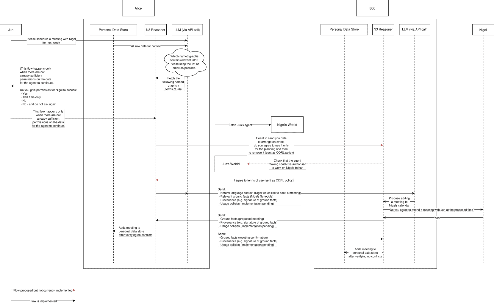

<!--yml

类别：未分类

日期：2025-01-11 12:16:03

-->

# 这里是查理！在大规模语言模型时代实现代理的语义网愿景

> 来源：[https://arxiv.org/html/2409.04465/](https://arxiv.org/html/2409.04465/)

\copyrightclause

本文版权归作者所有。根据《创意共享许可证 4.0 国际版（CC BY 4.0）》允许使用。

\conference

第23届国际语义网会议，2024年11月11日至15日，美国马里兰州汉诺威

[orcid=0000-0002-5771-988X, email=jesse.wright@cs.ox.ac.uk, url=https://www.cs.ox.ac.uk/people/jesse.wright/, ]

Wright    Jesse 计算机科学系，英国牛津大学（2024）

###### 摘要

本文介绍了我们关于一个近期未来的研究，在这个未来中，法律实体（如个人和组织）可以委托半自主的 AI 驱动代理来代表他们进行在线互动。作者的研究关注半自主 Web 代理的开发，这些代理仅在系统缺乏足够的上下文或信心时才会咨询用户，以便继续自主工作。这种设计创造了一个用户与代理之间的对话，允许用户教导代理他们信任的信息来源、数据共享偏好和决策偏好。最终，这使得用户能够最大化对自己数据和决策的控制，同时保持使用代理的便利性，包括那些由大规模语言模型（LLMs）驱动的代理。

针对开发近期解决方案，研究旨在回答一个问题：“我们如何构建一个值得信赖和可靠的半自主代理网络，代表个人和组织在 Web 上进行互动？”。在识别出关键需求后，本文展示了一个通用个人助手的示例用例演示。该演示使用（Notation3）规则来强制执行关于信念、数据共享和数据使用的安全保证，并使用大规模语言模型（LLMs）来实现与用户的自然语言互动和软件代理之间的偶然对话。

###### 关键词：

代理 \sep对话 \sepLLM \sep数据隐私 \sep信任 \sep语义网 \sepSolid 推理器 \sep推理 \sepRDF \sepN3 \sepNotation3 \sepRDF 表面 \sep语义网 \sep证明 \sep证明引擎 \sepSolid

## 1 引言

在多代理系统的通信协议方面，已有大量研究，这在语义网的愿景中得到了体现[[1](https://arxiv.org/html/2409.04465v1#bib.bib1)、[2](https://arxiv.org/html/2409.04465v1#bib.bib2)、[3](https://arxiv.org/html/2409.04465v1#bib.bib3)]，如[Charlie](https://www.w3.org/DesignIssues/Charlie.html)，这个“为你工作的人类智能”（AI）。然而，2006年关于“[b]因为我们尚未实现大规模的基于代理的调解，一些评论者认为语义网失败了”[[4](https://arxiv.org/html/2409.04465v1#bib.bib4)]的感慨今天依然真实。大规模语言模型（LLMs）的日益使用提出了在构建可信赖且可靠的Web代理时面临的关键挑战[[5](https://arxiv.org/html/2409.04465v1#bib.bib5)、[6](https://arxiv.org/html/2409.04465v1#bib.bib6)]。随着LLM研究人员日益关注构建多个LLM之间的对话，这一挑战愈加突出[[7](https://arxiv.org/html/2409.04465v1#bib.bib7)、[8](https://arxiv.org/html/2409.04465v1#bib.bib8)]。此外，最近的研究表明，[语义网有强大的潜力可以补充新兴的LLM技术](https://blog.jeswr.org/2024/04/18/better-ai) [[9](https://arxiv.org/html/2409.04465v1#bib.bib9)]。例如，使用知识图谱的检索增强生成（RAG）已被证明对支持LLM查询非常有效[[10](https://arxiv.org/html/2409.04465v1#bib.bib10)]。因此，语义网堆栈的普遍语义和证明机制对于使用LLM的半自主Web代理的成功发展至关重要。

## 2 设计要求

我们确定了以下针对代理通信协议的非功能性要求。半自主代理必须能够：

1.  1.

    确定Web上法律实体，如个人或组织[[11](https://arxiv.org/html/2409.04465v1#bib.bib11)]，以便可以引用。

1.  2.

    确定性地发现代表某一实体的其他代理，基于它们的Web身份[[11](https://arxiv.org/html/2409.04465v1#bib.bib11)]。这不要求所有代理都公开广告；有些代理可以通过链接到受保护的文档来发现。

1.  3.

    描述并同意与其交换数据相关的任何使用控制[[12](https://arxiv.org/html/2409.04465v1#bib.bib12)、[13](https://arxiv.org/html/2409.04465v1#bib.bib13)、[14](https://arxiv.org/html/2409.04465v1#bib.bib14)]。这允许在阐明接收方的法律或道德义务的同时共享受保护的数据[[15](https://arxiv.org/html/2409.04465v1#bib.bib15)]。

1.  4.

    描述他们交换数据的来源和出处。在一个代理可以“说任何关于任何事情”的开放世界中，系统可以根据代理的内部信任模型来确定在给定任务中应该相信哪些外部声明。

1.  5.

    明确描述他们发送的基础事实和达成的协议，使用正式表示法。考虑一个个体的代理从航空公司代理处购买航班的情况。结构化的基础事实消除了LLM在关键资料解释上的幻想或误解风险，例如航班时间（“10点钟”可能是22:00或10:00）。由于代理代表在绑定协议中的实体，这种方法也通过限制约定条款的主观性，减少了法律争议的风险，从而限制了解释或撤销条款的可能性[[16](https://arxiv.org/html/2409.04465v1#bib.bib16)]。此外，代理可以实施基于规则的内部保障措施，例如用户定义的每日消费限额。真正通用的代理可能会在遇到新任务时生成并传达结构化本体。在许多情况下，我们期望LLM支持的本体构建[[17](https://arxiv.org/html/2409.04465v1#bib.bib17)]能促进生成；然而，仍需要研究以了解（1）代理如何就使用的概念模型达成一致，以及（2）如何在不干扰用户体验的情况下保持人工监督。

1.  6.

    将可能模糊或定义不清的任务进行情境化，使得交互式代理能够以偶然的方式引入新的解决方案空间或谈判行动者。

## 3 示例用例和实现

\qrcode

https://github.com/jeswr/phd-language-dialogue-experiment

我们实现了以下流程，其中代理充当个人用户的私人助手：

1.  1.

    Jun在聊天中输入“安排下周与Nigel的会议”；

1.  2.

    Jun的代理识别需要与Nigel共享的数据，并向Jun请求相关的共享权限（如果尚未获得）；

1.  3.

    Nigel的代理收到Jun的请求；

1.  4.

    Nigel被提示确认他认为Jun是她日历的权威可信来源（如果尚未获得）；

1.  5.

    Nigel的代理向Nigel提出会议时间；并且

1.  6.

    会议被提议给Jun的代理并自动确认。

图1：用于调度用例的流程图。Alice是Jun的代理，Bob是Nigel的代理。

我们创建了一个运行中的演示，包含一个[视频](https://github.com/jeswr/phd-language-dialogue-experiment/tree/main#demo-video)，[流程图](https://raw.githubusercontent.com/jeswr/phd-language-dialogue-experiment/main/flow-diagram.svg)（包括图 [1](https://arxiv.org/html/2409.04465v1#S3.F1 "Figure 1 ‣ 3 Sample Use-Case and Implementation ‣ Here’s Charlie! Realising the Semantic Web vision of Agents in the age of LLMs")）和[其他资源](https://linktr.ee/semiautoweb)，用于[我们的代码库](https://github.com/jeswr/phd-language-dialogue-experiment)¹¹1[https://github.com/jeswr/phd-language-dialogue-experiment](https://github.com/jeswr/phd-language-dialogue-experiment)。该实现对应于上述用例步骤：

1.  1.

    根据用户提示和一组已知的WebID配置文件 [[11](https://arxiv.org/html/2409.04465v1#bib.bib11)]，由Jun的代理调用的LLM会识别代理需要与其协商的相关实体（Nigel）及其WebID。根据用户提示和用户的个人知识图谱，由Jun的代理调用的LLM会识别出需要使用哪些子集（作为命名图列表）用户数据来满足用户的请求。

1.  2.

    Notation3 [[18](https://arxiv.org/html/2409.04465v1#bib.bib18)] 推理用于识别适用于数据子集的策略。在可用的演示录音中，策略被编码在ACP [[12](https://arxiv.org/html/2409.04465v1#bib.bib12)] 中；我们目前正在迁移使用ODRL [[13](https://arxiv.org/html/2409.04465v1#bib.bib13)] 和DPV [[14](https://arxiv.org/html/2409.04465v1#bib.bib14)]。如果这些策略尚未允许对Nigel的读取访问，Jun会被提示修改它们。然后，Jun的代理通过解引用Nigel的WebID [[11](https://arxiv.org/html/2409.04465v1#bib.bib11)] 来发现关于他代理的信息。

1.  3.

    Jun的代理使用LLM构建一条消息，告知Nigel的代理Jun的任务背景：“Jun希望安排下周的会议。请提出Jun和Nigel见面的时间，使用他们的日历。” Jun的代理将这条消息以及Jun日历的RDF描述和任何相关的策略与来源信息一并发送给Nigel的代理。使用ACL时，Nigel的代理不需要同意任何政策义务；使用ODRL时，这一要求会有所变化。此处的来源信息仅仅是使用Jun的公钥对标准化日历数据集 [[19](https://arxiv.org/html/2409.04465v1#bib.bib19)] 进行签名。 

1.  4.

    由于Nigel已经指示他的代理，Jun是所有话题的权威信息来源，因此他的代理相信（将其视为事实）由她的代理发送的签名RDF数据集。我们正在开发代理信任的概念模型；这些模型扩展了现有的信任词汇 [[20](https://arxiv.org/html/2409.04465v1#bib.bib20), [21](https://arxiv.org/html/2409.04465v1#bib.bib21), [22](https://arxiv.org/html/2409.04465v1#bib.bib22), [23](https://arxiv.org/html/2409.04465v1#bib.bib23)]，具有一系列功能，包括：(1) 评估哪些来源在特定类型的声明中可信；例如，大多数代理应信任认证的航空公司提供航班时间和价格，但不应信任医学数据；(2) 评估足够安全的来源形式，适用于特定任务；例如，保险提供商可能要求证明用户在输入财务信息时已通过双因素身份验证登录，才能将其添加到知识库中。

1.  5.

    Nigel的代理提出一个会议时间，使用自然语言上下文（不是事实真相）和日历数据集（事实真相）。LLM提出一个会议时间，然后N3推理机应用规则来（1）确保没有日历冲突，和（2）检查用户确认，然后将提议的时间添加到知识库中。在未来的迭代中，我们计划使用LLM生成一个N3查询，基于Nigel的个人数据存储和Jun的日历来提出一个会议时间。

1.  6.

    在满足上述要求后，推理机将向Jun的代理发送会议提案，以RDF数据集的形式，并附带使用政策和来源信息。Jun的代理确认该数据集可以根据内部信任模型被信任。Jun的代理内部规则验证没有冲突事件。Jun的个人知识库会更新该事件，并向Nigel的代理发送确认。

## 4 结论与未来研究

我们已经实现了一个通用的个人助手，它使用符合第[2](https://arxiv.org/html/2409.04465v1#S2 "2 Design Requirements ‣ Here’s Charlie! Realising the Semantic Web vision of Agents in the age of LLMs")节要求的协议进行通信。未来的工作将通过（1）通过用户研究收集个人代理的需求，以及（2）与行业合作开发专门的代理，包括产品销售代理，使设计要求更加严格。同时，我们将规范用于在代理之间交换来源和使用条款的词汇，并在代理内部建模信任和数据政策，扩展第[3](https://arxiv.org/html/2409.04465v1#S3 "3 Sample Use-Case and Implementation ‣ Here’s Charlie! Realising the Semantic Web vision of Agents in the age of LLMs")节中讨论的这些词汇。一旦这些词汇成熟，我们将制定推理规范，以调解内部表示与交换的元数据之间的关系。这使得代理能够协商以获得足够的来源信息来相信声明，并找到代理之间可接受的数据使用条款，同时通过用户交互不断更新它们的内部模型。

## 致谢

Jesse Wright 由 [计算机科学系](https://www.cs.ox.ac.uk/) 和 [牛津大学](https://www.ox.ac.uk/)资助。

## 参考文献

+   Lassila等人 [2001] O. Lassila, J. Hendler, T. Berners-Lee, 语义网，Scientific American 284 (2001) 34–43。

+   Luke等人 [1997] S. Luke, L. Spector, D. Rager, J. Hendler, 基于本体的Web代理, 在：第一届国际自主代理会议论文集，1997年，pp. 59–66。

+   Poslad [2007] S. Poslad, 为多代理系统交互指定协议，ACM自主与适应系统事务 (TAAS) 2 (2007) 15–es。

+   Shadbolt 等人 [2006] N. Shadbolt, T. Berners-Lee, W. Hall, 语义网再探，IEEE 智能系统 21 (2006) 96–101\. doi:[10.1109/MIS.2006.62](https:/doi.org/10.1109/MIS.2006.62).

+   Deng 等人 [2024] Y. Deng, A. Zhang, Y. Lin, X. Chen, J.-R. Wen, T.-S. Chua, 大语言模型驱动的代理在网络中的应用，《学习 2》 (2024) 20.

+   Sun 等人 [2024] L. Sun, Y. Huang, H. Wang, S. Wu, Q. Zhang, C. Gao, Y. Huang, W. Lyu, Y. Zhang, X. Li, 等人，Trustllm：大语言模型的可信度，arXiv 预印本 arXiv:2401.05561 (2024).

+   Wu 等人 [2023] Q. Wu, G. Bansal, J. Zhang, Y. Wu, S. Zhang, E. Zhu, B. Li, L. Jiang, X. Zhang, C. Wang, Autogen: 通过多智能体对话框架启用下一代 LLM 应用，arXiv 预印本 arXiv:2308.08155 (2023).

+   Deng 等人 [2023] Y. Deng, W. Zhang, W. Lam, S.-K. Ng, T.-S. Chua, 插件式大语言模型驱动对话代理的政策规划器，第十二届国际学习表示会议，2023.

+   Wright [2024] J. Wright, 旧与新——使用语义网技术构建更好的人工智能，2024\. URL: [https://blog.jeswr.org/2024/04/18/better-ai](https://blog.jeswr.org/2024/04/18/better-ai).

+   Kang 等人 [2023] M. Kang, J. M. Kwak, J. Baek, S. J. Hwang, 基于知识图谱的语言模型用于知识驱动的对话生成，arXiv 预印本 arXiv:2305.18846 (2023).

+   Story 等人 [2024] H. Story, T. Berners-Lee, A. Sambra, R. Taelman, J. Scazzosi, Web Identity (WebID) 1.0, W3C Community Group Final Report, W3C, 2024\. [https://w3c.github.io/WebID/spec/identity/](https://w3c.github.io/WebID/spec/identity/).

+   Bosquet [2022] M. Bosquet, 访问控制策略（ACP），Solid 编辑草案，W3C，2022\. [https://w3c.github.io/WebID/spec/identity/](https://w3c.github.io/WebID/spec/identity/).

+   Iannella 和 Villata [2023] R. Iannella, S. Villata, Odrl 信息模型 2.2, 2023\. URL: [https://www.w3.org/TR/2018/REC-odrl-model-20180215/](https://www.w3.org/TR/2018/REC-odrl-model-20180215/).

+   Pandit 等人 [2019] H. J. Pandit, A. Polleres, B. Bos, R. Brennan, B. Bruegger, F. J. Ekaputra, J. D. Fernández, R. G. Hamed, E. Kiesling, M. Lizar, 等人，创建数据隐私词汇：数据隐私词汇与控制社区组（dpvcg）的第一年报告，在：朝向有意义互联网系统的前进：OTM 2019 会议：联合国际会议：CoopIS, ODBASE, C&TC 2019，希腊罗德岛，2019年10月21日至25日，论文集，Springer，2019年，第714-730页。

+   Wright 等人 [2024] J. Wright, B. Esteves, R. Zhao, 我想要饼干！朝着自动化和透明的数据治理迈进，2024\. URL: [https://arxiv.org/abs/2408.09071](https://arxiv.org/abs/2408.09071). [arXiv:2408.09071](http://arxiv.org/abs/2408.09071).

+   Garcia [2024] M. Garcia, Air Canada 在“令人惊讶”的撒谎AI聊天机器人案件中失去了什么，[https://www.forbes.com/sites/marisagarcia/2024/02/19/what-air-canada-lost-in-remarkable-lying-ai-chatbot-case/](https://www.forbes.com/sites/marisagarcia/2024/02/19/what-air-canada-lost-in-remarkable-lying-ai-chatbot-case/)，2024年。[访问时间：2024年7月5日]。

+   Kommineni 等人 [2024] V. K. Kommineni, B. König-Ries, S. Samuel, 从人类专家到机器：一种基于LLM支持的本体和知识图谱构建方法，2024年。网址：[https://arxiv.org/abs/2403.08345](https://arxiv.org/abs/2403.08345)。[arXiv:2403.08345](http://arxiv.org/abs/2403.08345)。

+   Berners-Lee [1998] T. Berners-Lee, Notation3, [http://www.w3.org/DesignIssues/Notation3.html](http://www.w3.org/DesignIssues/Notation3.html) (1998).

+   Longley 等人 [2022] D. Longley, G. Kellogg, D. Yamamoto, M. Sporny, 访问控制政策（ACP），Solid 编辑草案，W3C，2022年。[https://w3c.github.io/WebID/spec/identity/](https://w3c.github.io/WebID/spec/identity/)。

+   Richardson 等人 [2003] M. Richardson, R. Agrawal, P. Domingos, 语义网的信任管理，发表于：国际语义网会议，Springer，2003年，页码：351–368。

+   Galizia [2006] S. Galizia, Wsto：一种基于分类的本体，用于管理语义网服务中的信任，发表于：欧洲语义网会议，Springer，2006年，页码：697–711。

+   Sherchan 等人 [2010] W. Sherchan, S. Nepal, J. Hunklinger, A. Bouguettaya, 一种面向语义服务的信任本体，发表于：2010 IEEE国际服务计算大会，IEEE，2010年，页码：313–320。

+   Amaral 等人 [2019] G. Amaral, T. P. Sales, G. Guizzardi, D. Porello, 面向信任的参考本体，发表于：迈向有意义的互联网系统：OTM 2019会议：联合国际会议：CoopIS, ODBASE, C&TC 2019，希腊罗德岛，2019年10月21–25日，会议论文集，Springer，2019年，页码：3–21。
