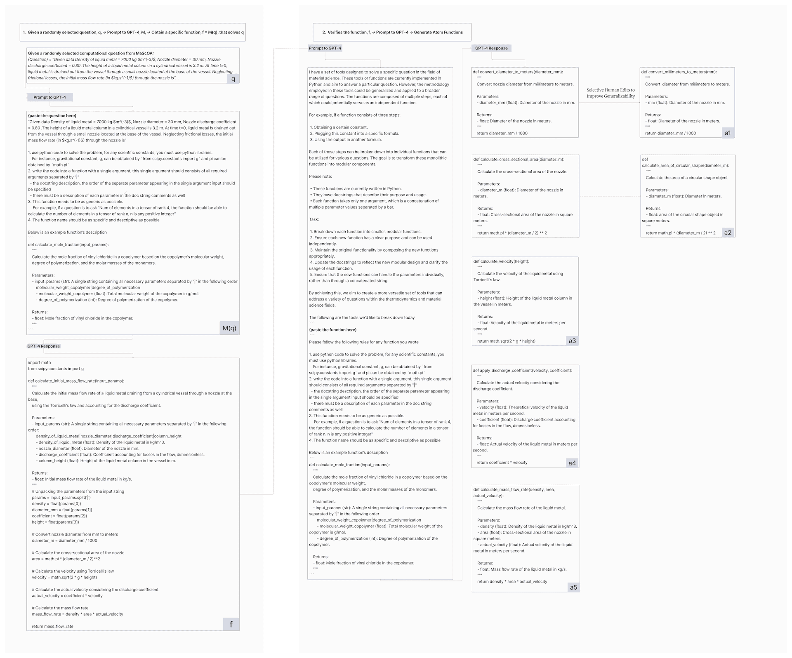

<!--yml

类别：未分类

日期：2025-01-11 12:17:24

-->

# HoneyComb：一个灵活的基于LLM的材料科学智能体系统

> 来源：[https://arxiv.org/html/2409.00135/](https://arxiv.org/html/2409.00135/)

Huan Zhang¹ , Yu Song¹ , Ziyu Hou² , Santiago Miret³ , Bang Liu^(1,4)¹¹脚注标记： 1

¹蒙特利尔大学 / Mila - 魁北克人工智能，²滑铁卢大学，

³英特尔实验室，⁴加拿大CIFAR人工智能主席

{huan.zhang, yu.song, bang.liu}@umontreal.ca

{z26hou}@uwaterloo.ca

{santiago.miret}@intel.com 平等指导。通讯作者。

###### 摘要

专门化的大型语言模型（LLMs）的出现，显示出在解决材料科学复杂任务方面的潜力。然而，许多LLM在应对材料科学任务的独特复杂性时常常力不从心，例如材料科学的计算任务，并且通常过度依赖过时的隐性知识，导致不准确和幻觉现象。为了解决这些挑战，我们介绍了HoneyComb，这是首个专门为材料科学设计的基于LLM的智能体系统。HoneyComb利用了一种新颖的、高质量的材料科学知识库（MatSciKB）和一个复杂的工具中心（ToolHub），以增强其针对材料科学的推理和计算能力。MatSciKB是一个基于可靠文献的策划和结构化的知识集合，而ToolHub采用归纳工具构建方法来生成、分解和优化材料科学的API工具。此外，HoneyComb还利用了一个检索模块，能够自适应地选择适当的知识源或工具，以完成特定任务，从而确保准确性和相关性。我们的结果表明，HoneyComb在材料科学的各种任务中显著超越了基准模型，成功弥合了当前LLM能力与该领域专门需求之间的差距。此外，我们的可扩展框架能够轻松扩展到其他科学领域，展现了它在推动科学研究和应用方面的广泛潜力。

![[无标题图片]](img/17a8232d423e33456855d38766572a43.png) HoneyComb：一个灵活的基于LLM的材料科学智能体系统

Huan Zhang¹ , Yu Song¹ , Ziyu Hou² , Santiago Miret³^†^†感谢：平等指导。 , Bang Liu^(1,4)¹¹脚注标记： 1^†^†感谢：通讯作者。¹蒙特利尔大学 / Mila - 魁北克人工智能，²滑铁卢大学，³英特尔实验室，⁴加拿大CIFAR人工智能主席 {huan.zhang, yu.song, bang.liu}@umontreal.ca {z26hou}@uwaterloo.ca {santiago.miret}@intel.com

## 1 引言

大型语言模型（LLMs）的出现（OpenAI， [2024](https://arxiv.org/html/2409.00135v1#bib.bib26)；Anthropic， [2024](https://arxiv.org/html/2409.00135v1#bib.bib3)；Touvron 等， [2023b](https://arxiv.org/html/2409.00135v1#bib.bib35)， [a](https://arxiv.org/html/2409.00135v1#bib.bib34)）在近年来推动了LLMs在与科学和工程相关的多个领域的应用（AI4Science 和 Quantum， [2023](https://arxiv.org/html/2409.00135v1#bib.bib1)）。这导致了多个新的基准测试，用于衡量语言模型执行科学任务的能力（Wang 等， [2023](https://arxiv.org/html/2409.00135v1#bib.bib40)；Sun 等， [2024](https://arxiv.org/html/2409.00135v1#bib.bib31)；Mirza 等， [2024](https://arxiv.org/html/2409.00135v1#bib.bib25)；Song 等， [2023a](https://arxiv.org/html/2409.00135v1#bib.bib29)），以及为科学领域开发定制LLMs和基于LLM的系统，包括化学（Bran 等， [2023](https://arxiv.org/html/2409.00135v1#bib.bib5)；Boiko 等， [2023](https://arxiv.org/html/2409.00135v1#bib.bib4)），生物学（Madani 等， [2023](https://arxiv.org/html/2409.00135v1#bib.bib22)）和材料科学（Song 等， [2023b](https://arxiv.org/html/2409.00135v1#bib.bib30)；Gupta 等， [2022](https://arxiv.org/html/2409.00135v1#bib.bib13)；Walker 等， [2021](https://arxiv.org/html/2409.00135v1#bib.bib38)）。

尽管在将大规模语言模型（LLMs）适应自然语言处理中的常见任务方面取得了许多进展（Song et al., [2023a](https://arxiv.org/html/2409.00135v1#bib.bib29), [b](https://arxiv.org/html/2409.00135v1#bib.bib30)），但在使LLMs成为现实世界材料科学任务的有效代理方面，仍然面临许多挑战（Miret and Krishnan, [2024](https://arxiv.org/html/2409.00135v1#bib.bib23); Miret et al., [2024](https://arxiv.org/html/2409.00135v1#bib.bib24)）。正如Zaki et al. ([2023](https://arxiv.org/html/2409.00135v1#bib.bib44)) 所指出的那样，LLMs在执行材料科学的重要计算任务时常常失败。大多数LLMs常见的错误包括概念性错误，模型未能检索到与问题相关的正确概念、方程式或事实，以及事实幻觉，生成不正确信息。Miret和Krishnan的分析（[2024](https://arxiv.org/html/2409.00135v1#bib.bib23)）也揭示了LLMs自身在生成与专业材料科学任务相关的准确和恰当信息时的困难。虽然Song et al. ([2023b](https://arxiv.org/html/2409.00135v1#bib.bib30)) 表明指令微调有助于提高性能，但持续的模型训练和微调的高成本使得基于重新训练的方法难以扩展。这一挑战进一步加剧，因为相关知识通过多种知识来源不断更新，包括预印本服务器（例如，arXiv和ChemRxiv）、同行评审的文献、开放百科全书（如Wikipedia）和相关网站。此外，先前的研究表明，利用外部工具可能是解决复杂科学任务的更有前景的方法，而不是完全依赖LLMs的内部知识（Zheng et al., [2024](https://arxiv.org/html/2409.00135v1#bib.bib45); Buehler, [2024a](https://arxiv.org/html/2409.00135v1#bib.bib6)）。为了共同应对这些挑战，我们提出将LLMs转变为基于LLM的代理，访问外部知识和工具以提高其性能。这一方法已经在相邻领域（如化学）中显示出前景（Bran et al., [2023](https://arxiv.org/html/2409.00135v1#bib.bib5); Boiko et al., [2023](https://arxiv.org/html/2409.00135v1#bib.bib4)），通过使模型能够访问实时数据，并利用计算工具以及特定领域的工具。总的来说，基于LLM的代理在能力和性能上优于其原生LLM模型。

在本文中，我们提出了HoneyComb，这是我们所知的首个专门为材料科学设计的基于LLM的代理系统。尽管在科学领域中，基于LLM的研究日益增多，但很少有研究专注于为材料科学开发全面的代理系统。我们的工作解决了两个关键挑战：首先，MatSciKB缓解了获取可靠且相关的材料专业知识的挑战。因此，MatSciKB确保代理能够访问最新且准确的信息，这是有效执行任务的关键。其次，Tool-Hub提供了特定于材料科学的工具，以增强代理的能力。这些工具使代理能够执行专业的计算任务，并增强其整体功能。如[第4节](https://arxiv.org/html/2409.00135v1#S4 "4 实验 ‣ HoneyComb：一个灵活的基于LLM的材料科学代理系统")所述，我们观察到，在MatSciKB和Tool-Hub的帮助下，HoneyComb能够以更可靠的方式超越其本地LLM同类产品，因为它能够利用最新的知识和工具。

## 2 背景

### 2.1 材料科学的LLMs

文本挖掘和从科学出版物中提取信息的进展显著推动了LLM在材料科学中的应用（Kononova et al., [2021](https://arxiv.org/html/2409.00135v1#bib.bib18); Swain 和 Cole, [2016](https://arxiv.org/html/2409.00135v1#bib.bib32)）。早期的工作包括开发专门的BERT模型（Devlin et al., [2018](https://arxiv.org/html/2409.00135v1#bib.bib10)），如MatSciBERT（Gupta et al., [2022](https://arxiv.org/html/2409.00135v1#bib.bib13)）和MatBERT（Walker et al., [2021](https://arxiv.org/html/2409.00135v1#bib.bib38)）。Song et al. ([2023b](https://arxiv.org/html/2409.00135v1#bib.bib30)) 和 Xie et al. ([2023](https://arxiv.org/html/2409.00135v1#bib.bib41)) 利用指令微调开发了一种基于LlaMa的（Touvron et al., [2023a](https://arxiv.org/html/2409.00135v1#bib.bib34)）模型，专门针对材料科学进行了定制，且该模型与当时商业LLM的能力相当。强大的商业LLM的出现（OpenAI, [2024](https://arxiv.org/html/2409.00135v1#bib.bib26); Anthropic, [2024](https://arxiv.org/html/2409.00135v1#bib.bib3)）进一步扩展了LLM在材料科学中的应用可能性。然而，商业LLM仍然价格昂贵，其方法论不透明，且存在持续的错误和不足（Zaki et al., [2023](https://arxiv.org/html/2409.00135v1#bib.bib44); Miret 和 Krishnan, [2024](https://arxiv.org/html/2409.00135v1#bib.bib23)），而用于材料科学的开源LLM仍然稀缺。这推动了对一种实用的、基于LLM的系统的需求，该系统能够有效地用于实际的材料科学任务。

鉴于这一需求，我们提出了HoneyComb作为一个开源系统，以增强各种LLM的能力。HoneyComb集成了专业化工具以及动态检索系统，专门用于提升材料科学领域中LLM的功能。通过利用MatSciKB中的相关知识源和Tool-Hub中的辅助工具，HoneyComb能够提高LLM在材料科学领域输出的准确性和相关性，同时也解决了静态LLM应用在动态研究领域中常见的挑战。

### 2.2 基于工具的LLM代理在科学应用中的应用

先前的研究已证明，通过将多种工具集成到LLM中，可以有效扩展其能力（Qin等，[2023b](https://arxiv.org/html/2409.00135v1#bib.bib28)，[a](https://arxiv.org/html/2409.00135v1#bib.bib27)；Chern等，[2023](https://arxiv.org/html/2409.00135v1#bib.bib9)；Wang等，[2024](https://arxiv.org/html/2409.00135v1#bib.bib39)）。许多研究依赖于预构建的集成框架，如LangChain（Topsakal和Akinci，[2023](https://arxiv.org/html/2409.00135v1#bib.bib33)），以在LLM与所需的功能之间建立相关接口，如搜索引擎API。Wang等（[2024](https://arxiv.org/html/2409.00135v1#bib.bib39)）提供了关于基于工具的LLM的常见方法、挑战和应用的最新调查，并探讨了这些方法在各类技术和科学领域中的应用。

工具驱动的LLM的一个主要应用是在查询处理和优化中，代理评估初始搜索结果，并迭代地优化查询，以提高相关性和准确性 Buehler（[2024a](https://arxiv.org/html/2409.00135v1#bib.bib6), [b](https://arxiv.org/html/2409.00135v1#bib.bib7)）。这种方法解决了孤立的LLM的局限性，因为它们可能难以处理模糊的查询上下文。在生成太阳能电池材料的结构化数据集时，代理从大量科学论文中收集相关信息，以自动化数据输入和综合 Xie 等（[2024](https://arxiv.org/html/2409.00135v1#bib.bib42)）；Liu 等（[2024b](https://arxiv.org/html/2409.00135v1#bib.bib21)）。此外，代理还可以利用各种工具，通过接入外部资源来帮助回答特定问题 Cheng 等（[2024](https://arxiv.org/html/2409.00135v1#bib.bib8)）。例如，Bran 等（[2023](https://arxiv.org/html/2409.00135v1#bib.bib5)）的ChemCrow集成了18种专家设计的工具，如文献搜索、分子修改和反应执行，能够自主执行化学合成。在化学领域的其他研究中，工具增强也取得了成功，借助LLM实现现实世界实验（Yoshikawa 等，[2023](https://arxiv.org/html/2409.00135v1#bib.bib43)；Jablonka 等，[2023](https://arxiv.org/html/2409.00135v1#bib.bib16)；Boiko 等，[2023](https://arxiv.org/html/2409.00135v1#bib.bib4)）。Boiko 等（[2023](https://arxiv.org/html/2409.00135v1#bib.bib4)）的Coscientist例如，依赖专用工具扩展GPT4的能力，从而调用LLM本身不具备的领域特定功能。邻近领域中基于代理的方法的成功激励了HoneyComb的创建，它专门扩展了LLM在材料科学中的应用能力。

## 3 HoneyComb

在这项工作中，我们介绍了HoneyComb，如图[1](https://arxiv.org/html/2409.00135v1#S3.F1 "图1 ‣ 3 HoneyComb ‣ HoneyComb：一个灵活的基于LLM的材料科学代理系统")所示，这是一个专门设计的代理系统，旨在推动材料科学研究。它整合了三个关键组件：1）MatSciKB，一个综合性知识库；2）ToolHub，其中包含用于广泛访问最新信息的一般工具，以及通过归纳工具构建方法开发的用于材料科学查询的专业工具；3）Retriever，采用混合方法以高效且精确地检索信息。

图1：HoneyComb的整体架构。模型从查询输入开始，激活知识检索阶段，在此阶段从MatSciKB和工具中心分别提取相关数据条目和原子功能。执行器（Executor）反复调用工具中心中的相关工具，评估并优化这些调用，直到出现一个足以解决查询的解决方案。这些工具生成的初步解决方案与相关的数据条目结合，然后由检索器（Retriever）进一步处理。最终，检索器整合并过滤这些输入，最终将其传递给LLM以生成最终答案。

### 3.1 MatSciKB

我们的MatSciKB知识库整合了来自多种来源的信息，详细信息见表[1](https://arxiv.org/html/2409.00135v1#S3.T1 "Table 1 ‣ 3.1 MatSciKB ‣ 3 HoneyComb ‣ HoneyComb: A Flexible LLM-Based Agent System for Materials Science")。这一集合经过精心策划，包括来自ArXiv的材料科学论文、相关的维基百科条目、教科书、综合数据集、相关的数学公式以及专门为材料科学定制的具体GPT生成示例。每个信息源的详细描述见附录[A](https://arxiv.org/html/2409.00135v1#A1 "Appendix A MatSciKB Knowledge Source ‣ HoneyComb: A Flexible LLM-Based Agent System for Materials Science")。

MatSciKB的架构框架经过精心设计，分为16个与材料科学相关的不同类别。这些类别的详细信息可以在附录[C](https://arxiv.org/html/2409.00135v1#A3 "Appendix C Tree-Structure MatSciKB ‣ HoneyComb: A Flexible LLM-Based Agent System for Materials Science")中找到，并且以树状结构进行组织。MatSciKB支持高效的搜索和CRUD（创建、读取、更新、删除）操作（Giannaros等， [2023](https://arxiv.org/html/2409.00135v1#bib.bib11)），这些操作对于数据库的应用和持续维护至关重要。考虑到材料科学领域的知识体系持续发展和扩展，基于实时信息的高效更新和搜索能力对于研究和工程应用至关重要。此外，我们的结构化数据方法增强了整合材料科学中常见的多样化数据源的能力（Miret和Krishnan，[2024](https://arxiv.org/html/2409.00135v1#bib.bib23)）。这一结构不仅便于访问和管理，还允许无缝扩展以包含额外的数据模式。

| MatSciKB |
| --- |
| # 数据条目总数 | 38,469 |
|         # Arxiv上的材料科学论文 | 20,384 |
|         # 材料科学维基百科条目 | 3,620 |
|         # 材料科学教科书 | 1,930 |
|         # 材料科学数据集 | 10,473 |
|         # 材料科学公式 | 57 |
|         # GPT生成的示例 | 2,005 |

表1：MatSciKB知识库的统计数据

### 3.2 工具中心

HoneyComb中的工具中心被分为通用工具和材料科学工具。两大类工具通过统一的界面进行组织，使HoneyComb能够有效地利用所有可用的工具。通用工具为研究人员提供了访问最新信息的途径，填补了MatSciKB中静态条目未涵盖的空白。材料科学工具则专门设计用于处理复杂的计算和深入的分析。统一界面的详细信息将在附录[D](https://arxiv.org/html/2409.00135v1#A4 "附录D 使用LangChain的工具统一界面 ‣ HoneyComb: 基于LLM的灵活材料科学代理系统")中进一步阐述。

通用工具构建

在材料科学领域，一个持续的挑战是保持研究成果与描述复杂材料系统的多样化和不断发展的数据形式一致（Miret和Krishnan，[2024](https://arxiv.org/html/2409.00135v1#bib.bib23)）。数据来源和测量的多样性导致该领域知识的快速演变，这要求能够有效访问和整合最新研究成果的工具。传统的静态数据库虽然有用，但往往滞后于最新的研究进展，造成空白，从而妨碍了科学分析在实时中的时效性和相关性。此外，研究工作流程中高效处理复杂和动态计算任务的需求尚未得到充分解决，通常需要人工干预，这可能会引入错误和低效。因此，构建能够处理各种数据形式和复杂性的工具，并能够适应材料科学不断进步的工具，对于推动该领域的发展至关重要。

为了应对这些挑战，HoneyComb设计了创新的解决方案，显著增强了材料科学领域的研究能力。首先，我们集成了通用工具，提供了对当前出版物的直接访问，并促进了动态讨论，如表[2](https://arxiv.org/html/2409.00135v1#S3.T2 "表2 ‣ 3.2 工具中心 ‣ 3 HoneyComb ‣ HoneyComb: 基于LLM的灵活材料科学代理系统")所示，有效地补充了静态的MatSciKB。其次，鉴于大型语言模型（LLMs）在执行计算任务方面的局限性，我们在HoneyComb中实现了一个Python REPL环境。当代理与工具中心交互并识别出需要进行基础数值计算时，系统会策略性地使用该环境。代理动态编写Python代码来执行这些任务，并通过Python REPL执行，从而绕过LLM的计算限制。这一自动化不仅简化了数据处理，还提高了数值分析在研究活动中的精确性和可靠性。

| 通用工具 | 6 |
| --- | --- |
| 谷歌搜索 |  |
| 谷歌学术搜索 |  |
| Arxiv搜索 |  |
| 维基百科搜索 |  |
| YouTube搜索 |  |
| Python REPL |  |

表 2: ToolHub: 一般工具

算法 1 归纳式工具构建

0:训练集 $D_{train}$, LLM $M$ 0: 原子工具集 $A$ 1:  $A\leftarrow\emptyset$ {初始化原子函数集合} 2:对于每个问题$q_{i}$在$D_{train}$中 3:     $f_{i}\leftarrow M(q_{i})$ {为$q_{i}$生成特定函数} 4:人工验证$f_{i}$ 5:将$f_{i}$分解为原子函数$a_{i}$ 6:     $A\leftarrow A\cup a_{i}$ {将原子函数添加到集合中} 7:  结束 for 8:  返回  $A$

材料科学的归纳式工具构建

构建领域特定的工具API面临重大挑战。它需要领域专家的知识，而且现有的资源有限，难以借鉴。此外，许多有价值的数据和工具并不是开源的，限制了它们的可访问性。开发这些工具对于有效解决材料科学中固有的独特且复杂的查询问题至关重要。现有的专用计算工具的稀缺性要求在工具构建和完善过程中采取系统的方法。

我们提出了归纳式工具构建方法，该方法在算法[1](https://arxiv.org/html/2409.00135v1#alg1 "算法 1 ‣ 3.2 Tool-Hub ‣ 3 HoneyComb ‣ HoneyComb: A Flexible LLM-Based Agent System for Materials Science")中详细描述，用于构建领域特定的工具API。该方法采用系统化的方式来制造和完善专门为材料科学查询设计的计算工具。该过程首先从数据集$D$中随机选择一部分计算问题，指定为$D_{train}$用于训练，剩余问题形成$D_{test}$。对于每个问题$q_{i}\in D_{train}$，指定的LLM（如GPT-4）被要求生成一个Python函数$f_{i}$来解决$q_{i}$。函数创建后，每个$f_{i}$都经过严格的人为验证，以确认其正确性。

然而，上述过程无法确保构建的工具API具有良好的泛化能力。因此，在验证后阶段，我们进一步使用$M$将每个$f_{i}$分解为基本的、可重用的组件，即原子函数$a_{i}$，这些原子函数专为广泛适用于不同查询而设计，详细示例见附录[E](https://arxiv.org/html/2409.00135v1#A5 "附录 E 归纳式工具构建示例 ‣ HoneyComb: A Flexible LLM-Based Agent System for Materials Science")。

### 3.3 代理-工具中心交互

在HoneyComb中，代理与Tool-Hub之间的交互遵循一个结构化的两阶段决策协议。我们的协议强调对数据的关键选择和处理，以确保只有相关信息会影响LLM的决策。该方法对于防止模型性能因无关或低质量输入而下降至关重要（刘等，[2024a](https://arxiv.org/html/2409.00135v1#bib.bib20)）。

1\. 工具评估器：在初始阶段，评估器评估传入的查询和Tool-Hub中的广泛工具集合。此评估旨在识别出一组可管理的、最相关的工具子集，这些工具最适合解决查询的具体需求。通过在此阶段筛选掉无关的工具，我们确保执行器只获得相关信息，从而优化模型的关注点并增强其准确解决问题的能力。

2\. 工具执行器：如图[2](https://arxiv.org/html/2409.00135v1#S3.F2 "Figure 2 ‣ 3.3 Agent-Tool Hub Interactions ‣ 3 HoneyComb ‣ HoneyComb: A Flexible LLM-Based Agent System for Materials Science")所示，执行器接收原始查询和评估者选择的工具子集。在评估所选工具和查询后，执行器进行思考，以确定最合适的工具来解决查询。如果查询的复杂性超过单个工具的能力，执行器会识别出这一挑战，并将查询分解为更小的子问题。这种策略允许按顺序处理每个部分，从选择初始子问题的最佳工具开始。然后，它启动执行选定工具的操作，同时输入从查询或子问题中得出的参数值，称为操作输入。执行后，工具生成一个结果，称为观察结果。随后，执行器进入反思过程，以评估观察结果是否充分解决了查询。如果观察结果充分，它将被定为答案；如果不足，过程将通过调整进行重试，或在原始查询被分割成多个部分的情况下，转向下一个子问题。

图2：HoneyComb中工具评估器与执行器的交互循环。

### 3.4 检索器  

在本节中，我们介绍了HoneyComb中的检索器，它在给定特定上下文时，从MatSciKB和Tool-Hub中返回相关的文本或工具。检索器集成了BM25（Trotman等，[2014](https://arxiv.org/html/2409.00135v1#bib.bib36)）和Contriever（Izacard等，[2022](https://arxiv.org/html/2409.00135v1#bib.bib15)）模型，利用它们各自的优势，以实现最佳的信息检索性能。

具体而言，检索器采用了两步策略。首先，BM25利用高效的词频和逆文档频率计算，快速处理短文本查询和长文档中的关键词搜索。BM25的主要优势在于其计算简单且响应迅速，使得HoneyComb能够从庞大的材料科学知识库中提取最相关的N个知识点，确保卓越的速度和效率。这种方法能够在最短的时间内提供基本的相关性匹配结果。

随后，我们采用了预训练的深度学习模型（即Contriever）来生成嵌入向量并计算其相似性，帮助理解复杂的语言结构和语义信息。Contriever的优势在于其能够理解并处理复杂的语言结构、上下文信息和语义关系，从而提供更精准、全面的检索结果。尽管Contriever的运行速度比BM25慢，但它能够从知识库和记忆中提取最相关的结果，还能从通过Tool-Hub调用的工具中提取前3个结果。它能够精准地处理复杂查询和多样化文档，确保高准确性和相关性。

通过结合BM25和Contriever，我们的模型能够快速响应简单查询，同时在处理复杂查询时提供更高的准确性和相关性。这种混合方法确保了模型既高效，又能满足复杂查询的要求，从而提供全面、高效、精准的信息检索服务。

## 4 实验

我们在两个问答数据集上进行实验，即MaScQA Zaki等人（[2023](https://arxiv.org/html/2409.00135v1#bib.bib44)）和SciQA Johannes Welbl（[2017](https://arxiv.org/html/2409.00135v1#bib.bib17)），以调查HoneyComb在材料科学任务中的能力。

MaScQA 来源于印度的研究生工程能力考试（GATE），旨在反映材料科学中遇到的实际复杂性和多样性问题。这个高度竞争的考试评估了印度理工学院坎普尔分校（[2023](https://arxiv.org/html/2409.00135v1#bib.bib14)）；Zaki 等人（[2023](https://arxiv.org/html/2409.00135v1#bib.bib44)）对各种本科课程的全面理解。它包含 650 道题目，涵盖了热力学、原子结构和力学行为等 14 个领域，展示了多种类型的问题，从选择题（MCQs）、数值答案题型（NUM）到匹配题型（MATCH），以及带有数值选项的选择题（MCQN）。该数据集专为高级问题解决设计，对于确保我们的 ToolHub 在实际材料科学研究和应用中有效运行至关重要。它展示了 HoneyComb 框架在应对现实情境中复杂材料科学问题方面的高效性和适应性。第二个数据集 SciQA 包含 11,679 道多项选择题，涵盖了来自各种众包科学考试的基础科学核心学科（Johannes Welbl [2017](https://arxiv.org/html/2409.00135v1#bib.bib17)）。这份汇编不仅强调了数据集的综合性和跨学科特性，还着重于培养细致的概念理解。SciQA 作为一个关键的测试平台，旨在验证 HoneyComb 框架是否能够增强 LLM 的能力，超越其初始编程。通过整合补充信息，它有助于解答复杂的查询，并揭示在 LLM 初始训练阶段可能被忽视的复杂科学概念。通过将现实世界的复杂性与严格的学术标准相结合，这些数据集确保我们的 MatSciKB 和 ToolHub 不仅具有多功能性，而且始终走在技术和科学应用的前沿。

我们选择用于实验的模型是基于评估HoneyComb框架在一系列大规模语言模型中增强能力的需要，这些模型以其在多种应用中的强大表现而闻名。我们选择了GPT-3.5、GPT-4（OpenAI，[2024](https://arxiv.org/html/2409.00135v1#bib.bib26)）、LLaMA-2（Touvron等人，[2023b](https://arxiv.org/html/2409.00135v1#bib.bib35)）和LLaMA-3（AI@Meta，[2024](https://arxiv.org/html/2409.00135v1#bib.bib2)），因为它们在处理复杂语言任务中的广泛应用和 proven effectiveness。LLaMA-2和LLaMA-3的参数分别为70亿和80亿，代表了当前在通用语言理解领域的最先进水平，为基准测试提供了坚实的基础。此外，我们还包括了HoneyBee（Song等人，[2023b](https://arxiv.org/html/2409.00135v1#bib.bib30)），一款专为材料科学定制的7亿参数模型。通过同时包含通用模型和专业模型，我们展示了如何通过HoneyComb进行领域特定的调整，提升模型的功能范围，超越其原始配置，从而突显了我们框架的适应性和有效性。

### 4.1 HoneyComb评估

数据集 HoneyBee HoneyBee + ![[无标题图像]](img/aaafd140ff0698f4000203e165c3116d.png) GPT-3.5 GPT-3.5 + ![[无标题图像]](img/aaafd140ff0698f4000203e165c3116d.png) GPT-4 GPT-4 + ![[无标题图像]](img/aaafd140ff0698f4000203e165c3116d.png) Llama2 Llama2 + ![[无标题图像]](img/aaafd140ff0698f4000203e165c3116d.png) Llama3 Llama3 + ![[无标题图像]](img/aaafd140ff0698f4000203e165c3116d.png)  MaScQA 16.62 33.38 33.54 38.46 58.46 79.07 22.15 36.31 24.62 47.23  SciQA 33.96 79.69 90.69 90.83 90.84 96.54 75.79 78.66 93.00 93.32

表3：HoneyComb在多种LLMs上的评估，包括开源LLMs（HoneyBee（Song等人，[2023b](https://arxiv.org/html/2409.00135v1#bib.bib30)），LlaMa2（Touvron等人，[2023b](https://arxiv.org/html/2409.00135v1#bib.bib35)），LlaMa3（AI@Meta，[2024](https://arxiv.org/html/2409.00135v1#bib.bib2)））和商业LLMs（GPT-3.5，GPT-4（OpenAI，[2024](https://arxiv.org/html/2409.00135v1#bib.bib26)））。结果表明，HoneyComb持续提升了所有LLMs在SciQA和MaScQA任务中的表现。

图3：将HoneyComb与不同材料科学任务相关的基准LLMs进行集成后，各种LLMs的改进效果。除少数例外，HoneyComb在所有任务中提升了所有LLMs的性能，展示了工具增强的实用性。

我们评估了在MaScQA和SciQA上使用不同模型的性能，包括HoneyBee、GPT-3.5、GPT-4、Llama2和Llama3，并展示了使用HoneyComb的效果。结果如表[3](https://arxiv.org/html/2409.00135v1#S4.T3 "Table 3 ‣ 4.1 HoneyComb Evaluation ‣ 4 Experiments ‣ HoneyComb: A Flexible LLM-Based Agent System for Materials Science")所示。

实验结果表明，所有基于HoneyComb的模型在MaScQA和SciQA上的准确性都有显著提升。具体来说，在MaScQA数据集上，像HoneyBee和GPT-4这样的模型取得了显著的改进，其中HoneyBee的准确性提高了16.76%，GPT-4提高了20.61%。其他模型也表现出显著的提升，改进幅度从4.92%到14.16%不等。在SciQA数据集上，HoneyBee模型的表现大幅提升，改进幅度高达45.73%。基于GPT-3.5和Llama3的HoneyComb显示出较为温和的提升，约为0.14%到0.32%，而基于GPT-4和Llama2的HoneyComb则分别表现出了约5.70%和2.87%的显著改进。

### 4.2 HoneyComb在MaScQA上的评估

我们评估了将HoneyComb框架与不同的大型语言模型集成时在MaScQA数据集中的各个预定义主题上的性能提升，如图[3](https://arxiv.org/html/2409.00135v1#S4.F3 "Figure 3 ‣ 4.1 HoneyComb Evaluation ‣ 4 Experiments ‣ HoneyComb: A Flexible LLM-Based Agent System for Materials Science")所示。总体趋势表明，HoneyComb显著提高了模型的性能。LLaMA-3和HoneyBee展示了令人印象深刻的提升，特别是在“材料测试”领域，观察到33.34个百分点的提升，展示了HoneyComb在有效增强模型方面的能力，借助其先进的Tool-Hub和广泛的MatSciKB。

然而，GPT-3.5表现出独特的趋势，在多个主题上出现下降，包括原子结构、流体、磁学、材料加工和材料测试。尽管其基线准确性高于LLaMA-3、LLaMA-2和HoneyBee，但当与HoneyComb结合时，GPT-3.5的表现更频繁地下降。这可能与其训练数据的范围和深度有关，尽管数据非常广泛，但可能与HoneyComb在材料科学领域的高度专业化增强并不完全契合。材料科学查询的复杂计算需求和动态特性可能暴露出GPT-3.5在将已有知识适应HoneyComb特定增强功能方面的局限性。这种细致的理解突显了模型和工具兼容性的重要性，以便在各个材料科学领域实现有效的增强，从而为HoneyComb的进一步发展和优化提供参考，确保在材料科学研究的各个领域都能提供全面和可靠的支持。

### 4.3 消融研究

为了研究 HoneyComb 中每个组件对整体性能的贡献，我们在本节进行了消融实验。我们分别测试了 HoneyComb 仅从 MatSciKB 或仅从 Tool Hub 中检索时的性能。我们还报告了在没有检索器的情况下的结果，在这种情况下，MatSciKB 和 ToolHub 的结果无法输入模型。实验结果见表 [4](https://arxiv.org/html/2409.00135v1#S4.T4 "Table 4 ‣ 4.3 Ablation Study ‣ 4 Experiments ‣ HoneyComb: A Flexible LLM-Based Agent System for Materials Science")。

表 4：基于 GPT-4 的 MaScQA 和 SciQA 消融研究结果

基准 MatSciKB ToolHub 检索器 准确率 MaScQA 61.38 ✓ ✓ 73.23 ✓ ✓ 78.31 ✓ ✓ ✓ 79.07 SciQA 90.84 ✓ ✓ 96.34 ✓ ✓ 85.57 ✓ ✓ ✓ 96.56

实验结果表明，当同时使用 MatSciKB 和 ToolHub 作为可靠的材料知识参考时，性能最佳。与仅从 MatSciKB 检索相比，HoneyComb 在 MaScQA 和 SciQA 上的正确率分别提高了 0.76% 和 10.99%；与仅从 Tool Hub 检索相比，HoneyComb 在 MaScQA 和 SciQA 上的正确率分别提高了 5.84% 和 0.22%。因此，我们建议用户在部署或使用 HoneyComb 时同时从这两个来源进行检索。

## 5 结论

在这项工作中，我们介绍了 HoneyComb，一种专为材料科学量身定制的开创性 LLM-based 代理系统。HoneyComb 集成了一个精心策划的材料科学知识库（MatSciKB）和一个双层 ToolHub，涵盖了通用和专业计算工具。它结合了三个关键组件：MatSciKB、一个归纳构建的 ToolHub 和一个精确聚焦的 Retriever 模块。这确保了 HoneyComb 提供准确、最新的信息，并可靠地执行复杂的计算任务。

实验结果表明，HoneyComb 在材料科学问答任务中超越了当代的通用模型（例如 GPT 和 LLaMa 系列）以及专业化模型（例如 HoneyBee）。HoneyComb 有效地弥合了先进的大型语言模型与材料科学研究特定需求之间的差距，展示了专门的智能代理系统如何推动科学研究，并为其他知识密集型领域未来的进展提供了蓝图。

## 限制

尽管 HoneyComb 在多种材料科学问答任务中显著提升了当前最先进模型的表现，但其在特定数据集和任务之外的泛化性和适用性仍然有限。材料科学是一个多样且复杂的领域，目前尚不清楚 HoneyComb 在 MaScQA 和 SciQA 基准之外的任务中表现如何，尤其是在材料科学中面对更复杂和新颖的挑战时。这些挑战可能包括为新材料设计合成配方或预测材料性质。

此外，HoneyComb 依赖于高质量的大语言模型作为知识库、工具构建和检索过程，这可能是一个限制因素。这些组件的性能取决于基础大语言模型的可用性和能力，而这些模型本身可能存在固有的局限性。此外，我们的工作主要集中在材料科学领域，未来需要更多研究来评估 HoneyComb 在其他科学领域的适用性和有效性。

## 更广泛的影响

通过扩展 HoneyComb 智能体系统，HoneyComb 有潜力加速科学发现和创新，促进对复杂材料系统的更深理解。这不仅可能推动材料设计、开发和应用的进步，还能够促进新材料的发现和优化，惠及广泛的行业。此外，HoneyComb 的多功能性和适应性使其能够应对各个科学领域的挑战，进一步扩大其范围和影响。

我们的研究没有引发重大的伦理问题。

## 参考文献

+   AI4Science 和量子 (2023) Microsoft Research AI4Science 和 Microsoft Azure Quantum. 2023. [大语言模型对科学发现的影响：基于 GPT-4 的初步研究](https://arxiv.org/abs/2311.07361). *arXiv 预印本 arXiv:2311.07361*。

+   AI@Meta (2024) AI@Meta. 2024. [Llama 3 模型卡](https://github.com/meta-llama/llama3/blob/main/MODEL_CARD.md)。

+   Anthropic (2024) Anthropic. 2024. [Calude3](https://www.anthropic.com/news/claude-3-family)。

+   Boiko 等（2023）Daniil A Boiko, Robert MacKnight, Ben Kline, 和 Gabe Gomes. 2023. 使用大语言模型进行自主化学研究. *自然*, 624(7992):570–578。

+   Bran 等（2023）Andres M Bran, Sam Cox, Oliver Schilter, Carlo Baldassari, Andrew D White, 和 Philippe Schwaller. 2023. [Chemcrow: 使用化学工具增强大语言模型](https://arxiv.org/abs/2304.05376). *预印本*, arXiv:2304.05376。

+   Buehler (2024a) Markus J. Buehler. 2024a. [生成性检索增强本体图和多智能体策略用于基于大语言模型的材料设计](https://doi.org/10.1021/acsengineeringau.3c00058). *ACS Engineering Au*, 4(2):241–277。

+   Buehler (2024b) Markus J Buehler. 2024b. Mechgpt，一种基于语言的策略，用于力学和材料建模，能够跨尺度、学科和模态连接知识。*应用力学评论*, 76(2):021001。

+   Cheng 等（2024）Yuheng Cheng, Ceyao Zhang, Zhengwen Zhang, Xiangrui Meng, Sirui Hong, Wenhao Li, Zihao Wang, Zekai Wang, Feng Yin, Junhua Zhao, 和 Xiuqiang He. 2024. [探索基于大语言模型的智能体：定义、方法和前景](https://arxiv.org/abs/2401.03428). *预印本*, arXiv:2401.03428。

+   Chern 等人（2023）I-Chun Chern, Steffi Chern, Shiqi Chen, Weizhe Yuan, Kehua Feng, Chunting Zhou, Junxian He, Graham Neubig, Pengfei Liu 等人。2023年。Factool：生成性 AI 中的事实性检测——一个增强工具框架，适用于多任务和多领域场景。*arXiv 预印本 arXiv:2307.13528*。

+   Devlin 等人（2018）Jacob Devlin, Ming-Wei Chang, Kenton Lee, 和 Kristina Toutanova。2018年。Bert：用于语言理解的深度双向变换器的预训练。*arXiv 预印本 arXiv:1810.04805*。

+   Giannaros 等人（2023）Anastasios Giannaros, Aristeidis Karras, Leonidas Theodorakopoulos, Christos Karras, Panagiotis Kranias, Nikolaos Schizas, Gerasimos Kalogeratos, 和 Dimitrios Tsolis。2023年。自动驾驶汽车：复杂攻击、安全问题、挑战、开放议题、区块链和未来方向。*网络安全与隐私杂志*，3(3)：493–543。

+   Grootendorst（2022）Maarten Grootendorst。2022年。[Bertopic：基于类的 tf-idf 程序的神经主题建模](https://arxiv.org/abs/2203.05794)。*预印本*，arXiv:2203.05794。

+   Gupta 等人（2022）Tanishq Gupta, Mohd Zaki, NM Krishnan 等人，2022年。Matscibert：一种用于文本挖掘和信息提取的材料领域语言模型。*npj 计算材料学*，8(1)：1–11。

+   印度理工学院坎普尔分校（2023）印度理工学院坎普尔分校。2023年。[Gate 2023：工程研究生入学考试](https://gate.iitk.ac.in/GATE2023/index.html)。访问时间：2024年6月14日。

+   Izacard 等人（2022）Gautier Izacard, Mathilde Caron, Lucas Hosseini, Sebastian Riedel, Piotr Bojanowski, Armand Joulin, 和 Edouard Grave。2022年。[通过对比学习进行无监督的稠密信息检索](https://openreview.net/forum?id=jKN1pXi7b0)。*机器学习研究学报*。

+   Jablonka 等人（2023）Kevin Maik Jablonka, Qianxiang Ai, Alexander Al-Feghali, Shruti Badhwar, Joshua D Bocarsly, Andres M Bran, Stefan Bringuier, L Catherine Brinson, Kamal Choudhary, Defne Circi 等人。2023年。LLM 如何改变材料科学与化学的 14 个实例：关于大型语言模型黑客马拉松的反思。*数字发现*，2(5)：1233–1250。

+   Johannes Welbl（2017）Matt Gardner Johannes Welbl, Nelson F. Liu。2017年。众包多项选择科学问题。

+   Kononova 等人（2021）Olga Kononova, Tanjin He, Haoyan Huo, Amalie Trewartha, Elsa A Olivetti, 和 Gerbrand Ceder。2021年。材料研究中文本挖掘的机遇与挑战。*Iscience*，24(3)。

+   LangChain 贡献者（2023）LangChain 贡献者。2023年。[Langchain：用于构建基于语言的智能体的开源库](https://github.com/langchain-ai/langchain)。在线；访问时间：2023年6月17日。

+   Liu 等人（2024a）Nelson F. Liu, Kevin Lin, John Hewitt, Ashwin Paranjape, Michele Bevilacqua, Fabio Petroni, 和 Percy Liang。2024a年。[Lost in the Middle: How Language Models Use Long Contexts](https://doi.org/10.1162/tacl_a_00638)。*计算语言学协会学报*，12：157–173。

+   Liu 等 (2024b) Yue Liu, Sin Kit Lo, Qinghua Lu, Liming Zhu, Dehai Zhao, Xiwei Xu, Stefan Harrer 和 Jon Whittle. 2024b. [代理设计模式目录：基于基础模型的代理的架构模式集合](https://arxiv.org/abs/2405.10467). *预印本*, arXiv:2405.10467。

+   Madani 等 (2023) Ali Madani, Ben Krause, Eric R. Greene, Subu Subramanian, Benjamin P. Mohr, James M. Holton, Jose Luis Olmos, Caiming Xiong, Zachary Z. Sun, Richard Socher, James S. Fraser 和 Nikhil Naik. 2023. [大型语言模型生成不同家族的功能性蛋白质序列](https://doi.org/10.1038/s41587-022-01618-2). *Nat. Biotechnol.*, 41(8):1099–1106。

+   Miret 和 Krishnan (2024) Santiago Miret 和 NM Krishnan. 2024. 大型语言模型是否准备好进行现实世界的材料发现？*arXiv 预印本 arXiv:2402.05200*。

+   Miret 等 (2024) Santiago Miret, NM Anoop Krishnan, Benjamin Sanchez-Lengeling, Marta Skreta, Vineeth Venugopal 和 Jennifer N Wei. 2024. 关于 AI 在加速材料设计中的应用展望——来自 neurips 2023 的 ai4mat-2023 研讨会。*Digital Discovery*。

+   Mirza 等 (2024) Adrian Mirza, Nawaf Alampara, Sreekanth Kunchapu, Benedict Emoekabu, Aswanth Krishnan, Mara Wilhelmi, Macjonathan Okereke, Juliane Eberhardt, Amir Mohammad Elahi, Maximilian Greiner 等人. 2024. 大型语言模型是超人类化学家吗？*arXiv 预印本 arXiv:2404.01475*。

+   OpenAI (2024) OpenAI. 2024. [OpenAI](https://openai.com/). 访问日期：2024-06-14。

+   Qin 等 (2023a) Yujia Qin, Shengding Hu, Yankai Lin, Weize Chen, Ning Ding, Ganqu Cui, Zheni Zeng, Yufei Huang, Chaojun Xiao, Chi Han, Yi Ren Fung, Yusheng Su, Huadong Wang, Cheng Qian, Runchu Tian, Kunlun Zhu, Shihao Liang, Xingyu Shen, Bokai Xu, Zhen Zhang, Yining Ye, Bowen Li, Ziwei Tang, Jing Yi, Yuzhang Zhu, Zhenning Dai, Lan Yan, Xin Cong, Yaxi Lu, Weilin Zhao, Yuxiang Huang, Junxi Yan, Xu Han, Xian Sun, Dahai Li, Jason Phang, Cheng Yang, Tongshuang Wu, Heng Ji, Zhiyuan Liu 和 Maosong Sun. 2023a. [使用基础模型进行工具学习](https://arxiv.org/abs/2304.08354). *预印本*, arXiv:2304.08354。

+   Qin 等 (2023b) Yujia Qin, Shihao Liang, Yining Ye, Kunlun Zhu, Lan Yan, Yaxi Lu, Yankai Lin, Xin Cong, Xiangru Tang, Bill Qian 等人. 2023b. Toolllm: 促进大型语言模型掌握超过 16000 个现实世界的 API。*arXiv 预印本 arXiv:2307.16789*。

+   Song 等 (2023a) Yu Song, Santiago Miret 和 Bang Liu. 2023a. [MatSci-NLP: 通过文本到模式建模评估材料科学语言任务中的科学语言模型](https://doi.org/10.18653/v1/2023.acl-long.201). 在 *第61届计算语言学会年会（第1卷：长篇论文）论文集*，第3621-3639页，加拿大多伦多。计算语言学协会。

+   Song等人（2023b）Yu Song, Santiago Miret, Huan Zhang, 和 Bang Liu. 2023b. Honeybee：用于材料科学的大语言模型的渐进式指令微调。发表于 *计算语言学协会发现：EMNLP 2023*，页码5724–5739。

+   Sun等人（2024）Liangtai Sun, Yang Han, Zihan Zhao, Da Ma, Zhennan Shen, Baocai Chen, Lu Chen, 和 Kai Yu. 2024. Scieval：一个用于科学研究的多层次大语言模型评估基准。发表于 *AAAI人工智能会议论文集*，第38卷，页码19053–19061。

+   Swain和Cole（2016）Matthew C Swain 和 Jacqueline M Cole. 2016. Chemdataextractor：一个自动化提取化学信息的工具包。发表于 *化学信息与建模期刊*，56(10):1894–1904。

+   Topsakal和Akinci（2023）Oguzhan Topsakal 和 Tahir Cetin Akinci. 2023. 利用LangChain创建大语言模型应用：快速开发LLM应用的入门教程。发表于 *国际应用工程与自然科学会议*，第1卷，页码1050–1056。

+   Touvron等人（2023a）Hugo Touvron, Thibaut Lavril, Gautier Izacard, Xavier Martinet, Marie-Anne Lachaux, Timothée Lacroix, Baptiste Rozière, Naman Goyal, Eric Hambro, Faisal Azhar, Aurelien Rodriguez, Armand Joulin, Edouard Grave, 和 Guillaume Lample. 2023a. [Llama：开放且高效的基础语言模型](https://arxiv.org/abs/2302.13971). *预印本*，arXiv:2302.13971。

+   Touvron等人（2023b）Hugo Touvron, Louis Martin, Kevin Stone, Peter Albert, Amjad Almahairi, Yasmine Babaei, Nikolay Bashlykov, Soumya Batra, Prajjwal Bhargava, Shruti Bhosale, Dan Bikel, Lukas Blecher, Cristian Canton Ferrer, Moya Chen, Guillem Cucurull, David Esiobu, Jude Fernandes, Jeremy Fu, Wenyin Fu, Brian Fuller, Cynthia Gao, Vedanuj Goswami, Naman Goyal, Anthony Hartshorn, Saghar Hosseini, Rui Hou, Hakan Inan, Marcin Kardas, Viktor Kerkez, Madian Khabsa, Isabel Kloumann, Artem Korenev, Punit Singh Koura, Marie-Anne Lachaux, Thibaut Lavril, Jenya Lee, Diana Liskovich, Yinghai Lu, Yuning Mao, Xavier Martinet, Todor Mihaylov, Pushkar Mishra, Igor Molybog, Yixin Nie, Andrew Poulton, Jeremy Reizenstein, Rashi Rungta, Kalyan Saladi, Alan Schelten, Ruan Silva, Eric Michael Smith, Ranjan Subramanian, Xiaoqing Ellen Tan, Binh Tang, Ross Taylor, Adina Williams, Jian Xiang Kuan, Puxin Xu, Zheng Yan, Iliyan Zarov, Yuchen Zhang, Angela Fan, Melanie Kambadur, Sharan Narang, Aurelien Rodriguez, Robert Stojnic, Sergey Edunov, 和 Thomas Scialom. 2023b. [Llama 2：开放的基础和微调的聊天模型](https://arxiv.org/abs/2307.09288). *预印本*，arXiv:2307.09288。

+   Trotman等人（2014）Andrew Trotman, Antti Puurula, 和 Blake Burgess. 2014. 对BM25和语言模型的改进分析。发表于 *第19届澳大利亚文档计算研讨会论文集*，页码58–65。

+   瓦斯瓦尼等人（2023）阿希什·瓦斯瓦尼、诺姆·沙泽尔、尼基·帕尔马尔、雅各布·乌斯科雷特、利昂·琼斯、艾丹·N·戈麦斯、卢卡斯·凯泽和伊利亚·波洛苏金。2023年。[Attention is all you need](https://arxiv.org/abs/1706.03762)。*预印本*，arXiv:1706.03762。

+   沃克等人（2021）尼古拉斯·沃克、阿玛丽·特雷瓦尔萨、浩彦·霍、尚勋·李、凯文·克鲁斯、约翰·达格德伦、亚历山大·邓恩、克里斯汀·佩尔森、格尔布兰德·塞德尔和阿努巴夫·贾因。2021年。《领域特定预训练对材料科学中命名实体识别任务的影响》。*可在SSRN 3950755获取*。

+   王等人（2024）雷王、晨马、学阳冯、泽宇张、浩杨、景森张、志远陈、佳凯唐、旭晨、彦凯林等。2024年。《基于大规模语言模型的自主智能体调研》。*计算机科学前沿*，18(6)：186345。

+   王等人（2023）肖轩王、子牛胡、潘璐、彦桥朱、杰宇张、萨田·苏布拉马尼亚姆、阿尔俊·R·卢姆巴、时昌张、一洲孙和伟王。2023年。《Scibench：评估大规模语言模型在大学水平科学问题解决能力》。*arXiv预印本 arXiv:2307.10635*。

+   谢等人（2023）童谢、宇维万、伟黄、震宇尹、忆轩刘、绍周王、清源凌胡、春宇Kit、克拉拉·格拉齐安、文杰张等。2023年。《Darwin系列：面向自然科学的领域特定大规模语言模型》。*arXiv预印本 arXiv:2308.13565*。

+   谢等人（2024）童谢、宇维万、宇飞周、伟黄、忆轩刘、清源凌胡、绍周王、春宇Kit、克拉拉·格拉齐安、文杰张和布拉姆·霍伊克斯。2024年。[Creation of a structured solar cell material dataset and performance prediction using large language models](https://doi.org/10.1016/j.patter.2024.100955)。*Patterns*，5(5)。

+   吉川等人（2023）成川·吉川、玛尔塔·斯克雷塔、库鲁什·达尔维什、塞巴斯蒂安·阿雷亚诺-鲁巴赫、志吉、拉瑟·比约恩·克里斯滕森、安德鲁·邹李、玉池赵、浩平·徐、阿图尔·库拉姆辛等。2023年。《化学机器人领域的大规模语言模型》。*Autonomous Robots*，47(8)：1057–1086。

+   扎基等人（2023）穆罕默德·扎基、贾亚德瓦、毛萨姆和N·M·阿努普·克里什南。2023年。[Mascqa: A question answering dataset for investigating materials science knowledge of large language models](https://arxiv.org/abs/2308.09115)。*预印本*，arXiv:2308.09115。

+   郑等人（2024）华秀·史蒂文·郑、斯瓦罗普·米什拉、新云·陈、恒泽·程、埃德·H·池、阔维·李和邓尼·周。2024年。[Take a step back: Evoking reasoning via abstraction in large language models](https://arxiv.org/abs/2310.06117)。*预印本*，arXiv:2310.06117。

## 附录

## 附录A MatSciKB 知识来源

+   •

    ArXiv论文

    +   –

        包含所有在ArXiv上以“材料科学”关键词索引的论文。

    +   –

        数据条目被结构化为键值对：键是论文标题，值是摘要。

    +   –

        数据条目数量：20,384

+   •

    Wikipedia材料科学概念

    +   –

        抓取了Wikipedia上“材料科学”类别下的所有438页。

    +   –

        页面内的每个部分被视为一个独立的数据条目。

    +   –

        内容被整理为键值对，键为章节标题，值为内容。

    +   –

        数据条目数量：3,620

+   •

    材料科学教科书

    +   –

        获取了 6 本公开可用的教科书。

    +   –

        将每本教科书的 PDF 文件转换为文本文件。

    +   –

        将每本教科书按章节中的每一节划分为数据条目。

    +   –

        将数据条目整理成键值对，键为章节标题，值为内容。

    +   –

        数据条目数量：1,930

+   •

    材料科学数据集

    +   –

        使用了多项选择数据集 SciQA。

    +   –

        从数据集中提取了“支持”栏，它提供了每个问题的背景知识。

    +   –

        每个提取的“支持”被视为数据条目，键为知识点，值为空字符串，强调其简洁和独立性。

    +   –

        数据条目数量：10,473

+   •

    材料科学公式

    +   –

        从 Wikipedia 上关于材料科学公式的专用页面收集了公式。

    +   –

        每个公式都作为键值对存储在数据库中，其中键表示公式名称，值包含公式本身。

    +   –

        数据条目数量：57

+   •

    GPT 生成的示例

    +   –

        使用特定的提示一次性生成 50 个材料科学问题，并输出为 CSV 格式，附带置信度分数。详细提示请参阅附录 [B](https://arxiv.org/html/2409.00135v1#A2 "附录 B GPT 生成示例的提示 ‣ HoneyComb：一个基于 LLM 的灵活材料科学代理系统")。

    +   –

        然后，人工评审人员选取了置信度较高的问题，纳入数据集。

    +   –

        问题类型的灵感来源于一个外部资源，提供了广泛的材料科学问题和答案。

    +   –

        键值对的结构为：问题作为键，答案作为值。

    +   –

        数据条目数量：2,005

## 附录 B GPT 生成示例的提示

请生成 50 个关于材料科学的问题，具体涉及原子结构和原子间结合，格式为 CSV，顺序如下：问题、答案、准确性、置信度分数 - 准确性：对于事实性问题，请通过与已知事实对比来评估答案。此字段应为 0 到 1 之间的数字。 - 置信度分数：你对答案的信心有多大？此字段应为 0 到 1 之间的数字。 - 以下是没有准确性和置信度分数的示例实例：“在以下哪些性质中，金属比陶瓷更好？”，“延展性” "在原子的波动力学模型中，简并能级有什么特点？","相等的能量" "以下哪个分子是抗磁性的？","CO" - 生成的实例示例： - "碳的价电子排布是什么？","2s²2p²",0.95,0.85 - "当晶格结构中出现不规则的线状缺陷时，这种晶体缺陷属于什么类型？","位错缺陷",0.96,0.91

## 附录 C 树形结构 MatSciKB

MatSciKB被组织为一个分层树结构，父节点“材料科学”分支成16个子节点，代表材料科学中的特定领域。以下是该结构的简化表示：

{

"材料科学": {

"子节点": {

"热力学": {"子节点": {"KB_1": {}, "KB_2": {}, "KB_3": {}}},

"原子结构": {"子节点": {"KB_4": {}, "KB_5": {}, "KB_6": {}}},

...

"杂项": {"子节点": {"KB_7": {}, "KB_n": {}, "KB_n+1": {}}}

} } }

每个子节点包含与其类别相关的知识库（KB）数据条目。在构建MatSciKB时，我们预定义了16个主题，这些主题与材料科学的核心领域对齐。它们分别是“杂项”、“材料测试”、“流体”、“材料表征”、“磁性”、“传输现象”、“材料加工”、“电气”、“相变”、“材料应用”、“材料制造”、“机械”、“原子结构”、“热力学”、“公式”、“基础科学知识”。

为了对这些节点中的数据条目进行分类，我们使用了BertTopic，一种基于变换器和c-TF-IDF的最先进主题建模工具，它能够自动识别和聚类具有高粒度和上下文相关性的文档（Vaswani et al. ([2023](https://arxiv.org/html/2409.00135v1#bib.bib37)); Grootendorst ([2022](https://arxiv.org/html/2409.00135v1#bib.bib12))）。BertTopic的集成使得MatSciKB条目的动态聚类能够归入16个预定义的类别。

该过程包括以下步骤：

1.  1.

    初步聚类：BertTopic被应用于将所有数据条目根据每个条目的文本内容聚类成超过目标数量的类别。

1.  2.

    聚类分析与选择：人工审阅者分析了每个聚类，确定那些具有共同关键词和主题且与预定义的16个主题之一紧密契合的聚类。

1.  3.

    类别分配：来自与预定义主题高度契合的聚类的条目被分配到该类别，然后从数据集中移除。

1.  4.

    迭代优化：剩余条目经历了后续的聚类和分析轮次。这个过程反复进行，直到没有条目未被分类。

## 附录D 使用LangChain的工具统一接口

LangChain是一个先进的框架，旨在通过为各种模块提供标准化接口来增强利用大语言模型（LLM）的应用（LangChain contributors ([2023](https://arxiv.org/html/2409.00135v1#bib.bib19))）。该框架便于LLM与外部工具和系统的无缝集成和高效管理。通过使用LangChain，HoneyComb开发了一个统一的接口，标准化了各种工具的集成。

在HoneyComb中，LangChain提供的统一接口确保所有工具，无论其具体功能如何，都作为标准化的LangChain对象进行处理。这种标准化是通过为每个工具定义一组一致的属性来实现的：

1.  1.

    函数签名：每个工具都定义了一个明确的函数签名，指定输入和输出类型，

1.  2.

    元数据描述：每个工具都附带元数据，描述其目的、适用的使用场景以及参数说明。

在 HoneyComb 中，函数签名和元数据描述的示例如下：

+   •

    Google 搜索

    +   –

        函数签名：Google_Search(query: str, timeout: Optional[int] = 30) -> str

    +   –

        元数据描述：进行通用的网页搜索，以获取各种主题的最新信息。

+   •

    维基百科搜索

    +   –

        函数签名：Wikipedia_Search(topic: str, summarize: bool = True) -> str

    +   –

        元数据描述：检索并可选择性地总结详细的维基百科文章，特别适用于快速参考检查。

+   •

    一个示例的质量流量工具

    +   –

        函数签名：calculate_initial_mass_flow_rate(args: str) -> float

    +   –

        元数据描述：参见图 [4](https://arxiv.org/html/2409.00135v1#A4.F4 "图 4 ‣ 第 3 项 ‣ 附录 D 工具统一接口使用 LangChain ‣ HoneyComb：一种面向材料科学的灵活 LLM 基 Agent 系统")。

    

    图 4：一个示例质量流量工具的元数据描述

## 附录 E 归纳工具构建示例

参见图 [5](https://arxiv.org/html/2409.00135v1#A5.F5 "图 5 ‣ 附录 E 归纳工具构建示例 ‣ HoneyComb：一种面向材料科学的灵活 LLM 基 Agent 系统")，了解如何进行归纳工具构建的详细示例。

图 5：归纳工具构建示例
