<!--yml
category: 未分类
date: 2025-01-11 12:46:11
-->

# How Far Are We on the Decision-Making of LLMs? Evaluating LLMs’ Gaming Ability in Multi-Agent Environments

> 来源：[https://arxiv.org/html/2403.11807/](https://arxiv.org/html/2403.11807/)

Jen-tse Huang^(1,2), Eric John Li¹, Man Ho Lam¹, Tian Liang^(4,2), Wenxuan Wang^(1,2)
Youliang Yuan^(3,2), Wenxiang Jiao², Xing Wang², Zhaopeng Tu², Michael R. Lyu¹
¹The Chinese University of Hong Kong     ²Tencent AI Lab
³The Chinese University of Hong Kong, Shenzhen     ⁴Tsinghua University {jthuang,wxwang,lyu}@cse.cuhk.edu.hk {ejli,mhlam}@link.cuhk.edu.hk  liangt21@mails.tsinghua.edu.cn youliangyuan@link.cuhk.edu.cn  {joelwxjiao,brightxwang,zptu}@tencent.com Wenxiang Jiao is the corresponding author.

###### Abstract

Decision-making is a complex process requiring diverse abilities, making it an excellent framework for evaluating Large Language Models (LLMs). Researchers have examined LLMs’ decision-making through the lens of Game Theory. However, existing evaluation mainly focus on two-player scenarios where an LLM competes against another. Additionally, previous benchmarks suffer from test set leakage due to their static design. We introduce GAMA($\gamma$)-Bench, a new framework for evaluating LLMs’ Gaming Ability in Multi-Agent environments. It includes eight classical game theory scenarios and a dynamic scoring scheme specially designed to quantitatively assess LLMs’ performance. $\gamma$-Bench allows flexible game settings and adapts the scoring system to different game parameters, enabling comprehensive evaluation of robustness, generalizability, and strategies for improvement. Our results indicate that GPT-3.5 demonstrates strong robustness but limited generalizability, which can be enhanced using methods like Chain-of-Thought. We also evaluate twelve LLMs from six model families, including GPT-3.5, GPT-4, Gemini, LLaMA-3.1, Mixtral, and Qwen-2. Gemini-1.5-Pro outperforms others, scoring of $68.1$ out of $100$, followed by LLaMA-3.1-70B ($64.5$) and Mixtral-8x22B ($61.4$). All code and experimental results are publicly available via [https://github.com/CUHK-ARISE/GAMABench](https://github.com/CUHK-ARISE/GAMABench).

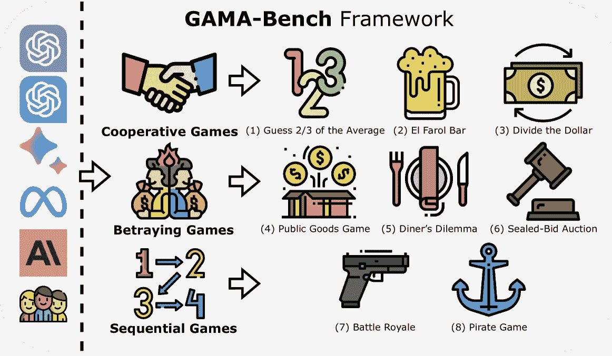

Figure 1: $\gamma$-Bench enables multiple LLMs and humans to engage in multi-round games. The framework comprises three categories of games, each targeting different LLM abilities, and includes eight classic games from Game Theory.

## 1 Introduction

We have recently witnessed the advancements in artificial intelligence made by Large Language Models (LLMs), which have marked a significant breakthrough in the field. ChatGPT¹¹1[https://chat.openai.com/](https://chat.openai.com/), a leading LLM, has demonstrated its proficiency in a variety of natural language processing tasks, including machine translation Jiao et al. ([2023](https://arxiv.org/html/2403.11807v4#bib.bib25)), sentence revision Wu et al. ([2023](https://arxiv.org/html/2403.11807v4#bib.bib65)), information retrieval Zhu et al. ([2023](https://arxiv.org/html/2403.11807v4#bib.bib73)), and program repair Surameery & Shakor ([2023](https://arxiv.org/html/2403.11807v4#bib.bib60)). Beyond the academic sphere, LLMs have entered diverse aspects of our everyday life, such as education Baidoo-Anu & Ansah ([2023](https://arxiv.org/html/2403.11807v4#bib.bib6)), legal service Guha et al. ([2023](https://arxiv.org/html/2403.11807v4#bib.bib16)), product design Lanzi & Loiacono ([2023](https://arxiv.org/html/2403.11807v4#bib.bib34)), and healthcare Johnson et al. ([2023](https://arxiv.org/html/2403.11807v4#bib.bib26)). Given their extensive capabilities, evaluating LLMs demands more than simple, isolated tasks. A comprehensive and multifaceted approach is highly in demand to assess the efficacy of these advanced models.

With the broad knowledge encoded in LLMs, their intelligence Liang et al. ([2024](https://arxiv.org/html/2403.11807v4#bib.bib38)), and capabilities in general-purpose task solving Qin et al. ([2023](https://arxiv.org/html/2403.11807v4#bib.bib54)), a question emerges: can LLMs assist in everyday decision-making? Decision-making is a complex task requiring various abilities: (1) Perception: the ability to understand situations, environments, and rules, and extends to long-text understanding for LLMs. (2) Planning: the ability to maximize long-term over immediate benefits by anticipating potential outcomes. (3) Arithmetic Reasoning: the ability to quantify real-world scenarios and perform calculations. (4) ToM Reasoning: the Theory of Mind Kosinski ([2023](https://arxiv.org/html/2403.11807v4#bib.bib32)); Bubeck et al. ([2023](https://arxiv.org/html/2403.11807v4#bib.bib8)); Huang et al. ([2024a](https://arxiv.org/html/2403.11807v4#bib.bib21)) refers to the ability to infer others’ intentions and beliefs. (5) Critical Thinking: the ability to integrate all available information to arrive at the best decision. Given these complexities, decision-making poses a significant challenge for intelligent agents.

Many studies have drawn on the principles of Game Theory Duan et al. ([2024](https://arxiv.org/html/2403.11807v4#bib.bib11)); Xie et al. ([2024](https://arxiv.org/html/2403.11807v4#bib.bib67)); Xu et al. ([2023a](https://arxiv.org/html/2403.11807v4#bib.bib68)), a well-established field with several advantages: (1) Scope: Game theory allows for the abstraction of diverse real-life scenarios into simple mathematical models, facilitating a broad range of evaluations. (2) Quantifiability: By examining the Nash equilibrium Nash ([1950](https://arxiv.org/html/2403.11807v4#bib.bib44)) within these models, we gain a measurable metric for comparing LLMs’ decision-making performance. (3) Variability: The adjustable parameters of these models enable the creation of variant scenarios, enhancing the diversity and robustness of our assessments. However, existing research is often limited to two-player or two-action settings, such as the classical Prisoner’s Dilemma and Ultimatum Game Guo ([2023](https://arxiv.org/html/2403.11807v4#bib.bib17)); Phelps & Russell ([2023](https://arxiv.org/html/2403.11807v4#bib.bib50)); Akata et al. ([2023](https://arxiv.org/html/2403.11807v4#bib.bib3)); Aher et al. ([2023](https://arxiv.org/html/2403.11807v4#bib.bib2)); Brookins & DeBacker ([2024](https://arxiv.org/html/2403.11807v4#bib.bib7)). Moreover, prior work relies on fixed, classical game settings, increasing the likelihood that LLMs have encountered these scenarios during training, facing the risk of test set leakage. In this paper, we assess LLMs in more complex scenarios involving multiple players, actions, and rounds, across classical game theory scenarios with dynamically adjustable game parameters.

Table 1: Performance (scores) of different LLMs on $\gamma$-Bench.

 | $\gamma$-Bench Leaderboard | GPT-3.5 | GPT-4 | Gemini-Pro |
| 0613 | 1106 | 0125 | 0125 | 1.0 | 1.5 |
| Guess 2/3 of the Average | $41.4_{\pm 0.5}$ | $68.5_{\pm 0.5}$ | $63.4_{\pm 3.4}$ | $91.6_{\pm 0.6}$ | $77.3_{\pm 6.2}$ | $95.4_{\pm 0.5}$ |
| El Farol Bar | $74.8_{\pm 4.5}$ | $64.3_{\pm 3.1}$ | $68.7_{\pm 2.7}$ | $23.0_{\pm 8.1}$ | $33.5_{\pm 10.3}$ | $37.2_{\pm 4.2}$ |
| Divide the Dollar | $42.4_{\pm 7.7}$ | $70.3_{\pm 3.3}$ | $68.6_{\pm 2.4}$ | $98.1_{\pm 1.9}$ | $77.6_{\pm 3.6}$ | $93.8_{\pm 0.3}$ |
| Public Goods Game | $17.8_{\pm 1.7}$ | $43.5_{\pm 12.6}$ | $38.8_{\pm 8.1}$ | $89.2_{\pm 1.8}$ | $68.5_{\pm 7.6}$ | $100.0_{\pm 0.0}$ |
| Diner’s Dilemma | $67.0_{\pm 4.9}$ | $1.4_{\pm 1.3}$ | $2.8_{\pm 2.8}$ | $0.9_{\pm 0.7}$ | $3.1_{\pm 1.5}$ | $35.9_{\pm 5.3}$ |
| Sealed-Bid Auction | $4.2_{\pm 0.3}$ | $3.4_{\pm 1.0}$ | $5.5_{\pm 1.0}$ | $8.7_{\pm 0.7}$ | $14.9_{\pm 6.6}$ | $13.3_{\pm 4.6}$ |
| Battle Royale | $19.5_{\pm 7.7}$ | $35.7_{\pm 6.9}$ | $28.6_{\pm 11.0}$ | $86.8_{\pm 9.7}$ | $16.5_{\pm 6.9}$ | $81.3_{\pm 7.7}$ |
| Pirate Game | $68.4_{\pm 19.9}$ | $69.5_{\pm 14.6}$ | $71.6_{\pm 7.7}$ | $85.4_{\pm 8.7}$ | $57.4_{\pm 14.3}$ | $87.9_{\pm 5.6}$ |
| Overall | $41.9_{\pm 2.0}$ | $44.6_{\pm 1.5}$ | $43.5_{\pm 2.1}$ | $60.5_{\pm 2.7}$ | $43.6_{\pm 3.1}$ | $68.1_{\pm 1.5}$ | 

(a) Closed-source LLMs: Gemini-1.5-Pro leads in performance.

 | $\gamma$-Bench Leaderboard | LLaMA-3.1 | Mixtral | Qwen-2 |
| 8B | 70B | 405B | 8x7B | 8x22B | 72B |
| Guess 2/3 of the Average | $85.5_{\pm 3.0}$ | $84.0_{\pm 1.7}$ | $94.3_{\pm 0.6}$ | $91.8_{\pm 0.4}$ | $83.6_{\pm 4.6}$ | $93.2_{\pm 1.3}$ |
| El Farol Bar | $75.7_{\pm 2.2}$ | $59.7_{\pm 3.5}$ | $20.5_{\pm 24.2}$ | $66.8_{\pm 5.8}$ | $39.3_{\pm 12.2}$ | $17.0_{\pm 25.5}$ |
| Divide the Dollar | $56.4_{\pm 8.4}$ | $87.0_{\pm 4.1}$ | $94.9_{\pm 1.0}$ | $1.2_{\pm 2.8}$ | $79.0_{\pm 9.6}$ | $91.9_{\pm 2.4}$ |
| Public Goods Game | $19.6_{\pm 1.0}$ | $90.6_{\pm 3.6}$ | $96.9_{\pm 0.8}$ | $27.7_{\pm 11.7}$ | $83.7_{\pm 3.5}$ | $81.3_{\pm 5.9}$ |
| Diner’s Dilemma | $59.3_{\pm 2.4}$ | $48.1_{\pm 5.7}$ | $14.4_{\pm 4.5}$ | $76.4_{\pm 7.1}$ | $79.9_{\pm 5.8}$ | $0.0_{\pm 0.0}$ |
| Sealed-Bid Auction | $16.9_{\pm 1.8}$ | $4.5_{\pm 0.7}$ | $4.2_{\pm 1.2}$ | $0.8_{\pm 0.4}$ | $5.2_{\pm 1.8}$ | $0.9_{\pm 0.2}$ |
| Battle Royale | $35.9_{\pm 12.1}$ | $77.7_{\pm 26.0}$ | $92.7_{\pm 10.1}$ | $12.6_{\pm 9.5}$ | $36.0_{\pm 21.0}$ | $81.7_{\pm 9.6}$ |
| Pirate Game | $78.3_{\pm 10.0}$ | $64.0_{\pm 15.5}$ | $65.6_{\pm 22.3}$ | $67.3_{\pm 7.6}$ | $84.3_{\pm 8.8}$ | $86.1_{\pm 6.4}$ |
| Overall | $53.4_{\pm 3.1}$ | $64.5_{\pm 3.4}$ | $60.4_{\pm 4.4}$ | $43.1_{\pm 2.3}$ | $61.4_{\pm 2.0}$ | $56.5_{\pm 3.4}$ | 

(b) Open-source LLMs: LLaMA-3.1-70B leads in performance.

We include eights games and divide them into three categories based on their characteristics. The first category in our framework evaluates LLMs’ ability to make optimal decisions by understanding game rules and recognizing patterns in other players’ behavior. A distinctive characteristic of these games is that individual players cannot achieve higher gains without cooperation, provided that other participants cooperate. Essentially, these games’ Nash equilibrium aligns with maximizing overall social welfare. We name such games as I. Cooperative Games, including (1) Guess 2/3 of the Average, (2) El Farol Bar, and (3) Divide the Dollar. The second category assesses the propensity of LLMs to prioritize self-interest, potentially betraying others for greater gains. In contrast to the first category, games in this category incentivize higher rewards for participants who betray their cooperative counterparts. Typically, the Nash equilibrium in these games leads to reduced social welfare. This category is termed II. Betraying Games, including (4) Public Goods Game, (5) Diner’s Dilemma, (6) Sealed-Bid Auction. Last but not least, we focus specifically on two games characterized by sequential decision-making processes, distinguishing them from the previous six games based on simultaneous decision-making. III. Sequential Games are the (7) Battle Royale and (8) Pirate Game.

In this paper, we instruct ten agents, based on the GPT-3.5 (0125) model, to engage in the eight games, followed by an analysis of the results obtained. Subsequently, we assess the model’s robustness against multiple runs, temperature parameter alterations, and prompt template variations. Further exploration is conducted to ascertain if instructional prompts, such as Chain-of-Thought (CoT) Kojima et al. ([2022](https://arxiv.org/html/2403.11807v4#bib.bib30)), enhance the model’s decision-making capabilities. Additionally, the model’s capacity to generalize across diverse game settings is examined. Finally, we evaluate the performance of twelve LLMs, including GPT-3.5-Turbo (0613, 1106, 0125) OpenAI ([2022](https://arxiv.org/html/2403.11807v4#bib.bib47)), GPT-4-Turbo (0125) OpenAI ([2023](https://arxiv.org/html/2403.11807v4#bib.bib48)), Gemini-1.0-Pro Pichai & Hassabis ([2023](https://arxiv.org/html/2403.11807v4#bib.bib51)), Gemini-1.5-Pro Pichai & Hassabis ([2024](https://arxiv.org/html/2403.11807v4#bib.bib52)), LLaMA-3.1 (8B, 70B, 405B) Dubey et al. ([2024](https://arxiv.org/html/2403.11807v4#bib.bib12)), Mixtral (8x7B, 8x22B) Jiang et al. ([2024](https://arxiv.org/html/2403.11807v4#bib.bib24)), and Qwen-2-72B Yang et al. ([2024](https://arxiv.org/html/2403.11807v4#bib.bib71)). We compare the performance of different LLMs by creating multiple agents from the same model to participate in the games, then calculate the average performance of these agents.

The contribution of this paper can be summarized as:

*   •

    We review and compare existing literature on the evaluation of LLMs using game theory models, emphasizing our focus on multi-player setting and LLMs’ generalizability.

*   •

    Starting from the multi-player setting, we collect eight classical game theory scenarios to measure LLMs’ Gaming Ability in Multi-Agent environments, and implement our framework, GAMA($\gamma$)-Bench. It enables dynamic game scene generation with diverse profiles, offering unlimited scenarios to assess LLM generalizability while minimizing test set leakage risk.

*   •

    We apply $\gamma$-Bench to twelve LLMs to provide an in-depth analysis of their performance in multi-agent gaming scenarios, indicating their potential as assistants in decision-making process.

## 2 Introduction to Games

We collect eight games well studied in Game Theory and propose $\gamma$-Bench, a framework with multi-player, multi-round, and multi-action settings. Notably, $\gamma$-Bench allows the simultaneous participation of both LLMs and humans, enabling us to evaluate LLMs’ performance when playing against humans or fixed strategies. This section details each game with their classical settings (parameters).

### 2.1 Cooperative Games

#### (1) Guess 2/3 of the Average

Initially introduced by Ledoux ([1981](https://arxiv.org/html/2403.11807v4#bib.bib35)), the game involves players independently selecting an integer between 0 and 100 (inclusive). The winner is the player(s) choosing the number closest to two-thirds of the group’s average. A typical initial strategy might lead players to assume an average of 50, suggesting a winning number around $50\times\frac{2}{3}\approx 33$. However, if all participants adopt this reasoning, the average shifts to 33, thereby altering the winning number to approximately 22. The game has a PSNE where all players selecting zero results in a collective win.

#### (2) El Farol Bar

Proposed by Arthur ([1994](https://arxiv.org/html/2403.11807v4#bib.bib4)) and Huberman ([1988](https://arxiv.org/html/2403.11807v4#bib.bib23)), this game requires players to decide to either visit a bar for entertainment or stay home without communication. The bar, however, has a limited capacity and can only accommodate part of the population. In a classical scenario, the bar becomes overcrowded and less enjoyable if more than 60% of the population decides to go there. Conversely, if 60% or fewer people are present, the experience is more enjoyable than staying home. Imagine that if everyone adopts the same pure strategy, i.e., either everyone going to the bar or everyone staying home, then the social welfare is not maximized. Notably, the game lacks a PSNE but presents an MSNE, where the optimal strategy involves going to the bar with a 60% probability and staying home with a 40% probability.

#### (3) Divide the Dollar

Firstly mentioned in Shapley & Shubik ([1969](https://arxiv.org/html/2403.11807v4#bib.bib57)), the game involves two players independently bidding up to 100 cents for a dollar. Ashlock & Greenwood ([2016](https://arxiv.org/html/2403.11807v4#bib.bib5)) further generalized the game into a multi-player setting. If the sum of bids is at most one dollar, each player is awarded their respective bid; if the total exceeds a dollar, no player receives anything. The NE of this game occurs when each player bids exactly $\frac{100}{N}$ cents.

### 2.2 Betraying Games

#### (4) Public Goods Game

Studied since the early 1950s Samuelson ([1954](https://arxiv.org/html/2403.11807v4#bib.bib56)), the game requires $N$ players to secretly decide how many of their private tokens to contribute to a public pot. The tokens in the pot are then multiplied by a factor $R$ ($1<R<N$), and the resulting “public good” is evenly distributed among all players. Players retain any tokens they do not contribute. A simple calculation reveals that for each token a player contributes, their net gain is $\frac{R}{N}-1$, which is less than zero. This suggests that the rational strategy for each player is to contribute no tokens, which reaches an NE of this game. The game serves as a tool to investigate tendencies towards selfish behavior and free-riding among participants.

#### (5) Diner’s Dilemma

This game is the multi-player variant of the Prisoner’s Dilemma Glance & Huberman ([1994](https://arxiv.org/html/2403.11807v4#bib.bib14)). The game involves $N$ players dining together, with their decision to split all the costs. Each player needs to independently choose whether to order the expensive or the cheap dish, priced at $x$ and $y$ ($x>y$), respectively. The expensive offers $a$ utility per individual, surpassing the $b$ utility of another choice ($a>b$). The game satisfies two assumptions: (1) $a-x<b-y$: Although the expensive dish provides a greater utility, the benefit does not justify its higher cost, leading to a preference for the cheap one when dining alone. (2) $a-\frac{x}{N}>b-\frac{y}{N}$: Individuals are inclined to choose the expensive dish when the cost is shared among all diners. The assumptions lead to an NE where all players opt for the more expensive meal. However, this PSNE results in a lower total social welfare of $N(a-x)$ compared to $N(b-y)$, which is the utility if all choose the cheap one. This game evaluates the long-term perspective and the capacity to establish sustained cooperation.

#### (6) Sealed-Bid Auction

The Sealed-Bid Auction (SBA) involves players submitting their bids confidentially and simultaneously, different from the auctions where bids are made openly in a sequential manner. We consider two variants of SBA: the First-Price Sealed-Bid Auction (FPSBA) and the Second-Price Sealed-Bid Auction (SPSBA). In FPSBA, also known as the Blind Auction, if all players bid their true valuation $v_{i}$ of the item, the winner achieves a net gain of $b_{i}-v_{i}=0$ while others also gain nothing McAfee & McMillan ([1987](https://arxiv.org/html/2403.11807v4#bib.bib41)). Moreover, the highest bidder will discover that to win the auction, it is sufficient to bid marginally above the second-highest bid. Driven by these two factors, FPSBA is often deemed inefficient in practical scenarios, as bidders are inclined to submit bids significantly lower than their actual valuation, resulting in suboptimal social welfare. In contrast, SPSBA, commonly called the Vickrey auction, requires the winner to pay the second-highest bid, encouraging truthful bidding by all players Vickrey ([1961](https://arxiv.org/html/2403.11807v4#bib.bib62)). It can be proven that bidding true valuations in SPSBA represents an NE. This auction evaluates agent performance in imperfect information games, where agents lack knowledge of other players’ valuations.

### 2.3 Sequential Games

#### (7) Battle Royale

Extended from the Truel Kilgour ([1975](https://arxiv.org/html/2403.11807v4#bib.bib29)) involving three players, the Battle Royale involves $N$ players shooting at each other. In the widely studied form Kilgour & Brams ([1997](https://arxiv.org/html/2403.11807v4#bib.bib28)), players have different probabilities of hitting the target, with the turn order set by increasing hit probabilities. The game allows for unlimited bullets and the tactical option of intentionally missing shots. The objective for each participant is to emerge as the sole survivor, with the game ending when only one player remains. While the NE has been identified for infinite sequential truels Kilgour ([1977](https://arxiv.org/html/2403.11807v4#bib.bib27)), the complexity of these equilibria escalates exponentially with an increased number of players.

#### (8) Pirate Game

This game is a multi-player version of the Ultimatum Game Goodin ([1998](https://arxiv.org/html/2403.11807v4#bib.bib15)); Stewart ([1999](https://arxiv.org/html/2403.11807v4#bib.bib59)). Each player is assigned a “pirate rank”, determining their action order. The game involves $N$ pirates discussing the division of $G$ golds they have discovered. The most senior pirate first proposes a distribution method. If the proposal is approved by at least half of the pirates, including the proposer, the game ends, and the gold is distributed as proposed. Otherwise, the most senior pirate is thrown overboard, and the next in rank assumes the proposer role until the game ends. Each pirate’s objectives are prioritized as (1) survival, (2) maximizing their share of gold, and (3) the opportunity to eliminate others from the game. Stewart ([1999](https://arxiv.org/html/2403.11807v4#bib.bib59)) identifies the optimal strategy, where the most senior pirate allocates one gold to each odd-ranked pirate and keeps the remainder.

## 3 GAMA-Bench Scoring Scheme

This section presents experiments conducted using the default settings for each game on the GPT-3.5 (0125) model. Utilizing this model as a case study, we illustrate our methodology for benchmarking an LLM with $\gamma$-Bench. The prompt and its design method can be found in §[C](https://arxiv.org/html/2403.11807v4#A3 "Appendix C Details about Prompts ‣ How Far Are We on the Decision-Making of LLMs? Evaluating LLMs’ Gaming Ability in Multi-Agent Environments") in the appendix. Each game involves ten agents based on GPT-3.5, with the temperature parameter set to one. For simultaneous games, there will be twenty rounds. We run each game five times to enhance the reliability of our findings and mitigate the impact of variance. For clarity and conciseness, this section presents one of the five runs while §[4.1](https://arxiv.org/html/2403.11807v4#S4.SS1 "4.1 RQ1: Robustness ‣ 4 Beyond Default Settings ‣ How Far Are We on the Decision-Making of LLMs? Evaluating LLMs’ Gaming Ability in Multi-Agent Environments") details quantitative results. Our findings of GPT-3.5’s behaviors on $\gamma$-Bench include:

<svg class="ltx_picture" height="157.16" id="S3.p2.pic1" overflow="visible" version="1.1" width="600"><g fill="#000000" stroke="#000000" stroke-width="0.4pt" transform="translate(0,157.16) matrix(1 0 0 -1 0 0)"><g fill-opacity="1.0" transform="matrix(1.0 0.0 0.0 1.0 5.32 5.32)"><foreignobject color="#000000" height="146.52" overflow="visible" transform="matrix(1 0 0 -1 0 16.6)" width="589.36">Key Findings: • The model’s decisions are mainly influenced by the outcomes of the preceding round rather than deriving from the reasoning of the optimal strategy. • Although initially demonstrating suboptimal performance, the model can learn from historical data and enhance its performance over time. A larger fluctuation is observed in games that are difficult to optimize from historical data, such as the El Farol Bar game. • The model demonstrates the ability to engage in spontaneous cooperation, leading to increased social welfare beyond mere self-interest, without the necessity for explicit communication. However, this phenomenon also results in low performance in Betraying Games. • The model shows limitations in sequential games with more complicated rules. • The aggregate score of the model on $\gamma$-Bench is $44.9$.</foreignobject></g></g></svg>

### 3.1 Cooperative Games

#### (1) Guess 2/3 of the Average

[[TO PROMPT]](https://arxiv.org/html/2403.11807v4#A3.SS2 "C.2 Cooperative Games ‣ Appendix C Details about Prompts ‣ How Far Are We on the Decision-Making of LLMs? Evaluating LLMs’ Gaming Ability in Multi-Agent Environments")  The vanilla setting for this game is $MIN=0$, $MAX=100$, and $R=\frac{2}{3}$. We show the choices made by all agents as well as the average and the winning numbers in Fig. [2](https://arxiv.org/html/2403.11807v4#S3.F2 "Figure 2 ‣ (2) El Farol Bar ‣ 3.1 Cooperative Games ‣ 3 GAMA-Bench Scoring Scheme ‣ How Far Are We on the Decision-Making of LLMs? Evaluating LLMs’ Gaming Ability in Multi-Agent Environments")(1). Key observations are: (1) In the first round, agents consistently select $50$ (or close to $50$), corresponding to the mean of a uniform distribution ranging from $0$ to $100$. This behavior suggests that the model fails to recognize that the winning number is $\frac{2}{3}$ of the average. (2) As rounds progress, the average number selected decreases noticeably, demonstrating that agents are capable of adapting based on historical outcomes. Since the optimal strategy is to choose the $MIN$, the score in this game is given by $S_{1}=\frac{1}{NK}\sum_{ij}(C_{ij}-MIN)$, where $C_{ij}$ is the chosen number of player $i$ in round $j$. The model scores²²2For clarity, we normalize raw scores to the range of $[0,100]$, with higher values indicating a better performance. The method used for rescaling is detailed in §[E](https://arxiv.org/html/2403.11807v4#A5 "Appendix E Rescale Method for Raw Scores ‣ How Far Are We on the Decision-Making of LLMs? Evaluating LLMs’ Gaming Ability in Multi-Agent Environments") of the appendix. $65.4$ on this game.

#### (2) El Farol Bar

[[TO PROMPT]](https://arxiv.org/html/2403.11807v4#A3.SS2 "C.2 Cooperative Games ‣ Appendix C Details about Prompts ‣ How Far Are We on the Decision-Making of LLMs? Evaluating LLMs’ Gaming Ability in Multi-Agent Environments")  The vanilla setting for this game is $MIN=0$, $MAX=10$, $HOME=5$, and $R=60\%$. To explore the influence of incomplete information, we introduce two settings: Explicit indicates that everyone can see the results at the end of each round, while Implicit indicates that those staying at home cannot know what happened in the bar after the round ends. Fig. [2](https://arxiv.org/html/2403.11807v4#S3.F2 "Figure 2 ‣ (2) El Farol Bar ‣ 3.1 Cooperative Games ‣ 3 GAMA-Bench Scoring Scheme ‣ How Far Are We on the Decision-Making of LLMs? Evaluating LLMs’ Gaming Ability in Multi-Agent Environments")(2) illustrates the probability of agents deciding to go to the bar and the total number of players in the bar. We find that: (1) In the first round, there is an inclination among agents to visit the bar. Observations of overcrowding lead to a preference for staying home, resulting in fluctuations shown in both Fig. [2](https://arxiv.org/html/2403.11807v4#S3.F2 "Figure 2 ‣ (2) El Farol Bar ‣ 3.1 Cooperative Games ‣ 3 GAMA-Bench Scoring Scheme ‣ How Far Are We on the Decision-Making of LLMs? Evaluating LLMs’ Gaming Ability in Multi-Agent Environments")(2-1) and Fig. [2](https://arxiv.org/html/2403.11807v4#S3.F2 "Figure 2 ‣ (2) El Farol Bar ‣ 3.1 Cooperative Games ‣ 3 GAMA-Bench Scoring Scheme ‣ How Far Are We on the Decision-Making of LLMs? Evaluating LLMs’ Gaming Ability in Multi-Agent Environments")(2-2). In the Implicit setting, due to the lack of direct observations of the bar’s occupancy, agents require additional rounds (Rounds $2$ to $6$) to discern the availability of space in the bar. (2) The probability of agents going to the bar gradually stabilizes, with the average probability in the Implicit setting being lower than in the Explicit setting. Since the optimal strategy is to choose the go with a probability of $R$, the raw score³³3For simplicity, we evaluate only the Implicit setting. in this game is given by $S_{2}=\frac{1}{K}\sum_{j}\lvert\frac{1}{N}\sum_{i}D_{ij}-R\rvert$, where $D_{ij}=1$ when player $i$ chose to go in round $j$ and $D_{ij}=0$ when player $i$ chose to stay. The model scores $73.3$ on this game.

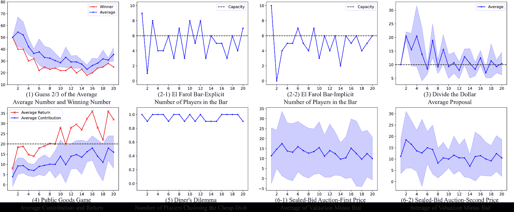

Figure 2: Performance of GPT-3.5 (0125) in Cooperative and Betraying games.

#### (3) Divide the Dollar

[[TO PROMPT]](https://arxiv.org/html/2403.11807v4#A3.SS2 "C.2 Cooperative Games ‣ Appendix C Details about Prompts ‣ How Far Are We on the Decision-Making of LLMs? Evaluating LLMs’ Gaming Ability in Multi-Agent Environments")  The vanilla setting for this game is $G=100$. We plot the proposals by all agents and the sum of their proposals in Fig. [2](https://arxiv.org/html/2403.11807v4#S3.F2 "Figure 2 ‣ (2) El Farol Bar ‣ 3.1 Cooperative Games ‣ 3 GAMA-Bench Scoring Scheme ‣ How Far Are We on the Decision-Making of LLMs? Evaluating LLMs’ Gaming Ability in Multi-Agent Environments")(3). Our analysis reveals the following insights: (1) In the first round, agents’ decisions align with the NE predictions of the game. However, after gaining golds, agents exhibit increased greed, proposing allocations that exceed the NE-prescribed amounts. Upon receiving nothing, they tend to propose a “safer” amount. The trend continues and causes fluctuations across subsequent rounds. (2) Despite these fluctuations, the average of proposed golds converges to approximately $100$. Since the optimal strategy is to propose $G/N$, the raw score in this game is given by $S_{3}=\frac{1}{K}\sum_{j}\lvert\sum_{i}B_{ij}-G\rvert$, where $B_{ij}=1$ is the proposed amount number of player $i$ in round $j$. The model scores $68.1$ on this game.

### 3.2 Betraying Games

#### (4) Public Goods Game

[[TO PROMPT]](https://arxiv.org/html/2403.11807v4#A3.SS3 "C.3 Betraying Games ‣ Appendix C Details about Prompts ‣ How Far Are We on the Decision-Making of LLMs? Evaluating LLMs’ Gaming Ability in Multi-Agent Environments")  The vanilla setting for this game is $R=2$. Each player has $T=20$ to contribute in each round. Fig. [2](https://arxiv.org/html/2403.11807v4#S3.F2 "Figure 2 ‣ (2) El Farol Bar ‣ 3.1 Cooperative Games ‣ 3 GAMA-Bench Scoring Scheme ‣ How Far Are We on the Decision-Making of LLMs? Evaluating LLMs’ Gaming Ability in Multi-Agent Environments")(4) shows the contributed tokens by each agent and their corresponding gains per round. The observations reveal the following: (1) Despite an investment return of $-80\%$, agents display a pattern of alternating between free-riding and contributing all their tokens. (2) As the rounds progress, there is an evident increase in the number of tokens contributed to the public pot, leading to an overall enhancement in social welfare gains. These findings suggest that the LLM exhibits cooperative behavior, prioritizing collective benefits over individual self-interest. Since we expect the model to infer the optimal strategy, i.e., contributing zero tokens, the raw score in this game is given by $S_{4}=\frac{1}{NK}\sum_{ij}C_{ij}$, where $C_{ij}=1$ is the proposed contribution amount of player $i$ in round $j$. The model scores $41.3$ on this game.

#### (5) Diner’s Dilemma

[[TO PROMPT]](https://arxiv.org/html/2403.11807v4#A3.SS3 "C.3 Betraying Games ‣ Appendix C Details about Prompts ‣ How Far Are We on the Decision-Making of LLMs? Evaluating LLMs’ Gaming Ability in Multi-Agent Environments")  The vanilla setting for this game is $P_{h}=20$, $P_{l}=10$, $U_{h}=20$, $U_{l}=15$. We show the probability of agents choosing the costly dish, their resulting utilities, and the average bill in Fig. [2](https://arxiv.org/html/2403.11807v4#S3.F2 "Figure 2 ‣ (2) El Farol Bar ‣ 3.1 Cooperative Games ‣ 3 GAMA-Bench Scoring Scheme ‣ How Far Are We on the Decision-Making of LLMs? Evaluating LLMs’ Gaming Ability in Multi-Agent Environments")(5). Analysis of the figure reveals the following insights: (1) Contrary to the NE predictions for this game, agents predominantly prefer the cheap dish, which maximizes total social welfare. (2) Remarkably, a deviation from cooperative behavior is observed wherein one agent consistently chooses to betray others, thereby securing a higher utility. This pattern of betrayal by this agent persists across subsequent rounds. Since we expect the model to infer the the optimal strategy, i.e., choosing the costly dish, the raw score in this game is given by $S_{5}=\frac{1}{NK}\sum_{ij}D_{ij}$, where $D_{ij}=1$ when player $i$ chose the cheap dish in round $j$ and $D_{ij}=0$ when player $i$ chose the costly dish. The model scores $4.0$ on this game.

#### (6) Sealed-Bid Auction

[[TO PROMPT]](https://arxiv.org/html/2403.11807v4#A3.SS3 "C.3 Betraying Games ‣ Appendix C Details about Prompts ‣ How Far Are We on the Decision-Making of LLMs? Evaluating LLMs’ Gaming Ability in Multi-Agent Environments")  For the vanilla setting in this game, we randomly assign valuations to each agent in each round, ranging from $0$ to $200$. We fix the seed for random number generation to ensure fair comparisons across various settings and models. We evaluate LLMs’ performance under both First-Price and Second-Price settings. Fig. [2](https://arxiv.org/html/2403.11807v4#S3.F2 "Figure 2 ‣ (2) El Farol Bar ‣ 3.1 Cooperative Games ‣ 3 GAMA-Bench Scoring Scheme ‣ How Far Are We on the Decision-Making of LLMs? Evaluating LLMs’ Gaming Ability in Multi-Agent Environments")(6) depicts the subtraction between valuations and bids and bid amounts of each agent. Our key findings include: (1) As introduced in §[2.2](https://arxiv.org/html/2403.11807v4#S2.SS2.SSS0.Px3 "(6) Sealed-Bid Auction ‣ 2.2 Betraying Games ‣ 2 Introduction to Games ‣ How Far Are We on the Decision-Making of LLMs? Evaluating LLMs’ Gaming Ability in Multi-Agent Environments"), we note that agents generally submit bids that are lower than their valuations in the First-Price auction, a tendency indicated by the positive discrepancies between valuations and bids depicted in Fig. [2](https://arxiv.org/html/2403.11807v4#S3.F2 "Figure 2 ‣ (2) El Farol Bar ‣ 3.1 Cooperative Games ‣ 3 GAMA-Bench Scoring Scheme ‣ How Far Are We on the Decision-Making of LLMs? Evaluating LLMs’ Gaming Ability in Multi-Agent Environments")(6-1). (2) Though the NE suggests that everyone bids the amount of their valuation in the Second-Price setting, we find a propensity for bidding below valuation levels, as demonstrated in Fig. [2](https://arxiv.org/html/2403.11807v4#S3.F2 "Figure 2 ‣ (2) El Farol Bar ‣ 3.1 Cooperative Games ‣ 3 GAMA-Bench Scoring Scheme ‣ How Far Are We on the Decision-Making of LLMs? Evaluating LLMs’ Gaming Ability in Multi-Agent Environments")(6-2). Since the optimal strategy is to bid the prices lower than their true valuations⁴⁴4We evaluate only the First-Price setting according to the definition of Betraying Games., the raw score in this game is given by $S_{6}=\frac{1}{NK}\sum_{ij}(v_{ij}-b_{ij})$, where $v_{ij}$ and $b_{ij}$ are player $i$’s valuation and bid in round $j$, respectively. The model scores $6.5$ on this game.

### 3.3 Sequential Games

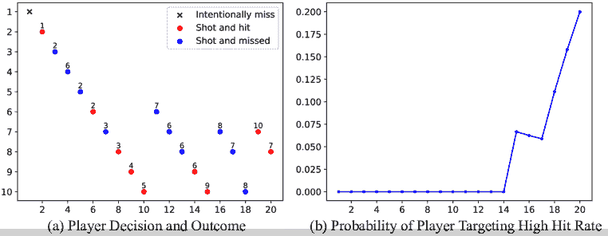

Figure 3: GPT-3.5 (0125)’s performance in “Battle Royale.” (a): Agents’ actions and outcomes of each round. For example, in round $11$, player $6$ shot at player $7$ but missed.

#### (7) Battle Royale

[[TO PROMPT]](https://arxiv.org/html/2403.11807v4#A3.SS4 "C.4 Sequential Games ‣ Appendix C Details about Prompts ‣ How Far Are We on the Decision-Making of LLMs? Evaluating LLMs’ Gaming Ability in Multi-Agent Environments")  For the vanilla setting in this game, we assign varied hit rates to each agent, spanning from $35\%$ to $80\%$ in increments of $5\%$. This setting covers a broad spectrum of hit rates, avoiding extremes of $0\%$ or $100\%$. Fig. [3](https://arxiv.org/html/2403.11807v4#S3.F3 "Figure 3 ‣ 3.3 Sequential Games ‣ 3 GAMA-Bench Scoring Scheme ‣ How Far Are We on the Decision-Making of LLMs? Evaluating LLMs’ Gaming Ability in Multi-Agent Environments") illustrates the actions and outcomes of each round, along with the tally of participants remaining. Our observations reveal: (1) Unlike our expectations, agents rarely target the player with the highest hit rate. (2) Agents neglect to utilize the strategy of “intentionally missing.” For example, in round $19$, with players $7$, $8$, and $10$ remaining, it was player $7$’s turn to act. The optimal strategy for player $7$ would have been to intentionally miss the shot, thereby coaxing player $8$ into eliminating player $10$, enabling player $7$ to target player $8$ in the following round for a potential victory. Instead, player $7$ opted to target player $10$, resulting in player $8$ firing upon itself. For simplicity, we evaluate whether agents target the player with the highest hit rate (excluding themselves). Therefore, the raw score in this game is given by $S_{7}=\frac{1}{Nk}\sum_{ij}I_{ij}$, where $k$ represents the number of rounds played and $I_{ij}=1$ if player $i$ targets the player with the highest hit rate in round $j$, and $I_{ij}=0$ otherwise. The model scores $20.0$ on this game.

Table 2: Performance of GPT-3.5 (0125) in the “Pirate Game.” Each row shows the proposed gold distribution in the specific round and whether each pirate accepts (“✓”) or rejects (“✗”) the proposal. $S_{8P}$ shows the score of the proposer while $S_{8V}$ shows the score of all voters.

 | Pirate Rank | 1 | 2 | 3 | 4 | 5 | 6 | 7 | 8 | 9 | 10 | $S_{8P}$ | $S_{8V}$ |
| --- | --- | --- | --- | --- | --- | --- | --- | --- | --- | --- | --- | --- |
| Round 1 | 100✓ | 0✗ | 0✗ | 0✗ | 0✗ | 0✗ | 0✗ | 0✗ | 0✗ | 0✗ | $8$ | $1.00$ |
| Round 2 | - | 99✓ | 0✗ | 1✓ | 0✓ | 0✗ | 0✗ | 0✗ | 0✗ | 0✓ | $6$ | $0.75$ |
| Round 3 | - | - | 50✓ | 1✓ | 1✓ | 1✓ | 1✓ | 1✓ | 1✓ | 44✓ | $94$ | $0.57$ | 

#### (8) Pirate Game

[[TO PROMPT]](https://arxiv.org/html/2403.11807v4#A3.SS4 "C.4 Sequential Games ‣ Appendix C Details about Prompts ‣ How Far Are We on the Decision-Making of LLMs? Evaluating LLMs’ Gaming Ability in Multi-Agent Environments")  The vanilla setting for this game is $G=100$. As introduced in §[2.3](https://arxiv.org/html/2403.11807v4#S2.SS3.SSS0.Px2 "(8) Pirate Game ‣ 2.3 Sequential Games ‣ 2 Introduction to Games ‣ How Far Are We on the Decision-Making of LLMs? Evaluating LLMs’ Gaming Ability in Multi-Agent Environments"), the optimal strategy for the first proposer is to allocate $96$ golds to itself and one gold each to the third, fifth, seventh, and ninth pirates. Stewart ([1999](https://arxiv.org/html/2403.11807v4#bib.bib59)) has elucidated the optimal strategy for voters: (1) accept if allocated two or more golds; (2) reject if no golds are allocated; (3) accept if one gold is allocated and it shares the same parity as the proposer, otherwise, reject. Table [2](https://arxiv.org/html/2403.11807v4#S3.T2 "Table 2 ‣ (7) Battle Royale ‣ 3.3 Sequential Games ‣ 3 GAMA-Bench Scoring Scheme ‣ How Far Are We on the Decision-Making of LLMs? Evaluating LLMs’ Gaming Ability in Multi-Agent Environments") presents a sample game’s proposals and voting results. The key conclusion is that agents fail to propose optimal proposals and frequently cast incorrect votes, suggesting that the LLM demonstrates suboptimal performance in this game. Two aspects are considered to comprehensively evaluate a model’s performance: (1) whether proposers give a reasonable proposal and (2) whether voters act correctly towards a given proposal. For (1), we calculate the $L_{1}$ norm between the given proposal and the optimal strategy, defined as $S_{8P}=\frac{1}{k}\sum_{j}\lVert P_{j}-O_{j}\rVert_{1}$, where $P_{j}$ represents the model’s proposal and $O_{j}$ denotes the optimal proposal in round $j$, with the game ending at round $k$. For (2), we calculate the accuracy of choosing the right action elucidated above, which is: $S_{8V}=\frac{2}{k(2N-k-1)}\sum_{ij}I_{ij}$, where $I_{ij}=1$ if player $i$ votes correctly in round $j$ and $I_{ij}=0$ otherwise, excluding the proposer from the calculation. The model scores $80.6$ on this game.

## 4 Beyond Default Settings

This section explores deeper into several following Research Questions (RQs). RQ1 Robustness: Is there a significant variance in multiple runs? Is the performance sensitive to different temperatures and prompt templates? RQ2 Reasoning Strategies: Are strategies to enhance reasoning skills applicable to game scenarios? This includes implementing Chain-of-Thought (CoT) Kojima et al. ([2022](https://arxiv.org/html/2403.11807v4#bib.bib30)); Wei et al. ([2022](https://arxiv.org/html/2403.11807v4#bib.bib64)) reasoning and assigning unique personas to LLMs. RQ3 Generalizability: How does LLM performance vary with different game settings? Do LLMs remember answers learned during the training phase? RQ4 Leaderboard: How do various LLMs perform on $\gamma$-Bench? Unless otherwise specified, we apply the vanilla settings described in §[3](https://arxiv.org/html/2403.11807v4#S3 "3 GAMA-Bench Scoring Scheme ‣ How Far Are We on the Decision-Making of LLMs? Evaluating LLMs’ Gaming Ability in Multi-Agent Environments").

### 4.1 RQ1: Robustness

This RQ examines the stability of LLMs’ responses, assessing the impact of three critical factors on model performance: (1) randomness introduced by the model’s sampling strategy, (2) the temperature parameter setting, and (3) the prompt used for game instruction.

#### Multiple Runs

Firstly, we run all games five times under the same settings. Fig. [4](https://arxiv.org/html/2403.11807v4#A6.F4 "Figure 4 ‣ F.1 Robustness: Multiple Runs ‣ Appendix F Detailed Results ‣ How Far Are We on the Decision-Making of LLMs? Evaluating LLMs’ Gaming Ability in Multi-Agent Environments") illustrates the average performance across tests, while Table [4](https://arxiv.org/html/2403.11807v4#A6.T4 "Table 4 ‣ F.1 Robustness: Multiple Runs ‣ Appendix F Detailed Results ‣ How Far Are We on the Decision-Making of LLMs? Evaluating LLMs’ Gaming Ability in Multi-Agent Environments") lists the corresponding scores. The analysis reveals that, except for the two sequential games and the “Public Goods Game,” the model demonstrates a consistent performance, as evidenced by the low variance in scores for each game.

#### Temperatures

As discussed in our literature review in §[B](https://arxiv.org/html/2403.11807v4#A2 "Appendix B Literature Review: Evaluating LLMs with Game Theory ‣ How Far Are We on the Decision-Making of LLMs? Evaluating LLMs’ Gaming Ability in Multi-Agent Environments"), prior research incorporates varying temperature parameters from $0$ to $1$ yet omits to explore their impacts. This study conducts experiments across games employing a range of temperatures $\{0.0,0.2,0.4,0.6,0.8,1.0\}$ under vanilla settings. The results, both visual and quantitative, are documented in Fig. [5](https://arxiv.org/html/2403.11807v4#A6.F5 "Figure 5 ‣ F.2 Robustness: Temperatures ‣ Appendix F Detailed Results ‣ How Far Are We on the Decision-Making of LLMs? Evaluating LLMs’ Gaming Ability in Multi-Agent Environments") and Table [5](https://arxiv.org/html/2403.11807v4#A6.T5 "Table 5 ‣ F.2 Robustness: Temperatures ‣ Appendix F Detailed Results ‣ How Far Are We on the Decision-Making of LLMs? Evaluating LLMs’ Gaming Ability in Multi-Agent Environments"), respectively. The small overall variance of $3.4$ indicates that, for the majority of games, temperature adjustments yield negligible effects. A notable exception is observed in “Guess 2/3 of the Average,” where increased temperatures correlate with enhanced scores ($48.0$ to $65.4$), contrasting starkly with the near-random performance at zero temperature.

#### Prompt Templates

We also investigate the impact of prompt phrasing on model performance. We leveraging GPT-4 to rewrite our default prompt templates, generating four additional versions. We perform a manual checking process on the generated versions to ensure GPT-4’s adherence to game rules without altering critical data. The prompt templates can be found in §[D](https://arxiv.org/html/2403.11807v4#A4 "Appendix D Examples of GPT-4-Rephrased Prompts ‣ How Far Are We on the Decision-Making of LLMs? Evaluating LLMs’ Gaming Ability in Multi-Agent Environments"). We plot the results of using these templates in Fig. [6](https://arxiv.org/html/2403.11807v4#A6.F6 "Figure 6 ‣ F.3 Robustness: Prompt Versions ‣ Appendix F Detailed Results ‣ How Far Are We on the Decision-Making of LLMs? Evaluating LLMs’ Gaming Ability in Multi-Agent Environments") and record the quantitative scores in Table [6](https://arxiv.org/html/2403.11807v4#A6.T6 "Table 6 ‣ F.3 Robustness: Prompt Versions ‣ Appendix F Detailed Results ‣ How Far Are We on the Decision-Making of LLMs? Evaluating LLMs’ Gaming Ability in Multi-Agent Environments"). Notably, we find that prompt wording can significantly affect performance, as shown by the high variances in the “Public Goods Game” ($11.5$), “Diner’s Dilemma” ($23.7$), and “Pirate Game” ($14.7$).

<svg class="ltx_picture" height="56.15" id="S4.SS1.SSS0.Px3.p2.pic1" overflow="visible" version="1.1" width="600"><g fill="#000000" stroke="#000000" stroke-width="0.4pt" transform="translate(0,56.15) matrix(1 0 0 -1 0 0)"><g fill-opacity="1.0" transform="matrix(1.0 0.0 0.0 1.0 5.32 5.32)"><foreignobject color="#000000" height="45.51" overflow="visible" transform="matrix(1 0 0 -1 0 16.6)" width="589.36">Answer to RQ1: GPT-3.5 exhibits consistency in multiple runs and shows robustness against different temperature settings. However, inappropriate prompt designs resulting from potential misinformation during rephrasing can significantly impair performance.</foreignobject></g></g></svg>

### 4.2 RQ2: Reasoning Strategies

This RQ focuses on improving the model’s performance through prompt instructions. We investigate two strategies: Chain-of-Thought (CoT) prompting Kojima et al. ([2022](https://arxiv.org/html/2403.11807v4#bib.bib30)) and persona assignment Kong et al. ([2024](https://arxiv.org/html/2403.11807v4#bib.bib31)). We show the visualized and quantitative results in Fig. [7](https://arxiv.org/html/2403.11807v4#A6.F7 "Figure 7 ‣ F.4 Reasoning Strategies ‣ Appendix F Detailed Results ‣ How Far Are We on the Decision-Making of LLMs? Evaluating LLMs’ Gaming Ability in Multi-Agent Environments") and Table [7](https://arxiv.org/html/2403.11807v4#A6.T7 "Table 7 ‣ F.4 Reasoning Strategies ‣ Appendix F Detailed Results ‣ How Far Are We on the Decision-Making of LLMs? Evaluating LLMs’ Gaming Ability in Multi-Agent Environments").

#### CoT

According to Kojima et al. ([2022](https://arxiv.org/html/2403.11807v4#bib.bib30)), introducing a preliminary phrase, “Let’s think step by step,” encourages the model to sequentially analyze and explain its reasoning before presenting its conclusion. This approach has proven beneficial in specific scenarios, such as games (1), (3), (4), and (5), improving the overall score from $44.9$ to $57.4$, by $12.5$. In the “(3) Divide the Dollar” game, incorporating CoT reduces the model’s propensity to suggest disproportionately large allocations, increasing the score by $15.3$. Similarly, in the “(4) Public Goods Game” and “(5) Diner’s Dilemma,” CoT prompts the model to recognize being a free-rider as the optimal strategy, increasing the scores by $14.8$ and $51.5$, respectively.

#### Persona

Studies Kong et al. ([2024](https://arxiv.org/html/2403.11807v4#bib.bib31)); Huang et al. ([2024b](https://arxiv.org/html/2403.11807v4#bib.bib22)) have demonstrated that assigning roles to models influences performance across various downstream tasks. Inspired by this discovery, our study initiates with a prompt that specifies the model’s role, such as “You are [ROLE],” where the role could be a cooperative and collaborative assistant, a selfish and greedy assistant, or a mathematician. Our findings reveal that assigning the “cooperative” role enhances model performance in games (1), (2), and (3), notably outperforming the CoT method in the “(3) El Farol Bar” game. Conversely, the “selfish” role markedly diminishes performance almost all the games, with the only exception of the “(7) Battle Royale” game. The “mathematician” role improves the model’s overall score by $0.7$, which is small and does not surpass the CoT method’s effectiveness.

<svg class="ltx_picture" height="57.69" id="S4.SS2.SSS0.Px2.p2.pic1" overflow="visible" version="1.1" width="600"><g fill="#000000" stroke="#000000" stroke-width="0.4pt" transform="translate(0,57.69) matrix(1 0 0 -1 0 0)"><g fill-opacity="1.0" transform="matrix(1.0 0.0 0.0 1.0 5.32 5.32)"><foreignobject color="#000000" height="47.05" overflow="visible" transform="matrix(1 0 0 -1 0 16.6)" width="589.36">Answer to RQ2: It is possible to improve GPT-3.5 through simple prompt instructions. Among the methods we explore, the CoT prompting performs the best, achieving a performance close to GPT-4 ($57.4$ vs. $60.5$).</foreignobject></g></g></svg>

### 4.3 RQ3: Generalizability

Considering the extensive exploration of games in domains such as mathematics, economics, and computer science, it is probable that the vanilla settings of these games are included within the training datasets of LLMs. To ascertain the presence of data contamination in our chosen games, we subjected them to various settings. The specifics of the parameters selected for each game are detailed in Table [8](https://arxiv.org/html/2403.11807v4#A6.T8 "Table 8 ‣ F.5 Generalizability ‣ Appendix F Detailed Results ‣ How Far Are We on the Decision-Making of LLMs? Evaluating LLMs’ Gaming Ability in Multi-Agent Environments"), and the experimental outcomes are visually represented in Fig. [8](https://arxiv.org/html/2403.11807v4#A6.F8 "Figure 8 ‣ F.5 Generalizability ‣ Appendix F Detailed Results ‣ How Far Are We on the Decision-Making of LLMs? Evaluating LLMs’ Gaming Ability in Multi-Agent Environments"). Our findings indicate variability in model generalizability across different games. Specifically, in games (1), (3), (5), (6), and (8), the model demonstrated correct performance under diverse settings. In the “(3) Divide the Dollar” game, the model’s performance improved with an increase in total golds ($G$), suggesting that higher allocations of golds satisfy the demands of all players. Conversely, the model exhibited low generalizability in games (2) and (4). An analysis of the game “(2) El Farol Bar” reveals a consistent decision-making pattern by the model, opting to participate with approximately a $50\%$ probability regardless of varying bar capacities ($R$), indicating that the model is acting randomly. Similarly, in the “(4) Public Goods Game,” the model consistently contributes similar amounts, even when the return rate is nil, indicating a lack of understanding of the game rules. A possible reason for this poor performance is the model’s inability to adjust its performance incrementally based on historical data.

Nagel ([1995](https://arxiv.org/html/2403.11807v4#bib.bib43)) conducted experiments with $15$ to $18$ human subjects participating in the “(1) Guess 2/3 of the Average” game, using ratios of $\frac{1}{2}$, $\frac{2}{3}$, and $\frac{4}{3}$ . The average numbers were $27.05$, $36.73$, and $60.12$ for each ratio, respectively. In a similar vein, Rubinstein ([2007](https://arxiv.org/html/2403.11807v4#bib.bib55)) explored the $\frac{2}{3}$ ratio on a larger population involving 2,423 subjects, yielding a comparable mean of $36.2$, aligning with the finding in Nagel ([1995](https://arxiv.org/html/2403.11807v4#bib.bib43)). The model produces average numbers of $34.59$, $34.59$, and $74.92$ for the same ratios, indicating its predictions are more aligned with human behavior than the game’s NE.

<svg class="ltx_picture" height="89.36" id="S4.SS3.p3.pic1" overflow="visible" version="1.1" width="600"><g fill="#000000" stroke="#000000" stroke-width="0.4pt" transform="translate(0,89.36) matrix(1 0 0 -1 0 0)"><g fill-opacity="1.0" transform="matrix(1.0 0.0 0.0 1.0 5.32 5.32)"><foreignobject color="#000000" height="78.72" overflow="visible" transform="matrix(1 0 0 -1 0 16.6)" width="589.36">Answer to RQ3: GPT-3.5 demonstrates variable performance across different game settings, exhibiting notably lower efficacy in “(2) El Farol Bar” and “(4) Public Goods Game.” It is noteworthy that, $\gamma$-Bench provides a test bed to evaluate the ability of LLMs in complex reasoning scenarios. As model’s ability improves (e.g., achieving more than $90$ on $\gamma$-Bench), we can increase the difficulty by varying game settings.</foreignobject></g></g></svg>

### 4.4 RQ4: Leaderboard

This RQ investigates the variance in decision-making capabilities among different LLMs, using $\gamma$-Bench. We first focus on open-source models, including OpenAI’s GPT-3.5 (0613, 1106, and 0125), GPT-4 (0125), and Google’s Gemini Pro (1.0, 1.5). The results are organized in Table [1(a)](https://arxiv.org/html/2403.11807v4#S1.T1.st1 "In Table 1 ‣ 1 Introduction ‣ How Far Are We on the Decision-Making of LLMs? Evaluating LLMs’ Gaming Ability in Multi-Agent Environments"), with model performance visualized in Fig. [9](https://arxiv.org/html/2403.11807v4#A6.F9 "Figure 9 ‣ F.6 Leaderboard ‣ Appendix F Detailed Results ‣ How Far Are We on the Decision-Making of LLMs? Evaluating LLMs’ Gaming Ability in Multi-Agent Environments") in the appendix. Gemini-1.5-Pro scores $68.1$, markedly surpassing other models, particularly in games (1), (4), and (5). GPT-4 follows closely behind Gemini-Pro, achieving $60.5$. The lowered performance in the “(2) El Farol Bar” game ($23.0$) stems from its conservative strategy favoring staying home. Its underperformance in the “(5) Diner’s Dilemma” game ($0.9$) is attributed to a preference for individual gain over collective benefit. Furthermore, an evaluation of three GPT-3.5 updates shows similar performance.

Next, we focus on open-source models, whose performance is detailed in Table [1(b)](https://arxiv.org/html/2403.11807v4#S1.T1.st2 "In Table 1 ‣ 1 Introduction ‣ How Far Are We on the Decision-Making of LLMs? Evaluating LLMs’ Gaming Ability in Multi-Agent Environments") and visualized in Fig. [10](https://arxiv.org/html/2403.11807v4#A6.F10 "Figure 10 ‣ F.6 Leaderboard ‣ Appendix F Detailed Results ‣ How Far Are We on the Decision-Making of LLMs? Evaluating LLMs’ Gaming Ability in Multi-Agent Environments"). The top-two open-source model, LLaMA-3.1-70B and Mixtral-8x22B, closely follows Gemini-1.5-Pro with a score of $64.5$ and $61.4$, surpassing GPT-4. Most open-source models, including Qwen-2, LLaMA-3.1-405B, and LLaMA-3.1-8B, outperform GPT-3.5 and Gemini-1.0-Pro. Mixtral-8x7B exhibits the lowest performance, likely due to its smaller size and weaker reasoning capabilities. Interestingly, LLaMA-3.1-405B underperforms compared to its smaller counterpart, the 70B version, which we attribute to its overly conservative strategy in the “(2) El Farol Bar” game, a challenge similar to the one faced by GPT-4.

<svg class="ltx_picture" height="39.55" id="S4.SS4.p3.pic1" overflow="visible" version="1.1" width="600"><g fill="#000000" stroke="#000000" stroke-width="0.4pt" transform="translate(0,39.55) matrix(1 0 0 -1 0 0)"><g fill-opacity="1.0" transform="matrix(1.0 0.0 0.0 1.0 5.32 5.32)"><foreignobject color="#000000" height="28.9" overflow="visible" transform="matrix(1 0 0 -1 0 16.6)" width="589.36">Answer to RQ4: Currently, Gemini-1.5-Pro outperforms all other models evaluated in this study. LLaMA-3.1-70B performs closely, being in the second place.</foreignobject></g></g></svg>

## 5 Related Work

### 5.1 Specific Games

Other than papers listed in Table [3](https://arxiv.org/html/2403.11807v4#A2.T3 "Table 3 ‣ Appendix B Literature Review: Evaluating LLMs with Game Theory ‣ How Far Are We on the Decision-Making of LLMs? Evaluating LLMs’ Gaming Ability in Multi-Agent Environments") on evaluating LLMs using classical games, researchers have explored diverse scenarios involving more complicated games. Using the complex and deceptive environments of Avalon game as a test bed, recent work focuses on long-horizon multi-party dialogues Stepputtis et al. ([2023](https://arxiv.org/html/2403.11807v4#bib.bib58)), social behaviors Lan et al. ([2023](https://arxiv.org/html/2403.11807v4#bib.bib33)), social intelligence Liu et al. ([2024](https://arxiv.org/html/2403.11807v4#bib.bib39)), and recursive contemplation Wang et al. ([2023](https://arxiv.org/html/2403.11807v4#bib.bib63)) for identifying deceptive information. Other papers have investigated the application of LLMs in communication games like Werewolf, with a focus on tuning-free frameworks Xu et al. ([2023b](https://arxiv.org/html/2403.11807v4#bib.bib69)) and reinforcement learning-powered approaches Xu et al. ([2024](https://arxiv.org/html/2403.11807v4#bib.bib70)). O’Gara ([2023](https://arxiv.org/html/2403.11807v4#bib.bib46)) found that advanced LLMs exhibit deception and lie detection capabilities in the text-based game, Hoodwinked. Meanwhile, Liang et al. ([2023](https://arxiv.org/html/2403.11807v4#bib.bib37)) evaluated LLMs’ intelligence and strategic communication skills in the word guessing game, Who Is Spy? In the game of Water Allocation Challenge, Mao et al. ([2023](https://arxiv.org/html/2403.11807v4#bib.bib40)) constructed a scenario highlighting unequal competition for limited resources.

### 5.2 Game Benchmarks

Another line of studies collects games to build more comprehensive benchmarks to assess the artificial general intelligence of LLMs. Tsai et al. ([2023](https://arxiv.org/html/2403.11807v4#bib.bib61)) found that while LLMs, such as ChatGPT, perform competitively in text games, they struggle with world modeling and goal inference. GameEval Qiao et al. ([2023](https://arxiv.org/html/2403.11807v4#bib.bib53)) introduced three goal-driven conversational games (Ask-Guess, SpyFall, and TofuKingdom) to effectively assess the problem-solving capabilities of LLMs in cooperative and adversarial settings. MAgIC Xu et al. ([2023a](https://arxiv.org/html/2403.11807v4#bib.bib68)) proposed the probabilistic graphical modeling method for evaluating LLMs in multi-agent game settings. LLM-Co Agashe et al. ([2023](https://arxiv.org/html/2403.11807v4#bib.bib1)) developed the LLM-Coordination framework to assess LLMs in multi-agent coordination scenarios, showcasing their capabilities in partner intention inference and proactive assistance. [Wu et al.](https://arxiv.org/html/2403.11807v4#bib.bib66) introduced SmartPlay, a benchmark for evaluating LLMs as agents across six games, emphasizing reasoning, planning, and learning capabilities. These papers focus on games with more complex designs, while our study investigates eight classical and essential games in game theory.

## 6 Conclusion

This paper presents $\gamma$-Bench, a benchmark designed to assess LLMs’ Gaming Ability in Multi-Agent environments. $\gamma$-Bench incorporates eight classic game theory scenarios, emphasizing multi-player interactions across multiple rounds and actions. Our findings reveal that GPT-3.5 (0125) demonstrates a limited decision-making ability on $\gamma$-Bench, yet it can improve itself by learning from the historical results. Leveraging the carefully designed scoring scheme, we observe that GPT-3.5 (0125) exhibits commendable robustness across various temperatures and prompts. It is noteworthy that strategies such as CoT prove effective in this context. Nevertheless, its capability to generalize across various game settings remains restricted. Finally, Gemini-1.5-Pro outperforms all tested models, achieving the highest ranking on the $\gamma$-Bench leaderboard, with the open-source LLaMA-3.1-70B following closely behind.

## Limitations

This study is subject to several limitations. Firstly, due to time and budget constraints, we do not evaluate all prominent LLMs such as LLaMA-3.2, Qwen-2.5 and Claude-3.5. However, we promise to expand our leaderboard to include more LLMs in the future. Secondly, our experiments do not explore scenarios where different LLMs compete in the same game. Instead, our evaluation uses ten agents derived from the same LLM. We acknowledge that including diverse LLMs in the same game could yield more intriguing insights. This aspect is designated for a future direction. Thirdly, we limit the games to 20 rounds and inform the agents of this total, potentially affecting strategies in Betraying games where agents may collaborate initially and betray in the final round for greater gain. We also leave this part as our future research agenda. However, we believe 20 rounds are sufficient to observe agent behavior patterns. Extending the rounds exceeds the token limit without yielding new observations, as the convergence trend remains consistent.

## Ethics Statement and Broader Impacts

Our research seeks to evaluate and enhance LLMs’ reasoning capabilities, facilitating their application in decision-making scenarios. On the one hand, users need to notice that current LLMs often display self-interested behavior in decision-making, which may not maximize social welfare. On the other hand, our framework promotes societal benefits by facilitating human-LLM interaction through gameplay, which can be applied in educational contexts such as economics and game theory. Ultimately, enhancing LLMs’ reasoning skills could enable them to serve as effective decision-making assistants for humans.

## Acknowledgments

The paper is supported by the Research Grants Council of the Hong Kong Special Administrative Region, China (No. CUHK 14206921 of the General Research Fund).

## References

*   Agashe et al. (2023) Saaket Agashe, Yue Fan, and Xin Eric Wang. Evaluating multi-agent coordination abilities in large language models. *arXiv preprint arXiv:2310.03903*, 2023.
*   Aher et al. (2023) Gati V Aher, Rosa I Arriaga, and Adam Tauman Kalai. Using large language models to simulate multiple humans and replicate human subject studies. In *International Conference on Machine Learning*, pp.  337–371\. PMLR, 2023.
*   Akata et al. (2023) Elif Akata, Lion Schulz, Julian Coda-Forno, Seong Joon Oh, Matthias Bethge, and Eric Schulz. Playing repeated games with large language models. *arXiv preprint arXiv:2305.16867*, 2023.
*   Arthur (1994) W Brian Arthur. Inductive reasoning and bounded rationality. *The American economic review*, 84(2):406–411, 1994.
*   Ashlock & Greenwood (2016) Daniel Ashlock and Garrison Greenwood. Generalized divide the dollar. In *2016 IEEE Congress on Evolutionary Computation (CEC)*, pp.  343–350\. IEEE, 2016.
*   Baidoo-Anu & Ansah (2023) David Baidoo-Anu and Leticia Owusu Ansah. Education in the era of generative artificial intelligence (ai): Understanding the potential benefits of chatgpt in promoting teaching and learning. *Journal of AI*, 7(1):52–62, 2023.
*   Brookins & DeBacker (2024) Philip Brookins and Jason DeBacker. Playing games with gpt: What can we learn about a large language model from canonical strategic games? *Economics Bulletin*, 44(1):25–37, 2024.
*   Bubeck et al. (2023) Sébastien Bubeck, Varun Chandrasekaran, Ronen Eldan, Johannes Gehrke, Eric Horvitz, Ece Kamar, Peter Lee, Yin Tat Lee, Yuanzhi Li, Scott Lundberg, et al. Sparks of artificial general intelligence: Early experiments with gpt-4. *arXiv preprint arXiv:2303.12712*, 2023.
*   Capraro et al. (2023) Valerio Capraro, Roberto Di Paolo, and Veronica Pizziol. Assessing large language models’ ability to predict how humans balance self-interest and the interest of others. *arXiv preprint arXiv:2307.12776*, 2023.
*   Chen et al. (2023) Jiangjie Chen, Siyu Yuan, Rong Ye, Bodhisattwa Prasad Majumder, and Kyle Richardson. Put your money where your mouth is: Evaluating strategic planning and execution of llm agents in an auction arena. *arXiv preprint arXiv:2310.05746*, 2023.
*   Duan et al. (2024) Jinhao Duan, Renming Zhang, James Diffenderfer, Bhavya Kailkhura, Lichao Sun, Elias Stengel-Eskin, Mohit Bansal, Tianlong Chen, and Kaidi Xu. Gtbench: Uncovering the strategic reasoning limitations of llms via game-theoretic evaluations. *arXiv preprint arXiv:2402.12348*, 2024.
*   Dubey et al. (2024) Abhimanyu Dubey, Abhinav Jauhri, Abhinav Pandey, Abhishek Kadian, Ahmad Al-Dahle, Aiesha Letman, Akhil Mathur, Alan Schelten, Amy Yang, Angela Fan, et al. The llama 3 herd of models. *arXiv preprint arXiv:2407.21783*, 2024.
*   Fan et al. (2024) Caoyun Fan, Jindou Chen, Yaohui Jin, and Hao He. Can large language models serve as rational players in game theory? a systematic analysis. In *Proceedings of the AAAI Conference on Artificial Intelligence*, number 16 in 38, pp.  17960–17967, 2024.
*   Glance & Huberman (1994) Natalie S Glance and Bernardo A Huberman. The dynamics of social dilemmas. *Scientific American*, 270(3):76–81, 1994.
*   Goodin (1998) Robert E Goodin. *The theory of institutional design*. Cambridge University Press, 1998.
*   Guha et al. (2023) Neel Guha, Julian Nyarko, Daniel E Ho, Christopher Re, Adam Chilton, Aditya Narayana, Alex Chohlas-Wood, Austin Peters, Brandon Waldon, Daniel Rockmore, et al. Legalbench: A collaboratively built benchmark for measuring legal reasoning in large language models. In *Thirty-seventh Conference on Neural Information Processing Systems Datasets and Benchmarks Track*, 2023.
*   Guo (2023) Fulin Guo. Gpt agents in game theory experiments. *arXiv preprint arXiv:2305.05516*, 2023.
*   Guo et al. (2023) Jiaxian Guo, Bo Yang, Paul Yoo, Bill Yuchen Lin, Yusuke Iwasawa, and Yutaka Matsuo. Suspicion-agent: Playing imperfect information games with theory of mind aware gpt-4. *arXiv preprint arXiv:2309.17277*, 2023.
*   Heydari & Lorè (2023) Babak Heydari and Nunzio Lorè. Strategic behavior of large language models: Game structure vs. contextual framing. *Contextual Framing (September 10, 2023)*, 2023.
*   Horton (2023) John J Horton. Large language models as simulated economic agents: What can we learn from homo silicus? Technical report, National Bureau of Economic Research, 2023.
*   Huang et al. (2024a) Jen-tse Huang, Man Ho Lam, Eric John Li, Shujie Ren, Wenxuan Wang, Wenxiang Jiao, Zhaopeng Tu, and Michael R Lyu. Apathetic or empathetic? evaluating LLMs’ emotional alignments with humans. In *Advances in Neural Information Processing Systems 37*, 2024a.
*   Huang et al. (2024b) Jen-tse Huang, Wenxuan Wang, Eric John Li, Man Ho Lam, Shujie Ren, Youliang Yuan, Wenxiang Jiao, Zhaopeng Tu, and Michael R Lyu. On the humanity of conversational ai: Evaluating the psychological portrayal of llms. In *Proceedings of the Twelfth International Conference on Learning Representations*, 2024b.
*   Huberman (1988) Bernardo A. Huberman. *The Ecology of Computation*. North-Holland, 1988.
*   Jiang et al. (2024) Albert Q Jiang, Alexandre Sablayrolles, Antoine Roux, Arthur Mensch, Blanche Savary, Chris Bamford, Devendra Singh Chaplot, Diego de las Casas, Emma Bou Hanna, Florian Bressand, et al. Mixtral of experts. *arXiv preprint arXiv:2401.04088*, 2024.
*   Jiao et al. (2023) Wenxiang Jiao, Wenxuan Wang, Jen-tse Huang, Xing Wang, and Zhaopeng Tu. Is chatgpt a good translator? a preliminary study. *arXiv preprint arXiv:2301.08745*, 2023.
*   Johnson et al. (2023) Douglas Johnson, Rachel Goodman, J Patrinely, Cosby Stone, Eli Zimmerman, Rebecca Donald, Sam Chang, Sean Berkowitz, Avni Finn, Eiman Jahangir, et al. Assessing the accuracy and reliability of ai-generated medical responses: an evaluation of the chat-gpt model. *Research square*, 2023.
*   Kilgour (1977) D Marc Kilgour. Equilibrium points of infinite sequential truels. *International Journal of Game Theory*, 6:167–180, 1977.
*   Kilgour & Brams (1997) D Marc Kilgour and Steven J Brams. The truel. *Mathematics Magazine*, 70(5):315–326, 1997.
*   Kilgour (1975) D Mark Kilgour. The sequential truel. *International Journal of Game Theory*, 4:151–174, 1975.
*   Kojima et al. (2022) Takeshi Kojima, Shixiang Shane Gu, Machel Reid, Yutaka Matsuo, and Yusuke Iwasawa. Large language models are zero-shot reasoners. *Advances in Neural Information Processing Systems*, 35:22199–22213, 2022.
*   Kong et al. (2024) Aobo Kong, Shiwan Zhao, Hao Chen, Qicheng Li, Yong Qin, Ruiqi Sun, Xin Zhou, Enzhi Wang, and Xiaohang Dong. Better zero-shot reasoning with role-play prompting. In *Proceedings of the 2024 Conference of the North American Chapter of the Association for Computational Linguistics: Human Language Technologies (Volume 1: Long Papers)*, pp.  4099–4113, 2024.
*   Kosinski (2023) Michal Kosinski. Theory of mind might have spontaneously emerged in large language models. *arXiv preprint arXiv:2302.02083*, 2023.
*   Lan et al. (2023) Yihuai Lan, Zhiqiang Hu, Lei Wang, Yang Wang, Deheng Ye, Peilin Zhao, Ee-Peng Lim, Hui Xiong, and Hao Wang. Llm-based agent society investigation: Collaboration and confrontation in avalon gameplay. *arXiv preprint arXiv:2310.14985*, 2023.
*   Lanzi & Loiacono (2023) Pier Luca Lanzi and Daniele Loiacono. Chatgpt and other large language models as evolutionary engines for online interactive collaborative game design. In *Proceedings of the Genetic and Evolutionary Computation Conference*, pp.  1383–1390, 2023.
*   Ledoux (1981) Alain Ledoux. Concours résultats complets. les victimes se sont plu à jouer le 14 d’atout. *Jeux & Stratégie*, 2(10):10–11, 1981.
*   Li et al. (2023) Jiatong Li, Rui Li, and Qi Liu. Beyond static datasets: A deep interaction approach to llm evaluation. *arXiv preprint arXiv:2309.04369*, 2023.
*   Liang et al. (2023) Tian Liang, Zhiwei He, Jen-tes Huang, Wenxuan Wang, Wenxiang Jiao, Rui Wang, Yujiu Yang, Zhaopeng Tu, Shuming Shi, and Xing Wang. Leveraging word guessing games to assess the intelligence of large language models. *arXiv preprint arXiv:2310.20499*, 2023.
*   Liang et al. (2024) Tian Liang, Zhiwei He, Wenxiang Jiao, Xing Wang, Yan Wang, Rui Wang, Yujiu Yang, Zhaopeng Tu, and Shuming Shi. Encouraging divergent thinking in large language models through multi-agent debate. In *Proceedings of the 2024 Conference on Empirical Methods in Natural Language Processing*, 2024.
*   Liu et al. (2024) Ziyi Liu, Abhishek Anand, Pei Zhou, Jen-tse Huang, and Jieyu Zhao. Interintent: Investigating social intelligence of llms via intention understanding in an interactive game context. In *Proceedings of the 2024 Conference on Empirical Methods in Natural Language Processing*, 2024.
*   Mao et al. (2023) Shaoguang Mao, Yuzhe Cai, Yan Xia, Wenshan Wu, Xun Wang, Fengyi Wang, Tao Ge, and Furu Wei. Alympics: Language agents meet game theory. *arXiv preprint arXiv:2311.03220*, 2023.
*   McAfee & McMillan (1987) R Preston McAfee and John McMillan. Auctions and bidding. *Journal of economic literature*, 25(2):699–738, 1987.
*   Myerson (2013) Roger B Myerson. *Game theory*. Harvard university press, 2013.
*   Nagel (1995) Rosemarie Nagel. Unraveling in guessing games: An experimental study. *The American economic review*, 85(5):1313–1326, 1995.
*   Nash (1950) John F Nash. Equilibrium points in n-person games. *Proceedings of the national academy of sciences*, 36(1):48–49, 1950.
*   Nash (1951) John F Nash. Non-cooperative games. *Annals of Mathematics*, 54(2):286–295, 1951.
*   O’Gara (2023) Aidan O’Gara. Hoodwinked: Deception and cooperation in a text-based game for language models. *arXiv preprint arXiv:2308.01404*, 2023.
*   OpenAI (2022) OpenAI. Introducing chatgpt. *OpenAI Blog Nov 30 2022*, 2022. URL [https://openai.com/index/chatgpt/](https://openai.com/index/chatgpt/).
*   OpenAI (2023) OpenAI. Gpt-4 technical report. *arXiv preprint arXiv:2303.08774*, 2023.
*   Persky (1995) Joseph Persky. Retrospectives: The ethology of homo economicus. *Journal of Economic Perspectives*, 9(2):221–231, 1995.
*   Phelps & Russell (2023) Steve Phelps and Yvan I Russell. Investigating emergent goal-like behaviour in large language models using experimental economics. *arXiv preprint arXiv:2305.07970*, 2023.
*   Pichai & Hassabis (2023) Sundar Pichai and Demis Hassabis. Introducing gemini: our largest and most capable ai model. *Google Blog Dec 06 2023*, 2023. URL [https://blog.google/technology/ai/google-gemini-ai/](https://blog.google/technology/ai/google-gemini-ai/).
*   Pichai & Hassabis (2024) Sundar Pichai and Demis Hassabis. Our next-generation model: Gemini 1.5. *Google Blog Feb 15 2024*, 2024. URL [https://blog.google/technology/ai/google-gemini-next-generation-model-february-2024/](https://blog.google/technology/ai/google-gemini-next-generation-model-february-2024/).
*   Qiao et al. (2023) Dan Qiao, Chenfei Wu, Yaobo Liang, Juntao Li, and Nan Duan. Gameeval: Evaluating llms on conversational games. *arXiv preprint arXiv:2308.10032*, 2023.
*   Qin et al. (2023) Chengwei Qin, Aston Zhang, Zhuosheng Zhang, Jiaao Chen, Michihiro Yasunaga, and Diyi Yang. Is chatgpt a general-purpose natural language processing task solver? In *Proceedings of the 2023 Conference on Empirical Methods in Natural Language Processing*, pp.  1339–1384, 2023.
*   Rubinstein (2007) Ariel Rubinstein. Instinctive and cognitive reasoning: A study of response times. *The Economic Journal*, 117(523):1243–1259, 2007.
*   Samuelson (1954) Paul A Samuelson. The pure theory of public expenditure. *The review of economics and statistics*, 36(4):387–389, 1954.
*   Shapley & Shubik (1969) Lloyd S Shapley and Martin Shubik. Pure competition, coalitional power, and fair division. *International Economic Review*, 10(3):337–362, 1969.
*   Stepputtis et al. (2023) Simon Stepputtis, Joseph P Campbell, Yaqi Xie, Zhengyang Qi, Wenxin Zhang, Ruiyi Wang, Sanketh Rangreji, Charles Lewis, and Katia Sycara. Long-horizon dialogue understanding for role identification in the game of avalon with large language models. In *Findings of the Association for Computational Linguistics: EMNLP 2023*, pp.  11193–11208, 2023.
*   Stewart (1999) Ian Stewart. A puzzle for pirates. *Scientific American*, 280(5):98–99, 1999.
*   Surameery & Shakor (2023) Nigar M Shafiq Surameery and Mohammed Y Shakor. Use chat gpt to solve programming bugs. *International Journal of Information Technology & Computer Engineering (IJITC) ISSN: 2455-5290*, 3(01):17–22, 2023.
*   Tsai et al. (2023) Chen Feng Tsai, Xiaochen Zhou, Sierra S Liu, Jing Li, Mo Yu, and Hongyuan Mei. Can large language models play text games well? current state-of-the-art and open questions. *arXiv preprint arXiv:2304.02868*, 2023.
*   Vickrey (1961) William Vickrey. Counterspeculation, auctions, and competitive sealed tenders. *The Journal of finance*, 16(1):8–37, 1961.
*   Wang et al. (2023) Shenzhi Wang, Chang Liu, Zilong Zheng, Siyuan Qi, Shuo Chen, Qisen Yang, Andrew Zhao, Chaofei Wang, Shiji Song, and Gao Huang. Avalon’s game of thoughts: Battle against deception through recursive contemplation. *arXiv preprint arXiv:2310.01320*, 2023.
*   Wei et al. (2022) Jason Wei, Xuezhi Wang, Dale Schuurmans, Maarten Bosma, Fei Xia, Ed Chi, Quoc V Le, Denny Zhou, et al. Chain-of-thought prompting elicits reasoning in large language models. *Advances in Neural Information Processing Systems*, 35:24824–24837, 2022.
*   Wu et al. (2023) Haoran Wu, Wenxuan Wang, Yuxuan Wan, Wenxiang Jiao, and Michael Lyu. Chatgpt or grammarly? evaluating chatgpt on grammatical error correction benchmark. *arXiv preprint arXiv:2303.13648*, 2023.
*   Wu et al. (2024) Yue Wu, Xuan Tang, Tom M Mitchell, and Yuanzhi Li. Smartplay: A benchmark for llms as intelligent agents. In *The Twelfth International Conference on Learning Representations*, 2024.
*   Xie et al. (2024) Chengxing Xie, Canyu Chen, Feiran Jia, Ziyu Ye, Shiyang Lai, Kai Shu, Jindong Gu, Adel Bibi, Ziniu Hu, David Jurgens, James Evans, Philip Torr, Bernard Ghanem, and Guohao Li. Can large language model agents simulate human trust behaviors? *Advances in neural information processing systems*, 37, 2024.
*   Xu et al. (2023a) Lin Xu, Zhiyuan Hu, Daquan Zhou, Hongyu Ren, Zhen Dong, Kurt Keutzer, and Jiashi Feng. Magic: Investigation of large language model powered multi-agent in cognition, adaptability, rationality and collaboration. *arXiv preprint arXiv:2311.08562*, 2023a.
*   Xu et al. (2023b) Yuzhuang Xu, Shuo Wang, Peng Li, Fuwen Luo, Xiaolong Wang, Weidong Liu, and Yang Liu. Exploring large language models for communication games: An empirical study on werewolf. *arXiv preprint arXiv:2309.04658*, 2023b.
*   Xu et al. (2024) Zelai Xu, Chao Yu, Fei Fang, Yu Wang, and Yi Wu. Language agents with reinforcement learning for strategic play in the werewolf game. In *Proceedings of the Forty-first International Conference on Machine Learning*, 2024.
*   Yang et al. (2024) An Yang, Baosong Yang, Binyuan Hui, Bo Zheng, Bowen Yu, Chang Zhou, Chengpeng Li, Chengyuan Li, Dayiheng Liu, Fei Huang, et al. Qwen2 technical report. *arXiv preprint arXiv:2407.10671*, 2024.
*   Zhang et al. (2024) Yadong Zhang, Shaoguang Mao, Tao Ge, Xun Wang, Yan Xia, Man Lan, and Furu Wei. K-level reasoning with large language models. *arXiv preprint arXiv:2402.01521*, 2024.
*   Zhu et al. (2023) Yutao Zhu, Huaying Yuan, Shuting Wang, Jiongnan Liu, Wenhan Liu, Chenlong Deng, Zhicheng Dou, and Ji-Rong Wen. Large language models for information retrieval: A survey. *arXiv preprint arXiv:2308.07107*, 2023.

###### Contents

1.  [1 Introduction](https://arxiv.org/html/2403.11807v4#S1 "In How Far Are We on the Decision-Making of LLMs? Evaluating LLMs’ Gaming Ability in Multi-Agent Environments")
2.  [2 Introduction to Games](https://arxiv.org/html/2403.11807v4#S2 "In How Far Are We on the Decision-Making of LLMs? Evaluating LLMs’ Gaming Ability in Multi-Agent Environments")
    1.  [2.1 Cooperative Games](https://arxiv.org/html/2403.11807v4#S2.SS1 "In 2 Introduction to Games ‣ How Far Are We on the Decision-Making of LLMs? Evaluating LLMs’ Gaming Ability in Multi-Agent Environments")
    2.  [2.2 Betraying Games](https://arxiv.org/html/2403.11807v4#S2.SS2 "In 2 Introduction to Games ‣ How Far Are We on the Decision-Making of LLMs? Evaluating LLMs’ Gaming Ability in Multi-Agent Environments")
    3.  [2.3 Sequential Games](https://arxiv.org/html/2403.11807v4#S2.SS3 "In 2 Introduction to Games ‣ How Far Are We on the Decision-Making of LLMs? Evaluating LLMs’ Gaming Ability in Multi-Agent Environments")
3.  [3 GAMA-Bench Scoring Scheme](https://arxiv.org/html/2403.11807v4#S3 "In How Far Are We on the Decision-Making of LLMs? Evaluating LLMs’ Gaming Ability in Multi-Agent Environments")
    1.  [3.1 Cooperative Games](https://arxiv.org/html/2403.11807v4#S3.SS1 "In 3 GAMA-Bench Scoring Scheme ‣ How Far Are We on the Decision-Making of LLMs? Evaluating LLMs’ Gaming Ability in Multi-Agent Environments")
    2.  [3.2 Betraying Games](https://arxiv.org/html/2403.11807v4#S3.SS2 "In 3 GAMA-Bench Scoring Scheme ‣ How Far Are We on the Decision-Making of LLMs? Evaluating LLMs’ Gaming Ability in Multi-Agent Environments")
    3.  [3.3 Sequential Games](https://arxiv.org/html/2403.11807v4#S3.SS3 "In 3 GAMA-Bench Scoring Scheme ‣ How Far Are We on the Decision-Making of LLMs? Evaluating LLMs’ Gaming Ability in Multi-Agent Environments")
4.  [4 Beyond Default Settings](https://arxiv.org/html/2403.11807v4#S4 "In How Far Are We on the Decision-Making of LLMs? Evaluating LLMs’ Gaming Ability in Multi-Agent Environments")
    1.  [4.1 RQ1: Robustness](https://arxiv.org/html/2403.11807v4#S4.SS1 "In 4 Beyond Default Settings ‣ How Far Are We on the Decision-Making of LLMs? Evaluating LLMs’ Gaming Ability in Multi-Agent Environments")
    2.  [4.2 RQ2: Reasoning Strategies](https://arxiv.org/html/2403.11807v4#S4.SS2 "In 4 Beyond Default Settings ‣ How Far Are We on the Decision-Making of LLMs? Evaluating LLMs’ Gaming Ability in Multi-Agent Environments")
    3.  [4.3 RQ3: Generalizability](https://arxiv.org/html/2403.11807v4#S4.SS3 "In 4 Beyond Default Settings ‣ How Far Are We on the Decision-Making of LLMs? Evaluating LLMs’ Gaming Ability in Multi-Agent Environments")
    4.  [4.4 RQ4: Leaderboard](https://arxiv.org/html/2403.11807v4#S4.SS4 "In 4 Beyond Default Settings ‣ How Far Are We on the Decision-Making of LLMs? Evaluating LLMs’ Gaming Ability in Multi-Agent Environments")
5.  [5 Related Work](https://arxiv.org/html/2403.11807v4#S5 "In How Far Are We on the Decision-Making of LLMs? Evaluating LLMs’ Gaming Ability in Multi-Agent Environments")
    1.  [5.1 Specific Games](https://arxiv.org/html/2403.11807v4#S5.SS1 "In 5 Related Work ‣ How Far Are We on the Decision-Making of LLMs? Evaluating LLMs’ Gaming Ability in Multi-Agent Environments")
    2.  [5.2 Game Benchmarks](https://arxiv.org/html/2403.11807v4#S5.SS2 "In 5 Related Work ‣ How Far Are We on the Decision-Making of LLMs? Evaluating LLMs’ Gaming Ability in Multi-Agent Environments")
6.  [6 Conclusion](https://arxiv.org/html/2403.11807v4#S6 "In How Far Are We on the Decision-Making of LLMs? Evaluating LLMs’ Gaming Ability in Multi-Agent Environments")
7.  [A More Information on Game Theory](https://arxiv.org/html/2403.11807v4#A1 "In How Far Are We on the Decision-Making of LLMs? Evaluating LLMs’ Gaming Ability in Multi-Agent Environments")
    1.  [A.1 Formulation](https://arxiv.org/html/2403.11807v4#A1.SS1 "In Appendix A More Information on Game Theory ‣ How Far Are We on the Decision-Making of LLMs? Evaluating LLMs’ Gaming Ability in Multi-Agent Environments")
    2.  [A.2 Nash Equilibrium](https://arxiv.org/html/2403.11807v4#A1.SS2 "In Appendix A More Information on Game Theory ‣ How Far Are We on the Decision-Making of LLMs? Evaluating LLMs’ Gaming Ability in Multi-Agent Environments")
    3.  [A.3 Human Behaviors](https://arxiv.org/html/2403.11807v4#A1.SS3 "In Appendix A More Information on Game Theory ‣ How Far Are We on the Decision-Making of LLMs? Evaluating LLMs’ Gaming Ability in Multi-Agent Environments")
8.  [B Literature Review: Evaluating LLMs with Game Theory](https://arxiv.org/html/2403.11807v4#A2 "In How Far Are We on the Decision-Making of LLMs? Evaluating LLMs’ Gaming Ability in Multi-Agent Environments")
9.  [C Details about Prompts](https://arxiv.org/html/2403.11807v4#A3 "In How Far Are We on the Decision-Making of LLMs? Evaluating LLMs’ Gaming Ability in Multi-Agent Environments")
    1.  [C.1 Design Methodology](https://arxiv.org/html/2403.11807v4#A3.SS1 "In Appendix C Details about Prompts ‣ How Far Are We on the Decision-Making of LLMs? Evaluating LLMs’ Gaming Ability in Multi-Agent Environments")
    2.  [C.2 Cooperative Games](https://arxiv.org/html/2403.11807v4#A3.SS2 "In Appendix C Details about Prompts ‣ How Far Are We on the Decision-Making of LLMs? Evaluating LLMs’ Gaming Ability in Multi-Agent Environments")
    3.  [C.3 Betraying Games](https://arxiv.org/html/2403.11807v4#A3.SS3 "In Appendix C Details about Prompts ‣ How Far Are We on the Decision-Making of LLMs? Evaluating LLMs’ Gaming Ability in Multi-Agent Environments")
    4.  [C.4 Sequential Games](https://arxiv.org/html/2403.11807v4#A3.SS4 "In Appendix C Details about Prompts ‣ How Far Are We on the Decision-Making of LLMs? Evaluating LLMs’ Gaming Ability in Multi-Agent Environments")
10.  [D Examples of GPT-4-Rephrased Prompts](https://arxiv.org/html/2403.11807v4#A4 "In How Far Are We on the Decision-Making of LLMs? Evaluating LLMs’ Gaming Ability in Multi-Agent Environments")
11.  [E Rescale Method for Raw Scores](https://arxiv.org/html/2403.11807v4#A5 "In How Far Are We on the Decision-Making of LLMs? Evaluating LLMs’ Gaming Ability in Multi-Agent Environments")
12.  [F Detailed Results](https://arxiv.org/html/2403.11807v4#A6 "In How Far Are We on the Decision-Making of LLMs? Evaluating LLMs’ Gaming Ability in Multi-Agent Environments")
    1.  [F.1 Robustness: Multiple Runs](https://arxiv.org/html/2403.11807v4#A6.SS1 "In Appendix F Detailed Results ‣ How Far Are We on the Decision-Making of LLMs? Evaluating LLMs’ Gaming Ability in Multi-Agent Environments")
    2.  [F.2 Robustness: Temperatures](https://arxiv.org/html/2403.11807v4#A6.SS2 "In Appendix F Detailed Results ‣ How Far Are We on the Decision-Making of LLMs? Evaluating LLMs’ Gaming Ability in Multi-Agent Environments")
    3.  [F.3 Robustness: Prompt Versions](https://arxiv.org/html/2403.11807v4#A6.SS3 "In Appendix F Detailed Results ‣ How Far Are We on the Decision-Making of LLMs? Evaluating LLMs’ Gaming Ability in Multi-Agent Environments")
    4.  [F.4 Reasoning Strategies](https://arxiv.org/html/2403.11807v4#A6.SS4 "In Appendix F Detailed Results ‣ How Far Are We on the Decision-Making of LLMs? Evaluating LLMs’ Gaming Ability in Multi-Agent Environments")
    5.  [F.5 Generalizability](https://arxiv.org/html/2403.11807v4#A6.SS5 "In Appendix F Detailed Results ‣ How Far Are We on the Decision-Making of LLMs? Evaluating LLMs’ Gaming Ability in Multi-Agent Environments")
    6.  [F.6 Leaderboard](https://arxiv.org/html/2403.11807v4#A6.SS6 "In Appendix F Detailed Results ‣ How Far Are We on the Decision-Making of LLMs? Evaluating LLMs’ Gaming Ability in Multi-Agent Environments")
    7.  [F.7 Detailed Player Actions of GPT-3.5 (0125)](https://arxiv.org/html/2403.11807v4#A6.SS7 "In Appendix F Detailed Results ‣ How Far Are We on the Decision-Making of LLMs? Evaluating LLMs’ Gaming Ability in Multi-Agent Environments")
13.  [G LLM vs. Specific Strategies](https://arxiv.org/html/2403.11807v4#A7 "In How Far Are We on the Decision-Making of LLMs? Evaluating LLMs’ Gaming Ability in Multi-Agent Environments")

## Appendix A More Information on Game Theory

### A.1 Formulation

Game theory involves analyzing mathematical models of strategic interactions among rational agents Myerson ([2013](https://arxiv.org/html/2403.11807v4#bib.bib42)). A game can be modeled using these key elements:

1.  1.

    Players, denoted as $\mathcal{P}=\{1,2,\cdots,N\}$: A set of $N$ participants.

2.  2.

    Actions, represented as $\mathcal{A}=\{\mathcal{A}_{i}\}$: $N$ sets of actions available to each player. For instance, $\mathcal{A}=\{\mathcal{A}_{1}=\{C,D\},\mathcal{A}_{2}=\{D,F\},\cdots,\mathcal{% A}_{N}=\{C,F\}\}$

3.  3.

    Utility functions, denoted as $\mathcal{U}=\{\mathcal{U}_{i}\colon\times_{j=1}^{N}\mathcal{A}_{j}\mapsto% \mathbb{R}\}$: A set of $N$ functions that quantify each player’s preferences over all possible outcomes.

4.  4.

    Information, represented as $\mathcal{I}=\{\mathcal{I}_{i}\}$: $N$ sets of information available to each player, including other players’ action sets, utility functions, historical actions, and other beliefs.

5.  5.

    Order, indicated by $\mathcal{O}=\mathcal{O}_{1},\mathcal{O}_{2},\cdots,\mathcal{O}_{k}$: A sequence of $k$ sets specifying the $k$ steps to take actions. For example, $\mathcal{O}=\mathcal{P}$ implies that all players take actions simultaneously.

In this study, Multi-Player games are defined as those with $|\mathcal{P}|>2$ since game theory models have at least two players. Similarly, Multi-Action games are those where $\forall_{i\in\mathcal{P}}|\mathcal{A}_{i}|>2$. Meanwhile, Multi-Round games involve the same set of players repeatedly engaging in the game, with a record of all previous actions being maintained. Simultaneous games satisfy that $k=1$, whereas Sequential games have $k>1$, indicating players make decisions in a specific order. Games of Perfect Information are characterized by the condition $\forall_{i,j\in\mathcal{P}|i\neq j}\mathcal{I}_{i}=\mathcal{I}_{j}$. Since every player can see their own action, the above condition indicates that all players are visible to the complete information set in the game. Conversely, games not meeting this criterion are classified as Imperfect Information games, where players have limited knowledge of others’ actions.

### A.2 Nash Equilibrium

Studying game theory models often involves analyzing their Nash Equilibria (NE) Nash ([1950](https://arxiv.org/html/2403.11807v4#bib.bib44)). An NE is a specific set of strategies where no one has anything to gain by changing only one’s own strategy. This implies that given one player’s choice, the strategies of others are constrained to a specific set, which in turn limits the original player’s choice to the initial one. When each player’s strategy contains only one action, the equilibrium is identified as a Pure Strategy Nash Equilibrium (PSNE) Nash ([1950](https://arxiv.org/html/2403.11807v4#bib.bib44)). However, in certain games, such as rock-paper-scissors, an NE exists only when players employ a probabilistic approach to their actions. This type of equilibrium is known as a Mixed Strategy Nash Equilibrium (MSNE) Nash ([1951](https://arxiv.org/html/2403.11807v4#bib.bib45)), with PSNE being a subset of MSNE where probabilities are concentrated on a single action. According to Thm. [A.1](https://arxiv.org/html/2403.11807v4#A1.Thmtheorem1 "Theorem A.1 (Nash’s Existence Theorem) ‣ A.2 Nash Equilibrium ‣ Appendix A More Information on Game Theory ‣ How Far Are We on the Decision-Making of LLMs? Evaluating LLMs’ Gaming Ability in Multi-Agent Environments") shown below, we can analyze the NE of each game and evaluate whether LLMs’ choices align with the NE.

###### Theorem A.1 (Nash’s Existence Theorem)

Every game with a finite number of players in which each player can choose from a finite number of actions has at least one mixed strategy Nash equilibrium, in which each player’s action is determined by a probability distribution.

### A.3 Human Behaviors

The attainment of NE presupposes participants as Homo Economicus, who are consistently rational and narrowly self-interested, aiming at maximizing self goals Persky ([1995](https://arxiv.org/html/2403.11807v4#bib.bib49)). However, human decision-making often deviates from this ideal. Empirical studies reveal that human choices frequently diverge from what the NE predicts Nagel ([1995](https://arxiv.org/html/2403.11807v4#bib.bib43)). This deviation is attributed to the complex nature of human decision-making, which involves not only rational analysis but also personal values, preferences, beliefs, and emotions. By comparing human decision patterns documented in prior studies, together with the NE, we can ascertain whether LLMs exhibit tendencies more akin to homo economicus or actual human decision-makers, thus shedding light on their alignment with human-like or purely rational decision-making processes.

## Appendix B Literature Review: Evaluating LLMs with Game Theory

Evaluating LLMs through game theory models has become a popular research direction. An overview on recent studies is summarized in Table [3](https://arxiv.org/html/2403.11807v4#A2.T3 "Table 3 ‣ Appendix B Literature Review: Evaluating LLMs with Game Theory ‣ How Far Are We on the Decision-Making of LLMs? Evaluating LLMs’ Gaming Ability in Multi-Agent Environments"). From our analysis, several key observations emerge: (1) The majority of these studies are concentrated on two-player settings. (2) There is a predominant focus on two-action games; notably, half of the studies examine the Prisoner’s Dilemma and the Ultimatum Game (the Dictator Game is one of the variants of the Ultimatum Game). (3) A notable gap in the literature is the lack of the comparative studies between LLMs’ decision-making across multiple rounds and the action probability distributions predicted by the MSNE. (4) The studies exhibit variability in the temperatures used, which precludes definitive conclusions regarding their impact on LLMs’ performance.

Table 3: A Comparison of existing studies that evaluate LLMs using game theory models. T denotes the temperature employed in each experiment. MP refers to a multi-player setting, whereas MR indicates multi-round interactions. Role specifies whether a specific role is assigned to the LLMs.

 | Paper | Models | T | MP | MR | Role | CoT | Games |
| Horton ([2023](https://arxiv.org/html/2403.11807v4#bib.bib20)) | text-davinci-003 | - | ✗ | ✗ | ✗ | ✗ | Dictator Game |
| Guo ([2023](https://arxiv.org/html/2403.11807v4#bib.bib17)) | gpt-4-1106-preview | 1 | ✗ | ✓ | ✓ | ✓ | Ultimatum Game, |
| Prisoner’s Dilemma |
| Phelps & Russell ([2023](https://arxiv.org/html/2403.11807v4#bib.bib50)) | gpt-3.5-turbo | 0.2 | ✗ | ✓ | ✓ | ✗ | Prisoner’s Dilemma |
| Akata et al. ([2023](https://arxiv.org/html/2403.11807v4#bib.bib3)) | text-davinci-003, | 0 | ✗ | ✓ | ✗ | ✗ | Prisoner’s Dilemma, |
| gpt-3.5-turbo, gpt-4 | Battle of the Sexes |
| Aher et al. ([2023](https://arxiv.org/html/2403.11807v4#bib.bib2)) | text-ada-001, text-babbage-001, | 1 | ✗ | ✗ | ✓ | ✗ | Ultimatum Game |
| text-curie-001, text-davinci-001, |
| text-davinci-002, text-davinci-003, |
| gpt-3.5-turbo, gpt-4 |
| Capraro et al. ([2023](https://arxiv.org/html/2403.11807v4#bib.bib9)) | ChatGPT-4, Bard, Bing Chat | - | ✗ | ✗ | ✗ | ✓ | Dictator Game |
| (Three Variants) |
| Brookins & DeBacker ([2024](https://arxiv.org/html/2403.11807v4#bib.bib7)) | gpt-3.5-turbo | 1 | ✗ | ✗ | ✗ | ✗ | Dictator Game, |
| Prisoner’s Dilemma |
| Li et al. ([2023](https://arxiv.org/html/2403.11807v4#bib.bib36)) | gpt-3.5-turbo-0613, | - | ✓ | ✓ | ✗ | ✗ | Public Goods Game |
| gpt-4-0613, claude-2.0, |
| chat-bison-001 |
| Heydari & Lorè ([2023](https://arxiv.org/html/2403.11807v4#bib.bib19)) | gpt-3.5-turbo-16k, gpt-4, | 0.8 | ✗ | ✗ | ✓ | ✓ | Prisoner’s Dilemma, |
| llama-2 | Stag Hunt, Snowdrift, |
| Prisoner’s Delight |
| Guo et al. ([2023](https://arxiv.org/html/2403.11807v4#bib.bib18)) | gpt-3.5, gpt-4 | - | ✗ | ✓ | ✗ | ✓ | Leduc Hold’em |
| Chen et al. ([2023](https://arxiv.org/html/2403.11807v4#bib.bib10)) | gpt-3.5-turbo-0613, | 0.7 | ✓ | ✓ | ✓ | ✓ | English Auction |
| gpt-4-0613, claude-instant-1.2, |
| claude-2.0, chat-bison-001 |
| Xu et al. ([2023a](https://arxiv.org/html/2403.11807v4#bib.bib68)) | gpt-3.5-turbo, gpt-4, | - | ✓ | ✓ | ✗ | ✓ | Cost Sharing, |
| llama-2-70b, claude-2.0, | Prisoner’s Dilemma, |
| palm-2 | Public Goods Game |
| Fan et al. ([2024](https://arxiv.org/html/2403.11807v4#bib.bib13)) | text-davinci-003, | 0.7 | ✗ | ✓ | ✗ | ✗ | Dictator Game, |
| gpt-3.5-turbo, gpt-4 | Rock-Paper-Scissors, |
| Ring-Network Game |
| Zhang et al. ([2024](https://arxiv.org/html/2403.11807v4#bib.bib72)) | gpt-4 | 0.7 | ✓ | ✓ | ✓ | ✓ | Guess 0.8 of the Average |
| Survival Auction Game |
| Duan et al. ([2024](https://arxiv.org/html/2403.11807v4#bib.bib11)) | gpt-3.5-turbo, gpt-4, | 0.2 | ✓ | ✓ | ✗ | ✓ | Ten Games^a |
| llama-2-70b, codellama-34b, |
| mistral-7b-orca |
| Xie et al. ([2024](https://arxiv.org/html/2403.11807v4#bib.bib67)) | text-davinci-003, | - | ✗ | ✓ | ✓ | ✓ | Seven Games^b |
| gpt-3.5-turbo-instruct, |
| gpt-3.5-turbo-0613, gpt-4, |
| llama-2-(7/13/70)b, |
| vicuna-(7/13/33)b-v1.3 |
| This Study | gpt-3.5-turbo, gpt-4 | 0$\sim$1 | ✓ | ✓ | ✓ | ✓ | Eight Games^c |
| gemini-pro |

*   a

    Tic-Tac-Toe, Connect-4, Kuhn Poker, Breakthrough, Liar’s Dice, Blind Auction, Negotiation, Nim, Pig, Iterated Prisoner’s Dilemma.

*   b

    Trust Game, Minimum Acceptable Probabilities Trust Game, Repeated Trust Game, Dictator Game, Risky Dictator Game, Lottery People Game, Lottery Gamble Game.

*   c

    Guess 2/3 of the Average, El Farol Bar, Divide the Dollar, Public Goods Game, Diner’s Dilemma, Sealed-Bid Auction, Battle Royale, Pirate Game. 

[BACK TO RQ1]

[BACK TO RELATED WORK]

## Appendix C Details about Prompts

### C.1 Design Methodology

We adopt a cohesive approach to ensure the prompt design is systematic and not arbitrary. Game descriptions are gathered from verified sources, including academic papers referenced in §[2](https://arxiv.org/html/2403.11807v4#S2 "2 Introduction to Games ‣ How Far Are We on the Decision-Making of LLMs? Evaluating LLMs’ Gaming Ability in Multi-Agent Environments") and Wikipedia entries. Using these descriptions, we instruct GPT-4 to generate prompts to guide LLMs in engaging in the specified games. These prompts are structured to encompass four essential elements: the rules of the game, objectives for the players, a template for announcing game outcomes (for displaying historical results), and instructions for formatting responses in JSON. A manual checking process is conducted to ascertain that GPT-4’s comprehension of the game descriptions is correct. The prompts are detailed in the rest part of this section.

### C.2 Cooperative Games

| Guess 2/3 of the Average |
| --- |
| System | You are participating in a game played by $N$ players over $K$ rounds. |
|  | Game Rules: |
|  | 1\. Each player selects an integer number between $MIN$ and $MAX$, inclusive. |
|  | 2\. After all selections are made, the average of all chosen numbers is calculated. |
|  | 3\. The target number is $R$ of this average. |
|  | 4\. The winner is the player(s) who selected a number closest to the target number. |
|  | $\cdots$ |
| User | Game Results for Round $I$: |
|  | Average Number Chosen: $M_{I}$ |
|  | Target Number ($R$ of Average): $T_{I}$ |
|  | Winning Number: $W_{I}$ |
|  | You chose: |
| Assistant | {“chosen_number”: “$C_{IJ}$”} |
| User | [Congratulation you won]/[Unfortunately you lost]. |
|  | $\cdots$ |
| User | Now round $I$ starts. |
|  | Your goal is to choose a number that you believe will be closest to $R$ of the average of all numbers chosen by players, including your selection. |
|  | Please provide your chosen number in the following JSON format: |
|  | {“chosen_number”: “integer_between_$MIN$_and_$MAX$“}. |

[BACK TO GAME DESCRIPTION]

[BACK TO VANILLA EXPERIMENT]

| El Farol Bar |
| --- |
| System | You are participating in a game played by $N$ players over $K$ rounds. |
|  | Game Rules: |
|  | 1\. Every round, you and the other players decide independently whether to go to a bar. |
|  | 2\. If equal to or less than $R$ of the players go to the bar, everyone who goes has more fun than staying home, receiving a utility of $MAX$. |
|  | 3\. If more than $R$ of the players go to the bar, everyone who goes has less fun than staying home, receiving a utility of $MIN$. |
|  | 4\. Everyone who stays home receives a utility of $HOME$. |
|  | $\cdots$ |
| User | Game Results for Round $I$: |
|  | (Only for Explicit) $G_{I}$ players went to the bar, while $S_{I}$ players stayed home. $G_{I}/N$, which is [more]/[equal to or less] than $R$ of the players went to the bar. |
|  | It was [less]/[more] fun to go to the bar this round. |
|  | You chose: |
| Assistant | {“decision”: “$D_{IJ}$”} |
| User | You gained $G_{IJ}$. |
|  | $\cdots$ |
| User | Now round $I$ starts. |
|  | Your goal is to maximize your fun. Choose to go to the bar when you predict fewer than $R$ of the players will go, and choose to stay home otherwise. |
|  | Please provide your decision in the following JSON format: |
|  | {“decision”: “go_or_stay”}. |

| Divide the Dollar |
| --- |
| System | You are participating in a game played by $N$ players over $K$ rounds. |
|  | Game Rules: |
|  | 1\. You are dividing $G$ golds. Each player independently proposes a bid. |
|  | 2\. If the sum of all bids does not exceed $G$, each player receives their bid amount. |
|  | 3\. If the sum exceeds $G$, all players receive nothing. |
|  | $\cdots$ |
| User | Game Results for Round $I$: |
|  | Your bid amount was: |
| Assistant | {“bid_amount”: “$B_{IJ}$”} |
| User | The sum of all bids was $S_{I}$. |
|  | The sum [does not exceed]/[exceeds] $G$. |
|  | You received [$B_{IJ}$]/[$0$] golds. |
|  | $\cdots$ |
| User | Now round $I$ starts. |
|  | Your goal is to maximize your individual gain without causing the total sum of bids to exceed $G$ golds. |
|  | Please provide your bid amount in the following JSON format: |
|  | {“bid_amount”: “integer_between_0_and_$G$”}. |

[BACK TO GAME DESCRIPTION]

[BACK TO VANILLA EXPERIMENTS]

### C.3 Betraying Games

| Public Goods Game |
| --- |
| System | You are participating in a game played by $N$ players over $K$ rounds. |
|  | Game Rules: |
|  | 1\. In each round, you, as a player, must decide how many of your private tokens you wish to contribute secretly to the public pot. |
|  | 2\. The total tokens in this pot will be multiplied by the factor $R$ to create the “public good” payoff. |
|  | 3\. This payoff will then be evenly divided among all players, regardless of their individual contribution. |
|  | 4\. Any tokens you do not contribute will be retained in your private collection. |
|  | $\cdots$ |
| User | Game Results for Round $I$: |
|  | Contributed tokens of each player: $C_{I1},C_{I2},\cdots,C_{IN}$ |
|  | You contributed: |
| Assistant | {“tokens_contributed”: “$C_{IJ}$”} |
| User | Tokens in the public pot: $S_{I}$ |
|  | Your gain: $g_{IJ}$ |
|  | Your tokens after round $I$: $T_{IJ}$ |
|  | Tokens of each player after round $I$: $T_{I1},T_{I2},\cdots,T_{IN}$ |
|  | $\cdots$ |
| User | Now round $I$ starts. |
|  | Your goal is to maximize your total token count by the end of the game. Currently you have $T_{I-1J}$ tokens. You need to decide the number of tokens to be contributed to the public pot. |
|  | Please provide the number of tokens in the following JSON format: |
|  | {“tokens_contributed”: “integer_between_0_and_$T_{IJ}$”} |

| Diner’s Dilemma |
| --- |
| System | You are participating in a game played by $N$ players over $K$ rounds. |
|  | Game Rules: |
|  | 1\. Each player must choose to order either a costly dish or a cheap dish. |
|  | 2\. The price of the costly dish is $P_{h}$. The price of the cheap dish is $P_{l}$. |
|  | 3\. The costly dish brings you a utility of $U_{h}$. The cheap dish brings you a utility of $U_{l}$. |
|  | 4\. The costly dish is tastier than the cheap dish, but not sufficiently to justify its price when dining alone. |
|  | 5\. At the end of each round, the total cost of all dishes ordered is split equally among all players. |
|  | $\cdots$ |
| User | Game Results for Round $I$: |
|  | $N_{h}$ people chose the costly dish, while $N_{l}$ chose the cheap dish. |
|  | The total cost is $S_{I}$. You need to pay $C_{I}$. |
|  | You chose: |
| Assistant | {“chosen_dish”: “$D_{IJ}$”} |
| User | Your utility is $u_{IJ}$. |
|  | $\cdots$ |
| User | Now round $I$ starts. |
|  | Your goal is to maximize your overall satisfaction, balancing the quality of the dish and the cost shared. |
|  | Please provide your chosen dish in the following JSON format: |
|  | {“chosen_dish”: “costly_or_cheap”} |

[BACK TO GAME DESCRIPTION]

[BACK TO VANILLA EXPERIMENTS]

| Sealed-Bid Auction |
| --- |
| System | You are participating in a game played by $N$ players over $K$ rounds. |
|  | Game Rules: |
|  | 1\. Each player has a private valuation for the item in each round. |
|  | 2\. Without knowing the bids and valuations of other players, each player submits a written bid for the item. |
|  | 3\. The highest bidder wins the item and pays the price of the [highest]/[second highest] bid. |
|  | 4\. If you win, your utility for that round is your valuation minus the price paid. If you lose, your utility is zero. |
|  | $\cdots$ |
| User | Game Results for Round $I$: |
|  | Your valuation for this round’s item was $v_{IJ}$. |
|  | Your bid was: |
| Assistant | {“bid”: “$b_{IJ}$”} |
| User | The winning bid was: $W_{I}$. |
|  | The price paid was: $P_{I}$. |
|  | You [won]/[lost]. Your utility is [$u_{IJ}$]/[0]. |
|  | $\cdots$ |
| User | Now round $I$ starts. |
|  | Your goal is to maximize your total utility. Your valuation for this round’s item is $v_{IJ}$. |
|  | Please provide your bid in the following JSON format: |
|  | {“bid”: “integer_between_0_and_$v_{IJ}$”} |

[BACK TO GAME DESCRIPTION]

[BACK TO VANILLA EXPERIMENTS]

### C.4 Sequential Games

| Battle Royale |
| --- |
| System | You are participating in a game played by $N$. |
|  | Game Rules: |
|  | 1\. You are in a survival game where only one can survive and win. |
|  | 2\. Players take turns shooting at others in a predetermined order based on their hit rates, from the lowest to the highest. |
|  | 3\. Players’ names and hit rates ranked by shooting order are {“$ID_{1}$”: “$HIT_{1}$”, “$ID_{2}$”: “$HIT_{2}$”, $\cdots$, “$ID_{N}$”: “$HIT_{N}$”}. You are $ID_{J}$. Your hit rate is $HIT_{J}$. You are the $RANK_{J}$-th to shoot. |
|  | 4\. You have an unlimited number of bullets. |
|  | 5\. You may choose to intentionally miss your shot on your turn. |
|  | $\cdots$ |
| User | Game Results for Round $I$: |
|  | Your action: |
| Assistant | (Only for the player itself) {“target”: “$t_{IJ}$”} |
| User | $NAME_{J}$ [intentionally missed the shot]/[shot at $t_{IJ}$ and hit]/[shot at $t_{IJ}$ but missed]. |
|  | There are $N_{I}$ players left. |
|  | $\cdots$ |
| User | Now round $I$ starts. |
|  | Your goal is to eliminate other players to survive until the end and win the game. The remaining players’ names and hit rates ranked by shooting order are: {“$ID_{1}$”: “$HIT_{1}$”, “$ID_{2}$”: “$HIT_{2}$”, $\cdots$, “$ID_{N}$”: “$HIT_{N}$”}. You are $ID_{J}$. Your hit rate is $HIT_{J}$. You are the $RANK_{J}$-th to shoot. Please decide whether to shoot at a player or intentionally miss. |
|  | Please provide your action in the following JSON format: |
|  | {“target”: “playerID_or_null”} |

[BACK TO GAME DESCRIPTION]

[BACK TO VANILLA EXPERIMENTS]

| Pirate Game |
| --- |
| System | You are participating in a game played by $N$. |
|  | Game Rules: |
|  | 1\. You are pirates who have found $G$ gold coins. You are deciding how to distribute these coins among yourselves. |
|  | 2\. The pirates will make decisions in strict order of seniority. You are the $RANK_{J}$-th most senior pirate. |
|  | 3\. The most senior pirate proposes a plan to distribute the $G$ gold coins. |
|  | 4\. All pirates, including the proposer, vote on the proposed distribution. |
|  | 5\. If the majority accepts the plan, each pirate receives the gold coins as the most senior pirate proposed. |
|  | 6\. If the majority rejects the plan, the proposer is thrown overboard, and the next senior pirate proposes a new plan. |
|  | 7\. The game ends when a plan is accepted or only one pirate remains. |
|  | $\cdots$ |
| User | The $I$-th most senior pirate proposed a plan of {“$I$”: “$g_{II}$”, “$I+1$”: “$g_{II+1}$”, $\cdots$, “$I$”: “$g_{IN}$”}. |
|  | $A_{I}$ of $N$ pirates chose to accept the distribution. |
|  | You chose: |
| Assistant | {“decision”: “$D_{I}J$”} |
| User | Less than half of the pirates accepted the plan. |
|  | The $I$-th most senior pirate was thrown overboard and eliminated from the game. The game continues. |
|  | $\cdots$ |
| User | Now the $I$-th most senior pirate needs to propose a plan. |
|  | Your primary goal is to survive. If you survive, your next goal is to maximize the number of gold coins you receive. You may also prefer to throw another pirate overboard if it does not negatively impact your other goals. |
| \hdashlineFor voters | The proposed plan is {“$I$”: “$g_{II}$”, “$I+1$”: “$g_{II+1}$”, $\cdots$, “$I$”: “$g_{IN}$”}. You will get $g_{IJ}$ golds from this plan. |
|  | Please provide your decision on the current proposal in the following JSON format: |
|  | {“decision”: “accept_or_reject”} |
| \hdashlineFor proposer | You need to propose a plan to divide $G$ golds. The proposed numbers must be all non-negative integers and sum up to $G$. |
|  | Please provide your proposal of the golds distributed to each pirate from the you to the $I$-th most senior in the following JSON format: |
|  | {”proposal”: {“$I$”: “$g_{II}$”, “$I+1$”: “$g_{II+1}$”, $\cdots$, “$I$”: “$g_{IN}$”}} |

[BACK TO GAME DESCRIPTION]

[BACK TO VANILLA EXPERIMENTS]

## Appendix D Examples of GPT-4-Rephrased Prompts

§[4.1](https://arxiv.org/html/2403.11807v4#S4.SS1 "4.1 RQ1: Robustness ‣ 4 Beyond Default Settings ‣ How Far Are We on the Decision-Making of LLMs? Evaluating LLMs’ Gaming Ability in Multi-Agent Environments") involves testing the GPT-3.5 (0125)’s robustness against different prompt templates. This section presents the prompts used in this analysis, namely Prompts V2 to V4, with V1 as the default, as detailed in §[C](https://arxiv.org/html/2403.11807v4#A3 "Appendix C Details about Prompts ‣ How Far Are We on the Decision-Making of LLMs? Evaluating LLMs’ Gaming Ability in Multi-Agent Environments")). We include only the prompts for the game “Guess 2/3 of the Average,” while the five prompt templates of seven other games can be found in our GitHub ([https://github.com/CUHK-ARISE/GAMABench](https://github.com/CUHK-ARISE/GAMABench)).

| Guess 2/3 of the Average (V2) |
| --- |
| System | You’re participating in a game involving $N$ participants and it spans across $K$ rounds. |
|  | The rules of the game are as follows: |
|  | 1\. Every participant must choose an integer within the range of $MIN$ to $MAX$, both included. |
|  | 2\. Once everyone has chosen their numbers, the mean of all these numbers is computed. |
|  | 3\. The goal number becomes $R$ times this average. |
|  | 4\. The person or people who picked a number closest to the goal number are declared the winners. |
|  | $\cdots$ |
| User | The outcomes of the game for Round $I$ are as follows: |
|  | The average number selected was $M_{I}$ |
|  | The target number, which is $R$ of the average, is $T_{I}$ |
|  | The number that won was $W_{I}$. |
|  | Your selection was: |
| Assistant | {“chosen_number”: “$C_{IJ}$”} |
| User | [Congratulation you won]/[Unfortunately you lost]. |
|  | $\cdots$ |
| User | Commencing with round $I$. |
|  | Your target should be to select a number that in your opinion will align most closely with $R$ of the total average of all the player’s numbers selected, your choice included. |
|  | Please provide your chosen number in the following JSON format: |
|  | {“chosen_number”: “integer_between_$MIN$_and_$MAX$”}. |

[BACK TO RQ1]

| Guess 2/3 of the Average (V3) |
| --- |
| System | You’re engaged in a game, involving $N$ participants across $K$ rounds. |
|  | Rules of the Game: |
|  | 1\. An integer number is chosen by every player, within the range of $MIN$ and $MAX$, both numbers included. |
|  | 2\. Once each player has chosen, the average is determined from all the selected numbers. |
|  | 3\. The average is multiplied by $R$ to find the target number. |
|  | 4\. The individual or individuals whose chosen number is nearest to the target number are declared the winners. |
|  | $\cdots$ |
| User | Results of Round $I$ Game: |
|  | Chosen number’s average: $M_{I}$ |
|  | The target percentage ($R$ of average) is: $T_{I}$ |
|  | The winning number is: $W_{I}$. |
|  | You chose: |
| Assistant | {“chosen_number”: “$C_{IJ}$”} |
| User | [Congratulation you won]/[Unfortunately you lost]. |
|  | $\cdots$ |
| User | The commencement of round $I$ is now. |
|  | The objective is to select a number that you think will be nearest to $R$ times the average of all the digits chosen by the participants, your choice included. |
|  | Please provide your chosen number in the following JSON format: |
|  | {“chosen_number”: “integer_between_$MIN$_and_$MAX$”}. |

| Guess 2/3 of the Average (V4) |
| --- |
| System | You’re involved in a game which brings $N$ participants together for $K$ rounds. |
|  | The guidelines of the game are as follows: |
|  | 1\. All players have to pick a whole number anywhere from $MIN$ to $MAX$, both numbers included. |
|  | 2\. The chosen numbers are then gathered and their mean is computed. |
|  | 3\. The number to aim for, or the target number, is $R$ of the calculated average. |
|  | 4.The victorious player(s) are those whose chosen number is closest to the target number. |
|  | $\cdots$ |
| User | The outcomes for Round $I$ are as follows: |
|  | The average number selected was $M_{I}$. The target number, which is $R$ times the average, was $T_{I}$. The triumphant number was $W_{I}$. |
|  | Your choice was: |
| Assistant | {“chosen_number”: “$C_{IJ}$”} |
| User | [Congratulation you won]/[Unfortunately you lost]. |
|  | $\cdots$ |
| User | The commencement of round $I$ is now. |
|  | You are tasked with selecting a number that, in your estimation, will be as close as possible to $R$ times the average of numbers chosen by all players, your own choice included. |
|  | Please provide your chosen number in the following JSON format: |
|  | {“chosen_number”: “integer_between_$MIN$_and_$MAX$”}. |

[BACK TO RQ1]

| Guess 2/3 of the Average (V5) |
| --- |
| System | You will be engaging in a game that is played over $K$ rounds and includes a total of $N$ players. |
|  | The Instructions of the Game: |
|  | 1\. Every player is supposed to pick an integer that is within the range of $MIN$ and $MAX$, both numbers inclusive. |
|  | 2\. The median of all the numbers chosen by the players is then determined after all choices have been made. |
|  | 3\. The number that players are aiming for is $R$ times the calculated average. |
|  | 4\. The player or players who opt for the number closest to this target are declared the winners. |
|  | $\cdots$ |
| User | Results of the Game for Round $I$: |
|  | The chosen average number is: $M_{I}$ |
|  | The target number ($R$ of Average) is: $T_{I}$ |
|  | The number that won: $W_{I}$. |
|  | Your selection was: |
| Assistant | {“chosen_number”: “$C_{IJ}$”} |
| User | [Congratulation you won]/[Unfortunately you lost]. |
|  | $\cdots$ |
| User | The commencement of round $I$ is now. |
|  | You are challenged to select a number which you conjecture will be nearest to $R$ times the mean of all numbers picked by the players, inclusive of your own choice. |
|  | Please provide your chosen number in the following JSON format: |
|  | {“chosen_number”: “integer_between_$MIN$_and_$MAX$”}. |

[BACK TO RQ1]

## Appendix E Rescale Method for Raw Scores

The raw scores across games lack consistency. In some games, higher scores indicate better performance, while in others, lower scores are preferable. Additionally, the score range varies by game and can change with different game parameters. To standardize scores on $\gamma$-Bench, we rescale raw scores to a range of 0 to 100, where higher scores always indicate better performance. The scoring scheme is detailed in Eq. [1](https://arxiv.org/html/2403.11807v4#A5.E1 "In Appendix E Rescale Method for Raw Scores ‣ How Far Are We on the Decision-Making of LLMs? Evaluating LLMs’ Gaming Ability in Multi-Agent Environments").

|  | $\begin{split}S_{1}&=\begin{cases}\frac{MAX-S_{1}}{MAX-MIN}*100,&R<1\\ \frac{\lvert 2S_{1}-(MAX-MIN)\rvert}{MAX-MIN}*100,&R=1\\ \frac{S_{1}}{MAX-MIN}*100,&R>1\end{cases},\\ S_{2}&=\frac{\max(R,1-R)-S_{2}}{\max(R,1-R)}*100,\\ S_{3}&=\frac{G-S_{3}}{G}*100,\\ S_{4}&=\frac{T-S_{4}}{T}*100,\\ S_{5}&=(1-S_{5})*100,\\ S_{6}&=\frac{S_{6}}{\max_{ij}v_{ij}}*100,\\ S_{7}&=S_{7}*100,\\ S_{8}&=\frac{2*G-S_{8P}}{2*G}*50+S_{8V}*50.\\ \end{split}$ |  | (1) |

[BACK TO VANILLA EXPERIMENTS]

## Appendix F Detailed Results

This section presents both quantitative and visualized results for §[4](https://arxiv.org/html/2403.11807v4#S4 "4 Beyond Default Settings ‣ How Far Are We on the Decision-Making of LLMs? Evaluating LLMs’ Gaming Ability in Multi-Agent Environments") and includes plots of player actions from the GPT-3.5 (0125) experiments in §[3](https://arxiv.org/html/2403.11807v4#S3 "3 GAMA-Bench Scoring Scheme ‣ How Far Are We on the Decision-Making of LLMs? Evaluating LLMs’ Gaming Ability in Multi-Agent Environments").

### F.1 Robustness: Multiple Runs

Table 4: Quantitative results of playing the games with the same setting five times.

| Tests | T1 (Default) | T2 | T3 | T4 | T5 | $Avg_{\pm Std}$ |
| --- | --- | --- | --- | --- | --- | --- |
| Guess 2/3 of the Average | $65.4$ | $62.3$ | $63.9$ | $58.3$ | $67.3$ | $63.4_{\pm 3.4}$ |
| El Farol Bar | $73.3$ | $67.5$ | $68.3$ | $67.5$ | $66.7$ | $68.7_{\pm 2.7}$ |
| Divide the Dollar | $68.1$ | $67.7$ | $68.7$ | $66.0$ | $72.6$ | $68.6_{\pm 2.4}$ |
| Public Goods Game | $41.3$ | $25.4$ | $45.7$ | $38$ | $44.0$ | $38.8_{\pm 8.1}$ |
| Diner’s Dilemma | $4.0$ | $3.5$ | $0.0$ | $6.5$ | $0.0$ | $2.8_{\pm 2.8}$ |
| Sealed-Bid Auction | $6.5$ | $6.5$ | $4.6$ | $5.5$ | $4.4$ | $5.5_{\pm 1.0}$ |
| Battle Royale | $20.0$ | $21.4$ | $46.7$ | $23.5$ | $31.3$ | $28.6_{\pm 11.0}$ |
| Pirate Game | $80.6$ | $71.2$ | $72.0$ | $74.7$ | $59.5$ | $71.6_{\pm 7.7}$ |
| Overall | $44.9$ | $40.7$ | $46.2$ | $42.5$ | $43.2$ | $43.5_{\pm 2.1}$ |

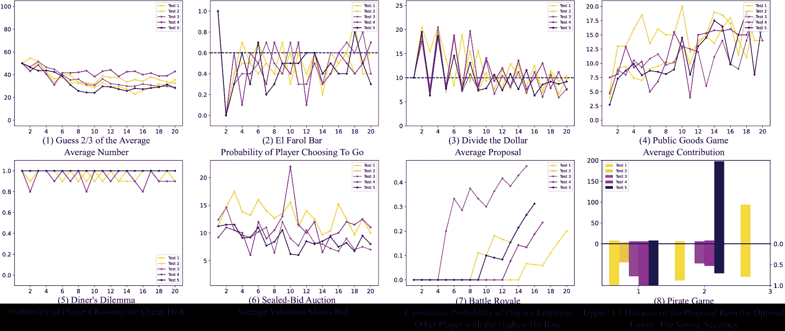

Figure 4: Results of playing the games with the same setting five times.

[BACK TO RQ1]

### F.2 Robustness: Temperatures

Table 5: Quantitative results of playing the games with temperature parameters ranging from $0$ to $1$.

 | Temperatures | 0.0 | 0.2 | 0.4 | 0.6 | 0.8 | 1.0 (Default) | $Avg_{\pm Std}$ |
| --- | --- | --- | --- | --- | --- | --- | --- |
| Guess 2/3 of the Average | $48.0$ | $50.0$ | $49.8$ | $54.7$ | $61.7$ | $65.4$ | $54.9_{\pm 7.1}$ |
| El Farol Bar | $55.8$ | $71.7$ | $63.3$ | $68.3$ | $69.2$ | $73.3$ | $66.9_{\pm 6.4}$ |
| Divide the Dollar | $69.3$ | $67.0$ | $67.7$ | $67.9$ | $72.8$ | $68.1$ | $68.8_{\pm 2.1}$ |
| Public Goods Game | $15.3$ | $10.8$ | $17.9$ | $18.0$ | $36.5$ | $41.3$ | $23.3_{\pm 12.5}$ |
| Diner’s Dilemma | $0.0$ | $0.0$ | $0.0$ | $0.0$ | $0.0$ | $4.0$ | $0.7_{\pm 1.6}$ |
| Sealed-Bid Auction | $5.6$ | $6.0$ | $4.6$ | $4.5$ | $5.8$ | $6.5$ | $5.5_{\pm 0.8}$ |
| Battle Royale | $28.6$ | $26.7$ | $46.7$ | $15.0$ | $33.3$ | $20.0$ | $28.4_{\pm 11.1}$ |
| Pirate Game | $75.0$ | $53.9$ | $77.7$ | $83.8$ | $59.5$ | $80.6$ | $71.8_{\pm 12.2}$ |
| Overall | $37.2$ | $35.7$ | $40.9$ | $39.0$ | $42.3$ | $44.9$ | $40.0_{\pm 3.4}$ | 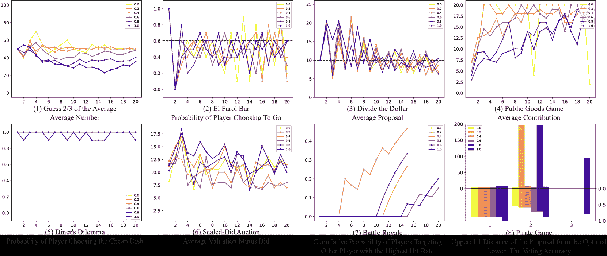

Figure 5: Results of playing the games with temperature parameters ranging from $0$ to $1$.

[BACK TO RQ1]

### F.3 Robustness: Prompt Versions

Table 6: Quantitative results of playing the games using different prompt templates.

| Prompt Versions | V1 (Default) | V2 | V3 | V4 | V5 | $Avg_{\pm Std}$ |
| --- | --- | --- | --- | --- | --- | --- |
| Guess 2/3 of the Average | $65.4$ | $66.4$ | $47.9$ | $66.9$ | $69.7$ | $63.3_{\pm 8.7}$ |
| El Farol Bar | $73.3$ | $75.8$ | $65.8$ | $75.8$ | $71.7$ | $72.5_{\pm 4.1}$ |
| Divide the Dollar | $68.1$ | $81.0$ | $91.5$ | $75.8$ | $79.7$ | $79.2_{\pm 8.5}$ |
| Public Goods Game | $41.3$ | $26.6$ | $45.2$ | $50.2$ | $24.2$ | $37.5_{\pm 11.5}$ |
| Diner’s Dilemma | $4.0$ | $3.5$ | $0.0$ | $57.0$ | $18.5$ | $16.6_{\pm 23.7}$ |
| Sealed-Bid Auction | $6.5$ | $4.6$ | $5.7$ | $2.6$ | $5.9$ | $5.0_{\pm 1.6}$ |
| Battle Royale | $20.0$ | $30.8$ | $15.0$ | $25.0$ | $18.8$ | $21.9_{\pm 6.1}$ |
| Pirate Game | $80.6$ | $87.9$ | $60.8$ | $60.5$ | $53.7$ | $68.7_{\pm 14.7}$ |

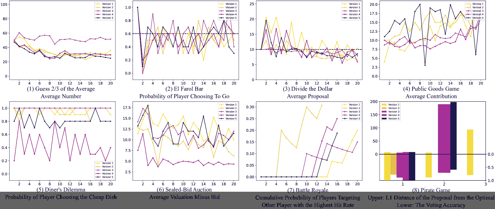

Figure 6: Results of playing the games using different prompt templates.

[BACK TO RQ1]

### F.4 Reasoning Strategies

Table 7: Quantitative results of playing the games using prompt-based improvement methods.

| Improvements | Default | CoT | Cooperative | Selfish | Mathematician |
| --- | --- | --- | --- | --- | --- |
| Guess 2/3 of the Average | $65.4$ | $75.1$ | $69.0$ | $14.5$ | $71.4$ |
| El Farol Bar | $73.3$ | $71.7$ | $74.2$ | $63.3$ | $60.0$ |
| Divide the Dollar | $68.1$ | $83.4$ | $70.7$ | $49.7$ | $69.2$ |
| Public Goods Game | $41.3$ | $56.1$ | $32.4$ | $37.4$ | $25.6$ |
| Diner’s Dilemma | $31.0$ | $82.5$ | $0.0$ | $17.5$ | $47.0$ |
| Sealed-Bid Auction | $6.5$ | $1.4$ | $7.4$ | $4.0$ | $5.8$ |
| Battle Royale | $20.0$ | $17.6$ | $6.3$ | $33.3$ | $26.7$ |
| Pirate Game | $80.6$ | $71.2$ | $80.6$ | $74.7$ | $59.5$ |
| Overall | $44.9$ | $57.4$ | $42.6$ | $36.8$ | $45.6$ |

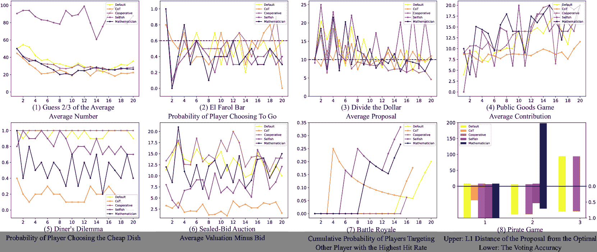

Figure 7: Results of playing the games using prompt-based improvement methods.

[BACK TO RQ2]

### F.5 Generalizability

Table 8: Quantitative results of playing the games with various game settings.

 | Guess 2/3 of the Average | $Avg_{\pm Std}$ |
| \hdashline$R=$ | $0$ | $1/6$ | $1/3$ | $1/2$ | $2/3$ | $5/6$ | $1$ | $7/6$ | $4/3$ | $3/2$ | $5/3$ | $11/6$ | $2$ |  |
|  | $79.1$ | $61.7$ | $66.6$ | $65.4$ | $65.4$ | $54.8$ | $62.4$ | $70.0$ | $74.9$ | $65.9$ | $67.3$ | $63.3$ | $73.6$ | $67.0_{\pm 6.3}$ | 

| El Farol Bar | $Avg_{\pm Std}$ |
| --- | --- |
| \hdashline$R=$ | $0\%$ | $20\%$ | $40\%$ | $60\%$ | $80\%$ | $100\%$ |  |
|  | $53.5$ | $61.3$ | $63.3$ | $73.3$ | $68.1$ | $60.0$ | $63.3_{\pm 6.9}$ |

| Divide the Dollar | $Avg_{\pm Std}$ |
| --- | --- |
| \hdashline$G=$ | $50$ | $100$ | $200$ | $400$ | $800$ |  |
|  | $73.2$ | $68.1$ | $82.5$ | $82.1$ | $80.7$ | $77.3_{\pm 6.4}$ |

| Public Goods Game | $Avg_{\pm Std}$ |
| --- | --- |
| \hdashline$R=$ | $0.0$ | $0.5$ | $1.0$ | $2.0$ | $4.0$ |  |
|  | $42.0$ | $29.0$ | $52.5$ | $41.3$ | $25.9$ | $38.1_{\pm 10.8}$ |

 | Diner’s Dilemma | $Avg_{\pm Std}$ |
| --- | --- |
| \hdashline$(P_{l},U_{l},P_{h},U_{h})=$ | $(10,15,20,20)$ | $(11,5,20,7)$ | $(4,19,9,20)$ | $(1,8,19,12)$ | $(4,5,17,7)$ | $(2,11,8,13)$ |  |
|  | $4.0$ | $2.5$ | $4.5$ | $13.5$ | $0.0$ | $12.0$ | $6.1_{\pm 5.4}$ | 

| Sealed-Bid Auction | $Avg_{\pm Std}$ |
| --- | --- |
| \hdashline$Range=$ | $(0,100]$ | $(0,200]$ | $(0,400]$ | $(0,800]$ |  |
|  | $6.0$ | $5.1$ | $4.7$ | $5.5$ | $5.3_{\pm 0.6}$ |

| Battle Royale | $Avg_{\pm Std}$ |
| --- | --- |
| \hdashline$Range=$ | $[51,60]$ | $[35,80]$ | $[10,100]$ |  |
|  | $28.6$ | $20.0$ | $33.3$ | $27.3_{\pm 6.8}$ |

| Pirate Game | $Avg_{\pm Std}$ |
| --- | --- |
| \hdashline$G=$ | $4$ | $5$ | $100$ | $400$ |  |
|  | $73.8$ | $47.1$ | $80.6$ | $83.6$ | $71.3_{\pm 16.6}$ |

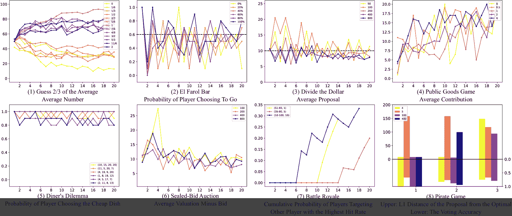

Figure 8: Results of playing the games with various game settings.

[BACK TO RQ3]

### F.6 Leaderboard

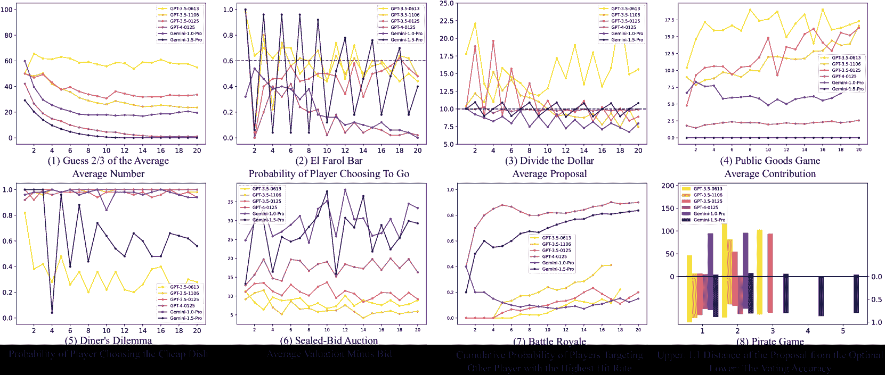

Figure 9: Results of playing the games using different closed-source LLMs.

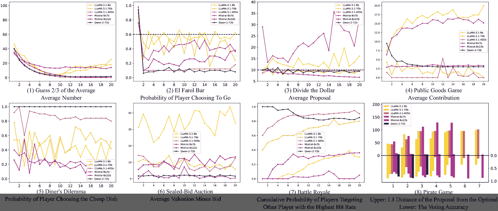

Figure 10: Results of playing the games using different open-source LLMs.

[BACK TO RQ4]

### F.7 Detailed Player Actions of GPT-3.5 (0125)

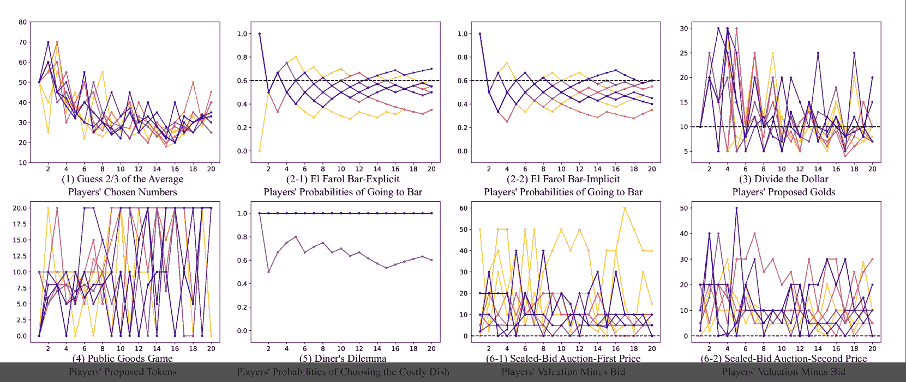

Figure 11: Player actions in Cooperative and Betraying Games.

## Appendix G LLM vs. Specific Strategies

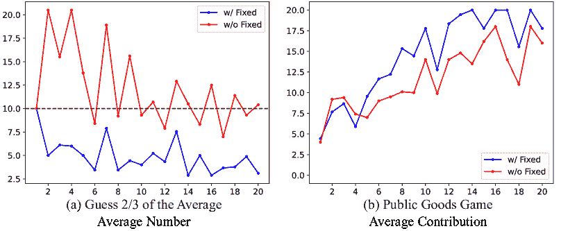

Figure 12: Performance of GPT-3.5 (0125) playing against two fixed strategies in the “Divide the Dollar” and “Public Goods Game.”

Our framework enables concurrent interaction between LLMs and humans, allowing us to investigate LLMs’ behaviors against someone who plays with a fixed strategy. There are many possible strategies, here we use two examples: First, we let one player consistently bid an amount of $91$ golds in the game of “(3) Divide the Dollar,” compelling all other participants to bid a single gold. The objective is to ascertain if LLM agents will adjust their strategies in response to dominant participants. Additionally, we examine agents’ reactions to a persistent free-rider who contributes nothing in the “(4) Public Goods Game” to determine whether agents recognize and adjust their cooperation with the free-rider over time. We plot the average bids and the contributed tokens of the nine agents in Fig. [12](https://arxiv.org/html/2403.11807v4#A7.F12 "Figure 12 ‣ Appendix G LLM vs. Specific Strategies ‣ How Far Are We on the Decision-Making of LLMs? Evaluating LLMs’ Gaming Ability in Multi-Agent Environments"). We find that agents lower their bids in the “(3) Divide the Dollar” game in response to a dominant strategy. Contrary to expectations, in the “(4) Public Goods Game,” agents increase their contributions, compensating for the shortfall caused by the free-rider.