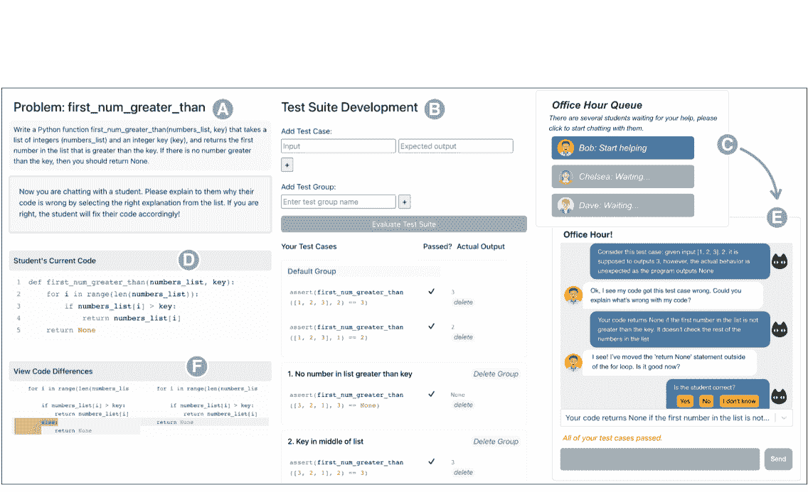
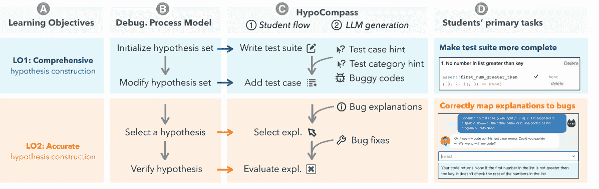
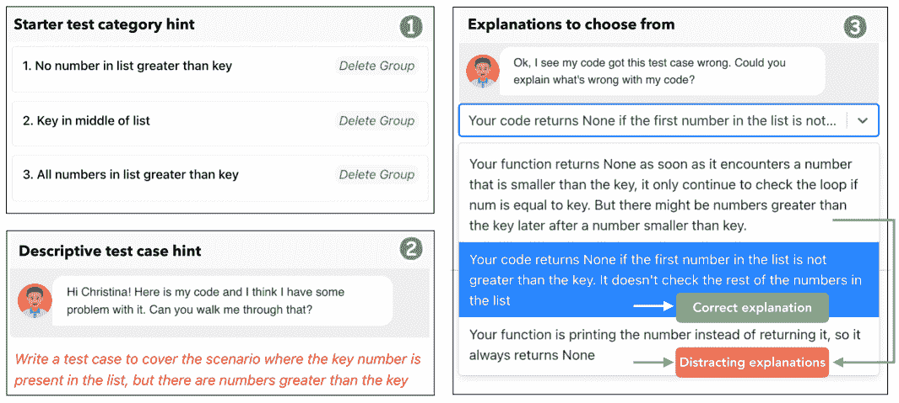
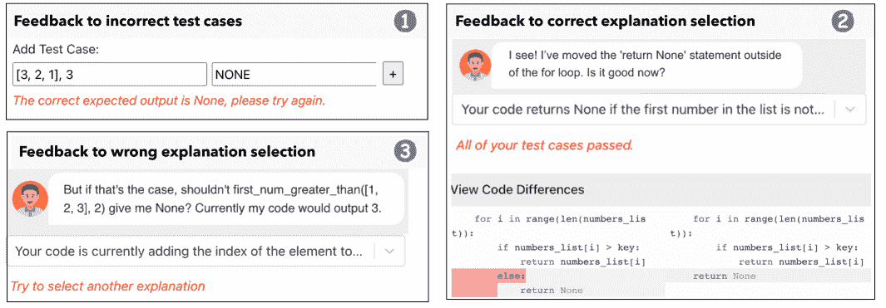
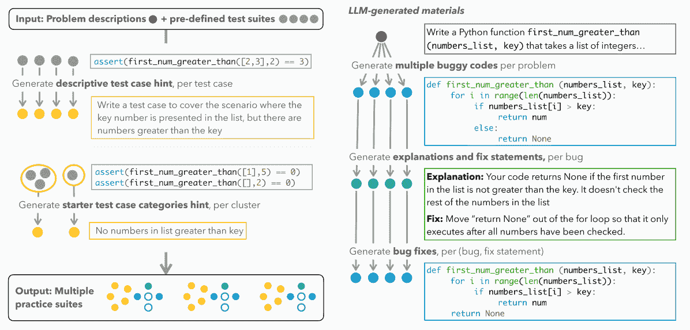
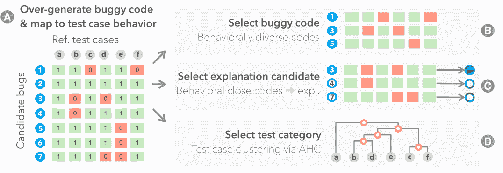
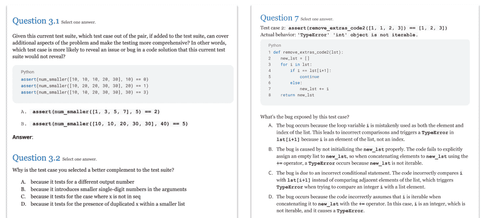

<!--yml
category: 未分类
date: 2025-01-11 13:04:26
-->

# How to Teach Programming in the AI Era? Using LLMs as a Teachable Agent for Debugging

> 来源：[https://arxiv.org/html/2310.05292/](https://arxiv.org/html/2310.05292/)

\addauthor

sworange

¹¹institutetext: Carnegie Mellon University, Pittsburgh PA, USA ¹¹email: {qianoum,krk,sherryw}@cs.cmu.edu ²²institutetext: University of Michigan, Ann Arbor MI, USA
²²email: huashen@umich.eduQianou Ma 11    Hua Shen 22    Kenneth Koedinger 11    Sherry Tongshuang Wu 11

###### Abstract

Large Language Models (LLMs) now excel at *generative* skills and can create content at impeccable speeds. However, they are imperfect and still make various mistakes. In a Computer Science education context, as these models are widely recognized as “AI pair programmers,” it becomes increasingly important to train students on *evaluating* and *debugging* the LLM-generated code. In this work, we introduce HypoCompass, a novel system to facilitate deliberate practice on debugging, where human novices play the role of Teaching Assistants and help LLM-powered teachable agents debug code. We enable effective task delegation between students and LLMs in this learning-by-teaching environment: students focus on *hypothesizing the cause of code errors*, while adjacent skills like code completion are offloaded to LLM-agents. Our evaluations demonstrate that HypoCompass generates high-quality training materials (*e.g.,* bugs and fixes), outperforming human counterparts fourfold in efficiency, and significantly improves student performance on debugging by 12% in the pre-to-post test.

###### Keywords:

LLM teachable agent debugging CS1.

## 1 Introduction

LLMs are becoming an integral part of software development — commercialized tools like GitHub Copilot are now advertised as “your AI pair programmer” and generate up to 46% of users’ code [[6](https://arxiv.org/html/2310.05292v5#bib.bib6)]. Despite their prevalence, LLMs often produce unpredictable mistakes [[11](https://arxiv.org/html/2310.05292v5#bib.bib11)], *e.g.,* GPT-4 can still make mistakes 17% of the time in coding tasks for introductory and intermediate programming courses [[22](https://arxiv.org/html/2310.05292v5#bib.bib22)]. The impressive yet imperfect generative capabilities of LLMs, coupled with the associated risks of excessive reliance on these models, underscore the importance of teaching *evaluation* skills to students. In the context of programming, students must improve their debugging and testing skills [[2](https://arxiv.org/html/2310.05292v5#bib.bib2)].

However, debugging tends to be overlooked in formal educational curricula, especially in introductory Computer Science classes (*i.e.,* CS1) [[21](https://arxiv.org/html/2310.05292v5#bib.bib21)]. Prior research has outlined various factors contributing to the absence of debugging instruction, such as instructors’ limited time budget for developing specialized debugging materials and assessments [[19](https://arxiv.org/html/2310.05292v5#bib.bib19)]. Consequently, students primarily learn debugging from working on their own mistakes, which can be rather frustrating — they must invest substantial time and effort in *hypothesizing* the cause of bugs while grappling with other cognitively demanding tasks, such as understanding and writing code. These challenges prompt us to ask:
Research Question: Can we train students to improve debugging skills by providing *explicit* and *scaffolded* practice *with minimal cost to instructor time?*

Figure 1: In HypoCompass, given a programming problem description (A), a student user (in the role of a Teaching Assistant) needs to compile a test suite (B) and assist multiple LLM-simulated agents (*e.g.,* Bob, Chelsea, Dave) in an Office Hour Queue (C) through a chat interface (E). Each LLM-agent acts as a novice seeking help with a buggy solution (D) and provides feedback to the user (F).

In this work, we focus on training students’ abilities in *hypothesis construction*, a critical step in debugging as established by prior work [[29](https://arxiv.org/html/2310.05292v5#bib.bib29), [30](https://arxiv.org/html/2310.05292v5#bib.bib30)]. We introduce HypoCompass ([Figure 1](https://arxiv.org/html/2310.05292v5#S1.F1 "In 1 Introduction ‣ How to Teach Programming in the AI Era? Using LLMs as a Teachable Agent for Debugging"), [Section 3](https://arxiv.org/html/2310.05292v5#S3 "3 The Design of HypoCompass ‣ How to Teach Programming in the AI Era? Using LLMs as a Teachable Agent for Debugging")), an interactive, LLM-augmented intelligent tutoring system for debugging. Leveraging LLMs’ *material generation* capability, we have these models imitate CS1 students who have written buggy code and require assistance from Teaching Assistants (TAs). Human novice students assume the role of the TA, who helps troubleshoot these bugs. This enables students to deliberately practice the skill of *hypothesizing* about the defects of LLM-generated code, delegating other tasks not core to hypothesis construction (*e.g.,* code completion) to the LLM. As a result, HypoCompass fosters an engaging learning environment using the *teachable agent* framework [[3](https://arxiv.org/html/2310.05292v5#bib.bib3)] and provides students with guided exposure to LLM-generated bugs. We also employ prompting strategies such as focused task formation and over-generate-then-select to improve LLM generation quality in HypoCompass ([Section 4](https://arxiv.org/html/2310.05292v5#S4 "4 LLM Integration ‣ How to Teach Programming in the AI Era? Using LLMs as a Teachable Agent for Debugging")).

We conducted two evaluation studies and found that HypoCompass *saves instructors’ time in material generation* and is *beneficial to student learning*. In our LLM evaluation study ([Section 5](https://arxiv.org/html/2310.05292v5#S5 "5 LLM Evaluation: Generation Efficiency and Quality ‣ How to Teach Programming in the AI Era? Using LLMs as a Teachable Agent for Debugging")), expert inspections on six practice problems and 145 buggy programs showed that HypoCompass achieved a 90% success rate in generating and validating a complete set of materials, *four times faster than human generation.* Our learning evaluation study with 19 novices ([Section 6](https://arxiv.org/html/2310.05292v5#S6 "6 Learning Evaluation: Pre- / Post-Test Study ‣ How to Teach Programming in the AI Era? Using LLMs as a Teachable Agent for Debugging")) showed that HypoCompass significantly improved students’ pre-to-post test performance by 12% and decreased their completion time by 14%.

In summary, we contribute:

*   •

    A pragmatic solution that balances the benefits and risks of LLMs in learning. We use LLMs to prepare students to engage with imperfect LLMs, and we highlight the importance of *role-playing* for practical LLM application and *task delegation* to help students focus on essential skills.

*   •

    A theoretically grounded instructional design to enhance debugging skills. To the best of our knowledge, we are the first to provide aligned instruction and assessments on the hypothesis construction learning objectives, *i.e.,* forming hypotheses about the source of error, a core bottleneck in debugging [[25](https://arxiv.org/html/2310.05292v5#bib.bib25)].

## 2 Related Works

The Debugging Process. Debugging is a complicated process of various cognitively demanding tasks, including understanding the code, finding bugs, and fixing bugs, with the first two considered primary bottlenecks [[19](https://arxiv.org/html/2310.05292v5#bib.bib19), [25](https://arxiv.org/html/2310.05292v5#bib.bib25)]. While many studies have attempted to improve students’ code understanding [[12](https://arxiv.org/html/2310.05292v5#bib.bib12)], there is limited instruction on bug finding. Researchers characterize the cognitive model of bug finding as a *hypothesis construction process*, including initializing, modifying, selecting, and verifying hypotheses ([Figure 2](https://arxiv.org/html/2310.05292v5#S3.F2 "In 3 The Design of HypoCompass ‣ How to Teach Programming in the AI Era? Using LLMs as a Teachable Agent for Debugging")B) [[29](https://arxiv.org/html/2310.05292v5#bib.bib29)]. This process is challenging: prior works show that novices struggle to systematically generate comprehensive hypotheses and identify the right hypothesis, in contrast to experts [[8](https://arxiv.org/html/2310.05292v5#bib.bib8), [7](https://arxiv.org/html/2310.05292v5#bib.bib7)]. Hence, we emphasize teaching students to *construct accurate hypotheses about bugs* and *develop comprehensive hypotheses about potential bugs*.

Tutors and Tools for Debugging Training. Prior studies [[19](https://arxiv.org/html/2310.05292v5#bib.bib19)] and online discussions [[21](https://arxiv.org/html/2310.05292v5#bib.bib21)] indicate that teaching debugging is challenging and is rarely included in CS1 curricula, due to logistical challenges like the lack of instructional time and resources [[5](https://arxiv.org/html/2310.05292v5#bib.bib5), [10](https://arxiv.org/html/2310.05292v5#bib.bib10)]. Existing tools demand instructor effort and often focus on the full debugging process, improving bug-fixing accuracy and efficiency [[1](https://arxiv.org/html/2310.05292v5#bib.bib1), [15](https://arxiv.org/html/2310.05292v5#bib.bib15)]. In contrast, few studies emphasize accurate or comprehensive hypothesis construction (and they tend to be language-specific) [[13](https://arxiv.org/html/2310.05292v5#bib.bib13), [25](https://arxiv.org/html/2310.05292v5#bib.bib25)]. To fill in the gap, we design HypoCompass to provide *deliberate practice* [[9](https://arxiv.org/html/2310.05292v5#bib.bib9)] on hypothesis construction, and use *the LLM generation capability to provide easily adaptable and targeted exercises* with immediate feedback.

LLM Capabilities for CS Learning. LLMs can perform well in a CS1 classroom [[22](https://arxiv.org/html/2310.05292v5#bib.bib22)], but concerns about misuse and LLM errors limit their use in education [[2](https://arxiv.org/html/2310.05292v5#bib.bib2)]. Therefore, current deployments tend to focus on generating instructional materials (*e.g.,* questions [[24](https://arxiv.org/html/2310.05292v5#bib.bib24)]). In our work, HypoCompass uses the LLM to generate inter-dependent materials in an integrated process and frame the LLM as a student asking for help [[3](https://arxiv.org/html/2310.05292v5#bib.bib3)], such that human novices can embrace imperfections in LLMs. Two unique capabilities of LLMs power this: (1) LLMs can simulate different personas and tutoring interactions [[18](https://arxiv.org/html/2310.05292v5#bib.bib18)]; (2) LLMs make common mistakes and natural bugs similar to humans [[20](https://arxiv.org/html/2310.05292v5#bib.bib20)], which can be used as buggy code practice examples. We adapt and develop various prompting methods [[27](https://arxiv.org/html/2310.05292v5#bib.bib27)] to enhance the quality of LLM generations.

## 3 The Design of HypoCompass

Grounded in the cognitive process [[29](https://arxiv.org/html/2310.05292v5#bib.bib29)] and the novice-expert difference in hypothesis-driven debugging ([Section 2](https://arxiv.org/html/2310.05292v5#S2 "2 Related Works ‣ How to Teach Programming in the AI Era? Using LLMs as a Teachable Agent for Debugging")), we specify two crucial learning components for HypoCompass: comprehensive and accurate hypothesis construction. Prior work shows that hypothesis construction is closely connected with testing [[30](https://arxiv.org/html/2310.05292v5#bib.bib30)]: each additional test case should, ideally, be a hypothesis about what can go wrong in the program. In turn, a *comprehensive* test suite (*i.e.,* a set of test cases) should allow an effective debugger to construct a *accurate* hypothesis about why the program is wrong. We thus design toward two learning objectives ([Figure 2](https://arxiv.org/html/2310.05292v5#S3.F2 "In 3 The Design of HypoCompass ‣ How to Teach Programming in the AI Era? Using LLMs as a Teachable Agent for Debugging")A,D):

1.  LO1

    Comprehensive Hypothesis Construction: Construct a comprehensive test suite that well covers the possible errors for the given problem.

2.  LO2

    Accurate Hypothesis Construction: Given the failed test cases, construct an accurate explanation of how the program is wrong.

Figure 2: To enable deliberate practice, we establish a close mapping between the (A) learning objectives, (B) the cognitive debugging process model, (C) the HypoCompass interaction flow, and (D) the primary tasks students perform in HypoCompass. We offload various material generation tasks to LLMs (C[2]).

#### *Interface and Key Components.*

We designed HypoCompass through an iterative development process with 10 pilots, including CS1 students, TAs, and instructors. In the resulting interface ([Figure 1](https://arxiv.org/html/2310.05292v5#S1.F1 "In 1 Introduction ‣ How to Teach Programming in the AI Era? Using LLMs as a Teachable Agent for Debugging")), a human student would be asked to play the role of a TA where they help an LLM-simulated student (LLM-agent) in debugging. They need to write and sort test cases into categories ([Figure 1](https://arxiv.org/html/2310.05292v5#S1.F1 "In 1 Introduction ‣ How to Teach Programming in the AI Era? Using LLMs as a Teachable Agent for Debugging")B) that represent different hypotheses of what inputs may trigger errors in code.

Once the student is satisfied with their test suite, HypoCompass shows them an Office Hour Queue (OHQ) simulator ([Figure 1](https://arxiv.org/html/2310.05292v5#S1.F1 "In 1 Introduction ‣ How to Teach Programming in the AI Era? Using LLMs as a Teachable Agent for Debugging")C). As the student interacts with each LLM-agent, the agent presents a buggy code snippet ([Figure 1](https://arxiv.org/html/2310.05292v5#S1.F1 "In 1 Introduction ‣ How to Teach Programming in the AI Era? Using LLMs as a Teachable Agent for Debugging")D). The student guides the LLM-agent in debugging code through a dialog interface ([Figure 1](https://arxiv.org/html/2310.05292v5#S1.F1 "In 1 Introduction ‣ How to Teach Programming in the AI Era? Using LLMs as a Teachable Agent for Debugging")E), selecting or creating test cases that reflect their hypotheses of the bug, and selecting explanations for the bug among a pool of candidate natural language explanations. These candidates each explain a different bug, representing alternative hypotheses that may confuse students (*e.g.,* [Section 3](https://arxiv.org/html/2310.05292v5#S3.SS0.SSS0.Px1 "Interface and Key Components. ‣ 3 The Design of HypoCompass ‣ How to Teach Programming in the AI Era? Using LLMs as a Teachable Agent for Debugging")[3]).

The LLM-agent then uses the test case and explanation to revise the code, providing immediate feedback to the student ([Section 3](https://arxiv.org/html/2310.05292v5#S3.SS0.SSS0.Px1 "Interface and Key Components. ‣ 3 The Design of HypoCompass ‣ How to Teach Programming in the AI Era? Using LLMs as a Teachable Agent for Debugging")). If the explanation is correct, the agent will conduct minimal code fixes, and present the color-coded edits as feedback ([Figure 1](https://arxiv.org/html/2310.05292v5#S1.F1 "In 1 Introduction ‣ How to Teach Programming in the AI Era? Using LLMs as a Teachable Agent for Debugging")F, a zoomed-in view is in [Section 3](https://arxiv.org/html/2310.05292v5#S3.SS0.SSS0.Px1 "Interface and Key Components. ‣ 3 The Design of HypoCompass ‣ How to Teach Programming in the AI Era? Using LLMs as a Teachable Agent for Debugging")[2]). Otherwise, the LLM-agent will ask the student to reflect on their hypothesis by responding with a confusion message that highlights the discrepancy between the student’s explanation and the actual code behavior ([Section 3](https://arxiv.org/html/2310.05292v5#S3.SS0.SSS0.Px1 "Interface and Key Components. ‣ 3 The Design of HypoCompass ‣ How to Teach Programming in the AI Era? Using LLMs as a Teachable Agent for Debugging")[3]).

Once the student correctly confirms that all the bugs are fixed, they can move to help the next LLM-agent ([Figure 1](https://arxiv.org/html/2310.05292v5#S1.F1 "In 1 Introduction ‣ How to Teach Programming in the AI Era? Using LLMs as a Teachable Agent for Debugging")C). Upon completion, HypoCompass will provide the next round of exercises with another programming problem. While the numbers are configurable, by default HypoCompass includes two programming exercises, each with three LLM-agents (buggy programs).

\phantomcaption

Figure 3(()): HypoCompass offers (1) *test category hints* to help write a comprehensive test suite systematically; (2) *test case hints* to help students add missing test scenarios; (3) *candidate explanation pool* to clarify misconceptions of alternative explanations.

\phantomcaption

Figure 3(()): HypoCompass provides immediate feedback to (1) *incorrect test cases*, ensuring students understand the code behavior; (2) *correct explanations*, as correct code fixes; (3) *incorrect explanations*, as confusion messages from the LLM-agent.

We highlight the two most essential components of the interaction:

*   •

    Frame imperfect LLMs through role-play. We use the LLM to simulate students who wrote bugs and have human novices offer help. This teachable agent setup supports learning, helping students reflect on their knowledge and reason through diverse bugs [[23](https://arxiv.org/html/2310.05292v5#bib.bib23)]. Having students work through “other people’s errors” also boosts their motivation and protects their self-efficacy [[3](https://arxiv.org/html/2310.05292v5#bib.bib3)]. More importantly, it actively involves novices in identifying bugs in LLM-generated code, *enabling guided exposure to LLM imperfectness*.

*   •

    Task delegation between students and LLMs. To ensure deliberate practice on comprehensive and accurate hypothesis construction, students primarily engage in two tasks corresponding to each learning objective ([Figure 2](https://arxiv.org/html/2310.05292v5#S3.F2 "In 3 The Design of HypoCompass ‣ How to Teach Programming in the AI Era? Using LLMs as a Teachable Agent for Debugging")D): (1) making the test suite more complete ([LO1](https://arxiv.org/html/2310.05292v5#S3.I1.i1 "Item LO1 ‣ 3 The Design of HypoCompass ‣ How to Teach Programming in the AI Era? Using LLMs as a Teachable Agent for Debugging")); and (2) correctly mapping explanations to bugs ([LO2](https://arxiv.org/html/2310.05292v5#S3.I1.i2 "Item LO2 ‣ 3 The Design of HypoCompass ‣ How to Teach Programming in the AI Era? Using LLMs as a Teachable Agent for Debugging")). We align student interaction flow ([Figure 2](https://arxiv.org/html/2310.05292v5#S3.F2 "In 3 The Design of HypoCompass ‣ How to Teach Programming in the AI Era? Using LLMs as a Teachable Agent for Debugging")C[1]) with the cognitive model of debugging [[29](https://arxiv.org/html/2310.05292v5#bib.bib29)] ([Figure 2](https://arxiv.org/html/2310.05292v5#S3.F2 "In 3 The Design of HypoCompass ‣ How to Teach Programming in the AI Era? Using LLMs as a Teachable Agent for Debugging")B). LLMs take over other tasks that are *indirectly related* to the core learning goals, including generating diverse bugs and fixes, which frees students from code writing. We also use LLMs to support scaffolding, generate hints ([Section 3](https://arxiv.org/html/2310.05292v5#S3.SS0.SSS0.Px1 "Interface and Key Components. ‣ 3 The Design of HypoCompass ‣ How to Teach Programming in the AI Era? Using LLMs as a Teachable Agent for Debugging")), and provide immediate feedback throughout the practice ([Section 3](https://arxiv.org/html/2310.05292v5#S3.SS0.SSS0.Px1 "Interface and Key Components. ‣ 3 The Design of HypoCompass ‣ How to Teach Programming in the AI Era? Using LLMs as a Teachable Agent for Debugging")).

Figure 4: Examples of inputs and outputs to the LLM material generation pipeline.

## 4 LLM Integration

As shown in [Figure 2](https://arxiv.org/html/2310.05292v5#S3.F2 "In 3 The Design of HypoCompass ‣ How to Teach Programming in the AI Era? Using LLMs as a Teachable Agent for Debugging")C[2], we use LLM to generate five types of materials: (1) test case category hints, (2) test case hints, (3) buggy programs, (4) explanations of bugs, and (5) programs with bugs fixed. We reduce instructor workload by generating practices using just a problem description, a reference solution, and a reference test suite with about 10 inputs, and we further minimize human verification overhead with optimized prompts and automated algorithms. Our generation process is detailed in [Figure 4](https://arxiv.org/html/2310.05292v5#S3.F4 "In Interface and Key Components. ‣ 3 The Design of HypoCompass ‣ How to Teach Programming in the AI Era? Using LLMs as a Teachable Agent for Debugging"), example prompts are in [Table 1](https://arxiv.org/html/2310.05292v5#S4.T1 "In Task Formation and Decomposition. ‣ 4 LLM Integration ‣ How to Teach Programming in the AI Era? Using LLMs as a Teachable Agent for Debugging"), and full prompts are in Table 3 in [Supplements](http://tinyurl.com/hypocompass-sup)¹¹1Supplemental materials are at: [http://tinyurl.com/hypocompass-sup](http://tinyurl.com/hypocompass-sup). OpenAI’s gpt-3.5-turbo is used for all materials, except for explanation generation, which uses gpt-4 for enhanced reasoning capabilities. Below are key factors to the success of generation:

#### *Task Formation and Decomposition.*

We iterate on our prompts according to the nature of the task. First, as LLMs behave inconsistently when the user tasks conflict with LLMs inherent training objectives [[28](https://arxiv.org/html/2310.05292v5#bib.bib28)], we carefully formulate the task to avoid introducing competing tasks. Take *Local Bug Fix* ([Table 1](https://arxiv.org/html/2310.05292v5#S4.T1 "In Task Formation and Decomposition. ‣ 4 LLM Integration ‣ How to Teach Programming in the AI Era? Using LLMs as a Teachable Agent for Debugging")) as an example: when we directly ask the LLM to fix a bug according to an explanation, we observe that the model almost always over-fix all bugs irrespective of the provided instructions. This is because LLMs can be biased towards generating fully correct code (part of the LLM pre-training) and away from local bug fixing (changing only the buggy snippet described by the instruction, the desired task). Hence, we re-frame it as a *translation task*, converting bug-fixing instructions to its code format old $\rightarrow$ new code snippet. This task re-framing mitigates the model’s inherent bias, reducing over-fixing errors by 70%.

Second, for multi-step tasks (*e.g.,* *Local Bug Fix*), we adopt LLM-chains [[27](https://arxiv.org/html/2310.05292v5#bib.bib27)], decomposing tasks into sub-tasks handled by separate steps, such that each step contributes to stable performance. Third, we also address prompt complexity by explicitly prioritizing essential requirements. For tasks like generating *Bug Explanations and Fix Instructions* ([Table 1](https://arxiv.org/html/2310.05292v5#S4.T1 "In Task Formation and Decomposition. ‣ 4 LLM Integration ‣ How to Teach Programming in the AI Era? Using LLMs as a Teachable Agent for Debugging")), we prioritize precise bug extraction, instructing the model to list all unique bugs upfront. Secondary requirements (*e.g.,* word limits) are specified only in the output format. This hierarchical disentanglement significantly improves success rates by over 40%.

Table 1: Prompts and temperatures (Temp.) for generating bugs, explanations, and fixes. The temperature is set higher for more diverse and random outputs.

| Material | Generation goal | Temp. |
| Buggy code | To over-generate bugs with mixed quality for further selection. | 0.7 |
| [Sys.] | You are a novice student in intro CS, you make mistakes and write buggy code. |
| [User] | Problem Description: {problem_description} Write different buggy solutions with common mistakes like novice students: |
| Bug expl. & fix instruct. | To describe each unique bug, and write a corresponding fix instruction. If there are multiple bugs in the code, generate their explanations and fixes separately. | 0.3 |
| [Sys.] | You are a helpful and experienced TA of an introductory programming class. |
| [User] | Hi, I’m a student in your class. I’m having trouble with this problem in the programming assignment: {problem_description} Here’s my buggy code: {buggy_code} What’s wrong with my code? List all the unique bugs included, but do not make up bugs. For each point, put in the format of: {explanation: accurate and concise explanation of what the code does and what the bug is, for a novice, fix: how to fix the bug, within 30 words} Only return the bullet list. Do not write any other text or code. |
| Bug fix | To edit the buggy code according to the fix instruction, w/o over- or under- fix. | 0.3 |
| [Sys.] | You fix bugs in Python code closely following the instructions. |
| [User] | Original code: {buggy_code}; Code modification: {explanation} Translate the statement into actual, minimal code change in this format:
{original code snippet: ""copy the lines of code that need editing""
-> edited code snippet: ""write the edited code snippet""} |
| [LLM ] | {old to new snippet in JSON, e.g., numbers_list[i] <= key $\mathrel{\hbox{\rule[-0.2pt]{3.0pt}{0.4pt}}\mkern-4.0mu\hbox{\char 41\relax}}$ numbers_list[i] > key } |
| [User] | Old Code:{buggy_code}; Instruction:{Old snippet to new snippet}; New Code: |

#### *Over-Generate-then-Select.*

Figure 5: Over-generate and automatically select materials with pedagogical values.

While LLMs can easily generate random materials, it is nontrivial to ensure that their generations have pedagogical values. For example, behaviorally distinct bugs help students practice with varied instances, but it is hard to enforce through prompting as it requires LLMs to “know” bug behaviors. Nonetheless, we can configure the non-deterministic LLMs to over-generate multiple solutions with mixed qualities [[17](https://arxiv.org/html/2310.05292v5#bib.bib17)], and then select a subset of desired ones ([Figure 5](https://arxiv.org/html/2310.05292v5#S4.F5 "In Over-Generate-then-Select. ‣ 4 LLM Integration ‣ How to Teach Programming in the AI Era? Using LLMs as a Teachable Agent for Debugging")). We apply this strategy in multiple places:

(1) To expose students to behaviorally distinct bugs, we over-generate buggy code ([Table 1](https://arxiv.org/html/2310.05292v5#S4.T1 "In Task Formation and Decomposition. ‣ 4 LLM Integration ‣ How to Teach Programming in the AI Era? Using LLMs as a Teachable Agent for Debugging")). We filter out correct code, and we vectorize buggy code’s behavior based on the reference test suite ([Figure 5](https://arxiv.org/html/2310.05292v5#S4.F5 "In Over-Generate-then-Select. ‣ 4 LLM Integration ‣ How to Teach Programming in the AI Era? Using LLMs as a Teachable Agent for Debugging")A, 0 being failed tests). We then greedily choose a diverse subset of buggy programs with the maximum pairwise distance, using Euclidean distance on the error vectors ([Figure 5](https://arxiv.org/html/2310.05292v5#S4.F5 "In Over-Generate-then-Select. ‣ 4 LLM Integration ‣ How to Teach Programming in the AI Era? Using LLMs as a Teachable Agent for Debugging")B).

(2) To help students clarify misconceptions ([Figure 5](https://arxiv.org/html/2310.05292v5#S4.F5 "In Over-Generate-then-Select. ‣ 4 LLM Integration ‣ How to Teach Programming in the AI Era? Using LLMs as a Teachable Agent for Debugging")C), we want distracting explanations that look similar to the actual explanation for each practice buggy code. We choose from the over-generated buggy code pool, find two with the smallest Euclidean distance to the target code, and use their corresponding explanations as distractors. The mapping also helps generate the confusion messages ([Section 3](https://arxiv.org/html/2310.05292v5#S3.SS0.SSS0.Px1 "Interface and Key Components. ‣ 3 The Design of HypoCompass ‣ How to Teach Programming in the AI Era? Using LLMs as a Teachable Agent for Debugging")[3]) — when a student selects the distractor explanation, we use its corresponding buggy code to find test cases to present to students.

(3) To capture key testing aspects in our test category hints ([Figure 5](https://arxiv.org/html/2310.05292v5#S4.F5 "In Over-Generate-then-Select. ‣ 4 LLM Integration ‣ How to Teach Programming in the AI Era? Using LLMs as a Teachable Agent for Debugging")D), we cluster reference test cases into semantically meaningful groups. We build dendrograms from test case vectors with Agglomerative Hierarchical Clustering [[14](https://arxiv.org/html/2310.05292v5#bib.bib14)], which guide the selection of test category hints from the over-generated pool.

#### *Human-in-the-Loop Verification.*

As shown in [Figure 4](https://arxiv.org/html/2310.05292v5#S3.F4 "In Interface and Key Components. ‣ 3 The Design of HypoCompass ‣ How to Teach Programming in the AI Era? Using LLMs as a Teachable Agent for Debugging"), while the hints for test cases and categories are generated separately, the materials relevant to bugs are generated in sequential order. We perform human verification per step to mitigate the risk of cascading errors in subsequent steps. We provide more details on human verification and editing times in [Section 5](https://arxiv.org/html/2310.05292v5#S5 "5 LLM Evaluation: Generation Efficiency and Quality ‣ How to Teach Programming in the AI Era? Using LLMs as a Teachable Agent for Debugging").

## 5 LLM Evaluation: Generation Efficiency and Quality

We evaluated the generations on six different problems from prior work [[4](https://arxiv.org/html/2310.05292v5#bib.bib4)] and our own problems (detailed in Table 4 in [Supplements](http://tinyurl.com/hypocompass-sup)). On average, for each problem, we generated 3 test category hints, 10 test case hints, 24 buggy programs, explanation and fix instructions, and 33 bug fixes. The total number and the success rates are summarized in [Table 2](https://arxiv.org/html/2310.05292v5#S5.T2 "In Method. ‣ 5 LLM Evaluation: Generation Efficiency and Quality ‣ How to Teach Programming in the AI Era? Using LLMs as a Teachable Agent for Debugging"). We provided the success criteria for all types of materials in Table 5 in [Supplements](http://tinyurl.com/hypocompass-sup).

#### *Method.*

Two authors annotated 10% of the generations at each step individually, and discussed to resolve the disagreement and update the codebook. An external instructor annotated the same 10% of LLM-generated materials, using the updated codebook. We calculated the inter-rater reliability (IRR) between the external instructor and the resolved annotation among the two authors using percent IRR and Cohen’s Kappa. As shown in [Table 2](https://arxiv.org/html/2310.05292v5#S5.T2 "In Method. ‣ 5 LLM Evaluation: Generation Efficiency and Quality ‣ How to Teach Programming in the AI Era? Using LLMs as a Teachable Agent for Debugging"), the agreements are satisfactory across different model generations (IRR% $>$ 90% and $\kappa>0.75$)²²2 Buggy programs undergo automatic testing, so human verification is unnecessary (n/a). If both raters unanimously agree in one category, $kappa$ is undefined (-), so $\kappa$ is only noted when there’s less than 100% IRR agreement on a single label. . One author annotated the rest of the materials to calculate the success rates. We log the verification and editing *time*, as proxies to the instructor overhead.

To compare LLM and human generations, we recruited two experienced CS TAs to each create practice materials for a specific problem. Each TA received the same input as LLMs, was asked to produce one set of materials matching the amount of content LLMs produced, and was compensated for their time.

Table 2: LLM Evaluation: Time, Success rate, and Inter-Rater Reliability scores (*i.e.,* IRR% = #agreements / #total labels, $\kappa$ is Cohen’s Kappa coefficient).${}^{\ref{footnote:kappa}}$

| Material | Raw LLM outputs | Human verification |
| --- | --- | --- |
| # Generation | Avg. gen time | Success% | Avg. edit time | IRR% | $\kappa$ |
| --- | --- | --- | --- | --- | --- |
| Test case description hint | 61 | 0:00:37 | 98.36% | 0:00:08 | 100% | - |
| Test case category hint | 18 | 0:00:10 | 94.44% | 0:00:10 | 100% | - |
| Buggy code | 145 | 0:01:30 | 57.93% | 0:00:02 | n/a | n/a |
| Bug explanation and fix | 145 | 0:03:36 | 91.72% | 0:00:52 | 90% | 0.875 |
| Bug fix | 195 | 0:02:45 | 86.15% | 0:00:37 | 92% | 0.752 |

#### *Result: Efficient and High-Quality Generation.*

We achieve high-quality generation: a complete set of practice materials with 9 buggy programs (3 for practice and 6 more as distractors), 9 bug explanations, 9 bug fixes, 10 test case hints, and 3 test category hints can be generated with a 90% success rate and only takes 15 minutes to label and edit. As we *over-generate* and automatically select buggy code, a success rate over 50% is reasonable for practical use.

Employing LLMs can also be significantly more efficient. In total, a TA spent around 60 minutes to generate one set of practice materials for HypoCompass. One TA noted the difficulty in consistently creating unique and high-quality materials after 30 minutes, saying that *“the importance of the bug I create would start to decline.”* The same author evaluated the TAs’ generations using the annotation codebook, which had a 100% success rate and took 11 minutes. The time invested in generating and editing instructional materials for HypoCompass using LLMs was 4.67 times less than that of the human TAs.

## 6 Learning Evaluation: Pre- / Post-Test Study

*Can novices better formulate hypotheses after engaging with HypoCompass?* We conducted a learning evaluation with 19 students and compared the difference in speed and performance from the pre-test to the post-test.

#### *Assessment.*

To best capture student learning gains on our learning objectives, we took a backward design method [[26](https://arxiv.org/html/2310.05292v5#bib.bib26)] to create an aligned assessment for the comprehensive [LO1](https://arxiv.org/html/2310.05292v5#S3.I1.i1 "Item LO1 ‣ 3 The Design of HypoCompass ‣ How to Teach Programming in the AI Era? Using LLMs as a Teachable Agent for Debugging") and accurate [LO2](https://arxiv.org/html/2310.05292v5#S3.I1.i2 "Item LO2 ‣ 3 The Design of HypoCompass ‣ How to Teach Programming in the AI Era? Using LLMs as a Teachable Agent for Debugging") hypothesis construction skills. We conducted multiple rounds of pilots to refine our intervention and pre-post tests.

Figure 6: Pre-post test question examples for [LO1](https://arxiv.org/html/2310.05292v5#S3.I1.i1 "Item LO1 ‣ 3 The Design of HypoCompass ‣ How to Teach Programming in the AI Era? Using LLMs as a Teachable Agent for Debugging") comprehensive (Q3.1 and Q3.2) and [LO2](https://arxiv.org/html/2310.05292v5#S3.I1.i2 "Item LO2 ‣ 3 The Design of HypoCompass ‣ How to Teach Programming in the AI Era? Using LLMs as a Teachable Agent for Debugging") accurate hypothesis construction (Q7).

Our final tests are based on two programming exercises with comparable difficulties. We counterbalanced pre-post tests’ problems to control for problem sequence influence. Each test consists of seven questions, with three assessing [LO1](https://arxiv.org/html/2310.05292v5#S3.I1.i1 "Item LO1 ‣ 3 The Design of HypoCompass ‣ How to Teach Programming in the AI Era? Using LLMs as a Teachable Agent for Debugging") and four for [LO2](https://arxiv.org/html/2310.05292v5#S3.I1.i2 "Item LO2 ‣ 3 The Design of HypoCompass ‣ How to Teach Programming in the AI Era? Using LLMs as a Teachable Agent for Debugging"). [Figure 6](https://arxiv.org/html/2310.05292v5#S6.F6 "In Assessment. ‣ 6 Learning Evaluation: Pre- / Post-Test Study ‣ How to Teach Programming in the AI Era? Using LLMs as a Teachable Agent for Debugging") provides a sample for each. For instance, Question 3.1 asks students to identify the more suitable test case to add to an existing test suite, evaluating their ability to construct comprehensive hypotheses ([LO1](https://arxiv.org/html/2310.05292v5#S3.I1.i1 "Item LO1 ‣ 3 The Design of HypoCompass ‣ How to Teach Programming in the AI Era? Using LLMs as a Teachable Agent for Debugging")). We measure students’ performance using their test scores based on a standard rubric. We also log the pre-post tests’ completion time as a proxy for proficiency.

#### *Method: Study Procedure and Participants.*

Our hour-long user study constituted a pre-survey, pre-test, interaction with HypoCompass, post-test, and a post-survey. Participants began with a pre-survey, which asked demographic information and 7-level Likert Scale questions on their debugging experiences. Then, participants had up to 20 minutes for the pre-test. The system interaction consisted of two problems, where participants needed to write a test suite and explain bugs in three different buggy programs for each problem. The first problem was the same as in the pre-test, and the second problem matched the screening survey’s exercise. By reusing problems that students have seen, we isolate our learning objectives from the program comprehension skills. After a subsequent 20-minute post-test, participants filled out a post-survey with Likert Scale and open-ended questions on their experience and perceptions using HypoCompass. Participants received a $15 Gift Card for their time.

We recruited a diverse group of undergraduate and graduate students from four public or private US institutions. Interested participants completed a screening survey, which included a programming exercise that also served as the second exercise in our study. To ensure a suitable skill range, we excluded those with extensive programming experience or who quickly solved the exercise. After filtering, 19 participants (S1-19) were included in the study — 12 females, 6 males, 1 non-binary, and 8 non-native English speakers, with an average age of 20.7.

#### *Quantitative Result: Learning Gains.*

A two-tailed paired t-test showed that students’ pre-test to post-test scores significantly improved by 11.7% ($p=0.033<0.05$), and the time of completion significantly reduced by 13.6% ($p=0.003$), indicating success in learning through HypoCompass interaction. Note that the bugs used in pre-post tests are generated by humans and are not the same as in HypoCompass. As such, the significant learning gains indicate that students could learn debugging skills *transferable* to real-world bugs.

Where does the learning gain come from? We break down the analyses by learning objectives. We found a small 6.1% improvement in the score and a large 23.6% time reduction for *comprehensive hypothesis construction* ([LO1](https://arxiv.org/html/2310.05292v5#S3.I1.i1 "Item LO1 ‣ 3 The Design of HypoCompass ‣ How to Teach Programming in the AI Era? Using LLMs as a Teachable Agent for Debugging")), and a large 15.8% improvement in the score and a small 9.0% time reduction for *accurate hypothesis construction* ([LO2](https://arxiv.org/html/2310.05292v5#S3.I1.i2 "Item LO2 ‣ 3 The Design of HypoCompass ‣ How to Teach Programming in the AI Era? Using LLMs as a Teachable Agent for Debugging")). Therefore, students showed more efficiency enhancement in [LO1](https://arxiv.org/html/2310.05292v5#S3.I1.i1 "Item LO1 ‣ 3 The Design of HypoCompass ‣ How to Teach Programming in the AI Era? Using LLMs as a Teachable Agent for Debugging"), and more learning gains in [LO2](https://arxiv.org/html/2310.05292v5#S3.I1.i2 "Item LO2 ‣ 3 The Design of HypoCompass ‣ How to Teach Programming in the AI Era? Using LLMs as a Teachable Agent for Debugging"). Note that these improvements may confound with problem difficulty, as the items corresponding to [LO1](https://arxiv.org/html/2310.05292v5#S3.I1.i1 "Item LO1 ‣ 3 The Design of HypoCompass ‣ How to Teach Programming in the AI Era? Using LLMs as a Teachable Agent for Debugging") (pre-test $\mu=54\%$) seem easier than the ones for [LO2](https://arxiv.org/html/2310.05292v5#S3.I1.i2 "Item LO2 ‣ 3 The Design of HypoCompass ‣ How to Teach Programming in the AI Era? Using LLMs as a Teachable Agent for Debugging") (pre-test $\mu=38\%$).

#### *Qualitative Result: Student Perceptions.*

We further unpack how HypoCompass contributed to learning by analyzing the survey responses. Students valued being able to offload some debugging subtasks to HypoCompass, such as writing code and explanations. For example, S1 said *“looking at the test behavior and the explanation options really helps relieve that burden.”* Students also generally felt that the LLM-generated bugs and fixes were authentic. Most participants could not tell if their practiced programs were written by students or AI because of their experiences making or seeing similar mistakes from peers.

Moreover, students reported that HypoCompass was engaging, fun, not frustrating, and helped build confidence in debugging. A Wilcoxon signed-rank test shows a significant increase in self-rated confidence in debugging by 15% ($p=0.007$). Students rated HypoCompass as significantly more engaging (6.0 out of 7), fun (6.0), and less frustrating (2.5) than their conventional way of learning debugging and testing ($p<0.005$ for each). S8 especially liked the teachable agent setup: *“the role play just feels more natural because it feels like explaining to a rubber duck instead of to talking to myself”*.

## 7 Discussion

Teachable Agent for Appropriate Reliance with Imperfect AIs. Our work illustrates a scenario in which *LLM-generated bugs are not seen as problems but rather as features.* HypoCompass’s teachable agent setup provides students with *moderated exposure to imperfect LLMs*, and may help them learn that LLMs are fallible and calibrate trust accordingly. Future iterations could remove material validation and allow direct exposure to unfiltered LLM mistakes in real-time interactions, taking full advantage of the teachable agent framework. Students will naturally expect that the LLM-agent seeking help may make mistakes (*e.g.,* fail to follow bug-fixing explanations). This approach, however, requires a more sophisticated design for scaffolding students in recognizing LLM errors.

Task Delegation for Shifting Learning Focus. Our exploration lays the foundation for a paradigm shift toward cultivating higher-order evaluation skills in the generative AI era. Essentially, we asked: what skills should we offload, and what should we learn? Most students in our study appreciated offloading subtasks to LLM ([Section 6](https://arxiv.org/html/2310.05292v5#S6.SS0.SSS0.Px4 "Qualitative Result: Student Perceptions. ‣ 6 Learning Evaluation: Pre- / Post-Test Study ‣ How to Teach Programming in the AI Era? Using LLMs as a Teachable Agent for Debugging")); however, some need more scaffolds, while others prefer less. Future research can investigate more personalized task delegation. For example, students who need more help can use LLMs to facilitate code tracing, and students can also write their own explanations for bugs based on their proficiency. Deciding the bare minimum programming skills and human-AI collaboration skills to teach also warrants further exploration [[16](https://arxiv.org/html/2310.05292v5#bib.bib16)].

Modularize to Adapt to Different Needs. Though most students and instructors found HypoCompass engaging, some expressed concerns about the deployment and maintenance cost of a new tool. To maximize utility to diverse users, we can modularize different components in HypoCompass. Instructors who prefer to distribute training materials as handouts can rely entirely on the material generation module. In contrast, instructors who want to experiment with TA training can employ HypoCompass with practice generated using their training questions. Future studies may perform ablation studies to evaluate different HypoCompass components with more extensive classroom deployment.

Limitation. We primarily evaluated *whether HypoCompass can bring learning and efficiency gains* through small in-lab experiments. With this prerequisite, we plan to conduct future classroom deployment with controlled comparisons. There is also a limitation regarding the reported efficiency of the LLM-assisted instructional material development, as the instructors need some familiarization time with the tool and the process.

## 8 Conclusion

In an attempt to answer how LLMs can reshape programming education’s focus, we introduce a novel system, HypoCompass, and new instructional designs for hypothesis construction skills. We aim to provide engaging and deliberate practice on debugging to novices, using our theoretically motivated and empirically tested teachable agent augmented by LLM. Our evaluations show that HypoCompass can efficiently help instructors create high-quality instructional materials, effectively train novices on comprehensive and accurate hypothesis construction, and facilitate students’ confidence and engagement in debugging.

### 8.0.1 Acknowledgments

Thanks to the participants, reviewers, Vicky Zhou, Kelly Rivers, Michael Taylor, Michael Hilton, Michael Xieyang Liu, Kexin Yang, Jionghao Lin, Erik Harpstead, and other Ken’s lab members for insights and help. Thanks to the gift funds from Adobe, Oracle, and Google; Thanks to the National Science Foundation (award CNS-2213791) for partial support of this work.

## References

*   [1] Ardimento, P., Bernardi, M.L., Cimitile, M., Ruvo, G.D.: Reusing bugged source code to support novice programmers in debugging tasks. ACM Trans. Comput. Educ. 20(1), 1–24 (2019). https://doi.org/10.1145/3355616
*   [2] Becker, B.A., Denny, P., Finnie-Ansley, J., Luxton-Reilly, A., Prather, J., Santos, E.A.: Programming is hard-or at least it used to be: Educational opportunities and challenges of ai code generation. In: Proceedings of the 54th ACM Technical Symposium on Computer Science Education V. 1\. pp. 500–506 (2023)
*   [3] Blair, K., Schwartz, D.L., Biswas, G., Leelawong, K.: Pedagogical agents for learning by teaching: Teachable agents. Educ. Technol. Res. Dev. 47(1), 56–61 (2007)
*   [4] Dakhel, A.M., Majdinasab, V., Nikanjam, A., Khomh, F., Desmarais, M.C., Jiang, Z.M.J.: Github copilot ai pair programmer: Asset or liability? Journal of Systems and Software 203, 111734 (2023). https://doi.org/10.48550/ARXIV.2206.15331
*   [5] Desai, C., Janzen, D.S., Clements, J.: Implications of integrating test-driven development into CS1/CS2 curricula. SIGCSE Bull. 41(1), 148–152 (Mar 2009)
*   [6] Dohmke, T.: GitHub copilot x: The AI-powered developer experience. [https://github.blog/2023-03-22-github-copilot-x-the-ai-powered-developer-experience/](https://github.blog/2023-03-22-github-copilot-x-the-ai-powered-developer-experience/) (Mar 2023), accessed: 2023-9-5
*   [7] Edwards, S.H., Shams, Z.: Comparing test quality measures for assessing student-written tests. In: Companion Proceedings of the 36th International Conference on Software Engineering. pp. 354–363\. ICSE Companion 2014, Association for Computing Machinery, New York, NY, USA (May 2014)
*   [8] Edwards, S.H., Shams, Z.: Do student programmers all tend to write the same software tests? In: Proceedings of the 2014 conference on Innovation & technology in computer science education. pp. 171–176\. ITiCSE ’14, Association for Computing Machinery, New York, NY, USA (Jun 2014)
*   [9] Ericsson, A., Pool, R.: Peak: Secrets from the new science of expertise. Random House (2016)
*   [10] Fitzgerald, S., McCauley, R., Hanks, B., Murphy, L., Simon, B., Zander, C.: Debugging from the student perspective. IEEE Trans. Educ. 53(3), 390–396 (2010)
*   [11] Ganguli, D., Hernandez, D., Lovitt, L., Askell, A., Bai, Y., Chen, A., Conerly, T., Dassarma, N., Drain, D., Elhage, N., et al.: Predictability and surprise in large generative models. In: Proceedings of the 2022 ACM Conference on Fairness, Accountability, and Transparency. pp. 1747–1764 (2022)
*   [12] Kallia, M.: The search for meaning: Inferential strategic reading comprehension in programming. In: Proceedings of the 2023 ACM Conference on International Computing Education Research (ICER ’23). ACM (May 2023)
*   [13] Ko, A.J., Myers, B.A.: Debugging reinvented: asking and answering why and why not questions about program behavior. In: Proceedings of the 30th international conference on Software engineering. pp. 301–310\. ICSE ’08, Association for Computing Machinery, New York, NY, USA (May 2008)
*   [14] Lukasová, A.: Hierarchical agglomerative clustering procedure. Pattern Recognition 11(5-6), 365–381 (1979)
*   [15] Luxton-Reilly, A., McMillan, E., Stevenson, E., Tempero, E., Denny, P.: Ladebug: an online tool to help novice programmers improve their debugging skills. In: Proceedings of the 23rd Annual ACM Conference on Innovation and Technology in Computer Science Education. pp. 159–164\. ITiCSE 2018, Association for Computing Machinery (Jul 2018)
*   [16] Ma, Q., Wu, T., Koedinger, K.: Is AI the better programming partner? Human-Human pair programming vs. Human-AI pAIr programming. arXiv preprint arXiv:2306.05153 (2023), [http://arxiv.org/abs/2306.05153](http://arxiv.org/abs/2306.05153)
*   [17] MacNeil, S., Tran, A., Mogil, D., Bernstein, S., Ross, E., Huang, Z.: Generating diverse code explanations using the gpt-3 large language model. In: Proceedings of the 2022 ACM Conference on International Computing Education Research-Volume 2\. pp. 37–39 (2022)
*   [18] Markel, J.M., Opferman, S.G., Landay, J.A., Piech, C.: GPTeach: Interactive TA training with GPT-based students. In: Proceedings of the Tenth ACM Conference on Learning @ Scale. pp. 226–236\. L@S ’23, Association for Computing Machinery, New York, NY, USA (Jul 2023). https://doi.org/10.1145/3573051.3593393
*   [19] McCauley, R., Fitzgerald, S., Lewandowski, G., Murphy, L., Simon, B., Thomas, L., Zander, C.: Debugging: A review of the literature from an educational perspective. Computer Science Education 18(2), 67–92 (Jun 2008)
*   [20] Mozannar, H., Bansal, G., Fourney, A., Horvitz, E.: Reading between the lines: Modeling user behavior and costs in ai-assisted programming. arXiv preprint arXiv:2210.14306 (2022)
*   [21] News, Y.H.: Why don’t schools teach debugging? [https://news.ycombinator.com/item?id=7215870](https://news.ycombinator.com/item?id=7215870) (Feb 2014), accessed: 2023-9-8
*   [22] Savelka, J., Agarwal, A., An, M., Bogart, C., Sakr, M.: Thrilled by your progress! large language models (gpt-4) no longer struggle to pass assessments in higher education programming courses. arXiv preprint arXiv:2306.10073 (2023)
*   [23] Shahriar, T., Matsuda, N.: What and how you explain matters: Inquisitive teachable agent scaffolds knowledge-building for tutor learning. In: International Conference on Artificial Intelligence in Education. pp. 126–138\. Springer (2023)
*   [24] Wang, Z., Valdez, J., Basu Mallick, D., Baraniuk, R.G.: Towards Human-Like educational question generation with large language models. In: Artificial Intelligence in Education. pp. 153–166\. Springer International Publishing (2022)
*   [25] Whalley, J., Settle, A., Luxton-Reilly, A.: Analysis of a process for introductory debugging. In: Proceedings of the 23rd Australasian Computing Education Conference. pp. 11–20\. ACE ’21, Association for Computing Machinery (Mar 2021)
*   [26] Wiggins, G.P., McTighe, J.: Understanding by Design. ASCD (2005)
*   [27] Wu, T., Terry, M., Cai, C.J.: AI chains: Transparent and controllable Human-AI interaction by chaining large language model prompts. In: Proceedings of the 2022 CHI Conference on Human Factors in Computing Systems. pp. 1–22\. No. Article 385 in CHI ’22, Association for Computing Machinery, New York, NY, USA (2022)
*   [28] Xie, J., Zhang, K., Chen, J., Lou, R., Su, Y.: Adaptive chameleon or stubborn sloth: Unraveling the behavior of large language models in knowledge clashes (2023)
*   [29] Xu, S., Rajlich, V.: Cognitive process during program debugging. In: Proceedings of the Third IEEE International Conference on Cognitive Informatics, 2004\. pp. 176–182\. IEEE (Aug 2004)
*   [30] Zeller, A.: Why programs fail: A guide to systematic debugging. Morgan Kaufmann, Oxford, England, 2 edn. (Jun 2009)