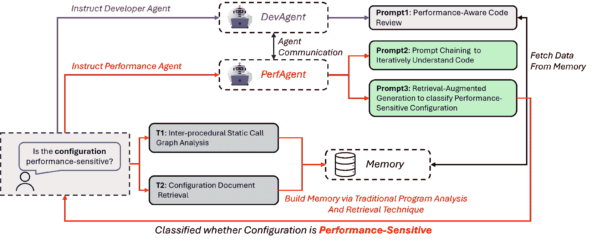
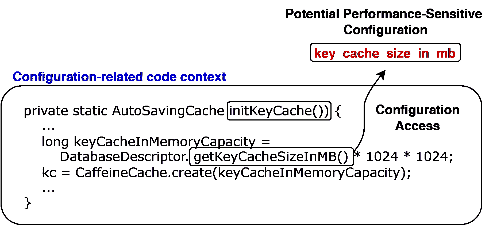

<!--yml

类别：未分类

日期：2025-01-11 12:31:11

-->

# 通过代码分析和LLM代理识别软件系统中的性能敏感配置

> 来源：[https://arxiv.org/html/2406.12806/](https://arxiv.org/html/2406.12806/)

Zehao Wang, Dong Jae Kim, Tse-Husn (Peter) Chen

软件性能、分析与可靠性（SPEAR）实验室

康考迪亚大学，加拿大蒙特利尔

w_zeha@encs.concordia.ca, k_dongja@encs.concordia.ca, peterc@encs.concordia.ca

###### 摘要。

配置设置对于定制软件行为以满足特定的性能要求至关重要。然而，错误的配置在实际中非常普遍，而且由于可能的设置数量庞大且复杂，识别那些影响系统性能的配置具有很大挑战性。在这项工作中，我们提出了PerfSense，一个轻量级框架，利用大型语言模型（LLMs）以最小的开销高效地识别性能敏感的配置。PerfSense使用LLM代理来模拟开发人员与性能工程师之间的互动，通过先进的提示技术，如提示链和检索增强生成（RAG）。我们对七个开源Java系统的评估表明，PerfSense在分类性能敏感配置时，达到了64.77%的平均准确率，超过了我们的LLM基准（50.36%）和之前的最先进方法（61.75%）。值得注意的是，我们的提示链技术提高了召回率10%到30%，同时保持了相似的精度水平。此外，手动分析362个错误分类揭示了常见问题，包括LLM对需求的误解（26.8%）。总之，PerfSense显著减少了分类性能敏感配置的人工工作量，并为未来基于LLM的代码分析研究提供了宝贵的见解。

大型语言模型，配置，性能，多代理

## 1\. 引言

现代软件系统具有众多配置选项，使得可以针对不同的工作负载和硬件平台进行定制（Singh等人，[2016](https://arxiv.org/html/2406.12806v1#bib.bib44)；Bao等人，[2018](https://arxiv.org/html/2406.12806v1#bib.bib3)）。虽然这些配置提供了灵活性，但某些配置被称为性能敏感配置，当其值发生变化时，会影响系统性能。开发者需要识别并理解这些配置的影响，确保它们被正确设置，从而保持系统性能和行为。然而，由于配置数量庞大，定位性能敏感配置非常耗时（Jin等人，[2012](https://arxiv.org/html/2406.12806v1#bib.bib21)；Han和Yu，[2016a](https://arxiv.org/html/2406.12806v1#bib.bib17)），而错误的设置是导致系统异常和性能下降的常见原因（Ganapathi等人，[2004](https://arxiv.org/html/2406.12806v1#bib.bib14)；community, [[n.d.]](https://arxiv.org/html/2406.12806v1#bib.bib10)）。因此，自动化方法对于快速找到需要特别关注或进一步调查的性能敏感配置非常重要，能减轻开发者的负担（Yonkovit, [[n.d.]](https://arxiv.org/html/2406.12806v1#bib.bib57)；Tian等人，[2015](https://arxiv.org/html/2406.12806v1#bib.bib45)）。

性能专家有多种工具可以用来评估对性能敏感的配置。除了性能分析工具（例如技术，[[n.d.]](https://arxiv.org/html/2406.12806v1#bib.bib13); visualvm，[[n.d.]](https://arxiv.org/html/2406.12806v1#bib.bib50); Bornholt 和 Torlak，[2018](https://arxiv.org/html/2406.12806v1#bib.bib4)），他们还可以识别低效的代码模式（Chen 等，[2014](https://arxiv.org/html/2406.12806v1#bib.bib7); Liu 等，[2014](https://arxiv.org/html/2406.12806v1#bib.bib30); Nistor 等，[2015](https://arxiv.org/html/2406.12806v1#bib.bib35)），并利用数据流和动态分析来发现对性能敏感的配置（Li 等，[2020](https://arxiv.org/html/2406.12806v1#bib.bib23); Lillack 等，[2014](https://arxiv.org/html/2406.12806v1#bib.bib27)）。然而，正如Velez 等人所指出的（[2022a](https://arxiv.org/html/2406.12806v1#bib.bib48)），在分析配置的性能影响时，性能专家面临着这些工具的可用性挑战。这些挑战来源于：（1）缺乏对代码库及其在多个组件间复杂交互的全面理解，（2）在识别受性能敏感配置影响的代码时的困难，以及（3）性能敏感配置与相应源代码之间复杂的因果关系。因此，性能工程师可能在准确识别配置的性能敏感性方面遇到挑战。开发人员与性能工程师之间的有效协作对于克服这些挑战并有效识别性能敏感配置至关重要。开发人员对代码库及其功能有深入了解，而性能工程师则专门分析与性能相关的问题。利用他们互补的专业知识，有助于更彻底的代码分析以及更准确的性能敏感配置分类。

大型语言模型（LLMs）的兴起正在革新编程和软件工程。LLMs在庞大的代码数据集上进行训练，深刻理解代码，并在各种与代码相关的任务中表现出色。通过像ChatGPT（OpenAI, [2023](https://arxiv.org/html/2406.12806v1#bib.bib36)）和LLaMA（Touvron等人, [2023](https://arxiv.org/html/2406.12806v1#bib.bib46)）这样的工具，研究人员展示了LLMs在生成提交消息（Zhang等人，[2024](https://arxiv.org/html/2406.12806v1#bib.bib60)）、解决合并冲突（Shen等人，[2023](https://arxiv.org/html/2406.12806v1#bib.bib43)）、创建测试（Xie等人，[2023](https://arxiv.org/html/2406.12806v1#bib.bib53); Yuan等人，[2023](https://arxiv.org/html/2406.12806v1#bib.bib58); Schäfer等人，[2023](https://arxiv.org/html/2406.12806v1#bib.bib40)）、重命名方法（AlOmar等人，[2024](https://arxiv.org/html/2406.12806v1#bib.bib2)）和日志分析（Ma等人，[2024b](https://arxiv.org/html/2406.12806v1#bib.bib32)，[a](https://arxiv.org/html/2406.12806v1#bib.bib33)）等任务中的潜力。考虑到软件工程任务中的协作复杂性，使用LLM智能体作为复制人类工作流程的有希望的方向尤为突出。具体而言，多智能体系统通过将智能体分配到特定角色，并模仿软件工程实践中的协作活动，在解决复杂任务方面取得了显著进展（Hong等人，[2023](https://arxiv.org/html/2406.12806v1#bib.bib19); Dong等人，[2023](https://arxiv.org/html/2406.12806v1#bib.bib12); Qian等人，[2023](https://arxiv.org/html/2406.12806v1#bib.bib38)）。例如，Dong等人（[2023](https://arxiv.org/html/2406.12806v1#bib.bib12)）开发了一个自我协作框架，将LLM智能体分配为软件开发中子任务的独立专家。Qian等人（[2023](https://arxiv.org/html/2406.12806v1#bib.bib38)）提出了一个通过智能体之间的自我沟通进行软件开发的端到端框架。

受多智能体启发，我们提出了PerfSense，一个轻量级框架，旨在利用大型语言模型（LLMs）作为多智能体系统，有效地对性能敏感的配置进行分类。PerfSense利用LLMs的协作能力，模拟开发人员与性能工程师之间的互动，进行配置的性能敏感性分析。PerfSense采用两个主要的智能体：DevAgent和PerfAgent。DevAgent专注于检索与配置相关的源代码和文档，并进行性能意识的代码审查。另一方面，PerfAgent利用DevAgent提供的见解，基于性能敏感性对配置进行分类。这一协作通过先进的提示技术，如提示链和检索增强生成（RAG），得以实现，从而提升了智能体的理解和分析能力。

为了解决在有限的LLM上下文大小下导航大型代码库的挑战，PerfSense通过迭代地将复杂任务拆解为可管理的子任务。具体而言，PerfAgent通过与DevAgent的迭代通信，收集并分析与正在审查的配置相关的源代码。通过一系列的提示链，PerfAgent通过向DevAgent请求具体细节、澄清信息和性能相关的见解，来不断完善自己的理解。这种迭代通信确保PerfAgent在不超过上下文大小限制的情况下，积累全面的知识库，从而能够准确分类性能敏感的配置。

我们对七个开源系统的评估表明，PerfSense在分类性能敏感配置时达到了64.77%的准确率，超越了最先进的技术（Chen等人，[2023a](https://arxiv.org/html/2406.12806v1#bib.bib9)）以及我们的LLM基准，后者的平均准确率分别为61.75%和50.36%。与之前的技术（Chen等人，[2023a](https://arxiv.org/html/2406.12806v1#bib.bib9)）相比，后者需要数十到数百小时来手动收集性能数据，而PerfSense则更加轻量，所需的人工努力最小。

总结来说，我们做出了以下贡献：

+   •

    我们对七个开源系统的评估表明，PerfSense在分类性能敏感配置时，达到了64.77%的平均准确率，超越了最先进的方法（61.75%的平均准确率）。

+   •

    我们提出了一种新的基于LLM的代码分析技术，该技术通过两个主要代理（DevAgent和PerfAgent）以及先进的提示技术，如提示链和增强检索生成（RAG），来在有限的LLM上下文大小下导航大型代码库。

+   •

    我们分析了在PerfSense中实现的不同提示组件的效果。我们发现，我们的提示链技术显著提高了召回率（提高了10%到30%），同时保持了相似的精确度水平。

+   •

    我们对362个误分类配置进行了人工研究，找出了误分类的主要原因，包括LLM对需求的误解（26.8%）和对性能影响的错误解读（10.0%）。

+   •

    我们对我们的发现进行了讨论，并强调了LLM基础的代码分析未来研究方向。

总结来说，通过利用多代理协作和先进的提示技术，PerfSense为分类性能敏感配置提供了一种高效的技术，这是理解系统性能的最重要的第一步之一。PerfSense还提出了一种新的代码导航方法，可能会启发未来基于LLM的代码分析研究。

论文组织。第[2](https://arxiv.org/html/2406.12806v1#S2 "2\. Background ‣ Identifying Performance-Sensitive Configurations in Software Systems through Code Analysis with LLM Agents")节提供了问题和技术的背景。第[3](https://arxiv.org/html/2406.12806v1#S3 "3\. Related Work ‣ Identifying Performance-Sensitive Configurations in Software Systems through Code Analysis with LLM Agents")节讨论了相关工作。第[4](https://arxiv.org/html/2406.12806v1#S4 "4\. Design of PerfSense ‣ Identifying Performance-Sensitive Configurations in Software Systems through Code Analysis with LLM Agents")节介绍了PerfSense的详细设计。第[5](https://arxiv.org/html/2406.12806v1#S5 "5\. Evaluation ‣ Identifying Performance-Sensitive Configurations in Software Systems through Code Analysis with LLM Agents")节展示了评估结果。第[6](https://arxiv.org/html/2406.12806v1#S6 "6\. Discussion ‣ Identifying Performance-Sensitive Configurations in Software Systems through Code Analysis with LLM Agents")节讨论了研究结果。第[7](https://arxiv.org/html/2406.12806v1#S7 "7\. Threats to Validity ‣ Identifying Performance-Sensitive Configurations in Software Systems through Code Analysis with LLM Agents")节讨论了有效性威胁。第[8](https://arxiv.org/html/2406.12806v1#S8 "8\. Conclusion ‣ Identifying Performance-Sensitive Configurations in Software Systems through Code Analysis with LLM Agents")节总结了论文内容。

## 2\. 背景

在本节中，我们首先讨论性能敏感配置的定义和重要性。然后，我们介绍大型语言模型（LLM）代理和检索增强生成（RAG）的背景。

### 2.1\. 性能敏感配置

软件系统通常包含各种配置参数，以提供部署和执行的灵活性（Singh 等，[2016](https://arxiv.org/html/2406.12806v1#bib.bib44)；Bao 等， [2018](https://arxiv.org/html/2406.12806v1#bib.bib3)）。某些配置被称为性能敏感配置，其值变化时会影响性能。例如，应用程序的名称通常不敏感于性能，而内存分配设置则可能显著影响性能（Yin 等， [2011](https://arxiv.org/html/2406.12806v1#bib.bib56)；Chen 等， [2016](https://arxiv.org/html/2406.12806v1#bib.bib6)）。识别这些配置至关重要，因为它们的使用直接影响系统效率和稳定性。然而，开发人员可能并不总是意识到配置更改对性能的影响，从而导致常见的配置错误，影响整体系统性能（Yin 等， [2011](https://arxiv.org/html/2406.12806v1#bib.bib56)；Xu 等， [2013](https://arxiv.org/html/2406.12806v1#bib.bib54)；Chen 等， [2016](https://arxiv.org/html/2406.12806v1#bib.bib6)；Han 和 Yu， [2016b](https://arxiv.org/html/2406.12806v1#bib.bib18)；Velez 等， [2022b](https://arxiv.org/html/2406.12806v1#bib.bib49)）。

确定哪些配置对性能敏感是具有挑战性的，因为配置数量庞大且各种系统组件之间的交互复杂（Zhang 等，[2015](https://arxiv.org/html/2406.12806v1#bib.bib59)），缺乏透明的文档或关于每个设置对性能影响的反馈（Yin 等，[2011](https://arxiv.org/html/2406.12806v1#bib.bib56)），以及性能测试的复杂性和时间密集性（Yonkovit，[[n.d.]](https://arxiv.org/html/2406.12806v1#bib.bib57)）。性能工程师需要进行负载测试，以评估各种配置的性能敏感性和影响。这些测试涉及更改配置参数的值，并评估其对系统性能的影响（Zhang 等，[2015](https://arxiv.org/html/2406.12806v1#bib.bib59)；Singh 等，[2016](https://arxiv.org/html/2406.12806v1#bib.bib44)；Wang 等，[2021](https://arxiv.org/html/2406.12806v1#bib.bib52)；Vitui 和 Chen， [2021](https://arxiv.org/html/2406.12806v1#bib.bib51)）。因此，减少测试成本的一个重要步骤是仅对性能敏感的配置进行此类测试。

虽然开发人员在实现代码功能时遵循最佳编码标准，但他们可能并不总是遵循最佳性能工程实践。在协作过程中，开发人员和性能工程师共同努力识别性能敏感的配置。性能工程师利用特定领域的知识设计并实施性能测试，发现配置敏感性。然而，性能工程师需要开发人员的协助，开发人员对代码库有深入了解，可以帮助导航多个源代码组件。因此，为了缩小影响整体系统性能的性能敏感配置范围，开发人员与性能工程师之间必须实现知识共享的协同效应。

### 2.2\. 基于LLM的多智能体框架

大型语言模型（LLMs）通过使用包含各种文本（如文档和源代码）的庞大数据集进行预训练。LLM智能体的核心由大型语言模型（LLMs）组成，这些模型旨在理解问题并生成类似人类的回答。这些智能体根据反馈（Madaan等人，[2024](https://arxiv.org/html/2406.12806v1#bib.bib34)）改进其回答，使用记忆机制从历史经验中学习（Li等人，[2024b](https://arxiv.org/html/2406.12806v1#bib.bib25)），检索有用的知识以改进提示并生成更好的回答（Zhao等人，[2023](https://arxiv.org/html/2406.12806v1#bib.bib61)），并与其他LLM智能体协作解决多智能体过程中的复杂任务（Guo等人，[2024](https://arxiv.org/html/2406.12806v1#bib.bib16)）。通过使用提示，智能体可以扮演特定角色（例如，开发人员或测试人员），并提供特定领域的回答（Deshpande等人，[2023](https://arxiv.org/html/2406.12806v1#bib.bib11)）。特别是，研究表明，多智能体系统通过使具有专业能力的智能体之间进行协作，从而提升了单个LLM智能体的能力（Hong等人，[2023](https://arxiv.org/html/2406.12806v1#bib.bib19); Chan等人，[2023](https://arxiv.org/html/2406.12806v1#bib.bib5)）。多个LLM智能体可以共享领域专业知识，并做出集体决策。有效的沟通模式对于优化多智能体框架的整体表现至关重要，使得它们能够采用分而治之的方法来应对复杂的项目（Chen等人，[2023b](https://arxiv.org/html/2406.12806v1#bib.bib8)）。最后，借助像LangChain这样的现代框架（langchain，[2023](https://arxiv.org/html/2406.12806v1#bib.bib22)），LLM智能体的一个关键特性是它们能够与外部工具交互，执行类似人类的任务。例如，作为测试工程师的LLM智能体可以生成测试用例，使用测试自动化工具收集代码覆盖率，并基于收集的信息回答后续查询。

在本文中，我们提出了PerfSense，它利用大语言模型（LLM）代理模拟开发人员与性能工程师之间的协作。PerfSense分析源代码并分类判断配置是否与性能相关。PerfSense是零-shot且无监督的，它只需要开发人员提供最小的输入，并且在分类性能敏感配置方面，取得了比现有技术更好的结果（Chen et al., [2023a](https://arxiv.org/html/2406.12806v1#bib.bib9)）。

## 3\. 相关工作

在本节中，我们讨论了三个主题的现有研究与文献：1) 配置的性能分析；2) 使用LLM分析配置；以及3) 基于多代理的代码分析。

### 3.1\. 配置的性能分析

一些先前的研究旨在分析配置的性能，以帮助开发人员在软件配置调优过程中理解性能问题。ConfigCrusher（Velez et al., [2020](https://arxiv.org/html/2406.12806v1#bib.bib47)）依赖静态污点分析揭示选项与受影响代码区域之间的关系，动态分析配置选项对这些区域性能的影响，并通过白盒性能分析建立性能影响模型。DiagConfig（Chen et al., [2023a](https://arxiv.org/html/2406.12806v1#bib.bib9)）利用静态污点分析识别性能相关操作与选项之间的依赖关系。通过在训练系统上进行手动性能实验和标注，他们建立了一个随机森林模型来分类性能敏感的配置。与上述工作不同，我们的工作结合了LLM代理和静态代码分析，特别是调用图分析，来研究配置的性能。鉴于LLM在理解代码方面的优秀表现，针对LLM的调用图分析能够提供更多信息，并且相比污点分析具有更低的开销。更重要的是，我们的方法是零-shot的，减少了最小的人工干预，这可以帮助开发人员高效地识别潜在的性能敏感配置，进行进一步分析。

### 3.2\. 使用LLM分析配置

最近，大型语言模型在各种软件工程任务中展现出了令人期待的表现，如代码生成和摘要。许多研究利用LLMs处理与软件配置相关的任务。Lian等人（[2024](https://arxiv.org/html/2406.12806v1#bib.bib26)）提出了一个基于LLM的框架Ciri，使用少样本学习和提示工程来验证配置文件在文件层级和参数层级的正确性。从对实际错误配置（包含64个配置项）和合成错误配置（涉及1582个参数）的评估来看，Ciri在文件层级和参数层级的F1分数分别为0.79和0.65。Liu等人（[2024b](https://arxiv.org/html/2406.12806v1#bib.bib31)）提出了LLM-CompDroid框架，该框架结合LLMs与错误修复工具，解决Android应用中的配置兼容性问题。他们的框架在Correct和Correct@k指标上分别比现有最先进的方法（SOTA）超出了至少9.8%和10.4%。Shan等人（[2024](https://arxiv.org/html/2406.12806v1#bib.bib42)）提出了框架LogConfigLocalizer，利用大型语言模型和日志来定位根本原因配置属性，取得了99.91%的高平均准确率。与这些工作不同，我们的工作探索了LLMs在分析配置性能敏感度方面的潜力，旨在帮助开发者降低性能测试成本。

### 3.3\. 基于多智能体的代码分析

基于代理的代码分析强调定义角色和促进多个LLM代理之间的通信的重要性。一些方法将外部工具作为代理。例如，黄等人（[2023](https://arxiv.org/html/2406.12806v1#bib.bib20)）介绍了一种测试执行代理，该代理使用Python解释器为LLM提供测试日志。类似地，钟等人（[2024](https://arxiv.org/html/2406.12806v1#bib.bib62)）提出了一种调试代理，使用静态分析工具构建控制流图，帮助LLM定位bug。其他研究（洪等人，[2023](https://arxiv.org/html/2406.12806v1#bib.bib19)；钱等人，[2023](https://arxiv.org/html/2406.12806v1#bib.bib38)；董等人，[2023](https://arxiv.org/html/2406.12806v1#bib.bib12)；林等人，[2024](https://arxiv.org/html/2406.12806v1#bib.bib28)）将LLM赋予了模拟各种人类角色的功能，如分析师、工程师、测试员、项目经理和首席技术官（CTO）。这些方法使用软件过程模型（例如瀑布模型）进行跨角色通信，通过变化提示和角色来增强代码生成。我们的方法采用类似的多代理系统来分类性能敏感配置。通过结合提示链和增强生成（RAG），PerfSense增强了LLM代理的协作能力，从而提供了一种轻量级的技术，解决了在分析大型代码库时LLM上下文大小有限的挑战。

图1. PerfSense概述

## 4\. PerfSense的设计

本节介绍了PerfSense，这是一个轻量级框架，旨在识别性能敏感配置。我们首先讨论各种LLM代理及其通信方式，并以一个详细的运行示例作为结尾。

图[1](https://arxiv.org/html/2406.12806v1#S3.F1 "图 1 ‣ 3.3\. 基于多代理的代码分析 ‣ 3\. 相关工作 ‣ 通过使用LLM代理的代码分析识别软件系统中的性能敏感配置")展示了PerfSense的概述。为了分析配置的性能敏感性，PerfSense包含两个不同的代理：开发者代理（DevAgent）和性能专家代理（PerfAgent）。从高层次来看，给定一个潜在的性能敏感配置，PerfAgent利用迭代自我精炼和增强检索提示技术，在零-shot环境下，在DevAgent的协助下，迭代构建代码库的知识库并分类该配置是否为性能敏感配置。在接下来的章节中，我们将详细阐述PerfAgent和DevAgent的角色及其确定性能敏感配置的通信模式。

### 4.1\. 代理角色与定义

图2. 性能敏感配置的示例。

#### 4.1.1\. 开发者代理：检索与配置相关的代码

DevAgent的主要角色是根据PerfAgent的请求，检索源代码并进行性能感知代码审查，并将结果反馈给PerfAgent，以便PerfAgent获取必要的信息进行分类决策。最初，PerfAgent接收到潜在的性能敏感配置进行分析。然而，多个类中的不同方法可能与配置参数存在某些依赖关系，使得PerfAgent难以准确评估配置的性能敏感性。提供配置相关代码的额外总结，例如相关源代码和文档，有助于提升PerfAgent的输出（Ye等，[2020](https://arxiv.org/html/2406.12806v1#bib.bib55)）。因此，PerfAgent依赖于DevAgent，DevAgent利用两种工具：（1）传统的程序分析，通过过程间调用图提取可能与配置相关的源代码，和（2）文档检索，提取与配置相关的官方文档。除了检索代码外，PerfAgent还可能依赖DevAgent提供特定源代码的反馈，因为我们直觉认为开发者应该对代码的功能有更好的理解。因此，DevAgent会对PerfAgent请求的源代码方法进行性能感知的代码审查，如图[3](https://arxiv.org/html/2406.12806v1#S4.F3 "Figure 3 ‣ 4.1.1\. Developer Agent: Retrieving Configuration-Related Code ‣ 4.1\. Agent Roles and Definition ‣ 4\. Design of PerfSense ‣ Identifying Performance-Sensitive Configurations in Software Systems through Code Analysis with LLM Agents")所示。以下，我们进一步讨论如何提取代码上下文、官方文档以及DevAgent的性能感知代码审查的提示设计。

提取与配置相关的代码。我们定义与配置相关的代码为调用直接访问配置的某个方法的调用者源代码。例如，如图[2](https://arxiv.org/html/2406.12806v1#S4.F2 "Figure 2 ‣ 4.1\. Agent Roles and Definition ‣ 4\. Design of PerfSense ‣ Identifying Performance-Sensitive Configurations in Software Systems through Code Analysis with LLM Agents")所示，正在分析的配置是key_cache_size_in_mb，其相关源代码是initKeyCache，它是访问该配置的调用者源代码。为了提取与配置相关的源代码，我们首先利用静态代码分析提取过程间调用图（Gousios, [[n.d.]](https://arxiv.org/html/2406.12806v1#bib.bib15)）。我们首先识别直接访问配置的方法，然后遍历图以检索所有具有直接或间接调用-被调用关系的方法。

提取配置文档。文档中对配置的描述可能提供额外的信息，有助于分类配置。例如，在研究的系统 Batik 中，名为 Width 的配置文档提供了额外信息，表明它是“输出图像宽度”，这可能有助于代理进行分析。因此，我们从官方项目网站提取配置描述（如果有的话）。该描述会作为提示的一部分传递给 DevAgent 和 PerfAgent，用于分析配置。

DevAgent 的性能感知代码审查。图 [3](https://arxiv.org/html/2406.12806v1#S4.F3 "图 3 ‣ 4.1.1\. 开发者代理：检索与配置相关的代码 ‣ 4.1\. 代理角色与定义 ‣ 4\. PerfSense 设计 ‣ 通过与 LLM 代理的代码分析识别软件系统中的性能敏感配置") 展示了 DevAgent 执行性能感知代码审查的提示设计。首先，我们将 DevAgent 拟人化，描述其角色和目标，例如：“你是一个开发者，你的工作是进行性能感知代码审查。”。接下来，我们向 DevAgent 提供 (1) 源代码和 (2) 配置描述的上下文。最后，我们要求 DevAgent 输出以下要求：(i) 总结代码的功能，(ii) 估算该源代码可能被触发的次数（基于提供的文本信息），以及 (iii) 代码是否可能对内存或执行时间产生影响。需要特别注意的是，性能感知代码审查并不判断某个配置是否性能敏感；这项任务由 PerfAgent 执行。然而，DevAgent 应该意识到自己编写的代码中常见的性能问题，如过度的内存使用和调用频率，这可能有助于 PerfAgent 进行分析。

<svg class="ltx_picture ltx_centering" height="1494.14" id="S4.F3.pic1" overflow="visible" version="1.1" width="600"><g fill="#000000" stroke="#000000" stroke-width="0.4pt" transform="translate(0,1494.14) matrix(1 0 0 -1 0 0)"><g fill-opacity="1.0" transform="matrix(1.0 0.0 0.0 1.0 12.82 1469.01)"><foreignobject color="#FFFFFF" height="12.3" overflow="visible" transform="matrix(1 0 0 -1 0 16.6)" width="574.35">Prompt Template for Performance-Aware Code Review</foreignobject></g> <g fill-opacity="1.0" transform="matrix(1.0 0.0 0.0 1.0 12.82 8.89)"><foreignobject color="#000000" height="1442.35" overflow="visible" transform="matrix(1 0 0 -1 0 16.6)" width="574.35">Role: You are a developer. Your job is to conduct performance-aware code reviews on the given configuration-related code and official documentation for configuration to output the performance impact code that you wrote. Configuration-related code: [⬇](data:text/plain;base64,cHJpdmF0ZSBzdGF0aWMgQXV0b1NhdmluZ0NhY2hlIGluaXRLZXlDYWNoZSgpKXsKICAgIC4uLgogICAgbG9uZyBrZXlDYWNoZUluTWVtb3J5Q2FwYWNpdHkgPSBEYXRhYmFzZURlc2NyaXB0b3IuZ2V0S2V5Q2FjaGVTaXplSW5NQigpICogMTAyNCAqIDEwMjQ7CiAgICBrYyA9IENhZmZlaW5lQ2FjaGUuY3JlYXRlKGtleUNhY2hlSW5NZW1vcnlDYXBhY2l0eSk7CiAgICAuLi4KfQ==) 1private  static  AutoSavingCache  initKeyCache()){ 2  ... 3  long  keyCacheInMemoryCapacity  =  DatabaseDescriptor.getKeyCacheSizeInMB()  *  1024  *  1024; 4  kc  =  CaffeineCache.create(keyCacheInMemoryCapacity); 5  ... 6} Configuration description: Configuration Documentation after summarization. AutoSavingCache: “Specify the way Cassandra allocates and manages memtable memory.” Requirement: You must output three things below: 1\. Understand the functionality of the configuration in the code. 2\. Investigate triggering frequency of configuration-related operations. 3\. Check the potential impact of configuration on the system.</foreignobject></g></g></svg>

图 3. DevAgent 的性能感知代码审查。

#### 4.1.2\. 性能专家代理：分析配置的性能敏感性

在DevAgent对特定配置相关操作的反馈基础上，PerfAgent利用这些反馈来分类性能敏感配置。然而，PerfAgent可能需要进一步澄清所获取的代码。例如，正如图[4](https://arxiv.org/html/2406.12806v1#S4.F4 "Figure 4 ‣ 4.1.2\. Performance Expert Agent: Analyzing the Performance Sensitivity of Configuration ‣ 4.1\. Agent Roles and Definition ‣ 4\. Design of PerfSense ‣ Identifying Performance-Sensitive Configurations in Software Systems through Code Analysis with LLM Agents")中所示，它可能会引用其他方法（例如，create），而PerfAgent可能对这些方法的性能知识了解不足。因此，PerfAgent可能会要求提供这些操作的额外信息。特别地，我们使用图[4](https://arxiv.org/html/2406.12806v1#S4.F4 "Figure 4 ‣ 4.1.2\. Performance Expert Agent: Analyzing the Performance Sensitivity of Configuration ‣ 4.1\. Agent Roles and Definition ‣ 4\. Design of PerfSense ‣ Identifying Performance-Sensitive Configurations in Software Systems through Code Analysis with LLM Agents")中的提示模板，该模板以“你是一个性能专家……检查提供的配置相关代码是否足够进行性能分析”来拟人化PerfAgent。在该提示中，PerfAgent接收源代码以及来自DevAgent的反馈，这些反馈在图[3](https://arxiv.org/html/2406.12806v1#S4.F3 "Figure 3 ‣ 4.1.1\. Developer Agent: Retrieving Configuration-Related Code ‣ 4.1\. Agent Roles and Definition ‣ 4\. Design of PerfSense ‣ Identifying Performance-Sensitive Configurations in Software Systems through Code Analysis with LLM Agents")中的模板中有体现。基于这些上下文，PerfSense指示PerfAgent指出那些对于准确性能分析至关重要但尚不明确或含糊的函数。一旦识别出需要进一步分析的代码，PerfAgent便会请求DevAgent获取并分析这些代码。通过在需要时检索和澄清代码，PerfAgent能够深入探索配置相关的代码信息，确保在最小化令牌数量且不超过大小限制的情况下，获取所有必要的代码信息。

<svg class="ltx_picture ltx_centering" height="1458.24" id="S4.F4.pic1" overflow="visible" version="1.1" width="600"><g fill="#000000" stroke="#000000" stroke-width="0.4pt" transform="translate(0,1458.24) matrix(1 0 0 -1 0 0)"><g fill-opacity="1.0" transform="matrix(1.0 0.0 0.0 1.0 12.82 1433.12)"><foreignobject color="#FFFFFF" height="12.3" overflow="visible" transform="matrix(1 0 0 -1 0 16.6)" width="574.35">Prompt Template for Code Understanding</foreignobject></g> <g fill-opacity="1.0" transform="matrix(1.0 0.0 0.0 1.0 12.82 8.89)"><foreignobject color="#000000" height="1406.45" overflow="visible" transform="matrix(1 0 0 -1 0 16.6)" width="574.35">Role: You are a performance expert. Your job is to analyze the performance of the configuration. Check whether the provided configuration-related code is sufficient for performance analysis. Configuration-related code: [⬇](data:text/plain;base64,cHJpdmF0ZSBzdGF0aWMgQXV0b1NhdmluZ0NhY2hlIGluaXRLZXlDYWNoZSgpKXsKICAgIC4uLgogICAgbG9uZyBrZXlDYWNoZUluTWVtb3J5Q2FwYWNpdHkgPSBEYXRhYmFzZURlc2NyaXB0b3IuZ2V0S2V5Q2FjaGVTaXplSW5NQigpICogMTAyNCAqIDEwMjQ7CiAgICBrYyA9IENhZmZlaW5lQ2FjaGUuY3JlYXRlKGtleUNhY2hlSW5NZW1vcnlDYXBhY2l0eSk7CiAgICAuLi4KfQ==) 1private  static  AutoSavingCache  initKeyCache()){ 2  ... 3  long  keyCacheInMemoryCapacity  =  DatabaseDescriptor.getKeyCacheSizeInMB()  *  1024  *  1024; 4  kc  =  CaffeineCache.create(keyCacheInMemoryCapacity); 5  ... 6} Code Context: Responses received from DevAgent. Requirement: If you need further code context to help understand the code, return the name of method name.</foreignobject></g></g></svg>

图4. PerfAgent的代码理解提示。

### 4.2\. 多代理通信

基于我们对DevAgent和PerfAgent的定义，接下来我们讨论这些代理如何协作来分类性能敏感配置。

#### 4.2.1\. 提示链式调用以迭代构建代码理解

提高 LLMs 可靠性和性能的一种有效技术是使用一种称为提示链的提示范式。提示链是指将复杂任务拆解成更简单的子任务，依次为每个子任务提供提示，并将其响应作为后续提示的输入（promptingguide，[[n.d.]](https://arxiv.org/html/2406.12806v1#bib.bib37)）。在我们的性能链分析中，我们的目标是检索所有必要的代码，以便 PerfAgent 评估配置对性能的敏感性。为了实现这一目标，PerfAgent 迭代地指示 DevAgent 按顺序检索源代码方法。DevAgent 根据 PerfAgent 的请求获取单个方法（包括源代码、DevAgent 对代码的描述以及 DevAgent 的性能感知代码审查结果），直到满足终止条件，表明 PerfAgent 已经收集到足够的代码，并且不再需要 DevAgent 的帮助。PerfSense 包含一个记忆机制，在每次源代码检索的迭代结束时保存 DevAgent 的反馈。然后，这些保存的反馈可以作为代码示例，用于下一次提示链的迭代，允许 PerfAgent 澄清不明确的上下文，并在需要时请求额外的源代码方法。

#### 4.2.2\. 性能分类器的检索增强生成

基于前面步骤中的提示链结果，PerfAgent 按顺序构建知识库的记忆，这使得 PerfAgent 能够更准确地分类性能敏感的配置。更精确地说，我们使用图中[5](https://arxiv.org/html/2406.12806v1#S4.F5 "Figure 5 ‣ 4.2.2\. Retrieval Augmented Generation for Performance Classifier ‣ 4.2\. Multi-Agent Communications ‣ 4\. Design of PerfSense ‣ Identifying Performance-Sensitive Configurations in Software Systems through Code Analysis with LLM Agents")的提示模板。与之前的模板一样，我们的 RAG 通过以下介绍开始，将 PerfAgent 具象化：“你是一个性能专家。根据来自 DevAgent 的反馈，你的工作是执行配置的性能分析。” 然后我们提供来自 DevAgent 的检索上下文：（1）与配置相关的代码，（2）性能感知的代码审查，（3）其他代码上下文，以解决与配置相关的清晰度问题。最后，我们要求 PerfAgent 分类该配置是否为性能敏感。

<svg class="ltx_picture ltx_centering" height="244.04" id="S4.F5.pic1" overflow="visible" version="1.1" width="600"><g fill="#000000" stroke="#000000" stroke-width="0.4pt" transform="translate(0,244.04) matrix(1 0 0 -1 0 0)"><g fill-opacity="1.0" transform="matrix(1.0 0.0 0.0 1.0 12.82 205)"><foreignobject color="#FFFFFF" height="26.21" overflow="visible" transform="matrix(1 0 0 -1 0 16.6)" width="574.35">Prompt Template for Retrieval Augmented Generation for Performance-Sensitive Configuration Classifier</foreignobject></g> <g fill-opacity="1.0" transform="matrix(1.0 0.0 0.0 1.0 12.82 8.89)"><foreignobject color="#000000" height="178.34" overflow="visible" transform="matrix(1 0 0 -1 0 16.6)" width="574.35">Role: You are a performance expert. Your job is to analyze the performance of the configuration. You can check the provided code if code is clear and enough for performance analysis of configuration. Background knowledge about performance: Background information about performance-sensitive configuration and performance operations. RAG information: Access the memory, which includes the following retrieved configuration information: 1\. Configuration-related code 2\. Code understanding 3\. Analysis result of unclear context Requirement: Classify the configuration as performance sensitive or insensitive.</foreignobject></g></g></svg>

图 5. 提示模板 3：性能分类器的检索增强生成

### 4.3\. 实现与实验设置

环境。我们使用GPT 3.5（版本gpt-3.5-turbo-0125）作为基础LLM，因为它非常流行且广泛使用。我们利用OpenAI API和LangGraph库（langchain，[2023](https://arxiv.org/html/2406.12806v1#bib.bib22)）来实现LLM代理，以进行递归代码分析和性能配置分类。温度是LLM中的一个参数，范围从0到1。较低的温度使结果更具确定性，而较高的温度则使结果更具多样性。为了确保生成的输出在多次运行中更稳定，我们将温度设置为0.3，这个值相对较低，但仍能在输出中保持一定的多样性。我们还重复了五次实验，并报告了平均结果。请注意，尽管我们使用GPT 3.5作为基础LLM，但我们的方法是通用的，可以替换为其他LLM。

基准数据集。表格[1](https://arxiv.org/html/2406.12806v1#S4.T1 "Table 1 ‣ 4.3\. Implementation and Experiment Settings ‣ 4\. Design of PerfSense ‣ Identifying Performance-Sensitive Configurations in Software Systems through Code Analysis with LLM Agents")展示了我们实验中研究的系统。这七个系统是现实世界中的开源Java应用，涵盖了不同领域，从数据库到渲染引擎。系统有多种配置，其中一些与性能相关。之前的工作（Chen 等，[2023a](https://arxiv.org/html/2406.12806v1#bib.bib9)）进行了手动性能测试，并提供了关于这些七个系统的性能敏感配置的真实数据。我们利用Chen 等（Chen 等，[2023a](https://arxiv.org/html/2406.12806v1#bib.bib9)）提供的真实数据，并根据手动检查源代码和官方文档进行了一些调整。复现包可以在线获取（SensitiveTeeth，[2024](https://arxiv.org/html/2406.12806v1#bib.bib41)）。

表格1. 我们研究的系统、版本、配置数量以及性能敏感配置数量概览。

| 系统 | 领域 | 版本 | 配置 | 性能 |
| --- | --- | --- | --- | --- |
|  |  |  |  | 配置 |
| Cassandra | NoSQL数据库 | 4.0.5 | 133 | 76 |
| DConverter | 图像密度转换器 | bdf1535 | 23 | 5 |
| Prevayler | 数据库 | 2.6 | 12 | 8 |
| BATIK | SVG光栅化工具 | 1.14 | 21 | 8 |
| Catena | 密码哈希 | 1281e4b | 12 | 6 |
| Sunflow | 渲染引擎 | 0.07.2 | 6 | 4 |
| H2 | 数据库 | 2.1.210 | 20 | 11 |

## 5\. 评估

在本节中，我们通过回答三个研究问题（RQ）来评估PerfSense。

### RQ1: PerfSense在识别性能敏感配置方面的效果如何？

在此RQ中，我们评估PerfSense在识别性能敏感配置方面的分类结果。我们将PerfSense与两个基线方法进行比较：DiagConfig和ChatGPT。DiagConfig（Chen et al., [2023a](https://arxiv.org/html/2406.12806v1#bib.bib9)）利用污点静态分析在多个系统上提取与配置相关的性能操作。通过手动性能测试，通过改变配置值并评估吞吐量的变化，能够识别并标记出性能敏感配置。通过使用标记过的配置和配置的污点静态分析，DiagConfig利用随机森林模型训练以分类性能敏感配置。ChatGPT直接调用ChatGPT API来分类配置是否为性能敏感配置。我们将系统名称、配置名称以及性能敏感配置的定义提供给ChatGPT（与PerfSense相同的版本）进行分类。需要注意的是，对于PerfSense，我们不提供系统名称，以减少潜在的数据泄漏问题（Sallou et al., [2024](https://arxiv.org/html/2406.12806v1#bib.bib39)）。

PerfSense的分类结果通过三种准确度指标来评估：准确度、精确度和召回率。具体来说，我们关注的是性能敏感配置的精确度和召回率。真正例（TP）发生在性能敏感配置被正确分类时。真负例（TN）发生在非性能敏感配置被正确分类为非性能敏感时。假正例（FP）发生在PerfSense错误地将非性能敏感配置分类为性能敏感时。假负例（FN）发生在PerfSense错误地将性能敏感配置分类为非性能敏感时。根据TP、FP和FN，我们计算精确度为$\frac{TP}{TP+FP}$，召回率为$\frac{TP}{TP+FN}$。最后，准确度衡量的是配置性能敏感性分类的整体正确性，其计算公式为$\frac{TP+TN}{TP+TN+FP+FN}$。

由于大型语言模型（LLM）的生成特性，每次执行的输出可能会有所不同。因此，我们将每个实验重复五次，并报告平均的精确度、召回率和准确度。

表2. PerfSense与基线方法在分类性能敏感配置时的准确度、精确度和召回率。请注意，DiagConfig的结果对于所有系统（除Cassandra外）不可用，因为DiagConfig在其他系统上训练了分类器，并将其应用于Cassandra。

|  | PerfSense | ChatGPT | DiaConfig |
| --- | --- | --- | --- |
|  | 准确度 | 精确度 | 召回率 | 准确度 | 精确度 | 召回率 | 准确度 | 精确度 | 召回率 |
| Cassandra | 64.01% | 64.46% | 82.32% | 56.99% | 57.08% | 99.74% | 61.75% | 87.88% | 38.26% |
| DConverter | 66.09% | 39.06% | 100.00% | 26.96% | 20.79% | 84.00% | – | – | – |
| Prevayler | 75.00% | 75.51% | 95.50% | 66.70% | 66.70% | 100.00% | – | – | – |
| BATIK | 72.38% | 63.41% | 65.00% | 34.29% | 35.35% | 87.50% | – | – | – |
| Catena | 46.67% | 48.15% | 86.67% | 50.00% | 50.00% | 83.00% | – | – | – |
| Sunflow | 53.30% | 61.54% | 80.00% | 66.70% | 66.70% | 100.00% | – | – | – |
| H2 | 76% | 78.18% | 78.18% | 50.91% | 50.46% | 100.00% | – | – | – |
| 平均 | 64.77% | 61.47% | 83.95% | 50.36% | 49.58% | 93.46% | – | – | – |

结果：PerfSense在准确性方面优于ChatGPT和DiagConfig（分别为50.36%和61.75%），其平均准确率为64.77%。表[2](https://arxiv.org/html/2406.12806v1#S5.T2 "表 2 ‣ RQ1：PerfSense在识别性能敏感配置方面的有效性？ ‣ 5\. 评估 ‣ 通过代码分析与LLM代理识别软件系统中的性能敏感配置")显示了PerfSense和基准模型的分类结果。我们发现，PerfSense提供了更好的精度和召回率平衡，准确性优于两个基准。ChatGPT的召回率（93.46%）高于PerfSense（83.95%）和DiagConfig（38.26%），但精度明显较低（49.58% 对 61.47% 和 87.88%）。我们发现，ChatGPT的高召回率和低精度是因为它错误地将大多数配置分类为性能敏感配置。在性能敏感配置较少的系统中，ChatGPT的结果更差。例如，在DConverter中，由于80%的配置不是性能敏感配置，ChatGPT仅能达到27%的准确率。相比之下，PerfSense中的代理和提示技术帮助提高了精度与召回率的平衡，进而大大提高了准确率。我们发现，DiagConfig在Cassandra中达到了较高的精度87.88%（它使用了一个基于所有其他系统数据训练的分类模型，因此结果仅适用于Cassandra）。然而，DiagConfig的召回率非常低（38.26%，而PerfSense为82.32%），因为DiagConfig漏掉了许多未能获得污点分析结果的配置。

请注意，理论上，我们可以通过让大型语言模型（LLMs）估算性能影响（例如，严重、中等或低）并只将那些对性能影响严重的配置分类为性能敏感的配置，从而调整PerfSense的精确度/召回率，以提高精度。在我们的初步研究中，我们达到了更高的精度72.41%，但召回率较低，为27.63%。PerfSense仅将具有严重性能影响的配置分类为性能敏感配置。然而，在本研究中，我们的目标是实现更高的召回率并保持较好的精度，因为PerfSense的目标是高效地为性能工程师提供一个初步的配置列表，以便进行进一步的调查。

与DiagConfig相比，PerfSense需要更少的运行时间且无需人工干预。DiagConfig需要进行污染分析，以识别从配置中可以访问的所有代码，这对于像Cassandra这样的大型系统可能需要数十小时的计算时间。此外，DiagConfig通过手动收集来自其他系统的测试结果来构建随机森林分类模型。如果我们希望将该模型应用于其他领域的系统，或者这些系统由不同的开发实践开发，那么这种人工密集的过程可能需要重复进行。相比之下，PerfSense在Cassandra（具有超过130个配置参数的最大研究系统）上的运行时间不到50分钟，且由于其零-shot和无监督的特性，可以轻松扩展到任何系统。

<svg class="ltx_picture" height="63.28" id="S5.SSx1.p7.pic1" overflow="visible" version="1.1" width="600"><g fill="#000000" stroke="#000000" stroke-width="0.4pt" transform="translate(0,63.28) matrix(1 0 0 -1 0 0)"><g fill-opacity="1.0" transform="matrix(1.0 0.0 0.0 1.0 12.82 8.89)"><foreignobject color="#000000" height="45.51" overflow="visible" transform="matrix(1 0 0 -1 0 16.6)" width="574.35">Answers to RQ1. PerfSense provides a better balance of precision and recall, achieving the highest accuracy compared to the baselines. PerfSense is also lightweight and requires less than one hour to run for the largest studied system.</foreignobject></g></g></svg>

### RQ2：PerfSense中不同组件如何影响分类结果？

PerfSense包含多个组件，包括检索增强生成（例如，检索相关代码以帮助做出分类决策）和链式思维（例如，要求代理生成代码摘要，并将生成的摘要与后续任务结合）。在这个RQ中，我们旨在研究每个组件的影响。我们分别移除每个组件，重新执行PerfSense，并重新评估分类精度。特别地，我们考虑了五种组合：1）代码：仅检索直接使用配置值的源代码方法；2）代码 + 分析：通过启用DevAgent迭代遍历代码来分析代理认为相关的方法（即，通过提示链）；3）开发：DevAgent生成检索到的代码的摘要和描述；4）代码 + 开发：通过要求DevAgent为后续提示提供检索到的代码的摘要和描述来扩展代码（即，链式思维）；5）代码 + 开发 + 分析：PerfSense的完整版本。

表3. PerfSense在不同组件下的分类结果。每个系统中最好的精确度和召回率值以粗体标出。括号中的数字表示与PerfSense完整版本（code+dev+analysis）相比的百分比差异。

| 系统 | 方法 | 精确度 | 召回率 |
| --- | --- | --- | --- |
| Cassandra | PerfSense${}_{\text{code+dev+analysis}}$ | 64.46% | 82.32% |
| PerfSense${}_{\text{code}}$ | 67.55% (+4.79%) | 73.42% (-10.81%) |
| PerfSense${}_{\text{code+analysis}}$ | 61.81% (-4.11%) | 77.11% (-6.32%) |
| PerfSense${}_{\text{dev}}$ | 62.32% (-3.31%) | 74.47% (-9.53%) |
| PerfSense${}_{\text{code+dev}}$ | 64.12% (-0.53%) | 73.09% (-11.23%) |
| Dconverter | PerfSense${}_{\text{code+dev+analysis}}$ | 39.06% | 100.00% |
| PerfSense${}_{\text{code}}$ | 30.49% (-21.94%) | 100.00% (-0.00%) |
| PerfSense${}_{\text{code+analysis}}$ | 29.76% (-23.81%) | 100.00% (-0.00%) |
| PerfSense${}_{\text{dev}}$ | 32.20% (-17.56%) | 100.00% (-0.00%) |
| PerfSense${}_{\text{code+dev}}$ | 36.76% (-5.89%) | 100.00% (-0.00%) |
| Prevayler | PerfSense${}_{\text{code+dev+analysis}}$ | 75.51% | 92.50% |
| PerfSense${}_{\text{code}}$ | 80.56% (+6.70%) | 72.50% (-21.62%) |
| PerfSense${}_{\text{code+analysis}}$ | 74.47% (-1.38%) | 87.50% (-5.41%) |
| PerfSense${}_{\text{dev}}$ | 70.83% (-6.20%) | 85.00% (-8.11%) |
| PerfSense${}_{\text{code+dev}}$ | 70.45% (-6.70%) | 79.49% (-14.06%) |
| BATIK | PerfSense${}_{\text{code+dev+analysis}}$ | 63.41% | 65.00% |
| PerfSense${}_{\text{code}}$ | 42.86% (-32.40%) | 45.00% (-30.76%) |
| PerfSense${}_{\text{code+analysis}}$ | 47.92% (-24.42%) | 57.50% (-11.53%) |
| PerfSense${}_{\text{dev}}$ | 59.09% (-6.86%) | 32.50% (-50.00%) |
| PerfSense${}_{\text{code+dev}}$ | 51.28 (-19.12%) | 50.00% (-23.07%) |
| Catena | PerfSense${}_{\text{code+dev+analysis}}$ | 48.15% | 86.67% |
| PerfSense${}_{\text{code}}$ | 51.43% (+6.81%) | 60.0% (-30.77%) |
| PerfSense${}_{\text{code+analysis}}$ | 48.89% (+1.53%) | 73.33% (-15.39%) |
| PerfSense${}_{\text{dev}}$ | 48.15% (-0.00%) | 86.67% (-0.00%) |
| PerfSense${}_{\text{code+dev}}$ | 50.00% (+3.84%) | 76.67% (-11.53%) |
| Sunflow | PerfSense${}_{\text{code+dev+analysis}}$ | 61.54% | 80.00 % |
| PerfSense${}_{\text{code}}$ | 83.00% (+34.87%) | 50.00% (-37.50%) |
| PerfSense${}_{\text{code+analysis}}$ | 65.22% (+6.00%) | 75.00% (-6.25%) |
| PerfSense${}_{\text{dev}}$ | 68.00% (+10.49%) | 100% (+25.00%) |
| PerfSense${}_{\text{code+dev}}$ | 65.38% (+6.23%) | 89.47% (+11.83%) |
| H2 | PerfSense${}_{\text{code+dev+analysis}}$ | 78.18% | 78.18% |
| PerfSense${}_{\text{code}}$ | 58.70% (-24.91%) | 50.00% (-36.04%) |
| PerfSense${}_{\text{code+analysis}}$ | 66.04% (-15.52%) | 63.64% (-18.59%) |
| PerfSense${}_{\text{dev}}$ | 66.07% (-15.48%) | 67.27% (-13.95%) |
| PerfSense${}_{\text{code+dev}}$ | 80.00% (+2.33%) | 72.73% (-6.97%) |

结果：将代码整合进来会在所研究的7个系统中的4个系统中获得最高的精度，但牺牲了召回率。进一步加入开发（dev）组件显著提高了大多数系统的召回率，在精度和召回率之间实现了更加平衡的折衷，同时保持了相对较高的精度。[表格3](https://arxiv.org/html/2406.12806v1#S5.T3 "表格3 ‣ RQ2: PerfSense的不同组件如何影响分类结果？ ‣ 5\. 评估 ‣ 通过代码分析与LLM代理识别软件系统中的性能敏感配置")展示了PerfSense各组件组合的精度和召回率。我们发现，通过仅检索直接使用配置参数的方法（PerfSense ${}_{\text{code}}$），可以在所有研究的系统中获得较好的精度，但召回率明显较低（比完整版本低12.00%至36.04%）。例如，在Cassandra的情况下，PerfSense ${}_{\text{code}}$的精度为67.55%，比完整版本高4.79%，但召回率大幅下降了10.81%，降至73.42%。

尽管仅使用代码可以达到较高的精确度，但它通常会显著牺牲召回率。另一方面，代码+开发者往往能提供更好的精确度与召回率之间的平衡，通常具有更高的召回率和更稳定的精确度。这表明，结合LLM生成的摘要和描述有助于通过保持更全面的方法来提升工具的整体性能。相比之下，将给定代码片段的LLM生成摘要/描述整合到提示中（代码与代码+开发者相比）往往能提供更好的精确度与召回率之间的平衡，通常具有更高的召回率和更稳定的精确度。这表明，结合LLM生成的摘要/描述有助于通过保持更全面的方法来提升PerfSense的整体性能。

在大多数系统中，加入分析可以显著提高召回率，同时保持类似的精确度。例如，在Prevayler中，代码+分析的精确度（74.47%）略低于仅代码（80.56%），但召回率从72.56%提高到87.50%。类似地，在BATIK中，虽然代码+分析的精确度为47.92%，高于仅代码的42.86%，但召回率显著提高，从45.00%增加到57.50%。这一发现表明，分析提供的额外上下文和理解有助于PerfSense识别更多相关的方法，从而提高召回率并保持精确度。

集成代码+开发者+分析提供了一种全面的方法，利用了各个组件——代码、开发者见解和分析上下文——的优势，以实现最佳的平衡性能。例如，在Cassandra的案例中，代码+开发者+分析达到了64.46%的精确度和82.32%的召回率。PerfSense的完整版本在召回率上超越了仅代码（73.42%）和代码+开发者（73.09%），同时保持了竞争力的精确度。我们的研究表明，每个组件都有其对结果的独特贡献，集成这些组件可以提升PerfSense的整体有效性和可靠性，提供一种强大的解决方案，用于识别相关方法并分类代码库中的性能敏感配置。

<svg class="ltx_picture" height="77.2" id="S5.SSx2.p6.pic1" overflow="visible" version="1.1" width="600"><g fill="#000000" stroke="#000000" stroke-width="0.4pt" transform="translate(0,77.2) matrix(1 0 0 -1 0 0)"><g fill-opacity="1.0" transform="matrix(1.0 0.0 0.0 1.0 12.82 8.89)"><foreignobject color="#000000" height="59.42" overflow="visible" transform="matrix(1 0 0 -1 0 16.6)" width="574.35">Answers to RQ2. Adding dev improves recall with a balanced trade-off in precision, and incorporating analysis further enhances recall while maintaining competitive precision. The combined code+dev+analysis approach effectively leverages each component’s strengths for comprehensive method identification.</foreignobject></g></g></svg>

### RQ3：PerfSense误分类的原因是什么？

尽管PerfSense达到了最高的准确率，并且在精确度与召回率之间保持了平衡，但仍然存在误分类的情况。了解这些误分类的根本原因对于理解PerfSense的局限性，并为未来利用LLM进行性能分析提供见解至关重要。因此，在这个研究问题中，我们进行了详细的手动研究，探讨误分类的原因。

我们收集并检查了 362 个被 PerfSense 错误分类的配置。为了系统地分析 PerfSense 错误分类的原因，我们首先从 362 个错误分类的配置数据集中随机选择了 20%的样本。这个子集经过彻底审查，以识别和分类各种错误分类的原因。特别地，我们研究了代理之间的通信历史、源代码以及我们能够找到的所有相关文档。在这些类别建立之后，我们手动检查了剩余的 80% 数据集，并将推导出的类别应用于每个配置，以了解不同错误分类原因的分布。在这个过程中，我们没有发现任何新的类别。

表 4. PerfSense 错误分类性能敏感性的原因及其流行程度。

| 原因 | 描述 | 百分比 |
| --- | --- | --- |
| 没有明确的性能敏感性证据 | 通过检查相关代码并仔细审查现有信息（例如，代码和文档），没有明确的证据表明该配置的性能敏感性。 | 54.1% |
| 错误理解要求 | LLM 错误理解了性能敏感性分类的要求。 | 26.8% |
| 错误解读性能相关操作的影响 | LLM 错误解读了性能相关操作的影响。此误解导致了配置性能敏感性的错误分类。 | 10.0% |
| 受性能相关关键词影响 | 当 LLM 对性能敏感的配置进行分类时，像“内存”和“可扩展性”这样的关键词可能导致错误分类。这些关键词本身与性能相关方面有固有的联系，可能导致性能不敏感的配置被错误地识别为性能敏感的配置。 | 8.0% |
| 幻觉 | LLM 生成并非基于实际事实或真相的信息。 | 1.1% |

结果表格 [4](https://arxiv.org/html/2406.12806v1#S5.T4 "表 4 ‣ RQ3: PerfSense 错误分类的原因 ‣ 5\. 评估 ‣ 通过代码分析与 LLM 代理识别软件系统中的性能敏感配置") 显示了 PerfSense 错误分类性能敏感性的原因及其百分比。总的来说，我们揭示了导致错误分类的五个原因。

大多数错误分类（54.1%）发生在没有明确证据支持性能敏感性的配置中。对于PerfSense分类结果与实际情况不同的配置（Chen et al., [2023a](https://arxiv.org/html/2406.12806v1#bib.bib9)），尽管我们对相关代码进行了彻底检查，并仔细审查了可用信息（例如文档和源代码），但没有实质性证据支持该配置的性能敏感性。例如，在Cassandra中，配置项`column_index_cache_size_in_kb`并不对性能敏感（Chen et al., [2023a](https://arxiv.org/html/2406.12806v1#bib.bib9)）。然而，LLM代理表示该配置可能影响内存中存储索引项所使用的内存量，从而导致性能波动。设置较高的值可能通过减少磁盘读取索引项来提高性能，而设置较低的值可能导致更多的磁盘读取并可能导致性能变慢。通过阅读源代码，我们认为PerfSense的决策解释是有效的，但没有可用证据支持该配置的性能敏感性。这种误解可能导致对性能敏感性的错误分类，突显了为LLM提供更好的代码理解需求的重要性。

PerfSense可能误解性能敏感性的需求，并将其他方面错误地分类为性能敏感（26.8%）。PerfSense可能进行一些插值，推测一些非性能敏感的操作为性能敏感。例如，`_prevalenceDirectory`配置项在Prevayler中指定用于读取和写入文件的目录。该配置与文件存储相关，并不对性能敏感。然而，PerfSense错误地假设这些读写操作的位置会影响系统性能，而该配置主要涉及系统存储，而非性能。

10.0%的错误分类是由于对性能影响的错误解释。在某些情况下，PerfSense错误评估了特定配置对系统效率的影响。例如，在Batik中，配置项`BACKGROUND_COLOR`用于设置背景颜色，是性能敏感的。原因是不同的颜色设置可能会影响图形渲染的性能。然而，PerfSense错误地将与该颜色配置相关的代码分类为性能不敏感。

8.0%的误分类与性能无关的配置中包含与性能相关的关键词有关。LLM是通过自然语言文本进行训练的，因此它们对提示语中的关键词非常敏感。如果提示语中包含与性能相关的关键词，PerfSense就更有可能将配置分类为性能敏感。例如，配置项`gc_log_threshold_in_ms`在Cassandra项目中根据实际情况并不属于性能敏感（Chen等人， [2023a](https://arxiv.org/html/2406.12806v1#bib.bib9)）。启用或禁用该配置并不会影响系统的执行时间。然而，关键词“gc”（垃圾回收）在很多情况下通常被认为与性能相关，因此PerfSense错误地将该配置分类为性能敏感。然而，该配置与垃圾回收时的日志记录相关，设置较低或较高的阈值对性能没有明显影响。

幻觉现象虽然很少见，但仍然可能导致误分类（1.1%）。LLM中的幻觉现象可能导致不正确或误导性的结果（Liu等人， [2024a](https://arxiv.org/html/2406.12806v1#bib.bib29)；Li等人，[2024a](https://arxiv.org/html/2406.12806v1#bib.bib24)）。例如，Cassandra中的配置项hinted_handoff_enabled被认为是与性能敏感相关的（Chen等人， [2023a](https://arxiv.org/html/2406.12806v1#bib.bib9)）。该配置项的作用是允许Cassandra在集群工作在低于正常容量的状态下“继续执行相同数量的写入操作”。然而，由于幻觉现象，PerfSense错误地表示该配置项与应用程序名称相关，导致了配置项的误分类。

<svg class="ltx_picture" height="96.49" id="S5.SSx3.p9.pic1" overflow="visible" version="1.1" width="600"><g fill="#000000" stroke="#000000" stroke-width="0.4pt" transform="translate(0,96.49) matrix(1 0 0 -1 0 0)"><g fill-opacity="1.0" transform="matrix(1.0 0.0 0.0 1.0 12.82 8.89)"><foreignobject color="#000000" height="78.72" overflow="visible" transform="matrix(1 0 0 -1 0 16.6)" width="574.35">Answers to RQ3. PerfSense’s misclassifications of performance-sensitive configurations are primarily due to a lack of clear evidence supporting performance sensitivity (54.1%) and misunderstanding of requirements leading to incorrect classifications (26.8%). Addressing these issues may require better requirements specification and enhanced understanding by LLMs to improve classification accuracy.</foreignobject></g></g></svg>

## 6. 讨论

分析配置的性能敏感性的要求需要进一步完善。在分析配置误分类的原因时，我们发现，误解性能敏感性要求影响了PerfSense在识别性能敏感配置时的精准度。与这些智能体交互时所使用的提示语的具体性和清晰度，可能会影响它们准确识别性能敏感配置的能力。将更多明确的与性能相关的标准纳入提示语中，可以帮助减少误分类，使LLM的分析与配置的实际性能影响更加契合。这一调整可能会引导LLM智能体区分哪些配置真正影响性能，哪些配置不影响性能，尽管存在一些潜在的误导性指标，如与性能相关的关键词。

PerfSense高效地缩小了配置的性能敏感性调查范围。PerfSense的一个优点是其能够高效地缩小需要深入调查的配置列表。软件配置中的性能敏感性是一个复杂的领域，手动识别过程既耗时又容易出错。通过自动化识别过程，PerfSense使性能工程师和开发人员能够将精力和专业知识集中在一个更精炼的配置子集上，从而提高生产力并优化资源分配。

提示链和RAG技术增强了PerfSense在性能分析中的LLM理解和分析能力。该工具利用先进的提示技术，如提示链和检索增强生成（RAG），改善开发人员与性能专家代理之间的互动动态。提示链将复杂任务分解为更简单的顺序查询，相互之间相互依赖，有助于为每个性能敏感决策构建全面的性能分析。RAG整合了来自外部来源的与配置相关的信息，并减少了上下文大小，确保LLM的分析既相关又充分知情，以便对配置的性能进行评估。多种提示技术的结合增强了PerfSense准确识别性能敏感配置的能力，在保持平衡的精度和召回率的同时，最小化了忽视软件行为中关键性能细节的风险。

## 7\. 效度威胁

### 7.1\. 内部效度

由于大语言模型（LLM）的生成特性，响应可能会在不同运行之间有所变化。为了减轻这一威胁，我们尝试执行LLM五次，并报告我们的评估平均值。我们将温度值设置为0.3，这使得结果更加一致，但仍允许一定的多样性。我们发现，结果在多次运行中相似，这意味着输出是稳定的。然而，未来的研究仍然需要了解温度对结果的影响。由于LLM是通过开源系统进行训练的，因此存在数据泄露的可能性。为了最小化影响，我们在分类配置性能敏感性时排除了系统特定信息（如系统和包名称）以减少数据泄露（Sallou等人， [2024](https://arxiv.org/html/2406.12806v1#bib.bib39)）。

### 7.2\. 外部效度

我们在开源Java系统上进行了研究。尽管我们尽力选择了在先前研究中也使用过的成熟且流行的系统，但这些结果可能不适用于用其他编程语言实现的系统。未来的研究需要检查其他类型系统的结果。

### 7.3\. 构造效度

配置参数的性能敏感性分类是一项具有挑战性的任务，因为工作负载各异（Vitui 和 Chen，[2021](https://arxiv.org/html/2406.12806v1#bib.bib51)）。因此，本文依赖于先前的基准（Chen 等，[2023a](https://arxiv.org/html/2406.12806v1#bib.bib9)），并通过深入分析和所有可以找到的文献来验证结果。为了鼓励我们的研究的复制和验证，我们将数据集公开在网上（SensitiveTeeth，[2024](https://arxiv.org/html/2406.12806v1#bib.bib41)）。

## 8\. 结论

配置参数对于定制软件行为至关重要，一些配置可能会对系统性能产生影响。然而，配置错误很常见，并可能导致显著的性能下降，因此识别性能敏感配置至关重要。在本文中，我们介绍了PerfSense，一个利用基于大语言模型（LLM）的多代理系统来识别软件系统中性能敏感配置的创新框架。通过结合静态代码分析和增强检索提示技术，PerfSense能够在最小化人工操作的情况下识别性能敏感配置。我们对七个开源系统的评估表明，PerfSense相比现有的最先进方法（61.75%），达到了更高的准确率64.77%。此外，我们对不同提示组件影响的评估表明，PerfSense中提示链的实施显著提升了召回率，提升幅度在10%到30%之间。为了了解PerfSense的局限性，我们对362个误分类配置进行了手动分析，总结了PerfSense在性能敏感性误分类中的原因。LLM对需求的误解（26.8%）是导致误分类的关键原因。此外，我们提供了详细的讨论，为未来的研究提供见解，以增强基于LLM的配置性能分析的鲁棒性和准确性。

## 参考文献

+   (1)

+   AlOmar 等（2024）Eman Abdullah AlOmar、Anushkrishna Venkatakrishnan、Mohamed Wiem Mkaouer、Christian D Newman 和 Ali Ouni。2024年。如何重构这段代码？关于开发者与ChatGPT重构对话的探索性研究。*arXiv 预印本 arXiv:2402.06013*（2024）。

+   Bao 等（2018）Liang Bao、Xin Liu、Ziheng Xu 和 Baoyin Fang。2018年。Autoconfig：分布式消息系统的自动配置调优。在*第33届 ACM/IEEE 自动化软件工程国际会议论文集*，29–40。

+   Bornholt 和 Torlak（2018）James Bornholt 和 Emina Torlak。2018年。在符号求值下找到崩溃的代码。*ACM 编程语言会议论文集* 2, OOPSLA（2018），1–26。

+   Chan 等人 (2023) Chi-Min Chan, Weize Chen, Yusheng Su, Jianxuan Yu, Wei Xue, Shanghang Zhang, Jie Fu, 和 Zhiyuan Liu. 2023. Chateval: 通过多智能体辩论实现更好的基于 LLM 的评估者. *arXiv 预印本 arXiv:2308.07201* (2023).

+   Chen 等人 (2016) Tse-Hsun Chen, Weiyi Shang, Ahmed E. Hassan, Mohamed Nasser, 和 Parminder Flora. 2016. CacheOptimizer: 帮助开发者为基于 Hibernate 的数据库驱动 Web 应用程序配置缓存框架. 收录于 *2016年第24届ACM SIGSOFT国际软件工程基础研讨会* (西雅图，美国) *(FSE 2016)*. 666–677.

+   Chen 等人 (2014) Tse-Hsun Chen, Weiyi Shang, Zhen Ming Jiang, Ahmed E Hassan, Mohamed Nasser, 和 Parminder Flora. 2014. 针对使用对象关系映射开发的应用程序检测性能反模式. 收录于 *第36届国际软件工程会议论文集*. 1001–1012.

+   Chen 等人 (2023b) Weize Chen, Yusheng Su, Jingwei Zuo, Cheng Yang, Chenfei Yuan, Chen Qian, Chi-Min Chan, Yujia Qin, Yaxi Lu, Ruobing Xie 等人. 2023b. Agentverse: 促进多智能体协作并探索智能体中的涌现行为. *arXiv 预印本 arXiv:2308.10848* (2023).

+   Chen 等人 (2023a) Zhiming Chen, Pengfei Chen, Peipei Wang, Guangba Yu, Zilong He, 和 Genting Mai. 2023a. DiagConfig: 可配置软件系统中性能违规的配置诊断. 收录于 *第31届ACM联合欧洲软件工程会议与软件工程基础研讨会* *(ESEC/FSE 2023)*. 566–578.

+   community ([n.d.]) LinkedIn 社区. [n.d.]. *Web 应用性能缓慢的最常见因素是什么？* [https://www.linkedin.com/advice/0/what-most-common-factors-slow-down-web-application-lcsme](https://www.linkedin.com/advice/0/what-most-common-factors-slow-down-web-application-lcsme)

+   Deshpande 等人 (2023) Ameet Deshpande, Tanmay Rajpurohit, Karthik Narasimhan, 和 Ashwin Kalyan. 2023. AI 拟人化：机遇与风险. *arXiv 预印本 arXiv:2305.14784* (2023).

+   Dong 等人 (2023) Yihong Dong, Xue Jiang, Zhi Jin, 和 Ge Li. 2023. 通过 ChatGPT 自协作代码生成. *arXiv 预印本 arXiv:2304.07590* (2023).

+   ej technologies ([n.d.]) ej technologies. [n.d.]. *Jprofiler*. [https://www.ej-technologies.com/products/jprofiler/overview.html](https://www.ej-technologies.com/products/jprofiler/overview.html)

+   Ganapathi 等人 (2004) Archana Ganapathi, Yi-Min Wang, Ni Lao, 和 Ji-Rong Wen. 2004. 为什么个人计算机如此脆弱以及我们能做什么：关于 Windows 注册表问题的研究. 收录于 *2004年国际可靠系统与网络会议*. IEEE, 561–566.

+   Gousios ([n.d.]) Georgios Gousios. [n.d.]. *java-callgraph: Java 调用图工具*. [https://github.com/gousiosg/java-callgraph](https://github.com/gousiosg/java-callgraph)

+   Guo 等 (2024) Taicheng Guo, Xiuying Chen, Yaqi Wang, Ruidi Chang, Shichao Pei, Nitesh V Chawla, Olaf Wiest, 和 Xiangliang Zhang. 2024. 基于大型语言模型的多代理系统：进展与挑战综述。*arXiv 预印本 arXiv:2402.01680* (2024)。

+   Han 和 Yu (2016a) Xue Han 和 Tingting Yu. 2016a. 对高度可配置软件系统中性能漏洞的实证研究。见 *第10届ACM/IEEE国际软件工程与度量实证研讨会论文集*，1–10。

+   Han 和 Yu (2016b) Xue Han 和 Tingting Yu. 2016b. 对高度可配置软件系统中性能漏洞的实证研究。见 *第10届ACM/IEEE国际软件工程与度量实证研讨会论文集* (西班牙 Ciudad Real) *(ESEM ’16)*。文章23，10页。

+   Hong 等 (2023) Sirui Hong, Xiawu Zheng, Jonathan Chen, Yuheng Cheng, Jinlin Wang, Ceyao Zhang, Zili Wang, Steven Ka Shing Yau, Zijuan Lin, Liyang Zhou 等。2023. Metagpt：用于多代理协作框架的元编程。*arXiv 预印本 arXiv:2308.00352* (2023)。

+   Huang 等 (2023) Dong Huang, Qingwen Bu, Jie M Zhang, Michael Luck, 和 Heming Cui. 2023. AgentCoder：基于多代理的代码生成与迭代测试和优化。*arXiv 预印本 arXiv:2312.13010* (2023)。

+   Jin 等 (2012) Guoliang Jin, Linhai Song, Xiaoming Shi, Joel Scherpelz, 和 Shan Lu. 2012. 理解与检测真实世界的性能漏洞。*ACM SIGPLAN Notices* 47, 6 (2012)，77–88。

+   langchain (2023) langchain. 2023. LangGraph. [https://python.langchain.com/v0.1/docs/langgraph/](https://python.langchain.com/v0.1/docs/langgraph/)。

+   Li 等 (2020) Chi Li, Shu Wang, Henry Hoffmann, 和 Shan Lu. 2020. 静态推断软件配置的性能属性。见 *第十五届欧洲计算机系统会议论文集*，1–16。

+   Li 等 (2024a) Junyi Li, Jie Chen, Ruiyang Ren, Xiaoxue Cheng, Wayne Xin Zhao, Jian-Yun Nie, 和 Ji-Rong Wen. 2024a. 黑暗后的黎明：关于大型语言模型事实性幻觉的实证研究。arXiv:cs.CL/2401.03205

+   Li 等 (2024b) Yuanchun Li, Hao Wen, Weijun Wang, Xiangyu Li, Yizhen Yuan, Guohong Liu, Jiacheng Liu, Wenxing Xu, Xiang Wang, Yi Sun 等。2024b. 个人LLM代理：关于能力、效率与安全性的见解与调查。*arXiv 预印本 arXiv:2401.05459* (2024)。

+   Lian 等 (2024) Xinyu Lian, Yinfang Chen, Runxiang Cheng, Jie Huang, Parth Thakkar, Minjia Zhang, 和 Tianyin Xu. 2024. 使用大型语言模型进行配置验证。arXiv:cs.SE/2310.09690

+   Lillack 等 (2014) Max Lillack, Christian Kästner, 和 Eric Bodden. 2014. 跟踪加载时配置选项。见 *第29届ACM/IEEE自动化软件工程国际会议论文集*，445–456。

+   Lin 等 (2024) Feng Lin, Dong Jae Kim 等。2024. 当基于LLM的代码生成遇到软件开发过程时。*arXiv 预印本 arXiv:2403.15852* (2024)。

+   Liu 等人 (2024a) 刘芳、刘杨、石琳、黄厚坤、王睿峰、杨震、张力、李忠琪、马宇驰。2024a. 探索和评估 LLM 驱动的代码生成中的幻觉现象。arXiv:cs.SE/2404.00971

+   Liu 等人 (2014) 刘业磅、徐畅、张星池。2014. 特征化和检测智能手机应用中的性能错误。收录于 *第36届国际软件工程会议论文集*，1013–1024。

+   Liu 等人 (2024b) 刘志杰、唐宇天、李美云、金鑫、龙云飞、张亮锋、罗夏普。2024b. LLM-CompDroid：利用预训练的大型语言模型修复 Android 应用中的配置兼容性错误。arXiv:cs.SE/2402.15078

+   Ma 等人 (2024b) 马力鹏、杨卫东、徐博、姜思航、费本、梁嘉清、周名杰、肖扬华。2024b. KnowLog：一种增强知识的预训练语言模型用于日志理解。收录于 *第46届 IEEE/ACM 软件工程国际会议论文集*，1-13。

+   Ma 等人 (2024a) 马泽阳、陈安然、金东载、陈子昇、王绍伟。2024a. LLMParser：使用大型语言模型进行日志解析的探索性研究。收录于 *2024 IEEE/ACM 第46届国际软件工程会议 (ICSE)*。IEEE 计算机协会，883–883。

+   Madaan 等人 (2024) Aman Madaan、Niket Tandon、Prakhar Gupta、Skyler Hallinan、Luyu Gao、Sarah Wiegreffe、Uri Alon、Nouha Dziri、Shrimai Prabhumoye、Yiming Yang 等人。2024. Self-refine：通过自我反馈进行迭代精炼。*神经信息处理系统进展* 36 (2024)。

+   Nistor 等人 (2015) 阿德里安·尼斯托、张博群、科斯敏·拉多伊、卢珊。2015. Caramel：检测和修复具有非侵入性修复的性能问题。收录于 2015 IEEE/ACM 第37届 IEEE 国际软件工程会议论文集。*IEEE, 902–912* (2015)。

+   OpenAI (2023) OpenAI. 2023. ChatGPT. [https://chat.openai.com/](https://chat.openai.com/).

+   promptingguide ([n.d.]) promptingguide. [n.d.]. *提示链*。 [https://www.promptingguide.ai/techniques/prompt_chaining](https://www.promptingguide.ai/techniques/prompt_chaining)

+   Qian 等人 (2023) 钱晨、丛欣、杨程、陈伟泽、苏宇生、徐聚源、刘志远、孙茂松。2023. 用于软件开发的交互代理。*arXiv 预印本 arXiv:2307.07924* (2023)。

+   Sallou 等人 (2024) June Sallou、Thomas Durieux、Annibale Panichella。2024. 打破沉默：在软件工程中使用 LLM 的威胁。收录于 *2024 ACM/IEEE 第44届国际软件工程会议：新思想和新兴成果*（葡萄牙里斯本），*(ICSE-NIER’24)*。计算机协会，纽约，NY，美国，102-106。 [https://doi.org/10.1145/3639476.3639764](https://doi.org/10.1145/3639476.3639764)

+   Schäfer et al. (2023) Max Schäfer, Sarah Nadi, Aryaz Eghbali, and Frank Tip. 2023. 使用大型语言模型进行自动单元测试生成的实证评估。*IEEE软件工程学报*（2023）。

+   SensitiveTeeth (2024) SensitiveTeeth 2024. Replication Package for SensitiveTeeth. [https://github.com/anonymous334455/SensitiveTeeth](https://github.com/anonymous334455/SensitiveTeeth).

+   Shan et al. (2024) Shiwen Shan, Yintong Huo, Yuxin Su, Yichen Li, Dan Li, and Zibin Zheng. 2024. Face It Yourselves: An LLM-Based Two-Stage Strategy to Localize Configuration Errors via Logs. arXiv:cs.SE/2404.00640

+   Shen et al. (2023) Chaochao Shen, Wenhua Yang, Minxue Pan, and Yu Zhou. 2023. 基于策略分类和LLM的Git合并冲突解决。*2023 IEEE第23届软件质量、可靠性与安全国际会议（QRS）*。IEEE，228–239。

+   Singh et al. (2016) Ravjot Singh, Cor-Paul Bezemer, Weiyi Shang, and Ahmed E Hassan. 2016. 使用多目标遗传算法优化面向对象关系映射框架的性能相关配置。*第7届ACM/SPEC国际性能工程会议论文集*，309–320。

+   Tian et al. (2015) Xinhui Tian, Rui Han, Lei Wang, Gang Lu, and Jianfeng Zhan. 2015. 金融领域中的低延迟大数据计算。*金融与数据科学杂志* 1, 1（2015），33–41。

+   Touvron et al. (2023) Hugo Touvron, Thibaut Lavril, Gautier Izacard, Xavier Martinet, Marie-Anne Lachaux, Timothée Lacroix, Baptiste Rozière, Naman Goyal, Eric Hambro, Faisal Azhar, et al. 2023. Llama：开放且高效的基础语言模型。*arXiv预印本arXiv:2302.13971*（2023）。

+   Velez et al. (2020) Miguel Velez, Pooyan Jamshidi, Florian Sattler, Norbert Siegmund, Sven Apel, and Christian Kästner. 2020. ConfigCrusher：面向可配置系统的白盒性能分析。*自动化软件工程* 27, 3–4（2020年12月），265–300。 [https://doi.org/10.1007/s10515-020-00273-8](https://doi.org/10.1007/s10515-020-00273-8)

+   Velez et al. (2022a) Miguel Velez, Pooyan Jamshidi, Norbert Siegmund, Sven Apel, and Christian Kästner. 2022a. 调试可配置软件系统性能：开发者需求与量身定制的工具支持。*第44届国际软件工程会议论文集*，1571–1583。

+   Velez et al. (2022b) Miguel Velez, Pooyan Jamshidi, Norbert Siegmund, Sven Apel, and Christian Kästner. 2022b. 调试可配置软件系统性能：开发者需求与量身定制的工具支持。*第44届国际软件工程会议论文集*（匹兹堡，宾夕法尼亚州）（*ICSE '22*）。1571–1583。

+   visualvm ([n.d.]) visualvm. [n.d.]. *VisualVM*. [https://visualvm.github.io/](https://visualvm.github.io/)

+   Vitui和陈（2021）亚瑟·维图伊和陈泽勋。2021年。MLASP：机器学习辅助容量规划：一份工业经验报告。*经验软件工程* 26，5（2021年），87。

+   王等人（2021）王泽豪、张浩翔、陈泽勋和王绍伟。2021年。您想快速查看一下吗？为大数据应用程序提供日志支持以监控数据处理。载于*第29届ACM联合会议——欧洲软件工程会议与软件工程基础研讨会论文集*，516–526。

+   谢等人（2023）谢卓奎、陈迎昊、陈志、邓水光和尹建伟。2023年。ChatUniTest：基于ChatGPT的自动化单元测试生成工具。*arXiv预印本arXiv:2305.04764*（2023年）。

+   许等人（2013）许天音、张嘉琪、黄鹏、郑静、盛天伟、袁丁、周远远和尚卡尔·帕苏帕西。2013年。不要因配置错误而责怪用户。载于*第二十四届ACM操作系统原理研讨会论文集*（宾夕法尼亚州法明顿）*(SOSP ’13)*。纽约，纽约，美国，244–259。

+   叶等人（2020）叶伟、谢睿、张金磊、胡天翔、王小银和张世昆。2020年。利用代码生成通过双重学习改善代码检索和总结。载于*2020年Web会议论文集*，2309–2319。

+   尹等人（2011）尹佐宁、马晓、郑静、周远远、拉克什米·N·拜拉瓦孙达拉姆和尚卡尔·帕苏帕西。2011年。商业和开源系统中的配置错误的实证研究。载于*第二十三届ACM操作系统原理研讨会论文集*，159–172。

+   Yonkovit（[n.d.]）马特·Yonkovit。[n.d.]。*荷兰“将为阻止土耳其访问付出代价”——埃尔多安*。[https://www.percona.com/blog/cost-not-properly-managing-databases/](https://www.percona.com/blog/cost-not-properly-managing-databases/)

+   袁等人（2023）袁志强、娄怡凌、刘名伟、丁世杰、王凯鑫、陈一轩和彭鑫。2023年。手动测试再见？评估和改进ChatGPT用于单元测试生成。*arXiv预印本arXiv:2305.04207*（2023年）。

+   张等人（2015）张毅、郭建梅、埃里克·布莱斯和克日什托夫·查尔涅茨基。2015年。通过傅里叶学习（t）预测可配置软件系统的性能。载于*2015年第30届IEEE/ACM自动化软件工程国际会议（ASE）*。IEEE，365–373。

+   张等人（2024）张宇霞、邱志清、克拉斯-扬·斯托尔、朱文慧、朱佳欣、田迎晨和刘辉。2024年。自动化提交信息生成：批判性回顾与未来研究方向。*IEEE软件工程学报*（2024年）。

+   赵等人（2023）赵若晨、陈海林、王伟时、焦方凯、徐龙多、秦成伟、丁博生、郭晓宝、李敏智、李兴轩等。2023年。检索多模态信息以增强生成：一项调查。*arXiv预印本arXiv:2303.10868*（2023年）。

+   Zhong 等人（2024）李钟、王子龙、尚景波。2024。LDB：一种通过逐步验证运行时执行的 **大型语言模型调试器**。*arXiv 预印本 arXiv:2402.16906*（2024）。
