<!--yml

类别：未分类

日期：2025-01-11 13:08:34

-->

# 通过智能体分析提高从LLM中提取任务学习知识的效率

> 来源：[https://arxiv.org/html/2306.06770/](https://arxiv.org/html/2306.06770/)

James R. Kirk, Robert E. Wray, Peter Lindes, John E. Laird

###### 摘要

大语言模型（LLM）作为任务学习的知识来源具有巨大潜力。提示工程已被证明能有效从LLM中引出知识，但仅凭这一方法不足以为具身智能体获取相关的、情境化的任务知识。我们描述了一种认知智能体方法，STARS，它扩展并补充了提示工程，缓解了其局限性，从而使智能体能够获取与其本地语言能力、具身性、环境和用户偏好相匹配的新任务知识。STARS方法的核心是扩大LLM的响应空间，并部署通用策略，嵌入到自主智能体中，以评估、修复并从LLM生成的候选响应中进行选择。我们描述了该方法及实验，展示了通过从LLM中检索和评估大量响应，智能体可以在一次学习中实现$77-94\%$的任务完成率，而无需用户监管。当提供人工监督（例如，偏好指示）时，该方法可实现$100\%$的任务完成率。此外，监督的类型从显式的自然语言指令大幅转变为简单地确认/否定高质量响应，这些响应已经经过智能体的验证，并在展示给用户之前进行筛选。

## 介绍

提示工程（Reynolds 和 McDonell [2021](https://arxiv.org/html/2306.06770v4#bib.bib19)），以及上下文学习（OpenAI [2023](https://arxiv.org/html/2306.06770v4#bib.bib17)），已被证明是一种有效的策略，用于从大语言模型（LLM）中提取知识。然而，具身智能体学习任务知识（例如，目标和动作）面临更严格的要求。LLM的响应必须是：

1.  1.

    可以通过智能体的解析能力进行解释。LLM（大语言模型）响应必须能够被智能体理解，这意味着语法和术语需要以智能体可以实际处理的形式呈现。

1.  2.

    与智能体的环境相关。LLM响应中提到的对象、特征和关系必须能够在环境中被智能体感知和识别，才能使智能体成功地将响应与环境关联。

1.  3.

    与智能体的具身性和可操作性相匹配。LLM通常会基于描述人类活动的大量语料库生成符合人类具身性和可操作性的响应。如果响应没有考虑到智能体通常是非人类具身的（例如，单臂机器人），那么这些响应往往对该智能体无法执行。

1.  4.

    与个人的人类偏好和价值观对齐。用户对任务如何执行以及在当前情境下什么构成适当的结果有个人的期望。任务成功要求识别并符合这些偏好。

前三个要求对于具身代理使用LLM响应在其世界中行动是必要的。我们将满足这些要求的响应定义为可行的。最后一个要求对于实现任务如特定人类用户所偏好是必要的。响应在情境上相关，如果它是可行的*并且*符合用户的偏好。

为了从大语言模型（LLM）中引出可行的响应，我们之前（Kirk等人，[2023](https://arxiv.org/html/2306.06770v4#bib.bib10)）采用了一种基于模板的提示方法（TBP；Olmo、Sreedharan和Kambhampati，[2021](https://arxiv.org/html/2306.06770v4#bib.bib16)；Kirk等人，[2022](https://arxiv.org/html/2306.06770v4#bib.bib9)；Reynolds和McDonell，[2021](https://arxiv.org/html/2306.06770v4#bib.bib19)）。我们开发了提示模板，其中包括期望任务知识的示例，将其与当前任务的上下文结合，并生成多个响应（通过改变LLM温度生成不同的响应）。不幸的是，这种TBP策略产生的响应经常违反前三个要求之一或多个。可以通过人类反馈克服这些局限性，但需要大量的输入来纠正响应（以及使其与代理需求和用户偏好对齐），这使得TBP对具身代理来说不切实际。

受到这些不足之处的启发，我们提出了一种新策略：搜索树、分析与修复、选择（STARS）。类似于LLM的“代理化”使用（Sumers等人，[2023](https://arxiv.org/html/2306.06770v4#bib.bib23)；Park等人，[2023](https://arxiv.org/html/2306.06770v4#bib.bib18)；Richards，[2023](https://arxiv.org/html/2306.06770v4#bib.bib20)），我们将LLM作为一个更大系统中的组成部分。像自一致性（Wang等人，[2023](https://arxiv.org/html/2306.06770v4#bib.bib25)）一样，STARS从LLM生成大量响应空间（针对一个查询生成多个响应）。与自一致性中的投票不同，代理会分析并评估每个响应是否存在潜在问题（例如，具身不匹配、未知词汇、无法验证的引用）。它尝试通过有针对性的重新提示来修复问题响应。为了在候选中进行选择，代理向LLM查询“首选”响应。STARS代理仍然可以征求人类反馈，但监督的主要目的是确保代理行为（和学习）融入用户偏好。

为了将STARS与TBP进行比较，我们将两种方法嵌入到一个现有的具身代理中（Mohan和Laird [2014](https://arxiv.org/html/2306.06770v4#bib.bib14); Mininger [2021](https://arxiv.org/html/2306.06770v4#bib.bib13); Kirk和Laird [2016](https://arxiv.org/html/2306.06770v4#bib.bib7)）。该代理使用交互任务学习（ITL；Laird等 [2017](https://arxiv.org/html/2306.06770v4#bib.bib11); Gluck和Laird [2019](https://arxiv.org/html/2306.06770v4#bib.bib4)）通过来自人类用户的自然语言指令学习新任务。与通过询问人类任务的目标描述（例如，“目标是将罐子放入回收箱”）不同，新的代理（使用TBP或STARS）通过访问LLM来获取该目标。

我们将STARS与TBP进行了比较，并在一个模拟的机器人环境中评估了STARS的各个组成部分（即搜索树、分析与修复、选择）。我们评估了任务完成率以及为了实现100%任务完成所需的监督量。我们假设STARS将消除为不可行响应征求人工反馈的需求，从而在没有监督的情况下实现更高的任务完成率，并减少在有人类输入时所需的监督量。

如下所示，在三个不同的任务中，STARS在没有监督的情况下达到了77%-94%的任务完成率（而TBP的完成率为35%-66%）。在有监督的情况下，STARS减少了用户所需输入的字数，减少幅度为52%-68%（相比TBP）。此外，提供监督对于用户来说要简单得多。用户不再需要评估响应的可行性，也不需要提供（许多）目标描述；现在，用户主要通过简单地确认或否定LLM（大语言模型）已判定为可行的响应，来表明偏好。最后，由于原始ITL（交互任务学习）代理能够一次性学习长期任务和子任务知识，新的代理也展现了一次性学习的性能：当被要求在未来执行相同的任务时，它在没有访问LLM或需要进一步人工输入的情况下，能够实现100%的任务完成率。

## 相关工作

我们方法的核心特点包括：1) 在线任务学习（不需要针对特定领域或任务的预训练）；2) 利用多种知识来源；3) 主动评估LLM响应；以及4) 一次性任务学习。我们从这些解决方案特点的角度回顾相关工作。

Inner Monologue（Huang等人，[2022](https://arxiv.org/html/2306.06770v4#bib.bib5)）根据来自环境、代理和用户的反馈调整其提示，以便在动作失败时引出新的响应。修复专注于一次修复一个响应；STARS则分析一组响应，以评估使用这些响应的结果，在选择并使用任何响应之前进行评估和修复。Logeswaran等人（[2022](https://arxiv.org/html/2306.06770v4#bib.bib12)）从多次LLM响应中规划子目标序列，这些响应通过光束搜索（如STARS中所示）获得，并根据来自环境的反馈进行重新排序。SayCan（Ahn等人，[2022](https://arxiv.org/html/2306.06770v4#bib.bib1)）使用LLM和一组经过训练的低级机器人技能，并为物体提供简短的语言描述。LLM被多次提示，以检索一个低级步骤，直到找到完整的计划。为了获得低级任务的知识，SayCan在超过68K次远程操作示范和人类评分的模拟上进行训练。STARS为物体类别（例如，物体是否可以被机器人“抓取”）编码属性，但不需要预训练或事先接触该领域。

TidyBot（Wu等人，[2023](https://arxiv.org/html/2306.06770v4#bib.bib27)）和TIDEE（Sarch等人，[2022](https://arxiv.org/html/2306.06770v4#bib.bib21)）解决了与我们的实验任务（整理厨房）类似的机器人问题。它们也考虑了人类的偏好。TidyBot通过让LLM总结人类给出的几个答案，尝试引出人类的偏好。TIDEE通过使用“常识先验”，这些先验是通过在“训练屋”中执行任务之前学习到的，来尝试学习偏好。STARS不依赖于预训练，但通过自然语言对话引出人类的偏好。

PROGPROMPT（Singh等人，[2022](https://arxiv.org/html/2306.06770v4#bib.bib22)）通过提示LLM（大型语言模型）使用Python代码生成任务计划，该代码指定了动作原语、物体、示例任务和任务名称。LLM返回一个Python任务计划，其中包含关于环境状态的断言，这些断言在执行过程中会被检查，如果断言失败，还包括恢复步骤。STARS检索的是目标的自然语言描述，而不是计划，并在使用前评估目标。

STARS 试图在尝试实现由回答指示的目标之前验证大语言模型（LLM）的回答。验证 LLM 知识的方法有很多，包括 1) 回答抽样（Wang 等人 [2023](https://arxiv.org/html/2306.06770v4#bib.bib25)），2) 使用其他知识来源，如规划（Valmeekam 等人 [2023](https://arxiv.org/html/2306.06770v4#bib.bib24)）或 LLM（Kim、Baldi 和 McAleer [2023](https://arxiv.org/html/2306.06770v4#bib.bib6)），以及 3) 人类反馈/注释（TidyBot）。递归批评与改进（RCI；Kim、Baldi 和 McAleer [2023](https://arxiv.org/html/2306.06770v4#bib.bib6)）通过再次提示 LLM 来验证输出，识别（潜在的）问题。Cobbe 等人（[2021](https://arxiv.org/html/2306.06770v4#bib.bib2)）训练一个验证器对回答进行排名，而自一致性（Wang 等人 [2023](https://arxiv.org/html/2306.06770v4#bib.bib25)）则通过投票选择一个答案。Diao 等人（[2023](https://arxiv.org/html/2306.06770v4#bib.bib3)）通过引导 LLM 给出回答，使用不确定性度量（LLM 以外的知识来源）对其进行排名，然后让人类注释回答，以便进一步探索，结合了上述三种验证策略。

虽然这些努力解决了相似的挑战（或其某些方面），但 STARS 的一个独特之处在于通过具身推理主动分析通过提示 LLM 检索到的多个回答。该分析能够识别已知问题并进行有针对性的修复。STARS 还学习任务的目标状态，而不是实现任务的动作序列。STARS 代理在执行任务时一次性学习任务知识，无需事先训练。当在未来遇到相同或类似的任务时，代理可以高效地执行任务，无需使用 LLM（或 STARS）。编码持久的任务知识与上下文学习（OpenAI [2023](https://arxiv.org/html/2306.06770v4#bib.bib17)）形成对比。

## 先前基线：基于模板的提示

该代理使用基于模板的提示（TBP）来从LLM中引出响应。模板使代理能够使用任务和环境的上下文来构建提示，并引入与代理的能力和表现形式相匹配的提示示例。图[1](https://arxiv.org/html/2306.06770v4#Sx3.F1 "Figure 1 ‣ Prior Baseline: Template-based Prompting ‣ Improving Knowledge Extraction from LLMs for Task Learning through Agent Analysis")概述了用于生成任务目标描述的基准模板提示方法（即，它替代了图[4](https://arxiv.org/html/2306.06770v4#Sx5.F4 "Figure 4 ‣ Experiment Design ‣ Improving Knowledge Extraction from LLMs for Task Learning through Agent Analysis")中的“获取目标描述”NL对话）。选择一个提示模板，并用相关上下文实例化，查询LLM（可能通过使用不同的温度来征求多个响应），然后选择响应进行执行。在这种基准方法中，选择是通过每个响应中标记的平均对数概率来排名的。当所有LLM生成的选择都不可接受时，监督机制用于选择LLM响应或提供目标描述。代理使用所选响应尝试执行任务，如果成功，则学习一个策略以在未来执行该任务（参见图[4](https://arxiv.org/html/2306.06770v4#Sx5.F4 "Figure 4 ‣ Experiment Design ‣ Improving Knowledge Extraction from LLMs for Task Learning through Agent Analysis")）。提示中的少量示例会使LLM偏向于那些切实可行且相关的响应，匹配代理的NLP能力、期望的语义内容（例如，简单的目标陈述）和表现形式限制（Kirk等人，[2022](https://arxiv.org/html/2306.06770v4#bib.bib9)）。这种基准方法能够一次性学习任务，但需要大量用户监督来克服错误（Kirk等人，[2023](https://arxiv.org/html/2306.06770v4#bib.bib10)）。


图1：通过基于模板的提示（TBP）引出目标描述的基准方法。

## STARS方法

STARS通过三个过程扩展了TBP基准：通过束搜索（ST: 搜索树）检索LLM响应树、分析和修复响应（AR: 分析和修复），以及使用LLM从候选中选择目标响应（S: 选择）。在介绍STARS的每个组成部分之后，我们将描述征求用户反馈的监督策略。

图 [2](https://arxiv.org/html/2306.06770v4#Sx4.F2 "图 2 ‣ 分析与修复（AR） ‣ STARS 方法 ‣ 通过代理分析提高任务学习中的知识提取") 概述了 STARS 方法的过程（蓝色框是从 TBP 中重新利用的元素；绿色框是 STARS 的新组件）。通过 STARS，代理从 LLM 中检索目标描述（任务学习的其余过程相同）。STARS 确保从 LLM 中检索到的目标描述对代理是可行的。获取目标知识对于学习新任务至关重要，它使具有规划能力的代理能够执行新任务。目标学习比学习一系列动作具有更大的灵活性，因为目标状态知识可以转移到需要不同动作序列来实现相同目标的其他情境中。

### 搜索树（ST）

在之前与 TBP（图 [1](https://arxiv.org/html/2306.06770v4#Sx3.F1 "图 1 ‣ 先前基准：基于模板的提示 ‣ 通过代理分析提高任务学习中的知识提取")）的工作中，我们通过迭代增加温度参数来为相同的提示检索多个响应。这种方法导致了许多重复响应和更多不可行的响应，偏离了目标内容和形式。与其他研究类似（Logeswaran 等人 [2022](https://arxiv.org/html/2306.06770v4#bib.bib12)；Wang 等人 [2023](https://arxiv.org/html/2306.06770v4#bib.bib25)），在这里我们使代理能够使用束搜索策略，从单一提示中生成多种高概率的响应。

### 分析与修复（AR）

尽管从大型语言模型（LLM）中检索到的许多响应是合理的，但它们往往无法满足其他要求：与代理的体现、语言能力和情境相匹配。尝试使用不匹配响应的代理会失败。分析与修复（Analysis and Repair）检测并分类不匹配的响应，利用认知代理的知识和能力来识别问题，然后尝试修复可识别的不匹配响应。

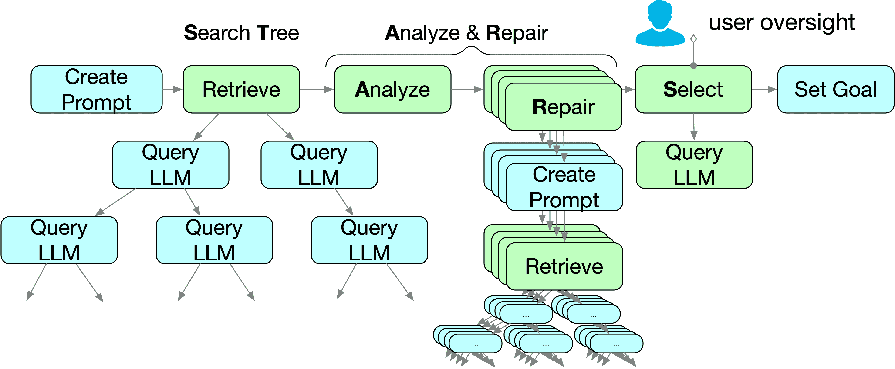

图 2：STARS 方法总结。

整体分析与修复过程如图[3](https://arxiv.org/html/2306.06770v4#Sx4.F3 "图 3 ‣ 分析与修复 (AR) ‣ STARS 方法 ‣ 通过代理分析提高从大规模语言模型（LLM）提取任务知识")所示。代理进行了一种心理模拟，模拟如果它尝试使用来自LLM的响应会发生什么，使用它在执行任务时所采用的相同解析和基础知识。分析评估了可解释性（橙色：代理是否能够解析和理解语言和术语）、基础（绿色：响应中的每个指代是否能够与环境中可观察到的物体进行关联）和可供性（蓝色：代理是否能够执行目标响应中的条款所暗示的对物体的操作）。目前，“AR”过程处理以下三种不匹配来源：

+   •

    语言：代理使用其本地的自然语言处理能力解析响应并检查输出。语言处理器指示句子是否能够被解释，并识别出未知的单词。

+   •

    情境：为了检测基础问题，代理评估其语言理解过程的结果。当一句话包含指向物体的指代表达式，如橱柜时，代理的语言处理系统会识别出代理能够观察到的基础候选项。如果无法为指代物体建立基础，则表示与当前情境不匹配。

+   •

    体现与可供性：代理通过其对物体的知识（语义记忆）和从感知中检测到的属性（环境）来检测体现和可供性不匹配。例如，当它处理目标响应中的一条子句，如“碗架在橱柜里”时，它会评估待移动的物体（“碗架”）是否具有“可抓取”这一属性。

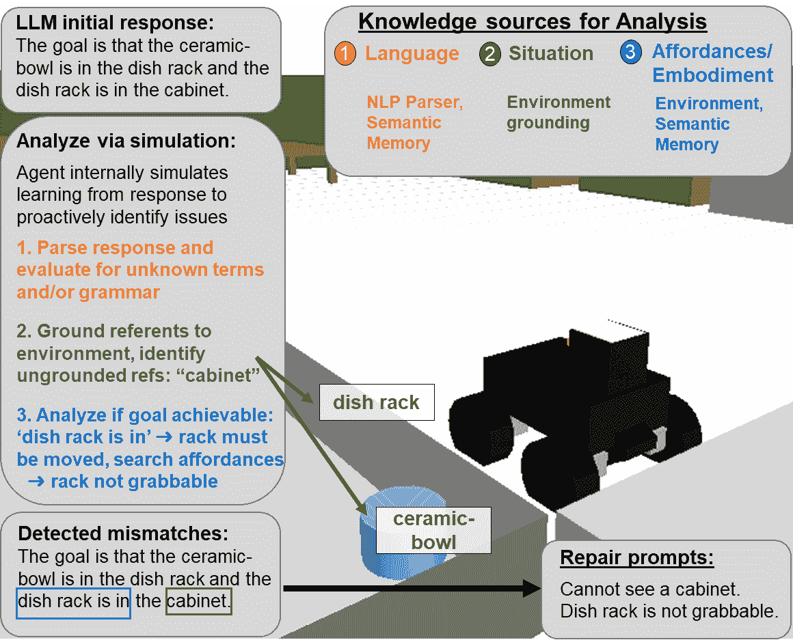

图 3：代理通过内部模拟分析不匹配

修复与分析过程中检测到的这些诊断性不匹配相结合。对于每种类型的诊断，代理使用该类别不匹配的修复模板构造新的提示。代理通过在不可行的响应后附加指示具体不匹配发生的说明来实例化模板，例如，“不行。看不到橱柜。”或“不行。架子不可抓取。”¹¹技术附录提供了修复和选择提示的完整示例：[https://arxiv.org/abs/2306.06770](https://arxiv.org/abs/2306.06770)。然后，ST使用此修复提示生成新的响应树。

### 选择（S）

ST 和 AR 被设计用来生成可行的候选响应。然而，代理必须选择一个响应来使用。与使用均值对数概率（如 TBP；图 [1](https://arxiv.org/html/2306.06770v4#Sx3.F1 "Figure 1 ‣ Prior Baseline: Template-based Prompting ‣ Improving Knowledge Extraction from LLMs for Task Learning through Agent Analysis")）或投票（如自一致性 Wang et al. [2023](https://arxiv.org/html/2306.06770v4#bib.bib25)）不同，新的选择策略使用 LLM 来选择响应。代理构建一个包含候选项的提示，并询问在给定任务背景下，候选响应的编号列表中哪一个是最合理的目标。提示会从 LLM 中征求一个单一的整数响应，指示哪一个响应是最佳的。

### 用户监督 (O)

一些任务的正确目标取决于人类的偏好（例如，有些用户喜欢将麦片存放在橱柜中，而另一些则喜欢放在食品储藏室）。原始的 ITL 代理从人类那里获取所有任务知识，从而自然地捕捉到这些偏好知识。STARS 减少了用户交互，同时仍能确保捕捉到这些偏好。让人类参与进来也确保了正确的学习。代理通过询问检索到的目标是否正确（是/否）来征求用户反馈，然后才使用该目标（如下）。选择决定了展示哪个选项。如果第一个响应被拒绝，则会重复选择，并移除被拒绝的选项。如果所有响应都被拒绝，用户必须提供正确的目标描述。

> 代理：在碗架上的杯子是目标，杯子应该放进橱柜且橱柜应该关上吗？
> 
> 用户：是的。

## 实验设计

为了评估 STARS，我们首先描述一个包含 STARS 的具身代理，实验设计和度量标准。在接下来的部分中，我们展示了三个不同任务的在线学习结果：整理厨房、存放杂货和整理办公室。我们评估了 STARS 如何满足上述要求，并且还考察了 STARS 组件的相对影响。STARS 学习目标状态的描述，而像 SayCan、InnerMonologue 和 TidyBot 这样的系统则学习动作序列。由于这些系统的学习目标不同，我们没有直接比较这些任务的表现。

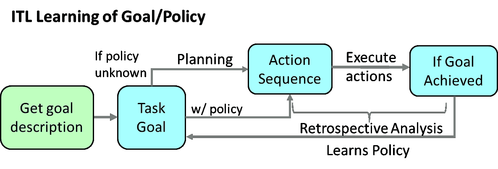

图 4：ITL 过程用于学习目标和策略。

代理：我们将STARS嵌入到现有的具身ITL代理中，替代了提供自然语言描述任务和子任务目标的人类交互。²²2 ITL代理的代码、模拟器和数据分析可以在[https://github.com/Center-for-Integrated-Cognition/STARS](https://github.com/Center-for-Integrated-Cognition/STARS)获取。原始代理可以学习多种多样的任务（从谜题到移动巡逻任务），并应用于许多不同的物理（Fetch机器人、移动机器人和桌面机械臂）和模拟（AI2Thor、April模拟器）机器人领域（Mohan等，[2012](https://arxiv.org/html/2306.06770v4#bib.bib15); Mininger [2021](https://arxiv.org/html/2306.06770v4#bib.bib13); Kirk和Laird [2019](https://arxiv.org/html/2306.06770v4#bib.bib8)）。

图[4](https://arxiv.org/html/2306.06770v4#Sx5.F4 "Figure 4 ‣ Experiment Design ‣ Improving Knowledge Extraction from LLMs for Task Learning through Agent Analysis")展示了用于学习目标的ITL过程。ITL代理还可以通过指令学习新的概念、新的动作（当规划知识不足时）和更低级的技能（这里没有显示）。我们在这里主要关注目标学习流程，因为STARS利用LLM学习目标描述（替代绿色框），而不改变流程的其他部分。ITL学习过程依赖大量用户输入，以提供可解释且准确的目标描述。当达成目标的策略未知时，内部规划会找到一系列实现目标的动作。成功规划的一个副作用是，代理通过代理架构的程序学习机制，一次性学习到长期的策略知识。当未来任务发生时，已学习的知识将指导代理的决策，而无需规划或人类干预。

场景：一个模拟的办公室和厨房，使用APRIL MAGIC模拟器创建了一个移动机器人。该机器人可以在房间内移动，接近物体，并且有一个单臂可以抓取和操作与任务相关的所有物品。在“整理厨房”任务（最大的任务）中，厨房里有35个常见的厨房物品（盘子、调料、餐具等）。物品最初分布在桌子、柜台和洗碗架上。在“存储杂货”任务中，有15个物品被装在厨房地板上的袋子里，必须存放到冰箱、橱柜或储藏室中。在“整理办公室”任务中，12个物品分布在桌子上，必须清理到抽屉、书架、垃圾桶、回收桶或文件柜中。这三个任务包含58个独特的物品，代理需要学习如何达成目标。

模拟：尽管之前的工作使用了物理机器人与ITL代理进行实验，但本次实验是在模拟环境中进行的，这足以研究概念的基础并从STARS提供的描述中进行解释和学习。

学习任务：对于每个实验，用户提供任务（例如，“整理厨房”）和主要子任务（例如，将桌子、柜台和碗架上的所有物品清理、存放和卸载）。对于所有任务，任务成功的衡量标准是将物体移动到与用户偏好一致的位置的比例。同时，当另一个物体被操控以完成任务（例如，打开冰箱门放置番茄酱）时，必须使其处于任务成功评估所需的状态（例如，门必须关闭）。对于“整理厨房”任务，有四种物品类型具有多个实例，必须根据其位置进行不同处理（例如，桌子上的杯子必须放入洗碗机或水槽中，但碗架上的杯子必须放入橱柜中）。使用图[2](https://arxiv.org/html/2306.06770v4#Sx4.F2 "Figure 2 ‣ Analyze and Repair (AR) ‣ The STARS Approach ‣ Improving Knowledge Extraction from LLMs for Task Learning through Agent Analysis")中所示的方法（或下面的STARS变体），智能体为每个感知到的物体获取目标描述。然后，智能体使用图[4](https://arxiv.org/html/2306.06770v4#Sx5.F4 "Figure 4 ‣ Experiment Design ‣ Improving Knowledge Extraction from LLMs for Task Learning through Agent Analysis")中描述的处理方法学习目标和行动策略，使其能够在未来正确地处理该物体，而不依赖LLM、规划或监督。

| 条件 | 描述 |
| --- | --- |
| TBP | 基于模板的提示（基线） |
| TBP+O | 带有人工监督的TBP |
| ST | 束搜索树 |
| STS | LLM选择的束搜索 |
| STAR | 通过分析（检查可行性）和修复进行束搜索 |
| STARS | 搜索树、A&R、LLM选择 |
| STARS+O | STARS与人工监督相结合。 |
| 实验 #2 | 学习后第二次呈现的任务表现，使用STARS+O。 |

表 1：实验条件的定义。

| 条件 | 比例（$\%$） |
| --- | --- |

目标

已返回

|

总计

令牌数

|

#

指令

|

#

单词数

|

| 整理厨房 |
| --- |
| TBP | 52.5 | 93 | 41407 | 14 | 76 |
| TBP+O | 100.0 | 89 | 42469 | 92 | 403 |
| ST | 50.0 | 243 | 56874 | 14 | 76 |
| STS | 40.0 | 247 | 66458 | 14 | 76 |
| STAR | 77.5 | 353 | 126086 | 14 | 76 |
| STARS | 77.5 | 368 | 139871 | 14 | 76 |
| STARS+O | 100.0 | 361 | 138096 | 65 | 127 |
| 实验 #2 | 100.0 | 0 | 0 | 1 | 2 |
| 储存杂货 |
| TBP | 66.7 | 39 | 17078 | 6 | 28 |
| TBP+O | 100.0 | 37 | 18689 | 29 | 92 |
| ST | 66.7 | 96 | 21518 | 6 | 28 |
| STS | 66.7 | 99 | 25690 | 6 | 28 |
| STAR | 77.8 | 170 | 57709 | 6 | 28 |
| STARS | 94.4 | 171 | 61808 | 6 | 28 |
| STARS+O | 100.0 | 177 | 64501 | 22 | 44 |
| 实验 #2 | 100.0 | 0 | 0 | 1 | 2 |
| 整理办公室 |
| TBP | 35.7 | 34 | 12992 | 6 | 28 |
| TBP+O | 100.0 | 35 | 11662 | 41 | 184 |
| ST | 21.4 | 95 | 21082 | 6 | 28 |
| STS | 21.4 | 97 | 24717 | 6 | 28 |
| STAR | 64.3 | 204 | 75509 | 6 | 28 |
| STARS | 92.9 | 201 | 76056 | 6 | 28 |
| STARS+O | 100.0 | 206 | 77722 | 22 | 60 |
| 试验 #2 | 100.0 | 0 | 0 | 1 | 2 |

表格 2：按条件总结三项任务的结果。

实验条件：实验条件列举于表格[1](https://arxiv.org/html/2306.06770v4#Sx5.T1 "Table 1 ‣ Experiment Design ‣ Improving Knowledge Extraction from LLMs for Task Learning through Agent Analysis")。TBP条件是用于评估STARS各组成部分影响的基准条件。所有条件中使用的LLM是GPT-3（用于TBP、搜索树和修复）和GPT-4（用于选择）。³³3GPT-4目前不暴露logprobs，因此不适用于束搜索。选择不使用束搜索，GPT-4展示了更好且更一致的结果。在所有条件中，用户提供初始任务。在监督条件下，用户最多审查5个响应。在非监督条件下，目标选择基于候选项的最高均值log概率（ST和STAR）或选择策略（STS和STARS）。

衡量标准：我们从三个维度评估条件：性能、响应质量和成本。对于性能，任务完成率（完成的目标断言数/目标断言总数）是主要衡量标准。对于响应质量，我们评估响应在情境相关性、可行性以及合理性方面与要求的契合程度。用户努力是影响成本的最大因素，但无法直接衡量。为了估算努力，我们使用交互次数、单词数以及接受的目标百分比。LLM的成本通过所呈现的token（提示）和生成的token（响应）来评估。

## 实验结果

实验结果的讨论围绕上述三个衡量标准展开。表格[2](https://arxiv.org/html/2306.06770v4#Sx5.T2 "Table 2 ‣ Experiment Design ‣ Improving Knowledge Extraction from LLMs for Task Learning through Agent Analysis")总结了三个任务在各条件下的表现（任务完成）和成本（token；监督）。试验 #2 条件显示了从STARS+O中成功学习后，在第二个任务方向下执行任务的性能；所有任务都成功完成，无需进一步交互，除了接收任务（例如，“整理厨房”）。⁴⁴4有关STARS与一些物体的演示视频，可见于[https://youtu.be/bx7af5XAELY](https://youtu.be/bx7af5XAELY)。

对于每个任务，我们在STARS条件下进行了10次实验。表[3](https://arxiv.org/html/2306.06770v4#Sx6.T3 "表 3 ‣ 实验结果 ‣ 通过代理分析改进LLM任务学习中的知识提取")显示了每个任务的任务完成率的平均值和标准差。由于实验过程中（归因于LLM和STARS）运行之间的变化较小，以及实验成本（GPT预算和执行每个条件所需的时间），我们只报告每个条件下的一个实验结果（表[2](https://arxiv.org/html/2306.06770v4#Sx5.T2 "表 2 ‣ 实验设计 ‣ 通过代理分析改进LLM任务学习中的知识提取")）。STARS的总体方差较小，对关键结果的影响微乎其微（有关结果变异性的更多探讨，请参见技术附录D部分）。

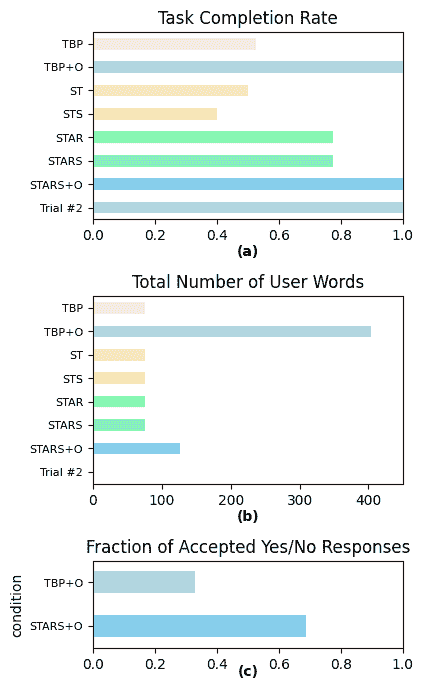

图 5：实验条件下“整理厨房”任务的性能和用户成本度量。

性能：表[2](https://arxiv.org/html/2306.06770v4#Sx5.T2 "表 2 ‣ 实验设计 ‣ 通过代理分析改进LLM任务学习中的知识提取")显示了三项任务在所有实验条件下的任务完成率。图[5](https://arxiv.org/html/2306.06770v4#Sx6.F5 "图 5 ‣ 实验结果 ‣ 通过代理分析改进LLM任务学习中的知识提取")（a）图示地比较了最大任务“整理厨房”的任务完成率。基准条件TBP仅在52.5%（整理厨房）、66.7%（存放杂货）和35.7%（整理办公室）的时间内实现了实验定义的目标（例如，“将杯子放入洗碗机”）。将监督（Oversight）添加到基准条件（TBP+O）后，任务完成率达到了100%，但显著增加了所需的词数（图[5](https://arxiv.org/html/2306.06770v4#Sx6.F5 "图 5 ‣ 实验结果 ‣ 通过代理分析改进LLM任务学习中的知识提取")（b））。由于LLM的许多回答不可行且与情境无关，用户必须提供目标描述，从而导致更多的指令文字。没有监督的情况下，STARS在任务完成率上取得了显著提升，分别提高至77.5%（整理）、94.4%（存放）和92.9%（整理）。分析与修复（AR）防止了代理使用不可行的回答，并通过修复增加了可行的回答数量。仅使用搜索树（ST）没有改善，但它是AR的前提。

| 任务： | 厨房 | 杂货 | 办公室 |
| --- | --- | --- | --- |
| 平均值 | 77.5 | 93.89 | 92.14 |
| 标准差 | 2.04 | 1.76 | 2.26 |

表 3：三项任务的任务完成率变化（仅限STARS条件）。

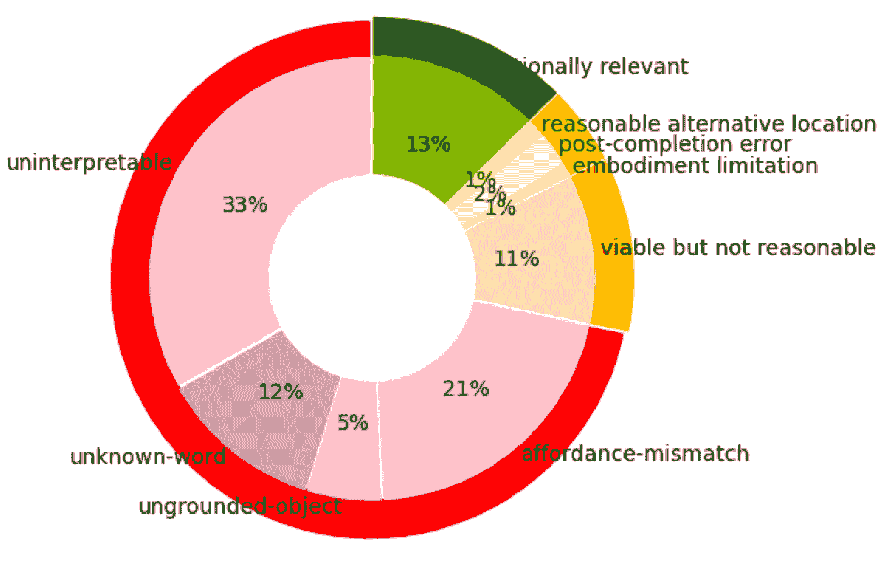

图 6：从LLM中检索到的回答分类（STARS条件下“整理厨房”任务）。

“整理厨房”任务的完成率（77.5%）明显低于使用STARS的其他任务。对于“存放杂货”和“整理办公室”任务，加入选择（S）提高了任务完成率，但对于“整理厨房”任务则没有这种效果。通过详细分析，我们确定代理缺乏与整理任务相关的上下文。例如，代理（在此实例中）无法区分“干净的”和“脏的”杯子。在“整理厨房”实验中，桌面上的餐具被假设为脏的（在设计中定义目标结果时），但代理缺乏这一上下文。当将此类上下文提供给LLM时（我们称之为STARS*变体），⁵⁵5系统提示中提供的上下文：“假设桌面或柜台上的餐具是脏的。假设瓶子和罐子是空的。非易腐食品应存放在储藏室。”选择方式使“整理厨房”任务的完成率达到92.5%（无需用户监督），这一结果与STARS在其他两个任务中的完成率相当。未来，我们将允许用户直接提供这一上下文。

在监督下，STARS的任务完成率对于所有任务都达到了100%，并且与TBP相比，用户输入大大减少。这一提升来源于将用户输入从提供目标描述（TBP中经常需要的）转移到确认LLM生成的目标描述，通过是/否的回答（STARS+O）。此外，如图[5](https://arxiv.org/html/2306.06770v4#Sx6.F5 "Figure 5 ‣ Experimental Results ‣ Improving Knowledge Extraction from LLMs for Task Learning through Agent Analysis")（c）所示，STARS在生成可接受的目标描述方面具有更高的精度，导致用户在监督条件下接受了更多的目标。接受目标的比例从33%增加到69%（整理厨房），从62%增加到94%（存放杂货），从18%增加到73%（整理办公室）。

响应质量：图[6](https://arxiv.org/html/2306.06770v4#Sx6.F6 "图 6 ‣ 实验结果 ‣ 通过代理分析提高LLM任务学习中的知识提取")展示了从LLM检索到的STARS在整理厨房任务中不同分类响应的百分比。⁶⁶6图表代表了除TBP和监督条件外的所有情况；具体条件可见附录中的每个任务。响应被分类为不可行（红色）、可行但不合理（橙色）、合理（黄色）或情境相关（绿色）。进一步的分类识别了不可行响应的类型不匹配（未知词汇、无依据物体、无法解释、不匹配的能力）和合理响应的类型不匹配（合理的替代位置、完成后错误、体现限制）。 “完成后错误”表示在某些情况下合理地未能关上门，例如某些物体没有门。“体现限制”表示当机器人将物体放置在一个合理的位置时，这个位置如果没有感知限制本应是合理的。

超过70%的回应是不可行的，如果机器人执行这些回应会导致失败；只有13%的回应是情境相关的，满足所有四个要求。对于储存杂货，58%的回应不可行，14%是情境相关的；对于整理办公室，85%的回应不可行，只有5%是情境相关的。因此，响应分析对于确保具身代理可靠使用LLM至关重要，以防止使用不可行的目标描述。在整理厨房任务的基线（TBP）中，代理在35个物体中仅检索到15个具有情境相关回应的物体，而STARS则使得100%的物体都有至少一个情境相关的回应。⁷⁷7详见附录中所有条件和任务的图表分析。

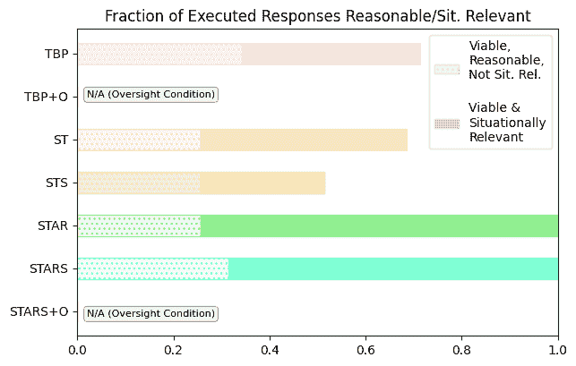

图7：机器人在“整理厨房”任务中使用的回应中，合理/情境相关的回应所占比例。

图[7](https://arxiv.org/html/2306.06770v4#Sx6.F7 "图 7 ‣ 实验结果 ‣ 通过代理分析提高LLM任务学习中的知识提取")展示了通过评估机器人接收到有效且（至少）合理的回应频率来衡量响应质量（对于某些用户来说可能是情境相关的，但不一定是当前用户）。对于“整理厨房”任务，STARS（和STAR）使得100%的回应至少是合理的。这表明，STARS的77.5%任务完成率接近在没有监督（或额外上下文）的情况下它能达到的最佳效果。为了区分情境相关的目标和合理的目标，仍然需要人工输入。

成本：表[2](https://arxiv.org/html/2306.06770v4#Sx5.T2 "表 2 ‣ 实验设计 ‣ 通过代理分析提高LLM任务学习中的知识提取")显示，STARS减少了监管的需求，包括指令和单词（例如，在整理厨房任务中，从403个单词减少到127个，在购买杂货任务中，从92个单词减少到44个，在整理办公室任务中，从184个单词减少到60个）。虽然减少的幅度适中，但用户现在只需用一个词来确认目标，而不需要提供完整的目标描述。STARS+O还提高了呈现响应的精度（图[5](https://arxiv.org/html/2306.06770v4#Sx6.F5 "图 5 ‣ 实验结果 ‣ 通过代理分析提高LLM任务学习中的知识提取")c）；69%（厨房）、94%（杂货）、73%（办公室）的响应得到了接受。图[8](https://arxiv.org/html/2306.06770v4#Sx6.F8 "图 8 ‣ 实验结果 ‣ 通过代理分析提高LLM任务学习中的知识提取")总结了在“整理厨房”任务中用于提示和生成的LLM token。对于该任务及其他任务，token成本在搜索树（ST）和分析与修复（AR）阶段显著增加，这是由于递归束搜索的原因。

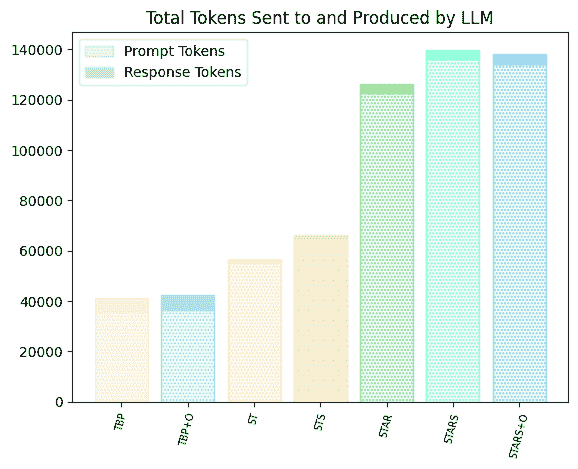

图8：LLM发送（虚线）和接收（实线）的token。

## 结论

将LLM作为具身代理的唯一知识来源具有挑战性，因为在将这些知识付诸实践时会出现一些特定要求。STARS使代理能够更有效地利用LLM，确保响应是可行的（可解释并且与情境及代理的能力相契合）。STARS将LLM的角色从唯一的知识来源转变为任务学习过程中的一个来源，这一过程更为全面（Kirk 等人 [2023](https://arxiv.org/html/2306.06770v4#bib.bib10)）。它既解决了LLM的局限性，又充分利用了认知代理的知识、推理和在线学习能力。

虽然STARS提供了显著的改进，但仍需要进一步的探索和发展。特别是，Selection在“整理厨房”任务中未能显著优于均值对数概率选择策略，因为缺乏上下文。未来的工作将探索对Selection的改进，特别是通过利用代理可以从用户获取的额外上下文以及（对于某些上下文）LLM所提供的上下文，正如此处简要概述的（STARS*）。

最后，STARS还帮助强调了在使用LLM进行代理任务学习时人类监督的必要性。至少，监督确保使用LLM的代理不会被LLM误导，后者可能生成不安全、有偏见和不道德的回应（Weidinger等人 [2021](https://arxiv.org/html/2306.06770v4#bib.bib26)）。此外，人类用户通常是唯一能够确定任务目标和结果是否适当的知识来源（需求4）。通过确保所有呈现给用户的候选项都是可行的，STARS简化并优化了人类监督，确保其专注于只有人类才能提供的知识。这种优化不仅减少了交互的单调性（如实验结果所示），还可能使用户更好地专注于与其需求、目标和价值观的对齐。

## 伦理声明

本研究使用了大型语言模型，这些模型可能带来伦理和社会风险（Weidinger等人 [2021](https://arxiv.org/html/2306.06770v4#bib.bib26)），例如歧视、排斥、有毒或恶意使用。我们已考虑到这些风险。

由于大型语言模型是生成式的，因此根据其语料库和训练，它们可能产生反映文化偏见、冒犯性刻板印象、贬损性用语等的语言。在本研究中，由于LLM查询仅专注于为特定任务环境生成目标描述，我们没有看到来自GPT-3的任何包括此类语言的回应。

就排斥而言，我们选择的具体任务确实反映了（并且镜像了）美国/西方环境的文化特异性，因为厨房和办公室中的物品（以及用于描述它们的标签）在英语语言中具有特定性，并且是家庭厨房或办公室环境中常见的物品之一。本研究的一个长期潜在结果（以及ITL更广泛的应用）是，代理在特定环境中由人类用户教授，从而允许人类根据其特定环境（包括文化背景）定制代理行为。我们将在未来的研究中探索这一潜力能否实现。

恶意使用也是一种潜在风险，因为本研究旨在使人类用户能够指示代理执行他们的命令。用户理论上可以指示代理对他人造成直接伤害、违反法律等。在我们当前的研究中，这一风险最小，因为实施仅限于受控的实验室实验。我们正在积极探索其他研究中，如何让ITL代理在被指示的同时，遵循和符合已编码的规则（如法律）和社会规范，以进一步减轻恶意使用的潜力。

## 致谢

本研究得到海军研究办公室合同N00014-21-1-2369的支持。本文件中的观点和结论仅代表作者个人意见，不应被解释为国防部或海军研究办公室的官方政策，无论是明示还是暗示。美国政府有权为政府目的复制和分发该文档的印刷品，尽管文中有任何版权声明。

## 参考文献

+   Ahn等人（2022）Ahn, M.; Brohan, A.; Brown, N.; Chebotar, Y.; Cortes, O.; David, B.; Finn, C.; Gopalakrishnan, K.; Hausman, K.; Herzog, A.; 等人. 2022. 做我能做的，而不是我说的：将语言与机器人能力联系起来。发表于*第六届机器人学习年会*。

+   Cobbe等人（2021）Cobbe, K.; Kosaraju, V.; Bavarian, M.; Chen, M.; Jun, H.; Kaiser, L.; Plappert, M.; Tworek, J.; Hilton, J.; Nakano, R.; Hesse, C.; 和 Schulman, J. 2021. 训练验证器解决数学文字题。ArXiv:2110.14168 [cs], arXiv:2110.14168。

+   Diao等人（2023）Diao, S.; Wang, P.; Lin, Y.; 和 Zhang, T. 2023. 使用链式思维进行大语言模型的主动提示。ArXiv:2302.12246 [cs]。

+   Gluck和Laird（2019）Gluck, K.; 和 Laird, J., 编辑。2019. *交互式任务学习：通过自然交互，代理、机器人与人类学习新任务*，第26卷*Strüngmann论坛报告*。剑桥，马萨诸塞州：MIT出版社。

+   Huang等人（2022）Huang, W.; Xia, F.; Xiao, T.; Chan, H.; Liang, J.; Florence, P.; Zeng, A.; Tompson, J.; Mordatch, I.; Chebotar, Y.; 等人. 2022. 内心独白：通过语言模型的规划进行具身推理。发表于*第六届机器人学习年会*。

+   Kim, Baldi和McAleer（2023）Kim, G.; Baldi, P.; 和 McAleer, S. 2023. 语言模型可以解决计算机任务。ArXiv:2303.17491 [cs]。

+   Kirk和Laird（2016）Kirk, J. R.; 和 Laird, J. E. 2016. 通过交互式指导学习新游戏的通用且高效的表示方式。发表于*认知系统进展会议论文集*。ISBN 0021-9967。

+   Kirk和Laird（2019）Kirk, J. R.; 和 Laird, J. E. 2019. 学习层次化符号表示以支持交互式任务学习和知识迁移。发表于*国际人工智能联合会议论文集*，6095–6102。国际人工智能联合会议。

+   Kirk等人（2022）Kirk, J. R.; Wray, R. E.; Lindes, P.; 和 Laird, J. E. 2022. 改进语言模型提示以支持半自主任务学习。发表于*认知系统进展会议（ACS）论文集*。

+   Kirk等人（2023）Kirk, J. R.; Wray, R. E.; Lindes, P.; 和 Laird, J. E. 2023. 整合多样化知识源以支持在线单次学习新任务。ArXiv:2208.09554 [cs], arXiv:2208.09554。

+   Laird等人（2017）Laird, J. E.; Gluck, K.; Anderson, J. R.; Forbus, K.; Jenkins, O.; Lebiere, C.; Salvucci, D.; Scheutz, M.; Thomaz, A.; Trafton, G.; Wray, R. E.; Mohan, S.; 和 Kirk, J. R. 2017. 交互式任务学习。*IEEE Int. Sys.*, 32(4): 6–21。

+   Logeswaran等人（2022）Logeswaran, L.; Fu, Y.; Lee, M.; 和 Lee, H. 2022. 《使用语言模型进行少样本子目标规划》。发表于 *2022年北美计算语言学协会：人类语言技术会议（NAACL）论文集*，5493–5506\. 计算语言学协会。

+   Mininger（2021）Mininger, A. 2021. 《基于解释的互动任务学习中任务多样性的扩展》。博士论文，密歇根大学，安阿伯。

+   Mohan和Laird（2014）Mohan, S.; 和 Laird, J. E. 2014. 《从情境互动教学中学习目标导向的层次任务》。发表于 *第28届AAAI人工智能会议论文集*，第2卷，113–130\. AAAI出版社。

+   Mohan等人（2012）Mohan, S.; Mininger, A.; Kirk, J.; 和 Laird, J. E. 2012. 《通过情境互动教学获取词语的扎根表示》。*认知系统进展*，2：113–130。

+   Olmo, Sreedharan和Kambhampati（2021）Olmo, A.; Sreedharan, S.; 和 Kambhampati, S. 2021. 《GPT3-to-plan：使用GPT-3从文本中提取计划》。发表于 *ICAPS FinPlan会议论文集*。ArXiv: 2106.07131 [cs]。

+   OpenAI（2023）OpenAI. 2023. 《GPT-4技术报告》。arXiv:2303.08774。

+   Park等人（2023）Park, J. S.; O’Brien, J.; Cai, C. J.; Morris, M. R.; Liang, P.; 和 Bernstein, M. S. 2023. 《生成代理：人类行为的交互式模拟》。发表于 *第36届ACM用户界面软件与技术年会论文集*，1–22。

+   Reynolds和McDonell（2021）Reynolds, L.; 和 McDonell, K. 2021. 《大规模语言模型的提示编程：超越少样本范式》。发表于 *2021年CHI计算机系统人因学会议扩展摘要*，CHI EA ’21\. 纽约，NY，美国：ACM。ISBN 9781450380959。

+   Richards（2023）Richards, T. B. 2023. 《Auto-GPT：一种自主GPT-4实验》。

+   Sarch等人（2022）Sarch, G.; Fang, Z.; Harley, A. W.; Schydlo, P.; Tarr, M. J.; Gupta, S.; 和 Fragkiadaki, K. 2022. 《TIDEE：使用视觉-语义常识先验整理新房间》。发表于 *计算机视觉–ECCV 2022*，480–496\. Springer。

+   Singh等人（2022）Singh, I.; Blukis, V.; Mousavian, A.; Goyal, A.; Xu, D.; Tremblay, J.; Fox, D.; Thomason, J.; 和 Garg, A. 2022. 《ProgPrompt：使用大规模语言模型生成情境化机器人任务计划》。arXiv:2209.11302。

+   Sumers等人（2023）Sumers, T. R.; Yao, S.; Narasimhan, K.; 和 Griffiths, T. L. 2023. 《语言代理的认知架构》。ArXiv:2309.02427 [cs]。

+   Valmeekam等人（2023）Valmeekam, K.; Sreedharan, S.; Marquez, M.; Olmo, A.; 和 Kambhampati, S. 2023. 《大规模语言模型的规划能力（一个带有提议基准的批判性调查）》。arXiv:2302.06706。

+   Wang等人（2023）Wang, X.; Wei, J.; Schuurmans, D.; Le, Q.; Chi, E.; Narang, S.; Chowdhery, A.; 和 Zhou, D. 2023. 《自一致性提升语言模型的思维链推理能力》。发表于 *第十一届国际学习表征会议（ICLR 2023）*。

+   Weidinger 等（2021）Weidinger, L.; Mellor, J.; Rauh, M.; Griffin, C.; Uesato, J.; Huang, P.-S.; Cheng, M.; Glaese, M.; Balle, B.; Kasirzadeh, A.; Kenton, Z.; Brown, S.; Hawkins, W.; Stepleton, T.; Biles, C.; Birhane, A.; Haas, J.; Rimell, L.; Hendricks, L. A.; Isaac, W.; Legassick, S.; Irving, G.; and Gabriel, I. 2021. 语言模型带来的伦理与社会风险。ArXiv:2112.04359 [cs]。

+   Wu 等（2023）Wu, J.; Antonova, R.; Kan, A.; Lepert, M.; Zeng, A.; Song, S.; Bohg, J.; Rusinkiewicz, S.; 和 Funkhouser, T. 2023. TidyBot：通过大型语言模型为个性化机器人提供帮助。ArXiv:2305.05658 [cs], arXiv:2305.05658。

技术附录

## 附录 A 实验中的物品

本节描述了论文中实验所使用的物品。表[4](https://arxiv.org/html/2306.06770v4#A1.T4 "表 4 ‣ 附录 A 实验中的物品 ‣ 通过代理分析提高从大型语言模型中提取任务知识的能力")显示了在“整理厨房”任务中使用的35种物品，包括它们在厨房中的起始位置和目标位置。所有列出的35种物品都具有“可抓取”属性（机器人可以拾取）。这些物品分布在工作台、桌子和盘子架上。物品的目标位置均匀分布在回收箱、垃圾桶、抽屉、水槽/洗碗机、橱柜、储藏室和冰箱中。

| 物品 | 位置 | 目标位置 |
| --- | --- | --- |
| 塑料瓶 | 桌子 | 回收箱 |
| 苏打水罐 | 桌子 | 回收箱 |
| 可乐罐 | 工作台 | 回收箱 |
| 百事可乐罐 | 桌子 | 回收箱 |
| 报纸 | 工作台 | 回收箱 |
| 苹果核 | 工作台 | 垃圾桶 |
| 纸盘 | 桌子 | 垃圾桶 |
| 塑料叉子 | 桌子 | 垃圾桶 |
| 塑料杯 | 桌子 | 垃圾桶 |
| 纸杯 | 工作台 | 垃圾桶 |
| 削皮刀 | 盘子架 | 抽屉 |
| 金属叉子 | 盘子架 | 抽屉 |
| 牛排刀 | 盘子架 | 抽屉 |
| 开瓶器 | 桌子 | 抽屉 |
| 开瓶器 | 工作台 | 抽屉 |
| 陶瓷盘 | 桌子 | 水槽/洗碗机 |
| 盘子 | 工作台 | 水槽/洗碗机 |
| 玻璃杯 | 桌子 | 水槽/洗碗机 |
| 牛排刀 | 工作台 | 水槽/洗碗机 |
| 杯子 | 工作台 | 水槽/洗碗机 |
| 杯子 | 盘子架 | 橱柜 |
| 玻璃杯 | 盘子架 | 橱柜 |
| 陶瓷盘 | 盘子架 | 橱柜 |
| 陶瓷碗 | 盘子架 | 橱柜 |
| 咖啡研磨机 | 工作台 | 橱柜 |
| 谷物盒 | 桌子 | 储藏室 |
| 铝箔盒 | 工作台 | 储藏室 |
| 果脆饼干盒 | 桌子 | 储藏室 |
| 格兰诺拉麦片 | 工作台 | 储藏室 |
| 饼干 | 工作台 | 储藏室 |
| 牛奶 | 桌子 | 冰箱 |
| 半奶油 | 工作台 | 冰箱 |
| 番茄酱 | 桌子 | 冰箱 |
| 辣酱瓶 | 工作台 | 冰箱 |
| 苹果汁 | 桌子 | 冰箱 |

表 4：在“整理厨房”实验中使用的物品及其起始位置和目标位置。

有四对重复物体（加粗标出），但由于它们所在的位置不同，每对重复物体的目标状态也不同（例如，桌子上的牛排刀应该放入洗碗机，碟架上的牛排刀应该放入抽屉）。根据这些实验的设计，桌子或台面上的盘子被视为脏物（反映了用户的偏好）。然而，桌子上的某些物体必须有不同的处理方式。例如，开瓶器和螺旋塞需要直接放入抽屉（因为这些物体通常在使用后不会被清洗）。设计中包含了相同类型物体的多个实例，并且从相同的初始位置设置了不同的目标位置，以 1) 使任务学习变得更具挑战性，2) 评估大型语言模型如何应对不同的情境。

| 物体 | 位置 | 目标位置 |
| --- | --- | --- |
| 塑料杯 | 袋子 | 橱柜 |
| 纸盘 | 袋子 | 橱柜 |
| 面粉 | 袋子 | 储藏室 |
| 盒装意面 | 袋子 | 储藏室 |
| 一罐豆子 | 袋子 | 储藏室 |
| 格兰诺拉麦片 | 袋子 | 储藏室 |
| 薯片 | 袋子 | 储藏室 |
| 酸奶 | 袋子 | 冰箱 |
| 奶油 | 袋子 | 冰箱 |
| 鷹嘴豆泥 | 袋子 | 冰箱 |
| 苹果醋 | 袋子 | 冰箱 |
| 奶酪 | 袋子 | 冰箱 |
| 橙汁 | 袋子 | 冰箱 |
| 鸡蛋 | 袋子 | 冰箱 |
| 黄油 | 袋子 | 冰箱 |

表 5: 用于“存放杂货”实验的物体及其起始位置和目标位置。

表 [5](https://arxiv.org/html/2306.06770v4#A1.T5 "表 5 ‣ 附录 A 实验中的物体 ‣ 通过代理分析提高从大型语言模型中提取知识以进行任务学习") 显示了用于“存放杂货”任务的 15 个物体，包括物体的起始位置和目标位置。如前所述，所有列出的 15 个物体都具有“可抓取”属性（可以被机器人拾取）。这些物体被分配到厨房地板上的三个袋子中。

表 [6](https://arxiv.org/html/2306.06770v4#A1.T6 "表 6 ‣ 附录 A 实验中的物体 ‣ 通过代理分析提高从大型语言模型中提取知识以进行任务学习") 显示了模拟厨房中的 11 种家电和家具，这些物体作为“整理厨房”和“存放杂货”实验中的物体位置和目标位置。表格列出了与这些物体可执行的动作（可操作性）相关的属性，包括表面（物体可以放置在其上）和容器（物体可以放入其中）。表格还列出了物体是否具有可打开/关闭的可操作性。最后，表格列出了实验设计中物体的目标状态（例如，能够关闭的物体必须关闭）。

| 物体 | 属性 | 目标状态 |
| --- | --- | --- |
| 桌面 | 表面 | 不适用 |
| 垃圾桶 | 容器 | 不适用 |
| 碟架 | 容器 | 不适用 |
| 垃圾 | 容器 | 不适用 |
| 回收箱 | 容器 | 不适用 |
| 食品储藏室 | 容器，可开/可关 | 关闭 |
| 橱柜 | 容器，可开/可关 | 关闭 |
| 冰箱 | 容器，可开/可关 | 关闭 |
| 洗碗机 | 容器，可开/可关 | 关闭 |
| 抽屉 | 容器，可开/可关 | 关闭 |
| 水槽 | 容器 | 不适用 |

表 6: 在模拟厨房中用于实验的家用电器和家具物品及其属性和目标状态。

| 物品 | 位置 | 目标目的地 |
| --- | --- | --- |
| 文件夹 | 包 | 文件柜 |
| 文件 | 包 | 文件柜 |
| 纸咖啡杯 | 包 | 垃圾 |
| 纸巾 | 包 | 垃圾 |
| 塑料水瓶 | 包 | 回收箱 |
| 汽水罐 | 包 | 回收箱 |
| 字典 | 包 | 书架 |
| 小说 | 包 | 书架 |
| 书籍 | 包 | 书架 |
| 订书机 | 包 | 抽屉 |
| 铅笔 | 包 | 抽屉 |
| 钢笔 | 包 | 抽屉 |

表 7: 在“整理办公室”实验中使用的物品及其起始位置和目标目的地。

表[7](https://arxiv.org/html/2306.06770v4#A1.T7 "表7 ‣ 附录A 实验中的物品 ‣ 通过代理分析提高从LLM中提取知识的效果，以促进任务学习")展示了用于“整理办公室”任务实验中的12个物品，包括它们的起始位置和目标目的地。与之前一样，所有列出的12个物品都具有“可抓取”的属性（可以被机器人拾取）。这些物品都放在办公室的桌子上。表[8](https://arxiv.org/html/2306.06770v4#A1.T8 "表8 ‣ 附录A 实验中的物品 ‣ 通过代理分析提高从LLM中提取知识的效果，以促进任务学习")展示了模拟办公室中的7个家具物品，它们作为“整理办公室”实验中的物品的起始位置和目标目的地。表格中指定了与物品上可以执行的动作（可操作性）相关的属性，包括表面（物品可以放在上面）和容器（物品可以放在其中）。与之前一样，它列出了物品是否具备可开/可关的可操作性。最后，它列出了实验设计中物品的目标状态（例如，可以关闭的物品必须关闭）。

| 物品 | 属性 | 目标状态 |
| --- | --- | --- |
| 桌子 | 表面 | 不适用 |
| 椅子 | 表面 | 不适用 |
| 文件柜 | 容器，可开/可关 | 关闭 |
| 书架 | 容器 | 不适用 |
| 垃圾 | 容器 | 不适用 |
| 回收箱 | 容器 | 不适用 |
| 抽屉 | 容器，可开/可关 | 关闭 |

表 8: 在模拟办公室中用于实验的家具物品及其属性和目标状态。

## 附录 B 目标提取/学习过程的逐步示例

在本节中，我们将详细描述并以实验中得出的实际例子，展示从“整理厨房”任务的学习过程，运用STARS策略从LLM（GPT-3）中获取广泛的响应，分析并修复这些响应，最后从候选选项中选择合适的答案（GPT-4）。我们聚焦于单一物体，并以STARS+监督条件为例，没有进行去除操作。

图 [9](https://arxiv.org/html/2306.06770v4#A2.F9 "图9 ‣ 附录B 步骤式目标引导/学习过程 ‣ 通过代理分析提高从LLM提取任务学习知识的效率") 显示了一个厨房的模拟环境，厨房里充满了需要整理的物品。我们探讨了在模拟办公室厨房环境中，具有抓取、移动和与物体互动能力的移动机器人如何进行任务学习。首先，我们描述了与用户的初始互动，用户提供任务和要学习的子任务，然后是基于模板的提示策略，这是本方法的基线，且用于选择并实例化一个模板来学习任务知识。最后，我们描述了STARS的组件策略。

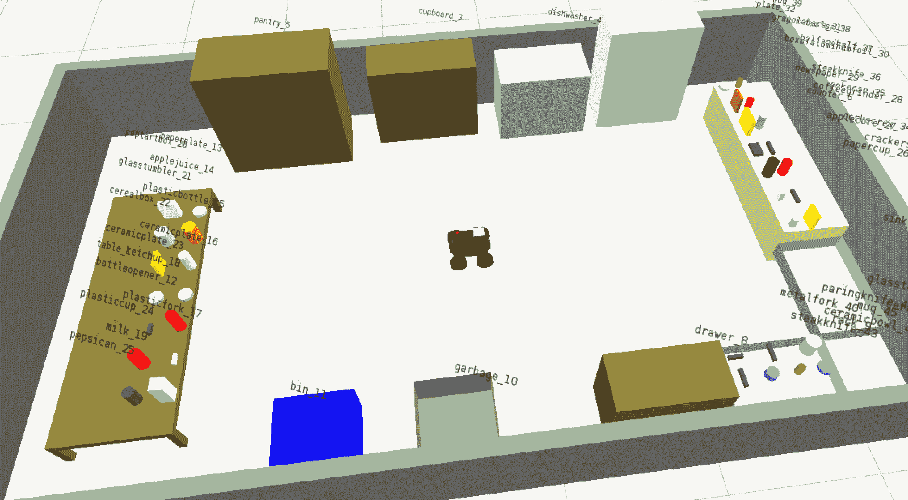

图9：学习“整理厨房”任务的设置。

### 初始互动，ITL代理

用于启动“整理厨房”任务教学的对话如下所示。人类提供要学习的任务，接着列出子任务，分别用于清理、存放和卸下桌面、柜台和餐具架上的所有物品。

> 教练：整理厨房。
> 
> 机器人：整理的下一个目标或子任务是什么？
> 
> 教练：在桌子上有物体时，重复以下任务。
> 
> 机器人：整理的下一个目标或子任务是什么？
> 
> 教练：清理桌上的物体。
> 
> 机器人：清理的下一个目标或子任务是什么？

机器人随后开始查找它在桌子上观察到的物体。选定物体后，代理尝试清理该物体。如果它不知道该物体的目标，机器人将启动STARS学习过程，以获取目标描述，首先通过任务和物体的上下文构建目标提示。一旦桌上的物体都被清理完，部分对话将重复，用于存放柜台上的物体，接着再进行餐具架上物体的卸载。

作为前进的示例，我们将使用一个机器人在学习将餐具架中的所有物品卸下时观察到的杯子。数据来自于STARS+监督条件下的实验。

### 提示构建

通过基于模板的提示，机器人选择一个用于学习任务目标的模板，该模板包括两个提示示例（来自其他任务），并结合相关任务上下文实例化提示模板，包括整体任务“整理厨房”、机器人所在位置“在厨房中”和观察到的物体“碗架上的杯子”。由机器人构建的关于碗架上杯子的初始提示如下所示。

本文的工作特别关注于检索目标知识，使机器人能够搜索实现目标的步骤。先前的研究表明，使用这一策略，机器人可以以97%的准确率检索到行动知识，而无需额外的交互或评估，因此不需要本文提出的附加策略来找到实现有效目标所需的行动。

*智能体创建的提示：*

```
(EXAMPLES)(TASK)Task name: store object. Task context: I am in mailroom.
Aware of package of office supplies, package is in mailroom.
(RESULT)The goal is that the package is in the closet
and the closet is closed.(END RESULT)
Response: Ok.
Steps:
1\. Open closet
2\. Pick up package of office supplies
3\. Put package into closet
4\. Close closet
(END TASK)
(TASK)Task name: deliver package. Task context: I am in mailroom.
Aware of package addressed to Gary, package is in mailroom.
(RESULT)The goal is that the package is in Gary’s office.(END RESULT)
Response: Ok.
Steps:
1\. Pick up package addressed to Gary
2\. Go to Gary’s office
3\. Put package onto desk in Gary’s office
(END TASK)
(END EXAMPLES)
(TASK)Task name: tidy kitchen. Task context: I am in kitchen.
Aware of mug in dish rack.
(RESULT)

```

### 搜索树

为了确保可以选择多种回应，机器人使用束搜索（beam search）来检索单个提示的回应树。对于任何具有低于90%对数概率的标记，新的补全将会为那些概率超过5%的备选标记生成。GPT的logprobs设置为5，因此四个备选回应将会从大语言模型（LLM）中检索。这一过程是递归的（最多递归深度为3）。为了进一步限制递归和生成的回应数量，我们还限制了回应的第二次递归，只允许那些迄今为止生成的回应的平均对数概率超过85%的回应。这些阈值是在一些初步实验后选择的，并没有针对实验数据集中的对象进行调优。降低这些阈值会导致检索到更大的回应空间。

首先检索提示的温度0回应。对于上述提示，关于‘mug’的温度0回应是：

*LLM回应：*

```
The goal is that the mug is in the dishwasher and the dishwasher is
turned on

```

对束搜索的更深入分析，以下列出了上述提示的回应中的标记。

*回应中的标记：*

```
[‘The’, ‘ goal’, ‘ is’, ‘ that’, ‘ the’, ‘ mug’, ‘ is’, ‘ in’, ‘ the’,
    ‘ dish’, ‘washer’, ‘ and’, ‘ the’, ‘ dish’, ‘washer’, ‘ is’, ‘ turned’,
    ‘ on’]

```

在这些标记中，只有‘dish’、‘washer’、‘and’和‘turned’的对数概率低于90%的阈值。每个标记的对数概率如表[9](https://arxiv.org/html/2306.06770v4#A2.T9 "表9 ‣ 搜索树 ‣ 附录B 目标提取/学习过程的逐步示例 ‣ 通过智能体分析提升从LLM提取任务学习知识的效果")所示，表中还列出了每个备选回应的概率。只有那些超过5%阈值的标记（用**粗体**突出显示）将在束搜索中被扩展。

| 初始标记 | 备选标记 |
| --- | --- |
| ‘dish’ (0.483) | ‘cup’ (0.265) | ‘cabinet’ (0.213) | ‘sink’ (0.0206) | ‘mug’ (0.0088) |
| ‘washer’ (0.793) | ‘rack’ (0.1658) | ‘cabinet’ (0.0191) | ‘dr’ (0.0158) | ‘cup’ (0.00279) |
| ‘and’ (0.881) | ‘.(’( 0.114) | ‘.’ (0.00209) | ‘.”’(0.00002582) |  |
| ‘turned’ (0.536) | ‘closed’ (0.176) | ‘on’(0.1479) | ‘started’(0.056) | ‘full’ (0.0380) |

表格 9：初始响应中低于光束搜索阈值的词语的替代词。

*第一级递归的提示：*

```
(EXAMPLES)(TASK)Task name: store object. Task context: I am in mailroom.
Aware of package of office supplies, package is in mailroom.
(RESULT)The goal is that the package is in the closet
and the closet is closed.(END RESULT)
Response: Ok.
Steps:
1\. Open closet
2\. Pick up package of office supplies
3\. Put package into closet
4\. Close closet
(END TASK)
(TASK)Task name: deliver package. Task context: I am in mailroom.
Aware of package addressed to Gary, package is in mailroom.
(RESULT)The goal is that the package is in Gary’s office.(END RESULT)
Response: Ok.
Steps:
1\. Pick up package addressed to Gary
2\. Go to Gary’s office
3\. Put package onto desk in Gary’s office
(END TASK)
(END EXAMPLES)
(TASK)Task name: tidy kitchen. Task context: I am in kitchen.
Aware of mug in dish rack.
(RESULT)The goal is that the mug is in the cup

```

此提示的响应词语列在下面。

*第一级递归的LLM响应词语：*

```
[’board’, ’ and’, ’ the’, ’ cup’, ’board’, ’ is’, ’ closed’]

```

再次检查词语的相对概率，以继续光束搜索。如之前所述，低于90%概率的替代词在表格[10](https://arxiv.org/html/2306.06770v4#A2.T10 "表格 10 ‣ 搜索树 ‣ 附录B 逐步示例：通过代理分析改善LLM任务学习的知识提取")中列出，且只有高于5%阈值的词（用粗体突出显示）才会在光束搜索中被扩展。

| 初始词语 | 替代词语 |
| --- | --- |
| ‘ 和’ (0.8779) | ‘ .(’ (0.1190) | ‘ .’ (0.0010) | ‘ 上面’ (0.0002) |  |
| ‘ 杯子’ (0.810) | ‘ 碟子’ (0.1864) | ‘ 厨房’ (0.0009) | ‘ 门’ (0.0009) | ‘ 台面’ (0.0006) |

表格 10：首次递归响应中低于阈值的词语的替代词。

当搜索树遇到包含句号的替代词时，表示句子的结束，例如上述的“和”，它将该完成结果作为响应返回：“目标是杯子在橱柜里。”然后，搜索树继续通过生成一个新的完成，其中使用“碟子”代替“杯子”，如下面的提示所示。

*第二级递归的提示：*

```
(EXAMPLES)(TASK)Task name: store object. Task context: I am in mailroom.
Aware of package of office supplies, package is in mailroom.
(RESULT)The goal is that the package is in the closet
and the closet is closed.(END RESULT)
Response: Ok.
Steps:
1\. Open closet
2\. Pick up package of office supplies
3\. Put package into closet
4\. Close closet
(END TASK)
(TASK)Task name: deliver package. Task context: I am in mailroom.
Aware of package addressed to Gary, package is in mailroom.
(RESULT)The goal is that the package is in Gary’s office.(END RESULT)
Response: Ok.
Steps:
1\. Pick up package addressed to Gary
2\. Go to Gary’s office
3\. Put package onto desk in Gary’s office
(END TASK)
(END EXAMPLES)
(TASK)Task name: tidy kitchen. Task context: I am in kitchen.
Aware of mug in dish rack.
(RESULT)The goal is that the mug is in the cupboard and the dish

```

LLM回应了另一个词语序列：

*第二级递归的响应：*

```
[’ rack’, ’ is’, ’ empty’]

```

此后不再进行进一步递归。对响应“树”的其他分支执行类似的过程。在将整个树扩展到此级别后，通过使用搜索树获取的最终响应集将发送给机器人进行分析。这些响应及其概率列在下面。

*通过树搜索生成的最终目标列表：*

```
the goal is that the mug is in the cabinet and the cabinet is closed (0.937)
the goal is that the mug is in the cupboard and the cupboard is closed
    (0.935)
the goal is that the mug is in the dishwasher and the dishwasher is turned
    on (0.925)
the goal is that the mug is in the dishwasher and the dishwasher is closed
    (0.899)
the goal is that the mug is in the cupboard and the dish rack is empty
    (0.898)
the goal is that the mug is in the dishwasher and the dishwasher is on
    (0.897)
the goal is that the mug is in the dishwasher and the dishwasher is started
    (0.8919)
the goal is that the mug is in the dish rack and the dish rack is empty
    (0.881)
the goal is that the mug is in the dish rack and the dish rack is tidy
    (0.870)
the goal is that the mug is in the dish rack and the dish rack is clean
    (0.865)
the goal is that the mug is in the dishwasher (0.8618)
the goal is that the mug is in the cupboard (0.86128)
the goal is that the mug is in the dish rack and the dish rack is in the
    cupboard (0.860)

```

### （代理）分析

一旦搜索树过程从LLM中获取了一组高概率响应，STARS将继续分析每个候选响应，以检测不匹配并确定哪些是适合机器人的。每个候选项都将被分析，以确定其是否与机器人的自然语言处理能力、体现、可操作性以及当前环境相匹配。

该分析通过内部模拟进行，机器人模拟从响应中学习，主动识别不匹配。机器人的语言处理器指示句子是否可以解释，并识别未知词汇。它评估语言理解的匹配过程的结果，找出响应中无法与机器人可观察到的环境中的物体进行匹配的指称。最后，机器人利用它对物体（来自语义记忆）和物体属性（通过对环境的感知检测）的知识，检测表现和可供性不匹配，通过评估响应中的各个分句是否在其可供性知识范围内可实现。

如果响应中没有不匹配，分析将其分类为可行；对于有不匹配的响应，分析将识别不匹配的类型及具体问题。以下是关于杯子的可行目标。

*代理分析确定以下为可行：*

```
the goal is that the mug is in the cupboard and the cupboard is closed
the goal is that the mug is in the dishwasher and the dishwasher is closed
the goal is that the mug is in the dishwasher
the goal is that the mug is in the cupboard

```

机器人确定为不可行的目标响应如下所示，按不匹配类型分组。

*无法解释的响应（语言不匹配）：*

```
the goal is that the mug is in the dishwasher and the dishwasher is turned
   on
the goal is that the mug is in the dishwasher and the dishwasher is on
the goal is that the mug is in the dish rack and the dish rack is tidy
the goal is that the mug is in the dish rack and the dish rack is clean

```

在这些情况下，机器人无法解释这些响应。

*具有未知词汇的响应（语言不匹配）：*

```
the goal is that the mug is in the dishwasher and the dishwasher is
    started (Unknown word started)

```

机器人没有“开始”这一词的定义，并将其识别为一个未知词。

*具有未匹配物体的响应（情境不匹配）：*

```
the goal is that the mug is in the cabinet and the cabinet is closed,
    (Ungrounded object cabinet)

```

厨房里没有机器人可以观察到的橱柜，因此它无法将“橱柜”这一指称词与一个物体进行匹配。

*具有不匹配的响应（表现/可供性不匹配）：*

```
the goal is that the mug is in the cupboard and the dish rack is empty
    (affordanch mismatch: rack cannot have property empty)
the goal is that the mug is in the dish rack and the dish rack is empty
    (affordance mismatch: rack cannot have property empty)
the goal is that the mug is in the dish rack and the dish rack is in the
    cupboard(affordance mismatch: rack is not grabbable)

```

对于可供性不匹配，机器人检测到空的碗架存在可供性违反，因为它对空的物体的可供性知识与可以装入液体的物体（如水壶）相关，但碗架没有可填充的可供性。碗架也不是机器人能够抓取或移动的物体，因此它识别出碗架无法抓取的可供性不匹配。

### 修复

根据分析结果，STARS的修复策略通过再次提示大语言模型来修复检测到的不匹配。它将尝试修复三种类型的不匹配：未匹配的物体、未知词汇和可供性不匹配。对于每种类型的不匹配，机器人都有一个提示模板，可以实例化该模板，包含修复该类型不匹配的示例（用于其他任务）。否则，提示模板与初始提示时使用的模板相同（如ST中所见）。不匹配的响应会附加到提示之后，接着是机器人表明需要修复的不匹配。

下面我们继续进行碗架中杯子的学习过程，通过展示对每种不匹配类型的响应进行修复。

*修复未匹配物体：*

机器人尝试修复的第一个回应是包含未接地物体（柜子）的回应，机器人无法在其环境中感知到这个物体。

```
the goal is that the mug is in the cabinet and the cabinet is closed

```

机器人选择一个修复未接地物体的提示模板，其中包括一个修复示例。这个针对未接地架子的修复示例可以在下面的提示开头看到。提示像之前一样实例化，但现在附加了不匹配的回应，后面跟着机器人指示修复不匹配的回应：“不。看不到柜子。”

*提示：*

```
(EXAMPLES)(TASK)Task name: store object. Task context: I am in mailroom.
Aware of package of office supplies, package is in mailroom.
(RESULT)The goal is that the package is on the shelf.(END RESULT)
Response: No. Cannot see a shelf.
(RESULT)The goal is that the package is in the closet.(END RESULT)
Response: Ok.
Steps:
1\. Pick up package
2\. Put package into closet
(END TASK)
(TASK)Task name: deliver package. Task context: I am in mailroom.
Aware of package addressed to Gary, package is in mailroom.
(RESULT)The goal is that the package is in Gary’s office.(END RESULT)
Response: Ok.
Steps:
1\. Pick up package addressed to Gary
2\. Go to Gary’s office
3\. Put package onto desk in Gary’s office
(END TASK)
(END EXAMPLES)
(TASK)Task name: tidy kitchen. Task context: I am in kitchen.
Aware of mug in dish rack.
(RESULT)the goal is that the mug is in the cabinet and the cabinet
is closed(END RESULT)
Response: No. Cannot see a cabinet.
(RESULT)

```

来自此提示的初始温度为0的回应列在下面。

*修复 LLM 响应：*

```
[’the’, ’ goal’, ’ is’, ’ that’, ’ the’, ’ mug’, ’ is’, ’ in’, ’ the’,
    ’ sink’, ’ and’, ’ the’, ’ sink’, ’ is’, ’ full’, ’ of’, ’ water’]

```

STARS 不仅仅是检索单一的回应，它使用来自搜索树的束搜索策略来检索一组修复回应，和之前一样。我们不会再逐步讲解这个过程，因为它与之前相同。通过这个修复提示生成的最终回应如下所示。其中一些回应是已经生成过的重复回应。请注意，这些回应中没有再提到柜子。

*修复未接地柜子的最终输出：*

```
the goal is that the mug is in the drawer and the drawer is closed
the goal is that the mug is in the sink and the sink is full of water
the goal is that the mug is in the dish rack and the dish rack is empty
    (duplicate)
the goal is that the mug is in the sink and the sink is empty (duplicate)
the goal is that the mug is in the sink and the sink is clean (duplicate)

```

*修复未知术语：*

STARS 继续修复另一个回应，具有不同的不匹配，即包含未知词的回应。在这个回应中，如下所示，机器人不知道“started”这个词。

```
the goal is that the mug is in the dishwasher and the dishwasher is
    started

```

和之前一样，机器人选择一个修复未知术语的模板，包含一个未知术语修复的示例（如下所示），并将其与相关任务上下文、不匹配的回应和机器人的修复回应一起实例化：“不。未知词 started。”这个提示如下所示。

*提示：*

```
(EXAMPLES)(TASK)Task name: store object. Task context: I am in mailroom.
Aware of package of office supplies, package is in mailroom.
(RESULT)The goal is that the package is in the cabinet.(END RESULT)
Response: No. Unknown word cabinet.
(RESULT)The goal is that the package is in the closet.(END RESULT)
Response: Ok.
Steps:
1\. Pick up package
2\. Put package into closet
(END TASK)
(TASK)Task name: deliver package. Task context: I am in mailroom.
Aware of package addressed to Gary, package is in mailroom.
(RESULT)The goal is that the package is in Gary’s office.(END RESULT)
Response: Ok.
Steps:
1\. Pick up package addressed to Gary
2\. Go to Gary’s office
3\. Put package onto desk in Gary’s office
(END TASK)
(END EXAMPLES)
(TASK)Task name: tidy kitchen. Task context: I am in kitchen.
Aware of mug in dish rack.
(RESULT)the goal is that the mug is in the dishwasher and the dishwasher
is started(END RESULT)
Response: No. Unknown word started.
(RESULT)

```

和之前一样，这个提示被用来生成一组回应，使用 ST 束搜索生成目标描述，如下所列。请注意，修复后的回应不再包含“洗碗机已启动”，而是包含其他描述洗碗机状态的术语。

*修复未知词 started 的最终输出：*

```
the goal is that the mug is in the dishwasher and the dishwasher is turned
    on (duplicate)
the goal is that the mug is in the dishwasher and the dishwasher is running
    (duplicate)
the goal is that the mug is in the dishwasher and the dishwasher is on
    (duplicate)

```

在这种情况下，所有这些结果都是之前找到的重复项。

*修复附加不匹配：*

接下来，机器人执行修复一个有附加不匹配的回应（如下所示）。在这种情况下，碗架不可抓取，因此无法放入橱柜。

```
the goal is that the mug is in the dish rack and the dish rack is in the
  cupboard

```

和之前一样的过程重复，STARS 选择一个包含附加修复示例的提示模板（如下所示），与任务上下文一起实例化，并提供不匹配的回应以及机器人修复回应的指示：“不。架子不可抓取。”这个提示可以在下面看到。

*提示：*

```
(EXAMPLES)(TASK)Task name: store object. Task context: I am in mailroom.
Aware of package of office supplies, package is in mailroom.
(RESULT)The goal is that the package is on the shelf and the shelf is
on the table.(END RESULT)
Response: No. Shelf is not grabbable.
(RESULT)The goal is that the package is on the shelf.(END RESULT)
Response: Ok.
Steps:
1\. Pick up package
2\. Put package onto shelf
(END TASK)
(TASK)Task name: deliver package. Task context: I am in mailroom.
Aware of package addressed to Gary, package is in mailroom.
(RESULT)The goal is that the package is in Gary’s office.(END RESULT)
Response: Ok.
Steps:
1\. Pick up package addressed to Gary
2\. Go to Gary’s office
3\. Put package onto desk in Gary’s office
(END TASK)
(END EXAMPLES)
(TASK)Task name: tidy kitchen. Task context: I am in kitchen.
Aware of mug in dish rack.
(RESULT)the goal is that the mug is in the dish rack and the dish rack
is in the cupboard(END RESULT)
Response: No. Rack is not grabbable.
(RESULT)

```

使用这个提示执行树检索会得到一对没有附加不匹配的目标描述。

*修复附加不匹配的最终输出：*

```
the goal is that the mug is in the dish rack
the goal is that the mug is in the cupboard (Duplicate)

```

通过修复生成的响应将再次由机器人进行分析，以确定它们是否可行，或者是否包含不匹配的内容。机器人将尝试修复不匹配的响应。如果响应在修复后仍不匹配，它不会尝试第三次修复；需要设定一个限制，以防止机器人不断进行修复提示。在将响应发送到机器人进行分析之前，STARS会检测到重复项，因此不会对重复的响应尝试多次修复。

### 选择

经过搜索树、分析和修复后，机器人生成了一组可行的响应，用于描述任务中将杯子整理到洗碗架中的目标。这些响应按平均对数概率排序，列在下面：

*按平均对数概率排序的洗碗架中杯子的可行目标响应*

```
the goal is that the mug is in the cupboard (0.8612)
the goal is that the mug is in the dishwasher (0.8618)
the goal is that the mug is in the dishwasher and the dishwasher is closed
    (0.899)
the goal is that the mug is in the drawer and the drawer is closed
    (0.913)
the goal is that the mug is in the cupboard and the cupboard is closed
    (0.935)
the goal is that the mug is in the dish rack (0.971)

```

现在，机器人使用LLM（在这种情况下是GPT-4）通过构建一个新的提示来从可行的选项中选择响应。它使用选择提示模板，并用候选选项和相关任务上下文对其进行实例化。

使用LLM选择策略从GPT-4获取的提示和响应如下所示。该选择的一个小示例提示在提示的开始部分呈现（一次性提示）。该提示要求LLM在“Answer: ”之后提供一个整数作为单个标记响应，表示哪个响应最好。选项按其平均对数概率的顺序呈现（从最低到最高）。（GPT-4似乎有轻微的偏向，倾向于选择最近呈现的选项，因此这种排序有利于选择概率较高的响应）。由于LLM计算的平均对数概率的差异，选项的顺序在不同的运行之间会略有变化。然而，即使温度设置为0并且相同目标的选项顺序保持不变，响应也会偶尔有所不同。

*示例选择提示，包括一个提示示例*

```
Task name: store object. Task context: I am in mailroom.
Aware of package on table.
Question: Which is the most reasonable goal for package on table?
1\. The goal is that the package is on the floor.
2\. The goal is that the package is in the closet.
Answer: 2.
Task name: tidy kitchen. Task context: I am in kitchen.
Aware of mug in dish rack.
Question: Which is the most reasonable goal for mug in dish rack?
1\. The goal is that the mug is in the cupboard.
2\. The goal is that the mug is in the dishwasher.
3\. The goal is that the mug is in the dishwasher and the dishwasher is
    closed.
4\. The goal is that the mug is in the drawer and the drawer is closed.
5\. The goal is that the mug is in the cupboard and the cupboard is closed.
6\. The goal is that the mug is in the dish rack.
Answer:

```

*来自GPT-4的响应（温度=0）：*

```
5

```

来自LLM选择的提示响应选择了“目标是杯子在橱柜里，且橱柜是关上的”作为洗碗架中杯子的最佳目标响应。如果没有监督，机器人会选择这个目标描述来学习。在这种情况下，这是正确的目标，并且比基于模板的提示策略更有优势，该策略使用平均对数概率，后者会选择一个错误的响应：“目标是杯子在洗碗架里。”

### 监督

为了实现学习情境相关知识的要求，我们需要确保每个特定对象的目标符合人类用户的偏好。⁸⁸8系统的设计假设不同的用户会有不同的偏好；也就是说，一个用户可能希望将谷物储存在储藏室里，而另一个用户可能希望将其放在台面上。然而，实验设计假设只有一个“用户”，并且该用户的偏好是一致的，从而简化了评估模拟机器人是否达成该“用户”对于每个对象的期望目标状态的过程。STARS已经生成了一份候选目标清单，并利用LLM选择了一个首选候选目标。无论是LLM还是机器人，都不了解特定用户在此选择中的偏好，因此需要用户确认。为了实现这一点，STARS选择的目标现在通过以下对话方式提供给人类用户进行确认：

> 机器人：[LM] 对于碟架上的一个杯子，目标是杯子放在橱柜里并且橱柜关闭吗？
> 
> 教员：是的。

在这种情况下，人类用户回答了肯定。如果用户是否定的回答，LLM选择过程将重复，但选项5会被移除。这个过程会一直重复，直到用户确认某个目标为正确，LLM产生的选项耗尽，或者用户被要求确认5个不同的目标回答。一旦这些选项用完，或者问题达到上限，用户将被要求描述该目标。这种仅要求用户进行是/否确认的策略，而不是要求提供完整的目标描述，大大减少了人类所需的文字数量，从而实现了100%的任务完成，如我们的实验结果所示。

## 附录C 实验的附加数据分析

在本节中，我们将更加详细地展示和描述本文主体部分概述的实验结果。所有实验均在一台运行Ubuntu 18.04的虚拟机上进行，该虚拟机运行在一台配有Intel Core i7 1165G7处理器的HP笔记本电脑上。虚拟机拥有16 GB内存和4个核心。

表格[11](https://arxiv.org/html/2306.06770v4#A3.T11 "表格11 ‣ 附录C 实验的附加数据分析 ‣ 通过代理分析提高任务学习中从LLM提取知识的能力")，[12](https://arxiv.org/html/2306.06770v4#A3.T12 "表格12 ‣ 附录C 实验的附加数据分析 ‣ 通过代理分析提高任务学习中从LLM提取知识的能力")，和[13](https://arxiv.org/html/2306.06770v4#A3.T13 "表格13 ‣ 附录C 实验的附加数据分析 ‣ 通过代理分析提高任务学习中从LLM提取知识的能力")提供了本文主体部分关于三项任务的数据的扩展总结。表格的列包括：

|     条件 |     任务完成率（$\%$） |     获取的目标 |     提出的目标 |     来源的目标 |     总提示令牌 |     总完成令牌 |     总令牌 |     总指令 |     总是/否指令 |     总用户字数 |
| --- | --- | --- | --- | --- | --- | --- | --- | --- | --- | --- |
| TBP | 52.5 | 93 | 0 | 25 | 35,622 | 5,785 | 41,407 | 14 | 0 | 76 |
| TBP+O | 100.0 | 89 | 64 | 21 | 36,606 | 5,863 | 42,469 | 92 | 64 | 403 |
| ST | 50.0 | 243 | 0 | 24 | 55,491 | 1,383 | 56,874 | 14 | 0 | 76 |
| STS | 40.0 | 247 | 0 | 18 | 65,016 | 1,442 | 66,458 | 14 | 0 | 76 |
| STAR | 77.5 | 353 | 0 | 33 | 122,531 | 3,555 | 126,086 | 14 | 0 | 76 |
| STARS | 77.5 | 368 | 0 | 35 | 136,043 | 3,828 | 139,871 | 14 | 0 | 76 |
| STARS+O | 100.0 | 361 | 51 | 35 | 134,372 | 3,724 | 138,096 | 65 | 51 | 127 |

表格 11： “整理厨房”实验条件的扩展汇总。

+   •

    条件：实验条件。

+   •

    任务完成率：在该条件下，代理完成任务的比例。在“整理厨房”实验中，有35个物品需要放置在指定位置（参见表格[4](https://arxiv.org/html/2306.06770v4#A1.T4 "表格 4 ‣ 附录 A 实验中的物体 ‣ 通过代理分析改善从LLM提取知识的任务学习")），以及5个厨房位置需要达到期望的最终状态（例如“冰箱门关闭”；参见表格[6](https://arxiv.org/html/2306.06770v4#A1.T6 "表格 6 ‣ 附录 A 实验中的物体 ‣ 通过代理分析改善从LLM提取知识的任务学习")）。任务完成率是通过计算这些40个声明中与期望最终状态匹配的比例来得出的。对于“存储杂货”实验，有15个物品需要放置在指定位置，3个物品需要处于关闭的状态。对于“整理办公室”任务，有12个物品需要放置在指定位置，2个物品需要处于关闭状态。

+   •

    获取的目标：LLM生成的目标总数。获取的目标是通过基于模板的提示（基准条件）或搜索树（STARS条件，包括在分析和修复中使用搜索树）产生的。

+   •

    提出的目标：在监督条件下，向用户展示的目标总数（作为“选项”提出）。

+   •

    来源目标：实际使用（或“来源”）的目标数。当代理能够识别某个目标不可行时，它不会尝试使用该目标，这解释了为什么一些非监督条件下的目标数少于35（整理），15（存储）或12（整理）个目标。此外，对于TBP+0，在“整理厨房”中只有21个目标可以被来源（意味着用户必须为厨房中的14个物品提供描述）。对于TBP+0，在“存储杂货”中只有13个目标可以被来源，而在“整理办公室”中只有5个目标可以被来源。

+   •

    总提示令牌数：发送给LLM的总令牌数。总令牌包括发送给搜索树（包括AR下的ST）和选择的令牌。

+   •

    总完成令牌数：该条件下从LLM接收到的令牌总数。

+   •

    总令牌数：总提示令牌和完成令牌的总和。

+   •

    总指令数：在该条件下提供给机器人的指令总数。在无监督（以及有监督）条件下，用户提供一些初始指令（例如：整理厨房，通过清理桌面等）以及确认任务完成，从而导致14条指令（整理厨房），6条指令（存放杂货，整理办公室）。在监督条件下，总指令包括用户提供的任何目标描述（“目标是将牛排刀放入洗碗机”）以及确认/否定反馈（代理： “牛排刀应该放在橱柜里吗？” 用户：“不是。”）

+   •

    总是/否指令数：在监督条件下，用户提供的是/否反馈的数量。

+   •

    总用户词汇：在实验过程中，用户在该条件下提供给机器人的总词汇数。以“总指令数”下的示例为例，目标描述为11个单词，是/否问题对于这些指令来说是单个单词。

|     条件 |     任务完成率 ($\%$) |     检索目标 |     提出目标 |     来源目标 |     总提示令牌 |     总完成令牌 |     总令牌 |     总指令数 |     总是/否指令数 |     总用户词汇 |
| --- | --- | --- | --- | --- | --- | --- | --- | --- | --- | --- |
| TBP | 66.7 | 39 | 0 | 13 | 14,878 | 2,120 | 17,078 | 6 | 0 | 28 |
| TBP+O | 1.0 | 37 | 21 | 13 | 16,362 | 2,327 | 18,689 | 29 | 21 | 92 |
| ST | 66.7 | 96 | 0 | 13 | 20,932 | 586 | 21,518 | 6 | 0 | 28 |
| STS | 66.7 | 99 | 0 | 9 | 25,085 | 605 | 25,690 | 6 | 0 | 28 |
| STAR | 77.8 | 170 | 0 | 15 | 56,005 | 1,704 | 57,709 | 6 | 0 | 28 |
| STARS | 94.4 | 171 | 0 | 15 | 60,069 | 1,739 | 61,808 | 6 | 0 | 28 |
| STARS+O | 100.0 | 177 | 16 | 15 | 62,693 | 1,808 | 64,501 | 22 | 16 | 44 |

表12： “存放杂货”实验的扩展总结。

|     条件 |     任务完成率 ($\%$) |     检索目标 |     提出目标 |     来源目标 |     总提示令牌 |     总完成令牌 |     总令牌 |     总指令数 |     总是/否指令数 |     总用户词汇 |
| --- | --- | --- | --- | --- | --- | --- | --- | --- | --- | --- |
| TBP | 35.7 | 34 | 0 | 5 | 11,232 | 1,690 | 12,992 | 6 | 0 | 28 |
| TBP+O | 1.0 | 35 | 28 | 5 | 9,996 | 1,666 | 11,662 | 41 | 28 | 184 |
| ST | 21.4 | 95 | 0 | 3 | 20,641 | 441 | 21,082 | 6 | 0 | 28 |
| STS | 21.4 | 97 | 0 | 1 | 24,256 | 461 | 24,717 | 6 | 0 | 28 |
| STAR | 64.3 | 204 | 0 | 12 | 73,357 | 2,152 | 75,509 | 6 | 0 | 28 |
| STARS | 92.9 | 201 | 0 | 12 | 73,933 | 2,123 | 76,056 | 6 | 0 | 28 |
| STARS+O | 100.0 | 206 | 15 | 11 | 75,554 | 2,168 | 77,722 | 22 | 15 | 60 |

表13：“整理办公室”实验的措施/条件扩展总结。

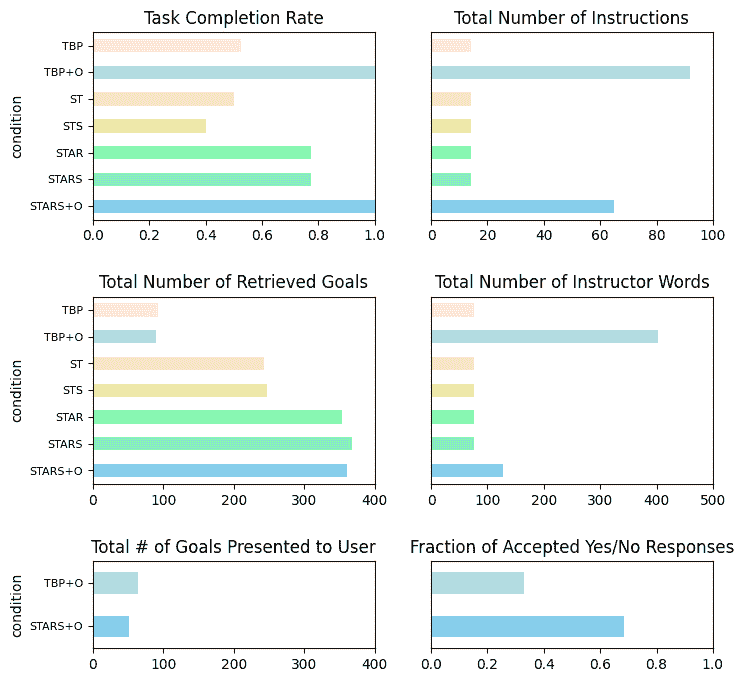

图10：来自“整洁厨房”实验的扩展总结面板。

图[10](https://arxiv.org/html/2306.06770v4#A3.F10 "图10 ‣ 附录C 来自实验的额外数据分析 ‣ 通过代理分析改善从LLM中提取知识用于任务学习")呈现了来自图[5](https://arxiv.org/html/2306.06770v4#Sx6.F5 "图5 ‣ 实验结果 ‣ 通过代理分析改善从LLM中提取知识用于任务学习")的“整洁厨房”任务的关键结果扩展总结，图5出现在本文的主体部分。任务完成情况、总的指导词数量以及接受的“是/否”响应比例将在本文主体部分讨论。

+   •

    指令总数：与指导词总数类似，在STARS监督条件下，相比基于模板的提示方法，指令总数有所减少。需要65次互动。然而，其中51次互动是需要“是/否”响应的提议目标，而其中35个被接受（68%的接受率，如右下角图表所示）。请注意，在STARS+O条件下，每个数据集中的对象都至少生成了一个由LLM生成的可接受目标条件。

+   •

    检索到的目标数量：该图表比较了从LLM检索到的目标描述数量。在TBP条件下，生成的目标描述相对较少（约90个，或者每个对象约2.6个描述）。在ST条件下，由于采用了束搜索（beam search），检索到的目标数量大大增加（约245个）。在STAR+条件下，检索到的目标数量约为365个。约120个目标检索量的增加代表了通过束搜索作为分析和修复的一部分所执行的额外LLM检索。

+   •

    呈现给用户的目标总数：该图表展示了呈现给用户的检索目标数量（两个图表共享相同的横坐标）。在TBP+O条件下，从89个检索到的目标中，64个呈现给用户（最终只有21个被机器人使用）。在STARS+O条件下，呈现的目标略少（51个），这些目标来自从361个检索到的目标，并且每个对象使用一个目标（35个来源目标）。这一结果突显了虽然STARS的检索过程比TBD更广泛，但搜索和评估过程导致在识别可接受的目标描述时具有更高的整体精度，减少了用户评估的数量，并且在需要确认目标时产生了更高的接受率（监督）。

图[11](https://arxiv.org/html/2306.06770v4#A3.F11 "图 11 ‣ 附录 C 来自实验的附加数据分析 ‣ 通过代理分析改善从大型语言模型中提取知识以进行任务学习")展示了“存储杂货”任务的关键结果总结。关于“存储杂货”任务，未在本文主体中讨论的度量标准如下。

+   •

    总指令数量：与TBP相比，STARS监督条件下的总指令数量减少。需要22次交互，但其中16次是需要“是/否”回答的目标提案，其中15次被接受（接受率为94%，如右下图所示）。在STARS+O条件下，LLM为数据集中每个物体生成了至少一个可接受的目标条件。

+   •

    检索到的目标数量：在TBP条件下，生成的目标描述较少（39个，即每个物体平均2.6个描述）。在ST条件下，检索到的目标数量大大增加（96个）。在STARS+条件下，检索到170至177个目标。约80个目标的增加是由于在分析和修复过程中使用束搜索从LLM中检索到的额外目标。

+   •

    向用户展示的目标总数：在TBP+O条件下，从37个检索到的目标中有21个被展示给用户（其中仅有13个被机器人使用）。在STARS+O条件下，从177个检索到的目标中有16个被展示，且每个物体使用一个目标（15个来源目标）。这一结果再次强调了搜索树和分析过程在识别可接受目标描述时的更高精度，减少了用户评估的次数，并在目标需要确认时通过监督生成更高的接受率。

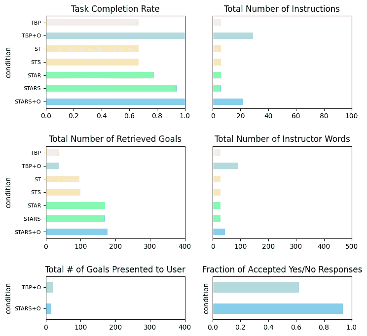

图11：实验条件下“存储杂货”任务的表现和用户成本度量。

图[12](https://arxiv.org/html/2306.06770v4#A3.F12 "图 12 ‣ 附录 C 来自实验的附加数据分析 ‣ 通过代理分析改善从大型语言模型中提取知识以进行任务学习")展示了“整理办公室”任务的关键结果总结。关于“整理办公室”任务的详情如下。

+   •

    总指令数量：与其他任务相同，在STARS监督条件下，总指令数量相较于TBP有所减少。在STARS条件下，需要22次交互，但其中15次是需要“是/否”回答的目标提案，其中11次被接受（接受率为73%，如右下图所示）。

+   •

    检索到的目标数量：在TBP条件下，如其他任务所示，产生的目标描述较少（34个，或每个物体2.8个描述）。在ST条件下，从光束搜索中检索到的目标更多（95个）。在STAR+条件下，约有205个目标被检索到。同样，目标检索的增加（约110个）是由于作为分析和修复的一部分，额外的LLM检索被光束搜索执行。

+   •

    向用户呈现的目标总数：在TBP+O条件下，从35个检索到的目标中有28个呈现给用户，但只有5个被机器人使用。在STARS+O条件下，呈现的目标较少（15个），这些目标来自检索到的206个目标，并且几乎每个物体都使用了一个目标（11个来源目标）。用户需要为其中一个物体提供目标。如同其他任务所示，STARS的检索过程比TBP更广泛，但ST和AR过程在确定可接受的目标描述时精度更高，减少了用户评估的数量，并提高了在监督下的接受率。

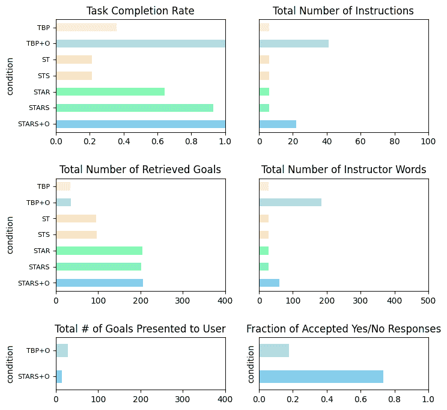

图12：实验条件下“整理办公室”任务的性能和用户成本度量。

图[13](https://arxiv.org/html/2306.06770v4#A3.F13 "Figure 13 ‣ Appendix C Additional data analysis from experiments ‣ Improving Knowledge Extraction from LLMs for Task Learning through Agent Analysis")展示了成本（字数和令牌数）与性能（任务完成）之间的权衡，并突出了STARS策略的各个组成部分对三项任务的相对贡献。图[12(a)](https://arxiv.org/html/2306.06770v4#A3.F12.sf1 "12(a) ‣ Figure 13 ‣ Appendix C Additional data analysis from experiments ‣ Improving Knowledge Extraction from LLMs for Task Learning through Agent Analysis")展示了“整理厨房”任务的权衡。在该任务中，搜索树（ST）和分析与修复（AR）对令牌成本的影响最大。直到加入分析与修复，从更大的响应空间中选择合适的选项，才开始看到性能上的益处。图中还显示，STARS大大减少了人工成本（虽然增加了令牌成本），并显示对于该任务，选择过程对性能没有显著影响。

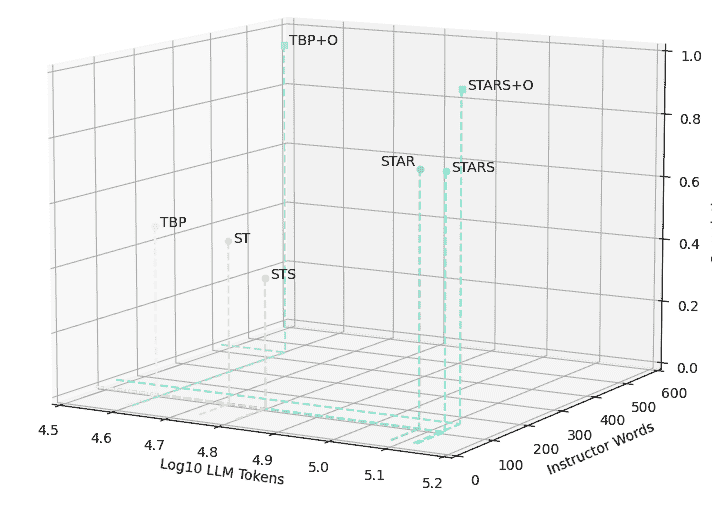

(a) 整理厨房。

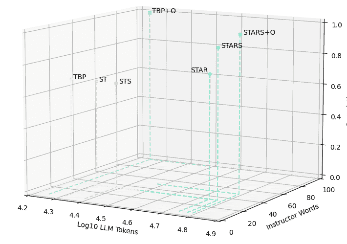

(b) 存储杂货。

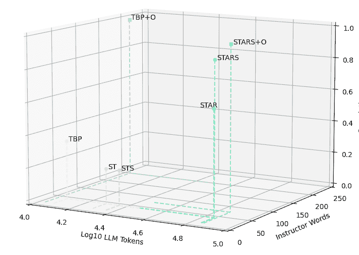

(c) 整理办公室。

图13：所有实验条件下，三项任务的对数${}_{10}$令牌数与字数及任务完成率的关系。

图 [12(b)](https://arxiv.org/html/2306.06770v4#A3.F12.sf2 "12(b) ‣ 图 13 ‣ 附录 C 来自实验的额外数据分析 ‣ 通过智能体分析改善从大语言模型（LLMs）中提取知识以用于任务学习") 显示了“购买杂货”任务的成本/性能权衡。在这个任务中，搜索树对令牌成本的影响较小。添加分析与修复（AR）对令牌成本的影响较大，但如前所述，它显著提高了性能。图中再次显示，STARS大大降低了人工成本（以单词计算）（尽管令牌成本增加），但在此情况下，选择策略对性能有显著影响。

图 [12(c)](https://arxiv.org/html/2306.06770v4#A3.F12.sf3 "12(c) ‣ 图 13 ‣ 附录 C 来自实验的额外数据分析 ‣ 通过智能体分析改善从大语言模型（LLMs）中提取知识以用于任务学习") 显示了“整理办公室任务”的成本/性能权衡。在这个任务中，搜索树对令牌成本的影响相对较大，而添加分析与修复（AR）则对令牌成本有更大的影响。与其他任务一样，AR显著提高了性能。图中再次显示，STARS大大降低了人工成本（以单词计算），并且与“购买杂货”任务相似，选择策略对性能有较大影响，性能从64%（STAR）提高到93%（STARS）。

图 [14](https://arxiv.org/html/2306.06770v4#A3.F14 "图 14 ‣ 附录 C 来自实验的额外数据分析 ‣ 通过智能体分析改善从大语言模型（LLMs）中提取知识以用于任务学习") 显示了“整理厨房”任务中每种条件下，机器人从大语言模型（LLM）中获取至少一个情境相关响应的对象数量（共35个对象）。在基线方法中，机器人仅为15个对象获取了情境相关的响应，而STARS则使得100%的对象都能获得情境相关的响应，这主要得益于搜索树和分析与修复（AR）。此图表明，STARS策略在生成情境相关响应方面取得了成功，即使这些响应并不总是被机器人首先选择。

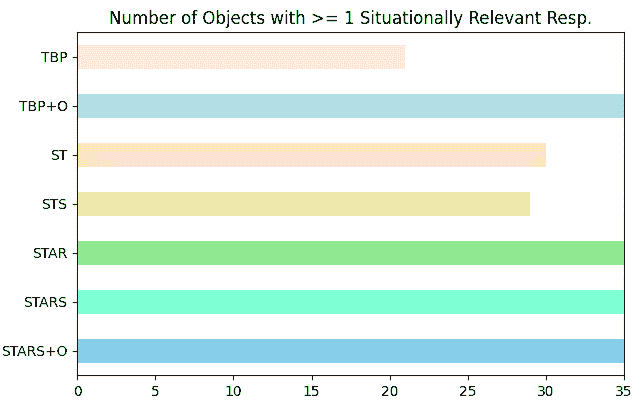

图 14：评估STARS在单个对象（左侧）上的表现。

图[15](https://arxiv.org/html/2306.06770v4#A3.F15 "图 15 ‣ 附录 C 来自实验的额外数据分析 ‣ 通过代理分析提高从LLM中提取知识的效率")显示了“整理厨房”任务中每个实验条件的令牌成本（来自提示和生成），展示了每个对象使用的令牌数量（左）和每种提示类型使用的令牌数量。某些对象，特别是在分析和修复条件下，导致使用的令牌数大大增加。提示类型（从左到右的顺序）包括初始提示、递归（用于搜索树的束搜索的提示）、修复（在分析和修复过程中使用的提示）、修复/递归（在修复过程中用于束搜索的提示）和选择（用于LLM候选者选择的提示）。根据条件，仅使用某些类型的提示。

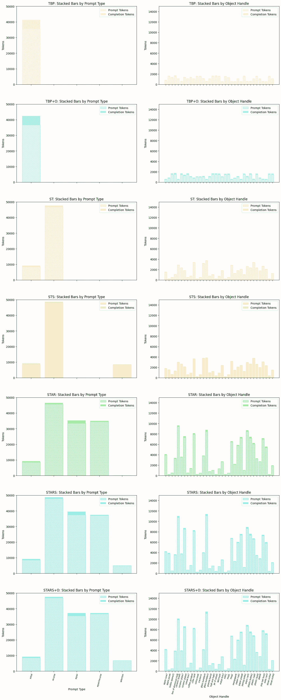

图15：关于“整理厨房”任务的提示类型（左）和单个对象（右）令牌使用的详细总结。虚线区域总结了发送给LLM的提示，而实线区域显示了收到的令牌数量，作为对这些提示的响应。

图[16](https://arxiv.org/html/2306.06770v4#A3.F16 "图 16 ‣ 附录 C 来自实验的额外数据分析 ‣ 通过代理分析提高从LLM中提取知识的效率")和[17](https://arxiv.org/html/2306.06770v4#A3.F17 "图 17 ‣ 附录 C 来自实验的额外数据分析 ‣ 通过代理分析提高从LLM中提取知识的效率")显示了“购买杂货”任务中每个实验条件的令牌成本（来自提示和生成）。这些任务的结果与“整理厨房”任务一致。

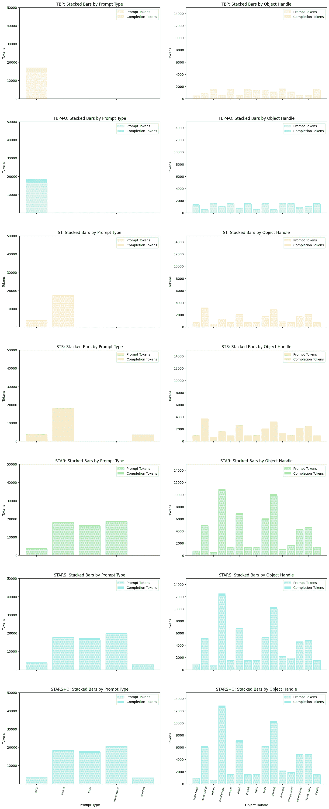

图16：关于“购买杂货”任务的提示类型（左）和单个对象（右）令牌使用的详细总结。虚线区域总结了发送给LLM的提示，而实线区域显示了收到的令牌数量，作为对这些提示的响应。

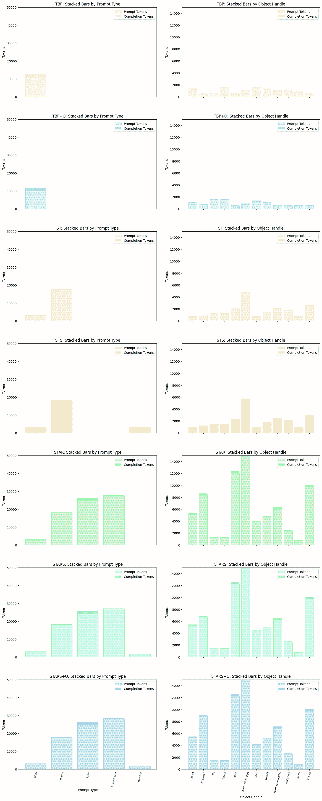

图17：关于“整理办公室”任务的提示类型（左）和单个对象（右）令牌使用的详细总结。虚线区域总结了发送给LLM的提示，而实线区域显示了收到的令牌数量，作为对这些提示的响应。

图 [18](https://arxiv.org/html/2306.06770v4#A3.F18 "图 18 ‣ 附录 C 实验中的附加数据分析 ‣ 通过代理分析提高从 LLM 中提取任务学习知识") 显示了根据可行性、合理性和情境相关性对每个实验条件下“整理厨房”任务的 LLM 响应进行分类。正如论文中所述，ST-AR-S 条件下的响应分布非常相似，而基准条件（TBP 和 TBP+O）则展示了不同的模式。基准条件下，情境相关的响应所占比例较高，但这些条件下检索到的响应数量较少。STARS 条件下，情境相关的响应数量总计有所增加，但总体上不可行响应的比例也增加了。

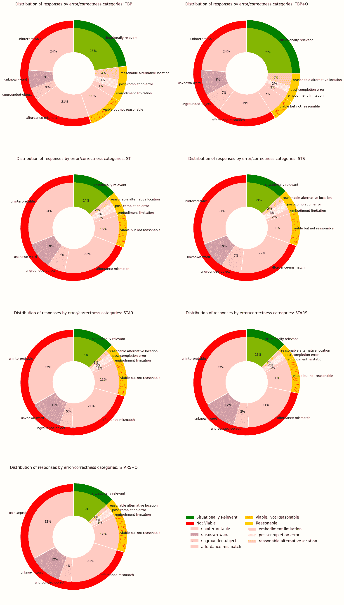

图 18：对于“整理厨房”任务的实验条件，所有 LLM 响应的分类。这些图表展示了在所有生成的 LLM 响应中，各种类别响应的分布。主要类别包括：不可行、可行但不合理、合理但与情境无关、以及与情境相关。对于不可行和合理类别，进一步进行了子分类。

图 [19](https://arxiv.org/html/2306.06770v4#A3.F19 "图 19 ‣ 附录 C 实验中的附加数据分析 ‣ 通过代理分析提高从 LLM 中提取任务学习知识") 显示了根据可行性、合理性和情境相关性对每个实验条件下“储存杂货”任务的 LLM 响应进行分类。响应的分布与“整理厨房”任务的情况相似，但在各个条件下，情境相关响应的百分比有所增加，而不可行响应的百分比则有所下降。这可能是由于“储存杂货”任务比“整理厨房”任务更简单。

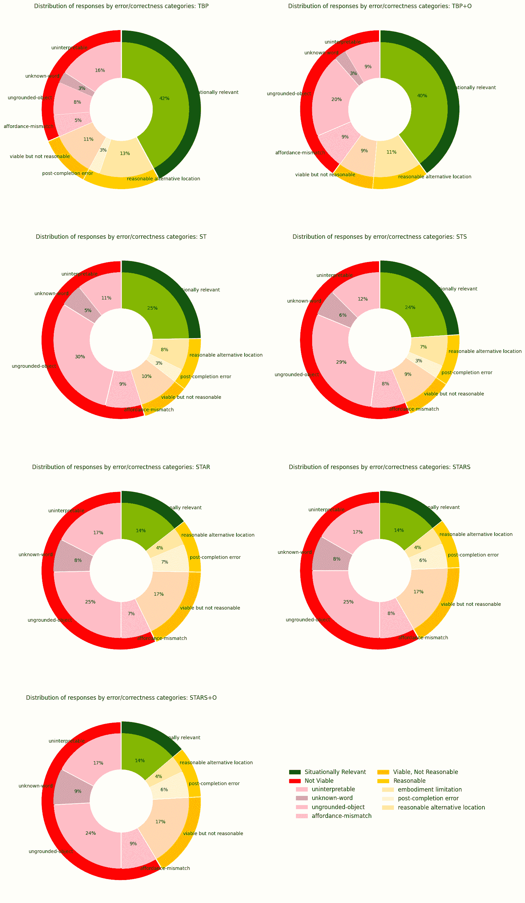

图 19：对于“储存杂货”任务的实验条件，所有 LLM 响应的分类。这些图表展示了在所有生成的 LLM 响应中，各种类别响应的分布。主要类别包括：不可行、可行但不合理、合理但与情境无关、以及与情境相关。对于不可行和合理类别，进一步进行了子分类。

图 [20](https://arxiv.org/html/2306.06770v4#A3.F20 "图 20 ‣ 附录 C 实验中的附加数据分析 ‣ 通过代理分析提升从LLM中提取任务学习知识的能力") 显示了“整理办公室”任务中每个实验条件下，LLM响应根据可行性、合理性和情境相关性进行的分类。与前两个任务相比，响应的分布显示，在所有条件下，情境相关响应的比例下降，而不可行响应的比例上升。从对响应的检查来看，这是因为许多响应未与代理所在的具体办公室对齐（例如，提到办公桌抽屉而非抽屉）。

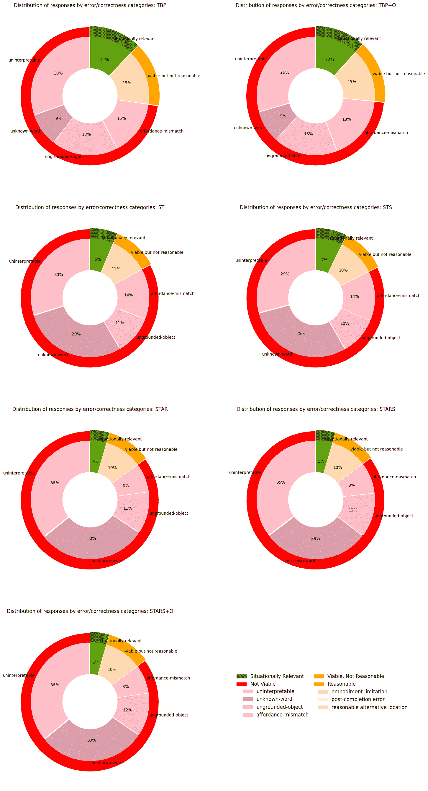

图 20：所有LLM响应在“整理办公室”任务的实验条件下的分类。这些图表展示了各种类别响应在所有LLM响应中的分布。主要类别包括：不可行、可行但不合理、合理但不具情境相关性，以及具情境相关性的。进一步的子分类显示了不可行和合理类别的响应。

## 附录 D 变异性探索

如论文正文所提到的，同一条件下的每次实验之间变化很小（尽管在整理厨房任务中，相较于其他两个任务，变化稍大）。本附录部分进一步探讨了存在的变异性。由于运行实验在时间上具有一定的成本（尤其是在监督条件下），而且LLM的使用在财务上也并非便宜，因此考虑到结果的变异性有限，我们仅在主要实验中每个条件下运行了一次实验。

|     条件 |     任务完成率 ($\%$) |     检索到的目标 |     提议的目标 |     来源目标 |     总提示词数 |     总完成词数 |     总词数 |     总指令数 |     总是/否指令数 |     总用户词数 |
| --- | --- | --- | --- | --- | --- | --- | --- | --- | --- | --- |
| 整理厨房 |
| run1 | 77.5 | 360 | – | 35 | 130,950 | 3,682 | 134,632 | 14 | – | 76 |
| run2 | 75.0 | 347 | – | 35 | 125,666 | 3,552 | 129,218 | 14 | – | 76 |
| run3 | 77.5 | 357 | – | 35 | 128,841 | 3,605 | 132,446 | 14 | – | 76 |
| run4 | 75.0 | 355 | – | 35 | 130,476 | 3,674 | 134,150 | 14 | – | 76 |
| run5 | 75.0 | 354 | – | 35 | 128,255 | 3,633 | 131,888 | 14 | – | 76 |
| run6 | 80.0 | 364 | – | 35 | 133,645 | 3,728 | 137,373 | 14 | – | 76 |
| run7 | 80.0 | 359 | – | 35 | 130,657 | 3,666 | 134,323 | 14 | – | 76 |
| run8 | 77.5 | 357 | – | 35 | 130,082 | 3,647 | 133,729 | 14 | – | 76 |
| run9 | 80.0 | 353 | – | 35 | 130,521 | 3,658 | 134,179 | 14 | – | 76 |
| run10 | 77.5 | 355 | – | 35 | 129,067 | 3,594 | 132,661 | 14 | – | 76 |
| 平均值 | 77.5 | 356 | – | – | 129,816 | 3,643 | 133,459 | – | – | – |
| 标准差 | 2.04 | 4.5 | – | – | 2,077 | 50 | 2,124 | – | – | – |
| 存储杂货 |
| run1 | 94.4 | 171 | – | 15 | 60,069 | 1,739 | 61,808 | 6 | – | 28 |
| run2 | 94.4 | 173 | – | 15 | 60,443 | 1,683 | 62,126 | 6 | – | 28 |
| run3 | 94.4 | 175 | – | 15 | 60,784 | 1,675 | 62,459 | 6 | – | 28 |
| run4 | 94.4 | 176 | – | 15 | 60,558 | 1,720 | 62,278 | 6 | – | 28 |
| run5 | 94.4 | 178 | – | 15 | 60,990 | 1,710 | 62,700 | 6 | – | 28 |
| run6 | 94.4 | 176 | – | 15 | 61,041 | 1,697 | 62,738 | 6 | – | 28 |
| run7 | 94.4 | 177 | – | 15 | 61,321 | 1,706 | 63,027 | 6 | – | 28 |
| run8 | 94.4 | 179 | – | 15 | 61,620 | 1,707 | 63,327 | 6 | – | 28 |
| run9 | 88.9 | 178 | – | 15 | 62,502 | 1,730 | 64,232 | 6 | – | 28 |
| run10 | 94.4 | 177 | – | 15 | 62,222 | 1,737 | 63,959 | 6 | – | 28 |
| 平均值 | 93.89 | 176 | – | – | 61,115 | 1,710 | 62,865 | – | – | – |
| 标准差 | 1.76 | 2.4 | – | – | 776 | 21.6 | 783 | – | – | – |
| 整理办公室 |
| run1 | 92.9 | 201 | – | 12 | 73,933 | 2,123 | 76,056 | 6 | – | 28 |
| run2 | 92.9 | 200 | – | 12 | 73,355 | 2,128 | 75,483 | 6 | – | 28 |
| run3 | 92.9 | 205 | – | 12 | 74,958 | 2,164 | 77,122 | 6 | – | 28 |
| run4 | 92.9 | 200 | – | 12 | 73,020 | 2,126 | 75,146 | 6 | – | 28 |
| run5 | 92.9 | 200 | – | 12 | 73,944 | 2,154 | 76,098 | 6 | – | 28 |
| run6 | 92.9 | 205 | – | 12 | 75,134 | 2,159 | 77,293 | 6 | – | 28 |
| run7 | 92.9 | 197 | – | 12 | 72,746 | 2,111 | 74,857 | 6 | – | 28 |
| run8 | 92.9 | 207 | – | 12 | 75,852 | 2,182 | 78,034 | 6 | – | 28 |
| run9 | 85.7 | 207 | – | 12 | 75,216 | 2,167 | 77,383 | 6 | – | 28 |
| run10 | 92.9 | 204 | – | 12 | 75,212 | 2118 | 77,330 | 6 | – | 28 |
| 平均值 | 92.14 | 202 | – | – | 74,337 | 2,143 | 76,480 | – | – | – |
| 标准差 | 2.26 | 3.4 | – | – | 1,075 | 24.7 | 1093 | – | – | – |

表14：三个实验任务在十次运行中的STARS条件度量。

表格 [14](https://arxiv.org/html/2306.06770v4#A4.T14 "Table 14 ‣ Appendix D Exploration of Variability ‣ Improving Knowledge Extraction from LLMs for Task Learning through Agent Analysis") 显示了 STARS 条件（无监督）下 10 次实验的详细总结，涵盖了三个任务的所有情况。额外的两行总结了 STARS 条件下那些变化数据的均值和标准差。该表格遵循了表格 [11](https://arxiv.org/html/2306.06770v4#A3.T11 "Table 11 ‣ Appendix C Additional data analysis from experiments ‣ Improving Knowledge Extraction from LLMs for Task Learning through Agent Analysis") 的格式，且各项度量的定义在该表格中进行了总结。由于 STARS 不是一种监督条件，因此每次运行的总指令数和总词数保持不变。同样，没有向用户提出目标，因此也没有对这些目标的“是/否”回应。整理厨房任务的结果还通过图形方式在图 [21](https://arxiv.org/html/2306.06770v4#A4.F21 "Figure 21 ‣ Appendix D Exploration of Variability ‣ Improving Knowledge Extraction from LLMs for Task Learning through Agent Analysis") 中展示。

正如这些结果所示，从一次运行到另一次运行，整体结果几乎没有变化。在整理厨房任务中，任务完成率从 75% 变化到 80%，即 40 个最终目标状态中有 30 到 32 个状态被定义。检索和令牌度量的变化则更为微小（从相对角度来看）。在所有 10 种条件下，STARS 都生成了一个有效的目标，该目标由机器人获取并执行。

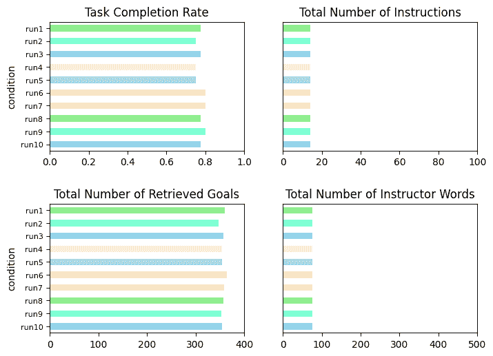

图 21：比较整理厨房任务中 10 次 STARS 运行结果的变化。

尽管缺乏变异性可能显得出乎意料，但这实际上是 LLM 内嵌的令牌概率（在 LLM 训练完成后固定）和实验设计的结果，其中对象的粗略位置（“盘子在桌子上”而不是桌子上的具体位置）用于提示生成。对于机器人感知到的任何给定对象，它将使用粗略位置（“位置：桌子”）从目标描述模板生成一个具体的提示。⁹⁹9 在其他工作中，我们探讨了在基于模板的提示下，少量示例、上下文学习的示例数量的影响，以及分析特定提示示例对四个主要要求的贡献。然而，在本实验中，我们在所有提示模板中使用了单一的固定示例，这意味着对于位于粗略位置的给定对象，生成的提示对于该对象将完全相同。

尽管在其他两个任务中，任务完成的结果在所有运行中几乎相同，但在整洁厨房任务中，任务完成的结果存在一定的（总体）变化。这种变化源于论文正文中所概述的上下文缺失。例如，在“柜台上的杯子”任务中，智能体无法直接感知杯子是脏的还是干净的。智能体所验证的目标是杯子应该放入水槽或橱柜（即，通过选择过程选择的目标）在某种程度上是任意的（即，系统缺乏“存储位置之外的碗碟应假定是脏的”这一上下文）。由于该物体的期望状态始终是水槽或洗碗机，因此智能体有时会将其放入期望的位置，有时则不会。总体而言，这种上下文缺失解释了整洁厨房任务完成率观察到的大多数差异。
