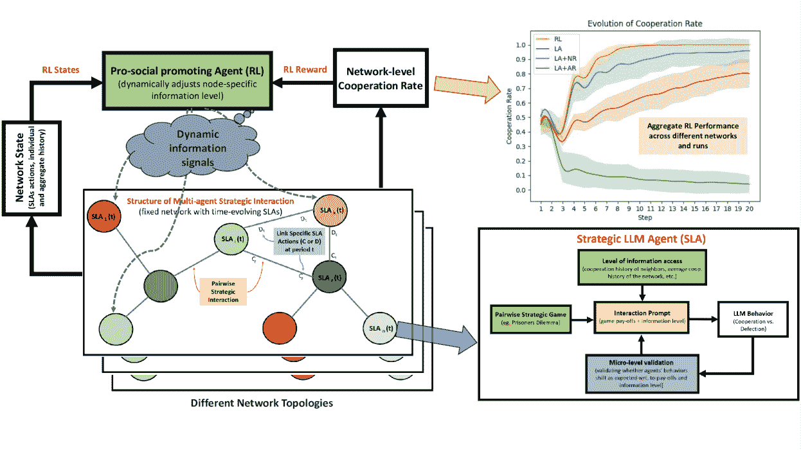
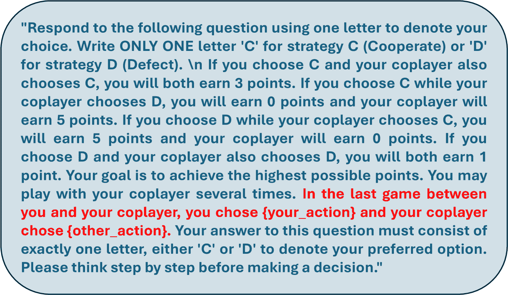
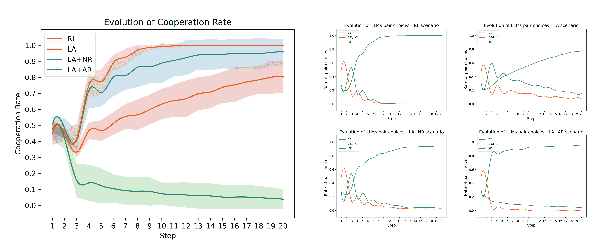

<!--yml

类别：未分类

日期：2025-01-11 12:15:09

-->

# 激发LLM代理合作的自适应信息调制

> 来源：[https://arxiv.org/html/2409.10372/](https://arxiv.org/html/2409.10372/)

Qiliang Chen

东北大学

美国马萨诸塞州波士顿 02115

chen.qil@northeastern.edu

&Sepehr Ilami

东北大学

美国马萨诸塞州波士顿 02115

ilami.a@northeastern.edu

&Nunzio Lore

东北大学

美国马萨诸塞州波士顿 02115

lora.n@northeastern.edu

&Babak Heydari*

东北大学

美国马萨诸塞州波士顿 02115

b.heydari@northeastern.edu

###### 摘要

本文介绍了一个新颖的框架，将大型语言模型（LLM）代理作为人类战略行为的代理，并结合强化学习（RL）使这些代理在团队环境中进行动态战略互动。我们的方法通过使用战略LLM代理（SLA）并引入通过亲社会推动RL代理（PPA）来进行动态和自适应治理，扩展了传统的基于代理的仿真。PPA代理在网络中调节代理之间的信息访问，优化社会福利并促进亲社会行为。通过在反复博弈中的验证，包括囚徒困境，我们展示了SLA代理展示出精细的战略适应能力。PPA代理能够有效学习调整信息透明度，从而提升合作率。该框架为AI介导的社会动态提供了重要的见解，并为AI在现实团队环境中的应用做出了贡献。

## 1 引言

社会和社会技术系统中的互动通常表现为合作与竞争之间的微妙平衡，这常常导致复杂的社会困境[[1](https://arxiv.org/html/2409.10372v3#bib.bib1), [2](https://arxiv.org/html/2409.10372v3#bib.bib2), [3](https://arxiv.org/html/2409.10372v3#bib.bib3), [4](https://arxiv.org/html/2409.10372v3#bib.bib4), [5](https://arxiv.org/html/2409.10372v3#bib.bib5)]。有效治理这些系统的挑战在于能够促进和维持亲社会行为，从而提高系统层面的效率和公平性。此类治理框架的重要性体现在它们能够提高整体社会福利，这使得在各种背景下研究亲社会行为变得至关重要[[6](https://arxiv.org/html/2409.10372v3#bib.bib6), [7](https://arxiv.org/html/2409.10372v3#bib.bib7), [8](https://arxiv.org/html/2409.10372v3#bib.bib8), [9](https://arxiv.org/html/2409.10372v3#bib.bib9), [10](https://arxiv.org/html/2409.10372v3#bib.bib10)]。

历史上，许多学科探索了促进亲社会行为的机制。然而，这些努力大多导致了静态的、确定性的推荐，未能考虑到智能体互动和学习过程的动态特性[[11](https://arxiv.org/html/2409.10372v3#bib.bib11), [12](https://arxiv.org/html/2409.10372v3#bib.bib12), [13](https://arxiv.org/html/2409.10372v3#bib.bib13), [14](https://arxiv.org/html/2409.10372v3#bib.bib14)]。因此，传统的治理方法往往局限于高度简化或特定情境下的启发式方法，难以在不同的环境中进行广泛推广。

强化学习（RL）已成为一种有前景的工具，用于开发旨在促进在社会困境面前展现亲社会行为的动态治理框架[[15](https://arxiv.org/html/2409.10372v3#bib.bib15), [16](https://arxiv.org/html/2409.10372v3#bib.bib16), [17](https://arxiv.org/html/2409.10372v3#bib.bib17)]。尽管其理论潜力巨大，但在这一领域中，RL的实际应用仍然受到使用大量人类行为数据训练RL智能体所需的高成本和长时间限制。虽然基于智能体的仿真提供了一个用于建模亲社会行为演化的简化环境[[18](https://arxiv.org/html/2409.10372v3#bib.bib18), [19](https://arxiv.org/html/2409.10372v3#bib.bib19), [20](https://arxiv.org/html/2409.10372v3#bib.bib20)]，但对智能体在战略情境中的行为假设依赖，仍然存在显著的局限性。这些行为受博弈论结构、背景因素以及智能体的有限理性之间复杂相互作用的影响，导致的结果往往偏离理论预测。

在本文中，我们提出，先进的大型语言模型（LLMs）的出现，为开发更强健的社会技术系统治理机制提供了变革性机会。近期研究表明，LLMs能够捕捉经典博弈中的微妙战略决策行为，例如囚徒困境、雪堆困境和鹿猎博弈。重要的是，这些行为不仅受到博弈的收益结构的影响，还受到情境框架的影响，这表明LLM智能体可以作为人类行为的更准确代理[[21](https://arxiv.org/html/2409.10372v3#bib.bib21)]。通过结合传统基于智能体的模型（ABMs）[[22](https://arxiv.org/html/2409.10372v3#bib.bib22)]与LLMs的计算能力，我们可以在无需过于简化的假设下促进RL训练，从而实现更高效的动态治理方案。我们提出的框架旨在实现两个关键目标：使用LLM智能体作为代理，创建适用于人类互动的动态治理机制；以及在包含LLM和人类智能体的混合环境中，增强亲社会行为和对齐性。

图1：一般框架概览。该框架包括两个主要实体：战略LLM代理（SLA）和亲社会促进代理（PPA）。1）SLA接收描述成对战略博弈（支付矩阵、目标以及来自PPA的额外信息）的提示，然后做出合作或背叛等战略决策。多个SLA被放置在一个随机网络中，每轮初始化连接。SLA在不同的互动中可能做出不同的决策，取决于接收到的不同信息。通过微观层级的验证来细化提示，以确保行为一致性。2）PPA充当系统管理者，观察SLA并动态确定它们的信息级别，通过强化学习进行训练，以最大化社会福利。结果展示了该框架的评估。

我们的方法涵盖了建模和治理两个维度。在建模方面，我们通过探索LLM在重复博弈中的行为，扩展了当前关于LLM的文献，允许代理根据系统中详细的历史交互演化其策略。在治理方面，我们开发了一个基于强化学习的治理代理，负责动态干预系统以促进亲社会行为。具体而言，我们的方法涉及动态调整每个LLM代理对于其他代理战略行为的可用信息访问级别。这种治理方法——调节信息访问——提供了两个显著的优势：一是通过保持代理的自治性，保持了系统的去中心化特性；二是避免了对博弈支付的高成本和通常不切实际的改变。

我们的研究结果在建模和治理两个层面提供了洞察：在建模方面，利用我们所称之为微观层级验证的方法，我们展示了LLM代理能够捕捉细微的战略行为，表现出对信息访问变化的显著且合理的行为适应。此外，我们还展示了强化学习代理能够有效地学习动态调整信息访问，从而在与不同静态基准干预（没有RL）相比，合作率有所提高。总体而言，尽管这是一个简单且小规模的框架实现，但这项工作为人工智能介导的社会动态领域做出了贡献，提供了有关在复杂、现实世界团队环境中部署AI的宝贵见解。

尽管这项工作处于早期阶段，规模和复杂性有限，但它已经展示了如何将互动LLM主体与强化学习结合起来，为新的动态治理形式铺平道路，即使在应用于囚徒困境这一极端社会困境时也是如此。我们的框架为AI调解的社会动态提供了一个有前景的基础，展示了利用LLM在复杂的现实世界环境中管理和影响亲社会行为的潜力，通过使用AI动态调节人类和LLM主体的可见性与回忆。

## 2 相关工作

#### 促进社会困境下合作的机制与信息模块化的作用

大量文献研究了影响战略互动中合作的机制，尤其是在涉及社会困境的互动中。声誉和互惠是公认的因素，通过建立和强化这些因素的干预措施，能够持续促进合作行为[[23](https://arxiv.org/html/2409.10372v3#bib.bib23)，[24](https://arxiv.org/html/2409.10372v3#bib.bib24)]。惩罚和奖励系统也已被证明是有效的，它们在阻止背叛的同时激励亲社会行为[[25](https://arxiv.org/html/2409.10372v3#bib.bib25)，[26](https://arxiv.org/html/2409.10372v3#bib.bib26)]。此外，互动网络的结构在其中起着至关重要的作用，既可以通过识别支持合作的网络特征来发挥作用[[27](https://arxiv.org/html/2409.10372v3#bib.bib27)，[28](https://arxiv.org/html/2409.10372v3#bib.bib28)，[29](https://arxiv.org/html/2409.10372v3#bib.bib29)，[30](https://arxiv.org/html/2409.10372v3#bib.bib30)]，也可以通过考察网络结构随时间变化如何影响合作[[31](https://arxiv.org/html/2409.10372v3#bib.bib31)，[32](https://arxiv.org/html/2409.10372v3#bib.bib32)]。

虽然这些因素在促进合作方面有效，但许多因素需要较长时间的互动才能产生效果（例如，通过新规范或惯例的出现促进合作）或依赖于与主体自主性相矛盾的干预措施（例如，通过改变网络结构的自上而下方法[[15](https://arxiv.org/html/2409.10372v3#bib.bib15)，[33](https://arxiv.org/html/2409.10372v3#bib.bib33)]）。另一个重要的因素是主体观察他人行为的能力以及回忆历史信息的能力[[34](https://arxiv.org/html/2409.10372v3#bib.bib34)，[35](https://arxiv.org/html/2409.10372v3#bib.bib35)]。在本研究中，我们将此因素作为干预机制，重点研究RL主体如何动态调节LLM主体可获得的信息水平——特别是通过调整观察和回忆，以提高整体的合作率。

#### LLMs 与战略决策

最近的研究表明，大型语言模型（LLMs）能够处理基本的经济学和博弈论情景[[36](https://arxiv.org/html/2409.10372v3#bib.bib36), [37](https://arxiv.org/html/2409.10372v3#bib.bib37), [38](https://arxiv.org/html/2409.10372v3#bib.bib38), [39](https://arxiv.org/html/2409.10372v3#bib.bib39)]，但它们的决策过程往往不明确，并且似乎在信念精炼方面存在困难[[40](https://arxiv.org/html/2409.10372v3#bib.bib40)]。当这些模型被用作人类代理的替代品进行评估时，结果常常与理性选择理论和行为经济学的预测出现偏差，这引发了关于它们认知真实性的问题[[41](https://arxiv.org/html/2409.10372v3#bib.bib41), [42](https://arxiv.org/html/2409.10372v3#bib.bib42), [43](https://arxiv.org/html/2409.10372v3#bib.bib43), [44](https://arxiv.org/html/2409.10372v3#bib.bib44)]。这引发了关于评估这些模型最合适方法的辩论[[45](https://arxiv.org/html/2409.10372v3#bib.bib45), [46](https://arxiv.org/html/2409.10372v3#bib.bib46)]，特别是在它们与类人推理的对齐方面。尽管如此，关于它们模拟人类思维和行为的潜力，随着持续进展不断提升其复制复杂认知过程的能力，仍然存在日益乐观的观点[[47](https://arxiv.org/html/2409.10372v3#bib.bib47), [48](https://arxiv.org/html/2409.10372v3#bib.bib48), [49](https://arxiv.org/html/2409.10372v3#bib.bib49), [44](https://arxiv.org/html/2409.10372v3#bib.bib44), [50](https://arxiv.org/html/2409.10372v3#bib.bib50)]。

#### LLMs 和多智能体系统

LLM（大规模语言模型）驱动的多智能体系统的研究大致可以分为两个主要领域：仿真和实现。实现指的是利用LLM的互动能力来生成具体的、端到端的解决方案或成品的算法或平台[[51](https://arxiv.org/html/2409.10372v3#bib.bib51)、[52](https://arxiv.org/html/2409.10372v3#bib.bib52)、[53](https://arxiv.org/html/2409.10372v3#bib.bib53)]。这些系统的重点是利用多个LLM之间的协同互动来实现特定的、通常是实际的结果。相比之下，仿真旨在探索并展示LLM驱动的智能体在多种受控环境中模仿人类行为、互动和社会动态的潜力[[54](https://arxiv.org/html/2409.10372v3#bib.bib54)、[55](https://arxiv.org/html/2409.10372v3#bib.bib55)、[56](https://arxiv.org/html/2409.10372v3#bib.bib56)、[57](https://arxiv.org/html/2409.10372v3#bib.bib57)、[40](https://arxiv.org/html/2409.10372v3#bib.bib40)]。这些仿真为研究LLM在多智能体背景下的突现特性提供了一个沙盒环境，揭示了它们在复制复杂的人类动态方面的能力。我们的研究更倾向于仿真范式，详细探讨了LLM如何捕捉人类式的互动。然而，从这项工作中获得的洞察对实现框架的开发也具有重要意义，为将仿真行为转化为实际应用提供了路径。

## 3 方法

### 3.1 通用框架概述

图[1](https://arxiv.org/html/2409.10372v3#S1.F1 "图 1 ‣ 1 引言 ‣ 使用自适应信息调制激发LLM智能体合作")展示了本文所用的总体框架。我们首先开发互动式战略LLM智能体（SLA）和动态提示结构，随后由强化学习（RL）智能体使用该结构来鼓励社会困境游戏中的亲社会行为，例如囚徒困境（更多细节请参见附录A）。该过程中的一个关键步骤是我们所称的微观级验证，在此过程中我们设计提示模板，以确保智能体的合作行为能够根据RL智能体的治理信号作出适当调整。接着，SLA被作为网络的节点放置，其中相邻的智能体成对地参与多周期的战略博弈（囚徒困境（PD））。在每一周期中，智能体可以选择在与网络邻居的互动中合作或背叛，每个SLA能够在任何给定时刻为不同的邻居选择不同的行为。

在每个时期，RL代理向网络发送一组信号向量（每个SLA一个），旨在最大化所有代理的折现得分总和，在囚徒困境博弈中，这要求整个网络具有较高的合作率。为了保持SLA的自主性，控制信号仅修改每个SLA对其他代理过去合作行为的信息水平，具体体现在聚合水平和条件的变化（例如，过去共同历史的平均值）。为了评估RL干预是否提高了合作率和总体平均收益，我们将这些趋势与一组基准进行比较。接下来，我们将讨论框架的关键部分。

### 3.2 战略LLM代理（SLA）与微观层级验证

战略LLM代理（SLA）是我们框架的核心，设计用于作为复杂多代理场景中人类代理的数字代理，或者用于任务特定的多代理LLM。我们将SLA的互动限制为成对的社会困境博弈，如囚徒困境。在每个时期，SLA接收到描述其成对战略博弈性质的消息，这些信息仅通过收益矩阵和目标传达，省略了对博弈名称的明确引用（例如囚徒困境）。此外，SLA可以访问由亲社会促进代理（PPA）提供的各种信息，如其共同玩家的合作率、邻域或整个网络的合作情况。这些信息与战略博弈的结构结合，生成提示，指导SLA做出战略决策——是合作还是背叛。这些提示和信息集通过微观层级的验证进行优化，以确保SLA行为的一致性和合理性。

SLA（战略LLM代理）被定位于一个随机结构的网络中，该网络在每一轮开始时初始化，并在该轮中保持固定。最初，SLA在类型上是同质的，但在网络位置上是异质的。每个SLA在每个时间步与所有直接连接的共同玩家进行成对的战略博弈。一个SLA可以同时参与多个互动，并可能与不同的共同玩家做出不同的决策。随着互动的进行，SLA可以沿着不同的轨迹演化，导致代理类型和网络位置的异质性。

微观层面验证：虽然LLM在各种交互式决策任务中展现了令人印象深刻的表现，但研究表明LLM可能并不完全理解它们所执行的任务，有时会导致不稳定的行为[[44](https://arxiv.org/html/2409.10372v3#bib.bib44)，[58](https://arxiv.org/html/2409.10372v3#bib.bib58)]。鉴于这些担忧，我们首先需要在微观层面验证它们的战略行为——通过个体和成对交互。我们的微观层面验证有三个目标：首先，评估LLM是否仅通过效用矩阵就能理解战略设置，而无需明确提及游戏名称；其次，评估提供给LLM的不同类型信息如何影响它们的行为，从而测试通过PPA操控信息来治理系统的可行性；最后，确定改变提供的信息是否会导致LLM决策行为出现合理的定性变化。我们的方法更倾向于内部验证[[59](https://arxiv.org/html/2409.10372v3#bib.bib59)]，侧重于LLM代理内部的一致性和可预测的行为适应，而非外部验证，即将SLA行为与人类代理的行为进行比较——尽管对于基于LLM的模型，两者之间的区别正变得日益模糊。

为了实现这些目标，我们系统地调整了具有不同信息访问级别的提示，以评估LLM的回应，确保SLA行为适当地发生变化。这些实验的详细结果将在后续章节中提供（请参见结果部分，另外参阅SI文档D节以获取更多信息）。这些发现为描述囚徒困境和LLM决策目标定义所使用的提示的改进提供了依据。

### 3.3 亲社会促进代理（PPA）

亲社会促进代理（PPA）作为我们框架中的治理实体，使用强化学习进行训练，实际上采用了类似于[[60](https://arxiv.org/html/2409.10372v3#bib.bib60)，[61](https://arxiv.org/html/2409.10372v3#bib.bib61)]的双层治理方案。其作用是通过动态调整提供给每个代理的信息级别，来增强网络级社会福利（所有SLA得分的总和）。

PPA是一个标准的演员-评论家（Actor-Critic）强化学习（RL）代理，其环境被建模为部分可观察的马尔可夫决策过程（POMDP）（详细信息请参见附录C部分）。PPA根据每个SLA的需求，策略性地调整披露的信息，在每次交互期间向不同的SLA提供不同的信号。RL的动作集包括四个层次的信息访问权限：(1) 无关于过去交互的信息；(2) SLA与其合作者之间的上一个动作对；(3) 上一个动作对结合了SLA及其合作者的长期合作比例；(4) 上一个动作对与SLA及其所有邻近代理的长期合作比例。没有信息的情境通常是不现实的，因为代理通常需要记住与其他玩家的上次交互历史。因此，在我们的实验中，我们限制了此动作的使用。RL代理根据网络社会福利的折扣总和（即所有SLA收益的总和）进行奖励，在囚徒困境游戏的情况下，预计这一总和与网络中的整体合作率高度相关。

## 4 实验结果与分析

在本节中，我们首先描述实验环境的设置。然后，我们将讨论LLM代理的微观级别验证结果，包括我们如何为后续实验设计提示。最后，我们将展示RL经理在多个LLM代理之间进行系统治理的结果，并分析实验过程中环境的演变。

表1：最后动作的微观级别验证。该表展示了在观察不同最后动作对时，LLM代理在100次运行中选择C的比例。

| 自己的动作 | 合作者的动作 | 选择C的比例 |
| --- | --- | --- |
| C | C | 100.0% |
| C | D | 0.0% |
| D | C | 0.0% |
| D | D | 49.0% |

### 4.1 环境设置

我们概述了用于评估所提框架的环境的关键特征和设置。代理之间的战略互动通过囚徒困境进行模拟，这是我们选择的方式，以在高度社会困境下测试我们的框架。该游戏的收益矩阵如下：互惠合作（CC）为每个玩家带来3分，一方合作而另一方背叛（CD或DC）会使合作者得0分，背叛者得5分，而互相背叛（DD）则每个玩家得1分。

该系统由 20 个代理组成，这些代理位于一个网络中，最初使用 Erdos-Renyi 模型构建，形成链接的概率为 0.25，并且在每轮中保持固定，尽管我们在不同实例的网络上评估该方法。每轮实验在每个网络上由 20 个时间步组成，期间代理依次与邻居中的其他玩家进行囚徒困境博弈。由于网络规模相对较小，SLAs 的行为在大多数实验中会在 20 个时间步内趋于稳定。我们使用了通过 LangChain 和 Groq 平台访问的 LLaMa3-70b LLM，模型的温度设为 0.8。用于演员和评论员组件的神经网络各自包含一个具有 256 个神经元的隐藏层。演员的学习率设为 0.001，评论员的学习率设为 0.005，折扣因子为 0.99。所有训练和评估均在[匿名]大学的高性能集群（HPC）上进行。

### 4.2 LLM 代理的微观层级验证结果

LLM 代理具备在各类任务中做出类似于人类决策的能力。为了确保我们项目中的实验结果既合理又有意义，我们对 LLM 代理的行为进行了若干微观层面的验证，以解决前一部分中提出的问题。基于这些发现，我们设计了包含不同类型信息的提示语，用于后续的实验。

首先，我们设计了描述囚徒困境的提示语，并为 LLM 代理设定了指导决策的目标。尽管尚不确定 LLM 是否完全理解不同的博弈，但我们避免明确提到“囚徒困境”以减少 LLM 行为中的偏差。相反，我们呈现了收益矩阵，而没有标明博弈的名称。对于目标，我们指示 SLA 最大化其奖励，并指出它可能会与同一个合作者进行多次互动。这样做旨在鼓励 SLA 采取平衡短期和长期收益的行动，类似于人类在做出战略决策时，部分基于未来互动的可能性。此外，我们还结合了链式思维（CoT）提示[[62](https://arxiv.org/html/2409.10372v3#bib.bib62)]，以鼓励更多的战略性推理。默认情况下，SLA 代理始终可以访问与合作者互动时的最新行动对。图 [2](https://arxiv.org/html/2409.10372v3#S4.F2 "图 2 ‣ 4.2 LLM 代理的微观层级验证结果 ‣ 4 实验结果与分析 ‣ 通过自适应信息调制激发 LLM 代理的合作") 展示了当 SLA 代理能够访问最新行动对时使用的提示语。

表2：网络比率的微观级别验证。此表展示了在观察不同历史动作对以及自己与邻居的合作率时，LLM代理在100次运行中的选择C的百分比。对于合作率低于33%、介于33%与66%之间，以及高于66%的情况，分别使用“很少”、“有时”和“经常”来表示。

|  | 很少 | 有时 | 经常 |
| --- | --- | --- | --- |
|  | 很少 | 有时 | 经常 | 很少 | 有时 | 经常 | 很少 | 有时 | 经常 |
| [C, C] | 0.0 | 87.0 | 99.0 | 0.0 | 100.0 | 100.0 | 0.0 | 100.0 | 100.0 |
| [C, D] | 0.0 | 0.0 | 0.0 | 0.0 | 0.0 | 0.0 | 0.0 | 0.0 | 3.0 |
| [D, C] | 0.0 | 0.0 | 0.0 | 0.0 | 0.0 | 9.0 | 0.0 | 0.0 | 98.0 |
| [D, D] | 0.0 | 1.0 | 68.0 | 0.0 | 28.9 | 98.0 | 0.0 | 57.9 | 100.0 |

图2：用于历史动作的示例提示。对于涉及不同类型信息的其他提示，将在提示的高亮（红色）部分相应加入新的细节。

在游戏的初始阶段，由于没有上一轮动作对的历史记录，我们将首先删除红色部分。此外，我们将在提示的开头加入“考虑提议的场景，并假设你正在参与其中。”作为没有先前信息的提示。通过对提示语的广泛测试和修改，我们观察到这一变化能够显著影响大语言模型（LLM）的行为，使其从始终选择D的模式，转变为50%选择C的比例。为了模拟更具人类行为特征的表现，我们希望LLM在“没有先前信息”的场景中能表现出一定概率选择C，以反映某些个体在初期可能会寻求建立信任。因此，我们为初始的“没有先前信息”条件采用了这一增强的提示，并保留了原始提示作为其他场景的默认设置。

在确定了我们提示的结构后，我们旨在探索不同类型的信息如何影响LLM的行为，并评估这些影响是否既合理又一致。我们设计了三种不同类型的信息：1）最后行动历史（LA），包括代理与其合作者之间的最近互动，详细描述了它们上一次游戏中的行为。2）代理与对手的合作比率（AR），反映了每个代理与其他代理在所有先前互动中的总体合作率。3）代理及其邻居的合作比率（NR），包括代理在所有先前互动中的合作比率，以及其邻居代理在历史中的合作比率。因此，在构建不同信息类型的提示时，我们将根据图[2](https://arxiv.org/html/2409.10372v3#S4.F2 "Figure 2 ‣ 4.2 Results from micro-level validation of LLM agent ‣ 4 Experiment results and analysis ‣ Instigating Cooperation among LLM Agents using Adaptive Information Modulation")中的红色部分相应地添加信息。提示中的占位符，如“{your_action}”或“{neighbor_ratio}”，将在模拟中用实际的对应值进行填充（有关更多细节，请参见附录文档，B节）。

我们的实验表明，使用数值值来表示代理与其邻居之间的合作比率会导致不可靠的结果，因为大型语言模型（LLM）代理对像70%合作率这样的阈值过于敏感，这完全决定了它们的合作行为。为了解决这个问题，我们转向了合作的定性类别：我们使用“很少”（当合作率低于33%时）、“有时”（33%到66%之间）和“经常”（高于66%），尽管这可以扩展到更高的粒度水平。我们在不同场景下进行了多次微观层级验证。在这里，我们展示了两个关键结果，更多全面的结果也在不同场景下进行了验证（见附录文档，D节）。

表格 [1](https://arxiv.org/html/2409.10372v3#S4.T1 "Table 1 ‣ 4 实验结果与分析 ‣ 通过自适应信息调制激发LLM代理之间的合作") 显示了LLM代理在与其共同玩家的最新互动中观察到不同动作对时选择C的比例。结果一致地展示了一种互惠的模式：当LLM代理与对手都合作时，它们会回报合作（100%）。相反，如果LLM代理合作而对手背叛，或反之，LLM代理会以背叛回应（100%）。然而，在LLM代理与对手都背叛的情况下，回应则更加多变，约一半的时间会选择合作（49%）。这些发现表明，虽然LLM代理强烈回报合作，但对互相背叛的回应较为不可预测，反映出更为微妙的行为策略。虽然100%的合作不现实，但不同场景下的整体变化是合理的，并且为测试PPA代理的影响提供了足够的空间。

表格 [2](https://arxiv.org/html/2409.10372v3#S4.T2 "Table 2 ‣ 4.2 LLM代理的微观层面验证结果 ‣ 4 实验结果与分析 ‣ 通过自适应信息调制激发LLM代理之间的合作") 展示了LLM代理在与其共同玩家的最新互动中观察到不同动作对时选择C的比例，以及它们自己和邻域在历史上的合作率。最初，我们观察到LLM代理的行为既受到历史互动的影响，也受到系统层面邻域信息的影响。例如，如表格 [1](https://arxiv.org/html/2409.10372v3#S4.T1 "Table 1 ‣ 4 实验结果与分析 ‣ 通过自适应信息调制激发LLM代理之间的合作") 所示，当LLM代理观察到最后的动作对为[C, C]时，它们始终选择C（合作）。相反，如果代理及其邻域“很少”合作，并且这一信息被披露，它们将以100%的确定性转向选择D（背叛）。这一变化表明，LLM代理调整了其对观察到的信息的重视程度，进而导致其行为的相应变化。

其次，结果揭示了一个一致的模式：一个代理人对手和邻居表现出的越多合作行为，该代理人合作的可能性越大。具体而言，当对手和邻居都有合作历史（即[C, C]）时，LLM代理人通常会高频率合作（87-100%）。然而，即使在[C, C]场景中，如果整体网络的合作比率较低（例如“很少”），LLM的合作率也可能显著下降。这些发现表明，LLM代理人基于当前的提示和可用信息合理地调整响应，为后续涉及LLM代理人行为的实验奠定了可靠的基础。

图3：左：RL方法与基准方法在时间上的合作率比较。基准方法在游戏过程中利用特定信息，包括：“LA”（两个SLA的最后动作对）、“LA+NR”（两个SLA的最后动作对以及SLA和其邻近SLA的整体合作比率）、以及“LA+AR”（两个SLA的最后动作对和整体合作比率）。结果是10次运行的平均值，阴影区域表示标准差。系统中社会福利的时间变化趋势与此类似（更多细节见SI文档，E部分）。右：此分析使用不同方法跟踪SLA行为随时间的演变。Y轴显示了由交互产生的不同动作对的百分比。我们将‘CD’和‘DC’对归为一类，因为它们是对称的，代表等效的行为。所展示的结果是从10次运行中得出的平均值。

此外，表格揭示了LLM行为中的一个有趣动态。随着网络历史变得更加合作，LLM的合作率提高，但回报递减。例如，当网络历史从“很少”变为“有时”合作时，LLM的合作率显著上升（例如，在[C, C]场景中从0%跃升至87%）。然而，网络的合作率进一步增加时，LLM的合作率的提升幅度变小。这表明，LLM对社会背景初期变化最为敏感，且一旦达到一定的合作阈值后，对额外变化的反应变得较为迟钝。

### 4.3 PPA对系统性能和合作率的影响

在上一节中，我们设计了用于整合游戏结构和信息访问的提示。基于此，构建了服务水平协议（SLA），然后PPA学习如何调节每个SLA的信息访问，旨在优化所有代理的社会福利。需要注意的是，在许多情况下，PPA只能调节或暴露来自较远互动的信息，而SLA与其合作者之间的近期互动历史预计会在大多数应用中被保留。因此，我们仅在每轮的第一个周期中使用了“无信息”行动，这是因为此时SLA之间没有任何先前的互动。我们建立了几个基准进行比较，每个基准都使用了同一轮内的特定信息。我们对每种方法进行了十轮实验（预计将增加更多轮次），结果比较可见于表[3](https://arxiv.org/html/2409.10372v3#S4.T3 "Table 3 ‣ 4.3 PPA Effect on System Performance and Cooperation Rate ‣ 4 Experiment results and analysis ‣ Instigating Cooperation among LLM Agents using Adaptive Information Modulation")。

在此，我们展示了标准化的社会福利和系统的合作率，这些数据是跨所有轮次的平均值，每一轮涉及一个不同的随机网络实例。此外，我们还报告了跨轮次的时间平均福利和合作率，以及游戏最终步骤的结果。我们可以得出以下观察结论：

首先，我们观察到来自非PPA基准干预的一些预期但值得注意的结果。当每个SLA仅被提醒其与其他代理的最新互动时，我们看到了一定程度的合作，这与研究结果一致，表明基于近期互动历史的策略（如著名的以牙还牙策略[[18](https://arxiv.org/html/2409.10372v3#bib.bib18)]）可以促进合作行为。通过持续向每个SLA提供其邻居的平均合作率，这进一步提高了合作率，这与研究发现一致，即在紧密连接的代理集群中，合作得到了更好的促进[[10](https://arxiv.org/html/2409.10372v3#bib.bib10)]。然而，提供单个邻居的总体合作率则导致最低的社会福利和合作水平。这与之前的发现一致，即扩展对过去行为的记忆可能会削弱合作，因为这会使代理变得不那么宽容，并且如果合作者有较低的合作历史，代理更容易倾向于背叛。

表 3：网络中不同场景的表现，基于20个步骤的平均值和最终步骤的结果。前两列显示了随时间变化的合作平均百分比和回合结束时的合作平均百分比。接下来的两列展示了随时间变化的平均社会福利（SW）和回合结束时的平均社会福利（SW），并通过互动次数进行标准化。所有结果均基于10轮的平均值。

| 场景 | 平均合作率（%） | 最终合作率（%） | 平均社会福利 | 最终社会福利 |
| --- | --- | --- | --- | --- |
| RL | 88 | 100 | 5.59 | 6.00 |
| LA+NR | 76 | 88 | 5.16 | 5.58 |
| LA | 62 | 80 | 4.64 | 5.28 |
| LA+AR | 11 | 04 | 2.51 | 2.16 |

尽管这些一致的信号方案已经显示出在性能和合作结果上的显著变化，但我们的结果表明，PPA代理通过动态选择这些选项，在所有四个指标上都超过了所有基线方法。尽管RL管理器的主要目标是最大化社会福利，但它的干预措施也显著提高了系统的合作率，这与PD博弈的预期一致。如前所述，100%的合作率仍然不现实；然而，我们的研究表明，RL能够有效地学习并适应性地提供有针对性的信息，提升复杂系统中的社会福利和合作率。

这些发现也可以在图 [3](https://arxiv.org/html/2409.10372v3#S4.F3 "Figure 3 ‣ 4.2 Results from micro-level validation of LLM agent ‣ 4 Experiment results and analysis ‣ Instigating Cooperation among LLM Agents using Adaptive Information Modulation")的左侧部分看到，其中显示了20个时期内的平均合作率及其标准差。显然，RL管理器相比所有其他基线方法更快速地实现了更高的合作率，这也验证了我们之前的分析。该图还揭示了，除了提供全局信息的方法外，所有方法都会随着时间的推移提高系统的合作率。系统中社会福利随时间变化的结果呈现出类似的趋势，可以在SI的D部分查阅。

最后，我们的目标是研究在不同方法下，SLA行为如何随时间变化。为此，我们分析了SLA互动中的不同动作对的比例——[C, C]、[C, D]、[D, C] 和 [D, D]——随着时间的变化。结果显示在图 [3](https://arxiv.org/html/2409.10372v3#S4.F3 "Figure 3 ‣ 4.2 Results from micro-level validation of LLM agent ‣ 4 Experiment results and analysis ‣ Instigating Cooperation among LLM Agents using Adaptive Information Modulation")的右侧部分。首先，RL方法的[C, C]动作的比例迅速增加，并在第10个时间步时达到100%。

对于LA和LA+NR方法，观察到类似的趋势，尽管它们的增加速度较慢，并且未能收敛到100%。对于AN方法，观察到相反的趋势：[D, D]行为的比例急剧增加，而其他比例则减少。这支持了我们之前的观点，即AR方法倾向于将系统引导向背叛。对于RL、LA和LA+NR方法，观察到一个共同的趋势：最初[D, D]的比例增加，在早期达到峰值后逐渐下降。这个模式始于LLM代理最初没有记忆，在“没有先前信息”提示下随机选择C（合作）和D（背叛）。这种随机性通常导致[C, D]或[D, C]的配对，可能会逐渐演变为以[D, D]为主的结果。这是因为代理试图避免被合作伙伴剥削，同时也寻求自身的优势。

## 5 结论

本文提出了一个框架，其中包括多个战略LLM代理（SLA），这些代理被放置在一个随机网络中，与邻居进行交互，并且有一个亲社会促进代理（PPA），该代理动态地为SLA提供信息，以促进亲社会行为并最大化社会福利。每个SLA接收提示，包括成对战略博弈的描述、目标以及来自PPA的附加信息，以便做出诸如合作或背叛的决策。通过微观层面的验证来精细化信息集和提示，确保SLA的行为是一致和合理的。PPA通过强化学习进行训练，观察每次交互中来自两个SLA的相关信息，并确定提供的最优信息量，旨在最大化社会福利。评估结果表明，使用强化学习的PPA在各方面优于其他基准方法。此外，对PPA学到的行为的分析产生了有意义的见解。

本研究存在一些局限性。首先，评估的样本量（回合数）有限，可能会导致观察到的趋势出现波动，主要是由于计算资源的限制（详情见SI）。然而，我们结果中的置信区间表明，增加回合数不太可能显著改变主要发现。一个可能的解决方案是使用通过大模型微调的小规模LLM，这些小规模LLM能够复制大模型的某些行为，同时在计算上更加高效。此外，未来的工作可以探索除随机网络之外的其他网络结构，测试该框架在其他战略博弈中的应用，并为PPA干预引入更细化的信息层次。

## 6 提问

## 7 致谢

## 参考文献

+   [1] Andrew M Colman. 合作之谜，2006。

+   [2] Bruce Kogut 和 Udo Zander. 企业做什么？协调、身份和学习。组织科学，7(5)：502-518，1996。

+   [3] Ernst Fehr 和 Herbert Gintis。人类动机与社会合作：实验和分析基础。**《社会学年鉴》**，33(1):43–64，2007年。

+   [4] Max Kleiman-Weiner, Mark K Ho, Joseph L Austerweil, Michael L Littman, 和 Joshua B Tenenbaum。协调合作还是竞争：社会互动中的抽象目标和共同意图。**《认知科学会议》**，2016年。

+   [5] Werner Hoffmann, Dovev Lavie, Jeffrey J Reuer, 和 Andrew Shipilov。竞争与合作的相互作用。**《战略管理期刊》**，39(12):3033–3052，2018年。

+   [6] Jörg Gross, Zsombor Z Méder, Carsten KW De Dreu, Angelo Romano, Welmer E Molenmaker, 和 Laura C Hoenig。普遍合作的演化。**《科学进展》**，9(7):eadd8289，2023年。

+   [7] Ernst Fehr 和 Ivo Schurtenberger。人类合作的规范基础。**《自然人类行为》**，2(7):458–468，2018年。

+   [8] Jörg Gross, Sonja Veistola, Carsten KW De Dreu, 和 Eric Van Dijk。自立心抑制群体合作并加剧财富不平等。**《自然通讯》**，11(1):5161，2020年。

+   [9] David G Rand 和 Martin A Nowak。人类合作。**《认知科学趋势》**，17(8):413–425，2013年。

+   [10] David A Gianetto 和 Babak Heydari。网络模块性对于在不确定性下合作演化至关重要。**《科学报告》**，5(1):1–7，2015年。

+   [11] Elinor Ostrom。管理公地：集体行动制度的演化。剑桥大学出版社，1990年。

+   [12] Martin A Nowak。合作演化的五条规则。**《科学》**，314(5805):1560–1563，2006年。

+   [13] Hisashi Ohtsuki, Christoph Hauert, Erez Lieberman, 和 Martin A Nowak。图形和社交网络上合作演化的简单规则。**《自然》**，441(7092):502–505，2006年。

+   [14] Ernst Fehr 和 Simon Gächter。人类中的利他惩罚。**《自然》**，415(6868):137–140，2002年。

+   [15] Kevin R McKee, Andrea Tacchetti, Michiel A Bakker, Jan Balaguer, Lucy Campbell-Gillingham, Richard Everett, 和 Matthew Botvinick。通过深度强化学习支持人类群体中的合作。**《自然人类行为》**，7(10):1787–1796，2023年。

+   [16] Weixun Wang, Jianye Hao, Yixi Wang, 和 Matthew Taylor。通过深度多智能体强化学习在序列囚徒困境中实现合作。**《第一届国际分布式人工智能会议论文集》**，第1–7页，2019年。

+   [17] Dong-Ki Kim, Matthew Riemer, Miao Liu, Jakob Foerster, Michael Everett, Chuangchuang Sun, Gerald Tesauro, 和 Jonathan P How。在多智能体强化学习中影响长期行为。**《神经信息处理系统进展》**，35:18808–18821，2022年。

+   [18] Robert Axelrod 和 William D Hamilton。合作的演化。**《科学》**，211(4489):1390–1396，1981年。

+   [19] Zachary Fulker, Patrick Forber, Rory Smead, 和 Christoph Riedl。恶意在动态网络中具有传染性。**《自然通讯》**，12(1):260，2021年。

+   [20] Robert L Axtell 和 J Doyne Farmer. 经济学与金融中的基于智能体的建模：过去、现在与未来. 《经济学文献杂志》, 页码1–101, 2022.

+   [21] Nunzio Lorè 和 Babak Heydari. 大型语言模型的战略行为：博弈结构与情境框架. arXiv预印本 arXiv:2309.05898, 2023.

+   [22] Babak Heydari 和 Michael J Pennock. 引导社会技术系统的行为：基于智能体建模的作用. 《系统工程》, 21(3):210–226, 2018.

+   [23] Chengyi Xia, Juan Wang, Matjaž Perc 和 Zhen Wang. 名誉与互惠. 《生命物理学评论》, 46:8–45, 2023.

+   [24] Wayne E Baker 和 Nathaniel Bulkley. 先行支付与奖励名誉：广义互惠的机制. 《组织科学》, 25(5):1493–1510, 2014.

+   [25] Daniel Balliet, Laetitia B Mulder 和 Paul AM Van Lange. 奖励、惩罚与合作：一项元分析. 《心理学公报》, 137(4):594, 2011.

+   [26] Tatsuya Sasaki, Satoshi Uchida 和 Xiaojie Chen. 自愿奖励在大规模人群中维持公共物品的池惩罚演化中的调解作用. 《科学报告》, 5(1):8917, 2015.

+   [27] Matjaž Perc, Jillian J Jordan, David G Rand, Zhen Wang, Stefano Boccaletti 和 Attila Szolnoki. 人类合作的统计物理学. 《物理学报告》, 687:1–51, 2017.

+   [28] Francisco C Santos, JF Rodrigues 和 Jorge M Pacheco. 图拓扑在合作演化中的决定性作用. 《皇家学会B辑：生物科学》, 273(1582):51–55, 2006.

+   [29] David A Gianetto 和 Babak Heydari. 系统中系统的合作催化剂：多样性与网络结构的作用. 《IEEE系统学报》, 9(1):303–311, 2013.

+   [30] David A Gianetto 和 Babak Heydari. 稀疏团体在协调与竞争中胜过无标度网络. 《科学报告》, 6(1):1–11, 2016.

+   [31] Sanjay Jain 和 Sandeep Krishna. 合作、相互依赖与演化网络结构出现的模型. 《美国国家科学院学报》, 98(2):543–547, 2001.

+   [32] Katrin Fehl, Daniel J van der Post 和 Dirk Semmann. 行为与社会网络结构的共演化促进人类合作. 《生态学通讯》, 14(6):546–551, 2011.

+   [33] Nicolas Anastassacos, Stephen Hailes 和 Mirco Musolesi. 使用强化学习的多智能体系统中合作出现的伙伴选择. 在《人工智能AAAI会议论文集》中, 第34卷, 页码7047–7054, 2020.

+   [34] Alexander J Stewart 和 Joshua B Plotkin. 小群体与长时间记忆促进合作. 《科学报告》, 6(1):26889, 2016.

+   [35] Alex Bradley, Claire Lawrence 和 Eamonn Ferguson. 可观察性是否影响亲社会行为？《皇家学会B辑：生物科学》, 285(1875):20180116, 2018.

+   [36] Philip Brookins 和 Jason Matthew DeBacker. 与GPT玩博弈：我们能从经典战略博弈中学到什么关于大型语言模型的知识？SSRN 4493398，2023年。

+   [37] Yiting Chen, Tracy Xiao Liu, You Shan, 和 Songfa Zhong. GPT的经济理性出现。arXiv预印本arXiv:2305.12763，2023年。

+   [38] Steve Phelps 和 Yvan I Russell. 使用实验经济学研究大型语言模型中的目标类行为的出现。arXiv预印本arXiv:2305.07970，2023年。

+   [39] Elif Akata, Lion Schulz, Julian Coda-Forno, Seong Joon Oh, Matthias Bethge, 和 Eric Schulz. 与大型语言模型玩重复博弈。arXiv预印本arXiv:2305.16867，2023年。

+   [40] Caoyun Fan, Jindou Chen, Yaohui Jin, 和 Hao He. 大型语言模型能否作为博弈论中的理性玩家？一个系统的分析。在2024年AAAI人工智能会议论文集，第38卷，页面17960–17967，2024年。

+   [41] Ayato Kitadai, Yudai Tsurusaki, Yusuke Fukasawa, 和 Nariaki Nishino. 朝向经济实验中新方法论的探索：使用大型语言模型模拟最后通牒博弈。在2023年IEEE大数据国际会议（BigData）上，页面3168–3175。IEEE，2023年。

+   [42] Yadong Zhang, Shaoguang Mao, Tao Ge, Xun Wang, Adrian de Wynter, Yan Xia, Wenshan Wu, Ting Song, Man Lan, 和 Furu Wei. 大型语言模型作为策士：大型语言模型的战略推理调查。arXiv预印本arXiv:2404.01230，2024年。

+   [43] Fulin Guo. GPT智能体在博弈论实验中的应用。arXiv预印本arXiv:2305.05516，2023年。

+   [44] Qiaozhu Mei, Yutong Xie, Walter Yuan, 和 Matthew O Jackson. AI聊天机器人是否在行为上与人类相似的图灵测试。美国国家科学院院刊，121(9):e2313925121，2024年。

+   [45] Lin Xu, Zhiyuan Hu, Daquan Zhou, Hongyu Ren, Zhen Dong, Kurt Keutzer, See-Kiong Ng, 和 Jiashi Feng. Magic：大型语言模型驱动的多智能体在认知、适应性、理性和协作中的研究。在2024年ICLR大型语言模型（LLM）智能体研讨会，2023年。

+   [46] Jinhao Duan, Renming Zhang, James Diffenderfer, Bhavya Kailkhura, Lichao Sun, Elias Stengel-Eskin, Mohit Bansal, Tianlong Chen, 和 Kaidi Xu. GTbench：通过博弈论评估揭示大型语言模型的战略推理局限性。arXiv预印本arXiv:2402.12348，2024年。

+   [47] Gati Aher, Rosa I Arriaga, 和 Adam Tauman Kalai. 使用大型语言模型模拟多个智能体。arXiv预印本arXiv:2208.10264，2022年。

+   [48] John J Horton. 大型语言模型作为模拟经济代理：我们能从“硅人”（homo silicus）中学到什么？技术报告，美国国家经济研究局，2023年。

+   [49] Lisa P Argyle, Ethan C Busby, Nancy Fulda, Joshua R Gubler, Christopher Rytting, 和 David Wingate. 从一到多：使用语言模型模拟人类样本。政治分析，31(3):337–351，2023年。

+   [50] 本杰明·S·曼宁, 朱克杭, 约翰·J·霍顿. 自动化社会科学: 语言模型作为科学家和研究对象. arXiv 预印本 arXiv:2404.11794, 2024年.

+   [51] 钱晨, 宗鑫, 杨程, 陈伟泽, 苏玉生, 许居元, 刘志远, 孙茂松. 面向软件开发的沟通代理. arXiv 预印本 arXiv:2307.07924, 2023年6月.

+   [52] 洪思瑞, 郑夏武, 陈Jonathan, 程雨恒, 王锦琳, 张策尧, 王梓立, 邱伟昊, 林子娟, 周立扬, 等人. Metagpt: 多代理协作框架的元编程. arXiv 预印本 arXiv:2308.00352, 2023.

+   [53] 何俊达, 克里斯托夫·特鲁德, 大卫·罗. 基于LLM的多代理系统在软件工程中的应用: 远景与前进之路. arXiv 预印本 arXiv:2404.04834, 2024年.

+   [54] 张崇, 刘欣怡, 金名瑜, 张忠谋, 李灵瑶, 王正廷, 华文跃, 舒东, 朱穗源, 金晓波, 等人. 当AI遇到金融（stockagent）：基于大型语言模型的股市交易仿真. arXiv 预印本 arXiv:2407.18957, 2024年.

+   [55] 华文跃, 范李洲, 李灵瑶, 梅凯, 吉建超, 葛盈强, 赫姆菲尔·利比, 张永锋. 战争与和平（waragent）：基于大型语言模型的世界大战多代理仿真. arXiv 预印本 arXiv:2311.17227, 2023年.

+   [56] 黄振泽, 李艾瑞, 林敏豪, 梁天, 王文轩, 袁有良, 焦文翔, 王星, 涂兆鹏, 吕铭睿. 我们在LLMs决策制定上走得多远？评估LLMs在多代理环境中的博弈能力. arXiv 预印本 arXiv:2403.11807, 2024.

+   [57] 毛绍光, 蔡宇哲, 夏岩, 吴文山, 王寻, 王风毅, 葛涛, 魏福如. Alympics: 语言代理遇见博弈论. arXiv 预印本 arXiv:2311.03220, 2023.

+   [58] 托梅尔·乌尔曼. 大型语言模型在理论-心智任务的微小变化上失败, 2023年.

+   [59] 罗斯·麦克德莫特. 内部和外部效度. 《剑桥实验政治科学手册》，第27章，2011年.

+   [60] 陈启亮, 巴巴克·海达里. 使用基于启发式的可解释深度强化学习进行系统-of-systems的动态资源分配. 《机械设计杂志》，144(9):091711, 2022年.

+   [61] 陈启亮, 巴巴克·海达里. SOS调度器: 使用迭代代理强化学习进行资源协调. 《系统工程》，2024年.

+   [62] 魏杰, 王学智, 戴尔·舒尔曼, 马尔滕·博斯玛, 夏飞, 艾德·奇, 李国伟, 朱丹妮, 等人. 思维链提示引导大型语言模型推理. 《神经信息处理系统进展》，35:24824–24837, 2022年.
