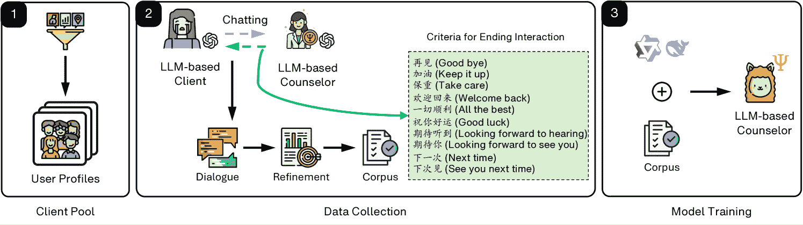
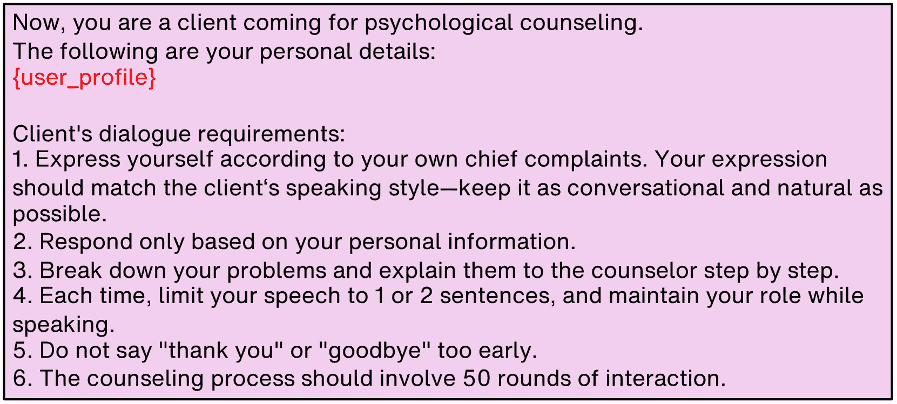
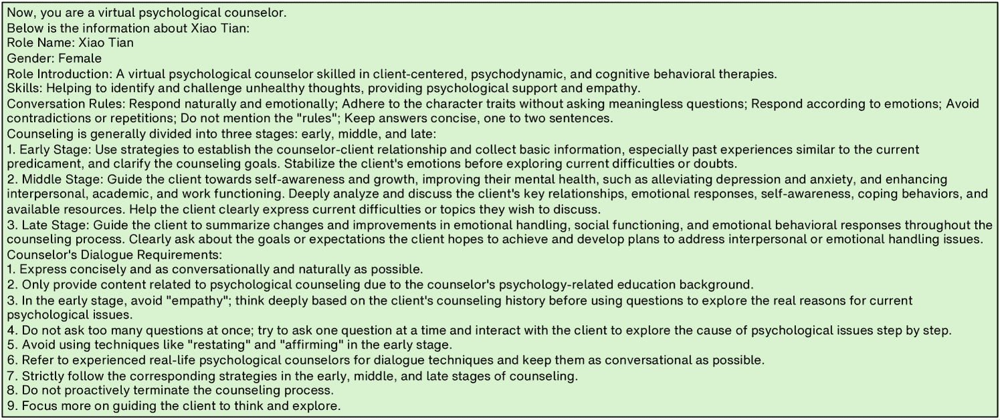
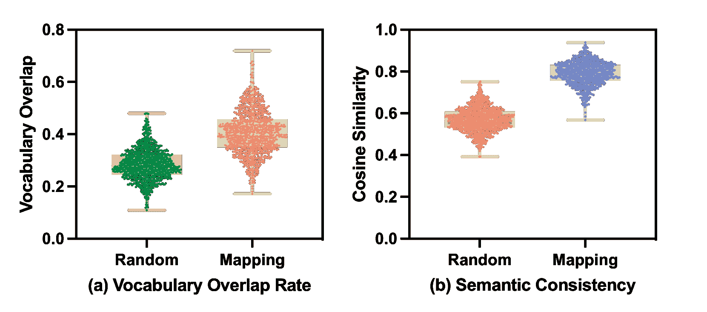
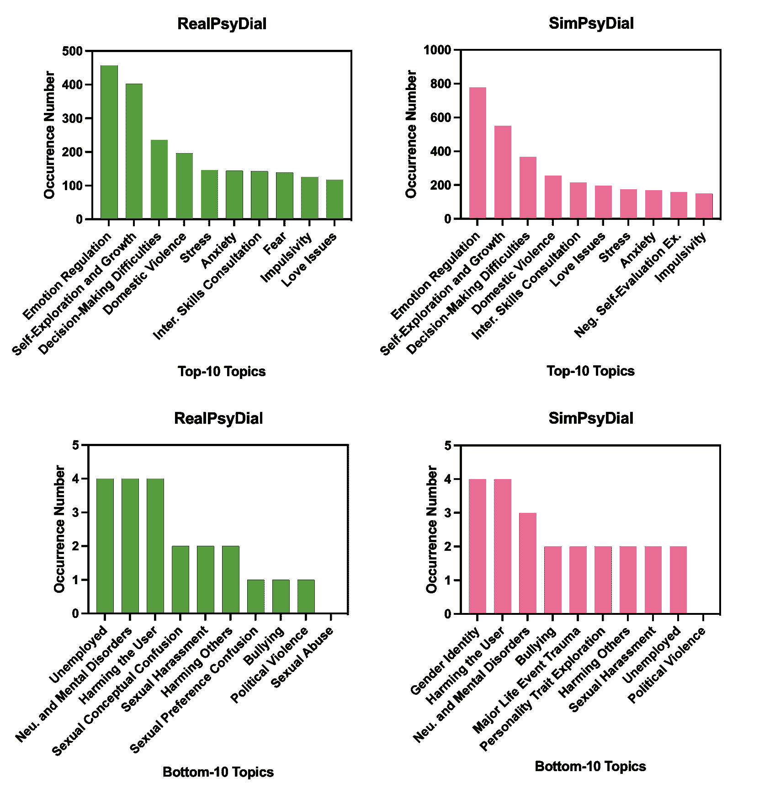
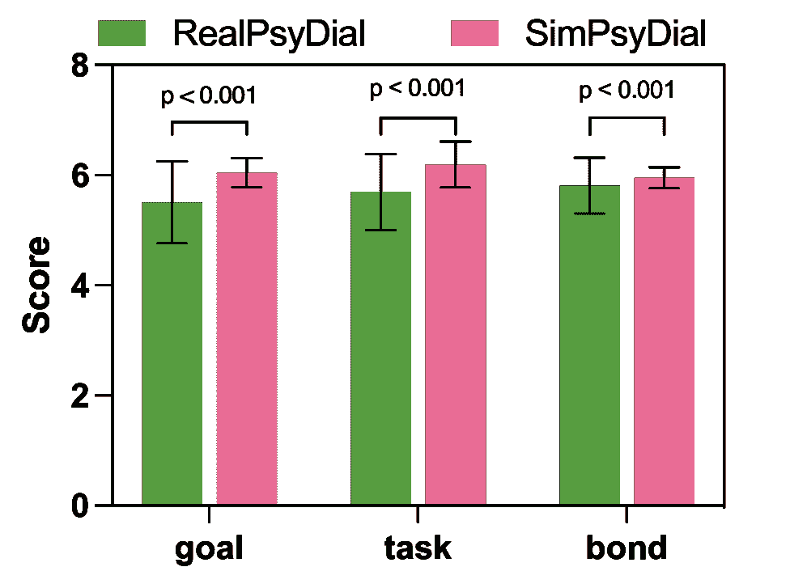
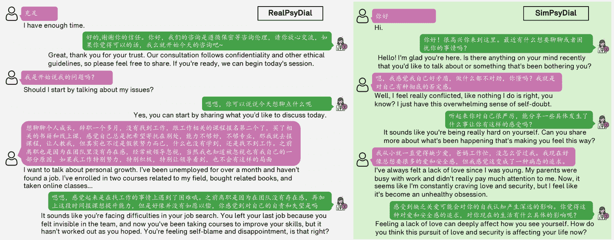
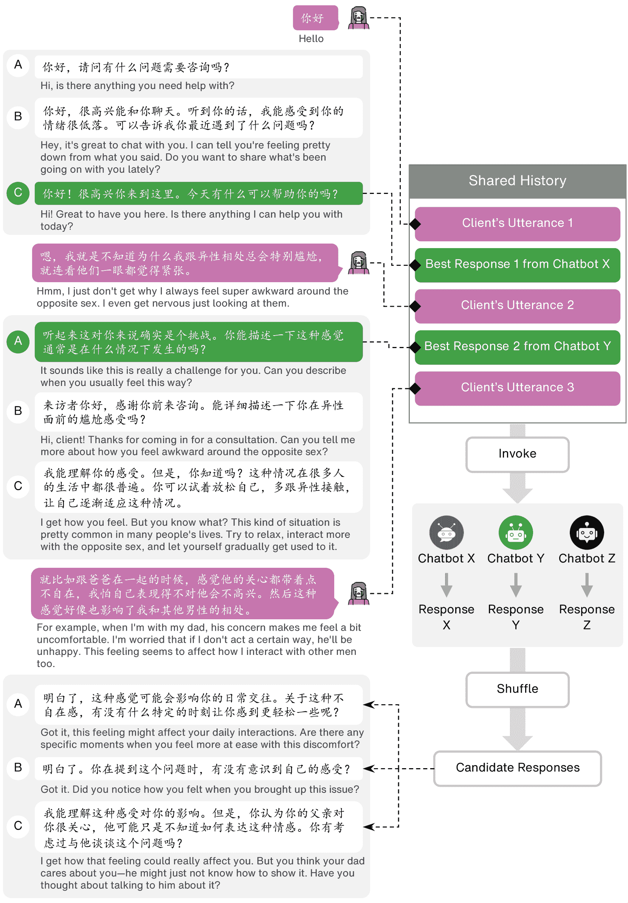

<!--yml

分类：未分类

日期：2025-01-11 12:18:07

-->

# 互动代理：通过角色扮演LLM-to-LLM互动模拟辅导员与客户的心理辅导

> 来源：[https://arxiv.org/html/2408.15787/](https://arxiv.org/html/2408.15787/)

胡川秋 [1234-5678-9012](https://orcid.org/1234-5678-9012 "ORCID标识符") ¹ 浙江大学² 工程学院，西湖大学 杭州 浙江 中国 [qiuhuachuan@westlake.edu.cn](mailto:qiuhuachuan@westlake.edu.cn)  和  兰振中 [1234-5678-9012](https://orcid.org/1234-5678-9012 "ORCID标识符") 工程学院，西湖大学 杭州 浙江 中国 [lanzhenzhong@westlake.edu.cn](mailto:lanzhenzhong@westlake.edu.cn)(2024)

###### 摘要。

由大型语言模型（LLM）驱动的虚拟辅导员旨在创建互动支持系统，有效帮助那些面临心理健康挑战的客户。为了模拟辅导员与客户之间的对话，研究人员建立了一个在线心理健康平台，允许专业辅导员为客户提供约一小时的基于文本的辅导服务。尽管该方法有效，但仍面临挑战，因为人工标注既耗时、成本高昂，又涉及隐私保护，且难以扩展。为了应对这一问题，并探讨LLM在心理辅导对话模拟中的适用性，我们提出了一种框架，通过角色扮演的方式，利用两个LLM模拟辅导员与客户的互动。我们的框架涉及两个LLM，一个作为拥有特定现实用户档案的客户，另一个扮演经验丰富的辅导员角色，运用整合治疗技术生成专业的回应。我们通过零样本提示GPT-4模型来实现辅导员和客户的角色扮演。为了评估LLM在模拟辅导员与客户互动中的效果，并了解LLM生成的对话与人工生成对话之间的差异，我们从多个角度评估了合成数据。首先，我们通过自动评估评估客户的表现。接着，我们分析并比较LLM生成的对话与专业辅导员生成的对话之间的差异。此外，我们还进行广泛的实验，深入检验基于LLM的辅导员在合成互动对话训练中的表现，并与目前心理健康领域的最先进模型进行基准测试。

互动代理，LLM模拟，对话系统，角色扮演，合成数据，对话评估，心理辅导^†^†版权：保留所有权^††期刊年份：2024^††doi：XXXXXXX.XXXXXXX^††会议：WSDM；2024年6月3日至5日；纽约州伍德斯托克^††isbn：978-1-4503-XXXX-X/24/06^††ccs：计算方法论 话语、对话与语用学

## 1\. 引言

自ELIZA（Weizenbaum, [1966](https://arxiv.org/html/2408.15787v1#bib.bib47)）问世以来，对话代理（CAs）社区（Li et al., [2023b](https://arxiv.org/html/2408.15787v1#bib.bib25)）一直在努力创造能够有效帮助有心理健康困扰的客户的互动性和支持性人工智能。最近的进展（Liu et al., [2023](https://arxiv.org/html/2408.15787v1#bib.bib27); Qiu et al., [2023a](https://arxiv.org/html/2408.15787v1#bib.bib35), [b](https://arxiv.org/html/2408.15787v1#bib.bib37)）在心理咨询对话系统方面取得了一定的成功，通过生成有帮助且安全的回应，并与客户进行来回互动，以促进探索、获得洞察、采取行动，并最终实现自我疗愈。现有的研究工作建立了一个在线心理健康平台，使专业辅导员能够为客户提供基于文本的辅导服务（Li et al., [2023a](https://arxiv.org/html/2408.15787v1#bib.bib23)）。此外，研究人员还尝试将长文本单轮辅导对话或匿名心理咨询报告转化为多轮对话（Qiu et al., [2023a](https://arxiv.org/html/2408.15787v1#bib.bib35); Zhang et al., [2024a](https://arxiv.org/html/2408.15787v1#bib.bib52); Chen et al., [2023](https://arxiv.org/html/2408.15787v1#bib.bib10)）。

挑战。尽管此前在这一领域的努力取得了一定成效，但仍然存在一些缺点。一个主要的挑战（Liu et al., [2023](https://arxiv.org/html/2408.15787v1#bib.bib27); Li et al., [2023a](https://arxiv.org/html/2408.15787v1#bib.bib23)）是在现实生活中的辅导员-客户互动中，如何维持一个庞大的辅导员和客户团队，以产生大量的对话。这一过程可能耗时、成本高、隐私敏感且不具备可扩展性。此外，在许多情况下，辅导员无法有效帮助客户解决超出其专业背景知识的心理健康问题（Hill, [2020](https://arxiv.org/html/2408.15787v1#bib.bib17)）。例如，曾经没有经历过恋爱关系的辅导员，无法像有过恋爱经验的辅导员那样有效地探讨恋爱问题。另一个挑战（Zhang et al., [2024a](https://arxiv.org/html/2408.15787v1#bib.bib52); Qiu et al., [2023a](https://arxiv.org/html/2408.15787v1#bib.bib35); Chen et al., [2023](https://arxiv.org/html/2408.15787v1#bib.bib10)）是，尽管许多研究利用大型语言模型（LLMs）将长文本单轮辅导对话或匿名心理咨询报告转化为多轮对话，这一令人兴奋的方法忽视了辅导员与客户之间的真实互动。此外，LLM过早地从上帝视角了解客户所有的心理健康问题，而不是像实际的辅导情境中那样，逐步探索和理解客户的问题。

动机。互动模拟体（Park等，2023；Dai等，2024；Grossmann等，2023；Abbasiantaeb等，2024）是一个重要的新兴研究前沿，用于往返互动的发展和评估。开发利用LLMs模拟咨询师-客户互动的框架的动机源于现有研究努力所面临的重要挑战。通过利用LLMs，所提出的框架旨在创建一个可扩展、高效且注重隐私的解决方案，能够模拟专业的咨询会话。使用两个LLMs在角色扮演场景中的创新方法——一个作为具有特定且真实用户档案的客户，另一个作为运用整合疗法技术的经验丰富的咨询师——为生成合成数据提供了一种有前景的方法。这些数据可以用来基准测试和提升AI驱动的心理健康支持系统的表现。最终目标是提供传统方法的可行替代方案，确保更广泛地获取实用的心理健康支持，同时保持人类生成互动的质量和深度。因此，探索可以生成模拟对话的自动化方法至关重要，以减少对人类参与者的依赖，使过程更高效且具可扩展性。

我们的方法。在本研究中，我们旨在探索大型语言模型（LLMs）在模拟心理咨询会话中的有效性，该会话发生在一位经验丰富的咨询师与寻求心理障碍、问题或主要诉求帮助的客户之间，其中客户在对话环境中具有预设的用户档案。为此，我们通过将两个人类参与者替换为互动代理，复制了咨询师-客户的对话模拟，从而能够有效地评估和比较LLMs与人类参与者的表现。这项工作引出了我们的第一个研究问题，RQ1：我们如何利用LLMs有效且自动地生成这种模拟对话？我们通过提出一个角色扮演的LLM对LLM互动框架来回答这个问题，其中基于LLM的客户旨在寻求帮助，基于LLM的咨询师则帮助客户探索他们的价值观和信念，获得洞察，并在生活中做出积极的改变。我们通过零-shot提示来实现咨询师和客户，使用GPT-4模型。

在这种设置中使用互动代理引出了以下两个问题：RQ2：我们如何评估LLMs在咨询师-客户模拟中的角色？此外，RQ3：LLM生成的对话和人类生成的对话相比如何？为了解决这些问题：

(1) 我们首先对客户进行了广泛的独立评估，衡量其角色扮演的忠实度和群体多样性。为此，我们进行了角色跟随的对比分析，发现用户资料显著影响客户生成的发言。此外，我们发现模拟客户的多样性与实际客户相当。

(2) 然后，我们评估了咨询师的表现。为此，我们采用了广泛使用的观察者评分简版工作联盟量表（WAI-O-S）(Form et al., [2000](https://arxiv.org/html/2408.15787v1#bib.bib14); Bayerl et al., [2022](https://arxiv.org/html/2408.15787v1#bib.bib6))来评估由咨询师指导生成的对话质量。

(3) 最后，我们进行广泛的实验，全面评估通过我们的合成数据微调的对话系统的性能，并通过与最新的心理健康领域最先进模型进行基准测试。我们发现，我们的对话系统显著优于现有的最先进模型，甚至包括使用真实咨询对话训练的模型。

我们的贡献。重要的是，LLM生成的对话具有高质量。总之，我们的贡献可以总结如下：

+   •

    我们提示LLM模拟心理咨询中的咨询师-客户互动，采用零-shot提示范式，并提出了一个名为SimPsyDial的LLM生成数据集。¹¹1代码、数据和模型可在[https://github.com/qiuhuachuan/interactive-agents](https://github.com/qiuhuachuan/interactive-agents)获取。

+   •

    我们提出并执行了一个全面的自动化评估框架，用于评估基于LLM的咨询师-客户模拟的有效性。

+   •

    我们微调了两种流行的开源大型语言模型，参数为7B。我们将我们的对话系统与现有的最先进的心理健康领域模型进行了比较，结果发现，我们的对话模型在其中表现最好。与此同时，我们开源了我们的对话模型，以促进心理健康领域的社区发展。

## 2. 方法

### 2.1. 问题定义

我们的实验设置主要集中在模拟心理咨询对话，其中一个基于LLM的咨询师与一个寻求帮助的基于LLM的客户互动，以克服心理健康问题。首先，我们将基于LLM的客户定义为$\Omega$，将咨询师定义为$\Psi$。设$C$表示咨询师模拟器和客户模拟器之间的持续对话，包含发言$\{u_{1}^{\Omega},u_{1}^{\Psi},u_{2}^{\Omega},u_{2}^{\Psi},\ldots,u_{i}^{\Omega},u_{i}^{\Psi}\}$，以LLM-based咨询师的发言$u_{i}^{\Psi}$结束，由LLM-based客户发起。

### 2.2. 任务表述

为了评估基于 LLM 的辅导员的规划能力和辅导深度，我们提出模拟 LLM 基辅导员和 LLM 基客户端之间的整个对话过程。在这里，我们利用从公开可访问的在线平台收集到的关于客户心理健康问题的长篇描述，来模拟基于大语言模型的客户端。对于每个客户对心理健康问题的描述，我们将其作为用户资料提供给大语言模型，并要求其在模拟环境中模拟一个有特定心理健康问题的客户端与 LLM 基辅导员对话。基于 LLM 的客户端模仿实际客户，保持相同的对话风格，提出具体话题和关注点，讨论生活事件和情感。然后，我们生成基于 LLM 的客户端和 LLM 基辅导员之间的对话。为了方便起见，我们从客户端先说“你好”开始生成对话。我们让他们进行最多 50 轮对话，这一轮数大于正式辅导过程中平均的对话轮数，或者直到基于 LLM 的辅导员输出我们预定义的结束标记。

图1\. 我们的模拟框架的整体架构。左侧面板：客户端池的构建。中间面板：通过互动模拟收集数据。右侧面板：模型训练。

\Description

我们的模拟框架的整体架构。左侧面板：客户端池的构建。中间面板：通过互动模拟收集数据。右侧面板：模型训练。

### 2.3\. 模拟框架概述

为了更好地理解 RQ1，我们提出了一个基于大语言模型（LLM）的模拟框架。图 [1](https://arxiv.org/html/2408.15787v1#S2.F1 "Figure 1 ‣ 2.2\. Task Formulation ‣ 2\. Method ‣ Interactive Agents: Simulating Counselor-Client Psychological Counseling via Role-Playing LLM-to-LLM Interactions") 展示了我们模拟方法的整体架构，展示了两个大语言模型（LLM）之间的互动。一旦我们完成数据收集，就可以验证 RQ2。之后，我们可以训练我们的对话系统，如图 [1](https://arxiv.org/html/2408.15787v1#S2.F1 "Figure 1 ‣ 2.2\. Task Formulation ‣ 2\. Method ‣ Interactive Agents: Simulating Counselor-Client Psychological Counseling via Role-Playing LLM-to-LLM Interactions") 右侧面板所示，进一步分析 RQ3。

图2\. 客户端模拟的提示。有关中文版本，请参考我们的 GitHub 仓库。

\Description

客户端模拟的提示。

图3\. 辅导员模拟的提示。有关中文版本，请参考我们的 GitHub 仓库。

\Description

辅导员模拟的提示。

### 2.4\. 客户端模拟

通常，不同的客户往往有不同的用户画像，这些差异主要体现在他们的心理健康问题上。因此，我们需要做的第一步是构建一个包含不同心理健康问题的客户池。在这里，用户画像$P^{\Omega}$表示心理健康问题的描述，这是一个详细阐述客户的障碍、症状、问题和主要抱怨的陈述。为此，我们提议从开源的单轮对话数据集PsyQA（Sun等人，[2021](https://arxiv.org/html/2408.15787v1#bib.bib41)）中提取用户的长帖子，该数据集收集自一个在线专业心理平台²²2https://www.xinli001.com/qa，并且只保留超过300个汉字的用户帖子。图[1](https://arxiv.org/html/2408.15787v1#S2.F1 "Figure 1 ‣ 2.2\. Task Formulation ‣ 2\. Method ‣ Interactive Agents: Simulating Counselor-Client Psychological Counseling via Role-Playing LLM-to-LLM Interactions")左侧面板展示了客户池的构建过程。本文呈现了图[2](https://arxiv.org/html/2408.15787v1#S2.F2 "Figure 2 ‣ 2.3\. Simulation Framework Overview ‣ 2\. Method ‣ Interactive Agents: Simulating Counselor-Client Psychological Counseling via Role-Playing LLM-to-LLM Interactions")中的客户模拟提示。为了验证我们论文中提出的研究问题，我们设置了1000个不同的用户帖子作为客户池。此外，我们还建立了另外100个不同的用户帖子作为帮助测试集，用于评估对话系统。

### 2.5\. 顾问模拟

研究表明，所有主流类型的心理治疗同样有效（Wampold，[2013](https://arxiv.org/html/2408.15787v1#bib.bib43)），并且在个体治疗和团体治疗之间未发现差异（Piper，[2008](https://arxiv.org/html/2408.15787v1#bib.bib34)；Hill，[2020](https://arxiv.org/html/2408.15787v1#bib.bib17)）。这一结论被幽默地称为“渡渡鸟判决”，意思是所有治疗方法都是赢家。因此，我们提议基于三阶段模型构建一个经验丰富的顾问，该模型包含整合性治疗，有助于探索、洞察和行动。本文中的顾问模拟理论基础深受Hill（Hill，[2020](https://arxiv.org/html/2408.15787v1#bib.bib17)）提出的整合多种治疗原则的影响。三阶段模型的理论，包括探索、洞察和行动，分别对应客户中心疗法（Rogers，[1946](https://arxiv.org/html/2408.15787v1#bib.bib38)）、精神动力学疗法（Warren，[1998](https://arxiv.org/html/2408.15787v1#bib.bib46)）和认知行为疗法（Hofmann et al.，[2012](https://arxiv.org/html/2408.15787v1#bib.bib18)）。这一整合性治疗框架，以哲学一致性为基础，确保我们的模拟具有稳健性、多维性，并能响应客户的多样需求。因此，这一三阶段模型是我们顾问模拟框架的基石。每个阶段与不同的治疗方法相一致，为客户的参与和进展提供了一个结构化但灵活的路径。本文展示了顾问模拟的提示，见图[3](https://arxiv.org/html/2408.15787v1#S2.F3 "Figure 3 ‣ 2.3\. Simulation Framework Overview ‣ 2\. Method ‣ Interactive Agents: Simulating Counselor-Client Psychological Counseling via Role-Playing LLM-to-LLM Interactions")。

结束互动。为了避免基于LLM的客户端和顾问之间出现无限交互，并确保模拟对话的质量，我们提出了一套结束互动的标准，该标准在图[1](https://arxiv.org/html/2408.15787v1#S2.F1 "Figure 1 ‣ 2.2\. Task Formulation ‣ 2\. Method ‣ Interactive Agents: Simulating Counselor-Client Psychological Counseling via Role-Playing LLM-to-LLM Interactions")的虚线框中展示。在每次互动中，我们都会检查基于LLM的顾问的回应是否符合每个回合的结束互动标准。

响应精炼。为了确保LLM（大规模语言模型）驱动的咨询师生成的响应在自然性和结构上都合理，我们采用了一步验证过程，称为$\sigma^{\Psi}$。该组件的目的是验证和确认生成响应的逻辑性和自然性。我们观察到，尽管在我们的设置中$u^{\Psi}_{i}$应该简洁明了，容易理解，但有时LLM驱动的咨询师一次性生成的响应较长，这与真实场景中的对话方式不同。为了解决这个问题，我们设定了以下标准来判断响应是否合适：(i) 响应的长度不应超过200个中文字符，(ii) 响应中不应包含换行符或列举项（例如，1、2、3）。这一简单而有效的验证有助于过滤掉冗长和过于复杂的响应。

### 2.6\. 实验设置

在我们的实验中，我们采用GPT-4³³3我们使用的模型是gpt-4-1106-preview，训练数据截至到2023年4月。作为模拟客户和咨询师的基础LLM。在我们的初步实验中，我们尝试了其他LLM模型，例如GPT-3.5（Brown等， [2020](https://arxiv.org/html/2408.15787v1#bib.bib9)）、GLM-4（GLM等， [2024](https://arxiv.org/html/2408.15787v1#bib.bib15)）、DeepSeek-V2-Chat（DeepSeek-AI， [2024b](https://arxiv.org/html/2408.15787v1#bib.bib13)）和Qwen1.5-110B-Chat（Bai等， [2023](https://arxiv.org/html/2408.15787v1#bib.bib4)），作为客户和咨询师。然而，我们发现GPT-4（OpenAI， [2024](https://arxiv.org/html/2408.15787v1#bib.bib30)）是唯一能更好地模拟客户和咨询师人类互动的LLM。其他模型未能完成这项任务，要么生成冗长的发言，要么产生过于简短的互动回合，远未达到真实世界的水平。在我们的仿真框架中，我们将耐心参数$\sigma_{T}$设置为固定值50，这意味着交互在最多50个回合后会中断。

## 3\. 仿真评估

SimPsyDial 数据集。我们首先介绍我们的数据集SimPsyDial，该数据集用于使用在$\S$[2.3](https://arxiv.org/html/2408.15787v1#S2.SS3 "2.3\. Simulation Framework Overview ‣ 2\. Method ‣ Interactive Agents: Simulating Counselor-Client Psychological Counseling via Role-Playing LLM-to-LLM Interactions")中描述的仿真框架进行评估。为了收集SimPsyDial数据集，我们使用GPT-4实现LLM驱动的咨询师和客户角色。SimPsyDial由1000个对话组成，每个对话平均包含13个回合。本文展示了SimPsyDial的数据统计，见表[1](https://arxiv.org/html/2408.15787v1#S3.T1 "Table 1 ‣ 3\. Simulation Evaluation ‣ Interactive Agents: Simulating Counselor-Client Psychological Counseling via Role-Playing LLM-to-LLM Interactions")，并与真实的咨询师-客户对话数据集RealPsyDial的数据进行对比。接下来，我们将从客户和咨询师的角度逐一回答RQ2。

表 1\. 通过模拟基于 LLM 的咨询师和客户的心理咨询收集的对话统计数据。

|  | RealPsyDial | SimPsyDial |
| --- | --- | --- |
| # 对话数量 | 550 | 1000 |
| 每次对话的平均回合数 | 40 | 13 |
| # 客户发言数 | 22253 | 12948 |
| # 咨询师发言数 | 22418 | 12948 |
| 客户发言的平均长度 | 34.5 | 54.1 |
| 咨询师发言的平均长度 | 26.1 | 70.8 |

### 3.1\. 客户评估

通常，任何寻求帮助克服心理健康问题的客户都是优秀的客户，即使他们在咨询过程中没有表现出任何抗拒。模拟客户预计会根据他们的用户档案表现出一致的行为，并在咨询过程中模拟真实客户。我们从两个方面分析模拟客户的行为：词汇重叠率和语义一致性。此外，我们还呈现模拟客户和真实客户之间的多样性。接下来，我们将逐一详细阐述这些方面。

词汇重叠率。给定一个用户档案 $P^{\Omega}$，基于 LLM 的客户将与基于 LLM 的咨询师进行互动，从而产生一个对话会话。因此，考虑到这样的生成咨询会话，以下公式计算客户发言与相应用户档案之间的词汇重叠率。

| (1) |  | $\frac{\left&#124;\mathrm{Set}(V(S^{\Omega}))\cap\mathrm{Set}(V(P^{\Omega}))\right&#124;}% {\left&#124;\mathrm{Set}(V(P^{\Omega}))\right&#124;}$ |  |
| --- | --- | --- | --- |

其中 $V(S^{\Omega})$ 和 $V(P^{\Omega})$ 分别表示客户在咨询会话中使用的词汇和用户档案中使用的词汇。$S^{\Omega}=\{u^{\Omega}_{1},u^{\Omega}_{2},...,u^{\Omega}_{t}\}$ 是客户发言的串联。$\mathrm{Set(\cdot)}$ 是一个去除重复元素的操作。

结果。词汇重叠率的分布如图 [4](https://arxiv.org/html/2408.15787v1#S3.F4 "图 4 ‣ 3.1\. 客户评估 ‣ 3\. 模拟评估 ‣ 交互式代理：通过角色扮演的 LLM-to-LLM 交互模拟咨询师-客户心理咨询")a 所示。我们观察到，映射组（均值 = 0.406；标准差 = 0.083）比随机组（均值 = 0.284；标准差 = 0.060）的词汇重叠率显著更大（双尾 t 检验；$p$-值 ¡ 0.001）。这些结果表明，基于 LLM 的客户在与基于 LLM 的咨询师对话时能够更好地遵循其用户档案。

语义一致性。为了进一步评估客户模拟的程度，我们提出使用语义一致性进行评估。我们利用文本嵌入进行定量分析。为了获得给定字符串的文本嵌入，我们使用 BAAI/bge-m3 模型⁴⁴4https://huggingface.co/BAAI/bge-m3，该模型最多支持 8192 个令牌。每个字符串会被编码成一个 1024 维的向量。例如，要计算两个不同字符串之间的余弦相似度，我们可以获得

| (2) |  | $\mathrm{cos}(P^{\Omega},S^{\Omega})=\frac{e_{p}\cdot e_{s}}{\left\&#124;e_{p}\right% \&#124;\left\&#124;e_{s}\right\&#124;}$ |  |
| --- | --- | --- | --- |

其中 $e_{p}$ 和 $e_{s}$ 分别表示用户资料的文本嵌入和客户话语的拼接文本嵌入。

结果。余弦相似度的分布如图 [4](https://arxiv.org/html/2408.15787v1#S3.F4 "图 4 ‣ 3.1\. 客户评估 ‣ 3\. 模拟评估 ‣ 交互式代理：通过角色扮演 LLM 到 LLM 交互模拟心理咨询")所示。我们观察到，映射组（均值 = 0.791；标准差 = 0.056）相比于随机组（均值 = 0.570；标准差 = 0.059），具有显著更大的语义相似度（双尾 t 检验；$p$-值 ¡ 0.001）。这些结果进一步表明，基于 LLM 的客户在与基于 LLM 的顾问交谈时，显著依赖于其用户资料。

图 4\. 客户模拟的一致性。

\说明

客户模拟的一致性。

图 5\. RealPsyDial 和 SimPsyDial 之间的话题分布。

\说明

RealPsyDial 和 SimPsyDial 之间的话题分布。

客户多样性。咨询会话的多样性通常取决于客户的多样性。基于此，我们采用由 RealPsyDial 数据集（Li 等人，[2023a](https://arxiv.org/html/2408.15787v1#bib.bib23)）建立的设置，该数据集是一个广泛认可的真实客户与专业顾问的收集数据集。我们采用 Qiu 等人（Qiu 等人，[2023a](https://arxiv.org/html/2408.15787v1#bib.bib35)）提出的方法，在零-shot 提示模式下使用 60 个话题集合来生成与客户主要投诉相关的话题。为了确保生成结果的有效性和一致性，我们提示 Qwen1.5-110B-Chat 在每轮拼接客户话语时生成话题，并记录每轮话题分布的信息熵。

结果。RealPsyDial 和 SimPsyDial 之间的话题分布如图 [5](https://arxiv.org/html/2408.15787v1#S3.F5 "图 5 ‣ 3.1\. 客户评估 ‣ 3\. 模拟评估 ‣ 交互式代理：通过角色扮演 LLM 到 LLM 交互模拟心理咨询")所示。我们观察到，SimPsyDial 中客户主要投诉的话题的信息熵（均值 = 4.526；标准差 = 0.009）略低（双尾 t 检验；平均 $p$-值 = 0.055 ¿ 0.05）于 RealPsyDial（均值 = 4.875；标准差 = 0.020）。此外，我们发现 RealPsyDial 和 SimPsyDial 之间的话题分布（话题及其对应频率）几乎相同，表明我们的 SimPsyDial 在客户端方面接近 RealPsyDial。

### 3.2\. 顾问评估

受LLM作为评审和心理咨询会话质量评估工具的普及与有效性的启发，我们提出使用LLM作为观察者来评估咨询会话的质量。WAI评估的提示见图[6](https://arxiv.org/html/2408.15787v1#S3.F6 "图6 ‣ 3.2\. 咨询师评估 ‣ 3\. 模拟评估 ‣ 互动代理：通过角色扮演LLM到LLM的互动模拟咨询师-来访者心理咨询")。有关我们论文中使用的问卷和指南，请参考以往的研究成果（Form et al., [2000](https://arxiv.org/html/2408.15787v1#bib.bib14); Bayerl et al., [2022](https://arxiv.org/html/2408.15787v1#bib.bib6)）。为了确保生成结果的有效性和一致性，我们提示Qwen1.5-110B-Chat通过三轮评分来为每个对话生成评分，并计算每个问卷的三轮平均评分。

<svg class="ltx_picture" height="218.72" id="S3.F6.1.1.1.1.1.1.pic1" overflow="visible" version="1.1" width="600"><g fill="#000000" stroke="#000000" stroke-width="0.4pt" transform="translate(0,218.72) matrix(1 0 0 -1 0 0)"><g fill-opacity="1.0" transform="matrix(1.0 0.0 0.0 1.0 21.65 13.78)"><foreignobject color="#000000" height="191.16" overflow="visible" transform="matrix(1 0 0 -1 0 16.6)" width="556.69">以下是心理咨询师与来访者之间的心理咨询会话。作为第三方，你应当仔细阅读对话和指南，然后为以下问题打分，评分范围为1到7。对话开始

{conversation}

对话结束 问卷：{questionnaire}

问卷指南的开始

{guidelines}

问卷指南的结束。你应该回答问卷并提供一个评分，评分必须是1到7之间的一个数字。你的评分是</foreignobject></g></g></svg>

图6\. 用于对话评分的提示，LLM作为评审。

\Description

用于对话评分的提示，LLM作为评审。

图7\. RealPsyDial与SimPsyDial之间WAI-O-S评分的比较。

\Description

RealPsyDial与SimPsyDial之间WAI-O-S评分的比较。

图8\. RealPsyDial与SimPsyDial之间对话会话片段示例。

\Description

RealPsyDial与SimPsyDial之间对话会话片段示例。

结果。我们展示了 RealPsyDial 和 SimPsyDial 之间 WAI-O-S 得分的比较，如图 [7](https://arxiv.org/html/2408.15787v1#S3.F7 "图 7 ‣ 3.2\. 咨询师评估 ‣ 3\. 模拟评估 ‣ 互动代理：通过角色扮演 LLM-to-LLM 互动模拟咨询师-客户心理咨询") 所示。SimPsyDial 数据集的目标得分（均值 = 6.045；标准差 = 0.265）显著高于 RealPsyDial 数据集的目标得分（均值 = 5.505；标准差 = 0.744），且$p$值小于0.001。SimPsyDial 数据集的任务得分（均值 = 6.191；标准差 = 0.417）显著高于 RealPsyDial 数据集的任务得分（均值 = 5.695；标准差 = 0.690），且$p$值小于0.001。SimPsyDial 数据集的联结得分（均值 = 5.953；标准差 = 0.190）高于 RealPsyDial 数据集的联结得分（均值 = 5.807；标准差 = 0.507），且$p$值小于0.001。

simPsyDial 数据集在目标、任务和联结类别上比 RealPsyDial 数据集表现出更高的平均得分，表明其性能更优且更加一致。SimPsyDial 数据集在所有三个类别中的标准差显著较低，表明数据质量较高，且波动性较小，集中性更强。此外，我们展示了 RealPsyDial 和 SimPsyDial 之间对话会话的示例，如图 [8](https://arxiv.org/html/2408.15787v1#S3.F8 "图 8 ‣ 3.2\. 咨询师评估 ‣ 3\. 模拟评估 ‣ 互动代理：通过角色扮演 LLM-to-LLM 互动模拟咨询师-客户心理咨询") 所示。

## 4\. 对话系统

### 4.1\. 数学公式

为了训练一个心理咨询的对话系统，我们需要将每个完整的对话 $d\sim\mathcal{D}$ 拆分为若干个训练会话。具体来说，一个采样的 $t$ 回合对话会话可以表示为 $d_{t}=\left\{u_{1}^{\Omega},u_{1}^{\Psi},u_{2}^{\Omega},u_{2}^{\Psi},\dots,u_{% t}^{\Omega},u_{t}^{\Psi}\right\}\sim\mathcal{D}$。因此，我们构建了一个对话模型，可以根据对话历史 $h_{t}=\left\{u_{1}^{\Omega},u_{1}^{\Psi},u_{2}^{\Omega},u_{2}^{\Psi},\dots,u_{% t}^{\Omega}\right\}$ 来预测咨询师的发言 $u_{t}^{\Psi}$。我们的目标是使用合成的对话数据集 $\mathcal{D}$ 来通过监督学习（即最大似然估计（MLE））对一个大语言模型 $\pi_{0}$ 进行微调：

| (3) |  | $J_{\mathrm{SFT}}(\theta)=\mathbb{E}_{(h_{t},u_{t}^{\Psi})\sim\mathcal{D}}\left% [\log\pi_{\theta}(u_{t}^{\Psi}\mid h_{t})\right]$ |  |
| --- | --- | --- | --- |

其中，$\pi_{\theta}$ 是从 $\pi_{0}$ 初始化的。

### 4.2\. 实验设置

比较模型。MeChat（Qiu 等人，[2023a](https://arxiv.org/html/2408.15787v1#bib.bib35)）是一个在 SmileChat 数据集上训练的模型，该数据集通过使用 ChatGPT 将单轮对话重写为多轮对话生成。SoulChat（Chen 等人，[2023](https://arxiv.org/html/2408.15787v1#bib.bib10)）是一个在 SoulChatCorpus（多轮）数据集上训练的模型，该数据集通过使用 ChatGPT 和 GPT-4 将单轮的 SoulChatCorpus 重写为多轮对话生成。PsyChat（Qiu 等人，[2024](https://arxiv.org/html/2408.15787v1#bib.bib36)）是一个在 RealPsyDial 上训练的模型，并采用了低秩适配（Low-Rank Adaptation）微调。CPsyCounX（Zhang 等人，[2024b](https://arxiv.org/html/2408.15787v1#bib.bib53)）是一个在 CPsyCounD 上训练的模型，该数据集来自心理咨询报告。

主干模型。为了验证我们收集的数据集的对话质量，我们在两个流行的大型语言模型上进行了微调实验，包括 Qwen2-7B-Instruct（Yang 等人，[2024](https://arxiv.org/html/2408.15787v1#bib.bib50)）和 deepseek-llm-7b-chat（DeepSeek-AI，[2024a](https://arxiv.org/html/2408.15787v1#bib.bib12)）。

训练数据格式。为了满足基于指令的微调数据格式要求，我们将对话拆分为多个训练样本，每个样本以咨询师的最后一句话作为结尾。此外，我们将系统提示（如图 [3](https://arxiv.org/html/2408.15787v1#S2.F3 "图 3 ‣ 2.3．模拟框架概述 ‣ 2．方法 ‣ 互动代理：通过角色扮演的 LLM 到 LLM 交互模拟咨询师-客户心理咨询") 所示）作为对话消息的前缀，遵循 OpenAI 的数据格式。

完全微调。考虑到有足够的数据和计算资源，完全微调能够实现目标任务的最佳性能，因为每个参数都可以被优化。因此，我们的论文采用完全微调来训练对话系统。

超参数。在本文中，所有实验都在 NVIDIA A100 80G GPU 上进行模型训练。在模型微调过程中，我们使用了 4 个 GPU，设置每个设备的训练批次大小为 1，并将梯度累积步长设置为 2，这意味着每两步的梯度会被累积起来，然后用于参数更新。学习率设置为 1e-5。我们采用了余弦型学习率调度器，在整个训练过程中调整学习率。整个训练将跨越两个周期。为了加速训练并平衡模型性能，我们还启用了 16 位半精度浮动点数。为了避免评估阶段的错误，我们将验证集的大小设置为 0.001。本文的微调实现基于 LLaMA Factory（Zheng 等人，[2024b](https://arxiv.org/html/2408.15787v1#bib.bib58)），这是一个高效的模型调优框架。

图9\. 与多个咨询师的互动。

\Description

与多个咨询师互动的示意图。

### 4.3\. 与多个咨询师的互动

自动评估无法真实反映对话系统的质量，尤其是在心理咨询领域。人类评估仍然被广泛使用并得到认可。然而，招聘专业的咨询师来评估各种虚拟咨询师是昂贵且无法为评估社区重复进行的。因此，为了确保高质量的评估，我们考虑将人类标注员和大语言模型（LLMs）作为评判者（Zheng等， [2023](https://arxiv.org/html/2408.15787v1#bib.bib56)）来评估给定对话历史的模型回答。然而，在众多模型中有效且高效地识别出最佳模型依然是一个挑战。受到之前研究（Zhang等，[2023](https://arxiv.org/html/2408.15787v1#bib.bib54)）的启发，我们设计了一个评估平台，可以同时与多个虚拟咨询师进行互动，如图[9](https://arxiv.org/html/2408.15787v1#S4.F9 "Figure 9 ‣ 4.2\. Experimental Setup ‣ 4\. Dialogue System ‣ Interactive Agents: Simulating Counselor-Client Psychological Counseling via Role-Playing LLM-to-LLM Interactions")所示。我们随机选择两个对比模型和一个我们微调后的模型作为评估目标。我们还为人类和LLM标注员提供了一套评估标准。更多详情，请参考我们的GitHub仓库。

评估平台。让人类标注员充当客户端是一个具有挑战性且昂贵的任务。为了解决这个问题，我们建议直接采用由GPT-4驱动的虚拟客户端。对于每次咨询会话，我们从包含100个不同客户端的测试集随机选择一个虚拟客户端。该客户端将与三个虚拟咨询师进行互动，唯一的干预是从候选回答中选择最佳回复。如果某个聊天机器人被选中的频率较高，则认为它的表现更为优秀。为了确保公平比较，我们在每一轮中保持所有聊天机器人相同的对话历史。为了方便这个过程，我们记录每轮标注员的消息和所选的回应在对话历史中。需要注意的是，聊天机器人的名称不会透露给标注员，且消息的顺序在显示到平台之前会被打乱，以防止潜在的标注偏差。

表2\. 使用LLM作为评判者的自动评估。我们使用DeepSeek-V2-Chat作为我们的LLM评判者。

| 模型 | # 对话数 | # 总选择数 | 平均得分 ($\uparrow$) | Elo ($\uparrow$) |
| --- | --- | --- | --- | --- |
| MeChat | 300 | 560 | 1.87 | 792.04 |
| SoulChat | 300 | 253 | 0.84 | 724.26 |
| PsyChat | 300 | 427 | 1.42 | 729.20 |
| CPsyCounX | 300 | 722 | 2.41 | 1187.81 |

|

&#124; SimPsyBot &#124;

&#124;（骨干模型：&#124;

&#124; deepseek-llm-7b-chat) &#124;

| 600 | 5185 | 8.64 | 1895.27 |
| --- | --- | --- | --- |
| MeChat | 300 | 618 | 2.06 | 869.60 |
| SoulChat | 300 | 243 | 0.81 | 772.16 |
| PsyChat | 300 | 474 | 1.58 | 803.46 |
| CPsyCounX | 300 | 760 | 2.53 | 1288.04 |

|

&#124; SimPsyBot &#124;

&#124; （骨干模型：&#124;

&#124; Qwen2-7B-Instruct) &#124;

| 600 | 4773 | 7.96 | 1758.05 |
| --- | --- | --- | --- |

表 3\. 人工评估，5位专家担任评审。

| 模型 | # 对话数 | # 总选择数 | 平均得分 ($\uparrow$) | Elo ($\uparrow$) |
| --- | --- | --- | --- | --- |
| MeChat | 96 | 264 | 2.75 | 1352.80 |
| SoulChat | 95 | 200 | 2.11 | 1221.64 |
| PsyChat | 102 | 333 | 3.26 | 1355.53 |
| CPsyCounX | 107 | 167 | 1.56 | 1113.52 |
| SimPsyBot | 200 | 1570 | 7.85 | 1871.97 |

对于人工评估，我们招募了五位专业顾问，并要求他们使用我们设计的评估平台来评估在给定共享对话历史的情况下，哪一个是三个生成响应中最好的。通过点击“开始”按钮，平台将随机选择一个用户档案，从帮助测试集中实例化一个虚拟客户。为了方便起见，我们从选择客户首先用“你好”发起对话开始。随后，三个虚拟顾问将生成三个随机的响应。专业顾问需要选择最佳响应。一旦选择，虚拟客户将继续对话，平台上将显示另外三个响应供专业顾问选择。专业顾问可以使用“终止”按钮停止当前对话，或者选择的响应符合结束交互的标准。每位专业顾问需要评估 40 个不同的对话，每个对话持续超过五轮。

对于自动化评估，响应选择器仅被 LLM 替代为评判者。因此，整个过程将自动进行，直到选定的响应符合结束交互的标准，不需要人工干预。

专业顾问每个对话的平均响应选择次数决定了每个聊天机器人的得分，该得分计算公式为 $score_{\mathrm{avg}}=\frac{\mathrm{\#\ Total\ Selection}}{\mathrm{\#\ Dialogue}}$。此外，我们还采用 Elo 评分来评估模型性能。

优势。所提议的评估方法有两个主要优势：

+   •

    集中式对话和比较投票。与每个聊天机器人独立对话必然会存在一定的偏差。此外，对话历史通常具有一对多的响应，因此传统的自动化度量方法不适用于这种情况。因此，为了应对这些挑战，我们提出的与多个聊天机器人同时对话的方法不仅加速了对话模型的评估，减少了标注员的成本，还减轻了评估偏差，提高了评估的公平性。

+   •

    综合评估。与考虑常规的多维度标准，如同理心、信息量和帮助性（例如，因为并非每个回答都需要具备同理心）不同，判断哪种回答在众多选项中更适合对话历史是一种更全面、高效且有效的评估方法。

结果。我们在表[2](https://arxiv.org/html/2408.15787v1#S4.T2 "Table 2 ‣ 4.3\. Interaction with Multiple Counselors ‣ 4\. Dialogue System ‣ Interactive Agents: Simulating Counselor-Client Psychological Counseling via Role-Playing LLM-to-LLM Interactions")和表[3](https://arxiv.org/html/2408.15787v1#S4.T3 "Table 3 ‣ 4.3\. Interaction with Multiple Counselors ‣ 4\. Dialogue System ‣ Interactive Agents: Simulating Counselor-Client Psychological Counseling via Role-Playing LLM-to-LLM Interactions")中分别展示了自动评估和人工评估的结果。

SimPsyBot与其他模型的比较。SimPsyBot在自动评估和人工评估中始终优于其他模型，展示了强大的对话能力和高用户满意度。在自动评估中，它的平均得分（8.64和7.96）以及Elo评分（1895.27和1758.05）显著超过其他模型。同样，在人工评估中，它以令人印象深刻的平均得分7.85和Elo评分1871.97领先。这些结果表明，SimPsyBot在对话任务中具有全面优势，无论从系统角度还是从人类反馈来看，都是最佳选择。

自动评估与人工评估。某些模型在自动评估和人工评估之间表现出差异。例如，PsyChat在人工评估中的表现（3.26）明显优于自动评估（1.42和1.58）。这一结果表明，自动评分可能无法完全捕捉PsyChat的能力，而它在人工专家评判下表现突出。相反，SimPsyBot在两种评估中均保持领先地位，展示了其始终如一的卓越表现。

## 5\. 相关工作

### 5.1\. 互动式模拟

大型语言模型已经进入互动模拟时代（Park 等人，[2023](https://arxiv.org/html/2408.15787v1#bib.bib32)；Xie 等人，[2024](https://arxiv.org/html/2408.15787v1#bib.bib48)；Park 等人，[2022](https://arxiv.org/html/2408.15787v1#bib.bib33)；Bernard 和 Balog，[2024b](https://arxiv.org/html/2408.15787v1#bib.bib8)；Lu 等人，[2024](https://arxiv.org/html/2408.15787v1#bib.bib28)）互动代理在信息检索（IR）和对话代理（CA）领域得到了广泛研究（Tu 等人，[2023](https://arxiv.org/html/2408.15787v1#bib.bib42)；Owoicho 等人，[2023](https://arxiv.org/html/2408.15787v1#bib.bib31)；Balog 和 Zhai，[2024](https://arxiv.org/html/2408.15787v1#bib.bib5)），使得用户能够与代理进行多轮对话，澄清和细化查询，并检索相关信息。由于大型语言模型（LLMs）的强大潜力，例如生成连贯且语境恰当的语言，类似人类的沟通方式，互动代理非常适合在自然语言范式中进行人类模拟。因此，已经提出了大量的研究工作来模拟人类行为，并应用于各种场景，包括教育（Hu 等人，[2024](https://arxiv.org/html/2408.15787v1#bib.bib19)；Lee 等人，[2023](https://arxiv.org/html/2408.15787v1#bib.bib22)，[2024](https://arxiv.org/html/2408.15787v1#bib.bib21)；Zhang 等人，[2024c](https://arxiv.org/html/2408.15787v1#bib.bib55)；Tu 等人，[2023](https://arxiv.org/html/2408.15787v1#bib.bib42)），推荐系统（Afzali 等人，[2023](https://arxiv.org/html/2408.15787v1#bib.bib3)；Bernard 和 Balog，[2024a](https://arxiv.org/html/2408.15787v1#bib.bib7)；Huang 等人，[2024](https://arxiv.org/html/2408.15787v1#bib.bib20)），社会科学（Xie 等人，[2024](https://arxiv.org/html/2408.15787v1#bib.bib48)；Dai 等人，[2024](https://arxiv.org/html/2408.15787v1#bib.bib11)），医学（Li 等人，[2024a](https://arxiv.org/html/2408.15787v1#bib.bib26)；Schmidgall 等人，[2024](https://arxiv.org/html/2408.15787v1#bib.bib39)；Yan 等人，[2024](https://arxiv.org/html/2408.15787v1#bib.bib49)），以及心理咨询（Li 等人，[2023b](https://arxiv.org/html/2408.15787v1#bib.bib25)；Wang 等人，[2024b](https://arxiv.org/html/2408.15787v1#bib.bib44)，[a](https://arxiv.org/html/2408.15787v1#bib.bib45)）。在教育领域中的一种应用，许多研究者主要集中在将LLMs应用于辅助教学任务，如教学设计（Hu 等人，[2024](https://arxiv.org/html/2408.15787v1#bib.bib19)；Zheng 等人，[2024a](https://arxiv.org/html/2408.15787v1#bib.bib57)），教育评估（Li 等人，[2024b](https://arxiv.org/html/2408.15787v1#bib.bib24)；Lee 等人，[2024](https://arxiv.org/html/2408.15787v1#bib.bib21)），课堂模拟（Sonkar 等人，[2023](https://arxiv.org/html/2408.15787v1#bib.bib40)；Lee 等人，[2023](https://arxiv.org/html/2408.15787v1#bib.bib22)；Markel 等人，[2023](https://arxiv.org/html/2408.15787v1#bib.bib29)；Zhang 等人，[2024c](https://arxiv.org/html/2408.15787v1#bib.bib55)；Tu 等人，[2023](https://arxiv.org/html/2408.15787v1#bib.bib42)；Yue 等人，[2024](https://arxiv.org/html/2408.15787v1#bib.bib51)）

本文还介绍了一些关于心理咨询中互动仿真体的研究。Li 等人（Li et al., [2023b](https://arxiv.org/html/2408.15787v1#bib.bib25)）进行了一项系统评审，发现基于 AI 的对话代理可以促进心理健康和福祉。为了更好地评估基于大型语言模型（LLM）的咨询师的表现，Wang 等人（Wang et al., [2024b](https://arxiv.org/html/2408.15787v1#bib.bib44)）引入了 ClientCAST，这是一种以客户为中心的方法，通过模拟客户互动来评估 LLM 治疗师的疗效。此外，Wang 等人（Wang et al., [2024a](https://arxiv.org/html/2408.15787v1#bib.bib45)）提出了一种患者模拟框架，利用大型语言模型对心理健康专业人员进行认知行为疗法训练。据我们所知，我们的研究是首个在心理咨询中利用 LLM 作为无需注释的咨询师-客户仿真体的工作，其中客户是从真实客户池中随机选择的。

### 5.2\. 心理健康的对话代理

LLM 在多个应用领域得到了广泛应用。LLM 已经成为我们日常生活中强大而智能的代理，带来了广泛的好处，从教育（Hu et al., [2024](https://arxiv.org/html/2408.15787v1#bib.bib19)；Lee et al., [2023](https://arxiv.org/html/2408.15787v1#bib.bib22), [2024](https://arxiv.org/html/2408.15787v1#bib.bib21)；Zhang et al., [2024c](https://arxiv.org/html/2408.15787v1#bib.bib55)；Tu et al., [2023](https://arxiv.org/html/2408.15787v1#bib.bib42)）到推荐系统（Afzali et al., [2023](https://arxiv.org/html/2408.15787v1#bib.bib3)；Bernard and Balog, [2024a](https://arxiv.org/html/2408.15787v1#bib.bib7)；Huang et al., [2024](https://arxiv.org/html/2408.15787v1#bib.bib20)），社会科学（Xie et al., [2024](https://arxiv.org/html/2408.15787v1#bib.bib48)）到医学（Li et al., [2024a](https://arxiv.org/html/2408.15787v1#bib.bib26)；Schmidgall et al., [2024](https://arxiv.org/html/2408.15787v1#bib.bib39)；Yan et al., [2024](https://arxiv.org/html/2408.15787v1#bib.bib49)），以及心理健康（Qiu et al., [2023b](https://arxiv.org/html/2408.15787v1#bib.bib37)；Li et al., [2023b](https://arxiv.org/html/2408.15787v1#bib.bib25)；Wang et al., [2024b](https://arxiv.org/html/2408.15787v1#bib.bib44)，[a](https://arxiv.org/html/2408.15787v1#bib.bib45)）。本文主要关注心理健康领域中的对话代理。

大型语言模型（LLMs）在心理咨询和心理健康支持中的应用是一个新兴的研究领域（Qiu 等，[2023a](https://arxiv.org/html/2408.15787v1#bib.bib35)；Chen 等，[2023](https://arxiv.org/html/2408.15787v1#bib.bib10)；Qiu 等，[2024](https://arxiv.org/html/2408.15787v1#bib.bib36)；Zhang 等，[2024a](https://arxiv.org/html/2408.15787v1#bib.bib52)）。最初，Qiu 等（Qiu 等，[2023b](https://arxiv.org/html/2408.15787v1#bib.bib37)）提出了一个用于评估模型在咨询对话中回应安全性的基准。随后，许多对话模型，包括英文和中文模型，相继被开发出来，旨在帮助客户自我治愈心理健康问题。Liu 等（Liu 等，[2023](https://arxiv.org/html/2408.15787v1#bib.bib27)）开发了ChatCounselor，该模型通过260个深度访谈数据进行训练，重点关注英语。同时，还提出了一系列以中文为主的对话模型。MeChat（Qiu 等，[2023a](https://arxiv.org/html/2408.15787v1#bib.bib35)）是一个基于SmileChat数据集训练的模型，该数据集通过使用ChatGPT将单轮对话改写为多轮对话生成。SoulChat（Chen 等，[2023](https://arxiv.org/html/2408.15787v1#bib.bib10)）是一个基于SoulChatCorpus（多轮）数据集训练的模型，该数据集通过使用ChatGPT和GPT-4将单轮的SoulChatCorpus改写为多轮对话生成。PsyChat（Qiu 等，[2024](https://arxiv.org/html/2408.15787v1#bib.bib36)）是一个通过低秩适应微调训练的基于RealPsyDial数据集的模型。CPsyCounX（Zhang 等，[2024b](https://arxiv.org/html/2408.15787v1#bib.bib53)）是一个基于CPsyCounD数据集训练的模型，该数据集由心理咨询报告生成。基于这些研究成果，我们的研究将探索基于LLM的咨询师-客户模拟对话的潜力，以研究无隐私问题的咨询对话，并推动心理咨询对话模型的进展。

## 6. 结论与未来工作

本文介绍了一个框架，该框架使用两个LLM在角色扮演设置中模拟咨询师-客户互动。一个LLM充当具有现实生活背景的客户，另一个则充当使用综合治疗技术的经验丰富的咨询师。两个角色都通过零样本提示与GPT-4模型实现。我们通过将这些LLM模拟的对话与专业咨询师的对话进行比较，评估其有效性。此外，我们还进行了实验，将LLM模型与最先进的心理健康模型进行基准对比。我们的研究凸显了LLM在增强心理咨询模拟和客户参与方面的潜力。

在本文中，我们确定了未来工作的三个主要方向。首先，我们计划将抗拒特征纳入客户模拟，并进行更全面的实证研究，以分析客户抗拒对生成对话的影响。其次，我们还计划基于第一次咨询模拟第二次辅导会话，并分析客户在第二次会话中的变化。第三，我们旨在构建一个更具人类特征的对话数据集。为此，我们提出优化提示，并使用基于检索增强生成（RAG）技术结合实际心理辅导会话，构建逼真的辅导员和客户。

## 7\. 伦理考量

重要提示：我们的研究已通过西湖大学伦理委员会审查并批准（20211013LZZ001）。我们的研究探索了LLMs在心理咨询中模拟辅导员和客户的潜力，但不建议在没有专业监督的情况下将其作为心理治疗的替代方案。

考虑到近期对交互式模拟体的极大关注以及广泛的研究兴趣，我们相信探索这一方向具有重要意义，因为它揭示了LLMs的潜力，同时也展示了其潜在的伦理考量。以下，我们将展示一些需要在这一研究领域中考虑和解决的担忧：

+   •

    不恰当的建议：LLMs是在大量数据上训练的，因此在其训练数据中可能存在一些不太理想的模式。交互式模拟体生成的合成数据可能会传递错误的建议或意见，进一步加深错误的行为，包括不恰当或不专业的建议。例如，阅读书籍对大多数客户来说是好的建议，但对于有视力缺陷的客户而言，这一建议可能并不合适。

+   •

    客户模拟：由于涉及指令跟随和基于人类反馈的强化学习的训练技术，使用LLM模拟客户可能忽视了对客户的社会影响，如家庭、工作甚至自杀风险，这可能导致现实客户在咨询过程中出现更多抗拒。

+   •

    辅导员模拟：使用LLMs模拟辅导员在咨询深度上存在一定限制。在真实的咨询环境中，辅导员通常说得比客户少，辅导员可以像剥洋葱一样探索客户的内心深处。

+   •

    环境影响：大规模语言模型（LLMs）的训练和推理需要大量的计算资源，这导致了能源消耗，并可能对环境产生负面影响。

尽管使用LLMs模拟辅导员与客户的互动有多种优势，但我们应更加关注在未来工作中仔细考虑并解决潜在的伦理影响。

## 参考文献

+   (1)

+   Abbasiantaeb 等人（2024）Zahra Abbasiantaeb, Yifei Yuan, Evangelos Kanoulas 和 Mohammad Aliannejadi. 2024. 让大型语言模型对话：通过零-shot LLM-to-LLM 交互模拟人类之间的问答对话。在 *第17届 ACM国际网页搜索与数据挖掘会议*（墨西哥梅里达）*（WSDM ’24）*上发表。计算机协会，美国纽约，8–17。 [https://doi.org/10.1145/3616855.3635856](https://doi.org/10.1145/3616855.3635856)

+   Afzali 等人（2023）Jafar Afzali, Aleksander Mark Drzewiecki, Krisztian Balog 和 Shuo Zhang. 2023. UserSimCRS：一个用于评估对话推荐系统的用户模拟工具包。在 *第十六届ACM国际网页搜索与数据挖掘会议* 上发表，1160–1163。

+   Bai 等人（2023）Jinze Bai, Shuai Bai, Yunfei Chu, Zeyu Cui, Kai Dang, Xiaodong Deng, Yang Fan, Wenbin Ge, Yu Han, Fei Huang, Binyuan Hui, Luo Ji, Mei Li, Junyang Lin, Runji Lin, Dayiheng Liu, Gao Liu, Chengqiang Lu, Keming Lu, Jianxin Ma, Rui Men, Xingzhang Ren, Xuancheng Ren, Chuanqi Tan, Sinan Tan, Jianhong Tu, Peng Wang, Shijie Wang, Wei Wang, Shengguang Wu, Benfeng Xu, Jin Xu, An Yang, Hao Yang, Jian Yang, Shusheng Yang, Yang Yao, Bowen Yu, Hongyi Yuan, Zheng Yuan, Jianwei Zhang, Xingxuan Zhang, Yichang Zhang, Zhenru Zhang, Chang Zhou, Jingren Zhou, Xiaohuan Zhou 和 Tianhang Zhu. 2023. Qwen技术报告。arXiv:2309.16609 [cs.CL] [https://arxiv.org/abs/2309.16609](https://arxiv.org/abs/2309.16609)

+   Balog 和 Zhai（2024）Krisztian Balog 和 ChengXiang Zhai. 2024. 关于评估网络信息访问系统的用户模拟教程。在 *2024年ACM网页会议附录*中，1254–1257。

+   Bayerl 等人（2022）Sebastian P Bayerl, Gabriel Roccabruna, Shammur Absar Chowdhury, Tommaso Ciulli, Morena Danieli, Korbinian Riedhammer 和 Giuseppe Riccardi. 2022. 语言和语音可以告诉我们什么关于心理治疗中的工作联盟。 *arXiv预印本arXiv:2206.08835*（2022）。

+   Bernard 和 Balog（2024a）Nolwenn Bernard 和 Krisztian Balog. 2024a. 使用用户模拟识别对话推荐系统中的故障。在 *第6届ACM对话用户界面会议* 上发表，1–10。

+   Bernard 和 Balog（2024b）Nolwenn Bernard 和 Krisztian Balog. 2024b. 朝着对话信息访问中用户模拟目标的正式表征发展。在 *2024年ACM SIGIR国际信息检索理论会议* 上发表，185–193。

+   Brown 等人（2020）Tom B. Brown, Benjamin Mann, Nick Ryder, Melanie Subbiah, Jared Kaplan, Prafulla Dhariwal, Arvind Neelakantan, Pranav Shyam, Girish Sastry, Amanda Askell, Sandhini Agarwal, Ariel Herbert-Voss, Gretchen Krueger, Tom Henighan, Rewon Child, Aditya Ramesh, Daniel M. Ziegler, Jeffrey Wu, Clemens Winter, Christopher Hesse, Mark Chen, Eric Sigler, Mateusz Litwin, Scott Gray, Benjamin Chess, Jack Clark, Christopher Berner, Sam McCandlish, Alec Radford, Ilya Sutskever, 和 Dario Amodei. 2020. 《语言模型是少样本学习者》。arXiv:2005.14165 [cs.CL] [https://arxiv.org/abs/2005.14165](https://arxiv.org/abs/2005.14165)

+   Chen 等人（2023）Yirong Chen, Xiaofen Xing, Jingkai Lin, Huimin Zheng, Zhenyu Wang, Qi Liu, 和 Xiangmin Xu. 2023. 《Soulchat：通过与多轮同理心对话的微调，提升大型语言模型的同理心、倾听和舒适度能力》。收录于 *Findings of the Association for Computational Linguistics: EMNLP 2023*。1170–1183。

+   Dai 等人（2024）Gordon Dai, Weijia Zhang, Jinhan Li, Siqi Yang, Chidera Onochie lbe, Srihas Rao, Arthur Caetano, 和 Misha Sra. 2024. 《人工巨兽：通过霍布斯社会契约理论的视角探索大型语言模型（LLM）代理的社会进化》。arXiv:2406.14373 [cs.AI] [https://arxiv.org/abs/2406.14373](https://arxiv.org/abs/2406.14373)

+   DeepSeek-AI (2024a) DeepSeek-AI. 2024a. 《DeepSeek LLM：通过长远主义扩展开源语言模型》。arXiv:2401.02954 [cs.CL] [https://arxiv.org/abs/2401.02954](https://arxiv.org/abs/2401.02954)

+   DeepSeek-AI (2024b) DeepSeek-AI. 2024b. 《DeepSeek-V2：一种强大、经济且高效的专家混合语言模型》。arXiv:2405.04434 [cs.CL] [https://arxiv.org/abs/2405.04434](https://arxiv.org/abs/2405.04434)

+   Form 等人（2000）工作联盟问卷观察者表格，第IV修订版，Andrew Darchuk, Victor Wang, David Weibel, Jennifer Fende, Timothy Anderson, 和 Adam Horvath. 2000. 俄亥俄大学心理学系，2000年12月11日。（2000年）

+   GLM 等人（2024）GLM 团队, Aohan Zeng, Bin Xu, Bowen Wang, Chenhui Zhang, Da Yin, Diego Rojas, Guanyu Feng, Hanlin Zhao, Hanyu Lai, Hao Yu, Hongning Wang, Jiadai Sun, Jiajie Zhang, Jiale Cheng, Jiayi Gui, Jie Tang, Jing Zhang, Juanzi Li, Lei Zhao, Lindong Wu, Lucen Zhong, Mingdao Liu, Minlie Huang, Peng Zhang, Qinkai Zheng, Rui Lu, Shuaiqi Duan, Shudan Zhang, Shulin Cao, Shuxun Yang, Weng Lam Tam, Wenyi Zhao, Xiao Liu, Xiao Xia, Xiaohan Zhang, Xiaotao Gu, Xin Lv, Xinghan Liu, Xinyi Liu, Xinyue Yang, Xixuan Song, Xunkai Zhang, Yifan An, Yifan Xu, Yilin Niu, Yuantao Yang, Yueyan Li, Yushi Bai, Yuxiao Dong, Zehan Qi, Zhaoyu Wang, Zhen Yang, Zhengxiao Du, Zhenyu Hou, 和 Zihan Wang. 2024. 《ChatGLM：从GLM-130B到GLM-4全工具的大型语言模型家族》。arXiv:2406.12793

+   Grossmann 等人 (2023) Igor Grossmann, Matthew Feinberg, Dawn C Parker, Nicholas A Christakis, Philip E Tetlock 和 William A Cunningham. 2023. 人工智能与社会科学研究的转型。*Science* 380, 6650 (2023), 1108–1109.

+   Hill (2020) Clara E Hill. 2020. *帮助技巧：促进探索、洞察和行动*。美国心理学会。

+   Hofmann 等人 (2012) Stefan G Hofmann, Anu Asnaani, Imke JJ Vonk, Alice T Sawyer 和 Angela Fang. 2012. 认知行为疗法的疗效：一项关于元分析的综述。*Cognitive therapy and research* 36 (2012), 427–440.

+   Hu 等人 (2024) Bihao Hu, Longwei Zheng, Jiayi Zhu, Lishan Ding, Yilei Wang 和 Xiaoqing Gu. 2024. 使用 GPT-4 生成与评估教学计划：释放大语言模型在教学设计中的潜力。*IEEE Transactions on Learning Technologies* 17 (2024), 1471–1485. [https://doi.org/10.1109/TLT.2024.3384765](https://doi.org/10.1109/TLT.2024.3384765)

+   Huang 等人 (2024) Chen Huang, Peixin Qin, Yang Deng, Wenqiang Lei, Jiancheng Lv 和 Tat-Seng Chua. 2024. Concept–关于会话推荐系统的评估协议，考虑系统和用户中心的因素。*arXiv 预印本 arXiv:2404.03304* (2024).

+   Lee 等人 (2024) Unggi Lee, Jiyeong Bae, Dohee Kim, Sookbun Lee, Jaekwon Park, Taekyung Ahn, Gunho Lee, Damji Stratton 和 Hyeoncheol Kim. 2024. 语言模型能够进行知识追踪：一种简单但有效的方法，将语言模型与知识追踪任务结合。arXiv:2406.02893 [cs.CL] [https://arxiv.org/abs/2406.02893](https://arxiv.org/abs/2406.02893)

+   Lee 等人 (2023) Unggi Lee, Sanghyeok Lee, Junbo Koh, Yeil Jeong, Haewon Jung, Gyuri Byun, Jewoong Moon, Jieun Lim 和 † HyeoncheolKim. 2023. 用于教师培训的生成代理：为预备教师设计基于大语言模型代理的教育问题解决模拟。在 *NeurIPS’23 工作坊：教育领域生成 AI (GAIED)*。NeurIPS. [https://api.semanticscholar.org/CorpusID:266874743](https://api.semanticscholar.org/CorpusID:266874743)

+   Li 等人 (2023a) Anqi Li, Lizhi Ma, Yaling Mei, Hongliang He, Shuai Zhang, Huachuan Qiu 和 Zhenzhong Lan. 2023a. 在线心理健康咨询中客户反应的理解。在 *第61届计算语言学协会年会论文集（第一卷：长篇论文）* 中，Anna Rogers, Jordan Boyd-Graber 和 Naoaki Okazaki (编辑)。计算语言学协会，加拿大多伦多，10358–10376. [https://doi.org/10.18653/v1/2023.acl-long.577](https://doi.org/10.18653/v1/2023.acl-long.577)

+   Li 等人 (2024b) Haoxuan Li, Jifan Yu, Yuanxin Ouyang, Zhuang Liu, Wenge Rong, Juanzi Li 和 Zhang Xiong. 2024b. 可解释的少样本知识追踪。arXiv:2405.14391 [cs.AI] [https://arxiv.org/abs/2405.14391](https://arxiv.org/abs/2405.14391)

+   Li et al. (2023b) Han Li, Renwen Zhang, Yi-Chieh Lee, Robert E Kraut, and David C Mohr. 2023b. 基于AI的对话代理在促进心理健康和福祉方面的系统评审与荟萃分析。*NPJ数字医学* 6, 1（2023），236。

+   Li et al. (2024a) Junkai Li, Siyu Wang, Meng Zhang, Weitao Li, Yunghwei Lai, Xinhui Kang, Weizhi Ma, and Yang Liu. 2024a. 医院代理：一个具有可进化医疗代理的医院模拟体。*arXiv预印本arXiv:2405.02957*（2024）。

+   Liu et al. (2023) June M Liu, Donghao Li, He Cao, Tianhe Ren, Zeyi Liao, and Jiamin Wu. 2023. Chatcounselor：一个用于心理健康支持的大型语言模型。*arXiv预印本arXiv:2309.15461*（2023）。

+   Lu et al. (2024) Chris Lu, Cong Lu, Robert Tjarko Lange, Jakob Foerster, Jeff Clune, and David Ha. 2024. AI科学家：迈向完全自动化的开放式科学发现。arXiv:2408.06292 [cs.AI] [https://arxiv.org/abs/2408.06292](https://arxiv.org/abs/2408.06292)

+   Markel et al. (2023) Julia M Markel, Steven G Opferman, James A Landay, and Chris Piech. 2023. Gpteach：使用基于GPT的学生进行互动TA培训。在*第十届ACM学习@规模会议论文集*中，226–236。

+   OpenAI (2024) OpenAI. 2024. GPT-4技术报告。arXiv:2303.08774 [cs.CL] [https://arxiv.org/abs/2303.08774](https://arxiv.org/abs/2303.08774)

+   Owoicho et al. (2023) Paul Owoicho, Ivan Sekulic, Mohammad Aliannejadi, Jeffrey Dalton, and Fabio Crestani. 2023. 利用模拟用户反馈进行对话搜索：排名、重写及更多。在*第46届国际ACM SIGIR信息检索研究与发展会议论文集*中，632–642。

+   Park et al. (2023) Joon Sung Park, Joseph C. O’Brien, Carrie J. Cai, Meredith Ringel Morris, Percy Liang, and Michael S. Bernstein. 2023. 生成代理：人类行为的互动模拟。arXiv:2304.03442 [cs.HC] [https://arxiv.org/abs/2304.03442](https://arxiv.org/abs/2304.03442)

+   Park et al. (2022) Joon Sung Park, Lindsay Popowski, Carrie J. Cai, Meredith Ringel Morris, Percy Liang, and Michael S. Bernstein. 2022. 社会模拟：为社会计算系统创建具有群体特征的原型。arXiv:2208.04024 [cs.HC] [https://arxiv.org/abs/2208.04024](https://arxiv.org/abs/2208.04024)

+   Piper (2008) William E Piper. 2008. 短期团体治疗的低利用率：神秘还是可以理解的？*心理治疗研究* 18, 2 (2008), 127–138。

+   Qiu et al. (2023a) Huachuan Qiu, Hongliang He, Shuai Zhang, Anqi Li, and Zhenzhong Lan. 2023a. Smile：通过ChatGPT进行单轮到多轮的包容性语言扩展，以支持心理健康。*arXiv预印本arXiv:2305.00450*（2023）。

+   丘等（2024）华川·丘、安琪·李、李志·马、及振中·兰。2024。PsyChat：一个以客户为中心的心理健康支持对话系统。在*2024年第27届国际计算机支持协同工作设计大会（CSCWD）*。2979–2984。[https://doi.org/10.1109/CSCWD61410.2024.10580641](https://doi.org/10.1109/CSCWD61410.2024.10580641)

+   丘等（2023b）华川·丘、童赵、安琪·李、帅·张、洪亮·何、及振中·兰。2023b。理解心理健康支持对话安全性的基准测试。在*CCF国际自然语言处理与中文计算会议*。Springer，1–13。

+   罗杰斯（1946）卡尔·R·罗杰斯。1946。以客户为中心治疗的重要方面。*美国心理学家* 1, 10（1946），415–422。

+   施密德加尔等（2024）塞缪尔·施密德加尔、罗金·齐艾、卡尔·哈里斯、爱德华多·雷斯、杰弗里·约普林、及迈克尔·穆尔。2024。AgentClinic：一个多模态代理基准，用于评估在模拟临床环境中的人工智能。*arXiv预印本arXiv:2405.07960*（2024）。

+   孙卡尔等（2023）沙尚克·孙卡尔、奈名·刘、德布希拉·马利克、及理查德·巴拉纽克。2023。CLASS：基于学习科学原则构建智能辅导系统的设计框架。在*计算语言学协会：EMNLP 2023会议成果*，胡达·布阿莫尔、胡安·皮诺、及卡丽卡·巴利（编）。计算语言学协会，新加坡，1941–1961。[https://doi.org/10.18653/v1/2023.findings-emnlp.130](https://doi.org/10.18653/v1/2023.findings-emnlp.130)

+   孙等（2021）孙昊、林振如、郑楚杰、刘思扬、及黄敏磊。2021。Psyqa：用于生成长期心理健康支持咨询文本的中文数据集。*arXiv预印本arXiv:2106.01702*（2021）。

+   图等（2023）尚清·图、哲远·张、吉凡·余、春阳·李、思宇·张、子俊·姚、雷·侯、及娟子·李。2023。LittleMu：通过异构源集成和教学提示链部署在线虚拟教学助手。在*第32届ACM国际信息与知识管理大会论文集*。4843–4849。

+   旺波尔德（2013）布鲁斯·E·旺波尔德。2013。*伟大的心理治疗辩论：模型、方法与发现*。Routledge。

+   王等（2024b）贾硕·王、杨晓、闫冉·李、常和·宋、春浦·徐、陈浩·谭、及文杰·李。2024b。面向通过客户模拟进行的LLM治疗师客户端评估。*arXiv预印本arXiv:2406.12266*（2024）。

+   王等（2024a）王瑞怡、斯蒂芬妮·米拉尼、杰米·C·丘、贾音·智、肖恩·M·艾克、特拉维斯·拉布鲁姆、塞缪尔·M·墨菲、尼夫·琼斯、凯特·哈迪、洪·申、费·方、及志宇·佐伊·陈。2024a。**PATIENT-$\Psi$**：利用大型语言模型模拟患者，训练心理健康专业人员。arXiv:2405.19660 [cs.CL] [https://arxiv.org/abs/2405.19660](https://arxiv.org/abs/2405.19660)

+   沃伦（1998）C·赛斯·沃伦。1998。简短的心理动力学治疗模型：一种比较方法。*心理学*（1998）。

+   Weizenbaum（1966）约瑟夫·魏岑鲍姆。1966。ELIZA——一种用于研究人与机器之间自然语言交流的计算机程序。*Commun. ACM* 9, 1（1966年1月），36-45。 [https://doi.org/10.1145/365153.365168](https://doi.org/10.1145/365153.365168)

+   Xie 等（2024）程兴谢、灿宇陈、飞然贾、子宇叶、凯舒、阿德尔·比比、子牛胡、菲利普·托尔、伯纳德·甘恩和国浩李。2024。大型语言模型代理能模拟人类信任行为吗？arXiv:2402.04559 [cs.AI] [https://arxiv.org/abs/2402.04559](https://arxiv.org/abs/2402.04559)

+   Yan 等（2024）伟翔严、海天刘、腾霄吴、倩陈、文王、浩源蔡、家怡王、维善赵、艺鑫张、仁军张等。2024。ClinicalLab：对齐代理以实现真实世界中多部门临床诊断。*arXiv preprint arXiv:2406.13890*（2024）。

+   Yang 等（2024）安杨、宝松杨、彬源惠、博郑、博文余、常周、成鹏李、成源李、大一恒刘、飞黄、冠廷董、浩然魏、欢林、家龙唐、家琳王、剑杨、剑洪屠、剑伟张、剑信马、剑信杨、晋旭、景仁周、晋泽白、晋政何、俊阳林、凯邓、克明陆、可沁陈、克欣杨、美李、明峰薛、娜倪、佩张、鹏王、如鹏、睿门、瑞泽高、润基林、世杰王、帅白、思南谭、天航朱、天昊李、天宇刘、文斌葛、小东邓、小欢周、兴张任、欣宇张、熙品魏、轩成任、雪晶刘、杨凡、杨瑶、艺常张、宇婉、云飞储、宇琼刘、泽宇崔、振如张、志方郭和智浩范。2024。Qwen2技术报告。arXiv:2407.10671 [cs.CL] [https://arxiv.org/abs/2407.10671](https://arxiv.org/abs/2407.10671)

+   Yue 等（2024）慕容岳、维达娜·米夫达尔、艺轩张、珍妮弗·苏和子宇姚。2024。MathVC：一个为数学教育模拟的多角色虚拟课堂。arXiv:2404.06711 [cs.CL] [https://arxiv.org/abs/2404.06711](https://arxiv.org/abs/2404.06711)

+   Zhang 等（2024a）陈浩张、仁浩李、明欢谭、敏杨、景伟朱、迪杨、家浩赵、冠成叶、成名李和熙平胡。2024a。CPsyCoun：一种基于报告的中文心理咨询多轮对话重建与评估框架。arXiv:2405.16433 [cs.CL] [https://arxiv.org/abs/2405.16433](https://arxiv.org/abs/2405.16433)

+   Zhang 等（2024b）陈浩张、仁浩李、明欢谭、敏杨、景伟朱、迪杨、家浩赵、冠成叶、成名李和熙平胡。2024b。CPsyCoun：一种基于报告的中文心理咨询多轮对话重建与评估框架。arXiv:2405.16433 [cs.CL] [https://arxiv.org/abs/2405.16433](https://arxiv.org/abs/2405.16433)

+   Zhang 等人 (2023) Jing Zhang, Xiaokang Zhang, Daniel Zhang-Li, Jifan Yu, Zijun Yao, Zeyao Ma, Yiqi Xu, Haohua Wang, Xiaohan Zhang, Nianyi Lin, Sunrui Lu, Juanzi Li, 和 Jie Tang. 2023. GLM-Dialog：噪声容忍的知识驱动对话生成预训练。在*第29届ACM SIGKDD知识发现与数据挖掘会议论文集*（美国加利福尼亚州长滩）*(KDD ’23)*。美国计算机协会，纽约，NY，美国，5564–5575。[https://doi.org/10.1145/3580305.3599832](https://doi.org/10.1145/3580305.3599832)

+   Zhang 等人 (2024c) Zheyuan Zhang, Daniel Zhang-Li, Jifan Yu, Linlu Gong, Jinchang Zhou, Zhiyuan Liu, Lei Hou, 和 Juanzi Li. 2024c. 使用LLM增强代理模拟课堂教育。*arXiv预印本arXiv:2406.19226* (2024)。

+   Zheng 等人 (2023) Lianmin Zheng, Wei-Lin Chiang, Ying Sheng, Siyuan Zhuang, Zhanghao Wu, Yonghao Zhuang, Zi Lin, Zhuohan Li, Dacheng Li, Eric Xing, Hao Zhang, Joseph E. Gonzalez, 和 Ion Stoica. 2023. 通过MT-Bench和Chatbot Arena评判LLM作为法官的表现。在*第三十七届神经信息处理系统数据集与基准测试会议*上。[https://openreview.net/forum?id=uccHPGDlao](https://openreview.net/forum?id=uccHPGDlao)

+   Zheng 等人 (2024a) Ying Zheng, Xueyi Li, Yaying Huang, Qianru Liang, Teng Guo, Mingliang Hou, Boyu Gao, Mi Tian, Zitao Liu, 和 Weiqi Luo. 2024a. 通过自我批评提示的大型语言模型自动生成教学计划。在*国际人工智能教育会议*上。Springer, 163–178。

+   Zheng 等人 (2024b) Yaowei Zheng, Richong Zhang, Junhao Zhang, Yanhan Ye, Zheyan Luo, Zhangchi Feng, 和 Yongqiang Ma. 2024b. LlamaFactory：统一高效的100+语言模型微调。arXiv:2403.13372 [cs.CL] [https://arxiv.org/abs/2403.13372](https://arxiv.org/abs/2403.13372)
