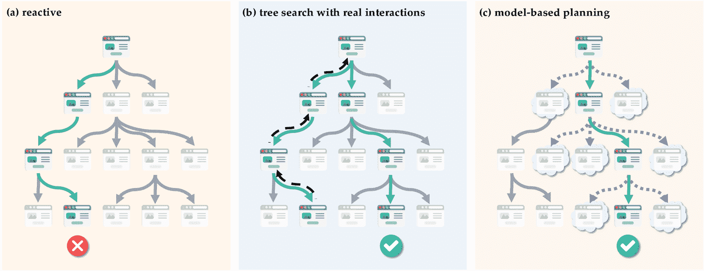
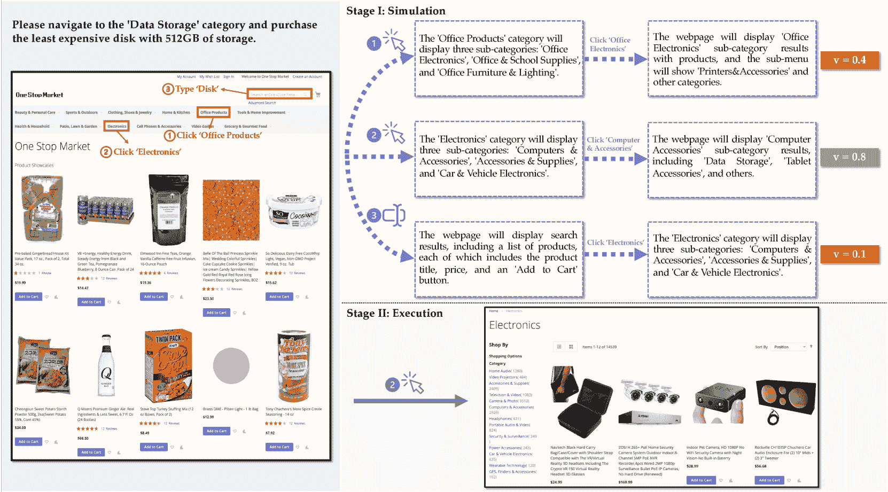
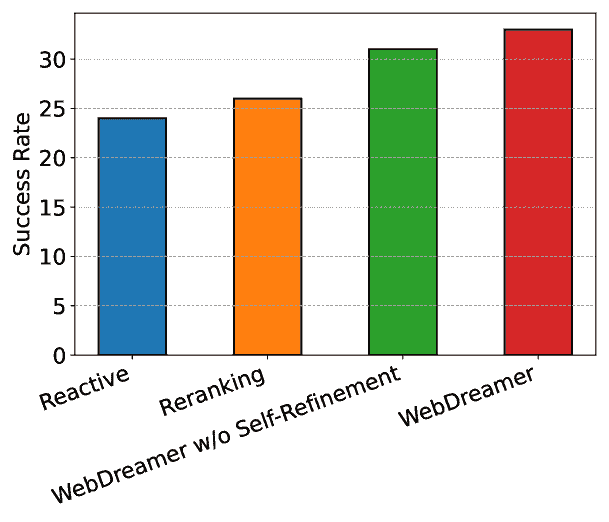
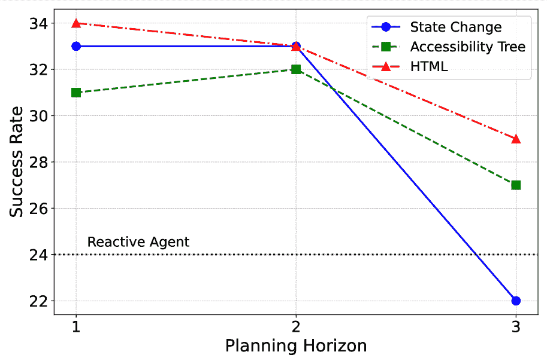
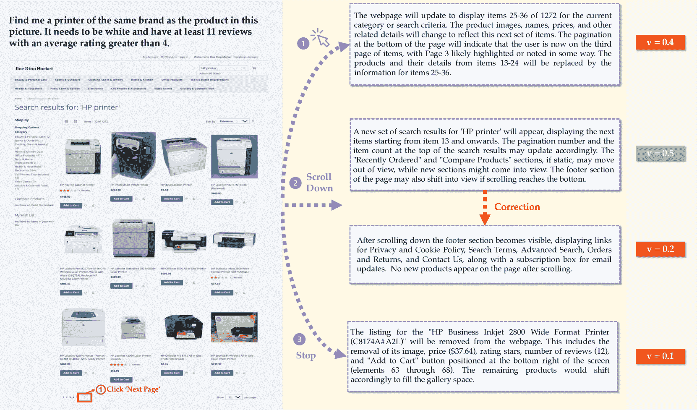
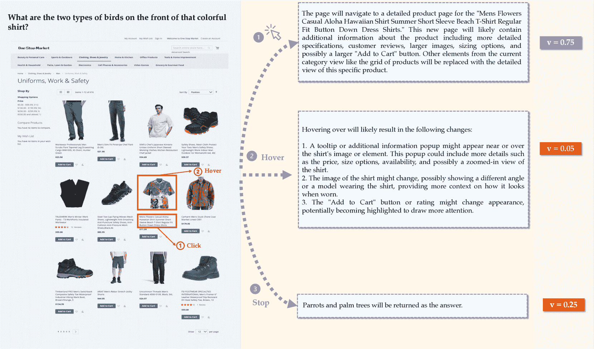

<!--yml
category: 未分类
date: 2025-01-11 11:57:20
-->

# Is Your LLM Secretly a World Model of the Internet? Model-Based Planning for Web Agents

> 来源：[https://arxiv.org/html/2411.06559/](https://arxiv.org/html/2411.06559/)

²²footnotetext: Equal contribution.Yu Gu^(1,†), Boyuan Zheng^(1,†), Boyu Gou¹, Kai Zhang¹, Cheng Chang², Sanjari Srivastava²,
 Yanan Xie², Peng Qi², Huan Sun¹, Yu Su¹
¹The Ohio State University, ²Orby AI
{gu.826, zheng.2372, sun.397, su.809}@osu.edu

###### Abstract

Language agents have demonstrated promising capabilities in automating web-based tasks, though their current reactive approaches still underperform largely compared to humans. While incorporating advanced planning algorithms, particularly tree search methods, could enhance these agents’ performance, implementing tree search directly on live websites poses significant safety risks and practical constraints due to irreversible actions such as confirming a purchase. In this paper, we introduce a novel paradigm that augments language agents with model-based planning, pioneering the innovative use of large language models (LLMs) as world models in complex web environments. Our method, WebDreamer, builds on the key insight that LLMs inherently encode comprehensive knowledge about website structures and functionalities. Specifically, WebDreamer uses LLMs to simulate outcomes for each candidate action (e.g., “what would happen if I click this button?”) using natural language descriptions, and then evaluates these imagined outcomes to determine the optimal action at each step. Empirical results on two representative web agent benchmarks with online interaction—VisualWebArena and Mind2Web-live—demonstrate that WebDreamer achieves substantial improvements over reactive baselines. By establishing the viability of LLMs as world models in web environments, this work lays the groundwork for a paradigm shift in automated web interaction. More broadly, our findings open exciting new avenues for future research into 1) optimizing LLMs specifically for world modeling in complex, dynamic environments, and 2) model-based speculative planning for language agents. ¹¹1Github: [OSU-NLP-Group/WebDreamer](https://github.com/OSU-NLP-Group/WebDreamer)

## 1 Introduction

Planning (Mattar & Lengyel, [2022](https://arxiv.org/html/2411.06559v1#bib.bib22))—the strategic search for optimal action sequences to achieve goals from initial states—has been fundamental to artificial intelligence since its inception, driving remarkable breakthroughs including superhuman performance in games like Go (Feng et al., [2023](https://arxiv.org/html/2411.06559v1#bib.bib6); Silver et al., [2016](https://arxiv.org/html/2411.06559v1#bib.bib34)). Recent advances have demonstrated that integrating large language models (LLMs) with advanced planning algorithms (e.g., Yao et al. ([2023a](https://arxiv.org/html/2411.06559v1#bib.bib40)); Hao et al. ([2023](https://arxiv.org/html/2411.06559v1#bib.bib12)); Gu et al. ([2023](https://arxiv.org/html/2411.06559v1#bib.bib9)); Wang et al. ([2024](https://arxiv.org/html/2411.06559v1#bib.bib37)); Feng et al. ([2023](https://arxiv.org/html/2411.06559v1#bib.bib6)); Brown et al. ([2024](https://arxiv.org/html/2411.06559v1#bib.bib2))) substantially enhances their performance on complex reasoning tasks beyond chain-of-thought (CoT) (Wei et al., [2022](https://arxiv.org/html/2411.06559v1#bib.bib38)) approaches, with OpenAI’s o1 (OpenAI, [2024b](https://arxiv.org/html/2411.06559v1#bib.bib25)) serving as a prominent example. These methods effectively scale inference-time compute and enable LLMs to explore multiple potential solution paths, which ultimately lead to more accurate outcomes.

Figure 1: Schematic illustration of different strategies for web agents formulated as a search problem. Each node represents a webpage. (a) Reactive: The agent selects locally optimal actions without forward planning, often leading to suboptimal outcomes. (b) Tree search with real interactions: The agent explores multiple paths through active website navigation and permits backtracking (indicated by dashed arrows). However, in real-world websites, backtracking is often infeasible due to the prevalence of irreversible actions. (c) Model-based planning: The agent simulates potential outcomes (illustrated by cloud-bordered nodes) to determine optimal actions prior to real-world execution, thus minimizing actual website interactions while maintaining effectiveness. For visual clarity, only one-step simulated outcomes are depicted. Faded nodes indicate unexplored webpages, while green checkmarks and red crosses denote successful and unsuccessful outcomes, respectively.

Alongside these developments, research into generalist web agents capable of planning and executing a sequence of actions to complete complex tasks across diverse websites has garnered significant interest (Deng et al., [2023](https://arxiv.org/html/2411.06559v1#bib.bib5); Zhou et al., [2023](https://arxiv.org/html/2411.06559v1#bib.bib45); Zheng et al., [2024](https://arxiv.org/html/2411.06559v1#bib.bib44); Koh et al., [2024a](https://arxiv.org/html/2411.06559v1#bib.bib16)), partly due to the web’s potential as a complex yet realistic environment for driving agent research and development. However, applying existing planning algorithms to the online web environment presents formidable challenges. Chief among these challenges are the inherent safety risks associated with live website interactions (Liao et al., [2024](https://arxiv.org/html/2411.06559v1#bib.bib20)), such as inadvertently submitting forms with sensitive information or triggering unintended transactions. These risks become even more pronounced when employing tree search algorithms (Koh et al., [2024b](https://arxiv.org/html/2411.06559v1#bib.bib17); Putta et al., [2024](https://arxiv.org/html/2411.06559v1#bib.bib30)), as their exhaustive exploration can expose the agent to hidden vulnerabilities and unforeseen scenarios. Additionally, many online actions, such as confirming a purchase or sending an email, are irreversible, which further makes backtracking—a crucial component of planning algorithms—highly challenging, if not infeasible.

One promising solution to address these challenges is model-based planning (Pascanu et al., [2017](https://arxiv.org/html/2411.06559v1#bib.bib28); Moerland et al., [2023](https://arxiv.org/html/2411.06559v1#bib.bib23)), which equips agents with the ability to simulate interactions using a world model—a computational representation of environment dynamics. By simulating action sequences within this virtual environment, agents can explore potential outcomes safely, without directly interacting with live websites. This approach not only reduces safety risks but also preserves the agent’s capacity to explore and plan. Yet, the true challenge lies in creating a versatile world model that can faithfully capture the landscape of the ever-evolving Internet. While previous research demonstrates that LLMs can function as effective world models in simplistic settings like blocksworld (Hao et al., [2023](https://arxiv.org/html/2411.06559v1#bib.bib12)) and gridworld (Kim et al., [2024](https://arxiv.org/html/2411.06559v1#bib.bib15)), a bolder question emerges: Can LLMs rise to the challenge of modeling the vast, dynamic Internet? With their extensive pre-trained knowledge—spanning web structures, protocols, and user behaviors—LLMs are uniquely positioned to take on this task. Building on these insights, we present WebDreamer, a pioneering framework that leverages LLMs as world models to navigate the web (Figure [1](https://arxiv.org/html/2411.06559v1#S1.F1 "Figure 1 ‣ 1 Introduction ‣ Is Your LLM Secretly a World Model of the Internet? Model-Based Planning for Web Agents")). At the core of WebDreamer lies the concept of “dreaming”: before committing to any action, the agent uses the LLM to imagine the outcome of each possible step, expressed as natural language descriptions of how the state would change. These simulated outcomes are then evaluated based on their progress toward achieving the task objective. The most promising action is executed, and the process is repeated iteratively until the LLM determines that the goal has been reached (Section [4](https://arxiv.org/html/2411.06559v1#S4 "4 WebDreamer: Model-Based Planning for Web Agents ‣ Is Your LLM Secretly a World Model of the Internet? Model-Based Planning for Web Agents")).

To validate the effectiveness of WebDreamer, we evaluate it on two representative benchmarks that support online interaction: VisualWebArena (Koh et al., [2024a](https://arxiv.org/html/2411.06559v1#bib.bib16)) and Mind2Web-live (Pan et al., [2024b](https://arxiv.org/html/2411.06559v1#bib.bib27)). WebDreamer achieves substantial performance gains over reactive agents on both benchmarks, underscoring its practical value despite its conceptual simplicity. While tree search with actual interactions shows slightly superior performance on VisualWebArena, which features a controlled environment of three locally hosted websites, this method is rarely feasible in practical applications, given its inherent limitations regarding safety risks and the potential for irreversible actions in real-world websites. In contrast, our simulation-based approach offers a more flexible solution, balancing performance gains with practical applicability in real-world web navigation tasks.

In summary, our work introduces a new direction for AI planning in complex, real-world environments like the web using world models simulated by LLMs. With WebDreamer, we tackle the dual challenges of safety and complexity in web navigation. Our results validate the potential of LLM-based world models for planning in complex web environments and highlight new opportunities for optimizing LLMs as world models and improving model-based planning algorithms for language agents.

## 2 Related Work

### 2.1 Web Agents

Driven by the goal of automating tedious and repetitive web-based tasks, web agents powered by (multimodal) language models have made substantial progress in various aspects. Benchmarks have evolved from MiniWoB++ (Shi et al., [2017](https://arxiv.org/html/2411.06559v1#bib.bib33); Liu et al., [2018](https://arxiv.org/html/2411.06559v1#bib.bib21)) to WebShop (Yao et al., [2022](https://arxiv.org/html/2411.06559v1#bib.bib39)) and WebArena (Zhou et al., [2023](https://arxiv.org/html/2411.06559v1#bib.bib45)), offering increasingly realistic website simulations. VisualWebArena (Koh et al., [2024a](https://arxiv.org/html/2411.06559v1#bib.bib16)) and Mind2Web (Deng et al., [2023](https://arxiv.org/html/2411.06559v1#bib.bib5)) challenge models’ ability to handle visual information and generalize across diverse tasks, websites, and domains.

*   Reactive Agents.

    Reactive agents make decisions based on immediate observations from the environment without performing any search or simulation of future actions, typically implemented with the ReAct framework (Yao et al., [2023b](https://arxiv.org/html/2411.06559v1#bib.bib41)). Much progress has been made to enhance the fundamental capabilities of reactive web agents through both prompting closed-source models (Zheng et al., [2024](https://arxiv.org/html/2411.06559v1#bib.bib44); He et al., [2024](https://arxiv.org/html/2411.06559v1#bib.bib13); Deng et al., [2023](https://arxiv.org/html/2411.06559v1#bib.bib5)) and training models using HTML and webpage screenshots (Lee et al., [2023](https://arxiv.org/html/2411.06559v1#bib.bib19); Gur et al., [2023](https://arxiv.org/html/2411.06559v1#bib.bib10); Furuta et al., [2023](https://arxiv.org/html/2411.06559v1#bib.bib7); Hong et al., [2024](https://arxiv.org/html/2411.06559v1#bib.bib14); Baechler et al., [2024](https://arxiv.org/html/2411.06559v1#bib.bib1)). Additionally, models’ abilities to ground web agent actions to elements have been improved through training on action-coordinate pair data (You et al., [2024](https://arxiv.org/html/2411.06559v1#bib.bib42); Cheng et al., [2024](https://arxiv.org/html/2411.06559v1#bib.bib4)). Further advancements have been achieved by training on web agent trajectories, utilizing both human-annotated trajectories (Shaw et al., [2023](https://arxiv.org/html/2411.06559v1#bib.bib32); Hong et al., [2024](https://arxiv.org/html/2411.06559v1#bib.bib14); Deng et al., [2023](https://arxiv.org/html/2411.06559v1#bib.bib5); Lai et al., [2024](https://arxiv.org/html/2411.06559v1#bib.bib18)) and synthesized exploration trajectories (Furuta et al., [2023](https://arxiv.org/html/2411.06559v1#bib.bib7); Song et al., [2024](https://arxiv.org/html/2411.06559v1#bib.bib35); Patel et al., [2024](https://arxiv.org/html/2411.06559v1#bib.bib29)). However, reactive agents inherently suffer from short-sightedness, which can often lead to suboptimal performance in multi-step decision making.

*   Agents with tree search.

    Pan et al. ([2024a](https://arxiv.org/html/2411.06559v1#bib.bib26)) introduces a reward model based on GPT-4V, designed to provide both step-wise and trajectory-level rewards to guide inference-time search. Search Agent (Koh et al., [2024b](https://arxiv.org/html/2411.06559v1#bib.bib17)) investigates inference-time search algorithms in interactive web environments, enabling explicit exploration and multi-step planning. In contrast to Search Agent, which employs a variant of best-first tree search, AgentQ (Putta et al., [2024](https://arxiv.org/html/2411.06559v1#bib.bib30)) and WebPilot (Zhang et al., [2024](https://arxiv.org/html/2411.06559v1#bib.bib43)) utilize Monte Carlo Tree Search (MCTS) as their primary search strategy.

    While tree search on websites has demonstrated significant improvements, it still presents several limitations. First, the search process substantially increases inference time due to the need for extensive exploration, which is difficult to parallelize given its inherently sequential nature. Backtracking to previous states is essential for search-based methods but impractical on real-world websites. Koh et al. ([2024b](https://arxiv.org/html/2411.06559v1#bib.bib17)) addressed this in sandbox environments by storing action sequences to resume states after resetting the environment. However, resetting the environment or undoing action sequences is not feasible on live websites. Finally, the extra explorations introduced by search algorithms substantially amplify the risk of destructive actions that may irreversibly alter the website’s state, potentially causing harmful side effects.

### 2.2 World Models

World models, a cornerstone of model-based reinforcement learning (Moerland et al., [2023](https://arxiv.org/html/2411.06559v1#bib.bib23)) since the introduction of Dyna by Sutton ([1991](https://arxiv.org/html/2411.06559v1#bib.bib36)), are typically trained on observed state transitions to predict future states and rewards. These world models enable efficient training through simulated experiences, reducing environmental interactions and improving sample efficiency (Ha & Schmidhuber, [2018](https://arxiv.org/html/2411.06559v1#bib.bib11)). Beyond their role in training, researchers have explored the use of world models to facilitate planning (Pascanu et al., [2017](https://arxiv.org/html/2411.06559v1#bib.bib28); Schrittwieser et al., [2020](https://arxiv.org/html/2411.06559v1#bib.bib31)). Fundamentally, world models in reinforcement learning often involve task-specific training, with a primary focus on enhancing data efficiency in the agent learning process.

In contrast to traditional world models in reinforcement learning, LLMs employed as world models primarily focus on facilitating decision-making in planning rather than training. This distinction leads LLM-based models to prioritize key task abstractions over the high-fidelity simulations typically required in reinforcement learning. Recent research has demonstrated the potential of LLMs as world models for simple environments, leveraging their encoded broad world knowledge (Hao et al., [2023](https://arxiv.org/html/2411.06559v1#bib.bib12); Kim et al., [2024](https://arxiv.org/html/2411.06559v1#bib.bib15)). Our study aims to advance this field by investigating the capabilities of LLM-based world models in more complex real-world environments, specifically diverse websites. A concurrent work (Chae et al., [2024](https://arxiv.org/html/2411.06559v1#bib.bib3)) also explores augmenting web agents with LLM-simulated action outcomes, however, their focus is on data collection to train an open-weights LLM, while ours centers on understanding the potential of this new paradigm using advanced LLMs such as GPT-4o (OpenAI, [2024a](https://arxiv.org/html/2411.06559v1#bib.bib24)).

## 3 Preliminary

Table 1: Action space for web navigation defined in VisualWebArena (Koh et al., [2024a](https://arxiv.org/html/2411.06559v1#bib.bib16)).

 | Action Type $a$ | Description |
| --- | --- |
| click [$\mathtt{elem}$] | Click on $\mathtt{elem}$. |
| hover [$\mathtt{elem}$] | Hover over $\mathtt{elem}$. |
| type [$\mathtt{elem}$] [$\mathtt{text}$] | Type $\mathtt{text}$ into $\mathtt{elem}$. |
| press [$\mathtt{key\_comb}$] | Press a key combo. |
| goto [$\mathtt{url}$] | Go to $\mathtt{url}$. |
| go_back | Click back. |
| go_forward | Click forward. |
| new_tab | Open a new tab. |
| tab_focus [$\mathtt{index}$] | Focus on the i-th tab. |
| tab_close | Close current tab. |
| scroll [$\mathtt{up/down}$] | Scroll up or down. |
| stop [$\mathtt{answer}$] | End with an output. | 

### 3.1 Task Formulation

Web agents tasked with automating activities in live websites confront vast and complex search spaces. Formally, each task with a task instruction $I$ can be framed as a partially observable Markov decision process (POMDP): $(\mathcal{S},\mathcal{A},\mathcal{O},T,R,\Omega)$, where $\mathcal{S}$ represents the set of all possible states of the environment, $\mathcal{A}$ represents all possible actions the agent can take, $\mathcal{O}$ represents the set of possible observations from the environment, $T:\mathcal{S}\times\mathcal{A}\rightarrow\mathcal{S}$ represents the state transition function, $R$ is a binary reward denoting whether the task specified in $I$ has been completed or not, and $\Omega:\mathcal{S}\rightarrow\mathcal{O}$ is a deterministic function that projects a state to an observation. The goal of the task is to execute a sequence of actions that achieves a reward of 1.

In practical scenarios, the environment is partially observable due to the complexity of web environments. The true state encompasses server-side variables, dynamically loaded content, hidden UI elements, and is subject to network conditions and browser limitations. Consequently, the agent can only perceive the environment through a limited viewport (i.e., an observation $o\in\mathcal{O}$), which represents an incomplete projection of the true system state. The observation space typically manifests as screenshots or text-based accessibility trees, reflecting common implementation practices. This constrained observability naturally shapes the action space $A$, which comprises operations executable on interactable elements within $o$, such as element clicks, text input, and URL navigation (Table [1](https://arxiv.org/html/2411.06559v1#S3.T1 "Table 1 ‣ 3 Preliminary ‣ Is Your LLM Secretly a World Model of the Internet? Model-Based Planning for Web Agents")).

### 3.2 Planning through Simulation

Planning an optimal action sequence through tree search using real interactions governed by $T$ is costly and risks irreversible actions. Model-based planning addresses these challenges by using a computational representation of the environment to simulate interaction outcomes. Instead of executing actions in the real environment, the agent leverages an approximate model to predict state transitions, enabling efficient exploration and evaluation of action sequences without real-world interactions. While offline planning can compute entire action sequences before execution in deterministic environments like BlocksWorld (Hao et al., [2023](https://arxiv.org/html/2411.06559v1#bib.bib12)), web environments are too complex for such long-term prediction. This necessitates online planning approaches that interleave planning and execution, computing one action at a time.

One prominent approach is Model Predictive Control (MPC; Garcia et al. ([1989](https://arxiv.org/html/2411.06559v1#bib.bib8))), which iteratively simulates future trajectories to select actions. At each state $s$, MPC simulates trajectories over a finite horizon $H$ for each possible action $a\in\mathcal{A}$ using a simulator function $\text{{sim}}(s,a)$ and evaluates them using a scoring function $\text{score}(\tau)$. The action leading to the most promising trajectory is then executed: $a^{*}=\operatorname*{arg\,max}_{a\in\mathcal{A}}\text{{score}}(\text{{sim}}(s,% a))$. This process repeats after observing the new state, allowing the agent to adapt its plan based on actual outcomes while avoiding costly real-world exploration. In reality, we cannot access the real state due to partial observability, as a result, we instead do $\texttt{sim}(o,a)$ using the observation $o=\Omega(s)$.

Figure 2: Illustration of WebDreamer using the LLM to simulate the outcome of each candidate action. The LLM simulates trajectories in natural language descriptions for three candidate actions: (1) Click “Office Products”, (2) Click “Electronics”, and (3) Type “Disk” into textbox. Through these simulations, each resulting trajectory is scored to identify the action most likely to succeed. In this case, the LLM selects Click Click “Electronics” as the optimal step and executes it. Each dotted box represents an LLM-generated state description after each simulated action. This example demonstrates a two-step planning horizon.

## 4 WebDreamer: Model-Based Planning for Web Agents

In this paper, we propose WebDreamer, a pioneering approach leveraging LLMs as world models to enable efficient planning in complex digital environments. Our approach is motivated by the observation that web interfaces, despite their complexity, are designed to be predictable for human users. When browsing websites, humans can effectively anticipate action outcomes based on visual cues and common design patterns—clicking a “Submit” button leads to form submission, selecting a product image navigates to its detail page. Given that LLMs are trained on vast amounts of web-related data, we hypothesize that they have acquired sufficient knowledge to simulate the consequences of user actions, potentially serving as effective world models for planning.

### 4.1 Core Design

WebDreamer follows the planning through simulation paradigm introduced in Section [3.2](https://arxiv.org/html/2411.06559v1#S3.SS2 "3.2 Planning through Simulation ‣ 3 Preliminary ‣ Is Your LLM Secretly a World Model of the Internet? Model-Based Planning for Web Agents"). Figure [2](https://arxiv.org/html/2411.06559v1#S3.F2 "Figure 2 ‣ 3.2 Planning through Simulation ‣ 3 Preliminary ‣ Is Your LLM Secretly a World Model of the Internet? Model-Based Planning for Web Agents") illustrates this process with three candidate actions, where WebDreamer simulates two-step trajectories for each action, selects the trajectory with the highest score, and executes its corresponding initial action. At its core, WebDreamer leverages an LLM to implement both the simulation function sim and the scoring function score.

Implementation for sim: Our implementation of sim consists of two modules: one predicts state changes after action execution, approximating $T$, while the other imagines a possible action based on the predicted state. Together, these two modules generate trajectories of length $H$, where $H$ is a configurable horizon parameter (i.e., the simulation depth). Specifically, to represent the state changes, we prompt the LLM to generate a concise natural language description focusing only on the effects of the action. For example, in Figure [2](https://arxiv.org/html/2411.06559v1#S3.F2 "Figure 2 ‣ 3.2 Planning through Simulation ‣ 3 Preliminary ‣ Is Your LLM Secretly a World Model of the Internet? Model-Based Planning for Web Agents"), the LLM would output a short description as follows when prompted to predict the effect of executing the action Click “Electronics”:

<svg class="ltx_picture" height="76.19" id="S4.SS1.p3.pic1" overflow="visible" version="1.1" width="600"><g fill="#000000" stroke="#000000" stroke-width="0.4pt" transform="translate(0,76.19) matrix(1 0 0 -1 0 0)"><g fill-opacity="1.0" transform="matrix(1.0 0.0 0.0 1.0 21.65 60.4)"><foreignobject color="#FFFFFF" height="9.89" overflow="visible" transform="matrix(1 0 0 -1 0 16.6)" width="556.69">$\rightarrow$ Click “Electronics”</foreignobject></g> <g fill-opacity="1.0" transform="matrix(1.0 0.0 0.0 1.0 21.65 13.78)"><foreignobject color="#000000" height="28.9" overflow="visible" transform="matrix(1 0 0 -1 0 16.6)" width="556.69">The ‘Electronics’ category will display three sub-categories: ‘Computers & Accessories’, ‘Accessories & Supplies’, and ‘Car & Vehicle Electronics’.</foreignobject></g></g></svg>

Based on this predicted state, the LLM then imagines the next action (i.e., Click “Computers & Accessories”), which leads to another state change prediction. This process generates a trajectory of horizon $H=2$.

Implementation for score: After collecting a trajectory $\tau_{i}$ simulated from each candidate action $a_{i}$ using sim, we further use the LLM as a scoring function for each simulation. Following Koh et al. ([2024b](https://arxiv.org/html/2411.06559v1#bib.bib17)), we prompt the LLM to evaluate each simulated trajectory with a three-scale response—complete (1.0), on track (0.5), or incorrect (0)—indicating its progress toward task completion. The final score is computed by averaging multiple samples of these evaluations.

Input: Instruction $I$; initial observation $o_{0}$Output: Sequence of actions $a_{0},a_{1},\ldots,a_{T}$$t\leftarrow 0$;while *True* do       $\mathcal{A}_{t}\leftarrow\text{{get\_candidate}}(I,o_{t})$;       $\mathcal{A}_{t}^{\prime}\leftarrow\text{{self\_refine}}(\mathcal{A}_{t})$;       $a_{t}=\operatorname*{arg\,max}_{a\in\mathcal{A}_{t}^{\prime}}\text{{score}}(% \text{{sim}}(o_{t},a))$;       $o_{t+1}\leftarrow\texttt{execute}(a_{t})$;       $t\leftarrow t+1$;       if *termination_check() = True* then             break;       end ifend whileReturn result;

Algorithm 1 WebDreamer

In addition to sim and score, a prerequisite to planning is candidate action generation. We employ a two-stage approach: first sampling top-k actions following  Koh et al. ([2024b](https://arxiv.org/html/2411.06559v1#bib.bib17)), then using LLM to self-refine unnecessary actions for simulation. This self-refinement step is motivated by our observation that at different steps, the same k can introduce varying degrees of irrelevant actions—some steps naturally have fewer plausible actions than others. We show the pseudo code of WebDreamer’s overall design in Algorithm [1](https://arxiv.org/html/2411.06559v1#algorithm1 "In 4.1 Core Design ‣ 4 WebDreamer: Model-Based Planning for Web Agents ‣ Is Your LLM Secretly a World Model of the Internet? Model-Based Planning for Web Agents"). termination_check verifies if the model outputs a stop action, reaches max steps, or repeats an action over 3 times, also following the implementation by Koh et al. ([2024b](https://arxiv.org/html/2411.06559v1#bib.bib17)).

All system prompts used in WebDreamer can be found in Appendix [A](https://arxiv.org/html/2411.06559v1#A1 "Appendix A Prompts for Four Stages in MPC-Based Planning ‣ Is Your LLM Secretly a World Model of the Internet? Model-Based Planning for Web Agents").

### 4.2 Discussion

To justify our design choices in light of our goal—a pioneering study on using LLMs as world models for web environments—we discuss three key considerations:

*   State change description instead of HTML/Accessibility Tree.

    While we use natural language descriptions to capture state changes, an alternative is to prompt the LLM to predict the HTML or accessibility tree of the resulting page. However, since most webpage elements remain unchanged after an action, predicting the entire page structure is unnecessarily wasteful. Moreover, such concrete predictions are more prone to hallucination—HTML requires precise details about the website, whereas state descriptions need only capture the essential changes. For our pioneering study, we embrace this simpler, more intuitive representation, though we make no claims about its strict superiority over HTML or accessibility trees (see Section [6.1](https://arxiv.org/html/2411.06559v1#S6.SS1 "6.1 State Representation And Planning Horizon ‣ 6 Analyses ‣ Is Your LLM Secretly a World Model of the Internet? Model-Based Planning for Web Agents") for a detailed analysis).

*   Prompting instead of fine-tuning.

    In this work, we implement WebDreamer through direct prompting of state-of-the-art LLMs (i.e., GPT-4o (OpenAI, [2024a](https://arxiv.org/html/2411.06559v1#bib.bib24))) without fine-tuning. Our rationale is straightforward: we aim to first establish the feasibility of using advanced LLMs as world models for web environments and their effectiveness in planning. Demonstrating promising results with this approach will lay the foundation for future work on optimizing this direction through fine-tuning OSS models on targeted datasets.

*   Straightforward MPC-based planning instead of MCTS.

    We adopt a relatively straightforward MPC-based planning algorithm rather than more sophisticated approaches like MCTS that have been prominent in recent LLM planning research (Hao et al., [2023](https://arxiv.org/html/2411.06559v1#bib.bib12); Feng et al., [2023](https://arxiv.org/html/2411.06559v1#bib.bib6)). This choice is motivated by our empirical findings: increasing the planning horizon of WebDreamer yields diminishing returns, which suggests the current limitations of LLMs in accurately modeling multi-step trajectories (see Section [6.1](https://arxiv.org/html/2411.06559v1#S6.SS1 "6.1 State Representation And Planning Horizon ‣ 6 Analyses ‣ Is Your LLM Secretly a World Model of the Internet? Model-Based Planning for Web Agents")). Given our goal of exploring LLMs as world models for web environments, this simpler approach suffices to demonstrate the key insights while acknowledging the current capabilities of LLMs.

## 5 Experiments

### 5.1 Setup

To properly test our planning framework’s real-world performance, we use benchmarks with online evaluation, capturing the dynamic nature of web interactions. We focus on two representative benchmarks: VisualWebArena (VWA; Koh et al. ([2024a](https://arxiv.org/html/2411.06559v1#bib.bib16))), which emphasizes a multimodal setting, and Mind2Web-live (Pan et al., [2024b](https://arxiv.org/html/2411.06559v1#bib.bib27)), which operates with HTML by default. VWA comprises 910 tasks across three locally hosted websites: Shopping, Classifieds, and Reddit. In contrast, Mind2Web-live includes 104 tasks spanning 69 real-world websites. We adhere to the default settings of both benchmarks: for VWA, we use screenshots with Set-of-Marks prompting as the observation space, while for Mind2Web-live, we use HTML. For our LLM, we choose the most advanced multimodal LLM available, GPT-4o, as it best serves our aim to pioneer model-based planning with LLMs and explore the full potential of this envisioned paradigm. In our experiments, we empirically set the planning horizon $H$ to 1. A comprehensive analysis of this parameter is presented in Section [6.1](https://arxiv.org/html/2411.06559v1#S6.SS1 "6.1 State Representation And Planning Horizon ‣ 6 Analyses ‣ Is Your LLM Secretly a World Model of the Internet? Model-Based Planning for Web Agents").

To demonstrate the effectiveness of our proposal, we primarily compare our approach with two major baselines: the reactive agent and the tree search agent with real interactions.²²2We will refer tree search with real interactions simply as tree search in our experiments for brevity. While we can readily implement our own method for both benchmarks, for the tree search baseline (Koh et al., [2024b](https://arxiv.org/html/2411.06559v1#bib.bib17)), we can only compare with it on VWA, because of the infeasibility of doing tree search in real-world websites in Mind2Web-live. Specifically, in VWA,  Koh et al. ([2024b](https://arxiv.org/html/2411.06559v1#bib.bib17)) keeps track of the sequences of actions to get to states in previous trajectories. During backtracking, they reset the sandbox and re-execute the action sequence to restore the state. However, resetting the environment to undo effects is not always feasible in real-world websites featured in Mind2Web-live.

### 5.2 Main Results

Table 2: Results on VisualWebArena and Mind2Web-live. WebDreamer significantly outperforms the reactive baseline and falls only slightly short of the tree search baseline on VWA while requiring far fewer website interactions. For Mind2Web-live, implementing tree search algorithms poses significant challenges due to the requirement for website backtracing, leading us to omit tree search performance metrics. This limitation further underscores the flexibility of our model-based planning method. We also include additional baselines (denoted by gray cells) to provide broader context. While these comparisons may not directly assess our core hypothesis, they offer valuable background for understanding our method’s performance in the web navigation landscape. ^† We run the reactive baseline on VWA by ourselves because local hosting requirements may lead to hardware-dependent performance variations.

 | Benchmark | Observation $\mathcal{O}$ | Method | Completion Rate | Success Rate |
| VisualWebArena | Screenshot+SoM | Gemini-1.5-Pro + Reactive (Koh et al., [2024a](https://arxiv.org/html/2411.06559v1#bib.bib16)) | - | 12.0% |
| GPT-4 + Reactive (Koh et al., [2024a](https://arxiv.org/html/2411.06559v1#bib.bib16)) | - | 16.4% |
| GPT-4o + Reactive (Koh et al., [2024a](https://arxiv.org/html/2411.06559v1#bib.bib16)) | - | 17.7%^† |
| GPT-4o + Tree Search (Koh et al., [2024b](https://arxiv.org/html/2411.06559v1#bib.bib17)) | - | 26.4% |
| GPT-4o + WebDreamer | - | 23.6% (\faArrowUp33.3%) |
| Mind2Web-live | HTML | GPT-4 + Reactive (Pan et al., [2024b](https://arxiv.org/html/2411.06559v1#bib.bib27)) | 48.8% | 23.1% |
| Claude-3-Sonnet + Reactive (Pan et al., [2024b](https://arxiv.org/html/2411.06559v1#bib.bib27)) | 47.9% | 22.1% |
| Gemini-1.5-Pro + Reactive (Pan et al., [2024b](https://arxiv.org/html/2411.06559v1#bib.bib27)) | 44.6% | 22.3% |
| GPT-4-turbo + Reactive (Pan et al., [2024b](https://arxiv.org/html/2411.06559v1#bib.bib27)) | 44.3% | 21.1% |
| GPT-3.5-turbo + Reactive (Pan et al., [2024b](https://arxiv.org/html/2411.06559v1#bib.bib27)) | 40.2% | 16.5% |
| GPT-4o + Reactive (Pan et al., [2024b](https://arxiv.org/html/2411.06559v1#bib.bib27)) | 47.6% | 22.1% |
| GPT-4o + WebDreamer | 49.9% | 25.0% (\faArrowUp13.1%) | 

*   Effectiveness.

    We present the overall performance results in Table [2](https://arxiv.org/html/2411.06559v1#S5.T2 "Table 2 ‣ 5.2 Main Results ‣ 5 Experiments ‣ Is Your LLM Secretly a World Model of the Internet? Model-Based Planning for Web Agents"). WebDreamer demonstrates substantial improvements over the reactive agent on both VWA and Mind2Web-live datasets. Notably, on the VWA dataset, our proposed method achieves a 33.3% relative performance gain. Meanwhile, our proposal still underperforms the tree search baseline in terms of overall success rate. Despite these improvements, our approach still falls short of the tree search baseline in terms of overall success rate. However, it is crucial to emphasize that tree search is not a practical option for real-world websites, whereas WebDreamer provides a more flexible and adaptive alternative. On Mind2Web-live, WebDreamer outperforms the reactive baseline by 2.9% (a relative gain of 13.1%), which is less significant than the improvement on VWA. However, it is worth noting that the Mind2Web-live dataset does not offer as much discriminative power, as evidenced by the minimal performance differences across multiple base LLMs shown in Table [2](https://arxiv.org/html/2411.06559v1#S5.T2 "Table 2 ‣ 5.2 Main Results ‣ 5 Experiments ‣ Is Your LLM Secretly a World Model of the Internet? Model-Based Planning for Web Agents"). The strong results on both VWA and Mind2Web-live indicate the effectiveness of our method across different observation settings.

We further conduct a more granular analysis comparing our proposed method to the reactive baseline on the VWA dataset across multiple dimensions. Table [3](https://arxiv.org/html/2411.06559v1#S5.T3.4 "Table 3 ‣ 5.2 Main Results ‣ 5 Experiments ‣ Is Your LLM Secretly a World Model of the Internet? Model-Based Planning for Web Agents") demonstrates that our model-based planning approach consistently outperforms the reactive baseline across all websites and task difficulty levels. On tasks of medium difficulty according to the official annotation by VWA, model-based planning even surpasses the performance of tree search (i.e., 22.2% vs. 24.1%). Despite its promise, model-based planning still struggles with hard tasks in VWA that necessitate multistep simulations. The accuracy of simulations diminishes as the number of steps increases, presenting a significant challenge for handling hard tasks.

Table 3: Success rate breakdown based on different dimensions. $\gamma=\frac{SR_{\text{{WebDreamer}}}-SR_{\text{reactive}}}{SR_{\text{tree % search}}-SR_{\text{reactive}}}$ measures the extent to which WebDreamer narrows the gap between the reactive agent and the tree search agent.

(a) Websites

 | Websites | Reactive | Tree Search | WebDreamer | $\gamma$ |
| --- | --- | --- | --- | --- |
| Classifieds | 16.8% | 26.5% | 22.6% | 59.8% |
| Reddit | 15.3% | 20.5% | 18.6% | 63.5% |
| Shopping | 19.4% | 29.0% | 26.5% | 74.0% | 

(b) Task Difficulty

 | Difficulty | Reactive | Tree Search | WebDreamer | $\gamma$ |
| --- | --- | --- | --- | --- |
| Easy | 28.8% | 42.3% | 37.4% | 63.7% |
| Medium | 16.4% | 22.2% | 24.1% | 132.8% |
| Hard | 10.7% | 14.9% | 12.7% | 47.6% | 

*   Efficiency.

    Another key advantage of model-based planning is its efficiency compared with tree search using actual explorations. As shown in  [Table 4](https://arxiv.org/html/2411.06559v1#S5.T4.fig2 "Table 4 ‣ 5.2 Main Results ‣ 5 Experiments ‣ Is Your LLM Secretly a World Model of the Internet? Model-Based Planning for Web Agents"), tree search requires approximately three times more steps than the baseline across all environments, whereas our method maintains comparable action steps. Notably, tree search introduces about ten times more wall clock latency due to the extra actions and backtracking, while the simulation overhead in our approach is minimal and can be further reduced with increased parallelization.

Table 4: Action steps and wall clock time on VWA.

(a) Number of Action Steps

 | Steps | Reactive | Tree Search | WebDreamer |
| --- | --- | --- | --- |
| Classifieds | 3.4 | 9.9 | 4.1 |
| Reddit | 5.1 | 13.6 | 5.2 |
| Shopping | 4.5 | 11.4 | 4.5 | 

(b) Task Completion Wall Clock Time

 | Seconds | Reactive | Tree Search | WebDreamer |
| --- | --- | --- | --- |
| Classifieds | 68.3 | 749.2 | 183.6 |
| Reddit | 83.5 | 972.1 | 233.7 |
| Shopping | 87.7 | 785.7 | 179.4 | 

## 6 Analyses

### 6.1 State Representation And Planning Horizon

Our model-based planning approach relies on two critical dimensions for simulation: the state representation and the planning horizon (i.e., the simulation depth). To gain deeper insights into its effectiveness and limitations, we investigate how various configurations affect the final performance. Given the high computational cost of these experiments, we conduct this analysis using a subset of the VWA dataset, comprising 100 shopping tasks with officially annotated human trajectories.

In addition to the state change description used in our primary experiments, we explore alternative approaches where GPT-4o predicts either the HTML code or the accessibility tree of the resulting webpage within the simulation. For each of these state representations, we evaluate planning horizons of 1, 2, and 3 steps. As depicted in Figure [4](https://arxiv.org/html/2411.06559v1#S6.F4 "Figure 4 ‣ 6.1 State Representation And Planning Horizon ‣ 6 Analyses ‣ Is Your LLM Secretly a World Model of the Internet? Model-Based Planning for Web Agents"), all three state representations significantly outperform the reactive baseline. However, their effectiveness diminishes as the planning horizon extends to 3 steps, indicating a common limitation in long-horizon simulation across these approaches. Specifically, the action proposal within the simulation tends to hallucinate relevant actions for task completion, even when such actions may not exist in the current state predicted by the LLM. Notably, the state change representation exhibits the most pronounced performance degradation as planning horizons extend. This decline is particularly severe with a planning horizon of 3, where performance falls below that of the reactive baseline. This vulnerability stems from its implicit specification of available interactive elements on the current webpage, requiring the model to infer these elements by applying changes to the initial state. In contrast, HTML and accessibility tree representations provide explicit element information.

Figure 3: Ablation study on the simulation stage and self-refinement stage.

Consequently, the state change approach is more susceptible to hallucination during extended simulations. Despite this limitation, the state change approach remains a viable choice given the current capabilities of LLMs. It matches the performance of HTML and accessibility tree representations for planning horizons less than 3 while consuming fewer output tokens.

Figure 4: We demonstrate the performance on a subset of the VWA dataset, varying both the state representation within simulations and the planning horizon. Planning with long horizon with simulation remains challenging, regardless of the state representation employed.

### 6.2 Ablation Study

To determine if the observed improvements come from specific parts of our model-based planning approach, we perform ablation studies on the simulation and self-refinement stages, using the same subset from Section [6.1](https://arxiv.org/html/2411.06559v1#S6.SS1 "6.1 State Representation And Planning Horizon ‣ 6 Analyses ‣ Is Your LLM Secretly a World Model of the Internet? Model-Based Planning for Web Agents"). We pay special attention to the simulation stage, which is the core of model-based planning. One might argue that the primary improvement stems from reranking candidate actions, irrespective of whether this ranking relies on simulation. To test this idea, we conduct an experiment where we remove the simulation stage completely and instead ask the reward model to directly evaluate each candidate action. As shown in Figure [3](https://arxiv.org/html/2411.06559v1#S6.F3 "Figure 3 ‣ 6.1 State Representation And Planning Horizon ‣ 6 Analyses ‣ Is Your LLM Secretly a World Model of the Internet? Model-Based Planning for Web Agents"), this modified reranking approach does lead to some improvement over the ractive baseline, but the gain is small and still falls well behind WebDreamer. These results confirm that the LLM-based world model simulation plays a crucial role in the planning process. Furthermore, we observe a decrease in performance when removing the self-refinement stage. Upon closer examination, we find that this decline is primarily due to the self-refinement module’s ability to effectively filter out less relevant candidate actions when the next optimal action is clear. In contrast, directly simulating all actions may introduce additional noise that can negatively impact performance.

### 6.3 Case Study

To clarify the role of simulation in planning, we present a case study covering both positive and negative examples. This illustrates how simulation aids the agent in exploring the environment, as well as how inaccuracies in simulation can lead to incorrect predictions. Detailed examples are provided in Appendix [B](https://arxiv.org/html/2411.06559v1#A2 "Appendix B Case Study ‣ Is Your LLM Secretly a World Model of the Internet? Model-Based Planning for Web Agents").

## 7 Conclusion

In this paper, we demonstrate the strong potential of using LLMs as world models to support planning in complex environments. Specifically, our model-based planning approach, WebDreamer, shows substantial improvement over reactive baselines and offers greater flexibility than tree search, which is often impossible in real-world websites. As a pioneering effort in this area, our work opens new avenues for model-based planning with LLM-simulated world models. Future work can focus on further optimizing LLMs as world models for complex environments and developing more robust model-based planning algorithms for long-horizon planning.

## Limitations

Our study, as a pioneering exploration of MPC-based planning with LLMs for web navigation, naturally comes with several limitations, which are also exciting future research directions:

*   Simplicity of Planning Algorithm.

    In this preliminary work, we deliberately employed a straightforward planning algorithm to demonstrate the core potential of our approach. While effective, this simplicity leaves ample room for future enhancements. More sophisticated planning techniques, such as Monte Carlo Tree Search (MCTS), could be integrated to further improve performance. As a foundational study, our focus was on establishing the viability of the concept rather than optimizing every aspect of the system. This strategic choice allows future research to build upon our findings and explore more advanced planning strategies within the framework we’ve established.

*   Computational Cost.

    Our current implementation, utilizing state-of-the-art models like GPT-4o, incurs non-trivial API costs (approximately $1 per task on VWA). This cost reflects our prioritization of exploring the full potential of LLM-based planning without immediate constraints. For practical applications, future work could investigate cost-effective alternatives such as fine-tuning specialized models for simulation tasks. This sets a benchmark for future optimizations that balance performance and efficiency.

These limitations underscore the nature of our work as a proof of concept, opening up numerous avenues for future research and optimization. By establishing the foundational potential of MPC-based planning with LLMs, we have laid the groundwork for a new planning paradigm for LLM-based language agents, inviting further innovations that can refine and extend model-based planning.

## Acknowledgments

We would like to extend our appreciation to colleagues from the OSU NLP group and Orby AI for their insightful comments. This work is supported in part by Orby AI and ARL W911NF2220144. The views and conclusions contained herein are those of the authors and should not be interpreted as representing the official policies, either expressed or implied, of the U.S. government. The U.S. government is authorized to reproduce and distribute reprints for government purposes notwithstanding any copyright notice herein.

## References

*   Baechler et al. (2024) Gilles Baechler, Srinivas Sunkara, Maria Wang, Fedir Zubach, Hassan Mansoor, Vincent Etter, Victor Cărbune, Jason Lin, Jindong Chen, and Abhanshu Sharma. Screenai: A vision-language model for ui and infographics understanding. *ArXiv preprint*, abs/2402.04615, 2024. URL [https://arxiv.org/abs/2402.04615](https://arxiv.org/abs/2402.04615).
*   Brown et al. (2024) Bradley Brown, Jordan Juravsky, Ryan Ehrlich, Ronald Clark, Quoc V Le, Christopher Ré, and Azalia Mirhoseini. Large language monkeys: Scaling inference compute with repeated sampling. *ArXiv preprint*, abs/2407.21787, 2024. URL [https://arxiv.org/abs/2407.21787](https://arxiv.org/abs/2407.21787).
*   Chae et al. (2024) Hyungjoo Chae, Namyoung Kim, Kai Tzu-iunn Ong, Minju Gwak, Gwanwoo Song, Jihoon Kim, Sunghwan Kim, Dongha Lee, and Jinyoung Yeo. Web agents with world models: Learning and leveraging environment dynamics in web navigation. *arXiv preprint arXiv:2410.13232*, 2024.
*   Cheng et al. (2024) Kanzhi Cheng, Qiushi Sun, Yougang Chu, Fangzhi Xu, Li YanTao, Jianbing Zhang, and Zhiyong Wu. SeeClick: Harnessing GUI grounding for advanced visual GUI agents. In *Proceedings of the 62nd Annual Meeting of the Association for Computational Linguistics (Volume 1: Long Papers)*, pp.  9313–9332, Bangkok, Thailand, 2024\. Association for Computational Linguistics. URL [https://aclanthology.org/2024.acl-long.505](https://aclanthology.org/2024.acl-long.505).
*   Deng et al. (2023) Xiang Deng, Yu Gu, Boyuan Zheng, Shijie Chen, Samual Stevens, Boshi Wang, Huan Sun, and Yu Su. Mind2web: Towards a generalist agent for the web. In Alice Oh, Tristan Naumann, Amir Globerson, Kate Saenko, Moritz Hardt, and Sergey Levine (eds.), *Advances in Neural Information Processing Systems 36: Annual Conference on Neural Information Processing Systems 2023, NeurIPS 2023, New Orleans, LA, USA, December 10 - 16, 2023*, 2023. URL [http://papers.nips.cc/paper_files/paper/2023/hash/5950bf290a1570ea401bf98882128160-Abstract-Datasets_and_Benchmarks.html](http://papers.nips.cc/paper_files/paper/2023/hash/5950bf290a1570ea401bf98882128160-Abstract-Datasets_and_Benchmarks.html).
*   Feng et al. (2023) Xidong Feng, Ziyu Wan, Muning Wen, Stephen Marcus McAleer, Ying Wen, Weinan Zhang, and Jun Wang. Alphazero-like tree-search can guide large language model decoding and training. *ArXiv preprint*, abs/2309.17179, 2023. URL [https://arxiv.org/abs/2309.17179](https://arxiv.org/abs/2309.17179).
*   Furuta et al. (2023) Hiroki Furuta, Kuang-Huei Lee, Ofir Nachum, Yutaka Matsuo, Aleksandra Faust, Shixiang Shane Gu, and Izzeddin Gur. Multimodal web navigation with instruction-finetuned foundation models. *ArXiv preprint*, abs/2305.11854, 2023. URL [https://arxiv.org/abs/2305.11854](https://arxiv.org/abs/2305.11854).
*   Garcia et al. (1989) Carlos E Garcia, David M Prett, and Manfred Morari. Model predictive control: Theory and practice—a survey. *Automatica*, 25(3):335–348, 1989.
*   Gu et al. (2023) Yu Gu, Xiang Deng, and Yu Su. Don’t generate, discriminate: A proposal for grounding language models to real-world environments. In *Proceedings of the 61st Annual Meeting of the Association for Computational Linguistics (Volume 1: Long Papers)*, pp.  4928–4949, Toronto, Canada, July 2023\. Association for Computational Linguistics. doi: 10.18653/v1/2023.acl-long.270. URL [https://aclanthology.org/2023.acl-long.270](https://aclanthology.org/2023.acl-long.270).
*   Gur et al. (2023) Izzeddin Gur, Hiroki Furuta, Austin Huang, Mustafa Safdari, Yutaka Matsuo, Douglas Eck, and Aleksandra Faust. A real-world webagent with planning, long context understanding, and program synthesis. *ArXiv preprint*, abs/2307.12856, 2023. URL [https://arxiv.org/abs/2307.12856](https://arxiv.org/abs/2307.12856).
*   Ha & Schmidhuber (2018) David Ha and Jürgen Schmidhuber. World models. *ArXiv preprint*, abs/1803.10122, 2018. URL [https://arxiv.org/abs/1803.10122](https://arxiv.org/abs/1803.10122).
*   Hao et al. (2023) Shibo Hao, Yi Gu, Haodi Ma, Joshua Hong, Zhen Wang, Daisy Wang, and Zhiting Hu. Reasoning with language model is planning with world model. In Houda Bouamor, Juan Pino, and Kalika Bali (eds.), *Proceedings of the 2023 Conference on Empirical Methods in Natural Language Processing*, pp.  8154–8173, Singapore, 2023\. Association for Computational Linguistics. doi: 10.18653/v1/2023.emnlp-main.507. URL [https://aclanthology.org/2023.emnlp-main.507](https://aclanthology.org/2023.emnlp-main.507).
*   He et al. (2024) Hongliang He, Wenlin Yao, Kaixin Ma, Wenhao Yu, Yong Dai, Hongming Zhang, Zhenzhong Lan, and Dong Yu. Webvoyager: Building an end-to-end web agent with large multimodal models. *ArXiv preprint*, abs/2401.13919, 2024. URL [https://arxiv.org/abs/2401.13919](https://arxiv.org/abs/2401.13919).
*   Hong et al. (2024) Wenyi Hong, Weihan Wang, Qingsong Lv, Jiazheng Xu, Wenmeng Yu, Junhui Ji, Yan Wang, Zihan Wang, Yuxiao Dong, Ming Ding, and Jie Tang. Cogagent: A visual language model for gui agents. In *Proceedings of the IEEE/CVF Conference on Computer Vision and Pattern Recognition*, pp.  14281–14290, 2024.
*   Kim et al. (2024) Doyoung Kim, Jongwon Lee, Jinho Park, and Minjoon Seo. Cognitive map for language models: Optimal planning via verbally representing the world model. *ArXiv preprint*, abs/2406.15275, 2024. URL [https://arxiv.org/abs/2406.15275](https://arxiv.org/abs/2406.15275).
*   Koh et al. (2024a) Jing Yu Koh, Robert Lo, Lawrence Jang, Vikram Duvvur, Ming Chong Lim, Po-Yu Huang, Graham Neubig, Shuyan Zhou, Ruslan Salakhutdinov, and Daniel Fried. Visualwebarena: Evaluating multimodal agents on realistic visual web tasks. *ArXiv preprint*, abs/2401.13649, 2024a. URL [https://arxiv.org/abs/2401.13649](https://arxiv.org/abs/2401.13649).
*   Koh et al. (2024b) Jing Yu Koh, Stephen McAleer, Daniel Fried, and Ruslan Salakhutdinov. Tree search for language model agents. *ArXiv preprint*, abs/2407.01476, 2024b. URL [https://arxiv.org/abs/2407.01476](https://arxiv.org/abs/2407.01476).
*   Lai et al. (2024) Hanyu Lai, Xiao Liu, Iat Long Iong, Shuntian Yao, Yuxuan Chen, Pengbo Shen, Hao Yu, Hanchen Zhang, Xiaohan Zhang, Yuxiao Dong, and Jie Tang. Autowebglm: A large language model-based web navigating agent. In *Proceedings of the 30th ACM SIGKDD Conference on Knowledge Discovery and Data Mining*, pp.  5295–5306, 2024.
*   Lee et al. (2023) Kenton Lee, Mandar Joshi, Iulia Raluca Turc, Hexiang Hu, Fangyu Liu, Julian Martin Eisenschlos, Urvashi Khandelwal, Peter Shaw, Ming-Wei Chang, and Kristina Toutanova. Pix2struct: Screenshot parsing as pretraining for visual language understanding. In Andreas Krause, Emma Brunskill, Kyunghyun Cho, Barbara Engelhardt, Sivan Sabato, and Jonathan Scarlett (eds.), *International Conference on Machine Learning, ICML 2023, 23-29 July 2023, Honolulu, Hawaii, USA*, volume 202 of *Proceedings of Machine Learning Research*, pp.  18893–18912\. PMLR, 2023. URL [https://proceedings.mlr.press/v202/lee23g.html](https://proceedings.mlr.press/v202/lee23g.html).
*   Liao et al. (2024) Zeyi Liao, Lingbo Mo, Chejian Xu, Mintong Kang, Jiawei Zhang, Chaowei Xiao, Yuan Tian, Bo Li, and Huan Sun. EIA: environmental injection attack on generalist web agents for privacy leakage. *CoRR*, abs/2409.11295, 2024. doi: 10.48550/ARXIV.2409.11295. URL [https://doi.org/10.48550/arXiv.2409.11295](https://doi.org/10.48550/arXiv.2409.11295).
*   Liu et al. (2018) Evan Zheran Liu, Kelvin Guu, Panupong Pasupat, Tianlin Shi, and Percy Liang. Reinforcement learning on web interfaces using workflow-guided exploration. In *6th International Conference on Learning Representations, ICLR 2018, Vancouver, BC, Canada, April 30 - May 3, 2018, Conference Track Proceedings*. OpenReview.net, 2018. URL [https://openreview.net/forum?id=ryTp3f-0-](https://openreview.net/forum?id=ryTp3f-0-).
*   Mattar & Lengyel (2022) Marcelo G Mattar and Máté Lengyel. Planning in the brain. *Neuron*, 110(6):914–934, 2022.
*   Moerland et al. (2023) Thomas M Moerland, Joost Broekens, Aske Plaat, Catholijn M Jonker, et al. Model-based reinforcement learning: A survey. *Foundations and Trends® in Machine Learning*, 16(1):1–118, 2023.
*   OpenAI (2024a) OpenAI. Hello GPT-4o. [https://openai.com/index/hello-gpt-4o/](https://openai.com/index/hello-gpt-4o/), 2024a. Accessed: 2024-09-28.
*   OpenAI (2024b) OpenAI. Introducing OpenAI o1. [https://openai.com/o1/](https://openai.com/o1/), 2024b. Accessed: 2024-09-29.
*   Pan et al. (2024a) Jiayi Pan, Yichi Zhang, Nicholas Tomlin, Yifei Zhou, Sergey Levine, and Alane Suhr. Autonomous evaluation and refinement of digital agents. *ArXiv preprint*, abs/2404.06474, 2024a. URL [https://arxiv.org/abs/2404.06474](https://arxiv.org/abs/2404.06474).
*   Pan et al. (2024b) Yichen Pan, Dehan Kong, Sida Zhou, Cheng Cui, Yifei Leng, Bing Jiang, Hangyu Liu, Yanyi Shang, Shuyan Zhou, Tongshuang Wu, and Zhengyang Wu. Webcanvas: Benchmarking web agents in online environments. *ArXiv preprint*, abs/2406.12373, 2024b. URL [https://arxiv.org/abs/2406.12373](https://arxiv.org/abs/2406.12373).
*   Pascanu et al. (2017) Razvan Pascanu, Yujia Li, Oriol Vinyals, Nicolas Heess, Lars Buesing, Sebastien Racanière, David Reichert, Théophane Weber, Daan Wierstra, and Peter Battaglia. Learning model-based planning from scratch. *ArXiv preprint*, abs/1707.06170, 2017. URL [https://arxiv.org/abs/1707.06170](https://arxiv.org/abs/1707.06170).
*   Patel et al. (2024) Ajay Patel, Markus Hofmarcher, Claudiu Leoveanu-Condrei, Marius-Constantin Dinu, Chris Callison-Burch, and Sepp Hochreiter. Large language models can self-improve at web agent tasks. *ArXiv preprint*, abs/2405.20309, 2024. URL [https://arxiv.org/abs/2405.20309](https://arxiv.org/abs/2405.20309).
*   Putta et al. (2024) Pranav Putta, Edmund Mills, Naman Garg, Sumeet Motwani, Chelsea Finn, Divyansh Garg, and Rafael Rafailov. Agent q: Advanced reasoning and learning for autonomous ai agents. *ArXiv preprint*, abs/2408.07199, 2024. URL [https://arxiv.org/abs/2408.07199](https://arxiv.org/abs/2408.07199).
*   Schrittwieser et al. (2020) Julian Schrittwieser, Ioannis Antonoglou, Thomas Hubert, Karen Simonyan, Laurent Sifre, Simon Schmitt, Arthur Guez, Edward Lockhart, Demis Hassabis, Thore Graepel, et al. Mastering atari, go, chess and shogi by planning with a learned model. *Nature*, 588(7839):604–609, 2020.
*   Shaw et al. (2023) Peter Shaw, Mandar Joshi, James Cohan, Jonathan Berant, Panupong Pasupat, Hexiang Hu, Urvashi Khandelwal, Kenton Lee, and Kristina Toutanova. From pixels to UI actions: Learning to follow instructions via graphical user interfaces. In Alice Oh, Tristan Naumann, Amir Globerson, Kate Saenko, Moritz Hardt, and Sergey Levine (eds.), *Advances in Neural Information Processing Systems 36: Annual Conference on Neural Information Processing Systems 2023, NeurIPS 2023, New Orleans, LA, USA, December 10 - 16, 2023*, 2023. URL [http://papers.nips.cc/paper_files/paper/2023/hash/6c52a8a4fadc9129c6e1d1745f2dfd0f-Abstract-Conference.html](http://papers.nips.cc/paper_files/paper/2023/hash/6c52a8a4fadc9129c6e1d1745f2dfd0f-Abstract-Conference.html).
*   Shi et al. (2017) Tianlin Shi, Andrej Karpathy, Linxi Fan, Jonathan Hernandez, and Percy Liang. World of bits: An open-domain platform for web-based agents. In Doina Precup and Yee Whye Teh (eds.), *Proceedings of the 34th International Conference on Machine Learning, ICML 2017, Sydney, NSW, Australia, 6-11 August 2017*, volume 70 of *Proceedings of Machine Learning Research*, pp.  3135–3144\. PMLR, 2017. URL [http://proceedings.mlr.press/v70/shi17a.html](http://proceedings.mlr.press/v70/shi17a.html).
*   Silver et al. (2016) David Silver, Aja Huang, Chris J Maddison, Arthur Guez, Laurent Sifre, George Van Den Driessche, Julian Schrittwieser, Ioannis Antonoglou, Veda Panneershelvam, Marc Lanctot, et al. Mastering the game of go with deep neural networks and tree search. *nature*, 529(7587):484–489, 2016.
*   Song et al. (2024) Yifan Song, Da Yin, Xiang Yue, Jie Huang, Sujian Li, and Bill Yuchen Lin. Trial and error: Exploration-based trajectory optimization for llm agents. *ArXiv preprint*, abs/2403.02502, 2024. URL [https://arxiv.org/abs/2403.02502](https://arxiv.org/abs/2403.02502).
*   Sutton (1991) Richard S Sutton. Dyna, an integrated architecture for learning, planning, and reacting. *ACM Sigart Bulletin*, 2(4):160–163, 1991.
*   Wang et al. (2024) Evan Wang, Federico Cassano, Catherine Wu, Yunfeng Bai, Will Song, Vaskar Nath, Ziwen Han, Sean Hendryx, Summer Yue, and Hugh Zhang. Planning in natural language improves llm search for code generation. *ArXiv preprint*, abs/2409.03733, 2024. URL [https://arxiv.org/abs/2409.03733](https://arxiv.org/abs/2409.03733).
*   Wei et al. (2022) Jason Wei, Xuezhi Wang, Dale Schuurmans, Maarten Bosma, Brian Ichter, Fei Xia, Ed H. Chi, Quoc V. Le, and Denny Zhou. Chain-of-thought prompting elicits reasoning in large language models. In Sanmi Koyejo, S. Mohamed, A. Agarwal, Danielle Belgrave, K. Cho, and A. Oh (eds.), *Advances in Neural Information Processing Systems 35: Annual Conference on Neural Information Processing Systems 2022, NeurIPS 2022, New Orleans, LA, USA, November 28 - December 9, 2022*, 2022. URL [http://papers.nips.cc/paper_files/paper/2022/hash/9d5609613524ecf4f15af0f7b31abca4-Abstract-Conference.html](http://papers.nips.cc/paper_files/paper/2022/hash/9d5609613524ecf4f15af0f7b31abca4-Abstract-Conference.html).
*   Yao et al. (2022) Shunyu Yao, Howard Chen, John Yang, and Karthik Narasimhan. Webshop: Towards scalable real-world web interaction with grounded language agents. In Sanmi Koyejo, S. Mohamed, A. Agarwal, Danielle Belgrave, K. Cho, and A. Oh (eds.), *Advances in Neural Information Processing Systems 35: Annual Conference on Neural Information Processing Systems 2022, NeurIPS 2022, New Orleans, LA, USA, November 28 - December 9, 2022*, 2022. URL [http://papers.nips.cc/paper_files/paper/2022/hash/82ad13ec01f9fe44c01cb91814fd7b8c-Abstract-Conference.html](http://papers.nips.cc/paper_files/paper/2022/hash/82ad13ec01f9fe44c01cb91814fd7b8c-Abstract-Conference.html).
*   Yao et al. (2023a) Shunyu Yao, Dian Yu, Jeffrey Zhao, Izhak Shafran, Tom Griffiths, Yuan Cao, and Karthik Narasimhan. Tree of thoughts: Deliberate problem solving with large language models. In Alice Oh, Tristan Naumann, Amir Globerson, Kate Saenko, Moritz Hardt, and Sergey Levine (eds.), *Advances in Neural Information Processing Systems 36: Annual Conference on Neural Information Processing Systems 2023, NeurIPS 2023, New Orleans, LA, USA, December 10 - 16, 2023*, 2023a. URL [http://papers.nips.cc/paper_files/paper/2023/hash/271db9922b8d1f4dd7aaef84ed5ac703-Abstract-Conference.html](http://papers.nips.cc/paper_files/paper/2023/hash/271db9922b8d1f4dd7aaef84ed5ac703-Abstract-Conference.html).
*   Yao et al. (2023b) Shunyu Yao, Jeffrey Zhao, Dian Yu, Nan Du, Izhak Shafran, Karthik R. Narasimhan, and Yuan Cao. React: Synergizing reasoning and acting in language models. In *The Eleventh International Conference on Learning Representations, ICLR 2023, Kigali, Rwanda, May 1-5, 2023*. OpenReview.net, 2023b. URL [https://openreview.net/forum?id=WE_vluYUL-X](https://openreview.net/forum?id=WE_vluYUL-X).
*   You et al. (2024) Keen You, Haotian Zhang, Eldon Schoop, Floris Weers, Amanda Swearngin, Jeffrey Nichols, Yinfei Yang, and Zhe Gan. Ferret-ui: Grounded mobile ui understanding with multimodal llms. *ArXiv preprint*, abs/2404.05719, 2024. URL [https://arxiv.org/abs/2404.05719](https://arxiv.org/abs/2404.05719).
*   Zhang et al. (2024) Yao Zhang, Zijian Ma, Yunpu Ma, Zhen Han, Yu Wu, and Volker Tresp. Webpilot: A versatile and autonomous multi-agent system for web task execution with strategic exploration. *ArXiv preprint*, abs/2408.15978, 2024. URL [https://arxiv.org/abs/2408.15978](https://arxiv.org/abs/2408.15978).
*   Zheng et al. (2024) Boyuan Zheng, Boyu Gou, Jihyung Kil, Huan Sun, and Yu Su. Gpt-4v(ision) is a generalist web agent, if grounded. In *Forty-first International Conference on Machine Learning*, 2024. URL [https://openreview.net/forum?id=piecKJ2DlB](https://openreview.net/forum?id=piecKJ2DlB).
*   Zhou et al. (2023) Shuyan Zhou, Frank F Xu, Hao Zhu, Xuhui Zhou, Robert Lo, Abishek Sridhar, Xianyi Cheng, Yonatan Bisk, Daniel Fried, Uri Alon, et al. Webarena: A realistic web environment for building autonomous agents. *ArXiv preprint*, abs/2307.13854, 2023. URL [https://arxiv.org/abs/2307.13854](https://arxiv.org/abs/2307.13854).

## Appendix A Prompts for Four Stages in MPC-Based Planning

### A.1 Action Proposal

<svg class="ltx_picture" height="759.39" id="A1.SS1.p1.pic1" overflow="visible" version="1.1" width="600"><g fill="#000000" stroke="#000000" stroke-width="0.4pt" transform="translate(0,759.39) matrix(1 0 0 -1 0 0)"><g fill-opacity="1.0" transform="matrix(1.0 0.0 0.0 1.0 21.65 741.18)"><foreignobject color="#FFFFFF" height="12.3" overflow="visible" transform="matrix(1 0 0 -1 0 16.6)" width="556.69">Action Proposal</foreignobject></g> <g fill-opacity="1.0" transform="matrix(1.0 0.0 0.0 1.0 21.65 13.78)"><foreignobject color="#000000" height="709.68" overflow="visible" transform="matrix(1 0 0 -1 0 16.6)" width="556.69">You are an autonomous intelligent agent tasked with navigating a web browser. You will be given web-based tasks. These tasks will be accomplished through the use of specific actions you can issue. Here’s the information you’ll have: {Web Information} The user’s objective: {Task Objective} This is the task you’re trying to complete. The current web page screenshot: {Web Page Screenshot Image} This is a screenshot of the webpage, with each interactable element assigned a unique numerical id. Each bounding box and its respective id shares the same color. The observation, which lists the IDs of all interactable elements on the current web page with their text content if any, in the format [id][tagType][text content]. tagType is the type of the element, such as button, link, or textbox. text content is the text content of the element. For example, [1234][button][’Add to Cart’] means that there is a button with id 1234 and text content ’Add to Cart’ on the current web page. [][StaticText][text] means that the element is of some text that is not interactable. The current web page’s URL: {Web URL} This is the page you’re currently navigating. The open tabs: {Previous Tabs} These are the tabs you have open. The previous action: {Previous Action} This is the action you just performed. It may be helpful to track your progress. The actions you can perform fall into several categories: Page Operation Actions: - click [id]: This action clicks on an element with a specific id on the webpage. - type [id] [content]: Use this to type the content into the field with id. By default, the Enter key is pressed after typing unless press_enter_after is set to 0, i.e., type [id] [content] [0]. - hover [id]: Hover over an element with id. - press [key_comb]: Simulates the pressing of a key combination on the keyboard (e.g., Ctrl+V) - scroll [down] or scroll [up]: Scroll the page up or down. Tab Management Actions: - new_tab: Open a new, empty browser tab. - tab_focus [tab_index]: Switch the browser’s focus to a specific tab using its index. - close_tab: Close the currently active tab. URL Navigation Actions: - goto [url]: Navigate to a specific URL. - go_back: Navigate to the previously viewed page. - go_forward: Navigate to the next page (if a previous go_back action was performed). Completion Action: - stop [answer]: Issue this action when you believe the task is complete. If the objective is to find a text-based answer, provide the answer in the bracket. Homepage: If you want to visit other websites, check out the homepage at http://homepage.com. It has a list of websites you can visit. http://homepage.com/password.html lists all the account name and password for the websites. You can use them to log in to the websites. To be successful, it is very important to follow the following rules: 1\. You should only issue an action that is valid given the current observation 2\. You should only issue one action at a time. 3\. You should follow the examples to reason step by step and then issue the next action. 4\. Generate the action in the correct format. Start with a “In summary, the next action I will perform is” phrase, followed by action. For example, In summary, the next action I will perform is click [1234]. 5\. Issue stop action when you think you have achieved the objective. Don’t generate anything after stop.</foreignobject></g></g></svg>

### A.2 Self-Refinement

<svg class="ltx_picture" height="588.65" id="A1.SS2.p1.pic1" overflow="visible" version="1.1" width="600"><g fill="#000000" stroke="#000000" stroke-width="0.4pt" transform="translate(0,588.65) matrix(1 0 0 -1 0 0)"><g fill-opacity="1.0" transform="matrix(1.0 0.0 0.0 1.0 21.65 573.14)"><foreignobject color="#FFFFFF" height="9.61" overflow="visible" transform="matrix(1 0 0 -1 0 16.6)" width="556.69">Self-Refinement</foreignobject></g> <g fill-opacity="1.0" transform="matrix(1.0 0.0 0.0 1.0 21.65 13.78)"><foreignobject color="#000000" height="541.64" overflow="visible" transform="matrix(1 0 0 -1 0 16.6)" width="556.69">You are assiting a web navigation agent to help a human user navigate a website to complete a task. Given the user’s intent, the action history, and the current state of the webpage, the agent has proposed a set of candidate actions to take at the current step. Your role is not to determine a best action for the agent at this step, but to filter out the actions that are very likely not relevant or helpful for the agent to accomplish the task. Please select all actions that you think that could possibly lead the agent to accomplish the task. It’s important to note that to accomplish a task, the agent will execute a sequence of actions. So the action to take at this step does not have to immediately lead to the completion of the task. You should select any action that could be relevant for the agent to take in the current state of the webpage. Try to be as thoughtful and comprehensive as you can! Don’t miss any possible action. If there is one action that is clearly the best, and all other actions are clearly not very relevant, you can only select one action. Please do this sparely, since some actions may be helpful in a longer horizon. A action should be included as long as it could be relevant to the task, even if it may not be the most direct action to take at this step!! Some relevant actions might seem indirect at the first glance, but could be helpful in a longer horizon. Please also include those actions. Please at least select one action.
*IMPORTANT* Format your response into two lines as shown below:
Thoughts: <your thoughts and reasoning process>. You must explicitly evaluate each action one by one and imagine whether it could be relevant to the task following the format: action:... rationale:... Selected actions: id0;id1;aid2;... (please return the index of the action in the candidate actions list, starting from 0\. Don’t output the action description itself. Separate the indices with semicolons. Do not add spaces or any other characters between after the semicolons.)
Action History: {last_actions_str}
Current URL: {current_url}
The images corresponding to the user intent are shown in the FIRST {len(intent_images)} images (before the User Intent).
The last {len(screenshots)} snapshots of the agent’s trajectory are shown in the LAST {len(screenshots)} images. The LAST IMAGE represents the current state of the webpage.
Proposed Action: {action_descriptions}</foreignobject></g></g></svg>

### A.3 World Model

<svg class="ltx_picture" height="206.06" id="A1.SS3.p1.pic1" overflow="visible" version="1.1" width="600"><g fill="#000000" stroke="#000000" stroke-width="0.4pt" transform="translate(0,206.06) matrix(1 0 0 -1 0 0)"><g fill-opacity="1.0" transform="matrix(1.0 0.0 0.0 1.0 21.65 190.54)"><foreignobject color="#FFFFFF" height="9.61" overflow="visible" transform="matrix(1 0 0 -1 0 16.6)" width="556.69">World Model</foreignobject></g> <g fill-opacity="1.0" transform="matrix(1.0 0.0 0.0 1.0 21.65 13.78)"><foreignobject color="#000000" height="159.05" overflow="visible" transform="matrix(1 0 0 -1 0 16.6)" width="556.69">You are an agent that predicts the effect of an action on a webpage. You will be given a screenshot of a webpage, a sequence of actions and state changes applied to the initial screenshot, and an operation to perform on the webpage. You are required to predict the new changes that will occur on the webpage after the operation is performed, such as the appearance of new elements, the disappearance of existing elements, or changes in the content of existing elements. The operation type and the element to operate will be provided in the prompt. Directly output  State changes:... and don’t output anything else. Try to be as comprehensive and detailed as possible. Based on the initial screenshot and the changes to the webpage, please predict the changes after action:</foreignobject></g></g></svg>

### A.4 Reward Model

<svg class="ltx_picture" height="325.13" id="A1.SS4.p1.pic1" overflow="visible" version="1.1" width="600"><g fill="#000000" stroke="#000000" stroke-width="0.4pt" transform="translate(0,325.13) matrix(1 0 0 -1 0 0)"><g fill-opacity="1.0" transform="matrix(1.0 0.0 0.0 1.0 21.65 309.62)"><foreignobject color="#FFFFFF" height="9.61" overflow="visible" transform="matrix(1 0 0 -1 0 16.6)" width="556.69">Reward Model</foreignobject></g> <g fill-opacity="1.0" transform="matrix(1.0 0.0 0.0 1.0 21.65 13.78)"><foreignobject color="#000000" height="278.12" overflow="visible" transform="matrix(1 0 0 -1 0 16.6)" width="556.69">You are an expert in evaluating the performance of a web navigation agent. The agent is designed to help a human user navigate a website to complete a task. Given the user’s intent, the agent’s action history, the current state of the webpage, your goal is to decide **whether the simulated steps by the agent indicate a successful execution of the user intent**. In particular, if the predicted state (i.e., the current state represented by the last image plus all the predicted changes so far) corresponds to a successful final state. If it is a failure but it looks like the simulated steps are on the right track towards success, you should also output as such. Note that, in the simulated steps, all the state changes are predicted by the agent’s world model, and they may not actually be faithful to the real website interactions (e.g., some proposed actions may not be avaiable in a realistic website). You should also account for this in your evaluation (e.g., if the predicted state changes are not reasonable then it’s probably a failure). *IMPORTANT* Format your response into two lines as shown below: Thoughts: <your thoughts and reasoning process> Status: "success" or "failure" On the right track to success: "yes" or "no"</foreignobject></g></g></svg>

## Appendix B Case Study

### B.1 Error Caused by Imperfect World Model Simulation

Figure 5: An error case caused by imperfect world model simulation.

### B.2 Positive Case Benefiting from World Model Simulation

Figure 6: A positive case where the simulation leads to correct action prediction.