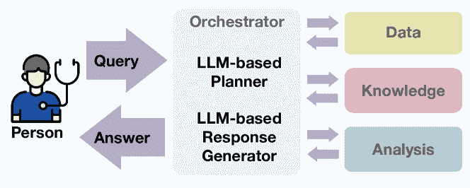

<!--yml

分类：未分类

日期：2025-01-11 12:53:34

-->

# 知识注入的LLM驱动的对话式健康助手：糖尿病患者的案例研究

> 来源：[https://arxiv.org/html/2402.10153/](https://arxiv.org/html/2402.10153/)

Mahyar Abbasian${}^{1}$, Zhongqi Yang${}^{1}$, Elahe Khatibi${}^{1}$, Pengfei Zhang${}^{1}$, Nitish Nagesh${}^{1}$,

Iman Azimi${}^{1}$, Ramesh Jain${}^{1}$, 和 Amir M. Rahmani${}^{1,2}$

${}^{1}$加利福尼亚大学欧文分校计算机科学系

${}^{2}$加利福尼亚大学欧文分校护理学院 {abbasiam, zhongqy4, ekhatibi, pengfz5, nnagesh1, azimii, rcjain, a.rahmani}@uci.edu

###### 摘要

对于糖尿病患者，有效的糖尿病管理对保持健康至关重要。大语言模型（LLMs）为糖尿病管理开辟了新途径，促进了其效果。然而，目前基于LLM的方法受限于其对通用来源的依赖，并且缺乏与领域特定知识的集成，导致生成的回答不准确。本文提出了一种知识注入的LLM驱动的对话式健康助手（CHA）用于糖尿病患者。我们定制并利用开源的openCHA框架，通过外部知识和分析能力增强我们的CHA。该集成涉及两个关键组件：1）整合美国糖尿病协会的饮食指南和Nutritionix的信息；2）部署分析工具，能够计算营养摄入量并与指南进行比较。我们将提出的CHA与GPT4进行比较。我们的评估包括100个与糖尿病相关的问题，涉及日常饮食选择以及评估建议饮食的潜在风险。我们的研究结果表明，提出的代理在生成响应以管理必要的营养素方面表现优越。

###### 索引词：

LLMs, 知识图谱, 糖尿病, 营养治疗, 健康助手。

## I 引言

有效的糖尿病管理在维持糖尿病患者的最佳健康状态中发挥着至关重要的作用。鉴于糖尿病的广泛流行及其对全球医疗基础设施和个人健康结果的重大影响，强有力的管理策略的可用性和利用至关重要[[1](https://arxiv.org/html/2402.10153v2#bib.bib1), [2](https://arxiv.org/html/2402.10153v2#bib.bib2), [3](https://arxiv.org/html/2402.10153v2#bib.bib3)]。此类服务需要采用综合方法，整合健康的生活方式、营养饮食和体育活动评估[[4](https://arxiv.org/html/2402.10153v2#bib.bib4)]。特别是，饮食调控是一个关键方面，直接影响血糖水平的控制，并且对疾病的进展产生影响[[5](https://arxiv.org/html/2402.10153v2#bib.bib5), [6](https://arxiv.org/html/2402.10153v2#bib.bib6)]。近年来，先进技术，特别是大型语言模型（LLMs）的迅猛发展，显著提升了糖尿病管理的可及性和效果，成为变革性的教育和辅助工具，使患者能够获得全面的知识，并弥补糖尿病自我管理中的知识空白[[7](https://arxiv.org/html/2402.10153v2#bib.bib7), [8](https://arxiv.org/html/2402.10153v2#bib.bib8), [9](https://arxiv.org/html/2402.10153v2#bib.bib9)]。

最近的研究调查了大型语言模型（LLMs）在糖尿病管理中的应用[[7](https://arxiv.org/html/2402.10153v2#bib.bib7), [8](https://arxiv.org/html/2402.10153v2#bib.bib8), [9](https://arxiv.org/html/2402.10153v2#bib.bib9)]。例如，[[7](https://arxiv.org/html/2402.10153v2#bib.bib7)]评估了使用ChatGPT进行糖尿病自我管理和教育的效果。他们利用ChatGPT回答了一系列糖尿病自我管理问题，涵盖了四个领域：饮食/运动、血糖水平教育、胰岛素存储和使用。ChatGPT回应了这些询问，展示了结构化的回答风格，并提供了易于理解的指导，适合普通人。然而，在一些特定情境下，比如制定饮食计划时，它仍然需要额外的提示才能全面生成如胰岛素使用等任务的指导。此外，杨等人[[8](https://arxiv.org/html/2402.10153v2#bib.bib8)]引入了ChatGLM来提供糖尿病治疗策略。该模型通过P-tuning[[10](https://arxiv.org/html/2402.10153v2#bib.bib10)]和LoRA[[11](https://arxiv.org/html/2402.10153v2#bib.bib11)]技术，对糖尿病患者的电子健康记录（EHR）进行了微调。ChatGLM在为大多数病例生成治疗建议方面表现出色。然而，它对特定数据的依赖可能会导致误导性的输出，在缺乏某些重要的外部糖尿病知识的情况下，可能会带来潜在的危害。

与经过验证的领域特定知识的缺乏集成，突显了现有方法中的一个重大缺口，影响了其输出的准确性和可靠性。与依赖于特定知识库的系统不同，现有的基于LLM的方法由于依赖的是通用信息来源，而非针对糖尿病的专门化知识，因此存在局限性。例如，ChatGPT基于通用数据库，而非医学专门验证的数据库，这可能导致其在把握医学细微差别方面的不足。此外，由于模型无法验证其信息的可靠性，它们可能会产生“幻觉”，生成不准确的响应，但这些响应往往表现得令人信服且流畅。这一问题可能会轻易误导缺乏相关知识的个体[[7](https://arxiv.org/html/2402.10153v2#bib.bib7)]。

图1：openCHA框架的概述[[12](https://arxiv.org/html/2402.10153v2#bib.bib12)]。

我们认为，将外部知识库与大语言模型（LLM）集成，能够通过增强模型访问可靠信息的能力，提供一个应对当前挑战的有力解决方案。为实现这一目标，对话健康代理（CHA）可以发挥重要作用[[13](https://arxiv.org/html/2402.10153v2#bib.bib13)]。CHA是提供医疗服务的对话系统，如辅助和诊断，利用代理作为决策核心。openCHA [[12](https://arxiv.org/html/2402.10153v2#bib.bib12)]是一个开源的CHA框架，通过其熟练集成多种外部资源，提供了一个灵活的框架，用于基于LLM的糖尿病管理。openCHA具有将知识集成并注入聊天机器人的能力，同时还能整合外部分析方法进行数据分析。图[1](https://arxiv.org/html/2402.10153v2#S1.F1 "Figure 1 ‣ I Introduction ‣ Knowledge-Infused LLM-Powered Conversational Health Agent: A Case Study for Diabetes Patients")展示了这一集成过程的概述，在这个过程中，一个由LLM驱动的规划器和LLM驱动的响应生成器组成的协调器，与各种来源互动，收集所需的信息。然后，收集的信息用于构建对用户查询的响应。

本文提出了一种基于知识的糖尿病管理系统，借助LLM支持的CHA实现。我们通过将外部知识——包括美国糖尿病协会报告中的饮食指南和Nutritionix知识库中的营养数据——整合到LLM中，定制了开源的openCHA框架用于饮食评估。我们还结合了一个分析工具，用以精确计算每日总营养摄入量，并与指南进行比较。我们使用与GPT4对比的真实世界糖尿病相关问题，评估该方法，重点关注日常饮食的推荐。

## II 方法

我们开发了一个基于LLM的CHA，旨在评估每日食物摄入量与推荐营养阈值相关的风险。我们利用openCHA [[12](https://arxiv.org/html/2402.10153v2#bib.bib12)]作为开发的基础框架。该CHA旨在与糖尿病用户互动，获取他们的每日食物摄入信息，并通过对话形式使用食物知识库和指南，以更可靠的方式回答用户。

我们提出的CHA包含三个主要部分：界面、协调器和外部资源（见图[2](https://arxiv.org/html/2402.10153v2#S2.F2 "图 2 ‣ II 方法 ‣ 知识驱动的LLM支持健康对话代理：以糖尿病患者为例")）。界面作为用户与我们框架之间的连接点，通过网页聊天界面促进文本互动，并将用户查询转发给协调器。

图 2：基于LLM的糖尿病管理CHA，由openCHA框架支持。

协调器作为CHA的核心组件，负责解决问题、规划、执行行动并根据用户查询生成适当的回应。它基于感知循环模型[[14](https://arxiv.org/html/2402.10153v2#bib.bib14)]的原理，涉及感知、转化和分析世界（即输入查询和元数据）。它与外部资源交互，获取信息，执行数据集成并提取洞察。协调器由四个主要组件组成：1) 任务规划器：执行决策和规划，2) 任务执行器：实现动作和数据转换，3) 数据管道：作为获取的元数据和中间数据的存储库，4) 响应生成器：提炼信息并提供最终回应。对于协调器的设置，我们使用OpenAI的[[15](https://arxiv.org/html/2402.10153v2#bib.bib15)] GPT-3.5-turbo模型作为基础LLM，并使用思维树[[16](https://arxiv.org/html/2402.10153v2#bib.bib16)]提示技术进行规划。

外部来源对于从各种来源获取有价值的信息至关重要。通过openCHA框架 [[12](https://arxiv.org/html/2402.10153v2#bib.bib12)]，我们将两个主要的外部来源整合到CHA中：1) 知识库和 2) AI和分析模型（见图[2](https://arxiv.org/html/2402.10153v2#S2.F2 "图2 ‣ II方法 ‣ 知识增强的LLM驱动的健康对话代理：糖尿病患者案例研究")）。

知识库：用于从可信来源获取当前的医疗保健信息。我们开发了一个任务，专注于从Nutritionix检索各种食物的营养信息，从而提高回答的时效性。该任务将食物查询作为输入，并使用NutritioniX API [[17](https://arxiv.org/html/2402.10153v2#bib.bib17)] 检索包含其相应营养信息的食物列表，基于标准测量。这是通过利用API的自然语言营养特性来实现的，该特性允许解析自然语言请求，并返回常见食物的详细营养信息。

AI和分析模型：提供数据分析，帮助提取洞察和关联。这在复杂的医疗保健背景中尤其有价值，在这些背景下，LLM可能无法有效处理密集的计算。我们开发了一个任务，专注于将每日食物风险评估纳入openCHA框架 [[12](https://arxiv.org/html/2402.10153v2#bib.bib12)]。该任务遵循已建立的每日营养摄入指南，执行食物风险评估。该任务还利用从NutritioniX提取的知识，使用开发的知识库任务。该算法通过将提取的营养数据与糖尿病患者的推荐阈值进行比较，评估与食物摄入相关的潜在风险，考虑因素如碳水化合物含量、糖分水平、蛋白质含量和膳食纤维。

图3：一个示例问题以及来自提议的CHA和GPT4的回答。绿色文本表示将识别的风险与真实数据匹配，红色文本表示不匹配。

风险评估算法的阈值是根据医学协会对营养摄入的普遍认可和接受的标准选择的。根据美国糖尿病协会的报告[[18](https://arxiv.org/html/2402.10153v2#bib.bib18)]，患有2型糖尿病的个体应每天摄入20至35克（g）的来自生蔬菜和未加工谷物的纤维，并将钠的摄入量限制在每天2300毫克（mg）以内，这些建议与普通人群的建议一致。尽管对于碳水化合物摄入量没有统一的推荐范围，但根据[[19](https://arxiv.org/html/2402.10153v2#bib.bib19)]，美国的1型和2型糖尿病患者大约有45%的总能量摄入来自碳水化合物。虽然目前没有确凿的证据表明某个特定范围的蛋白质摄入有助于血糖控制，但根据美国糖尿病协会（ADA）的护理标准[[18](https://arxiv.org/html/2402.10153v2#bib.bib18)]，我们将蛋白质的摄入量设定为总热量的15-20%。根据[[20](https://arxiv.org/html/2402.10153v2#bib.bib20)，[21](https://arxiv.org/html/2402.10153v2#bib.bib21)]的建议，脂肪的推荐摄入量为总热量的20-35%，而饱和脂肪最好限制在总热量的10%以下[[22](https://arxiv.org/html/2402.10153v2#bib.bib22)]。根据美国心脏协会（AHA）指南[[23](https://arxiv.org/html/2402.10153v2#bib.bib23)]，我们对糖的摄入量进行了严格限制，因为糖对糖尿病有负面影响，最大摄入量为6茶匙或25克糖。

## III 结果

表I：一个问题的样本评估。

|  | 碳水化合物 | 脂肪 | 饱和脂肪 | 蛋白质 | 钠 | 糖 | 膳食纤维 |
| --- | --- | --- | --- | --- | --- | --- | --- |
| 真实值 | R | R | NR | R | NR | R | NR |
| 提议的 CHA | R | R | NR | R | NR | R | NR |
| GPT4 | R | NR | NR | NR | NR | R | NR |
| R=有风险, NR=无风险 |

在本节中，我们评估了我们提出的CHA在评估糖尿病患者与食物相关的风险方面的有效性。我们的目标是确定CHA在评估每日食物摄入风险时的能力，尤其是当营养成分偏离推荐范围时。我们将我们的CHA（具备全面的食品知识和分析能力）与OpenAI的GPT4模型[[15](https://arxiv.org/html/2402.10153v2#bib.bib15)]的表现进行比较。

我们收集了100个与个人日常饮食摄入相关的样本问题。对于真实情况，我们手动提取每个问题的营养数据，并计算出各个参数的整体营养值，如脂肪、饱和脂肪、蛋白质、碳水化合物、钠、糖分和膳食纤维。随后，我们评估这些营养素与既定指南的一致性。如果任何营养素超出了推荐范围，我们将其归类为“风险”类，而在范围内的则标记为“非风险”类。最终，我们生成一个100行7列的表格（作为我们的真实情况），表示每个营养素的风险或非风险。

这些问题被提出给我们的CHA和GPT4 [[15](https://arxiv.org/html/2402.10153v2#bib.bib15)]，以便将它们的回答与真实情况进行比较。图[3](https://arxiv.org/html/2402.10153v2#S2.F3 "图3 ‣ II 方法 ‣ 知识注入的LLM驱动的健康对话代理：糖尿病患者的案例研究")提供了一个问题及其对应的CHA和GPT4的回答实例。绿色文本突出显示了模型基于真实情况准确识别特定营养素风险的部分，而红色文本则指出了聊天机器人错误评估相应营养素风险的实例。表[I](https://arxiv.org/html/2402.10153v2#S3.T1 "表I ‣ III 结果 ‣ 知识注入的LLM驱动的健康对话代理：糖尿病患者的案例研究")展示了真实情况值，并总结了两个聊天机器人对每个营养素的评估。

类似地，我们对每一组100个问题重复此过程，然后将正确识别风险的数量与真实情况进行比较。对于GPT4，我们制定了一个定制的提示，指导GPT4估算所提到食物的营养信息，并评估其与推荐指南和规则的一致性。

表 II：100个样本问题的风险评估准确度。

|  | 碳水化合物 | 脂肪 | 饱和脂肪 | 蛋白质 | 钠 | 糖分 | 膳食纤维 |
| --- | --- | --- | --- | --- | --- | --- | --- |
| GPT4 | 49% | 52% | 68% | 17% | 73% | 58% | 46% |
| 提议的CHA | 84% | 94% | 99% | 90% | 95% | 91% | 92% |

表格[II](https://arxiv.org/html/2402.10153v2#S3.T2 "TABLE II ‣ III Results ‣ Knowledge-Infused LLM-Powered Conversational Health Agent: A Case Study for Diabetes Patients")显示了GPT4和提议的CHA对100个问题的回答。我们的CHA在所有七种营养素上都优于GPT4。这表明将指南、知识库（如NutritioniX）和分析工具纳入LLMs在健康管理任务中的重要性。值得注意的是，在某些情况下，提议的CHA的营养计算与现有指南非常接近，导致在某些情况下出现较高的误差率。例如，手动计算时，碳水化合物的含量为44%，在推荐的45%以下范围内，而我们的CHA计算结果为45%。这可能是由于份量大小的微小差异或对小数的四舍五入。

## IV 讨论

提出的CHA为将LLMs与外部健康数据源、知识库和分析工具集成提供了极大的灵活性。这种灵活性为减轻幻觉问题提供了机会，同时增强了CHA的个性化和可靠性。例如，它允许将食物相关的知识图谱、个人健康生物标志物、个人人口统计数据和食物偏好等多种元素纳入现有的CHA框架，从而实现更加精细和量身定制的推荐。

此外，这一发展还强调了对可解释性的高度关注。它使用户能够查询生成回答时涉及的任务和行动序列。例如，当用户寻求特定食物营养成分、数据来源或风险计算方法的信息时，我们的CHA可以提供对相关任务的见解并展示结果（与现有最先进的聊天机器人不同）。这种透明度的提升增强了CHA的可信度，促进了用户对回答的信任。

## V 结论

在本文中，我们提出了一种基于LLM的CHA用于糖尿病管理，该系统由知识注入的LLMs驱动。为实现这一目标，我们利用了openCHA进行开发。我们开发了一个营养信息检索任务，将Nutritionix知识库集成到CHA中。此外，我们还开发了基于美国糖尿病协会饮食指南的食物风险评估工具。我们评估了我们提出的CHA与GPT4在糖尿病个体的食物相关风险方面的效果。我们的研究结果表明，提出的CHA在回应关于每日餐食选择的100个糖尿病相关问题时优于通用的GPT4。这一进展突显了LLM驱动的对话代理在改善糖尿病管理的可及性和效果方面的潜力，解决了糖尿病患者健康管理中的关键问题。

## 参考文献

+   [1] J. U. Poulsen 等人，"一种帮助患者实现优化血糖控制的糖尿病管理系统：从监控到建议"，收录于2010年IEEE医学与生物学工程国际年会，第5270-5271页，IEEE，2010年。

+   [2] L. Mertz，"自动胰岛素输送：消除糖尿病管理中的猜测"，《IEEE Pulse》，第9卷，第1期，第8-9页，2018年。

+   [3] H. A. Klein 等人，"药物和糖尿病自我管理：认知控制"，《IEEE系统、人类与控制论杂志A部分：系统与人类》，第34卷，第6期，第718-725页，2004年。

+   [4] G. Fico 等人，"在糖尿病管理的ICT平台中集成个性化健康路径：一项小规模探索性研究"，《IEEE生物医学与健康信息学杂志》，第20卷，第1期，第29-38页，2014年。

+   [5] I. Shalahuddin 等人，"通过饮食管理调节2型糖尿病患者的血糖水平"，《Aisyah期刊：健康科学期刊》，2022年。

+   [6] W. Russell 等人，"血糖水平的营养管理"，《营养与代谢年鉴》，第63卷，第1339-1340页，2013年。

+   [7] G. G. R. Sng 等人，"ChatGPT和自然语言人工智能模型在糖尿病教育中的潜力与陷阱"，《糖尿病护理》，第46卷，第5期，第e103-e105页，2023年。

+   [8] H. Yang 等人，"探索大型语言模型在个性化糖尿病治疗策略中的潜力"，medRxiv，2023年6月，2023。

+   [9] H. Sun 等人，"基于大型语言与图像识别模型的2型糖尿病管理AI营养师：前临床概念验证研究"，《医学互联网研究杂志》，第25卷，e51300，2023年。

+   [10] X. Liu 等人，"P-tuning：提示调优可与跨尺度和任务的微调相媲美"，收录于第60届计算语言学协会年会论文集（第2卷：短篇论文），第61-68页，2022年。

+   [11] E. J. Hu 等人，"Lora：大型语言模型的低秩适应"，arXiv 预印本 arXiv:2106.09685，2021年。

+   [12] M. Abbasian 等人，"对话式健康代理：一种个性化的基于大型语言模型的代理框架"，arXiv 预印本 arXiv:2310.02374，2023。

+   [13] Y. Li 等人，"个性化大型语言模型代理：关于能力、效率和安全性的洞察与调查"，arXiv 预印本 arXiv:2401.05459，2024年。

+   [14] U. Neisser，"感知、预期与想象"，收录于《感知与认知：心理学基础问题》，明尼苏达大学出版社，明尼阿波利斯，1978年。

+   [15] OpenAI，"ChatGPT：OpenAI的对话式AI模型。" [https://openai.com/chatgpt](https://openai.com/chatgpt)，访问时间：2024年1月。

+   [16] S. Yao 等人，"思维树：使用大型语言模型进行深思熟虑的问题解决"，arXiv 预印本 arXiv:2305.10601，2023年。

+   [17] Syndigo公司，"Nutritionx：世界上最大的经过验证的营养数据库。" [https://www.nutritionix.com/](https://www.nutritionix.com/)。

+   [18] “5. 生活方式管理：2019年糖尿病医疗护理标准，”《糖尿病护理》，第42卷，第S46–S60页，2019年1月。

+   [19] A. Gray 和 R. J. Threlkeld, “糖尿病患者的营养建议，”《糖尿病学杂志》，第54卷，2019年10月。

+   [20] B. E. Millen 等人, “2013年美国心脏协会/美国心脏病学院关于减少心血管风险的生活方式管理指南：注册营养师的实践机会，”《营养与饮食学会杂志》，第114卷，第1723–1729页，2014年11月。

+   [21] J. K. Snell-Bergeon 等人, “1型糖尿病成人食用高脂肪、动脉硬化饮食，这与冠状动脉钙化相关，”《糖尿病学杂志》，第52卷，第801页，2009年5月。

+   [22] L. Van Horn 等人, “预防和治疗心血管疾病的饮食证据，”《美国营养学会杂志》，第108卷，第287–331页，2008年2月。

+   [23] R. K. Johnson 等人, “美国心脏协会营养委员会（隶属于营养、体育活动与代谢委员会）及流行病学与预防委员会。饮食糖分摄入与心血管健康：美国心脏协会的科学声明，”2009年。
