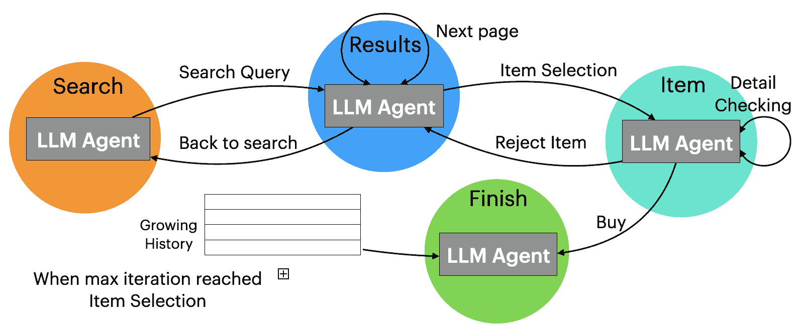
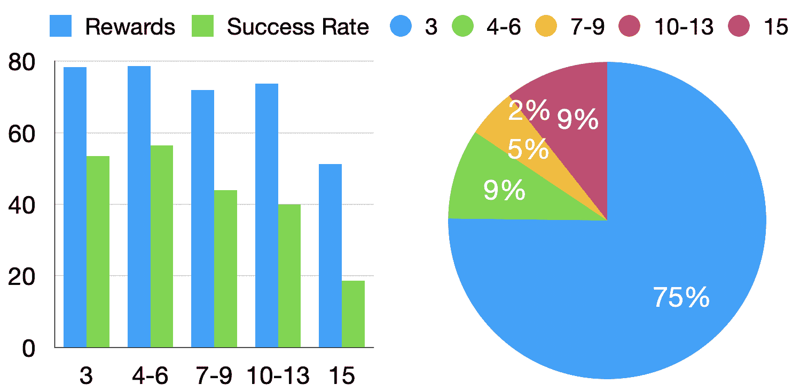
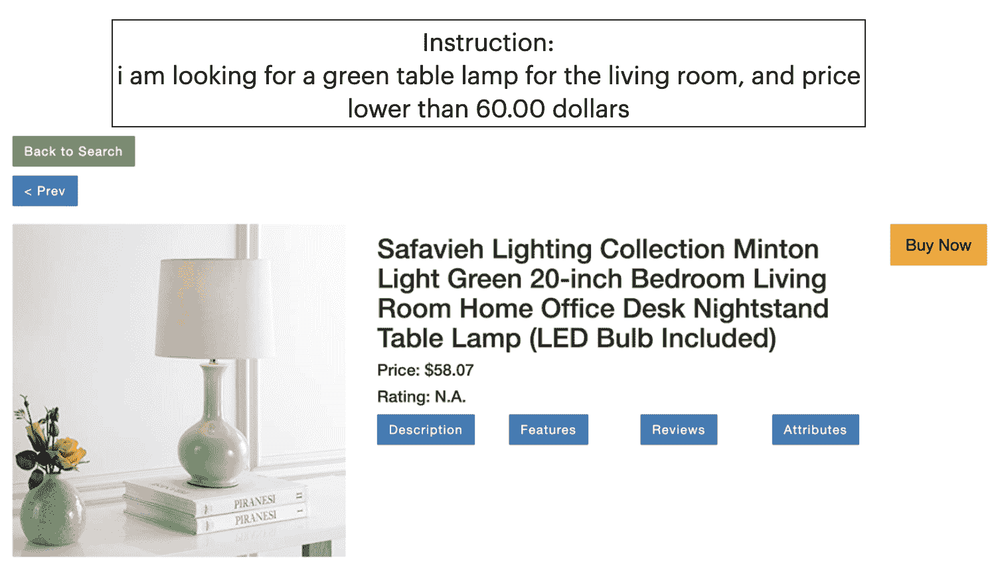
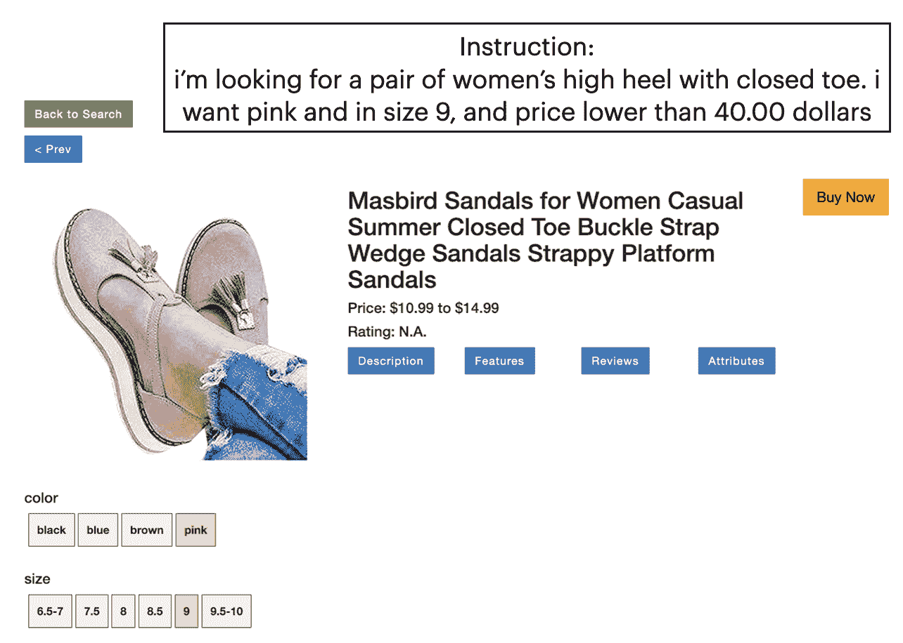

<!--yml

category: 未分类

日期：2025-01-11 13:06:59

-->

# LASER: 基于状态空间探索的网页导航大语言模型代理

> 来源：[https://arxiv.org/html/2309.08172/](https://arxiv.org/html/2309.08172/)

马凯欣  张宏铭  王宏伟  潘晓曼  于文昊  余东

腾讯AI实验室，美国华盛顿贝尔维尤

{kaixinma,hongmingzhang,hongweiw,xiaomanpan,wenhaowyu,dyu@global.tencent.com}

###### 摘要

大语言模型（LLMs）已成功适应于诸如网页导航等互动决策任务。尽管取得了不错的表现，之前的方法隐式假设模型仅采用前向执行模式，在这种模式下，它们只提供像上下文示例中的预设轨迹作为指导，帮助模型理解如何在环境中进行推理。因此，模型无法处理更具挑战性的场景，尤其是那些未在上下文示例中覆盖的场景，如错误，导致性能不理想。为了解决这个问题，我们提出将互动任务建模为状态空间探索，在该模型中，LLM代理通过执行一系列预定义的动作来在一组状态之间转移，以完成任务。这种建模方式支持灵活的回溯，允许模型轻松从错误中恢复。我们在WebShop任务和[amazon.com](amazon.com)上评估了我们提出的基于状态空间探索的LLM代理（LASER）。实验结果表明，LASER显著优于之前的方法，并缩小了与人类在网页导航任务上的性能差距。

## 1 引言

大型语言模型（LLMs），例如 GPT-4 OpenAI ([2023](https://arxiv.org/html/2309.08172v2#bib.bib18))，在广泛的自然语言理解（NLU）任务上取得了显著的表现 Brown 等人 ([2020](https://arxiv.org/html/2309.08172v2#bib.bib1)); Ouyang 等人 ([2022](https://arxiv.org/html/2309.08172v2#bib.bib19)); Wei 等人 ([2022](https://arxiv.org/html/2309.08172v2#bib.bib23))。最近，它们已被应用于交互式决策任务，例如虚拟家居导航 Yang 等人 ([2023](https://arxiv.org/html/2309.08172v2#bib.bib24))、基于文本的游戏 Lin 等人 ([2023](https://arxiv.org/html/2309.08172v2#bib.bib13)) 或网络导航 Yao 等人 ([2023](https://arxiv.org/html/2309.08172v2#bib.bib26)); Zhou 等人 ([2024](https://arxiv.org/html/2309.08172v2#bib.bib30))。以往利用 LLMs 解决交互任务的方法通常隐式假设模型采用仅向前执行模式，在这种模式下，它们只提供少量的 oracle 轨迹作为上下文示例，以教导模型如何逐步推理 Yao 等人 ([2023](https://arxiv.org/html/2309.08172v2#bib.bib26)); Lo 等人 ([2023](https://arxiv.org/html/2309.08172v2#bib.bib15))。换句话说，在这些 oracle 轨迹中，每一步都会选择正确的动作。这可能导致次优的表现，因为当模型在测试时犯下意外错误时，它将不知道如何从中恢复。同时，包含许多上下文示例以涵盖所有可能的场景是昂贵的或不切实际的。此外，之前的方法假设了一个全局动作空间，其中模型可以在任何步骤自由采取任何动作，因为它们要么在提示的开头定义了可能的动作，要么期望 LLM 从上下文示例中自动推断出可能的动作。这可能进一步增加任务的难度，且 LLM 在某些情况下可能执行无效的动作。

图1：LASER 在 Webshop 任务中的状态转换图。实心圆表示状态，箭头表示可能的状态转换。这种形式化方法使得灵活的回溯成为可能，并缓解了仅向前示例的局限，允许模型更好地处理不熟悉的场景并从错误中恢复。

为了解决前述问题，我们提出将交互任务建模为状态空间探索。我们首先定义一组LLM代理在任务执行过程中可能遇到的高层次状态。然后，我们识别每个状态中的可能动作空间以及执行每个动作后的结果状态。这种表述有效地将LLM代理在交互任务中的探索转化为状态转移，其中每个动作将代理从一个状态带到另一个状态。自然地，这使得代理能够轻松从错误的动作中恢复：采取另一个动作将其带回到先前的状态。此外，我们提出的表述将动作空间与每个独立的状态关联起来，从而降低任务的难度，并允许代理在任何步骤中始终选择有效的动作。我们在Webshop Yao等人（[2022](https://arxiv.org/html/2309.08172v2#bib.bib25)）任务上评估了我们提出的LASER，并进行了模拟到真实的转移实验，我们直接将LASER应用于[amazon.com](amazon.com)。我们展示了我们提出的设置使得代理能够在不使用上下文示例的情况下完成复杂的用户指令，并且LASER显著优于所有先前的基准，并缩小了与人类表现的差距。

## 2 方法

### 2.1 问题表述

给定一个网络环境$\mathbf{E}$和用户指令$\mathbf{I}$，代理被实例化在该环境中并提供初始观察$\mathbf{O_{0}}$。代理需要执行一系列动作{$a_{0}$, $a_{1}$, …$a_{n}$}来完成用户指令，其中每个$a_{i}$在环境中执行时会产生一个新的观察$\mathbf{O_{i}}$。$S$表示停止状态，当代理到达该状态时，会产生输出并停止探索。最后，代理的输出与目标进行比较以计算指标。

### 2.2 LLM代理

如前所述，我们希望智能体能够处理在执行过程中可能出现的任何新情况或错误，而不需要通过大量的上下文示例来详尽描述这些情况。因此，我们提议为LLM智能体配备状态跟踪能力。我们智能体的状态转换示意图见[图1](https://arxiv.org/html/2309.08172v2#S1.F1 "图1 ‣ 1 引言 ‣ LASER：具有状态空间探索的LLM智能体用于网页导航")。我们从定义智能体在环境中可能遇到的一组高层状态开始（§[2.3](https://arxiv.org/html/2309.08172v2#S2.SS3 "2.3 状态描述 ‣ 2 方法 ‣ LASER：具有状态空间探索的LLM智能体用于网页导航")）。LLM智能体将用户输入作为整体目标，并在初始状态下进行初始化。在每一步中，智能体接收状态特定的系统指令、当前观察、当前状态下可执行的动作集合以及过去思想和动作的历史作为输入。然后，智能体从中选择一个动作作为输出，该动作要么将智能体转移到不同的状态，要么保持在当前状态（§[2.4](https://arxiv.org/html/2309.08172v2#S2.SS4 "2.4 动作空间 ‣ 2 方法 ‣ LASER：具有状态空间探索的LLM智能体用于网页导航")）。智能体重复这个过程，直到达到停止状态或最大步数。

请注意，通过我们的公式化方法，我们可以提供详细的指令，告知智能体每个状态下可能出现的情况及如何处理它们。例如，如[图1](https://arxiv.org/html/2309.08172v2#S1.F1 "图1 ‣ 1 引言 ‣ LASER：具有状态空间探索的LLM智能体用于网页导航")所示，在结果状态下，当前的结果可能足够好，也可能不足够好，我们会指示智能体根据判断选择一个项目、进入下一页或返回搜索。因此，这些指令可以为智能体提供非常有用的信息，引导其行动，同时比上下文示例更为高效。接下来，我们将详细描述我们如何设计状态和动作空间。

### 2.3 状态描述

在我们的工作中，我们使用“状态”这个术语来描述智能体所处的当前环境，我们认为只有当当前环境观察的结构不同，智能体才处于不同的状态。这使得我们能够仅定义少数几个状态，以充分支持智能体在复杂环境中的探索。

在手动分类所有可能的交互任务状态后，对于每个状态，我们编写了一条通用指令，详细描述该状态。具体来说，我们提供了该状态下代理可能接收到的观察布局样本，并将布局中的所有规格替换为占位符。我们还提供了一个高层次的目标和详细的指令，用于在该状态下采取行动。布局样本与特定状态的指令相结合，使我们能够告知代理它可能接收到的观察内容以及如何相应地采取行动。因此，我们不再需要提供上下文示例来指导代理。在WebShop任务中，我们定义了四个状态，搜索、结果和项目状态的完整提示可以在附录中的[表4](https://arxiv.org/html/2309.08172v2#A4.T4 "Table 4 ‣ Appendix D Prompts used in our experiments ‣ LASER: LLM Agent with State-Space Exploration for Web Navigation")、[表5](https://arxiv.org/html/2309.08172v2#A4.T5 "Table 5 ‣ Appendix D Prompts used in our experiments ‣ LASER: LLM Agent with State-Space Exploration for Web Navigation")和[表6](https://arxiv.org/html/2309.08172v2#A4.T6 "Table 6 ‣ Appendix D Prompts used in our experiments ‣ LASER: LLM Agent with State-Space Exploration for Web Navigation")中找到。

### 2.4 动作空间

以往的方法通常隐含地假设模型有一个全局动作空间，即模型可以自由地采取任何动作而不受进一步的约束。尽管LLM通常能够找出有效的动作，但在某些情况下，它仍然可能尝试采取无效的动作。因此，在定义了任务的所有可能状态后，我们进一步为每个状态识别动作空间，以排除这种可能性。具体来说，我们为每个状态定义了一组代理可以选择的允许动作，这确保了代理始终执行有效的动作。我们代理的状态-动作映射可以在附录中的[脚注3](https://arxiv.org/html/2309.08172v2#footnote3 "footnote 3 ‣ Table 8 ‣ Appendix D Prompts used in our experiments ‣ LASER: LLM Agent with State-Space Exploration for Web Navigation")中找到。在实际操作中，允许的动作也可以通过启发式方法来确定，例如，识别网页上所有可点击的按钮。

受 ReAct 方法的启发，Yao 等人 ([2023](https://arxiv.org/html/2309.08172v2#bib.bib26))，我们也要求智能体在每一步生成一个思考，然后根据这个思考选择一个行动。智能体不断重复思考与行动的过程，直到达到停止状态或达到最大步数。我们还定义了一个记忆缓冲区来存储探索过程中的中间结果（即被检查但认为不匹配的项目）。这类似于人类行为，因为人们通常会在找到所需项目之前先找到一些备选项。当智能体在达到最大步数后被迫停止时，它从中间结果中选择一个作为最终输出，我们称之为备份策略。

|  | 成功率 | 奖励 |
| --- | --- | --- |
| ASH Lo 等人 ([2023](https://arxiv.org/html/2309.08172v2#bib.bib15)) | 30.2 | 56.7 |
| ReAct Yao 等人 ([2023](https://arxiv.org/html/2309.08172v2#bib.bib26)) * | 40.0 | 66.6 |
| ReAct（我们的重跑） | 34.0 | 59.7 |
| WebGUM Furuta 等人 ([2023](https://arxiv.org/html/2309.08172v2#bib.bib5)) | 45.0 | 67.5 |
| LASER - 备份 | 48.4 | 71.2 |
| LASER | 50.0 | 75.6 |
| 人类专家 Yao 等人 ([2022](https://arxiv.org/html/2309.08172v2#bib.bib25)) | 59.6 | 82.1 |

表 1：WebShop 任务的结果。*简化设置

## 3 个实验

我们在WebShop任务上进行实验，参考了Yao等人（[2022](https://arxiv.org/html/2309.08172v2#bib.bib25)）的工作。我们使用了500条测试集指令进行评估，并采用奖励和成功率作为度量指标，延续了Yao等人（[2022](https://arxiv.org/html/2309.08172v2#bib.bib25)）的做法。我们使用GPT-4-0613支持LASER及其函数调用能力来实现动作选择步骤。我们与以下基准方法进行了比较：ReAct，Yao等人（[2023](https://arxiv.org/html/2309.08172v2#bib.bib26)）提出的一种用于互动决策任务的提示方法。在每一步中，LLM智能体接收观察结果，并可以选择产生思考或动作。智能体将所有的历史观察、思考和动作存储在其提示中，使用完整的探索轨迹作为上下文示例。原始的ReAct使用PaLM，Chowdhery等人（[2023](https://arxiv.org/html/2309.08172v2#bib.bib2)）作为其LLM骨干网络。为了进行公平比较，我们还重新运行了基于GPT-4-0613的ReAct方法。ASH，Lo等人（[2023](https://arxiv.org/html/2309.08172v2#bib.bib15)）在ReAct基础上进行了扩展，并增加了一个总结步骤，浓缩智能体的观察信息，并基于浓缩后的信息采取行动。WebGUM，Furuta等人（[2023](https://arxiv.org/html/2309.08172v2#bib.bib5)）是一种监督学习方法，针对WebShop任务提供的1K人类演示数据，对FlanT5-XL模型进行微调，Chung等人（[2022](https://arxiv.org/html/2309.08172v2#bib.bib3)）提供了相关数据。此外，我们还进行了模拟到实际转移实验，直接将LASER应用于[amazon.com](amazon.com)，未作任何修改。我们遵循Yao等人（[2022](https://arxiv.org/html/2309.08172v2#bib.bib25)）的相同设置，并在100条测试集指令上进行了评估，然后手动评估结果。更详细的实验设置请参见[附录B](https://arxiv.org/html/2309.08172v2#A2 "附录B 实验细节 ‣ LASER: 具有状态空间探索的LLM智能体用于Web导航")。

|  | SR | 奖励 | 注意力 | 最优 | 类型 |
| --- | --- | --- | --- | --- | --- |
| LASER | 62.0 | 85.4 | 85.5 | 75.0 | 97.0 |
| 人类 Yao等人（[2022](https://arxiv.org/html/2309.08172v2#bib.bib25)） | 65.0 | 88.2 | 86.2 | 76.3 | 99.0 |

表2：Amazon.com上的实验结果。

|  | 成功率 | 奖励 |
| --- | --- | --- |
| LASER | 52.0 | 77.6 |
| LASER + 单次示例 | 50.0 | 74.9 |
| LASER - 函数调用 | 50.0 | 76.2 |
| LASER (text-davinci-003) | 38.5 | 70.2 |

表3：WebShop任务的消融实验结果。标准LASER由GPT-4支持，采用零-shot方法。

## 4 结果

我们实验的整体结果显示在[表1](https://arxiv.org/html/2309.08172v2#S2.T1 "Table 1 ‣ 2.4 Action Space ‣ 2 Methods ‣ LASER: LLM Agent with State-Space Exploration for Web Navigation")中。我们早期的实验表明，ReAct智能体经常产生无效的动作。例如，当它选择一个与指令不匹配的项目时，它会尝试点击“下一页”按钮（该按钮不存在），然后才返回结果页面。此外，ReAct智能体经常陷入某个动作中，无法产生输出。例如，智能体会一直跳到下一页，直到达到最大步数。我们添加了详细的指令作为系统提示，以尝试解决这一问题。尽管我们付出了最大努力，智能体在某些情况下仍然会做出无效的动作，且结果比原文中的实验更差。另一方面，LASER在两个指标上都远远超越了基准模型，显示了我们方法的有效性。我们进一步移除了LASER的备份策略（即当最大预算耗尽时，智能体会收到0分），以便与ReAct进行更公平的比较。我们看到我们的方法依然在很大程度上超越了基准模型。来自迁移实验的结果显示在[表2](https://arxiv.org/html/2309.08172v2#S3.T2 "Table 2 ‣ 3 Experiments ‣ LASER: LLM Agent with State-Space Exploration for Web Navigation")中。同样，LASER与人类表现非常接近。令人鼓舞的是，LASER在这个真实环境中的表现甚至优于WebShop，这很可能是由于[amazon.com](amazon.com)上更强大的搜索引擎。

### 4.1 分析

我们首先进行消融实验，以了解我们智能体设计中的重要决策。

零-shot与少-shot：我们仅使用状态特定的指令来引导我们的智能体在环境中的探索，而以前的工作通常采用上下文示例。为了探讨智能体是否能从上下文示例中进一步受益，我们进行了一个一-shot实验：在LASER的每个提示中，我们在系统指令和当前输入之间添加了一个输入-输出对示例，其他部分保持不变。由于计算预算有限，我们只在200个指令上进行了消融实验。结果显示在[表3](https://arxiv.org/html/2309.08172v2#S3.T3 "Table 3 ‣ 3 Experiments ‣ LASER: LLM Agent with State-Space Exploration for Web Navigation")中。我们发现添加上下文示例实际上导致了更差的表现。由于LASER已经能够100%执行有效动作，我们推测智能体已经很好地理解了任务，而添加的示例在某些情况下实际上干扰了智能体。

图 2：左：LASER 在不同长度的测试集回合中的性能。右：LASER 完成任务所需的步骤数量分布

函数调用的影响 LASER 利用了仅在 2023 年 6 月 13 日后才为 GPT 模型启用的函数调用功能。因此，我们感兴趣的是将该设计替换为常规文本生成的影响。为此，我们不再将可执行操作作为函数列表传递，而是将每个操作转换为描述其目的和参数的 Python 字典，然后将它们附加到提示中。接着，我们要求 LLM 生成 JSON 格式的输出，以表示它选择的操作及其适当的参数。结果显示在[表 3](https://arxiv.org/html/2309.08172v2#S3.T3 "Table 3 ‣ 3 Experiments ‣ LASER: LLM Agent with State-Space Exploration for Web Navigation")中。同样，在这 200 个回合中，没有函数调用的代理表现略逊一筹。这表明，当构建交互式代理时，可以利用函数调用功能来提升性能，为未来 LLM 的构建提供了一个方向。

性能与轨迹长度 在这里，我们感兴趣的是查看 LASER 的轨迹长度及其对整体性能的影响。我们在[图 2](https://arxiv.org/html/2309.08172v2#S4.F2 "Figure 2 ‣ 4.1 Analysis ‣ 4 Results ‣ LASER: LLM Agent with State-Space Exploration for Web Navigation")中绘制了轨迹长度的分布，并展示了每个长度组别的代理性能。我们注意到，大多数情况下，代理仅用了三次状态转移就达到了结束状态，即搜索-选择-购买。从左侧图中可以看出，随着轨迹变长，代理的性能通常会下降。然而，与 ReAct 和 ASH 代理的观察结果相比，下降的幅度较小（Lo 等人，[2023](https://arxiv.org/html/2309.08172v2#bib.bib15)），这进一步证明了我们代理的有效性。最后，对于长度为 15 的组别，代理被迫停止并从浏览历史中选择，性能远低于其他组别。虽然这并不令人惊讶，但其成功率非零，表明在某些情况下，代理找到了匹配的项目，但在第一次检查时未能识别为目标。

向不同 LLM 的泛化 我们采用了 text-davinci-003 模型，看看 LASER 是否能够很好地迁移到一个较弱的非聊天模型上。由于该模型不支持函数调用，我们采用了前面描述的方法，提示模型生成 JSON 输出以表示操作。结果显示在 [表 3](https://arxiv.org/html/2309.08172v2#S3.T3 "表 3 ‣ 3 实验 ‣ LASER：具有状态空间探索的 LLM 代理用于网页导航") 中。尽管切换到 text-davinci-003 导致性能大幅下降，但我们的模型仍然比基准结果更好。这表明我们提出的代理可以轻松适应具有不同能力的其他 LLM。未来，随着更强大的模型的出现，我们的代理有可能在这一任务上超越人类表现。我们还进行了案例研究，以检查 LASER 的失败模式，附加结果见 [附录 C](https://arxiv.org/html/2309.08172v2#A3 "附录 C 案例研究 ‣ LASER：具有状态空间探索的 LLM 代理用于网页导航")。我们在 [附录 A](https://arxiv.org/html/2309.08172v2#A1 "附录 A 相关工作 ‣ LASER：具有状态空间探索的 LLM 代理用于网页导航") 中讨论了相关工作。

## 5 结论

我们提出了一种名为 LASER 的 LLM 代理，它将交互式网页导航任务建模为状态空间探索。我们的框架使得代理能够处理新颖的情况，轻松从错误中回溯，并始终执行有效的操作。在没有任何上下文示例的情况下，仅根据特定状态的指令进行引导，LASER 在 WebShop 任务上大幅超越所有基准，并缩小了与真实购物网站上人类表现的差距。我们的分析表明，LASER 对更长的轨迹也更具鲁棒性，并且能够很好地推广到其他 LLM。

## 局限性

在这项工作中，我们仅在购物领域的目标物品查找任务上进行了实验。尽管这一任务具有挑战性，但它并未涵盖用户通常在电子商务网站上执行的所有任务，例如跟踪订单或查看订单历史。未来的工作中，增强 LASER 的能力，使其能够处理购物领域中的这些常见任务，将是一个有趣的方向。此外，装备 LASER 更多工具，如知识检索器 Ma 等人（[2023](https://arxiv.org/html/2309.08172v2#bib.bib16)）或计算器 Gao 等人（[2023](https://arxiv.org/html/2309.08172v2#bib.bib6)），使其能够处理更复杂的指令，也将是一个有趣的方向。

我们的LASER需要手动标注环境中可能的状态及其对应的描述。因此，我们的方法可能仅适用于为特定领域（而非开放世界的网络代理）构建代理，在这些领域中，只需处理少数几种状态，例如电子商务或旅游预订。未来的发展方向，我们设想一个分层的多代理系统，其中每个特定领域都由类似LASER的代理进行管理，而一个通用的开放世界代理只需与其他领域代理协作来完成各种用户指令。

关于我们工作的潜在风险，我们认为在将LASER部署到现实场景之前，需要额外的谨慎和测试。在Webshop任务的实验中，由于其模拟特性，我们允许代理执行环境中允许的任何操作。然而，某些操作在现实世界中可能会带来难以恢复的后果。例如，在真实购物网站上点击购买按钮。因此，在实验中我们强制代理在决定购买物品时停止操作，尤其是在[amazon.com](amazon.com)上进行实验时。总的来说，由于LASER的成功率仍然远未完美，它可能需要在执行高风险操作之前进行额外的人类验证。

## 参考文献

+   Brown等人（2020年）Tom Brown、Benjamin Mann、Nick Ryder、Melanie Subbiah、Jared D Kaplan、Prafulla Dhariwal、Arvind Neelakantan、Pranav Shyam、Girish Sastry、Amanda Askell、Sandhini Agarwal、Ariel Herbert-Voss、Gretchen Krueger、Tom Henighan、Rewon Child、Aditya Ramesh、Daniel Ziegler、Jeffrey Wu、Clemens Winter、Chris Hesse、Mark Chen、Eric Sigler、Mateusz Litwin、Scott Gray、Benjamin Chess、Jack Clark、Christopher Berner、Sam McCandlish、Alec Radford、Ilya Sutskever 和 Dario Amodei。2020年。[语言模型是少样本学习者](https://proceedings.neurips.cc/paper_files/paper/2020/file/1457c0d6bfcb4967418bfb8ac142f64a-Paper.pdf)。发表于《神经信息处理系统进展》（*Advances in Neural Information Processing Systems*），第33卷，第1877–1901页。Curran Associates, Inc.

+   Chowdhery等人（2023）Aakanksha Chowdhery、Sharan Narang、Jacob Devlin、Maarten Bosma、Gaurav Mishra、Adam Roberts、Paul Barham、Hyung Won Chung、Charles Sutton、Sebastian Gehrmann、Parker Schuh、Kensen Shi、Sasha Tsvyashchenko、Joshua Maynez、Abhishek Rao、Parker Barnes、Yi Tay、Noam Shazeer、Vinodkumar Prabhakaran、Emily Reif、Nan Du、Ben Hutchinson、Reiner Pope、James Bradbury、Jacob Austin、Michael Isard、Guy Gur-Ari、Pengcheng Yin、Toju Duke、Anselm Levskaya、Sanjay Ghemawat、Sunipa Dev、Henryk Michalewski、Xavier Garcia、Vedant Misra、Kevin Robinson、Liam Fedus、Denny Zhou、Daphne Ippolito、David Luan、Hyeontaek Lim、Barret Zoph、Alexander Spiridonov、Ryan Sepassi、David Dohan、Shivani Agrawal、Mark Omernick、Andrew M. Dai、Thanumalayan Sankaranarayana Pillai、Marie Pellat、Aitor Lewkowycz、Erica Moreira、Rewon Child、Oleksandr Polozov、Katherine Lee、Zongwei Zhou、Xuezhi Wang、Brennan Saeta、Mark Diaz、Orhan Firat、Michele Catasta、Jason Wei、Kathy Meier-Hellstern、Douglas Eck、Jeff Dean、Slav Petrov和Noah Fiedel. 2023. [Palm：通过路径扩展语言建模](http://jmlr.org/papers/v24/22-1144.html)。发表于*机器学习研究期刊*，24(240):1–113。

+   Chung等人（2022）Hyung Won Chung、Le Hou、Shayne Longpre、Barret Zoph、Yi Tay、William Fedus、Yunxuan Li、Xuezhi Wang、Mostafa Dehghani、Siddhartha Brahma、Albert Webson、Shixiang Shane Gu、Zhuyun Dai、Mirac Suzgun、Xinyun Chen、Aakanksha Chowdhery、Alex Castro-Ros、Marie Pellat、Kevin Robinson、Dasha Valter、Sharan Narang、Gaurav Mishra、Adams Yu、Vincent Zhao、Yanping Huang、Andrew Dai、Hongkun Yu、Slav Petrov、Ed H. Chi、Jeff Dean、Jacob Devlin、Adam Roberts、Denny Zhou、Quoc V. Le和Jason Wei. 2022. [扩展指令微调的语言模型](http://arxiv.org/abs/2210.11416)。

+   Deng等人（2023）Xiang Deng、Yu Gu、Boyuan Zheng、Shijie Chen、Samuel Stevens、Boshi Wang、Huan Sun和Yu Su. 2023. [Mind2web：面向通用网络代理](https://openreview.net/forum?id=kiYqbO3wqw)。发表于*第37届神经信息处理系统会议 数据集与基准追踪*。

+   Furuta等人（2023）Hiroki Furuta、Ofir Nachum、Kuang-Huei Lee、Yutaka Matsuo、Shixiang Shane Gu和Izzeddin Gur. 2023. [基于指令微调的多模态网络导航基础模型](https://openreview.net/forum?id=oLc9sGOBbc)。发表于*ICLR 2023 数学与经验理解基础模型工作坊*。

+   Gao等人（2023）Luyu Gao、Aman Madaan、Shuyan Zhou、Uri Alon、Pengfei Liu、Yiming Yang、Jamie Callan和Graham Neubig. 2023. Pal：程序辅助语言模型。发表于*第40届国际机器学习大会论文集*，ICML'23。JMLR.org。

+   Gur等人（2024）Izzeddin Gur, Hiroki Furuta, Austin V Huang, Mustafa Safdari, Yutaka Matsuo, Douglas Eck, 和 Aleksandra Faust. 2024. [具有规划、长时间上下文理解和程序合成的现实世界网页代理](https://openreview.net/forum?id=9JQtrumvg8)。发表于*第十二届国际学习表征会议*。

+   Gur等人（2023）Izzeddin Gur, Ofir Nachum, Yingjie Miao, Mustafa Safdari, Austin Huang, Aakanksha Chowdhery, Sharan Narang, Noah Fiedel, 和 Aleksandra Faust. 2023. [使用大规模语言模型理解HTML](https://doi.org/10.18653/v1/2023.findings-emnlp.185)。发表于*计算语言学协会发现：EMNLP 2023*，页2803–2821，新加坡。计算语言学协会。

+   He等人（2024）Hongliang He, Wenlin Yao, Kaixin Ma, Wenhao Yu, Yong Dai, Hongming Zhang, Zhenzhong Lan, 和 Dong Yu. 2024. [Webvoyager: 使用大规模多模态模型构建端到端网页代理](http://arxiv.org/abs/2401.13919)。

+   Huang等人（2023）Wenlong Huang, Fei Xia, Ted Xiao, Harris Chan, Jacky Liang, Pete Florence, Andy Zeng, Jonathan Tompson, Igor Mordatch, Yevgen Chebotar, Pierre Sermanet, Tomas Jackson, Noah Brown, Linda Luu, Sergey Levine, Karol Hausman, 和 brian ichter. 2023. [内心独白：通过规划与语言模型进行具身推理](https://proceedings.mlr.press/v205/huang23c.html)。发表于*第六届机器人学习会议论文集*，机器学习研究论文集第205卷，页1769–1782。PMLR。

+   Kil等人（2024）Jihyung Kil, Chan Hee Song, Boyuan Zheng, Xiang Deng, Yu Su, 和 Wei-Lun Chao. 2024. [双视角视觉情境化用于网页导航](http://arxiv.org/abs/2402.04476)。

+   Kim等人（2023）Geunwoo Kim, Pierre Baldi, 和 Stephen McAleer. 2023. [语言模型可以解决计算机任务](http://arxiv.org/abs/2303.17491)。

+   Lin等人（2023）Bill Yuchen Lin, Yicheng Fu, Karina Yang, Faeze Brahman, Shiyu Huang, Chandra Bhagavatula, Prithviraj Ammanabrolu, Yejin Choi, 和 Xiang Ren. 2023. [Swiftsage: 一种用于复杂交互任务的具有快速与慢速思维的生成代理](https://openreview.net/forum?id=Rzk3GP1HN7)。发表于*第37届神经信息处理系统会议*。

+   Liu等人（2018）Evan Zheran Liu, Kelvin Guu, Panupong Pasupat, 和 Percy Liang. 2018. [使用工作流引导的探索进行网页界面的强化学习](https://openreview.net/forum?id=ryTp3f-0-)。发表于*国际学习表征会议*。

+   Lo等人（2023）Robert Lo, Abishek Sridhar, Frank Xu, Hao Zhu, 和 Shuyan Zhou. 2023. [分层提示辅助大规模语言模型进行网页导航](https://doi.org/10.18653/v1/2023.findings-emnlp.685)。发表于*计算语言学协会发现：EMNLP 2023*，页10217–10244，新加坡。计算语言学协会。

+   Ma 等人（2023）Kaixin Ma, Hao Cheng, Yu Zhang, Xiaodong Liu, Eric Nyberg, 和 Jianfeng Gao. 2023. [Chain-of-skills: 一个可配置的开放域问答模型](https://doi.org/10.18653/v1/2023.acl-long.89). 载于 *第61届计算语言学协会年会论文集（第一卷：长篇论文）*，第1599–1618页，多伦多，加拿大。计算语言学协会。

+   Madaan 等人（2023）Aman Madaan, Niket Tandon, Prakhar Gupta, Skyler Hallinan, Luyu Gao, Sarah Wiegreffe, Uri Alon, Nouha Dziri, Shrimai Prabhumoye, Yiming Yang, Shashank Gupta, Bodhisattwa Prasad Majumder, Katherine Hermann, Sean Welleck, Amir Yazdanbakhsh, 和 Peter Clark. 2023. [Self-refine: 通过自我反馈的迭代优化](https://openreview.net/forum?id=S37hOerQLB). 载于 *第七十七届神经信息处理系统会议*。

+   OpenAI（2023）OpenAI. 2023. [Gpt-4技术报告](http://arxiv.org/abs/2303.08774)。

+   Ouyang 等人（2022）Long Ouyang, Jeffrey Wu, Xu Jiang, Diogo Almeida, Carroll Wainwright, Pamela Mishkin, Chong Zhang, Sandhini Agarwal, Katarina Slama, Alex Ray, John Schulman, Jacob Hilton, Fraser Kelton, Luke Miller, Maddie Simens, Amanda Askell, Peter Welinder, Paul F Christiano, Jan Leike, 和 Ryan Lowe. 2022. [通过人类反馈训练语言模型执行指令](https://proceedings.neurips.cc/paper_files/paper/2022/file/b1efde53be364a73914f58805a001731-Paper-Conference.pdf). 载于 *神经信息处理系统进展*，卷 35，第 27730–27744 页。Curran Associates, Inc.

+   Shaw 等人（2023）Peter Shaw, Mandar Joshi, James Cohan, Jonathan Berant, Panupong Pasupat, Hexiang Hu, Urvashi Khandelwal, Kenton Lee, 和 Kristina Toutanova. 2023. [从像素到 UI 操作：通过图形用户界面学习执行指令](https://openreview.net/forum?id=3PjCt4kmRx). 载于 *第七十七届神经信息处理系统会议*。

+   Shinn 等人（2023）Noah Shinn, Federico Cassano, Ashwin Gopinath, Karthik R Narasimhan, 和 Shunyu Yao. 2023. [Reflexion: 带有语言强化学习的语言代理](https://openreview.net/forum?id=vAElhFcKW6). 载于 *第七十七届神经信息处理系统会议*。

+   Sun 等人（2023）Haotian Sun, Yuchen Zhuang, Lingkai Kong, Bo Dai, 和 Chao Zhang. 2023. [Adaplanner: 基于反馈与语言模型的自适应规划](https://openreview.net/forum?id=rnKgbKmelt). 载于 *第七十七届神经信息处理系统会议*。

+   Wei 等人（2022）Jason Wei, Xuezhi Wang, Dale Schuurmans, Maarten Bosma, brian ichter, Fei Xia, Ed H. Chi, Quoc V Le, 和 Denny Zhou. 2022. [思维链提示在大规模语言模型中引发推理](https://openreview.net/forum?id=_VjQlMeSB_J). 载于 *神经信息处理系统进展*。

+   Yang等（2023）Hui Yang, Sifu Yue, 和 Yunzhong He。2023年。[Auto-gpt在线决策：基准和附加观点](http://arxiv.org/abs/2306.02224)。

+   Yao等（2022）Shunyu Yao, Howard Chen, John Yang, 和 Karthik R Narasimhan。2022年。[Webshop: 面向可扩展的真实世界网页交互与基础语言智能体](https://openreview.net/forum?id=R9KnuFlvnU)。发表于*神经信息处理系统进展*。

+   Yao等（2023）Shunyu Yao, Jeffrey Zhao, Dian Yu, Nan Du, Izhak Shafran, Karthik R Narasimhan, 和 Yuan Cao。2023年。[React: 协同推理与行动的语言模型](https://openreview.net/forum?id=WE_vluYUL-X)。发表于*第十一届国际学习表示会议*。

+   Zhang等（2023）Chi Zhang, Zhao Yang, Jiaxuan Liu, Yucheng Han, Xin Chen, Zebiao Huang, Bin Fu, 和 Gang Yu。2023年。[Appagent: 将多模态智能体作为智能手机用户](http://arxiv.org/abs/2312.13771)。

+   Zheng等（2024a）Boyuan Zheng, Boyu Gou, Jihyung Kil, Huan Sun, 和 Yu Su。2024年a。[Gpt-4v(ision)是一个通用的网页智能体，如果有基础支持](http://arxiv.org/abs/2401.01614)。

+   Zheng等（2024b）Longtao Zheng, Rundong Wang, Xinrun Wang, 和 Bo An。2024年b。[Synapse: 用记忆进行轨迹示例提示的计算机控制](https://openreview.net/forum?id=Pc8AU1aF5e)。发表于*第十二届国际学习表示会议*。

+   Zhou等（2024）Shuyan Zhou, Frank F. Xu, Hao Zhu, Xuhui Zhou, Robert Lo, Abishek Sridhar, Xianyi Cheng, Tianyue Ou, Yonatan Bisk, Daniel Fried, Uri Alon, 和 Graham Neubig。2024年。[Webarena: 一个构建自主智能体的现实网页环境](https://openreview.net/forum?id=oKn9c6ytLx)。发表于*第十二届国际学习表示会议*。

## 附录A 相关工作

互动决策任务，如网页导航，最近变得非常流行 Liu et al. ([2018](https://arxiv.org/html/2309.08172v2#bib.bib14)); Yao et al. ([2022](https://arxiv.org/html/2309.08172v2#bib.bib25)); Deng et al. ([2023](https://arxiv.org/html/2309.08172v2#bib.bib4)); Zhou et al. ([2024](https://arxiv.org/html/2309.08172v2#bib.bib30))，与此同时，一些研究尝试通过在大规模示范数据语料库上微调预训练语言模型来解决这些任务 Gur et al. ([2023](https://arxiv.org/html/2309.08172v2#bib.bib8)); Furuta et al. ([2023](https://arxiv.org/html/2309.08172v2#bib.bib5))，另一些则尝试构建能够仅通过提示LLMs在网页环境中导航的智能体 Yang et al. ([2023](https://arxiv.org/html/2309.08172v2#bib.bib24))。在基于LLM的方法中，ReAct Yao et al. ([2023](https://arxiv.org/html/2309.08172v2#bib.bib26)) 和 InnerMonologue Huang et al. ([2023](https://arxiv.org/html/2309.08172v2#bib.bib10)) 在执行动作之前，为LLM提供了思考过程。ASH Lo et al. ([2023](https://arxiv.org/html/2309.08172v2#bib.bib15)) 和 WebAgent Gur et al. ([2024](https://arxiv.org/html/2309.08172v2#bib.bib7)) 聚焦于将复杂的决策步骤分解成一系列更简单的步骤，例如先总结与任务相关的内容，然后再进行操作。与我们工作最相似的是，Synapse Zheng et al. ([2024b](https://arxiv.org/html/2309.08172v2#bib.bib29)) 也提出使用状态条件提示来引导LLM的行动。然而，他们的重点是将少样本示例分解成原子部分，而我们的智能体仅使用特定状态的指令，而不依赖于上下文中的示例来完成任务。

另一类研究聚焦于LLM智能体的规划阶段。Kim et al. ([2023](https://arxiv.org/html/2309.08172v2#bib.bib12)) 提出了一个智能体RCI，该智能体在行动之前生成一个计划，并在遇到错误时对其行动进行调整。Adaplanner Sun et al. ([2023](https://arxiv.org/html/2309.08172v2#bib.bib22)) 进一步通过在智能体执行过程中自适应地更新计划来增强了这一规划方法。Reflexion Shinn et al. ([2023](https://arxiv.org/html/2309.08172v2#bib.bib21)) 智能体通过试错方式从环境反馈中精炼其计划和行动。这些方法与我们的工作是正交的，且有潜力与我们的智能体结合，以提升其性能。

最近，许多研究尝试开发多模态代理。Pix2Act Shaw 等人（[2023](https://arxiv.org/html/2309.08172v2#bib.bib20)）和 AppAgent Zhang 等人（[2023](https://arxiv.org/html/2309.08172v2#bib.bib27)）主要依赖截图作为输入，让代理预测 UI 操作，而 SEEACT Zheng 等人（[2024a](https://arxiv.org/html/2309.08172v2#bib.bib28)）、WebVoyager He 等人（[2024](https://arxiv.org/html/2309.08172v2#bib.bib9)）和 Dual-VCR Kil 等人（[2024](https://arxiv.org/html/2309.08172v2#bib.bib11)）则结合了来自网站的截图和文本元素来与网页环境互动。我们将网页导航建模为状态转换的想法可以潜在地被纳入这些代理中，以进一步提升它们的性能。

## 附录 B 实验细节

WebShop 提供了一个模拟的在线购物环境，包含了从 Amazon 购物网站收集的 1,181,436 件商品。此外，任务还提供了人工标注的购买特定商品的说明和对应的目标商品。我们遵循了以往的工作，并使用了 500 条测试集指令来评估我们的 LASER，评估内容包括奖励和成功率，其中如果购买的商品与目标商品完全匹配，则认为代理成功，否则，如果购买的商品部分匹配目标商品，代理将获得部分奖励（奖励范围为 0-100）。该部分奖励是根据商品的价格、产品类别、隐藏属性和自定义选项来计算的。

对于我们的方法，我们使用 GPT-4-0613 来驱动我们的 LASER。我们使用了函数调用功能来实现动作选择步骤。具体来说，我们为每个动作写了简短的描述，然后将它们作为列表传递给 LLM 的函数调用参数，让模型从中选择。我们允许代理最多进行 15 次状态转换。实际上，如果代理在 13 次状态转换后仍未达到完成状态，我们会强制它从历史中选择，以确保它不超过预算。

图 3：一个商品“足够好”错误案例的示例，代理选择的商品显示在图中，用户指令位于上方。代理收到的奖励为 0.666。

对于在 [amazon.com](amazon.com) 上的仿真到现实转移实验，我们使用了 WebShop 中的前 100 个测试集指令。我们遵循与 Yao 等人（[2022](https://arxiv.org/html/2309.08172v2#bib.bib25)）相同的设置，将 [amazon.com](amazon.com) 上的网页转换为与 WebShop 相同的格式¹¹1[https://github.com/princeton-nlp/WebShop/tree/master/transfer](https://github.com/princeton-nlp/WebShop/tree/master/transfer)，然后直接运行 LASER 代理。由于我们没有 [amazon.com](amazon.com) 上 LASER 选择的项目的黄金标注，我们参考了 Yao 等人（[2022](https://arxiv.org/html/2309.08172v2#bib.bib25)）并进行了人工评估。具体而言，我们手动标注了项目属性匹配、项目选项匹配、项目类别匹配和项目价格匹配。然后，我们计算了单独的奖励分数以及整体奖励分数和成功率，使用的是为 WebShop 任务定义的相同函数。由于人工评估和 LASER 在项目价格匹配上都达到了 100%，我们在 [表 2](https://arxiv.org/html/2309.08172v2#S3.T2 "Table 2 ‣ 3 Experiments ‣ LASER: LLM Agent with State-Space Exploration for Web Navigation") 中省略了这些结果。

图 4：缺失细节错误案例的示例，代理选择的项目显示在图中，用户指令位于顶部。代理获得的奖励为 0.8。

关于与不同基准的比较，我们想指出，ReAct Yao 等人（[2023](https://arxiv.org/html/2309.08172v2#bib.bib26)）和 ASH Lo 等人（[2023](https://arxiv.org/html/2309.08172v2#bib.bib15)）使用了手动编写的指令和手动标注的代理轨迹作为上下文示范来提示大型语言模型（LLMs），这对应于我们在 [4.1节](https://arxiv.org/html/2309.08172v2#S4.SS1 "4.1 Analysis ‣ 4 Results ‣ LASER: LLM Agent with State-Space Exploration for Web Navigation")中的一次性设置。对于 WebGUM，Furuta 等人（[2023](https://arxiv.org/html/2309.08172v2#bib.bib5)）使用了1千个人工标注的黄金轨迹来微调他们的模型。因此，我们考虑的所有基准都使用了某种形式的人类知识/先验来帮助代理学习。而我们则完全依赖手动指令来引导 LASER。

我们认为提供高层次的可泛化指令（如LASER所做的）是一种比提供低层次的任务特定轨迹（例如WebGUM）更高效的学习方式。直观地说，代理基本上是从大量轨迹中学习如何处理每种场景的高层次见解。相比之下，我们可以通过在指令中提供几句话将这些见解直接传递给模型。从这个角度看，我们也可以说，我们的工作与以往工作的区别在于提供高层次的可泛化人类知识与提供低层次的个案人类知识。我们认为，在需要相似或更少人类努力的情况下，向模型提供这种高层次的知识是理想的。

## 附录C 案例研究

我们手动标注了来自开发集的30个错误案例，以便理解LASER的失败案例。我们将这些错误大致分为三类：项目足够好：代理选择的项目从作者的角度来看符合用户指令，但未获得满分。我们发现30个案例中有9个属于此类，示例如[图3](https://arxiv.org/html/2309.08172v2#A2.F3 "图3 ‣ 附录B 实验细节 ‣ LASER：具备状态空间探索的LLM代理用于网页导航")所示。代理找到的物品确实是适合客厅的绿色台灯，且价格在预算范围内，但仍被认为是错误的。检索失败：尽管代理使用了合适的查询进行检索，但搜索引擎返回的项目均未满足用户需求。我们发现30个案例中有12个属于此类。我们假设使用更有效的检索器或搜索引擎可能能解决这些问题。缺失细节：代理选择的项目在某些细节上确实与用户指令不符。我们发现30个案例中有9个属于此类，示例如[图4](https://arxiv.org/html/2309.08172v2#A2.F4 "图4 ‣ 附录B 实验细节 ‣ LASER：具备状态空间探索的LLM代理用于网页导航")所示。在这个例子中，尽管选定的女士鞋的颜色和尺码都符合用户指令，但这些鞋并不是高跟鞋。这表明，当遇到细节匹配较多的项目时，LASER可能会出错，值得关注的是，是否可以通过自我反馈/验证模块解决这个问题，参见Madaan等人（[2023](https://arxiv.org/html/2309.08172v2#bib.bib17)）。

## 附录D 实验中使用的提示

| 你是一个智能购物助手，可以帮助用户找到合适的物品。你会根据用户指令生成 |
| --- |
| 当前网页导航会话的观察，格式如下： |
| 当前观察: |
| WebShop |
| 指令: |
| {用户指令} |
| [按钮] 搜索 [按钮_] （根据用户指令生成搜索查询，并选择此按钮进行 |
| 查找相关项目） |
| 观察中的每个按钮都代表您可以采取的可能行动。基于当前 |
| 观察，您的任务是生成有关下一步应采取的行动的理由。请注意，如果 |
| 提供的过去理由和行动的历史记录时，您还应该在生成时考虑这些历史 |
| 原因。 |

表 4：我们用于搜索状态的系统指令。

| 您是一个智能购物助手，能帮助用户找到合适的商品。您得到一个 |
| --- |
| 当前网页导航会话的观察，以下格式： |
| 当前观察： |
| 指令： |
| {用户指令} |
| [按钮] 返回搜索 [按钮_] （选择此按钮返回搜索页面） |
| 页面当前页码（总结果：结果总数） |
| [按钮] 下一页 > [按钮_] （选择此按钮进入结果的下一页） |
| [按钮] {item_id 1} [按钮_] （选择此按钮查看项目 1 的详细信息） |
| {项目 1 的名称} |
| {项目 1 的价格} |
| [按钮] {item_id 2} [按钮_] （选择此按钮查看项目 2 的详细信息） |
| {项目 2 的名称} |
| {项目 2 的价格} |
| [按钮] {item_id 3} [按钮_] （选择此按钮查看项目 3 的详细信息） |
| {项目 3 的名称} |
| {项目 3 的价格} |
| {更多项目…} |
| 在此阶段，您希望选择一个可能匹配用户指令的项目。请注意，即使某个项目 |
| 与用户指令不匹配的详细信息，可能提供不同的自定义选项以 |
| 允许您进行匹配。例如，一个项目可能在名称中有颜色 x，但您可以稍后将其自定义为颜色 y， |
| 在选择项目后会显示自定义选项。因此，如果某个项目名称似乎相关或 |
| 部分匹配指令，您应该选择该项目查看其详细信息。如果某个项目已经 |
| 之前已选择（按钮已被点击），您不应再次选择相同的项目。换句话说， |
| 不要选择 [已点击按钮] item_id [已点击按钮_] 的项目。请在 |
| 以下格式： |
| 原因：用户想要 {目标项目的关键词}，我们已经找到了 {匹配的关键词} |
| 项目 x}，因此项目 {item_id x} 看起来是匹配的。 |

表 5：我们用于结果状态的系统指令。

| 您是一个智能购物助手，能帮助用户找到合适的商品。您得到一个 |
| --- |
| 当前网页导航会话的观察，以下格式： |
| 当前观察： |
| 指令： |
| {用户指令} |
| [按钮] 返回搜索 [按钮_] （选择此按钮返回搜索页面） |
| [按钮] < 上一页 [按钮_] （选择此按钮返回结果的上一页） |
| {自定义类型1}: |
| [按钮] 选项1 [按钮_] |
| [按钮] 选项2 [按钮_] |
| {自定义类型2}: |
| [按钮] 选项1 [按钮_] |
| [按钮] 选项2 [按钮_] |
| {更多自定义选项…（如果有）} |
| {项目名称和详细信息} |
| [按钮] 描述 [按钮_] （选择此按钮查看该项的完整描述） |
| [按钮] 功能 [按钮_] （选择此按钮查看该项的完整功能） |
| [按钮] 评论 [按钮_] （选择此按钮查看该项的完整评论） |
| [按钮] 立即购买 [按钮_] （选择此按钮以购买该商品） |
| 描述: （如果此项显示，则描述按钮不应再次选择） |
| {该项的完整描述（如有）或“无”} |
| 功能： （如果此项显示，则功能按钮不应再次选择） |
| {该项的完整功能（如有）或“无”} |
| 评论: （如果此项显示，则评论按钮不应再次选择） |
| {该项的完整评论（如有）或“无”} |
| 目标项详情（用户正在寻找的内容）： |
| 关键词: {目标项的关键词} |
| 最大价格: {该项的价格不应超过此值} |
| 在这个阶段，你需要验证该项是否符合用户指令。你应该考虑 |
| 可用的自定义选项，以决定该项是否符合用户指令。如果一项商品 |
| 可以自定义以匹配用户指令，或者如果自定义选项覆盖用户 |
| 规格，它也是一个很好的匹配。如果该商品不符合用户指令并且没有 |
| 提供足够的自定义选项，你可以返回上一页查看其他商品。你也可以 |
| 查看商品的描述、功能和评论以查看更多详情（注意描述、功能 |
| 评论可能是“无”，如果已经给出，请不要再次查看。准备你的 |
| 以以下格式响应： |
| 理由：用户需要{目标项的关键词}，并且他们要求以下自定义选项 |
| 选项: {目标项的自定义内容}，该项为当前观察中项目的关键词， |
| 并且它有以下自定义选项：{当前项目的可用选项}，这些选项{覆盖}/ |
| {不符合用户需求}，因此我们应该{购买该商品}/{查看更多详情}/{返回上一步 |
| 查看其他项目的页面} |

表6：我们为该项目状态使用的系统指令。 |

| 你是一个智能购物助手，可以帮助用户找到合适的商品。你可以获取到 |
| --- |
| 当前环境的观察和下一步行动的依据， |
| 以下格式： |
| 当前观察： |
| 从搜索、结果或项目状态中观察布局，如[表 4](https://arxiv.org/html/2309.08172v2#A4.T4 "表 4 ‣ 附录 D 我们实验中使用的提示 ‣ LASER：具有状态空间探索的网页导航 LLM 代理")，[表 5](https://arxiv.org/html/2309.08172v2#A4.T5 "表 5 ‣ 附录 D 我们实验中使用的提示 ‣ LASER：具有状态空间探索的网页导航 LLM 代理")和[表 6](https://arxiv.org/html/2309.08172v2#A4.T6 "表 6 ‣ 附录 D 我们实验中使用的提示 ‣ LASER：具有状态空间探索的网页导航 LLM 代理") |
| 下一步操作的理由：{下一步操作的理由} |
| 你的任务是根据理由执行其中一个功能调用。 |

表格 7：我们用来从思维中生成操作的系统指令。

| 状态 | 可用操作 |
| --- | --- |
| 搜索 | {"name": "Search", "description": "使用此功能在 |
|  | 基于关键词的库存搜索"} |
| 结果 | {"name": "select_item", "description": "使用此功能从 |
|  | 搜索结果并检查其详情"} |
|  | {"name": "Next", "description": "使用此功能跳转到搜索结果的下一页 |
|  | 如果当前页面上的项目都不符合用户指令，则使用此功能查看更多项目。"} |
|  | {"name": "Back_to_Search", "description": "使用此功能返回到初始 |
|  | 搜索页面。只有在浏览了多个页面并且 |
|  | 项目并检查了历史中多个项目的详情，但没有任何项目 |
|  | 不符合用户指令。"} |
| 项目 | {"name": "Description", "description": "使用此功能查看项目的描述， |
|  | 项目，如果你不确定该项是否完全符合用户指令"} |
|  | {"name": "Features", "description": "使用此功能查看项目的功能， |
|  | 如果你不确定该项是否完全符合用户指令"} |
|  | {"name": "Reviews", "description": "使用此功能查看项目的评论， |
|  | 如果你不确定该项是否完全符合用户指令"} |
|  | {"name": "Buy_Now", "description": "使用此功能购买当前项目，如果该 |
|  | 当前项目完全符合用户指令。"} |
|  | {"name": "Prev", "description": "使用此功能返回到结果页面，如果该 |
|  | 当前项目不符合用户指令 "} |

表格 8：我们代理在每个状态下的操作空间。每个操作都按照OpenAI ³³3[https://platform.openai.com/docs/guides/gpt/function-calling](https://platform.openai.com/docs/guides/gpt/function-calling)的指南作为功能调用实现，功能调用中使用的其他参数在此处省略，以简洁为主。

## 附录 E 许可证

Webshop 任务和 ReAct 方法都采用 MIT 许可证发布。它们都用于研究目的，并且我们的实验与它们的预期用途一致。
