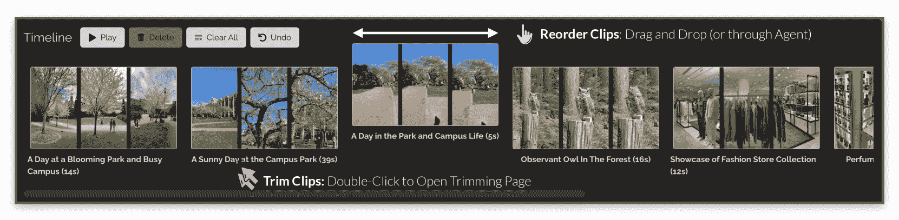
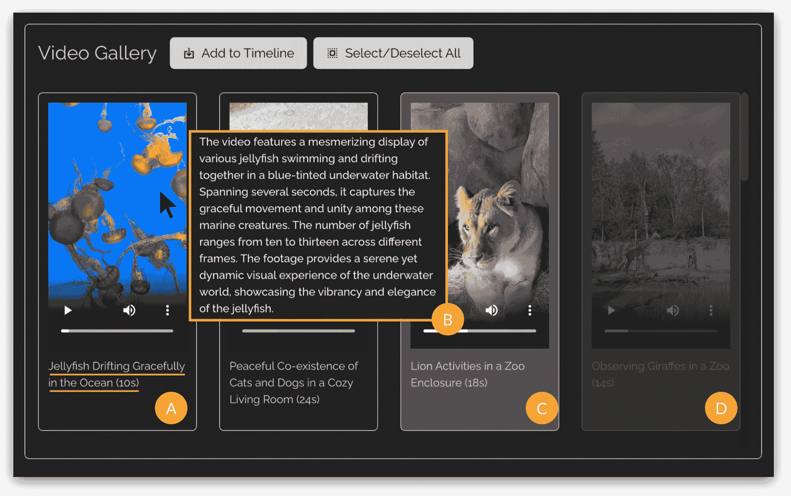
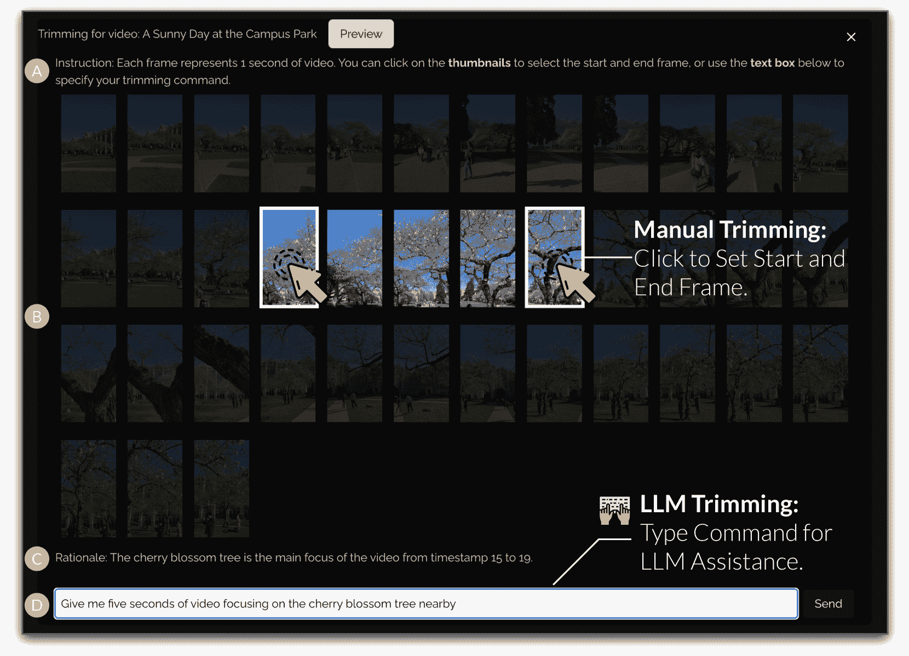
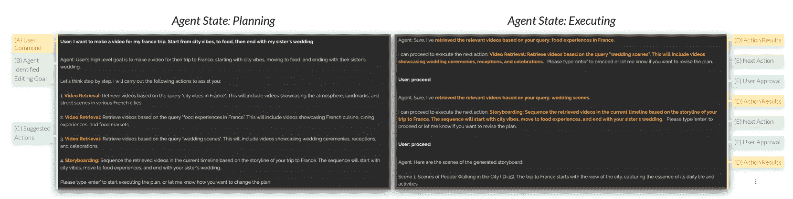
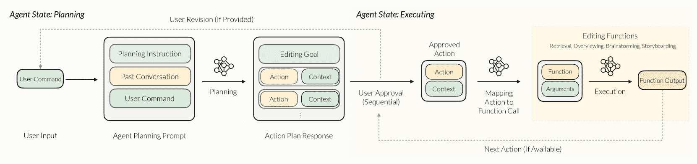
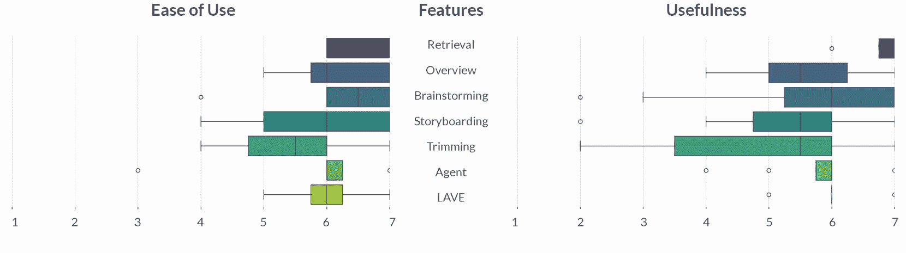
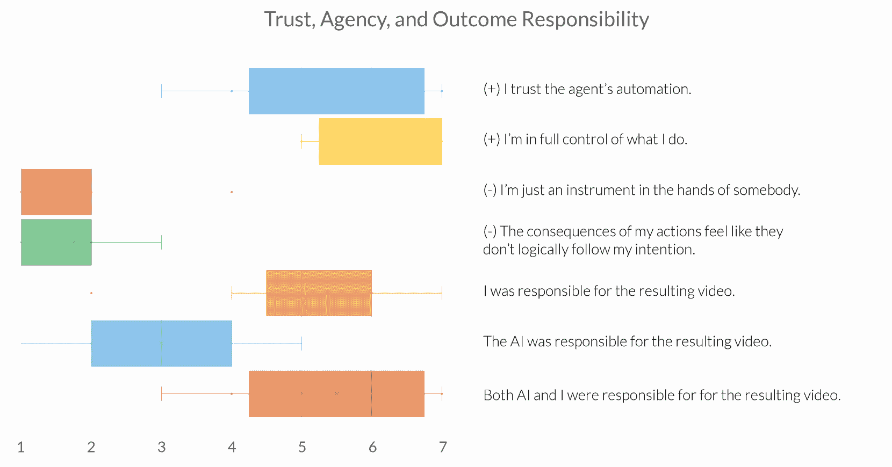
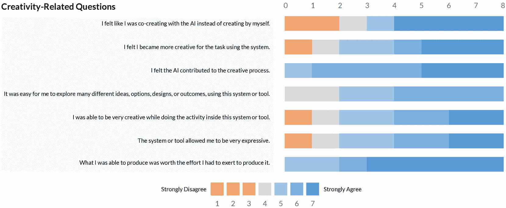
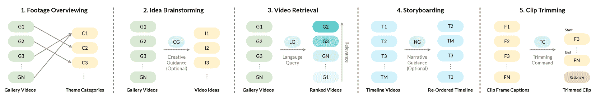

<!--yml

类别：未分类

日期：2025-01-11 12:53:28

-->

# LAVE：LLM驱动的代理协助与语言增强视频编辑

> 来源：[https://arxiv.org/html/2402.10294/](https://arxiv.org/html/2402.10294/)

Bryan Wang 多伦多大学 多伦多 ON 加拿大 [bryanw@dgp.toronto.edu](mailto:bryanw@dgp.toronto.edu)， Yuliang Li Reality Labs Research, MetaSunnyvaleCAUSA [yuliangli@meta.com](mailto:yuliangli@meta.com)， Zhaoyang Lv Reality Labs Research, MetaSunnyvaleCAUSA [zhaoyang@meta.com](mailto:zhaoyang@meta.com)， Haijun Xia 加利福尼亚大学圣地亚哥分校 La JollaCAUSA [haijunxia@ucsd.edu](mailto:haijunxia@ucsd.edu)， Yan Xu Reality Labs Research, MetaRedmondWAUSA [yanx@meta.com](mailto:yanx@meta.com) 和 Raj Sodhi Reality Labs Research, MetaRedmondWAUSA [rsodhi@meta.com](mailto:rsodhi@meta.com)（2024）

###### 摘要。

视频创作变得越来越受欢迎，但视频编辑所需的专业知识和努力常常成为初学者的障碍。在本文中，我们探讨了将大型语言模型（LLMs）集成到视频编辑工作流中，以减少这些障碍。我们的设计愿景体现在LAVE这一新型系统中，LAVE提供了由LLM驱动的代理协助和语言增强编辑功能。LAVE自动生成用户视频素材的语言描述，为LLM处理视频并协助编辑任务提供基础。当用户提供编辑目标时，代理会规划并执行相关的操作以实现这些目标。此外，LAVE允许用户通过代理或直接的UI操作来编辑视频，提供灵活性并允许手动优化代理的操作。我们的用户研究包括八位参与者，涵盖从初学者到熟练编辑者，验证了LAVE的有效性。结果还揭示了用户对提出的LLM辅助编辑范式的看法，以及它对用户创造力和共同创作感知的影响。基于这些发现，我们提出了设计启示，以指导未来代理辅助内容编辑的发展。

视频编辑，LLMs，代理，人类-AI共同创作^†^†期刊年份：2024^†^†版权：acmlicensed^†^†会议：第29届国际智能用户界面大会；2024年3月18日至21日；美国南卡罗来纳州格林维尔^†^†书名：第29届国际智能用户界面大会（IUI ’24），2024年3月18日至21日，格林维尔，SC，美国^†^†DOI：10.1145/3640543.3645143^†^†ISBN：979-8-4007-0508-3/24/03

图1\. LAVE 系统是一款视频编辑工具，提供LLM驱动的代理助手和语言增强功能。A）LAVE 的视频编辑代理在多个视频编辑任务中提供帮助，用户可以与其对话，在整个编辑过程中获得代理的支持。B）一个语言增强的视频库。用户可以点击所需的视频，选择并将其添加到编辑时间轴中。添加到时间轴中的视频会以降低不透明度的方式显示。C）LAVE 自动为每个视频生成简洁的标题。D）将鼠标悬停在视频上时，会显示一个包含视频摘要的工具提示，使用户无需播放视频即可理解其内容。E）一个编辑时间轴，用户可以在其中重新排序和修剪视频片段。这些编辑可以通过LLM辅助或手动完成。

.

图1\. LAVE 系统是一款视频编辑工具，提供LLM驱动的代理助手和语言增强功能。A）LAVE 的视频编辑代理在多个视频编辑任务中提供帮助，用户可以与其对话，在整个编辑过程中获得代理的支持。B）一个语言增强的视频库。用户可以点击所需的视频，选择并将其添加到编辑时间轴中。添加到时间轴中的视频会以降低不透明度的方式显示。C）LAVE 自动为每个视频生成简洁的标题。D）将鼠标悬停在视频上时，会显示一个包含视频摘要的工具提示，使用户无需播放视频即可理解其内容。E）一个编辑时间轴，用户可以在其中重新排序和修剪视频片段。这些编辑可以通过LLM辅助或手动完成。

## 1\. 引言

视频是一个强大的传播和叙事媒介。随着社交媒体和视频分享平台的兴起，它们的受欢迎程度大幅提升，激励了许多人创作并分享自己的内容。然而，视频编辑的复杂性可能会给初学者带来显著的障碍。例如，创意过程初期至关重要的构思和规划阶段，对于那些不熟悉视频概念开发的人来说，可能会具有挑战性。此外，编辑操作通常涉及精心选择、剪辑和排列片段，以创建一个连贯的叙事结构。这不仅要求熟练掌握通常复杂的视频编辑软件界面，还需要大量的手动操作和叙事技巧。

最近，自然语言已被用于解决与视频编辑相关的挑战。利用语言作为视频编辑的互动媒介，允许用户直接传达他们的意图，省去了将思想转化为手动操作的需求。例如，近期的人工智能产品（run, [2023](https://arxiv.org/html/2402.10294v1#bib.bib6)）允许用户通过文本到视频模型（Singer et al., [2022](https://arxiv.org/html/2402.10294v1#bib.bib64); Ho et al., [2022](https://arxiv.org/html/2402.10294v1#bib.bib26)）的力量编辑视频；基于语音的视频导航使用户能够使用语音命令浏览视频，而不需要手动拖动进度条（Chang et al., [2021](https://arxiv.org/html/2402.10294v1#bib.bib17), [2019](https://arxiv.org/html/2402.10294v1#bib.bib18)）。此外，语言已被用于表示视频内容，从而简化了手动编辑过程。一个突出的例子是基于文本的编辑，用户可以通过调整时间对齐的文字稿来高效编辑叙事视频（Fried et al., [2019](https://arxiv.org/html/2402.10294v1#bib.bib24); Pavel et al., [2020](https://arxiv.org/html/2402.10294v1#bib.bib57); Huber et al., [2019](https://arxiv.org/html/2402.10294v1#bib.bib29); Huh et al., [2023](https://arxiv.org/html/2402.10294v1#bib.bib30)）。尽管有这些进展，大多数视频编辑工具仍然严重依赖手动编辑，并且通常缺乏定制化和上下文辅助功能。因此，用户往往不得不独自应对视频编辑的复杂性。

我们如何设计一种作为协作者的视频编辑工具，能够在编辑过程中不断地协助用户？这样的工具可以帮助用户生成视频编辑创意，浏览并找到相关的剪辑素材，将它们组合成有说服力的叙事结构。在此基础上，结合自然语言与视频编辑的前期工作，我们提议利用大语言模型（LLM）多功能的语言能力来赋能视频编辑，例如讲故事和推理，这些能力已经证明对协助各种创意任务非常有帮助（Yuan et al., [2022](https://arxiv.org/html/2402.10294v1#bib.bib84); Chung et al., [2022](https://arxiv.org/html/2402.10294v1#bib.bib21); Mirowski et al., [2023](https://arxiv.org/html/2402.10294v1#bib.bib52); Chakrabarty et al., [2023](https://arxiv.org/html/2402.10294v1#bib.bib16); Liu et al., [2022](https://arxiv.org/html/2402.10294v1#bib.bib44), [2023c](https://arxiv.org/html/2402.10294v1#bib.bib45); Wang et al., [2023b](https://arxiv.org/html/2402.10294v1#bib.bib77); Liu et al., [2023b](https://arxiv.org/html/2402.10294v1#bib.bib43))。通过这种方式，我们探索了一种未来的视频编辑范式，借助自然语言的力量，减少了通常与手动视频编辑相关的障碍。

我们展示了 LAVE，一种提供 LLM 支持的语言增强视频编辑工具。LAVE 引入了一个基于 LLM 的规划与执行代理，能够理解用户的自由语言指令，规划并执行相关操作以实现用户的编辑目标。这些操作包括概念化辅助，如头脑风暴和总结视频库的概览，以及操作辅助，包括基于语义的视频检索、故事板制作（将视频按顺序排列成叙事）和剪辑片段。为了支持这些代理操作，LAVE 使用视觉语言模型（VLM）自动生成视频视觉内容的语言描述。这些描述，我们称之为视觉叙述，使 LLM 能够理解视频内容，并利用其语言能力协助用户完成编辑任务。LAVE 提供了两种视频编辑交互方式：代理协助和直接操作。双重交互方式为用户提供了灵活性，并允许他们根据需要调整代理的操作。

我们进行了一项用户研究，邀请了八名参与者，其中包括新手和熟练的视频编辑者，以评估 LAVE 在视频编辑中的有效性。研究结果表明，参与者能够使用 LAVE 产生令人满意的 AI 协作视频成果。用户对系统的功能表示赞赏，认为它易于使用，并且对于创作富有创意的视频作品非常有帮助。此外，我们的研究揭示了用户对所提出的编辑范式的看法，他们在不同任务中对代理协助的接受度，以及系统对他们创意和人类-人工智能共创感的影响。根据这些发现，我们提出了设计启示，以指导未来结合 LLM 和代理的多媒体内容编辑工具的开发。总之，本文做出了以下贡献：

+   •

    LAVE 系统的概念化和实施，这是一个语言增强的视频编辑工具，利用大语言模型（LLM）的语言智能来促进代理协助的视频编辑体验。

+   •

    设计了一种基于 LLM 的计算管道，使 LAVE 的视频编辑代理能够规划和执行一系列编辑功能，帮助实现用户的编辑目标。

+   •

    用户研究结果展示了将 LLM 与视频编辑结合的优势和挑战。研究发现突出了用户对所提出编辑范式的看法和出现的新行为，基于这些结果，我们提出了未来代理协助内容编辑的设计启示。

## 2. 相关工作

LAVE 基于现有的语言作为视频编辑媒介、大语言模型（LLM）和代理、以及人类-人工智能共创的研究成果。

### 2.1. 语言作为视频编辑媒介

传统的视频编辑工具，如 Premier Pro (pre, [2023](https://arxiv.org/html/2402.10294v1#bib.bib2)) 和 Final Cut Pro (fin, [2023](https://arxiv.org/html/2402.10294v1#bib.bib4)) 需要手动操作原始剪辑。虽然精确，但由于界面复杂，这可能会显得繁琐。此外，原始视频的视觉元素，如缩略图和音频波形，可能无法有效传达其语义。另一方面，语言提供了一种直观且高效的替代方案，来替代视频编辑中的复杂界面，并且在视频编辑工具的研究中得到了探讨（Xia 等, [2020](https://arxiv.org/html/2402.10294v1#bib.bib80); Xia, [2020](https://arxiv.org/html/2402.10294v1#bib.bib79); Fried 等, [2019](https://arxiv.org/html/2402.10294v1#bib.bib24); Pavel 等, [2020](https://arxiv.org/html/2402.10294v1#bib.bib57); Huber 等, [2019](https://arxiv.org/html/2402.10294v1#bib.bib29); Huh 等, [2023](https://arxiv.org/html/2402.10294v1#bib.bib30); Truong 等, [2016](https://arxiv.org/html/2402.10294v1#bib.bib69))。一种常见的方法将语言视为“命令”，用户使用语言指令工具执行特定操作。这在支持语音命令（Laput 等, [2013](https://arxiv.org/html/2402.10294v1#bib.bib36)）和基于语音的视频导航（Lin 等, [2023](https://arxiv.org/html/2402.10294v1#bib.bib40); Chang 等, [2019](https://arxiv.org/html/2402.10294v1#bib.bib18)）的多模态创作工具中表现得尤为明显。然而，现有的工作主要支持单轮交互，并且提供的命令范围有限。因此，它们无法适应多样化的语言和长期对话。相比之下，LAVE 接受自由形式的语言，支持自然交互，并允许在整个视频编辑过程中与代理进行来回讨论。另一个重要的研究方向将语言视为“内容”，即语言成为编辑内容的一部分。例如，基于文本的叙事视频编辑（Fried 等, [2019](https://arxiv.org/html/2402.10294v1#bib.bib24); Pavel 等, [2020](https://arxiv.org/html/2402.10294v1#bib.bib57); Huber 等, [2019](https://arxiv.org/html/2402.10294v1#bib.bib29); Huh 等, [2023](https://arxiv.org/html/2402.10294v1#bib.bib30)）以及通过脚本创建视频蒙太奇（Wang 等, [2019b](https://arxiv.org/html/2402.10294v1#bib.bib76)）。然而，这些技术依赖于视频中预先存在的语言内容，例如旁白，或用户提供的语言注释（Truong 等, [2016](https://arxiv.org/html/2402.10294v1#bib.bib69); Wang 等, [2019b](https://arxiv.org/html/2402.10294v1#bib.bib76)）。前者在日常个人录制的视频中通常缺失，而后者则需要额外的手动操作。相比之下，LAVE 自动生成每个视频的语言描述，并利用大型语言模型（LLM）的语言能力来自动化并促进内容编辑。最近在生成性 AI 方面的研究，如 Make-A-Video (Singer 等, [2022](https://arxiv.org/html/2402.10294v1#bib.bib64)) 和 Imagen Video (Ho 等, [2022](https://arxiv.org/html/2402.10294v1#bib.bib26))，已经探索了使用扩散技术根据文本提示合成视频。与这些旨在生成新视频素材的努力不同，我们的目标是促进对现有视频的编辑。也就是说，我们预计视频生成技术将与像 LAVE 这样的编辑工具互补，特别是在创建 B-roll 等用例中。

### 2.2\. 大型语言模型与智能体

大型语言模型（LLMs），如GPT-4（OpenAI，[2023](https://arxiv.org/html/2402.10294v1#bib.bib54)）和LLaMA（Touvron等人，[2023](https://arxiv.org/html/2402.10294v1#bib.bib68)），是在大量文本数据上训练的，并且具有巨大的模型规模。研究表明，它们能够编码丰富的人类知识（Huang等人，[2022](https://arxiv.org/html/2402.10294v1#bib.bib28)；Roberts等人，[2020](https://arxiv.org/html/2402.10294v1#bib.bib59)；Li等人，[2021](https://arxiv.org/html/2402.10294v1#bib.bib37)），并能够进行复杂的推理（Wei等人，[2023](https://arxiv.org/html/2402.10294v1#bib.bib78)；Kojima等人，[2023](https://arxiv.org/html/2402.10294v1#bib.bib35)；Nye等人，[2021](https://arxiv.org/html/2402.10294v1#bib.bib53)）和行动规划（Huang等人，[2022](https://arxiv.org/html/2402.10294v1#bib.bib28)）。它们的语言能力和讲故事能力已被应用于创意写作（Yuan等人，[2022](https://arxiv.org/html/2402.10294v1#bib.bib84)；Chung等人，[2022](https://arxiv.org/html/2402.10294v1#bib.bib21)；Mirowski等人，[2023](https://arxiv.org/html/2402.10294v1#bib.bib52)；Chakrabarty等人，[2023](https://arxiv.org/html/2402.10294v1#bib.bib16)）以及其他无数创意应用（Liu等人，[2022](https://arxiv.org/html/2402.10294v1#bib.bib44)，[2023c](https://arxiv.org/html/2402.10294v1#bib.bib45)；Wang等人，[2023b](https://arxiv.org/html/2402.10294v1#bib.bib77)；Liu等人，[2023b](https://arxiv.org/html/2402.10294v1#bib.bib43)；Brade等人，[2023](https://arxiv.org/html/2402.10294v1#bib.bib12)）。此外，LLMs能够根据给定的描述适应新任务，而无需重新训练，这种方法被称为提示（prompting）。由于其高效性和适应性，提示技术引起了广泛的关注（Zamfirescu-Pereira等人，[2023](https://arxiv.org/html/2402.10294v1#bib.bib85)；Kim等人，[2023](https://arxiv.org/html/2402.10294v1#bib.bib34)；Arawjo等人，[2023](https://arxiv.org/html/2402.10294v1#bib.bib10)；Brown等人，[2020](https://arxiv.org/html/2402.10294v1#bib.bib14)；Wang等人，[2023a](https://arxiv.org/html/2402.10294v1#bib.bib73)；Logan IV等人，[2021](https://arxiv.org/html/2402.10294v1#bib.bib46)）。其中较为著名的包括少量示例提示（few-shot prompting）（Brown等人，[2020](https://arxiv.org/html/2402.10294v1#bib.bib14)），通过提供多个输入/输出数据示例来提高任务表现，以及思维链提示（chain-of-thought prompting）（Wei等人，[2023](https://arxiv.org/html/2402.10294v1#bib.bib78)），该方法引导LLM生成一系列中间推理步骤，然后得出最终输出。通过这些技术，近期的研究探索了使用LLMs开发能够自主与各种环境互动的智能体（Wang等人，[2023c](https://arxiv.org/html/2402.10294v1#bib.bib75)；Park等人，[2023](https://arxiv.org/html/2402.10294v1#bib.bib55)；Shaw等人，[2023](https://arxiv.org/html/2402.10294v1#bib.bib60)；Song等人，[2023](https://arxiv.org/html/2402.10294v1#bib.bib65)；Bran等人，[2023](https://arxiv.org/html/2402.10294v1#bib.bib13)；Shinn等人，[2023](https://arxiv.org/html/2402.10294v1#bib.bib63)；Yao等人，[2023](https://arxiv.org/html/2402.10294v1#bib.bib82)；Li等人，[2023a](https://arxiv.org/html/2402.10294v1#bib.bib39)）。例如，Wang等人（Wang等人，[2023c](https://arxiv.org/html/2402.10294v1#bib.bib75)）提出了一种智能体，该智能体制定计划，将任务分解为子任务并执行它们。Yao等人（Yao等人，[2023](https://arxiv.org/html/2402.10294v1#bib.bib82)）提出了ReAct框架，其中LLMs生成交替的推理序列和任务特定的行动。本文在该领域的先前工作基础上，提出了一种旨在进行互动视频编辑的智能体架构，该架构根据用户的指令规划并执行相关的编辑操作。

### 2.3\. 人类与人工智能的协同创造

随着人工智能在生成内容和自动化任务方面能力的不断提升，它正被越来越多地融入到各个领域的创作过程中（Mirowski等，[2023](https://arxiv.org/html/2402.10294v1#bib.bib52); Yuan等，[2022](https://arxiv.org/html/2402.10294v1#bib.bib84); Chung等，[2022](https://arxiv.org/html/2402.10294v1#bib.bib21); Mirowski等，[2023](https://arxiv.org/html/2402.10294v1#bib.bib52); Chakrabarty等，[2023](https://arxiv.org/html/2402.10294v1#bib.bib16); Louie等，[2022](https://arxiv.org/html/2402.10294v1#bib.bib49); Huang等，[2020](https://arxiv.org/html/2402.10294v1#bib.bib27); Louie等，[2020](https://arxiv.org/html/2402.10294v1#bib.bib48); Suh等，[2022](https://arxiv.org/html/2402.10294v1#bib.bib66); Wang等，[2022](https://arxiv.org/html/2402.10294v1#bib.bib72))。这包括诸如故事创作（Chung等，[2022](https://arxiv.org/html/2402.10294v1#bib.bib21); Yuan等，[2022](https://arxiv.org/html/2402.10294v1#bib.bib84); Mirowski等，[2023](https://arxiv.org/html/2402.10294v1#bib.bib52); Chakrabarty等，[2023](https://arxiv.org/html/2402.10294v1#bib.bib16)）、音乐创作（Louie等，[2022](https://arxiv.org/html/2402.10294v1#bib.bib49); Huang等，[2020](https://arxiv.org/html/2402.10294v1#bib.bib27); Louie等，[2020](https://arxiv.org/html/2402.10294v1#bib.bib48)）、漫画创作（Suh等，[2022](https://arxiv.org/html/2402.10294v1#bib.bib66)）和游戏设计（Zhu等，[2018](https://arxiv.org/html/2402.10294v1#bib.bib87)）等领域。例如，TaleBrush（Chung等，[2022](https://arxiv.org/html/2402.10294v1#bib.bib21)）通过比喻性地勾画故事情节，支持用户利用语言模型创作故事。Storybuddy（Zhang等，[2022](https://arxiv.org/html/2402.10294v1#bib.bib86)）通过生成与故事相关的问题，提供互动式的讲故事体验。Cococo（Louie等，[2020](https://arxiv.org/html/2402.10294v1#bib.bib48)）探讨了与AI共同创作音乐，尤其是初学者所面临的挑战和机遇。CodeToon（Suh等，[2022](https://arxiv.org/html/2402.10294v1#bib.bib66)）能自动将代码转换为漫画。然而，尽管人工智能在通过管理创作流程的某些方面来增强用户的创造力方面具有巨大潜力，但它也带来了诸如用户自主性和信任（Kang和Lou，[2022](https://arxiv.org/html/2402.10294v1#bib.bib31)）、创作的真实性（McCormack等，[2019](https://arxiv.org/html/2402.10294v1#bib.bib51)）、潜在的创作偏见（Magni等，[2023](https://arxiv.org/html/2402.10294v1#bib.bib50); Loughran，[2022](https://arxiv.org/html/2402.10294v1#bib.bib47)）以及所有权和归属（Eshraghian，[2020](https://arxiv.org/html/2402.10294v1#bib.bib22); Bisoyi，[2022](https://arxiv.org/html/2402.10294v1#bib.bib11)）等挑战和问题。我们的工作在现有的人机共创文献基础上进行了拓展（Wang等，[2019a](https://arxiv.org/html/2402.10294v1#bib.bib74); Rezwana和Maher，[2022](https://arxiv.org/html/2402.10294v1#bib.bib58); Buschek等，[2021](https://arxiv.org/html/2402.10294v1#bib.bib15); Park等，[2019](https://arxiv.org/html/2402.10294v1#bib.bib56); Khadpe等，[2020](https://arxiv.org/html/2402.10294v1#bib.bib33); Amershi等，[2019](https://arxiv.org/html/2402.10294v1#bib.bib9); Liu，[2021](https://arxiv.org/html/2402.10294v1#bib.bib41); Glikson和Woolley，[2020](https://arxiv.org/html/2402.10294v1#bib.bib25); Eshraghian，[2020](https://arxiv.org/html/2402.10294v1#bib.bib22); Kang和Lou，[2022](https://arxiv.org/html/2402.10294v1#bib.bib31)），并通过开发一种新的视频编辑AI系统并研究其影响，作出了进一步贡献。通过LAVE的视角，我们研究了用户与基于大语言模型（LLM）的代理的互动动态，并探讨了这一编辑范式中固有的机遇和挑战。

## 3\. 设计目标

本研究旨在通过LAVE系统的设计、实施和评估，探索人类与LLM代理在视频编辑中的协作体验潜力。为此，我们概述了两个主要设计目标，作为系统设计的指导原则。

D1\. 利用自然语言降低编辑门槛。本研究的核心观点是通过自然语言和大语言模型（LLMs）的力量，增强传统的视频编辑范式。我们设计LAVE的目的是通过利用LLMs的语言智能，从初步构思到编辑操作，降低用户编辑的门槛。

D2\. 在编辑过程中保持用户的主导权。关于AI辅助内容编辑的一个常见担忧是用户自主性和控制权的丧失。为了解决这个问题，我们设计了LAVE，提供了AI辅助和手动编辑选项。这使得用户可以根据需要优化或选择不使用AI辅助，从而保持用户的主导权。它确保最终产品反映用户的艺术视野，并赋予他们决策权。

图2\. LAVE的视频编辑时间线：用户可以拖放视频片段以重新排列其顺序。顺序也可以通过LAVE的视频编辑代理的分镜功能进行更改。要修剪一个片段，用户可以双击它，弹出一个用于修剪的窗口，如图[4](https://arxiv.org/html/2402.10294v1#S4.F4 "Figure 4 ‣ 4.2.2\. Clip Trimming ‣ 4.2\. Video Editing Timeline ‣ 4\. The LAVE User Interface ‣ LAVE: LLM-Powered Agent Assistance and Language Augmentation for Video Editing")所示。

## 4\. LAVE用户界面

在设计目标的指导下，我们开发了LAVE系统。LAVE的用户界面包括三个主要组件：1）语言增强的视频库，展示带有自动生成语言描述的视频素材；2）视频编辑时间线，包含编辑的主时间线；3）视频编辑代理，允许用户与对话代理互动并获得帮助。当用户与代理交流时，消息交换会显示在聊天界面中。代理还可以在相关操作发生时，对视频库和编辑时间线进行更改。此外，用户还可以像传统编辑界面一样，使用光标直接与库和时间线进行交互。在接下来的部分，我们将详细描述每个组件，并强调它们与设计目标的联系。

### 4.1\. 语言增强的视频库

LAVE具有一个语言增强的视频画廊，如图[3](https://arxiv.org/html/2402.10294v1#S4.F3 "图 3 ‣ 4.1\. 语言增强视频画廊 ‣ 4\. LAVE 用户界面 ‣ LAVE: 基于LLM的代理辅助和视频编辑语言增强")所示。与传统工具类似，它允许播放视频片段，但独特之处在于提供视觉叙述，即每个视频的自动生成文本描述，包括语义标题和摘要。标题有助于在不播放视频的情况下理解和索引片段。摘要提供每个视频内容的概述，帮助用户为编辑项目构建故事情节。标题和时长显示在每个视频下方。将光标悬停在视频上时，会显示包含叙述摘要的提示框。用户可以通过“添加到时间轴”按钮选择视频并将其添加到编辑时间轴。如果用户希望使用所有视频（例如，某次旅行的所有素材），他们只需使用“全选/取消全选”选项将其添加到时间轴。此外，LAVE还使用户能够通过语义语言查询搜索视频，检索到的视频将以画廊形式呈现，并按相关性排序。此功能必须通过编辑代理执行，相关内容将在后续章节中进一步讨论。

图 3\. LAVE的语言增强视频画廊为每个视频提供了语义标题及其时长（A）。当用户将光标悬停在视频上时，会显示详细的摘要，允许他们在不播放视频的情况下预览视频内容（B）。用户可以选择多个视频并将其添加到时间轴。选中的视频会以浅灰色突出显示（C），已经添加的视频则以透明度较低的方式呈现（D）。

### 4.2\. 视频编辑时间轴

一旦从视频画廊中选择视频并将其添加到编辑时间轴，它们将在界面底部的视频编辑时间轴上显示（图[2](https://arxiv.org/html/2402.10294v1#S3.F2 "图 2 ‣ 3\. 设计目标 ‣ LAVE: 基于LLM的代理辅助和视频编辑语言增强")）。时间轴上的每个片段由一个框表示，框中展示了三个缩略图：视频的开始、中点和结束帧，用来展示视频内容。在LAVE系统中，每个缩略图帧代表片段中的一秒钟内容。与视频画廊中的情况一样，每个片段的标题和描述也会提供。LAVE中的编辑时间轴具有两个关键功能：片段排序和修剪。每个功能都提供基于LLM的选项和手动选项，赋予用户灵活性和对AI辅助的控制（D2）。

#### 4.2.1\. 片段排序

在时间轴上排序视频片段是视频编辑中的常见任务，对于创建连贯的叙事至关重要。LAVE 支持两种排序方式：1）基于 LLM 的排序通过 LAVE 视频编辑代理的分镜功能进行操作。此功能根据用户提供的或 LLM 生成的故事情节对视频片段进行排序。我们将在代理部分进一步介绍此功能。2）手动排序允许用户通过直接操作排列片段，使他们可以拖动和放置每个视频框，设置片段出现的顺序。如果用户想从时间轴中删除视频，可以选择特定片段并点击“删除”按钮。还可以选择“清空所有”选项，删除时间轴中的所有视频。此外，用户可以使用“撤销”按钮撤回任何编辑操作。为了预览当前片段顺序的合成输出，用户可以点击“播放”按钮，系统将生成一个预览视频以供查看。

#### 4.2.2\. 剪辑剪辑

剪辑在视频编辑中至关重要，可以突出关键片段并去除冗余内容。要进行剪辑，用户只需双击时间轴中的视频片段，弹出窗口会显示每秒一帧的画面（图 [4](https://arxiv.org/html/2402.10294v1#S4.F4 "Figure 4 ‣ 4.2.2\. Clip Trimming ‣ 4.2\. Video Editing Timeline ‣ 4\. The LAVE User Interface ‣ LAVE: LLM-Powered Agent Assistance and Language Augmentation for Video Editing")）。与剪辑排序类似，LAVE 支持基于 LLM 和手动剪辑两种方式：

+   •

    基于 LLM 的剪辑：在画面下方，提供了一个文本框，供用户输入剪辑命令，以根据其规范提取视频片段。这些命令可以是自由形式的。例如，它们可能指向视频的语义内容，如“只保留专注于棒球比赛的片段”，或者指定精确的剪辑细节，如“给我最后 5 秒”。命令也可以将这两者结合，如“获取狗坐在椅子上的 3 秒”。此功能利用了 LLM 的信息提取能力（Agrawal 等，[2022](https://arxiv.org/html/2402.10294v1#bib.bib8)）来识别与用户描述相符的片段。为了透明性，LLM 还会解释其剪辑的理由，详细说明它如何与用户指令对齐。请注意，尽管该功能也由 LLM 提供支持，但它不是 LAVE 编辑代理操作的一部分，后者主要处理项目级别的视频操作。此剪辑功能专为单个片段的调整设计。

+   •

    手动剪辑：用户可以通过点击缩略图手动选择画面，定义剪辑的起始和结束点。此功能还允许用户在 LLM 剪辑未能符合他们意图时，进一步调整剪辑。

图 4\. LAVE 的剪辑修剪窗口显示用户指南（A）和从剪辑中每秒采样的视频帧（B）。用户可以手动设置修剪的起始帧和结束帧。或者，他们可以使用 LLM 驱动的修剪功能，输入类似“给我 5 秒钟聚焦于附近的樱花树。”（D）的命令。采用这种方式，修剪会自动调整并包含一个解释 LLM 选择的理由（C）。未包含在修剪剪辑中的帧会以暗淡的颜色显示。

图 5\. LAVE 的视频编辑代理有两个状态：规划状态和执行状态。在规划状态（左侧），用户提供编辑命令（A）。然后，代理明确目标（B）并提出可行步骤以实现目标（C）。如果用户对提议的步骤不满意，可以选择修改计划。在用户批准计划后，代理切换到执行状态（右侧）。在此状态下，用户按顺序批准代理的动作。每执行一个动作后，代理展示结果（Ds）。如果计划中列出了额外的动作，代理会通知用户下一个动作（Es），并等待他们的批准（Fs）。

### 4.3\. 视频编辑代理

LAVE 的视频编辑代理是一个基于聊天的组件，方便用户与基于 LLM 的代理进行互动。与命令行工具不同，用户可以使用自由格式的语言与代理进行交互。代理利用 LLM 的语言智能提供视频编辑帮助，并能够根据用户需求提供量身定制的响应，引导和协助用户完成整个编辑过程（D1）。LAVE 的代理帮助通过代理操作提供，每个操作都涉及执行系统支持的编辑功能。在接下来的部分中，我们将概述与代理的互动体验，并描述编辑功能。

#### 4.3.1\. 与计划与执行代理的互动

为了与代理协作，用户首先输入他们的编辑目标。代理解释用户的目标并制定执行计划以实现这些目标（Karpas 等人， [2022](https://arxiv.org/html/2402.10294v1#bib.bib32); Yao 等人， [2023](https://arxiv.org/html/2402.10294v1#bib.bib82); Shinn 等人， [2023](https://arxiv.org/html/2402.10294v1#bib.bib63); Shen 等人， [2023](https://arxiv.org/html/2402.10294v1#bib.bib61)）。代理有两种工作模式：**规划**和**执行**。默认情况下，代理从规划状态开始（图 [5](https://arxiv.org/html/2402.10294v1#S4.F5 "图 5 ‣ 4.2.2\. 剪辑修剪 ‣ 4.2\. 视频编辑时间线 ‣ 4\. LAVE 用户界面 ‣ LAVE：基于 LLM 的代理辅助与视频编辑语言增强")-左）。在这个状态下，每当用户输入一个编辑目标时，代理会评估该目标，确定为实现该目标需要执行哪些操作。当用户的目标广泛且涉及多项操作时，代理可以执行多个操作。例如，如果用户输入“我想做一个视频，但我没有任何创意”，代理可能会提出一个包含创意头脑风暴、查找相关镜头和整理剪辑以根据创意构建叙事的计划。另一方面，用户也可以发出具体的命令，这样行动计划中只包含一个目标操作。提出的计划需要用户确认后才能执行，且用户可以要求调整或澄清（D2）。

执行在用户按下“enter”键后开始——这一用户确认操作将代理转到执行状态，代理开始按顺序执行计划的操作（图 [5](https://arxiv.org/html/2402.10294v1#S4.F5 "图 5 ‣ 4.2.2\. 剪辑修剪 ‣ 4.2\. 视频编辑时间线 ‣ 4\. LAVE 用户界面 ‣ LAVE：基于 LLM 的代理辅助与视频编辑语言增强")-右）。每个操作完成后，代理会通知用户结果以及下一个操作（如果有）。用户可以再次按“enter”继续执行后续操作，或者与代理互动以修改或取消剩余的计划。代理会维护一个记忆缓冲区，以便在提出功能时访问最近的上下文。例如，如果代理之前与用户进行了创意头脑风暴，它可能会根据用户选择的创意建议执行视频检索。

#### 4.3.2. 编辑功能

LAVE 的代理支持四种编辑功能：**镜头概览**和**创意头脑风暴**分别提供基于 LLM 的总结和创意能力的概念化辅助。另两项功能，**视频检索**和**分镜脚本制作**，分别利用 LLM 的嵌入和叙事能力，以促进手动编辑过程。

+   •

    视频概述：该代理可以生成概述文本，总结用户在图库中提供的视频内容，并根据主题或话题对其进行分类。例如，关于大峡谷公路旅行的片段可以被分类为“徒步旅行与户外冒险”或“公路驾驶”等主题。这个功能在用户不熟悉视频内容时尤为有用，比如编辑旧的视频集或处理大量视频素材时。

+   •

    创意头脑风暴：代理可以根据图库中的视频协助进行视频编辑创意的头脑风暴。这使得代理可以提出各种创意概念，帮助激发用户的创意灵感。例如，代理可能会建议使用用户宠物的几个片段来创作一个名为“宠物的一天——从白天到夜晚”的视频。此外，用户还可以为代理提供可选的创意指导或约束，以引导代理的创意过程。

+   •

    视频检索：搜索相关视频是视频编辑中一个基础却常常繁琐的环节。用户无需手动在图库中查找，代理可以通过语言查询帮助检索视频，如“在埃菲尔铁塔附近散步”。完成检索后，代理会在语言增强的视频图库中展示最相关的视频，并按相关性排序。

+   •

    分镜头脚本：视频编辑通常需要在时间线上对片段进行排序，以构建特定的叙事。代理可以根据用户提供的叙事或故事情节帮助用户排列这些片段。叙事可以简洁如“从室内到室外”，也可以更为详细，例如“从城市景观开始，过渡到食物和饮品，再到夜间社交聚会”。如果用户没有提供故事情节，代理将自动根据已经添加到时间线上的视频生成一个故事情节。一旦代理生成了分镜头脚本，时间线中的视频将按顺序重新排序。代理还将在聊天室中提供逐场景的分镜头脚本描述。

### 4.4 支持的工作流和目标使用场景

总的来说，LAVE提供的功能涵盖了从创意构思、前期规划到实际编辑操作的整个工作流。然而，该系统并没有强制规定严格的工作流。用户可以灵活地使用与他们编辑目标相符的部分功能。例如，具有清晰编辑构思和明确故事情节的用户可以跳过创意构思阶段，直接进入编辑工作。此外，LAVE目前设计用于休闲编辑，如为社交媒体平台创作视频。我们将LLM代理在专业编辑中的集成——尤其是在精确度至关重要的场景——作为未来的工作方向。

图6\. LAVE的计划与执行代理设计：在接收到包含用户编辑命令的输入后，构建一个规划提示。该提示包括规划指令、过去的对话以及新的用户命令。然后将其发送到LLM以生成一个行动计划，该计划反映用户的编辑目标，并概述帮助用户实现这一目标的行动。每个行动都附带上下文，提供与该行动相关的附加信息，例如用于视频检索的语言查询。用户逐一审查并批准这些行动。行动一旦被批准，便转化为实际的Python函数调用并执行。这个过程将继续进行，直到所有计划中的行动完成，除非用户决定提供新的指令以修订或取消计划。

## 5\. 后端系统

我们现在描述支持第[4](https://arxiv.org/html/2402.10294v1#S4 "4\. LAVE 用户界面 ‣ LAVE：LLM驱动的代理协助与视频编辑语言增强")节中所述互动组件的后端处理和系统设计。我们首先描述LAVE视频编辑代理的设计，并深入探讨编辑功能的实现。除非另有说明，后续节中的所有LLM提及均使用OpenAI的GPT-4（OpenAI， [2023](https://arxiv.org/html/2402.10294v1#bib.bib54)）。

### 5.1\. 代理设计

我们通过利用LLM的多样化语言能力，包括推理、规划和讲故事，构建了LAVE代理。LAVE代理有两种状态：规划和执行。计划与执行方法提供了两个主要优点：1）它允许用户设定包含多个行动的高层目标，避免像传统命令行工具那样需要详细列出每个单独的行动。2）在执行之前，代理向用户呈现计划，提供修订的机会，并确保用户保持完全控制（D2）。我们设计了一个后端管道来支持这个计划与执行代理。正如图[6](https://arxiv.org/html/2402.10294v1#S4.F6 "图6 ‣ 4.4\. 支持的工作流程和目标使用案例 ‣ 4\. LAVE 用户界面 ‣ LAVE：LLM驱动的代理协助与视频编辑语言增强")所示，该管道通过根据用户输入创建行动计划开始。该计划随后将从文本描述转换为函数调用，进而执行相应的功能。我们将在后续章节中详细阐述每个步骤的具体细节。

#### 5.1.1\. 动作规划

LAVE的视频编辑代理的行动规划采用了专门的LLM提示格式，该格式受到之前LLM提示研究的启发。我们结合了行动/工具使用代理提示技术（Karpas等人，[2022](https://arxiv.org/html/2402.10294v1#bib.bib32)；Yao等人，[2023](https://arxiv.org/html/2402.10294v1#bib.bib82)；Shinn等人，[2023](https://arxiv.org/html/2402.10294v1#bib.bib63)；Shen等人，[2023](https://arxiv.org/html/2402.10294v1#bib.bib61)）。在这种情况下，“工具”或“行动”相当于系统的编辑功能。我们还利用了链式思维提示（Wei等人，[2023](https://arxiv.org/html/2402.10294v1#bib.bib78)）的见解，该方法利用LLM的推理能力将复杂任务（用户目标）分解为子任务（编辑功能）。我们系统的提示前言由三个部分组成。

1.  (1)

    角色分配：一段开头的文字，指示代理充当视频编辑助手，负责根据用户命令生成行动计划。

1.  (2)

    行动描述：在角色分配之后，我们描述了代理可以执行的行动列表。每个行动对应LAVE支持的编辑功能。我们详细说明了每个功能的功能和使用案例，帮助代理选择合适的回应以满足用户的命令。

1.  (3)

    格式说明：最后，我们引导代理以一致的格式输出行动计划：首先确定用户的编辑目标，然后列出分步计划，列举为实现该目标建议的行动。每个行动包括功能名称及其相关上下文（如适用）。例如，“分镜头脚本（功能名称）：从白天到夜晚创建分镜脚本。（上下文）”我们还指示模型将用户的目标和行动列表分别以大写字母“GOAL”和“ACTIONS”作为前缀，以便于下游处理时的文本解析。

在前言之后，我们附加最近的对话历史以及最新的用户输入。这个组合形成了发送给LLM生成行动计划的完整提示。当用户希望参考之前的消息或已生成的计划时（例如，如果他们想更改代理提出的计划），对话历史会非常有用。系统最多保留6000个令牌的消息历史。如果超过此限制，它将开始删除从第二旧的消息开始的消息，同时保留最旧的消息，即前言。这个6000令牌的限制是根据经验设置的，约比使用的LLM的上下文窗口少2000个令牌，确保文本生成有足够的空间（上下文限制的25%）。此设置可以根据不同LLM的上下文窗口长度进行调整。令牌是LLM如GPT-4使用的字节对编码（BPE）令牌（Shibata等人，[1999](https://arxiv.org/html/2402.10294v1#bib.bib62)）。

#### 5.1.2. 将行动计划转换为可执行的功能

如[4.3.1节](https://arxiv.org/html/2402.10294v1#S4.SS3.SSS1 "4.3.1\. 与计划-执行代理交互 ‣ 4.3\. 视频编辑代理 ‣ 4\. LAVE 用户界面 ‣ LAVE：基于 LLM 的代理辅助与视频编辑语言增强")中所述，在制定行动计划后，它会呈现给用户进行审批。与批量审批不同，每个行动会依次经过用户的批准。这种方法允许用户执行一个行动，观察其结果，然后决定是否继续执行后续行动。为了促进这一过程，LAVE 解析行动计划中的每个行动描述，并将其转换为相应的后台功能调用。我们利用经过微调的 OpenAI GPT-4 检查点来完成这一转换，特别是为功能调用（fun，[2023](https://arxiv.org/html/2402.10294v1#bib.bib5)）进行的微调。为了使用功能调用功能，我们提供了每个功能能力的详细描述。一旦完成，LLM 就能够将文本提示（在我们的例子中是行动描述）转换为相应的编辑功能调用，并提取上下文参数。功能执行的结果会更新到前端 UI，并呈现给用户。

表 1\. 输入、输出及每个 LLM 驱动编辑功能更新的 UI 部分。画廊视频和时间轴视频指的是相应视频的文本格式视觉叙述。可选指导表示用户可以提供额外的可选输入来引导功能。

| 功能 | 输入 | 输出 | UI 更新 |
| --- | --- | --- | --- |
| 视频检索 | 文本查询 + 向量存储 | 排名视频 | 视频画廊 |
| 镜头概览 | 画廊视频 | 概览 | 代理聊天 |
| 创意头脑风暴 | 画廊视频 + 可选指导 | 创意 | 代理聊天 |
| 故事板设计 | 时间轴视频 + 可选指导 | 故事板 + 视频顺序 | 代理聊天 + 时间轴 |
| 剪辑修剪 | 帧字幕 + 修剪命令 | 起始/结束帧 ID + 理由 | 时间轴 |

### 5.2\. LLM 驱动编辑功能的实现

LAVE 支持五个由大型语言模型（LLM）驱动的功能来协助用户进行视频编辑任务：1）素材概览，2）创意头脑风暴，3）视频检索，4）故事板制作，以及 5）剪辑修剪。前四个功能可以通过代理访问（图 [5](https://arxiv.org/html/2402.10294v1#S4.F5 "Figure 5 ‣ 4.2.2\. Clip Trimming ‣ 4.2\. Video Editing Timeline ‣ 4\. The LAVE User Interface ‣ LAVE: LLM-Powered Agent Assistance and Language Augmentation for Video Editing")），而剪辑修剪功能则可以通过双击编辑时间轴上的剪辑来访问该窗口（图 [4](https://arxiv.org/html/2402.10294v1#S4.F4 "Figure 4 ‣ 4.2.2\. Clip Trimming ‣ 4.2\. Video Editing Timeline ‣ 4\. The LAVE User Interface ‣ LAVE: LLM-Powered Agent Assistance and Language Augmentation for Video Editing")）。其中，基于语言的视频检索是通过向量存储数据库实现的，其余功能则通过 LLM 提示工程实现。所有功能都建立在自动生成的原始素材语言描述之上，包括每个剪辑的标题和摘要，如视频画廊中所示（图 [3](https://arxiv.org/html/2402.10294v1#S4.F3 "Figure 3 ‣ 4.1\. Language-Augmented Video Gallery ‣ 4\. The LAVE User Interface ‣ LAVE: LLM-Powered Agent Assistance and Language Augmentation for Video Editing")）。我们将这些视频的文本描述称为视觉叙事，因为它们描述了视频在视觉方面的叙事内容。表 [1](https://arxiv.org/html/2402.10294v1#S5.T1 "Table 1 ‣ 5.1.2\. Translating Action Plan to Executable Functions ‣ 5.1\. Agent Design ‣ 5\. Backend System ‣ LAVE: LLM-Powered Agent Assistance and Language Augmentation for Video Editing")) 概述了每个功能的输入、输出和用户界面更新。附录中的图 [10](https://arxiv.org/html/2402.10294v1#A0.F10 "Figure 10 ‣ LAVE: LLM-Powered Agent Assistance and Language Augmentation for Video Editing") 提供了每个功能机制的更多示意图。在接下来的子章节中，我们将首先描述生成视觉叙事的预处理过程，然后深入探讨每个功能的实现。

#### 5.2.1\. 生成视觉叙事：视频标题和摘要

生成视觉叙述的过程包括以每秒一帧的速率采样视频帧。然后，使用LLaVA（Liu等人，[2023a](https://arxiv.org/html/2402.10294v1#bib.bib42)）v1.0对每一帧进行标注，LLaVA基于Vicuna-V1-13B（Chiang等人，[2023](https://arxiv.org/html/2402.10294v1#bib.bib20)），该模型是LLaMA-V1-13B模型（Touvron等人，[2023](https://arxiv.org/html/2402.10294v1#bib.bib68)）的精调版本。编译帧描述后，我们利用GPT-4生成标题和摘要。此外，每个视频都被分配了一个唯一的数字ID。该ID帮助LLM引用单独的片段以执行如分镜等功能。请注意，在开发阶段，我们选择了LLaVA，因为它的语言模型能够生成比其他常用图像标注模型（如BLIP-2（Li等人，[2023b](https://arxiv.org/html/2402.10294v1#bib.bib38)））更全面的标注。然而，我们也意识到VLM的快速发展，新的模型可能很快会超过LLaVA v.1.0。我们将在未来工作部分讨论这些模型的集成。

#### 5.2.2\. 基于文本嵌入的视频检索

LAVE的视频检索功能利用了一个向量存储库，该存储库通过使用OpenAI的text-embedding-ada-002将每个视频的视觉叙述（标题和摘要）进行嵌入构建。这个过程为每个视频生成了1536维的嵌入。在检索过程中，LAVE通过相同的模型将从用户命令中识别出的查询进行嵌入，并计算查询与存储视频嵌入之间的余弦距离，从而对视频进行排名。随后，LAVE更新前端UI视频画廊，并根据排名对视频进行排序。尽管我们的设计主要集中于基于排名的方法来展示检索结果，但它可以很容易地修改以结合过滤方法，例如仅显示前k个相关视频。

#### 5.2.3\. 视频概览

我们提示LLM将视频分类为常见主题，并提供用户视频集合中的话题摘要。提示中包含了一个功能说明（[A.1](https://arxiv.org/html/2402.10294v1#A1.SS1 "A.1\. Footage Overview ‣ Appendix A Prompt Preambles ‣ LAVE: LLM-Powered Agent Assistance and Language Augmentation for Video Editing")），接着是画廊视频的视觉叙述。这个提示随后被发送给LLM以生成概览，并最终呈现在聊天界面中供用户查看。

#### 5.2.4\. 创意头脑风暴

我们提示 LLM 基于用户所有视频生成创意视频编辑想法。提示结构以功能指令开头（见 [A.2](https://arxiv.org/html/2402.10294v1#A1.SS2 "A.2\. Idea Brainstorming ‣ Appendix A Prompt Preambles ‣ LAVE: LLM-Powered Agent Assistance and Language Augmentation for Video Editing")）。如果提供了创意指导，我们会将其包含在提示中以指导头脑风暴。创意指导在 LAVE 将行动描述映射到功能调用时作为字符串参数提取（见 [5.1.2](https://arxiv.org/html/2402.10294v1#S5.SS1.SSS2 "5.1.2\. Translating Action Plan to Executable Functions ‣ 5.1\. Agent Design ‣ 5\. Backend System ‣ LAVE: LLM-Powered Agent Assistance and Language Augmentation for Video Editing")）。如果用户没有提供任何指导，默认使用“通用”指导。在创意方向的引导下，我们附上所有画廊视频的视觉叙述，并将提示发送给 LLM 进行完成。类似于镜头概览，生成的视频创意将呈现在聊天界面中。

#### 5.2.5\. 分镜头脚本

LAVE 的分镜头脚本功能根据用户提供的叙事顺序排列视频片段。与前述功能不同，它只影响时间线上的视频。类似于创意头脑风暴，系统会检查用户提供的任何创意性叙事指导，例如，“从我狗的视频开始，然后过渡到我猫的视频。” 如果没有提供指导，LLM 会被指示根据时间线上的视频创建一个叙事。提示词首先是功能指令（见 [A.3](https://arxiv.org/html/2402.10294v1#A1.SS3 "A.3\. Storyboarding ‣ Appendix A Prompt Preambles ‣ LAVE: LLM-Powered Agent Assistance and Language Augmentation for Video Editing")），接着是用户提供的任何叙事指导，最后是时间线视频的视觉叙述。输出以 JSON 格式结构化，其中键 "storyboard" 映射到详细描述每个场景的文本，"video_ids" 映射到表示视频顺序的视频 ID 列表。此格式有助于下游处理解析结果。一旦执行完成，包含场景描述的 "storyboard" 将显示在聊天界面中，时间线上的视频顺序将根据 "video_ids" 更新。

#### 5.2.6\. 剪辑修剪

LAVE 利用 LLM 的推理和信息解析能力来修剪视频片段。此功能分析帧字幕，以识别与用户修剪命令匹配的视频片段。功能说明详见 [A.4](https://arxiv.org/html/2402.10294v1#A1.SS4 "A.4\. 视频修剪 ‣ 附录 A 提示前言 ‣ LAVE: LLM 驱动的代理辅助和语言增强视频编辑")。按照指示，用户的修剪命令和在预处理过程中生成的逐帧字幕将被附加。然后，这个编译后的提示将发送给 LLM 进行处理。输出结果也以 JSON 格式构建：“segment”: [“start”, “end”, “rationale”]，表示开始和结束帧 ID 以及预测的理由。在收到 LLM 的回应后，LAVE 会更新 UI 显示建议的修剪片段及其理由，从而帮助用户理解 LLM 的决策过程。目前，LAVE 的修剪精度基于预处理过程中使用的帧采样率为一秒。此精度可以通过调整采样率来进行调整。

表 2\. 研究参与者的背景，包括他们在视频编辑方面的经验、之前创建的视频类型，以及他们自述对 LLM 能力和局限性的理解。

| 参与者 | 编辑经验 | 之前创建的视频类型 | 理解 LLM 的能力 |
| --- | --- | --- | --- |
| P1 | 熟练 | 动画/解释视频 | 稍微不同意 |
| P2 | 熟练 | 项目 | 稍微同意 |
| P3 | 熟练 | 宣传/动作视频 | 稍微同意 |
| P4 | 初学者 | 社交媒体 | 稍微同意 |
| P5 | 初学者 | 项目/演示 | 稍微同意 |
| P6 | 熟练 | 社交媒体 | 稍微同意 |
| P7 | 初学者 | 演示 | 稍微不同意 |
| P8 | 初学者 | （过时的经验） | 强烈同意 |

### 5.3\. 系统实现

我们将 LAVE 系统实现为一个全栈 Web 应用程序。前端 UI 使用 React.js 开发，后端服务器使用 Flask。对于 LLM 推理，我们主要使用 OpenAI 最新的 GPT-4 模型。然而，在将行动计划映射到功能时，我们使用了 gpt-4-0613 检查点，这个检查点经过专门调优，以支持功能调用。构建系统时，GPT-4 的最大上下文窗口长度为 8192 个 token。基于这些限制，我们的代理能够在一次 LLM 调用中处理大约 40 个视频的描述。我们使用 LangChain（lan，[2023](https://arxiv.org/html/2402.10294v1#bib.bib7)）封装的 ChromaDB（chr，[2023](https://arxiv.org/html/2402.10294v1#bib.bib3)）来构建向量存储。视频预处理在一台配备 Nvidia V100 GPU 的 Linux 机器上进行。最后，我们使用 ffmpeg 合成用户的视频编辑结果。

## 6\. 用户研究

我们进行了一项用户研究，以获取用户对 LAVE 使用情况的反馈。我们的研究旨在 1) 评估 LAVE 的语言增强功能在辅助视频编辑任务中的有效性，和 2) 了解用户对在编辑过程中使用 LLM 驱动代理的看法，特别是它对他们自主感和创造力的影响。在这项研究中，我们邀请参与者使用 LAVE 编辑他们自己的视频素材，从而测试 LAVE 在各种内容中的功能和实用性。在展示结果时，我们将研究结果与降低自然语言编辑障碍（D1）和保持用户自主性（D2）的设计目标联系起来，重点展示其实现情况。

### 6.1\. 参与者

我们希望了解具有不同视频编辑经验的用户如何看待 LLM 驱动的语言增强视频编辑。为此，我们招募了具有不同视频编辑经验的参与者，以收集他们对 LAVE 的看法。表 [2](https://arxiv.org/html/2402.10294v1#S5.T2 "Table 2 ‣ 5.2.6\. Clip Trimming ‣ 5.2\. Implementation of LLM-Powered Editing Functions ‣ 5\. Backend System ‣ LAVE: LLM-Powered Agent Assistance and Language Augmentation for Video Editing") 展示了每位参与者的背景信息。我们从一家科技公司招募了八名参与者，其中三位为女性，平均年龄为 27.6 岁（STD=3.16）。其中四名参与者（P4、P5、P7、P8）自认为是视频编辑初学者，具有较少到中等的经验。在初学者中，P8 表示自己经验最少，上次编辑视频已是多年前的事。相反，另外四位参与者（P1-3、P6）认为自己是视频编辑的熟练者，拥有丰富的视频编辑工具使用经验。在熟练者中：P1 是一名设计师，但偶尔为工作需要编辑视频；P2 曾辅修电影学，从高中起便开始编辑视频；P3 经营一个 YouTube 频道，并编辑个人家庭视频；而 P6 是一名博士生，每周都会编辑社交媒体上的生活日志视频。这个多样化的群体使我们能够评估 LAVE 在不同编辑背景下的表现。所有参与者都有一些 LLM 经验。当被问及是否理解 LLM 的功能和局限性时，参与者的回答从“略微不同意”到“强烈同意”不等。

### 6.2\. 研究协议

在学习前一天，参与者被要求提交一组视频进行预处理。他们被要求提供至少20个视频片段，每个视频片段时长不超过一分钟，以充分发挥系统的功能。研究持续时间为1到1.5小时，并在安静的环境中进行，以尽量减少干扰。到达后，参与者首先了解了研究的概况，并详细解释了LAVE系统的功能，这一过程大约持续了15到20分钟。接下来，他们使用自己的素材与LAVE系统进行互动，目标是制作至少一个视频。参与者可以自由探索并制作多个视频，但需要在20到30分钟的时间框架内完成。在与系统互动后，参与者填写了一份问卷。我们收集了关于每个LLM驱动功能及整体系统的有用性和易用性的反馈。问卷中还涉及了信任、代理作用、结果责任等问题，以及参与者对代理角色的看法。此外，我们还借鉴了《创意支持指数》（Cherry和Latulipe，[2014](https://arxiv.org/html/2402.10294v1#bib.bib19)）中的相关问题。最后，用户提供了对每个编辑功能在代理帮助与手动操作之间的偏好。问卷中的所有问题均基于7点李克特量表。随后，我们进行了半结构化访谈，时长约为20到30分钟。在整个研究过程中，鼓励参与者分享他们的想法并提出任何问题，采用了“边想边说”的方法（Van Someren等人，[1994](https://arxiv.org/html/2402.10294v1#bib.bib70)）。我们没有要求参与者在研究过程中优先考虑速度，因为速度并非研究的目标。研究的目的是观察用户如何利用LAVE进行视频编辑并收集反馈。

图7. 箱形图展示了LAVE中每个LLM驱动功能的易用性和有用性，包括视频检索、素材概览、创意头脑风暴、故事板制作和片段剪辑。我们还收集了关于视频编辑代理和整体系统的反馈。评分基于7点李克特量表，其中7表示“非常易用/有用”，1表示相反。参与者普遍认为代理和整个系统的功能易于使用。然而，在有用性评分上存在一定的差异。

### 6.3. 结果与发现

我们总结了从用户研究中获得的重要结果和观察如下。

#### 6.3.1. 编辑结果和总体印象

所有参与者都能够在研究会话中使用LAVE制作出令人满意的视频结果，且几乎没有沮丧感（均值=2，标准差=1.3）。七名参与者将他们对最终结果的满意度评分为6分（满分7分），而参与者P2则给出了5分。参与者认为LAVE使用起来很有趣（均值=6.3，标准差=0.5），并表达了定期使用的愿望（均值=5.8，标准差=0.9）。值得注意的是，我们观察到令人鼓舞的结果表明，LAVE降低了对经验不足用户的编辑门槛（D1）。例如，P8，之前只编辑过一次视频的参与者，称赞了使用LAVE的效率，表示：“我真的看到了这个工具的价值……在20到30分钟内，你就能制作出一部很好的视频。”这一点得到了我们研究中所有初学者用户的佐证，他们在第一次使用LAVE时都在合作中制作出了令人满意的成果。这些发现突显了LAVE在支持视频编辑过程中的有效性。

#### 6.3.2\. 将LAVE与现有编辑工具进行对比

参与者欣赏LAVE编辑范式的新颖性。例如，P3，熟悉视频编辑的参与者评论道：“我觉得市场上现在没有类似的东西，而且我能够很快地编辑视频。”类似地，P5在使用LAVE时对自己在其中扮演的角色发表了有趣的看法，他说：“这个系统让我感觉像个导演，使用对话界面编辑视频很不错，因为它感觉更自然。”他继续表达，自己感到“在更高层次的思维中操作，这种感觉有些解放。”（D1）。我们认为这是未来内容编辑的一个有希望的信号，其中基于代理的编辑功能提供了手动操作的有效替代方案。

#### 6.3.3\. 可用性与实用性

参与者认为LAVE的设计既实用又易于使用，正如LAVE获得的总体正面评价所反映的那样，这一点在图[7](https://arxiv.org/html/2402.10294v1#S6.F7 "图7 ‣ 6.2\. 研究协议 ‣ 6\. 用户研究 ‣ LAVE：基于LLM的代理助手和视频编辑语言增强")中得到了说明。然而，关于某些功能的实用性，评价存在分歧。我们注意到，负面反馈通常来源于两个主要原因。首先，高度重视原创性的参与者——通常是经验丰富的编辑者，倾向于在构思视频创意和形成视频理解时保持自主性。因此，他们可能会拒绝代理提供的概念化辅助。其次，由于LLM的随机性质，诸如修剪和故事板等功能的输出可能无法始终符合用户的期望，导致一些参与者对这些功能的实用性评分较低。为了更深入地了解所提设计的能力和局限性，我们收集了有关每个LLM驱动编辑功能的额外用户反馈，以下将进行讨论。

视频检索：这一功能因其高效的相关视频查找能力而广受好评，并且在实用性上获得了最高评分。正如P1所指出：“有了搜索功能非常有帮助。创意人员往往比较杂乱，所以这对我们来说非常有用。”总体而言，参与者普遍对能够通过自然语言轻松找到视频，而无需翻阅大量文献感到惊讶。

视频概述与视频描述：在征求反馈时，我们将视频概述与预先生成的视频叙述（视频标题和摘要）结合在一起，因为它们有相同的目标，即帮助用户快速理解视频内容。P6认为视频概述中列出的主题和主题对于他分类现有视频非常有帮助。P2认为语义标题有用，并评论了描述的准确性，表示：“看到它如何命名一切让我感到愉悦……有时它会有点错，但通常很正确，令人印象深刻。”她还强调了语义标题相较于捕获设备通常分配的任意ID的实用性。

创意头脑风暴：大多数参与者认为头脑风暴有助于初步概念的构思。正如P3所说，它能“激发我的创造力”。P8注意到，在没有创意时，它能够提供起始的概念。然而，并非所有参与者都欢迎外部输入。例如，P2抵制了这种建议，表示：“头脑风暴对我完全没用。部分原因是我甚至不会把这事交给人类助手。”此外，P7已经有了自己的想法，认为头脑风暴没有必要。更重要的是，P6虽然欣赏LLM生成的创意，但对可能的偏见表示担忧，评论道：“它给你提供了初步的想法，但也可能让你在某些特定的思路上产生偏向。”

分镜头脚本：这一功能通常被认为有助于剪辑顺序的安排。P8认为它是有支持性的，P4也赞扬了它的实用性，表示：“我觉得它很不错。实际上，我之前完全不知道如何将它们组合在一起。”她还很看重LLM提供的叙事内容，表示：“它给出的理由相当合理，解释了为什么视频按这种顺序排列。”然而，P2认为某些分镜头脚本背后的理由不太有根基，指出：“当我问它为什么这么做时，它会给出语法正确但在艺术上有些荒谬的东西。”这突显了使用LLM支持故事讲述时所面临的挑战，因为它们可能生成或编造不可信的叙事内容。

剪辑修剪：能够根据语言命令修剪视频片段引起了用户的兴奋。例如，在使用此功能时，P5评论道：“这就像是告诉别人做什么，然后他们就去做；这种感觉真是太神奇了。”他正在编辑一个从车内视角拍摄的视频，镜头从车内聚焦前方的道路，切换到侧窗展示一组高楼大厦。P5请求系统将过渡部分修剪掉五秒钟，最终修剪出来的片段完全符合他的预期。然而，我们也观察到，在不少情况下，LLM（大语言模型）错误地修剪了视频。通常发生在用户输入了关于系统生成的视觉叙事中未捕捉到的元素的命令，例如亮度或运动时。这种不准确性导致了用户热情的下降和有用性评分的降低，表明未来需要进一步研究。

#### 6.3.4\. 信任、代理性与结果责任

图[8](https://arxiv.org/html/2402.10294v1#S6.F8 "图8 ‣ 6.3.5\. 编辑代理角色的感知 ‣ 6.3\. 结果与发现 ‣ 6\. 用户研究 ‣ LAVE：基于LLM的代理辅助与语言增强视频编辑")展示了与信任、代理性和结果责任相关问题的用户评分。参与者普遍认为LAVE的自动化是值得信任的，并且在使用该系统时感到自己拥有很高的控制权，强调尽管AI进行了自动化处理，但他们依然保有代理权（D2）。当询问谁应对最终结果负责——是AI、用户，还是双方共同努力时，大多数人反对认为AI单独决定了最终产品的观点。大多数人认为自己应为结果负责，或者认为这是与AI共同努力的结果，除了P8，他认为自己主要依赖于AI的建议。

#### 6.3.5\. 编辑代理角色的感知

我们进一步探讨了用户如何看待LAVE编辑代理的角色：是作为助手、合作伙伴，还是领导者。参与者中一半的人认为代理是“助手”（P2、P3、P7、P8），而另一半则认为它是“合作伙伴”（P1、P4、P5、P6）。值得注意的是，没有人认为AI代理扮演了领导者的角色。助手类别的人通常将代理视为一个响应工具，按照他们的指令行事。相反，合作伙伴组的人则把代理看作是平等的合作者，有时甚至将这种体验等同于与人类同行的交流。P5表示：“使用这个工具时，我和AI有一种类似于与某人对话的合作关系，我们一起头脑风暴。”此外，所有参与者都欣赏能够在任何编辑决策中拥有最终决定权，强调他们能够轻松地完善或拒绝AI的建议（D2）。

图8\. 展示用户在信任（第一行）、代理性（第二到第四行）和结果责任（第五到第七行）方面的评分的箱形图。所有分数均使用7分李克特量表，其中7表示“强烈同意”，1表示“强烈反对”。标有（+）的题目表示较高的分数更为理想，而（-）则表示相反。

#### 6.3.6\. 支持创意与共创感

如图[9](https://arxiv.org/html/2402.10294v1#S6.F9 "图9 ‣ 6.3.6\. 支持创意与共创感 ‣ 6.3\. 结果与发现 ‣ 6\. 用户研究 ‣ LAVE: 基于LLM的代理辅助与语言增强视频编辑")所示，用户普遍对该系统对创意的影响持积极态度。所有用户都在一定程度上同意AI有助于创意过程。此外，8位参与者中有6位认为该系统增强了他们的创意。如P8所言，“真正阻碍我进行视频编辑的是这是一项非常富有创意的工作，而我觉得我缺乏创意。这个工具正好解决了这个问题。”（D1）。然而，并非所有参与者都认为该系统提升了他们的创意——P7持中立态度，而P2则强烈反对这一说法。在询问用户的共创感时，回答从“稍微不同意”到“强烈同意”不等。通过分析，我们发现，那些将LAVE代理视为合作伙伴的参与者（参见[6.3.5](https://arxiv.org/html/2402.10294v1#S6.SS3.SSS5 "6.3.5\. 编辑代理角色的感知 ‣ 6.3\. 结果与发现 ‣ 6\. 用户研究 ‣ LAVE: 基于LLM的代理辅助与语言增强视频编辑")）更有可能在视频编辑过程中感到与AI共同创作（平均值=6.5，标准差=1）。相比之下，那些仅将LAVE代理视为助手的用户报告的与AI的共创感较低（平均值=4.25，标准差=1.9）。最后，所有用户对最终结果的满意度都表示积极，认为他们在过程中的付出是值得的，这与报告的结果满意度相呼应。

图9\. 关于用户报告的与共创感相关问题和创意支持指数（Cherry和Latulipe，[2014](https://arxiv.org/html/2402.10294v1#bib.bib19)）中采纳的那些问题的堆叠条形图。右上方的横轴表示参与者的累计人数。所有的回答均使用7分李克特量表进行评分，其中1表示“强烈反对”，7表示“强烈同意”。总体而言，参与者对共创感和LAVE提供的创意支持表达了积极的情感。然而，部分问题确实收到了偶尔的负面反馈，表明用户之间的感知存在差异。我们使用堆叠条形图突出显示用户评分的具体比例，尤其是那些倾向于不同意的评分，以便进一步讨论。

#### 6.3.7\. 用户对代理支持的偏好

我们观察到，用户对LAVE代理所需的支持有不同的需求。在与概念化相关的任务中，我们观察到那些强调创意控制的用户，倾向于不喜欢代理提供的输入（P2，P3）。相比之下，P8则表达了强烈的愿望，愿意接受代理所能提供的任何想法。对于手动操作任务，类似的趋势也存在，并非所有用户都欢迎代理的介入。例如，P8希望在分镜头制作中实现完全自动化，而P2和P7则更喜欢手动顺序编辑视频。在剪辑修剪方面，P3、P7和P8倾向于手动调整，强调大语言模型的预测未能完全符合他们的意图。总体来看，用户和任务之间的不同偏好表明，未来的代理辅助内容编辑应提供适应性的支持，而非一刀切的方案。

#### 6.3.8\. 基于用户与大语言模型（LLMs）先前经验的心理模型

我们观察到，用户与大语言模型的先前经验有时会影响他们如何感知和与LAVE互动。我们发现，具有更深理解大语言模型能力和局限性的用户，似乎能够迅速形成关于代理如何操作的心理模型。这些用户能够根据他们认为大语言模型能更有效处理的内容，调整自己使用系统的方式。例如，P5尝试重复使用视频标题中的词语，假设大语言模型代理能够更好地理解他的命令。他在大语言模型出现错误时也表现出更大的耐心。进一步研究用户如何为LAVE及类似系统发展心理模型，尤其是有与没有大语言模型经验的用户之间的差异，是未来研究的一个有趣课题。

## 7\. 设计启示

根据研究结果，我们讨论了设计上的启示，以指导未来大语言模型辅助内容编辑系统的设计。

1\. 利用语言作为用户互动和内容表现的媒介来增强多媒体编辑：我们的研究展示了使用自然语言作为用户与系统互动的媒介，以及作为表现多媒体内容的工具——在我们这里，指的是用文本描述来表现视频内容的有效性。作为互动媒介，语言起到了一个解放性的作用，减少了手动操作的努力，提升了用户对编辑过程的理解。在内容表现方面，语言使我们能够利用大语言模型的能力进行多功能的处理和编辑辅助。我们方法的一个重要启示超越了单纯的视频编辑，暗示未来的系统可以将多媒体元素（如语音、声音事件，甚至是像运动等感官输入）转换为文本描述。这种转换可以让系统借助自然语言和大语言模型的优势，改善各种多媒体内容的编辑过程。

2\. 将代理助手适应于用户和任务的多样性：我们的研究展示了如何通过融入LLM代理来改善内容编辑体验。然而，我们的研究也揭示了代理助手的偏好在不同用户群体和任务性质之间可能存在差异（第[6.3.7节](https://arxiv.org/html/2402.10294v1#S6.SS3.SSS7 "6.3.7\. 用户对代理支持的偏好 ‣ 6.3\. 结果与发现 ‣ 6\. 用户研究 ‣ LAVE: 基于LLM的代理助手与视频编辑语言增强")）。例如，注重原创思维的用户可能会避免使用头脑风暴助手，而其他用户则可能更容易接受代理的任何建议。此外，任务的性质也会影响代理支持的需求；尤其是重复性或枯燥的任务更可能被委托给代理。因此，我们建议未来的系统应提供自适应代理支持，自动根据用户的偏好和任务的性质进行调整。这些系统还应允许用户根据需要启用、禁用或自定义每个助手功能。此外，我们建议系统应提供灵活性，允许在代理助手和手动编辑之间进行选择，以便用户可以精细调整AI预测并纠正潜在的错误，如LAVE所示。

3\. 考虑用户在系统设计中的LLM代理经验：我们的研究表明，用户之前对LLM的经验可能会影响他们与具有LLM代理的编辑系统的互动方式。对LLM有深刻理解的用户可能会更快地形成代理功能的心理模型。此外，擅长使用提示技术的用户可能会开发出更高效的与代理互动的策略。另一方面，不太了解LLM能力和限制的用户可能无法充分利用系统的潜力。因此，对于未来融入LLM代理的系统来说，整合教学支持可能会是有益的，例如通过视觉提示提供前馈和反馈指导，尤其是对于那些对LLM不太熟悉的用户。

4\. 减轻LLM辅助创作过程中的潜在偏见：我们研究中的参与者认为LAVE通过对话互动吸引用户的能力对视频编辑既具有创新性，又具有解放性，提升了他们在更高层次思考的能力。然而，由于LLM自然语言交流的似人特性，可能会引发用户的不信任或偏见。一些参与者指出，依赖LLM的建议可能会无意中导致他们忽视一些视频，这些视频如果独立工作时可能会被考虑。更重要的是，LLM在训练阶段存在的偏见（Felkner等， [2023](https://arxiv.org/html/2402.10294v1#bib.bib23); Venkit等， [2023](https://arxiv.org/html/2402.10294v1#bib.bib71); Yu等， [2023](https://arxiv.org/html/2402.10294v1#bib.bib83)）可能会微妙地影响用户的创作过程。因此，重要的是要仔细考虑LLM在创作过程中可能引入的偏见，并采取措施加以缓解。

## 8\. 限制与未来工作

LAVE代表了LLM辅助内容编辑系统设计这一新兴领域的初步尝试。由于LLM研究的快速发展，我们承认当前设计和实现的暂时性。我们认为，这项工作的持久价值不在于其具体的实现方式（该方式可能很快会演变），而在于它作为首次提出的编辑范式的研究。这为该领域的持续发展奠定了基础。接下来，我们将讨论一些需要未来研究的限制。

### 8.1\. 代理设计

我们的代理设计灵感来自于最近关于工具使用代理的研究（Karpas等，[2022](https://arxiv.org/html/2402.10294v1#bib.bib32); Yao等，[2023](https://arxiv.org/html/2402.10294v1#bib.bib82); Shinn等，[2023](https://arxiv.org/html/2402.10294v1#bib.bib63); Shen等，[2023](https://arxiv.org/html/2402.10294v1#bib.bib61)）。我们预计将会提出更复杂的设计，以支持更强大和多功能的互动。例如，LAVE目前集成了一个具有多项功能的单一代理。这些功能按线性顺序执行，无法在每个功能中进行来回讨论。一项可能的改进是构建一个多代理系统，将每个功能作为单独的代理，用户可以直接与之互动，例如，一个故事板代理，帮助用户讨论和明确所需的叙事内容。此外，LAVE的代理要求用户依次批准每个动作，未来的工作可以使这一过程更加灵活或适应性更强。最后，尽管LAVE的代理目前仅支持基于LLM的编辑功能，但在实践中，它也可以结合非LLM的编辑功能，例如传统视频编辑工具中的视觉或音效处理。

### 8.2\. 编辑功能

LAVE提供的编辑功能并不打算是详尽无遗的，还有提升的空间。例如，可以通过明确区分视频的不同方面，如物体和活动，并将这些方面呈现给代理，以实现更细粒度的编辑控制，从而改善现有功能。未来的工作还可以探讨最终用户提示的功能，使用户能够修改或引入新的提示，并根据需求调整其基于LLM的的视频编辑辅助功能。最后，未来的系统可以开发评估组件，在编辑过程中提供自动化的反馈循环。例如，可以创建一个评估组件，使用能够评估视觉美学和检查视频逻辑流的模型。该功能可以在编辑功能输出呈现之前评估其质量，或者可以审查当前的编辑草稿，向用户提供详细的批评和建议。

### 8.3 模型限制

在LAVE中使用LLMs存在一些关键限制，值得深入研究。首先，像GPT-4模型（OpenAI，[2023](https://arxiv.org/html/2402.10294v1#bib.bib54)）这样的LLMs最初仅限于8192个标记窗口（现在已增加到128k），这限制了单个提示中可以包含的视频信息量。此外，LLMs往往会出现幻觉，产生语法正确但毫无意义的回答，这一点在我们的用户研究中得到了体现。解决这一问题以提高LLM的事实准确性至关重要（Tam等人，[2022](https://arxiv.org/html/2402.10294v1#bib.bib67)）。尽管LLMs目前无法有效处理视频输入，但最近在处理图像序列方面有了进展的VLMs（Yang等人，[2023](https://arxiv.org/html/2402.10294v1#bib.bib81)）表明，未来VLMs可能会集成到LAVE中。也就是说，我们当前设置的一个好处是，当用户与系统交互时，他们可能会体验到文本化视觉表示的处理速度更快，而不是实时处理图像或视频时可能出现的较慢处理速度。

### 8.4 用户评估

我们的用户研究评估了LAVE，参与者有八位，经验各异，使我们能够从不同背景的用户中了解他们的看法。然而，我们承认，由于样本量的限制，研究结果的普适性可能受到影响。未来的研究可以邀请更多的参与者，涵盖不同的用户背景，或在不同的视频编辑场景中进行，从而进一步验证和扩展我们的初步发现。此外，未来的工作可以对代理的表现进行定量评估，并进行纵向研究，以检查随着用户在该编辑范式中的经验积累，他们的行为是否会发生变化。

## 9 结论

我们介绍了LAVE，这是一款视频编辑工具，通过大语言模型（LLM）驱动的辅助和语言增强功能，实现了一种新型的代理协助视频编辑范式。我们概述了系统的独特设计与实现，以及它所支持的功能和语言增强特性。我们的用户研究评估了LAVE的有效性，并获得了关于用户对LLM代理在视频编辑中辅助作用的看法和反应的见解。基于研究结果，我们提出了设计启示，为未来类似系统的设计提供参考。我们的工作为未来代理协助媒体内容编辑工具的发展提供了启示。我们对这一方向持乐观态度，并相信我们仅仅触及了可能性的表面。

## References

+   (1)

+   pre (2023) 2023. *Adobe Premiere Pro*. [https://www.adobe.com/products/premiere.html](https://www.adobe.com/products/premiere.html)

+   chr (2023) 2023. *ChromaDB*. [https://www.trychroma.com/](https://www.trychroma.com/)

+   fin (2023) 2023. *Final Cut Pro*. [https://www.apple.com/final-cut-pro/](https://www.apple.com/final-cut-pro/)

+   fun (2023) 2023. *Function calling and other API updates*. [https://openai.com/blog/function-calling-and-other-api-updates](https://openai.com/blog/function-calling-and-other-api-updates)

+   run (2023) 2023. *Gen-2 Runway*. [https://runwayml.com/ai-magic-tools/gen-2/](https://runwayml.com/ai-magic-tools/gen-2/)

+   lan (2023) 2023. *Langchain*. [https://www.langchain.com/](https://www.langchain.com/)

+   Agrawal et al. (2022) Monica Agrawal, Stefan Hegselmann, Hunter Lang, Yoon Kim, 和 David Sontag. 2022. 大语言模型是零-shot临床信息提取器. *arXiv 预印本 arXiv:2205.12689* (2022)。

+   Amershi et al. (2019) Saleema Amershi, Dan Weld, Mihaela Vorvoreanu, Adam Fourney, Besmira Nushi, Penny Collisson, Jina Suh, Shamsi Iqbal, Paul N Bennett, Kori Inkpen, 等人. 2019. 人机交互指南. 收录于 *2019年计算机系统人因学会议论文集*，1–13。

+   Arawjo et al. (2023) Ian Arawjo, Chelse Swoopes, Priyan Vaithilingam, Martin Wattenberg, 和 Elena Glassman. 2023. ChainForge: 一种用于提示工程和LLM假设测试的可视化工具包. *arXiv 预印本 arXiv:2309.09128* (2023)。

+   Bisoyi (2022) Akanksha Bisoyi. 2022. 人工智能中的所有权、责任、专利性和创造性问题. *信息安全期刊：全球视角* 31, 4 (2022), 377–386。

+   Brade et al. (2023) Stephen Brade, Bryan Wang, Mauricio Sousa, Sageev Oore, 和 Tovi Grossman. 2023. Promptify: 通过与大语言模型互动的提示探索进行文本到图像的生成. arXiv:2304.09337 [cs.HC]

+   Bran et al. (2023) Andres M Bran, Sam Cox, Andrew D White, 和 Philippe Schwaller. 2023. ChemCrow: 用化学工具增强大语言模型. *arXiv 预印本 arXiv:2304.05376* (2023)。

+   Brown 等人 (2020) Tom B. Brown, Benjamin Mann, Nick Ryder, Melanie Subbiah, Jared Kaplan, Prafulla Dhariwal, Arvind Neelakantan, Pranav Shyam, Girish Sastry, Amanda Askell, Sandhini Agarwal, Ariel Herbert-Voss, Gretchen Krueger, Tom Henighan, Rewon Child, Aditya Ramesh, Daniel M. Ziegler, Jeffrey Wu, Clemens Winter, Christopher Hesse, Mark Chen, Eric Sigler, Mateusz Litwin, Scott Gray, Benjamin Chess, Jack Clark, Christopher Berner, Sam McCandlish, Alec Radford, Ilya Sutskever, 和 Dario Amodei. 2020. 语言模型是少量样本学习者. arXiv:2005.14165 [cs.CL]

+   Buschek 等人 (2021) Daniel Buschek, Lukas Mecke, Florian Lehmann, 和 Hai Dang. 2021. 设计人类与人工智能共创系统时的九大潜在陷阱. *arXiv 预印本 arXiv:2104.00358*（2021年）。

+   Chakrabarty 等人 (2023) Tuhin Chakrabarty, Vishakh Padmakumar, Faeze Brahman, 和 Smaranda Muresan. 2023. 大型语言模型时代的创造力支持：一项关于新兴作家的实证研究. arXiv:2309.12570 [cs.HC]

+   Chang 等人 (2021) Minsuk Chang, Mina Huh, 和 Juho Kim. 2021. RubySlippers: 支持基于内容的语音导航用于教学视频. 载于 *2021 年计算机系统中的人类因素会议论文集*（横滨，日本）*(CHI ’21)*. 美国计算机协会，纽约，纽约，美国，文章 97，14 页。 [https://doi.org/10.1145/3411764.3445131](https://doi.org/10.1145/3411764.3445131)

+   Chang 等人 (2019) Minsuk Chang, Anh Truong, Oliver Wang, Maneesh Agrawala, 和 Juho Kim. 2019. 如何为教学视频设计基于语音的导航. 载于 *2019 年计算机系统中的人类因素会议论文集*（格拉斯哥，苏格兰，英国）*(CHI ’19)*. 美国计算机协会，纽约，纽约，美国，1-11 页。 [https://doi.org/10.1145/3290605.3300931](https://doi.org/10.1145/3290605.3300931)

+   Cherry 和 Latulipe (2014) Erin Cherry 和 Celine Latulipe. 2014. 通过创造力支持指数量化数字工具的创造力支持. *ACM 计算机与人类交互学报* 21, 4, 文章 21（2014年6月），25 页。 [https://doi.org/10.1145/2617588](https://doi.org/10.1145/2617588)

+   Chiang 等人 (2023) Wei-Lin Chiang, Zhuohan Li, Zi Lin, Ying Sheng, Zhanghao Wu, Hao Zhang, Lianmin Zheng, Siyuan Zhuang, Yonghao Zhuang, Joseph E. Gonzalez, Ion Stoica, 和 Eric P. Xing. 2023. Vicuna: 一款开源聊天机器人，以 90%* ChatGPT 质量给 GPT-4 留下深刻印象. [https://lmsys.org/blog/2023-03-30-vicuna/](https://lmsys.org/blog/2023-03-30-vicuna/)

+   Chung 等人 (2022) John Joon Young Chung, Wooseok Kim, Kang Min Yoo, Hwaran Lee, Eytan Adar, 和 Minsuk Chang. 2022. TaleBrush: 使用生成预训练语言模型绘制故事. 载于 *2022 年计算机系统中的人类因素会议论文集*（新奥尔良，路易斯安那州，美国）*(CHI ’22)*. 美国计算机协会，纽约，纽约，美国，文章 209，19 页。 [https://doi.org/10.1145/3491102.3501819](https://doi.org/10.1145/3491102.3501819)

+   Eshraghian（2020）Jason K Eshraghian。2020年。《人工创造力的人类所有权》。*自然机器智能* 2卷，第3期（2020），157-160。

+   Felkner 等人（2023）Virginia K Felkner, Ho-Chun Herbert Chang, Eugene Jang 和 Jonathan May。2023年。《WinoQueer：一个社区驱动的大型语言模型反LGBTQ+偏见基准》。*arXiv预印本 arXiv:2306.15087*（2023年）。

+   Fried 等人（2019）Ohad Fried, Ayush Tewari, Michael Zollhöfer, Adam Finkelstein, Eli Shechtman, Dan B Goldman, Kyle Genova, Zeyu Jin, Christian Theobalt 和 Maneesh Agrawala。2019年。《基于文本的说话人视频编辑》。*ACM图形学学报* 38卷，第4期，第68号文章（2019年7月），14页。[https://doi.org/10.1145/3306346.3323028](https://doi.org/10.1145/3306346.3323028)

+   Glikson 和 Woolley（2020）Ella Glikson 和 Anita Williams Woolley。2020年。《人类对人工智能的信任：实证研究回顾》。*管理学会年鉴* 14卷，第2期（2020），627-660。

+   Ho 等人（2022）Jonathan Ho, William Chan, Chitwan Saharia, Jay Whang, Ruiqi Gao, Alexey Gritsenko, Diederik P. Kingma, Ben Poole, Mohammad Norouzi, David J. Fleet 和 Tim Salimans。2022年。《Imagen Video：基于扩散模型的高清视频生成》。arXiv:2210.02303 [cs.CV]

+   Huang 等人（2020）Cheng-Zhi Anna Huang, Hendrik Vincent Koops, Ed Newton-Rex, Monica Dinculescu 和 Carrie J Cai。2020年。《AI歌曲比赛：人类与AI共同创作歌曲》。*arXiv预印本 arXiv:2010.05388*（2020年）。

+   Huang 等人（2022）Wenlong Huang, Pieter Abbeel, Deepak Pathak 和 Igor Mordatch。2022年。《作为零-shot规划者的语言模型：为具身智能体提取可操作知识》。arXiv:2201.07207 [cs.LG]

+   Huber 等人（2019）Bernd Huber, Hijung Valentina Shin, Bryan Russell, Oliver Wang 和 Gautham J Mysore。2019年。《B-script：基于转录的B-roll视频编辑与推荐》。载于 *2019年计算机系统人因会议（CHI）论文集*，第1-11页。

+   Huh 等人（2023）Mina Huh, Saelyne Yang, Yi-Hao Peng, Xiang 'Anthony' Chen, Young-Ho Kim 和 Amy Pavel。2023年。《AVscript：带有视听脚本的可访问视频编辑》。载于 *2023年计算机系统人因会议（CHI 2023）论文集*（德国汉堡）*(CHI ’23)*。计算机协会，纽约，NY，美国，第796号文章，17页。[https://doi.org/10.1145/3544548.3581494](https://doi.org/10.1145/3544548.3581494)

+   Kang 和 Lou（2022）Hyunjin Kang 和 Chen Lou。2022年。《AI代理与人类代理：理解TikTok上的人类与AI互动及其对用户参与的影响》。*计算机中介通信期刊* 27卷，第5期（2022），zmac014。

+   Karpas 等人（2022）Ehud Karpas、Omri Abend、Yonatan Belinkov、Barak Lenz、Opher Lieber、Nir Ratner、Yoav Shoham、Hofit Bata、Yoav Levine、Kevin Leyton-Brown、Dor Muhlgay、Noam Rozen、Erez Schwartz、Gal Shachaf、Shai Shalev-Shwartz、Amnon Shashua 和 Moshe Tenenholtz. 2022. MRKL 系统：一种模块化的神经符号架构，结合了大型语言模型、外部知识源和离散推理。arXiv:2205.00445 [cs.CL]

+   Khadpe 等人（2020）Pranav Khadpe、Ranjay Krishna、Li Fei-Fei、Jeffrey T Hancock 和 Michael S Bernstein. 2020. 概念隐喻影响人类与 AI 协作的感知。*ACM 人机交互会议录* 4, CSCW2（2020），1–26。

+   Kim 等人（2023）Tae Soo Kim、Yoonjoo Lee、Jamin Shin、Young-Ho Kim 和 Juho Kim. 2023. EvalLM: 基于用户定义标准的大型语言模型提示的交互式评估。*arXiv 预印本 arXiv:2309.13633*（2023）。

+   Kojima 等人（2023）Takeshi Kojima、Shixiang Shane Gu、Machel Reid、Yutaka Matsuo 和 Yusuke Iwasawa. 2023. 大型语言模型是零样本推理器。arXiv:2205.11916 [cs.CL]

+   Laput 等人（2013）Gierad P. Laput、Mira Dontcheva、Gregg Wilensky、Walter Chang、Aseem Agarwala、Jason Linder 和 Eytan Adar. 2013. PixelTone: 用于图像编辑的多模态界面。在 *SIGCHI人机交互会议论文集*（巴黎，法国）（CHI ’13）中。美国计算机协会，纽约，NY，美国，第2185–2194页。[https://doi.org/10.1145/2470654.2481301](https://doi.org/10.1145/2470654.2481301)

+   Li 等人（2021）Belinda Z. Li、Maxwell Nye 和 Jacob Andreas. 2021. 神经语言模型中的隐式意义表示。arXiv:2106.00737 [cs.CL]

+   Li 等人（2023b）Junnan Li、Dongxu Li、Silvio Savarese 和 Steven Hoi. 2023b. BLIP-2：通过冻结图像编码器和大型语言模型引导语言-图像预训练。arXiv:2301.12597 [cs.CV]

+   Li 等人（2023a）Tao Li、Gang Li、Zhiwei Deng、Bryan Wang 和 Yang Li. 2023a. 一种用于计算机控制的零样本语言代理，具有结构化反思能力。arXiv:2310.08740 [cs.CL]

+   Lin 等人（2023）Georgianna Lin、Jin Yi Li、Afsaneh Fazly、Vladimir Pavlovic 和 Khai Truong. 2023. 确定支持用户与程序化视频交互的多模态上下文意识需求。在 *2023年CHI人机交互会议论文集* 中，第1–17页。

+   Liu（2021）Bingjie Liu. 2021. 我们信任 AI 吗？代理位置和透明度对人类与 AI 互动中不确定性减少的影响。*计算机媒介通信杂志* 26, 6（2021），384–402。

+   Liu 等人（2023a）Haotian Liu、Chunyuan Li、Qingyang Wu 和 Yong Jae Lee. 2023a. 视觉指令调优。（2023）。

+   Liu 等人（2023b）Vivian Liu、Tao Long、Nathan Raw 和 Lydia Chilton. 2023b. 生成性 Disco：用于音乐可视化的文本到视频生成。*arXiv 预印本 arXiv:2304.08551*（2023）。

+   Liu等（2022）Vivian Liu、Han Qiao和Lydia Chilton. 2022年. Opal：用于新闻插图的多模态图像生成. 收录于*第35届ACM用户界面软件与技术年会论文集*，1–17页。

+   Liu等（2023c）Vivian Liu、Jo Vermeulen、George Fitzmaurice和Justin Matejka. 2023c年. 3DALL-E：将文本到图像的AI集成到3D设计工作流中. 收录于*2023年ACM设计交互系统会议论文集*，1955–1977页。

+   Logan IV等（2021）Robert L Logan IV、Ivana Balažević、Eric Wallace、Fabio Petroni、Sameer Singh和Sebastian Riedel. 2021年. 减少提示和参数：使用语言模型进行简单的少量学习. *arXiv预印本arXiv:2106.13353*（2021年）。

+   Loughran（2022）Róisín Loughran. 2022年. 偏见与创造力. 收录于*ICCC*，354–358页。

+   Louie等（2020）Ryan Louie、Andy Coenen、Cheng Zhi Huang、Michael Terry和Carrie J. Cai. 2020年. 通过AI引导工具与深度生成模型进行新手-AI音乐共创. 收录于*2020年CHI计算机系统人类因素会议论文集*（美国夏威夷檀香山）*(CHI ’20)*。美国计算机学会，纽约，NY，USA，1–13页。 [https://doi.org/10.1145/3313831.3376739](https://doi.org/10.1145/3313831.3376739)

+   Louie等（2022）Ryan Louie、Jesse Engel和Cheng-Zhi Anna Huang. 2022年. 表达性沟通：评估生成模型和引导界面在音乐创作中的发展. 收录于*第27届国际智能用户界面会议*（芬兰赫尔辛基）*(IUI ’22)*。美国计算机学会，纽约，NY，USA，405–417页。 [https://doi.org/10.1145/3490099.3511159](https://doi.org/10.1145/3490099.3511159)

+   Magni等（2023）Federico Magni、Jiyoung Park和Melody Manchi Chao. 2023年. 人类作为创造力的把关者：我们是否对AI的创造力有偏见？*商业与心理学杂志*（2023年），1–14页。

+   McCormack等（2019）Jon McCormack、Toby Gifford和Patrick Hutchings. 2019年. 计算机生成艺术中的自主性、真实性、作者性和意图. 收录于*国际音乐、声音、艺术与设计中的计算智能会议（EvoStar的一部分）*。Springer，35–50页。

+   Mirowski等（2023）Piotr Mirowski、Kory W. Mathewson、Jaylen Pittman和Richard Evans. 2023年. 与语言模型共同编写电影剧本和戏剧剧本：通过行业专家评估. 收录于*2023年CHI计算机系统人类因素会议论文集*（德国汉堡）*(CHI ’23)*。美国计算机学会，纽约，NY，USA，文章355，34页。 [https://doi.org/10.1145/3544548.3581225](https://doi.org/10.1145/3544548.3581225)

+   Nye等（2021）Maxwell Nye、Anders Johan Andreassen、Guy Gur-Ari、Henryk Michalewski、Jacob Austin、David Bieber、David Dohan、Aitor Lewkowycz、Maarten Bosma、David Luan、Charles Sutton和Augustus Odena. 2021年. 展示你的工作：用于中间计算的语言模型便签本. arXiv:2112.00114 [cs.LG]

+   OpenAI（2023）OpenAI。2023年。GPT-4 技术报告。arXiv:2303.08774 [cs.CL]

+   Park 等人（2023）Joon Sung Park、Joseph C O’Brien、Carrie J Cai、Meredith Ringel Morris、Percy Liang 和 Michael S Bernstein。2023年。生成代理：人类行为的交互式模拟物。*arXiv 预印本 arXiv:2304.03442*（2023）。

+   Park 等人（2019）Sun Young Park、Pei-Yi Kuo、Andrea Barbarin、Elizabeth Kaziunas、Astrid Chow、Karandeep Singh、Lauren Wilcox 和 Walter S Lasecki。2019年。在医疗保健中的人类与 AI 协作中识别挑战与机遇。见于 *2019年计算机支持的协作工作与社会计算会议附录*。506–510。

+   Pavel 等人（2020）Amy Pavel、Gabriel Reyes 和 Jeffrey P. Bigham。2020年。Rescribe：编写和自动编辑音频描述。见于 *第33届ACM用户界面软件与技术年会论文集*（虚拟会议，美国）（UIST ’20）。计算机协会，美国纽约，747–759。 [https://doi.org/10.1145/3379337.3415864](https://doi.org/10.1145/3379337.3415864)

+   Rezwana 和 Maher（2022）Jeba Rezwana 和 Mary Lou Maher。2022年。在人类与 AI 共同创作中的 AI 合作伙伴伦理问题识别。*arXiv 预印本 arXiv:2204.07644*（2022）。

+   Roberts 等人（2020）Adam Roberts、Colin Raffel 和 Noam Shazeer。2020年。你能将多少知识打包进语言模型的参数中？见于 *2020年自然语言处理经验方法会议论文集（EMNLP）*。计算语言学协会，线上，5418–5426。 [https://doi.org/10.18653/v1/2020.emnlp-main.437](https://doi.org/10.18653/v1/2020.emnlp-main.437)

+   Shaw 等人（2023）Peter Shaw、Mandar Joshi、James Cohan、Jonathan Berant、Panupong Pasupat、Hexiang Hu、Urvashi Khandelwal、Kenton Lee 和 Kristina Toutanova。2023年。从像素到 UI 操作：通过图形用户界面学习遵循指令。*arXiv 预印本 arXiv:2306.00245*（2023）。

+   Shen 等人（2023）Yongliang Shen、Kaitao Song、Xu Tan、Dongsheng Li、Weiming Lu 和 Yueting Zhuang。2023年。HuggingGPT：利用 ChatGPT 和 Hugging Face 的朋友们解决 AI 任务。arXiv:2303.17580 [cs.CL]

+   Shibata 等人（1999）Yusuxke Shibata、Takuya Kida、Shuichi Fukamachi、Masayuki Takeda、Ayumi Shinohara、Takeshi Shinohara 和 Setsuo Arikawa。1999年。字节对编码：一种加速模式匹配的文本压缩方案。（1999）。

+   Shinn 等人（2023）Noah Shinn、Beck Labash 和 Ashwin Gopinath。2023年。Reflexion：一个具有动态记忆和自我反思的自主智能体。*arXiv 预印本 arXiv:2303.11366*（2023）。

+   Singer 等人（2022）Uriel Singer、Adam Polyak、Thomas Hayes、Xi Yin、Jie An、Songyang Zhang、Qiyuan Hu、Harry Yang、Oron Ashual、Oran Gafni、Devi Parikh、Sonal Gupta 和 Yaniv Taigman。2022年。Make-A-Video：无文本视频数据的文本到视频生成。arXiv:2209.14792 [cs.CV]

+   Song等人（2023）Chan Hee Song, Jiaman Wu, Clayton Washington, Brian M Sadler, Wei-Lun Chao, 和Yu Su. 2023. Llm-planner: 基于大语言模型的具身智能体少样本规划. 载于*IEEE/CVF国际计算机视觉会议论文集*，2998–3009.

+   Suh等人（2022）Sangho Suh, Jian Zhao, 和Edith Law. 2022. CodeToon：基于代码的故事创意、自动漫画生成与结构映射. 载于*第35届年度ACM用户界面软件与技术研讨会论文集*（美国俄勒冈州本德）（*UIST ’22*）。计算机协会，美国纽约，文章13，16页。[https://doi.org/10.1145/3526113.3545617](https://doi.org/10.1145/3526113.3545617)

+   Tam等人（2022）Derek Tam, Anisha Mascarenhas, Shiyue Zhang, Sarah Kwan, Mohit Bansal, 和Colin Raffel. 2022. 通过总结评估大语言模型的事实一致性. arXiv:2211.08412 [cs.CL]

+   Touvron等人（2023）Hugo Touvron, Thibaut Lavril, Gautier Izacard, Xavier Martinet, Marie-Anne Lachaux, Timothée Lacroix, Baptiste Rozière, Naman Goyal, Eric Hambro, Faisal Azhar, Aurelien Rodriguez, Armand Joulin, Edouard Grave, 和Guillaume Lample. 2023. LLaMA：开放高效的基础语言模型. arXiv:2302.13971 [cs.CL]

+   Truong等人（2016）Anh Truong, Floraine Berthouzoz, Wilmot Li, 和Maneesh Agrawala. 2016. QuickCut：一个用于编辑旁白视频的互动工具. 载于*第29届年度用户界面软件与技术研讨会论文集*（日本东京）（*UIST ’16*）。计算机协会，美国纽约，497–507。[https://doi.org/10.1145/2984511.2984569](https://doi.org/10.1145/2984511.2984569)

+   Van Someren等人（1994）Maarten Van Someren, Yvonne F Barnard, 和J Sandberg. 1994. 思考大声法：建模认知的实用方法. *伦敦：学术出版社* 11（1994），29–41.

+   Venkit等人（2023）Pranav Narayanan Venkit, Sanjana Gautam, Ruchi Panchanadikar, Shomir Wilson, 等人. 2023. 文本生成中的国籍偏见. *arXiv预印本arXiv:2302.02463*（2023）。

+   Wang等人（2022）Bryan Wang, Zeyu Jin, 和Gautham Mysore. 2022. 录制一次，随处发布：为社交媒体自动缩短音频故事. 载于*第35届年度ACM用户界面软件与技术研讨会论文集*（美国俄勒冈州本德）（*UIST ’22*）。计算机协会，美国纽约，文章14，11页。[https://doi.org/10.1145/3526113.3545680](https://doi.org/10.1145/3526113.3545680)

+   Wang等人（2023a）Bryan Wang, Gang Li, 和Yang Li. 2023a. 利用大语言模型启用移动UI的对话交互. 载于*2023年计算机系统人因学会议论文集*（德国汉堡）（*CHI ’23*）。计算机协会，美国纽约，文章432，17页。[https://doi.org/10.1145/3544548.3580895](https://doi.org/10.1145/3544548.3580895)

+   王等人 (2019a) 王大阔、贾斯汀·D·魏兹、迈克尔·穆勒、帕里克什·拉姆、维尔纳·盖耶、凯西·杜根、伊拉·陶斯奇克、霍斯特·萨穆洛维茨、亚历山大·格雷。2019a。数据科学中的人类-AI协作：探索数据科学家对自动化AI的看法。*ACM人机交互学报* 3, CSCW, 文章211 (2019年11月)，24页。 [https://doi.org/10.1145/3359313](https://doi.org/10.1145/3359313)

+   王等人 (2023c) 雷·王、徐婉瑜、蓝一槐、胡志强、蓝云士、李家伟、林宜鹏。2023c。计划与解决提示：通过大型语言模型提升零样本链式思维推理能力。arXiv:2305.04091 [cs.CL]

+   王等人 (2019b) 王苗、杨国伟、胡世民、丘成桐、阿里尔·沙米尔等。2019b。Write-a-video：从主题文本计算生成视频蒙太奇。*ACM计算机图形学与交互技术学报* 38, 6 (2019)，177–1。

+   王等人 (2023b) 王思彤、萨米亚·梅农、龙涛、凯伦·亨德森、李丁泽宇、凯文·克劳斯顿、马克·汉森、杰弗里·V·尼克森、莉迪亚·B·奇尔顿。2023b。ReelFramer：与生成式AI共同创作社交媒体新闻短片。*arXiv预印本 arXiv:2304.09653* (2023)。

+   魏等人 (2023) 杰森·魏、王学志、戴尔·舒尔曼斯、马滕·博斯马、布赖恩·伊彻、夏飞、艾德·奇、勒·阔、周丹尼。2023。链式思维提示促使大型语言模型进行推理。arXiv:2201.11903 [cs.CL]

+   夏 (2020) 夏海军。2020。Crosspower：架起图形学与语言学的桥梁。在*第33届ACM用户界面软件与技术年会论文集*（虚拟会议，美国）*(UIST '20)*。美国计算机学会，纽约，NY，美国，722–734。 [https://doi.org/10.1145/3379337.3415845](https://doi.org/10.1145/3379337.3415845)

+   夏等人 (2020) 夏海军、詹妮弗·雅各布斯、马尼什·阿格拉瓦尔。2020。Crosscast：为音频旅行播客添加视觉内容。在*第33届ACM用户界面软件与技术年会论文集*，735–746。

+   杨等人 (2023) 杨正源、李林杰、林凯文、王建峰、林中清、刘子成、王丽娟。2023。LMMS的曙光：与GPT-4v（视觉）进行初步探索。*arXiv预印本 arXiv:2309.17421* 9, 1 (2023)。

+   姚等人 (2023) 姚顺宇、赵杰弗里、余点、杜楠、伊扎克·沙弗兰、卡尔提克·纳拉西曼、曹元。2023。ReAct：在语言模型中协同推理与行动。arXiv:2210.03629 [cs.CL]

+   余等人 (2023) 余月、庄宇辰、张杰宇、孟宇、亚历山大·拉特纳、兰杰·克里希纳、沈嘉铭、张超。2023。大型语言模型作为属性化训练数据生成器：多样性与偏见的故事。*arXiv预印本 arXiv:2306.15895* (2023)。

+   Yuan 等（2022）Ann Yuan、Andy Coenen、Emily Reif 和 Daphne Ippolito。2022年。Wordcraft：使用大语言模型进行故事写作。发表于 *第27届国际智能用户界面会议*（赫尔辛基，芬兰）*（IUI ’22）*。计算机协会，纽约，NY，美国，841-852。 [https://doi.org/10.1145/3490099.3511105](https://doi.org/10.1145/3490099.3511105)

+   Zamfirescu-Pereira 等（2023）JD Zamfirescu-Pereira、Richmond Y Wong、Bjoern Hartmann 和 Qian Yang。2023年。为什么Johnny无法给出提示：非AI专家如何尝试（并失败）设计LLM提示。发表于 *2023年CHI人机交互会议论文集*。1-21。

+   Zhang 等（2022）Zheng Zhang、Ying Xu、Yanhao Wang、Bingsheng Yao、Daniel Ritchie、Tongshuang Wu、Mo Yu、Dakuo Wang 和 Toby Jia-Jun Li。2022年。Storybuddy：一种用于亲子互动故事讲述的人工智能协作聊天机器人，具有灵活的父母参与。发表于 *2022年CHI人机交互会议论文集*。1-21。

+   Zhu 等（2018）Jichen Zhu、Antonios Liapis、Sebastian Risi、Rafael Bidarra 和 G. Michael Youngblood。2018年。面向设计师的可解释人工智能：以人为中心的混合倡议共同创作视角。发表于 *2018 IEEE计算智能与游戏会议（CIG）*。1-8。 [https://doi.org/10.1109/CIG.2018.8490433](https://doi.org/10.1109/CIG.2018.8490433)

图10\. 每个基于LLM的编辑功能机制的图示，支持LAVE： (1) 在镜头概览中，画廊视频（Gs）被归类为几个常见的主题或话题（Cs）。 (2) 在想法头脑风暴中，画廊视频（Gs）用于发展视频创作想法（Is），并且用户可以选择提供创意指导（CG）。 (3) 在视频检索中，画廊视频（Gs）根据其与从用户命令中提取的语言查询（LQ）的相关性进行排名。排名较高的视频颜色较深，表示相关性较高。 (4) 在分镜脚本中，时间轴视频（Ts）根据叙事指导（NG）或用户可选提供的故事情节重新排序。如果未提供，模型将被要求自行生成一个。 (5) 在剪辑修整中，剪辑（Fs）中的每一帧字幕将与用户的修整命令（TC）一起提供给模型。该功能将输出修整后的剪辑的开始和结束帧ID，以及其预测的理由。

## 附录A 提示前言

本节包含提示前言，指示大语言模型（LLM）执行特定的编辑功能。

### A.1\. 镜头概览

总结所有提供的视频中的常见话题或主题，或按主题对视频进行分类。概览应简洁、信息丰富且全面，涵盖所有视频。对于每个主题或话题，列出属于该主题的视频标题。

### A.2\. 想法头脑风暴

使用所有提供的视频进行头脑风暴，构思视频编辑的创意。对于每个创意，指定应使用哪个视频以及原因。目标是广泛整合多个片段；整合越全面，效果越好。用户可能会提供创意指导用于头脑风暴。如果指导比较宽泛，可以自由地使用下面提到的视频进行头脑风暴；如果有具体要求，则应遵循这些指导。

### A.3\. 剧情板

使用所有提供的视频来构思视频编辑的剧情板。如果用户提供了创意指导，请严格遵循。剧情板中参考的视频应以其标题和ID进行标注。输出应为一个字典，包含键："storyboard" 和 "video_ids"。"storyboard" 键对应一个字符串，详细说明剧情板中的每个场景，格式为 "场景 X: <视频标题> (ID=X)，<场景安排的理由>"。"video_ids" 键对应一个视频ID序列，正如剧情板中所引用的那样。确保所有输入的视频都包含在输出中。

### A.4\. 剪辑修剪

给定带有时间戳的视频帧说明，每个描述表示视频的1秒钟，以及用户的剪辑命令，确定修剪后片段的新开始和结束时间戳。如果提到特定的剪辑时长限制，请遵守。预期输出是一个Python字典，格式为：最终答案：{"segment": ["start", "end", "rationale"]}。"start" 和 "end" 应为整数。如果没有片段符合用户命令，"segment" 应包含一个空列表。当多个片段符合条件时，优先选择较长的片段。
