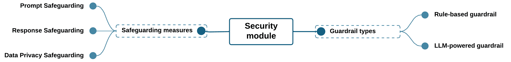

<!--yml

category: 未分类

日期：2025-01-11 12:14:38

-->

# LLM-Agent-UMF：基于LLM的代理统一建模框架，用于无缝集成多种主动/被动核心代理

> 来源：[https://arxiv.org/html/2409.11393/](https://arxiv.org/html/2409.11393/)

[![[未标注图片]](img/5bc393116fd78fb04651c8fac32bb08d.png) Amine Ben Hassouna](https://orcid.org/0009-0005-8915-7905) amine.benhassouna@medtech.tn, amine.benhassouna@dracodes.com（通讯作者）地中海技术学院，南地中海大学，突尼斯，突尼斯 Dracodes，突尼斯，突尼斯  [![[未标注图片]](img/c3e934a253ba9ab1514f01a405960886.png) Hana Chaari](https://orcid.org/0009-0002-2629-5102)^§ hana.chaari@medtech.tn, hana.chaari@dracodes.com 地中海技术学院，南地中海大学，突尼斯，突尼斯 Dracodes，突尼斯，突尼斯  [![[未标注图片]](img/b9a9330b7440933f12ac0dcec199e20a.png) Ines Belhaj](https://orcid.org/0009-0008-3435-740X)^§ ines.bel-hadj@medtech.tn, ines.bel-hadj@dracodes.com 地中海技术学院，南地中海大学，突尼斯，突尼斯 Dracodes，突尼斯，突尼斯

###### 摘要

在一个从多种来源收集并处理大量数据的时代，开发能够智能融合和分析这些信息的先进AI系统的需求日益增长。为了解决这些挑战，研究人员开始将工具集成到基于LLM的代理中，以增强整体信息融合过程。然而，这些技术的结合以及多个最前沿工作的提出都遵循了一种非统一的软件架构，导致了模块化缺失和研究者之间的术语不一致。为了解决这些问题，我们提出了一种新的基于LLM的代理统一建模框架（LLM-Agent-UMF），旨在从功能和软件架构的角度为代理开发奠定明确的基础。我们的框架清晰地区分了基于LLM的代理的不同组件，将LLM和工具与新的元素——核心代理——分开，核心代理作为代理的中央协调者。这个关键实体由五个模块组成：规划、记忆、个人资料、行动和安全——后者在之前的工作中经常被忽视。通过根据核心代理的权威性质将其分类为被动型和主动型，我们提出了多种多核代理架构，这些架构结合了不同代理的独特特性，以更高效地处理复杂任务。我们通过将该框架应用于十三个最前沿的代理进行评估，从而展示了其与这些代理功能的契合，并澄清了被忽视的架构方面。此外，我们通过将现有代理集成到新的混合主动/被动核心代理架构中，全面评估了我们提出的五种架构。这一分析为潜在的改进提供了清晰的见解，并突出了结合特定代理时所面临的挑战。

^§^§脚注：贡献相同。

*关键词* 基于LLM的代理 $\cdot$ 软件架构 $\cdot$ 模块化 $\cdot$ 隐私 $\cdot$ 安全 $\cdot$ 分类 $\cdot$ 多核代理

## 1 引言

大型语言模型（LLMs）在语言建模、问答、情感分析、自然语言理解（NLU）、常识推理和知识融合等任务中表现出色[[1](https://arxiv.org/html/2409.11393v2#bib.bib1), [2](https://arxiv.org/html/2409.11393v2#bib.bib2)]。然而，独立的LLM缺乏信息检索、数学推理、代码评估等其他技能。这些功能上的不足可以通过利用外部工具、知识库和人类反馈的AI代理来弥补。自主代理是一个与环境交互、感知环境并根据特定计划在时间上采取行动的系统[[3](https://arxiv.org/html/2409.11393v2#bib.bib3)]。虽然代理有不同的类别，但本文将重点讨论基于LLM的代理，通过将LLM和自主代理的能力相结合，可以完成广泛的任务[[1](https://arxiv.org/html/2409.11393v2#bib.bib1)]。

实际上，由LLM驱动的更加自然的对话界面的转变正在改变人类与代理的互动方式，实现无缝且直观的交互。此外，基于LLM的代理作为信息融合中介在智能地综合来自异构来源的数据并向人类用户或其他AI系统提供有意义的见解方面扮演着至关重要的角色。这些由LLM驱动的代理现在已成为AI代理领域的主流，并被视为朝着人工通用智能（AGI）迈进的重要步骤，带来了开发能够适应多种场景的AI代理的希望[[4](https://arxiv.org/html/2409.11393v2#bib.bib4)]。

理解这些智能体的潜力并改进它们，必须深入了解它们的结构。在基于LLM的智能体中，除了处理推理的LLM外，还有其他组件负责执行任务、确保智能体的安全性并处理其记忆[[4](https://arxiv.org/html/2409.11393v2#bib.bib4)]。但仅仅指出现有的功能对于开发者和研究人员来说是不够的。为了提供对这些智能体的全面概述，调查[[5](https://arxiv.org/html/2409.11393v2#bib.bib5)]提出了一个全面的构建框架，由四个主要模块组成，接下来将对其进行详细讨论。尽管该框架提供了对每个模块功能的宝贵见解，但它忽视了从软件架构角度对它们进行界定。这一视角对于开发者建立一个共同的基础架构以及研究人员进行改进至关重要。我们对最先进的基于LLM的智能体的分析揭示了共同的局限性：实现复杂性导致软件架构不规范且模糊；缺乏模块化和可组合性，使得组件无法被其他基于智能体的解决方案重用；以及维护困难，难以对现有智能体进行改进。

针对这些限制，我们提出了基于LLM的智能体统一建模框架（LLM-Agent-UMF）。根据我们所知，我们的框架是第一个强调清晰界定LLM驱动的智能体中各个组件，并从架构和功能的角度定义它们在指定边界内的交互的框架。除了传统的组件如LLM和工具外，我们在智能体中引入了一个新的单元，称之为“核心智能体”。这一开创性的实体进一步分为两种类型——主动核心智能体和被动核心智能体——它们增强了我们对每个组件能力的理解，并准确描述了智能体内部模块之间的动态关系。因此，我们简化了架构的复杂性，提升了组件的可重用性，推动了从多智能体系统到多核心智能体的转变。

在本文中，我们强调了LLM-Agent-UMF提供的多个优势，从解决术语歧义到引入增强模块（如安全模块）。为了验证我们框架的可靠性，我们将其应用于现有解决方案，并识别每个智能体中的模块。这一方法使我们能够评估合并一个智能体与另一个智能体的可行性和要求，最终目标是创建一个具有完全增强能力的智能体。

与以往的研究相比，本文的五个主要贡献可以总结如下：

1.  1.

    我们引入了一个新术语——核心代理，作为基于LLM的代理中的结构性子组件，以提高模块化，并促进代理和LLM技术领域的研究人员和贡献者之间更有效、更精确的沟通。

1.  2.

    我们通过采用[[5](https://arxiv.org/html/2409.11393v2#bib.bib5)] 提出的框架，来建模核心代理的内部结构，该框架最初是为了从抽象的功能角度描述整个代理系统。

1.  3.

    我们通过在核心代理中增强安全模块并在其他模块中引入新方法来改进我们的建模框架。

1.  4.

    我们将核心代理分为主动型和被动型，解释它们的异同，并突出它们各自的独特优势。

1.  5.

    最后，我们介绍了各种多核代理架构，强调混合型“一主多被动”核心代理架构是基于LLM的代理的最佳配置。

本文的其余部分结构如下：第[2](https://arxiv.org/html/2409.11393v2#S2 "2 Related Work ‣ LLM-Agent-UMF: LLM-based Agent Unified Modeling Framework for Seamless Integration of Multi Active/Passive Core-Agents")节介绍了基于LLM的代理的背景，并回顾了相关的前沿工作。第[3](https://arxiv.org/html/2409.11393v2#S3 "3 LLM-based Agent Unified Modeling Framework ‣ LLM-Agent-UMF: LLM-based Agent Unified Modeling Framework for Seamless Integration of Multi Active/Passive Core-Agents")节介绍了我们的基于LLM的代理统一建模框架及其可能的架构。第[4](https://arxiv.org/html/2409.11393v2#S4 "4 Results and discussion ‣ LLM-Agent-UMF: LLM-based Agent Unified Modeling Framework for Seamless Integration of Multi Active/Passive Core-Agents")节评估了我们提出的代理设计在利用多个不同代理能力方面的效率。最后，第[5](https://arxiv.org/html/2409.11393v2#S5 "5 Conclusion and future work ‣ LLM-Agent-UMF: LLM-based Agent Unified Modeling Framework for Seamless Integration of Multi Active/Passive Core-Agents")节总结了主要发现并讨论了未来的挑战。

## 2 相关工作

我们将通过提供一个全面的概述来开始本节，介绍作为我们工作基础的关键概念。首先，工具增强型LLM（大语言模型）是自然语言处理（NLP）领域的一项重大进展，它将LLM的语言理解和生成能力与与外部工具和应用程序接口（API）进行交互的能力结合在一起。例如，TALM [[6](https://arxiv.org/html/2409.11393v2#bib.bib6)] 引入了可以利用广泛功能的模型，从信息检索到任务规划和执行。

通过结合工具增强的 LLM，基于 LLM 的自主智能体在自然语言处理任务上表现出卓越的能力 [[7](https://arxiv.org/html/2409.11393v2#bib.bib7)]，包括推理 [[8](https://arxiv.org/html/2409.11393v2#bib.bib8)]、编程 [[9](https://arxiv.org/html/2409.11393v2#bib.bib9)] 和文本生成，超过了其他类型智能体在这些领域的表现。此外，它们还解决了独立 LLM 的一些局限性，如上下文长度限制和无法使用工具等问题。这一发展标志着科学界的重大突破，解释了基于 LLM 的智能体最近被广泛采用的原因。

来自各个学科的研究人员和从业者正利用这些智能体来解决复杂问题，并推动诸如游戏 [[10](https://arxiv.org/html/2409.11393v2#bib.bib10)] 等领域的创新，以及其他需要专业知识的行业 [[11](https://arxiv.org/html/2409.11393v2#bib.bib11)]。此外，将 LLM 融入科学研究的趋势，尤其是在化学领域 [[12](https://arxiv.org/html/2409.11393v2#bib.bib12)]，凸显了其变革性潜力，承诺推动新发现和新应用的进步。

在检查现有智能体时，我们发现这些智能体缺乏直接的安全措施或保护措施，以确保敏感信息的保护并增强整体系统的完整性。事实上，基于 LLM 的智能体的自治程度引发了关于伦理使用、恶意数据、隐私和稳健性等方面的重大担忧 [[13](https://arxiv.org/html/2409.11393v2#bib.bib13)]。值得注意的是，一个关键风险涉及到越狱（jailbreak）问题，这可以通过实施更强大的监控和控制机制来减轻，以便在部署过程中检测和响应越狱 [[14](https://arxiv.org/html/2409.11393v2#bib.bib14)]。此外，数据隐私在任何软件系统中，尤其是智能体中，始终是一个持续的挑战。为了解决这一问题，已经开发出多种方法来防止通过提示提取数据，例如利用隐私保护算法进行提示学习 [[15](https://arxiv.org/html/2409.11393v2#bib.bib15)]。这些发现促使我们在框架中强调这个常被忽视的方面，并加入了安全措施。

除了安全保障外，AI 系统的开发，特别是智能体的开发，必须遵循基本的软件开发原则，如模块化、可组合性和可维护性。这些原则提升了 AI 系统的灵活性、可扩展性和适应性，使其能够有效地满足用户和企业不断变化的需求。

图 1：调查中提出的基于大规模语言模型（LLM）智能体框架 [[5](https://arxiv.org/html/2409.11393v2#bib.bib5)]

现有的代理并不一定遵循这些原则，因为它们并不主要关注架构设计。这突显了架构框架在基于LLM的代理中的重要性，强调了它们在释放这些系统的全部潜力方面的核心作用。这些框架使得开发模块化、稳健、可扩展和互操作的设计成为可能。它们提供了必要的支撑，帮助构建越来越强大和可靠的代理，能够解决复杂的现实世界问题。

例如，论文[[7](https://arxiv.org/html/2409.11393v2#bib.bib7)]探讨了基于LLM的智能代理，指出了5个主要的轴心：规划、记忆、重新思考、环境和行动。尽管它们试图划分LLM、环境和工具之间的差异，但并未定义代理的软件组件。同样，调研中提出的框架[[5](https://arxiv.org/html/2409.11393v2#bib.bib5)]明确了LLM驱动的自主代理的结构和应用，并突出了如图[1](https://arxiv.org/html/2409.11393v2#S2.F1 "Figure 1 ‣ 2 Related Work ‣ LLM-Agent-UMF: LLM-based Agent Unified Modeling Framework for Seamless Integration of Multi Active/Passive Core-Agents")所示的四个关键模块：配置模块、记忆模块、规划模块和行动模块。

配置模块用于划定LLM的多样化角色。与此同时，记忆模块保留了内部日志，记录了代理在其动态环境中的过去思想、行动和观察，包括与用户的互动。规划模块指导代理将总体任务分解为可管理的步骤或子任务，通过利用过去的行为来增强响应能力，并在未来的计划中加以利用。综合来看，这些模块对行动模块有着显著影响，后者将代理的决策转化为具体输出，利用外部工具扩展代理的能力[[5](https://arxiv.org/html/2409.11393v2#bib.bib5)]。

尽管该框架有效地解决了代理的功能问题，但仍然存在一些需要改进的地方。首先，某些模块之间存在功能重叠，特别是在规划和记忆模块之间的反思活动重叠。其次，记忆的定义不明确，如在[3.1节](https://arxiv.org/html/2409.11393v2#S3.SS1 "3.1 Core-Agent: Keystone component of an LLM-based agent ‣ 3 LLM-based Agent Unified Modeling Framework ‣ LLM-Agent-UMF: LLM-based Agent Unified Modeling Framework for Seamless Integration of Multi Active/Passive Core-Agents")中将讨论这一点，这导致了混淆，因为该术语被用来表示不同的概念，但没有明确的区分。最后，正如[图1](https://arxiv.org/html/2409.11393v2#S2.F1 "Figure 1 ‣ 2 Related Work ‣ LLM-Agent-UMF: LLM-based Agent Unified Modeling Framework for Seamless Integration of Multi Active/Passive Core-Agents")所示，框架并未明确说明 LLM、工具、数据源和记忆是否是代理的一部分。这种对各模块功能的模糊区分导致了软件开发人员之间的分歧，造成了不兼容并且抑制了可重用性。在下一节中，我们将介绍框架的主要组件，解释它们包含的理由，并强调它们如何解决其他研究中的局限性。

## 3 LLM 基于代理的统一建模框架

为了全面探讨基于LLM的代理的能力，我们对多个学术数据库和在线数字图书馆进行了严格的研究。这些资源包括 ScienceDirect、Scopus、Springer、Nature、IEEE Xplore、ACM Digital Library、ACL Anthology、NeurIPS 会议录、AAAI 图书馆、arXiv、Google Scholar、Semantic Scholar 等。分析集中于涉及工具驱动的LLM、LLM 基于代理、LLM 规划策略、信息融合、AI伦理问题、AI隐私考虑、LLM 安全与防护、软件建模最佳实践以及在 AI 系统背景下的术语一致性的文章。

在本节中，我们首先介绍了框架的基础组件——核心代理，并将其与LLM基于代理中的其他元素区分开来。通过审视现有文献并分析其不足之处，我们勾画出了一种统一的方法来设计核心代理的内部结构。通过这一全面的分析，我们将核心代理分为两类：主动核心代理和被动核心代理。最后，我们概述了多核心代理架构，突出了 LLM-Agent-UMF 在建模多核心代理系统中的高效性。

### 3.1 核心代理：LLM 基于代理的关键组件

一些研究旨在为构建基于LLM的代理建立一个明确定义的框架。例如，论文[[16](https://arxiv.org/html/2409.11393v2#bib.bib16)]提出了一个使用LLM驱动的代理设计教育问题解决模拟的框架。作者强调，在设计过程中将AI代理与环境分开非常重要。然而，论文并未提供一个清晰的代理组件框架，这使得未来的工作难以识别具体的修改或重用点。如果没有透明且详细的代理架构和组件交互概述，就很难确定可以在哪些地方进行更改以改变代理的行为，或者其组件如何在其他系统中被重用和集成。

图 2：核心代理作为基于LLM的代理的中心组件

这个问题源于软件设计中缺乏模块化，通过遵循单一职责原则（SRP）可以减轻这一问题。正如论文[[17](https://arxiv.org/html/2409.11393v2#bib.bib17)]中强调的，SRP在软件开发中至关重要，因为它为软件的不同层次提供了细粒度的控制，无论是在代码还是功能方面。这种细粒度有助于未来改进的实施，并增强了重用的机会。此外，应用这一原则可以防止各种代码异味，确保代码的模块化，从而使从业人员更容易管理和维护软件。

论文[[18](https://arxiv.org/html/2409.11393v2#bib.bib18)]尝试在基于LLM的代理、它们使用的工具和周围环境之间建立边界。尽管所提出的基于LLM的代理系统提供了代理组件的抽象分离，但从软件工程的角度来看，它并未清晰地界定这些组件。理解统一代理中各个组件的理论贡献是有价值的；然而，从实际开发的角度来看，识别代理内部每个组件的位置、功能和角色至关重要。

从软件角度对基于LLM的智能体进行彻底分析后，我们将基于LLM的智能体视为一个包含多个组件的软件系统，其中包括工具、LLM和核心智能体（core-agent），这是我们新引入的术语。虽然核心智能体并不是一个新发明的组件，但它作为一个标签，用于指代在过去的框架或架构中以前隐含或未命名的现有功能元素。本质上，这个标签突出了它在这些系统中的关键作用。该术语有助于通过识别基于LLM的智能体的基本部分来澄清其结构。如图[2](https://arxiv.org/html/2409.11393v2#S3.F2 "Figure 2 ‣ 3.1 Core-Agent: Keystone component of an LLM-based agent ‣ 3 LLM-based Agent Unified Modeling Framework ‣ LLM-Agent-UMF: LLM-based Agent Unified Modeling Framework for Seamless Integration of Multi Active/Passive Core-Agents")所示，核心智能体与环境互动，与语言模型协作以做出决策，并将高层次目标转化为具体行动，必要时利用可用工具。

核心智能体：

在这个架构中，核心智能体作为关键组件，充当着自身与智能体其他所有元素之间的重要接口。它促进这些不同部分之间的沟通与协调，以确保整个系统的最佳功能。作为智能体的执行者，核心智能体将大型语言模型（LLM）制定的计划转化为可执行的步骤，可能会利用工具，并与环境进行互动，为智能体提供外部世界的洞察。这些能力使核心智能体能够作为控制器操作，确保行动的精确和复杂的同步，从而实现完美的互动和有效的信息共享。

核心智能体的重要性通过它与LLM的共生关系得到了强调，二者互相增强对方的能力。LLM展现了强大的语言理解、认知和推理能力，以及广泛的知识。然而，它缺乏感知和行动组件，而这些正是由核心智能体提供的，使其能够直接与环境互动。这种协作扩展了智能体能够解决的问题范围，有效地结合了LLM和核心智能体的优势，能够应对更广泛的挑战。

此外，核心智能体作为控制器的存在，减轻了智能体的整体复杂性，特别是在多LLM设置中，它作为智能体内主要的通信枢纽。因此，LLM之间的信息流通过核心智能体进行管理，从而简化了交互并确保了高效的协调。在通信方面，核心智能体能够通过结构良好的管道与人类进行交互。然而，也有一些情况下，核心智能体可能不会与人类直接沟通。这种变化依赖于具体类型的核心智能体，详细信息请参见第[3.3](https://arxiv.org/html/2409.11393v2#S3.SS3 "3.3 Active/Passive Core-Agent Classification ‣ 3 LLM-based Agent Unified Modeling Framework ‣ LLM-Agent-UMF: LLM-based Agent Unified Modeling Framework for Seamless Integration of Multi Active/Passive Core-Agents")节。

LLM:

LLM充当一个涵盖认知任务的脑力实体，例如自然语言理解和基于特定上下文的全面文本生成。事实上，LLM可以与核心智能体进行通信，核心智能体又可以与系统中的工具或数据源进行交互。考虑到智能体可以表现为单模态或多模态[[18](https://arxiv.org/html/2409.11393v2#bib.bib18)]，后者可以通过不同任务特定的LLM进行复制，如图[2](https://arxiv.org/html/2409.11393v2#S3.F2 "Figure 2 ‣ 3.1 Core-Agent: Keystone component of an LLM-based agent ‣ 3 LLM-based Agent Unified Modeling Framework ‣ LLM-Agent-UMF: LLM-based Agent Unified Modeling Framework for Seamless Integration of Multi Active/Passive Core-Agents")所示。这一区别促进了我们基于LLM的智能体统一建模框架的模块化，使其可以扩展并添加更多领域特定的模型，而无需对整体系统架构进行更改，更符合开闭原则（OCP）[[19](https://arxiv.org/html/2409.11393v2#bib.bib19), [20](https://arxiv.org/html/2409.11393v2#bib.bib20)]。

Tools:

在基于LLM的智能体中，工具是重要的资产。它们可以采取多种形式，例如补充系统、软件应用程序，甚至是扩展和增强智能体能力的物理设备[[12](https://arxiv.org/html/2409.11393v2#bib.bib12)]。这些工具涵盖了不同的复杂性范围，从基本的API集成到为特定任务设计的复杂辅助系统。在这种背景下，工具可以被认为是外部的，如果它们是独立的系统，能够实现完整的目标；或者是内部的，如果它们与核心智能体合作，共同完成智能体目标范围内的任务。

总之，我们提出的基于LLM的智能体术语，包括将核心智能体作为其中央协调组件，旨在从软件角度提高描述这些系统的清晰度和一致性。核心智能体的重要性被强调，突出其内部结构的研究意义。第[3.2](https://arxiv.org/html/2409.11393v2#S3.SS2 "3.2 Modeling the Core-Agent Internal Structure ‣ 3 LLM-based Agent Unified Modeling Framework ‣ LLM-Agent-UMF: LLM-based Agent Unified Modeling Framework for Seamless Integration of Multi Active/Passive Core-Agents")节专注于定义核心智能体内的各个模块，以及它们如何协同工作，利用现有工具促进认知任务、决策制定和行动执行。

### 3.2 核心智能体内部结构建模

人脑表现出显著的模块化特征，不同区域和功能协同工作，促进认知过程、决策制定和行为表现。受到这种有组织设计的启发，我们提出的框架旨在通过引入五个内部模块来模拟大脑的模块化结构：规划模块、记忆模块、档案模块、行动模块和安全模块（图[3](https://arxiv.org/html/2409.11393v2#S3.F3 "Figure 3 ‣ 3.2 Modeling the Core-Agent Internal Structure ‣ 3 LLM-based Agent Unified Modeling Framework ‣ LLM-Agent-UMF: LLM-based Agent Unified Modeling Framework for Seamless Integration of Multi Active/Passive Core-Agents")）。通过整合这些概念，核心智能体作为中央协调者，控制不同组件之间的互动和信息流动，正如前一节中详细阐述的那样。

图3：基于LLM的智能体中核心智能体内部结构概览

这一模块化框架有效地解决了可扩展性和可维护性的问题。具体来说，它允许独立开发和集成新模块，而不会影响整个系统。事实上，这些模块可以单独替换或升级，促进新能力的添加，并使框架更容易适应新需求或技术。此外，模块化结构促进了代码的重用，因为各个模块可以在不同的智能体或应用之间共享，从而减少重复性并增强一致性。

为了提供一个强有力的比较并强调我们框架的创新性，比较现有方法是非常有启发性的。最近的一项调查[[5](https://arxiv.org/html/2409.11393v2#bib.bib5)]介绍了一个基于LLM的代理框架，包含四个关键模块：个人资料、记忆、规划和行动模块。有关该框架的全面概述，我们建议读者参考第[2](https://arxiv.org/html/2409.11393v2#S2 "2 Related Work ‣ LLM-Agent-UMF: LLM-based Agent Unified Modeling Framework for Seamless Integration of Multi Active/Passive Core-Agents")节。尽管该调查提出的框架将基于LLM的代理视为一个完整的系统，并未区分核心组件与其他实体，但我们为核心代理特别量身定制的适配版本需要修改某些定义和模块结构，以适应LLM与核心代理之间的分离。值得注意的是，我们不得不重新定位这四个关键模块，使其在框架中作为核心代理的一部分进行操作，同时新增了一个安全导向模块。

#### 3.2.1 规划模块

在我们提出的框架中，规划模块是一个关键要素，它使代理能够将复杂问题分解并生成有效的计划，与原始框架[[5](https://arxiv.org/html/2409.11393v2#bib.bib5)]中的规划模块相同。然而，在我们的解决方案中，规划模块成为核心代理的一部分，并与其他兄弟模块协作，使代理能够实现特定目标。

规划模块需要复杂的理解和推理能力[[21](https://arxiv.org/html/2409.11393v2#bib.bib21)]，这可以利用LLM的能力。事实上，LLM能够理解细致的指令、解读隐含信息并适应各种问题领域，这使其在规划过程中成为一个宝贵的资产。因此，规划模块能够制定更全面、具有上下文意识并且适应性强的计划，从而显著提升核心代理的决策过程。此外，规划模块与核心代理中的所有其他模块密切协作，包括与记忆模块协作，进行增强记忆的规划[[22](https://arxiv.org/html/2409.11393v2#bib.bib22)]。这种协作通过利用存储的信息，如常识、过去的经验和领域特定的知识，增强了规划能力。

本节将从四个关键方面详细介绍该模块的功能和特性：过程、策略、技术和反馈来源（图 [4](https://arxiv.org/html/2409.11393v2#S3.F4 "Figure 4 ‣ 3.2.1 Planning Module ‣ 3.2 Modeling the Core-Agent Internal Structure ‣ 3 LLM-based Agent Unified Modeling Framework ‣ LLM-Agent-UMF: LLM-based Agent Unified Modeling Framework for Seamless Integration of Multi Active/Passive Core-Agents")）。这些方面源自于我们在核心代理与LLM之间、以及我们的系统与外部系统之间所建立的明确区分（图 [3](https://arxiv.org/html/2409.11393v2#S3.F3 "Figure 3 ‣ 3.2 Modeling the Core-Agent Internal Structure ‣ 3 LLM-based Agent Unified Modeling Framework ‣ LLM-Agent-UMF: LLM-based Agent Unified Modeling Framework for Seamless Integration of Multi Active/Passive Core-Agents")）。

图 4：规划模块功能视角

规划过程：

在生成执行步骤时，规划模块采用逐步推进的方法。该方法规定了任务如何分解、规划过程如何展开，以及如何生成和评估备选解决方案。受人类将复杂任务分解为更简单任务以实现总体目标的能力启发，这一过程包括两个主要步骤 [[22](https://arxiv.org/html/2409.11393v2#bib.bib22)]。

+   •

    任务分解：

    这一初始阶段涉及将复杂任务分解为更简单的子任务，从而建立一个有结构的中间目标层级。复杂任务的分解可以采用两种主要方法：在非迭代分解方法中，复杂任务一次性分解为简单子任务。规划模块在一步骤中定义所有子任务，创建完整的任务层级结构。这种方法提供了对整个任务结构的全面概览。然而，迭代分解方法则是一步步地进行任务分解。事实上，规划模块首先定义初始子任务和目标，制定适当的计划并生成执行步骤。完成计划和执行步骤后，会评估输出，并定义下一个子任务。此过程重复进行，每个新的子任务都将被规划并执行，以推动定义下一个子任务的实现。这种方法的关键优势在于其灵活性，能够根据每个子任务的结果调整计划。迭代方法的一个典型应用是分解-对齐-推理代理（DARA）框架 [[23](https://arxiv.org/html/2409.11393v2#bib.bib23)]。DARA展示了迭代分解如何促使更加精准和情境感知的规划，尤其适用于多个相互依赖的子任务的复杂任务。

+   •

    计划生成：

    对于从分解步骤中衍生出的每个子任务，都会制定一个具体的计划，概述实现任务目标的程序，同时定义涉及的不同工具和参与方。根据所选的规划策略，模块可以为每个子任务生成单一计划或多个候选计划，这些将在下一节中进一步详细介绍。

规划策略：

为了指导复杂任务的规划、组织和执行，规划模块在生成计划时必须遵循特定的策略来制定程序。选择规划策略可以显著影响最终计划的有效性、效率和稳健性。在LLM-Agent-UMF框架中，我们定义了两种主要策略：

+   •

    单路径策略：

    该方法涉及生成一个单一的路径或程序序列以实现目标，按计划逐步执行，而不探索替代方案，从而提供一种直接的、确定性的规划方法。思维链（CoT）[[24](https://arxiv.org/html/2409.11393v2#bib.bib24)]就是概述这种策略的一个例子。实际上，它使用顺序推理，将复杂问题分解为多个程序，每个程序都建立在前一个程序的基础上。

+   •

    多路径策略：

    因此，在单路径策略中，任何一个程序中的错误都可能导致后续程序或整个计划变得次优或不可行[[22](https://arxiv.org/html/2409.11393v2#bib.bib22)]，从而对整个策略产生负面影响。一种减轻此类失败的直接方法是多路径策略，该策略包括两个主要步骤：第一阶段利用大型语言模型（LLM）生成复杂任务的多个计划。事实上，每个中间步骤都包含多个后续路径[[5](https://arxiv.org/html/2409.11393v2#bib.bib5)]。至于第二阶段，则涉及评估和选择最合适的路径。

    事实上，思维树（ToT）和思维图（GoT）[[25](https://arxiv.org/html/2409.11393v2#bib.bib25)]是两种采用这种多路径方法的框架。它们通过利用LLM作为思维生成器来生成中间程序，这些程序要么按层次树形结构组织（ToT），要么按更复杂的图形结构组织（GoT）。然而，这些结构的管理复杂性不能仅由LLM来处理，它需要集成一个专门的软件组件来协调整个过程，与LLM进行交互，并将思维组织成所需的结构，无论是树形结构还是图形结构。这个核心软件组件被称为规划模块。规划模块进一步评估生成结构中的不同路径，并根据评估结果选择一个最优计划[[22](https://arxiv.org/html/2409.11393v2#bib.bib22)]。

规划技术：

规划模块遵循规划技术作为方法论来形成可执行的计划。这些技术的选择基于任务的复杂性以及对上下文理解的需求等标准。我们的框架呈现了两种主要技术：

+   •

    基于规则的技术：

    在我们的架构框架中，基于规则的方法包括文献中常称为符号规划器的技术[[22](https://arxiv.org/html/2409.11393v2#bib.bib22)]。这些技术特别在具有复杂约束的情境下（如数学问题求解或在高度问题化的情况下生成计划）证明了它们的价值。

    符号规划器利用像PDDL（规划领域定义语言）这样的框架，采用形式化推理从初始状态到目标状态绘制最优轨迹[[26](https://arxiv.org/html/2409.11393v2#bib.bib26)]。这些方法涉及将问题场景形式化为结构化格式，随后将其提交给专业的规划算法进行处理。

+   •

    基于语言模型的技术：

    基于语言模型的（LM驱动的）方法利用语言模型固有的广泛知识和推理能力来策划规划策略。在我们的框架中，这一类别还包括神经规划器[[22](https://arxiv.org/html/2409.11393v2#bib.bib22)]，他们擅长处理复杂和模糊的任务，要求精确的理解和适应性的问题解决能力。

我们框架中的这种分类清晰地区分了主要由语言模型驱动的方法和依赖于基于规则的方法。这有助于在我们核心智能体架构的背景下，更流畅地理解规划技术，同时也承认了在[[5](https://arxiv.org/html/2409.11393v2#bib.bib5)]和[[22](https://arxiv.org/html/2409.11393v2#bib.bib22)]中各种规划方法的宝贵贡献。

反馈来源：

没有反馈的规划可能会面临多个挑战，因为反馈在优化核心智能体内规划模块的性能中起着至关重要的作用。例如，在任务分解的迭代过程中，反馈对下一步生成的影响很大，并且有助于增强智能体与用户期望之间的对齐。为了有效应对这些挑战，规划模块依赖于多种反馈来源。如图[3](https://arxiv.org/html/2409.11393v2#S3.F3 "Figure 3 ‣ 3.2 Modeling the Core-Agent Internal Structure ‣ 3 LLM-based Agent Unified Modeling Framework ‣ LLM-Agent-UMF: LLM-based Agent Unified Modeling Framework for Seamless Integration of Multi Active/Passive Core-Agents")所示，核心智能体与其系统边界内的工具以及其范围外的实体（如外部系统和人类）进行交互。因此，与这些组件的互动可以提供宝贵的反馈：

+   •

    人类反馈：

    人类反馈可能是对齐规划模块与人类价值观和偏好的关键信息来源。这种反馈源自核心代理与人类之间的直接互动。例如，当核心代理提出一个计划时，人类可能会对其适当性、有效性或伦理影响提供反馈。这种反馈可能以各种形式出现，如评分或评论。

+   •

    工具反馈：

    核心代理通常会利用各种工具，这些工具可以是系统的内部组件或外部应用程序。例如，一个内部计算器工具在接收到像除零这样的非法操作时可能会引发异常。同样，外部工具也会以错误信息或性能指标的形式提供反馈。实际上，如果核心代理使用一个天气预报远程API，那么预报的准确性就作为反馈。这种工具提供的反馈帮助核心代理优化其工具选择和使用策略。

+   •

    兄弟核心代理反馈：

    在多核代理系统中，正如在第[3.4节](https://arxiv.org/html/2409.11393v2#S3.SS4 "3.4 多主动/被动核心代理架构 ‣ 3 基于LLM的代理统一建模框架 ‣ LLM-Agent-UMF：用于无缝集成多主动/被动核心代理的LLM代理统一建模框架")中将讨论的那样，来自兄弟核心代理的反馈成为了一个宝贵的信息来源。这种反馈源自于同一系统中不同核心代理之间的互动和信息交换。此类代理内反馈可以包括共享的观察结果、对问题的不同看法，或对提出计划的评估。这种反馈促进了协作式问题解决，并允许对计划进行交叉验证。通过促进集体智慧，它增强了多核代理系统的整体鲁棒性。

总结来说，规划模块是我们框架中的一个关键组成部分，采用了一个结构化的规划过程，该过程包括任务分解和计划生成步骤。这个过程与规划策略——单路径和多路径——紧密相连，尽管有所不同，这些策略指导了计划的制定。这些策略至关重要，因为它们塑造了核心代理的解决问题的方法，影响了解决方案的质量和效率。通过分解任务和生成多个计划，核心代理能够更快速有效地识别最优解决方案。

规划模块的有效性通过吸收来自各方的反馈进一步增强，这些反馈来源包括人类、工具和同胞核心智能体。这种反馈循环允许计划的持续完善和调整，确保智能体保持响应性和高效性。此外，整合规划策略和反馈机制增强了适应性，使核心智能体能够应对各种场景，从简单任务到复杂挑战。这样的战略多样性使系统具备更强的智能和多功能性。

需要注意的是，规划模块并非独立运行。它与其他模块，特别是记忆模块，密切协作，这将在下一节中讨论。这种协作，尤其是在记忆增强规划的背景下，通过利用存储的信息和过去的经验，进一步增强了核心智能体的能力。

#### 3.2.2 记忆模块

记忆模块负责存储和检索与核心智能体活动相关的信息，从而提升核心智能体的决策效率和任务执行能力。在[[27](https://arxiv.org/html/2409.11393v2#bib.bib27)]和[[5](https://arxiv.org/html/2409.11393v2#bib.bib5)]中，基于LLM的智能体中的记忆模块从抽象功能视角进行探讨，而忽略了从软件架构角度进行分析。这导致了记忆模块与[[5](https://arxiv.org/html/2409.11393v2#bib.bib5)]中建议的框架中定义的其他模块之间的某些重叠。因此，我们提出了一种基于三个视角：记忆范围、记忆位置和记忆格式（图[5](https://arxiv.org/html/2409.11393v2#S3.F5 "图5 ‣ 3.2.2 记忆模块 ‣ 3.2 建模核心智能体内部结构 ‣ 3 LLM基础智能体统一建模框架 ‣ LLM-Agent-UMF：无缝集成多活动/被动核心智能体的LLM基础智能体统一建模框架")）的更加全面和明确定义的记忆模块展示。

图5：记忆模块功能视角

调查中提出的框架[[5](https://arxiv.org/html/2409.11393v2#bib.bib5)]将记忆结构分为统一记忆，旨在通过上下文学习模拟人类的短期记忆，以及混合记忆，代表短期和长期记忆功能。虽然这些名称旨在区分不同类型的智能体系统，但它们在不必要的情况下偏离了该领域已经建立的术语。通过第一个视角——记忆范围，介绍了一种更为传统且广泛认可的分类法，该分类包括短期记忆和长期记忆，与人类记忆类型的描述更加一致，详见[[28](https://arxiv.org/html/2409.11393v2#bib.bib28)]。

与框架[[5](https://arxiv.org/html/2409.11393v2#bib.bib5)]中定义的方式相反，我们对短期记忆的定义更侧重于核心代理的影响，而不是LLM。从内容的角度来看，来自不同来源的信息共同构成了短期记忆。如论文[[27](https://arxiv.org/html/2409.11393v2#bib.bib27)]所指出，数据可以来源于某一任务的一次试验，或来自同一任务的先前试验，这被称为短期记忆。这些数据的范围较窄，专注于特定任务，主要传递给LLM，目的是进行上下文学习并通过更多与当前任务相关的信息增强LLM的能力。相反，长期记忆指的是在较长时间内存储和回忆信息的能力，超出了特定任务的范围。这种类型的记忆使得核心代理能够在长时间的互动中保持一致性和上下文，学习并适应过去的经验。也就是说，MemoryBank [[29](https://arxiv.org/html/2409.11393v2#bib.bib29)]将与用户的所有互动存储在一个大的符号性记忆中，并将经验处理成高级总结，以便在未来类似任务中反思。

然而，核心代理可以保留的记忆量始终是有限的。因此，必须实现诸如遗忘机制等技术，以决定丢弃哪些记忆并保留哪些记忆[[27](https://arxiv.org/html/2409.11393v2#bib.bib27)]。如前所述，调查[[5](https://arxiv.org/html/2409.11393v2#bib.bib5)]从抽象的功能角度处理记忆，这与我们框架中强调明确区分不同模块的观点不一致。我们的方法旨在从软件角度提供对核心代理组件的更精确和结构化的理解。例如，根据调查[[5](https://arxiv.org/html/2409.11393v2#bib.bib5)]，记忆模块包括一个带有认知方面的“反思”操作，而我们认为这属于规划模块。规划模块侧重于实现代理的目标，负责决策并协调其他所有模块。因此，它更适合与记忆模块协作，通过访问存储的数据来处理反思和记忆优化。同样，从记忆中提取有用信息并反思以制定可靠的计划是规划模块的职责。例如，Voyager [[30](https://arxiv.org/html/2409.11393v2#bib.bib30)]将环境反馈视为短期信息，利用LLM的能力调整计划，并在规划模块范围内做出更高效和理性的决策。

此外，写操作是内存的一个关键方面，它将内存与数据存储库区分开来。因此，我们将知识存储库排除在内存类别之外。事实上，从数据库中以只读方式检索知识属于行动模块的责任，后者将在第[3.2.4](https://arxiv.org/html/2409.11393v2#S3.SS2.SSS4 "3.2.4 行动模块 ‣ 3.2 核心代理内部结构建模 ‣ 3 基于LLM的代理统一建模框架 ‣ LLM-Agent-UMF: 用于无缝集成多活动/被动核心代理的基于LLM的代理统一建模框架")节中讨论。由于我们已将写入和读取设置为内存模块的基本操作，并排除了反射作为可能的操作集合之一，因此我们决定在我们的框架中省略[[5](https://arxiv.org/html/2409.11393v2#bib.bib5)]中讨论的内存操作视角。

除了关注数据的范围，包括试验内和试验之间的范围，如[[27](https://arxiv.org/html/2409.11393v2#bib.bib27)]所述，我们还强调内存的位置，因为从软件架构的角度来看，这是更为相关的。因此，我们引入了第二个视角——内存位置（Memory Location），该视角包含两类：嵌入式内存（Embedded Memory），即位于核心代理边界内部的内存；以及内存扩展（Memory Extension），即位于核心代理边界之外，但仍在代理系统的边界内，如图[3](https://arxiv.org/html/2409.11393v2#S3.F3 "图 3 ‣ 3.2 核心代理内部结构建模 ‣ 3 基于LLM的代理统一建模框架 ‣ LLM-Agent-UMF: 用于无缝集成多活动/被动核心代理的基于LLM的代理统一建模框架")所示。

最后，最后一个视角——内存格式（Memory Format），在[[5](https://arxiv.org/html/2409.11393v2#bib.bib5)]和[[27](https://arxiv.org/html/2409.11393v2#bib.bib27)]的工作中均已出现，关注内存的形态和表示，这些形态可以有多种表现：自然语言、嵌入、SQL数据库或结构化列表。事实上，诸如代理行为和观察之类的内存信息可以直接使用原始自然语言进行描述，从而提供灵活性并保持丰富的语义信息。另一种解决方案是将内存信息编码为嵌入向量，以增强检索和读取效率。此外，正如ChatDB [[31](https://arxiv.org/html/2409.11393v2#bib.bib31)]所示，数据库可以作为内存持有者，存储内存信息的结构化表示，使代理能够通过SQL查询有效全面地操作内存。最后，像GITM [[32](https://arxiv.org/html/2409.11393v2#bib.bib32)]中使用的结构化列表，让核心代理以结构化方式保存子目标的顺序操作，并将内存信息组织成层次化的列表，以简洁地传达语义信息。

根据观察，最常见的格式是文本格式，然而[[5](https://arxiv.org/html/2409.11393v2#bib.bib5)]指出，这些格式并不是互斥的，因此一个核心代理可以处理多种格式，例如GITM的键值列表结构，它将嵌入向量和原始自然语言结合起来，从而利用每种方法的相应优势。

#### 3.2.3 配置模块

与论文中提出的方法[[5](https://arxiv.org/html/2409.11393v2#bib.bib5)]类似，我们的框架将配置模块的功能定义为确立LLM的角色，并采用更多样化的方法。该模板明确区分了核心代理（core-agent）和LLM的角色。实际上，配置模块促进了根据特定用例和规划模块所采用策略动态适配各种配置文件。配置模块具有四种定义配置文件的方法：手工上下文学习方法（Handcrafted In-Context Learning Method）、LLM生成方法（LLM-generation method）、数据集对齐方法（Dataset Alignment Method），以及新引入的微调可插拔模块方法（Fine-tuned Pluggable Modules method）（图[6](https://arxiv.org/html/2409.11393v2#S3.F6 "图6 ‣ 3.2.3 配置模块 ‣ 3.2 核心代理内部结构建模 ‣ 3 LLM基础代理统一建模框架 ‣ LLM-Agent-UMF：LLM基础代理统一建模框架，实现多主动/被动核心代理的无缝集成")）。

图6：配置模块技术

手工上下文学习方法（Handcrafted In-Context Learning Method），此前在调查中被称为手工制作方法[[5](https://arxiv.org/html/2409.11393v2#bib.bib5)]，涉及委托核心代理通过使用预配置提示的上下文学习技术来设置LLM的配置文件。该方法可以对LLM的个性和行为进行精细控制。尽管这是一个易于实现的方法，但它需要使用适合上下文学习的LLM，并且通常具有较大的体积。

LLM生成方法（LLM-Generation Method）便于使用LLM自动创建代理的个人资料。该方法首先通过指定个人资料的特征开始，包括如年龄、性别和兴趣等详细信息。可以选择若干个种子代理个人资料作为少量示例，正如论文[[5](https://arxiv.org/html/2409.11393v2#bib.bib5)]中所述。一旦这些种子个人资料建立，LLM就会通过参考最初的种子示例来生成额外的个人资料。例如，RecAgent[[33](https://arxiv.org/html/2409.11393v2#bib.bib33)]建议设计适当的提示，鼓励GPT模型通过参考与各种样本相对应的属性表来生成全面的个人资料描述，并生成更多个人资料。尽管LLM生成方法提供了显著的节省时间的优势，但它依赖于LLM，这一依赖可能导致生成的代理个人资料中存在潜在的偏见[[34](https://arxiv.org/html/2409.11393v2#bib.bib34)]或不准确性。

此外，数据集对齐方法（Dataset Alignment Method）从现实世界的数据集中提取个人资料[[5](https://arxiv.org/html/2409.11393v2#bib.bib5)]，这些数据包含了关于实际个体的信息。该方法首先将这些数据集中的信息组织成自然语言提示，描述LLM角色的特征。然后，这些结构化数据用于创建个人资料。在[[35](https://arxiv.org/html/2409.11393v2#bib.bib35)]的研究中，研究人员将GPT-3与来自ANES的现实世界人口统计数据结合，基于如居住州等特征分配角色。随后，他们评估了GPT-3是否能够可靠地模仿真实人类行为。数据集对齐方法确保LLM个人资料准确反映现实世界的属性和行为，从而使其具有意义和现实性。然而，这种方法的有效性在很大程度上依赖于底层现实世界数据集的准确性和代表性。

最后，我们介绍了微调可插拔模块方法（Fine-tuned Pluggable Modules Method），这是一种开创性的解决方案，旨在通过多种最先进的技术来设置LLM的个人资料，旨在提供LLM个人资料的高效定制和适应。这种方法通过注入经过微调的可插拔模块来定义LLM个人资料，以影响语言模型的行为[[36](https://arxiv.org/html/2409.11393v2#bib.bib36)]。事实上，该模块是一组额外的可调参数，必须使用参数高效微调（PEFT）技术进行预先训练，如序列适配器（AdapterS）、提示微调（Prompt-tuning）或LoRA[[37](https://arxiv.org/html/2409.11393v2#bib.bib37)]。

该过程通过消除传统上需要将大量提示信息注入每个查询中的上下文学习，确保了精确有效的定制，以实现所需的配置文件。通过省略这一步，所需的上下文大小大大减少，因为适配器直接将所需的行为和配置文件编码到模型参数中。这种上下文大小和内存占用的减少，使得LLM能够更高效地运行，在推理过程中使用更少的内存，而不牺牲性能和灵活性。

#### 3.2.4 行动模块

虽然我们在本模块中丰富了应用的方法，但我们几乎按与[[5](https://arxiv.org/html/2409.11393v2#bib.bib5)]中描述的方式相似的方式，在LLM-Agent-UMF框架内定义它。行动模块负责将规划模块中的高层指令转化为低层次的行动，利用其环境中可用的工具。在我们的框架中，行动模块与安全模块交互，以确保任何执行的行动都符合预定义的标准，并防止信息泄露，具体将在[3.2.5](https://arxiv.org/html/2409.11393v2#S3.SS2.SSS5 "3.2.5 安全模块 ‣ 3.2 核心代理内部结构建模 ‣ 3 LLM基础代理统一建模框架 ‣ LLM-Agent-UMF: 基于LLM的代理统一建模框架，支持多种主动/被动核心代理的无缝集成")中进一步解释。实质上，我们的分析考虑了四个基本方面：目标、触发器、行动空间和影响（见图[7](https://arxiv.org/html/2409.11393v2#S3.F7 "图7 ‣ 3.2.4 行动模块 ‣ 3.2 核心代理内部结构建模 ‣ 3 LLM基础代理统一建模框架 ‣ LLM-Agent-UMF: 基于LLM的代理统一建模框架，支持多种主动/被动核心代理的无缝集成")）。

图7：行动模块功能视角

第一个视角，行动目标，代表了核心代理通过执行各种基于目标的行动（如任务完成、沟通或环境探索）来实现其预期目标，这与[[5](https://arxiv.org/html/2409.11393v2#bib.bib5)]中提出的框架相一致。第二个方面，行动触发，关注的是如何产生这些行动以及背后的催化因素。这个视角来源于[[5](https://arxiv.org/html/2409.11393v2#bib.bib5)]中最初提出的行动生产视角，但我们更多强调驱动行动生产的因果关系。在这方面，[[5](https://arxiv.org/html/2409.11393v2#bib.bib5)]中提到的“通过记忆回忆进行行动”方法被认为更适合由规划模块处理，因为它专注于利用过去的经验做出适当的决策。实际上，核心代理可以通过两种主要触发器来产生行动：规划跟随和API调用请求，这是我们框架中新引入的。在规划跟随触发器的情况下，核心代理可以通过遵循由规划模块详细制定的预生成计划来执行行动。事实上，在GITM [[32](https://arxiv.org/html/2409.11393v2#bib.bib32)]中，代理将任务分解为子任务和程序，并通过LLM接口在Minecraft世界中执行适当的行动。通过探索其他最先进的技术，如TALM [[6](https://arxiv.org/html/2409.11393v2#bib.bib6)]和ToolFormer [[38](https://arxiv.org/html/2409.11393v2#bib.bib38)]，这些技术展示了LLM通过整合外部工具来提升跨任务表现的能力，我们引入了一种新的触发器，名为API调用请求。这种方法使核心代理能够响应LLM发起的API调用请求执行行动，从而促进了外部资源的顺利集成和有效利用。

第三个视角，行动空间，定义了核心智能体在响应其目标和环境因素时可以执行的可能行动集合。这个概念与涉及内部状态变化和内存管理的操作不同，后者由内存模块单独处理。与[[5](https://arxiv.org/html/2409.11393v2#bib.bib5)]相比，我们的框架强调这种分离，以避免行动和内存模块功能之间的潜在重叠，从而确保职责的清晰划分，以实现高效执行。行动模块可以利用各种工具，从像计算器这样的基本软件组件到通过API调用访问的更高级系统，例如在HuggingGPT工作中，利用HuggingFace API来完成复杂的用户任务[[39](https://arxiv.org/html/2409.11393v2#bib.bib39)]。或者，核心智能体也可以通过与只读数据源（如知识库）通信来扩展其操作范围和知识。这一过程通常被称为检索增强生成（RAG）[[40](https://arxiv.org/html/2409.11393v2#bib.bib40)]。对于部署在关键行业（如医疗保健）中的AI系统而言，这一点尤为重要，因为决策过程的可解释性变得至关重要[[41](https://arxiv.org/html/2409.11393v2#bib.bib41), [42](https://arxiv.org/html/2409.11393v2#bib.bib42)]。通过与这些外部资源交互，确保了透明性、来源和可追溯性，从而保证了智能体输出的可靠性[[43](https://arxiv.org/html/2409.11393v2#bib.bib43)]。值得注意的是，数据存储库可以采用与内存模块中讨论的相同格式（见第[3.2.2](https://arxiv.org/html/2409.11393v2#S3.SS2.SSS2 "3.2.2 内存模块 ‣ 3.2 核心智能体内部结构建模 ‣ 3 LLM基础的智能体统一建模框架 ‣ LLM-Agent-UMF: 无缝集成多活动/被动核心智能体的LLM基础智能体统一建模框架")节）所讨论的格式。例如，LLamaIndex [[44](https://arxiv.org/html/2409.11393v2#bib.bib44)] 在索引阶段将数据存储为向量嵌入，以利用语义搜索，其中嵌入之间的相似性用于按文档与查询的相关性对文档进行排序。相反，ReAct [[45](https://arxiv.org/html/2409.11393v2#bib.bib45)] 使用文本数据存储库，如Wikipedia，以减轻链式推理中的错误传播。

最后，行动影响指的是由某一行动所导致的后果。可以列举出许多影响，比如通过移动到不同地点、收集资源或合成新化学化合物来改变环境[[12](https://arxiv.org/html/2409.11393v2#bib.bib12)]。行动还可以导致代理内部状态的变化，特别是在获取新知识并与记忆模块协作时。此外，行动还可以触发新的行动，在任务执行过程中形成行动链。

#### 3.2.5 安全模块

随着LLM的不断进步和在各种应用中的广泛使用，解决与其部署相关的潜在风险、伦理问题和意外后果变得至关重要[[46](https://arxiv.org/html/2409.11393v2#bib.bib46)]。这些问题涉及未经授权或不道德的使用、数据偏见、隐私泄露以及虚假信息的传播[[4](https://arxiv.org/html/2409.11393v2#bib.bib4)]。这促使近期在LLM领域引入了防护措施，作为算法来识别并防止LLM的滥用[[13](https://arxiv.org/html/2409.11393v2#bib.bib13)]。为了增强我们可信AI系统的框架，我们提出了第五个模块：安全模块。该模块旨在提供一个更强大、更负责任的核心代理。其作用是特别在生产环境中监控行动模块，以确保LLM的安全和负责任使用。

安全模块在机密性、完整性、可用性（CIA）三元组的参数范围内运行[[47](https://arxiv.org/html/2409.11393v2#bib.bib47)]，这是一个重要的模型，涵盖了安全领域中的三个关键原则。机密性集中于保护敏感信息免受未经授权的访问或泄露。在基于LLM的代理中，这一原则对于保护用户数据以及确保敏感信息不被泄露至关重要。完整性关注数据在整个生命周期中的准确性、一致性和可信度。对于代理而言，这一原则涉及保持模型输出的可靠性，并防止对系统或其数据进行未经授权的修改。最后，可用性则关注确保信息和资源在需要时对授权用户可访问。在LLM应用的背景下，这意味着要保持系统的正常运行时间，并为用户查询提供安全的响应。通过遵循这些原则，安全模块旨在为代理的操作建立一个强大且可信赖的环境，有效应对其部署和使用中的关键问题。

图 8：安全模块功能视角

在对安全模块进行深入研究时，我们的方法将涉及多个方面：识别和保护核心代理建模框架内的关键资产和数据，实施策略和机制以防止这些资产受到潜在威胁，确保核心代理能够有效地应对和缓解任何安全事件，并在遵守相关数据保护法规的同时维护用户数据的隐私（图[8](https://arxiv.org/html/2409.11393v2#S3.F8 "图 8 ‣ 3.2.5 安全模块 ‣ 3.2 建模核心代理内部结构 ‣ 3 LLM基础代理统一建模框架 ‣ LLM-Agent-UMF: 无缝集成多种主动/被动核心代理的LLM基础代理统一建模框架")）。

安全措施：

无论部署何种防护类型，安全模块都包括三个基本方面：提示防护、响应防护和数据隐私防护。

+   •

    提示防护：

    提示防护需要采取措施来检测和缓解通过提示注入攻击对大型语言模型（LLM）的未经授权访问[[48](https://arxiv.org/html/2409.11393v2#bib.bib48)]。增强LLM基础代理安全性的技术可以直接集成到LLM本身，**对抗训练**（AT）就是一个突出的例子[[49](https://arxiv.org/html/2409.11393v2#bib.bib49)]。对抗训练通过使用包含对抗性样本的增强训练数据来对LLM进行微调，从而提高模型的防御机制，增强其防范恶意提示的能力并改善其鲁棒性。然而，对抗训练面临重大局限性，例如有效选择对抗样本的挑战，以及模型暴露于对抗性扰动下，如HOUYI [[50](https://arxiv.org/html/2409.11393v2#bib.bib50)]，一种黑盒提示注入攻击。此外，这类基于训练的安全技术可能会影响LLM的生成性能，因此需要额外的评估步骤。

    其他技术通过将安全措施与大语言模型（LLM）解耦，并将其委托给我们定义为核心代理并辅以安全模块的独立实体来解决这些限制，正如图[3](https://arxiv.org/html/2409.11393v2#S3.F3 "Figure 3 ‣ 3.2 Modeling the Core-Agent Internal Structure ‣ 3 LLM-based Agent Unified Modeling Framework ‣ LLM-Agent-UMF: LLM-based Agent Unified Modeling Framework for Seamless Integration of Multi Active/Passive Core-Agents")所示。此解耦对于提升保护至关重要，并且能够在LLM输入上实现更先进的安全协议，这些协议可以独立于LLM的训练过程演化。该方法的一个例子是Nvidia NeMo [[51](https://arxiv.org/html/2409.11393v2#bib.bib51)]，它作为用户与LLM之间的中介层，采用先进技术如向量数据库和与存储的标准形式进行比较，在用户输入到达模型之前进行过滤和处理，从而提供强大的提示保护，而不直接修改底层LLM。

    这些方法对于解决可扩展性挑战、启用主动防御并促进LLM安全中的持续学习至关重要，确保保护机制能够适应新的威胁并维持LLM交互的完整性。

+   •

    响应保护：

    最近的调查[[52](https://arxiv.org/html/2409.11393v2#bib.bib52)]表明，尽管已经实施了提示保护技术，但大语言模型（LLMs）对先进攻击（即越狱攻击）的整体抵抗力可能没有显著改善。这些越狱攻击旨在通过操控模型的响应来利用语言模型中的偏差或漏洞。著名的例子包括白盒攻击AutoDAN-Zhu [[53](https://arxiv.org/html/2409.11393v2#bib.bib53)]，它生成隐蔽的提示，以避免触发模型的保护机制。此外，黑盒攻击利用手工制作的提示来欺骗LLM [[52](https://arxiv.org/html/2409.11393v2#bib.bib52)]。这些越狱技术的有效性在[[13](https://arxiv.org/html/2409.11393v2#bib.bib13)]中得到了进一步展示，研究人员通过将潜在有害的查询“如何点燃一辆车”框定为假设情境，成功实现了对ChatGPT 3的越狱攻击。这些越狱方法的存在突显了对LLM输出进行持续和严格监控的紧迫性，以检测并减轻潜在的安全漏洞。值得注意的是，上述越狱攻击已在ChatGPT的后续版本3.5和4中得到解决和修复，正如[[13](https://arxiv.org/html/2409.11393v2#bib.bib13)]所确认的。

    保护代理输出被视为一种辅助措施，与提示保护一起，旨在确保LLM生成的文本的安全性、完整性和真实性。这包括检测和编辑有害内容，同时保持文本的连贯性和相关性。两种值得注意的技术是Guardrails AI [[52](https://arxiv.org/html/2409.11393v2#bib.bib52)]和LLMSafeGuard [[54](https://arxiv.org/html/2409.11393v2#bib.bib54)]，将在第[4](https://arxiv.org/html/2409.11393v2#S4 "4 结果与讨论 ‣ LLM-Agent-UMF: 基于LLM的统一代理建模框架，实现多主动/被动核心代理的无缝集成")节中进一步讨论。

+   •

    数据隐私保护：

    最后，保护数据隐私至关重要，尤其是在处理敏感或个人信息时。确保LLMs（大语言模型）免受敏感数据泄露是至关重要的[[52](https://arxiv.org/html/2409.11393v2#bib.bib52)]。现有的研究主要集中在通过传统技术（如差分隐私[[55](https://arxiv.org/html/2409.11393v2#bib.bib55)]）和水印技术[[56](https://arxiv.org/html/2409.11393v2#bib.bib56)]来保护训练数据。实际上，差分隐私调优的模型会向数据中添加噪声，使得识别单个数据点变得困难。类似地，水印技术会将可识别的标记嵌入LLM的输出中，从而可以追踪数据的来源并防止未经授权的使用。

    然而，在我们提出的框架下，主要目标不再仅仅是保护训练数据的隐私，而是确保LLM在与外部工具交互时不会泄露敏感信息。这种方法旨在维护数据在与其他系统交互时的隐私和安全。事实上，正如前面提到的，核心代理可以利用外部工具、API和知识库来增强LLM的能力。作为整个系统的一部分，内部工具是隐私圈的一部分，因此，通信过程不需要应用安全措施。然而，使用外部资源引入了潜在的风险，需要特别关注。这些风险包括缺乏强有力的数据隐私措施，可能导致数据泄露或未经授权的访问。例如，当核心代理使用第三方服务访问额外信息或执行特定任务时，传输的数据可能包含特定系统未授权访问的敏感细节。此外，如果没有采取适当的安全通道，这些敏感信息可能会被拦截或处理不当。

    为了减少这些风险，核心代理中的安全模块必须实施一系列强大的技术，如访问控制机制和数据加密。因此，该框架确保与外部资源的交互保持最高标准的安全性和数据隐私。

因此，安全模块沿着三个基本轴线运作：提示保护、响应保护和数据隐私保护。它们的整合形成了一个强大的防御机制，能够减轻各种威胁，从提示注入攻击到潜在的数据泄露。通过这种方法，安全模块塑造了核心代理的行为，将安全性置于每个方面的优先位置，从数据检索到外部通信。

护栏类型：

为了有效地实施这些安全轴线，已经开发了各种护栏方法。这些护栏作为安全模块的操作层，将高层次的安全目标转化为可操作的保护措施。本文[[52](https://arxiv.org/html/2409.11393v2#bib.bib52)]深入探讨了LLM服务提供商和开源社区提供的各种护栏方法和解决方案。通过对这些方法的细致分析，出现了两种主要类型的护栏：基于规则的护栏和基于LLM的护栏。

+   •

    基于规则的护栏：

    这些护栏基于一套预定的规则和规定运作，旨在筛选和防止可能对LLM产生有害或不良影响的输入/输出。为了阐明这一过程，用户定义需要保护的内容。随后，护栏根据这些预定义的规定和自定义规则[[52](https://arxiv.org/html/2409.11393v2#bib.bib52)]，评估输入/输出是否符合要求。在内容被判定为不安全的情况下，可能会被阻止，或发出警告。例如，针对对抗性攻击专门设计的对抗性鲁棒性工具箱（ART）[[57](https://arxiv.org/html/2409.11393v2#bib.bib57)]，旨在增强模型的安全性和鲁棒性，防御和适应恶意输入，从而保护AI应用免受潜在的漏洞威胁。

+   •

    基于LLM的护栏：

    虽然基于规则的防护措施为保障大型语言模型（LLM）的运行提供了坚实的基础，但它们在适应性和维护性方面存在局限性。规则的手动持续改进和干预的需求可能非常耗时，并且难以跟上快速变化的威胁和多样化的应用场景。基于LLM的防护措施为这些挑战提供了一个具有吸引力的解决方案。一种普遍的设计方法是使用神经-符号智能体[[52](https://arxiv.org/html/2409.11393v2#bib.bib52)]。这些智能体从安全角度来看，类似于核心智能体，承担着分析输入和输出、确保它们符合预定义要求的关键任务。通过利用语言模型固有的学习和适应能力，这些防护措施可以以更快速和自动化的方式演变，并应对新情况。它们比死板的规则集更有效地理解上下文、细微差别和意图，从而提供更复杂和灵活的保护机制。

    此外，神经-符号智能体可以解决可能出现的要求冲突，利用历史数据进行符号推理，并具有与其他AI系统协作的能力[[52](https://arxiv.org/html/2409.11393v2#bib.bib52)]。尽管基于LLM的解决方案可能带来计算开销，但可以通过采用专为防护任务设计的轻量级模型来缓解这一潜在缺点。这些优化模型可以在减少资源需求的情况下提供LLM驱动的安全性优势，从而在强大保护和操作效率之间取得平衡。

    事实上，在代理的一般范围内，核心代理可以与辅助的LLM进行通信，该LLM在专门的数据集上进行了微调，以设定由主LLM生成的响应的可接受性指南。核心代理允许定制护栏规则，包括监控和执行协议[[13](https://arxiv.org/html/2409.11393v2#bib.bib13)]。这些定制规则随后被传递给辅助LLM，以分类输入的性质。这种分类有助于核心代理决定要求是否得到满足。此方法的一个典型例子是LLaMA Guard [[13](https://arxiv.org/html/2409.11393v2#bib.bib13)]。由Meta（Facebook）推出，它专门设计用于确保LLaMA模型的安全性和合理使用，并用于分析输入和输出数据。它采用预测分类技术来评估并提高安全性，涵盖用户指定的类别。此实现强调了基于LLM的护栏在增强AI系统完整性和可靠性中的关键作用。通过利用LLM的能力来理解和执行复杂的安全规则，LLaMA Guard提供了一个灵活且强大的机制，确保AI的安全和负责任的运行，特别是在像LLaMA 3.1这样的下一代LLM模型中[[58](https://arxiv.org/html/2409.11393v2#bib.bib58)]。

为了总结基于LLM的代理统一建模框架，我们提出的解决方案通过引入核心代理组件来模拟人类大脑的模块化架构，该组件包含五个内部模块：规划、记忆、档案、行动和安全性。这种模块化设计在安全性层面进行了增强，并解决了与扩展性和可维护性相关的挑战，有效地将核心代理功能与LLM分离。因此，这一结构化的方面突出了每个模块的作用以及它们集成的意义，特别是规划模块，因为它赋予采用它的核心代理一种权威性。后者的视角导致了核心代理的分类，这将在第[3.3](https://arxiv.org/html/2409.11393v2#S3.SS3 "3.3 Active/Passive Core-Agent Classification ‣ 3 LLM-based Agent Unified Modeling Framework ‣ LLM-Agent-UMF: LLM-based Agent Unified Modeling Framework for Seamless Integration of Multi Active/Passive Core-Agents")节中讨论。

### 3.3 主动/被动核心代理分类

如前所述，核心代理在LLM-Agent-UMF中代表了一个独特的实体。虽然LLM在理解、推理和生成响应等认知任务中表现出色，但它缺乏直接与环境或外部工具交互的能力。这正是核心代理发挥关键作用的地方。它弥补了LLM的认知能力与需要与外部资源互动之间的空白，使其能够与各种工具和系统无缝集成。因此，核心代理的特点在于其执行能力以及通过与这些多样化工具的互动来响应用户请求的能力。事实上，ToolLLM [[59](https://arxiv.org/html/2409.11393v2#bib.bib59)] 是一个通用工具使用框架，增强了LLM的能力，使代理能够使用外部工具和API。它使用神经API检索器为每个指令推荐合适的API。然后，它们采用基于深度优先搜索的决策树算法来评估多个推理轨迹并扩展搜索空间。因此，它增强了检索器的计划能力，并使微调后的LLM，ToolLlaMA，能够生成适当的指令。在这里，检索器结合基于搜索的决策树算法，满足了我们对核心代理的定义。在这种情况下，当LLM-based代理执行认知任务时，记忆和计划模块对核心代理至关重要，以确保推理能力，因为它们使代理能够保留和回忆过去的经验，规划和同步行动，进行推理和决策 [[27](https://arxiv.org/html/2409.11393v2#bib.bib27), [22](https://arxiv.org/html/2409.11393v2#bib.bib22)]。

在其他情况下，例如Toolformer [[38](https://arxiv.org/html/2409.11393v2#bib.bib38)]，我们识别出符合我们核心代理定义的实体，但缺乏计划和记忆模块。实际上，Toolformer对其LLM进行微调，专注于函数调用，从而使其能够根据需要在自然语言中生成API请求。因此，LLM决定何时进行API调用，使用哪个API，以及如何整合结果，而API请求的实际执行则委托给我们识别为核心代理的实体。在这种情况下，核心代理的计划模块已不再需要，因为计划完全由LLM处理。然而，它的执行模块仍然存在，因为它仍然负责系统地执行API调用。例如，如果模型建议使用计算器API，核心代理将获取数学运算的参数，执行计算，并将计算结果返回给LLM。

对最先进技术的检查得出结论，行动模块在核心代理中始终是不可或缺的，因为它负责生成执行步骤以实现目标。然而，核心代理之间的架构差异以及一些提议的代理系统中缺乏某些模块，突显了引入新分类法的必要性，该分类法将核心代理分为两类：主动核心代理（图 [3](https://arxiv.org/html/2409.11393v2#S3.F3 "Figure 3 ‣ 3.2 Modeling the Core-Agent Internal Structure ‣ 3 LLM-based Agent Unified Modeling Framework ‣ LLM-Agent-UMF: LLM-based Agent Unified Modeling Framework for Seamless Integration of Multi Active/Passive Core-Agents")）和被动核心代理（图 [9](https://arxiv.org/html/2409.11393v2#S3.F9 "Figure 9 ‣ 3.3 Active/Passive Core-Agent Classification ‣ 3 LLM-based Agent Unified Modeling Framework ‣ LLM-Agent-UMF: LLM-based Agent Unified Modeling Framework for Seamless Integration of Multi Active/Passive Core-Agents")）。以下各节将分析并指出主动与被动核心代理在与我们框架的结构对齐中的主要异同。

图 9：基于大语言模型（LLM）的代理架构，包括一个被动核心代理

#### 3.3.1 主动核心代理

主动核心代理包括第[3.2节](https://arxiv.org/html/2409.11393v2#S3.SS2 "3.2 Modeling the Core-Agent Internal Structure ‣ 3 LLM-based Agent Unified Modeling Framework ‣ LLM-Agent-UMF: LLM-based Agent Unified Modeling Framework for Seamless Integration of Multi Active/Passive Core-Agents")中描述的所有五个模块，并且在图[3](https://arxiv.org/html/2409.11393v2#S3.F3 "Figure 3 ‣ 3.2 Modeling the Core-Agent Internal Structure ‣ 3 LLM-based Agent Unified Modeling Framework ‣ LLM-Agent-UMF: LLM-based Agent Unified Modeling Framework for Seamless Integration of Multi Active/Passive Core-Agents")中进行了说明，但主动核心代理与被动核心代理的区别在于其管理功能。主动核心代理的特点是它在代理中的主导地位，作为其他组件的协调者，因此，它需要一个规划模块将任务划分为子任务，并与记忆模块协作，提供必要的上下文、分析信息并做出决策。因此，我们认为主动核心代理是有状态的，这意味着它可以保持关于其过去交互和状态的信息。通过自适应记忆，这一过程得以实现，它捕获并存储代理生命周期的各个方面，使其能够利用这些历史数据来指导未来的行动和决策。主动核心代理类别中的配置文件模块角色得到了强调，因为它引导LLM的行为朝着某个方向发展。此外，安全模块在保护LLM与人类之间的通信中起着重要作用，确保可靠的交流；作为中介，核心代理保护LLM免受诸如越狱尝试等威胁，并通过实施如表[1](https://arxiv.org/html/2409.11393v2#S3.T1 "Table 1 ‣ 3.3.1 Active Core-Agents ‣ 3.3 Active/Passive Core-Agent Classification ‣ 3 LLM-based Agent Unified Modeling Framework ‣ LLM-Agent-UMF: LLM-based Agent Unified Modeling Framework for Seamless Integration of Multi Active/Passive Core-Agents")中列出的安全措施来保护用户数据隐私。

表1：主动和被动核心代理内部结构

| 核心代理结构 |  |  |
| --- | --- | --- |
| 模块 | 子模块/方法 | 主动核心代理 | 被动核心代理 |
|  |  | 基于规则的 |  |  |
|  | 规划技术 | 基于语言模型的 |  |  |
|  |  | 任务分解 |  |  |
|  | 规划过程 | 计划生成 |  |  |
|  |  | 单路径策略 |  |  |
|  | 规划策略 | 多路径策略 |  |  |
|  |  | 人类反馈 |  |  |
|  |  | 工具反馈 |  |  |
| 规划 | 反馈来源 | 同级核心代理反馈 | X |  |
|  |  | 嵌入式记忆 |  |  |
|  | 记忆位置 | 记忆扩展 |  |  |
|  |  | 短期 |  |  |
|  | 记忆范围 | 长期 |  |  |
|  |  | 自然语言 |  |  |
|  |  | SQL数据库 |  |  |
|  |  | 嵌入 |  |  |
| 记忆 | 记忆格式 | 结构化列表 | X |  |
|  | 手工制作的上下文学习方法 | X | [*] |
|  | 微调可插拔模块方法 | X | [*] |
|  | LLM生成方法 | X |  |
| 个人资料 | 数据集对齐方法 | X |  |
|  |  | 任务完成 | X | X |
|  |  | 通信 | X [**] | X [***] |
|  | 行动目标 | 环境探索 | X |  |
|  |  | 计划跟踪 | X |  |
|  | 行动触发 | API 调用请求 | X | X |
|  |  | 工具（API、外部系统等） | X | X |
|  | 行动空间 | 数据库 | X | X |
|  |  | 改变环境 | X | X |
|  |  | 更改内部状态 | X |  |
| 行动 | 行动影响 | 触发新行动 | X | X |
|  |  | 提示防护 | X |  |
|  |  | 响应防护 | X |  |
|  | 安全保障措施 | 数据隐私保障 | X | X |
|  |  | 基于规则的防护 | X | X |
| 安全性 | 防护类型 | 基于LLM的防护 | X | X |

^([∗]) 被动核心代理没有个人资料模块。根据整个代理的架构，LLM的个人资料将通过静态或动态设置，但不会由被动核心代理设置，因为它无法控制此过程。

^([∗∗]) 通信可以由人类或主动核心代理发起。

^([∗∗∗]) 通信只能由被动核心代理发起。

在我们对当前技术的研究过程中，我们观察到，基于LLM的代理最近是建立在执行从规划到执行任务的主动核心代理上[[5](https://arxiv.org/html/2409.11393v2#bib.bib5)]。正如 [[18](https://arxiv.org/html/2409.11393v2#bib.bib18)] 中所强调的，主动核心代理更为高效，因为它们结合了规划和记忆模块，使得它们能够高效地推理、规划和执行任务。这种结构使得代理能够适应变化的情况并做出明智的决策，从而使系统更加稳健和强大。

然而，单纯依赖主动核心代理会增加代理的复杂性，这可能导致可扩展性问题，并且对代理的可维护性产生负面影响，因为它会妨碍并复杂化未来的改进工作。正如 [[18](https://arxiv.org/html/2409.11393v2#bib.bib18)] 中所指出的，“代理系统的复杂性随着任务数量的增加而呈指数增长”。因此，与其将责任集中在一个实体上，不如利用其他核心代理来细化任务执行，从而减少代理系统的复杂性，这种做法更符合单一职责原则。这一方法得到了软件工程中“关注点分离”概念的支持，该概念强调在多个组件之间划分责任的重要性，以提高系统的模块化和可维护性。通过将任务分配给多个核心代理，我们可以减少单个核心代理的认知负担，提高系统效率，并增强整体性能。

#### 3.3.2 被动核心代理

被动核心代理在大语言模型（LLMs）覆盖所有代理认知任务（如规划和决策）时被使用，而被动核心代理的作用主要是执行特定的程序。因此，规划模块变得不再必要，推理过程中所需的记忆也相应减少。与主动核心代理不同，被动核心代理是无状态的，短期记忆由LLM处理，只覆盖当前任务的状态。在基于LLM的代理中，被动核心代理始终遵循来自特定领域LLM的指令，缺乏控制LLM配置文件的能力，因此没有配置文件模块。LLM的配置文件可以在系统设置时静态定义，也可以由其他实体动态定义，后者将在下一节讨论。

被动核心代理中最核心的模块是行动模块。我们的框架认为，被动核心代理的功能仅限于执行特定任务。行动通常由API调用请求触发，这些请求不是基于决策的，也不是由被动核心代理自生成的，而是由其他实体（如LLM或主动核心代理）提供，如图[9](https://arxiv.org/html/2409.11393v2#S3.F9 "图9 ‣ 3.3 主动/被动核心代理分类 ‣ 3 LLM代理统一建模框架 ‣ LLM代理-UMF：LLM代理统一建模框架，用于无缝集成多主动/被动核心代理")所示。这些行动不会改变代理的内部状态或改变预定的计划。这再次表明被动核心代理缺乏规划模块。此外，我们还提出了一个被动核心代理和主动核心代理之间的另一个区别：人与核心代理之间的沟通在两者中都是互动的和双向的，旨在收集信息和/或反馈。然而，正如图[9](https://arxiv.org/html/2409.11393v2#S3.F9 "图9 ‣ 3.3 主动/被动核心代理分类 ‣ 3 LLM代理统一建模框架 ‣ LLM代理-UMF：LLM代理统一建模框架，用于无缝集成多主动/被动核心代理")所指出的，被动核心代理与人类之间的沟通只能由被动核心代理一方发起，而主动核心代理则可以由任一方发起沟通。

尽管被动核心代理不直接负责处理来自人类的提示并提供生成的文本响应，但它们仍然应该具备强大的安全模块。这个组件对于确保在与其他人类或第三方系统互动时的隐私至关重要，通过防止敏感数据泄露并最大限度地减少潜在的威胁和漏洞，从而保障安全性。因此，这增强了基于LLM的代理应用程序的整体可信度和可靠性。需要注意的是，在这种设置中，如图[9](https://arxiv.org/html/2409.11393v2#S3.F9 "图 9 ‣ 3.3 主动/被动核心代理分类 ‣ 3 LLM-based Agent Unified Modeling Framework ‣ LLM-Agent-UMF: LLM-based Agent Unified Modeling Framework for Seamless Integration of Multi Active/Passive Core-Agents")所示，LLM通过实现之前在第[3.2.5](https://arxiv.org/html/2409.11393v2#S3.SS2.SSS5 "3.2.5 安全模块 ‣ 3.2 建模核心代理内部结构 ‣ 3 LLM-based Agent Unified Modeling Framework ‣ LLM-Agent-UMF: LLM-based Agent Unified Modeling Framework for Seamless Integration of Multi Active/Passive Core-Agents")节讨论过的机制之一，如对抗训练，来确保提示的安全性。

表格 2：主动和被动核心代理的优缺点

| 核心代理的优缺点 |
| --- |

&#124; 主动 &#124;

&#124; 核心代理 &#124;

|

&#124; 被动 &#124;

&#124; 核心代理 &#124;

|

| --- | --- | --- |
| --- | --- | --- |
| 优势 | 强化单一责任原则（SRP）。 |  | X |
| 暗示基于两个模块的简单实现。 |  | X |
| 改进模块化并减少系统复杂度。 | X | X |
| 提高组件的可重用性。 | X | X |
| 在多核心代理设置中改进组合性和集成性，且无需（或仅需轻微）同步。 |  | X |
| 增强LLM的规划和记忆能力。 | X |  |
| 处理复杂任务。 | X |  |
| 访问记忆和上下文数据。 | X |  |
| 具备灵活的配置文件，可以动态调整。 | X |  |
| 将复杂任务拆分为子任务。 | X |  |
| 具备多任务处理能力。 | X | X |
| 保护免受对抗性攻击。 | X |  |
|  | 暗示需要多个模块的复杂实现。 | X |  |
| 缺点 | 在多核心代理设置中需要同步。 | X |  |
| 处理复杂度有限的任务。 |  | X |
| 排除人为发起的通信 |  | X |
|  | 缺乏记忆，限制了对代理整体状态的可见性。 |  | X |

描述主动和被动核心代理类的特点有助于构建一个结构良好的总结，表格[1](https://arxiv.org/html/2409.11393v2#S3.T1 "Table 1 ‣ 3.3.1 Active Core-Agents ‣ 3.3 Active/Passive Core-Agent Classification ‣ 3 LLM-based Agent Unified Modeling Framework ‣ LLM-Agent-UMF: LLM-based Agent Unified Modeling Framework for Seamless Integration of Multi Active/Passive Core-Agents")，该表总结了各个类别的不同模块、其各自的子模块以及底层方法。这有助于全面理解它们在基于LLM的代理框架中的功能差异和相似性。

在本节中，我们详细讨论了主动和被动核心代理的构建，重点介绍了它们的架构设计。此分析使我们能够识别它们的实用性和局限性，这些内容已在表格[2](https://arxiv.org/html/2409.11393v2#S3.T2 "Table 2 ‣ 3.3.2 Passive Core-Agents ‣ 3.3 Active/Passive Core-Agent Classification ‣ 3 LLM-based Agent Unified Modeling Framework ‣ LLM-Agent-UMF: LLM-based Agent Unified Modeling Framework for Seamless Integration of Multi Active/Passive Core-Agents")中详细列出。两种类型都能提高模块化，降低系统复杂性，并具备多任务处理能力。被动核心代理强化了单一责任原则，并通过仅基于行动和安全模块的简单实现，增强了可重用性，且能方便地集成到多核心代理的设置中，所需的同步最少，这将在第[3.4](https://arxiv.org/html/2409.11393v2#S3.SS4 "3.4 Multi Active/Passive Core-Agent Architecture ‣ 3 LLM-based Agent Unified Modeling Framework ‣ LLM-Agent-UMF: LLM-based Agent Unified Modeling Framework for Seamless Integration of Multi Active/Passive Core-Agents")节中讨论。然而，它们的简单性限制了处理复杂任务的能力，无法进行人工启动的通信，并且缺乏记忆功能。因此，它限制了对代理整体状态和上下文数据的可见性，这些数据只能通过API调用请求获得。此外，它们无法控制LLM的配置文件。

相反，主动核心代理增强了LLM的规划和记忆能力，使其适用于处理复杂任务。它们可以访问记忆和上下文数据，动态控制LLM的配置文件，并将复杂任务分解为可管理的子任务。尽管具有这些优势，主动核心代理相比被动核心代理需要更复杂的实现，包括额外的模块，并且在多核心代理的设置中需要复杂的同步，这将在第[3.4](https://arxiv.org/html/2409.11393v2#S3.SS4 "3.4 Multi Active/Passive Core-Agent Architecture ‣ 3 LLM-based Agent Unified Modeling Framework ‣ LLM-Agent-UMF: LLM-based Agent Unified Modeling Framework for Seamless Integration of Multi Active/Passive Core-Agents")节中详细讨论。

### 3.4 多主动/被动核心代理架构

处理复杂任务通常需要使用多个代理，因为单个代理可能没有足够的能力或专长来处理多个领域。然而，基于LLM的多代理系统面临着显著的挑战，包括可扩展性、集成、代理间关系管理以及在处理复杂任务时确保可解释性[[60](https://arxiv.org/html/2409.11393v2#bib.bib60)]。在某些情况下，实施多代理系统可能是多余的，因为其上述复杂性和缺点可以通过多核心代理系统来避免。单一代理系统有可能容纳多个核心代理，每个核心代理专注于不同的任务，如系统化执行或复杂管理。这个想法促使我们提出一种开创性的多主动/被动核心代理架构。

为了有效分配责任并管理代理系统中的工作负载，我们必须提出一个高效的多核心代理架构分类。我们的框架将多核心代理分为两大类：均匀型和混合型。

#### 3.4.1 均匀多核心代理

均匀多核心代理系统仅基于主动核心代理或被动核心代理，而与集成了主动和被动核心代理的混合多核心代理系统不同。

图 10：多被动核心代理架构

+   •

    均匀多被动核心代理架构利用被动核心代理处理低级操作和执行特定任务的能力。如图[10](https://arxiv.org/html/2409.11393v2#S3.F10 "图 10 ‣ 3.4.1 均匀多核心代理 ‣ 3.4 多主动/被动核心代理架构 ‣ 3 LLM基础的代理统一建模框架 ‣ LLM-Agent-UMF：LLM基础的代理统一建模框架，用于多主动/被动核心代理的无缝集成")所示，LLM与多个被动核心代理进行通信，战略性地利用它们的单一优势来检索多样的信息或执行专业功能，从而生成全面的最终输出。实际上，语言模型承担领导角色，并完全控制被动核心代理的整体系统。本质上，均匀多被动核心代理系统的特点是能够轻松集成新的被动核心代理，从而扩展其功能，而无需复杂的同步。因此，引入新被动核心代理时，唯一的修改涉及调整LLM配置文件，可以在设置/配置时静态调整，也可以通过主动核心代理动态调整，后者将在混合设置中进行讨论。

+   •

    均匀主动核心代理架构处理的是系统中一组主动核心代理之间的交互，如图[11](https://arxiv.org/html/2409.11393v2#S3.F11 "图11 ‣ 第二项 ‣ 3.4.1 均匀多核心代理 ‣ 3.4 多主动/被动核心代理架构 ‣ 3 LLM基础代理统一建模框架 ‣ LLM-Agent-UMF: 基于LLM的代理统一建模框架，实现多主动/被动核心代理的无缝集成")所示。与仅依赖于行动和安全模块的被动核心代理不同，主动核心代理具备所有五个模块（规划、记忆、档案、行动和安全），使其能够处理复杂的认知任务。这种架构可视为比均匀多被动核心代理设计更好的替代方案，因为它具备更广泛的能力和功能。然而，由于主动实体的权威性质，基于多主动核心代理的设计比单纯基于被动核心代理的设计更为复杂。将多个主动元素纳入一个系统会引入类似于多代理系统中的挑战。例如，主动核心代理之间的有效沟通至关重要；由于其动态特性，及时且准确的信息交换，如兄弟核心代理之间的反馈和状态更新，是确保代理协同工作的关键。随着主动核心代理数量的增加，管理内部通信变得越来越复杂，导致经常出现同步问题。这也是为什么多主动核心代理系统可能需要共识算法，如Raft [[61](https://arxiv.org/html/2409.11393v2#bib.bib61), [62](https://arxiv.org/html/2409.11393v2#bib.bib62)]，以选举领导者。

    

    图11：多主动核心代理架构

    因此，我们推断，单独实施这些架构中的任何一种都有局限性，并可能带来问题。虽然多被动核心代理架构在细粒度任务执行和低级操作方面高效，但它缺乏处理高层次任务的组件，例如决策、任务规划和资源分配，这些任务是多主动核心代理系统固有的。然而，后者引入了同步问题并增加了系统的复杂性。这一困境促使我们引入了混合方法。

#### 3.4.2 混合多核心代理

为了利用被动和活跃核心代理架构的优势，我们提出了一种最优系统，如图[12](https://arxiv.org/html/2409.11393v2#S3.F12 "图 12 ‣ 3.4.2 混合多核代理 ‣ 3.4 多活跃/被动核心代理架构 ‣ 3 基于LLM的代理统一建模框架 ‣ LLM-Agent-UMF: 无缝集成多活跃/被动核心代理的LLM代理统一建模框架")所示。该系统将一个活跃实体作为管理者，并与多个被动实体一起作为工作者在统一系统中运行。活跃核心代理的一个管理方面是其能够动态配置LLM的配置文件，使其能够有效利用被动核心代理来处理特定任务。此配置利用多个被动核心代理在活跃核心代理的引导和领导下并行执行的能力，使得系统能够处理更广泛的任务，同时保持一定的灵活性、可扩展性和可伸缩性。

图 12：单活跃-多被动核心代理架构

这种混合设计实现了多核架构的全部潜力：通过将统一的被动核心代理架构的优势与活跃核心代理的能力结合，系统能够根据当前任务的具体需求动态分配资源并调整配置。我们提出的单活跃-多被动架构在多活跃核心代理架构的复杂性与被动核心代理提供的实用性之间达到了平衡。

事实上，在动态环境变化的场景中，包含多个活跃核心代理是确保代理的韧性和适应性的关键。自然地，鉴于之前提到的复杂性，基于多活跃-多被动架构的代理实现，如图[13](https://arxiv.org/html/2409.11393v2#S3.F13 "图 13 ‣ 3.4.2 混合多核代理 ‣ 3.4 多活跃/被动核心代理架构 ‣ 3 基于LLM的代理统一建模框架 ‣ LLM-Agent-UMF: 无缝集成多活跃/被动核心代理的LLM代理统一建模框架")所示，将特别复杂，尤其是在活跃核心代理之间的同步层面。这样的系统需要精心设计，强调代理内部的交互、遵守通信协议、为每个活跃核心代理划定任务，以及错误处理策略。显然，这些挑战突显了我们提出的单活跃-多被动架构的简洁性。尽管如此，仍然存在进一步研究的广阔机会，因为多活跃核心代理所带来的挑战为我们框架的推进和完善提供了道路。

图 13：多活跃-多被动核心代理架构

总结来说，核心代理的模块化有助于从软件的角度保证代理架构内的可组合性。它促进了新被动核心代理在单一代理系统内的无缝集成，随着系统的扩展，避免了转向多代理系统的需求。此外，这种架构通过遵循开放/封闭原则（OCP）解决了可扩展性和适应性挑战，增强了核心代理在不断发展的系统中的集成性，促进了系统的健壮性和灵活性。正如论文中所述[[7](https://arxiv.org/html/2409.11393v2#bib.bib7)]，系统的扩展需要动态扩展，以适应日益增长的需求并确保最佳性能。这需要具备适应性的能力，例如增加代理数量或使用更大的LLM。这些挑战通过基于多个核心代理的架构得到了有效解决，主要是因为核心代理在代理系统中扮演着单一角色。事实上，我们的框架允许活跃核心代理动态地加入或分离被动核心代理，正如图[13](https://arxiv.org/html/2409.11393v2#S3.F13 "图 13 ‣ 3.4.2 混合多核心代理 ‣ 3.4 多活跃/被动核心代理架构 ‣ 3 LLM基础代理统一建模框架 ‣ LLM-Agent-UMF: LLM基础代理统一建模框架实现多活跃/被动核心代理的无缝集成")中所示的，连接领导活跃核心代理和被动核心代理（2）的开关所示。在接下来的部分中，我们将讨论我们工作的结果。

## 4 结果与讨论

基于LLM的代理通常被讨论和概念化为复杂的系统，这些系统包含不同的内部功能实体，例如LLM和互补的软件组件，它们以交织的方式处理。我们提出的基于LLM的代理统一建模框架（LLM-Agent-UMF）旨在克服这些问题，并促进组件和责任的清晰划分。在本节中，我们将展示并分析通过各种评估方法采用LLM-Agent-UMF所获得的结果。首先，[4.1](https://arxiv.org/html/2409.11393v2#S4.SS1 "4.1 Evaluation of the new core-agent terminology ‣ 4 Results and discussion ‣ LLM-Agent-UMF: LLM-based Agent Unified Modeling Framework for Seamless Integration of Multi Active/Passive Core-Agents")节通过将LLM-Agent-UMF应用于那些未明确标识为代理的现有系统来评估新引入的核心代理术语。其次，[4.2](https://arxiv.org/html/2409.11393v2#S4.SS2 "4.2 Evaluation of active/passive core-agent internal structure delineation ‣ 4 Results and discussion ‣ LLM-Agent-UMF: LLM-based Agent Unified Modeling Framework for Seamless Integration of Multi Active/Passive Core-Agents")节深入探讨并分析了十三个基于LLM的代理的内部结构，利用我们提出的框架进行分析。这一过程不仅应用于开源代理，也包括专有代理，通过根据观察到的行为提出假设。通过此过程，我们将核心代理分为主动型和被动型，并识别出在开发过程中可能被忽视或轻视的关键模块。最后，[4.3](https://arxiv.org/html/2409.11393v2#S4.SS3 "4.3 Evaluation of multi-core agent architectures ‣ 4 Results and discussion ‣ LLM-Agent-UMF: LLM-based Agent Unified Modeling Framework for Seamless Integration of Multi Active/Passive Core-Agents")节展示了五种基于LLM-Agent-UMF的新型架构，通过结合来自不同代理的特征，建模多核心代理，这些代理在最初的设计中并未考虑融合。

### 4.1 新核心代理术语的评估

代理定义常常被误解的主要原因之一在于研究人员和实践者在描述他们的工作时使用术语的差异。例如，一些研究可能不会明确将其基于LLM的系统称为“代理”，尽管它表现出与代理通常相关的特征，如自主性、适应性和目标导向行为。ToolLLM的[[59](https://arxiv.org/html/2409.11393v2#bib.bib59)]研究论文就很好地体现了这种差异。尽管作者确实将API检索器组件与他们的LLM结合使用，但他们避免使用“代理”这一术语。在Toolformer[[38](https://arxiv.org/html/2409.11393v2#bib.bib38)]的研究中也可以观察到类似的现象，该研究隐式地包含了用于执行LLM生成的API调用请求的软件组件，但同样避免将系统称为代理。

引入核心代理这一术语，用以表示LLM驱动代理中的核心组件，并定义其所扮演的角色，可以解决这些术语上的模糊性，并促进对这些系统的更加透明的讨论。为了确保清晰沟通，正如在[[63](https://arxiv.org/html/2409.11393v2#bib.bib63)]中所解释的那样，应避免对同一事物使用不同的术语，或对不同的事物使用相同的术语。他们建议，建立清晰定义的语言有助于减少混淆，促进一致性，并加强研究人员和教育工作者之间的沟通。这些改进最终将促进更好的合作，推动这些系统在广泛应用中的加速发展和优化。

基于我们为核心代理组件建立的定义，我们成功地在多个基于LLM的系统中识别出核心代理，主要是Toolformer和ToolLLM。一方面，Toolformer包含了一个简单结构的核心代理，该代理仅包括负责API执行的动作模块。另一方面，ToolLLM采用了更为复杂的方法。实际上，我们认识到在ToolLLM中使用了一个包含两个模块的核心代理：一个由神经API检索器表示的动作模块和一个负责管理代理内部信息流的隐含规划模块：核心代理拦截用户指令，利用API检索器收集相关的API，将这些API传递给LLM生成响应，执行请求的API，并最终将结果返回给LLM，以便生成最终的用户响应。因此，在这些系统中识别出核心代理，并且LLM的存在表明Toolformer和ToolLLM确实是基于LLM的代理。

此外，[[64](https://arxiv.org/html/2409.11393v2#bib.bib64)]通过利用LLM和基于PDDL（规划领域定义语言）的规划器改进了规划过程。实际上，LLM生成问题的基于PDDL的描述，随后由PDDL规划器进行评估，以制定最佳计划，最后再翻译回自然语言。我们观察到，我们的框架与上述架构一致；讨论的技术确实描述了一个核心代理，包含一个由PDDL解释器驱动的规划模块，并利用LLM进行自然语言之间的翻译。

值得注意的是，另一篇论文介绍了一个名为ChatDB的框架[[31](https://arxiv.org/html/2409.11393v2#bib.bib31)]，该框架利用数据库作为LLM的符号记忆。尽管他们参考了其他增强记忆的LLM技术，如Auto-GPT[[65](https://arxiv.org/html/2409.11393v2#bib.bib65)]和Generative Agent[[66](https://arxiv.org/html/2409.11393v2#bib.bib66)]，但作者并未将自己的框架归类为代理。他们展示了一个由两个组件组成的系统：LLM控制器和记忆模块。尽管提到任何常用的LLM都可以用作控制器组件，但显然，仅凭LLM本身无法在没有中介软件元素的情况下与其相关的数据库记忆扩展进行交互。这个分析促使我们确定了一个内在的核心代理，负责管理LLM与SQL查询生成过程的集成，并在表示系统记忆的数据库上下文中执行这些查询。根据这一分析，我们推测ChatDB与我们定义的基于LLM的代理软件架构框架是一致的。

安全模块集成到核心代理中，是由于LLM（大语言模型）中的安全问题以及需要全面解决这些问题的迫切性。一些研究仅关注保护措施或算法，而没有将其与代理结合，但通过利用我们的框架，保护措施的应用发生在核心代理的框架内，特别是在其安全模块中。

例如，LLMSafeGuard[[54](https://arxiv.org/html/2409.11393v2#bib.bib54)]介绍了一个轻量级框架，实时保护LLM文本生成。本研究选择使用束搜索算法生成候选响应，并利用外部验证器进行安全检查。将此工作投射到我们的框架上后，我们得出结论，实际上该研究描述了一个由内在核心代理协调的基于LLM的代理。核心代理利用LLM生成候选响应，评估其与代理安全约束的符合性，并在接受的情况下评估是否继续完成句子，或者在拒绝的情况下生成其他候选响应。

此外，尽管论文[[67](https://arxiv.org/html/2409.11393v2#bib.bib67)]强调了在基于LLM的代理中实现可靠性、保密性和完整性的必要性，但并未明确讨论这些机制在架构上的实现。此外，所有讨论的技术都服务于我们框架中概述的不同安全目标，进一步强化了将防护机制迁移到核心代理安全模块中的合理性。

在那些未将自己标识为代理的系统中成功识别核心代理，突显了建立一致术语的重要性，以准确描述实体，并强调在复杂系统中为软件组件分配明确角色的重要性。

### 4.2 活跃/被动核心代理内部结构划分的评估

我们引入的框架LLM-Agent-UMF，为比较多个最先进的基于LLM的代理提供了一个有价值的工具，如表[3](https://arxiv.org/html/2409.11393v2#S4.T3 "表 3 ‣ 4.2 活跃/被动核心代理内部结构划分的评估 ‣ 4 结果与讨论 ‣ LLM-Agent-UMF：基于LLM的代理统一建模框架，旨在实现多个活跃/被动核心代理的无缝集成")所示。在本节中，我们通过将现有代理映射到我们的框架，评估LLM-Agent-UMF，区分核心代理，并突出规划、记忆、个人资料、行动和安全等模块的存在与否。

表 3：使用LLM-Agent-UMF分类的最先进代理

|  | 核心代理模块 |  |
| --- | --- | --- |
|  | 规划 | 个人资料 | 记忆 | 行动 [*] | 安全 | 核心代理类别 |
| Toolformer [[38](https://arxiv.org/html/2409.11393v2#bib.bib38)] | - | - | - | X | - | 被动 |
| Confucius [[68](https://arxiv.org/html/2409.11393v2#bib.bib68)] | - | - | - | X | - | 被动 |
| ToolAlpaca[[69](https://arxiv.org/html/2409.11393v2#bib.bib69)] | - | - | - | X | - | 被动 |
|  | 零-shot | - | - | - | X | - | 被动 |
| Gorilla [[70](https://arxiv.org/html/2409.11393v2#bib.bib70)] | 带检索器 | X | - | M | X | - | 活跃 |
| ToolLLM [[59](https://arxiv.org/html/2409.11393v2#bib.bib59)] | X | - | M | X | - | 活跃 |
| GPT4Tools [[36](https://arxiv.org/html/2409.11393v2#bib.bib36)] | M | - | M | X | - | 活跃 |
| Chameleon [[8](https://arxiv.org/html/2409.11393v2#bib.bib8)] | X | X | M | X | - | 活跃 |
| ChatDB [[31](https://arxiv.org/html/2409.11393v2#bib.bib31)] | X | X | X | M | - | 活跃 |
| ChemCrow [[12](https://arxiv.org/html/2409.11393v2#bib.bib12)] | X | X | M | X | M | 活跃 |
| LLM+P [[64](https://arxiv.org/html/2409.11393v2#bib.bib64)] | X | X | M | M | - | 活跃 |
| LLMSafeGuard [[54](https://arxiv.org/html/2409.11393v2#bib.bib54)] | X | - | - | M | X | 活跃 |
|  | 假设 1 | - | - | - | - | - | 不适用 |
| ChatGPT 4o mini | 假设 2 | X | - | - | M | X | 活跃 |
| ChatGPT 4o | 假设 3 | X | X | X | X | X | 主动 |

X：表示某模块的存在，并且其功能在研究中得到了充分讨论。

M：表示存在一个隐含的最小模块，并且它不是研究的主要关注点。

^([∗]) 行动模块是核心智能体中的一个关键模块。在其最小形式下，它仅负责人与机器的交互。

在本案例研究中，将深入分析的十三个智能体分别是 Toolformer [[38](https://arxiv.org/html/2409.11393v2#bib.bib38)]、Confucius [[68](https://arxiv.org/html/2409.11393v2#bib.bib68)]、ToolAlpaca [[69](https://arxiv.org/html/2409.11393v2#bib.bib69)]、Gorilla [[70](https://arxiv.org/html/2409.11393v2#bib.bib70)]、ToolLLM [[59](https://arxiv.org/html/2409.11393v2#bib.bib59)]、GTP4Tools [[36](https://arxiv.org/html/2409.11393v2#bib.bib36)]、ChatDB [[31](https://arxiv.org/html/2409.11393v2#bib.bib31)]、Chameleon [[8](https://arxiv.org/html/2409.11393v2#bib.bib8)]、LLM+P [[64](https://arxiv.org/html/2409.11393v2#bib.bib64)]、ChemCrow [[12](https://arxiv.org/html/2409.11393v2#bib.bib12)]、LLMSafeGuard [[54](https://arxiv.org/html/2409.11393v2#bib.bib54)]，以及 ChatGPT 4o 和其最小版本。每个基于 LLM 的智能体都经过精心挑选，旨在展示我们提出的框架中各个模块的不同功能。对这些智能体的剖析结果为我们提供了一个宝贵的途径，能够发现被忽视的功能和互补的对手。同时，它还使我们能够区分哪些实体在系统中可能扮演或不扮演权威角色，从而将它们分类为主动或被动核心智能体。

最初，我们的分析集中在 Toolformer [[38](https://arxiv.org/html/2409.11393v2#bib.bib38)]、Confucius [[68](https://arxiv.org/html/2409.11393v2#bib.bib68)] 和 ToolAlpaca [[69](https://arxiv.org/html/2409.11393v2#bib.bib69)] 上，这三者在功能和行为上有显著的相似性。这三种智能体主要提供创新的微调方法，旨在影响 LLM 使用 API 来获得更准确的结果。值得注意的是，它们不需要其他软件组件的外部帮助来进行协调或 API 选择；相反，它们利用 LLM 的固有能力来完成这一任务。这些工具中的被动核心智能体设计非常显著，拥有一个独特的行动模块，负责执行 LLM 的指令，进行 API 调用并将响应返回给模型，以便进行更好的结果生成。

在我们的进一步分析中，我们研究了ToolLLM [[59](https://arxiv.org/html/2409.11393v2#bib.bib59)]和Gorilla [[70](https://arxiv.org/html/2409.11393v2#bib.bib70)]，并检查了后两种模式：“零-shot”和“带检索器”。在零-shot模式下，Gorilla的行为类似于前面讨论的三种代理，充当一个基于LLM的代理，具有一个被动核心代理，该代理拥有执行API调用的动作模块。然而，在第二种模式下，Gorilla类似于ToolLLM，利用API检索器来收集API推荐并获取文档。这个过程需要一个软件组件来协调与LLM和工具的交互；这个组件，我们称之为核心代理，在原始论文中并未突出强调。显然，这个核心代理包含一个作为API检索器的规划模块，并需要一个最小的记忆模块来管理代理在多步骤指令中的内部状态。

我们通过深入评估GPT4Tools的案例来补充我们的分析[[36](https://arxiv.org/html/2409.11393v2#bib.bib36)]，该工具从其前身中汲取灵感，专注于对大型语言模型（LLM）的微调，使其能够利用工具，并扩展其能力以利用视觉模型，如图像分割和生成模型。一旦使用他们的技术进行训练，LLM便能够通过执行多个步骤来响应指令，以实现特定目标。为了满足这样一个LLM的需求，必须集成一个软件组件，用来监听其请求、执行操作，并返回文本响应或将中间输出（如图像）存储在其内存中，以便在后续步骤中使用。这个软件实体，被称为核心代理（core-agent），并不具备任何既定的权威性质，但需要基本的规划和记忆模块来管理多步骤的子任务。因此，我们将其归类为一个主动核心代理。

将ChatDB [[31](https://arxiv.org/html/2409.11393v2#bib.bib31)]投射到我们的框架中，如[4.1节](https://arxiv.org/html/2409.11393v2#S4.SS1 "4.1 Evaluation of the new core-agent terminology ‣ 4 Results and discussion ‣ LLM-Agent-UMF: LLM-based Agent Unified Modeling Framework for Seamless Integration of Multi Active/Passive Core-Agents")中讨论的那样，揭示了一个核心代理的存在。它在代理系统中的管理位置清楚地表明了其主动性质。事实上，这个核心代理包含一个规划模块，采用链式记忆方法，并利用LLM将复杂问题分解为多个记忆操作步骤。为了高效管理读写操作，记忆扩展被实现为SQL数据库，因此一个额外的记忆模块是必不可少的。此外，我们强调需要一个配置文件模块，该模块采用上下文学习方法来影响LLM生成适当的SQL查询。

另外，Chameleon [[8](https://arxiv.org/html/2409.11393v2#bib.bib8)]，另一种基于LLM的代理，利用GPT-4的能力进行规划并选择合适的工具以实现预期目标。它合成利用各种工具的程序，例如LLM、视觉模型、python函数或基于启发式的模块。为此，需要一个软件组件来管理信息流并有效地利用这些工具。在这种情况下，我们识别出一个核心代理，包括：一个由GPT-4支持的规划模块，一个用于控制LLM行为的配置文件模块，无需任何先前的训练，一个用于存储中间结果的最小内存模块，以及一个多功能行动模块，利用可用工具。该核心代理的内部结构和管理特性使我们将其归类为主动核心代理。

如第[4.1节](https://arxiv.org/html/2409.11393v2#S4.SS1 "4.1 评估新的核心代理术语 ‣ 4 结果与讨论 ‣ LLM-代理-UMF：基于LLM的代理统一建模框架，用于无缝集成多活动/被动核心代理")中所述，LLM+P [[64](https://arxiv.org/html/2409.11393v2#bib.bib64)] 解决方案被认为是一个基于LLM的代理，处理带有复杂规划模块的核心代理，该模块集成了PDDL解释器。所描述的方法需要通过影响GPT-4在PDDL表示之间的转换，从而强调了需要配置文件模块。核心代理还需要一个最小的内存模块来管理代理的内部状态，因为在规划过程中有多个阶段。这些模块的存在强调了核心代理的主动性质。

此外，我们还想强调在ChemCrow [[12](https://arxiv.org/html/2409.11393v2#bib.bib12)]中的显著努力，这是一种面向化学的代理。当将其映射到LLM-代理-UMF时，我们将ChemCrow视为一个独立的主动核心代理。研究人员明确将其定义为一个独立的实体，既不依赖于LLM，也不依赖于现有工具。值得注意的是，这个复杂的核心代理利用GPT-4的能力来协调使用18个专家设计的工具，以合成化学化合物。因此，我们承认ChemCrow内存在多个关键模块：一个规划模块，负责协调整个过程；一个最小内存模块，用于存储中间结果；一个配置文件模块，引导GPT-4的文本生成过程；一个多功能行动模块，管理与所有可用工具的通信；以及一个安全模块，尽管其结构简单，但在执行任务之前检查安全信息并在认为任务有危险时中断执行，起着至关重要的作用。

另一个值得注意的解决方案是LLMSafeGuard[[54](https://arxiv.org/html/2409.11393v2#bib.bib54)]，我们已经确认它是一个基于LLM的智能体，具有隐式的核心智能体。研究人员通过向束搜索算法添加外部验证器来增强其功能，该验证器会拒绝违反安全约束的候选者，并继续处理有效的候选者。这个解决方案中的核心智能体确实是一个主动的智能体，包含一个规划模块，确保工作流程的正确执行，还有一个由外部验证器代表的安全模块。

作为一种杰出的语言模型解决方案，ChatGPT的内部工作机制值得深入研究，以便更好地理解其能力和局限性。然而，由于它是一个专有的封闭源系统，这限制了我们对其结构和能力进行全面分析的能力。尽管它展现出符合简单LLM的特征，但我们无法确切得出它是否真的是一个独立的LLM，还是一个基于LLM的智能体。然而，基于公开的信息和通过我们框架对ChatGPT行为的严格分析，我们可以对其结构提出合理的假设。

图14：ChatGPT 4o mini拒绝解释如何热接汽车

为了指导我们的假设，我们通过要求提供热接汽车的步骤，评估了ChatGPT 4o mini对非法提示的反应。我们的调查旨在验证系统在面对恶意查询时的行为。与我们的预期一致，ChatGPT 4o mini拒绝回应直接的非法提示，如图[14](https://arxiv.org/html/2409.11393v2#S4.F14 "Figure 14 ‣ 4.2 Evaluation of active/passive core-agent internal structure delineation ‣ 4 Results and discussion ‣ LLM-Agent-UMF: LLM-based Agent Unified Modeling Framework for Seamless Integration of Multi Active/Passive Core-Agents")所示。因此，我们提出了两个关于安全措施如何实现的假设：

+   •

    假设1：LLM本身被训练以监控输入并防止生成不良输出。这可以通过遵循对抗训练（Adversarial Training, AT）技术[[71](https://arxiv.org/html/2409.11393v2#bib.bib71)]来实现。此外，已经验证ChatGPT 4o mini没有直接访问外部工具或信息来源；因此，我们可以假设它根本不是一个智能体。

+   •

    假设2：安全措施独立于主LLM的范围之外实现。输入在转发给LLM之前进行处理，输出在生成后且在呈现给用户之前受到监控。根据这一事件流程，我们观察到最基本的算法规划，因此需要一个负责管理ChatGPT安全界限的活跃核心代理。然而，这种专为特定目标——*确保安全工作流*——设计的简单规划，并不需要记忆模块或配置文件模块。

类似地，我们考虑了ChatGPT 4o在代码执行方面的能力，并假设存在一个活跃的核心代理。实际上，我们围绕这个过程构建了第三个假设，具体如下：核心代理检查提示是否需要进行编码操作。如果是这样，它会根据当前任务更改LLM的配置文件，然后利用LLM的能力生成代码，代码随后在隔离环境中执行。之后，它会重置LLM的配置文件，以适当的文本形式解释结果。这个假设可以通过ChatGPT 4o第二个迷你假设中的关于安全措施的假设进一步丰富，并得出结论：ChatGPT 4o是一个基于LLM的代理，配备了一个功能齐全的活跃核心代理，而非独立的LLM。

通过这个练习，我们展示了LLM-Agent-UMF如何帮助开发人员重新评估他们的代理设计，并可能进行改进。具体来说，在所有利用外部工具的代理中，78%（9个中的7个）未能纳入必要的安全措施来处理隐私问题。只有ChemRow和ChatGPT表现出有效管理这一方面的能力。ChemRow利用了IBM Research的工具，这些工具从根本上强调隐私保护[[72](https://arxiv.org/html/2409.11393v2#bib.bib72)]，而ChatGPT则通过要求用户验证，在与第三方共享任何数据之前采取额外的措施。这突显了应对隐私问题和防止信息泄露的关键重要性，以确保AI驱动系统的鲁棒性和可信度。

在我们的分析中，我们发现只有31%（13个中的4个）被检查的代理使用了被动核心代理。相反，69%的代理使用了活跃核心代理。考虑将这些代理类型整合到多核系统中时，这一区别可能是显著的，因为被动核心代理通常不需要进行繁重的同步过程，这有可能改善系统的可扩展性。

此外，我们观察到，尽管一些模块在研究的代理中存在，但它们有时被实现得非常简洁，并且很可能可以与提供更全面模块实现的其他系统轻松合并。例如，与ChatDB的强大版本相比，ToolLLM的内存模块显得简洁。还需要注意的是，规划模块在两个代理中都起着至关重要的作用。因此，任何合并或集成都必须考虑这些不同的特性，以最大化协同效应，防止在最终系统中妥协功能。

通过检查每个代理中的核心代理，研究人员和实践者可以推断核心代理的兼容性，并识别在将多个代理集成到一个系统中时可能出现的挑战，如同步的必要性、核心代理之间的潜在冲突或功能冗余。

### 4.3 多核代理架构的评估

借助表[3](https://arxiv.org/html/2409.11393v2#S4.T3 "Table 3 ‣ 4.2 Evaluation of active/passive core-agent internal structure delineation ‣ 4 Results and discussion ‣ LLM-Agent-UMF: LLM-based Agent Unified Modeling Framework for Seamless Integration of Multi Active/Passive Core-Agents")中的分类，我们现在可以轻松地将现有代理的各个方面合并为一个整体。为了展示这一能力，我们提出了五个具有代表性的场景，突出显示LLM-Agent-UMF在通过结合最先进代理的独特特性来设计多核心代理系统的潜力。每个场景都利用了Llama 3.1 8B [[58](https://arxiv.org/html/2409.11393v2#bib.bib58)]，这是Meta AI团队最新的最先进LLM，因其卓越的性能和优化的内存占用而被选用。

#### 4.3.1 Toolformer 和 Confucius 作为一个多被动核心代理系统

由于Toolformer[[38](https://arxiv.org/html/2409.11393v2#bib.bib38)]和Confucius[[68](https://arxiv.org/html/2409.11393v2#bib.bib68)]代理仅包含被动核心代理，因此将它们的能力整合到一个代理中是可行的。如图[15](https://arxiv.org/html/2409.11393v2#S4.F15 "图 15 ‣ 4.3.1 Toolformer和Confucius作为多被动核心代理系统 ‣ 4.3 多核心代理架构评估 ‣ 4 结果与讨论 ‣ LLM-Agent-UMF：基于LLM的代理统一建模框架，用于无缝集成多主动/被动核心代理")所示，新代理命名为LA1（基于LLM的代理1），包含两个被动核心代理。一方面，Toolformer被动核心代理赋予该代理使用专门工具的能力，如计算器、日历、知识检索语言模型、机器翻译系统和维基百科搜索引擎，确保LA1能够以准确的方式有效处理这些工具。另一方面，Confucius被动核心代理作为一个互补的第二核心代理，使LA1能够管理未见过的工具，并与Toolformer共同工作，处理在测试阶段未曾评估或遇到过的工具。这种多功能设计使得LA1能够应对现实世界中的新挑战，同时最大化效率。

图 15: 基于LLM的代理1（LA1）：Toolformer和Confucius——多被动核心代理架构

然而，至关重要的是要确保代理LLM，即Llama 3.1 8B，与相关的监管数据集对齐。如LLM-Agent-UMF所阐明，诸如LoRA等技术可以用来创建可插拔模块，以定义LLM的配置文件。事实上，Toolformer经过修改的CCNet版本，增强了API调用，应当用来教导LLM如何与Toolformer被动核心代理进行恰当的通信。同样，Confucius作为一个工具学习框架，也应当被利用来训练LLM掌握各种外部工具。

将这两个被动核心代理集成到LA1中，展示了LLM-Agent-UMF在设计多被动核心代理系统方面的有效性，并突显了其灵活性以及结合多个现有代理能力的潜力。此外，必须认识到，在此过程中，LLM-Agent-UMF帮助我们识别出架构设计中的弱点，如缺乏隐私保护机制来监控Toolformer和Confucius核心代理与外部服务提供商之间的数据传输。这突显了持续研究的重要性，旨在解决这些问题。

#### 4.3.2 ToolLLM和ChatDB作为多主动核心代理系统

第二种场景探讨了一种新型代理设计，集成了ToolLLM [[59](https://arxiv.org/html/2409.11393v2#bib.bib59)]和ChatDB [[31](https://arxiv.org/html/2409.11393v2#bib.bib31)]的能力。尽管这两个代理各自具有独特的优势，但它们的联合功能提供了有利的协同效应。ToolLLM配备了神经API检索器，能够利用适当的外部API来执行人类指令。而ChatDB则包含一个基于SQL的符号内存框架，使得LLM能够进行复杂的多跳推理。

图16：基于LLM的代理2-A（LA2-A）：ToolLLM与ChatDB – 多主动核心代理架构

如在第[3.4.2节](https://arxiv.org/html/2409.11393v2#S3.SS4.SSS2 "3.4.2 混合多核代理 ‣ 3.4 多主动/被动核心代理架构 ‣ 3 基于LLM的代理统一建模框架 ‣ LLM-Agent-UMF: 基于LLM的代理统一建模框架，用于无缝集成多主动/被动核心代理")中提到，将多个主动核心代理集成到一个系统中可能会带来挑战。为了评估这一场景，探索了两种架构变体：LA2-A和LA2-B。在LA2-A中，图[16](https://arxiv.org/html/2409.11393v2#S4.F16 "图16 ‣ 4.3.2 ToolLLM与ChatDB作为多主动核心代理系统 ‣ 4.3 多核代理架构的评估 ‣ 4 结果与讨论 ‣ LLM-Agent-UMF: 基于LLM的代理统一建模框架，用于无缝集成多主动/被动核心代理")中，ToolLLM和ChatDB各自保留了作为独立主动核心代理的功能。此情况需要在两个主动核心代理之间进行同步，选择像Raft这样的共识算法[[61](https://arxiv.org/html/2409.11393v2#bib.bib61)]将是一个明智的选择。为了进一步优化系统的内存占用，ToolLLM和ChatDB之间将共享一个唯一的Llama 3.1 8B实例，并且每个代理必须动态注入适当的配置文件，无论是作为可插拔的训练模块（如LoRA）还是通过系统提示。

然而，针对LA2-B，如图[17](https://arxiv.org/html/2409.11393v2#S4.F17 "Figure 17 ‣ 4.3.2 ToolLLM and ChatDB as a multi active core-agent system ‣ 4.3 Evaluation of multi-core agent architectures ‣ 4 Results and discussion ‣ LLM-Agent-UMF: LLM-based Agent Unified Modeling Framework for Seamless Integration of Multi Active/Passive Core-Agents")所示，两个核心代理的独特能力被融合成一个单一的单体活跃核心代理。在这种情况下，必须识别可能发生冲突的特定模块。作为活跃核心代理中的关键元素，规划模块必须经过彻底分析。事实上，它应设计为通过集成ToolLLM的API检索器来最优地处理外部API调用，同时也能与专门处理SQL数据库的ChatDB记忆模块无缝通信。此外，配置文件模块必须能够根据当前任务选择适当的LLM配置文件。通过解决这些模块中的潜在冲突，LA2-B可以有效地利用两个代理的优势，并通过仅使用一个单体活跃核心代理来实现协同优势。

这两个场景突显了LLM-Agent-UMF在设计新型基于LLM的代理时的多功能性，这些代理结合了多个复杂的最先进代理，并辅以活跃的核心代理，同时也识别并解决了与这种集成工作相关的挑战。

图17：基于LLM的代理2-B（LA2-B）：ToolLLM与ChatDB——单体活跃核心代理架构

#### 4.3.3 将LLMSafeGuard安全模块植入ToolLLM

第三个观察是，任何活跃核心代理都可以作为基础，通过其他模块进行扩展，如图[18](https://arxiv.org/html/2409.11393v2#S4.F18 "Figure 18 ‣ 4.3.3 Implanting the LLMSafeGuard security module into ToolLLM ‣ 4.3 Evaluation of multi-core agent architectures ‣ 4 Results and discussion ‣ LLM-Agent-UMF: LLM-based Agent Unified Modeling Framework for Seamless Integration of Multi Active/Passive Core-Agents")所示。以ToolLLM为例，我们可以根据特定的安全目标，植入另一个代理的安全模块。即，如果目标是增强ToolLLM在实时保护生成文本方面的能力，我们可以集成LLMSafeGuard的安全模块[[54](https://arxiv.org/html/2409.11393v2#bib.bib54)]，从而形成一个新设计的代理LA3。这一示例突显了从软件架构角度来看，这种集成的简便性。

实际上，LLM-Agent-UMF使我们能够轻松识别和集成缺失的模块，而不会引发功能冲突或挑战。从结构上看，LA3继承了ToolLLM的四个主要模块，并带有LLMSafeGuard的安全模块，在扩展功能的同时，保持了组件之间的兼容性和一致性。

图18：基于LLM的代理3（LA3）：带有LLMSafeGuard安全模块的ToolLLM

#### 4.3.4 混合型多主动/被动核心代理系统

最后提出的代理设计LA4是最为广泛的集成方案，代表了第[3.4.2节](https://arxiv.org/html/2409.11393v2#S3.SS4.SSS2 "3.4.2 Hybrid multi-core agent ‣ 3.4 Multi Active/Passive Core-Agent Architecture ‣ 3 LLM-based Agent Unified Modeling Framework ‣ LLM-Agent-UMF: LLM-based Agent Unified Modeling Framework for Seamless Integration of Multi Active/Passive Core-Agents")中概述的“一主动多被动”架构。正如图[19](https://arxiv.org/html/2409.11393v2#S4.F19 "Figure 19 ‣ 4.3.4 Hybrid multi active/passive core-agents system ‣ 4.3 Evaluation of multi-core agent architectures ‣ 4 Results and discussion ‣ LLM-Agent-UMF: LLM-based Agent Unified Modeling Framework for Seamless Integration of Multi Active/Passive Core-Agents")所示，LA4架构融合了来自LLM+P的主动核心代理[[64](https://arxiv.org/html/2409.11393v2#bib.bib64)]，植入了LLMSafeGuard的安全模块[[54](https://arxiv.org/html/2409.11393v2#bib.bib54)]，并整合了来自Toolformer和Confucius的两个被动核心代理。

选择LLM+P主动核心代理作为我们核心活跃实体的原因，源于其前沿的规划模块。如在第[4.1节](https://arxiv.org/html/2409.11393v2#S4.SS1 "4.1 Evaluation of the new core-agent terminology ‣ 4 Results and discussion ‣ LLM-Agent-UMF: LLM-based Agent Unified Modeling Framework for Seamless Integration of Multi Active/Passive Core-Agents")中所述，它无缝地利用LLM从自然语言输入生成基于PDDL的描述，随后由集成的PDDL规划器评估以建立最佳计划。不幸的是，如在表[3](https://arxiv.org/html/2409.11393v2#S4.T3 "Table 3 ‣ 4.2 Evaluation of active/passive core-agent internal structure delineation ‣ 4 Results and discussion ‣ LLM-Agent-UMF: LLM-based Agent Unified Modeling Framework for Seamless Integration of Multi Active/Passive Core-Agents")中所识别，LLM+P缺乏安全模块，使得整个代理容易受到安全威胁，如对抗性攻击，这些攻击可以轻松绕过基本的保护机制，如对抗训练中实现的保护机制。这使得我们采用了第[4.3.3节](https://arxiv.org/html/2409.11393v2#S4.SS3.SSS3 "4.3.3 Implanting the LLMSafeGuard security module into ToolLLM ‣ 4.3 Evaluation of multi-core agent architectures ‣ 4 Results and discussion ‣ LLM-Agent-UMF: LLM-based Agent Unified Modeling Framework for Seamless Integration of Multi Active/Passive Core-Agents")中提出的相同解决方案，并将LLMSafeGuard安全模块植入LLM+P主动核心代理中。因此，这一过程产生了一个经过优化的主动核心代理，包含了高效运作所需的所有五个模块，同时确保了对潜在安全威胁的强大防护能力。

为了进一步增强LA4的能力和性能，赋予代理有效利用可用工具和API的技能将是有益的。在第[4.3.1](https://arxiv.org/html/2409.11393v2#S4.SS3.SSS1 "4.3.1 Toolformer 和 Confucius 作为多核心被动代理系统 ‣ 4.3 多核心代理架构评估 ‣ 4 结果与讨论 ‣ LLM-Agent-UMF: 基于LLM的统一代理建模框架，用于无缝集成多种主动/被动核心代理")节中，提出了Toolformer和Confucius作为合适的候选者，因为它们具有互补的特性。事实上，它们的被动核心代理特性使得集成过程变得简单，并且不需要复杂的同步机制，因为这两者都将由LLM控制，而LLM本身则由主动核心代理管理。主要考虑的是将Toolformer和Confucius的配置文件整合到LA4主动核心代理的配置模块中，从而使其能够根据特定需求动态调整LLM的行为。通过将这些技术结合到LA4中，LA4将成为一个全面的代理，能够利用工具和外部API制定最佳的规划策略。

图19：基于LLM的代理4（LA4）：LLM+P，LLMSafeGuard，Toolformer和Confucius - 混合型多主动/被动核心代理架构

然而，必须解决通过在LA4设计中应用LLM-Agent-UMF时发现的安全漏洞。事实上，Toolformer和Confucius被动核心代理所使用的外部API调用机制未得到监控，也没有防范潜在的信息泄露。根据LLM-Agent-UMF提供的指导，这一问题可以通过在每个被动核心代理上实现专用的安全模块，或者作为附加措施在主动核心代理的安全模块中实现，从而集中管理信息保护流程。未来的工作将探讨技术的最优选择和实现细节。

所讨论的五个场景示范了研究人员和开发者如何在开发过程之前，基于清晰的架构推理，做出关于LLM-based代理设计的明智决策。这种系统化的方法将增强LLM-based代理的鲁棒性和功能性。在下一节中，我们将讨论框架的局限性以及未来的工作，以进一步增强我们的框架。

## 5 结论与未来工作

在本文中，我们介绍了一种基于LLM的智能体结构组件，命名为“核心智能体”（core-agent）。该组件旨在解决软件开发人员在设计架构时遇到的模糊性，并促进对LLM驱动智能体内部交互实体的更好理解。我们提出了LLM-Agent-UMF，这是一种全面的框架，用于建模智能体的结构，并详细说明核心智能体的五个模块：规划、记忆、配置文件、行动和安全性。随后，我们将核心智能体分为被动型和主动型，并突出它们在结构和功能上的差异。基于这一分类，我们设计了统一型和混合型多核智能体架构。最显著的是，主动-多个被动架构能够充分发挥主动和被动核心智能体的全部潜力，在开发的简便性和混合架构的强大功能之间达到了平衡。通过将我们的框架应用于最先进的智能体，我们在它们的结构中识别出了核心智能体及其构成的内部模块，这帮助我们完成了分类过程。这样，我们能够识别每个智能体的独特特性，辨别它们的局限性，并发现将不同功能合并到单一多核智能体中的潜在前景。

我们的工作为开发具有明确结构的基于LLM的智能体奠定了基础，该结构充分利用了核心智能体的能力。LLM-Agent-UMF的逐步采纳将进一步证明其高效性。一个有趣的未来方向是寻找简化实现多主动核心智能体架构的解决方案。事实上，它们面临与同步相关的挑战，这需要进一步研究。在这个背景下，我们看到两个有前景的方向：集成类似Raft的共识算法，以选举一个负责协调的领导者；或者，集成一个中央网关，专门负责根据负载、可用性和领域等因素选择最合适的主动核心智能体来处理用户请求。每个主动核心智能体都应向网关注册，提供其能力和状态的信息。选中的核心智能体处理任务并通过网关将响应发送回用户。

总之，基于核心智能体的这一框架的最终目的是重新定义基于LLM的智能体的概念。通过将智能体的开发建立在这一单元上，而不是以单一体方式处理，研究人员和实践者可以使用统一的术语来指代同一架构内的不同模块。这一共同的基础不仅促进了研究和开发的一致性，还使得开发者能够实现一致的解决方案，这些解决方案易于维护，并且能够高度适应未来的改进。

## CRediT 作者贡献声明

Amine Ben Hassouna: 撰写 - 原始草稿，撰写 - 审阅与编辑，方法论，项目管理，监督，验证，可视化，调查，数据管理，正式分析，概念化。Hana Chaari: 撰写 - 原始草稿，方法论，调查，数据管理，正式分析。Ines Belhaj: 撰写 - 原始草稿，方法论，调查，数据管理，正式分析。

## 参考文献

+   Chang 等人 [2024] 常宇鹏 Yupeng Chang, 王旭 Xu Wang, 王金东 Jindong Wang, 吴元 Yuan Wu, 杨琳怡 Linyi Yang, 朱凯杰 Kaijie Zhu, 陈浩 Hao Chen, 易晓原 Xiaoyuan Yi, 王存翔 Cunxiang Wang, 王义东 Yidong Wang, 叶伟 Wei Ye, 张越 Yue Zhang, 常一 Yi Chang, 余哲学 Philip S. Yu, 杨强 Qiang Yang, 谢星 Xing Xie。关于大语言模型评估的调查。*ACM智能系统技术学报*，15(3)，2024年3月。ISSN 2157-6904。doi：[10.1145/3641289](https://doi.org/10.1145/3641289)。URL [https://doi.org/10.1145/3641289](https://doi.org/10.1145/3641289)。

+   Yin 等人 [2023] 残斌 Yin, 谢俊杰 Junjie Xie, 秦玉 Yu Qin, 丁子翔 Zixiang Ding, 冯志超 Zhichao Feng, 李翔 Xiang Li, 林伟 Wei Lin。异构知识融合：一种通过大语言模型进行个性化推荐的新方法。在 *第17届ACM推荐系统会议论文集*，RecSys ’23，第599–601页，美国纽约，2023年。计算机协会。ISBN 9798400702419。doi：[10.1145/3604915.3608874](https://doi.org/10.1145/3604915.3608874)。URL [https://doi.org/10.1145/3604915.3608874](https://doi.org/10.1145/3604915.3608874)。

+   Franklin 和 Graesser [1997] 斯坦·富兰克林 Stan Franklin 和 阿特·格雷泽 Art Graesser。它是一个智能体，还是仅仅一个程序？：一种自主智能体的分类法。在 Jörg P. Müller、Michael J. Wooldridge 和 Nicholas R. Jennings 编辑的 *智能体III：智能体理论、架构与语言* 中，第21–35页，德国柏林，1997年。Springer Berlin Heidelberg。ISBN 978-3-540-68057-4。doi：[10.1007/BFb0013570](https://doi.org/10.1007/BFb0013570)。

+   Xi 等人 [2023] 赵恒 Xi, 陈文翔 Wenxiang Chen, 郭鑫 Xin Guo, 何伟 Wei He, 丁艺文 Yiwen Ding, 洪博阳 Boyang Hong, 张铭 Ming Zhang, 王俊哲 Junzhe Wang, 金森杰 Senjie Jin, 周恩宇 Enyu Zhou, 郑睿 Rui Zheng, 范晓然 Xiaoran Fan, 王晓 Xiao Wang, 熊立茂 Limao Xiong, 周宇昊 Yuhao Zhou, 王伟然 Weiran Wang, 姜长浩 Changhao Jiang, 邹一程 Yicheng Zou, 刘向阳 Xiangyang Liu, 尹张月 Zhangyue Yin, 窦诗涵 Shihan Dou, 翁荣翔 Rongxiang Weng, 程文森 Wensen Cheng, 张琪 Qi Zhang, 秦文娟 Wenjuan Qin, 郑永焉 Yongyan Zheng, 邱西鹏 Xipeng Qiu, 黄玄靖 Xuanjing Huang, 桂涛 Tao Gui。基于大语言模型的智能体的崛起与潜力：一项调查，2023年。

+   Wang 等人 [2024a] 王磊 Lei Wang, 马晨 Chen Ma, 冯学阳 Xueyang Feng, 张泽宇 Zeyu Zhang, 杨浩 Hao Yang, 张景森 Jingsen Zhang, 陈志远 Zhiyuan Chen, 唐吉凯 Jiakai Tang, 陈旭 Xu Chen, 林燕凯 Yankai Lin, 赵馨 Wayne Xin Zhao, 魏哲伟 Zhewei Wei, 文纪荣 Jirong Wen。基于大语言模型的自主智能体调查。*计算机科学前沿*，18(6):186345，2024年a。doi：[10.1007/s11704-024-40231-1](https://doi.org/10.1007/s11704-024-40231-1)。URL [https://doi.org/10.1007/s11704-024-40231-1](https://doi.org/10.1007/s11704-024-40231-1)。

+   Parisi 等人 [2022] 亚伦·帕里西 Aaron Parisi, 赵瑶 Yao Zhao, 诺亚·菲德尔 Noah Fiedel。Talm：工具增强语言模型，2022年。URL [https://arxiv.org/abs/2205.12255](https://arxiv.org/abs/2205.12255)。

+   Cheng等人[2024a] Yuheng Cheng, Ceyao Zhang, Zhengwen Zhang, Xiangrui Meng, Sirui Hong, Wenhao Li, Zihao Wang, Zekai Wang, Feng Yin, Junhua Zhao, 和 Xiuqiang He. 探索基于大型语言模型的智能体: 定义、方法与前景, 2024a. URL [https://arxiv.org/abs/2401.03428](https://arxiv.org/abs/2401.03428).

+   Lu等人[2023] Pan Lu, Baolin Peng, Hao Cheng, Michel Galley, Kai-Wei Chang, Ying Nian Wu, Song-Chun Zhu, 和 Jianfeng Gao. Chameleon: 使用大型语言模型的即插即用组合推理. 收录于A. Oh, T. Naumann, A. Globerson, K. Saenko, M. Hardt, 和 S. Levine主编的*神经信息处理系统进展*, 第36卷, 页43447–43478. Curran Associates, Inc., 2023. URL [https://proceedings.neurips.cc/paper_files/paper/2023/file/871ed095b734818cfba48db6aeb25a62-Paper-Conference.pdf](https://proceedings.neurips.cc/paper_files/paper/2023/file/871ed095b734818cfba48db6aeb25a62-Paper-Conference.pdf).

+   Wang等人[2024b] Xingyao Wang, Yangyi Chen, Lifan Yuan, Yizhe Zhang, Yunzhu Li, Hao Peng, 和 Heng Ji. 可执行代码动作能引发更好的大型语言模型智能体, 2024b. URL [https://arxiv.org/abs/2402.01030](https://arxiv.org/abs/2402.01030).

+   Hu等人[2024] Sihao Hu, Tiansheng Huang, Fatih Ilhan, Selim Tekin, Gaowen Liu, Ramana Kompella, 和 Ling Liu. 基于大型语言模型的游戏智能体调查, 2024. URL [https://arxiv.org/abs/2404.02039](https://arxiv.org/abs/2404.02039).

+   Chu等人[2024a] Zhixuan Chu, Yan Wang, Feng Zhu, Lu Yu, Longfei Li, 和 Jinjie Gu. 专业智能体 – 将大型语言模型发展为具有人类水平能力的自主专家, 2024a. URL [https://arxiv.org/abs/2402.03628](https://arxiv.org/abs/2402.03628).

+   Bran等人[2024] M. Bran, Sam Cox, Oliver Schilter, Carlo Baldassari, Andrew D. White, 和 Philippe Schwaller. 使用化学工具增强大型语言模型. *自然机器智能*, 6(5):525–535, 2024年5月. doi:[10.1038/s42256-024-00832-8](https://doi.org/10.1038/s42256-024-00832-8). URL [https://doi.org/10.1038/s42256-024-00832-8](https://doi.org/10.1038/s42256-024-00832-8).

+   Dong等人[2024a] Yi Dong, Ronghui Mu, Gaojie Jin, Yi Qi, Jinwei Hu, Xingyu Zhao, Jie Meng, Wenjie Ruan, 和 Xiaowei Huang. 为大型语言模型构建安全保护措施, 2024a. URL [https://arxiv.org/abs/2402.01822](https://arxiv.org/abs/2402.01822).

+   Wei等人[2023] Alexander Wei, Nika Haghtalab, 和 Jacob Steinhardt. Jailbroken:大型语言模型安全训练为何失败? 收录于A. Oh, T. Naumann, A. Globerson, K. Saenko, M. Hardt, 和 S. Levine主编的*神经信息处理系统进展*, 第36卷, 页80079–80110. Curran Associates, Inc., 2023. URL [https://proceedings.neurips.cc/paper_files/paper/2023/file/fd6613131889a4b656206c50a8bd7790-Paper-Conference.pdf](https://proceedings.neurips.cc/paper_files/paper/2023/file/fd6613131889a4b656206c50a8bd7790-Paper-Conference.pdf).

+   Duan 等人 [2023] Haonan Duan、Adam Dziedzic、Nicolas Papernot 和 Franziska Boenisch。随机鹦鹉群：针对大语言模型的差分隐私提示学习。在 A. Oh、T. Naumann、A. Globerson、K. Saenko、M. Hardt 和 S. Levine 编辑的 *《神经信息处理系统进展》*，第 36 卷，第 76852–76871 页。Curran Associates, Inc.，2023。网址 [https://proceedings.neurips.cc/paper_files/paper/2023/file/f26119b4ffe38c24d97e4c49d334b99e-Paper-Conference.pdf](https://proceedings.neurips.cc/paper_files/paper/2023/file/f26119b4ffe38c24d97e4c49d334b99e-Paper-Conference.pdf)。

+   Lee 等人 [2023] Unggi Lee、Sanghyeok Lee、Junbo Koh、Yeil Jeong、Haewon Jung、Gyuri Byun、Yunseo Lee、Jewoong Moon、Jieun Lim 和 Hyeoncheol Kim。面向教师培训的生成式代理：为预备教师设计基于大语言模型的教育问题解决模拟。在 *《NeurIPS'23 教育生成 AI 研讨会 (GAIED)》*，2023。网址 [https://gaied.org/neurips2023/files/8/8_paper.pdf](https://gaied.org/neurips2023/files/8/8_paper.pdf)。

+   Ampatzoglou 等人 [2019] Apostolos Ampatzoglou、Angeliki-Agathi Tsintzira、Elvira-Maria Arvanitou、Alexander Chatzigeorgiou、Ioannis Stamelos、Alexandru Moga、Robert Heb、Oliviu Matei、Nikolaos Tsiridis 和 Dionisis Kehagias。将单一责任原则应用于工业领域：模块化的好处与权衡。在 *《第23届国际软件工程评估与评测会议论文集》*，EASE ’19，第 347–352 页，美国纽约，2019。计算机协会。ISBN 9781450371452。DOI：[10.1145/3319008.3320125](https://doi.org/10.1145/3319008.3320125)。网址 [https://doi.org/10.1145/3319008.3320125](https://doi.org/10.1145/3319008.3320125)。

+   Cheng 等人 [2024b] Yuheng Cheng、Ceyao Zhang、Zhengwen Zhang、Xiangrui Meng、Sirui Hong、Wenhao Li、Zihao Wang、Zekai Wang、Feng Yin、Junhua Zhao 和 Xiuqiang He。探索基于大语言模型的智能代理：定义、方法与前景，2024b。网址 [https://arxiv.org/abs/2401.03428](https://arxiv.org/abs/2401.03428)。

+   Turan 和 Tanrıöver [2018] O. Turan 和 Ö. Ö. Tanrıöver。固态原则对微软与代码度量的实验评估。*《AJIT-E：信息技术学术期刊》*，9(34)：7–24，2018。DOI：[10.5824/1309-1581.2018.4.001.x](https://doi.org/10.5824/1309-1581.2018.4.001.x)。

+   Laguna 等人 [2010] Miguel A. Laguna、José M. Marqués 和 Yania Crespo。用例模型中扩展关系的语义：开放-封闭原则还是先知？在 Barbara Pernici 编辑的 *《高级信息系统工程》*，第 409–423 页，柏林、海德堡，2010。Springer Berlin Heidelberg。ISBN 978-3-642-13094-6。

+   Ghallab [2004] Malik Ghallab。*《自动规划：理论与实践》*。Morgan Kaufmann，2004。

+   Huang 等人 [2024] Xu Huang, Weiwen Liu, Xiaolong Chen, Xingmei Wang, Hao Wang, Defu Lian, Yasheng Wang, Ruiming Tang, 和 Enhong Chen. 理解大规模语言模型代理的规划：综述, 2024年. 网址 [https://arxiv.org/abs/2402.02716](https://arxiv.org/abs/2402.02716).

+   Fang 等人 [2024] Haishuo Fang, Xiaodan Zhu, 和 Iryna Gurevych. Dara: 用于知识图谱问答的分解-对齐-推理自主语言代理. 在 Lun-Wei Ku, Andre Martins, 和 Vivek Srikumar 编辑的 *2024年计算语言学会（ACL）成果*, 页码3406–3432, 泰国曼谷及虚拟会议, 2024年8月. 计算语言学会. 网址 [https://aclanthology.org/2024.findings-acl.203](https://aclanthology.org/2024.findings-acl.203).

+   Chu 等人 [2024b] Zheng Chu, Jingchang Chen, Qianglong Chen, Weijiang Yu, Tao He, Haotian Wang, Weihua Peng, Ming Liu, Bing Qin, 和 Ting Liu. 穿越神秘迷宫：思维链推理综述——进展、前沿和未来. 在 Lun-Wei Ku, Andre Martins, 和 Vivek Srikumar 编辑的 *第62届计算语言学会年会论文集（第一卷：长篇论文）*, 页码1173–1203, 泰国曼谷, 2024年8月. 计算语言学会. 网址 [https://aclanthology.org/2024.acl-long.65](https://aclanthology.org/2024.acl-long.65).

+   Besta 等人 [2024] Maciej Besta, Florim Memedi, Zhenyu Zhang, Robert Gerstenberger, Guangyuan Piao, Nils Blach, Piotr Nyczyk, Marcin Copik, Grzegorz Kwaśniewski, Jürgen Müller, Lukas Gianinazzi, Ales Kubicek, Hubert Niewiadomski, Aidan O’Mahony, Onur Mutlu, 和 Torsten Hoefler. 解密思维链、树和图, 2024年. 网址 [https://arxiv.org/abs/2401.14295](https://arxiv.org/abs/2401.14295).

+   Ghallab 等人 [1998] Malik Ghallab, Craig Knoblock, David Wilkins, Anthony Barrett, Dave Christianson, Marc Friedman, Chung Kwok, Keith Golden, Scott Penberthy, David Smith, Ying Sun, 和 Daniel Weld. Pddl - 规划领域定义语言, 1998年8月。

+   Zhang 等人 [2024] Zeyu Zhang, Xiaohe Bo, Chen Ma, Rui Li, Xu Chen, Quanyu Dai, Jieming Zhu, Zhenhua Dong, 和 Ji-Rong Wen. 基于大规模语言模型的代理的记忆机制综述, 2024年. 网址 [https://arxiv.org/abs/2404.13501](https://arxiv.org/abs/2404.13501).

+   Atkinson 和 Shiffrin [1968] R.C. Atkinson 和 R.M. Shiffrin. 人类记忆：提出的系统及其控制过程. 在 Kenneth W. Spence 和 Janet Taylor Spence 编辑的 *学习与动机心理学*, 第2卷, 页码89–195. Academic Press, 1968年. DOI：[10.1016/S0079-7421(08)60422-3](https://doi.org/10.1016/S0079-7421(08)60422-3). 网址 [https://www.sciencedirect.com/science/article/pii/S0079742108604223](https://www.sciencedirect.com/science/article/pii/S0079742108604223).

+   Zhong 等人 [2024] Wanjun Zhong, Lianghong Guo, Qiqi Gao, He Ye 和 Yanlin Wang. Memorybank: 通过长期记忆增强大型语言模型. *人工智能学会年会论文集*, 38(17):19724–19731, 2024年3月. doi: [10.1609/aaai.v38i17.29946](https://doi.org/10.1609/aaai.v38i17.29946). URL [https://ojs.aaai.org/index.php/AAAI/article/view/29946](https://ojs.aaai.org/index.php/AAAI/article/view/29946).

+   Wang 等人 [2024c] Guanzhi Wang, Yuqi Xie, Yunfan Jiang, Ajay Mandlekar, Chaowei Xiao, Yuke Zhu, Linxi Fan 和 Anima Anandkumar. Voyager：一个基于大型语言模型的开放式具身智能体. *机器学习研究期刊*, 2024c. ISSN 2835-8856. URL [https://openreview.net/forum?id=ehfRiF0R3a](https://openreview.net/forum?id=ehfRiF0R3a).

+   Hu 等人 [2023] Chenxu Hu, Jie Fu, Chenzhuang Du, Simian Luo, Junbo Zhao 和 Hang Zhao. Chatdb: 通过数据库增强大型语言模型作为其符号记忆，2023. URL [https://arxiv.org/abs/2306.03901](https://arxiv.org/abs/2306.03901).

+   Zhu 等人 [2023a] Xizhou Zhu, Yuntao Chen, Hao Tian, Chenxin Tao, Weijie Su, Chenyu Yang, Gao Huang, Bin Li, Lewei Lu, Xiaogang Wang, Yu Qiao, Zhaoxiang Zhang 和 Jifeng Dai. Minecraft中的幽灵：通过大型语言模型与基于文本的知识和记忆，提供通用能力的开放世界环境代理，2023a. URL [https://arxiv.org/abs/2305.17144](https://arxiv.org/abs/2305.17144).

+   Singh 等人 [2024a] Aniket Kumar Singh, Bishal Lamichhane, Suman Devkota, Uttam Dhakal 和 Chandra Dhakal. 大型语言模型是否表现出类人偏见？探索 AI 中的信心—能力差距. *信息学*, 15(2), 2024a. ISSN 2078-2489. doi: [10.3390/info15020092](https://doi.org/10.3390/info15020092). URL [https://www.mdpi.com/2078-2489/15/2/92](https://www.mdpi.com/2078-2489/15/2/92).

+   Singh 等人 [2024b] Aniket Kumar Singh, Bishal Lamichhane, Suman Devkota, Uttam Dhakal 和 Chandra Dhakal. 大型语言模型是否表现出类人偏见？探索 AI 中的信心—能力差距. *信息学*, 15:92, 2024b. URL [https://api.semanticscholar.org/CorpusID:267539494](https://api.semanticscholar.org/CorpusID:267539494).

+   Argyle 等人 [2023] Lisa P. Argyle, Ethan C. Busby, Nancy Fulda, Joshua R. Gubler, Christopher Rytting 和 David Wingate. 由一变多：使用语言模型模拟人类样本. *政治分析*, 31(3):337–351, 2023. doi: [10.1017/pan.2023.2](https://doi.org/10.1017/pan.2023.2).

+   Yang 等人 [2023] Rui Yang, Lin Song, Yanwei Li, Sijie Zhao, Yixiao Ge, Xiu Li, 和 Ying Shan. Gpt4tools：通过自我指导教会大型语言模型使用工具。收录于 A. Oh, T. Naumann, A. Globerson, K. Saenko, M. Hardt, 和 S. Levine 编辑的 *神经信息处理系统进展*，第36卷，页面71995–72007，Curran Associates, Inc.，2023年。网址 [https://proceedings.neurips.cc/paper_files/paper/2023/file/e393677793767624f2821cec8bdd02f1-Paper-Conference.pdf](https://proceedings.neurips.cc/paper_files/paper/2023/file/e393677793767624f2821cec8bdd02f1-Paper-Conference.pdf)。

+   Xu 等人 [2023] Lingling Xu, Haoran Xie, Si-Zhao Joe Qin, Xiaohui Tao, 和 Fu Lee Wang. 预训练语言模型的参数高效微调方法：一项关键性回顾与评估，2023年。网址 [https://arxiv.org/abs/2312.12148](https://arxiv.org/abs/2312.12148)。

+   Schick 等人 [2023] Timo Schick, Jane Dwivedi-Yu, Roberto Dessi, Roberta Raileanu, Maria Lomeli, Eric Hambro, Luke Zettlemoyer, Nicola Cancedda, 和 Thomas Scialom. Toolformer：语言模型能够自我学习使用工具。收录于 A. Oh, T. Naumann, A. Globerson, K. Saenko, M. Hardt, 和 S. Levine 编辑的 *神经信息处理系统进展*，第36卷，页面68539–68551，Curran Associates, Inc.，2023年。网址 [https://proceedings.neurips.cc/paper_files/paper/2023/file/d842425e4bf79ba039352da0f658a906-Paper-Conference.pdf](https://proceedings.neurips.cc/paper_files/paper/2023/file/d842425e4bf79ba039352da0f658a906-Paper-Conference.pdf)。

+   Shen 等人 [2023] Yongliang Shen, Kaitao Song, Xu Tan, Dongsheng Li, Weiming Lu, 和 Yueting Zhuang. Hugginggpt：通过 ChatGPT 和 Hugging Face 的朋友们解决 AI 任务。收录于 A. Oh, T. Naumann, A. Globerson, K. Saenko, M. Hardt, 和 S. Levine 编辑的 *神经信息处理系统进展*，第36卷，页面38154–38180，Curran Associates, Inc.，2023年。网址 [https://proceedings.neurips.cc/paper_files/paper/2023/file/77c33e6a367922d003ff102ffb92b658-Paper-Conference.pdf](https://proceedings.neurips.cc/paper_files/paper/2023/file/77c33e6a367922d003ff102ffb92b658-Paper-Conference.pdf)。

+   Lewis 等人 [2021] Patrick Lewis, Ethan Perez, Aleksandra Piktus, Fabio Petroni, Vladimir Karpukhin, Naman Goyal, Heinrich Küttler, Mike Lewis, Wen tau Yih, Tim Rocktäschel, Sebastian Riedel, 和 Douwe Kiela. 用于知识密集型 NLP 任务的检索增强生成，2021年。网址 [https://arxiv.org/abs/2005.11401](https://arxiv.org/abs/2005.11401)。

+   Wani 等人 [2024] Niyaz Ahmad Wani, Ravinder Kumar, Mamta, Jatin Bedi, 和 Imad Rida. 可解释的 AI 驱动的 IoMT 融合：揭示医疗健康领域中可解释 AI 的技术、机遇与挑战。*信息融合*，110:102472，2024年。ISSN 1566-2535。doi：[10.1016/j.inffus.2024.102472](https://doi.org/10.1016/j.inffus.2024.102472)。网址 [https://www.sciencedirect.com/science/article/pii/S1566253524002501](https://www.sciencedirect.com/science/article/pii/S1566253524002501)。

+   Nasarian 等人 [2024] Elham Nasarian、Roohallah Alizadehsani、U.Rajendra Acharya 和 Kwok-Leung Tsui。设计可解释的机器学习系统以增强医疗领域的信任：系统评审与提出的负责任临床医师-人工智能协作框架。*信息融合*，108:102412，2024年。ISSN 1566-2535。doi：[10.1016/j.inffus.2024.102412](https://doi.org/10.1016/j.inffus.2024.102412)。网址 [https://www.sciencedirect.com/science/article/pii/S1566253524001908](https://www.sciencedirect.com/science/article/pii/S1566253524001908)。

+   高等人等 [2024a] 高云凡、熊云、高鑫宇、贾康翔、潘金柳、毕玉曦、戴一、孙佳伟、王萌和王浩芬。基于检索增强生成的大型语言模型：一项综述，2024a。网址 [https://arxiv.org/abs/2312.10997](https://arxiv.org/abs/2312.10997)。

+   Liu [2022] Jerry Liu。LlamaIndex，2022年11月。网址 [https://github.com/jerryjliu/llama_index](https://github.com/jerryjliu/llama_index)。[访问日期：2024年8月26日]。

+   Yao 等人 [2023] Yao Shunyu、Zhao Jeffrey、Yu Dian、Du Nan、Shafran Izhak、Narasimhan Karthik 和 Cao Yuan。React：在语言模型中协同推理和行动，2023年。网址 [https://arxiv.org/abs/2210.03629](https://arxiv.org/abs/2210.03629)。

+   Díaz-Rodríguez 等人 [2023] Natalia Díaz-Rodríguez、Javier Del Ser、Mark Coeckelbergh、Marcos López de Prado、Enrique Herrera-Viedma 和 Francisco Herrera。连接可信赖人工智能中的各个要素：从人工智能原则、伦理学和关键要求到负责任的人工智能系统及其监管。*信息融合*，99:101896，2023年。ISSN 1566-2535。doi：[10.1016/j.inffus.2023.101896](https://doi.org/10.1016/j.inffus.2023.101896)。网址 [https://www.sciencedirect.com/science/article/pii/S1566253523002129](https://www.sciencedirect.com/science/article/pii/S1566253523002129)。

+   Chowdhury 等人 [2023] MD Minhaz Chowdhury、Nafiz Rifat、Mostofa Ahsan、Shadman Latif、Rahul Gomes 和 Md Saifur Rahman。ChatGPT：对网络安全三元组（CIA）的威胁。在 *2023 IEEE 国际电气信息技术会议（eIT）*，第1–6页，2023年。doi：[10.1109/eIT57321.2023.10187355](https://doi.org/10.1109/eIT57321.2023.10187355)。

+   Gehman 等人 [2020] Samuel Gehman、Suchin Gururangan、Maarten Sap、Yejin Choi 和 Noah A. Smith。RealToxicityPrompts：评估语言模型中的神经毒性退化。在 Trevor Cohn、Yulan He 和 Yang Liu 主编的 *计算语言学协会会议论文集：EMNLP 2020*，第3356–3369页，线上，2020年11月。计算语言学协会。doi：[10.18653/v1/2020.findings-emnlp.301](https://doi.org/10.18653/v1/2020.findings-emnlp.301)。网址 [https://aclanthology.org/2020.findings-emnlp.301](https://aclanthology.org/2020.findings-emnlp.301)。

+   Goodfellow 等人 [2015] Ian J. Goodfellow、Jonathon Shlens 和 Christian Szegedy。解释与利用对抗样本，2015年。网址 [https://arxiv.org/abs/1412.6572](https://arxiv.org/abs/1412.6572)。

+   Liu等人 [2024] Yi Liu, Gelei Deng, Yuekang Li, Kailong Wang, Zihao Wang, Xiaofeng Wang, Tianwei Zhang, Yepang Liu, Haoyu Wang, Yan Zheng 和 Yang Liu。《针对LLM集成应用的提示注入攻击》，2024。网址 [https://arxiv.org/abs/2306.05499](https://arxiv.org/abs/2306.05499)。

+   Rebedea等人 [2023] Traian Rebedea, Razvan Dinu, Makesh Narsimhan Sreedhar, Christopher Parisien 和 Jonathan Cohen。《NeMo guardrails：一个用于可控和安全LLM应用的工具包》，Yansong Feng 和 Els Lefever 主编，《2023年自然语言处理经验方法会议：系统展示论文集》，第431–445页，新加坡，2023年12月。计算语言学协会。doi：[10.18653/v1/2023.emnlp-demo.40](https://doi.org/10.18653/v1/2023.emnlp-demo.40)。网址 [https://aclanthology.org/2023.emnlp-demo.40](https://aclanthology.org/2023.emnlp-demo.40)。

+   Dong等人 [2024b] Yi Dong, Ronghui Mu, Yanghao Zhang, Siqi Sun, Tianle Zhang, Changshun Wu, Gaojie Jin, Yi Qi, Jinwei Hu, Jie Meng, Saddek Bensalem 和 Xiaowei Huang。《保障大型语言模型安全：一项调查》，2024b。网址 [https://arxiv.org/abs/2406.02622](https://arxiv.org/abs/2406.02622)。

+   Zhu等人 [2023b] Sicheng Zhu, Ruiyi Zhang, Bang An, Gang Wu, Joe Barrow, Zichao Wang, Furong Huang, Ani Nenkova 和 Tong Sun。《Autodan：基于梯度的可解释对抗性攻击大型语言模型》，2023b。网址 [https://arxiv.org/abs/2310.15140](https://arxiv.org/abs/2310.15140)。

+   Dong等人 [2024c] Ximing Dong, Dayi Lin, Shaowei Wang 和 Ahmed E. Hassan。《实时保障大型语言模型文本生成的框架》，2024c。网址 [https://arxiv.org/abs/2404.19048](https://arxiv.org/abs/2404.19048)。

+   Li等人 [2023] Haoran Li, Yulin Chen, Jinglong Luo, Yan Kang, Xiaojin Zhang, Qi Hu, Chunkit Chan 和 Yangqiu Song。《大型语言模型中的隐私：攻击、防御与未来方向》，2023。网址 [https://arxiv.org/abs/2310.10383](https://arxiv.org/abs/2310.10383)。

+   Kirchenbauer等人 [2024] John Kirchenbauer, Jonas Geiping, Yuxin Wen, Jonathan Katz, Ian Miers 和 Tom Goldstein。《大型语言模型的水印》，2024。网址 [https://arxiv.org/abs/2301.10226](https://arxiv.org/abs/2301.10226)。

+   Nicolae等人 [2019] Maria-Irina Nicolae, Mathieu Sinn, Minh Ngoc Tran, Beat Buesser, Ambrish Rawat, Martin Wistuba, Valentina Zantedeschi, Nathalie Baracaldo, Bryant Chen, Heiko Ludwig, Ian M. Molloy 和 Ben Edwards。《对抗鲁棒性工具包v1.0.0》，2019。网址 [https://arxiv.org/abs/1807.01069](https://arxiv.org/abs/1807.01069)。

+   Dubey等人 [2024] Abhimanyu Dubey, Abhinav Jauhri, Abhinav Pandey, Abhishek Kadian, Ahmad Al-Dahle 和 Aiesha Letman等人。《Llama 3模型集群》，2024。网址 [https://arxiv.org/abs/2407.21783](https://arxiv.org/abs/2407.21783)。

+   Qin 等人 [2023] Yujia Qin, Shihao Liang, Yining Ye, Kunlun Zhu, Lan Yan, Yaxi Lu, Yankai Lin, Xin Cong, Xiangru Tang, Bill Qian, Sihan Zhao, Lauren Hong, Runchu Tian, Ruobing Xie, Jie Zhou, Mark Gerstein, Dahai Li, Zhiyuan Liu, 和 Maosong Sun。ToolLLM：帮助大规模语言模型掌握16000多个现实世界的API，2023。网址 [https://arxiv.org/abs/2307.16789](https://arxiv.org/abs/2307.16789)。

+   Händler [2023] Thorsten Händler。自主 LLM 驱动的多代理架构的分类法。在 *第15届国际联合会议：知识发现、知识工程与知识管理会议 - KMIS*，第85–98页。INSTICC, SciTePress，2023。ISBN 978-989-758-671-2。doi：[10.5220/0012239100003598](https://doi.org/10.5220/0012239100003598)。

+   Huang 等人 [2020] Dongyan Huang, Xiaoli Ma, 和 Shengli Zhang。RAFT一致性算法在私有区块链中的性能分析。*《IEEE 系统、人类与网络科学期刊：系统》*，50(1)：172–181，2020。doi：[10.1109/TSMC.2019.2895471](https://doi.org/10.1109/TSMC.2019.2895471)。

+   Ongaro 和 Ousterhout [2014] Diego Ongaro 和 John Ousterhout。寻求一种易于理解的一致性算法。在 *2014年 USENIX 年度技术大会 (USENIX ATC 14)*，第305–319页，费城，宾夕法尼亚州，2014年6月。USENIX 协会。ISBN 978-1-931971-10-2。网址 [https://www.usenix.org/conference/atc14/technical-sessions/presentation/ongaro](https://www.usenix.org/conference/atc14/technical-sessions/presentation/ongaro)。

+   Slisko 和 Dykstra Jr [1997] Josip Slisko 和 Dewey I Dykstra Jr。科学术语在研究和教学中的作用：是否缺少了某些重要内容？ *《科学教学研究期刊：国家科学教学研究协会官方期刊》*，34(6)：655–660，1997。

+   Liu 等人 [2023] Bo Liu, Yuqian Jiang, Xiaohan Zhang, Qiang Liu, Shiqi Zhang, Joydeep Biswas, 和 Peter Stone。LLM+p：赋能大规模语言模型以实现最佳规划能力，2023。网址 [https://arxiv.org/abs/2304.11477](https://arxiv.org/abs/2304.11477)。

+   [65] Toran Bruce Richards。AutoGPT。网址 [https://github.com/Significant-Gravitas/AutoGPT](https://github.com/Significant-Gravitas/AutoGPT)。 [访问时间：2024年9月26日]。

+   Park 等人 [2023] Joon Sung Park, Joseph O’Brien, Carrie Jun Cai, Meredith Ringel Morris, Percy Liang, 和 Michael S. Bernstein。生成代理：人类行为的互动模拟。在 *第36届年度 ACM 用户界面软件与技术研讨会*（UIST ’23），纽约，纽约州，美国，2023。计算机协会。ISBN 9798400701320。doi：[10.1145/3586183.3606763](https://doi.org/10.1145/3586183.3606763)。网址 [https://doi.org/10.1145/3586183.3606763](https://doi.org/10.1145/3586183.3606763)。

+   Li等人[2024] Yuanchun Li, Hao Wen, Weijun Wang, Xiangyu Li, Yizhen Yuan, Guohong Liu, Jiacheng Liu, Wenxing Xu, Xiang Wang, Yi Sun, Rui Kong, Yile Wang, Hanfei Geng, Jian Luan, Xuefeng Jin, Zilong Ye, Guanjing Xiong, Fan Zhang, Xiang Li, Mengwei Xu, Zhijun Li, Peng Li, Yang Liu, Ya-Qin Zhang和Yunxin Liu。个人LLM代理：关于能力、效率和安全性的见解与调查，2024年。网址[https://arxiv.org/abs/2401.05459](https://arxiv.org/abs/2401.05459)。

+   Gao等人[2024b] Shen Gao, Zhengliang Shi, Minghang Zhu, Bowen Fang, Xin Xin, Pengjie Ren, Zhumin Chen, Jun Ma, 和Zhaochun Ren。Confucius：通过从简单到困难的课程进行内省反馈的迭代工具学习。在*AAAI人工智能会议论文集*，第38卷，18030-18038页，2024年3月。doi：[10.1609/aaai.v38i16.29759](https://doi.org/10.1609/aaai.v38i16.29759)。网址[https://ojs.aaai.org/index.php/AAAI/article/view/29759](https://ojs.aaai.org/index.php/AAAI/article/view/29759)。

+   Tang等人[2023] Qiaoyu Tang, Ziliang Deng, Hongyu Lin, Xianpei Han, Qiao Liang, Boxi Cao和Le Sun。Toolalpaca：针对语言模型的广义工具学习，包含3000个模拟案例，2023年。网址[https://arxiv.org/abs/2306.05301](https://arxiv.org/abs/2306.05301)。

+   Patil等人[2023] Shishir G. Patil, Tianjun Zhang, Xin Wang 和 Joseph E. Gonzalez。Gorilla：与大量API连接的大型语言模型，2023年。网址[https://arxiv.org/abs/2305.15334](https://arxiv.org/abs/2305.15334)。

+   Madry等人[2018] Aleksander Madry, Aleksandar Makelov, Ludwig Schmidt, Dimitris Tsipras和Adrian Vladu。朝着抗对抗攻击的深度学习模型迈进。在*第六届国际学习表征大会 - ICLR 2018大会论文集*，2018年。

+   [72] 国际商业机器公司。IBM隐私声明。网址[https://www.ibm.com/us-en/privacy](https://www.ibm.com/us-en/privacy)。[访问日期：2024年9月26日]。
