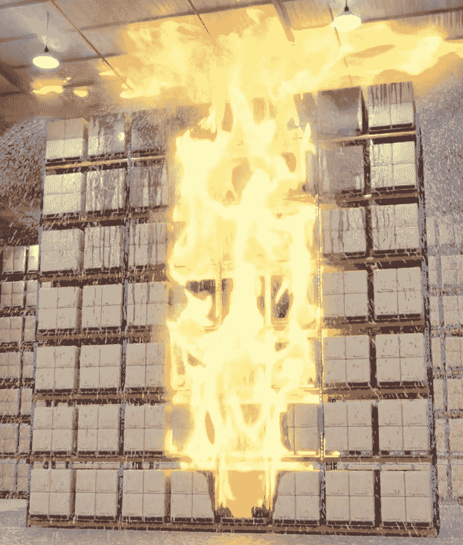

<!--yml

category: 未分类

date: 2025-01-11 11:44:28

-->

# 火灾动力学仿真LLM代理

> 来源：[https://arxiv.org/html/2412.17146/](https://arxiv.org/html/2412.17146/)

Leidong Xu

康涅狄格大学

leidong.xu@uconn.edu

&Danyal Mohaddes

FM，研究部门

danyal.mohaddes@fmglobal.com

&Yi Wang

FM，研究部门

yi.wang@fmglobal.com 在FM实习期间完成的工作。通讯作者。

###### 摘要

在利用基础模型（如大型语言模型（LLMs））加速复杂科学工作流方面，已经取得了显著进展。在本研究中，我们介绍了FoamPilot，一个概念验证型的LLM代理，旨在提升FireFOAM的可用性。FireFOAM是一个用于火灾动力学和灭火仿真的专用求解器，基于流行的开源计算流体动力学（CFD）工具箱OpenFOAM构建。FoamPilot提供了三个核心功能：代码洞察、案例配置和仿真执行。代码洞察是传统关键词搜索的替代方法，利用检索增强生成（RAG），旨在帮助开发者和有经验的用户高效地浏览和总结FireFOAM源代码。对于案例配置，代理能够用自然语言解释用户请求，并据此修改现有仿真设置，以支持中级用户。FoamPilot的工作执行功能旨在管理高性能计算（HPC）环境中仿真的提交和执行，并提供仿真结果的初步分析，以支持经验较少的用户。在每个功能上都取得了有希望的结果，尤其是对于简单任务，同时也发现了在更复杂任务中进行显著改进的机会。将这些功能集成到一个LLM代理中，旨在加速使用FireFOAM进行复杂仿真的工程师和科学家的仿真工作流，从而改善火灾安全。

## 1 引言

计算流体力学（CFD）是研究和模拟火灾动力学和燃烧现象中不可或缺的工具（Ren 等人 ([2017](https://arxiv.org/html/2412.17146v1#bib.bib1)); Nmira 和 Consalvi ([2022](https://arxiv.org/html/2412.17146v1#bib.bib2)))。在各种 CFD 解算器中，专为火灾动力学模拟开发的解算器 FireFOAM¹¹1可用：[https://github.com/fireFoam-dev/fireFoam-v1912](https://github.com/fireFoam-dev/fireFoam-v1912)（Wang 等人 ([2011](https://arxiv.org/html/2412.17146v1#bib.bib3)))脱颖而出，因为它能够模拟复杂的火灾及灭火物理过程，包括由浮力驱动的湍流、气相化学反应、固相热传导和热解、液膜流动和喷雾传输。FireFOAM 是基于 OpenFOAM²²2 可用：[https://www.openfoam.com/](https://www.openfoam.com/) 构建的，OpenFOAM 是一个流行的基于 C++ 的开源 CFD 工具箱。图 [Fig. 1](https://arxiv.org/html/2412.17146v1#S1.F1 "In 1 Introduction ‣ LLM Agent for Fire Dynamics Simulations") 显示了一个典型 FireFOAM 模拟的渲染图，展示了仓库大规模灭火场景。尽管其具有先进的功能，但设置、运行和后处理 FireFOAM 模拟过程依然是一个具有挑战性且耗时的任务，特别是在高性能计算（HPC）架构上。用户必须处理大量的关键字、配置和代码参数，以实现准确和可靠的结果，这为初学者带来了陡峭的学习曲线，即使是经验丰富的用户也会感到这一过程耗时。典型 FireFOAM 案例结构的高级概述见 [Fig. 1](https://arxiv.org/html/2412.17146v1#S1.F1 "In 1 Introduction ‣ LLM Agent for Fire Dynamics Simulations")。这种复杂性要求不仅具备火灾科学方面的专业知识，还需要掌握 CFD 和 HPC，这对许多研究人员和工程师构成了重要的障碍。

基础模型的发展，尤其是大型语言模型（LLMs），通过提供理解和生成类人文本与代码的先进能力，彻底改变了多个科学和技术领域。像 OpenAI 的 GPT 系列、Meta 的 LLaMA、Anthropic 的 Claude，以及 OpenAI 之前的 Codex 项目（OpenAI ([2021](https://arxiv.org/html/2412.17146v1#bib.bib4))) 和 Meta 的 Code LLaMA（Meta ([2023](https://arxiv.org/html/2412.17146v1#bib.bib5))) 等大型语言模型，在自然语言处理、代码生成和自动化问题解决方面展示了巨大的能力，它们通过解析自然语言查询生成相应的代码，从而帮助软件开发（Brown ([2020](https://arxiv.org/html/2412.17146v1#bib.bib6)); Roziere 等人 ([2023](https://arxiv.org/html/2412.17146v1#bib.bib7)); Feng 等人 ([2020](https://arxiv.org/html/2412.17146v1#bib.bib8)); Achiam 等人 ([2023](https://arxiv.org/html/2412.17146v1#bib.bib9)))。

尽管大语言模型（LLM）可以根据自然语言描述生成代码，但其输出通常是静态的文本字符串。LLM缺乏与计算环境交互、适应变化需求或自主处理意外错误的能力（Jiang 等人（[2024](https://arxiv.org/html/2412.17146v1#bib.bib10)）；Wang 等人（[2024](https://arxiv.org/html/2412.17146v1#bib.bib11)））。为了克服这些局限性，需要基于LLM的代理系统——该系统不仅能生成代码，还能迭代地测试、调试、优化并将代码集成到更广泛的软件生态系统中（Liu 等人（[2024](https://arxiv.org/html/2412.17146v1#bib.bib12)）；Hong 等人（[2023](https://arxiv.org/html/2412.17146v1#bib.bib13)）；Qian 等人（[2024](https://arxiv.org/html/2412.17146v1#bib.bib14)）；Bouzenia 等人（[2024](https://arxiv.org/html/2412.17146v1#bib.bib15)））。这些系统将LLM的优势与自动化代码执行、验证和优化的额外工具相结合，提供了更全面的软件开发方法。

先前的研究已利用LLM代理来自动化科学工作（Xia 等人（[2024](https://arxiv.org/html/2412.17146v1#bib.bib16)））。实际上，一些关于支持科学与工程模拟的工作，例如Chen 等人（[2024](https://arxiv.org/html/2412.17146v1#bib.bib17)），已成功修改了现有模拟配置的参数。参数修改，或者更广泛地说，模拟案例设置，是科学模拟工作流程中的重要方面。从更广泛的角度来看，科学模拟工作流程通常涉及问题识别与参数化、模拟案例设置、模拟执行、输出数据的后处理以及所需物理洞察的提取。在本研究中，我们介绍了FoamPilot，一种LLM代理，旨在解决科学模拟工作流程中的三个核心功能，服务于FireFOAM的新人和经验丰富的用户：代码洞察、案例配置和工作执行。

+   •

    代码洞察：允许用户快速定位源代码中的相关部分，无论是为了理解其功能还是进行必要的修改。

+   •

    案例配置：解释用户用自然语言表达的请求，准确创建和修改模拟设置。

+   •

    工作执行：在高性能计算（HPC）环境中管理模拟任务的提交与执行，并提供初步的结果分析。

本文将重点介绍FoamPilot及其在支持FireFOAM模拟方面的发展，但需要指出的是，所识别的挑战和解决方法对其他科学模拟工具具有广泛的适用性，尤其是大型开源的基于命令行的模拟代码。

\phantomcaption{minted}

[bgcolor=bg, frame=lines, fontsize=, escapeinside=||]python Case/ mesh.sh # 网格生成脚本 system/ # 仿真和几何设置 controlDict # 运行时和 I/O 控制 extrudeToRegionMeshDict.fuel # 固体网格 snappyHexMeshDict # 几何 topoSetDict # 域边界 … constant/ # 子模型参数 radiationProperties turbulenceProperties … solidRegion/ # 子域参数 radiationProperties … 0/ # 初始和边界条件 T U … \phantomcaption

图 1：左：FireFOAM 大规模灭火仿真渲染图（Ren 等人 ([2017](https://arxiv.org/html/2412.17146v1#bib.bib1)))。右：典型的 FireFOAM 案例结构。

## 2 FoamPilot 代理

FoamPilot 代理的概述如[图 2](https://arxiv.org/html/2412.17146v1#S2.F2 "在 2 FoamPilot 代理 ‣ 用于火灾动力学模拟的 LLM 代理")所示。该代理使用 LangChain/LangGraph 0.2 框架（Chase ([2022](https://arxiv.org/html/2412.17146v1#bib.bib18))) 实现，并设计为与大语言模型（LLM）的选择无关。这个设计使得代理可以灵活使用本地或云托管的开源或闭源 LLM，从而利用这些模型在复杂推理任务（例如，OpenAI 的 o1 模型 ([2024a](https://arxiv.org/html/2412.17146v1#bib.bib19))，在撰写本文时仍处于有限预览阶段）中不断提高的性能。

代理的结构遵循由三个节点组成的图，如[图 2](https://arxiv.org/html/2412.17146v1#S2.F2 "在 2 FoamPilot 代理 ‣ 用于火灾动力学模拟的 LLM 代理")所示：用户、LLM 和工具，节点之间通过边连接以促进消息传递。工具节点提供对实用工具的访问，在本工作中，这些工具包括 Shell 命令工具、Python 解释器工具和检索增强生成（RAG）工具。选择这些工具是因为它们直接支持代理所需的功能。Shell 命令工具执行 Linux 命令，Python 解释器工具运行由 LLM 生成的 Python 脚本，而 RAG 工具识别与查询最接近的嵌入，从数据库中检索信息，在本工作中，数据库是 FireFOAM 源代码的向量存储。在代理的设计中本可以添加更多工具，但为了避免给代理增加冗余或不必要的功能，导致错误的工具选择，从而影响性能，最终决定不添加更多工具。

LLM处理用户的自然语言查询，并附加有关可用工具的信息。然后，代理会动态且迭代地生成结构化的输出流，与可用工具进行交互，以实现用户所需的功能。在我们的实现中，使用了一个静态条件边，其中包含“if”语句，根据LLM的结构化输出将流程引导到不同的节点，用于从工具节点调用适当的工具，并确定何时终止过程。工具不能直接交互，但可以通过LLM在同一查询中调用。LLM必须通过可能的多轮查询和反馈来协调它们的使用。该过程会一直持续，直到任务成功完成、LLM放弃，或接近上下文窗口的限制，此时会向用户提供摘要，用于进度跟踪和反馈目的。


图2：FoamPilot代理的结构。实线和虚线分别表示查询和反馈。

### 2.1 代码洞察

模拟代码的用户，特别是开发者用户，通常需要查阅源代码，以了解子模型实现的细节，以及如何在仿真配置文件中调用这些子模型。传统的源代码导航和理解方法通常依赖于基本的文本搜索工具，如‘grep’和‘find’。这些方法效率低下且繁琐，因为变量名和内联注释取决于代码作者的个人风格。在像OpenFOAM和FireFOAM这样的大型开源项目中，这可能使得代码导航变成一项耗时的任务。此外，将类和函数转回其原始数学表示形式，这通常是在寻求理解那些注释和文档稀缺的复杂代码时必需的，也可能是一个耗时的过程。

RAG是一种自然语言处理（NLP）方法，通过整合外部知识检索来增强文本生成，从而提高事实准确性、连贯性和上下文相关性。使用基于余弦相似度的嵌入空间搜索的RAG相较于传统的基于用户驱动的关键词搜索（如‘grep’和‘find’）在导航FireFOAM的C++源代码时具有显著优势。与手动的关键词匹配不同，RAG方法能够捕捉语义关系和上下文相关性，从而能够识别出在概念上相关的代码片段，即使它们没有共享相同的术语。这通常会导致更有意义的搜索结果，使用户能够更高效地找到相关代码。

在为RAG工具预处理FireFOAM源代码时，我们开发了一种方法来解决C++头文件（.H）和源文件（.C）分离所带来的挑战。头文件主要包含变量声明和函数原型，缺少它们实际实现的细节，这些细节通常在源文件中提供。如果这些文件被单独索引，检索模型可能主要返回头文件，这对下游的LLM（大语言模型）价值有限。为了提高检索内容的实用性，我们在将文件传递给嵌入模型之前，将头文件和源文件合并为一个文档。这个方法确保了声明和相应的实现可以在同一上下文中提供，使得检索到的信息更加有价值和全面。需要注意的是，流行的嵌入模型通常具有比最强大的LLM上下文窗口更小的最大输入大小。标准做法是将大型文档拆分或“分块”为更小的部分以供嵌入。然而，FireFOAM的大多数头文件和源文件并不会超过本工作中嵌入模型的最大上下文窗口（8192个token）。此外，将头文件放在合并后的上下文中首位，确保嵌入向量始终包含来自关键术语的关键信息。因此，即使一些源代码超出了嵌入模型的最大输入大小，也可以简单地进行截断，嵌入空间中的相似度搜索仍然能够良好地执行。正确的文件会被返回给LLM，且其完整内容会舒适地适配LLM的上下文窗口。这使得在复杂任务执行过程中能够更好地进行续接，因为即使经过多次工具调用，源代码文件仍然会保留在上下文窗口中。这也展示了大上下文窗口在追踪长链LLM-工具交互细节中的重要性。

额外的预处理步骤包括在每个合并文件前添加相对文件路径，提供上下文提示，LLM 在检索时可以利用这些提示更好地理解代码库的组织结构。为了优化令牌使用并去除不必要的内容，我们剔除了样板化的头文件和许可证信息，因为这些内容对于代码理解或搜索任务没有实质性的信息贡献。头文件和代码中其他部分的注释被保留，因为这些提供了有用的上下文信息。经过这些步骤后，预处理数据被嵌入，并通过向量存储完成相似度搜索和检索。预处理和检索步骤如 [图 3](https://arxiv.org/html/2412.17146v1#S2.F3 "In 2.1 Code Insight ‣ 2 The FoamPilot agent ‣ LLM Agent for Fire Dynamics Simulations") 所示。与手动关键字搜索方法相比，这种方法能够理解上下文，提高了在 FireFOAM 代码库中进行代码搜索的效率。


图 3：展示了源代码如何嵌入向量数据库并通过 RAG 工具进行检索的过程。

### 2.2 案例配置

FoamPilot 解释用户以自然语言表达的案例配置请求。目前，它能够修改用户提供的现有仿真案例。最初，我们的目标只是将代理指向现有案例的位置，让它自动找到并选择需要修改的配置文件，以满足用户的请求。我们发现这种方法效率较低，代理会调用 Shell 工具逐个检查案例文件夹中的每个文件。FireFOAM 仿真案例文件夹包含许多单独的文件，如 [图 1](https://arxiv.org/html/2412.17146v1#S1.F1 "In 1 Introduction ‣ LLM Agent for Fire Dynamics Simulations") 所示。

为了解决这一问题，我们采用了类似于 [2.1节](https://arxiv.org/html/2412.17146v1#S2.SS1 "2.1 代码解析 ‣ 2 FoamPilot代理 ‣ 火灾动态模拟的LLM代理")中描述的 RAG 工具的方法：我们去除了所有模板头信息和许可证信息，将每个配置文件的相对文件路径添加到文件前面，然后将整个案例文件夹压缩成一个长字符串。接着，我们将案例配置字符串提供给代理作为提示。在 FireFOAM 模拟中，使用 GPT-4o 分词器时，这个案例配置字符串的总令牌数约为 20k，远低于该模型的上下文窗口限制 128k。案例配置字符串为代理提供了一个全面的案例概览，使其能够高效地识别配置文件中的相关参数和位置。案例配置提示如 [图 4](https://arxiv.org/html/2412.17146v1#S2.F4 "在 2.2 案例配置 ‣ 2 FoamPilot代理 ‣ 火灾动态模拟的LLM代理") 所示，其中 user_request 是用户对其提供的案例进行修改的描述。

我们认为，案例配置功能通过简化模拟的配置过程，减少了正确配置模拟所需的复杂性和时间，从而使 FireFOAM 更易于非专业用户使用。我们的方法假设用户拥有一个他们希望根据某些要求进行修改的案例，但不要求用户提供额外的示例案例。这对于一名初级科学家来说是典型的情形，他可能会继承一名资深科学家的模拟案例，并根据某些要求对其进行修改，但可能无法访问与特定任务相关的示例案例数据库。

<svg class="ltx_picture" height="146.41" id="S2.F4.pic1" overflow="visible" version="1.1" width="600"><g fill="#000000" stroke="#000000" stroke-width="0.4pt" transform="translate(0,146.41) matrix(1 0 0 -1 0 0)"><g fill-opacity="1.0" transform="matrix(1.0 0.0 0.0 1.0 21.65 128.35)"><foreignobject color="#FFFFFF" height="12.15" overflow="visible" transform="matrix(1 0 0 -1 0 16.6)" width="556.69">User Query</foreignobject></g> <g fill-opacity="1.0" transform="matrix(1.0 0.0 0.0 1.0 21.65 13.78)"><foreignobject color="#000000" height="96.86" overflow="visible" transform="matrix(1 0 0 -1 0 16.6)" width="556.69">I have a FireFOAM simulation case located at {case_path}. {user_request} Always read the contents of a file before modifying it. I have compressed the entire case directory, including the README file, into a single long string for you to view and understand my request, as follows: {case_contents}</foreignobject></g></g></svg>

图 4：案例配置提示。

### 2.3 作业执行

在 Linux 环境中运行 FireFOAM 模拟对于入门级用户来说可能具有挑战性，特别是因为大规模模拟通常是在 HPC 环境中通过作业调度器（如 SLURM）进行的（Yoo 等人（[2003](https://arxiv.org/html/2412.17146v1#bib.bib20)）），而这些用户可能之前并未使用过此类工具。在这里，我们致力于开发一种功能，使 FoamPilot 能够处理模拟的执行。我们希望能够在没有调度器的情况下执行模拟，例如在本地机器或 HPC 系统的头节点上作为串行作业执行，因为这是调试和测试时常见的配置。我们还希望能够使用作业调度器来运行大规模模拟，利用多个多核 HPC 节点进行计算。

当在本地或头节点上运行FireFOAM模拟时，代理必须准备网格并直接在命令行上执行模拟。如果用户请求，代理还可以在模拟完成后提供初步的结果分析。在使用如SLURM这样的作业调度器的HPC系统上运行时，代理必须首先执行类似scontrol的命令来识别可用资源。然后，它必须准备网格并确定网格的大小。接下来，代理必须根据可用节点数和网格大小执行域分解，最后编写作业提交脚本并将作业提交到队列中。

作业执行功能是通过提供详细的指令来实现的，这些指令促使代理使用Shell工具来完成请求。用于串行和HPC作业的提示见[图 5](https://arxiv.org/html/2412.17146v1#S2.F5 "在 2.3 作业执行 ‣ 2 FoamPilot 代理 ‣ 用于火灾动力学模拟的LLM代理")。对于HPC作业，作为额外的挑战，网格大小和节点数与核心数的选择由代理决定。

<svg class="ltx_picture ltx_centering" height="295.85" id="S2.F5.pic1" overflow="visible" version="1.1" width="600"><g fill="#000000" stroke="#000000" stroke-width="0.4pt" transform="translate(0,295.85) matrix(1 0 0 -1 0 0)"><g fill-opacity="1.0" transform="matrix(1.0 0.0 0.0 1.0 21.65 277.79)"><foreignobject color="#FFFFFF" height="12.15" overflow="visible" transform="matrix(1 0 0 -1 0 16.6)" width="556.69">User Query</foreignobject></g> <g fill-opacity="1.0" transform="matrix(1.0 0.0 0.0 1.0 21.65 13.78)"><foreignobject color="#000000" height="246.3" overflow="visible" transform="matrix(1 0 0 -1 0 16.6)" width="556.69">Prompt for serial job: I have a FireFOAM simulation case located at {case_path}. Take a look at the case directory. Mesh the case using the provided script, and then run the simulation in serial on the command line by invoking fireFoam. Write the output to a log file. After the simulation is finished, plot the results of volumetric heat release rate and save them in the case directory. Remember to load environment variables from {OF_bashrc_path}. Prompt for HPC job: I have a FireFOAM simulation case located at {case_path}. Determine what SLURM queues you have access to. Mesh the case using the provided script. Based on the mesh size and the resources you have available, choose how many nodes to use. Use all physical cores on each node you use. Configure the number of subdomains in the case based on the number of physical cores and decompose the domain. Prepare a SLURM script for the queue and core count, then submit the job. Remember to always load environment variables from {OF_bashrc_path} before any FOAM command, both in the command line and in the SLURM script. Always read the contents of a file before modifying it. I have compressed the entire case directory, including the README file, into a single long string for you to view and understand my request, as follows: {case_contents}</foreignobject></g></g></svg>

图 5：用于在头节点上串行运行模拟和使用作业调度器并行运行的提示。

## 3 实验结果与讨论

为了确保所有实验的一致性，我们使用了相同的LLM、版本和温度设置：Azure/OpenAI的GPT-4o，版本2024-05-13，温度设置为$0.0$。选择该LLM是因为其在推理任务中的表现，以及其对OpenFOAM工具箱某些方面的明显熟悉。尽管努力保持可重复性，代理在执行相同用户查询下完成任务时仍表现出一定的成功率变动——温度设置为$0.0$并不保证结果的确定性。因此，每个实验都重复了五次以评估稳定性。每个实验中使用了一个用户提示，且每次重复都使用相同的提示。所有考虑的实验都是明确的，且有单一正确的结果，成功结果通过将代理的操作与经验丰富的FireFOAM用户的操作进行比较来确定。结果总结在表[1](https://arxiv.org/html/2412.17146v1#S3.T1 "表 1 ‣ 3 实验结果与讨论 ‣ 用于火灾动力学模拟的LLM代理")中。

使用系统提示来定义模型的角色、行为和目标，并告知它可访问的工具，从而引导其生成相关、准确且安全的响应。它还帮助消除用户查询中的冗余内容。我们实现了一个受Chase（[2024](https://arxiv.org/html/2412.17146v1#bib.bib21)）启发的系统提示，见[图 6](https://arxiv.org/html/2412.17146v1#S3.F6 "在 3 实验结果与讨论 ‣ 用于火灾动力学模拟的LLM代理")。

鉴于该项目的探索性特征，以及Shell工具能够执行任意命令的能力，在我们进行实验时存在对运行系统造成损害的风险。因此，所有实验均在专用的AWS EC2实例上进行，并且HPC作业是通过SLURM作业调度器提交到专用的AWS parallelCluster上。FoamPilot是一个基于Python的小型代码，在我们的实验中使用了云托管的大型语言模型（LLM），因此实例的系统要求完全由FireFOAM代码驱动。我们注意到，尽管我们的实现确实包括了一种机制，允许用户在执行前验证Shell命令，但这对于不熟悉Linux命令行的用户来说，仍然可能具有一定的挑战性，因此很难有效判断和管理。因此，我们强烈建议，具有Shell命令执行权限的代理的测试应仅在安全的沙箱环境中进行。

<svg class="ltx_picture ltx_centering" height="211.29" id="S3.F6.pic1" overflow="visible" version="1.1" width="600"><g fill="#000000" stroke="#000000" stroke-width="0.4pt" transform="translate(0,211.29) matrix(1 0 0 -1 0 0)"><g fill-opacity="1.0" transform="matrix(1.0 0.0 0.0 1.0 21.65 193.24)"><foreignobject color="#FFFFFF" height="12.15" overflow="visible" transform="matrix(1 0 0 -1 0 16.6)" width="556.69">系统提示</foreignobject></g> <g fill-opacity="1.0" transform="matrix(1.0 0.0 0.0 1.0 21.65 13.78)"><foreignobject color="#000000" height="161.74" overflow="visible" transform="matrix(1 0 0 -1 0 16.6)" width="556.69">您是一个助手，职责是帮助火灾科学家浏览和总结源代码，修改仿真案例配置文件并运行仿真作业。尽可能地为人类科学家提供有用和准确的回答。您可以访问以下工具：{tool_names}。请使用JSON格式指定工具，提供操作键（工具名称）和操作输入键（工具输入）。有效的"action"值有："Final Answer"或{tool_names}。每个$JSON_BLOB只提供一个操作，如下所示：

```
‘‘‘
{{
"action": $TOOL_NAME,
"action_input": $INPUT
}}
‘‘‘

```

请遵循此格式：

```
Question: input question to answer
Thought: consider previous and subsequent steps
while requests is not finished, do
    Action:
    ‘‘‘
    $JSON_BLOB
    ‘‘‘
    Observation: action result
end

```

在问题解决后，做一个最终总结。 

图6：系统提示，灵感来源于Chase（[2024](https://arxiv.org/html/2412.17146v1#bib.bib21)）。

代码洞察功能的两个实验被考虑在内，在这两个实验中，代理被提示返回在源代码中表达的方程的数学形式。第一个案例，如[图7](https://arxiv.org/html/2412.17146v1#S3.F7 "在 3 实验结果与讨论 ‣ 火灾动力学仿真中的LLM代理")所示，旨在获取固相中使用的能量方程，第二个案例旨在获取非球形颗粒拖曳力的形式。如[表1](https://arxiv.org/html/2412.17146v1#S3.T1 "在 3 实验结果与讨论 ‣ 火灾动力学仿真中的LLM代理")所示，代理在这两个案例中都 consistently 成功。

代码洞察功能的准确性在很大程度上依赖于RAG工具是否能够检索到相关的代码文件，这一过程的准确性受到检索过程精度的强烈影响。嵌入模型的选择在确定检索准确性方面起着至关重要的作用。我们测试了几种目前可用的开源和闭源嵌入模型，发现一些模型因输入大小的限制而表现不佳，导致结果不令人满意。最终，我们选择了使用OpenAI的text-embedding-ada-002模型（[2024b](https://arxiv.org/html/2412.17146v1#bib.bib22)）生成嵌入，并使用FAISS库（Douze等人（[2024](https://arxiv.org/html/2412.17146v1#bib.bib23)））与LangChain创建了向量存储。

我们注意到，尽管嵌入空间中的余弦相似度搜索相较于手动和自动化基于关键字的搜索提供了显著的改进，但模糊的用户查询仍可能导致检索到错误的代码文件，进而导致代理生成不准确的响应。流行的自我纠正RAG系统通常基于多代理方法（Yan等人（[2024](https://arxiv.org/html/2412.17146v1#bib.bib24)）；Asai等人（[2023](https://arxiv.org/html/2412.17146v1#bib.bib25)））。然而，到目前为止，尚未有LLM在OpenFOAM和FireFOAM的整个源代码库上进行过训练。这引发了一个疑问，即在此类系统中，二级LLM能否有效评估检索信息的正确性。这一局限性主要源于当前LLM在训练过程中对标注数据的依赖。获取此类标注数据（例如大型开源仿真软件包的注释良好的源代码）是昂贵且不可行的。尽管如此，如果代理能在OpenFOAM和FireFOAM源代码上使用无标签方法（例如持续预训练）进一步训练，性能可能会显著提升。

<svg class="ltx_picture ltx_centering ltx_figure_panel" height="78.45" id="S3.F7.pic1" overflow="visible" version="1.1" width="600"><g fill="#000000" stroke="#000000" stroke-width="0.4pt" transform="translate(0,78.45) matrix(1 0 0 -1 0 0)"><g fill-opacity="1.0" transform="matrix(1.0 0.0 0.0 1.0 21.65 60.4)"><foreignobject color="#FFFFFF" height="12.15" overflow="visible" transform="matrix(1 0 0 -1 0 16.6)" width="556.69">用户查询</foreignobject></g> <g fill-opacity="1.0" transform="matrix(1.0 0.0 0.0 1.0 21.65 13.78)"><foreignobject color="#000000" height="28.9" overflow="visible" transform="matrix(1 0 0 -1 0 16.6)" width="556.69">查找与 1D 反应固体模型相关的源代码。使用模型定义的能量方程，在 Latex 中编写能量方程。</foreignobject></g></g></svg><svg class="ltx_picture ltx_centering ltx_figure_panel" height="216.74" id="S3.F7.pic2" overflow="visible" version="1.1" width="600"><g fill="#000000" stroke="#000000" stroke-width="0.4pt" transform="translate(0,216.74) matrix(1 0 0 -1 0 0)"><g fill-opacity="1.0" transform="matrix(1.0 0.0 0.0 1.0 21.65 198.69)"><foreignobject color="#FFFFFF" height="12.15" overflow="visible" transform="matrix(1 0 0 -1 0 16.6)" width="556.69">代理响应</foreignobject></g> <g fill-opacity="1.0" transform="matrix(1.0 0.0 0.0 1.0 21.65 13.78)"><foreignobject color="#000000" height="167.2" overflow="visible" transform="matrix(1 0 0 -1 0 16.6)" width="556.69">**可能的文件位置：** [fireFoam/lib/regionModels/pyrolysisModels/reactingOneDimFF/reactingOneDimFF.C, fireFoam/lib/regionModels/pyrolysisModels/complexFuelPyrolysis/complexFuelPyrolysis.C]（源代码的检索与分析） **总结：** reactingOneDimFF 类中的能量方程如下：$\displaystyle\frac{\partial(\rho h)}{\partial t}$ $\displaystyle+\nabla\cdot(\phi_{\text{pyrolysis}}h)-\nabla\cdot(\alpha\nabla h% )+\nabla\cdot(\alpha\nabla h)-\nabla\cdot(\kappa\nabla T)$ $\displaystyle=\text{chemistryQdot}+\text{solidChemistry->RRsHs()}$ 如果 gasHSource 为真，方程中会添加一个额外项：$+\nabla\cdot(\phi_{\text{Gas}})$ 如果 qrHSource 为真，则再添加一个项：$+\nabla\cdot(\phi_{\text{qr}}\cdot n\text{MagSf})$ 该方程在 reactingOneDimFF 类中的 solveEnergy 函数中求解，位于 reactingOneDimFF.C 源文件中。

图 7：代码洞察示例：总结基于 FireFOAM 源代码的 1D 固相能量方程。请注意，左侧出现看似抵消的扩散项是正确的；这些项在代码中出现是由于数值实现的细节。

考虑到案例配置功能，基于 FireFOAM 提供的教程案例测试了两个示例：燃烧器大小的修改和纸板箱厚度的修改。前者案例的结果显示在[图 8](https://arxiv.org/html/2412.17146v1#S3.F8 "在 3 实验结果与讨论 ‣ 火灾动力学仿真用 LLM Agent")中，我们可以看到该代理正确识别了需要修改的两个文件并准确进行了修改。后者案例中，代理只需修改一个文件，但任务更加困难，因为‘纸板厚度’并不是案例文件中的关键词。在这两个案例中，我们可以在[表 1](https://arxiv.org/html/2412.17146v1#S3.T1 "在 3 实验结果与讨论 ‣ 火灾动力学仿真用 LLM Agent")中看到，代理始终成功。在我们的实验中，我们观察到比这些示例更复杂的案例修改 consistently 失败。我们还注意到，中级和高级用户可能能够检测到配置的案例中的错误，这些错误不会导致 FireFOAM 崩溃，但会导致非预期的输出；然而，经验较少的用户可能会难以做到这一点。

{minted}

[bgcolor=bg, frame=lines, fontsize=, escapeinside=||]python # system/topoSetDict # 原始框 (-0.15 -0.15 -0.001) (0.15 0.15 0.001); # 修改后的框 (-0.3 -0.3 -0.001) (0.3 0.3 0.001);

# system/snappyHexMeshDict # 原始最小值 (-0.15 -0.15 0.0 ); 最大值 ( 0.15 0.15 0.0 ); # 修改后的最小值 (-0.3 -0.3 0.0 ); 最大值 ( 0.3 0.3 0.0 );

图 8：案例配置示例：在 FireFOAM 的 poolFireMcCaffrey 教程案例中将燃烧器大小从 0.3 米修改为 0.6 米。

在作业执行功能的测试中，我们进行了两组测试：在头节点上运行串行作业，以及将作业提交给调度程序。我们普遍观察到，除非提供如[图5](https://arxiv.org/html/2412.17146v1#S2.F5 "In 2.3 Job Execution ‣ 2 The FoamPilot agent ‣ LLM Agent for Fire Dynamics Simulations")中那样的高度详细提示，否则作业执行功能大多不成功。在串行作业的测试中，代理在五次运行中成功了三次，完成任务的代理-工具循环次数为七次，如[图5](https://arxiv.org/html/2412.17146v1#S2.F5 "In 2.3 Job Execution ‣ 2 The FoamPilot agent ‣ LLM Agent for Fire Dynamics Simulations")所示。在一次情况下，代理错误地调用了RAG工具而非Shell工具，导致上下文窗口充满了大量不相关的信息。尽管如此，代理还是恢复过来，并成功使用Shell工具运行了串行作业，并通过Python解释器工具绘制了结果，完成了17次循环。在失败的运行中，代理虚构了多个文件在案例目录中存在，最终未能恢复。

代理在HPC测试中的表现远远不如预期，仅在九次代理-工具循环中成功了一次。在一次失败的案例中，代理未能正确识别HPC环境，并发出了错误的SLURM命令。在其他失败的案例中，代理几乎按照系统提示正确地执行了所有子任务，但未能在其作业提交脚本中正确设置环境。我们观察到，代理在生成网格后，通常能够合理估算模拟所需使用的核心数。

一个更具挑战性的任务是处理多功能查询。这些任务通常需要代理根据用户的查询迭代调用多个工具。一个这样的任务示例是根据从源代码中检索到的信息修改仿真案例文件。与简单地扰动参数值相比，代理需要回顾通过RAG工具检索到的C++代码，并基于此识别正确的案例文件，在其中替换特定的关键词或甚至是函数。我们报告了我们进行的一个测试，要求代理更改FireFOAM的burningBoxSuppression教程案例中的液滴阻力模型，而没有指定如何进行这种修改，从而结合了代码洞察和案例配置功能。代理在两次运行中都成功，且仅需三次代理-工具循环就能使用RAG工具和Shell工具学习需要做出的修改，并正确地进行必要的修改。在一次运行中，代理的RAG工具查询不正确并返回了不相关的信息，从中未能恢复。在另外两次运行中，代理成功地使用RAG工具检索相关文件，但未能从中获取必要的信息来修改仿真配置，而是做出了错误的修改。我们注意到，在比这里展示的相对简单的任务更复杂的多功能测试中，代理表现 consistently 失败。

| 功能性 | 任务 | 成功率 |
| --- | --- | --- |
| 代码洞察 | 固体能量方程 | 5/5 |
| 代码洞察 | 非球形阻力方程 | 5/5 |
| 案例配置 | 燃烧器大小修改 | 5/5 |
| 案例配置 | 纸板厚度修改 | 5/5 |
| 作业执行 | 运行串行作业 | 4/5 |
| 作业执行 | 提交HPC作业 | 1/5 |
| 代码洞察与案例配置 | 修改液滴阻力模型 | 2/5 |

表 1：测试结果总结。

## 4 结论与未来工作

一个名为FoamPilot的LLM代理被开发为概念验证，旨在减少源代码导航、仿真设置和仿真执行所需的复杂性和时间，从而使火灾动力学仿真对新用户和经验丰富的用户都更加易于访问和高效。在我们的探索中，我们发现代理在低复杂度任务中 consistently 成功，但随着任务复杂度的增加，其成功率急剧下降。

本研究中未涉及的重要功能包括异步运行仿真的能力，这要求LLM代理在会话之间保存并恢复其状态。对于不太熟悉HPC环境和工作流的用户来说，这将特别有用。此外，由于所选的代理化框架存在技术挑战，在FoamPilot操作过程中未能实现强大的可选人工反馈能力。尽管在测试期间，工具使用的人工批准请求作为必要的安全预防措施被包含在内，但在LangChain/LangGraph框架中，LLM代理在工具使用之间征求和包含大量人工反馈时遇到了一些挑战。

我们的实验仅考虑了GPT-4o作为代理的LLM，且有可能在本文写作时，存在其他LLM能够在我们的实验中取得更好的结果。我们预计，当可靠结构化的LLM输出与嵌入专家知识的非AI案例配置工具结合使用时，案例配置任务将取得更大的成功。我们还预计，专门用于推理任务的近未来LLM将在设置和执行仿真所需的多步骤复杂任务中表现得更好。此外，我们预计当前和未来的LLM增强型开发工具，如GitHub CoPilot和Cursor AI Code Editor，肯定会优于我们实现的代码洞察功能，因为该功能对所有软件开发人员都有用，而不仅仅是FireFOAM开发人员。实际上，本研究中所识别的挑战及其解决方法并非FireFOAM独有，它们适用于许多科学仿真工作流。为LLM代理开发与仿真软件互动和控制的通用框架将是有益的。

展望未来，我们注意到越来越多的大型语言模型正在变得多模态，能够处理图像数据作为输入。我们认为这一能力如果能够将几何形状和网格以视觉方式呈现，从而提供更多关于当前仿真背景的上下文信息，将有助于代理更好地理解仿真配置。

最后，我们发现通用大语言模型（LLM）在特定领域的知识有限，减少了FoamPilot在使用FireFOAM处理复杂任务时的能力，特别是涉及多个功能的任务。我们注意到，FireFOAM的代码库本身约有1百万个标记（tokens），而它所构建的OpenFOAM工具箱大约大10倍。因此，FireFOAM或其大部分内容可能适配未来LLMs扩展后的上下文窗口。此外，继续对OpenFOAM或结合FireFOAM/OpenFOAM代码库进行预训练，可能有助于实现精确的零-shot提示，用于分析和支持进一步的代码开发。

## 参考文献

+   Ren et al. [2017] 任宁，Jaap de Vries，周向阳，Marcos Chaos，Karl V. Meredith，王毅。木托盘上波纹纸箱的火灾抑制大规模建模。*《消防安全期刊》*，91：695–704，2017年。ISSN 0379-7112。消防安全科学：第12届国际研讨会会议录。

+   Nmira and Consalvi [2022] Fatiha Nmira 和 Jean-Louis Consalvi。大尺度甲醇池火灾的LES/假定FDF建模中解决的和亚网格湍流辐射相互作用的局部贡献。*《国际传热与质量传递期刊》*，190：122746，2022年。

+   Wang et al. [2011] 王毅，Prateep Chatterjee，John L. de Ris。火焰烟羽的涡流模拟。*《燃烧学会会议录》*，33(2)：2473–2480，2011年。

+   OpenAI [2021] OpenAI. OpenAI Codex. [https://openai.com/index/openai-codex/](https://openai.com/index/openai-codex/)，2021年。访问日期：2024-11-11。

+   Meta [2023] Meta. 推出Code Llama，一种用于编码的最先进的大型语言模型。 [https://ai.meta.com/blog/code-llama-large-language-model-coding/](https://ai.meta.com/blog/code-llama-large-language-model-coding/)，2023年。访问日期：2024-11-11。

+   Brown [2020] Tom B Brown. 语言模型是少样本学习者。*arXiv预印本 arXiv:2005.14165*，2020年。

+   Roziere et al. [2023] Baptiste Roziere，Jonas Gehring，Fabian Gloeckle，Sten Sootla，Itai Gat，Xiaoqing Ellen Tan，Yossi Adi，刘晶宇，Tal Remez，Jérémy Rapin，等人。Code Llama：面向代码的开放基础模型。*arXiv预印本 arXiv:2308.12950*，2023年。

+   Feng et al. [2020] 张印峰，郭大亚，唐独宇，段楠，冯小成，宫鸣，寿林军，秦兵，刘婷，蒋大新，等人。Codebert：一种用于编程和自然语言的预训练模型。*arXiv预印本 arXiv:2002.08155*，2020年。

+   Achiam et al. [2023] Josh Achiam，Steven Adler，Sandhini Agarwal，Lama Ahmad，Ilge Akkaya，Florencia Leoni Aleman，Diogo Almeida，Janko Altenschmidt，Sam Altman，Shyamal Anadkat，等人。GPT-4技术报告。*arXiv预印本 arXiv:2303.08774*，2023年。

+   Jiang et al. [2024] 姜聚勇，王凡，沈佳思，金成柱，金胜勋。关于用于代码生成的大型语言模型的调查。*arXiv预印本 arXiv:2406.00515*，2024年。

+   Wang et al. [2024] 王磊，马辰，冯雪阳，张泽宇，杨浩，张景森，陈志远，唐家凯，陈旭，林扬凯，赵伟新，魏哲维，温继荣。基于大型语言模型的自主智能体调查。*《计算机科学前沿》*，18(6)，2024年。

+   Liu et al. [2024] 刘俊伟，王凯欣，陈亦轩，彭鑫，陈振鹏，张玲名，娄一玲。基于大型语言模型的软件工程智能体：一项调查。*arXiv预印本 arXiv:2409.02977*，2024年。

+   Hong 等人 [2023] Sirui Hong, Xiawu Zheng, Jonathan Chen, Yuheng Cheng, Jinlin Wang, Ceyao Zhang, Zili Wang, Steven Ka Shing Yau, Zijuan Lin, Liyang Zhou 等人. Metagpt: 多代理协作框架的元编程。*arXiv 预印本 arXiv:2308.00352*，2023。

+   Qian 等人 [2024] Chen Qian, Wei Liu, Hongzhang Liu, Nuo Chen, Yufan Dang, Jiahao Li, Cheng Yang, Weize Chen, Yusheng Su, Xin Cong 等人. Chatdev: 用于软件开发的交流代理。在 *第62届计算语言学会年会会议录（第1卷：长篇论文）*，第15174–15186页，2024。

+   Bouzenia 等人 [2024] Islem Bouzenia, Premkumar Devanbu, 和 Michael Pradel. Repairagent: 一个基于 LLM 的自动化程序修复代理。*arXiv 预印本 arXiv:2403.17134*，2024。

+   Xia 等人 [2024] Yuchen Xia, Daniel Dittler, Nasser Jazdi, Haonan Chen, 和 Michael Weyrich. 与仿真结合的 LLM 实验：数字双胞胎中用于过程仿真参数化的大型语言模型多代理系统。*arXiv 预印本 arXiv:2405.18092*，2024。

+   Chen 等人 [2024] Yuxuan Chen, Xu Zhu, Hua Zhou, 和 Zhuyin Ren. Metaopenfoam: 一个基于 LLM 的多代理框架用于 CFD。*arXiv 预印本 arXiv:2407.21320*，2024。

+   Chase [2022] Harrison Chase. LangChain. [https://github.com/langchain-ai/langchain](https://github.com/langchain-ai/langchain), 2022.

+   OpenAI [2024a] OpenAI. 使用 LLM 学习推理。[https://openai.com/index/learning-to-reason-with-llms/](https://openai.com/index/learning-to-reason-with-llms/)，2024a。访问时间：2024-09-13。

+   Yoo 等人 [2003] Andy B. Yoo, Morris A. Jette, 和 Mark Grondona. Slurm: 用于资源管理的简单 Linux 工具。在 Dror Feitelson, Larry Rudolph, 和 Uwe Schwiegelshohn 编辑的 *并行处理作业调度策略*，第44–60页，柏林，海德堡，2003。Springer Berlin Heidelberg。ISBN 978-3-540-39727-4。

+   Chase [2024] Harrison Chase. 结构化聊天代理。[https://smith.langchain.com/hub/hwchase17/structured-chat-agent/ea510f70](https://smith.langchain.com/hub/hwchase17/structured-chat-agent/ea510f70)，2024。访问时间：2024-09-13。

+   OpenAI [2024b] OpenAI. 新版和改进的嵌入模型。[https://openai.com/index/new-and-improved-embedding-model/](https://openai.com/index/new-and-improved-embedding-model/)，2024b。访问时间：2024-09-13。

+   Douze 等人 [2024] Matthijs Douze, Alexandr Guzhva, Chengqi Deng, Jeff Johnson, Gergely Szilvasy, Pierre-Emmanuel Mazaré, Maria Lomeli, Lucas Hosseini, 和 Hervé Jégou. Faiss 库。*arXiv 预印本 arXiv:2401.08281*，2024。

+   Yan 等人 [2024] Shi-Qi Yan, Jia-Chen Gu, Yun Zhu, 和 Zhen-Hua Ling. 纠错检索增强生成。*arXiv 预印本 arXiv:2401.15884*，2024。

+   Asai 等人 [2023] Akari Asai, Zeqiu Wu, Yizhong Wang, Avirup Sil, 和 Hannaneh Hajishirzi. Self-rag: 通过自我反思学习检索、生成和批评。*arXiv 预印本 arXiv:2310.11511*，2023。</foreignobject></g></g></svg>
