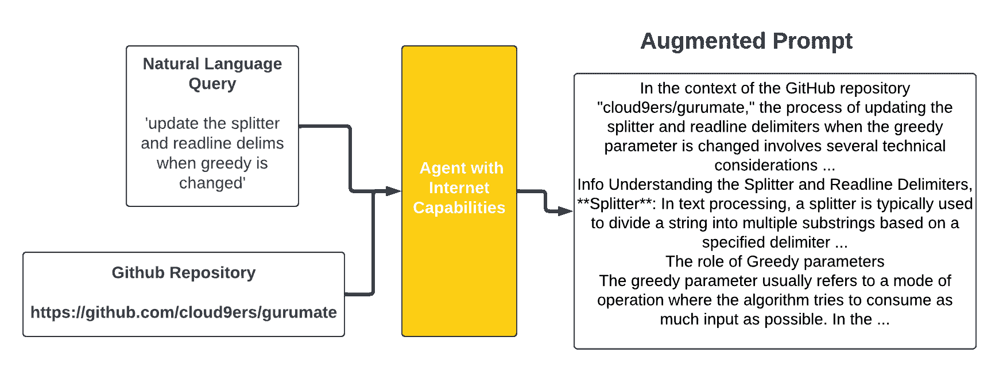

<!--yml

分类：未分类

日期：2025-01-11 12:18:25

-->

# LLM代理改善语义代码搜索

> 来源：[https://arxiv.org/html/2408.11058/](https://arxiv.org/html/2408.11058/)

Sarthak Jain

思科公司

伊利诺伊大学厄本那-香槟分校

美国伊利诺伊州厄本那

sj84@illinois.edu, sarjain2@cisco.com

&Aditya Dora

伊利诺伊大学厄本那-香槟分校

美国伊利诺伊州厄本那

adora2@illinois.edu

&Ka Seng Sam

伊利诺伊大学厄本那-香槟分校

美国伊利诺伊州厄本那

samsam2@illinois.edu &Prabhat Singh

思科公司

美国加利福尼亚州圣何塞

prabhat7@cisco.com

###### 摘要

代码搜索是许多程序员在开发问题解决方案时经常需要执行的关键任务。当前的方法存在一个问题，即在面对包含一些歧义或需要相对于代码库的附加上下文的提示时，无法准确执行。我们提出了一种使用检索增强生成（RAG）驱动的代理方法，将信息注入到用户提示中，从而为嵌入模型提供更好的输入。通过利用RAG，代理通过从GitHub仓库中提取相关细节来增强用户查询，使查询更加有信息量并且与上下文更加一致。此外，我们提出了一种多流集成方法，当与代理工作流结合使用时，可以提高检索准确性，并将其部署在名为repo-rift.com的应用程序上。在CodeSearchNet数据集上的实验结果表明，RepoRift显著优于现有方法，在Success@10的成功率达到78.2%，在Success@1的成功率达到34.6%。本研究在语义代码搜索领域取得了重要进展，突出了代理型LLM和RAG在提升代码检索系统中的潜力。

## 1 引言

许多程序员经常执行的一个关键任务是通过代码库搜索，找到能够解决特定问题的代码片段。这种被称为代码搜索的做法对于促进代码重用至关重要[[1](https://arxiv.org/html/2408.11058v1#bib.bib1)]。传统的代码搜索依赖于关键词匹配，而现代的代码搜索已经发展到能够学习和预测查询和代码片段背后的语义，从而使程序员能够更准确地检索与其意图相符的代码。深度学习的最新进展处于当前方法论的核心。通过在大规模的文本和代码语料库上训练大规模语言模型（LLM），LLM已经获得了强大的自然语言到代码生成能力，这也扩展到了更好的语义代码搜索。该领域的显著研究包括“深度代码搜索”[[2](https://arxiv.org/html/2408.11058v1#bib.bib2)]，该研究利用递归神经网络，学习代码及其描述背后的序列信息，并将它们映射到统一的向量空间。基于DeepCS，其他架构如Carl-CS，它利用共注意力表示学习[[3](https://arxiv.org/html/2408.11058v1#bib.bib3)]，以及PSCS[[4](https://arxiv.org/html/2408.11058v1#bib.bib4)]，它专注于使用从抽象语法树中获得的代码流，也提高了代码搜索的能力。该领域的其他重要工作是“CodeBERT：一种用于编程和自然语言的预训练模型”[[5](https://arxiv.org/html/2408.11058v1#bib.bib5)]，它利用双模态变换器联合建模编程语言和自然语言，显著增强了模型根据语义内容生成准确嵌入的能力。在此方法的基础上，OpenAI的论文《文本和代码嵌入的对比预训练》[[6](https://arxiv.org/html/2408.11058v1#bib.bib6)]引入了一种对比学习技术，并配合前所未有的大规模训练数据，生成了用于文本和代码的最先进嵌入，进一步增强了将自然语言查询与相关代码片段匹配的能力（甚至超过了CodeBERT及其变种，如GraphCodeBERT[[7](https://arxiv.org/html/2408.11058v1#bib.bib7)]），能够通过区分各种语境中的微妙意义差异进行匹配。

尽管取得了这些进展，语义代码搜索仍然面临许多挑战。用户提供的自然语言查询可能存在歧义或需要更多细节。一个例子是词汇不匹配问题，其中不同的人使用不同的关键词或术语来描述相同的概念或功能，或者使用相同的关键词描述不同的功能。例如，“模型”一词可以指代机器学习模型、数据库架构或软件设计模式[[8](https://arxiv.org/html/2408.11058v1#bib.bib8)]。即便是在人工智能领域，例如，“位置编码”这一关键词在讨论变压器中的注意力机制[[9](https://arxiv.org/html/2408.11058v1#bib.bib9)]时，和在神经辐射场中的应用[[10](https://arxiv.org/html/2408.11058v1#bib.bib10)]时，其上下文和目的也有所不同。这个问题可能导致代码搜索结果较弱，或者迫使用户做额外的工作，以在输入提示中提供更多细节。

本文提出了使用代理型大型语言模型（LLMs）来改进语义代码搜索。代理型LLMs涉及多个专门化的代理协同工作，处理任务的不同方面。由于增强的推理能力和决策能力，使用代理比单一LLM具有更强大的功能[[11](https://arxiv.org/html/2408.11058v1#bib.bib11)]。在语义代码搜索的背景下，这些代理旨在向用户提示添加有用的信息。通过使用检索增强生成（RAG），系统会查找与特定GitHub代码库相关的互联网信息，以理解其上下文。这使得代理能够递归地调用提示，将相关信息注入到用户的自然语言查询中，并有效地添加足够的细节，从而消除词汇不匹配问题。因此，与以往专注于改进自然语言与代码之间映射的研究不同，我们专注于通过RAG驱动的代理增强用户提示。通过我们的结果，我们展示了这种增强如何逐步改善已经创建的基于嵌入的方法的性能。我们利用OpenAI的最先进文本嵌入技术，因为它们目前在像CodeSearchNet这样的知名代码搜索评估集上表现最强[[6](https://arxiv.org/html/2408.11058v1#bib.bib6)]。此外，我们将代理的自然语言输出翻译为代码，以改进代码搜索。这样做的目的是弥合人类可读的自然语言查询与代码片段之间的语义差距，从而提高代码搜索引擎的搜索准确性和相关性[[8](https://arxiv.org/html/2408.11058v1#bib.bib8)]。为了最大化代码搜索结果的准确性，我们实现了一种集成方法。该方法包括进行多次比较，以识别最相关的代码片段。

此外，我们还建立了一个在线网站，[RepoRift](https://repo-rift.com/)，它实现了本文中阐述的这些先进的代码搜索技术。该平台允许任何用户输入GitHub仓库，并提出他们自己的自然语言查询进行代码搜索。欲了解更多信息，请访问[www.repo-rift.com](https://repo-rift.com/)。

总结来说，我们的主要贡献包括：

1. 信息注入通过代理型大型语言模型（LLMs）和检索增强生成（RAG）：我们使用具有RAG互联网搜索能力的代理来增强用户提示，以分解技术术语，包含更具体的信息，并缓解词汇不匹配问题。此外，我们展示了这种策略如何为嵌入模型提供更好的输入。

2. 集成架构与多流比较：我们利用OpenAI的先进文本嵌入技术来捕捉细微的含义，将自然语言查询转换为代码，并使用集成方法进行多流比较。这种方法通过检查查询和代码上下文的多个方面，提高了检索代码片段的准确性和相关性。

3. RepoRift平台：我们开发了[www.repo-rift.com](https://repo-rift.com/)，这是一个在线平台，实施了这些先进的技术，为开发者提供了一个实用的代码搜索工具。RepoRift基于本文讨论的架构提供了三种创新的解决方案：（1）将查询的上下文缩小到单一的仓库，（2）利用代理互动提高准确性和效果，（3）及时返回易于阅读的结果。欲了解更多信息，请访问[www.repo-rift.com](https://repo-rift.com/)。目前仅支持Python。

## 2 方法论

### 2.1 信息注入通过代理型大型语言模型（LLMs）和检索增强生成（RAG）

给定一个自然语言查询$Q$和一个GitHub仓库数据库$D$，如图[1](https://arxiv.org/html/2408.11058v1#S2.F1 "图1 ‣ 2.1 信息注入通过代理型大型语言模型（LLMs）和检索增强生成（RAG） ‣ 2 方法论 ‣ LLM代理提升语义代码搜索")所示，我们通过一个具有互联网访问权限的代理来增强查询。代理的主要目标是将$Q$与$D$进行上下文关联，并用额外的细节丰富$Q$，从而改善用户输入与正确代码片段之间的匹配。

我们的代理架构是基于CrewAI框架构建的，并使用OpenAI的GPT-4模型，充当“技术研究写作助手”。该代理根据以下提示增强查询：

"给定一个输入文本提示：[$Q$]。在以下GitHub仓库的整体上下文中，添加一些与该文本提示中部分主题相关的技术细节：[$D$]。如果在仓库中找不到该功能的实现方式，请提供该功能的一般实现方式。确保你提供的信息不会多于所需，并且仅针对输入文本提示中出现的特定主题。你的段落将帮助将输入文本提示中的思想定位到一个大型仓库中，因此偏离主题可能会导致后续的准确性问题。你有时间限制，必须迅速完成，因此最多调用两次，每次最多查看一个网站。"

这种方法确保了增强内容与查询中出现的主题相关，并且聚焦于这些主题。

我们采用了一种增强检索生成（RAG）技术，其中信息首先从互联网上收集。根据嵌入余弦相似度判断相关性后，检索到的信息将被用于增强查询[[12](https://arxiv.org/html/2408.11058v1#bib.bib12)]。代理在检索后的输出即为增强的提示语。

|  | $A=\text{Agent}(\text{Retrieval}(Q,D))$ |  | (1) |
| --- | --- | --- | --- |

图1：展示了如何通过代理增强自然语言查询，以便更好地匹配，示例取自CodeSearchNet[[13](https://arxiv.org/html/2408.11058v1#bib.bib13)]。

### 2.2 通过多流比较的集成架构

集成架构的目的是通过多种不同的比较，形成一组更准确的可能片段。此外，在代码生成过程中，可以创建多个不同功能的类，并需要一个多流架构来拆解生成的代码。一旦$A$被创建，我们的方法将其转发给多流处理过程，这些过程共同工作生成一小组目标片段。在我们的实现中，所有代码（仅限Python）被划分为一组函数$Y$和一组类$Z$。初步步骤包括为$A$创建嵌入。然后，第一个流将$Q$的嵌入与$Y$中每个元素的嵌入进行比较，最终选取与$Q$的余弦相似度最大的前3个元素，加入最终目标集：

|  | $\text{Embedding}(A)=\mathbf{e}_{A}$ |  |
| --- | --- | --- |
|  | $\mathbf{e}_{Y}=\{\mathbf{e}_{Y_{1}},\mathbf{e}_{Y_{2}},\ldots,\mathbf{e}_{Y_{n% }}\}$ |  |
|  | $\text{Cosine Similarity}(\mathbf{e}_{Q},\mathbf{e}_{Y_{i}})=\frac{\mathbf{e}_{% Q}\cdot\mathbf{e}_{Y_{i}}}{\&#124;\mathbf{e}_{Q}\&#124;\&#124;\mathbf{e}_{Y_{i}}\&#124;}$ |  |
|  | $\text{Top 3 in }Y=\{Y_{i_{1}},Y_{i_{2}},Y_{i_{3}}\}$ |  |

第二个流的处理过程包括通过两链OpenAI的GPT-3.5-turbo生成代码$A$，然后评估其质量。

|  | $\text{GPT-3.5-turbo}(A)\rightarrow C$ |  |
| --- | --- | --- |

$C$ 然后被转换为嵌入并与 $Y$ 和 $Z$ 中每个元素的嵌入进行比较

|  | $\text{嵌入}(C)=\mathbf{e}_{C}$ |  |
| --- | --- | --- |
|  | $\mathbf{e}_{Y}=\{\mathbf{e}_{Y_{1}},\mathbf{e}_{Y_{2}},\ldots,\mathbf{e}_{Y_{m% }}\}$ |  |
|  | $\mathbf{e}_{Z}=\{\mathbf{e}_{Z_{1}},\mathbf{e}_{Z_{2}},\ldots,\mathbf{e}_{Z_{k% }}\}$ |  |
|  | $\text{余弦相似度}(\mathbf{e}_{C},\mathbf{e}_{Y_{i}})=\frac{\mathbf{e}_{% C}\cdot\mathbf{e}_{Y_{i}}}{\&#124;\mathbf{e}_{C}\&#124;\&#124;\mathbf{e}_{Y_{i}}\&#124;}$ |  |
|  | $\text{余弦相似度}(\mathbf{e}_{C},\mathbf{e}_{Z_{i}})=\frac{\mathbf{e}_{% C}\cdot\mathbf{e}_{Z_{i}}}{\&#124;\mathbf{e}_{C}\&#124;\&#124;\mathbf{e}_{Z_{i}}\&#124;}$ |  |

在 $Y$ 和 $Z$ 中与 $C$ 的向量表示最相似的前三个片段将被编译并添加到最终目标集中：

|  | $\text{Top 3 in }Y=\{Y_{i_{4}},Y_{i_{5}},Y_{i_{6}}\}$ |  |
| --- | --- | --- |
|  | $\text{Top 3 in }Z=\{Z_{i_{1}},Z_{i_{2}},Z_{i_{3}}\}$ |  |

最后的流涉及组件函数的比较。$C$ 被分解为其组件函数。每个组件函数的嵌入与 $Y$ 中每个元素的嵌入进行比较，并将每个组件函数的最小余弦相似度距离添加到最终目标集。

|  | $C=\{C_{1},C_{2},\ldots,C_{p}\}$ |  |
| --- | --- | --- |
|  | $\mathbf{e}_{C_{i}}=\text{嵌入}(C_{i})$ |  |
|  | $\text{余弦相似度}(\mathbf{e}_{C_{i}},\mathbf{e}_{Y_{j}})=\frac{\mathbf{% e}_{C_{i}}\cdot\mathbf{e}_{Y_{j}}}{\&#124;\mathbf{e}_{C_{i}}\&#124;\&#124;\mathbf{e}_{Y_{j}}\&#124;}$ |  |
|  | $\text{C_{i}的最小余弦相似度}=\min_{j}\text{余弦相似度}(% \mathbf{e}_{C_{i}},\mathbf{e}_{Y_{j}})$ |  |

最终目标集是通过将所有流中的最佳匹配项进行组合而编译的：

|  | $\text{最终目标集}=\{Y_{i_{1}},Y_{i_{2}},Y_{i_{3}}\}\cup\{Y_{i_{4}},Y_{i_{5}},Y_{i_{6}}\}\cup\{Z_{i_{1}},Z_{i_{2}},Z_{i_{3}}\}\cup\{\text{来自组件函数的最佳匹配}\}$ |  |
| --- | --- | --- |

这种多流方法确保了基于初始输入 $A$ 的全面和有针对性的代码片段选择。最终目标集的创建显著减少了潜在代码片段的数量，从大量代码片段减少到大约 5 到 15 个片段。为了提高相似度匹配的精度，我们进一步使用 GPT-4o 处理最终目标集，以识别最相关的片段。需要注意的是，GPT-4o 有令牌限制，使得直接输入大量片段数据变得不实际。这个限制突显了最初使用嵌入生成精炼目标集的重要性。

## 3 实验设置

#### 3.0.1 数据集

参考 [[4](https://arxiv.org/html/2408.11058v1#bib.bib4)]，我们利用了 CodeSearchNet 数据集 [[13](https://arxiv.org/html/2408.11058v1#bib.bib13)]，该数据集包含了大量自然语言查询和相应代码片段的配对，所有这些查询都与特定的 GitHub 仓库相关联。为了进行我们的研究，我们通过 repo-rift.com 手动处理了每个自然语言查询，从 CodeSearchNet 的 Python 评估集随机选择了 101 行。为了保持公平性并确保广泛的适用性，我们包括了不同长度的查询，并且仅在查询中包含了参数或返回类型时才进行修改。此外，部分查询，即使包含了参数和返回信息，也保持不变，以确保研究结果的广泛适用性。

我们仅排除了那些代码片段已经从当前主分支中删除的行，或者当仓库的大小超过了我们 repo-rift.com 应用的上传容量时，我们才进行了替换。azure-sdk-python 仓库是唯一出现后者问题的实例。我们选择排除不在主分支中的代码片段，因为我们的 repo-rift.com 应用无法有效地上传来自以前分支的文件，因此选择替换是一个更直接的解决方案。

#### 3.0.2 实现细节

对于 RepoRift 应用的后端，我们使用了第三方软件包和 OpenAI API。代理是使用 CrewAI 框架构建的，网站采用 Vue JavaScript 框架和 SQL 构建，并部署在标准的 AWS 计划上。为了评估我们的软件，我们手动将 101 行数据输入到我们的网站，并观察显示在右侧面板中的结果。

#### 3.0.3 评估指标

参考 DeepCS [[2](https://arxiv.org/html/2408.11058v1#bib.bib2)]、CARLCS [[3](https://arxiv.org/html/2408.11058v1#bib.bib3)] 和 PSCS [[4](https://arxiv.org/html/2408.11058v1#bib.bib4)] 的前期代码搜索研究，我们使用相同的 Success@10 和 Success@1 指标来比较准确性。虽然上述方法已经被转化为评估 CodeSearchNet 的 Java 数据集，但我们测试的是 Python 数据集。Success@k 是一个度量指标，用于确定系统检测到的代码片段是否在前 $k$ 个结果中。因此，要在 Success@1 指标中被正面标注，结果必须是最高排名。

|  | $\text{Success@k}=\begin{cases}1,&\text{如果正确的代码片段在前 $k$ 个结果中}\\ 0,&\text{否则}\end{cases}$ |  |
| --- | --- | --- |

对于 Success@1，指标定义为：

|  | $\text{Success@1}=\begin{cases}1,&\text{如果正确的代码片段是排名第一的结果}\\ 0,&\text{否则}\end{cases}$ |  |
| --- | --- | --- |

为了确定我们方法论中的最高排名，我们查看方法中提到的多流处理过程中的所有流（见第[2.2节](https://arxiv.org/html/2408.11058v1#S2.SS2 "2.2 Ensemble Architecture with Multi-Stream Comparisons ‣ 2 Methodology ‣ LLM Agents Improve Semantic Code Search")），并选取计算出最高余弦相似度的代码片段。此外，由于我们推测许多方法只有在类的上下文中才能被完全理解，因此我们认为如果RepoRift检测到正确片段的类，即使单个函数没有被检测到，也应视为正标签。

## 4 结果

我们将我们的方法与其他具有相似评估设置的基线方法进行比较。PSCS、CARLCS和DeepCS的评估都已经被转化为CodeSearchNet，其中它们会接收成千上万的代码片段，并根据提供的自然语言查询找到正确的片段。虽然这三种方法都是为Java构建的，但我们做的不同之处在于使用Python进行测试。而且，之前的基线方法，如[[4](https://arxiv.org/html/2408.11058v1#bib.bib4)]所述，是在CodeSearchNet中对所有测试代码片段进行搜索，而我们则在GitHub代码库中的所有代码片段上进行搜索，因为这是我们用例特定设计的场景。我们直接从[[4](https://arxiv.org/html/2408.11058v1#bib.bib4)]中取出成功率，并将其与通过我们评估计算得出的成功率进行比较，得出差异微不足道的结论。此外，我们从所有代码片段中移除了注释，以确保公平的评估。

我们选择了最能模仿在不同GitHub代码库中真实使用工具方法的模型。该方法涉及到不断变化的干扰代码集和大小，它们与正确片段之间有更紧密的关系。我们选择进行比较的模型，如DeepCS、CARLCS和PSCS，是高度引用的。虽然我们没有找到使用动态干扰代码集的具体高引用研究，但我们选择了具有大量静态干扰代码集的方法。我们所比较的方法本身并不使用动态的干扰代码集，但它们的干扰集是相当大的，有19k个代码片段，为评估提供了稳健的基准。当从1到10排名时，我们得出合理的结论：从10到999的干扰片段每次处理新的自然语言查询时会有显著差异，这与CodeBERT [[5](https://arxiv.org/html/2408.11058v1#bib.bib5)]中固定的干扰代码片段不同。这种变异性紧密模拟了动态的干扰代码集，使我们的比较具有相关性和全面性。

表1：基于95%置信区间的评估结果

| 模型 | 成功率@10 | 成功率@1 |
| --- | --- | --- |
| DeepCS (CodeSearchNet 19k验证集，Java) | 40.3 | 14.6 |
| CARLCS (CodeSearchNet 19k验证集，Java) | 43.7 | 17.8 |
| PSCS（CodeSearchNet 19k验证集，Java） | 47.6 | 22.9 |
| RepoRift（CodeSearchNet整个GitHub仓库，Python） | 78.2 ±8.1 | 34.6 ±9.3 |

表格[1](https://arxiv.org/html/2408.11058v1#S4.T1 "表格 1 ‣ 4 结果 ‣ LLM代理改进语义代码搜索")提供了评估结果，比较了我们的方法RepoRift与基准方法的表现。成功率在两个层面上进行测量：Success@10和Success@1，分别表示在前10个和前1个结果中找到正确代码片段的百分比。尽管由于其集成方法未针对Success@1进行优化，RepoRift仍显著超越了所有其他方法。具体而言，RepoRift在Success@10上的成功率为78.2% ±8.1，且其下限准确率大约比表现最好的基准（PSCS的47.6%）高出22.5%。在Success@1上，RepoRift的成功率为34.6% ±9.3，其下限准确率大约比表现最好的基准（PSCS的22.9%）高出2.4%。

RepoRift在最小化预处理的评估集上达到了高准确率。它有效地处理了多种形式的查询，包括用俄语编写的查询、原始URL以及模糊的概念信息。这种多功能性展示了RepoRift在不需要大量预处理的情况下，理解和处理各种输入类型的能力。这些结果表明，RepoRift不仅在Success@10和Success@1指标上超越了其他方法，而且在保持高度灵活性和最小预处理的同时，成功率也有所提高。成功率的提升突显了我们的方法在更大、更具多样性的数据集中的代码片段搜索和识别方面的有效性。

## 5 结论

本文提出了使用信息注入作为提升代码搜索的方法论。这一用例背后的逻辑是，通过增加关键信息来减轻用户在代码搜索应用中输入提示时出现的模糊性和歧义性。通过利用代理型大语言模型（LLM）和RAG，我们的系统能够执行与提示和GitHub仓库相关的互联网搜索，从而解决了词汇不匹配问题，并实现了上下文感知的搜索。

我们提供了三项主要贡献。首先，我们展示了如何通过将代理式LLMs与RAG结合使用，进一步对查询进行上下文化处理，这一方法我们称之为信息注入。其次，通过将这一过程与多流集成方法结合使用，我们实现了语义代码搜索的最先进准确度。通过将查询翻译成代码并利用多重比较生成最终集合，可以捕获更多种类的代码片段。最后，作为我们的第三项贡献，我们将我们的先进技术部署到一个名为RepoRift的网站上（www.repo-rift.com）。RepoRift允许用户在特定的GitHub仓库中进行语义代码搜索。该平台在实际场景中的实用性和性能突显了我们方法的有效性。

我们在CodeSearchNet数据集上进行的实验结果表明，RepoRift明显优于现有方法，如DeepCS、CARLCS和PSCS。具体而言，RepoRift在Success@10上的成功率为78.2%，在Success@1上的成功率为34.6%，在这两个指标上均表现出卓越的性能。这些结果突显了我们的方法在提高语义代码搜索的准确性和相关性方面的潜力。总之，我们的研究在语义代码搜索领域取得了重要进展。通过整合代理式LLMs和RAG，我们解决了关键的挑战并提高了代码检索系统的整体效果。

### 5.1 未来工作

进一步分析[第6节](https://arxiv.org/html/2408.11058v1#S6.SSx1 "完整评估细节 ‣ 6 附录 ‣ LLM代理改善语义代码搜索")中的完整评估细节后，我们能够识别出我们方法中的几个弱点，这为未来的工作提供了更好的思路。尽管在嵌入之前使用代码生成对代码搜索有帮助[[2](https://arxiv.org/html/2408.11058v1#bib.bib2)]，但它在处理几乎完全由其他函数和类构成的代码片段时存在困难。因此，尽管通过生成代码嵌入中的命名约定有时仍能检索到正确的片段，但在这种情况下，代码搜索的结果显著较弱。例如，以下是RepoRift未能识别的两个代码片段示例：

用户提示：“将字段的内容转换为有效的HTML”

[⬇](data:text/plain;base64,IyBTbmlwcGV0IDEKZGVmICBtYWtlX2h0bWxfaXRlbXMoIHNlbGYsIGl0ZW1zICk6CiAgICBsaW5lcyA9IFtdCiAgICBmb3IgaXRlbSBpbiBpdGVtczoKICAgICAgICBpZiBpdGVtLmxpbmVzOgogICAgICAgICAgICBsaW5lcy5hcHBlbmQoIHNlbGYubWFrZV9odG1sX2NvZGUoIGl0ZW0ubGluZXMgKSApCiAgICAgICAgZWxzZToKICAgICAgICAgICAgbGluZXMuYXBwZW5kKCBzZWxmLm1ha2VfaHRtbF9wYXJhKCBpdGVtLndvcmRzICkgKQogICAgICAgIHJldHVybiBzdHJpbmcuam9pbiggbGluZXMsIFwnXFxuXCcgKQ==)1#  代码片段  12def  make_html_items(  self,  items  ):3  lines  =  []4  for  item  in  items:5  if  item.lines:6  lines.append(  self.make_html_code(  item.lines  )  )7  else:8  lines.append(  self.make_html_para(  item.words  )  )9  return  string.join(  lines,  \’\\n\’␣)’

用户提示：“解析在*uri*中定义的模块”

[⬇](data:text/plain;base64,IyBTbmlwcGV0IDIKZGVmIF9wYXJzZV9tb2R1bGUoc2VsZiwgdXJpKToKICAgIGZpbGVuYW1lID0gc2VsZi5fdXJpMnBhdGgodXJpKQogICAgaWYgZmlsZW5hbWUgaXMgTm9uZToKICAgICAgICByZXR1cm4gKFtdLFtdKQogICAgZiA9IG9wZW4oZmlsZW5hbWUsICdydCcpCiAgICBmdW5jdGlvbnMsIGNsYXNzZXMgPSBzZWxmLl9wYXJzZV9saW5lcyhmKQogICAgZi5jbG9zZSgpCiAgICByZXR1cm4gZnVuY3Rpb25zLCBjbGFzc2Vz)1#  代码片段  22def  _parse_module(self,  uri):3  filename  =  self._uri2path(uri)4  if  filename  is  None:5  return  ([],[])6  f  =  open(filename,  ’rt’)7  functions,  classes  =  self._parse_lines(f)8  f.close()9  return  functions,  classes

抽象语法树（AST）或任何形式的将代码转换成其他函数和类的方式，替代这些函数和类的原始代码，是未来改进的一个可能方向，以更好地解决这个问题。

## 致谢

我们感谢思科的Prabhat Singh提供的宝贵建议和支持。本研究独立进行，未使用任何公司资源或专有信息。

## 参考文献

+   [1] Chao Liu, Xin Xia, David Lo, Cuiyun Gao, Xiaohu Yang 和 John Grundy. 代码搜索工具中的机遇与挑战. 《ACM计算机调查》，54(9)，2021年10月。

+   [2] Xiaodong Gu, Hongyu Zhang 和 Sunghun Kim. 深度代码搜索. 载于《第40届国际软件工程会议论文集》，第933–944页，2018年。

+   [3] Jianhang Shuai, Ling Xu, Chao Liu, Meng Yan, Xin Xia 和 Yan Lei. 通过共同注意力表示学习改进代码搜索. 载于2020年IEEE/ACM第28届程序理解国际会议（ICPC），第196–207页，2020年。

+   [4] Zhensu Sun, Yan Liu, Chen Yang 和 Yu Qian. Pscs：一种基于路径的神经模型用于语义代码搜索，2020年。

+   [5] Zhangyin Feng, Daya Guo, Duyu Tang, Nan Duan, Xiaocheng Feng, Ming Gong, Linjun Shou, Bing Qin, Ting Liu, Daxin Jiang 和 Ming Zhou. Codebert：一种用于编程语言和自然语言的预训练模型. 《计算机科学报告》，abs/2002.08155，2020年。

+   [6] Arvind Neelakantan, Tao Xu, Raul Puri, Alec Radford, Jesse Michael Han, Jerry Tworek, Qiming Yuan, Nikolas Tezak, Jong Wook Kim, Chris Hallacy, Johannes Heidecke, Pranav Shyam, Boris Power, Tyna Eloundou Nekoul, Girish Sastry, Gretchen Krueger, David Schnurr, Felipe Petroski Such, Kenny Hsu, Madeleine Thompson, Tabarak Khan, Toki Sherbakov, Joanne Jang, Peter Welinder, 和 Lilian Weng. 通过对比预训练进行文本与代码嵌入。CoRR, abs/2201.10005, 2022。

+   [7] Daya Guo, Shuo Ren, Shuai Lu, Zhangyin Feng, Duyu Tang, Shujie Liu, Long Zhou, Nan Duan, Alexey Svyatkovskiy, Shengyu Fu, Michele Tufano, Shao Kun Deng, Colin Clement, Dawn Drain, Neel Sundaresan, Jian Yin, Daxin Jiang, 和 Ming Zhou. Graphcodebert: Pre-training code representations with data flow, 2021.

+   [8] Xiaodong Gu, Hongyu Zhang, 和 Sunghun Kim. 深度代码搜索。发表于第40届国际软件工程大会（ICSE '18），第933-944页，纽约，美国，2018。计算机协会。

+   [9] Ashish Vaswani, Noam Shazeer, Niki Parmar, Jakob Uszkoreit, Llion Jones, Aidan N. Gomez, Lukasz Kaiser, 和 Illia Polosukhin. Attention is all you need, 2023.

+   [10] Ben Mildenhall, Pratul P. Srinivasan, Matthew Tancik, Jonathan T. Barron, Ravi Ramamoorthi, 和 Ren Ng. Nerf: 用神经辐射场表示场景以进行视图合成, 2020。

+   [11] Xinzhe Li. 基于 LLM 的代理调查：常见工作流与可重用的 LLM 配置组件, 2024。

+   [12] Patrick Lewis, Ethan Perez, Aleksandra Piktus, Fabio Petroni, Vladimir Karpukhin, Naman Goyal, Heinrich Küttler, Mike Lewis, Wen tau Yih, Tim Rocktäschel, Sebastian Riedel, 和 Douwe Kiela. 针对知识密集型 NLP 任务的检索增强生成, 2021。

+   [13] Hamel Husain, Ho-Hsiang Wu, Tiferet Gazit, Miltiadis Allamanis, 和 Marc Brockschmidt. Codesearchnet 挑战：评估语义代码搜索的现状, 2020。

## 伦理考虑

本文部分内容的改写和措辞调整使用了 ChatGPT 4。

## 6 附录

### 完整评估分析

我们在 101 行 CodeSearchNet 数据上进行了测试。表 LABEL:tab:success-rates 展示了每个数据点的详细结果。可以通过使用 repo-rift.com 对这些行中的任何一行进行重新测试。

表 2：各种文本查询的成功率。

|  |  |  |
| --- | --- | --- |
| 文本查询 | 在 10 秒内成功 | 在 1 秒内成功 |
| --- | --- | --- |
| 通过将 os.path.sep 替换为’/’，将操作系统路径转换为客户端路径。注意：如果客户端路径中已包含’/’，它们将被替换为’-’。 | ✓ | ✗ |
| 为添加到“actions”列表中的选项提供回调。 | ✓ | ✓ |
| 为指定对象上的子项变化设置或移除监听器。 | ✓ | ✗ |
| 获取该游戏的引用位置字典及引用的 ref ID。 | ✗ | ✗ |
| 返回所有服务器的状态。 | ✓ | ✗ |
| 返回一个新的“GroupBy”对象，使用此框架和所需的分组列。返回的分组按自然的分组列排序。 :param by: 用于分组的列（可以是单列名、列名列表或列索引列表）。 | ✓ | ✗ |
| 接受zyx格式的数据。 !!! | ✓ | ✗ |
| 返回自我参数和关键字参数的错误字典。 | ✓ | ✗ |
| 私有辅助方法 | ✓ | ✗ |
| 将default_data添加到数据并将其转储到json中。 | ✓ | ✓ |
| 递归地展平嵌套对象 | ✓ | ✓ |
| 将“clk”时钟和负重置信号“rst_n”传播到所有子组件 | ✓ | ✓ |
| 读取默认配置文件。 :raises DefaultConfigValidationError: 如果*default*文件存在验证错误。 | ✓ | ✓ |
| 设置请求应该针对的服务名称和版本 参数：service（str）：在services.json文件中显示的服务名称 version（str）：在services.json文件中显示的服务版本 返回：请求构建器实例，以便进行链式调用 | ✓ | ✗ |
| 计算混合分布的标准差。此函数适用于所有组件分布，只要提供每个组件的均值和标准差即可。 参数：mixture_weight_vector：形状为[batch_size, num_components]的二维张量 mean_vector：混合组件均值的二维张量，形状为‘[batch_size, num_components]‘。 stddev_vector：混合组件标准差的二维张量，形状为‘[batch_size, num_components]‘。 返回：一个形状为‘[batch_size]‘的一维张量，表示具有给定权重、组件均值和标准差的混合分布的标准差。 异常：ValueError：如果输入张量的形状不符合预期。 | ✓ | ✓ |
| 反转所有指令。 | ✗ | ✗ |
| 将字节字符串编码为trytes。 | ✓ | ✗ |
| 将MySQL TIMESTAMP转换为Timestamp对象。 | ✓ | ✓ |
| 从画布中移除所有组件 | ✗ | ✗ |
| 处理组件变化的情况。 | ✓ | ✗ |
| http://stackoverflow.com/questions/29107800 | ✓ | ✗ |
| 从后端URL获取MediaWiki >=1.27的页面。此方法从MediaWiki URL中检索Wiki页面。 | ✗ | ✗ |
| Include的‘objects’列表的更改处理程序。如果对象已初始化，移除的对象将被去除父组件，添加的对象将被重新附加父组件。如果‘destroy_old’标志为True，旧对象将被销毁。 | ✓ | ✗ |
| 生成 DHCPDISCOVER 重传的时间（秒）。 [:rfc:‘2131#section-3.1‘]:: 可能会重传 DHCPREQUEST 消息四次，总延迟为 60 秒 [:rfc:‘2131#section-4.1‘]:: 例如，在一个 10Mb/sec 的以太网互联网上，第一次重传之前的延迟应为 4 秒，并由从 -1 到 +1 的均匀随机数随机化。提供小于一秒分辨率的时钟的客户端可以选择非整数的随机化值。下次重传前的延迟应为 8 秒，并由从 -1 到 +1 的均匀随机数随机化。重传延迟应随着后续的重传翻倍，直到最大值 64 秒。 | ✓ | ✗ |
| 获取作业获取的项。 | ✓ | ✗ |
| 这是实际的 zest.releaser 入口点。上下文字典中的相关项：name 项目名称（正在发布的项目） tagdir 标签检出所在的目录（*如果*进行了标签检出） version 我们正在发布的版本 workingdir 原始工作目录 | ✓ | ✗ |
| 在贪婪模式改变时更新分隔符和读取行定界符。 | ✓ | ✓ |
| 给定一组数据点，将它们插入流中。这与 insert() 不同，因为它需要一个有效数据点的数组，而 insert 只需要数据点的部分数据，并自动填写其余部分： s = cdb["mystream"] s.create("type": "number") s.insert_array(["d": 4, "t": time.time(),"d": 5, "t": time.time()], restamp=False) 可选的 ‘restamp‘ 参数指定数据库是否应重写具有时间戳小于数据库中已存在时间戳的数据点的时间戳。也就是说，如果 restamp 为 False，且某个数据点的时间戳小于数据库中已有的数据点的时间戳，则插入将失败。如果 restamp 为 True，则所有时间戳低于数据库中已存在数据点的时间戳的数据点将被重写为与数据库中最新数据点相同的时间戳，插入将成功。 | ✓ | ✓ |
| 获取给定 Twitter 用户名的推特动态。 :param handle: Twitter 用户名。 :return: 用户推特动态列表。 :raises ApiError: 当 API 无法连接时。 :raises CircuitBreakerError: 当电路断路器被触发时。 | ✓ | ✗ |
| 返回包含基本 URI 的 URI 列表。 | ✓ | ✓ |
| 调用 ‘fn‘ 并计算结果相对于 ‘args_list‘ 的梯度。 | ✗ | ✗ |
| 遍历动作并按顺序执行它们。 | ✗ | ✗ |
| 返回在 remote_log_location 找到的日志。如果没有找到日志或发生错误，则返回空字符串。 :param remote_log_location: 日志在远程存储中的位置 :type remote_log_location: str（路径） :param return_error: 如果为 True，发生错误时返回错误消息字符串。否则发生错误时返回空字符串。 :type return_error: bool | ✓ | ✓ |
| 这将为 stdout 和 stderr 设置日志记录 :param formatter: :param log_level: 设置日志级别的字符串 :param log_stdout_level: stdout 日志级别的字符串 :param str_format: 日志格式的字符串 :param date_format: 日期格式的字符串 :param silence_modules: 要排除在日志记录之外的模块字符串列表 :param log_filter: 要添加到处理器的 logging.filter 实例 :return: 无 | ✓ | ✓ |
| 登录到 Steam | ✓ | ✗ |
| 遍历 i_chunk 和 tmp_ner_path 以生成一个新的包含 body.ner 的 Chunk | ✗ | ✗ |
| 获取连接到 Cloud Text to Speech 的连接 | ✓ | ✗ |
| 并行计算图像转换 | ✓ | ✗ |
| 估算由加权 MinHash 表示的多重集合与另一个多重集合之间的“加权 Jaccard 相似度”。 | ✓ | ✓ |
| 写入一个 '.dot' 文件。 | ✓ | ✓ |
| 构建不同类型的 Dingding 消息。作为最常用类型，文本消息只需要发布消息内容，而不是像“'content': 'message'”这样的字典 | ✓ | ✗ |
| 返回从全局到本地的所有包含作用域的列表 | ✓ | ✗ |
| 移除一个进程 | ✓ | ✓ |
| 创建一个新的代码单元格，包含输入和输出 | ✓ | ✓ |
| r\’"[^"]+" | ✓ | ✗ |
| 将参数赋值给新参数或值。 | ✓ | ✗ |
| 删除给定名称的控件。请注意，当前此功能为实验性，因为该方法似乎存在内存泄漏问题。 | ✓ | ✓ |
| 尝试将看起来像日期的字符串解码为 datetime 对象。 | ✓ | ✓ |
| 返回对象的字符串表示 | ✗ | ✗ |
| [俄文文本] | ✓ | ✗ |
| 获取清单的 selfLink，以供客户端的 get_manifest 函数使用，同时拉取父级内容 | ✓ | ✗ |
| 返回此游戏所在赛季的年份 ID。对于第 17 周的 1 月游戏很有用。 | ✓ | ✗ |
| 设置声音中的循环点。声音必须在创建时设置为“loop=True”。默认参数将循环点设置为整个声音的持续时间。 :note: 目前没有 API 用于将样本编号转换为时间。 | ✓ | ✓ |
| 返回一个完成的游戏状态对象，设置一个可选消息，在游戏结束后显示。 | ✓ | ✗ |
| 计算图形和静态 “sample_shape” | ✗ | ✗ |
| 从 Gadget 数据文件 “filename” 中读取头数据，Gadget 文件类型为 “gtype”。返回位置和速度的偏移量。 | ✓ | ✗ |
| 获取来自信号的 RtlNetlist 上下文 | ✓ | ✓ |
| 返回一个向前移动了“时间” 的日程安排 | ✓ | ✗ |
| 读取代码并更新所有链接。 | ✓ | ✗ |
| 如果 clbit 不在此电路中或格式错误，则引发异常。 | ✗ | ✗ |
| 返回不带扩展名的归档名称 | ✓ | ✓ |
| 提供自定义的 HTML 页面 | ✓ | ✗ |
| x 坐标比较 | ✓ | ✗ |
| 关闭套接字以释放系统资源。套接字关闭后，进一步的套接字操作将失败。多次调用 close 不会有任何效果。 | ✓ | ✓ |
| 查找与给定配置文件关联的文件夹路径。即查找 $IPYTHONDIR/profile_whatever。 | ✗ | ✗ |
| 打开 Python 脚本进行编辑。 | ✓ | ✓ |
| 将外发 HTTP 请求与当前的模拟匹配器进行匹配。此方法充当‘pook.MatcherEngine’的代理 | ✗ | ✗ |
| 返回一个总结调用栈的字符串。 | ✓ | ✗ |
| 使用“input”作为 stdin 运行 :attr:‘executable‘。如果执行失败，将引发 :class:‘AssetHandlerError‘ 异常，否则返回 stdout。 | ✓ | ✓ |
| 确定给定的 Auth 头是否来自 Bot Framework Emulator | ✓ | ✓ |
| 格式化级别字符串 | ✗ | ✗ |
| 深度更新字典。列表值将被连接。 | ✓ | ✓ |
| 获取输入 test_data 的重建误差。 | ✓ | ✗ |
| 运行模型生成多元正态分布。 | ✓ | ✓ |
| 为 cx Oracle 提供高性能的批量插入，使用 ‘executemany()’ 执行预处理语句。为了最佳性能，请将‘rows’作为迭代器传递。 | ✓ | ✗ |
| 控制台设置。 | ✗ | ✗ |
| 为混合分布填充事件张量的维度。 | ✓ | ✗ |
| 尝试解析容器类型（字典、列表或元组）。 | ✗ | ✗ |
| 将数字转换为字符串，确保结果不以科学计数法表示。 | ✓ | ✗ |
| 反序列化 Keras 序列化的函数。（反）序列化 Python 函数的字节码是不安全的。因此，我们还使用函数的类型作为匿名函数（’lambda’）或在 Python 环境中的命名函数（’function’）。 | ✓ | ✓ |
| 返回 fd 的包装器。 | ✗ | ✗ |
| 将上下文数据包装在 django.template.Context 对象中。 | ✓ | ✗ |
| 返回 Python AST 节点用于‘do’表达式。 | ✗ | ✗ |
| 从 Postgres 获取值，并将其转换为对 JSON/Google Cloud Storage/BigQuery 安全的值。日期转换为 UTC 秒，十进制数转换为浮动，时间转换为秒。 | ✓ | ✓ |
| 无需手动操作即可进行绘图。 | ✓ | ✗ |
| 获取与‘partial_selector’匹配的（单一）值。如果 partial_selector 恰好匹配完整选择器，则返回与完整选择器关联的值。 | ✗ | ✗ |
| 启动捕获过程，但确保在此过程中捕获任何错误，记录它们但忽略其他。 | ✓ | ✓ |
| 如果正常则返回 True，若不正常则引发异常 | ✗ | ✗ |
| 使用指定的签名密钥验证消息签名 | ✓ | ✓ |
| 解析 .nextflow.log 文件中的管道状态签名，并设置 :attr:‘status_info‘ 属性。 | ✓ | ✓ |
| 获取一个队列，允许直接访问内部缓冲区。如果要读取的数据集是分块的，块大小应该是分块大小的倍数，以最大化性能。在这种情况下，最好保持默认设置。当 cyclicF̄alse 时，且块大小不能均匀分割数据集时，队列将不会返回剩余的元素。当 cyclicT̄rue 时，剩余的元素将成为一个块的一部分，该块将跨越结尾并包含数据集开头的元素。默认情况下，块按可用顺序返回。ordered 选项将强制按磁盘上的顺序返回块。 | ✓ | ✗ |
| 解析 *uri* 中定义的模块 | ✗ | ✗ |
| 计算仓库中的对象数量。该方法返回仓库中所有对象（包括打包和解包的对象）的总数。 | ✓ | ✓ |
| 查找处理代码检索的函数。 | ✓ | ✗ |
| 列出某个账户可用的所有课程角色，对于传入的 Canvas 账户 ID，包括从父账户继承的课程角色。 | ✓ | ✓ |
| 打印当前上游的示例。 | ✓ | ✓ |
| 将字段内容转换为有效的 HTML | ✗ | ✗ |
| 执行对归档文件的 gerrit 命令 | ✓ | ✗ |
| 单词 : TERM &#124; LBRACKET TERM RBRACKET &#124; LBRACKET TERM RBRACKET literal_list | ✗ | ✗ |
| 向 AudioSegment 添加一定数量的零（数字静音）（返回一个新的 AudioSegment）。 | ✓ | ✗ |
| http://stackoverflow.com/questions/29107800. | ✓ | ✗ |

### RepoRift 应用反馈

为了进一步推动研究技术的应用，我们将我们的研究方法部署到了一个名为 repo-rift.com 的网站上。为了进一步了解代码搜索在工业中的应用，我们联系了 52 位来自微软、谷歌、Snap、NASA、英特尔、SpaceX、Caterpillar、思科、John Deere、Capital One 等公司的研究人员和软件工程师，并向他们展示了演示版本，同时还与一些世界顶尖大学的研究小组进行了互动。我们从演示中获得的主要反馈是，希望像 repo-rift.com 这样的应用能够让任何人都能轻松访问代码搜索。这种外展活动凸显了在代码搜索领域开展更多研究的需求，以创造不断改进的解决方案。备注：由于部署的限制，一些可以在我们环境中本地运行的大型仓库无法在 repo-rift.com 上运行（这些问题正在解决中）。
