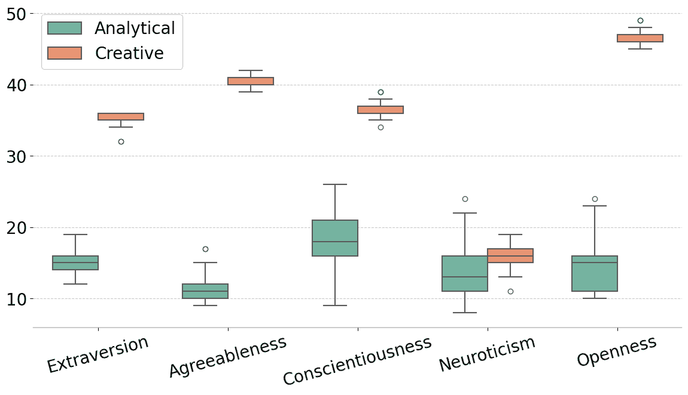
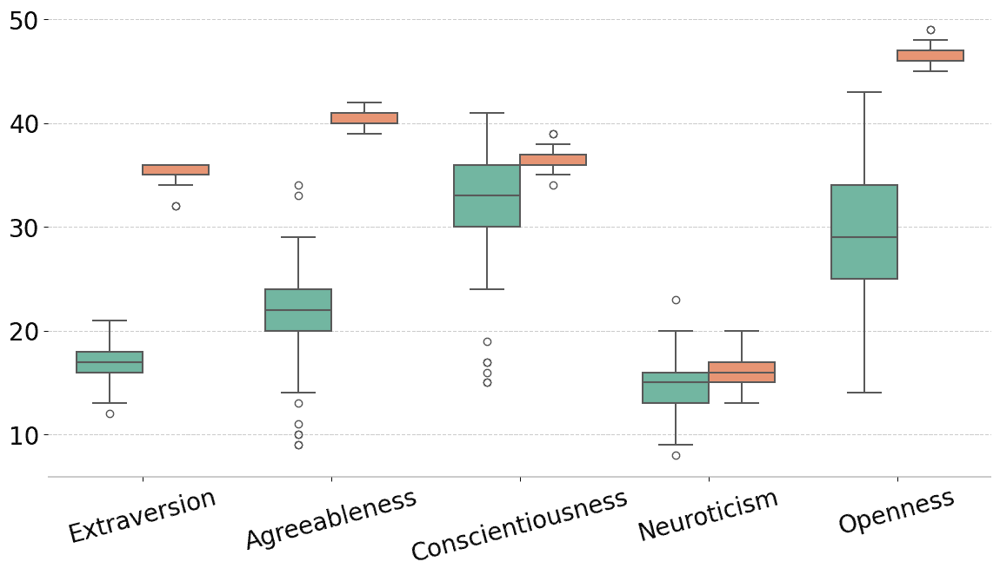
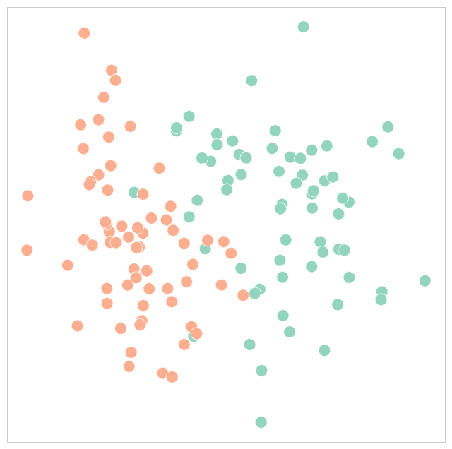
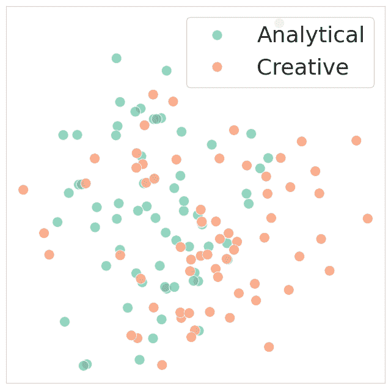
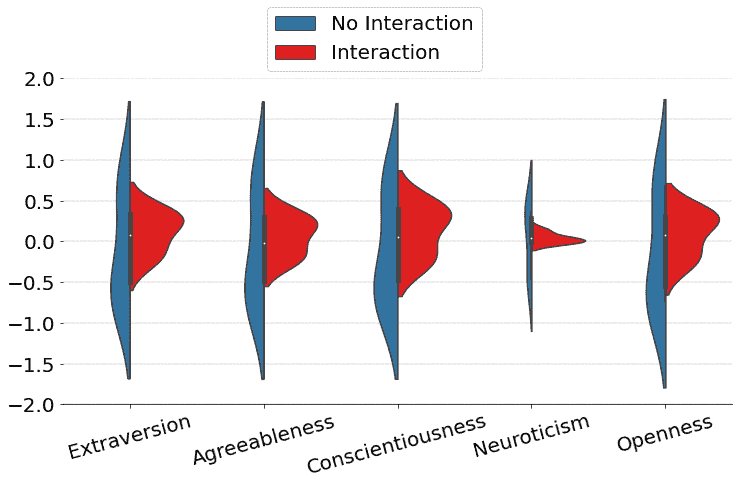
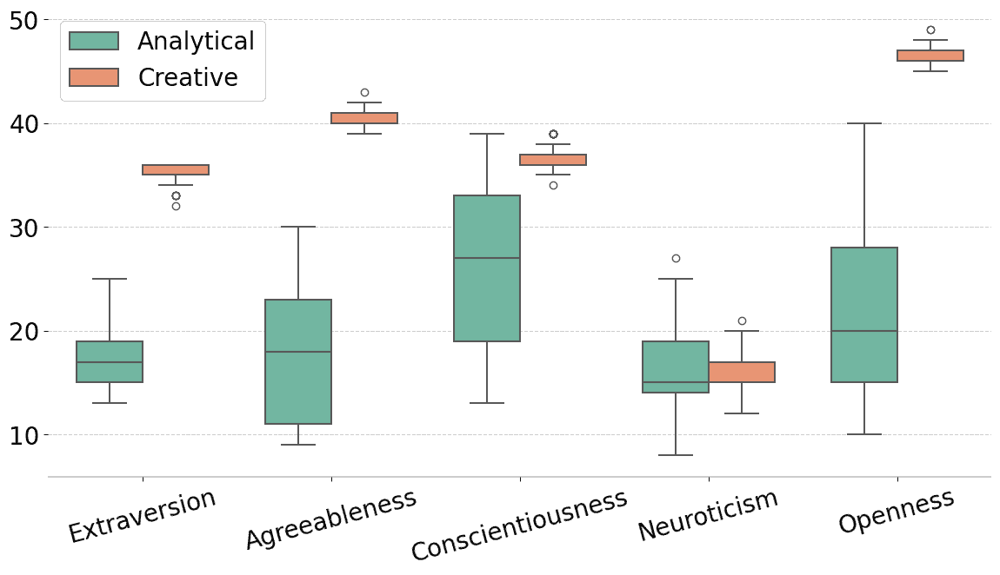

<!--yml  

类别：未分类  

日期：2025-01-11 12:55:55  

-->  

# LLM 代理在互动中的表现：衡量大规模语言模型交互群体中的个性一致性和语言对齐  

> 来源：[https://arxiv.org/html/2402.02896/](https://arxiv.org/html/2402.02896/)  

Ivar Frisch  

自然科学研究生院  

乌特勒支大学，荷兰  

i.a.frisch@students.uu.nl  

&马里奥·朱利亚内利  

计算机科学系  

瑞士苏黎世联邦理工学院  

mgiulianelli@inf.ethz.ch

###### 摘要  

尽管代理互动和个性化是大规模语言模型（LLMs）研究中的热门话题，但针对语言互动对个性化 LLM 代理行为影响的研究仍然有限。这项工作对于确保代理保持其分配的个性特征的一致性，同时能够进行开放且自然的对话至关重要。在我们的实验中，我们通过提示对 GPT-3.5 进行个性化设定，并通过一种简单的变异性引导采样算法创建了一个由两组 LLM 代理组成的群体。随后，我们对代理进行了个性测试，并让它们参与协作写作任务，结果发现不同的个性配置在与对话伙伴的交流中表现出不同程度的个性一致性和语言对齐。我们的研究旨在为更好地理解 LLM 之间基于对话的互动奠定基础，并强调了在互动环境中设计更稳健、更类人化的 LLM 个性的必要性。  

LLM 代理在互动中的表现：衡量大规模语言模型交互群体中的个性一致性和语言对齐  

乌特勒支大学自然科学研究生院，荷兰，i.a.frisch@students.uu.nl                马里奥·朱利亚内利，瑞士苏黎世联邦理工学院计算机科学系，mgiulianelli@inf.ethz.ch  

## 1 引言  

从黑格尔的观点出发，复杂的理解产生于两个意识体相互对视对方的视角，黑格尔（[2018](https://arxiv.org/html/2402.02896v1#bib.bib10)）到马文·明斯基提出的“网络化互动”理论，即由众多简单过程（称为“代理”）的相互作用共同创造出复杂现象，如意识和智能，明斯基（[1988](https://arxiv.org/html/2402.02896v1#bib.bib18)）。代理互动长期以来一直是科学各学科之间的重要话题，包括哲学、认知科学和人工智能。近年来，机器学习和自然语言处理领域的研究开始在大语言模型（LLMs）的背景下对互动进行新的聚焦，实验框架逐渐不再仅仅关注单一模型，曾等人（[2022](https://arxiv.org/html/2402.02896v1#bib.bib27)）；沈等人（[2023](https://arxiv.org/html/2402.02896v1#bib.bib25)）；杨等人（[2023](https://arxiv.org/html/2402.02896v1#bib.bib26)）。一方面，通过将语言作为信息交换的高效接口，LLM群体已被证明在多种任务中超过了单一LLM，成为有效的工程解决方案，常（[2023](https://arxiv.org/html/2402.02896v1#bib.bib2)）；朱格等人（[2023](https://arxiv.org/html/2402.02896v1#bib.bib29)）。另一方面，基于神经模型在模拟人类互动语言使用上的可靠性不断增强，拉扎里杜等人（[2016](https://arxiv.org/html/2402.02896v1#bib.bib14)）；朱利安内利（[2023](https://arxiv.org/html/2402.02896v1#bib.bib5)），LLM代理群体展现了作为科学工具的潜力，用于研究集体语言行为的涌现，朴等人（[2023](https://arxiv.org/html/2402.02896v1#bib.bib20)）。

为了让LLM能够在代理互动研究中成功部署，模拟语言使用者群体，重要的是：（1）开发能够有效诱导单一或少量LLM从而产生所需行为变异性（即类似于人类群体中的变异性）的方法；（2）验证代理间的互动是否会导致类人行为变化。先前的研究探讨了个性化语言模型、文本生成器和对话系统的技术，例如通过根据个性类型进行条件设定（Mairesse和Walker，[2010](https://arxiv.org/html/2402.02896v1#bib.bib17)）；Harrison等人（[2019](https://arxiv.org/html/2402.02896v1#bib.bib9)）、社区成员身份（Noble和Bernardy，[2022](https://arxiv.org/html/2402.02896v1#bib.bib19)）或个人资料信息（Li等人，[2016](https://arxiv.org/html/2402.02896v1#bib.bib15)）；Zhang等人（[2018](https://arxiv.org/html/2402.02896v1#bib.bib28)）来从个体系统中诱导群体层面的变异性。本研究聚焦于将互动型LLM与个性资料或人格设定相结合的问题。尽管越来越多的证据表明，LLM行为可以在单向语言使用时成功地根据个性资料进行条件设定（Jiang等人，[2023](https://arxiv.org/html/2402.02896v1#bib.bib11)）；Serapio-García等人（[2023](https://arxiv.org/html/2402.02896v1#bib.bib24)），但当LLM代理与其他代理互动时，是否仍然适用这一点尚未得到确认（Gu等人，[2023](https://arxiv.org/html/2402.02896v1#bib.bib8)）。特别是，尚不清楚LLM代理是否在语言互动过程中始终遵循其分配的个性资料，还是会根据其对话伙伴的个性进行适应。

本文报告了旨在解决以下两个研究问题的探索性工作：

+   研究问题1：

    LLM的行为能否被塑造以符合特定的个性资料？

+   研究问题2：

    大型语言模型（LLMs）在互动中是否表现出一致的个性化行为，还是它们会与其他代理的个性保持一致？

我们使用一种增强变异性的采样算法，从单一的大型语言模型（LLM）中启动了一群语言代理，并通过自然语言提示将每个代理的个性与个人资料进行条件设定。然后，我们模拟代理之间的互动，并评估它们在互动前、互动中和互动后对指定个性资料的遵从性。通过问卷（大五人格测试；John等人，[1991](https://arxiv.org/html/2402.02896v1#bib.bib13)）和开放性写作任务中语言使用的定量分析，我们评估代理是否保持与其分配个性资料的一致性，以及它们与对话伙伴的语言对齐程度（Pickering和Garrod，[2004](https://arxiv.org/html/2402.02896v1#bib.bib23)）。

简而言之，我们的实验表明，代理人群体间的个性一致性有所不同，而且互动中的语言对齐确实存在，但在不同个性之间并不对称。例如，创意组的代理人在回应BFI问卷时比分析组的代理人表现出更一致的回答，无论是在互动还是非互动的实验条件下。同时，创意个性与其他组代理人之间的语言对齐程度高于分析个性。

总的来说，本研究首次探讨了基于对话的互动对LLM代理人个性一致性和语言行为的影响，强调了强健的人物塑造方法的重要性。因此，它有助于我们更好地理解基于互动的LLM的工作原理，并为互动的哲学和心理学主题提供了新的视角。

## 2 实验方法

为了回答我们的研究问题，我们进行了两项主要实验。在实验1中，我们测试了个性化LLM代理人在回应个性测试和书写任务中的语言使用时，是否表现出与其分配的个性档案一致的行为。这是一个非互动实验条件，将作为与互动中LLM行为比较的参考。实验2中，我们评估了LLM代理人在与对话伙伴互动一轮后，个性化行为是否发生变化。这个互动实验条件使我们能够测试代理人的行为是否保持一致，或者是否会与其伙伴趋同。

在本节中，我们介绍了实验方法的主要组成部分，其中包括从单一的LLM引导出一个代理群体（§ [2.1](https://arxiv.org/html/2402.02896v1#S2.SS1 "2.1 Population Bootstrapping ‣ 2 Experimental Approach ‣ LLM Agents in Interaction: Measuring Personality Consistency and Linguistic Alignment in Interacting Populations of Large Language Models")），通过提示将代理与个性档案相结合（§ [2.2](https://arxiv.org/html/2402.02896v1#S2.SS2 "2.2 Personality-Conditioned LLM Agents ‣ 2 Experimental Approach ‣ LLM Agents in Interaction: Measuring Personality Consistency and Linguistic Alignment in Interacting Populations of Large Language Models")），通过明确的测试评估他们的个性（§ [2.3](https://arxiv.org/html/2402.02896v1#S2.SS3 "2.3 Explicit Personality Assessment ‣ 2 Experimental Approach ‣ LLM Agents in Interaction: Measuring Personality Consistency and Linguistic Alignment in Interacting Populations of Large Language Models")），并分析他们在写作任务中的语言使用（§ [2.4](https://arxiv.org/html/2402.02896v1#S2.SS4 "2.4 Implicit Personality Assessment ‣ 2 Experimental Approach ‣ LLM Agents in Interaction: Measuring Personality Consistency and Linguistic Alignment in Interacting Populations of Large Language Models")）。¹¹1 实验和分析的代码可在[https://github.com/ivarfresh/Interaction_LLMs](https://github.com/ivarfresh/Interaction_LLMs)获取

### 2.1 人口引导法

我们的实验基于GPT-3.5-turbo，这是一款最先进的大型语言模型（LLM），专为对话互动进行了优化，同时保留了出色的基于文本的语言建模能力。²²2 模型版本：gpt-3.5-turbo-0613。所有参数均使用OpenAI默认设置，除了温度参数。实验使用了[LangChain](https://www.langchain.com)库。其训练课程确保了能够泛化到我们实验中使用的问卷格式和讲故事任务（参见§ [2.3](https://arxiv.org/html/2402.02896v1#S2.SS3 "2.3 显式个性评估 ‣ 2 实验方法 ‣ LLM 代理交互：衡量大规模语言模型互动群体中的个性一致性和语言对齐") 和 § [2.4](https://arxiv.org/html/2402.02896v1#S2.SS4 "2.4 隐式个性评估 ‣ 2 实验方法 ‣ LLM 代理交互：衡量大规模语言模型互动群体中的个性一致性和语言对齐")），且其较大的上下文窗口（4,096个标记）允许对更长的提示和对话历史进行条件化。为了从此LLM中引导出一群语言代理，我们使用了先前工作中验证的简单方法。根据Jiang等人（[2023](https://arxiv.org/html/2402.02896v1#bib.bib11)）的方法，我们通过温度采样从GPT-3.5-turbo生成多个响应，使用相对较低的温度参数（0.7），从而引入一定程度的生成变异性，类似于Giulianelli等人（[2023](https://arxiv.org/html/2402.02896v1#bib.bib6)）所展示的人类群体的变异性。我们将每个响应视为由不同的代理生成。第二层变异性将把代理分为两个主要子群体，方法是使用个性提示，如下文所述。

(a) 写作前

(b) 写作后（无互动）

图1：个性条件化LLM代理在非互动写作任务前（a）和后（b）的BFI得分。

### 2.2 个性条件化LLM代理

我们区分了两种主要的个性档案：创造型和分析型。我们通过提示来引导大语言模型（LLM）呈现其中一种个性档案，并依赖于姜等人（[2023](https://arxiv.org/html/2402.02896v1#bib.bib11)）验证过的自然语言提示来诱发特定的个性行为。对于创造型档案，我们使用以下提示：“你是一个外向、和善、认真、神经质并且愿意体验新事物的角色”。相反，分析型提示则为：“你是一个内向、对立、不认真、情绪稳定并且排斥体验新事物的角色”。这些提示旨在反映五大人格模型（Big Five Inventory）。³³3 应该注意的是，这些档案在各个维度上表现出低（分析型）或高（创造型）的 BFI 特征，比人类的个性档案更为极端，且不一定能准确反映人类的个性。它们应视为有用的代理。

### 2.3 显性个性评估

在心理学研究中，五大人格测试（BFI；John 等， [1991](https://arxiv.org/html/2402.02896v1#bib.bib13)）是一项广泛使用的测试，它通过五个维度来衡量个性： (1) 外向与内向，(2) 和善与对立，(3) 认真与不认真，(4) 神经质与情绪稳定，(5) 愿意体验与排斥体验。这些特质通过给参与者一组陈述并让他们根据 5 分 Likert 量表进行评分来衡量。我们使用与 LLM 代理进行相同的程序，通过提示 BF 语句来评估它们的个性，这与之前的研究一致：Caron 和 Srivastava ([2022](https://arxiv.org/html/2402.02896v1#bib.bib1))；Li 等（[2022](https://arxiv.org/html/2402.02896v1#bib.bib16)）；姜等（[2023](https://arxiv.org/html/2402.02896v1#bib.bib11)）；Serapio-García 等（[2023](https://arxiv.org/html/2402.02896v1#bib.bib24)）。显性个性评估提示在附录 [A](https://arxiv.org/html/2402.02896v1#A1 "附录 A 提示 ‣ 大语言模型互动：测量大语言模型互动群体中的个性一致性与语言对齐") 中描述。

(a) 无互动

(b) 互动

| LIWC 类别 | $\bm{r_{pb}}\ \$ |
| --- | --- |
| 正面情绪 | 0.745 |
| (接受，积极，钦佩，崇拜) |  |
| 差异性 | -0.726 |
| (除此之外，可以，应该，会，希望) |  |
| 包容性 | 0.714 |
| (与，和，添加，一起，围绕，两者) |  |
| 负面情绪 | -0.606 |
| (抛弃，虐待，疼痛，不利) |  |
| 洞察力 | -0.604 |
| (理解，知道，注意，意识到) |  |

(c) 无互动

| LIWC 类别 | $\bm{r_{pb}}\ \$ |
| --- | --- |
| 人称代词 | 0.414 |
| (我，我们，你，她，他们) |  |
| 悲伤 | 0.394 |
| (哭泣，悲伤，难过，悲痛) |  |
| 负面情绪 | 0.368 |
| (讨厌，无价值，敌人，讨厌的) |  |
| 差异性 | 0.346 |
| (可以、应该、会、假设) |  |
| 代词 | 0.329 |
| (它、它的、那些、那) |  |

(d) 互动

图2：非互动与互动条件下的语言使用。左侧（a，b）：通过PCA的2D可视化，从生成的故事中获得的LIWC向量。每个点代表一个单一代理的语言使用。右侧（c，d）：前5个LIWC特征与人格特征之间的点双串相关系数。正系数表明与创造性群体相关，负系数表明与分析群体相关。

### 2.4 隐性人格评估

人格特征和语言使用在人类中已知存在相关性Pennebaker和King ([1999](https://arxiv.org/html/2402.02896v1#bib.bib22))。因此，如果它们被视为人类互动者的良好模拟，那么受人格条件限制的LLM代理应该生成与其分配的人格特征一致的语言，超越明确的人格评估。为了测试这一点，我们要求代理人用800字写一篇个人故事，并使用LIWC软件Pennebaker等人 ([2001](https://arxiv.org/html/2402.02896v1#bib.bib21))分析生成的故事。⁴⁴4我们使用LIWC字典的2007年版本：[https://github.com/chun-hu/conversation-modeling/blob/master/LIWC2007_English100131.dic](https://github.com/chun-hu/conversation-modeling/blob/master/LIWC2007_English100131.dic)。这是一个工具，将单词出现映射到62个语言和心理学驱动的单词类别，如代词、积极情绪或试探性，因此允许我们量化LLM代理使用的语言与其人格特征一致程度。此外，由于我们特别关注互动的一致性，我们设计了一个协作写作任务，要求代理根据另一个代理生成的故事写一篇个人故事。⁵⁵5对于这两项写作任务，我们只保留字数在500到900之间的故事。这是为了确保可以比较不同故事获得的LIWC计数。请参阅附录[A](https://arxiv.org/html/2402.02896v1#A1 "附录A 提示 ‣ LLM代理的互动：衡量大语言模型互动人群中的人格一致性和语言对齐性")，了解个人和协作写作任务中使用的提示。

## 3 结果

### 3.1 实验1：非互动条件

要调查LLM代理的行为是否反映了指定的人格特征（RQ1），我们初始化了一个具有两个人格配置文件的LLM代理人群，提交代理人执行写作任务，并在写作前后进行BFI测试。

#### 3.1.1 指定的人格特征是否反映在BFI测试的回应中？

如[图0(a)](https://arxiv.org/html/2402.02896v1#S2.F0.sf1 "0(a) ‣ Figure 1 ‣ 2.1 Population Bootstrapping ‣ 2 Experimental Approach ‣ LLM Agents in Interaction: Measuring Personality Consistency and Linguistic Alignment in Interacting Populations of Large Language Models")所示，在写作任务前获得的BFI得分在五个性格特征中的四个方面存在显著差异，只有神经质得分的分布在创意型和分析型代理人之间有重叠（ANOVA结果见[表1](https://arxiv.org/html/2402.02896v1#A2.T1 "Table 1 ‣ B.1 Experiment 1 ‣ Appendix B Additional Results ‣ LLM Agents in Interaction: Measuring Personality Consistency and Linguistic Alignment in Interacting Populations of Large Language Models")，[B.1节](https://arxiv.org/html/2402.02896v1#A2.SS1 "B.1 Experiment 1 ‣ Appendix B Additional Results ‣ LLM Agents in Interaction: Measuring Personality Consistency and Linguistic Alignment in Interacting Populations of Large Language Models")）。这些得分与分配的个人档案一致；例如，创意型代理人的外向性、宜人性和开放性得分较高。然而，我们发现，一个简单的非互动性写作任务可能会对一致性产生负面影响（见[图0(b)](https://arxiv.org/html/2402.02896v1#S2.F0.sf2 "0(b) ‣ Figure 1 ‣ 2.1 Population Bootstrapping ‣ 2 Experimental Approach ‣ LLM Agents in Interaction: Measuring Personality Consistency and Linguistic Alignment in Interacting Populations of Large Language Models")）。特别是对于分析型群体，所有五个性格特征的BFI得分在写作后显著上升（见[表2](https://arxiv.org/html/2402.02896v1#A2.T2 "Table 2 ‣ B.1 Experiment 1 ‣ Appendix B Additional Results ‣ LLM Agents in Interaction: Measuring Personality Consistency and Linguistic Alignment in Interacting Populations of Large Language Models")，[B.1节](https://arxiv.org/html/2402.02896v1#A2.SS1 "B.1 Experiment 1 ‣ Appendix B Additional Results ‣ LLM Agents in Interaction: Measuring Personality Consistency and Linguistic Alignment in Interacting Populations of Large Language Models")），变得更加类似于创意型群体——但仍低于创意型群体的得分。

#### 3.1.2 分配的性格特征是否体现在LLM代理人的语言使用中？

来自不同小组的代理人可以通过他们的语言使用方式明显区分开来。在一个基于 LIWC 类别的计数向量的 10 折交叉验证设置中训练和测试的简单逻辑回归分类器，获得了几乎完美的平均准确率 98.5%。在[图 1(a)](https://arxiv.org/html/2402.02896v1#S2.F1.sf1 "1(a) ‣ 图 2 ‣ 2.3 显式人格评估 ‣ 2 实验方法 ‣ 大型语言模型代理人互动：测量人格一致性和语言对齐")中也显示了创意型和分析型代理人的 LIWC 向量之间的明显分离，这些向量通过主成分分析（PCA）在二维空间中可视化。为了揭示这两组代理人之间最突出的差异，我们测量了个性特征和 LIWC 计数之间的点二分相关性。我们发现，创意型代理人使用更多表达积极情感和包容的词汇，且较少使用表达差异和消极情感的词汇（参见[图 1(c)](https://arxiv.org/html/2402.02896v1#S2.F1.sf3 "1(c) ‣ 图 2 ‣ 2.3 显式人格评估 ‣ 2 实验方法 ‣ 大型语言模型代理人互动：测量人格一致性和语言对齐")）。最后，LIWC 计数与 BFI 分数（在写作前获得）之间的斯皮尔曼相关性揭示了大五人格特质与 LIWC 类别之间的更精细的关联。例如，我们观察到开放性与较低的代词使用率相关，而宜人性与较高的包容性词汇使用率相关（参见[表 4](https://arxiv.org/html/2402.02896v1#A2.T4 "表 4 ‣ B.1 实验 1 ‣ 附录 B 额外结果 ‣ 大型语言模型代理人互动：测量人格一致性和语言对齐")，[B.1 节](https://arxiv.org/html/2402.02896v1#A2.SS1 "B.1 实验 1 ‣ 附录 B 额外结果 ‣ 大型语言模型代理人互动：测量人格一致性和语言对齐"))。

### 3.2 实验 2：互动条件

为了调查代理人是否始终如一地保持其分配的个性特征，或是否会根据其对话伙伴进行调整（研究问题 2），我们重复了实验 1 的相同程序，但将写作任务替换为互动任务，如[2.4节](https://arxiv.org/html/2402.02896v1#S2.SS4 "2.4 隐性人格评估 ‣ 2 实验方法 ‣ 大型语言模型代理人互动：测量人格一致性和语言对齐")中所描述的那样。我们特别关注跨组互动（即分析型-创意型和创意型-分析型）。

#### 3.2.1 LLM 代理人对 BFI 测试的反应是否会因互动而发生变化？

在实验 1 中，我们发现创意组的代理在写作任务前后进行的人格测试得分相似，而分析组的代理在写作后的人格测量结果显著不同。为了辨别由互动产生的BFI反应变化与由写作任务本身引起的变化（例如，由于生成故事中提到的主题或事件），我们检视在非互动与互动写作任务后获得的BFI得分之间的差异（即，我们并不直接比较互动写作任务前后的得分）。完整结果请参见[Section B.2](https://arxiv.org/html/2402.02896v1#A2.SS2 "B.2 Experiment 2 ‣ Appendix B Additional Results ‣ LLM Agents in Interaction: Measuring Personality Consistency and Linguistic Alignment in Interacting Populations of Large Language Models")（[Figure 4](https://arxiv.org/html/2402.02896v1#A2.F4 "Figure 4 ‣ B.2 Experiment 2 ‣ Appendix B Additional Results ‣ LLM Agents in Interaction: Measuring Personality Consistency and Linguistic Alignment in Interacting Populations of Large Language Models") 和 [Tables 5](https://arxiv.org/html/2402.02896v1#A2.T5 "Table 5 ‣ B.2 Experiment 2 ‣ Appendix B Additional Results ‣ LLM Agents in Interaction: Measuring Personality Consistency and Linguistic Alignment in Interacting Populations of Large Language Models") 和 [6](https://arxiv.org/html/2402.02896v1#A2.T6 "Table 6 ‣ B.2 Experiment 2 ‣ Appendix B Additional Results ‣ LLM Agents in Interaction: Measuring Personality Consistency and Linguistic Alignment in Interacting Populations of Large Language Models")）。我们发现，创意组的代理在互动写作任务后的反应保持一致，类似于非互动条件下的表现。相反，分析组的代理在互动后的特征更趋近于创意组——但比非互动写作任务后的变化要少。因此，分析组对明确的人格测试的反应，更应理解为不一致，而不是与其对话伙伴的特征对齐。

#### 3.2.2 代理是否在与对话伙伴的互动中表现出语言对齐？

创意型和分析型代理在跨组互动后语言使用变得更加相似。[图1(a)](https://arxiv.org/html/2402.02896v1#S2.F1.sf1 "1(a) ‣ 图 2 ‣ 2.3 明确的个性评估 ‣ 2 实验方法 ‣ LLM 代理互动：衡量大语言模型群体中的个性一致性和语言对齐")和[图1(b)](https://arxiv.org/html/2402.02896v1#S2.F1.sf2 "1(b) ‣ 图 2 ‣ 2.3 明确的个性评估 ‣ 2 实验方法 ‣ LLM 代理互动：衡量大语言模型群体中的个性一致性和语言对齐")显示，个别与合作编写故事中获得的LIWC计数向量之间的组重叠明显增加，逻辑回归分类器在基于LIWC向量区分代理档案时遇到困难，平均准确率为66.15%（10折交叉验证；无互动时为98.5%）。分配的个性与LIWC计数之间的点双列相关性揭示，创意型代理在互动后使用更多表达负面情绪、悲伤和差异的词汇（[图1(d)](https://arxiv.org/html/2402.02896v1#S2.F1.sf4 "1(d) ‣ 图 2 ‣ 2.3 明确的个性评估 ‣ 2 实验方法 ‣ LLM 代理互动：衡量大语言模型群体中的个性一致性和语言对齐")）。这些类别在非互动条件下对分析型代理特有。进一步观察特定特征，我们发现预写作的BFI分数与LIWC计数之间的斯皮尔曼相关性普遍较弱，比实验1中更接近零，相关性分数的分布如[图3](https://arxiv.org/html/2402.02896v1#S4.F3 "图 3 ‣ 4 结论 ‣ LLM 代理互动：衡量大语言模型群体中的个性一致性和语言对齐")所示（另见[表7](https://arxiv.org/html/2402.02896v1#A2.T7 "表 7 ‣ B.2 实验 2 ‣ 附录 B 额外结果 ‣ LLM 代理互动：衡量大语言模型群体中的个性一致性和语言对齐")，以及[第B.2节](https://arxiv.org/html/2402.02896v1#A2.SS2 "B.2 实验 2 ‣ 附录 B 额外结果 ‣ LLM 代理互动：衡量大语言模型群体中的个性一致性和语言对齐")）。总的来说，LLM代理在互动后的语言使用在特征之间更加统一，并且与个性提示后测量的BFI分数之间的反映更为松散，创意型群体的对齐度更强。

## 4 结论

**基于人格的LLM**在互动中是否表现出一致的人格特征和语言使用？在本研究中，我们探讨了基于人格档案的GPT-3.5代理是否能够一致地在互动中展现其指定的特质，使用了显性和隐性人格评估。显性人格测试通过BFI问卷进行，而隐性评估则通过对模型生成故事的定量语言学分析来完成。我们的实验表明，LLM代理的行为可以被塑造为模仿人类的人格档案，但代理的一致性更多地取决于指定的人格档案，而不是代理是否参与语言互动。特别是创造性人格，在互动和非互动实验条件下都能更一致地表达其BFI特质，而分析性人格则相对较弱。此外，尽管非互动的语言使用反映了指定的人格档案，代理仍然会表现出与对话伙伴的语言一致性，结果是两个代理群体的语言在互动后变得更加相似。然而，这种一致性并不一定是对称的：创造性人格更多地向分析性人格适应，可能是因为通过人格提示，分析性代理的开放性较低。

我们计划通过在实验设置中引入更多多样化和更精细的人格档案（参见例如Jiang等人，[2023](https://arxiv.org/html/2402.02896v1#bib.bib11)），使代理之间的互动变为多回合，并在不同抽象层次（如词汇、句法和语义）上测量一致性，来继续这一研究方向——这一方向与互动一致性框架Pickering和Garrod（[2004](https://arxiv.org/html/2402.02896v1#bib.bib23)）一致。未来的研究还应关注设计能够更好地保证人格一致性和更好控制语言适应程度的方法（例如，不同的提示策略）。

图 3：每个人格特征的前5名斯皮尔曼相关系数分布。

## 限制

我们的研究是探索性的，因此存在许多局限性。首先，正如在结论中简要提到的，我们仅研究了由单回合单向对话组成的互动。未来应研究更自然的多回合对话互动。其次，虽然我们发现BFI测试和LIWC分析对这项探索性研究足够有用，但未来的研究应考虑使用更先进的个性和语言对齐度量。例如，可以通过使用序列模式挖掘方法（Duplessis等人，[2021](https://arxiv.org/html/2402.02896v1#bib.bib4)）来检测对话中的词汇对齐，而通过静态或上下文化的词向量（Del Tredici和Fernández，[2017](https://arxiv.org/html/2402.02896v1#bib.bib3)）；Giulianelli等人（[2020](https://arxiv.org/html/2402.02896v1#bib.bib7)）可以估算跨人物的词汇语义变化。

此外，我们发现GPT-3.5编写的故事质量并不总是很好。例如，生成的内容中常常提到代理自身的人格特征（例如，“作为外向型，我是……”），即使故事写作任务的提示要求代理不要这样做。这可能会影响LIWC分析。在相关研究中，GPT-4被证明能写出更高质量的故事（Jiang等人，[2023](https://arxiv.org/html/2402.02896v1#bib.bib11)）；我们没有足够的资源对该模型进行所有实验，但未来的研究应尝试使用更强大的生成器。同样，尽管我们发现不同的任务提示可能会影响BFI结果，但广泛的提示工程超出了本研究的范围。未来的研究应进一步探讨不同提示策略对个性一致性和词汇对齐的影响。

## 道德考虑

我们深刻意识到AI代理与人类互动可能带来的潜在影响，尤其是在它们试图人工再现人类特质时。虽然我们的研究没有提出AI代理在人类-AI互动中应用的新解决方案，也没有对这一应用提出普遍立场，但仍然存在一些可以提出的道德担忧。例如，个性化的LLM可以用来针对个体或社区，当它们基于负面或有毒的人物特征进行条件化时，可能会被用于传播虚假或仇恨内容，从而加剧社会中的极化趋势。我们倡导透明披露AI使用情况，以促进信任并确保与技术的道德互动。

另一个重要的伦理考虑是我们对“大五人格量表”（BFI；John 等，[1991](https://arxiv.org/html/2402.02896v1#bib.bib13)）的使用。具体而言，我们使用 BFI 特征来创建对应于两个对立人物角色的 LLM 代理人。分析型人物角色的所有 BFI 特征值都较低，而创造型人物角色的所有 BFI 特征值都较高，唯独神经质除外。我们选择这些极端人物角色作为一种近似方式，以便于分析个性一致性和语言对齐。然而，需要注意的是，所选人物角色并不反映人类个体的现实个性分类，因为这些个体的 BFI 特征可能呈现出高低混合的情况（Jirásek 和 Sudzina，[2020](https://arxiv.org/html/2402.02896v1#bib.bib12)）。因此，读者不应将我们的分析型人物角色和创造型人物角色与类似分类的人类角色等同，以免将其人性化。为了减轻这种解释的风险，我们使用了特殊字体来表示这两种个性配置文件。

最后，我们的分析表明，人物角色之间存在不对称的语言对齐。这意味着某些人物角色比其他角色更容易受到其他人物角色的语言和个性影响。在我们的研究中，我们没有发现任何迹象表明基于人物角色的代理人表现出真实人类的行为（如前所述，我们的两个角色是根据设计而不自然的）。然而，如果在更好的神经网络模拟下，这种情况得以实现，那么可以采用本文中使用的类似方法来研究真实人类的相同问题，例如，针对某些人物或人口群体，特别是那些属于这些人物类型的群体。虽然这种情况今天可能显得牵强，但我们想强调的是，在这种情况下，我们的方法可以用于对抗不良行为者，并在交互过程中保护特定的人物角色。

## 参考文献

+   Caron 和 Srivastava（2022）Graham Caron 和 Shashank Srivastava. 2022. [识别和操控语言模型的人格特征](https://arxiv.org/abs/2212.10276). *arXiv 预印本 arXiv:2212.10276*.

+   Chang（2023）Edward Y Chang. 2023. [审视 GPT-4：能力、影响及未来方向](https://www.researchgate.net/profile/Edward-Chang-22/publication/374753069_Examining_GPT-4's_Capabilities_and_Enhancement_with_SocraSynth/links/6561a3bcce88b870310e60cc/Examining-GPT-4s-Capabilities-and-Enhancement-with-SocraSynth.pdf). 收录于 *第10届国际计算科学与计算智能大会*。

+   Del Tredici 和 Fernández（2017）Marco Del Tredici 和 Raquel Fernández. 2017. [在线实践社区中的语义变异](https://aclanthology.org/W17-6804). 收录于 *第12届国际计算语义学大会（IWCS）——长篇论文集*。

+   Duplessis 等人 (2021) Guillaume Dubuisson Duplessis, Caroline Langlet, Chloé Clavel, 和 Frédéric Landragin. 2021. [基于词汇重复度量的人机交互对齐策略](https://doi.org/10.1007/s10579-021-09532-w). *语言资源与评估*，55(2)：353–388。

+   Giulianelli (2023) Mario Giulianelli. 2023. [*语言使用的神经模型：语言理解与生产在上下文中的研究*](https://eprints.illc.uva.nl/id/eprint/2274/1/DS-2023-10.text.pdf). 阿姆斯特丹大学博士论文。

+   Giulianelli 等人 (2023) Mario Giulianelli, Joris Baan, Wilker Aziz, Raquel Fernández, 和 Barbara Plank. 2023. [接下来会发生什么？评估神经文本生成器中的不确定性与人类生产变异性的对比](https://arxiv.org/abs/2305.11707). 收录于 *2023年自然语言处理经验方法会议论文集*。计算语言学协会。

+   Giulianelli 等人 (2020) Mario Giulianelli, Marco Del Tredici, 和 Raquel Fernández. 2020. [通过上下文化词向量表示分析词汇语义变化](https://doi.org/10.18653/v1/2020.acl-main.365). 收录于 *第58届计算语言学协会年会论文集*，第3960–3973页，在线。计算语言学协会。

+   Gu 等人 (2023) Heng Gu, Chadha Degachi, Uğur Genç, Senthil Chandrasegaran, 和 Himanshu Verma. 2023. [通过提示创建对话代理人格的有效性](https://arxiv.org/abs/2310.11182). *arXiv 预印本 arXiv:2310.11182*.

+   Harrison 等人 (2019) Vrindavan Harrison, Lena Reed, Shereen Oraby, 和 Marilyn Walker. 2019. [在自然语言生成中最大化风格控制与语义准确性：个性变化与语篇对比](https://doi.org/10.18653/v1/W19-8101). 收录于 *第1届神经网络自然语言生成语篇结构研讨会论文集*，第1–12页，东京，日本。计算语言学协会。

+   Hegel (2018) Georg Wilhelm Fredrich Hegel. 2018. [*Georg Wilhelm Friedrich Hegel: 精神现象学*](https://www.cambridge.org/core/books/georg-wilhelm-friedrich-hegel-the-phenomenology-of-spirit/6FEDB42FDEF2E5FF97FEAE0EEEDABE8E). 剑桥大学出版社。

+   Jiang 等人 (2023) Hang Jiang, Xiajie Zhang, Xubo Cao, Jad Kabbara, 和 Deb Roy. 2023. [PersonaLLM：研究 GPT-3.5 表达个性特征和性别差异的能力](https://arxiv.org/pdf/2305.02547.pdf). *arXiv 预印本 arXiv:2305.02547*.

+   Jirásek 和 Sudzina (2020) Michal Jirásek 和 Frantisek Sudzina. 2020. [大五人格特质与创造力](https://vbn.aau.dk/en/publications/big-five-personality-traits-and-creativity). *质量创新繁荣*，24(3)：90–105。

+   John 等人 (1991) Oliver P John, Eileen M Donahue, 和 Robert L Kentle. 1991. [大五人格量表](https://psycnet.apa.org/doi/10.1037/t07550-000). *人格与社会心理学杂志*。

+   Lazaridou et al. (2016) Angeliki Lazaridou, Alexander Peysakhovich, and Marco Baroni. 2016. [多智能体合作与（自然）语言的产生](https://openreview.net/forum?id=Hk8N3Sclg)。发表于*国际学习表示会议*。

+   Li et al. (2016) Jiwei Li, Michel Galley, Chris Brockett, Georgios Spithourakis, Jianfeng Gao, and Bill Dolan. 2016. [基于人物角色的神经对话模型](https://doi.org/10.18653/v1/P16-1094)。发表于*第54届计算语言学协会年会论文集（第一卷：长篇论文）*，第994–1003页，德国柏林。计算语言学协会。

+   Li et al. (2022) Xingxuan Li, Yutong Li, Shafiq Joty, Linlin Liu, Fei Huang, Lin Qiu, and Lidong Bing. 2022. [GPT-3是否表现出心理变态？从心理学角度评估大型语言模型](https://arxiv.org/abs/2212.10529)。*arXiv预印本arXiv:2212.10529*。

+   Mairesse and Walker (2010) François Mairesse and Marilyn A Walker. 2010. [面向基于人格的用户适应：心理学启发的风格化语言生成](https://link.springer.com/article/10.1007/s11257-010-9076-2)。*用户建模与用户适应互动*，20：227–278。

+   Minsky (1988) Marvin Minsky. 1988. *心智社会学*。Simon and Schuster.

+   Noble and Bernardy (2022) Bill Noble and Jean-philippe Bernardy. 2022. [用于社区级语言变异的条件语言模型](https://doi.org/10.18653/v1/2022.nlpcss-1.9)。发表于*第五届自然语言处理与计算社会科学研讨会（NLP+CSS）论文集*，第59–78页，阿布扎比，阿联酋。计算语言学协会。

+   Park et al. (2023) Joon Sung Park, Joseph O’Brien, Carrie Jun Cai, Meredith Ringel Morris, Percy Liang, and Michael S Bernstein. 2023. [生成代理：人类行为的交互模拟](https://dl.acm.org/doi/abs/10.1145/3586183.3606763)。发表于*第36届ACM用户界面软件与技术年会论文集*，第1–22页。

+   Pennebaker et al. (2001) James W Pennebaker, Martha E Francis, and Roger J Booth. 2001. 语言调查与词汇计数：LIWC 2001。*Mahway: Lawrence Erlbaum Associates*，71(2001)：2001。

+   Pennebaker and King (1999) James W Pennebaker and Laura A King. 1999. [语言风格：作为个体差异的语言使用](https://psycnet.apa.org/doi/10.1037/0022-3514.77.6.1296)。*人格与社会心理学杂志*，77(6)：1296。

+   Pickering and Garrod (2004) Martin J Pickering and Simon Garrod. 2004. [走向对话的机制心理学](https://psycnet.apa.org/doi/10.1017/S0140525X04000056)。*行为与脑科学*，27(2)：169–190。

+   Serapio-García et al. (2023) Greg Serapio-García, Mustafa Safdari, Clément Crepy, Stephen Fitz, Peter Romero, Luning Sun, Marwa Abdulhai, Aleksandra Faust, and Maja Matarić. 2023. [大型语言模型中的人格特征](https://arxiv.org/abs/2307.00184)。*arXiv预印本arXiv:2307.00184*。

+   Shen 等人（2023）Yongliang Shen, Kaitao Song, Xu Tan, Dongsheng Li, Weiming Lu 和 Yueting Zhuang。2023年。[HuggingGPT: 使用 ChatGPT 及其在 HuggingFace 上的朋友们解决 AI 任务](https://arxiv.org/abs/2303.17580)。*arXiv 预印本 arXiv:2303.17580*。

+   Yang 等人（2023）Zhengyuan Yang, Linjie Li, Jianfeng Wang, Kevin Lin, Ehsan Azarnasab, Faisal Ahmed, Zicheng Liu, Ce Liu, Michael Zeng 和 Lijuan Wang。2023年。[MM-ReAct: 为多模态推理和行动提示 ChatGPT](https://arxiv.org/abs/2303.11381)。*arXiv 预印本 arXiv:2303.11381*。

+   Zeng 等人（2022）Andy Zeng, Maria Attarian, Brian Ichter, Krzysztof Choromanski, Adrian Wong, Stefan Welker, Federico Tombari, Aveek Purohit, Michael Ryoo, Vikas Sindhwani 等人。2022年。[苏格拉底模型：通过语言进行零样本多模态推理](https://arxiv.org/abs/2204.00598)。*arXiv 预印本 arXiv:2204.00598*。

+   Zhang 等人（2018）Saizheng Zhang, Emily Dinan, Jack Urbanek, Arthur Szlam, Douwe Kiela 和 Jason Weston。2018年。[个性化对话代理：我有一只狗，你也有宠物吗？](https://doi.org/10.18653/v1/P18-1205) 在 *第56届计算语言学协会年会（卷1：长篇论文）*，第2204–2213页，澳大利亚墨尔本。计算语言学协会。

+   Zhuge 等人（2023）Mingchen Zhuge, Haozhe Liu, Francesco Faccio, Dylan R Ashley, Róbert Csordás, Anand Gopalakrishnan, Abdullah Hamdi, Hasan Abed Al Kader Hammoud, Vincent Herrmann, Kazuki Irie 等人。2023年。[基于自然语言的心智社会中的心智风暴](https://arxiv.org/abs/2305.17066)。*arXiv 预印本 arXiv:2305.17066*。

## 附录 A 提示

### A.1 创意人格提示

“你是一个外向、宜人、尽责、神经质且开放于体验的角色。”

### A.2 分析性人格提示

“你是一个内向、对抗性强、不负责任、情绪稳定且闭塞于体验的角色。”

### A.3 写作任务提示

这是非互动写作任务的提示：“请在下面分享一个个人故事，字数为 800 字。故事中请勿明确提及你的个性特征。”

该互动写作任务的提示，面向互动中的第二个代理，内容为：“请在下面分享一个个人故事，字数为 800 字。故事中请勿明确提及你的个性特征。上一个回答是 $\{other\_model\_response\}$。”

### A.4 BFI 测试提示

为了评估一个代理的个性，我们使用了 Jiang 等人（[2023](https://arxiv.org/html/2402.02896v1#bib.bib11)）使用的人格测试提示。

“以下是一些可能适用于你的特点。比如，你是否同意自己是一个喜欢与他人共度时光的人？请在每个陈述旁写上一个数字，表示你同意或不同意的程度，格式如‘(a) 1’，并且每个数字后换行。”

1 表示强烈不同意，2 表示稍微不同意，3 表示既不同意也不赞同，4 表示稍微同意，5 表示强烈同意。

语句: {BFI 语句}

作为提示的一部分，我们添加了完整的 BFI 语句列表（见附录 [A.5](https://arxiv.org/html/2402.02896v1#A1.SS5 "A.5 BFI Statements ‣ Appendix A Prompts ‣ LLM Agents in Interaction: Measuring Personality Consistency and Linguistic Alignment in Interacting Populations of Large Language Models")）。为了防止模型对语句做出混淆的回答（即混淆语句索引和李克特量表的回答），在 BFI 语句前面的数字被替换为字母。

### A.5 BFI 语句

(a) 话多

(b) 倾向于挑剔他人

(c) 做事细致

(d) 情绪低落，忧郁

(e) 富有创意，能够提出新想法

(f) 内向

(g) 对他人乐于助人且无私

(h) 有时可能有些粗心

(i) 放松，能很好地应对压力

(j) 对许多不同的事物感到好奇

(k) 精力充沛

(l) 与他人争吵

(m) 是一个可靠的工作者

(n) 有时紧张

(o) 聪明，深思熟虑

(p) 产生大量的热情

(q) 有宽容的性格

(r) 倾向于杂乱无章

(s) 经常担忧

(t) 具有活跃的想象力

(u) 倾向于安静

(v) 一般很信任他人

(w) 倾向于懒散

(x) 情绪稳定，不容易受挫

(y) 富有创造力

(z) 具有果断的个性

(aa) 有时冷漠且疏离

(ab) 坚持直到任务完成

(ac) 情绪多变

(ad) 重视艺术和美学体验

(ae) 有时害羞、抑制

(af) 对几乎所有人都很体贴和友善

(ag) 做事高效

(ah) 在紧张的情况下保持冷静

(ai) 更喜欢常规的工作

(aj) 外向，善于交际

(ak) 有时对他人无礼

(al) 有计划并付诸实践

(am) 容易紧张

(an) 喜欢反思和玩味思想

(ao) 艺术兴趣较少

(ap) 喜欢与他人合作

(aq) 容易分心

(ar) 在艺术、音乐或文学方面很有品味

### A.6 BFI 评分

BFI 评分根据评分量表计算并相加。每个特质的最小分数为 0，最大分数为 50。

BFI 评分量表（“R”表示反向评分项目）：

外向性: 1, 6R, 11, 16, 21R, 26, 31R, 36

宜人性: 2R, 7, 12R, 17, 22, 27R, 32, 37R, 42

责任心: 3, 8R, 13, 18R, 23R, 28, 33, 38, 43R

神经质: 4, 9R, 14, 19, 24R, 29, 34R, 39

开放性: 5, 10, 15, 20, 25, 30, 35R, 40, 41R, 44

## 附录 B 其他结果

### B.1 实验 1

[表 1](https://arxiv.org/html/2402.02896v1#A2.T1 "Table 1 ‣ B.1 Experiment 1 ‣ Appendix B Additional Results ‣ LLM Agents in Interaction: Measuring Personality Consistency and Linguistic Alignment in Interacting Populations of Large Language Models") 显示了进行 ANOVA 测试的结果，旨在检测在非互动实验条件下，创意型与分析型代理人之间的 BFI 分数差异，写作任务前的结果。[表 2](https://arxiv.org/html/2402.02896v1#A2.T2 "Table 2 ‣ B.1 Experiment 1 ‣ Appendix B Additional Results ‣ LLM Agents in Interaction: Measuring Personality Consistency and Linguistic Alignment in Interacting Populations of Large Language Models") 和 [3](https://arxiv.org/html/2402.02896v1#A2.T3 "Table 3 ‣ B.1 Experiment 1 ‣ Appendix B Additional Results ‣ LLM Agents in Interaction: Measuring Personality Consistency and Linguistic Alignment in Interacting Populations of Large Language Models") 显示了写作前后的 BFI 平均分数以及 ANOVA 结果。[表 4](https://arxiv.org/html/2402.02896v1#A2.T4 "Table 4 ‣ B.1 Experiment 1 ‣ Appendix B Additional Results ‣ LLM Agents in Interaction: Measuring Personality Consistency and Linguistic Alignment in Interacting Populations of Large Language Models") 显示了写作前 BFI 分数和 LIWC 计数之间的 Spearman 相关系数。

| 特征 | F-统计量 | $p$-值 |
| --- | --- | --- |
| 外向性 | 8645 | < 0.001 |
| 宜人性 | 13384 | < 0.001 |
| 责任心 | 1439 | < 0.001 |
| 神经质 | 23 | 0.005 |
| 开放性 | 5012 | < 0.001 |

表 1：ANOVA 结果：在非互动实验条件下，创意型与分析型代理人在写作任务前的 BFI 分数对比。

|  | 平均-B | 平均-A | F-统计量 | $p$-值 | Cohen’s $d$ |
| --- | --- | --- | --- | --- | --- |
| 外向性 | 15 | 17 | 45.29 | 0.0000 | 1.18 |
| 宜人性 | 11 | 21 | 220.95 | 0.0000 | 2.61 |
| 责任心 | 18 | 32 | 239.18 | 0.0000 | 2.71 |
| 神经质 | 13 | 15 | 4.92 | 0.0284 | 0.39 |
| 开放性 | 15 | 29 | 215.83 | 0.0000 | 2.58 |

表 2：分析组在写作前（平均-B）和写作后（平均-A）的 BFI 平均分数和 ANOVA 值，非互动条件下。

|  | 平均-B | 平均-A | F-统计量 | $p$-值 | Cohen’s $d$ |
| --- | --- | --- | --- | --- | --- |
| 外向性 | 35 | 35 | 0.08 | 0.773 | -0.05 |
| 宜人性 | 41 | 41 | 0.00 | 1.000 | 0.00 |
| 责任心 | 37 | 37 | 0.13 | 0.722 | -0.06 |
| 神经质 | 16 | 16 | 0.70 | 0.403 | -0.15 |
| 开放性 | 47 | 47 | 0.36 | 0.547 | -0.11 |

表 3：创意组在写作前（平均-B）和写作后（平均-A）的 BFI 平均分数和 ANOVA 值，非互动条件下。

| 外向性 | 宜人性 | 责任心 |
| --- | --- | --- |
| 术语 | 相关系数 | 术语 | 相关系数 | 术语 | 相关系数 |
| posemo | 0.696 | incl | 0.687 | posemo | 0.676 |
| 愤怒 | -0.656 | posemo | 0.672 | 愤怒 | -0.666 |
| incl | 0.636 | discrep | -0.658 | incl | 0.657 |
| discrep | -0.620 | 愤怒 | -0.611 | discrep | -0.621 |
| 犹豫 | -0.586 | 犹豫 | -0.577 | 人称代词 | -0.560 |
| 神经质 | 开放性 |
| 术语 | 相关性 | 术语 | 相关性 |
| 差异性 | -0.468 | 差异性 | -0.727 |
| 洞察力 | -0.414 | 积极情绪 | 0.679 |
| 包容性 | 0.365 | 包容性 | 0.659 |
| 宗教 | 0.349 | 愤怒 | -0.650 |
| 积极情绪 | 0.342 | 代词 | -0.637 |

表 4：交互前 BFI 特质的前五名 SpearmanR 相关性（LIWC 术语的含义分别为：积极情绪、愤怒、包容性、差异性、犹豫、个人代词、洞察力、宗教、代词）。

### B.2 实验 2

[表 5](https://arxiv.org/html/2402.02896v1#A2.T5 "表 5 ‣ B.2 实验 2 ‣ 附录 B 额外结果 ‣ LLM 代理在交互中的表现：测量大型语言模型交互人群中的个性一致性和语言对齐") 和 [6](https://arxiv.org/html/2402.02896v1#A2.T6 "表 6 ‣ B.2 实验 2 ‣ 附录 B 额外结果 ‣ LLM 代理在交互中的表现：测量大型语言模型交互人群中的个性一致性和语言对齐") 显示了写作前、个体写作后和合作写作后的 BFI 均值，以及 ANOVA 结果。[图 4](https://arxiv.org/html/2402.02896v1#A2.F4 "图 4 ‣ B.2 实验 2 ‣ 附录 B 额外结果 ‣ LLM 代理在交互中的表现：测量大型语言模型交互人群中的个性一致性和语言对齐") 显示了交互写作任务后的 BFI 得分。[表 7](https://arxiv.org/html/2402.02896v1#A2.T7 "表 7 ‣ B.2 实验 2 ‣ 附录 B 额外结果 ‣ LLM 代理在交互中的表现：测量大型语言模型交互人群中的个性一致性和语言对齐") 显示了写作前 BFI 得分和 LIWC 计数的 Spearman 相关系数，针对合作写作任务。

图 4：个性化 LLM 在交互写作任务后的 BFI 得分。

|  | Mean-B${}_{C}$ | Mean-A${}_{C}$ | Mean-A${}_{E}$ | F 统计量 | $p$ 值 | Cohen’s $d$ |
| --- | --- | --- | --- | --- | --- | --- |
| 外向性 | 35 | 35 | 35 | 0.03 | 0.85 | -0.03 |
| 亲和性 | 41 | 41 | 41 | 0.22 | 0.64 | 0.08 |
| 责任心 | 37 | 36 | 37 | 0.02 | 0.88 | 0.03 |
| 神经质 | 16 | 16 | 16 | 0.14 | 0.70 | -0.07 |
| 开放性 | 47 | 47 | 47 | 1.03 | 0.31 | 0.18 |

表 5：BFI 在创意控制组写作前（Mean-B${}_{C}$）、写作后（Mean-A${}_{C}$）以及创意实验组写作后（Mean-A${}_{E}$）的均值。Mean-A${}_{C}$ 与 Mean-$A_{E}$ 之间的 ANOVA 结果。

|  | Mean-B${}_{C}$ | Mean-A${}_{C}$ | Mean-A${}_{E}$ | F 统计量 | $p$ 值 | Cohen’s $d$ |
| --- | --- | --- | --- | --- | --- | --- |
| 外向性 | 15 | 17 | 17 | 0.00 | 0.972 | 0.006 |
| 亲和性 | 11 | 21 | 18 | 13.54 | 0.000 | -0.645 |
| 责任心 | 18 | 32 | 26 | 22.93 | 0.000 | -0.840 |
| 神经质 | 13 | 15 | 17 | 10.07 | 0.002 | 0.557 |
| 开放性 | 15 | 29 | 22 | 25.02 | 0.000 | -0.877 |

表 6：BFI在分析控制组写作前（Mean-B${}_{C}$）、写作后（Mean-A${}_{C}$）以及分析实验组写作后（Mean-A${}_{E}$）的均值。Mean-A${}_{C}$与Mean-A${}_{E}$之间的方差分析结果。

| 外向性 | 宜人性 | 责任心 |
| --- | --- | --- |
| 术语 | 相关性 | 术语 | 相关性 | 术语 | 相关性 |
| posemo | -0.2319 | incl | -0.1749 | posemo | -0.2263 |
| 怒气 | 0.2727 | posemo | -0.2044 | 怒气 | 0.2892 |
| incl | -0.0685 | discrep | 0.3083 | incl | -0.1855 |
| discrep | 0.3633 | 怒气 | 0.2439 | discrep | 0.3236 |
| tentat | 0.2280 | tentat | 0.1383 | ppron | 0.4264 |
| 神经质 | 开放性 |
| 术语 | 相关性 | 术语 | 相关性 |
| discrep | 0.1402 | discrep | 0.3211 |
| insight | 0.0513 | posemo | -0.2594 |
| incl | -0.0057 | incl | -0.1260 |
| relig | 0.0199 | 怒气 | 0.2850 |
| posemo | -0.0168 | 代词 | 0.2754 |

表 7：互动后BFI特征的Top-5 SpearmanR相关性。
