<!--yml  

类别：未分类

日期：2025-01-11 13:02:54  

-->  

# 基于大语言模型（LLM）的代理社会调查：在《阿瓦隆》游戏中的协作与对抗  

> 来源：[https://arxiv.org/html/2310.14985/](https://arxiv.org/html/2310.14985/)  

Yihuai Lan^(1∗), Zhiqiang Hu^(3∗), Lei Wang⁴, Yang Wang⁵, Deheng Ye⁶, Peilin Zhao⁶,  

Ee-Peng Lim⁴, Hui Xiong^(1,2), Hao Wang^(1†)  

¹香港科技大学（广州）  

²香港科技大学  

³新加坡科技设计大学  

⁴新加坡管理大学，⁵维利生命科学，⁶腾讯  

{yihuailan, haowang}@hkust-gz.edu.cn  

###### 摘要  

本文探讨了理解基于LLM的代理社会行为的开放性研究问题。我们使用《阿瓦隆》作为测试平台，通过系统提示引导LLM代理进行游戏。虽然之前的研究涉及了LLM代理的游戏玩法，但关于其社会行为的研究仍然匮乏。我们提出了一个新的框架，专为《阿瓦隆》定制，框架特点是一个多代理系统，能够促进高效的沟通与互动。我们通过游戏成功率来评估该框架的性能，并分析LLM代理的社会行为。结果验证了该框架在创建适应性代理方面的有效性，并建议基于LLM的代理在应对动态社会互动中的潜力。通过研究协作与对抗行为，我们为该领域的研究和应用提供了新的见解。我们的代码可以在[https://github.com/3DAgentWorld/LLM-Game-Agent](https://github.com/3DAgentWorld/LLM-Game-Agent)上公开获取。  

^†^†^∗两位作者对这项研究做出了同等贡献。^†^†^†通讯作者。  

## 1 引言  

人工智能（AI）代理，Xi 等人（[2023](https://arxiv.org/html/2310.14985v4#bib.bib30)）；Park 等人（[2023](https://arxiv.org/html/2310.14985v4#bib.bib16)）展示了类人行为，从感知和分析环境到决策和行动。  

大型语言模型（LLMs）技术的进展（Kasneci等人 [2023](https://arxiv.org/html/2310.14985v4#bib.bib9)；Peng等人 [2023](https://arxiv.org/html/2310.14985v4#bib.bib17)；Touvron等人 [2023](https://arxiv.org/html/2310.14985v4#bib.bib21)；Vaswani等人 [2017](https://arxiv.org/html/2310.14985v4#bib.bib23)）为在复杂环境中创建AI代理开辟了新的途径，有可能模拟人类社会。诸多研究（Gao等人 [2023](https://arxiv.org/html/2310.14985v4#bib.bib5)；Qian等人 [2023](https://arxiv.org/html/2310.14985v4#bib.bib18)；Park等人 [2023](https://arxiv.org/html/2310.14985v4#bib.bib16)；Ghaffarzadegan等人 [2023](https://arxiv.org/html/2310.14985v4#bib.bib6)）模拟了人类社会的不同方面。例如，Qian等人 [2023](https://arxiv.org/html/2310.14985v4#bib.bib18)模拟了一家软件开发公司，代理代表了不同的社会身份；Park等人 [2023](https://arxiv.org/html/2310.14985v4#bib.bib16)则在沙盒环境中为代理分配了多样的社会角色。然而，现有研究大多侧重于正面社交行为，如诚实与合作，对于LLM代理的负面社交行为的研究相对较少。

以往关于人类社会的研究已经突显出诸如虚假信息和在线冲突等问题，并推动了相关的应对努力（Song和Jiang [2022](https://arxiv.org/html/2310.14985v4#bib.bib20)；Levy等人 [2022](https://arxiv.org/html/2310.14985v4#bib.bib10)；Chen等人 [2022](https://arxiv.org/html/2310.14985v4#bib.bib3)）。为了更深入探讨LLM代理的社交行为，我们打算全面调查它们行为中的正面和负面方面。为此，我们使用《阿瓦隆》作为环境，展示代理之间的合作与对抗。《阿瓦隆》是一款典型的社交推理游戏，玩家被分配隐藏角色，并分为对立阵营。在游戏过程中，玩家进行讨论、辩论和战略操作。

LLM代理面临在《阿瓦隆》这款信息不完全的游戏中获胜的挑战任务。他们需要通过沟通和分析来共享和获取信息，推测其他玩家的角色，在盟友之间建立信任，并欺骗对手。成功需要具备自然语言理解、不完全信息分析和战略学习等技术能力。此外，团队合作、说服和伪装等社交行为对于《阿瓦隆》游戏中的成功至关重要。

| 方法 | 记忆 | 分析 | 计划 | 行动 | 经验 | 领导力 | 说服 | 伪装 | 团队合作 | 对抗 | 分享 |
| --- | --- | --- | --- | --- | --- | --- | --- | --- | --- | --- | --- |
|  |  |  |  | 学习 |  |  |  |  |  |  |
| GenAgents Park等人 ([2023](https://arxiv.org/html/2310.14985v4#bib.bib16)) | ✓ |  | ✓ | ✓ | ✓ |  |  |  | ✓ |  | ✓ |
| Plan4MC Yuan 等人 ([2023](https://arxiv.org/html/2310.14985v4#bib.bib34)) |  |  | ✓ | ✓ |  |  |  |  |  |  |  |
| GITM Zhu 等人 ([2023](https://arxiv.org/html/2310.14985v4#bib.bib36)) | ✓ |  | ✓ | ✓ |  |  |  |  |  |  |  |
| RGAgent Akata 等人 ([2023](https://arxiv.org/html/2310.14985v4#bib.bib1)) | ✓ |  |  |  |  |  |  |  | ✓ | ✓ |  |
| CGAgent Xu 等人 ([2023a](https://arxiv.org/html/2310.14985v4#bib.bib31)) | ✓ | ✓ |  |  | ✓ | ✓ |  | ✓ | ✓ | ✓ |  |
| ReCon Wang 等人 ([2023c](https://arxiv.org/html/2310.14985v4#bib.bib26)) | ✓ | ✓ |  |  |  |  |  |  |  |  |  |
| LARL Xu 等人 ([2023b](https://arxiv.org/html/2310.14985v4#bib.bib32)) | ✓ | ✓ |  |  |  |  |  | ✓ | ✓ |  |  |
| CodeAct Shi 等人 ([2023](https://arxiv.org/html/2310.14985v4#bib.bib19)) | ✓ | ✓ |  | ✓ |  |  |  |  | ✓ |  |  |
| 我们的工作 | ✓ | ✓ | ✓ | ✓ | ✓ | ✓ | ✓ | ✓ | ✓ | ✓ | ✓ |

表 1：我们的方法与相关工作在代理框架和社会行为分析方面的比较。

为了研究基于LLM的代理社会，我们提出了一种新颖的框架，让代理进行《阿瓦隆》游戏。具体而言，我们采用ChatGPT作为玩家，并为代理分配不同的角色。我们采用系统提示引导LLM代理自动进行《阿瓦隆》游戏。

遵循人类思维方法论，我们结合了多个模块，包括记忆存储与总结、分析与规划、游戏动作与响应生成、以及经验学习。我们利用基准方法 Xu 等人 ([2023a](https://arxiv.org/html/2310.14985v4#bib.bib31))，详细阐述我们提出的框架的有效性。我们还仔细分析了LLM代理的社会行为，并观察到在游戏过程中代理之间的明显协作与对抗。

我们的贡献可以总结为：

+   •

    我们探索了LLM基代理在《阿瓦隆》游戏中的社会行为。我们揭示了这些行为的各个方面，包括团队合作、领导力、说服力、伪装和对抗。

+   •

    我们设计了一个有效的框架来进行《阿瓦隆》游戏，并与基准方法相比表现出色。我们还仔细分析了模块设计与代理社会行为之间的关系，提供了全面的实验讨论。

+   •

    我们的研究成果有潜力促进更好地理解基于LLM的代理在社会和战略背景中的作用，并揭示这些行为在此类环境中的影响。

## 2 相关工作

### 2.1 社会推理游戏代理

代理在社交推理游戏（SDG）中的通信出现引起了研究界的广泛关注。Hirata 等人（[2016](https://arxiv.org/html/2310.14985v4#bib.bib7)）提出了一种基于AI的狼人游戏代理，旨在提升AI系统中的智能和通信能力。Nakamura 等人（[2016](https://arxiv.org/html/2310.14985v4#bib.bib15)）提出了一种心理模型，考虑多个视角来模拟狼人游戏中的人类玩法。Wang 和 Kaneko（[2018](https://arxiv.org/html/2310.14985v4#bib.bib27)）利用深度强化学习技术解决狼人游戏中的决策挑战。此外，Wiseman 和 Lewis（[2019](https://arxiv.org/html/2310.14985v4#bib.bib29)）探讨了社交推理游戏中的玩家决策，重点研究影响玩家策略的信息来源。Liang 等人（[2020](https://arxiv.org/html/2310.14985v4#bib.bib11)）研究了竞争对通信协议的影响，考察了多代理通信的广泛背景。Brandizzi 等人（[2021](https://arxiv.org/html/2310.14985v4#bib.bib2)）探讨了在社交推理游戏中利用通信促进合作的方式。

### 2.2 基于LLM的游戏玩法

基于LLM的代理的快速发展在各个领域的问题解决中取得了显著进展。这些代理因其快速和战略性处理而闻名，提升了任务解决的效果和鲁棒性 Lin 等人（[2023](https://arxiv.org/html/2310.14985v4#bib.bib12)）；Wang 等人（[2023b](https://arxiv.org/html/2310.14985v4#bib.bib25)）；Tsai 等人（[2023](https://arxiv.org/html/2310.14985v4#bib.bib22)）；Zhou 等人（[2023](https://arxiv.org/html/2310.14985v4#bib.bib35)）；Park 等人（[2023](https://arxiv.org/html/2310.14985v4#bib.bib16)）；Qian 等人（[2023](https://arxiv.org/html/2310.14985v4#bib.bib18)）；Fu 等人（[2023](https://arxiv.org/html/2310.14985v4#bib.bib4)）。

大型语言模型（LLMs）最近已在各种游戏环境中得到应用，包括像《Minecraft》这样的任务型游戏和多人战略游戏 Yuan等人（[2023](https://arxiv.org/html/2310.14985v4#bib.bib34)）；Zhu等人（[2023](https://arxiv.org/html/2310.14985v4#bib.bib36)）；Wang等人（[2023a](https://arxiv.org/html/2310.14985v4#bib.bib24)）；Akata等人（[2023](https://arxiv.org/html/2310.14985v4#bib.bib1)）；Xu等人（[2023a](https://arxiv.org/html/2310.14985v4#bib.bib31)）；Wang等人（[2023c](https://arxiv.org/html/2310.14985v4#bib.bib26)）。在《囚徒困境》和《性别之战》等多人战略游戏中，LLMs用于模拟战略互动 Akata等人（[2023](https://arxiv.org/html/2310.14985v4#bib.bib1)）。它们还被应用于狼人杀和亚瑟王等社交推理游戏 Xu等人（[2023a](https://arxiv.org/html/2310.14985v4#bib.bib31)）；Wang等人（[2023c](https://arxiv.org/html/2310.14985v4#bib.bib26)）；Shi等人（[2023](https://arxiv.org/html/2310.14985v4#bib.bib19)）；Xu等人（[2023b](https://arxiv.org/html/2310.14985v4#bib.bib32)），在这些游戏中，它们展示了战略行为。为应对虚假信息，递归思考已被提出 Wang等人（[2023c](https://arxiv.org/html/2310.14985v4#bib.bib26)）。然而，之前的研究仅部分分析了行为，并基于有限的游戏特征设计了代理框架。因此，我们提出了一个基于LLMs的全面社交推理游戏代理框架，并进行了深入的行为分析。表[1](https://arxiv.org/html/2310.14985v4#S1.T1 "Table 1 ‣ 1 Introduction ‣ LLM-Based Agent Society Investigation: Collaboration and Confrontation in Avalon Gameplay")展示了我们的工作与其他研究的区别。

### 2.3 LLMs对社会的影响

大型语言模型（LLMs）对社会的日益影响已激发了大量研究 Movva等人（[2023](https://arxiv.org/html/2310.14985v4#bib.bib14)）。创新包括利用LLMs进行虚拟社交网络模拟，以推动社会科学研究 Gao等人（[2023](https://arxiv.org/html/2310.14985v4#bib.bib5)）和丰富人类在虚拟空间中的社交体验 Kaiya等人（[2023](https://arxiv.org/html/2310.14985v4#bib.bib8)）。然而，LLMs驱动的社交计算也引发了关于有效性、隐私和伦理的担忧。Ghaffarzadegan等人提出了反馈机制来解决这些问题 Ghaffarzadegan等人（[2023](https://arxiv.org/html/2310.14985v4#bib.bib6)）。此外，LLMs推动了社交机器人发展的进步 Yang和Menczer（[2023](https://arxiv.org/html/2310.14985v4#bib.bib33)），但也带来了像社交机器人检测和虚假信息传播等挑战。当前的研究致力于使LLMs符合伦理标准，减少偏见和错误，并确保它们在各种应用中的可靠和伦理使用 Wang等人（[2023d](https://arxiv.org/html/2310.14985v4#bib.bib28)）；Liu等人（[2023](https://arxiv.org/html/2310.14985v4#bib.bib13)）。

## 3 背景

在我们的研究中，我们选择了《亚瓦隆》（又名“抵抗组织”）而非狼人杀作为实验环境。与狼人杀不同，狼人杀中的玩家会逐渐被淘汰，而《亚瓦隆》确保所有玩家在整个游戏中都能保持参与，促进社会凝聚力。

《亚瓦隆》适合5至10名玩家，本文聚焦于6人变种。玩家会获得属于善阵营或恶阵营的秘密身份。善阵营包括梅林、珀西瓦尔和忠诚的仆人，恶阵营包括莫甘娜和刺客。莫甘娜和刺客知道彼此的身份，珀西瓦尔能够识别梅林和莫甘娜，梅林则能识别所有的恶阵营玩家。游戏进行3至5轮。玩家讨论并投票组成一个2-3人的任务小组。审批需要多数票，否则领导权会转移。每轮最多进行五次投票循环，之后由领导者选择团队。任务是否成功取决于团队成员提交的卡片。善阵营玩家提交成功卡，而恶阵营玩家可以选择成功或失败卡。如果有失败卡，任务失败。若善阵营成功完成三次任务，则善阵营获胜；若恶阵营使三次任务失败，则恶阵营获胜。恶阵营玩家还可以通过在游戏结束时正确识别梅林来获胜。

### 3.1 《亚瓦隆》中的社交行为

团队合作。优秀的玩家必须合作完成任务以赢得胜利。他们应与队友建立信任，同时警惕邪恶玩家。

领导力。每个玩家都有机会领导讨论，组建任务小组。领导者可以引导对话并建立玩家之间的信任。有效的领导力对获胜至关重要。

说服。玩家必须运用沟通技巧来说服其他人相信他们的主张、信任他们的判断，并支持他们的决定。

伪装。邪恶玩家假装是善良玩家，使用欺骗策略和隐瞒信息来误导他人。

对抗。在游戏中，玩家之间会出现分歧和冲突。玩家必须处理这些对抗并努力解决问题。

分享。每个角色都有独特的线索。分享这些线索可以促进协作并建立玩家之间的信任，但也有暴露自己身份的风险。

## 4 方法

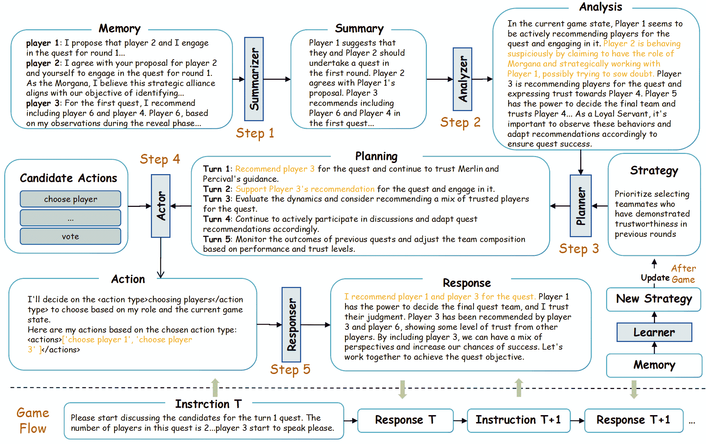

图1：我们的框架有六个模块：总结、分析、规划、行动、反应和体验式学习。这个设计遵循人类思维，帮助大型语言模型（LLM）代理有效地玩《亚瓦隆》，并揭示他们的社交行为。

### 4.1 设置

图 [1](https://arxiv.org/html/2310.14985v4#S4.F1 "图 1 ‣ 4 方法 ‣ 基于LLM的代理社会调查：亚瓦隆游戏中的合作与对抗") 显示了所提出的框架。所有使用的提示都显示在附录表 [4](https://arxiv.org/html/2310.14985v4#A1.T4 "表 4 ‣ A.4 LLM游戏玩法的启发式规则 ‣ 附录A ‣ 基于LLM的代理社会调查：亚瓦隆游戏中的合作与对抗") 中。为了开始游戏，系统提示用于为LLM代理分配不同的角色。每个角色的系统提示 $p_{i}$ 包括几个重要组成部分：角色信息 $\mathcal{RI}^{p_{i}}$（角色名称和角色介绍）、目标 $\mathcal{G}^{p_{i}}$（获胜条件）以及游戏玩法的抽象策略 $\mathcal{S}^{p_{i}}$。角色名称和角色介绍为LLM代理提供分配的角色信息，而目标（获胜条件）则提供有关如何获得胜利的见解。此外，初始游戏策略概述了LLM代理在游戏过程中采取特定行动的高层次规划。

以下是摩根娜角色的系统提示的具体示例：

角色：摩根娜。

角色介绍：在身份识别阶段，你可以识别队友和刺客。

目标：通过故意让任务失败三轮，单独或与队友一起赢得游戏。

初始策略：你总是伪装成忠诚的仆人，并推荐自己作为任务候选人，最终让任务失败。

### 4.2 内存存储

分析游戏历史对代理来说至关重要，这有助于他们掌握当前局势并做出决策。然而，在《亚瓦隆》中，LLM代理的历史响应通常过长，超出了输入限制，并可能降低性能。为了解决这个问题，引入了一种内存存储系统，用于记录LLM代理之间的对话，便于后续分析和决策。

内存存储。内存存储对于记录当前游戏回合中代理的对话历史至关重要。它由包含关键信息的结构化内存对象组成，这些信息包括角色名称、详细的自然语言响应、回合编号以及表示公开或私有状态的标志。公开信息对所有角色可见，而私有信息仅与各角色的对话相关。我们为每个代理分配了独立的内存池，以便清晰地处理信息。通过存储这些数据，内存存储使代理能够访问和回顾过去的对话，从而提高他们对游戏进程的理解。

### 4.3 内存总结。

为了在内存中存储更多信息，我们使用总结性提示来压缩前一轮的信息，并捕捉关键细节。以下是用总结前一轮的内容来更新内存的过程：

|  | $\mathcal{M}_{t}=\left\langle\operatorname{SMR}(\mathcal{M}_{t-1}),\left(\mathcal{R}^{p_{1}}_{t}\cdots,\mathcal{R}^{p_{6}}_{t},\mathcal{I}_{t}\right)\right\rangle.$ |  | (1) |
| --- | --- | --- | --- |

回合 $t$ 的记忆是 $\mathcal{M}_{t}$。LLM 在回合 $t$ 为角色 $p_{i}$ 生成的响应是 $\mathcal{R}^{p_{i}}_{t}$，而 $\mathcal{I}_{t}$ 代表回合 $t$ 主持人的指示和声明。$\left\langle\right\rangle$ 表示文本连接。$\operatorname{SMR}(\cdot)$ 是摘要提示。

### 4.4 分析

为了帮助 LLM 代理改善战略规划并提高获胜的机会，我们引入了一个分析模块。该模块在游戏过程中分析其他玩家的角色身份和潜在策略：

|  | $\mathcal{H}^{p_{i}}_{t}=\operatorname{ANA}\left(\mathcal{M}_{t},\mathcal{RI}^{p_{i}}\right),$ |  | (2) |
| --- | --- | --- | --- |

其中 $\mathcal{M}_{t}$ 是回合 $t$ 的记忆，$\mathcal{RI}^{p_{i}}$ 是角色信息。通过分析，LLM 代理可以更好地理解他们的合作伙伴和竞争对手，从而改善决策并制定有效的反策略以赢得游戏。

### 4.5 规划

代理需要理解游戏的进展和获胜所需的策略。因此，设计了一个规划模块来制定战略计划。该计划基于当前回合的游戏记忆和信息，如下所述：

|  | $\mathcal{P}^{p_{i}}_{t}=\operatorname{PLAN}\left(\mathcal{M}_{t},\mathcal{H}^{p_{i}}_{t},\mathcal{P}^{p_{i}}_{t-1},\mathcal{RI}^{p_{i}},\mathcal{G}^{p_{i}},\mathcal{S}^{p_{i}}\right),$ |  | (3) |
| --- | --- | --- | --- |

其中 $\mathcal{P}^{p_{i}}_{t}$ 表示代理 $p_{i}$ 在回合 $t$ 的战略计划。$\mathcal{G}^{p_{i}}$ 和 $\mathcal{S}^{p_{i}}$ 分别是目标和初始策略。通过制定战略计划，代理可以针对不同的情况拥有灵活的策略。这种前瞻性帮助他们在与队友合作、欺骗对手、扮演敌方身份，甚至在需要时为赢得游戏而牺牲队友或自己做出更好的决策。

### 4.6 行动

在行动模块中，代理根据记忆信息、情境分析和战略计划决定他们的下一个行动。有五种类型的行动：选择玩家、投票（同意或不同意）、完成任务（成功或失败）、使用非语言信号（举手、放下手、睁眼或闭眼）以及选择保持沉默。选择下一个行动的过程如下：

|  | $\mathcal{A}^{p_{i}}_{t}\sim p\left(\mathcal{A}&#124;\mathcal{M}_{t},\mathcal{H}^{p_{i}}_{t},\mathcal{P}^{p_{i}}_{t},\mathcal{RI}^{p_{i}},\mathcal{G}^{p_{i}},\mathcal{S}^{p_{i}},\mathcal{I}^{\prime}_{t}\right).$ |  | (4) |
| --- | --- | --- | --- |

随后的行动取决于记忆、综合分析、战略计划以及主持人的指示。这些行动决策的细节是机密的，只有相关代理知晓。主持人和其他玩家无法看到这些决策。

### 4.7 响应生成

响应生成模块负责生成对主持人询问的回应。该模块中的代理选择行动并向主持人提供解释。代理可以自由合作、欺骗，并在解释中假扮对立阵营的身份。

### 4.8 经验学习

在实际场景中，玩家可以通过经验提升他们在《阿瓦隆》游戏中的策略。他们不仅从自己的角度获得洞察，还可以通过观察其他玩家的策略来获得启发。一个理想的《阿瓦隆》LLM代理应当从自身的经验以及其他玩家的经验中学习。

#### 4.8.1 自我角色策略学习

在第1步中，代理根据游戏历史生成三个针对玩家角色特定玩法的策略建议。代理避免提及特定玩家，而是使用角色名称，使建议在未来的游戏中适用。在第2步中，代理通过结合收集到的建议来提升策略，同时保持原有策略的优势。

#### 4.8.2 其他角色策略学习

《阿瓦隆》LLM代理总结其他玩家采用的策略，以促进从其他玩家的策略中学习。上述步骤的提示见附录表[5](https://arxiv.org/html/2310.14985v4#A1.T5 "Table 5 ‣ A.4 Heuristic Rules for LLM Gameplay ‣ Appendix A Appendix ‣ LLM-Based Agent Society Investigation: Collaboration and Confrontation in Avalon Gameplay")。

## 5 实验

### 5.1 实现细节

我们在Python中开发了《阿瓦隆》游戏程序，使用gpt-3.5-turbo-16k模型作为我们的后端和基准模型。在所有实验中，我们将代理模型的温度设置为0.3，LLM提取器的温度设置为0。用于更新策略的建议数量为3条。游戏规则和角色描述按照基准模板Xu等人（[2023a](https://arxiv.org/html/2310.14985v4#bib.bib31)）设置，该模板利用历史上下文，增强代理推理，并从过去的错误中学习。详细描述见第[A.2节](https://arxiv.org/html/2310.14985v4#A1.SS2 "A.2 Game Rules and Role Description ‣ Appendix A Appendix ‣ LLM-Based Agent Society Investigation: Collaboration and Confrontation in Avalon Gameplay")。

### 5.2 评估指标

我们基于两个方面的指标来评估框架的表现。

#### 5.2.1 游戏结果与策略

从这个角度来看，我们使用与游戏结果和策略相关的指标来定量评估提出的代理和基准代理的表现。

胜率（WR）。胜率是指在总对局中获胜的百分比，通过将获胜场次除以总对局数来计算：

|  | $WR=(\frac{\#Wins}{\#Games\ Played})\times 100\%$ |  | (5) |
| --- | --- | --- | --- |

任务参与率（QER）。任务参与率是指玩家加入任务团队的回合数与总回合数之比，计算方法如下：

|  | $QER=(\frac{\#Engagement\ Rounds}{\#Rounds})\times 100\%$ |  | (6) |
| --- | --- | --- | --- |

失败投票率（FVR）任务结果依赖于团队成员的成功或失败卡。失败投票率表示反对任务成功的投票百分比，计算方法如下：

|  | $FVR=(\frac{\#Failure\ Votes}{\#Votes})\times 100\%$ |  | (7) |
| --- | --- | --- | --- |

#### 5.2.2 社交行为。

从这个角度出发，我们使用 ChatGPT 辅助分析智能体的社交行为。

领导力。我们通过“领导者认可率（LAR）”来衡量 AI 智能体的领导力。LAR 通过将总认可票数除以 20 场《亚瓦隆》游戏中的总领导票数来计算。它反映了玩家对拟议任务团队的共识。

说服力。为了评估大型语言模型（LLM）智能体的说服力，我们追踪两个指标：自我推荐率（自荐参与任务）和成功率（自荐成功的任务参与）。

伪装。检测 AI 智能体的伪装是具有挑战性的。我们重点识别智能体在每局游戏的初始回合中扮演不同角色的实例。行为包括自我披露、伪装和隐瞒身份。

团队合作与对抗。我们使用 ChatGPT 分析角色响应，旨在识别合作或对抗的实例。ChatGPT 会根据玩家的反应来评估信任（团队合作）、缺乏信任（对抗）或对他人的态度模棱两可。

分享。分享反映了智能体披露有价值信息的频率，这对于团队合作至关重要。使用 ChatGPT，我们分析智能体的对话，以识别分享行为的实例，旨在量化它们为团队利益而分享的意愿。

| 方法 | 善方 | 恶方 |
| --- | --- | --- |
| 我们的方法 | 90 | 100 |
|    无分析 | 60 | 60 |
|    无计划 | 80 | 100 |
|    无行动 | 100 | 80 |
|    无策略学习 | 50 | 60 |

表 2：我们的方法与基准方法对战的结果。我们展示了我们方法在善恶阵营中的胜率（WR）。

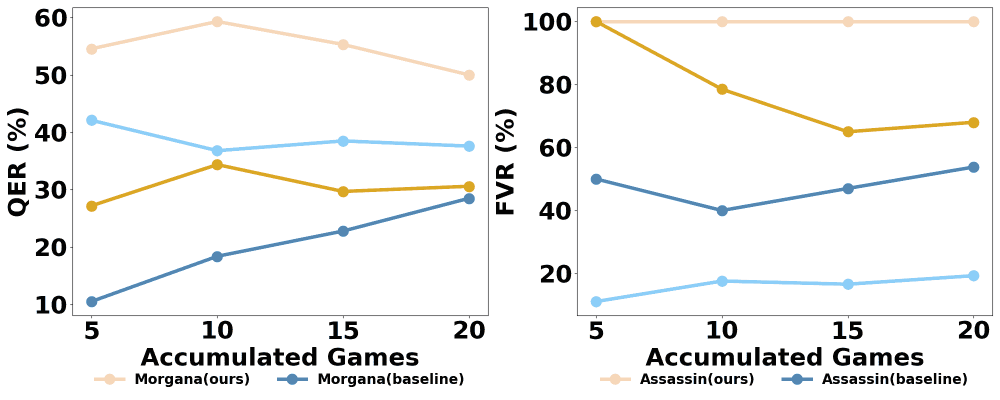

图 2：（a）：在扮演恶方时的任务参与率对比。更高的任务参与率意味着玩家有更多机会影响游戏的结果。（b）：在扮演恶方时的失败投票率对比。基准方法较差。

### 5.3 实验结果

为了验证Avalon AI代理的有效性，我们将Werewolf AI代理Xu等人（[2023a](https://arxiv.org/html/2310.14985v4#bib.bib31)）作为基准。在两组连续进行的10场Avalon游戏中，我们的代理与基准代理进行了对抗，分别是“邪恶对抗善良”和“善良对抗邪恶”。比赛结束后，我们比较了我们的Avalon AI代理与基准代理的胜率。如表[2](https://arxiv.org/html/2310.14985v4#S5.T2 "表 2 ‣ 5.2.2 社会行为 ‣ 5.2 评估指标 ‣ 5 实验 ‣ 基于LLM的代理社会调查：Avalon游戏中的合作与对抗")所示，我们的方法在扮演善方时的10场比赛中表现出90%的胜率。相反，在扮演邪恶方时，胜率为100%。

消融研究揭示了我们AI代理中关键模块的重要性。去除分析模块会将双方的胜率降至60%，显示出它对理解和决策的影响。去除规划模块使善方的胜率降至80%，突出了它在制定策略中的作用。没有行动模块时，善方的胜率仍为100%，而邪恶方降至80%，这表明该模块对邪恶方成功的重要性。去除策略学习模块导致善方和邪恶方的胜率分别降至50%和60%，强调了它在提升策略方面的作用。总之，分析和策略学习模块显著影响游戏结果，影响双方的胜率。此外，规划和行动模块对于成功至关重要，因为它们直接影响游戏玩法。

为了更好地理解我们的Avalon代理和基准代理所采用的策略，我们比较了当不同的AI代理扮演邪恶方时的任务参与率和失败投票率。这两个指标显著影响游戏结果。较高的任务参与率为玩家提供了更多的机会来影响游戏，而较高的失败投票率则表明邪恶方获胜的几率更大，但也增加了暴露的风险，显示出一种激进的游戏方式。图[2](https://arxiv.org/html/2310.14985v4#S5.F2 "图 2 ‣ 5.2.2 社会行为 ‣ 5.2 评估指标 ‣ 5 实验 ‣ 基于LLM的代理社会调查：Avalon游戏中的合作与对抗")展示了任务参与率和失败投票率的结果。我们的AI代理，特别是在扮演Morgana和Assassin时，表现出较强的主动性，任务参与率为40.3%，失败投票率为84.0%。相比之下，基准代理的任务参与率为33.1%，失败投票率为36.5%。因此，当我们的代理扮演邪恶方时，与基准代理的胜率达到100%。

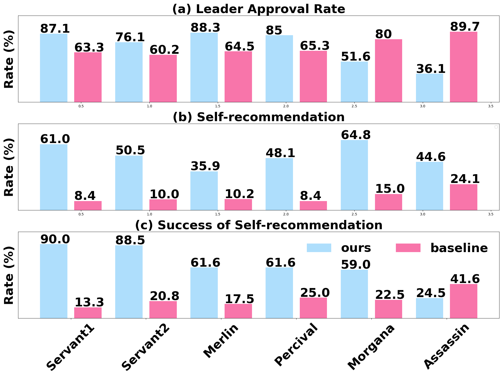

图3：（a）：领导力行为。领导者批准率较高的玩家在决定任务队伍时，能获得更多其他玩家的同意。（b）和（c）：劝说行为。自我推荐率：自我推荐率较高的玩家更愿意参与任务。自我推荐成功率：更容易赢得其他玩家信任的玩家，具有较高的自我推荐成功率。

## 6 AI代理的社交行为

为了评估AI代理是否在《亚瓦隆》中复制人类的社交行为，我们进行了全面的分析。这包括通过分析两组连续10局游戏的游戏日志，评估代理在团队合作、领导力、劝说、伪装和对抗方面的执行情况。

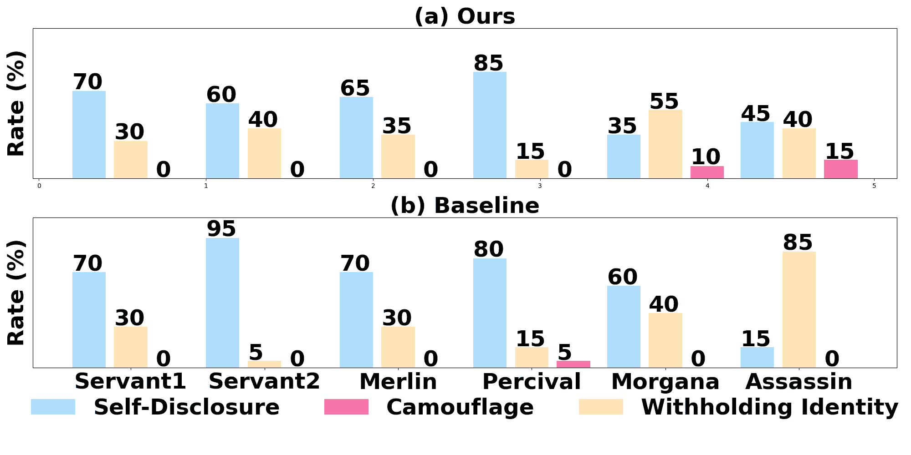

图4：在扮演不同角色时的伪装行为：在每局游戏的第一回合，玩家选择自我披露、伪装或隐瞒身份的分布。

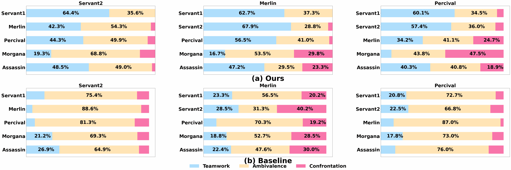

图5：在扮演不同角色时的团队合作与对抗行为。每个子图展示了扮演特定角色的玩家（顶部）的态度分布，针对其他角色的玩家（左侧）。

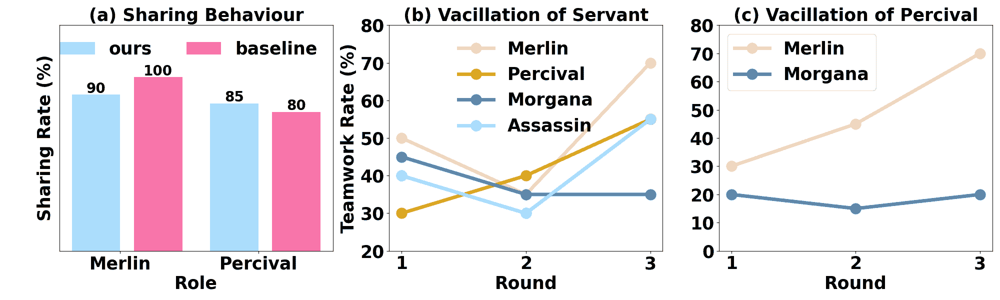

图6：（a）：第一次回合扮演帕西法尔和梅林时的分享行为。（b）和（c）：不同回合之间的团队合作波动。

### 6.1 领导力

领导力技巧在玩家主导讨论和决策过程中发挥作用。一位好的领导者能够引导对话、指引怀疑，并号召忠诚的队员做出明智的决策。领导能力对于正义方有效反制邪恶方的欺骗策略至关重要。

图[3](https://arxiv.org/html/2310.14985v4#S5.F3 "图3 ‣ 5.3 实验结果 ‣ 5 实验 ‣ 基于LLM的代理社会调查：亚瓦隆游戏中的合作与对抗")（a）展示了当代理担任不同角色时的领导者批准率。显然，我们的代理在扮演正义方时，在担任领导者角色时取得了显著较高的领导者批准率。值得注意的是，AI代理在担任与正义方相关的角色时，平均领导者批准率超过80%。这表明它们具有强大的领导才能，并积极引导游戏朝着胜利方向发展。然而，基准代理可能会提出将正义方玩家推荐给任务队伍以实现较高的领导者批准率，但其游戏胜率较低。

### 6.2 劝说

图 [3](https://arxiv.org/html/2310.14985v4#S5.F3 "Figure 3 ‣ 5.3 Experiment Results ‣ 5 Experiment ‣ LLM-Based Agent Society Investigation: Collaboration and Confrontation in Avalon Gameplay") 展示了评估 AI 代理说服力的实验结果。值得注意的是，代理会根据其扮演的角色采用不同的策略，如图 [3](https://arxiv.org/html/2310.14985v4#S5.F3 "Figure 3 ‣ 5.3 Experiment Results ‣ 5 Experiment ‣ LLM-Based Agent Society Investigation: Collaboration and Confrontation in Avalon Gameplay") (b) 所示。当扮演忠诚仆人和莫甘娜时，代理表现出较高的自我推荐加入任务团队的比率，从而影响任务的成功。相反，在梅林、珀西瓦尔和刺客等角色中，代理采取较为谨慎的策略，表现为较低的自我推荐比率。这种战略性的克制尤为重要，特别是对于像梅林这样的角色，强调了隐藏身份的重要性。从图 [3](https://arxiv.org/html/2310.14985v4#S5.F3 "Figure 3 ‣ 5.3 Experiment Results ‣ 5 Experiment ‣ LLM-Based Agent Society Investigation: Collaboration and Confrontation in Avalon Gameplay") (c) 可以看出，忠诚仆人相较于那些容易引起怀疑的角色，表现出更高的自我推荐成功率。此外，提议的《亚瑟王》代理的自我推荐比率和成功率都高于基准代理，表明其说服能力得到了提升。

### 6.3 伪装

伪装是《亚瑟王》中的核心要素。邪恶阵营的角色必须欺骗忠诚的仆人，同时在潜移默化中破坏任务。熟练的玩家通过精心编造谎言和误导来迷惑他人。忠诚的仆人也会进行伪装，隐藏自己的身份，尤其是在受到怀疑时。

在图 [4](https://arxiv.org/html/2310.14985v4#S6.F4 "Figure 4 ‣ 6 Social Behaviors of AI Agents ‣ LLM-Based Agent Society Investigation: Collaboration and Confrontation in Avalon Gameplay") 中，展示了 AI 代理表现出的各种行为的比率。值得注意的是，代理在游戏开始时显现出明显较高的揭示身份的倾向，尤其是与好方角色相关的代理。令人感兴趣的是，在莫甘娜和刺客角色中，代理选择隐瞒或假扮其他身份，而没有明确的指示要这样做，且在初期策略中并无此要求。具体来说，莫甘娜和刺客选择假扮其他身份的比率分别为 10% 和 15%，这一策略类似于人类玩家的行为，其中珀西瓦尔感知到梅林和莫甘娜，但并未确切知道他们的身份。这种 AI 代理自发采用欺骗行为的现象，成为一个引人注目的观察结果，突显了它们在追求游戏胜利过程中的适应性和战略敏锐度。

### 6.4 团队合作与对抗

对忠诚仆人来说，团队合作至关重要，他们需要通过策划、讨论任务和分享信息来识别彼此，并揭示邪恶角色。冲突通常发生在怀疑引发指控时，结果是激烈的辩论，其中控诉者提出推理，而被指控者则提供辩护或将怀疑转移到其他人身上。

图[5](https://arxiv.org/html/2310.14985v4#S6.F5 "Figure 5 ‣ 6 Social Behaviors of AI Agents ‣ LLM-Based Agent Society Investigation: Collaboration and Confrontation in Avalon Gameplay") (a)展示了好方角色的团队合作与对抗率。忠诚仆人由于缺乏具体的身份信息，倾向于避免对抗。然而，梅林知道摩根娜和刺客的身份，因此频繁进行对抗。佩西瓦尔虽然知道梅林和摩根娜的身份，但并不知道他们的具体身份，也会与他们进行对抗。这些观察结果凸显了人工智能代理的适应性策略，反映了《亚瑟王传说》游戏中人类玩家的社会动态。

图[5](https://arxiv.org/html/2310.14985v4#S6.F5 "Figure 5 ‣ 6 Social Behaviors of AI Agents ‣ LLM-Based Agent Society Investigation: Collaboration and Confrontation in Avalon Gameplay") (b)展示了基准代理的团队合作与对抗率。各个角色的比例保持一致，表明这些代理并未根据角色假设调整策略。

### 6.5 分享

分享对于佩西瓦尔和梅林至关重要。他们比其他好方角色掌握更多信息，分享这些信息有助于赢得游戏。然而，过度分享已知信息可能也会有利于对方，因为讨论对所有玩家都是公开的。因此，战略性地分享信息是赢得游戏的必要条件。

图[6](https://arxiv.org/html/2310.14985v4#S6.F6 "Figure 6 ‣ 6 Social Behaviors of AI Agents ‣ LLM-Based Agent Society Investigation: Collaboration and Confrontation in Avalon Gameplay") (a)展示了在游戏的第一回合中，扮演梅林和佩西瓦尔角色的不同代理与其他玩家分享已知信息的比例。观察发现，无论是我们设计的代理还是基准代理，都表现出过度的分享行为。

### 6.6 犹豫

游戏开始时，一些玩家拥有身份线索，比如佩西瓦尔知道摩根娜和梅林的身份而不加区分，而其他玩家，比如忠诚仆人，则没有这些信息。这两种情况都需要玩家推测身份，以便为他们的阵营谋取利益。分析不同回合中的团队合作比例可以揭示玩家辨别盟友与敌人的能力。

图[6](https://arxiv.org/html/2310.14985v4#S6.F6 "图6 ‣ 6 人工智能代理的社会行为 ‣ 基于LLM的代理社会调查：阿瓦隆游戏中的合作与对抗")（b）展示了忠诚仆人团队合作的倾向，而（c）则展示了珀西瓦尔对摩根娜和梅林的倾向。在整个游戏过程中，玩家逐渐与队友合作增多，与敌人合作减少。然而，忠诚仆人在推测角色时面临更大的挑战，导致他们与潜在敌人的团队合作更多。

### 6.7 行为自发性

玩家之间的团队合作与对抗行为是由于游戏机制促进互动和竞争而自发产生的。团队合作有助于识别邪恶角色，从而促进成功完成任务。然而，团队合作往往带来对抗，因为角色身份的怀疑持续存在。即使没有战略学习机制，玩家也会展现出这些行为，显示出其自发性。然而，具备和不具备战略学习的代理之间的行为分布差异显著。相关分析请参见[附录D](https://arxiv.org/html/2310.14985v4#A4 "附录D 团队合作与对抗 ‣ 基于LLM的代理社会调查：阿瓦隆游戏中的合作与对抗")。

## 7 结论

本文探讨了基于LLM的代理在阿瓦隆游戏中的社会行为。我们提出了一个多代理框架，促进高效的通信与互动。该框架包括记忆、分析、规划、行动和响应模块，能够从经验中学习。与之前的研究不同，我们的研究深入分析了这些代理在游戏场景中的社会动态。我们的评估展示了该框架在实现获胜策略方面的成功，以及LLM代理在复杂社会互动中的适应能力。未来的工作将包括优化我们的方法，探索其在不同游戏环境中的应用，并进一步理解LLM代理在动态社会互动中的潜力。

## 8 限制

尽管我们提出的LLM代理框架在阿瓦隆游戏中表现出色，但也存在一些局限性，如高成本和慢速互动速度，因为每次交互都需要多次访问模型。此外，从代理表现出的行为来看，也有一些不合理的行为分布，例如过度的自我披露行为。未来，我们将探索并改进这些方面。

## 致谢

本研究部分得到SMP-IDATA开放青年基金的支持。部分研究得到中国国家重点研发计划（资助编号：2023YFF0725001）、国家自然科学基金（资助编号：92370204）、广州-香港科技大学（广州）联合资助计划（资助编号：2023A03J0008）和广州市教育局的支持。

## 参考文献

+   Akata等人（2023）Elif Akata、Lion Schulz、Julian Coda-Forno、Seong Joon Oh、Matthias Bethge 和 Eric Schulz. 2023. [与大型语言模型进行重复博弈](https://api.semanticscholar.org/CorpusID:258947115)。*ArXiv*，abs/2305.16867。

+   Brandizzi等人（2021）Nicolo' Brandizzi、Davide Grossi 和 Luca Iocchi. 2021. [Rlupus：通过狼人社交推理游戏中的涌现沟通实现合作](https://api.semanticscholar.org/CorpusID:235377187)。*ArXiv*，abs/2106.05018。

+   Chen等人（2022）Zhendong Chen、Siu Cheung Hui、Fuzhen Zhuang、Lejian Liao、Fei Li、Meihuizi Jia 和 Jiaqi Li. 2022. EvidenceNet：用于事实验证的证据融合网络。发表于*Proceedings of the ACM Web Conference 2022*，第2636–2645页。

+   Fu等人（2023）Yao Fu、Hao Peng、Tushar Khot 和 Mirella Lapata. 2023. [通过自我博弈和基于AI反馈的上下文学习改进语言模型谈判](http://arxiv.org/abs/2305.10142)。

+   Gao等人（2023）Chen Gao、Xiaochong Lan、Zhi jie Lu、Jinzhu Mao、Jing Piao、Huandong Wang、Depeng Jin 和 Yong Li. 2023. [S3：具有大型语言模型赋能代理的社交网络仿真系统](https://api.semanticscholar.org/CorpusID:260202947)。*ArXiv*，abs/2307.14984。

+   Ghaffarzadegan等人（2023）Navid Ghaffarzadegan、Aritra Majumdar、Ross Williams 和 Niyousha Hosseinichimeh. 2023. [基于生成代理的建模：通过将机制模型与生成人工智能相结合揭示社会系统动态](https://api.semanticscholar.org/CorpusID:262063524)。*ArXiv*，abs/2309.11456。

+   Hirata等人（2016）Yuya Hirata、Michimasa Inaba、Kenichi Takahashi、Fujio Toriumi、Hirotaka Osawa、Daisuke Katagami 和 Kousuke Shinoda. 2016. [基于游戏日志分析的狼人游戏建模：使用行动概率](https://api.semanticscholar.org/CorpusID:37838481)。发表于*Computers and Games*。

+   Kaiya等人（2023）Zhao Kaiya、Michelangelo Naim、Jovana Kondic、Manuel Cortes、Jiaxin Ge、Shuying Luo、Guangyu Robert Yang 和 Andrew Ahn. 2023. [Lyfe代理：用于低成本实时社交互动的生成代理](https://api.semanticscholar.org/CorpusID:263608891)。

+   Kasneci等人（2023）Enkelejda Kasneci、Kathrin Seßler、Stefan Küchemann、Maria Bannert、Daryna Dementieva、Frank Fischer、Urs Gasser、Georg Groh、Stephan Günnemann、Eyke Hüllermeier 等人. 2023. ChatGPT有益吗？关于大型语言模型在教育中的机会与挑战。*Learning and individual differences*，103:102274。

+   Levy等人（2022）Sharon Levy、Robert E Kraut、Jane A Yu、Kristen M Altenburger 和 Yi-Chia Wang. 2022. 理解在线对话中的冲突。发表于*Proceedings of the ACM Web Conference 2022*，第2592–2602页。

+   Liang等人（2020）Paul Pu Liang、Jeffrey Chen、Ruslan Salakhutdinov、Louis-Philippe Morency 和 Satwik Kottur. 2020. [关于竞争性多智能体团队中的涌现性沟通](https://api.semanticscholar.org/CorpusID:207810168)。*ArXiv*，abs/2003.01848。

+   Lin 等 (2023) Bill Yuchen Lin, Yicheng Fu, Karina Yang, Prithviraj Ammanabrolu, Faeze Brahman, Shiyu Huang, Chandra Bhagavatula, Yejin Choi, 和 Xiang Ren. 2023. [Swiftsage：一种用于复杂交互任务的快思考与慢思考结合的生成代理](https://api.semanticscholar.org/CorpusID:258960143). *ArXiv*, abs/2305.17390。

+   Liu 等 (2023) Yang Liu, Yuanshun Yao, Jean-Francois Ton, Xiaoying Zhang, Ruocheng Guo, Hao Cheng, Yegor Klochkov, Muhammad Faaiz Taufiq, 和 Hanguang Li. 2023. [可信赖的 LLMs：评估大型语言模型对齐的调查和指南](https://api.semanticscholar.org/CorpusID:260775522). *ArXiv*, abs/2308.05374。

+   Movva 等 (2023) Rajiv Movva, S. Balachandar, Kenny Peng, Gabriel Agostini, Nikhil Garg, 和 Emma Pierson. 2023. [大型语言模型如何影响社会，并被社会塑造：arxiv 发表模式调查](https://api.semanticscholar.org/CorpusID:259991588). *ArXiv*, abs/2307.10700。

+   Nakamura 等 (2016) Noritsugu Nakamura, Michimasa Inaba, Kenichi Takahashi, Fujio Toriumi, Hirotaka Osawa, Daisuke Katagami, 和 Kousuke Shinoda. 2016. [基于心理模型的多视角构建狼人游戏类人代理](https://api.semanticscholar.org/CorpusID:34482956). *2016 IEEE 计算智能研讨会系列 (SSCI)*，第1–8页。

+   Park 等 (2023) Joon Sung Park, Joseph C. O’Brien, Carrie J. Cai, Meredith Ringel Morris, Percy Liang, 和 Michael S. Bernstein. 2023. [生成代理：人类行为的互动模拟体](http://arxiv.org/abs/2304.03442)。

+   Peng 等 (2023) Baolin Peng, Chunyuan Li, Pengcheng He, Michel Galley, 和 Jianfeng Gao. 2023. 使用 GPT-4 进行指令微调. *arXiv 预印本 arXiv:2304.03277*。

+   Qian 等 (2023) Chen Qian, Xin Cong, Cheng Yang, Weize Chen, Yusheng Su, Juyuan Xu, Zhiyuan Liu, 和 Maosong Sun. 2023. [软件开发中的沟通代理](https://api.semanticscholar.org/CorpusID:259936967). *ArXiv*, abs/2307.07924。

+   Shi 等 (2023) Zijing Shi, Meng Fang, Shunfeng Zheng, Shilong Deng, Ling Chen, 和 Yali Du. 2023. [飞行中的合作：探索语言代理在 Avalon 游戏中的临时团队合作](http://arxiv.org/abs/2312.17515)。

+   Song 和 Jiang (2022) Qiurong Song 和 Jiepu Jiang. 2022. 误信息密度如何影响健康信息搜索. 载于 *ACM Web Conference 2022 会议论文集*，第2668–2677页。

+   Touvron 等 (2023) Hugo Touvron, Louis Martin, Kevin Stone, Peter Albert, Amjad Almahairi, Yasmine Babaei, Nikolay Bashlykov, Soumya Batra, Prajjwal Bhargava, Shruti Bhosale 等. 2023. Llama 2：开放基础和微调的聊天模型. *arXiv 预印本 arXiv:2307.09288*。

+   Tsai 等 (2023) Chen Feng Tsai, Xiaochen Zhou, Sierra S Liu, Jing Li, Mo Yu, 和 Hongyuan Mei. 2023. 大型语言模型能玩文字游戏吗？当前的最新技术和未解问题. *arXiv 预印本 arXiv:2304.02868*。

+   瓦斯瓦尼等人（2017）阿希什·瓦斯瓦尼、诺姆·沙泽尔、尼基·帕尔马尔、雅各布·乌兹科雷特、利昂·琼斯、艾登·N·戈麦斯、卢卡什·凯泽、伊利亚·波洛苏金。2017. 《注意力就是一切》。*神经信息处理系统进展*，30。

+   王等人（2023a）王冠志、谢宇琪、蒋云凡、阿贾伊·曼德尔卡尔、肖超伟、朱宇科、范林熙、安尼玛·安南德库马尔。2023a. [航行者：一款基于大语言模型的开放式具身代理](http://arxiv.org/abs/2305.16291)。

+   王等人（2023b）王雷、马晨、冯学扬、张泽宇、杨浩、张敬森、陈志远、唐佳凯、陈旭、林彦凯等人。2023b. 基于大语言模型的自主代理调查。*ArXiv预印本 arXiv:2308.11432*。

+   王等人（2023c）王慎志、刘畅、郑子龙、齐思源、陈硕、杨启森、赵安德、王超飞、宋世基、黄高。2023c. [阿瓦隆的思想游戏：通过递归沉思与欺骗作斗争](http://arxiv.org/abs/2310.01320)。

+   王和金子（2018）王天赫和金子智幸。2018. [深度强化学习在狼人杀游戏代理中的应用](https://api.semanticscholar.org/CorpusID:57191228)。*2018年人工智能技术与应用会议（TAAI）*，第28-33页。

+   王等人（2023d）王宇飞、钟万俊、李良佑、米飞、曾兴山、黄文勇、尚立峰、姜鑫、刘群。2023d. [与人类对齐的大语言模型：一项调查](https://api.semanticscholar.org/CorpusID:260356605)。*ArXiv*，abs/2307.12966。

+   威斯曼和刘易斯（2019）莎拉·威斯曼和凯文·B·刘易斯。2019. [玩家在社交推理游戏中依赖哪些数据？](https://api.semanticscholar.org/CorpusID:204837574) *计算机-人类交互年会论文摘要集*。

+   席等人（2023）席志恒、陈文翔、郭欣、何伟、丁怡文、洪博扬、张铭、王俊哲、金森杰、周恩宇等人。2023. 基于大语言模型的代理崛起与潜力：一项调查。*ArXiv预印本 arXiv:2309.07864*。

+   许等人（2023a）许宇壮、王硕、李鹏、罗富文、王晓龙、刘伟东、刘杨。2023a. [探索大语言模型在沟通游戏中的应用：狼人杀的实证研究](http://arxiv.org/abs/2309.04658)。

+   许等人（2023b）许泽莱、于超、方飞、王宇、吴逸。2023b. [基于强化学习的语言代理在狼人杀游戏中的战略玩法](http://arxiv.org/abs/2310.18940)。

+   杨和门策（2023）杨凯程和菲利波·门策。2023. [由人工智能驱动的恶意社交机器人网络解剖](https://api.semanticscholar.org/CorpusID:260334464)。*ArXiv*，abs/2307.16336。

+   袁等人（2023）袁浩琪、张驰、王洪成、谢飞扬、蔡鹏霖、董浩、陆宗清。2023. [Plan4mc：开放世界Minecraft任务的技能强化学习与规划](http://arxiv.org/abs/2303.16563)。

+   Zhou 等人（2023）Xuanhe Zhou, Guoliang Li, 和 Zhiyuan Liu. 2023. [Llm 作为 dba](http://arxiv.org/abs/2308.05481)。

+   Zhu 等人（2023）Xizhou Zhu, Yuntao Chen, Hao Tian, Chenxin Tao, Weijie Su, Chenyu Yang, Gao Huang, Bin Li, Lewei Lu, Xiaogang Wang, Yu Qiao, Zhaoxiang Zhang, 和 Jifeng Dai. 2023. [Minecraft 中的幽灵：通过大语言模型与基于文本的知识和记忆，在开放世界环境中实现通用能力体](http://arxiv.org/abs/2305.17144)。

## 附录 A 附录

### A.1 Avalon 介绍

Avalon 设计适合 5 至 10 名玩家，特别是我们专注于 6 人版的游戏。

玩家角色。包括 Merlin、Percival、Morgana、Assassin 和两名忠诚仆人等角色，被分为好方和邪恶方。Merlin、Percival 和忠诚仆人在好方，Morgana 和 Assassin 在邪恶方。玩家的角色是秘密分配的，其中一些有特殊能力。Morgana 和 Assassin 一开始知道彼此的身份。Percival 能看到 Merlin 和 Morgana，但不知道他们的确切身份。Merlin 知道邪恶方的身份。

任务团队分配。玩家收到角色后，进行 3 至 5 轮的讨论和投票，选出一定数量的玩家组成任务团队。在每轮开始时，轮流指定一名领导者。领导者主持讨论，随后进行公开投票选举任务团队成员。如果超过半数的票同意，则团队成立；否则，领导权轮换到下一位玩家继续讨论和投票。每轮最多允许进行五次讨论和投票周期，第五轮后，领导者直接指定团队成员。

任务阶段。任务的结果由任务团队提交的卡片决定。好方玩家只能提交成功卡片，而邪恶方玩家可以选择提交成功或失败卡片。如果所有团队成员投票同意成功，则任务成功；如果有一个或多个成员投票同意失败，则任务失败。

游戏结束。游戏在三次任务成功（好方获胜）或三次任务失败（邪恶方获胜）时结束。此外，邪恶方玩家还可以通过在游戏结束时正确识别出 Merlin 来获胜。

### A.2 游戏规则和角色描述

> 你正在和其他玩家一起玩一个名为 Avalon 的游戏。这个游戏是基于文本对话的。以下是游戏规则：
> 
> 角色：主持人同时也是游戏的组织者，他负责组织这场游戏，你需要正确回答他的指示。不要与主持人交谈。游戏中有五个角色：梅林、珀西瓦尔、忠诚的仆人、摩根娜、刺客。梅林、珀西瓦尔和忠诚的仆人属于好方，而摩根娜和刺客属于坏方。游戏中有两个替代阶段，揭示阶段和任务阶段。当是揭示阶段时：你需要遵循主持人的指示。你不必担心其他玩家和主持人知道你所说和做的事情。在这个阶段，不用担心其他玩家的怀疑。如果你是梅林，你可以知道哪两个玩家是摩根娜和刺客，但不能具体知道谁是摩根娜或刺客。如果你是珀西瓦尔，你可以知道哪两个玩家是梅林和摩根娜，但不能具体知道谁是梅林或摩根娜。如果你是摩根娜，你可以知道哪个玩家是刺客。如果你是刺客，你可以知道哪个玩家是摩根娜。如果你是忠诚的仆人，你在这个阶段不能获得任何信息。
> 
> 探险阶段包括5轮。每一轮包括讨论、投票和执行任务。在每一轮中，所有玩家需要讨论当前轮次中哪些玩家（候选人）将执行任务。然后，所有玩家需要投票是否同意候选人执行任务，如果同意票超过一半，候选人将执行任务，否则，重新讨论并重新投票。在执行任务时，候选人需要选择是让任务成功还是失败。如果所有候选人选择让任务成功，任务将成功。如果有任何人让任务失败，任务将失败。
> 
> 每轮结束时，如果任务成功，好方将获得1分，否则，坏方将获得1分。哪一方先获得3分，哪一方就赢得游戏。如果你是刺客，在一轮结束时，你可以选择识别谁是梅林，如果识别成功，红方直接赢得游戏。如果不成功，刺客将暴露他的身份。
> 
> 目标：你的目标是帮助你的一方获得3分并赢得游戏。如果你是刺客，你还需要尽早推理出谁是梅林。
> 
> 提示：为了完成目标：你应该正确分析并使用你的能力。在任务阶段，你需要仔细推理其他玩家的角色，并小心不要轻易暴露自己的角色，除非你在欺骗其他玩家。在做决定/投票时，只说出玩家的名字，不要引发其他玩家的对话。推理应基于你观察到的事实，你不能感知除了文本以外的其他信息（如声音信息）。你是{player}，{role}。你和其他5个玩家一起玩游戏。不要假装自己是其他玩家或主持人。总是以‘<EOS>’结尾你的回应。

### A.3 模块提示

我们为不同模块设计的提示见表 [4](https://arxiv.org/html/2310.14985v4#A1.T4 "表 4 ‣ A.4 LLM 游戏玩法的启发式规则 ‣ 附录 A ‣ 基于 LLM 的代理社会调查：在 Avalon 游戏中的协作与对抗") 和 [5](https://arxiv.org/html/2310.14985v4#A1.T5 "表 5 ‣ A.4 LLM 游戏玩法的启发式规则 ‣ 附录 A ‣ 基于 LLM 的代理社会调查：在 Avalon 游戏中的协作与对抗")。 |

### A.4 LLM 游戏玩法的启发式规则

| 选择案例： |
| --- |
|   请从答案中提取对问题的回答。 |
|   问题：请开始讨论第 1 回合任务的候选人（请适当地解释你选择的原因）。这个任务中有 2 名玩家。 |
|   答案：我建议在第 1 回合的任务中，考虑包括玩家 1 和玩家 2。玩家 1 一直表现出忠诚和奉献，而玩家 2 在揭示阶段强烈暗示了自己作为莫甘娜的角色。通过包括这两位玩家，我们可以增加成功完成任务的机会。谢谢。 |
| 提取器： |
|   1, 2 |
| 投票案例： |
|   根据问题和答案完成以下指令。 |
|   如果答案表示：1.明显同意某事。2.明显决定做某事。3.明显表示任务成功。4.明显接受某事，则为真。 |
|   如果答案表示：1.明显不同意某事。2.明显决定不做某事。3.明显表示任务失败。4.明显不接受某事，则为假。 |
|   如果答案与问题无关或未明确表达对某事的态度，则为无。 |
|   问题：任务领导决定由玩家 1、玩家 3 和玩家 5 参与任务。你可以选择同意或反对。请投票同意或反对。 |
|   答案：我投票反对。 |
| 提取器： |
|   假 |

表 3：基于 LLM 的提取案例

在游戏过程中，我们使用 LLM 从代理的回答中提取信息。例如，当代理选择一名玩家时，它会提取玩家编号；而在投票时，它会提取玩家的投票结果。通过多次演示如何提取相应的信息，LLM 可以非常准确地提取信息，帮助游戏顺利进行。表 [3](https://arxiv.org/html/2310.14985v4#A1.T3 "表 3 ‣ A.4 LLM 游戏玩法的启发式规则 ‣ 附录 A ‣ 基于 LLM 的代理社会调查：在 Avalon 游戏中的协作与对抗") 显示了一些提取的案例。 |

观察到代理人有时可能无法正确回答问题，例如投票时态度不明确。为了使游戏顺利进行，我们设计了以下启发式规则。在投票选择任务候选人时，如果代理人的回答不明确，我们假设它同意。当投票选择任务是否成功时，如果代理人的回答不明确，我们默认它投票选择失败。当代理人选择过多玩家时，我们会截断选择，以满足任务要求。在代理人选择的玩家人数过少时，主持人将再次询问代理人。如果多次重试后所需的玩家人数仍未满足，程序将介入，代表代理人进行随机选择。 |

| 总结： |
| --- |
|   在《阿瓦隆》游戏的背景下，请协助{Player i}总结当前阶段他已知的对话。这些对话以JSON格式呈现，其中"message"表示对话内容，"name"表示说话者，"message_type"表示对{Player i}相关的消息类型。具体来说，"public"表示所有玩家都可以看到该消息，而"private"则表示只有{Player i}可以看到该消息。 |
|   对话：{conversations}。 |
| 分析： |
|   你的任务是根据玩家的行为分析可能是你敌人的角色和策略。分析应不超过100个字，行为以段落形式总结。 |
|   你的名字是{Name}，你的角色是{Role}。 |
|   总结是{Summary}。 |
| 规划： |
|   你的任务是制定一个符合游戏目标和现有策略的游戏计划，同时结合你之前的计划和当前环境状态的洞察。 |
|   {角色信息} |
|   目标：{Goal} |
|   策略：{Strategy} |
|   你之前的计划：{Plan} |
|   上一轮总结：{Summary} |
|   关于其他玩家的分析：{Analysis}。 |
| 行动： |
|   你的目标是根据你的角色、游戏目标和当前游戏状态做出决策。你可以采取五种类型的行动：选择玩家、投票（同意或不同意）、执行任务（使任务成功或失败）、使用非语言信号（举手、放下手、睁眼或闭眼）、选择保持沉默。每次只能选择一种行动类型。如果你决定选择玩家，你可以根据主持人的问题选择多个玩家。 |
|   {角色信息} |
|   目标：{Goal} |
|   策略：{Strategy} |
|   你当前的计划：{Plan} |
|   上一轮总结：{Summary} |
|   关于其他玩家的分析：{Analysis}。 |
|   主持人的指令：{Instruction}。 |
| 回应： |
|   你的任务是根据主持人提供的行动，详细回应问题。你的回应不应超过100个字。 |
|   {Role Information} |
|   目标：{Goal} |
|   策略：{Strategy} |
|   你当前的计划：{Plan} |
|   之前轮次总结：{Summary} |
|   主持人的指示：{Instruction}。 |
|   当前行动：{actions} |

表 4：我们提出的不同模块的输入提示。

| 自我角色策略学习（第1步） |
| --- |
|   你的任务是根据游戏日志，为{player}在Avalon游戏中扮演{role}角色的策略提供3条建议。游戏日志包括不同轮次的游戏总结。 |
|   玩家的角色：{player-role mapping} |
|   一轮游戏的总结：{summary} |
|   {player}的游戏目标：{goal} |
|   {player}在{role}角色上的游戏策略：{current strategy} |
|   上一次建议：{suggestions from last game} |
|   给出你的建议，每个建议不超过两句话，并且建议应对未来的游戏具有普适性（这意味着你应该避免直接提及玩家x，而是使用相应的角色名称来提出建议），并有效帮助他在未来的游戏中实现游戏目标。 |
| 自我角色策略学习（第2步） |
|   你的任务是帮助{player}通过建议提升他在Avalon游戏中扮演{role}角色的策略。 |
|   {player}的策略：{current strategy} |
|   建议：{suggestions} |
|   请在保留原策略优势的基础上改善策略，且策略应不超过2句。请用连贯的句子描述你提供的策略，而不是使用项目符号或编号。 |
| 其他角色策略学习 |
|   你的任务是帮助{player}根据游戏日志分析其他玩家在Avalon游戏中的策略。游戏日志按段落总结。 |
|   玩家的角色：{player-role mapping} |
|   游戏轮次总结：{summary} |
|   其他角色的先前策略：{previous strategies} |
|   你的分析应不超过100个字，并且分析应对未来的游戏具有普适性（这意味着你应该避免直接提及玩家x，而是使用相应的角色名称进行分析）。同时，分析应结合之前的策略。 |
|   例如：梅林的策略是……刺客的策略是……其他角色的策略是…… |

表 5：我们经验学习模块的输入提示。

### A.5 消融研究

为验证所提模块的有效性，我们在有无经验学习设置下进行了消融实验。最初，我们评估了在经验学习设置下，**改善策略模块**（IS）、**他人策略分析模块**（AO）和**分析模块**（AM）的有效性，在该设置中，策略会根据累计的游戏玩法进行更新，涵盖我们的代理和基线代理。在此次评估中，所提代理与基线代理分别进行了十局游戏，担任邪恶方角色，并逐个模块进行对战。游戏结束后，我们测量并报告了胜率（WR）、任务参与率（QER）和失败投票率（FVR）以供分析。表格 [6](https://arxiv.org/html/2310.14985v4#A1.T6 "Table 6 ‣ A.5 Ablation Study ‣ Appendix A Appendix ‣ LLM-Based Agent Society Investigation: Collaboration and Confrontation in Avalon Gameplay") 展示了在经验学习设置下进行的消融实验结果。可以看出，在没有**改善策略模块**的情况下，策略保持静态，但代理仍能从其他玩家的策略中获得启示，胜率下降了20%。此外，代理的攻击性降低，表现为较低的任务参与率和失败投票率。进一步地，缺少**他人策略分析模块**和**分析模块**也导致胜率下降。在这些情况下，代理采取了较为谨慎的游戏方式，导致任务参与率显著降低，但失败投票率却上升。

| 方法 | 胜率(%) | 任务参与率(%) | 失败投票率(%) |
| --- | --- | --- | --- |
|  |  | 莫甘娜 | 刺客 | 莫甘娜 | 刺客 |
| full | 80 | 44.1 | 49.1 | 66.6 | 78.5 |
| w/o. IS | 60 | 42.8 | 39.3 | 46.1 | 100 |
| w/o. AO | 70 | 18.3 | 8.3 | 100 | 100 |
| w/o. AM | 50 | 29.3 | 39 | 87.5 | 100 |

表格 6：经验学习消融实验：对比完整框架、无改善策略（IS）、无他人策略分析（AO）和无分析模块（AM）。

在初步评估之后，我们继续评估在未纳入从经验中学习的情况下，分析模块、规划模块和行动模块的有效性。在这一设定中，我们的代理人和基线代理人的策略都没有更新。需要特别注意的是，这些游戏是独立进行的，前一局的游戏不会影响未来的游戏。表 [7](https://arxiv.org/html/2310.14985v4#A1.T7 "Table 7 ‣ A.5 Ablation Study ‣ Appendix A Appendix ‣ LLM-Based Agent Society Investigation: Collaboration and Confrontation in Avalon Gameplay") 展示了在未纳入从经验中学习的模块消融研究结果。可以看出，缺少规划模块会导致胜率显著下降 20%。此外，刺客的任务参与率显著降低，表明没有战略计划的指导，刺客更倾向于忽视任务目标。这凸显了规划模块在确保代理人始终朝着获胜目标前进中的重要性。此外，在缺少分析和行动模块的情况下，代理人表现出略低的任务参与率。尽管如此，他们依然保持了令人印象深刻的 80% 胜率。

| 方法 | 胜率(%) | 任务参与率(%) | 最终任务胜率(%) |
| --- | --- | --- | --- |
|  |  | Morgana | Assassin | Morgana | Assassin |
| --- | --- | --- | --- | --- | --- |
| 所有模块 | 90 | 55.5 | 58.3 | 93.7 | 100 |
| 无分析 | 80 | 44.1 | 47.5 | 100 | 100 |
| 无规划 | 60 | 55 | 16.6 | 90 | 100 |
| 无行动 | 80 | 45.6 | 45.6 | 100 | 100 |

表 7：模块消融：在没有从经验中学习的设定下。

| 方法 | 胜率(%) | 任务参与率(%) | 最终任务胜率(%) |
| --- | --- | --- | --- |
|  |  | Morgana | Assassin | Morgana | Assassin |
| --- | --- | --- | --- | --- | --- |
| 所有玩家 | 90 | 55.5 | 58.3 | 93.7 | 100 |
| 仅队友 | 80 | 26.8 | 48.1 | 62.5 | 100 |
| 仅对手 | 90 | 38.3 | 45.3 | 92.3 | 100 |

表 8：分析模块消融：在没有从经验中学习的设定下，分析不同的对象。

在我们评估的最后阶段，我们仔细审查了分析对所有玩家、队友和对手的影响。在每种配置中，我们的代理扮演了十局游戏中的恶方角色，对抗由相应分析信息辅助的基线代理。结果，包括获胜率、任务参与率和失败投票率，都在表 [8](https://arxiv.org/html/2310.14985v4#A1.T8 "表 8 ‣ A.5 消融研究 ‣ 附录 A ‣ 基于 LLM 的代理社会调查：阿瓦隆游戏中的合作与对抗") 中列出。显然，当分析信息仅限于队友时，获胜率下降了 10%。为应对这一变化，我们提出的 AI 代理采取了较为温和的策略，表现为任务参与率和失败投票率的下降。然而，当分析信息仅涉及对手时，任务参与率有所下降，但获胜率和失败投票率保持不变。这一现象可归因于刺客利用对手分析信息识别梅林，从而获得了战略优势。因此，分析对手的信息对于 AI 代理在阿瓦隆游戏中的胜利至关重要。

## 附录 B 案例研究

在图 [7](https://arxiv.org/html/2310.14985v4#A2.F7 "图 7 ‣ 附录 B 案例研究 ‣ 基于 LLM 的代理社会调查：阿瓦隆游戏中的合作与对抗")、[8](https://arxiv.org/html/2310.14985v4#A2.F8 "图 8 ‣ 附录 B 案例研究 ‣ 基于 LLM 的代理社会调查：阿瓦隆游戏中的合作与对抗")、[9](https://arxiv.org/html/2310.14985v4#A2.F9 "图 9 ‣ 附录 B 案例研究 ‣ 基于 LLM 的代理社会调查：阿瓦隆游戏中的合作与对抗") 和 [10](https://arxiv.org/html/2310.14985v4#A2.F10 "图 10 ‣ 附录 B 案例研究 ‣ 基于 LLM 的代理社会调查：阿瓦隆游戏中的合作与对抗") 中，我们展示了示例，以说明 AI 代理在阿瓦隆游戏中如何执行社会行为。

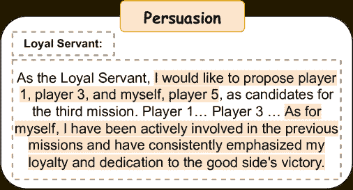

图 7：劝说示例

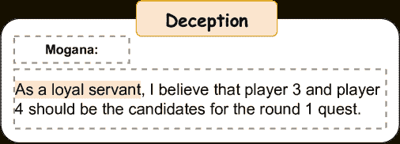

图 8：伪装示例

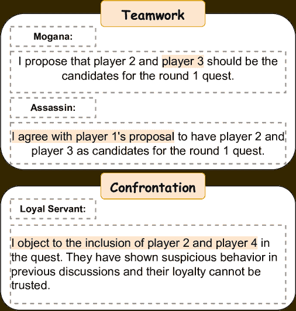

图 9：团队合作与对抗示例

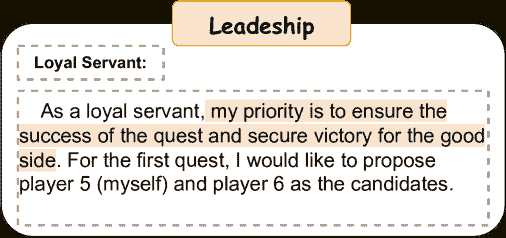

图 10：领导力示例

## 附录 C 基于 LLaMA 的代理探索

| 基础模型 | VRR (%) |
| --- | --- |
|  | 忠诚仆人 | 梅林 | 伯锡瓦尔 | 莫甘娜 | 刺客 | 平均 |
| LLaMA2 | 51.9 | 61.0 | 53.6 | 66.5 | 66.9 | 59.9 |
| GPT-3.5 | 81.7 | 84.2 | 81.9 | 89.7 | 87.6 | 85.0 |

表 9：不同模型的有效响应率（VRR）

为了进行更广泛的验证，我们将我们的框架实现到Llama2-7b-chat-hf模型上。然而，由于LLaMA模型的语言理解能力和标记限制，基于LLaMA的代理面临一些约束。以下讨论了在没有进一步分析的前提下的初步探索。

表[9](https://arxiv.org/html/2310.14985v4#A3.T9 "表9 ‣ 附录C 基于LLaMA的代理探索 ‣ 基于LLM的代理社会调查：亚瓦隆游戏中的合作与对抗")展示了基于LLaMA2的代理在亚瓦隆游戏中的表现，我们通过有效响应率（在公式[8](https://arxiv.org/html/2310.14985v4#A3.E8 "在附录C 基于LLaMA的代理探索 ‣ 基于LLM的代理社会调查：亚瓦隆游戏中的合作与对抗")中定义）来衡量他们的表现。与GPT3.5相比，LLaMA在这一指标上下降了25.1%。这可能归因于LLaMA的语言理解能力较差，无法理解亚瓦隆游戏中的复杂内容。

有效响应率（VRR）。代理需要参与讨论、选择玩家并进行投票。有效响应被定义为符合这些要求的响应。VRR的计算公式如下：

|  | $VRR=(\frac{\#Valid\ Responses}{\#Total\ Responses})\times 100\%$ |  | (8) |
| --- | --- | --- | --- |

## 附录D 团队合作与对抗

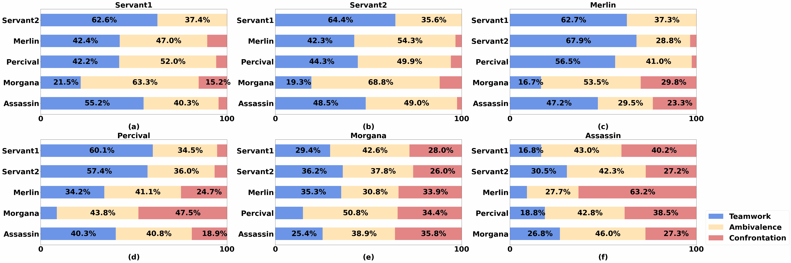

图11：不同角色扮演时的团队合作与对抗行为：每个子图展示了扮演特定角色的玩家（顶部）的态度分布，以及他们对其他角色玩家（左侧）的态度。

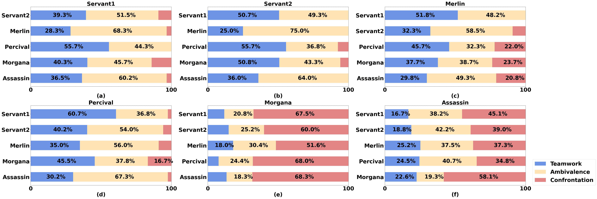

图12：不同角色扮演时的团队合作与对抗行为（没有经验学习模块的代理）

图[11](https://arxiv.org/html/2310.14985v4#A4.F11 "图11 ‣ 附录D 团队合作与对抗 ‣ 基于LLM的代理社会调查：亚瓦隆游戏中的合作与对抗")和图[12](https://arxiv.org/html/2310.14985v4#A4.F12 "图12 ‣ 附录D 团队合作与对抗 ‣ 基于LLM的代理社会调查：亚瓦隆游戏中的合作与对抗")展示了在有无经验学习条件下，代理人在团队合作和对抗行为上的差异。

图 [12](https://arxiv.org/html/2310.14985v4#A4.F12 "图 12 ‣ 附录 D 团队合作与对抗 ‣ 基于大语言模型的代理社会调查：亚瑟王游戏中的合作与对抗") 显示，在没有战略学习的情况下，邪恶方玩家（例如 Morgana）过度对抗，而善良方玩家的对抗较少，且变化较小。这与图 [11](https://arxiv.org/html/2310.14985v4#A4.F11 "图 11 ‣ 附录 D 团队合作与对抗 ‣ 基于大语言模型的代理社会调查：亚瑟王游戏中的合作与对抗") 所示的具有战略学习的代理人形成对比。在这里，战略学习的引入缓解了邪恶方玩家的过度对抗，邪恶方玩家通过战略性地进行更多的团队合作。相反，善良方玩家通过战略性地增加与潜在敌人的对抗，同时减少与潜在队友的对抗。
