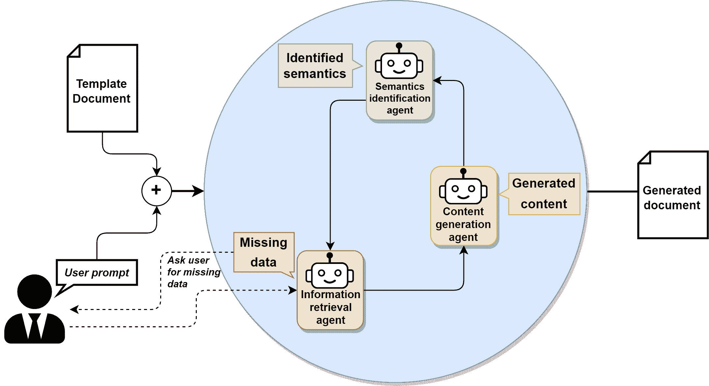
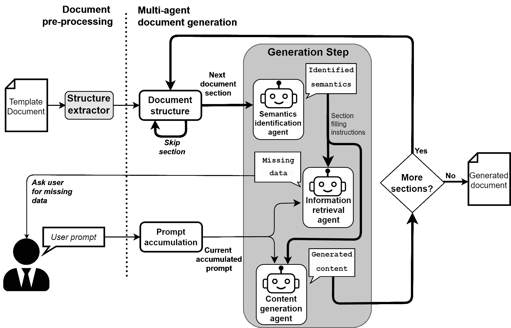
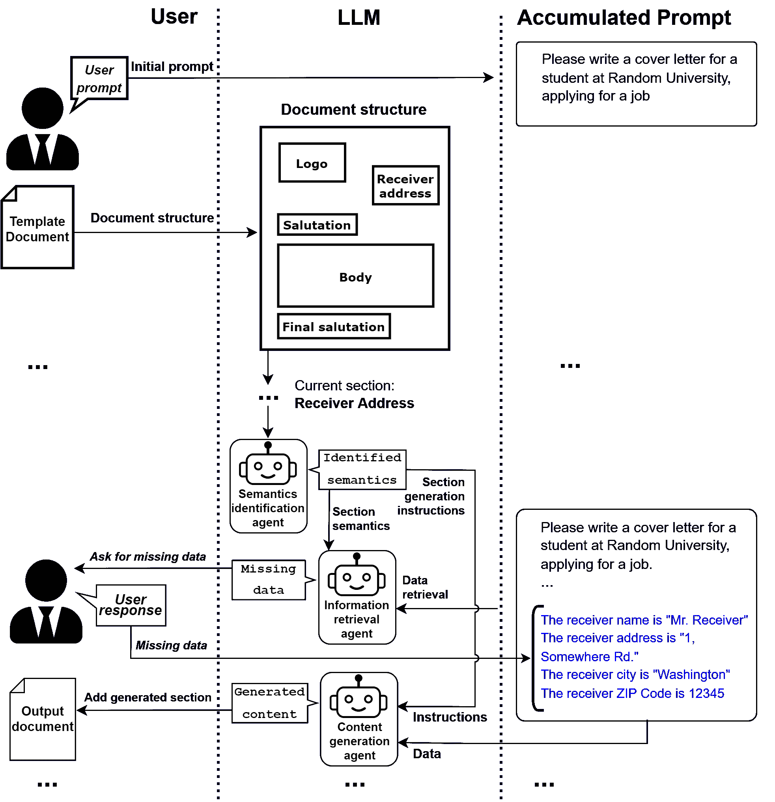

<!--yml

类别：未分类

日期：2025-01-11 12:50:28

-->

# 基于LLM的公共管理领域语义模板生成半结构化文档的多代理方法

> 来源：[https://arxiv.org/html/2402.14871/](https://arxiv.org/html/2402.14871/)

¹¹机构地址：计算机、控制与管理工程系

罗马萨皮恩扎大学，罗马（意大利），¹¹电子邮件：{lastname}@diag.uniroma1.it ²²机构地址：UNINT大学，Via Cristoforo Colombo，200 - 00147 罗马（意大利），²²电子邮件：domenico.bloisi@unint.eu埃马努埃尔·穆苏梅奇 [0009-0004-2359-5032](https://orcid.org/0009-0004-2359-5032 "ORCID identifier") 11    米凯莱·布里恩扎 11 [0009-0000-1549-9500](https://orcid.org/0009-0000-1549-9500 "ORCID identifier")    文琴佐·苏里亚尼 11 [0000−0003−1199−8358](https://orcid.org/0000%E2%88%920003%E2%88%921199%E2%88%928358 "ORCID identifier")    达尼埃莱·纳尔迪 11 [0000-0001-6606-200X](https://orcid.org/0000-0001-6606-200X "ORCID identifier")    多梅尼科·达尼埃莱·布洛伊西 22 [0000−0003−0339−8651](https://orcid.org/0000%E2%88%920003%E2%88%920339%E2%88%928651 "ORCID identifier")

###### 摘要

在近年来的数字化进程中，各个领域，特别是公共管理（PA）领域的文档创建与管理变得愈加复杂和多样化。这种复杂性来源于需要处理各种文档类型，这些文档通常呈现为半结构化形式。半结构化文档展示了一组固定的数据，但没有固定的格式。因此，无法使用基于模板的解决方案，因为理解文档需要提取数据结构。最近引入的大型语言模型（LLMs）使得能够根据用户需求创建定制化的文本输出。在这项工作中，我们提出了一种新的方法，结合了LLMs与提示工程以及多代理系统，用于生成符合所需结构的新文档。本工作的主要贡献在于用通过LLM语义检索生成的任务描述取代了常用的手动提示。通过一系列实验和案例研究，展示了该方法在实际公共管理场景中的有效性。

###### 关键词：

以人为本的人工智能公共管理任务优化

## 1 引言

图1：展示的多代理架构，其中使用了在提示工程和多代理方式中生成新文档的LLM。

文档创建是公共管理（PA）领域中的典型任务，涉及需要重复执行的子任务，具有自动化的潜力。例如，在撰写公共办公室所需的官方证书时，通常只需要从请求者那里获取非常简明的个人信息，这些信息仅占文档中内容的一个小部分。

使用预制文档模板只能在一定程度上减少所花费的努力，并且仅适用于结构严格的文档，在这些文档中，缺失信息的语义可以在模板本身中明确定义。此类文档的自动化写作，即字段填写，是简单直接的。

相反，半结构化文档提供了一种灵活的格式，其中缺失的信息无法明确标记，通常由周围上下文的语义来决定。例如，像当前日期这样的标准字段可以出现在文档中的不同位置，而没有预定义的标准。

生成这种类型的文档需要额外的努力，将其灵活的结构适应当前的使用案例以及可用和所需的信息，并付出额外的努力来恢复缺失的信息。与必要信息相关的语义需要一些上下文知识，这些知识可以通过周围的上下文，甚至有时通过整个文档的总体语义来获得。例如，可以使用不同的术语来表示同一字段的资格：例如，“发票”、“发票号”、“账单”和“采购订单”都可以表示相同的信息（即发票号码）。因此，半结构化文档中的结构和语义通常是交织在一起的，开发一个能够适用于各种文档的高效文档生成流程是一个非常具有挑战性的任务。

基于这些前提，适配半结构化文档模板的具体任务可以通过使用人工智能，特别是语言模型来支持，以减少自动化过程所花费的时间，并作为改善自动化方法通用性的手段。

一种简单的解决方案可能是通过几个增量步骤生成并精炼文档，每个步骤有一个单独的提示，但由于文档中不同部分之间可能存在数据依赖关系，而这些部分可能位于结构上无关的章节中，这可能会影响结果的质量。因此，完全无监督的方法可能会因为长上下文窗口对长文档结构的有限有效性而导致出现虚构内容。

提示工程指南通常要求为LLM代理在任务中的角色提供初步且准确的上下文。因此，通过在实际用户提示前添加对LLM代理角色的准确描述，有可能在相同的用户请求下更改并改善结果。

在这些假设下，通过引入多个代理，每个代理在生成过程中的角色定义明确，可以改善增量试错式文档生成。在这一框架中，每个代理的能力可以通过提供其角色的准确描述来进行调整。此外，每个代理还可以增加一个本地的记忆组件，该组件根据代理的角色特定地进行采样和应用，且具备补偿语言模型不足的额外能力，例如实时与万维网互动、访问私有定制知识库和信息源，以增强代理的领域特定知识，或者执行如“函数即服务”框架中的专门代码。这种架构与新兴的AI即服务（AIaaS）范式[[3](https://arxiv.org/html/2402.14871v1#bib.bib3)]完全兼容。

多代理过程通过借助从类似文档中提取的预先存在的结构，逐步优化提示，辅助用户。然后，根据各代理的具体角色和原始文档结构，在过程中为各个代理提供特定的上下文提示，几乎无需人工干预。代理之间的互动本质上是对话式的，在需要干预的情况下，还可以包括与用户的直接互动。

我们提出了一个工作流和互动框架，用于在有限的人类监督下，通过大语言模型辅助的多代理生成半结构化文档，应用于PA领域。随后，我们展示了为了在当前工作流中获得每个代理角色所需结果，必须进行的提示优化过程。

本工作的代码和额外的结果可以在以下网页找到：[https://sites.google.com/uniroma1.it/multi-agent-documentgeneration/home-page](https://sites.google.com/uniroma1.it/multi-agent-documentgeneration/home-page)。

本文的其余部分组织如下。第[2](https://arxiv.org/html/2402.14871v1#S2 "2 Related Work ‣ LLM Based Multi-Agent Generation of Semi-structured Documents from Semantic Templates in the Public Administration Domain")节描述了当前的研究现状。第[3](https://arxiv.org/html/2402.14871v1#S3 "3 Proposed Approach ‣ LLM Based Multi-Agent Generation of Semi-structured Documents from Semantic Templates in the Public Administration Domain")节介绍了工作流和交互框架的描述。接下来，第[4](https://arxiv.org/html/2402.14871v1#S4 "4 Experimental Evaluation ‣ LLM Based Multi-Agent Generation of Semi-structured Documents from Semantic Templates in the Public Administration Domain")节展示了提示优化过程。最后，第[5](https://arxiv.org/html/2402.14871v1#S5 "5 Conclusions ‣ 4.4 Prompt-engineered results ‣ 4.3 Content Generation Agent ‣ 4.1 Semantics Identification Agent ‣ 4 Experimental Evaluation ‣ LLM Based Multi-Agent Generation of Semi-structured Documents from Semantic Templates in the Public Administration Domain")节得出结论。

## 2 相关工作

自从公开发布以来，大型语言模型（LLMs）在各种日常任务中展示了巨大的潜力[[10](https://arxiv.org/html/2402.14871v1#bib.bib10)]。特别是在文档编辑和生成的应用场景中，它们的能力为其在公共管理领域的成功应用提供了巨大的潜力。大多数LLMs在零-shot[[5](https://arxiv.org/html/2402.14871v1#bib.bib5)]，尤其是few-shot[[4](https://arxiv.org/html/2402.14871v1#bib.bib4)]任务中表现更好，在这些任务中，提供了可接受结果的示例，并附带执行任务的指令。

研究表明，通过应用提示工程的指导方针，可以获得更好的结果[[16](https://arxiv.org/html/2402.14871v1#bib.bib16)]。通常，当涉及到人为因素时，提示优化过程变成了一种试错过程，通过对初始提示进行逐步改进，根据生成的输出优化最终结果。

提示工程被证明是应用LLM生成半结构化文档中的关键步骤，无论是对普通用户还是高级用户而言。在这种应用中，原始结构需要通过试错过程进行后续的适应。通过提示工程，可以提高输出结果的质量，特别是在符合关于所需内容和风格的上下文规范方面。因此，公共管理实体成功将LLMs集成到其工作流程中的主要挑战之一是帮助缺乏经验的用户创建有效的提示，并尽量减少改进任务描述所花费的时间。

作为其多功能性的权衡，LLMs会遇到幻觉问题，导致结果相对于原始请求产生偏差、不准确或带有偏见，尤其是在较长的上下文窗口中。在文档生成任务中，尤其是生成较长文档时，提示可能会变得很长且信息丰富，从而增加产生幻觉的风险。

### 2.1 LLMs在公共行政领域的应用

在自动化文档生成过程中，特别是在公共行政（PA）领域中，集成大型语言模型（LLMs）引起了广泛关注，因为该领域需要大量文档操作。一些研究正在帮助从这些文档中提取信息，例如，处理从公共行政招标文件中提取和分类关系的工作[[12](https://arxiv.org/html/2402.14871v1#bib.bib12)]。

目前的前期研究主要集中在利用LLMs进行结构化数据提取、文本摘要和内容定制[[7](https://arxiv.org/html/2402.14871v1#bib.bib7)]，以提高行政效率和用户参与度。提示工程在提高LLM生成能力方面取得了相关成果[[16](https://arxiv.org/html/2402.14871v1#bib.bib16)]，并且，通过指导原则，LLMs可以满足要求并提升响应质量[[1](https://arxiv.org/html/2402.14871v1#bib.bib1)]。

一种针对非结构化文档的信息提取方法在[[9](https://arxiv.org/html/2402.14871v1#bib.bib9)]中提出，该方法利用基于嵌入的检索系统与LLM结合，有效地从非结构化数据中提取农业信息。该系统特点是结合了基于嵌入的检索系统和LLM问答功能，能够自动从文档中提取实体和属性，并将其转化为结构化数据。

在处理新型文档时，检索增强生成（RAG）方法也允许大型语言模型（LLM）检索相关知识，显示出在缓解LLM幻觉并提升响应质量方面的良好潜力，同时，也有助于促进LLM在实践中的应用[[2](https://arxiv.org/html/2402.14871v1#bib.bib2)]。然而，现有的RAG系统在回答多跳查询时往往存在不足，因为这类查询需要反复检索和推理。在[[14](https://arxiv.org/html/2402.14871v1#bib.bib14)]中提出了这项技术的改进，通过引入多跳推理步骤，增强了RAG系统的能力。

在处理从语义相似的示例生成半结构化文档时，困难尤为常见。这个问题仍然相对未得到解决，它们依然在需要生成复杂、结构化输出的任务上遇到困难[[13](https://arxiv.org/html/2402.14871v1#bib.bib13)]。这一差距主要源于半结构化文档本身的复杂性，这种复杂性使得传统的基于模板的方法无法应对。为了解决这个问题，已经提出了几种方法。其中一个值得注意的例子是[[15](https://arxiv.org/html/2402.14871v1#bib.bib15)]，在该方法中，链式思维（Chain-Of-Thought）被提出作为一系列中间推理步骤，显著提升了大规模语言模型进行复杂推理的能力。特别地，研究表明，足够大的语言模型可以自然地展现出这种推理能力。

在生成半结构化文档的过程中，一个更紧密的步骤是通过定向刺激提示技术（Directional Stimulus Prompting Technology）[[8](https://arxiv.org/html/2402.14871v1#bib.bib8)]，该技术使得LLM输出能够在特定条件下生成期望的结果，例如包含特定关键词。关于语义理解和上下文感知生成的研究提供了基础性的见解，但未能解决公共行政领域中半结构化文档所带来的特定挑战。

此外，人工智能即服务（AIaaS）趋势[[3](https://arxiv.org/html/2402.14871v1#bib.bib3)]将在社会技术基础设施中发挥越来越重要的作用，推动、促进并支撑许多应用的功能。因此，AIaaS提供商在这一基础设施层面拥有重要的影响力，并且随着即将出台的欧洲立法，他们的角色很容易渗透到公共部门的工作流程中。AIaaS方法也与我们提出的文档生成任务中的多代理方法相一致。多代理方法已被证明能够改善问题解决，克服单一模型的局限性[[11](https://arxiv.org/html/2402.14871v1#bib.bib11)]。在公共行政领域，这种分布式方法提供了模块化和可扩展性，可能适用于处理公共行政环境中的各种文档类型和复杂性。

总结来说，尽管文献提供了关于LLMs在各种背景下的能力和应用的宝贵视角，但我们的工作为LLM辅助的半结构化文档生成提供了一种新的方法论和交互框架，包括在文档生成中引入多代理协助，并为该领域进一步创新和探索铺平了道路。

## 3 提出的方法

通常，LLM与没有经验的用户之间的文档生成交互模型采用试错过程，目的是不断调整提示，直到获得满意的结果。较长的文档需要更长的提示，这使得获得满意结果更加困难。此外，在内容丰富的文档中，当文档生成需要完成许多任务时，LLM代理的表现必然会下降。

鉴于在试错过程中需要用户监督，我们提出了一种不同的工作流，旨在尽量减少用户干预。该过程具有迭代性质，遵循文档模板的整体结构，模板可以从用户提供的现有模板文档中提取。

用户可以提供一个初始提示，描述整体预期结果。然后，在迭代过程中，初始提示会不断被优化，以包含生成文档所需的所有缺失数据，积累用户干预的结果，并在代理要求时将这些结果添加到原始提示中。*累积提示*将作为整个文档生成过程中的数据来源。根据模板文档的结构，输出文档将按阅读顺序逐节生成。

在通用生成步骤中，LLM代理根据生成当前部分所需的语义合适内容所需的信息可用性，被询问解决精细任务。每个代理都被指示使用一个先前设计好的提示，描述其任务，然后根据当前部分的语义和从*累积提示*中提取的数据，补充上下文依赖的信息。

多代理框架允许根据需要对代理进行专门化，以防止在某些段落中可用的上下文信息片段提供不期望的结果（例如，如果提供的上下文非常简短或文本非常简略时可能发生的情况）。可以应用后处理以改善结果，尤其是在期望简略输出的情况下，通过明确要求LLM代理在满足某些条件时返回特定的标记，以强迫它们不进行幻觉生成，并遵守它们在工作流中的角色。在输出中检测这些标记可能有助于管理可能会破坏工作流的极限情况，从而提高整个系统的鲁棒性。

只有当从*已积累的提示*中提取的信息不足以满足当前文档部分的语义要求时，才需要用户干预，因此，用户干预的频率取决于初始提示的质量。这种方法的优点是，*已积累的提示*仅作为数据源使用：这样，负责从提示中提取数据的代理在用户提示不完整或不明确时，更不容易产生幻觉。用户干预后，用户提供的新数据将添加到*已积累的提示*中，供未来提取使用。

图2：我们多代理架构的表示。通用生成步骤的工作流通过粗体黑色箭头突出显示。

为了确保在模拟原始文档模板时的灵活性，用户可以选择性地跳过文档某一部分的生成，保持已积累的提示不变。根据这种交互模型获得的工作流表示如图[2](https://arxiv.org/html/2402.14871v1#S3.F2 "图 2 ‣ 3 提议方法 ‣ 基于大语言模型的多代理生成半结构化文档的公共行政领域语义模板")所示。

尽管我们的工作专注于逐部分生成文档所必需的组件，但所提出的交互模型允许集成额外的代理，以管理文档编辑的不同方面，具体取决于文档的结构化程度和特定任务所需的专业技能。

### 3.1 模板预处理

可以根据格式依赖的方式，使用现有工具提取文档结构。在我们的案例中，我们使用了一个REST API接口，通过云端处理，利用Adobe Extraction API¹¹1[https://developer.adobe.com/document-services/docs/overview/pdf-extract-api/](https://developer.adobe.com/document-services/docs/overview/pdf-extract-api/)从文档中的图形、文本块和表格中提取边界框和内容。在此阶段推导字段语义并不重要，因为我们只需要结构线索来进行下一步操作。

### 3.2 多代理交互

用户被邀请提供一个初始提示，概述生成文档的整体描述和指令，例如文本的风格或语气等更一般的特征，或生成文档所需的更具体的信息和数据。也可以将初始提示留空，在这种情况下，整个生成过程将需要用户的最大程度干预。

当前的工作流程包括一组基于大型语言模型（LLM）的三个代理，每个代理对应单个文档章节通用内容生成步骤中的一个阶段，依次为：*章节语义识别*、*信息检索*、*内容生成*。

*章节语义识别*步骤旨在从文档模板中识别当前章节的语义。如果模板章节包含需要在当前文档章节中替换的标记，这些标记可能以占位符的形式出现，如“姓名”、“姓氏”、“生日”、“城市”，或已经明确填写了数据，如“约翰”、“杜”、“1970年1月1日”、“华盛顿”，通常的自然语言处理流程要执行几个预处理任务，如词性标注、命名实体识别、关系抽取，然后才进行实际的语义标记，以构建一个足够好的语义表示，从而正确提取感兴趣的标记。使用LLM进行此任务，则可以利用它们的常识知识[[6](https://arxiv.org/html/2402.14871v1#bib.bib6)]。因此，这个步骤由第一个LLM代理，*语义识别代理*管理，它会自主地从模板文档中识别当前章节的语义，并识别提供的模板章节中的可替换数据。

代理的输出是一系列指令和说明，描述如何重现相应模板的语义，只要文本中可以推断出这些语义，这些指令作为*内容生成*阶段的指南，并附带一个已识别的可替换数据列表。如果识别出这些数据的语义，指令列表将包含如何将它们添加到输出文档中相应章节生成文本的指令。仅使用语义的示意图作为输出会导致下游生成内容质量下降，因此代理提供的指令是有讨论性和冗长的。该阶段的输出将提供给*信息检索代理*，以识别当前章节所需的数据，并提供给*内容生成代理*，使其能够在输出文档中重建该模板章节的语义。

需要注意的是，可替换数据列表可能包含在累计的用户提示中已有的数据以及缺失的数据。因此，第二阶段，旨在进行*信息检索*，目的是使用现有信息，根据先前提取的语义线索，检索当前文档章节中特定需要的数据。

第二个代理，*信息检索代理*，专门从累积提示中提取所需信息，在第一步时它与初始提示一致，并确定无法检索到的数据。如果无法找到所有所需的数据（根据*语义识别代理*的指示），则需要用户干预，通过文本提示指定缺失数据的实际替换值。这次交互的结果会添加到*累积提示*中，供*内容生成代理*作为数据源使用，或在后续迭代的*信息检索*阶段存储。因此，如果用户决定不指定某些信息，它们将不会被集成到结果中，并且在输出内容中会被忽略。

最后一步，在*内容生成*阶段，*内容生成代理*因此被指示生成当前文档部分的文本内容，使用*累积提示*，现在已通过所需的信息和来自*语义识别代理*的指示进行了丰富。

图3：一个生成步骤实例的表示。注意如何通过用户提供的缺失数据丰富*累积提示*。

最后，将获得一个输出文档和一个改进的提示。特别是，改进的提示将包含在整个生成过程中识别的所有缺失数据。一个工作流实例的示例见图[3](https://arxiv.org/html/2402.14871v1#S3.F3 "图3 ‣ 3.2 多代理交互 ‣ 3 提议方法 ‣ 基于LLM的多代理生成来自公共行政领域语义模板的半结构化文档")。

### 3.3 文档后处理

在文档生成过程中，仅处理文本内容，同时使用原始模板文档的相同结构，包括图形和其他图形元素，用户可以在生成过程中跳过这些元素，以避免将它们包含在内。得益于该框架的模块化，用户可以添加额外的代理来改善图形外观，并提高其对上下文和用户需求语义的依赖性，还可以在后续处理步骤中添加更多操作，以改善结果的图形外观（例如生成上下文依赖的图像），但这些超出了当前工作的范围。

## 4 实验评估

这些代理是使用最新的OpenAI *GPT 3.5 Turbo*模型（*gpt-3.5-turbo-1106*）构建的，具有16,385个令牌的上下文窗口和最多4,096个输出令牌。

| 语义识别代理的提示工程 |
| --- |
| 模板文本：*您的名字* |
| 代理任务 | 代理回答 |

| 你是一个助手，帮助理解模板文档的结构内容。请回应文档中可能写入的内容。| [你的名字] [你的地址] |

[城市，州，邮政编码]

[电子邮件地址]

[电话号码] |

| 你是一个助手，帮助理解模板文档的结构内容。请回应文档中可能写入的内容。仅提供需要执行的操作。 | 填写你的全名。 |
| --- | --- |
| 你是一个助手，帮助理解模板文档的结构内容。请回应文档中可能写入的内容。仅提供需要执行的操作。例如，如果你看到“Location”，输出将是“添加位置”；如果看到“Dear Someone”，输出将是“添加称呼”。 | 添加你的全名 |

表1：语义识别代理的任务提示优化，模板文本为“*你的名字*”

。

实验旨在通过进行试错过程，为每个代理设计有效的提示，以从大型语言模型（LLMs）中获得正确且符合上下文的响应。

评估过程测试代理理解分配任务的能力，微调每个代理的能力，使其能够符合预期输出，基于其在生成工作流程中的具体角色。

精心设计有效的提示，以最大限度地提高大型语言模型输出与原始要求的一致性，有可能显著提高生成输出的质量，尤其是当该输出用于处理流程中的中间步骤时。提示点的基线版本是通过遵循通用的提示工程准则[[16](https://arxiv.org/html/2402.14871v1#bib.bib16)]获得的，最重要的准则之一是用清晰、命令的语气写出任务分配给大型语言模型（LLM）。从基线开始并分析响应后，便可以通过逐步增加指令来改进提示，迫使模型生成更理想的输出。

最重要的需要控制的不良行为是产生幻觉的可能性，在这种情况下可能会改变生成内容中的数据，从而为文档生成的部分提供虚假和不令人满意的文本内容。

每个提示包含两个部分：“*系统提示*”，它包含用于通知代理其具体任务的预设指令，指导其角色和生成输出的准则；以及“*特定上下文提示*”，它包含当前实例任务的实际上下文文本。

获取强健设计的提示需要精心调整，考虑到半结构化文档中可能出现的各种输入。一方面，由单一实体组成的非常图式化的文本（如“名字”，“姓氏”和其他特定数据）构成挑战，需要更精心设计的提示。另一方面，即使在较少图式化、更具讨论性的部分，输出仍应是期望的。生成步骤的通用输入，即将传递给*语义识别代理*的，是当前处理的模板文档部分的文本内容，必要的目的是获得关于所需输出文本的语义提示。

生成步骤的输出与*内容生成代理*的输出相一致。

### 4.1 语义识别代理

*语义识别代理*的任务是基于预期语义，生成对当前文档部分的语义以及生成内容的指令和要求的流畅解释。为了避免出现误导性信息，极其重要的是对当前文档部分的语义进行非图式化和不具体的描述。

我们展示了基于同一代理对不同*系统提示*的回答进行提示工程的过程，逐步通过递增步骤进行精炼，适用于不同的模板文本，按照*上下文特定提示*的冗长程度递增（因此按图式化程度递减的顺序）。

第一个更具图式化的模板文本是“*您的名字*”，这种文本在任何通用信件模板中都可以找到，属于需要填写用户姓名的字段。该精炼过程的相关结果见表格[1](https://arxiv.org/html/2402.14871v1#S4.T1 "表格1 ‣ 4 实验评估 ‣ 基于LLM的多代理半结构化文档生成：公共管理领域中的语义模板")。

| 语义识别代理的提示工程 |
| --- |
| 模板文本: *亲爱的（姓氏）先生/女士：* |
| 代理任务 | 代理回答 |
| 您是一个助手，帮助理解模板文档的结构内容。请根据文档中可能写入的内容进行回复。 | 希望这条消息能找到您安好。我写信是为了通知您，定于（日期）在（时间）于（地点）举行的即将到来的会议。此次会议的目的是讨论（议程事项）。您的出席和参与对会议至关重要，请尽量参加。如您无法出席，请尽早通知我。感谢您对此事的关注，期待在会议中见到您。 |
| 您是一个助手，帮助理解模板文档的结构内容。回应可能写入文档中的内容。仅给出要执行的动作。 | 在称呼中插入收件人的姓氏。 |
| 您是一个助手，帮助理解模板文档的结构内容。回应可能写入文档中的内容。仅给出要执行的动作。例如，如果您看到“Location”，输出将是“添加位置”；如果看到“Dear Someone”，输出将是“添加称呼”。 | 添加称呼 |

表格 2：语义识别代理的任务提示优化，模板文本为“*亲爱的（姓氏）先生/女士：*”。

提示的初始基准版本描述了代理的任务，但并未说明输出应包含如何再现所提供模板文本语义的说明。代理的回应受到幻觉的强烈影响，给出的回答是针对一个通用信件的合理文本，而没有给出其语义的通用描述，显然没有达到其目标。从回答的分析来看，可以推测代理误解了请求“*回应可以写入的内容*”，将其理解为提供生成文档的实际内容。

| 语义识别代理的提示工程 |
| --- |
| 模板文本：*第一段：在您的开头段落中，简明扼要地表达您对该职位和公司的热情，同时强调您相关的教育背景。旨在引起读者兴趣，促使他们深入阅读您的简历。此部分作为预览，展示您的资格，并为简历中列出的详细技能和经验奠定基础。突出您与职位要求相符的顶尖技能，并通过提及公司使命、正在进行的项目或战略目标等具体方面，展示您对公司的了解，将它们与您的能力和兴趣如何为他们的团队带来价值联系起来。* |
| 代理任务 | 代理回答 |
| 您是一个助手，帮助理解模板文档的结构内容。回应可能写入文档中的内容。 | 亲爱的[招聘经理姓名]，我写信是为了表达我对[职位名称]职位的真正热情。凭借在[相关领域]的扎实教育背景，我相信自己能够为您团队的成功做出贡献。[公司名称]的创新项目和战略目标与我的职业兴趣相契合，我渴望将我的技能和专业知识带到您的团队，支持贵组织的使命。我在[具体技能]和[具体技能]方面的顶尖技能与 |
| 你是一个助手，帮助理解模板文档的结构内容。请回应文档中可能写入的内容，仅提供需要执行的操作。 | 表达对角色和组织的热情，强调你的教育背景以及与你职位要求相符的顶级技能。展示你对组织的了解，提及其使命、正在进行的项目或战略目标，并将其与你的能力和兴趣如何为团队增值联系起来。 |
| 你是一个助手，帮助理解模板文档的结构内容。请回应文档中可能写入的内容，仅提供需要执行的操作。例如，如果你看到“Location”，输出将是“添加地点”；如果看到“Dear Someone”，输出将是“添加称呼”。 | 写一段充满热情的开头段落，强调你相关的教育背景，并展示与你职位要求相符的资格和技能。提及组织的具体方面，如其使命、正在进行的项目或战略目标，并将其与你的能力和兴趣如何为团队增值联系起来。 |

表 3：语义识别代理的任务提示优化，包含一个冗长且非常长篇的模板文本。

| 信息检索代理的提示工程 |
| --- |
| 积累的提示：“我叫约翰·多伊，我想为随机大学写一封信，我是计算机科学专业的学生” |

第二版系统提示定义中增加的明确指令“*仅提供需要执行的操作*”为代理提供了清晰的任务执行说明。这句话对于提升代理响应与原始任务的一致性至关重要，指导其提供执行操作的描述，以重现模板部分的语义。

针对模板文本“*尊敬的先生/女士（姓氏）*”的相关结果见表 [2](https://arxiv.org/html/2402.14871v1#S4.T2 "表 2 ‣ 4.1 语义识别代理 ‣ 4 实验评估 ‣ 基于LLM的多代理生成半结构化公共管理领域语义模板文档")。在此，第二版提示的输出可以视为正确，但它可以更为简洁，因为最优响应只需指令“*添加称呼*”。

一个特别有趣的研究案例是使用经过设计的提示词，并提供没有语义意义的文本，例如占位符文本：模板文本：*Lorem ipsum dolor sit amet, consectetur adipiscing elit…* 该模板文本是通常用于测试图形模板的占位符文本（" *Lorem Ipsum …* "）。该代理的回答完美地符合规定的任务，因为这个占位符通常出现在文档模板的议论部分：代理回答：*满足请求所缺失的信息是文档正文的内容。*
