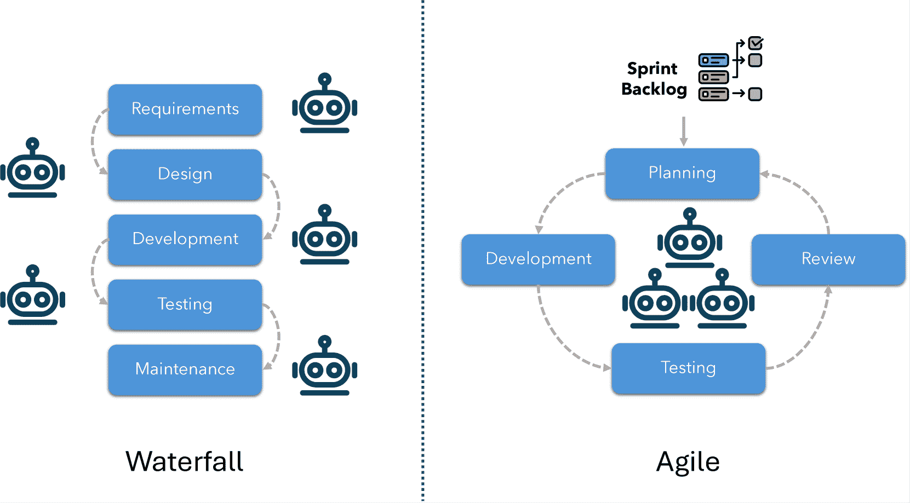
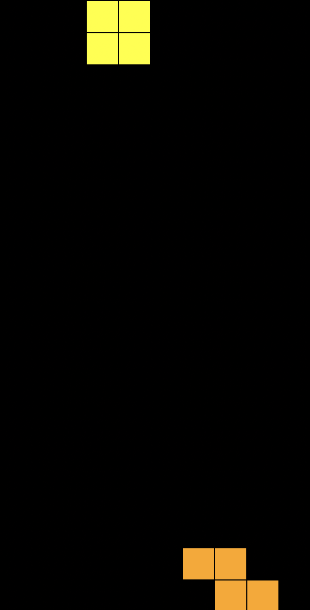
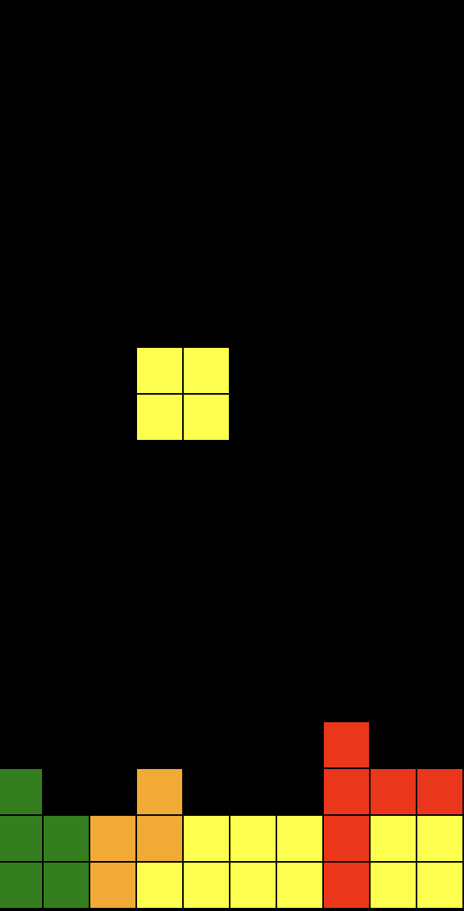
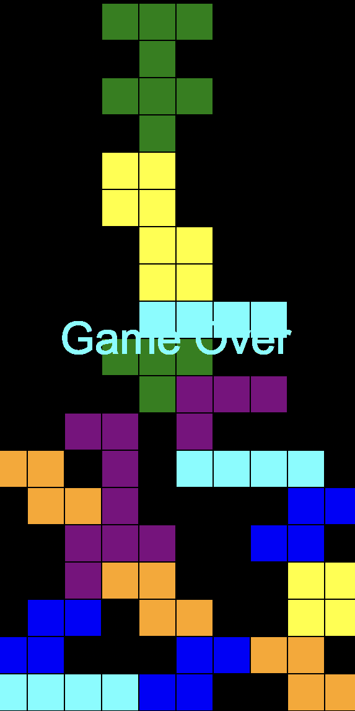
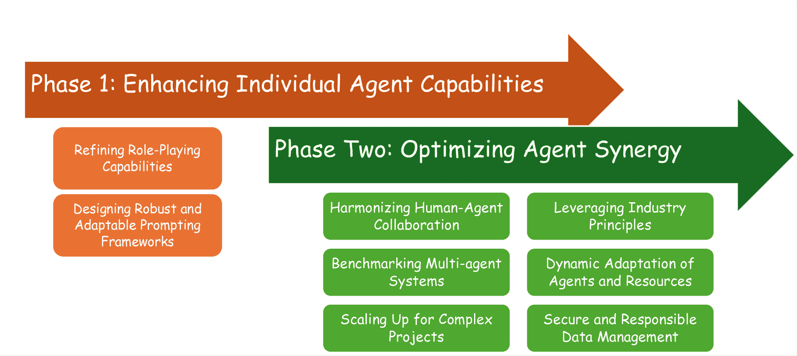

<!--yml

分类: 未分类

日期: 2025-01-11 12:43:18

-->

# 基于LLM的多智能体系统在软件工程中的应用：文献综述、愿景及未来发展

> 来源：[https://arxiv.org/html/2404.04834/](https://arxiv.org/html/2404.04834/)

何俊达 [jundahe@smu.edu.sg](mailto:jundahe@smu.edu.sg) 新加坡管理大学，斯坦福路80号，邮政编码178902，新加坡，新加坡，  克里斯托夫·特鲁德 [ctreude@smu.edu.sg](mailto:ctreude@smu.edu.sg) 新加坡管理大学，斯坦福路80号，邮政编码178902，新加坡，新加坡 以及  大卫·罗 [davidlo@smu.edu.sg](mailto:davidlo@smu.edu.sg) 新加坡管理大学，斯坦福路80号，邮政编码178902，新加坡，新加坡

###### 摘要。

将大型语言模型（LLMs）整合到自主代理中，标志着研究领域的重大转变，因为它们提供了与人类规划和推理相竞争的认知能力。本文探讨了将大型语言模型整合到多智能体（LMA）系统中的变革潜力，旨在解决软件工程（SE）中复杂的挑战。通过利用多个智能体的协作和专门化能力，LMA系统能够实现自主问题解决、提高鲁棒性，并为应对现实世界软件项目的复杂性提供可扩展的解决方案。本文通过系统性地回顾近期的主要研究，描绘了LMA应用在软件开发生命周期（SDLC）各个阶段的现状。为了展示当前的能力与局限性，我们进行了两个案例研究，展示了先进LMA框架的有效性。此外，我们还识别了关键的研究空白，并提出了一个全面的研究议程，专注于提升单个智能体的能力并优化智能体之间的协同。我们的工作勾画了一个面向未来的愿景，致力于开发完全自主、可扩展且可信赖的LMA系统，为软件工程2.0的演变奠定基础。

大型语言模型、自主代理、多智能体系统、软件工程

## 1. 引言

自主代理被定义为通过环境感知、战略自我规划和行动执行，能够自主执行特定任务的智能实体（Franklin 和 Graesser，[1996](https://arxiv.org/html/2404.04834v3#bib.bib37)；Albrecht 和 Stone，[2018](https://arxiv.org/html/2404.04834v3#bib.bib7)；Mele，[2001](https://arxiv.org/html/2404.04834v3#bib.bib99)），自1990年代以来已成为一个迅速扩展的研究领域（Maes，[1993](https://arxiv.org/html/2404.04834v3#bib.bib94)）。尽管最初取得了一些进展，这些早期的版本往往缺乏人类智能的复杂性（Unland，[2015](https://arxiv.org/html/2404.04834v3#bib.bib128)）。然而，近期大规模语言模型（LLMs）的出现（Kasneci 等人，[2023](https://arxiv.org/html/2404.04834v3#bib.bib66)）标志着一个转折点。这一LLM突破展现了接近人类水平的认知能力，尤其是在规划和推理方面（Achiam 等人，[2023](https://arxiv.org/html/2404.04834v3#bib.bib4)；Kasneci 等人，[2023](https://arxiv.org/html/2404.04834v3#bib.bib66)），这与自主代理的预期相符。因此，越来越多的研究开始关注将LLM作为自主代理的核心（Lo，[2023](https://arxiv.org/html/2404.04834v3#bib.bib91)；Xi 等人，[2023](https://arxiv.org/html/2404.04834v3#bib.bib149)；Wang 等人，[2023c](https://arxiv.org/html/2404.04834v3#bib.bib135)）（在本文中，我们简称之为基于LLM的代理）。

然而，基于单一大型语言模型（LLM）代理的应用面临着一定的局限性，因为现实世界的问题往往跨越多个领域，涉及不同领域的专业知识。为应对这一挑战，开发基于 LLM 的多代理（LMA）系统成为一种重要的进化，旨在通过协同合作提高性能。LMA 系统利用多个专门代理的优势，每个代理都有独特的技能和责任。这些代理协同工作，共同朝着一个目标努力，进行辩论和讨论等协作活动。这些协作机制已被证明在促进发散性思维（Liang et al., [2023](https://arxiv.org/html/2404.04834v3#bib.bib81)）、增强事实性和推理能力（Du et al., [2023](https://arxiv.org/html/2404.04834v3#bib.bib33)）以及确保全面验证（Wu et al., [2023b](https://arxiv.org/html/2404.04834v3#bib.bib147)）方面发挥了重要作用。因此，LMA 系统在解决各种复杂的现实世界场景方面具有潜力，涵盖多个行业（Horton, [2023](https://arxiv.org/html/2404.04834v3#bib.bib50); Wang et al., [2023e](https://arxiv.org/html/2404.04834v3#bib.bib132), [a](https://arxiv.org/html/2404.04834v3#bib.bib138)），例如软件工程（Lo, [2023](https://arxiv.org/html/2404.04834v3#bib.bib91); Qian et al., [2024c](https://arxiv.org/html/2404.04834v3#bib.bib110); Li et al., [2024a](https://arxiv.org/html/2404.04834v3#bib.bib76); Hong et al., [2023](https://arxiv.org/html/2404.04834v3#bib.bib49)）。

软件工程（SE）的研究关注的是软件系统的整个生命周期（Kan, [2003](https://arxiv.org/html/2404.04834v3#bib.bib64)），包括需求引导（Goguen 和 Linde, [1993](https://arxiv.org/html/2404.04834v3#bib.bib40)）、开发（Abrahamsson et al., [2017](https://arxiv.org/html/2404.04834v3#bib.bib3)）和质量保证（Tian, [2005](https://arxiv.org/html/2404.04834v3#bib.bib127)）等阶段。这个多面向的学科需要广泛的知识和技能，以有效应对每个阶段所固有的挑战。将 LMA 系统集成到软件工程中带来了诸多好处：

1.  (1)

    自主问题解决：LMA 系统能够为软件工程（SE）任务带来显著的自主性。这是一种直观的方法，将高级需求分解为子任务和详细实现，类似于敏捷和迭代方法论（Larman, [2004](https://arxiv.org/html/2404.04834v3#bib.bib69)），在这些方法中，任务被拆解并分配给专门的团队或个人。通过自动化这一过程，开发人员可以专注于战略规划、设计思维和创新。

1.  (2)

    鲁棒性与容错性：LMA 系统通过决策过程中的交叉检查来解决鲁棒性问题，这类似于代码审查和自动化测试框架，从而在开发过程中及早发现并修复缺陷。单独使用的大型语言模型（LLMs）可能会产生不可靠的输出，这被称为“幻觉”（Zhang 等人, [2023](https://arxiv.org/html/2404.04834v3#bib.bib165)；Yang 等人, [2023b](https://arxiv.org/html/2404.04834v3#bib.bib152)），这可能导致软件开发中的错误或系统故障。然而，通过采用辩论、检查或验证多个智能体的响应等方法，LMA 系统能够确保最终聚焦于一个更准确、更可靠的解决方案。这提高了系统的可靠性，并符合软件质量保障的最佳实践。

1.  (3)

    应对复杂系统的可扩展性：随着软件系统复杂性的增长，代码行数、框架和相互依赖性不断增加，项目管理和开发实践中对可扩展解决方案的需求日益增加。LMA 系统通过引入更多的智能体来适应新技术，并根据项目需求变化重新分配任务，提供了一种有效的可扩展解决方案。LMA 系统确保了复杂项目（这些项目对于单个开发人员或传统团队可能是压倒性的）能够通过分布式智能和协作智能体框架进行有效管理。

现有研究已经揭示了这些协作智能体在推动软件工程2.0时代到来中的关键作用（Lo, [2023](https://arxiv.org/html/2404.04834v3#bib.bib91)）。LMA 系统预计将显著加快软件开发、推动创新，并转变当前的软件工程实践。本文旨在深入探讨 LMA 系统在塑造软件工程未来中的作用，重点介绍当前的进展、面临的新挑战及未来的发展道路。我们对 LMA 在软件工程中的应用进行了系统回顾，并通过两项案例研究评估当前 LMA 系统的能力与局限性。通过这项分析，我们识别了关键的研究空白，并提出了一个分为两个阶段的综合研究议程：（1）提升个体智能体的能力，和（2）优化智能体之间的协作与协同效应。这个路线图旨在指导自主、可扩展、可信赖的 LMA 系统的开发，为下一代软件工程铺平道路。

总结来说，本研究作出了以下几个关键贡献：

+   •

    我们对 71 篇最近关于 LMA 系统在软件工程中应用的主要研究进行了系统回顾。

+   •

    我们进行两项案例研究，展示当前 LMA 系统的能力与局限性。

+   •

    我们识别了关键的研究空白，并提出了一个结构化的研究议程，概述了未来可能的研究方向和提升 LMA 系统在软件工程任务中的应用机会。

## 2\. 初步概述

### 2.1\. 自主智能体

自主智能体是为在动态环境中独立有效操作而设计的计算实体（Mele, [2001](https://arxiv.org/html/2404.04834v3#bib.bib99)）。其核心属性包括：

+   •

    自主性：独立管理其行动和内部状态，无需外部控制。

+   •

    感知：通过传感机制检测周围环境的变化。

+   •

    智能性与目标导向：利用领域特定的知识和解决问题的能力，朝着特定的目标前进。

+   •

    社交能力：能够与人类或其他智能体互动，管理社交关系以实现目标。

+   •

    学习能力：持续适应、学习并整合新的知识和经验。

### 2.2\. 基于LLM的自主智能体

从形式上讲，基于LLM的智能体可以通过元组 $\langle L,O,M,P,A,R\rangle$ 来描述（Cheng et al., [2024](https://arxiv.org/html/2404.04834v3#bib.bib25)），其中：

+   •

    $L$ 代表大型语言模型（LLM），是智能体的认知核心。它具备广泛的知识，可能针对特定领域进行了微调，使其能够基于观察、反馈和奖励做出明智的决策。通常，适用于这一角色的LLM是通过大量多样化的文本数据训练的，包含数十亿个参数，如 ChatGPT¹¹1[https://openai.com/chatgpt/](https://openai.com/chatgpt/)、Claude²²2[https://claude.ai/](https://claude.ai/) 和 Gemini³³3[https://gemini.google.com/app](https://gemini.google.com/app) 等模型。这些模型表现出强大的零样本学习和少样本学习能力，意味着它们能在几乎不需要额外训练的情况下很好地推广到新任务。与LLM的互动通常通过提示进行，这些提示指导其推理和回应。

+   •

    $O$ 代表目标，即智能体旨在实现的期望结果或目标。这定义了智能体的关注点，推动其战略规划和任务分解。

+   •

    $M$ 代表记忆，存储着历史和当前状态的信息，以及来自外部交互的反馈。

+   •

    $P$ 代表感知，表示智能体感知、解释和理解周围环境和输入的能力。感知可以涉及处理来自各种来源的结构化和非结构化数据，如文本、视觉输入或传感器数据。感知使智能体能够解读环境，将原始信息转化为有意义的洞察，从而指导决策和行动。

+   •

    $A$ 代表行动，涵盖智能体执行的各种任务，从使用工具到与其他智能体沟通。

+   •

    $R$ 代表反思，是一种事后反思思维过程，用于评估结果和反馈，并结合存储的记忆。在这一洞察的指导下，基于LLM的智能体随后采取相应的行动。

### 2.3\. 基于LLM的多智能体系统

多代理系统是一个由多个互动的智能代理组成的计算框架，这些代理通过互动与合作解决复杂问题或实现任何单一代理无法完成的目标（Wooldridge, [2009](https://arxiv.org/html/2404.04834v3#bib.bib145)）。这些代理进行沟通、协调并共享知识，通常将专业知识带入各个领域，以解决多样化任务。

随着大型语言模型（LLMs）的集成，基于LLM的多代理系统应运而生。本文定义了一个LMA系统由两个主要组件组成：协同平台和基于LLM的代理。

#### 2.3.1\. 协同平台

协同平台作为核心基础设施，负责管理代理之间的互动和信息流动。它促进了协调、沟通、规划和学习，确保了高效且连贯的运作。协同平台定义了各种关键特性：

1.  (1)

    协调模型：定义了代理如何互动，例如合作（共同朝着共享目标合作）（Abdelnabi et al., [2023](https://arxiv.org/html/2404.04834v3#bib.bib2)），竞争（追求可能冲突的个人目标）（Wu et al., [2024](https://arxiv.org/html/2404.04834v3#bib.bib148)），层级（有领导-追随者关系的组织）（Zhao et al., [2024](https://arxiv.org/html/2404.04834v3#bib.bib167)），或混合模型。

1.  (2)

    通信机制：确定代理之间信息流动的方式：它定义了通信通道的组织方式，包括集中式（一个中心代理促进通信（Agashe, [2023](https://arxiv.org/html/2404.04834v3#bib.bib5)）），去中心化（代理直接进行通信（Chen et al., [2023a](https://arxiv.org/html/2404.04834v3#bib.bib23)）），或层级式（信息通过多个层级的权威流动（Zhao et al., [2024](https://arxiv.org/html/2404.04834v3#bib.bib167)））。此外，它还指定了代理之间交换的数据，通常以文本形式呈现。在软件工程的背景下，这可能包括代码片段、提交信息（Zhou et al., [2023](https://arxiv.org/html/2404.04834v3#bib.bib170)），论坛帖子（He et al., [2022](https://arxiv.org/html/2404.04834v3#bib.bib44), [2024a](https://arxiv.org/html/2404.04834v3#bib.bib43), [2024b](https://arxiv.org/html/2404.04834v3#bib.bib45)），错误报告（Bettenburg et al., [2008](https://arxiv.org/html/2404.04834v3#bib.bib13)），或漏洞报告（Imtiaz et al., [2021](https://arxiv.org/html/2404.04834v3#bib.bib56)）。

1.  (3)

    规划与学习风格：协调平台规定了在多智能体系统中如何进行规划和学习。它确定了任务如何在智能体之间分配和协调。它包括如集中式规划、分散式执行（CPDE）——规划由中央进行，但智能体独立执行任务，或者分散式规划、分散式执行（DPDE）——规划和执行都由智能体分布进行等策略。

#### 2.3.2\. 基于LLM的智能体

每个智能体可能具有独特的能力和专门的角色，从而增强系统有效处理多种任务的能力。智能体可以是：

1.  (1)

    预定义或动态生成：智能体配置文件可以是明确预定义的（Hong等，[2023](https://arxiv.org/html/2404.04834v3#bib.bib49)），也可以由LLM动态生成（Wang等，[2023c](https://arxiv.org/html/2404.04834v3#bib.bib135)），从而提供灵活性和适应性。

1.  (2)

    同质或异质：智能体可以具有相同的功能（同质）或不同的功能和专业知识（异质）。

每个基于LLM的智能体可以表示为图$G(V,E)$中的一个节点$v_{i}$，其中边$e_{i,j}\in E$表示智能体$v_{i}$和$v_{j}$之间的交互。

## 3\. 文献综述

本节回顾了近年来关于软件工程中LMA系统的研究，将这些应用按软件开发生命周期的各个阶段进行整理，包括需求工程、代码生成、质量保证和软件维护。我们还考察了关于端到端软件开发的LMA系统的研究，涵盖了多个SDLC阶段，而非孤立的阶段。

搜索策略：我们在DBLP出版数据库（DBLP计算机科学文献数据库，[2024](https://arxiv.org/html/2404.04834v3#bib.bib29)）中进行基于关键词的搜索，以匹配论文标题。DBLP是软件工程调查中广泛使用的资源（Chen等，[2020](https://arxiv.org/html/2404.04834v3#bib.bib21)；Zhang等，[2018](https://arxiv.org/html/2404.04834v3#bib.bib162)；Chen等，[2024b](https://arxiv.org/html/2404.04834v3#bib.bib24)），它索引了超过750万篇来自1800种期刊和6700个计算机科学领域学术会议的文献。

我们的搜索包括两组关键词：一组针对基于LLM的多智能体系统（称为[智能体词汇]），另一组聚焦于特定的软件工程活动（称为[SE词汇]）。文献中可能使用相同关键词的不同变体。例如，术语“vulnerability”可能以“vulnerable”或“vulnerabilities”出现。为了解决这个问题，我们使用如“vulnerab”等简略形式来捕捉所有相关形式。对于LMA系统，我们使用的关键词为：*“Agent” OR “LLM” OR “Large Language Model” OR “Collaborat”*。为了确保覆盖全面的软件工程活动，我们将每个SDLC阶段的特定阶段关键词融入到搜索查询中：

1.  (1)

    需求工程：*需求，规范，利益相关者*

1.  (2)

    代码生成：*software、code、coding、program*

1.  (3)

    质量保证：*bug、fault、defect、fuzz、test、vulnerab、verificat、validat*

1.  (4)

    维护：*debug、repair、review、refactor、patch、maintenanc*

我们专注于软件开发生命周期（SDLC）的四个关键阶段：需求工程、代码生成、质量保证和软件维护。对于每个阶段，相关的SE关键字使用OR运算符组合，以捕捉所有变体。每个SDLC阶段的最终搜索查询格式为：[代理词] AND [SE词]。

按照之前工作的指南（Meline, [2006](https://arxiv.org/html/2404.04834v3#bib.bib100); Zhou et al., [2024](https://arxiv.org/html/2404.04834v3#bib.bib169); Van Dinter et al., [2021](https://arxiv.org/html/2404.04834v3#bib.bib129)），我们设计了以下的纳入和排除标准。在第一阶段，我们筛选出了简短的论文（排除标准1）并去除了重复项（排除标准2）。在第二阶段，我们手动筛查了每篇论文的出版地点、标题和摘要，排除了如书籍、主旨演讲、专题讨论总结、技术报告、学位论文、工具演示、社论、文献综述和调查等项目（排除标准3和4）。在第三阶段，我们进行了全文审查，进一步筛选了相关的研究。按照[2.3](https://arxiv.org/html/2404.04834v3#S2.SS3 "2.3\. LLM-Based Multi-Agent Systems ‣ 2\. Preliminary ‣ LLM-Based Multi-Agent Systems for Software Engineering: Literature Review, Vision and the Road Ahead")节的说明，我们排除了没有描述LMA系统的论文（排除标准5）。仅依赖LLM并使用非基于代理的方法或单一代理方法的论文被排除。此外，我们重点关注了由具有强大规划能力的LLM驱动的LMA系统，如ChatGPT和LLaMA，排除了像CodeBERT和GraphCodeBERT这样的模型。由于ChatGPT于2022年11月发布，我们将审查限制为2022年11月后发布的论文（排除标准6）。此外，我们排除了与软件工程无关的论文（排除标准7）以及仅在讨论中提到LMA系统或将其作为未来工作的论文，而未展示实验结果（排除标准8）。在第三阶段后，我们确定了41篇与我们的研究重点直接相关的主要研究。搜索过程于2024年11月14日进行。

+   ✓

    *论文必须用英语撰写。*

+   ✓

    *论文必须有可访问的全文。*

+   ✓

    *论文必须采用LMA技术来解决与软件工程相关的任务。*

+   ✗

    *论文少于5页。*

+   ✗

    *相同作者的重复论文或类似研究。*

+   ✗

    *书籍、主旨演讲记录、专题讨论总结、技术报告、学位论文、工具演示论文、社论*

+   ✗

    *论文为文献综述或调查。*

+   ✗

    *论文未使用LMA系统，例如使用单一LLM代理。*

+   ✗

    *论文发表于2022年11月之前（ChatGPT发布日期）。*

+   ✗

    *这篇论文没有涉及与软件工程相关的任务。*

+   ✗

    *这篇论文缺乏实验结果，并且仅在未来工作或讨论中提到LMA系统。*

滚雪球式搜索 为了扩展我们的回顾，我们对在前期步骤中识别的相关文献进行了向后和向前的滚雪球式搜索（Wohlin, [2014](https://arxiv.org/html/2404.04834v3#bib.bib144)）。这一过程涉及检查相关研究引用的参考文献，以及引用这些研究的文献。我们重复进行滚雪球式搜索，直到达到传递闭包的固定点，此时未发现新的相关文献，从而识别出了另外30篇文献。

### 3.1\. 需求工程

需求工程（Van Lamsweerde, [2000](https://arxiv.org/html/2404.04834v3#bib.bib130); Lo, [2024](https://arxiv.org/html/2404.04834v3#bib.bib92)）专注于定义和管理软件系统需求。该学科分为几个关键阶段，以确保需求符合质量标准并与利益相关者的需求对齐。这些阶段包括需求获取、建模、规范、分析和验证（Hickey 和 Davis, [2004](https://arxiv.org/html/2404.04834v3#bib.bib47); Christel 和 Kang, [1992](https://arxiv.org/html/2404.04834v3#bib.bib26)）。

Elicitron（Ataei 等， [2024](https://arxiv.org/html/2404.04834v3#bib.bib10)）是一个专注于需求获取阶段的LMA框架。它利用基于LLM的代理来代表各种模拟用户。这些代理进行模拟的产品交互，通过阐明他们的行为、观察和挑战，提供有关用户需求的见解。MARE（Jin 等， [2024](https://arxiv.org/html/2404.04834v3#bib.bib60)）是一个涵盖多个需求工程阶段的LMA框架，包括需求获取、建模、验证和规范。它使用五个不同的代理，即利益相关者、收集者、建模者、检查者和文档者，执行九个动作，以帮助生成高质量的需求模型和规范。Sami 等（Sami 等， [2024b](https://arxiv.org/html/2404.04834v3#bib.bib116)）提出了另一个LMA框架，通过四个代理：产品负责人、开发人员、质量保证（QA）和经理的协作过程，生成、评估和优先排序用户故事。产品负责人生成用户故事并启动优先级排序。QA代理评估故事质量并识别风险，而开发人员根据技术可行性进行优先级排序。最后，经理在与所有代理讨论后，综合这些输入并最终确定优先级排序。

### 3.2\. 代码生成

代码生成（Herrington，[2003](https://arxiv.org/html/2404.04834v3#bib.bib46)；Budinsky 等，[1996](https://arxiv.org/html/2404.04834v3#bib.bib16)）一直是软件工程研究的长期重点，旨在自动化编码任务，提高生产力并减少人为错误。

一个突出的多代理系统用于代码生成，通常基于角色专业化和迭代反馈循环，以优化代理之间的协作。我们总结了文献中识别的常见角色，包括协调者、程序员、审查员、测试员和信息检索员。

协调者充当中央协调者，负责高级规划并确保各个代理之间任务执行的顺畅。其职责包括定义高级战略目标，将其分解为可操作的子任务，将这些任务分配给合适的代理，监控进展，并确保工作流程与整体项目目标一致（Li 等，[2024c](https://arxiv.org/html/2404.04834v3#bib.bib77)；Zhang 等，[2024a](https://arxiv.org/html/2404.04834v3#bib.bib159)；Ishibashi 和 Nishimura，[2024](https://arxiv.org/html/2404.04834v3#bib.bib57)；Zan 等，[2024](https://arxiv.org/html/2404.04834v3#bib.bib156)；Cai 等，[2023](https://arxiv.org/html/2404.04834v3#bib.bib18)；Phan 等，[2024](https://arxiv.org/html/2404.04834v3#bib.bib107)；Li 等，[2024a](https://arxiv.org/html/2404.04834v3#bib.bib76)；Josifoski 等，[2023](https://arxiv.org/html/2404.04834v3#bib.bib61)）。例如，PairCoder（Zhang 等，[2024a](https://arxiv.org/html/2404.04834v3#bib.bib159)）的特色是一个导航员代理，该代理解释自然语言描述并制定高级计划，概述解决方案和关键实施步骤。然后，驱动代理遵循这些计划，处理代码生成和优化。Self-Organized Agents（SoA）框架（Ishibashi 和 Nishimura，[2024](https://arxiv.org/html/2404.04834v3#bib.bib57)）采用分层设计，母代理管理高级抽象并将子任务分配给专门的子代理。在 CODES（Zan 等，[2024](https://arxiv.org/html/2404.04834v3#bib.bib156)）中，协调者角色由 RepoSketcher 执行，该工具将高级自然语言需求转换为代码库草图。这个草图概述了项目结构，包括目录、文件和文件间依赖关系。然后，RepoSketcher 将任务委派给 FileSketcher 和 SketchFiller，确保高效且顺利地创建完整、功能性的代码库。

在实施阶段，流程通常从程序员开始，程序员负责编写代码的初始版本。一旦初始代码生成，像评审员和测试员这样的角色就会介入，评估代码并提供关于质量、功能性和需求遵循的建设性反馈。这些反馈启动了一个迭代周期，程序员在这个过程中优化代码，或者调试员解决已识别的问题，确保最终代码符合预期标准并按预期执行（Mathews 和 Nagappan，[2024](https://arxiv.org/html/2404.04834v3#bib.bib97)；Wang 等，[2024b](https://arxiv.org/html/2404.04834v3#bib.bib133)；Olausson 等，[2023](https://arxiv.org/html/2404.04834v3#bib.bib103)；Chen 等，[2023c](https://arxiv.org/html/2404.04834v3#bib.bib22)；Le 等，[2024](https://arxiv.org/html/2404.04834v3#bib.bib70)；Liu 等，[2023](https://arxiv.org/html/2404.04834v3#bib.bib89)；Lei 等，[2024a](https://arxiv.org/html/2404.04834v3#bib.bib73)；Lin 等，[2024a](https://arxiv.org/html/2404.04834v3#bib.bib82)；Dong 等，[2023](https://arxiv.org/html/2404.04834v3#bib.bib32)）。例如，INTERVENOR（Wang 等，[2024b](https://arxiv.org/html/2404.04834v3#bib.bib133)）将代码学习者与代码教师配对。代码学习者生成初始代码并对其进行编译，以评估其正确性。如果发现问题，代码教师会分析错误报告和有问题的代码，随后提供修复指导，以解决这些错误。自我修复（Olausson 等，[2023](https://arxiv.org/html/2404.04834v3#bib.bib103)）和TGen（Mathews 和 Nagappan，[2024](https://arxiv.org/html/2404.04834v3#bib.bib97)）通过利用运行预定义测试用例所获得的反馈来优化代码。

当预定义的测试用例不可用时，测试人员可以生成各种测试用例，从常见场景到边界情况。这些测试有助于发现那些可能被忽视的微妙问题，并提供可操作的反馈，以指导后续的改进迭代（Huang 等，[2023](https://arxiv.org/html/2404.04834v3#bib.bib55)；Shinn 等，[2024](https://arxiv.org/html/2404.04834v3#bib.bib118)；Ishibashi 和 Nishimura，[2024](https://arxiv.org/html/2404.04834v3#bib.bib57)；Hu 等，[2024](https://arxiv.org/html/2404.04834v3#bib.bib54)）。

一些框架采用信息检索器来收集相关信息以协助代码生成。例如，Agent4PLC（Liu等，[2024d](https://arxiv.org/html/2404.04834v3#bib.bib88)）和MapCoder（Islam等，[2024](https://arxiv.org/html/2404.04834v3#bib.bib58)）都包含一个检索代理，负责寻找类似问题的示例并提取相关知识。该代理提供用户输入的必要上下文信息和参考，确保解决方案既充分信息化又符合领域特定的最佳实践。类似地，CodexGraph（Liu等，[2024b](https://arxiv.org/html/2404.04834v3#bib.bib86)）采用一个翻译代理来促进与图形数据库的交互，这些图形数据库是通过静态分析构建的，用以提取代码符号及其关系。通过将用户查询转换为图形查询语言，该代理能够实现精确和结构化的信息检索，增强基于LLM的代理有效地浏览和利用代码库的能力。

Agent Forest（Li等，[2024d](https://arxiv.org/html/2404.04834v3#bib.bib78)）采用了一种不同于角色专业化的范式。它利用了一种采样和投票框架，其中多个代理独立生成候选输出。每个输出根据与其他输出的相似度进行评估，并计算出每个输出的累计相似度得分。得分最高的输出——即代理之间最大的一致性——被选为最终解决方案。

### 3.3 软件质量保证

在本小节中，我们回顾了与测试、漏洞检测、错误检测和故障定位相关的工作，重点关注LMA系统如何被用于增强软件质量保证过程。

测试。Fuzz4All（Xia等，[2024](https://arxiv.org/html/2404.04834v3#bib.bib150)）为多种编程语言的软件系统生成测试输入。在该框架中，蒸馏代理减少用户输入，而生成代理则创建和变异输入。AXNav（Taeb等，[2024](https://arxiv.org/html/2404.04834v3#bib.bib124)）旨在自动化可访问性测试。它解释自然语言测试指令，并执行诸如VoiceOver之类的可访问性测试，适用于iOS设备。AXNav包含一个规划代理、一个行动代理和一个评估代理。WhiteFox（Yang等，[2023a](https://arxiv.org/html/2404.04834v3#bib.bib151)）是一个模糊测试框架，专门测试编译器优化。它使用两个基于LLM的代理：一个从源代码中提取需求，另一个生成测试程序。此外，LMA系统还被应用于渗透测试（Deng等，[2023](https://arxiv.org/html/2404.04834v3#bib.bib30)）、用户接受测试（Wang等，[2024e](https://arxiv.org/html/2404.04834v3#bib.bib140)）和GUI测试（Yoon等，[2024](https://arxiv.org/html/2404.04834v3#bib.bib155)）。

漏洞检测。GPTLens（胡等，[2023](https://arxiv.org/html/2404.04834v3#bib.bib52)）是一个用于检测智能合约漏洞的LMA框架。该系统包括基于LLM的代理，充当审计员，独立识别漏洞。随后，一个评论代理会审查并对这些漏洞进行排序，过滤掉假阳性并优先处理最关键的漏洞。MuCoLD（毛等，[2024](https://arxiv.org/html/2404.04834v3#bib.bib95)）为测试人员和开发人员等角色分配职责来评估代码。通过讨论和迭代评估，代理们就漏洞分类达成共识。Widyasari等（Widyasari等，[2024](https://arxiv.org/html/2404.04834v3#bib.bib143)）提出了一种交叉验证技术，其中多个LLM的回答相互验证。

缺陷检测。智能代码分析代理（ICAA）（范等，[2023](https://arxiv.org/html/2404.04834v3#bib.bib36)）用于静态代码分析中的缺陷检测。代理可以访问诸如网页搜索、静态分析和代码检索工具等工具。报告代理生成缺陷报告，而假阳性修剪代理则通过精炼这些报告来减少假阳性。此外，ICAA还包括代码意图一致性检查，通过分析代码注释、文档和变量名，确保代码与开发者的预期功能保持一致。

故障定位。RCAgent（王等，[2023b](https://arxiv.org/html/2404.04834v3#bib.bib139)）通过使用基于LLM的代理收集系统数据、分析日志并诊断问题，在云环境中执行根本原因分析。AgentFL（秦等，[2024](https://arxiv.org/html/2404.04834v3#bib.bib111)）将故障定位分为三个阶段。理解代理识别潜在的故障区域，导航代理缩小代码库的搜索范围，确认代理使用调试工具验证故障。

### 3.4 软件维护

在本小节中，我们探讨了与调试和代码审查相关的工作，重点介绍了LMA系统如何有助于自动化和改进软件维护过程。

调试。调试涉及识别、定位和解决软件缺陷。多个框架，包括MASAI (Arora等人，[2024](https://arxiv.org/html/2404.04834v3#bib.bib9))，MarsCode (Liu等人，[2024a](https://arxiv.org/html/2404.04834v3#bib.bib87))，AutoSD (Kang等人，[2023](https://arxiv.org/html/2404.04834v3#bib.bib65))，以及其他框架 (Tao等人，[2024](https://arxiv.org/html/2404.04834v3#bib.bib126)；Ma等人，[2024](https://arxiv.org/html/2404.04834v3#bib.bib93)；Chen等人，[2024a](https://arxiv.org/html/2404.04834v3#bib.bib20)；Lei等人，[2024b](https://arxiv.org/html/2404.04834v3#bib.bib74))，遵循一个结构化过程，包含诸如缺陷重现、故障定位、修补生成和验证等阶段。通常，每个阶段由专门的代理负责。FixAgent (Lee等人，[2024](https://arxiv.org/html/2404.04834v3#bib.bib71))包含一个调试代理和一个程序修复代理，它们通过分析错误和修复一起迭代地修复代码。该系统通过结合修复反馈来优化故障定位。代理还会阐明他们的思维过程，改善上下文感知调试。MASTER框架 (Yang等人，[2024](https://arxiv.org/html/2404.04834v3#bib.bib153))使用三个专门的代理。Code Quizzer从有缺陷的代码生成类似测试题的问题，Learner提出解决方案，Teacher审查并完善Learner的回答。AutoCodeOver (Zhang等人，[2024c](https://arxiv.org/html/2404.04834v3#bib.bib166))使用一个通过基于谱的方法进行故障定位的代理，并与其他代理合作，通过程序表示（如抽象语法树）来完善修补。SpecRover (Ruan等人，[2024](https://arxiv.org/html/2404.04834v3#bib.bib114))通过改进程序修复，扩展了AutoCodeOver，它通过基于推测的代码意图的规格分析和迭代搜索来进行。ACFIX (Zhang等人，[2024b](https://arxiv.org/html/2404.04834v3#bib.bib161))针对智能合约中的访问控制漏洞，重点关注基于角色的访问控制。它从超过344,000个合约中挖掘出常见的RBAC模式，以指导代理生成修复补丁。DEI (Zhang等人，[2024f](https://arxiv.org/html/2404.04834v3#bib.bib160))通过使用元策略选择最佳解决方案，解决GitHub问题，将由不同代理生成的修补进行整合和重新排序，从而改进问题解决。SWE-Search (Antoniades等人，[2024](https://arxiv.org/html/2404.04834v3#bib.bib8))由三个代理组成：SWE-Agent用于自适应探索，Value Agent与蒙特卡罗树搜索模块配对，用于迭代反馈和效用估算，Discriminator Agent通过辩论实现协作决策。RepoUnderstander (Ma等人，[2024](https://arxiv.org/html/2404.04834v3#bib.bib93))构建完整软件库的知识图谱，并使用蒙特卡罗树搜索来帮助理解复杂的依赖关系。

代码审查。Rasheed 等人（Rasheed et al., [2024a](https://arxiv.org/html/2404.04834v3#bib.bib112)）开发了一个自动化代码审查系统，该系统能够识别错误、检测代码异味，并提供优化建议，以改善代码质量并支持开发人员教育。该系统使用四个专注于代码审查、错误检测、代码异味和优化的专门智能体。类似地，CodeAgent（Tang et al., [2024](https://arxiv.org/html/2404.04834v3#bib.bib125)）进行代码审查，包含漏洞检测、一致性检查和格式验证等子任务。一名监督智能体 QA-Checker 确保在审查过程中各个智能体之间的互动具有相关性和一致性。

测试用例维护。Lemner 等人（Lemner et al., [2024](https://arxiv.org/html/2404.04834v3#bib.bib75)）提出了两种多智能体架构，用于预测在源代码变更后需要维护的测试用例。这些智能体执行的任务包括总结代码变更、识别维护触发器和定位相关的测试用例。

### 3.5\. 端到端软件开发

端到端软件开发涵盖了创建软件产品的整个过程。尽管传统的代码生成通常仅限于生成如函数、类或模块等孤立的组件，但端到端开发从高层次的软件需求开始，经过设计、实现、测试，最终交付一个功能完整且可直接使用的产品。

在实践中，开发人员和利益相关者通常采用已建立的软件过程模型来指导协作，例如敏捷（Cohen et al., [2004](https://arxiv.org/html/2404.04834v3#bib.bib27)）和瀑布（Petersen et al., [2009](https://arxiv.org/html/2404.04834v3#bib.bib106)）。类似地，LMA 系统的端到端软件开发设计也从这些软件过程模型中汲取灵感。开发过程被组织成不同的阶段，如需求收集、软件设计、实现和测试。每个阶段由具有领域专长的专业智能体来管理。

图 1\. 软件开发中的多智能体系统：瀑布模型与敏捷模型

需要注意的是，像 FlowGen（Lin et al., [2024a](https://arxiv.org/html/2404.04834v3#bib.bib82)）和 Self-Collaboration（Dong et al., [2023](https://arxiv.org/html/2404.04834v3#bib.bib32)）等工作模拟了各种软件过程模型。然而，它们的实验重点是生成代码片段，而不是交付完全开发的软件产品。因此，在本文中，这些方法不被认为是为真正的端到端软件开发设计的。

几项研究（Qian et al., [2024c](https://arxiv.org/html/2404.04834v3#bib.bib110); Hong et al., [2023](https://arxiv.org/html/2404.04834v3#bib.bib49); Zhang et al., [2024d](https://arxiv.org/html/2404.04834v3#bib.bib163); Du et al., [2024](https://arxiv.org/html/2404.04834v3#bib.bib34); Zan et al., [2024](https://arxiv.org/html/2404.04834v3#bib.bib156); Sami et al., [2024a](https://arxiv.org/html/2404.04834v3#bib.bib115); Rasheed et al., [2024b](https://arxiv.org/html/2404.04834v3#bib.bib113); Holt et al., [2023](https://arxiv.org/html/2404.04834v3#bib.bib48))采用瀑布模型来自动化软件开发。这些多智能体方法中使用的瀑布模型将软件开发过程组织成不同的顺序阶段，每个阶段必须完成后才能进行下一步。主要阶段通常包括需求分析、架构设计、代码开发、测试和维护。例如，在MetaGPT（Hong et al., [2023](https://arxiv.org/html/2404.04834v3#bib.bib49)）中，产品经理代理人会深入分析用户需求。随后，架构师代理人将这些需求转化为详细的系统设计组件。接着，工程师根据设计中概述的要求实现指定的类和功能。最后，质量保证工程师创建并执行测试用例，以确保达到严格的代码质量标准。这些方法强调线性和顺序的设计过程，确保每个阶段的结构化进展和明确责任。

AgileCoder（Nguyen et al., [2024](https://arxiv.org/html/2404.04834v3#bib.bib102)）和AgileGen（Zhang et al., [2024e](https://arxiv.org/html/2404.04834v3#bib.bib164)）采用敏捷过程模型进行软件开发，强调通过将复杂任务拆解为小而可管理的增量，来进行迭代开发。AgileCoder（Nguyen et al., [2024](https://arxiv.org/html/2404.04834v3#bib.bib102)）为敏捷开发分配了如产品经理和Scrum Master等角色，以促进基于冲刺的协作和开发周期。AgileGen通过人机协作增强了敏捷实践，整合了用户的紧密参与，确保需求与生成的代码之间的一致性。AgileGen的一个显著特点是它使用Gherkin语言来创建可测试的需求，弥合了用户需求与代码实现之间的鸿沟。

虽然大多数方法依赖于预定义的角色和固定的工作流程来进行软件开发，但少数工作（Wang 等，[2024d](https://arxiv.org/html/2404.04834v3#bib.bib136)；Li 等，[2023](https://arxiv.org/html/2404.04834v3#bib.bib79)；Lin 等，[2024b](https://arxiv.org/html/2404.04834v3#bib.bib83)）则投资于动态过程模型。思维过程（ToP）（Lin 等，[2024b](https://arxiv.org/html/2404.04834v3#bib.bib83)）引入了一个动态过程生成框架。由于软件开发过程会根据项目需求发生显著变化，ToP 超越了静态、一刀切工作流程的局限，使开发实践更加灵活高效。给定一个软件需求，该框架利用大规模语言模型（LLMs）根据其对软件开发的知识，创建量身定制的过程实例。这些实例作为蓝图，指导LMA系统的架构，能够适应不同项目的具体需求和多样化需求。同样，在MegaAgent（Wang 等，[2024d](https://arxiv.org/html/2404.04834v3#bib.bib136)）中，智能体的角色和任务不是预定义的，而是根据项目需求动态生成和规划的。ToP 和 MegaAgent 都突出了从僵化的、静态的工作流程到动态、适应性系统的转变。这些框架预示着更高效、灵活且具备上下文感知的开发实践，能够将过程与项目的具体需求和复杂性对齐。

此外，除了聚焦于过程模型，一些研究工作（Qian 等，[2024a](https://arxiv.org/html/2404.04834v3#bib.bib108)，[b](https://arxiv.org/html/2404.04834v3#bib.bib109)）探讨了如何利用过去软件项目的经验来增强新软件开发工作的效果。共同学习（Qian 等，[2024a](https://arxiv.org/html/2404.04834v3#bib.bib108)）通过利用历史通讯中获得的洞察力，提升了智能体的软件开发能力。该框架通过从任务执行历史中提取和应用启发式方法，促进了两种智能体角色——导师和助手——之间的合作学习。基于此，Qian 等（Qian 等，[2024b](https://arxiv.org/html/2404.04834v3#bib.bib109)）提出了一种迭代经验精炼（IER）框架，使智能体能够通过获取、利用并有选择地精炼来自先前任务的经验，不断适应，从而提高智能体在动态软件开发场景中的效率和协作能力。

## 4. 案例研究

为了展示LMA系统的实际效果，我们进行了两个案例研究。具体来说，我们利用最先进的LMA框架——ChatDev（Qian等人，[2024c](https://arxiv.org/html/2404.04834v3#bib.bib110)），自主开发了两款经典游戏：贪吃蛇和俄罗斯方块。ChatDev将软件开发过程分为三个阶段：设计、编码和测试。ChatDev使用了包括CEO、CTO、程序员、审查员和测试员等专业角色。ChatDev的代理由GPT-3.5-turbo⁴⁴4[https://platform.openai.com/docs/models/gp#gpt-3-5-turbo](https://platform.openai.com/docs/models/gp#gpt-3-5-turbo)驱动。温度设置控制了GPT-3.5回答的随机性和创造性。按照原始的ChatDev设置，我们将GPT-3.5-turbo的温度设置为0.2。

### 4.1\. 贪吃蛇游戏

对于贪吃蛇游戏，我们向ChatDev提供以下提示以生成该游戏：

<svg class="ltx_picture" height="161.63" id="S4.SS1.p2.pic1" overflow="visible" version="1.1" width="600"><g fill="#000000" stroke="#000000" stroke-width="0.4pt" transform="translate(0,161.63) matrix(1 0 0 -1 0 0)"><g fill-opacity="1.0" transform="matrix(1.0 0.0 0.0 1.0 21.65 143.42)"><foreignobject color="#FFFFFF" height="12.3" overflow="visible" transform="matrix(1 0 0 -1 0 16.6)" width="556.69">Snake Game Prompt</foreignobject></g> <g fill-opacity="1.0" transform="matrix(1.0 0.0 0.0 1.0 21.65 13.78)"><foreignobject color="#000000" height="111.93" overflow="visible" transform="matrix(1 0 0 -1 0 16.6)" width="556.69">“Design and implement a grid-based snake game displayed on the screen. Initialize the snake with a defined starting position, length, and direction. Enable continuous movement controlled by arrow keys. Introduce food that spawns randomly on the grid, ensuring it does not overlap with the snake. Trigger snake growth when food is consumed, adding a new segment to its body. Implement a game-over condition for boundary or body collisions, displaying a message and providing a restart option. Include a scoring system displayed in the user interface, along with clear instructions. ”</foreignobject></g></g></svg>

尽管首次尝试生成贪吃蛇游戏未成功，我们再次向ChatDev提交相同的提示，第二次尝试成功生成了一个可玩的版本。ChatDev还生成了一份详细的手册，包含了依赖项信息、逐步的运行游戏说明以及游戏功能概述。图LABEL:fig:snake展示了生成的贪吃蛇游戏的图形用户界面（GUI），显示了游戏的起始状态、进行状态和游戏结束状态。整个开发过程始终高效，平均耗时76秒，成本为$0.019。在实际玩游戏后，我们确认其满足提示中列出的所有要求。

### 4.2\. 俄罗斯方块游戏

我们向ChatDev提供以下提示，以指导生成俄罗斯方块游戏：

<svg class="ltx_picture" height="158.78" id="S4.SS2.p2.pic1" overflow="visible" version="1.1" width="600"><g fill="#000000" stroke="#000000" stroke-width="0.4pt" transform="translate(0,158.78) matrix(1 0 0 -1 0 0)"><g fill-opacity="1.0" transform="matrix(1.0 0.0 0.0 1.0 21.65 140.73)"><foreignobject color="#FFFFFF" height="12.15" overflow="visible" transform="matrix(1 0 0 -1 0 16.6)" width="556.69">俄罗斯方块游戏提示</foreignobject></g> <g fill-opacity="1.0" transform="matrix(1.0 0.0 0.0 1.0 21.65 13.78)"><foreignobject color="#000000" height="109.24" overflow="visible" transform="matrix(1 0 0 -1 0 16.6)" width="556.69">“设计并实现一个俄罗斯方块游戏。游戏开始时随机选择一个方块从顶部掉落。允许玩家使用箭头键控制方块的移动（左、右、下）和旋转。启用可调速度的自动下落。处理与边界和现有方块的碰撞，当方块无法继续移动时，将其固定在位置上。每次放置后检查是否有完整的行，并移除它们。如果由于棋盘已满无法生成新的方块，则结束游戏并显示游戏结束信息。”</foreignobject></g></g></svg>

图2. ChatDev生成的俄罗斯方块游戏截图。

在开发过程中，ChatDev在前九次尝试中面临着生成可操作游戏玩法的挑战。请注意，每次运行时使用的是相同的提示。在第十次尝试中，ChatDev成功生成了一个符合大部分提示要求的俄罗斯方块游戏，如图[3](https://arxiv.org/html/2404.04834v3#S4.F3 "Figure 3 ‣ 4.2\. Tetris Game ‣ 4\. Case Study ‣ LLM-Based Multi-Agent Systems for Software Engineering: Literature Review, Vision and the Road Ahead")所示。该图展示了游戏的关键状态：初始状态、游戏中的状态和游戏结束状态。然而，该游戏仍然缺乏移除已完成行的核心功能，如图[3](https://arxiv.org/html/2404.04834v3#S4.F3 "Figure 3 ‣ 4.2\. Tetris Game ‣ 4\. Case Study ‣ LLM-Based Multi-Agent Systems for Software Engineering: Literature Review, Vision and the Road Ahead")的第三个子图所示。总体而言，开发过程仍然高效，每次尝试的平均时间为70秒，成本为每次尝试0.020美元。

图3. ChatDev生成的俄罗斯方块游戏截图。

研究发现总结。通过我们的案例研究，当前的LMA系统在开发像贪吃蛇游戏这样的相对复杂任务时表现出色。生成的贪吃蛇游戏仅通过几次迭代就满足了提示中的所有要求。整个过程高效且具成本效益，平均完成时间为76秒，每次尝试的成本为0.019美元。这些结果突显了LMA系统在中等复杂度软件工程任务中的适用性。然而，当面临更复杂的挑战，如开发俄罗斯方块游戏时，ChatDev仅通过第十次尝试才成功生成一个可玩的俄罗斯方块游戏。该游戏仍缺乏核心功能，即移除已完成的行。这凸显了当前LMA系统在处理更复杂任务时的局限性，尤其是那些需要更深层次逻辑推理和抽象能力的任务。然而，开发过程仍然高效且具成本效益，平均每次运行为70秒和0.020美元，使该系统成为快速原型开发的有前景的工具。

## 5\. 研究议程

以往的研究为探索LMA系统在软件工程中的应用奠定了基础，但这一领域仍处于初期阶段，许多关键挑战亟待解决。在本节中，我们概述了我们对这些挑战的看法，并提出了可以推动这一新兴领域发展的研究问题。如图[4](https://arxiv.org/html/2404.04834v3#S5.F4 "图4 ‣ 5\. 研究议程 ‣ 基于LLM的多智能体系统在软件工程中的应用：文献回顾、愿景与未来发展")所示，我们设想LMA系统在软件工程中的发展分为两个阶段。我们将在下面讨论这两个阶段，并提出一系列可能成为未来研究项目基础的研究问题。

图4\. 基于LLM的多智能体系统在软件工程中的研究议程

### 5.1\. 第一阶段：提升个体智能体能力

事实上，LMA系统的有效性与其个体智能体的能力密切相关。第一阶段致力于提升这些智能体的技能，特别关注适应性和在软件工程领域中获得专业技能的能力。通过我们的初步研究问题，进一步探索了个体基于LLM的智能体在软件工程中的潜力：

1.  (1)

    哪些SE角色适合由基于LLM的智能体扮演，如何提升它们的能力以代表这些角色？

1.  (2)

    如何设计一种有效、灵活且稳健的提示语言，以增强基于LLM的智能体能力？

#### 5.1.1\. 精炼软件工程中的角色扮演能力

基于LLM的代理在LMA系统中的角色扮演能力至关重要（Wang et al., [2023d](https://arxiv.org/html/2404.04834v3#bib.bib141)）。为了应对软件工程任务的复杂性，我们需要能够采取多种角色的专业代理，以便在软件开发生命周期中应对复杂的挑战。

现状。现有的LMA系统，如ChatDev（Qian et al., [2024c](https://arxiv.org/html/2404.04834v3#bib.bib110)）、MetaGPT（Hong et al., [2023](https://arxiv.org/html/2404.04834v3#bib.bib49)）和AgileCoder（Nguyen et al., [2024](https://arxiv.org/html/2404.04834v3#bib.bib102)），有效地模拟了通用软件开发人员和产品经理等角色。这些系统中的代理依赖于像ChatGPT这样的通用LLM。尽管像ChatGPT这样的LLM表现出强大的编程能力，但它们仍然缺乏在软件工程中所需的细致专业知识（Hou et al., [2023](https://arxiv.org/html/2404.04834v3#bib.bib51)）。这一限制阻碍了它们模拟其他特定软件工程角色的能力。例如，涉及漏洞检测或安全审计的角色需要深入理解安全协议、威胁建模以及最新的漏洞。然而，多项研究已发现ChatGPT在准确检测和修复漏洞方面存在不足（Fu et al., [2023](https://arxiv.org/html/2404.04834v3#bib.bib38); Sridhara et al., [2023](https://arxiv.org/html/2404.04834v3#bib.bib121); Chen et al., [2023b](https://arxiv.org/html/2404.04834v3#bib.bib19)）。这一不足突显了将领域特定的专业知识集成到LLM中的必要性，以更好地支持专门的软件工程角色。

机会。为了解决这一限制，我们提出了一种结构化且可操作的三步方法，涵盖了角色扮演能力的识别、评估和提升，具体步骤如下：

第一步：识别并优先考虑关键的软件工程角色。

第二步：评估基于LLM的代理在角色要求中的能力。

第三步：通过有针对性的训练提升角色扮演能力。

第一步侧重于识别关键的软件工程角色，优先考虑那些在行业中需求量大且能显著提高生产力的角色。这包括：

1.  (1)

    市场分析：首先，我们进行全面的市场分析。评估不仅是当前SE领域的趋势和需求至关重要，还需要预测未来的变化，特别是由基于LLM的代理程序整合所带来的变化。这项分析涉及利用各种资源，如市场报告、职位发布、行业预测和技术趋势分析。像LinkedIn Talent Insights⁵⁵5[https://www.linkedin.com/products/linkedin-talent-insights/](https://www.linkedin.com/products/linkedin-talent-insights/)、Gartner报告⁶⁶6[https://www.gartner.com/en/products/special-reports](https://www.gartner.com/en/products/special-reports)和Stack Overflow开发者调查⁷⁷7[https://survey.stackoverflow.co/2024/](https://survey.stackoverflow.co/2024/)等平台也可以提供有价值的数据，帮助指导此项评估。重点应该放在识别需求量大且增长迅速的职位，特别是那些需要特殊技能的职位，这些技能在一般开发者中并不常见。例如，机器学习工程师或云架构师。此外，还应评估基于LLM的代理程序能够显著提高生产力、降低成本或加速创新的职位。此分析的关键组成部分应是确定市场是否已开始减少招聘人工执行LLM代理程序能够完成的任务，如常规编码或简单的漏洞修复。识别这些趋势将有助于区分仍然需要人类专业知识的职位和那些LLM已经减少了对人类专业知识需求的职位。

1.  (2)

    利益相关者参与：全面地与多样化的利益相关者群体进行互动至关重要。这个过程验证了市场分析的发现，并确保所选职位与现实需求相符。它涉及与在已识别职位中拥有实际经验的行业专业人士进行咨询。这种互动可以提供有关这些职位的实际见解和挑战。与领先技术公司的HR部门合作也很重要，它有助于收集有关当前招聘趋势、技能短缺以及最受欢迎的能力的观点。此外，学术专家和研究人员可以提供关于新兴技术和方法的前瞻性看法。通过整合来自这些不同来源的反馈，关键职位的选择将更加稳健，既能反映当前的行业需求，也能适应未来的发展方向。

1.  (3)

    增值建模：下一步关键是增值建模（Mendes 等， [2018](https://arxiv.org/html/2404.04834v3#bib.bib101)），该方法评估基于大语言模型（LLM）的智能体能为每个优先角色带来的潜在优势。这个过程包括构建详细的数据驱动模型，以分析关键绩效指标，例如效率提升、成本降低、质量提升以及因智能体整合而加速的创新。当基于 LLM 的智能体应用于特定任务时，可以通过实施试点项目收集这些指标的实证数据。需要考虑的重要因素包括重复性任务的自动化、人类能力的增强，以及以前无法实现的新功能的加入。需要注意的是，基于 LLM 的智能体所带来的增值在不同领域可能会有显著差异；例如，软件开发中的角色可能更侧重于自动化，而像系统架构这样的领域，LLM 增强的复杂决策过程（如资源分配或性能优化）可能带来更多价值，因为这些领域仍然依赖人类的专业知识和上下文理解。通过量化这些增值主张，组织可以更有策略地分配资源，将其用于那些基于 LLM 的智能体最有可能带来最高投资回报的角色。

第二步是了解相对于已识别的系统工程（SE）角色需求，基于 LLM 的智能体的局限性：

1.  (1)

    能力映射：能力映射（Kaur 和 Kumar， [2013](https://arxiv.org/html/2404.04834v3#bib.bib67)）是为每个专业角色开发综合能力框架。这些框架定义了所需的核心技能、知识领域和能力，包括技术技能和软技能。例如，技术技能可能包括熟练掌握特定编程语言、工具、方法论和领域特定知识。对于机器学习工程师来说，这包括对算法、数据预处理、模型训练的专业知识，以及使用 TensorFlow⁸⁸8[https://www.tensorflow.org/](https://www.tensorflow.org/) 或 PyTorch⁹⁹9[https://pytorch.org/](https://pytorch.org/) 等工具的能力。软技能包括问题解决、批判性思维和协作等能力。清晰地列出这些能力为衡量智能体能力提供了一个基准。

1.  (2)

    性能评估：下一阶段是性能评估，涉及设计或选择与每个角色相关的现实挑战紧密相似的任务。这些任务应具有实际性和情景性，以准确评估代理的能力。它们应评估各种能力，从技术执行到批判性思维。例如，在评估一位DevOps工程师时，代理可能会被要求使用像Jenkins^(10)^(10)10[https://www.jenkins.io/](https://www.jenkins.io/)或Docker^(11)^(11)11[https://www.docker.com/](https://www.docker.com/)这样的工具来自动化部署流水线，或解决持续集成失败的问题。这类任务可以全面评估技术能力和软技能。

1.  (3)

    差距分析：这一步将代理的输出与每个任务的预期结果进行比较。识别和记录代理表现不佳的关键领域——例如误解特定领域的术语、忽视安全最佳实践或未能优化代码——并进行文档化。此分析强调代理的优势和劣势，提供有关重复错误模式或误解的宝贵见解。

1.  (4)

    专家咨询与迭代优化：为了进一步优化评估过程，专家咨询和迭代优化是必不可少的。通过与专注于评估角色的SE专业人士进行互动，可以获得关于代理表现的定性反馈。这些专家提供有关微妙细节的见解，这些细节可能无法通过定量指标捕捉。例如，虽然代理的代码可能能够运行，但可能不符合最佳实践，或者没有考虑到可扩展性。这样的反馈有助于优化评估方法、更新能力框架，并揭示代理理解中的更深层次问题。

最终步骤涉及根据专门的训练和提示工程，定制基于LLM的代理，以有效地代表已识别的SE角色：

1.  (1)

    策划专门的训练数据：首先，这涉及创建反映每个特定角色独特需求的训练数据集。应该从各种来源建立一个全面的语料库，包括技术文档，如API指南、技术手册和用户指南，以提供对特定技术的深入了解。同时，纳入学术和行业研究论文、案例研究和白皮书，以捕捉最新的进展、最佳实践和理论基础。此外，来自论坛和软件问答网站，如Stack Overflow^(12)^(12)12[https://stackoverflow.com/](https://stackoverflow.com/)、Reddit^(13)^(13)13[https://www.reddit.com/](https://www.reddit.com/)以及专业行业论坛的讨论，可以提供实际的解决问题方法和专业人士面临的实际挑战。

1.  (2)

    微调LLM：在准备好数据后，经过整理的数据集将用于微调基于LLM的代理。像高效参数微调（PEFT）(Liu et al., [2022](https://arxiv.org/html/2404.04834v3#bib.bib84))这样的先进技术通常被用来优化效率和准确性。

1.  (3)

    设计定制化提示：一个关键步骤是设计专门的提示，以提高代理的角色适应性。这些提示应清楚地定义角色、任务和目标，以确保代理理解要求。例如，在网络安全分析师角色中，提示应概述具体的安全协议、潜在的漏洞和合规标准。上下文说明，包括相关背景、约束条件和示例，有助于代理掌握任务的细微差别。为各种场景创建有效提示的库，也可以作为未来任务的可重复使用模板。

1.  (4)

    持续学习与适应：为了使代理与行业发展保持一致，持续的适应机制至关重要。训练数据应定期更新，模型可能需要重新训练，以纳入新的技术、最佳实践和软件工程领域的趋势。监控系统可以跟踪代理的表现，从而实现主动调整和持续改进。此外，代理应被引导始终参考最新的文档和标准，以确保其输出保持相关性和准确性。

虽然LMA角色可能与传统的软件工程角色有所重叠，但重要的是要认识到它们不一定完全相同，因为LMA角色通常涉及专门的、适用于基于代理系统的协作任务。通过系统地识别关键角色、评估代理的能力，并通过有针对性的微调提升其能力，我们的目标是显著提高基于LLM的代理在专门软件工程角色中的有效性。

#### 5.1.2. 通过面向代理的编程范式推进提示

有效的提示对于基于大语言模型（LLM）的代理的表现至关重要。然而，创建这样的提示具有挑战性，因为需要一个既灵活有效又能在多种场景中保持强大适应性的框架。自然语言虽然灵活，但往往包含歧义和不一致性，这些可能会被LLM误解。自然语言天生是为人类沟通设计的，而人类沟通依赖于共享的语境和直觉，而LLM则缺乏这些。相反，LLM是基于大数据集中的统计模式来解释文本的，这可能导致与人类预期不同的解释（Sun等，[2024](https://arxiv.org/html/2404.04834v3#bib.bib122)；Zeng等，[2022](https://arxiv.org/html/2404.04834v3#bib.bib157)）。这突显了需要一种专门的提示语言，这种语言旨在增强基于LLM的代理的认知功能，并将LLM视为主要的受众。这样的语言可以最大程度地减少歧义，确保清晰的指令，从而产生更可靠、更准确的输出。

当前状态。已经发布了多个提示框架，以便于LLM的使用。例如，DSPy（Khattab等，[2023](https://arxiv.org/html/2404.04834v3#bib.bib68)）和Vieira（Li等，[2024b](https://arxiv.org/html/2404.04834v3#bib.bib80)）支持完全自动化生成提示。AutoGen（Wu等，[2023a](https://arxiv.org/html/2404.04834v3#bib.bib146)）和LangChain（Mavroudis，[2024](https://arxiv.org/html/2404.04834v3#bib.bib98)）支持增强检索生成（RAG）（Gao等，[2023](https://arxiv.org/html/2404.04834v3#bib.bib39)）和基于代理的工作流。然而，这些框架仍然是以人为中心的。它们通常优先考虑人类的可读性和开发者的便利性。因此，缺乏一种将LLM视为提示主要受众的语言的研究。

机遇。面向代理的编程（AOP）（Shoham，[1993](https://arxiv.org/html/2404.04834v3#bib.bib119)）为这种方法提供了一个有前景的基础。类似于面向对象编程（OOP）（Wegner，[1990](https://arxiv.org/html/2404.04834v3#bib.bib142)）如何组织对象，AOP将代理视为基本单元，重点关注它们的推理、目标和互动。基于AOP的提示语言可以使复杂任务和约束的表达更加精准，从而提高基于LLM的代理的执行效率和准确性。将这一概念扩展到多代理面向编程（MAOP）（Boissier等，[2020](https://arxiv.org/html/2404.04834v3#bib.bib14)；Bordini等，[2009](https://arxiv.org/html/2404.04834v3#bib.bib15)）可以创建多个基于LLM的代理能够协作、沟通并适应不断变化的语境的系统。通过明确地定义代理行为、通信模式和任务层次结构，我们可以减少歧义，减轻幻觉现象，并提高LMA系统中的任务执行效果。

此外，这种提示语言必须足够具有表现力，以应对多样化和复杂的任务，但又必须足够简洁，以便用户容易采用。相反，过于简化的语言可能缺乏表达复杂软件工程工作流程所需的表现力。由于语法的复杂性，复杂的语言会引入陡峭的学习曲线，从而阻碍采用，特别是对于那些需要更简单界面的用户，用于提示创建和修改。平衡功能性和可用性将是其成功的另一个关键研究问题。

此外，这一过程可能涉及根据不同的LLM模型及其版本量身定制提示，因为模型架构、训练数据和能力的差异可能影响它们如何解读和响应提示。对于一个模型有效的方法，可能对另一个模型并不奏效，因此需要进行精心调整。目前的提示语言缺乏易于跨模型适应提示的机制，需要手动调整和实验，以实现一致的性能。

尽管基于AOP的提示方法可能不是最终解决方案，但它代表了朝着开发一种针对大型语言模型（LLM）量身定制语法的AI导向语言迈出的重要一步。这一新方法可以进一步优化与基于LLM的代理的沟通，减少误解，并显著提高整体性能。

### 5.2\. 第二阶段：优化代理协同

在第二阶段，重点转向优化代理协同，强调合作的重要性以及如何利用各个代理的不同优势。本阶段深入探讨了代理之间的内部动态以及外部人类干预在提高LMA系统效能中的作用。本阶段的关键研究问题包括：

1.  (3)

    如何在人类与基于LLM的代理之间最优地分配任务？

1.  (4)

    如何量化代理协作对整体任务性能和结果质量的影响？

1.  (5)

    如何为大规模项目扩展LMA系统？

1.  (6)

    可以应用于LMA系统的工业组织机制有哪些？

1.  (7)

    什么策略可以让LMA系统动态调整其方法？

1.  (8)

    如何确保在LMA系统中私密数据共享的安全性？

#### 5.2.1\. 人类与代理的协作

最优地在人类和LMA代理之间分配任务，以利用它们各自的优势是至关重要的。人类拥有无与伦比的创造力、批判性思维、伦理判断和领域特定的知识（Markauskaite 等， [2022](https://arxiv.org/html/2404.04834v3#bib.bib96)）。相比之下，基于LLM的代理擅长快速处理大数据集，执行重复任务时准确度高，并且能够发现人类观察者可能忽视的模式。

现状。目前，几个LMA系统采用了人类参与的设计。例如，AISD（Zhang等人，[2024d](https://arxiv.org/html/2404.04834v3#bib.bib163)）在需求分析和系统验证过程中引入了人类输入，用户提供关于用例、系统设计和原型的反馈。同样，MARE（Jin等人，[2024](https://arxiv.org/html/2404.04834v3#bib.bib60)）利用人类评估来改进生成的需求和规格。尽管这些研究表明了人类参与的可行性，但包括优化人类角色、增强反馈机制和识别适当的干预点在内的关键研究问题仍未得到充分探索。

机会。制定特定角色的指南，明确何时以及如何进行人工干预至关重要。这些指南应有助于识别关键决策点，在这些地方人工判断是不可或缺的，例如伦理考虑、冲突解决、模糊性处理和创造性问题解决。例如，伦理决策需要人工监督，以确保与社会规范和价值观一致，而冲突解决可能需要谈判技巧，而基于LLM的代理则缺乏这些技能。

为了促进无缝协作，设计直观的用户友好界面和交互协议至关重要（Wang等人，[2024a](https://arxiv.org/html/2404.04834v3#bib.bib134)）。自然语言界面和自适应可视化技术可以使交互更加便捷。这些界面应有效地以易于理解的格式呈现代理输出，并收集用户反馈，同时管理人类协作者的认知负担。需要注意的是，这些界面可能需要根据每个人类角色的不同需求进行定制，因为项目经理、软件开发人员和质量保证工程师的需求将会有显著差异。

由于代理工作流中生成的信息复杂性（Josifoski等人，[2023](https://arxiv.org/html/2404.04834v3#bib.bib61)），设计此类界面面临着挑战。例如，以不同的抽象层次呈现代理提出的修改建议，可以确保每个利益相关者以适当的深度参与信息。这位项目经理可能会关注更广泛的影响，例如对项目时间表或交付物的高层次影响，而开发人员或架构师则可能深入到具体的实施细节中。特定角色的界面将是确保每个利益相关者能够有效地与代理合作，并以适应其具体职责的方式提取必要信息的关键。

此外，开发预测模型以确定不同项目类型和阶段下的最佳人类与代理比例是一个基本问题。这些模型必须评估诸如项目复杂性、时间限制、项目优先级以及人类参与者和LMA代理的具体能力和局限性等因素。通过这样做，任务可以以充分发挥人类智慧和代理效率的方式进行分配，从而在整个项目过程中达到最佳效果。还可以利用机器学习技术分析历史项目数据，以预测有效的协作策略。

#### 5.2.2\. 评估LMA系统

当前状态。已提出许多复杂的基准来挑战LLM在软件开发关键领域的能力，例如代码生成（Zhuo等人，[2024](https://arxiv.org/html/2404.04834v3#bib.bib172); Jain等人，[2024](https://arxiv.org/html/2404.04834v3#bib.bib59); Liu等人，[2024c](https://arxiv.org/html/2404.04834v3#bib.bib85)）。尽管这些基准通过提供单个任务的可衡量指标推动了该领域的发展，但它们专注于孤立问题解决，揭示了随着软件工程项目的复杂性增加，LLM的局限性。软件工程本质上是协作性的，诸如联合需求收集、代码集成和同行评审等关键活动在过程中扮演着重要角色。目前的基准通常忽视了这些方面，未能评估LLM在需要合作和集体决策的任务中的表现。

机会。对于评估LLM在多代理环境中的协作能力，尤其是在软件工程任务中的能力，需求日益增加。这些基准应模拟现实世界的协作场景，在这些场景中，LLM代理共同工作以实现共同的开发目标。

这些基准应包括代理必须执行的任务，其中代理需要：

1.  (1)

    参与协作设计：代理应贡献创意，提出设计解决方案，并在权衡取舍中达成统一的架构。

1.  (2)

    委派和协调任务：有效的任务分配至关重要。代理应根据专业知识分配责任，管理依赖关系，并随着项目的进展进行调整。

1.  (3)

    识别冲突并进行谈判：在协作环境中，分歧是不可避免的。首先，LLM往往在实时识别冲突时会遇到困难，除非明确指导进行识别（Abdelnabi et al., [2023](https://arxiv.org/html/2404.04834v3#bib.bib2)）。因此，应该评估代理识别冲突的能力——无论是在逻辑、目标还是执行方面。此外，还应当测试代理处理冲突的能力，包括提出妥协方案、进行建设性的谈判，并确保团队始终与总体目标保持一致。评估应当关注代理在平衡竞争优先事项、减少误解和促进共识方面的能力，同时保持朝着共同目标前进。

1.  (4)

    整合组件并进行同行评审：代理应该无缝地整合他们的工作，互相审查代码以确保质量，并提供建设性的反馈。

1.  (5)

    主动澄清请求：当不确定性出现时，代理不应假设已经完全理解。相反，他们应当主动要求更多的信息或澄清，以避免潜在的错误或误解。通过评估代理在这一能力上的表现，可以确保他们能够识别知识或指令中的空白，并能积极寻求完成任务所需的上下文或数据。

要开发这样的基准测试，我们需要创建现实的项目场景，这些场景要求多代理协作，并且需要持续较长时间。这些场景应当反映出常见的软件开发挑战，如需求变化和紧迫的截止日期。此外，必须构建平台或沙盒，提供受控环境，以便观察和衡量代理之间的协作互动。这些平台应当建立清晰的互动规则，包括语言、格式和通信渠道，以促进有效的信息交换。

最重要的是，必须开发全面的指标来评估不仅仅是最终成果，还有协作过程本身。这些指标可以衡量沟通效率、模糊性解决、冲突管理、遵循最佳实践的程度以及整个项目的成功。

#### 5.2.3\. 扩展复杂项目的规模。

随着软件项目变得更加复杂，单个基于LLM的代理可能会达到其性能极限。受神经模型的扩展性启发（Bahri et al., [2024](https://arxiv.org/html/2404.04834v3#bib.bib11)），LMA系统可以通过增加系统中代理的数量来提升性能。虽然增加更多代理可以提供一些好处，但处理更复杂的项目也会带来需要更精细解决方案的挑战。

当前状态。现有的LMA系统在扩展以处理复杂软件项目时面临重大挑战。我们的案例研究清晰地展示了这些限制。例如，ChatDev未能自主开发一个功能完整的俄罗斯方块游戏。在具有更高复杂度的实际项目中，这一限制更加明显。

机会。首先，随着软件项目的规模和复杂性的增长，将高层次的需求分解为可管理的子任务变得更加困难。这不仅仅是处理更多任务的问题，还包括管理任务之间复杂的相互依赖关系。分层任务分解方法可以提供帮助，在这种方法中，高层次的代理负责监督更广泛的目标，并将具体任务委派给低层次的代理。这种结构简化了规划，并使全球任务分配更加高效。

其次，随着代理数量的增加，通信的复杂性也会增加。协调多个代理可能会导致通信瓶颈和信息过载。此外，大规模的软件项目挑战着单个代理的内存容量，使得存储和处理所需的海量信息变得更加困难。高效的通信协议和消息优先级排序对于缓解这些问题至关重要。例如，代理可以使用简化的更新而不是详细的报告，从而减少通信开销和内存使用。从一开始，系统应当在设计时考虑可扩展性，确保随着代理数量的增加，软件和硬件资源能够有效扩展。

此外，随着代理数量的增加，共享信息中出现不一致和冲突的风险也会增加。一个集中式的知识库或共享黑板系统可以确保所有代理都能访问一致、最新的信息，充当单一的事实来源，最小化错误信息的传播。应当实施强大的错误处理机制，能够在问题升级为重大故障之前，自动检测和修正问题。

最后，随着代理数量的增加，讨论和决策的轮次也会增多，这可能会减缓进度。为避免这种情况，可以通过决策层级或共识算法来简化过程。例如，可能只需要负责特定模块的代理子集达成共识，而不是让整个代理网络都参与其中。

#### 5.2.4. 利用行业原则

由于基于LLM的代理能够在软件工程任务中紧密模拟人类开发者，它们能够从采用已建立的行业原则和管理策略中获得巨大益处。通过模仿成功公司使用的组织框架，LMA系统能够改善其设计和优化过程。这些工业机制使得LMA系统即使在项目复杂性增加时，也能保持灵活、高效和有效。

当前状态。正如我们在第[3](https://arxiv.org/html/2404.04834v3#S3 "3\. 文献综述 ‣ 基于LLM的多代理系统在软件工程中的应用：文献综述、愿景与未来发展")节中所描述的，许多工作（Qian等人，[2024c](https://arxiv.org/html/2404.04834v3#bib.bib110); Hong等人，[2023](https://arxiv.org/html/2404.04834v3#bib.bib49); Nguyen等人，[2024](https://arxiv.org/html/2404.04834v3#bib.bib102); Al-Saqqa等人，[2020](https://arxiv.org/html/2404.04834v3#bib.bib6)）采用了流行的过程模型，如瀑布模型和敏捷方法。例如，ChatDev（Qian等人，[2024c](https://arxiv.org/html/2404.04834v3#bib.bib110)）模拟了传统的瀑布方法，将任务划分为不同的阶段（例如，需求分析、设计、实施、测试），每个阶段都有专门的代理负责。AgileCoder（Nguyen等人，[2024](https://arxiv.org/html/2404.04834v3#bib.bib102)）结合了敏捷方法，利用迭代开发、持续反馈循环和协作冲刺。

机遇。然而，目前的LMA系统往往没有充分利用更专业和现代的行业实践，如价值流图、设计思维或基于模型的系统工程（MBSE）。此外，像领域驱动设计（DDD）、行为驱动开发（BDD）和团队拓扑结构等框架仍然没有得到充分应用。这些方法强调将开发与业务目标对齐、改进以用户为中心的设计，并优化团队结构——这些关键组成部分能够进一步提升LMA系统的效率、适应性和有效性。

来自工业组织的领导力和治理结构为LMA系统的设计提供了宝贵的见解。项目管理工具和实践对于协调大型开发团队至关重要，可以应用于LMA系统以提升其运营效率。通过使用已建立的项目管理框架，LMA系统能够有效地监控进度、分配资源和管理时间表。代理可以根据项目数据动态更新任务板、报告里程碑，并实时调整工作量。这不仅提高了透明度，还能及早发现瓶颈或延误，确保项目按计划进行。

结合设计模式和软件架构最佳实践进一步增强了LMA系统（Lee等人，[2024](https://arxiv.org/html/2404.04834v3#bib.bib71)）。通过遵循这些原则，代理可以生成结构良好、易于维护的代码，且具有可扩展性和可重用性。这有助于减少技术债务，并确保LMA系统开发的解决方案在未来更容易集成、维护和扩展。

#### 5.2.5. 动态适应。

在软件开发的背景下，由于任务的固有复杂性和变动性，预测LMA系统在开始阶段的最佳配置是不现实的（Leffingwell和Widrig，[2000](https://arxiv.org/html/2404.04834v3#bib.bib72)）。软件需求的动态特性以及开发过程中出现的不可预测的挑战要求系统能够实时适应（Liu等，[2023](https://arxiv.org/html/2404.04834v3#bib.bib89)）。例如，项目需求的突变或因依赖外部组件而导致的意外延迟。因此，LMA系统必须能够在整个开发过程中动态调整其规模、策略和结构。

现状。目前，大多数现有的LMA系统（Qian等，[2024c](https://arxiv.org/html/2404.04834v3#bib.bib110); Hong等，[2023](https://arxiv.org/html/2404.04834v3#bib.bib49)）采用静态架构，具有固定的代理角色和预定义的通信模式。最近的研究工作（Liu等，[2024e](https://arxiv.org/html/2404.04834v3#bib.bib90); Zhang等，[2024g](https://arxiv.org/html/2404.04834v3#bib.bib158)）引入了适应性代理团队选择和任务特定协作策略。这些方法使得可以为特定任务选择合适的代理团队配置，但它们仍未达到真正的动态适应，且缺乏应对实时变化的能力。据我们所知，之前的工作未能解决应对不断变化的项目需求时进行即时调整的需求。

机会。为了最小化冗余工作，LMA系统应持续评估现有解决方案（Wang等，[2024c](https://arxiv.org/html/2404.04834v3#bib.bib137)），识别可重复使用的元素以应对新需求。通过从每个开发周期中学习，系统能够识别效率与低效的模式，从而在未来处理类似任务或将现有解决方案适应新需求时做出明智的决策。

动态适应的一个关键元素是能够自动调整参与项目的代理数量（Guo等，[2024](https://arxiv.org/html/2404.04834v3#bib.bib42)）。这不仅包括根据需要增加或减少代理数量，还包括生成具有新专业角色的代理，以应对新出现的任务需求，确保效率与响应能力。此外，系统还可以复制现有角色中的代理，以管理增加的工作负载。进一步地，LMA系统可以通过访问共享知识库、项目文档和最新通讯，生成具备项目背景知识的新的代理——例如项目的历史、当前状态和目标。这使得新代理能够顺利融入并从一开始就有效贡献，减少入职时间并最大限度地减少干扰。

另一个关键因素是代理角色的动态重新定义（Jouvin和Hassas，[2002](https://arxiv.org/html/2404.04834v3#bib.bib62)）。随着项目的发展，某些角色可能变得过时，而新的角色可能会出现。LMA系统应能够重新分配角色或修改代理的职责，以更好地与当前项目需求对接。这种灵活性增强了系统适应变化需求和优先级的能力。

动态适应还包括内存和计算资源的重新分配。随着代理的增加或删除，以及任务复杂性的变化，系统必须高效地将资源分配到最需要的地方。这可能包括为处理密集任务的代理扩展计算能力，或为处理大型数据集的代理增加内存分配。有效的资源管理确保系统在不对基础设施造成不必要压力的情况下，优化运行。

最后，软件开发过程中的不确定性使得定义有效的终止条件变得具有挑战性（Smith和Merritt，[2020](https://arxiv.org/html/2404.04834v3#bib.bib120)）。仅仅依赖预定义的标准可能会导致无限循环或任务过早完成。为了解决这个问题，LMA系统必须结合实时监控和反馈循环，持续评估进展。机器学习技术可以通过分析历史数据和当前的性能指标，帮助预测最佳的停止点，从而在项目发展过程中根据需要调整任务完成标准。

#### 5.2.6\. 隐私和部分信息。

在多组织软件开发项目中，由于隐私问题、专有限制和合规要求，数据通常会被隔离存储（Paasivaara等，[2008](https://arxiv.org/html/2404.04834v3#bib.bib104)）。每个实体可能都有自己的数据治理政策和竞争考虑，这限制了数据共享。这种碎片化问题给代理访问必要信息带来了重大挑战，同时又需确保隐私得到维护。此外，数据源和流程的透明度缺失可能加剧隐私侵犯的风险，如果数据处理活动对所有方不可见，这些风险可能会被忽视（Crawford和Schultz，[2014](https://arxiv.org/html/2404.04834v3#bib.bib28)）。

当前状态。在计算机安全领域，关于如何在管理部分信息的同时确保隐私的挑战已经得到了广泛的研究（Dinur和Nissim，[2003](https://arxiv.org/html/2404.04834v3#bib.bib31)；Bennett等，[1988](https://arxiv.org/html/2404.04834v3#bib.bib12)）。据我们所知，现有的研究尚未为软件工程中的LMA系统提供解决这些挑战的方案。

机会。为了应对这些挑战，必须在组织边界之间实施强大且细粒度的访问控制机制。防止未经授权的访问，同时满足系统中多样化的数据访问需求是至关重要的。像基于角色的访问控制(RBAC)（Sandhu, [1998](https://arxiv.org/html/2404.04834v3#bib.bib117)）和基于属性的访问控制(ABAC)（Hu 等, [2015](https://arxiv.org/html/2404.04834v3#bib.bib53)）等传统模型，可能需要扩展，以有效应对多智能体系统的动态特性。建立允许智能体共享从敏感数据中得出的见解而不暴露数据本身的协议是至关重要的。可以利用先进的隐私保护技术，如差分隐私（Dwork, [2006](https://arxiv.org/html/2404.04834v3#bib.bib35)）、安全多方计算(SMPC)（Goldreich, [1998](https://arxiv.org/html/2404.04834v3#bib.bib41)）、联邦学习（Kairouz 等, [2021](https://arxiv.org/html/2404.04834v3#bib.bib63)）或同态加密（Yi 等, [2014](https://arxiv.org/html/2404.04834v3#bib.bib154)），以确保智能体在不妥协数据隐私的情况下进行协作。

此外，遵守数据保护法律，如欧盟的《通用数据保护条例》(GDPR)（Voigt 和 Von dem Bussche, [2017](https://arxiv.org/html/2404.04834v3#bib.bib131)）和美国的《加利福尼亚消费者隐私法案》(CCPA)（Pardau, [2018](https://arxiv.org/html/2404.04834v3#bib.bib105)）至关重要。LMA 系统应遵循隐私设计原则，确保数据主体的权利得到保障，并且数据处理活动保持透明和合法。这包括实施数据最小化、同意管理机制，并尊重被遗忘权。

对于非敏感数据，集成的数据存储解决方案可以减少冗余、提高数据一致性并增加效率。通过分布式数据库，授权的智能体可以访问数据，同时利用数据同步机制确保智能体实时获得最新信息。此外，使用区块链（Zheng 等, [2018](https://arxiv.org/html/2404.04834v3#bib.bib168)）和分布式账本（Sunyaev 和 Sunyaev, [2020](https://arxiv.org/html/2404.04834v3#bib.bib123)）等技术，可以增强透明度、可追溯性和抗篡改性，记录智能体交易和数据访问事件，进而促进协作实体之间的信任。

## 6\. 讨论

### 6.1\. 与专家混合范式的比较

另一个最近在学术界和工业界引起广泛关注的范式是专家混合（MoE）范式（Zhu等， [2024](https://arxiv.org/html/2404.04834v3#bib.bib171); Cai等， [2024](https://arxiv.org/html/2404.04834v3#bib.bib17)）。MoE将LLM组织成多个专门化的组件，称为“专家”。每个专家被设计为专注于特定任务。此外，采用了一个门控机制，根据输入动态激活最相关的专家子集。尽管MoE有其潜力，但LMA系统提供了若干明显的优势：

MoE的一个限制是其高资源消耗。MoE模型包含多个专家，这使得总参数量相当庞大。此外，训练MoE比标准LLM更为资源密集且耗时。这主要是由于门控机制的复杂训练过程。训练门控机制需要优化最相关专家的选择过程，这增加了相当大的开销。

由于特定专家是基于输入动态激活的，MoE可以被视为一种学习LLM内部路由的方法。然而，MoE中的专家之间没有交互和沟通。另一方面，LMA系统通常被设计为类似于现实世界的协作工作流程。LMA系统中的代理可以主动相互沟通，交换信息，并根据其他代理的反馈迭代地改进输出。更重要的是，LMA系统还可以整合来自编译器、静态分析器或测试框架等工具的外部反馈。LMA系统还促进了无缝且持续的人类参与循环协作，使得人类专家能够在任何阶段介入、验证输出并提供指导。因此，我们认为LMA系统是解决软件工程多方面挑战的更合适方法。

### 6.2\. 有效性威胁

一个潜在的有效性威胁是，在文献搜索和选择过程中可能不小心遗漏相关研究。为了减少这一风险，我们在DBLP数据库进行了全面搜索，确保涵盖了广泛的研究，包括预印本。此外，我们通过结合自动查询和前向与后向滚雪球法增强了搜索过程，旨在识别并纳入所有相关研究。

## 7\. 结论与未来工作

本文探讨了LMA系统在塑造软件工程2.0未来中的不断发展作用（Lo，[2023](https://arxiv.org/html/2404.04834v3#bib.bib91)）。为支持这一愿景，我们首先对LMA系统在软件开发生命周期各个阶段的最新应用进行了系统回顾。我们的回顾突出了在需求工程、代码生成、软件质量保证和维护等领域的关键进展。为了进一步了解当前的格局，我们进行了两项案例研究，展示了LMA系统的实际应用及其挑战。基于这些见解，我们提出了一项结构化的研究议程，旨在推动LMA在软件工程中的整合。未来的工作将集中于解决关键的研究问题，以增强LMA的能力并优化其与软件开发过程的协同作用。

在短期内，努力将集中于增强基于LLM的代理在代表专业SE角色方面的能力。这将包括创建专门的数据集和预训练任务，以模拟SE任务的复杂现实。此外，还将重点制定先进的提示策略，以改善代理的认知功能和决策能力。展望长期目标，重点将转向优化代理之间的协同作用。初步步骤是考察在人类和基于LLM的代理之间分配任务的最佳策略，充分利用双方的独特优势。此外，我们需要开发可扩展的方法，推动LMA系统，使其能够高效地协调和完成大规模、多方面的SE项目。此外，确保LMA系统中数据的隐私和机密性也是至关重要的。这涉及探索数据管理和访问控制机制，以保护敏感信息，同时仍能促进项目利益相关者之间的必要信息交换。通过系统地探索这些研究问题，我们旨在推动LMA系统在软件工程中的创新，创建一个更具凝聚力、更高效和更灵活的LMA驱动的开发过程。

## 参考文献

+   （1）

+   Abdelnabi等（2023）Sahar Abdelnabi、Amr Gomaa、Sarath Sivaprasad、Lea Schönherr和Mario Fritz。2023年，《LLM-Deliberation：评估具有交互式多代理协商游戏的LLM》。*arXiv预印本 arXiv:2309.17234*（2023年）。

+   Abrahamsson等（2017）Pekka Abrahamsson、Outi Salo、Jussi Ronkainen和Juhani Warsta。2017年，《敏捷软件开发方法：回顾与分析》。*arXiv预印本 arXiv:1709.08439*（2017年）。

+   Achiam等（2023）Josh Achiam、Steven Adler、Sandhini Agarwal、Lama Ahmad、Ilge Akkaya、Florencia Leoni Aleman、Diogo Almeida、Janko Altenschmidt、Sam Altman、Shyamal Anadkat等。2023年，《GPT-4技术报告》。*arXiv预印本 arXiv:2303.08774*（2023年）。

+   Agashe (2023) Saaket Agashe. 2023. *LLM-协调：使用大型语言模型开发协调代理*. 加利福尼亚大学圣克鲁兹分校.

+   Al-Saqqa 等人 (2020) Samar Al-Saqqa, Samer Sawalha, 和 Hiba AbdelNabi. 2020. 敏捷软件开发：方法论与趋势. *国际互动移动技术期刊* 14, 11 (2020).

+   Albrecht 和 Stone (2018) Stefano V Albrecht 和 Peter Stone. 2018. 自主代理建模其他代理：全面的调查与开放问题. *人工智能* 258 (2018), 66–95.

+   Antoniades 等人 (2024) Antonis Antoniades, Albert Örwall, Kexun Zhang, Yuxi Xie, Anirudh Goyal, 和 William Wang. 2024. SWE-Search: 通过蒙特卡洛树搜索和迭代精炼增强软件代理. *arXiv 预印本 arXiv:2410.20285* (2024).

+   Arora 等人 (2024) Daman Arora, Atharv Sonwane, Nalin Wadhwa, Abhav Mehrotra, Saiteja Utpala, Ramakrishna Bairi, Aditya Kanade, 和 Nagarajan Natarajan. 2024. MASAI: 软件工程 AI 代理的模块化架构. *arXiv 预印本 arXiv:2406.11638* (2024).

+   Ataei 等人 (2024) Mohammadmehdi Ataei, Hyunmin Cheong, Daniele Grandi, Ye Wang, Nigel Morris, 和 Alexander Tessier. 2024. Elicitron: 一个基于 LLM 代理的设计需求引导仿真框架. *arXiv 预印本 arXiv:2404.16045* (2024).

+   Bahri 等人 (2024) Yasaman Bahri, Ethan Dyer, Jared Kaplan, Jaehoon Lee, 和 Utkarsh Sharma. 2024. 解释神经规模法则. *美国国家科学院院刊* 121, 27 (2024), e2311878121.

+   Bennett 等人 (1988) Charles H Bennett, Gilles Brassard, 和 Jean-Marc Robert. 1988. 通过公开讨论进行隐私放大. *SIAM 计算机期刊* 17, 2 (1988), 210–229.

+   Bettenburg 等人 (2008) Nicolas Bettenburg, Sascha Just, Adrian Schröter, Cathrin Weiss, Rahul Premraj, 和 Thomas Zimmermann. 2008. 什么是好的 bug 报告?. 见 *第16届 ACM SIGSOFT 软件工程基础国际研讨会论文集*. 308–318.

+   Boissier 等人 (2020) Olivier Boissier, Rafael H Bordini, Jomi Hubner, 和 Alessandro Ricci. 2020. *面向多代理编程：使用 JaCaMo 编程多代理系统*. Mit Press.

+   Bordini 等人 (2009) Rafael H Bordini, Mehdi Dastani, Jürgen Dix, 和 Amal El Fallah Seghrouchni. 2009. *多代理编程*. Springer.

+   Budinsky 等人 (1996) Frank J. Budinsky, Marilyn A. Finnie, John M. Vlissides, 和 Patsy S. Yu. 1996. 从设计模式自动生成代码. *IBM 系统期刊* 35, 2 (1996), 151–171.

+   Cai 等人 (2024) Weilin Cai, Juyong Jiang, Fan Wang, Jing Tang, Sunghun Kim, 和 Jiayi Huang. 2024. 专家混合的调查. *Authorea 预印本* (2024).

+   Cai 等人 (2023) Yuzhe Cai, Shaoguang Mao, Wenshan Wu, Zehua Wang, Yaobo Liang, Tao Ge, Chenfei Wu, Wang You, Ting Song, Yan Xia, 等人. 2023. 低代码 LLM: 基于 LLM 的可视化编程. *arXiv 预印本 arXiv:2304.08103* 2 (2023).

+   Chen 等人 (2023b) Chong Chen, Jianzhong Su, Jiachi Chen, Yanlin Wang, Tingting Bi, Jianxing Yu, Yanli Wang, Xingwei Lin, Ting Chen 和 Zibin Zheng。2023b年。当 ChatGPT 遇到智能合约漏洞检测：我们距离多远？*ACM 软件工程与方法学交易* (2023)。

+   Chen 等人 (2024a) Dong Chen, Shaoxin Lin, Muhan Zeng, Daoguang Zan, Jian-Gang Wang, Anton Cheshkov, Jun Sun, Hao Yu, Guoliang Dong, Artem Aliev 等人。2024a年。CodeR：通过多智能体和任务图解决问题。*arXiv 预印本 arXiv:2406.01304* (2024)。

+   Chen 等人 (2020) Junjie Chen, Jibesh Patra, Michael Pradel, Yingfei Xiong, Hongyu Zhang, Dan Hao 和 Lu Zhang。2020年。编译器测试调查。*ACM 计算机调查 (CSUR)* 53, 1 (2020)，1-36。

+   Chen 等人 (2023c) Weize Chen, Yusheng Su, Jingwei Zuo, Cheng Yang, Chenfei Yuan, Chi-Min Chan, Heyang Yu, Yaxi Lu, Yi-Hsin Hung, Chen Qian 等人。2023c年。Agentverse：促进多智能体协作与探索突现行为。发表于*第十二届国际学习表征会议*。

+   Chen 等人 (2023a) Yongchao Chen, Jacob Arkin, Yang Zhang, Nicholas Roy 和 Chuchu Fan。2023a年。基于大语言模型的可扩展多机器人协作：集中式系统还是分布式系统？*arXiv 预印本 arXiv:2309.15943* (2023)。

+   Chen 等人 (2024b) Zhenpeng Chen, Jie M Zhang, Max Hort, Mark Harman 和 Federica Sarro。2024b年。公平性测试：全面调查与趋势分析。*ACM 软件工程与方法学交易* 33, 5 (2024)，1-59。

+   Cheng 等人 (2024) Yuheng Cheng, Ceyao Zhang, Zhengwen Zhang, Xiangrui Meng, Sirui Hong, Wenhao Li, Zihao Wang, Zekai Wang, Feng Yin, Junhua Zhao 等人。2024年。探索基于大语言模型的智能体：定义、方法与前景。*arXiv 预印本 arXiv:2401.03428* (2024)。

+   Christel 和 Kang (1992) Michael G Christel 和 Kyo C Kang。1992年。需求获取中的问题。

+   Cohen 等人 (2004) David Cohen, Mikael Lindvall 和 Patricia Costa。2004年。敏捷方法简介。*Adv. Comput.* 62, 03 (2004)，1-66。

+   Crawford 和 Schultz (2014) Kate Crawford 和 Jason Schultz。2014年。大数据与正当程序：迈向修复预测隐私伤害的框架。*BCL 评审* 55 (2014)，93。

+   DBLP 计算机科学文献目录 (2024) DBLP 计算机科学文献目录。2024年。DBLP: 计算机科学文献目录。 [https://dblp.org](https://dblp.org)。访问日期：2024-11-13。

+   Deng 等人 (2023) Gelei Deng, Yi Liu, Víctor Mayoral-Vilches, Peng Liu, Yuekang Li, Yuan Xu, Tianwei Zhang, Yang Liu, Martin Pinzger 和 Stefan Rass。2023年。Pentestgpt：一种基于 LLM 的自动渗透测试工具。*arXiv 预印本 arXiv:2308.06782* (2023)。

+   Dinur 和 Nissim (2003) Irit Dinur 和 Kobbi Nissim。2003年。在保护隐私的同时揭示信息。发表于*第二十二届 ACM SIGMOD-SIGACT-SIGART 数据库系统原理研讨会论文集*，202-210。

+   Dong 等（2023）Yihong Dong、Xue Jiang、Zhi Jin 和 Ge Li。2023年。通过ChatGPT进行自我协作代码生成。*arXiv预印本 arXiv:2304.07590*（2023年）。

+   Du 等（2023）Yilun Du、Shuang Li、Antonio Torralba、Joshua B Tenenbaum 和 Igor Mordatch。2023年。通过多智能体辩论提高语言模型的事实性和推理能力。*arXiv预印本 arXiv:2305.14325*（2023年）。

+   Du 等（2024）Zhuoyun Du、Chen Qian、Wei Liu、Zihao Xie、Yifei Wang、Yufan Dang、Weize Chen 和 Cheng Yang。2024年。通过跨团队协作进行多智能体软件开发。*arXiv预印本 arXiv:2406.08979*（2024年）。

+   Dwork（2006）Cynthia Dwork。2006年。差分隐私。在 *自动机、语言与编程国际研讨会*。Springer，1–12。

+   Fan 等（2023）Gang Fan、Xiaoheng Xie、Xunjin Zheng、Yinan Liang 和 Peng Di。2023年。AI时代的静态代码分析：智能代码分析代理的概念、功能与潜力的深入探索。*arXiv预印本 arXiv:2310.08837*（2023年）。

+   Franklin 和 Graesser（1996）Stan Franklin 和 Art Graesser。1996年。它是一个智能体，还是仅仅一个程序？：自治智能体的分类法。在 *国际智能体理论、架构与语言研讨会*。Springer，21–35。

+   Fu 等（2023）Michael Fu、Chakkrit Kla Tantithamthavorn、Van Nguyen 和 Trung Le。2023年。ChatGPT用于漏洞检测、分类和修复：我们离目标还有多远？在 *2023年30届亚太软件工程会议（APSEC）*。IEEE，632–636。

+   Gao 等（2023）Yunfan Gao、Yun Xiong、Xinyu Gao、Kangxiang Jia、Jinliu Pan、Yuxi Bi、Yi Dai、Jiawei Sun 和 Haofen Wang。2023年。基于检索增强生成的大型语言模型：一项调查。*arXiv预印本 arXiv:2312.10997*（2023年）。

+   Goguen 和 Linde（1993）Joseph A Goguen 和 Charlotte Linde。1993年。需求引导技术。在 *[1993] IEEE国际需求工程研讨会论文集*。IEEE，152–164。

+   Goldreich（1998）Oded Goldreich。1998年。安全的多方计算。*手稿。初步版本* 78, 110（1998年），1–108。

+   Guo 等（2024）Taicheng Guo、Xiuying Chen、Yaqi Wang、Ruidi Chang、Shichao Pei、Nitesh V Chawla、Olaf Wiest 和 Xiangliang Zhang。2024年。基于大型语言模型的多智能体：进展与挑战的调查。*arXiv预印本 arXiv:2402.01680*（2024年）。

+   He 等（2024a）Junda He、Bowen Xu、Zhou Yang、DongGyun Han、Chengran Yang、Jiakun Liu、Zhipeng Zhao 和 David Lo。2024a年。PTM4Tag+：通过预训练模型增强Stack Overflow帖子标签推荐。*arXiv预印本 arXiv:2408.02311*（2024年）。

+   He 等（2022）Junda He、Bowen Xu、Zhou Yang、DongGyun Han、Chengran Yang 和 David Lo。2022年。Ptm4tag：通过预训练模型增强Stack Overflow帖子标签推荐。在 *第30届IEEE/ACM程序理解国际会议论文集*。1–11。

+   He等人（2024b）Junda He, Xin Zhou, Bowen Xu, Ting Zhang, Kisub Kim, Zhou Yang, Ferdian Thung, Ivana Clairine Irsan 和 David Lo. 2024b. 针对Stack Overflow帖子进行表征学习：我们距离多远？ *ACM软件工程与方法学期刊* 33, 3（2024），1–24。

+   Herrington（2003）Jack Herrington. 2003. *《行动中的代码生成》*，Manning出版公司。

+   Hickey和Davis（2004）Ann M Hickey 和 Alan M Davis. 2004. 统一的需求获取模型. *管理信息系统期刊* 20, 4（2004），65–84。

+   Holt等人（2023）Samuel Holt, Max Ruiz Luyten 和 Mihaela van der Schaar. 2023. L2mac：用于无界代码生成的大语言模型自动计算器. *arXiv预印本arXiv:2310.02003*（2023）。

+   Hong等人（2023）Sirui Hong, Xiawu Zheng, Jonathan Chen, Yuheng Cheng, Jinlin Wang, Ceyao Zhang, Zili Wang, Steven Ka Shing Yau, Zijuan Lin, Liyang Zhou 等人. 2023. Metagpt：面向多代理协作框架的元编程. *arXiv预印本arXiv:2308.00352*（2023）。

+   Horton（2023）John J Horton. 2023. *大语言模型作为模拟经济体：我们能从硅人身上学到什么？* 技术报告。美国国家经济研究局。

+   Hou等人（2023）Xinyi Hou, Yanjie Zhao, Yue Liu, Zhou Yang, Kailong Wang, Li Li, Xiapu Luo, David Lo, John Grundy 和 Haoyu Wang. 2023. 大语言模型在软件工程中的应用：系统文献综述. *ACM软件工程与方法学期刊*（2023）。

+   Hu等人（2023）Sihao Hu, Tiansheng Huang, Fatih İlhan, Selim Furkan Tekin 和 Ling Liu. 2023. 基于大语言模型的智能合约漏洞检测：新的视角. 见于*2023年第五届IEEE智能系统与应用中的信任、隐私和安全国际会议（TPS-ISA）*，IEEE，297–306。

+   Hu等人（2015）Vincent C Hu, D Richard Kuhn, David F Ferraiolo 和 Jeffrey Voas. 2015. 基于属性的访问控制. *计算机* 48, 2（2015），85–88。

+   Hu等人（2024）Yue Hu, Yuzhu Cai, Yaxin Du, Xinyu Zhu, Xiangrui Liu, Zijie Yu, Yuchen Hou, Shuo Tang 和 Siheng Chen. 2024. 面向软件开发的自演化多代理协作网络. *arXiv预印本arXiv:2410.16946*（2024）。

+   Huang等人（2023）Dong Huang, Qingwen Bu, Jie M Zhang, Michael Luck 和 Heming Cui. 2023. AgentCoder：基于多代理的代码生成与迭代测试与优化. *arXiv预印本arXiv:2312.13010*（2023）。

+   Imtiaz等人（2021）Nasif Imtiaz, Seaver Thorn和Laurie Williams. 2021. 软件构成分析工具的漏洞报告比较研究. 见于*第15届ACM/IEEE国际经验软件工程与度量研讨会（ESEM）论文集*，1–11。

+   Ishibashi和Nishimura（2024）Yoichi Ishibashi 和 Yoshimasa Nishimura. 2024. 自组织代理：面向超大规模代码生成与优化的LLM多代理框架. *arXiv预印本arXiv:2404.02183*（2024）。

+   Islam 等人 (2024) Md. Ashraful Islam, Mohammed Eunus Ali 和 Md Rizwan Parvez。2024年。MapCoder：用于竞争性问题解决的多代理代码生成。在 *第62届计算语言学会年会论文集（第1卷：长篇论文）*，Lun-Wei Ku, Andre Martins 和 Vivek Srikumar（编）。计算语言学会，泰国曼谷，4912–4944。 [https://aclanthology.org/2024.acl-long.269](https://aclanthology.org/2024.acl-long.269)

+   Jain 等人 (2024) Naman Jain, King Han, Alex Gu, Wen-Ding Li, Fanjia Yan, Tianjun Zhang, Sida Wang, Armando Solar-Lezama, Koushik Sen 和 Ion Stoica。2024年。Livecodebench：面向代码的大型语言模型的全面且无污染的评估。*arXiv 预印本 arXiv:2403.07974* (2024)。

+   Jin 等人 (2024) Dongming Jin, Zhi Jin, Xiaohong Chen 和 Chunhui Wang。2024年。MARE：用于需求工程的多代理协作框架。*arXiv 预印本 arXiv:2405.03256* (2024)。

+   Josifoski 等人 (2023) Martin Josifoski, Lars Klein, Maxime Peyrard, Nicolas Baldwin, Yifei Li, Saibo Geng, Julian Paul Schnitzler, Yuxing Yao, Jiheng Wei, Debjit Paul 等人。2023年。Flows：推理与协作人工智能的构建模块。*arXiv 预印本 arXiv:2308.01285* (2023)。

+   Jouvin 和 Hassas (2002) Denis Jouvin 和 Salima Hassas。2002年。作为多代理导向的动态组合的角色委托。在 *Net Object Days (NOD) 会议录, AgeS 研讨会, 德国厄尔福特*。

+   Kairouz 等人 (2021) Peter Kairouz, H Brendan McMahan, Brendan Avent, Aurélien Bellet, Mehdi Bennis, Arjun Nitin Bhagoji, Kallista Bonawitz, Zachary Charles, Graham Cormode, Rachel Cummings 等人。2021年。联邦学习的进展与开放问题。*机器学习基础与趋势®* 14, 1–2 (2021), 1–210。

+   Kan (2003) Stephen H Kan。2003年。*软件质量工程中的度量与模型*。Addison-Wesley Professional。

+   Kang 等人 (2023) Sungmin Kang, Bei Chen, Shin Yoo 和 Jian-Guang Lou。2023年。通过大型语言模型驱动的科学调试实现可解释的自动化调试。*arXiv 预印本 arXiv:2304.02195* (2023)。

+   Kasneci 等人 (2023) Enkelejda Kasneci, Kathrin Seßler, Stefan Küchemann, Maria Bannert, Daryna Dementieva, Frank Fischer, Urs Gasser, Georg Groh, Stephan Günnemann, Eyke Hüllermeier 等人。2023年。ChatGPT 造福教育？关于大型语言模型在教育中的机遇与挑战。*学习与个体差异* 103 (2023), 102274。

+   Kaur 和 Kumar (2013) Jaideep Kaur 和 Vikas Kumar。2013年。能力映射：差距分析。*国际教育与研究杂志* 1, 1 (2013), 1–9。

+   Khattab 等人 (2023) Omar Khattab, Arnav Singhvi, Paridhi Maheshwari, Zhiyuan Zhang, Keshav Santhanam, Sri Vardhamanan, Saiful Haq, Ashutosh Sharma, Thomas T Joshi, Hanna Moazam 等人。2023年。Dspy：将声明式语言模型调用编译成自我改进的管道。*arXiv 预印本 arXiv:2310.03714* (2023)。

+   Larman (2004) Craig Larman. 2004. *敏捷与迭代开发：经理指南*. Addison-Wesley 专业版.

+   Le 等人 (2024) Hung Le, Yingbo Zhou, Caiming Xiong, Silvio Savarese, 和 Doyen Sahoo. 2024. INDICT: 通过内部批评对话生成代码，兼顾安全性和有用性. *arXiv 预印本 arXiv:2407.02518* (2024).

+   Lee 等人 (2024) Cheryl Lee, Chunqiu Steven Xia, Jen-tse Huang, Zhouruixin Zhu, Lingming Zhang, 和 Michael R Lyu. 2024. 通过基于 LLM 的多代理协同统一调试方法. *arXiv 预印本 arXiv:2404.17153* (2024).

+   Leffingwell 和 Widrig (2000) Dean Leffingwell 和 Don Widrig. 2000. *软件需求管理：统一方法*. Addison-Wesley 专业版.

+   Lei 等人 (2024a) Bin Lei, Yuchen Li, 和 Qiuwu Chen. 2024a. AutoCoder: 通过 $\backslash$textsc $\{$AIEV-Instruct$\}$ 增强大语言模型的代码生成能力. *arXiv 预印本 arXiv:2405.14906* (2024).

+   Lei 等人 (2024b) Bin Lei, Yuchen Li, Yiming Zeng, Tao Ren, Yi Luo, Tianyu Shi, Zitian Gao, Zeyu Hu, Weitai Kang, 和 Qiuwu Chen. 2024b. Infant Agent: 一个集成工具的、基于逻辑驱动的代理，具有高效的 API 使用. *arXiv 预印本 arXiv:2411.01114* (2024).

+   Lemner 等人 (2024) Ludvig Lemner, Linnea Wahlgren, Gregory Gay, Nasser Mohammadiha, Jingxiong Liu, 和 Joakim Wennerberg. 2024. 探索大语言模型在工业测试维护过程中的集成. *arXiv 预印本 arXiv:2409.06416* (2024).

+   Li 等人 (2024a) Guohao Li, Hasan Hammoud, Hani Itani, Dmitrii Khizbullin, 和 Bernard Ghanem. 2024a. Camel: 为大语言模型社会的“心智”探索提供交互式代理. *神经信息处理系统进展* 36 (2024).

+   Li 等人 (2024c) Jierui Li, Hung Le, Yinbo Zhou, Caiming Xiong, Silvio Savarese, 和 Doyen Sahoo. 2024c. CodeTree: 基于大语言模型的代理引导树搜索生成代码. *arXiv 预印本 arXiv:2411.04329* (2024).

+   Li 等人 (2024d) Junyou Li, Qin Zhang, Yangbin Yu, Qiang Fu, 和 Deheng Ye. 2024d. 更多代理，正是你所需要的. *arXiv 预印本 arXiv:2402.05120* (2024).

+   Li 等人 (2023) Yuan Li, Yixuan Zhang, 和 Lichao Sun. 2023. MetaAgents: 通过协作生成代理模拟人类行为的交互，用于 LLM 基于任务的协调 (arXiv: 2310.06500). arXiv.

+   Li 等人 (2024b) Ziyang Li, Jiani Huang, Jason Liu, Felix Zhu, Eric Zhao, William Dodds, Neelay Velingker, Rajeev Alur, 和 Mayur Naik. 2024b. 基于基础模型的关系型编程. 见 *人工智能 AAAI 大会论文集* 第38卷, 10635–10644.

+   Liang 等人 (2023) Tian Liang, Zhiwei He, Wenxiang Jiao, Xing Wang, Yan Wang, Rui Wang, Yujiu Yang, Zhaopeng Tu, 和 Shuming Shi. 2023. 通过多代理辩论鼓励大语言模型的发散思维. *arXiv 预印本 arXiv:2305.19118* (2023).

+   Lin et al. (2024a) Feng Lin, Dong Jae Kim, et al. 2024a. SOEN-101：通过模拟软件过程模型使用大型语言模型代理生成代码。 *arXiv预印本arXiv:2403.15852*（2024）。

+   Lin et al. (2024b) Leilei Lin, Yingming Zhou, Wenlong Chen, and Chen Qian. 2024b. Think-on-Process：用于多代理系统协同开发的动态过程生成。 *arXiv预印本arXiv:2409.06568*（2024）。

+   Liu et al. (2022) Haokun Liu, Derek Tam, Mohammed Muqeeth, Jay Mohta, Tenghao Huang, Mohit Bansal, and Colin A Raffel. 2022. 少样本参数高效微调优于上下文学习且更为经济。 *神经信息处理系统进展* 35（2022），1950–1965。

+   Liu et al. (2024c) Jiawei Liu, Chunqiu Steven Xia, Yuyao Wang, and Lingming Zhang. 2024c. 你的代码真的是由chatgpt生成的吗？对大型语言模型生成代码的严格评估。 *神经信息处理系统进展* 36（2024）。

+   Liu et al. (2024b) Xiangyan Liu, Bo Lan, Zhiyuan Hu, Yang Liu, Zhicheng Zhang, Wenmeng Zhou, Fei Wang, and Michael Shieh. 2024b. CodexGraph：通过代码图数据库架起大型语言模型与代码仓库之间的桥梁。 *arXiv预印本arXiv:2408.03910*（2024）。

+   Liu et al. (2024a) Yizhou Liu, Pengfei Gao, Xinchen Wang, Chao Peng, and Zhao Zhang. 2024a. MarsCode Agent：AI原生自动化Bug修复。 *arXiv预印本arXiv:2409.00899*（2024）。

+   Liu et al. (2024d) Zihan Liu, Ruinan Zeng, Dongxia Wang, Gengyun Peng, Jingyi Wang, Qiang Liu, Peiyu Liu, and Wenhai Wang. 2024d. Agents4PLC：基于LLM的代理自动化闭环PLC代码生成与验证应用于工业控制系统。 *arXiv预印本arXiv:2410.14209*（2024）。

+   Liu et al. (2023) Zijun Liu, Yanzhe Zhang, Peng Li, Yang Liu, and Diyi Yang. 2023. 动态LLM代理网络：一种基于LLM的代理协作框架与代理团队优化。 *arXiv预印本arXiv:2310.02170*（2023）。

+   Liu et al. (2024e) Zijun Liu, Yanzhe Zhang, Peng Li, Yang Liu, and Diyi Yang. 2024e. 基于LLM的动态代理网络用于任务导向的代理协作。载于 *第一次语言建模会议*。

+   Lo (2023) David Lo. 2023. 软件工程中的值得信赖与协同人工智能：愿景与路线图。 *arXiv预印本arXiv:2309.04142*（2023）。

+   Lo (2024) David Lo. 2024. 软件工程2.0中值得信赖的人工智能与人类协作需求工程。载于 *2024 IEEE第32届国际需求工程会议（RE）*。IEEE，3–4。

+   Ma et al. (2024) Yingwei Ma, Qingping Yang, Rongyu Cao, Binhua Li, Fei Huang, and Yongbin Li. 2024. 如何理解整个软件仓库？ *arXiv预印本arXiv:2406.01422*（2024）。

+   Maes (1993) Pattie Maes. 1993. 建模自适应自主代理。 *人工生命* 1, 1_2（1993），135–162。

+   Mao et al. (2024) Zhenyu Mao, Jialong Li, Munan Li, and Kenji Tei. 2024. 通过LLM讨论达成多角色共识以进行漏洞检测。 *arXiv预印本arXiv:2403.14274*（2024）。

+   Markauskaite et al. (2022) Lina Markauskaite, Rebecca Marrone, Oleksandra Poquet, Simon Knight, Roberto Martinez-Maldonado, Sarah Howard, Jo Tondeur, Maarten De Laat, Simon Buckingham Shum, Dragan Gašević 等. 2022. 重新思考人工智能与人类学习的交织关系：学习者在一个有AI的世界中需要什么能力？ *计算机与教育：人工智能* 3 (2022)，100056。

+   Mathews and Nagappan (2024) Noble Saji Mathews 和 Meiyappan Nagappan. 2024. 代码生成的测试驱动开发。*arXiv预印本arXiv:2402.13521* (2024)。

+   Mavroudis (2024) Vasilios Mavroudis. 2024. LangChain. (2024)。

+   Mele (2001) Alfred R Mele. 2001. *自主代理：从自我控制到自主性*。牛津大学出版社，美国。

+   Meline (2006) Timothy Meline. 2006. 选择用于系统评价的研究：纳入和排除标准。*当代传播科学与障碍问题* 33, 春季 (2006)，21–27。

+   Mendes et al. (2018) Emilia Mendes, Pilar Rodriguez, Vitor Freitas, Simon Baker, 和 Mohamed Amine Atoui. 2018. 改进基于价值的软件工程中的决策制定和决策价值估算：VALUE框架。*软件质量期刊* 26 (2018)，607–656。

+   Nguyen et al. (2024) Minh Huynh Nguyen, Thang Phan Chau, Phong X Nguyen, 和 Nghi DQ Bui. 2024. AgileCoder：基于敏捷方法的软件开发动态协作代理。*arXiv预印本arXiv:2406.11912* (2024)。

+   Olausson et al. (2023) Theo X Olausson, Jeevana Priya Inala, Chenglong Wang, Jianfeng Gao, 和 Armando Solar-Lezama. 2023. 自我修复是代码生成的灵丹妙药吗？在*第十二届国际学习表征会议*上。

+   Paasivaara et al. (2008) Maria Paasivaara, Sandra Durasiewicz, 和 Casper Lassenius. 2008. 分布式敏捷开发：在大型项目中使用Scrum。在*2008 IEEE国际全球软件工程会议*。IEEE，87–95。

+   Pardau (2018) Stuart L Pardau. 2018. 加利福尼亚消费者隐私法案：朝着美国的欧洲风格隐私体制迈进。*技术法律与政策期刊* 23 (2018)，68。

+   Petersen et al. (2009) Kai Petersen, Claes Wohlin, 和 Dejan Baca. 2009. 大规模开发中的瀑布模型。在*面向产品的软件过程改进：第十届国际会议，PROFES 2009，芬兰奥卢，2009年6月15-17日。会议录 10*。Springer，386–400。

+   Phan et al. (2024) Huy Nhat Phan, Tien N Nguyen, Phong X Nguyen, 和 Nghi DQ Bui. 2024. Hyperagent：为大规模编码任务解决方案的通用软件工程代理。*arXiv预印本arXiv:2409.16299* (2024)。

+   Qian 等人 (2024a) 陈乾，邓宇凡，李家豪，刘伟，谢子豪，王易飞，陈维泽，杨澄，宗鑫，车晓音，刘智远，和孙茂松. 2024a. 软件开发代理的经验共学习. 收录于 *第62届计算语言学协会年会论文集（第1卷: 长篇论文）*，Lun-Wei Ku，Andre Martins 和 Vivek Srikumar (编)，计算语言学协会，泰国曼谷，5628–5640. [https://aclanthology.org/2024.acl-long.305](https://aclanthology.org/2024.acl-long.305)

+   Qian 等人 (2024b) 陈乾，李家豪，邓宇凡，刘伟，王易飞，谢子豪，陈维泽，杨澄，张盈丽，刘智远，等人. 2024b. 软件开发代理的迭代经验精炼. *arXiv 预印本 arXiv:2405.04219* (2024).

+   Qian 等人 (2024c) 陈乾，刘伟，刘洪章，陈诺，邓宇凡，李家豪，杨澄，陈维泽，苏宇胜，宗鑫，许巨源，李大海，刘智远，和孙茂松. 2024c. ChatDev: 用于软件开发的交流代理. 收录于 *第62届计算语言学协会年会论文集（第1卷: 长篇论文）*，Lun-Wei Ku，Andre Martins 和 Vivek Srikumar (编)，计算语言学协会，泰国曼谷，15174–15186. [https://aclanthology.org/2024.acl-long.810](https://aclanthology.org/2024.acl-long.810)

+   Qin 等人 (2024) 秦一昊，王尚文，娄依凌，董金浩，王凯鑫，李晓灵，和毛晓光. 2024. AgentFL: 基于 LLM 的故障定位扩展到项目级上下文. *arXiv 预印本 arXiv:2403.16362* (2024).

+   Rasheed 等人 (2024a) Zeeshan Rasheed，Malik Abdul Sami，Muhammad Waseem，Kai-Kristian Kemell，王晓峰，Anh Nguyen，Kari Systä，和 Pekka Abrahamsson. 2024a. 基于 LLM 的 AI 驱动代码审查: 初步结果. *arXiv 预印本 arXiv:2404.18496* (2024).

+   Rasheed 等人 (2024b) Zeeshan Rasheed，Muhammad Waseem，Mika Saari，Kari Systä，和 Pekka Abrahamsson. 2024b. Codepori: 使用多代理的大规模自主软件开发模型. *arXiv 预印本 arXiv:2402.01411* (2024).

+   Ruan 等人 (2024) 阮海峰，张云彤，和 Abhik Roychoudhury. 2024. SpecRover: 通过 LLM 提取代码意图. *arXiv 预印本 arXiv:2408.02232* (2024).

+   Sami 等人 (2024a) Malik Abdul Sami，Muhammad Waseem，Zeeshan Rasheed，Mika Saari，Kari Systä，和 Pekka Abrahamsson. 2024a. 多代理软件开发实验: 朝着统一平台迈进. *arXiv 预印本 arXiv:2406.05381* (2024).

+   Sami 等人 (2024b) Malik Abdul Sami，Muhammad Waseem，张哲颖，Zeeshan Rasheed，Kari Systä，和 Pekka Abrahamsson. 2024b. 基于 AI 的多代理需求获取与分析方法. *arXiv 预印本 arXiv:2409.00038* (2024).

+   Sandhu (1998) Ravi S Sandhu. 1998. 基于角色的访问控制. 收录于 *计算机进展*，第46卷，Elsevier，237–286.

+   Shinn 等人（2024）Noah Shinn, Federico Cassano, Ashwin Gopinath, Karthik Narasimhan 和 Shunyu Yao。2024年。Reflexion：具有语言强化学习的语言代理。*神经信息处理系统进展* 36（2024）。

+   Shoham（1993）Yoav Shoham。1993年。面向代理的编程。*人工智能* 60, 1（1993），51–92。

+   Smith 和 Merritt（2020）Preston G Smith 和 Guy M Merritt。2020年。*主动风险管理：控制产品开发中的不确定性*。生产力出版社。

+   Sridhara 等人（2023）Giriprasad Sridhara, Sourav Mazumdar 等人。2023年。ChatGPT：对其在无处不在的软件工程任务中的实用性研究。*arXiv预印本 arXiv:2305.16837*（2023）。

+   Sun 等人（2024）Zhensu Sun, Xiaoning Du, Zhou Yang, Li Li, 和 David Lo。2024年。AI 编程员就在我们身边：重新思考编程语言语法以提高代码生成效率。见于 *第33届ACM SIGSOFT国际软件测试与分析研讨会论文集*，1124–1136。

+   Sunyaev 和 Sunyaev（2020）Ali Sunyaev 和 Ali Sunyaev。2020年。分布式账本技术。*互联网计算：分布式系统和新兴互联网技术的原理*（2020），265–299。

+   Taeb 等人（2024）Maryam Taeb, Amanda Swearngin, Eldon Schoop, Ruijia Cheng, Yue Jiang 和 Jeffrey Nichols。2024年。Axnav：从自然语言重放可访问性测试。见于 *CHI计算机系统人因会议论文集*，1–16。

+   Tang 等人（2024）Daniel Tang, Zhenghan Chen, Kisub Kim, Yewei Song, Haoye Tian, Saad Ezzini, Yongfeng Huang 和 Jacques Klein Tegawende F Bissyande。2024年。软件工程中的协作代理。*arXiv预印本 arXiv:2402.02172*（2024）。

+   Tao 等人（2024）Wei Tao, Yucheng Zhou, Wenqiang Zhang 和 Yu Cheng。2024年。MAGIS：基于LLM的GitHub问题解决多代理框架。*arXiv预印本 arXiv:2403.17927*（2024）。

+   Tian（2005）Jeff Tian。2005年。*软件质量工程：测试、质量保证和可量化的改进*。John Wiley & Sons。

+   Unland（2015）Rainer Unland。2015年。软件代理系统。见于 *工业代理*。Elsevier，3–22。

+   Van Dinter 等人（2021）Raymon Van Dinter, Bedir Tekinerdogan 和 Cagatay Catal。2021年。系统化文献综述的自动化：一项系统化文献综述。*信息与软件技术* 136（2021），106589。

+   Van Lamsweerde（2000）Axel Van Lamsweerde。2000年。2000年的需求工程：一个研究视角。见于 *第22届国际软件工程会议论文集*，5–19。

+   Voigt 和 Von dem Bussche（2017）Paul Voigt 和 Axel Von dem Bussche。2017年。欧盟通用数据保护条例（GDPR）。*实用指南，第1版，Cham：Springer国际出版* 10, 3152676（2017），10–5555。

+   Wang等人（2023e）Guanzhi Wang, Yuqi Xie, Yunfan Jiang, Ajay Mandlekar, Chaowei Xiao, Yuke Zhu, Linxi Fan, 和 Anima Anandkumar. 2023e. Voyager: 基于大型语言模型的开放式具身智能体. *arXiv预印本 arXiv:2305.16291* (2023)。

+   Wang等人（2024b）Hanbin Wang, Zhenghao Liu, Shuo Wang, Ganqu Cui, Ning Ding, Zhiyuan Liu, 和 Ge Yu. 2024b. INTERVENOR: 通过交互修复链增强大型语言模型的编程能力. 收录于 *计算语言学协会ACL 2024年会成果*，2081–2107。

+   Wang等人（2024a）Luyuan Wang, Yongyu Deng, Yiwei Zha, Guodong Mao, Qinmin Wang, Tianchen Min, Wei Chen, 和 Shoufa Chen. 2024a. MobileAgentBench: 一个高效且用户友好的移动LLM智能体基准测试. *arXiv预印本 arXiv:2406.08184* (2024)。

+   Wang等人（2023c）Lei Wang, Chen Ma, Xueyang Feng, Zeyu Zhang, Hao Yang, Jingsen Zhang, Zhiyuan Chen, Jiakai Tang, Xu Chen, Yankai Lin等人. 2023c. 基于大型语言模型的自主智能体综述. CoRR abs/2308.11432 (2023)。

+   Wang等人（2024d）Qian Wang, Tianyu Wang, Qinbin Li, Jingsheng Liang, 和 Bingsheng He. 2024d. MegaAgent: 大规模LLM智能体系统中自主合作的实用框架. *arXiv预印本 arXiv:2408.09955* (2024)。

+   Wang等人（2024c）Siyuan Wang, Zhuohan Long, Zhihao Fan, Zhongyu Wei, 和 Xuanjing Huang. 2024c. 基准自我进化：用于动态LLM评估的多智能体框架. *arXiv预印本 arXiv:2402.11443* (2024)。

+   Wang等人（2023a）Zihao Wang, Shaofei Cai, Guanzhou Chen, Anji Liu, Xiaojian Ma, 和 Yitao Liang. 2023a. 描述、解释、计划与选择：基于大型语言模型的互动规划使开放世界多任务智能体成为可能. *arXiv预印本 arXiv:2302.01560* (2023)。

+   Wang等人（2023b）Zefan Wang, Zichuan Liu, Yingying Zhang, Aoxiao Zhong, Lunting Fan, Lingfei Wu, 和 Qingsong Wen. 2023b. RCAgent: 基于工具增强大型语言模型的自主智能体进行云根因分析. *arXiv预印本 arXiv:2310.16340* (2023)。

+   Wang等人（2024e）Zhitao Wang, Wei Wang, Zirao Li, Long Wang, Can Yi, Xinjie Xu, Luyang Cao, Hanjing Su, Shouzhi Chen, 和 Jun Zhou. 2024e. XUAT-Copilot: 基于大型语言模型的多智能体协作系统用于自动化用户验收测试. *arXiv预印本 arXiv:2401.02705* (2024)。

+   Wang等人（2023d）Zekun Moore Wang, Zhongyuan Peng, Haoran Que, Jiaheng Liu, Wangchunshu Zhou, Yuhan Wu, Hongcheng Guo, Ruitong Gan, Zehao Ni, Man Zhang等人. 2023d. Rolellm: 基准测试、引导和增强大型语言模型的角色扮演能力. *arXiv预印本 arXiv:2310.00746* (2023)。

+   Wegner（1990）Peter Wegner. 1990. 面向对象编程的概念与范式. *ACM Sigplan Oops Messenger* 1, 1 (1990), 7–87。

+   Widyasari等人（2024）Ratnadira Widyasari, David Lo, 和 Lizi Liao. 2024. 超越ChatGPT: 利用多样化的大型语言模型和验证技术增强软件质量保证任务. *arXiv预印本 arXiv:2409.01001* (2024)。

+   Wohlin（2014）Claes Wohlin。2014年。系统文献研究中的滚雪球法指南及其在软件工程中的复制研究。在 *第18届国际软件工程评估与评估会议论文集*。1–10。

+   Wooldridge（2009）Michael Wooldridge。2009年。*多代理系统简介*。John Wiley & Sons。

+   Wu 等人（2023a）Qingyun Wu、Gagan Bansal、Jieyu Zhang、Yiran Wu、Shaokun Zhang、Erkang Zhu、Beibin Li、Li Jiang、Xiaoyun Zhang 和 Chi Wang。2023a年。Autogen：通过多代理对话框架推动下一代大型语言模型应用。*arXiv 预印本 arXiv:2308.08155*（2023）。

+   Wu 等人（2023b）Yiran Wu、Feiran Jia、Shaokun Zhang、Qingyun Wu、Hangyu Li、Erkang Zhu、Yue Wang、Yin Tat Lee、Richard Peng 和 Chi Wang。2023b年。关于使用 GPT-4 解决挑战性数学问题的实证研究。*arXiv 预印本 arXiv:2306.01337*（2023）。

+   Wu 等人（2024）Zengqing Wu、Shuyuan Zheng、Qianying Liu、Xu Han、Brian Inhyuk Kwon、Makoto Onizuka、Shaojie Tang、Run Peng 和 Chuan Xiao。2024年。Shall We Talk：探索竞争性大型语言模型代理的自发合作。*arXiv 预印本 arXiv:2402.12327*（2024）。

+   Xi 等人（2023）Zhiheng Xi、Wenxiang Chen、Xin Guo、Wei He、Yiwen Ding、Boyang Hong、Ming Zhang、Junzhe Wang、Senjie Jin、Enyu Zhou 等人。2023年。基于大型语言模型的代理的崛起与潜力：一项调查。*arXiv 预印本 arXiv:2309.07864*（2023）。

+   Xia 等人（2024）Chunqiu Steven Xia、Matteo Paltenghi、Jia Le Tian、Michael Pradel 和 Lingming Zhang。2024年。Fuzz4all：基于大型语言模型的通用模糊测试。在 *IEEE/ACM 第46届国际软件工程会议论文集*。1–13。

+   Yang 等人（2023a）Chenyuan Yang、Yinlin Deng、Runyu Lu、Jiayi Yao、Jiawei Liu、Reyhaneh Jabbarvand 和 Lingming Zhang。2023a年。通过大型语言模型赋能的白盒编译器模糊测试。*arXiv 预印本 arXiv:2310.15991*（2023）。

+   Yang 等人（2023b）Chengran Yang、Jiakun Liu、Bowen Xu、Christoph Treude、Yunbo Lyu、Ming Li 和 David Lo。2023b年。APIDocBooster：一种利用大型语言模型增强API文档的提取-抽象框架。*arXiv 预印本 arXiv:2312.10934*（2023）。

+   Yang 等人（2024）Weiqing Yang、Hanbin Wang、Zhenghao Liu、Xinze Li、Yukun Yan、Shuo Wang、Yu Gu、Minghe Yu、Zhiyuan Liu 和 Ge Yu。2024年。通过基于交互式代理的数据精炼提升大型语言模型的代码调试能力。*arXiv 预印本 arXiv:2408.05006*（2024）。

+   Yi 等人（2014）Xun Yi、Russell Paulet、Elisa Bertino、Xun Yi、Russell Paulet 和 Elisa Bertino。2014年。*同态加密*。Springer。

+   Yoon 等人（2024）Juyeon Yoon、Robert Feldt 和 Shin Yoo。2024年。基于意图驱动的移动GUI测试与自主大型语言模型代理。在 *2024 IEEE软件测试、验证与验证国际会议（ICST）*。IEEE，129–139。

+   Zan等（2024）赞道光，余艾伦，刘伟，陈栋，沈博，李伟，姚亚芬，龚永顺，陈晓琳，关蓓等。2024. CodeS：通过多层草图实现自然语言到代码库的转换。*arXiv预印本 arXiv:2403.16443*（2024）。

+   曾等（2022）曾正然，谭汉卓，张浩天，李晶，张雨群，张灵敏。2022. 预训练模型在程序理解和生成中的广泛研究。载于*第31届ACM SIGSOFT国际软件测试与分析研讨会论文集*，39–51。

+   张等（2024g）张贵宾，岳艳伟，孙向国，万冠成，余淼，方俊峰，王坤，程大伟。2024g. G-designer：通过图神经网络构建多智能体通信拓扑结构。*arXiv预印本 arXiv:2410.11782*（2024）。

+   张等（2024a）张欢，程伟，吴宇涵，胡伟。2024a. 通过多计划探索和反馈驱动的精炼生成代码的配对编程框架。*arXiv预印本 arXiv:2409.05001*（2024）。

+   张等（2024f）张可勋，姚伟然，刘祖鑫，冯义豪，刘志伟，穆瑞特，兰天，李雷，娄仁泽，徐家成等。2024f. 多样性赋能智能：集成软件工程代理的专业知识。*arXiv预印本 arXiv:2408.07060*（2024）。

+   张等（2024b）张吕烨，李凯轩，孙凯然，吴道源，刘烨，田昊业，刘扬。2024b. Acfix：利用挖掘的常见RBAC实践引导LLM进行智能合约访问控制漏洞的上下文感知修复。*arXiv预印本 arXiv:2403.06838*（2024）。

+   张等（2018）张力，田佳浩，姜晶，刘怡君，蒲孟元，岳涛。2018. 软件工程中的实证研究——文献综述。*计算机科学与技术学报* 33（2018），876–899。

+   张等（2024d）张思淼，王嘉平，董国良，孙俊，张月玲，蒲歌光。2024d. 使用LLM进行新编程实践实验。*arXiv预印本 arXiv:2401.01062*（2024）。

+   张等（2024e）张赛，邢振昌，郭荣辉，徐方舟，陈磊，张兆源，张晓旺，冯志勇，庄志强。2024e. 通过人类与人工智能团队合作，赋能敏捷生成软件开发。*arXiv预印本 arXiv:2407.15568*（2024）。

+   张等（2023）张悦，李亚富，崔乐扬，蔡邓，刘乐茂，傅廷晨，黄心婷，赵恩博，张宇，陈雨龙等。2023. 人工智能海洋中的塞壬之歌：关于大语言模型中的幻觉现象的调查。*arXiv预印本 arXiv:2309.01219*（2023）。

+   张等（2024c）张云彤，阮海峰，范志宇，罗希克·罗伊。2024c. Autocoderover：自动化程序改进。载于*第33届ACM SIGSOFT国际软件测试与分析研讨会论文集*，1592–1604。

+   Zhao 等人 (2024) Zhonghan Zhao, Kewei Chen, Dongxu Guo, Wenhao Chai, Tian Ye, Yanting Zhang, 和 Gaoang Wang. 2024. 面向开放式多智能体导航的分层自组织系统. *arXiv 预印本 arXiv:2403.08282* (2024).

+   Zheng 等人 (2018) Zibin Zheng, Shaoan Xie, Hong-Ning Dai, Xiangping Chen, 和 Huaimin Wang. 2018. 区块链的挑战与机遇：一项调查. *国际网络与网格服务期刊* 14, 4 (2018), 352–375.

+   Zhou 等人 (2024) Xin Zhou, Sicong Cao, Xiaobing Sun, 和 David Lo. 2024. 用于漏洞检测与修复的大型语言模型：文献综述与未来方向. *arXiv 预印本 arXiv:2404.02525* (2024).

+   Zhou 等人 (2023) Xin Zhou, Bowen Xu, DongGyun Han, Zhou Yang, Junda He, 和 David Lo. 2023. CCBERT: 自监督代码变化表示学习. 发表在 *2023 IEEE 国际软件维护与演化会议 (ICSME)*. IEEE, 182–193.

+   Zhu 等人 (2024) Tong Zhu, Xiaoye Qu, Daize Dong, Jiacheng Ruan, Jingqi Tong, Conghui He, 和 Yu Cheng. 2024. Llama-moe: 基于 Llama 构建专家混合模型并进行持续预训练. 发表在 *2024 年自然语言处理经验方法会议论文集*. 15913–15923.

+   Zhuo 等人 (2024) Terry Yue Zhuo, Minh Chien Vu, Jenny Chim, Han Hu, Wenhao Yu, Ratnadira Widyasari, Imam Nur Bani Yusuf, Haolan Zhan, Junda He, Indraneil Paul 等人. 2024. Bigcodebench: 使用多样的函数调用和复杂指令进行代码生成基准测试. *arXiv 预印本 arXiv:2406.15877* (2024).
