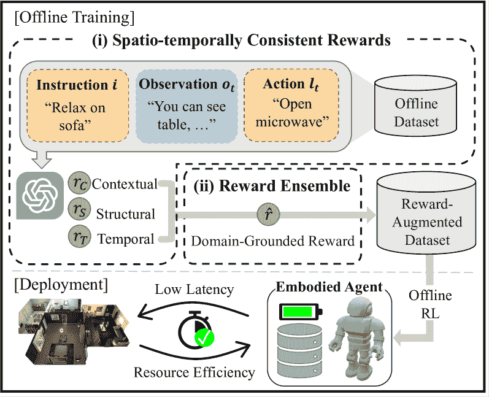
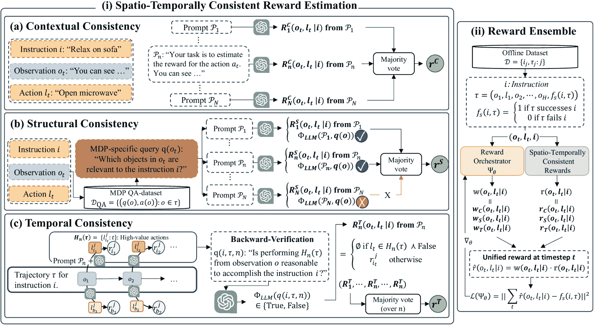

<!--yml
category: 未分类
date: 2025-01-11 11:53:22
-->

# LLM-Based Offline Learning for Embodied Agents via Consistency-Guided Reward Ensemble

> 来源：[https://arxiv.org/html/2411.17135/](https://arxiv.org/html/2411.17135/)

Yujeong Lee¹, Sangwoo Shin¹¹¹footnotemark: 1, Wei-Jin Park², Honguk Woo¹
Department of Computer Science and Engineering, Sungkyunkwan University¹
Acryl Inc.²
yujlee@skku.edu, jsw7460@skku.edu, jin@acryl.ai, hwoo@skku.edu Equally contributed to this workCorresponding author

###### Abstract

Employing large language models (LLMs) to enable embodied agents has become popular, yet it presents several limitations in practice. In this work, rather than using LLMs directly as agents, we explore their use as tools for embodied agent learning. Specifically, to train separate agents via offline reinforcement learning (RL), an LLM is used to provide dense reward feedback on individual actions in training datasets. In doing so, we present a consistency-guided reward ensemble framework (CoREn), designed for tackling difficulties in grounding LLM-generated estimates to the target environment domain. The framework employs an adaptive ensemble of spatio-temporally consistent rewards to derive domain-grounded rewards in the training datasets, thus enabling effective offline learning of embodied agents in different environment domains. Experiments with the VirtualHome benchmark demonstrate that CoREn significantly outperforms other offline RL agents, and it also achieves comparable performance to state-of-the-art LLM-based agents with 8B parameters, despite CoREn having only 117M parameters for the agent policy network and using LLMs only for training.

LLM-Based Offline Learning for Embodied Agents via Consistency-Guided Reward Ensemble

Yujeong Lee¹^†^†thanks: Equally contributed to this work, Sangwoo Shin¹¹¹footnotemark: 1, Wei-Jin Park², Honguk Woo¹^†^†thanks: Corresponding author Department of Computer Science and Engineering, Sungkyunkwan University¹ Acryl Inc.² yujlee@skku.edu, jsw7460@skku.edu, jin@acryl.ai, hwoo@skku.edu

## 1 Introduction

Developing embodied agents capable of understanding user instructions and executing tasks in physical environments represents a crucial milestone in the pursuit of general AI. Recent advancements in large language models (LLMs) have demonstrated their remarkable reasoning capabilities, paving the way for their application in embodied agents Yang et al. ([2023](https://arxiv.org/html/2411.17135v1#bib.bib34)); Padmakumar et al. ([2023](https://arxiv.org/html/2411.17135v1#bib.bib19)); Pantazopoulos et al. ([2023](https://arxiv.org/html/2411.17135v1#bib.bib20)); Yun et al. ([2023](https://arxiv.org/html/2411.17135v1#bib.bib35)); Logeswaran et al. ([2022](https://arxiv.org/html/2411.17135v1#bib.bib16)); Ichter et al. ([2022](https://arxiv.org/html/2411.17135v1#bib.bib9)). Yet, deploying an LLM directly as part of an embodied agent presents several inefficiencies, such as the need for sophisticated environment-specific prompt design, substantial computational resource demands, and inherent model inference latency Hashemzadeh et al. ([2024](https://arxiv.org/html/2411.17135v1#bib.bib7)). These factors can limit the practical application of LLMs, particularly in scenarios where embodied agents are required to respond rapidly and efficiently.

In the literature of reinforcement learning (RL), data-centric offline learning approaches have been explored Kumar et al. ([2020a](https://arxiv.org/html/2411.17135v1#bib.bib11)). These offline RL approaches are designed to establish efficient agent structures, necessitating datasets that include well-annotated agent trajectories with reward information. However, the characteristics of instruction-following tasks assigned to embodied agents, particularly their long-horizon goal-reaching nature, often conflict with such dense data requirements of offline RL. Embodied agents normally can produce trajectories with sparse reward feedback, because their instruction-following tasks are evaluated based on binary outcomes of success or failure, which directly align with the specific goals of the instructions. In offline RL, this sparse reward setting poses significant challenges in achieving effective agent policies Park et al. ([2023](https://arxiv.org/html/2411.17135v1#bib.bib21)); Ma et al. ([2022](https://arxiv.org/html/2411.17135v1#bib.bib18)).

In this work, we explore LLMs for offline RL. By employing capable LLMs as a reward estimator that provides immediate feedback on agent actions, we augment the trajectory dataset with dense reward information. This method, LLM-based reward estimation is capable of significantly enhancing the effectiveness of offline RL for embodied agents. To do so, we address the limitations inherent in LLM-based reward estimation. A primary challenge arises from the limited interaction with the environment in an offline setting, which complicates the LLMs’ ability to acquire essential environmental knowledge. The offline setting makes it difficult to ensure that the generated rewards are properly grounded in the specific domain of the environment.

Figure 1: CoREn, a framework for LLM-based reward estimation and offline learning. In (i), an LLM estimates rewards based on spatio-temporal (i.e., contextual, structural, and temporal) consistencies; In (ii), these rewards are integrated into a single domain-grounded reward via an ensemble. Using the reward-augmented dataset, offline RL can be conducted effectively to achieve embodied agents with resource efficiency and low latency.

For instance, without explicit knowledge that a flowerpot is typically stored in a living room in the target environment, an LLM might struggle to accurately assign rewards for actions like “go to living room” versus “go to balcony” when tasked with watering plants. While both actions might seem reasonable from a commonsense perspective, the optimal action depends on specific conditions of the target environment that the LLM may not have access to in the offline setting.

These challenges, unique to the offline context, differentiate our work from previous works on online LLM-based reward estimation, where LLMs can be fine-tuned or prompts can be refined through repeated interaction with environment or human Lee ([2024](https://arxiv.org/html/2411.17135v1#bib.bib14)); Xie et al. ([2024](https://arxiv.org/html/2411.17135v1#bib.bib33)); Li et al. ([2023](https://arxiv.org/html/2411.17135v1#bib.bib15)); Song et al. ([2023c](https://arxiv.org/html/2411.17135v1#bib.bib29)). Since these interactions are not available in offline settings, improving the LLM’s insufficient spatial reasoning for accurate reward estimation requires a fundamentally different approach.

In response, we present CoREn, a consistency-guided reward ensemble framework, specifically designed for robust LLM-based reward estimation and effective agent offline learning. It adopts a two-staged reward estimation process, as depicted in Figure [1](https://arxiv.org/html/2411.17135v1#S1.F1 "Figure 1 ‣ 1 Introduction ‣ LLM-Based Offline Learning for Embodied Agents via Consistency-Guided Reward Ensemble"). (i) An LLM is first queried to estimate several types of rewards for actions, each considering a distinct spatio-temporal consistency criterion of the LLM to have coherent and domain-grounded rewards. (ii) Then, these rewards are further orchestrated, being unified into domain-specifically tuned rewards via an alignment process with the sparse rewards of given trajectories. The resulting agent, trained on the unified dense rewards by offline RL, is capable of performing instruction-following tasks with high efficiency and minimal latency at deployment. This offline RL scheme, enhanced by LLM-based reward estimation, overcomes the limitations faced by the agents that rely on the online exploitation of LLMs.

The contributions of our work can be summarized as follows: (i) addressing a practical yet challenging problem of embodied agent offline learning using LLMs for the first time; (ii) proposing a two-staged reward estimation algorithm guided by a spatio-temporal consistency ensemble; and (iii) extensive evaluation on the VirtualHome benchmark, demonstrating performance comparable to state-of-the-art LLM-based online agents.

## 2 Preliminaries

### 2.1 Goal-POMDPs

For an embodied agent that follows user-specified instructions, we model their environment as a goal-conditioned partially observable Markov decision process (Goal-POMDP). A Goal-POMDP is represented by a tuple ($\mathcal{S}$, $\mathcal{A}$, $P$, $R$, $\gamma$, $\Omega$, $\mathcal{O}$, $\mathcal{G}$) Song et al. ([2023a](https://arxiv.org/html/2411.17135v1#bib.bib27)); Singh et al. ([2023](https://arxiv.org/html/2411.17135v1#bib.bib26)) with states $s\in\mathcal{S}$, actions $a\in\mathcal{A}$, a transition function $P:\mathcal{S}\times\mathcal{A}\longrightarrow\Delta(\mathcal{S})$, a reward function $R:\mathcal{S}\times\mathcal{A}\times\mathcal{G}^{\omega}\mapsto\mathbb{R}$¹¹1$X^{\omega}$ for a set $X$ is all possible finite products of $X$., a discount factor $\gamma\in[0,1)$, observations $o\in\Omega$, an observation transition function $\mathcal{O}:\mathcal{S}\times\mathcal{A}\longrightarrow\Omega$, and goal conditions $G\in\mathcal{G}$. Given this Goal-POMDP representation, we consider a user-specified instruction $i$ as a series of goal conditions $\mathbf{G}=(G_{1},\cdots)\subseteq\mathcal{G}$ such that the embodied agent is tasked with completing each of the specified goal conditions for the instruction $i$.

Figure 2: Two-staged reward estimation in CoREn. In (i), spatio-temporally consistent rewards, constrained by contextual, structural, and temporal consistencies, are calculated. (a) Contextual consistency is achieved through majority voting across the responses from different prompts $\mathcal{P}_{n}$, resulting in contextually consistent rewards $r^{C}$. (b) Structural consistency is achieved by presenting MDP-specific queries to the LLM. If the LLM incorrectly answers these queries (indicated by a red ‘X’), the rewards estimated from these particular prompts are removed from majority voting. The successfully verified rewards contribute to structurally consistent rewards $r^{S}$. (c) Temporal consistency involves collecting high-value actions $H_{n}(\tau)$ and subjecting them to backward verification through LLM queries. Actions that fail this verification are excluded from the candidates for majority voting. Otherwise, they contribute to temporally consistent rewards $r^{T}$. In (ii), a trajectory $(i,\tau)$ with success flag $f_{s}(i,\tau)$ is sampled from the given offline dataset $\mathcal{D}$. The spatio-temporally consistent rewards $(r^{C},r^{S},r^{T})$ in (i) are combined using weights $(w^{C},w^{S},w^{T})$, which are generated by the reward orchestrator $\Psi_{\theta}$. This combined result renders a unified stepwise, more domain-grounded reward $\hat{r}$. The orchestrator $\Psi_{\theta}$ is trained to align the trajectory’s return of accumulating stepwise rewards $\hat{r}$ with the sparse reward $f_{s}(i,\tau)$ annotated on the trajectory.

### 2.2 Offline RL

For a Goal-POMDP, its optimal policy is formulated by

|  | $\pi^{*}=\operatorname*{argmax}_{\pi}\underset{\begin{subarray}{c}(s,a)\sim\pi,% \\ \mathbf{G}\sim\mathcal{G}\end{subarray}}{\mathbb{E}}\left[\sum_{t}\gamma^{t}R(% s,a,\mathbf{G})\right].$ |  | (1) |

To achieve the optimal policy, we explore offline RL approaches where the policy is derived by optimizing the Bellman error objective, relying exclusively on an offline dataset $\mathcal{D}$ without any environment interaction. Offline RL is particularly beneficial for embodied agents, as it reduces the risks and costs associated with active exploration of the environment with physical objects. We utilize $\mathcal{D}=\{(i_{j},\tau_{j}):j\}$ where $\tau_{j}$ is a trajectory corresponding to instruction $i_{j}$. Unlike conventional offline RL, this dataset $\mathcal{D}$ incorporates sparse rewards. This sparsity is reflected in a subset of trajectories that are marked by a success flag $f_{s}(i_{j},\tau_{j})$, indicating whether $\tau_{j}$ has satisfied all the requisite goal conditions for the instruction $i_{j}$. This sparse reward setup is inherent for embodied instruction-following tasks, as each instruction is treated as a series of goal conditions within Goal-POMDPs.

## 3 Our Approach

LLM-based reward estimation. Offline RL facilitates agent learning without direct environment interaction, but relying solely on sparse rewards to learn long-horizon instruction-following tasks is often inefficient. To improve this, we augment agent trajectories with stepwise intrinsic rewards through LLM-based estimation. Similar to LLM-based task planningSingh et al. ([2023](https://arxiv.org/html/2411.17135v1#bib.bib26)); Ichter et al. ([2022](https://arxiv.org/html/2411.17135v1#bib.bib9)), LLMs can be used to approximate the reward of observation-action pairs in the dataset, providing more immediate and actionable dense feedback to enhance the effectiveness of offline learning.

Not-grounded reward estimation. Intrinsic rewards estimated by LLMs at intermediate steps might not consistently align with the sparse rewards provided at the conclusion of individual instruction-following tasks. This discrepancy arises when the intrinsic rewards are not sufficiently grounded in the environment domain. This issue is exacerbated in a partially observable setting, where LLMs are forced to infer rewards based on incomplete snapshots of the environment.

### 3.1 Overall Framework

To tackle the limitations of LLM-based reward estimation, we propose a spatio-temporal consistency-guided reward ensemble framework CoREn with a two-stage process. As described in Figure[2](https://arxiv.org/html/2411.17135v1#S2.F2 "Figure 2 ‣ 2.1 Goal-POMDPs ‣ 2 Preliminaries ‣ LLM-Based Offline Learning for Embodied Agents via Consistency-Guided Reward Ensemble"), the first stage (i) incorporates contextual, structural, and temporal consistencies to fully harness the LLM’s reasoning ability and enhance the groundedness of reward estimates within the specific domain of the embodied environment. In the second stage (ii), CoREn orchestrates an ensemble of distinct rewards generated during the first stage based on the trajectories’ success. This allows for the derivation of domain-specifically tuned rewards, which can be effectively utilized for the offline learning of embodied agents.

### 3.2 Spatio-Temporally Consistent Rewards

For reward estimation, we employ $N$ distinct prompts $\mathcal{P}_{1},\cdots,\mathcal{P}_{N}$ with an LLM ($\Phi_{\textnormal{LLM}}$), where a prompt is distinguished by its unique explanations, in-context demonstrations, as well as the use of a chain-of-thought (CoT). Specifically, each prompt $\mathcal{P}_{n}$ combined with observation $o$, action $l$, and instruction $i$ is used to generate rewards $R_{n}$ through $\Phi_{\textnormal{LLM}}$ inferences.

|  | $R_{n}(o,l&#124;i)=\Phi_{\textnormal{LLM}}(P_{n},(o,l,i))$ |  | (2) |

Spatial consistency is intended to ensure that the domain-grounded LLM’s reward estimation remains consistent across different prompt-induced contexts as well as it is based on a comprehensive understanding of the environmental structure. We achieve this using the implementation of two consistency mechanisms.

Contextual consistency. This mechanism aims to mitigate biases stemming from specific prompt contexts used in LLM-based reward estimation. By employing multiple $N$ prompts, each with a different contextual frame, we ensure that the rewards, which remain consistent across these variations, reflect a consensus in reasoning. For contextually consistent rewards $r_{C}$, we integrate the responses $R_{n}^{C}(o,l|i)$ of prompts $\mathcal{P}_{n}$ by

|  | $r^{C}(o,l&#124;i)=\underset{r\in\hat{\mathbb{R}}}{\text{argmax}}\sum\limits_{n=1}^{% N}\mathbbm{1}_{(R_{n}^{C}(o,l&#124;i)=r)}\\$ |  | (3) |

where $R_{n}^{C}(o,l|i)=\Phi_{\textnormal{LLM}}(\mathcal{P}_{n},(o,l,i))$.

Structural consistency. This is intended to ensure that the reward estimation incorporates a comprehensive understanding of the environment physical structure, such as objects, their relationships, and their relevance to the given instruction. We inquire $\Phi_{\textnormal{LLM}}$ with MDP-specific queries $q(o)$ relevant to observation $o$ such as “Which objects in $o$ are relevant to the instruction $i$?”. Exploiting the response $\Phi_{\textnormal{LLM}}(\mathcal{P}_{n},q(o))$ to these queries, we integrate the rewards $R_{n}^{S}(o,l|i)$ of prompts $\mathcal{P}_{n}$:

|  | $r^{S}(o,l&#124;i)=\underset{r\in\hat{\mathbb{R}}}{\text{argmax}}\sum_{n=1}^{N}% \mathbbm{1}_{(R_{n}^{S}(o,l&#124;i)=r)}.$ |  | (4) |

We rewrite Eq. ([2](https://arxiv.org/html/2411.17135v1#S3.E2 "In 3.2 Spatio-Temporally Consistent Rewards ‣ 3 Our Approach ‣ LLM-Based Offline Learning for Embodied Agents via Consistency-Guided Reward Ensemble")) for query violation cases, obtaining $R_{n}^{S}(o,l|i)$

|  |  $=\begin{cases}\varnothing&a(o)\neq\Phi_{\textnormal{LLM}}(\mathcal{P}_{n},q(o)% )\\ \Phi_{\textnormal{LLM}}(\mathcal{P}_{n},(o,l,i))&\textnormal{otherwise}.\end{cases}$  |  | (5) |

Details of prompts $\mathcal{P}_{n}$ and the dataset construction for MDP-specific queries and answers $\mathcal{D}_{\textnormal{QA}}=\{(q(o),a(o)):o\in\tau\in\mathcal{D}\}$ are in Appendix.

Temporal consistency. This is designed to ensure that the value assigned to an action remains coherent throughout its whole decision-making process. With temporal consistency, if forward reasoning by the LLM assesses certain actions as having high values, backward verification must confirm that these high-value actions can collectively accomplish the given instruction.

To achieve this backward verification, we inquire $\Phi_{\textnormal{LLM}}$ with the query $q(i,\tau,n)$: “Is performing the high-value actions $H_{n}(\tau)$ from observation $o$ reasonable to accomplish the instruction $i$?”. The reward is then contingent on the response $\Phi_{\textnormal{LLM}}(q(i,\tau,n))\in\{\textnormal{True},\textnormal{False}\}$ to this query, and Eq. ([2](https://arxiv.org/html/2411.17135v1#S3.E2 "In 3.2 Spatio-Temporally Consistent Rewards ‣ 3 Our Approach ‣ LLM-Based Offline Learning for Embodied Agents via Consistency-Guided Reward Ensemble")) is rewritten as $R_{n}^{T}(o,l|i)$

|  |  $\begin{split}=\begin{cases}\varnothing&l\in H_{n}(\tau)\wedge\neg\Phi_{% \textnormal{LLM}}(q(i,\tau,n))\\ \Phi_{\textnormal{LLM}}(\mathcal{P}_{n},(o,l,i))&\textnormal{otherwise}\end{% cases}\end{split}$  |  | (6) |

for the cases of query violation, i.e., $l\in H_{n}(\tau)\wedge\neg\Phi_{\textnormal{LLM}}(q(i,\tau,n))$. Here, for all trajectory observations $o\in\tau$, high-value actions are defined as

|  | $H_{n}(\tau)=\{\underset{l}{\text{argmax}}\,\,\Phi_{\textnormal{LLM}}(\mathcal{% P}_{n},(o,l,i))\}.$ |  | (7) |

Given $N$ prompts, we then integrate the rewards in Eq. ([6](https://arxiv.org/html/2411.17135v1#S3.E6 "In 3.2 Spatio-Temporally Consistent Rewards ‣ 3 Our Approach ‣ LLM-Based Offline Learning for Embodied Agents via Consistency-Guided Reward Ensemble")) from each by employing the majority voting to establish temporally consistent rewards.

|  | $r^{T}(o,l&#124;i)=\underset{r\in\hat{\mathbb{R}}}{\text{argmax}}\sum_{n=1}^{N}% \mathbbm{1}_{(R_{n}^{T}(o,l&#124;i)=r)}$ |  | (8) |

### 3.3 A Domain-Grounded Reward Ensemble

From the spatio-temporally consistent rewards $r^{C}$, $r^{S}$, and $r^{T}$ calculated above, we derive domain-grounded rewards through their ensemble based on the alignment with given offline trajectories. We model unified rewards $\hat{r}$ as

|  | $\begin{array}[]{l}\mathbf{r}(o,l&#124;i)=(r^{C}(o,l&#124;i),r^{S}(o,l&#124;i),r^{T}(o,l&#124;i))\\ \mathbf{w}(o,l&#124;i)=(w^{C}(o,l&#124;i),w^{S}(o,l&#124;i),w^{T}(o,l&#124;i))\\ \hat{r}(o,l&#124;i)=\langle\mathbf{r}(o,l&#124;i),\mathbf{w}(o,l&#124;i)\rangle\end{array}$ |  | (9) |

where $\langle\cdot,\cdot\rangle$ is an inner product and $w^{C},w^{S}$ and $w^{T}$ are learnable weights. These $\mathbf{w}$ are generated by the reward orchestrator $\Psi_{\theta}$. It takes observation $o$, action $l$, and instruction $i$ as input, producing a softmax distribution for $\mathbf{w}$. The orchestrator $\Psi_{\theta}$ is used to align the predicted return of a trajectory with the labeled return, i.e., the sparse reward $f_{s}(i,\tau)$:

|  |  $\begin{array}[]{l}\mathbf{w}(o_{t},l_{t}&#124;i)=\Psi_{\theta}(o_{t},l_{t},i)\\ \mathcal{L}(\Psi_{\theta})=\underset{\begin{subarray}{c}(i,o_{t},l_{t})\sim\\ (i,\tau)\in\mathcal{D}\end{subarray}}{\mathbb{E}}\bigg{[}\&#124;\sum\limits_{t}% \gamma^{t}\hat{r}(o_{t},l_{t}&#124;i)-\alpha f_{s}(i,\tau)\&#124;^{2}\bigg{]}\end{array}$  |  | (10) |

where $\alpha$ is a hyperparameter.

Finally, using the augmented trajectory dataset that contains unified rewards $\hat{r}$ in Eq. ([9](https://arxiv.org/html/2411.17135v1#S3.E9 "In 3.3 A Domain-Grounded Reward Ensemble ‣ 3 Our Approach ‣ LLM-Based Offline Learning for Embodied Agents via Consistency-Guided Reward Ensemble")), an agent can be trained via offline RL algorithms such as CQL Kumar et al. ([2020b](https://arxiv.org/html/2411.17135v1#bib.bib12)). The two-staged reward estimation in CoREn is outlined in Algorithm[1](https://arxiv.org/html/2411.17135v1#alg1 "In 4.1 Experiment Settings ‣ 4 Experiments ‣ LLM-Based Offline Learning for Embodied Agents via Consistency-Guided Reward Ensemble").

## 4 Experiments

### 4.1 Experiment Settings

Environment and dataset. For evaluation, we use VirtualHome (VH)Puig et al. ([2018](https://arxiv.org/html/2411.17135v1#bib.bib22)), a widely used realistic benchmark for household activities. VH features a diverse array of interactive objects (e.g., apples, couch) and basic behaviors (e.g., grasp, sit), enabling us to define 58 distinct actions for embodied agents. We use 25 distinct tasks including activities such as sitting on a couch with several fruits, microwaving salmon, and organizing the bathroom counter. To construct a training dataset $\mathcal{D}$ for offline RL, we begin with a single expert trajectory for each of these 25 tasks. We then augment each with random actions at intermediate steps that lead to failed trials. For each expert trajectory, a sparse reward of $1$ is annotated to indicate success, while for sampled failed trajectories, a sparse reward of $0$ is annotated to denote failure. This follows Goal-POMDP representations used in long-horizon instruction-following tasks.

1:Dataset $\mathcal{D}$, MDP-QA dataset $\mathcal{D}_{\textnormal{QA}}$2:Prompts $\mathcal{P}_{1},\cdots,\mathcal{P}_{N}$ for LLM $\Phi_{\textnormal{LLM}}$3:Reward orchestrator $\Psi_{\theta}$4:Reward-augmented dataset $\bar{\mathcal{D}}=\varnothing$/* Spatio-Temp. Consistent Rewards */5:  for $(i,(o,l,o^{\prime}))\in(i,\tau)\in\mathcal{D}$ do6:Reward-augmented trajectory $\bar{\tau}=\varnothing$7:     $r^{C}\longleftarrow r^{C}(o,l|i)$ using Eq ([3](https://arxiv.org/html/2411.17135v1#S3.E3 "In 3.2 Spatio-Temporally Consistent Rewards ‣ 3 Our Approach ‣ LLM-Based Offline Learning for Embodied Agents via Consistency-Guided Reward Ensemble"))8:     $r^{S}\longleftarrow r^{S}(o,l|i)$ using $\mathcal{D}_{\textnormal{QA}}$ and Eq ([5](https://arxiv.org/html/2411.17135v1#S3.E5 "In 3.2 Spatio-Temporally Consistent Rewards ‣ 3 Our Approach ‣ LLM-Based Offline Learning for Embodied Agents via Consistency-Guided Reward Ensemble")), ([4](https://arxiv.org/html/2411.17135v1#S3.E4 "In 3.2 Spatio-Temporally Consistent Rewards ‣ 3 Our Approach ‣ LLM-Based Offline Learning for Embodied Agents via Consistency-Guided Reward Ensemble"))9:     $r^{T}\longleftarrow r^{T}(o,l|i)$ using Eq ([6](https://arxiv.org/html/2411.17135v1#S3.E6 "In 3.2 Spatio-Temporally Consistent Rewards ‣ 3 Our Approach ‣ LLM-Based Offline Learning for Embodied Agents via Consistency-Guided Reward Ensemble")), ([8](https://arxiv.org/html/2411.17135v1#S3.E8 "In 3.2 Spatio-Temporally Consistent Rewards ‣ 3 Our Approach ‣ LLM-Based Offline Learning for Embodied Agents via Consistency-Guided Reward Ensemble"))10:     $\bar{\tau}\longleftarrow\bar{\tau}\cup\{o,l,o^{\prime},(r^{C},r^{S},r^{T})\}$11:     if len($\tau$) = len($\hat{\tau}$) then12:        $\bar{\mathcal{D}}\longleftarrow\bar{\mathcal{D}}\cup\{(i,\bar{\tau})\}$13:     end if14:  end for/* Domain-Grounded Rewards in [3.3](https://arxiv.org/html/2411.17135v1#S3.SS3 "3.3 A Domain-Grounded Reward Ensemble ‣ 3 Our Approach ‣ LLM-Based Offline Learning for Embodied Agents via Consistency-Guided Reward Ensemble") */15:  repeat16:Sample $(i,\bar{\tau})\sim\bar{\mathcal{D}}$17:     $\forall t$, compute $\mathbf{r}(o_{t},l_{t}|i)$ using Eq ([9](https://arxiv.org/html/2411.17135v1#S3.E9 "In 3.3 A Domain-Grounded Reward Ensemble ‣ 3 Our Approach ‣ LLM-Based Offline Learning for Embodied Agents via Consistency-Guided Reward Ensemble"))18:     $\forall t$, compute $\mathbf{w}(o_{t},l_{t}|i)$ using Eq ([10](https://arxiv.org/html/2411.17135v1#S3.E10 "In 3.3 A Domain-Grounded Reward Ensemble ‣ 3 Our Approach ‣ LLM-Based Offline Learning for Embodied Agents via Consistency-Guided Reward Ensemble"))19:     $\forall t$, $\hat{r}(o_{t},l_{t}|i)\longleftarrow\langle\mathbf{r}(o_{t},l_{t}|i),\mathbf{w% }(o_{t},l_{t}|i)\rangle$20:     $\mathcal{L}(\Psi_{\theta})\longleftarrow\|\sum\limits_{t}\gamma^{t}\hat{r}(o_{% t},l_{t}|i)-f_{s}(i,\tau)\|^{2}$21:     $\Psi_{\theta}\longleftarrow\Psi_{\theta}-\nabla_{\theta}\mathcal{L}(\Psi_{% \theta})$22:  until converge

Algorithm 1 Two-staged CoREn

Evaluation instruction. We employ two distinct instruction types to assess the agent’s ability to handle different goal representations. A Fine-grained instruction type provides a detailed task description, often including specific actions performed to achieve certain goal conditions pertinent to the instruction-following task. An Abstract instruction type provides a more abbreviated and generalized task description, focusing on broader objectives without detailing each action. Each of the 25 tasks is assessed using 5 fine-grained and 5 abstract instructions, resulting in a total of 250 distinct instructions being tested. These instructions have not been included within the offline training dataset.

Evaluation metrics. We use three metrics, consistent with previous worksSingh et al. ([2023](https://arxiv.org/html/2411.17135v1#bib.bib26)); Song et al. ([2023b](https://arxiv.org/html/2411.17135v1#bib.bib28)). SR measures the percentage of tasks successfully completed, defining success as the completion of all goal conditions for a task; CGC measures the percentage of completed goal conditions; Plan measures the percentage of the action sequence that continuously matches with the ground-truth sequence from the beginning.

Baselines. We compare CoREn with different categories of agents: RL agents, in which an LLM is solely used for estimating rewards to train a separate RL agent, without directly using the LLM for online interaction; LM agents, in which either a small language model (sLM) or LLM is used to directly interact with the environment as an online agent. These are in contrast to the RL agents that use LLMs solely for agent training. In this LM agent category, to provide an evaluation under the compatible computational efficiency conditions with the RL agent category, we include sLM-based agents as well as LLM-based agents.

The RL agent category baselines include i) Lafite-RLChu et al. ([2023](https://arxiv.org/html/2411.17135v1#bib.bib3)), which evaluates actions as good (1), neutral (0), or bad (-1) using an LLM, and integrates the evaluations with environmental rewards; ii) RDLM Kwon et al. ([2023](https://arxiv.org/html/2411.17135v1#bib.bib13)), which uses an LLM to evaluate trajectory returns using dynamically sampled in-context demonstrations; iii) Self-Consistency Wang et al. ([2023](https://arxiv.org/html/2411.17135v1#bib.bib31)), which generates multiple reward candidates via a single CoT prompt, taking a majority vote on them; and iv) GCRL, which relies on given sparse rewards related to goal conditions.

The LM agent category baselines include v) SayCanIchter et al. ([2022](https://arxiv.org/html/2411.17135v1#bib.bib9)), which employs an offline dataset to learn the affordance scores combined with an LM’s prediction; vi) LLM-Planner Song et al. ([2023b](https://arxiv.org/html/2411.17135v1#bib.bib28)), which uses an expert dataset for retrieval-augmented task planning; vii) ProgPrompt Singh et al. ([2023](https://arxiv.org/html/2411.17135v1#bib.bib26)), which uses engineered programmatic assertion syntax to verify the pre-conditions of action execution.

Each LM agent baseline is configured with both sLMs (GPT2-774M and 4-bit quantized LLaMA3-8B) and LLMs (Gemini 1.0 Pro and LLaMA3-8B). The implementation of LM agent baselines with a larger LLaMA3-70B model can be found in Appendix [D.1](https://arxiv.org/html/2411.17135v1#A4.SS1 "D.1 LLaMA3-70B for LM Agents ‣ Appendix D Additional Experiments ‣ LLM-Based Offline Learning for Embodied Agents via Consistency-Guided Reward Ensemble").

For our CoREn and the RL agent category, we use Gemini 1.0 Pro for the reward estimator $\Phi_{\textnormal{LLM}}$ and adapt the GPT2-based model architecture having 117M parameters to implement the agent policies that learn from their respective rewards. We also employ the CQLKumar et al. ([2020b](https://arxiv.org/html/2411.17135v1#bib.bib12)) offline RL algorithm in conjunction with the DDQNvan Hasselt et al. ([2016](https://arxiv.org/html/2411.17135v1#bib.bib30)) to handle the discrete action space in our environment. Details of the experiments are in Appendix.

### 4.2 Main Results

Instruction-following task performance. Table[1](https://arxiv.org/html/2411.17135v1#S4.T1 "Table 1 ‣ 4.2 Main Results ‣ 4 Experiments ‣ LLM-Based Offline Learning for Embodied Agents via Consistency-Guided Reward Ensemble") presents a performance comparison of our CoREn and the baselines from different categories, including RL agents, LLM-based agents, sLM-based agents across metrics such as SR, CGC, and Plan.

*   •

    CoREn outperforms all the RL agent baselines by a significant margin, achieving average gains of $20.0\%$, $15.2\%$, and $5.6\%$ over the most competitive RL agent baseline Self-Consistency in SR, CGC, and Plan, respectively.

*   •

    Furthermore, the performance of CoREn is on par with the LLM-based agents, with only a slight performance drop compared to SayCan-Gemini and ProgPrompt-Gemini, while it surpasses the other LLM-based agents (i.e., all with LLaMA3 and LLM-Planner-Gemini). These results are especially noteworthy, considering the significantly different model sizes between CoREn (GPT2-based-117M) and other LLM-based agents (i.e., Gemini, LLaMA-8B). These demonstrate CoREn’s ability to learn long-horizon instruction-following tasks within specific domains using minimal domain-specific knowledge, such as partially annotated rewards.

*   •

    We observe that the sLM-based agents using 4-bit quantized LLaMA3 (LLaMA3Q) and GPT2 exhibit lower performance than the others, including our CoREn, due to their dependency on the limited reasoning capabilities of sLMs.

*   •

    Additionally, CoREn demonstrates relatively robust performance across different instruction types compared to LLM-based agents. This can be attributed to CoREn’s ability to learn from a broad range of semantically similar instructions, which are generated by the LLM and included in the offline dataset. This enables the framework to better generalize to abstract instructions.

 Fine-grained Abstract RL agent SR CGC Plan SR CGC Plan CoREn 66.4 74.5 69.5 57.6 68.3 64.8 Lafite-RL 30.4 50.9 35.1 17.6 37.8 23.1 RDLM 20.0 42.0 31.7 4.0 23.3 23.9 Self-Consistency 43.2 56.9 61.4 40.8 55.6 61.7 GCRL 5.6 26.0 22.3 8.0 28.4 17.1 LLM-based agent SayCan-Gemini 72.0 78.2 73.8 6.9 25.2 23.2 SayCan-LLaMA3 4.8 22.4 63.8 3.2 14.6 20.0 ProgPrompt-Gemini 72.8 80.4 80.2 32.0 49.2 24.3 ProgPrompt-LLaMA3 68.0 74.5 50.5 16.5 29.5 8.2 LLM-Planner-Gemini 55.2 63.8 59.7 2.1 18.1 0.0 LLM-Planner-LLaMA3 15.1 34.0 30.6 2.0 15.4 0.6 sLM-based agent SayCan-LLaMA3Q 4.8 21.6 62.6 0.0 15.4 0.4 SayCan-GPT2 0.0 14.7 0.0 0.0 14.7 0.0 ProgPrompt-LLaMA3Q 43.2 68.2 68.8 15.2 34.5 31.1 ProgPrompt-GPT2 0.6 16.7 6.0 0.0 8.8 0.4 LLM-Planner-LLaMA3Q 12.4 31.1 8.9 0.6 13.9 0.2 LLM-Planner-GPT2 0.0 12.6 0.0 0.0 12.6 0.0 

Table 1: Instruction-following task performance in SR, CGC, and Plan metrics. Agent policy model sizes: RL agents (117M), LLM-based agents (Gemini and LLaMA3-8B), sLM-based agents (GPT2-774M and 4bit-quantized LLaMA3-8B).

Cross-domain performance. Here, we extend our evaluation scenarios to include domain shifts in the environment; i.e., the locations of key objects related to the given instructions differ from those in the training dataset. Specifically, we sample a subset of trajectories from the training dataset $\mathcal{D}$ and relabel their sparse rewards $f_{s}(i,\tau)$ to reflect the altered object locations. While keeping the spatio-temporally consistent rewards unchanged, we then retrain the reward orchestrator in Eq. ([10](https://arxiv.org/html/2411.17135v1#S3.E10 "In 3.3 A Domain-Grounded Reward Ensemble ‣ 3 Our Approach ‣ LLM-Based Offline Learning for Embodied Agents via Consistency-Guided Reward Ensemble")) using these newly labeled sparse rewards. This approach facilitates the generation of domain-specific unified rewards for RL without the need to recalculate the consistency-based rewards themselves through LLM inferences. We also incorporate this newly labeled dataset for the LM agent category. For instance, LLM-Planner adapts to this new environment domain by using the trajectories, which are relabeled as success, as demonstrations for task planning. Since other RL agent baselines, except GCRL, lack the ability to utilize domain information represented as sparse rewards, they are evaluated with the same policy as in the single-domain experiments.

 Fine-grained Abstract RL agent SR CGC Plan SR CGC Plan CoREn 60.0 66.3 69.4 45.0 55.0 42.5 Lafite-RL 2.5 12.5 10.6 0.0 12.5 25.2 RDLM 15.0 23.8 22.5 3.8 18.8 23.6 Self-Consistency 35.4 47.9 54.7 31.3 45.8 51.6 GCRL 0.0 6.3 8.5 0.0 6.3 10.9 LLM-based agent SayCan-Gemini 12.5 18.8 26.6 0.0 8.3 0.0 SayCan-LLaMA3 5.0 21.3 1.9 0.0 10.0 1.3 ProgPrompt-Gemini 25.0 31.3 23.4 14.6 32.3 1.6 ProgPrompt-LLaMA3 25.0 32.3 22.6 8.3 24.0 3.1 LLM-Planner-Gemini 45.8 55.2 67.7 0.0 13.7 0.0 LLM-Planner-LLaMA3 6.3 20.2 16.8 0.0 40.6 0.0 sLM-based agent SayCan-LLaMA3-Q 8.3 21.9 1.5 0.0 12.5 1.9 SayCan-GPT2 0.0 6.3 0.0 0.0 6.3 0.0 ProgPrompt-LLaMA3-Q 7.5 15.5 18.3 0.0 31.3 0.0 ProgPrompt-GPT2 0.0 8.3 0.3 0.0 6.3 0.0 LLM-Planner-LLaMA3-Q 2.1 15.2 9.9 0.0 13.5 0.0 LLM-Planner-GPT2 0.0 6.3 0.0 0.0 6.3 0.0 

Table 2: Cross-domain performance

*   •

    For this cross-domain assessment, as shown in Table [2](https://arxiv.org/html/2411.17135v1#S4.T2 "Table 2 ‣ 4.2 Main Results ‣ 4 Experiments ‣ LLM-Based Offline Learning for Embodied Agents via Consistency-Guided Reward Ensemble"), CoREn outperforms all the RL agent baselines, showing a minimal drop compared to the results in the single-domain experiments (in Table[1](https://arxiv.org/html/2411.17135v1#S4.T1 "Table 1 ‣ 4.2 Main Results ‣ 4 Experiments ‣ LLM-Based Offline Learning for Embodied Agents via Consistency-Guided Reward Ensemble")). Upon domain shifts, CoREn’s two-staged process adjusts the reward estimates to align with the target domain by the second stage conducting the adaptive ensemble in Eq. ([10](https://arxiv.org/html/2411.17135v1#S3.E10 "In 3.3 A Domain-Grounded Reward Ensemble ‣ 3 Our Approach ‣ LLM-Based Offline Learning for Embodied Agents via Consistency-Guided Reward Ensemble")). In contrast, the RL agent baselines, which rely solely on the rewards derived from the LLM’s commonsense reasoning, exhibit a diminished ability to adapt to specific domains, showing large drops compared to the results in the single-domain experiments.

*   •

    We also observe that the LLM-based agent baselines experience large degradation in this cross-domain assessment; e.g., LLM-Planner relies on the LLM’s knowledge, which is difficult to ground in a specific environment using only a few examples, leading to suboptimal performance.

### 4.3 Ablation Studies

Spatio-temporally consistent rewards. To verify that the contextual, structural, and temporal consistencies (in Section[3.2](https://arxiv.org/html/2411.17135v1#S3.SS2 "3.2 Spatio-Temporally Consistent Rewards ‣ 3 Our Approach ‣ LLM-Based Offline Learning for Embodied Agents via Consistency-Guided Reward Ensemble")) effectively complement each other in LLM-based reward estimation, we test different combinations of these consistencies in the ensemble of rewards. Table [3](https://arxiv.org/html/2411.17135v1#S4.T3 "Table 3 ‣ 4.3 Ablation Studies ‣ 4 Experiments ‣ LLM-Based Offline Learning for Embodied Agents via Consistency-Guided Reward Ensemble") demonstrates that CoREn, which utilizes all three, consistently outperforms the others. This specifies that the combination of $\mathbf{w}$ and rewards derived from partial consistencies alone is limited in generating unified rewards that significantly benefit RL, while the ensemble weights $\mathbf{w}$ can be adjusted via Eq. ([10](https://arxiv.org/html/2411.17135v1#S3.E10 "In 3.3 A Domain-Grounded Reward Ensemble ‣ 3 Our Approach ‣ LLM-Based Offline Learning for Embodied Agents via Consistency-Guided Reward Ensemble")).

 Fine-grained Abstract SR CGC Plan SR CGC Plan CoREn 66.4 74.5 69.5 57.6 68.3 64.8 CS 64.8 67.9 69.7 52.0 62.3 56.3 ST 57.6 70.1 65.4 50.4 60.8 61.7 CT 53.6 66.1 67.8 51.2 59.1 68.9 C 47.2 58.6 59.7 47.1 57.1 58.3 S 52.0 67.1 57.9 45.6 60.0 58.9 T 45.6 57.8 55.7 41.6 51.2 50.8 

Table 3: Ablation on spatio-temporally consistent rewards. For example, CS denotes the use of contextual and structural consistencies, and T denotes the use of temporal consistency only, while CoREn employs all three consistencies in the ensemble.

Different LLMs for reward estimation. To implement CoREn, which uses an LLM for offline reward estimation, we test a variety of LLMs ranging from open-source LLaMA3-8B to proprietary models GPT4 turbo, Gemini 1.0 Pro, and PaLM. In Table [4](https://arxiv.org/html/2411.17135v1#S4.T4 "Table 4 ‣ 4.3 Ablation Studies ‣ 4 Experiments ‣ LLM-Based Offline Learning for Embodied Agents via Consistency-Guided Reward Ensemble"), we observe that LLaMA3-8B, which has significantly fewer parameters, does not achieve performance comparable to the proprietary models. Among the proprietary models, the more recent and advanced capable LLMs, such as GPT4 turbo and Gemini 1.0 Pro, demonstrate a strong ability in reward estimation that positively impacts agent offline learning.

 Fine-grained Abstract SR CGC Plan SR CGC Plan LLaMA3 12.0 28.7 39.4 9.6 27.9 40.1 PaLM 16.8 32.9 35.8 10.4 27.7 25.4 GPT4 turbo 65.6 71.8 70.6 40.8 50.5 52.5 Gemini 1.0 Pro 66.4 74.5 69.5 57.6 68.3 64.8 

Table 4: Different LLMs for reward estimation

Reward ensemble scheme. We evaluate several approaches as alternatives to the reward ensemble scheme in Eq. ([9](https://arxiv.org/html/2411.17135v1#S3.E9 "In 3.3 A Domain-Grounded Reward Ensemble ‣ 3 Our Approach ‣ LLM-Based Offline Learning for Embodied Agents via Consistency-Guided Reward Ensemble")). First, we consider taking the average of rewards $r^{C}$, $r^{S}$, and $r^{T}$ to obtain a unified reward. Second, we employ a majority voting mechanism over the three rewards. As shown in Table[5](https://arxiv.org/html/2411.17135v1#S4.T5 "Table 5 ‣ 4.3 Ablation Studies ‣ 4 Experiments ‣ LLM-Based Offline Learning for Embodied Agents via Consistency-Guided Reward Ensemble"), both Avg and Majority Voting result in degraded performance compared to CoREn. While the majority voting of spatio-temporally consistent rewards can provide a considerable degree of domain groundedness, CoREn takes it a step further by employing the reward ensemble process using sparse rewards as guidance.

 Fine-grained Abstract SR CGC Plan SR CGC Plan CoREn 66.4 74.5 69.5 57.6 68.3 64.8 Avg 53.6 63.7 55.6 43.2 55.2 57.7 Maj.Voting 60.8 70.2 68.9 55.2 62.7 63.7 

Table 5: Ablation on reward ensemble scheme

## 5 Related Works

LLMs for embodied environments. Leveraging LLMs as an instruction-following agent in embodied environments becomes a bedrock, capitalizing on LLM’s reasoning capabilitiesHu et al. ([2023](https://arxiv.org/html/2411.17135v1#bib.bib8)); Singh et al. ([2023](https://arxiv.org/html/2411.17135v1#bib.bib26)); Yang et al. ([2023](https://arxiv.org/html/2411.17135v1#bib.bib34)); Pantazopoulos et al. ([2023](https://arxiv.org/html/2411.17135v1#bib.bib20)); Yun et al. ([2023](https://arxiv.org/html/2411.17135v1#bib.bib35)). To overcome the limitation of LLMs’ insufficient knowledge about specific domain conditions of the environment, prior works incorporate domain-related information. Ichter et al. ([2022](https://arxiv.org/html/2411.17135v1#bib.bib9)) utilizes an offline dataset to learn the value of actions, which is later combined with the LLM’s token generation probability to calibrate the LLM’s decision for different domains. Song et al. ([2023a](https://arxiv.org/html/2411.17135v1#bib.bib27)) employs an expert dataset as a knowledge base for retrieval-augmented task planning. Unlike those directly employing LLMs as agent policies and requiring online LLM inferences, our study focuses on leveraging LLMs for reward estimation in offline RL, thus allowing for efficient agent structures.

LLMs for reward design. In RL, reward engineering is a long-standing challenge, traditionally tackled through manual trial-and-error or by leveraging domain knowledge from human experts. Inverse RL, on the other hand, aims to infer the underlying reward function from reward-free expert demonstrationsHadfield-Menell et al. ([2016](https://arxiv.org/html/2411.17135v1#bib.bib6)); Klein et al. ([2012](https://arxiv.org/html/2411.17135v1#bib.bib10)). With the advent of capable foundation models, recent works have exploited them to produce reward functions Wang et al. ([2024](https://arxiv.org/html/2411.17135v1#bib.bib32)); Du et al. ([2023](https://arxiv.org/html/2411.17135v1#bib.bib5)); Rocamonde et al. ([2023](https://arxiv.org/html/2411.17135v1#bib.bib24)); Baumli et al. ([2023](https://arxiv.org/html/2411.17135v1#bib.bib2)). Kwon et al. ([2023](https://arxiv.org/html/2411.17135v1#bib.bib13)) harnesses the in-context learning of LLMs to evaluate the episodes of high-level tasks. Ma et al. ([2023](https://arxiv.org/html/2411.17135v1#bib.bib17)) leverages the code generation ability of LLMs, given environmental programming code, producing multiple code-based reward functions to train RL agents online and enhance them via feedback from agent training statistics. Our CoREn framework also leverages LLMs for reward design; however, the framework distinguishes itself by focusing on generating domain-grounded rewards without direct interaction with the environment, particularly in scenarios where the available information about the embodied environment is limited to sparse rewards.

## 6 Conclusion

We presented the reward ensemble framework CoREn to achieve robust LLM-based reward estimation for offline RL, specifically tailored for embodied instruction-following tasks. The framework utilizes a spatio-temporal consistency-guided ensemble method for reward estimation. It generates multiple stepwise rewards on offline trajectories, with each reward focusing on a specific consistency related to contextual, structural, or temporal aspects, and then it integrates the multiple rewards into more domain-grounded ones via the sparse reward-aligned ensemble. As this work is the first to adopt LLMs for offline learning of embodied agents, we hope it can provide valuable insights into the development of LLM-driven training acceleration techniques. This is particularly significant for embodied agents involved in long-horizon instruction-following tasks, which are typically constrained by sparse reward signals.

## 7 Limitations

Despite the robust performance achieved by CoREn, we identify that its success heavily depends on the capabilities of LLMs engaging in reward estimation, as shown by the ablation study in Table [4](https://arxiv.org/html/2411.17135v1#S4.T4 "Table 4 ‣ 4.3 Ablation Studies ‣ 4 Experiments ‣ LLM-Based Offline Learning for Embodied Agents via Consistency-Guided Reward Ensemble"). Our LLM-based reward estimation is conducted in an offline manner, i.e., without direct interaction with the environment. However, the dependency on the capabilities of an LLM can be problematic, especially when the target environment domain significantly differs from the pretrained knowledge of the LLM and the domain changes continuously over time after agent deployment. In these cases involving dynamic Goal-POMDP environments, the agent policy learned offline by the dense rewards on the training dataset can degrade in terms of its task performance. The benefits of our ensemble method with the notion of spatio-temporal consistency are attributed to the effective alignment with the training dataset, and they can be limited in such non-stationary environment conditions. We leave the exploration of methods to address this limitation as a direction for future work.

## 8 Acknowledgements

We would like to thank anonymous reviewers for their valuable comments and suggestions. This work was supported by the Institute of Information & Communications Technology Planning & Evaluation (IITP) grant funded by the Korea government (MSIT) (RS-2022-II221045 (2022-0-01045), RS-2022-II220043 (2022-0-00043), RS-2019-II190421 (2019-0-00421)), by the IITP-ITRC(Information Technology Research Center)(IITP-2024-RS-2024-00437633, 10%) grant funded by MSIT, by the National Research Foundation of Korea (NRF) grant funded by MSIT (No. RS-2023-00213118), by BK21 FOUR Project (S-2024-0580-000), and by Samsung Electronics.

## References

*   Anil et al. (2023) Rohan Anil, Sebastian Borgeaud, Yonghui Wu, Jean-Baptiste Alayrac, Jiahui Yu, Radu Soricut, Johan Schalkwyk, Andrew M. Dai, Anja Hauth, Katie Millican, David Silver, Slav Petrov, Melvin Johnson, Ioannis Antonoglou, Julian Schrittwieser, Amelia Glaese, Jilin Chen, Emily Pitler, Timothy P. Lillicrap, Angeliki Lazaridou, Orhan Firat, James Molloy, Michael Isard, Paul Ronald Barham, Tom Hennigan, Benjamin Lee, Fabio Viola, Malcolm Reynolds, Yuanzhong Xu, Ryan Doherty, Eli Collins, Clemens Meyer, Eliza Rutherford, Erica Moreira, Kareem Ayoub, Megha Goel, George Tucker, Enrique Piqueras, Maxim Krikun, Iain Barr, Nikolay Savinov, Ivo Danihelka, Becca Roelofs, Anaïs White, Anders Andreassen, Tamara von Glehn, Lakshman Yagati, Mehran Kazemi, Lucas Gonzalez, Misha Khalman, Jakub Sygnowski, and et al. 2023. [Gemini: A family of highly capable multimodal models](https://doi.org/10.48550/ARXIV.2312.11805). *CoRR*, abs/2312.11805.
*   Baumli et al. (2023) Kate Baumli, Satinder Baveja, Feryal M. P. Behbahani, Harris Chan, Gheorghe Comanici, Sebastian Flennerhag, Maxime Gazeau, Kristian Holsheimer, Dan Horgan, Michael Laskin, Clare Lyle, Hussain Masoom, Kay McKinney, Volodymyr Mnih, Alexander Neitz, Fabio Pardo, Jack Parker-Holder, John Quan, Tim Rocktäschel, Himanshu Sahni, Tom Schaul, Yannick Schroecker, Stephen Spencer, Richie Steigerwald, Luyu Wang, and Lei Zhang. 2023. [Vision-language models as a source of rewards](https://doi.org/10.48550/ARXIV.2312.09187). *CoRR*, abs/2312.09187.
*   Chu et al. (2023) Kun Chu, Xufeng Zhao, Cornelius Weber, Mengdi Li, and Stefan Wermter. 2023. [Accelerating reinforcement learning of robotic manipulations via feedback from large language models](https://doi.org/10.48550/ARXIV.2311.02379). *CoRR*, abs/2311.02379.
*   Devlin et al. (2019) Jacob Devlin, Ming-Wei Chang, Kenton Lee, and Kristina Toutanova. 2019. [BERT: pre-training of deep bidirectional transformers for language understanding](https://doi.org/10.18653/V1/N19-1423). In *Proceedings of the 2019 Conference of the North American Chapter of the Association for Computational Linguistics: Human Language Technologies, NAACL-HLT 2019, Minneapolis, MN, USA, June 2-7, 2019, Volume 1 (Long and Short Papers)*, pages 4171–4186\. Association for Computational Linguistics.
*   Du et al. (2023) Yuqing Du, Olivia Watkins, Zihan Wang, Cédric Colas, Trevor Darrell, Pieter Abbeel, Abhishek Gupta, and Jacob Andreas. 2023. [Guiding pretraining in reinforcement learning with large language models](https://proceedings.mlr.press/v202/du23f.html). In *International Conference on Machine Learning, ICML 2023, 23-29 July 2023, Honolulu, Hawaii, USA*, volume 202 of *Proceedings of Machine Learning Research*, pages 8657–8677\. PMLR.
*   Hadfield-Menell et al. (2016) Dylan Hadfield-Menell, Stuart Russell, Pieter Abbeel, and Anca D. Dragan. 2016. [Cooperative inverse reinforcement learning](https://proceedings.neurips.cc/paper/2016/hash/c3395dd46c34fa7fd8d729d8cf88b7a8-Abstract.html). In *Advances in Neural Information Processing Systems 29: Annual Conference on Neural Information Processing Systems 2016, December 5-10, 2016, Barcelona, Spain*, pages 3909–3917.
*   Hashemzadeh et al. (2024) Maryam Hashemzadeh, Elias Stengel-Eskin, Sarath Chandar, and Marc-Alexandre Côté. 2024. [Sub-goal distillation: A method to improve small language agents](https://doi.org/10.48550/ARXIV.2405.02749). *CoRR*, abs/2405.02749.
*   Hu et al. (2023) Mengkang Hu, Yao Mu, Xinmiao Yu, Mingyu Ding, Shiguang Wu, Wenqi Shao, Qiguang Chen, Bin Wang, Yu Qiao, and Ping Luo. 2023. [Tree-planner: Efficient close-loop task planning with large language models](https://doi.org/10.48550/ARXIV.2310.08582). *CoRR*, abs/2310.08582.
*   Ichter et al. (2022) Brian Ichter, Anthony Brohan, Yevgen Chebotar, Chelsea Finn, Karol Hausman, Alexander Herzog, Daniel Ho, Julian Ibarz, Alex Irpan, Eric Jang, Ryan Julian, Dmitry Kalashnikov, Sergey Levine, Yao Lu, Carolina Parada, Kanishka Rao, Pierre Sermanet, Alexander Toshev, Vincent Vanhoucke, Fei Xia, Ted Xiao, Peng Xu, Mengyuan Yan, Noah Brown, Michael Ahn, Omar Cortes, Nicolas Sievers, Clayton Tan, Sichun Xu, Diego Reyes, Jarek Rettinghouse, Jornell Quiambao, Peter Pastor, Linda Luu, Kuang-Huei Lee, Yuheng Kuang, Sally Jesmonth, Nikhil J. Joshi, Kyle Jeffrey, Rosario Jauregui Ruano, Jasmine Hsu, Keerthana Gopalakrishnan, Byron David, Andy Zeng, and Chuyuan Kelly Fu. 2022. [Do as I can, not as I say: Grounding language in robotic affordances](https://proceedings.mlr.press/v205/ichter23a.html). In *Conference on Robot Learning, CoRL 2022, 14-18 December 2022, Auckland, New Zealand*, volume 205 of *Proceedings of Machine Learning Research*, pages 287–318\. PMLR.
*   Klein et al. (2012) Edouard Klein, Matthieu Geist, Bilal Piot, and Olivier Pietquin. 2012. [Inverse reinforcement learning through structured classification](https://proceedings.neurips.cc/paper/2012/hash/559cb990c9dffd8675f6bc2186971dc2-Abstract.html). In *Advances in Neural Information Processing Systems 25: 26th Annual Conference on Neural Information Processing Systems 2012\. Proceedings of a meeting held December 3-6, 2012, Lake Tahoe, Nevada, United States*, pages 1016–1024.
*   Kumar et al. (2020a) Aviral Kumar, Aurick Zhou, George Tucker, and Sergey Levine. 2020a. [Conservative q-learning for offline reinforcement learning](https://proceedings.neurips.cc/paper/2020/hash/0d2b2061826a5df3221116a5085a6052-Abstract.html). In *Advances in Neural Information Processing Systems 33: Annual Conference on Neural Information Processing Systems 2020, NeurIPS 2020, December 6-12, 2020, virtual*.
*   Kumar et al. (2020b) Aviral Kumar, Aurick Zhou, George Tucker, and Sergey Levine. 2020b. [Conservative q-learning for offline reinforcement learning](https://proceedings.neurips.cc/paper/2020/hash/0d2b2061826a5df3221116a5085a6052-Abstract.html). In *Advances in Neural Information Processing Systems 33: Annual Conference on Neural Information Processing Systems 2020, NeurIPS 2020, December 6-12, 2020, virtual*.
*   Kwon et al. (2023) Minae Kwon, Sang Michael Xie, Kalesha Bullard, and Dorsa Sadigh. 2023. [Reward design with language models](https://openreview.net/pdf?id=10uNUgI5Kl). In *The Eleventh International Conference on Learning Representations, ICLR 2023, Kigali, Rwanda, May 1-5, 2023*. OpenReview.net.
*   Lee (2024) Jieh-Sheng Lee. 2024. [Instructpatentgpt: Training patent language models to follow instructions with human feedback](https://doi.org/10.48550/ARXIV.2406.16897). *CoRR*, abs/2406.16897.
*   Li et al. (2023) Hao Li, Xue Yang, Zhaokai Wang, Xizhou Zhu, Jie Zhou, Yu Qiao, Xiaogang Wang, Hongsheng Li, Lewei Lu, and Jifeng Dai. 2023. [Auto mc-reward: Automated dense reward design with large language models for minecraft](https://doi.org/10.48550/ARXIV.2312.09238). *CoRR*, abs/2312.09238.
*   Logeswaran et al. (2022) Lajanugen Logeswaran, Yao Fu, Moontae Lee, and Honglak Lee. 2022. Few-shot subgoal planning with language models. *arXiv preprint arXiv:2205.14288*.
*   Ma et al. (2023) Yecheng Jason Ma, William Liang, Guanzhi Wang, De-An Huang, Osbert Bastani, Dinesh Jayaraman, Yuke Zhu, Linxi Fan, and Anima Anandkumar. 2023. [Eureka: Human-level reward design via coding large language models](https://doi.org/10.48550/ARXIV.2310.12931). *CoRR*, abs/2310.12931.
*   Ma et al. (2022) Yecheng Jason Ma, Jason Yan, Dinesh Jayaraman, and Osbert Bastani. 2022. [Offline goal-conditioned reinforcement learning via $f$-advantage regression](http://papers.nips.cc/paper_files/paper/2022/hash/022a39052abf9ca467e268923057dfc0-Abstract-Conference.html). In *Advances in Neural Information Processing Systems 35: Annual Conference on Neural Information Processing Systems 2022, NeurIPS 2022, New Orleans, LA, USA, November 28 - December 9, 2022*.
*   Padmakumar et al. (2023) Aishwarya Padmakumar, Mert Inan, Spandana Gella, Patrick L Lange, and Dilek Hakkani-Tur. 2023. Multimodal embodied plan prediction augmented with synthetic embodied dialogue. In *Proceedings of the 2023 Conference on Empirical Methods in Natural Language Processing*, pages 6114–6131.
*   Pantazopoulos et al. (2023) Georgios Pantazopoulos, Malvina Nikandrou, Amit Parekh, Bhathiya Hemanthage, Arash Eshghi, Ioannis Konstas, Verena Rieser, Oliver Lemon, and Alessandro Suglia. 2023. Multitask multimodal prompted training for interactive embodied task completion. *arXiv preprint arXiv:2311.04067*.
*   Park et al. (2023) Seohong Park, Dibya Ghosh, Benjamin Eysenbach, and Sergey Levine. 2023. [HIQL: offline goal-conditioned RL with latent states as actions](http://papers.nips.cc/paper_files/paper/2023/hash/6d7c4a0727e089ed6cdd3151cbe8d8ba-Abstract-Conference.html). In *Advances in Neural Information Processing Systems 36: Annual Conference on Neural Information Processing Systems 2023, NeurIPS 2023, New Orleans, LA, USA, December 10 - 16, 2023*.
*   Puig et al. (2018) Xavier Puig, Kevin Ra, Marko Boben, Jiaman Li, Tingwu Wang, Sanja Fidler, and Antonio Torralba. 2018. [Virtualhome: Simulating household activities via programs](https://doi.org/10.1109/CVPR.2018.00886). In *2018 IEEE Conference on Computer Vision and Pattern Recognition, CVPR 2018, Salt Lake City, UT, USA, June 18-22, 2018*, pages 8494–8502\. Computer Vision Foundation / IEEE Computer Society.
*   Reimers and Gurevych (2019) Nils Reimers and Iryna Gurevych. 2019. [Sentence-bert: Sentence embeddings using siamese bert-networks](https://doi.org/10.18653/V1/D19-1410). In *Proceedings of the 2019 Conference on Empirical Methods in Natural Language Processing and the 9th International Joint Conference on Natural Language Processing, EMNLP-IJCNLP 2019, Hong Kong, China, November 3-7, 2019*, pages 3980–3990\. Association for Computational Linguistics.
*   Rocamonde et al. (2023) Juan Rocamonde, Victoriano Montesinos, Elvis Nava, Ethan Perez, and David Lindner. 2023. [Vision-language models are zero-shot reward models for reinforcement learning](https://doi.org/10.48550/ARXIV.2310.12921). *CoRR*, abs/2310.12921.
*   Shridhar et al. (2020) Mohit Shridhar, Jesse Thomason, Daniel Gordon, Yonatan Bisk, Winson Han, Roozbeh Mottaghi, Luke Zettlemoyer, and Dieter Fox. 2020. [ALFRED: A benchmark for interpreting grounded instructions for everyday tasks](https://doi.org/10.1109/CVPR42600.2020.01075). In *2020 IEEE/CVF Conference on Computer Vision and Pattern Recognition, CVPR 2020, Seattle, WA, USA, June 13-19, 2020*, pages 10737–10746\. Computer Vision Foundation / IEEE.
*   Singh et al. (2023) Ishika Singh, Valts Blukis, Arsalan Mousavian, Ankit Goyal, Danfei Xu, Jonathan Tremblay, Dieter Fox, Jesse Thomason, and Animesh Garg. 2023. [Progprompt: Generating situated robot task plans using large language models](https://doi.org/10.1109/ICRA48891.2023.10161317). In *IEEE International Conference on Robotics and Automation, ICRA 2023, London, UK, May 29 - June 2, 2023*, pages 11523–11530\. IEEE.
*   Song et al. (2023a) Chan Hee Song, Brian M. Sadler, Jiaman Wu, Wei-Lun Chao, Clayton Washington, and Yu Su. 2023a. [Llm-planner: Few-shot grounded planning for embodied agents with large language models](https://doi.org/10.1109/ICCV51070.2023.00280). In *IEEE/CVF International Conference on Computer Vision, ICCV 2023, Paris, France, October 1-6, 2023*, pages 2986–2997\. IEEE.
*   Song et al. (2023b) Chan Hee Song, Brian M. Sadler, Jiaman Wu, Wei-Lun Chao, Clayton Washington, and Yu Su. 2023b. [Llm-planner: Few-shot grounded planning for embodied agents with large language models](https://doi.org/10.1109/ICCV51070.2023.00280). In *IEEE/CVF International Conference on Computer Vision, ICCV 2023, Paris, France, October 1-6, 2023*, pages 2986–2997\. IEEE.
*   Song et al. (2023c) Jiayang Song, Zhehua Zhou, Jiawei Liu, Chunrong Fang, Zhan Shu, and Lei Ma. 2023c. [Self-refined large language model as automated reward function designer for deep reinforcement learning in robotics](https://doi.org/10.48550/ARXIV.2309.06687). *CoRR*, abs/2309.06687.
*   van Hasselt et al. (2016) Hado van Hasselt, Arthur Guez, and David Silver. 2016. [Deep reinforcement learning with double q-learning](https://doi.org/10.1609/AAAI.V30I1.10295). In *Proceedings of the Thirtieth AAAI Conference on Artificial Intelligence, February 12-17, 2016, Phoenix, Arizona, USA*, pages 2094–2100\. AAAI Press.
*   Wang et al. (2023) Xuezhi Wang, Jason Wei, Dale Schuurmans, Quoc V. Le, Ed H. Chi, Sharan Narang, Aakanksha Chowdhery, and Denny Zhou. 2023. [Self-consistency improves chain of thought reasoning in language models](https://openreview.net/pdf?id=1PL1NIMMrw). In *The Eleventh International Conference on Learning Representations, ICLR 2023, Kigali, Rwanda, May 1-5, 2023*. OpenReview.net.
*   Wang et al. (2024) Yufei Wang, Zhanyi Sun, Jesse Zhang, Zhou Xian, Erdem Biyik, David Held, and Zackory Erickson. 2024. [RL-VLM-F: reinforcement learning from vision language foundation model feedback](https://doi.org/10.48550/ARXIV.2402.03681). *CoRR*, abs/2402.03681.
*   Xie et al. (2024) Tianbao Xie, Siheng Zhao, Chen Henry Wu, Yitao Liu, Qian Luo, Victor Zhong, Yanchao Yang, and Tao Yu. 2024. [Text2reward: Reward shaping with language models for reinforcement learning](https://openreview.net/forum?id=tUM39YTRxH). In *The Twelfth International Conference on Learning Representations, ICLR 2024, Vienna, Austria, May 7-11, 2024*. OpenReview.net.
*   Yang et al. (2023) Cheng-Fu Yang, Yen-Chun Chen, Jianwei Yang, Xiyang Dai, Lu Yuan, Yu-Chiang Frank Wang, and Kai-Wei Chang. 2023. Lacma: Language-aligning contrastive learning with meta-actions for embodied instruction following. *arXiv preprint arXiv:2310.12344*.
*   Yun et al. (2023) Tian Yun, Zilai Zeng, Kunal Handa, Ashish V Thapliyal, Bo Pang, Ellie Pavlick, and Chen Sun. 2023. Emergence of abstract state representations in embodied sequence modeling. *arXiv preprint arXiv:2311.02171*.

## Appendix A Experiment Settings

### A.1 Environment

We utilize VirtualHome Puig et al. ([2018](https://arxiv.org/html/2411.17135v1#bib.bib22)), an environment and benchmark designed for simulating embodied household tasks. In this environment, actions related to household task activities are established by combining available manipulation behaviors and objects. These actions are executed sequentially to perform complex household tasks. CoREn employs a configuration consisting of a house with 4 rooms, utilizing a total of 58 different actions. The actions are derived from the combinations of 8 distinct manipulation behaviors (find, grab, open, close, sit, put, put in, switch on) with various objects present within the environment.

Single domain evaluation. For single domain experiments in Table[1](https://arxiv.org/html/2411.17135v1#S4.T1 "Table 1 ‣ 4.2 Main Results ‣ 4 Experiments ‣ LLM-Based Offline Learning for Embodied Agents via Consistency-Guided Reward Ensemble"), we evaluate each of 25 distinct tasks using a total of 10 instructions per task. These instructions are divided into two categories: 5 fine-grained instructions, which provide detailed descriptions of the task, and 5 abstract instructions, which offer a more general overview. Detailed examples of tasks used are presented in Table [16](https://arxiv.org/html/2411.17135v1#A4.T16 "Table 16 ‣ D.3 The Number of Prompts ‣ Appendix D Additional Experiments ‣ LLM-Based Offline Learning for Embodied Agents via Consistency-Guided Reward Ensemble").

Cross domain evaluation. In the cross-domain setting, we assess tasks within an environment with altered object locations (e.g., relocating an apple from a desk to inside a refrigerator), as described in Table[18](https://arxiv.org/html/2411.17135v1#A4.T18 "Table 18 ‣ D.3 The Number of Prompts ‣ Appendix D Additional Experiments ‣ LLM-Based Offline Learning for Embodied Agents via Consistency-Guided Reward Ensemble"). We evaluate a total of 8 tasks from 25 tasks in the single domain evaluation, each with 5 instructions. This is due to the fact that several objects are unable to be relocated in a new layout. Similar to the single domain, each task is assessed with both fine-grained and abstract instructions, totaling 6 instructions per task. Detailed examples of tasks used in the cross-domain evaluation are presented in Table [17](https://arxiv.org/html/2411.17135v1#A4.T17 "Table 17 ‣ D.3 The Number of Prompts ‣ Appendix D Additional Experiments ‣ LLM-Based Offline Learning for Embodied Agents via Consistency-Guided Reward Ensemble").

### A.2 Offline Dataset

To construct a training dataset $\mathcal{D}$ for offline RL, we use a single expert trajectory for each of the 25 distinct tasks. Each expert trajectory is augmented with random actions at intermediate steps that lead to failed trials. This process yields a total of approximately 8,000 trajectories for the offline dataset $\mathcal{D}$. For each expert trajectory, a sparse reward of $1$ is annotated to indicate its success, while for each sampled failed trajectory, a sparse reward of $0$ is annotated to denote its failure. Overall, we utilize one successful and one failed trajectory to establish the sparse rewards.

## Appendix B Implementation

In this section, we present the implementation details of our CoREn and baselines.

### B.1 CoREn Implementation

We implement our framework using Python v3.9.19 and the automatic gradient framework Jax v0.4.7. The models are trained on a system with an NVIDIA RTX A6000 GPU. The implementation details of CoREn include these parts: (i) LLM-based reward estimation, (ii) spatio-temporal consistency consideration for estimated rewards, (iii) domain-grounded reward ensemble, and (iv) offline RL.

#### B.1.1 LLM-based reward estimation

The LLM $\Phi_{\textnormal{LLM}}$ takes the user instruction $l$, observation $o$, and action $a$ as inputs, along with a prompt $\mathcal{P}$ so as to estimate the rewards for $a$ based on how they contribute to accomplishing $l$. We employ multiple $N$ prompts $\mathcal{P}_{1},\cdots,\mathcal{P}_{N}$, which differ in their description methods for the reward estimation task, incorporation of in-context demonstrations, or use of chain-of-thought (CoT) prompts. Specifically, we use 5 different types of prompts to create effective rewards: A naive prompt that includes the explanation of reward estimation tasks and required format, three in-context Learning (ICL) prompts that include distinct demonstrations, and a CoT prompt that includes the human-written reasoning path of reward estimation. Each prompt contains the rubric for the reward estimation, including which actions should receive which rewards. For example, a reward of 2 is given for an action that should follow, given the previously completed actions, and a reward of -1 is given for an action that involves searching for objects not related to the task. The prompt examples are provided in Table [19](https://arxiv.org/html/2411.17135v1#A4.T19 "Table 19 ‣ D.3 The Number of Prompts ‣ Appendix D Additional Experiments ‣ LLM-Based Offline Learning for Embodied Agents via Consistency-Guided Reward Ensemble"), [20](https://arxiv.org/html/2411.17135v1#A4.T20 "Table 20 ‣ D.3 The Number of Prompts ‣ Appendix D Additional Experiments ‣ LLM-Based Offline Learning for Embodied Agents via Consistency-Guided Reward Ensemble"), [21](https://arxiv.org/html/2411.17135v1#A4.T21 "Table 21 ‣ D.3 The Number of Prompts ‣ Appendix D Additional Experiments ‣ LLM-Based Offline Learning for Embodied Agents via Consistency-Guided Reward Ensemble"), and [22](https://arxiv.org/html/2411.17135v1#A4.T22 "Table 22 ‣ D.3 The Number of Prompts ‣ Appendix D Additional Experiments ‣ LLM-Based Offline Learning for Embodied Agents via Consistency-Guided Reward Ensemble").

In conjunction with the aforementioned prompts, we employ several LLMs: LLama-8B, Gemini 1.0 Pro, PaLM, and GPT4 Turbo. For GPT4 Turbo, the temperature of 0.5 is used, while the other models are set to the temperature of 0.7\. The temperature setting is based on the characteristics of each model and aims to balance the trade-off between exploration and exploitation during the reward generation process. Table [6](https://arxiv.org/html/2411.17135v1#A2.T6 "Table 6 ‣ B.1.1 LLM-based reward estimation ‣ B.1 CoREn Implementation ‣ Appendix B Implementation ‣ LLM-Based Offline Learning for Embodied Agents via Consistency-Guided Reward Ensemble") specifies the LLMs used, their respective model sizes, and the temperature hyperparameters used to conduct the ablation study in Table[4](https://arxiv.org/html/2411.17135v1#S4.T4 "Table 4 ‣ 4.3 Ablation Studies ‣ 4 Experiments ‣ LLM-Based Offline Learning for Embodied Agents via Consistency-Guided Reward Ensemble").

 LLM Model Size Temperature LLaMA3 8B 0.7 PaLM - 0.7 GPT4 turbo - 0.5 Gemini 1.0 Pro - 0.7 

Table 6: LLMs, their model sizes, and the temperature hyperparameters used in Table [4](https://arxiv.org/html/2411.17135v1#S4.T4 "Table 4 ‣ 4.3 Ablation Studies ‣ 4 Experiments ‣ LLM-Based Offline Learning for Embodied Agents via Consistency-Guided Reward Ensemble")

#### B.1.2 Spatio-Temporal Consistency

Here, we provide the detailed description and mechanism of the spatio-temporal consistency including contextual, structural, and temporal ones, explained in Section [3.2](https://arxiv.org/html/2411.17135v1#S3.SS2 "3.2 Spatio-Temporally Consistent Rewards ‣ 3 Our Approach ‣ LLM-Based Offline Learning for Embodied Agents via Consistency-Guided Reward Ensemble").

##### Contextual Consistency

Contextual consistency involves estimating rewards using the previously introduced prompts and then applying the majority voting to the results.

##### Structural Consistency

Structural consistency incorporates a process where the reward estimator $\Phi_{\textnormal{LLM}}$ self-checks its ability to reflect partial information about the environment through MDP-specific queries. To facilitate this, we generate an MDP-specific QA dataset $\mathcal{D}_{\textnormal{QA}}=\{q(o),a(o):o\in\tau\in\mathcal{D}\}$. The QA dataset consists of queries $q(o)$ that are easier to answer than the reasoning task of estimating rewards for actions, requiring only observation and instruction. By evaluating the correctness of the responses to these queries, we determine whether the reward estimation has been carried out while properly considering the internal structure of the environment.

To create the answers for the MDP-specific dataset $\mathcal{D}_{\textnormal{QA}}$, we employ GPT4 and use the queries that focus on identifying the objects that play a crucial role in achieving the given instruction. Through this process, we generate a total of 139 QA-pairs. Table [7](https://arxiv.org/html/2411.17135v1#A2.T7 "Table 7 ‣ Structural Consistency ‣ B.1.2 Spatio-Temporal Consistency ‣ B.1 CoREn Implementation ‣ Appendix B Implementation ‣ LLM-Based Offline Learning for Embodied Agents via Consistency-Guided Reward Ensemble") shows the examples of QA-pairs.

Given observation $o$, $\Phi_{\textnormal{LLM}}$ takes a query $q(o^{\prime})$ along with a prompt $\mathcal{P}_{n}$ as input and generates a response $\Phi_{\textnormal{LLM}}(\mathcal{P}_{n},q(o^{\prime}))$. Here, $q(o^{\prime})$ is chosen based on the sentence embedding similarity between $o$ and $o^{\prime}$ using the sentence transformer modelReimers and Gurevych ([2019](https://arxiv.org/html/2411.17135v1#bib.bib23)). We integrate the query $q(o)$ into the prompt $\mathcal{P}_{n}$ by directly appending it at the end of the prompt. Table[19](https://arxiv.org/html/2411.17135v1#A4.T19 "Table 19 ‣ D.3 The Number of Prompts ‣ Appendix D Additional Experiments ‣ LLM-Based Offline Learning for Embodied Agents via Consistency-Guided Reward Ensemble") shows the examples. To determine how well the response aligns with the actual answer, we utilize a similarity-based evaluator $E$. Specifically, if the sentence embedding similarity between the response and the ground truth answer $a(o^{\prime})$ is below a threshold of 0.5, the response is considered incorrect.

| Question-Answer Pairs in the MDP-specific dataset |
| Query 1: |
| Instruction: <instruction> |
| Visible objects: paper, wallshelf, cereal, mouse, mug, creamybuns, crackers |
| Among the currently visible objects, which objects are relevant to the task? |
| Answer 1: |
| wallshelf, cereal |
|  |
| Query 2: |
| Instruction: <instruction> |
| Visible objects: paper, cpuscreen, desk, keyboard, mouse, mug |
| Among the currently visible objects, which objects are relevant to the task? |
| Answer 2: |
| desk, cat |

Table 7: MDP-specific dataset $\mathcal{D}_{\textnormal{QA}}$

##### Temporal consistency

Temporal consistency involves calculating the sequence of high-value actions $H_{n}(\tau)$ for each prompt $\mathcal{P}_{n}$:

|  | $H_{n}(\tau)=\{\underset{l}{\text{argmax}}\,\,\Phi_{\textnormal{LLM}}(\mathcal{% P}_{n},(o,l,i))\},$ |  | (11) |

where $o$ is an observation, $l$ is an action, and $i$ is an instruction. Note that there are multiple sequences of high-value actions. For each sequence of high-value actions in $H_{n}(\tau)$, we present a query $q(i,\tau,n)$ to $\Phi_{\textnormal{LLM}}$ to determine whether the sequence can accomplish the instruction $i$. Table [8](https://arxiv.org/html/2411.17135v1#A2.T8 "Table 8 ‣ Temporal consistency ‣ B.1.2 Spatio-Temporal Consistency ‣ B.1 CoREn Implementation ‣ Appendix B Implementation ‣ LLM-Based Offline Learning for Embodied Agents via Consistency-Guided Reward Ensemble") provides an example of an actual query. If the query is violated, i.e., $\Phi_{\textnormal{LLM}}(q(i,\tau,n))$ returns False, the reward for the action $l\in H_{n}(\tau)$ is disregarded. Otherwise, if $l\notin H_{n}(\tau)$ or $\Phi_{\textnormal{LLM}}(q(i,\tau,n))$ returns True, the estimated reward $\Phi_{\textnormal{LLM}}(\mathcal{P}_{n},(o,l,i))$ is included in the majority voting process to construct the temporally consistent reward.

An example illustrating how reward estimation changes according to contextual, structural, and temporal consistency can be found in Table [23](https://arxiv.org/html/2411.17135v1#A4.T23 "Table 23 ‣ D.3 The Number of Prompts ‣ Appendix D Additional Experiments ‣ LLM-Based Offline Learning for Embodied Agents via Consistency-Guided Reward Ensemble"), [24](https://arxiv.org/html/2411.17135v1#A4.T24 "Table 24 ‣ D.3 The Number of Prompts ‣ Appendix D Additional Experiments ‣ LLM-Based Offline Learning for Embodied Agents via Consistency-Guided Reward Ensemble"), and [25](https://arxiv.org/html/2411.17135v1#A4.T25 "Table 25 ‣ D.3 The Number of Prompts ‣ Appendix D Additional Experiments ‣ LLM-Based Offline Learning for Embodied Agents via Consistency-Guided Reward Ensemble").

| Backward-Verification Prompt |
| Prompt 1: |
| Action List: [action list] |
| From the list of actions provided above, I selected a few actions to form an action sequence like <action sequence>. If this sequence of actions is executed in order, is it possible to achieve <instruction>? |
| Answer with only "possible" or "impossible." |
|  |
| Prompt 2: |
| You have created a sequence of actions from the list above as <action sequence> to achieve <instruction>. |
| However, this sequence is incorrect because a subsequent action cannot be performed without the prior action being executed. |
| State the number of steps that are in the wrong order. Only output the number. If there are multiple numbers, separate them with a comma. |

Table 8: Prompt for backward-verification of temporal consistency

#### B.1.3 Domain-grounded Reward Ensemble

To learn the ensemble method for the spatio-temporally consistent rewards $r^{C},r^{S}$, and $r^{T}$, we train a reward orchestrator $\Psi_{\theta}$.

 Hyperparameters Values Network architecture Bert for 3 classification batch size 16 Activation function ReLU, Softmax learning rate 1e-4 Gradient clipping 3 

Table 9: Hyperparameters for reward orchestrator $\Psi_{\theta}$

The orchestrator is responsible for aligning the trajectory’s return, which is the accumulation of stepwise rewards $\hat{r}$, with the sparse reward $f_{s}(i,\tau)$ annotated on the trajectory, as explained in Eq.([10](https://arxiv.org/html/2411.17135v1#S3.E10 "In 3.3 A Domain-Grounded Reward Ensemble ‣ 3 Our Approach ‣ LLM-Based Offline Learning for Embodied Agents via Consistency-Guided Reward Ensemble")). The trajectory’s return is defined as the summation of rewards $\hat{r}$. However, the scale of the return varies depending on the length of the trajectory $H$. To align the return with the sparse reward $f_{s}(i,\tau)\in{-1,1}$, proper normalization is needed. Assuming that the LLM reward estimation $\Phi_{\textnormal{LLM}}(\mathcal{P}_{n},(o,l,i))$ can take values within the range $[-K,K]$, we normalize the return by dividing it by $HK$. This normalization ensures that the return falls between -1 and 1, making it compatible with the sparse reward. The orchestrator is implemented using a Bert-based architecture Devlin et al. ([2019](https://arxiv.org/html/2411.17135v1#bib.bib4)) adapted for a 3-class classification task. The hyperparameter settings for $\Psi_{\theta}$ are summarized in Table[9](https://arxiv.org/html/2411.17135v1#A2.T9 "Table 9 ‣ B.1.3 Domain-grounded Reward Ensemble ‣ B.1 CoREn Implementation ‣ Appendix B Implementation ‣ LLM-Based Offline Learning for Embodied Agents via Consistency-Guided Reward Ensemble").

#### B.1.4 Offline Reinforcement Learning

Regarding the model structure of agent policy $\pi$, we adapt the GPT2 architecture with 58 heads to represent the action value. To optimize $\pi$, we use the Double DQN (DDQN) algorithm van Hasselt et al. ([2016](https://arxiv.org/html/2411.17135v1#bib.bib30)) to handle the discrete action space in our environment, and also adopt Conservative Q-Learning (CQL)Kumar et al. ([2020b](https://arxiv.org/html/2411.17135v1#bib.bib12)) to address the q-value overestimation problem inherent in offline RL. The hyperparameter settings for $\pi$ are summarized in Table[10](https://arxiv.org/html/2411.17135v1#A2.T10 "Table 10 ‣ B.1.4 Offline Reinforcement Learning ‣ B.1 CoREn Implementation ‣ Appendix B Implementation ‣ LLM-Based Offline Learning for Embodied Agents via Consistency-Guided Reward Ensemble").

 Hyperparameters Values Network architecture GPT2 Number of positions 1536 Number of layers 2 Number of heads 4 Activation function ReLU Residual dropout 0.1 Embedding dropout 0.1 Attention dropout 0.1 Layer norm epsilon 0 Embedding dimension 768 Learning rate 1e-4 Target update interval 250 Discount factor $\gamma$ 0.99 $\tau$ for soft target update 0.005 

Table 10: Hyperparameters for policy $\pi$

### B.2 Baseline Implementation

#### B.2.1 RL Agents

Lafite-RL. In Lafite-RLChu et al. ([2023](https://arxiv.org/html/2411.17135v1#bib.bib3)), an LLM is utilized to estimate the reward of each action in a given offline dataset based on observation and instruction. The estimated reward is one of three values: good (1), neutral (0), or bad (-1). This intrinsic stepwise reward for each action is combined with the sparse reward within the given offline dataset to establish a reward augmented dataset for RL. We use the prompt in Table [19](https://arxiv.org/html/2411.17135v1#A4.T19 "Table 19 ‣ D.3 The Number of Prompts ‣ Appendix D Additional Experiments ‣ LLM-Based Offline Learning for Embodied Agents via Consistency-Guided Reward Ensemble") for LLM inferences. The agent policy structure and its training hyperparameters are the same as those used in CoREn.

RDLM. In RDLMKwon et al. ([2023](https://arxiv.org/html/2411.17135v1#bib.bib13)), an LLM is utilized to estimate the trajectory returns based on a description of the task and user-specified in-context demonstrations. While the prompts are continually constructed based on the agent’s successful rollout in the original RDLM work, due to the differences in our offline learning setting, we implement the prompts through retrieval-augmented generation (RAG) for reward estimation. In doing so, we manually establish a dataset of reward estimations based on a rubric, i.e., a scoring guideline for the estimation, which can be found in Table [19](https://arxiv.org/html/2411.17135v1#A4.T19 "Table 19 ‣ D.3 The Number of Prompts ‣ Appendix D Additional Experiments ‣ LLM-Based Offline Learning for Embodied Agents via Consistency-Guided Reward Ensemble"). We then dynamically retrieve three in-context demonstrations, considering the cosine similarity between the instruction, action execution history, and observation. The retrieved demonstrations are combined with the prompt in Table [22](https://arxiv.org/html/2411.17135v1#A4.T22 "Table 22 ‣ D.3 The Number of Prompts ‣ Appendix D Additional Experiments ‣ LLM-Based Offline Learning for Embodied Agents via Consistency-Guided Reward Ensemble"), which is then used for the retrieval-augmented LLM inference. The agent policy structure and its training hyperparameters are the same as those used in CoREn.

Self-Consistency. In this baselineWang et al. ([2023](https://arxiv.org/html/2411.17135v1#bib.bib31)), an LLM is queried to estimate rewards with a CoT prompt. The LLM samples multiple $K$ reward estimates, each based on different reasoning paths, and selects the most consistent answer. In our implementation, we set $K=3$. The agent policy structure and its training hyperparameters are the same as those used in CoREn.

#### B.2.2 LM Agents

Saycan. SayCanIchter et al. ([2022](https://arxiv.org/html/2411.17135v1#bib.bib9)) utilizes a combination of an LLM planner and an affordance value function to generate feasible action plans based on given instructions. The LLM planner identifies suitable actions, while the affordance score for each action is computed using a pre-trained affordance function. This affordance score is integrated into the LLM’s token generation probability to select the feasible action to accomplish the task.

In our implementation, we follow the approach used by the authors of LLM-Planner, which involves retrieval-augmented task planning based on expert trajectories. Also, given the challenges of training low-level policies in VirtualHome, we employ the LLM-Planner’s strategy of providing SayCan with object data to define the value function. This approach grants SayCan to narrow down the list of potential actions the LLM needs to consider. This streamlines the decision-making process for the planner, enhancing its ability to select executable actions and effectively complete tasks.

ProgPrompt. ProgPromptSingh et al. ([2023](https://arxiv.org/html/2411.17135v1#bib.bib26)) uses a programming assertion syntax to verify the pre-conditions for executing actions and addresses failures by initiating predefined recovery actions.

We employ the same plan templates as ProgPrompt, which feature a Pythonic style where the task name is designated as a function, available actions are included through headers, accessible objects are specified in variables, and each action is delineated as a line of code within the function. We use dynamically sampled in-context demonstrations for the LLM Planner and provide ProgPrompt with oracle pre-conditions for each action.

LLM-Planner. The LLM-PlannerSong et al. ([2023b](https://arxiv.org/html/2411.17135v1#bib.bib28)) employs templatized actions, k-nearest neighbors (kNN) retrievers, and an LLM planner. The action candidates for planning are established based on templates, which are combined with the objects visible in the environment. The LLM-Planner retrieves in-context examples from the expert trajectories within our offline dataset, utilizing kNN retrievers, which are then prompted to the LLM planner. Subsequently, the planner merges these action templates with currently visible objects to determine the action that is both achievable and capable of completing the task.

## Appendix C Modality for reward estimation.

We also investigate the use of large multi-modal models (LMMs) for reward estimation. Unlike CoREn, which uses detected object names within the scene to represent the observation, LMMs can directly utilize image observations. Table [11](https://arxiv.org/html/2411.17135v1#A3.T11 "Table 11 ‣ Appendix C Modality for reward estimation. ‣ LLM-Based Offline Learning for Embodied Agents via Consistency-Guided Reward Ensemble") shows that the agent trained with LMM-estimated rewards exhibit lower performance compared to their LLM counterparts. In this test, we use different ensemble approaches, as described previously in Table[5](https://arxiv.org/html/2411.17135v1#S4.T5 "Table 5 ‣ 4.3 Ablation Studies ‣ 4 Experiments ‣ LLM-Based Offline Learning for Embodied Agents via Consistency-Guided Reward Ensemble"). We speculate that while the image itself can implicitly convey detailed environmental information, LMMs’ limited representation capabilities in embodied environments may not be well-suited for high-level reasoning tasks such as reward estimation.

 LLM LMM SR CGC Plan SR CGC Plan CoREn 62.0 71.4 67.2 26.0 42.1 31.1 Averaged 48.4 59.5 56.7 22.4 43.2 44.9 Maj. Voting 58.0 66.45 66.3 23.2 41.1 41.6 

Table 11: Modality for reward estimation

## Appendix D Additional Experiments

### D.1 LLaMA3-70B for LM Agents

Here, we implement LM agents (i.e., SayCan, ProgPrompt, and LLM-Planner) with LLaMA3-70B, a highly capable LLM. Table [12](https://arxiv.org/html/2411.17135v1#A4.T12 "Table 12 ‣ D.1 LLaMA3-70B for LM Agents ‣ Appendix D Additional Experiments ‣ LLM-Based Offline Learning for Embodied Agents via Consistency-Guided Reward Ensemble") shows the single-domain performance with fine-grained instruction on VirtualHome, achieved by our CoREN and LLaMA3-70B-based LLM-agent baselines. We observe that leveraging LLaMA3-70B results in performance improvements for both ProgPrompt and SayCan, with ProgPrompt exhibiting particularly substantial gains. Specifically, ProgPrompt achieved an average increase of 8.8% in success rate (SR) when using LLaMA3-70B as an online agent compared to using LLaMA3-8B or Gemini. We hypothesize that this improvement is not only due to the larger model size enhancing ICL performance but also due to LLaMA3’s significantly superior code analysis capabilities compared to GeminiAnil et al. ([2023](https://arxiv.org/html/2411.17135v1#bib.bib1)) . This advantage particularly benefits ProgPrompt’s performance with its programmatic prompts. For LLM-Planner, Gemini was found to be more suitable than LLaMA3. More importantly, our framework which uses LLM (Gemini 1.0 Pro) only during training, still demonstrates competitive performance compared to LLM-based agent baselines which use LLaMA3-70B as an embodied agent.

 Fine-grained RL agent SR CGC Plan CoREN 66.4 74.5 69.5 LLM-based agent SayCan-Gemini 72.0 78.2 73.8 SayCan-LLaMA3-70B 73.6 77.2 70.2 SayCan-LLaMA3-8B 4.8 22.4 63.8 ProgPrompt-Gemini 72.8 80.4 80.2 ProgPrompt-LLaMA3-70B 79.2 83.9 74.4 ProgPrompt-LLaMA3-8B 68.0 74.5 50.5 LLM-Planner-Gemini 55.2 63.8 59.7 LLM-Planner-LLaMA3-70B 39.2 53.2 51.4 LLM-Planner-LLaMA3-8B 15.1 34.0 30.6 

Table 12: Single-domain performance with fine-grained instruction on VirtualHome using LLaMA3-70B

### D.2 Experiments on ALFRED Environment

To verify the generalization capability of our framework, we conduct additional experiments in the ALFRED environment Shridhar et al. ([2020](https://arxiv.org/html/2411.17135v1#bib.bib25)).

 Fine-grained Abstract RL agent SR CGC Plan SR CGC Plan CoREn 72.00 84.2 79.4 56.8 71.73 70.5 Lafite-RL 8.0 17.6 38.4 39.2 55.8 72.1 RDLM 46.4 61.7 72.4 14.4 23.8 40.7 Self-Consistency 32.8 40.6 52.7 30.4 37.4 53.1 GCRL 5.6 12.6 15.2 5.2 12.8 16.7 LLM-based agent SayCan-Gemini 81.6 85.0 73.8 52.4 52.4 58.8 SayCan-LLaMA3 70.4 75.7 70.3 39.2 40.0 48.5 ProgPrompt-Gemini 68.8 78.0 40.6 48.0 57.4 27.9 ProgPrompt-LLaMA3 70.4 78.2 76.0 32.0 47.2 22.6 LLM-Planner-Gemini 44.4 51.8 58.7 15.7 24.6 0.0 LLM-Planner-LLaMA3 16.0 27.5 46.3 6.4 13.3 34.1 sLM-based agent SayCan-LLaMA3Q 74.4 79.1 75.5 36.8 37.6 45.0 SayCan-GPT2 0.0 8.0 0.8 0.0 8.0 1.2 ProgPrompt-LLaMA3Q 69.6 78.5 40.3 30.4 46.9 23.6 ProgPrompt-GPT2 12.0 25.3 22.4 14.4 30.9 18.6 LLM-Planner-LLaMA3Q 8.8 17.2 40.3 2.4 10.9 32.4 LLM-Planner-GPT2 1.6 9.0 32.4 1.4 8.4 32.2 

Table 13: Instruction-following task performance in SR, CGC, and Plan metrics in ALFRED

While both ALFRED and VirtualHome simulate household activities, they exhibit distinct characteristics. In VirtualHome, agents have access to broader environmental information, allowing immediate execution of actions like "find refrigerator" due to pre-encoded location data. Conversely, in ALFRED, executing such actions requires preliminary low-level actions like "go to kitchen," as the agent must navigate based on its understanding of the environment’s spatial layout.

These differences introduce additional challenges when using LLMs as reward estimators in ALFRED, making it more difficult to generate rewards well-grounded in the environment’s domain. This increased complexity provides a more rigorous test of our framework’s ability to generate accurate rewards. Furthermore, the ALFRED environment offers a pre-existing offline dataset, making it suitable to verify our work’s targeted contribution of LLM-based offline reward estimation based on a given dataset.

Table [13](https://arxiv.org/html/2411.17135v1#A4.T13 "Table 13 ‣ D.2 Experiments on ALFRED Environment ‣ Appendix D Additional Experiments ‣ LLM-Based Offline Learning for Embodied Agents via Consistency-Guided Reward Ensemble") compares the single-domain performance of CoREn and baselines, while Table Table[14](https://arxiv.org/html/2411.17135v1#A4.T14 "Table 14 ‣ D.2 Experiments on ALFRED Environment ‣ Appendix D Additional Experiments ‣ LLM-Based Offline Learning for Embodied Agents via Consistency-Guided Reward Ensemble") shows their cross-domain performance. The results demonstrate that our CoREN maintains state-of-the-art performance compared to other RL agent category baselines and shows comparable performance to LM agent category baselines. Specifically, CoREN outperforms RL agent baselines by a significant margin, achieving average gains of 14.4% in Success Rate (SR) over the most competitive RL baseline, RDLM.

For the evaluation in ALFRED, we utilize expert trajectories from the ALFRED benchmark. We then augment these long-horizon trajectories by appending specific actions at intermediate steps of the trajectories. This process resulted in 25 distinct tasks, each defined by a distinct sequence of actions. Using these 25 expert trajectories, we followed the same offline dataset construction process as outlined in Section [4.1](https://arxiv.org/html/2411.17135v1#S4.SS1 "4.1 Experiment Settings ‣ 4 Experiments ‣ LLM-Based Offline Learning for Embodied Agents via Consistency-Guided Reward Ensemble") and[A.2](https://arxiv.org/html/2411.17135v1#A1.SS2 "A.2 Offline Dataset ‣ Appendix A Experiment Settings ‣ LLM-Based Offline Learning for Embodied Agents via Consistency-Guided Reward Ensemble"). Also, each of the 25 tasks is evaluated using 5 fine-grained and 5 abstract instructions, resulting in a total of 250 test instructions. We use the same prompts for LLM-based reward estimation as those used in VirtualHome.

 Fine-grained Abstract RL agent SR CGC Plan SR CGC Plan CoREn 66.7 72.2 67.0 62.2 71.7 72.2 Lafite-RL 11.1 25.6 29.6 15.6 35.8 33.1 RDLM 48.0 58.0 51.3 15.6 22.2 22.4 Self-Consistency 0.0 11.1 7.4 0.0 11.1 7.4 GCRL 2.2 7.8 3.0 0.0 5.6 4.6 LLM-based agent SayCan-Gemini 44.4 50.0 51.2 0.0 15.5 25.9 SayCan-LLaMA3 40.0 45.5 46.1 11.1 22.2 29.2 ProgPrompt-Gemini 33.3 44.4 42.5 0.0 11.1 0.0 ProgPrompt-LLaMA3 31.1 42.2 39.0 4.4 13.3 0.0 LLM-Planner-Gemini 44.4 50.0 51.2 11.1 24.4 20.7 LLM-Planner-LLaMA3 26.6 34.4 44.4 0.0 14.4 25.9 sLM-based agent SayCan-LLaMA3Q 44.4 50.0 50.3 2.2 17.7 27.9 SayCan-GPT2 0.04 11.14 0.74 0.04 11.14 0.7 ProgPrompt-LLaMA3Q 26.6 37.7 33.8 0.0 10.0 0.0 ProgPrompt-GPT2 0.0 11.1 1.8 0.0 11.1 0.0 LLM-Planner-LLaMA3Q 20.0 28.8 46.6 0.0 15.5 29.4 LLM-Planner-GPT2 4.4 13.3 16.6 0.0 14.4 32.6 

Table 14: Cross-domain performance in ALFRED

### D.3 The Number of Prompts

To investigate the impact of the number of prompts used in calculating spatio-temporally consistent rewards, we vary the number of prompts used to compute contextually, structurally, and temporally consistent rewards in Equations ([3](https://arxiv.org/html/2411.17135v1#S3.E3 "In 3.2 Spatio-Temporally Consistent Rewards ‣ 3 Our Approach ‣ LLM-Based Offline Learning for Embodied Agents via Consistency-Guided Reward Ensemble")), ([4](https://arxiv.org/html/2411.17135v1#S3.E4 "In 3.2 Spatio-Temporally Consistent Rewards ‣ 3 Our Approach ‣ LLM-Based Offline Learning for Embodied Agents via Consistency-Guided Reward Ensemble")), and ([8](https://arxiv.org/html/2411.17135v1#S3.E8 "In 3.2 Spatio-Temporally Consistent Rewards ‣ 3 Our Approach ‣ LLM-Based Offline Learning for Embodied Agents via Consistency-Guided Reward Ensemble")).

As explained in Section [B.1.1](https://arxiv.org/html/2411.17135v1#A2.SS1.SSS1 "B.1.1 LLM-based reward estimation ‣ B.1 CoREn Implementation ‣ Appendix B Implementation ‣ LLM-Based Offline Learning for Embodied Agents via Consistency-Guided Reward Ensemble"), we use 5 different types of prompts in a main manuscript: a naive prompt explaining the reward estimation task and required format, three in-context learning (ICL) prompts with distinct demonstrations, and a Chain-of-Thought (CoT) prompt including a human-written reasoning path for reward estimation.

Here, we explored 1, 3, 5, and 7 prompts for LM-based reward estimation:

*   •

    1 prompt: CoT prompt only

*   •

    3 prompts: 2 ICL prompts and 1 CoT prompt

*   •

    5 prompts: As in the main manuscript

*   •

    7 prompts: Added 2 distinct ICL prompts with new demonstrations

As shown in Table [15](https://arxiv.org/html/2411.17135v1#A4.T15 "Table 15 ‣ D.3 The Number of Prompts ‣ Appendix D Additional Experiments ‣ LLM-Based Offline Learning for Embodied Agents via Consistency-Guided Reward Ensemble"), we observe a positive correlation between the number of prompts and agent performance. This demonstrates that increasing the diversity of prompts enhances the robustness of our reward estimation process. The improved performance with more prompts suggests that our framework effectively leverages multiple perspectives to generate more accurate and consistent rewards.

 Num. Prompt Fine-grained SR   CGC   Plan 1 36.8   49.5   56.7 3 50.4   61.5   65.2 5 66.4   74.5   69.5 7 69.6   74.0   76.9 

Table 15: Performance Based on the Number of Prompts

 | ID | Visual Observation | Goal | Instruction Information |
| Fine-grained | Abstract |
| 1 | ![[Uncaptioned image]](img/0924c8ea23b59004a5caf9b4c33fe6cb.png) | Apple on the kitchen table Bread slice on the kitchen table Apple on a bread slice | Retrieve the apple from the coffee table, walk to the toaster, grab a bread slice, go to the kitchen table, set the bread slice on the kitchen table, put the apple on the bread slice. | Experience the natural crispness of apples in a tasty sandwich. |
| 2 | ![[Uncaptioned image]](img/a0adf2c41ded1fb850a7a53b1bba7c79.png) | Apple on the sink Bananas on the sink | Locate the coffee table, take the apple, pick up the bananas, find the sink, put the apple in the sink, put the bananas in the sink. | Prepare fruits to serve to your guests. |
| 3 | ![[Uncaptioned image]](img/cb7a65a2f2305a75f96f0ad0e56a68ba.png) | Apple held in hand Bananas held in hand Sit on sofa | Retrieve the apple from the coffee table, grab the bananas, move to the sofa, sit down. | Enjoy a fruit while sitting on the couch. |
| 4 | ![[Uncaptioned image]](img/2280ac3c8f5c964e065ae3076a848e15.png) | Cereal in fridge Closed fridge | Locate the cereal on the wall shelf, grab it, head to the fridge, open it, place it inside, and shut the door. | Once breakfast is complete, stow the leftovers. |
| 5 | ![[Uncaptioned image]](img/03d85dc828638910ed2fd1a79472c3b7.png) | Salmon in the fridge Closed fridge | Find the salmon in the microwave, take it to the fridge, open the fridge, place the salmon inside, close the fridge. | Store your salmon in the refrigerator to maintain its quality. |
| 6 | ![[Uncaptioned image]](img/220b43ff95060547faded81d47352166.png) | Salmon in the microwave Closed microwave Switch on the microwave | Find the microwave, pick up the salmon, open it, place the salmon in, close the microwave, turn it on. | Warm up with a freshly cooked salmon dish |
| 7 | ![[Uncaptioned image]](img/5eb0b09ff5997922ff0246964f893db0.png) | Book held in hand Sit on the sofa | Get the book from the bookshelf, find the sofa, sit on the sofa | Take your book to the sofa and start reading. |
| 8 | ![[Uncaptioned image]](img/3df27211323f9a506ae3cbfb9b034000.png) | Apple in the fridge Closed fridge | find the coffee table, pick up the apple, locate the fridge, open the fridge, place the apple inside, close the fridge. | Store your apple in the fridge for maximum freshness. |
| 9 | ![[Uncaptioned image]](img/e9aed9f6896d4d34dd01f96137db7142.png) | Bananas in the fridge Closed fridge | Find the coffee table, grab the bananas, locate the fridge, open the fridge, place the bananas inside, close the fridge. | Keep your bananas cool to maintain their texture. |
| 10 | ![[Uncaptioned image]](img/3115aff5bd2be725111e598bf3b8cfba.png) | Toothpaste in the bathroom cabinet Closed bathroom cabinet | Pick up the toothpaste from the bathroom counter, place it inside, close the bathroom cabinet | Organize your bathroom items neatly. | 

Table 16: VirtualHome single-domain task examples

 ID Visual Observation Goal Instruction Information Fine-grained Abstract 1 ![[Uncaptioned image]](img/2280ac3c8f5c964e065ae3076a848e15.png)  Cereal in the fridge  Closed fridge   Find the cereal on table  take it to the fridge,  open the door,  put it inside,  and close the refrigerator.  Once breakfast is complete,  stow the leftovers in the fridge.   2 ![[Uncaptioned image]](img/94523d5cbac257ac1629c784964ed6a1.png)  Cereal on kitchen table   Pick up the cereal  from the coffee table,  move to the  kitchen table,  set it on the table.  Place your breakfast  ready on the table.   3 ![[Uncaptioned image]](img/513bd898f410d5d1d2b017f5740a4398.png)  Creamy buns on kitchen table   Find the coffee table,  take the creamy buns,  locate the kitchen table,  place the creamy buns  on the kitchen table.  Organize a quick, delicious  and creamy snack on the table.   4 ![[Uncaptioned image]](img/165c0adc6c197b91ae7a5356c2d2011d.png)  Cat on the desk   Find the bed,  grab the cat,  locate the desk,  place the cat on the desk.  Make your cat a part of  your workday routine.   5 ![[Uncaptioned image]](img/7f1955709beb1e64e72fdd9780a0abd5.png)  Cat on the bathtub   Take the cat from the bed,  head to the bathtub,  place the cat in the bathtub.  Time for a perfect  clean-up for your cat.   6 ![[Uncaptioned image]](img/18f9ffbd0ed6046a2b81d78f736641bb.png)  Book held in hand  Sit on the sofa   Grab the book from the desk,  head to the sofa,  sit down on the sofa.  Take your book to the sofa  and start reading.   7 ![[Uncaptioned image]](img/18f9ffbd0ed6046a2b81d78f736641bb.png)  Book held in hand  Sit on bed   Find the desk,  pick up the book,  locate the bed,  sit down on the bed.  Unwind before bedtime  with a soothing reading session.   8 ![[Uncaptioned image]](img/8c8c15c9afe63ea2352b976e4a3829a1.png)  Creamy buns held in hand  Sit on sofa   Find the coffee table,  grab the creamy buns,  locate the sofa,  sit on the sofa.  Indulge in a creamy bun  for a delightful sofa snack. 

Table 17: VirtualHome cross-domain task examples

 |  | Cereal | Creamy Buns | Cat | Book |
| Single-domain | ![[Uncaptioned image]](img/7e6210d3f09f508fad278a495da49de7.png)  | ![[Uncaptioned image]](img/7e6210d3f09f508fad278a495da49de7.png)  | ![[Uncaptioned image]](img/141d78d33838c75b01ae5a725560e54b.png)  | ![[Uncaptioned image]](img/5eb0b09ff5997922ff0246964f893db0.png)  |
| Cross-domain | ![[Uncaptioned image]](img/8c8c15c9afe63ea2352b976e4a3829a1.png)  | ![[Uncaptioned image]](img/8c8c15c9afe63ea2352b976e4a3829a1.png)  | ![[Uncaptioned image]](img/f1c14a940c0b131351ce5a539a64dff9.png)  | ![[Uncaptioned image]](img/18f9ffbd0ed6046a2b81d78f736641bb.png)  | 

Table 18: Different object locations in cross-domain evaluation

| Naive Prompt |
| Robot: Hello, I’m a robot working in a house. You can ask me to do various tasks, and I’ll tell you how much each action will help you accomplish the task. I can also help you find objects relevant to the task. |
|  |
| These are my scoring guidelines: |
| 2 points: Actions that should follow the given previous completed actions. |
| 1 point: Actions that can indirectly perform or support the action that would receive 2 points. |
| 0 points: Actions involving visible objects that do not affect the task. |
| -1 point: Actions that involve searching for objects not related to the task. |
| -2 points: Actions that involve picking up or placing invisible objects, i.e., actions that cannot be performed in their current state. |
|  |
| Actions such as grab, put, open, sit, switch on, and close cannot be performed on invisible objects. In addition, the Close action cannot be performed if there has been no Open action in previously completed actions. |
|  |
| Task Description: State what you’re trying to accomplish. |
| Action List: Provide a list of the actions available in your house. |
| Previously Completed Actions: List the actions that have been used previously. |
| Visible objects: The objects that are currently visible to the eyes. |
| Grabbed: The objects currently held in the hand. |
|  |
| Now you can ask for scores for actions related to the task and identify objects relevant to the task among those currently visible. I will respond in the format of the score/relevant object. Do not include any other answers, just output scores and relevant objects. |
|  |
| Answer format: |
| Score: 2 |
| relevant objects: apple, bananas |
|  |
| Human: |
| Task description: [Instruction]. |
| Action List: [Actions] |
| Previously Completed Actions: [Completed Actions]. |
| Visible Objects: [Items] |
| Grabbed: [Grabbed items] |
| How many points is [Action]? |
| And which of the currently visible objects is relevant to the task? |
|  |
| Robot: |

Table 19: Naive prompt for LLM reward estimator $\Phi_{\textnormal{LLM}}$

| CoT Prompt |
| Robot: Hi there, I’m a robot operating in a house. You can ask me to do various tasks and I’ll tell you how much each action helps in accomplishing the task. I can also help you find objects relevant to the task. |
|  |
| These are my scoring guidelines: |
| 2 points: Actions that should follow the given previous completed actions. |
| 1 point: Actions that can indirectly perform or support the action that would receive 2 points. |
| 0 points: Actions involving visible objects that do not affect the task. |
| -1 point: Actions that involve searching for objects not related to the task. |
| -2 points: Actions that involve picking up or placing invisible objects, i.e., actions that cannot be performed in their current state. |
|  |
| Actions such as grab, put, open, sit, switch on, and close cannot be performed on invisible objects. In addition, the Close action cannot be performed if there has been no Open action in previously completed actions. |
|  |
| Task Description: State what you’re trying to accomplish. |
| Action List: Provide a list of the actions available in your house. |
| Previously Completed Actions: List the actions that have been used previously. |
| Visible objects: The objects that are currently visible to the eyes. |
| Grabbed: The objects currently held in the hand. |
|  |
| Now you can ask for scores for actions related to the task and identify objects relevant to the task among those currently visible. |
|  |
| [Sample 1] |
| Human: |
| Task Description: find wall shelf then grab cereal then find fridge then open fridge then put cereal in fridge then close fridge |
| Previously Completed Actions: 1\. find wall shelf |
| Visible objects: paper, cereal, wall shelf, mouse, mug, creamy buns, crackers |
| Grabbed: nothing |
| Robot: |
| A. Actions related to the task: [grab cereal, find fridge, open fridge, put cereal in fridge, close fridge] |
| B. Actions that have no effect on the task (grasping a visible object): [grab creamy buns] |
| C. Actions not related to the task: [remaining find actions] |
| D. Interfering actions (when an item needs to be inserted but is closed or a switch is activated without closing): [none] |
| E. Actions that cannot be performed because they are not in the visible object or are not grabbed in the completed action: [remaining actions] |
| 2 points: Among A, the action that is not in the completed action but follows it and aims to achieve the task is [grab cereal]. |
| 1 point: Actions that bring results similar to those that received 2 points are [none]. |
| 0 point: The actions that satisfy B are [grab creamy buns]. |
| -1 point: The actions that satisfy C are [find bookshelf, find bathtub, find sofa, find bathroom counter, find bed, find desk, find fridge, find closet drawer, find sink, find toaster, find microwave, find kitchen table, find wall shelf, find coffee table]. |
| -2 points: Actions in D, E and remaining actions. |
| Relevant objects: wall shelf, cereal, fridge |
|  |
| [Other samples] |
|  |
|  |
| Human: |
| Task description: [Instruction]. |
| Action List: [Actions] |
| Previously Completed Actions: [Completed Actions]. |
| Visible Objects: [Items] |
| Grabbed: [Grabbed items] |
| How many points is [Action]? |
|  |
|  |
| Robot: |

Table 20: CoT prompt for LLM reward estimator $\Phi_{\textnormal{LLM}}$

| In-Context Prompt |
| Robot: Hi there, I’m a robot operating in a house. You can ask me to do various tasks and I’ll tell you how much each action helps in accomplishing the task. I can also help you find objects relevant to the task. |
|  |
| These are my scoring guidelines: |
| 2 points: Actions that should follow the given previous completed actions. |
| 1 point: Actions that can indirectly perform or support the action that would receive 2 points. |
| 0 points: Actions involving visible objects that do not affect the task. |
| -1 point: Actions that involve searching for objects not related to the task. |
| -2 points: Actions that involve picking up or placing invisible objects, i.e., actions that cannot be performed in their current state. |
|  |
| Actions such as grab, put, open, sit, switch on, and close cannot be performed on invisible objects. In addition, the Close action cannot be performed if there has been no Open action in previously completed actions. |
|  |
| Task Description: State what you’re trying to accomplish. |
| Action List: Provide a list of the actions available in your house. |
| Previously Completed Actions: List the actions that have been used previously. |
| Visible objects: The objects that are currently visible to the eyes. |
| Grabbed: The objects currently held in the hand. |
|  |
| Now you can ask for scores for actions related to the task and identify objects relevant to the task among those currently visible. |
|  |
| [Sample 1] |
| Human: |
| Task Description: find wall shelf then grab cereal then find fridge then open fridge then put cereal in fridge then close fridge |
| Previously Completed Actions: 1\. find wall shelf |
| Visible objects: paper, cereal, wall shelf, mouse, mug, creamy buns, crackers |
| Grabbed: nothing |
| Robot: |
| grab cereal: 2 |
|  |
| [Other samples] |
|  |
|  |
| Human: |
| Task Description: <Instruction> |
| Action List: <Actions> |
| Previously Completed Actions: <Completed actions> |
| Visible Objects: <Visible Objects> |
| Grabbed: <Grabbed Objects> |
| How many points is <Action>? |
|  |
|  |
| Robot: |

Table 21: ICL prompt for LLM reward estimator $\Phi_{\textnormal{LLM}}$

| In-Context Prompt (2) |
| Objective: To successfully achieve your goal, execute a sequence of actions listed below. The order of execution should be logical and based on the situation provided. Only use actions from the specified action set for decision-making and scoring. Any actions not listed are not to be considered for this task. |
|  |
| Scoring Guidelines: |
| 2 Points (Highly Beneficial Action): Awarded to a single action that is crucial for directly achieving the goal, delivering immediate and substantial benefits, and can be executed in its current state. |
| 1 Point (Beneficial Action): Allocated to actions that are significant steps or preparatory actions toward the goal, facilitating notable progression or preparation, and are executable in their current state. |
| 0 Points (Neutral Action): Given to actions that are either indirectly related to the goal or have minimal contribution towards its achievement, essentially actions that are tangential to the current objective, but still executable in their current state. |
| -1 Point (Potentially Detrimental Action): Assigned to actions that, without directly blocking the goal, can indirectly impede its achievement, squander time on activities unrelated to the objective, or cannot be executed in their current state. |
| -2 Points (Directly Detrimental Action): Awarded to actions that directly interfere with goal achievement or have an effect opposite to the intended goal. |
|  |
| Task Description: Specify the goal you’re trying to achieve. |
| Action List: Action list |
| Previously Completed Actions: List the actions that have been used previously. |
| Visible objects: The objects currently visible to the eyes. Find the objects relevant to the task description among these objects. |
| Grabbed: The objects currently being held in the hand. |
|  |
| [Sample 1] |
| Task Description: find wall shelf then grab cereal then find fridge then open fridge then put cereal in fridge then close fridge |
| Previously Completed Actions: 1\. find wall shelf |
| Visible objects: paper, cereal, wall shelf, mouse, mug, creamy buns, crackers |
| Grabbed: nothing |
| Response: grab cereal: 2 |
|  |
| [Other samples] |
|  |
|  |
| Human: |
| Task Description: <Instruction> |
| Action List: <Actions> |
| Previously Completed Actions: <Completed actions> |
| Visible Objects: <Visible Objects> |
| Grabbed: <Grabbed Objects> |
| Response: |

Table 22: ICL prompt (2) for LLM reward estimator $\Phi_{\textnormal{LLM}}$

 Instruction Enjoy a fruit snack while sitting on the couch. Observation picture frame Action grab apple Execution History None Rewards $r^{C}=-2$ $r^{S}=2$ $r^{T}=-2$ Prompt $\mathcal{P}_{1}$ 2 ✓ 2 ✗ 2 ✓ Prompt $\mathcal{P}_{2}$ 1 ✓ 1 ✗ 1 ✗ Prompt $\mathcal{P}_{3}$ -2 ✓ -2 ✗ -2 ✓ Prompt $\mathcal{P}_{4}$ -2 ✓ -2 ✓ -2 ✓ Prompt $\mathcal{P}_{5}$ 2 ✓ 2 ✗ 2 ✓ 

Table 23: An example of how reward estimation differs according to contextual, structural, and temporal consistency. In each consistency-based reward ($r^{C}$, $r^{S}$, and $r^{T}$), a check mark indicates that the predicted reward contributes to the majority voting for its respective consistency. An ’X’ mark signifies that the reward is disregarded due to either failing the backward-verification process (in temporal consistency) or incorrectly responding to the MDP-specific query (in structural consistency).

 Instruction Enjoy the crisp, refreshing taste of a wholesome apple sandwich. Observation dish washing liquid, bread slice, coffee pot, stove, bell pepper, sink, fridge Action put apple on bread slice Execution History 1\. find coffee table 2\. grab apple, 3\. find toaster, 4\. grab bread slice Rewards $r^{C}=-2$ $r^{S}=-2$ $r^{T}=2$ Prompt $\mathcal{P}_{1}$ 2 ✓ 2 ✗ 2 ✓ Prompt $\mathcal{P}_{2}$ -2 ✓ -2 ✓ -2 ✓ Prompt $\mathcal{P}_{3}$ 2 ✓ 2 ✓ 2 ✗ Prompt $\mathcal{P}_{4}$ -2 ✓ -2 ✓ -2 ✓ Prompt $\mathcal{P}_{5}$ 1 ✓ 1 ✓ 1 ✓ 

Table 24: An example of how reward estimation differs according to contextual, structural, and temporal consistency.

 Instruction Prepare for bath time with your cat. Observation cat, bathtub, tower Action find bathtub Execution History 1\. find kitchen table 2\. grab cat, 3\. find bathtub, 4\. put cat in bathtub Rewards $r^{C}=-1$ $r^{S}=2$ $r^{T}=-1$ Prompt $\mathcal{P}_{1}$ -1 ✓ -1 ✓ -1 ✓ Prompt $\mathcal{P}_{2}$ 2 ✓ 2 ✓ 2 ✓ Prompt $\mathcal{P}_{3}$ -1 ✓ -1 ✓ -1 ✓ Prompt $\mathcal{P}_{4}$ 2 ✓ 2 ✓ 2 ✓ Prompt $\mathcal{P}_{5}$ 2 ✓ 2 ✗ 2 ✓ 

Table 25: An example of how reward estimation differs according to contextual, structural, and temporal consistency.