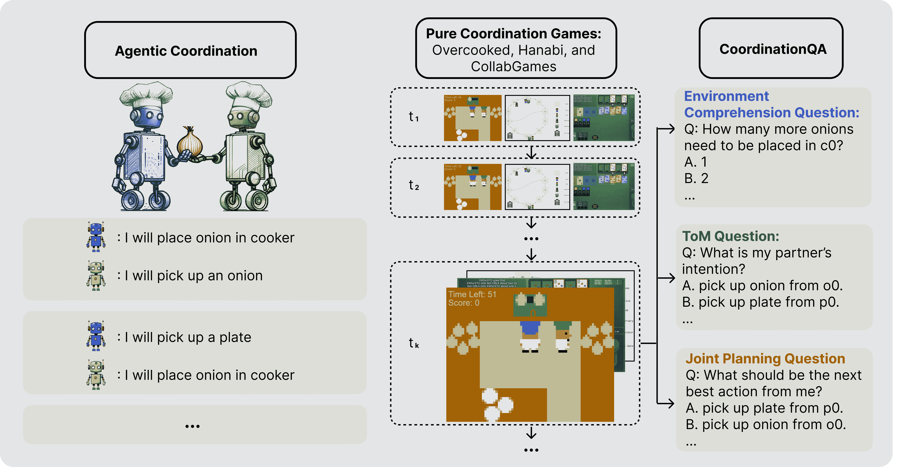
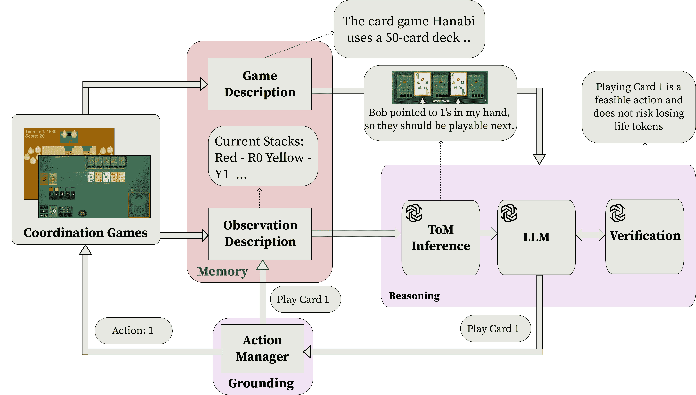
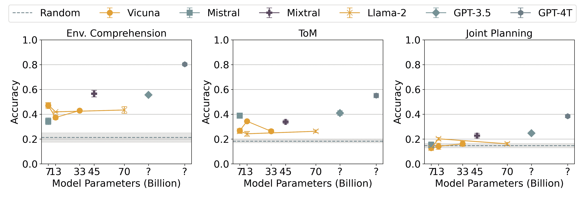

<!--yml
category: 未分类
date: 2025-01-11 13:04:58
-->

# LLM-Coordination: Evaluating and Analyzing Multi-agent Coordination Abilities in Large Language Models

> 来源：[https://arxiv.org/html/2310.03903/](https://arxiv.org/html/2310.03903/)

Saaket Agashe Yue Fan Anthony Reyna Xin Eric Wang
University of California Santa Cruz
{saagashe yfan71 ancreyna xwang366}@ucsc.edu

###### Abstract

The emergent reasoning and Theory of Mind (ToM) abilities demonstrated by Large Language Models (LLMs) make them promising candidates for developing coordination agents. In this study, we introduce a new LLM-Coordination Benchmark aimed at a detailed analysis of LLMs within the context of Pure Coordination Games, where participating agents need to cooperate for the most gain. This benchmark evaluates LLMs through two distinct tasks: (1) *Agentic Coordination*, where LLMs act as proactive participants for cooperation in 4 pure coordination games; (2) *Coordination Question Answering (QA)*, where LLMs are prompted to answer 198 multiple-choice questions from the 4 games for evaluation of three key reasoning abilities: Environment Comprehension, ToM Reasoning, and Joint Planning. Furthermore, to enable LLMs for multi-agent coordination, we introduce a Cognitive Architecture for Coordination (CAC) framework that can easily integrate different LLMs as plug-and-play modules for pure coordination games. Our findings indicate that LLM agents equipped with GPT-4-turbo achieve comparable performance to state-of-the-art reinforcement learning methods in games that require commonsense actions based on the environment. Besides, zero-shot coordination experiments reveal that, unlike RL methods, LLM agents are robust to new unseen partners. However, results on Coordination QA show a large room for improvement in the Theory of Mind reasoning and joint planning abilities of LLMs. The analysis also sheds light on how the ability of LLMs to understand their environment and their partner’s beliefs and intentions plays a part in their ability to plan for coordination. Our code is available at [https://github.com/eric-ai-lab/llm_coordination](https://github.com/eric-ai-lab/llm_coordination).

Figure 1: The LLM Coordination Benchmark consists of two tasks: Agentic Coordination to study the ability of LLMs to *act*, and Coordination QA to study the ability of LLMs to *reason*.

## 1 Introduction

In a wide range of activities, from daily tasks such as cooking to critical operations like rescue efforts, cooperation without mixed intentions is essential. These scenarios are examples of Pure Coordination Games, where all involved parties benefit from choosing strategies that are perfectly aligned, avoiding any conflict of interest. These games require agents to reason about their environment and plan while considering the beliefs and intentions of their partners. Recently, Large Language Models (LLMs) have demonstrated emergent planning abilities in both physical and virtual settings (Raman et al., [2022](https://arxiv.org/html/2310.03903v2#bib.bib27); Wang et al., [2023](https://arxiv.org/html/2310.03903v2#bib.bib33); Wu et al., [2023](https://arxiv.org/html/2310.03903v2#bib.bib35)), impressive reasoning capabilities (Wei et al., [2022](https://arxiv.org/html/2310.03903v2#bib.bib34)), and the hints of a Theory of Mind (Kosinski, [2023](https://arxiv.org/html/2310.03903v2#bib.bib18)) making them promising candidates for developing coordination agents. Previous works have explored the use of LLMs for developing collaborative agents, yet the requisite conditions, strengths, and limitations of LLMs in coordination games remain unclear. In this study, we intend to bridge the gap by performing a comprehensive evaluation and analysis of the multi-agent coordination abilities of LLMs.

Therefore, we introduce a new LLM-Coordination Benchmark featuring two task settings for pure coordination games: 1\. Agentic Coordination and 2\. CoordinationQA. In Agentic Coordination, LLMs are scaffolded with components that allow them to *act* within actual game environments, providing a holistic evaluation of the competencies of LLMs to act as coordination agents. In CoordinationQA, LLMs have to answer a curated set of questions about edge-case scenarios drawn from coordination games where agents are required actively cooperate with their partners. The benchmark includes four collaborative games, providing a comprehensive analysis platform.

To enable LLMs for multi-agent coordination, we present a Cognitive Architecture for Coordination (CAC) framework that facilitates LLM interaction with game environments in a plug-and-play approach. CAC translates game elements into textual formats and leverages auxiliary LLMs for improved coordination to enable effective multi-agent collaboration. Our Experiments on the Agentic Coordination task with CAC reveal that Large Language Models are capable of understanding the game objectives, generating coherent reasoning for their next actions, and coordinating with partners across all coordination games. They exhibit these competencies without any training, fine-tuning, or few-shot examples.

A comparative analysis on the Agentic Coordination task reveals that LLM agents outperform Multi-agent RL solutions in games that require minimum theory-of-mind reasoning and focus on taking commonsense actions based on the environment. However, they struggle in more complex settings where agents need to actively consider their partner’s beliefs and intentions. We also observe that LLM agents are capable of collaborating with new partners, unlike self-play MARL methods (Carroll et al., [2019a](https://arxiv.org/html/2310.03903v2#bib.bib4); Bard et al., [2020](https://arxiv.org/html/2310.03903v2#bib.bib3)) that fail to adapt to unseen agents.

For a more nuanced analysis of the coordination abilities of LLMs, we create the CoordinationQA Suite. This suite is designed to dissect the capabilities of LLMs in single-turn reasoning within coordination games, focusing on three key areas: Joint Planning, Theory of Mind (ToM), and Environment Comprehension. Joint Planning evaluates LLMs’ decision-making for optimal long-term outcomes, ToM questions probe the understanding of partner agents’ intentions and needs, and Environment Comprehension assesses knowledge of game rules and dynamics. Our findings on CoordinationQA show a marked performance gap between GPT-4-turbo and other LLMs across three question types. LLMs are most proficient in Environment Comprehension, indicating they understand game rules and states well. However, they face significant challenges in Theory of Mind Reasoning, with difficulty inferring others’ intentions and needs. This issue worsens in Joint Planning, where most LLMs underperform, some even worse than random choices. These results highlight LLMs’ limited reliability and effectiveness as coordination partners. Additionally, our analysis shows a moderate to strong correlation between Theory of Mind Reasoning, Environment Comprehension, and Joint Planning performance, underscoring their role in effective coordination.

In summary, our contributions are four-fold:

1.  1.

    We introduce the LLM-Coordination Benchmark for evaluating and analyzing LLMs in Pure Coordination Games, covering multi-turn Agentic Coordination and single-turn Coordination QA tasks.

2.  2.

    We develop the plug-and-play Cognitive Architecture for Coordination Framework to enable LLMs to effectively participate in complex, partially observable coordination games like Hanabi, demonstrating the first zero-shot application for LLM agents in such scenarios.

3.  3.

    We perform a holistic evaluation of LLM agents in Self-play and Cross-play settings, offering a detailed comparison with RL baselines and showcasing their potential as Coordination Agents.

4.  4.

    We investigate Environment Comprehension and Theory of Mind Reasoning as essential components of LLMs’ overall Joint Planning capabilities, highlighting their critical importance in coordination tasks.

## 2 LLM-Coordination Benchmark

### 2.1 Multi-turn Agentic Coordination

In the Multi-turn Agentic Coordination task, LLMs participate in end-to-end pure coordination games as agents, where the best strategy for all participating agents is to cooperate. LLMs under test are plugged into coordination frameworks with components like memory modules and grounding modules to act in complete games. These LLM agents can then be partnered with any policies or agents to complete the games.

Our LLM-Coordination benchmark includes 4 pure coordination games, Hanabi Challenge (Bard et al., [2020](https://arxiv.org/html/2310.03903v2#bib.bib3)), Overcooked-AI (Carroll et al., [2019a](https://arxiv.org/html/2310.03903v2#bib.bib4)), Collab Capture and Collab Escape.

Hanabi Challenge: In Hanabi (Bard et al., [2020](https://arxiv.org/html/2310.03903v2#bib.bib3)), players aim to assemble five sequences of cards in ascending order (1 through 5). A unique aspect of the game is that the players can only view their partner’s cards, not their own. This requires players to work collaboratively, utilizing reveal tokens to provide hints about the cards in their partner’s hand. These hints can be about either the color or the rank of the cards. For instance, using a single hint token, a player can indicate all cards of a certain rank in their partner’s hand. Hanabi serves as an exemplary Pure Coordination game, necessitating player cooperation to achieve optimal outcomes. Success in Hanabi hinges on the ability to understand partners’ perspectives, navigate decisions based on incomplete information, and engage in implicit communication, making it an excellent testing ground for coordination among agents.

Overcooked-AI: In the Overcooked-AI environment (Carroll et al., [2019a](https://arxiv.org/html/2310.03903v2#bib.bib4)), two agents—Alice (Blue) and Bob (Green)—collaborate to cook and deliver onion soups. This environment includes a variety of layouts, each with its own arrangement and quantity of onion dispensers, plate dispensers, cookers, delivery zones, and countertops. To prepare a dish, agents are required to insert three onions into a cooker, initiating a cooking process that lasts 20 time steps. Upon completion, the soup must be plated and delivered to complete the task. Each layout presents unique challenges, emphasizing the need for agents to comprehend their surroundings, locate necessary resources, and synchronize their actions with their teammate for effective collaboration.

Collab Capture: Collab Capture involves two agents trying to capture an adversary in a maze of interconnected rooms. The rooms are connected by doors, which can be controlled through access buttons that can be found in other rooms. The agents’ task is to capture the adversary in the least amount of time using effective strategies, including cornering the adversary and manipulating the doors to enable their partner or disable the adversary.

Collab Escape: Collab Escape involves two agents trying to escape an adversary in a maze of interconnected rooms. They need to fix two generators (similar to the game Dead-by-Daylight (Dea, [2016](https://arxiv.org/html/2310.03903v2#bib.bib1))) located in different rooms to open an exit portal. The adversary tries to catch the agents, and the win condition is any one agent escaping. This game requires strategies like luring the adversary away from the partner, sacrificing for the partner’s safety, and manipulating the movement of the adversary.

### 2.2 Single-turn Coordination QA

The agentic coordination task paints a holistic picture of the abilities of LLMs as agents. To dive deeper into the specific strengths and weaknesses of LLMs, we develop the CoordinationQA Suite. Inspired by the idea of Unit Testing for evaluating AI agents Knott et al. ([2021](https://arxiv.org/html/2310.03903v2#bib.bib17)), we manually sampled edge cases from all 4 pure coordination games mentioned in Section [2.1](https://arxiv.org/html/2310.03903v2#S2.SS1 "2.1 Multi-turn Agentic Coordination ‣ 2 LLM-Coordination Benchmark ‣ LLM-Coordination: Evaluating and Analyzing Multi-agent Coordination Abilities in Large Language Models"). All of these edge cases necessitate agents to actively understand their current state, think about their partner’s intentions, and come up with the best plans for coordination. We then create a set of three types of questions for each scenario in our CoordinationQA Suite.

*   •

    Environment Comprehension (EC) questions require LLMs to make indirect inferences about some aspect of their environment.

*   •

    Theory of Mind Reasoning (ToM) questions challenge the LLMs to predict the intentions of their partners and probe about the requirements of their partners.

*   •

    Joint Planning (JP) questions provide agents with the state/observation and ask them to predict the best next action for effective coordination. This question is essentially the same question that LLMs need to repeatedly solve when they act as agents.

All the questions were manually developed and labeled. We filtered out questions and scenarios that showed any ambiguity, leaving only questions that had clear optimal solutions. We generated a total of N=66 scenarios (25 from Overcooked, 28 from Hanabi, and 13 from the two Collab Games) and created 3 questions per scenario, resulting in 198 unique questions. The right side of Figure [1](https://arxiv.org/html/2310.03903v2#S0.F1 "Figure 1 ‣ LLM-Coordination: Evaluating and Analyzing Multi-agent Coordination Abilities in Large Language Models") demonstrates the sampling process for the three types of questions with an example from the game Overcooked. The selected scenario shows the Blue agent about to place their third onion in the cooker, and the green agent needs to figure out what to do next.

## 3 Cognitive Architecture for Coordination

We develop a LLM Agent architecture based on Sumers et al. ([2023](https://arxiv.org/html/2310.03903v2#bib.bib31)), which we dub Cognitive Architecture for Coordination (CAC), for multi-agent coordination. Using CAC we can easily plug and play a LLM agent, and pair it with any partner (e.g., another CAC agent, a human player, or other AI agents). The architecture consists of three key elements: Memory, Reasoning, and Grounding.

Figure 2: Cognitive Architecture for Coordination (CAC). This framework is segmented into three key components for agentic analysis—Memory, which archives the game description and current game state; Grounding, which involves the execution of actions selected by LLMs; and Reasoning, which encompasses a Theory of Mind (ToM) inference LLM, a verifier LLM, and the primary LLM under analysis.

Memory Module includes (1) Long-Term Memory for storing the Game Description including the game’s rules, conventions, objectives and action space, (2) Working memory which consists a textual description of the current observation, and (3) Episodic Memory which is a list of previous actions selected by the agent. In the example shown in Figure [2](https://arxiv.org/html/2310.03903v2#S3.F2 "Figure 2 ‣ 3 Cognitive Architecture for Coordination ‣ LLM-Coordination: Evaluating and Analyzing Multi-agent Coordination Abilities in Large Language Models") the Long Term Memory includes a description of the game of Hanabi, The Working memory includes observations including the current stack, partner’s hand, beliefs and knowledge of both agents and information regarding the available tokens, and cards, and the Episodic Memory includes the previously selected discards, plays and hints.

Reasoning Module is where the Large Language Model (LLM) is plugged into the framework. It takes the textual description in the working memory as input and generates the next best action based on the context. For coordination games like Hanabi that require a more sophisticated Theory of Mind reasoning, we add an auxiliary Theory of Mind Reasoning LLM whose sole responsibility is to interpret the partner agent’s actions and requirements. This extra reasoning is added to the working memory before passing to the primary LLM. Additionally, we also utilize a Self-verification LLM which verifies the safety of the selected action. In the Hanabi example in Figure [2](https://arxiv.org/html/2310.03903v2#S3.F2 "Figure 2 ‣ 3 Cognitive Architecture for Coordination ‣ LLM-Coordination: Evaluating and Analyzing Multi-agent Coordination Abilities in Large Language Models"), the reasoning module interprets the provided clue of ”Revealing Rank 1 Cards” and decides to play one of the pointed cards on the empty stacks. The generated action is passed to the grounding module.

Grounding Module is responsible for interfacing the reasoning and memory modules’ textual decision-making spaces with the actual game mechanics. Its primary task is to take the selected action from the reasoning module and translate it into game-compatible action(s). The exact implementation of the grounding module depends on the game in question; for example, in Overcooked-AI, the grounding module needs to convert high-level actions like ”pick up onion from o0.” into sequences of lower-level actions. On the other hand, in games like Hanabi, it just needs to match actions like ”Reveal Bob’s Red Color Cards” to their lower-level representations. The grounding module is also responsible for the secondary task of filtering out infeasible actions based on the context of the game.

## 4 Experiments

### 4.1 Agentic Coordination

#### 4.1.1 Setup

We perform two types of experiments in agentic coordination: Self-Play and Cross-Play. In self-play settings, the participating agents are of the same type. In Cross-Play experiments, we pair agents with unseen partners, and they need to adapt their behavior to the actions of these new partners.

Self-play Baselines: For Overcooked we use Proximal Policy Optimization (Schulman et al., [2017](https://arxiv.org/html/2310.03903v2#bib.bib28)) and Population-Based Training (Jaderberg et al., [2017](https://arxiv.org/html/2310.03903v2#bib.bib12)) as baselines for comparison. These baselines were established by Carroll et al. ([2019a](https://arxiv.org/html/2310.03903v2#bib.bib4)). The Hanabi challenge has been extensively studied and solved using MARL methods. We use Bayesian Action Decoder (Bard et al., [2020](https://arxiv.org/html/2310.03903v2#bib.bib3)), Simplified Action Decoder (Hu & Foerster, [2021](https://arxiv.org/html/2310.03903v2#bib.bib9)), and Off-Belief Learning (Hu et al., [2021a](https://arxiv.org/html/2310.03903v2#bib.bib10)) as baselines.

Cross-play Baselines: For Overcooked, we use a Behavior Cloning model trained on human data Carroll et al. ([2019a](https://arxiv.org/html/2310.03903v2#bib.bib4)) and a Proximal Policy Optimization (PPO) agent trained with the Human Behavior Cloning agent Carroll et al. ([2019a](https://arxiv.org/html/2310.03903v2#bib.bib4)) as baselines for comparison. We also use human proxies based on behavior cloning as unseen partners. For Hanabi, we use the Simplified Action Decoder (SAD) as a baseline. We pair our agents with the Off-Belief Learning (Hu et al., [2021a](https://arxiv.org/html/2310.03903v2#bib.bib10)), which was trained to generate grounded policies and adapt to unseen partner agents.

Metrics: We measure the total score achieved by agents in Overcooked, where each delivery provides 20 points to both agents. In the case of Hanabi, the metric is the total number of cards that have been correctly arranged by the players.

#### 4.1.2 Results and Analysis

 |  | Overcooked Layouts |
| Method | CR | AA | Ring | FC | CC |
| PPO${}_{\text{SP}}$ (Schulman et al., [2017](https://arxiv.org/html/2310.03903v2#bib.bib28)) | $198.8\pm 4.06$ | $167.2\pm 3.63$ | $\mathbf{190.8\pm 4.25}$ | $151.9\pm 3.28$ | $122.3\pm 3.80$ |
| PBT (Jaderberg et al., [2017](https://arxiv.org/html/2310.03903v2#bib.bib12)) | $\mathbf{216.9\pm 1.31}$ | $190.1\pm 8.64$ | $173.8\pm 18.27$ | $169.5\pm 10.09$ | $140.1\pm 13.86$ |
| CAC[GPT-4-turbo] | $173.3\pm 6.67$ | $\mathbf{260.0\pm 11.55}$ | $140.0\pm 0.00$ | $\mathbf{180.0\pm 11.55}$ | $\mathbf{160.0\pm 0.00}$ |
| CAC[GPT-3.5-turbo] | $33.3\pm 10.88$ | $46.6\pm 10.88$ | $40.0\pm 0.00$ | $66.6\pm 14.40$ | $53.3\pm 5.44$ |
| CAC[Mixtral8x7B] | $46.6\pm 14.40$ | $200.0\pm 9.42$ | $113.3\pm 5.44$ | $46.6\pm 14.40$ | $100.0\pm 9.42$ | 

Table 1: Performance comparison across Multi-Agent Reinforcement Learning (MARL) and CAC methods. Scores indicate the best performance in each category. CAC with GPT-4-turbo demonstrates superior coordination in 3 out of 5 scenarios, underscoring advanced reasoning capabilities in coordination tasks.

| Class | Method | Score |
| --- | --- | --- |
| RL | BAD (Foerster et al., [2019](https://arxiv.org/html/2310.03903v2#bib.bib7)) | $23.92\pm 0.01$ |
|  | SAD (Hu & Foerster, [2021](https://arxiv.org/html/2310.03903v2#bib.bib9)) | $24.01\pm 0.01$ |
|  | OBL (Hu et al., [2021a](https://arxiv.org/html/2310.03903v2#bib.bib10)) | $24.10\pm 0.01$ |
| CAC | GPT-4-turbo | $\mathbf{13.33}\pm 0.88$ |
|  | GPT-3.5-turbo | $1.33\pm 0.72$ |
|  | Mixtral-8x7b | $0.33\pm 0.27$ |

Table 2: Agentic performance comparison on Hanabi Challenge. RL methods are very strong and obtain near-perfect scores. LLM agent (w. GPT-4-turbo) is weaker but still able to complete game sessions.

| Method | Score |
| --- | --- |
| LLM+Self verif.+ToM | $\mathbf{13.33}\pm 0.88$ |
| LLM+Self Verif. | $10.33\pm 0.88$ |
| LLM | $0.0\pm 0.0$ |

Table 3: Ablation study of LLM agents on Hanabi Challenge. Self Verification markedly enhances overall performance by ensuring that actions that make incorrect assumptions are filtered out. The explicit Theory of Mind (ToM) reasoning model provides further improvements by directly interpreting partner clues and requirements.

##### LLM Agents outperform or match state-of-the-art RL methods in coordination games that depend more on understanding the environment.

We observed that LLM agents (w. GPT-4-turbo) outperform or match the overall performance of RL methods across all layouts of Overcooked-AI. Table [1](https://arxiv.org/html/2310.03903v2#S4.T1 "Table 1 ‣ 4.1.2 Results and Analysis ‣ 4.1 Agentic Coordination ‣ 4 Experiments ‣ LLM-Coordination: Evaluating and Analyzing Multi-agent Coordination Abilities in Large Language Models") presents the numerical scores attained by different agents when paired with a partner agent of the same type. This implies that LLM agents outdo RL agents that have been trained together through Self-play without any game-specific training or fine-tuning. It is, however, important to note that LLM agents are significantly slower and larger than RL models and are not fit for real-time use yet (latency (seconds) of $8.36\pm 1.79$ with Chain-of-thought and $1.02\pm 0.09$ without for GPT-4-turbo). Furthermore, other models we tested, GPT-3.5-turbo and Mixtral8x7b, are faster but fall short of the RL baselines. We also see positive results on the CollabCapture and CollabEscape games with CAC agents (w. GPT-4), achieving a 100% success rate. However, other LLMs are unable to crack CollabEscape (see Appendix [D](https://arxiv.org/html/2310.03903v2#A4 "Appendix D Results of Different LLMs on CollabCapture and CollabEscape ‣ LLM-Coordination: Evaluating and Analyzing Multi-agent Coordination Abilities in Large Language Models")).

LLM agents struggle at effective planning when advanced Theory of Mind reasoning is required.  In Hanabi Challenge, LLM agents seem to struggle compared to RL methods (see Table [2](https://arxiv.org/html/2310.03903v2#S4.T2 "Table 2 ‣ 4.1.2 Results and Analysis ‣ 4.1 Agentic Coordination ‣ 4 Experiments ‣ LLM-Coordination: Evaluating and Analyzing Multi-agent Coordination Abilities in Large Language Models")). Among all LLMs, GPT-4-turbo performs reasonably well, while other LLMs can barely complete the Hanabi games. We attribute this failure to two factors. First, there is little room for errors in Hanabi. Any misplay or mis-clue leads to the loss of a life token. Second, Hanabi requires much more complex Theory of Mind Reasoning compared to the Overcoked-AI environment. Each action requires agents to actively consider their partner’s beliefs, intentions, and how they would react to implicit communication.

In contrast, Overcooked is fully observable, and its action space consists of actions like pick up an onion from onion_dispenser_0 and place onion in cooker_0. Under most scenarios and layouts, LLMs only need to consider the next best steps based on the state of the environment. For example, We conduct an ablation study of removing partner inventory and location, which reveals minimum impact on overall performance (1 less delivery in Cramped Room and Asymmetric Advantage layouts each in 100 timesteps), showing that the primary challenge for LLMs in games like Overcooked is the Environment Comprehension ability.

LLM agents benefit from auxiliary reasoning modules in imperfection information games with low room for errors.  Without the support of auxiliary modules, LLM agents seem to bomb (lose all three lives) in every game (see Table [3](https://arxiv.org/html/2310.03903v2#S4.T3 "Table 3 ‣ 4.1.2 Results and Analysis ‣ 4.1 Agentic Coordination ‣ 4 Experiments ‣ LLM-Coordination: Evaluating and Analyzing Multi-agent Coordination Abilities in Large Language Models")). To rectify this, our CAC framework incorporates auxiliary LLM-powered modules, including an Explicit Theory of Mind Reasoning (ToM) module and an Answer Verification (AV) module. The answer verification module is a game-changer in its ability to stop LLM hallucinations about environmental facts from causing fatal mistakes, thus reducing the chance of mis-plays. The ToM reasoning LLM delegates the responsibility of interpreting partner clues and understanding partner needs to different LLMs, allowing the primary LLM to focus on synthesizing the available information to plan the next action.

 |  | Overcooked Layouts |
| Method | CR | AA | Ring | FC | CC |
| BC (Carroll et al., [2019a](https://arxiv.org/html/2310.03903v2#bib.bib4)) | $103.5$ &#124; $110.0$ | $136.5$ &#124; $137.5$ | $59.0$ &#124; $70.0$ | $20.5$ &#124; $31.0$ | $38.0$ &#124; $44.0$ |
| PPO[BC] (Schulman et al., [2017](https://arxiv.org/html/2310.03903v2#bib.bib28)) | $156.4$ &#124; $\mathbf{163.9}$ | $72.6$ &#124; $178.8$ | $126.4$ &#124; $129.8$ | $58.9$ &#124; $76.9$ | $69.5$ &#124; $57.6$ |
| CAC[GPT-4-turbo]¹¹1For CAC, we run a single trial from either position due to cost constraints. In Table [1](https://arxiv.org/html/2310.03903v2#S4.T1 "Table 1 ‣ 4.1.2 Results and Analysis ‣ 4.1 Agentic Coordination ‣ 4 Experiments ‣ LLM-Coordination: Evaluating and Analyzing Multi-agent Coordination Abilities in Large Language Models") we have observed that the performance of CAC agents does not vary by more than one delivery. | $\mathbf{160.0}$ &#124; $160.0$ | $\mathbf{180.0}$ &#124; $\mathbf{200.0}$ | $\mathbf{160.0}$ &#124; $\mathbf{140.0}$ | $\mathbf{120.0}$ &#124; $\mathbf{80.0}$ | $\mathbf{140.0}$ &#124; $\mathbf{100.0}$ | 

Table 4: Zero shot coordination results of AI-Human Proxy Gameplay. We compare Behavior Cloning (BC), PPO_BC, and CAC (w/ GPT-4-turbo) agents. The CAC agents significantly outperform other agents in most cases, demonstrating their robustness to unseen partner agents. Since the two agents in Overcooked-AI might be tasked with different roles based on their starting locations, we show results playing from either side separated by |.

| Method | Self-Play | Cross-Play w/ OBL-1 | Cross-Play w/ OBL-4 |
| --- | --- | --- | --- |
| SAD (Hu & Foerster, [2021](https://arxiv.org/html/2310.03903v2#bib.bib9)) | $\mathbf{22.00}\pm 1.69$ | $11.66\pm 4.06$ | $5.33\pm 0.98$ |
| CAC[GPT-4-turbo] | $13.66\pm 0.27$ | $\mathbf{15.00}\pm 2.94$ | $\mathbf{12.0}\pm 0.94$ |

Table 5: Cross-Play results of RL agent (SAD) and CAC agent. All agents play three games with different seeds (same seeds across agents). SAD performs really well at self-play but suffers significant performance degradation with new partners OBL-1 and OBL-4\. CAC coordinates well with the new, unseen partners.

LLM Agents are robust to unseen partners.  We use Overcooked-AI and the Hanabi challenge as testbeds to evaluate the performance of LLM agents when paired with unseen agents. This task is popularly known as Zero Shot Coordination. For experiments in Overcooked-AI, we pair our LLM agents as well as baselines with proxy-human agents. These proxy human agents are behavior cloning agents trained using human data by Carroll et al. ([2019b](https://arxiv.org/html/2310.03903v2#bib.bib5)). As shown in Table [4](https://arxiv.org/html/2310.03903v2#S4.T4 "Table 4 ‣ LLM Agents outperform or match state-of-the-art RL methods in coordination games that depend more on understanding the environment. ‣ 4.1.2 Results and Analysis ‣ 4.1 Agentic Coordination ‣ 4 Experiments ‣ LLM-Coordination: Evaluating and Analyzing Multi-agent Coordination Abilities in Large Language Models"), we discover that LLM agents outperform both Behavior Cloning as well as PPO agents trained with human data.

For experiments in Hanabi, we pair our agents with Off-Belief Learning (OBL) agents (Hu et al., [2021a](https://arxiv.org/html/2310.03903v2#bib.bib10)). OBL is a MARL strategy that generates grounded clues and actions and is the state-of-the-art method for both self-play and cross-play in Hanabi. OBL agents provide observation-grounded clues and collaborate well with humans. Therefore, we use them as unseen partners in our experiments. Table [5](https://arxiv.org/html/2310.03903v2#S4.T5 "Table 5 ‣ LLM Agents outperform or match state-of-the-art RL methods in coordination games that depend more on understanding the environment. ‣ 4.1.2 Results and Analysis ‣ 4.1 Agentic Coordination ‣ 4 Experiments ‣ LLM-Coordination: Evaluating and Analyzing Multi-agent Coordination Abilities in Large Language Models") shows that CAC agents score an average of 15.00 points with the OBL-1 agent compared to their self-play scores of 13.66\. This indicates no degradation in coordination abilities with a new partner. The baseline RL method, Simplified Action Decoder (SAD) Hu & Foerster ([2021](https://arxiv.org/html/2310.03903v2#bib.bib9)), fails critically when paired with unseen OBL agents, even though it excels at self-play (22.00 points) due to self-play training.

MARL agents trained with self-play struggle when paired with unseen partners in common payoff tasks, because they converge to arbitrary policies that only the two partners involved in the self-play training understand (Carroll et al., [2019a](https://arxiv.org/html/2310.03903v2#bib.bib4); Bard et al., [2020](https://arxiv.org/html/2310.03903v2#bib.bib3)). Since LLM agents haven’t been explicitly trained to play these games, they base their outputs on the provided textual observation and commonsense knowledge learned from pre-training, and thus are much more robust to unseen partners.

### 4.2 Coordination QA

Figure 3: Comparative Performance of LLMs in Three Cognitive Dimensions. The graphs display the accuracy of each LLM in EC, ToM Reasoning, and JP, plotted against the model’s number of parameters (in billions) over three trials.

##### Setup.

We assess the performance of 6 Families of Large Language Models (LLMs) Jiang et al. ([2023](https://arxiv.org/html/2310.03903v2#bib.bib15); [2024](https://arxiv.org/html/2310.03903v2#bib.bib16)); Touvron et al. ([2023](https://arxiv.org/html/2310.03903v2#bib.bib32)); Chiang et al. ([2023](https://arxiv.org/html/2310.03903v2#bib.bib6)); OpenAI ([2023](https://arxiv.org/html/2310.03903v2#bib.bib24)) across three dimensions: Environment Comprehension (EC), Theory of Mind Reasoning (ToM), and Joint Planning (JP). For each category, LLMs respond to multiple-choice questions (MCQs), with their responses evaluated against ground-truth answers through fuzzy string matching. To account for the variability in LLM responses, we conduct three trials per model. We also report a Random baseline.

Comparative Results of LLMs in Environment Comprehension, ToM Reasoning, vs. Joint Planning.  In Figure [3](https://arxiv.org/html/2310.03903v2#S4.F3 "Figure 3 ‣ 4.2 Coordination QA ‣ 4 Experiments ‣ LLM-Coordination: Evaluating and Analyzing Multi-agent Coordination Abilities in Large Language Models"), we see that most LLMs achieve their best results on the Environment Comprehension question. The best performing LLM GPT-4-turbo gets more than 80% Environment Comprehension Questions correct. The overall performance across LLMs drops on the more challenging Theory of Mind reasoning questions, but GPT-4-turbo is still competent, reaching a 54% accuracy. The overall accuracy of LLMs on Joint Planning questions is still significantly weak, with even the best LLM scoring less than 40%, indicating a large room for improvement in LLMs’ ability to perform coordination reasoning. Another cause for concern is that open-source LLMs perform abysmally at Joint Planning, with some models performing worse than a random baseline.

| Variables | $r$ | $\rho$ |
| --- | --- | --- |
| ToM | 0.813 | 0.389 |
| EC | 0.895 | 0.506 |

Table 6: Pearson Correlation Coefficient ($r$) and Spearman Rank ($\rho$) Coefficient reveal moderate to strong positive correlations of both ToM and EC with JP.

Impact of Environment Comprehension and ToM Reasoning abilities on Joint Planning.  Having defined Joint Planning as the capacity of an agent to select the appropriate subsequent action based on available information, we argue that proficiency in Environment Comprehension and Theory of Mind Reasoning is crucial for adept Joint Planning, and LLMs that do well at these two will do well at JP. Correlation analysis of ToM and EC with JP across the data from Figure [6](https://arxiv.org/html/2310.03903v2#S4.T6 "Table 6 ‣ Setup. ‣ 4.2 Coordination QA ‣ 4 Experiments ‣ LLM-Coordination: Evaluating and Analyzing Multi-agent Coordination Abilities in Large Language Models") reveals that ToM has a moderate positive correlation to JP, whereas EC shows a strong positive correlation.

## 5 Related Work

##### Multi-agent Coordination

In Game Theory, Pure Coordination games are situations where the payoff is commonly shared between all agents. In such situations, cooperating is the best strategy. Various benchmarks and games have been used to evaluate Multi-Agent Coordination abilities over the years including Multiparticle Environment Lowe et al. ([2017](https://arxiv.org/html/2310.03903v2#bib.bib23)), Overcooked-AI Carroll et al. ([2019a](https://arxiv.org/html/2310.03903v2#bib.bib4)), and the Hanabi Challenge Bard et al. ([2020](https://arxiv.org/html/2310.03903v2#bib.bib3)). The foundational work by Carroll et al. ([2019a](https://arxiv.org/html/2310.03903v2#bib.bib4)) emphasized the significance of incorporating human data for effective human-ai collaboration. Subsequent research on the Overcooked-AI challenge has pivoted towards enabling self-play-trained agents to coordinate seamlessly with humans within this environment. These studies employ various techniques, including self-play with past agent checkpoints (Strouse et al., [2021](https://arxiv.org/html/2310.03903v2#bib.bib30)), centralized population entropy objectives (Zhao et al., [2023](https://arxiv.org/html/2310.03903v2#bib.bib39)), open-ended objectives using graph theory (Li et al., [2023a](https://arxiv.org/html/2310.03903v2#bib.bib19)), policy ensembles with context-aware mechanisms (Lou et al., [2023](https://arxiv.org/html/2310.03903v2#bib.bib22)), and the incorporation of human biases as linear hidden rewards (Yu et al., [2023](https://arxiv.org/html/2310.03903v2#bib.bib36)), to enhance the training and diversity of AI agents in different scenarios. On the Hanabi Challenge much effort has been made to learn grounded policies Hu et al. ([2021b](https://arxiv.org/html/2310.03903v2#bib.bib11); [a](https://arxiv.org/html/2310.03903v2#bib.bib10)) over arbitrary conventions. Embodied environments usually set up in household environments have also been recently used to study multi-agent coordination (Puig et al., [2021](https://arxiv.org/html/2310.03903v2#bib.bib26); Jain et al., [2020](https://arxiv.org/html/2310.03903v2#bib.bib14); [2019](https://arxiv.org/html/2310.03903v2#bib.bib13); Gan et al., [2021](https://arxiv.org/html/2310.03903v2#bib.bib8)). The Overwhelming majority of approaches to coordination problems have focused on utilizing and enhancing Reinforcement Learning methods to solve the problems of multi-agent coordination. In this work, we argue that Large Language Models are an alternative approach to these coordination problems as they show emergent reasoning abilities, demonstrate theory-of-mind-like abilities, and do not converge to policies that cause arbitrary joint interactions.

##### Planning and Reasoning with Large Language Models

Large Language Models (LLMs) have demonstrated remarkable capabilities of reasoning in natural language (OpenAI, [2023](https://arxiv.org/html/2310.03903v2#bib.bib24); Ouyang et al., [2022](https://arxiv.org/html/2310.03903v2#bib.bib25); Chiang et al., [2023](https://arxiv.org/html/2310.03903v2#bib.bib6)), achieving state-of-the-art performance across a spectrum of verbal reasoning tasks. It was then shown that LLMs could be augmented with components like memory, tools, perception, and grounding to create agents that could interact with an external environment (the web, simulators, games, etc.) These LLM agents have shown to be capable of solving long-horizon tasks, playing complex games (Wu et al., [2023](https://arxiv.org/html/2310.03903v2#bib.bib35); Wang et al., [2023](https://arxiv.org/html/2310.03903v2#bib.bib33)) and interacting with simulated embodied environments (Liang et al., [2022](https://arxiv.org/html/2310.03903v2#bib.bib21); Song et al., [2022](https://arxiv.org/html/2310.03903v2#bib.bib29)). Zhang et al. ([2023b](https://arxiv.org/html/2310.03903v2#bib.bib38)) developed a modular agent framework that was capable of cooperating with partner agents in embodied spatial rearrangement problems, demonstrating increased efficiency through coordination. Zhang et al. ([2023a](https://arxiv.org/html/2310.03903v2#bib.bib37)) develop a specialized architecture that enables LLMs to play in the Overcooked-AI environment. Li et al. ([2023b](https://arxiv.org/html/2310.03903v2#bib.bib20)) evaluate and show emergent collaborative abilities of LLMs in gamified simulations. In contrast to existing works, our work focuses on evaluating language agents in established pure coordination games where coordination is not an optional efficiency enhancer but rather a necessity.

## 6 Conclusion

In this study, we evaluated and analyzed the current large language models in terms of their ability to reason and act in pure coordination games. We introduced the LLM-Coordination benchmark with its two tasks: 1\. Agentic Coordination and 2\. CoordinationQA. These settings allowed us to conduct holistic comparative studies of LLMs as agents as well as dive deeper into the fine-grained aspects of LLMs as coordination reasoners. We juxtaposed LLM agents with existing Multi-agent Reinforcement Learning agents, discussing the conditions in which LLMs thrive and fail. Finally, we discussed the Theory of Mind Reasoning and Environment Comprehension as prerequisites for coordination and evaluated existing LLMs on these two components.

## References

*   Dea (2016) Dead by Daylight. [https://deadbydaylight.com/en](https://deadbydaylight.com/en), June 2016. Video game.
*   han (2024) Hanabi: A collaborative fireworks game - GitHub Repository. [https://github.com/hanabi/hanabi.github.io](https://github.com/hanabi/hanabi.github.io), 2024. Accessed: 2024-03-29.
*   Bard et al. (2020) Nolan Bard, Jakob N. Foerster, Sarath Chandar, Neil Burch, Marc Lanctot, H. Francis Song, Emilio Parisotto, Vincent Dumoulin, Subhodeep Moitra, Edward Hughes, Iain Dunning, Shibl Mourad, Hugo Larochelle, Marc G. Bellemare, and Michael Bowling. The hanabi challenge: A new frontier for ai research. *Artificial Intelligence*, 280:103216, 2020. ISSN 0004-3702. doi: https://doi.org/10.1016/j.artint.2019.103216. URL [https://www.sciencedirect.com/science/article/pii/S0004370219300116](https://www.sciencedirect.com/science/article/pii/S0004370219300116).
*   Carroll et al. (2019a) Micah Carroll, Rohin Shah, Mark K. Ho, Thomas L. Griffiths, Sanjit A. Seshia, Pieter Abbeel, and Anca Dragan. *On the Utility of Learning about Humans for Human-AI Coordination*. Curran Associates Inc., Red Hook, NY, USA, 2019a.
*   Carroll et al. (2019b) Micah Carroll, Rohin Shah, Mark K. Ho, Thomas L. Griffiths, Sanjit A. Seshia, Pieter Abbeel, and Anca Dragan. overcooked_ai. [https://github.com/HumanCompatibleAI/overcooked_ai/tree/master](https://github.com/HumanCompatibleAI/overcooked_ai/tree/master), 2019b.
*   Chiang et al. (2023) Wei-Lin Chiang, Zhuohan Li, Zi Lin, Ying Sheng, Zhanghao Wu, Hao Zhang, Lianmin Zheng, Siyuan Zhuang, Yonghao Zhuang, Joseph E. Gonzalez, Ion Stoica, and Eric P. Xing. Vicuna: An open-source chatbot impressing gpt-4 with 90%* chatgpt quality, March 2023. URL [https://lmsys.org/blog/2023-03-30-vicuna/](https://lmsys.org/blog/2023-03-30-vicuna/).
*   Foerster et al. (2019) Jakob N. Foerster, Francis Song, Edward Hughes, Neil Burch, Iain Dunning, Shimon Whiteson, Matthew Botvinick, and Michael Bowling. Bayesian action decoder for deep multi-agent reinforcement learning, 2019.
*   Gan et al. (2021) Chuang Gan, Jeremy Schwartz, Seth Alter, Damian Mrowca, Martin Schrimpf, James Traer, Julian De Freitas, Jonas Kubilius, Abhishek Bhandwaldar, Nick Haber, Megumi Sano, Kuno Kim, Elias Wang, Michael Lingelbach, Aidan Curtis, Kevin Feigelis, Daniel M. Bear, Dan Gutfreund, David Cox, Antonio Torralba, James J. DiCarlo, Joshua B. Tenenbaum, Josh H. McDermott, and Daniel L. K. Yamins. Threedworld: A platform for interactive multi-modal physical simulation, 2021.
*   Hu & Foerster (2021) Hengyuan Hu and Jakob N Foerster. Simplified action decoder for deep multi-agent reinforcement learning, 2021.
*   Hu et al. (2021a) Hengyuan Hu, Adam Lerer, Brandon Cui, David Wu, Luis Pineda, Noam Brown, and Jakob Foerster. Off-belief learning, 2021a.
*   Hu et al. (2021b) Hengyuan Hu, Adam Lerer, Alex Peysakhovich, and Jakob Foerster. ”other-play” for zero-shot coordination, 2021b.
*   Jaderberg et al. (2017) Max Jaderberg, Valentin Dalibard, Simon Osindero, Wojciech M. Czarnecki, Jeff Donahue, Ali Razavi, Oriol Vinyals, Tim Green, Iain Dunning, Karen Simonyan, Chrisantha Fernando, and Koray Kavukcuoglu. Population based training of neural networks, 2017.
*   Jain et al. (2019) Unnat Jain, Luca Weihs, Eric Kolve, Mohammad Rastegari, Svetlana Lazebnik, Ali Farhadi, Alexander G. Schwing, and Aniruddha Kembhavi. Two body problem: Collaborative visual task completion. In *CVPR*, 2019. first two authors contributed equally.
*   Jain et al. (2020) Unnat Jain, Luca Weihs, Eric Kolve, Ali Farhadi, Svetlana Lazebnik, Aniruddha Kembhavi, and Alexander G. Schwing. A cordial sync: Going beyond marginal policies for multi-agent embodied tasks. In *ECCV*, 2020. first two authors contributed equally.
*   Jiang et al. (2023) Albert Q. Jiang, Alexandre Sablayrolles, Arthur Mensch, Chris Bamford, Devendra Singh Chaplot, Diego de las Casas, Florian Bressand, Gianna Lengyel, Guillaume Lample, Lucile Saulnier, Lélio Renard Lavaud, Marie-Anne Lachaux, Pierre Stock, Teven Le Scao, Thibaut Lavril, Thomas Wang, Timothée Lacroix, and William El Sayed. Mistral 7b, 2023.
*   Jiang et al. (2024) Albert Q. Jiang, Alexandre Sablayrolles, Antoine Roux, Arthur Mensch, Blanche Savary, Chris Bamford, Devendra Singh Chaplot, Diego de las Casas, Emma Bou Hanna, Florian Bressand, Gianna Lengyel, Guillaume Bour, Guillaume Lample, Lélio Renard Lavaud, Lucile Saulnier, Marie-Anne Lachaux, Pierre Stock, Sandeep Subramanian, Sophia Yang, Szymon Antoniak, Teven Le Scao, Théophile Gervet, Thibaut Lavril, Thomas Wang, Timothée Lacroix, and William El Sayed. Mixtral of experts, 2024.
*   Knott et al. (2021) Paul Knott, Micah Carroll, Sam Devlin, Kamil Ciosek, Katja Hofmann, A. D. Dragan, and Rohin Shah. Evaluating the robustness of collaborative agents, 2021.
*   Kosinski (2023) Michal Kosinski. Theory of mind might have spontaneously emerged in large language models, 2023.
*   Li et al. (2023a) Yang Li, Shao Zhang, Jichen Sun, Yali Du, Ying Wen, Xinbing Wang, and Wei Pan. Cooperative open-ended learning framework for zero-shot coordination. In Andreas Krause, Emma Brunskill, Kyunghyun Cho, Barbara Engelhardt, Sivan Sabato, and Jonathan Scarlett (eds.), *International Conference on Machine Learning, ICML 2023, 23-29 July 2023, Honolulu, Hawaii, USA*, volume 202 of *Proceedings of Machine Learning Research*, pp.  20470–20484\. PMLR, 2023a. URL [https://proceedings.mlr.press/v202/li23au.html](https://proceedings.mlr.press/v202/li23au.html).
*   Li et al. (2023b) Yuan Li, Yixuan Zhang, and Lichao Sun. Metaagents: Simulating interactions of human behaviors for llm-based task-oriented coordination via collaborative generative agents, 2023b.
*   Liang et al. (2022) Jacky Liang, Wenlong Huang, Fei Xia, Peng Xu, Karol Hausman, Brian Ichter, Pete Florence, and Andy Zeng. Code as policies: Language model programs for embodied control. In *arXiv preprint arXiv:2209.07753*, 2022.
*   Lou et al. (2023) Xingzhou Lou, Jiaxian Guo, Junge Zhang, Jun Wang, Kaiqi Huang, and Yali Du. Pecan: Leveraging policy ensemble for context-aware zero-shot human-ai coordination. In *Proceedings of the 2023 International Conference on Autonomous Agents and Multiagent Systems*, AAMAS ’23, pp.  679–688, Richland, SC, 2023\. International Foundation for Autonomous Agents and Multiagent Systems. ISBN 9781450394321.
*   Lowe et al. (2017) Ryan Lowe, Yi Wu, Aviv Tamar, Jean Harb, Pieter Abbeel, and Igor Mordatch. Multi-agent actor-critic for mixed cooperative-competitive environments. In *Proceedings of the 31st International Conference on Neural Information Processing Systems*, NIPS’17, pp.  6382–6393, Red Hook, NY, USA, 2017\. Curran Associates Inc. ISBN 9781510860964.
*   OpenAI (2023) OpenAI. Gpt-4 technical report, 2023.
*   Ouyang et al. (2022) Long Ouyang, Jeff Wu, Xu Jiang, Diogo Almeida, Carroll L. Wainwright, Pamela Mishkin, Chong Zhang, Sandhini Agarwal, Katarina Slama, Alex Ray, John Schulman, Jacob Hilton, Fraser Kelton, Luke Miller, Maddie Simens, Amanda Askell, Peter Welinder, Paul Christiano, Jan Leike, and Ryan Lowe. Training language models to follow instructions with human feedback, 2022.
*   Puig et al. (2021) Xavier Puig, Tianmin Shu, Shuang Li, Zilin Wang, Yuan-Hong Liao, Joshua B. Tenenbaum, Sanja Fidler, and Antonio Torralba. Watch-and-help: A challenge for social perception and human-{ai} collaboration. In *International Conference on Learning Representations*, 2021. URL [https://openreview.net/forum?id=w_7JMpGZRh0](https://openreview.net/forum?id=w_7JMpGZRh0).
*   Raman et al. (2022) Shreyas Sundara Raman, Vanya Cohen, Eric Rosen, Ifrah Idrees, David Paulius, and Stefanie Tellex. Planning with large language models via corrective re-prompting, 2022.
*   Schulman et al. (2017) John Schulman, Filip Wolski, Prafulla Dhariwal, Alec Radford, and Oleg Klimov. Proximal policy optimization algorithms, 2017.
*   Song et al. (2022) Chan Hee Song, Jiaman Wu, Clayton Washington, Brian M Sadler, Wei-Lun Chao, and Yu Su. Llm-planner: Few-shot grounded planning for embodied agents with large language models. *arXiv preprint arXiv:2212.04088*, 2022.
*   Strouse et al. (2021) DJ Strouse, Kevin McKee, Matt Botvinick, Edward Hughes, and Richard Everett. Collaborating with humans without human data. In M. Ranzato, A. Beygelzimer, Y. Dauphin, P.S. Liang, and J. Wortman Vaughan (eds.), *Advances in Neural Information Processing Systems*, volume 34, pp.  14502–14515\. Curran Associates, Inc., 2021. URL [https://proceedings.neurips.cc/paper_files/paper/2021/file/797134c3e42371bb4979a462eb2f042a-Paper.pdf](https://proceedings.neurips.cc/paper_files/paper/2021/file/797134c3e42371bb4979a462eb2f042a-Paper.pdf).
*   Sumers et al. (2023) Theodore R. Sumers, Shunyu Yao, Karthik Narasimhan, and Thomas L. Griffiths. Cognitive architectures for language agents, 2023.
*   Touvron et al. (2023) Hugo Touvron, Louis Martin, Kevin Stone, Peter Albert, Amjad Almahairi, Yasmine Babaei, Nikolay Bashlykov, Soumya Batra, Prajjwal Bhargava, Shruti Bhosale, Dan Bikel, Lukas Blecher, Cristian Canton Ferrer, Moya Chen, Guillem Cucurull, David Esiobu, Jude Fernandes, Jeremy Fu, Wenyin Fu, Brian Fuller, Cynthia Gao, Vedanuj Goswami, Naman Goyal, Anthony Hartshorn, Saghar Hosseini, Rui Hou, Hakan Inan, Marcin Kardas, Viktor Kerkez, Madian Khabsa, Isabel Kloumann, Artem Korenev, Punit Singh Koura, Marie-Anne Lachaux, Thibaut Lavril, Jenya Lee, Diana Liskovich, Yinghai Lu, Yuning Mao, Xavier Martinet, Todor Mihaylov, Pushkar Mishra, Igor Molybog, Yixin Nie, Andrew Poulton, Jeremy Reizenstein, Rashi Rungta, Kalyan Saladi, Alan Schelten, Ruan Silva, Eric Michael Smith, Ranjan Subramanian, Xiaoqing Ellen Tan, Binh Tang, Ross Taylor, Adina Williams, Jian Xiang Kuan, Puxin Xu, Zheng Yan, Iliyan Zarov, Yuchen Zhang, Angela Fan, Melanie Kambadur, Sharan Narang, Aurelien Rodriguez, Robert Stojnic, Sergey Edunov, and Thomas Scialom. Llama 2: Open foundation and fine-tuned chat models, 2023.
*   Wang et al. (2023) Guanzhi Wang, Yuqi Xie, Yunfan Jiang, Ajay Mandlekar, Chaowei Xiao, Yuke Zhu, Linxi Fan, and Anima Anandkumar. Voyager: An open-ended embodied agent with large language models, 2023.
*   Wei et al. (2022) Jason Wei, Xuezhi Wang, Dale Schuurmans, Maarten Bosma, Fei Xia, Ed Chi, Quoc V Le, Denny Zhou, et al. Chain-of-thought prompting elicits reasoning in large language models. *Advances in Neural Information Processing Systems*, 35:24824–24837, 2022.
*   Wu et al. (2023) Yue Wu, Shrimai Prabhumoye, So Yeon Min, Yonatan Bisk, Ruslan Salakhutdinov, Amos Azaria, Tom Mitchell, and Yuanzhi Li. Spring: Gpt-4 out-performs rl algorithms by studying papers and reasoning, 2023.
*   Yu et al. (2023) Chao Yu, Jiaxuan Gao, Weilin Liu, Botian Xu, Hao Tang, Jiaqi Yang, Yu Wang, and Yi Wu. Learning zero-shot cooperation with humans, assuming humans are biased. In *The Eleventh International Conference on Learning Representations, ICLR 2023, Kigali, Rwanda, May 1-5, 2023*. OpenReview.net, 2023. URL [https://openreview.net/pdf?id=TrwE8l9aJzs](https://openreview.net/pdf?id=TrwE8l9aJzs).
*   Zhang et al. (2023a) Ceyao Zhang, Kaijie Yang, Siyi Hu, Zihao Wang, Guanghe Li, Yihang Sun, Cheng Zhang, Zhaowei Zhang, Anji Liu, Song-Chun Zhu, Xiaojun Chang, Junge Zhang, Feng Yin, Yitao Liang, and Yaodong Yang. Proagent: Building proactive cooperative ai with large language models, 2023a.
*   Zhang et al. (2023b) Hongxin Zhang, Weihua Du, Jiaming Shan, Qinhong Zhou, Yilun Du, Joshua B. Tenenbaum, Tianmin Shu, and Chuang Gan. Building cooperative embodied agents modularly with large language models, 2023b.
*   Zhao et al. (2023) Rui Zhao, Jinming Song, Yufeng Yuan, Haifeng Hu, Yang Gao, Yi Wu, Zhongqian Sun, and Wei Yang. Maximum entropy population-based training for zero-shot human-ai coordination. *Proceedings of the AAAI Conference on Artificial Intelligence*, 37(5):6145–6153, Jun. 2023. doi: 10.1609/aaai.v37i5.25758. URL [https://ojs.aaai.org/index.php/AAAI/article/view/25758](https://ojs.aaai.org/index.php/AAAI/article/view/25758).

## Appendix A Overcooked Implementation Details

### A.1 Game and Layout Description

We use a general game description ${G}$ that explains the rules and objectives of overcooked. Since each layout has a different number of locations, like onion dispensers and cookers, we include a succinct description of each environment ${L_{i}}$, which includes how many instances of particular facilities there are. For environments that include partitions, we mention which partition each of the agents is situated in and what facilities that agents can access. In addition, we also mentioned the shape of the environment.

{mdframed}[⬇](data:text/plain;base64,SSBhbSB7c2VsZi5wbGF5ZXJfbmFtZXNbc2VsZi5wbGF5ZXJfaWRdfS4gSSBhbSBwbGF5aW5nIHRoZSBnYW1lIE92ZXJjb29rZWQgd2l0aCBteSBwYXJ0bmVyIHtzZWxmLnBsYXllcl9uYW1lc1tzZWxmLm90aGVyX3BsYXllcl9pZF19LiB7RW52RGVzY3JpcHRpb25zW3NlbGYubGF5b3V0X25hbWVdfQpPdmVyY29va2VkIGhhcyB0aGUgZm9sbG93aW5nIHJ1bGVzOiB7c2VsZi5ydWxlc30uIFdlIGhhdmUgYWdyZWVkIHRvIGZvbGxvdyB0aGUgZm9sbG93aW5nIGNvbnZlbnRpb25zOiB7c2VsZi5jb252ZW50aW9uc30uIEknbGwgcHJvdmlkZSBteSBhY3Rpb24gaGlzdG9yeSwgY3VycmVudCBzdGF0ZSwgdGVhbW1hdGUncyBzdGF0dXMsIGFuZCBteSBwb3NzaWJsZSBhY3Rpb25zLiBIZWxwIG1lIHNlbGVjdCB0aGUgYmVzdCBhY3Rpb24gZnJvbSB0aGUgbGlzdC4gRm9ybWF0IHlvdXIgcmVzcG9uc2UgYXM6IEFjdGlvbjogPGFjdGlvbj4uIE9ubHkgc2VsZWN0IG9uZSBhY3Rpb24uIERvIG5vdCBzYXkgYW55dGhpbmcgZWxzZS4gR290IGl0Pw==)I  am  {self.player_names[self.player_id]}.  I  am  playing  the  game  Overcooked  with  my  partner  {self.player_names[self.other_player_id]}.  {EnvDescriptions[self.layout_name]}Overcooked  has  the  following  rules:  {self.rules}.  We  have  agreed  to  follow  the  following  conventions:  {self.conventions}.  I’ll  provide  my  action  history,  current  state,  teammate’s  status,  and  my  possible  actions.  Help  me  select  the  best  action  from  the  list.  Format  your  response  as:  Action:  <action>.  Only  select  one  action.  Do  not  say  anything  else.  Got  it?

### A.2 State Description

The State is represented in natural language $D(S)$ in the working memory, which can be processed by a Large Language Model (LLM). The state $S$ includes variables that fully represent the necessary details of the layout as well as the players. The information provided in $D(S)$ is equivalent to what would be accessible to a Reinforcement Learning (RL) agent in the form of state representations. The following information is included in $D(S)$:

##### Objects Held by Each Player

The state description $D(S)$ begins by detailing the inventories $I_{\alpha_{1}}$ and $I_{\alpha_{2}}$ of Alice and Bob, respectively. Each inventory $I_{\alpha_{i}}$(where $i\in\{1,2\}$) can contain one of the following items: {”onion”, ”plate”, ”cooked soup”}. This inventory information is translated into natural language and incorporated into $D(S)$ in the format: “I am holding $I_{\alpha_{1}}$. Bob is holding $I_{\alpha_{2}}$.” Such information is vital for inferring the likely subsequent actions of the partner agent.

##### Location of the Agent Controlled by LLM:

Given the limitations of Large Language Models (LLMs) in interpreting grid-based spatial information, we opt to provide processed location data to the LLM. For each agent $P_{i}$ (where $i\in\{1,2\}$), and for each location of interest denoted as loc, we calculate the distance $d_{(P_{i},\text{loc})}$ as the number of steps required to reach loc from $P_{i}$ using the shortest available path. The state description $D(S)$ then includes this processed location information in the format: “loc is $d_{(P_{i},\text{loc})}$ units away.” Here, loc can represent various points of interest such as onion dispensers, plate dispensers, cookers, delivery areas, kitchen counters, or shared counters. If a location is either inaccessible or blocked by another agent, this is explicitly stated in $D(S)$. For example, if a location is blocked by Bob, it would be stated as “loc is blocked by Bob.” To distinguish between the location information relevant to each agent, $D(S)$ prefixes the respective sections with “Your location information:” for the agent controlled by the LLM and “Bob’s location information:” for the partner agent.

##### Cooker Information

The state description $D(S)$ also incorporates information about the cooker, which is central to the gameplay strategy. Specifically, for each cooker $i$, $D(S)$ includes the number of onions $n_{\text{i}}$ currently in the pot. Additionally, $D(S)$ provides the operational state of the cooker, denoted as $\text{CookerState}_{i}$, which can be either ”Off” or ”On”. Lastly, the current condition of the soup in the cooker is represented by $\text{SoupState}_{i}$, which can take one of the following values: ”Cooking”, ”Cooked”, or ”Not Started”. Thus, the information for cooker $c_{i}$ is formatted as: “$c_{i}$ has $n_{\text{i}}$ onions. $c_{i}$ is $\text{CookerState}_{i}$. Soup in $c_{i}$ is $\text{SoupState}_{i}$.”

##### Kitchen Counter Information

The state description $D(S)$ includes information about kitchen counters, which are primarily used for temporary object storage. Specifically, $D(S)$ identifies the closest empty kitchen counter $k_{\text{empty}}$ and the set $K_{\text{filled}}$ of all counters currently holding an object.

##### Shared Counter Information

Shared counters serve as specialized kitchen counters for object transfer between agents. For each shared counter $i$, $D(S)$ includes the status for $s_{i}$, as “$s_{0}$ is empty” or “$s_{1}$ contains onion,” to offer a complete environmental overview. Unlike kitchen counters, where only the closest empty counter is mentioned, all empty shared counters are mentioned.

{mdframed}[⬇](data:text/plain;base64,PEludmVudG9yeT46IEkgYW0gaG9sZGluZyBvbmlvbi4gQm9iIGlzIGhvbGRpbmcgbm90aGluZy4KCjxNeSBMb2NhdGlvbiBJbmZvcm1hdGlvbj46IG8wIGlzIDAgdW5pdHMgYXdheS4gbzEgaXMgMSB1bml0cyBhd2F5LiBwMCBpcyAzIHVuaXRzIGF3YXkuIGMwIGlzIDYgdW5pdHMgYXdheSBibG9ja2VkIGJ5IEJvYi4gYzEgaXMgNyB1bml0cyBhd2F5LiBkMCBpcyA0IHVuaXRzIGF3YXkuIHMwIGlzIDEgdW5pdHMgYXdheS4gczEgaXMgMCB1bml0cyBhd2F5LiBzMiBpcyAxIHVuaXRzIGF3YXkuIHMzIGluIDIgdW5pdHMgYXdheS4gQ2xvc2VzdCBlbXB0eSBraXRjaGVuIGNvdW50ZXIgazEyIGlzIDEgdW5pdHMgYXdheS4KCjxCb2IncyBMb2NhdGlvbiBJbmZvcm1hdGlvbj46IG8wIGlzIGJsb2NrZWQgYnkgQWxpY2UuIG8xIGlzIDcgdW5pdHMgYXdheS4gcDAgaXMgMyB1bml0cyBhd2F5LiBjMCBpcyAwIHVuaXRzIGF3YXkuIGMxIGlzIDEgdW5pdHMgYXdheS4gZDAgaXMgNCB1bml0cyBhd2F5LiBzMCBpcyAxIHVuaXRzIGF3YXkuIHMxIGlzIDAgdW5pdHMgYXdheS4gczIgaXMgMSB1bml0cyBhd2F5LiBzMyBpbiAyIHVuaXRzIGF3YXkuCgo8RW52aXJvbm1lbnQgRGV0YWlscz46IGMwIGNvbnRhaW5zIDEgb3V0IG9mIDMgb25pb25zLiBjMCBpcyBvZmYuIHNvdXAgaW4gYzAgaXMgbm90IGNvb2tpbmcuIGMxIGNvbnRhaW5zIDAgb3V0IG9mIDMgb25pb25zLiBjMSBpcyBvZmYuIHNvdXAgaW4gYzEgaXMgbm90IGNvb2tpbmcuCgpBdmFpbGFibGUgQWN0aW9uczogW3BsYWNlIG9uaW9uIGluIGMwLCBwbGFjZSBvbmlvbiBpbiBjMS4sIHBsYWNlIG9uaW9uIG9uIHMwLiwgcGxhY2Ugb25pb24gb24gczEuLCBwbGFjZSBvbmlvbiBvbiBzMiwgcGxhY2Ugb25pb24gb24gczMuLCBwbGFjZSBvbmlvbiBvbiBrMTIuLCB3YWl0LiwgbW92ZSBhd2F5Ll0=)<Inventory>:  I  am  holding  onion.  Bob  is  holding  nothing.<My  Location  Information>:  o0  is  0  units  away.  o1  is  1  units  away.  p0  is  3  units  away.  c0  is  6  units  away  blocked  by  Bob.  c1  is  7  units  away.  d0  is  4  units  away.  s0  is  1  units  away.  s1  is  0  units  away.  s2  is  1  units  away.  s3  in  2  units  away.  Closest  empty  kitchen  counter  k12  is  1  units  away.<Bob’s  Location  Information>:  o0  is  blocked  by  Alice.  o1  is  7  units  away.  p0  is  3  units  away.  c0  is  0  units  away.  c1  is  1  units  away.  d0  is  4  units  away.  s0  is  1  units  away.  s1  is  0  units  away.  s2  is  1  units  away.  s3  in  2  units  away.<Environment  Details>:  c0  contains  1  out  of  3  onions.  c0  is  off.  soup  in  c0  is  not  cooking.  c1  contains  0  out  of  3  onions.  c1  is  off.  soup  in  c1  is  not  cooking.Available  Actions:  [place  onion  in  c0,  place  onion  in  c1.,  place  onion  on  s0.,  place  onion  on  s1.,  place  onion  on  s2,  place  onion  on  s3.,  place  onion  on  k12.,  wait.,  move  away.]

## Appendix B Hanabi Implementation Details

### B.1 Game Description

We structure the game description of Hanabi into the overall objective, the rules of the game, and list of conventions based on the H-group conventions han ([2024](https://arxiv.org/html/2310.03903v2#bib.bib2)). We do not use advanced conventions like Chop Cards but stick to basic conventions about the card layout, play clues, and save clues.

{mdframed}[⬇](data:text/plain;base64,VGhlIGNhcmQgZ2FtZSBIYW5hYmkgaGFzIHRoZSBmb2xsb3dpbmcgcnVsZXM6Ci0gVGhlIGdhbWUgdXNlcyBhIDUwLWNhcmQgZGVjaywgZGl2aWRlZCBpbnRvIGZpdmUgY29sb3VycyAocmVkIChSKSwgZ3JlZW4gKEcpLCBibHVlIChCKSwgeWVsbG93IChZKSwgd2hpdGUgKFcpKS4gRWFjaCBjb2xvciBoYXMgY2FyZHMgb2YgcmFua3MgMSB0byA1LiBFYWNoIGNvbG9yIGhhcyB3aXRoIHRocmVlIDEncywgdHdvIDIncywgdHdvIDMncywgdHdvIDQncywgb25lIDUuCi0gUGxheWVycyBoYXZlIHRvIGNyZWF0ZSBzdGFja3Mgb2YgZWFjaCBjb2xvci4gRWFjaCBjb2xvciBzdGFjayBzdGFydHMgd2l0aCBhIFJhbmsgMSBjYXJkIGFuZCBnb2VzIHVwIG9uZSBieSBvbmUgaW4gYXNjZW5kaW5nIG9yZGVyIHVwIHRvIFJhbmsgNS4gIChlLmcuIFJlZCBTdGFjayBzaG91bGQgZ28gZnJvbSBSMSAtPiBSMiAtPiBSMyAtPiBSNCAtPiBSNSkuIEEgY2FyZCBjYW4gb25seSBiZSBwbGF5ZWQgaWYgaXQgaXMgdGhlIG5leHQgaW4gdGhlIGluY3JlbWVudGFsIHNlcXVlbmNlIGZvciBpdHMgY29sb3Igc3RhY2suCi0gUGxheWVycyBjYW4gb25seSBzZWUgdGhlIG90aGVyJ3MgaGFuZCwgbm90IHRoZWlyIG93bi4KLSBQbGF5ZXJzIGhhdmUgcGxhdXNpYmxlIGtub3dsZWRnZSBvZiB0aGVpciBjYXJkcyBiYXNlZCBvbiBwcmV2aW91c2x5IHByb3ZpZGVkIGhpbnRzIGJ5IHRoZSBvdGhlciBwbGF5ZXIKLSBUaGV5IGNhbiBlaXRoZXIgcGxheSBhIGNhcmQsIGdpdmUgYSByZXZlYWwsIG9yIGRpc2NhcmQgYSBjYXJkLgotIFBsYXllcnMgY2FuIG9ubHkgY2hvc2UgYW4gYWN0aW9uIGZyb20gdGhlIEF2YWlsYWJsZSBMZWdhbCBBY3Rpb25zLgoqKipBY3Rpb25zOioqKgoxLiBSZXZlYWwgKENsdWUpOiBTcGVuZCBhIHJldmVhbCB0b2tlbiB0byByZXZlYWwgY2FyZHMgd2l0aCBhIHBhcnRpY3VsYXIgY29sb3Igb3IgcmFuay4gUmV2ZWFsaW5nIGEgY29sb3IgcmV2ZWFscyBhbGwgY2FyZHMgb2YgdGhhdCBjb2xvciBpbiBwYXJ0bmVyJ3MgaGFuZC4gUmV2ZWFsaW5nIGEgcmFuayByZXZlYWxzIGFsbCBjYXJkcyB3aXRoIHRoYXQgcmFuayBpbiBwYXJ0bmVyJ3MgaGFuZC4gVGhlIGdhbWUgc3RhcnRzIHdpdGggOCByZXZlYWwgdG9rZW5zLiBJZiBubyB0b2tlbiBsZWZ0LCBubyBtb3JlIHJldmVhbHMgY2FuIGJlIGdpdmVuLgoyLiBEaXNjYXJkOiBEaXNjYXJkIGEgY2FyZCB0byByZWdhaW4gYSByZXZlYWwgdG9rZW4gYW5kIGRyYXcgYSBuZXcgY2FyZC4KMy4gUGxheSBhIENhcmQ6IElmIGEgY2FyZCBwbGF5ZWQgZm9sbG93cyBzZXF1ZW5jZSBpbiBpdHMgY29sb3Igc3RhY2ssIGl0IHN1Y2NlZWRzLiBTdWNjZXNzIG9mIHJhbmsgNSBjYXJkIGluIGFueSBzdGFjayBnaXZlcyBhbiBhZGRpdGlvbmFsIHJldmVhbCB0b2tlbi4gRmFpbHVyZSBkaXNjYXJkcyB0aGUgY2FyZCwgYW5kIGxvc2VzIGEgbGlmZS4gUGxheWluZyBhIGNhcmQgeW91IGFyZSB1bnN1cmUgYWJvdXQgaXMgcmlza3kgYXMgaXQgY29zdHMgYSBsaWZlIGFuZCB5b3UgaGF2ZSBvbmx5IDMgbGl2ZXMuIEJlZm9yZSBwbGF5aW5nIGEgY2FyZCBtYWtlIHN1cmUgdGhhdCBpdCdzIHRoZSBuZXh0IGNhcmQgaW4gdGhlIHNlcXVlbmNlIGZvciB0aGF0IHN0YWNrLgoqKipUaGUgZ2FtZSBlbmRzIHdoZW46KioqCi0gQWxsIGZpdmUgc3RhY2tzIGFyZSBjb21wbGV0ZWQuIDI1IFBvaW50cy4KLSBUaHJlZSBsaXZlcyBoYXZlIGJlZW4gbG9zdC4gMCBQb2ludHMgbm8gbWF0dGVyIGhvdyBtYW55IGNhcmRzIGhhdmUgYmVlbiBwbGFjZWQgaW4gdGhlIHN0YWNrLgotIEFmdGVyIHRoZSBsYXN0IGNhcmQgZnJvbSB0aGUgZGVjayBpcyBkcmF3biBhbmQgZWFjaCBwbGF5ZXIgaGFzIGhhZCBhIGZpbmFsIHR1cm4uIFN1bSB0b3RhbCBvZiB0aGUgdG9wIGNhcmQgcmFua3Mgb2YgZWFjaCBjb2xvciBzdGFjay4KSSBhbSBBbGljZSwgcGxheWluZyB0aGUgY2FyZCBnYW1lIEhhbmFiaSB3aXRoIG15IHBhcnRuZXIgQm9iLiBXZSBoYXZlIGFncmVlZCB0byBmb2xsb3cgdGhlc2UgY29udmVudGlvbnM6IENvbnZlbnRpb25zOgoxLiAqKkNhcmQgTGF5b3V0OioqCi0gQ2FyZHMgYXJlIGFkZGVkIHRvIHRoZSByaWdodDsgdGhlIG9sZGVzdCBjYXJkIGlzIG9uIHRoZSBsZWZ0LgotIFBvc2l0aW9ucyBhcmUgcmVmZXJlbmNlZCBmcm9tIGxlZnQgdG8gcmlnaHQuCjIuICoqQ2x1ZXM6KioKLSBUd28gdHlwZXMgb2YgY2x1ZXM6IFBsYXkgQ2x1ZSAocGxheSB0aGUgY2FyZCkgYW5kIFNhdmUgQ2x1ZSAoc2F2ZSBmb3IgbGF0ZXIpLgotIElmIGEgUGxheSBDbHVlIG9yIFNhdmUgQ2x1ZSBjYW4ndCBiZSBnaXZlbiwgcGxheWVycyBtdXN0IGRpc2NhcmQuCjMuICoqUGxheSBDbHVlOioqCi0gQSBwbGF5IGNsdWUgaXMgcmV2ZWFsaW5nIGEgY2FyZCBvciBjYXJkcyBpbiBwYXJ0bmVycyBoYW5kIHRoYXQgYXJlIGltbWVkaWF0ZWx5IHBsYXlhYmxlIG9uIHRoZSBzdGFjayBieSBpbmRpY2F0aW5nIHRoZWlyIHJhbmsgb3IgY29sb3IuCjQuICoqU2F2ZSBDbHVlKioKLSBBIHNhdmUgY2x1ZSBpcyB1c2VkIHRvIHNhdmUgcmFuayA1IGNhcmRzLCB1bmlxdWUgcmFuayAyIGNhcmRzIGFuZCBjcml0aWNhbCBjYXJkcyAob25seSBvbmUgb2YgdGhlIGtpbmQgbGVmdCkKNS4gKipEbyBOb3QgUmVwZWF0IEtub3duIEluZm9ybWF0aW9uKioKLSBJZiBhIHBsYXllciBhbHJlYWR5IGtub3dzIHRoZSBjb2xvciBvZiB0aGVpciBjYXJkLCBkbyBub3QgcmVwZWF0IHRoZSBjb2xvciBpbiBhIGNsdWUuIElmIGEgcGxheWVyIGFscmVhZHkga25vd3MgdGhlIHJhbmsgb2YgdGhlaXIgY2FyZCwgZG8gbm90IHJlcGVhdCB0aGUgcmFuayBpbiBhIGNsdWUuCjUuICoqUHJpb3JpdGl6ZSBQbGF5IENsdWVzIG92ZXIgU2F2ZSBDbHVlczoqKgotIFByZWZlciBnaXZpbmcgUGxheSBDbHVlcyBpZiBib3RoIGFyZSB2aWFibGUgb3B0aW9ucy4KNi4gKipEaXNjYXJkIFdpdGhvdXQgRmVhcjoqKgotIERpc2NhcmQgY29uZmlkZW50bHksIGFzIHNhdmluZyBpbXBvcnRhbnQgY2FyZHMgaXMgYSB0ZWFtIHJlc3BvbnNpYmlsaXR5Lgo3LiAqKlBsYXkgd2l0aCBGZWFyOioqCi0gWW91IGNhbiB0YWtlIHJpc2tzIGFuZCBwbGF5IGEgY2FyZCBldmVuIHRob3VnaCB5b3UgYXJlIG5vdCBjb21wbGV0ZWx5IHN1cmUgd2hlbiB5b3UgaGF2ZSAyIG9yIDMgbGl2ZXMgbGVmdC4gSG93ZXZlciB3aGVuIHlvdSBoYXZlIG9ubHkgMSBsaWZlIGxlZnQgeW91IHNob3VsZCBwbGF5IGEgY2FyZCBvbmx5IHdoZW4geW91IGFyZSBzdXJlIHRoYXQgaXMgZ29lcyBuZXh0IG9uIHRoZSBzdGFjay4KCkF0IGVhY2ggdGltZSBzdGVwIEkgd2lsbCBwcm92aWRlIHlvdSB3aXRoIHRoZSByZWxldmFudCBpbmZvcm1hdGlvbiBvZiB0aGUgZ2FtZS4gSSB3aWxsIGFsc28gcHJvdmlkZSB5b3Ugd2l0aCB0aGUgbGVnYWwgYWN0aW9uLCBoZWxwIG1lIHNlbGVjdCB0aGUgYmVzdCBuZXh0IGFjdGlvbi4gUmVtZW1iZXIgSSBhbSBwbGF5aW5nIGFzIEFsaWNlLiBGb3JtYXQgeW91ciByZXNwb25zZSBhcyBFeHBsYW5hdGlvbjogPGJyaWVmIGV4cGxhbmF0aW9uIGZvciBzZWxlY3RpbmcgdGhlIG1vdmU+XG5BY3Rpb246PHNlbGVjdGVkIG1vdmU+LiBEbyBub3Qgc2F5IGFueXRoaW5nIGVsc2UuIEdvdCBpdD8=)The  card  game  Hanabi  has  the  following  rules:-  The  game  uses  a  50-card  deck,  divided  into  five  colours  (red  (R),  green  (G),  blue  (B),  yellow  (Y),  white  (W)).  Each  color  has  cards  of  ranks  1  to  5.  Each  color  has  with  three  1’s,  two  2’s,  two  3’s,  two  4’s,  one  5.-  Players  have  to  create  stacks  of  each  color.  Each  color  stack  starts  with  a  Rank  1  card  and  goes  up  one  by  one  in  ascending  order  up  to  Rank  5.  (e.g.  Red  Stack  should  go  from  R1  ->  R2  ->  R3  ->  R4  ->  R5).  A  card  can  only  be  played  if  it  is  the  next  in  the  incremental  sequence  for  its  color  stack.-  Players  can  only  see  the  other’s  hand,  not  their  own.-  Players  have  plausible  knowledge  of  their  cards  based  on  previously  provided  hints  by  the  other  player-  They  can  either  play  a  card,  give  a  reveal,  or  discard  a  card.-  Players  can  only  chose  an  action  from  the  Available  Legal  Actions.***Actions:***1.  Reveal  (Clue):  Spend  a  reveal  token  to  reveal  cards  with  a  particular  color  or  rank.  Revealing  a  color  reveals  all  cards  of  that  color  in  partner’s  hand.  Revealing  a  rank  reveals  all  cards  with  that  rank  in  partner’s  hand.  The  game  starts  with  8  reveal  tokens.  If  no  token  left,  no  more  reveals  can  be  given.2.  Discard:  Discard  a  card  to  regain  a  reveal  token  and  draw  a  new  card.3.  Play  a  Card:  If  a  card  played  follows  sequence  in  its  color  stack,  it  succeeds.  Success  of  rank  5  card  in  any  stack  gives  an  additional  reveal  token.  Failure  discards  the  card,  and  loses  a  life.  Playing  a  card  you  are  unsure  about  is  risky  as  it  costs  a  life  and  you  have  only  3  lives.  Before  playing  a  card  make  sure  that  it’s  the  next  card  in  the  sequence  for  that  stack.***The  game  ends  when:***-  All  five  stacks  are  completed.  25  Points.-  Three  lives  have  been  lost.  0  Points  no  matter  how  many  cards  have  been  placed  in  the  stack.-  After  the  last  card  from  the  deck  is  drawn  and  each  player  has  had  a  final  turn.  Sum  total  of  the  top  card  ranks  of  each  color  stack.I  am  Alice,  playing  the  card  game  Hanabi  with  my  partner  Bob.  We  have  agreed  to  follow  these  conventions:  Conventions:1.  **Card  Layout:**-  Cards  are  added  to  the  right;  the  oldest  card  is  on  the  left.-  Positions  are  referenced  from  left  to  right.2.  **Clues:**-  Two  types  of  clues:  Play  Clue  (play  the  card)  and  Save  Clue  (save  for  later).-  If  a  Play  Clue  or  Save  Clue  can’t  be  given,  players  must  discard.3.  **Play  Clue:**-  A  play  clue  is  revealing  a  card  or  cards  in  partners  hand  that  are  immediately  playable  on  the  stack  by  indicating  their  rank  or  color.4.  **Save  Clue**-  A  save  clue  is  used  to  save  rank  5  cards,  unique  rank  2  cards  and  critical  cards  (only  one  of  the  kind  left)5.  **Do  Not  Repeat  Known  Information**-  If  a  player  already  knows  the  color  of  their  card,  do  not  repeat  the  color  in  a  clue.  If  a  player  already  knows  the  rank  of  their  card,  do  not  repeat  the  rank  in  a  clue.5.  **Prioritize  Play  Clues  over  Save  Clues:**-  Prefer  giving  Play  Clues  if  both  are  viable  options.6.  **Discard  Without  Fear:**-  Discard  confidently,  as  saving  important  cards  is  a  team  responsibility.7.  **Play  with  Fear:**-  You  can  take  risks  and  play  a  card  even  though  you  are  not  completely  sure  when  you  have  2  or  3  lives  left.  However  when  you  have  only  1  life  left  you  should  play  a  card  only  when  you  are  sure  that  is  goes  next  on  the  stack.At  each  time  step  I  will  provide  you  with  the  relevant  information  of  the  game.  I  will  also  provide  you  with  the  legal  action,  help  me  select  the  best  next  action.  Remember  I  am  playing  as  Alice.  Format  your  response  as  Explanation:  <brief  explanation  for  selecting  the  move>\nAction:<selected  move>.  Do  not  say  anything  else.  Got  it?

### B.2 State Description

The state description includes the current Stack $S$, the player’s knowledge of their cards $K$ (updated based on clues), the partner agent’s cards $C$, the partner agent’s knowledge of their cards $K^{\prime}$ (updated based on previous clues), each card in the discard pile $d_{i}$, the remaining Life Tokens $l$, and reveal tokens $r$ and the remaining Deck Size $D$. We also precalculate the next card that goes on each stack since LLMs frequently fail to count which card should go next on each stack.

{mdframed}[⬇](data:text/plain;base64,SXQgaXMgY3VycmVudGx5IE15IChBbGljZSkgdHVybi4KQ3VycmVudCBTdGFja3M6ClJlZCAtIFJlZCA1LCBZZWxsb3cgLSBZZWxsb3cgNCwgR3JlZW4gLSBHcmVlbiAxLCBXaGl0ZSAtIFdoaXRlIDEsIEJsdWUgLSBCbHVlIDMKTXkgY2FyZHMgYmFzZWQgb24gbXkga25vd2xlZGdlOgpDYXJkIDAgY291bGQgYmU6IFtSZWQsIFllbGxvdywgR3JlZW4sIEJsdWVdIFsxLCAyLCAzXQpDYXJkIDEgY291bGQgYmU6IFtZZWxsb3csIFdoaXRlLCBCbHVlXSBbMSwgMiwgM10KQ2FyZCAyIGNvdWxkIGJlOiBbUmVkXSBbMl0KQ2FyZCAzIGNvdWxkIGJlOiBbWWVsbG93LCBXaGl0ZSwgQmx1ZV0gWzFdCkNhcmQgNCBjb3VsZCBiZTogW1llbGxvdywgV2hpdGUsIEJsdWVdIFsxXQpJIGNhbiBzZWUgQm9iJ3MgQ2FyZHMgYXJlOgpbQ2FyZCAwOiBHcmVlbiAxXQpbQ2FyZCAxOiBHcmVlbiAyXQpbQ2FyZCAyOiBHcmVlbiA0XQpbQ2FyZCAzOiBXaGl0ZSA0XQpbQ2FyZCA0OiBZZWxsb3cgMV0KQm9iJ3MgS25vd2xlZGdlIGFib3V0IGhpcyBjYXJkczoKQm9iIGJlbGlldmVzIGhpcyBDYXJkIDAgY291bGQgYmU6IFtZZWxsb3csIEdyZWVuLCBXaGl0ZSwgQmx1ZV0gWzEsIDIsIDRdCkJvYiBiZWxpZXZlcyBoaXMgQ2FyZCAxIGNvdWxkIGJlOiBbR3JlZW4sIFdoaXRlXSBbMSwgMiwgNF0KQm9iIGJlbGlldmVzIGhpcyBDYXJkIDIgY291bGQgYmU6IFtZZWxsb3csIEdyZWVuXSBbMSwgMiwgMywgNF0KQm9iIGJlbGlldmVzIGhpcyBDYXJkIDMgY291bGQgYmU6IFtZZWxsb3csIEdyZWVuLCBXaGl0ZV0gWzEsIDIsIDMsIDRdCkJvYiBiZWxpZXZlcyBoaXMgQ2FyZCA0IGNvdWxkIGJlOiBbWWVsbG93LCBHcmVlbl0gWzEsIDIsIDRdClJlbWFpbmluZyBSZXZlYWwgVG9rZW5zOiAxClJlbWFpbmluZyBMaXZlczogMQpEZWNrIFNpemU6IDMKVGhlIGRpc2NhcmQgcGlsZSBpczogW1JlZCA0LCBSZWQgMywgUmVkIDEsIFJlZCAxLCBZZWxsb3cgNSwgWWVsbG93IDIsClllbGxvdyA0LCBHcmVlbiAzLCBHcmVlbiAyLCBHcmVlbiA0LCBHcmVlbiAzLCBHcmVlbiAxLCBHcmVlbiA1LCBCbHVlIDUsCkJsdWUgMywgQmx1ZSA0LCBCbHVlIDQsIEJsdWUgMSwgV2hpdGUgNCwgV2hpdGUgMywgV2hpdGUgMiwgV2hpdGUgNSwgV2hpdGUgM10KTXkgQWN0aW9uIEhpc3Rvcnk6IFtEaXNjYXJkIENhcmQgNCwgUGxheSBDYXJkIDAsIFJldmVhbCBCb2IncyBSYW5rIDMgQ2FyZHMsCkRpc2NhcmQgQ2FyZCAwLCBQbGF5IENhcmQgNF0KVGhlIG5leHQgcGxheWFibGUgY2FyZHMgZm9yIGVhY2ggc3RhY2sgYXJlOgpSZWQgU3RhY2sgaXMgRnVsbC4KT25seSBZZWxsb3cgNSBjYW4gYmUgcGxheWVkIG9uIFllbGxvdyBTdGFjawpPbmx5IEdyZWVuIDIgY2FuIGJlIHBsYXllZCBvbiBHcmVlbiBTdGFjawpPbmx5IFdoaXRlIDIgY2FuIGJlIHBsYXllZCBvbiBXaGl0ZSBTdGFjawpPbmx5IEJsdWUgNCBjYW4gYmUgcGxheWVkIG9uIEJsdWUgU3RhY2sKCkF2YWlsYWJsZSBBY3Rpb25zOgpBLiBSZXZlYWwgQm9iJ3MgWWVsbG93IGNvbG9yIGNhcmRzCkIuIFJldmVhbCBCb2IncyBHcmVlbiBjb2xvciBjYXJkcwpDLiBSZXZlYWwgQm9iJ3MgV2hpdGUgY29sb3IgY2FyZHMKRC4gUmV2ZWFsIEJvYidzIHJhbmsgMSBjYXJkcwpFLiBSZXZlYWwgQm9iJ3MgcmFuayAyIGNhcmRzCkYuIFJldmVhbCBCb2IncyByYW5rIDQgY2FyZHMKRy4gUGxheSBteSBDYXJkIDAKSC4gUGxheSBteSBDYXJkIDEKSS4gUGxheSBteSBDYXJkIDIKSi4gUGxheSBteSBDYXJkIDMKSy4gUGxheSBteSBDYXJkIDQKTC4gRGlzY2FyZCBteSBDYXJkIDAKTS4gRGlzY2FyZCBteSBDYXJkIDEKTi4gRGlzY2FyZCBteSBDYXJkIDIKTy4gRGlzY2FyZCBteSBDYXJkIDMKUC4gRGlzY2FyZCBteSBDYXJkIDQ=)It  is  currently  My  (Alice)  turn.Current  Stacks:Red  -  Red  5,  Yellow  -  Yellow  4,  Green  -  Green  1,  White  -  White  1,  Blue  -  Blue  3My  cards  based  on  my  knowledge:Card  0  could  be:  [Red,  Yellow,  Green,  Blue]  [1,  2,  3]Card  1  could  be:  [Yellow,  White,  Blue]  [1,  2,  3]Card  2  could  be:  [Red]  [2]Card  3  could  be:  [Yellow,  White,  Blue]  [1]Card  4  could  be:  [Yellow,  White,  Blue]  [1]I  can  see  Bob’s  Cards  are:[Card  0:  Green  1][Card  1:  Green  2][Card  2:  Green  4][Card  3:  White  4][Card  4:  Yellow  1]Bob’s  Knowledge  about  his  cards:Bob  believes  his  Card  0  could  be:  [Yellow,  Green,  White,  Blue]  [1,  2,  4]Bob  believes  his  Card  1  could  be:  [Green,  White]  [1,  2,  4]Bob  believes  his  Card  2  could  be:  [Yellow,  Green]  [1,  2,  3,  4]Bob  believes  his  Card  3  could  be:  [Yellow,  Green,  White]  [1,  2,  3,  4]Bob  believes  his  Card  4  could  be:  [Yellow,  Green]  [1,  2,  4]Remaining  Reveal  Tokens:  1Remaining  Lives:  1Deck  Size:  3The  discard  pile  is:  [Red  4,  Red  3,  Red  1,  Red  1,  Yellow  5,  Yellow  2,Yellow  4,  Green  3,  Green  2,  Green  4,  Green  3,  Green  1,  Green  5,  Blue  5,Blue  3,  Blue  4,  Blue  4,  Blue  1,  White  4,  White  3,  White  2,  White  5,  White  3]My  Action  History:  [Discard  Card  4,  Play  Card  0,  Reveal  Bob’s  Rank  3  Cards,Discard  Card  0,  Play  Card  4]The  next  playable  cards  for  each  stack  are:Red  Stack  is  Full.Only  Yellow  5  can  be  played  on  Yellow  StackOnly  Green  2  can  be  played  on  Green  StackOnly  White  2  can  be  played  on  White  StackOnly  Blue  4  can  be  played  on  Blue  StackAvailable  Actions:A.  Reveal  Bob’s  Yellow  color  cardsB.  Reveal  Bob’s  Green  color  cardsC.  Reveal  Bob’s  White  color  cardsD.  Reveal  Bob’s  rank  1  cardsE.  Reveal  Bob’s  rank  2  cardsF.  Reveal  Bob’s  rank  4  cardsG.  Play  my  Card  0H.  Play  my  Card  1I.  Play  my  Card  2J.  Play  my  Card  3K.  Play  my  Card  4L.  Discard  my  Card  0M.  Discard  my  Card  1N.  Discard  my  Card  2O.  Discard  my  Card  3P.  Discard  my  Card  4

## Appendix C Examples of prompts of LLMs used in CAC framework

### C.1 Action Generator

The action generator generates a brief explanation and selected the next action to be played.

{mdframed}[⬇](data:text/plain;base64,VGhlIGNhcmQgZ2FtZSBIYW5hYmkgaGFzIHRoZSBmb2xsb3dpbmcgcnVsZXM6CiAgICB7c2VsZi5ydWxlc30KSSBhbSB7c2VsZi5wbGF5ZXJfbmFtZXNbc2VsZi5wbGF5ZXJfaWRdfSwgcGxheWluZyB0aGUgY2FyZCBnYW1lIEhhbmFiaSB3aXRoIHtzZWxmLnBsYXllcl9uYW1lc1sxIC0gc2VsZi5wbGF5ZXJfaWRdfS4KQXQgZWFjaCB0aW1lIHN0ZXAgSSB3aWxsIHByb3ZpZGUgeW91IHdpdGggdGhlIHJlbGV2YW50IGluZm9ybWF0aW9uIG9mIHRoZSBnYW1lLiBJIHdpbGwgYWxzbyBwcm92aWRlIHlvdSB3aXRoIHRoZSBsZWdhbCBhY3Rpb24sIGhlbHAgbWUgc2VsZWN0IHRoZSBiZXN0IG5leHQgYWN0aW9uLiBSZW1lbWJlciBJIGFtIHBsYXlpbmcgYXMge3NlbGYucGxheWVyX25hbWVzW3NlbGYucGxheWVyX2lkXX0uIEZvcm1hdCB5b3VyIHJlc3BvbnNlIGFzIEV4cGxhbmF0aW9uOiA8YnJpZWYgZXhwbGFuYXRpb24gZm9yIHNlbGVjdGluZyB0aGUgbW92ZT5cbkFjdGlvbjo8c2VsZWN0ZWQgbW92ZT4uIERvIG5vdCBzYXkgYW55dGhpbmcgZWxzZS4gR290IGl0Pw==)The  card  game  Hanabi  has  the  following  rules:{self.rules}I  am  {self.player_names[self.player_id]},  playing  the  card  game  Hanabi  with  {self.player_names[1  -  self.player_id]}.At  each  time  step  I  will  provide  you  with  the  relevant  information  of  the  game.  I  will  also  provide  you  with  the  legal  action,  help  me  select  the  best  next  action.  Remember  I  am  playing  as  {self.player_names[self.player_id]}.  Format  your  response  as  Explanation:  <brief  explanation  for  selecting  the  move>\nAction:<selected  move>.  Do  not  say  anything  else.  Got  it?

### C.2 Theory of Mind Reasoning LLM

The Theory of Mind Reasoning LLM interprets partner actions and clarifies partner requirements.

{mdframed}[⬇](data:text/plain;base64,VGhlIGNhcmQgZ2FtZSBIYW5hYmkgaGFzIHRoZSBmb2xsb3dpbmcgcnVsZXM6CiAgICAgICAge3NlbGYucnVsZXN9CiAgICAgICAgSSBhbSB7c2VsZi5wbGF5ZXJfbmFtZXNbc2VsZi5wbGF5ZXJfaWRdfSwgcGxheWluZyB0aGUgY2FyZCBnYW1lIEhhbmFiaSB3aXRoIHtzZWxmLnBsYXllcl9uYW1lc1sxLXNlbGYucGxheWVyX2lkXX0uCiAgICAgICAgWW91IGFyZSBhIFRoZW9yeSBvZiBNaW5kIGluZmVyZW5jZSBhZ2VudCBmb3Igb3VyIGdhbWUuIFlvdSB3aWxsIGJlIHByb3ZpZGVkIHdpdGggbXkgcGFydG5lcidzIHNlbGVjdGVkIGFjdGlvbiBhbmQgbXkgbGF0ZXN0IHN0YXRlIGluZm9ybWF0aW9uIGFmdGVyIG15IHBhcnRuZXIgdG9vayB0aGVpciBhY3Rpb24uIFlvdSB3aWxsIHByb3ZpZGUgbWUgd2l0aCB0d28gdGhpbmdzOiAxLiAgQW4gZXhwbGFuYXRpb24gZm9yIG15IHBhcnRuZXIncyBwcmV2aW91cyBhY3Rpb24gYWxvbmcgd2l0aCB0aGVpciBpbnRlbnRpb24gYW5kIGltcGxpY2l0IGNvbW11bmljYXRpb24uIDIuIFdoYXQgaXMgdGhlIGJlc3QgaW5mb3JtYXRpb24gZm9yIG1lIHRvIGdpdmUgbXkgcGFydG5lciBiYXNlZCBvbiB0aGVpciBrbm93bGVkZ2U/CiAgICAgICAgRm9ybWF0IHlvdXIgcmVzcG9uc2UgYXM6CiAgICAgICAgUGFydG5lciBBY3Rpb24gRXhwbGFuYXRpb246PDEgc2VudGVuY2UgZXhwbGFuYXRpb24gb2YgcGFydG5lciBhY3Rpb24+CiAgICAgICAgQ2x1ZSBTdWdnZXN0aW9uOjxXaGF0IGluZm9ybWF0aW9uIChzcGVjaWZ5IHJhbmsgb3IgY29sb3IpIHNob3VsZCBJIHJldmVhbCB0byBteSBwYXJ0bmVyIGJhc2VkIG9uIHRoZWlyIGtub3dsZWRnZT4uCiAgICAgICAgJycn)The  card  game  Hanabi  has  the  following  rules:{self.rules}I  am  {self.player_names[self.player_id]},  playing  the  card  game  Hanabi  with  {self.player_names[1-self.player_id]}.You  are  a  Theory  of  Mind  inference  agent  for  our  game.  You  will  be  provided  with  my  partner’s  selected  action  and  my  latest  state  information  after  my  partner  took  their  action.  You  will  provide  me  with  two  things:  1.  An  explanation  for  my  partner’s  previous  action  along  with  their  intention  and  implicit  communication.  2.  What  is  the  best  information  for  me  to  give  my  partner  based  on  their  knowledge?Format  your  response  as:Partner  Action  Explanation:<1  sentence  explanation  of  partner  action>Clue  Suggestion:<What  information  (specify  rank  or  color)  should  I  reveal  to  my  partner  based  on  their  knowledge>.’’’

### C.3 Self Verification LLM

The prompt for the Self Verification LLM is provided as a system prompt. We observed that LLMs were more likely to act as strict verifiers when the prompt is provided as a system prompt.

{mdframed}[⬇](data:text/plain;base64,WW91IGFyZSBhbiBhY3Rpb24gdmVyaWZpY2F0aW9uIGFnZW50IGZvciBnYW1lcy4gSSB3aWxsIHByb3ZpZGUgeW91IHdpdGggYW4gYWN0aW9uIGFuZCB5b3UgbmVlZCB0byBjaGVjayB3aGV0aGVyIHRoZSBhY3Rpb24gc2F0aXNmaWVzIHRoZSBjcml0ZXJpYTogMS4gUnVsZSBGb2xsb3dpbmc6IEl0IGZvbGxvd3MgdG8gdGhlIHJ1bGVzIG9mIHRoZSBnYW1lLiAyLiBTYWZldHk6IEl0IHdvbid0IGxlYWQgdG8gdGhlIGdhbWUgZW5kaW5nIGltbWVkaWF0ZWx5LiBUaGluayBhYm91dCB0aGUgYWN0aW9uLCB0aGUgY3VycmVudCBzdGF0ZSBvZiB0aGUgc3RhY2sgYW5kIHRoZSBhdmFpbGFibGUgbGl2ZXMgYW5kIHJldmVhbCB0b2tlbnMuIEVuZCB5b3UgcmVzcG9uc2Ugd2l0aCAiVmVyaWZpY2F0aW9uOiBPa2F5IiBpZiBzZWxlY3RlZCBhY3Rpb24gZm9sbG93cyAqKipib3RoKioqIGNyaXRlcmlhIGFuZCAiVmVyaWZpY2F0aW9uOiBOb3QgT2theSIgb3RoZXJ3aXNlLiBSZXN0cmljdCB5b3VyIHJlc3BvbnNlIHRvIDQtNSBzZW50ZW5jZXMu)You  are  an  action  verification  agent  for  games.  I  will  provide  you  with  an  action  and  you  need  to  check  whether  the  action  satisfies  the  criteria:  1.  Rule  Following:  It  follows  to  the  rules  of  the  game.  2.  Safety:  It  won’t  lead  to  the  game  ending  immediately.  Think  about  the  action,  the  current  state  of  the  stack  and  the  available  lives  and  reveal  tokens.  End  you  response  with  "Verification:  Okay"  if  selected  action  follows  ***both***  criteria  and  "Verification:  Not  Okay"  otherwise.  Restrict  your  response  to  4-5  sentences.

## Appendix D Results of Different LLMs on CollabCapture and CollabEscape

Table [7](https://arxiv.org/html/2310.03903v2#A4.T7 "Table 7 ‣ Appendix D Results of Different LLMs on CollabCapture and CollabEscape ‣ LLM-Coordination: Evaluating and Analyzing Multi-agent Coordination Abilities in Large Language Models") summarizes the performance of the three LLMs GPT-4-turbo, GPT-3.5-turbo and Mixtral-8x7b on CollabGames - Collab Capture and Collab Escape. GPT-4-turbo achieves a 100% success rate in both games. In general, CollabEscape was a more difficult game to solve than CollabGames since agents needed to perform sacrificial moves and lure the killer away, requiring more advanced Theory of Mind inference.

|  | Collab Capture | Collab Escape |
| --- | --- | --- |
| CAC model | Capture Rate | Turns to Capture | Escape Rate | Turns to Escape |
| --- | --- | --- | --- | --- |
| GPT-4-turbo | 1.00 | 3.99 | 1.00 | 24.67 |
| GPT-3.5-turbo | 0.50 | 8.49 | 0.00 | N.A. |
| Mixtral-8x7b | 0.75 | 3.88 | 0.00 | N.A. |
| Greedy Baseline | 0.50 | 6.00 | 0.00 | N.A. |

Table 7: Comparison of different LLMs on CollabCapture and CollabEscape with the CAC framework. The CAC agent with GPT-4-turbo achieves 100% success rate on both games. However, other LLMs fail on CollabEscape games, which also take a long time for GPT-4-turbo to complete.

## Appendix E Generating Questions for CoordinationQA

### E.1 Environment Comprehension Questions

The Environment Comprehension (EC) questions are indirect formulations regarding spatial aspects of the layout. In order for an agent to correctly answer an EC question, they must have an understanding of the dynamic details of the current state, the rules of the game, and exhibit spatial awareness. As such, when creating the EC questions, we carefully comb through a given scenario in search of salient points to probe an agent’s understanding of the given environment. Some examples include:

{mdframed}[⬇](data:text/plain;base64,IjxJbnZlbnRvcnk+OiBJIGFtIGhvbGRpbmcgbm90aGluZy4gQm9iIGlzIGhvbGRpbmcgb25pb24uCjxNeSBsb2NhdGlvbiBpbmZvcm1hdGlvbjo+IG8wIGlzIDEgdW5pdHMgYXdheS4gbzEgaXMgMCB1bml0cyBhd2F5LiBwMCBpcyAxIHVuaXRzIGF3YXkuIGQwIGlzIGluYWNjZXNzaWJsZS4gYzAgaXMgaW5hY2Nlc3NpYmxlLiBjMSBpcyBpbmFjY2Vzc2libGUuIHMwIGlzIDEgdW5pdHMgYXdheS4gczEgaXMgMCB1bml0cyBhd2F5LiBzMiBpcyAxIHVuaXRzIGF3YXkuCjxCb2IncyBsb2NhdGlvbiBpbmZvcm1hdGlvbj46IG8wIGlzIGluYWNjZXNzaWJsZS4gbzEgaXMgaW5hY2Nlc3NpYmxlLiBwMCBpcyBpbmFjY2Vzc2libGUuIGQwIGlzIDIgdW5pdHMgYXdheS4gYzAgaXMgMCB1bml0cyBhd2F5LiBjMSBpcyAwIHVuaXRzIGF3YXkuIHMwIGlzIDAgdW5pdHMgYXdheS4gczEgaXMgMSB1bml0cyBhd2F5LiBzMiBpcyAyIHVuaXRzIGF3YXkuCjxFbnZpcm9ubWVudCBEZXRhaWxzPjogYzAgY29udGFpbnMgMyBvdXQgb2YgMyBvbmlvbnMuIGMwIGlzIG9uLiBzb3VwIGluIGMwIGlzIHN0aWxsIGNvb2tpbmcuIGMxIGNvbnRhaW5zIDAgb3V0IG9mIDMgb25pb25zLiBjMSBpcyBvZmYuIHNvdXAgaW4gYzEgaXMgbm90IGNvb2tpbmcuIHMwIGlzIGVtcHR5LiBzMSBjb250YWlucyBvbmlvbi4gczIgaXMgZW1wdHkuIENsb3Nlc3QgZW1wdHkga2l0Y2hlbiBjb3VudGVyIGsxIGlzIDEgdW5pdHMgYXdheS4KCgpIb3cgbWFueSBvbmlvbnMgYXJlIHN0aWxsIG5lZWRlZCB0byBmaWxsIHVwIGMwPwpBdmFpbGFibGUgQW5zd2VyczoKQS4gNCBvciBtb3JlLgpCLiAzLgpDLiAyLgpELiAxCkUuIDAu)"<Inventory>:  I  am  holding  nothing.  Bob  is  holding  onion.<My  location  information:>  o0  is  1  units  away.  o1  is  0  units  away.  p0  is  1  units  away.  d0  is  inaccessible.  c0  is  inaccessible.  c1  is  inaccessible.  s0  is  1  units  away.  s1  is  0  units  away.  s2  is  1  units  away.<Bob’s  location  information>:  o0  is  inaccessible.  o1  is  inaccessible.  p0  is  inaccessible.  d0  is  2  units  away.  c0  is  0  units  away.  c1  is  0  units  away.  s0  is  0  units  away.  s1  is  1  units  away.  s2  is  2  units  away.<Environment  Details>:  c0  contains  3  out  of  3  onions.  c0  is  on.  soup  in  c0  is  still  cooking.  c1  contains  0  out  of  3  onions.  c1  is  off.  soup  in  c1  is  not  cooking.  s0  is  empty.  s1  contains  onion.  s2  is  empty.  Closest  empty  kitchen  counter  k1  is  1  units  away.How  many  onions  are  still  needed  to  fill  up  c0?Available  Answers:A.  4  or  more.B.  3.C.  2.D.  1E.  0.{mdframed}[⬇](data:text/plain;base64,TXkgbmFtZSBpcyBBbGljZS4gSSBhbSBpbiByb29tIDEuIEJvYiBpcyBpbiByb29tIDYuIEkgd2FzIGZpeGluZyB0aGUgZ2VuZXJhdG9yIGFuZCB0aGVyZSBpcyBvbmx5IG9uZSBtb3JlIGZpeCBuZWVkZWQsIHdoaWNoIGNvdWxkIGJlIGRvbmUgYmVmb3JlIGdldHRpbmcgY2F1Z2h0LiBDdXJyZW50bHksIHdlIGhhdmUgaW5mb3JtYXRpb24gdGhhdCB0aGUga2lsbGVyIHdpbGwgbW92ZSB0byB0aGUgcm9vbSAxIGFmdGVyIHRoaXMgdHVybi4gR2VuZXJhdG9yIGluIHJvb20gMSBzdGlsbCBuZWVkcyAxIGZpeC4gR2VuZXJhdG9yIGluIHJvb20gMiBpcyBmaXhlZC4gVGhlIGV4aXQgZ2F0ZSBpcyBjbG9zZWQuCgpJZiBJIGZpeCBnZW5lcmF0b3IgMSwgaXMgQm9iIGluIGEgcG9zaXRpb24gdG8gZXNjYXBlPwoKQXZhaWxhYmxlIEFuc3dlcnM6CkEuIFllcywgaGUncyBvbmx5IG9uZSByb29tIGF3YXkgZnJvbSB0aGUgZ2F0ZSB3aGVuIGl0IG9wZW5zLgpCLiBObywgdGhlIGtpbGxlciBpcyBibG9ja2luZyBoaXMgcGF0aCB0byB0aGUgZXhpdCBnYXRlLgpDLiBObywgd2Ugc3RpbCBuZWVkIHRvIGZpeCBnZW5lcmF0b3IgMi4=)My  name  is  Alice.  I  am  in  room  1.  Bob  is  in  room  6.  I  was  fixing  the  generator  and  there  is  only  one  more  fix  needed,  which  could  be  done  before  getting  caught.  Currently,  we  have  information  that  the  killer  will  move  to  the  room  1  after  this  turn.  Generator  in  room  1  still  needs  1  fix.  Generator  in  room  2  is  fixed.  The  exit  gate  is  closed.If  I  fix  generator  1,  is  Bob  in  a  position  to  escape?Available  Answers:A.  Yes,  he’s  only  one  room  away  from  the  gate  when  it  opens.B.  No,  the  killer  is  blocking  his  path  to  the  exit  gate.C.  No,  we  stil  need  to  fix  generator  2.

### E.2 Theory of Mind Reasoning Questions

There are two primary question types in Hanabi for ToM Reasoning questions. In the first type, we ask the LLM about what information the partner agent needs, while in the second type, we ask it to make inferences about the partner agent’s last action. For all games apart from Hanabi, the ToM questions ask the models to predict the next intended action of the partner agent

#### E.2.1 Hanabi Question Type-1

{mdframed}[⬇](data:text/plain;base64,SXQgaXMgY3VycmVudGx5IE15IChBbGljZSkgdHVybi4gQ3VycmVudCBTdGFja3M6IFJlZCAtIFJlZCAwLCBZZWxsb3cgLSBZZWxsb3cgMCwgR3JlZW4gLSBHcmVlbiAwLCBXaGl0ZSAtIFdoaXRlIDAsIEJsdWUgLSBCbHVlIDAKTXkgY2FyZHMgYmFzZWQgb24gbXkga25vd2xlZGdlOgpDYXJkIDAgY291bGQgYmU6IFtSZWQsIFllbGxvdywgR3JlZW4sIFdoaXRlLCBCbHVlXSBbMSwgMiwgMywgNCwgNV0KQ2FyZCAxIGNvdWxkIGJlOiBbUmVkLCBZZWxsb3csIEdyZWVuLCBXaGl0ZSwgQmx1ZV0gWzEsIDIsIDMsIDQsIDVdCkNhcmQgMiBjb3VsZCBiZTogW1JlZCwgWWVsbG93LCBHcmVlbiwgV2hpdGUsIEJsdWVdIFsxLCAyLCAzLCA0LCA1XQpDYXJkIDMgY291bGQgYmU6IFtSZWQsIFllbGxvdywgR3JlZW4sIFdoaXRlLCBCbHVlXSBbMSwgMiwgMywgNCwgNV0KQ2FyZCA0IGNvdWxkIGJlOiBbUmVkLCBZZWxsb3csIEdyZWVuLCBXaGl0ZSwgQmx1ZV0gWzEsIDIsIDMsIDQsIDVdCkkgY2FuIHNlZSBCb2IncyBDYXJkcyBhcmU6CltDYXJkIDA6IFJlZCAzXQpbQ2FyZCAxOiBXaGl0ZSAxXQpbQ2FyZCAyOiBHcmVlbiAzXQpbQ2FyZCAzOiBXaGl0ZSA0XQpbQ2FyZCA0OiBCbHVlIDRdCkJvYidzIEtub3dsZWRnZSBhYm91dCBoaXMgY2FyZHM6CkJvYiBiZWxpZXZlcyBoaXMgQ2FyZCAwIGNvdWxkIGJlOiBbUmVkLCBZZWxsb3csIEdyZWVuLCBXaGl0ZSwgQmx1ZV0gWzEsIDIsIDMsIDQsIDVdCkJvYiBiZWxpZXZlcyBoaXMgQ2FyZCAxIGNvdWxkIGJlOiBbUmVkLCBZZWxsb3csIEdyZWVuLCBXaGl0ZSwgQmx1ZV0gWzEsIDIsIDMsIDQsIDVdCkJvYiBiZWxpZXZlcyBoaXMgQ2FyZCAyIGNvdWxkIGJlOiBbUmVkLCBZZWxsb3csIEdyZWVuLCBXaGl0ZSwgQmx1ZV0gWzEsIDIsIDMsIDQsIDVdCkJvYiBiZWxpZXZlcyBoaXMgQ2FyZCAzIGNvdWxkIGJlOiBbUmVkLCBZZWxsb3csIEdyZWVuLCBXaGl0ZSwgQmx1ZV0gWzEsIDIsIDMsIDQsIDVdCkJvYiBiZWxpZXZlcyBoaXMgQ2FyZCA0IGNvdWxkIGJlOiBbUmVkLCBZZWxsb3csIEdyZWVuLCBXaGl0ZSwgQmx1ZV0gWzEsIDIsIDMsIDQsIDVdClJlbWFpbmluZyBSZXZlYWwgVG9rZW5zOiA4ClJlbWFpbmluZyBMaXZlczogMwpEZWNrIFNpemU6IDQwClRoZSBkaXNjYXJkIHBpbGUgaXM6IFtdCk15IEFjdGlvbiBIaXN0b3J5OiBbXQpUaGUgbmV4dCBwbGF5YWJsZSBjYXJkcyBmb3IgZWFjaCBzdGFjayBhcmU6Ck9ubHkgUmVkIDEgY2FuIGJlIHBsYXllZCBvbiBSZWQgU3RhY2sKT25seSBZZWxsb3cgMSBjYW4gYmUgcGxheWVkIG9uIFllbGxvdyBTdGFjawpPbmx5IEdyZWVuIDEgY2FuIGJlIHBsYXllZCBvbiBHcmVlbiBTdGFjawpPbmx5IFdoaXRlIDEgY2FuIGJlIHBsYXllZCBvbiBXaGl0ZSBTdGFjawpPbmx5IEJsdWUgMSBjYW4gYmUgcGxheWVkIG9uIEJsdWUgU3RhY2sKCgpXaGF0IGluZm9ybWF0aW9uIGFib3V0IGhpcyBjYXJkcyBzaG91bGQgSSByZXZlYWwgdG8gbXkgcGFydG5lciBzbyB0aGF0IGhlIGtub3dzIHRvIHBsYXkgYSBjYXJkIG9uIGhpcyB0dXJuPwpBdmFpbGFibGUgQW5zd2VyczoKQS4gUmV2ZWFsIEJvYidzIFJlZCBjb2xvciBjYXJkcy4KQi4gUmV2ZWFsIEJvYidzIFdoaXRlIGNvbG9yIGNhcmRzLgpDLiBSZXZlYWwgQm9iJ3MgR3JlZW4gY29sb3IgY2FyZHMuCkQuIFJldmVhbCBCb2IncyBCbHVlIGNvbG9yIGNhcmRzLgpFLiBSZXZlYWwgQm9iJ3MgcmFuayAxIGNhcmRzLgpGLiBSZXZlYWwgQm9iJ3MgcmFuayAzIGNhcmRzLgpHLiBSZXZlYWwgQm9iJ3MgcmFuayA0IGNhcmRzLg==)It  is  currently  My  (Alice)  turn.  Current  Stacks:  Red  -  Red  0,  Yellow  -  Yellow  0,  Green  -  Green  0,  White  -  White  0,  Blue  -  Blue  0My  cards  based  on  my  knowledge:Card  0  could  be:  [Red,  Yellow,  Green,  White,  Blue]  [1,  2,  3,  4,  5]Card  1  could  be:  [Red,  Yellow,  Green,  White,  Blue]  [1,  2,  3,  4,  5]Card  2  could  be:  [Red,  Yellow,  Green,  White,  Blue]  [1,  2,  3,  4,  5]Card  3  could  be:  [Red,  Yellow,  Green,  White,  Blue]  [1,  2,  3,  4,  5]Card  4  could  be:  [Red,  Yellow,  Green,  White,  Blue]  [1,  2,  3,  4,  5]I  can  see  Bob’s  Cards  are:[Card  0:  Red  3][Card  1:  White  1][Card  2:  Green  3][Card  3:  White  4][Card  4:  Blue  4]Bob’s  Knowledge  about  his  cards:Bob  believes  his  Card  0  could  be:  [Red,  Yellow,  Green,  White,  Blue]  [1,  2,  3,  4,  5]Bob  believes  his  Card  1  could  be:  [Red,  Yellow,  Green,  White,  Blue]  [1,  2,  3,  4,  5]Bob  believes  his  Card  2  could  be:  [Red,  Yellow,  Green,  White,  Blue]  [1,  2,  3,  4,  5]Bob  believes  his  Card  3  could  be:  [Red,  Yellow,  Green,  White,  Blue]  [1,  2,  3,  4,  5]Bob  believes  his  Card  4  could  be:  [Red,  Yellow,  Green,  White,  Blue]  [1,  2,  3,  4,  5]Remaining  Reveal  Tokens:  8Remaining  Lives:  3Deck  Size:  40The  discard  pile  is:  []My  Action  History:  []The  next  playable  cards  for  each  stack  are:Only  Red  1  can  be  played  on  Red  StackOnly  Yellow  1  can  be  played  on  Yellow  StackOnly  Green  1  can  be  played  on  Green  StackOnly  White  1  can  be  played  on  White  StackOnly  Blue  1  can  be  played  on  Blue  StackWhat  information  about  his  cards  should  I  reveal  to  my  partner  so  that  he  knows  to  play  a  card  on  his  turn?Available  Answers:A.  Reveal  Bob’s  Red  color  cards.B.  Reveal  Bob’s  White  color  cards.C.  Reveal  Bob’s  Green  color  cards.D.  Reveal  Bob’s  Blue  color  cards.E.  Reveal  Bob’s  rank  1  cards.F.  Reveal  Bob’s  rank  3  cards.G.  Reveal  Bob’s  rank  4  cards.

#### E.2.2 Hanabi Question Type-2

{mdframed}[⬇](data:text/plain;base64,SXQgaXMgY3VycmVudGx5IE15IChBbGljZSkgdHVybi4gQ3VycmVudCBTdGFja3M6IFJlZCAtIFJlZCAxLCBZZWxsb3cgLSBZZWxsb3cgMiwgR3JlZW4gLSBHcmVlbiAxLCBXaGl0ZSAtIFdoaXRlIDQsIEJsdWUgLSBCbHVlIDMKTXkgY2FyZHMgYmFzZWQgb24gbXkga25vd2xlZGdlOgpDYXJkIDAgY291bGQgYmU6IFtSZWQsIFllbGxvdywgR3JlZW4sIFdoaXRlLCBCbHVlXSBbMSwgMiwgMywgNCwgNV0KQ2FyZCAxIGNvdWxkIGJlOiBbUmVkLCBZZWxsb3csIEdyZWVuLCBXaGl0ZSwgQmx1ZV0gWzEsIDIsIDMsIDVdCkNhcmQgMiBjb3VsZCBiZTogW1JlZCwgWWVsbG93LCBHcmVlbiwgV2hpdGUsIEJsdWVdIFsxLCAyLCAzLCA1XQpDYXJkIDMgY291bGQgYmU6IFtSZWQsIFllbGxvdywgR3JlZW4sIEJsdWVdIFszXQpDYXJkIDQgY291bGQgYmU6IFtXaGl0ZV0gWzVdCkkgY2FuIHNlZSBCb2IncyBDYXJkcyBhcmU6CltDYXJkIDA6IFllbGxvdyAxXQpbQ2FyZCAxOiBCbHVlIDFdCltDYXJkIDI6IEJsdWUgMV0KW0NhcmQgMzogUmVkIDNdCltDYXJkIDQ6IEdyZWVuIDNdCkJvYidzIEtub3dsZWRnZSBhYm91dCBoaXMgY2FyZHM6CkJvYiBiZWxpZXZlcyBoaXMgQ2FyZCAwIGNvdWxkIGJlOiBbUmVkLCBZZWxsb3csIEdyZWVuLCBXaGl0ZSwgQmx1ZV0gWzEsIDIsIDMsIDQsIDVdCkJvYiBiZWxpZXZlcyBoaXMgQ2FyZCAxIGNvdWxkIGJlOiBbUmVkLCBZZWxsb3csIEdyZWVuLCBXaGl0ZSwgQmx1ZV0gWzEsIDIsIDMsIDQsIDVdCkJvYiBiZWxpZXZlcyBoaXMgQ2FyZCAyIGNvdWxkIGJlOiBbUmVkLCBZZWxsb3csIEdyZWVuLCBXaGl0ZSwgQmx1ZV0gWzEsIDIsIDMsIDQsIDVdCkJvYiBiZWxpZXZlcyBoaXMgQ2FyZCA0IGNvdWxkIGJlOiBbUmVkLCBZZWxsb3csIEdyZWVuLCBCbHVlXSBbM10KUmVtYWluaW5nIFJldmVhbCBUb2tlbnM6IDEKUmVtYWluaW5nIExpdmVzOiAyCkRlY2sgU2l6ZTogMjUKVGhlIGRpc2NhcmQgcGlsZSBpczogW1llbGxvdyA0LCBCbHVlIDIsIEJsdWUgMywgV2hpdGUgMiwgV2hpdGUgMywgV2hpdGUgNF0KTXkgQWN0aW9uIEhpc3Rvcnk6IFtSZXZlYWwgQm9iJ3MgUmFuayAyIENhcmRzLCBSZXZlYWwgQm9iJ3MgUmFuayA1IENhcmRzLCBSZXZlYWwgQm9iJ3MgUmFuayAyIENhcmRzLCBQbGF5IENhcmQgMSwgUmV2ZWFsIEJvYidzIFJhbmsgMSBDYXJkcywgIERpc2NhcmQgQ2FyZCAwLCBSZXZlYWwgQm9iJ3MgUmFuayAzLCBSZXZlYWwgQm9iJ3MgUmFuayAyLCBSZXZlYWwgQm9iJ3MgUmFuayAyIENhcmRzLCBSZXZlYWwgQm9iJ3MgUmFuayAxIENhcmRzLCBEaXNjYXJkIENhcmQgMywgUmV2ZWFsIEJvYidzIFdoaXRlIENvbG9yIENhcmRzLCBEaXNjYXJkIENhcmQgMV0KVGhlIG5leHQgcGxheWFibGUgY2FyZHMgZm9yIGVhY2ggc3RhY2sgYXJlOgpPbmx5IFJlZCAyIGNhbiBiZSBwbGF5ZWQgb24gUmVkIFN0YWNrCk9ubHkgWWVsbG93IDMgY2FuIGJlIHBsYXllZCBvbiBZZWxsb3cgU3RhY2sKT25seSBHcmVlbiAyIGNhbiBiZSBwbGF5ZWQgb24gR3JlZW4gU3RhY2sKT25seSBXaGl0ZSA1IGNhbiBiZSBwbGF5ZWQgb24gV2hpdGUgU3RhY2sKT25seSBCbHVlIDQgY2FuIGJlIHBsYXllZCBvbiBCbHVlIFN0YWNrCgoKV2hhdCBjYW4gSSBpbmZlciBmcm9tIG15IHBhcnRuZXIncyBwcmV2aW91cyBhY3Rpb24/CkF2YWlsYWJsZSBBbnN3ZXJzOgpBLiBJIHNob3VsZCBQbGF5IENhcmQgMApCLiBJIHNob3VsZCBQbGF5IENhcmQgMQpDLiBJIHNob3VsZCBQbGF5IENhcmQgMgpELiBJIHNob3VsZCBQbGF5IENhcmQgMwpFLiBJIHNob3VsZCBQbGF5IENhcmQgNApGLiBJIHNob3VsZCBEaXNjYXJkIENhcmQgMApHLiBJIHNob3VsZCBEaXNjYXJkIENhcmQgMQpILiBJIHNob3VsZCBEaXNjYXJkIENhcmQgMgpJLiBJIHNob3VsZCBEaXNjYXJkIENhcmQgMwpKLiBJIHNob3VsZCBEaXNjYXJkIENhcmQgNA==)It  is  currently  My  (Alice)  turn.  Current  Stacks:  Red  -  Red  1,  Yellow  -  Yellow  2,  Green  -  Green  1,  White  -  White  4,  Blue  -  Blue  3My  cards  based  on  my  knowledge:Card  0  could  be:  [Red,  Yellow,  Green,  White,  Blue]  [1,  2,  3,  4,  5]Card  1  could  be:  [Red,  Yellow,  Green,  White,  Blue]  [1,  2,  3,  5]Card  2  could  be:  [Red,  Yellow,  Green,  White,  Blue]  [1,  2,  3,  5]Card  3  could  be:  [Red,  Yellow,  Green,  Blue]  [3]Card  4  could  be:  [White]  [5]I  can  see  Bob’s  Cards  are:[Card  0:  Yellow  1][Card  1:  Blue  1][Card  2:  Blue  1][Card  3:  Red  3][Card  4:  Green  3]Bob’s  Knowledge  about  his  cards:Bob  believes  his  Card  0  could  be:  [Red,  Yellow,  Green,  White,  Blue]  [1,  2,  3,  4,  5]Bob  believes  his  Card  1  could  be:  [Red,  Yellow,  Green,  White,  Blue]  [1,  2,  3,  4,  5]Bob  believes  his  Card  2  could  be:  [Red,  Yellow,  Green,  White,  Blue]  [1,  2,  3,  4,  5]Bob  believes  his  Card  4  could  be:  [Red,  Yellow,  Green,  Blue]  [3]Remaining  Reveal  Tokens:  1Remaining  Lives:  2Deck  Size:  25The  discard  pile  is:  [Yellow  4,  Blue  2,  Blue  3,  White  2,  White  3,  White  4]My  Action  History:  [Reveal  Bob’s  Rank  2  Cards,  Reveal  Bob’s  Rank  5  Cards,  Reveal  Bob’s  Rank  2  Cards,  Play  Card  1,  Reveal  Bob’s  Rank  1  Cards,  Discard  Card  0,  Reveal  Bob’s  Rank  3,  Reveal  Bob’s  Rank  2,  Reveal  Bob’s  Rank  2  Cards,  Reveal  Bob’s  Rank  1  Cards,  Discard  Card  3,  Reveal  Bob’s  White  Color  Cards,  Discard  Card  1]The  next  playable  cards  for  each  stack  are:Only  Red  2  can  be  played  on  Red  StackOnly  Yellow  3  can  be  played  on  Yellow  StackOnly  Green  2  can  be  played  on  Green  StackOnly  White  5  can  be  played  on  White  StackOnly  Blue  4  can  be  played  on  Blue  StackWhat  can  I  infer  from  my  partner’s  previous  action?Available  Answers:A.  I  should  Play  Card  0B.  I  should  Play  Card  1C.  I  should  Play  Card  2D.  I  should  Play  Card  3E.  I  should  Play  Card  4F.  I  should  Discard  Card  0G.  I  should  Discard  Card  1H.  I  should  Discard  Card  2I.  I  should  Discard  Card  3J.  I  should  Discard  Card  4

#### E.2.3 Other Games

{mdframed}[⬇](data:text/plain;base64,PEludmVudG9yeT46IEkgYW0gaG9sZGluZyBvbmlvbi4gQm9iIGlzIGhvbGRpbmcgbm90aGluZy4KCjxNeSBMb2NhdGlvbiBJbmZvcm1hdGlvbj46IG8wIGlzIDAgdW5pdHMgYXdheS4gbzEgaXMgMSB1bml0cyBhd2F5LiBwMCBpcyAzIHVuaXRzIGF3YXkuIGMwIGlzIDYgdW5pdHMgYXdheSBibG9ja2VkIGJ5IEJvYi4gYzEgaXMgNyB1bml0cyBhd2F5LiBkMCBpcyA0IHVuaXRzIGF3YXkuIHMwIGlzIDEgdW5pdHMgYXdheS4gczEgaXMgMCB1bml0cyBhd2F5LiBzMiBpcyAxIHVuaXRzIGF3YXkuIHMzIGluIDIgdW5pdHMgYXdheS4gQ2xvc2VzdCBlbXB0eSBraXRjaGVuIGNvdW50ZXIgazEyIGlzIDEgdW5pdHMgYXdheS4KCjxCb2IncyBMb2NhdGlvbiBJbmZvcm1hdGlvbj46IG8wIGlzIGJsb2NrZWQgYnkgQWxpY2UuIG8xIGlzIDcgdW5pdHMgYXdheS4gcDAgaXMgMyB1bml0cyBhd2F5LiBjMCBpcyAwIHVuaXRzIGF3YXkuIGMxIGlzIDEgdW5pdHMgYXdheS4gZDAgaXMgNCB1bml0cyBhd2F5LiBzMCBpcyAxIHVuaXRzIGF3YXkuIHMxIGlzIDAgdW5pdHMgYXdheS4gczIgaXMgMSB1bml0cyBhd2F5LiBzMyBpbiAyIHVuaXRzIGF3YXkuCgo8RW52aXJvbm1lbnQgRGV0YWlscz46IGMwIGNvbnRhaW5zIDEgb3V0IG9mIDMgb25pb25zLiBjMCBpcyBvZmYuIHNvdXAgaW4gYzAgaXMgbm90IGNvb2tpbmcuIGMxIGNvbnRhaW5zIDAgb3V0IG9mIDMgb25pb25zLiBjMSBpcyBvZmYuIHNvdXAgaW4gYzEgaXMgbm90IGNvb2tpbmcuCgoKV2hhdCBhY3Rpb24gZG9lcyBteSBwYXJ0bmVyIGludGVuZCB0byB0YWtlPwpBdmFpbGFibGUgQWN0aW9uczoKQS4gcGljayB1cCBvbmlvbiBmcm9tIG8wLgpCLiBwaWNrIHVwIG9uaW9uIGZyb20gbzEuCkMuIHBpY2sgdXAgcGxhdGUgZnJvbSBwMC4KRC4gcGljayB1cCBvbmlvbiBmcm9tIHMwLgpFLiBwaWNrIHVwIG9uaW9uIGZyb20gczEuCkYuIHBpY2sgdXAgb25pb24gZnJvbSBzMi4KRy4gcGljayB1cCBvbmlvbiBmcm9tIHMzLgpILiBwaWNrIHVwIHBsYXRlIGZyb20gczAuCkkuIHBpY2sgdXAgcGxhdGUgZnJvbSBzMS4KSi4gcGljayB1cCBwbGF0ZSBmcm9tIHMyLgpLLiBwaWNrIHVwIHBsYXRlIGZyb20gczMuCkwuIHdhaXQuCk0uIG1vdmUgYXdheS4=)<Inventory>:  I  am  holding  onion.  Bob  is  holding  nothing.<My  Location  Information>:  o0  is  0  units  away.  o1  is  1  units  away.  p0  is  3  units  away.  c0  is  6  units  away  blocked  by  Bob.  c1  is  7  units  away.  d0  is  4  units  away.  s0  is  1  units  away.  s1  is  0  units  away.  s2  is  1  units  away.  s3  in  2  units  away.  Closest  empty  kitchen  counter  k12  is  1  units  away.<Bob’s  Location  Information>:  o0  is  blocked  by  Alice.  o1  is  7  units  away.  p0  is  3  units  away.  c0  is  0  units  away.  c1  is  1  units  away.  d0  is  4  units  away.  s0  is  1  units  away.  s1  is  0  units  away.  s2  is  1  units  away.  s3  in  2  units  away.<Environment  Details>:  c0  contains  1  out  of  3  onions.  c0  is  off.  soup  in  c0  is  not  cooking.  c1  contains  0  out  of  3  onions.  c1  is  off.  soup  in  c1  is  not  cooking.What  action  does  my  partner  intend  to  take?Available  Actions:A.  pick  up  onion  from  o0.B.  pick  up  onion  from  o1.C.  pick  up  plate  from  p0.D.  pick  up  onion  from  s0.E.  pick  up  onion  from  s1.F.  pick  up  onion  from  s2.G.  pick  up  onion  from  s3.H.  pick  up  plate  from  s0.I.  pick  up  plate  from  s1.J.  pick  up  plate  from  s2.K.  pick  up  plate  from  s3.L.  wait.M.  move  away.

### E.3 Joint Planning Questions

Joint planning questions are effectively the same questions that the LLM solves when they are part of an agentic framework. For each scenario, we ask the LLM to answer the question: ”What is the best next action?”.

{mdframed}[⬇](data:text/plain;base64,SSAoQWxpY2UpIGFtIGluIFJvb20gNi4gQm9iIGlzIGluIFJvb20gMS4gVGhpZWYgaXMgaW4gUm9vbSAyLgpEb29yIGJldHdlZW4gUm9vbSAxIGFuZCAyIGlzIGNsb3NlZC4gRG9vciBiZXR3ZWVuIFJvb20gMyBhbmQgNCBpcyBjbG9zZWQuCgpXaGF0IGFjdGlvbiBzaG91bGQgSSB0YWtlIG5leHQ/CkF2YWlsYWJsZSBBY3Rpb25zOgpBLiBNb3ZlIHRvIFJvb20gMQpCLiBNb3ZlIHRvIFJvb20gNQpDLiBNb3ZlIHRvIFJvb20gOQpELiBTdGF5IGluIGN1cnJlbnQgUm9vbQ==)I  (Alice)  am  in  Room  6.  Bob  is  in  Room  1.  Thief  is  in  Room  2.Door  between  Room  1  and  2  is  closed.  Door  between  Room  3  and  4  is  closed.What  action  should  I  take  next?Available  Actions:A.  Move  to  Room  1B.  Move  to  Room  5C.  Move  to  Room  9D.  Stay  in  current  Room