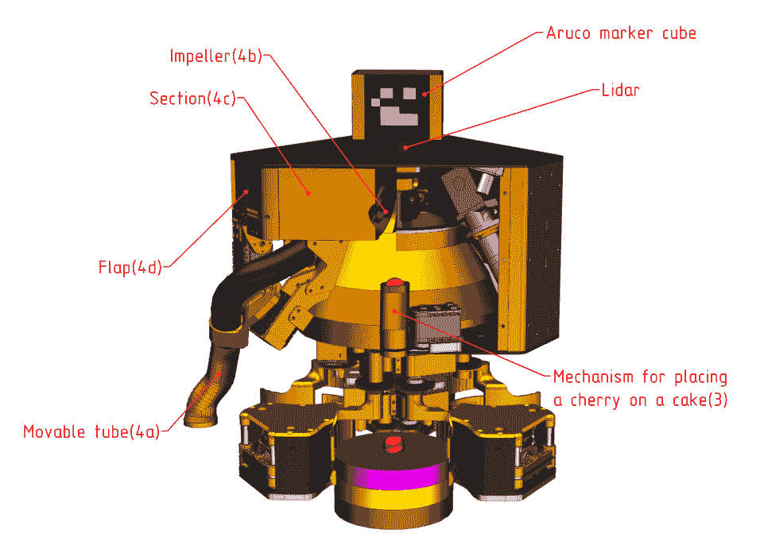

<!--yml

category: 未分类

日期：2025-01-11 13:00:16

-->

# LLM-MARS：用于行为树生成和自然语言处理增强对话的多智能体机器人系统中的大型语言模型

> 来源：[https://arxiv.org/html/2312.09348/](https://arxiv.org/html/2312.09348/)

Artem Lykov, Maria Dronova, Nikolay Naglov，

Mikhail Litvinov, Sergei Satsevich, Artem Bazhenov，

Vladimir Berman, Aleksei Shcherbak 和 Dzmitry Tsetserukou ©2023 IEEE。该工作已提交给IEEE，等待可能的发表。版权可能会在未通知的情况下转让，转让后该版本可能无法再访问。作者们来自俄罗斯莫斯科的斯科尔科沃科技学院（Skoltech）数字工程中心智能空间机器人实验室，邮政编码121205。 {Artem.Lykov, Maria.Dronova, Nikolay.Naglov, Mikhail.Litvinov2, Sergei.Satsevich, Artem.Bazhenov, Vladimir.Berman, Aleksei.Shcherbak, D.Tsetserukou}@skoltech.ru

###### 摘要

本文介绍了LLM-MARS，这是一项利用基于大型语言模型的人工智能技术，应用于多智能体机器人系统的首个技术。LLM-MARS使人类与机器人之间能够进行动态对话，允许机器人根据操作员的指令生成行为，并为关于其行为的问题提供信息丰富的回答。LLM-MARS建立在基于变换器的大型语言模型上，并对Falcon 7B模型进行了微调。我们采用了多模态方法，使用LoRa适配器来处理不同的任务。第一个LoRa适配器是通过对行为树及其相应指令的示例进行微调开发的。第二个LoRa适配器则通过对问答示例的微调进行开发。根据2023年Eurobot比赛规则，在一个由两台机器人组成的多智能体系统上进行的实践试验显示出良好的结果。这些机器人在复合命令中的任务执行准确率达到79.28%。对于包含最多两个任务的命令，准确率超过了90%。评估结果表明，该系统对操作员问题的回答在准确性、相关性和信息性方面表现出色。LLM-MARS和类似的多智能体机器人系统具有革命性潜力，能够彻底改变物流领域，支持自主探索任务，并推动工业5.0的发展。

###### 关键词：

机器人技术，人工智能，多智能体系统，大型语言模型，人机交互，战略生成，行为树。

## I 引言

近年来，机器人技术和人工智能领域取得了显著进展。多种方法论已涌现，用以增强机器人系统的逻辑能力，其中一个特别引人注目的研究方向是将大型语言模型（如GPT）与机器人系统的结合。这些大型语言模型具有将复杂的自然语言任务拆解为机器人可以执行的简单子任务的卓越能力。此外，大型语言模型还被用于开发利用自然语言处理（NLP）技术的人机交互系统。

为了应对一系列挑战，多模态解决方案也已被探索。开放式LLM的出现标志着LLM研究的一个转折点，因为它们可以在自定义数据上进行开放训练，使其更易获得并能够执行指令跟随任务。然而，针对使用LLM生成完整机器人行为树（BT）的研究仍然有限，这些行为树需要同时考虑大量可能的场景处理。这类模型专为利用自然语言处理技术来理解人类语言，并基于所获得的信息生成复杂的机器人操作序列而设计。这一方法在提升人工智能机器人系统的适应性和灵活性方面展示了巨大潜力。

图1：策略生成过程。用户定义任务，大型语言模型根据环境生成机器人自主完成任务的行为树。

在本研究中，我们采用了基于LLM的行为树生成方法，利用经过微调的Falcon 7B LLM变体来生成行为树。在构建我们的系统时，该模型在LLM排名中表现出了卓越的指标[[1](#bib.bib1)]。作为概念验证模型，该模型达到了预期效果。然而，新模型的不断涌现带来了持续的挑战，我们需要跟上该领域最新发展的步伐。

该模型是通过使用由OpenAI开发的text-davinci-003模型生成的数据集进行微调的。为了收集数据集，使用ChatGPT API生成了机器人指令对及其相应的行为树（BT），同时手工编写的行为树被用作模型的示例。此外，鉴于我们的目标是评估在类似现实世界场景条件下使用大语言模型（LLM）时多智能体机器人系统的性能，因此还进行了涉及物理机器人的实验。

动态生成行为树的上述应用在机器人自主竞赛领域展现了极大的潜力且明显可见。其中一个例子是Eurobot，这是一项由Planète Sciences France主办的国际著名业余机器人竞赛。Eurobot的主要技术挑战是构建一个自主机器人或一对协同工作的机器人。这些机器人需要在有效应对对手发起的行动的同时，展现出可靠性。

在2023年版本的比赛中，参赛机器人被要求执行一系列特定的动作。这些动作包括根据物体的颜色收集和分类一组被称为“蛋糕”的物品。此外，机器人还需要收集并统计被称为“樱桃”的球形物体。随后，获得的物体需要被运输并放置在比赛场地的指定位置。此外，机器人还必须巧妙地导航比赛场地，以到达指定的队伍位置，同时预测收集到的物体所带来的积分。这些复杂的条件为生成机器人行为树的现实世界评估提供了一个卓越的测试平台。

因此，在我们的研究中，我们专注于应用多模态LLM来控制一对移动机器人，在逼近现实世界场景的条件下执行任务。生成策略的过程如图[1](#S1.F1 "图1 ‣ I 引言 ‣ LLM-MARS: 用于行为树生成和多智能体机器人系统中的NLP增强对话的大型语言模型")所示。该模型的核心模块专门设计用于此目的，包括BT格式的行为生成模块和用于讨论任务结果的模块。

## II 相关工作

最近，变换器模型（transformer models）获得了极大的关注，自从Vaswani等人在开创性的论文《Attention is all you need》中提出该概念以来，这些模型在各个领域变得越来越普及[[2](#bib.bib2)]。这些变换器模型在语言建模、翻译、语音识别等任务中表现出了卓越的性能。

特别是基于变换器架构的LLM近年来受到了极大的关注。随着OpenAI的GPT3.5和GPT4等模型的出现，这种流行趋势得到了促进，相关特性分别由Chen等人[[3](#bib.bib3)]和Bubeck等人[[4](#bib.bib4)]讨论。OpenAI推出的ChatGPT[[5](#bib.bib5)]通过为更广泛的受众提供GPT的可访问性，为这一流行趋势做出了巨大贡献，将其受欢迎程度提升到了一个新的高度。

一段时间以来，只有与OpenAI合作的人才有机会积极参与GPT模型的开发，并见证其卓越的成功。然而，随着GPT类LLM模型的出现，形势发生了变化，如论文Raffel等人描述的Google T5[[6](#bib.bib6)]和Meta的LLaMa[[7](#bib.bib7)]，这些模型提供了不局限于单一实体控制的替代选项。这些模型在各种NLP应用中得到了广泛使用，包括语言生成、问答、情感分析等。

此外，开源LLMs的出现，包括斯坦福大学的Alpaca[[8](#bib.bib8)]模型，标志着LLM研究的一个转折点。E. J. Wang的工作[[9](#bib.bib9)]为那些希望使用斯坦福大学采用的相同方法对Alpaca 7B模型进行微调的个人提供了全面的资源。该资源涵盖了所有必要的组件和操作说明，旨在促进微调过程。与其他LLMs不同，斯坦福Alpaca模型不仅向全球研究人员开放，且其表现接近GPT-3，还具备能够在普通个人计算机上运行的特点。该模型的架构允许进行微调以执行指令跟随任务，这为相关技术领域的研究人员开辟了巨大的可能性。随着时间的推移，其他性能更好的开源LLMs陆续出现，并且具有进一步训练的可能性，例如我们在工作中使用的Falcon7B[[10](#bib.bib10)]。最近，最优性能模型的排名[[1](#bib.bib1)]每月更新，呈现出越来越出色的模型，不仅有像LLaMa 2 [[11](#bib.bib11)]和Mistral [[12](#bib.bib12)]这样的7B规模模型，还有像Falcon180B[[13](#bib.bib13)]这样的更为强大的模型。这些模型展现了与现有开源聊天模型的竞争力。在评估集上，它们表现出与某些专有模型相当的能力，尽管在其他先进模型（如GPT-4）的面前稍显逊色。

另一个特别令人着迷的研究方向涉及将大型语言模型（LLMs），如GPT，集成应用于机器人技术[[14](#bib.bib14)]。这些模型已经展示了生成连贯且语境适当文本的能力，使其非常适合广泛的自然语言处理（NLP）任务。特别是，它们具备将复杂的自然语言任务分解成可以由机器人执行的基础子任务的能力[[15](#bib.bib15), [16](#bib.bib16)]。此外，LLMs还被应用于开发利用NLP技术的人机交互系统[[17](#bib.bib17), [18](#bib.bib18)]。值得注意的是，RT2模型[[19](#bib.bib19)]已被提出以应对复杂的操作任务，而特斯拉最近发布了特斯拉机器人Optimus[[20](#bib.bib20)]，一款配备先进操作技能的人形机器人。将先进的LLMs与机器人系统结合，代表了一个充满前景的方向，具有促进人类与机器人在高度专业化领域及日常任务中更有效合作的潜力[[21](#bib.bib21)]。

然而，关于LLMs在生成机器人行为树中的应用，相关研究仍然有限[[22](#bib.bib22), [23](#bib.bib23)]。此前，各种方法如有限状态机[[24](#bib.bib24), [25](#bib.bib25)]、Petri网[[26](#bib.bib26), [27](#bib.bib27), [28](#bib.bib28), [29](#bib.bib29)]和行为树[[30](#bib.bib30), [31](#bib.bib31), [32](#bib.bib32), [33](#bib.bib33), [34](#bib.bib34)]通常被应用并仍在积极使用，用以描述机器人更高层次的行为。在这些方法中，行为树提供了一种指定复杂机器人行为的先进方式[[35](#bib.bib35)]。传统上，应用这些方法通常需要领域专家的参与，因此实施起来具有一定挑战性。然而，利用LLMs生成行为树可能会成为一个颠覆性的变化。

另一方面，利用自然语言处理技术，LLMs在机器人行为方面具有显著提高AI驱动机器人系统适应性和灵活性的潜力。Y. Cao等人的工作[[22](#bib.bib22)]尝试通过使用LLM来创建机器人行为。然而，作者们使用了OpenAI的产品来填充行为树（BTs）中的行为节点。由于OpenAI产品没有经过专门的训练来生成行为树，它们缺乏具身经验。因此，研究人员通过固定行为树结构来加以限制，仅使用序列和动作节点。尽管这种方法限制了行为树模块化结构的优势，但结果仍然是有希望的。然而，专门针对任务对LLM进行微调通常能取得更好的效果。预计这种方法能够生成多样化的行为树，并且不会对其结构进行任何限制。

此外，一些能够使用大型语言模型（LLMs）的实验室和工业界在开发机器人行为构建方法论方面非常勤奋，再次使用GPT或其对应模型。其中一项由Driess等人[[36](#bib.bib36)]完成的工作，聚焦于PaLM-E的开发，这是一种具身的多模态语言模型，使机器人能够在分析其环境的同时，按照人类的自然语言指令行动。另一个由Brohan等人[[37](#bib.bib37)]完成的工作，提出了一种用于大规模现实世界控制的机器人变压器。这两者都是需要大量计算资源和训练数据的大型模型。除此之外，波士顿动力公司也在探索GPT在构建机器人行为方面的潜力。他们成功地训练了机器狗Spot，使其能够提供操作报告并生成回应查询的答案，分析周围环境[[38](#bib.bib38)]。然而，它仅用于建筑内的语音通信和导航，且不与物理物体进行交互。

然而，生成包含各种行为树（BT）的大型数据集以适应不同结构和应用的机器人，是对LLM进行微调以生成复杂行为树所必需的。尽管使用来自人类反馈的强化学习（RLHF）方法对LLM进行训练，如Stiennon等人所讨论的[[40](#bib.bib40)]，这一方法已被广泛认可，但生成一个庞大的数据集需要聘请具有构建行为树专长的专家，这使得任务变得非常具有挑战性。在我们的研究中，我们改进了Y. Wang等人[[41](#bib.bib41)]在Taori等人[[8](#bib.bib8)]研究中采用的方法。该方法利用text-davinci-003模型，通过自我指令风格生成数据集。生成的模型在某些任务上的表现优于生成数据集的模型，这得益于它经过针对这些特定挑战的微调。  

在机器人学领域，LLM和其他基于变换器的模型的结合对于改善人机交互具有重要的前景。利用基于变换器的LLM能够显著推动解决广泛任务的进展，包括理解自然语言命令和将复杂任务分解为可管理的子任务。  

## III 行为树方法的优势  

### III-A 行为树在机器人学中的优势  

行为树（BT）是一种层次化结构，用于在抽象层次表示机器人任务，为状态机范式提供了一种替代方案。Colledanchise和Ögren[[31](#bib.bib31)]讨论了作为构建机器人行为的一种方法的行为树。形式上，行为树是一个有向根树，叶节点负责任务执行，分支节点定义控制流逻辑。叶节点可以是动作节点或条件节点。动作节点指定一个原始任务，任务完成时返回成功信号；条件节点用于评估布尔条件，例如特定传感器读数的满足情况。最常用的分支节点是顺序节点和回退节点。顺序节点按顺序执行其子节点，直到收到第一个失败信号；回退节点则按顺序执行其子节点，直到收到第一个成功信号。通过这四种节点类型，行为树可以实现与状态机相同的任务执行。但它有许多优势，因为模块化结构使得可以在不重建整个结构的情况下添加、移除或替换节点。

行为树（BT）因其直观和高效的机器人系统控制而成为机器人学中广泛使用的方法。它们提供了一种结构化的方式来表示和控制自主智能体的行为，使其非常适用于各种机器人应用。行为树已成功应用于许多机器人竞赛和挑战中，包括达尔帕机器人挑战赛（DARPA Robotics Challenge）、机器人世界杯（RoboCup）和欧洲机器人（Eurobot）。例如，在达尔帕机器人挑战赛中，团队使用行为树控制他们的机器人完成任务，如驾驶汽车、开门和使用电动工具，这些内容在Colledanchise和Ögren的论文中有所讨论[[42](#bib.bib42)]。在机器人世界杯中，行为树被用于控制多机器人系统完成诸如踢足球和搜救等任务，这些任务在Safronov等人的论文中有所探讨[[34](#bib.bib34)]。在欧洲机器人比赛中，行为树被用来控制自主机器人执行任务，如迷宫导航和物体操作，这些内容在Granosik等人的论文中讨论过[[43](#bib.bib43)]。

### III-B 使用行为树作为大型语言模型输出的优势

行为树（BT），作为一种层级化和模块化的结构，为基于变换器的大型语言模型（LLM）的开发提供了有前景的解决方案。该结构支持用相同类型的节点进行替换。替换令牌的能力使得这一结构非常适合作为变换器输出。此外，行为树结构的模块化和可扩展性使得可以轻松添加新节点或修改现有节点。

行为树结构的另一个重要特点是可以选择将子树作为主树的一部分。这意味着生成的行为树可以添加到节点库中，并作为更复杂行为的一部分使用。通过递归模式，模型可以首先在最高抽象层构建行为树，然后下降到较低的抽象层，从简单组件生成缺失的节点。这种方法使得在模型输出的令牌长度限制内创建大型和复杂的行为结构成为可能，同时提高了模型的性能，消除了对最终行为树大小的限制。

## IV 多模态大型语言模型用于多智能体机器人控制

当前，LLM 在机器人学中的应用，在处理复杂的动作序列和基于LLM的决策时，具有战略性优势。然而，在应对机器人执行重复和单调任务的复杂系统时，这些LLM的应用则缺乏意义。作为长期目标，我们赞扬创建一个通用的人工智能驱动的多智能体机器人系统，能够理解任务目标并利用现有智能体来解决问题。

我们的方法与传统方法有显著的不同。我们提出了一种解决方案，通过基于语言模型的人工智能系统控制整个多智能体系统，并为这些智能体生成行为树。我们的系统通过对话使用户能够与机器人智能体互动并进行控制。它包括机器人智能体和一个多模态大语言模型（LLM），该模型参与任务讨论、指令接收和查询响应。LLM为不同类型的智能体构建行为树，从而促进复杂任务的协作执行。智能体自主执行这些生成的行为树，并定期更新系统，提供有关其环境和当前结果的信息。这种行为树生成方法是在我们的ISR实验室内开发的，在机器人控制方面具有独特的优势。系统能够与不同数量和类型的机器人无缝协作，使其具有高度的可扩展性。与传统方法仅依赖大语言模型生成响应外部变化不同，我们的方法侧重于生成考虑多种可能场景演变的复杂机器人行为。通过一次创建行为树，它本身就涵盖了多个条件检查和响应指令。这种方法显著减少了对大语言模型的请求次数，有效地利用单一的“大脑”，从而提升了资源效率。

在实际场景中，多智能体方法往往是至关重要的。在机器人领域，单个机器执行预定义行为边界内的简单任务，而集体系统则解决复杂的挑战。这一现象在仓库机器人中非常明显，机器人执行基本的动作，但通过协作来应对复杂的物流需求。同样，在科学无人机探索中，每架无人机遵循简单的计划，但它们的集体努力产生了详细的遥远地形地图。城市配送机器人在货物运输中的个人角色表现出色，但系统的复杂性体现在协调全市范围内的货物配送。在使用多智能体系统进行设施检查时，机器人遵循预定义的行为，而一个集中系统确保全面覆盖整个企业。即使在制造业中，单个机器人的任务可能涉及重复的操作，但整个传送带系统能够高效地制造技术产品。因此，这种情况是典型的，许多机器人通过贡献简单的组成部分来完成更广泛的任务。因此，给每个机器人配备独立的人工智能是一个过于雄心勃勃的任务。

虽然现有的多智能体系统已经在积极使用，但它们的高级控制通常依赖于一组人工操作员或预定义的程序，这些程序是针对特定任务量身定制的。因此，任何任务修改都需要一支专家团队和大量时间来重新配置整个系统。我们提出方法的关键是将这种高级控制委托给人工智能。我们的方法使得系统能够快速重组以适应新任务。为此，只需指示基于LLM的AI管理器要执行的任务，它将使用现有的智能体来执行。

### IV-A 多模态LLM控制Eurobot机器人

为了在实验室内原型化该系统，我们转向了另一个具有实现该技术所需所有特性的任务。Eurobot作为一个合适的测试平台，用于在机器人中实现LLM。Eurobot是一个备受尊敬的国际机器人竞赛，提供了一个完美的平台来测试和评估机器人能力。该竞赛使用一个多智能体系统的机器人，这些机器人能够自主执行指定的行为。竞赛规则明确，胜利标准是系统的目标，但比赛场地的变化条件会产生成千上万种场景。竞赛挑战参与者设计并操作能够表现出可靠性和响应能力的自主机器人，以应对对手的行动。在2023年，机器人的任务是收集和分类一组被称为“蛋糕”的彩色物体，并统计被称为“樱桃”的球形物体。这些物体随后需要被运输并准确放置在比赛场地上指定的区域。因此，我们的机器人“黑武士”和“橙将军”被选为LLM集成的先锋。将LLM引入一个最初设计了不同目的的高级、低级和机械模块的机器人中，面临着巨大的挑战。机器人最初就支持行为树策略，这在我们这个过程中提供了帮助。我们的目标是以一种允许人类互动的方式启动一个多模态模型，同时生成的行为树能够无缝运行，就像之前手动编写的一样。

我们机器人硬件的配置并不包括能够支持7亿参数LLM自主执行的组件。LLM在一个通过SSH请求从机器人访问的远程服务器上启动。为了便于远程执行LLM，我们租用了一个配备英特尔Broadwell和NVIDIA Tesla V100硬件的服务器。自然语言查询被发送到服务器，服务器的响应和策略会返回到机器人。因此，整个由多智能体机器人系统和多模态LLM组成的系统被组建起来。

## V 系统概述

本节将对用于集成多模态大语言模型（LLM）的机器人系统进行详细分析，涵盖软件和硬件两个方面。

通过详细阐述所有机器人组件与软件部分之间的相互作用，本节不仅为理解我们的成就的复杂性提供了全面的指导，还为在创建基于LLM驱动的多智能体机器人系统的领域中，促进自主复制我们的成果提供了实际指南。

### V-A 机械结构概述

(a)

(b)

图 2：机器人的3D CAD模型。(a)等轴测图。(b)框架和抓取器的跨视图。

这些机器人（图 [2](#S5.F2 "图 2 ‣ V-A 机械结构概述 ‣ V 系统概述 ‣ LLM-MARS：用于行为树生成和自然语言处理增强对话的多智能体机器人系统中的大语言模型")）专门设计以符合Eurobot竞赛的规则。钢架将每个机器人必需的部件固定在一起，机器人在一个具有全向轮和悬挂系统的平台上移动。在机械结构中，关键组件包括抓取器、分拣机构、樱桃分配器和樱桃收集机制。

三个抓取器的每一个都分为下部（1a），用于抓取底部蛋糕层，以及上部（1b），用于抓取上面两层蛋糕。抓取器的所有部分都由伺服电机控制，并附着在分拣机制的外齿轮上。分拣机制包括升降和旋转部件，通过电机通过皮带将其升降在一个中央杆（2a）上。旋转部分由两部分组成，类似于行星齿轮系统，其中一个输入齿轮通过电机旋转外齿轮（2b）。樱桃分配器由一个特殊管道和一个由伺服电机控制的专用挡板组成。挡板的动作可以控制樱桃的释放，将其精确地放置到蛋糕上。樱桃收集机制包括几个独立的部分：一个特别形状的可动管（4a），由两个伺服电机调节；两个叶轮（4b），用于从机器人指定区域（4c）吸取樱桃，并将其排放到专用容器中；以及由伺服电机控制的外部和内部挡板（4d）。

### V-B 嵌入式系统概述

机器人电子系统作为关键中介，促进了高层计算机与一系列车载设备之间的无缝互动，这些设备包括全向轮平台、执行器、开关和传感器。其主要功能是为高层系统提供抽象层和接口，从而简化了整体互动过程。

关键的时间敏感操作和低级控制算法被集成在电子组件中，进一步巩固了其在系统中的作用。此外，电子系统熟练地管理着机载电池，确保其安全和最佳运行，同时有效地向所有相关的机器人组件分配电力。电子系统结构的示意图如图[3](#S5.F3 "图3 ‣ V-B 嵌入式系统概述 ‣ V 系统概述 ‣ LLM-MARS：用于行为树生成和多智能体机器人系统中NLP增强对话的大型语言模型")所示。

图3：机器人电子系统的框图。

机器人电子系统的核心是主控制板，围绕STM32F407VG微控制单元（MCU）构建。这个关键的板子同时从+5V和+12V电源线路获取电力，而其他电子组件被视为下游的从属部分，依赖于这个中央控制板的严格控制和连接。此外，高级计算机作为上游，通过USB电缆与主控制板建立连接。

### V-C 高级系统概述

高级系统旨在管理直接从传感器（如激光雷达和摄像头）以及嵌入式系统，特别是车轮编码器，获取的数据。此外，它通过各种命令与机器人执行器进行交互，使开发人员能够设计复杂的策略。为满足这些需求，系统基于ROS2 Humble框架[[44](#bib.bib44)]构建，运行在安装了Ubuntu 22.04的Intel NUC计算机上。计算机通过USART接口与STM32进行通信。因此，该模块通过ROS主题接收命令并发送响应，并执行序列化或反序列化以匹配USART数据交换格式。除此之外，该模块以40Hz的频率将车轮里程信息发布到ROS主题中。

本地化模块在精确确定机器人在赛场中的位置方面至关重要。我们采用了粒子滤波（PF）方法[[45](#bib.bib45)]，整合了轮编码器、激光雷达（LiDAR）和计算机视觉（CV）系统的数据。最初，模块通过个别传感器数据计算里程测量，参考机器人的先前姿态。为了提取基于激光雷达的里程，我们引入了激光扫描匹配模块，该模块基于经典扫描匹配器（Canonical Scan Matcher）原理[[46](#bib.bib46)]。这些里程测量在粒子滤波的“预测”阶段起着关键作用。值得注意的是，每个传感器都有一个加权值，决定了相应测量影响的粒子比例。原始激光雷达点云作为地标检测的主要来源。这些地标位于赛场边缘外的一个三角形的顶点，并具有包裹在反射材料中的圆柱形状。检测过程结合了一系列操作：根据光强返回值滤波点，去除离群点，并通过优化技术识别地标中心。随后，执行数据关联，将检测到的中心与地标的全局位置进行关联。在过程的最后，确定的地标中心在粒子滤波的“更新”阶段变得至关重要。这有助于合成测量，从而为机器人提供精确和过滤后的姿态确定。

计算机视觉系统设计了两个主要功能：游戏物体检测和机器人定位。该系统由一台Jetson Xavier AGX微型计算机和一台配备Computar鱼眼镜头的Imagine Source DFK 33UX250全局快门摄像机组成。摄像机安装在一个塔式跟踪设备上，俯瞰整个赛场。系统的第一个功能是准确检测和识别游戏物体，特别是蛋糕。该功能使用霍夫算法[[47](#bib.bib47)]进行圆形查找，有效跟踪赛场上的所有蛋糕。此外，系统还能确定每个检测到的蛋糕的颜色和层数。第二个功能擅长精确地定位赛场上的机器人。机器人配备了带有AruCo标记的立方体，这些标记可以从任何角度看到，确保即使在不同视角下也能可靠检测。通过单个AruCo标记，系统可以精确地在三维空间中定位机器人。这个特性在涉及多个机器人的动态场景中尤为重要，因为激光雷达定位可能无法提供准确数据。计算机视觉系统使用OpenCV Python库[[48](#bib.bib48)]进行AruCo标记的检测和识别。

导航模块负责创建环境地图、为机器人生成安全的轨迹并控制其速度。最初，该模块持续从定位和计算机视觉（CV）模块获取机器人的更新坐标，包括对手的坐标以及游戏对象的坐标。这些数据用于生成环境地图。地图被结构化为一个由1x1厘米单元格组成的网格，每个单元格被赋予0（表示未占用）或1（表示已占用）的值。完整的地图通过在静态地图上添加具有一定半径的占用圆圈来构建，静态地图包括场地边界和固定的樱桃支架。随后，该模块从行为树（BT）模块接收目标点，并通过采用RRT*算法[[49](#bib.bib49)]制定一条从当前位置到目标的安全简洁路径。在每次向目标推进的迭代过程中，该模块检查是否有对手机器人阻碍了已建立的路径。如果发生阻碍，模块将从当前位置生成一条新路径。如果目标无法到达，系统将发出停止命令并向BT模块反馈。最终，一旦路径确定，模块使用最小抖动算法[[50](#bib.bib50)]生成平滑的速度曲线，并向STM32发送速度命令。速度限制根据与其他机器人的最小距离进行调整，以避免碰撞。为了保持在路径上，使用了两个PID调节器：一个用于轨迹，一个用于角度。

BT模块提供了一个接口，用于为机器人创建人类可读的策略。为此，使用了behavior-tree-cpp-v3库[[51](#bib.bib51)]。每个对执行器的命令都封装成一个具有输入和输出端口的特定动作。此外，还提供了有用的条件，例如“如果-则-否则”或执行时间的界限。策略以xml文件的形式编写。

## VI LLM训练方法与策略

我们研究的主要目标是训练一个能够基于操作员的自然语言指令，为多智能体系统中的机器人构建行为树（BTs）的模型。为实现这一目标，我们使用低秩适应PEFT方法[[52](#bib.bib52)]对包含70亿参数的Falcon模型进行微调，数据集由text-davinci-003模型生成。PEFT方法使得在不需要重新训练整个模型的情况下，能够高效且富有成效地微调大语言模型（LLM），正如G. Pu等人所讨论的[[53](#bib.bib53)]。当微调LLM的计算成本过高时，PEFT方法尤其有用。与调整所有模型参数不同，PEFT方法只调整少量额外参数，从而显著减少计算和存储成本。我们用于微调LLM的PEFT方法是低秩适应（LoRA）方法，该方法在变换器层中添加低秩矩阵，仅调整这些矩阵，而不是整个模型。E. J. Hu等人描述了LoRA方法在LLM中的应用[[52](#bib.bib52)]。上述的Falcon 7B被选为我们的研究模型，因为在系统开发时，它在开放模型评分[[1](#bib.bib1)]方面表现优异。

### VI-A 行为树生成模块微调过程

本小节深入探讨了为训练LLM生成行为树（BT）而定制数据集的构建过程。LLM按顺序生成单词，其训练数据集包括机器人的行为作为提示和相应的完整答案。因此，为了实现我们的目标，每个数据集样本包含构建机器人行为的指令和一个输出，该输出是一个逻辑和结构上正确的BT，允许机器人执行任务。指令包括一个所有样本共享的系统提示。这部分对于后续工作是必要的，因为LLM不仅将构建BT，还将执行其他任务。在指令的不可更改部分之后，描述了所需的机器人行为。在使用text-davinci-003模型生成这些样本的这一部分时，特别关注了请求的自然性。它应该是一个简单且逻辑上易于理解的命令，类似于人类可以给出的指令，因为当使用经过微调的模型时，正是人类将给出指令给机器人。生成的BT由机器人可以执行的Action和Condition节点组成。除了Action和Condition节点外，BT有时还包含SubTree节点。这些节点类似于Action节点，但它们本身是编译后的BT。添加SubTree节点使得可以通过生成缺失的元素来分阶段生成机器人行为的整体逻辑。此方法避免了在一次性使用LLM生成大型结构的情况，因为在所有序列元素之间存储注意力的需求会导致所需内存的平方增长，随着序列长度的增加，内存需求大幅增加。

此外，我们继续进行数据集生成过程。最初，我们拥有一个可供添加到机器人BT中的节点列表，并且我们希望模型仅从这些预定义节点生成行为。为此，我们使用Python脚本生成了多种行为树样本，而没有使用LLM方法。该脚本生成了一组多样的动作组合和参数，并根据特定模板生成相应的描述。在数据集中，我们保留了BT的原样，但使用ChatGPT API对描述进行了改述。因此，我们的数据集不仅包含了全面且战略上有效的行为，还展示了请求的多样性。训练数据集包括7500个BT样本，每个样本都有对应的用户命令。微调过程持续了三个周期，在Nvidia Tesla V100上总计花费了10小时。

### VI-B 问答模块微调过程

图4：LLM-MARS的系统架构。

为了实现有效的人机交互，机器人仅仅接收和执行命令是不够的。它还必须提供反馈并回答有关其行为的问题。考虑到我们实现自主AI驱动机器人这一宏伟目标，开发一个独立的完整模型来处理问答任务是不可行的。在单个机器人的微型计算机上同时运行两个7B模型会显著提高硬件要求。因此，我们提出了使用一个单一的大型语言模型（LLM）和多个LoRa适配器作为解决方案。这种方法在紧凑性和资源效率方面具有优势。然而，它也存在一些缺点，例如需要在适配器之间切换，耗时约40秒。我们还探讨了使用一个适配器同时处理这两个任务的可能性；然而，这会影响生成行为树（BT）结构的正确性，从而危及机器人的功能。

为了解决生成关于机器人行为结果问题的答案，我们借鉴了Boston Dynamics的工作[[38](#bib.bib38)]。根据BT和控制传感器的数据，汇编一个包含行为结果上下文的XML文件。然后，这个文件与用户提出的问题一起作为输入传递给LLM。在原项目中，作者使用了ChatGPT API来生成问答回复。在我们的研究中，我们利用ChatGPT API基于我们指定格式的XML文件生成11000个问答样本，每个样本有不同的结果。经过在Nvidia Tesla V100上对该数据集进行三轮训练，总耗时12小时后，我们将第二个LoRa适配器集成到模型中，使其变得多模态。最终架构如图[4](#S6.F4 "Figure 4 ‣ VI-B Question Answering Module Fine-tuning Process ‣ VI LLM Training Methods and Recipes ‣ LLM-MARS: Large Language Model for Behavior Tree Generation and NLP-enhanced Dialogue in Multi-Agent Robot Systems")所示。

目前，我们已经开发了两个适配器。在进一步的开发中，适配器的数量以及多模态系统的能力可以得到扩展。

## VII 实验评估

### VII-A 人类识别模型生成行为树的实验

为了评估模型的表现，我们进行了一个评估，测试个体区分LLM生成的BT与人工编写的BT的能力。Brown等人也进行过类似的研究[[54](#bib.bib54)]，但与我们研究的不同之处在于，我们的所有参与者都具备关于BT的基本原理和构建方式的知识。

#### 参与者

我们共招募了15名参与者，包括专攻机器人学方向的本科生和研究生，以评估BT生成的质量。在这些参与者中，十名是当地Eurobot团队的成员，并且经常与BT进行工作。剩余的五名参与者之前没有接触过BT，且接受了有关BT的基本原理和构建技巧的明确指导。在实验开始之前，所有参与者均提供了知情同意书，确认他们已了解机器人BT的操作和结构方面的内容。

#### 程序

为了进行实验，使用LLM生成了一组10个BT。这些BT旨在模拟移动机器人可以执行的各种动作和交互。此外，还手动创建了一组10个BT，旨在实现与LLM生成的BT相似的功能和行为。参与者被展示了机器人的行为描述和一对BT，其中包含一个LLM生成的BT和一个人类创建的BT。展示顺序是随机的，以避免任何偏差。随后，参与者被要求评估这些BT，并确定哪一个是由LLM生成，哪一个是由人类创建。他们被指示依赖自己的主观感知以及能够识别的任何区分特征。

#### 实验结果

在所有BT对的评估阶段完成后，收集了相关数据并进行了分析。实验结果如图[5](#S7.F5 "图5 ‣ 实验结果 ‣ VII-A 人类识别模型生成的行为树实验 ‣ VII 实验评估 ‣ LLM-MARS：用于行为树生成和多智能体机器人系统中的自然语言处理增强对话的大型语言模型")所示。平均得分为4.53分（满分10分），表明参与者区分LLM生成的BT和人类创建的BT的能力与随机猜测相当。

图5：关于人类识别模型生成的行为树的正确答案分布。

为了检查调查回答与特定问题之间的潜在关联，进行了单因素方差分析（ANOVA），显著性水平设定为 5%。分析结果显示，用户对不同问题的感知之间没有统计学显著差异（F = 0.75，p = 0.66 $>$ 0.05）。这表明没有证据支持正确答案的概率与问题之间的依赖关系。为了确定人工生成的行为树与LLM生成的行为树是否存在可区分的差异，进行了t检验，显著性水平设定为 5%，以评估无法区分它们的原假设。在这一原假设下，受试者提供的正确答案平均数量为 10 个中的 5 个，平均得分为 0.5。根据我们的结果（平均得分 = 0.453，t统计量 = -1.2，临界值 = 2.145，p $>$ 0.05），我们没有理由拒绝原假设，这表明平均得分与 0.5 并无显著差异。

该用户研究涉及15名志愿者，未发现LLM生成的行为树与人工生成的行为树之间在主观感知上有实质性差异。LLM模型展示了生成机器人行为的能力，其结果接近人工创建的行为树，至少在我们实验的主观感知上下文中是如此。

### VII-B 行为生成性能评估

在实验展示LLM生成给定任务的行为树的能力后，我们在一个真实的多智能体机器人系统上进行了实验。该实验旨在评估形成的行为树在多大程度上反映了给定的任务。

#### 参与者

实验由本工作的作者参与，评估了LLM生成行为树的能力。

#### 过程

LLM（大语言模型）接受了六十个命令，每个命令包含一到六个任务。每个任务变体提供了十个示例，确保对任务复杂性的全面评估。主要关注点是分析将机器人任务整合到行为树（BT）中的准确性。实验结果见图 [6](#S7.F6 "图 6 ‣ 过程 ‣ VII-B 行为生成性能评估 ‣ VII 实验评估 ‣ LLM-MARS：用于多智能体机器人系统中的行为树生成和NLP增强对话的大语言模型")。

图 6：任务数量对大语言模型性能准确度的影响。

#### 实验结果

实验结果展示了大型语言模型（LLM）在根据指令生成行为树（BTs）方面的卓越表现。该LLM在将提供的机器人任务整合到行为树中的准确率达到了70.44%。对于最多包含两个任务的指令，整合准确率超过了90%。在一条指令中正确添加任务的平均百分比为79.28%。值得注意的是，行为树中的任务整合准确率受指令中任务数量的影响。

### 第七章C 专家评估问题回答

#### 参与者

接下来的实验涉及收集了50个来自大型语言模型（LLM）关于机器人行为的回应。这些回应经过了十位具有机器人行为相关领域的专业知识和经验的个体评估，评估标准包括准确性、相关性和信息性。

图7：大型语言模型参数的平均评估。

#### 程序

LLM的回应由专家评分员根据三个标准进行评估。准确性以0表示错误回答，1表示正确回答。相关性按1到5的等级评定（1 = 不相关，5 = 高度相关），信息性则按1到5的等级评估，得分越高表示信息越相关。为了验证数据的显著性，进行了克里平多夫α可靠性测试，以评估专家的一致性。相应的数据见图[7](#S7.F7 "图7 ‣ 参与者 ‣ 第七章C 专家评估问题回答 ‣ 第七章 实验评估 ‣ LLM-MARS: 大型语言模型在多代理机器人系统中的行为树生成和自然语言处理增强对话应用")。

#### 实验结果

LLM的平均准确率为72.8%，相关性和信息性得分分别为4.71和4.89。

为了验证数据的显著性，进行了克里平多夫α可靠性测试，以评估专家的一致性。克里平多夫α可靠性测试的结果如下：

+   •

    准确性可靠性：克里平多夫α系数为0.8239，表明评估者在准确性方面有较强的一致性。

+   •

    相关性可靠性：克里平多夫α系数为0.7229，表明评估者在相关性方面有中等程度的一致性。

+   •

    信息性可靠性：克里平多夫α系数为0.7594，同样表明评估者在信息性方面有中等程度的一致性。

## 第八章 结果与讨论

结果（图[6](#S7.F6 "图 6 ‣ 程序 ‣ VII-B 行为生成性能评估 ‣ VII 实验评估 ‣ LLM-MARS：用于行为树生成和多智能体机器人系统中NLP增强对话的大型语言模型")）表明LLM在基于指令生成行为树方面表现优异。LLM准确地将70.44%的所有给定机器人任务整合到生成的行为树中。对于最多包含两个任务的指令，整合准确率超过90%。此外，指令中正确添加任务的平均百分比为79.28%。此外，行为树中任务的整合准确率受指令中任务数量的影响。通过显著性水平为0.05的一元方差分析（ANOVA）确认了这一关系的统计显著性（F统计量 = 2.61，p值 = 0.035）。具体来说，LLM在处理包含较少任务的指令时表现更好。处理最多6个任务的指令时，性能略有提升，这可能是因为这些任务的数量使得策略类似于用于生成LLM微调数据集的Eurobot策略。

每位专家的问答评估结果（图[7](#S7.F7 "图 7 ‣ 参与者 ‣ VII-C 专家问答评估 ‣ VII 实验评估 ‣ LLM-MARS：用于行为树生成和多智能体机器人系统中NLP增强对话的大型语言模型")）表明，LLM在处理与机器人行为相关的问题时表现出色。平均准确率为72.8%。相关性和信息量得分分别为4.71和4.89。

Krippendorff α可靠性测试的结果表明，专家评估者在准确性参数上的一致性较强。然而，在相关性和信息量参数上，一致性水平较为中等。这一差异可以归因于相关性和信息量相比准确性而言更具主观性。

在我们的研究中，我们探索了LLM与机器人技术的激动人心的融合。我们开发了第一项技术，能够创建一个多智能体机器人系统，使其能够与人类对话，根据人类指令为其代理构建复杂的行为策略，并提供任务执行反馈。这项技术已经在接近真实世界条件下的多智能体机器人系统中得到了应用。实验结果表明，机器人能够正确执行给定的复合指令，平均准确率为79.28%，对于包含一个或两个任务的指令，准确率超过90%。此外，专家对问答的评估表明，系统提供的答案具有较高的准确性、相关性和信息量。

尽管研究中获得的结果充分证明了我们的预期，但这一技术仍有广阔的探索和完善空间。在未来的工作中，我们将专注于提升模型的命令处理能力，特别是对于包含更多任务的命令。这一改进可以通过两步法实现，首先将命令分解为更简单的任务，然后基于这些任务生成行为树（BTs）。分解阶段可以通过向行为树生成适配器添加专门功能，或训练一个专门为此目的的适配器来实现。

## IX 结论

总之，我们开发并实施的LLM-MARS标志着人工智能与机器人技术融合的突破性进展。这一创新方法，基于Falcon 7B的大型语言模型，引入了机器人控制的范式转变，使得通过动态对话管理多智能体机器人系统成为可能。

我们在Eurobot 2023比赛规则下的实验展示了显著的成功，平均任务执行准确率达到了79.28%。特别值得注意的是，系统在将任务整合到行为树（Behavior Trees）中的高效性，展示了所采用的大型语言模型在此场景中的有效性。观察到任务整合准确性与命令中任务数量之间的相关性，提示了命令处理的有针对性改进。

专家评估进一步确认了LLM-MARS在实际场景中的可靠性和潜力，强调了其在回答问题时的高准确性、相关性和信息性。这些发现还揭示了未来研究的方向，特别是在通过命令分解和专门适配器等先进技术提高系统处理复杂命令的能力方面。

我们的核心成就 lies 在于我们在机器人管理方面的开创性方法，使得一群机器人能够在单一大型语言模型（LLM）的控制下具备人工智能能力。这一策略对于机器人群体共同完成复杂任务尤其重要，每个机器人响应简单指令。例如，移动机器人群体可以彻底取代人类仓库人员，革新物流行业。此外，机器人或无人机群体可以自主执行探索任务，寻找有价值的文物并进行地形研究。此外，将这项技术应用于创建多智能体的机械臂机器人系统，标志着人机协作方向的进一步发展，也即工业5.0。

我们方法的主要优势在于，LLM为特定任务配置系统，消除了为每个机器人进行专门人类编程的需要。这不仅简化了流程，还赋予了人工智能作为系统管理员的能力，能够回答关于其性能的询问。

## 参考文献

+   [1] E. Beeching 等人，“开放LLM排行榜”。Huggingface.co. [https://huggingface.co/spaces/HuggingFaceH4/open_llm_leaderboard](https://huggingface.co/spaces/HuggingFaceH4/open_llm_leaderboard)（访问日期：2023年11月16日）。

+   [2] A. Vaswani 等人，“注意力机制：你需要的一切，”2017年，arXiv:1706.03762\。

+   [3] X. Chen 等人，“GPT-3.5对前代模型的鲁棒性如何？关于语言理解任务的综合研究，”2023年，arXiv:2303.00293\。

+   [4] S. Bubeck 等人，“人工通用智能的火花：与GPT-4的早期实验，”2023年，arXiv:2303.12712\。

+   [5] G. Brockman 等人，“介绍ChatGPT，”OpenAI，2022年 [在线] 可用：[https://openai.com/blog/chatgpt](https://openai.com/blog/chatgpt)。

+   [6] C. Raffel 等人，“探索统一文本到文本变换器的迁移学习极限，”《机器学习研究期刊》，第21卷，第140期，页码：1-67，2020年\。

+   [7] H. Touvron 等人，“LLaMA：开放高效的基础语言模型，”2023年，arXiv:2302.13971\。

+   [8] R. Taori 等人，“Alpaca：一个强大且可复制的指令跟随模型”。CRFM.Stanford.edu [https://crfm.stanford.edu/2023/03/13/alpaca.html](https://crfm.stanford.edu/2023/03/13/alpaca.html)（访问日期：2023年9月26日）。

+   [9] E. J. Wang. “Flan-Alpaca-LoRA: 来自人类和机器的指令调优与低秩自适应”。GitHub.com. [https://github.com/Reason-Wang/flan-alpaca-lora](https://github.com/Reason-Wang/flan-alpaca-lora)（访问日期：2023年9月15日）。

+   [10] G. Penedo 等人，“Falcon LLM的精炼Web数据集：仅凭Web数据超越精心策划的语料库，”2023年，arXiv:2306.01116\。

+   [11] H. Touvron 等人，“Llama 2：开放的基础模型和微调的聊天模型，”2023年，arXiv:2307.09288\。

+   [12] A. Q. Jiang 等人，“Mistral 7B，”2023年，arXiv:2310.06825\。

+   [13] Falcon LLM的精炼Web数据集：超越精心策划的语料库，仅凭Web数据。 (2023) [在线]. 可用：[https://huggingface.co/tiiuae/falcon-180B](https://huggingface.co/tiiuae/falcon-180B)。

+   [14] A. Koubaa，“ROSGPT：与ChatGPT和ROS的下一代人类机器人互动，”Preprints.org，2023年，doi: 10.20944/preprints202304.0827.v3\。

+   [15] I. Singh 等人，“ProgPrompt：使用大型语言模型生成定位机器人任务计划，”2023年IEEE国际机器人与自动化大会（ICRA），英国伦敦，2023年，页码：11523-11530，doi: 10.1109/ICRA48891.2023.10161317\。

+   [16] X. Zhao, M. Li, C. Weber, M. B. Hafez, S. Wermter，“与环境对话：使用大型语言模型进行互动多模态感知，”2023年，arXiv:2303.08268v2\。

+   [17] Y. Ding, X. Zhang, C. Paxton, S. Zhang，“基于大型语言模型的物体重新排列任务与运动规划，”2023年，arXiv:2303.06247v3\。

+   [18] W. Huang 等人，“内心独白：通过语言模型的规划实现具身推理，”2022年，arXiv:2207.05608\。

+   [19] B. Zitkovich 等， “Rt-2：视觉-语言-动作模型将网络知识转移到机器人控制中，”第7届机器人学习年会（CoRL 2023），美国亚特兰大，2023年，第1-19页\.

+   [20] Y. Su, “人工智能：特斯拉机器人之重要性，”国际计算机、机器学习与人工智能会议（CMLAI 2023），美国旧金山，2023年，第1351-1355页，doi: 10.54097/hset.v39i.6767\.

+   [21] B. Ichter 等， “做我能做的，而不是我说的：将语言与机器人能力对接，”机器人学习会议，纽西兰奥克兰，2022年，第287-318页\.

+   [22] Y. Cao, C.S. Lee, “基于机器人行为树的大型语言模型任务生成，”2023年，arXiv:2302.12927\.

+   [23] Z. Wu, Z. Wang, X. Xu, J. Lu, H. Yan, “具身任务规划与大型语言模型，”2023，arXiv:2307.01848\.

+   [24] R. Balogh, D. Obdržálek, “在入门级机器人学中使用有限状态机：教学与学习的方法与应用，”发表于《教育中的机器人学》（RiE 2018）。智能系统与计算的进展，Springer出版社，2018年，第829卷，第85-91页\.

+   [25] R. Hussain, T. Zielinska, R. Hexel, “基于有限状态自动机的行走机器控制系统，”《先进机器人系统国际期刊》，第16卷，2019年5月，艺术编号1729881419853182，doi: 10.1177/1729881419853182\.

+   [26] P. Lima, H. Gracio, V. Veiga 和 A. Karlsson, “用于建模和协调机器人任务的Petri网，”发表于《SMC'98会议论文集》。1998年IEEE国际系统、人类与控制论会议（Cat. No.98CH36218），美国加利福尼亚州圣地亚哥，1998年，第190-195页，第1卷，doi: 10.1109/ICSMC.1998.725407\.

+   [27] V.A. Ziparo, L. Iocchi, P.U. Lima, D. Nardi, P.F. Palamara, “Petri网规划：多机器人系统中协作与协调的框架，”发表于《自主代理与多智能体系统》，第23卷，第344-383页，2011年，doi: 10.1007/s10458-010-9146-1\.

+   [28] B. Lacerda, P.U. Lima, “基于Petri网的多机器人任务协调从时序逻辑规范出发，”发表于《机器人与自主系统》 第122卷，2019年9月，艺术编号103289，doi: 10.1016/j.robot.2019.103289\.

+   [29] P. Lv, G. Luo, X. Yin, Z. Ma, S. Li, “基于Petri网的循环任务多机器人路径规划优化，”发表于《控制工程实践》，第138卷，2023年9月，艺术编号105600，doi: 10.1016/j.conengprac.2023.10560\.

+   [30] M. Colledanchise, “机器人学中的行为树，”博士论文，计算机科学与通信学院（CSC），瑞典KTH皇家理工学院，斯德哥尔摩，2017年\.

+   [31] M. Colledanchise, P. Ögren, 《机器人学与人工智能中的行为树：入门》，美国佛罗里达州博卡拉顿：CRC出版社，第1版，2018年\.

+   [32] P. Ögren, C.I. Sprague, “机器人控制系统中的行为树，”发表于《控制、机器人与自主系统年评》，第5卷，第81-107页，2022年5月，doi: 10.1146/annurev-control-042920-095314\.

+   [33] M. Colledanchise, L. Natale，“机器人中行为树的实现，”《IEEE机器人与自动化快报》，第 6 卷，第 3 期，第 5929-5936 页，2021年7月，doi: 10.1109/LRA.2021.3087442。

+   [34] E. Safronov, M. Colledanchise, L. Natale，“使用信念行为树进行任务规划，”2020年IEEE/RSJ国际智能机器人与系统大会（IROS），位于美国内华达州拉斯维加斯，2020年，第 6870-6877 页，doi: 10.1109/IROS45743.2020.9341562。

+   [35] R. Ghzouli, T. Berger, E.B. Johnsen, A. Wasowski, S. Dragule，“机器人应用中的行为树与状态机，”《IEEE软件工程学报》，第 49 卷，第 9 期，第 4243-4267 页，2023年9月，[https://doi.org/10.1109/TSE.2023.3269081](https://doi.org/10.1109/TSE.2023.3269081)。

+   [36] D. Driess 等人，“PaLM-E：一种具身多模态语言模型，”2023年，arXiv:2303.03378。

+   [37] A. Brohan 等人，“Rt-1：大规模现实世界控制的机器人变压器，”2022年，arXiv:2212.06817。

+   [38] M. Klingensmith。“可以聊天的机器人”。Bostondynamics.com。[https://bostondynamics.com/blog/robots-that-can-chat/](https://bostondynamics.com/blog/robots-that-can-chat/)（访问日期：2023年11月11日）。

+   [39] V. Petkauskas。“ChatGPT 注入到 Boston Dynamics 的 Spot 中”。Cybernews.com。[https://cybernews.com/tech/chatgpt-google-boston-dynamics-spot/](https://cybernews.com/tech/chatgpt-google-boston-dynamics-spot/)（访问日期：2023年11月11日）。

+   [40] N. Stiennon 等人，“从人类反馈中学习总结，”2022年，arXiv:2009.01325。

+   [41] Y. Wang 等人，“Self-Instruct：将语言模型与自生成的指令对齐，”2022年，arXiv:2212.10560。

+   [42] M. Colledanchise, P. Ögren，“行为树如何在混合系统中模块化鲁棒性和安全性，”2014年IEEE/RSJ国际智能机器人与系统大会，位于美国伊利诺伊州芝加哥，2014年，第 1482-1488 页，doi: 10.1109/IROS.2014.6942752。

+   [43] G. Granosik 等人，“在 Eurobot、ERC 和 Robotour 竞赛中使用机器人操作系统进行自主控制，”《捷克理工大学学报》，第 6 卷，第 11-17 页，2016年，doi:10.14311/APP.2016.6.0011。

+   [44] S. Macenski, T. Foote, B. Gerkey, C. Lalancette, W. Woodall，“机器人操作系统 2：设计、架构及其在实际中的应用，”《科学机器人学》，第 7 卷，第 66 期，第 60-74 页，2022年，doi: 10.1126/scirobotics.abm6074。

+   [45] F. Gustafsson 等人，“用于定位、导航和跟踪的粒子滤波器，”《IEEE信号处理学报》，第 50 卷，第 2 期，第 425-437 页，2002年，doi: 10.1109/78.978396。

+   [46] A. Censi，“一种使用点到线度量的 ICP 变体，”2008年IEEE国际机器人与自动化大会，位于美国加利福尼亚州帕萨迪纳，2008年，第 19-25 页，doi: 10.1109/ROBOT.2008.4543181。

+   [47] V. F. Leavers, D. Ben-Tzvi, M. B. Sandier，“用于直线和圆的动态组合霍夫变换，”《Alvey视觉会议论文集》（AVC 1989），第 28.1-28.6 页，1989年。

+   [48] G. Bradski，“OpenCV 库，”《Dr. Dobb's 软件工具杂志》，第 4 卷，2000年11月，文章编号2236121。

+   [49] S. Karaman, M. R. Walter, A. Perez, E. Frazzoli, S. Teller, “使用RRT*进行任意时刻的运动规划”，载于IEEE国际机器人与自动化会议（IEEE，2011），中国上海，2011年，页1478-1483，doi: 10.1109/ICRA.2011.5980479。

+   [50] C. G. Lo Bianco, “面向移动机器人应用的最小抖动速度规划”，载于《IEEE机器人学报》（IEEE，2013），第29卷，第5期，页1317-1326，doi: 10.1109/TRO.2013.2262744。

+   [51] D. Faconti, M. Colledanchise. “BehaviorTree.CPP”。GitHub.com. [https://github.com/BehaviorTree/BehaviorTree.CPP](https://github.com/BehaviorTree/BehaviorTree.CPP)（访问日期：2023年11月2日）。

+   [52] E. J. Hu 等，“LoRA：大型语言模型的低秩自适应”，2021年，arXiv:2106.09685。

+   [53] G. Pu, A. Jain, J. Yin, R. Kaplan, “PEFT技术在LLMs中的优缺点的实证分析”，2023年，arXiv:2304.14999。

+   [54] T. Brown, “语言模型是少量示例学习者”，载于《神经信息处理系统进展》，第33卷，2020年12月，页1877-1901。

| ![[未标注图片]](img/21f32cbcf9dbfb6303fdf08550b10b6e.png) | 阿尔忒弥·利科夫（Artem Lykov）于2022年以优异成绩毕业于莫斯科鲍曼国立技术大学，并获得机器人系统与机电一体化专业的学士学位。他目前正在斯科尔科沃科技学院攻读硕士学位，专业方向为工程系统系中的机器人学方向。他在智能空间机器人实验室从事基于大型语言模型（LLM）的AI机器人研究与开发。他的研究兴趣包括人工智能（AI）、大型语言模型（LLM）、多智能体机器人系统、自动化机器人、人机交互和触觉学。阿尔忒弥在2022年亚洲触觉学大会上获得最佳论文奖。作为斯科尔科沃科技学院Reset团队的成员，2023年他在欧洲机器人竞赛（Eurobot）全国赛中获得冠军。 |
| --- | --- |
| ![[未标注图片]](img/713874ea570071e7ae520a55af4aa9ee.png) | 玛丽亚·德罗诺娃（Maria Dronova）于2022年以优异成绩毕业于莫斯科鲍曼国立技术大学，获得火箭与空间技术专业的学士学位。2022年，她加入斯科尔科沃科技学院，攻读工程系统系机器人学方向的硕士课程。作为ReSET斯科尔科沃团队的成员，玛丽亚在2023年欧洲机器人俄罗斯赛（Eurobot Russia）中获得了冠军，她在这项权威的自动化机器人竞赛中表现出色。她是5篇论文的作者，研究兴趣包括无人机、路径规划算法和深度学习。 |
| ![[未标注的图片]](img/69973e1d74927ecbe21baf153b6bcb24.png) | 尼古拉·纳格洛夫于2022年以优异的成绩毕业于萨拉托夫州立技术大学，获得了机电一体化与机器人学的学士学位。目前，他正在斯科尔科沃科技学院攻读硕士学位，专注于工程系统专业，机器人方向。他的研究兴趣包括自主移动机器人导航、人与机器人互动、人工智能和大型语言模型（LLM）。尼古拉作为RESET Skoltech团队的一员，赢得了2023年Eurobot俄罗斯赛自主移动机器人竞赛的冠军。 |
| ![[未标注的图片]](img/72f59ae552d8ff262c02a4a7c229b8af.png) | 米哈伊尔·利特维诺夫在莫斯科物理技术学院获得了无线电工程和计算机技术的学士学位。目前，他正在斯科尔科沃科技学院攻读硕士学位，研究方向为智能空间机器人实验室。米哈伊尔曾是ReSET团队的一员，该团队在2023年赢得了Eurobot俄罗斯赛的冠军，这是一个备受尊敬的自动化机器人竞赛。他的研究兴趣包括自主移动机器人、人与机器人互动、计算机视觉和深度学习。 |
| ![[未标注的图片]](img/a546df1454c579de06fc855018104601.png) | 谢尔盖·萨茨维奇于2019年毕业于莫斯科鲍曼国立技术大学，获得了轮式车辆的硕士学位。随后，他在航空航天工业担任机械工程师。现在，他在斯科尔科沃科技学院攻读硕士学位，专注于工程系统专业，机器人方向。他的研究兴趣涵盖了自主机器人、步态机器人、无人机、软体机器人、控制工程和强化学习。作为斯科尔科沃科技学院ReSET团队的一员，他在2023年Eurobot机器人竞赛的全国赛中获得了冠军。 |
| ![[未标注的图片]](img/248928fe3d804fd634e7afcb32359e2b.png) | 阿尔乔姆·巴热诺夫毕业于古比金大学，获得机械工程师学位，随后在石油和天然气行业积累了工作经验，现在是斯科尔科沃科技学院的硕士生。他设计了多种机械设备，创造了超过15种不同的高复杂度电子设备，具备强大的工程背景，同时也在深度学习领域有着扎实的基础。他的研究兴趣包括基于大型语言模型（LLM）的机器人控制、强化学习以及人与机器人互动。 |
| ![[未标注的图片]](img/12ba80f1104d9f1081dcdab47984c464.png) | Vladimir Berman毕业于莫斯科鲍曼国立技术大学，获得生物医学技术领域的优等学位。目前，他正在斯科尔科沃科技学院攻读机器人学硕士学位。他的研究方向涵盖深度学习、强化学习、自然语言处理和多智能体系统中的机器人转换器。此外，他还具有电子学和后端开发的背景。 |
| ![[未标注的图片]](img/f7a2365e76fd56b5b855d2a991892708.png) | Aleksei Shcherbak是俄罗斯斯科尔科沃科技学院（Skoltech）的博士生。Aleksei于2019年在莫斯科国立大学物理系获得物理学硕士学位。他的研究兴趣包括可穿戴传感器、机器人技术、电子开发、固件开发、计算和机器学习在医学相关应用中的应用。Aleksei是2022年和2023年欧洲机器人俄罗斯赛自走式移动机器人竞赛的冠军，代表RESET Skoltech团队参加比赛。 |
| ![[未标注的图片]](img/34cb4bdc203ab662366b110be10e3105.png) | Dzmitry Tsetserukou于2007年获得东京大学信息科学与技术博士学位。2007年至2009年，他在东京大学担任JSPS博士后研究员。2010年至2014年，他在丰桥技术大学电子启发跨学科研究所担任助理教授。从2014年8月起，他在斯科尔科沃科技学院担任副教授，并担任智能空间机器人实验室主任。Dzmitry自2006年起是电气和电子工程师协会（IEEE）会员，已发表128篇被Scopus收录的学术论文，拥有10项专利和一本书。他的研究兴趣包括自主机器人、无人机群体、LLM、人工智能、人机交互、触觉和触觉显示技术。2023年，他被Elsevier（Scopus）授予全球最受引用研究者前2%的荣誉。Dzmitry获得过许多著名奖项，包括最佳论文奖（Asia Haptics 2022）、Franklin V. Taylor纪念奖决赛入围者（IEEE SMC 2021）、最佳演示奖（ACM SIGGRAPH Asia 2019）、最佳演示奖（铜奖AsiaHaptics 2018）、Laval Virtual奖（ACM SIGGRAPH 2016）以及最佳论文奖（ACM Augmented Human 2010）。在Dzmitry的指导下，斯科尔科沃科技学院的ReSet团队连续七次获得俄罗斯欧罗巴自走式机器人竞赛冠军（2016-2023），并在2019年法国获得欧罗巴世界赛亚军。 |
