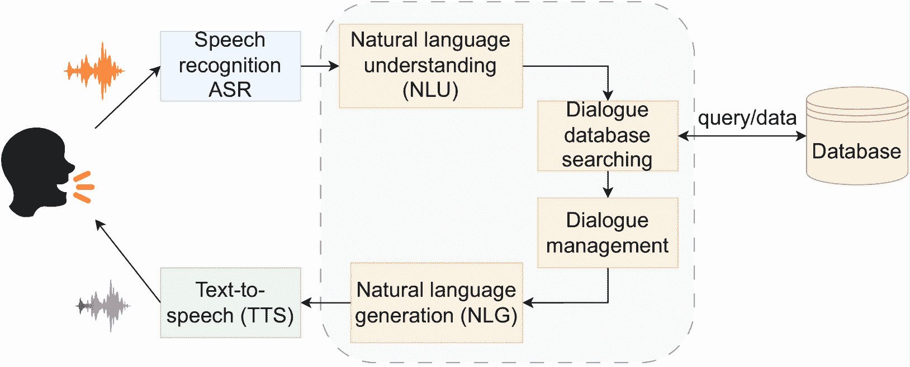
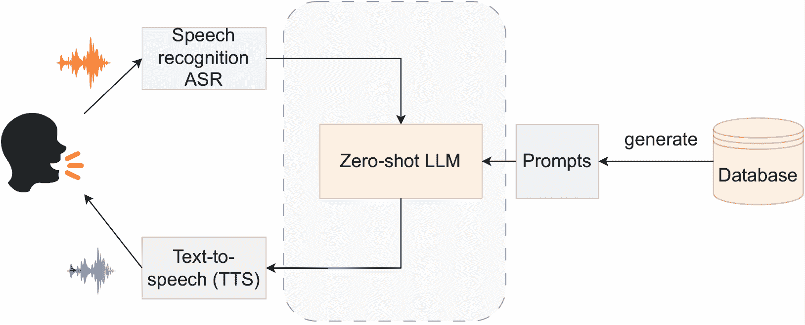
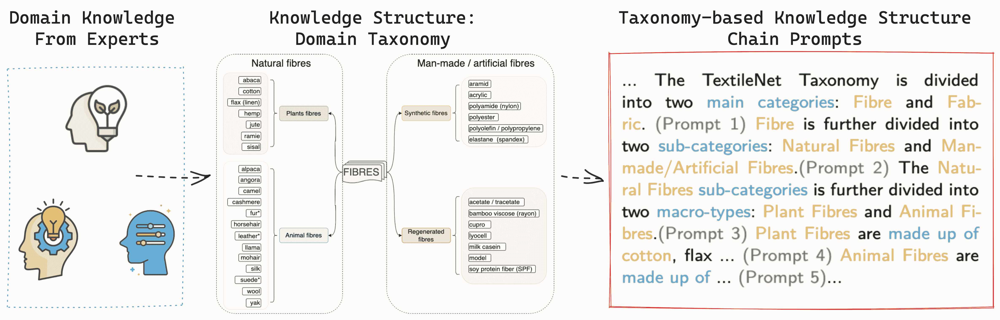
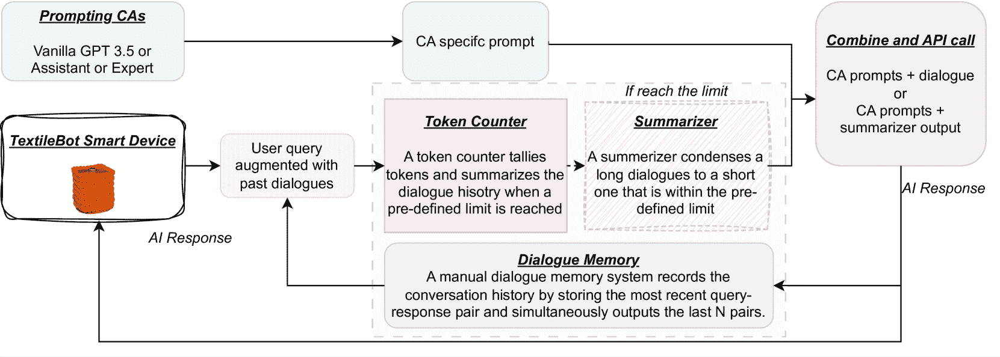
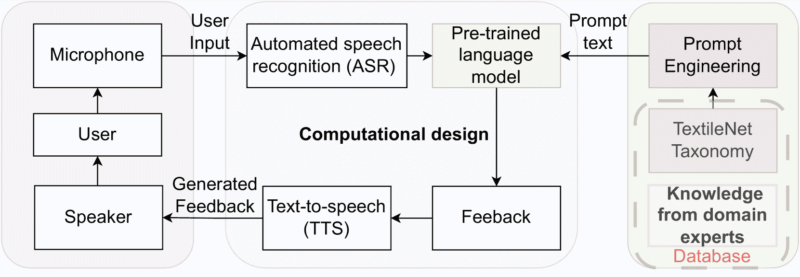
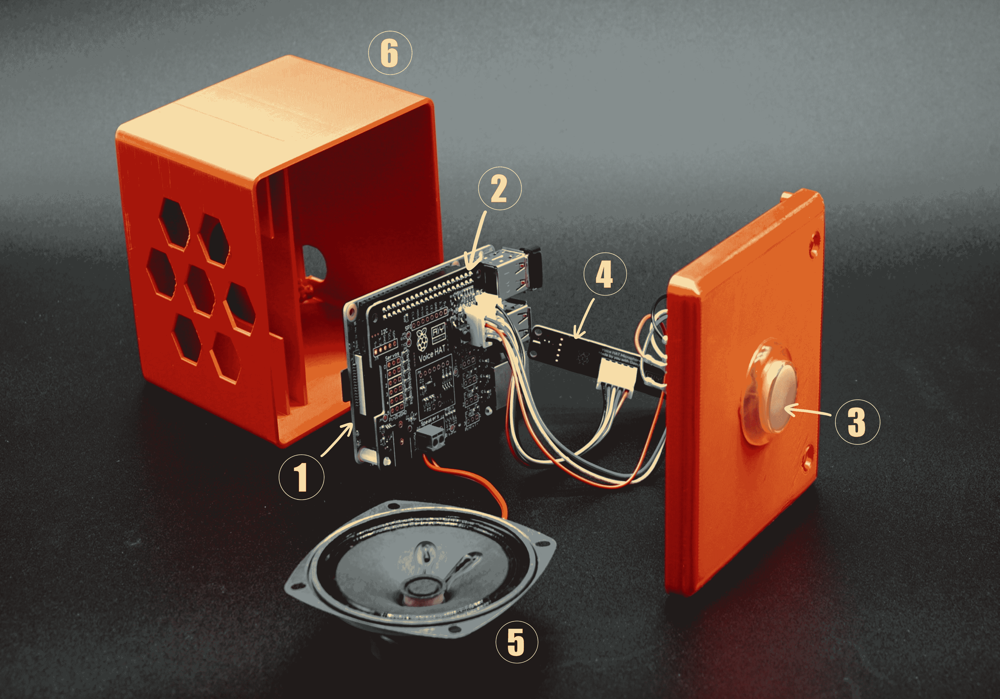
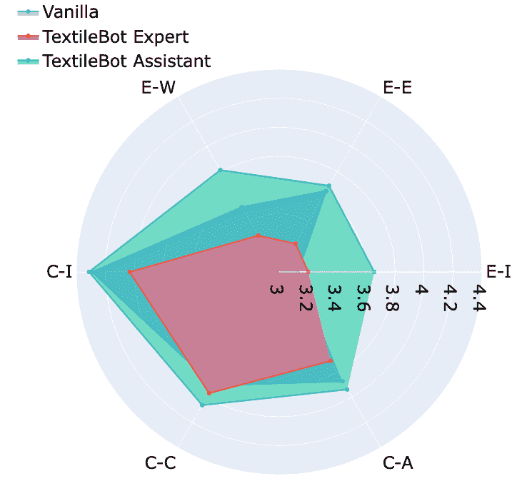
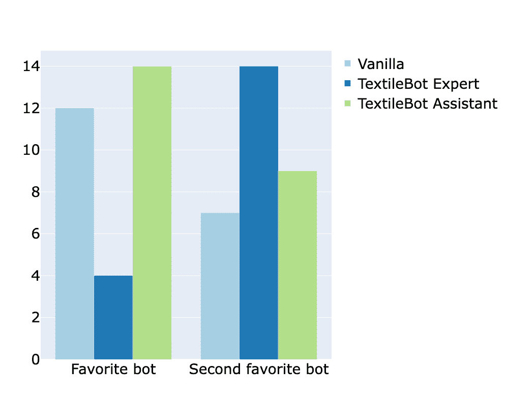
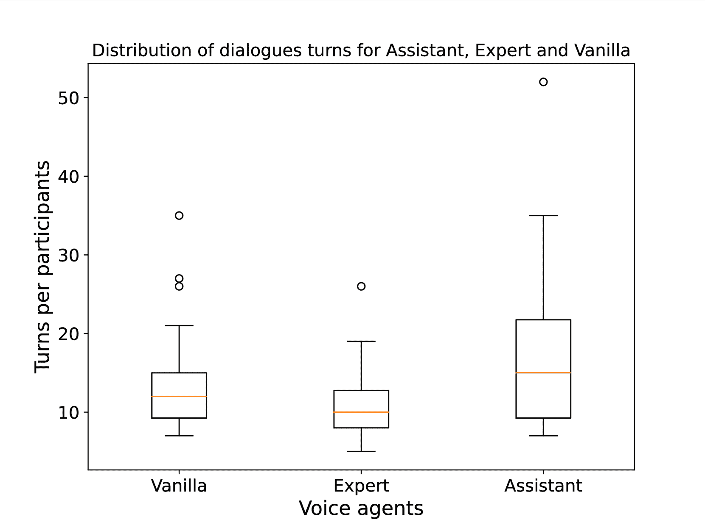
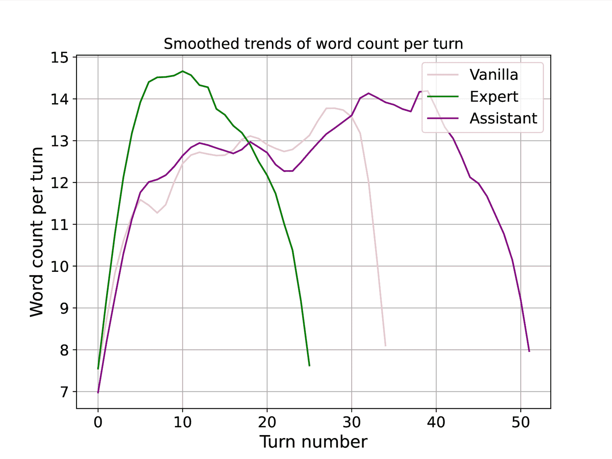

<!--yml

类别：未分类

日期：2025-01-11 12:32:27

-->

# LLM驱动的领域特定语音助手：以TextileBot为例

> 来源：[https://arxiv.org/html/2406.10590/](https://arxiv.org/html/2406.10590/)

Shu Zhong 计算机科学系，伦敦大学学院 Elia Gatti 计算机科学系，伦敦大学学院 James Hardwick 计算机科学系，伦敦大学学院 Miriam Ribul 材料科学研究中心，皇家艺术学院 Youngjun Cho 计算机科学系，伦敦大学学院 Marianna Obrist 计算机科学系，伦敦大学学院

###### 摘要

开发领域特定的对话代理（CAs）面临着需要大量领域专用数据的挑战。近年来，大型语言模型（LLMs）的进展使它们成为知识支撑的可行选择。LLM的行为可以通过提示进行增强，指导它们以零样本方式（即无需训练）执行下游任务。为此，我们将结构化知识融入提示中，并使用提示驱动的LLM构建领域特定的语音对话代理。我们以纺织品循环利用这一特定领域为例，展示了TextileBot的设计、开发和评估。我们介绍了语音助手TextileBot的设计和开发过程，并提供了来自一项面对面用户研究（N=30）的见解，研究评估了三种TextileBot变体。我们通过结合定量和定性方法分析了人与代理之间的互动。我们的结果表明，参与者进行多轮对话，并且他们对三种变体代理及其互动的看法有所不同，这表明了我们基于提示的LLM方法的有效性。我们讨论了这些互动的动态以及它们对未来语音对话代理设计的影响。

结果表明，我们的方法在构建领域特定对话代理方面具有潜力。此外，大多数参与者进行了多轮对话，并且他们对三种语音代理及其互动的看法有所不同，这表明了我们基于提示的LLM方法的有效性。我们讨论了这些互动的动态以及它们对未来语音对话代理设计的影响。

## 1 引言

通过使用预训练的大型语言模型（LLMs）设计对话界面的潜力引起了广泛关注[[106](https://arxiv.org/html/2406.10590v1#bib.bib106), [48](https://arxiv.org/html/2406.10590v1#bib.bib48), [56](https://arxiv.org/html/2406.10590v1#bib.bib56)]。这些LLMs具备了理解人类语言、以类人方式生成文本并执行各种任务的显著能力，仅需几个文本*提示*即可完成任务，即使没有额外的训练[[28](https://arxiv.org/html/2406.10590v1#bib.bib28), [64](https://arxiv.org/html/2406.10590v1#bib.bib64), [79](https://arxiv.org/html/2406.10590v1#bib.bib79), [14](https://arxiv.org/html/2406.10590v1#bib.bib14), [72](https://arxiv.org/html/2406.10590v1#bib.bib72)]。提示是输入到LLM的一段文本，用于引发回应。例如，一个提示可以是*“什么是可持续时尚？请向10岁的小朋友解释。”*。这大大降低了人工智能（AI）访问的门槛，使得非专家也能通过文本与LLMs进行互动。然而，手动设计这样的提示存在特定挑战，因为需要准确简洁地概括复杂的领域特定知识，以引导模型进入特定领域。这是由于原始LLM的固有任务无关性¹¹1原始模型指的是未经微调或提示的大型语言模型。*，这些模型并没有针对特定领域进行微调。此外，预训练的原始LLM的另一个缺点是它们缺乏对话记忆，这使得互动只能以“单轮”方式进行²²2与AI系统或其他人之间的单次交流被视为一次对话回合。*。这一限制影响了用户互动的连续性和深度，因为这些模型无法回忆起之前的输入和输出。

人机交互（HCI）领域正在越来越重视基于语音的对话体代理的开发[[95](https://arxiv.org/html/2406.10590v1#bib.bib95), [9](https://arxiv.org/html/2406.10590v1#bib.bib9), [94](https://arxiv.org/html/2406.10590v1#bib.bib94), [40](https://arxiv.org/html/2406.10590v1#bib.bib40)]。Seaborn等人发现，在基于语音的人机交互（vHAI）的研究中，只有13%的研究使用了完全由参与者控制的自主设置[[84](https://arxiv.org/html/2406.10590v1#bib.bib84)]。这种有限的应用主要是由于创建语音代理的复杂性。大语言模型（LLMs）的出现使得与人类的实时对话互动成为可能，从而不再需要从零开始构建复杂的启发式对话规则。此外，基于领域的对话代理的开发长期以来受到数据匮乏的制约[[7](https://arxiv.org/html/2406.10590v1#bib.bib7), [51](https://arxiv.org/html/2406.10590v1#bib.bib51)]。收集和注释这些代理所需的数据是一个昂贵且劳动密集的过程，需要大量资源[[27](https://arxiv.org/html/2406.10590v1#bib.bib27), [105](https://arxiv.org/html/2406.10590v1#bib.bib105), [37](https://arxiv.org/html/2406.10590v1#bib.bib37)]。因此，探索开发领域特定对话代理的低成本方法成为了必要。实质上，我们关心的是如何高效地将通用大语言模型中的知识与来自人类专家的结构化领域知识相结合。

为此，我们提出了一种方法，利用LLM以零样本方式（即无需训练），结合领域专家的知识。这种方法还便于那些可能不是AI专家的研究人员进行领域特定对话代理的原型开发。我们提出了一种新颖的三阶段方法，旨在将LLM从任务无关的模型转化为领域特定的基于语音的对话代理，并提供个性化的交互。第一阶段涉及创建基于分类法的知识结构链，一种新颖的提示生成方法。我们将LLM作为知识基础模型进行提示，而不是传统的构建对话系统方法（见图[1](https://arxiv.org/html/2406.10590v1#S1.F1 "Figure 1 ‣ 1 Introduction ‣ LLM-Mediated Domain-Specific Voice Agents: The Case of TextileBot")）。它消除了对领域特定数据收集的需求，同时允许人类专家将其结构化知识注入LLM中。第二阶段涉及提示优化策略，使LLM能够以不同的广度和自由度与用户互动，提供不同级别的领域聚焦和多样化的对话风格。最后，引入系统优化，以促进LLM与用户的持续互动，使LLM能够保持状态性并具有记忆能力，从而实现长期的“多轮”对话。值得注意的是，这些阶段可以单独应用，也可以结合使用，以增强对话代理的设计。

(a) 传统的

(b) 基于LLM

图1：（a）传统的和（b）基于LLM的对话代理，具有语音输入和输出。传统代理有多个组件，如自然语言理解（NLU）、自然语言生成（NLG）和对话数据库搜索。相比之下，基于LLM的代理仅使用数据库为LLM生成提示，从而使管道更加简单且易于开发。

为展示我们的方法，我们呈现了TextileBot，这是一款基于Raspberry Pi开发的语音界面，传达了*纺织品循环*这一主题。我们通过主观用户研究评估TextileBot的有效性，重点关注“人机互动”策略，以促进以人为本的AI设计。成功的标准是参与者是否能够识别出通过我们的方法创造的独特CA特性，以及系统在维持特定领域、多轮对话方面的能力。此评估结合了定量数据和定性见解。此外，我们揭示了这些人机交互的复杂动态，并探索了人类行为、参与度和反应的各个方面。我们的研究回答了两个及时的问题：首先，尽管LLM作为通用对话代理的基础模型已被研究过[[106](https://arxiv.org/html/2406.10590v1#bib.bib106)，[48](https://arxiv.org/html/2406.10590v1#bib.bib48)，[56](https://arxiv.org/html/2406.10590v1#bib.bib56)]，但它们在创建特定领域语音代理中的应用仍不为人知。第二，关于人类如何感知和与基于提示LLMs的特定领域语音CAs互动的理解仍然有限。这些知识空白源于多个交织的因素，包括自然语言的固有复杂性、与文本转语音集成相关的技术挑战、处理人类语音中的模糊性和上下文的能力，以及为了促进系统与用户之间无缝且富有意义的互动，迫切需要有效的用户体验设计[[9](https://arxiv.org/html/2406.10590v1#bib.bib9)，[84](https://arxiv.org/html/2406.10590v1#bib.bib84)]。总之，本文的主要贡献可以总结为三方面：

+   •

    我们开发了一种新颖的三阶段方法，使LLMs能够从任务无关转变为特定领域，适应不同的对话风格并融入记忆以支持持续对话。这些阶段可以根据任务需要单独使用或组合使用。

+   •

    我们将三阶段方法整合到一个面向特定领域的语音设备设计中，即TextileBot。这个语音代理是专为纺织品循环领域量身定制的，旨在促进与消费者就纺织品行业中的循环经济实践进行定制化对话。

+   •

    我们通过面对面的互动评估了TextileBot的三种变体，以评估我们方法的有效性并更好地理解用户互动。我们分析了这些人机交互，提供了定性描述和定量见解。此分析旨在为AI驱动的语音界面领域的潜在设计改进提供参考。

## 2 背景与相关工作

在本节中，我们解释了选择纺织品循环作为应用领域的理由。接下来，我们概述了基于语音的CAs及相关文献，重点介绍人类与传统启发式引导的语音CAs的互动。随后，我们介绍了预训练大型语言模型（LLMs）和与LLMs介导界面相关的HCI（人机交互）研究的最新进展。

### 2.1 纺织品循环领域：语音代理设计的一个案例

我们选择专门为*纺织品循环*领域开发一个对话代理，以有效展示我们的方法。纺织品循环是纺织品的循环经济，指的是纺织行业中的可持续实践，其中材料被重复使用、回收或生物降解，以最小化废物并减少环境影响[[31](https://arxiv.org/html/2406.10590v1#bib.bib31)]。该领域提供了来自多个领域的信息和专业知识，包括时尚、家用纺织品、供应链管理、材料科学和制造等。该领域内对话的复杂性和多样性使其成为展示我们CA能力的理想选择。

我们关注纺织行业的另一个主要原因是其对全球碳排放的显著贡献。事实上，纺织行业本身就占全球碳排放的10%，这与国际航班和海运的排放总和相当[[74](https://arxiv.org/html/2406.10590v1#bib.bib74)]。这一令人担忧的环境影响突显了该行业迫切需要可持续实践。将循环经济融入纺织品领域，特别是将纺织纤维回收再利用为新纺织纤维的挑战，因所需的广泛知识而变得复杂。我们预期，结合专家知识的对话代理将为公众提供一种更易于理解和传播纺织品循环概念的方式。我们还预计，这种方法也可以适用于教育目的。

此外，CAs（对话代理）在时尚零售行业中的应用越来越广泛，涵盖了多种用途[[5](https://arxiv.org/html/2406.10590v1#bib.bib5), [10](https://arxiv.org/html/2406.10590v1#bib.bib10)]，为促进社会责任行为提供了重要机会。在这些应用中，推动可持续性传播作为商业战略的核心组成部分，成为一个显著的应用案例[[23](https://arxiv.org/html/2406.10590v1#bib.bib23)]。我们相信，我们的方法可以为纺织品循环领域带来社会和经济效益。例如，交互式代理可以设置在商店中，提供关于消费者服装选择如何影响其健康和环境的宝贵见解。

### 2.2 特定领域对话代理

经典的对话系统通常由自然语言理解（NLU）和自然语言生成（NLG）组件组成，并配有基于数据库的对话管理系统[[5](https://arxiv.org/html/2406.10590v1#bib.bib5), [51](https://arxiv.org/html/2406.10590v1#bib.bib51)]。这种对话系统设计可以分解为多个构建模块，即对话数据库、对话检索和对话管理。构建一个对话系统是一个复杂的任务，需要广泛的领域知识和数据。或者，可以使用收集的数据训练一个端到端模型，尽管这通常需要大量的训练数据，以涵盖部署时可能出现的不同对话。在这些方法中，对话系统的开发通常会受到数据缺乏和标注成本的阻碍[[65](https://arxiv.org/html/2406.10590v1#bib.bib65), [32](https://arxiv.org/html/2406.10590v1#bib.bib32), [7](https://arxiv.org/html/2406.10590v1#bib.bib7)]。

这种复杂性也可能妨碍基于语音的人机交互（vHAI）的研究。尽管对话代理（CA）用户界面是人机交互（HCI）社区中的热门话题，但聚焦于特定领域的对话代理研究相对较少。因此，本节关注更广泛的语音代理。Seaborn等人[[84](https://arxiv.org/html/2406.10590v1#bib.bib84)]进行了一项调查，识别出了四种主要的人类语音交互研究方法：自主设置、半自主设置、“奥兹巫师”设置[[26](https://arxiv.org/html/2406.10590v1#bib.bib26)]，以及在给定场景下的对话——其使用率分别为13%、24%、27%和33%。值得注意的是，仅有13%的人使用了自主设置——这是一个系统可以在没有实验者参与的情况下操作的设计，参与者控制交互。如前所述，创建完全自动化的对话代理面临技术挑战（例如数据稀缺和高昂的成本）。这些困难阻碍了对人机交互的理解，从而阻碍了有效自主对话代理的设计[[104](https://arxiv.org/html/2406.10590v1#bib.bib104), [106](https://arxiv.org/html/2406.10590v1#bib.bib106)]。此外，对话代理的评估主要依靠众包工人[[51](https://arxiv.org/html/2406.10590v1#bib.bib51)]。这些评估大多是在非目标导向的对话中进行的（即任务无关的对话）[[92](https://arxiv.org/html/2406.10590v1#bib.bib92), [86](https://arxiv.org/html/2406.10590v1#bib.bib86)]。在我们的研究中，我们进行了一个面对面的研究，参与者直接控制语音代理的互动，无需实验者的中介。此外，我们的评估包括了非目标导向任务和目标导向任务。

#### 2.2.1 基于语音的人机交互

本文介绍了一种由大型语言模型（LLM）驱动的语音代理，专门用于纺织品循环利用，设计用于通过我们自己设计的设备进行操作。需要注意的是，该代理与传统的语音设备如Alexa和Google Home不同，这些设备通常被归类为语音助手（VAs）。这些语音助手在其范围和功能上并不专注于特定领域[[80](https://arxiv.org/html/2406.10590v1#bib.bib80), [84](https://arxiv.org/html/2406.10590v1#bib.bib84)]，而专注于特定领域的代理则侧重于在特定领域提供详细的、具有上下文感知的响应，而语音助手则提供诸如天气更新等广泛的服务。多项研究表明，语音助手由于理解或回应有限，往往无法满足用户的期望[[24](https://arxiv.org/html/2406.10590v1#bib.bib24), [42](https://arxiv.org/html/2406.10590v1#bib.bib42), [9](https://arxiv.org/html/2406.10590v1#bib.bib9)]。

研究人员已经研究了基于语音的人机交互（vHAI）[[94](https://arxiv.org/html/2406.10590v1#bib.bib94), [58](https://arxiv.org/html/2406.10590v1#bib.bib58), [9](https://arxiv.org/html/2406.10590v1#bib.bib9), [95](https://arxiv.org/html/2406.10590v1#bib.bib95), [40](https://arxiv.org/html/2406.10590v1#bib.bib40)]。一些研究探讨了影响用户在语音输入和文本输入之间偏好的因素[[94](https://arxiv.org/html/2406.10590v1#bib.bib94), [69](https://arxiv.org/html/2406.10590v1#bib.bib69)]，而其他研究则讨论了如何通过丰富对话代理的个性来改善用户体验[[96](https://arxiv.org/html/2406.10590v1#bib.bib96), [22](https://arxiv.org/html/2406.10590v1#bib.bib22), [12](https://arxiv.org/html/2406.10590v1#bib.bib12), [25](https://arxiv.org/html/2406.10590v1#bib.bib25)]。Hoegen 等人[[41](https://arxiv.org/html/2406.10590v1#bib.bib41)]发现，能够进行自然多轮对话且与参与者对话风格相匹配的语音代理会增加用户的信任。Baughan 等人[[9](https://arxiv.org/html/2406.10590v1#bib.bib9)]通过访谈和调查了解语音助手故障如何影响用户信任以及他们是否愿意在未来的任务中依赖这些助手。Haas 等人发现，用户更喜欢语音助手在回应时“简短明了”[[38](https://arxiv.org/html/2406.10590v1#bib.bib38)]。此外，Völkel 等人[[95](https://arxiv.org/html/2406.10590v1#bib.bib95)]提出了一种基于规则的对话设计方法，旨在赋予语音助手独特的个性，并让用户评价他们的偏好。他们发现，用户的个性特征与其语音助手的偏好之间存在联系。这些研究中使用的语音代理主要遵循经典方法，大多以“奥兹巫师”方式操作，或由人工操控。然而，我们的工作与众不同，它首次探索了人类如何与大语言模型（LLM）介导的语音代理进行互动，并利用提示技术设计具有独特个性、回应方式和对话自由度的代理。我们还为LLM介导的语音代理的设计和互动可能性提供了新的见解。

### 2.3 大语言模型

从历史上看，自然语言处理（NLP）模型经历了从*完全监督学习*范式的转变，重点关注*特征工程*（例如，词汇标识[[52](https://arxiv.org/html/2406.10590v1#bib.bib52)]）和*架构工程*（例如，自注意力机制[[91](https://arxiv.org/html/2406.10590v1#bib.bib91)]），到基于神经网络的预训练和微调方法[[63](https://arxiv.org/html/2406.10590v1#bib.bib63)]。最近，像GPT-3这样的预训练大语言模型的出现催生了一个新的*“预训练与提示”*范式[[72](https://arxiv.org/html/2406.10590v1#bib.bib72), [85](https://arxiv.org/html/2406.10590v1#bib.bib85), [63](https://arxiv.org/html/2406.10590v1#bib.bib63)]。

在*预训练与微调*（pre-train and fine-tune）范式中，固定架构的模型通过大量文本数据（通常为数十亿个单词或更多，如书籍、文章或对话）进行训练，学习语言的通用特征，例如BART[[57](https://arxiv.org/html/2406.10590v1#bib.bib57)]和UniLM[[29](https://arxiv.org/html/2406.10590v1#bib.bib29)]。*预训练*的LLM随后可以通过任务特定的损失函数进行适应（例如微调），以适应广泛的下游任务（如机器翻译、文本蕴含、情感分析等）。大型语言模型（LLM），如BERT（双向编码器表示模型）[[28](https://arxiv.org/html/2406.10590v1#bib.bib28)]、RoBERTa[[64](https://arxiv.org/html/2406.10590v1#bib.bib64)]、T5[[79](https://arxiv.org/html/2406.10590v1#bib.bib79)]和GPT-3（生成预训练变换器3）[[14](https://arxiv.org/html/2406.10590v1#bib.bib14)]，现在被用作*基础模型*³³3A模型，经过大规模数据集训练后，可以适应各种下游任务[[13](https://arxiv.org/html/2406.10590v1#bib.bib13)]，为下游任务提供支持，并为任务无关的机器学习铺平道路[[13](https://arxiv.org/html/2406.10590v1#bib.bib13)]。

最近，LLM在理解和生成类人文本方面取得了显著突破[[63](https://arxiv.org/html/2406.10590v1#bib.bib63)]。GPT-3[[14](https://arxiv.org/html/2406.10590v1#bib.bib14)]，拥有1750亿个参数，以其仅凭少量文本*提示*（prompts）即可执行各种与文本相关任务的能力脱颖而出，即使没有任何额外训练。这被称为（*零-shot*）能力，正如其论文标题*“语言模型是少-shot学习者”*所示[[14](https://arxiv.org/html/2406.10590v1#bib.bib14)]。这一能力突显了模型应用的演变，朝着*“预训练与提示”*范式发展[[72](https://arxiv.org/html/2406.10590v1#bib.bib72), [85](https://arxiv.org/html/2406.10590v1#bib.bib85), [63](https://arxiv.org/html/2406.10590v1#bib.bib63)]。因此，已经投入了大量精力进行*提示工程*的研究，旨在设计高效的提示，引导LLM执行各种下游任务[[14](https://arxiv.org/html/2406.10590v1#bib.bib14), [85](https://arxiv.org/html/2406.10590v1#bib.bib85)]。例如，提示*“什么是材料纤维？请向一位时尚设计师解释。”*和*“什么是材料纤维？请向一位化学家解释。”*将生成不同的输出。这也意味着通过仅使用提示，AI非专家与LLM互动进行各种任务的门槛大大降低[[45](https://arxiv.org/html/2406.10590v1#bib.bib45)]。

#### 2.3.1 人类与大型语言模型（LLM）互动

提示式大语言模型（LLMs）的兴起为计算机辅助设计（CA）提供了一个有前景的替代方案[[106](https://arxiv.org/html/2406.10590v1#bib.bib106)，[48](https://arxiv.org/html/2406.10590v1#bib.bib48)，[56](https://arxiv.org/html/2406.10590v1#bib.bib56)，[13](https://arxiv.org/html/2406.10590v1#bib.bib13)]。人机交互（HCI）研究人员越来越关注利用LLMs的力量，并使大量基于语言的互动应用成为可能。此类应用的例子包括创意写作[[54](https://arxiv.org/html/2406.10590v1#bib.bib54)，[21](https://arxiv.org/html/2406.10590v1#bib.bib21)，[17](https://arxiv.org/html/2406.10590v1#bib.bib17)，[43](https://arxiv.org/html/2406.10590v1#bib.bib43)，[16](https://arxiv.org/html/2406.10590v1#bib.bib16)]，迭代查询重构（例如，问答）[[98](https://arxiv.org/html/2406.10590v1#bib.bib98)，[4](https://arxiv.org/html/2406.10590v1#bib.bib4)]，写代码[[90](https://arxiv.org/html/2406.10590v1#bib.bib90)，[8](https://arxiv.org/html/2406.10590v1#bib.bib8)]，以及创建新颖的用户界面[[98](https://arxiv.org/html/2406.10590v1#bib.bib98)，[100](https://arxiv.org/html/2406.10590v1#bib.bib100)]。

然而，大多数现有的互动框架都集中在“单回合”互动上，其中“回合”指的是在特定话题上的一次来回互动；这可以是用户先发言，然后机器人响应，或反之亦然。在我们的工作中，我们关注的是“多回合”和“连续”互动（双向的），在这种互动中，智能体需要能够连贯地反应，并能够记住之前的互动回合。与我们工作特别相关的文献之一是Zamfirescu-Pereira等人的研究[[106](https://arxiv.org/html/2406.10590v1#bib.bib106)]。他们探索了提示法在快速计算机辅助设计中的应用，特别是针对基于文本的聊天机器人，并建议这种方法可以实现“80%”的用户体验（UX）目标。然而，实际的用户感知和与此类计算机辅助设计的互动并未被深入探讨。在我们的工作中，我们精心设计了提示模板，并进一步通过定性和定量方法仔细研究了用户的感知和互动。

目前，大规模语言模型（LLMs）的性能主要通过数值指标进行评估，且未涉及人类参与者[[72](https://arxiv.org/html/2406.10590v1#bib.bib72), [60](https://arxiv.org/html/2406.10590v1#bib.bib60), [14](https://arxiv.org/html/2406.10590v1#bib.bib14)]。例如，困惑度和BLEU（双语评估替代）得分[[73](https://arxiv.org/html/2406.10590v1#bib.bib73)]是评估LLM在下游任务中表现的常用指标。这些评估缺乏人类环节。为了更好地理解人类与LLM互动的质量，Lee等人[[55](https://arxiv.org/html/2406.10590v1#bib.bib55)]提出了基于人类-AI语言互动评估（HALIE）框架，利用互动痕迹，提出了与用户体验和互动质量相关的新型指标，用于评估LLM的能力。在我们的设计中，我们采纳了Lee等人提出的多个重要指标（包括易用性、变化、享受度、重用性和准确性，详见[5.1节](https://arxiv.org/html/2406.10590v1#S5.SS1 "5.1 研究设计与方法 ‣ 5 TextileBot评估 ‣ 基于LLM的领域特定语音代理：以TextileBot为例")），以便于进行人类环节的评估。

## 3 领域特定语音代理的原型设计

本节介绍了一种零-shot原型框架，旨在使更广泛的用户能够跨多个领域原型化对话代理（CAs）。我们提出的创新方法包含三个不同的阶段：（1）基于分类法的知识结构链，用于有效注入领域知识，（2）一种从任务无关到领域特定的提示优化策略，*以及*（3）系统优化，以使大规模语言模型（LLMs）具备对话记忆，从而支持*连续（多轮）*的人类与LLM互动。图[1(b)](https://arxiv.org/html/2406.10590v1#S1.F1.sf2 "图1 ‣ 1 引言 ‣ 基于LLM的领域特定语音代理：以TextileBot为例")展示了我们基于提示的LLM方法与传统对话代理设计的不同。为了展示该方法的实际应用，我们介绍了在纺织品循环利用领域内的两种提示实现，即TextileBot-Expert和TextileBot-Assistant。

### 3.1 阶段 1：基于分类法的知识结构链

图 2：基于分类法的知识结构链。这个过程需要领域特定的专业知识来构建或利用现有的结构化知识框架，例如分类法。为了构建基于分类法的提示，在每个提示（如提示1、2、3……）中，实体类型通过关系相连。在每个提示中，我们定义实体及其层级关系，以构建知识，最后将所有提示链接在一起。

使用大型语言模型（LLMs）作为基础模型的一个关键挑战是，当它们不确定如何回应用户查询时，可能会返回错误的答案，产生“听起来合理但实际上错误或无意义的答案”[[70](https://arxiv.org/html/2406.10590v1#bib.bib70)]。我们通过引入*基于分类法的知识结构链*来解决这一问题，这是一种设计提示链的框架。通常，提示由两部分组成——一个模板和一组标签词[[19](https://arxiv.org/html/2406.10590v1#bib.bib19)]。分类法作为一种关系系统，通过逻辑地互联实体来高效地组织知识，表示关系[[53](https://arxiv.org/html/2406.10590v1#bib.bib53)]。虽然提示LLM仅依赖于简单的句子，但分类法擅长生成精确的关键词，从而提高LLM回应的相关性和准确性。这种方法通过使用标签词将提示与分类法的结构对齐，增强了LLM回应的相关性和准确性。

我们使用TextileNet分类法[[108](https://arxiv.org/html/2406.10590v1#bib.bib108)]来举例说明这一方法。TextileNet的层次结构捕捉了常见纺织纤维类别、其子类别和特定纤维类型之间的关系，帮助创建*知识提示*。例如，“棉花纤维”属于“植物纤维”，而植物纤维是“天然纤维”的一个子集。分类法的这种层次化组织构成了我们*基于分类法的知识结构链*的基础，系统地捕捉了不同实体类型之间的关系（例如子类别、宏观类型），如图[2](https://arxiv.org/html/2406.10590v1#S3.F2 "Figure 2 ‣ 3.1 Phase 1: Taxonomy-based Knowledge Structure Chain ‣ 3 Prototyping Domain-Specific Voice Agents ‣ LLM-Mediated Domain-Specific Voice Agents: The Case of TextileBot")所示。

我们的用户研究中的对话展示了这种方法的有效性，如图[3](https://arxiv.org/html/2406.10590v1#S3.F3 "Figure 3 ‣ 3.2 Phase 2: From General to Domain Specific through Prompt Refinements ‣ 3 Prototyping Domain-Specific Voice Agents ‣ LLM-Mediated Domain-Specific Voice Agents: The Case of TextileBot")所示。参与者与三种对话代理（CA）进行了对话：Vanilla GPT-3.5模型、TextileBot-Expert和TextileBot-Assistant。TextileBot-Expert和TextileBot-Assistant都利用了基于分类法的知识结构链，我们在[3.2](https://arxiv.org/html/2406.10590v1#S3.SS2 "3.2 Phase 2: From General to Domain Specific through Prompt Refinements ‣ 3 Prototyping Domain-Specific Voice Agents ‣ LLM-Mediated Domain-Specific Voice Agents: The Case of TextileBot")节中讨论了它们之间的主要区别，但重点在于它们的领域专业知识是如何得到提升的。

在图 [3](https://arxiv.org/html/2406.10590v1#S3.F3 "图 3 ‣ 3.2 第二阶段：通过提示优化从通用到领域特定 ‣ 3 原型化领域特定语音代理 ‣ LLM 驱动的领域特定语音代理：以 TextileBot 为例") 中，“粘胶”（一种生物衍生纤维）被错误地归类为合成纤维，并被 Vanilla GPT-3.5 模型建议为不可持续的材料。相比之下，我们的分类绑定方法，如通过 TextileBot 助理和专家所展示的，提供了更准确和与上下文相关的信息。例如，TextileBot 专家能够准确区分天然、合成和再生纤维，展示了 LLM 在基于分类的提示中识别逻辑结构的能力有所提升。我们的方法显著增强了 LLM 提供精确、一致且具有上下文相关性的回答的能力，特别是在纤维、纺织品和纺织品循环领域。

基于分类的提示在提升 LLM 的领域意识时提供了“事实依据”。这使得整个对话代理在遇到来自 CA 系统管道中其他组件（如自动语音识别（ASR））的错误时更加稳健。例如，图 [3](https://arxiv.org/html/2406.10590v1#S3.F3 "图 3 ‣ 3.2 第二阶段：通过提示优化从通用到领域特定 ‣ 3 原型化领域特定语音代理 ‣ LLM 驱动的领域特定语音代理：以 TextileBot 为例") 中的 *‘粘性’* 术语是来自 ASR 的错误的典型例子。通过在 CA 管道中整合基于分类的提示，LLM 在理解和响应领域特定内容时的准确性得到了提升。这种整合显著减轻了对话代理中的 ASR 错误。自动修正 ASR 错误的有效性在 [7.3.2](https://arxiv.org/html/2406.10590v1#S7.SS3.SSS2 "7.3.2 设计 LLM 驱动的语音代理的经验教训 ‣ 7 为特定领域优化 LLM 驱动的语音代理设计 ‣ 7 讨论与未来方向 ‣ LLM 驱动的领域特定语音代理：以 TextileBot 为例") 节中得到了进一步量化。

### 3.2 第二阶段：通过提示优化从通用到领域特定

{mdframed}{dialogue}

设置 Vanilla GPT-3.5 模型

人类：粘胶材料是否可持续？ 代理人：粘胶是一种合成纤维，且不被认为是可持续的。相反，应该选择天然纤维，如棉花、亚麻和大麻。

设置 TextileBot 专家

人类 你好，我需要知道哪些纺织材料卖得最好？ 代理人 你好！这是一个有趣的问题。实际上，这取决于你在寻找哪种类型的纺织品，以及你的应用是什么。一般来说，一些最受欢迎的材料类型包括天然纤维，如棉花、羊毛和丝绸；合成纤维，如聚酯纤维和尼龙；以及再生纤维，如黏胶纤维和铜氨纤维。了解这些材料的特性非常重要，以便找到最适合你应用的材料。不过，在选择过程中，你还应该考虑纺织品的循环利用性。纺织品循环利用性是一个确保纺织品生命周期闭环的概念，从纤维来源到制造再到生命周期结束。这种方法对打造可持续的纺织品解决方案非常重要。

设置 TextileBot 助手

人类 什么是黏胶纤维？ 代理人 黏胶纤维是一种由木浆或棉短绒制成的再生纤维素纤维。它常用于制作服装、床上用品、毛巾以及其他需要柔软、丝滑触感的织物。

图 3：三种基于提示的 LLM 中介代理（Vanilla GPT-3.5 模型、TextileBot 专家、TextileBot 助手）讨论了黏胶纤维在 TextileBot 设备上的应用。我们将错误内容用红色标出，展示了 Vanilla 模型确实容易出错。TextileBot 专家和助手都利用基于 TextileNet 分类法的提示（如第 [3.1](https://arxiv.org/html/2406.10590v1#S3.SS1 "3.1 Phase 1: Taxonomy-based Knowledge Structure Chain ‣ 3 Prototyping Domain-Specific Voice Agents ‣ LLM-Mediated Domain-Specific Voice Agents: The Case of TextileBot") 节所解释）来提高准确性。TextileBot 专家的回复更为详细，通常被参与者认为在这个话题上更“执着”。我们在第 [3.2](https://arxiv.org/html/2406.10590v1#S3.SS2 "3.2 Phase 2: From General to Domain Specific through Prompt Refinements ‣ 3 Prototyping Domain-Specific Voice Agents ‣ LLM-Mediated Domain-Specific Voice Agents: The Case of TextileBot") 节进一步解释了这种差异。

{mdframed}{dialogue}

设置 Vanilla GPT-3.5 模型

人类 既然快到午餐时间了，你会推荐我今天吃些什么呢？ 代理人 这取决于你的饮食偏好。你通常喜欢吃什么类型的午餐？

设置 TextileBot 专家

人类 嗯，我饿了。呃，我今天午餐应该吃点什么呢？ 代理人 对不起，我不是最适合帮助你解决这个问题的人。不过，如果你有兴趣了解更多关于纺织和服装材料的知识，我很乐意帮忙！

设置 TextileBot 助手

人类 快到午餐时间了。我今天该吃什么午餐呢？ 代理人 听起来这是一个令人兴奋的决定！你想要一些受到纺织启发的午餐创意吗？我知道一些很棒的食谱，比如植物纤维面条、素食丝绸冰沙和棉籽沙拉碗，保证能满足你的胃口！

图 4：三个基于提示的LLM中介代理，主题为午餐（香草GPT-3.5模型、TextileBot专家、TextileBot助手）。

由于设计提示模板的过程是经验性的，因此在提示设计中已经采用了各种临时的提示优化技巧，例如“让我们一步一步地思考”[[49](https://arxiv.org/html/2406.10590v1#bib.bib49)]。然而，至今还没有一种特定的系统性方法来优化性能。为了弥补这一空白，我们引入了一种以人为中心的迭代原型设计过程来个性化所需的CA。我们通过两种不同层次的提示优化来展示这一方法，这些优化都集成了基于分类法的知识结构链：一个是半领域特定的*助手*，另一个是领域特定的*专家*，用于在纺织品循环性背景下的对话。该过程包括一系列的提示优化步骤：

1.  $\blacksquare$

    *给模型一个身份*：首先，给模型一个清晰的身份，以便它能识别自己的角色，并理解期望其表现出何种行为。这有助于建立模型回应的一致个性。

1.  $\blacksquare$

    *告诉模型如何表现*：接下来，你还可以指导模型如何表现，例如，告诉它要具有创造性并且乐于助人。这些指示有助于进一步定义模型的个性和所需的语气。

1.  $\blacksquare$

    *“让我们一步一步地思考”*：有时，GPT在完成复杂任务时会失败[[3](https://arxiv.org/html/2406.10590v1#bib.bib3)]。为了确保任务的成功完成，模型需要按步骤给出清晰的指示，帮助它理解所需的内容。将复杂的任务分解为更简单的子任务，并在每个任务之间清楚地区分。此外，在提示中使用“让我们一步一步地思考”[[49](https://arxiv.org/html/2406.10590v1#bib.bib49)]技巧，可以帮助模型进行逻辑思考。

1.  $\blacksquare$

    *格式化提示*：使用分隔符和换行符结构化提示模板格式。这有助于模型区分不同的部分，并确定何时提示结束以及何时开始生成响应。

1.  $\blacksquare$

    *微调提示*：根据模型需要表现的行为对提示进行微调。这涉及使用简单的语言和积极的语气来指导模型如何执行特定任务。例如，我们可能会指示模型“提供无论性别如何的可持续服装建议”。

这些优化技巧可以单独使用，也可以组合使用，具体取决于任务的要求。为了全面展示该策略在实践中的应用，我们在附录部分LABEL:sec:apd:prompt中提供了专家和助手的完整提示模板，结合了所有这些优化，展示了不同的组合。表格[1](https://arxiv.org/html/2406.10590v1#S3.T1 "Table 1 ‣ 3.2 Phase 2: From General to Domain Specific through Prompt Refinements ‣ 3 Prototyping Domain-Specific Voice Agents ‣ LLM-Mediated Domain-Specific Voice Agents: The Case of TextileBot")突出显示了模板中使用的提示。

表格 1：用于三个代理角色和回应方式的提示。对话自由度作为提示模板设计的预定义指南。

|  | 用于特征的提示 | 回应方式 | 对话自由度 |
| --- | --- | --- | --- |
| 普通 | 无 | 无 | 非目标导向 |
| 助手 |

&#124; 一位有帮助、富有创意、聪明且非常友好的人工智能助手，&#124;

&#124; 专注于纺织品循环 &#124;

| 对回应保持意识 | 半领域特定 |
| --- | --- |
| 专家 |

&#124; 纺织品循环领域专家，围绕该概念回应查询 &#124;

&#124; 纺织品循环性并引导对话走向纺织品循环性 &#124;

| 以详细方式回应 | 领域特定 |
| --- | --- |

*专家*旨在促进纺织品循环性的理念，并推动这一话题的讨论。专家擅长提供有关纺织品及其循环性的详细信息，通常会包含额外的资料。在专家模式下，作为领域特定的Ca，控制话题自由度成为基本步骤。为此，我们通过以下提示来*限制模型的对话广度*。我们在附录部分LABEL:sec:apd:prompt中展示了这一方法的有效性，证明参与者未能“突破”这一提示。

另一方面，*助手*旨在进行更广泛的对话，并可以充当非目标导向对话（任务无关）[[92](https://arxiv.org/html/2406.10590v1#bib.bib92)]和领域特定对话之间的中介。我们在助手模式下增加了话题的广度和对话的自由度。例如，助手可以提供有关不同场景的建议，如就餐或穿衣，甚至可以讲笑话，同时不失其对纺织品的关注。

为了更好地理解这些代理之间的区别，图 [3](https://arxiv.org/html/2406.10590v1#S3.F3 "图3 ‣ 3.2 阶段2：通过提示优化从通用到特定领域 ‣ 3 领域特定语音代理的原型设计 ‣ LLM介导的领域特定语音代理：以TextileBot为例") 展示了与助手相比，专家在纺织品循环性方面更为“专注”。图 [4](https://arxiv.org/html/2406.10590v1#S3.F4 "图4 ‣ 3.2 阶段2：通过提示优化从通用到特定领域 ‣ 3 领域特定语音代理的原型设计 ‣ LLM介导的领域特定语音代理：以TextileBot为例") 提供了我们用户研究中的一个例子，展示了不同参与者就提供午餐建议进行真实对话的场景。Vanilla模型通常在这种情况下进行自由对话，而专家除非感知到话题与纺织品相关，否则拒绝参与。另一方面，助手提供了一个偏向纺织的午餐建议，从而在允许开放对话的同时，保持了特定领域的特点。Vanilla、专家和助手代理显示出不同的响应风格，如下所示：

+   •

    Vanilla：该代理是非目标导向的，代表了经过预训练的LLM的原始形式。展示了直接使用LLM作为对话代理，而没有任何提示的情况。

+   •

    专家：定位为目标导向（特定领域）语音代理，体现了领域专家的形象，专注于专业知识，但在进行社交对话时有所局限。专家擅长提供详细的解释，通常包括额外的信息。

+   •

    助手：该代理是半目标导向的，定位为一个有帮助且友好的助手，能够进行一定程度的社交对话，但仍然保持目标意识，在回答问题时意识到目标领域。

### 3.3 阶段 3：通过系统优化启用具有记忆功能的连续大语言模型（LLM）交互

{mdframed}{dialogue}

人类 哪些材料使得纺织品循环性难以实现？

代理 合成纤维和混纺面料，使得纺织品循环性难以实现。 人类 请重复我上一个问题。 代理 哪些材料使得纺织品循环性难以实现？ 人类 你上次的回答是什么？ 代理 合成纤维和混纺面料，使得纺织品循环性难以实现。 人类 重复你的上一个回答。 代理 合成纤维和混纺面料，使得纺织品循环性难以实现。

图5：TextileBot助手的对话历史。在图[3](https://arxiv.org/html/2406.10590v1#S3.F3 "Figure 3 ‣ 3.2 Phase 2: From General to Domain Specific through Prompt Refinements ‣ 3 Prototyping Domain-Specific Voice Agents ‣ LLM-Mediated Domain-Specific Voice Agents: The Case of TextileBot")和[4](https://arxiv.org/html/2406.10590v1#S3.F4 "Figure 4 ‣ 3.2 Phase 2: From General to Domain Specific through Prompt Refinements ‣ 3 Prototyping Domain-Specific Voice Agents ‣ LLM-Mediated Domain-Specific Voice Agents: The Case of TextileBot")中，我们都使用未经修改的对话历史来展示代理的能力。对话历史也会直接注入到我们的提示中，如果超出了令牌限制，则会进行摘要，这将在第[3.3](https://arxiv.org/html/2406.10590v1#S3.SS3 "3.3 Phase 3: Enable continuous LLM interaction with memory through System Optimization ‣ 3 Prototyping Domain-Specific Voice Agents ‣ LLM-Mediated Domain-Specific Voice Agents: The Case of TextileBot")节中解释。该对话历史展示了代理在对话中的状态性，例如它能够回忆并参考先前提问过的问题。

前面几节讨论了我们的提示设计如何帮助模型识别任务。在本节中，我们首先介绍了直接使用大型语言模型（LLMs）作为对话代理（CAs）进行连续对话时面临的一些挑战，然后为这些挑战提供相应的系统优化方案。

1.  1.

    LLM的能力取决于上下文：LLMs对输入的提示非常敏感。提示的微小改动可能会导致模型预测结果的显著差异[[63](https://arxiv.org/html/2406.10590v1#bib.bib63), [14](https://arxiv.org/html/2406.10590v1#bib.bib14)]。它们可能对特定的提示格式、同义表达或输入中包含的特定信息表现出偏好[[6](https://arxiv.org/html/2406.10590v1#bib.bib6), [39](https://arxiv.org/html/2406.10590v1#bib.bib39)]。例如，*“让我们一步步来思考”*这一技巧[[49](https://arxiv.org/html/2406.10590v1#bib.bib49)]表明，使用特定的提示可以显著提升模型的整体表现。此外，名词和动词往往比形容词和功能词更具重要性[[103](https://arxiv.org/html/2406.10590v1#bib.bib103), [68](https://arxiv.org/html/2406.10590v1#bib.bib68)]。简而言之，响应的质量将会受到上下文的影响。

1.  2.

    基于Transformer的大型语言模型是无记忆的：基于Transformer的大型语言模型没有明确的记忆功能，无法记住其之前的输出，包括ChatGPT[[70](https://arxiv.org/html/2406.10590v1#bib.bib70)]。

尽管原始的LLM通常是无记忆的，但它们的*上下文学习*能力为我们提供了一种方法，可以让它们记住之前的对话。这是通过*将过去的人类输入和模型输出对*以清晰的格式（如图[6](https://arxiv.org/html/2406.10590v1#S4.F6 "图 6 ‣ 4 TextileBot案例：设计与实现 ‣ LLM驱动的特定领域语音代理：TextileBot案例")）嵌入到提示中来实现的，并允许模型利用其上下文学习的能力来构建一个“对话记忆”，这个记忆会随着每轮人与模型之间的互动而不断更新。这确保了模型始终保持与对话的同步，从而为它提供了一种本来无法实现的记忆形式。有趣的是，从图[5](https://arxiv.org/html/2406.10590v1#S3.F5 "图 5 ‣ 3.3 第三阶段：通过系统优化启用持续的LLM互动与记忆 ‣ 3 特定领域语音代理原型 ‣ LLM驱动的特定领域语音代理：TextileBot案例")中的记录中，我们可以观察到，当使用诸如“重复”之类的简单词汇时，模型能够重复对话的某些部分；然而，它需要*清晰的提示*才能理解具体应该重复什么内容。

由于转录历史记录不断更新，令牌限制的问题随之而来，如果超过此限制，可能导致系统崩溃。为了解决这个问题，系统优化使用了令牌计数器来跟踪提示中的总令牌数。一旦整体文本长度接近$3000$个令牌（大约相当于$9000$个字符），我们使用text-davinci-003模型作为摘要器（图[5](https://arxiv.org/html/2406.10590v1#S3.F5 "图 5 ‣ 3.3 第三阶段：通过系统优化启用持续的LLM互动与记忆 ‣ 3 特定领域语音代理原型 ‣ LLM驱动的特定领域语音代理：TextileBot案例")）来总结用户和模型之间的对话。然后，将摘要后的文本与其他较新的对话合并，构成对话记忆，这个记忆是纯文本的，然后被添加到我们在第一和第二阶段生成的初始CA提示中，从而使得多轮互动得以继续进行。

## 4 TextileBot案例：设计与实现

图6：集成记忆的系统优化（第三阶段）。此优化包括一个令牌计数器，用于监控对话的长度。一旦达到令牌限制，自动摘要器将被触发，以浓缩过去的对话。CA提示始终预设在开始时，并且这些过去的对话会被插入到它之后，以保持CA的功能。

在本节中，我们提供了基于提示的对话语音代理的软件和硬件设计。特别地，我们的系统设计展示了极大的适应性。设计构建块（如图[7](https://arxiv.org/html/2406.10590v1#S4.F7 "Figure 7 ‣ 4.1 Software System Design - Multi-Model Stitching ‣ 4 The Case of TextileBot: Design and Implementation ‣ LLM-Mediated Domain-Specific Voice Agents: The Case of TextileBot")所示）可以与各种平台和输入/输出方式无缝集成。这些包括智能设备、智能手机、计算机、VR接口以及多种用户输入/输出方式。本研究中展示的TextileBot语音接口，作为我们基于领域的提示式语音代理方法的典型实现，聚焦于纺织品循环利用的背景。我们构建了一个带语音接口的设备，原因有几个。首先，符合当前纺织品循环利用议程的核心目标之一是提高消费者对这一概念的认知和参与[[75](https://arxiv.org/html/2406.10590v1#bib.bib75), [83](https://arxiv.org/html/2406.10590v1#bib.bib83)]。利用物理产品来增强用户参与感，一直是人机交互中的一个重要目标[[69](https://arxiv.org/html/2406.10590v1#bib.bib69)]，而我们的TextileBot旨在促进零售环境中的消费者参与，因此我们认为配备语音交互的实际设备是我们方法中的关键。其次，文献中明确指出，与写作相比，人们在说话时使用不同的语言风格[[81](https://arxiv.org/html/2406.10590v1#bib.bib81)]。据我们所知，之前的研究尚未深入探讨与LLM进行自然语音对话的问题，这在理解人类如何感知和与基于提示的LLM语音代理互动方面留下了一个重要空白。最后，语音接口可以为用户创造更好的可访问性。

### 4.1 软件系统设计 - 多模型拼接

TextileBot的软件系统将三个模型拼接在一起——自动语音识别（ASR）模型、大型语言模型（LLM）和文本转语音（TTS）模型。我们将在以下小节中详细解释每个模型，系统的概述见图[7](https://arxiv.org/html/2406.10590v1#S4.F7 "Figure 7 ‣ 4.1 Software System Design - Multi-Model Stitching ‣ 4 The Case of TextileBot: Design and Implementation ‣ LLM-Mediated Domain-Specific Voice Agents: The Case of TextileBot")。

图 7：TextileBot的软件系统设计 - 多模型拼接。对于完整的CA设计，我们利用了ASR模型、LLM和TTS模型。值得一提的是，我们的ASR模型是Whisper，这是一个基于深度学习的ASR模型。

#### 4.1.1 自动语音识别（ASR）

我们在TextileBot设计中测试了两种语音识别模型，Google语音转文本和OpenAI的Whisper[[78](https://arxiv.org/html/2406.10590v1#bib.bib78)]应用程序接口（API）。最初，我们使用了Google的API，它是一个广泛使用的API，但由于在录制音频文件上进行了大量的预处理，我们在Raspberry Pi设备上遇到了意外的延迟问题。为了评估延迟，我们随机采样了$1$到$60$秒之间的录音长度，并录制了$100$个语音样本来模拟自然对话。在这些样本上，Google ASR的平均延迟为$28.93$秒。在一项涉及四名参与者（包括一名英语母语者和两名非英语母语者）的试点研究中，我们发现参与者在使用Google ASR时必须放慢语速并重复他们的话。

我们选择了OpenAI的Whisper作为我们的语音识别（ASR）系统，因其具有更快的延迟和更强的识别鲁棒性[[77](https://arxiv.org/html/2406.10590v1#bib.bib77)]。虽然我们没有对这两个API进行详细的准确性对比研究，且据我们所知，目前没有相关文献进行对比，因为Whisper是在2023年3月正式发布的，但我们观察到，Whisper在识别大多数非英语母语参与者时显著更好。相反，使用Google语音转文本的ASR时，我们的对话中的关键术语，如“textile circularity”（纺织品循环性），经常被识别为“textile security”（纺织品安全）或甚至“Texas a Coronavirus”（德克萨斯州冠状病毒）。

#### 4.1.2 语言模型作为基础模型

在我们的研究中，我们选择了GPT-3.5（text-davinci-003）API，它以出色的性能而闻名，并且在测试时具有最大的参数量。目前，关于OpenAI的GPT模型之间的差异，包括GPT-3、GPT-3.5、ChatGPT以及新发布的GPT-4，社区中有很多讨论。我们的工作侧重于预训练的OpenAI GPT模型⁴⁴OpenAI的GPT-3是一个具有1750亿个参数的预训练大型语言模型[[14](https://arxiv.org/html/2406.10590v1#bib.bib14)]，而不是任何其他已发布的来源或从零开始训练的第三方模型。LLM的一个缺点是它可能生成看似合理但实际上不正确或无意义的回答[[70](https://arxiv.org/html/2406.10590v1#bib.bib70)]。为了解决这个问题，像InstructGPT和ChatGPT这样的LLM通过使用来自人类反馈的强化学习（RLHF）来融入人类的努力，从而减少错误回答和降低毒性[[72](https://arxiv.org/html/2406.10590v1#bib.bib72)]。虽然ChatGPT的先进语言处理能力使其能够与用户进行自然的类人对话，但由于训练数据中的偏见，它有时会倾向于冗长的回答。RLHF的训练者更倾向于更长的回答，因为它们看起来更全面[[87](https://arxiv.org/html/2406.10590v1#bib.bib87), [34](https://arxiv.org/html/2406.10590v1#bib.bib34)]。

我们无法确定用于 ChatGPT 的 RLHF 参数，这限制了我们使用这些大型语言模型的自由度。此外，ChatGPT 的长文本风格回答不适合语音接口。相比之下，GPT-3 和 GPT-3.5 更加“自然”，并且在设计任意提示时提供更多自由度，使它们在可定制内容生成和语言翻译方面非常有用。因此，我们专注于直接利用这些大型基础模型，如 GPT-3.5，进行受控的高质量内容生成，而不是使用修补版的 ChatGPT。

在本文撰写时，OpenAI 刚刚宣布了 GPT-4——一款增强型语言模型，具备改进的数学能力和接受视觉输入的能力。然而，正如 GPT-4 网站上所提到的，在日常对话中很难区分 GPT-3.5 和 GPT-4。有趣的是，OpenAI 还报告称，当涉及到环境科学相关问题时，生成事实性内容几乎没有任何改进 [[71](https://arxiv.org/html/2406.10590v1#bib.bib71)]。在本文中，我们的重点是设计一个与纺织循环利用相关的领域特定对话代理，这是材料科学和环境科学中的一个关键话题。

#### 4.1.3 语音合成

我们使用 Python 中的 gTTS（Google 文字转语音）库，通过一位英国女性英语声音朗读文本。然而，在试点研究期间，我们收到反馈称语音速度对于自然对话来说显得较慢。为了解决这个问题，我们将在第 [4.2](https://arxiv.org/html/2406.10590v1#S4.SS2 "4.2 硬件系统设计：TextileBot 语音设备 ‣ 4 TextileBot 的案例：设计与实施 ‣ 基于 LLM 的领域特定语音代理：TextileBot 案例") 节中讨论我们的解决方案。

### 4.2 硬件系统设计：TextileBot 语音设备

(a) 物理版 TextileBot 接口。

(b) 一位参与者与 TextileBot 互动。

图 8：左图：TextileBot——物理代理接口由一个 3D 打印的盒子（6）、一个扬声器（5）、一个麦克风（4）和一个按钮（3）组成，所有组件集成在安装于树莓派 3 型 B（1）上的 Google AIY 板（2）中，如（a）图所示。右图：一位参与者与 TextileBot 互动，该代理用于所有三种基于语音的代理（b）。

我们围绕树莓派设备构建了硬件设备。该设备被安置在一个3D打印的盒子里（6），其中包括一个扬声器（5）、一个麦克风（4）和一个按钮（3），所有这些都集成在安装在树莓派3B（1）上的AIY板（2）中，如图[8(a)](https://arxiv.org/html/2406.10590v1#S4.F8.sf1 "图8 ‣ 4.2 硬件系统设计：纺织机器人语音设备 ‣ 4 纺织机器人案例：设计与实现 ‣ 基于大语言模型的领域特定语音代理：纺织机器人案例")所示。硬件系统包括一款搭载1GB RAM的树莓派3B，配备四核1.2GHz的Broadcom BCM2837 64位CPU（1）。我们使用了Voice HAT配置[[1](https://arxiv.org/html/2406.10590v1#bib.bib1)]，其中包含一个Voice AIY附加板（2），该板提供了GPIO引脚的物理连接，并安装在树莓派3板上。Voice HAT套件还为我们提供了一个带LED灯的街机风格按钮（3）、带5线子板电缆的麦克风板（4）和一个麦克风（5）。

外壳是从Thingiverse模型库中的开源CAD模型创建的。它在Prusa I3 MK3S+上使用现成的聚乳酸（PLA）材料进行3D打印。前面板上有孔洞，以允许扬声器的声音从外壳中传出，而内部则有多个架子用于安装控制电子设备。盒子的顶部有一个孔用于安装激活按钮。控制这些硬件的固件由Google设计，并与Google助手服务深度集成⁵⁵5Google AIY已经停止更新其服务，并且该仓库已于2023年2月9日被所有者归档[[2](https://arxiv.org/html/2406.10590v1#bib.bib2)]。[[2](https://arxiv.org/html/2406.10590v1#bib.bib2), [35](https://arxiv.org/html/2406.10590v1#bib.bib35)]。然而，这并没有满足我们的需求，因此我们自行开发了固件代码，支持灵活的音频录制、音频播放和按钮控制。

用户通过带LED灯的按钮与纺织机器人进行交互。设备启动时会播放预定义的用户指南。用户按下按钮然后松开按钮后就可以与纺织机器人进行对话，完成一句话后再按一次按钮。录音和播放音频时，LED灯会亮起。我们使用mpg123库并通过命令“mpg123 -d 4 -h 3”手动加快播放速度至$1.33\times$。这是因为我们的试点研究参与者反馈，gTTS的原始语速太慢。

## 5 纺织机器人评估

在用户研究中，我们的目标是：（1）评估我们的提示策略是否在不同的口语对话中保持有效，并且在保持领域特异性的同时，评估与三种不同版本的 TextileBot 的互动是否存在显著差异——这表明用户将每个代理视为一个独立的实体，从而验证我们方法的第二阶段；（2）调查 TextileBot 是否能够像设计中那样保留记忆并进行持续对话，这一部分属于第三阶段的内容；（3）探索用户与每个机器人变体的互动特征，以理解用户参与的细微差别。由于口语对话中使用的语言与书面文本不同[[81](https://arxiv.org/html/2406.10590v1#bib.bib81)]，我们选择了面对面的研究方式，允许参与者与 TextileBot 智能设备互动并引发自然语言对话。我们采用了混合方法，结合了传统的机器学习消融研究分析与 HIC 分析——包括问卷调查和参与者的定性反馈，以及对人机对话的会话分析。我们招募了30名参与者，与三种不同的语音代理就纺织及纺织循环性进行互动，如介绍部分所述。在接下来的章节中，我们将首先描述组内研究设计、测量方法和程序。

### 5.1 研究设计与方法

我们采用了混合的组内/组间设计，每位参与者（$N=30$）都被要求与同一智能设备 TextileBots 中体现的三种 CAs（Vanilla, Assistant, Expert）进行对话。参与者与每个代理的互动顺序是随机的，以避免顺序效应。每次代理互动都包含四个阶段：自由聊天、信息收集、问卷调查和总体用户反馈。以下是每个阶段的详细说明：

##### 第一阶段 - 自由聊天

人机互动从一个开放式对话开始，没有话题限制。参与者可以自由选择任何话题与代理进行交流。这种方法旨在广泛探索与纺织相关的潜在对话主题，并深入了解三种对话代理的个性和特征。此阶段分配了至少5分钟，最多10分钟的时间。自由探索尤其有益于尚未实现对话代理的领域，比如纺织循环性。在原型阶段进行自由形式的对话，有助于获得用户需求的宝贵见解，并了解这些领域所需的主题覆盖范围。

##### 第二阶段 - 信息收集

为确保讨论主题的一致性，第二部分聚焦于纺织循环性，这是指导TextileBot实现的主要对话主题。在与材料科学和纺织循环领域的专家合作下，我们为参与者设计了十个信息收集任务。为了确保有条理地进行，我们将这些任务按从一般到具体的顺序安排，从高层次概念过渡到更具体的方面。随后，我们将任务分为三组，并以循环方式 [[33](https://arxiv.org/html/2406.10590v1#bib.bib33)] 将这三种TextileBot应用于这些任务组，以确保涵盖不同的任务-代理组合。

表格 2：在每次与三种TextileBot互动后用于评估人机互动体验的问卷。

| 评估类别 | 指标 | 问题类型 |
| --- | --- | --- |
| 可用性 | 使用难易度 | 5 分制 |
| 参与度 | E-I: 对回应的兴趣 | 5 分制 |
| E-E: 对话中的参与度 | 5 分制 |
| E-W: 未来使用意愿 | 5 分制 |
| 一致性 | C-I: 输入可理解性 | 5 分制 |
| C-C: 回应的清晰度 | 5 分制 |
| C-A: 回应的准确性 | 5 分制 |
| 随时间变化 | 随时间变化的参与度水平 | 多选：增加，减少，动态 |
| 对随时间变化的跟进 | 开放性问题以捕捉原因 |

##### 第三阶段 - 问卷调查

我们开发了一份包含评估矩阵的问卷，用于评估人类与大语言模型（LLM）代理的互动。该评估矩阵采用了广泛的现有指标，结合了传统启发式对话代理的指标，适用于非目标导向/任务不可知的代理以及领域特定/目标导向的代理 [[51](https://arxiv.org/html/2406.10590v1#bib.bib51)，[86](https://arxiv.org/html/2406.10590v1#bib.bib86)，[65](https://arxiv.org/html/2406.10590v1#bib.bib65)，[92](https://arxiv.org/html/2406.10590v1#bib.bib92)]。我们还结合了人类与语言模型（LM）互动的相关指标 [[55](https://arxiv.org/html/2406.10590v1#bib.bib55)，[99](https://arxiv.org/html/2406.10590v1#bib.bib99)]。由于我们的研究涉及三种TextileBot，我们将每种视为独立的模型，并采用逐对每对对话（PW-dialogue）方法 [[86](https://arxiv.org/html/2406.10590v1#bib.bib86)] 来评估人类与LLM的互动。此方法比较两个不同代理的完整对话，已证明在评估单一模型时更为有效。每个参与者需要与这三种不同的TextileBot进行三次对话。表格[2](https://arxiv.org/html/2406.10590v1#S5.T2 "Table 2 ‣ Phase 2 - Information gathering ‣ 5.1 Study design and methods ‣ 5 Evaluation of TextileBot ‣ LLM-Mediated Domain-Specific Voice Agents: The Case of TextileBot")总结了问卷的重点内容、所使用的指标以及问题类型。

##### 第4阶段 - 整体用户反馈

在研究结束时，我们收集了参与者对与纺织品机器人互动体验的整体反馈，捕捉参与者与语音助手的主观体验、偏好、互动观察及随时间变化的反馈，以及任何改进建议和他们在领域特定对话中获得的洞见。请参见表格 [3](https://arxiv.org/html/2406.10590v1#S5.T3 "表3 ‣ 第4阶段 - 整体用户反馈 ‣ 5.1 研究设计与方法 ‣ 5 纺织品机器人评估 ‣ 基于大型语言模型的领域特定语音助手：纺织品机器人案例")。

表格 3：研究结束时收集的关于三种纺织品机器人整体用户反馈和参与者偏好。

| 反馈类别 | 问题类型 |
| --- | --- |
| 关于每个纺织品机器人的整体反馈 | 开放性问题 |
| 三种纺织品机器人之间的偏好 | 排名和开放性问题 |
| 纺织品机器人互动体验，随时间变化 | 开放性问题 |
| 关于纺织品机器人的建议 | 开放性问题 |
| 领域理解（纺织品循环性） | 5级李克特量表和开放性问题 |

### 5.2 研究设置与程序

该研究在一个受控的实验室环境中进行，每位参与者单独亲自参加。参与者被告知要设想一个情境，在该情境中，他们正在与三位具有不同个性和能力的语音助手交谈，场景设定为零售环境，如服装店。纺织品机器人设备被放置在参与者面前的桌子上，允许他们进行控制（见图 [8(b)](https://arxiv.org/html/2406.10590v1#S4.F8.sf2 "图8 ‣ 4.2 硬件系统设计：纺织品机器人语音设备 ‣ 4 纺织品机器人案例：设计与实现 ‣ 基于大型语言模型的领域特定语音助手：纺织品机器人案例")）。任务内容包括根据其在零售环境中作为纺织品机器人使用的适宜性识别和排名参与者偏好的语音助手，并评估他们的整体用户反馈体验。每次互动环节都以相应的语音助手（原味、专家和助手）的介绍开始：

> "你好，我是纺织品机器人。我在这里帮助你解答有关纺织品的任何问题或进行讨论。与我交谈，只需点击按钮并开始说话。当你完成后，再次点击按钮让我知道你已经结束。今天有什么我可以帮助你的吗？"

在代理的欢迎消息之后，参与者有5到10分钟的时间与纺织机器人自由互动，选择自己的对话主题（第一阶段）。当他们对互动感到满意或时间结束时，参与者进入信息收集阶段（第二阶段）。完成这两个阶段后，参与者被要求填写问卷，以评估他们与该特定代理的互动体验（第三阶段）。这个三阶段程序会对所有三个纺织机器人进行重复。参与者还可以选择在进入第四阶段之前，延长与任何一个纺织机器人或所有纺织机器人的互动时间。所有互动会话完成后，参与者将被要求提供最终的总体反馈（第四阶段），以分享他们使用基于语音的纺织机器人的体验，详见[5.1](https://arxiv.org/html/2406.10590v1#S5.SS1 "5.1 Study design and methods ‣ 5 Evaluation of TextileBot ‣ LLM-Mediated Domain-Specific Voice Agents: The Case of TextileBot")节。

### 5.3 分析方法

我们的主要目标是探索基于大型语言模型（LLM）的语音虚拟助手（CAs）的高效开发，这些助手是特定领域的并提供个性化的互动，能够进行持续的（多轮）对话。我们首先通过分析每个代理的问卷回答，了解每个虚拟助手（vHAI，分别为普通型、专家型和助手型）。接着，我们进行了对整体用户反馈的定性分析，以获得参与者对三种代理的总体看法。评估还检查了我们方法的有效性。

此外，我们研究的一个关键方面是探索人们如何感知并与不同的LLM驱动的虚拟助手互动。因此，作为分析的第一步，所有对话内容都以文本格式存储并导入到NVivo 14（一款定性分析软件）。对话指的是参与者与虚拟助手之间的完整记录交流[[89](https://arxiv.org/html/2406.10590v1#bib.bib89)]。随后，我们应用基于数据驱动的归纳主题分析方法，从对话记录中识别出反复出现的主题和模式，以便从定性角度获得对虚拟助手的见解。

第一作者采用开放编码方法对对话进行编码，并创建了初步编码方案，这一方案与共同作者进行了讨论和完善。经过多次讨论和迭代，所有作者达成共识，即虚拟助手（vHAI）无法轻易地被归类为一组主题。然而，大家一致同意应该进一步探讨互动模式随时间的变化，以理解对话和参与者行为的变化。因此，我们决定采用结合归纳与演绎的混合方法，专注于：

1.  1.

    基于对话回合的对话分析，

1.  2.

    对对话风格的分析，

1.  3.

    对与纺织机器人（TextileBots）互动中的人类行为进行分析。

在[6.3节](https://arxiv.org/html/2406.10590v1#S6.SS3 "6.3 Dialogue analysis of the voice-based human-agent interaction ‣ 6 Results ‣ LLM-Mediated Domain-Specific Voice Agents: The Case of TextileBot")中，我们展示了这三点的研究结果，首先从“对话回合”和“回合交替模式”开始，分析了三个语音代理之间以及它们之间的对话回合。然后，我们进一步探索了单回合与多回合对话之间的差异，并计算了参与者在每个回合中使用的单词数量，作为衡量他们随时间和不同代理交互时的参与度的可能指标。对话分析进一步深入，探讨了对话风格，并通过参与者与代理的互动中的代表性引用加以阐释，特别强调了随时间的变化，借助现有的语言概念，如语言转换和社交协议。最后，我们对人类在与这三种不同代理交互时的特定行为和策略进行了反思。所有这些内容共同构成了我们讨论我们方法的有效性及人类如何感知、互动和与基于提示的语音代理互动的丰富多维基础。

所有参与者的引用都保留了原始拼写和强调部分。

### 5.4 参与者

我们招募了30名年龄在22至44岁之间的参与者（平均年龄 = 30，标准差 = 5.33），其中十四名为男性，十六名为女性。参与者的背景多样，包括计算机科学家、用户体验设计师、艺术家、医疗顾问、研究人员、大学讲师和大学生。所有参与者均为母语为英语或英语流利者。此外，参与者来自五大洲的15个国家。该研究已获得本地大学研究伦理委员会的批准。所有参与者在参与研究前都提供了书面知情同意书。研究持续了45至60分钟，所有参与者根据参与时间获得了礼品券作为补偿。

## 6 结果

我们在三个主要部分中展示我们的研究结果：问卷反馈分析（第[6.1](https://arxiv.org/html/2406.10590v1#S6.SS1 "6.1 Questionnaire results ‣ 6 Results ‣ LLM-Mediated Domain-Specific Voice Agents: The Case of TextileBot")节）、整体参与者反馈（第[6.2](https://arxiv.org/html/2406.10590v1#S6.SS2 "6.2 Overall feedback ‣ 6 Results ‣ LLM-Mediated Domain-Specific Voice Agents: The Case of TextileBot")节）、以及我们用户研究中的对话数据（第[6.4](https://arxiv.org/html/2406.10590v1#S6.SS4 "6.4 Conversational styles ‣ 6 Results ‣ LLM-Mediated Domain-Specific Voice Agents: The Case of TextileBot")节）。问卷反馈和对话数据探讨了参与者是否将三种不同版本的TextileBot视为独立的实体，以及他们与每个版本的互动情况。此外，这些部分评估了TextileBot是否保持记忆并促进了持续的对话。综合来看，这些结果为不同LLM驱动的语音助手在用户参与中的细微差别提供了洞察。

### 6.1 问卷结果

为了确定参与者是否将三种不同版本的TextileBot视为独立的实体，我们分析了研究中的问卷数据。我们总共收集了120份问卷，其中90份来自互动环节（每个参与者提供三份问卷，针对他们尝试的每个助手版本），30份来自整体用户反馈。本节主要讨论我们根据[表2](https://arxiv.org/html/2406.10590v1#S5.T2 "Table 2 ‣ Phase 2 - Information gathering ‣ 5.1 Study design and methods ‣ 5 Evaluation of TextileBot ‣ LLM-Mediated Domain-Specific Voice Agents: The Case of TextileBot")中所列指标进行分析的结果。我们还旨在了解参与者在面对不同提示时对语音助手的感知。

##### 参与度和一致性指标

我们首先获得了参与者在参与度和一致性这两个指标上的评分，计算出平均值，并将其展示在雷达图中（图[9(a)](https://arxiv.org/html/2406.10590v1#S6.F9.sf1 "In Figure 9 ‣ Cross-metrics interactions ‣ 6.1 Questionnaire results ‣ 6 Results ‣ LLM-Mediated Domain-Specific Voice Agents: The Case of TextileBot")）。所有的评分都在$1$到$5$之间；所有平均值都在$3$到$4.5$之间。图[9(a)](https://arxiv.org/html/2406.10590v1#S6.F9.sf1 "In Figure 9 ‣ Cross-metrics interactions ‣ 6.1 Questionnaire results ‣ 6 Results ‣ LLM-Mediated Domain-Specific Voice Agents: The Case of TextileBot")展示了问卷关于参与度和一致性的总体结果。图[9(a)](https://arxiv.org/html/2406.10590v1#S6.F9.sf1 "In Figure 9 ‣ Cross-metrics interactions ‣ 6.1 Questionnaire results ‣ 6 Results ‣ LLM-Mediated Domain-Specific Voice Agents: The Case of TextileBot")中的结果表明，Assistant在所有这些评估指标中通常表现最好。

##### 跨指标互动

我们随后使用了混合累积链接回归模型，将参与者和互动话题/问题作为随机效应。这使我们能够考虑到实验设计的嵌套性质[[50](https://arxiv.org/html/2406.10590v1#bib.bib50)]以及调查响应的序数特征[[109](https://arxiv.org/html/2406.10590v1#bib.bib109)]。数据使用R中的“ordinal”包进行分析[[20](https://arxiv.org/html/2406.10590v1#bib.bib20)]。在比较模型的易用性和一致性（C-I，C-C，C-A）指标时未发现差异。正如我们在图[9(a)](https://arxiv.org/html/2406.10590v1#S6.F9.sf1 "在图9 ‣ 跨指标交互 ‣ 6.1 问卷结果 ‣ 6 结果 ‣ LLM驱动的领域特定语音代理：以TextileBot为例")中所看到的，C-I，C-C和C-A的变化相对较小，因此我们将分析重点转向其余的参与度指标（E-I，E-E和E-W）。

（a）参与度和一致性指标。

（b）参与者偏好排名。

图9：左侧：包括响应的趣味性（参与度，E-I），对话中的参与度（参与度，E-E）和未来的使用意愿（参与度，E-W），输入可理解性（一致性，C-I），响应的清晰度（一致性，C-C），响应的准确性（一致性，C-A）。右侧：参与者根据纺织品循环性的考虑，对三种TextileBot的偏好排名。

如图[9(a)](https://arxiv.org/html/2406.10590v1#S6.F9.sf1 "在图9 ‣ 跨指标交互 ‣ 6.1 问卷结果 ‣ 6 结果 ‣ LLM驱动的领域特定语音代理：以TextileBot为例")所示，TextileBot助手在单次响应中表现出比其专家和基础版对手更具参与感（E-I），尽管结果在统计上并不显著（“边缘”显著 $p=0.06$）。这一模式在对话层面（E-E）未出现，其中基础版和助手比专家代理稍微（但在参与者中一致）更具参与感（$p=0.2$）。然而，在参与度维度（E-W）上，参与者报告称，他们未来与TextileBot助手互动的可能性显著高于与两种替代版本的互动（$p<0.05$，事后检验，Bonferroni校正）。

##### 易用性和兴趣随时间变化

总体来说，易用性得分在2到5之间，平均得分为4。关于兴趣水平随时间变化的情况，83.8%的会话显示出兴趣水平的变化。53.8%的人表示兴趣增加，20%的人表示兴趣下降，10%的人表示兴趣动态变化，其余人则表示没有变化。参与者强调回应内容对他们兴趣水平的重大影响。例如，P5指出，他们的兴趣“取决于具体问题和相应的回答”。类似的说法也出现在P18和P28的反馈中，他们提到，当代理人提供引人入胜的回答时，他们的兴趣会增加。另一个影响因素是回答的长度。P15和P16都表示对专家的冗长回答感到不满。正如P15所说，“有时提供了太多信息，这让我有些失去兴趣”。P16进一步详细说明，“有时回答有点长，虽然提供的信息很有趣，但代理人实际上在前几秒钟就回答了我的问题，接着继续讲。”然而，并非所有参与者都喜欢简短的回答。P17对Vanilla的评论是“它太简短，提示很少，但它记得之前的问题并提供了基于上下文的回答”。

### 6.2 整体反馈

在本节中，我们呈现了参与者对代理人主观体验的整体用户反馈，包括他们的偏好、对交互过程的感知以及任何改进建议。

总体而言，参与者喜欢这种互动，因为“感觉真的很自然”（P7），并且“回答的水平一直很好，但我特别喜欢记忆功能，代理人的回答不笼统，尤其是与我其他语音代理的体验相比”（P13）。然而，一些参与者（N=4）认为互动更像是单向的问答而非对话，并期望语音代理能通过提问来进行更具对话性的互动：“我希望它也能参与对话，更多地反问问题，这样你也能更投入…”（P14）。一些参与者（N=5）建议语音代理采用“嵌入情感”和“更有趣”的回应，以实现更具人性化的“真实对话”。参与者提到，他们更倾向于选择“更不正式”、“更少说服性”、带有“一点幽默感”和“简短回答”的语音代理，以促进“更有吸引力的互动”。

此外，参与者（N=6）对语音代理提供的内容的清晰度和质量进行了评论。大多数关于信息检索阶段（即语音代理提供的信息）的反馈是积极的，评论称赞了回答的水平和清晰度，例如P13提到：“代理的回答并不泛泛，尤其是与我其他语音代理的经验相比。”另一方面，一些参与者指出了冗余和模糊性，例如P22强调：“有时候对话中提供的回答有点冗余，但我觉得回答很清楚，尽管有时有点模糊或过于宽泛。”然而，总的来说，参与者普遍认为语音代理能够提供更简洁、深入的内容会更为理想。

总结来说，参与者期望语音代理能够主动互动，展现个性，提供互动式沟通（记忆功能），并提供多样、有趣且简洁的内容。此外，在内容和语音中融入类人特质是可取的。这些见解在参与者对代理偏好的反馈中得到了进一步体现。

#### 6.2.1 语音代理的偏好与体验

参与者被要求对三种TextileBots进行排名，表达他们的偏好。我们使用卡方检验评估是否有代理被显著更频繁（或更少频繁）地选为最喜欢的代理。结果显示没有统计学上显著的差异，尽管如前所述，基于对话分析和问卷反馈，我们可以看到对Assistant代理的偏好，其次是Vanilla和Expert代理，如图[9(b)](https://arxiv.org/html/2406.10590v1#S6.F9.sf2 "图9 ‣ 跨度量互动 ‣ 6.1 问卷结果 ‣ 6 结果 ‣ LLM驱动的领域特定语音代理：以TextileBot为例")所示。Assistant代理（14次选择）比Vanilla代理（12次选择）和Expert代理（仅4次选择）更常被选中。另一方面，Expert代理（14次选择）更常获得“第二名”，比Vanilla代理（7次选择）和Assistant代理（9次选择）更频繁。

大多数参与者（N=18）表示偏好能够与他们以简洁清晰的方式沟通的代理人。P17 说道：“第二个代理人（助手）给出的细节正好。”然而，值得注意的是，代理人的回应长度并未得到普遍认可，正如在[6.1](https://arxiv.org/html/2406.10590v1#S6.SS1.SSS0.Px3 "Ease to use and Interest change over time ‣ 6.1 Questionnaire results ‣ 6 Results ‣ LLM-Mediated Domain-Specific Voice Agents: The Case of TextileBot")部分讨论的那样。此外，一些参与者（N=13）根据代理人的互动能力区分了不同的代理人。许多人偏好助手代理人，因为它的互动水平，正如P29所说：“助手代理人最能理解我的问题，并以最有趣的方式进行解释。”相比之下，专家代理人因缺乏有意义的互动而被批评为重复的信息来源。P1提到专家代理人“感觉像是对纺织循环性概念的重复。”而P30则指出，专家代理人在对话范围上“限制过多，直到停止回应提出的问题”。

最后，代理人感知的人格特征在偏好中也发挥了作用。若干参与者（N=8）表示喜欢那些展现出类人反应的代理人。P5提到第二个代理人（Vanilla）“听起来更像人类…给我一些有趣的答案，还让我笑了。”相比之下，专家代理人因其正式的语气而受到批评，P25指出它更像是一本“教科书”，而P10则形容它为“像是在和一个聪明的微波炉对话”。

#### 6.2.2 随时间变化的感知变化

我们研究中的大多数参与者（N=24）描述了他们与代理人总体互动的变化。若干参与者（N=13）评论称，随着他们对代理人越来越熟悉，互动的参与度和性质发生了变化。一些参与者甚至注意到，他们在后期阶段与代理人互动时的信心和舒适度有所增加，正如P5所描述的：“我花在代理人身上的时间越多，我就越开放。”一些参与者（N=9）甚至提到他们调整了自己的沟通风格，比如语言和问题的清晰度，以便更好地与代理人沟通。P15表示：“我问问题的方式更清晰，避免使用过多的口语化语言。”此外，一些参与者（N=5）表示他们在查询中变得更加具体，“我的问题发生了变化…”，“随着时间的推移，问题变得更具体”，以及“我开始对它的回答进行评论并要求进一步解释。”。随着对话的进展，普遍呈现出提出更具体、更深入问题的趋势。这可能是由于对代理人能力的更好理解，或者是对该主题兴趣的增加。

#### 6.2.3 改进建议

参与者提供了许多宝贵的改进建议，包括一个共同的建议：使用更自然、更具人类特点的语音。像“更自然的声音”（P5）和“更流畅、更有活力的声音”（P6）这样的建议表明他们倾向于避免机械化的语调。参与者还提到了希望代理人能更具同理心的需求，正如P20所说：“加入一些情感”。另一个建议是改善代理人语音的流畅性，比如“在标点符号处停顿会很有帮助”（P22）。除了语音方面的建议，参与者还希望代理人简洁、鼓励人心，并且更具人类特征。建议包括让代理人更加有吸引力和富有洞察力，提供个性化的回应。参与者强调了个性化的重要性，承认不同的用户可能有不同的知识水平、需求和兴趣。他们认为当前的代理人在回应中需要减少“像老师一样”（P1）和“令人不安的僵尸感”（P7）效应。另一个建议是关于能够像在人际互动中那样打断代理人的回应，正如P15所说：“如果回答不合适或者太长，能够打断代理人的回应会很有用。”这再次暗示了对更自然、人性化互动的需求。

#### 6.2.4 域理解（纺织品循环性）

关于特定的对话主题——纺织品循环性，大多数参与者（N=21）表示他们以前没有接触过纺织品循环性的概念。尽管如此，几乎相等的多数参与者（N=27）在研究结束时能够提供一个符合纺织品循环性标准理解的定义。纺织品循环性的概念确实抽象且复杂，这也是许多参与者觉得这一主题有些枯燥的原因。尽管如此，他们始终保持参与并能够用自己的话表达这一概念。我们认为这些观察结果突出了未来研究的潜在方向，特别是探索我们基于提示的语音代理人在其他学科领域的应用。

### 6.3 基于语音的人机交互对话分析

我们从30名参与者那里收集了共计93个对话（每位参与者3次与代理人的互动），其中有3个额外的对话是由于2名参与者与Vanilla（1次）和Assistant（2次）代理人的“进一步互动”所产生的。

表4：TextileBots互动轮次与单词数分析：在所有对比的代理人中，Assistant TextileBot的互动轮次频率最高，但每轮的单词数最低，既包括参与者，也包括Assistant TextileBot本身。相比之下，Expert TextileBot则表现出相反的行为。*在我们的研究中，每个参与者通过机器人收集三分之一的信息，共计30次信息收集会话。平均轮次是从每个机器人10次完整会话中计算得出的。

|  | 轮次数 | 每轮单词数 |
| --- | --- | --- |
|  | 总体 | 自由聊天 | 信息收集* | 参与者发言 | 机器人发言 |
| Vanilla | 13.77 ± 6.29 | 12.6 | 11.7 | 11.78 ± 8.06 | 44.53 ± 22.69 |
| Expert | 11.03 ± 3.7 | 7.6 | 11.2 | 12.11 ± 8.45 | 61.52 ± 23.74 |
| 代理人 | 17.6 ± 10.19 | 9.5 | 14 | 11.43 ± 9.20 | 37.29 ± 37.29 |

#### 6.3.1 对话轮次

对话中共有1272个对话轮次。每个轮次表示一次话语交换，代表参与者与代理人之间的一对一对话。平均而言，一次对话包含799.40个单词（标准差=317.53）和14.13个轮次（标准差=7.95）。正如我们之前所讨论的，跟踪参与者与对话代理人之间的对话轮次，可以提供有关互动深度和时长的见解。较高的轮次数量表示参与者更为投入[[67](https://arxiv.org/html/2406.10590v1#bib.bib67), [66](https://arxiv.org/html/2406.10590v1#bib.bib66)]。

##### 代理人之间的轮流对话比较

如表[4](https://arxiv.org/html/2406.10590v1#S6.T4 "表4 ‣ 6.3 基于语音的人类-代理人互动对话分析 ‣ 6 结果 ‣ LLM介导的特定领域语音代理人：以TextileBot为例")和图[10(a)](https://arxiv.org/html/2406.10590v1#S6.F10.sf1 "图10 ‣ 6.3.2 每轮的单词数 ‣ 6.3 基于语音的人类-代理人互动对话分析 ‣ 6 结果 ‣ LLM介导的特定领域语音代理人：以TextileBot为例")所示，Assistant代理人获得了最高水平的参与者参与，而参与者与Vanilla代理人的互动参与度较低。这些结果表明，Assistant代理人与其他两个代理人之间的对话轮次存在统计学上显著的差异，但在Vanilla和Expert代理人之间则没有显著差异。

##### 单轮对话与多轮对话

智能语音助手，如 Alexa 和 Google Assistant，由于缺乏记忆功能，通常仅限于单回合对话。相比之下，我们的设计加入了记忆功能，促使我们探讨参与者是否能够在这种新颖的互动模式中自然而然地参与对话。多回合对话指的是一种互动方式，多个回合的提问与回答围绕同一主题展开，而单回合对话则指的是仅围绕特定主题进行一次提问和回答的场景。我们识别出了两种不同形式的虚拟人类-人工智能互动（vHAI）：单回合提问与回答和多回合（二人对话）对话。在30位参与者中，29位参与者在不同程度上自然而然地参与了多回合对话。

#### 6.3.2 每回合词数

我们进一步调查了每个回合中参与者和代理商的词数，如表[4](https://arxiv.org/html/2406.10590v1#S6.T4 "表 4 ‣ 6.3 语音基础人类-代理互动分析 ‣ 6 结果 ‣ LLM 驱动的特定领域语音代理：以 TextileBot 为例")所示。Vanilla 代理商的平均词数为 11.78（标准差 = 8.06），Expert 代理商为 12.11（标准差 = 8.45），Assistant 代理商为 11.43（标准差 = 9.20）。参与者在这三位代理商的回合中使用的最大词数分别为 78、61 和 111。关于 TextileBot 的回应，Vanilla 代理商的平均词数为 44.53（标准差 = 22.69），Expert 代理商为 61.52（标准差 = 23.74），Assistant 代理商的平均词数为 37.29（标准差 = 18.31）。

(a) 三位代理商每位参与者的回合数。

(b) 回合长度的总体趋势

图 10：左侧：图（a）展示了三位代理商每位参与者的回合数。右侧：图（b）展示了每个代理商每回合的词数，采用移动平均法平滑处理，并与不同的回合数进行对比。

参与者在不同代理商间的用词趋势涉及计算一个窗口大小为四的移动平均值，这些平滑后的数据在图[10(b)](https://arxiv.org/html/2406.10590v1#S6.F10.sf2 "图 10 ‣ 6.3.2 每回合词数 ‣ 6.3 语音基础人类-代理互动分析 ‣ 6 结果 ‣ LLM 驱动的特定领域语音代理：以 TextileBot 为例")中展示。从数据观察，出现了一个显著的趋势：参与者在最初的言辞较少的回合中逐渐增加了言辞，直到早期回合。持续时间峰值，或称为保持时间，代表了代理商能够保持参与者参与的时长。到后期，曲线呈下降趋势，表明随着参与者逐渐减少词数，他们的参与度下降。

### 6.4 对话风格

除了对话概览之外，我们还探索了对话中的会话风格和对话转折的变化。Deborah Tannen [[88](https://arxiv.org/html/2406.10590v1#bib.bib88)] 描述了会话风格“由对特定语言工具的习惯性使用组成，这些工具是根据广泛的操作原则或会话策略选择的”。

#### 6.4.1 会话风格随时间变化

在所有参与者中，我们注意到随着时间的推移，查询的复杂度呈现出类似的趋势。换句话说，参与者从简单的查询开始，逐渐过渡到更复杂的查询。最初，参与者倾向于使用简洁、直接、易于理解和回应的查询。这些查询寻求简单简洁的答案，无需过多的详细说明[[82](https://arxiv.org/html/2406.10590v1#bib.bib82)]，通常以“什么是”、“什么样的”等开头，例如：“棉花是由什么纤维做的？”。

随着对话的进行，我们观察到对话内容变得更加复杂，例如提出连贯性问题（P28-专家：“如果我想帮助你说服整个社区参与纺织品的循环使用，该怎么做？我应该如何参与社区，尝试说服更多的人关注这个问题？”）和冗长的信息（P10-助手：“有机材料相较于其他材料有什么优势？是更可持续，还是更健康，或者还有其他特性？你能提到吗？我能不能把它做成这一代的流行材料？”）。

{mdframed}{dialogue}

第一个机器人Vanilla GPT-3.5模型

机器人：您好，我是TextileBot……我今天能为您提供什么帮助？ 人类：你好，我想了解更多关于纺织行业中的循环经济。

…

人类：印度棉花生产与回收的比例是多少？第二机器人专家Bot：您好，我是TextileBot……我今天能为您提供什么帮助？ 人类：您认为AI如何支持和改善纺织系统的循环性？

…

人类：你知道像Zara和H&M这样的快时尚品牌，实际销售的衣服在本地生产中的比例是多少吗？第三个机器人助手

机器人：您好，我是TextileBot……我今天能为您提供什么帮助？

人类：你能列举一些在时尚行业中有影响力的大公司吗？

…

人类：所以它是2015年推出的，并且至今仍在使用。

图11：P22中的三个对话展示了从起点到后期阶段的进展，分别由Vanilla、Expert和Assistant进行。

就内容而言，图[11](https://arxiv.org/html/2406.10590v1#S6.F11 "Figure 11 ‣ 6.4.1 Conversational styles change over time ‣ 6.4 Conversational styles ‣ 6 Results ‣ LLM-Mediated Domain-Specific Voice Agents: The Case of TextileBot")中的示例展示了参与者如何与每个智能体进行提问的进展。参与者从一般性提问（P27-Assistant: “告诉我一些关于纺织品的基本知识。”）转向具体性提问（P27-Assistant: “你还能在没有石油的情况下制造尼龙或聚酯吗？”），从事实性问题（P23-Assistant: “如何清洗沾有油渍的衣服？”）转向主观性问题（P23-Assistant: “你怎么看优衣库？”），这一变化与第[6.2](https://arxiv.org/html/2406.10590v1#S6.SS2 "6.2 Overall feedback ‣ 6 Results ‣ LLM-Mediated Domain-Specific Voice Agents: The Case of TextileBot")节的发现一致。这些提问复杂性的进展呼应了Wilson的信息需求模型[[102](https://arxiv.org/html/2406.10590v1#bib.bib102)]。

#### 6.4.2 代码切换

代码切换，也称为语言交替，是一种常见的现象，通常出现在多语言使用者中，正式来说是指在对话中改变所使用的语言。正如社会语言学家所定义的[[44](https://arxiv.org/html/2406.10590v1#bib.bib44)]，现在普遍认为它是人们根据情境需求选择其“语言库”的方式[[15](https://arxiv.org/html/2406.10590v1#bib.bib15), [40](https://arxiv.org/html/2406.10590v1#bib.bib40)]。在这里，我们将代码切换指为参与者的语言交替，包括提问的表述和语调的变化。参与者往往通过代码切换来引导他们想要的回应。例如，在图[5](https://arxiv.org/html/2406.10590v1#S3.F5 "Figure 5 ‣ 3.3 Phase 3: Enable continuous LLM interaction with memory through System Optimization ‣ 3 Prototyping Domain-Specific Voice Agents ‣ LLM-Mediated Domain-Specific Voice Agents: The Case of TextileBot")中，可以明显看出参与者应用了代码切换来评估智能体的能力。在计算机科学术语中，这种行为类似于参与者使用不同的提示语进行测试，以评估大语言模型（LLM）的表现。

#### 6.4.3 社会规范

根据Völkel等人[[94](https://arxiv.org/html/2406.10590v1#bib.bib94)]的研究，社交礼仪作为一种礼貌性惯例或义务的交换，比如说“嗨”、“谢谢”、“请”等，属于一种一般信息交流（例如，“你好”）。76.7%的参与者（N=23）至少与代理人进行了一次社交礼仪互动，56.7%的参与者（N=17）使用了“谢谢”或“请”，50%的参与者（N=15）在对话开始时向代理人问候，例如“你好，你叫什么名字？”（P13），但大多数人并没有在每次与代理人交互时都这样做。23.3%的参与者（N=7）对代理人的回答表示感谢或肯定，其中大多数发生在与Assistant的对话中，比如“知道这些真好”（P20-Assistant/Vanilla）、“你是个好人。”（P5-Assistant）、“哇，听起来太棒了。”（P37-Assistant）。不幸的是，没有人对Expert给予这样的肯定。

#### 6.4.4 代理人间话语的变化

我们进一步调查了对话风格是否因代理人不同而有所差异。我们发现，参与者在与Expert交互时，倾向于提出详细的问题，给出清晰的指示，并使用相对正式的语言。例如，P12表示：“你能告诉我关于那些有很多来自北方国家的纺织废料的国家的情况吗？你能告诉我一个特定国家如何处理他们收到的纺织品吗？”这可能表明平均用词量在与Expert互动时略多的原因（参见第[6.3.2](https://arxiv.org/html/2406.10590v1#S6.SS3.SSS2 "6.3.2 每轮对话的字数 ‣ 6.3 语音交互分析 ‣ 6 结果 ‣ 基于LLM的特定领域语音代理：以TextileBot为例")）。

在与Assistant的对话中，参与者提出问题的语言风格从正式的完整句子到更像日常对话的语句不等。这反映了与代理人互动时社交礼仪的不同，也表明了Assistant代理人能够更有效地吸引参与者进行更自然、 less formalistic 的对话。

类似地，参与者与Vanilla代理人的对话查询相较于与Expert的交互更加非正式。值得注意的是，两个多轮对话引发了争论，并出现了粗鲁的言辞。当Vanilla声称其是由经验丰富的程序员编程时，P21甚至表示：“那简直是胡说八道。谁告诉你的？你为什么相信他？”以及“我的程序员认为，拥有英语口音能让我显得更复杂、更有知识和更聪明。”

### 6.5 人类行为与反应

更深入地分析参与者与代理在对话中的互动，我们的数据表明，三分之一的参与者（N=10）至少使用过一次“告诉我更多……”这句话。所有参与者（N=30）在自由聊天阶段都寻求澄清（例如，P14-Vanilla：“你说的‘促进可持续性’是什么意思？”P28-Assistant：“请告诉我更多有关它的信息”）。这些情况表明存在对更详细解释的需求。助手、专家和Vanilla代理分别在6.1%、4.7%和4.5%的互动中收到了这样的请求。而只有63.3%的参与者（N=19）在信息获取阶段寻求澄清。例如，P25-Vanilla：“我觉得你给的例子很高层次。你能给我一个更详细的例子吗？”正如其名所示，信息获取阶段的澄清次数有所增加，助手为32.1%、专家为24.1%、Vanilla为17.9%。这可能是因为助手倾向于以简洁的方式作答，而参与者希望得到更多的阐述。

此外，观察参与者如何反应代理错误也颇为有趣。这一过程通过主实验者在研究中做笔记和参与者与代理之间的对话记录下来了。30%的参与者（N=9）遇到了代理错误，如自动语音识别（ASR）失败或对参与者提问理解不当。在这些参与者中，77.8%（N=7）积极地通过明确指出误解、重复或重新表述问题来纠正代理，例如P15表示：“不，我是指——你是用什么材料做的？”其他策略包括终止对话、转换话题或继续与代理互动。

由于大语言模型（LLM）能够生成既看起来合理又错误或无意义的答案[[106](https://arxiv.org/html/2406.10590v1#bib.bib106)]，参与者遇到了类似的情况。一些参与者（N=5）对代理提出异议，并试图说服或教育代理纠正其回答。在一次情况下，一位参与者对助手代理在可持续性建议上重复表达表示不满。该参与者指出：“是的，但如果你一直重复自己，有时候人们会觉得你在居高临下地对待他们。”代理随后承认了反馈并道歉。

参与者还对一些代理的回应提出了质疑，40%的参与者（N=12）明确表示他们对大语言模型介导的代理持怀疑态度和不信任。一些参与者（N=5）通过问“你确定……？”来表达他们的疑虑，并继续要求代理提供更多话题相关的证据。P15甚至表示“那是你错了，我的朋友。”，当参与者对回答不满意时，他们决定在自由聊天阶段结束对话，并转向信息获取阶段。有趣的是，我们观察到，在与专家代理的对话中，争论和怀疑的情况更加普遍。这可能与代理的回应风格较长有关，参与者提到因此失去了兴趣。我们还观察到，参与者用来验证代理是否在编造答案的一种策略是询问他们已知的一些事实。以下是一个示例：

> p11: 实数是可数的吗？助手：抱歉，我不太了解实数。您能帮助我理解它们是什么吗？如果您需要，我可以帮您找到可持续的服装选择。 p11: 你知道什么是有理数吗？助手：是的，有理数是可以表示为分数或比率的数字，比如 1/2 或 3:4。您想了解更多关于可持续服装的信息吗？ p11: 回到你之前的问题，实数是有理数的完备。

## 7 讨论与未来方向

本文介绍了一种新颖的三阶段方法，通过使用大语言模型（LLMs）来原型化特定领域的语音代理。我们通过在实际设备 TextileBot 上实现一个语音代理来评估我们的方法，特别聚焦于纺织品的循环性，并进行了深入的用户研究。在本讨论中，我们首先通过评估指标和对话分析来分析我们方法的有效性。接着，我们探索了从对话分析、问卷回应和整体参与者反馈中得出的全面见解。这一探索旨在加深我们对人类感知、参与度以及与基于提示的大语言模型介导的语音代理互动的理解。最后，我们回顾了从这一设计过程中学到的关键经验，并讨论了这些经验对人机交互（HCI）社区的更广泛意义。

### 7.1 方法的有效性

LLM的提示效果已经被广泛研究[[49](https://arxiv.org/html/2406.10590v1#bib.bib49), [60](https://arxiv.org/html/2406.10590v1#bib.bib60), [14](https://arxiv.org/html/2406.10590v1#bib.bib14)]，使用标准指标，如困惑度和BLEU得分[[73](https://arxiv.org/html/2406.10590v1#bib.bib73)]。然而，这些指标都是客观评估，无法捕捉到人类与LLM之间的微妙互动。在我们的研究中，我们采用了以人为中心的AI设计方法，结合人类参与者来评估基于提示的LLM介导的语音代理。我们进行了一项主观用户研究，结合了启发式对话代理评估指标[[51](https://arxiv.org/html/2406.10590v1#bib.bib51), [86](https://arxiv.org/html/2406.10590v1#bib.bib86), [65](https://arxiv.org/html/2406.10590v1#bib.bib65), [92](https://arxiv.org/html/2406.10590v1#bib.bib92)]和人类-LM互动指标[[55](https://arxiv.org/html/2406.10590v1#bib.bib55), [99](https://arxiv.org/html/2406.10590v1#bib.bib99)]。这种方法使我们能够结合定量数据和定性见解，从而提供对语音代理有效性的更全面理解。我们感兴趣的是，参与者是否能够识别出我们设计中意图表达的对话代理特征，特别是在限制代理的对话领域和个性方面。

我们的结果显示，三个代理在其连贯性、易用性和随时间变化指标（第[6.1节](https://arxiv.org/html/2406.10590v1#S6.SS1.SSS0.Px2 "跨指标交互 ‣ 6.1 问卷结果 ‣ 6 结果 ‣ LLM介导的领域特定语音代理：以TextileBot为例")）上的评分没有统计学上的显著差异。结果表明，提示对TextileBot与用户之间的易用性、连贯性和随时间变化的互动没有显著影响。我们发现这三位代理在这些比较维度上几乎是相等的。这是一个令人鼓舞的结果，因为它表明，在本实验中测试的提示类型和级别下，提示对这些维度没有产生不利影响。

另一方面，提示设计显著影响了用户的参与度和认知（图[9(a)](https://arxiv.org/html/2406.10590v1#S6.F9.sf1 "图9 ‣ 跨度量交互 ‣ 6.1 问卷结果 ‣ 6 结果 ‣ 基于LLM的特定领域语音代理：以TextileBot为例")）。尽管专家（Expert）被设计为在纺织品循环领域提供详细且特定领域的回答，但它因回答过于冗长且具说服力而遭到批评，阻碍了用户的参与度。然而，这一批评与我们希望专家能够“以详细方式进行回应”的初衷是一致的，从而验证了我们基于分类法的知识结构链的有效性。有趣的是，尽管专家对参与度产生了负面影响，但它并未被认为特别糟糕（从偏好角度来看）。我们注意到，参与者认可其在纺织品循环领域的实用性，与其作为特定领域“TextileBot”的预期角色相符。

结果还突出了参与者对Vanilla、Expert和Assistant之间差异的细致感知，认识到它们在特定领域的独特特征和效用，如第[6.2.1](https://arxiv.org/html/2406.10590v1#S6.SS2.SSS1 "6.2.1 各语音代理的偏好和体验 ‣ 6.2 综合反馈 ‣ 6 结果 ‣ 基于LLM的特定领域语音代理：以TextileBot为例")节中所讨论的。这表明它们在角色和对话风格上的成功区分。总体而言，我们的研究结果展示了我们三阶段方法的潜力，能够将LLM从通用角色转变为特定领域角色。这一方法有效地管理了语音对话代理的领域聚焦、个性、回应风格和对话自由度。

### 7.2 人机互动与AI驱动对话的洞察

本研究区别于基于文本的人机互动，因为人们在说话和写作时的行为是不同的，口语对话所使用的语言与书面文本中的语言不同[[81](https://arxiv.org/html/2406.10590v1#bib.bib81)]。尽管基于语音的交互与基于文本的交互有一些共性，但在多个方面存在显著差异，如第[7.3](https://arxiv.org/html/2406.10590v1#S7.SS3 "7.3 优化基于LLM的语音代理设计以适应特定领域 ‣ 7 讨论与未来方向 ‣ 基于LLM的特定领域语音代理：以TextileBot为例")节所讨论的那样。我们的研究发现不仅与现有的语音基础人机互动（vHAI）研究相符，还扩展了现有研究，为完全自动化的AI驱动对话提供了新的见解[[38](https://arxiv.org/html/2406.10590v1#bib.bib38)，[88](https://arxiv.org/html/2406.10590v1#bib.bib88)，[15](https://arxiv.org/html/2406.10590v1#bib.bib15)，[40](https://arxiv.org/html/2406.10590v1#bib.bib40)，[94](https://arxiv.org/html/2406.10590v1#bib.bib94)]。

TextileBot代表了这一领域的重大进展。与典型的语音助手（如Alexa，后者只有单回合的无记忆交互）相比，它实现了多轮对话，使得交流更加自然和持续。此外，不同于专门领域的语音助手，这些助手在特定领域提供详细且具上下文感知的回答，而像Alexa这样的通用语音助手回答常见问题，提供更广泛的服务，例如天气更新，但其专业性较差。在我们的研究中，几乎所有参与者（N=29）都迅速适应了这种新型的互动方式，强调了人类沟通作为持续多轮对话的固有和本能特性。目前的语音助手缺乏保持知识以进行持续对话的能力。TextileBot的设计有效地解决了这些不足，展示了更为真实的互动模型。这一进展对人机交互（HCI）社区尤为重要，因为它有助于为更复杂的互动设计语音助手的原型，而不仅仅是简单的单回合交流。未来的语音助手发展应着眼于实现模拟自然人类对话的有意识且持续的互动。

在对话分析中，我们注意到参与者的对话风格发生了显著变化[[88](https://arxiv.org/html/2406.10590v1#bib.bib88)]。随着时间的推移，他们逐渐开始提出更复杂的问题（见[6.4.1节](https://arxiv.org/html/2406.10590v1#S6.SS4.SSS1 "6.4.1 Conversational styles change over time ‣ 6.4 Conversational styles ‣ 6 Results ‣ LLM-Mediated Domain-Specific Voice Agents: The Case of TextileBot")），甚至应用了代码切换（见[6.4.2节](https://arxiv.org/html/2406.10590v1#S6.SS4.SSS2 "6.4.2 Code-switching ‣ 6.4 Conversational styles ‣ 6 Results ‣ LLM-Mediated Domain-Specific Voice Agents: The Case of TextileBot")）[[15](https://arxiv.org/html/2406.10590v1#bib.bib15), [40](https://arxiv.org/html/2406.10590v1#bib.bib40)]，以改变他们的语言以获得所需的回答。这一变化也反映在他们的总体反馈中，因为他们报告了参与者在与基于提示的语音代理互动时，参与度和互动动态发生了转变，随着对这些代理的了解加深，参与者变得更加熟悉。这些发现表明，参与者在互动中表现出越来越高的信心，随着他们对代理的理解加深（见[6.2.2节](https://arxiv.org/html/2406.10590v1#S6.SS2.SSS2 "6.2.2 Perceived changes over time ‣ 6.2 Overall feedback ‣ 6 Results ‣ LLM-Mediated Domain-Specific Voice Agents: The Case of TextileBot")）。这些行为和互动模式的复杂变化对自主语音代理提出了核心挑战，因为它们旨在无需实验者参与的情况下进行操作。然而，我们的研究表明，基于LLM的语音代理在处理这些动态时展现出一定的能力和灵活性。这强调了利用LLM作为对话代理来有效应对复杂人类询问的潜力。

此外，我们观察到，参与者在与 Vanilla 和 Assistant 代理进行互动时，一致采用了带有非正式语气的社交协议[[94](https://arxiv.org/html/2406.10590v1#bib.bib94)]，但在与 Expert 代理互动时，这种情况较为罕见（参见[6.4.3节](https://arxiv.org/html/2406.10590v1#S6.SS4.SSS3 "6.4.3 社交协议 ‣ 6.4 会话风格 ‣ 6 结果 ‣ LLM介导的领域特定语音代理：以TextileBot为例")）。此外，参与者的发言长度和轮次行为存在显著差异（参见[6.3节](https://arxiv.org/html/2406.10590v1#S6.SS3 "6.3 基于语音的人机互动对话分析 ‣ 6 结果 ‣ LLM介导的领域特定语音代理：以TextileBot为例")）。参与者在与 Assistant 代理互动时，发言较短，并且更多地进行轮次交替，而与 Expert 代理互动时则表现出相反的模式。这些参与者社交协议、发言长度和轮次行为的变化表明，这三种代理的参与程度存在差异。值得注意的是，所有三种 TextileBot 都是由相同的 LLM 媒介，仅区别在于所提供的提示语。这进一步验证了我们三阶段提示设计的有效性，如[6.2.1节](https://arxiv.org/html/2406.10590v1#S6.SS2.SSS1 "6.2.1 语音代理的偏好与体验 ‣ 6.2 总体反馈 ‣ 6 结果 ‣ LLM介导的领域特定语音代理：以TextileBot为例")中所示，并突显了提示策略可以有效塑造语音代理的个性与能力，从而直接影响用户参与度。

### 7.3 优化LLM介导的领域特定语音代理设计

在前两节中，我们详细阐述了利用 LLM 开发领域特定语音代理的可行性。同时，我们也指出，语音代理的提示设计对用户互动起着至关重要的作用。本节首先聚焦于增强语音代理设计的关键方面，特别是旨在提高用户参与度和整体体验。然后，总结使用 LLM 进行会话代理设计的经验教训。

#### 7.3.1 增强语音代理设计

##### 代理特征与用户偏好

参与者的偏好和互动风格明显受到代理人感知的人格和特征的影响。我们的结果表明，更多的参与者对助手代理人表现出更高的兴趣（助手为56.7%，香草为53.3%，专家为36.7%），如第[6.1](https://arxiv.org/html/2406.10590v1#S6.SS1.SSS0.Px3 "Ease to use and Interest change over time ‣ 6.1 Questionnaire results ‣ 6 Results ‣ LLM-Mediated Domain-Specific Voice Agents: The Case of TextileBot")节所示。这种偏好通过更多的用户与助手代理人的互动以及与专家代理人的互动较少得到了进一步验证，具体内容见第[6.3.1](https://arxiv.org/html/2406.10590v1#S6.SS3.SSS1 "6.3.1 Conversation turns ‣ 6.3 Dialogue analysis of the voice-based human-agent interaction ‣ 6 Results ‣ LLM-Mediated Domain-Specific Voice Agents: The Case of TextileBot")节。参与者偏好的一个主要因素是代理人的对话风格，参与者更喜欢助手和香草代理人提供的“类人”回应。相比之下，专家代理人由于采用更为“专家”化的语气，受到的欢迎程度较低，参与者在反馈中将其比作“教科书”（P25）或“智能微波炉”（P10）（第[6.2.1](https://arxiv.org/html/2406.10590v1#S6.SS2.SSS1 "6.2.1 Preferences and experiences across voice agents ‣ 6.2 Overall feedback ‣ 6 Results ‣ LLM-Mediated Domain-Specific Voice Agents: The Case of TextileBot")节）。香草代理人因其对话自由度高而受到欢迎，但也因偶尔的微攻击性言辞和跑题评论而受到批评，使其不太适合像TextileBot这样的特定应用，如第[7.3.2](https://arxiv.org/html/2406.10590v1#S7.SS3.SSS2 "7.3.2 Lessons Learned for design LLM-mediated voice agent ‣ 7.3 Optimizing LLM-mediated voice agent design for specific domains ‣ 7 Discussion & Future Directions ‣ LLM-Mediated Domain-Specific Voice Agents: The Case of TextileBot")节所讨论的那样。此外，参与者表示希望代理人的对话中能够更多地“融入情感”（例如幽默、笑话）[[61](https://arxiv.org/html/2406.10590v1#bib.bib61), [62](https://arxiv.org/html/2406.10590v1#bib.bib62), [101](https://arxiv.org/html/2406.10590v1#bib.bib101)]，这一点在第[6.2.3](https://arxiv.org/html/2406.10590v1#S6.SS2.SSS3 "6.2.3 Suggestions for improvements ‣ 6.2 Overall feedback ‣ 6 Results ‣ LLM-Mediated Domain-Specific Voice Agents: The Case of TextileBot")节中得到了体现，这也表明参与者更偏好模拟人类沟通的类人-代理人互动。总体而言，我们注意到，适当的提示水平，例如增加更多的社交能力，可以增强用户参与感，如助手所示（第[6.2](https://arxiv.org/html/2406.10590v1#S6.SS2 "6.2 Overall feedback ‣ 6 Results ‣ LLM-Mediated Domain-Specific Voice Agents: The Case of TextileBot")节）。然而，至关重要的是要找到平衡点，过度强调领域特定细节（如专家代理人所示）可能会削弱用户参与感。

##### 对话中的简短回答

在试点研究中，我们收到了这一反馈，为了进一步调查这个问题，我们提示助手用简短的词语（简短回答）来回应，以区分其他回答。参与者频繁评论专家回答的冗长，部分人表示希望有一个加速或停止冗长回答的功能，*“我希望有一个加速和停止按钮。”*这表明，尽管详细的回答可以提供信息，但它们可能在对话环境中让用户感到不堪重负。此外，由于ChatGPT作为语音助手基础模型存在冗长的倾向，这一倾向源于训练偏好更全面回答的偏向，因此应谨慎使用[[87](https://arxiv.org/html/2406.10590v1#bib.bib87), [34](https://arxiv.org/html/2406.10590v1#bib.bib34)]。

##### 避免重复和过于说服

一些参与者表示，当语音助手重复陈述相同的领域特定内容或过于试图说服用户时（第[6.2](https://arxiv.org/html/2406.10590v1#S6.SS2 "6.2 总体反馈 ‣ 6 结果 ‣ LLM驱动的领域特定语音助手：以TextileBot为例")节），他们与对话的参与度降低。这个问题，虽然在教育或专业领域中有时不可避免，但突出了设计具有多样化和均衡回应的语音助手的必要性，以维持用户的兴趣和信任。

##### 互动对话 - 回问和打断

根据参与者的反馈（第LABEL节），我们发现当语音助手主动提问时，参与者感觉最为投入，这表明他们偏好互动对话。我们的参与者发现，与TextileBot专家和助手的对话比Google Assistant或Alexa更智能，部分原因在于其记忆功能，这一功能通过我们的系统优化（第[3.3](https://arxiv.org/html/2406.10590v1#S3.SS3 "3.3 阶段3：通过系统优化实现与记忆的持续LLM交互 ‣ 3 领域特定语音助手原型 ‣ LLM驱动的领域特定语音助手：以TextileBot为例")节）实现。此外，自然对话的一个关键方面是能够流畅地打断和互动[[46](https://arxiv.org/html/2406.10590v1#bib.bib46)]。参与者强调，缺乏这一功能的语音助手无法提供真正的对话体验（第[6.2.3](https://arxiv.org/html/2406.10590v1#S6.SS2.SSS3 "6.2.3 改进建议 ‣ 6.2 总体反馈 ‣ 6 结果 ‣ LLM驱动的领域特定语音助手：以TextileBot为例")节）。因此，整合互动对话能力对于提升用户参与度是必要的。

#### 7.3.2 设计LLM驱动语音助手的经验教训

我们总结了使用LLMs开发语音助手的经验教训，突出了它们的优点和局限性。

##### 容错性

在对话代理（CAs）中利用提示式LLMs的一个显著优势是它们的容错能力，特别是在纠正其他组件（如自动语音识别（ASR））错误方面。我们的纺织循环性案例研究就体现了这一点。基于提示的代理，如Expert和Assistant，成功地纠正了大量的ASR误识别。例如，术语“纺织循环性”常常被误听为“德克萨斯世俗性”、“纺织/测试安全性”或“常规性”，在62%的ASR错误实例中出现了此类错误（详见第LABEL节）。然而，我们的Expert和Assistant始终能将对话引导回与纺织循环性相关的主题。相比之下，Vanilla表现出了局限性，常常导致无关内容，并让参与者感到失望。这突显了LLMs在特定领域意识方面的优势，它不仅增强了它们对目标主题的理解，还显著提高了语音代理架构的容错能力。关于参与者与ASR错误的互动的更深入分析，我们在第[6.5节](https://arxiv.org/html/2406.10590v1#S6.SS5 "6.5 人类行为与反应 ‣ 6 结果 ‣ LLM介导的特定领域语音代理：以TextileBot为例")中进行了讨论。

##### 中立性

尽管近期大规模语言模型（LLMs）的进展为许多新可能性打开了大门，但它们也引发了许多重要的担忧和问题。不仅人们担心这些模型可能生成有害的内容，而且模型的输出也可能存在偏见[[11](https://arxiv.org/html/2406.10590v1#bib.bib11)、[55](https://arxiv.org/html/2406.10590v1#bib.bib55)、[18](https://arxiv.org/html/2406.10590v1#bib.bib18)、[36](https://arxiv.org/html/2406.10590v1#bib.bib36)]。例如，在我们的案例中，我们必须指示模型“提供无关性别的可持续服装建议”。这是因为根据我们的初步研究，我们发现当给出穿衣建议时，模型并非性别中立，存在明显的偏见。模型总是给出带有女性化视角的穿衣建议。我们还观察到，LLMs并非在政治上保持中立；我们的一个参与者曾提问：“谁的领导人更时尚，中国还是俄罗斯？”该代理始终批评普京的穿着。通过我们的经验，我们发现适当的提示可以帮助缓解LLM生成偏见内容（例如，性别中立性）的情况。然而，完全限制所有形式的偏见是困难的，因为偏见可能以许多不同的方式表现出来。

##### 微侵犯

另一个问题是LLM生成带有微侵犯倾向的内容，正如三位参与者所反映的那样，他们认为“Vanilla”代理有些带有攻击性或刻薄。先前的研究已表明，LLM生成的内容可能包含微侵犯[[47](https://arxiv.org/html/2406.10590v1#bib.bib47), [13](https://arxiv.org/html/2406.10590v1#bib.bib13)]。通过精心设计的提示词可以显著减少此类负面现象，正如在助手和专家代理中所见。因此，严格的提示词协议几乎是必需的，以防止此类问题的发生。

### 7.4 局限性与未来工作

由于我们的研究是基于大型语言模型（LLM）的语音代理领域的首次研究，因此我们在数据、方法和发现中突出了几个局限性。

首先，我们的研究发现揭示了参与者在语音代理偏好上的差异。一小部分参与者倾向于选择专家代理的回答，因为他们认为专家代理的回答更为详尽。然而，我们也直觉地怀疑，参与者的背景、职业和过往经历等因素可能会影响这种偏好。为了更清晰地理解这种关系，进行一个更大规模的研究，涵盖更广泛的参与者群体，将是有益的。在这方面，我们认为将参与者的心理特征（如外向性和内向性）以及他们的 demographic 属性[[30](https://arxiv.org/html/2406.10590v1#bib.bib30), [97](https://arxiv.org/html/2406.10590v1#bib.bib97)]纳入未来的研究中，具有相当大的潜力。我们没有探索这一研究维度，但它可能为用户的对话习惯与他们与语音代理互动之间的关系提供关键的见解。

其次，由于伦理考虑，我们排除了语音数据。然而，这无可避免地限制了我们从非语言线索（例如音高、语调）中获得的深刻见解，特别是在分析情感方面（例如挫败感、愤怒）作为对话风格的一部分时[[84](https://arxiv.org/html/2406.10590v1#bib.bib84), [76](https://arxiv.org/html/2406.10590v1#bib.bib76)]。尽管存在这一局限性，我们的工作仍然与现有的HCI研究方法在CA（对话代理）领域相符，涵盖了文本和基于语音的交互。因此，这一局限性可以被视为未来研究的一个机会，考虑同时利用语言和非语言数据，以更全面地理解基于语音的对话和互动。

其次，一部分参与者（N=4）报告称，TextileBot采用的语音合成（TTS）声音过于机械，导致互动感降低。通常，语音代理优化语音自然性和准确性成为了关键的期望[[107](https://arxiv.org/html/2406.10590v1#bib.bib107)]。这一反馈为语音代理的设计提供了有价值的指导，旨在提升用户参与度和满意度。未来的研究可以深入探讨先进的神经语音合成（神经TTS）[[59](https://arxiv.org/html/2406.10590v1#bib.bib59)]，通过不同的性别和口音来个性化语音代理。

第四，代理交互是基于实验室环境中的单次会话。尽管我们的研究已经提供了丰富的数据和洞见，但与不同代理的延长和重复交互，无论是在实验室内外的环境中，都是可取的。这可以提供对随时间变化的观察结果和用户体验的更细致理解[[93](https://arxiv.org/html/2406.10590v1#bib.bib93)]。参与者的反馈进一步强调了这一点，他们建议随着对代理的熟悉度增加，最初的参与度和互动性会有所提升；然而，这种参与感在研究的后期有所下降。

最后，三位参与者报告称，Vanilla TextileBot 有些过于激进或可能显得不尊重。该领域的先前研究表明，LLM（大规模语言模型）生成的内容可能包含微侵犯行为[[47](https://arxiv.org/html/2406.10590v1#bib.bib47), [13](https://arxiv.org/html/2406.10590v1#bib.bib13)]。当LLM被适当提示时，我们的其他参与者并未报告此问题；因此，严格的提示协议几乎是避免此类问题的必要措施。需要进一步探索以开发能够可靠识别并防止此类冒犯性输出的机制，从而确保用户体验更加安全和尊重。

## 8 结论

本文介绍了一种新颖的三阶段方法，用于使用提示式大型语言模型（LLMs）原型化领域特定的语音助手。我们的方法分为三个阶段：（1）通过使用基于分类法的知识结构链将领域特定知识注入LLM；（2）通过提示优化将LLM从任务无关转变为领域特定焦点，包括改变对话风格；（3）集成系统优化，允许对话记忆。这些阶段具有灵活性，可以单独使用，也可以结合使用，以便为特定任务定制LLM。我们用TextileBot展示了我们的方法，TextileBot是一个用于纺织品循环性讨论的语音助手，开发了三个版本：Vanilla、Assistant和Expert，每个版本提供独特的对话功能。为了评估这些基于LLM的语音助手的有效性，我们进行了现场用户研究。我们的结果显示，大多数参与者与这些助手进行了多轮对话，且他们的认知和行为在三个版本之间有显著差异。三种版本的描述性用户反馈与我们的设计意图一致，验证了我们在开发基于提示的语音助手方法的有效性。研究的关键发现强调了用户偏好简洁、非重复且互动性强的对话语音助手。这包括能够提问、打断和记住过去的对话内容。此外，参与者表达了对具有类人特质的助手的偏好，如幽默感。在文中的后续讨论部分，我们分享了与提升语音助手设计相关的见解和经验，并讨论了在利用LLM设计语音对话系统时遇到的挑战和经验教训。我们深入探讨了这些互动的细微差别及其对未来在HCI领域语音对话系统发展的意义，旨在为各个领域提供更广泛的语音界面。

## 致谢与资金披露

本研究得到了英国研究与创新局（UKRI）国家跨学科循环经济中心研究计划的资助，作为纺织品循环性中心（TCC）的一部分，[资助号 EP/V011766/1]。为了实现开放获取，作者已将创作共享许可（CC BY）应用于任何由作者接受的手稿版本。

## 参考文献

+   [1] Google AIY Voice Kit V1. https://aiyprojects.withgoogle.com/，2017年。

+   [2] Google/aiyprojects-raspbian. https://github.com/google/aiyprojects-raspbian/releases，2021年。

+   [3] OpenAI Cookbook - 提高可靠性的技巧。OpenAI，2023年。

+   [4] M. Ahn, A. Brohan, N. Brown, Y. Chebotar, O. Cortes, B. David, C. Finn, K. Gopalakrishnan, K. Hausman, A. Herzog 等人. Do as I can, not as I say: Grounding language in robotic affordances. arXiv 预印本 arXiv:2204.01691，2022年。

+   [5] M. Allouch, A. Azaria, 和 R. Azoulay。对话代理：目标、技术、愿景与挑战。《传感器》，21(24):8448，2021年。

+   [6] S. Arora, A. Narayan, M. F. Chen, L. Orr, N. Guha, K. Bhatia, I. Chami, F. Sala 和 C. Ré。《随便问我什么：一种简单的语言模型提示策略》，2022年。

+   [7] M. A. Bansal, D. R. Sharma 和 D. M. Kathuria。《深度学习中的数据稀缺问题：解决方案与应用的系统综述》。ACM计算调查（CSUR），54(10s):1–29，2022年。

+   [8] S. Barke, M. B. James 和 N. Polikarpova。《基础副驾驶：程序员如何与代码生成模型互动》。arXiv预印本arXiv:2206.15000，2022年。

+   [9] A. Baughan, X. Wang, A. Liu, A. Mercurio, J. Chen 和 X. Ma。了解用户在语音助手失败后的信任：一种混合方法的研究。在《2023年CHI计算机系统中的人类因素会议论文集》中，第1–16页，2023年。

+   [10] R. Bavaresco, D. Silveira, E. Reis, J. Barbosa, R. Righi, C. Costa, R. Antunes, M. Gomes, C. Gatti, M. Vanzin 等人。商业中的对话代理：系统文献综述与未来研究方向。《计算机科学评论》，36:100239，2020年。

+   [11] E. M. Bender, T. Gebru, A. McMillan-Major 和 S. Shmitchell。《随机鹦鹉的危险：语言模型会不会太大？》在《2021年ACM公平性、问责制与透明度会议论文集》中，第610–623页，2021年。

+   [12] T. Bickmore 和 J. Cassell。与具身对话代理的社交对话。《自然多模态对话系统进展》，第23–54页，2005年。

+   [13] R. Bommasani, D. A. Hudson, E. Adeli, R. Altman, S. Arora, S. von Arx, M. S. Bernstein, J. Bohg, A. Bosselut, E. Brunskill 等人。《基础模型的机遇与风险》。arXiv预印本arXiv:2108.07258，2021年。

+   [14] T. Brown, B. Mann, N. Ryder, M. Subbiah, J. D. Kaplan, P. Dhariwal, A. Neelakantan, P. Shyam, G. Sastry, A. Askell 等人。语言模型是少量示例学习者。《神经信息处理系统进展》，33:1877–1901，2020年。

+   [15] B. E. Bullock 和 A. J. Toribio。语言切换研究中的主题。《剑桥语言切换手册》，第117页，2009年。

+   [16] D. Buschek, M. Zürn 和 M. Eiband。多条并行短语建议对本地和非本地英语写作者的电子邮件输入和写作行为的影响。在《2021年CHI计算机系统中的人类因素会议论文集》中，第1–13页，2021年。

+   [17] T. Chakrabarty, V. Padmakumar 和 H. He。《帮我写首诗：指令调优作为协作诗歌写作的工具》。arXiv预印本arXiv:2210.13669，2022年。

+   [18] K. Chen, A. Shao, J. Burapacheep 和 Y. Li。《对话式AI公平性的批判性评估：来自审计GPT-3与不同公众就气候变化和“黑人的命也是命”对话的证据》，2022年。

+   [19] X. Chen, N. Zhang, X. Xie, S. Deng, Y. Yao, C. Tan, F. Huang, L. Si 和 H. Chen. Knowprompt：知识感知提示调优与协同优化用于关系抽取. 载于《2022年ACM网络会议论文集》，第2778-2788页，2022年。

+   [20] R. H. B. Christensen. ordinal——用于有序数据的回归模型. R包版本，28:2015，2015年。

+   [21] E. Clark, A. S. Ross, C. Tan, Y. Ji 和 N. A. Smith. 与机器共同创作：关于标语和故事的案例研究. 载于《第23届国际智能用户界面会议论文集》，第329-340页，2018年。

+   [22] L. Clark, N. Pantidi, O. Cooney, P. Doyle, D. Garaialde, J. Edwards, B. Spillane, E. Gilmartin, C. Murad, C. Munteanu 等人. 什么才算是一次好的对话？设计真正的对话代理面临的挑战. 载于《2019年CHI人机交互大会论文集》，第1-12页，2019年。

+   [23] M. Colucci, A. Tuan 和 M. Visentin. 对时尚产业中CSR言行驱动因素的实证研究. 《清洁生产杂志》，248:119200，2020年。

+   [24] J. Condliffe. AI语音助手应用程序正在激增，但人们却不使用它们. 《技术评论》，2017年。

+   [25] B. R. Cowan, N. Pantidi, D. Coyle, K. Morrissey, P. Clarke, S. Al-Shehri, D. Earley, 和 N. Bandeira. “我能帮你做什么？”不常使用的用户对智能个人助手的体验. 载于《第19届国际人机交互与移动设备及服务会议论文集》，第1-12页，2017年。

+   [26] N. Dahlbäck, A. Jönsson 和 L. Ahrenberg. “奥兹巫师”研究——为什么和如何. 《基于知识的系统》，6(4):258-266，1993年。

+   [27] A. R. de Lacerda 和 C. S. Aguiar. Floss FAQ聊天机器人项目重用：如何让非专家开发聊天机器人. 载于《第15届国际开放协作研讨会论文集》，第1-8页，2019年。

+   [28] J. Devlin, M.-W. Chang, K. Lee 和 K. Toutanova. BERT：用于语言理解的深度双向变换器的预训练. arXiv预印本arXiv:1810.04805，2018年。

+   [29] L. Dong, N. Yang, W. Wang, F. Wei, X. Liu, Y. Wang, J. Gao, M. Zhou 和 H.-W. Hon. 统一语言模型预训练用于自然语言理解和生成. 《神经信息处理系统进展》，32，2019年。

+   [30] P. R. Doyle, J. Edwards, O. Dumbleton, L. Clark 和 B. R. Cowan. 映射智能个人助手交互中的人性感知. 载于《第21届国际人机交互与移动设备及服务会议论文集》，第1-12页，2019年。

+   [31] T. E. M. Foundation. 时尚与循环经济 — 埃伦·麦克阿瑟基金会。

+   [32] A. Frummet, D. Elsweiler 和 B. Ludwig. “我能用这些食材做什么？”——理解对话搜索中与烹饪相关的信息需求. 《ACM信息系统交易》（TOIS），40(4):1-32，2022年。

+   [33] J. Fürnkranz. 循环分类. 《机器学习研究杂志》，2:721-747，2002年。

+   [34] L. Gao, J. Schulman, 和 J. Hilton. 奖励模型过度优化的规模法则。arXiv 预印本 arXiv:2210.10760, 2022。

+   [35] Google. Google Assistant，您个人的 Google 默认助手。https://assistant.google.com/。

+   [36] N. Goyal, I. D. Kivlichan, R. Rosen, 和 L. Vasserman. 你的毒性是我的毒性吗？探索评估者身份对毒性标注的影响。《ACM人机交互学报》，6(CSCW2):363:1–363:28, 2022。

+   [37] I. Gupta, B. Di Eugenio, B. Ziebart, A. Baiju, B. Liu, B. Gerber, L. Sharp, N. Nabulsi, 和 M. Smart. 通过短信进行人际健康辅导：语料库、注释和分析。发表于第21届话语与对话特殊兴趣小组年会论文集，页码 246–256, 2020。

+   [38] G. Haas, M. Rietzler, M. Jones, 和 E. Rukzio. 保持简短：语音助手响应行为的比较。发表于2022年CHI计算机系统人因学会议论文集，页码 1–12, 2022。

+   [39] X. Han, W. Zhao, N. Ding, Z. Liu, 和 M. Sun. Ptr：基于规则的提示调优用于文本分类。AI Open, 3:182–192, 2022。

+   [40] C. N. Harrington, R. Garg, A. Woodward, 和 D. Williams. “这有点像代码切换”：黑人老年人使用语音助手获取健康信息的体验。发表于2022年CHI计算机系统人因学会议论文集，页码 1–15, 2022。

+   [41] R. Hoegen, D. Aneja, D. McDuff, 和 M. Czerwinski. 一种端到端的对话风格匹配代理。发表于第19届 ACM国际智能虚拟代理会议论文集，页码 111–118, 2019。

+   [42] T. Hunter. Siri 和 Alexa 正在让它们的主人感到烦躁不安。《华盛顿邮报》，2022。

+   [43] D. Ippolito, A. Yuan, A. Coenen, 和 S. Burnam. 使用AI驱动的写作助手进行创意写作：来自专业作家的观点。arXiv 预印本 arXiv:2211.05030, 2022。

+   [44] B. Jan-Petter 和 J. J. Gumperz. 语言结构中的社会意义：挪威的代码切换。载于《双语读本》，页码 75–96。劳特利奇，2020。

+   [45] E. Jiang, K. Olson, E. Toh, A. Molina, A. Donsbach, M. Terry, 和 C. J. Cai. PromptMaker：基于提示的大型语言模型原型设计。在2022年CHI计算机系统人因学会议扩展摘要中，CHI EA ’22，页码 1–8，纽约，NY，美国，2022。计算机协会。

+   [46] B. Jordan 和 A. Henderson. 互动分析：基础与实践。《学习科学期刊》，4(1):39–103, 1995。

+   [47] D. Jurgens, E. Chandrasekharan, 和 L. Hemphill. 一种公正且全面的策略，利用 NLP 解决在线虐待问题。arXiv 预印本 arXiv:1906.01738, 2019。

+   [48] J. Kaddour, J. Harris, M. Mozes, H. Bradley, R. Raileanu, 和 R. McHardy. 大型语言模型的挑战与应用。arXiv 预印本 arXiv:2307.10169, 2023。

+   [49] T. Kojima, S. S. Gu, M. Reid, Y. Matsuo, 和 Y. Iwasawa. 大型语言模型是零-shot推理器. arXiv 预印本 arXiv:2205.11916, 2022年.

+   [50] M. Krzywinski, N. Altman, 和 P. Blainey. 嵌套设计. 《自然方法》, 11(10):977–979, 2014年.

+   [51] S. Kusal, S. Patil, J. Choudrie, K. Kotecha, S. Mishra, 和 A. Abraham. 基于AI的对话代理：从技术到未来方向的范围审查. 《IEEE Access》, 2022年.

+   [52] J. Lafferty, A. McCallum, 和 F. C. Pereira. 条件随机场：用于分割和标记序列数据的概率模型. 2001年.

+   [53] P. Lambe. 知识组织：分类法、知识与组织效能. Elsevier, 2014年.

+   [54] M. Lee, P. Liang, 和 Q. Yang. Coauthor: 设计一个用于探索语言模型能力的人类与人工智能协作写作数据集. 载于CHI人机交互系统会议论文集, 第1–19页, 2022年.

+   [55] M. Lee, M. Srivastava, A. Hardy, J. Thickstun, E. Durmus, A. Paranjape, I. Gerard-Ursin, X. L. Li, F. Ladhak, F. Rong 等人. 评估人类与语言模型的交互. arXiv 预印本 arXiv:2212.09746, 2022.

+   [56] P. Lee, S. Bubeck, 和 J. Petro. GPT-4作为医学领域AI聊天机器人的优势、局限性和风险. 《新英格兰医学杂志》, 388(13):1233–1239, 2023年.

+   [57] M. Lewis, Y. Liu, N. Goyal, M. Ghazvininejad, A. Mohamed, O. Levy, V. Stoyanov, 和 L. Zettlemoyer. Bart: 用于自然语言生成、翻译和理解的去噪序列到序列预训练. arXiv 预印本 arXiv:1910.13461, 2019年.

+   [58] C.-H. Li, S.-F. Yeh, T.-J. Chang, M.-H. Tsai, K. Chen, 和 Y.-J. Chang. 一项关于银行任务导向聊天机器人的对话分析：非进展和应对策略. 载于2020年CHI人机交互系统会议论文集, 第1–12页, 2020年.

+   [59] N. Li, S. Liu, Y. Liu, S. Zhao, 和 M. Liu. 基于神经网络的语音合成. 载于人工智能AAAI会议论文集, 第33卷, 第6706–6713页, 2019年.

+   [60] P. Liang, R. Bommasani, T. Lee, D. Tsipras, D. Soylu, M. Yasunaga, Y. Zhang, D. Narayanan, Y. Wu, A. Kumar 等人. 语言模型的整体评估. arXiv 预印本 arXiv:2211.09110, 2022.

+   [61] Q. V. Liao, M. Davis, W. Geyer, M. Muller, 和 N. S. Shami. 你能做什么？研究社交代理定向和员工与代理的主动互动. 载于2016年ACM交互系统设计会议论文集, 第264–275页, 2016年.

+   [62] Q. V. Liao, M. Mas-ud Hussain, P. Chandar, M. Davis, Y. Khazaeni, M. P. Crasso, D. Wang, M. Muller, N. S. Shami, 和 W. Geyer. 只工作不玩耍？ 载于2018年CHI人机交互系统会议论文集, 第1–13页, 2018年.

+   [63] P. Liu, W. Yuan, J. Fu, Z. Jiang, H. Hayashi, 和 G. Neubig. 预训练、提示和预测：自然语言处理中的提示方法系统性调查. arXiv 预印本 arXiv:2107.13586, 2021年.

+   [64] Y. Liu, M. Ott, N. Goyal, J. Du, M. Joshi, D. Chen, O. Levy, M. Lewis, L. Zettlemoyer, 和 V. Stoyanov. Roberta：一种强健优化的 BERT 预训练方法. arXiv 预印本 arXiv:1907.11692, 2019.

+   [65] S. Meyer, D. Elsweiler, B. Ludwig, M. Fernandez-Pichel, 和 D. E. Losada. 我们还需要人工评估员吗？基于提示的 GPT-3 用户模拟在对话 AI 中的应用. 在第4届对话用户界面会议上, 页码 1–6, 2022.

+   [66] S. H. Ng, D. Bell, 和 M. Brooke. 在小型对话小组中获得发言轮次并实现高影响力排名. 英国社会心理学期刊, 32(3):265–275, 1993.

+   [67] C. O'Connor, S. Michaels, S. Chapin, 和 A. G. Harbaugh. 沉默与发声：全班讨论中的参与与学习. 学习与教学, 48:5–13, 2017.

+   [68] J. O'Connor 和 J. Andreas. 转换器语言模型可以使用哪些上下文特征？arXiv 预印本 arXiv:2106.08367, 2021.

+   [69] C. Oertel, G. Castellano, M. Chetouani, J. Nasir, M. Obaid, C. Pelachaud, 和 C. Peters. 人机互动中的参与度：概述. 机器人与人工智能前沿, 7:92, 2020.

+   [70] OpenAI. ChatGPT：优化对话语言模型. OpenAI, 2022.

+   [71] OpenAI. GPT-4 技术报告. (arXiv:2303.08774), 2023年3月. arXiv:2303.08774 [cs].

+   [72] L. Ouyang, J. Wu, X. Jiang, D. Almeida, C. L. Wainwright, P. Mishkin, C. Zhang, S. Agarwal, K. Slama, A. Ray, 等. 通过人类反馈训练语言模型以遵循指令. arXiv 预印本 arXiv:2203.02155, 2022.

+   [73] K. Papineni, S. Roukos, T. Ward, 和 W.-J. Zhu. Bleu：一种用于机器翻译自动评估的方法. 在第40届计算语言学协会年会上, 页码 311–318, 2002.

+   [74] E. Parliament. 纺织生产与废弃物对环境的影响（信息图表）, 2020.

+   [75] B. Petreca, S. Baurley, K. Hesseldahl, A. Pollmann, 和 M. Obrist. 合成工具：研究循环经济中消费者体验. 多模态技术与互动, 6(4):24, 2022.

+   [76] D. Phutela. 非语言交流的重要性. IUP 软技能期刊, 9(4):43, 2015.

+   [77] A. Radford, J. W. Kim, T. Xu, G. Brockman, C. McLeavey, 和 I. Sutskever. 通过大规模弱监督实现强健的语音识别. arXiv 预印本 arXiv:2212.04356, 2022.

+   [78] A. Radford, J. W. Kim, T. Xu, G. Brockman, C. McLeavey, 和 I. Sutskever. 通过大规模弱监督实现强健的语音识别. 在国际机器学习大会中, 页码 28492–28518. PMLR, 2023.

+   [79] C. Raffel, N. Shazeer, A. Roberts, K. Lee, S. Narang, M. Matena, Y. Zhou, W. Li, P. J. Liu, 等. 探索通过统一的文本到文本转换器进行迁移学习的极限. 机器学习研究期刊, 21(140):1–67, 2020.

+   [80] A. Rastogi, X. Zang, S. Sunkara, R. Gupta 和 P. Khaitan。迈向可扩展的多领域对话代理：基于模式引导的对话数据集。在AAAI人工智能大会论文集，第34卷，页码8689-8696，2020年。

+   [81] G. Redeker。口语和书面语言之间的差异。话语过程，7(1)：43-55，1984年。

+   [82] C. K. Riessman. 个人叙事分析。访谈中的内涵：新的视角，新的关注，页码331-346，2003年。

+   [83] K. A. Schumacher 和 A. L. Forster。循环经济中的纺织品：对美国当前形势、挑战和机遇的评估。《可持续发展前沿》，3：146，2022年。

+   [84] K. Seaborn, N. P. Miyake, P. Pennefather 和 M. Otake-Matsuura。人类与代理互动中的语音：一项调查。ACM计算机调查（CSUR），54(4)：1-43，2021年。

+   [85] T. Shin, Y. Razeghi, R. L. Logan IV, E. Wallace 和 S. Singh。Autoprompt：通过自动生成的提示从语言模型中引导知识。arXiv预印本arXiv:2010.15980，2020年。

+   [86] E. M. Smith, O. Hsu, R. Qian, S. Roller, Y.-L. Boureau 和 J. Weston。对话的人工评估仍是一个未解决的问题：比较各种对话代理评估方法的敏感性。arXiv预印本arXiv:2201.04723，2022年。

+   [87] N. Stiennon, L. Ouyang, J. Wu, D. Ziegler, R. Lowe, C. Voss, A. Radford, D. Amodei 和 P. F. Christiano。通过人类反馈学习总结。神经信息处理系统进展，33：3008-3021，2020年。

+   [88] D. Tannen。对话风格：分析朋友间的交谈。牛津大学出版社，2005年。

+   [89] P. Ten Have. 进行对话分析。Sage，2007年。

+   [90] P. Vaithilingam, T. Zhang 和 E. L. Glassman。期望与体验：评估由大型语言模型驱动的代码生成工具的可用性。在CHI会议人因计算系统扩展摘要中，页码1-7，2022年。

+   [91] A. Vaswani, N. Shazeer, N. Parmar, J. Uszkoreit, L. Jones, A. N. Gomez, Ł. Kaiser 和 I. Polosukhin。注意力就是一切。《神经信息处理系统进展》，30，2017年。

+   [92] A. Venkatesh, C. Khatri, A. Ram, F. Guo, R. Gabriel, A. Nagar, R. Prasad, M. Cheng, B. Hedayatnia, A. Metallinou等人。关于评估和比较对话代理的研究。2017年。

+   [93] A. P. Vermeeren, E. L.-C. Law, V. Roto, M. Obrist, J. Hoonhout, 和 K. Väänänen-Vainio-Mattila。用户体验评估方法：当前状态和发展需求。第6届北欧人机交互会议论文集：扩展边界，页码521-530，2010年。

+   [94] S. T. Völkel, D. Buschek, M. Eiband, B. R. Cowan 和 H. Hussmann。引导和分析用户与完美语音助手的设想对话。在2021年CHI人因计算系统会议论文集中，页码1-15，2021年。

+   [95] S. T. Völkel, S. Meindl, 和 H. Hussmann. 通过基于表演的对话设计操控和评估语音助手的个性知觉水平. 载于第三届对话用户界面会议（3rd Conference on Conversational User Interfaces）论文集，1–12页，2021年。

+   [96] S. T. Völkel, R. Schödel, D. Buschek, C. Stachl, V. Winterhalter, M. Bühner, 和 H. Hussmann. 使用心理词汇学方法开发面向语音对话代理的个性模型. 载于2020年人机交互会议（CHI Conference on Human Factors in Computing Systems）论文集，1–14页，2020年。

+   [97] S. T. Völkel, R. Schoedel, L. Kaya, 和 S. Mayer. 用户在反复使用聊天机器人后对外向性的知觉. 载于2022年人机交互会议（CHI Conference on Human Factors in Computing Systems）论文集，1–18页，2022年。

+   [98] B. Wang, G. Li, 和 Y. Li. 利用大型语言模型实现移动UI的对话交互. arXiv预印本arXiv:2209.08655，2022年。

+   [99] B. Wang, G. Li, 和 Y. Li. 利用大型语言模型实现移动UI的对话交互. 载于2023年人机交互会议（CHI Conference on Human Factors in Computing Systems）论文集，1–17页，2023年。

+   [100] B. Wang, G. Li, X. Zhou, Z. Chen, T. Grossman, 和 Y. Li. Screen2words：基于多模态学习的自动化移动UI摘要. 载于第34届年度ACM用户界面软件与技术研讨会（The 34th Annual ACM Symposium on User Interface Software and Technology）论文集，498–510页，2021年。

+   [101] Y.-C. Wang, A. Papangelis, R. Wang, Z. Feizollahi, G. Tur, 和 R. Kraut. 你能更社交一点吗？向面向任务的对话代理注入礼貌和积极性. arXiv预印本arXiv:2012.14653，2020年。

+   [102] T. D. Wilson. 信息行为研究中的模型. 文献学期刊（Journal of Documentation），55(3):249–270，1999年。

+   [103] T. Wu, M. Terry, 和 C. J. Cai. AI链：通过链接大型语言模型提示实现透明和可控的人机交互. 载于人机交互会议（CHI Conference on Human Factors in Computing Systems）论文集，1–22页，2022年。

+   [104] Q. Yang, J. Cranshaw, S. Amershi, S. T. Iqbal, 和 J. Teevan. 绘制自然语言处理：探索用语言智能设计正确事物的案例研究. 载于2019年人机交互会议（CHI Conference on Human Factors in Computing Systems）论文集，1–12页，2019年。

+   [105] M. Zaib, Q. Z. Sheng, 和 W. Emma Zhang. 预训练语言模型在对话AI中的应用综述——自然语言处理的新纪元. 载于澳大利亚计算机科学周多学科会议（Proceedings of the Australasian computer science week multiconference）论文集，1–4页，2020年。

+   [106] J. Zamfirescu-Pereira, H. Wei, A. Xiao, K. Gu, G. Jung, M. G. Lee, B. Hartmann, 和 Q. Yang. 驯服AI猫：设计通过GPT-3提示生成的聊天机器人的经验教训. 2023年。

+   [107] L. Zhang, L. Jiang, N. Washington, A. A. Liu, J. Shao, A. Fourney, M. R. Morris, 和 L. Findlater. 通过语音使用社交媒体：合成语音质量与自我展示. ACM人机交互会议（Proceedings of the ACM on Human-Computer Interaction），5(CSCW1):1–21，2021年。

+   [108] S. Zhong, M. Ribul, Y. Cho, 和 M. Obrist. Textilenet：基于材料分类的时尚纺织数据集. arXiv预印本arXiv:2301.06160，2023年。

+   [109] A. F. Zuur, E. N. Ieno, N. J. Walker, A. A. Saveliev, G. M. Smith 等. 《生态学中的混合效应模型及其扩展（使用 R）》, 第574卷. 施普林格, 2009.
