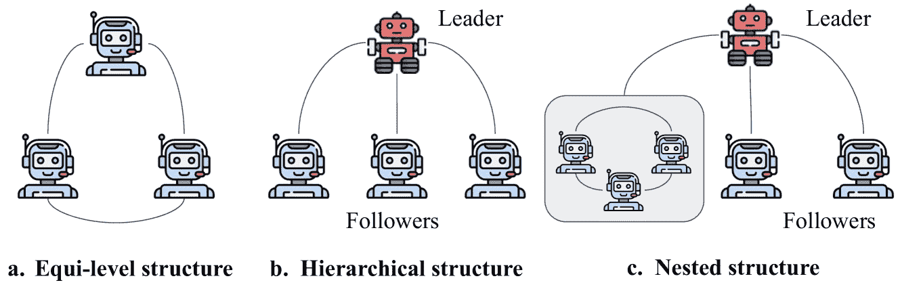

<!--yml

分类：未分类

日期：2025-01-11 12:55:47

-->

# LLM 多代理系统：挑战与未解决的问题

> 来源：[https://arxiv.org/html/2402.03578/](https://arxiv.org/html/2402.03578/)

Shanshan Han    Qifan Zhang    Yuhang Yao    Weizhao Jin    Zhaozhuo Xu    Chaoyang He

###### 摘要

本文探讨了现有的多代理系统研究，并识别出尚未得到充分解决的挑战。通过利用多代理系统中各个代理的多样化能力和角色，这些系统能够通过协作应对复杂任务。我们讨论了优化任务分配、通过反复辩论促进强有力推理、管理复杂和分层的上下文信息，以及提升内存管理，以支持多代理系统中复杂的交互。我们还探讨了多代理系统在区块链系统中的潜在应用，旨在为其在现实分布式系统中的未来发展和应用提供启示。

机器学习，ICML

## 1 引言

多代理系统通过利用代理之间的协作和它们的专业能力，增强了单一 LLM 代理的能力（Talebirad & Nadiri，[2023](https://arxiv.org/html/2402.03578v1#bib.bib28)；Zhang et al.，[2023a](https://arxiv.org/html/2402.03578v1#bib.bib37)；Park et al.，[2023](https://arxiv.org/html/2402.03578v1#bib.bib25)；Li et al.，[2023](https://arxiv.org/html/2402.03578v1#bib.bib18)；Jinxin et al.，[2023](https://arxiv.org/html/2402.03578v1#bib.bib15)）。它利用代理之间的协作和协调来执行任何单一代理无法完成的任务。在多代理系统中，每个代理都具备独特的能力和角色，协作以实现共同目标。这种协作，表现为辩论和反思等活动，在需要深思熟虑和创新的任务中尤其有效。近期的研究包括模拟交互环境（Park et al.，[2023](https://arxiv.org/html/2402.03578v1#bib.bib25)；Jinxin et al.，[2023](https://arxiv.org/html/2402.03578v1#bib.bib15)），角色扮演（Li et al.，[2023](https://arxiv.org/html/2402.03578v1#bib.bib18)），推理（Du et al.，[2023](https://arxiv.org/html/2402.03578v1#bib.bib9)；Liang et al.，[2023](https://arxiv.org/html/2402.03578v1#bib.bib22)），展示了多代理系统在处理复杂现实场景中的巨大潜力。

尽管现有的研究成果展示了多智能体系统的强大能力，但多智能体系统的潜力远远超出了目前取得的进展。大量现有研究集中于通过将任务分解为更小、更易管理的任务，在单一代理中制定规划策略（Chen et al., [2022](https://arxiv.org/html/2402.03578v1#bib.bib6); Ziqi & Lu, [2023](https://arxiv.org/html/2402.03578v1#bib.bib40); Yao et al., [2023](https://arxiv.org/html/2402.03578v1#bib.bib36); Long, [2023](https://arxiv.org/html/2402.03578v1#bib.bib23); Besta et al., [2023](https://arxiv.org/html/2402.03578v1#bib.bib3); Wang et al., [2022b](https://arxiv.org/html/2402.03578v1#bib.bib33))。然而，多智能体系统涉及不同专业化的代理和更复杂的互动及分层的上下文信息，这给工作流和整个系统的设计带来了挑战。此外，现有文献对内存存储的关注较少，而内存在代理间的协作中扮演着至关重要的角色。它使代理能够访问一些常识，与任务对齐上下文，进一步地，从过去的工作流程中学习并相应地调整策略。

到目前为止，区分多智能体系统和单一智能体系统的多个重要挑战仍未得到充分解决。我们将其总结如下。

+   •

    优化任务分配，以发挥代理的独特技能和专业化优势。

+   •

    通过在部分代理之间进行反复辩论或讨论，促进稳健的推理，以增强中间结果。

+   •

    管理复杂且分层的上下文信息，如整体任务的上下文、单一代理的上下文以及代理之间的一些常识，同时确保与总体目标的一致性。

+   •

    管理各种类型的内存，以适应多智能体系统中的互动，并服务于不同的目标。

本文全面探讨了多智能体系统，提供了现有研究的综述，并阐明了其中的挑战和未解的问题。我们研究了多智能体系统中的主要组件，包括规划和内存存储，并讨论了与单一智能体系统相比，多智能体系统所面临的独特挑战。我们还从两个角度探索了多智能体系统在区块链系统中的潜在应用，包括 1) 将多智能体系统作为工具使用，以及 2) 为每个区块链节点分配一个代理，使其代表用户，从而使代理能够在区块链网络中代替用户完成某些任务。

## 2 概述

### 2.1 多智能体系统的结构

多智能体系统的结构可以根据每个代理的功能及其互动方式进行分类。

图 1：多智能体系统的结构。

平级结构。在平级系统中的LLM智能体操作在相同的层次级别上，每个智能体都有其角色和策略，但没有任何一个智能体在层次上优于其他智能体，例如，DMAS（Chen et al., [2023](https://arxiv.org/html/2402.03578v1#bib.bib7)）；参见[图1](https://arxiv.org/html/2402.03578v1#S2.F1 "Figure 1 ‣ 2.1 Structure of Multi-agent Systems ‣ 2 Overview ‣ LLM Multi-Agent Systems: Challenges and Open Problems")(a)。在此类系统中，智能体可以具有相同、中立或对立的目标。目标相同的智能体在没有集中领导的情况下朝着共同的目标协作。重点是集体决策和共享责任（Li et al., [2019](https://arxiv.org/html/2402.03578v1#bib.bib20)）。如果目标对立，智能体会进行协商或辩论，以说服其他智能体或达成最终解决方案（Terekhov et al., [2023](https://arxiv.org/html/2402.03578v1#bib.bib29); Du et al., [2023](https://arxiv.org/html/2402.03578v1#bib.bib9); Liang et al., [2023](https://arxiv.org/html/2402.03578v1#bib.bib22); Chan et al., [2023](https://arxiv.org/html/2402.03578v1#bib.bib5)）。

层次结构。层次结构（Gronauer & Diepold, [2022](https://arxiv.org/html/2402.03578v1#bib.bib12); Ahilan & Dayan, [2019](https://arxiv.org/html/2402.03578v1#bib.bib1)）通常由一个领导者和一个或多个追随者组成；参见[图1](https://arxiv.org/html/2402.03578v1#S2.F1 "Figure 1 ‣ 2.1 Structure of Multi-agent Systems ‣ 2 Overview ‣ LLM Multi-Agent Systems: Challenges and Open Problems")(b)。领导者的角色是引导或规划，而追随者则根据领导者的指示作出反应或执行任务。层次结构通常出现在需要中央权威指导的协调性工作场景中。探索Stackelberg博弈的多智能体系统（Von Stackelberg, [2010](https://arxiv.org/html/2402.03578v1#bib.bib30); Conitzer & Sandholm, [2006](https://arxiv.org/html/2402.03578v1#bib.bib8)）就属于这一类别（Harris et al., [2023](https://arxiv.org/html/2402.03578v1#bib.bib14)）。这种类型的博弈的特点是领导-追随动态以及决策的顺序性。智能体按顺序做出决策，领导者玩家首先生成一个输出（例如指示），然后追随者玩家根据领导者的指示采取行动。

嵌套结构。嵌套结构或混合结构构成了同一多智能体系统中同等层级结构和/或层次结构的子结构（Chan et al., [2023](https://arxiv.org/html/2402.03578v1#bib.bib5)）；见[图 1](https://arxiv.org/html/2402.03578v1#S2.F1 "图 1 ‣ 2.1 多智能体系统的结构 ‣ 2 概述 ‣ 大型语言模型多智能体系统：挑战与未解问题")(c)。系统的“大局”可以是同等层级的，也可以是层次化的。然而，由于某些智能体需要处理复杂的任务，它们将任务分解为较小的任务，并构建一个子系统，可能是同等层级的，也可能是层次化的，并“邀请”几个智能体来协助完成这些任务。在这种系统中，不同层级之间的相互作用以及同行间的互动增加了系统的复杂性。此外，这些不同结构之间的相互作用可能导致复杂的动态变化，其中策略和响应变得复杂，因为存在各种影响因素，包括外部因素如上下文或环境。

动态结构。动态结构意味着多智能体系统的状态，例如智能体的角色、它们之间的关系以及系统中智能体的数量，可能随时间发生变化（Talebirad & Nadiri, [2023](https://arxiv.org/html/2402.03578v1#bib.bib28)）。例如，(Talebirad & Nadiri, [2023](https://arxiv.org/html/2402.03578v1#bib.bib28)) 使得智能体的添加和移除成为可能，以便系统能够适应当前的任务。多智能体系统还可以根据上下文进行自适应，系统内部的交互模式可以根据内部系统状态或外部因素（如上下文）进行调整。在这样的系统中，智能体可以根据不断变化的条件动态地重新配置它们的角色和关系。

### 2.2 多智能体系统中的挑战概述

本文综述了多智能体系统的各个组成部分，并讨论了与单智能体系统相比所面临的挑战。我们讨论了规划、内存管理，以及多智能体系统在分布式系统中的潜在应用，例如区块链系统。

规划。在单一代理系统中，规划涉及到LLM代理将大型任务拆分为一系列小的、可管理的任务，以高效地实现特定目标，同时增强可解释性、可控性和灵活性（Li 等人，[2024](https://arxiv.org/html/2402.03578v1#bib.bib21)；Zhang 等人，[2023b](https://arxiv.org/html/2402.03578v1#bib.bib38)；Nye 等人，[2021](https://arxiv.org/html/2402.03578v1#bib.bib24)；Wei 等人，[2022](https://arxiv.org/html/2402.03578v1#bib.bib34)）。代理还可以学习调用外部API来获取模型权重中缺失的额外信息（在预训练后通常难以更改），或将LLM与网站、软件和工具连接（Patil 等人，[2023](https://arxiv.org/html/2402.03578v1#bib.bib26)；Zhou 等人，[2023](https://arxiv.org/html/2402.03578v1#bib.bib39)；Cai 等人，[2023](https://arxiv.org/html/2402.03578v1#bib.bib4)），以帮助推理并提高性能。尽管多代理系统中的代理具备与单一代理系统相同的能力，但它们面临着来自多代理系统工作流程的挑战。在§[3](https://arxiv.org/html/2402.03578v1#S3 "3 规划 ‣ LLM 多代理系统：挑战与未解问题")中，我们讨论了工作流程的划分及将子任务分配给代理的过程；我们将这一过程称为“全局规划”；详见§[3.1](https://arxiv.org/html/2402.03578v1#S3.SS1 "3.1 全局规划 ‣ 3 规划 ‣ LLM 多代理系统：挑战与未解问题")。接着，我们讨论了单一代理中的任务分解。与单一代理系统中的规划不同，多代理系统中的代理必须处理更复杂的上下文，以实现多代理系统内部的对齐，并进一步朝着整体目标实现一致性；详见§[3.2](https://arxiv.org/html/2402.03578v1#S3.SS2 "3.2 单一代理任务分解 ‣ 3 规划 ‣ LLM 多代理系统：挑战与未解问题")。

内存管理。单智能体系统中的内存管理包括对话中的短期记忆、存储历史对话的长期记忆，以及（如有的话）作为推理补充信息来源的外部数据存储，例如RAG（Lewis等人，[2020](https://arxiv.org/html/2402.03578v1#bib.bib17)）。多智能体系统中的内存管理必须处理复杂的上下文数据、复杂的交互和历史信息，因此需要对内存进行高级设计。我们在§[4.1](https://arxiv.org/html/2402.03578v1#S4.SS1 "4.1 多智能体系统中的内存分类 ‣ 4 代理内存与信息检索 ‣ LLM多智能体系统：挑战与开放问题")中对多智能体系统中涉及的内存进行了分类，并在§[4.2](https://arxiv.org/html/2402.03578v1#S4.SS2 "4.2 多智能体内存管理中的挑战 ‣ 4 代理内存与信息检索 ‣ LLM多智能体系统：挑战与开放问题")中讨论了内存复杂结构带来的潜在挑战。

应用。我们讨论了多智能体系统在区块链中的应用，区块链是一种分布式系统，涉及到复杂的层次和应用设计。基本上，多智能体系统由于其处理区块链中复杂任务的能力，可以作为一种工具；请参见§[5.1](https://arxiv.org/html/2402.03578v1#S5.SS1 "5.1 多智能体系统作为工具 ‣ 5 区块链中的应用 ‣ LLM多智能体系统：挑战与开放问题")。由于多智能体系统的分布式特性，区块链也可以与多智能体系统集成，其中智能体可以被分配到区块链节点上，代表代理执行复杂操作，如谈判；请参见§[5.2](https://arxiv.org/html/2402.03578v1#S5.SS2 "5.2 区块链节点作为代理 ‣ 5 区块链中的应用 ‣ LLM多智能体系统：挑战与开放问题")。

## 3 规划

多智能体系统中的规划涉及根据代理的角色和专业化，理解整体任务和设计工作流程（即全局规划），并将每个代理的任务分解为小的可管理任务（即局部规划）。此过程必须考虑代理的功能、代理之间的动态交互，以及与单智能体系统相比更复杂的上下文。这种复杂性为多智能体系统带来了独特的挑战和机会。

### 3.1 全局规划

全局规划是指理解整体任务，并将任务分解为更小的任务，并将子任务协调分配给各个代理。这需要仔细考虑任务分解和代理协调。下面我们将讨论多智能体系统中全局规划的独特挑战。

基于代理的专长设计有效的工作流程。划分责任并为代理设计有效的工作流程，对于确保每个代理的任务可执行且有意义，并直接为多代理系统中的整体目标做出贡献至关重要。最大挑战体现在以下几个方面：1）工作流程的划分应最大化每个代理的独特能力的利用率，即每个代理可以处理与其能力和专长相匹配的任务；2）每个代理的任务必须与整体目标对齐；3）设计必须理解并考虑整体任务的上下文以及每个代理的情况。这需要深入理解当前任务及系统中每个代理的特定优势和局限性。

为部分代理引入循环以增强中间结果。多代理系统可以通过在一个或多个代理子集内部引入循环，来改善中间结果的质量或局部最优答案。在这样的循环中，代理之间进行辩论或讨论，以达成一个所有代理都能接受的最优结果。迭代过程可以细化中间结果，推动任务的更深层次探索。循环中的代理可以在过程中调整其推理过程和计划，从而更好地应对任务中的不确定性。

博弈论。博弈论为理解多智能体系统中的战略互动提供了一个结构化良好的框架，特别是对于涉及智能体之间复杂互动的系统，如辩论或讨论。博弈论中的一个关键概念是均衡，例如，纳什均衡（Kreps, [1989](https://arxiv.org/html/2402.03578v1#bib.bib16)）和斯塔克尔伯格均衡（Von Stackelberg, [2010](https://arxiv.org/html/2402.03578v1#bib.bib30); Conitzer & Sandholm, [2006](https://arxiv.org/html/2402.03578v1#bib.bib8)），描述了这样一种状态：在考虑到其他人的策略后，没有智能体会从单方面改变其策略中获益。博弈论已被应用于多智能体系统，特别是斯塔克尔伯格均衡（Gerstgrasser & Parkes, [2023](https://arxiv.org/html/2402.03578v1#bib.bib10); Harris et al., [2023](https://arxiv.org/html/2402.03578v1#bib.bib14)），因为斯塔克尔伯格均衡的结构包含一个领导智能体和多个跟随智能体，这种层级架构在多智能体系统中广泛被考虑。举个例子，（Gerstgrasser & Parkes, [2023](https://arxiv.org/html/2402.03578v1#bib.bib10)）设计了一个通用的多智能体框架，用于在马尔可夫博弈中识别斯塔克尔伯格均衡，而（Harris et al., [2023](https://arxiv.org/html/2402.03578v1#bib.bib14)）将斯塔克尔伯格模型扩展，以允许智能体考虑外部上下文信息，如交通和天气等。然而，在多智能体系统中仍然存在一些具有挑战性的问题，例如基于整体任务的上下文，为集体策略和单个智能体定义合适的回报结构，以及有效地实现均衡状态。这些未解决的问题突显了在博弈论应用于复杂多智能体场景时，仍然需要不断完善的需求。

### 3.2 单智能体任务分解

单个智能体的任务分解涉及生成一系列中间推理步骤，以完成任务或得出答案。这个过程可以表示为将直接的输入输出（$\langle\text{input}\rightarrow\text{output}\rangle$）映射转化为$\langle\text{input}\rightarrow\text{rational}\rightarrow\text{output}\rangle$映射（Wei et al., [2022](https://arxiv.org/html/2402.03578v1#bib.bib34); Zhang et al., [2023b](https://arxiv.org/html/2402.03578v1#bib.bib38)）。任务组成可以有不同的格式，如下所示。

1) 思维链（CoT）(Wei et al., [2022](https://arxiv.org/html/2402.03578v1#bib.bib34))，将大任务转化为逐步可管理的小任务，以表示智能体推理（或思考）过程的解释。

2) 多个思维链（CoTs）（Wang et al., [2022a](https://arxiv.org/html/2402.03578v1#bib.bib32)），探索多个独立的CoT推理路径，并返回输出最优的路径。

3) 思维程序 (PoT)（Chen等人，[2022](https://arxiv.org/html/2402.03578v1#bib.bib6)）使用语言模型生成文本和编程语言语句，最终给出答案。

4) 思维表格 (Tab-CoT)（Ziqi & Lu，[2023](https://arxiv.org/html/2402.03578v1#bib.bib40)）利用表格格式进行推理，使得复杂的推理过程能够以高度结构化的方式显式建模。

5) 思维树 (ToT)（Yao等人，[2023](https://arxiv.org/html/2402.03578v1#bib.bib36); Long，[2023](https://arxiv.org/html/2402.03578v1#bib.bib23)）通过构建树形结构扩展了CoT，能够在每一步探索多种推理可能性。它使得基于给定的任意思维生成新的思维，并可能从中回溯。

6) 思维图-推理 (GoT-Rationale)（Besta等人，[2023](https://arxiv.org/html/2402.03578v1#bib.bib3)）探索任意图形，以便将任意思维聚合成新的思维，并通过循环增强思维。

7) 推理增强集成（Wang等人，[2022b](https://arxiv.org/html/2402.03578v1#bib.bib33)）自动汇聚不同的推理，以克服在次优推理下表现的脆弱性。

在多智能体系统中，单个智能体的任务分解变得更加复杂。每个智能体必须理解分层和复杂的背景，包括 1) 整体任务，2) 智能体个体任务的具体背景，以及 3) 其他智能体在多智能体系统中提供的背景信息。此外，智能体必须将这些复杂的、多维的背景对齐到其分解的任务中，以确保在整体任务中的一致性和有效性。我们总结了单个智能体规划的挑战如下。

对齐整体背景。在多智能体系统中，不同智能体之间目标的对齐至关重要。每个LLM智能体必须清楚理解其角色及其如何融入整体任务，从而使智能体能够有效地执行其功能。除个人角色外，智能体还需要认识到其任务如何融入更大的任务背景，以便它们的输出可以与其他智能体的输出协调一致，并进一步确保所有努力都朝着共同目标进行。

对齐智能体之间的背景。在多智能体系统中，智能体共同处理任务，每个智能体必须理解并整合其他智能体提供的背景信息，以确保其他智能体提供的信息能够充分利用。

对分解任务的上下文对齐。当每个智能体的任务被分解为更小、更易管理的子任务时，在多智能体系统中对齐复杂的上下文变得具有挑战性。每个智能体的分解任务必须适应其个体任务和整体目标，同时与其他智能体的上下文进行整合。智能体必须根据其他智能体提供的上下文调整并更新其对任务的理解，并进一步相应地规划分解任务。

目标一致性。在多智能体系统中，目标一致性在各个层次间得到保持，即从整体目标到单个智能体任务及其分解任务。每个智能体必须理解并有效利用分层的上下文，同时确保其任务和分解的子任务与整体目标保持一致。（Harris 等，[2023](https://arxiv.org/html/2402.03578v1#bib.bib14)）扩展了Stackelberg模型（Von Stackelberg，[2010](https://arxiv.org/html/2402.03578v1#bib.bib30)；Conitzer & Sandholm，[2006](https://arxiv.org/html/2402.03578v1#bib.bib8)），使得智能体能够融入外部上下文信息，如其他智能体提供的上下文（或洞察）。然而，在推理过程中将复杂上下文与分解任务对齐仍然是一个未解决的问题。

## 4 智能体记忆与信息检索

单一LLM智能体系统中的记忆指的是智能体记录、管理和利用数据的能力，例如过去的历史查询和一些外部数据源，以帮助推理并增强决策和推理能力（Yao 等，[2023](https://arxiv.org/html/2402.03578v1#bib.bib36)；Park 等，[2023](https://arxiv.org/html/2402.03578v1#bib.bib25)；Li & Qiu，[2023](https://arxiv.org/html/2402.03578v1#bib.bib19)；Wang 等，[2023](https://arxiv.org/html/2402.03578v1#bib.bib31)；Guo 等，[2023](https://arxiv.org/html/2402.03578v1#bib.bib13)）。虽然单一LLM智能体系统中的记忆主要集中在内部数据的管理和利用上，但多智能体系统要求智能体协作完成一些任务，这不仅需要每个智能体的个体记忆能力，还需要一个复杂的机制来共享、整合和管理不同智能体之间的信息，这对记忆和信息检索提出了挑战。

### 4.1 多智能体系统中的记忆分类

基于多智能体系统的工作流程，我们将多智能体系统中的记忆进行如下分类。

+   •

    短期记忆：这是大型语言模型（LLM）在对话或互动过程中使用的即时、短暂的记忆，例如（Jinxin 等，[2023](https://arxiv.org/html/2402.03578v1#bib.bib15)）中的工作记忆。它是短暂的，仅在当前互动过程中存在，一旦对话结束，记忆就会消失。

+   •

    长期记忆：这种记忆类型存储历史查询和响应，实际上是先前会话的聊天记录，以支持未来交互中的推理。通常，这种记忆存储在外部数据存储中，如向量数据库，以便回忆过去的交互。

+   •

    外部数据存储（例如，RAG）：这是大规模语言模型（LLM）研究中的一个新兴领域，其中模型与外部数据存储（如向量数据库）集成，使得智能体可以从这些数据库中访问额外的知识，从而增强其对查询的响应能力并丰富其回答内容（Lewis等，[2020](https://arxiv.org/html/2402.03578v1#bib.bib17)）。这使得大规模语言模型能够生成更具信息性、准确性且高度相关的回答，符合特定查询的背景。

+   •

    情节记忆：这种记忆类型包含多智能体系统中的交互集合。当智能体面对新任务或查询时，它发挥着关键作用。通过参考与当前查询具有情境相似性的过去交互，智能体可以显著提高其回应的相关性和准确性。情节记忆为推理和问题解决提供了更有依据的方法，使得响应机制更加适应和智能，因此在多智能体系统中作为一种宝贵的资源。

+   •

    共识记忆：在多智能体系统中，智能体协同工作以完成任务，共识记忆作为统一的共享信息源，涵盖了常识、一些特定领域的知识等，例如（Jinxin等，[2023](https://arxiv.org/html/2402.03578v1#bib.bib15)）中的技能库。智能体利用共识记忆来对齐他们对任务的理解和策略，从而增强智能体之间有效且有凝聚力的协作。

尽管单智能体系统和多智能体系统都处理短期记忆和长期记忆，但多智能体系统由于需要进行智能体间的通信、信息共享和适应性记忆管理，引入了额外的复杂性。

### 4.2 多智能体记忆管理中的挑战

在多智能体系统中管理记忆充满了挑战和开放性问题，特别是在安全性、保密性和隐私等领域。我们将这些问题概述如下：

层次化记忆存储：在多智能体系统中，不同的智能体通常具有不同的功能和访问需求。有些智能体可能需要查询其敏感数据，但不希望这些数据被其他方访问。在确保共识记忆对所有客户端可访问的同时，实施强大的访问控制机制至关重要，以确保智能体的敏感信息不会被其他智能体访问。此外，由于系统中的智能体在执行一个任务时是协同工作的，并且它们的功能共享相同的上下文，它们的外部数据存储和记忆可能会重叠。如果这些智能体的数据和功能不具有敏感性，采用统一的数据存储可以有效地管理数据冗余，进一步确保多智能体系统的一致性，从而更高效和精确地维护记忆。

共识记忆的维护：由于共识记忆是在多个智能体协作执行任务时由所有智能体共享获得的，确保共享知识的完整性对于多智能体系统中任务的正确执行至关重要。任何对共识记忆的篡改或未经授权的修改都可能导致执行的系统性失败。因此，严格的访问控制对于降低数据泄露的风险非常重要。

通信和信息交换：确保智能体之间的有效通信和信息交换对于多智能体系统至关重要。每个智能体可能拥有关键信息，而这些信息的无缝整合对于整体系统的表现至关重要。

情节记忆的管理。在多智能体系统中，利用过去的交互来增强对新查询的响应是一个挑战。确定如何有效地回忆和利用智能体之间在当前问题解决场景中相关的过去交互是至关重要的。

这些挑战突显了在多智能体系统领域持续开展研究和开发的必要性，重点是创建强大、安全和高效的记忆管理方法。

## 5 区块链中的应用

多智能体系统通过增强区块链系统的能力和效率，为区块链系统提供了显著的优势。从本质上讲，这些多智能体系统作为区块链和Web3系统中各种任务的复杂工具。同时，区块链节点可以被视为具有特定角色和能力的智能体（Ankile等，[2023](https://arxiv.org/html/2402.03578v1#bib.bib2)）。鉴于区块链系统和多智能体系统本身都是分布式的，区块链网络可以与多智能体系统无缝集成。通过为每个区块链节点分配专门的智能体，能够增强数据分析和处理，同时增强链中的安全性和隐私性。

### 5.1 多智能体系统作为工具

以“抛砖引玉”之意，我们提供了一些多智能体系统如何作为工具来惠及区块链系统的潜在方向。

智能合约分析。智能合约是在区块链上存储的程序，当满足预定条件时会自动运行。多智能体共同协作分析和审计智能合约。智能体可以有不同的专长，例如识别安全漏洞、法律合规性以及优化合约效率。它们的协作分析能够提供比单个智能体独立完成时更为全面的审查。

共识机制增强。像工作量证明（PoW）(Gervais et al., [2016](https://arxiv.org/html/2402.03578v1#bib.bib11)) 或权益证明（PoS）(Saleh, [2021](https://arxiv.org/html/2402.03578v1#bib.bib27)) 等共识机制对于验证交易和维护网络完整性至关重要。多智能体系统可以协作监控网络活动，分析交易模式，并识别潜在的安全威胁。通过协作，这些智能体可以提出共识机制的改进方案，从而使区块链更加安全和高效。

欺诈检测。欺诈检测是金融监控中最重要的任务之一。例如，(Ankile et al., [2023](https://arxiv.org/html/2402.03578v1#bib.bib2)) 从外部观察者的角度研究了欺诈检测，观察者通过分析特定资产的交易序列或价格波动来检测价格操纵。多智能体系统在区块链中的欺诈检测也能带来好处。智能体可以承担不同的角色，例如监控交易中的欺诈活动和分析用户行为。每个智能体还可以专注于不同的行为模式，以提高欺诈检测过程的准确性和效率。

### 5.2 区块链节点作为智能体

(Ankile et al., [2023](https://arxiv.org/html/2402.03578v1#bib.bib2)) 将区块链节点识别为智能体，并从外部观察者的角度研究链中的欺诈检测。然而，作为强大的大语言模型（LLM）智能体，具备分析和推理能力的智能体能够做更多的事情，特别是结合博弈论后，可以使智能体进行谈判和辩论。以下是我们提供的一些视角。

智能合约管理与优化。智能合约是执行区块链系统中买卖双方合同条款的程序。代码是固定的，当预定条件满足时，它们会自动执行。多智能体系统可以通过更灵活的条款和甚至来自用户的动态外部信息来自动化和优化智能合约的执行。智能体可以代表其用户协商合同条款，管理合同执行，甚至优化以太坊（Ethereum）中的 gas 费用（Wood 等人，见[2014](https://arxiv.org/html/2402.03578v1#bib.bib35)）。这些智能体可以分析上下文信息，如过去的行为和预定义的标准，并以更灵活的方式利用这些信息。当存在领导者谈判者时，这些谈判可以利用博弈论，如斯塔克尔贝格均衡（Stackelberg Equilibrium，Von Stackelberg，[2010](https://arxiv.org/html/2402.03578v1#bib.bib30)；Conitzer & Sandholm，[2006](https://arxiv.org/html/2402.03578v1#bib.bib8)）；当没有领导者时，则可以使用纳什均衡（Nash Equilibrium，Kreps，[1989](https://arxiv.org/html/2402.03578v1#bib.bib16)）。

## 6 结论

本文对多智能体系统的探索强调了它们在超越单一智能体范式的能力方面具有重要潜力。通过利用智能体之间的专业能力和协作动态，多智能体系统能够以更高的效率和创新解决复杂任务。我们的研究揭示了需要解决的一些挑战，以更好地利用多智能体系统的力量，包括优化任务规划、管理复杂的上下文信息以及改善记忆管理。此外，多智能体系统在区块链技术中的潜在应用揭示了新的发展途径，这表明这些系统在分布式计算环境中具有光明的未来。

## 参考文献

+   Ahilan & Dayan（2019）Ahilan, S. 和 Dayan, P. 用于协作强化学习的封建多智能体层次结构。*arXiv 预印本 arXiv:1901.08492*，2019。

+   Ankile 等人（2023）Ankile, L., Ferreira, M. X., 和 Parkes, D. 我看见你了！对抗性行为的稳健测量。在 *NeurIPS’23 多智能体安全研讨会*，2023。

+   Besta 等人（2023）Besta, M., Blach, N., Kubicek, A., Gerstenberger, R., Gianinazzi, L., Gajda, J., Lehmann, T., Podstawski, M., Niewiadomski, H., Nyczyk, P., 等人。思维图谱：利用大型语言模型解决复杂问题。*arXiv 预印本 arXiv:2308.09687*, 2023。

+   Cai 等人（2023）Cai, T., Wang, X., Ma, T., Chen, X., 和 Zhou, D. 大型语言模型作为工具制造者。*arXiv 预印本 arXiv:2305.17126*, 2023。

+   Chan 等人（2023）Chan, C.-M., Chen, W., Su, Y., Yu, J., Xue, W., Zhang, S., Fu, J., 和 Liu, Z. Chateval：通过多智能体辩论实现更好的基于 LLM 的评估者。*arXiv 预印本 arXiv:2308.07201*，2023。

+   陈等人（2022）陈, W., 马, X., 王, X., 和 Cohen, W. W. 思维程序引导：将计算与推理从数值推理任务中分离。*arXiv预印本 arXiv:2211.12588*，2022。

+   陈等人（2023）陈, Y., 阿金, J., 张, Y., 罗伊, N., 和范, C. 使用大规模语言模型的可扩展多机器人协作：集中式还是分散式系统？*arXiv预印本 arXiv:2309.15943*，2023。

+   康尼策尔和桑德霍尔姆（2006）康尼策尔, V. 和 桑德霍尔姆, T. 计算最优的承诺策略。发表于*第七届ACM电子商务会议论文集*，第82–90页，2006。

+   杜等人（2023）杜, Y., 李, S., 托拉尔巴, A., 特嫩鲍姆, J. B., 和 莫达奇, I. 通过多智能体辩论提高语言模型的事实性和推理能力。*arXiv预印本 arXiv:2305.14325*，2023。

+   Gerstgrasser 和 Parkes（2023）Gerstgrasser, M. 和 Parkes, D. C. 神谕与追随者：深度多智能体强化学习中的斯塔克尔伯格均衡。发表于*国际机器学习会议*，第11213–11236页，PMLR，2023。

+   盖尔维斯等人（2016）盖尔维斯, A., 卡拉梅, G. O., 伍斯特, K., 格里坎茨, V., 里茨多夫, H., 和 卡普昆, S. 工作量证明区块链的安全性与性能。发表于*2016年ACM SIGSAC计算与通信安全会议论文集*，第3–16页，2016。

+   Gronauer 和 Diepold（2022）Gronauer, S. 和 Diepold, K. 多智能体深度强化学习：综述。*人工智能评论*，第1–49页，2022。

+   郭等人（2023）郭, Z., 程, S., 王, Y., 李, P., 和 刘, Y. 提示引导的检索增强用于非知识密集型任务。*arXiv预印本 arXiv:2305.17653*，2023。

+   哈里斯等人（2023）哈里斯, K., 吴, S., 和 巴尔坎, M. F. 带有侧信息的斯塔克尔伯格博弈。发表于*多智能体安全研讨会@NeurIPS'23*，2023。

+   Jinxin等人（2023）Jinxin, S., Jiabao, Z., Yilei, W., Xingjiao, W., Jiawen, L., 和 Liang, H. Cgmi: 可配置的通用多智能体交互框架。*arXiv预印本 arXiv:2308.12503*，2023。

+   克雷普斯（1989）克雷普斯, D. M. 纳什均衡。发表于*博弈论*，第167–177页，Springer，1989。

+   刘等人（2020）刘, P., 佩雷斯, E., 皮克图斯, A., 佩特罗尼, F., 卡普金, V., 戈亚尔, N., 库特勒, H., 刘, M., 叶, W.-t., 罗克塔谢尔, T., 等人。增强检索生成用于知识密集型NLP任务。*神经信息处理系统进展*，33:9459–9474，2020。

+   李等人（2023）李, G., 哈穆德, H. A. A. K., 伊塔尼, H., 希兹布林, D., 和 盖内姆, B. Camel: 用于“大规模语言模型社会”思维探索的交流智能体。*arXiv预印本 arXiv:2303.17760*，2023。

+   李和邱（2023）李, X. 和 邱, X. Mot: 思维记忆使ChatGPT能够自我改进。发表于*2023年自然语言处理实证方法会议论文集*，第6354–6374页，2023。

+   Li et al. (2019) Li, X., Sun, M., and Li, P. 用于自然语言生成的多代理讨论机制。见 *人工智能学会年会论文集*，第33卷，pp. 6096–6103，2019年。

+   Li et al. (2024) Li, Y., Wen, H., Wang, W., Li, X., Yuan, Y., Liu, G., Liu, J., Xu, W., Wang, X., Sun, Y., 等人。个人LLM代理：关于能力、效率和安全性的洞察与调查。*arXiv预印本 arXiv:2401.05459*，2024年。

+   Liang et al. (2023) Liang, T., He, Z., Jiao, W., Wang, X., Wang, Y., Wang, R., Yang, Y., Tu, Z., 和 Shi, S. 通过多代理辩论鼓励大型语言模型中的发散思维。*arXiv预印本 arXiv:2305.19118*，2023年。

+   Long (2023) Long, J. 大型语言模型引导的思维树。*arXiv预印本 arXiv:2305.08291*，2023年。

+   Nye et al. (2021) Nye, M., Andreassen, A. J., Gur-Ari, G., Michalewski, H., Austin, J., Bieber, D., Dohan, D., Lewkowycz, A., Bosma, M., Luan, D., 等人。展示你的工作：用于中间计算的语言模型草稿板。*arXiv预印本 arXiv:2112.00114*，2021年。

+   Park et al. (2023) Park, J. S., O’Brien, J., Cai, C. J., Morris, M. R., Liang, P., and Bernstein, M. S. 生成代理：人类行为的互动仿真。见 *第36届ACM用户界面软件与技术年会论文集*，pp. 1–22，2023年。

+   Patil et al. (2023) Patil, S. G., Zhang, T., Wang, X., 和 Gonzalez, J. E. Gorilla：与大量API连接的大型语言模型。*arXiv预印本 arXiv:2305.15334*，2023年。

+   Saleh (2021) Saleh, F. 无浪费区块链：权益证明。*金融学研究评论*，34(3):1156–1190，2021年。

+   Talebirad & Nadiri (2023) Talebirad, Y. 和 Nadiri, A. 多代理协作：利用智能LLM代理的力量。*arXiv预印本 arXiv:2306.03314*，2023年。

+   Terekhov et al. (2023) Terekhov, M., Graux, R., Neville, E., Rosset, D., and Kolly, G. 二阶越狱：生成代理成功通过中介进行操控。见 *NeurIPS’23 多代理安全研讨会*，2023年。

+   Von Stackelberg (2010) Von Stackelberg, H. *市场结构与均衡*。Springer Science & Business Media, 2010.

+   Wang et al. (2023) Wang, W., Dong, L., Cheng, H., Liu, X., Yan, X., Gao, J., and Wei, F. 增强语言模型的长期记忆。*arXiv预印本 arXiv:2306.07174*，2023年。

+   Wang et al. (2022a) Wang, X., Wei, J., Schuurmans, D., Le, Q., Chi, E., Narang, S., Chowdhery, A., and Zhou, D. 自一致性改善语言模型中的思维链推理。*arXiv预印本 arXiv:2203.11171*，2022年a。

+   Wang et al. (2022b) Wang, X., Wei, J., Schuurmans, D., Le, Q., Chi, E., and Zhou, D. 理由增强的语言模型集成。*arXiv预印本 arXiv:2207.00747*，2022年b。

+   Wei 等人 (2022) Wei, J., Wang, X., Schuurmans, D., Bosma, M., Xia, F., Chi, E., Le, Q. V., Zhou, D., 等人. 思维链提示法激发大型语言模型的推理能力. *神经信息处理系统进展*, 35:24824–24837, 2022.

+   Wood 等人 (2014) Wood, G. 等人. 以太坊：一种安全的去中心化通用交易账本. *以太坊项目黄色论文*, 151(2014):1–32, 2014.

+   Yao 等人 (2023) Yao, S., Yu, D., Zhao, J., Shafran, I., Griffiths, T. L., Cao, Y., 和 Narasimhan, K. 思维树：利用大型语言模型进行深思熟虑的问题解决. *arXiv 预印本 arXiv:2305.10601*, 2023.

+   Zhang 等人 (2023a) Zhang, J., Xu, X., 和 Deng, S. 探索 LLM 智能体的协作机制：一种社会心理学视角, 2023a.

+   Zhang 等人 (2023b) Zhang, Z., Yao, Y., Zhang, A., Tang, X., Ma, X., He, Z., Wang, Y., Gerstein, M., Wang, R., Liu, G., 等人. 激发语言智能：从思维链推理到语言智能体的搭便车指南. *arXiv 预印本 arXiv:2311.11797*, 2023b.

+   Zhou 等人 (2023) Zhou, S., Xu, F. F., Zhu, H., Zhou, X., Lo, R., Sridhar, A., Cheng, X., Bisk, Y., Fried, D., Alon, U., 等人. Webarena：构建自主智能体的真实网页环境. *arXiv 预印本 arXiv:2307.13854*, 2023.

+   Ziqi 和 Lu (2023) Ziqi, J. 和 Lu, W. Tab-CoT：零-shot 表格思维链. 见 Rogers, A., Boyd-Graber, J., 和 Okazaki, N. (编辑), *计算语言学协会会议论文集：ACL 2023*, 页码 10259–10277, 加拿大多伦多, 2023年7月. 计算语言学协会. doi: [10.18653/v1/2023.findings-acl.651](10.18653/v1/2023.findings-acl.651). URL [https://aclanthology.org/2023.findings-acl.651](https://aclanthology.org/2023.findings-acl.651).
