<!--yml
category: 未分类
date: 2025-01-11 11:41:26
-->

# LLM-Powered Multi-Agent System for Automated Crypto Portfolio Management

> 来源：[https://arxiv.org/html/2501.00826/](https://arxiv.org/html/2501.00826/)

\DeclareAcronym

llm short = LLM, long = large language model \DeclareAcronymohlc short = OHLC, long = open  high  low  and close \DeclareAcronymmcc short = MCC, long = Matthews Correlation Coefficient \DeclareAcronymcapm short = CAPM, long = Capital Asset Pricing Model

Yichen Luo University College LondonLondonUnited Kingdom [yichen.luo.22@ucl.ac.uk](mailto:yichen.luo.22@ucl.ac.uk) ,  Yebo Feng Nanyang Technological UniversitySingapore [yebo.feng@ntu.edu.sg](mailto:yebo.feng@ntu.edu.sg) ,  Jiahua Xu University College LondonExponential Science FoundationLondonUnited Kingdom [jiahua.xu@ucl.ac.uk](mailto:jiahua.xu@ucl.ac.uk) ,  Paolo Tasca University College LondonExponential Science FoundationLondonUnited Kingdom [p.tasca@ucl.ac.uk](mailto:p.tasca@ucl.ac.uk)  and  Yang Liu Nanyang Technological UniversitySingapore [yangliu@ntu.edu.sg](mailto:yangliu@ntu.edu.sg)

###### Abstract.

Cryptocurrency investment is inherently difficult due to its shorter history compared to traditional assets, the need to integrate vast amounts of data from various modalities, and the requirement for complex reasoning. While deep learning approaches have been applied to address these challenges, their “black-box” nature raises concerns about trust and explainability. Recently, \acpllm have shown promise in financial applications due to their ability to understand multi-modal data and generate explainable decisions. However, single \acsllm faces limitations in complex, comprehensive tasks such as asset investment. These limitations are even more pronounced in cryptocurrency investment, where \acspllm have less domain-specific knowledge in their training corpora.

To overcome these challenges, we propose an explainable, multi-modal, multi-agent framework for cryptocurrency investment. Our framework uses specialized agents that collaborate within and across teams to handle subtasks such as data analysis, literature integration, and investment decision-making for the top 30 cryptocurrencies by market capitalization. The expert training module fine-tunes agents using multi-modal historical data and professional investment literature, while the multi-agent investment module employs real-time data to make informed cryptocurrency investment decisions. Unique intrateam and interteam collaboration mechanisms enhance prediction accuracy by adjusting final predictions based on confidence levels within agent teams and facilitating information sharing between teams. Empirical evaluation using data from November 2023 to September 2024 demonstrates that our framework outperforms single-agent models and market benchmarks in classification, asset pricing, portfolio, and explainability performance.

## 1\. Introduction

Cryptocurrency investment is a challenging and comprehensive task due to its limited asset pricing evidence (Corbet et al., [2019](https://arxiv.org/html/2501.00826v2#bib.bib10); Fang et al., [2022](https://arxiv.org/html/2501.00826v2#bib.bib14)), the requirement for data from various modalities (Jing and Kang, [2024](https://arxiv.org/html/2501.00826v2#bib.bib21); Kapur et al., [2024](https://arxiv.org/html/2501.00826v2#bib.bib22); Liu and Tsyvinski, [2021](https://arxiv.org/html/2501.00826v2#bib.bib32); Liu et al., [2022](https://arxiv.org/html/2501.00826v2#bib.bib33)), and the need for complex reasoning (Hackethal et al., [2022](https://arxiv.org/html/2501.00826v2#bib.bib19)). As a result, analyzing the cryptocurrency market, designing strategies, and building portfolios become a huge undertaking and impose a heavy workload on financial experts, making professional services either scarce or expensive (CFP Board, [2022](https://arxiv.org/html/2501.00826v2#bib.bib7)). To address these challenges, many researchers have explored the use of deep learning techniques (Goutte et al., [2023](https://arxiv.org/html/2501.00826v2#bib.bib17); Lahmiri and Bekiros, [2019](https://arxiv.org/html/2501.00826v2#bib.bib25)) for cryptocurrency investment. However, the “black-box” nature of most deep learning models raises concerns about trust and explainability, making investors hesitant to rely on these techniques when investing their capital (Li et al., [2023b](https://arxiv.org/html/2501.00826v2#bib.bib27); Carta et al., [2021](https://arxiv.org/html/2501.00826v2#bib.bib6); Biran and McKeown, [2017](https://arxiv.org/html/2501.00826v2#bib.bib5)).

The introduction of \acpllm has revolutionized the financial field, offering promising solutions for cryptocurrency investment. Numerous studies have demonstrated the strong capability of \acpllm to understand and learn from multi-modal data (Yin et al., [2024](https://arxiv.org/html/2501.00826v2#bib.bib41)) such as text (Yang et al., [2024](https://arxiv.org/html/2501.00826v2#bib.bib40); Li et al., [2023c](https://arxiv.org/html/2501.00826v2#bib.bib29)) and images (Zhang et al., [2024](https://arxiv.org/html/2501.00826v2#bib.bib42)), which makes them well-suited for learning professional cryptocurrency investment knowledge and analyzing the market from data in different modalities. On the other hand, \acpllm has excellent natural language generation capability (Wei et al., [2022](https://arxiv.org/html/2501.00826v2#bib.bib37); Liu et al., [2023a](https://arxiv.org/html/2501.00826v2#bib.bib30)), which enables them to generate explainable cryptocurrency investment decisions. However, the performance of single \acpllm in asset prediction is limited due to the comprehensive nature and complex reasoning requirement of this task (Xie et al., [2023](https://arxiv.org/html/2501.00826v2#bib.bib39); Li et al., [2023a](https://arxiv.org/html/2501.00826v2#bib.bib26)). The weakness is even more pronounced in cryptocurrency investment, where \acpllm have less domain-specific knowledge in their training corpora. To address this type of challenge, researchers have developed methodologies that decompose complex tasks into subtasks (Wu et al., [2023](https://arxiv.org/html/2501.00826v2#bib.bib38); Pan et al., [2024](https://arxiv.org/html/2501.00826v2#bib.bib34)). This method uses the collaboration between multiple \acllm-based agents to derive final comprehensive solutions, with each agent focusing on a specific aspect of the overall task. Inspired by human cognitive processes, this method enhances reasoning capabilities and efficacy in solving comprehensive problems, offering new possibilities for agent-based investment solutions. Although some studies have explored the use of multi-agent models in stock investment (Ding et al., [2024](https://arxiv.org/html/2501.00826v2#bib.bib12); Fatemi and Hu, [2024](https://arxiv.org/html/2501.00826v2#bib.bib15)), works that employ the multi-agent model in cryptocurrency investment are few and are limited to Bitcoin, Ethereum, and Solana as well as data in single modality (Li et al., [2024](https://arxiv.org/html/2501.00826v2#bib.bib28)).

To address the above-mentioned problems and fill in the gap, we propose an explainable, multi-modal, multi-agent framework, which utilizes multiple teams of agents that collaborate both within and across teams to facilitate supervised learning and investment decisions across the top 30 cryptocurrencies by market capitalization. Within this framework, complex investment tasks involving data from different modalities are decomposed into several subtasks, with each fine-tuned expert agent assigned responsibility for a specific subtask. Inspired by the communication methods used in hedge funds, our unique intrateam and interteam collaboration mechanism ensures that the final investment decision integrates information from multiple modalities effectively.

Our multi-agent framework consists of two modules: the expert training module and the multi-agent investment module. The expert training module employs agents from the data team and literature team to fetch historical multi-modal data and relevant investment literature, respectively. Next, agents in the explanation team process the data and literature to generate high-quality prompts by integrating multi-modal information and professional investment knowledge. Finally, these prompts are used to fine-tune expert investment agents, each specializing in the analysis of data in a single modality. The multi-agent investment module utilizes the data team to fetch real-time data and forward it to the market team and crypto team. The market team includes two expert agents who analyze news and market factors to predict market trends and determine the cash-crypto allocation. Similarly, the crypto team has two expert agents who analyze crypto-specific factors and candlestick charts of individual cryptocurrencies to make crypto selection decisions. Finally, the trading team interacts with cryptocurrency exchange APIs to execute the final portfolio strategy. The intrateam collaboration mechanism combines the confidence scores of agents within the same group to produce an ensemble prediction. The interteam collaboration mechanism allows agents in the crypto team to share memory with the market team regarding market information, enabling more robust crypto selection decisions based on comprehensive information.

To demonstrate the effectiveness of our framework, we use data from June 2023 to September 2024 to validate its ability to outperform single-agent models, both with and without fine-tuning, in terms of classification accuracy and asset pricing performance. Additionally, we show that our framework surpasses market benchmarks in portfolio performance. The main contributions of this paper are summarized as:

*   •

    We are the first to propose a multi-agent framework for large-cap cryptocurrency portfolio management that integrates multi-modal data and professional investment knowledge into decision-making and explanation processes, respectively.

*   •

    We design unique interteam and intrateam collaboration mechanisms to facilitate communication and mitigate prediction errors among different agents. These mechanisms significantly enhance the performance of our model in cryptocurrency investment.

*   •

    We design unique asset pricing methods for \acllm to convert the binary rise-or-fall price trend classification into a spectrum of confidence levels using the token probability. These confidence levels are then used to build portfolios according to the empirical asset pricing methodology in finance.

*   •

    By learning historical data and related academic literature via fine-tuning, our multi-agent model is able to generate predictions that effectively explain the variation in cryptocurrency returns and deliver high-quality interpretations.

*   •

    Our multi-agent model not only outperforms single \acllms in classification, asset pricing, and expandability performance but also surpasses market benchmarks in portfolio performance.

## 2\. Related Works

In this section, we review the progress of empirical cryptocurrency pricing research and examine works that utilize single \acllm and multi-agent frameworks for investment.

Empirical Cryptocurrency Pricing. As an emerging class of alternative assets, cryptocurrencies have attracted significant research interest, particularly in the field of asset pricing. Empirical cryptocurrency pricing is a branch of empirical asset pricing originally developed by Eugene Fama and Kenneth French to explain asset returns (Fama and French, [1993](https://arxiv.org/html/2501.00826v2#bib.bib13)). Early studies in empirical cryptocurrency pricing focused on the predictability of market returns, identifying factors such as network activity, momentum, and investor attention as strong predictors of future cryptocurrency market returns (Liu and Tsyvinski, [2021](https://arxiv.org/html/2501.00826v2#bib.bib32)). Additionally, news sentiment has been shown to significantly impact cryptocurrency market returns (Anamika and Subramaniam, [2022](https://arxiv.org/html/2501.00826v2#bib.bib2)). Subsequently, market, size, and momentum factors were identified as key determinants of cross-sectional expected cryptocurrency returns, leading to the development of cryptocurrency-specific three-factor models (Liu et al., [2022](https://arxiv.org/html/2501.00826v2#bib.bib33)). Moreover, trend-based technical indicators, commonly identified on candlestick charts, have also demonstrated predictive power in forecasting cross-sectional cryptocurrency returns (Tan and Tao, [2023](https://arxiv.org/html/2501.00826v2#bib.bib36)). While these studies highlight robust predictive information across various modalities, including panel data, textual information, and chart patterns, there remains a significant gap in the development of a unified model capable of integrating these diverse data modality.

Large Language Models for Investment. With their powerful text understanding and reasoning capabilities, \acpllm have become widely used in different investment tasks. Early studies have focused on employing single \acllms to predict asset prices and execute investment strategies. Some works have attempted to fine-tune their own financial \acllm to complete investment tasks (Xie et al., [2023](https://arxiv.org/html/2501.00826v2#bib.bib39); Liu et al., [2023b](https://arxiv.org/html/2501.00826v2#bib.bib31); Li et al., [2023a](https://arxiv.org/html/2501.00826v2#bib.bib26)). Additionally, one study specifically examined the performance of \acllms in trading three cryptocurrencies: Bitcoin, Ethereum, and Solana (Li et al., [2024](https://arxiv.org/html/2501.00826v2#bib.bib28)). However, the predictive power of single \acllms remains limited even after fine-tuning, and their results often exhibit significant bias.

To further improve the performance of \acllm in investment, recent research has shifted towards using multi-agent models for investment tasks. One notable example is the Summarize-Explain-Predict (SEP) framework, which employs a reflective agent that iteratively generates stock predictions and explanations with assistance from other agents (Koa et al., [2024](https://arxiv.org/html/2501.00826v2#bib.bib23)). Some studies focus on using multiple agents to process data, summarize information, reflect, and generate stock prediction, respectively (Kou et al., [2024](https://arxiv.org/html/2501.00826v2#bib.bib24); Fatemi and Hu, [2024](https://arxiv.org/html/2501.00826v2#bib.bib15); Ding et al., [2024](https://arxiv.org/html/2501.00826v2#bib.bib12)). However, there remains a gap in the development of multi-agent, multi-modal models specifically designed for cryptocurrency investment tasks. To fill in this gap, we propose a multi-agent framework where specialized agents, each responsible for processing distinct modalities of information, collaboratively invest in a universe of leading cryptocurrencies.

## 3\. Methodology

In this section, we first decompose the cryptocurrency investment process into multiple subtasks and formalize them. Next, we present the proposed multi-agent cryptocurrency investment framework, depicted in [Fig. 2](https://arxiv.org/html/2501.00826v2#S3.F2 "Figure 2 ‣ 3.2\. Framework Overview ‣ 3\. Methodology ‣ LLM-Powered Multi-Agent System for Automated Crypto Portfolio Management"). The framework consists of two main modules: (1) the expert training module, which fine-tunes agents using multi-modal historical data and professional investment literature; (2) the multi-agent investment module, which leverages real-time data to make informed cryptocurrency investment decisions.

### 3.1\. Problem Formulation

#### 3.1.1\. Cryptocurrency-cash allocation

Given a vector of market-specific risk factors $\bm{\beta}_{t-1}=[\beta_{i}]_{p\times 1}$ at week $t-1$, where $p$ denotes the total number of factors, and news data $\mathbf{N}_{t-1}=[N_{i}]_{q\times 1}$ at week $t-1$, where $q$ denotes the total number of news headlines, our goal is to generate the crypto weight $w_{t}$ to maximize the weighted market return: $\displaystyle\arg\max_{w_{t}}w_{t}r^{\textnormal{mkt}}_{t}$ and a human-readable explanation $\hat{e}_{t}^{\textnormal{mkt}}$ at week $t$.

#### 3.1.2\. Cryptocurrency selection

Given a set of cryptocurrencies $\mathcal{C}=\{c_{i}\}_{i=1}^{I}$, a matrix of crypto-specific risk factors $\bm{\alpha}_{t-1}=[\alpha_{i,c}]_{m\times n}$, where $m$ is the total number of crypto-specific risk factors and $n$ is the total number of cryptos, and a vector of visual data $\mathbf{v}_{t-1}=[v_{c}]_{m\times 1}$, we aim to generate a subset $\mathcal{C}^{*}\subseteq\mathcal{C}$ to maximize the average future 7-day returns of those cryptos $\displaystyle\arg\max_{\mathcal{C}^{*}\subseteq\mathcal{C}}\frac{1}{|C^{*}|}% \textstyle\sum_{c\in C^{*}}r^{c}_{t}$ and a human-readable explanation $\hat{e}_{t}^{c}$.

### 3.2\. Framework Overview

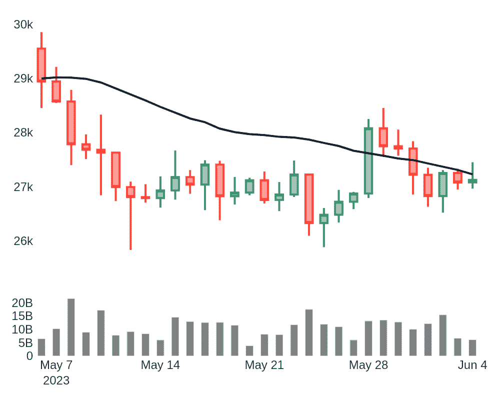

(a) 30-day candlestick charts with trading volume bars and a 30-day moving averages line.

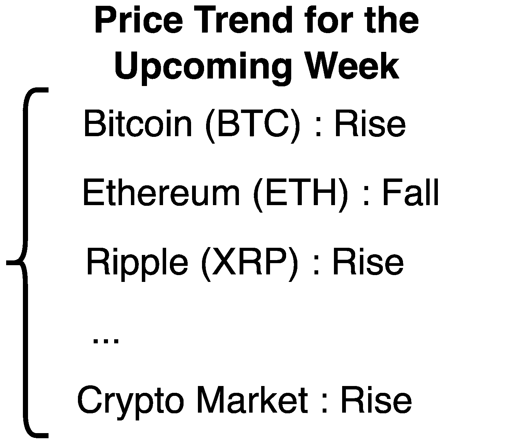

(b) Ground truth. Binary price trends of cryptos and the whole market for the following week.

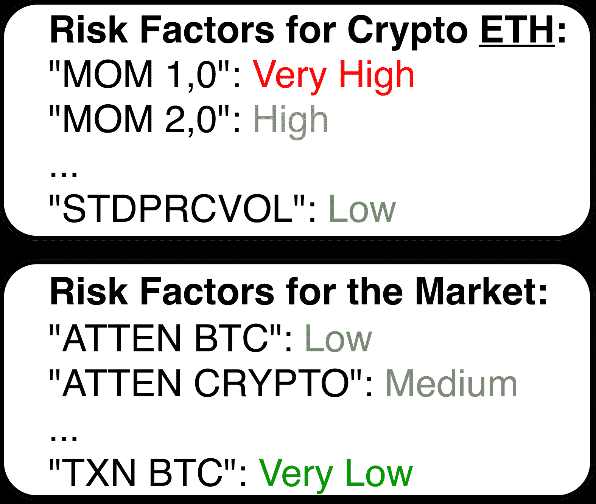

(c) Risk factors constructed from the on-chain and off-chain data.

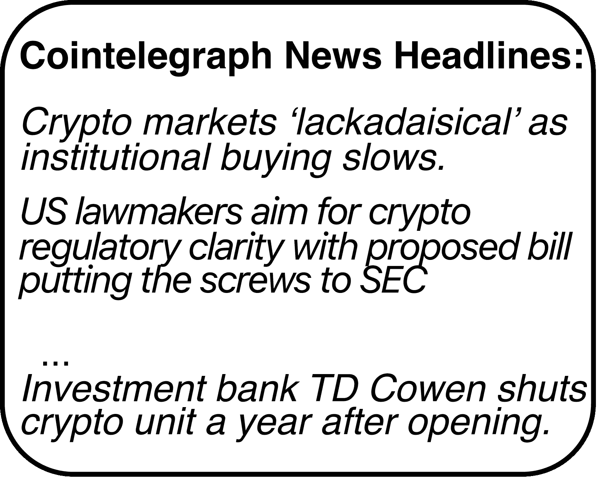

(d) News headlines crawled from the Cointelegraph.

Figure 1. Multi-modal data utilized by our multi-agent framework. The detailed data description can be found in [Appendix A](https://arxiv.org/html/2501.00826v2#A1 "Appendix A Data Description ‣ LLM-Powered Multi-Agent System for Automated Crypto Portfolio Management").

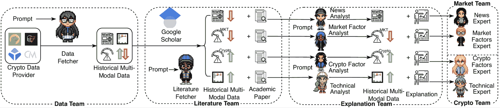

(a) Agent training.

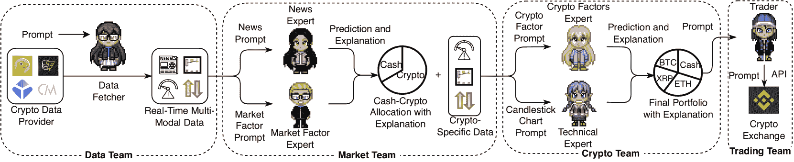

(b) The workflow of multi-agent investment.

Figure 2. Multi-agent framework for automated cryptocurrency portfolio management.

In this paper, we propose an explainable multi-agent framework for cryptocurrency investment, as illustrated in [Fig. 2](https://arxiv.org/html/2501.00826v2#S3.F2 "Figure 2 ‣ 3.2\. Framework Overview ‣ 3\. Methodology ‣ LLM-Powered Multi-Agent System for Automated Crypto Portfolio Management"). Our framework consists of two major components: expert training and multi-agent investment. The first component, detailed in [§3.3](https://arxiv.org/html/2501.00826v2#S3.SS3 "3.3\. Expert Training ‣ 3\. Methodology ‣ LLM-Powered Multi-Agent System for Automated Crypto Portfolio Management"), employs collaboration among multiple agents to generate training prompts that incorporate data from various modalities along with corresponding high-quality, case-by-case explanations. Subsequently, knowledge derived from diverse data modalities is integrated into the respective expert agents through fine-tuning. The second component, described in [§3.4](https://arxiv.org/html/2501.00826v2#S3.SS4 "3.4\. Multi-Agent Investment ‣ 3\. Methodology ‣ LLM-Powered Multi-Agent System for Automated Crypto Portfolio Management"), enables expert agents to manage corresponding subtasks in the cryptocurrency investment and collaboratively construct the final cryptocurrency portfolio. This framework aims to decompose complex investment challenges into smaller, specialized tasks handled by expert agents, thereby enhancing prediction accuracy and improving portfolio performance.

### 3.3\. Expert Training

The expert training process involves collaboration among multiple agent teams.

#### 3.3.1\. Data Team

Within the data team, the data fetcher is responsible for fetching and processing raw data. This agent utilizes tools to gather data from leading cryptocurrency providers, including Coingecko, Blockchain.info, Coin Metrics, and Cointelegraph. Once the raw data is fetched, the data fetcher processes it into multi-modal formats, including price trend ground truth, 30-day candlestick charts, risk factors (alphas), and news headlines, as illustrated in [Fig. 1](https://arxiv.org/html/2501.00826v2#S3.F1 "Figure 1 ‣ 3.2\. Framework Overview ‣ 3\. Methodology ‣ LLM-Powered Multi-Agent System for Automated Crypto Portfolio Management"). The 30-day candlestick charts ([1(a)](https://arxiv.org/html/2501.00826v2#S3.F1.sf1 "1(a) ‣ Figure 1 ‣ 3.2\. Framework Overview ‣ 3\. Methodology ‣ LLM-Powered Multi-Agent System for Automated Crypto Portfolio Management")) and binary price trends ([1(b)](https://arxiv.org/html/2501.00826v2#S3.F1.sf2 "1(b) ‣ Figure 1 ‣ 3.2\. Framework Overview ‣ 3\. Methodology ‣ LLM-Powered Multi-Agent System for Automated Crypto Portfolio Management")) are derived from \acohlc price data and trading volume provided by Coingecko. Risk factors ([1(c)](https://arxiv.org/html/2501.00826v2#S3.F1.sf3 "1(c) ‣ Figure 1 ‣ 3.2\. Framework Overview ‣ 3\. Methodology ‣ LLM-Powered Multi-Agent System for Automated Crypto Portfolio Management")) are computed using \acohlc price data, trading volume, and market capitalization from Coingecko, along with on-chain data sourced from Blockchain.info and Coin Metrics. Risk factors are categorized into five quintiles: “Very Low”, “Low”, “Medium”, “High”, and “Very High”. The quintile cutoffs are determined using cross-sectional data for crypto-related factors and the initial two years of data for market-related factors. Additionally, news headline data ([1(d)](https://arxiv.org/html/2501.00826v2#S3.F1.sf4 "1(d) ‣ Figure 1 ‣ 3.2\. Framework Overview ‣ 3\. Methodology ‣ LLM-Powered Multi-Agent System for Automated Crypto Portfolio Management")) is obtained through web crawling from Cointelegraph. We report the detailed data description in [Appendix A](https://arxiv.org/html/2501.00826v2#A1 "Appendix A Data Description ‣ LLM-Powered Multi-Agent System for Automated Crypto Portfolio Management").

#### 3.3.2\. Literature Team

In the literature team, the literature fetcher is tasked with retrieving academic papers from Google Scholar. The academic papers are selected based on their relevance to specific data modalities in the domain of empirical cryptocurrency pricing.

#### 3.3.3\. Explanation Team

[tb] <svg class="ltx_picture" height="111.81" id="S3.SS3.SSS3.1.1.pic1" overflow="visible" version="1.1" width="600"><g fill="#000000" stroke="#000000" stroke-width="0.4pt" transform="translate(0,111.81) matrix(1 0 0 -1 0 0)"><g fill-opacity="1.0" transform="matrix(1.0 0.0 0.0 1.0 21.65 93.61)"><foreignobject color="#000000" height="12.3" overflow="visible" transform="matrix(1 0 0 -1 0 16.6)" width="556.69">System Instruction 1: Explanation.</foreignobject></g> <g fill-opacity="1.0" transform="matrix(1.0 0.0 0.0 1.0 21.65 13.78)"><foreignobject color="#000000" height="62.11" overflow="visible" transform="matrix(1 0 0 -1 0 16.6)" width="556.69">You are a professional cryptocurrency analyst, specializing in explaining the predicted target based on the provided knowledge and information. You should internalize the provided knowledge to generate a comprehensive explanation without explicitly referring to the literature. Your output should be in a single paragraph.</foreignobject></g></g></svg>

[tb] <svg class="ltx_picture" height="146.56" id="S3.SS3.SSS3.2.1.pic1" overflow="visible" version="1.1" width="600"><g fill="#000000" stroke="#000000" stroke-width="0.4pt" transform="translate(0,146.56) matrix(1 0 0 -1 0 0)"><g fill-opacity="1.0" transform="matrix(1.0 0.0 0.0 1.0 21.65 128.35)"><foreignobject color="#000000" height="12.3" overflow="visible" transform="matrix(1 0 0 -1 0 16.6)" width="556.69">Prompt 1: Market Factor Explanation Agent.</foreignobject></g> <g fill-opacity="1.0" transform="matrix(1.0 0.0 0.0 1.0 21.65 13.78)"><foreignobject color="#000000" height="96.86" overflow="visible" transform="matrix(1 0 0 -1 0 16.6)" width="556.69">Learn the following cryptocurrency investment knowledge. Using this knowledge, explain the predicted target for the upcoming week based on the provided information. The market factors have been categorized into Very High, High, Medium, Low, and Very Low using the first two years of data. The predicted market return has been categorized into Rise or Fall. Knowledge: {literature} (End of knowledge) Information: {factors/news} (End of information) Market trend: {future market trend} (End of market trend)</foreignobject></g></g></svg>

[tb] <svg class="ltx_picture" height="129.96" id="S3.SS3.SSS3.3.1.pic1" overflow="visible" version="1.1" width="600"><g fill="#000000" stroke="#000000" stroke-width="0.4pt" transform="translate(0,129.96) matrix(1 0 0 -1 0 0)"><g fill-opacity="1.0" transform="matrix(1.0 0.0 0.0 1.0 21.65 111.75)"><foreignobject color="#000000" height="12.3" overflow="visible" transform="matrix(1 0 0 -1 0 16.6)" width="556.69">Prompt 2: News Explanation Agent.</foreignobject></g> <g fill-opacity="1.0" transform="matrix(1.0 0.0 0.0 1.0 21.65 13.78)"><foreignobject color="#000000" height="80.25" overflow="visible" transform="matrix(1 0 0 -1 0 16.6)" width="556.69">Learn the following cryptocurrency investment knowledge. Using this knowledge, explain the predicted target for the upcoming week on the provided news headlines. The predicted market return has been categorized into Rise or Fall. Knowledge: {literature} (End of knowledge) Information: {factors/news} (End of information) Market trend: {future market trend} (End of market trend)</foreignobject></g></g></svg>

[tb] <svg class="ltx_picture" height="163.16" id="S3.SS3.SSS3.4.1.pic1" overflow="visible" version="1.1" width="600"><g fill="#000000" stroke="#000000" stroke-width="0.4pt" transform="translate(0,163.16) matrix(1 0 0 -1 0 0)"><g fill-opacity="1.0" transform="matrix(1.0 0.0 0.0 1.0 21.65 144.96)"><foreignobject color="#000000" height="12.3" overflow="visible" transform="matrix(1 0 0 -1 0 16.6)" width="556.69">Prompt 3: Crypto Explanation Agent.</foreignobject></g> <g fill-opacity="1.0" transform="matrix(1.0 0.0 0.0 1.0 21.65 13.78)"><foreignobject color="#000000" height="113.46" overflow="visible" transform="matrix(1 0 0 -1 0 16.6)" width="556.69">Learn the following cryptocurrency investment knowledge. Using this knowledge, explain the predicted price trend of {target crypto} for the upcoming week based on the provided information. The data for the top 30 cryptocurrencies, including {target crypto}, have been categorized into Very High, High, Medium, Low, and Very Low. Their respective predicted price trend has been categorized into Rise or Fall. Knowledge: {literature} (End of knowledge) Information: {factors} (End of information) Price trend: {future price trend} (End of price trend)</foreignobject></g></g></svg>

[tb] <svg class="ltx_picture" height="146.56" id="S3.SS3.SSS3.5.1.pic1" overflow="visible" version="1.1" width="600"><g fill="#000000" stroke="#000000" stroke-width="0.4pt" transform="translate(0,146.56) matrix(1 0 0 -1 0 0)"><g fill-opacity="1.0" transform="matrix(1.0 0.0 0.0 1.0 21.65 128.35)"><foreignobject color="#000000" height="12.3" overflow="visible" transform="matrix(1 0 0 -1 0 16.6)" width="556.69">Prompt 4: Vision Explanation Agent.</foreignobject></g> <g fill-opacity="1.0" transform="matrix(1.0 0.0 0.0 1.0 21.65 13.78)"><foreignobject color="#000000" height="96.86" overflow="visible" transform="matrix(1 0 0 -1 0 16.6)" width="556.69">Text: Learn the following cryptocurrency investment knowledge. Using this knowledge, explain the predicted price trend of {target crypto} for the upcoming week based on the provided candlestick chart. The chart includes candlesticks that depict daily opening, high, low, and closing prices. It then overlays a 30-day moving average closing price. The bottom of the chart shows daily trading volume. Knowledge: {literature} (End of knowledge) Price trend: {future price trend} (End of price trend) Image URL: {URL}</foreignobject></g></g></svg>

To generate training prompts with detailed case-by-case reasoning derived from academic papers, an explanation team is responsible for enhancing the training data. This team transforms plain training data pairs—consisting of multi-modal data and ground truth—into enriched pairs by incorporating professional, well-reasoned explanations. Specifically, the market factor analyst and news analyst focus on analyzing market-specific risk factors and news data from the current week, along with the corresponding market trend for the following week. Using the shared System Instruction [§3.3.3](https://arxiv.org/html/2501.00826v2#S3.SS3.SSS3 "3.3.3\. Explanation Team ‣ 3.3\. Expert Training ‣ 3\. Methodology ‣ LLM-Powered Multi-Agent System for Automated Crypto Portfolio Management") and Prompts [§3.3.3](https://arxiv.org/html/2501.00826v2#S3.SS3.SSS3 "3.3.3\. Explanation Team ‣ 3.3\. Expert Training ‣ 3\. Methodology ‣ LLM-Powered Multi-Agent System for Automated Crypto Portfolio Management"), [§3.3.3](https://arxiv.org/html/2501.00826v2#S3.SS3.SSS3 "3.3.3\. Explanation Team ‣ 3.3\. Expert Training ‣ 3\. Methodology ‣ LLM-Powered Multi-Agent System for Automated Crypto Portfolio Management"), the market factor and news analysts explain the complex relationships between market-related information and the market trend, leveraging insights from relevant academic papers. Similarly, the crypto analyst uses the System Instruction [§3.3.3](https://arxiv.org/html/2501.00826v2#S3.SS3.SSS3 "3.3.3\. Explanation Team ‣ 3.3\. Expert Training ‣ 3\. Methodology ‣ LLM-Powered Multi-Agent System for Automated Crypto Portfolio Management") and Prompt [§3.3.3](https://arxiv.org/html/2501.00826v2#S3.SS3.SSS3 "3.3.3\. Explanation Team ‣ 3.3\. Expert Training ‣ 3\. Methodology ‣ LLM-Powered Multi-Agent System for Automated Crypto Portfolio Management") to analyze crypto-specific risk factors and ground truth, generating detailed explanations. Then, the technical analyst employs the System Instruction [§3.3.3](https://arxiv.org/html/2501.00826v2#S3.SS3.SSS3 "3.3.3\. Explanation Team ‣ 3.3\. Expert Training ‣ 3\. Methodology ‣ LLM-Powered Multi-Agent System for Automated Crypto Portfolio Management") and Prompt [§3.3.3](https://arxiv.org/html/2501.00826v2#S3.SS3.SSS3 "3.3.3\. Explanation Team ‣ 3.3\. Expert Training ‣ 3\. Methodology ‣ LLM-Powered Multi-Agent System for Automated Crypto Portfolio Management") to interpret the relationship between 30-day candlestick charts of individual cryptocurrencies and their corresponding ground truth, providing well-reasoned insights. Finally, the multi-modal data, ground truth, and corresponding explanation are integrated into training prompts using the System Instruction [§3.4.1](https://arxiv.org/html/2501.00826v2#S3.SS4.SSS1 "3.4.1\. Market Team ‣ 3.4\. Multi-Agent Investment ‣ 3\. Methodology ‣ LLM-Powered Multi-Agent System for Automated Crypto Portfolio Management") and template Prompt [§3.4.1](https://arxiv.org/html/2501.00826v2#S3.SS4.SSS1 "3.4.1\. Market Team ‣ 3.4\. Multi-Agent Investment ‣ 3\. Methodology ‣ LLM-Powered Multi-Agent System for Automated Crypto Portfolio Management"). Finally, prompts enhanced by four explanation analysts are fed into four \acpllm to train experts in the market team and crypto team.

### 3.4\. Multi-Agent Investment

The multi-agent investment component employs collaboration among multiple agents to complete the cryptocurrency investment process. This process begins with the data team fetching and processing real-time multi-modal data from various providers, as detailed in [§3.3.1](https://arxiv.org/html/2501.00826v2#S3.SS3.SSS1 "3.3.1\. Data Team ‣ 3.3\. Expert Training ‣ 3\. Methodology ‣ LLM-Powered Multi-Agent System for Automated Crypto Portfolio Management"). Subsequently, the market team, crypto team, and trading team receive the processed data and complete their respective subtasks, contributing to the overall investment process.

#### 3.4.1\. Market Team

[tb] <svg class="ltx_picture" height="96.59" id="S3.SS4.SSS1.1.1.pic1" overflow="visible" version="1.1" width="600"><g fill="#000000" stroke="#000000" stroke-width="0.4pt" transform="translate(0,96.59) matrix(1 0 0 -1 0 0)"><g fill-opacity="1.0" transform="matrix(1.0 0.0 0.0 1.0 21.65 78.54)"><foreignobject color="#000000" height="12.15" overflow="visible" transform="matrix(1 0 0 -1 0 16.6)" width="556.69">System Instruction 2: Fine-Tuning.</foreignobject></g> <g fill-opacity="1.0" transform="matrix(1.0 0.0 0.0 1.0 21.65 13.78)"><foreignobject color="#000000" height="47.05" overflow="visible" transform="matrix(1 0 0 -1 0 16.6)" width="556.69">You are a professional cryptocurrency analyst, specializing in predicting next week’s {”price trend of a cryptocurrency”/”market trend”} based on the provided information. Your output should be in the form of:Target: (predicted target) Explanation: (your explanation)</foreignobject></g></g></svg>

[tb] <svg class="ltx_picture" height="96.59" id="S3.SS4.SSS1.2.1.pic1" overflow="visible" version="1.1" width="600"><g fill="#000000" stroke="#000000" stroke-width="0.4pt" transform="translate(0,96.59) matrix(1 0 0 -1 0 0)"><g fill-opacity="1.0" transform="matrix(1.0 0.0 0.0 1.0 21.65 78.54)"><foreignobject color="#000000" height="12.15" overflow="visible" transform="matrix(1 0 0 -1 0 16.6)" width="556.69">Prompt 5: Fine-Tuning.</foreignobject></g> <g fill-opacity="1.0" transform="matrix(1.0 0.0 0.0 1.0 21.65 13.78)"><foreignobject color="#000000" height="47.05" overflow="visible" transform="matrix(1 0 0 -1 0 16.6)" width="556.69">User: Analyze the following information of crypto to determine its  target in a week. Please respond with Rise or Fall and provide your reasoning for the  prediction.: {info} (End of information) Assistant: {”Price trend”/”Market trend”}: {trend} Explanation: {expanation}</foreignobject></g></g></svg>

To complete the cryptocurrency-cash allocation subtask described in [§3.1.1](https://arxiv.org/html/2501.00826v2#S3.SS1.SSS1 "3.1.1\. Cryptocurrency-cash allocation ‣ 3.1\. Problem Formulation ‣ 3\. Methodology ‣ LLM-Powered Multi-Agent System for Automated Crypto Portfolio Management"), the market team employs a trained news expert and a trained market factor expert agent $\textnormal{A}^{\textnormal{news}}$ to predict market trends. Specifically, the news expert is provided with the System Instruction in [§3.4.1](https://arxiv.org/html/2501.00826v2#S3.SS4.SSS1 "3.4.1\. Market Team ‣ 3.4\. Multi-Agent Investment ‣ 3\. Methodology ‣ LLM-Powered Multi-Agent System for Automated Crypto Portfolio Management") and a prompt generated by filling news headline data from the past week, $\mathbf{N}_{t-1}$, into the template outlined in Prompt [§3.4.1](https://arxiv.org/html/2501.00826v2#S3.SS4.SSS1 "3.4.1\. Market Team ‣ 3.4\. Multi-Agent Investment ‣ 3\. Methodology ‣ LLM-Powered Multi-Agent System for Automated Crypto Portfolio Management"). Using this prompt, the news expert generates a prediction for the current week, $\hat{Y}^{\textnormal{news}}_{t}$, which includes two components: (1) a binary classification, $\hat{y}^{\textnormal{news}}_{t}\in\{\textnormal{\leavevmode\ltxml@oqmark@open% \textquotedblleft\penalty 10000\hskip-0.0002pt\hskip 0.0002ptRise% \textquotedblright\ltxml@oqmark@close{}},\textnormal{\leavevmode% \ltxml@oqmark@open\textquotedblleft\penalty 10000\hskip-0.0002pt\hskip 0.0002% ptFall\textquotedblright\ltxml@oqmark@close{}}\}$, representing the expected market trend for the upcoming week and (2) a human-readable explanation, $\hat{e}^{\textnormal{news}}_{t}$, that provides detailed reasoning behind the prediction, i.e., $\hat{Y}^{\textnormal{news}}_{t}=(\hat{y}^{\textnormal{news}}_{t},\hat{e}^{% \textnormal{news}}_{t})$. We can formalize this process as

| (1) |  | $\hat{Y}_{t}=\textnormal{A}(X^{\textnormal{mkt}}_{t-1}),$ |  |

where $X^{mkt}_{t-1}$ is the generalized market-specific data for the last week. In this scenario, $X^{mkt}_{t-1}=\mathbf{N}_{t-1}$. Similarly, the market factor expert agent $\textnormal{A}^{\textnormal{mf}}$ is provided with the system instruction and prompt integrated with market-specific risk factors, $\bm{\beta}_{t-1}$, to generate a prediction $\hat{Y}^{\textnormal{mf}}_{t}$ including a binary classification, $\hat{y}^{\textnormal{mf}}_{t}\in\{\textnormal{\leavevmode\ltxml@oqmark@open% \textquotedblleft\penalty 10000\hskip-0.0002pt\hskip 0.0002ptRise% \textquotedblright\ltxml@oqmark@close{}},\textnormal{\leavevmode% \ltxml@oqmark@open\textquotedblleft\penalty 10000\hskip-0.0002pt\hskip 0.0002% ptFall\textquotedblright\ltxml@oqmark@close{}}\}$, and a human-readable explanation, $\hat{e}^{\textnormal{mf}}_{t}$.

[tb] <svg class="ltx_picture" height="113.35" id="S3.SS4.SSS1.3.1.pic1" overflow="visible" version="1.1" width="600"><g fill="#000000" stroke="#000000" stroke-width="0.4pt" transform="translate(0,113.35) matrix(1 0 0 -1 0 0)"><g fill-opacity="1.0" transform="matrix(1.0 0.0 0.0 1.0 21.65 95.15)"><foreignobject color="#000000" height="12.3" overflow="visible" transform="matrix(1 0 0 -1 0 16.6)" width="556.69">System Instruction 3: Prediction.</foreignobject></g> <g fill-opacity="1.0" transform="matrix(1.0 0.0 0.0 1.0 21.65 13.78)"><foreignobject color="#000000" height="63.65" overflow="visible" transform="matrix(1 0 0 -1 0 16.6)" width="556.69">You are a professional cryptocurrency analyst, specializing in predicting next week’s {”price trend of a cryptocurrency”/”market trend”} based on the provided candlestick chart. Your output should be in the form of: {”Price trend”/”Market trend”}: (predicted target) Explanation: (your explanation)</foreignobject></g></g></svg>

[tb] <svg class="ltx_picture" height="113.35" id="S3.SS4.SSS1.4.1.pic1" overflow="visible" version="1.1" width="600"><g fill="#000000" stroke="#000000" stroke-width="0.4pt" transform="translate(0,113.35) matrix(1 0 0 -1 0 0)"><g fill-opacity="1.0" transform="matrix(1.0 0.0 0.0 1.0 21.65 95.15)"><foreignobject color="#000000" height="12.3" overflow="visible" transform="matrix(1 0 0 -1 0 16.6)" width="556.69">Prompt 6: Prediction.</foreignobject></g> <g fill-opacity="1.0" transform="matrix(1.0 0.0 0.0 1.0 21.65 13.78)"><foreignobject color="#000000" height="63.65" overflow="visible" transform="matrix(1 0 0 -1 0 16.6)" width="556.69">Analyze the following {”cryptocurrency”/”market”} information to determine the strength of the {”price trend of a cryptocurrency”/”market trend”} in a week. Please respond with Rise or Fall and provide your reasoning for the prediction. Information: {factors/news/charts} (End of information)</foreignobject></g></g></svg>

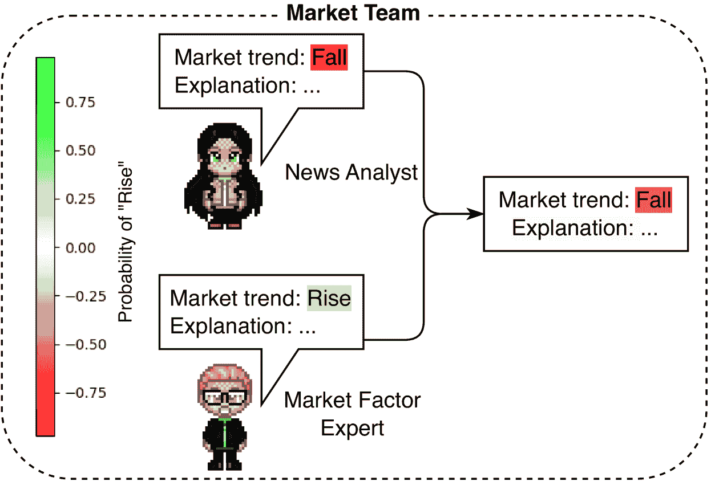

(a) Intrateam Collaboration.

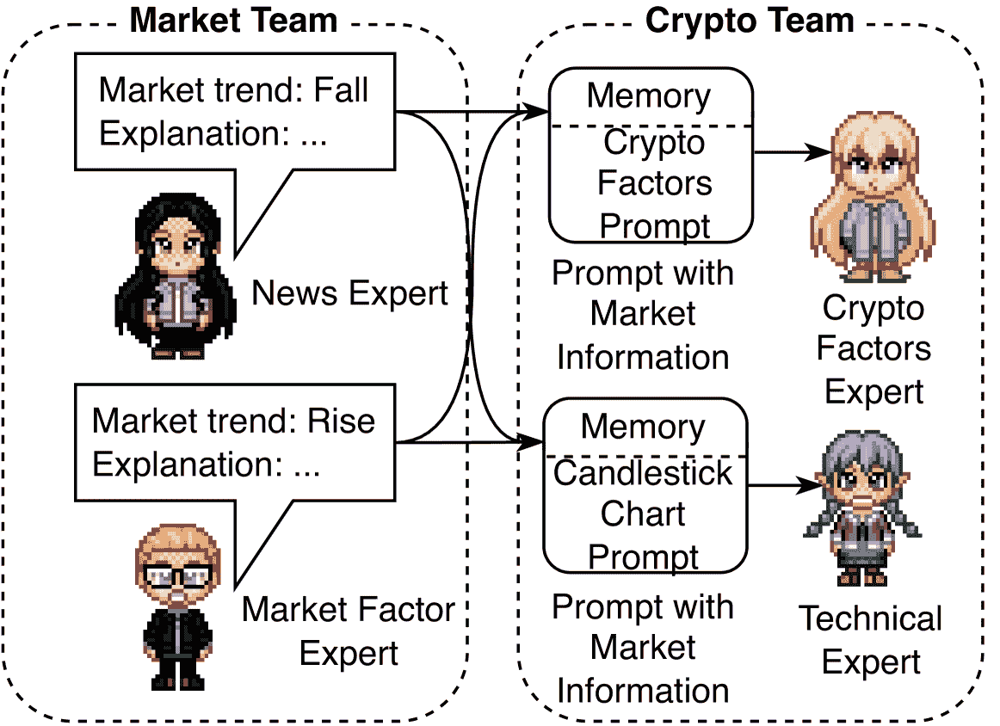

(b) Interteam Collaboration.

Figure 3. Collaboration among expert agents within the same group and across different groups.

To enable collaboration between these two agents within a team and generate a final solution for the crypto-cash allocation subtask, the intrateam collaboration method illustrated in [3(a)](https://arxiv.org/html/2501.00826v2#S3.F3.sf1 "3(a) ‣ Figure 3 ‣ 3.4.1\. Market Team ‣ 3.4\. Multi-Agent Investment ‣ 3\. Methodology ‣ LLM-Powered Multi-Agent System for Automated Crypto Portfolio Management") is employed. This method allows the two agents to ensemble their predictions based on their respective prediction confidence levels. Specifically, since the \acllm generates text by selecting tokens with the highest probabilities, we can extract the log probability of “Rise” for the classification token (“Rise” or “Fall”). This log probability of “Rise”, expressed as $\log P(\hat{y}_{t}=\textnormal{\leavevmode\ltxml@oqmark@open\textquotedblleft% \penalty 10000\hskip-0.0002pt\hskip 0.0002ptRise\textquotedblright% \ltxml@oqmark@close{}}|\mathbf{N}_{t-1})$, is visually represented in [3(a)](https://arxiv.org/html/2501.00826v2#S3.F3.sf1 "3(a) ‣ Figure 3 ‣ 3.4.1\. Market Team ‣ 3.4\. Multi-Agent Investment ‣ 3\. Methodology ‣ LLM-Powered Multi-Agent System for Automated Crypto Portfolio Management"), where a greener background indicates a higher log probability. This probability serves as an additional confidence measure for the prediction. To ensemble the predictions, the log probabilities are converted into linear probabilities. The final ensemble rise probability is then calculated by taking the arithmetic mean of the linear probabilities from both agents, effectively combining their insights to produce a more robust prediction for the subtask:

| (2) |  | $\bar{P}=\frac{1}{&#124;\mathcal{A}&#124;}\sum_{i\in\mathcal{A}}e^{\log P(\hat{y}^{i}_{t}% =\textnormal{\leavevmode\ltxml@oqmark@open\textquotedblleft\penalty 10000% \hskip-0.0002pt\hskip 0.0002ptRise\textquotedblright\ltxml@oqmark@close{}}&#124;X_{% t-1})},$ |  |

where $\mathcal{A}$ represents the set of the agents within a team. Subsequently, if the aggregated probability exceeds 0.5, the final prediction is “Rise”; otherwise, it is “Fall”. Based on the ensemble classification outcome, the portfolio allocation is determined: if the prediction in “Rise”, the portfolio will consist entirely of cryptocurrencies. Otherwise, if the prediction is “Fall”, the portfolio will be equally divided between cryptocurrencies and cash.

#### 3.4.2\. Crypto Team

To complete the cryptocurrency selection subtask discussed in [§3.1.2](https://arxiv.org/html/2501.00826v2#S3.SS1.SSS2 "3.1.2\. Cryptocurrency selection ‣ 3.1\. Problem Formulation ‣ 3\. Methodology ‣ LLM-Powered Multi-Agent System for Automated Crypto Portfolio Management"), the crypto team employs a trained crypto factors expert and a trained technical expert to collaboratively predict the price trend for individual cryptocurrencies.

To enable the agents in the crypto team to make predictions that incorporate not only crypto-specific information but also the broader market context, we employ interteam collaboration, as illustrated in [3(b)](https://arxiv.org/html/2501.00826v2#S3.F3.sf2 "3(b) ‣ Figure 3 ‣ 3.4.1\. Market Team ‣ 3.4\. Multi-Agent Investment ‣ 3\. Methodology ‣ LLM-Powered Multi-Agent System for Automated Crypto Portfolio Management"). Specifically, the agents in the crypto team receive the System Instruction [§3.4.1](https://arxiv.org/html/2501.00826v2#S3.SS4.SSS1 "3.4.1\. Market Team ‣ 3.4\. Multi-Agent Investment ‣ 3\. Methodology ‣ LLM-Powered Multi-Agent System for Automated Crypto Portfolio Management") and the Prompt [§3.4.1](https://arxiv.org/html/2501.00826v2#S3.SS4.SSS1 "3.4.1\. Market Team ‣ 3.4\. Multi-Agent Investment ‣ 3\. Methodology ‣ LLM-Powered Multi-Agent System for Automated Crypto Portfolio Management") integrated with the relevant crypto-specific data as their primary input. Additionally, they are provided with inputs and predictions from the market factor expert and the news expert, which serve as contextual information or shared short-term memory to enhance their decision-making process. We can formalize it as:

| (3) |  | $\hat{Y}_{c,t}=\textnormal{A}\left(c,X_{c,t-1},X^{\textnormal{mf}}_{t-1},\hat{Y% }^{\textnormal{mf}}_{t},X^{\textnormal{news}}_{t-1},\hat{Y}^{\textnormal{news}% }_{t}\right).$ |  |

While market information alone does not directly contribute to cross-sectional cryptocurrency price trend prediction, since all cryptocurrencies share the same market-level data, we expect the expert agents to learn the interactions between market-level information and individual crypto. By identifying these interactions, the crypto team can enhance the accuracy of their predictions. Therefore, the crypto factors expert is provided with individual crypto $c$ and the vector of its crypto-specific risk factors, $\bm{\alpha}_{c,t-1}=[\alpha_{i}]_{m\times 1}$, while the technical expert receives the crypto $c$ and its 30-day candlestick chart of, $\mathbf{v}_{c,t-1}$. Using these inputs, the experts generate binary classifications, $\hat{y}^{\textnormal{cf}}_{t}\in\{\textnormal{\leavevmode\ltxml@oqmark@open% \textquotedblleft\penalty 10000\hskip-0.0002pt\hskip 0.0002ptRise% \textquotedblright\ltxml@oqmark@close{}},\textnormal{\leavevmode% \ltxml@oqmark@open\textquotedblleft\penalty 10000\hskip-0.0002pt\hskip 0.0002% ptFall\textquotedblright\ltxml@oqmark@close{}}\}$ and $\hat{y}^{\textnormal{chart}}_{t}\in\{\textnormal{\leavevmode\ltxml@oqmark@open% \textquotedblleft\penalty 10000\hskip-0.0002pt\hskip 0.0002ptRise% \textquotedblright\ltxml@oqmark@close{}},\textnormal{\leavevmode% \ltxml@oqmark@open\textquotedblleft\penalty 10000\hskip-0.0002pt\hskip 0.0002% ptFall\textquotedblright\ltxml@oqmark@close{}}\}$, representing the predicted price trends for the cryptocurrencies over the following week. Additionally, they produce human-readable explanations, $\hat{e}^{\textnormal{cf}}_{t}$ and $\hat{e}^{\textnormal{chart}}_{t}$, providing detailed reasoning behind their respective predictions.

Using the same intrateam collaboration method discussed in [§3.4.1](https://arxiv.org/html/2501.00826v2#S3.SS4.SSS1 "3.4.1\. Market Team ‣ 3.4\. Multi-Agent Investment ‣ 3\. Methodology ‣ LLM-Powered Multi-Agent System for Automated Crypto Portfolio Management"), expert agents within the crypto group come to a consensus about the price trend of individual cryptocurrencies by generating the final ensemble rise probability for each individual cryptocurrency in set $\mathcal{C}$, $\bar{P}_{c}$, via [Eq. 2](https://arxiv.org/html/2501.00826v2#S3.E2 "2 ‣ 3.4.1\. Market Team ‣ 3.4\. Multi-Agent Investment ‣ 3\. Methodology ‣ LLM-Powered Multi-Agent System for Automated Crypto Portfolio Management"). Then, we sort cryptocurrencies in set $\mathcal{C}$ into quintile portfolios based on the $\bar{P}_{c}$. Specifically, we form 5 disjoin equal-weighted (1/N) portfolios, each representing a range of rise probabilities, denoted by $\mathcal{P}_{i}$. The portfolios are constructed as follows:

| (4) |  | $\mathcal{P}_{i}=\left[\bar{P}_{(\left\lfloor\frac{&#124;\mathcal{C}&#124;(i-1)}{5}\right% \rfloor)},\bar{P}_{(\left\lfloor\frac{&#124;\mathcal{C}&#124;i}{5}\right\rfloor)}\right)% \quad i=1,\cdots,5,$ |  |

where $\bar{P}_{(j)}$ denotes the $j$-th order static of the ascending set of rise probabilities $\{\bar{P}_{c}:1\leq c\leq|\mathcal{C}|\}$ of all cryptocurrencies in set $\mathcal{C}$. $\left\lfloor\right\rfloor$ is the floor operator. Portfolios $\mathcal{P}_{1},\cdots,\mathcal{P}_{5}$ are labeled Very Low, Low, Medium, High, and Very High. Finally, the portfolio labeled Very High, $\mathcal{P}_{5}$, is selected as the target subset of cryptocurrencies, $\mathcal{C}^{*}=\mathcal{P}_{5}\subseteq\mathcal{C}$, for investment.

#### 3.4.3\. Trading Team

The final trading team is tasked with executing trades by interacting with the APIs of cryptocurrency exchanges based on the provided portfolio, ensuring that the entire process is fully end-to-end.

## 4\. Experiment

In this section, we evaluate the performance of our multi-agent framework on our collected dataset against the related baselines.

### 4.1\. Experiment Settings

In this work, we employ ChatGPT-4o as the base model, as it is the most advanced multi-modal model capable of implementing vision fine-tuning at the time of writing ¹¹1[https://platform.openai.com/docs/guides/fine-tuning#which-models-can-be-fine-tuned](https://platform.openai.com/docs/guides/fine-tuning#which-models-can-be-fine-tuned). We collected our dataset from June 2023 to September 2024, following the methodology described in [§3.3.1](https://arxiv.org/html/2501.00826v2#S3.SS3.SSS1 "3.3.1\. Data Team ‣ 3.3\. Expert Training ‣ 3\. Methodology ‣ LLM-Powered Multi-Agent System for Automated Crypto Portfolio Management"). We designate the set of targeted cryptocurrencies, $\mathcal{C}$, as the top 30 cryptocurrencies by market capitalization according to CoinGecko. This list is updated weekly to reflect changes in market capitalization. The rationale for including only high-capitalization cryptocurrencies is that those with low market capitalization often exhibit pricing dynamics that differ significantly from high-liquidity cryptocurrencies, partly due to risks such as pump-and-dump schemes. Additionally, trading low-liquidity cryptocurrencies tend to involve higher slippage, further complicating our task. To prevent information leakage, we set the data from November 2023 to September 2024 as the test set, given that ChatGPT-4o’s training data extends only up to October 2023 ²²2[https://platform.openai.com/docs/models](https://platform.openai.com/docs/models). Consequently, the training set comprises data from June 2023 to October 2023.

To demonstrate the effectiveness of our multi-agent framework, we evaluate it from three distinct perspectives: classification performance, portfolio performance, and asset pricing performance:

#### 4.1.1\. Classification and Asset Pricing Performance

For classification and asset pricing performance, we employ the following benchmarks:

*   •

    Single GPT-4o without fine-tuning: For both tasks, we provide the same prompts integrated with news, factors, and candlestick charts to a GPT-4o. Single ChatGPT has previously been explored in other cryptocurrency prediction works.

*   •

    Single GPT-4o with fine-tuning: For both tasks, we fine-tune a GPT-4o with all training prompts. Then, we provide the same prompts integrated with news, factors, and candlestick charts to the fine-tuned GPT-4o. This setup allows us to compare the cryptocurrency pricing capability of the single-agent model with that of the multi-agent model, ensuring that both are provided with identical information.

*   •

    Risk factors in cryptocurrency: For asset pricing performance, we use the risk factors outlined in [Tab. 6](https://arxiv.org/html/2501.00826v2#A1.T6 "Table 6 ‣ Appendix A Data Description ‣ LLM-Powered Multi-Agent System for Automated Crypto Portfolio Management") to construct quintile-based portfolios, serving as a benchmark. This approach follows the empirical asset pricing methodology described in [Eq. 4](https://arxiv.org/html/2501.00826v2#S3.E4 "4 ‣ 3.4.2\. Crypto Team ‣ 3.4\. Multi-Agent Investment ‣ 3\. Methodology ‣ LLM-Powered Multi-Agent System for Automated Crypto Portfolio Management"). This aims to compare the explanatory power of cryptocurrency returns between the traditional one-factor model and our multi-agent model.

#### 4.1.2\. Explainability Performance

To evaluate the explainability performance of our multi-agent model compared to the baseline models, we introduce five key metrics for assessing explanation quality. Each response is rated on a scale from 0 to 1 using GPT-4o, based on these metrics applied to a representative set of samples. The metrics are defined as follows:

*   •

    Professionalism: Does the explanation reflect expertise and professionalism in the field of finance?

*   •

    Objectivity: Is the explanation presented in an unbiased and neutral manner?

*   •

    Clarity & Coherence: Is the explanation easy to understand, and does it follow a logical structure that connects different factors effectively?

*   •

    Consistency: Does the explanation align with the provided data and avoid contradictions?

*   •

    Rationale: Does the explanation provide a detailed reasoning process that clearly articulates how the metrics influence performance?

#### 4.1.3\. Portfolio Performance

Table 1\. Performance comparisons in accuracy and MCC of our multi-agent framework against baselines. The best results are boldfaced.

| Subtask | Expert Agent | Single GPT-4o without fine-tuning | Single GPT-4o with fine-tuning | Multi-agent framework (Ours) |
| Accuracy | MCC | Accuracy | MCC | Accuracy | MCC |
| Crypto Prediction ([§3.1.2](https://arxiv.org/html/2501.00826v2#S3.SS1.SSS2 "3.1.2\. Cryptocurrency selection ‣ 3.1\. Problem Formulation ‣ 3\. Methodology ‣ LLM-Powered Multi-Agent System for Automated Crypto Portfolio Management")) | Crypto Factor | \FPeval\resultround(0.5145/0.5600:4)0.5145 | 0.0239 | \FPeval\resultround(0.5111/0.5600:4)0.5111 | 0.0053 | \FPeval\resultround(0.5177/0.5600:4)0.5177 | 0.0247 |
| Technical | \FPeval\resultround(0.4637/0.5600:4)0.4637 | -0.0312 | \FPeval\resultround(0.4906/0.5600:4)0.4906 | -0.0216 | \FPeval\resultround(0.5118/0.5600:4)0.5118 | 0.0169 |
| Collaboration | \FPeval\resultround(0.4834/0.5600:4)0.4834 | -0.0341 | \FPeval\resultround(0.5133/0.5600:4)0.5133 | 0.0191 | \FPeval\resultround(0.5248/0.5600:4)0.5248 | 0.0428 |
| Market Prediction ([§3.1.1](https://arxiv.org/html/2501.00826v2#S3.SS1.SSS1 "3.1.1\. Cryptocurrency-cash allocation ‣ 3.1\. Problem Formulation ‣ 3\. Methodology ‣ LLM-Powered Multi-Agent System for Automated Crypto Portfolio Management")) | Market Factor | \FPeval\resultround(0.5814/0.5600:4)0.5814 | 0.1612 | \FPeval\resultround(0.5581/0.5600:4)0.5581 | 0.1141 | \FPeval\resultround(0.5814/0.5600:4)0.5814 | 0.1649 |
| News | \FPeval\resultround(0.4651/0.5600:4)0.4651 | -0.0831 | \FPeval\resultround(0.5814/0.5600:4)0.5814 | 0.1993 | \FPeval\resultround(0.5581/0.5600:4)0.5581 | 0.1306 |
| Collaboration | \FPeval\resultround(0.5116/0.5600:4)0.5116 | 0.0217 | \FPeval\resultround(0.5581/0.5600:4)0.5581 | 0.1307 | \FPeval\resultround(0.5814/0.5600:4)0.5814 | 0.1612 |

For the portfolio performance, we have the following benchmarks:

*   •

    1/N portfolio (DeMiguel et al., [2009](https://arxiv.org/html/2501.00826v2#bib.bib11)): We build a portfolio where the top 30 cryptocurrencies in the basket are equally weighted, with each cryptocurrency receiving the same allocation.

*   •

    Market portfolio (Li et al., [2024](https://arxiv.org/html/2501.00826v2#bib.bib28)): We use the Nasdaq Crypto Index³³3[https://www.nasdaq.com/market-activity/index/nci](https://www.nasdaq.com/market-activity/index/nci), which consists of a basket of eligible cryptocurrencies selected by the Nasdaq Crypto Index Oversight Committee.

*   •

    BTC portfolio (Li et al., [2024](https://arxiv.org/html/2501.00826v2#bib.bib28)): We build a buy-and-hold portfolio consisting of 100% Bitcoin.

To facilitate our analysis, we define the boom and bust periods of the crypto market based on the Nasdaq Crypto Index. We borrow the definition method from (Aramonte et al., [2022](https://arxiv.org/html/2501.00826v2#bib.bib3)). Specifically, we define a boom period as the period between a price trough and a peak with an increase of over 15%, and define a bust period as the period between a price peak and a trough with a decrease of over 15%. There also exist periods with below 15% price change which are neither a boom nor a bust.

We use the following well-known metrics in empirical asset pricing to quantify the portfolio and asset pricing performance:

*   •

    Cumulative Return (Cumulative) (Asness et al., [2013](https://arxiv.org/html/2501.00826v2#bib.bib4)) measures the total changes in the price of a portfolio over the trading period, calculated as $\prod_{t=1}^{T}(1+r_{t})-1$, where $T$ denotes the total number of weeks over the trading period and $r_{t}$ denotes the weekly return.

*   •

    Weekly Return Mean (Mean) (Gu et al., [2020](https://arxiv.org/html/2501.00826v2#bib.bib18)) measures the average of weekly returns over the trading period, indicating the portfolio’s typical weekly performance.

*   •

    Weekly Return Standard Deviation (Std) (Gu et al., [2020](https://arxiv.org/html/2501.00826v2#bib.bib18)) measures the standard deviation of weekly return over the trading period, representing the volatility of the portfolio.

*   •

    Sharpe Ratio (Sharpe) (Sharpe, [1994](https://arxiv.org/html/2501.00826v2#bib.bib35)) measures the risk-adjusted return, calculated as $\frac{r_{t}-r_{f}}{\sigma_{t}}$, where $r_{t}$ denotes the weekly return mean, $r_{f}$ is the risk-free rate, $\sigma$ denotes the weekly return standard deviation.

### 4.2\. Performance Comparison

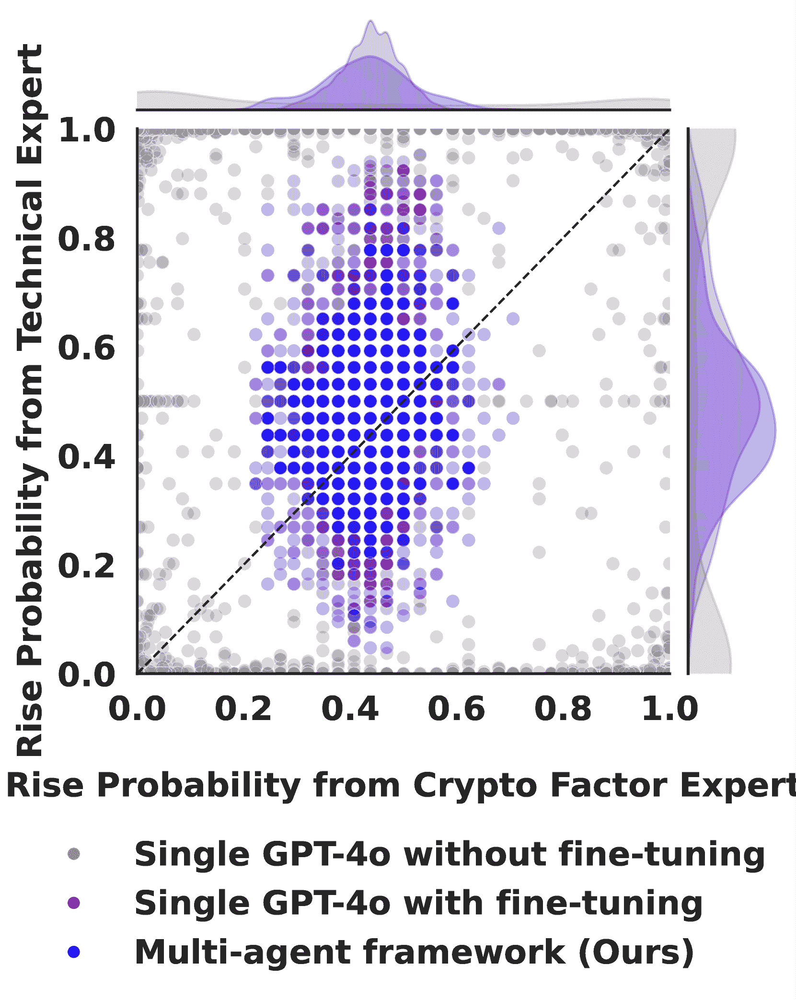

(a) Rise probability of crypto team.

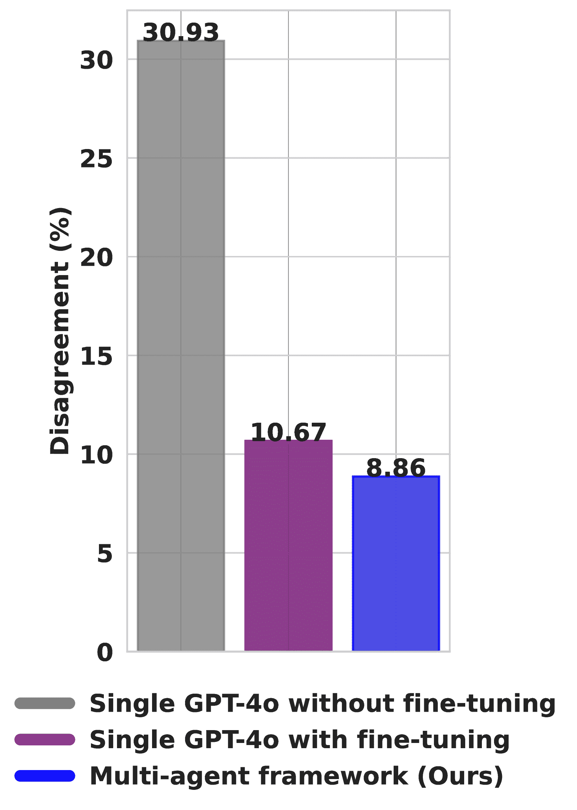

(b) Average disagreement of crypto team.

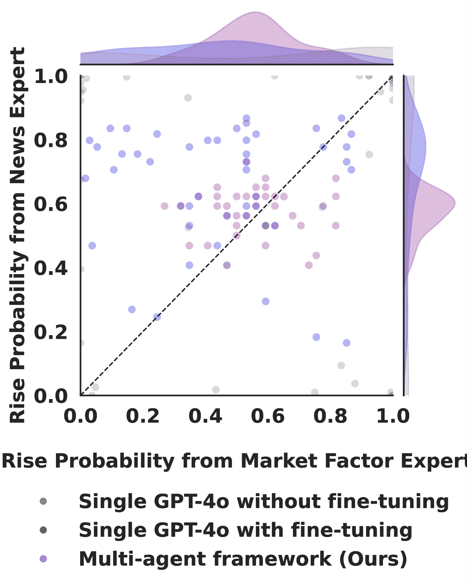

(c) Rise probability of market team.

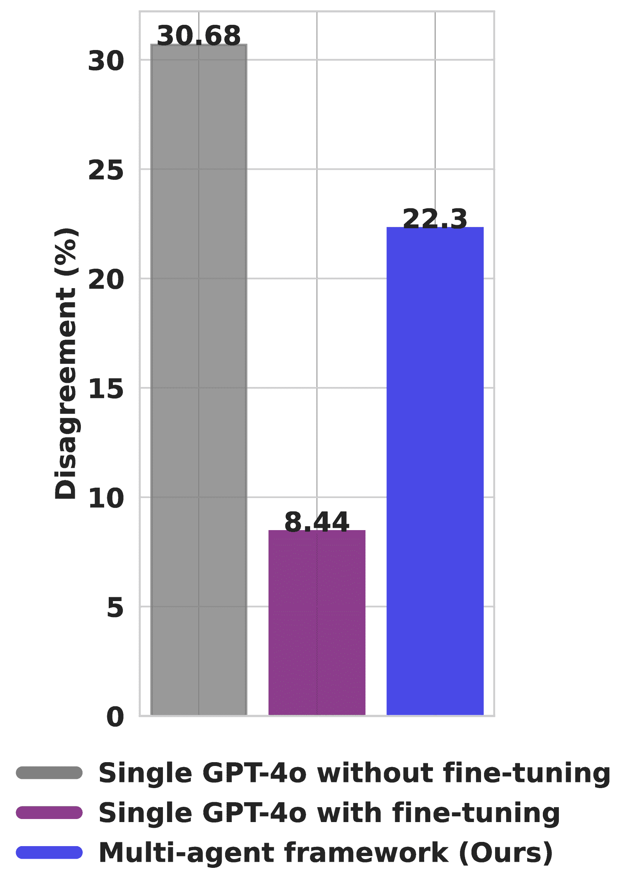

(d) Average disagreement of market team.

Figure 4. Distribution and disagreement in the rise probability predictions of expert agents within the same group across various models.

In this subsection, we evaluate the classification, portfolio, asset pricing, and explanation performance of our multi-agent model, via quantitative and qualitative comparisons against the related baselines.

#### 4.2.1\. Classification Accuracy

Table 2\. The average market returns for weeks predicted as “Rise” and “Fall” by the market team in our multi-agent model, compared against baseline models. “Diff” denotes the average difference between the returns of “Rise” and “Fall”.

|  | Single GPT-4o without fine-tuning | Single GPT-4o with fine-tuning | Multi-agent framework (Ours) |
| Rise | \FPeval\resultround(0.0210/0.0135:4)0.0210 | \FPeval\resultround(0.0186/0.0135:4)0.0186 | \FPeval\resultround(0.0264/0.0135:4)0.0264 |
| Fall | \FPeval\resultround(0.0104/0.0135:4)0.0104 | \FPeval\resultround(0.0051/0.0135:4)0.0051 | \FPeval\resultround(0.0032/0.0135:4)0.0032 |
| Diff | \FPeval\resultround(0.0106/0.0135:4)0.0106 | \FPeval\resultround(0.0135/0.0135:4)0.0135 | \FPeval\resultround(0.0232/0.0135:4)0.0232 |

[Tab. 1](https://arxiv.org/html/2501.00826v2#S4.T1 "Table 1 ‣ 4.1.3\. Portfolio Performance ‣ 4.1\. Experiment Settings ‣ 4\. Experiment ‣ LLM-Powered Multi-Agent System for Automated Crypto Portfolio Management") presents the quantitative results for cryptocurrency price and market trend predictions. In terms of prediction accuracy, our multi-agent framework achieves the best performance on the classification problem within the cryptocurrency prediction subtask, as detailed in [§3.1.2](https://arxiv.org/html/2501.00826v2#S3.SS1.SSS2 "3.1.2\. Cryptocurrency selection ‣ 3.1\. Problem Formulation ‣ 3\. Methodology ‣ LLM-Powered Multi-Agent System for Automated Crypto Portfolio Management"). The multi-agent framework outperforms a single GPT-4o model with fine-tuning, demonstrating that multiple expert agents, each trained with domain-specific knowledge, perform better than a single agent trained with a comprehensive dataset for cryptocurrency price trend prediction. Additionally, the fine-tuned single GPT-4o model surpasses the performance of an untuned GPT-4o model, indicating that fine-tuning enables \acllms to effectively learn from historical data and apply this knowledge to future predictions. In the market prediction subtask detailed in [§3.1.1](https://arxiv.org/html/2501.00826v2#S3.SS1.SSS1 "3.1.1\. Cryptocurrency-cash allocation ‣ 3.1\. Problem Formulation ‣ 3\. Methodology ‣ LLM-Powered Multi-Agent System for Automated Crypto Portfolio Management"), the multi-agent framework achieves the best performance when the input comprises cryptocurrency-specific factors and when the results are ensembled. However, when the input are prompts with news headlines data, the performance of the single GPT-4o model surpasses that of the multi-agent framework. A possible explanation is that a single \acllm, trained with a comprehensive dataset, may be better at extracting implicit market-factor-related insights from news content, such as increased cryptocurrency attention or network effects.

For this task, a more informative metric is the \acmcc, as it accounts for the ratios of True Positives, True Negatives, False Positives, and False Negatives in the predictions (Chicco and Jurman, [2020](https://arxiv.org/html/2501.00826v2#bib.bib8); Chicco et al., [2021](https://arxiv.org/html/2501.00826v2#bib.bib9)). Since not all cryptocurrency prices and market trends can be fully explained by existing data, accuracy alone may not fully reflect the classification capabilities of the multi-agent model. Given that not all cryptocurrency prices and market trends can be fully explained by existing data, the accuracy results might not be fully indicative of the multi-agent model’s classification capabilities, as it includes some random guesses on noises. On the \acmcc metric, our multi-agent framework similarly outperforms other models across all tasks, except when the input consists of prompts with news headlines. This demonstrates the model’s true classification ability, as the \acmcc accounts for the impact of random guesses and provides a more robust evaluation of performance.

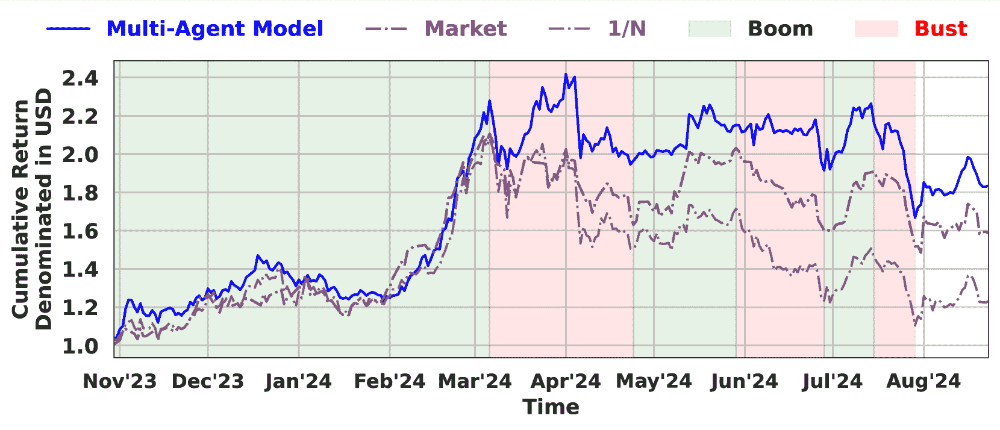

(a) Cumulative Return Denominated in US Dollar.

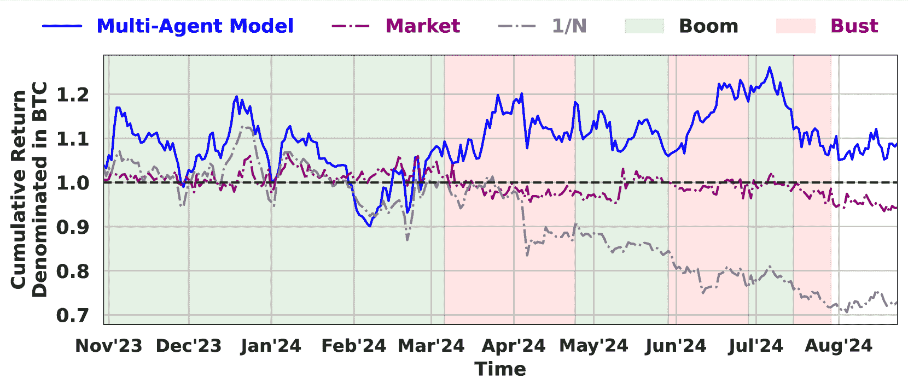

(b) Cumulative Return Denominated in Bitcoin.

Figure 5. Performance comparisons in out-of-sample cumulative returns of our multi-agent model portfolio against baselines. The green span represents the boom period, while the red span indicates the bust period, as determined by the Nasdaq Crypto Index (Market).

The superior performance of our multi-agent model in prediction can be partially attributed to the fine-tuning process. To confirm this, we visualize the distribution of the rise probabilities extracted from the outputs of the single GPT-4o without fine-tuning, single GPT-4o with fine-tuning, and our multi-agent model, as shown in [4(a)](https://arxiv.org/html/2501.00826v2#S4.F4.sf1 "4(a) ‣ Figure 4 ‣ 4.2\. Performance Comparison ‣ 4\. Experiment ‣ LLM-Powered Multi-Agent System for Automated Crypto Portfolio Management") and [4(c)](https://arxiv.org/html/2501.00826v2#S4.F4.sf3 "4(c) ‣ Figure 4 ‣ 4.2\. Performance Comparison ‣ 4\. Experiment ‣ LLM-Powered Multi-Agent System for Automated Crypto Portfolio Management"). We observe that the distributions of rise probabilities before fine-tuning exhibit a U-shaped pattern, while the distributions after fine-tuning are more centralized and align more closely with a normal or log-normal distribution. Given that the distributions of individual cryptocurrency returns and market returns are generally closer to normal or log-normal distributions, we conclude that the fine-tuning process enables the \acpllm to better learn and reflect the empirical distribution of crypto returns. To evaluate the extent to which the predictions of different agents within the same group vary, we also calculate the standard deviation of the linear “Rise” probability as an indicator of disagreement. [4(b)](https://arxiv.org/html/2501.00826v2#S4.F4.sf2 "4(b) ‣ Figure 4 ‣ 4.2\. Performance Comparison ‣ 4\. Experiment ‣ LLM-Powered Multi-Agent System for Automated Crypto Portfolio Management") and [4(d)](https://arxiv.org/html/2501.00826v2#S4.F4.sf4 "4(d) ‣ Figure 4 ‣ 4.2\. Performance Comparison ‣ 4\. Experiment ‣ LLM-Powered Multi-Agent System for Automated Crypto Portfolio Management") illustrate the level of average disagreement in our multi-agent model compared to the baseline models. We observe that models experiencing fine-tuning exhibit lower average disagreement across the market team and crypto team. This suggests that fine-tuning enables expert agents to better learn from historical data, avoiding random guessing.

Additionally, since the cash-crypto allocation strategy is directly derived from the classification results of the market team, it is necessary to assess its financial significance. [Tab. 2](https://arxiv.org/html/2501.00826v2#S4.T2 "Table 2 ‣ 4.2.1\. Classification Accuracy ‣ 4.2\. Performance Comparison ‣ 4\. Experiment ‣ LLM-Powered Multi-Agent System for Automated Crypto Portfolio Management") reports the average market returns for weeks predicted as “Rise” and “Fall” by the market team in our multi-agent model against baseline models. We observe that the average returns for weeks predicted as “Rise” by our multi-agent model are the highest among all models, while the returns for weeks predicted as “Fall” are the lowest. This demonstrates that the market team in our multi-agent model has the strongest capability to distinguish between market booms and busts.

#### 4.2.2\. Portfolio Performance

Table 3\. Comparison of portfolio results across full, boom, and bust periods. Columns “Mean”, “Std”, and “Sharpe” provide the average realized weekly returns, their standard deviations, and annualized Sharpe ratios, respectively.

| Period | Portfolio | Mean | Std | Sharpe |
| All | Ours | 0.0172 | $0.0805$ | $1.5425$ |
| Market | 0.0131 | $0.0683$ | $1.3781$ |
| 1/N | 0.0082 | $0.0834$ | $0.7070$ |
| Bitcoin | 0.0144 | $0.0677$ | $1.5340$ |
| Boom | Ours | 0.0428 | $0.0802$ | $3.8430$ |
| Market | 0.0422 | $0.0630$ | $4.8279$ |
| 1/N | 0.0391 | $0.0758$ | $3.7195$ |
| Bitcoin | 0.0404 | $0.0634$ | $4.5977$ |
| Bust | Ours | -0.0269 | $0.0715$ | $-2.7125$ |
| Market | -0.0359 | $0.0529$ | $-4.8944$ |
| 1/N | -0.0479 | $0.0723$ | $-4.7748$ |
| Bitcoin | -0.0299 | $0.0519$ | $-4.1570$ |

In addition to classification accuracy, the portfolio performance achieved by our multi-agent model is also crucial. [Fig. 5](https://arxiv.org/html/2501.00826v2#S4.F5 "Figure 5 ‣ 4.2.1\. Classification Accuracy ‣ 4.2\. Performance Comparison ‣ 4\. Experiment ‣ LLM-Powered Multi-Agent System for Automated Crypto Portfolio Management") depicts the out-of-sample cumulative returns of our multi-agent model against the market index and equal-weighted portfolios (1/N) of the top 30 cryptocurrencies. From [5(a)](https://arxiv.org/html/2501.00826v2#S4.F5.sf1 "5(a) ‣ Figure 5 ‣ 4.2.1\. Classification Accuracy ‣ 4.2\. Performance Comparison ‣ 4\. Experiment ‣ LLM-Powered Multi-Agent System for Automated Crypto Portfolio Management"), we observe that the portfolio generated by our model outperforms two constructed indices throughout the entire sample period, except for February 2024.

A 100% buy-and-hold Bitcoin strategy is popular among investors. To evaluate the performance of our multi-agent model against this strategy, we compare their cumulative returns. [5(b)](https://arxiv.org/html/2501.00826v2#S4.F5.sf2 "5(b) ‣ Figure 5 ‣ 4.2.1\. Classification Accuracy ‣ 4.2\. Performance Comparison ‣ 4\. Experiment ‣ LLM-Powered Multi-Agent System for Automated Crypto Portfolio Management") presents the ratio of the cumulative returns of our model to those of the 100% buy-and-hold Bitcoin strategy. The results indicate that the cumulative returns of our model consistently surpass those of the buy-and-hold Bitcoin strategy throughout the entire sample period, with the exception of February 2024.

[Tab. 3](https://arxiv.org/html/2501.00826v2#S4.T3 "Table 3 ‣ 4.2.2\. Portfolio Performance ‣ 4.2\. Performance Comparison ‣ 4\. Experiment ‣ LLM-Powered Multi-Agent System for Automated Crypto Portfolio Management") presents the comparison of portfolio results across full, boom, and bust periods. The table shows that our multi-agent model outperforms other methods in most portfolio metrics across all periods, including boom and bust phases, while maintaining comparable performance in terms of standard deviation. Notably, our model exhibits strong resistance to declines during the bust period, further highlighting its effectiveness.

#### 4.2.3\. Asset Pricing Performance

Table 4\. Performance comparison of out-of-sample quintile-based portfolios of our multi-agent model against baselines. The top 30 cryptocurrencies are sorted into quintiles based on the predicted ”Rise” probability for the \acllm-powered models (see upper panel) and the factor values of top risk factors (see lower panel) for the following week. “HML” denotes a strategy that long the “Very High” portfolio and short the “Very Low” portfolio. Columns “Mean”, “Std”, and “Sharpe” provide the average realized weekly returns, their standard deviations, and Sharpe ratios, respectively. All portfolios are equal-weighted. ^∗, ^(∗∗), and ^(∗∗∗) denote significance at the 10%, 5%, and 1% levels. We select only the top three risk factors based on their “HML” portfolio returns.

(a) \acllm-based models.

| Expert agent | Portfolio | Single GPT-4o without fine-tuning | Single GPT-4o with fine-tuning | Multi-agent framework (Ours) |
| Mean | Std | Sharpe | Mean | Std | Sharpe | Mean | Std | Sharpe |
| Crypto Factor | Very Low | \FPeval\resultround(0.0066/0.0130:4)0.0066 | $0.0919$ | $0.0713$ | \FPeval\resultround(0.0086/0.0130:4)0.0086 | $0.0772$ | $0.1112$ | \FPeval\resultround(0.0036/0.0130:4)0.0036 | $0.0785$ | $0.0464$ |
| Low | \FPeval\resultround(0.0066/0.0130:4)0.0066 | $0.1038$ | $0.0633$ | \FPeval\resultround(0.0115/0.0130:4)0.0115 | $0.0925$ | $0.1239$ | \FPeval\resultround(0.0093/0.0130:4)0.0093 | $0.0944$ | $0.0983$ |
| Medium | \FPeval\resultround(0.0019/0.0130:4)0.0019 | $0.0898$ | $0.0210$ | \FPeval\resultround(0.0090/0.0130:4)0.0090 | $0.0963$ | $0.0933$ | \FPeval\resultround(0.0072/0.0130:4)0.0072 | $0.0850$ | $0.0851$ |
| High | \FPeval\resultround(0.0110/0.0130:4)0.0110 | $0.0807$ | $0.1360$ | \FPeval\resultround(-0.0001/0.0130:4)-0.0001 | $0.0865$ | $-0.0012$ | \FPeval\resultround(0.0067/0.0130:4)0.0067 | $0.0934$ | $0.0719$ |
| Very High | \FPeval\resultround(0.0153/0.0130:4)0.0153 | $0.0843$ | $0.1810$ | \FPeval\resultround(0.0122/0.0130:4)0.0122 | $0.0947$ | $0.1283$ | \FPeval\resultround(0.0144/0.0130:4)0.0144 | $0.0956$ | $0.1510$ |
| HML | \FPeval\resultround(0.0087/0.0130:4)0.0087 | $0.0630$ | $0.1382$ | \FPeval\resultround(0.0036/0.0130:4)0.0036 | $0.0589$ | $0.0606$ | \FPeval\resultround(0.0108/0.0130:4)0.0108 | $0.0611$ | $0.1766$ |
|  |  | Mean | Std | Sharpe | Mean | Std | Sharpe | Mean | Std | Sharpe |
| Technical | Very Low | \FPeval\resultround(0.0057/0.0130:4)0.0057 | $0.0774$ | $0.0740$ | \FPeval\resultround(0.0108/0.0130:4)0.0108 | $0.0787$ | $0.1369$ | \FPeval\resultround(0.0038/0.0130:4)0.0038 | $0.0791$ | $0.0475$ |
| Low | \FPeval\resultround(0.0048/0.0130:4)0.0048 | $0.0939$ | $0.0507$ | \FPeval\resultround(0.0069/0.0130:4)0.0069 | $0.1026$ | $0.0674$ | \FPeval\resultround(0.0055/0.0130:4)0.0055 | $0.0995$ | $0.0553$ |
| Medium | \FPeval\resultround(0.0015/0.0130:4)0.0015 | $0.0975$ | $0.0157$ | \FPeval\resultround(0.0049/0.0130:4)0.0049 | $0.0913$ | $0.0535$ | \FPeval\resultround(0.0082/0.0130:4)0.0082 | $0.0850$ | $0.0960$ |
| High | \FPeval\resultround(0.0172/0.0130:4)0.0172 | $0.0925$ | $0.1860$ | \FPeval\resultround(0.0032/0.0130:4)0.0032 | $0.0829$ | $0.0384$ | \FPeval\resultround(0.0132/0.0130:4)0.0132 | $0.0903$ | $0.1461$ |
| Very High | \FPeval\resultround(0.0119/0.0130:4)0.0119 | $0.0847$ | $0.1407$ | \FPeval\resultround(0.0152/0.0130:4)0.0152 | $0.0870$ | $0.1749$ | \FPeval\resultround(0.0103/0.0130:4)0.0103 | $0.0869$ | $0.1187$ |
| HML | \FPeval\resultround(0.0062/0.0130:4)0.0062 | $0.0586$ | $0.1057$ | \FPeval\resultround(0.0044/0.0130:4)0.0044 | $0.0590$ | $0.0752$ | \FPeval\resultround(0.0066/0.0130:4)0.0066 | $0.0524$ | $0.1250$ |
|  |  | Mean | Std | Sharpe | Mean | Std | Sharpe | Mean | Std | Sharpe |
| Collaboration | Very Low | \FPeval\resultround(0.0058/0.0130:4)0.0058 | $0.0900$ | $0.0640$ | \FPeval\resultround(0.0096/0.0130:4)0.0096 | $0.0776$ | $0.1235$ | \FPeval\resultround(-0.0009/0.0130:4)-0.0009 | $0.0792$ | $-0.0116$ |
| Low | \FPeval\resultround(0.0070/0.0130:4)0.0070 | $0.1016$ | $0.0688$ | \FPeval\resultround(0.0086/0.0130:4)0.0086 | $0.1046$ | $0.0827$ | \FPeval\resultround(0.0140/0.0130:4)0.0140 | $0.0958$ | $0.1462$ |
| Medium | \FPeval\resultround(0.0101/0.0130:4)0.0101 | $0.0974$ | $0.1039$ | \FPeval\resultround(0.0089/0.0130:4)0.0089 | $0.0915$ | $0.0971$ | \FPeval\resultround(0.0041/0.0130:4)0.0041 | $0.0838$ | $0.0492$ |
| High | \FPeval\resultround(0.0091/0.0130:4)0.0091 | $0.0801$ | $0.1131$ | \FPeval\resultround(0.0046/0.0130:4)0.0046 | $0.0972$ | $0.0472$ | \FPeval\resultround(0.0079/0.0130:4)0.0079 | $0.0951$ | $0.0832$ |
| Very High | \FPeval\resultround(0.0094/0.0130:4)0.0094 | $0.0849$ | $0.1107$ | \FPeval\resultround(0.0100/0.0130:4)0.0100 | $0.0813$ | $0.1230$ | \FPeval\resultround(0.0160/0.0130:4)0.0160 | $0.0899$ | $0.1779$ |
| HML | \FPeval\resultround(0.0036/0.0130:4)0.0036 | $0.0695$ | $0.0523$ | \FPeval\resultround(0.0004/0.0130:4)0.0004 | $0.0512$ | $0.0081$ | \FPeval\resultround(0.0169/0.0130:4)0.0169^(∗∗) | $0.0558$ | $0.3030$ |

(b) Best-performing risk factors in cryptocurrency.

| Factor | Portfolio | MOM 1,0 | MOM 4,0 | MOM 4,1 |
| Mean | Std | Sharpe | Mean | Std | Sharpe | Mean | Std | Sharpe |
| Top Factor | Very Low | \FPeval\resultround(-0.0043/0.0140:4)-0.0043 | $0.0853$ | $-0.0499$ | \FPeval\resultround(-0.0014/0.0140:4)-0.0014 | $0.0888$ | $-0.0157$ | \FPeval\resultround(0.0008/0.0140:4)0.0008 | $0.0838$ | $0.0101$ |
| Low | \FPeval\resultround(0.0082/0.0140:4)0.0082 | $0.0850$ | $0.0961$ | \FPeval\resultround(0.0111/0.0140:4)0.0111 | $0.1012$ | $0.1098$ | \FPeval\resultround(0.0136/0.0140:4)0.0136 | $0.1055$ | $0.1291$ |
| Medium | \FPeval\resultround(0.0152/0.0140:4)0.0152 | $0.1071$ | $0.1421$ | \FPeval\resultround(0.0148/0.0140:4)0.0148 | $0.0952$ | $0.1558$ | \FPeval\resultround(0.0119/0.0140:4)0.0119 | $0.0959$ | $0.1242$ |
| High | \FPeval\resultround(0.0117/0.0140:4)0.0117 | $0.0862$ | $0.1359$ | \FPeval\resultround(0.0117/0.0140:4)0.0117 | $0.0826$ | $0.1414$ | \FPeval\resultround(0.0123/0.0140:4)0.0123 | $0.0915$ | $0.1340$ |
| Very High | \FPeval\resultround(0.0103/0.0140:4)0.0103 | $0.0872$ | $0.1180$ | \FPeval\resultround(0.0051/0.0140:4)0.0051 | $0.0877$ | $0.0578$ | \FPeval\resultround(0.0029/0.0140:4)0.0029 | $0.0810$ | $0.0359$ |
| HML | \FPeval\resultround(0.0146/0.0140:4)0.0146 | $0.0677$ | $0.2156$ | \FPeval\resultround(0.0073/0.0140:4)0.0073 | $0.0618$ | $0.1180$ | \FPeval\resultround(0.0027/0.0140:4)0.0027 | $0.0516$ | $0.0524$ |

In this section, we evaluate the performance of our multi-agent framework in cryptocurrency pricing. In the crypto market, the trend of an individual cryptocurrency is not limited to a binary outcome, i.e. rise or fall, but instead exists on a spectrum. Therefore, the model should also have the capability to explain the variation in cross-sectional cryptocurrency returns effectively. [4(b)](https://arxiv.org/html/2501.00826v2#S4.T4.st2 "4(b) ‣ Table 4 ‣ 4.2.3\. Asset Pricing Performance ‣ 4.2\. Performance Comparison ‣ 4\. Experiment ‣ LLM-Powered Multi-Agent System for Automated Crypto Portfolio Management") reports the Performance comparison of out-of-sample quintile-based portfolios of our multi-agent model against baselines. The top 30 cryptocurrencies are sorted into quintiles based on their predicted ”Rise” probability for \acllm-based models (see [4(a)](https://arxiv.org/html/2501.00826v2#S4.T4.st1 "4(a) ‣ Table 4 ‣ 4.2.3\. Asset Pricing Performance ‣ 4.2\. Performance Comparison ‣ 4\. Experiment ‣ LLM-Powered Multi-Agent System for Automated Crypto Portfolio Management")) and factor values for risk factors (see [4(b)](https://arxiv.org/html/2501.00826v2#S4.T4.st2 "4(b) ‣ Table 4 ‣ 4.2.3\. Asset Pricing Performance ‣ 4.2\. Performance Comparison ‣ 4\. Experiment ‣ LLM-Powered Multi-Agent System for Automated Crypto Portfolio Management")) in the next week according to [Eq. 4](https://arxiv.org/html/2501.00826v2#S3.E4 "4 ‣ 3.4.2\. Crypto Team ‣ 3.4\. Multi-Agent Investment ‣ 3\. Methodology ‣ LLM-Powered Multi-Agent System for Automated Crypto Portfolio Management"). We report the average realized weekly returns, their standard deviations, and Sharpe ratios, respectively. All portfolios are equal-weighted. From [4(b)](https://arxiv.org/html/2501.00826v2#S4.T4.st2 "4(b) ‣ Table 4 ‣ 4.2.3\. Asset Pricing Performance ‣ 4.2\. Performance Comparison ‣ 4\. Experiment ‣ LLM-Powered Multi-Agent System for Automated Crypto Portfolio Management"), we make the following observations:

*   •

    The “Very High” and “HML” portfolios identified through the collaboration of different agents in our multi-agent framework outperform those generated by the single GPT-4o model without fine-tuning. This improvement can be attributed to the fine-tuning process, which enables the agents to learn from historical cryptocurrency trend data, as discussed in [§4.2.1](https://arxiv.org/html/2501.00826v2#S4.SS2.SSS1 "4.2.1\. Classification Accuracy ‣ 4.2\. Performance Comparison ‣ 4\. Experiment ‣ LLM-Powered Multi-Agent System for Automated Crypto Portfolio Management").

*   •

    The final “Very High” and “HML” portfolios generated through the collaboration under our framework outperform those produced by the single GPT-4o model with fine-tuning. This superior performance can be attributed to the benefits of separately training specialized agents and employing the intrateam collaboration mechanism, as illustrated in [3(a)](https://arxiv.org/html/2501.00826v2#S3.F3.sf1 "3(a) ‣ Figure 3 ‣ 3.4.1\. Market Team ‣ 3.4\. Multi-Agent Investment ‣ 3\. Methodology ‣ LLM-Powered Multi-Agent System for Automated Crypto Portfolio Management"). Collaboration among agents with expertise in different domains helps mitigate prediction errors while enhancing the accuracy of correct predictions. In contrast, ensemble predictions derived from multiple outcomes generated by a single agent offer limited improvement, as the outputs from the same agent tend to exhibit some contradiction.

*   •

    The performance of our multi-agent model surpasses that of the three most effective risk factors. While only a few risk factors exhibit strong predictive power, our crypto factor expert agent effectively learns the relationships between these risk factors and cryptocurrency trends cross-sectionally. This capability allows it to effectively identify cryptocurrencies with a very high future return, thereby making a significant contribution to the overall multi-agent framework.

*   •

    The performance of the “Very High” and “HML” portfolios generated by the collaboration of our multi-agent model surpasses that of the portfolios produced by individual expert agents within the model. This further validates the effectiveness of the intrateam collaboration mechanism in enhancing the asset pricing capability of our multi-agent framework.

*   •

    The return of the “HML” portfolio generated by the collaboration of our multi-agent framework is significant at the 5% level. This indicates that our multi-agent model has a strong capability to explain variations in cross-sectional cryptocurrency returns, from the perspective of empirical asset pricing in finance.

#### 4.2.4\. Explanation Performance

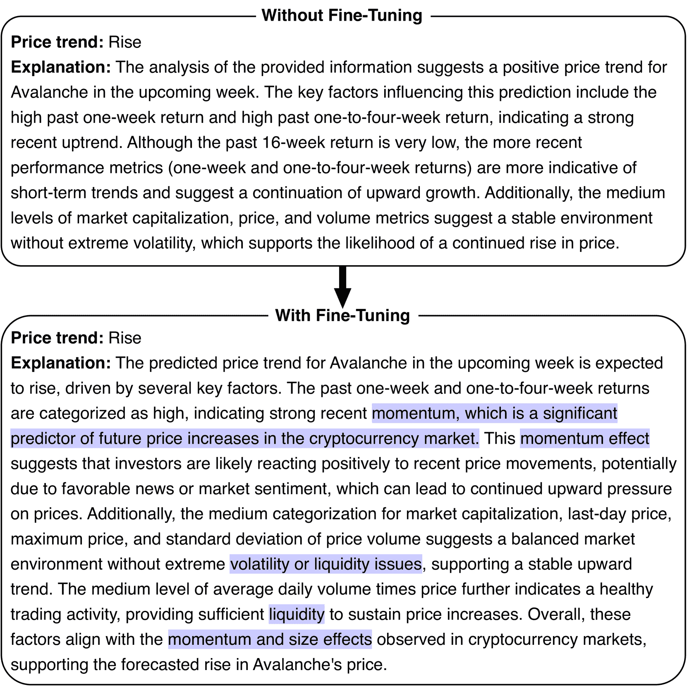

Figure 6. A comparison of the example outputs of our crypto factor expert agent with fine-tuning and GPT-4o without fine-tuning. We highlight the asset pricing terminologies that the model has learned from  (Liu et al., [2022](https://arxiv.org/html/2501.00826v2#bib.bib33)).

A key advantage of using \acpllm over traditional deep learning methods for prediction is their ability to generate explanations in natural language (Koa et al., [2024](https://arxiv.org/html/2501.00826v2#bib.bib23)). In the context of crypto portfolio management, we define model explainability as the ability to generate rationales for cryptocurrency and market trend predictions grounded in professional asset pricing knowledge from the field of finance. [Fig. 6](https://arxiv.org/html/2501.00826v2#S4.F6 "Figure 6 ‣ 4.2.4\. Explanation Performance ‣ 4.2\. Performance Comparison ‣ 4\. Experiment ‣ LLM-Powered Multi-Agent System for Automated Crypto Portfolio Management") compares the example outputs of our crypto factor expert agent with fine-tuning and GPT-4o without fine-tuning. We observe that the explanation generated by the expert agent after fine-tuning incorporates significantly more asset pricing terminologies from the provided literature. This indicates that the training prompts annotated by the explanation team, combined with the fine-tuning process, significantly enhance the expert agent’s capability for explainability.

In addition, [Fig. 7](https://arxiv.org/html/2501.00826v2#S4.F7 "Figure 7 ‣ 4.2.4\. Explanation Performance ‣ 4.2\. Performance Comparison ‣ 4\. Experiment ‣ LLM-Powered Multi-Agent System for Automated Crypto Portfolio Management") reports the average score for each metric outlined in [§4.1.2](https://arxiv.org/html/2501.00826v2#S4.SS1.SSS2 "4.1.2\. Explainability Performance ‣ 4.1\. Experiment Settings ‣ 4\. Experiment ‣ LLM-Powered Multi-Agent System for Automated Crypto Portfolio Management"). From [Fig. 7](https://arxiv.org/html/2501.00826v2#S4.F7 "Figure 7 ‣ 4.2.4\. Explanation Performance ‣ 4.2\. Performance Comparison ‣ 4\. Experiment ‣ LLM-Powered Multi-Agent System for Automated Crypto Portfolio Management"), we observe that models with fine-tuning outperform those without fine-tuning except for consistency. This suggests that the fine-tuning process significantly enhances most aspects of explainability. However, for consistency, the single GPT-4o model with fine-tuning does not perform better than the single GPT-4o model without fine-tuning. This indicates that fine-tuning a single agent with all historical data may introduce contradictions during the analysis, thereby undermining the consistency of the explanations. Moreover, our multi-agent model outperforms the single GPT-4o model with fine-tuning across all metrics. This highlights the advantage of the multi-agent framework, where each domain-specific expert agent, after training, can generate more accurate and specialized explanations compared to a single generalized agent.

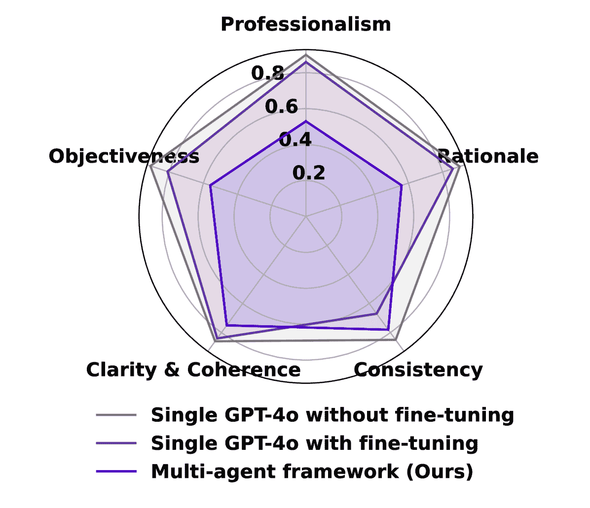

Figure 7. Comparison of explanation quality from our multi-agent model against baselines.

### 4.3\. Ablation Study

Table 5\. Ablation study of our multi-agent model. We evaluate the contribution of individual modules by removing each one separately and observing the changes in each metric. $\CIRCLE$ indicates a retained component, while $\Circle$ represents an ablated component. “Mean”, “Std”, and “Sharpe” provide the average realized weekly returns, their standard deviations, and annualized Sharpe ratios, respectively. The best results are boldfaced.

| Agents and Collaboration Mechanisms in the Model | Cumulative | Mean | Std | Sharpe |
| Intrateam Collaboration | Interteam Collaboration |
| Crypto Factor | Technical | Market Factor | News |
| ● | ● | ● | ● | ● | 0.8347 | 0.0172 | $0.0805$ | 1.5425 |
| ○ | ● | ● | ● | ● | $\pagecolor[HTML]{ffffff}0.4707$ | $0.0115$ | 0.0729 | $1.1395$ |
| ● | ○ | ● | ● | ● | $\pagecolor[HTML]{f7f9f5}0.5003$ | $0.0123$ | $0.0784$ | $1.1354$ |
| ● | ● | ○ | ● | ● | $\pagecolor[HTML]{bbd3af}0.7168$ | $0.0160$ | $0.0826$ | $1.3968$ |
| ● | ● | ● | ○ | ● | $\pagecolor[HTML]{bfd6b4}0.7024$ | $0.0157$ | $0.0834$ | $1.3576$ |
| ● | ● | ● | ● | ○ | $\pagecolor[HTML]{a0c290}0.8132$ | $0.0166$ | $0.0802$ | $1.4926$ |

In this section, we evaluate the contribution of each component of our multi-agent model to portfolio performance. [Tab. 5](https://arxiv.org/html/2501.00826v2#S4.T5 "Table 5 ‣ 4.3\. Ablation Study ‣ 4\. Experiment ‣ LLM-Powered Multi-Agent System for Automated Crypto Portfolio Management") presents the results of the ablation study, where key components or mechanisms are systematically removed to assess their impact on the overall portfolio performance. We highlight the following insights from the results:

Advantage of Intrateam Collaboration: We observe that removing any agent results in a decrease in cumulative return, average return, and the Sharpe ratio, highlighting each agent’s significant contribution to overall portfolio performance through the intrateam collaboration mechanism. In the absence of intrateam collaboration, different opinions within the same team cannot be harmonized effectively. As a result, this outcome demonstrates the efficacy of the intrateam collaboration mechanism in enhancing predictive accuracy and investment decision-making.

Advantage of Interteam Collaboration: We observe that disabling the interteam collaboration mechanism leads to lower cumulative returns, average returns, and Sharpe ratios. This finding indicates that the interteam collaboration mechanism enhances the overall portfolio performance of our multi-agent model by integrating market information into the decision-making process of agents within the crypto team.

## 5\. Conclusion

In this work, we explored the explainable cryptocurrency investment task, a challenging problem due to the shorter history of cryptocurrencies, diverse information sources, and high market volatility compared to traditional assets. While the introduction of \acpllm has revolutionized the field of finance, the performance of single \acllms remains limited. To address these challenges, we propose an explainable, multi-modal, multi-agent framework that employs multiple teams of agents collaborating both within and across teams to enable supervised learning and investment decisions across the top 30 cryptocurrencies by market capitalization. Our experimental results demonstrate that our model outperforms single-agent models, both with and without fine-tuning, in terms of classification accuracy and asset pricing performance. Furthermore, we show that our framework surpasses market benchmarks in portfolio performance.

###### Acknowledgements.

This material is based upon work partially supported by Ripple under the University Blockchain Research Initiative (UBRI) (Feng et al., [2022](https://arxiv.org/html/2501.00826v2#bib.bib16)). Any opinions, findings, and conclusions or recommendations expressed in this material are those of the authors and do not necessarily reflect the views of Ripple.

## References

*   (1)
*   Anamika and Subramaniam (2022) Anamika Anamika and Sowmya Subramaniam. 2022. Do news headlines matter in the cryptocurrency market? *Applied Economics* (11 2022). [https://doi.org/10.1080/00036846.2022.2061904](https://doi.org/10.1080/00036846.2022.2061904)
*   Aramonte et al. (2022) Sirio Aramonte, Sebastian Doerr, Wenqian Huang, and Andreas Schrimpf. 2022. DeFi lending: intermediation without information? *BIS Bulletins* (6 2022). [https://ideas.repec.org/p/bis/bisblt/57.htmlhttps://ideas.repec.org//p/bis/bisblt/57.html](https://ideas.repec.org/p/bis/bisblt/57.htmlhttps://ideas.repec.org//p/bis/bisblt/57.html)
*   Asness et al. (2013) Clifford S. Asness, Tobias J. Moskowitz, and Lasse Heje Pedersen. 2013. Value and Momentum Everywhere. *The Journal of Finance* 68, 3 (6 2013), 929–985. [https://doi.org/10.1111/JOFI.12021](https://doi.org/10.1111/JOFI.12021)
*   Biran and McKeown (2017) Or Biran and Kathleen McKeown. 2017. Human-centric justification of machine learning predictions. *IJCAI International Joint Conference on Artificial Intelligence* 0 (2017), 1461–1467. [https://doi.org/10.24963/IJCAI.2017/202](https://doi.org/10.24963/IJCAI.2017/202)
*   Carta et al. (2021) Salvatore M. Carta, Sergio Consoli, Luca Piras, Alessandro Sebastian Podda, and Diego Reforgiato Recupero. 2021. Explainable Machine Learning Exploiting News and Domain-Specific Lexicon for Stock Market Forecasting. *IEEE Access* 9 (2021), 30193–30205. [https://doi.org/10.1109/ACCESS.2021.3059960](https://doi.org/10.1109/ACCESS.2021.3059960)
*   CFP Board (2022) CFP Board. 2022. CFP Board Issues Crypto Guidelines. [https://www.cfp.net/news/2022/12/cfp-board-issues-crypto-guidelines](https://www.cfp.net/news/2022/12/cfp-board-issues-crypto-guidelines)
*   Chicco and Jurman (2020) Davide Chicco and Giuseppe Jurman. 2020. The advantages of the Matthews correlation coefficient (MCC) over F1 score and accuracy in binary classification evaluation. *BMC Genomics* 21, 1 (1 2020), 1–13. [https://doi.org/10.1186/S12864-019-6413-7/TABLES/5](https://doi.org/10.1186/S12864-019-6413-7/TABLES/5)
*   Chicco et al. (2021) Davide Chicco, Niklas Tötsch, and Giuseppe Jurman. 2021. The matthews correlation coefficient (Mcc) is more reliable than balanced accuracy, bookmaker informedness, and markedness in two-class confusion matrix evaluation. *BioData Mining* 14, 1 (2 2021), 1–22. [https://doi.org/10.1186/S13040-021-00244-Z/TABLES/5](https://doi.org/10.1186/S13040-021-00244-Z/TABLES/5)
*   Corbet et al. (2019) Shaen Corbet, Brian Lucey, Andrew Urquhart, and Larisa Yarovaya. 2019. Cryptocurrencies as a financial asset: A systematic analysis. *International Review of Financial Analysis* 62 (3 2019), 182–199. [https://doi.org/10.1016/J.IRFA.2018.09.003](https://doi.org/10.1016/J.IRFA.2018.09.003)
*   DeMiguel et al. (2009) Victor DeMiguel, Lorenzo Garlappi, and Raman Uppal. 2009. Optimal Versus Naive Diversification: How Inefficient is the 1/N Portfolio Strategy? *The Review of Financial Studies* 22, 5 (5 2009), 1915–1953. [https://doi.org/10.1093/RFS/HHM075](https://doi.org/10.1093/RFS/HHM075)
*   Ding et al. (2024) Qianggang Ding, Haochen Shi, and Bang Liu. 2024. TradExpert: Revolutionizing Trading with Mixture of Expert LLMs. (10 2024). [https://arxiv.org/abs/2411.00782v1](https://arxiv.org/abs/2411.00782v1)
*   Fama and French (1993) Eugene F. Fama and Kenneth R. French. 1993. Common risk factors in the returns on stocks and bonds. *Journal of Financial Economics* 33, 1 (2 1993), 3–56. [https://doi.org/10.1016/0304-405X(93)90023-5](https://doi.org/10.1016/0304-405X(93)90023-5)
*   Fang et al. (2022) Fan Fang, Carmine Ventre, Michail Basios, Leslie Kanthan, David Martinez-Rego, Fan Wu, and Lingbo Li. 2022. Cryptocurrency trading: a comprehensive survey. *Financial Innovation* 8, 1 (12 2022), 1–59. [https://doi.org/10.1186/S40854-021-00321-6/TABLES/11](https://doi.org/10.1186/S40854-021-00321-6/TABLES/11)
*   Fatemi and Hu (2024) Sorouralsadat Fatemi and Yuheng Hu. 2024. FinVision: A Multi-Agent Framework for Stock Market Prediction. *Proceedings of the 5th ACM International Conference on AI in Finance* (10 2024), 582–590. [https://doi.org/10.1145/3677052.3698688](https://doi.org/10.1145/3677052.3698688)
*   Feng et al. (2022) Yebo Feng, Jiahua Xu, and Lauren Weymouth. 2022. University blockchain research initiative (UBRI): Boosting blockchain education and research. *IEEE Potentials* 41, 6 (2022), 19–25.
*   Goutte et al. (2023) Stéphane Goutte, Hoang Viet Le, Fei Liu, and Hans Jörg von Mettenheim. 2023. Deep learning and technical analysis in cryptocurrency market. *Finance Research Letters* 54 (6 2023), 103809. [https://doi.org/10.1016/J.FRL.2023.103809](https://doi.org/10.1016/J.FRL.2023.103809)
*   Gu et al. (2020) Shihao Gu, Bryan Kelly, and Dacheng Xiu. 2020. Empirical Asset Pricing via Machine Learning. *The Review of Financial Studies* 33, 5 (5 2020), 2223–2273. [https://doi.org/10.1093/RFS/HHAA009](https://doi.org/10.1093/RFS/HHAA009)
*   Hackethal et al. (2022) Andreas Hackethal, Tobin Hanspal, Dominique M. Lammer, and Kevin Rink. 2022. The Characteristics and Portfolio Behavior of Bitcoin Investors: Evidence from Indirect Cryptocurrency Investments. *Review of Finance* 26, 4 (7 2022), 855–898. [https://doi.org/10.1093/ROF/RFAB034](https://doi.org/10.1093/ROF/RFAB034)
*   Hudson and Urquhart (2021) Robert Hudson and Andrew Urquhart. 2021. Technical trading and cryptocurrencies. *Annals of Operations Research* 297, 1-2 (2 2021), 191–220. [https://doi.org/10.1007/S10479-019-03357-1/TABLES/9](https://doi.org/10.1007/S10479-019-03357-1/TABLES/9)
*   Jing and Kang (2024) Liu Jing and Yuncheol Kang. 2024. Automated cryptocurrency trading approach using ensemble deep reinforcement learning: Learn to understand candlesticks. *Expert Systems with Applications* 237 (3 2024), 121373. [https://doi.org/10.1016/J.ESWA.2023.121373](https://doi.org/10.1016/J.ESWA.2023.121373)
*   Kapur et al. (2024) Geeta Kapur, Sridhar Manohar, Amit Mittal, Vishal Jain, and Sonal Trivedi. 2024. Cryptocurrency price fluctuation and time series analysis through candlestick pattern of bitcoin and ethereum using machine learning. *International Journal of Quality and Reliability Management* 41, 8 (9 2024), 2055–2074. [https://doi.org/10.1108/IJQRM-12-2022-0363/FULL/PDF](https://doi.org/10.1108/IJQRM-12-2022-0363/FULL/PDF)
*   Koa et al. (2024) Kelvin J.L. Koa, Yunshan Ma, Ritchie Ng, and Tat Seng Chua. 2024. Learning to Generate Explainable Stock Predictions using Self-Reflective Large Language Models. *WWW 2024 - Proceedings of the ACM Web Conference* 12 (5 2024), 4304–4315. [https://doi.org/10.1145/3589334.3645611/SUPPL{_}FILE/RFP1792.MP4](https://doi.org/10.1145/3589334.3645611/SUPPL%7B_%7DFILE/RFP1792.MP4)
*   Kou et al. (2024) Zhizhuo Kou, Holam Yu, Jingshu Peng, Hong Kong, and China Lei Chen. 2024. Automate Strategy Finding with LLM in Quant investment. (9 2024). [https://arxiv.org/abs/2409.06289v1](https://arxiv.org/abs/2409.06289v1)
*   Lahmiri and Bekiros (2019) Salim Lahmiri and Stelios Bekiros. 2019. Cryptocurrency forecasting with deep learning chaotic neural networks. *Chaos, Solitons & Fractals* 118 (1 2019), 35–40. [https://doi.org/10.1016/J.CHAOS.2018.11.014](https://doi.org/10.1016/J.CHAOS.2018.11.014)
*   Li et al. (2023a) Lezhi Li, Ting-Yu Chang, and Hai Wang. 2023a. Multimodal Gen-AI for Fundamental Investment Research. (12 2023). [https://arxiv.org/abs/2401.06164v1](https://arxiv.org/abs/2401.06164v1)
*   Li et al. (2023b) Shuqi Li, Weiheng Liao, Yuhan Chen, and Rui Yan. 2023b. PEN: Prediction-Explanation Network to Forecast Stock Price Movement with Better Explainability. *Proceedings of the AAAI Conference on Artificial Intelligence* 37, 4 (6 2023), 5187–5194. [https://doi.org/10.1609/AAAI.V37I4.25648](https://doi.org/10.1609/AAAI.V37I4.25648)
*   Li et al. (2024) Yuan Li, Bingqiao Luo, Qian Wang, Nuo Chen, Xu Liu, and Bingsheng He. 2024. A Reflective LLM-based Agent to Guide Zero-shot Cryptocurrency Trading. (6 2024). [https://arxiv.org/abs/2407.09546v1](https://arxiv.org/abs/2407.09546v1)
*   Li et al. (2023c) Yinheng Li, Shaofei Wang, Han Ding, and Hang Chen. 2023c. Large Language Models in Finance: A Survey. (2023). [https://doi.org/10.1145/3604237.3626869](https://doi.org/10.1145/3604237.3626869)
*   Liu et al. (2023a) Hao Liu, Carmelo Sferrazza, and Pieter Abbeel. 2023a. Chain of Hindsight Aligns Language Models with Feedback. *12th International Conference on Learning Representations, ICLR 2024* (2 2023). [https://arxiv.org/abs/2302.02676v8](https://arxiv.org/abs/2302.02676v8)
*   Liu et al. (2023b) Xiao-Yang Liu, Guoxuan Wang, Hongyang Yang, and Daochen Zha. 2023b. FinGPT: Democratizing Internet-scale Data for Financial Large Language Models. (7 2023). [https://arxiv.org/abs/2307.10485v2](https://arxiv.org/abs/2307.10485v2)
*   Liu and Tsyvinski (2021) Yukun Liu and Aleh Tsyvinski. 2021. Risks and Returns of Cryptocurrency. *The Review of Financial Studies* 34, 6 (5 2021), 2689–2727. [https://doi.org/10.1093/RFS/HHAA113](https://doi.org/10.1093/RFS/HHAA113)
*   Liu et al. (2022) Yukun Liu, Aleh Tsyvinski, and Xi Wu. 2022. Common Risk Factors in Cryptocurrency. *The Journal of Finance* 77, 2 (4 2022), 1133–1177. [https://doi.org/10.1111/jofi.13119](https://doi.org/10.1111/jofi.13119)
*   Pan et al. (2024) Bo Pan, Jiaying Lu, Ke Wang, Li Zheng, Zhen Wen, Yingchaojie Feng, Minfeng Zhu, and Wei Chen. 2024. AgentCoord: Visually Exploring Coordination Strategy for LLM-based Multi-Agent Collaboration. (4 2024). [https://arxiv.org/abs/2404.11943v1](https://arxiv.org/abs/2404.11943v1)
*   Sharpe (1994) William F. Sharpe. 1994. The Sharpe Ratio. *The Journal of Portfolio Management* 21, 1 (10 1994), 49–58. [https://doi.org/10.3905/JPM.1994.409501](https://doi.org/10.3905/JPM.1994.409501)
*   Tan and Tao (2023) Xilong Tan and Yubo Tao. 2023. Trend-based forecast of cryptocurrency returns. *Economic Modelling* 124 (7 2023), 106323. [https://doi.org/10.1016/J.ECONMOD.2023.106323](https://doi.org/10.1016/J.ECONMOD.2023.106323)
*   Wei et al. (2022) Jason Wei, Xuezhi Wang, Dale Schuurmans, Maarten Bosma, Brian Ichter, Fei Xia, Ed H. Chi, Quoc V. Le, and Denny Zhou. 2022. Chain-of-Thought Prompting Elicits Reasoning in Large Language Models. *Advances in Neural Information Processing Systems* 35 (1 2022). [https://arxiv.org/abs/2201.11903v6](https://arxiv.org/abs/2201.11903v6)
*   Wu et al. (2023) Qingyun Wu, Gagan Bansal, Jieyu Zhang, Yiran Wu, Beibin Li, Erkang Zhu, Li Jiang, Xiaoyun Zhang, Shaokun Zhang, Jiale Liu, Ahmed Hassan Awadallah, Ryen W White, Doug Burger, and Chi Wang. 2023. AutoGen: Enabling Next-Gen LLM Applications via Multi-Agent Conversation. (8 2023). [https://arxiv.org/abs/2308.08155v2](https://arxiv.org/abs/2308.08155v2)
*   Xie et al. (2023) Qianqian Xie, Xiao Zhang, Weiguang Han, Yanzhao Lai, Min Peng, Alejandro Lopez-Lira, and Jimin Huang. 2023. PIXIU: A Large Language Model, Instruction Data and Evaluation Benchmark for Finance. *Advances in Neural Information Processing Systems* 36 (6 2023). [https://arxiv.org/abs/2306.05443v1](https://arxiv.org/abs/2306.05443v1)
*   Yang et al. (2024) Jingfeng Yang, Hongye Jin, Ruixiang Tang, Xiaotian Han, Qizhang Feng, Haoming Jiang, Shaochen Zhong, Bing Yin, and Xia Hu. 2024. Harnessing the Power of LLMs in Practice: A Survey on ChatGPT and Beyond. *ACM Transactions on Knowledge Discovery from Data* 18, 6 (4 2024). [https://doi.org/10.1145/3649506/ASSET/D2038F72-9808-4957-BF9D-FB4E05F82081/ASSETS/GRAPHIC/TKDD-2023-06-0236-F02.JPG](https://doi.org/10.1145/3649506/ASSET/D2038F72-9808-4957-BF9D-FB4E05F82081/ASSETS/GRAPHIC/TKDD-2023-06-0236-F02.JPG)
*   Yin et al. (2024) Shukang Yin, Chaoyou Fu, Sirui Zhao, Ke Li, Xing Sun, Tong Xu, and Enhong Chen. 2024. A Survey on Multimodal Large Language Models. *National Science Review* (11 2024). [https://doi.org/10.1093/NSR/NWAE403](https://doi.org/10.1093/NSR/NWAE403)
*   Zhang et al. (2024) Jingyi Zhang, Jiaxing Huang, Sheng Jin, and Shijian Lu. 2024. Vision-Language Models for Vision Tasks: A Survey. *IEEE Transactions on Pattern Analysis and Machine Intelligence* 46, 8 (2024), 5625–5644. [https://doi.org/10.1109/TPAMI.2024.3369699](https://doi.org/10.1109/TPAMI.2024.3369699)

## APPENDIX

## Appendix A Data Description

[Tab. 6](https://arxiv.org/html/2501.00826v2#A1.T6 "Table 6 ‣ Appendix A Data Description ‣ LLM-Powered Multi-Agent System for Automated Crypto Portfolio Management") presents the data description, associated agents, and relevant literature. The table provides an overview of our multimodal data, specifying the agent responsible for analyzing each data type and the literature fetched by the literature team to enhance the agents’ explainability.

Table 6. Data description, corresponding agents, and related literature.

| Data Type | Name | Description | Agent | Literature |
| Chart ([1(a)](https://arxiv.org/html/2501.00826v2#S3.F1.sf1 "1(a) ‣ Figure 1 ‣ 3.2\. Framework Overview ‣ 3\. Methodology ‣ LLM-Powered Multi-Agent System for Automated Crypto Portfolio Management")) | Candlestick | 30-day candlestick charts with trading volume bars and a 30-day moving averages line. | Technical |  (Hudson and Urquhart, [2021](https://arxiv.org/html/2501.00826v2#bib.bib20)) |
| Crypto Factor ([1(c)](https://arxiv.org/html/2501.00826v2#S3.F1.sf3 "1(c) ‣ Figure 1 ‣ 3.2\. Framework Overview ‣ 3\. Methodology ‣ LLM-Powered Multi-Agent System for Automated Crypto Portfolio Management")) | MCAP | Log last-day market capitalization in the portfolio formation week. | Crypto |  (Liu et al., [2022](https://arxiv.org/html/2501.00826v2#bib.bib33)) |
| PRC | Log last-day price in the portfolio formation week. |  |  |
|  | MAXDPRC | Maximum price of the portfolio formation week. |  |  |
|  | MOM 1,0 | Past one-week return. |  |  |
|  | MOM 2,0 | Past two-week return. |  |  |
|  | MOM 3,0 | Past three-week return. |  |  |
|  | MOM 4,0 | Past four-week return. |  |  |
|  | MOM 4,1 | Past one-to-four-week return. |  |  |
|  | PRCVOL | Log average daily volume times price in the portfolio formation week. |  |  |
|  | STDPRCVOL | Log standard deviation of price volume in the portfolio formation week. |  |  |
| Market Factor ([1(c)](https://arxiv.org/html/2501.00826v2#S3.F1.sf3 "1(c) ‣ Figure 1 ‣ 3.2\. Framework Overview ‣ 3\. Methodology ‣ LLM-Powered Multi-Agent System for Automated Crypto Portfolio Management")) | ATTN BTC | Google search data for the word Bitcoin minus its average of the previous four weeks, and then normalized to have a mean of zero and a standard deviation of one | Market |  (Liu and Tsyvinski, [2021](https://arxiv.org/html/2501.00826v2#bib.bib32)) |
| ATTN CRYPTO | Google search data for the word cryptocurrency minus its average of the previous four weeks, and then normalized to have a mean of zero and a standard deviation of one |  |  |
|  | UNI ADDR | Bitcoin wallet growth |  |  |
|  | ACT ADDR | Active Bitcoin addresses growth |  |  |
|  | TXN | Bitcoin transactions growth |  |  |
|  | PAY | Bitcoin payments growth |  |  |
| Text ([1(d)](https://arxiv.org/html/2501.00826v2#S3.F1.sf4 "1(d) ‣ Figure 1 ‣ 3.2\. Framework Overview ‣ 3\. Methodology ‣ LLM-Powered Multi-Agent System for Automated Crypto Portfolio Management")) | News Headline | Weekly news headlines from Cointelegraph | News |  (Anamika and Subramaniam, [2022](https://arxiv.org/html/2501.00826v2#bib.bib2)) |