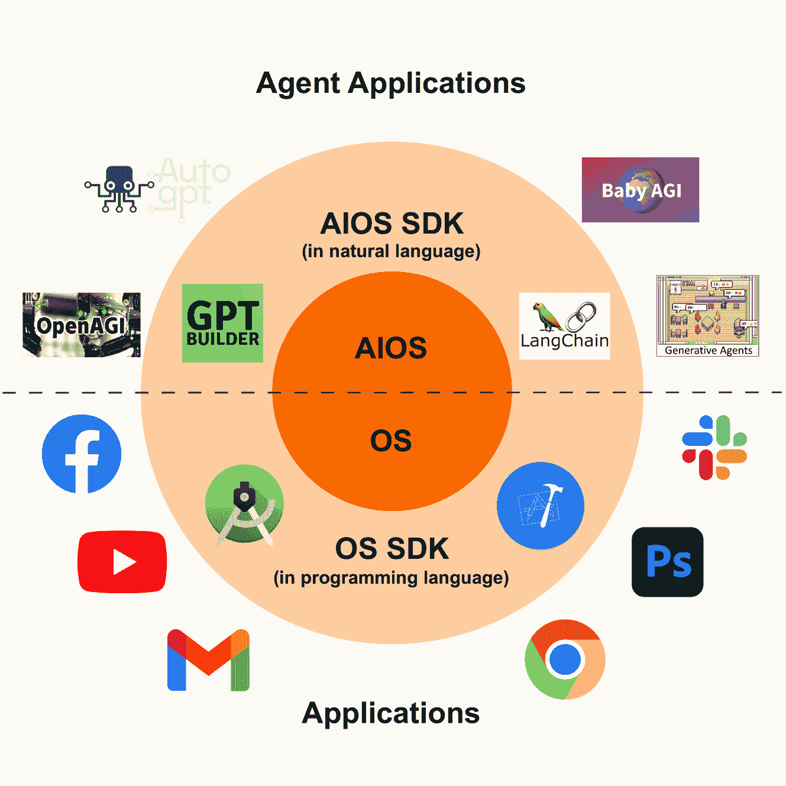
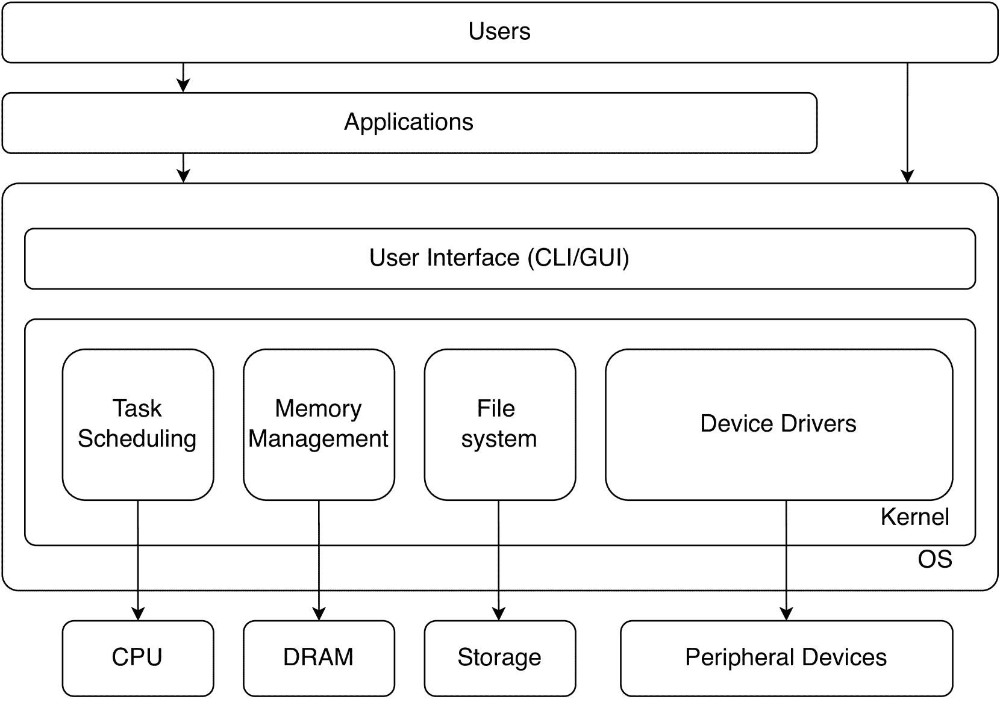
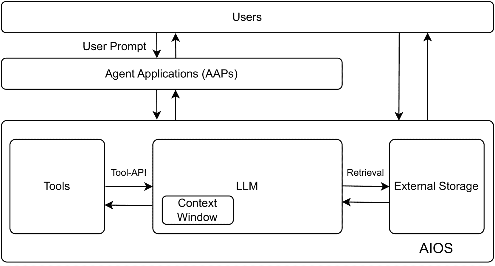
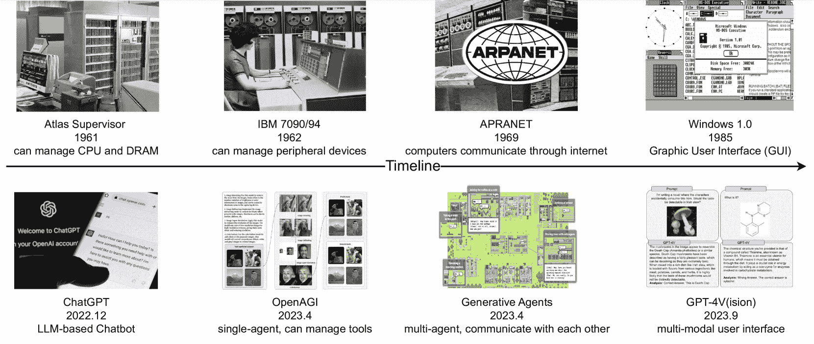
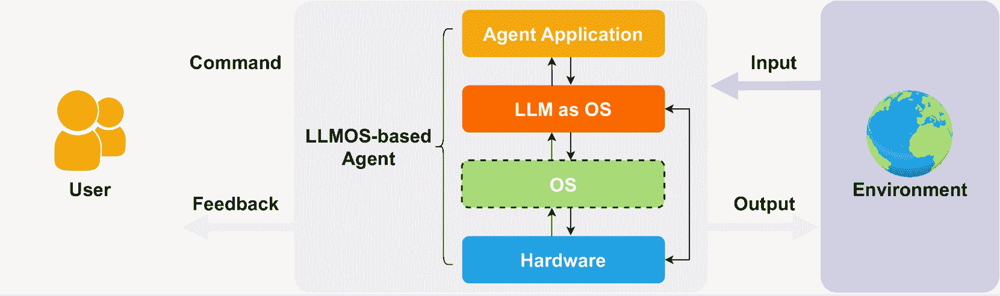

<!--yml

类别：未分类

日期：2025-01-11 13:00:26

-->

# LLM作为操作系统，代理作为应用程序：设想AIOS、代理与AIOS-Agent生态系统

> 来源：[https://arxiv.org/html/2312.03815/](https://arxiv.org/html/2312.03815/)

颜强葛

罗格斯大学

任宇杰

罗格斯大学

华文越

罗格斯大学

许书源

罗格斯大学

谭俊涛

罗格斯大学

张永锋

罗格斯大学 作者隶属：罗格斯大学计算机科学系，新布伦瑞克，NJ，08854，美国；作者邮箱：{yingqiang.ge,yujie.ren,wenyue.hua,shuyuan.xu,juntao.tan,yongfeng.zhang}@rutgers.edu

###### 摘要

本文设想了一个革命性的AIOS-Agent生态系统，其中大型语言模型（LLM）作为（人工）智能操作系统（IOS或AIOS）——一个“有灵魂”的操作系统。在此基础上，开发了一系列基于LLM的AI代理应用（Agents或AAPs），丰富了AIOS-Agent生态系统，并标志着传统操作系统-应用程序生态系统的范式转变。我们设想LLM的影响力不仅限于AI应用层，而是将反过来革新计算机系统、架构、软件和编程语言的设计与实现，特点是几个主要概念：LLM作为操作系统（系统级），代理作为应用程序（应用级），自然语言作为编程接口（用户级），工具作为设备/库（硬件/中间件级）。

在本文中，我们首先介绍传统操作系统（OS）的架构和历史演变。然后，我们通过“LLM作为操作系统（LLMOS）”¹¹1为方便起见，LLMOS可以读作“el-mos”，为AIOS建立一个概念框架，类比AIOS组件与传统操作系统元素：LLM类似于操作系统内核，上下文窗口类似于内存，外部存储类似于文件系统，硬件工具类似于外设，软件工具类似于编程库，用户提示类似于用户命令。接着，我们介绍了新的AIOS-代理生态系统，用户和开发者可以通过自然语言轻松编写代理应用程序（AAPs），这使得计算机软件的开发和访问民主化，与传统的操作系统-应用程序生态系统不同，后者要求桌面或移动应用程序（APPs）由经过良好培训的软件开发人员使用专业编程语言编写。随后，我们探讨了代理应用程序的多样化范围。这些代理可以自主执行各种任务，展示了在不同场景下的智能任务解决能力。我们深入分析了单代理系统和多代理系统，以及人类与代理的互动。最后，我们认为，AIOS-代理生态系统可以从传统操作系统-应用程序生态系统的发展轨迹中获得宝贵的见解。基于这些见解，我们提出了一条AIOS-代理生态系统发展的战略路线图。该路线图旨在指导未来的研究和开发，提出了AIOS及其代理应用程序的系统化进展建议。

图1：操作系统-应用程序生态系统与AIOS-代理生态系统的对比。

###### 目录

1.  [1 引言](#S1 "1 Introduction ‣ LLM作为操作系统，代理作为应用程序：展望AIOS、代理和AIOS-代理生态系统")

1.  [2 调整LLM与操作系统的关系](#S2 "2 Aligning LLM and OS ‣ LLM作为操作系统，代理作为应用程序：展望AIOS、代理和AIOS-代理生态系统")

    1.  [2.1 操作系统与LLM的关系](#S2.SS1 "2.1 OS and Connections with LLM ‣ 2 调整LLM与操作系统的关系 ‣ 将LLM视为操作系统，代理视为应用程序：展望AIOS、代理和AIOS-代理生态系统")

        1.  [2.1.1 内核](#S2.SS1.SSS1 "2.1.1 Kernel ‣ 2.1 操作系统与LLM的关系 ‣ 2 调整LLM与操作系统的关系 ‣ 将LLM视为操作系统，代理视为应用程序：展望AIOS、代理和AIOS-代理生态系统")

        1.  [2.1.2 用户界面](#S2.SS1.SSS2 "2.1.2 User Interface ‣ 2.1 操作系统与LLM的关系 ‣ 2 调整LLM与操作系统的关系 ‣ 将LLM视为操作系统，代理视为应用程序：展望AIOS、代理和AIOS-代理生态系统")

        1.  [2.1.3 操作系统生态系统](#S2.SS1.SSS3 "2.1.3 Operating System Ecosystem ‣ 2.1 操作系统与LLM的关系 ‣ 2 调整LLM与操作系统的关系 ‣ 将LLM视为操作系统，代理视为应用程序：展望AIOS、代理和AIOS-代理生态系统")

        1.  [2.1.4 操作系统的演变历史](#S2.SS1.SSS4 "2.1.4 操作系统的演变历史 ‣ 2.1 操作系统与LLM的联系 ‣ 2 对齐LLM和操作系统 ‣ LLM作为操作系统，代理作为应用程序：构想AIOS、代理和AIOS-代理生态系统")

    1.  [2.2 AIOS、LLMOS和AI代理](#S2.SS2 "2.2 AIOS、LLMOS和AI代理 ‣ 2 对齐LLM和操作系统 ‣ LLM作为操作系统，代理作为应用程序：构想AIOS、代理和AIOS-代理生态系统")

        1.  [2.2.1 LLM作为操作系统（系统层）](#S2.SS2.SSS1 "2.2.1 LLM作为操作系统（系统层） ‣ 2.2 AIOS、LLMOS和AI代理 ‣ 2 对齐LLM和操作系统 ‣ LLM作为操作系统，代理作为应用程序：构想AIOS、代理和AIOS-代理生态系统")

        1.  [2.2.2 代理作为应用程序（应用层）](#S2.SS2.SSS2 "2.2.2 代理作为应用程序（应用层） ‣ 2.2 AIOS、LLMOS和AI代理 ‣ 2 对齐LLM和操作系统 ‣ LLM作为操作系统，代理作为应用程序：构想AIOS、代理和AIOS-代理生态系统")

        1.  [2.2.3 自然语言作为编程接口（用户层）](#S2.SS2.SSS3 "2.2.3 自然语言作为编程接口（用户层） ‣ 2.2 AIOS、LLMOS和AI代理 ‣ 2 对齐LLM和操作系统 ‣ LLM作为操作系统，代理作为应用程序：构想AIOS、代理和AIOS-代理生态系统")

        1.  [2.2.4 工具作为设备/库（硬件/中间件层）](#S2.SS2.SSS4 "2.2.4 工具作为设备/库（硬件/中间件层） ‣ 2.2 AIOS、LLMOS和AI代理 ‣ 2 对齐LLM和操作系统 ‣ LLM作为操作系统，代理作为应用程序：构想AIOS、代理和AIOS-代理生态系统")

    1.  [2.3 操作系统和AIOS的发展](#S2.SS3 "2.3 操作系统和AIOS的发展 ‣ 2 对齐LLM和操作系统 ‣ LLM作为操作系统，代理作为应用程序：构想AIOS、代理和AIOS-代理生态系统")

1.  [3 AIOS架构](#S3 "3 AIOS架构 ‣ LLM作为操作系统，代理作为应用程序：构想AIOS、代理和AIOS-代理生态系统")

    1.  [3.1 LLM（作为AIOS内核）](#S3.SS1 "3.1 LLM（作为AIOS内核） ‣ 3 AIOS架构 ‣ LLM作为操作系统，代理作为应用程序：构想AIOS、代理和AIOS-代理生态系统")

        1.  [3.1.1 推理和规划](#S3.SS1.SSS1 "3.1.1 推理和规划 ‣ 3.1 LLM（作为AIOS内核） ‣ 3 AIOS架构 ‣ LLM作为操作系统，代理作为应用程序：构想AIOS、代理和AIOS-代理生态系统")

        1.  [3.1.2 自我改进](#S3.SS1.SSS2 "3.1.2 自我改进 ‣ 3.1 LLM（作为AIOS内核） ‣ 3 AIOS架构 ‣ LLM作为操作系统，代理作为应用程序：构想AIOS、代理和AIOS-代理生态系统")

    1.  [3.2 上下文窗口（作为内存）](#S3.SS2 "3.2 上下文窗口（作为内存） ‣ 3 AIOS架构 ‣ LLM作为操作系统，代理作为应用程序：构想AIOS、代理和AIOS-代理生态系统")

    1.  [3.3 外部存储（作为文件）](#S3.SS3 "3.3 外部存储（作为文件） ‣ 3 AIOS架构 ‣ LLM作为操作系统，代理作为应用程序：构想AIOS、代理和AIOS-代理生态系统")

        1.  [3.3.1 数据格式](#S3.SS3.SSS1 "3.3.1 数据格式 ‣ 3.3 外部存储（作为文件） ‣ 3 AIOS架构 ‣ LLM作为操作系统，代理作为应用程序：构想AIOS、代理和AIOS-代理生态系统")

        1.  [3.3.2 数据检索方法](#S3.SS3.SSS2 "3.3.2 数据检索方法 ‣ 3.3 外部存储（作为文件） ‣ 3 AIOS架构 ‣ LLM作为操作系统，代理作为应用程序：展望AIOS、代理及AIOS-代理生态系统")

    1.  [3.4 工具（作为设备/库）](#S3.SS4 "3.4 工具（作为设备/库） ‣ 3 AIOS架构 ‣ LLM作为操作系统，代理作为应用程序：展望AIOS、代理及AIOS-代理生态系统")

        1.  [3.4.1 工具类别](#S3.SS4.SSS1 "3.4.1 工具类别 ‣ 3.4 工具（作为设备/库） ‣ 3 AIOS架构 ‣ LLM作为操作系统，代理作为应用程序：展望AIOS、代理及AIOS-代理生态系统")

        1.  [3.4.2 工具驱动程序和工具API](#S3.SS4.SSS2 "3.4.2 工具驱动程序和工具API ‣ 3.4 工具（作为设备/库） ‣ 3 AIOS架构 ‣ LLM作为操作系统，代理作为应用程序：展望AIOS、代理及AIOS-代理生态系统")

1.  [4 AIOS-代理生态系统](#S4 "4 AIOS-代理生态系统 ‣ LLM作为操作系统，代理作为应用程序：展望AIOS、代理及AIOS-代理生态系统")

    1.  [4.1 代理作为应用程序](#S4.SS1 "4.1 代理作为应用程序 ‣ 4 AIOS-代理生态系统 ‣ LLM作为操作系统，代理作为应用程序：展望AIOS、代理及AIOS-代理生态系统")

    1.  [4.2 代理的自然语言编程](#S4.SS2 "4.2 代理的自然语言编程 ‣ 4 AIOS-代理生态系统 ‣ LLM作为操作系统，代理作为应用程序：展望AIOS、代理及AIOS-代理生态系统")

    1.  [4.3 生态系统](#S4.SS3 "4.3 生态系统 ‣ 4 AIOS-代理生态系统 ‣ LLM作为操作系统，代理作为应用程序：展望AIOS、代理及AIOS-代理生态系统")

1.  [5 LLMOS在实践中的应用：AI代理](#S5 "5 LLMOS在实践中的应用：AI代理 ‣ LLM作为操作系统，代理作为应用程序：展望AIOS、代理及AIOS-代理生态系统")

    1.  [5.1 单一代理应用程序](#S5.SS1 "5.1 单一代理应用程序 ‣ 5 LLMOS在实践中的应用：AI代理 ‣ LLM作为操作系统，代理作为应用程序：展望AIOS、代理及AIOS-代理生态系统")

        1.  [5.1.1 物理环境](#S5.SS1.SSS1 "5.1.1 物理环境 ‣ 5.1 单一代理应用程序 ‣ 5 LLMOS在实践中的应用：AI代理 ‣ LLM作为操作系统，代理作为应用程序：展望AIOS、代理及AIOS-代理生态系统")

        1.  [5.1.2 虚拟/数字环境](#S5.SS1.SSS2 "5.1.2 虚拟/数字环境 ‣ 5.1 单一代理应用程序 ‣ 5 LLMOS在实践中的应用：AI代理 ‣ LLM作为操作系统，代理作为应用程序：展望AIOS、代理及AIOS-代理生态系统")

    1.  [5.2 多代理应用程序](#S5.SS2 "5.2 多代理应用程序 ‣ 5 LLMOS在实践中的应用：AI代理 ‣ LLM作为操作系统，代理作为应用程序：展望AIOS、代理及AIOS-代理生态系统")

        1.  [5.2.1 协作互动](#S5.SS2.SSS1 "5.2.1 协作互动 ‣ 5.2 多代理应用程序 ‣ 5 LLMOS在实践中的应用：AI代理 ‣ LLM作为操作系统，代理作为应用程序：展望AIOS、代理及AIOS-代理生态系统")

        1.  [5.2.2 对抗性互动](#S5.SS2.SSS2 "5.2.2 对抗性互动 ‣ 5.2 多代理应用程序 ‣ 5 LLMOS在实践中的应用：AI代理 ‣ LLM作为操作系统，代理作为应用程序：展望AIOS、代理及AIOS-代理生态系统")

    1.  [5.3 人机智能体应用](#S5.SS3 "5.3 人机智能体应用 ‣ 5 LLMOS实践：AI智能体 ‣ LLM作为操作系统，智能体作为应用程序：构想AIOS，智能体与AIOS-智能体生态系统")

1.  [6 操作系统启发的未来方向](#S6 "6 操作系统启发的未来方向 ‣ LLM作为操作系统，智能体作为应用程序：构想AIOS，智能体与AIOS-智能体生态系统")

    1.  [6.1 资源管理](#S6.SS1 "6.1 资源管理 ‣ 6 操作系统启发的未来方向 ‣ LLM作为操作系统，智能体作为应用程序：构想AIOS，智能体与AIOS-智能体生态系统")

        1.  [6.1.1 内存管理](#S6.SS1.SSS1 "6.1.1 内存管理 ‣ 6.1 资源管理 ‣ 6 操作系统启发的未来方向 ‣ LLM作为操作系统，智能体作为应用程序：构想AIOS，智能体与AIOS-智能体生态系统")

        1.  [6.1.2 工具管理](#S6.SS1.SSS2 "6.1.2 工具管理 ‣ 6.1 资源管理 ‣ 6 操作系统启发的未来方向 ‣ LLM作为操作系统，智能体作为应用程序：构想AIOS，智能体与AIOS-智能体生态系统")

    1.  [6.2 通信](#S6.SS2 "6.2 通信 ‣ 6 操作系统启发的未来方向 ‣ LLM作为操作系统，智能体作为应用程序：构想AIOS，智能体与AIOS-智能体生态系统")

    1.  [6.3 安全性](#S6.SS3 "6.3 安全性 ‣ 6 操作系统启发的未来方向 ‣ LLM作为操作系统，智能体作为应用程序：构想AIOS，智能体与AIOS-智能体生态系统")

1.  [7 结论](#S7 "7 结论 ‣ LLM作为操作系统，智能体作为应用程序：构想AIOS，智能体与AIOS-智能体生态系统")

## 1 引言

在信息技术不断发展的环境中，操作系统（OS）如Windows²²2[https://www.microsoft.com/en-us/windows/](https://www.microsoft.com/en-us/windows/)、MacOS³³3[https://www.apple.com/macos/](https://www.apple.com/macos/)、iOS⁴⁴4[https://www.apple.com/ios/](https://www.apple.com/ios/)、Android⁵⁵5[https://www.android.com/](https://www.android.com/)已成为我们数字生活的基石。在操作系统之上，开发了各种各样的应用程序（APP），帮助用户完成各种任务，丰富了操作系统与应用程序的生态系统。例如，Microsoft Word⁶⁶6[https://www.microsoft.com/en-us/microsoft-365/word/](https://www.microsoft.com/en-us/microsoft-365/word/)和Google Docs⁷⁷7[https://www.google.com/docs/about/](https://www.google.com/docs/about/)在文档起草方面表现卓越，而Microsoft Outlook⁸⁸8[https://www.microsoft.com/en-us/microsoft-365/outlook/](https://www.microsoft.com/en-us/microsoft-365/outlook/)和Gmail⁹⁹9[https://www.google.com/gmail/about/](https://www.google.com/gmail/about/)则提供高效的电子邮件管理。

操作系统已经取得了显著进展，变得更加直观和用户友好，但其核心仍然根植于静态规则和预定义的逻辑流程中，缺乏智能、创造性和自发的任务解决能力。与此不同，建立在这些操作系统之上的应用程序也仅限于其设计的目的，无法超越各自的范围。每当个别应用程序需要融入智能能力时，它们必须实现自己的人工智能方法或功能，有时还依赖于第三方库。这种孤立的框架突显了当前操作系统-应用程序生态系统中的一个重大缺陷，并强调了将（人工）智能融入操作系统的迫切需求，以便智能能够原生地分发到其上构建的各种应用程序中。

因此，本文设想了一个“有灵魂”的操作系统——（人工）智能操作系统（IOS，或AIOS）。此外，构建在AIOS之上的多样化智能代理应用程序形成了全新的AIOS-代理生态系统，相较于传统的操作系统-应用程序生态系统，如图[1](#S0.F1 "图1 ‣ LLM作为操作系统，代理作为应用：设想AIOS、代理及AIOS-代理生态系统")所示。由于它们展示出的多功能性和显著能力，大语言模型（LLMs）（Radford等， [2019](#bib.bib84)；Brown等， [2020](#bib.bib12)；Touvron等， [2023](#bib.bib107)；Taori等， [2023](#bib.bib106)）被认为是人工通用智能（AGI）（Bubeck等， [2023](#bib.bib13)；Morris等， [2023](#bib.bib67)；Ge等， [2023](#bib.bib35)）的潜在火花，并且为AIOS的发展提供了作为基础元素的希望。以下几点确认了LLM在构建AIOS方面的通用能力和可行性：

+   •

    第一，LLM已经展示了卓越的语言理解能力以及解决复杂任务的推理/规划能力，它们能够将任务分解为若干子任务，并逐一解决，有时还借助外部工具的协助（Ge等， [2023](#bib.bib35)；Wei等， [2022](#bib.bib121)；Huang和Chang， [2022](#bib.bib45)）。

+   •

    第二，LLM提供了一个高度灵活的平台，可以处理几乎任何以自然语言表达的提示、指令或查询，从而使各种软件开发工具包（SDK）和/或应用程序能够建立在其基础之上。

+   •

    第三，LLM（大语言模型）提供了更直观和用户友好的界面，因为它们能够理解并响应用户的自然语言提示或指令（Brown等， [2020](#bib.bib12)；Touvron等， [2023](#bib.bib107)）。这为未来的前景提供了启示，即自然语言将成为编程语言，使技术变得更加易于接触，尤其是对于那些不熟悉传统计算机界面和编程语言的人来说。

+   •

    第四，LLM可以被编程为从互动中学习，并根据用户偏好和过去的互动定制其响应，从而提供更加个性化的体验（Safdari等人，[2023](#bib.bib91)；Durmus等人，[2023](#bib.bib28)）。

因此，通过LLM将智能注入到操作系统层级，使得将智能能力轻松分发到应用程序层级成为可能，提供了一种有前景的方式来在各种应用中实现智能的民主化。

(a) 操作系统（OS）的架构。

(b) 作为AIOS操作系统的大型语言模型架构（LLMOS）。

图2：操作系统（OS）和AIOS（LLMOS）架构的示意图。

受传统操作系统架构的启发（如图[1(a)](#S1.F1.sf1 "1(a) ‣ 图2 ‣ 1 引言 ‣ LLM作为操作系统，代理作为应用程序：设想AIOS、代理和AIOS-代理生态系统")所示），我们在第[3](#S3 "3 AIOS架构 ‣ LLM作为操作系统，代理作为应用程序：设想AIOS、代理和AIOS-代理生态系统")节中提出了一个LLM作为操作系统（LLMOS）的一般框架，并列出了几个关键组件（如图[1(b)](#S1.F1.sf2 "1(b) ‣ 图2 ‣ 1 引言 ‣ LLM作为操作系统，代理作为应用程序：设想AIOS、代理和AIOS-代理生态系统")所示）：LLM作为内核，上下文窗口作为内存，外部存储作为文件，工具作为设备/库，用户提示/指令作为用户界面（UI），以及代理作为应用程序。所提出的概念框架将LLM作为操作系统（LLMOS）与传统操作系统（OS）进行类比，将LLMOS的各个组件映射到操作系统的元素。LLM本身类似于内核，是管理系统核心功能的中央部分。LLM的上下文窗口与操作系统的内存相似，处理即时的上下文选择和数据处理（Shi等人，[2023](#bib.bib96)）。LLM的外部存储类似于操作系统的文件，用于长期数据存储。与此同时，有相应的数据检索方法以支持检索增强型LLM（Guu等人，[2020](#bib.bib39)），它们作为操作系统的文件系统，帮助管理和查找相关文件。此外，LLM可以利用各种工具来解决任务（Ge等人，[2023](#bib.bib35)），包括硬件工具和软件工具。LLMOS框架中的硬件工具相当于传统操作系统中的外设，每个硬件工具提供特定功能，帮助与物理世界交互，而LLMOS框架中的软件工具则相当于传统操作系统中的编程库，帮助代理应用程序与虚拟/数字世界互动。LLM的用户提示或指令类似于传统操作系统中的用户界面（UI），促进用户与系统之间的交互。用户提示或指令可以是用户提供的直接自然语言指令，也可以是（有时是半结构化的）从用户非自然语言指令（如点击图标）转换过来的自然语言指令。这一映射为理解基于LLMOS的AIOS和传统操作系统之间的操作相似性提供了一个系统化的方式。

在为基于LLMOS的AIOS建立一个稳固的概念框架后，我们在第[4](#S4 "4 AIOS-Agent Ecosystem ‣ LLM作为操作系统，Agent作为应用程序：构想AIOS、Agent和AIOS-Agent生态系统")节中介绍了AIOS-Agent生态系统，这一生态系统类似于传统的OS-APP生态系统。我们首先介绍了LLMOS中Agent应用程序（AAPs）的概念，它类似于基于操作系统的传统应用程序（APPs）。这些AAPs代表了用户可以根据LLMOS执行的一系列专门任务。正如图[4](#S4.F4 "Figure 4 ‣ 4.1 Agents as Applications ‣ 4 AIOS-Agent Ecosystem ‣ LLM as OS, Agents as Apps: Envisioning AIOS, Agents and the AIOS-Agent Ecosystem")所示，通过将LLMOS层与操作系统层、硬件层以及Agent应用程序层相结合，我们可以构建一个自主的AI Agent系统。这样的AI Agent系统能够响应用户的自然语言提示或指令，并且能够根据与物理或数字环境的互动执行多种任务。由于可以在共享的AIOS基础上开发各种Agent，这最终导致了AIOS-Agent生态系统的形成。此外，在新的AIOS-Agent生态系统中，用户和开发者可以轻松地使用自然语言编程Agent应用程序（AAPs），从而实现计算机软件开发和访问的民主化，这与传统的OS-APP生态系统不同，在传统生态系统中，桌面或移动应用程序（APPs）必须由经过专业训练的软件开发者使用专业编程语言编写。

接下来，我们在第[5](#S5 "5 LLMOS实践：AI代理 ‣ LLM作为操作系统，代理作为应用：构想AIOS、代理和AIOS-代理生态系统")节中进一步探讨基于LLMOS的代理应用。该节探讨了通过在现实世界中开发各种代理来增强LLMOS功能的潜力，并进一步研究多个代理与人类之间的动态互动。基于LLMOS的代理具有创造性自主性，使其能够生成未被预先编程的新的想法、叙事或解决方案（Chase, [2022](#bib.bib15); Gravitas, [2023](#bib.bib37); Ge等, [2023](#bib.bib35); Li等, [2023](#bib.bib58); Yao等, [2022b](#bib.bib132), [a](#bib.bib129)），这表明了高级创造性智能的水平（Yuan等, [2022](#bib.bib134); Franceschelli和Musolesi, [2023](#bib.bib32)）。具体来说，第[5.1](#S5.SS1 "5.1 单代理应用 ‣ 5 LLMOS实践：AI代理 ‣ LLM作为操作系统，代理作为应用：构想AIOS、代理和AIOS-代理生态系统")节讨论了单个代理的应用，第[5.2](#S5.SS2 "5.2 多代理应用 ‣ 5 LLMOS实践：AI代理 ‣ LLM作为操作系统，代理作为应用：构想AIOS、代理和AIOS-代理生态系统")节探讨了多代理系统，第[5.3](#S5.SS3 "5.3 人类与代理的应用 ‣ 5 LLMOS实践：AI代理 ‣ LLM作为操作系统，代理作为应用：构想AIOS、代理和AIOS-代理生态系统")节专注于人类与代理的互动。

最后，在第[6](#S6 "6 操作系统启发的未来方向 ‣ LLM作为操作系统，代理作为应用：构想AIOS、代理和AIOS-代理生态系统")节中，我们探讨了LLMOS和AIOS的若干关键未来研究方向，总结并借鉴了传统操作系统的演化。这些方向涵盖了多个领域，旨在增强LLMOS的功能和应用：1) 资源管理。例如，操作系统使用虚拟和共享内存来解决物理内存有限的问题。LLMOS可以从这些思路中获得启发，缓解自身面临的上下文窗口限制挑战；2) 通信。不同的操作系统和应用程序使用标准化协议进行通信（如领域特定语言）；LLMOS和代理可以建立并使用类似的标准协议，以便与各种系统交换数据和指令，确保在不同平台之间的兼容性和顺畅互动；3) 安全性。操作系统中的安全漏洞是一个重要问题。最先进的方法旨在各个层面上检测和捕获恶意软件和病毒。同样，LLMOS可以实施检测和干预机制，以规范和监控第三方工具和代理应用程序的执行。

## 2 LLM与操作系统的对齐

### 2.1 操作系统与LLM的关联

冯·诺依曼架构奠定了现代计算机硬件系统的基础，它在二进制世界中操作电子和逻辑门，而人类则使用自然语言进行交流。人类用户与计算机硬件之间如此巨大的语义差异，促使了中介软件层的出现，借助该层，用户能够以受保护且抽象的方式与底层硬件资源（如中央处理单元（CPU）、图形处理单元（GPU）、随机存取内存（RAM）、存储设备及其他各类设备）进行交互，这就是操作系统（OS）。在过去几十年里，现代操作系统已发展成具有多层架构的系统，每一层都有模块化的组件。这种设计不仅提高了系统的效率和功能，还便于管理、扩展及整合不同的硬件和软件元素。

#### 2.1.1 内核

内核，顾名思义，封装了一套管理硬件资源（如 CPU、GPU、DRAM、存储设备及其他设备）核心功能的“核心”。^(10)^(10)10我们将范围限制在传统的单体内核设计上。

+   •

    CPU 管理（进程/线程，调度）。为了管理 CPU 资源，现代操作系统将用户程序或应用程序在物理 CPU 上的执行抽象为进程或线程。当用户启动一个应用程序时，操作系统内核会将该应用程序或程序的可执行二进制文件加载到 DRAM 中，创建必要的数据结构来记录该程序的运行状态，并分配所需资源。

    然而，功率墙（Agarwal 等，[2006](#bib.bib2)）限制了单一芯片中可集成的物理 CPU 数量。为了向用户提供拥有物理 CPU 的错觉而不与其他用户共享，现代操作系统通过时间共享（Ritchie 和 Thompson，[1974](#bib.bib85)）和更多专用策略（Molnár，[2007](#bib.bib66); Stoica 和 Abdel-Wahab，[1995](#bib.bib100)）将有限数量的 CPU 与正在运行的进程或线程进行复用，这有点像多个用户在处理他们的提示或指令时共享同一个大型语言模型（LLM）后台。在这种情况下，如果来自多个用户的输入超出了资源的处理能力，例如工具的限制，那么 LLM 可能会对用户的提示进行调度。

+   •

    内存管理。计算机中的物理内存，也称为动态随机存取内存（DRAM），是存储操作系统和应用程序指令及数据的关键组件。操作系统负责管理和分配物理内存中的空闲空间，以满足应用程序的请求。

    如上所述，物理内存被描述为“动态”的，当电源关闭时无法持久存储数据，因为它需要定期刷新以防止数据丢失。除了其易失性特征外，内存的发展远远落后于 CPU，这被称为“内存墙”。这一事实存在于两个正交的方面。首先，DRAM 和 CPU 之间的数据传输速度已经无法跟上 CPU 处理数据的速度。其次，单个节点的内存容量停止扩展。尽管计算快速链接（CXL， [2023](#bib.bib24)）的出现缓解了内存容量壁垒，但它仍然无法跟上人工智能时代数据增长的快速步伐。

    这与 LLM 的上下文窗口非常相似，通常受限于 LLM 能处理的最大标记数。此外，LLM 通常需要从输入的上下文中选择相关信息，因为并非所有上下文对于当前任务都是相关的，LLM 可能会被无关的上下文轻易分散注意力（Shi 等， [2023](#bib.bib96)）。上下文选择可以通过注意力机制隐式实现，也可以通过从输入上下文中选择相关片段显式实现，这与传统操作系统的内存管理过程类似。

+   •

    存储管理。存储设备能够持久地存储数据，提供比内存更高的密度，并且成本较低，但速度要慢得多。操作系统将存储抽象为文件，并通过名为“文件系统”的组件以系统化的方式组织文件。文件系统包含元数据，用于索引存储介质上实际存储的数据。

    除了文件抽象外，现代操作系统还会保留一小部分存储作为内存的扩展，称为“交换区”。操作系统跟踪来自用户应用程序的数据的热度和冷度，并将代码数据从物理内存交换到存储设备上的交换区。

    类似地，LLM 通常可以访问外部数据存储，用于检索增强的语言建模（Guu 等， [2020](#bib.bib39)）。这些外部数据可以是自由文本数据、结构化的表格数据、半结构化的图形数据或其他类型的数据。此外，外部数据通常会被适当索引，以实现高效且准确的检索，这与传统操作系统的存储管理过程非常相似。

+   •

    设备管理。外设设备，通常不包括在 CPU 和 DRAM 的核心计算系统中，构成了用户输入和输出的重要功能集合。这些设备包括鼠标、键盘、GPU 和网络接口卡（NIC）。操作系统负责管理这些设备，使它们能够与操作系统内核中的其他核心组件协调工作。

    全世界有成千上万种不同用途和来自不同厂商的设备。因此，不可能为所有这些设备实现驱动程序。相反，现代操作系统提供了通用接口作为设备驱动程序 API 供设备厂商使用，从而将开发设备驱动程序的责任从操作系统维护者转移到设备厂商。为了提供即插即用功能，像 Linux 这样的现代操作系统包含了一些通用且必要的设备驱动程序，支持一些常见设备，例如 GPU 和 USB 设备（Corbet 等， [2005](#bib.bib21)）。

    类似地，大型语言模型不仅仅是文本输入-文本输出的模型，相反，它们具有利用各种工具解决复杂任务的能力（Schick 等， [2023](#bib.bib93); Ge 等， [2023](#bib.bib35)）。这些工具可以分为硬件工具和软件工具，分别帮助 LLM 与物理世界和数字世界进行交互。在这种背景下，LLM 的硬件工具类似于传统操作系统中的设备。此外，就像驱动程序将设备与操作系统连接一样，可以开发工具驱动程序将 LLM 与硬件工具连接，以便 LLM 可以轻松利用这些工具来解决任务。我们将在接下来的部分讨论软件工具。

+   •

    SDK 和编程库。操作系统的 SDK（软件开发工具包）和编程库是至关重要的工具，它们使开发者能够轻松创建应用程序。它们是操作系统应用程序开发的基础，不仅能够简化应用程序的创建，还能确保这些应用程序安全、高效，并与操作系统兼容，这对操作系统-应用程序生态系统的活力和增长做出了重要贡献。

    同样，LLM 及其上构建的各种 AI 代理可以利用各种软件工具，例如在网络上搜索、检查天气情况和预订机票（Ge 等， [2023](#bib.bib35)）。这些软件工具作为可重用的功能，LLM 和代理可以利用它们来解决复杂任务，并且可以作为 SDK 或编程库提供，使用户或开发者可以轻松使用。

#### 2.1.2 用户界面

如前所述，内核通过适当的抽象管理硬件资源，以便用户使用。为了增强虚拟化硬件资源的可访问性，建立用户与操作系统之间的接口至关重要。

+   •

    系统调用。系统调用作为操作系统内核与用户之间的通道，定义了一组核心功能，用于分配和使用虚拟化硬件资源。例如，在一个符合POSIX标准的操作系统中（IEEE和Group，[2018](#bib.bib47)），mmap系统调用用于分配和操作内存资源。fork和exec系统调用系列用于进程和线程的创建。read和write系统调用用于与存储设备交互。在LLM的语境下，系统调用可以被制定为自然语言提示，以指令形式让LLM执行任务。

+   •

    命令行界面（CLI）。命令行界面定义了一组基于系统调用构建的实用程序，以便用户通过交互方式操作计算机硬件。用户通过这些实用程序与操作系统交互，命令行即为操作命令。例如，cd和ls命令实现进入目录和列出目录中所有文件和文件夹的功能。在LLM的语境中，自然语言提示自然地成为用户与LLM交互的界面。此外，LLM也可以预定义一些基础和常用功能，作为标准提示模板供用户使用，类似于传统操作系统中的标准命令。

+   •

    图形用户界面（GUI）。图形用户界面是用户通过图形元素（如图标、按钮、窗口和菜单）与计算机和电子设备交互的一种可视化方式，与基于文本的界面（如命令行界面）不同。图形用户界面通过以可视化元素呈现操作，并提供更加直观的用户体验，尤其是在智能手机等移动设备使用日益增加的情况下，能够帮助用户更轻松地与复杂系统交互，这一点在[2.1.4节](#S2.SS1.SSS4 "2.1.4 操作系统演变历史 ‣ 2.1 操作系统与LLM的联系 ‣ 2 对齐LLM与操作系统 ‣ LLM作为操作系统，Agent作为应用：构想AIOS，Agent与AIOS-Agent生态系统")中有所讨论。就LLM而言，也可以为LLM和Agent开发图形用户界面，以便用户更方便地与它们交互，而无需编写长篇提示。相反，这些GUI将把用户的非语言指令（如点击图标）转化为基于预定义提示模板的（有时是半结构化的）自然语言提示，并将这些转换后的自然语言提示发送给LLM以执行用户指令。

#### 2.1.3 操作系统生态系统

操作系统生态系统作为操作系统的扩展，提供了一整套开发工具包（OS SDK）和运行时库，如图[1](#S0.F1 "Figure 1 ‣ LLM as OS, Agents as Apps: Envisioning AIOS, Agents and the AIOS-Agent Ecosystem")所示。这些工具使应用程序开发人员能够高效地设计、实现和运行他们的应用程序。例如，著名的iOS生态系统包括一个专门的应用开发工具包Xcode^(11)^(11)11[https://developer.apple.com/xcode/](https://developer.apple.com/xcode/)，以及一个名为AppStore^(12)^(12)12[https://www.apple.com/app-store/](https://www.apple.com/app-store/)的应用发布平台，完善了核心的iOS生态系统。在这个生态系统中，操作系统提供了一系列资源来支持应用开发，并且作为部署和托管这些应用程序的平台，最终形成了繁荣的操作系统-应用生态系统。

类似地，我们设想了一个AIOS-Agent生态系统，其中LLM作为操作系统，并托管多种AI Agent应用程序，如图[1](#S0.F1 "Figure 1 ‣ LLM as OS, Agents as Apps: Envisioning AIOS, Agents and the AIOS-Agent Ecosystem")所示。LLM作为操作系统（LLMOS）环境还将提供一整套AIOS SDK和/或库，主要支持自然语言编程，以帮助开发人员或甚至没有任何专业编程语言知识的普通用户，在LLMOS基础的AIOS-Agent生态系统中轻松开发和部署Agent应用程序。

#### 2.1.4 操作系统的演变历史

+   •

    批处理系统。早期的批处理系统是计算机早期发展中的一个基本组成部分，可以追溯到1950年代（UW:CSE451, [2023](#bib.bib108)）。这些系统的特点是任务的顺序执行，作业以批次的形式提交进行处理。早期的批处理系统为后续的操作系统发展奠定了基础。尽管它们缺乏现代系统的交互性和响应性，但它们在推动计算能力的发展以及为未来更具互动性和用户友好的计算环境奠定基础方面发挥了重要作用。

+   •

    时间共享。时间共享系统（UW:CSE451, [2023](#bib.bib108)），如在Multics中提出（Corbató等， [1971](#bib.bib20)），代表了操作系统历史上的一次重大进步，它提供了与传统批处理系统的区别，并引入了共享互动计算的概念。时间共享系统中引入的许多概念，如多任务处理、交互式接口和动态资源分配，已成为现代操作系统的核心部分，为用户友好的计算环境奠定了基础，使得资源利用更加高效，并促进了互动计算的发展。

+   •

    多任务处理。随着硬件向多核发展，合理规划用户任务在可用多核CPU上的分配对于最大化CPU利用率至关重要。多任务处理涉及调度进程在CPU上运行，以呈现出并发执行的效果。进程调度算法决定了进程执行的顺序。1970年代末至1980年代初，由贝尔实验室开发的UNIX操作系统（Ritchie和Thompson，[1974](#bib.bib85)）引入了进程的概念，每个进程拥有自己的地址空间，并实现了简单而高效的多任务处理模型。

+   •

    可视化（GUI）。正如在[第2.1.2节](#S2.SS1.SSS2 "2.1.2 用户界面 ‣ 2.1 操作系统与大语言模型的关系 ‣ 2 调整大语言模型与操作系统的对接 ‣ 大语言模型作为操作系统，代理作为应用：构想AI操作系统、代理与AIOS-代理生态系统")中所描述的，命令行界面曾是用户与操作系统之间的狭窄桥梁。由于命令行非常专业，这使得更广泛的用户群体难以轻松且高效地操作计算机。从1973年由帕洛阿尔托研究中心（PARC）推出的Xerox Alto^(13)^(13)13[https://spectrum.ieee.org/xerox-alto](https://spectrum.ieee.org/xerox-alto)开始，到1984年推出的Apple Macintosh^(14)^(14)14[http://apple-history.com/128k](http://apple-history.com/128k)，再到1990年代初推出的Microsoft Windows^(15)^(15)15[https://winworldpc.com/product/windows-3/31](https://winworldpc.com/product/windows-3/31)，以及为Linux开发的多种开源GUI，如GNOME^(16)^(16)16[https://www.gnome.org/](https://www.gnome.org/)、KDE^(17)^(17)17[https://www.kde.org/](https://www.kde.org/)和UNITY^(18)^(18)18[https://unityd.org/](https://unityd.org/)，GUI的发展显著影响了计算机的可访问性和可用性，使得计算机操作更加直观和用户友好。

+   •

    云计算。随着数据规模在2010年代初期显著增长，单一计算节点进行数据计算和存储已不再足够。1990年代初期的客户端-服务器架构发展，使得多个客户端连接到集中的服务器，为分布式计算奠定了基础，得益于网络环境的支持以及客户端与服务器之间的通信，这些都成为了操作系统核心功能之一。更多的技术，如虚拟化和资源解耦，推动了现代云计算社区和市场的发展。尽管云计算与操作系统的历史并没有直接关联，但云计算的演进对操作系统的设计、部署和使用产生了深远的影响。

+   •

    移动与嵌入式系统。与摩尔定律一致，通用CPU的大小和计算能力重新定义了现代嵌入式设备的能力。现代移动操作系统针对在相对受限的计算资源下运行进行优化，特别关注电源效率、网络效率、触摸屏优化图形和蓬勃发展的应用生态系统（详见[第2.1.3节](#S2.SS1.SSS3 "2.1.3 Operating System Ecosystem ‣ 2.1 OS and Connections with LLM ‣ 2 Aligning LLM and OS ‣ LLM as OS, Agents as Apps: Envisioning AIOS, Agents and the AIOS-Agent Ecosystem")）。同样，从物联网到机器人技术的嵌入式设备也面临着操作系统中的实时响应和更加严格的资源管理要求，这一点在许多成功的嵌入式操作系统中得到了体现，例如VxWorks^(19)^(19)19[https://www.windriver.com/products/vxworks](https://www.windriver.com/products/vxworks)和QNX^(20)^(20)20[https://blackberry.qnx.com/en](https://blackberry.qnx.com/en)。

+   •

    AI驱动的功能。在过去的十年里，人工智能（AI）技术经历了爆炸式的增长。具体来说，AI多个领域的突破，例如自然语言处理、计算机视觉和语音识别，正在将用户与操作系统之间的互动界面提升到一个新层次。作为早期应用的例子，苹果公司的Siri^(21)^(21)21[https://www.apple.com/siri/](https://www.apple.com/siri/)和微软的Cortana^(22)^(22)22[https://www.microsoft.com/en-us/cortana](https://www.microsoft.com/en-us/cortana)，这些AI驱动的虚拟助手提供了丰富的功能，能够理解用户的请求，如发送信息、拨打电话、回答问题、网络搜索、推荐和控制智能家居设备。

### 2.2 AIOS、LLMOS与AI代理

最近在基础模型方面的进展，如大规模语言模型（LLMs），显著改变了AI应用的设计、训练和使用方式，包括但不限于自然语言处理、计算机视觉、搜索、推荐系统、多媒体和游戏应用。我们预测，LLM的影响将不仅限于应用层面，而是将彻底革新计算机系统、架构、软件及系统应用生态系统的设计与实现。这是通过以下关键概念实现的。

#### 2.2.1 LLM作为操作系统（系统级）

LLM作为基础AIOS平台，提供智能计算、API和服务，支持各种应用并管理各种计算资源；与传统操作系统旨在精度和效率不同，AIOS的特点在于其“智能”，使其能够与各种应用和计算资源进行智能和创造性的交互，以解决任务，从而实现一个“有灵魂”的操作系统。

#### 2.2.2 代理作为应用程序（应用级）

基于LLM驱动的AIOS，可以开发各种AI代理作为AIOS原生应用，例如旅行规划代理、医疗咨询代理、财务管理代理等；这些代理利用LLM的智能计算能力和AIOS SDK提供的各种工具来解决各种任务；除了单一代理应用，代理还可以相互通信和互动，支持多代理应用；代理甚至可以在需要时创建，使用后释放，支持按需创建代理。这其中有多个原因说明为什么会开发多个专业化代理，而不是将所有功能集成到一个LLM中：1）用户发起的任务是多样的、无边界的，且无法预先确定，2）任务可能需要专门的工具、推理和规划能力、访问外部物理或数字世界，或领域特定知识来完成，而基于LLM的AIOS平台可能无法支持，需要在代理层面开发，3）尽管语言是描述任务、对象、信息或想法的非常强大的媒介，但它可能无法描述一切，某些任务的完成可能需要超出“语言输入，语言输出”范式的创意互动形式，比如处理视觉、声音、触觉、嗅觉以及来自各种传感器的多种信号。这些无边界和不可预测的信息处理需要在代理层面而非AIOS层面进行。

#### 2.2.3 作为编程接口的自然语言（用户层级）

在AIOS-Agent生态系统中，普通用户可以轻松使用自然语言编程代理应用（AAPs），使计算机软件的开发和访问民主化，这与传统的操作系统-应用程序（OS-APP）生态系统有很大不同，在传统生态系统中，桌面或移动应用（APPs）必须由经过专业培训的软件开发人员使用专业编程语言编写。这一趋势与编程语言的发展历史相一致，编程语言变得越来越用户友好，从二进制代码到汇编语言，再到C、C++、Java和Python等各种高级语言；自然语言作为编程语言是这一发展历史的自然延伸，使得普通用户可以编写代理应用程序，并且无需专门的编程语言训练即可与计算机互动。

#### 2.2.4 作为设备/库的工具（硬件/中间件层级）

就像传统操作系统可以利用各种输入输出设备，如键盘和打印机，来支持各种应用程序（APP）完成任务一样，AIOS也可以提供各种工具作为服务，以支持代理（agent）完成任务。这些工具包括硬件工具，如设备，也包括软件工具，如插件或库；这些工具还包括输入工具，如从传感器收集信号，以及输出工具，如向其他代理发送消息；AIOS应包括平台中许多代理常用的基本和基础工具，并提供工具驱动程序（用于硬件工具）和工具API（用于软件工具），以便代理能够轻松调用这些工具；此外，每个代理还可以包括其自己专用的工具，用于执行特定任务。

### 2.3 操作系统与AIOS的同步发展

图3：操作系统和AIOS/LLMOS的并行发展。^(24)^(24)24 图像来源：

[https://history-computer.com/atlas-computer/](https://history-computer.com/atlas-computer/),

[https://en.wikipedia.org/wiki/History_of_Unix](https://en.wikipedia.org/wiki/History_of_Unix),

[https://www.magzter.com/stories/technology/Gadgets-Philippines/ARPANET](https://www.magzter.com/stories/technology/Gadgets-Philippines/ARPANET),

[https://en.wikipedia.org/wiki/Windows_1.0x](https://en.wikipedia.org/wiki/Windows_1.0x),

[https://www.brookings.edu/articles/chatgpt-educational-friend-or-foe/](https://www.brookings.edu/articles/chatgpt-educational-friend-or-foe/),

[https://github.com/agiresearch/OpenAGI](https://github.com/agiresearch/OpenAGI),

[https://github.com/joonspk-research/generative_agents](https://github.com/joonspk-research/generative_agents),

[https://openai.com/research/gpt-4v-system-card](https://openai.com/research/gpt-4v-system-card)

图[24](#footnote24 "脚注24 ‣ 图3 ‣ 2.3 操作系统与AIOS的同步发展 ‣ 2 对齐LLM和操作系统 ‣ LLM作为操作系统，代理作为应用：设想AIOS、代理与AIOS-代理生态系统")将操作系统（OS）和LLM作为操作系统（LLMOS）的发展进行了类比。这一比较突出了它们在功能增强和用户交互方面的同步发展。最初，像Atlas Supervisor这样的操作系统被设计用于管理基本的计算机资源，如CPU和DRAM。随着技术进步，操作系统逐步发展出更加复杂的版本，例如UNIX，能够管理各种外部设备。类似地，LLM也从基于文本的聊天机器人发展为能够管理各种工具的复杂LLM代理，解决复杂任务，如OpenAGI所示（Ge等，[2023](#bib.bib35)）。图中还强调了ARPANET在TCP/IP协议开发中的关键作用，为今天的互联网奠定了基础，连接多个计算机进行互相通信。这与基于LLM的多代理系统的进展相类比，在这种系统中，代理可以彼此通信，标志着LLM计算环境趋向更加互联和协作（Park等，[2023](#bib.bib75)）。此外，操作系统的发展还标志着图形用户界面（GUI）的出现，如Windows和苹果Macintosh中的界面。类似地，LLM正在发展出多模态接口，如GPT-4V(ision)所示（OpenAI，[2023](#bib.bib69)）。这种比较突出了操作系统和LLM在革新用户与技术交互方式中的作用，从管理基本组件转变为促进更加直观、以用户为中心的体验。  

## 3 AIOS架构  

在本节中，我们建立了“LLM作为操作系统（LLMOS）”的概念框架，将LLMOS组件与传统操作系统元素进行类比，如表[1](#S3.T1 "表1 ‣ 3 AIOS架构 ‣ LLM作为操作系统，代理作为应用：设想AIOS、代理与AIOS-代理生态系统")所示。在这个类比中，LLM被比作操作系统内核，上下文窗口比作内存，外部存储比作文件系统。工具和用户提示分别等同于设备/库和用户界面。我们将在以下讨论中深入探讨这种关联的具体内容。  

| OS-应用生态系统 | AIOS-代理生态系统 | 说明 |   |
| --- | --- | --- |
| 内核 | LLM | AIOS的核心，为代理应用程序（AAPs）提供支持服务。 |
| 内存 | 上下文窗口 | 当前会话的短期记忆，如本会话的提示-响应历史。 |   |
| 内存管理 | 上下文选择与管理 | 为会话选择相关的上下文，并管理上下文，如添加、删除和更改上下文信息。 |
| 文件 | 外部存储 | 用于AIOS历史会话、用户配置文件、事实知识等的长期存储。 |
| 文件系统 | 检索增强 | 从长期存储中检索相关信息。 |
| 设备/库 | 硬件/软件工具 | 帮助系统与外部世界（包括物理和虚拟/数字世界）进行交互。 |
| 驱动/API | 工具驱动/工具API | 作为LLM/代理访问和使用工具的接口，通常以提示的形式呈现。 |
| 操作系统 SDK | AIOS SDK | 帮助用户开发代理应用程序。 |
| 用户界面 (UI) | 用户提示/指令 | 用户以（有时是半结构化的）自然语言（NL）给系统的指令，用以执行特定任务。自然语言指令可能是从用户的非自然语言指令（如点击）转换而来。 |
| 应用程序 (APP) | 代理应用程序 (AAP) | 一个多样化的AI代理世界。 |

表1：操作系统-应用程序生态系统与AIOS-代理生态系统比较

### 3.1 LLM（作为AIOS内核）

内核是计算机操作系统核心的一组计算机程序，通常对系统中的一切具有完全控制权。当用户发出命令时，操作系统解析该命令，并将其转换为一个或多个系统调用进入内核，这些是内核执行任务（如进程创建、内存分配和文件操作）的精确请求。然后，内核通过调度进程、分配必要的资源、与设备驱动程序交互以访问硬件，并执行安全措施来管理这些任务。在整个过程中，内核还处理错误检查并提供适当的反馈。完成后，内核确保将输出返回给用户，并清理所有资源以保持系统的稳定性，从而有效地将复杂的硬件细节抽象化，用户无需关心。

类似地，LLM充当操作核心，类似于操作系统内核，负责规划和分解用户请求，选择性调用工具、执行检索，并整合前一步骤中的所有信息以生成最终响应。LLM通过首先解释输入内容来理解其上下文和意图，然后利用其内部参数处理信息，将指令分解为可管理的子任务。LLM为这些子任务生成响应，确保与原始指令的一致性和相关性。最后，它将这些子任务的响应整合成一个连贯的输出，提供给用户。

#### 3.1.1 推理与规划

在LLMOS中，LLM作为核心的角色巧妙地呼应了计算机科学中“餐桌哲学家”问题所阐述的动态，这一情境突出了资源分配和同步的挑战。在这个问题中，围坐在桌子周围的哲学家必须以一种避免死锁的方式使用共享资源——餐叉——死锁是指由于互相阻塞而无法取得进展的情况。反映这些挑战，操作系统中的内核擅长管理和调度资源，防止系统死锁，确保系统平稳且无冲突地运行。内核在维护系统稳定性和效率中的这一基本功能，与LLM在AIOS框架中的角色相平行。在这里，LLM负责在复杂的信息环境中进行导航并管理外部资源。LLM角色的关键在于其规划能力，即生成一系列行动以实现特定目标（Ge et al., [2023](#bib.bib35)）。规划能力的核心是推理能力（Bratman et al., [1988](#bib.bib11); Russell and Norvig, [1995](#bib.bib90); Fainstein and DeFilippis, [2015](#bib.bib29); Huang and Chang, [2022](#bib.bib45)）。通过推理，LLMOS将用户指令中的复杂任务拆解为更易管理的子任务，为每个子任务制定合适的计划。接下来，我们将探讨几种具有代表性的规划策略，以展示这一能力。

+   •

    单路径规划。在这种策略中，最终任务被分解成几个中间步骤，这些步骤按级联方式连接，每个步骤只引导到一个后续步骤。例如，CoT（思维链）提示（Wei et al., [2022](#bib.bib121)）作为最近大型语言模型（LLM）备受关注的能力之一，是在提供有限示例的情况下执行复杂多步骤推理的关键突破。例如，通过为模型提供“思维链”，即推理示例，或者简单的提示“让我们一步一步地思考”，这些模型能够以明确的推理步骤回答问题（Kojima et al., [2022](#bib.bib55)）。ReAct（推理+行动）（Yao et al., [2022b](#bib.bib132)）是一种基于提示的范式，旨在协调语言模型中的推理与行动。它通过自我思考（或思维）丰富了行动空间，这些思维通过推理当前上下文，构建有用的信息来支持未来的推理或行动。RAFA（为未来推理，为现在行动）（Liu et al., [2023a](#bib.bib63)）研究如何在与外部环境的最少交互中，证明性地完成给定任务。

+   •

    多路径规划。在这一策略中，生成最终计划的推理步骤被组织成树状或图状结构。这与人类决策的本质相似，人们在推理过程中常常会在每一步遇到一系列的选择。例如，CoT-SC（自洽链式推理）（Wang et al., [2022](#bib.bib115)）使用CoT方法为复杂问题生成多个推理路径和答案，选择出现频率最高的答案作为最终输出。思想树（ToT）（Yao et al., [2023](#bib.bib131)）假设人类在做复杂问题的决策时倾向于以树状结构进行思考，树的每个节点代表一个思维状态。它使用大语言模型（LLM）生成思维的评估或投票，并可以使用广度优先搜索（BFS）或深度优先搜索（DFS）进行搜索。这些方法提高了大语言模型在复杂推理任务中的表现。DFSDT（基于深度优先搜索的决策树）（Qin et al., [2023b](#bib.bib83)）采用树状结构，每个节点代表一个状态，包括指令上下文、先前的API调用和观察结果。该模型不仅通过API调用进行推理并移动到子节点，还可以回溯以探索替代路径，从而确保更加多样化的搜索，并防止累积错误。思想图（GoT）（Besta et al., [2023](#bib.bib7)）进一步将推理路径从树状结构扩展到图状结构，表示由大语言模型生成的数据，采用灵活的图形形式，信息单元作为节点。

Valmeekam et al. ([2022](#bib.bib109)) 认为“当前大语言模型在常见的规划/推理任务上仍远未达到人类的表现水平，这些任务对于人类而言并不构成问题。”类似地，Wei et al. ([2022](#bib.bib121)) 也承认了这一局限性，指出“我们认为，尽管链式思维模拟了人类推理者的思维过程，但这并不能回答神经网络是否真正进行推理的问题。”因此，社区仍需付出大量努力，以提升大语言模型的推理和规划能力。

#### 3.1.2 自我改进

就像内核更新是通过人工反馈推动的，关注漏洞报告和性能问题，从而改善功能、安全性和稳定性，LLMOS 也需要不断增强以提升其性能。这个过程涉及 LLMs 从交互中学习，根据用户的经验和反馈完善其算法。通过这样做，LLMs 可以开发新的能力和技能，适应不断变化的需求和期望。这个迭代的改进过程确保了 LLMs 在处理各种任务和查询时，始终保持有效、相关和高效，反映了技术和用户需求的不断发展。在 LLM 经过预训练后，LLM 的学习策略大致可以分为两种类型，如下所述并举例说明。

+   •

    从反馈中学习。LLMs 可以从其行为对环境的影响反馈中学习。例如，Shinn 等人提出的 Reflexion（[2023](#bib.bib97)）是一种通过语言任务反馈强化语言代理的框架，而不是更新权重，使其能够从之前的失败中学习。类似地，Recursively Criticize and Improve（RCI）（Kim 等人，[2023](#bib.bib53)）是一种提示方法，要求 LLMs 识别其输出中的问题，并根据识别到的问题进行改进。此外，这些学习过程可以框架化为强化学习（RL）的范式。在这个框架下，LLM 被训练选择最大化奖励信号的动作，符合 RL 的原则。例如，Ouyang 等人（[2022](#bib.bib71)）提出了通过人类反馈进行的强化学习（RLHF），以将 LLM 与人类用户的反馈对齐；OpenAGI（Ge 等人，[2023](#bib.bib35)）提出了基于任务反馈的强化学习（RLTF），它从执行 LLM 生成的任务解决方案的表现中学习，以微调 LLM 的规划策略。

+   •

    从示例中学习。最近，越来越多的人开始关注通过监督方式对 LLM 进行微调以执行任务。例如，ToolLLaMA（Qin 等人，[2023b](#bib.bib83)）是通过收集各种现实世界的 API 并生成它们的实际使用说明创建的，解决方案使用如 ChatGPT 等语言模型以及高效的深度优先搜索决策树进行注释。这个过程产生了一个由指令-解决方案对组成的数据集，基于这些数据集，像 LLaMA 这样的语言模型被微调以根据指令执行 API。此外，Gorilla（Patil 等人，[2023](#bib.bib76)）通过从 API 文档中提取关键字段，并使用 GPT-4 创建指令-API 对，这些对随后以对话的形式用于微调如 LLaMA 这样的模型，结合了检索感知和非检索训练方法。

### 3.2 上下文窗口（作为记忆）

在LLMOS中，内存的功能类似于LLM中的上下文窗口，定义了LLM在生成输出时可以利用和学习的信息范围。增加内存量是可取的，但总是伴随着高昂的成本。

在LLM框架内，扩展上下文窗口会导致计算需求的增加。这一增加归因于这些模型中使用的注意力机制所具有的二次计算复杂度（Vaswani等人，[2017](#bib.bib110)）。在训练阶段，避免因长上下文带来的高昂成本的一个广泛采用的策略是，首先使用相对有限的上下文窗口进行预训练阶段，然后再使用扩展的上下文窗口进行微调阶段（Chen等人，[2023b](#bib.bib18)）。因此，出现了两个主要挑战：1）减少处理长上下文所需的计算成本，2）开发适用于扩展上下文的灵活位置编码机制。

+   •

    高效的注意力机制：为减少多头注意力机制的复杂性，已经提出了各种方法，这些方法可以分为三种主要类型：1）稀疏注意力机制（Zaheer等人，[2020](#bib.bib135)；Gray等人，[2017](#bib.bib38)；Kitaev等人，[2020](#bib.bib54)；Beltagy等人，[2020](#bib.bib6)；Ainslie等人，[2020](#bib.bib5)；Wang等人，[2020](#bib.bib114)）重新定义了传统的注意力权重计算方法。在这种方法中，每个查询张量仅与部分关键张量进行交互，而不是与整个集合进行交互。这种方法有效地将其他注意力权重置为零，从而稀释了计算并减少了整体计算负担；2）线性注意力机制（Katharopoulos等人，[2020](#bib.bib52)），它修改了张量乘法过程，使其在序列长度上线性，而不会减少查询张量与关键张量之间的交互；3）传统的多头注意力机制使用多个头来拆分查询、关键和数值张量。另一种减少复杂度的方法是共享关键和值的头，以优化内存使用。通过在多头注意力结构中共享关键和值的头（Shazeer，[2019](#bib.bib95)；Ainslie等人，[2023](#bib.bib4)），可以减少关键-值（KV）缓存的存储需求并提高效率。

+   •

    位置编码：位置编码可以分为绝对位置编码和相对位置编码。原始的Transformers论文（Vaswani等，[2017](#bib.bib110)）采用了绝对位置编码，其中信息通过正弦/余弦函数的组合进行编码，这些函数的波长从低维到高维逐渐增加。之后提出了多种方法，例如RoPE（Su等，[2021](#bib.bib101)），强调了标记之间的相对位置信息。为了扩展上下文窗口大小，提出了Alibi（Sun等，[2022](#bib.bib103)）、LeX（Sun等，[2022](#bib.bib103)）和XPos（Press等，[2021](#bib.bib77)）等方法，这些方法支持长度外推，使得模型即便仅在短上下文上进行训练，也能在长上下文中进行推理。为了增加上下文长度，可以使用基于RoPE的位置信息插值（Chen等，[2023b](#bib.bib18)）和NTK感知（Rozière等，[2023](#bib.bib87)）位置插值方法。

即使从技术上讲，长上下文是可以处理的，但并不能保证LLM能够正确使用和学习长上下文中的信息。最近的研究发现，LLM并不能稳健地利用长输入上下文中的信息（Liu等，[2023b](#bib.bib62)；Shi等，[2023](#bib.bib96)）。特别是，当相关信息出现在输入上下文的开始或结束时，模型的表现通常最佳；而当模型必须访问长上下文中间的相关信息时，表现显著下降。类似的发现也出现在基于聊天的LLM中（Yang和Ettinger，[2023](#bib.bib125)），其中模型跟踪和列举环境状态的能力令人不满意。对于长文档，提出了各种提示压缩方法，如LLMLingua（Jiang等，[2023](#bib.bib49)），通过移除文本中不重要的标记来缩短上下文长度。

### 3.3 外部存储（作为文件）

除了基于预训练期间获得的知识生成内容外，LLM还利用外部存储的信息来实现多个目的。这些目的包括增强特定领域的预测、基于最近更新生成更为当前的信息以及改善长期记忆保持。外部存储类似于操作系统中的文件系统，并支持多种数据格式。某些格式使LLM能够根据需要快速查询数据，而其他格式则充当辅助知识库。这些知识可以即时访问，以便为需要高精度或专家知识的查询提供信息。本节将首先解释数据是如何存储的，然后讨论用于从数据存储中检索相关信息的方法。

#### 3.3.1 数据格式

操作系统中的文件系统存储、组织和检索信息，涵盖多种形式，包括但不限于纯文本、图像、音频或视频。同样，LLM（大型语言模型）也以不同格式存储和检索数据，如自然语言、嵌入向量或图表。需要强调的是，这些格式并非相互排斥，许多模型结合了多种格式，以同时发挥各自的优势。接下来，我们将介绍几种具有代表性的数据格式，每种格式都有其独特的特点和应用：

+   •

    嵌入向量。嵌入向量将单词、短语，甚至整个文档表示为高维空间中的密集向量。这种格式对于以机器可读形式处理信息至关重要，如自然语言和图像，能够使大型语言模型（LLMs）高效且准确地检索生成内容所需的信息。我们注意到，正如Karpukhin等人（[2020](#bib.bib51)）所示，密集向量检索通常作为处理各种数据格式的必要中间步骤。在这个检索过程中，许多不同的数据格式被表示为密集向量。具体来说，当介绍基于嵌入向量的数据格式时，我们指的是那些明确将信息以向量格式存储的方法。这种方法在对话代理中广泛使用，用于维持长期记忆。例如，Zhong等人（[2023](#bib.bib139)）指出，缺乏长期记忆是当前基于LLM的应用（如ChatGPT）中的一个重要限制。这个问题在需要持续互动的场景中尤为明显，比如个人陪伴、心理咨询和秘书工作等。为了使LLMs能够有效访问长期记忆，Zhong等人（[2023](#bib.bib139)）提出了“MemoryBank”，一种专为LLM应用设计的新型向量检索机制。MemoryBank将用户和系统的历史互动，如对话，存储为时间感知的密集向量，这些向量被称为记忆片段，并使用双塔密集检索器和基于艾宾浩斯遗忘曲线理论的记忆更新器。由MemoryBank支持的聊天机器人展示了这种机制在长期对话中的有效性。类似地，Zhao等人（[2023](#bib.bib138)）将长期对话数据存储为向量，用于开放领域对话应用，其中每一段对话或总结的记忆都会被转化为高维向量，以捕捉其语义含义。对比表示学习被用来提高记忆检索的准确性。Lee等人（[2023](#bib.bib56)）提出了一种增强记忆的聊天机器人，旨在实现开放领域对话中的长期一致性和灵活性。该系统使用一个总结器模型来总结对话，并在一定轮次后将其存储为密集向量，存入记忆池中。然后，相关的记忆会被检索，以帮助生成回应。后来，Lu等人（[2023](#bib.bib65)）提出了“Memochat”，该系统提出了一种迭代的“记忆-检索-回应”循环，以在涵盖多个主题的长期对话中保持一致性。在这一循环中，LLMs被训练以创建结构化的备忘录，帮助跟踪对话的上下文和主题。

+   •

    纯文本文档。通过检索外部纯文本文档生成回应的语言模型可以显著提高回应的质量。对于那些需要领域特定知识或最新信息的任务，这一点尤其重要，例如问答（Guu等，[2020](#bib.bib39)；Borgeaud等，[2022](#bib.bib9)）和事实核查（Lewis等，[2020](#bib.bib57)；Izacard等，[2022](#bib.bib48)）。纯文本文档由非结构化文本数据组成，通常规模庞大，包含丰富的信息。这类检索的例子包括维基百科文章（Guu等，[2020](#bib.bib39)）、教科书（Wang等，[2023d](#bib.bib117)）和编程代码（Zhou等，[2022](#bib.bib140)）。从这些文档中检索信息具有挑战性，因为它们既密集又庞大。因此，像密集段落检索（DPR）（Karpukhin等，[2020](#bib.bib51)）这样的高级检索方法通常在检索过程中被广泛使用。基于外部文档集合的检索增强型大语言模型（LLM）是大语言模型的重要扩展，其中系统不仅依赖于预训练知识，还主动检索外部知识，以生成更好的回应。这种增强使得回应更加准确、及时且与上下文相关，特别适用于涉及实时数据或专业知识的任务。该领域的研究通常被称为检索增强生成（RAG），重点研究在检索上下文中预训练语言模型以及为下游任务进行微调等关键问题。

+   •

    结构化数据。结构化数据是存储外部有用知识以供大语言模型（LLM）使用的常见格式。由于许多信息自然存在于结构化格式中，这使得模型能够在复杂的知识结构中访问广泛的信息。结构化数据的来源多种多样，其中知识图谱是增强LLM生成能力的最相关格式之一：Pan等人（[2023](#bib.bib73)）明确讨论了使用知识图谱来解决LLM中的幻觉问题并增强其可解释性。此外，一些流行的LLM工具，如LlamaIndex（Liu，[2022](#bib.bib61)），提供了利用现有知识图谱来改善知识生成的选项。另一个潜在有价值的数据格式是表格数据。正如Sundar和Heck（[2023](#bib.bib104)）介绍的那样，一种新概念——对话表格（cTBLS）旨在通过整合表格数据来增强对话AI的能力。该工作使用密集表格检索方法对相关的表格单元进行排序。随后，LLM的回应将基于表格信息和对话上下文。

#### 3.3.2 数据检索方法

通过复杂的数据检索方法从外部存储中访问相关和准确的信息的能力，对于 LLMOS 执行目标行动至关重要。这个过程中的一个主要挑战是从庞大的信息库中选择最合适的数据文件。这些数据检索方法自动运行，利用先进的算法和机器学习技术。

例如，Zhu 等人（[2023](#bib.bib142)）表明，LLM 可以通过字典存储视频游戏中已完成的子目标，其中子目标作为键，对应的动作序列作为值。当遇到熟悉的目标时，可以通过目标名称轻松检索到第一个动作。相反，Park 等人（[2023](#bib.bib75)）提出了一种更复杂的“记忆流”来记录代理的过去经验，以列表的形式存储，并标注有文本描述以及创建或最后交互的时间戳。这种数据存储策略使得代理能够根据当前情况有效地检索有用的经验，使用近期性、重要性和相关性的评分。类似地，Zhong 等人（[2023](#bib.bib139)）讨论了将每日对话的详细记录、过去事件的总结以及用户个性评估作为向量表示存储，并通过 FAISS（Johnson 等人，[2019](#bib.bib50)）索引，该库用于在存储的向量中进行高效的相似性搜索。此外，Hu 等人（[2023](#bib.bib42)）强调了传统神经记忆机制的局限性，这些机制不是符号性的，且依赖于向量相似性计算，容易出错。该研究建议使用数据库作为 LLM 的外部符号记忆。复杂问题被分解为一系列基于 SQL 的记忆操作步骤，从而大大简化了检索过程。

另一方面，从极大外部文档中检索信息在很大程度上依赖于信息检索（IR）研究中的现有方法（Croft 等人，[2010](#bib.bib23)）。现代信息检索涉及两个关键阶段：检索和排序。检索阶段侧重于基于用户查询，通过使用向量空间模型（Salton，[1975](#bib.bib92)；Robertson 等人，[2009](#bib.bib86)）等算法，或使用预训练模型如 BERT（Devlin 等人，[2018](#bib.bib26)；Karpukhin 等人，[2020](#bib.bib51)）来获取相关文档。LLM 广泛应用这些方法，用于依赖于生成全面领域知识或准确获取信息的应用程序。为了确保从大量文档中更准确地检索信息，通常会在预训练或微调过程中学习有效的索引表示（Guu 等人，[2020](#bib.bib39)；Borgeaud 等人，[2022](#bib.bib9)；Lewis 等人，[2020](#bib.bib57)；Izacard 等人，[2022](#bib.bib48)；Hua 等人，[2023b](#bib.bib44)）。

### 3.4 工具（作为设备/库）

在传统操作系统中，外围设备，如键盘、鼠标和打印机，扩展了系统的功能，使得计算机可以进行多样的输入和输出，从而增强了整体功能。此外，还有各种编程库，包含了多样的可重用功能，这些功能可以通过API调用被应用程序利用。类似地，在AIOS的背景下，硬件工具可以类比为这些外围设备，而软件工具则类似于这些库和API。这些工具从数据分析模块到交互界面不等，每种工具都为LLM的处理和响应能力增添了独特的维度。它们使LLM能够与不同类型的数据、环境和用户需求进行交互，显著丰富了其功能。因此，这些硬件和软件工具帮助LLM与物理世界和数字世界进行交互，扩展了LLM的能力，并可以被代理用于复杂任务的解决。在接下来的章节中，我们将深入探讨这些工具的具体内容，展示它们如何在AIOS中丰富LLM的能力。

#### 3.4.1 工具类别

尽管LLM在处理许多任务方面非常熟练，但在需要深厚领域知识或与外部世界互动的复杂任务中，它们会遇到局限性。外部工具使LLM能够利用各种资源和专业知识，增强其能力。以下是我们根据现有文献介绍的几种LLM的代表性工具。

+   •

    软件工具是领域专家模型或 API，帮助大语言模型完成专门的子任务，例如通过搜索 API 在网络上搜索查询，或通过第三方天气服务 API 查询天气。近期趋势显示，API 与大语言模型的集成日益增加，作为外部程序与大语言模型互动的接口，充当大语言模型与其他软件应用程序之间的桥梁，从而扩展了大语言模型在各种应用和服务中的能力。例如，OpenAGI（Ge 等人，[2023](#bib.bib35)）训练大语言模型使用各种领域专家模型作为工具进行推理、规划和复杂任务解决，这些工具基于来自任务反馈的强化学习（RLTF）。TPTU（Ruan 等人，[2023a](#bib.bib88)）与 Python 解释器和 LaTeX 编译器进行接口，进行数学计算。Gorilla（Patil 等人，[2023](#bib.bib76)），一个经过微调的大语言模型，旨在生成精确的 API 调用参数并防止产生幻觉。ToolLLM（Qin 等人，[2023b](#bib.bib83)）提出了一个通用的工具使用框架，包括数据构建、模型训练和评估。它还提供了一个工具指令调优数据集，收集自超过 16,000 个真实世界的 API。TaskMatrix.AI（Liang 等人，[2023b](#bib.bib60)）将基础模型与数百万个 API 连接起来，完成多样的任务，便于用户以交互的方式进行互动。ChemCrow（Bran 等人，[2023](#bib.bib10)）集成了多个专家设计的模型，增强了大语言模型在化学相关任务中的能力，例如有机合成、药物发现和材料设计。MM-REACT（Yang 等人，[2023a](#bib.bib128)）将大语言模型与各种视觉专家模型结合，用于先进的多模态推理和行动。通过使用专家模型作为工具，大语言模型代理能够处理需要专家知识的高级任务。

+   •

    硬件工具。虽然前述的工具在数字世界中增强了大语言模型（LLMs）的功能，但诸如机器人和具身人工智能等物理工具则是将大语言模型与物理世界连接的关键手段。这些工具使大语言模型能够主动观察、理解并与其物理环境进行互动。通过观察，大语言模型可以从物理世界收集各种输入，将其转化为多模态信号，从而增强导航和操作等行为。例如，Soundspace（Chen 等人，[2020](#bib.bib16)）通过回响音频感知输入探索观察物理空间几何形状。物理工具使大语言模型能够执行用户命令，超越了仅仅提供自然语言指令的角色。例如，SayCan（Ahn 等人，[2022](#bib.bib3)）将物理工具融入大语言模型，用于现实世界中的任务，如清洁桌面或取回物品。从本质上讲，物理工具充当了大语言模型与物理世界互动的“手、耳、眼”等，促进了现实世界的基础。

+   •

    自制工具。目前的工具主要由人类设计。最近，越来越多的人开始关注使用LLM（大语言模型）来自动化工具的制作。这涉及生成可执行程序或增强现有工具，以创造更强大的解决方案，并通过适当的指令和示范来引导（Qin等人，[2023a](#bib.bib82)；Qian等人，[2023b](#bib.bib81)；Chen等人，[2021](#bib.bib17)）。例如，Chen等人（[2021](#bib.bib17)）评估的大型代码模型能够根据用户提供的指令生成可执行程序。这些程序随后可以作为专门的工具来解决特定任务。此外，这些LLM还可以获得自我调试的能力，这对于维护和改善工具功能至关重要，具体细节见Chen等人（[2023a](#bib.bib19)）。

#### 3.4.2 Tool-Driver与Tool-API

在传统的操作系统中，驱动程序或API在使系统与特定设备或库进行交互中起着至关重要的作用。驱动程序提供了连接操作系统与硬件设备的接口，而API则提供了连接操作系统或应用程序与软件库的接口。在AIOS的背景下，硬件工具被视为设备，软件工具被视为库，因此需要Tool-Driver和Tool-API，它们分别作为AIOS或代理使用这些硬件和软件工具的接口。

现有文献通常以提示（prompts）的形式定义Tool-Driver和Tool-API。具体来说，这些提示由两个关键元素组成：应用场景和调用方法。就像传统操作系统中的驱动程序或API控制对特定设备或库的访问一样，AIOS中常用的提示应当使LLM深入理解应用场景。这使得LLM能够明智地判断特定工具在给定任务中的适用性。此外，类似于驱动程序或API促进操作系统与设备之间的通信，工具指令提示应当清晰地概述调用方法。这对于LLM理解工具的输入输出至关重要，从而确保其有效执行并与系统集成。

利用大型语言模型（LLMs）（Radford et al., [2019](#bib.bib84); Brown et al., [2020](#bib.bib12)）固有的零-shot和少-shot学习能力，智能体可以通过零-shot提示获得关于工具的洞察，阐明工具的功能和参数，或通过少-shot提示提供特定工具使用场景和方法的演示（Schick et al., [2023](#bib.bib93); Parisi et al., [2022](#bib.bib74)）。通常，单一工具不足以完成复杂任务。因此，智能体必须熟练地将这些任务分解为可管理的子任务，其中它们对工具的理解至关重要。在理解单个工具后，LLMs应确定它们在解决复杂任务中的应用。一种方法是通过从记忆中提取与当前任务相关的有用信息来生成动作。例如，生成智能体（Park et al., [2023](#bib.bib75)）保持一个记忆流，在每个动作之前咨询它，获取近期、相关且重要的信息，以指导其决策。在GITM（Minecraft中的幽灵）（Zhu et al., [2023](#bib.bib142)）中，为了实现特定的子目标，智能体探查其记忆，查看是否以前成功执行过类似的任务。如果有，它会复制这些成功的动作来执行当前任务。在ChatDev（Qian et al., [2023a](#bib.bib80)）和MetaGPT（Hong et al., [2023](#bib.bib41)）等协作框架中，智能体进行互相交流，并在其记忆中保留对话历史。另一种策略是执行预先制定的计划。例如，在DEPS（描述、解释、计划和选择）（Wang et al., [2023a](#bib.bib118)）中，给定一个任务，如果没有计划失败的迹象，智能体就会根据该计划继续执行相应的动作。

## 4 AIOS-Agent生态系统

### 4.1 智能体作为应用程序

在基于LLMOS的AIOS之上，可以开发各种AI代理应用，就像传统操作系统上的应用程序一样，例如浏览器和照片编辑软件。这些代理应用（AAPs）通常包含三个组件：代理档案、可访问的外部数据库和特定任务的工具。一方面，代理档案被写入提示中，用于指示代理的功能，影响LLM的行为，使其展现出特定角色，如编码代理、教师代理或旅行规划代理，正如Qian等人（[2023a](#bib.bib80)）、Li等人（[2023](#bib.bib58)）、Ge等人（[2023](#bib.bib35)）等资料中所描述的那样。典型的代理档案可能包含基本信息，如年龄、性别和职业（Park等人，[2023](#bib.bib75)），或反映代理个性的心理学信息（Serapio-García等人，[2023](#bib.bib94)），以及社会信息，详述代理之间的关系（Li等人，[2023](#bib.bib58)）。代理档案的性质根据应用的上下文量身定制；例如，专注于人类认知过程的应用将强调心理学信息。此外，在提示中加入外部数据库和工具集增强了LLM与外部世界的互动，指定了文件位置和工具描述等元素。

如图[4](#S4.F4 "图4 ‣ 4.1 代理作为应用 ‣ 4 AIOS-代理生态系统 ‣ LLM作为操作系统，代理作为应用：展望AIOS、代理和AIOS-代理生态系统")所示，通过将LLMOS层与操作系统层、硬件层和代理应用层相融合，我们可以建立一个基于LLMOS的自主代理系统。该系统将能够响应用户的自然语言指令，能够通过与环境的交互以及其固有知识来执行各种任务。

图4：基于LLMOS的AI代理示意图。

### 4.2 面向代理的自然语言编程

自然语言编程（NLProg）作为AIOS-代理生态系统中LLMOS和代理之间的关键中介。这种创新方法使普通用户能够使用自然语言轻松编程代理应用（AAPs）。这一发展使得计算机软件的创建和可访问性变得更加民主化，代表了从传统的操作系统-应用程序生态系统的重大转变。传统上，桌面或移动应用（APPs）需要通过专业编程语言由技术娴熟的软件开发人员编写。相反，NLProg使得即使没有正规编程语言培训的人也能开发应用程序。

这一趋势与编程语言的历史演变相一致，编程语言逐渐变得更加用户友好。从二进制代码到汇编语言，再到C、C++、Java、Python等各种高级语言的发展，反映了这一趋势。将自然语言作为编程接口的引入，是这一演变的自然进程。它简化了普通用户的编程过程，使他们能够编写代理应用程序，并与计算机互动，而无需接受传统编程语言的专门训练。

此外，这一变化对计算机科学和技术领域具有更广泛的影响。它为创新和创造力开辟了新的可能性，因为更多的人可以参与到软件开发中。这种包容性可能会导致更具多样性和定制化的应用程序的开发，因为来自不同背景和具有不同专业知识的人能够将他们独特的视角带入软件设计中。此外，AIOS生态系统中的NLProg促进了人类与计算机之间更直观的互动，提升了用户体验，并有可能在各个行业中促进技术的更高效、更有效使用。随着这种方法的普及，它可能会显著改变技术发展的格局，使其更加易于访问，并与自然的人类沟通和理解方式相契合。

### 4.3 生态系统

在AIOS-代理生态系统中，代理之间的协作和联网潜力预示着数字助手和决策制定的新纪元。这些代理具有多样化的技能和角色配置，能够协同工作以解决复杂问题，提供一种多方面的解决问题的方法。例如，一个专注于数据分析的代理可以与另一个擅长创意设计的代理合作，产生单一代理无法想出的创新解决方案。

此外，AIOS生态系统设计上具有可扩展性，能够随着用户需求的增长和发展而容纳更多的代理。这样的可扩展性确保了系统即使在任务复杂性增加时，仍能保持高效和有效。AIOS还强调学习和适应的重要性。该生态系统中的代理能够从与用户和其他代理的互动中学习，持续进化并增强其能力。此特性对于跟上技术和用户期望迅速变化的步伐至关重要。

在更广泛的背景下，AIOS-智能体生态系统可以对各行各业产生深远影响，从医疗保健领域，智能体可以协助患者护理和医学研究，到教育领域，智能体可以提供个性化学习体验。该生态系统的多功能性和适应性使其成为任何需要决策、数据分析和创造性问题解决的领域中的宝贵资产。随着这项技术的成熟，它有望改变我们与数字世界的互动，使其更加直观、高效，并响应我们的需求。

## 5 LLMOS实践：AI智能体

本节将全面概述基于LLMOS的智能体当前应用，旨在提供广泛的视角，展示其实际应用场景。具体来说，我们主要介绍三种场景：单一智能体应用、多智能体应用和人类-智能体应用。

### 5.1 单一智能体应用

单一智能体应用主要集中在利用单一智能体解决各种用户任务。我们根据智能体与外部环境的交互方式将单一智能体应用分为两种类型：物理环境和虚拟/数字环境。

#### 5.1.1 物理环境

与虚拟或模拟环境不同，物理环境由实际的元素组成，智能体必须在其中导航或操作。这一概念在机器人学和具身人工智能领域尤为重要，在这些领域中，智能体不仅仅是软件算法，而是具有物理存在，或与物理系统集成。接下来，我们将展示一些典型的场景，具体内容可参见现有文献。

+   •

    科学研究。智能体具有自主执行任务的能力，可以独立进行实验，同时也为从事科研项目的科学家提供宝贵的资源（Boiko 等， [2023](#bib.bib8)；Bran 等， [2023](#bib.bib10)）。例如，Boiko 等（[2023](#bib.bib8)）提出了一种端到端平台，自动化科学实验，集成了人工智能模块、推理能力、软件工具和实验室硬件。它可以自主完成从在线信息收集、实验设计到执行方案和控制机器人设备的任务，同时能够适应错误并拒绝不道德的请求。ChemCrow（Bran 等， [2023](#bib.bib10)）是一套由17个专门工具组成的工具集，旨在辅助化学研究，基于输入目标提供方法论建议并突出安全隐患。黄等（[2023](#bib.bib46)）还提出了MLAgentBench，一套用于评估AI研究智能体的机器学习任务。

+   •

    机器人技术。最近的研究将基于大规模语言模型（LLM）的智能体应用于机器人领域。例如，ChatGPT for Robotics（Vemprala et al., [2023](#bib.bib111)）通过战略性的提示工程，广泛应用于各种机器人任务，展示了它在机器人应用中理解并回应自然语言指令的能力。SayCan（Ahn et al., [2022](#bib.bib3)）包含两个核心组件：“Say”部分由LLM组成，负责通过识别相关动作来实现任务的基础，以支持高层次目标；“Can”部分则包括学习到的功能函数，提供世界基础，从而确定计划执行的可行动作。它不仅确保所选择的动作与指定任务相关，而且确保这些动作在现实场景中的可行性。VOYAGER（Wang et al., [2023e](#bib.bib112)）提出了基于LLM的终身学习、提示机制、技能库和自我验证的模型。这三个模块旨在促进智能体更复杂行为的发展。

+   •

    自动驾驶。最近的研究利用LLM技术来增强自动驾驶汽车技术。例如，Fu et al. ([2023a](#bib.bib33))提出了一种基于智能体的自动驾驶系统，该系统广泛采用四模块框架：环境、智能体、记忆和专家。在这个框架中，环境设置交互舞台，智能体感知环境并做出决策，记忆积累行动经验，专家提供训练建议和不一致性反馈。

#### 5.1.2 虚拟/数字环境

虚拟或数字环境中的智能体主要包括API的操作（Schick et al., [2023](#bib.bib93); Yao and Narasimhan, [2023](#bib.bib130); Ge et al., [2023](#bib.bib35); Parisi et al., [2022](#bib.bib74); Tang et al., [2023](#bib.bib105)）、访问互联网和网站（Nakano et al., [2022](#bib.bib68)）、执行代码（Zhang et al., [2023](#bib.bib137)）、以及在历史背景下的仿真（Hua et al., [2023a](#bib.bib43)）。这种数字化基础比物理或人工互动更便宜、更快捷。因此，它是语言智能体的便利测试平台，并且近年来受到越来越多的关注。接下来，我们将介绍现有文献中研究的几种代表性场景。

+   •

    编程。这个类别专注于利用代理的能力生成程序。例如，ToolCoder（Zhang 等人，[2023](#bib.bib137)）是一个系统，将API搜索工具与现有模型相结合，使用两步法促进代码生成和API选择。首先，使用ChatGPT的自动数据标注技术将工具使用数据嵌入到源代码中，然后微调代码生成模型；在推理过程中，集成API搜索工具来自主地建议API选择，从而优化代码生成并提高API选择的决策能力。此外，Lemur系列模型（Xu 等人，[2023](#bib.bib124)）经过精心的预训练和指令微调，展现出平衡的语言和编程能力。

+   •

    Web服务。这个类别主要围绕利用代理通过各种API处理基于Web的任务。例如，Auto-GPT（Gravitas，[2023](#bib.bib37)）是一个自动化代理，旨在设定多个目标，将其分解为相关任务，并迭代这些任务，直到目标完成。OpenAGI（Ge 等人，[2023](#bib.bib35)）是一个基于LLM的代理，旨在进行推理、规划和执行工具以实现复杂任务，并附带一个基准来评估代理的任务解决表现。BMTools（Qin 等人，[2023a](#bib.bib82)）是一个开源库，通过工具扩展LLMs，并提供一个社区驱动的工具构建和分享平台。它支持各种类型的工具，能够使用多个工具同时执行任务，并提供一个简易接口，通过URL加载插件，促进BMTools生态系统的轻松开发和贡献。Mind2Web（Deng 等人，[2023](#bib.bib25)）为开发和评估Web通用代理提供了一个基准，这些代理能够根据语言指令在网站上完成复杂任务。MusicAgent（Yu 等人，[2023](#bib.bib133)）集成了许多与音乐相关的工具和自主工作流，以满足用户需求。Auto-UI（Zhan 和 Zhang，[2023](#bib.bib136)）是一个多模态解决方案，直接与界面交互，跳过环境解析或对应用程序特定API的依赖。

+   •

    游戏。这个类别包括代理在游戏环境中的互动（Hausknecht 等人，[2020](#bib.bib40)；Côté 等人，[2019](#bib.bib22)；Shridhar 等人，[2020](#bib.bib98)）。例如，Fan 等人（[2022](#bib.bib30)）提出的MineClip，是一种新型的代理学习算法，利用大型预训练的视频语言模型作为学习的奖励函数。在此基础上，作者进一步提出了MineDojo，这是一个基于流行的Minecraft游戏构建的框架，具有一个模拟套件，包含成千上万种多样的开放式任务，并且拥有一个规模庞大的知识库，涵盖了Minecraft视频、教程、维基页面和论坛讨论。

+   •

    推荐系统。近期文献证明了在推荐系统中使用LLM和智能体的有效性（Geng 等，[2022](#bib.bib36)；Wang 等，[2023c](#bib.bib116)；Feng 等，[2023](#bib.bib31)；Wang 等，[2023f](#bib.bib113)）。例如，RecMind（Wang 等，[2023c](#bib.bib116)）开发了一种基于LLM的推荐系统智能体，该智能体通过规划、使用工具、获取外部知识以及利用个体用户的个性化数据来提供个性化推荐。LLMCRS（Feng 等，[2023](#bib.bib31)）是一个对话推荐智能体，利用大语言模型（LLMs）在推荐过程中高效地进行子任务管理。它将LLMs与专家模型结合用于特定子任务，并将LLMs作为语言接口生成改进的用户响应，从而提升对话推荐系统的整体表现和响应质量。

### 5.2 多智能体应用

多智能体系统（MAS）（Wooldridge 和 Jennings，[1995](#bib.bib122)）强调一组智能体之间的协调与合作，以有效解决问题。基于大语言模型（LLM）的现有MAS应用可大致分为两种类型：协作互动和对抗互动。

#### 5.2.1 协作互动

随着适用于大型语言模型（LLMs）任务的范围和复杂性增加，增强这些代理效果的合理策略是采用协作型多代理系统。这些系统在实际应用中被广泛使用，其运行原理是每个代理评估并理解其同行的需求和能力，从而促进一个有利于共享行动和信息交换的协作环境（Li 等人，[2023](#bib.bib58)）。在非玩家角色（NPCs）这一特定领域，生成代理（Park 等人，[2023](#bib.bib75)）的概念作为一种引人注目的模拟人类行为的方式出现在互动应用中。这一方法通过在类似《模拟人生》沙盒环境中部署 25 个代理进行示范，允许用户与这些代理互动并影响其执行日常例程、社交互动、建立关系和组织集体活动。此外，类人代理系统（Wang 等人，[2023b](#bib.bib119)）通过融入“三个基本要素”的“系统 1”处理，增强了生成代理的真实性：满足基本需求（如饥饿、健康和能量）、情感反应和人际关系的动态。在软件开发领域，MetaGPT 系统（Hong 等人，[2023](#bib.bib41)）代表了一种专门的 LLM 应用，它利用多代理对话框架来促进自动化软件开发。这个创新框架通过为各种 GPT 模型分配不同的角色，使它们在创建软件应用时能够有效协作。此外，BOLAA（Liu 等人，[2023c](#bib.bib64)）引入了一个控制模块，协调和沟通多个协作代理之间的工作，从而简化了不同劳动代理之间的选择和互动过程。CHATDEV（Qian 等人，[2023a](#bib.bib80)）提出了一个先进的软件开发框架，利用代理促进软件开发周期中各种角色之间的协作。在对话式人工智能领域，Fu 等人（[2023b](#bib.bib34)）的研究探讨了 LLMs 在自主提高谈判技巧方面的潜力。通过让模型之间进行讨价还价游戏，并结合来自 AI 批评者的自然语言反馈，达成这一目标。这项研究突显了 LLMs 在复杂互动环境中不断发展的能力。

#### 5.2.2 对抗性互动

传统上，协作方法在多智能体系统中已被广泛探索。然而，研究人员越来越认识到，将博弈论的概念引入系统可以带来更强大和高效的行为。例如，Du 等人（[2023](#bib.bib27)）引入了辩论的概念，为智能体提供了来自同伴的回应。当这些回应与智能体自身的判断出现分歧时，就会发生一种“心理”辩论，从而产生更加精炼的解决方案。ChatEval（Chan 等人，[2023](#bib.bib14)）建立了一个基于角色扮演的多智能体裁判团队。通过自发的辩论，智能体评估大型语言模型（LLM）生成文本的质量，达到了与人类评估者相媲美的卓越水平。Corex（Sun 等人，[2023](#bib.bib102)）由多种协作范式构成，包括辩论、审查和检索模式，这些模式共同作用于提高推理过程的事实性、忠实性和可靠性。这些范式促进了与任务无关的方法，使得LLM能够“跳出框架思考”，从而克服幻觉并提供更好的解决方案。MAD（多智能体辩论）（Liang 等人，[2023a](#bib.bib59)）是一个框架，其中多个智能体在裁判的监督下进行“以牙还牙”的辩论，裁判引导讨论朝着最终的解决方案发展。除此之外，WarAgent（Hua 等人，[2023a](#bib.bib43)）将每个国家视为一个基于LLM的智能体，并以第一次世界大战、第二次世界大战和中国古代战国时期为例，模拟各国之间的国际冲突，展示了基于LLM的多智能体政策模拟和解答历史分析中的“假设”问题的可能方法。

### 5.3 人类-智能体应用

大多数现有的代理框架通常局限于通过系统提示定义和控制代理行为，使代理能够独立规划和执行。然而，这种方法的一个显著缺点是缺乏人类用户与代理之间有意义的互动，尤其是在多代理环境下，这种互动往往非常有限，甚至完全不存在。为了解决这一问题，AutoGen（Wu等，[2023](#bib.bib123)）提供了一个开源解决方案，使开发人员能够通过多个代理构建LLM应用。具体而言，AutoGen通过具备可定制、可对话且多功能的操作模式的代理脱颖而出，这些模式结合了LLM、人类输入和工具，增强了代理的互动能力和效率。此外，AGENTS（Zhou等，[2023](#bib.bib141)）引入了一种创建可控代理的新方法。这种方法涉及使用符号计划或标准操作程序（SOP），这些计划可以由LLM生成，并由用户进行后续修改。这一特点使得代理能够进行更大的定制和微调，提供了一个更以用户为中心且具有适应性的代理框架。这些进展共同标志着代理框架领域的重大转变，推动系统不仅自动化任务，而且促进人类与代理之间更具互动性和协作性的环境。

## 6 操作系统启发的未来方向

过去半个世纪操作系统的演变历史见证了计算机硬件的持续发展和数据的爆炸性增长，这推动了人工智能在过去十年的快速迭代。在本节中，我们列举了从操作系统历史中学到的经验教训，并为AIOS的未来方向提供了展望。

### 6.1 资源管理

#### 6.1.1 内存管理

物理内存（DRAM）从计算机系统初期至今一直是一个不足的资源。为了解决用户需求与DRAM资源短缺之间的矛盾，现代操作系统提出了几种解决方案。

+   •

    切换到外部存储。外部存储中为交换未使用的内存区域而专门保留了一个分区，以用户透明的方式将未使用的内存交换到外部存储，具体细节见[第2.1.1节](#S2.SS1.SSS1 "2.1.1 内核 ‣ 2.1 操作系统与LLM的连接 ‣ 2 对齐LLM和操作系统 ‣ LLM作为操作系统，代理作为应用：展望AIOS、代理与AIOS-代理生态系统")。这种方法扩展了系统中可用的DRAM资源。

+   •

    内存共享。为了支持应用程序之间的数据共享，现代操作系统提供了应用之间的内存共享，这不仅提供了共享功能，还减少了共享数据的额外副本。

+   •

    内存分离。随着数据进入 TB 级规模，在单台机器的单一操作系统中适配应用程序的内存需求变得越来越具有挑战性。为了解决这个问题，提出了内存分离技术，允许应用程序通过网络使用另一台机器的内存。此外，最近的计算eXpress链接（CXL）技术（CXL, [2023](#bib.bib24)）显著减少了远程内存访问的软硬件开销和延迟。

大型语言模型（LLMs）在能力上带来了革命性的变化，但受限于有限的上下文窗口，限制了它们在诸如长时间对话和文档分析等任务中的应用。为了缓解LLMs中有限上下文窗口的问题，可以开发受到上述操作系统内存管理方法启发的方案。一种类似于操作系统交换到外部存储的交换机制，可以在LLMs中实现，用来暂时存储其上下文中不活跃的部分，从而有效扩大上下文窗口。这将需要高效的检索系统来最小化延迟。例如，MemGPT（Packer et al., [2023](#bib.bib72)）智能地管理不同的内存层次，以便在LLM有限的上下文窗口内有效提供扩展的上下文，并利用中断来管理自身与用户之间的控制流。此外，借鉴操作系统内存共享的方式，LLMOS可以在不同的LLMOS代理实例之间共享上下文或学习的模式，从而减少冗余，并允许代理访问更大的共享知识库。最后，借鉴现代操作系统中的内存分离，代理可以利用网络内存资源，使它们能够访问和处理跨多个LLMOS存储的数据，从而显著扩展其能力。尽管这些策略都提供了潜在的解决方案，但也带来了独特的挑战，如管理延迟、确保共享上下文的一致性，以及处理分布式内存系统的复杂性。

#### 6.1.2 工具管理

作为LLM外部资源，硬件工具（例如机器人）和软件工具（例如Web搜索API）分别是现代操作系统中设备和库的对应物，如表[1](#S3.T1 "表1 ‣ 3 人工智能操作系统架构 ‣ LLM作为操作系统，智能体作为应用：展望AIOS、智能体与AIOS-智能体生态系统")所示。以现代Linux操作系统的生态系统为例——目前最广泛使用的开源操作系统社区，下面是其演变历史中的一些成功经验。具体而言，由成千上万的专家和开源开发者提供的丰富的内置和第三方库促成了Linux生态系统的成功。管理这些库的安装/卸载以及依赖关系，同时进行软件版本管理来追踪软件开发进度，至关重要。过去几十年，Linux生态系统提供了诸如Debian系列Linux发行版中的dpkg^(25)^(25)25[https://man7.org/linux/man-pages/man1/dpkg.1.html](https://man7.org/linux/man-pages/man1/dpkg.1.html)和基于RHEL的Linux发行版中的yum^(26)^(26)26[http://yum.baseurl.org/](http://yum.baseurl.org/)等库管理工具。Git^(27)^(27)27[https://git-scm.com/](https://git-scm.com/)是一个分布式版本控制系统，在Linux生态系统的开发中起着至关重要的作用，允许协作和并行开发，促进了Linux生态系统构建中的开发周期速度。

Git 中的代码比较过程，特别是在合并和变基时，通常是在行级别分析变化，而不是理解文本的语义含义。然而，如第[4.2节](#S4.SS2 "4.2 自然语言编程为代理 ‣ 4 AIOS-Agent 生态系统 ‣ LLM作为操作系统，代理作为应用：构想 AIOS、代理和 AIOS-Agent 生态系统")所讨论的，使用自然语言开发代理已经变得越来越可行。将现有的版本控制软件（基于代码或文本，且不理解语义和上下文）改造为支持自然语言，面临着不同的挑战。首先，自然语言虽然由语法结构化，但它与不同用户的多样化表达之间存在松散的耦合关系。其次，这种松散的耦合可能导致语义等价的自然语言陈述在措辞上有所不同。例如，在 AI 代理系统的上下文中，指令“分析最新的销售数据并生成报告”和“基于对最新销售数据的分析生成报告”传达给代理的是相同的指令，但措辞不同。将识别和调和这些自然语言中的语义细微差别的能力融入版本控制软件中至关重要。这对于复杂 AI 代理系统的协作开发尤为关键，因为这种功能可以通过有效地管理和合并多样化的自然语言输入，极大地简化开发周期。

### 6.2 通信

特定领域语言（DSLs）在本地操作系统和云环境中得到广泛应用，它们解决了特定领域内的需求或任务。操作系统通常配备了基于命令行界面的脚本语言，允许用户协同执行各种任务。类 Unix 操作系统使用诸如 Bash^(28)^(28)28[https://www.gnu.org/software/bash/](https://www.gnu.org/software/bash/) 之类的 shell 脚本语言，用于在命令行环境中自动化任务。在云计算中，DSLs 常用于将基础设施定义为代码（Sledziewski 等人，[2010](#bib.bib99)）。它允许用户描述和配置云基础设施资源，包括虚拟机、网络和存储；也可用于调度基础设施资源上的任务。DSLs 在底层操作系统与用户之间取得了平衡，使其既可读又易于理解。

利用操作系统的智慧，通过采用结构化通信协议来增强多AIOS通信，这些协议类似于DSL在简化复杂任务中的功能。就像DSL为用户与操作系统及其资源的交互提供了一种媒介，类似的专门协议可以为LLM之间的通信建立。这种协议将标准化交互，使得LLM之间能够清晰地传递上下文、任务和目标，从而促进更加协调和一致的多代理操作。它将确保尽管单个LLM的功能和知识库各不相同，但通过一种共同的语言或方法，它们可以协作、分享见解并同步学习过程。这种方法类似于操作系统如何管理资源和进程，确保系统各个组件之间的和谐与高效运行。

在当前的AI代理中，任务解决计划大多数情况下仍然是用自然语言表示的。然而，在未来，我们甚至可以开发DSL或半结构化的自然语言语法来表示代理的任务解决计划。这涉及以下突破：

+   •

    定义基本操作：这将标准化AI代理理解和能够执行的基本操作、工具或命令，以便解决任务。

+   •

    操作顺序：任务解决计划将成为这些基本操作的顺序，使得计划更加结构化，并可能更加高效。

使用LLM将用户的自然语言指令转化为DSL组成的计划带来了几个好处，包括：1）提高一致性：标准化的操作会导致更加可预测和一致的结果；2）更易于理解：明确定义的DSL使得AI代理更容易理解和执行计划；3）可扩展性：使用标准的DSL，更容易在不同平台和应用程序之间扩展解决方案。

然而，达成这一目标也面临一些需要未来研究关注的重要挑战：1）自然语言的复杂性：自然语言本质上是模糊且依赖上下文的，这使得将指令一致地转化为结构化计划变得具有挑战性；2）灵活性与标准化：在自然语言的灵活性与标准DSL的刚性之间找到平衡；3）互操作性：确保DSL能够与各种工具和平台良好兼容；4）适应与学习：系统需要持续学习和适应新的指令、工具和任务。

总体而言，使用大型语言模型作为解释器（LLM作为解释器），可以将自然语言描述的计划转换为DSL描述的计划，这可以成为创建任务解决计划的重要方向，并且能够架起LLM作为操作系统（LLMOS）与代理应用程序（AAP）之间的桥梁。为此类计划开发DSL可以进一步简化和标准化这一过程，尽管这也会带来一些挑战。这一方法有潜力使复杂的任务执行更加便捷和高效，为未来更先进的AI系统铺平道路。

### 6.3 安全性

随着操作系统从实验室逐渐扩展到我们的日常生活，安全问题在1980年代变得尤为重要。操作系统漏洞的后果大致可以分为以下几类。

+   •

    拆解系统。在早期阶段，像莫里斯蠕虫（Morris Worm）（Orman, [2003](#bib.bib70)）这样的病毒主要是为了破坏操作系统而创建，旨在展示个别程序员在黑客攻击中的技术水平。尽管这些攻击未导致直接的经济损失，但用户可能因个人数据或重要工作文件的泄露而面临潜在风险。

+   •

    敲诈勒索。随着时间的推移，操作系统中的漏洞成为非法活动的目标，包括利用用户进行敲诈勒索。例如WannaCry勒索病毒^(29)^(29)29[https://nvd.nist.gov/vuln/detail/cve-2017-0143](https://nvd.nist.gov/vuln/detail/cve-2017-0143)就是通过加密用户文件并要求支付赎金来恢复访问。除此之外，像Zeus^(30)^(30)30[https://nvd.nist.gov/vuln/detail/cve-2010-0188](https://nvd.nist.gov/vuln/detail/cve-2010-0188)这样的银行木马通过拦截用户和银行系统之间的通信渠道来利用漏洞，导致受影响用户遭受直接的经济损失。

+   •

    资源盗窃。恶意软件，例如Coinhive^(31)^(31)31[https://krebsonsecurity.com/2018/03/who-and-what-is-coinhive/](https://krebsonsecurity.com/2018/03/who-and-what-is-coinhive/)，旨在利用其他计算机的计算能力进行加密货币挖矿，包括比特币。尽管它可能不会对操作系统造成直接危害，但对CPU和内存资源的巨大占用可能会显著影响整个系统的性能。在云环境中，这种性能下降可能会转化为财务损失，因此必须积极应对此类威胁。

操作系统中的安全漏洞难以防范。最先进的方法在不同层级上检测和捕捉这些恶意软件和病毒。

+   •

    静态分析。此方法通过检查应用程序或操作系统一部分的代码或二进制镜像，进行代码级或二进制级的分析。通常在第三方应用程序发布到云端，或文件被下载到用户操作系统的文件系统时执行此操作。

+   •

    模糊测试。模糊测试（Fuzz Testing）涉及自动生成大量随机或半随机输入以测试程序，从而发现漏洞、崩溃或意外行为。

同样，对抗性攻击也成为LLM研究中的重要课题（Wei等人，[2023](#bib.bib120)；Zou等人，[2023](#bib.bib143)；Qi等人，[2023a](#bib.bib78)；Yang等人，[2023c](#bib.bib126)），对AIOS的安全构成了重大威胁。此外，研究（Yang等人，[2023b](#bib.bib127)；Qi等人，[2023b](#bib.bib79)）表明，一个对齐的LLM也能被一个仅包含几百个数据点的小数据集攻破。这一漏洞不仅对系统完整性构成重大威胁，还对与这些系统交互的代理的安全性提出了令人担忧的隐患。如何在AIOS、LLMOS和代理的背景下提高防御能力，以应对此类攻击，仍然是一个亟待研究的问题。

展望未来，随着AIOS中的代理应用程序逐渐通过自然语言编程，其代码扫描的复杂性也将增加，因为与编程语言受限的语法相比，自然语言的表达更为广泛且结构较为松散。这就需要为AIOS代理开发一个强大且有效的扫描工具。此外，模糊测试可以视为为LLMOS代理创建红队数据集的初步步骤。例如，Ruan等人（[2023b](#bib.bib89)）开发了一个多代理系统，该系统使用GPT-4在文本场景中模拟对抗环境，生成适用于LLM代理的红队场景。这项研究提供了丰富的场景，成为未来研究LLM代理对齐的重要资源。

## 7 结论

本文提出了在AIOS-Agent生态系统中计算未来的新视野，其中LLM作为AIOS的核心功能。这一创新方法标志着与传统操作系统-应用程序生态系统的显著分离，开启了一个技术新时代，AI与传统计算系统无缝融合。这里设想的AIOS-Agent生态系统不仅仅是渐进性的变化，而是我们与技术互动方式的根本转变。通过将LLM置于系统级别，代理作为应用程序，工具作为设备/库，自然语言作为编程接口，我们重新定义了用户、开发者与数字世界之间的互动。这一范式转变承诺将使软件开发和访问实现民主化，允许用户和开发者使用自然语言编程代理应用程序（AAPs）。与传统生态系统中软件开发仅限于具备专业编程技能的人群相比，这种可访问性形成了鲜明对比。此外，单一和多代理系统以及人类-代理互动的讨论，展示了AIOS在提升各领域生产力、创造力和决策过程中的潜力。展望未来，所提出的战略路线图，基于传统操作系统-应用程序生态系统的发展轨迹，提供了一种务实且系统化的方法来推动AIOS及其代理应用程序的发展。这一路线图不仅指导未来在该领域的发展和研究，还预见了前方可能面临的挑战和机遇。

## 参考文献

+   (1)

+   Agarwal 等人（2006）Amit Agarwal、Saibal Mukhopadhyay、Arijit Raychowdhury、Kaushik Roy 和 Chris H Kim。2006年。《纳米尺度电路的泄漏功率分析与减少》。*IEEE Micro* 26, 2 (2006)，68–80。

+   Ahn 等人（2022）Michael Ahn、Anthony Brohan、Noah Brown、Yevgen Chebotar、Omar Cortes、Byron David、Chelsea Finn、Chuyuan Fu、Keerthana Gopalakrishnan、Karol Hausman 等人。2022年。《做我能做的，而不是我说的：将语言与机器人能力相结合》。*arXiv 预印本 arXiv:2204.01691* (2022)。

+   Ainslie 等人（2023）Joshua Ainslie、James Lee-Thorp、Michiel de Jong、Yury Zemlyanskiy、Federico Lebrón 和 Sumit Sanghai。2023年。《GQA：从多头检查点训练通用多查询变换器模型》。*arXiv 预印本 arXiv:2305.13245* (2023)。

+   Ainslie 等人（2020）Joshua Ainslie、Santiago Ontanon、Chris Alberti、Vaclav Cvicek、Zachary Fisher、Philip Pham、Anirudh Ravula、Sumit Sanghai、Qifan Wang 和 Li Yang。2020年。《ETC：在变换器中编码长结构化输入》。*arXiv 预印本 arXiv:2004.08483* (2020)。

+   Beltagy 等人（2020）Iz Beltagy、Matthew E Peters 和 Arman Cohan。2020年。《Longformer：长文档变换器》。*arXiv 预印本 arXiv:2004.05150* (2020)。

+   Besta 等人 (2023) Maciej Besta, Nils Blach, Ales Kubicek, Robert Gerstenberger, Lukas Gianinazzi, Joanna Gajda, Tomasz Lehmann, Michal Podstawski, Hubert Niewiadomski, Piotr Nyczyk 等人. 2023. 思维图：使用大型语言模型解决复杂问题. *arXiv 预印本 arXiv:2308.09687* (2023).

+   Boiko 等人 (2023) Daniil A Boiko, Robert MacKnight, 和 Gabe Gomes. 2023. 大型语言模型的自主科学研究能力的出现. *arXiv 预印本 arXiv:2304.05332* (2023).

+   Borgeaud 等人 (2022) Sebastian Borgeaud, Arthur Mensch, Jordan Hoffmann, Trevor Cai, Eliza Rutherford, Katie Millican, George Bm Van Den Driessche, Jean-Baptiste Lespiau, Bogdan Damoc, Aidan Clark 等人. 2022. 通过从万亿标记中检索来改进语言模型. 在 *国际机器学习会议*. PMLR, 2206–2240.

+   Bran 等人 (2023) Andres M Bran, Sam Cox, Andrew D White, 和 Philippe Schwaller. 2023. ChemCrow: 用化学工具增强大型语言模型. *arXiv 预印本 arXiv:2304.05376* (2023).

+   Bratman 等人 (1988) Michael E Bratman, David J Israel, 和 Martha E Pollack. 1988. 计划与资源受限的实际推理. *计算智能* 4, 3 (1988), 349–355.

+   Brown 等人 (2020) Tom Brown, Benjamin Mann, Nick Ryder, Melanie Subbiah, Jared D Kaplan, Prafulla Dhariwal, Arvind Neelakantan, Pranav Shyam, Girish Sastry, Amanda Askell 等人. 2020. 语言模型是少量样本学习者. *神经信息处理系统的进展* 33 (2020), 1877–1901.

+   Bubeck 等人 (2023) Sébastien Bubeck, Varun Chandrasekaran, Ronen Eldan, Johannes Gehrke, Eric Horvitz, Ece Kamar, Peter Lee, Yin Tat Lee, Yuanzhi Li, Scott Lundberg, Harsha Nori, Hamid Palangi, Marco Tulio Ribeiro, 和 Yi Zhang. 2023. 人工通用智能的火花：与 GPT-4 的早期实验. arXiv:2303.12712 [cs.CL]

+   Chan 等人 (2023) Chi-Min Chan, Weize Chen, Yusheng Su, Jianxuan Yu, Wei Xue, Shanghang Zhang, Jie Fu, 和 Zhiyuan Liu. 2023. ChatEval: 通过多智能体辩论推动更好的基于 LLM 的评估器. arXiv:2308.07201 [cs.CL]

+   Chase (2022) Harrison Chase. 2022. *LangChain*. [https://github.com/hwchase17/langchain](https://github.com/hwchase17/langchain)

+   Chen 等人 (2020) Changan Chen, Unnat Jain, Carl Schissler, Sebastia Vicenc Amengual Gari, Ziad Al-Halah, Vamsi Krishna Ithapu, Philip Robinson, 和 Kristen Grauman. 2020. 声音空间：在 3D 环境中的视听导航. 在 *计算机视觉–ECCV 2020: 第16届欧洲会议, 英国格拉斯哥, 2020年8月23日–28日, 论文集, 第VI部分 16*. Springer, 17–36.

+   Chen 等人 (2021) Mark Chen, Jerry Tworek, Heewoo Jun, Qiming Yuan, Henrique Ponde de Oliveira Pinto, Jared Kaplan, Harri Edwards, Yuri Burda, Nicholas Joseph, Greg Brockman 等人. 2021. 评估在代码上训练的大型语言模型. *arXiv 预印本 arXiv:2107.03374* (2021).

+   Chen et al. (2023b) Shouyuan Chen, Sherman Wong, Liangjian Chen, 和 Yuandong Tian。2023b年。通过位置插值扩展大型语言模型的上下文窗口。*arXiv预印本 arXiv:2306.15595*（2023年）。

+   Chen et al. (2023a) Xinyun Chen, Maxwell Lin, Nathanael Schärli, 和 Denny Zhou。2023a年。教会大型语言模型自我调试。*arXiv预印本 arXiv:2304.05128*（2023年）。

+   Corbató et al. (1971) F. J. Corbató, J. H. Saltzer, 和 C. T. Clingen。1971年。Multics：最初的七年。在*1972年5月16日至18日春季联合计算机会议论文集*（新泽西州大西洋城）（*AFIPS ’72（春季）*）。计算机协会，纽约，NY，USA，571–583。[https://doi.org/10.1145/1478873.1478950](https://doi.org/10.1145/1478873.1478950)

+   Corbet et al. (2005) Jonathan Corbet, Alessandro Rubini, 和 Greg Kroah-Hartman。2005年。*Linux设备驱动程序，第3版*。O’Reilly Media, Inc.

+   Côté et al. (2019) Marc-Alexandre Côté, Akos Kádár, Xingdi Yuan, Ben Kybartas, Tavian Barnes, Emery Fine, James Moore, Matthew Hausknecht, Layla El Asri, Mahmoud Adada, 等人。2019年。Textworld：一种面向基于文本的游戏的学习环境。在*计算机游戏：第七届研讨会，CGW 2018，联合举办于第27届国际人工智能会议，IJCAI 2018，瑞典斯德哥尔摩，2018年7月13日，修订精选论文集7*。Springer，41–75。

+   Croft et al. (2010) W Bruce Croft, Donald Metzler, 和 Trevor Strohman。2010年。*搜索引擎：实践中的信息检索*。第520卷。Addison-Wesley Reading。

+   CXL (2023) CXL。2023年。计算扩展链接规范。 [https://www.computeexpresslink.org/](https://www.computeexpresslink.org/)。

+   Deng et al. (2023) Xiang Deng, Yu Gu, Boyuan Zheng, Shijie Chen, Samuel Stevens, Boshi Wang, Huan Sun, 和 Yu Su。2023年。Mind2Web：面向通用代理的网络。*arXiv预印本 arXiv:2306.06070*（2023年）。

+   Devlin et al. (2018) Jacob Devlin, Ming-Wei Chang, Kenton Lee, 和 Kristina Toutanova。2018年。Bert：用于语言理解的深度双向变换器的预训练。*arXiv预印本 arXiv:1810.04805*（2018年）。

+   Du et al. (2023) Yilun Du, Shuang Li, Antonio Torralba, Joshua B. Tenenbaum, 和 Igor Mordatch。2023年。通过多智能体辩论改善语言模型的事实性和推理能力。arXiv:2305.14325 [cs.CL]

+   Durmus et al. (2023) Esin Durmus, Karina Nyugen, Thomas I Liao, Nicholas Schiefer, Amanda Askell, Anton Bakhtin, Carol Chen, Zac Hatfield-Dodds, Danny Hernandez, Nicholas Joseph, 等人。2023年。面向衡量语言模型中主观全球观点的表现。*arXiv预印本 arXiv:2306.16388*（2023年）。

+   Fainstein and DeFilippis (2015) Susan S Fainstein 和 James DeFilippis。2015年。*规划理论选读*。John Wiley & Sons。

+   范等（2022）范林熙、王冠志、蒋云凡、阿贾伊·曼德尔卡尔、杨云聪、朱浩义、唐安德鲁、黄德安、朱宇科和安妮玛·安南德库马尔。2022年。《Minedojo：构建具有互联网规模知识的开放式具身代理》。*神经信息处理系统进展*，第35卷（2022年），18343–18362页。

+   冯等（2023）冯岳、刘书畅、薛正海、蔡清鹏、胡兰涛、蒋鹏、盖昆和孙飞。2023年。《大型语言模型增强的对话推荐系统》。*arXiv预印本arXiv:2308.06212*（2023年）。

+   弗朗切斯切利和穆索雷西（2023）乔治·弗朗切斯切利和米尔科·穆索雷西。2023年。《大型语言模型的创造力》。*arXiv预印本arXiv:2304.00008*（2023年）。

+   傅等（2023a）傅道成、李鑫、温立成、窦敏、蔡品龙、施博天和乔宇。2023a年。《像人一样驾驶：用大型语言模型重新思考自动驾驶》。arXiv:2307.07162 [cs.RO]

+   傅等（2023b）傅尧、彭浩、图沙尔·霍特和米雷拉·拉帕塔。2023b年。《通过自我博弈和上下文学习提高语言模型的谈判能力》。*arXiv预印本arXiv:2305.10142*（2023年）。

+   葛等（2023）葛英强、华文越、梅凯、季建超、谭俊涛、徐书元、李泽龙、张永峰。2023年。《OpenAGI：当大型语言模型遇到领域专家》。发表于*第37届神经信息处理系统会议论文集*。

+   耿等（2022）耿世杰、刘书畅、傅佐辉、葛英强、张永峰。2022年。《推荐作为语言处理（RLP）：一个统一的预训练、个性化提示和预测范式（P5）》。发表于*第16届ACM推荐系统会议论文集*，299–315页。

+   Gravitas（2023）重大Gravitas。2023年。*AutoGPT*。[https://news.agpt.co/](https://news.agpt.co/)

+   格雷等（2017）斯科特·格雷、阿莱克·拉德福德、迪德里克·P·金马。2017年。《块稀疏权重的GPU内核》。*arXiv预印本arXiv:1711.09224*，3，2（2017），第2页。

+   古等（2020）凯尔文·古、肯顿·李、佐拉·通、潘普荣·帕苏帕、明伟·张。2020年。《检索增强语言模型的预训练》。发表于*国际机器学习会议论文集*，PMLR，3929–3938页。

+   豪斯内赫特等（2020）马修·豪斯内赫特、普里斯维拉吉·阿曼纳布罗卢、马克-亚历山大·科特和邓迪·袁。2020年。《互动小说游戏：一场宏大的冒险》。发表于*2020年AAAI人工智能会议论文集*，第34卷，7903–7910页。

+   洪等（2023）洪思睿、郑晓武、陈杰、程宇衡、张策瑶、王子力、邹启星、林子娟、周丽扬、冉晨宇等。2023年。《MetaGPT：用于多智能体协作框架的元编程》。*arXiv预印本arXiv:2308.00352*（2023年）。

+   胡等（2023）胡晨旭、傅杰、杜晨壮、罗思勉、赵俊博、赵航。2023年。《ChatDB：用数据库增强大型语言模型的符号记忆》。*arXiv预印本arXiv:2306.03901*（2023年）。

+   Hua et al. (2023a) Wenyue Hua, Lizhou Fan, Lingyao Li, Kai Mei, Jianchao Ji, Yingqiang Ge, Libby Hemphill, 和 Yongfeng Zhang. 2023a. 战争与和平（WarAgent）：基于大规模语言模型的世界大战多智能体仿真. *arXiv 预印本 arXiv:2311.17227* (2023).

+   Hua et al. (2023b) Wenyue Hua, Shuyuan Xu, Yingqiang Ge, 和 Yongfeng Zhang. 2023b. 如何为推荐基础模型建立项目 ID 索引. 载于 *亚太地区国际 ACM SIGIR 信息检索研究与发展年会论文集*. 195–204.

+   Huang 和 Chang (2022) Jie Huang 和 Kevin Chen-Chuan Chang. 2022. 朝向大规模语言模型的推理：一项综述. *arXiv 预印本 arXiv:2212.10403* (2022).

+   Huang et al. (2023) Qian Huang, Jian Vora, Percy Liang, 和 Jure Leskovec. 2023. 基准测试大规模语言模型作为人工智能研究代理. *arXiv 预印本 arXiv:2310.03302* (2023).

+   IEEE 和 Group (2018) IEEE 和 The Open Group. 2018. POSIX 标准. [https://pubs.opengroup.org/onlinepubs/9699919799.2018edition/](https://pubs.opengroup.org/onlinepubs/9699919799.2018edition/).

+   Izacard et al. (2022) Gautier Izacard, Patrick Lewis, Maria Lomeli, Lucas Hosseini, Fabio Petroni, Timo Schick, Jane Dwivedi-Yu, Armand Joulin, Sebastian Riedel, 和 Edouard Grave. 2022. 基于检索增强语言模型的少样本学习. *arXiv 预印本 arXiv:2208.03299* (2022).

+   Jiang et al. (2023) Huiqiang Jiang, Qianhui Wu, Chin-Yew Lin, Yuqing Yang, 和 Lili Qiu. 2023. Llmlingua: 压缩提示词以加速大规模语言模型的推理. *arXiv 预印本 arXiv:2310.05736* (2023).

+   Johnson et al. (2019) Jeff Johnson, Matthijs Douze, 和 Hervé Jégou. 2019. 使用 GPU 的十亿级相似性搜索. *IEEE 大数据学报* 7, 3 (2019), 535–547.

+   Karpukhin et al. (2020) Vladimir Karpukhin, Barlas Oğuz, Sewon Min, Patrick Lewis, Ledell Wu, Sergey Edunov, Danqi Chen, 和 Wen-tau Yih. 2020. 开放域问答的密集段落检索. *arXiv 预印本 arXiv:2004.04906* (2020).

+   Katharopoulos et al. (2020) Angelos Katharopoulos, Apoorv Vyas, Nikolaos Pappas, 和 François Fleuret. 2020. Transformer 是 RNN：具有线性注意力的快速自回归 Transformer. 载于 *国际机器学习会议*，PMLR, 5156–5165.

+   Kim et al. (2023) Geunwoo Kim, Pierre Baldi, 和 Stephen McAleer. 2023. 语言模型可以解决计算机任务. *arXiv 预印本 arXiv:2303.17491* (2023).

+   Kitaev et al. (2020) Nikita Kitaev, Łukasz Kaiser, 和 Anselm Levskaya. 2020. Reformer: 高效的 Transformer. *arXiv 预印本 arXiv:2001.04451* (2020).

+   Kojima et al. (2022) Takeshi Kojima, Shixiang Shane Gu, Machel Reid, Yutaka Matsuo, 和 Yusuke Iwasawa. 2022. 大规模语言模型是零样本推理器. *神经信息处理系统进展* 35 (2022), 22199–22213.

+   Lee等人（2023）Gibbeum Lee、Volker Hartmann、Jongho Park、Dimitris Papailiopoulos和Kangwook Lee。2023. **通过聊天机器人模块提示大语言模型进行长时间开放领域对话**。*arXiv预印本 arXiv:2305.04533*（2023）。

+   Lewis等人（2020）Patrick Lewis、Ethan Perez、Aleksandra Piktus、Fabio Petroni、Vladimir Karpukhin、Naman Goyal、Heinrich Küttler、Mike Lewis、Wen-tau Yih、Tim Rocktäschel等人。2020. **检索增强生成用于知识密集型自然语言处理任务**。*神经信息处理系统进展* 33（2020），9459–9474。

+   Li等人（2023）Guohao Li、Hasan Abed Al Kader Hammoud、Hani Itani、Dmitrii Khizbullin和Bernard Ghanem。2023. CAMEL：用于“大规模语言模型社会”心智探索的交互式代理。arXiv:2303.17760 [cs.AI]

+   Liang等人（2023a）Tian Liang、Zhiwei He、Wenxiang Jiao、Xing Wang、Yan Wang、Rui Wang、Yujiu Yang、Zhaopeng Tu和Shuming Shi。2023a. **通过多代理辩论鼓励大语言模型中的发散性思维**。arXiv:2305.19118 [cs.CL]

+   Liang等人（2023b）Yaobo Liang、Chenfei Wu、Ting Song、Wenshan Wu、Yan Xia、Yu Liu、Yang Ou、Shuai Lu、Lei Ji、Shaoguang Mao等人。2023b. **Taskmatrix.ai：通过连接基础模型与数百万API来完成任务**。*arXiv预印本 arXiv:2303.16434*（2023）。

+   Liu（2022）Jerry Liu。2022. *LlamaIndex*。 [https://doi.org/10.5281/zenodo.1234](https://doi.org/10.5281/zenodo.1234)

+   Liu等人（2023b）Nelson F Liu、Kevin Lin、John Hewitt、Ashwin Paranjape、Michele Bevilacqua、Fabio Petroni和Percy Liang。2023b. **迷失在中间**：语言模型如何使用长上下文。*arXiv预印本 arXiv:2307.03172*（2023）。

+   Liu等人（2023a）刘志涵、胡浩、张胜昊、郭洪逸、柯书奇、刘博一和王兆然。2023a. **未来的理由，行动的现在**：具有可证明样本效率的自主大语言模型代理的原则性框架。*arXiv预印本 arXiv:2309.17382*（2023）。

+   Liu等人（2023c）Zhiwei Liu、Weiran Yao、Jianguo Zhang、Le Xue、Shelby Heinecke、Rithesh Murthy、Yihao Feng、Zeyuan Chen、Juan Carlos Niebles、Devansh Arpit等人。2023c. **BOLAA：基准测试和协调大语言模型增强的自主代理**。*arXiv预印本 arXiv:2308.05960*（2023）。

+   Lu等人（2023）Junru Lu、Siyu An、Mingbao Lin、Gabriele Pergola、Yulan He、Di Yin、Xing Sun和Yunsheng Wu。2023. MemoChat：调整大语言模型使用备忘录进行一致的长程开放领域对话。arXiv:2308.08239 [cs.CL]

+   Molnár（2007）Ingo Molnár。2007. **Linux CFS调度器**。 [https://docs.kernel.org/scheduler/sched-design-CFS.html](https://docs.kernel.org/scheduler/sched-design-CFS.html)。

+   Morris等人（2023）Meredith Ringel Morris、Jascha Sohl-dickstein、Noah Fiedel、Tris Warkentin、Allan Dafoe、Aleksandra Faust、Clement Farabet和Shane Legg。2023. **AGI的各个层次：在通往AGI的道路上实现进展**。*arXiv预印本 arXiv:2311.02462*（2023）。

+   Nakano 等人 (2022) Reiichiro Nakano, Jacob Hilton, Suchir Balaji, Jeff Wu, Long Ouyang, Christina Kim, Christopher Hesse, Shantanu Jain, Vineet Kosaraju, William Saunders, Xu Jiang, Karl Cobbe, Tyna Eloundou, Gretchen Krueger, Kevin Button, Matthew Knight, Benjamin Chess 和 John Schulman. 2022. WebGPT: 通过浏览器辅助的问答与人类反馈。arXiv:2112.09332 [cs.CL]

+   OpenAI (2023) OpenAI. 2023. GPT-4V(ision) 系统卡。 (2023)。

+   Orman (2003) H. Orman. 2003. 莫里斯蠕虫：十五年的回顾。*IEEE 安全与隐私* 1, 5 (2003), 35–43. [https://doi.org/10.1109/MSECP.2003.1236233](https://doi.org/10.1109/MSECP.2003.1236233)

+   Ouyang 等人 (2022) Long Ouyang, Jeffrey Wu, Xu Jiang, Diogo Almeida, Carroll Wainwright, Pamela Mishkin, Chong Zhang, Sandhini Agarwal, Katarina Slama, Alex Ray 等人. 2022. 训练语言模型以遵循带有人类反馈的指令。*神经信息处理系统进展* 35 (2022), 27730–27744。

+   Packer 等人 (2023) Charles Packer, Vivian Fang, Shishir G Patil, Kevin Lin, Sarah Wooders 和 Joseph E Gonzalez. 2023. MemGPT: 朝着将大型语言模型作为操作系统的方向发展。*arXiv 预印本 arXiv:2310.08560* (2023)。

+   Pan 等人 (2023) Shirui Pan, Linhao Luo, Yufei Wang, Chen Chen, Jiapu Wang 和 Xindong Wu. 2023. 统一大型语言模型与知识图谱：一条路线图。*arXiv 预印本 arXiv:2306.08302* (2023)。

+   Parisi 等人 (2022) Aaron Parisi, Yao Zhao 和 Noah Fiedel. 2022. Talm: 工具增强语言模型。*arXiv 预印本 arXiv:2205.12255* (2022)。

+   Park 等人 (2023) Joon Sung Park, Joseph O’Brien, Carrie Jun Cai, Meredith Ringel Morris, Percy Liang 和 Michael S Bernstein. 2023. 生成代理：人类行为的互动仿真。收录于 *第36届 ACM 用户界面软件与技术年会论文集*，1–22。

+   Patil 等人 (2023) Shishir G Patil, Tianjun Zhang, Xin Wang 和 Joseph E Gonzalez. 2023. Gorilla: 连接海量 API 的大型语言模型。*arXiv 预印本 arXiv:2305.15334* (2023)。

+   Press 等人 (2021) Ofir Press, Noah A Smith 和 Mike Lewis. 2021. 短期训练，长期测试：具有线性偏差的注意力机制使输入长度外推成为可能。*arXiv 预印本 arXiv:2108.12409* (2021)。

+   Qi 等人 (2023a) Xiangyu Qi, Kaixuan Huang, Ashwinee Panda, Peter Henderson, Mengdi Wang 和 Prateek Mittal. 2023a. 视觉对抗样本突破对齐的大型语言模型。arXiv:2306.13213 [cs.CR]

+   Qi 等人 (2023b) Xiangyu Qi, Yi Zeng, Tinghao Xie, Pin-Yu Chen, Ruoxi Jia, Prateek Mittal 和 Peter Henderson. 2023b. 微调对齐语言模型会妥协安全性，即使用户并不打算这样做！*arXiv 预印本 arXiv:2310.03693* (2023)。

+   Qian 等人 (2023a) Chen Qian, Xin Cong, Cheng Yang, Weize Chen, Yusheng Su, Juyuan Xu, Zhiyuan Liu 和 Maosong Sun. 2023a. 面向软件开发的交互式智能代理。*arXiv 预印本 arXiv:2307.07924* (2023)。

+   Qian等人（2023b）Cheng Qian, Chi Han, Yi R Fung, Yujia Qin, Zhiyuan Liu, 和 Heng Ji. 2023b. CREATOR: 通过工具创建解开大语言模型的抽象和具体推理. *arXiv预印本 arXiv:2305.14318*（2023）。

+   Qin等人（2023a）Yujia Qin, Shengding Hu, Yankai Lin, Weize Chen, Ning Ding, Ganqu Cui, Zheni Zeng, Yufei Huang, Chaojun Xiao, Chi Han等人. 2023a. 基于基础模型的工具学习. *arXiv预印本 arXiv:2304.08354*（2023）。

+   Qin等人（2023b）Yujia Qin, Shihao Liang, Yining Ye, Kunlun Zhu, Lan Yan, Yaxi Lu, Yankai Lin, Xin Cong, Xiangru Tang, Bill Qian等人. 2023b. Toolllm：帮助大语言模型掌握16000+现实世界API. *arXiv预印本 arXiv:2307.16789*（2023）。

+   Radford等人（2019）Alec Radford, Jeffrey Wu, Rewon Child, David Luan, Dario Amodei, Ilya Sutskever等人. 2019. 语言模型是无监督的多任务学习者. *OpenAI博客* 1, 8（2019），9。

+   Ritchie和Thompson（1974）Dennis M. Ritchie和Ken Thompson. 1974. UNIX时间共享系统. *ACM通讯* 17, 7（1974年7月），365–375。[https://doi.org/10.1145/361011.361061](https://doi.org/10.1145/361011.361061)

+   Robertson等人（2009）Stephen Robertson, Hugo Zaragoza等人. 2009. 概率相关框架：BM25及其扩展. *信息检索基础与趋势®* 3, 4（2009），333–389。

+   Rozière等人（2023）Baptiste Rozière, Jonas Gehring, Fabian Gloeckle, Sten Sootla, Itai Gat, Xiaoqing Ellen Tan, Yossi Adi, Jingyu Liu, Tal Remez, Jérémy Rapin, Artyom Kozhevnikov, Ivan Evtimov, Joanna Bitton, Manish Bhatt, Cristian Canton Ferrer, Aaron Grattafiori, Wenhan Xiong, Alexandre Défossez, Jade Copet, Faisal Azhar, Hugo Touvron, Louis Martin, Nicolas Usunier, Thomas Scialom, 和 Gabriel Synnaeve. 2023. Code Llama：开源基础模型用于代码. arXiv:2308.12950 [cs.CL]

+   Ruan等人（2023a）Jingqing Ruan, Yihong Chen, Bin Zhang, Zhiwei Xu, Tianpeng Bao, Guoqing Du, Shiwei Shi, Hangyu Mao, Xingyu Zeng, 和 Rui Zhao. 2023a. Tptu：基于大语言模型的AI代理的任务规划和工具使用. *arXiv预印本 arXiv:2308.03427*（2023）。

+   Ruan等人（2023b）Yangjun Ruan, Honghua Dong, Andrew Wang, Silviu Pitis, Yongchao Zhou, Jimmy Ba, Yann Dubois, Chris J. Maddison, 和 Tatsunori Hashimoto. 2023b. 使用LM仿真沙箱识别LM代理的风险. arXiv:2309.15817 [cs.AI]

+   Russell和Norvig（1995）Stuart Russell和Peter Norvig. 1995. *普伦蒂斯·霍尔人工智能系列*. 普伦蒂斯·霍尔，Englewood Cliffs, NJ：。

+   Safdari等人（2023）Mustafa Safdari, Greg Serapio-García, Clément Crepy, Stephen Fitz, Peter Romero, Luning Sun, Marwa Abdulhai, Aleksandra Faust, 和 Maja Matarić. 2023. 大语言模型中的人格特征. *arXiv预印本 arXiv:2307.00184*（2023）。

+   Salton（1975）Gerard Salton. 1975. 用于信息检索的向量空间模型. *美国信息科学学会期刊*（1975），613–620。

+   Schick 等人 (2023) Timo Schick, Jane Dwivedi-Yu, Roberto Dessì, Roberta Raileanu, Maria Lomeli, Luke Zettlemoyer, Nicola Cancedda 和 Thomas Scialom. 2023. Toolformer: 语言模型可以自我学习使用工具。*arXiv 预印本 arXiv:2302.04761* (2023)。

+   Serapio-García 等人 (2023) Greg Serapio-García, Mustafa Safdari, Clément Crepy, Luning Sun, Stephen Fitz, Peter Romero, Marwa Abdulhai, Aleksandra Faust 和 Maja Matarić. 2023. 大型语言模型中的人格特征。arXiv:2307.00184 [cs.CL]

+   Shazeer (2019) Noam Shazeer. 2019. 快速 transformer 解码：一个写头就足够了。*arXiv 预印本 arXiv:1911.02150* (2019)。

+   Shi 等人 (2023) Freda Shi, Xinyun Chen, Kanishka Misra, Nathan Scales, David Dohan, Ed H Chi, Nathanael Schärli 和 Denny Zhou. 2023. 大型语言模型容易被无关背景分散注意力。发表于 *国际机器学习大会*。PMLR，31210–31227。

+   Shinn 等人 (2023) Noah Shinn, Federico Cassano, Beck Labash, Ashwin Gopinath, Karthik Narasimhan 和 Shunyu Yao. 2023. Reflexion: 使用语言强化学习的语言代理。*arXiv 预印本 arXiv:2303.11366* (2023)。

+   Shridhar 等人 (2020) Mohit Shridhar, Xingdi Yuan, Marc-Alexandre Côté, Yonatan Bisk, Adam Trischler 和 Matthew Hausknecht. 2020. Alfworld: 对齐文本与具身环境以进行互动学习。*arXiv 预印本 arXiv:2010.03768* (2020)。

+   Sledziewski 等人 (2010) Krzysztof Sledziewski, Behzad Bordbar 和 Rachid Anane. 2010. 基于 DSL 的云端软件开发与部署方法。在 *2010 年第 24 届 IEEE 国际信息网络与应用大会* 上。414–421。[https://doi.org/10.1109/AINA.2010.81](https://doi.org/10.1109/AINA.2010.81)

+   Stoica 和 Abdel-Wahab (1995) I. Stoica 和 H. Abdel-Wahab. 1995. *Earliest Eligible Virtual Deadline First: 一种灵活且精确的按比例分配资源机制*。技术报告。美国。

+   Su 等人 (2021) Jianlin Su, Yu Lu, Shengfeng Pan, Ahmed Murtadha, Bo Wen 和 Yunfeng Liu. 2021. Roformer: 带有旋转位置嵌入的增强型 transformer。*arXiv 预印本 arXiv:2104.09864* (2021)。

+   Sun 等人 (2023) Qiushi Sun, Zhangyue Yin, Xiang Li, Zhiyong Wu, Xipeng Qiu 和 Lingpeng Kong. 2023. Corex: 通过多模型协作推动复杂推理的边界。arXiv:2310.00280 [cs.AI]

+   Sun 等人 (2022) Yutao Sun, Li Dong, Barun Patra, Shuming Ma, Shaohan Huang, Alon Benhaim, Vishrav Chaudhary, Xia Song 和 Furu Wei. 2022. 一种长度可外推的 transformer。*arXiv 预印本 arXiv:2212.10554* (2022)。

+   Sundar 和 Heck (2023) Anirudh S Sundar 和 Larry Heck. 2023. cTBL: 增强大型语言模型的对话表格功能。*arXiv 预印本 arXiv:2303.12024* (2023)。

+   Tang 等人 (2023) Qiaoyu Tang, Ziliang Deng, Hongyu Lin, Xianpei Han, Qiao Liang 和 Le Sun. 2023. ToolAlpaca: 面向语言模型的广义工具学习，包含 3000 个模拟案例。*arXiv 预印本 arXiv:2306.05301* (2023)。

+   Taori 等人（2023）Rohan Taori, Ishaan Gulrajani, Tianyi Zhang, Yann Dubois, Xuechen Li, Carlos Guestrin, Percy Liang 和 Tatsunori B. Hashimoto. 2023. Stanford Alpaca: 一种遵循指令的 LLaMA 模型. [https://github.com/tatsu-lab/stanford_alpaca](https://github.com/tatsu-lab/stanford_alpaca).

+   Touvron 等人（2023）Hugo Touvron, Louis Martin, Kevin Stone, Peter Albert, Amjad Almahairi, Yasmine Babaei, Nikolay Bashlykov, Soumya Batra, Prajjwal Bhargava, Shruti Bhosale 等人. 2023. Llama 2: 开放的基础和微调的聊天模型. *arXiv 预印本 arXiv:2307.09288* (2023).

+   UW:CSE451（2023）UW:CSE451. 2023. 操作系统历史. [https://courses.cs.washington.edu/courses/cse451/16wi/readings/lecture_readings/LCM_OperatingSystemsTimeline_Color_acd_newsize.pdf](https://courses.cs.washington.edu/courses/cse451/16wi/readings/lecture_readings/LCM_OperatingSystemsTimeline_Color_acd_newsize.pdf).

+   Valmeekam 等人（2022）Karthik Valmeekam, Alberto Olmo, Sarath Sreedharan 和 Subbarao Kambhampati. 2022. 大型语言模型仍然无法进行规划（LLM 在规划和推理变化方面的基准测试）. 见 *NeurIPS 2022 决策制定基础模型研讨会*.

+   Vaswani 等人（2017）Ashish Vaswani, Noam Shazeer, Niki Parmar, Jakob Uszkoreit, Llion Jones, Aidan N Gomez, Łukasz Kaiser 和 Illia Polosukhin. 2017. 注意力机制就是你所需要的一切. *神经信息处理系统进展* 30 (2017).

+   Vemprala 等人（2023）Sai Vemprala, Rogerio Bonatti, Arthur Bucker 和 Ashish Kapoor. 2023. 用于机器人技术的 ChatGPT: 设计原则与模型能力. *Microsoft Auton. Syst. Robot. Res* 2 (2023), 20.

+   Wang 等人（2023e）Guanzhi Wang, Yuqi Xie, Yunfan Jiang, Ajay Mandlekar, Chaowei Xiao, Yuke Zhu, Linxi Fan 和 Anima Anandkumar. 2023e. Voyager: 一个基于大语言模型的开放式具身代理. *arXiv 预印本 arXiv:2305.16291* (2023).

+   Wang 等人（2023f）Lei Wang, Jingsen Zhang, Xu Chen, Yankai Lin, Ruihua Song, Wayne Xin Zhao 和 Ji-Rong Wen. 2023f. RecAgent: 一种新的推荐系统仿真范式. *arXiv 预印本 arXiv:2306.02552* (2023).

+   Wang 等人（2020）Sinong Wang, Belinda Z Li, Madian Khabsa, Han Fang 和 Hao Ma. 2020. Linformer: 具有线性复杂度的自注意力机制. *arXiv 预印本 arXiv:2006.04768* (2020).

+   Wang 等人（2022）Xuezhi Wang, Jason Wei, Dale Schuurmans, Quoc V Le, Ed H Chi, Sharan Narang, Aakanksha Chowdhery 和 Denny Zhou. 2022. 自一致性提升语言模型的思维链推理. 见 *第十一届国际学习表征会议*.

+   Wang 等人（2023c）Yancheng Wang, Ziyan Jiang, Zheng Chen, Fan Yang, Yingxue Zhou, Eunah Cho, Xing Fan, Xiaojiang Huang, Yanbin Lu 和 Yingzhen Yang. 2023c. RecMind: 基于大语言模型的推荐代理. *arXiv 预印本 arXiv:2308.14296* (2023).

+   Wang et al. (2023d) Yubo Wang, Xueguang Ma, and Wenhu Chen. 2023d. 通过医学教科书增强黑盒LLM以进行临床问题回答。 *arXiv预印本 arXiv:2309.02233* (2023)。

+   Wang et al. (2023a) Zihao Wang, Shaofei Cai, Anji Liu, Xiaojian Ma, and Yitao Liang. 2023a. 描述、解释、规划与选择：使用大语言模型的互动规划使开放世界的多任务智能体成为可能。 *arXiv预印本 arXiv:2302.01560* (2023)。

+   Wang et al. (2023b) Zhilin Wang, Yu Ying Chiu, and Yu Cheung Chiu. 2023b. 人形智能体：模拟类人生成智能体的平台。 arXiv:2310.05418 [cs.CL]

+   Wei et al. (2023) Alexander Wei, Nika Haghtalab, and Jacob Steinhardt. 2023. 被越狱：LLM安全训练失败的原因。 arXiv:2307.02483 [cs.LG]

+   Wei et al. (2022) Jason Wei, Xuezhi Wang, Dale Schuurmans, Maarten Bosma, Fei Xia, Ed Chi, Quoc V Le, Denny Zhou, et al. 2022. 思维链提示法激发大语言模型的推理能力。 *神经信息处理系统进展* 35 (2022)，24824–24837。

+   Wooldridge and Jennings (1995) Michael Wooldridge and Nicholas R Jennings. 1995. 智能体：理论与实践。 *知识工程评论* 10, 2 (1995)，115–152。

+   Wu et al. (2023) Qingyun Wu, Gagan Bansal, Jieyu Zhang, Yiran Wu, Beibin Li, Erkang Zhu, Li Jiang, Xiaoyun Zhang, Shaokun Zhang, Jiale Liu, Ahmed Hassan Awadallah, Ryen W White, Doug Burger, and Chi Wang. 2023. AutoGen：通过多智能体对话启用下一代LLM应用。 arXiv:2308.08155 [cs.AI]

+   Xu et al. (2023) Yiheng Xu, Hongjin Su, Chen Xing, Boyu Mi, Qian Liu, Weijia Shi, Binyuan Hui, Fan Zhou, Yitao Liu, Tianbao Xie, et al. 2023. Lemur：为语言智能体协调自然语言和代码。 *arXiv预印本 arXiv:2310.06830* (2023)。

+   Yang and Ettinger (2023) Chenghao Yang and Allyson Ettinger. 2023. 你能跟上我吗？测试ChatGPT的情境理解能力。 *arXiv预印本 arXiv:2310.16135* (2023)。

+   Yang et al. (2023c) Haomiao Yang, Kunlan Xiang, Hongwei Li, and Rongxing Lu. 2023c. 大型语言模型在通信网络中的后门攻击综述。 *arXiv预印本 arXiv:2308.14367* (2023)。

+   Yang et al. (2023b) Xianjun Yang, Xiao Wang, Qi Zhang, Linda Petzold, William Yang Wang, Xun Zhao, and Dahua Lin. 2023b. 阴影对齐：轻松颠覆安全对齐语言模型的难易程度。 *arXiv预印本 arXiv:2310.02949* (2023)。

+   Yang et al. (2023a) Zhengyuan Yang, Linjie Li, Jianfeng Wang, Kevin Lin, Ehsan Azarnasab, Faisal Ahmed, Zicheng Liu, Ce Liu, Michael Zeng, and Lijuan Wang. 2023a. Mm-react：通过提示ChatGPT进行多模态推理与行动。 *arXiv预印本 arXiv:2303.11381* (2023)。

+   Yao et al. (2022a) Shunyu Yao, Howard Chen, John Yang, and Karthik Narasimhan. 2022a. Webshop：面向可扩展的真实世界网页交互，结合基础语言智能体。 *神经信息处理系统进展* 35 (2022)，20744–20757。

+   Yao 和 Narasimhan（2023）Shunyu Yao 和 Karthik Narasimhan. 2023. 数字世界中的语言智能体：机会与风险。*princeton-nlp.github.io*（2023年7月）。[https://princeton-nlp.github.io/language-agent-impact/](https://princeton-nlp.github.io/language-agent-impact/)

+   Yao 等（2023）Shunyu Yao, Dian Yu, Jeffrey Zhao, Izhak Shafran, Thomas L Griffiths, Yuan Cao 和 Karthik Narasimhan. 2023. 思维树：使用大型语言模型进行深思熟虑的问题解决。*arXiv 预印本 arXiv:2305.10601*（2023年）。

+   Yao 和 Narasimhan（2022b）Shunyu Yao, Jeffrey Zhao, Dian Yu, Nan Du, Izhak Shafran, Karthik R Narasimhan 和 Yuan Cao. 2022b. ReAct：在语言模型中协同推理与行动。在*第十一届国际学习表征会议*。

+   Yu 等（2023）Dingyao Yu, Kaitao Song, Peiling Lu, Tianyu He, Xu Tan, Wei Ye, Shikun Zhang 和 Jiang Bian. 2023. MusicAgent：一个用于音乐理解和生成的 AI 智能体，使用大型语言模型。arXiv:2310.11954 [cs.CL]

+   Yuan 等（2022）Ann Yuan, Andy Coenen, Emily Reif 和 Daphne Ippolito. 2022. Wordcraft：使用大型语言模型编写故事。在*第27届国际智能用户界面会议*。841–852。

+   Zaheer 等（2020）Manzil Zaheer, Guru Guruganesh, Kumar Avinava Dubey, Joshua Ainslie, Chris Alberti, Santiago Ontanon, Philip Pham, Anirudh Ravula, Qifan Wang, Li Yang 等人. 2020. Big bird：用于更长序列的变压器。*神经信息处理系统进展* 33（2020年），17283–17297。

+   Zhan 和 Zhang（2023）Zhuosheng Zhan 和 Aston Zhang. 2023. 你只看屏幕：多模态链式动作智能体。*arXiv 预印本 arXiv:2309.11436*（2023年）。

+   Zhang 等（2023）Kechi Zhang, Ge Li, Jia Li, Zhuo Li 和 Zhi Jin. 2023. ToolCoder：教代码生成模型使用带搜索工具的 API。*arXiv 预印本 arXiv:2305.04032*（2023年）。

+   Zhao 等（2023）Kang Zhao, Wei Liu, Jian Luan, Minglei Gao, Li Qian, Hanlin Teng 和 Bin Wang. 2023. UniMC：一个用于长期记忆对话的统一框架，通过相关性表示学习。*arXiv 预印本 arXiv:2306.10543*（2023年）。

+   Zhong 等（2023）Wanjun Zhong, Lianghong Guo, Qiqi Gao 和 Yanlin Wang. 2023. MemoryBank：通过长期记忆增强大型语言模型。*arXiv 预印本 arXiv:2305.10250*（2023年）。

+   Zhou 等（2022）Shuyan Zhou, Uri Alon, Frank F Xu, Zhengbao Jiang 和 Graham Neubig. 2022. Docprompting：通过检索文档生成代码。在*第十一届国际学习表征会议*。

+   Zhou 等（2023）Wangchunshu Zhou, Yuchen Eleanor Jiang, Long Li, Jialong Wu, Tiannan Wang, Shi Qiu, Jintian Zhang, Jing Chen, Ruipu Wu, Shuai Wang, Shiding Zhu, Jiyu Chen, Wentao Zhang, Ningyu Zhang, Huajun Chen, Peng Cui 和 Mrinmaya Sachan. 2023. 智能体：一个开源框架用于自主语言智能体。arXiv:2309.07870 [cs.CL]

+   Zhu 等人（2023）Xizhou Zhu, Yuntao Chen, Hao Tian, Chenxin Tao, Weijie Su, Chenyu Yang, Gao Huang, Bin Li, Lewei Lu, Xiaogang Wang 等人。2023年。《Minecraft中的幽灵：通过大规模语言模型与基于文本的知识和记忆，在开放世界环境中实现普适型智能体》。*arXiv预印本 arXiv:2305.17144*（2023年）。

+   Zou 等人（2023）Andy Zou, Zifan Wang, J. Zico Kolter 和 Matt Fredrikson。2023年。《针对对齐语言模型的通用和可转移对抗性攻击》。arXiv:2307.15043 [cs.CL]
