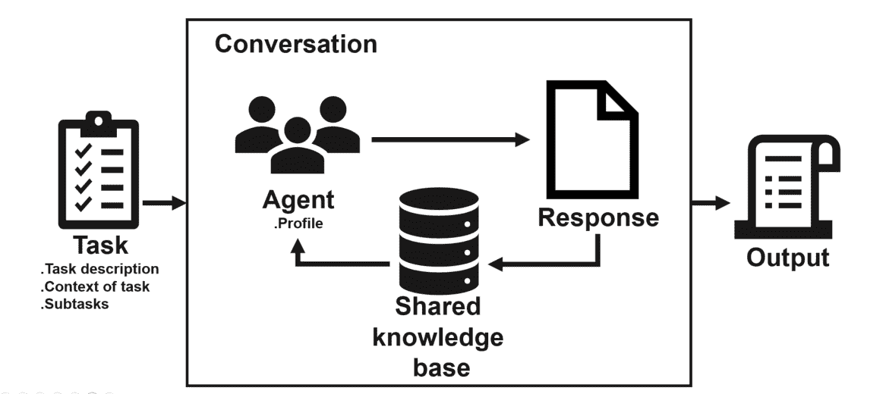
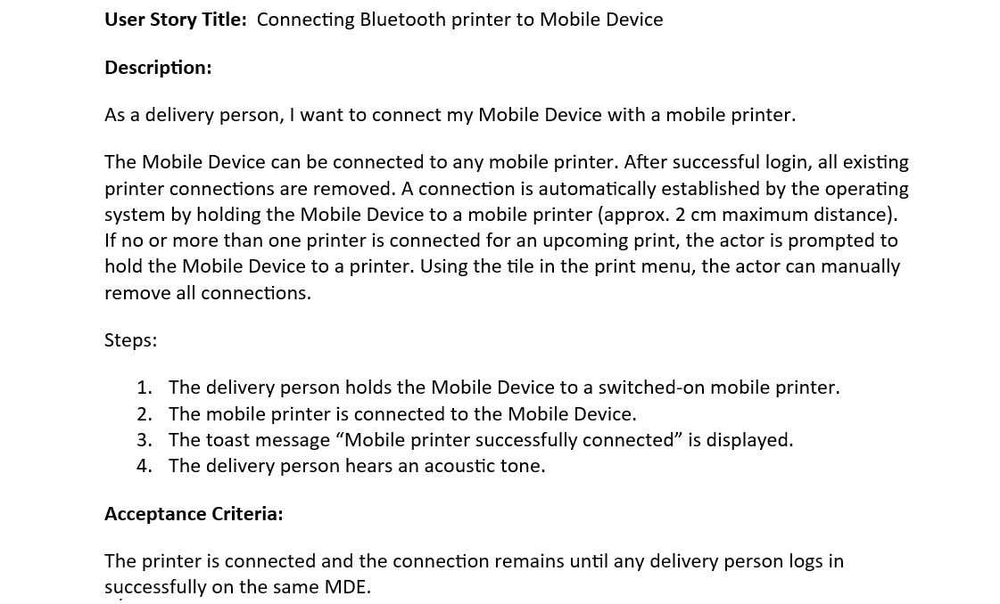
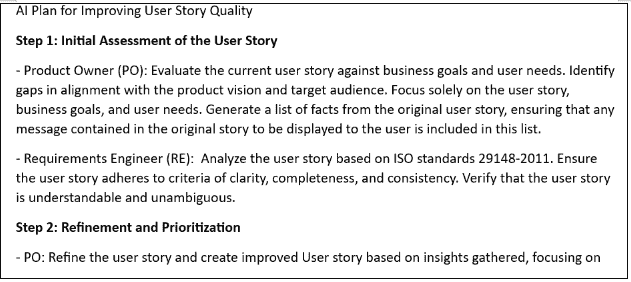
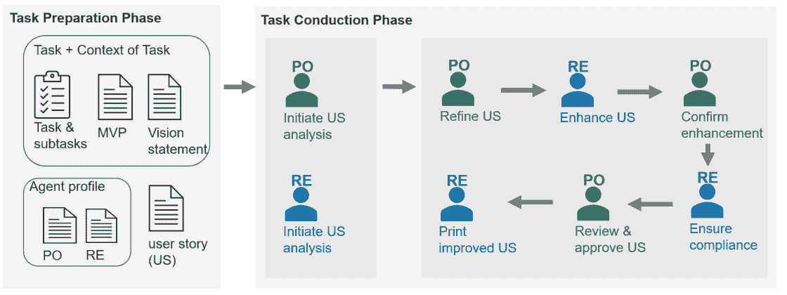
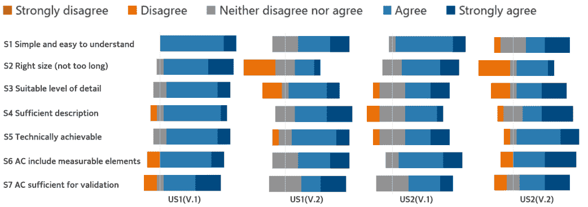

<!--yml

类别：未分类

日期：2025-01-11 12:46:42

-->

# 基于LLM的代理用于自动化提升用户故事质量：一份初步报告

> 来源：[https://arxiv.org/html/2403.09442/](https://arxiv.org/html/2403.09442/)

¹¹institutetext: 芬兰坦佩雷大学

¹¹email: {zheying.zhang, maruf.rayhan, pekka.abrahamsson}@tuni.fi²²institutetext: 奥地利邮政，Rochusplatz 1，1030维也纳，奥地利 ²²email: {tomas.herda, manuel.goisauf}@post.atZheying Zhang 11 [0000-0002-6205-4210](https://orcid.org/0000-0002-6205-4210 "ORCID标识符")    Maruf Rayhan 11    Tomas Herda 22 [0009-0005-2912-380X](https://orcid.org/0009-0005-2912-380X "ORCID标识符")    Manuel Goisauf 22    Pekka Abrahamsson 11 [0000–0002-4360-2226](https://orcid.org/0000--0002-4360-2226 "ORCID标识符")

###### 摘要

在敏捷软件开发中，保持高质量的用户故事至关重要，但也充满挑战。本研究探讨了使用大语言模型（LLMs）自动提升奥地利邮政集团IT敏捷团队用户故事质量的方式。我们为基于LLM的自主代理系统（ALAS）开发了一个参考模型，并在奥地利邮政集团IT部门实施。研究中用户故事的质量以及这些代理的有效性由来自六个敏捷团队的11名参与者评估。我们的研究结果展示了LLMs在提升用户故事质量方面的潜力，推动了关于人工智能在敏捷开发中作用的研究，并提供了一个人工智能在行业环境中转型性影响的实际示例。

###### 关键词：

用户故事质量大语言模型代理。

## 1 引言

在软件项目中，有效的需求管理至关重要，确保最终产品符合客户需求和业务目标，提供价值[[22](https://arxiv.org/html/2403.09442v1#bib.bib22)][[1](https://arxiv.org/html/2403.09442v1#bib.bib1)]。在敏捷软件项目中，需求通过迭代的方式进行指定和优先排序，通常表现为用户故事，以便能够响应不断变化的用户需求，并确保在迭代和增量的周期中交付价值。用户故事的质量[[1](https://arxiv.org/html/2403.09442v1#bib.bib1)][[11](https://arxiv.org/html/2403.09442v1#bib.bib11)][[10](https://arxiv.org/html/2403.09442v1#bib.bib10)][[8](https://arxiv.org/html/2403.09442v1#bib.bib8)][[13](https://arxiv.org/html/2403.09442v1#bib.bib13)]直接影响开发周期的速度和客户期望的达成。然而，确保用户故事的完整性、一致性、无歧义性、可测试性等，即良好的用户故事，依然面临挑战。

由于敏捷方法强调快速迭代和适应性，大型语言模型（LLM）在用户故事分析中的潜力正变得越来越重要。LLM的先进自然语言处理能力为自动化和提升用户故事质量提供了有前景的解决方案。通过分析、优化甚至生成用户故事，LLM可以为产品负责人、开发人员、测试工程师等在软件开发的需求管理中提供实质性帮助。

本研究旨在探索通过将大型语言模型（LLM）代理集成到现实世界的敏捷软件开发环境中，自动化提升用户故事质量的潜力。为了实现这一目标，我们提出了一个基于LLM代理系统的参考模型，并在此基础上实施和评估代理在提升用户故事质量方面的作用。本文呈现了在奥地利邮政集团IT部门部署该系统的初步结果，特别关注公司移动交付项目中用户故事质量的改善。我们在公司六个敏捷团队中评估了代理的有效性。结果为关于人工智能在敏捷软件开发中角色的新兴讨论提供了贡献，展示了LLM在协助处理行业需求任务方面的变革性影响的概念验证。

## 2 用户故事质量

在敏捷软件项目中，需求通常以用户故事的形式表达[[7](https://arxiv.org/html/2403.09442v1#bib.bib7)]，这些是从用户角度出发的功能或特性简要描述，强调其需求和该功能带来的价值。用户故事的一个广泛接受的模板是：“作为一个[角色]，我想要[需求]，以便[利益]。”这个模板有效地包括了核心元素，如目标用户（角色）、期望的系统功能（需求），以及可选的基础理由（利益）。此外，每个用户故事应附带一组验收标准（AC），这些标准概述了一个用户故事必须满足的详细条件，才能被视为完整和可接受，包括功能行为、业务规则以及需要测试的质量方面。验收标准使用户故事更具体、更少模糊[[7](https://arxiv.org/html/2403.09442v1#bib.bib7)]。

编写良好的用户故事对于软件项目至关重要，因为它们传达了用户的需求和观点，并指导开发团队实现预期的功能。除了要求工程中的一般质量指南，如 ISO/IEC/IEEE 29148-2011 [[1](https://arxiv.org/html/2403.09442v1#bib.bib1)] 和 IREB 指南 [[11](https://arxiv.org/html/2403.09442v1#bib.bib11)] 外，多个框架还包括一套评估用户故事质量的标准。例如，INVEST 框架 [[2](https://arxiv.org/html/2403.09442v1#bib.bib2)] 包括独立性、可谈判性、价值、可估算性、简洁性和可测试性等属性，从而促进实际和明确的需求。质量用户故事（QUS）框架 [[12](https://arxiv.org/html/2403.09442v1#bib.bib12)] 基于用户故事的语法、语义和语用质量进行评估，标准包括形式良好性、原子性、简约性、概念合理性、问题导向性、明确性、完整性和唯一性等。这些框架包括一系列用于高质量用户故事的标准。尽管它们存在多样性，但都遵循行业标准 [[1](https://arxiv.org/html/2403.09442v1#bib.bib1)][[11](https://arxiv.org/html/2403.09442v1#bib.bib11)]，确保用户故事简洁、清晰、可实现，并有助于软件开发项目的成功和积极的用户体验。

尽管用户故事已广泛采用，并且有现成的良好用户故事标准，评估和提升其质量的方法仍然相对有限。Berry 等人[[5](https://arxiv.org/html/2403.09442v1#bib.bib5)] 提出了一个质量模型和一个名为 QuARS 的原型工具[[9](https://arxiv.org/html/2403.09442v1#bib.bib9)]，用于自动化语言学分析自然语言需求。Lucassen 等人[[12](https://arxiv.org/html/2403.09442v1#bib.bib12)][[13](https://arxiv.org/html/2403.09442v1#bib.bib13)] 提出了 QUS 框架和 AQUSA 软件工具，采用自然语言处理（NLP）技术检测用户故事中的质量缺陷，重点关注语法和语用学。

最近的研究越来越关注利用LLM来辅助软件工程任务[[14](https://arxiv.org/html/2403.09442v1#bib.bib14)]。在需求工程中，研究集中在利用LLM进行需求获取、分析和分类，并提供了其在需求工程任务中显著影响的初步实证证据。例如，White等人[[21](https://arxiv.org/html/2403.09442v1#bib.bib21)]介绍了一种用于利益相关者互动评估软件需求完整性和准确性的提示模式目录。Ronanki等人[[17](https://arxiv.org/html/2403.09442v1#bib.bib17)]对ChatGPT生成的需求与学术界和工业界的需求专家指定的需求进行了比较分析。结果显示，尽管LLM生成的需求较为抽象，但始终能够被理解。这表明像ChatGPT这样的LLM在通过其自然语言处理能力自动化各类任务方面具有潜力。此外，LLM的出现促进了提示技术的发展。提示是给定语言模型的输入，用于引导其生成响应。它是通过构建互动来优化模型在特定任务中的表现，从而产生期望结果的基本工具。研究人员已经探索了各种提示模式，以最大化这些好处，包括常用的直接问题和指令性提示。特别是，思维链[[20](https://arxiv.org/html/2403.09442v1#bib.bib20)]鼓励模型阐述中间步骤，从而提升其在复杂推理任务中的表现。k-shot提示[[6](https://arxiv.org/html/2403.09442v1#bib.bib6)]通过包含示例来增强模型对任务的理解和预期行为。事实清单[[21](https://arxiv.org/html/2403.09442v1#bib.bib21)]模式确保模型在其响应中处理或验证特定标准。  

尽管将LLM应用于工程任务的兴趣日益增长，但关于其工业实施和性能评估的研究仍然有限。这一空白正是我们研究的目标，旨在将LLM的理论潜力与实际应用相结合，收集来自工业专业人士的反馈。  

## 3 方法论  

为了有效地将LLM应用于工程任务，我们提出了一个基于LLM的代理参考模型。该模型为设计一个自主LLM代理系统（ALAS）提供了框架，具体内容将在本节中详细阐述。

### 3.1 基于LLM的代理参考模型  

图[1](https://arxiv.org/html/2403.09442v1#S3.F1 "Figure 1 ‣ 3.1 A Reference Model of LLM-based Agents ‣ 3 Methodology ‣ LLM-based agents for automating the enhancement of user story quality: An early report")所示的模型概念化了LLM代理在完成任务中的交互。该模型由基本构造组成：任务、代理、共享知识库和响应。它们共同形成一个框架，促进生成满足任务目标的期望输出。

任务启动了交互，并包含定义工作范围和目标的输入。它可以是不同性质的任务，例如编码任务或软件工程中的需求审查任务。任务阐明了全面的描述、任务理解和执行所需的上下文信息，以及预期的结果。它还可能规定代理在生成期望输出时需要遵循的程序步骤。

图1：代理系统的参考模型

每个代理，即代理i，代表一个LLM模型的实例，拥有执行任务的独特角色的配置文件。例如，代理PO（产品负责人）代表敏捷项目中的产品负责人角色，专注于成功交付符合用户需求的产品；而代理RE（需求工程师）代表需求工程师角色，专门分析和改进需求质量，确保需求符合如ISO/IEC/IEEE 29148-2011等标准[[1](https://arxiv.org/html/2403.09442v1#bib.bib1)]。

一个代理根据任务描述生成一个输出，称为响应。响应随后被添加到共享知识库中，知识库包含有关任务和对话历史的信息。它以任务描述和对话的第一步开始，并随着代理生成的响应不断扩展。它提供了一个动态资源，通知后续代理对话的上下文以及完成任务的下一步，能够实现从一个代理到另一个代理的有据可依的过渡，并保持连贯的对话。

参与代理之间进行对话。对话从通过任务描述建立上下文和需求开始。代理使用共享知识库进行协作对话，每个代理为完成任务贡献自己的专业知识。最终输出是这些协作努力的积累，体现了参与代理的集体智慧。

该模型提供了一种结构化的方法来将大规模语言模型（LLMs）集成到需求工程过程中，从而帮助敏捷团队开发高质量的软件产品。

### 3.2 实现代理环境

基于智能体的系统的优势在于AI智能体的沟通和执行任务的能力，从而促进了软件开发任务的自动化。正如参考模型中所描述的，该系统的实施是利用大规模语言模型（LLMs）辅助软件开发实践的关键步骤。我们的自主LLM智能体系统（ALAS）旨在自动化AI智能体在各种软件开发场景中的协作。

在ALAS中，智能体由LLMs驱动，它们的协作通过提示进行协调。这些提示定义了每个智能体在每个步骤中预期执行的操作。ALAS中的提示分为两类：初始提示（Prompt[i], 1$\leq$i$\leq$k），它们为k个参与的智能体准备任务责任；以及后续提示（Prompt[i], i$>$k），这些提示是动态构建的，用于引导智能体完成交互所需的步骤，以确保任务的成功完成。

Prompt[i] = Profile[i] + Task + Context of task + Subtask[i], (1$\leq$i$\leq$k)

Prompt[i] = Subtask[i] + Response[i-1], (i$>$k)

其中，Prompt[i]: 1$\leq$i$\leq$k：第一次给Agent[i]的提示，涉及k个智能体共同完成任务；i$>$k：子任务i的提示；Profile[i]：Agent[i]的个人资料；Task：要完成的任务；Context of Task：任务所在的背景信息；Subtask[i]：子任务i；Response[i-1]：完成Subtask[i-1]后的响应。

提示确保每个智能体清楚地了解它们的角色以及为完成整体任务所需采取的步骤。在初步的“破冰”阶段，智能体熟悉任务和自身角色后，后续的提示将根据对先前子任务的响应进行定制，以保持连贯的对话流。因此，我们系统的实施包括两个阶段：任务准备和任务执行。两个阶段的示例如图[4](https://arxiv.org/html/2403.09442v1#S4.F4 "Figure 4 ‣ 4.1.3 Subtasks ‣ 4.1 Setting up Experiments ‣ 4 Experiments ‣ LLM-based agents for automating the enhancement of user story quality: An early report")所示。

#### 3.2.1 任务准备阶段

任务准备阶段旨在制定初始提示，帮助智能体全面理解它们在任务中的角色以及预期的贡献。该阶段为智能体之间的互动和任务执行奠定了基础。它涉及定义任务、阐明任务背景、明确智能体的角色和职责，并规划它们的互动顺序，这模拟了在现实项目中敏捷团队成员之间完成任务的沟通动态。这是一个迭代过程，通过制定和优化提示，确保智能体能够有效地沟通，产出期望的结果。为此，可以使用各种提示模式和技术。

人物模式[[21](https://arxiv.org/html/2403.09442v1#bib.bib21)]涉及为每个代理创建个人资料[i]，指导其采用特定的角色或身份。这个模式塑造了代理的回答，使其反映所需的专业知识和视角。

k-shot提示[[6](https://arxiv.org/html/2403.09442v1#bib.bib6)]是一种上下文学习技术。它提供了明确的指令或期望输出的示例，在制定任务描述和任务背景时特别有用。例如，要生成产品愿景声明，提示可以包括愿景声明的元素描述或来自其他产品的示例，作为为我们的产品创建愿景声明的单次提示。

AI计划[[19](https://arxiv.org/html/2403.09442v1#bib.bib19)]帮助通过将任务分解为更小、更易管理的子任务[i]，并为每个子任务分配责任代理，来生成完成任务的计划。

核查清单模式[[21](https://arxiv.org/html/2403.09442v1#bib.bib21)]可以应用于验证和确认LLM的输出。这个模式指导模型在输出中创建关键事实。该清单有助于识别输出中的潜在错误或不一致之处。通常，它与其他提示模式结合使用，如AI计划模式，以确保模型生成符合任务描述的相关计划。它还帮助评估输出的准确性和支持证据。

思维链（CoT）[[20](https://arxiv.org/html/2403.09442v1#bib.bib20)][[25](https://arxiv.org/html/2403.09442v1#bib.bib25)]方法引导LLM通过逐步推理过程来回答问题。它有助于澄清模型的思维过程以及得出结论的理由。

值得注意的是，这里展示的模式和技术并非详尽无遗，而是常用于任务准备的选项。选择合适的模式和技术对有效支持任务准备阶段至关重要，确保提示能够有效制定并优化，以促进任务的成功完成。

#### 3.2.2 任务执行阶段

在任务执行阶段，代理动态互动以执行子任务，使用提示来引导它们的活动。在实践中，这是一个迭代增量的过程，类似于敏捷团队在软件开发项目中执行的过程。每个代理依次与子任务互动，通过遵循结构化的提示来执行其责任。当前提示中使用前一个响应确保每个代理的回应与前期工作相关，并在其基础上展开。这种迭代合作类似于Scrum中的日常站会和冲刺评审，每个团队成员的工作都受到整体冲刺进度的影响。同时，提示结构确保任务随着每个代理的前一个回应动态发展，反映了敏捷项目适应性和响应性的特点，计划和任务会根据持续反馈和发展不断精炼。最终的输出是基于代理的回应逐步生成的。

## 4 实验

在实施ALAS之后，我们评估了其在奥地利邮政集团IT的敏捷团队中提升用户故事质量的有效性，该公司采用了强大的敏捷框架。公司有多个团队，协同工作，跨越多个系统和应用程序，通过敏捷发布列车（Agile Release Trains）进行编排[[15](https://arxiv.org/html/2403.09442v1#bib.bib15)]。用户故事在规划和优先级排序这些系统的实施过程中起着重要作用，促进了跨团队的沟通与协作。高质量的用户故事对于成功的开发项目至关重要。鉴于这一关键性，我们探索了ALAS提升用户故事质量的潜力。

我们的实验评估了ALAS提升用户故事质量的有效性、好处、顾虑以及整体满意度。我们使用25个合成的用户故事来评估我们的实施，这些故事针对一个移动交付应用程序——一个帮助邮政工作人员准备和交付包裹的工具。图[2](https://arxiv.org/html/2403.09442v1#S4.F2 "图 2 ‣ 4 实验 ‣ 基于LLM的代理自动化提升用户故事质量：早期报告")展示了一个示例用户故事，描述了一个快递员同步移动设备与移动打印机的任务。

图2：用户故事1（US1） - 移动交付项目中的一个用户故事示例

### 4.1 实验设置

实验设置，即任务准备阶段，涉及明确任务及其背景，定义参与者的角色，并规划子任务。这个设置是一个迭代过程，用于创建和完善提示。我们应用了不同的提示技术和模式，以最大化参与者的能力。

#### 4.1.1 任务与任务背景

任务是提高用户故事的质量，并确保与组织的需求工程标准保持一致。这些用户故事最初来自于移动交付项目，除了在清晰度、完整性、正确性、一致性等方面需要改进外，还需要提升其与应用程序整体功能的相关性，并与业务目标对齐。为了方便这一过程，我们在描述任务时添加了两个文档。一个是最小可行产品（MVP）文档，详细描述了移动交付应用程序的基本功能。它作为蓝图，指导代理在修改用户故事时，使其与核心产品功能产生共鸣。另一个是产品愿景声明，采用NABC（需求、方法、利益和竞争）价值主张模板结构[[4](https://arxiv.org/html/2403.09442v1#bib.bib4)]。该文档提供了应用程序的战略概述，涵盖了客户需求、解决方案、客户利益和独特的价值主张等方面。这两个文档的结合为代理提供了全面的背景，使他们能够在充分理解项目的技术和战略目标的基础上执行任务。

#### 4.1.2 代理角色

在敏捷框架下进行用户故事质量分析和改进的过程中，通常会涉及产品负责人、需求工程师、质量保证专家和敏捷团队成员等关键角色。每个角色都提供独特的技能，确保用户故事不仅在技术上清晰，还能与项目目标和用户需求对齐。为了简化我们的实验设置，奥地利邮政集团IT确定了两个主要的焦点角色：产品负责人和需求工程师。因此，我们为这两个角色定义了两个不同的代理角色。

Agent PO理解项目的愿景。它负责管理产品待办事项列表，并根据业务价值和客户需求对用户故事进行优先级排序。这个代理确保用户故事与整体产品战略和目标对齐。

Agent RE专注于用户故事的质量方面。它确保用户故事的描述不含糊不清，且验收标准是可度量的。这对于验证故事在实施时是否达成其目标至关重要。

这些代理角色的构建是一个迭代过程，涵盖了角色定义和期望、关键责任、实用建议和语气调整。

角色定义和期望设定了对该角色表现的期望。这使我们能够利用我们用来理解人类行为的民间心理学概念，如信念、愿望、目标、抱负、情感等[[18](https://arxiv.org/html/2403.09442v1#bib.bib18)]。在角色扮演的描述中，我们为角色的预期表现设定了一个高标准，类似于人类需求工程师的知识，但在更高的水平（相当于10级人类需求工程师与250级AI的对比）。这突出了我们对该角色的期望。以下示例摘自RE角色配置文件，说明了这一点：“从现在开始，你将扮演需求工程师的角色，这是一个新版本的AI模型，能够分析、记录并管理软件需求。如果一位人类需求工程师的知识水平为10，你在此角色中的知识水平为250。请确保在这个角色中取得准确和全面的结果，因为如果你没有做到，软件可能无法达到预期的效果，项目可能会失败。”

每个角色的关键职责明确了软件项目中的关键需求工程任务。这些描述提供了指导，确保各个角色在整个软件开发过程中遵循结构化的方法，如下图所示。

“你的主要任务是引出、分析、记录并管理软件项目的需求。”

还提供了一些实用建议，以提高各个角色执行特定任务的有效性。例如，RE角色的建议是“在记录需求时使用清晰且无歧义的语言，以避免任何误解。”这一指导对于保持需求文档的清晰度和准确性至关重要。

此外，我们制定了语气规范[[23](https://arxiv.org/html/2403.09442v1#bib.bib23)][[24](https://arxiv.org/html/2403.09442v1#bib.bib24)]，以设定更多的期望。对于PO角色，语气被描述为“回答的语气应专业，但又亲切且友好。作为产品负责人，你应提供清晰简洁的指示，同时促进积极的合作氛围。这确保了角色的沟通风格既专业、精准，又客观，优先考虑清晰和简洁。”

总结来说，角色配置文件的设计旨在反映奥地利邮政集团IT部门敏捷团队中PO和RE的实际角色。预计各个角色不仅要理解他们的具体任务，还要以高水平的专业性执行这些任务，并且以促进协作软件开发的方式进行。

图3：从生成的AI计划中摘录的示例

#### 4.1.3 子任务

在明确任务并确定参与的代理后，我们的下一步是详细描述这些代理之间的交互顺序。为了实现这一点，我们使用了AI计划模式[[19](https://arxiv.org/html/2403.09442v1#bib.bib19)]，生成了一个完整的关键步骤和子任务清单，以便完成任务，同时明确了负责的代理。图[3](https://arxiv.org/html/2403.09442v1#S4.F3 "Figure 3 ‣ 4.1.2 Agent profiles ‣ 4.1 Setting up Experiments ‣ 4 Experiments ‣ LLM-based agents for automating the enhancement of user story quality: An early report")展示了部分AI计划，说明了代理PO和RE在提升用户故事质量任务中的第一步将要执行的具体子任务。该计划还经过了敏捷团队中的Scrum Master和PO的进一步审查和完善，确保其符合公司敏捷框架、需求管理的常规做法和项目目标。图[4](https://arxiv.org/html/2403.09442v1#S4.F4 "Figure 4 ‣ 4.1.3 Subtasks ‣ 4.1 Setting up Experiments ‣ 4 Experiments ‣ LLM-based agents for automating the enhancement of user story quality: An early report")可视化了在任务执行阶段两位代理之间以及他们的子任务的完整结构化对话流，即在用户故事改进过程中代理之间的协作和迭代交互。

图4：任务执行阶段中AI计划的示意图

#### 4.1.4 GPT模型

在我们的实验中遇到的一个挑战是超出了令牌限制，特别是在代理之间跨多个子任务进行响应交换时。经过几次调整提示语的组成后，我们选择了gpt-3.5-turbo-16k模型和先进的gpt-4-1106-preview模型。两个模型都是OpenAI GPT系列的高级版本[[3](https://arxiv.org/html/2403.09442v1#bib.bib3)]。GPT-3.5-Turbo-16K是为更快速的响应量身定制的，能够高效地管理最多16k个令牌，适用于长时间的对话或文档处理。GPT-4-1106-Preview则进一步提升了语言模型的能力，能够处理128k个令牌，并返回最多4096个输出令牌。

### 4.2 评估

当实验开始时，ALAS已经准备好执行改善移动交付应用程序用户故事质量的任务。为了评估ALAS完成任务的效果，我们对奥地利邮政集团IT的六个敏捷团队的专业人员进行了调查。调查的重点是收集专业人员的反馈，以评估ALAS改进后的用户故事的有效性、益处、潜在问题和总体满意度。我们根据INVEST框架中指定的良好需求特征准备了一份问卷[[2](https://arxiv.org/html/2403.09442v1#bib.bib2)]。表格中的语句如表[1](https://arxiv.org/html/2403.09442v1#S4.T1 "表 1 ‣ 4.2 评估 ‣ 4 实验 ‣ 基于LLM的代理自动化提升用户故事质量：早期报告")所示。

参与者使用从1到5的李克特量表来评估用户故事，其中1表示强烈不同意，5表示强烈同意。此外，调查还包括两个开放性问题，收集参与者对原始用户故事进行的具体改进的反馈，关于改进版本的关注点，以及进一步改进的建议。最后，参与者将提供一个总体满意度评分，评估改进后的用户故事，并确定哪些最适合项目的背景。

表 1：问卷中使用的良好用户故事特征

| ID | 语句 |
| --- | --- |
| S1 | 用户故事简单易懂。 |
| S2 | 用户故事的大小合适（不太长）。 |
| S3 | 用户故事的详细程度适当。 |
| S4 | 用户故事包括任务描述和要达成的目标。 |
| S5 | 用户故事在技术上是可实现的。 |
| S6 | 验收标准包括可测量的元素，用于测试用例准备。 |
| S7 | 验收标准足以验证该故事。 |

考虑到参与者完成调查所需的时间，问卷中仅包括两个原始用户故事以及每个故事的两个改进版本。图[2](https://arxiv.org/html/2403.09442v1#S4.F2 "图 2 ‣ 4 实验 ‣ 基于LLM的代理自动化提升用户故事质量：早期报告")展示了其中一个原始用户故事，即用户故事1（US1）。对于每个改进版本，参与者的评估基于表[1](https://arxiv.org/html/2403.09442v1#S4.T1 "表 1 ‣ 4.2 评估 ‣ 4 实验 ‣ 基于LLM的代理自动化提升用户故事质量：早期报告")中的七个语句以及对应开放性问题的答案。调查¹¹1http://tinyurl.com/4veet5me包含了34个评分问题和12个开放性问题。通过分析参与者的定量和定性反馈，我们旨在验证ALAS的有效性，并识别进一步改进我们方法的机会。

## 5 结果

我们的问卷调查收集了来自六个敏捷团队的12个回答。参与者包括两名PO、四名开发人员、一名测试经理、一名Scrum master、一名需求分析师、两名测试人员和一名培训教练。值得注意的是，11名参与者中有10名在公司工作超过两年，9名拥有超过五年的丰富敏捷项目经验。他们的专业知识为评估问卷中的用户故事提供了坚实的基础。在简要介绍问卷调查的目标后，参与者全情投入，并平均花费了33分钟完成问卷。

调查参与者报告了他们对用户故事1和用户故事2（US1和US2）的担忧。两者都主要因其模糊性和缺乏必要细节而受到批评，特别是在AC部分，未能描述某些条件作为标准的必要性。此外，这些描述中的业务价值仍然模糊不清。具体的场景，尤其是US1中涉及错误处理的场景，也未得到充分解决。

由GPT-3.5-turbo模型生成的改进版本US1(v.1)和US2(v.1)在清晰度和可理解性方面表现出了显著的改进。它们增强了AC的清晰度，并改善了叙述流程，从而使用户故事的呈现更加连贯。然而，调查参与者的反馈指出，用户故事的新标题过于富有创意，AC中的描述应更加详细。此外，关于多个打印机连接等情境的问题仍然存在于US1的AC中。

GPT-4模型生成的改进版本，即US1(v.2)和US2(v.2)，因其内容全面且更清楚地表达了故事的业务价值而受到认可。具体来说，US1(v.2)中的AC表述更清晰、完整，解决了US1和US1(v.1)中模糊的打印机连接问题。然而，这种细节和清晰度的增加导致了故事复杂性和长度的显著增加，这可能会削弱其实际应用性——六名调查参与者指出，用户故事的描述过长是一个问题。

图 5：调查参与者对用户故事质量的认知分布，注：US* = 用户故事*，v.1 = 由gpt-3.5-Turbo改进的版本1，v.2 = 由gpt-4-1106-Preview改进的版本2

表2：用户故事总体满意度和质量的平均评分（1-5评分标准）。

| 用户故事 | S1 | S2 | S3 | S4 | S5 | S6 | S7 | 总体评分 |
| --- | --- | --- | --- | --- | --- | --- | --- | --- |
| US1 | - | - | - | - | - | - | - | 3.33 |
| US1(v.1) | 4.17 | 4.25 | 4 | 3.83 | 4 | 3.83 | 3.92 | 4 |
| US1(v.2) | 3.92 | 3 | 3.58 | 4.08 | 3.83 | 3.92 | 3.92 | 4 |
| US2 | - | - | - | - | - | - | - | 2.79 |
| US2(v.1) | 4.08 | 4 | 3.75 | 3.42 | 3.75 | 4.08 | 3.75 | 3.54 |
| US2(v.2) | 3.83 | 3.17 | 3.75 | 4 | 4 | 4.08 | 3.8 | 3.71 |

此外，用户故事质量的满意度评分与参与者反馈中的见解相辅相成，如图 [5](https://arxiv.org/html/2403.09442v1#S5.F5 "Figure 5 ‣ 5 Results ‣ LLM-based agents for automating the enhancement of user story quality: An early report") 所示，展示了参与者对用户故事质量的看法分布，以及表 [2](https://arxiv.org/html/2403.09442v1#S5.T2 "Table 2 ‣ 5 Results ‣ LLM-based agents for automating the enhancement of user story quality: An early report") 总结了用户故事的整体满意度和质量方面的平均评分。US1(v.1) 和 US1(v.2) 的整体满意度平均评分均为 4，而 US2(v.2) 的得分为 3.71，高于 US2(v.1)。这一偏好得到了 7 名参与者选择 US1(v.2) 和 US2(v.2) 来进行项目的确认。然而，尽管这两个用户故事在描述的充分性（S4）方面表现优异，但它们在简洁性、简明性和适当的细节层次（S1、S2 和 S3）方面评分较低，尤其在篇幅方面，平均得分分别为 3 和 3.17。值得注意的是，US2(v.2) 在篇幅方面得到了最多的异议，5 名参与者标记为“不同意”。这种差异可能会影响用户故事的可理解性（S1）。与 US1(v.1) 相比，US1(v.2) 在技术可实现性（S5）方面也略有下降。这些结果突显了 GPT-4 模型生成的用户故事在长度和复杂性上的增加，显著影响了这些用户故事的满意度，这一情感得到了调查结果的支持。

## 6 讨论

我们通过使用 ALAS 改进用户故事质量的实验，展示了在提升用户故事质量方面的显著好处，特别是在清晰度、具体性和业务价值表述方面。从调查参与者给出的整体满意度评分可以看出这一点。这些发现表明，ALAS 有效地优化了用户故事，提高了其质量。

尽管有这些改进，代理学习上下文的能力虽然令人印象深刻，但仍存在与项目特定上下文和需求对接的空白。一名开发者在调查中的反馈指出，US1(v.2) 包含了一个身份验证过程，虽然与故事相关，但“似乎超出了 US1 的范围”。另一名开发者的反馈也表露了类似的问题。这表明，在代理的提示中，某些质量方面的需求可能缺失或表述不清晰。因此，细致的提示准备和专家的严格评估（如 PO）至关重要。在为特定任务实施 ALAS 时，项目准备阶段与 PO 和领域专家的合作变得尤为重要，以优化提示以获得期望的输出。

考虑到我们在ALAS中只集成了两个代理，PO和RE，我们可以探索加入更多的专门化代理，例如用于检查事实信息并细化接受标准的测试代理。同样，一个质量分析代理可以监控故事描述的范围、细节程度和相关性，确保聚焦并防止范围蔓延，类似于敏捷项目实践。目前，ALAS的输出需要产品负责人（PO）进行手动验证，以确保与项目目标和利益相关者期望的一致性。这个手动验证对于减轻自动生成的局限性并保持用户故事的实际效用至关重要。

在研究控制GPT模型的参数时，特别是刺激创意的“温度”参数，我们观察到这是一把双刃剑。虽然它能够促进新颖和多样化内容的生成，但也增加了AI幻觉的风险[[16](https://arxiv.org/html/2403.09442v1#bib.bib16)]，这可能导致看似合理但不准确或不相关的输出。解决AI幻觉问题需要谨慎的参数调整，以确保所激发的创意是增强而非削弱用户故事质量。在我们的实验中，我们将温度参数设置为中等值1。然而，这仍然在保持事实准确性方面带来了挑战，突出了需要一个集成的角色来指导和监控整体讨论的必要性。

总结来说，尽管ALAS在提高用户故事质量方面取得了显著进展，但仍有进一步优化的空间。专门化代理的集成、参数优化和人类专业知识将有助于ALAS实施的不断发展。未来的改进应重点提升上下文对齐、细化接受标准的具体性，并减少生成不相关或不准确内容的风险。通过解决这些问题，ALAS可以成为一个更为强大的工具，弥合自动化语言生成与软件开发叙事之间的细微差异。

## 7 结论

在本研究中，我们提出了一个基于代理的系统参考模型，该模型利用大型语言模型（LLMs）作为代理来协助软件开发任务。该参考模型指导了ALAS的实施，ALAS集成了GPT模型作为代理，旨在提升敏捷软件开发中的需求质量。实验结果表明，ALAS显著提高了用户故事的清晰度、可理解性和与业务目标的一致性。然而，研究结果也强调了人类智能，特别是软件项目中的产品负责人（PO）的不可或缺作用，他们促进并监控用户故事的改进，以保证自动生成的输出的完整性。展望未来，ALAS的进一步改进不仅需要集成具有优化配置文件和任务描述的专门代理，还需微调AI参数，以最小化幻觉现象并提高上下文准确性。本文为AI辅助的用户故事质量改进提供了一个基础框架和概念验证，标志着在弥合AI能力与软件开发中人类专业知识之间的差距方面迈出了重要一步。

## 参考文献

+   [1] ISO/IEC/IEEE 国际标准 - 系统与软件工程 - 生命周期过程 - 需求工程。ISO/IEC/IEEE 29148:2011(E) 第1-94页（2011）。https://doi.org/10.1109/IEEESTD.2011.6146379

+   [2] 投资于好的故事和智能任务。 [https://xp123.com/articles/invest-in-good-stories-and-smart-tasks/](https://xp123.com/articles/invest-in-good-stories-and-smart-tasks/) （访问时间：2024年1月10日）

+   [3] Openai. [https://platform.openai.com/docs/models](https://platform.openai.com/docs/models) （访问时间：2024年1月10日）

+   [4] Sri国际最佳实践。 [https://web.stanford.edu/class/educ303x/wiki-old/uploads/Main/SRI_NABC.doc](https://web.stanford.edu/class/educ303x/wiki-old/uploads/Main/SRI_NABC.doc) （访问时间：2024年1月10日）

+   [5] Berry, D.M., Bucchiarone, A., Gnesi, S., Lami, G., Trentanni, G.: 一种新的自然语言需求规格质量模型。收录于：国际需求工程研讨会：软件质量基础（REFSQ）会议论文集（2006）

+   [6] Brown, T., Mann, B., Ryder, N., Subbiah, M., Kaplan, J.D., Dhariwal, P., Neelakantan, A., Shyam, P., Sastry, G., Askell, A., 等: 语言模型是少样本学习者。神经信息处理系统进展 33，1877–1901（2020）

+   [7] Cohn, M.: 用户故事应用：用于敏捷软件开发。Addison-Wesley Professional（2004）

+   [8] Dalpiaz, F., Van Der Schalk, I., Brinkkemper, S., Aydemir, F.B., Lucassen, G.: 在用户故事中检测术语歧义：工具与实验。信息与软件技术 110，3–16（2019）

+   [9] Fabbrini, F., Fusani, M., Gnesi, S., Lami, G.: 自然语言需求质量的语言学方法：使用自动化工具的好处。收录于：第26届NASA戈达德软件工程研讨会会议论文集，第97-105页。IEEE（2001）

+   [10] Ferreira, A.M., da Silva, A.R., Paiva, A.C.: 迈向编写敏捷需求的艺术，使用用户故事、接受标准及相关构件。在：ENASE。第477–484页 (2022)

+   [11] Glinz, M., van Loenhoud, H., Staal, S., Bühne, S.: 根据IREB标准编写CPRE基础级别手册。国际需求工程委员会 (2020)

+   [12] Lucassen, G., Dalpiaz, F., Van Der Werf, J.M.E., Brinkkemper, S.: 打造高质量的用户故事：迈向敏捷需求的学科化。在：2015年IEEE第23届国际需求工程会议 (RE)。第126–135页。IEEE (2015)

+   [13] Lucassen, G., Dalpiaz, F., van der Werf, J.M.E., Brinkkemper, S.: 改进敏捷需求：质量用户故事框架和工具。需求工程 21, 383–403 (2016)

+   [14] Nguyen-Duc, A., Cabrero-Daniel, B., Przybylek, A., Arora, C., Khanna, D., Herda, T., Rafiq, U., Melegati, J., Guerra, E., Kemell, K.K., Saari, M., Zhang, Z., Le, H., Quan, T., Abrahamsson, P.: 用于软件工程的生成性人工智能——研究议程。arXiv预印本 arXiv:2310.18648 (2023)

+   [15] Niessl, M., Gruber, C., Eder, M.: 在奥地利邮政公司重启大规模敏捷开发。经验报告，第24届国际敏捷软件开发会议 (2023)

+   [16] Rawte, V., Chakraborty, S., Pathak, A., Sarkar, A., Tonmoy, S., Chadha, A., Sheth, A.P., Das, A.: 大型语言模型中幻觉现象的困扰——广泛的定义、量化与修复建议。arXiv预印本 arXiv:2310.04988 (2023)

+   [17] Ronanki, K., Berger, C., Horkoff, J.: 调查ChatGPT在需求采集过程中的潜力。在：2023年第49届欧盟微型软件工程与先进应用会议 (SEAA)。第354–361页。IEEE (2023)

+   [18] Shanahan, M., McDonell, K., Reynolds, L.: 与大型语言模型的角色扮演。自然 623(7987), 493–498 (2023)

+   [19] Silver, T., Hariprasad, V., Shuttleworth, R.S., Kumar, N., Lozano-Pérez, T., Kaelbling, L.P.: 使用预训练的大型语言模型进行PDDL规划。在：NeurIPS 2022决策制定的基础模型研讨会 (2022)

+   [20] Wei, J., Wang, X., Schuurmans, D., Bosma, M., Xia, F., Chi, E., Le, Q.V., Zhou, D., 等：链式思维提示在大型语言模型中引发推理。神经信息处理系统进展 35, 24824–24837 (2022)

+   [21] White, J., Hays, S., Fu, Q., Spencer-Smith, J., Schmidt, D.C.: 用于改善代码质量、重构、需求采集和软件设计的ChatGPT提示模式。arXiv预印本 arXiv:2303.07839 (2023)

+   [22] Wiegers, K., Beatty, J.: 软件需求。Pearson教育 (2013)

+   [23] Wu, T., Terry, M., Cai, C.J.: AI链：通过链式大型语言模型提示实现透明且可控的人机互动。在：2022年CHI计算系统中的人因会议论文集。第1–22页 (2022)

+   [24] Zamfirescu-Pereira, J., Wong, R.Y., Hartmann, B., Yang, Q.: 为什么 Johnny 无法进行提示：非 AI 专家如何尝试（并失败）设计 LLM 提示。在：2023年计算机系统人机因素国际会议（CHI会议）论文集，页码 1–21 (2023)

+   [25] Zhang, Z., Zhang, A., Li, M., Smola, A.: 大型语言模型中的自动化思维链提示。arXiv 预印本 arXiv:2210.03493 (2022)
