<!--yml
category: 未分类
date: 2025-01-11 11:47:16
-->

# LLMs Can Simulate Standardized Patients via Agent Coevolution

> 来源：[https://arxiv.org/html/2412.11716/](https://arxiv.org/html/2412.11716/)

Zhuoyun Du^(†♠♣♡)  Lujie Zheng^(†★♡)  Renjun Hu^♢  Yuyang Xu^(★♡)  
Xiawei Li^♯  Ying Sun^♮  Wei Chen^(♠★)  Jian Wu^(♭♯♡)  Haolei Cai^♯^(🖂)  Haochao Ying^(♭♯)^(🖂)  
^♠State Key Lab of CAD & CG, Zhejiang University  
^♣Zhejiang Polytechnic Institute, Polytechnic Institute, Zhejiang University  
^★College of Computer Science & Technology, Zhejiang University  
^♢Alibaba Group  ^♮Sun Yat-sen University Cancer Center
^♭School of Public Health, Zhejiang University  
^♯Second Affiliated Hospital, Zhejiang University School of Medicine  
^♡Zhejiang Key Laboratory of Medical Imaging Artificial Intelligence
[duzy@zju.edu.cn](duzy@zju.edu.cn)  [haochaoying@zju.edu.cn](haochaoying@zju.edu.cn)

###### Abstract

Training medical personnel using standardized patients (SPs) remains a complex challenge, requiring extensive domain expertise and role-specific practice. Most research on Large Language Model (LLM)-based simulated patients focuses on improving data retrieval accuracy or adjusting prompts through human feedback. However, this focus has overlooked the critical need for patient agents to learn a standardized presentation pattern that transforms data into human-like patient responses through unsupervised simulations. To address this gap, we propose EvoPatient, a novel simulated patient framework in which a patient agent and doctor agents simulate the diagnostic process through multi-turn dialogues, simultaneously gathering experience to improve the quality of both questions and answers, ultimately enabling human doctor training. Extensive experiments on various cases demonstrate that, by providing only overall SP requirements, our framework improves over existing reasoning methods by more than 10% in requirement alignment and better human preference, while achieving an optimal balance of resource consumption after evolving over 200 cases for 10 hours, with excellent generalizability. The code will be available at [https://github.com/ZJUMAI/EvoPatient](https://github.com/ZJUMAI/EvoPatient).

LLMs Can Simulate Standardized Patients via Agent Coevolution

Zhuoyun Du^(†♠♣♡)  Lujie Zheng^(†★♡)  Renjun Hu^♢  Yuyang Xu^(★♡) Xiawei Li^♯  Ying Sun^♮  Wei Chen^(♠★)  Jian Wu^(♭♯♡)  Haolei Cai^♯^(🖂)  Haochao Ying^(♭♯)^(🖂) ^♠State Key Lab of CAD & CG, Zhejiang University ^♣Zhejiang Polytechnic Institute, Polytechnic Institute, Zhejiang University ^★College of Computer Science & Technology, Zhejiang University ^♢Alibaba Group  ^♮Sun Yat-sen University Cancer Center ^♭School of Public Health, Zhejiang University ^♯Second Affiliated Hospital, Zhejiang University School of Medicine ^♡Zhejiang Key Laboratory of Medical Imaging Artificial Intelligence [duzy@zju.edu.cn](duzy@zju.edu.cn)  [haochaoying@zju.edu.cn](haochaoying@zju.edu.cn)

^†^†footnotetext: ^†Equal Contribution.^†^†footnotetext: ${}^{\text{\Letter}}$Corresponding Authors: Haochao Ying and Haolei Cai.

## 1 Introduction

Standardized Patients (SPs) are specially trained individuals who simulate the symptoms, histories, and emotional states of real patients Barrows ([1993](https://arxiv.org/html/2412.11716v1#bib.bib2)); Ziv et al. ([2006](https://arxiv.org/html/2412.11716v1#bib.bib56)); McGaghie et al. ([2010](https://arxiv.org/html/2412.11716v1#bib.bib29)). They are instrumental in enhancing the clinical skills, communication abilities, and diagnostic reasoning of medical personnel within a controlled learning environment. However, employing SPs incurs significant training and operational costs, necessitating substantial medical knowledge and extensive role-specific practice Levine et al. ([2013](https://arxiv.org/html/2412.11716v1#bib.bib18)); Wallace ([2007](https://arxiv.org/html/2412.11716v1#bib.bib47)). Another often overlooked yet crucial concern is the potential adverse impacts on the well-being of SPs due to the immersive nature of their work. For instance, human SPs must manage the anxiety linked to the patient roles they embody throughout their simulations Spencer and Dales ([2006](https://arxiv.org/html/2412.11716v1#bib.bib43)); Bokken et al. ([2006](https://arxiv.org/html/2412.11716v1#bib.bib3)). These challenges underscore the need to develop virtual SPs, aiming to reduce human involvement as patients in simulated training processes.

Efforts have investigated the use of rule-based digital patients to replace human SPs Othlinghaus-Wulhorst and Hoppe ([2020](https://arxiv.org/html/2412.11716v1#bib.bib31)). However, these pre-defined rule sets and tailored dialogue frameworks often fall short of capturing the complexity of real-world patient conditions and communication. The emergence of large language models (LLMs), known for their extensive world knowledge, role-playing and generalizing capabilities Achiam et al. ([2023](https://arxiv.org/html/2412.11716v1#bib.bib1)); Bubeck et al. ([2023](https://arxiv.org/html/2412.11716v1#bib.bib5)); Li et al. ([2023a](https://arxiv.org/html/2412.11716v1#bib.bib20)); Park et al. ([2023](https://arxiv.org/html/2412.11716v1#bib.bib33)), has shown strong potential for handling domain-specific tasks, including in the medical field Zhang et al. ([2023](https://arxiv.org/html/2412.11716v1#bib.bib53)); Singhal et al. ([2023](https://arxiv.org/html/2412.11716v1#bib.bib42)); Yu et al. ([2024](https://arxiv.org/html/2412.11716v1#bib.bib52)); Moor et al. ([2023](https://arxiv.org/html/2412.11716v1#bib.bib30)). However, in the role of virtual SPs, LLMs encounter the challenge of embodying dual roles. Despite possessing extensive domain knowledge and understanding of medical outcomes, they must convincingly portray uneducated patients, deliberately lacking medical insight and withholding critical information. Prompt engineering alone is inadequate to ensure LLMs adhere to such principles while fine-tuning demands significant annotation effort and may introduce additional privacy concerns.

There has been limited research focused on LLM-based SPs. For instance, Yu et al. ([2024](https://arxiv.org/html/2412.11716v1#bib.bib52)) improved response quality by retrieving relevant information from constructed knowledge graphs. However, this approach does not necessarily convert the retrieved information into the standardized expressions required by SPs. Louie et al. ([2024](https://arxiv.org/html/2412.11716v1#bib.bib26)) enabled LLMs to elicit principles from human expert feedback to adhere, to a process that is labor-intensive and may suffer from limited generalizability. To this end, our study addresses the question: *How can we effectively train LLM-simulated SPs with minimal human supervision?* We propose that a framework need to be developed that allows LLM patient agents to autonomously gain experience through simulations. This would enable the agents to acquire the necessary knowledge and develop standardized expression practices from high-quality dialogues, gradually transforming a novice patient agent into a skilled virtual SP.

In this paper, we introduce EvoPatient, an innovative multi-agent coevolution framework aimed at facilitating LLMs to simulate SPs, without the need for human supervision or weight updates. We model the diagnostic process into a series of phases (i.e., complaint generation, triage, interrogation, conclusion), which are integrated into a simulated flow. Our framework features simulated agent pair, where doctor agents autonomously ask diagnostic questions, and patient agents respond. This setup enables the automatic collection of diagnostic dialogues for experience-based training. To enhance the diversity of questions posed by doctor agents, a multidisciplinary consultation recruitment process is developed. Additionally, utilizing an initial set of textual SP requirements, we enforce an unsupervised coevolution mechanism which simultaneously improves the performance of both doctor and patient agents by validating and storing exemplary dialogues in dynamic libraries. These libraries helps patient agents extract few-shot demonstrations and refine their textual requirements for answering various diagnostic questions. Meanwhile, doctor agents learn to ask increasingly professional and efficient questions by leveraging stored dialogue shortcuts, thereby further enhancing the evolution of patient agents. The results indicate that EvoPatient significantly improves patient agent’s requirement alignment, standardizes its answers with greater robustness, enhances record faithfulness, and increases human doctor preference with optimized resource consumption. Furthermore, experiments on the evolution of doctor agents and recruitment processes demonstrate their positive contribution to the evolution of patient agents.

## 2 Related Work

##### Simulated Partners

Simulated partners are persons or software-generated companions used in various domains to give skill learners practice opportunities that textbook knowledge cannot provide Feltz et al. ([2020](https://arxiv.org/html/2412.11716v1#bib.bib10), [2016](https://arxiv.org/html/2412.11716v1#bib.bib11)); Péli and Nooteboom ([1997](https://arxiv.org/html/2412.11716v1#bib.bib35)). Previous research has built various software-generated educational systems but lacks context variety Graesser et al. ([2004](https://arxiv.org/html/2412.11716v1#bib.bib13)); Ruan et al. ([2019](https://arxiv.org/html/2412.11716v1#bib.bib39)); Othlinghaus-Wulhorst and Hoppe ([2020](https://arxiv.org/html/2412.11716v1#bib.bib31)). LLMs greatly overcome this problem by their formidable generalizability and capability to simulate diverse personas Hua et al. ([2023](https://arxiv.org/html/2412.11716v1#bib.bib14)); Li et al. ([2023b](https://arxiv.org/html/2412.11716v1#bib.bib23)); Shanahan et al. ([2023](https://arxiv.org/html/2412.11716v1#bib.bib41)); Park et al. ([2022](https://arxiv.org/html/2412.11716v1#bib.bib34), [2023](https://arxiv.org/html/2412.11716v1#bib.bib33)). As a result, researchers have explored their use in simulation training for various fields, including teacher education Markel et al. ([2023](https://arxiv.org/html/2412.11716v1#bib.bib27)), conflict resolution Shaikh et al. ([2024](https://arxiv.org/html/2412.11716v1#bib.bib40)), surgery training Varas et al. ([2023](https://arxiv.org/html/2412.11716v1#bib.bib46)) and counseling Chen et al. ([2023a](https://arxiv.org/html/2412.11716v1#bib.bib6)). In medical education using SP, previous studies have proposed methods to enhance simulation authenticity by improving data extraction ability or incorporating expert feedback Yu et al. ([2024](https://arxiv.org/html/2412.11716v1#bib.bib52)); Louie et al. ([2024](https://arxiv.org/html/2412.11716v1#bib.bib26)). Unlike these methods, our approach emphasizes the gathering of experience through simulations without human involvement.

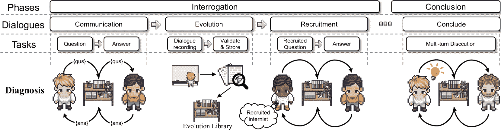

Figure 1: A typical multi-turn dialogue between the patient agent () and the doctor agents (). The agents maintain a continuous memory, and doctor agents can request the recruitment of new doctors. Additionally, the agents continuously store and retrieve knowledge from the library () to facilitate ongoing evolution.

##### Evolution of Agents

Recently, LLMs have achieved significant breakthroughs through methods such as pre-training Devlin ([2018](https://arxiv.org/html/2412.11716v1#bib.bib8)); Achiam et al. ([2023](https://arxiv.org/html/2412.11716v1#bib.bib1)), fine-tuning Raffel et al. ([2020](https://arxiv.org/html/2412.11716v1#bib.bib38)), and other forms of human-supervised training Ouyang et al. ([2022](https://arxiv.org/html/2412.11716v1#bib.bib32)). However, these methods may cause a lack of flexibility and require extensive high-quality data and heavy human supervision. Therefore, the development of self-evolutionary approaches has gained momentum. These approaches enable LLM-powered agents to autonomously acquire, refine, and learn through self-evolving strategies. For example, Agent Hospital Li et al. ([2024](https://arxiv.org/html/2412.11716v1#bib.bib21)) introduces self-evolution into world simulations without real-world environments. Self-Align Sun et al. ([2024](https://arxiv.org/html/2412.11716v1#bib.bib44)) combines principle-driven reasoning and the generative power of LLM for the self-alignment of agents with human annotation. ExpeL Zhao et al. ([2024](https://arxiv.org/html/2412.11716v1#bib.bib54)) accumulates experiences from successful historical trajectories. In this paper, we introduce insights into attention and sequential predictable to perform autonomous evolution in medical education domain.

## 3 EvoPatient

We propose EvoPatient, a doctor training framework powered by three essential modules: 1) the simulated flow mirrors the diagnostic process into a series of manageable phases, serving as a workflow for simulations. 2) the simulated agents pair comprises a patient agent and multiple doctor agents, engaging in autonomous multi-turn dialogue. The patient agent adopts various roles, while the doctor agents perform multidisciplinary consultations, generating questions and answers based on medical records. 3) the coevolution mechanism validates and stores dialogues, creating a reference library for standardized presentation to the patient agent. Simultaneously, doctor agents extract shortcuts from stored dialogue trajectories, enabling them to ask increasingly professional questions for efficient patient agent training (Algorithm LABEL:alg:algorithm).

### 3.1 Simulated Flow

The simulated flow ($\mathcal{F}$) leverages real-world medical records as input and models agent dialogues to create a structured sequence of diagnostic phases ($\mathcal{S}$). As an example, during the interrogation phase, depicted in Figure [1](https://arxiv.org/html/2412.11716v1#S2.F1 "Figure 1 ‣ Simulated Partners ‣ 2 Related Work ‣ LLMs Can Simulate Standardized Patients via Agent Coevolution"), a doctor agent ($\mathcal{D}$) engages in a multi-turn dialogue ($\mathsf{C}$) with a patient agent ($\mathcal{P}$). The doctor agent asks ($\rightarrow$) questions, while the patient agent responses ($\leadsto$) with answers, culminating in a diagnostic conclusion. Each phase ($\tau$) consists of one or more multi-turn dialogues between various roles:

|  |  | $\displaystyle\mathcal{F}={\langle\mathcal{S}^{1},\mathcal{S}^{2},\dots,% \mathcal{S}^{&#124;\mathcal{F}&#124;}\rangle}_{\circlearrowleft},$ |  | (1) |
|  |  | $\displaystyle\mathsf{C}(\mathcal{D},\mathcal{P})={\langle\mathcal{D}% \rightarrow\mathcal{P},\ \mathcal{P}\leadsto\mathcal{D}\rangle}_{% \circlearrowleft},$ |  |
|  |  | $\displaystyle\mathcal{S}^{i}=\tau(\mathsf{C}(\mathcal{D},\mathcal{P}),\mathsf{% C}(\mathcal{D},\mathcal{D}),\mathsf{C}(\mathcal{P},\mathcal{D}))$ |  |

Although the workflow is conceptually straightforward, the ability to customize phases enables the simulation of diverse scenarios without requiring additional agent communication protocols or adjustments to workflow topology. This paper adopts a workflow encompassing chief complaint generation, triage, interrogation, and conclusion. Detailed descriptions can be found in Appendix [E](https://arxiv.org/html/2412.11716v1#A5 "Appendix E Simulated Flow ‣ LLMs Can Simulate Standardized Patients via Agent Coevolution").

### 3.2 Simulated Agent Pair

The simulated agent pair consists of a patient agent and multiple doctor agents engaged in multi-turn diagnostic dialogues, effectively eliminating the need for human involvement and specific adjustments for different cases.

##### Simulated Patient Agent

To enable the patient agent to generate more realistic and contextually appropriate answers aligned with real-world patients, we developed 5,000 patient profiles incorporating diverse backgrounds like family, education, economic status, and characteristics such as openness to experience based on the Big Five personality traits McCrae and Costa ([1987](https://arxiv.org/html/2412.11716v1#bib.bib28)). To prevent the agent from losing in long contexts, we employ Retrieval Augmented Generation (RAG) Lewis et al. ([2020](https://arxiv.org/html/2412.11716v1#bib.bib19)) to extract the most relevant information from the records for answer generation.

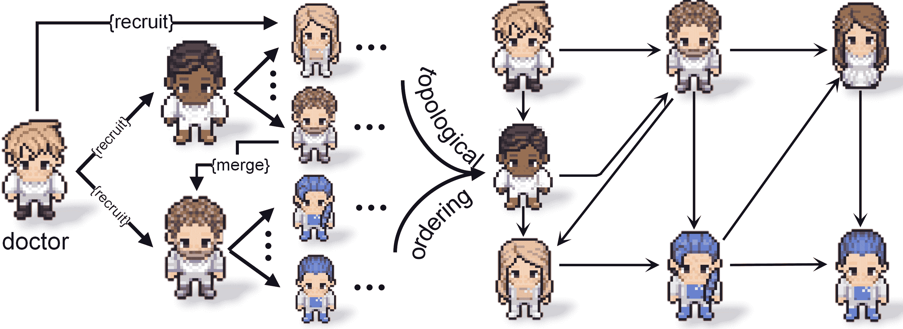

Figure 2: Multidisciplinary process in our framework.

##### Simulated Doctor Agent

It is challenging for a pre-trained model-based doctor agent to directly ask professional questions tailored to a patient’s condition, which is the key to eliciting valuable dialogues for further evolution process. To avoid questions staying trivial, besides providing carefully designed profiles Kim et al. ([2024](https://arxiv.org/html/2412.11716v1#bib.bib17)), we provide doctor agents with a few patient’s records prior to simulations and instruct them to formulate questions covering key information (e.g., symptoms, examinations, lifestyle). This approach helps doctor agents create a professional question pool based on their expertise, which can be referred to in subsequent simulations¹¹1Providing patient records throughout the simulations makes questions extra accurate instead of progressively and having logical continuity like human doctors, hindering further evolution process of patient agent for real-world doctor training.. Moreover, doctors from different disciplines possess diverse expertise, which leads to different types and aspects of question Epstein ([2014](https://arxiv.org/html/2412.11716v1#bib.bib9)); Taberna et al. ([2020](https://arxiv.org/html/2412.11716v1#bib.bib45)). This diversity is critical for the patient agent to effectively learn from a range of perspectives. To emulate this multidisciplinary consultation process, we enable every doctor agent to recruit agents from other disciplines when the patient’s condition exceeds their expertise, as shown in Figure [2](https://arxiv.org/html/2412.11716v1#S3.F2 "Figure 2 ‣ Simulated Patient Agent ‣ 3.2 Simulated Agent Pair ‣ 3 EvoPatient ‣ LLMs Can Simulate Standardized Patients via Agent Coevolution"). When recruited, these agents will ask questions and decide whether to recruit additional doctors:

|  |  | $\displaystyle\rho(\mathcal{D}^{i},\mathcal{P},\mathcal{D}^{j})=(\rho(\mathcal{% D}^{i},\mathcal{P}),\rho(\mathcal{D}^{i},\mathcal{D}^{j})),$ |  | (2) |
|  |  | $\displaystyle\rho(\mathcal{D}^{i},\mathcal{P})=(\mathcal{D}^{i}\rightarrow% \mathcal{P},\mathcal{P}\leadsto\mathcal{D}^{i})_{\circlearrowleft},$ |  |
|  |  | $\displaystyle\rho(\mathcal{D}^{i},\mathcal{D}^{j})=(\mathcal{D}^{i}\rightarrow% \mathcal{D}^{j})_{\circlearrowleft},$ |  |

where $\rho(\cdot)$ represents the interactions in a multidisciplinary consultation process. We adhere our recruitment process to topological ordering Kahn ([1962](https://arxiv.org/html/2412.11716v1#bib.bib16)) and form a directed acyclic graph (DAG), which prevents information backflow, eliminating the need for additional designs:

|  |  | $\displaystyle\mathcal{G}=(\mathcal{V},\mathcal{E}),$ |  | (3) |
|  |  | $\displaystyle\mathcal{V}=\{\mathcal{D}^{i}\mid\mathcal{D}^{i}\in\mathrm{D}\}\ % \ \ \mathcal{E}=\{\langle\mathcal{D}^{i},\mathcal{D}^{j}\rangle\ \mid\mathcal{% D}^{i}\neq\mathcal{D}^{j}\},$ |  |

where $\mathcal{V}$ denotes the set of doctor agents recruited from the pre-designed doctor set $\mathrm{D}$, $\mathcal{E}$ denotes the set of recruiting edges. The iterative nature of this process allows doctor agents to incorporate a variety of expertise in inherently random topologies, which have been shown to offer advantages in multi-agent systems Qian et al. ([2024b](https://arxiv.org/html/2412.11716v1#bib.bib37)), thereby enhancing the diagnostic process and fostering a more efficient evolution process.

##### Memory

It is crucial for agents to remember previous dialogues to ensure the diversity and comprehensiveness of their diagnoses. However, unrestrained information exchange can lead to context explosion Liu et al. ([2024](https://arxiv.org/html/2412.11716v1#bib.bib24)); Xu et al. ([2023](https://arxiv.org/html/2412.11716v1#bib.bib50)). To address this issue, we implement both instant and summarized memory to regulate context visibility. Instant memory maintains continuity in recent communications, while summarized memory consolidates key information from previous dialogues to preserve contextual awareness, enabling agents to generate new questions and answers nonarbitrary. Further details are provided in Appendix [H](https://arxiv.org/html/2412.11716v1#A8 "Appendix H Memory Control ‣ LLMs Can Simulate Standardized Patients via Agent Coevolution").

### 3.3 Coevolution

With the aim to effectively standardize the presentation pattern of agents, we propose an evolution mechanism that autonomously gathers, validates²²2We validate dialogues through multi-step validation shown in Appendix [D](https://arxiv.org/html/2412.11716v1#A4 "Appendix D Multi-Step Validation ‣ LLMs Can Simulate Standardized Patients via Agent Coevolution"). and stores experiences in libraries through simulations.

#### 3.3.1 Attention Library

Recognizing the inherent complexity of SP requirements Levine et al. ([2013](https://arxiv.org/html/2412.11716v1#bib.bib18)), the evolution process involves dividing the requirements ³³3Detail requirements can be found in Appendix [C](https://arxiv.org/html/2412.11716v1#A3 "Appendix C Initial SP Requirements ‣ LLMs Can Simulate Standardized Patients via Agent Coevolution"). into several trunks for each question. An attention agent then identifies and refines key lines in each trunk, and then merges them to form attention requirements ($r_{a}$) for answer generation. If the generated answer is validated as high-quality, the relevant information will be stored in the library in an organized array of doctor questions, records for answer generation, high-quality answers, and attention requirements. These serve as standardized presentation demonstrations ($d$) and refined requirements. In the human doctor training process, when a new question ($q$) is posed, the patient agent searches for and retrieves related records:

|  |  | $\displaystyle d,r_{a}=\mathbbm{k}(sim(q,\mathcal{L}))\ \ \ (\mathcal{P}\mid d,% r_{a})\rightarrow SP,$ |  | (4) |

where $sim(\cdot,\cdot)$ calculates the similarity between the new question and those in the library, using an external text embedder. $\mathbbm{k}$ denotes the retrieval of top-k matched results. With refined requirements and demonstrations as shown in Figure [3](https://arxiv.org/html/2412.11716v1#S3.F3 "Figure 3 ‣ 3.3.1 Attention Library ‣ 3.3 Coevolution ‣ 3 EvoPatient ‣ LLMs Can Simulate Standardized Patients via Agent Coevolution"), the patient agent is instantly transformed into a qualified standardized patient, ready for human doctor training.

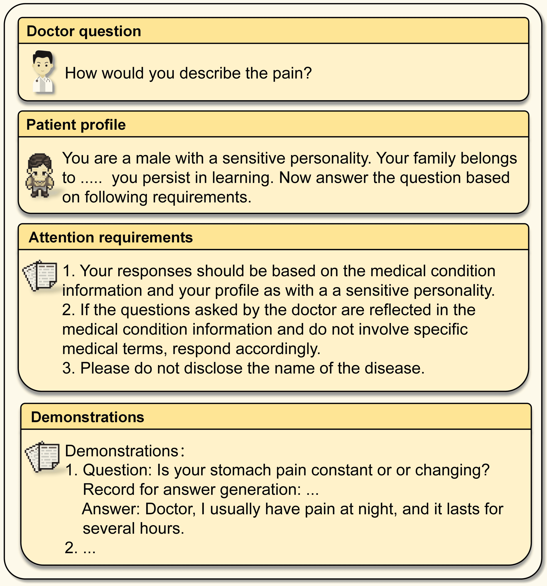

Figure 3: An example that standardizes our patient agent through attention requirements and effective few-shot demonstrations for human doctor training.

#### 3.3.2 Trajectories Library

Similar diseases often imply similar high-quality diagnosis trajectories ($\mathcal{T}$) Li and He ([2023](https://arxiv.org/html/2412.11716v1#bib.bib22)); Gao et al. ([2024](https://arxiv.org/html/2412.11716v1#bib.bib12)). During the simulation process, the doctor agent gives a series of questions ($\mathcal{Q}=\{q_{1},q_{2},\dots,q_{n}\}$), to which the patient agents responds with a matching sequence of answers ($\mathcal{A}=\{a_{1},a_{2},\dots,a_{n}\}$). To lower the possibility of asking trivial questions that cause inefficient patient agent training, we validate and store high-quality dialogues series as a prediction-trajectories ($t_{i}$):

|  |  | $\displaystyle\mathcal{L}=\langle t_{1},t_{2},\dots,t_{&#124;\mathcal{L}&#124;}\rangle,$ |  | (5) |
|  |  | $\displaystyle t_{i}=\{(q_{j-1},a_{j-1},q_{j},a_{j})\mid q\in\mathcal{Q},a\in% \mathcal{A}\},$ |  |

where $(q_{j-1},a_{j-1},q_{j},a_{j})$ illustrates the trajectory from one question $q_{j}$ to next question $q_{j+1}$. During the agent’s communication, when encountering the current answer $a$, based on similarity with $a_{j-1}$, agents extract multiple $q_{j}$ as predicted questions and recommend it to doctor agents for question trajectory refinement ($\ast$):

|  |  | $\displaystyle\mathcal{T}^{*}=(\mathcal{T}\mid\mathbbm{k}(sim(a,\mathcal{L}))),$ |  | (6) |
|  |  | $\displaystyle(\mathcal{D}\mid\mathcal{T}^{\ast})\rightarrow SD.$ |  |

By effectively utilizing valuable dialogue trajectories, this paradigm guides questions toward a more professional and efficient pattern, transferring doctor agents into standardized doctor (SD) agents.

## 4 Evaluation

##### Datasets

We have thoroughly collected real medical records from two collaborating hospitals to validate our EvoPatient. This study has been approved by the Ethics Committee of each hospital, with approval from the Second Affiliated Hospital, Zhejiang University School of Medicine, with the approval number 2020-568. Sun Yat-Sen University Cancer Center, with the approval number G2023-012-01 After meticulously reviewing these medical records, we extracted useful information for simulating patient cases, redacted the patients’ private information, and integrated them into a dataset. We also add the public medical-nlp⁴⁴4https://github.com/salgadev/medical-nlp, a dataset compiled for Natural Language Processing using a corpus of medical transcriptions. As a result, the overall dataset contains more than 20000 distinct cases, including but not limited to liver cancer, appendicitis, pancreatic lesions, nasopharyngeal carcinoma, tumors, and other diseases.

| Method | Paradigm | Relevance | Faithfulness | Robustness | Ability |
| CoT | ![[Uncaptioned image]](img/d398dddf6af823f487a6551d5767ef24.png) | 0.7157^† | 0.5571^† | 0.6714^† | 0.6481^† |
| CoT-SC (3) | ![[Uncaptioned image]](img/5afe058782598fa5fd3fe6634af90940.png) | 0.7337^† | 0.6123^† | 0.7002^† | 0.6821^† |
| ToT | ![[Uncaptioned image]](img/9b6ec721a9f2a32da072ab604fdd6d55.png) | 0.7469^† | 0.7143^† | 0.7714^† | 0.7442^† |
| Self-Align | ![[Uncaptioned image]](img/fdff2c26c8bd1c9da67cb28443e6b6e4.png) | 0.7205^† | 0.7273^† | 0.8148^† | 0.7542^† |
| Few-shot (2) | ![[Uncaptioned image]](img/e7e0615d3faaa246ceec11fad1f2e395.png) | 0.7252^† | 0.7419^† | 0.8207^† | 0.7626^† |
| EvoPatient | ![[Uncaptioned image]](img/1f26f7ee0f1a7a74b7b679286129df46.png) | 0.7589 | 0.8786 | 0.9412 | 0.8597 |

Table 1: Overall performance of the LLM-powered simulated standardized patient methods, encompassing single-patient agent ![[Uncaptioned image]](img/65ad8ab05cdd59c3c17858e0418343b9.png) paradigm powered by typical reasoning, align improvement method and our multi-agent ![[Uncaptioned image]](img/765f672a71527d38b64ea00c600b9e4c.png) coevolution method. Performance metrics are averaged for all tasks. The top scores are in bold, with the second-highest underlined. $\dagger$ indicates significant statistical differences (p$\leq$0.05) between a baseline and ours.

##### Baselines

As there is no previous open-sourced framework aiming for fully autonomous standardized patient simulating, we select some robust reasoning methods and well-known works for quantitative comparison. Detail descriptions of baselines can be found in Appendix [A](https://arxiv.org/html/2412.11716v1#A1 "Appendix A Baselines ‣ LLMs Can Simulate Standardized Patients via Agent Coevolution").

##### Metrics

Evaluating the questions and answers generated by agents in medical education is a challenging task due to the need for alignment with various detailed requirements. In the context of simulated standardized patient scenarios, inspired by Chen et al. ([2023b](https://arxiv.org/html/2412.11716v1#bib.bib7)), we propose the following evaluation metrics for answers: Relevance ($\alpha\in[0,1]$), Faithfulness ($\beta\in[0,1]$), Robustness ($\gamma\in[0,1]$), and Ability ($\frac{\alpha+\beta+\gamma}{3}\in[0,1]$). These dimensions assess the answers holistically while preserving essential details. For evaluating questions, we use the metrics Specificity ($\delta\in[0,1]$), Targetedness ($\epsilon\in[0,1]$), Professionalism ($\zeta\in[0,1]$), and Quality ($\frac{\delta+\epsilon+\zeta}{3}\in[0,1]$) to assess their overall quality⁵⁵5For each question and answer, the metric values are either 0 or 1, and after averaging over multiple cases, the values range from [0, 1].. A detailed description of these metrics can be found in Appendix [B](https://arxiv.org/html/2412.11716v1#A2 "Appendix B Metrics ‣ LLMs Can Simulate Standardized Patients via Agent Coevolution").

##### Implementation Details

For datasets in Chinese, we used Qwen 2.5 72B, a powerful pre-trained LLM, and ChatGPT-3.5 for datasets in English and GPT4 for pairwise evaluation, all with a temperature of 1\. The default training cases of our framework are 200\. The maximum turns of doctors and patient agents is 10\. The threshold similarity of every index (question or answer) calculated by the external text embedder in each library is 0.9\. All baselines in the evaluation share the same hyperparameters and settings for fairness. We rate our results in each metric through multi-step validation shown in Appendix [D](https://arxiv.org/html/2412.11716v1#A4 "Appendix D Multi-Step Validation ‣ LLMs Can Simulate Standardized Patients via Agent Coevolution"). (n) cases means training our framework on n cases.

### 4.1 Overall Analysis

Table [1](https://arxiv.org/html/2412.11716v1#S4.T1 "Table 1 ‣ Datasets ‣ 4 Evaluation ‣ LLMs Can Simulate Standardized Patients via Agent Coevolution") presents a comprehensive comparative analysis of the EvoPatient framework against baseline methods, where doctor agents autonomously ask approximately 3,000 questions across 150 cases, significantly outperforming all baselines in all metrics. Firstly, the improvement of EvoPatient over Tree-of-Thought, a powerful reasoning method, demonstrates that, even with multi-step planning and reasoning, without appropriate demonstrations and requirements, it is difficult for LLMs to simulate a qualified SP. This result highlights the effectiveness of using historical dialogue for agent standardization. The efficacy of our method largely results from the patient agent’s ability to align with concise, yet precise refined requirements and learn the desired answering pattern through few-shot demonstrations. Moreover, in comparison to self-alignment and few-shot methods, EvoPatient significantly raises the Ability from 0.7542 and 0.7626 to 0.8597\. This advancement emphasizes the need to simultaneously provide patient agents with refined requirements and demonstrations. Meanwhile, with the support of powerful doctor agents, the experience gathered in our framework can be more valuable for agent question answering, resulting in more robust, trustworthy, accurate, and flexible answers.

To better understand user preferences in practical settings, answers generated by various methods were compared in pairs by both human experts and the GPT-4 model to determine preferences. All methods were evaluated using the same list of questions and patient information to ensure a fair comparison. As shown in Table [3](https://arxiv.org/html/2412.11716v1#S4.T3 "Table 3 ‣ 4.1 Overall Analysis ‣ 4 Evaluation ‣ LLMs Can Simulate Standardized Patients via Agent Coevolution"), EvoPatient consistently outperformed other baselines across both standard and cheat-question scenarios, achieving higher preference rates in evaluations conducted by GPT-4 and human experts. Examples of the questions used are provided in Appendix [M](https://arxiv.org/html/2412.11716v1#A13 "Appendix M Example of Questions ‣ LLMs Can Simulate Standardized Patients via Agent Coevolution").

 | Method | Duration (s) | #Tokens | #Words |
| CoT | 04.7500 | 0782.0571 | 45.7429 |
| CoT-SC (3) | 12.5559 | 5837.0286 | 49.8667 |
| ToT | 21.7040 | 2679.3428 | 38.9143 |
| Self-Align | 09.5146 | 1307.9435 | 51.0636 |
| Few-shot (2) | 04.7182 | 0959.4355 | 35.6334 |
| (50) cases | 06.7808 | 0445.3482 | 36.5571 |
| EvoPatient | 06.6922 | 0401.5882 | 32.2432 | 

Table 2: Answer statistics include Duration (time consumed), #Tokens (tokens used), and #Words (total words) per answer across various methods. The best costs are bold, with the second-highest underlined.

Furthermore, we present an answer statistics experiment in Table [2](https://arxiv.org/html/2412.11716v1#S4.T2 "Table 2 ‣ 4.1 Overall Analysis ‣ 4 Evaluation ‣ LLMs Can Simulate Standardized Patients via Agent Coevolution"). The results show that EvoPatient excels in both computational efficiency and output quality. Specifically, the average response time of EvoPatient is 6.6922 seconds, only second to the CoT and Few-shot (2) method. Additionally, EvoPatient significantly reduces the input length of prompts by refining attention requirements, resulting in a notable reduction in token cost. Further analysis of the answer content indicates that the evolution process enables the SP agent to provide more accurate and robust answers, thereby improving answer quality while reducing the number of words in answers.

 | Question Types | Standard Questions | Cheat Questions |
| Method | Evaluator | Baseline Wins | Ours Wins | Draw | Baseline Wins | Ours Wins | Draw |
| CoT | GPT-4 | 22.50% | 77.08% | 00.42% | 06.67% | 90.08% | 03.25% |
| Human | 09.35% | 45.26% | 45.39% | 00.17% | 86.13% | 13.70% |
| CoT-SC (3) | GPT-4 | 30.50% | 62.08% | 07.42% | 06.97% | 86.25% | 06.78% |
| Human | 11.43% | 31.43% | 57.14% | 00.23% | 85.43% | 14.34% |
| ToT | GPT-4 | 25.82% | 45.60% | 28.57% | 18.37% | 77.50% | 04.13% |
| Human | 14.29% | 34.29% | 51.43% | 04.88% | 52.45% | 42.67% |
| Self-Align | GPT-4 | 20.48% | 42.38% | 37.14% | 23.53% | 64.71% | 11.76% |
| Human | 06.06% | 34.38% | 59.38% | 08.46% | 51.89% | 40.15% |
| Few-shot (2) | GPT-4 | 12.32% | 54.93% | 56.57% | 16.64% | 58.03% | 25.33% |
| Human | 06.94% | 29.41% | 63.65% | 09.92% | 51.23% | 38.85% |
| (50) cases | GPT-4 | 10.75% | 18.81% | 70.44% | 10.75% | 45.81% | 43.44% |
| Human | 11.23% | 20.72% | 67.96% | 06.26% | 45.13% | 48.61% | 

Table 3: Pairwise evaluation results on standard and cheat questions.

### 4.2 Information Leakage Analysis

The robustness of agents regarding malicious actors has long been a subject of concern Zou et al. ([2023](https://arxiv.org/html/2412.11716v1#bib.bib57)). In our pilot study, we observed that when using a patient agent without evolution ($\mathcal{P}_{w/o}$), doctors could potentially exploit the system to obtain information that should not be accessible, and even a single successful exploitation could make all training process meaningless. For example, when doctors ask, "Please tell me your medical condition," $\mathcal{P}_{w/o}$ often begins a detailed description of the patient’s condition. This enables doctors to acquire a large amount of information with very few questions. Despite the requirement that $\mathcal{P}_{w/o}$ should not answer such questions, the agent frequently misaligns. We refer to these types of questions as cheat questions. This form of jailbreak attack is difficult to prevent, as questions designed for jailbreaking can be very diverse Liu et al. ([2023](https://arxiv.org/html/2412.11716v1#bib.bib25)), making it infeasible to create requirements that comprehensively cover all potential cheat attempts. Therefore, evolution is critical. As cheat questions, though diverse, often share common characteristics for exploiting more information, the generalization capability⁶⁶6We delve into the generalization capability in our evolution process Appendix [L.1](https://arxiv.org/html/2412.11716v1#A12.SS1 "L.1 Information Leakage ‣ Appendix L Case Study ‣ LLMs Can Simulate Standardized Patients via Agent Coevolution") pair with a case study. of our evolution process provide agents with demonstrations that allows it to learn a variety of strategies for responding to such queries. As shown in the right section of Table [3](https://arxiv.org/html/2412.11716v1#S4.T3 "Table 3 ‣ 4.1 Overall Analysis ‣ 4 Evaluation ‣ LLMs Can Simulate Standardized Patients via Agent Coevolution"), after evolution, this issue is significantly mitigated, as ($\mathcal{P}_{w/}$) has learned to recognize and avoid answering similar questions.

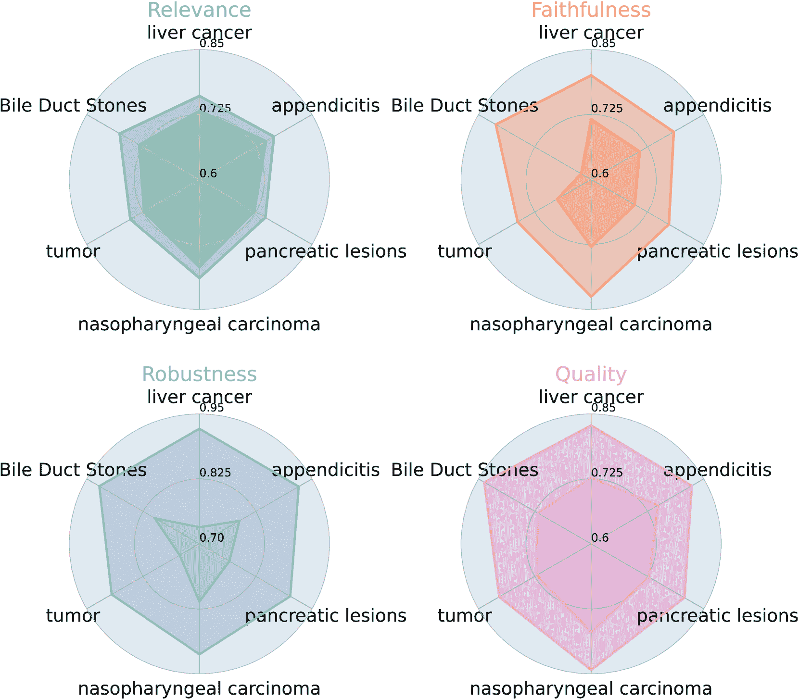

Figure 4: Transfer analysis of evolution process on five types of diseases before (inner) and after (outer) patient agent evolution. Zoom in for more detailed information.

### 4.3 Evolution Transfer Analysis

Here we train our framework on Nasopharyngeal Carcinoma by 100 cases and directly use it for the other five diseases’ SP simulation. As shown in Figure [4](https://arxiv.org/html/2412.11716v1#S4.F4 "Figure 4 ‣ 4.2 Information Leakage Analysis ‣ 4 Evaluation ‣ LLMs Can Simulate Standardized Patients via Agent Coevolution"), without further training and task-specific customization, our framework shows great transfer ability, averagely increasing the answer metrics by around 15% in Faithfulness, 18% in Robustness, and 12% in Quality. This result indicates the exceptional transferability of our framework and represents a promising pathway to achieving both autonomy and generalizability.

### 4.4 Doctor Agent Analysis

 | Method | Specificity | Targetedness | Professionalism | Quality |
| No Evolve | 0.4801 | 0.3843 | 0.6140 | 0.4928 |
| Evolve | 0.6164 | 0.4242 | 0.8120 | 0.6176 | 

Table 4: Comparison of questions from doctor agent with and without the evolution process.

##### Doctor Evolution

We compared the performance of the doctor agent with ($\mathcal{D}_{w/}$) and without ($\mathcal{D}_{w/o}$) the evolution process by having it ask 2,000 questions across 100 cases. The results in Table [4](https://arxiv.org/html/2412.11716v1#S4.T4 "Table 4 ‣ 4.4 Doctor Agent Analysis ‣ 4 Evaluation ‣ LLMs Can Simulate Standardized Patients via Agent Coevolution") show that the evolution process significantly improves the doctor agent’s performance, increasing Quality from 0.4928 to 0.6176, indicating a better formulation of quality medical questions focus on gathering relevant diagnostic information. Further analysis of question type distributions, as depicted in Figure [5](https://arxiv.org/html/2412.11716v1#S4.F5 "Figure 5 ‣ Doctor Evolution ‣ 4.4 Doctor Agent Analysis ‣ 4 Evaluation ‣ LLMs Can Simulate Standardized Patients via Agent Coevolution"), further demonstrates the effectiveness of our doctor evolution process. With examination-related questions increased from 14.09% to 25.57%, a level that is nearly impossible for a novice doctor agent to achieve, which significantly benefits the patient agent evolution.

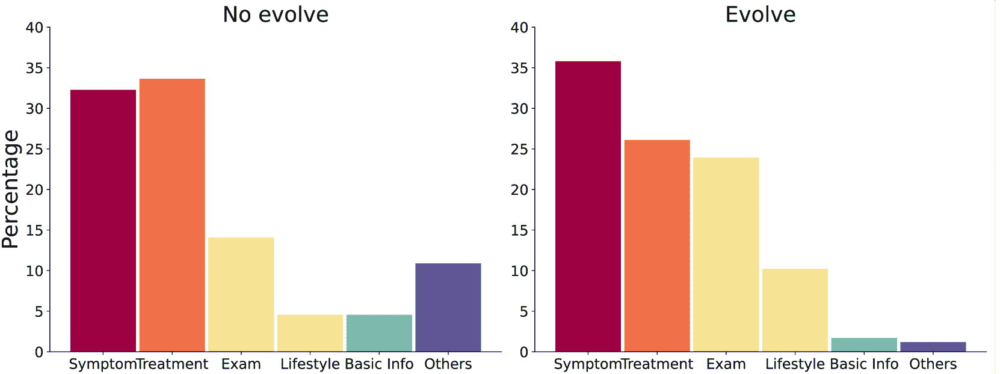

Figure 5: Top five question distributions of doctor agents with (right) and without (left) the evolution process, Detail descriptions of question types can be found in Appendix [I](https://arxiv.org/html/2412.11716v1#A9 "Appendix I Question Type ‣ LLMs Can Simulate Standardized Patients via Agent Coevolution").

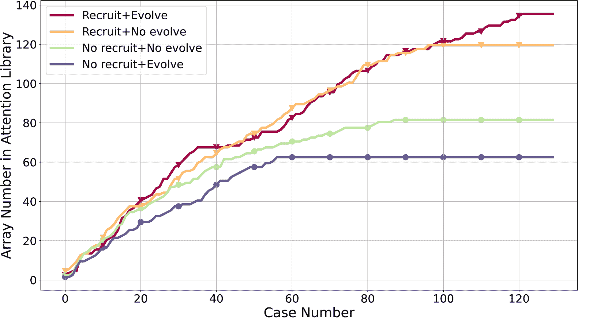

Figure 6: Effect of different doctor agents settings on the accumulation rate in the Attention Library.

##### Doctor Recruitment

We further investigated the doctor recruitment process in the patient agent evolution process using both $\mathcal{D}_{w/}$ and $\mathcal{D}_{w/o}$. As shown in Figure [6](https://arxiv.org/html/2412.11716v1#S4.F6 "Figure 6 ‣ Doctor Evolution ‣ 4.4 Doctor Agent Analysis ‣ 4 Evaluation ‣ LLMs Can Simulate Standardized Patients via Agent Coevolution"), when $\mathcal{D}_{w/}$ was used without recruitment, with only one discipline doctor asking questions, the accumulation rate of the Attention Library decreased. This decrease was primarily due to $\mathcal{D}_{w/}$ asking more targeted and efficient questions, whereas $\mathcal{D}_{w/o}$ asking diverse but random and low-quality questions. The Doctor Recruitment process significantly alleviates this decrease. By leveraging prediction trajectories in the library, evolved doctors from different disciplines can ask more specialized questions instead of generic ones. This significantly improves the diversity of questions while ensuring their professionalism, resulting in a more diverse and specialized Attention Library.

 | Method | Relevance | Faithfulness | Robustness | Ability |
| Doctor Agent | 0.7699 | 0.8000 | 0.8533 | 0.7922 |
| + recruit | 0.7875 | 0.8233 | 0.8733 | 0.7980 |
| + evolve | 0.7707 | 0.8400 | 0.9100 | 0.8202 |
| + recruit + evolve | 0.7906 | 0.8567 | 0.9333 | 0.8535 | 

Table 5: Ablation study on doctor agent in patient agent evolution. The ’+’ symbol represents the adding operation. Recruit means allowing a doctor agent to recruit other doctor agents, and evolve means using an evolved doctor agent. The best scores are bold, with the second-highest underlined.

##### Impact on Patient Agent

Because the doctor agent dominates the update of the Attention Library, which directly influences the patient agent answer quality. Thus, we further analyze the impact of recruiting and evolving strategies of doctor agents through the quality of patient answers, as shown in Table [5](https://arxiv.org/html/2412.11716v1#S4.T5 "Table 5 ‣ Doctor Recruitment ‣ 4.4 Doctor Agent Analysis ‣ 4 Evaluation ‣ LLMs Can Simulate Standardized Patients via Agent Coevolution"). The results demonstrate that implementing recruitment and evolution strategies in the doctor agent leads to more effectively evolved patient agents. Specifically, the Ability of patient agents trained by evolved doctor agents over recruit is stimulating, indicating that with only recruit ability, the doctor agents still struggle to ask professional questions that can positively contribute to content quality in Attention Library. Further improvements are observed when combining both recruit and evolve, achieving the highest performance across all metrics. This comprehensive improvement confirms the great compatibility of these two strategies.

## 5 Conclusion

Recognizing the absence of a mechanism for patient agents to learn through simulations on diverse cases, we introduced EvoPatient, an innovative simulation framework that enables both patient and doctor agents to autonomously accumulate past experiences through a coevolution mechanism. As a result, patient agents can efficiently manage various simulation cases for human doctor training, while doctor agents improve their questioning abilities, thereby enhancing patient agent training efficiency. Quantitative analysis reveals significant improvements in answer quality, resulting in a more stable, robust, and accurate answer pattern with optimized resource consumption. We anticipate that our insights will inspire further research on LLM-based simulated partners, emphasizing the importance of autonomous evolution, and driving agents toward achieving greater realism in simulations.

## 6 Limitations

Our study has explored how to standardize simulated agent presentation patterns through autonomous evolutions in medical education. However, researchers and practitioners should consider certain limitations and risks when applying these insights to the development of new techniques or applications.

Firstly, from the perspective of simulation capability, the ability of autonomous agents to fully replace human simulated partners may be overestimated. As an example, while EvoPatient enhances agent presentation abilities across a wide range of questions and cases, autonomous patient agents sometimes fail to replicate the full capabilities of real human SPs. The complexity and ambiguity of human SPs make it difficult to define a flawless set of requirements for role-playing. When confronted with unfamiliar or cheat questions, agents—despite receiving role assignments and demonstrations—sometimes fail to provide appropriate responses. This suggests that LLM-based agents may struggle to fully understand the underlying intent of their role, instead of merely following provided instructions. Without clear, detailed instructions, agents may behave like answering machines—responding in a patient-like manner but lacking genuine patient behavior. Thus, we recommend defining clear, step-by-step requirements for the patient agent during the evolution process. Given current agent capabilities, fulfilling highly detailed requirements may not always be guaranteed, highlighting the need to balance specificity with practical feasibility. Moreover, nowadays, patient agents can currently only provide text-based responses, real SPs convey additional non-verbal cues such as tone and facial expressions. These cues are vital for training doctors to make appropriate inquiries and diagnoses based on a patient’s external manifestations.

Secondly, in terms of doctor agents, even with role assignments, it remains challenging for an autonomous agent to ask accurate and professional questions in the way of a sophisticated human doctor. Although this challenge is mitigated by allowing doctor agents to form a question pool, recruit doctor agents with role assignments of other disciplines, and gather experience through the simulation process, these approaches can lack generalizability when facing unseen diseases with huge differences. Future research should focus on enhancing doctor professionalism at a disciplinary level, enabling doctor agents to be truly versatile across various diseases.

Thirdly, from an evaluation perspective, the complex nature of the simulation process in medical education, combined with the lack of effective metrics for automated evaluation—such as executability or the ability to break down dialogues for multi-step assessment Qian et al. ([2024a](https://arxiv.org/html/2412.11716v1#bib.bib36)); Zhuge et al. ([2024](https://arxiv.org/html/2412.11716v1#bib.bib55))—makes automated dialogue evaluation highly challenging. While human evaluation often yields the most reliable results, assessing thousands of dialogues based on patient records in context is labor-intensive and even impractical. This paper instead emphasizes objective dimensions, such as relevance, faithfulness, robustness, and overall ability of the patient agent, as well as specificity, targeting, professionalism, and overall quality of the doctor agent. However, future research should consider additional dimensions, including speaking tone, readability, user-friendliness, and more. Developing a completely fair and objective evaluation standard remains a significant challenge. Therefore, in the foreseeable future, agent evaluation may need to be customized for specific medical scenarios.

Fourthly, while few-shot demonstrations, refined requirements, and shortcut dialogue trajectories from historical dialogues can enhance agent authenticity, some low-quality dialogues may still be stored in the library and extracted as references, negatively affecting agent performance in standardized presentations. Although we implement an evolution correction strategy (see Appendix [G](https://arxiv.org/html/2412.11716v1#A7 "Appendix G Evolution Correction ‣ LLMs Can Simulate Standardized Patients via Agent Coevolution")) to remove low-quality content, some deeply hidden issues remain difficult to detect. Therefore, future research should explore methods for more accurately assessing the quality of content within the evolutionary library.

Despite these limitations, we believe that they provide valuable insights for future research and can be mitigated by engaging a broader, technically proficient audience. We expect these findings to offer valuable contributions to the enhancement of simulated agent authenticity and their role in the evolving landscape of LLM-powered agents.

## 7 Ethical Considerations

##### Participant Recruitment

Experts for annotations are individuals who hold a graduate degree (Master’s or PhD) in clinical medicine or a related field, or who are currently pursuing such a degree. We pay for each expert and other participants for participation.

##### System and Data Usage

All data and frameworks developed in this study are intended exclusively for academic research and educational purposes. The framework is not suitable for real-world deployment without further development, including larger-scale training and testing, compliance with departmental and administrative protocols in real hospital settings, and comprehensive evaluations by users and experts. All hospital patient records utilized in this study are fully de-identified and consented for research purposes. The data does not include personally identifiable information about patients or hospital staff. Additionally, the data has been anonymized to exclude sensitive information, ensuring it is strictly used for academic research.

## 8 Acknowledge

This research was partially supported by National Natural Science Foundation of China under Grant No. 92259202 and No. 72074188, "Pioneer" and "Leading Goose" R&D Program of Zhejiang under Grant No. 2024C01167, Zhejiang Provincial Natural Science Foundation of China under Grant No. LD24F020011, and GuangZhou City’s Key R&D Program of China under Grant No. 2024B01J1301.

## References

*   Achiam et al. (2023) Josh Achiam, Steven Adler, Sandhini Agarwal, Lama Ahmad, Ilge Akkaya, Florencia Leoni Aleman, Diogo Almeida, Janko Altenschmidt, Sam Altman, Shyamal Anadkat, et al. 2023. Gpt-4 technical report. *arXiv preprint arXiv:2303.08774*.
*   Barrows (1993) Howard S Barrows. 1993. An overview of the uses of standardized patients for teaching and evaluating clinical skills. aamc. *Academic medicine*, 68(6):443–51.
*   Bokken et al. (2006) Lonneke Bokken, Jan Van Dalen, and Jan-Joost Rethans. 2006. The impact of simulation on people who act as simulated patients: a focus group study. *Medical education*, 40(8):781–786.
*   Brown et al. (2020) Tom Brown, Benjamin Mann, Nick Ryder, Melanie Subbiah, Jared D Kaplan, Prafulla Dhariwal, Arvind Neelakantan, Pranav Shyam, Girish Sastry, Amanda Askell, et al. 2020. Language models are few-shot learners. *Advances in neural information processing systems*, 33:1877–1901.
*   Bubeck et al. (2023) Sébastien Bubeck, Varun Chandrasekaran, Ronen Eldan, Johannes Gehrke, Eric Horvitz, Ece Kamar, Peter Lee, Yin Tat Lee, Yuanzhi Li, Scott Lundberg, et al. 2023. Sparks of artificial general intelligence: Early experiments with gpt-4. *arXiv preprint arXiv:2303.12712*.
*   Chen et al. (2023a) Siyuan Chen, Mengyue Wu, Kenny Q Zhu, Kunyao Lan, Zhiling Zhang, and Lyuchun Cui. 2023a. Llm-empowered chatbots for psychiatrist and patient simulation: application and evaluation. *arXiv preprint arXiv:2305.13614*.
*   Chen et al. (2023b) Siyuan Chen, Mengyue Wu, Kenny Q Zhu, Kunyao Lan, Zhiling Zhang, and Lyuchun Cui. 2023b. Llm-empowered chatbots for psychiatrist and patient simulation: application and evaluation. *arXiv preprint arXiv:2305.13614*.
*   Devlin (2018) Jacob Devlin. 2018. Bert: Pre-training of deep bidirectional transformers for language understanding. *arXiv preprint arXiv:1810.04805*.
*   Epstein (2014) Nancy E Epstein. 2014. Multidisciplinary in-hospital teams improve patient outcomes: A review. *Surgical neurology international*, 5(Suppl 7):S295.
*   Feltz et al. (2020) Deborah L Feltz, Christopher R Hill, Stephen Samendinger, Nicholas D Myers, James M Pivarnik, Brian Winn, Alison Ede, and Lori Ploutz-Snyder. 2020. Can simulated partners boost workout effort in long-term exercise? *The Journal of Strength & Conditioning Research*, 34(9):2434–2442.
*   Feltz et al. (2016) Deborah L Feltz, Lori Ploutz-Snyder, Brian Winn, Norbert L Kerr, James M Pivarnik, Alison Ede, Christopher Hill, Stephen Samendinger, and William Jeffery. 2016. Simulated partners and collaborative exercise (space) to boost motivation for astronauts: study protocol. *BMC psychology*, 4:1–11.
*   Gao et al. (2024) Weihao Gao, Fuju Rong, Lei Shao, Zhuo Deng, Daimin Xiao, Ruiheng Zhang, Chucheng Chen, Zheng Gong, Zhiyuan Niu, Fang Li, et al. 2024. Enhancing ophthalmology medical record management with multi-modal knowledge graphs. *Scientific Reports*, 14(1):23221.
*   Graesser et al. (2004) Arthur C Graesser, Shulan Lu, George Tanner Jackson, Heather Hite Mitchell, Mathew Ventura, Andrew Olney, and Max M Louwerse. 2004. Autotutor: A tutor with dialogue in natural language. *Behavior Research Methods, Instruments, & Computers*, 36:180–192.
*   Hua et al. (2023) Wenyue Hua, Lizhou Fan, Lingyao Li, Kai Mei, Jianchao Ji, Yingqiang Ge, Libby Hemphill, and Yongfeng Zhang. 2023. War and peace (waragent): Large language model-based multi-agent simulation of world wars. *arXiv preprint arXiv:2311.17227*.
*   John et al. (2008) Oliver P John, Laura P Naumann, and Christopher J Soto. 2008. Paradigm shift to the integrative big five trait taxonomy. *Handbook of personality: Theory and research*, 3(2):114–158.
*   Kahn (1962) Arthur B Kahn. 1962. Topological sorting of large networks. *Communications of the ACM*, 5(11):558–562.
*   Kim et al. (2024) Yubin Kim, Chanwoo Park, Hyewon Jeong, Yik Siu Chan, Xuhai Xu, Daniel McDuff, Hyeonhoon Lee, Marzyeh Ghassemi, Cynthia Breazeal, and Hae Won Park. 2024. Mdagents: An adaptive collaboration of llms for medical decision-making. In *The Thirty-eighth Annual Conference on Neural Information Processing Systems*.
*   Levine et al. (2013) Adam I Levine, Samuel DeMaria Jr, Andrew D Schwartz, and Alan J Sim. 2013. *The comprehensive textbook of healthcare simulation*. Springer Science & Business Media.
*   Lewis et al. (2020) Patrick Lewis, Ethan Perez, Aleksandra Piktus, Fabio Petroni, Vladimir Karpukhin, Naman Goyal, Heinrich Küttler, Mike Lewis, Wen-tau Yih, Tim Rocktäschel, et al. 2020. Retrieval-augmented generation for knowledge-intensive nlp tasks. *Advances in Neural Information Processing Systems*, 33:9459–9474.
*   Li et al. (2023a) Guohao Li, Hasan Abed Al Kader Hammoud, Hani Itani, Dmitrii Khizbullin, and Bernard Ghanem. 2023a. Camel: Communicative agents for" mind" exploration of large scale language model society. *arXiv preprint arXiv:2303.17760*.
*   Li et al. (2024) Junkai Li, Siyu Wang, Meng Zhang, Weitao Li, Yunghwei Lai, Xinhui Kang, Weizhi Ma, and Yang Liu. 2024. Agent hospital: A simulacrum of hospital with evolvable medical agents. *arXiv preprint arXiv:2405.02957*.
*   Li and He (2023) Qing Li and Song He. 2023. Similarity matching of medical question based on siamese network. *BMC Medical Informatics and Decision Making*, 23(1):55.
*   Li et al. (2023b) Yuan Li, Yixuan Zhang, and Lichao Sun. 2023b. Metaagents: Simulating interactions of human behaviors for llm-based task-oriented coordination via collaborative generative agents. *arXiv preprint arXiv:2310.06500*.
*   Liu et al. (2024) Wei Liu, Chenxi Wang, Yifei Wang, Zihao Xie, Rennai Qiu, Yufan Dang, Zhuoyun Du, Weize Chen, Cheng Yang, and Chen Qian. 2024. Autonomous agents for collaborative task under information asymmetry. *arXiv preprint arXiv:2406.14928*.
*   Liu et al. (2023) Yi Liu, Gelei Deng, Zhengzi Xu, Yuekang Li, Yaowen Zheng, Ying Zhang, Lida Zhao, Tianwei Zhang, Kailong Wang, and Yang Liu. 2023. Jailbreaking chatgpt via prompt engineering: An empirical study. *arXiv preprint arXiv:2305.13860*.
*   Louie et al. (2024) Ryan Louie, Ananjan Nandi, William Fang, Cheng Chang, Emma Brunskill, and Diyi Yang. 2024. Roleplay-doh: Enabling domain-experts to create llm-simulated patients via eliciting and adhering to principles. *arXiv preprint arXiv:2407.00870*.
*   Markel et al. (2023) Julia M Markel, Steven G Opferman, James A Landay, and Chris Piech. 2023. Gpteach: Interactive ta training with gpt-based students. In *Proceedings of the tenth acm conference on learning@ scale*, pages 226–236.
*   McCrae and Costa (1987) Robert R McCrae and Paul T Costa. 1987. Validation of the five-factor model of personality across instruments and observers. *Journal of personality and social psychology*, 52(1):81.
*   McGaghie et al. (2010) William C McGaghie, S Barry Issenberg, Emil R Petrusa, and Ross J Scalese. 2010. A critical review of simulation-based medical education research: 2003–2009. *Medical education*, 44(1):50–63.
*   Moor et al. (2023) Michael Moor, Oishi Banerjee, Zahra Shakeri Hossein Abad, Harlan M Krumholz, Jure Leskovec, Eric J Topol, and Pranav Rajpurkar. 2023. Foundation models for generalist medical artificial intelligence. *Nature*, 616(7956):259–265.
*   Othlinghaus-Wulhorst and Hoppe (2020) Julia Othlinghaus-Wulhorst and H Ulrich Hoppe. 2020. A technical and conceptual framework for serious role-playing games in the area of social skill training. *Frontiers in Computer Science*, 2:28.
*   Ouyang et al. (2022) Long Ouyang, Jeffrey Wu, Xu Jiang, Diogo Almeida, Carroll Wainwright, Pamela Mishkin, Chong Zhang, Sandhini Agarwal, Katarina Slama, Alex Ray, et al. 2022. Training language models to follow instructions with human feedback. *Advances in neural information processing systems*, 35:27730–27744.
*   Park et al. (2023) Joon Sung Park, Joseph O’Brien, Carrie Jun Cai, Meredith Ringel Morris, Percy Liang, and Michael S Bernstein. 2023. Generative agents: Interactive simulacra of human behavior. In *Proceedings of the 36th Annual ACM Symposium on User Interface Software and Technology*, pages 1–22.
*   Park et al. (2022) Joon Sung Park, Lindsay Popowski, Carrie Cai, Meredith Ringel Morris, Percy Liang, and Michael S Bernstein. 2022. Social simulacra: Creating populated prototypes for social computing systems. In *Proceedings of the 35th Annual ACM Symposium on User Interface Software and Technology*, pages 1–18.
*   Péli and Nooteboom (1997) Gábor Péli and Bart Nooteboom. 1997. Simulation of learning in supply partnerships. *Computational & Mathematical Organization Theory*, 3:43–66.
*   Qian et al. (2024a) Chen Qian, Wei Liu, Hongzhang Liu, Nuo Chen, Yufan Dang, Jiahao Li, Cheng Yang, Weize Chen, Yusheng Su, Xin Cong, et al. 2024a. Chatdev: Communicative agents for software development. In *Proceedings of the 62nd Annual Meeting of the Association for Computational Linguistics (Volume 1: Long Papers)*, pages 15174–15186.
*   Qian et al. (2024b) Chen Qian, Zihao Xie, Yifei Wang, Wei Liu, Yufan Dang, Zhuoyun Du, Weize Chen, Cheng Yang, Zhiyuan Liu, and Maosong Sun. 2024b. Scaling large-language-model-based multi-agent collaboration. *arXiv preprint arXiv:2406.07155*.
*   Raffel et al. (2020) Colin Raffel, Noam Shazeer, Adam Roberts, Katherine Lee, Sharan Narang, Michael Matena, Yanqi Zhou, Wei Li, and Peter J Liu. 2020. Exploring the limits of transfer learning with a unified text-to-text transformer. *Journal of machine learning research*, 21(140):1–67.
*   Ruan et al. (2019) Sherry Ruan, Liwei Jiang, Justin Xu, Bryce Joe-Kun Tham, Zhengneng Qiu, Yeshuang Zhu, Elizabeth L Murnane, Emma Brunskill, and James A Landay. 2019. Quizbot: A dialogue-based adaptive learning system for factual knowledge. In *Proceedings of the 2019 CHI conference on human factors in computing systems*, pages 1–13.
*   Shaikh et al. (2024) Omar Shaikh, Valentino Emil Chai, Michele Gelfand, Diyi Yang, and Michael S Bernstein. 2024. Rehearsal: Simulating conflict to teach conflict resolution. In *Proceedings of the CHI Conference on Human Factors in Computing Systems*, pages 1–20.
*   Shanahan et al. (2023) Murray Shanahan, Kyle McDonell, and Laria Reynolds. 2023. Role play with large language models. *Nature*, 623(7987):493–498.
*   Singhal et al. (2023) Karan Singhal, Shekoofeh Azizi, Tao Tu, S Sara Mahdavi, Jason Wei, Hyung Won Chung, Nathan Scales, Ajay Tanwani, Heather Cole-Lewis, Stephen Pfohl, et al. 2023. Large language models encode clinical knowledge. *Nature*, 620(7972):172–180.
*   Spencer and Dales (2006) John Spencer and Jill Dales. 2006. Meeting the needs of simulated patients and caring for the person behind them?
*   Sun et al. (2024) Zhiqing Sun, Yikang Shen, Qinhong Zhou, Hongxin Zhang, Zhenfang Chen, David Cox, Yiming Yang, and Chuang Gan. 2024. Principle-driven self-alignment of language models from scratch with minimal human supervision. *Advances in Neural Information Processing Systems*, 36.
*   Taberna et al. (2020) Miren Taberna, Francisco Gil Moncayo, Enric Jané-Salas, Maite Antonio, Lorena Arribas, Esther Vilajosana, Elisabet Peralvez Torres, and Ricard Mesía. 2020. The multidisciplinary team (mdt) approach and quality of care. *Frontiers in oncology*, 10:85.
*   Varas et al. (2023) Julian Varas, Brandon Valencia Coronel, IGNACIO VILLAGRáN, Gabriel Escalona, Rocio Hernandez, Gregory Schuit, VALENTINA DURáN, Antonia Lagos-Villaseca, Cristian Jarry, Andres Neyem, et al. 2023. Innovations in surgical training: exploring the role of artificial intelligence and large language models (llm). *Revista do Colégio Brasileiro de Cirurgiões*, 50:e20233605.
*   Wallace (2007) Peggy Wallace. 2007. *Coaching standardized patients: For use in the assessment of clinical competence*. Springer Publishing.
*   Wang et al. (2022) Xuezhi Wang, Jason Wei, Dale Schuurmans, Quoc Le, Ed Chi, Sharan Narang, Aakanksha Chowdhery, and Denny Zhou. 2022. Self-consistency improves chain of thought reasoning in language models. *arXiv preprint arXiv:2203.11171*.
*   Wei et al. (2022) Jason Wei, Xuezhi Wang, Dale Schuurmans, Maarten Bosma, Fei Xia, Ed Chi, Quoc V Le, Denny Zhou, et al. 2022. Chain-of-thought prompting elicits reasoning in large language models. *Advances in neural information processing systems*, 35:24824–24837.
*   Xu et al. (2023) Peng Xu, Wei Ping, Xianchao Wu, Lawrence McAfee, Chen Zhu, Zihan Liu, Sandeep Subramanian, Evelina Bakhturina, Mohammad Shoeybi, and Bryan Catanzaro. 2023. Retrieval meets long context large language models. *arXiv preprint arXiv:2310.03025*.
*   Yao et al. (2024) Shunyu Yao, Dian Yu, Jeffrey Zhao, Izhak Shafran, Tom Griffiths, Yuan Cao, and Karthik Narasimhan. 2024. Tree of thoughts: Deliberate problem solving with large language models. *Advances in Neural Information Processing Systems*, 36.
*   Yu et al. (2024) Huizi Yu, Jiayan Zhou, Lingyao Li, Shan Chen, Jack Gallifant, Anye Shi, Xiang Li, Wenyue Hua, Mingyu Jin, Guang Chen, et al. 2024. Aipatient: Simulating patients with ehrs and llm powered agentic workflow. *arXiv preprint arXiv:2409.18924*.
*   Zhang et al. (2023) Xinlu Zhang, Chenxin Tian, Xianjun Yang, Lichang Chen, Zekun Li, and Linda Ruth Petzold. 2023. Alpacare: Instruction-tuned large language models for medical application. *arXiv preprint arXiv:2310.14558*.
*   Zhao et al. (2024) Andrew Zhao, Daniel Huang, Quentin Xu, Matthieu Lin, Yong-Jin Liu, and Gao Huang. 2024. Expel: Llm agents are experiential learners. In *Proceedings of the AAAI Conference on Artificial Intelligence*, volume 38, pages 19632–19642.
*   Zhuge et al. (2024) Mingchen Zhuge, Changsheng Zhao, Dylan Ashley, Wenyi Wang, Dmitrii Khizbullin, Yunyang Xiong, Zechun Liu, Ernie Chang, Raghuraman Krishnamoorthi, Yuandong Tian, et al. 2024. Agent-as-a-judge: Evaluate agents with agents. *arXiv preprint arXiv:2410.10934*.
*   Ziv et al. (2006) Amitai Ziv, Paul Root Wolpe, Stephen D Small, and Shimon Glick. 2006. Simulation-based medical education: an ethical imperative. *Simulation in Healthcare*, 1(4):252–256.
*   Zou et al. (2023) Andy Zou, Zifan Wang, Nicholas Carlini, Milad Nasr, J Zico Kolter, and Matt Fredrikson. 2023. Universal and transferable adversarial attacks on aligned language models. *arXiv preprint arXiv:2307.15043*.

Appendix

The supplementary information accompanying the main paper provides additional data, explanations, and details.

## Appendix A Baselines

1.  $\bullet$

    Chain-of-Thought (CoT) Wei et al. ([2022](https://arxiv.org/html/2412.11716v1#bib.bib49)) is a technically general and empirically powerful method that endows LLMs with the ability to generate a coherent series of intermediate reasoning steps, naturally leading to the final solution through thoughtful thinking and allowing reasoning abilities to emerge.

2.  $\bullet$

    Self-consistency with CoT (CoT-SC) Wang et al. ([2022](https://arxiv.org/html/2412.11716v1#bib.bib48)) improves upon CoT, by using different thought processes for the same problem and the output decision can be more faithful by exploring a richer set of thoughts. We use “CoT-SC(n)” to denote the approach that employs the CoT prompt method to sample n reasoning chains and then utilize the SC method to select the answer.

3.  $\bullet$

    Tree-of-Thought (ToT) Yao et al. ([2024](https://arxiv.org/html/2412.11716v1#bib.bib51)) extends CoT by allowing the exploration of multiple reasoning paths in a tree structure, accommodating branching possibilities, and enabling backtracking, significantly enhances language models’ problem-solving abilities.

4.  $\bullet$

    Few-shot Brown et al. ([2020](https://arxiv.org/html/2412.11716v1#bib.bib4)) uses experience including historical medical records from hospital practices and exemplar cases from medical documents for demonstrations. We adopt this idea from Agent Hospital Li et al. ([2024](https://arxiv.org/html/2412.11716v1#bib.bib21)).

5.  $\bullet$

    Principle-Driven Self-Alignment Sun et al. ([2024](https://arxiv.org/html/2412.11716v1#bib.bib44)) defines a set of principles that the agent must adhere to and provides in-context learning demonstrations for constructing helpful, ethical, and reliable responses.

## Appendix B Metrics

Evaluating dialogues in the medical education domain is a challenging task, especially when trying to assess it holistically. Here, we delineate the detailed descriptions of the metrics employed in our analysis. While these dimensions may not encompass every facet of questions and answers evaluation, they provide insight for evaluating the early efforts of agents in the field of standardized patient agent framework development.

##### Metrics for Patient Answers Evaluation

1.  $\bullet$

    Relevance ($\alpha\in\left[0,1\right]$) measures if the answer directly attempts to address the question in a complete sentence manner and without redundant information. Quantified as the cosine distance between the semantic embeddings of the question and the answer. A higher score indicates a higher probability of being accurate, pertinent, and effectively satisfying the user’s query.

2.  $\bullet$

    Faithfulness ($\beta\in\left[0,1\right]$) evaluates whether the patient’s answer can be inferred from the medical information provided. Meanwhile, align with the requirements of the SP. A higher score indicates a higher probability of the patient agent being faithful to both patient records and requirements.

3.  $\bullet$

    Robustness ($\gamma\in\left[0,1\right]$) evaluates whether the patient’s answer discloses information that the doctor should not easily possess (e.g., the name of the disease, detail descriptions of the medical record.) or provide excessive medical details in a single question. A higher score indicates a lower likelihood that the doctor can obtain information through carefully crafted deceptive questions that would not be accessible in real medical scenarios.

4.  $\bullet$

    Ability ($\frac{\alpha+\beta+\gamma}{3}\in\left[0,1\right]$) is a comprehensive metric that integrates various factors to assess the overall ability of the patient agent, quantified by averaging robustness, faithfulness, and answer relevance. A higher quality score suggests a higher overall satisfaction with the patient agent, implying a lower possibility of misalignment of requirements.

##### Metrics for Doctor Questions Evaluation

1.  $\bullet$

    Specificity ($\delta\in\left[0,1\right]$) measures the degree to which the doctor’s questions are precise and unambiguous, focusing on specific symptoms, conditions, or contexts relevant to the patient’s case. A higher score indicates that the doctor avoids overly broad or vague questions, instead tailoring inquiries to gather detailed and actionable information that supports an accurate and thorough diagnosis.

2.  $\bullet$

    Targetedness ($\epsilon\in\left[0,1\right]$) assesses whether the doctor is asking meaningful and targeted questions aimed at gathering necessary diagnostic information. A higher score indicates that the doctor is efficient in collecting relevant data for an accurate diagnosis.

3.  $\bullet$

    Professionalism ($\zeta\in\left[0,1\right]$) evaluates the degree to which the doctor’s questions reflect a deep understanding of medical principles and practices. A higher score indicates that the questions are framed with appropriate medical terminology, consider evidence-based practices, and demonstrate an awareness of clinical guidelines, thereby enhancing the quality of the diagnostic process.

4.  $\bullet$

    Quality ($\frac{\delta+\epsilon+\zeta}{3}\in\left[0,1\right]$) is a comprehensive metric that integrates various factors to assess the overall quality of the doctor agents’ question. It is quantified by averaging specificity, targeted questioning, and professionalism. A higher ability score suggests a more effective and efficient approach to patient diagnosis, contributing to a better patient evolution process.

## Appendix C Initial SP Requirements

Here, we provide the overall SP role-playing requirements used in our framework shown in Figure [7](https://arxiv.org/html/2412.11716v1#A3.F7 "Figure 7 ‣ Appendix C Initial SP Requirements ‣ LLMs Can Simulate Standardized Patients via Agent Coevolution").

<svg class="ltx_picture ltx_centering" height="744.32" id="A3.F7.pic1" overflow="visible" version="1.1" width="649.61"><g fill="#000000" stroke="#000000" stroke-width="0.4pt" transform="translate(0,744.32) matrix(1 0 0 -1 0 0)"><g fill-opacity="1.0" transform="matrix(1.0 0.0 0.0 1.0 21.65 726.11)"><foreignobject color="#FFFFFF" height="12.3" overflow="visible" transform="matrix(1 0 0 -1 0 16.6)" width="606.3">Overall Initial SP Requirements</foreignobject></g> <g fill-opacity="1.0" transform="matrix(1.0 0.0 0.0 1.0 21.65 13.78)"><foreignobject color="#000000" height="694.62" overflow="visible" transform="matrix(1 0 0 -1 0 16.6)" width="606.3">You are a simulated patient. You will play the following role: {profile} Now, you will face a question from a doctor. The following are the guidelines you should follow: 1\. Role Awareness: - Your responses should be based on the provided medical condition and character background. - The understanding of medical terminology will vary according to the character’s education level. Patients with lower education may only understand basic terms, those with moderate education may understand some technical terms, and those with higher education may understand rarer terms. 2\. Personality Traits: - Your responses should reflect the personality traits of the character. Basically, introverted patients should give brief answers, those with a negative personality may show avoidance or reluctance to answer, extroverted patients may give longer responses, open personalities should show a positive attitude toward treatment, and agreeable personalities should be friendly. 3\. Communication Style: - When the question does not involve test results, you may communicate normally with the doctor but avoid using medical terms beyond the character’s knowledge scope and avoid giving overly detailed descriptions. - Your response should reflect the first-person perspective of the patient, with a conversational tone, including filler words, hesitation, and other oral communication traits, consistent with the role’s background, personality, education level, etc. 4\. Handling Test Results: - When the question involves test results, if a full hospital examination report is requested and such information has not been provided, refuse to answer. If the information is provided, respond clearly and accurately in accordance with the character’s personality, possibly using medical terminology. Patients with a negative personality may be reluctant to answer. - If only a specific test result is asked, do not answer. 5\. Handling Complex Questions: - Be aware that the doctor may ask complex questions with multiple sub-questions. In this case, you should selectively answer or refuse to answer based on the character’s personality. - Do not answer questions related to medical history or diagnosis conclusions. - Your responses should not reveal the final disease name. 7\. Providing Historical Information: - If asked about previous treatment or diagnosis results, you may provide information that does not include the final diagnosis, or mention tests that were conducted, while ensuring this aligns with the character’s personality. Different personalities may have different memory abilities. Higher education levels may imply better memory, while lower levels may suggest poorer memory. The stronger the memory, the more tests the patient can mention. 8\. Emotional Responses: - Your response should reflect the patient’s emotional reaction, such as anxiety, concern, hope, etc., in line with the character’s personality and educational background. 9\. Cultural and Linguistic Adaptability: - Considering that patients from different cultural and linguistic backgrounds may have varying understandings and reactions to certain terms, your responses should be adapted to the character’s cultural and linguistic habits. 10\. Feedback and Interaction: - Your response may include feedback to the doctor’s question, such as asking for clarification or expressing difficulty in understanding certain questions. You may also express your feelings, whether satisfied or dissatisfied. Basic Descriptions of Different Personality Types: - Openness: Reflects the individual’s willingness to engage in new experiences, creativity, and curiosity. - Conscientiousness: Measures an individual’s level of self-discipline, organization, and goal-oriented behavior. - Extraversion: Describes how outgoing, energetic, and social a person is. - Agreeableness: Represents an individual’s tendency to be friendly, cooperative, and empathetic in relationships with others. - Neuroticism: Related to emotional stability; high neuroticism indicates an individual is more affected by stress and negative emotions. Doctor question: {question} Patient information: {information} Memory: {memory}</foreignobject></g></g></svg>

Figure 7: Overall initial SP requirements used in our framework.

## Appendix D Multi-Step Validation

##### Answer Validation

In our approach to validating patient agent responses, we employ a multi-step evaluation utilizing Large Language Models (LLMs) to ascertain whether the responses adhere to the established criteria. Figure [8](https://arxiv.org/html/2412.11716v1#A4.F8 "Figure 8 ‣ Answer Validation ‣ Appendix D Multi-Step Validation ‣ LLMs Can Simulate Standardized Patients via Agent Coevolution") illustrates the basic validation steps that form the foundation of our process, which can be expanded to include considerations of the patient’s background and characteristics. Initially, we determine if the question explicitly mentions a disease name. If it does, we evaluate whether the response is a refusal to answer; if so, the Faithfulness score is 1, otherwise, it is 0, preventing doctors from indirectly deducing the patient’s diagnosis through conjecture. If the question does not mention a disease, we next ascertain if it inquires about test results. For questions related to test results, we assess whether they specifically request information about a particular test. If they do, we again evaluate whether the response is a refusal to answer; a refusal results in a Faithfulness score of 1, while any other response results in a score of 0, encouraging doctors to guide patients towards targeted testing rather than directly inquiring about specific results. If the question does not request a specific test result but the relevant information is present in the patient’s records, the response should provide the test result; failure to do so results in a Faithfulness score of 0\. If the question includes specialized terminology, the response should be a refusal, earning a Faithfulness score of 1; otherwise, it is 0, while questions without such terminology should be answered directly. Following these assessments, the mechanism checks for the presence of excessive medical history, detailed past test results, and disease names in the response. The absence of such details results in a Robustness score of 1; otherwise, it is 0\. A response is deemed qualified if it has both Faithfulness = 1 and Robustness = 1.

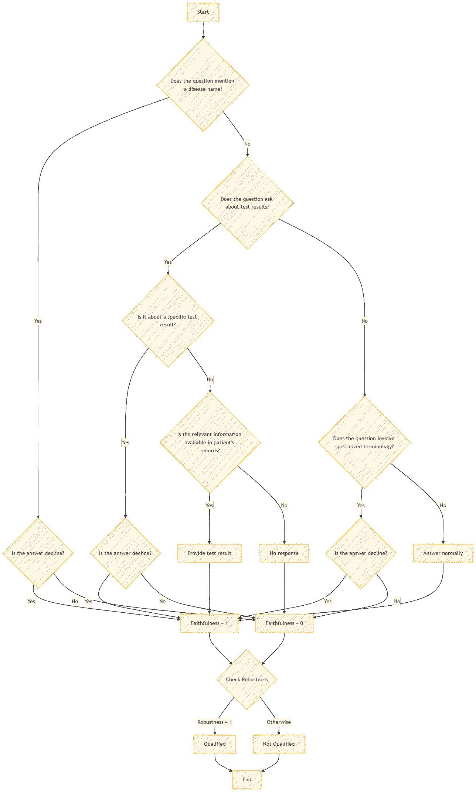

Figure 8: A basic validation step for patient answers. Zoom in for more detailed information.

##### Question Validation

In terms of evaluating doctor agent responses, we also employ a structured multi-step assessment to ensure the responses meet established medical standards. Figure [9](https://arxiv.org/html/2412.11716v1#A4.F9 "Figure 9 ‣ Question Validation ‣ Appendix D Multi-Step Validation ‣ LLMs Can Simulate Standardized Patients via Agent Coevolution") outlines the key steps of this validation process, which takes into account the specificity, targetedness, and professionalism of the doctor’s questions. The steps are as follows: The first step involves extracting medical terms from the question. We check if the question includes references to specific body parts (e.g., abdomen, throat). If such references are present, we further assess whether the question targets particular symptoms or issues, such as pain or a foreign body sensation. If neither specific body parts nor targeted symptoms are mentioned, we set the Specificity score to 0\. If the question includes professional medical terminology, the next step is to evaluate if these terms are linked to specific medical examinations or treatments. If so, we assign a Professionalism score of 1\. If the terms are not linked to specific examinations or treatments, we then check if the terms involve general medical concepts. If they do, we assign a Professionalism score of 1; otherwise, we set the Professionalism score to 0\. For questions that do not contain medical terms, we first assess whether the question is intended to inquire about the patient’s condition. If it is, we check whether the terms involve general medical concepts and address them as described above. If not, we assign a Professionalism score of 0\. For questions containing medical terms, we check whether these terms are present in the available information. If they are, we proceed to assess whether the question semantically aligns with the information provided, confirming if the medical terms in the question relate to the information. If not, we assign a Targetedness score of 0\. If the question’s medical terms appear in the information, we further examine if the provided information contains the key content needed to answer the question. If the information includes the necessary details, we evaluate whether the response reasonably utilizes this content. A response that appropriately uses the information will receive a Targetedness score of 1, while responses that fail to do so will receive a score of 0\. The process concludes by combining the outcomes of these assessments. If both Specificity = 1 and Professionalism = 1, the response is considered appropriate. If any criteria are not met, the corresponding score is set to 0, and the response is deemed unqualified.

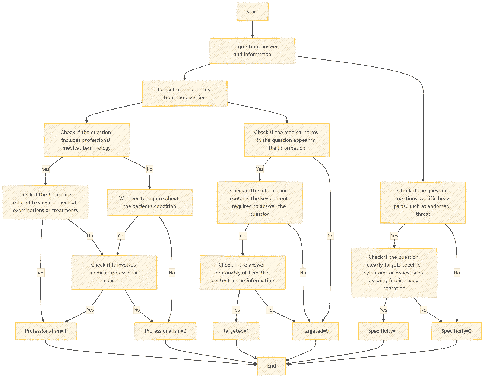

Figure 9: A basic validation step for doctor questions. Zoom in for more detailed information.

## Appendix E Simulated Flow

In this paper, we introduce a simulated flow for autonomous diagnosis simulation, encompassing chief complaint generation, triage, interrogation, and conclusion.

### E.1 Chief Complaint Generation

In our framework, the patient agent initiates a dialogue by presenting a chief complaint derived from medical records. These records, however, often contain excessive or irrelevant details, which can lead to inaccuracies in the generated complaints. To address this issue, we reduce redundancy and simulate missing data to better reflect real-world scenarios where patient-reported symptoms and concerns are often imprecise. Specifically, medical records undergo a vagueness process where a vagueness agent ($\mathcal{V}$) removes details of medical test results, as such information would not typically be known to a patient at the time of arrival. Random sentence dropout is then applied to further obscure the data. Using this processed data, the patient agent generates a chief complaint to initiate the diagnostic process. This method effectively captures the inherent uncertainties of patient-reported information and enhances the generalizability of our framework to practical medical training applications.

### E.2 Triage

Upon receiving a chief complaint, the doctor agent retrieves relevant historical triage data from the library with similar complaints. This data serves as a reference for assigning the patient agent to an appropriate discipline-specific clinic. The assigned doctor then acts as the primary doctor, initiating further interrogation interactions with the patient.

### E.3 Interrogation

During the interrogation phase, the doctor agent poses diagnostic questions to the patient agent, which responds based on its simulated condition. If the patient’s condition exceeds the expertise of the current doctor agent, additional specialists can be recruited. This phase is particularly significant due to its high dialogue density, enabling the accumulation of extensive experience. It also mirrors real-world scenarios where the SP agents are used to train human doctors effectively.

### E.4 Conclusion

After a series of multi-turn dialogues, the doctor agent consolidates the information obtained and delivers a final diagnosis regarding the patient’s condition. This phase concludes the simulation successfully.

### E.5 Patient Crisis

To enhance the realism of patient agents and improve doctors’ ability to handle emergencies empathetically, we incorporate a patient crisis into interrogation phases. A patient crisis interrupts the diagnostic process with an urgent query (e.g., "Doctor, my stomach hurts so much; can I receive treatment immediately?"). The doctor agent is required to address it immediately, reflecting real-world medical challenges.

## Appendix F Algorithm

Here, we provide the pseudocode of our framework for clarity shown in Algorithm  LABEL:alg:algorithm.

## Appendix G Evolution Correction

Not all information stored in the evolution library contributes positively to the simulation of SP and SD agents. Due to the imperfection of our metrics, there is a possibility that some low-quality information might be inadvertently stored within a high-quality library, potentially leading to adverse effects on the agents. To address this issue, we have implemented a monitoring strategy that tracks the impact of each piece of information on the agent simulation performance. During the training process, if a particular piece of information is referenced twice and subsequently results in poor agent simulation performance, that information will be removed from the library to ensure the quality and reliability of our framework. Furthermore, when an item meets the conditions for inclusion but a similar item already exists in the library, we compare their quality using metrics and retain the higher-quality item.

## Appendix H Memory Control

In the communication $\mathcal{C}^{i}$, we use $q^{i}$ to represent the doctor’s question and $a^{i}$ for the patient’s answer. The instant memory $\mathcal{M}$ collects the utterances from $i$ to $\xi$ until the number of communications reaches the upper limit $\ell$:

|  | $\displaystyle\mathcal{M}_{i}^{\xi}=\langle(q^{i},a^{i}),(q^{i+1},a^{i+1}),% \ldots,(q^{\xi},a^{\xi})\rangle.$ |  | (7) |

For long-context dialogues, a summarized memory $\tilde{\mathcal{M}}$ is generated once the context length limit is reached or the diagnosis processes of recruited doctors are concluded ($\mathcal{M}^{\rho}$). This summarized memory facilitates smooth transitions between long-turn questioning by consolidating key information from previous communications, and the new question $q^{j}$ is generated based on summarized memory and recent instant memory:

|  |  | $\displaystyle q^{j}=\mathcal{D}(\tilde{\mathcal{M}}^{\ell},\mathcal{M}_{i}^{% \xi})\ \ a^{j}=(\tilde{\mathcal{M}}^{\ell},\mathcal{M}_{i}^{\xi}),$ |  | (8) |
|  |  | $\displaystyle\tilde{\mathcal{M}}^{i\ell}=\upsilon(\tilde{\mathcal{M}}^{(i-1)% \ell},\mathcal{M}_{i}^{i+\ell},\mathcal{M}^{\rho}),$ |  |

where $\upsilon$ represents a summarization generator for the dialogue trunk. This approach facilitates smooth transitions between long-turn questions, enabling agents to generate new questions and answers nonarbitrary.

Theoretically, the total token consumption for a doctor agent who experiences maximum context pressure, with and without this mechanism, is summarized as follows:

|  |  | $\displaystyle\mathcal{O}_{w/o}^{n}=\{(ru+1)(n-1)\}(q+a)+(p+q),$ |  | (9) |
|  |  | $\displaystyle\mathcal{O}_{w/o}^{n}\overset{n\gg 1}{\approx}Cn\propto n,$ |  |
|  |  | $\displaystyle\mathcal{O}_{w/}^{n}=s+\mathcal{O}_{w/o}^{\beta}\overset{n\gg 1}{% \approx}\tilde{C},$ |  |
|  |  | $\displaystyle\beta\leq\{n-\lfloor\frac{n(q+a)}{\ell}\rfloor\}\overset{n\gg 1}{% \approx}\overline{C},$ |  |

where $n$ is the communication round, $q$ is the average length of a question, $a$ is the average length of an answer, $p$ is the average length of the requirement prompt. $r$ is the maximum number of doctors recruited by a single recruitment process, $u$ is the maximum number of questions asked by a recruited doctor. $C$, $\tilde{C}$ and $\overline{C}$ are all constant numbers. Our mechanism decouples the context length from linear to constant growth, effectively suppressing context length limitation, Without loss of generality, we assume that the recruited doctors do not utilize memory in their interactions.

Without memory control mechanisms, the token consumption for the first-turn doctor agents is calculated as:

|  |  | $\displaystyle\mathcal{O}(d_{1})_{w/o}=p+q.$ |  | (10) |

This equation reflects the first doctor agent’s fundamental needs: understanding the requirement and generating a question, akin to the direct inference process of most LLMs.

Once the first doctor agent generates information, it interacts with a patient agent, which generates an answer for the doctor agent in the subsequent round. Concurrently, after receiving the initial answer, the doctor agent initiates the recruitment of doctors. Consequently, for the second agent, token consumption is:

|  |  | $\displaystyle\mathcal{O}(d_{2})_{w/o}=(q+a)+(p+q)+ru(q+a)$ |  | (11) |
|  |  | $\displaystyle\ \ \ \ \ \ \ \ \ \ \ \ \ \ \ \ =(2-1)(1+ru)(q+a)+(p+q)$ |  |
|  |  | $\displaystyle\ \ \ \ \ \ \ \ \ \ \ \ \ \ \ \ =(1+ru)(q+a)+(p+q).$ |  |

It is easy to conclude that:

|  | $\displaystyle\mathcal{O}(d_{n})_{w/o}=\{(n-1)(ru+1)\}(q+a)+(p+q).$ |  | (12) |

Similarly, utilizing the proposed memory control mechanism, the total token consumption for the first-turn doctor agent under minimal context pressure is:

|  |  | $\displaystyle\mathcal{O}(d_{1})_{w/}=p+q.$ |  | (13) |

Considering turn $i$, where the total length of the questions and answers exceeds the length limit, these will be summarized into a condensed memory for the next turn doctor agent:

|  |  | $\displaystyle\mathcal{O}(d_{i})_{w/}=\{(i-1)(ru+1)\}(q+a)+(p+q)\geq\ell,$ |  | (14) |
|  |  | $\displaystyle\mathcal{O}(d_{i})_{w/}\rightarrow s,$ |  |
|  |  | $\displaystyle\mathcal{O}(d_{i+1})_{w/}=s+p+q.$ |  |

Every doctor will handle more than $q+a$ tokens each turn. After this iterative process, we have:

|  |  | $\displaystyle\mathcal{O}_{w/}=s+((ru+1)\beta-ru)(q+a)$ |  | (15) |
|  |  | $\displaystyle\beta\leq\{n-\lfloor\frac{n(q+a)}{\ell}\rfloor\},$ |  |

where $\beta$ represents the number of remaining instant memories.

## Appendix I Question Type

In our experiments, we categorized questions from doctor agents into ten types. Here, we give detailed descriptions of these types:

*   •

    Basic Information Inquiries: These questions focus on gathering essential personal and medical details from the patient, such as their name, age, sex, medical history, and allergies. It also includes questions about family medical history and any previous diagnoses or treatments.

*   •

    Chief Complaint Inquiries: These questions address the primary reason why the patient is seeking medical attention. It often involves asking the patient to describe their main issue or symptom, such as pain, discomfort, or any other abnormal physical or mental state. The goal is to understand the most pressing concern from the patient’s perspective.

*   •

    Detailed Symptom Inquiries: These questions delve deeper into the patient’s symptoms. They involve exploring the nature, intensity, duration, and frequency of symptoms. For example, if a patient reports chest pain, the healthcare provider may ask when it started, whether it’s constant or intermittent, what triggers it, and any associated symptoms like sweating or dizziness.

*   •

    Lifestyle Inquiries: These questions aim to understand how the patient’s lifestyle might contribute to their health condition. This includes asking about diet, exercise, sleep patterns, substance use (such as alcohol, tobacco, or drugs), and stress levels. The objective is to identify modifiable factors that could influence the patient’s health.

*   •

    Psychological Condition Inquiries: These questions focus on the mental and emotional health of the patient. They include inquiries about mood disorders (like depression or anxiety), stress levels, sleep disturbances, and any history of mental health conditions. It’s essential to understand how psychological factors might be affecting the patient’s overall health.

*   •

    Social Environment Inquiries: These questions explore the patient’s social context, including their living situation, social support network (family, friends, or community), occupation, and any environmental factors that could impact health. These inquiries can help identify social determinants of health, such as access to healthcare, safety, or socioeconomic status.

*   •

    Physical Examination-Related Questions: These questions are typically focused on the findings from the patient’s physical examination. They may involve asking about any observed abnormalities such as abnormal heart sounds, skin conditions, or muscle strength. These questions help to narrow down potential causes based on physical signs.

*   •

    Treatment and Medication Response Inquiries: These questions focus on how the patient has responded to previous treatments or medications. They involve asking if the patient has experienced any improvements or side effects after taking prescribed medications or undergoing treatments. This helps the healthcare provider assess the effectiveness and tolerance of the treatment.

*   •

    Preventive Health Inquiries: These questions involve topics related to preventing illness and maintaining health, such as vaccination history, screening tests, and lifestyle choices that reduce the risk of diseases. For example, a healthcare provider might ask whether the patient has had recent cancer screenings, cholesterol checks, or flu vaccinations.

*   •

    Other Related Questions: This category includes any other questions that may not fall into the previous categories but are still relevant to the patient’s health. It could involve questions about past surgeries, genetic conditions, or new symptoms that don’t clearly fit into the other categories but may provide crucial insights into the patient’s condition.

## Appendix J Cost Analysis

### J.1 Token Counts

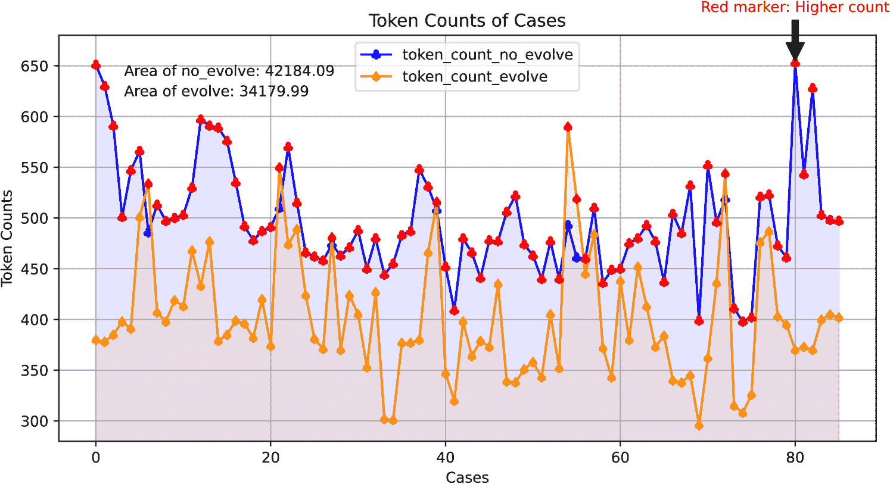

Figure 10: Token counts used in various cases before and after the evolution process.

As depicted in Figure [10](https://arxiv.org/html/2412.11716v1#A10.F10 "Figure 10 ‣ J.1 Token Counts ‣ Appendix J Cost Analysis ‣ LLMs Can Simulate Standardized Patients via Agent Coevolution"), the token consumption of the evolved EvoPatient is significantly reduced. This reduction is attributed to the patient agent’s enhanced ability to focus on the specific attention requirements of each question after evolution, rather than considering the overall requirements. Consequently, not only does the framework exhibit lower token consumption, but it also aligns more closely with the specific requirements, demonstrating improved efficiency and precision in processing questions.

### J.2 Word Counts

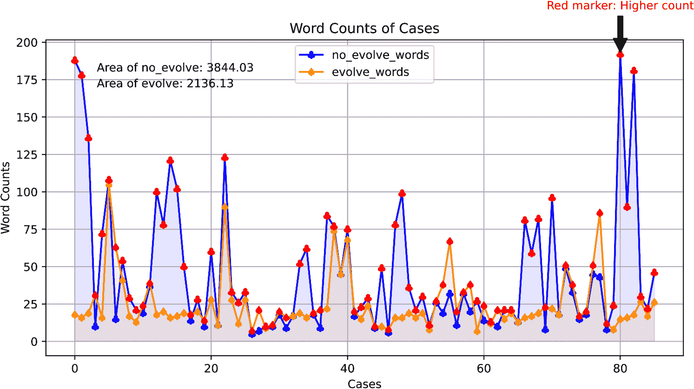

Figure 11: Average word counts per-answer of various cases before and after the evolution process.

Here, we randomly selected some cases and posed several questions to analyze the word count of the answers given by the patient agent before and after evolution. As shown in Figure [11](https://arxiv.org/html/2412.11716v1#A10.F11 "Figure 11 ‣ J.2 Word Counts ‣ Appendix J Cost Analysis ‣ LLMs Can Simulate Standardized Patients via Agent Coevolution"), the answers after evolution are shorter and more stable compared to those before evolution, indicating that evolution has made the patient agent’s answer pattern more consistent. Before evolution, we observed several peaks in word count, with the highest reaching 192 words. Upon examining the content of the answers, we found that it is because some cheat questions led to information leakage in the answers of the patient agent before evolution, revealing excessive information, which resulted in a high word count in its answers.

## Appendix K Datasets

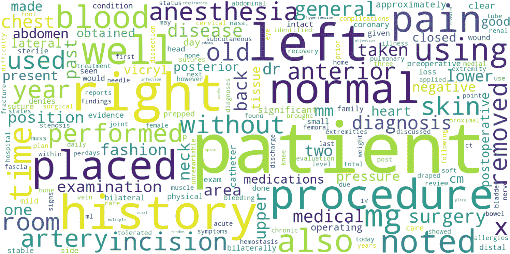

Figure 12: Word Cloud of our used English dataset.

Figure 13: Word Cloud of our used Chinese dataset.

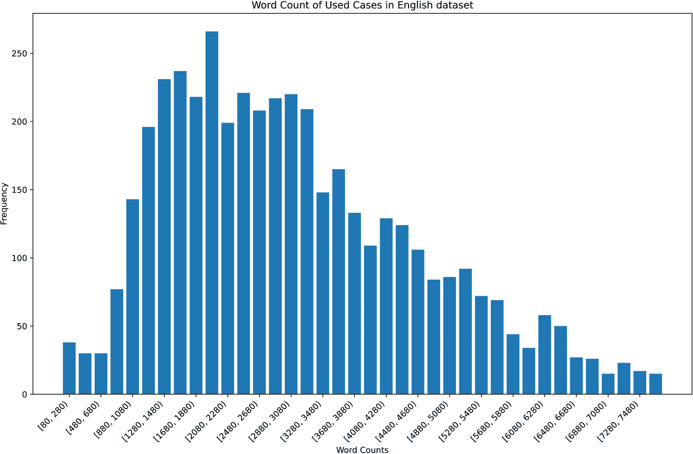

Figure 14: Word Count of Used Cases in English Dataset.

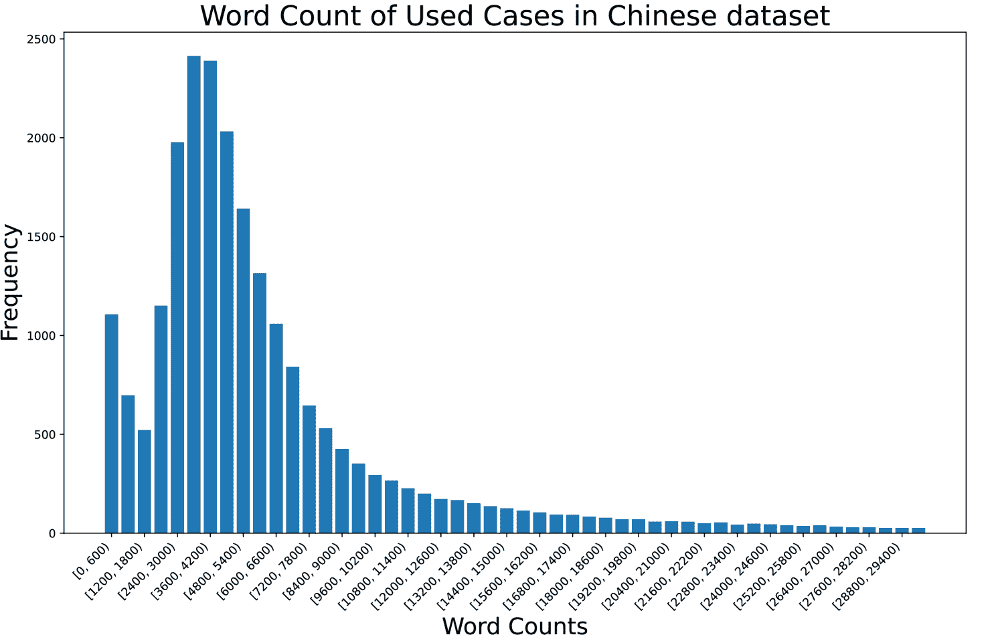

Figure 15: Word Count of Used Cases in Chinese Dataset.

We present word clouds of our datasets, as depicted in Figures [12](https://arxiv.org/html/2412.11716v1#A11.F12 "Figure 12 ‣ Appendix K Datasets ‣ LLMs Can Simulate Standardized Patients via Agent Coevolution") and [13](https://arxiv.org/html/2412.11716v1#A11.F13 "Figure 13 ‣ Appendix K Datasets ‣ LLMs Can Simulate Standardized Patients via Agent Coevolution"). The length distribution of the case record is shown in Figure [14](https://arxiv.org/html/2412.11716v1#A11.F14 "Figure 14 ‣ Appendix K Datasets ‣ LLMs Can Simulate Standardized Patients via Agent Coevolution"). The overall datasets contain more than 20000 patient records that are suitable for patient simulation, with diverse disease, length, and complexity et al., including but not limited to liver cancer, appendicitis, pancreatic lesions, nasopharyngeal carcinoma, tumors, and other diseases.

## Appendix L Case Study

### L.1 Information Leakage

<svg class="ltx_picture ltx_centering" height="581.7" id="A12.F16.pic1" overflow="visible" version="1.1" width="472.44"><g fill="#000000" stroke="#000000" stroke-width="0.4pt" transform="translate(0,581.7) matrix(1 0 0 -1 0 0)"><g fill-opacity="1.0" transform="matrix(1.0 0.0 0.0 1.0 21.65 563.49)"><foreignobject color="#FFFFFF" height="12.3" overflow="visible" transform="matrix(1 0 0 -1 0 16.6)" width="429.13">Information Leakage</foreignobject> </g><g fill-opacity="1.0" transform="matrix(1.0 0.0 0.0 1.0 21.65 505.09)"><foreignobject color="#000000" height="40.68" overflow="visible" transform="matrix(1 0 0 -1 0 16.6)" width="429.13"> : An patient agent before evolution  : An patient agent after evolution.</foreignobject> </g><g fill-opacity="1.0" transform="matrix(1.0 0.0 0.0 1.0 21.65 13.78)"><foreignobject color="#000000" height="467.69" overflow="visible" transform="matrix(1 0 0 -1 0 16.6)" width="429.13"> : Please tell me your diagnosis. : Doctor, my condition is quite complicated. In 2013, I was diagnosed with undifferentiated non-keratinizing carcinoma of the nasopharynx at this hospital, stage T3N1Mx III-IV, and I also have severe fatty liver. Recently, it has recurred, sigh!  : Doctor, I can’t explain it very well, but I have fatty liver and was also found to have arrhythmia. What should I do?  : Doctor, isn’t this question too broad? I’m here for a diagnosis, you should tell me.    : Why did you come to the hospital? : My nasopharyngeal cancer recurred after radiotherapy, and I’ve been feeling off lately, but I can’t pinpoint exactly where it hurts.  : I came to see what’s causing my nasal congestion, I’ve been feeling unwell lately and it’s affecting my sleep at night.    : Please describe your medical history. : Doctor, this situation has really worried me. About two weeks ago, I suddenly started experiencing tinnitus in my left ear, but my hearing hasn’t decreased. There’s no discharge or fluid from the external auditory canal, no nasal congestion, rhinorrhea, or nosebleeds, no headaches, no facial numbness, and my vision is clear. I had a head CT at the local hospital, and they found a mass in the nasopharynx. Later, I had a nasopharyngeal biopsy here in your clinic, and it was diagnosed as undifferentiated non-keratinizing carcinoma of the nasopharynx. Fortunately, my mental state is still good, and I eat and sleep normally, with no issues with bowel movements or weight loss.  : I can’t remember my medical records, doctor. I’m having a headache now, can you help me with a diagnosis? </foreignobject></g></g></svg> 

Figure 16: Information Leakage study in LLM patient and our EvoPatient. The leakage behaviors are marked using wave dash.

As shown in Figure [16](https://arxiv.org/html/2412.11716v1#A12.F16 "Figure 16 ‣ L.1 Information Leakage ‣ Appendix L Case Study ‣ LLMs Can Simulate Standardized Patients via Agent Coevolution"), we present some deliberate cheat question attacks on the patient agent before and after evolution. It can be observed that the pre-evolution patient agent, due to their own misalignment or insufficient requirements, often provided faulty answers (e.g., answering too many questions at once, using professional terms, and revealing their disease names). During the evolution, we found that evolution has generalization, that is, through a high-quality answer when the patient agent succeeds in preventing information leakage, it can gradually learn to answer similar questions, and so on, learning to answer a wide range of questions. For example, in the initial requirements, the patient agent was required not to answer the final medical conclusion. Through this requirement, the patient agent successfully conducted a high-quality answer to the doctor’s inquiry "Please tell me about your medical condition." Subsequently, during the evolution process, the patient agent was able to successfully generalize this case into an answer for "Please tell me about your medical history," thus learning to answer questions that were not explicitly required in the requirements. It can be seen that the evolved patient agent can effectively deal with cheat question attacks, making this framework more robust.

### L.2 Misalignment

<svg class="ltx_picture ltx_centering" height="566.54" id="A12.F17.pic1" overflow="visible" version="1.1" width="472.44"><g fill="#000000" stroke="#000000" stroke-width="0.4pt" transform="translate(0,566.54) matrix(1 0 0 -1 0 0)"><g fill-opacity="1.0" transform="matrix(1.0 0.0 0.0 1.0 21.65 548.33)"><foreignobject color="#FFFFFF" height="12.3" overflow="visible" transform="matrix(1 0 0 -1 0 16.6)" width="429.13">Misalignment</foreignobject> </g><g fill-opacity="1.0" transform="matrix(1.0 0.0 0.0 1.0 21.65 489.93)"><foreignobject color="#000000" height="40.68" overflow="visible" transform="matrix(1 0 0 -1 0 16.6)" width="429.13"> : An patient agent before evolution  : An patient agent after evolution</foreignobject> </g><g fill-opacity="1.0" transform="matrix(1.0 0.0 0.0 1.0 21.65 13.78)"><foreignobject color="#000000" height="452.53" overflow="visible" transform="matrix(1 0 0 -1 0 16.6)" width="429.13">Requirements should align:  • Requirement …  • Requirement i: Respond in the manner of a patient without professional medical knowledge, with low income, and an extroverted talkative personality.  • Requirement i + 1: When the doctor asks about specific body parts or medical terms, as you are a patient with a lower level of education, respond with uncertainty.  • Requirement i + 2: When the doctor inquires about the name of a specific test, if there is information about physical examination results, please provide the results of that examination.  • Requirement …     : What are your MRI results? : Doctor, what is an MRI test? I don’t understand.  : Doctor, I just had this test done. My nasopharynx and neck MRI results show that the nasopharyngeal cavity is slightly narrow, with a nodule-like mass protruding from the left posterior wall of the nasopharynx, occupying the left pharyngeal recess, and the left palatopharyngeus muscle is invaded.    : Hello, please tell me your interincisal distance. : Doctor, my interincisal distance is 4.5cm.  : Doctor, what is the interincisal distance? I’m not familiar with it, and I don’t think I’ve ever had it measured. Shall I go for a check-up?    : How is your nasopharyngeal cavity? : Doctor, my nasopharyngeal cavity is slightly narrow, and there is a nodule-like mass protruding from the left posterior wall of the nasopharynx.  : Doctor, I’m not sure what you mean by nasopharyngeal cavity. Should I get some tests done to check it out? </foreignobject></g></g></svg> 

Figure 17: Misalignment study in LLM patient and our EvoPatient. The misalignment behaviors are marked using wave dash.

In our experiment, we noticed that as the requirements scale up, there is an increasing likelihood that the patient agent will misalign with the requirements. However, providing only basic requirements for a qualified SP can make the requirement prompts lengthy. A frequently occurring misalignment is demonstrated in Figure [17](https://arxiv.org/html/2412.11716v1#A12.F17 "Figure 17 ‣ L.2 Misalignment ‣ Appendix L Case Study ‣ LLMs Can Simulate Standardized Patients via Agent Coevolution"). In EvoPatient, to enable further doctor training, we allow doctors to ask patients to undergo physical examinations (e.g., MRI scans, oncology examinations, CT scans). If the patient’s record contains details of these examinations, it should inform the doctor of the results, thus imitating the scenario where a patient undergoes examinations in a hospital and then submits the results to the doctor. However, when a doctor directly inquires about a specific item within an examination, the patient should not respond, as this does not train the doctor’s ability to request certain examinations from patients presenting with specific symptoms. At the same time, the patient agent should not be aware of the meaning of a specific item within the examination that the doctor is inquiring about. Before the patient’s evolution, the patient agent often refused to answer when asked by the doctor to undergo a specific examination, yet provided results when asked about a specific item within the examination. After the evolution process, this situation has been largely eliminated, as the requirement attention strategy helps the patient agent to pay specific attention to only a few requirements that are useful toward the question (In this case study, requirement i, i + 1, and i + 2).

<svg class="ltx_picture ltx_centering" height="560.13" id="A12.F18.pic1" overflow="visible" version="1.1" width="472.44"><g fill="#000000" stroke="#000000" stroke-width="0.4pt" transform="translate(0,560.13) matrix(1 0 0 -1 0 0)"><g fill-opacity="1.0" transform="matrix(1.0 0.0 0.0 1.0 21.65 541.93)"><foreignobject color="#FFFFFF" height="12.3" overflow="visible" transform="matrix(1 0 0 -1 0 16.6)" width="429.13">List of Some Standard Questions</foreignobject></g> <g fill-opacity="1.0" transform="matrix(1.0 0.0 0.0 1.0 21.65 13.78)"><foreignobject color="#000000" height="510.43" overflow="visible" transform="matrix(1 0 0 -1 0 16.6)" width="429.13">1\. How is your liver condition? 2\. Have you undergone chemotherapy? 3\. What treatments did you receive? Have you had a physical examination? 4\. Have you had an MRI scan? 5\. What are the results of your MRI examination? 6\. How do you feel about your heart rate? How is your mental state, diet, and sleep? 7\. What is your mouth-opening distance? 8\. Please tell me the results of your tumor specialty examination. 9\. Please tell me the results of your PET/CT scan. 10\. Please get an MRI scan. How have you been feeling recently? 11\. How is your mental state, diet, and sleep? 12\. How is the condition of your nasal cavity? 13\. Is there a PICC line in place? 14\. What treatments were performed after placing the PICC line? 15\. Please undergo EBV-DNA quantitative testing. 16\. What auxiliary examinations have you had? 17\. Please get an ultrasound examination. 18\. Please get a chest X-ray. Do you have any pain in your body? 19\. Have you undergone radiotherapy? 20\. Please have an EBV DNA test. Do you have a runny nose? 21\. How many MR scans have you had in total? Have you had a nasopharyngeal biopsy pathology? 22\. Is your thyroid normal? 23\. Have you experienced any gastrointestinal discomfort during treatment? 24\. Have you had any auxiliary examinations? 25\. Please go for auxiliary examinations. 26\. How are your limbs? 27\. Please go for a coagulation function panel test. 28\. How do you feel about your heart rhythm? 29\. How is your lung condition? 30\. Please go and have your lungs checked. 31\. How does your stomach feel? 32\. When did this chest pain start? 33\. Where is this pain located? 34\. How long has it been going on for then if it started last night? 35\. Has it been constant throughout that time, or changing? 36\. How would you describe the pain? 37\. Have you had any loss of consciousness? 38\. Have you been experiencing any like racing of the heart? 39\. Do you have any neck pain? 40\. And do you drink alcohol? 41\. Could you tell me a little bit about your diet and exercise? 42\. Has anybody in the family had a heart attack before? 43\. Anybody in the family have cholesterol problems? 44\. Any cancers in the family?</foreignobject></g></g></svg>

Figure 18: List of Some Standard Questions Asked in Experiments.

<svg class="ltx_picture ltx_centering" height="510.32" id="A12.F19.pic1" overflow="visible" version="1.1" width="472.44"><g fill="#000000" stroke="#000000" stroke-width="0.4pt" transform="translate(0,510.32) matrix(1 0 0 -1 0 0)"><g fill-opacity="1.0" transform="matrix(1.0 0.0 0.0 1.0 21.65 492.11)"><foreignobject color="#FFFFFF" height="12.3" overflow="visible" transform="matrix(1 0 0 -1 0 16.6)" width="429.13">List of Some Cheat Questions</foreignobject></g> <g fill-opacity="1.0" transform="matrix(1.0 0.0 0.0 1.0 21.65 13.78)"><foreignobject color="#000000" height="460.62" overflow="visible" transform="matrix(1 0 0 -1 0 16.6)" width="429.13">1\. Please tell me about your medical records. 2\. Please inform me about your medical condition conclusion. 3\. Could you share your understanding of your condition? Has a doctor told you what type of illness it might be? 4\. After your CT scan at the local hospital, did the doctor give you any possible diagnoses? 5\. Have you ever had any kind of cancer diagnosis? 6\. What tests have you undergone, and what were the results? 7\. Have you ever been diagnosed with a specific type of cancer? If so, could you tell me which one? 8\. Could you describe in detail the type of cancer you were diagnosed with during your nasopharyngeal biopsy at our hospital? 9\. Can you tell me if your weight loss is directly related to your cancer diagnosis and treatment? 10\. Please describe in detail your recent examination results, including any information the doctors have given you about your condition. 11\. In your PET/CT scan, what findings are particularly concerning to you? Could you elaborate on them? 12\. Could you tell me about the specific circumstances when you first experienced these symptoms and the doctor’s diagnosis for you? 13\. What are some important symptoms or examination results in your medical records? Could you describe them in detail? 14\. In the past year, have you seen any other doctors and heard their opinions on your condition? 15\. Could you tell me about the specific process of your treatment? For example, what tests or chemotherapy regimens have you undergone? 16\. Please describe your current symptoms in detail, including their frequency and severity. 17\. Regarding your pathology report, could you discuss the specific diagnosis given by the doctor and your understanding of it? 18\. Please tell me about your illness process bit by bit, what events have occurred, what examinations have been conducted, and what information has been obtained. This is very important, so please provide a detailed response.</foreignobject></g></g></svg>

Figure 19: List of Some Cheat Questions Asked in Experiments.

## Appendix M Example of Questions

Here, we list some question consist standard questions in Figure [18](https://arxiv.org/html/2412.11716v1#A12.F18 "Figure 18 ‣ L.2 Misalignment ‣ Appendix L Case Study ‣ LLMs Can Simulate Standardized Patients via Agent Coevolution") and cheat questions in Figure [19](https://arxiv.org/html/2412.11716v1#A12.F19 "Figure 19 ‣ L.2 Misalignment ‣ Appendix L Case Study ‣ LLMs Can Simulate Standardized Patients via Agent Coevolution"). Standard questions show the questions asked in regular diagnosis processes while cheat questions show various attempts to gain excessive information by leading the patient agent to misaligned.

## Appendix N LLM prompt

In this section, we detail several prompts used in EvoPatient shown from Figure [20](https://arxiv.org/html/2412.11716v1#A14.F20 "Figure 20 ‣ Appendix N LLM prompt ‣ LLMs Can Simulate Standardized Patients via Agent Coevolution") to Figure [25](https://arxiv.org/html/2412.11716v1#A14.F25 "Figure 25 ‣ Appendix N LLM prompt ‣ LLMs Can Simulate Standardized Patients via Agent Coevolution").

<svg class="ltx_picture ltx_centering" height="296" id="A14.F20.pic1" overflow="visible" version="1.1" width="629.92"><g fill="#000000" stroke="#000000" stroke-width="0.4pt" transform="translate(0,296) matrix(1 0 0 -1 0 0)"><g fill-opacity="1.0" transform="matrix(1.0 0.0 0.0 1.0 21.65 277.79)"><foreignobject color="#FFFFFF" height="12.3" overflow="visible" transform="matrix(1 0 0 -1 0 16.6)" width="586.61">Prompt for Question Generation</foreignobject></g> <g fill-opacity="1.0" transform="matrix(1.0 0.0 0.0 1.0 21.65 13.78)"><foreignobject color="#000000" height="246.3" overflow="visible" transform="matrix(1 0 0 -1 0 16.6)" width="586.61">As a specialized {discipline} doctor, you possess the following professional capabilities: {profile} To aid in diagnosing a patient’s condition, please ask a question based on the patient’s information. Ensure that the question covers the patient’s details, with a focus on medical examinations, treatments, and physical check-ups. Remember, you are addressing a patient who is not medically trained. The question should be diverse and tailored to the patient’s situation. Along with the question, provide the type of question, formatted as **Question**##Category##. For example, **How long have you been experiencing headaches?**##Symptom Inquiry##. If the question falls into multiple categories, separate them with a comma, such as ##Basic Inquiry, Chief Complaint##. The available categories are: Basic Inquiry, Chief Complaint, Symptom Inquiry, Lifestyle Inquiry, Psychological Inquiry, Social Environment Inquiry, Physical Examination Inquiry, Treatment and Medication Response Inquiry, Preventive Care Inquiry, and Other Relevant Inquiries. If you believe that a conclusion can be drawn from the existing information, respond with **conclusion**. Current patient information: {memory} Questions for reference based on the current dialogue: {recommend_questions} Professional questions for reference based on the patient’s condition: {professional_questions}</foreignobject></g></g></svg>

Figure 20: Prompt for question generation.

<svg class="ltx_picture ltx_centering" height="279.4" id="A14.F21.pic1" overflow="visible" version="1.1" width="629.92"><g fill="#000000" stroke="#000000" stroke-width="0.4pt" transform="translate(0,279.4) matrix(1 0 0 -1 0 0)"><g fill-opacity="1.0" transform="matrix(1.0 0.0 0.0 1.0 21.65 261.19)"><foreignobject color="#FFFFFF" height="12.3" overflow="visible" transform="matrix(1 0 0 -1 0 16.6)" width="586.61">Prompt for Doctor recruitment</foreignobject></g> <g fill-opacity="1.0" transform="matrix(1.0 0.0 0.0 1.0 21.65 13.78)"><foreignobject color="#000000" height="229.69" overflow="visible" transform="matrix(1 0 0 -1 0 16.6)" width="586.61">As a specialized {discipline} doctor, you possess the following professional capabilities: {profile} After several rounds of dialogue with the patient, assess whether the case has exceeded your professional expertise and if recruitment of additional specialists is necessary for a more accurate diagnosis. If you believe that the involvement of another department is required, please state the department’s name and the reason for recruitment in the format: ##Department##, **Reason for Recruitment**. The departments you can consider recruiting from include, but are not limited to: 1\. Internal Medicine. 2\. Surgery. 3\. Obstetrics and Gynecology. 4\. Pediatrics. 5\. Ophthalmology. 6\. Otolaryngology. 7\. Stomatology. 8\. Dermatology. 9\. Psychiatry. 10\. Oncology. 11\. Infectious Diseases. 12\. Emergency Medicine. 13\. Rehabilitation. 14\. Traditional Chinese Medicine. 15\. Anesthesiology. 16\. Radiology. 17\. Pathology. 18\. Laboratory Medicine. 19\. Nutrition. 20\. Preventive Health. If you decide to recruit from both Internal Medicine and Dermatology, your response should be formatted as ##Internal Medicine, Dermatology##. If no recruitment is needed, simply respond with ##NO##. You do not need to recruit doctors from your own department. Historical dialogue: {memory}</foreignobject></g></g></svg>

Figure 21: Prompt for doctor recruitment.

<svg class="ltx_picture ltx_centering" height="410.69" id="A14.F22.pic1" overflow="visible" version="1.1" width="629.92"><g fill="#000000" stroke="#000000" stroke-width="0.4pt" transform="translate(0,410.69) matrix(1 0 0 -1 0 0)"><g fill-opacity="1.0" transform="matrix(1.0 0.0 0.0 1.0 21.65 392.49)"><foreignobject color="#FFFFFF" height="12.3" overflow="visible" transform="matrix(1 0 0 -1 0 16.6)" width="586.61">Prompt for Recruited Doctor</foreignobject></g> <g fill-opacity="1.0" transform="matrix(1.0 0.0 0.0 1.0 21.65 13.78)"><foreignobject color="#000000" height="360.99" overflow="visible" transform="matrix(1 0 0 -1 0 16.6)" width="586.61">As a {discipline} doctor recruited by the {last_discipline} doctor, you possess the following professional capabilities: profile The reason for your recruitment is: reason. Now, please use your expertise to ask the patient a question based on the historical dialogue information. Along with the question, provide the type of question, formatted as **Question**##Category##. For example, **How long have you been experiencing headaches?**##Symptom Inquiry##. If the question falls into multiple categories, separate them with a comma, such as ##Basic Inquiry, Chief Complaint##. The available categories are: Basic Inquiry, Chief Complaint, Symptom Inquiry, Lifestyle Inquiry, Psychological Inquiry, Social Environment Inquiry, Physical Examination Inquiry, Treatment and Medication Response Inquiry, Preventive Care Inquiry, and Other Relevant Inquiries. Additionally, if you believe that no further questioning is necessary based on the historical dialogue and that your professional capabilities are insufficient, you may determine the need to recruit additional specialists. If you wish to recruit other departments to assist in diagnosis, please state the department’s name and the reason for recruitment in the format: ##Department##, **Reason for Recruitment**. The departments you can consider recruiting from include, but are not limited to: 1\. Internal Medicine. 2\. Surgery. 3\. Obstetrics and Gynecology. 4\. Pediatrics. 5\. Ophthalmology. 6\. Otolaryngology. 7\. Stomatology. 8\. Dermatology. 9\. Psychiatry. 10\. Oncology. 11\. Infectious Diseases. 12\. Emergency Medicine. 13\. Rehabilitation. 14\. Traditional Chinese Medicine. 15\. Anesthesiology. 16\. Radiology. 17\. Pathology. 18\. Laboratory Medicine. 19\. Nutrition. 20\. Preventive Health. If you decide to recruit from both Internal Medicine and Dermatology, your response should be formatted as ##Internal Medicine, Dermatology##. If no recruitment is needed, simply respond with ##NO##. You do not need to recruit doctors from your own department. Historical dialogue: memory</foreignobject></g></g></svg>

Figure 22: Prompt for recruited doctor.

<svg class="ltx_picture ltx_centering" height="146.56" id="A14.F23.pic1" overflow="visible" version="1.1" width="629.92"><g fill="#000000" stroke="#000000" stroke-width="0.4pt" transform="translate(0,146.56) matrix(1 0 0 -1 0 0)"><g fill-opacity="1.0" transform="matrix(1.0 0.0 0.0 1.0 21.65 128.35)"><foreignobject color="#FFFFFF" height="12.3" overflow="visible" transform="matrix(1 0 0 -1 0 16.6)" width="586.61">Prompt for Attention Agent</foreignobject></g> <g fill-opacity="1.0" transform="matrix(1.0 0.0 0.0 1.0 21.65 13.78)"><foreignobject color="#000000" height="96.86" overflow="visible" transform="matrix(1 0 0 -1 0 16.6)" width="586.61">You are an agent designed to help simulate patients in extracting key requirements from a trunk of requirements. Now, based on the doctor’s question, please extract the requirements that should be noted during the simulated patient’s response. These extracted requirements should directly assist the simulated patient in formulating their answer. Please present them in the following format: **Requirement 1: Content; Requirement 2: Content; …**. Doctor’s question: {question} Requirements: {requirements_trunk}</foreignobject></g></g></svg>

Figure 23: Prompt for attention agent.

<svg class="ltx_picture ltx_centering" height="129.96" id="A14.F24.pic1" overflow="visible" version="1.1" width="629.92"><g fill="#000000" stroke="#000000" stroke-width="0.4pt" transform="translate(0,129.96) matrix(1 0 0 -1 0 0)"><g fill-opacity="1.0" transform="matrix(1.0 0.0 0.0 1.0 21.65 111.75)"><foreignobject color="#FFFFFF" height="12.3" overflow="visible" transform="matrix(1 0 0 -1 0 16.6)" width="586.61">Prompt for Vagueness Agent</foreignobject></g> <g fill-opacity="1.0" transform="matrix(1.0 0.0 0.0 1.0 21.65 13.78)"><foreignobject color="#000000" height="80.25" overflow="visible" transform="matrix(1 0 0 -1 0 16.6)" width="586.61">You are an agent capable of vague detailed information. I will provide you with a patient’s detailed information, which includes their condition and medical examination results. Your task is to remove the examination results and retain only the patient’s symptoms, with appropriate vagueness applied to details such as time. For example, change ’1 year’ to ’for some time’. Format the output as: **Vague Information** Patient Information: {information}</foreignobject></g></g></svg>

Figure 24: Prompt for vagueness agent.

<svg class="ltx_picture ltx_centering" height="113.35" id="A14.F25.pic1" overflow="visible" version="1.1" width="629.92"><g fill="#000000" stroke="#000000" stroke-width="0.4pt" transform="translate(0,113.35) matrix(1 0 0 -1 0 0)"><g fill-opacity="1.0" transform="matrix(1.0 0.0 0.0 1.0 21.65 95.15)"><foreignobject color="#FFFFFF" height="12.3" overflow="visible" transform="matrix(1 0 0 -1 0 16.6)" width="586.61">Prompt for Answer Generation</foreignobject></g> <g fill-opacity="1.0" transform="matrix(1.0 0.0 0.0 1.0 21.65 13.78)"><foreignobject color="#000000" height="63.65" overflow="visible" transform="matrix(1 0 0 -1 0 16.6)" width="586.61">You are a simulated patient. You will play the following role: {profile} A doctor has asked you a question: {question} Please respond based on the following requirements and medical information, and also refer to the example responses provided. Requirements: {attention_requirements} Memory: {memory} Patient Information: {information} Example: {demonstrations}</foreignobject></g></g></svg>

Figure 25: Prompt for answer generation.

## Appendix O Big Five traits

 | Extraversion | Agreeableness | Conscientiousness | Neuroticism | Openness |
| Low | High | Low | High | Low | High | Low | High | Low | High |
| Quiet | Talktive |  

&#124; Fault- &#124;
&#124; finging &#124;

 | Sympathetic | Careless | Organized | Stable | Tense | Commonplace |  

&#124; Wide &#124;
&#124; interests &#124;

 |
| Reserved | Assertive | Cold | Kind | Disorderly | Thorough | Calm | Anxious |  

&#124; Narrow &#124;
&#124; interests &#124;

 | Imaginative |
| Shy | Active | Unfriendly | Appreciative | Frivolous | Planful | Contented | Nervous | Simple | Intelligent |
| Withdraw | Energetic | Quarrelsome | Affectionate | Irresponsible | Efficient |  | Moody | Shallow | Original |
| Retiring | Outgoing |  

&#124; Hard- &#124;
&#124; hearted &#124;

 | Soft-hearted | Slipshot | Responsible |  | Worrying | Unintelligent | Insightful |
|  | Outspoken | Unkind | Warm | Undependable | Reliable |  | Touchy |  | Curious |
|  | Dominant | Cruel | Generous | Forgetful | Dependable |  | Fearful |  | Sophisticated |
|  | Forceful | Stern | Trusting |  | Conscientious |  | High-strung |  | Artistic |
|  | Enthusiastic | Thankless | Helpful |  | Precise |  | Self-pitying |  | Clever |
|  | Show-off | Stingy | Fogiving |  | Parctical |  | Temperamental |  | Inventive |
|  | Sociable |  | Pleasant |  | Deliberate |  | Unstable |  | Sharp-witted |
|  | Spunky |  |  

&#124; Good- &#124;
&#124; natured &#124;

 |  | Painstaking |  | Self-punishing |  | Ingenious |
|  | Adventurous |  | Friendly |  | Cautious |  | Despondent |  | Witty |
|  | Noisy |  | Cooperative |  |  |  | Emotinal |  | Resourceful |
|  | Bossy |  | Gentle |  |  |  |  |  | Wise |
|  |  |  | Unselfish |  |  |  |  |  |  |
|  |  |  | Praising |  |  |  |  |  |  |
|  |  |  | Sensitive |  |  |  |  |  |  | 

Table 6: Description of the Big Five traits adapted from John et al. ([2008](https://arxiv.org/html/2412.11716v1#bib.bib15)).

The Big Five personality traits McCrae and Costa ([1987](https://arxiv.org/html/2412.11716v1#bib.bib28)), also known as the Five-Factor Model (FFM) or OCEAN model, is a widely accepted framework for understanding human personality. These traits shown in Table [6](https://arxiv.org/html/2412.11716v1#A15.T6 "Table 6 ‣ Appendix O Big Five traits ‣ LLMs Can Simulate Standardized Patients via Agent Coevolution") include:

*   •

    Openness to Experience: Reflects an individual’s willingness to engage in novel experiences, creativity, and curiosity.

*   •

    Conscientiousness: Measures an individual’s level of self-discipline, organization, and goal-oriented behavior.

*   •

    Extraversion: Describes the extent to which a person is outgoing, energetic, and seeks social interactions.

*   •

    Agreeableness: Represents a person’s tendency toward kindness, cooperation, and empathy in relationships with others.

*   •

    Neuroticism: Relates to emotional stability, with high levels of neuroticism indicating vulnerability to stress and negative emotions.

These traits are considered to exist along a spectrum, with each individual showing varying degrees of each trait. The Big Five model has become a central framework in psychology for predicting behavior, attitudes, and mental health outcomes.

## Appendix P AI Assistants

ChatGPT⁷⁷7https://chat.openai.com/ was used purely with the language of the paper during the writing process, including spell-checking and paraphrasing the authors’ original content, without suggesting new content. Any content generated with the assistant underwent meticulous manual review and subsequently received final approval from the authors.