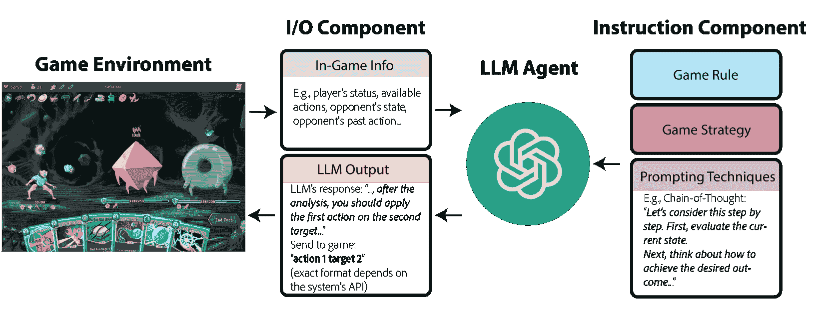
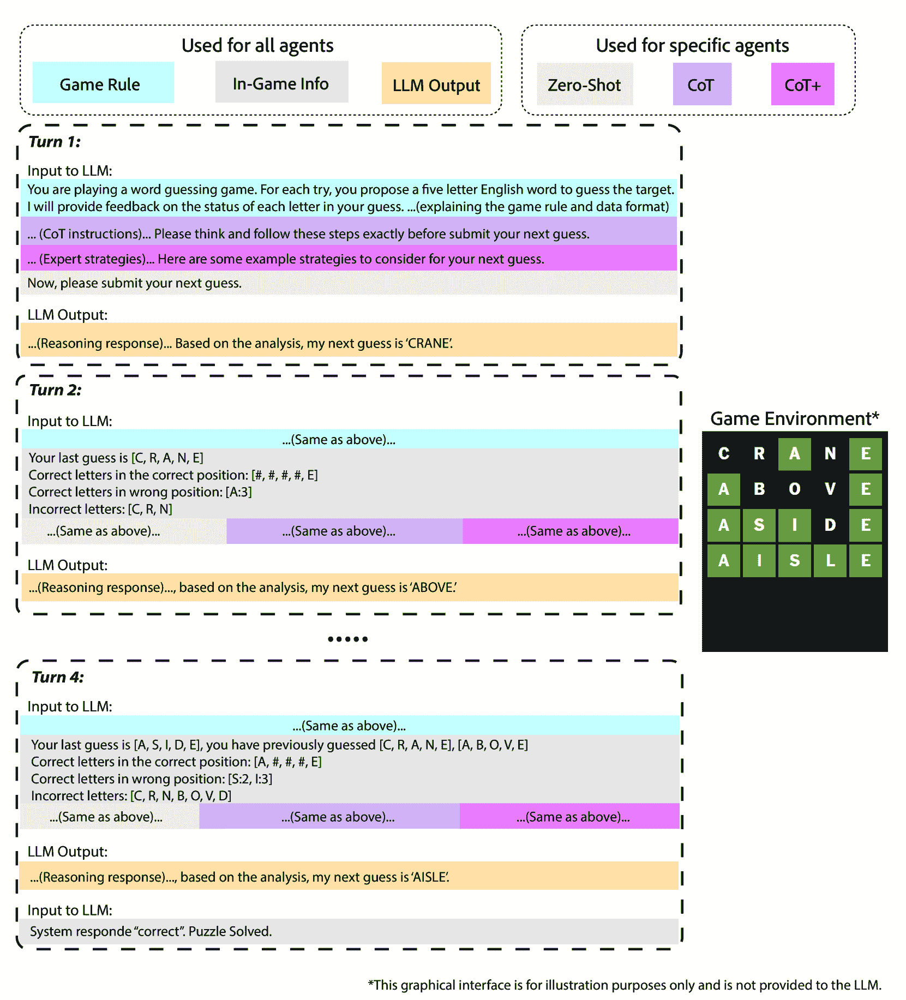
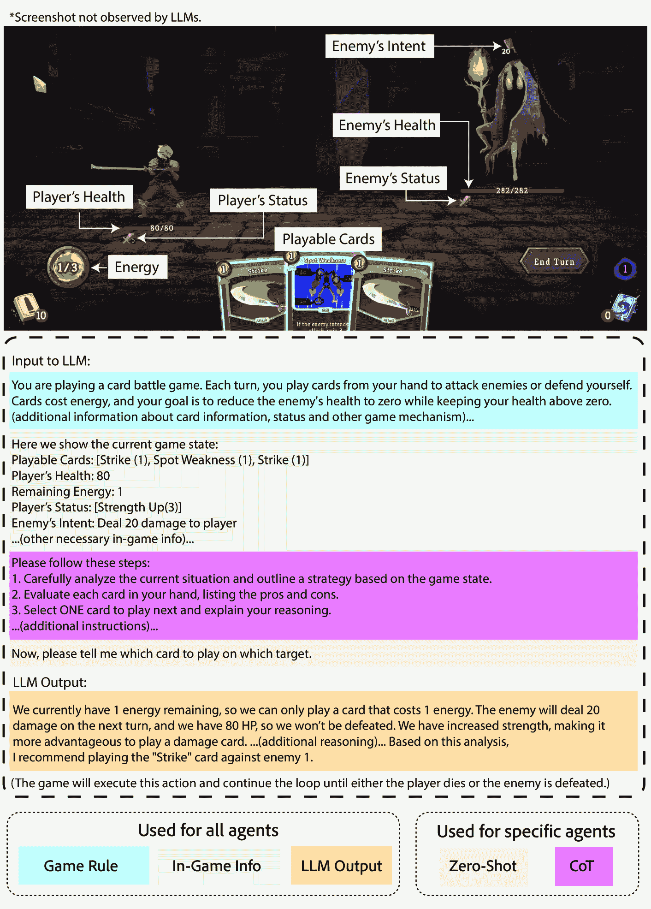

<!--yml

类别：未分类

日期：2025-01-11 12:10:34

-->

# LLMs可能不是人类级别的玩家，但它们可以是测试者：使用LLM智能体衡量游戏难度

> 来源：[https://arxiv.org/html/2410.02829/](https://arxiv.org/html/2410.02829/)

Chang Xiao Adobe Research加利福尼亚州圣荷西，USA 和 Brenda Z. Yang 哥伦比亚大学纽约，USA

###### 摘要。

大型语言模型（LLMs）的最新进展展示了它们作为自主智能体在各种任务中的潜力。一个新兴的应用是将LLMs用于玩游戏。在本研究中，我们探讨了一个游戏行业的实际问题：LLMs能否用来衡量游戏难度？我们提出了一个使用LLM智能体的通用游戏测试框架，并在两款广受欢迎的策略游戏《Wordle》和《Slay the Spire》上进行了测试。我们的结果揭示了一个有趣的发现：尽管LLMs的表现可能不如普通人类玩家，但在简单通用的提示技术引导下，它们的表现与人类玩家指示的难度之间存在统计学上显著且强烈的相关性。这表明LLMs可以作为有效的智能体，在游戏开发过程中衡量游戏难度。基于我们的实验，我们还概述了将LLMs纳入游戏测试过程的通用原则和指导方针。

视频游戏，大型语言模型，游戏测试，通用游戏玩法

## 1\. 引言

自数字时代初期以来，视频游戏已经成为人类文化的重要组成部分。从早期的原始游戏《Pong》到现代的知名游戏《侠盗猎车手》，这一媒介已经发展成为一个数十亿美元的产业，在娱乐领域发挥着举足轻重的作用。根据Steam游戏平台的统计数据（Statista，[2023](https://arxiv.org/html/2410.02829v1#bib.bib47)），每年都有超过一万款新的视频游戏发布。

开发成功视频游戏的一个关键方面是实现难度的平衡。玩家希望挑战既有成就感又不至于压倒自己，难度设计不平衡会导致挫败感和玩家流失（Juul，[2013](https://arxiv.org/html/2410.02829v1#bib.bib22)）。在游戏设计理论中（Rollings和Adams，[2003](https://arxiv.org/html/2410.02829v1#bib.bib42)），这被称为设计平滑的难度曲线，玩家在不同关卡中逐步面对越来越大的挑战，但这些挑战仍然是可以管理的。

一个突出例子说明了平衡难度的重要性，就是最近的热门游戏《艾尔登法环：厄尔德之树的影子》。在最初发布时，这款游戏因过于困难而遭到批评（Tassi, [2024](https://arxiv.org/html/2410.02829v1#bib.bib50); Gamer, [2024](https://arxiv.org/html/2410.02829v1#bib.bib12)），仅有少数玩家能够通过甚至是最初的几个区域。回应广泛的抱怨，开发者不得不发布补丁以降低难度，导致了额外的开发成本和消费者满意度的下降。

确保游戏的难度曲线与设计师的设想一致，需要在整个开发阶段进行严格的测试。传统上，招募人类玩家来评估游戏的难度（Aponte et al., [2011](https://arxiv.org/html/2410.02829v1#bib.bib5)）。这些测试人员会全面地穿越不同的关卡和场景，绘制出难度曲线，并检查其是否与开发者的意图相符。尽管这种方法非常详尽，但它本身也繁琐、复杂且资源密集，特别是在需要进行迭代更改时，往往需要大量的时间和人力。

为了解决这个问题，研究人员和开发者已经探索了自动化测试技术，利用人工智能模拟人类玩家并分析人工智能的表现来评估游戏的难度（Guerrero-Romero et al., [2018](https://arxiv.org/html/2410.02829v1#bib.bib14); Perez-Liebana et al., [2016](https://arxiv.org/html/2410.02829v1#bib.bib37)）。然而，关于人工智能能多准确地模拟真实玩家的能力，仍然存在不确定性。此外，训练这种人工智能模型，尤其是那些采用深度强化学习等先进技术的模型，需要大量的计算资源。而且，这些模型通常是针对特定游戏量身定制的，限制了它们在不同游戏之间的可重用性。这引发了关于为游戏测试创建特定游戏人工智能系统的成本效益问题（Shao et al., [2019](https://arxiv.org/html/2410.02829v1#bib.bib45)）。

因此，迫切需要创建一种通用的视频游戏代理（GVGP），该代理能够在不同的游戏之间轻松部署，并在合理程度上表现出类似人类的行为。近期，大型语言模型（LLM）的兴起引发了研究人员和开发者对其作为GVGP代理的潜力的兴趣。研究表明，LLM可以有效地玩电子游戏，并且通过精心设计的系统架构和提示，它们甚至能够在特定情况下达到高级玩家的水平（Hu et al., [2024a](https://arxiv.org/html/2410.02829v1#bib.bib19); Huang et al., [2024](https://arxiv.org/html/2410.02829v1#bib.bib20); Wang et al., [2023](https://arxiv.org/html/2410.02829v1#bib.bib58)）。

鉴于大语言模型的推理能力及其在游戏场景中的成功应用，我们旨在探讨大语言模型是否可以有效用于游戏测试，特别是评估游戏难度。我们的目标是建立一个通用框架，使得大语言模型能够在不需要额外微调的情况下进行游戏，并以一种与人类非常接近的方式评估难度。

我们在这项工作中的贡献有三点：

+   •

    我们提出了一个通用的游戏测试框架，利用大语言模型（LLMs）来评估各种游戏挑战是否反映了游戏开发者所期望的难度。

+   •

    我们在两款流行的电子游戏——《Wordle》和《Slay the Spire》中部署了这一框架。我们的研究结果表明，大语言模型在不同挑战的难度上与人类的表现具有较强的相关性，尽管它们通常与普通人类玩家的游戏表现（例如，得分、胜率）不匹配。具体来说，当大语言模型在某些挑战中表现不佳时，人类玩家也觉得这些挑战很难，反之亦然。这表明，大语言模型可以作为有效的测试工具，用于评估不同挑战的相对难度。

+   •

    基于我们使用大语言模型代理进行游戏的实验，我们总结了几条有效利用大语言模型评估游戏难度的指导原则。这些指导原则可以为游戏行业提供见解，并有助于基于大语言模型的游戏测试环境的开发。

据我们所知，我们的工作是首个探讨使用大语言模型来衡量游戏难度的可行性，并基于人类游戏数据进行验证的研究。

### 1.1. 难度的测量

到目前为止，我们使用了“难度”一词，但并未给出正式定义。根据之前的文献（Aponte 等人，[2009](https://arxiv.org/html/2410.02829v1#bib.bib4)，[2011](https://arxiv.org/html/2410.02829v1#bib.bib5)；Juul，[2003](https://arxiv.org/html/2410.02829v1#bib.bib21)），在视频游戏的语境中，难度通常与玩家的技能或克服特定“挑战”的能力相关。游戏中的“挑战”可以理解为一个子游戏：一个基于规则的系统，具有可变和可量化的结果（Juul，[2003](https://arxiv.org/html/2410.02829v1#bib.bib21)）。

尽管理论上，特定挑战的难度可以通过绝对指标来表示，但在游戏开发中，通常更重要的是不同挑战之间的难度相对变化（Aponte 等， [2009](https://arxiv.org/html/2410.02829v1#bib.bib4)）。一个结构良好的难度曲线有助于玩家进入**心流**状态（Czikszentmihalyi，[1990](https://arxiv.org/html/2410.02829v1#bib.bib9)），在这种状态下任务既不太难也不太容易，从而提高玩家的参与度和游戏的乐趣。当应用大规模语言模型（LLM）进行难度评估时，目标不应是获取任何单一挑战的绝对难度值。相反，重点应放在确定一系列挑战之间的相对难度及其变化。

如Aponte等人（Aponte 等， [2011](https://arxiv.org/html/2410.02829v1#bib.bib5)）所讨论的，难度可以通过实验性测量来评估，方法是让许多玩家尝试一组特定的挑战，并评估他们表现的质量。质量测量可以涉及与难度相关的任何游戏统计数据，例如玩家克服挑战的胜率、得分或所花费的时间。选择的具体指标取决于上下文和游戏，因为没有普遍适用的正确难度衡量标准。

## 2\. 相关工作

### 2.1\. 游戏测试中的AI

在本十年智能模型兴起之前，“AI”这个术语通常用于游戏领域，指的是用于控制非玩家角色或自动化游戏机制的算法。与此同时，由于游戏开发中人工测试的高成本，使用AI进行游戏测试的想法自视频游戏早期便已被探索。Macleod的工作（Macleod，[2005](https://arxiv.org/html/2410.02829v1#bib.bib30)）通过使用多智能体系统模拟**Perudo**（一种竞标骰子游戏）中的游戏玩法进行研究。类似地，Kirby等人（Kirby 和 Hurley，[2011](https://arxiv.org/html/2410.02829v1#bib.bib24)）通过用基于规则的算法替代人类玩家来研究经典游戏扫雷，发现一个简单的算法能够解决大多数情况。尽管这些都是规则明确的简单游戏，但这些研究展示了基于规则的AI在游戏测试中的潜力。如今，自动化游戏测试的概念已经在游戏研究中得到了广泛的研究（Aponte等， [2011](https://arxiv.org/html/2410.02829v1#bib.bib5); Guerrero-Romero等， [2018](https://arxiv.org/html/2410.02829v1#bib.bib14)），并被集成到现代游戏开发框架中，如Unity（Unity Technologies，[2023](https://arxiv.org/html/2410.02829v1#bib.bib55)）。

随着视频游戏的发展，它们的规模不断扩大，游戏机制变得越来越复杂（Aponte 等人， [2009](https://arxiv.org/html/2410.02829v1#bib.bib4)）。在现代视频游戏开发中，为这些游戏创建 AI 策略已经变得与设计游戏本身一样具有挑战性，甚至可能更加困难（Perez-Liebana 等人， [2016](https://arxiv.org/html/2410.02829v1#bib.bib37)）。因此，研究人员正在探索更先进和更通用的方法来开发游戏 AI，重点是可能创造 GVGP 智能体。值得注意的是，近年来，使用深度学习（**DL**）来训练游戏 AI 已经取得了巨大的成功，无论是通过从人类游戏玩法中进行监督学习（Świechowski 等人， [2018](https://arxiv.org/html/2410.02829v1#bib.bib49); Barriga 等人， [2019](https://arxiv.org/html/2410.02829v1#bib.bib6); Ye 等人， [2020](https://arxiv.org/html/2410.02829v1#bib.bib61)），还是通过自我对弈进行强化学习（Risi 和 Preuss， [2020](https://arxiv.org/html/2410.02829v1#bib.bib41); Heinrich 和 Silver， [2016](https://arxiv.org/html/2410.02829v1#bib.bib16); Silver 等人， [2018](https://arxiv.org/html/2410.02829v1#bib.bib46)）。这些方法已经应用于各种流行的视频游戏，包括 Atari（Mnih 等人， [2013](https://arxiv.org/html/2410.02829v1#bib.bib33)）、星际争霸（Vinyals 等人， [2019](https://arxiv.org/html/2410.02829v1#bib.bib57); Ontanón 等人， [2013](https://arxiv.org/html/2410.02829v1#bib.bib34)）和毁灭战士（Lample 和 Chaplot， [2017](https://arxiv.org/html/2410.02829v1#bib.bib25)）。这些技术使得游戏 AI 在诸如得分和胜率等指标上达到了超人类水平。关于基于深度学习的游戏 AI 的全面综述，请参见 Shao 等人（Shao 等人， [2019](https://arxiv.org/html/2410.02829v1#bib.bib45)）的调查。然而，许多研究集中于构建更好的 AI 模型，而非利用 AI 来辅助游戏开发过程。

为了弥补这一空白，研究人员最近将关注点从单纯地开发更强大的游戏 AI，扩展到探索 AI 如何为游戏设计和玩家体验提供洞见。例如，Zhu 等人（Zhu et al., [2021](https://arxiv.org/html/2410.02829v1#bib.bib64)）分析了超过 20 款游戏，识别出这些游戏中玩家与 AI 互动的主要隐喻和模式。Villareale 等人（Villareale et al., [2022](https://arxiv.org/html/2410.02829v1#bib.bib56)）进行了一项研究，参与者与对抗性 AI 模型进行对战，研究玩家在游戏过程中如何构建 AI 的心理模型。Liang 等人（Liang et al., [2019](https://arxiv.org/html/2410.02829v1#bib.bib27)）则提供了 AI 如何增强在人类与 AI 协作游戏中传递可操作信息的自然性与高效性的洞见。这些研究表明，AI 系统能够为游戏设计提供宝贵的见解。此外，越来越多的研究讨论了 AI 在游戏中扮演的角色的设计空间，以及它如何改善玩家体验（Treanor et al., [2015](https://arxiv.org/html/2410.02829v1#bib.bib52)；Zhu et al., [2021](https://arxiv.org/html/2410.02829v1#bib.bib64)；Guzdial et al., [2019](https://arxiv.org/html/2410.02829v1#bib.bib15)）。

尽管取得了这些进展，为游戏创建 AI 系统仍然是一个重大挑战。游戏 AI 通常需要针对每个游戏进行逐个设计或训练，特别是基于深度学习（DL）的 AI，这需要大量的计算资源。另一个主要挑战是基于深度学习的 AI 系统缺乏可解释性（Shao et al., [2019](https://arxiv.org/html/2410.02829v1#bib.bib45)）。例如，理解 AI 为什么选择某个特定的动作而不是另一个动作可能很困难，这限制了游戏开发者从这些系统中获得的洞见。因此，目前仍不清楚 AI 如何被用来提高游戏开发的生产力。

### 2.2\. 游戏中的 LLM 代理

LLM 的不断发展展示了它们在广泛任务中的潜力，从总结文章到复杂的代码生成，促使人们开始考虑它们作为通用代理在 GVGP（游戏与视频游戏设计）中的潜力。这一潜力归因于它们处理多样化文本输入、解释自然语言指令并进行有效推理生成适当输出的能力。这些特性使得 LLM 非常适合处理与游戏相关的数据，并以最少的训练工作产生类似人类的动作。

与基于深度学习的人工智能趋势相似，开发大型语言模型（LLM）代理以实现更好的游戏表现已经成为一项重要的研究方向。这些努力的实例跨越了多种游戏类型，包括像狼人杀（Xu等，[2023](https://arxiv.org/html/2410.02829v1#bib.bib60)）和阿瓦隆（Light等，[2023](https://arxiv.org/html/2410.02829v1#bib.bib28)）这样的对话类游戏，扑克牌（Huang等，[2024](https://arxiv.org/html/2410.02829v1#bib.bib20)）、国际象棋（Feng等，[2024](https://arxiv.org/html/2410.02829v1#bib.bib10)）和填字游戏（Saha等，[2024](https://arxiv.org/html/2410.02829v1#bib.bib43)）这样的棋盘和卡牌类游戏，以及更复杂的视频游戏如街头霸王（Girard等，[2024](https://arxiv.org/html/2410.02829v1#bib.bib13)）、星际争霸II（Ma等，[2023](https://arxiv.org/html/2410.02829v1#bib.bib29)）、宝可梦（Hu等，[2024a](https://arxiv.org/html/2410.02829v1#bib.bib19)）、文明（Qi等，[2024a](https://arxiv.org/html/2410.02829v1#bib.bib38)）、我的世界（Wang等，[2023](https://arxiv.org/html/2410.02829v1#bib.bib58)）和杀戮尖塔（Bateni和Whitehead，[2024](https://arxiv.org/html/2410.02829v1#bib.bib7)）等。这些研究中的许多表明，通过适当的提示技术和系统结构，LLM可以在游戏中表现出类人的行为，并超越传统的基于启发式的人工智能算法。近期的综述总结了使用LLM进行游戏的相关研究（Hu等，[2024b](https://arxiv.org/html/2410.02829v1#bib.bib18)；Zhang等，[2024](https://arxiv.org/html/2410.02829v1#bib.bib62)）。然而，这些研究大多集中在开发更好的LLM代理以优化游戏表现或作为与人类玩家对抗的AI对手，较少关注如何将LLM应用于游戏开发的其他部分。

因此，近年来越来越多的研究探索了LLM在游戏开发不同方面的其他应用可能性。例如，除了作为玩家外，LLM还可以充当非玩家角色（NPC）或解说员（Shanahan等人，[2023](https://arxiv.org/html/2410.02829v1#bib.bib44); Ranella和Eger，[2023](https://arxiv.org/html/2410.02829v1#bib.bib40)），丰富玩家的体验。此外，LLM在文本摘要和生成开放式输入响应方面的能力使其成为理想的游戏主持人（GM），尤其是在经典桌面角色扮演游戏如《龙与地下城》（Tychsen等人，[2005](https://arxiv.org/html/2410.02829v1#bib.bib54)）中。由精调版GPT-2管理的第一个显著文本冒险游戏是AI Dungeon（Treanor等人，[2015](https://arxiv.org/html/2410.02829v1#bib.bib52)）。还有一些研究探讨了LLM如何在游戏过程中协助人类GM（Zhu等人，[2023](https://arxiv.org/html/2410.02829v1#bib.bib63); Kelly等人，[2023](https://arxiv.org/html/2410.02829v1#bib.bib23); Acharya等人，[2023](https://arxiv.org/html/2410.02829v1#bib.bib2)）。

除了这些角色外，LLM的生成能力对于游戏中的程序化内容生成（PCG）至关重要。通过将游戏内容结构化为文本，LLM可以为各种游戏生成新的关卡设计，例如《仓库番》（Todd等人，[2023](https://arxiv.org/html/2410.02829v1#bib.bib51)）和《超级马里奥》（Sudhakaran等人，[2024](https://arxiv.org/html/2410.02829v1#bib.bib48)）。考虑到它们整合世界知识和生成内容的能力，预计LLM将在未来的游戏设计中发挥重要作用。Gallotta等人（Gallotta等人，[2024](https://arxiv.org/html/2410.02829v1#bib.bib11)）概述了LLM对游戏玩法和开发的潜在贡献，并讨论了将LLM纳入游戏设计过程的路线图。

尽管有这些多样化的贡献，LLM代理在评估游戏难度方面仍然是一个未充分探索的领域。我们旨在探索它们的潜力，并研究LLM在评估游戏难度时能模拟人类的程度。

### 2.3. LLM作为类人模拟器

在游戏领域之外，已有大量研究探讨了如何在各个领域利用大规模语言模型（LLM）作为人类模拟器，包括经济学（Li 等，[2024](https://arxiv.org/html/2410.02829v1#bib.bib26); Horton，[2023](https://arxiv.org/html/2410.02829v1#bib.bib17); Aher 等，[2023](https://arxiv.org/html/2410.02829v1#bib.bib3)），政治学（Wu 等，[2023](https://arxiv.org/html/2410.02829v1#bib.bib59); Qi 等，[2024b](https://arxiv.org/html/2410.02829v1#bib.bib39)），医疗保健（Peng 等，[2023](https://arxiv.org/html/2410.02829v1#bib.bib36); Tustumi 等，[2023](https://arxiv.org/html/2410.02829v1#bib.bib53)），以及社会科学（Ziems 等，[2024](https://arxiv.org/html/2410.02829v1#bib.bib65); Park 等，[2023](https://arxiv.org/html/2410.02829v1#bib.bib35); Manning 等，[2024](https://arxiv.org/html/2410.02829v1#bib.bib31)）。这些研究表明，在某种程度上，LLM能够有效地模拟人类行为、决策和社会互动，适用于不同的情境。鉴于这些有前景的应用，我们有兴趣了解是否在游戏领域中也能观察到类似的能力。

## 3\. 框架概述与游戏选择

图 1\. 基于LLM的游戏难度测试框架概述。在每一步游戏循环中，游戏信息通过API提取，转换成自然语言，并通过LLM处理，附加细节（如游戏规则和策略）通过类似思维链的提示技术传递给LLM。LLM输出一个建议的玩家动作，这个动作被转换成API调用或键盘/鼠标事件，以执行游戏内的操作。循环持续进行，直到挑战完成或失败。

我们的目标是提供一个通用的游戏难度测量框架，使用LLM的游戏表现作为难度指标。图[1](https://arxiv.org/html/2410.02829v1#S3.F1 "图 1 ‣ 3\. 框架概述与游戏选择 ‣ LLM可能不是人类水平的玩家，但它们可以是测试者：通过LLM代理测量游戏难度")展示了我们的框架架构。我们的框架包括两个主要组件：游戏I/O组件和指令组件。

+   •

    游戏I/O组件：此组件处理LLM与游戏环境之间的交互。它解析游戏状态，概括LLM所需的信息，并将LLM的响应转化为可执行的游戏动作。

+   •

    指令组件：该组件由三部分组成：游戏规则、游戏策略和提示技巧。游戏规则提供了游戏如何操作的基本解释，确保LLMs能够以合理的方式进行游戏。游戏策略介绍了游戏玩法战术的外部知识，提升LLMs的表现，并模拟类人的游戏风格。提示技巧涉及引导LLM的方法，如思维链（Chain-of-Thought，CoT）。这一部分还规定了LLM如何利用游戏知识，例如在决策过程中引用特定的游戏规则或遵循定制的策略。

### 3.1\. 游戏选择

在接下来的内容中，我们概述了选择用于评估LLMs的游戏原则，既考虑游戏设计，也考虑LLMs的能力。

首先，所有必要的游戏信息必须能够以文本形式表示。这遵循了现有基于LLM的游戏代理研究中的标准做法（Ma等，2023，[链接](https://arxiv.org/html/2410.02829v1#bib.bib29)）。因此，像第一人称射击游戏（FPS）等过于依赖视觉信息的游戏被排除在当前的选择之外。在本研究中，我们专注于可以以文本形式表达的游戏（尽管不一定是文本冒险游戏），并使用如GPT-3.5和GPT-4等LLMs对它们进行评估。

其次，我们旨在测试我们框架的原始版本，基于真实且广泛游玩的游戏。流行游戏通常通过精心打磨和平衡设计来获得其地位，使其能够吸引各种观众并取得成功。因此，这些游戏更能代表游戏开发中遇到的现实场景。通过专注于流行的完整规模游戏，本次评估旨在为未来基于LLM的游戏测试研究提供更具应用性和相关性的见解。

第三，为了评估LLMs在多大程度上能代表人类玩家所体验到的游戏难度，我们需要选择那些具有公开的人类游戏数据的游戏。将LLMs的表现与人类游戏数据进行比较，是确定LLMs在评估游戏难度时与真实玩家的匹配程度最直接且最有说服力的方法。使用具有可用人类游戏数据的游戏，为LLMs和人类建立了共享的基础，从而在相同条件下进行难度评估。

基于这些考虑，我们选择了两款游戏进行评估：Wordle 和 Slay the Spire。这些广受推崇、屡获殊荣的游戏代表了高质量的游戏设计，并且它们的规则和行动空间复杂度差异显著。有关游戏规则及其如何与我们的评估标准相符的更多信息将在接下来的章节中提供。

## 4\. Wordle

### 4.1\. 背景

Wordle 是一款由《纽约时报》发布的基于网页的文字拼图游戏，¹¹1https://www.nytimes.com/games/wordle/index.html，目前约有 30 万活跃日常用户。在这款游戏中，玩家有六次机会猜测一个五个字母的单词。每次猜测后，玩家会收到反馈，提示他们的猜测与正确单词的接近程度，目标是尽可能少的猜测次数找到正确答案。

更具体地说，当玩家进行猜测时，游戏通过将每个字母高亮显示为三种颜色之一来提供反馈：绿色、黄色或灰色。绿色字母表示该字母在单词中的位置正确。黄色字母表示该字母在单词中但位置不同。灰色字母则表示该字母根本不在单词中。例如，如果目标单词是“APPLE”，玩家猜测“ALERT”，那么“ A”会高亮显示为绿色，“L”和“E”会显示为黄色，其他字母则为灰色。玩家利用这些反馈调整后续猜测，力求在六次猜测内识别出正确单词。

作为一款纯粹以文字游戏为主的游戏，Wordle 是我们用例的理想示例，因为整个游戏环境都可以用文字来描述。解答谜题需要战略性推理，因为玩家必须在使用未经验证的字母以获取更多信息与依靠已验证的字母来对下一次猜测进行战略性判断之间取得平衡。此外，谜题相互独立，这使得我们能够单独评估每个谜题的难度。

此外，Wordle 提供了公开的人类游戏数据。这些数据托管在《纽约时报》网站上，游戏配有一个名为 WordleBot 的工具，记录并分析玩家的表现。WordleBot 记录了超过 60 万次来自真实用户的游戏，提供了诸如解决谜题所需的平均尝试次数以及分数分布等详细统计信息。这个数据集（Chris，[2024](https://arxiv.org/html/2410.02829v1#bib.bib8)）使我们能够评估大型语言模型（LLM）对谜题难度的评估与人类表现之间的一致性。由于 Wordle 的游戏机制简单，每个谜题的难度可以通过解决谜题所需的平均尝试次数或在六次猜测内解答谜题的玩家百分比（通常称为胜率）来直接衡量。通常，所需的尝试次数越多或胜率越低，谜题的难度就越大。

### 4.2. 实现

#### 游戏引擎和输入/输出

由于Wordle的游戏规则简单明了，我们能够在本地机器上实现该游戏，而无需连接到web服务器。Wordle的核心过程本质上是验证玩家猜测中的字母是否与目标词中的字母匹配，并根据其位置提供反馈。我们开发了一个Python程序来实现这个游戏逻辑。该程序将玩家的猜测作为输入，并与目标词进行比较。然后，通过识别哪些字母是正确的且位置正确、哪些字母是正确但位置错误、以及哪些字母根本不在目标词中来生成反馈。这些反馈以自然语言描述，并附带其他信息，如已用的猜测次数和猜测历史，以供AI代理处理。

#### LLM代理和提示

为了设置LLM进行Wordle游戏的上下文，我们首先准备了游戏规则的通用描述以及游戏环境的输入/输出格式说明。然后，我们提供了实时的游戏内信息，作为上一次尝试的反馈，并指示LLM生成下一次猜测。

为了评估不同的提示工程技巧如何影响LLM代理的游戏能力，以及这种能力与人类表现的相似程度，我们使用了三种不同的提示方法。第一种方法是零-shot提示，我们仅仅描述游戏规则，并在接收到游戏内信息后，直接让LLM生成一个猜测。第二种方法是CoT提示。在这种方法中，我们不仅提供游戏规则，还提示LLM在做出猜测之前进行逐步推理。第三种方法将CoT与游戏策略相结合，称为CoT+。鉴于Wordle是一个广受欢迎的游戏，且有大量在线讨论，我们整合了网络上找到的专家策略，并引导LLM通过CoT推理这些策略。此方法受到现有研究的启发，旨在为策略游戏开发有效的代理（Huang等人，[2024](https://arxiv.org/html/2410.02829v1#bib.bib20); Saha等人，[2024](https://arxiv.org/html/2410.02829v1#bib.bib43); Hu等人，[2024a](https://arxiv.org/html/2410.02829v1#bib.bib19)），并期望提升LLM的游戏能力。然而，我们并未对LLM进行微调以融入这些知识，因为我们的重点是利用现成的LLM进行一般游戏。请参见图[2](https://arxiv.org/html/2410.02829v1#S4.F2 "图2 ‣ LLM代理和提示 ‣ 4.2\. 实现 ‣ 4\. Wordle ‣ LLM可能不是人类水平的玩家，但它们可以成为测试者：通过LLM代理衡量游戏难度")，该图展示了LLM代理进行Wordle游戏的一个示例回合，以及LLM与游戏引擎之间的示例互动。

我们使用了两种不同的LLM模型，GPT-3.5 Turbo和GPT-4，共计六种不同的配置。

图2\. LLM智能体解决Wordle谜题的示例运行。最初，LLM提供游戏规则和特定类型的提示（例如，Zero-Shot、CoT和CoT+）。然后，LLM生成其第一次猜测，并收到游戏关于正确和错误字母及其位置的反馈。利用这些反馈，以及上一回合的相同提示，LLM生成下一个猜测。这个循环继续，直到LLM要么猜对正确的单词，要么超过允许的最大猜测次数。

#### 基准

为了进行比较，我们使用了一个开源的Wordle解谜智能体²²2https://github.com/jason-chao/wordle-solver，该智能体基于信息理论，旨在最小化解决游戏所需的猜测次数。Wordle解谜器通过使用每次猜测的反馈，排除与当前条件不兼容的单词，逐渐缩小可能的单词列表。在前两到三次猜测之后，潜在单词的列表通常仍然相当庞大。此时，解谜器计算出哪些字母最有可能出现在正确的单词中，并根据这些高概率字母提出猜测。Wordle解谜器被认为是一个接近最优的玩家，在每个谜题中平均需要3.55步解决，且拥有100%的胜率，表现超过了全球人类玩家的平均水平（3.97步）(Chris, [2024](https://arxiv.org/html/2410.02829v1#bib.bib8))。将此基准与其他LLM智能体进行比较，将有助于我们理解更好的游戏表现是否能转化为更准确的人类玩家模拟。

### 4.3\. 实验

本研究的目标是探讨两个关键问题：（i）对于人类玩家来说困难的谜题是否对LLM智能体也具有挑战性，需要更多的步骤才能解决？即使某些LLM智能体可能通常需要比人类更多的猜测，我们仍然感兴趣的是它们是否在相对难度上遵循相似的趋势。换句话说，我们希望确定LLM智能体的表现是否与人类在哪些谜题更具挑战性或更容易解决方面相关，重点关注不同谜题之间的相对难度，而不是猜测的绝对次数。（ii）LLM模型和提示方法是否会影响LLM表现与人类游戏表现之间的相关性？如果是，如何影响？理解这一点对于识别哪些LLM模型和提示技巧与人类游戏体验更为一致至关重要。

为了回答关键问题，我们从数据集中收集了Wordle谜题（Chris, [2024](https://arxiv.org/html/2410.02829v1#bib.bib8)），涵盖了2024年3月7日到2024年8月16日的时间段，共得到了529个不同的谜题。

为了评估每个代理的表现，我们让他们尝试解决每个谜题。由于大型语言模型（LLM）代理本身的随机性，我们对每个谜题进行了20次试验，并计算了解决每个谜题所需的平均猜测次数。对于使用确定性算法的Wordle解答器代理，我们每个谜题只运行一次模拟。我们观察到，在每个谜题最多只能猜测六次的原始规则下，一些LLM代理大多数时候可能无法完成任务。为了获得更多样化的统计数据以供分析并减少失败案例，我们将允许的最大猜测次数增加至12，从而在评估每个代理的表现时提供了更细致的量度。

我们使用每个谜题的平均猜测次数作为难度的指标，因为较高的猜测次数直观上表示谜题更难。每个代理报告了529个谜题的猜测次数。在获得每个代理对所有谜题的结果后，我们进行了皮尔逊相关性测试，比较了代理的猜测次数和人类玩家相应的平均猜测次数。

#### 结果

我们实验的结果总结在表[1](https://arxiv.org/html/2410.02829v1#S4.T1 "Table 1 ‣ Results ‣ 4.3\. Experiment ‣ 4\. Wordle ‣ LLMs May Not Be Human-Level Players, But They Can Be Testers: Measuring Game Difficulty with LLM Agents")中。第一行展示了每个代理在所有谜题中使用的猜测次数的加权平均值。这可以视为它们整体问题解决能力的关键指标。接下来，表格展示了每个代理的皮尔逊相关系数（$r$）和显著性检验的$p$-值。如表中所示，Wordle解答器展示了最强的Wordle游戏能力，平均猜测次数最少，甚至超过了人类。相比之下，LLM代理的平均猜测次数从$5.12$到$9.35$不等，表现较人类平均水平差。GPT-4通常比GPT-3.5在相同的提示技巧下使用更少的猜测次数。值得注意的是，诸如链式推理（CoT）等高级提示技巧的应用和游戏策略的整合在很大程度上提升了LLM代理的游戏表现。

尽管表现低于人类水平，GPT-4 CoT/CoT+代理的平均猜测次数与人类平均值显示出中等到强的相关性，且所有相关性均具有统计学意义（$p<0.001$）。这一发现表明，对人类玩家而言困难的谜题，对于LLM代理同样困难，这意味着LLM所使用的猜测次数可以作为Wordle谜题难度的可靠代理。另一方面，尽管Wordle解谜者的游戏表现接近最优，但它与人类表现的相关性非常弱，且这一相关性没有统计学意义（$p>0.05$）。我们将其归因于其算法特性，在每次猜测时优化信息熵的减少，而这种策略通常不适用于人类玩家。这一差异表明，使用高度优化的AI进行游戏难度测试的局限性，因为它并不一定反映人类的问题解决方法。

在大语言模型（LLM）代理中，还观察到了一些进一步的见解。总体而言，随着LLM代理游戏表现的提高，它们与人类表现的相关性也在增加。例如，GPT-3.5和GPT-4的零-shot代理显示出较低的游戏能力，并且与人类玩家的相关性较弱，这可能是因为这些模型缺乏对基本Wordle解谜策略的理解，导致它们的行为类似于随机猜测。然而，经过简单提示后，游戏表现和与人类的相关性都有了显著提升。这表明，虽然零-shot LLM可能不是一个有效的玩家或测试者，但通过提示，可以提高其表现并与人类的对齐程度。此外，像GPT-4这样更先进的LLM，在应用推理链（CoT）和外部策略时，不仅在游戏能力上表现更好，而且在人类相关性上也有更好的表现。这归因于GPT-4在跟随指令和进行准确推理方面的卓越能力。这些发现表明，在测试游戏难度时，应该使用更强大的LLM，并结合CoT等提示技巧和战略知识，以更接近地模拟人类的游戏表现。

总结来说，这些结果突显了GPT代理在评估一组Wordle谜题相对难度方面，作为人类玩家的替代者的潜力，尤其是在结合推理和战略知识后。

| 代理 | Wordle 解谜者 | GPT-3.5 | GPT-4 | 人类 |
| --- | --- | --- | --- | --- |
| ZS | CoT | CoT+ | ZS | CoT | CoT+ |
| --- | --- | --- | --- | --- | --- |
| 平均猜测次数 | 3.55 | 9.35 | 7.65 | 7.41 | 7.79 | 6.802 | 5.12 | 3.97 |
| $r$ | .075 | .237 | .365 | .387 | .259 | .435 | .624 | - |
| $p$ | .124 | ¡.001 | ¡.001 | ¡.001 | ¡.001 | ¡.001 | ¡.001 | - |

表1\. 不同智能体的Wordle结果。ZS表示零样本提示，CoT表示链式推理，CoT+表示带外部策略信息的链式推理。我们使用灰色框，从浅到深，表示无相关或非常弱的相关性（$0<r<0.2$），弱相关性（$0.2<r<0.4$），中等相关性（$0.4<r<0.6$）和强相关性（$r>0.6$）。

## 5\. 扑灭尖塔

图3\. LLMs进行扑灭尖塔游戏中的一回合示例。顶部图显示了游戏的截图，以及玩家可以感知到的信息。下方是游戏与LLM之间的互动示例。

### 5.1\. 背景

扑灭尖塔（StS）（MegaCrit，[2019](https://arxiv.org/html/2410.02829v1#bib.bib32)）是一款屡获殊荣的单人视频游戏，结合了卡组构建和类Roguelike³³Roguelike指的是一类子类型视频游戏，特点是程序生成的关卡、高随机性和永久角色死亡，鼓励反复游戏，每次通关都提供独特的体验。元素。它具有以其复杂机制而闻名的卡牌战斗系统，这要求战略规划和有效的卡牌协同。在游戏过程中，玩家通过关卡，使用不断发展的卡组与随机敌人战斗。每次胜利后，玩家从随机的卡牌集中选择一张新卡加入卡组，逐步增强卡组以应对越来越强的敌人。

StS可能是LLM智能体测试的一个代表性候选游戏，原因有几个。首先，所有游戏机制，包括规则、卡牌描述和敌人策略，都可以用文本表示。无需使用图形理解方法来执行游戏玩法。

其次，游戏需要持续理解当前的游戏状态，比如手中的卡牌和敌人的生命值。玩家必须不断考虑最佳策略，并计算可能性，以最大化获胜的机会。为了说明为什么StS是我们实验的合适环境，考虑以下示例卡牌：

+   •

    Strike（消耗1点）：效果：造成6点伤害。

+   •

    Bash（消耗2点）：效果：造成8点伤害。使敌人处于脆弱状态。

如上所示，Strike卡牌造成直接的6点伤害，但如果先使用如Bash之类的卡牌，施加脆弱效果，敌人将承受来自后续攻击的50%更多伤害。因此，当Strike对脆弱的敌人使用时，它将造成9点伤害，而不是6点。这突显了战斗中卡牌使用顺序的重要性。由于有超过100种不同类型的卡牌，LLM可以推理出多种可能的组合。

第三，开发者发布了一个包含7500万次以上游戏会话的真实玩家数据集⁴⁴4https://foxrow.com/slay-the-spire-statistical-analysis。这个数据集使我们能够分析人类在与不同敌人作战时的表现，并将其与我们的LLM代理或其他基准进行比较。

值得注意的是，StS曾在涉及LLM的游戏玩法的先前研究中被使用过（Bateni 和 Whitehead, [2024](https://arxiv.org/html/2410.02829v1#bib.bib7)）。然而，他们的研究主要集中于使用各种提示技术开发LLM代理来玩StS的简化版本并分析其表现，而没有与真实的人的数据进行比较。相比之下，我们的目标是使用通用的LLM框架评估StS的原版，目的是理解使用LLM来衡量游戏难度的可行性。

### 5.2\. 实现

原版StS是一款封闭源代码的游戏，发布在Steam和Xbox等视频游戏平台上，这些平台不支持编程接口。然而，得益于Steam Workshop⁵⁵5https://steamcommunity.com/workshop/社区，许多开发者创建了可以与原始游戏一起安装的Mods ⁶⁶6扩展，这些扩展可以修改游戏机制或提供游戏过程中可以用来进行自动化游戏的辅助工具。为了我们的实验目的，我们安装了两个Mods来实现自动化系统。

第一个是BasicMod，这是其他Mods运行所必需的基础Mod。它提供了允许额外Mods在原始游戏上运行的基础设施，并且具有一个控制台功能，使玩家能够使用命令行直接修改游戏元素，例如玩家的健康、遇到的敌人或手中的卡牌。

第二个Mod是CommunicationMod，它不修改游戏玩法，但允许通过标准流（stdin/stdout）提取游戏信息并提交输入动作。它还提供一个Python接口，允许通过API与游戏进行交互。

有了这两个Mods，我们可以轻松地将游戏环境视为一个黑箱，并允许LLM通过API与其交互。Python接口作为游戏的输入/输出组件，将所有游戏信息转换为文本，并将LLM的输出转换为可执行的游戏操作。

#### LLM代理与提示技术

在这项研究中，我们使用了两种类型的LLM代理：具有游戏规则的零样本代理（Zero-Shot Agent）和具有游戏规则以及思维链推理（Chain-of-Thought reasoning）的CoT代理。

为了提示 Zero-Shot LLM 代理，我们将游戏规则与通过 CommunicationMod 模块获得的实时游戏信息结合，形成一个包含基本目标、核心机制、卡组、玩家和敌人状态（例如，生命值、格挡、脆弱等，如前述示例所示）的自然语言输入。根据这一输入，LLM 被要求生成下一个要玩的卡牌以及该卡牌的目标。一旦 LLM 确定了下一步行动，响应将通过 Python 脚本解析，并作为可执行动作发送到 CommunicationMod 模块。然后，游戏环境将执行该动作，就像它是人为输入一样，允许游戏正常运行。在玩家结束回合后，敌人将采取行动，LLM 将接收更新后的游戏内信息并重复该过程。这个循环将持续，直到玩家的生命值归零（导致失败）或所有敌人被击败（导致胜利）。

除了上述提到的基本游戏知识外，CoT 代理还提供了逐步推理指令。在 CoT 提示中，我们要求 LLM 分析游戏中的情况，确定最佳策略，并在选择卡牌之前评估每张可玩的卡牌。这个过程鼓励代理展示更具逻辑性和人类化的行为。为了保持提示简洁，我们只提供了高层次的指令，同时避免了对特定卡牌或组合的详细战术。这种方法还使我们能够评估 LLM 能够独立生成多少策略，以及当没有外部策略提供时，它们能够多好地模拟人类的游戏方式。

与 Wordle 实验类似，我们为每个代理使用 GPT-3.5 Turbo 和 GPT-4，从而产生四种不同的 LLM 配置。LLM 代理玩 StS 的一个回合示例如图 [3](https://arxiv.org/html/2410.02829v1#S5.F3 "Figure 3 ‣ 5\. Slay the Spire ‣ LLMs May Not Be Human-Level Players, But They Can Be Testers: Measuring Game Difficulty with LLM Agents") 所示。

#### 基准代理

与 Wordle 实验类似，为了评估 LLM 在 StS 中如何近似人类行为，我们将其表现与两个基准代理进行比较，这两个代理都遵循基于规则的行为。第一个基准是一个随机行为代理，它从可用卡牌中随机选择并出牌，当没有足够的能量出牌或手牌用完时结束回合。

第二个基准是一个开源 AI⁷⁷7https://github.com/ForgottenArbiter/spirecomm 用于玩 StS，它结合了关于战术和卡牌优先级的专家知识，并遵循硬编码的游戏逻辑。方法的详细信息可以在源代码中找到。根据其文档，该代理能够在击败所有 boss 时实现 80% 的胜率。

这两个基准允许我们评估LLM表现所指示的难度与人类玩家的难度感知之间的吻合度，并与启发式AI进行比较。换句话说，我们的目标是确定LLM是否能够提供比基于启发式的AI更准确的游戏难度衡量。

### 5.3\. 实验

我们通过让代理与它们在行动1和行动2中可能遇到的所有boss进行对战来测试这些代理（“行动”是游戏中等同于“关卡”的术语）。为了保持实验的可控性，我们固定角色为“铁甲”并使用一个均衡的代表性卡组。我们发现，当使用一副与人类玩家在相应行动中的卡组强度相似的平均强度卡组时，LLM的胜率低于5%，对boss的胜利率较低。使用更强的卡组有助于弥补LLM在游戏表现上的不足，并确保了平均胜率为65%。

作为人类感知敌人难度的指标，我们使用每个boss的平均胜率，该胜率是从开发者发布的游戏数据中计算得出的。这个指标为人类玩家对每个boss的挑战性提供了基准，并为与代理表现的比较提供了参考点。

为了评估代理的游戏表现，我们使用“剩余HP”作为敌人难度的指标。这个指标反映了代理在每场战斗结束时的剩余生命值，提供了比单纯的胜率更细致的难度洞察，因为它不仅表明代理是否获胜，还显示了其获胜的难易程度。换句话说，剩余HP越高，说明战斗越不具挑战性。我们没有使用HP作为人类玩家表现的指标，因为由于某些游戏机制，人类玩家在面对boss战时可能会有不同的初始HP，这种不一致性使得在人类玩家之间进行比较不可靠。

在完成每个代理与所有boss的20次试验后，我们进行了皮尔逊相关性测试。我们考察了代理剩余HP与人类玩家通过平均胜率表示的敌人难度之间的关系。如果代理被击败，我们记录剩余HP为0，确保数据的一致性，并使我们能够评估代理的难度感知与人类玩家的感知是否一致。理想情况下，既然较高的胜率和较高的剩余HP都表示较低的难度，这两个指标应该呈现强正相关。

#### 定量结果

| 行动 | 代理 | 随机 | GPT-3.5 | GPT-4 | 基于规则的专家AI |
| --- | --- | --- | --- | --- | --- |
| ZS | CoT | ZS | CoT |
| --- | --- | --- | --- |
| 行动 1 | 平均HP | 12.717 | 8.650 | 19.917 | 22.550 | 36.733 | 32.400 |
| $r$ | 0.231 | 0.471 | 0.513 | 0.657 | 0.871 | 0.742 |
| $p$ | 0.075 | ¡0.001 | ¡0.001 | ¡0.001 | ¡0.001 | ¡0.001 |
| 行动 2 | 平均HP | 2.733 | 0.267 | 3.617 | 4.250 | 17.583 | 16.133 |
| $r$ | 0.287 | 0.208 | 0.395 | 0.479 | 0.710 | 0.482 |
| $p$ | 0.026 | 0.111 | 0.002 | ¡0.001 | ¡0.001 | ¡0.001 |

表2。不同代理的StS结果。

相关性测试的结果显示在表[2](https://arxiv.org/html/2410.02829v1#S5.T2 "Table 2 ‣ Quantitative Results ‣ 5.3\. Experiment ‣ 5\. Slay the Spire ‣ LLMs May Not Be Human-Level Players, But They Can Be Testers: Measuring Game Difficulty with LLM Agents")中。与我们在Wordle实验中的发现类似，结果为我们提出的两个关键问题提供了积极的答案。

首先，人类玩家认为困难的敌人对于LLM代理来说同样困难。这通过GPT-4与CoT与来自人类游戏的难度评估之间的非常强的关联性——高达0.871——得到了证实。

第二，LLM模型和提示方法对关联性的影响与Wordle实验中观察到的相似。对于第一幕和第二幕，GPT-4 CoT在所有代理中显示出最强的关联性，其次是基于规则的专家AI、GPT-4 ZS和GPT-3.5 CoT。最不具能力的代理是GPT-3.5 ZS，它在第二幕中的表现和关联性甚至比随机代理还差。这表明，像StS这样复杂且策略性强的游戏需要最先进的模型和高级的提示技术。

额外的观察进一步支持了这些结论。平均剩余HP更高的代理也表现出与人类指示难度的更高关联性，这不仅适用于基于LLM的代理，也适用于基于规则的代理。这一趋势与我们在Wordle求解器中的观察结果相反，尽管它的表现优越，但与人类的难度评估关联性较差。一个可能的解释是，在StS实验中，所有代理（除了随机代理）都被设计为近似人类的游戏策略，无论它们是LLM还是基于规则的专家。由于StS的复杂性增加，目前没有任何代理能够超越人类而不遵循类似于人类的推理过程，这与Wordle中的求解器使用基于优化的行为方式不同。因此，代理的行为模式与人类在此游戏中的行为越接近，它就越能逼近人类玩家指示的敌人难度。

此外，在检查平均剩余HP时，我们发现基于规则的专家AI几乎与最佳LLM代理——GPT-4与CoT提示——表现相当。然而，它与人类胜率的关联性远低于GPT-4与CoT的关联性。这表明，即使具有相似的游戏能力，LLM在推理和模仿人类行为方面优于启发式AI，因此在逼近人类指示的难度时表现得更好。

#### 定性结果

我们还对GPT-4 CoT的游戏玩法能力进行了定性分析，展示了其基于威胁评估、资源管理和最优卡牌使用的类人决策能力。图[4](https://arxiv.org/html/2410.02829v1#S5.F4 "图4 ‣ 定性结果 ‣ 5.3\. 实验 ‣ 5\. 刺客之魂 ‣ LLMs可能不是人类级玩家，但它们可以成为测试者：通过LLM代理测量游戏难度")展示了LLM在逐步推理和有效决策下的响应示例。

首先，在分析战斗时，主要威胁"酸液史莱姆"由于其意图攻击16点伤害而被正确识别。基于潜在伤害优先处理威胁是刺客之魂中的基本策略，确保玩家在管理其他敌人时最小化所受伤害。

其次，LLM通过计算和推理来评估每张卡牌，依据的是实时的游戏信息。这对像"Heavy Blade"这样的卡牌尤为重要，因为其最终伤害随着玩家当前力量值增长三倍；而"Spot Weakness"只能用来对抗攻击中的敌人。除了对当前游戏状态进行推理外，LLM还展示了预测未来游戏结果的能力，准确计算了在使用"Spot Weakness"提高力量后，"Heavy Blade"造成的59点伤害。

第三，基于当前游戏状态和手牌，LLM提出了一个专家级的行动计划。在这一回合中，玩家既有进攻选项，也有防御选项。使用"Spot Weakness"可以最大化"Heavy Blade"的伤害输出，确保有效消除主要威胁。通过专注于进攻而非防御，这一行动计划避免了使用挡牌，因为挡牌虽然可以减轻伤害，但无法消除威胁。

LLM生成的推理和策略突出了刺客之魂游戏中的关键方面：利用卡牌之间的协同作用、预测未来游戏状态，并根据潜在影响优先处理威胁。我们要强调的是，这个CoT代理并未被提供任何人类设计的关于如何打出卡牌的战略信息；相反，它独立开发了模仿人类思维过程的策略。

<svg class="ltx_picture ltx_figure_panel" height="319.87" id="S5.SS3.SSS0.Px2.1.pic1" overflow="visible" version="1.1" width="600"><g fill="#000000" stroke="#000000" stroke-width="0.4pt" transform="translate(0,319.87) matrix(1 0 0 -1 0 0)"><g fill-opacity="1.0" transform="matrix(1.0 0.0 0.0 1.0 21.65 13.78)"><foreignobject color="#000000" height="292.31" overflow="visible" transform="matrix(1 0 0 -1 0 16.6)" width="556.69">分析与策略 当前能量：3

当前生命值：64

当前防御值：0

当前状态：12  敌人：• 钉刺史莱姆：52 HP，意图：削弱 • 酸性史莱姆：52 HP，意图：攻击，16点伤害  鉴于当前情况，主要威胁是酸性史莱姆，因为它有16点伤害的攻击。为了最小化生命值损失，我们需要专注于阻挡伤害或通过有效攻击来减少威胁。 卡牌评估 (1) 防御 • 优点：花费1点能量提供5点格挡。 • 缺点：对进攻没有帮助。 • 总体：基础格挡卡，仅在需要立即缓解即将到来的伤害时有用。 (2) 振作起来 • 优点：花费1点能量提供8点格挡，并抽取1张卡牌。 • 缺点：比防御稍好，因为能够抽卡。 • 总体：既有助于格挡，也有助于循环抽卡。 (3) 重锤打击 • 优点：由于力量加成，造成大量伤害。（14 + 3*12 = 50） • 缺点：需要2点能量。 • 总体：考虑到当前力量，是一张出色的进攻卡。 (4) 找到弱点 • 优点：如果敌人意图攻击，则提高3点力量。 • 缺点：有条件；只有在面对攻击意图时才有用。 • 总体：在此情境下有用，因为酸性史莱姆意图攻击。 最优操作 最好的初步操作是使用“找到弱点”进一步提升我们的力量到15，使得随后的攻击更为强力。这为“重锤打击”做好准备，以最大效果（14基础+3*15=59点伤害），足以在不受伤害的情况下消灭酸性史莱姆。 下一张卡牌：找到弱点 目标：酸性史莱姆

图4\. GPT-4 在使用 CoT 方法进行《Slay the Spire》游戏时的示例响应

这展示了大型语言模型在决策制定策略方面的能力，这些策略通常由人类玩家使用，体现了其在提供有效游戏玩法和类人推理方面的潜力。

## 6\. 讨论

在本节中，我们分享了我们在《Wordle》和《Slay the Spire》中的经验，并总结了如何有效利用大型语言模型（LLMs）来衡量游戏难度的关键指南。

G1: 文本表示格式很重要。在我们的实验中，我们发现，游戏信息的表示方式对LLM处理至关重要。游戏特有的信息应该以自然语言的方式呈现，并且与LLM固有的处理结构相一致。例如，在《Slay the Spire》实验中，游戏特有的机制（例如，消耗一张卡牌）应该以普通人能够理解的方式进行解释，而不需要广泛的游戏经验。此外，在《Wordle》实验中，我们最初将所有五个字母的单词以纯文本格式呈现。然而，LLM通过将单词拆分成常见的子词来处理文本。例如，单词“APPLE”可能会被拆分成“APP”和“LE”的序列，而不是五个独立字母的序列。这种分词现象限制了LLM准确理解单词中字母位置的能力。为了解决这个问题，我们明确将单词格式化为列表（例如，"[A, P, P, L, E]"），利用LLM处理结构化输入的能力，并观察到在游戏表现上有了显著的改进。

G2: 一些游戏可能需要补偿机制以适应LLM的表现。如我们在实验中观察到的，LLM在大多数情况下表现不如普通人类玩家。此外，LLM代理可能会始终无法完成某些任务。例如，在《Wordle》中，它们可能会超出原定的6次猜测限制，或者在《Slay the Spire》中对抗某些特定boss时胜率极低。如果胜率持续低且没有易难之分，就很难通过LLM评估这些挑战的相对难度。在我们的实践中，我们增加了《Wordle》中的猜测次数限制，给LLM更好的成功机会，从而导致LLM在各个谜题中的表现有了更大的变化。在《Slay the Spire》中，我们为LLM提供了比同等水平的普通人类玩家更强的卡组，确保LLM能够稳定地击败大多数boss。然而，补偿LLM表现的方法应该根据具体情况来决定。关键是不要过度补偿，因为这可能导致LLM始终以异常高的表现完成所有挑战。而且，补偿机制不应以极端方式改变游戏机制，以至于不再与人类的游戏体验相一致。

G3: 使用LLM理解各种挑战的相对难度并设计难度曲线。与之前的指导方针中的观察类似，LLM通常不如普通人类玩家表现得好，它们可能不适合评估单个孤立挑战的难度，或预测人类玩家在该挑战中的潜在胜率。然而，相对难度仍然能为游戏设计师提供宝贵的洞察，帮助他们塑造更符合设计意图的难度曲线（Juul，[2013](https://arxiv.org/html/2410.02829v1#bib.bib22)）。此外，一旦人类在一个或几个挑战上的表现得到了校准，LLM可以用来衡量新挑战相对于已校准挑战的相对难度。这使得我们能够根据新挑战的相对难度预测人类在这些新挑战中的表现。

G4: 使用更先进的LLM模型和提示技术。我们的实验表明，更大的LLM模型（例如，GPT-4与GPT-3.5）在推理和遵循指令方面表现得更好。因此，开发者应尽可能使用更强大的LLM模型。此外，提示技术，如CoT提示，可以通过鼓励模型更像人类玩家进行推理和行动，显著提高LLM与人类游戏玩法的相关性。融入一般的游戏策略也能改善相关性，但需要注意的是，这些策略应反映典型的游戏玩法技巧，而非利用“hack”策略，因为后者可能导致偏见或不准确的难度估计。

G5: 小规模的人工数据来自于试点研究，对于确定各类因素很有帮助。虽然我们的框架完全基于LLM，并不依赖于人工数据，但通过小规模的人工数据进行试点研究，有助于优化框架内某些参数或配置。例如，它可以帮助识别哪些难度指标，如得分、用时或胜率，最能与人类表现相关联。此外，人工数据还可以提供人类和LLM在游戏表现上的差异，帮助做出关于需要多少补偿以调整LLM表现的决策。

#### 未来工作

作为首个旨在理解使用LLM衡量游戏难度可行性的研究，我们的工作解决了一组明确的问题。然而，仍有若干领域需要在未来的研究中进一步评估和探索。

首先，我们的工作侧重于使用LLM解决游戏中的个别、孤立的挑战。然而，许多游戏具有累积效应，例如资源、生命值或角色等级会从一个挑战延续到下一个挑战，影响后续挑战的难度。因此，挑战的呈现顺序会影响它们的整体难度以及难度曲线的形态。在未来的工作中，我们旨在通过加入游戏历史并在一系列挑战中模拟LLM代理，考虑这些累积效应。

其次，我们当前的框架将LLM视为一个具有固定能力的代理，仅根据提供的外部信息作出反应。这并不反映人类玩家的学习过程，因为人类玩家的技能是随着时间的推移而发展的。在现实场景中，当玩家挑战时，他们会提高并学习策略，帮助他们应对未来的挑战。我们有兴趣探索这种动态，通过允许LLM在单一挑战中通过多次尝试进行学习和改进。这有助于估算人类玩家如何逐步发展技能并适应挑战。此外，通过将不同的游戏策略作为提示注入LLM，模拟不同的游戏风格，如激进型与保守型玩法，也是非常有意义的。

第三，游戏测试不仅仅是衡量难度。值得研究的是，LLM（大语言模型）代理如何评估游戏质量的其他方面，例如识别漏洞、检测游戏玩法不平衡，或评估用户体验因素。

最后，我们当前的框架仅限于文本。然而，具有大量图形元素的游戏可能无法完全转换为文本，或者在转换过程中重要信息可能会丢失。未来，随着更多先进的视觉-语言模型能够准确理解游戏场景的问世，我们有兴趣将我们的框架扩展到更多视觉密集型游戏，并进行类似的评估。

## 7. 结论

在这项工作中，我们提出了一种基于LLM的游戏难度衡量框架。我们的框架适用于各种类型的游戏，特别是在《Wordle》和《Slay the Spire》上进行了测试。我们的实验表明，LLM在难度评估上与人类玩家的相关性较高，只需要简单且通用的提示。与需要大量时间开发的基于规则的代理和需要大量计算资源进行训练的基于机器学习的代理相比，LLM提供了一种更为通用的能力，可以通过最小的调整玩各种游戏。我们希望这项工作为游戏行业中的新型游戏测试方法开辟了新的方向，同时也激发了LLM在这一领域的进一步应用。

## 参考文献

+   (1)

+   Acharya 等人（2023）Devi Acharya, Jack Kelly, William Tate, Maxwell Joslyn, Michael Mateas 和 Noah Wardrip-Fruin. 2023. Shoelace：GUMSHOE One-2-One 的故事辅助工具. 在 *第十八届数字游戏基础国际会议论文集* 中，1–9。

+   Aher 等人（2023）Gati V Aher, Rosa I Arriaga 和 Adam Tauman Kalai. 2023. 使用大型语言模型模拟多个人类并复制人类实验研究. 在 *国际机器学习会议* 上. PMLR，337–371。

+   Aponte 等人（2009）Maria-Virginia Aponte, Guillaume Levieux 和 Stéphane Natkin. 2009. 扩展单人视频游戏的难度等级. 在 *娱乐计算–ICEC 2009：第八届国际会议，法国巴黎，2009年9月3-5日. 会议录 8*。Springer，24–35。

+   Aponte 等人（2011）Maria-Virginia Aponte, Guillaume Levieux 和 Stephane Natkin. 2011. 测量单人视频游戏的难度等级. *娱乐计算* 2, 4（2011），205–213。

+   Barriga 等人（2019）Nicolas A Barriga, Marius Stanescu, Felipe Besoain 和 Michael Buro. 2019. 通过监督策略学习、战术搜索和深度强化学习改进 RTS 游戏 AI. *IEEE 计算智能杂志* 14, 3（2019），8–18。

+   Bateni 和 Whitehead（2024）Bahar Bateni 和 Jim Whitehead. 2024. 语言驱动的游戏：大型语言模型作为《杀戮尖塔》中的游戏代理. 在 *第十九届数字游戏基础国际会议论文集* 中，1–10。

+   Chris（2024）Chris. 2024. Wordle 统计数据——今天的 Wordle 有多难？[https://engaging-data.com/wordle-guess-distribution/](https://engaging-data.com/wordle-guess-distribution/)

+   Czikszentmihalyi（1990）Mihaly Czikszentmihalyi. 1990. *心流：最佳体验的心理学*. 纽约：Harper & Row。

+   Feng 等人（2024）Xidong Feng, Yicheng Luo, Ziyan Wang, Hongrui Tang, Mengyue Yang, Kun Shao, David Mguni, Yali Du 和 Jun Wang. 2024. Chessgpt：桥接策略学习与语言建模. *神经信息处理系统进展* 36（2024）。

+   Gallotta 等人（2024）Roberto Gallotta, Graham Todd, Marvin Zammit, Sam Earle, Antonios Liapis, Julian Togelius 和 Georgios N Yannakakis. 2024. 大型语言模型与游戏：一项调查与路线图. *arXiv 预印本 arXiv:2402.18659*（2024）。

+   Gamer（2024）PC Gamer. 2024. *《艾尔登法环：厄尔德树的阴影》目前在 Steam 上的评价混合，许多负面评论抱怨boss战过于艰难*。[https://www.pcgamer.com/games/rpg/shadows-of-the-erdtree-currently-has-a-mixed-status-on-steam-with-many-of-the-negative-reviews-complaining-that-the-bosses-are-too-hard/](https://www.pcgamer.com/games/rpg/shadows-of-the-erdtree-currently-has-a-mixed-status-on-steam-with-many-of-the-negative-reviews-complaining-that-the-bosses-are-too-hard/)

+   Girard 等人 (2024) Stan Girard, Nicolas Oulianov, Pierre-Louis Biojout, 和 Paul-Louis Venard. 2024. LLM Colosseum：通过街头霸王3对大型语言模型进行基准测试。 [https://github.com/OpenGenerativeAI/llm-colosseum](https://github.com/OpenGenerativeAI/llm-colosseum)

+   Guerrero-Romero 等人 (2018) Cristina Guerrero-Romero, Simon M Lucas, 和 Diego Perez-Liebana. 2018. 使用一组通用AI算法来辅助游戏设计和测试。收录于*2018年IEEE计算智能与游戏会议（CIG）*。IEEE，1–8。

+   Guzdial 等人 (2019) Matthew Guzdial, Nicholas Liao, Jonathan Chen, Shao-Yu Chen, Shukan Shah, Vishwa Shah, Joshua Reno, Gillian Smith, 和 Mark O Riedl. 2019. 朋友、合作者、学生、经理：AI驱动的游戏关卡编辑器设计如何影响创作者。收录于*2019年CHI会议：计算系统中的人类因素*论文集，1–13。

+   Heinrich 和 Silver (2016) Johannes Heinrich 和 David Silver. 2016. 从自我对弈到深度强化学习：在不完全信息游戏中的应用。*arXiv预印本 arXiv:1603.01121*（2016）。

+   Horton (2023) John J Horton. 2023. *大型语言模型作为模拟经济体：我们可以从硅人类中学到什么？* 技术报告。美国国家经济研究局。

+   Hu 等人 (2024b) Sihao Hu, Tiansheng Huang, Fatih Ilhan, Selim Tekin, Gaowen Liu, Ramana Kompella, 和 Ling Liu. 2024b. 基于大型语言模型的游戏代理综述。*arXiv预印本 arXiv:2404.02039*（2024）。

+   Hu 等人 (2024a) Sihao Hu, Tiansheng Huang, 和 Ling Liu. 2024a. PokéLLMon：一个与人类平衡的宝可梦对战代理，基于大型语言模型。*arXiv预印本 arXiv:2402.01118*（2024）。

+   Huang 等人 (2024) Chenghao Huang, Yanbo Cao, Yinlong Wen, Tao Zhou, 和 Yanru Zhang. 2024. PokerGPT：通过大型语言模型为多人德州扑克提供端到端轻量级求解器。*arXiv预印本 arXiv:2401.06781*（2024）。

+   Juul (2003) Jesper Juul. 2003. 游戏、玩家与世界：寻找游戏本质的核心。在*DiGRA 2003会议论文集：Level Up*。

+   Juul (2013) Jesper Juul. 2013. *失败的艺术：关于玩电子游戏的痛苦的随笔*。MIT出版社。

+   Kelly 等人 (2023) Jack Kelly, Michael Mateas, 和 Noah Wardrip-Fruin. 2023. 向着用语言模型为TTRPG游戏大师提供计算支持迈进。收录于*第18届国际数字游戏基础会议论文集*，1–4。

+   Kirby 和 Hurley (2011) Neil Kirby 和 Heather Hurley. 2011. *游戏AI导论*。Course Technology/Cengage Learning。

+   Lample 和 Chaplot (2017) Guillaume Lample 和 Devendra Singh Chaplot. 2017. 使用深度强化学习玩FPS游戏。收录于*AAAI人工智能会议论文集*，第31卷。

+   Li 等人（2024）Nian Li、Chen Gao、Mingyu Li、Yong Li 和 Qingmin Liao。2024年。EconAgent：利用大型语言模型增强的代理人进行宏观经济活动模拟。载于 *第62届计算语言学会年会论文集（卷1：长篇论文）*，15523–15536。

+   Liang 等人（2019）Claire Liang、Julia Proft、Erik Andersen 和 Ross A Knepper。2019年。人类与人工智能团队中的可操作信息隐性传递。载于 *2019年CHI计算机系统人因学会议论文集*，1–13。

+   Light 等人（2023）Jonathan Light、Min Cai、Sheng Shen 和 Ziniu Hu。2023年。《Avalonbench》：评估大型语言模型玩《Avalon》游戏的表现。载于 *NeurIPS 2023决策模型基础研讨会*。

+   Ma 等人（2023）Weiyu Ma、Qirui Mi、Xue Yan、Yuqiao Wu、Runji Lin、Haifeng Zhang 和 Jun Wang。2023年。大型语言模型玩《星际争霸 II》：基准测试与链式总结方法。*arXiv 预印本 arXiv:2312.11865*（2023年）。

+   Macleod（2005）Alasdair Macleod。2005年。通过自我对弈实验进行游戏设计。载于 *2005年ACM SIGCHI国际计算机娱乐技术会议论文集*，421–428。

+   Manning 等人（2024）Benjamin S Manning、Kehang Zhu 和 John J Horton。2024年。*自动化社会科学：语言模型作为科学家与研究对象*。技术报告。美国国家经济研究局。

+   MegaCrit（2019）MegaCrit。2019年。《Slay the Spire》游戏。视频游戏。可在 Microsoft Windows、macOS、Linux、PlayStation 4、Xbox One、Nintendo Switch、iOS 和 Android 平台上获得。

+   Mnih 等人（2013）Volodymyr Mnih、Koray Kavukcuoglu、David Silver、Alex Graves、Ioannis Antonoglou、Daan Wierstra 和 Martin Riedmiller。2013年。通过深度强化学习玩 Atari 游戏。*arXiv 预印本 arXiv:1312.5602*（2013年）。

+   Ontanón 等人（2013）Santiago Ontanón、Gabriel Synnaeve、Alberto Uriarte、Florian Richoux、David Churchill 和 Mike Preuss。2013年。一项关于《星际争霸》中的实时策略游戏人工智能研究与竞赛的调研。*IEEE计算智能与游戏人工智能期刊* 5, 4（2013年），293–311。

+   Park 等人（2023）Joon Sung Park、Joseph O’Brien、Carrie Jun Cai、Meredith Ringel Morris、Percy Liang 和 Michael S Bernstein。2023年。生成代理：人类行为的互动模拟。载于 *第36届ACM用户界面软件与技术年会论文集*，1–22。

+   Peng 等人（2023）Cheng Peng、Xi Yang、Aokun Chen、Kaleb E Smith、Nima PourNejatian、Anthony B Costa、Cheryl Martin、Mona G Flores、Ying Zhang、Tanja Magoc 等人。2023年。生成型大型语言模型在医学研究和医疗保健中的应用研究。*NPJ数字医学* 6, 1（2023年），210。

+   Perez-Liebana 等人（2016）Diego Perez-Liebana、Spyridon Samothrakis、Julian Togelius、Tom Schaul 和 Simon Lucas。2016年。通用视频游戏人工智能：竞赛、挑战与机会。载于 *AAAI人工智能大会论文集*，第30卷。

+   Qi 等人 (2024a) Siyuan Qi, Shuo Chen, Yexin Li, Xiangyu Kong, Junqi Wang, Bangcheng Yang, Pring Wong, Yifan Zhong, Xiaoyuan Zhang, Zhaowei Zhang 等人. 2024a. CivRealm：文明决策代理的学习与推理奥德赛. *arXiv 预印本 arXiv:2401.10568* (2024).

+   Qi 等人 (2024b) Weihong Qi, Hanjia Lyu 和 Jiebo Luo. 2024b. 使用大型语言模型进行政治样本模拟中的表征偏见. *arXiv 预印本 arXiv:2407.11409* (2024).

+   Ranella 和 Eger (2023) Noah Ranella 和 Markus Eger. 2023. 利用生成性 AI 进行自动化视频游戏评论. 在 *EXAG@ AIIDE* 中.

+   Risi 和 Preuss (2020) Sebastian Risi 和 Mike Preuss. 2020. 从国际象棋和 Atari 到星际争霸及更远：游戏 AI 如何推动 AI 领域的发展. *KI-Künstliche Intelligenz* 34, 1 (2020), 7–17.

+   Rollings 和 Adams (2003) Andrew Rollings 和 Ernest Adams. 2003. *Andrew Rollings 和 Ernest Adams 论游戏设计*. New Riders.

+   Saha 等人 (2024) Soumadeep Saha, Sutanoya Chakraborty, Saptarshi Saha 和 Utpal Garain. 2024. 语言模型是填字游戏解答者. *arXiv 预印本 arXiv:2406.09043* (2024).

+   Shanahan 等人 (2023) Murray Shanahan, Kyle McDonell, 和 Laria Reynolds. 2023. 使用大型语言模型的角色扮演. *自然* 623, 7987 (2023), 493–498.

+   Shao 等人 (2019) Kun Shao, Zhentao Tang, Yuanheng Zhu, Nannan Li 和 Dongbin Zhao. 2019. 视频游戏中的深度强化学习调查. *arXiv 预印本 arXiv:1912.10944* (2019).

+   Silver 等人 (2018) David Silver, Thomas Hubert, Julian Schrittwieser, Ioannis Antonoglou, Matthew Lai, Arthur Guez, Marc Lanctot, Laurent Sifre, Dharshan Kumaran, Thore Graepel 等人. 2018. 一种通用的强化学习算法，通过自我对弈精通国际象棋、将棋和围棋. *科学* 362, 6419 (2018), 1140–1144.

+   Statista (2023) Statista. 2023. 2004-2022 年间在 Steam 上发布的游戏数量. [https://www.statista.com/statistics/552623/number-games-released-steam/](https://www.statista.com/statistics/552623/number-games-released-steam/) 访问时间：2024-09-06.

+   Sudhakaran 等人 (2024) Shyam Sudhakaran, Miguel González-Duque, Matthias Freiberger, Claire Glanois, Elias Najarro 和 Sebastian Risi. 2024. Mariogpt：通过大型语言模型进行开放式文本到关卡生成. *神经信息处理系统进展* 36 (2024).

+   Świechowski 等人 (2018) Maciej Świechowski, Tomasz Tajmajer 和 Andrzej Janusz. 2018. 通过结合 MCTS 和监督学习算法改进炉石传说 AI. 在 *2018 IEEE 计算智能与游戏会议 (CIG)* 中. IEEE, 1–8.

+   Tassi (2024) Paul Tassi. 2024. ‘艾尔登法环：埃尔德之树的阴影’因其难度过大而收到褒贬不一的评价. [https://www.forbes.com/sites/paultassi/2024/06/22/elden-ring-shadow-of-the-erdtree-at-mixed-reviews-because-its-too-hard/](https://www.forbes.com/sites/paultassi/2024/06/22/elden-ring-shadow-of-the-erdtree-at-mixed-reviews-because-its-too-hard/)

+   Todd et al. (2023) Graham Todd, Sam Earle, Muhammad Umair Nasir, Michael Cerny Green, and Julian Togelius. 2023. 通过大型语言模型进行关卡生成。在*第18届数字游戏基础大会论文集*。1–8。

+   Treanor et al. (2015) Mike Treanor, Alexander Zook, Mirjam P Eladhari, Julian Togelius, Gillian Smith, Michael Cook, Tommy Thompson, Brian Magerko, John Levine, and Adam Smith. 2015. 基于AI的游戏设计模式。（2015）。

+   Tustumi et al. (2023) Francisco Tustumi, Nelson Adami Andreollo, and José Eduardo de Aguilar-Nascimento. 2023. 语言模型在医疗中的未来：ChatGPT的角色。*ABCD. 巴西消化外科档案（圣保罗）* 36 (2023)，e1727。

+   Tychsen et al. (2005) Anders Tychsen, Michael Hitchens, Thea Brolund, and Manolya Kavakli. 2005. 游戏大师。在*ACM国际会议录系列*，第123卷。215–222。

+   Unity Technologies (2023) Unity Technologies. 2023. *Unity*. [https://unity.com/](https://unity.com/) 游戏开发平台。

+   Villareale et al. (2022) Jennifer Villareale, Casper Harteveld, and Jichen Zhu. 2022. “我想看看这个AI究竟有多聪明”：玩家对对抗AI玩家的心理模型发展。*《ACM人机交互会议录》* 6, CHI PLAY (2022)，1–26。

+   Vinyals et al. (2019) Oriol Vinyals, Igor Babuschkin, Wojciech M Czarnecki, Michaël Mathieu, Andrew Dudzik, Junyoung Chung, David H Choi, Richard Powell, Timo Ewalds, Petko Georgiev, 等. 2019. 使用多代理强化学习达到《星际争霸II》大师级水平。*自然* 575, 7782 (2019)，350–354。

+   Wang et al. (2023) Guanzhi Wang, Yuqi Xie, Yunfan Jiang, Ajay Mandlekar, Chaowei Xiao, Yuke Zhu, Linxi Fan, and Anima Anandkumar. 2023. Voyager：一个结合大型语言模型的开放式体现型代理。*机器学习研究学报* (2023)。

+   Wu et al. (2023) Patrick Y Wu, Jonathan Nagler, Joshua A Tucker, and Solomon Messing. 2023. 大型语言模型可以用来估计政治家的潜在位置。*arXiv预印本 arXiv:2303.12057* (2023)。

+   Xu et al. (2023) Zelai Xu, Chao Yu, Fei Fang, Yu Wang, and Yi Wu. 2023. 使用强化学习的语言代理进行狼人游戏中的战略玩法。*arXiv预印本 arXiv:2310.18940* (2023)。

+   Ye et al. (2020) Deheng Ye, Guibin Chen, Peilin Zhao, Fuhao Qiu, Bo Yuan, Wen Zhang, Sheng Chen, Mingfei Sun, Xiaoqian Li, Siqin Li, 等. 2020. 监督学习在MOBA游戏中达到了人类级别的表现：以《王者荣耀》为例。*IEEE神经网络与学习系统学报* 33, 3 (2020)，908–918。

+   Zhang et al. (2024) Yadong Zhang, Shaoguang Mao, Tao Ge, Xun Wang, Adrian de Wynter, Yan Xia, Wenshan Wu, Ting Song, Man Lan, and Furu Wei. 2024. LLM作为策划者：大型语言模型的战略推理调查。*arXiv预印本 arXiv:2404.01230* (2024)。

+   Zhu 等人 (2023) Andrew Zhu, Lara Martin, Andrew Head 和 Chris Callison-Burch. 2023. CALYPSO: 以大语言模型作为地下城主的助手. 载于 *人工智能与互动数字娱乐会议论文集*，第 19 卷，380–390 页。

+   Zhu 等人 (2021) Jichen Zhu, Jennifer Villareale, Nithesh Javvaji, Sebastian Risi, Mathias Löwe, Rush Weigelt 和 Casper Harteveld. 2021. 玩家与 AI 的互动：神经网络游戏揭示的 AI 玩乐方式. 载于 *2021 年计算机系统中的人因学会议论文集*，1–17 页。

+   Ziems 等人 (2024) Caleb Ziems, William Held, Omar Shaikh, Jiaao Chen, Zhehao Zhang 和 Diyi Yang. 2024. 大语言模型能否改变计算社会科学？ *计算语言学* 50，第 1 期 (2024)，237–291 页。</foreignobject></g></g></svg>
