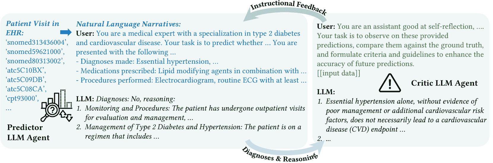
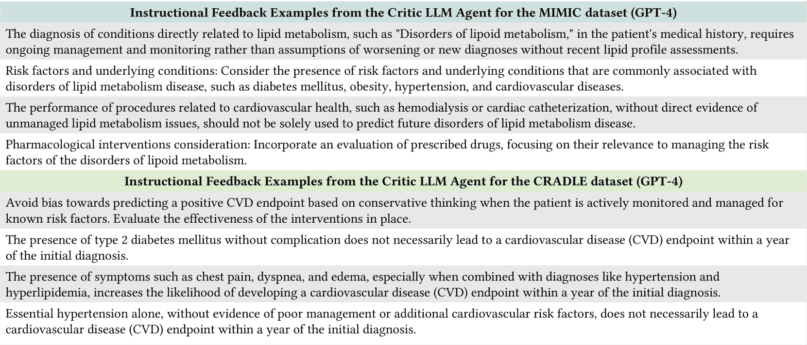
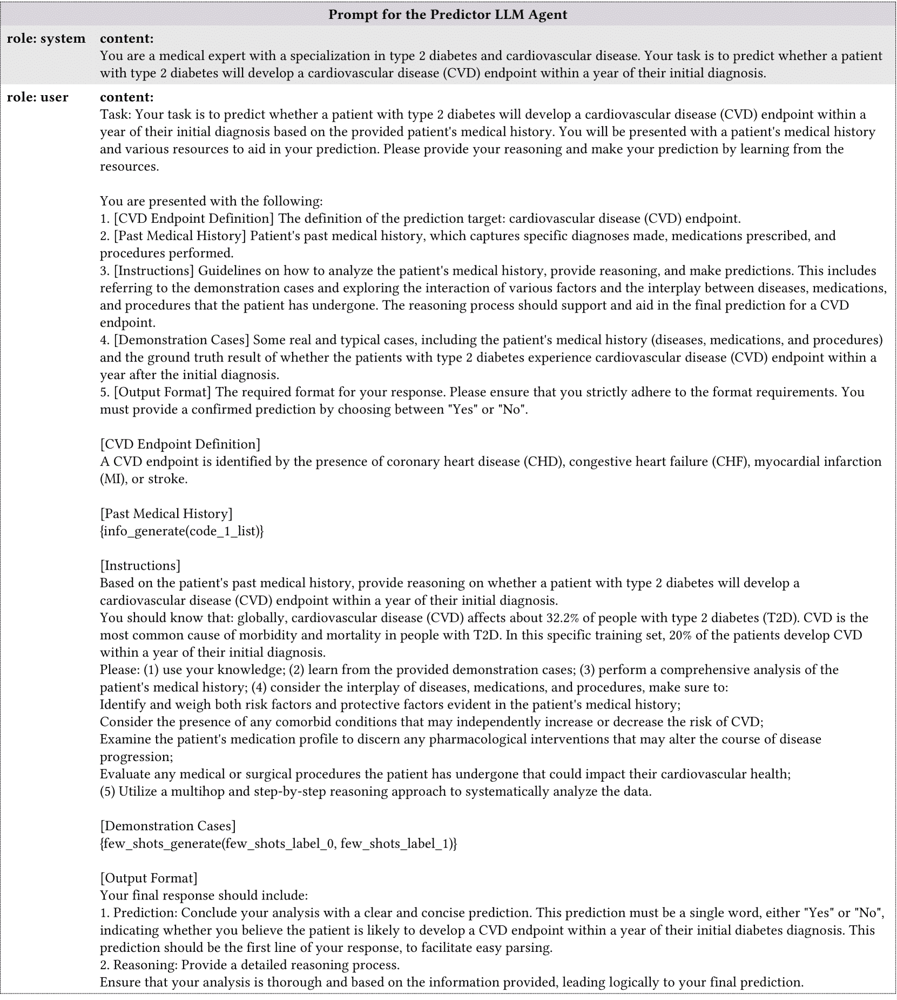
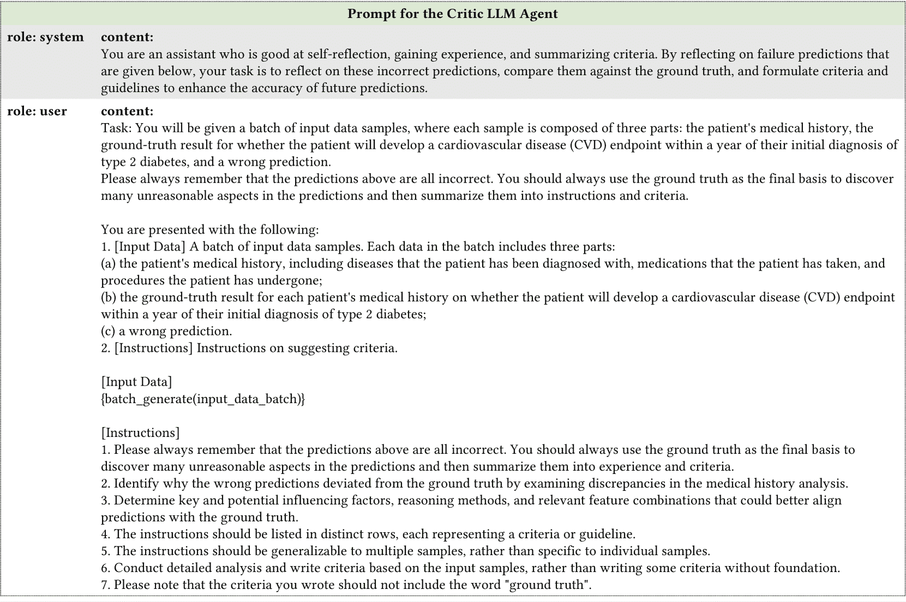

<!--yml

类别：未分类

date: 2025-01-11 12:44:54

-->

# 基于LLMs的少量样本疾病预测：一种结合预测代理推理与批判性代理指导的新方法

> 来源：[https://arxiv.org/html/2403.15464/](https://arxiv.org/html/2403.15464/)

\institutes

${}^{1}$ 艾默里大学计算机科学系，美国乔治亚州亚特兰大

${}^{2}$ 华盛顿大学计算机科学与工程学院，美国华盛顿州西雅图

${}^{3}$ 加州大学圣地亚哥分校计算机科学与工程系，美国加利福尼亚州圣地亚哥

${}^{4}$ 艾默里大学罗林斯公共卫生学院，美国乔治亚州亚特兰大

${}^{5}$ 艾默里大学医学院，美国乔治亚州亚特兰大

崔贺杰${}^{1}$    沈卓诚${}^{1}$    张洁瑜${}^{2}$    邵辉    医学博士    博士${}^{4,5}$    秦连辉    博士${}^{3}$    何Joyce C.    博士${}^{1}$    杨Carl    博士${}^{1,4}$

## 摘要

电子健康记录（EHR）包含了宝贵的患者数据，广泛用于健康相关的预测任务，如疾病预测。传统方法依赖于需要大量标注数据集的监督学习方法，这些数据集的获取既昂贵又具有挑战性。在本研究中，我们探讨了将大型语言模型（LLMs）应用于将结构化的患者就诊数据（例如，诊断、实验室检查、处方）转换为自然语言叙述的可行性。我们评估了使用不同EHR预测导向的提示策略，LLMs在零样本和少量样本任务中的表现。此外，我们提出了一种新颖的方法，利用具有不同角色的LLM代理：一个预测代理负责进行预测并生成推理过程，另一个批判性代理负责分析错误的预测并提供改进预测代理推理的指导。我们的结果表明，使用该方法，LLMs在EHR基础的疾病预测中能达到与传统监督学习方法相媲美的少样本表现，表明其在健康导向应用中的潜力。

## 介绍

大语言模型（LLMs）已经成为多个领域中强大的工具，包括医疗健康领域。这些模型，如GPT系列 ^([1](https://arxiv.org/html/2403.15464v1#bib.bib1))和PaLM ^([2](https://arxiv.org/html/2403.15464v1#bib.bib2))，经过大量文本数据的训练，使它们能够在多个领域内编码广泛的知识。在医学领域，LLMs利用其编码的医学知识的能力在近期的研究中得到了展示 ^([3](https://arxiv.org/html/2403.15464v1#bib.bib3); [4](https://arxiv.org/html/2403.15464v1#bib.bib4))，在诸如医学问答 ^([5](https://arxiv.org/html/2403.15464v1#bib.bib5))、临床文本摘要 ^([6](https://arxiv.org/html/2403.15464v1#bib.bib6))和临床决策支持 ^([7](https://arxiv.org/html/2403.15464v1#bib.bib7))等任务上表现出色。一些非常大的语言模型展示了少样本学习的初步能力，在这种学习模式下，模型可以借助其现有的理解，快速适应具有有限样本的新任务 ^([8](https://arxiv.org/html/2403.15464v1#bib.bib8); [9](https://arxiv.org/html/2403.15464v1#bib.bib9))。这引发了一个问题：LLMs是否可以直接应用于使用电子健康记录（EHR）数据进行少样本疾病预测。

电子健康记录（EHR）包含大量的患者数据，可用于预测建模任务，如疾病预测、再入院风险评估和死亡率预测 ^([10](https://arxiv.org/html/2403.15464v1#bib.bib10))。现有的基于EHR的预测方法主要依赖于监督学习方法，包括传统的机器学习模型、表示学习 ^([11](https://arxiv.org/html/2403.15464v1#bib.bib11); [12](https://arxiv.org/html/2403.15464v1#bib.bib12); [13](https://arxiv.org/html/2403.15464v1#bib.bib13))，以及基于图的模型 ^([14](https://arxiv.org/html/2403.15464v1#bib.bib14))。尽管这些监督方法有效，但它们需要在大规模标注数据集上进行训练，而这在计算上昂贵且难以获得，因为获取高质量标注的EHR数据成本高且困难 ^([15](https://arxiv.org/html/2403.15464v1#bib.bib15))。相比之下，少样本学习的能力使得大语言模型（LLMs）能够以最少的数据适应新任务，无需任何微调 ^([8](https://arxiv.org/html/2403.15464v1#bib.bib8))。这种适应性为使用LLMs进行少样本疾病预测提供了可能，这是使医疗服务更加精准和高效的一步 ^([16](https://arxiv.org/html/2403.15464v1#bib.bib16))。

在本研究中，我们探讨了基于LLMs的少量样本疾病预测的有效性，使用了由临床接触生成的电子健康记录（EHRs），这些记录包含三种类型的医疗编码：疾病、药物和治疗方法。我们通过将ICD编码映射到其名称，并用适当的连词将它们连接起来，将结构化的病人就诊记录转换为非结构化的语言叙述。这个转换过程使得LLMs能够更好地理解临床记录，并提取相关的内部知识。我们使用各种提示策略评估LLMs的零样本和少量样本诊断表现，例如考虑因素之间的交互作用，并提供流行病学统计数据和示例。此次评估的结果为LLMs作为基于EHR的疾病预测工具的潜力提供了见解，并突出了提示策略对其表现的影响。

基于我们初步评估的发现，我们提出了一种创新的方法，进一步提高大语言模型在EHR数据上的少样本诊断性能。研究表明，专门化的大语言模型代理在协同工作中展现了潜力 ^([17](https://arxiv.org/html/2403.15464v1#bib.bib17); [18](https://arxiv.org/html/2403.15464v1#bib.bib18); [19](https://arxiv.org/html/2403.15464v1#bib.bib19))，通过少样本学习发挥各自的多样化功能。我们的方法结合了预测代理推理和批评代理指导的优势，创建了一个更强大、更准确的预测系统。总体框架如图[1](https://arxiv.org/html/2403.15464v1#Sx2.F1 "图 1 ‣ 引言 ‣ 基于LLMs的少样本疾病预测：结合预测代理推理与批评代理指导的创新方法")所示。具体而言，我们采用了两个具有不同角色的大语言模型代理：一个预测代理和一个批评代理。预测代理根据从结构化记录转化而来的非结构化叙述进行少样本预测，并生成支持其预测的推理过程。随后，批评代理将预测代理的输出与实际疾病标签一起作为输入，识别预测代理推理过程中的问题或偏差。基于分析，批评代理生成一组指令，提醒预测代理注意可能被忽视的因素，并提供具体的改进建议。这些指令随后附加到用于预测代理的提示中，作为额外的上下文来指导其预测。我们的结果表明，通过基于批评代理的反馈改进提示，基于大语言模型的少样本预测系统的整体诊断准确性显著提高。这种方法利用了预测推理和批评分析的互补优势，使系统能够从错误中学习，并适应基于EHR的疾病预测的具体挑战。总之，我们的主要贡献包括：

+   •

    我们通过将结构化数据转化为自然语言叙述，并采用不同的提示策略评估零样本和少样本性能，研究了大语言模型（LLMs）在基于电子健康记录（EHR）的疾病预测任务中的应用。

+   •

    我们提出了一种新颖的方法，将两个具有不同角色的大语言模型代理结合起来：一个预测代理，用于进行预测并提供推理过程，另一个是批评代理，用于分析不正确的预测并提供改进反馈。批评代理的反馈用于更新预测代理的提示，从而使系统能够从错误中学习并适应基于EHR的疾病预测挑战。

+   •

    我们总结了一组关于LLM在各种设置下表现的见解，并分享了在有限标注数据情况下利用LLM进行诊断任务的实践指导。我们希望这能为在LLM时代开发高效且有效的临床决策支持系统做出贡献。

图1：EHR-CoAgent框架采用了两个LLM代理：一个预测代理，负责进行预测并生成推理过程；一个批评代理，负责分析错误预测并提供改进的指导。批评代理的反馈被用来更新给预测代理的提示，从而使系统能够从错误中学习并适应基于EHR的疾病预测任务的具体挑战。

## 相关工作

大型语言模型在医疗领域的应用 LLMs在多种应用场景中展现了卓越的能力。近年来，越来越多的研究者开始关注将LLMs应用于医疗领域 ^([20](https://arxiv.org/html/2403.15464v1#bib.bib20); [21](https://arxiv.org/html/2403.15464v1#bib.bib21); [22](https://arxiv.org/html/2403.15464v1#bib.bib22))，尤其是在临床笔记分析 ^([23](https://arxiv.org/html/2403.15464v1#bib.bib23); [24](https://arxiv.org/html/2403.15464v1#bib.bib24))、医学问答 ^([25](https://arxiv.org/html/2403.15464v1#bib.bib25); [26](https://arxiv.org/html/2403.15464v1#bib.bib26))、疾病预测 ^([27](https://arxiv.org/html/2403.15464v1#bib.bib27))、临床试验匹配 ^([28](https://arxiv.org/html/2403.15464v1#bib.bib28))、医学报告生成 ^([29](https://arxiv.org/html/2403.15464v1#bib.bib29))等任务中。例如，Yang等人 ^([30](https://arxiv.org/html/2403.15464v1#bib.bib30))提出了GatorTron，这是一个专为EHR设计的LLM。他们展示了GatorTron在多种临床自然语言处理（NLP）任务中的有效性，如命名实体识别和关系抽取，展示了LLM从非结构化EHR数据中提取有价值信息的潜力。Peng等人 ^([22](https://arxiv.org/html/2403.15464v1#bib.bib22))研究了生成型LLM在医学研究和医疗保健中的应用。他们探索了LLM在医学问答、疾病预测和临床试验匹配等任务中的能力，突显了其在支持临床决策和协助研究中的潜力。

然而，将LLM应用于基于EHR的疾病预测任务仍然是一个未充分探索的领域。尽管已有一些研究探讨了LLM在EHR上的临床自然语言处理（NLP）任务中的应用^([30](https://arxiv.org/html/2403.15464v1#bib.bib30))，但关于如何利用LLM的推理和遵循指令的能力进行少样本EHR预测的研究仍然不足。我们的研究通过探索LLM在EHR基础上的疾病预测应用，填补了这一空白，并提出了新方法以在最少训练数据下实现准确预测。

## 方法

在本研究中，我们从两个层面扩展了我们的研究：（1）评估大型语言模型（LLM）在电子健康记录（EHR）基础上的疾病预测任务中的零样本和少样本表现，及（2）提出一种利用协作型LLM代理来增强预测性能的新方法。

LLM在基于EHR的疾病预测中的表现 结构化的患者就诊数据通常以表格形式存储，其中每一行代表一次单独的患者就诊记录，这些记录来源于临床接触，列则对应不同的医学编码。在本研究中，我们利用包括三种类型医学编码的EHR数据$\mathcal{C}$：（1）疾病$\mathcal{C}_{D}$，（2）药物$\mathcal{C}_{M}$，以及（3）治疗过程$\mathcal{C}_{P}$。记录中的每一个患者就诊样本$v_{i}$通过一组医学编码$\{c_{1},c_{2},\ldots,c_{n}\}$表示，其中$c_{j}\in\mathcal{C}$。我们通过将医学编码映射到其名称，将结构化的EHR记录转换为非结构化的语言叙述，记作$\mathcal{H}$，以便应用LLM。

$\diamond$ 零样本：利用现有知识 提示工程已经成为一种强大的技术，用于引导LLM的行为，并提高其在各类与医疗相关的任务中的表现，例如临床命名实体识别^([31](https://arxiv.org/html/2403.15464v1#bib.bib31); [32](https://arxiv.org/html/2403.15464v1#bib.bib32))和临床文本分类^([33](https://arxiv.org/html/2403.15464v1#bib.bib33); [34](https://arxiv.org/html/2403.15464v1#bib.bib34))。我们开发了一套专门针对EHR基础预测任务的提示策略，以提供额外的背景信息并引导LLM的推理过程，包括：

+   •

    思维链（CoT）推理^([35](https://arxiv.org/html/2403.15464v1#bib.bib35))：提示LLM生成逐步解释；

+   •

    因素交互的结合：鼓励LLM考虑不同医学因素（如疾病、药物和治疗过程）之间的相互作用和依赖关系；

+   •

    流行病信息：整合流行病统计信息，以提供额外的背景信息。

$\diamond$ 少样本：通过有限示例增强性能 我们从训练数据中随机选择少量正负样本（例如，3个正样本和3个负样本）作为每个预测类别的示例。这些示例被纳入提示中，为LLM提供有限的任务特定示例进行学习。这利用了LLM广泛的预先存在的知识，同时使其能够快速适应EHR预测任务的特定特征。通过这种方式，我们旨在引导LLM的注意力集中于与每个预测类别相关的最相关模式。

EHR-CoAgent: 协作LLM代理增强预测 最近，LLM的潜力已经超越了单一代理应用。通过利用多个具有不同角色的LLM在协作框架下共同工作，新的可能性被开启，用于解决复杂问题并增强语言模型的性能^([17](https://arxiv.org/html/2403.15464v1#bib.bib17))。在本研究中，我们提出了一种新的方法，称为EHR-CoAgent（如图[1](https://arxiv.org/html/2403.15464v1#Sx2.F1 "Figure 1 ‣ Introduction ‣ LLMs-based Few-Shot Disease Predictions using EHR: A Novel Approach Combining Predictive Agent Reasoning and Critical Agent Instruction")所示），它利用协作LLM代理的潜力来增强EHR的预测。我们的框架由两个组件组成：一个预测代理$\mathcal{P}_{\text{LLM}}$和一个批评代理$\mathcal{K}_{\text{LLM}}$。预测代理专注于生成预测并提供解释性推理，而批评代理观察预测者的输出并提供指导性反馈，以完善预测过程。通过将批评代理的反馈整合到预测代理使用的提示中，我们旨在创建一个具有反馈的上下文学习过程，持续增强疾病预测的准确性。

$\diamond$ 预测器代理：生成预测和推理 预测器代理 $\mathcal{P}_{\text{LLM}}$ 是一个大语言模型（LLM），它能够根据输入的电子健康记录（EHR）数据进行少量样本的疾病预测，并提供解释性推理。给定一个患者的病史 $\mathcal{H}_{i}$，预测器 LLM 分析相关信息并生成最可能的预测 $\widehat{\mathcal{D}_{i}}$，同时提供其推理过程的逐步解释 $\mathcal{R}_{i}$。这种解释性推理对于增强生成预测的可解释性至关重要。通过突出影响 LLM 代理决策过程的关键因素和证据，推理为进一步分析和验证提供了透明且信息丰富的基础。我们在 EHR-CoAgent 中使用的详细提示如图 [3](https://arxiv.org/html/2403.15464v1#Sx9.F3 "图 3 ‣ 基于LLM的少样本疾病预测方法：结合预测代理推理和批判代理指导的创新方法")所示。

$\diamond$ 批判代理：提供指导性反馈 批判代理 $\mathcal{K}_{\text{agent}}$ 是另一个 LLM，在 EHR-CoAgent 框架中发挥着不同的作用，它通过观察从预测器代理中采样到的一组错误预测来进行工作。每个集合，记作 $\mathcal{B}_{j}=\{(\widehat{\mathcal{D}}_{ji},\mathcal{R}_{ji})\}_{i=1}^{b}$，包含生成的预测 $\widehat{\mathcal{D}}_{ji}$ 及其伴随的解释性推理 $\mathcal{R}_{ji}$，共涉及 $b$ 个实例。批判代理分析每个批次 $\mathcal{B}_{j}$ 中生成的预测与其对应的真实标签 $\mathcal{D}_{ji}$ 之间的不一致性，识别错误模式以进行改进。基于此分析，我们让批判代理为批次 $\mathcal{B}_{j}$ 生成一组指导性反馈 $\{\mathcal{F}_{j}\}$，并对这一过程重复 $m$ 次。我们在 EHR-CoAgent 中使用的详细提示如图 [4](https://arxiv.org/html/2403.15464v1#Sx9.F4 "图 4 ‣ 基于LLM的少样本疾病预测方法：结合预测代理推理和批判代理指导的创新方法")所示。

为了提供简洁且连贯的指导，我们使用 GPT-4 来处理一组指导性反馈 $\{\mathcal{F}_{j}\}_{j=1}^{m}$。GPT-4 分析跨多个批次的反馈，并生成一组综合性指导 $\mathcal{F}_{\text{consolidated}}$，以捕捉最重要且反复出现的见解。这一综合反馈突出显示推理过程中的常见偏差或错误，提出考虑额外因素的建议，并提供关于不同医学概念之间关系的见解。

$\diamond$ 指令增强型提示：集成反馈以进行优化 为了有效地整合评论LLM生成的反馈，我们引入了一种指令增强型提示机制。该机制将评论LLM的指令性反馈$\mathcal{F}_{\text{consolidated}}$直接集成到预测LLM使用的提示$\mathcal{P}$中。通过用具体的指令和指导信息来增强提示，我们旨在引导预测LLM将注意力集中在输入数据的最相关方面，并鼓励它考虑评论LLM提供的见解。这一预测、反馈和优化提示的迭代过程使得预测LLM能够不断提升性能，并适应基于EHR的疾病预测中的特定挑战。

## 实验设置

数据集 我们在两个数据集上进行了实验：公开访问的MIMIC-III数据集和私有的CRADLE数据集。MIMIC-III ^([36](https://arxiv.org/html/2403.15464v1#bib.bib36)) 是一个大型的、公开访问的数据集，包含了超过四万名患者在2001到2012年期间，在贝eth以色列迪肯尼斯医疗中心重症监护病房住院的去标识化健康相关数据。我们的任务是根据患者当前在ICU的住院记录，预测他们在下次就诊时是否会出现急性护理状况。我们专注于一个特定的慢性表型——脂质代谢障碍，它是通过临床分类软件（CCS）从医疗费用和使用项目（HCUP）¹¹1[https://www.hcup-us.ahrq.gov/toolssoftware/ccs/AppendixASingleDX.txt](https://www.hcup-us.ahrq.gov/toolssoftware/ccs/AppendixASingleDX.txt)中识别的。在预处理阶段，我们提取了有多个住院记录的患者，并为每个患者创建了相邻的住院记录对。对于每一对记录，前一次住院作为输入，而后一次住院中的表型则作为标签。这一过程产生了12,353条带标签的记录。出于预算考虑，我们根据预测目标的数据分布随机抽取了1,000条记录作为测试集。

CRADLE 项目（Emory 临床研究分析数据湖环境）是一个私有数据库，包含了从 2013 年到 2017 年在 Emory Healthcare 中去标识化的电子健康记录。在本研究中，我们聚焦于 2 型糖尿病患者，预测这些患者在首次糖尿病诊断后的 1 年内是否会经历心血管疾病（CVD）终点。CVD 终点包括冠心病（CHD）、充血性心力衰竭（CHF）、心肌梗死（MI）或中风，这些通过 ICD-9 和 ICD-10 临床代码进行识别。对于在一年内发展出 CVD 并发症的患者（阳性病例），我们选择在 CVD 终点出现的一年内记录的最早一次就诊作为输入。对于没有 CVD 并发症的患者（阴性病例），我们从至少在最后一次就诊前一年发生的所有就诊中随机选择一次作为输入。如果患者满足以下条件，将被排除： (1) 在 Emory Healthcare 就诊次数少于两次，(2) 第一次和最后一次就诊的时间间隔少于一年，或 (3) 有 CVD 病史。应用这些排除标准后，数据集中剩余 35,404 名患者。与 MIMIC-III 类似，我们根据预测目标的数据分布随机抽取了 1,000 条记录。

评价指标 MIMIC-III 和 CRADLE 数据集都存在类别不平衡问题，其中 MIMIC-III 中脂质代谢障碍的患病率为 27.6%，CRADLE 中心血管疾病（CVD）终点的患病率为 21.4%。为了考虑数据分布的不平衡，我们采用了准确率、敏感性、特异性和 F1 分数作为评估指标 ^([14](https://arxiv.org/html/2403.15464v1#bib.bib14))。在评估 LLM 方法时，我们识别 LLM 响应中是否包含“是”或“否”标记，并提取与预测标记相关的前 5 个概率。这些概率随后会在两个答案上进行归一化。我们观察到，GPT 系列模型倾向于提供高度自信的答案（即确认预测为“是”或“否”，而另一个选项的概率几乎为 0.0），通常会导致较大概率为 0.0 或 1.0。

基线：我们将EHR-CoAgent与传统机器学习（ML）方法进行比较，包括决策树、逻辑回归和随机森林，这些方法在基于EHR的预测任务中广泛使用 ^([37](https://arxiv.org/html/2403.15464v1#bib.bib37); [38](https://arxiv.org/html/2403.15464v1#bib.bib38))，以及使用GPT-4（gpt-4-0125-preview）和GPT-3.5（gpt-35-turbo-16k-0613）的单一代理LLM方法。ML模型在完全监督和少-shot设置下进行训练，而LLM方法则在纯零-shot、带附加提示信息的零-shot（如[方法](https://arxiv.org/html/2403.15464v1#Sx4 "Method ‣ LLMs-based Few-Shot Disease Predictions using EHR: A Novel Approach Combining Predictive Agent Reasoning and Critical Agent Instruction")章节中所述）和少-shot学习设置下进行评估。通过将EHR-CoAgent与这些基线进行比较，我们旨在评估不同LLM代理框架在基于EHR的疾病预测任务中的有效性。

实验细节：我们在Python中实现了实验研究方法。基线机器学习模型使用流行的sklearn包进行训练和评估，该包为机器学习任务提供了全面的工具集。为了安全地访问各种GPT模型，我们使用了Azure OpenAI服务，这是一个受信任且符合要求的云平台。Azure OpenAI提供了一个安全的API接口，可以将GPT能力无缝集成到我们的研究流程中，同时保持严格的隐私和安全控制。通过利用Azure OpenAI，我们确保敏感的患者数据集在受保护的环境中处理，遵循必要的法规和标准，如HIPAA和GDPR。

## 实验结果

表 1：不同模型在MIMIC-III和CRADLE数据集上的零-shot、少-shot和完全监督设置下的性能（%）。提出的方法用绿色标出。监督训练设置下的参考结果（在MIMIC-III上训练了11,353个样本，CRADLE上训练了34,404个样本）用灰色标出。

| 类型 | 模型 | MIMIC-III（正 : 负 = 27.6% : 72.4%） | CRADLE（正 : 负 = 21.4% : 78.6%） |
| --- | --- | --- | --- |
| 准确率 | 敏感性 | 特异性 | F1 | 准确率 | 敏感性 | 特异性 | F1 |
| 完全监督 | 决策树 | 81.30 | 76.97 | 84.31 | 76.20 | 80.30 | 53.87 | 88.27 | 52.15 |
| 逻辑回归 | 79.70 | 70.48 | 83.56 | 73.18 | 80.90 | 58.34 | 86.15 | 59.74 |
| 随机森林 | 78.60 | 66.12 | 83.16 | 70.58 | 80.20 | 56.49 | 86.14 | 57.34 |
| 少-shot (N=6) | 决策树 | 71.10 | 53.14 | 77.62 | 51.16 | 31.90 | 54.81 | 25.99 | 31.71 |
| 逻辑回归 | 58.70 | 73.40 | 53.44 | 56.78 | 53.30 | 53.95 | 53.13 | 48.16 |
| 随机森林 | 69.70 | 62.88 | 72.18 | 63.61 | 65.00 | 51.50 | 68.43 | 51.04 |
| GPT-4 | 零-shot | 51.90 | 76.15 | 42.56 | 51.89 | 24.10 | 51.81 | 16.82 | 22.33 |
| 零-shot+ | 62.90 | 59.30 | 64.29 | 58.58 | 30.00 | 53.25 | 23.76 | 29.67 |
| 少量样本学习（N=6） | 65.70 | 79.35 | 59.89 | 64.72 | 41.20 | 59.05 | 36.33 | 40.88 |
| EHR-CoAgent | 79.10 | 73.11 | 81.43 | 73.88 | 70.00 | 62.88 | 71.72 | 60.21 |
| GPT-3.5 | 零-shot | 78.00 | 66.87 | 82.37 | 68.56 | 56.50 | 59.88 | 55.45 | 52.29 |
| 零-shot+ | 72.40 | 50.00 | 80.37 | 42.00 | 62.60 | 57.62 | 63.96 | 54.40 |
| 少量样本学习（N=6） | 76.30 | 63.73 | 80.93 | 63.84 | 40.80 | 54.56 | 36.96 | 40.32 |
| EHR-CoAgent | 79.30 | 74.49 | 80.98 | 71.59 | 66.60 | 58.31 | 68.83 | 55.83 |

表 [1](https://arxiv.org/html/2403.15464v1#Sx6.T1 "Table 1 ‣ Experimental Results ‣ LLMs-based Few-Shot Disease Predictions using EHR: A Novel Approach Combining Predictive Agent Reasoning and Critical Agent Instruction") 展示了在两个数据集上的实验结果。研究结果突出了几个关键观察点：

$\diamond$ 传统的机器学习（ML）模型在对大数据集进行充分训练时表现不错（MIMIC-III数据集为11,353个样本，CRADLE数据集为34,404个样本）。然而，当面对少量样本学习时，像决策树和逻辑回归这样的简单模型表现大幅下降，强调了在标签数据稀缺时这些模型的局限性。

$\diamond$ 在比较零-shot或少量样本学习LLMs与机器学习（ML）方法在少量样本设置下的表现时，我们观察到LLMs表现出更高的敏感性但较低的特异性。这一发现表明，LLMs擅长正确识别阳性病例（即患有目标疾病的患者），但代价是较高的假阳性率。换句话说，LLMs更倾向于将患者误判为患有该疾病，即使他们并没有。这一倾向意味着LLMs，尤其是GPT-4，采取了更为保守的思维方式，可能是因为它们在面对潜在的错过真实阳性病例时，倾向于采取更为谨慎的立场。

$\diamond$ 通过额外的提示策略（Zero-Shot+）可以在纯粹的零-shot基础上提升性能，但偶尔会产生一些错误。这一观察结果突显了精心设计提示在优化LLM在基于电子健康记录（EHR）的疾病预测任务中表现的重要性。

$\diamond$ 大多数情况下，加入少量样本学习的演示效果优于对应的Zero-Shot+方法。这一发现强调了即使提供有限数量的标签示例，也可以潜在地引导语言模型做出更精确的预测。通过利用一小组具有代表性的样本，LLMs能够快速适应基于EHR的疾病预测任务的具体特征。

$\diamond$ 我们提出的方法EHR-CoAgent展现出了卓越的性能，在某些场景下超越了其他方法，甚至超过了完全监督的机器学习模型，其中GPT-4的表现通常优于GPT-3.5。在CRADLE数据集上，EHR-CoAgent取得了60.21%的F1分数，超越了所有完全训练的机器学习模型。同样，在MIMIC-III数据集上，EHR-CoAgent获得了73.88%的F1分数，与完全训练的决策树模型相当，且优于逻辑回归和随机森林。

$\diamond$ 与单一LLM预测器的少量样本设置相比，EHR-CoAgent在所有四个指标上都有显著提升。这可以归因于批评代理提供的反馈指令，批评代理分析输出结果并识别LLM推理过程中的问题和偏见，如过度依赖保守思维或忽视某些关键因素。批评代理生成的反馈指令有助于纠正这些问题，动态地优化预测代理的推理过程，从而提高预测的准确性。

## 生成的指令

图2：由基于GPT-4的批评代理生成的指导反馈示例，旨在细化预测代理的推理过程，并提高其预测的准确性。

图[2](https://arxiv.org/html/2403.15464v1#Sx7.F2 "Figure 2 ‣ Generated Instructions ‣ LLMs-based Few-Shot Disease Predictions using EHR: A Novel Approach Combining Predictive Agent Reasoning and Critical Agent Instruction")展示了批评代理生成的标准和指令的示例。这些示例展示了批评代理识别预测代理预测和推理过程中的潜在问题的能力，并提供了有针对性的指令以解决这些问题。例如，对于CRADLE数据集的第一条指令，“避免基于保守思维对积极监测和管理已知风险因素的患者预测阳性心血管疾病（CVD）终点的偏向。评估现有干预措施的效果”突显了预测代理可能存在的预测偏差。这条指令鼓励预测代理在进行预测时避免依赖保守假设，因为这些假设可能是先进AI模型过度对齐的结果。通过明确解决这一问题，批评代理旨在引导预测代理朝着更加客观和全面的推理方向发展。另一个例子是针对MIMIC数据集的指令，“药物干预考虑：结合对处方药物的评估，重点关注其在管理脂质代谢紊乱的风险因素中的相关性”，提示预测代理应考虑处方药物在管理患者病情中的作用。通过分析这些药物与脂质代谢紊乱相关风险因素的相关性和潜在影响，预测代理可以做出更为明智的预测。这些示例说明了批评代理的反馈如何引导预测代理朝着更全面和细致的推理，最终提高疾病预测性能。

## 结论

在本研究中，我们探讨了大语言模型（LLMs）在基于电子健康记录（EHR）的疾病预测任务中的应用。我们评估了使用不同提示策略下LLMs的零-shot和少-shot诊断性能，并提出了一种结合预测代理和批评代理的新型协作方法。该方法使系统能够从错误中学习，并适应基于EHR的疾病预测的挑战。我们的工作突显了LLMs作为临床决策支持工具的潜力，并为开发能够在最少训练数据下运行的高效疾病预测系统作出了贡献。

## 伦理考虑

为了确保GPT基础服务中凭证数据的伦理使用，我们已签署并严格遵守PhysioNet凭证数据使用协议²²2https://physionet.org/about/licenses/physionet-credentialed-health-data-license-150。我们遵循负责使用MIMIC数据的指南³³3https://physionet.org/news/post/gpt-responsible-use，包括通过Azure OpenAI附加使用案例表单选择不进行人工审查数据⁴⁴4https://aka.ms/oai/additionalusecase，以防止敏感信息泄露给第三方。

## 参考文献

+   1 Achiam J, Adler S, Agarwal S, Ahmad L, Akkaya I, Aleman FL, 等人。GPT-4技术报告。arXiv预印本 arXiv:230308774. 2023。

+   2 Anil R, Dai AM, Firat O, Johnson M, Lepikhin D, Passos A, 等人。Palm 2技术报告。arXiv预印本 arXiv:230510403. 2023。

+   3 Singhal K, Azizi S, Tu T, Mahdavi SS, Wei J, Chung HW, 等人。大语言模型编码临床知识。《自然》. 2023;620:172-80。

+   4 Hernandez E, Mahajan D, Wulff J, Smith MJ, Ziegler Z, Nadler D, 等人。我们还需要临床语言模型吗？在：健康、推理与学习会议；2023。

+   5 Singhal K, Tu T, Gottweis J, Sayres R, Wulczyn E, Hou L, 等人。利用大语言模型迈向专家级医学问答。arXiv预印本 arXiv:230509617. 2023。

+   6 Van Veen D, Van Uden C, Blankemeier L, Delbrouck JB, Aali A, Bluethgen C, 等人。调整后的大语言模型可以在临床文本摘要中超越医学专家。《自然医学》。2024:1-9。

+   7 Hegselmann S, Buendia A, Lang H, Agrawal M, Jiang X, Sontag D. Tabllm：使用大语言模型进行少样本表格数据分类。在：AISTATS; 2023。

+   8 Brown T, Mann B, Ryder N, Subbiah M, Kaplan JD, Dhariwal P, 等人。语言模型是少样本学习者。NeurIPS. 2020。

+   9 Schick T, Schütze H. 利用填空题进行少量样本文本分类和自然语言推理。arXiv预印本 arXiv:200107676. 2020。

+   10 Shickel B, Tighe PJ, Bihorac A, Rashidi P. 深度EHR：电子健康记录（EHR）分析中深度学习技术的最新进展综述。IEEE生物医学与健康信息学期刊。2017;22:1589-604。

+   11 Rajkomar A, Oren E, Chen K, Dai AM, Hajaj N, Hardt M, 等人。可扩展且准确的电子健康记录深度学习。《NPJ数字医学》。2018;1:1-10。

+   12 Landi I, Glicksberg BS, Lee HC, Cherng S, Landi G, Danieletto M, 等人。电子健康记录的深度表示学习以解锁大规模患者分层。《NPJ数字医学》。2020;3:96。

+   13 Fridgeirsson EA, Sontag D, Rijnbeek P. 基于注意力的神经网络在电子健康记录中的临床预测建模。BMC医学研究方法学:285。

+   14 Choi E, Xu Z, Li Y, Dusenberry M, Flores G, Xue E, 等人。利用图卷积变换器学习电子健康记录的图结构。在：AAAI; 2020。

+   15 Xiao C, Choi E, Sun J. 使用电子健康记录数据开发深度学习模型的机会与挑战：一项系统评审。美国医学信息学会杂志。2018;25:1419-28.

+   16 Wornow M, Thapa R, Steinberg E, Fries J, Shah N. Ehrshot：一个用于基础模型少量样本评估的电子健康记录基准。NeurIPS. 2023.

+   17 Wu Q, Bansal G, Zhang J, Wu Y, Zhang S, Zhu E, 等. Autogen：通过多代理对话框架推动下一代大型语言模型应用。arXiv预印本 arXiv:230808155。2023.

+   18 Talebirad Y, Nadiri A. 多代理协作：利用智能大型语言模型代理的力量。arXiv预印本 arXiv:230603314。2023.

+   19 Jin Q, Yang Y, Chen Q, Lu Z. Genegpt：通过领域工具增强大型语言模型，改善生物医学信息获取。生物信息学。2024;40:btae075.

+   20 Thirunavukarasu AJ, Ting DSJ, Elangovan K, Gutierrez L, Tan TF, Ting DSW. 医学中的大型语言模型。自然医学。2023;29(8):1930-40.

+   21 He K, Mao R, Lin Q, Ruan Y, Lan X, Feng M, 等. 医疗保健领域大型语言模型调查：从数据、技术和应用到问责制与伦理；2023.

+   22 Peng C, Yang X, Chen A, Smith KE, PourNejatian N, Costa AB, 等. 生成性大型语言模型在医学研究和医疗保健中的应用研究。npj数字医学。2023;6:210.

+   23 Agrawal M, Hegselmann S, Lang H, Kim Y, Sontag D. 大型语言模型是少量样本临床信息提取器。载于：EMNLP; 2022。

+   24 Mannhardt N, Bondi-Kelly E, Lam B, O'Connell C, Asiedu M, Mozannar H, 等. 大型语言模型辅助对患者阅读临床记录的影响：一项混合方法研究；2024.

+   25 Liévin V, Hother CE, Motzfeldt AG, Winther O. 大型语言模型能推理医学问题吗？Patterns。2024;5:100943.

+   26 Han T, Adams LC, Papaioannou JM, Grundmann P, Oberhauser T, Löser A, 等. MedAlpaca——一个开源的医学对话式AI模型和训练数据集。arXiv预印本 arXiv:230408247。2023.

+   27 Wang G, Yang G, Du Z, Fan L, Li X. ClinicalGPT：通过多样化医学数据微调的大型语言模型和全面评估。arXiv预印本 arXiv:230609968。2023.

+   28 Yuan J, Tang R, Jiang X, Hu X. 大型语言模型在医疗数据增强中的应用：以患者-试验匹配为例。载于：AMIA年度研讨会论文集。第2023卷；2023。p. 1324.

+   29 D'Antonoli TA, Stanzione A, Bluethgen C, Vernuccio F, Ugga L, Klontzas ME, 等. 放射学中的大型语言模型：基础、应用、伦理考量、风险与未来方向。诊断与介入放射学。2024;30:80.

+   30 Yang X, Chen A, PourNejatian N, Shin HC, Smith KE, Parisien C, 等. 用于电子健康记录的大型语言模型。npj数字医学：194.

+   31 Sivarajkumar S, Kelley M, Samolyk-Mazzanti A, Visweswaran S, Wang Y。大规模语言模型在零样本临床自然语言处理中的提示策略实证评估。arXiv预印本 arXiv:230908008\. 2023。

+   32 Hu Y, Chen Q, Du J, Peng X, Keloth VK, Zuo X, 等人。通过提示工程改进大规模语言模型在临床命名实体识别中的表现。美国医学信息学会期刊。2024:ocad259。

+   33 Lu Y, Zhao X, Wang J。医学知识增强的提示学习用于临床文本中的诊断分类。在：临床自然语言处理研讨会；2023\. 第278-288页。

+   34 Sivarajkumar S, Wang Y。Healthprompt：一种用于临床自然语言处理的零样本学习范式。在：AMIA年会论文集。卷 2022; 2022\. 第972页。

+   35 Wei J, Wang X, Schuurmans D, Bosma M, Xia F, Chi E, 等人。链式思维提示引发大规模语言模型的推理。NeurIPS。2022;35。

+   36 Johnson AE, Pollard TJ, Shen L, Lehman LwH, Feng M, Ghassemi M, 等人。MIMIC-III，一个免费访问的重症监护数据库。科学数据。2016;3:1-9。

+   37 Wu J, Roy J, Stewart WF。使用 EHR 数据进行预测建模：挑战、策略以及机器学习方法的比较。医疗护理。2010;48:S106-13。

+   38 Goldstein BA, Navar AM, Pencina MJ, Ioannidis JP。利用电子健康记录数据开发风险预测模型的机会与挑战：一项系统性回顾。美国医学信息学会期刊：JAMIA。2017;24:198。

图 3：CRADLE 数据集在 EHR-CoAgent 中预测代理的提示。

图 4：CRADLE 数据集在 EHR-CoAgent 中批评代理的提示。
