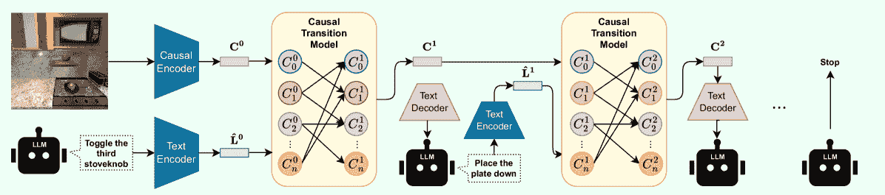
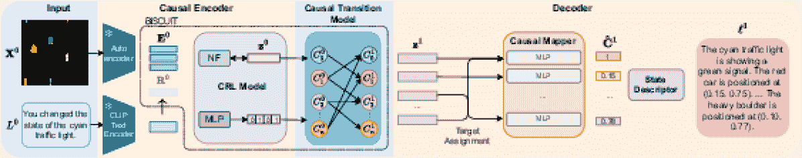

<!--yml

分类：未分类

日期：2025-01-11 12:01:57

-->

# 语言智能体遇见因果性——连接LLMs与因果世界模型

> 来源：[https://arxiv.org/html/2410.19923/](https://arxiv.org/html/2410.19923/)

John Gkountouras 阿姆斯特丹大学逻辑、语言与计算研究所（ILLC） Matthias Lindemann 爱丁堡大学语言、认知与计算研究所（ILCC） Phillip Lippe 阿姆斯特丹大学QUVA实验室 Efstratios Gavves 阿姆斯特丹大学QUVA实验室 Ivan Titov 爱丁堡大学语言、认知与计算研究所（ILCC） 阿姆斯特丹大学逻辑、语言与计算研究所（ILLC）

###### 摘要

大型语言模型（LLMs）最近在规划和推理应用中展现了巨大的潜力。这些任务需要强大的系统，这些系统无疑需要对环境有因果理解。尽管LLMs可以从其预训练数据中获取和反映常识性因果知识，但这些信息往往是不完整的、错误的，或者无法应用于特定环境。相比之下，因果表示学习（CRL）专注于识别给定环境中的基本因果结构。我们提出了一个框架，将CRL与LLMs结合，支持因果感知的推理和规划。该框架学习一个因果世界模型，其中因果变量与自然语言表达相连接。这种映射为LLMs提供了一个灵活的接口，用于处理和生成以文本形式描述的动作和状态。有效地说，因果世界模型充当了一个模拟器，LLM可以查询并与之互动。我们在跨时间尺度和环境复杂性的因果推理与规划任务上评估了该框架。实验结果证明了该方法的有效性，因果感知方法在长期规划任务中优于基于LLM的推理器。项目页面：[https://j0hngou.github.io/LLMCWM/](https://j0hngou.github.io/LLMCWM/)。

## 1 引言

大语言模型（LLMs）已经成为一系列任务的强大工具，从自然语言理解到复杂问题解决（Brown 等人，([2020](https://arxiv.org/html/2410.19923v1#bib.bib7))；Radford 等人，([2019](https://arxiv.org/html/2410.19923v1#bib.bib47))；Liu 等人，([2023b](https://arxiv.org/html/2410.19923v1#bib.bib40))）。最近的研究探讨了将 LLM 用作行动代理进行规划和推理任务，并在提高任务特定的下游表现方面取得了令人鼓舞的成果（Ahn 等人，([2022](https://arxiv.org/html/2410.19923v1#bib.bib1))；Hao 等人，([2023](https://arxiv.org/html/2410.19923v1#bib.bib18))；Huang 等人，([2023](https://arxiv.org/html/2410.19923v1#bib.bib19))）。这些方法主要依赖于模型提取其训练数据中陈述的常识因果信息的能力（Zečević 等人，([2023](https://arxiv.org/html/2410.19923v1#bib.bib66))）。虽然 LLM 可以反映一般信念和相关性，但这些信息可能是不完整的、错误的，或者在特定环境下不适用。这为 LLM 在新颖或复杂的情境中带来了挑战，尤其是在动态环境中，精确建模行动后果至关重要（Valmeekam 等人，([2023](https://arxiv.org/html/2410.19923v1#bib.bib55))；Kambhampati 等人，([2024](https://arxiv.org/html/2410.19923v1#bib.bib22))）。

因果表示学习（CRL）旨在识别数据的潜在因果结构（Schölkopf 等人，([2021](https://arxiv.org/html/2410.19923v1#bib.bib50))）。通过分离和识别潜在的因果因素，CRL 使模型能够推理干预和反事实的效果。最近的理论研究为因果表示学习提供了理论依据，表明它对于在人工智能系统中实现强大的鲁棒性保证是必要的（Richens & Everitt，([2024](https://arxiv.org/html/2410.19923v1#bib.bib49))）。虽然 CRL 可以建模复杂的因果机制，但将其应用于具有视觉复杂度的现实环境仍然具有挑战性。CRL 的最新进展（Lippe 等人，([2022](https://arxiv.org/html/2410.19923v1#bib.bib34)）；([2023](https://arxiv.org/html/2410.19923v1#bib.bib35))) 已开始在模拟环境中解决这个问题。这些进展为增强人工智能系统（包括大语言模型（LLMs））开辟了新的可能性。尽管 CRL 并未直接解决所有 LLM 的局限性，但它可以显著增强其在特定领域的能力。我们的工作基于这些进展，将 CRL 与语言模型结合，以提高它们在因果推理和规划任务中的表现。

我们提出了一个结合 CRL 和语言模型的框架，旨在实现互动环境中的因果感知推理和规划。CRL 为大型语言模型（LLM）提供了环境的结构化因果理解，在规划过程中推理干预措施及其后果。因果世界模型——类似于模拟器，但通过学习而非预定义——允许 LLM 在采取行动前评估多个可能的未来，从而指导其决策。反过来，LLM 提供了一个灵活的接口与因果世界模型进行交互，使得规划和推理更加直观，能够利用 LLM 的常识知识。



图 1：提出的规划管道中单次回滚的概述。因果编码器通过使用 CRL 模型，将高维状态表示（图像）映射到其基本成分——因果变量。在规划过程中，LLM 智能体采样一个建议的动作，然后通过文本编码器进行编码。因果转移模型使用图像的解耦潜在表示和编码后的动作，基于其学习到的因果机制模拟下一个状态。该过程会迭代，直到规划算法终止，因果模型在潜在空间中自回归地运行。

此外，本研究探讨了在基于 CRL 的世界建模中，如何使用文本来表示动作。基于文本的动作表示提供了一种灵活且直观的方式来描述动作，使其更适合在多样化环境中操作的通用智能体。此外，用自然语言描述帧序列通常比穷举列举环境中每个可能的动作更容易，而穷举可能对于复杂领域来说是无法处理的。

我们考虑了一个设置，其中包含交替的顺序图像观察以及每个时间步的相应动作描述。这个设置的灵感来源于现实世界场景，在这些场景中，智能体可能会接收到视觉输入（例如来自摄像头的图像）以及执行的动作描述（例如来自系统日志或人工注释）。例如，在一个机器人操作任务中，数据集可能包括一系列展示机器人工作空间的图像，并配有类似 *“机械手稍微向右移动。”* 或 *“物体被抓取并放置在工作台上。”* 的描述。我们假设没有关于因果因素或它们之间因果机制的先验知识。智能体只能通过图像观察到其行为的效果，而无需明确知道因果模型中哪些具体变量或因素受到影响。我们的方法基于BISCUIT Lippe等人（[2023](https://arxiv.org/html/2410.19923v1#bib.bib35)）提出的CRL框架，创建了一个灵活的因果感知世界模型，该模型由一系列观察和动作描述组成，随后用于环境中的规划。

我们工作的主要贡献如下：

+   •

    第一个将CRL与大语言模型（LLMs）结合的框架，实现了在交互式环境中的因果感知推理和规划。

+   •

    探索基于文本的动作表示在CRL中的应用，并展示它们在数据稀缺情形下的有效性，显示在学习因果表示时提高了数据效率。

+   •

    展示该框架在一系列推理和规划任务中的有效性，这些任务涵盖了静态和动态环境。

我们的实验集中在简单的环境中，使用现有的足够先进的因果表示学习（CRL）方法来满足我们的应用需求。尽管这些环境仍然相对简单，但它们代表了当前因果表示学习的前沿。随着更强大的CRL方法的出现，它们可以被整合到我们的框架中，将其扩展到更复杂、更现实的场景中。

## 2 相关工作

##### 因果表示学习

因果表示学习旨在从高维观察数据中识别潜在的因果变量及其关系（Schölkopf 等人，[2021](https://arxiv.org/html/2410.19923v1#bib.bib50)）。在最一般的设定中，潜在的因果变量可能无法唯一识别（Locatello 等人，[2019a](https://arxiv.org/html/2410.19923v1#bib.bib41)；Hyvärinen & Pajunen，[1999](https://arxiv.org/html/2410.19923v1#bib.bib20)）。许多方法依赖于对因果结构的假设或额外知识，例如通过限制观察函数（Buchholz 等人，[2023](https://arxiv.org/html/2410.19923v1#bib.bib8)；Squires 等人，[2023](https://arxiv.org/html/2410.19923v1#bib.bib53)；Ahuja 等人，[2023](https://arxiv.org/html/2410.19923v1#bib.bib2)；Zhang 等人，[2023](https://arxiv.org/html/2410.19923v1#bib.bib69)；Kivva 等人，[2022](https://arxiv.org/html/2410.19923v1#bib.bib26)；Lachapelle 等人，[2023](https://arxiv.org/html/2410.19923v1#bib.bib31)）来约束，稀疏图结构（Khemakhem 等人，[2020](https://arxiv.org/html/2410.19923v1#bib.bib23)；Liu 等人，[2022](https://arxiv.org/html/2410.19923v1#bib.bib38)；[2024](https://arxiv.org/html/2410.19923v1#bib.bib39)；Lachapelle & Lacoste-Julien，[2022](https://arxiv.org/html/2410.19923v1#bib.bib30)；Lachapelle 等人，[2024](https://arxiv.org/html/2410.19923v1#bib.bib32)），多视角（Xu 等人，[2024](https://arxiv.org/html/2410.19923v1#bib.bib60)；Yao 等人，[2024a](https://arxiv.org/html/2410.19923v1#bib.bib62)；von Kügelgen 等人，[2021](https://arxiv.org/html/2410.19923v1#bib.bib56)；Brehmer 等人，[2022](https://arxiv.org/html/2410.19923v1#bib.bib6)；Locatello 等人，[2020](https://arxiv.org/html/2410.19923v1#bib.bib43)），或补充监督标签（Yang 等人，[2020](https://arxiv.org/html/2410.19923v1#bib.bib61)；Komanduri 等人，[2022](https://arxiv.org/html/2410.19923v1#bib.bib29)；Locatello 等人，[2019b](https://arxiv.org/html/2410.19923v1#bib.bib42)）。近期的进展探索了在时间环境中的因果表示学习（CRL），其中像强化学习中的代理级动作被用来学习环境的因果结构（Lippe 等人，[2022](https://arxiv.org/html/2410.19923v1#bib.bib34)；[2023](https://arxiv.org/html/2410.19923v1#bib.bib35)；Nalmpantis 等人，[2023](https://arxiv.org/html/2410.19923v1#bib.bib45)）。特别地，我们的工作利用了BISCUIT（Lippe 等人，[2023](https://arxiv.org/html/2410.19923v1#bib.bib35)），一个因果表示学习框架，通过现实的代理关注假设学习因果表示，仅需要少量标注的因果变量用于因果表示学习后的最终映射，无需考虑它们的交互或因果图。

##### 世界模型与因果整合

世界模型预测行动的结果，并已广泛应用于强化学习 Ha & Schmidhuber ([2018](https://arxiv.org/html/2410.19923v1#bib.bib17))。近期的研究集中在面向对象的世界模型 Greff et al. ([2017](https://arxiv.org/html/2410.19923v1#bib.bib14)); Steenkiste et al. ([2018](https://arxiv.org/html/2410.19923v1#bib.bib54)); Watters et al. ([2019](https://arxiv.org/html/2410.19923v1#bib.bib58))，以及图神经网络在建模转变中的集成应用 Battaglia et al. ([2016](https://arxiv.org/html/2410.19923v1#bib.bib4); [2018](https://arxiv.org/html/2410.19923v1#bib.bib5)); Kipf et al. ([2018](https://arxiv.org/html/2410.19923v1#bib.bib25))。然而，将因果关系整合进世界模型的尝试仍然有限。一些方法，如 CoPhyNet Baradel et al. ([2020](https://arxiv.org/html/2410.19923v1#bib.bib3))，考虑了反事实情境，但依赖于对物体位置的直接监督或对未观察到的变量施加约束 Li et al. ([2020](https://arxiv.org/html/2410.19923v1#bib.bib33))。我们的工作旨在学习一个因果世界模型，完全依赖图像和文本注释¹¹1除了少数标签需要用于从潜在表示映射到人类可解释的语言之外，但能够推理跨状态转变的行动，同时还能与语言模型进行交互。

##### 大型语言模型、因果关系、规划与推理

许多研究探索了将LLMs用作行动代理来处理规划和推理任务，并取得了令人鼓舞的结果 Ahn et al. ([2022](https://arxiv.org/html/2410.19923v1#bib.bib1)); Hao et al. ([2023](https://arxiv.org/html/2410.19923v1#bib.bib18)); Huang et al. ([2023](https://arxiv.org/html/2410.19923v1#bib.bib19))。已开发出多种方法，利用LLMs进行代理规划。这些方法包括任务分解，用于将复杂任务拆解成子任务 Wei et al. ([2022](https://arxiv.org/html/2410.19923v1#bib.bib59)); Yao et al. ([2023](https://arxiv.org/html/2410.19923v1#bib.bib63)); Shen et al. ([2024](https://arxiv.org/html/2410.19923v1#bib.bib51))，多方案选择，用于生成并选择最优方案 Yao et al. ([2024b](https://arxiv.org/html/2410.19923v1#bib.bib64)); Wang et al. ([2022](https://arxiv.org/html/2410.19923v1#bib.bib57))，外部模块辅助规划 Liu et al. ([2023a](https://arxiv.org/html/2410.19923v1#bib.bib36)); Guan et al. ([2023](https://arxiv.org/html/2410.19923v1#bib.bib15))，通过自我评估与改进进行反思与优化 Shinn et al. ([2024](https://arxiv.org/html/2410.19923v1#bib.bib52)); Gou et al. ([2024](https://arxiv.org/html/2410.19923v1#bib.bib13)); Madaan et al. ([2024](https://arxiv.org/html/2410.19923v1#bib.bib44))，以及增强记忆的决策规划 Zhang et al. ([2024](https://arxiv.org/html/2410.19923v1#bib.bib68)); Zhong et al. ([2024](https://arxiv.org/html/2410.19923v1#bib.bib70))。虽然LLMs在推理、工具使用、规划和遵循指令方面展现了令人印象深刻的表现，但在解决幻觉、计划可行性和复杂多步骤规划场景中的可操作性问题上仍面临挑战 Valmeekam et al. ([2023](https://arxiv.org/html/2410.19923v1#bib.bib55)); Kambhampati et al. ([2024](https://arxiv.org/html/2410.19923v1#bib.bib22)); Kambhampati ([2024](https://arxiv.org/html/2410.19923v1#bib.bib21))。关于分布变化下未介导决策任务的鲁棒性理论工作（其中决策不影响效用）建立了因果理解与鲁棒性之间的联系 Richens & Everitt ([2024](https://arxiv.org/html/2410.19923v1#bib.bib49))。对基础因果模型的更好近似通常意味着更鲁棒的代理，这表明世界模型应具备因果意识 Gupta et al. ([2024](https://arxiv.org/html/2410.19923v1#bib.bib16))。

## 3 背景与设置

为了使大语言模型（LLMs）能够在互动环境中进行因果推理和规划，我们利用因果强化学习（CRL）方法构建了因果世界模型（CWM）。CWM为LLMs提供了对环境的结构化理解，使它们能够在规划过程中推理干预及其后果。

本节我们概述了时间因果图中的CRL，这是我们框架的基础。我们讨论了CRL如何从观察和动作的序列中学习潜在的因果表示，并为将这些表示与LLM（大语言模型）结合打下基础。

### 3.1 时间因果图中的因果表示学习

CRL的目标是揭示潜在的因果变量及其背后的因果结构。在时间序列的背景下，我们考虑高维观察序列 $\{\mathbf{X}^{t}\}_{t=0}^{T}$，其中 $\mathbf{X}^{t}\in\mathbb{R}^{D}$，以及动作序列 $\{\mathbf{R}^{t}\}_{t=1}^{T}$，其中 $\mathbf{R}^{t}\in\mathbb{R}^{E}$。动作 $\mathbf{R}^{t}$ 可以表示例如交互发生地点的坐标，Lippe等人（[2023](https://arxiv.org/html/2410.19923v1#bib.bib35)）。真实的因果变量 $\{\mathbf{C}^{t}\}_{t=0}^{T}$，其中 $\mathbf{C}^{t}\in\mathbb{R}^{K}$，是未观察到的。此外，假设存在一个确定性的观察模型，通常表示为 $\mathbf{X}^{t}=g(\mathbf{C}^{t})$，其中 $g:\mathbb{R}^{K}\rightarrow\mathbb{R}^{D}$ 是一个将因果变量映射到观察结果的单射函数。

与直接建模因果变量不同，CRL依赖于潜在状态表示。它估计一个函数 $f:\mathbb{R}^{D}\rightarrow\mathbb{R}^{M}$ ²²2由于我们通常无法事先知道因果变量的数量，因此我们设置 $M\gg K$。该函数将观察 $\mathbf{X}^{t}$ 映射到潜在表示 $\mathbf{z}^{t}=f(\mathbf{X}^{t})$。目标是确保 $\mathbf{z}^{t}$ 的每一个维度 $z_{i}^{t}$ 对应于 $\mathbf{C}^{t}$ 中的因果变量 $C_{i}^{t}$，此映射关系受因果模型的可识别性类别决定。具体来说，目标是仅通过 $\{\mathbf{X}^{t}\}_{t=0}^{T}$ 和 $\{\mathbf{R}^{t}\}_{t=1}^{T}$ 来实现这种解耦。

### 3.2 生成模型

时间因果表示学习（Temporal CRL）框架通常被建模为一种生成过程，用以描述如何从潜在的状态表示和动作中产生观察结果。在每一个时间步 $t$，状态 $\mathbf{z}^{t}$ 根据受动作 $\mathbf{R}^{t}$ 影响的转移模型演化，并生成观察 $\mathbf{X}^{t}$。假设是一个一阶马尔科夫过程，给定动作 $\{\mathbf{R}^{t}\}_{t=1}^{T}$ 的观察数据 $\{\mathbf{X}^{t}\}_{t=0}^{T}$ 的条件似然性可以表示为

|  | $p\big{(}\{\mathbf{X}^{t}\}\mid\{\mathbf{R}^{t}\}\big{)}=\int{p(\mathbf{z}^{0})% \prod_{t=1}^{T}p_{\omega}(\mathbf{z}^{t}\mid\mathbf{z}^{t-1},\mathbf{R}^{t})\,% p_{g}(\mathbf{X}^{t}\mid\mathbf{z}^{t})}\;\mathrm{d}\mathbf{z},$ |  | (1) |
| --- | --- | --- | --- |

其中$p(\mathbf{z}^{0})$是状态的先验分布。转移模型项$p_{\omega}(\mathbf{z}^{t}\mid\mathbf{z}^{t-1},\mathbf{R}^{t})$建模状态动态，捕捉状态如何随时间演化以及干预行为如何影响它们。观察模型$p_{g}(\mathbf{X}^{t}\mid\mathbf{z}^{t})$描述状态如何生成观察数据，在我们的案例中，将通过确定性函数$g$来实现。

方程式([1](https://arxiv.org/html/2410.19923v1#S3.E1 "在 3.2 生成模型 ‣ 3 背景与设置 ‣ 语言代理与因果性相遇——架起LLM与因果世界模型的桥梁"))中的边际化使得目标不可解。解决这一问题的标准方法是通过假设转移动态服从高斯分布并且先验为标准高斯分布，使用重新参数化技巧来实现高效优化，从而优化相应的证据下界（ELBO），参考Kingma & Welling ([2013](https://arxiv.org/html/2410.19923v1#bib.bib24))。

### 3.3 BISCUIT中的可识别性保证

在方程式([1](https://arxiv.org/html/2410.19923v1#S3.E1 "在 3.2 生成模型 ‣ 3 背景与设置 ‣ 语言代理与因果性相遇——架起LLM与因果世界模型的桥梁"))的目标中，没有任何内容能保证模型会从观察中识别因果变量。在BISCUIT (Lippe等， [2023](https://arxiv.org/html/2410.19923v1#bib.bib35))中，我们采用的CRL框架中，可识别性来自两个关键假设：（1）每个因果变量有一个独特的“交互模式”，意味着$\mathbf{R}^{t}$对$\mathbf{z}^{t}$的影响是通过一个潜在的二进制掩码来调节的；（2）这些交互模式随时间变化。第一个假设通过使用结构化模型族来强制执行，用以建模转移$p_{\omega}(\mathbf{z}^{t}\mid\mathbf{z}^{t-1},\mathbf{R}^{t})$。我们在方法中结合了BISCUIT的这一部分。这些假设共同确保因果变量能够从观察数据中唯一识别出来。有关假设、理论保证以及转移模型结构的更详细讨论，请参阅原始论文(Lippe等，[2023](https://arxiv.org/html/2410.19923v1#bib.bib35))。

## 4 从因果表示构建因果世界模型



图2：因果世界模型的第一步展开示意图。图像$\mathbf{X}^{0}$和行动描述$L^{0}$被编码成初始潜在表示。CRL模块然后解缠这些表示，过渡模型预测下一个状态。因果映射器将下一个状态的解缠因果表示转化为估计的因果变量$\mathbf{\hat{C}}^{1}$。最后，状态描述符$s$生成下一个状态的自然语言描述$\ell^{1}$。对于后续步骤，模型可以在潜在空间中使用先前预测的$\mathbf{z}$进行自回归，从而跳过自编码器和正态流，支持高效的多步推理和规划。

为了将CRL模型与LLMs整合，我们构建了一个因果世界模型（CWM），该模型接收文本格式的行动和图像格式的状态，并生成自然语言的状态表示。CWM基于BISCUIT建模环境动态，其编码器和解码器组件（见图[2](https://arxiv.org/html/2410.19923v1#S4.F2 "图2 ‣ 4 从因果表示构建因果世界模型 ‣ 语言智能体遇见因果性 – 架起LLMs与因果世界模型之间的桥梁")）负责将状态和行动转化为自然语言及其反向转化。BISCUIT确保了可识别性和因果结构的恢复，从而使得行动/干预的效果能够可靠预测，正如我们在第[6](https://arxiv.org/html/2410.19923v1#S6 "6 实验与讨论 ‣ 语言智能体遇见因果性 – 架起LLMs与因果世界模型之间的桥梁")节的实验所展示的那样。虽然我们利用了BISCUIT，但我们的方法应该与任何能够提供解缠因果表示的CRL框架兼容（即，(Nalmpantis et al., [2023](https://arxiv.org/html/2410.19923v1#bib.bib45); Lachapelle et al., [2024](https://arxiv.org/html/2410.19923v1#bib.bib32); Yao et al., [2022](https://arxiv.org/html/2410.19923v1#bib.bib65))）。

### 4.1 语言对接模块

为了将CRL模型与LLMs整合，我们引入了架构组件，将CRL模型转化为具有语言接口的世界模型。本节概述了我们引入的新组件，使得模型能够处理图像状态和文本输入，并生成文本输出。

##### 基于语言的行动表示

我们在 CRL 框架中用基于语言的表示 $\mathcal{L}_{e}(L^{t})$ 替代了动作编码 $\mathbf{R}^{t}$，其中 $\mathcal{L}_{e}$ 嵌入了自然语言描述 $L^{t}$。这是通过使用一个仅编码器的语言模型 Reimers & Gurevych ([2019](https://arxiv.org/html/2410.19923v1#bib.bib48)) 并添加一个可训练头来实现的，从而替换了 CRL 框架中转移模型的原始动作编码 $\mathbf{R}^{t}=\mathcal{L}_{e}(L^{t})$（也参见第 [4.2](https://arxiv.org/html/2410.19923v1#S4.SS2.SSS0.Px1 "Estimation: Causal Encoder and Transition Model ‣ 4.2 Parameter Estimation and Inference ‣ 4 Building a Causal World Model from Causal Representations ‣ Language Agents Meet Causality – Bridging LLMs and Causal World Models") 节）。

##### 解码器

解码器 $\mathcal{G}$ 包含两部分：因果映射器和状态描述生成器。因果映射器 $m_{\theta}$ 从学习到的解耦表示 $\mathbf{z}$ 中提取因果变量 $\mathbf{C}$。它首先识别出哪些潜在维度 $z_{i}$ 对每个因果变量 $C_{j}$ 的预测最为有效，然后学习执行实际的映射。状态描述生成器 $s$ 将估计的因果变量 $\mathbf{\hat{C}}$ 映射到 $\ell$，即状态的自然语言描述。这些组件的详细实现可以参考附录 [F](https://arxiv.org/html/2410.19923v1#A6 "Appendix F Causal Mapper ‣ Language Agents Meet Causality – Bridging LLMs and Causal World Models") 和 [G](https://arxiv.org/html/2410.19923v1#A7 "Appendix G State Description Generator ‣ Language Agents Meet Causality – Bridging LLMs and Causal World Models")。

### 4.2 参数估计与推理

在这一部分，我们将解释所有模型组件的估计过程，并详细说明在推理过程中如何应用最终的模型。我们使用 GridWorld 环境作为实例来说明这一过程，尽管相同的方法适用于任何环境。

##### 估计：因果编码器和转移模型

为了估计模型，我们使用图像对 $\{\mathbf{X}^{t}\}$ 和相应的动作描述 $\{L^{t}\}$（以自然语言表达），例如“你切换了青色交通灯”或“你移动了蓝色汽车”。我们首先训练一个自编码器，将高维观察 $\mathbf{X}_{t}$ 压缩为低维潜在表示 $\mathbf{E}_{t}=e_{\psi}(\mathbf{X}_{t})$，然而，在这个过程中，因果变量仍然是纠缠在一起的。然后，类似于公式 [1](https://arxiv.org/html/2410.19923v1#S3.E1 "In 3.2 Generative Model ‣ 3 Background and Setup ‣ Language Agents Meet Causality – Bridging LLMs and Causal World Models")，给定动作描述 $\{L^{t}\}_{t=1}^{T}$，编码后的观察值 $\{\mathbf{E}^{t}\}_{t=0}^{T}$ 的条件似然为

|  | $p\big{(}\{\mathbf{E}^{t}\}\mid\{L^{t}\}\big{)}=\int p(\mathbf{z}^{0})\prod_{t=1}^{T}p_{\omega}(\mathbf{z}^{t}\mid\mathbf{z}^{t-1},L_{e}(L^{t}))\,p_{\phi}(\mathbf{E}^{t}\mid\mathbf{z}^{t})\;\mathrm{d}\mathbf{z},$ |  | (2) |
| --- | --- | --- | --- |

其中$p_{\omega}$是过渡模型，其结构与BISCUIT相同，以满足可识别性保证，$p_{\phi}(\mathbf{X}^{t}\mid\mathbf{z}^{t})$是观测模型，$p(\mathbf{z}^{0})$是初始潜变量的先验分布，假设为标准高斯分布。可逆映射$f_{\phi}:\mathbb{R}^{M}\rightarrow\mathbb{R}^{M}$是一个归一化流（NF），它将自编码器的状态$\{\mathbf{E}^{t}\}$转化为一个新的、结构化的潜在空间$\{\mathbf{z}^{t}\}$，同时识别并分离因果变量。由于NF是可逆的，$f_{\phi}$及其雅可比矩阵也产生生成模型中的$p_{\phi}(\mathbf{E}^{t}\mid\mathbf{z}^{t})$项。与BISCUIT类似，ELBO是通过重新参数化技巧Kingma & Welling（[2013](https://arxiv.org/html/2410.19923v1#bib.bib24)）进行制定和优化的。

将一个观测值$\mathbf{X}^{t}$映射到因果状态$\mathbf{z}^{t}$的完整因果编码器表示为$\mathcal{E}:=f_{\phi}\circ e_{\psi}$，其中$e_{\psi}$是自编码器的编码部分，$f_{\phi}$是归一化流（NF）。

该框架基于BISCUIT架构，保持自编码器、归一化流（RealNVP Dinh等人，[2016](https://arxiv.org/html/2410.19923v1#bib.bib10)）和过渡模型的相同结构。然而，我们在动作表示中引入了一个重要修改。虽然BISCUIT使用基于坐标的动作编码（如在第[5.1](https://arxiv.org/html/2410.19923v1#S5.SS1 "5.1 Action Representations ‣ 5 Experimental Setup ‣ Language Agents Meet Causality – Bridging LLMs and Causal World Models")节中所描述），我们的工作通过在过渡模型中加入$\mathcal{L}_{e}(L^{t})$，结合语言基础的动作表示，使我们的模型能够处理自然语言动作描述。

##### 估计：解码器

我们使用一小组标注图像训练因果映射器$m_{\theta}$，这些图像中已知真实的因果变量$\mathbf{C}^{t}$及其值。在GridWorld中，这些变量包括车辆和障碍物的位置，以及交通灯的状态。例如，因果映射器可能会学到维度$z_{1}$、$z_{3}$和$z_{7}$最能预测“蓝色汽车的x位置”（$C_{0}$），然后只使用这些相关维度来训练$C_{0}$的特定预测器。

状态描述生成器$s$，通常是基于规则的系统，将估计的因果变量映射为人类可解释的输出。例如，它可能将位置和状态变量转化为类似“蓝色汽车位于(2,3)，青色交通灯是绿色”的描述。完整的解码器表示为$\mathcal{G}:=s\circ m_{\theta}$。

##### 推理过程

在推理过程中，模型通过这些组件顺序处理新的GridWorld图像：

|  | $\displaystyle\mathbf{z}^{t}=\mathcal{E}(\mathbf{X}^{t})=(f_{\phi}\circ e_{\psi% })(\mathbf{X}^{t}),$ |  |
| --- | --- | --- |
|  | $\displaystyle\mathbf{z}^{t+1}\sim p_{\omega}\big{(}\mathbf{z}^{t+1}\mid\mathbf% {z}^{t},\mathcal{L}_{e}(L^{t})\big{)},$ |  |
|  | $\displaystyle\ell^{t+1}=\mathcal{G}(\mathbf{z}^{t+1})=(s\circ m_{\theta})(% \mathbf{z}^{t+1}).$ |  |

该过程将原始输入转换为可解释的下一状态描述，便于与语言模型进行推理和规划任务的互动。值得注意的是，转移模型仅在解耦的潜在空间中操作，而不依赖于高维观察数据$\mathbf{X}^{t}$。这使得通过自回归进行高效的多步推理成为可能，从而无需在每一步都解码回观察空间，支持长期规划和推理。

整个过程仅依赖于观察序列和动作描述，而无需明确的信息来指示哪些特定变量或因素正在被影响。通过引入基于语言的动作编码器和解码为自然语言，我们创建了一个框架，天然适用于在复杂环境中进行基于语言的因果推理。执行推理的算法详见附录[I](https://arxiv.org/html/2410.19923v1#A9 "Appendix I Causal World Model Algorithm ‣ Language Agents Meet Causality – Bridging LLMs and Causal World Models")。

## 5 实验设置

我们使用两个不同的环境评估我们的框架：一个动态的$8\times 8$网格世界和一个静态的3D渲染厨房（AI2-THOR）Kolve等人（[2017](https://arxiv.org/html/2410.19923v1#bib.bib28)）。GridWorld是动态的，这意味着即使没有代理的动作，环境状态也会发生变化，而iTHOR厨房是静态的，仅在代理干预时发生变化。我们的实验集中于三个关键方面：基于文本的动作表示的有效性、因果推理和规划。两个环境都包含各种对象，具有表示其状态和位置的因果变量。有关环境的详细描述，请参见附录[A](https://arxiv.org/html/2410.19923v1#A1 "Appendix A Gridworld Environment ‣ Language Agents Meet Causality – Bridging LLMs and Causal World Models")和[B](https://arxiv.org/html/2410.19923v1#A2 "Appendix B iTHOR Kitchen Environment - Embodied AI ‣ Language Agents Meet Causality – Bridging LLMs and Causal World Models")。

对于每个环境，我们生成了多个数据集用于训练、评估和上下文学习。数据生成过程包括初始化环境状态并执行随机有效的动作。关于数据集大小、上下文学习示例生成以及用于规划任务的自我评估奖励生成的具体细节，请参见附录[D](https://arxiv.org/html/2410.19923v1#A4 "附录 D 数据生成与准备 ‣ 语言代理与因果性相遇 – 桥接LLM与因果世界模型")。

### 5.1 动作表示

我们调查了三种动作表示方式：

1.  1.

    基于坐标（CB）：表示执行交互操作的位置的二维像素坐标。

1.  2.

    基于文本（TB）：使用基于规则的系统生成的自然语言描述，并通过概率上下文无关语法（PCFG）扩展。

1.  3.

    混合（HB）：坐标基础和文本基础表示的组合。

我们假设基于文本的动作编码具有以下优点：a）语义上更丰富，提供更多信息，且标注数据的工作量相同或更少；b）更灵活，能够启用适用于通用代理的基于语言的接口；c）更稳健，意味着即使模型在训练时未专门针对这些描述进行训练，重述或等效的动作描述仍然能够在我们的模型中有效。这一点至关重要，因为推理时使用的LLM在动作描述风格上可能与训练期间所见的有所偏差。

### 5.2 基准

我们的基准使用了推理通过规划（RAP）方法中的世界模型组件 Hao等人（[2023](https://arxiv.org/html/2410.19923v1#bib.bib18)）。这个基于语言模型的世界模型根据当前状态$s_{t}$、选择的动作$a_{t}$和上下文$c$预测下一个状态：

|  | $s_{t+1}\sim p_{\text{LM}}(s_{t+1}\mid s_{t},a_{t},c).$ |  |
| --- | --- | --- |

基准在运行时构建一个提示，其中包括环境描述和动态、当前状态表示、选择的动作、两个相关的上下文学习（ICL）示例，以及预测下一个状态的指令。该方法利用了语言模型的预训练知识，同时适应特定的任务和环境动态。我们通过提供与当前动作及其应用对象匹配的示例，确保ICL示例的相关性。

我们使用LLaMA 3（8B）Dubey等人（[2024](https://arxiv.org/html/2410.19923v1#bib.bib11)）作为规划代理，并量化为6位，采用exl2格式。该基准方法是利用语言模型进行规划任务的最先进方法，提供了一个公平的比较点，用于评估因果表示学习整合的好处。这使我们能够在一个可比的框架中隔离因果理解的影响。

## 6 实验与讨论

### 6.1 文本基础的动作表示评估

在本实验中，我们展示了使用自然语言表示动作在学习因果表示中的有效性。我们通过将诱导状态变量$\mathbf{z}$与真实因果变量进行比较来评估这些状态变量。请注意，模型的解码器在这些实验中并未进行评估。

我们使用每种动作模态（CB、TB、HB）在不同子样本比例的训练数据集上训练因果世界模型，重点关注低数据情况下的表现。在足够的数据下，模型在所有三种模态下的结果几乎完全相同，但在非模拟环境中获取数据通常是昂贵的。性能评估使用标准的CRL指标：$R^{2}$得分，用于找到最大化$R^{2}$矩阵对角线的置换$\pi$，该矩阵是通过学习的潜变量与真实因果变量之间的关系。该方法考虑了我们学习因果变量时可能存在的置换问题。每个实验使用$3$个种子和不同的子样本。关于CRL模型组件训练的更全面解释，详见附录[E](https://arxiv.org/html/2410.19923v1#A5 "Appendix E CRL Model Training ‣ Language Agents Meet Causality – Bridging LLMs and Causal World Models")。

表1：动作表示的$R^{2}$得分。CB：基于坐标的，TB：基于文本的，HB：混合型。$100\%$代表$10^{6}$个图像状态。

| 动作 | 子样本比例 | 100% |
| --- | --- | --- |
| 类型 | 0.3% | 0.5% | 0.7% | 1.0% | 1.2% | 1.5% |
| --- | --- | --- | --- | --- | --- | --- |
| CB | 0.392 $\pm$0.000 | 0.366$\pm$0.000 | 0.424$\pm$0.001 | 0.457$\pm$0.004 | 0.472$\pm$0.004 | 0.548$\pm$0.022 | 0.987 |
| TB | 0.374$\pm$0.000 | 0.362$\pm$0.000 | 0.399$\pm$0.000 | 0.470$\pm$0.012 | 0.495$\pm$0.014 | 0.603$\pm$0.003 | 0.990 |
| HB | 0.392$\pm$0.000 | 0.433$\pm$0.001 | 0.460$\pm$0.000 | 0.461$\pm$0.007 | 0.490$\pm$0.010 | 0.539$\pm$0.011 | 0.991 |

表[1](https://arxiv.org/html/2410.19923v1#S6.T1 "Table 1 ‣ 6.1 Evaluation of Text-based Action Representations ‣ 6 Experiments and Discussion ‣ Language Agents Meet Causality – Bridging LLMs and Causal World Models")展示了我们在低数据情况下进行的GridWorld环境中的动作表示实验结果。我们的结果表明，在GridWorld中，将文本引入动作表示（TB和HB）是帕累托最优的；TB和HB的表现至少与基于坐标的表示一样好，尤其是在低数据情况下。在极低数据场景下（$0.3$% - $0.7$%），混合方法始终优于CB和TB。随着数据增加（$1.0$% - $1.5$%），TB的表现逐渐达到并超过其他方法，表明其具有更好的样本效率。

这些发现支持我们的假设：包括文本在内的行动编码在揭示因果变量方面与基于坐标的表示同样有效，甚至更优，特别是在数据稀缺的情况下。我们在随后的实验中使用了通过整个数据集（$10^{6}$个样本）训练的TB模型。

### 6.2 因果推理性能

我们的因果推理实验评估了两种世界模型执行$1$步和$N$步因果推理的能力，即预测行动（干预）对环境的影响。在$1$步情况下，给定当前状态和一个行动，模型预测新的状态。对于$N$步因果推理，我们提供一系列行动和起始状态，世界模型将每个行动应用于其之前的预测中，按顺序进行。这与规划不同，因为它关注的是*给定*行动序列的效果，而不是*寻找*行动以达成目标。评估方法论详见附录[H](https://arxiv.org/html/2410.19923v1#A8 "Appendix H Evaluation Methodology ‣ Language Agents Meet Causality – Bridging LLMs and Causal World Models")。

表格2：因果世界模型和基线语言模型在不同环境和步长下的$N$步因果推理准确度。

|  | iTHOR | GridWorld |
| --- | --- | --- |
| 步数 | 1 | 2 | 4 | 1 | 2 | 4 | 6 | 8 |
| --- | --- | --- | --- | --- | --- | --- | --- | --- |
| 因果模型 | 0.824 | 0.680 | 0.630 | 0.954 | 0.922 | 0.829 | 0.797 | 0.758 |
| 基线语言模型 | 0.482 | 0.285 | 0.110 | 0.391 | 0.220 | 0.085 | 0.045 | 0.005 |

表格[2](https://arxiv.org/html/2410.19923v1#S6.T2 "Table 2 ‣ 6.2 Causal Inference Performance ‣ 6 Experiments and Discussion ‣ Language Agents Meet Causality – Bridging LLMs and Causal World Models")展示了在不同环境和步长下两种模型的因果推理准确度。因果世界模型在所有场景中始终优于基线模型。在GridWorld中，即使在$8$步推理的情况下，它仍能保持高准确度（$75.8\%$），而基线模型的表现几乎降至$0$。在iTHOR中的表现，尽管低于GridWorld，但仍相较于基线模型有显著改善。

GridWorld中更高的整体表现可以归因于其更简单的行动空间、物体空间和因果图，尽管其动态性较强。与iTHOR相比，基线模型在GridWorld中的表现较差，可能是由于缺乏视觉输入，而在人工环境中语言模型处理视觉信息不如处理文本信息自然。

表格3：iTHOR和GridWorld环境中行动类别的因果推理准确度。CWM：因果世界模型，BLM：基线语言模型。

| iTHOR环境 | GridWorld环境 |
| --- | --- |
| 行动类别 | CWM | BLM | 行动类别 | CWM | BLM |
| --- | --- | --- | --- | --- | --- |
| 切换物体 | 0.957 | 0.466 | 改变光照状态 | 0.986 | 0.300 |
| 打开物体 | 0.926 | 0.339 | 无动作 | 0.985 | 0.456 |
| NoOp | 0.962 | 0.710 | 移动 | 0.928 | 0.408 |
| 放置物体 | 0.506 | 0.100 |  |  |  |
| 拾取物体 | 0.431 | 0.692 |  |  |  |

表格 [3](https://arxiv.org/html/2410.19923v1#S6.T3 "Table 3 ‣ 6.2 Causal Inference Performance ‣ 6 Experiments and Discussion ‣ Language Agents Meet Causality – Bridging LLMs and Causal World Models") 提供了基于扩展的 $1$-步数据集（包含 $3000$ 个样本）对特定动作和物体的因果推理表现的详细分析。在 iTHOR 中，因果世界模型在切换物体（ToggleObject）和打开物体（OpenObject）动作上的表现优异（分别为 95.7% 和 92.6% 的准确率），而在放置物体（PutObject）和拾取物体（PickupObject）动作上的表现较差（分别为 50.6% 和 43.1% 的准确率）。这种差异可能源于以下原因；首先，我们将三维坐标建模为独立的随机变量，而实际上它们是相关的。其次，我们使用二进制变量来建模干预，以估计我们是否进行了干预。通过引入对底层变量连续三维性质的归纳偏差，可以提高性能。然而，这需要在模型中进行任务专门化，而我们选择保持所提出的框架与任务无关。基线模型显示出不同的模式，在 NoOp 和拾取物体动作上的表现更好，但在放置物体动作上表现较差。

在 GridWorld 中，因果世界模型在所有动作类型上都表现出高准确率，尤其在改变灯光状态和无动作场景中的表现尤为突出。基线模型整体表现较低，在无动作类别上表现最佳。

这些结果突显了因果世界模型在推理因果关系方面的优越能力，在不同的时间尺度、环境和动作类型下保持强劲的表现。

### 6.3 规划

##### 方法论

规划实验评估模型生成一系列动作将初始状态转变为目标状态的能力。这包括探索多种可能的动作序列，并评估它们在实现目标方面的有效性。与因果推理不同，规划需要考虑长期后果并优化特定目标。

我们的框架采用了通过规划进行推理（RAP）的方法论，主要的区别在于：我们使用一个单独的因果世界模型与语言模型代理配合，而不是使用一个单一的语言模型来承担这两个角色。我们使用与基线规划代理相同的 LLM（LLaMA 3）。

规划过程如下：LLaMA 3代理根据当前状态提出可能的行动。然后，世界模型模拟这些行动的结果，预测后续状态。代理评估每个状态-动作对的质量，并选择一个导致新状态的动作。这个循环会重复，探索多个推理路径，直到收敛到最终解决方案。对于所有$N$步实验，我们使用深度为$N+2$的搜索树。我们使用在附录[J](https://arxiv.org/html/2410.19923v1#A10 "附录 J 修改的MCTS规划算法 ‣ 语言代理与因果世界模型")中提出的修改版RAP-MCTS算法。

##### 动作

在Gridworld中，有三种动作用于切换交通信号灯（每个灯一个），还有一种是执行不操作。在iTHOR中，我们根据初始状态动态生成$10$-$15$种可能的动作。在规划过程中，模型利用其内部表示来确定可能的动作。在评估过程中，我们使用外部模拟器（与生成数据时使用的相同）来执行代理提出的计划。如果提出了无效的动作，评估时我们默认执行不操作。

##### 奖励设计

与RAP方法论一致，我们依赖于大型语言模型（LLM）判断当前状态与目标之间的关系。直觉奖励是语言模型在给定当前状态和少量示例的情况下，生成的动作的未归一化对数概率。自我评价奖励是当要求模型评估提议的动作是否正确时，给定当前状态和少量示例时，生成的“good”标记的对数概率。

我们避免使用基于目标完成百分比的奖励，以保持方法的普适性，并适用于那些难以分解为子目标或子任务的问题。这个选择确保了我们的方法适用于广泛的问题，包括那些在实现目标过程中，难以量化的中间进展和/或可能与整体成功没有直接关联的问题。

#### 6.3.1 规划结果与讨论

表 [4](https://arxiv.org/html/2410.19923v1#S6.T4 "表 4 ‣ 6.3.1 规划结果与讨论 ‣ 6.3 规划 ‣ 6 实验与讨论 ‣ 语言代理与因果关系 —— 桥接LLMs与因果世界模型") 展示了不同环境和步骤长度下，因果世界模型和基准语言模型的规划结果。

表4：因果世界模型和基准语言模型在不同环境和步骤长度下的规划结果。每个度量标准中表现最好的方法用绿色突出显示。

| 环境 | 步骤 | 因果世界模型 | 基准语言模型 |
| --- | --- | --- | --- |
|  | 平均步骤 | 平均步骤 |  | 平均步骤 | 平均步骤 |
|  |  | 成功率 $\uparrow$ | （成功）$\downarrow$ | （失败）$\downarrow$ | 成功率 $\uparrow$ | （成功）$\downarrow$ | （失败）$\downarrow$ |
| iTHOR | 2 | 0.58 | 1.78 | 3.36 | 0.25 | 4.00 | 4.00 |
| 4 | 0.44 | 2.14 | 5.43 | 0.11 | 6.00 | 6.00 |
| GridWorld | 2 | 0.95 | 1.92 | 3.20 | 0.20 | 2.00 | 3.19 |
| 4 | 0.73 | 2.71 | 5.27 | 0.11 | 3.27 | 5.48 |
| 6 | 0.46 | 3.65 | 7.72 | 0.08 | 5.50 | 7.72 |
| 8 | 0.42 | 4.62 | 9.76 | 0.06 | 7.00 | 9.93 |

因果世界模型在两个环境中始终优于基准模型：

+   •

    成功率：因果模型在较长规划时间内显著提高了成功率。在iTHOR中，因果模型在$2$步规划中的成功率是基准模型的两倍以上（$0.58$对比$0.25$），在$4$步规划中的成功率是基准模型的四倍（$0.44$对比$0.11$）。

+   •

    效率：对于成功的轨迹，因果模型平均需要更少的步骤即可到达目标状态，表明其具有更高效的规划能力。

+   •

    可扩展性：虽然两种模型在地面真实数据步数增加时表现有所下降，但因果模型的性能下降较为平稳。在GridWorld中，因果模型在$8$步规划中保持了$0.42$的成功率，而基准模型仅为$0.06$。

+   •

    一致性：在GridWorld环境中，两种模型的表现均优于iTHOR，这可能是由于GridWorld环境的复杂性较低，且行动空间更为受限。然而，因果模型在两个环境中的表现更为一致。

一个有趣的观察是，在$N$步规划场景中，存在子$N$的表现。这个现象源于我们实验设计中的两个关键因素，这使得参数$N$成为实现目标状态所需步骤的上限。在静态的iTHOR环境中，一些动作可能会互相抵消（例如，将烤面包机切换两次等同于没有执行任何动作），从而使到达目标状态的路径变得更短。除了这一现象，在动态的GridWorld环境中，实体的固有运动（例如，绿灯时汽车的移动）有时也可以使目标状态在比上限更少的步骤内实现。这种子$N$的表现突显了我们模型在找到高效路径方面的能力，通常能超越用来生成规划问题的原始轨迹。

这些结果表明，将因果表示学习与语言模型结合，构建了一个在简单动态环境和复杂静态环境中都更有效的规划框架。因果世界模型能够捕捉并利用潜在的因果结构，从而实现更精确、更高效的规划，即使任务复杂度增加。

两种模型之间的表现差距尤其引人注目，因为我们故意避免了任务特定的启发式方法和奖励，这表明因果方法能够捕捉到环境因果结构的基本方面，从而实现更好的泛化能力和鲁棒性。

## 7 结论

在本研究中，我们提出了一个框架，将因果表示学习与语言模型相结合，使得在互动环境中能够进行因果感知推理和规划。我们的方法结合了CRL的结构化因果理解与语言模型的灵活接口，展示了在两个环境中因果推理和规划任务中的卓越性能。因果世界模型始终优于基线模型，随着任务复杂性的增加，准确性、效率和可扩展性都得到了提高。我们对基于文本的行动表示的探索揭示了在低数据条件下的潜在优势，暗示了对更加灵活和具有广泛适应性的AI系统的启示。虽然我们目前的实验集中于相对简单的环境，但该框架设计为可以扩展到随着CRL方法发展而变得更加复杂的场景。未来的工作可以探索将该框架应用于现实世界环境，提升学习到的因果世界模型的可解释性，并开发独立于标签因果变量的技术。

## 可重复性声明

为了确保可重复性，我们将用于将因果表示学习（CRL）与语言模型（LLMs）集成的代码以及生成我们实验中使用的数据集的脚本发布在我们的代码库：[https://j0hngou.github.io/LLMCWM/](https://github.com/j0hngou/LLMCWM/)。所有模型都使用PyTorch（Paszke等，[2019](https://arxiv.org/html/2410.19923v1#bib.bib46)）和PyTorch Lightning（Falcon及PyTorch Lightning团队，[2019](https://arxiv.org/html/2410.19923v1#bib.bib12)）实现。详细的超参数和数据集描述请参见第[5](https://arxiv.org/html/2410.19923v1#S5 "5 Experimental Setup ‣ Language Agents Meet Causality – Bridging LLMs and Causal World Models")节和第[6](https://arxiv.org/html/2410.19923v1#S6 "6 Experiments and Discussion ‣ Language Agents Meet Causality – Bridging LLMs and Causal World Models")节，更多细节请见附录[C](https://arxiv.org/html/2410.19923v1#A3 "Appendix C Text-Based Action Representation Generation ‣ Language Agents Meet Causality – Bridging LLMs and Causal World Models")、[D](https://arxiv.org/html/2410.19923v1#A4 "Appendix D Data Generation and Preparation ‣ Language Agents Meet Causality – Bridging LLMs and Causal World Models")、[E](https://arxiv.org/html/2410.19923v1#A5 "Appendix E CRL Model Training ‣ Language Agents Meet Causality – Bridging LLMs and Causal World Models")、[H](https://arxiv.org/html/2410.19923v1#A8 "Appendix H Evaluation Methodology ‣ Language Agents Meet Causality – Bridging LLMs and Causal World Models")、[I](https://arxiv.org/html/2410.19923v1#A9 "Appendix I Causal World Model Algorithm ‣ Language Agents Meet Causality – Bridging LLMs and Causal World Models") 和[J](https://arxiv.org/html/2410.19923v1#A10 "Appendix J Modified MCTS Planning Algorithm ‣ Language Agents Meet Causality – Bridging LLMs and Causal World Models")。

在计算资源方面，所有实验均在 NVIDIA A100 GPU 上进行。训练自动编码器大约需要 1 到 2 天时间。联合训练归一化流和语言头部大约需要 0.5 到 1 小时。

## 致谢

作者感谢荷兰科学研究组织 (NWO) 的支持 (VICI 资助 VI.C.212.053)。

## 参考文献

+   Ahn 等人 (2022) Michael Ahn, Anthony Brohan, Noah Brown, Yevgen Chebotar, Omar Cortes, Byron David, Chelsea Finn, Chuyuan Fu, Keerthana Gopalakrishnan, Karol Hausman, Alex Herzog, Daniel Ho, Jasmine Hsu, Julian Ibarz, Brian Ichter, Alex Irpan, Eric Jang, Rosario Jauregui Ruano, Kyle Jeffrey, Sally Jesmonth, Nikhil Joshi, Ryan Julian, Dmitry Kalashnikov, Yuheng Kuang, Kuang-Huei Lee, Sergey Levine, Yao Lu, Linda Luu, Carolina Parada, Peter Pastor, Jornell Quiambao, Kanishka Rao, Jarek Rettinghouse, Diego Reyes, Pierre Sermanet, Nicolas Sievers, Clayton Tan, Alexander Toshev, Vincent Vanhoucke, Fei Xia, Ted Xiao, Peng Xu, Sichun Xu, Mengyuan Yan, 和 Andy Zeng。做我能做的，而不是我说的：将语言与机器人能力联系起来。发表于 *arXiv 预印本 arXiv:2204.01691*，2022年。

+   Ahuja 等人 (2023) Kartik Ahuja, Divyat Mahajan, Yixin Wang 和 Yoshua Bengio。干预式因果表示学习。发表于 *第40届国际机器学习大会（ICML）论文集*，机器学习研究论文集。PMLR，2023年。

+   Baradel 等人 (2020) Fabien Baradel, Natalia Neverova, Julien Mille, Greg Mori 和 Christian Wolf。Cophy：物理动态的反事实学习。发表于 *ICLR*，2020年。

+   Battaglia 等人 (2016) Peter Battaglia, Razvan Pascanu, Matthew Lai, Danilo Jimenez Rezende 等人。学习物体、关系和物理的交互网络。*神经信息处理系统进展*，29，2016年。

+   Battaglia 等人 (2018) Peter W Battaglia, Jessica B Hamrick, Victor Bapst, Alvaro Sanchez-Gonzalez, Vinicius Zambaldi, Mateusz Malinowski, Andrea Tacchetti, David Raposo, Adam Santoro, Ryan Faulkner 等人。关系归纳偏置、深度学习和图网络。*arXiv 预印本 arXiv:1806.01261*，2018年。

+   Brehmer 等人 (2022) Johann Brehmer, Pim de Haan, Phillip Lippe 和 Taco Cohen。弱监督因果表示学习。发表于 *神经信息处理系统进展（NeurIPS）*，第35卷。Curran Associates, Inc.，2022年。

+   Brown 等人 (2020) Tom Brown, Benjamin Mann, Nick Ryder, Melanie Subbiah, Jared D Kaplan, Prafulla Dhariwal, Arvind Neelakantan, Pranav Shyam, Girish Sastry, Amanda Askell 等人。语言模型是少量样本学习者。*神经信息处理系统进展*，33:1877–1901，2020年。

+   Buchholz 等人 (2023) Simon Buchholz, Goutham Rajendran, Elan Rosenfeld, Bryon Aragam, Bernhard Schölkopf 和 Pradeep Kumar Ravikumar. 从干预中学习线性因果表征在一般非线性混合下. 收录于 *神经信息处理系统进展 (NeurIPS)*, 第36卷. Curran Associates, Inc., 2023。

+   Coulom (2006) Rémi Coulom. 蒙特卡洛树搜索中的高效选择性和回溯操作. 收录于 *国际计算机与游戏会议*, 第72–83页. Springer, 2006。

+   Dinh 等人 (2016) Laurent Dinh, Jascha Sohl-Dickstein 和 Samy Bengio. 使用真实 NVP 进行密度估计. *arXiv 预印本 arXiv:1605.08803*, 2016。

+   Dubey 等人 (2024) Abhimanyu Dubey, Abhinav Jauhri, Abhinav Pandey, Abhishek Kadian, Ahmad Al-Dahle, Aiesha Letman, Akhil Mathur, Alan Schelten, Amy Yang, Angela Fan 等人. Llama 3 模型集群. *arXiv 预印本 arXiv:2407.21783*, 2024。

+   Falcon & PyTorch Lightning 团队 (2019) William Falcon 和 PyTorch Lightning 团队. PyTorch Lightning, 2019年3月. 网址 [https://github.com/Lightning-AI/lightning](https://github.com/Lightning-AI/lightning).

+   Gou 等人 (2024) Zhibin Gou, Zhihong Shao, Yeyun Gong, Yelong Shen, Yujiu Yang, Nan Duan 和 Weizhu Chen. CRITIC: 大型语言模型能够通过工具互动批评进行自我修正. 收录于 *第十二届国际学习表征大会, ICLR 2024, 奥地利维也纳, 2024年5月7日至11日*. OpenReview.net, 2024. 网址 [https://openreview.net/forum?id=Sx038qxjek](https://openreview.net/forum?id=Sx038qxjek).

+   Greff 等人 (2017) Klaus Greff, Sjoerd Van Steenkiste 和 Jürgen Schmidhuber. 神经期望最大化. *神经信息处理系统进展*, 30, 2017。

+   Guan 等人 (2023) Lin Guan, Karthik Valmeekam, Sarath Sreedharan 和 Subbarao Kambhampati. 利用预训练的大型语言模型构建和使用世界模型进行基于模型的任务规划. *神经信息处理系统进展*, 36:79081–79094, 2023。

+   Gupta 等人 (2024) Tarun Gupta, Wenbo Gong, Chao Ma, Nick Pawlowski, Agrin Hilmkil, Meyer Scetbon, Ade Famoti, Ashley Juan Llorens, Jianfeng Gao, Stefan Bauer 等人. 因果关系在基础世界模型中的重要作用，尤其是在具身AI中. *arXiv 预印本 arXiv:2402.06665*, 2024。

+   Ha & Schmidhuber (2018) David Ha 和 Jürgen Schmidhuber. 世界模型. *arXiv 预印本 arXiv:1803.10122*, 2018。

+   Hao 等人 (2023) Shibo Hao, Yi Gu, Haodi Ma, Joshua Jiahua Hong, Zhen Wang, Daisy Zhe Wang 和 Zhiting Hu. 使用语言模型推理即用世界模型进行规划. *arXiv 预印本 arXiv:2305.14992*, 2023。

+   Huang 等人 (2023) Wenlong Huang, Chen Wang, Ruohan Zhang, Yunzhu Li, Jiajun Wu 和 Li Fei-Fei. Voxposer: 基于语言模型的机器人操作的可组合3D价值图. *arXiv 预印本 arXiv:2307.05973*, 2023。

+   Hyvärinen & Pajunen（1999）Aapo Hyvärinen 和 Petteri Pajunen。非线性独立成分分析：存在性和唯一性结果。*神经网络*，12(3)：429–439，1999。

+   Kambhampati（2024）Subbarao Kambhampati。大型语言模型能否推理和规划？*纽约科学院年刊*，1534(1)：15–18，2024。

+   Kambhampati 等人（2024）Subbarao Kambhampati, Karthik Valmeekam, Lin Guan, Mudit Verma, Kaya Stechly, Siddhant Bhambri, Lucas Paul Saldyt 和 Anil B Murthy。立场：LLMs 无法规划，但可以在 LLM-modulo 框架中帮助规划。在 *第41届国际机器学习大会*，2024。网址 [https://openreview.net/forum?id=Th8JPEmH4z](https://openreview.net/forum?id=Th8JPEmH4z)。

+   Khemakhem 等人（2020）Ilyes Khemakhem, Diederik Kingma, Ricardo Monti 和 Aapo Hyvarinen。变分自编码器与非线性 ICA：一个统一框架。在 *第23届国际人工智能与统计会议（AISTATS）*，机器学习研究论文集。PMLR，2020。

+   Kingma & Welling（2013）Diederik P Kingma 和 Max Welling。自编码变分贝叶斯。*arXiv 预印本 arXiv:1312.6114*，2013。

+   Kipf 等人（2018）Thomas Kipf, Ethan Fetaya, Kuan-Chieh Wang, Max Welling 和 Richard Zemel。用于交互系统的神经关系推理。在 *国际机器学习大会*，第2688–2697页。PMLR，2018。

+   Kivva 等人（2022）Bohdan Kivva, Goutham Rajendran, Pradeep Ravikumar 和 Bryon Aragam。无辅助信息的深度生成模型的可识别性。在 *神经信息处理系统进展（NeurIPS）*，第35卷。Curran Associates，Inc.，2022。

+   Kocsis & Szepesvári（2006）Levente Kocsis 和 Csaba Szepesvári。基于赌博的蒙特卡罗规划。在 Johannes Fürnkranz, Tobias Scheffer 和 Myra Spiliopoulou（编），*机器学习：ECML 2006*，第282–293页，柏林，海德堡，2006。Springer Berlin Heidelberg。ISBN 978-3-540-46056-5。

+   Kolve 等人（2017）Eric Kolve, Roozbeh Mottaghi, Winson Han, Eli VanderBilt, Luca Weihs, Alvaro Herrasti, Daniel Gordon, Yuke Zhu, Abhinav Gupta 和 Ali Farhadi。AI2-THOR：一个用于视觉 AI 的互动 3D 环境。*arXiv*，2017。

+   Komanduri 等人（2022）Aneesh Komanduri, Yongkai Wu, Wen Huang, Feng Chen 和 Xintao Wu。Scm-vae：通过结构化知识学习可识别的因果表示。在 *2022年IEEE国际大数据会议（Big Data）*，第1014–1023页。IEEE，2022。

+   Lachapelle & Lacoste-Julien（2022）Sébastien Lachapelle 和 Simon Lacoste-Julien。通过机制稀疏性实现部分解开。在 *UAI 2022因果表示学习研讨会*，2022。

+   Lachapelle 等人（2023）Sébastien Lachapelle, Divyat Mahajan, Ioannis Mitliagkas 和 Simon Lacoste-Julien。用于潜在变量识别和笛卡尔积外推的加法解码器。在 *神经信息处理系统进展（NeurIPS）*，第36卷。Curran Associates，Inc.，2023。

+   Lachapelle 等人（2024）Sébastien Lachapelle, Pau Rodríguez López, Yash Sharma, Katie Everett, Rémi Le Priol, Alexandre Lacoste 和 Simon Lacoste-Julien。通过机制稀疏实现非参数部分解缠结：稀疏动作、干预和稀疏时间依赖。*arXiv 预印本 arXiv:2401.04890*，2024年。

+   Li 等人（2020）Minne Li, Mengyue Yang, Furui Liu, Xu Chen, Zhitang Chen 和 Jun Wang。通过无监督去混淆物理动态的因果世界模型。*arXiv 预印本 arXiv:2012.14228*，2020年。

+   Lippe 等人（2022）Phillip Lippe, Sara Magliacane, Sindy Löwe, Yuki M Asano, Taco Cohen 和 Stratis Gavves。Citris：从时间干预序列中识别因果可识别性。发表于*国际机器学习大会*，第13557-13603页。PMLR，2022年。

+   Lippe 等人（2023）Phillip Lippe, Sara Magliacane, Sindy Löwe, Yuki M Asano, Taco Cohen 和 Efstratios Gavves。Biscuit：从二元交互中学习因果表示。发表于*人工智能中的不确定性*，第1263-1273页。PMLR，2023年。

+   Liu 等人（2023a）Bo Liu, Yuqian Jiang, Xiaohan Zhang, Qiang Liu, Shiqi Zhang, Joydeep Biswas 和 Peter Stone。LLM+p：赋能大语言模型以实现最佳规划能力。*arXiv 预印本 arXiv:2304.11477*，2023年a。

+   Liu 等人（2018）Rosanne Liu, Joel Lehman, Piero Molino, Felipe Petroski Such, Eric Frank, Alex Sergeev 和 Jason Yosinski。卷积神经网络的一种有趣失败及其 CoordConv 解决方案。*神经信息处理系统进展*，31，2018年。

+   Liu 等人（2022）Yuhang Liu, Zhen Zhang, Dong Gong, Mingming Gong, Biwei Huang, Anton van den Hengel, Kun Zhang 和 Javen Qinfeng Shi。识别重量变异的潜在因果模型。*arXiv 预印本 arXiv:2208.14153*，2022年。

+   Liu 等人（2024）Yuhang Liu, Zhen Zhang, Dong Gong, Mingming Gong, Biwei Huang, Anton van den Hengel, Kun Zhang 和 Javen Qinfeng Shi。通过变化的视角识别潜在多项式因果模型。发表于*第12届国际学习表示大会（ICLR）论文集*，2024年。

+   Liu 等人（2023b）Zhihan Liu, Hao Hu, Shenao Zhang, Hongyi Guo, Shuqi Ke, Boyi Liu 和 Zhaoran Wang。为未来而思考，为现在而行动：一个有原则的框架，用于具有可证明样本效率的自主大语言模型代理。*arXiv 预印本 arXiv:2309.17382*，2023年b。

+   Locatello 等人（2019a）Francesco Locatello, Stefan Bauer, Mario Lucic, Gunnar Raetsch, Sylvain Gelly, Bernhard Schölkopf 和 Olivier Bachem。在无监督学习中挑战常见的解缠表示假设。发表于*第36届国际机器学习大会（ICML）论文集*，机器学习研究论文集。PMLR，2019年a。

+   Locatello 等人（2019b）Francesco Locatello, Michael Tschannen, Stefan Bauer, Gunnar Rätsch, Bernhard Schölkopf 和 Olivier Bachem。使用少量标签解缠变异因子。*arXiv 预印本 arXiv:1905.01258*，2019年b。

+   Locatello 等人 (2020) Francesco Locatello, Ben Poole, Gunnar Rätsch, Bernhard Schölkopf, Olivier Bachem, 和 Michael Tschannen. 无妥协的弱监督解耦. 收录于 *第37届国际机器学习大会（ICML）会议录*，机器学习研究会会议录. PMLR，2020.

+   Madaan 等人 (2024) Aman Madaan, Niket Tandon, Prakhar Gupta, Skyler Hallinan, Luyu Gao, Sarah Wiegreffe, Uri Alon, Nouha Dziri, Shrimai Prabhumoye, Yiming Yang 等人. Self-refine: 通过自反馈进行迭代精炼. *神经信息处理系统进展*, 36, 2024.

+   Nalmpantis 等人 (2023) Angelos Nalmpantis, Phillip Lippe, 和 Sara Magliacane. 层次化因果表示学习. 收录于 *2023年NeurIPS因果表示学习研讨会*，2023.

+   Paszke 等人 (2019) Adam Paszke, Sam Gross, Francisco Massa, Adam Lerer, James Bradbury, Gregory Chanan, Trevor Killeen, Zeming Lin, Natalia Gimelshein, Luca Antiga 等人. Pytorch: 一种命令式风格的高性能深度学习库. *神经信息处理系统进展*, 32, 2019.

+   Radford 等人 (2019) Alec Radford, Jeffrey Wu, Rewon Child, David Luan, Dario Amodei, Ilya Sutskever 等人. 语言模型是无监督的多任务学习者. *OpenAI 博客*, 1(8):9, 2019.

+   Reimers 和 Gurevych (2019) Nils Reimers 和 Iryna Gurevych. Sentence-bert: 使用 Siamese BERT 网络的句子嵌入. *arXiv 预印本 arXiv:1908.10084*, 2019.

+   Richens 和 Everitt (2024) Jonathan Richens 和 Tom Everitt. 强健的智能体学习因果世界模型. 收录于 *第十二届国际学习表示会议*，2024. 网址 [https://openreview.net/forum?id=pOoKI3ouv1](https://openreview.net/forum?id=pOoKI3ouv1).

+   Schölkopf 等人 (2021) Bernhard Schölkopf, Francesco Locatello, Stefan Bauer, Nan Rosemary Ke, Nal Kalchbrenner, Anirudh Goyal, 和 Yoshua Bengio. 朝着因果表示学习的方向发展. *IEEE 会议录*, 109(5):612–634, 2021.

+   Shen 等人 (2024) Yongliang Shen, Kaitao Song, Xu Tan, Dongsheng Li, Weiming Lu, 和 Yueting Zhuang. Hugginggpt: 使用ChatGPT及其Hugging Face伙伴解决AI任务. *神经信息处理系统进展*, 36, 2024.

+   Shinn 等人 (2024) Noah Shinn, Federico Cassano, Ashwin Gopinath, Karthik Narasimhan, 和 Shunyu Yao. Reflexion: 具有语言强化学习的语言智能体. *神经信息处理系统进展*, 36, 2024.

+   Squires 等人 (2023) Chandler Squires, Anna Seigal, Salil S. Bhate, 和 Caroline Uhler. 通过干预进行线性因果解耦. 收录于 *第40届国际机器学习大会（ICML）会议录*，机器学习研究会会议录. PMLR，PMLR，2023.

+   Steenkiste 等人 (2018) Sjoerd Steenkiste, Michael Chang, Klaus Greff, 和 Jürgen Schmidhuber. 关系神经期望最大化：无监督发现对象及其交互. 2018年2月.

+   Valmeekam 等人（2023）卡尔蒂克 Valmeekam、马修 Marquez、萨拉特 Sreedharan 和苏布拉奥 Kambhampati。大型语言模型的规划能力——一项批判性研究。 *神经信息处理系统进展*，第 36 卷：75993–76005，2023。

+   von Kügelgen 等人（2021）朱利叶斯 von Kügelgen、亚什 Sharma、路易吉 Gresele、维兰德 Brendel、伯恩哈德 Schölkopf、米歇尔 Besserve 和弗朗切斯科 Locatello。通过数据增强的自监督学习证明地将内容与风格隔离。在 *神经信息处理系统进展（NeurIPS）*，第 34 卷。Curran Associates, Inc.，2021。

+   Wang 等人（2022）学智 Wang、杰森 Wei、戴尔 Schuurmans、阔 Le、艾德 Chi、沙兰 Narang、阿坎卡莎 Chowdhery 和丹尼 Zhou。自一致性提升了语言模型中的思维链推理。 *arXiv 预印本 arXiv:2203.11171*，2022。

+   Watters 等人（2019）尼古拉斯 Watters、洛伊克 Matthey、马特科 Bosnjak、克里斯托弗·P·Burgess 和亚历山大 Lerchner。Cobra：通过无监督对象发现和好奇心驱动的探索实现数据高效的基于模型的强化学习。 *arXiv 预印本 arXiv:1905.09275*，2019。

+   Wei 等人（2022）杰森 Wei、学智 Wang、戴尔 Schuurmans、马尔滕 Bosma、费翔 Xia、艾德 Chi、阔V Le、丹尼 Zhou 等人。思维链提示引发了大型语言模型中的推理。 *神经信息处理系统进展*，第 35 卷：24824–24837，2022。

+   Xu 等人（2024）丹如 Xu、丁玲 Yao、塞巴斯蒂安 Lachapelle、佩鲁兹 Taslakian、朱利叶斯 von Kügelgen、弗朗切斯科 Locatello 和萨拉 Magliacane。部分可观察性因果表示学习的稀疏性原则。在 *第41届国际机器学习会议（ICML）论文集*，机器学习研究论文集。PMLR，2024。

+   Yang 等人（2020）孟越 Yang、芙睿 Liu、志堂 Chen、鑫伟 Shen、建业 Hao 和俊 Wang。Causalvae：变分自编码器中的结构因果解耦。 *arXiv 预印本 arXiv:2004.08697*，2020。

+   Yao 等人（2024a）丁玲 Yao、丹如 Xu、塞巴斯蒂安 Lachapelle、萨拉 Magliacane、佩鲁兹 Taslakian、乔治 Martius、朱利叶斯 von Kügelgen 和弗朗切斯科 Locatello。具有部分可观察性的多视角因果表示学习。在 *第十二届国际学习表示会议（ICLR）论文集*，2024a。

+   Yao 等人（2023）顺宇 Yao、杰弗里 Zhao、典宇 Yu、南 Du、伊扎克 Shafran、卡尔蒂克 Narasimhan 和袁 Cao。ReAct：在语言模型中协同推理与行动。在 *国际学习表示会议（ICLR）*，2023。

+   Yao 等人（2024b）顺宇 Yao、典宇 Yu、杰弗里 Zhao、伊扎克 Shafran、汤姆 Griffiths、袁 Cao 和卡尔蒂克 Narasimhan。思维树：在大型语言模型中进行深思熟虑的问题解决。 *神经信息处理系统进展*，第 36 卷，2024b。

+   Yao 等人（2022）魏然 Yao、光毅 Chen 和昆 Zhang。时间解耦表示学习。在 *神经信息处理系统进展（NeurIPS）*，第 35 卷。Curran Associates, Inc.，2022。

+   Zečević等人（2023）Matej Zečević, Moritz Willig, Devendra Singh Dhami, 和 Kristian Kersting. 因果鹦鹉：大型语言模型可能会谈论因果关系，但并非因果模型。*arXiv预印本arXiv:2308.13067*，2023年。

+   Zhai等人（2023）Xiaohua Zhai, Basil Mustafa, Alexander Kolesnikov, 和 Lucas Beyer. 用于语言图像预训练的Sigmoid损失。在*IEEE/CVF计算机视觉国际会议论文集*，页码11975–11986，2023年。

+   Zhang等人（2024）Danyang Zhang, Lu Chen, Situo Zhang, Hongshen Xu, Zihan Zhao, 和 Kai Yu. 大型语言模型是半参数化的强化学习代理。*神经信息处理系统进展*，第36卷，2024年。

+   Zhang等人（2023）Jiaqi Zhang, Kristjan Greenewald, Chandler Squires, Akash Srivastava, Karthikeyan Shanmugam, 和 Caroline Uhler. 从软干预中对因果解缠的可识别性保证。在*神经信息处理系统进展（NeurIPS）*，第36卷，Curran Associates, Inc.，2023年。

+   Zhong等人（2024）Wanjun Zhong, Lianghong Guo, Qiqi Gao, He Ye, 和 Yanlin Wang. Memorybank: 增强大型语言模型的长期记忆。在*人工智能领域的AAAI会议论文集*，第38卷，页码19724–19731，2024年。

## 附录A 网格世界环境

网格世界环境是一个动态环境，大小为$H\times H$，其中$H\in\mathbb{N}$表示网格的高度和宽度。网格的左上角定义为$(0,0)$。环境由$C$个潜在的因果变量组成，这些变量基于代理采取的行动和环境的动态进行交互。环境包含三种类型的实体：车辆$v\in V$、障碍物$o\in O$、交通信号灯$tl\in TL$。每个实体都有一个固定的对应属性，以颜色的形式表示，这使得它与同一实体类中的其他对象区分开来。

交通信号灯被布置在网格中，每辆车都面向一个特定的交通信号灯。交通信号灯的位置是固定的、不变的，其坐标为$(x_{tl},y_{tl})$，其中$x_{tl},y_{tl}\in\{0,1,\dots,H-1\}$。每个交通信号灯有一个状态$s_{\mathrm{tl}}\in\{\text{red, green}\}$。障碍物在网格中的位置为$(x_{o},y_{o})$，其中$x_{o},y_{o}\in\{0,1,\dots,H-1\}$，这些位置只能通过对它们进行干预来改变。车辆在网格中的位置为$(x_{v},y_{v})$，其中$x_{v},y_{v}\in\{0,1,\dots,H-1\}$，朝向$\theta_{v}\in\{\text{up, down, left, right}\}$。车辆位置根据以下动态变化：

设$v$为位置$(x_{v},y_{v})$处的车辆，朝向为$\theta_{v}$，与位置$(x_{tl},y_{tl})$处的交通信号灯$tl$相关联。我们说车辆$v$正在面对交通信号灯$tl$当且仅当满足以下条件之一：

1.  1.

    $\theta_{v}=\text{up}$ 且 $x_{v}=x_{tl}$ 且 $y_{v}>y_{tl}$

1.  2.

    $\theta_{v}=\text{下}$且$x_{v}=x_{tl}$且$y_{v}<y_{tl}$

1.  3.

    $\theta_{v}=\text{左}$且$y_{v}=y_{tl}$且$x_{v}>x_{tl}$

1.  4.

    $\theta_{v}=\text{右}$且$y_{v}=y_{tl}$且$x_{v}<x_{tl}$

如果车辆$v$正面朝向交通信号灯$tl$，则仅在满足以下所有条件时，它将在下一个时间步向单元格$(x_{v}^{\prime},y_{v}^{\prime})$前进：

1.  1.

    交通信号灯$tl$的状态为绿色，即$s_{tl}=\textrm{绿色}$。

1.  2.

    单元格$(x_{v}^{\prime},y_{v}^{\prime})中没有障碍物，即$\nexists\;o\in O:(x_{o},y_{o})=(x_{v}^{\prime},y_{v}^{\prime})$。

1.  3.

    在单元格$(x_{v}^{\prime},y_{v}^{\prime})$中没有交通信号灯，即$\nexists\;tl\in TL:(x_{tl},y_{tl})=(x_{v}^{\prime},y_{v}^{\prime})$。

1.  4.

    单元格$(x_{v}^{\prime},y_{v}^{\prime})$位于网格边界内，即$0\leq x_{v}^{\prime}<H$且$0\leq y_{v}^{\prime}<H$。

新位置$(x_{v}^{\prime},y_{v}^{\prime})$由车辆当前位置$(x_{v},y_{v})$和方向$\theta_{v}$决定，如下所示：

|  | $(x_{v}^{\prime},y_{v}^{\prime})=\begin{cases}(x_{v},y_{v}-1)&\text{如果 }\theta_{v}=\text{上}\\ (x_{v},y_{v}+1)&\text{如果 }\theta_{v}=\text{下}\\ (x_{v}-1,y_{v})&\text{如果 }\theta_{v}=\text{左}\\ (x_{v}+1,y_{v})&\text{如果 }\theta_{v}=\text{右}\end{cases}$ |  | (3) |
| --- | --- | --- | --- |

##### 干预

干预过程遵循特定顺序：首先，执行环境动态中的一步；然后，应用干预；最后，捕捉结果状态的快照。干预可以修改交通信号灯状态，改变障碍物位置，或使车辆向前移动。障碍物和车辆的空间干预仅限于单元格位移；对于障碍物，方向是随机的，而对于车辆，方向是确定性向前的。车辆干预还受到以下限制：目标单元格中没有障碍物或交通信号灯，遵守环境边界，并且对应的交通信号灯显示红灯信号。也允许无操作（NOOP）干预。这个三阶段顺序——环境进展、干预和状态记录——构成了一个完整的干预周期。这些干预对应于制度变量$\mathbf{R}^{t}$，然后用自然语言表示。

##### 因果变量

网格世界环境中的因果变量包括车辆的位置$(x_{v},y_{v})$、障碍物的位置$(x_{o},y_{o})$和交通信号灯的状态$s_{tl}$。

## 附录B iTHOR厨房环境 - 具身AI

iTHOR Kolve 等人（[2017](https://arxiv.org/html/2410.19923v1#bib.bib28)）的厨房环境基于FloorPlan10数据集，具有静态的3D渲染厨房。机器人的位置固定在厨房柜台前。该环境包含 $C$ 个潜在的因果变量，这些变量根据代理采取的动作进行交互。环境包含三种类型的实体：可移动物体 $m\in M$，固定交互物体 $f\in F$，和容器 $r\in R$。可移动物体包括一个装有土豆和鸡蛋的盘子。固定交互物体包括微波炉、炉灶、橱柜和烤面包机。容器包括柜台、微波炉（打开时）和锅（用于放置鸡蛋）。每个物体都有一个状态 $s_{o}\in S_{o}$，其中 $S_{o}$ 是物体 $o$ 的可能状态集合。对于二进制状态物体（例如微波炉、橱柜），$S_{o}={\text{打开，关闭}}$ 或 激活、未激活。对于可移动物体，$S_{o}$ 包含它们在3D空间中的位置 $(x_{m},y_{m},z_{m})$ 和一个二进制的拾取状态。可能的动作集合 $A$ 包括：

+   •

    ToggleObject($o$)：对于 $o\in\{\text{微波炉，炉灶，烤面包机}\}$

+   •

    OpenObject($o$)：对于 $o\in\{\text{微波炉，橱柜}\}$

+   •

    PickupObject($m$)：对于 $m\in M$

+   •

    PutObject($m,r$)：对于 $m\in M,r\in R$

+   •

    MoveObject($m$)：对于 $m\in M$

+   •

    NoOp：没有执行任何动作

动作的可用性取决于物体的当前状态。例如：

|  | $\text{ToggleObject(microwave)}\text{ 仅当 }s_{\text{microwave}}=\text{closed}$ |  | (4) |
| --- | --- | --- | --- |
|  | $\text{OpenObject(microwave)}\text{ 仅当 }s_{\text{microwave}}=\text{inactive}$ |  | (5) |

体制变量 $\mathbf{R}^{t}\in[0,1]^{2}$ 表示图像上归一化的点击位置，用于选择与物体交互。设 $I_{o}$ 为当前帧中属于物体 $o$ 的像素集合。则：

|  | $\mathbf{R}^{t}=\frac{1}{H\times W}\cdot(x,y),\text{ 其中 }(x,y)\sim\text{% Uniform}(I_{o})$ |  | (6) |
| --- | --- | --- | --- |

其中 $H$ 和 $W$ 分别是帧的高度和宽度。此环境中的因果变量 $\mathbf{C}={C_{1},...,C_{C}}$ 对应于物体的状态和位置。二进制状态变量（例如，橱柜-开，微波炉-激活）取值为 ${0,1}$，而位置变量（例如，蛋-位置-x）取连续值在 $[0,1]$ 范围内，并归一化为环境的尺寸。观察结果通过高分辨率图像生成 $X^{t}\in\mathbb{R}^{512\times 512\times 3}$，然后使用双线性插值降采样为 $X^{\prime t}\in\mathbb{R}^{256\times 256\times 3}$。

## 附录C 文本型动作表示生成

### C.1 GridWorld 环境

对于GridWorld环境，我们实现了一个概率上下文无关文法（PCFG）。该PCFG包括：

+   •

    对于每个物体类型 $o\in O={\text{交通信号灯，车辆，障碍物}}$，一组形容词 $A_{o}$

+   •

    一组动作修饰符 $M$

+   •

    对于每种动作类型 $a\in A={\text{移动，转向，改变状态}}$，一组动作动词 $V_{a}$

设$\mathcal{C}:\mathbb{R}^{3}\rightarrow\Sigma_{c}$是一个将RGB值映射到有限色名集合$\Sigma_{c}$的函数。对于每个物体$o$，其RGB值为$r_{o}$，我们将其颜色名称计算为$c_{o}=\mathcal{C}(r_{o})$。对于物体$o$上的动作$a$，生成过程可以形式化为：

|  | $D(a,o)=m\cdot v_{a}\cdot\text{the}\cdot adj_{o}\cdot c_{o}\cdot o$ |  | (7) |
| --- | --- | --- | --- |

其中$m\sim P(M)$，$v_{a}\in V_{a}$，$adj_{o}\sim P(A_{o})$，并且$P(\cdot)$表示由PCFG定义的概率分布。例如：考虑一个将蓝色汽车向右移动的动作。设$r_{o}=(0,0,255)$，$\mathcal{C}(r_{o})=\text{``蓝色''}$，$m=\text{``熟练地''}$，$v_{a}=\text{``移动''}$，$adj_{o}=\text{``光滑的''}$。生成的描述将是：

|  | $D(\text{向右移动},\text{汽车})=\text{``你熟练地将那辆光滑的蓝色 % 汽车向右移了。''}$ |  | (8) |
| --- | --- | --- | --- |

### C.2 iTHOR环境

对于iTHOR环境，我们定义了一个映射函数$f:A\times O\rightarrow\Sigma$，其中$A$是可能动作的集合，$O$是物体的集合，$\Sigma$是所有可能的字母表上字符串的集合。让$T_{a}:A\rightarrow V$是一个将动作映射到动词短语的函数，$T_{o}:O\rightarrow\Sigma^{*}$是一个将物体映射到描述短语的函数。对于物体$o$上的动作$a$，生成过程可以表示为：

|  | $f(a,o)=\text{你}\cdot T_{a}(a)\cdot T_{o}(o)$ |  | (9) |
| --- | --- | --- | --- |

示例：对于打开微波炉的动作，设$a=\text{OpenObject}$且$o=\text{Microwave}$。假设$T_{a}(\text{OpenObject})=\text{``调整了''}$且$T_{o}(\text{Microwave})=\text{``微波炉的门''}$。生成的描述将是：

|  | $f(\text{OpenObject},\text{Microwave})=\text{``你调整了微波炉的门。''}$ |  | (10) |
| --- | --- | --- | --- |

### C.3 分词和集成

设$\tau:\Sigma^{*}\rightarrow\mathbb{N}^{k}$是一个将字符串映射到长度为$k$的标记索引序列的分词函数。对于生成的描述$d$，我们计算其分词表示为：

|  | $t=\tau(d)$ |  | (11) |
| --- | --- | --- | --- |

分词后的表示随后会填充或截断到固定长度$l$，生成最终表示$t^{\prime}\in\mathbb{N}^{l}$。对于一系列动作${a_{1},...,a_{n}}$在物体${o_{1},...,o_{n}}$上的轨迹，我们生成分词描述序列${t^{\prime}_{1},...,t^{\prime}_{n}}$，其中：

|  | $t^{\prime}_{i}=\text{pad}(\tau(D(a_{i},o_{i})),l)\text{ 用于GridWorld}$ |  | (12) |
| --- | --- | --- | --- |
|  | $t^{\prime}_{i}=\text{pad}(\tau(f(a_{i},o_{i})),l)\text{ 用于iTHOR}$ |  | (13) |

## 附录 D 数据生成与准备

对于每个环境，我们生成了多个数据集，如表[5](https://arxiv.org/html/2410.19923v1#A4.T5 "表 5 ‣ 附录 D 数据生成与准备 ‣ 语言代理与因果性碰撞 - 弥合LLMs与因果世界模型")所示。

表格 5：每个环境的数据集规格

| 数据集 | 大小 | 描述 |
| --- | --- | --- |
| 训练 | $10000$条轨迹，每条$100$步 | 用于模型训练 |
| 验证 | $1000$个回合，每回合$100$步 | 用于模型验证 |
| 测试 | $1000$个回合，每回合$100$步 | 用于最终评估 |
| ICL | $100$个回合，每回合$100$步 | 用于环境上下文学习 |
| $N$步评估 | 每个$100$步的$100$个回合 | 用于$N$步实验 |
|  | 每个$N$值对应的 |  |

### D.1 数据生成过程

两个环境的数据生成过程遵循以下步骤：

1.  1.

    随机初始化环境状态，确保有效的起始配置。

1.  2.

    对于轨迹中的每个步骤：

    1.  (a)

        在Gridworld环境中，应用动态更新规则（例如，当看到绿灯时移动车辆）。

    1.  (b)

        从当前状态的可能动作集合中选择一个随机有效动作。

    1.  (c)

        将所选动作应用于环境。

    1.  (d)

        记录当前状态、采取的动作和结果状态。

1.  3.

    重复步骤2，直到达到所需的步数（在我们的例子中是100）。

对于Gridworld环境，有效动作包括切换交通灯和不执行任何动作。由于该环境的动态特性，即使不采取任何动作，状态也可能因车辆移动而发生变化。

对于iTHOR环境，有效动作取决于当前状态，可能包括切换物体（例如微波炉、炉子）、打开物体（例如柜子）、拾取或放下可移动物体，以及不执行任何动作。

对于$N$步实验，我们生成多个数据集，每个数据集对应一个不同的$N$值：

+   •

    Gridworld：我们为$N\in\{2,4,6,8\}$创建了独立的数据集。

+   •

    iTHOR：我们为$N\in\{2,4\}$创建了独立的数据集。

每个$N$步数据集包含$100$个回合，每个回合是通过将评估数据集中的$N$个连续步骤拼接在一起生成的。此方法为我们的实验提供了不同时间长度的序列。

### D.2 环境上下文学习示例

对于Gridworld，我们保持一个包含$10$个ICL示例的池，每个示例由一个$3$元组（initial_state_causal_variables, actions, end_state_causal_variables）组成。在训练或评估的每次迭代中，我们从这个池中随机选择两个示例，为模型提供上下文。这个过程类似于RAP Hao等人使用的方法（[2023](https://arxiv.org/html/2410.19923v1#bib.bib18)）。

对于iTHOR，我们制作了固定的少量示例，以确保对状态-动作对的全面覆盖。这些示例旨在展示各种物体交互及其结果。对于$2$步实验，我们使用$7$个示例，确保每个状态-动作对至少出现一次。对于$4$步实验，我们使用$9$个示例，确保每个状态-动作对至少覆盖$2$次。此方法确保模型能够接触到环境中的广泛交互。

### D.3 自评奖励

遵循RAP Hao等人（[2023](https://arxiv.org/html/2410.19923v1#bib.bib18)），对于规划任务中的自我评估奖励，我们通过拼接$1$步轨迹来生成样本。我们选择在环境中实际采取的动作作为“好”的评估，提供一个正确动作的正面示例。对于“坏”的评估，我们选择一个与实际采取的动作不同的随机动作，提供一个负面示例。

## 附录E CRL模型训练

本节详细描述了我们实验中使用的因果表示学习（CRL）模型的训练过程。CRL模型是使用（state_image、text action、next_state_image）三元组进行训练的，训练过程遵循[4](https://arxiv.org/html/2410.19923v1#S4 "4 Building a Causal World Model from Causal Representations ‣ Language Agents Meet Causality – Bridging LLMs and Causal World Models")节中描述的方法。

### E.1 自编码器

自编码器从头开始训练，使用比主数据集多$10$倍的样本，以确保表示的稳健性。该方法的合理性来自于从环境中获取无标签随机样本的相对容易性。在无法实现的情况下，可以通过添加一个可学习的线性投影到所需维度，并使用原始数据集大小进行训练，从预训练的图像表示模型中进行迁移学习。

对于Gridworld环境，我们实现了一个具有$40$个潜在维度和$64$个隐藏通道的自编码器。编码器和解码器都由$2$个残差块组成，采用SiLU激活函数。我们引入了CoordConv操作符（Liu等人，[2018](https://arxiv.org/html/2410.19923v1#bib.bib37)）以更好地捕捉图像中的坐标信息。对于iTHOR环境，我们采用了BISCUIT中的自编码器架构（Lippe等人，[2023](https://arxiv.org/html/2410.19923v1#bib.bib35)）。

### E.2 归一化流和过渡模型

对于归一化流和过渡模型，我们使用与BISCUIT（Lippe等人，[2023](https://arxiv.org/html/2410.19923v1#bib.bib35)）中相同的架构和超参数。

### E.3 文本编码器

Gridworld环境的文本编码器基于预训练的句子变换器（Reimers & Gurevych，[2019](https://arxiv.org/html/2410.19923v1#bib.bib48)），具体为all-MiniLM-L6-v2模型³³3[https://huggingface.co/sentence-transformers/all-MiniLM-L6-v2](https://huggingface.co/sentence-transformers/all-MiniLM-L6-v2)，并加上一个$2$层MLP头，具有$64$个隐藏维度。对于iTHOR，我们使用预训练的SigLIP模型（Zhai等人，[2023](https://arxiv.org/html/2410.19923v1#bib.bib67)）⁴⁴4[https://huggingface.co/timm/ViT-B-16-SigLIP](https://huggingface.co/timm/ViT-B-16-SigLIP)，并加上一个相似的$2$层MLP头。在这两种情况下，预训练的编码器在训练过程中保持冻结，只有MLP头会被更新。

### E.4 训练参数

每个环境的关键训练参数如下：对于Gridworld，我们使用主模型学习率为$3\times 10^{-3}$，文本MLP学习率为$3\times 10^{-3}$，批量大小为$384$，训练$300$个周期。对于iTHOR，我们使用主模型学习率为$1\times 10^{-3}$，文本MLP学习率为$3\times 10^{-3}$，批量大小为$64$，训练$100$个周期。两个环境都使用$100$步的预热期，并且训练的序列长度为$2$。

## 附录 F 因果映射器

因果映射器$m_{\theta}$从学到的解耦表示中提取可解释的因果变量。

这个过程允许潜在维度到因果变量的非单射映射。例如，如果我们有一个因果变量“cabinet_state”（柜子状态），第一阶段可能学习到潜在维度$1$、$5$和$7$是最能预测该变量的。在第二阶段，特定的预测器将学习如何将这些维度映射到$0$（关闭）或$1$（打开）。

因果映射器$m_{\theta}$分两阶段实现：

### F.1 目标分配

这一阶段使用一个单一的多层感知机（MLP）$f_{\text{assign}}$，独立地从每个潜在维度预测所有因果变量：

|  | $\hat{C}=f_{\text{assign}}(z\odot M,M)$ |  | (14) |
| --- | --- | --- | --- |

其中$M\in\{0,1\}^{L}$是一个掩码，$\odot$表示逐元素相乘。$M$被设置为单位矩阵。

对于每个潜在维度$i$，我们创建一个掩码$M_{i}$，只有第$i$个元素为1，其余为0。然后我们将这些掩码与对应的被掩盖的潜在向量一起批处理：

|  | $\begin{bmatrix}z\odot M_{1}\\ z\odot M_{2}\\ \vdots\\ z\odot M_{L}\end{bmatrix},\begin{bmatrix}M_{1}\\ M_{2}\\ \vdots\\ M_{L}\end{bmatrix}$ |  | (15) |
| --- | --- | --- | --- |

这个批量输入被输入到$f_{\text{assign}}$，该模型对每个被掩盖的输入输出所有因果变量的预测。输出的形状是$[L,C]$，其中$L$是潜在维度的数量，$C$是因果变量的数量。

然后我们计算这些预测与真实因果变量之间的相关性。这样我们可以识别出哪些潜在维度对每个因果变量的预测最有帮助。我们应用相关性阈值（在我们的实验中使用$0.1$）来确定哪些潜在维度与每个因果变量相关，从而确定每个$M_{j}^{\prime}$。

### F.2 因果预测

对每个因果变量$j$，我们训练单独的多层感知机（MLP）$f_{\text{causal},j}$，仅使用在第一阶段中识别的相关潜在维度：

|  | $\hat{C}_{j}=f_{\text{causal},j}(z\odot M_{j}^{\prime})$ |  | (16) |
| --- | --- | --- | --- |

其中$M_{j}^{\prime}$是因果变量$j$的掩码。

每个$f_{\text{causal},j}$的输出层会根据因果变量的先验已知类型（类别型、数值型、角度型）进行调整。

## 附录 G 状态描述生成器

状态描述生成器$s$负责将因果变量转换为易于理解的自然语言描述当前状态。这个过程可以通过多种方式实现：

### G.1 随机性与确定性实现

根据应用需求，生成器可以以随机或确定性的方式操作：

1.  1.

    随机性：这种方法使用温度大于0的语言模型，允许对同一状态生成多种可能的描述。这种变异性在需要多样化语言输出的场景中非常有用。

1.  2.

    确定性：此方法涉及将语言模型的温度设置为0，从而确保输出一致，或者使用基于规则的系统，将因果变量直接映射到固定的短语或句子。

### G.2 状态描述生成示例

例如，给定以下因果变量字典：

```
{
    "cabinet_state": 1,
    "light_color": 0,
    "door_angle": 45
}

```

状态描述生成器可能会生成类似这样的句子：“柜子是开着的。交通信号灯显示红灯。门部分打开，角度为45度。”

### G.3 方法选择

随机方法和确定性方法之间的选择取决于任务的具体要求以及生成描述中所需的变异性程度。为了简化和保持一致性，在我们的实验中，我们选择了基于规则的确定性状态描述器。

## 附录H 评估方法

由于网格世界和iTHOR环境的随机性，我们对评估方法做出了特定的调整。这些调整确保我们的性能指标准确反映模型对基础因果结构的理解，同时考虑到环境中的固有随机性。

### H.1 网格世界环境

在网格世界环境中，我们做出了以下调整：

+   •

    巨石位置排除：我们在最终的状态评估中排除了巨石的位置。这是因为巨石的运动是随机的，并不由我们旨在学习和评估的因果结构决定，除了它是否被移动。

理由：巨石的位置可能会由于一些未被我们因果模型捕获的随机因素而变化。通过将其排除在评估之外，我们将关注点集中在那些由我们正在建模的行动和状态因果决定的环境方面。

### H.2 iTHOR 环境

对于iTHOR环境，我们实现了一种更细致的方法：

+   •

    坐标分类：我们将具有随机运动的物体的$x$、$y$和$z$坐标分类为离散的位置类别。

+   •

    基于类别的评估：我们不比较精确的坐标，而是检查在一个行动后物体是否最终进入了正确的位置类别。

原因：在iTHOR中，即使应用相同的动作，物体的运动也可能由于a)固有的随机性和b)物理仿真而出现轻微变化。通过对位置进行分类，我们可以评估模型是否正确预测了动作的一般结果（例如，“在柜台上”与“在微波炉里”），而不对微小的坐标差异过于敏感。

### H.3 实现细节

对于这两种环境，我们按如下方式实现这些调整：

1.  1.

    状态表示与预测：我们保持完整的状态表示，包括所有物体的位置和属性，用于实际状态和预测状态。

1.  2.

    动态评估：在将预测状态与真实状态进行比较时，我们动态应用调整规则：

    +   •

        对于Gridworld，在比较状态时，我们动态忽略大石块的位置。

    +   •

        对于iTHOR，我们将精确的x、y、z坐标动态地分类为位置类别（例如，“在柜台上”，“在微波炉里”），并比较这些类别，而不是精确的坐标。

1.  3.

    准确度计算：我们通过在比较过程中应用这些动态调整后，计算预测状态与实际状态之间的匹配度来计算准确度。

## 附录I 因果世界模型算法

本节介绍了从因果世界模型中采样/进行推理的正式算法。该算法以训练好的模型组件和初始状态为输入，生成一系列潜在状态及其对应的自然语言描述。

算法1 使用因果世界模型进行推理

1：观察空间 $\mathcal{X}$，潜在空间 $\mathcal{Z}$，动作描述空间 $\mathcal{L}$，动作编码空间 $\mathcal{A}$；观察编码器 $e_{\psi}$，归一化流 $f_{\phi}$，动作编码器 $\mathcal{L}_{e}$，转移模型 $p_{\omega}$，因果映射器 $m_{\theta}$，状态描述生成器 $s$；初始观察 $X_{0}\in\mathcal{X}$；动作描述 $\{L^{t}\}_{t=0}^{T-1}\in\mathcal{L}^{T}$  

## 附录 J 修改版 MCTS 规划算法

我们将“通过规划推理”（Reasoning via Planning, RAP）Hao 等人（[2023](https://arxiv.org/html/2410.19923v1#bib.bib18)）提出的蒙特卡洛树搜索（MCTS）算法（Kocsis & Szepesvári, [2006](https://arxiv.org/html/2410.19923v1#bib.bib27)；Coulom, [2006](https://arxiv.org/html/2410.19923v1#bib.bib9)）应用于我们的因果感知规划框架。我们的修改主要集中在将因果世界模型集成到算法中，并利用其能力。算法[2](https://arxiv.org/html/2410.19923v1#alg2 "算法 2 ‣ 附录 J 修改版 MCTS 规划算法 ‣ 语言智能体遇见因果性 – 架构 LLM 和因果世界模型之间的桥梁")展示了我们修改后的 MCTS 算法版本。

算法 2 因果感知蒙特卡洛树搜索（MCTS）

我们的算法相比于原始的RAP MCTS所做的关键修改包括：

1.  1.

    状态表示：我们使用解耦的因果潜在表示$\mathbf{z}$来表示状态，从编码后的初始图像$\mathbf{X}^{0}$（第3行）开始。

1.  2.

    因果世界模型集成：我们采用训练好的因果世界模型（算法[1](https://arxiv.org/html/2410.19923v1#alg1 "算法 1 ‣ 附录 I 因果世界模型算法 ‣ 语言代理与因果性相遇 – 桥接LLM和因果世界模型")）来预测下一个状态并生成状态描述（第15行）。

这些修改使我们的MCTS算法能够利用因果世界模型提供的因果理解，同时结合LLM代理在动作选择和评估中的优势。使用解耦的潜在表示$\mathbf{z}$可以实现高效且稳健的状态转移，而自然语言描述$\ell$则支持与LLM代理的交互。

虽然我们当前的实现使用了一组预定义的有效动作，但该框架有可能扩展为直接从LLM中采样动作，以适应那些动作空间不易枚举的开放领域。
