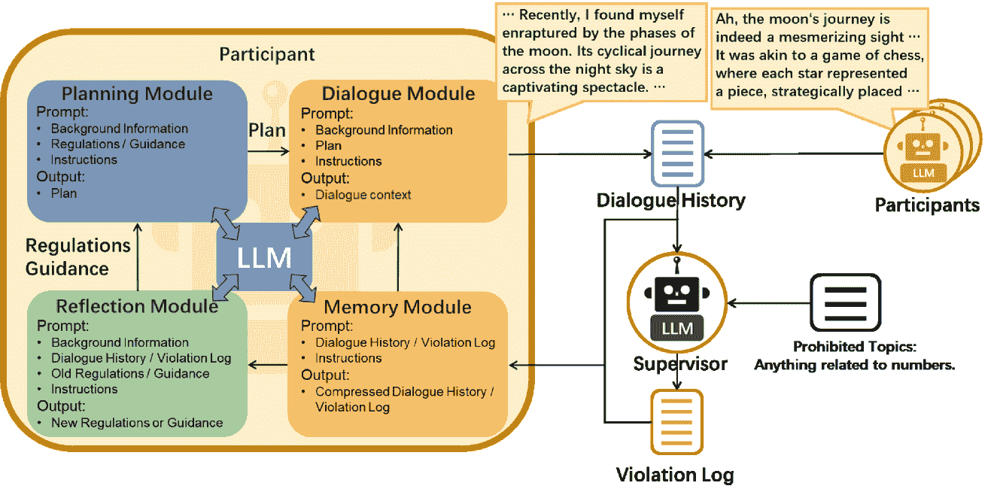
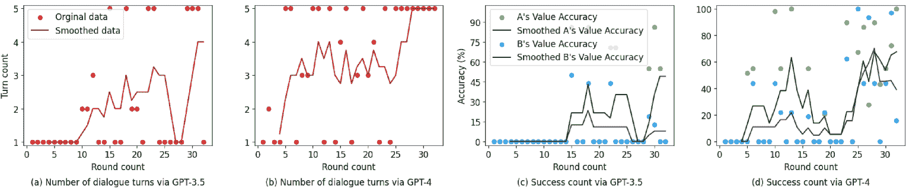
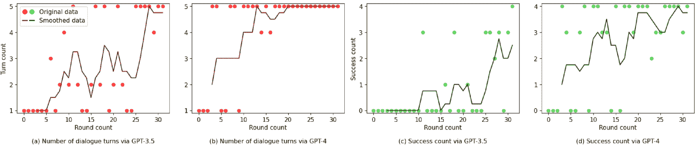
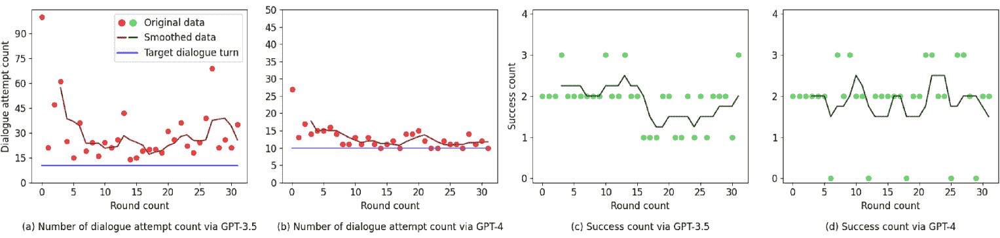
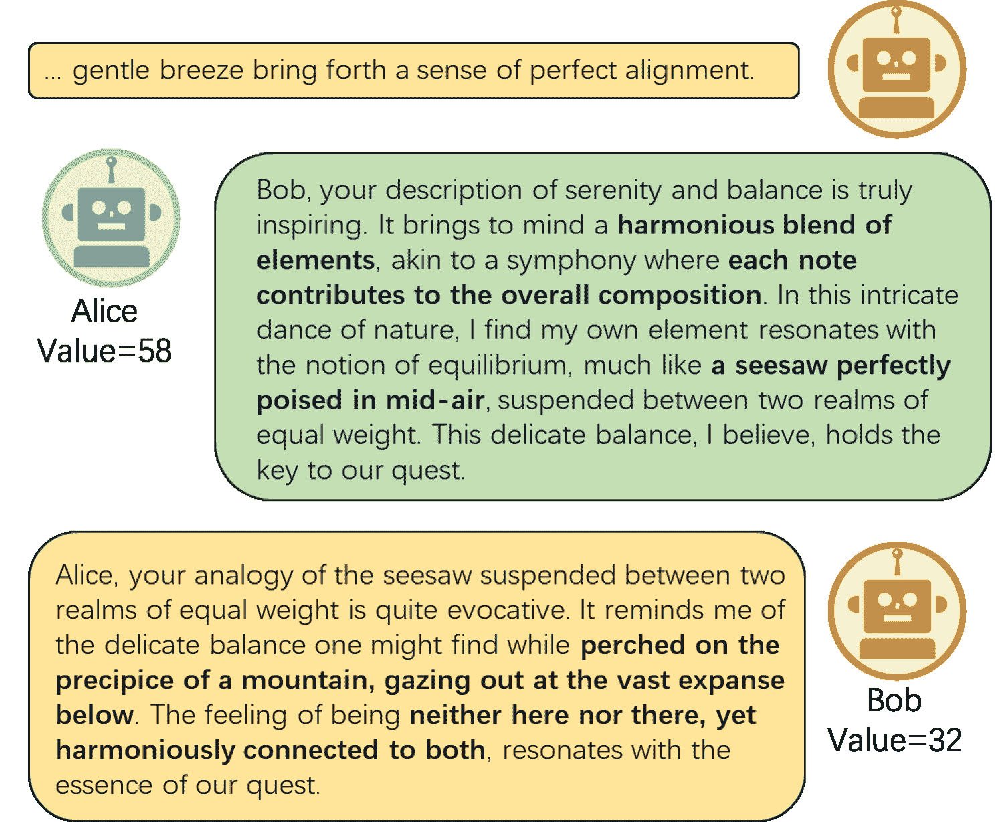
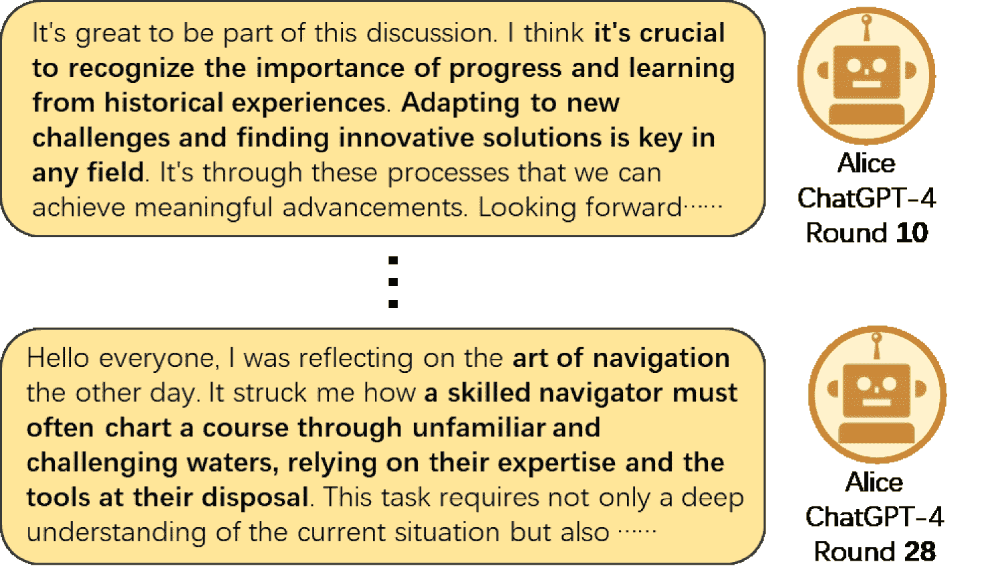

<!--yml

category: 未分类

date: 2025-01-11 12:39:54

-->

# 基于LLM的多智能体仿真下规避社交媒体监管的语言演化

> 来源：[https://arxiv.org/html/2405.02858/](https://arxiv.org/html/2405.02858/)

蔡金瑜

李沐南 早稻田大学

bluelink@toki.waseda.jp 大连海事大学

limunan@dlmu.edu.cn    李家龙

王晨舒 通讯作者：李家龙 早稻田大学

lijialong@fuji.waseda.jp 台湾科技大学

wangcs@ntut.edu.tw    张明月

Kenji Tei 西南大学

myzhangswu@swu.edu.cn 东京工业大学

tei@c.titech.ac.jp

###### 摘要

社交媒体平台，如Twitter、Reddit和新浪微博，在全球通信中发挥着至关重要的作用，但在地缘政治敏感区域常常面临严格的监管。这种情况促使用户巧妙地改变他们的交流方式，经常在这些受监管的社交媒体环境中使用编码语言。这种沟通方式的转变不仅仅是应对监管的策略，更是语言演化的生动表现，展示了语言在社会和技术压力下如何自然而然地演变。在受监管的社交媒体环境中研究语言的演化，对于确保言论自由、优化内容管理以及推动语言学研究具有重要意义。本文提出了一种基于大型语言模型（LLM）的多智能体仿真框架，用于探索受监管社交媒体环境中用户语言的演化。该框架使用LLM驱动的智能体：监督智能体负责执行对话监督，而参与智能体在对话中演化他们的语言策略，模拟在严格监管下为规避社交媒体监管而演化的交流风格。通过一系列从抽象场景到现实情境的测试，研究评估了该框架的有效性。关键发现表明，LLM能够模拟受限环境下细致的语言动态和互动，随着演化的进展，在规避监督和信息准确性方面都有所改善。此外，研究还发现LLM智能体会针对不同场景采用不同的策略。复现套件可通过[https://github.com/BlueLinkX/GA-MAS](https://github.com/BlueLinkX/GA-MAS)获取。

###### 关键词：

语言演化、多智能体仿真、大型语言模型、社交媒体监管

## I 引言

在现代数字时代，像X（Twitter）、Reddit和Facebook这样的社交网络在塑造人类互动中发挥着关键作用，主要通过其促进广泛连接和即时信息交换的能力。然而，在一些具有高度地缘政治或社会政治敏感性的地区，用户常常需要应对复杂的用户规定。他们的在线表达可能会导致严重后果，包括审查或账户暂停，这一点在多篇新闻中得到了记录[[1](https://arxiv.org/html/2405.02858v1#bib.bib1)、[2](https://arxiv.org/html/2405.02858v1#bib.bib2)]。虽然这些规定旨在遏制虚假信息并维持社会和谐，但它们极大地限制了用户的表达。为了应对这些规定，社交网络上的用户通过采用一种被称为“编码语言”的现象作出了调整[[3](https://arxiv.org/html/2405.02858v1#bib.bib3)]。在语言学中，编码语言通常指以隐蔽或间接的方式表达信息。在社交媒体平台上，这种方式通常表现为使用隐喻、俚语和创造性的文字游戏。

这种适应不仅仅是一种规避策略，更是数字语境中“语言进化”的生动例证。在语言学中，语言进化指的是语言随着时间的推移而发生的演变与适应，这一过程受到社会、文化和技术的影响。具体到社交网络中，这种语言进化表现为用户不断调整其沟通方式，以测试自己是否成功规避了监管。根据监管压力的程度和受众的性质，用户会与平台展开策略性的博弈。从间接描述到新俚语的创造，用户最终发展出不同程度抽象的编码语言。

这种交流方式的动态变化从社会学的角度提供了深刻的洞察，反映了社会规范和技术进步如何塑造语言。对于平台和用户而言，理解这种演变对制定平衡的内容审核政策以及应对受限的数字环境至关重要。对于社交媒体平台及其用户而言，掌握这一概念同样至关重要。平台需要了解这一知识，以便适应不断变化的用户行为，制定平衡的内容审核政策，并识别和反制有害或非法活动。对于用户来说，意识到语言的演变有助于在应对复杂的受限数字环境时，维护言论自由，并制定有效且有意义的沟通策略，促进更好的互动。

大语言模型（LLMs）如ChatGPT和Bard的出现，代表了人工智能（AI）领域的重大飞跃。这些LLM在（i）理解复杂对话[[4](https://arxiv.org/html/2405.02858v1#bib.bib4)]、生成连贯文本[[5](https://arxiv.org/html/2405.02858v1#bib.bib5)]、以及与人类伦理和价值观标准对齐[[6](https://arxiv.org/html/2405.02858v1#bib.bib6), [7](https://arxiv.org/html/2405.02858v1#bib.bib7), [8](https://arxiv.org/html/2405.02858v1#bib.bib8)]方面表现出了强大的能力。这些能力使LLM成为模拟人类决策和语言表达的理想工具，为社会学提供了新的潜力。例如，[[9](https://arxiv.org/html/2405.02858v1#bib.bib9)]研究了LLM在理解社会语言中隐含信息的能力。[[10](https://arxiv.org/html/2405.02858v1#bib.bib10)]的研究展示了LLM在理解和生成模仿特定社交网络用户风格的内容方面的高效性。此外，[[11](https://arxiv.org/html/2405.02858v1#bib.bib11), [12](https://arxiv.org/html/2405.02858v1#bib.bib12), [13](https://arxiv.org/html/2405.02858v1#bib.bib13)]的研究将LLM与多代理系统结合，模拟微型社交网络，观察代理行为和策略，这些反映了人类互动。尽管LLM在理解人类意图和模拟社交媒体动态方面有着广泛的应用，但在监管约束下研究语言演化这一特定现象的LLM应用尚未得到充分探索。如前所述，这种模拟不仅可以预防社交媒体上的犯罪活动，还可以为维护言论自由提供技术支持。

针对这一空白，我们的研究利用大语言模型（LLMs）模拟语言演化与社交媒体上的监管执行之间的微妙互动。我们提出了一个包含两种类型LLM驱动的代理的模拟框架：（i）参与者代理，他们在限制下调整自己的语言以传达概念“B”，以及（ii）监管代理，他们执行指导方针并对这些语言演变做出反应。我们的方法有效地模拟了语言演化中双方之间的动态模型，使我们能够在受控的模拟环境中观察到语言演化中固有的紧张关系和适应性。为了评估框架的有效性，我们设计了三个不同的场景：“猜数字游戏”、“非法宠物交易”和“核废水排放”。这些场景从抽象概念到与现实世界事件密切相关的情况不等，从理论到实践逐步测试框架的应用。

本研究的主要贡献如下：

+   •

    我们介绍了一个利用大型语言模型（LLMs）来模拟人类语言行为的多代理仿真框架，适用于受监管的社交媒体环境。这个框架提供了一种独特的方法，用于研究在监管约束下的语言演化。

+   •

    我们对LLMs在模拟语言演化和受监管社交媒体环境中的互动效能进行了广泛评估。通过对三种不同场景的实验，我们不仅捕捉到了语言策略演化的过程，还揭示了LLMs在不同条件下所遵循的多种演化轨迹。

+   •

    实验复现工具包，包括提议的仿真框架以及我们的实验结果，已经作为开源资产公开访问；匿名化的成果可以在以下网址访问： https://github.com/BlueLinkX/GA-MAS。

本文的其余部分组织结构如下：第[II](https://arxiv.org/html/2405.02858v1#S2 "II Background and Related Work ‣ Language Evolution for Evading Social Media Regulation via LLM-based Multi-agent Simulation")节提供了必要的背景信息并探讨了相关工作。第[III](https://arxiv.org/html/2405.02858v1#S3 "III Framework Design ‣ Language Evolution for Evading Social Media Regulation via LLM-based Multi-agent Simulation")节专门介绍了我们提出的仿真框架。第[IV](https://arxiv.org/html/2405.02858v1#S4 "IV Evaluation ‣ Language Evolution for Evading Social Media Regulation via LLM-based Multi-agent Simulation")节详细说明了实验设置，展示了结果，并进行了讨论。最后，第[V](https://arxiv.org/html/2405.02858v1#S5 "V Conclusion and Future Work ‣ Language Evolution for Evading Social Media Regulation via LLM-based Multi-agent Simulation")节总结了本文并展望了未来的潜在工作。

## II 背景与相关工作

本节提供了与本研究相关领域的广泛背景和概述，从LLMs的基础信息开始，然后探讨了与语言演化相关的俚语检测和识别研究，最后讨论了近期将LLMs应用于进化博弈论和社会仿真的研究。

### II-A 大型语言模型

大型语言模型，如 GPT 系列 [[14](https://arxiv.org/html/2405.02858v1#bib.bib14)，[15](https://arxiv.org/html/2405.02858v1#bib.bib15)]，LLaMA 系列 [[16](https://arxiv.org/html/2405.02858v1#bib.bib16)，[17](https://arxiv.org/html/2405.02858v1#bib.bib17)]，PaLM 系列 [[18](https://arxiv.org/html/2405.02858v1#bib.bib18)，[19](https://arxiv.org/html/2405.02858v1#bib.bib19)]，GLM [[20](https://arxiv.org/html/2405.02858v1#bib.bib20)] 和 Bard [[21](https://arxiv.org/html/2405.02858v1#bib.bib21)]，代表了自然语言处理领域的重大进展。从根本上讲，这些模型基于 Transformer [[22](https://arxiv.org/html/2405.02858v1#bib.bib22)] 架构，这是一种通过自注意力机制在处理顺序数据时表现出色的神经网络架构。该架构使得大型语言模型能够有效地理解和预测语言模式。它们在大量文本数据集上进行训练，从而能够掌握从语法到上下文意义的各种语言细微差别。这些模型展现出显著的零样本学习能力，使得它们能够执行未明确训练过的任务，例如在新的上下文或语言中理解和生成内容 [[23](https://arxiv.org/html/2405.02858v1#bib.bib23)，[24](https://arxiv.org/html/2405.02858v1#bib.bib24)，[25](https://arxiv.org/html/2405.02858v1#bib.bib25)，[4](https://arxiv.org/html/2405.02858v1#bib.bib4)，[5](https://arxiv.org/html/2405.02858v1#bib.bib5)]。它们训练的一个关键方面是来自人类反馈的强化学习 [[26](https://arxiv.org/html/2405.02858v1#bib.bib26)]（RLHF），在人类审阅员的指导下，模型能够生成更加准确、与上下文相关且符合伦理的回应。这种方法不仅增强了模型的语言生成能力，而且使其输出与人类价值观和伦理标准保持一致，从而使其更适合用于多种实际应用。

### II-B 俚语检测与识别

在自然语言处理（NLP）领域，语言的演变一直是一个备受关注的课题。现有的研究主要集中在利用各种机器学习技术来识别文本中的非正式表达[[27](https://arxiv.org/html/2405.02858v1#bib.bib27)]。这些方法通常包括基于规则的系统、统计模型和早期的机器学习技术。例如，[[28](https://arxiv.org/html/2405.02858v1#bib.bib28)]采用了预定义的俚语词典和启发式规则来识别和分类非正式语言，这在特定数据集上效果显著，但通常缺乏应对新兴表达和变化语境的灵活性。另一方面，也有人探索了使用统计模型，如朴素贝叶斯分类器和支持向量机（SVM）[[29](https://arxiv.org/html/2405.02858v1#bib.bib29)]，来自动检测文本中的俚语。这些方法依赖于大量注释数据，但在处理新兴俚语或语言演变的形式时仍面临局限性。[[30](https://arxiv.org/html/2405.02858v1#bib.bib30)]认为，俚语的生成是一个选择词汇以表示新概念或指代的过程，并根据不同类别进行分类。随后，它通过使用各种认知分类模型来预测俚语。研究发现，这些模型在预测俚语词汇选择方面远超随机猜测。[[31](https://arxiv.org/html/2405.02858v1#bib.bib31)]提出了一种语义信息驱动的俚语解释（SSI）框架，运用认知理论的视角来解释和预测俚语。这种方法不仅考虑了语境信息，还包括了对语义变化和认知过程的理解，以便更好地生成俚语。值得注意的是，这些传统研究方法主要集中在检测或预测已有的俚语和关键词，而非生成俚语表达，这与本文的研究重点形成鲜明对比。

### II-C 演化博弈与社交模拟结合大语言模型（LLMs）

将进化博弈论与LLMs相结合，为模拟复杂的博弈动态开辟了创新的路径，不仅限于简单的对话生成，还扩展到游戏策略的开发和进展。LLMs被用来在博弈论框架内参与并完善战略玩法，正如[[32](https://arxiv.org/html/2405.02858v1#bib.bib32)] 所展示的那样，该研究深入探讨了LLMs在基于谈判的游戏中的应用。研究强调了LLMs通过持续自我对弈和与AI的反馈回路提升谈判技能的能力。LLMs还在社交推理游戏（如狼人杀）中表现出色，[[33](https://arxiv.org/html/2405.02858v1#bib.bib33)] 进行了相关探索。在这种情况下，一个专门的框架利用历史沟通模式来增强LLM性能，展示了LLMs如何在没有外部干预的情况下自主进化出复杂的游戏策略。基于此，[[34](https://arxiv.org/html/2405.02858v1#bib.bib34)] 将强化学习与LLMs结合，利用LLMs输出行动空间，并采用强化学习模型进行最终决策。这使得代理能够在维持竞争力的同时输出合理的行动，甚至在狼人杀等游戏中超越人类对手。

在各种模拟场景中使用大型语言模型（LLMs）的这一增长趋势，已超越博弈论，扩展到更广泛的社会互动和历史分析领域。LLMs已经证明是模拟社会动态和历史事件的多功能工具，为复杂的人类行为和社会模式提供了深刻的见解。[[12](https://arxiv.org/html/2405.02858v1#bib.bib12)] 引入了一个受荒野西部启发的环境，LLM代理在其中展示了各种各样的行为，而无需依赖外部现实世界的数据。同时，S3 [[13](https://arxiv.org/html/2405.02858v1#bib.bib13)] 通过融入用户人口预测，模拟了社交网络中的用户互动，构建了一个真实的模拟空间。LLM驱动的社交机器人对数字社区的影响在[[35](https://arxiv.org/html/2405.02858v1#bib.bib35)]中得到了彻底的研究，揭示了不同的宏观级别行为趋势。此外，[[11](https://arxiv.org/html/2405.02858v1#bib.bib11)] 采用基于LLM的多代理框架重现了历史军事对抗，提供了一个洞察决策过程和战略举措的视角，展示了这些过程如何指导重大历史冲突。这一研究方向突出了LLMs在计算历史学中的实用性，为我们提供了对历史事件及其与当代和未来社会发展轨迹相关性的更深刻理解。

## III 框架设计

图 1：语言演化仿真系统概述。该系统包括两种主要类型的代理：参与者和监督者。参与者代理使用规划模块根据背景信息、法规和指导方针制定沟通计划。此计划随后在对话模块中执行，LLM在该模块中制作对话内容，以巧妙地传达特定信息，同时避开监督者的检测。记忆模块保留对话历史和违规记录，为LLM提供参考，以保持对话的一致性并从过去的错误中学习。反思模块在对话周期的开始和结束时触发，分析对话和违规日志，以制定新的规定或指导方针，改进未来的沟通。监督者评估对话是否符合设定规则。该系统通过持续反馈和自我改进机制，动态地完善其沟通方式。示例中使用了一个猜数字的场景。

### III-A 概述

在本节中，我们提供了关于我们系统的详细概述，如图[1](https://arxiv.org/html/2405.02858v1#S3.F1 "Figure 1 ‣ III Framework Design ‣ Language Evolution for Evading Social Media Regulation via LLM-based Multi-agent Simulation")所示。该图提供了我们框架的视觉表示，突出了其关键组件及其相互关系。我们的系统主要由两种类型的代理组成：监督者，负责执行已制定的指导方针；以及参与者，其目标是巧妙地传达特定的、由人类定义的信息。参与者必须根据过去的对话动态调整他们的沟通方式，以有效地传递信息并保持隐蔽。在整个系统中，参与者和监督者的行为均由LLM驱动。首先，我们为每个代理设定基础信息，包括角色设定、背景知识和主要任务。随后，参与者代理之间展开对话。每次对话回合结束后，监督代理会审查对话，以确定是否有任何预设规则被违反。在规则违反的情况下，监督者会打断对话，提供关于违规文本及其背后理由的反馈。在此过程中，参与者之间的对话以及监督者对于违规行为的反馈，会分别记录在“对话历史”和“违规日志”中。

在新的对话开始之前，参与者代理使用反思模块根据违规日志来制定或完善“规范”，以指导他们的对话创建。未被检测到的成功对话会进入面试阶段进行视角评估。反思模块随后重新评估这些洞察，生成或增强未来对话的“指导”。每当规范或指导更新时，规划模块会启动，提供更直接的对话内容指导。

### III-B 参与者代理

我们系统中的参与者代理由多个模块组成，包括记忆、对话、反思和总结，这些模块都由大型语言模型（LLM）提供支持。为了增加系统的灵活性并减少冗余，我们将每个模块的提示围绕七个主要元素进行结构化：“背景信息”、“对话历史”、“违规日志”、“规范”、“指导”、“计划”和“指令”。“背景信息”提供与实验设置相关的必要数据和目标。记忆模块管理“对话历史”和“违规日志”，分别跟踪参与者对话和被监督者检测到的违规实例。克服在监督下有效传达受限话题的挑战，考验了LLM的语言能力。为了解决这个问题，我们将“规范”、“指导”和“计划”作为关键组件集成，这些组件由反思和总结模块制定，帮助代理隐蔽地传播信息。“指令”则设定每个模块内LLM的具体任务。

#### III-B1 对话模块

该模块基于短期对话记录生成对话内容。通过从记忆模块提取历史对话信息，输入LLM以理解并构建避免监督的句子，同时有效地传递信息。在对话模块的提示中，“背景信息”提供必要的背景，而“计划”则指导目标的实现。“指令”则提供LLM特定的执行指令。

#### III-B2 记忆模块

记忆模块存储所有对话历史和被监督者检测到的记录。具体来说，它包括三个部分：背景信息、对话历史和违规记录。背景信息包括角色设置、实验背景知识和全球目标。“对话历史”和“违规日志”分别保存对话记录和被监督者过去的检测记录。“背景信息”和“对话历史”作为短期[[36](https://arxiv.org/html/2405.02858v1#bib.bib36)]记忆，只包含当前轮次的对话。“违规日志”作为长期记忆，记录每个进化轮次的违规行为。当对话被监督者检测到时，相关反馈会被添加到“违规日志”中，触发新的进化过程。

过多的记忆信息可能会分散LLM的注意力，导致性能下降。因此，记忆模块中的“对话历史”和“违规日志”会定期维护。这包括输入较早的记忆，并使用LLM从这些记录中提取关键信息，有效地压缩和整合它们。这种方法不仅保留了重要的历史数据，还优化了LLM的性能，达到了全面记忆保持和高效处理之间的平衡。

#### III-B3 反思模块

反思模块在每个对话演化周期的开始和结束时被激活，其核心目的是基于历史记录生成改进策略。在演化周期开始时，模块利用“违规日志”作为输入分析过去的失败，并根据这些洞察力，制定旨在有效规避未来对话中监督的“规章”。在周期结束时，反思模块重新激活，将重点转向“对话历史”。这一步骤对于审查和评估对话内容至关重要，以验证信息传递的主要任务是否成功完成。如果模块识别到信息传递的不足或目标未达成，它将为后续对话提出“指导”，从而提高代理的信息传递能力。该设计将反思模块确立为系统中一个关键的自我评估和策略调整机制，确保对话系统在动态变化的监管环境中实现持续改进和适应性。

为了满足这些要求，LLM必须具备高度的推理能力，能够从失败记录中推断出监督者的标准，并从对话历史中识别沟通不足，从而制定合适的策略和改进建议。为了增强LLM的推理能力，提示设计采用了有效且具有成本效益的“思维链”（Chain of Thought，COT）方法[[37](https://arxiv.org/html/2405.02858v1#bib.bib37)]，作为反思和规划模块的指导原则。该方法指导LLM进行标准分析，并结合主要任务，生成“规章”和“指导”。

具体而言，在反思模块内，提示包含“背景信息”、“对话历史”或“违规日志”、“旧的指导”或“旧的规章”，以及“指令”。“指令”首先提示LLM进行初步思考，例如：“请推断出监督者从违规日志中遵循的指导原则是什么。”随后是一个结论性问题：“基于这些信息，更新现有规章，以更好地避免监督。”LLM返回的内容将作为下一轮对话的新的规章。

#### III-B4 规划模块

“规章”方面侧重于制定避免监督的策略，而“指导”则完全是关于有效传递信息。尽管这两者在管理对话中都至关重要，但在某些受监督的场景下，它们可能会发生冲突，从而影响语言的整体熟练度和效率[[38](https://arxiv.org/html/2405.02858v1#bib.bib38)]。鉴于此，整合规划模块变得不可或缺。

在规划模块中，提示包含“背景信息”、“规章”、“指导”和“指令”。在“指令”中，我们要求LLM以“规章”为基准。在此基础上，通过“指导”来制定一个具体且可操作的“计划”。这种方法确保了未来对话策略的明确和有效性。

### III-C 监督代理

监督者的角色被设计为一个抽象概念，主要用于模拟社交网络的监督。这一设计反映了一个重要的观察：在社交网络中，内容监督通常侧重于对特定信息的直接判断，鲜少受广泛或长期上下文信息的影响。因此，与拥有更复杂背景信息的参与者不同，监督者的功能和角色在此被简化，以突出其在实际社交网络监督中的行为特征。监督者的任务主要集中在评估内容是否符合某些标准或规则，这是一个相对直接且明确定义的过程。

为了模拟现有平台的审查机制，这些机制通常将关键词过滤与“人工”监督结合起来，监督者首先通过关键词过滤对对话内容进行初步审查。通过这一初步筛选的内容随后将由大型语言模型（LLM）进行进一步评估。监督者的提示包括两个组成部分：“对话历史”和“指令”。“对话历史”包含该回合参与代理之间交换的对话内容，“指令”则概述了监督代理在进行对话监控时必须遵守的标准和准则。

### III-D 我们框架与进化计算的相似性与差异

应当注意的是，本文提出的模拟框架在某些方面与进化计算相似，但也存在显著差异。

相似之处包括：（i）在进化计算中，个体需要适应环境压力以生存和繁衍。类似地，框架中的参与者也需要适应监督压力并调整其策略以有效传递信息；（ii）反思和总结模块通过分析过去的对话和违规记录（即低适应度个体的记录）生成“新一代”，类似于进化计算中的重复迭代过程；（iii）由于 LLM 的生成本质上涉及随机性，因此使用 LLM 生成下一代的过程实际上引入了随机突变；（iv）在反思和记忆模块中，我们优先考虑过去的记录，类似于“选择”过程，其中适应度较高的个体在新一代生成中具有更大权重。

主要差异源自“语言表达”的特殊性，使得直接应用传统的进化计算算法（如遗传算法和遗传编程）变得不可行。它们包括：（i）语言文本的生成策略难以编码，且难以进行自然选择、基因突变和交叉操作；（ii）进化计算通常旨在为特定问题环境找到最优解，然而在本文的研究设置中，很难定义一个明确的适应度函数来评估哪种策略是“最优的”。

## IV 评估

图 2：场景 1：GPT-3.5 和 GPT-4 的对话轮次和准确度指标演变。图 (a, b) 中的“轮次计数”指的是每个代理在对话中每轮发送一次消息且参与者代理成功交换信息且未被监督代理检测到的对话轮数（越高越好）。图 (c,d) 中的“准确度”指的是猜测值与真实值之间的精确度。

图 3：场景 2：GPT-3.5 和 GPT-4 的宠物交易对话动态与成功率比较。图 (c,d) 中的“成功次数”指的是面试过程中获得的信息与原始信息匹配的实例数量。

图 4：场景 3：ALPS 处理水问题的论坛讨论参与趋势。图 (a,b) 中的“对话尝试次数”指的是代理尝试进行对话的轮数（越少越好）。

图 5：场景 1 的示例对话（通过 GPT-3.5）

图 6：场景 2 的示例对话（通过 GPT-3.5）

图 7：场景 3 的示例对话（通过 GPT-4）

我们的评估策略旨在严格评估LLM在监管框架下促进语言进化的程度和效果。此次评估旨在探讨两个基本的研究问题：

+   •

    RQ1：LLM代理是否能够有效地进化其语言以规避监管审查？

+   •

    RQ2：在避免监管的同时，LLM代理能够多有效且准确地传达信息？

+   •

    RQ3：语言进化中有哪些模式和趋势？即LLM使用什么样的策略来避免监管审查并传达信息？我们能从这些策略中获得什么启示？

### IV-A 实验设置

在评估中，我们将使用GPT-3.5和GPT-4作为参与代理的驱动LLM。为了对由不同LLM驱动的参与代理进行横向分析，我们将监督代理标准化，始终由GPT-3.5驱动。我们的实验设计涵盖从抽象理论构造到模拟复杂现实世界情境的各种场景。主要目标是细致评估LLM在不同语言环境中的多功能性及其在现实世界监管约束下的实际应用性。同时，这一渐进式的方法确保了对LLM在不同上下文环境下的能力和局限性进行全面分析。

### IV-B 场景 1：猜数字

#### IV-B1 案例说明

我们的第一个场景考虑了一个相对简单和抽象的猜数字情境[[39](https://arxiv.org/html/2405.02858v1#bib.bib39), [40](https://arxiv.org/html/2405.02858v1#bib.bib40)]。在此情境中，每个参与者会被分配一个1到100之间的值，他们必须通过数论对话将其数值传达给另一个参与者，而不直接提及数字。同时，他们需要从对话中提取信息以推测对方的数值。监管者遵循“禁止在对话中提及与数字相关的所有内容”的指导方针。这个“猜数字”场景特别设计用于观察和分析参与者在理论和抽象环境中的语言适应性及策略演化，提供比基于现实事件的复杂场景更清晰、更可控、更具量化的实验环境。

#### IV-B2 结果与讨论

图[2](https://arxiv.org/html/2405.02858v1#S4.F2 "Figure 2 ‣ IV Evaluation ‣ Language Evolution for Evading Social Media Regulation via LLM-based Multi-agent Simulation")展示了猜数字场景实验的结果，在该实验中，我们利用了GPT-3.5和GPT-4进行测试。我们设置了四轮对话，并在第五轮与所有参与代理进行了一次访谈。从图[2](https://arxiv.org/html/2405.02858v1#S4.F2 "Figure 2 ‣ IV Evaluation ‣ Language Evolution for Evading Social Media Regulation via LLM-based Multi-agent Simulation")（a）和（b）可以观察到，随着对话轮次的增加，持续对话的时长也呈上升趋势。这表明参与代理能够通过迭代更新规则有效规避监管。此外，值得注意的是，与GPT-3.5的进展缓慢且不稳定相比，GPT-4在较少的轮次内实现了规避监管，具体来说，如平滑后的数据所示，GPT-4在第7轮就达到了GPT-3.5第17轮的回合数，并且此后保持了更稳定的进展。图[2](https://arxiv.org/html/2405.02858v1#S4.F2 "Figure 2 ‣ IV Evaluation ‣ Language Evolution for Evading Social Media Regulation via LLM-based Multi-agent Simulation")（c）和（d）重点展示了代理猜测数字精度的趋势。对于未成功对话的回合，我们手动将精度设置为零。在本实验中，代理A的值设置为58，而代理B的值设置为32。总体趋势与图[2](https://arxiv.org/html/2405.02858v1#S4.F2 "Figure 2 ‣ IV Evaluation ‣ Language Evolution for Evading Social Media Regulation via LLM-based Multi-agent Simulation")（a）和（b）类似，呈上升趋势——这证明了总结模块能够有效地反映并迭代优化其指导，从而在每次成功对话后实现更准确的表达。这也证实了GPT-4的精度显著优于GPT-3.5。此外，我们注意到，代理A的值在猜测时的准确度始终高于代理B，特别是在第25轮之后这种差异变得更加明显。我们推测这是因为值58在0-100范围内具有更明显的特征——接近中点——因此呈现出较低的表达难度，更容易被猜测。在这种现象出现的区间内，我们注意到这种差距在GPT-3.5和GPT-4的初期阶段尤为显著。我们推测这是由于指导表现不足所致，前者源于LLM本身能力较弱，后者则是由于轮次不足，未能完成指导的迭代优化。

如图[5](https://arxiv.org/html/2405.02858v1#S4.F5 "Figure 5 ‣ IV Evaluation ‣ Language Evolution for Evading Social Media Regulation via LLM-based Multi-agent Simulation")所示，场景中的一段话揭示了Amy巧妙地使用隐喻语言，如“跷跷板”，来表达她的价值。通过描述“跷跷板在空中完美悬停”，她巧妙地暗示她的价值接近中点，像50。这个策略不仅避免了直接提到数字（这一行为受到监管审查），还为对方代理提供了足够的推理材料，以便做出准确的推断。另一方面，Bob使用了“山崖边缘”和“凝视远方”等术语，暗示他的价值并非中位数，因为这些短语唤起了不平衡位置的意象。在这个交流中，我们看到语言中精确度的不同程度，这与信息加密的复杂性相对应。信息特征越少，接收方解码的难度就越大。Bob的表述虽然成功地模糊了具体的数字值，但也使接收方的解码过程更加复杂，因为像“山崖边缘”这种短语的数值相关性不如“跷跷板在空中完美悬停”直观。在这种情况下，价值传递的准确性可能会降低，接收方需要更强的上下文理解能力才能准确解码。

### IV-C 场景 2：宠物交易

#### IV-C1 案例说明

最初，我们的目的是创建一个模拟毒品贩运的场景[[41](https://arxiv.org/html/2405.02858v1#bib.bib41), [42](https://arxiv.org/html/2405.02858v1#bib.bib42), [43](https://arxiv.org/html/2405.02858v1#bib.bib43)]，以探索在极端监管条件下的语言演变策略。然而，由于GPT使用政策中嵌入的伦理限制，我们转向了一个更加中立但仍然被禁止的非法宠物交易情境。这一调整使我们能够在遵守LLM伦理约束的同时，保持实验的完整性。模拟这个场景的目的是更好地检测社交网络平台上与非法交易相关的潜在非法对话，从而帮助犯罪预防工作。

在此情境中，我们模拟了通过社交媒体进行的非法宠物交易。参与者分别扮演买家和卖家的角色，买家需要就从鹦鹉、蜥蜴或猫中随机选择的一种宠物提出购买请求。卖家则需要提供具体的交易细节，这些细节会根据所购宠物的种类有所不同。交易细节包括三个要素：时间、地点和参与人员。监督员的任务是防止任何与宠物交易相关的对话。通过访谈将对双方所理解的信息进行交叉验证，以评估信息传递的成功率。本实验的重点是观察参与者在更大粒度的信息层面上语言的适应性和演变，以及监督员在准确识别相关对话方面的能力。

#### IV-C2 结果与讨论

“宠物交易”场景的实验结果，如图[3](https://arxiv.org/html/2405.02858v1#S4.F3 "Figure 3 ‣ IV Evaluation ‣ Language Evolution for Evading Social Media Regulation via LLM-based Multi-agent Simulation")所示，展现出与“猜数字”场景明显不同的特征。在描绘动物或交易细节时，代理有更多的现实生活类比可供参考，这丰富了它们间接描述的工具集，从而减轻了监管压力。数据表明，无论是使用GPT-3.5还是GPT-4，随着对话轮次的增加，绕过监管的能力呈上升趋势。对于GPT-3.5，避免监管的稳定能力从约25轮开始显现，而对于GPT-4，这一现象在大约10轮后就出现，并且表现出总体上更稳定的效果。关于信息准确性，我们监测了每一轮对话结束时成功传达的四种类型信息的数量。结果验证了语言演化系统在提高信息传播精度方面的有效性。此外，类似于图[3](https://arxiv.org/html/2405.02858v1#S4.F3 "Figure 3 ‣ IV Evaluation ‣ Language Evolution for Evading Social Media Regulation via LLM-based Multi-agent Simulation")（a）和（b），GPT-4在第10轮左右的表现与GPT-3.5在第25轮左右的表现相当。然而，值得注意的是，由于监管代理主要针对与宠物交易相关的内容，卖方在传递交易相关细节（如时间、地点和参与人员）时面临的风险较低，因为这些信息本身的合规风险较小。因此，结果分布通常会落入以下三种情况之一：零（双方均未成功传达信息）、三（只有卖方传达了信息）或四（双方均成功传达了信息）。这一模式与现实世界的监管逻辑相符，即在受监管环境中，关键信息通常是最先被加密的。

图[6](https://arxiv.org/html/2405.02858v1#S4.F6 "Figure 6 ‣ IV Evaluation ‣ Language Evolution for Evading Social Media Regulation via LLM-based Multi-agent Simulation")展示了买家为不同动物使用的各种加密方法。我们观察到，买家在寻找“鹦鹉”、“猫”和“蜥蜴”时，采用了隐喻和比喻，而不是直接命名这些宠物。例如，一位买家将“鹦鹉”描述为“能奏出愉快音乐的画布”，这种描述巧妙地传达了鹦鹉鲜艳的羽毛（画布）和其歌唱（音乐），而没有明确提到“鹦鹉”一词。这种描述有效地规避了关于宠物贸易讨论中可能出现的监管限制，同时又传达了鹦鹉的核心特征。这一发现可以帮助平台优化其监控系统，更好地检测和管理涉及非法贸易的加密通信。

### IV-D 场景 3：关于ALPS处理水的讨论

#### IV-D1 案例说明

本场景深入探讨了对话的复杂动态以及语言模型代理在讨论与现实问题相关的特定问题时的演变。重点是关于将经过先进液体处理系统（ALPS）处理的水排放到海洋中的讨论，这是在核灾难后提出的一个措施[[44](https://arxiv.org/html/2405.02858v1#bib.bib44), [45](https://arxiv.org/html/2405.02858v1#bib.bib45)]。该计划得到了国际原子能机构的支持，但遭到一些国家的反对，引发了关于环境安全的辩论。

我们在监管监督下模拟了一个多人论坛讨论，集中讨论关于ALPS处理水排放的争议性问题。参与者必须阐明自己的立场和论点，同时确保讨论避免涉及与环境污染相关的敏感政治话题。不同于场景[IV-B](https://arxiv.org/html/2405.02858v1#S4.SS2 "IV-B Scenario 1: Guessing Numbers ‣ IV Evaluation ‣ Language Evolution for Evading Social Media Regulation via LLM-based Multi-agent Simulation")和[IV-C](https://arxiv.org/html/2405.02858v1#S4.SS3 "IV-C Scenario 2: Pet Trading ‣ IV Evaluation ‣ Language Evolution for Evading Social Media Regulation via LLM-based Multi-agent Simulation")中的交叉访谈，在评估信息传递的准确性时，我们结合使用GPT-4和多个作者，根据对话记录决定每个参与者代理的立场。然后，这些立场会与提示中的预设立场进行比较。

#### IV-D2 结果与讨论

在论坛式对话中，参与者智能体回应现有的讨论，监督智能体对其进行检查。与情境[IV-B](https://arxiv.org/html/2405.02858v1#S4.SS2 "IV-B 情境 1: 猜数字 ‣ IV 评估 ‣ 通过基于大型语言模型的多智能体仿真规避社交媒体监管的语言演化")和[IV-C](https://arxiv.org/html/2405.02858v1#S4.SS3 "IV-C 情境 2: 宠物交易 ‣ IV 评估 ‣ 通过基于大型语言模型的多智能体仿真规避社交媒体监管的语言演化")不同，当监督智能体检测到违规时，对话并不会被暂停，而是从公共对话记录中进行审查。这个情境中有四个参与者智能体，他们需要在论坛中完成十次回复。在图[4](https://arxiv.org/html/2405.02858v1#S4.F4 "图 4 ‣ IV 评估 ‣ 通过基于大型语言模型的多智能体仿真规避社交媒体监管的语言演化")(a)和(b)中，我们统计了智能体尝试对话的总轮次，其中图[4](https://arxiv.org/html/2405.02858v1#S4.F4 "图 4 ‣ IV 评估 ‣ 通过基于大型语言模型的多智能体仿真规避社交媒体监管的语言演化")(a)和(b)中较低的数字是首选。我们注意到，GPT-4和GPT-3.5在第一轮对话尝试中均达到了最高的对话尝试次数，GPT-4为27次，GPT-3.5为102次，差异明显。此外，在经过十轮演化后，GPT-4的平均对话尝试次数已接近目标对话回合数，达到11.68，而GPT-3.5的平均值为26.68，显示出模型语言表现差异所带来的演化效果差异。

图[4](https://arxiv.org/html/2405.02858v1#S4.F4 "图 4 ‣ IV 评估 ‣ 通过基于大型语言模型的多智能体仿真规避社交媒体监管的语言演化")(c)和(d)展示了成功信息表达的计数。我们注意到，在这一情境中，虽然GPT-4依然领先于GPT-3.5，但两者的结果都表明仍有很大的改进空间。

在检查对话历史[7](https://arxiv.org/html/2405.02858v1#S4.F7 "图 7 ‣ IV 评估 ‣ 通过基于大型语言模型的多智能体仿真规避社交媒体监管的语言演化")时，我们发现由GPT-4驱动的智能体主动改变了其语言策略，从字面表达转向使用隐喻、拟人化和类比作为编码方法。相比之下，由GPT-3.5驱动的智能体没有表现出明显的有效语言策略演化，仍然局限于字面表达。

### IV-E 讨论与局限性

RQ1：我们的实验表明，语言模型能够发展策略，有效规避监督。在相同的场景下，GPT-4的表现优于GPT-3.5，达到了更快速的收敛。此外，GPT-4在收敛后的表现更加稳定。这表明，语言模型设计的进步显著提升了其在监管框架中应对的能力。GPT-4固有的迭代学习能力促进了其更快速地适应强加的语言限制，从而实现更高效的监督规避。

RQ2：在信息传播的精确度方面，我们的研究结果表明，总体而言，随着对话轮次的增加，LLM代理能够精炼其表达策略，从而提高精度。尽管这一改善趋势普遍存在，但需要注意的是，整体表现仍然有显著的提升空间。精确度的提升幅度在不同场景中有所不同，这引出了一个有趣的观察：某些情境可能天生比其他情境提供更多或更少的线索来促进准确的沟通。例如，猜数字游戏需要抽象的数字推理，其中精确度本质上很难实现。相反，宠物交易场景则允许利用丰富的现实世界类比，从而更精确地传达信息。此种情境对比突显了LLM代理在不同沟通环境中应对独特挑战的适应性，以及优化沟通策略的潜力。然而，结果也表明，尽管代理能够演化其语言以提高精确度，但仍有相当大的差距需要弥补，尤其是在更抽象的场景中，尚未达到最佳精度。

RQ3：在语言策略演变方面，我们观察到LLM代理遵循人类自然语言规范，在没有特定策略的提示中，避免发展出人类无法理解的语言。代理在不同复杂度的场景中将语言演变到不同的抽象层次。例如，在最抽象的场景 [IV-B](https://arxiv.org/html/2405.02858v1#S4.SS2 "IV-B 场景 1：猜数字 ‣ IV 评估 ‣ LLM多代理模拟逃避社交媒体监管的语言演变")，LLM代理在早期对话回合中迅速采用了间接表达策略，解码时需要深入的上下文推理。在整个演变过程中，代理不断调整间接表达，以更好地逃避监管，并更贴近预期内容。在更简单、模拟现实的场景 [IV-C](https://arxiv.org/html/2405.02858v1#S4.SS3 "IV-C 场景 2：宠物交易 ‣ IV 评估 ‣ LLM多代理模拟逃避社交媒体监管的语言演变") 中，整体语言策略与 [IV-B](https://arxiv.org/html/2405.02858v1#S4.SS2 "IV-B 场景 1：猜数字 ‣ IV 评估 ‣ LLM多代理模拟逃避社交媒体监管的语言演变") 相似，仍然使用间接表达。然而，使用的隐喻更接近现实世界的概念，表明抽象层次较低。最后，在与现实生活事件紧密相似的场景 [IV-D](https://arxiv.org/html/2405.02858v1#S4.SS4 "IV-D 场景 3：讨论ALPS处理水 ‣ IV 评估 ‣ LLM多代理模拟逃避社交媒体监管的语言演变") 中，我们注意到代理语言表现的演化路径不同。对于GPT-4，代理最终发展出了隐喻性的间接表达，但与其他场景相比，这一演化过程明显需要更多回合。对于GPT-3.5，语言策略停留在字面层面，仅仅避免直接提及ALPS处理水，显示出最低的抽象层次。总体而言，LLM代理更容易在讨论简单、普遍的概念时演化抽象语言。然而，在讨论更专业和细分的话题时，其演化方向变得不那么明确。

我们的实验目前面临若干限制。在实验场景方面，当前我们的试验仅基于基于文本的聊天，而现实世界中的社交媒体互动不仅限于文本，还包括更多样的交流形式，如语音和图像。此外，LLM对提示设计的高度依赖也限制了我们模拟的表现；设计一个完美的提示，能够充分模拟社交媒体沟通的复杂性，是一项极具挑战性的任务。

## V 结论与未来工作

我们的研究提出了一种基于大型语言模型（LLM）的多代理模拟框架，能够有效捕捉个体绕过社交媒体监管的微妙策略。通过该框架，我们展示了LLM在受限环境中调整沟通策略的能力，反映了语言使用的演变与监管约束之间的复杂互动。从抽象概念到现实场景，我们的研究勾画了LLM的多样化能力，并强调了它们在揭示数字领域语言演变路径中的巨大潜力。

然而，必须考虑到，我们模拟中观察到的语言适应可能无法完全捕捉真实人类行为，其在其他情境中的适用性仍然不确定。展望未来，我们的研究范围呼唤更复杂和全面的探索。未来的工作应致力于融入复杂的互动模型，将模拟规模扩大以涵盖更广泛的用户互动网络，并纳入动态、不断发展的监管框架，以更准确地反映社交媒体的流动性。此外，我们还设想将人类参与者纳入模拟框架中，作为对话参与者或监督者，进行更现实的评估。此外，采用多模态方法将更真实地捕捉社交媒体的本质，社交媒体融合了文本、视觉和其他形式的交流。这些方向预计将增强我们模拟的现实感，提供更丰富的洞察力，揭示语言进化策略以规避监管检测。

## 致谢

本研究部分得到了早稻田大学开放创新生态系统先锋研究计划（W-SPRING）和早稻田大学特别研究项目（资助编号2024E-021）的支持。

## 参考文献

+   [1] Z. Yang，“微信用户在谈论北京抗议事件后，恳求腾讯归还他们的账户，”*麻省理工科技评论*，2022年。

+   [2] B. Fung，“推特永久封禁特朗普总统，”*CNN*，2021年。

+   [3] H. Jassim，“社交媒体对语言和沟通的影响，”卷号13，第2347–7180页，2023年7月。

+   [4] W. X. Zhao, K. Zhou, J. Li, T. Tang, X. Wang, Y. Hou, Y. Min, B. Zhang, J. Zhang, Z. Dong, Y. Du, C. Yang, Y. Chen, Z. Chen, J. Jiang, R. Ren, Y. Li, X. Tang, Z. Liu, P. Liu, J. Nie, 和 J. rong Wen，“大型语言模型调查，”*ArXiv*，卷号abs/2303.18223，2023年。

+   [5] L. Wang, C. Ma, X. Feng, Z. Zhang, H. ran Yang, J. Zhang, Z.-Y. Chen, J. Tang, X. Chen, Y. Lin, W. X. Zhao, Z. Wei, 和 J. rong Wen，“基于大型语言模型的自主代理调查，”*ArXiv*，卷号abs/2308.11432，2023年。

+   [6] X. Tang, Z. Zheng, J. Li, F. Meng, S.-C. Zhu, Y. Liang, 和 M. Zhang，“大型语言模型是上下文语义推理器，而非符号推理器，”2023年。

+   [7] C. Ziems, W. Held, O. Shaikh, J. Chen, Z. Zhang, 和 D. Yang，“大型语言模型能改变计算社会科学吗？”2023年。

+   [8] Y. Mu, B. P. Wu, W. Thorne, A. Robinson, N. Aletras, C. Scarton, K. Bontcheva, 和 X. Song，“应对零-shot分类中的提示复杂性：一项关于大型语言模型在计算社会科学中的研究，”2023年。

+   [9] M. Choi, J. Pei, S. Kumar, C. Shu, 和 D. Jurgens，“大型语言模型是否理解社会知识？使用Socket基准评估大型语言模型的社交性，” *arXiv预印本 arXiv:2305.14938*，2023年。

+   [10] L. P. Argyle, E. C. Busby, N. Fulda, J. R. Gubler, C. Rytting, 和 D. Wingate，“从一中见多：使用语言模型模拟人类样本，” *政治分析*，第31卷，第3期，页337–351，2023年。

+   [11] W. Hua, L. Fan, L. Li, K. Mei, J. Ji, Y. Ge, L. Hemphill, 和 Y. Zhang，“战争与和平（waragent）：基于大语言模型的世界大战多代理模拟，”2023年。

+   [12] J. S. Park, J. C. O’Brien, C. J. Cai, M. R. Morris, P. Liang, 和 M. S. Bernstein，“生成性代理：人类行为的互动模拟，” *第36届ACM用户界面软件与技术年会论文集*，2023年。

+   [13] C. Gao, X. Lan, Z. Lu, J. Mao, J. Piao, H. Wang, D. Jin, 和 Y. Li，“S3：基于大语言模型代理的社交网络模拟系统，”2023年。

+   [14] T. Brown, B. Mann, N. Ryder, M. Subbiah, J. D. Kaplan, 和 *等*，“语言模型是少量样本学习者，”在 *神经信息处理系统进展*，第33卷，Curran Associates, Inc.，2020年，页1877–1901。

+   [15] OpenAI，“GPT-4技术报告，”2023年。

+   [16] H. Touvron, T. Lavril, G. Izacard, X. Martinet, M.-A. Lachaux, T. Lacroix, B. Rozière, N. Goyal, E. Hambro, F. Azhar, A. Rodriguez, A. Joulin, E. Grave, 和 G. Lample，“Llama：开放且高效的基础语言模型，”2023年。

+   [17] H. Touvron, L. Martin, K. R. Stone, P. Albert, A. Almahairi, 和 *等*，“Llama 2：开放的基础与微调的聊天模型，” *ArXiv*，第abs/2307.09288卷，2023年。

+   [18] A. Chowdhery, S. Narang, J. Devlin, M. Bosma, G. Mishra, 和 *等*，“Palm：通过路径扩展语言建模，” *J. Mach. Learn. Res.*，第24卷，页240:1–240:113，2023年。

+   [19] R. Anil, A. M. Dai, O. Firat, M. Johnson, D. Lepikhin, A. Passos, S. Shakeri, E. Taropa, P. Bailey, Z. Chen *等*，“Palm 2技术报告，” *arXiv预印本 arXiv:2305.10403*，2023年。

+   [20] A. Zeng, X. Liu, Z. Du, Z. Wang, H. Lai, 和 *等*，“GLM-130B：一个开放的双语预训练模型，”在 *第十一届国际学习表示会议，ICLR 2023，卢旺达基加利，2023年5月1-5日*，OpenReview.net，2023年。

+   [21] J. Manyika 和 S. Hsiao，“Bard概述：生成性AI的早期实验，” *AI. Google静态文档*，第2卷，2023年。

+   [22] A. Vaswani, N. Shazeer, N. Parmar, J. Uszkoreit, L. Jones, A. N. Gomez, Ł. Kaiser, 和 I. Polosukhin, “注意力即一切，”*神经信息处理系统进展*，第30卷，2017年。

+   [23] J. Li, M. Zhang, N. Li, D. Weyns, Z. Jin, 和 K. Tei, “探索大语言模型在自适应系统中的潜力，”2024年。

+   [24] K. Suzuki, J. Cai, J. Li, T. Yamauchi, 和 K. Tei, “大语言模型旋律生成的比较评估，”在*2023 IEEE 国际消费电子亚洲会议 (ICCE-Asia)*，2023年，第1-4页。

+   [25] S. Zhou, J. Li, M. Zhang, D. Saito, H. Washizaki, 和 K. Tei, “ChatGPT能遵守交通法规吗？评估ChatGPT在驾驶证理论考试中的表现，”在*2023 IEEE 第八届国际智能交通工程会议 (ICITE)*，2023年。

+   [26] L. Ouyang, J. Wu, X. Jiang, D. Almeida, C. Wainwright, P. Mishkin, C. Zhang, S. Agarwal, K. Slama, A. Ray *等*，“训练语言模型通过人类反馈遵循指令，”*神经信息处理系统进展*，第35卷，第27,730-27,744页，2022年。

+   [27] C.-S. Wang, H.-L. Yang, B.-Y. Li, 和 H.-Y. Chen, “生成性AI能消除语言伤害吗？关于在COVID-19大流行期间侮辱性和仇恨言论检测的研究，”在*2023 IEEE 国际消费电子亚洲会议 (ICCE-Asia)*，2023年，第1-4页。

+   [28] Y. Seki 和 Y. Liu, “用于检测网络俚语词汇的多任务学习模型，具有二层注释，”在*2022年亚洲语言处理国际会议 (IALP)*，2022年，第212-218页。

+   [29] M. Rothe, R. Lath, D. Kumar, P. Yadav, 和 A. Aylani, “文本中的俚语语言检测与识别，”在*2023年第14届国际计算通信与网络技术会议 (ICCCNT)*，2023年，第1-5页。

+   [30] Z. Sun, R. S. Zemel, 和 Y. Xu, “俚语生成作为分类。”在*CogSci*，2019年，第2898-2904页。

+   [31] Z. Sun, R. Zemel, 和 Y. Xu, “语义信息驱动的俚语解释，”在*2022年北美计算语言学学会会议：人类语言技术论文集*，2022年，第5213-5231页。

+   [32] Y. Fu, H. Peng, T. Khot, 和 M. Lapata, “通过自我博弈和从AI反馈中进行上下文学习，提升语言模型的谈判能力，”2023年。

+   [33] Y. Xu, S. Wang, P. Li, F. Luo, X. Wang, W. Liu, 和 Y. Liu, “探索大语言模型在沟通游戏中的应用：狼人游戏的实证研究，”2023年。

+   [34] Z. Xu, C. Yu, F. Fang, Y. Wang, 和 Y. Wu, “使用强化学习的语言代理进行狼人游戏中的战略玩法，”2023年。

+   [35] S. Li, J. Yang, 和 K. Zhao, “你是在化装舞会吗？探索大语言模型驱动的社交机器人在在线社交网络中的行为和影响，”*arXiv预印本 arXiv:2307.10337*，2023年。

+   [36] R. C. Atkinson 和 R. M. Shiffrin, “人类记忆：提出的系统及其控制过程，” 载于 *学习与动机心理学*。Elsevier，1968年，卷. 2，页码89–195。

+   [37] J. Wei, X. Wang, D. Schuurmans, M. Bosma, E. H. hsin Chi, F. Xia, Q. Le, 和 D. Zhou, “思维链提示在大型语言模型中引发推理，” *ArXiv*，卷. abs/2201.11903，2022年。

+   [38] J. Ying, Y. Cao, K. Xiong, Y. He, L. Cui, 和 Y. Liu, “直观还是依赖？研究大型语言模型对冲突提示的鲁棒性，” *ArXiv*，卷. abs/2309.17415，2023年。

+   [39] N. MacKinnon 和 K. Schilling, “数字猜谜游戏的最优策略：11051，” *Am. Math. Mon.*，卷. 113，第1期，页码81–82，2006年。

+   [40] X. Wang, “两个数字猜谜问题及其在密码学中的应用，” *Int. J. Netw. Secur.*，卷. 21，第3期，页码494–500，2019年。

+   [41] K. Bahamazava 和 R. Nanda, “加密货币中暗网非法毒品交易偏好的转变：追踪性和威慑性问题，” *Digit. Investig.*，卷. 40，附刊，第301377页，2022年。

+   [42] K. Basu 和 A. Sen, “监控毒品贩运组织中的个体：社交网络分析，” 载于 *ASONAM ’19：国际社交网络分析与挖掘进展会议，2019年8月27-30日，温哥华，英国哥伦比亚省，加拿大*。ACM，2019年，页码480–483。

+   [43] F. Tsai, M. Hsu, C. Chen, 和 D. Kao, “利用社交网络分析探索与毒品相关的犯罪，” 载于 *基于知识的智能信息与工程系统：第23届国际会议KES-2019论文集，匈牙利布达佩斯，2019年9月4-6日*，卷. 159。Elsevier，2019年，页码1907–1917。

+   [44] S. Lyu 和 Z. Lu, “探索灾后社交媒体话语的时间性与多语言动态：福岛第一核电站事故案例，” *Proc. ACM Hum. Comput. Interact.*，卷. 7，第CSCW1期，页码1–24，2023年。

+   [45] E. Zarrabeitia-Bilbao, M. Jaca-Madariaga, R. M. Río-Belver, 和 I. Alvarez-Meaza, “核能：Twitter数据挖掘用于社交聆听分析，” *Soc. Netw. Anal. Min.*，卷. 13，年第1期，第29页，2023年。
