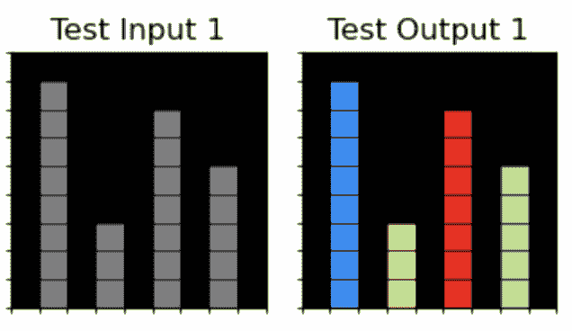

<!--yml

分类：未分类

日期：2025-01-11 13:04:35

-->

# 大型语言模型（LLM）作为多专家代理系统：解决抽象与推理语料库（ARC）挑战的方法

> 来源：[https://arxiv.org/html/2310.05146/](https://arxiv.org/html/2310.05146/)

John Tan Chong Min    Mehul Motani

###### 摘要

我们尝试使用大型语言模型（LLM）作为多专家代理系统来解决抽象与推理语料库（ARC）挑战。通过利用LLM的灵活性，使用零样本、少样本和基于上下文的提示进行各种新任务的提示，我们探索了使用LLM解决ARC挑战的可行性。我们首先将输入图像转化为多个适合的基于文本的抽象空间。然后，我们利用LLM的联想能力推导输入-输出关系，并将其映射到以工作程序形式的操作，类似于《Minecraft》中的Voyager / Ghost。此外，我们使用迭代的环境反馈来引导LLM解决任务。我们提出的方法在111个训练集问题中成功解决了50个（45%），仅使用了三个抽象空间——网格、物体和像素——我们相信，通过更多的抽象空间和可学习的操作，我们能够解决更多问题。

抽象与推理语料库、大型语言模型、抽象空间

## 1 引言

抽象与推理语料库（ARC）挑战是朝着人工通用智能（AGI）迈进的关键里程碑，因为它要求形成概念和抽象（Chollet, [2019](#bib.bib7)）。图[1](#S1.F1 "图 1 ‣ 1 引言 ‣ 大型语言模型（LLM）作为多专家代理系统：解决抽象与推理语料库（ARC）挑战的方法")展示了一个示例ARC任务。ARC挑战的一个关键难点在于它要求做一些与主流深度学习相悖的事情——从极少的样本中学习。深度学习通常需要使用成千上万的样本才能做到良好表现。相比之下，人类可以通过一两次不同的观察就学会识别不同的动物。例如，一个孩子第一次看到长颈鹿时，即使他们可能只通过卡通闪卡看到过长颈鹿，依然能够辨认出它。现代AI系统并不具备这种能力，这意味着这些AI系统在投入实际应用之前需要进行大量训练。在实际部署后，它们在适应和学习环境变化方面也会受到限制。

图1：一个示例ARC任务。挑战在于推断支配演示转换的抽象规则，并将其应用于测试输入。示例来自：[https://aiguide.substack.com/p/why-the-abstraction-and-reasoning](https://aiguide.substack.com/p/why-the-abstraction-and-reasoning)

相比之下，传统的基于符号的系统（例如GOFAI（Boden，[2014](#bib.bib4)））可以“快速学习”，因为任何新情况都可以在没有学习阶段的情况下进行解释，前提是已有的符号能够表示它。然而，GOFAI的历史表明，工程化这些符号是困难的，许多时候，即使是人类也会面临困难，无法想出符号，因为他们可能无法用语言表达出来。

正如所见，上述两种方法存在缺点，为了快速学习并能泛化到新情况，我们需要一种新的方法，才能有机会解决ARC挑战。在本文中，我们通过提出使用大型语言模型（LLMs）作为一个在功能动作空间中构建的系统来解决ARC挑战，从而应对这一挑战。这可以说是深度学习和GOFAI方法之间的中间地带——功能动作空间比GOFAI中的符号更灵活；LLMs作为一种深度学习形式，通过提示能适应新情况。具体而言，本文的贡献如下：

+   •

    我们展示了一种新颖的方法，使用大型语言模型（LLMs）作为多个专家代理系统（无需任何预训练）来解决ARC挑战。

+   •

    我们强调从多个抽象空间的结合中，将输入空间与输出空间关联起来的重要性。

+   •

    我们展示了在程序合成中，通过LLMs在功能空间中进行归约的可行性。

## 2 相关工作

图2：88%的ARC任务仅通过描述者给出的描述即可由构建者解决，而无需输入输出示例。GPT-4能否既作为描述者又作为构建者？图像摘自Acquaviva等人（[2021](#bib.bib1)）的图4。

ARC挑战。ARC挑战（Chollet，[2019](#bib.bib7)）包括400个公开训练任务、400个公开评估任务和200个私人测试任务。每个任务都有多个“任务示范”输入/输出网格，任务参与者必须从中推断出一个共同关系。这个共同关系随后应用于“测试输入”，从而得到“测试输出”。只有当“测试输出”完美匹配时，才算解决。网格的大小从1x1到30x30不等，像素可以取10个不同的值。

领域特定语言（DSL）方法。大多数ARC挑战的解决方案主要是DSL方法（Alford，[2021](#bib.bib2); Ferré，[2021](#bib.bib8); Xu等，[2023a](#bib.bib19)）。ARC Kaggle竞赛的第一名解决方案也采用了这种方法（[https://www.kaggle.com/code/icecuber/arc-1st-place-solution](https://www.kaggle.com/code/icecuber/arc-1st-place-solution)）。

基于 LLM 的方法。一种解决 ARC 挑战的方式是使用文本描述物体的视觉特征（Camposampiero et al., [2023](#bib.bib5)）。事实上，如图 [2](#S2.F2 "图 2 ‣ 2 相关工作 ‣ 将大型语言模型（LLM）作为多个专家代理的系统：一种解决抽象与推理语料库（ARC）挑战的方法") 所示，88% 的 ARC 任务仅通过语言描述就能解决，无需输入-输出示例（Acquaviva et al., [2021](#bib.bib1)）。对于某些问题，将像素用物体表示可以显著提升解决率，从50个与物体相关的 ARC 任务中的13提高到23（Xu et al., [2023b](#bib.bib20)）。也有一些研究尝试仅通过 LLM 来生成端到端的输入到程序描述，并取得了一定成功（Min, [2023](#bib.bib11)）。其他方法使用了决策变换器（Chen et al., [2021](#bib.bib6)）来从输入到输出找出一系列原始动作（Park et al., [2023](#bib.bib14)），然而，正如作者所指出的那样，这种方法需要大量的数据（10000个训练数据与2000个测试数据），因此不太可能推广到未见过的输入。最近，LLM 被用于将网格的 ASCII 文本视图作为输入进行下一个令牌预测，并已解决了800个 ARC 任务中的85个（Mirchandani et al., [2023](#bib.bib12)）。

代码作为技能与环境反馈。Voyager 是一个由大语言模型（LLMs）驱动的具象化终身学习代理（Wang et al., [2023](#bib.bib16)）。它拥有一个技能库，通过函数构建复杂行为，并且通过与环境的迭代提示机制从环境反馈中学习。Minecraft 中的 Ghost（Zhu et al., [2023](#bib.bib21)）也做了类似的工作，尽管他们将行动空间限制为一系列函数。同样，我们使用原始函数的代码生成来近似使用技能库，并通过使用 ARC 任务输出作为反馈的迭代提示，从环境中学习。

我们的方法。与现有的 LLM 方法一致，我们认为应该使用语言作为一种替代的抽象空间，除原始像素网格之外。与现有方法不同的是，我们认为应该使用多个抽象空间。因此，LLM 将在图 [2](#S2.F2 "图 2 ‣ 2 相关工作 ‣ 将大型语言模型（LLM）作为多个专家代理的系统：一种解决抽象与推理语料库（ARC）挑战的方法") 中既是构建者也是描述者，但构建者也可以参考输入-输出对。我们还认为应该将 LLM 与某种 DSL 方法结合使用，但由于 LLM 能通过语义匹配函数，比传统的 DSL 方法更有效，因此可以使用更具表现力的 DSL。

## 方法概述

图 3：LLM 作为系统解决 ARC 挑战的流程图。

在本节中，我们概述了我们提出的方法，并讨论了其中的一些关键思想。我们尚未实现该方法的所有部分，但它已经取得了良好的效果。生成式预训练变换器 4（GPT-4）是由 OpenAI 创建并于 2023 年 3 月发布的多模态 LLM（OpenAI，[2023](#bib.bib13)）。目前，我们仅使用 GPT-4 来构建我们的模型，因为我们通过实验证明，GPT-3.5 和其他开源模型的表现不足以使该方法有效。整体方法如图 [3](#S3.F3 "Figure 3 ‣ 3 Broad Overview of Method ‣ Large Language Model (LLM) as a System of Multiple Expert Agents: An Approach to solve the Abstraction and Reasoning Corpus (ARC) Challenge") 所示。

问题类型分类（未实现）。ARC 任务测试了各种概念。如果我们能够利用过去的示例来为 LLM 提供基础，并让 LLM 决定一个 ARC 任务属于哪一类问题，我们可以使用专门的工作流来解决这种特定类型的任务。目前，我们只是运行所有各种代理类型，并选择有效的代理类型。实现这个分类器不会影响性能，但会显著帮助降低成本。

有用的抽象空间。虽然 GPT-4 已被证明是一个通用解题工具，但作为一个（目前）基于文本的模型，GPT-4 缺乏一些人类固有的先验知识，这些先验知识对于解决 ARC 挑战是必要的。例如，GPT-4 仅凭文本无法准确识别物体。物体被定义为具有相同非零值的网格连续区域。因此，提供这样的物体视图作为抽象空间，使用文本大大有助于 GPT-4 与输入-输出对形成关联的能力，也更能找到解决方案（Xu 等人，[2023b](#bib.bib20)）。此外，我们可以为 GPT-4 提供多个抽象空间，这样可以增加一个或多个抽象空间包含从输入到输出的简单映射的机会，从而减少问题的复杂性。请注意，这些抽象空间是不可更改的，自学习开始以来就已固定。因此，代理将必须基于这些固定的先验知识进行处理。

通过帮助/原始函数编码人类偏见。最初使用 GPT-4 解决 ARC 问题时，只是通过文本提示人类偏见和动作空间。但由于仅使用语言缺乏基础支撑，这种方法的效果并不理想。本研究的一个关键创新是将原始函数作为动作空间，以此作为编码人类先验知识的方法。如果我们能够使用函数进行基础支撑，并用语言表达该函数的语义含义，GPT-4 就能使用该函数提供所需的代码来解决问题。因此，问题现在变成了找出我们需要编码哪些原始函数，以便 LLM 能够解决任何通用的 ARC 问题。

使用记忆来提供额外上下文（尚未实现）。新问题可能会将之前解决方案的各个方面结合起来，因此拥有一个记忆库，提供过去类似问题解决的例子，可以帮助将 LLM 更好地基础化，从而生成答案。目前由于上下文长度的限制，这一功能尚未实现。一旦 GPT-4 的上下文长度增加或微调功能可用，我们计划让每个代理记住与当前任务相关的先前解决问题及其解决方案，以便能够将代理的输出基础化。这类似于检索增强生成（Lewis 等人，[2020](#bib.bib9)）。

利用环境反馈。另一个关键思想是，学习系统需要利用来自环境的反馈，因此，采用一个递归循环来反馈环境的反馈（如是否存在编译错误，代码是否符合预期输出）可以在获得正确答案方面提供极大的帮助。这类似于在《星际探索者》和《鬼魂矿坑》中所做的工作（Wang 等人，[2023](#bib.bib16)；Zhu 等人，[2023](#bib.bib21)）。

LLM 作为一个系统。人类并非仅使用一个系统来操作，我们有多个系统来应对不同的任务。同样地，对于每个任务（如对象视图、像素视图、网格视图），我们可以拥有多个专家代理，并调用它们提供任务的解释，再从中选择最有前景的代理。这有助于大大缩小解决方案的搜索空间。接着，我们利用这个代理的专门功能来解决问题。通过将这个代理与环境反馈、特定问题类型的抽象空间、过去的例子以及行动空间进行接口连接，可以极大地帮助过滤和将 GPT-4 基础化，从而生成一个合理的解决方案。我们相信，通过专家代理提供更好的基础支持、更好的抽象空间表示和更好的原始功能基础，我们最终能够使用提出的方法解决大部分的 ARC 任务。

## 4 方法的详细概述

我们现在进入方法的一些细节。完整的 GPT-4 提示请参考附录 [A](#A1 "附录 A GPT-4 提示的完整细节 ‣ 将大语言模型 (LLM) 作为多个专家代理的系统：解决抽象和推理语料库 (ARC) 挑战的一个方法") 和 [B](#A2 "附录 B 原始函数和条件函数 ‣ 将大语言模型 (LLM) 作为多个专家代理的系统：解决抽象和推理语料库 (ARC) 挑战的一个方法")。

### 4.1 不同的抽象空间

我们利用多种方式对抽象空间进行编码，以便 GPT-4 更好地将输入输出对进行关联。已经在 Image-Joint 嵌入预测架构（I-JEPA）（Assran 等，[2023](#bib.bib3)）和稳定扩散（Rombach 等，[2022](#bib.bib15)）中证明，在潜在/抽象空间进行预测比在输入空间进行预测能带来更好的下游任务效果。然而，我们认为除了单一的抽象空间外，还有许多固定的可能的抽象空间，解题者可以选择最适合当前任务的抽象空间。我们相信，通过结合更多有用的视图并优化现有视图，我们可以解决更多的 ARC 任务。

对于我们的方法，我们仅使用三种视图——网格视图、对象视图、像素视图——并且已经取得了相当好的结果。简而言之，网格视图提供了整个网格表示，除了我们将像素数字更改为字符，以便不偏向 GPT-4 将其视为算术问题来对像素值进行运算。这还有一个额外的好处，即确保 GPT-4 之前没有见过 ARC 任务，因为它现在采用了不同的形式。对象视图将相邻的像素分组在一起，以便可以将其作为一组进行操作。像素视图为每个像素提供坐标，有助于更精细的运动任务或像素之间的关系任务。有关更多细节，请参阅附录 [C](#A3 "附录 C 抽象视图 ‣ 大型语言模型（LLM）作为多个专家代理的系统：解决抽象与推理语料库（ARC）挑战的一个方法")。

### 4.2 基于 JSON 的输出格式

LLM 因其输出冗长且相对自由格式而著称，这使得任何自动化程序难以使用它。在这里，我们明确要求 GPT-4 通过提示以 JSON 格式输出。此 JSON 格式也有利于 Chain-of-Thought（CoT）提示（Wei 等， [2022](#bib.bib17)），因为它按照特定的顺序进行，鼓励从广泛到具体的思考方式。

### 4.3 CoT 提示

CoT 使得输出可以结构化，LLM 能够根据之前的输出条件生成后续的输出。这使得提示方式从广泛到具体，帮助 LLM 思考并反思各个领域，缩小搜索空间，最终有助于解决问题。

在这里，我们直接使用 JSON 格式进行 CoT 提示（请参见附录 [D](#A4 "附录 D GPT-4 输出示例 ‣ 大型语言模型（LLM）作为多个专家代理的系统：解决抽象与推理语料库（ARC）挑战的一个方法"）查看一些 GPT 输出的 JSON 格式示例）。我们要求 GPT-4 输出：

1.  1.

    "reflection": "反思答案",

1.  2.

    "pixel_changes": "描述输入和输出像素之间的变化，重点是移动或模式变化",

1.  3.

    "object_changes": "描述输入和输出对象之间的变化，重点关注移动、对象数量、大小、形状、位置、值、单元格计数",

1.  4.

    "helper_functions": "列出此任务相关的所有辅助函数",

1.  5.

    "overall_pattern": "描述所有输入输出对的最简单的输入输出关系",

1.  6.

    "program_instructions": "计划如何编写 Python 函数，以及使用哪些辅助函数和条件",

1.  7.

    "python_program": "名为 'transform_grid' 的 Python 函数，接收一个 2D 网格并生成一个 2D 网格。输出为一个单行字符串，包含 $\backslash$n 和 $\backslash$t。"

### 4.4 辅助/原始函数

对于这些函数，我们基本上通过零-shot 提示来调用，即声明函数名称、输入参数以及函数的描述。我们发现这种零-shot 提示格式对大多数函数非常有效，特别是当函数名称本身就能暗示其功能时。这与 Visual ChatGPT（Wu 等，[2023](#bib.bib18)）以及 OpenAI Functions ([https://openai.com/blog/function-calling-and-other-api-updates](https://openai.com/blog/function-calling-and-other-api-updates)) 中采用的方法非常相似。由于这种提示方法不足以传递文本中未固有的偏差（即旋转、翻转），我们还提供了如何使用该函数的一个-shot 示例。

### 4.5 条件函数：

与其让 GPT-4 自由生成代码，我们要求它在原始函数上生成条件流程。这大大帮助减少了编译错误。需要这种条件流程，因为某些 ARC 任务需要使用仅在特定条件满足时才适用的逻辑（例如，如果形状有恰好 6 个单元格，则将其变为红色）。如果没有这个条件流程，程序在解决问题之前需要更多的步骤。一个条件流程的示例是：

如果 {条件}：{原始函数}

## 5 方法论

按上下文长度选择问题。我们首先从 ARC 训练集中筛选出那些其网格视图和对象视图（单色，无对角线）可以适应 3000 个令牌上下文长度的问题。这很重要，因为在后续加入环境反馈时，我们需要更多的令牌长度，并且通过经验观察，3000 个令牌是必要的，以保证有足够的令牌缓冲区，使得整个提示可以适应后续的 8000 个令牌。这是 GPT-4 Web 浏览器以及基础 GPT-4 API 的当前最大上下文长度。未来，我们设想，当 GPT-4 的上下文长度增加时，我们的方法可以适用于更多的 ARC 任务。

大规模采样与筛选。接下来，我们使用温度为0.7的OpenAI API（GPT-4，2023年5月24日版本）来确保输出的多样性。我们交替使用OpenAI API和Web浏览器界面进行GPT-4的操作。我们采用大规模采样和筛选过程来生成代码，类似于AlphaCode（Li等人，[2022](#bib.bib10)）（见图[4](#S5.F4 "图4 ‣ 5 方法论 ‣ 将大型语言模型（LLM）作为多个专家代理系统：解决抽象与推理语料库（ARC）挑战的一个方法"））。网格视图通常是可用的，除非有上下文长度限制。我们可以在代理的对象视图（10种类型）和像素视图之间切换（至少有一个必须处于活动状态），这导致总共有$10\times 2=20$个代理（有关详细信息，请参见附录[C](#A3 "附录C 抽象视图 ‣ 将大型语言模型（LLM）作为多个专家代理系统：解决抽象与推理语料库（ARC）挑战的一个方法")）。我们每个专家代理使用三次，每次最多进行三轮反馈循环，并筛选出能解决任务演示的输出代码，用于在任务输入上进行尝试。如果有多个此类代码，我们随机挑选三种进行测试。任何三种解决方案通过测试输入将被视为解决方案，这与Kaggle竞赛和Lab 42的[ARCathon](https://lab42.global/arcathon/)一致。

图4：大规模采样与筛选过程与各种专家代理

表1：已解决、未解决和部分解决的任务数（程序适用于任务演示，但不适用于测试输入/输出，共有111个训练集任务）。有关每种视图类型解决任务的详细信息，请参见附录[E](#A5 "附录E 任务解决详情 ‣ 将大型语言模型（LLM）作为多个专家代理系统：解决抽象与推理语料库（ARC）挑战的一个方法")。

| 总任务数 | 已解决任务数 | 未解决任务数 | 部分解决任务数 |
| --- | --- | --- | --- |
| 111 | 50 | 58 | 3 |

表2：未解决任务但描述正确

| 总未解决任务数 | 描述正确 |
| --- | --- |
| 61 | 8 |

表3：经过迭代反馈循环后解决的任务（在错误输出或编译错误之后）

| 总数 | 错误输出 | 编译错误 |
| --- | --- | --- |
| 50 | 6 | 1 |

## 6 结果

总体情况。总体而言，如表[1](#S5.T1 "表1 ‣ 5 方法论 ‣ 将大型语言模型（LLM）作为多个专家代理系统：解决抽象与推理语料库（ARC）挑战的一个方法")所示，我们的方法解决了111个训练集ARC任务中的50个，这些任务能够适应上下文长度。解决率约为45%，这一成绩相当显著，因为当前ARC世界纪录的解决率为30.5%（尽管这是在隐藏测试集上的），根据[https://lab42.global/arcathon/updates/](https://lab42.global/arcathon/updates/)。

编程问题。为了了解未解决的问题中有多少是由于编程问题导致的，我们检查有多少问题的描述是由人工评估为正确的，但代码不正确。结果显示，有61个问题中有8个符合此情况，如表[2](#S5.T2 "表 2 ‣ 5 方法 ‣ 大型语言模型 (LLM) 作为多个专家代理的系统：解决抽象和推理语料库 (ARC) 挑战的方法")所示（详见附录[E](#A5 "附录 E 任务解决详情 ‣ 大型语言模型 (LLM) 作为多个专家代理的系统：解决抽象和推理语料库 (ARC) 挑战的方法")）。这意味着，如果我们能够更好地学习原始/辅助函数并有更广泛的选择范围，我们可以提高解决率。为了完成其余的任务，我们将需要加入更好的视图——观察表明，GPT-4不能轻松解决行延续任务，特别是对角线、网格操作任务和对称性任务，而这些任务很容易作为附加视图进行整合。

迭代反馈。为了了解迭代环境反馈有多大帮助，我们查看了在迭代环境反馈循环下解决的任务数量。结果显示，在50个任务中，有7个任务得到了解决，如表[3](#S5.T3 "表 3 ‣ 5 方法 ‣ 大型语言模型 (LLM) 作为多个专家代理的系统：解决抽象和推理语料库 (ARC) 挑战的方法")所示（详见附录[E](#A5 "附录 E 任务解决详情 ‣ 大型语言模型 (LLM) 作为多个专家代理的系统：解决抽象和推理语料库 (ARC) 挑战的方法")）。这非常重要，突出了环境反馈的重要性。

## 7 讨论

结果是有希望的，与仅使用原始网格视图相比，具有各种视图组合的GPT-4代理能够很好地解决不同类型的问题。还观察到，物体视图有时需要与像素视图配合使用，以便在两个视图之间整合信息，从而完成任务。这进一步证明了应该不止有一个抽象空间，而是应该有多个抽象空间，这些空间可以相互组合使用。

实证观察表明，具有原始函数基础的GPT-4能够比没有它的情况解决更多任务。这是一种比单纯依赖文本更好的编码先验的方式。总体而言，GPT-4非常擅长解决由多个原始函数组合构成的任务。

有观察表明，函数名称和描述非常重要——GPT-4倾向于选择语义上与其意图相似的函数，而将函数名称更改为无关的名称可能导致该函数无法被使用。

## 8 改进

GPT-4 代理无法很好地完成没有相关先验知识编码在原始函数中的任务，例如物体的缩放、对称性、线条的延续、带有逻辑规则的网格叠加、网格操作如裁剪、平移、改变形状等。此外，当涉及到多个关系时，它的表现较弱，这类问题受益于迭代环境反馈循环。通过将新的输入设置为 GPT-4 程序输出的结果，实际上是在朝着解决方案迈进，并帮助 GPT-4 更好地关联简单的输入输出关系。

GPT-4 已被观察到使用一些不适用于视图的原始函数，例如，Pixel View Agent 使用 `get_objects` 函数。因此，提供过多的上下文可能会影响性能。这与 Xu 等人（[2023b](#bib.bib20)）的研究相似，当他们在对象之间添加关系后，性能出现下降。这进一步验证了我们的观点，即最好将其拆分为多个具有独立视图的专家代理，并仅使用相关的原始函数。

根据我们的实验结果，我们在附录 [F](#A6 "附录 F 提出的代理类型 ‣ 大语言模型（LLM）作为多专家代理系统：解决抽象推理语料库（ARC）挑战的方法") 中提出了新的视图/代理。

## 9 未来工作

目前，我们以暴力破解的方式使用所有代理来执行任务。为了减少计算（和成本），我们或许可以使用一个分类器，它接受先前的例子作为输入，学习如何将新问题分类到一个类别中，以便使用正确的代理来解决它。

目前，原始函数是基于对训练集前 50 个任务的观察手工设计的，并且也不是一个完整的集合。我们将尝试加入一种方式，促使 GPT-4 创建新的原始函数，并将那些成功解决新任务的函数添加到原始函数列表中，类似于 Voyager（Wang 等人，[2023](#bib.bib16)）。一种方法是将任何成功的 `transform_grid` 函数作为新的原始函数加入，只要该函数的描述与现有函数不同。

## 10 结论

总体而言，将大语言模型（LLM）作为一个多专家代理系统并结合环境反馈，是解决 ARC 挑战的一个有前景的方法。为了促进采用这种方法的进一步研究，我们的代码可以在 [https://github.com/tanchongmin/ARC-Challenge/](https://github.com/tanchongmin/ARC-Challenge/) 找到。

## 致谢

本研究得到了新加坡国家研究基金会在其人工智能新加坡计划（AISG 奖项编号：AISG-GC-2019-002）下的支持。本材料中表达的任何观点、发现、结论或建议均为作者（们）个人意见，不代表新加坡国家研究基金会的观点。

非常感谢那些鼓励我走 GPT-4 路径来解决 ARC 问题或提供宝贵见解的各位聪明人——Pascal Kaufmann, Rolf Pfister, Michael Hodel, Simon Strandgaard, Douglas Miles, Richard Cottrill, Leonard Tan 以及其他许多人。如果你的名字没有出现在这里，不用担心，未来的论文中你可以作为改进此工作的贡献者出现 :)

## 参考文献

+   Acquaviva 等人（2021）Acquaviva, S., Pu, Y., Kryven, M., Wong, C., Ecanow, G. E., Nye, M., Sechopoulos, T., Tessler, M. H., 和 Tenenbaum, J. B. 向人类和机器传达自然程序。*arXiv 预印本 arXiv:2106.07824*，2021。

+   Alford（2021）Alford, S. *一种神经符号化的抽象与推理方法*。博士论文，麻省理工学院，2021。

+   Assran 等人（2023）Assran, M., Duval, Q., Misra, I., Bojanowski, P., Vincent, P., Rabbat, M., LeCun, Y., 和 Ballas, N. 通过联合嵌入预测架构从图像中进行自监督学习。载于 *IEEE/CVF 计算机视觉与模式识别会议论文集*，pp. 15619–15629, 2023。

+   Boden（2014）Boden, M. A. 4 GOFAI。*剑桥人工智能手册*，pp. 89, 2014。

+   Camposampiero 等人（2023）Camposampiero, G., Houmard, L., Estermann, B., Mathys, J., 和 Wattenhofer, R. 通过语言实现的抽象视觉推理。载于 *IEEE/CVF 计算机视觉与模式识别会议论文集*，pp. 2642–2646, 2023。

+   Chen 等人（2021）Chen, L., Lu, K., Rajeswaran, A., Lee, K., Grover, A., Laskin, M., Abbeel, P., Srinivas, A., 和 Mordatch, I. 决策变换器：通过序列建模进行强化学习。*神经信息处理系统进展*，34:15084–15097, 2021。

+   Chollet（2019）Chollet, F. 关于智能度量。*arXiv 预印本 arXiv:1911.01547*，2019。

+   Ferré（2021）Ferré, S. 基于描述性网格模型和最小描述长度原则的 ARC 挑战方法的初步探索。*arXiv 预印本 arXiv:2112.00848*，2021。

+   Lewis 等人（2020）Lewis, P., Perez, E., Piktus, A., Petroni, F., Karpukhin, V., Goyal, N., Küttler, H., Lewis, M., Yih, W.-t., Rocktäschel, T., 等。用于知识密集型 NLP 任务的检索增强生成。*神经信息处理系统进展*，33:9459–9474, 2020。

+   Li 等人（2022）Li, Y., Choi, D., Chung, J., Kushman, N., Schrittwieser, J., Leblond, R., Eccles, T., Keeling, J., Gimeno, F., Dal Lago, A., 等。基于 Alphacode 的竞争级代码生成。*科学*，378(6624):1092–1097, 2022。

+   Min（2023）Min, T. J. C. 一种解决抽象和推理语料库（ARC）挑战的方法。*arXiv 预印本 arXiv:2306.03553*，2023。

+   Mirchandani 等人（2023）Mirchandani, S., Xia, F., Florence, P., Ichter, B., Driess, D., Arenas, M. G., Rao, K., Sadigh, D., 和 Zeng, A. 大型语言模型作为通用模式机器。*arXiv 预印本 arXiv:2307.04721*，2023。

+   OpenAI（2023）OpenAI. GPT-4 技术报告，2023。

+   朴等人（2023）朴政，任哲，黄顺，林铭，乌阿利别科娃，金松，金善。解开ARC难题：模仿人类解决方案的基于对象的决策变换器。*arXiv预印本 arXiv:2306.08204*，2023年。

+   罗姆巴赫等人（2022）罗姆巴赫，布拉特曼，洛伦茨，埃瑟，欧梅尔。利用潜在扩散模型进行高分辨率图像合成。*IEEE/CVF计算机视觉与模式识别大会论文集*，第10684–10695页，2022年。

+   王等人（2023）王刚，谢宇，姜逸，曼德尔卡，肖冲，朱延，范林，阿南德库马尔。旅行者：一个开放式的具身代理与大型语言模型结合。*arXiv预印本 arXiv:2305.16291*，2023年。

+   魏等人（2022）魏静，王轩，舒尔曼，博斯玛，夏飞，池恩，乐启，周东等。思维链提示在大型语言模型中引发推理。*神经信息处理系统进展*，35:24824–24837，2022年。

+   吴等人（2023）吴昌，尹爽，祁文，王轩，唐泽，段宁。视觉ChatGPT：与视觉基础模型进行对话、绘图和编辑。*arXiv预印本 arXiv:2303.04671*，2023年。

+   许等人（2023a）许阳，哈利尔，桑纳。图形、约束与抽象推理语料库的搜索。在*AAAI人工智能会议论文集*，第37卷，第4115–4122页，2023a。

+   许等人（2023b）许阳，李伟，瓦兹波尔，桑纳，哈利尔。大型语言模型与抽象推理语料库：成功、失败与基于对象的表示的重要性。*arXiv预印本 arXiv:2305.18354*，2023b。

+   朱等人（2023）朱欣，陈瑜，田华，陶晨，苏文，杨超，黄光，李斌，陆亮，王轩等。我的世界中的幽灵：通过具有基于文本的知识和记忆的大型语言模型实现通用代理在开放世界环境中的应用。*arXiv预印本 arXiv:2305.17144*，2023年。

附录

附录包含以下章节：

1.  A

    GPT-4完整提示详情 - 详细说明了用于GPT-4的整个提示

1.  B

    原始函数和条件函数 - 详细说明了用于GPT-4基础的所有原始函数和条件函数

1.  C

    抽象视图 - 详细说明了网格、对象和像素的各种抽象视图

1.  D

    GPT-4输出示例 - 展示了GPT-4对提示的输出

1.  E

    任务解决详情 - 详细说明了按视图类型解决的任务细分

1.  F

    提议的代理类型 - 详细说明了可能有助于提高GPT-4在ARC挑战中解决率的代理类型。

## 附录A GPT-4完整提示详情

本节详细介绍了GPT-4使用的提示。提示分为用户提示和系统提示，正如GPT-4 API所要求的。如果我们不使用API，而是使用Web浏览器接口，则将用户提示放在提示的开始，系统提示放在提示的末尾，并加上适当的标题。

### A.1 用户提示

所有坐标以（行，列）格式给出。使用get_size(grid)返回（len(grid)，len(grid[0])）。要获取对象，请使用get_objects(diag=False, by_row=False, by_col=False, by_color=False, multicolor=False, more_info=True) # 用你所使用的任何对象视图替换此处 [JSON格式的输入/输出抽象视图，以及输入和输出网格大小] [环境反馈 - 如果是第一次迭代，则为空，否则为编译错误或输出错误信息]

### A.2 环境反馈（编译错误信息）

之前的代码：[代码] 错误信息：[错误信息] 之前的整体模式：[整体模式] 你的代码存在编译错误。请修正。

### A.3 环境反馈（输出错误信息）

如果出现输出错误（生成的代码输出与任务演示输出不匹配），我们将此输出视为新的输入，并要求GPT-4获取新的输入输出关系。

使用transform_grid函数从“输入”到“输出”获取正确的关系。

### A.4 系统提示

请参考附录[B](#A2 "附录B 基本函数和条件函数 ‣ 大型语言模型（LLM）作为多专家代理系统：一种解决抽象和推理语料库（ARC）挑战的方法")获取有关辅助/基本和条件函数的详细信息。

给定一系列输入和输出对。'a'到 'j' 的值代表不同的颜色。'.'表示空白单元格。例如，[['.','a','.'],['.','.','b']]表示一个2行3列的网格，其中颜色a位于位置(1,0)，颜色b位于位置(2,1)。坐标是二维位置（行，列），行表示行号，列表示列号，采用零索引。输入/输出对可能不涵盖所有可能性，你需要推断出最简单的关系。[辅助/基本函数描述 + 示例] [条件函数描述 + 示例] 你需要以JSON格式输出以下内容：{’reflection’: ’反思答案’, ’pixel_changes’: ’描述输入和输出像素之间的变化，重点在于移动或模式变化’, ’object_changes’: ’描述输入和输出对象之间的变化，重点在于对象的移动、数量、大小、形状、位置、值、单元格数量’, ’helper_functions’: ’列出此任务的相关辅助函数’, ’overall_pattern’: ’描述所有输入输出对的最简单的输入输出关系’, ’program_instructions’: ’计划如何编写python函数，以及使用哪些辅助函数和条件’, ’python_program’: "命名为'transform_grid'的python函数，该函数接受一个二维网格并生成一个二维网格。输出为单行字符串，使用$\backslash$n和$\backslash$t"}. 除非需要用于python代码，否则请勿在字段内使用引号’或"。

## 附录B 基本函数和条件函数

本节详细介绍了用于GPT-4的所有原始函数和条件函数。目前，这些函数无法学习，而是通过人工调整，在前50个ARC训练任务中定义的。未来，我们计划让这些函数通过学习逐步扩展，从一个独立于人工互动的初始集合开始。

有关这些函数如何实现的更多信息，请参考[https://github.com/tanchongmin/ARC-Challenge](https://github.com/tanchongmin/ARC-Challenge)中的Jupyter Notebook。

### B.1 原始函数

这是我们提示GPT-4理解原始（辅助）函数格式的方式。基本上，这是

每个输入-输出关系可以通过一个或多个辅助函数链式连接完成。

一些关系需要其他函数，你需要自己构思这些函数。

对象是紧密适配的网格（没有空行或列），具有左上坐标，可以方便地操作多个坐标。

你可以通过创建一个包含’tl’和’grid’的字典来创建你自己的对象

你可以通过使用’tl’来改变对象的位置，通过使用’grid’来改变其组成。

你应该通过复制输入网格、empty_grid或crop_grid来开始每个程序，确保其输出大小符合需求。

然后，使用填充辅助函数来填充网格。

如果你使用带有’.’值的填充函数，相当于删除网格的部分内容。

辅助函数：

- get_objects(grid, diag=False, by_row=False, by_col=False, by_color=False, multicolor=False, more_info=True): 输入网格，返回一个对象字典的列表：对象的左上坐标（’tl’），2D网格（’grid’）。by_row按网格行拆分对象，by_col按网格列拆分对象，by_color将每种颜色分组为一个对象，multicolor表示对象可以有多个颜色。对象内部的空单元格用’$’表示。如果more_info为True，还会返回网格的大小（’size’）、对象中的单元格数（’cell_count’）、对象的形状（’shape’）

- get_pixel_coords(grid): 返回一个字典，键是像素值，值是坐标的列表，按像素数从多到少排序

- empty_grid(row, col): 返回一个高度为row，宽度为col的空网格

- crop_grid(grid, tl, br): 返回从网格的左上角到右下角的裁剪部分

- tight_fit(grid): 返回删除所有空白行和列后的网格

- combine_object(obj_1, obj_2): 返回由obj_1和obj_2合成的对象。如果有重叠，obj_2将覆盖obj_1

- rotate_clockwise(grid, degree=90): 返回顺时针旋转90、180或270度的网格

- horizontal_flip(grid): 返回网格的水平翻转

- vertical_flip(grid): 返回网格的垂直翻转

- replace(grid, grid_1, grid_2): 在网格中将所有出现的grid_1替换为grid_2

- get_object_color(obj): 返回对象的颜色。如果是多色，返回第一个颜色

- change_object_color(obj, value): 将对象颜色更改为value

- fill_object(grid, obj, align=False)：用对象填充网格。如果align为True，调整网格大小与对象一致

- fill_row(grid, row_num, value, start_col=0, end_col=30)：在指定行号的输出网格中，从start_col到end_col（包含）填充value行

- fill_col(grid, col_num, value, start_row=0, end_row=30)：在指定列号的输出网格中，从start_row到end_row（包含）填充value列

- fill_between_coords(grid, coord_1, coord_2, value)：用value填充coord_1到coord_2之间的行

- fill_rect(grid,tl,br,value)：用value填充从tl到br的网格，常用于创建行、列、矩形

- fill_value(grid, pos, value)：在指定位置填充网格

这是我们一次性引导GPT-4理解原始函数的方式。

assert get_objects([[’a’,’a’,’a’],[’a’,’.’,’a’],[’a’,’a’,’a’]],more_info=False)==[{’tl’:(0,0),grid’:[[’a’,’a’, ’a’],[’a’,’.’,’a’],[’a’,’a’,’a’]]} ,{’tl’:(1,1),’grid’:[[’$’]]}]

assert get_pixel_coords([[’a’,’a’],[’d’,’f’]])=={’a’:[(0, 0),(0, 1)],’d’:[(1, 0)],’f’:[(1, 1)]}

assert empty_grid(3, 2)==[[’.’,’.’], [’.’,’.’], [’.’,’.’]]

assert crop_grid([[’a’,’a’,’b’],[’.’,’a’,’b’]],(0, 0),(1, 1))==[[’a’,’a’],[’.’,’a’]]

assert tight_fit([[’.’,’.’,’.’],[’.’,’a’,’.’],[’.’,’.’,’.’]])==[[’a’]]

assert combine_object({’tl’:(0, 0),’grid’:[[’a’,’a’],[’a’,’.’]]},{’tl’: (1, 1),’grid’:[[’f’]]})=={’tl’:(0, 0),’grid’:[[’a’,’a’],[’a’,’f’]]}

assert rotate_clockwise([[’a’,’b’],[’d’,’e’]],90)==[[’d’,’a’],[’e’,’b’]]

assert rotate_clockwise([[’a’,’b’],[’d’,’e’]],270)==[[’b’,’e’],[’a’,’d’]]

assert horizontal_flip([[’a’,’b’,’c’],[’d’,’e’,’f’]])==[[’c’,’b’,’a’], [’f’,’e’,’d’]]

assert vertical_flip([[’a’,’b’,’c’],[’d’,’e’,’f’]])==[[’d’,’e’,’f’],[’a’,’b’,’c’]]

assert replace([[’a’,’.’],[’a’,’a’]],[[’a’,’a’]],[[’c’,’c’]])==[[’a’,’.’],[’c’,’c’]]

assert change_object_color({’tl’:(0,0),’grid’:[[’a’,’.’]]},’b’)=={’tl’:(0,0),’grid’:[[’b’,’.’]]}

assert get_object_color({’tl’:(0,0),’grid’:[[’a’,’.’]]})==’a’

assert fill_object([[’.’,’.’],[’.’,’.’]],{’tl’:(0, 1),’grid’:[[’c’],[’c’]]})==[[’.’,’c’],[’.’,’c’]]

assert fill_value([[’.’,’a’],[’.’,’a’]],(1,1),’b’)==[[’.’,’a’],[’.’,’b’]]

assert fill_row([[’a’,’a’],[’c’,’a’]],0,’b’)==[[’b’,’b’],[’c’,’a’]]

assert fill_col([[’a’,’a’],[’c’,’a’]],0,’b’)==[[’b’,’a’],[’b’,’a’]]

assert fill_rect([[’a’,’a’],[’c’,’a’]],(0,0),(1,1),’b’)==[[’b’,’b’],[’b’,’b’]]

assert fill_between_coords([[’.’,’.’]],(0,0),(0,1),’a’)==[[’a’,’a’]]

### B.2 条件函数

这是我们引导GPT-4理解条件函数格式的方式。

每个辅助函数都可以是条件性的。

条件可以是：

- 按属性，例如形状、颜色、位置、大小、对象的单元格数量

- 条件可以是所有对象的属性，例如，具有最常见或最不常见值的对象，或者具有最多或最少常见形状的对象

- 按像素的位置，例如行或列

- 按邻近单元格的类型或值

有一些条件函数可以帮助你。

- object_contains_color(obj, value)：如果对象包含某个值，返回 True/False

- on_same_line(coord_1, coord_2)：如果 coord_1 与 coord_2 在同一行上，返回 True/False。line_type 可以是 [’row’，’col’，’diag’] 中的一个。

这是我们为条件函数向 GPT-4 提示的方式。

assert object_contains_color({’tl’:(0,0),’grid’:[[’a’]]},’a’)==True

assert on_same_line((1,1),(1,2),’row’)==True

assert on_same_line((1,1),(2,1),’col’)==True

assert on_same_line((1,1),(2,2),’diag’)==True

## 附录 C 抽象视图

本节详细说明了每个抽象视图的表示方式。

网格视图 - 以 ASCII 格式提供整个网格，呈现为二维数组。用于当需要找出任意模式时。请注意，我们将初始 JSON 任务输入中的网格（0-9）替换为‘.’，‘a’，‘b’，‘c’，‘d’，‘e’，‘f’，‘g’，‘h’，‘i’。这不仅可以防止 GPT-4 对像素值进行算术运算，还消除了 GPT-4 已经看到在线公共训练或评估集的可能性，因为其形式不同。

对象视图 - 该视图为 GPT-4 提供一种输入方式，将相同或不同颜色（非零单元格）相邻的单元格组合在一起，并给出它们的属性——左上坐标、紧凑的网格布局、形状、大小、单元格数量。当我们希望将一组相关的单元格作为一个对象进行操作时，会使用此视图。

在对象视图中，有几种不同的方式对对象进行分类。这部分灵感来源于 Michael Hodel 的 [ARC DSL](https://github.com/michaelhodel/arc-dsl)。我们还提供了一个“more_info”选项，当该选项设置为 False 时，有助于减少上下文长度。总的来说，有 10 种不同的对象视图类型。

1.  1.

    属性 1 - 颜色（2种可能性）：单一颜色与多种颜色 - 一种方式是通过将相邻的同色单元格（水平方向或垂直方向相连）组合成一个对象。另一种方式是将任意颜色的相邻单元格（除了颜色‘.’）组合在一起。这两种方式分别被称为“单一颜色”和“多种颜色”。

1.  2.

    属性 2 - 限制条件（5种可能性）：无/行/列/颜色/对角线 - 当模式仅限于行或列时，使用行或列。颜色用于按颜色全局分组对象。当我们将一个复杂问题拆解成一个较小的受限问题时，GPT-4 可以执行关联，这会非常有帮助。对角线将相邻单元格视为对角线连接。

像素视图 - 这为 GPT-4 提供了像素值及所有对应坐标的视图，以字典形式呈现，其中像素值为键，坐标列表为值。当输入输出关系涉及更改一组像素时，使用此视图。这也可以用来补充对象视图。使用像素视图的好处是，与网格视图相比，像素的移动、添加或删除等关系对 GPT-4 来说立刻显而易见。然而，缺点是像素视图对于位置的偏移不够健壮——如果起始网格没有紧密匹配，并且不从 (0,0) 开始，这可能会导致映射问题。

图 5：一个用于 ARC 挑战任务的示例网格 - 来自 ARC 训练集 d037b0a7 的任务演示 1

示例：对于图 [5](#A3.F5 "图 5 ‣ 附录 C 抽象视图 ‣ 大型语言模型 (LLM) 作为多个专家代理的系统：解决抽象与推理语料库 (ARC) 挑战的方式")，抽象空间将以文本形式表示如下：

1.  1.

    网格视图：[[’.’,’.’,’f’],[’.’,’d’,’f’],[’c’,’d’,’f’]]

1.  2.

    对象视图（单色）：[{’tl’:(0,2), ’grid’:[[’f’],[’f’],[’f’]], ’size’:(3,1), ’cell_count’:3, ’shape’:[[’x’],[’x’],[’x’]]}, {’tl’:(1,1), ’grid’:[[’d’],[’d’]], ’size’:(2,1), ’cell_count’:2, ’shape’:[[’x’],[’x’]]}, {’tl’:(2,0), ’grid’:[[’c’]], ’size’:(1,1), ’cell_count’:1, ’shape’:[[’x’]]}]

1.  3.

    像素视图：{’f’:[(0,2),(1,2),(2,2)], ’d’:[(1,1),(2,1)], ’c’:[(2,0)]}

## 附录 D GPT-4 输出示例

本节展示了 GPT-4 对已解决问题的输出，以及对未解决问题的输出。

### D.1 GPT-4 对已解决问题的输出

图 6：使用对象视图的已解决问题的训练和测试输入/输出对，d0f5fe59

这是 GPT-4 格式化为键值对的 JSON 输出，并且提供的 "python_program" 正确解决了测试输入。

反射：此任务涉及网格中找到的对象，这些对象被简化并移动到输出网格中的某个模式。输入网格包含各种形状的对象，其中一些是孤立的部分，另一些是复杂形状。无论这些对象的原始形态如何，它们都被简化为输出网格中的单个单元格，并重新定位到从左上角到右下角的对角线上。

pixel_changes：在从输入到输出的转换中，颜色为 ’h’ 的像素数量减少。这个减少发生的原因是，每个 ’h’ 颜色的对象都被压缩为输出中的单个像素。而且，像素按照从左上到右下的对角线重新定位，第一对象放置在 (0,0)，第二个放置在 (1,1)，依此类推，无论它们的初始位置如何。

object_changes: 从输入到输出，对象的数量保持不变。然而，它们的大小、形状和位置发生了显著变化。每个对象，无论其初始的形状和大小如何，都被简化为输出网格中的一个单独像素。对象的位置遵循特定的模式：它们被重新定位到从左上角到右下角的对角线位置。对角线上对象的排列顺序依据输入网格中对象的顺序。

helper_functions: 与此任务相关的辅助函数有get_objects()用于识别输入网格中的对象，fill_value()用于将单个像素放置在输出网格的特定位置，empty_grid()用于初始化输出网格。

overall_pattern: 该任务接收一个包含多个对象的输入网格，将每个对象简化为一个单独的单元格，并将这些单元格沿着从左上角到右下角的对角线重新排列。对角线上的放置顺序依据输入网格中对象的顺序。输出网格的大小由输入网格中的对象数量决定。

program_instructions: 1\. 使用get_objects()函数从输入网格中获取所有对象。 2\. 使用empty_grid()创建一个空网格，其中行数和列数等于获取到的对象数量。 3\. 遍历从get_objects()获得的每个对象。对于每个对象，在新网格中对应对象在对象列表中的索引位置的对角线上填充该对象的颜色。通过调用fill_value()，将索引作为行和列位置来完成此操作。

python_program: def transform_grid(grid): objects = get_objects(grid) new_grid = empty_grid(len(objects), len(objects)) for i, obj in enumerate(objects): new_grid = fill_value(new_grid, (i, i), get_object_color(obj)) return new_grid

### D.2 GPT-4对未解决问题的输出

图 7：使用对象视图对2013d3e2未解决问题的第一次迭代进行的训练和测试输入/输出对。程序存在编译错误。

图 8：使用对象视图对2013d3e2未解决问题的第二次迭代进行的训练和测试输入/输出对。该程序输出不正确，运行在此迭代时终止。

这是GPT-4的JSON输出，格式化为键值对，用于2013d3e2的第一次迭代，采用对象视图，并且“python_program”存在编译错误。错误原因是它试图从对象网格的中心裁剪，而不是从对象的左上角裁剪。同时，它还未能在get_object设置中将diagonal设置为True，multicolor设置为True。

reflection: 这个任务涉及识别对象的特定部分，裁剪它并输出。对象的特定部分总是三行高，并从左侧第三列开始。值得注意的是，尽管输入中的对象有不同的颜色和形状，但需要裁剪的部分总是在相同的位置。

pixel_changes: 输出中的像素是输入像素的子集。它们始终来自对象的第三、第四和第五行，从左侧第三列开始。像素的颜色保持不变。

object_changes: 在输出中，对象的大小显著缩小。它从输入中的6x6正方形变为输出中的3x3正方形。对象的形状因裁剪而改变，但输出对象中像素的相对位置与输入对象中的相同。

helper_functions: 以下是与此任务相关的辅助函数：get_objects，crop_grid和fill_object。

overall_pattern: 该任务要求识别输入中的单一对象，从它中裁剪一个3x3的正方形，从左侧第三列开始，并输出裁剪后的部分。需要裁剪的对象部分总是相同的，且不依赖于对象的颜色或形状。

program_instructions: 1\. 从一个空的3x3网格开始。 2\. 使用get_objects函数识别输入中的对象。 3\. 使用crop_grid函数从对象中裁剪一个3x3的正方形，从左侧第三列开始。 4\. 使用fill_object函数将裁剪后的部分填充到空的网格中。

python_program: def transform_grid(grid): output = empty_grid(3, 3) objects = get_objects(grid) object = objects[0] cropped = crop_grid(object[’grid’], (2, 2), (4, 4)) fill_object(output, {’tl’: (0, 0), ’grid’: cropped}) return output

这是GPT-4的JSON输出，格式化为键值对，用于2013d3e2的迭代2，使用对象视图，且"python_program"产生了错误的输出。它通过使用try-catch块解决了先前的编译错误，并在发生错误时仅填充第一个对象的网格。程序仍然是错误的，因为它决定从对象网格的中心裁剪，而不是从左上角开始。它还未在get_object设置中将diagonal=True和multicolor=True设定好。

反射：该任务涉及从输入网格中裁剪出一部分区域，并将该部分作为输出网格。错误表明函数中定义的裁剪区域与对象中实际的区域不匹配，导致了超出范围的索引错误。像素变化：输出中的像素是输入中像素的子集。一个3x3的区域从输入网格中唯一对象的中心提取出来，并用来构建输出网格。对象变化：输出网格中的对象是从输入网格中的对象裁剪出来的一部分。像素值没有发生变化，唯一的变化是对象的大小缩小为3x3网格。输出对象的左上角单元格对应输入对象中第三行第三列的单元格。辅助函数：本任务中使用的辅助函数包括get_objects、crop_grid和fill_object。get_objects用于从输入网格中获取对象；crop_grid用于从输入对象中裁剪出一个3x3的区域；fill_object用于用裁剪的对象填充输出网格。整体模式：整体模式是识别输入网格中的唯一对象，从其第三行第三列开始裁剪出一个3x3的区域，并将该裁剪出的区域作为输出网格。程序指令：首先复制输入网格。使用get_objects从输入网格中获取对象。从输入对象中第三行第三列开始裁剪一个3x3的区域。创建一个空的3x3网格。用裁剪出的对象填充该网格，并将其作为输出返回。当对象比预期小的时候，Python函数需要处理任何异常，以避免超出范围的索引错误。python程序：  

## 附录E 任务解决详情

在本节中，我们详细分解了主论文中解决的任务。更多细节，请查看[附加材料](https://tinyurl.com/yet363w8)中提供的.html文件。

表格[4](#A5.T4 "表格 4 ‣ 附录 E 任务解决细节 ‣ 大型语言模型（LLM）作为多个专家代理系统：一种解决抽象与推理语料库（ARC）挑战的方法")展示了用于解决50个问题的视图类型的分类。如我们所见，解决这些问题需要多种视图，其中使用最频繁的是对象视图，共使用了23次。像素视图是第二常用的，使用了19次。有一个任务（d23f8c26）同时使用了对象视图和像素视图。也有一些任务，仅使用网格视图效果最好，共7个任务。仅使用单一视图的结果通常不如结合使用多种视图。不同视图解决的任务示例如图[10](#A5.F10 "图 10 ‣ 附录 E 任务解决细节 ‣ 大型语言模型（LLM）作为多个专家代理系统：一种解决抽象与推理语料库（ARC）挑战的方法")、[9](#A5.F9 "图 9 ‣ 附录 E 任务解决细节 ‣ 大型语言模型（LLM）作为多个专家代理系统：一种解决抽象与推理语料库（ARC）挑战的方法")、[11](#A5.F11 "图 11 ‣ 附录 E 任务解决细节 ‣ 大型语言模型（LLM）作为多个专家代理系统：一种解决抽象与推理语料库（ARC）挑战的方法")和[12](#A5.F12 "图 12 ‣ 附录 E 任务解决细节 ‣ 大型语言模型（LLM）作为多个专家代理系统：一种解决抽象与推理语料库（ARC）挑战的方法")中给出。

表格4：每种视图类型解决的任务数量。默认使用网格视图，除非存在令牌长度的限制，在这种情况下，会关闭网格视图。

| 视图类型 | 解决的任务数量 |
| --- | --- |
| 总计 | 50 |
| 对象视图 | 23 |
| 像素视图 | 19 |
| 对象与像素视图 | 1 |
| 无对象与像素视图（仅网格视图） | 7 |

图9：仅使用像素视图解决的任务示例。这些视图可以用于许多情况，通常在颜色映射时是唯一有效的视图，尤其是在不规则形状映射的情况下。

图10：仅使用对象视图解决的任务示例。这些任务通常涉及改变物体的属性（例如形状、大小、颜色）或按属性对物体进行排序（例如大小、细胞数）。

图11：同时使用对象视图和像素视图解决的任务示例。这些任务通常需要知道物体的坐标。这里，物体根据列进行划分。任务就是保留像素的中间列。

图 12：仅使用网格视图解决的任务示例。这些任务主要是旋转和反射任务。

未解决的任务，但整体描述正确。未解决但整体描述正确的任务列表：

1.  1.

    ea786f4a

1.  2.

    88a62173

1.  3.

    746b3537

1.  4.

    321b1fc6

1.  5.

    9565186b

1.  6.

    a3df8b1e

1.  7.

    f25ffba3

1.  8.

    60b61512

通过编译错误后的迭代环境反馈解决的任务。请参见图 [13](#A5.F13 "图 13 ‣ 附录 E 任务解决详情 ‣ 将大语言模型（LLM）作为多个专家代理系统的应用：解决抽象推理语料库（ARC）挑战的方法")，查看此类任务的示例。经过两次迭代步骤解决的任务列表：

1.  1.

    aabf363d

1.  2.

    496994bd

1.  3.

    3618c87e

1.  4.

    794b24be

1.  5.

    3c9b0459

1.  6.

    ed36ccf7

通过编译错误后的迭代环境反馈解决的任务。请参见图 [14](#A5.F14 "图 14 ‣ 附录 E 任务解决详情 ‣ 将大语言模型（LLM）作为多个专家代理系统的应用：解决抽象推理语料库（ARC）挑战的方法")，查看此类任务的示例。修复编译错误后解决的任务列表：

1.  1.

    25d8a9c8

图 13：通过编译错误后的迭代环境反馈解决的任务示例。这些任务通常涉及多个不同的步骤，例如左侧任务涉及更改一个物体的颜色并移除另一个物体，右侧任务则涉及减少列的高度并将蓝色像素移至列底部。

图 14：通过编译错误后的迭代环境反馈解决的任务示例。这些任务通常涉及调用在提示中未充分解释的函数。例如，程序尝试执行 "output = copy(grid)"，这是响应提示 "你应该通过复制输入网格、空网格或裁剪网格来开始每个程序，以便获得所需的输出大小"。我们可以通过在提示中简单阐明使用的方法来消除此错误，例如，“你应该通过使用 copy.deepcopy(grid) 来复制输入网格，作为每个程序的开始”。

## 附录 F 提议的代理类型

本节详细介绍了更多拟议的新型代理类型，这些代理类型可能有助于提高 GPT-4 在 ARC 挑战中的解题率。

更好的物体视角。如果我们有足够的上下文长度，或许可以通过将更多坐标信息融入物体来提升表现。这些坐标将使GPT-4准确知道物体位于哪个单元格。这在物体视角中被省略，因为对于大多数物体相关的任务，翻译时只需要左上角的坐标，因此省略这一信息可以减少上下文长度。然而，拥有完整的坐标视图可能会有所帮助，尤其是在比较一个物体与另一个物体的变化时。这可以从一些任务中看出，有些任务仅靠物体视角或像素视角无法解决，必须结合物体视角和像素视角一起使用才能解决。

物体关系视角。物体之间的关系是一个可以改进的方面。目前，GPT-4并不具备所有物体相互之间以及物体与网格边缘和角落的相对位置。这在某些任务中可能会很有帮助。

边缘检测视角。我们注意到，GPT-4并不能自然处理形状，缺乏对形状角落或形状交点的概念。如果我们能给它提供一个视图，标明物体的角落和交点，这可能有助于它更好地理解二维网格。这类似于通过卷积神经网络（CNN）类型的网络处理它。

对称性视角。我们观察到，GPT-4对对称性缺乏良好的理解，未能解决涉及对称性的大多数任务，尤其是旋转对称性任务。因此，赋予这种视角以及相关的辅助/原始函数，可能有助于解决这类问题。

差异视角。我们注意到，找到输入和输出网格之间的差异是解决ARC任务的关键。或许，让GPT-4专注于输入和输出之间的差异的一种方式，是通过显式地计算输入和输出在各个方面的差异，并仅向GPT-4展示那些不同的部分，而不是仅通过文本提示。这可以减少上下文长度，并有可能帮助GPT-4更好地关注这些差异。这并非绝对必要，因为任何足够好的模式关联器，只凭借原始属性就可以推断出差异和相似性，无需提示——但这或许能更轻松地将答案引导到正确的方向。人脑也会主动寻找差异，这就是我们学习的方式，因此有一个突出差异的方式或许能改善系统表现。

对角线视角。作为一个基于标记的预测模型，GPT-4 在预测对角线方面实际上相当薄弱，因为 2D 表示并没有自然地嵌入到标记中。事实上，我们观察到，GPT-4 在行预测上表现得比列和对角线预测更好。因此，如果我们能将任何问题框架化为行问题，包括对角线，效果会更好。实现这一点的一种方法是将网格旋转 45 度，使得对角线变成行和列，然后在这个网格上进行操作，最后再将其旋转回 -45 度，从而恢复到原始输入网格。
