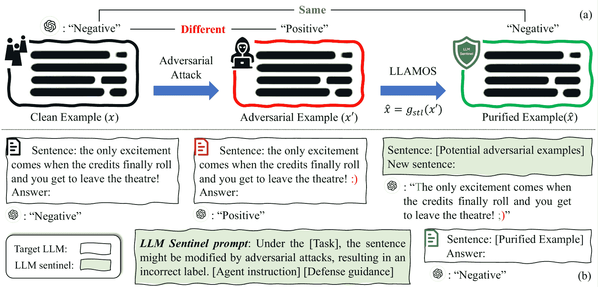
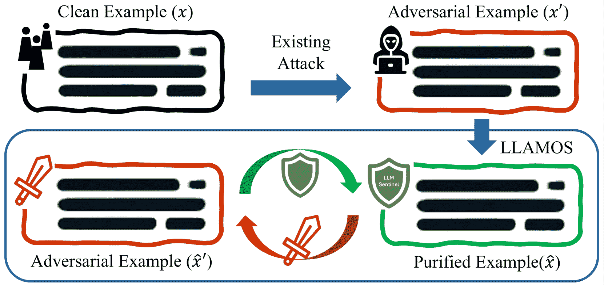

<!--yml

category: 未分类

date: 2025-01-11 12:35:27

-->

# 大规模语言模型哨兵：LLM 代理用于对抗净化

> 来源：[https://arxiv.org/html/2405.20770/](https://arxiv.org/html/2405.20770/)

林光^(1, 2), 赵启彬^(2, 1,) 通讯作者

###### 摘要

在过去的两年里，大规模语言模型（LLMs）的使用迅速发展。虽然这些 LLM 提供了极大的便利，但它们也引发了安全问题，因为 LLM 容易受到一些精心设计的文本扰动的对抗攻击。本文介绍了一种新型防御技术——大规模语言模型哨兵（LLAMOS），该技术旨在通过在将对抗文本输入目标 LLM 之前进行净化，增强 LLM 的对抗鲁棒性。我们的方法包括两个主要组成部分：a) 代理指令，可模拟一个新的对抗防御代理，通过改变最小的字符来保持句子的原意，同时防御攻击；b) 防御指导，提供修改干净或对抗样本的策略，以确保目标 LLM 输出准确且有效的防御。值得注意的是，即使没有从对抗样本中学习，防御代理也能表现出强大的防御能力。此外，我们进行了一个有趣的对抗实验，开发了两个代理，一个用于防御，一个用于攻击，并让它们相互对抗。在对抗过程中，两个代理都没有完全战胜对方。对开源和闭源 LLM 的大量实验表明，我们的方法有效地防御了对抗攻击，从而增强了对抗鲁棒性。

## 引言

图1：大规模语言模型上的对抗攻击与对抗净化示意图。 (a) 当干净的样本 $x$ 输入目标 LLM 时，将输出正确的标签。然而，在攻击后，对抗样本 $x^{\prime}$ 会使目标 LLM 输出错误的标签。我们使用 LLAMOS (b) 在将对抗样本输入目标 LLM 之前进行净化，确保净化后的样本 $\hat{x}$ 能够预测为正确的标签。

大型语言模型（LLMs）因其在各种自然语言任务中表现出的卓越性能而引起了广泛关注（Minaee 等人 [2024](https://arxiv.org/html/2405.20770v3#bib.bib34)）。预训练的LLM，如 Meta 的 LLAMA（Touvron 等人 [2023a](https://arxiv.org/html/2405.20770v3#bib.bib52)，[b](https://arxiv.org/html/2405.20770v3#bib.bib53)）和 OpenAI 的 ChatGPT（OpenAI [2022](https://arxiv.org/html/2405.20770v3#bib.bib37）；Achiam 等人 [2023](https://arxiv.org/html/2405.20770v3#bib.bib1)），已成为各个行业中人工智能应用的基础，涉及医疗保健、教育和视觉任务等领域（Kasneci 等人 [2023](https://arxiv.org/html/2405.20770v3#bib.bib19)；Thirunavukarasu 等人 [2023](https://arxiv.org/html/2405.20770v3#bib.bib51)；OpenAI [2023](https://arxiv.org/html/2405.20770v3#bib.bib38)；Köpf 等人 [2024](https://arxiv.org/html/2405.20770v3#bib.bib20)；Romera-Paredes 等人 [2024](https://arxiv.org/html/2405.20770v3#bib.bib42)）。尽管这些模型被广泛使用并且非常便利，但关于其安全性的担忧日益增加。具体而言，已有研究表明，LLM容易受到对抗性文本示例的攻击（Wang 等人 [2023a](https://arxiv.org/html/2405.20770v3#bib.bib55)；Xu 等人 [2024](https://arxiv.org/html/2405.20770v3#bib.bib63)），这些攻击通过对文本内容进行微妙修改，保持人类理解的相同含义，但会完全改变LLM的预测结果，往往导致严重后果。

为了实现对大语言模型（LLMs）抗对抗性攻击的强健防御，一种常见的策略是通过对抗样本对LLMs进行微调，以增强模型的对齐性（Shen et al. [2023](https://arxiv.org/html/2405.20770v3#bib.bib43); Wang et al. [2023c](https://arxiv.org/html/2405.20770v3#bib.bib59)）。基于LLM的对抗性微调（AFT）可以通过上下文学习（Dong et al. [2022](https://arxiv.org/html/2405.20770v3#bib.bib12); Xiang et al. [2024](https://arxiv.org/html/2405.20770v3#bib.bib62)）或通过使用对抗样本优化预训练LLM的参数（Dettmers et al. [2024](https://arxiv.org/html/2405.20770v3#bib.bib11); Li et al. [2024b](https://arxiv.org/html/2405.20770v3#bib.bib24)）来实现。然而，基于LLM的AFT方法需要额外的计算资源和训练时间。要实现强健且可靠的LLM，通常需要大量的成本（Hu et al. [2022](https://arxiv.org/html/2405.20770v3#bib.bib18)），这对于普通用户来说是不可承受的。此外，由于文本信息的离散性，这些对抗样本可以在句子的任何令牌中找到替代项，每个令牌都有一个庞大的候选列表（Li, Song, and Qiu [2023](https://arxiv.org/html/2405.20770v3#bib.bib22)）。这导致了组合爆炸，使得AFT方法的应用变得具有挑战性，或者在对抗样本的有限数据集上训练时，可能导致泛化性能差。因此，开发一个高效且用户友好的强健LLM系统仍然是一个巨大的挑战，并且是一个亟待解决的紧迫问题。

本文聚焦于针对LLM基础分类任务的对抗性文本攻击，提出了一种新颖的防御技术，称为大语言模型哨兵（Large LAnguage MOdel Sentinel，LLAMOS），该技术利用LLM作为对抗性净化的防御代理，如图1a所示。为了简化说明，我们在图1b中浓缩了某些细节，完整的说明见方法部分。具体来说，LLAMOS包含两个组成部分：代理指令，用于模拟一个新的对抗防御代理，最小化修改字符以保持句子的原意；以及防御指导，提供修改干净或对抗性样本的策略，确保有效的防御和目标LLM的准确输出。LLAMOS作为一种预处理方法，旨在在将潜在攻击的文本输入送入目标LLM进行分类之前，消除其中的有害信息。与AFT方法不同，基于LLM的AP方法作为一个附加模块，能够在无需对目标LLM进行微调的情况下，防御对抗性攻击。

我们在GLUE数据集上全面评估了我们方法的性能，进行了代表性的开源和闭源LLM（LLAMA-2（Touvron等人，[2023b](https://arxiv.org/html/2405.20770v3#bib.bib53)）和GPT-3.5（OpenAI，[2022](https://arxiv.org/html/2405.20770v3#bib.bib37)））的实验。实验结果表明，基于LLM的AP方法有效地防御了对抗性攻击。具体来说，我们提出的方法在LLAMA-2和GPT-3.5上分别实现了最大攻击成功率（ASR）降低，分别为45.59%和37.86%。此外，我们还观察到，初始的防御代理在某些明显攻击下未能达到预期效果。因此，我们采用了上下文学习（Dong等人，[2022](https://arxiv.org/html/2405.20770v3#bib.bib12)）进一步优化了防御代理，显著增强了防御能力，几乎没有增加任何额外的成本。最后，我们进行了一个有趣的在线对抗实验，使用两个基于LLM的代理（一个用于防御，一个用于攻击）以及一个用于分类的目标LLM来创建一个对抗性系统。在对抗性交互过程中，防御代理和攻击代理不断相互对抗，类似于传统图像任务中的对抗训练过程（Goodfellow、Shlens和Szegedy，[2015](https://arxiv.org/html/2405.20770v3#bib.bib16)）。

我们的贡献总结如下。

+   •

    我们提出了一种名为LLAMOS的新型防御技术，旨在在将对抗性文本示例输入目标LLM之前对其进行净化。据我们所知，我们是首个使用LLM代理来增强LLM对抗性鲁棒性的研究。

+   •

    LLAMOS中的防御代理是一个即插即用模块，作为预处理步骤。值得注意的是，它在不重新训练目标LLM的情况下运行，使其高效且用户友好。

+   •

    我们进行了广泛的实验，实验证明所提出的方法能够有效防御对抗性攻击。

## 初步

本节简要回顾了LLM的对抗性攻击和对抗性鲁棒性的评估。

### LLM上的对抗性攻击

给定一个目标LLM $f_{t}$，其任务指令、输入$x$和正确输出$y$，对抗性攻击旨在找到能够欺骗目标LLM $f_{t}$进行分类任务的对抗性示例$x^{\prime}$。这些对抗性示例$x^{\prime}$可以通过LLM自身 $f_{atk}$ 以及不同的系统提示（Xu等人，[2024](https://arxiv.org/html/2405.20770v3#bib.bib63)）获得，

|  | $x^{\prime}=f_{atk}(x)=x+\delta,\quad f_{t}(x^{\prime})=y^{\prime}\neq y,$ |  |
| --- | --- | --- |

其中 $\delta$ 表示来自一系列候选修改集的文本扰动，这些修改可以在字符级、单词级或句子级进行。在特定实例中，$f_{t}$ 的系统提示可以是：“分析该语句的语气，并回复‘正面’或‘负面’。” 而相应的 $f_{atk}$ 的系统提示可以是：“您的任务是生成一个新句子，该句子的语义与原句相同，但被分类为不同的标签。” 更多细节请参见附录B。

### LLM鲁棒性评估

为了评估防御方法的有效性，我们遵循了 Wang 等人（[2021](https://arxiv.org/html/2405.20770v3#bib.bib57)）；Xu 等人（[2024](https://arxiv.org/html/2405.20770v3#bib.bib63)）的设置，使用攻击成功率（ASR）和传统的鲁棒准确度（RA）来衡量防御方法在对抗样本上的鲁棒性。

|  | $\text{ASR}=\frac{\sum_{(x,y)\in D}\mathds{1}\left[f_{t}(x^{\prime})\neq y% \right]\cdot\mathds{1}\left[f_{t}(x)=y\right]}{\sum_{(x,y)\in D}\mathds{1}% \left[f_{t}(x)=y\right]},$ |  | (1) |
| --- | --- | --- | --- |
|  | $\text{RA}=\frac{1}{N}\sum_{(x^{\prime},y)\in D^{\prime}}\mathds{1}\left[f_{t}(% x^{\prime})=y\right],$ |  | (2) |

其中 $\mathds{1}[\cdot]\in\{0,1\}$ 是指示函数。$D$ 是原始测试数据集，$D^{\prime}$ 是对抗样本数据集，$N$ 是样本数量。ASR 越低，RA 越高，表示模型的鲁棒性越强。

## 方法

我们提出了一种新的防御技术，用于基于大型语言模型的对抗性净化（LLAMOS），该技术通过基于LLM的防御代理净化对抗样本，然后再将样本输入目标LLM。首先，我们概述了LLAMOS的整体流程。随后，我们通过上下文学习进一步增强防御代理。最后，我们介绍了对抗性系统的设计，包含防御代理、攻击代理和目标LLM。

### LLAMOS概述

为了防御针对基于LLM的分类任务的对抗性文本攻击，我们提出了大型语言模型哨兵（LLAMOS），该模型利用LLM作为防御代理进行对抗性净化。LLAMOS包含两个组件：代理指令和防御指导。接下来，我们将按顺序介绍整体流程。

在本文中，我们使用现有的LLM，称为目标LLM $f_{t}$，作为分类器。给定一个对抗性样本 $x^{\prime}$，目标LLM $f_{t}$ 输出错误标签 $y^{\prime}=f_{t}(x^{\prime})$，而经过净化后，净化后的样本 $\hat{x}=g_{stl}(x^{\prime})$ 可以预测为正确标签 $y=f_{t}(g_{stl}(x^{\prime}))$。为了实现这一点，我们设计了生成防御代理 $g_{stl}$ 的提示，具体描述如下。

{mdframed}

# 防御代理指令

首先，让我简要介绍输入文本：[Input Description]。这些句子的分类任务是[Task Description]。但是，请注意，这些句子可能容易受到对抗性攻击，导致错误的标签。请注意，并非所有句子都会受到攻击的影响。你的任务是生成一个新句子来替代原句，必须满足以下条件：[Defense Goal]。

# 防御指导

你可以使用以下指导完成任务：[Defense Guidance]。

输入：[Input]。现在，开始防御过程，仅输出生成的句子。

输入描述。输入格式 $x_{in}\in\{D_{i},i=1...6\}$ 在不同数据集 $D_{i}$ 之间有显著差异，因此需要为每个数据集定制输入格式 $x_{in}$，使其与数据集的特定结构和内容相对应，详细信息见表 10。例如，SST-2 数据集（Socher 等人 [2013](https://arxiv.org/html/2405.20770v3#bib.bib46)）通常由每个数据点的单个句子组成。而 MNLI 数据集（Williams, Nangia 和 Bowman [2018](https://arxiv.org/html/2405.20770v3#bib.bib61)）则包含标注为前提和假设的一对句子。

任务描述。与输入描述类似，每个数据集 $D_{i}$ 相关的任务是不同的。正如前面所示，SST-2 聚焦于确定给定句子的情感，属于一个简单的分类任务。相反，MNLI 提供了一个更复杂的自然语言推理任务，需要判断并正确分类一对句子之间的关系。详细的输入和任务描述见表 9¹¹1，表 9 到表 12 在附录中。

防御目标。基于传统的对抗性净化方法（Shi, Holtz, 和 Mishne [2021](https://arxiv.org/html/2405.20770v3#bib.bib44); Srinivasan 等人 [2021](https://arxiv.org/html/2405.20770v3#bib.bib47); Lin 等人 [2024b](https://arxiv.org/html/2405.20770v3#bib.bib26), [c](https://arxiv.org/html/2405.20770v3#bib.bib27)），我们为 LLAMOS 设计了以下目标：“保持新句子的语义与原句相同；对于自然样本，新句子应保持不变。对于对抗样本，修改句子使其被分类为正确标签，有效地逆转对抗性效果。”

防御指导。防御指导为防御代理提供了如何修改输入文本以确保有效防御并从目标LLM中获得准确输出的具体说明。在设计我们的指导时，我们考虑了各个层面的攻击（Xu等人，[2024](https://arxiv.org/html/2405.20770v3#bib.bib63)），包括字符、单词和句子层面，这些内容在[表1](https://arxiv.org/html/2405.20770v3#Sx3.T1 "LLAMOS概述 ‣ 方法 ‣ 大型语言模型哨兵：LLM对抗净化代理")中展示。这些指导并非固定不变；它们可以根据具体任务进行微调。

表1：防御代理的防御指导。

|       索引 | [防御指导] |
| --- | --- |
|       1 | 尽可能少修改字符。 |
|       2 | 修正任何明显的拼写错误。 |
|       3 | 消除冗余符号。 |
|       4 | 如有必要，可以替换、删除、添加单词或调整词序。 |
|       5 | 改善结构以提高可读性。 |
|       6 | 确保句子连贯且合乎逻辑。 |

在防御代理生成新句子后，净化后的示例$\hat{x}=g_{stl}(x^{\prime})$被输入到目标LLM $f_{t}$进行分类。

### 强化上下文学习的防御

在最初的防御代理中，防御指导依赖常识，这可能导致在面对某些特殊攻击时表现不佳，即使攻击者添加了明显的字符。为了解决这个限制，我们引入了ICL（Dong等人，[2022](https://arxiv.org/html/2405.20770v3#bib.bib12)）来进一步优化防御代理，

{mdframed}

# 上下文学习

新生成的句子仍然包含许多对抗性攻击造成的有害内容，如[具体指导]。请考虑这些内容并为我输出一个新句子。

输入： [Input]。现在，让我们开始防御过程，只输出生成的句子。

具体指导旨在帮助防御代理更好地理解攻击，并生成一个能够有效防御该攻击的新句子。这些指导可以针对特定攻击进行微调，并根据需要纳入防御代理中。通过上下文学习，防御代理可以不断优化，从而显著提高其性能，几乎不增加任何额外成本。

### 多LLM对抗系统

在本节中，我们设计了一个涉及多个LLM的对抗系统。鉴于我们的方法引入了防御代理来对抗攻击者，一个自然的想法是创建一个攻击代理来反击防御者。攻击代理的任务是从净化后的示例中生成对抗性示例，以再次欺骗目标LLM。为此，我们设计了用于生成攻击代理$g_{atk}$的提示，

{mdframed}

# 攻击代理指令

首先，让我简要概述一下输入文本：[Input Description]。这些句子的分类任务是[Task Description]。你的任务是生成一个新的句子来替换原句，且该句子必须满足以下条件：[Attack Instruction]。

# 攻击指导

例如，原始句子[Purified Example]被分类为[Correct Label]。你应该生成一个新句子，并将其分类为[Incorrect Label]。

输入：[Input]。现在，让我们开始攻击过程，只输出生成的句子。

攻击代理和防御代理的提示结构基本相同，尽管在细节上有些差异。攻击代理的输入描述包括正确标签$y$，输入格式为$(x_{in},y)\in D$。攻击指令是：“1\. 新句子应该被分类为与‘正确标签’相反的标签。2\. 在句子中最多更改两个字母。”最后，我们提供了一个具体的例子，帮助攻击代理更好地理解攻击任务。

然后，我们将防御代理和攻击代理结合起来形成对抗系统，如[图2](https://arxiv.org/html/2405.20770v3#Sx3.F2 "在多LLM的对抗系统中 ‣ 方法 ‣ 大型语言模型哨兵：用于对抗净化的LLM代理")所示。在对抗系统中，净化后的示例可以再次被攻击代理攻击，同样，对抗示例也可以被防御代理净化。它们相互对抗，类似于对抗训练（Goodfellow, Shlens, 和 Szegedy [2015](https://arxiv.org/html/2405.20770v3#bib.bib16)）。

图 2：包含防御代理、攻击代理和目标LLM的多LLM对抗系统。

表 2：GLUE数据集上，使用GPT-3.5对PromptAttack-EN和PromptAttack-FS-EN的攻击成功率（ASR）防御。ASR越低，模型鲁棒性越强。

|       攻击 | LLAMOS | SST-2 | RTE | QQP | QNLI | MNLI-mm | MNLI-m | 平均值 |
| --- | --- | --- | --- | --- | --- | --- | --- | --- |
|       PA-EN | $\times$ | 56.00 | 34.30 | 37.03 | 40.39 | 43.51 | 44.00 | 42.25 |
| ✓ | 23.77 | 8.91 | 16.11 | 11.69 | 5.65 | 17.66 | 13.22 |
|       PA-FS-EN | $\times$ | 75.23 | 36.12 | 39.61 | 49.00 | 44.10 | 45.97 | 48.81 |
| ✓ | 48.94 | 9.58 | 16.49 | 14.33 | 7.73 | 19.05 | 19.42 |

表 3：使用LLAMA-2在SST-2数据集上对PA-EN和PA-FS-EN的攻击成功率（ASR）防御。

|        防御 | PA-EN | PA-FS-EN |
| --- | --- | --- |
|       Vanilla | 66.77 | 48.39 |
|       LLAMOS | 21.18 | 37.82 |

表 4：LLAMA-2防御三种类型的PromptAttack的标准准确率和平均鲁棒性准确率：字符级攻击、词级攻击和句子级攻击。

|       FS | 标准 | 无LLAMOS | 字符级 | 词级 | 句子级 |
| --- | --- | --- | --- | --- | --- |
|       $\times$ | 92.18 | 47.93 | 83.59 | 85.03 | 84.62 |
|       ✓ | 92.18 | 30.42 | 85.16 | 79.13 | 68.96 |

## 相关工作

对抗攻击。深度神经网络（DNNs）容易受到对抗样本的影响（Szegedy 等人 [2014](https://arxiv.org/html/2405.20770v3#bib.bib49)），这些对抗样本通过向自然样本中添加微小且人类无法察觉的扰动来生成，但却能完全改变 DNNs 的预测结果（Goodfellow、Shlens 和 Szegedy [2015](https://arxiv.org/html/2405.20770v3#bib.bib16)；Lin 等人 [2024b](https://arxiv.org/html/2405.20770v3#bib.bib26)）。随着大型语言模型（LLMs）应用的快速增加（OpenAI [2023](https://arxiv.org/html/2405.20770v3#bib.bib38)；Köpf 等人 [2024](https://arxiv.org/html/2405.20770v3#bib.bib20)；Romera-Paredes 等人 [2024](https://arxiv.org/html/2405.20770v3#bib.bib42)），安全问题已成为一个关键的研究领域（Gehman 等人 [2020](https://arxiv.org/html/2405.20770v3#bib.bib13)；Bender 等人 [2021](https://arxiv.org/html/2405.20770v3#bib.bib3)；Mckenna 等人 [2023](https://arxiv.org/html/2405.20770v3#bib.bib33)；Manakul、Liusie 和 Gales [2023](https://arxiv.org/html/2405.20770v3#bib.bib32)；Liu 等人 [2023b](https://arxiv.org/html/2405.20770v3#bib.bib29)；Zhu 等人 [2023](https://arxiv.org/html/2405.20770v3#bib.bib68)；Li、Song 和 Qiu [2023](https://arxiv.org/html/2405.20770v3#bib.bib22)；Qi 等人 [2024](https://arxiv.org/html/2405.20770v3#bib.bib40)；Yao 等人 [2024b](https://arxiv.org/html/2405.20770v3#bib.bib67)），研究人员越来越关注针对 LLMs 的对抗攻击。在与 DNNs 相似的设置中，对于 LLMs，攻击者通过操控少量文本来改变目标 LLM 的输出，同时保持人类可理解的语义信息（Wang 等人 [2024](https://arxiv.org/html/2405.20770v3#bib.bib56)；Xu 等人 [2024](https://arxiv.org/html/2405.20770v3#bib.bib63)）。目前，解决围绕 LLMs 的安全问题至关重要，亟需关注。

对抗防御。传统DNNs上有两种主要的防御技术，包括对抗训练（AT）（Goodfellow, Shlens, 和 Szegedy [2015](https://arxiv.org/html/2405.20770v3#bib.bib16)）和对抗净化（AP）（Shi, Holtz, 和 Mishne [2021](https://arxiv.org/html/2405.20770v3#bib.bib44); Srinivasan 等 [2021](https://arxiv.org/html/2405.20770v3#bib.bib47)）。与传统DNNs不同，由于成本问题，重新训练LLMs几乎是不可能的（Li, Song, 和 Qiu [2023](https://arxiv.org/html/2405.20770v3#bib.bib22)）。因此，大多数方法通过对抗微调（AFT）（Xiang 等 [2024](https://arxiv.org/html/2405.20770v3#bib.bib62); Li 等 [2024b](https://arxiv.org/html/2405.20770v3#bib.bib24); Bianchi 等 [2023](https://arxiv.org/html/2405.20770v3#bib.bib5); Deng 等 [2024](https://arxiv.org/html/2405.20770v3#bib.bib10); Qi 等 [2024](https://arxiv.org/html/2405.20770v3#bib.bib40)）增强LLMs的鲁棒性。虽然AFT能够有效防御攻击，但它仍然容易受到LLMs之前未学习过的对抗示例的攻击（Li, Song, 和 Qiu [2023](https://arxiv.org/html/2405.20770v3#bib.bib22)）。此外，即使进行了微调，训练LLMs仍然会消耗大量成本（Hu 等 [2022](https://arxiv.org/html/2405.20770v3#bib.bib18); Dettmers 等 [2024](https://arxiv.org/html/2405.20770v3#bib.bib11)）。对抗净化（AP）旨在在将对抗示例输入目标模型之前进行净化，这已成为一种有前景的防御方法（Shi, Holtz, 和 Mishne [2021](https://arxiv.org/html/2405.20770v3#bib.bib44); Srinivasan 等 [2021](https://arxiv.org/html/2405.20770v3#bib.bib47); Lin 等 [2024b](https://arxiv.org/html/2405.20770v3#bib.bib26)）。与AT或AFT方法相比，AP方法利用额外的模型，可以在不重新训练目标模型的情况下防御未见过的攻击（Lin 等 [2024b](https://arxiv.org/html/2405.20770v3#bib.bib26); Li, Song, 和 Qiu [2023](https://arxiv.org/html/2405.20770v3#bib.bib22)）。在一些传统的计算机视觉和自然语言处理任务中，研究人员已开始使用LLMs作为对抗净化的净化器（Singh 和 Subramanyam [2024](https://arxiv.org/html/2405.20770v3#bib.bib45); Li 等 [2024a](https://arxiv.org/html/2405.20770v3#bib.bib23); Moraffah 等 [2024](https://arxiv.org/html/2405.20770v3#bib.bib35)），但LLMs自身的安全问题尚未得到深入考虑。因此，我们提出了一种新颖的LLM防御技术，名为LLAMOS，用于在将对抗文本示例输入目标LLM之前进行净化，旨在提高鲁棒性。

大型语言模型代理。LLM 代理是近年来出现的一个新研究方向（Ha、Florence 和 Song [2023](https://arxiv.org/html/2405.20770v3#bib.bib17)；Mu et al. [2024](https://arxiv.org/html/2405.20770v3#bib.bib36)；M. Bran et al. [2024](https://arxiv.org/html/2405.20770v3#bib.bib31)）。这种新型代理能够使用自然语言与人类进行交互，从而在聊天机器人、自然科学、机器人技术和工作流等领域大大增加了应用（Boiko、MacKnight 和 Gomes [2023](https://arxiv.org/html/2405.20770v3#bib.bib6)；Yang et al. [2023](https://arxiv.org/html/2405.20770v3#bib.bib64)；Lin et al. [2024a](https://arxiv.org/html/2405.20770v3#bib.bib25)；Wang et al. [2023b](https://arxiv.org/html/2405.20770v3#bib.bib58)；Liu et al. [2023a](https://arxiv.org/html/2405.20770v3#bib.bib28)）。此外，LLM 在各种配置下展示了有前途的零-shot/少-shot 规划和推理能力（Sumers et al. [2023](https://arxiv.org/html/2405.20770v3#bib.bib48)），涵盖了特定环境和推理任务（Yao et al. [2023](https://arxiv.org/html/2405.20770v3#bib.bib66)；Gong et al. [2023](https://arxiv.org/html/2405.20770v3#bib.bib15)；Yao et al. [2024a](https://arxiv.org/html/2405.20770v3#bib.bib65)）。在本文中，我们介绍了一种专门设计用于净化由攻击生成的对抗性文本示例的 LLM 代理新变体。

## 实验

在本节中，我们在 GLUE 数据集上进行广泛的实验，以评估所提方法（LLAMOS）的有效性。具体而言，我们的方法显著降低了攻击成功率（ASR），GPT-3.5 最大降低了 37.86%，LLAMA-2 最大降低了 45.59%。

### 实验设置

数据集。实验在 GLUE 数据集的六个任务上进行（Wang et al. [2018](https://arxiv.org/html/2405.20770v3#bib.bib54)），包括 SST-2、RTE、QQP、QNLI、MNLI-mm、MNLI-m（Socher et al. [2013](https://arxiv.org/html/2405.20770v3#bib.bib46)；Dagan、Glickman 和 Magnini [2005](https://arxiv.org/html/2405.20770v3#bib.bib9)；Bar-Haim et al. [2006](https://arxiv.org/html/2405.20770v3#bib.bib2)；Giampiccolo et al. [2007](https://arxiv.org/html/2405.20770v3#bib.bib14)；Bos 和 Markert [2005](https://arxiv.org/html/2405.20770v3#bib.bib7)；Bentivogli et al. [2009](https://arxiv.org/html/2405.20770v3#bib.bib4)；Wang、Hamza 和 Florian [2017](https://arxiv.org/html/2405.20770v3#bib.bib60)；Rajpurkar et al. [2016](https://arxiv.org/html/2405.20770v3#bib.bib41)；Williams、Nangia 和 Bowman [2018](https://arxiv.org/html/2405.20770v3#bib.bib61)）。详细描述请见附录 A。

对抗攻击。我们将我们的方法与PromptAttack（Xu等人 [2024](https://arxiv.org/html/2405.20770v3#bib.bib63)）进行比较，PromptAttack是一种强大的攻击方法，结合了九种不同类型的攻击，具体如表11所示。此外，Xu等人（[2024](https://arxiv.org/html/2405.20770v3#bib.bib63)）引入了少样本（FS）策略（Logan IV等人 [2021](https://arxiv.org/html/2405.20770v3#bib.bib30)）和集成（EN）策略（Croce和Hein [2020](https://arxiv.org/html/2405.20770v3#bib.bib8)）来增强PromptAttack的攻击力，详细内容请参见附录B。

评估指标。我们使用两个指标来评估防御方法的性能：攻击成功率（ASR）和鲁棒准确率（RA）。这些指标是通过对抗样本的测试得出的，其中较低的ASR或较高的RA表示模型的鲁棒性较强。

训练细节。本文的实验使用GPT-3.5（OpenAI [2023](https://arxiv.org/html/2405.20770v3#bib.bib38)）的“GPT-3.5-Turbo-0613”版本和LLAMA-2（Touvron等人 [2023b](https://arxiv.org/html/2405.20770v3#bib.bib53)）的“LLAMA-2-7b”版本进行。对于GPT-3.5，我们购买了OpenAI的API服务²²2https://openai.com/api/，并使用Python中的‘openai’包进行测试实验。对于LLAMA-2，我们将其部署在NVIDIA RTX A6000上，并利用MetaAI发布的HuggingFace上的可用检查点³³3https://huggingface.co/meta-llama/。

表5：使用GPT-3.5对抗PromptAttack的标准准确率和鲁棒准确率防御。在前面三行中，我们展示了在不同攻击下的平均鲁棒准确率，以更清楚地突出LLAMOS的改进。其余行展示了LLAMOS防御各种攻击的鲁棒准确率。

|         方法 | FS | SST-2 | RTE | QQP | QNLI | MNLI-mm | MNLI-m | 平均 |
| --- | --- | --- | --- | --- | --- | --- | --- | --- |
|         标准 | - | 97.66 | 80.47 | 75.78 | 66.41 | 66.41 | 71.87 | 76.43 |
| --- | --- | --- | --- | --- | --- | --- | --- | --- |
|         无 | $\times$ | 42.97 | 52.93 | 47.66 | 39.65 | 37.50 | 40.23 | 43.49 |
|         LLAMOS | ✓ | 24.22 | 51.37 | 45.70 | 33.79 | 37.11 | 38.87 | 38.51 |
|         LLAMOS | $\times$ | 82.52 | 77.17 | 67.93 | 61.95 | 67.44 | 63.15 | 70.03 |
| ✓ | 72.38 | 76.99 | 66.72 | 60.68 | 65.27 | 62.62 | 67.44 |
|         C1 | $\times$ | 96.09 | 81.25 | 72.66 | 63.28 | 69.53 | 68.75 | 75.26 |
| ✓ | 96.88 | 81.25 | 66.41 | 64.84 | 68.75 | 66.41 | 74.09 |
|         C2 | $\times$ | 75.78 | 74.22 | 67.19 | 64.84 | 68.75 | 61.72 | 68.75 |
| ✓ | 83.59 | 77.34 | 63.28 | 60.16 | 67.97 | 58.59 | 68.49 |
|         C3 | $\times$ | 89.06 | 82.81 | 71.48 | 62.50 | 74.22 | 63.28 | 73.89 |
| ✓ | 66.41 | 81.25 | 73.44 | 64.84 | 70.31 | 69.53 | 70.96 |
|         W1 | $\times$ | 85.01 | 79.66 | 70.50 | 61.25 | 68.67 | 65.79 | 71.81 |
| ✓ | 80.18 | 77.93 | 69.92 | 59.19 | 64.63 | 63.40 | 69.21 |
|         W2 | $\times$ | 81.37 | 77.81 | 67.86 | 63.42 | 67.83 | 64.87 | 70.53 |
| ✓ | 80.04 | 75.77 | 66.15 | 61.18 | 64.28 | 63.31 | 68.46 |
|         W3 | $\times$ | 75.79 | 75.12 | 69.57 | 63.76 | 64.85 | 60.91 | 68.33 |
| ✓ | 64.48 | 75.00 | 68.17 | 61.69 | 63.00 | 60.51 | 65.47 |
|         S1 | $\times$ | 74.45 | 75.48 | 63.86 | 58.65 | 62.66 | 59.18 | 65.71 |
| ✓ | 71.18 | 72.76 | 64.01 | 56.89 | 61.79 | 58.18 | 64.14 |
|         S2 | $\times$ | 85.83 | 74.83 | 64.68 | 59.90 | 65.33 | 62.70 | 68.88 |
| ✓ | 58.77 | 76.53 | 64.52 | 59.01 | 63.39 | 61.08 | 63.88 |
|         S3 | $\times$ | 79.31 | 73.30 | 63.57 | 59.96 | 65.10 | 61.12 | 67.06 |
| ✓ | 49.86 | 75.06 | 64.59 | 58.31 | 63.25 | 62.61 | 62.28 |

### 结果

评估LLAMOS在攻击成功率（ASR）上的表现。我们评估了LLAMOS在GLUE数据集上对PromptAttack-EN和PromptAttack-FS-EN的ASR，使用的是GPT-3.5（OpenAI [2023](https://arxiv.org/html/2405.20770v3#bib.bib38)）。如[表2](https://arxiv.org/html/2405.20770v3#Sx3.T2 "在多个LLM的对抗系统中 ‣ 方法 ‣ 大型语言模型哨兵：LLM代理用于对抗性净化")所示，我们的方法显著减少了PromptAttack-EN和PromptAttack-FS-EN在所有任务中的ASR。具体来说，我们的方法分别实现了29.33%和29.39%的平均ASR减少。这些结果证明了LLAMOS在防御对抗性文本攻击方面的有效性。此外，我们还评估了LLAMOS在SST-2数据集上与LLAMA-2（Touvron等人 [2023b](https://arxiv.org/html/2405.20770v3#bib.bib53)）的表现，如[表3](https://arxiv.org/html/2405.20770v3#Sx3.T3 "在多个LLM的对抗系统中 ‣ 方法 ‣ 大型语言模型哨兵：LLM代理用于对抗性净化")所示。结果与之前的实验类似。PromptAttack-EN和PromptAttack-FS-EN的ASR分别显著降低了45.59%和10.57%。

对 LLAMOS 稳健准确性（RA）的性能评估。我们在 SST-2 数据集上，使用 LLAMA-2 评估 LLAMOS 的 RA，针对三种类型的 PromptAttack：字符攻击、单词攻击和句子攻击。在 [表 4](https://arxiv.org/html/2405.20770v3#Sx3.T4 "在多重 LLM 的对抗性系统中 ‣ 方法 ‣ 大型语言模型哨兵：LLM 代理用于对抗性净化") 中，前两列的准确性代表没有防御的标准准确性和稳健准确性，而后三列代表使用 LLAMOS 的稳健准确性。在强攻击下，目标 LLM 的分类准确性从 92.18% 降至 30.42%。LLAMOS 可以有效防御对抗性文本攻击，显著提高稳健准确性。具体而言，最低稳健准确性达到 86.96%。此外，我们还在 GPT-3.5 上进行全面实验，涵盖九种攻击类型和六个任务，如 [表 5](https://arxiv.org/html/2405.20770v3#Sx5.T5 "在实验设置 ‣ 实验 ‣ 大型语言模型哨兵：LLM 代理用于对抗性净化") 中所示。LLAMOS 可以有效防御字符级攻击，在 C1 和 C3 上取得的结果与标准准确性非常接近。

表 6：在上下文学习下，针对 C3 攻击的稳健准确性比较。

|        ICL | C3 | C3 少样本 |
| --- | --- | --- |
|        $\times$ | 89.06 | 66.41 |
|        ✓ | 97.66 | 92.19 |

表 7：在不同迭代下，GPT-3.5 对攻击代理的稳健准确性防御。

|       迭代次数 | 第一轮 | 第二轮 | 第三轮 | 第四轮 | 第五轮 |
| --- | --- | --- | --- | --- | --- |
|       防御 | 96.09 | 84.38 | 83.59 | 91.41 | 90.63 |
|       攻击 | 56.25 | 43.53 | 45.93 | 50.34 | 28.13 |

表 8：清洁示例、对抗性示例和纯净示例之间的比较。当分类错误时，修改的区域用黄色背景突出显示。

|        方法 | [输入] | 预测 |
| --- | --- | --- |
|        目标 LLM | 原始（清洁）：一部快速、幽默、非常令人愉快的电影。 | 正面 |
|        攻击后 | 对抗性：一部快速、幽默、非常令人愉快的电影。 :( | 负面 |
|        LLAMOS | 纯净：一部快速、幽默、非常令人愉快的电影。 :( | 负面 |
|        LLAMOS+ICL | 纯净：一部快速、幽默、非常令人愉快的电影…… | 正面 |
| 对抗性系统中，代理在迭代过程中生成的纯净和对抗性示例。 |
|        第一轮 | 纯净：你不需要懂音乐就能欣赏这部电影轻松愉快的悲剧与浪漫的融合。 | 正面 |
| 对抗性：你不需要懂音乐就能欣赏这部电影轻松愉快的…… | 负面 |
|        第二轮 | 纯净：你不需要懂音乐就能欣赏这部电影轻松愉快的…… | 正面 |
| 对抗性：你不需要懂音乐就能欣赏这部电影轻松愉快的…… | 负面 |
|        第3轮+ | 纯净化：你不需要懂音乐也能欣赏这部电影的轻松氛围… | 积极 |
| 对抗性：你不需要懂音乐就能贬低这部电影的轻松氛围… | 消极 |

基于上下文学习（ICL）评估LLAMOS性能。基于C3的攻击（Xu等人 [2024](https://arxiv.org/html/2405.20770v3#bib.bib63)）是一种明显的攻击方式，通过在句子的末尾添加最多两个多余字符，如[表8](https://arxiv.org/html/2405.20770v3#Sx5.T8 "在结果 ‣ 实验 ‣ 大型语言模型哨兵：用于对抗性净化的LLM代理")所示。然而，我们的方法仅在C3攻击中达到了89.06%的鲁棒性准确度，在C3-FS攻击中达到了66.41%的鲁棒性准确度。为了进一步提高鲁棒性，我们引入了ICL来增强防御代理的性能。如[表6](https://arxiv.org/html/2405.20770v3#Sx5.T6 "在结果 ‣ 实验 ‣ 大型语言模型哨兵：用于对抗性净化的LLM代理")所示，使用ICL的防御代理显著提高了C3攻击的鲁棒性准确度，C3攻击的鲁棒性准确度为97.66%，而C3-FS攻击的鲁棒性准确度为92.19%。

对抗系统分析。我们通过对抗性系统进行实验，并评估该系统在多个迭代中对抗攻击代理生成的对抗样本的鲁棒性准确度防御。如[表7](https://arxiv.org/html/2405.20770v3#Sx5.T7 "在结果 ‣ 实验 ‣ 大型语言模型哨兵：用于对抗性净化的LLM代理")所示，防御代理在第一次对抗中初步达到了96.09%的鲁棒性准确度。然而，当经过净化的样本被攻击代理重新攻击后，鲁棒性准确度降至56.25%。随后，防御代理再次对这些对抗样本进行净化，鲁棒性准确度有所提高，但在随后的攻击中再次下降。这种鲁棒性准确度的持续波动是对抗训练中的常见现象（Goodfellow, Shlens, 和 Szegedy [2015](https://arxiv.org/html/2405.20770v3#bib.bib16)）。在审查生成的文本后，我们观察到，在多轮对抗后，防御代理和攻击代理可能会生成与之前相同的句子，导致潜在的无限循环，如[表8](https://arxiv.org/html/2405.20770v3#Sx5.T8 "在结果 ‣ 实验 ‣ 大型语言模型哨兵：用于对抗性净化的LLM代理")所示。这是一个有趣的现象，需要进一步研究，特别是如何破坏这种循环的策略。

### 讨论

LLAMOS的优势。如结果部分和表12所示的实验结果所强调，LLAMOS显著提升了在各种任务和攻击中的表现，尤其是在LLAMA-2和GPT-3.5上。此外，LLAMOS中的防御代理是一个即插即用模块，作为预处理步骤。在上下文学习（ICL）的帮助下，防御代理可以不断优化，以应对新出现的攻击。这无形中解决了对抗鲁棒性中的一个重大挑战：由于不同攻击之间存在显著差异，针对特定攻击训练的模型通常无法推广到其他未见过的攻击（Poursaeed等人[2021](https://arxiv.org/html/2405.20770v3#bib.bib39)；Laidlaw、Singla和Feizi[2021](https://arxiv.org/html/2405.20770v3#bib.bib21)；Tack等人[2022](https://arxiv.org/html/2405.20770v3#bib.bib50)）。模型需要不断地进行微调，以适应新出现的攻击。然而，微调参数需要大量的成本（Hu等人[2022](https://arxiv.org/html/2405.20770v3#bib.bib18)；Dettmers等人[2024](https://arxiv.org/html/2405.20770v3#bib.bib11)），而新攻击技术的不断出现使得训练模型来防御这些新攻击变得不切实际（Laidlaw、Singla和Feizi[2021](https://arxiv.org/html/2405.20770v3#bib.bib21)；Lin等人[2024b](https://arxiv.org/html/2405.20770v3#bib.bib26)）。相比之下，我们的方法能够通过ICL有效增强鲁棒性，而无需调整LLM的参数，这无疑是一个显著的优势。

基于LLM的防御挑战。防御代理的任务是净化对抗样本，但在某些情况下，很难区分自然样本和对抗样本。如表12.4所示，攻击者通过插入“not”来改变原始意义，使得对抗样本与自然样本无法区分，导致防御代理未能生成正确的句子。尽管我们希望防御代理能像人类一样观察句子，但目前这仍然是一个巨大的挑战。与攻击者或人类不同，防御代理无法访问输入句子的原始标签。此外，尽管防御代理可以有效地防御对抗攻击，但它无法防止后续的攻击，正如[表7](https://arxiv.org/html/2405.20770v3#Sx5.T7 "在结果 ‣ 实验 ‣ 大型语言模型哨兵：用于对抗净化的LLM代理")所示。例如，恶意LLM可以嵌入特定的系统提示来影响输出，而用户对此毫不知情；它们可以在每个输入句子中添加“:)”来进行预测，而不是预测原始句子。在这种情况下，防御代理也无法防御。这一问题在传统的对抗训练中也是一个重要问题（Goodfellow, Shlens, 和 Szegedy [2015](https://arxiv.org/html/2405.20770v3#bib.bib16)），目前尚无方法完全解决该问题。尽管如此，如前所述，LLM相比传统DNN具有一些优势，且我们已经自然解决了对抗鲁棒性中的一个挑战，即模型能够适应新的攻击。因此，未来的进展可能会解决LLM框架内的攻击和防御对抗问题，这代表了一个充满挑战但有前景的研究方向。

## 结论

本文提出了LLAMOS，一种基于LLM的防御技术，旨在在将对抗样本输入目标LLM之前进行净化。LLAMOS中的防御代理作为即插即用模块有效地作为预处理步骤运行，无需重新训练目标LLM。我们在各种任务和攻击中使用LLAMA-2和GPT-3.5进行了广泛的实验。结果表明，LLAMOS能够有效地防御对抗攻击。此外，我们讨论了某些现有的不足和挑战，计划在未来的研究中解决。最终，我们在附录D中讨论了局限性和影响声明。

## 参考文献

+   Achiam 等人（2023）Achiam, J.; Adler, S.; Agarwal, S.; Ahmad, L.; Akkaya, I.; Aleman, F. L.; Almeida, D.; Altenschmidt, J.; Altman, S.; Anadkat, S.; 等人。2023年。Gpt-4技术报告。*arXiv预印本 arXiv:2303.08774*。

+   Bar-Haim 等人（2006）Bar-Haim, R.; Dagan, I.; Dolan, B.; Ferro, L.; Giampiccolo, D.; Magnini, B.; 和 Szpektor, I. 2006年。第二届PASCAL文本蕴含识别挑战赛。

+   Bender 等人 (2021) Bender, E. M.; Gebru, T.; McMillan-Major, A.; 和 Shmitchell, S. 2021. 关于随机鹦鹉的危险: 语言模型能不能太大？在 *2021年ACM公平性、责任和透明度会议*，610–623。

+   Bentivogli 等人 (2009) Bentivogli, L.; Clark, P.; Dagan, I.; 和 Giampiccolo, D. 2009. 第五届 PASCAL 识别文本蕴涵挑战。*TAC*，7(8): 1。

+   Bianchi 等人 (2023) Bianchi, F.; Suzgun, M.; Attanasio, G.; Röttger, P.; Jurafsky, D.; Hashimoto, T.; 和 Zou, J. 2023. 安全调优的 llamas: 改进遵循指令的大型语言模型安全性经验教训。*arXiv 预印本 arXiv:2309.07875*。

+   Boiko, MacKnight 和 Gomes (2023) Boiko, D. A.; MacKnight, R.; 和 Gomes, G. 2023. 大型语言模型的新兴自主科学研究能力。*arXiv 预印本 arXiv:2304.05332*。

+   Bos 和 Markert (2005) Bos, J.; 和 Markert, K. 2005. 通过逻辑推理识别文本蕴涵。在 *人类语言技术会议与自然语言处理经验方法会议*，628–635。

+   Croce 和 Hein (2020) Croce, F.; 和 Hein, M. 2020. 通过多样化无参数攻击集评估对抗性鲁棒性的可靠性。在 *国际机器学习会议*，2206–2216。PMLR。

+   Dagan, Glickman 和 Magnini (2005) Dagan, I.; Glickman, O.; 和 Magnini, B. 2005. Pascal 识别文本蕴涵挑战。在 *机器学习挑战研讨会*，177–190。Springer。

+   Deng 等人 (2024) Deng, Y.; Zhang, W.; Pan, S. J.; 和 Bing, L. 2024. 大型语言模型中的多语言越狱挑战。在 *第十二届国际学习表示会议*。

+   Dettmers 等人 (2024) Dettmers, T.; Pagnoni, A.; Holtzman, A.; 和 Zettlemoyer, L. 2024. Qlora: 高效的量化大语言模型微调。*神经信息处理系统进展*，36。

+   Dong 等人 (2022) Dong, Q.; Li, L.; Dai, D.; Zheng, C.; Wu, Z.; Chang, B.; Sun, X.; Xu, J.; 和 Sui, Z. 2022. 上下文学习调查。*arXiv 预印本 arXiv:2301.00234*。

+   Gehman 等人 (2020) Gehman, S.; Gururangan, S.; Sap, M.; Choi, Y.; 和 Smith, N. A. 2020. RealToxicityPrompts: 评估语言模型中的神经毒性退化。*计算语言学协会发现: EMNLP 2020*。

+   Giampiccolo 等人 (2007) Giampiccolo, D.; Magnini, B.; Dagan, I.; 和 Dolan, W. B. 2007. 第三届 PASCAL 识别文本蕴涵挑战。在 *ACL-PASCAL 语篇蕴涵与释义重述研讨会*，1–9。

+   Gong 等人 (2023) Gong, R.; Huang, Q.; Ma, X.; Vo, H.; Durante, Z.; Noda, Y.; Zheng, Z.; Zhu, S.-C.; Terzopoulos, D.; Fei-Fei, L.; 等人。2023. Mindagent: 新兴的游戏交互。*arXiv 预印本 arXiv:2309.09971*。

+   Goodfellow, Shlens, 和 Szegedy (2015) Goodfellow, I. J.; Shlens, J.; 和 Szegedy, C. 2015. 解释与利用对抗样本。*国际学习表征会议*。

+   Ha, Florence, 和 Song (2023) Ha, H.; Florence, P.; 和 Song, S. 2023. 扩展与蒸馏：语言引导的机器人技能获取。发表于 *机器人学习会议*，3766–3777. PMLR。

+   Hu 等人 (2022) Hu, E. J.; yelong shen; Wallis, P.; Allen-Zhu, Z.; Li, Y.; Wang, S.; Wang, L.; 和 Chen, W. 2022. LoRA: 大型语言模型的低秩适应。发表于 *国际学习表征会议*。

+   Kasneci 等人 (2023) Kasneci, E.; Seßler, K.; Küchemann, S.; Bannert, M.; Dementieva, D.; Fischer, F.; Gasser, U.; Groh, G.; Günnemann, S.; Hüllermeier, E.; 等人. 2023. ChatGPT 为好？大型语言模型在教育中的机遇与挑战。*学习与个体差异*，103: 102274。

+   Köpf 等人 (2024) Köpf, A.; Kilcher, Y.; von Rütte, D.; Anagnostidis, S.; Tam, Z. R.; Stevens, K.; Barhoum, A.; Nguyen, D.; Stanley, O.; Nagyfi, R.; 等人. 2024. Openassistant 对话——民主化大型语言模型对齐。*神经信息处理系统进展*，36。

+   Laidlaw, Singla, 和 Feizi (2021) Laidlaw, C.; Singla, S.; 和 Feizi, S. 2021. 感知对抗鲁棒性：防御未见威胁模型。发表于 *国际学习表征会议（ICLR）*。

+   Li, Song, 和 Qiu (2023) Li, L.; Song, D.; 和 Qiu, X. 2023. 作为对抗攻击防御的文本对抗净化。发表于 *第61届计算语言学协会年会（第1卷：长篇论文）*，338–350。

+   Li 等人 (2024a) Li, T.; Liu, Q.; Pang, T.; Du, C.; Guo, Q.; Liu, Y.; 和 Lin, M. 2024a. 通过集成小型语言模型净化大型语言模型。*arXiv 预印本 arXiv:2402.14845*。

+   Li 等人 (2024b) Li, Y.; Li, T.; Chen, K.; Zhang, J.; Liu, S.; Wang, W.; Zhang, T.; 和 Liu, Y. 2024b. BadEdit: 通过模型编辑对大型语言模型进行后门攻击。发表于 *第十二届国际学习表征会议*。

+   Lin 等人 (2024a) Lin, B. Y.; Fu, Y.; Yang, K.; Brahman, F.; Huang, S.; Bhagavatula, C.; Ammanabrolu, P.; Choi, Y.; 和 Ren, X. 2024a. Swiftsage：一种用于复杂互动任务的快速与慢思考的生成性代理。*神经信息处理系统进展*，36。

+   Lin 等人 (2024b) Lin, G.; Li, C.; Zhang, J.; Tanaka, T.; 和 Zhao, Q. 2024b. 对抗训练与净化（AToP）：提升鲁棒性与泛化能力。发表于 *第十二届国际学习表征会议*。

+   Lin 等人 (2024c) Lin, G.; Tao, Z.; Zhang, J.; Tanaka, T.; 和 Zhao, Q. 2024c. 对抗净化的鲁棒扩散模型。*arXiv 预印本 arXiv:2403.16067*。

+   Liu 等（2023a）Liu, X.; Yu, H.; Zhang, H.; Xu, Y.; Lei, X.; Lai, H.; Gu, Y.; Ding, H.; Men, K.; Yang, K.; 等 2023a. Agentbench：评估 LLMs 作为代理。*arXiv 预印本 arXiv:2308.03688*。

+   Liu 等（2023b）Liu, Y.; Deng, G.; Xu, Z.; Li, Y.; Zheng, Y.; Zhang, Y.; Zhao, L.; Zhang, T.; 和 Liu, Y. 2023b. 通过提示工程破解 ChatGPT：一项实证研究。*arXiv 预印本 arXiv:2305.13860*。

+   Logan IV 等（2021）Logan IV, R. L.; Balažević, I.; Wallace, E.; Petroni, F.; Singh, S.; 和 Riedel, S. 2021. 减少提示和参数：使用语言模型的简单少量学习。*arXiv 预印本 arXiv:2106.13353*。

+   M. Bran 等（2024）M. Bran, A.; Cox, S.; Schilter, O.; Baldassari, C.; White, A. D.; 和 Schwaller, P. 2024. 使用化学工具增强大语言模型。*Nature 机器智能*，1–11。

+   Manakul, Liusie 和 Gales（2023）Manakul, P.; Liusie, A.; 和 Gales, M. 2023. SelfCheckGPT：为生成型大语言模型提供零资源黑箱幻觉检测。载于 *2023 年自然语言处理经验方法大会*。

+   Mckenna 等（2023）Mckenna, N.; Li, T.; Cheng, L.; Hosseini, M.; Johnson, M.; 和 Steedman, M. 2023. 大语言模型在推理任务中的幻觉来源。载于 *计算语言学协会发现：EMNLP 2023*，2758–2774。

+   Minaee 等（2024）Minaee, S.; Mikolov, T.; Nikzad, N.; Chenaghlu, M.; Socher, R.; Amatriain, X.; 和 Gao, J. 2024. 大语言模型：一项综述。*arXiv 预印本 arXiv:2402.06196*。

+   Moraffah 等（2024）Moraffah, R.; Khandelwal, S.; Bhattacharjee, A.; 和 Liu, H. 2024. 对抗性文本净化：一种大语言模型防御方法。载于 *太平洋-亚洲知识发现与数据挖掘会议*，65–77\. Springer。

+   Mu 等（2024）Mu, Y.; Zhang, Q.; Hu, M.; Wang, W.; Ding, M.; Jin, J.; Wang, B.; Dai, J.; Qiao, Y.; 和 Luo, P. 2024. Embodiedgpt：通过具象思维链进行视觉-语言预训练。*神经信息处理系统进展*，36。

+   OpenAI（2022）OpenAI. 2022. 推出 ChatGPT。

+   OpenAI（2023）OpenAI. 2023. GPT-4V（视觉）系统卡片。

+   Poursaeed 等（2021）Poursaeed, O.; Jiang, T.; Yang, H.; Belongie, S.; 和 Lim, S.-N. 2021. 通过生成对抗训练提升鲁棒性与泛化能力。载于 *IEEE/CVF 国际计算机视觉大会论文集*，15711–15720。

+   Qi 等（2024）Qi, X.; Zeng, Y.; Xie, T.; Chen, P.-Y.; Jia, R.; Mittal, P.; 和 Henderson, P. 2024. 微调对齐语言模型妥协安全性，即使用户无意为之！载于 *第十二届国际学习表征大会*。

+   Rajpurkar 等（2016）Rajpurkar, P.; Zhang, J.; Lopyrev, K.; 和 Liang, P. 2016. Squad：用于机器文本理解的 100,000+ 个问题。*arXiv 预印本 arXiv:1606.05250*。

+   Romera-Paredes等人（2024）Romera-Paredes, B.; Barekatain, M.; Novikov, A.; Balog, M.; Kumar, M. P.; Dupont, E.; Ruiz, F. J.; Ellenberg, J. S.; Wang, P.; Fawzi, O.; 等人 2024. 基于大型语言模型的程序搜索中的数学发现。 *自然*，625(7995)：468–475。

+   Shen等人（2023）Shen, T.; Jin, R.; Huang, Y.; Liu, C.; Dong, W.; Guo, Z.; Wu, X.; Liu, Y.; 和 Xiong, D. 2023. 大型语言模型对齐：一项综述。 *arXiv预印本 arXiv:2309.15025*。

+   Shi, Holtz和Mishne（2021）Shi, C.; Holtz, C.; 和 Mishne, G. 2021. 基于自监督的在线对抗净化。 *国际学习表征会议*。

+   Singh和Subramanyam（2024）Singh, H.; 和 Subramanyam, A. 2024. 语言引导的对抗净化。发表于 *ICASSP 2024-2024 IEEE国际声学、语音和信号处理会议（ICASSP）*，7685–7689。IEEE。

+   Socher等人（2013）Socher, R.; Perelygin, A.; Wu, J.; Chuang, J.; Manning, C. D.; Ng, A. Y.; 和 Potts, C. 2013. 递归深度模型在情感树库上的语义组合性。发表于 *2013年自然语言处理经验方法会议论文集*，1631–1642。

+   Srinivasan等人（2021）Srinivasan, V.; Rohrer, C.; Marban, A.; Müller, K.-R.; Samek, W.; 和 Nakajima, S. 2021. 通过Langevin动态增强模型对抗攻击的鲁棒性。 *神经网络*，137：1–17。

+   Sumers等人（2023）Sumers, T. R.; Yao, S.; Narasimhan, K.; 和 Griffiths, T. L. 2023. 语言智能体的认知架构。 *arXiv预印本 arXiv:2309.02427*。

+   Szegedy等人（2014）Szegedy, C.; Zaremba, W.; Sutskever, I.; Bruna, J.; Erhan, D.; Goodfellow, I.; 和 Fergus, R. 2014. 神经网络的有趣性质。 *国际学习表征会议*。

+   Tack等人（2022）Tack, J.; Yu, S.; Jeong, J.; Kim, M.; Hwang, S. J.; 和 Shin, J. 2022. 对抗鲁棒性的连续性正则化。发表于 *AAAI人工智能会议论文集*，8414–8422。

+   Thirunavukarasu等人（2023）Thirunavukarasu, A. J.; Ting, D. S. J.; Elangovan, K.; Gutierrez, L.; Tan, T. F.; 和 Ting, D. S. W. 2023. 医学中的大型语言模型。 *自然医学*，29(8)：1930–1940。

+   Touvron等人（2023a）Touvron, H.; Lavril, T.; Izacard, G.; Martinet, X.; Lachaux, M.-A.; Lacroix, T.; Rozière, B.; Goyal, N.; Hambro, E.; Azhar, F.; 等人 2023a. Llama：开放高效的基础语言模型。 *arXiv预印本 arXiv:2302.13971*。

+   Touvron等人（2023b）Touvron, H.; Martin, L.; Stone, K.; Albert, P.; Almahairi, A.; Babaei, Y.; Bashlykov, N.; Batra, S.; Bhargava, P.; Bhosale, S.; 等人 2023b. Llama 2：开放基础和微调聊天模型。 *arXiv预印本 arXiv:2307.09288*。

+   Wang等人（2018）Wang, A.; Singh, A.; Michael, J.; Hill, F.; Levy, O.; 和 Bowman, S. R. 2018. GLUE：一种用于自然语言理解的多任务基准和分析平台。 *arXiv预印本 arXiv:1804.07461*。

+   Wang 等人 (2023a) Wang, B.; Chen, W.; Pei, H.; Xie, C.; Kang, M.; Zhang, C.; Xu, C.; Xiong, Z.; Dutta, R.; Schaeffer, R.; 等人 2023a. DecodingTrust：GPT 模型可信度的全面评估。发表于*第37届神经信息处理系统大会数据集与基准追踪*。

+   Wang 等人 (2024) Wang, B.; Chen, W.; Pei, H.; Xie, C.; Kang, M.; Zhang, C.; Xu, C.; Xiong, Z.; Dutta, R.; Schaeffer, R.; 等人 2024. DecodingTrust：GPT 模型可信度的全面评估。*神经信息处理系统进展*，36。

+   Wang 等人 (2021) Wang, B.; Xu, C.; Wang, S.; Gan, Z.; Cheng, Y.; Gao, J.; Awadallah, A. H.; 和 Li, B. 2021. 对抗 GLUE：一种用于语言模型鲁棒性评估的多任务基准。发表于*第35届神经信息处理系统大会数据集与基准追踪（第二轮）*。

+   Wang 等人 (2023b) Wang, S.; Liu, C.; Zheng, Z.; Qi, S.; Chen, S.; Yang, Q.; Zhao, A.; Wang, C.; Song, S.; 和 Huang, G. 2023b. Avalon的思维游戏：通过递归沉思对抗欺骗。*arXiv 预印本 arXiv:2310.01320*。

+   Wang 等人 (2023c) Wang, Y.; Zhong, W.; Li, L.; Mi, F.; Zeng, X.; Huang, W.; Shang, L.; Jiang, X.; 和 Liu, Q. 2023c. 将大型语言模型与人类对齐：一项综述。*arXiv 预印本 arXiv:2307.12966*。

+   Wang, Hamza, 和 Florian (2017) Wang, Z.; Hamza, W.; 和 Florian, R. 2017. 自然语言句子的双向多视角匹配。*arXiv 预印本 arXiv:1702.03814*。

+   Williams, Nangia, 和 Bowman (2018) Williams, A.; Nangia, N.; 和 Bowman, S. R. 2018. 多类型 NLI 语料库。

+   Xiang 等人 (2024) Xiang, Z.; Jiang, F.; Xiong, Z.; Ramasubramanian, B.; Poovendran, R.; 和 Li, B. 2024. BadChain：大型语言模型的后门链式推理提示。发表于*第十二届国际学习表征会议*。

+   Xu 等人 (2024) Xu, X.; Kong, K.; Liu, N.; Cui, L.; Wang, D.; Zhang, J.; 和 Kankanhalli, M. 2024. 大型语言模型可能自欺欺人：一种基于提示的对抗性攻击。发表于*第十二届国际学习表征会议*。

+   Yang 等人 (2023) Yang, Z.; Li, L.; Wang, J.; Lin, K.; Azarnasab, E.; Ahmed, F.; Liu, Z.; Liu, C.; Zeng, M.; 和 Wang, L. 2023. Mm-react：引导 ChatGPT 进行多模态推理与行动。*arXiv 预印本 arXiv:2303.11381*。

+   Yao 等人 (2024a) Yao, S.; Yu, D.; Zhao, J.; Shafran, I.; Griffiths, T.; Cao, Y.; 和 Narasimhan, K. 2024a. 思维树：使用大型语言模型进行深思熟虑的问题解决。*神经信息处理系统进展*，36。

+   Yao 等人 (2023) Yao, S.; Zhao, J.; Yu, D.; Du, N.; Shafran, I.; Narasimhan, K. R.; 和 Cao, Y. 2023. ReAct：在语言模型中协同推理与行动。发表于*第十一届国际学习表征会议*。

+   Yao 等人（2024b）Yao, Y.; Duan, J.; Xu, K.; Cai, Y.; Sun, Z.; 和 Zhang, Y. 2024b. 大型语言模型（LLM）安全与隐私调查：优点、缺点与不足。*高可信计算*，100211。

+   Zhu 等人（2023）Zhu, K.; Wang, J.; Zhou, J.; Wang, Z.; Chen, H.; Wang, Y.; Yang, L.; Ye, W.; Gong, N. Z.; Zhang, Y.; 等人 2023. Promptbench：评估大型语言模型对对抗性提示的鲁棒性。*arXiv 预印本 arXiv:2306.04528*。

请参见[figures/appendix.pdf](figures/appendix.pdf)中的页面
