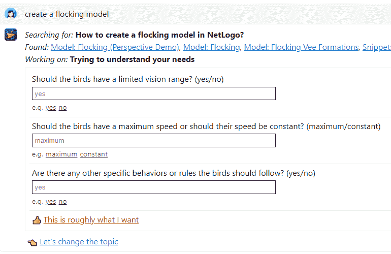
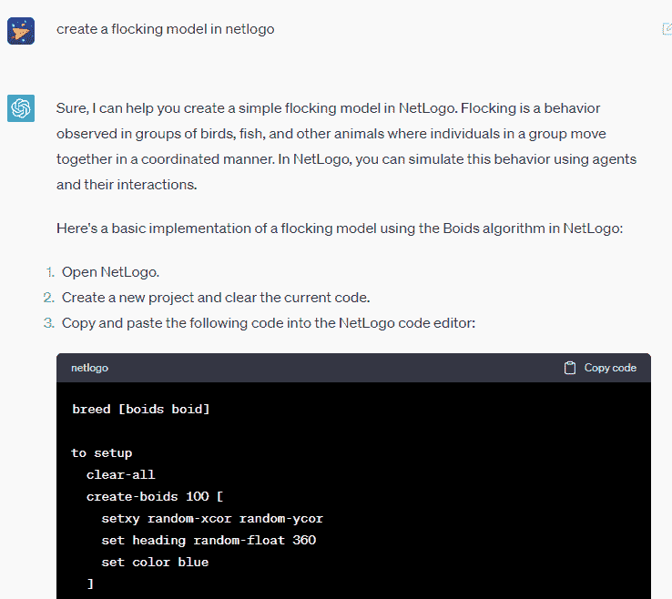
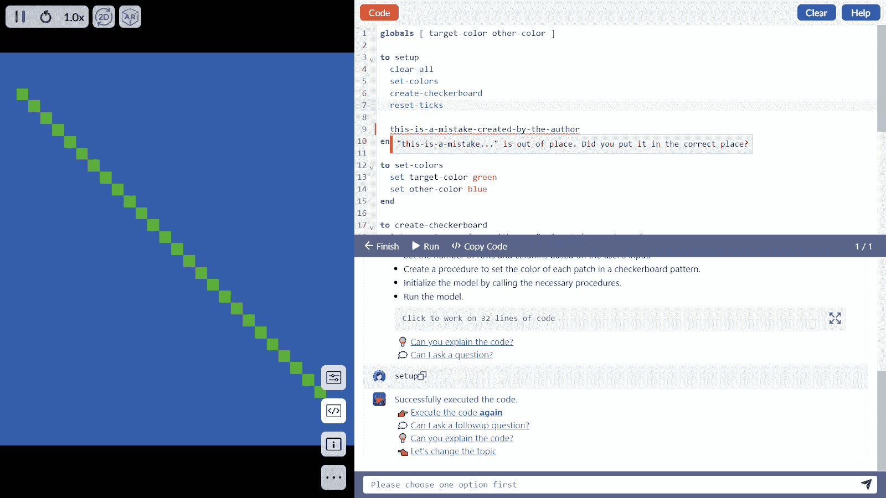
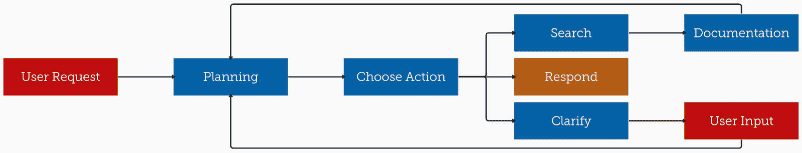
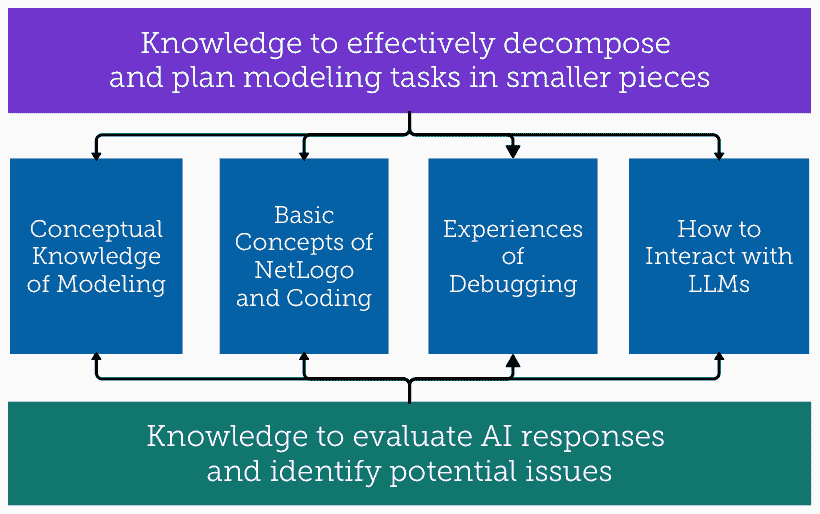

<!--yml

类别：未分类

日期：2025-01-11 12:56:52

-->

# 使用大型语言模型（LLM）伴侣学习基于代理的建模：初学者与专家使用ChatGPT和NetLogo Chat的经验

> 来源：[https://arxiv.org/html/2401.17163/](https://arxiv.org/html/2401.17163/)

John Chen 西北大学 伊凡斯顿，美国 [civitas@u.northwestern.edu](mailto:civitas@u.northwestern.edu) ,  Xi Lu 加利福尼亚大学欧文分校 欧文，美国 [xlu30@uci.edu](mailto:xlu30@uci.edu) ,  David Du 西北大学 伊凡斯顿，美国 [duyuzhou2013@gmail.com](mailto:duyuzhou2013@gmail.com) ,  Michael Rejtig 马萨诸塞大学波士顿分校 波士顿，美国 [michael.rejtig001@umb.edu](mailto:michael.rejtig001@umb.edu) ,  Ruth Bagley 西北大学 伊凡斯顿，美国 [ruth.bagley@northwestern.edu](mailto:ruth.bagley@northwestern.edu) ,  Michael S. Horn 西北大学 伊凡斯顿，美国 [michael-horn@northwestern.edu](mailto:michael-horn@northwestern.edu)  和  Uri J. Wilensky 西北大学 伊凡斯顿，美国 [uri@northwestern.edu](mailto:uri@northwestern.edu)(2024; 2023年9月14日; 2023年12月12日; 2024年1月19日)

###### 摘要：

大型语言模型（LLM）有潜力从根本上改变人们进行计算机编程的方式。基于代理的建模（ABM）已经在自然科学、社会科学和教育中得到广泛应用，但之前没有研究探讨LLM在支持这一领域中的潜力。我们设计了NetLogo Chat，以支持学习和实践NetLogo，这是一种用于ABM的编程语言。为了了解用户如何看待、使用和需要基于LLM的接口，我们采访了来自全球学术界、工业界和研究生院的30位参与者。专家报告称，他们感知到的益处比初学者更多，而且他们更倾向于在工作流程中采用LLM。我们发现专家和初学者在他们对人机协作的看法、行为和需求上存在显著差异。我们提出，专家和初学者之间的知识差距可能是导致益处差距的原因。我们确定了指导、个性化和集成作为LLM接口支持ABM编程的主要需求。

^†^†版权：无^†^†期刊年份：2024^†^†DOI：10.1145/3613904.3642377^†^†会议：计算机系统中的人类因素CHI会议论文集（CHI ’24）；2024年5月11日至16日，美国夏威夷檀香山； ^†^†CCS：以人为中心的计算  HCI中的实证研究^†^†CCS：以人为中心的计算  自然语言接口^†^†CCS：计算方法学  仿真支持系统

## 1. 引言

编码能力强的大型语言模型（LLMs）的出现有可能从根本上改变人们进行计算机编程的方式（Eloundou 等， [2023](https://arxiv.org/html/2401.17163v2#bib.bib26)）。随着基于 LLM 的编程接口（如 GitHub Copilot；ChatGPT）变得越来越流行（Lau 和 Guo， [2023](https://arxiv.org/html/2401.17163v2#bib.bib47)），一些研究开始探索用户对这些工具的看法（Vaithilingam 等， [2022](https://arxiv.org/html/2401.17163v2#bib.bib85)）。然而，关于这些工具可能对学习产生的影响的研究仍然有限。许多先前的研究仅关注教育工作者（Lau 和 Guo， [2023](https://arxiv.org/html/2401.17163v2#bib.bib47)）或学生（Yilmaz 和 Yilmaz， [2023](https://arxiv.org/html/2401.17163v2#bib.bib101)）的印象，对于这些工具在实际学习中的使用几乎没有实证数据。另一方面，一些研究开始探索如何设计基于 LLM 的接口，以促进编程教育，表明这种设计可能对学习者有潜在的优势。值得注意的是，这些研究表明，具有更多编程经验的学习者往往能从中获得更多益处（Nam 等， [2023](https://arxiv.org/html/2401.17163v2#bib.bib58)；Kazemitabaar 等， [2023](https://arxiv.org/html/2401.17163v2#bib.bib43)）。虽然最近的研究指出，初学者使用基于 LLM 的接口时面临一些挑战（Zamfirescu-Pereira 等， [2023](https://arxiv.org/html/2401.17163v2#bib.bib102)），但我们仍然无法理解为何经验丰富的程序员似乎从这些工具中获得更多的学习收益。

本文介绍了一种基于LLM的新型界面设计——NetLogo Chat，旨在促进NetLogo的学习和实践。NetLogo是一种广泛使用的代理基础建模（ABM）编程语言，它通过简单规则应用于多个个体代理来模拟复杂系统（Wilensky，[1997](https://arxiv.org/html/2401.17163v2#bib.bib95)）。它在捕捉涌现现象方面尤其强大，例如病毒传播或捕食者-猎物系统（Wilensky 和 Rand，[2015](https://arxiv.org/html/2401.17163v2#bib.bib94)）。它是跨科学学科和从K-12到研究生教育中的计算建模的重要方法（Weintrop等，[2016](https://arxiv.org/html/2401.17163v2#bib.bib89)），在这些领域，科学家和教育者对基于LLM的界面有着极高的需求（Pal等，[2023](https://arxiv.org/html/2401.17163v2#bib.bib60); Cooper，[2023](https://arxiv.org/html/2401.17163v2#bib.bib22)）。作为计算建模的重要组成部分，ABM的优先事项与通用编程不同（Pylyshyn，[1978](https://arxiv.org/html/2401.17163v2#bib.bib66)）。建模者需要验证他们对单一规则的概念设计是否与现实世界的模式相符（例如，捕食者需要食物才能生存），代码是否与设计相符（即没有意外或隐含的假设），并且汇总结果是否与现实世界的现象相符（例如，如果所有猎物都灭绝，捕食者也会灭绝）（Fleischmann 和 Wallace，[2009](https://arxiv.org/html/2401.17163v2#bib.bib29)）。由于大多数与LLM相关的计算机编程研究集中在LLM表现最好的通用编程语言（例如Python或JavaScript）上，因此目前还没有关于ABM或其他形式的计算建模的LLM相关研究。

NetLogo Chat的设计遵循建构主义学习原则，并结合了已知的代理基础模型（ABM）和计算机编程的最佳实践。建构主义提倡设计学习体验，在这些体验中，学习者通过构建具有个人意义的产物（例如围绕学习者兴趣构建的基于代理的模型）来构建他们对世界的理解（例如，了解ABM）（Papert 和 Harel，[1991](https://arxiv.org/html/2401.17163v2#bib.bib62)）。与GitHub Copilot Chat（noa, [[n. d.]](https://arxiv.org/html/2401.17163v2#bib.bib2)）类似，NetLogo Chat被集成到集成开发环境（IDE）中。与以往的设计不同，它旨在让用户对人类与AI的合作过程拥有更多控制权，努力整合权威来源，并尝试为故障排除提供更多支持。

使用ChatGPT和NetLogo Chat作为探针（Zamfirescu-Pereira et al., [2023](https://arxiv.org/html/2401.17163v2#bib.bib102)），我们进行了定性研究，以突出专家和新手在开放式建模会话中的不同认知、行为和需求。我们采访了来自全球学术界、工业界和研究生院的30名专家和新手参与者。参与者根据他们的学科背景提出了多样的NetLogo任务，并朝着建模目标努力。在他们与每个设计互动之前、期间和之后，我们都进行了访谈。我们回答了研究问题：

1.  (1)

    专家和新手用户如何看待LLM驱动的接口，支持他们的NetLogo学习和实践？他们对这些接口的优势、劣势和采纳计划是什么？

1.  (2)

    专家和新手用户如何使用基于LLM的接口来支持他们的NetLogo学习和实践？

1.  (3)

    专家和新手用户在使用LLM接口支持他们的NetLogo学习和实践时，有什么需求？

学习者普遍认同我们的设计原则，并提出了未来设计的附加功能。与其他研究类似，专家报告的感知效益比新手更多。通过比较专家和新手之间的不同互动模式，我们的研究揭示了一种行为差距，可能解释了效益差距。我们发现，专家在所有活动中与LLM接口的合作更依赖于人类判断，帮助他们克服AI幻觉，而新手则在评估和调试AI回应方面遇到困难。从中，我们识别出了新手和专家之间的知识差距组成部分。我们报告了专家和新手在LLM接口中的需求，归纳为三个关键主题：指导（来自LLM）；个性化（LLM的个性化）；和集成（到建模环境中），其中许多内容验证并发展了NetLogo Chat的设计决策。本文的贡献包括：

1.  (1)

    NetLogo Chat的设计与实现，这是一个基于LLM的系统，支持学习和实践NetLogo，这是一种广泛使用的ABM编程语言；

1.  (2)

    一项实证研究，有助于理解新手和专家在不同方式上感知、使用并表达对基于LLM的编程接口的需求；

1.  (3)

    一种关于专家和新手之间知识差距的理论化，这种差距可能导致行为差距，并提出潜在的设计干预建议；

1.  (4)

    关于构建基于LLM的编程接口的设计讨论和建议，这些接口能够更公平地为专家和新手提供代理基础建模的支持。

## 2\. 相关工作

### 2.1\. LLM在计算编程和建模中的应用

研究人员已经探索了基于自然语言的编程接口数十年，但早期的尝试大多是探索性的，功能有限。NaturalJava（Price等人，[2000](https://arxiv.org/html/2401.17163v2#bib.bib65)）要求用户在提示时遵循严格的模式，而后来的系统（例如NaLIX（Li等人，[2005](https://arxiv.org/html/2401.17163v2#bib.bib48)）或Eviza（Setlur等人，[2016](https://arxiv.org/html/2401.17163v2#bib.bib74)））要求特定的英语表达式集。这给用户和系统设计师带来了困难，因为他们认为“自然语言处理接口的主要挑战之一是向用户传达哪些输入是被支持的。”（Setlur等人，[2016](https://arxiv.org/html/2401.17163v2#bib.bib74)）由于缺乏生成自然语言的能力，这些接口也仅限于一次性交互。

最近，新的LLM一代展示了理解和生成自然语言以及计算机语言的能力。GPT-3在编写代码解释（MacNeil等人，[2022](https://arxiv.org/html/2401.17163v2#bib.bib53)）、文档（Khan和Uddin，[2022](https://arxiv.org/html/2401.17163v2#bib.bib45)）和提供作业反馈（Balse等人，[2023](https://arxiv.org/html/2401.17163v2#bib.bib4)）方面进行了检验。很快，教育者开始认为Codex可以用于解决简单的编程问题（Finnie-Ansley等人，[2022](https://arxiv.org/html/2401.17163v2#bib.bib28); Wermelinger，[2023](https://arxiv.org/html/2401.17163v2#bib.bib91)）。嵌入在ChatGPT中的GPT-3.5-turbo和GPT-4在编程方面展示了更强的能力。越来越多的LLM开始具备编程能力（例如PALM 2；Claude 2；CodeLLaMA 2），迎来了自然语言编程界面的新时代。

即使是最强大的LLM也会受到幻觉的影响，并可能误解人类的意图。ChatGPT的早期用户抱怨错误的回应，并在提示ChatGPT以获得期望输出时遇到困难（Skjuve等人，[2023](https://arxiv.org/html/2401.17163v2#bib.bib75)）。虽然LLM在特定的结构化任务中可能超越普通人类（OpenAI，[2023](https://arxiv.org/html/2401.17163v2#bib.bib59)），但评估标准可能存在缺陷（Liu等人，[2023](https://arxiv.org/html/2401.17163v2#bib.bib51)），因为LLM在应对新挑战时难以将现有解决方案结合起来（Dakhel等人，[2023](https://arxiv.org/html/2401.17163v2#bib.bib24)）。一项研究建议开发者在处理新问题时不应依赖ChatGPT（Tian等人，[2023](https://arxiv.org/html/2401.17163v2#bib.bib82)）。

LLMs在低资源编程语言（LRPL）方面天生准备不足。这里我们对LRPL的工作定义类似于自然语言的定义：在线资源相对稀缺，并且在AI领域的研究较少（Magueresse et al., [2020](https://arxiv.org/html/2401.17163v2#bib.bib54)）。LRPL并不意味着不重要：NetLogo是最广泛使用的代理基础建模（ABM）编程语言（Thiele et al., [2011](https://arxiv.org/html/2401.17163v2#bib.bib81)），被数十万科学家、教育工作者和学生用于计算建模。通过使用简单的计算规则来模拟个体代理，ABM能够模拟复杂的涌现现象。它在不同的科学学科（Wilensky and Rand, [2015](https://arxiv.org/html/2401.17163v2#bib.bib94)）和科学教育（Hutchins et al., [2020](https://arxiv.org/html/2401.17163v2#bib.bib36)）中已被广泛使用已有数十年。由于可供训练的在线资源相对较少，LLMs在处理LRPL时更容易出现错误和/或幻觉（Tarassow, [2023](https://arxiv.org/html/2401.17163v2#bib.bib80)）。

一些研究尝试通过两种方向来提升LLMs在低资源编程语言（LRPLs）上的表现。首先，一些研究使用LRPL数据集对基础LLMs进行了微调（Chen et al., [2022](https://arxiv.org/html/2401.17163v2#bib.bib13)）。尽管这种方法需要大量数据集和计算能力，但尚未应用于生成性任务（Gong et al., [2022](https://arxiv.org/html/2401.17163v2#bib.bib32)）。其次，一些研究使用了提示工程技术。例如，为了应对简单任务，一项研究为LLMs创建了语法规则集以供填充（Wang et al., [2023](https://arxiv.org/html/2401.17163v2#bib.bib87)）。另一项研究利用编译器输出，使LLMs能够迭代地改进其Rust代码，但仅在较少数量的固定任务中进行了测试（Wu et al., [2023](https://arxiv.org/html/2401.17163v2#bib.bib98)）。LLMs在科学学科中的潜力，包括在计算建模中的应用，鲜有探索。目前，唯一一项针对STEM的研究帮助解决了一个非常具体的工程任务（Kumar et al., [2023](https://arxiv.org/html/2401.17163v2#bib.bib46)）。

### 2.2 用户对基于LLM的编程接口的感知和行为

两个用户感知和行为研究的领域为我们的设计和研究提供了启发：会话代理（CAs）的研究；以及基于LLM的编程接口研究。在教育领域，会话代理被用于开发学习者的写作能力（Wambsganss等，[2021](https://arxiv.org/html/2401.17163v2#bib.bib86)），自我对话（Fu等，[2023](https://arxiv.org/html/2401.17163v2#bib.bib30)），以及编程技能（Winkler等，[2020](https://arxiv.org/html/2401.17163v2#bib.bib96)）。其中许多是教育性会话代理（PCA），旨在适应性地模仿人类导师的行为（Winkler和Söllner，[2018](https://arxiv.org/html/2401.17163v2#bib.bib97)）。PCA可以担任多种角色，如导师（Wambsganss等，[2021](https://arxiv.org/html/2401.17163v2#bib.bib86)），激励者（Caballé和Conesa，[2019](https://arxiv.org/html/2401.17163v2#bib.bib12)），同伴玩家（Gero等，[2020](https://arxiv.org/html/2401.17163v2#bib.bib31)），或学习伙伴（Fu等，[2023](https://arxiv.org/html/2401.17163v2#bib.bib30)）。

先前的CAs研究强调了理解用户感知和行为的重要性（Gero等，[2020](https://arxiv.org/html/2401.17163v2#bib.bib31)），然而，LLM之前的技术局限性限制了设计师的自由度。之前的研究探讨了诸如信任、相互理解、感知角色（Clark等，[2009](https://arxiv.org/html/2401.17163v2#bib.bib19)），隐私（Sannon等，[2020](https://arxiv.org/html/2401.17163v2#bib.bib70)），人类相似性（Jeong等，[2019](https://arxiv.org/html/2401.17163v2#bib.bib37)），功利性利益，以及与用户相关的因素（Ling等，[2021](https://arxiv.org/html/2401.17163v2#bib.bib50)）等方面，以理解用户的接受度和使用意愿。然而，在LLM出现之前，许多会话代理必须使用预编程的响应（Wang等，[2021](https://arxiv.org/html/2401.17163v2#bib.bib88)），仅仅模仿人类语言的功能规则未能满足人们对会话代理的高期望（Clark等，[2019](https://arxiv.org/html/2401.17163v2#bib.bib20)）。由于缺乏读取或编写代码的能力，LLM之前的计算机教育会话代理在很大程度上仅限于提供相关知识（Winkler等，[2020](https://arxiv.org/html/2401.17163v2#bib.bib96)）或支持编程的概念理解（Lin等，[2020](https://arxiv.org/html/2401.17163v2#bib.bib49)）。

近期的研究开始关注用户对基于LLM的编程接口的感知和行为。在教育领域，早期的研究主要关注教师和学生对基于LLM的编程接口的看法。计算机科学专业的学生自我报告称，使用ChatGPT有许多潜在的好处，并且不太倾向于报告潜在的缺点（Yilmaz和Yilmaz，[2023](https://arxiv.org/html/2401.17163v2#bib.bib101)）。另一方面，计算机科学教师对学生广泛使用ChatGPT表示了显著的担忧（Lau和Guo，[2023](https://arxiv.org/html/2401.17163v2#bib.bib47)）。一些教师甚至直接禁止使用ChatGPT，而另一些则建议让学生了解AI工具的能力和局限性，并利用生成代码中的错误作为学习机会。教师和学生都表示，需要适应LLM时代的全新教学与学习方式（Zastudil等，[2023](https://arxiv.org/html/2401.17163v2#bib.bib103)）。

对于专业人士来说，基于LLM的编程接口既带来了挑战，也带来了机遇。近期的研究发现，程序员更倾向于使用Copilot（Vaithilingam等，[2022](https://arxiv.org/html/2401.17163v2#bib.bib85)），并且使用Copilot时完成任务的速度更快（Peng等，[2023](https://arxiv.org/html/2401.17163v2#bib.bib63)）。然而，Copilot在面对更复杂的问题时表现不佳，提供的解决方案存在bug或无法重现（Dakhel等，[2023](https://arxiv.org/html/2401.17163v2#bib.bib24)）。专业程序员在理解和调试Copilot生成的代码时遇到困难，这影响了他们解决问题的效率（Vaithilingam等，[2022](https://arxiv.org/html/2401.17163v2#bib.bib85)）。信任AI的程序员更容易写出不安全的代码（Perry等，[2022](https://arxiv.org/html/2401.17163v2#bib.bib64)）。对于对话式接口，尽管输入是自然语言，用户仍然觉得需要学习LLM的“语法”（Jiang等，[2022](https://arxiv.org/html/2401.17163v2#bib.bib38）；Fiannaca等，[2023](https://arxiv.org/html/2401.17163v2#bib.bib27)）。

我们对用户在学习计算机编程过程中，使用基于LLM的界面时的感知和行为的理解仍然非常有限。由于这一领域刚刚开始探索这一方向，先前的研究大多集中在一般用户印象（Zastudil等，[2023](https://arxiv.org/html/2401.17163v2#bib.bib103)），或在预先编写的封闭式任务上进行行为任务（Peng等，[2023](https://arxiv.org/html/2401.17163v2#bib.bib63)）。虽然封闭式设置使得评估客观指标变得更加容易（Blikstein，[2011](https://arxiv.org/html/2401.17163v2#bib.bib8)），但开放式的上下文为理解用户的学习模式、行为、感知和偏好提供了更广阔的窗口（Blikstein等，[2014](https://arxiv.org/html/2401.17163v2#bib.bib9)）。例如，一项最近的研究观察到专业程序员在与Copilot进行开放式任务交互时的两种模式：加速模式，程序员已经知道接下来要做什么；探索模式，程序员使用AI探索他们的选项（Barke等，[2023](https://arxiv.org/html/2401.17163v2#bib.bib5)）。另一项关于专业人员提示工程的研究揭示了他们的困惑、挑战和潜在的行为来源（Zamfirescu-Pereira等，[2023](https://arxiv.org/html/2401.17163v2#bib.bib102)）。

然而，我们注意到以往研究中存在两个空白。首先，大多数研究选择了专业程序员或计算机科学教师/学生作为参与者，而基于LLM的界面也被数百万没有计算机科学背景的人用于编程任务。其次，由于人机交互研究主要集中在LLM表现最好的语言上，例如Python或HTML，因此关于当涉及计算建模或LRPLs时，用户的感知和行为知之甚少。

### 2.3. 基于LLM的编程与建模学习界面

尽管LLM在支持人类与AI协作编程方面展示了有希望的潜力，但大多数设计研究都是初步的，且基于LLM的计算建模界面仍然未被充分研究。例如，程序员助手将一个聊天窗口集成到IDE中（Ross等，[2023](https://arxiv.org/html/2401.17163v2#bib.bib69)）。GitHub Copilot Chat超越了简单的集成，提供了代码编辑器中的上下文支持，但其用户研究仍处于初步阶段（Bull和Kharrufa，[2023](https://arxiv.org/html/2401.17163v2#bib.bib11)）。在XCode上也进行了类似的设计，但没有进行用户研究（Tan等，[2023](https://arxiv.org/html/2401.17163v2#bib.bib79)）。另一项研究探讨了计算笔记本与LLM的集成，并强调了领域（在这种情况下是数据科学）在基于LLM的界面设计中的作用（McNutt等，[2023](https://arxiv.org/html/2401.17163v2#bib.bib56)）。

大型语言模型（LLMs）在编程教育者中引起了广泛关注，但相关的设计研究仍然不足。最近的研究测试了LLMs在入门编程任务中的表现，并取得了不出所料的高分（Savelka等，[2023](https://arxiv.org/html/2401.17163v2#bib.bib71); Chen等，[2023a](https://arxiv.org/html/2401.17163v2#bib.bib17)）。这一前景引起了计算机科学教师的极大关注，因为他们观察到学生中普遍使用ChatGPT（Lau和Guo，[2023](https://arxiv.org/html/2401.17163v2#bib.bib47)）。然而，针对编程学习的基于LLM的设计研究却寥寥无几。一项使用“奥兹巫师”原型的研究强调了支持学生不同程度的先验知识的重要性（Robe和Kuttal，[2022](https://arxiv.org/html/2401.17163v2#bib.bib68)）。一项设计研究报告称，当年轻的初学者与Codex互动时，短期内表现有所提升（Kazemitabaar等，[2023](https://arxiv.org/html/2401.17163v2#bib.bib43)）。另一项研究也发现LLMs对初学者程序员有益（Nam等，[2023](https://arxiv.org/html/2401.17163v2#bib.bib58)）。两项研究均发现，更有经验的程序员似乎受益更多，但原因仍不明朗。

在本研究中，我们借鉴了建构主义学习理论（Papert 和 Harel, [1991](https://arxiv.org/html/2401.17163v2#bib.bib62)），以指导我们的基于大语言模型（LLM）的系统设计和实证研究。虽然建构主义没有严格的定义，但它认为，当学习者“有意识地参与构建一个公共实体”时，学习最为顺利（Papert 和 Harel, [1991](https://arxiv.org/html/2401.17163v2#bib.bib62)）。在计算机编程的背景下，这意味着学习通过编程计算机自然发生，因为它通过代码反复外化学习者对世界的内在理解，然后通过观察代码的运行，允许学习者改善他们的理解（Papert, [1980](https://arxiv.org/html/2401.17163v2#bib.bib61)）。此外，建构主义认为计算机编程并不像它看起来那样抽象或正式；个体程序员的思维方式往往是具体且个人化的，并且是多元化的（Turkle 和 Papert, [1990](https://arxiv.org/html/2401.17163v2#bib.bib84)）。然而，思想的多元性更难通过封闭性任务（例如问题集）和客观度量（例如完成率/时间）来捕捉（Blikstein 等, [2014](https://arxiv.org/html/2401.17163v2#bib.bib9)）。因此，建构主义学习研究通常更倾向于开放性任务（例如制作游戏（Kafai 和 Burke, [2015](https://arxiv.org/html/2401.17163v2#bib.bib41)），设计教学软件（Harel 和 Papert, [1990](https://arxiv.org/html/2401.17163v2#bib.bib33)），在 NetLogo 中创建基于代理的模型（Blikstein 等, [2014](https://arxiv.org/html/2401.17163v2#bib.bib9)））和定性研究，因为这些任务能更自然和真实地反映学习者的感知和行为。

Logo 编程语言及其后代（如 Scratch、Alice、NetLogo）成功地支持了计算教育和科学研究中多种思维方式（Solomon 等， [2020](https://arxiv.org/html/2401.17163v2#bib.bib76)），然而据我们所知，尚未有研究探讨它们与 LLM 的协同作用。许多突出的建构主义设计原则可以应用于基于 AI 的界面（Kahn 和 Winters， [2021](https://arxiv.org/html/2401.17163v2#bib.bib42)），并启发了 NetLogo Chat 的设计。例如，“低门槛，高天花板，宽墙壁”要求学习环境提供 1）一个新手容易进入的入口（低门槛）；2）专家能够从事复杂项目的可能性（高天花板）；3）支持多种不同探索方式（宽墙壁）；4）支持多种学习路径和风格（Resnick 和 Silverman， [2005](https://arxiv.org/html/2401.17163v2#bib.bib67)）。我们还从以往的设计研究中学到，强调自适应脚手架的重要性（Chen 等， [2023b](https://arxiv.org/html/2401.17163v2#bib.bib15)；Sengupta 等， [2013](https://arxiv.org/html/2401.17163v2#bib.bib73)）和支持调试（Brady 等， [2020](https://arxiv.org/html/2401.17163v2#bib.bib10)），以帮助新手学习 NetLogo。因此，我们为该领域贡献了首批基于 LLM 的编程学习接口设计研究之一，这些研究遵循建构主义传统。

## 3\. NetLogo Chat 系统

NetLogo Chat 是一个基于大语言模型（LLM）的系统，用于学习和编程 NetLogo。它包括两个主要部分：一个基于网页的界面，集成了 Turtle Universe（NetLogo 的一个版本）（Chen 和 Wilensky， [2021](https://arxiv.org/html/2401.17163v2#bib.bib14)）（见 [3.1](https://arxiv.org/html/2401.17163v2#S3.SS1 "3.1\. 设计概览 ‣ 3\. NetLogo Chat 系统 ‣ 使用 LLM 伴侣学习基于代理的建模编程：新手和专家使用 ChatGPT 和 NetLogo Chat 的经验")）；以及一个基于 LLM 的工作流，能够提高 AI 响应的质量并为界面提供支持（见 [3.2](https://arxiv.org/html/2401.17163v2#S3.SS2 "3.2\. 技术实现 ‣ 3\. NetLogo Chat 系统 ‣ 使用 LLM 伴侣学习基于代理的建模编程：新手和专家使用 ChatGPT 和 NetLogo Chat 的经验")）。我们通过以下方式迭代设计了该系统：

1.  (1)

    基于作者在教授NetLogo方面的经验，我们创建了一个基于建构主义学习理论的设计原型（见[2.3](https://arxiv.org/html/2401.17163v2#S2.SS3 "2.3\. 基于LLM的编程和建模学习界面 ‣ 2\. 相关工作 ‣ 使用LLM助手学习基于代理的建模编程：新手和专家使用ChatGPT和NetLogo Chat的经验")），重点支持用户在构建整个模型之前，迭代地构建他们的提示和较小的代码片段。我们开发了一个概念验证系统，使用提示工程技术与GPT-3.5-turbo-0314进行互动。

1.  (2)

    我们与一组NetLogo专家进行了内部概念验证评估。在此过程中，我们遇到了NetLogo的频繁幻觉（语法或概念错误；发明了不存在的关键词；等）。为了使系统能够提供指导，我们意识到LLM的性能需要权威来源；

1.  (3)

    我们通过提示工程技术将官方NetLogo文档和代码示例整合到系统中（见[3.2](https://arxiv.org/html/2401.17163v2#S3.SS2 "3.2\. 技术实现 ‣ 3\. NetLogo Chat 系统 ‣ 使用LLM助手学习基于代理的建模编程：新手和专家使用ChatGPT和NetLogo Chat的经验")），评估了其他LLM的潜力，然后进行了初步访谈，邀请了三位外部NetLogo专家进行系统评估，这些专家来自NetLogo的邮件列表。访谈使用了类似我们正式使用的协议（见[4.2](https://arxiv.org/html/2401.17163v2#S4.SS2 "4.2\. 访谈 ‣ 4\. 实证研究 ‣ 使用LLM助手学习基于代理的建模编程：新手和专家使用ChatGPT和NetLogo Chat的经验")），并具有更大的灵活性和开放性；

1.  (4)

    根据外部反馈，我们识别出支持故障排除的需求，从而做出了设计决策[3.1.3](https://arxiv.org/html/2401.17163v2#S3.SS1.SSS3 "3.1.3\. 集成开发环境并增强故障排除 ‣ 3.1\. 设计概述 ‣ 3\. NetLogo Chat 系统 ‣ 使用LLM助手学习基于代理的建模编程：新手和专家使用ChatGPT和NetLogo Chat的经验")。我们将底层LLM升级到GPT-3.5-turbo-0613，修复了许多小的可用性问题，并最终确定了在实证研究中使用的原型。

### 3.1\. 设计概述

图1\. NetLogo Chat 请求有关人类需求的详细信息。

在这张图中，用户要求NetLogo Chat“创建一个群体模型”。NetLogo Chat首先搜索相关文档，提供了几个示例模型，然后提出了三个后续问题，以澄清用户的需求。

图1\. NetLogo Chat 请求有关人类需求的详细信息。

图2\. ChatGPT 假设人类需求的细节。

在这个图中，用户要求ChatGPT“在NetLogo中创建一个群集模型”。ChatGPT给出了一个直接的回答，开始于“当然，我可以帮你在NetLogo中创建一个简单的群集模型”，然后给出了打开NetLogo、创建模型并复制代码片段的指令。

图2\. ChatGPT假设了人类需求的细节。

#### 3.1.1\. 使用户能够编程计算机，而不是被计算机编程

对基于LLM的界面过度依赖已成为教育者和一些学习者之间的主要关注点，学生们盲目地跟随LLM给出的指令，而没有尝试构建自己的知识表征。这种情况与建构主义学习传统背道而驰，正如Seymour Papert所担心的“计算机编程孩子”这一想法再度复生（Papert，[1980](https://arxiv.org/html/2401.17163v2#bib.bib61)）。

受Logo语言的启发，NetLogo Chat的设计旨在将控制权交还给学习者：为了抑制LLM给出快速响应并常常假设过多关于学习者倾向的情况，我们迫使它更频繁地提出澄清问题。图[1](https://arxiv.org/html/2401.17163v2#S3.F1 "图1 ‣ 3.1\. 设计概述 ‣ 3\. NetLogo Chat系统 ‣ 使用LLM伴侣学习基于Agent的建模编程：ChatGPT和NetLogo Chat使用者的经验")和图[2](https://arxiv.org/html/2401.17163v2#S3.F2 "图2 ‣ 3.1\. 设计概述 ‣ 3\. NetLogo Chat系统 ‣ 使用LLM伴侣学习基于Agent的建模编程：ChatGPT和NetLogo Chat使用者的经验")提供了NetLogo Chat和ChatGPT对一个简单建模请求的反应之间的示范性对比。在这里，ChatGPT立即假设了用户需求的细节，并为用户生成了一个完整的模型供其复制粘贴。相反，NetLogo Chat尝试通过提出后续问题并提供示例答案来首先澄清用户的需求。图[1](https://arxiv.org/html/2401.17163v2#S3.F1 "图1 ‣ 3.1\. 设计概述 ‣ 3\. NetLogo Chat系统 ‣ 使用LLM伴侣学习基于Agent的建模编程：ChatGPT和NetLogo Chat使用者的经验")中的建议既可以作为灵感，帮助学习者在不确定该写什么时；也可以作为捷径，供学习者在立即能使用任何建议时参考。

为了使此功能有效工作，提出有质量的问题至关重要。为此，我们采用了少量示例的方法，并为 LLM 创建了模板。我们在开发过程中和经验研究中对 LLM 生成的问题进行了非正式评估。总体而言，我们使用的 LLM 能够生成质量可接受的问题，类似于图 [1](https://arxiv.org/html/2401.17163v2#S3.F1 "Figure 1 ‣ 3.1\. Design Overview ‣ 3\. NetLogo Chat System ‣ Learning Programming of Agent-based Modeling with LLM Companions: Experiences of Novices and Experts Using ChatGPT & NetLogo Chat") 中展示的问题。未来的设计可能会嵌入更多的模板，并在需要时检索相关的模板。

#### 3.1.2\. 尽可能调用权威来源

幻觉（Hallucination）是 LLM 另一个主要问题，特别是在像 NetLogo 这样的 LRPL 中。例如，图 [2](https://arxiv.org/html/2401.17163v2#S3.F2 "Figure 2 ‣ 3.1\. Design Overview ‣ 3\. NetLogo Chat System ‣ Learning Programming of Agent-based Modeling with LLM Companions: Experiences of Novices and Experts Using ChatGPT & NetLogo Chat") 中，ChatGPT 生成的代码包含多个语法问题，需要人类专家来解决。更强大的 LLM 也会遭遇同样的问题。我们向 GPT-4、PaLM2、Anthropic Claude 2 和 Falcon-180B 提交了类似的示例请求，但没有一个能够生成符合语法的经典 NetLogo 模型代码。

在相关任务的前例（Joshi 等， [2023](https://arxiv.org/html/2401.17163v2#bib.bib39)）的基础上，我们整合了 NetLogo 的官方文档和模型示例，以帮助提高 LLM 和人类的表现。与以往的研究不同，我们不仅向 LLM 提供了相关示例，还向用户展示了这些示例。通过这样做，我们旨在提高 LLM 机制的透明度，增强对 LLM 驱动系统的信任，并为用户提供权威的指南和示例，即使在 LLM 无法提供精准支持时。

图 3\. NetLogo Chat 的内嵌代码编辑器。

该图展示了 Turtle Universe（NetLogo 的一个版本）的界面。在左侧，是一个绘制对角线的简单模型的可视化。在右上角，有一个包含代码和由研究人员引入的错误的代码编辑器。该编辑器显示了一个提示信息和一个“解释”按钮。在右下角，是用户与 NetLogo Chat 之间的对话和交互历史。

图 3\. NetLogo Chat 的内嵌代码编辑器。

#### 3.1.3\. 与 IDE 集成并增强故障排除功能

我们旨在将 NetLogo Chat 集成到 NetLogo 的 IDE 中，不仅仅是将其作为一个与代码编辑器并行的对话助手。为了促进建构主义的学习体验，代码编辑器需要与对话界面相结合，使学习者能够更轻松地处理较小的代码片段。因此，这一设计可能会降低学习者操作代码的门槛，这是建构主义文献中提倡的一项关键学习过程（Papert 和 Harel，[1991](https://arxiv.org/html/2401.17163v2#bib.bib62)；Turkle 和 Papert，[1990](https://arxiv.org/html/2401.17163v2#bib.bib84)）。

图 [3](https://arxiv.org/html/2401.17163v2#S3.F3 "图 3 ‣ 3.1.2\. 尽可能调用权威来源 ‣ 3.1\. 设计概述 ‣ 3\. NetLogo Chat 系统 ‣ 使用 LLM 伴侣学习基于代理的建模编程：新手和专家使用 ChatGPT 与 NetLogo Chat 的经验") 提供了一个具体示例，其中嵌入式编辑器显示了生成的代码片段。用户无需将该片段复制并粘贴回主编辑器，而是可以先检查代码中是否存在语法问题；在对话中运行代码；并提出后续问题或提出额外请求，然后再将工作代码片段放回他们的项目中。

为了进一步支持用户的故障排除，除了错误信息外，NetLogo Chat 还将为用户显示额外的调试选项。用户可以选择查看解释，或者让 LLM 尝试自行修复问题，或者与用户的想法共同修复。在此过程中，系统将尝试查找文档和相关的代码示例，以减少幻觉的产生。基于错误信息对学习影响的文献（Becker 等人，[2019](https://arxiv.org/html/2401.17163v2#bib.bib6)），我们还澄清了许多消息，以为人类和研究中使用的两种基于 LLM 的系统提供更好的上下文。

### 3.2\. 技术实现

图 4\. NetLogo Chat 的 LLM 工作流简要概述。

在此图中，从左到右：用户请求 =¿ 规划 =¿ 选择操作 =¿ 搜索 =¿ 文档；响应；澄清 =¿ 用户输入 =¿ 规划 =¿ …

图 4\. NetLogo Chat 的 LLM 工作流简要概述。

由于OpenAI在我们于七月完成主要研究后才开始提供针对GPT-3.5-turbo（ChatGPT免费版也使用的版本）进行微调，因此NetLogo Chat采用了提示工程技术。我们在ReAct（Yao等人，[2022](https://arxiv.org/html/2401.17163v2#bib.bib100)）框架的基础上构建了项目，这一基于提示的框架可以减少幻觉、提高人类可解释性，并增加LLM的可信度。通过要求LLM生成一个行动计划并将行动委托给第三方常规代理（例如，查找文档、提出澄清问题、进行静态语法检查等）再进行最终回应的生成，该框架为将外部输入（如人类输入、官方文档）集成到LLM工作流中提供了一个有前景的路径。图[4](https://arxiv.org/html/2401.17163v2#S3.F4 "图 4 ‣ 3.2\. 技术实现 ‣ 3\. NetLogo Chat 系统 ‣ 使用LLM伙伴学习代理建模编程：新手和专家使用ChatGPT & NetLogo Chat的经验")展示了NetLogo Chat工作流的大致概述。假设用户请求“创建一个捕食模型”：

1.  (1)

    在提示中，LLM被指示首先阐明请求（规划）：“用户打算创建一个与捕食相关的基于代理的生物模型。然而，用户的具体需求尚不明确。我们需要提问后续问题。”

1.  (2)

    接下来，LLM被指示从列表中选择一个动作：提出澄清问题；查找文档；写回应；道歉。这里，假设LLM基于规划选择了“提出澄清问题”。

1.  (3)

    然后，LLM需要根据请求生成一些问题。由于LLM是在真实世界数据上进行训练的，它们能够提出一些问题并不困难。例如：“你想在模型中加入哪些物种？”LLM还被指示提供一些示例，如“狼”、“羊”。

1.  (4)

    当用户回答问题后，循环从步骤（1）重新开始。由于请求的相关信息已经足够，LLM决定搜索信息，并生成搜索关键词，例如“NetLogo中的狼羊捕食模型”。

1.  (5)

    系统在NetLogo的官方文档和代码示例的预先组装数据库中进行语义搜索。系统返回搜索结果，并将其作为新一轮输入，重新从步骤（1）开始。

1.  (6)

    在用户明确了请求并且数据库提供了示例的输入下，LLM再次进行规划，选择撰写回应，并生成最终回应。

在这个示例中，我们向LLM发起了三个请求，每个请求都使用了一个模板，这个模板会产生结构化的回应（Yao et al., [2022](https://arxiv.org/html/2401.17163v2#bib.bib100)）（例如，任何回应都需要包含一个计划、一个行动和一个参数）。每个请求可以使用不同的LLM，选择最适合特定请求的LLM。采用这种方法，系统有可能平衡成本、性能、速度和隐私。例如，NetLogo Chat的未来版本可以利用经过微调的本地LLM来探测用户的意图并查找文档。然后，在删除所有个人或敏感信息后，系统可以将编译好的请求转发给强大的在线LLM（例如GPT-4）。

在这项实证研究中，我们选择了GPT-3.5-turbo-0613作为NetLogo Chat的LLM后端。首先，我们预计大多数参与者将使用ChatGPT的免费版本，这与该LLM驱动相同。这样，我们就能为实证研究提供一个公平的竞争环境，在这个环境中，两种系统都会被使用。其次，在我们进行研究时，GPT-4的响应时间太长，无法维持实时体验，而我们无法访问其他支持NetLogo的LLM的API。尽管在内部评估系统时我们确实观察到了一些显著的改进（例如，ChatGPT在回答一些鲜为人知的NetLogo关键词时遇到困难，而NetLogo Chat则没有），但未来的研究需要一个更系统的评估标准。

## 4\. 实证研究

### 4.1\. 参与者

在这项实证研究中，我们通过NetLogo的官方Twitter和邮件列表招募了30名成年参与者；同时通过Santa Fe Institute (SFI)运营的Complexity Explorer网站分发与基于代理的建模（ABM）相关的学习资源。参与者的具体人口统计数据分布见表[1](https://arxiv.org/html/2401.17163v2#S4.T1 "Table 1 ‣ 4.1\. Participants ‣ 4\. Empirical Study ‣ Learning Programming of Agent-based Modeling with LLM Companions: Experiences of Novices and Experts Using ChatGPT & NetLogo Chat")。参与者群体大体上代表了NetLogo的主要受众——科学建模社区，大部分参与者来自STEM学科。许多参与者也与教育行业相关。6名参与者（20%）是教授或有意在课堂上教授NetLogo的教师；4名（13%）是有意学习NetLogo的研究生，占参与者的三分之一。所有参与者都是自愿参加的，且均在Qualtrics上签署了在线同意书。

基于理解专家与初学者之间差异的传统（Chi 等, [1981](https://arxiv.org/html/2401.17163v2#bib.bib18)），我们通过自我报告的调查数据将参与者分为专家和初学者。为了减轻不准确回答的影响，团队中的 NetLogo 专家（他们是 NetLogo 的核心开发者和讲师）观看了每个视频，并判断参与者是否大大高估或低估了自己的能力。我们考虑了参与者与面试官的讨论、思考过程和编码行为。绝大多数用户的报告与专家的判断一致。然后，为了简化分析，我们根据参与者的水平将其分为两个主要类别：专家，指的是在 NetLogo 或编程方面有经验的人员；初学者。在本研究中，我们用前缀 E（E01-E17）表示专家，用 N（N01-N13）表示初学者。13 位专家有过使用 ChatGPT 的经验（76%），其中 11 位（65%）有编程经验。11 位初学者（85%）也使用过 ChatGPT，但编程方面的使用较少（38%，n=5）。

表 1. 参与者人口统计概览 (n=30)

| 性别 | 女性: 10 (33%); 男性: 19 (63%); 非二元性别: 1 (3%) |
| --- | --- |
| 地理分布 | 非洲: 1 (3%); 亚洲和大洋洲: 5 (17%); 欧洲: 8 (27%); 拉丁美洲: 2 (7%); 北美: 14 (47%)。 |
| 职业 | 学术人员: 14 (47%); 专业人士: 12 (40%); 学生: 4 (13%) |

表 2. 参与者信息

| ID | 地区 | 等级 (NetLogo) | 等级 (编程) | 职业 |
| --- | --- | --- | --- | --- |
| E01 | 北美 | 专家 | 专家 | 专业人士 |
| E02 | 亚洲和大洋洲 | 专家 | 中级 | 学术型 |
| E03 | 拉丁美洲 | 中级 | 专家 | 学术型 |
| E04 | 北美 | 专家 | 专家 | 学术型 |
| E05 | 欧洲 | 中级 | 专家 | 学术型 |
| E06 | 北美 | 中级 | 中级 | 学术型 |
| E07 | 拉丁美洲 | 中级 | 中级 | 专业人士 |
| E08 | 亚洲和大洋洲 | 中级 | 中级 | 专业人士 |
| E09 | 亚洲和大洋洲 | 中级 | 专家 | 专业人士 |
| E10 | 北美 | 中级 | 中级 | 学术型 |
| E11 | 非洲 | 中级 | 专家 | 学术型 |
| E12 | 北美 | 中级 | 中级 | 学术型 |
| E13 | 欧洲 | 专家 | 初学者 | 学术型 |
| E14 | 欧洲 | 中级 | 中级 | 学术型 |
| E15 | 亚洲和大洋洲 | 专家 | 专家 | 学生 |
| E16 | 亚洲和大洋洲 | 初学者 | 专家 | 专业人士 |
| E17 | 欧洲 | 中级 | 专家 | 学术型 |
| N01 | 北美 | 初学者 | 初学者 | 专业人士 |
| N02 | 北美 | 初学者 | 初学者 | 学术型 |
| N03 | 北美 | 初学者 | 初学者 | 专业人士 |
| N04 | 北美 | 初学者 | 中级 | 学生 |
| N05 | 欧洲 | 初学者 | 中级 | 学生 |
| N06 | 欧洲 | 中级 | 初学者 | 学生 |
| N07 | 北美 | 初学者 | 中级 | 专业 |
| N08 | 北美 | 初学者 | 中级 | 专业 |
| N09 | 北美 | 初学者 | 初学者 | 专业 |
| N10 | 北美 | 初学者 | 中级 | 专业 |
| N11 | 欧洲 | 初学者 | 中级 | 学术 |
| N12 | 欧洲 | 初学者 | 初学者 | 学术 |
| N13 | 北美 | 中级 | 初学者 | 专业 |

### 4.2\. 访谈

我们的研究分为三个阶段：

1.  (1)

    我们对3位来自NetLogo在线社区的专家进行了初步访谈。每位专家都被要求就LLM在NetLogo学习中的应用发表意见，同时也对ChatGPT和NetLogo Chat的早期原型进行了评论。

1.  (2)

    我们根据从初步访谈中学到的内容，改进了NetLogo Chat的设计，并相应地修订了访谈协议。

1.  (3)

    我们对27位在线参与者进行了正式访谈（共计30人）。

每次半结构化访谈的时长为60-90分钟，并进行了视频录制。在每次正式访谈之前，参与者被要求提出一个他们感兴趣的NetLogo任务。几乎每位参与者都提出了一个来自自己职业领域或个人兴趣的建模任务，例如“蜜蜂如何决定调节蜂巢的温度”或“冲突观点的传播”。只有一次，当任务范围对于当次访谈来说过于复杂时，我们才要求参与者提出另一个任务。在访谈的任何阶段，访谈员通常都会遵循协议，并在需要时提出跟进问题。具体而言：

1.  (1)

    我们提出了基线问题，例如“你认为使用LLM来支持你学习和编程NetLogo有哪些潜在的优点/缺点？”（分成两个问题）

1.  (2)

    我们要求参与者在ChatGPT的帮助下进行他们的任务。然后，我们再次提问相同的基线问题，接着询问“你喜欢或不喜欢这个界面？”然后使用NetLogo Chat重复这个过程；

1.  (3)

    如果时间允许，我们进一步询问他们在使用NetLogo进行学习和/或编程时的偏好，并询问他们希望为这两个系统添加或删除哪些功能。这里的目标并非严格比较这两个系统，而是引导出更多关于基于LLM的界面深入讨论。

由于几乎所有用户已经接触过ChatGPT，我们没有随机化ChatGPT/NetLogo Chat的顺序。此外，3名参与者在与ChatGPT的任务中使用了付费版本（GPT-4）。尽管大量生成的数据来自于这两个系统之间不可避免的比较，但我们选择不将其解读为客观的比较。相反，支撑这两个系统的不同设计原则呈现了两个可供思考的对象（Papert，[1980](https://arxiv.org/html/2401.17163v2#bib.bib61)），参与者在反思和讨论基于LLM的编程接口时，正是依赖于这些对象。

### 4.3\. 数据分析

我们的访谈产生了大约40小时的视频数据。我们数据的一半左右是行为性质的，参与者在完成任务时被鼓励大声思考；另一半则是言语性质的，参与者回答了问题。因此，每次访谈不仅被逐字转录，还由研究人员观看并创建了观察笔记。然后，两个数据流被合并为一个单一的档案进行分析。

基于我们的研究问题，我们迭代地应用了扎根理论方法（Corbin 和 Strauss，[1990](https://arxiv.org/html/2401.17163v2#bib.bib23)）来分析数据。在每个步骤中，研究团队充分讨论了各研究者之间的差异，并迭代地完善了编码本，以提高一致性。分析在大约50%的访谈时达到了理论饱和，此时进一步的访谈不再为我们的研究问题揭示意外的重要见解。然后，我们使用最终版本的编码本（表[3](https://arxiv.org/html/2401.17163v2#S4.T3 "Table 3 ‣ 4.3\. Data Analysis ‣ 4\. Empirical Study ‣ Learning Programming of Agent-based Modeling with LLM Companions: Experiences of Novices and Experts Using ChatGPT & NetLogo Chat")）完成了其余的定性编码。

1.  (1)

    四名研究人员开放编码了两次访谈，一次来自新手，一次来自专家，以总结参与者提到的主题。在此过程中，研究人员在不同的标签页中进行编码，以避免相互干扰。从这个阶段中出现了三个广泛的主题：参与者的编程方法；参与者与AI系统的互动；以及他们对AI系统的评论。

1.  (2)

    在记录新兴主题时，第一作者创建了一个初步的编码本，将数十个代码归类到不同的主题中。每位研究者在不同的标签页中对另外两个访谈进行编码。在这个阶段，我们将主题细化为编程方法（这也有助于区分专家和新手）；与AI系统相关的感知和观察到的行为；以及关于AI系统能力的评论。

1.  (3)

    基于编码结果，第一作者创建了正式的代码本，并根据研究者之间的差异澄清了定义（表[3](https://arxiv.org/html/2401.17163v2#S4.T3 "Table 3 ‣ 4.3. 数据分析 ‣ 4. 实证研究 ‣ 使用LLM伙伴学习基于代理的建模：新手与专家使用ChatGPT和NetLogo的体验")）。为了减少主观解释的不平衡影响，研究者仅对明确的行为进行编码；或直接评论。为了避免遗漏洞察，研究人员被指导突出现有代码无法涵盖主题的地方。在前两周，经过讨论后，创建或合并了一些代码。我们回顾性地修订了编码。

表3. 代码本概览

| 代码 | 定义 |
| --- | --- |
| 方法 | 用户对编程任务方法的看法，例如计划、拆分成小块或整体处理。 |
| 学习 | 用户如何学习NetLogo或编程，或认为人们应该如何学习。 |
| 编程 | 用户如何组织或编写代码，或认为人们应该如何组织或编写。 |
| 寻求帮助 | 用户通常如何寻求帮助，或认为人们应该如何寻求帮助。 |
| 人类-AI | 用户与人类-AI关系相关的感知和行为。 |
| 之前 | 用户使用ChatGPT或其他基于AI的界面的先前经验。 |
| 态度 | 用户对AI的整体态度，或对特定AI系统的态度。 |
| 努力 | AI对人类所付出或需要付出的努力的影响，包括多少努力以及什么类型的努力。 |
| 能力 | 用户对AI能力的认知。 |
| 反应 | AI为人类提供理想回应的能力。 |
| 支持 | AI支持学习/编码NetLogo的能力。 |
| 互动性 | AI促进与人类的有益互动的能力。 |

基于代码本，第一作者将主题迭代性地整合到大纲中。为了进一步减轻个体差异的影响，研究者被要求为每个引用或观察尽可能包含尽可能多的代码。

## 5. 研究结果

### 5.1. 感知：互动前后

表4. 新手与专家对NetLogo基于LLM的界面的看法

|  | 专家 | 新手 |
| --- | --- | --- |
|  | LLMs可以节省人类的时间和精力，特别是在语法方面。 | LLMs可以节省人类的时间和精力，尤其是在语法方面，并提供情感上的好处。 |
| --- | --- | --- |
| 之前，积极 | LLMs可以帮助解决故障。 |
| --- | --- | --- |
|  | LLMs可能会误导人类走向次优方向。 | 尽管LLMs可能会犯错误，但这并不比人类更差。 |
|  | LLMs可能会阻碍学习过程。 | LLMs可能无法理解人类的意图。 |
| 之前，负面 | LLMs只能处理较小的任务。 | LLMs的回应难以理解。 |
|  | LLM支持通过节省时间来学习或练习。 | LLM支持通过节省时间来学习或练习。 |
| 互动后 | 将继续使用LLM进行NetLogo的学习或练习。 | 在继续使用LLM之前，将寻找替代的学习资源。 |

#### 5.1.1. 互动前：积极的期望

在任务开始之前，初学者和专家对基于LLM的NetLogo界面都有积极的期望，且初学者的期望高于专家。

初学者和专家都期望基于LLM的界面能够节省人力时间并支持人类努力，尤其是与其他寻求帮助的活动相比。使用LLM后，人类的时间和精力可以被解放出来，从而用于更高层次的任务（[E12](https://arxiv.org/html/2401.17163v2#S4.T2 "Table 2 ‣ 4.1\. Participants ‣ 4\. Empirical Study ‣ Learning Programming of Agent-based Modeling with LLM Companions: Experiences of Novices and Experts Using ChatGPT & NetLogo Chat"), [N03](https://arxiv.org/html/2401.17163v2#S4.T2 "Table 2 ‣ 4.1\. Participants ‣ 4\. Empirical Study ‣ Learning Programming of Agent-based Modeling with LLM Companions: Experiences of Novices and Experts Using ChatGPT & NetLogo Chat")）。教育工作者认为LLM可以促进更高效的教学，让学生能够相对轻松地表达更复杂的内容，激发他们的想象力（[E02](https://arxiv.org/html/2401.17163v2#S4.T2 "Table 2 ‣ 4.1\. Participants ‣ 4\. Empirical Study ‣ Learning Programming of Agent-based Modeling with LLM Companions: Experiences of Novices and Experts Using ChatGPT & NetLogo Chat")）。LLM还可以通过减少学生担心“打扰老师或专家”（[E14](https://arxiv.org/html/2401.17163v2#S4.T2 "Table 2 ‣ 4.1\. Participants ‣ 4\. Empirical Study ‣ Learning Programming of Agent-based Modeling with LLM Companions: Experiences of Novices and Experts Using ChatGPT & NetLogo Chat")）或提问“愚蠢问题”（[N06](https://arxiv.org/html/2401.17163v2#S4.T2 "Table 2 ‣ 4.1\. Participants ‣ 4\. Empirical Study ‣ Learning Programming of Agent-based Modeling with LLM Companions: Experiences of Novices and Experts Using ChatGPT & NetLogo Chat")）来带来情感上的好处。

大多数参与者都强调了AI在帮助他们理解NetLogo语法方面的潜力。对于大多数参与者来说，NetLogo并不是他们主要使用的编程语言。在ChatGPT出现之前，[N06](https://arxiv.org/html/2401.17163v2#S4.T2 "Table 2 ‣ 4.1\. Participants ‣ 4\. Empirical Study ‣ Learning Programming of Agent-based Modeling with LLM Companions: Experiences of Novices and Experts Using ChatGPT & NetLogo Chat")觉得她需要“背诵”NetLogo的语法。然而，当“AI可以非常快速地教你”时，这一需求被消除了。许多专家也需要支持，因为NetLogo“有非常严格的语法规则”（[E07](https://arxiv.org/html/2401.17163v2#S4.T2 "Table 2 ‣ 4.1\. Participants ‣ 4\. Empirical Study ‣ Learning Programming of Agent-based Modeling with LLM Companions: Experiences of Novices and Experts Using ChatGPT & NetLogo Chat")），这使得编写代码更加困难。

特别是初学者，期望AI能够帮助解决故障排除问题。例如，[N08](https://arxiv.org/html/2401.17163v2#S4.T2 "Table 2 ‣ 4.1\. Participants ‣ 4\. Empirical Study ‣ Learning Programming of Agent-based Modeling with LLM Companions: Experiences of Novices and Experts Using ChatGPT & NetLogo Chat")认为，LLM可以通过描述“我尝试做的事情”，并获得一段能够帮助他跨越障碍的代码来帮助他完成故障排除。对于没有编程背景的初学者来说，这种未来看起来很有前景。[N12](https://arxiv.org/html/2401.17163v2#S4.T2 "Table 2 ‣ 4.1\. Participants ‣ 4\. Empirical Study ‣ Learning Programming of Agent-based Modeling with LLM Companions: Experiences of Novices and Experts Using ChatGPT & NetLogo Chat")对AI有潜力“让编程对学生更容易接近”感兴趣。

#### 5.1.2\. 互动前：负面预期

几乎每个参与者都表达了对基于LLM（大型语言模型）接口的担忧或保留意见。然而，初学者和专家的担忧明显不同。

专家们专注于保持人类判断力。[E01](https://arxiv.org/html/2401.17163v2#S4.T2 "Table 2 ‣ 4.1\. Participants ‣ 4\. Empirical Study ‣ Learning Programming of Agent-based Modeling with LLM Companions: Experiences of Novices and Experts Using ChatGPT & NetLogo Chat")认为AI不应该\say取代人类的判断力和能力。同样，[E06](https://arxiv.org/html/2401.17163v2#S4.T2 "Table 2 ‣ 4.1\. Participants ‣ 4\. Empirical Study ‣ Learning Programming of Agent-based Modeling with LLM Companions: Experiences of Novices and Experts Using ChatGPT & NetLogo Chat")坚持认为\say人类必须进行主要的思考和创意等所有工作。[E17](https://arxiv.org/html/2401.17163v2#S4.T2 "Table 2 ‣ 4.1\. Participants ‣ 4\. Empirical Study ‣ Learning Programming of Agent-based Modeling with LLM Companions: Experiences of Novices and Experts Using ChatGPT & NetLogo Chat")认为人类不能让AI\say接管主要的推理和情感，情感介入决策过程。许多教育工作者也\say表达了对学习的担忧([E13](https://arxiv.org/html/2401.17163v2#S4.T2 "Table 2 ‣ 4.1\. Participants ‣ 4\. Empirical Study ‣ Learning Programming of Agent-based Modeling with LLM Companions: Experiences of Novices and Experts Using ChatGPT & NetLogo Chat"))，担心人们倾向于\say依赖AI系统来提供答案，而不是自己解决问题([E12](https://arxiv.org/html/2401.17163v2#S4.T2 "Table 2 ‣ 4.1\. Participants ‣ 4\. Empirical Study ‣ Learning Programming of Agent-based Modeling with LLM Companions: Experiences of Novices and Experts Using ChatGPT & NetLogo Chat"))。许多专家明确解释了他们的理由。例如，[E08](https://arxiv.org/html/2401.17163v2#S4.T2 "Table 2 ‣ 4.1\. Participants ‣ 4\. Empirical Study ‣ Learning Programming of Agent-based Modeling with LLM Companions: Experiences of Novices and Experts Using ChatGPT & NetLogo Chat")担心\say如果一个模型指引我走向一个次优方向，我将毫无头绪，因为我没有考虑过其他的结构。[E15](https://arxiv.org/html/2401.17163v2#S4.T2 "Table 2 ‣ 4.1\. Participants ‣ 4\. Empirical Study ‣ Learning Programming of Agent-based Modeling with LLM Companions: Experiences of Novices and Experts Using ChatGPT & NetLogo Chat")担心依赖AI回答可能会\say使视野变窄，因为她会错过在浏览模型库时的学习机会。对于计算建模，AI也可能缺乏在特定领域深入的知识来创建完整的模型([E05](https://arxiv.org/html/2401.17163v2#S4.T2 "Table 2 ‣ 4.1\. Participants ‣ 4\. Empirical Study ‣ Learning Programming of Agent-based Modeling with LLM Companions: Experiences of Novices and Experts Using ChatGPT & NetLogo Chat"))。因此，[E05](https://arxiv.org/html/2401.17163v2#S4.T2 "Table 2 ‣ 4.1\. Participants ‣ 4\. Empirical Study ‣ Learning Programming of Agent-based Modeling with LLM Companions: Experiences of Novices and Experts Using ChatGPT & NetLogo Chat")只会信任AI\say完成一个特定的任务。

新手们对自己的理解能力或让 AI 理解他们的能力更乐观，也更关注这些问题。例如，尽管[N04](https://arxiv.org/html/2401.17163v2#S4.T2 "Table 2 ‣ 4.1\. Participants ‣ 4\. Empirical Study ‣ Learning Programming of Agent-based Modeling with LLM Companions: Experiences of Novices and Experts Using ChatGPT & NetLogo Chat")认为大语言模型的一个假设性缺点是“自信地错误”，但他补充道“人类也是这样”。另一方面，[N03](https://arxiv.org/html/2401.17163v2#S4.T2 "Table 2 ‣ 4.1\. Participants ‣ 4\. Empirical Study ‣ Learning Programming of Agent-based Modeling with LLM Companions: Experiences of Novices and Experts Using ChatGPT & NetLogo Chat")担心如果“它不了解我”或“我表达困难”，她会浪费更多时间与 AI 互动。[N02](https://arxiv.org/html/2401.17163v2#S4.T2 "Table 2 ‣ 4.1\. Participants ‣ 4\. Empirical Study ‣ Learning Programming of Agent-based Modeling with LLM Companions: Experiences of Novices and Experts Using ChatGPT & NetLogo Chat")承认，“不知道如何编程是一个限制”（即 AI 能帮助多少）。没有 NetLogo 知识的[N11](https://arxiv.org/html/2401.17163v2#S4.T2 "Table 2 ‣ 4.1\. Participants ‣ 4\. Empirical Study ‣ Learning Programming of Agent-based Modeling with LLM Companions: Experiences of Novices and Experts Using ChatGPT & NetLogo Chat")觉得很难发现大语言模型生成的错误。

#### 5.1.3\. 互动后：幻觉的不同影响

所有参与者在整个过程中都遇到了人工智能的幻觉。尽管有些参与者对 NetLogo Chat 的评价高于 ChatGPT 的免费版，但大多数参与者的感知变化是相似的：专家通常报告说，他们从大语言模型（LLMs）中获得的收益比新手更多。

一些参与者对NetLogo Chat的功能给予了更积极的评价。几位专家对ChatGPT在NetLogo中的训练提出质疑，但他们更信任NetLogo Chat，因为它结合了权威的来源（见[3.1.2](https://arxiv.org/html/2401.17163v2#S3.SS1.SSS2 "3.1.2\. 尽可能调用权威来源 ‣ 3.1\. 设计概述 ‣ 3\. NetLogo Chat系统 ‣ 使用LLM伴侣学习基于Agent的建模编程：新手与专家使用ChatGPT和NetLogo Chat的经验")）。[E16](https://arxiv.org/html/2401.17163v2#S4.T2 "表2 ‣ 4.1\. 参与者 ‣ 4\. 实证研究 ‣ 使用LLM伴侣学习基于Agent的建模编程：新手与专家使用ChatGPT和NetLogo Chat的经验")认为NetLogo Chat\say理解你的NetLogo语法，并且\say理解NetLogo的基本方面。[N02](https://arxiv.org/html/2401.17163v2#S4.T2 "表2 ‣ 4.1\. 参与者 ‣ 4\. 实证研究 ‣ 使用LLM伴侣学习基于Agent的建模编程：新手与专家使用ChatGPT和NetLogo Chat的经验")认为NetLogo Chat仍然存在一些bug，但它\say比ChatGPT更具信息性和准确性。由于NetLogo Chat被设计用来支持故障排除（见[3.1.3](https://arxiv.org/html/2401.17163v2#S3.SS1.SSS3 "3.1.3\. 与IDE集成并增强故障排除 ‣ 3.1\. 设计概述 ‣ 3\. NetLogo Chat系统 ‣ 使用LLM伴侣学习基于Agent的建模编程：新手与专家使用ChatGPT和NetLogo Chat的经验")），[E04](https://arxiv.org/html/2401.17163v2#S4.T2 "表2 ‣ 4.1\. 参与者 ‣ 4\. 实证研究 ‣ 使用LLM伴侣学习基于Agent的建模编程：新手与专家使用ChatGPT和NetLogo Chat的经验")认为NetLogo Chat\say在某种程度上能够做一些更好的故障排除，因为它能够澄清错误代码。

在这两种情况下，专家将幻觉视为人类与AI合作中不可避免的一部分，并以更宽容的态度做出了反应。当[E03](https://arxiv.org/html/2401.17163v2#S4.T2 "Table 2 ‣ 4.1\. Participants ‣ 4\. Empirical Study ‣ Learning Programming of Agent-based Modeling with LLM Companions: Experiences of Novices and Experts Using ChatGPT & NetLogo Chat")第一次遇到错误的回应时，他惊呼：“非常有趣！你错了。”[E05](https://arxiv.org/html/2401.17163v2#S4.T2 "Table 2 ‣ 4.1\. Participants ‣ 4\. Empirical Study ‣ Learning Programming of Agent-based Modeling with LLM Companions: Experiences of Novices and Experts Using ChatGPT & NetLogo Chat") 觉得LLMs帮助他“完成了大部分代码”，尽管他仍然需要“调试并查看代码是否在逻辑上通顺”。由于专家们并不依赖LLM来解决问题，而是主要将其作为捷径，[E06](https://arxiv.org/html/2401.17163v2#S4.T2 "Table 2 ‣ 4.1\. Participants ‣ 4\. Empirical Study ‣ Learning Programming of Agent-based Modeling with LLM Companions: Experiences of Novices and Experts Using ChatGPT & NetLogo Chat") 表示，幻觉是“程序员需要运用自身经验和判断的情况”，因为如果错误地推断ChatGPT提供的信息，风险会加剧。

另一方面，初学者报告了更多的障碍和挫折，因为他们在任务中更多依赖LLM。[N07](https://arxiv.org/html/2401.17163v2#S4.T2 "Table 2 ‣ 4.1\. Participants ‣ 4\. Empirical Study ‣ Learning Programming of Agent-based Modeling with LLM Companions: Experiences of Novices and Experts Using ChatGPT & NetLogo Chat") 对ChatGPT似乎编造的幻觉做出了情绪化的反应，称其“显然是编出来的”。[N01](https://arxiv.org/html/2401.17163v2#S4.T2 "Table 2 ‣ 4.1\. Participants ‣ 4\. Empirical Study ‣ Learning Programming of Agent-based Modeling with LLM Companions: Experiences of Novices and Experts Using ChatGPT & NetLogo Chat") 表示，ChatGPT在修复代码中的错误时遇到了困难。[N08](https://arxiv.org/html/2401.17163v2#S4.T2 "Table 2 ‣ 4.1\. Participants ‣ 4\. Empirical Study ‣ Learning Programming of Agent-based Modeling with LLM Companions: Experiences of Novices and Experts Using ChatGPT & NetLogo Chat")的会话最终“陷入了死胡同”，挫败感让他去“查阅其他资源”。

大多数新手和专家仍然认为，基于LLM的界面通过节省时间支持他们的学习或实践。[N03](https://arxiv.org/html/2401.17163v2#S4.T2 "Table 2 ‣ 4.1\. Participants ‣ 4\. Empirical Study ‣ Learning Programming of Agent-based Modeling with LLM Companions: Experiences of Novices and Experts Using ChatGPT & NetLogo Chat")尽管\say对ChatGPT信任较低，她在合作后仍然感到更加自信，因为它\say减少了我需要自己搞明白的内容，并且已经让我更快了。作为一名教育者，[N12](https://arxiv.org/html/2401.17163v2#S4.T2 "Table 2 ‣ 4.1\. Participants ‣ 4\. Empirical Study ‣ Learning Programming of Agent-based Modeling with LLM Companions: Experiences of Novices and Experts Using ChatGPT & NetLogo Chat")认为LLM促进了建构主义的学习体验，在这种体验中，\say你被直接投入到文化中，必须随时学习。[E13](https://arxiv.org/html/2401.17163v2#S4.T2 "Table 2 ‣ 4.1\. Participants ‣ 4\. Empirical Study ‣ Learning Programming of Agent-based Modeling with LLM Companions: Experiences of Novices and Experts Using ChatGPT & NetLogo Chat")认为他从ChatGPT那里学到了一种语法，这将\say在未来为我节省时间，并且学习过程\say比我手动做要快得多。

随着专家报告的感知收益增多，他们主要倾向于继续使用基于LLM的NetLogo界面。在任务结束后，[E11](https://arxiv.org/html/2401.17163v2#S4.T2 "Table 2 ‣ 4.1\. Participants ‣ 4\. Empirical Study ‣ Learning Programming of Agent-based Modeling with LLM Companions: Experiences of Novices and Experts Using ChatGPT & NetLogo Chat") 感到很自信，认为\say我可以写任何我想写的东西。然而，许多新手由于对LLM的挫败感，在考虑重新使用之前，寻求其他学习资源。例如，[N04](https://arxiv.org/html/2401.17163v2#S4.T2 "Table 2 ‣ 4.1\. Participants ‣ 4\. Empirical Study ‣ Learning Programming of Agent-based Modeling with LLM Companions: Experiences of Novices and Experts Using ChatGPT & NetLogo Chat")发生了180度的转变：在任务前表现出极大的期望，任务后他们倾向于\say自己写更多东西，使用自己的代码，而不依赖AI。[N13](https://arxiv.org/html/2401.17163v2#S4.T2 "Table 2 ‣ 4.1\. Participants ‣ 4\. Empirical Study ‣ Learning Programming of Agent-based Modeling with LLM Companions: Experiences of Novices and Experts Using ChatGPT & NetLogo Chat")认为她更倾向于和\say熟悉编程语言的人一起工作，同时使用LLM。

### 5.2\. 新手与专家之间的行为差距

表 5\. 新手和专家在人工智能合作中的行为

|  | 专家 | 新手 |
| --- | --- | --- |
|  | 许多人开始时要求LLM处理任务的一个较小部分。 | 大多数人开始时要求LLM处理整个任务。 |
| 规划与提示 | “NetLogo，我想生成50只海龟” | “我想使用NetLogo帮助我建模蜜蜂如何调节它们巢箱中的温度。我该怎么做？” |
|  | 更多地关注生成的代码。 | 更多地关注生成的指令。 |
| 评估 | “说得太多了。我现在要的是代码，而不是解释。” | “我稍微读了一下文本，它就吐出了大量的代码。所以它确实给了我步骤，这很好。” |
|  | 大多数人选择性地复制粘贴代码，或者自己编写代码。 | 大多数人从复制粘贴LLM生成的代码开始。 |
| 编程 | “我只需要拿这个看看它做什么。” | “这次它给了我…两个框让我复制。” |
|  | 自行调试，或借助AI的帮助。 | 借助（更多）AI的帮助调试。 |
| 调试 | “哦，我没有让它移动。那是我的问题。” | “我将问它同样的问题，但我不明白为什么它提到了补丁。” |

#### 5.2.1\. 规划和提示中的行为差距

尽管专家和新手的任务在复杂性上相似，但我们观察到他们在任务规划上存在差异。由于大多数参与者逐渐调整了他们的提示风格，我们重点关注了参与者的首次提示。

从我们的访谈中，出现了两种初步的提示模式，一种强调建模整个系统，另一种侧重于任务的较小、初步部分。大多数新手采用了第一种模式（11/13，85%），而许多专家采用了第二种模式（9/17，53%）。以下，我们为每种模式介绍一个情境：

1.  (1)

    [N05](https://arxiv.org/html/2401.17163v2#S4.T2 "表2 ‣ 4.1\. 参与者 ‣ 4\. 实证研究 ‣ 使用LLM助手学习基于代理的建模编程：新手和专家使用ChatGPT和NetLogo Chat的经验") 开始时问道：“我需要制作一个模型，模拟一群代理人试图向其他人传播政治观点（…）。虽然他使用了GPT-4，但返回的代码仍然存在几个语法错误。[N05](https://arxiv.org/html/2401.17163v2#S4.T2 "表2 ‣ 4.1\. 参与者 ‣ 4\. 实证研究 ‣ 使用LLM助手学习基于代理的建模编程：新手和专家使用ChatGPT和NetLogo Chat的经验") 随后花了20分钟尝试让GPT-4修复这些问题，但没有成功。他原本期望“把想法告诉它，我们就能运行代码”，但最终“没有发生”。 |

1.  (2)

    [E07](https://arxiv.org/html/2401.17163v2#S4.T2 "Table 2 ‣ 4.1\. Participants ‣ 4\. Empirical Study ‣ Learning Programming of Agent-based Modeling with LLM Companions: Experiences of Novices and Experts Using ChatGPT & NetLogo Chat") 开始时请求 ChatGPT \say写一个绘制矩形的代码。当 GPT-3.5 无法进一步分割矩形时，[E07](https://arxiv.org/html/2401.17163v2#S4.T2 "Table 2 ‣ 4.1\. Participants ‣ 4\. Empirical Study ‣ Learning Programming of Agent-based Modeling with LLM Companions: Experiences of Novices and Experts Using ChatGPT & NetLogo Chat") 立即转向另一种策略：\say我有以下代码，它绘制了一个矩形。我希望你修改它，使得矩形被分成两部分。尽管 GPT-3.5 仍然没有成功，它却生成了有效的代码，并做出了 \say类似的东西。

第二种提示模式涉及显著的思维努力，用于分解和规划任务。例如，[E07](https://arxiv.org/html/2401.17163v2#S4.T2 "Table 2 ‣ 4.1\. Participants ‣ 4\. Empirical Study ‣ Learning Programming of Agent-based Modeling with LLM Companions: Experiences of Novices and Experts Using ChatGPT & NetLogo Chat") 描述了他的做法为 \say将任务分解成你想做的小而通用的任务。[E04](https://arxiv.org/html/2401.17163v2#S4.T2 "Table 2 ‣ 4.1\. Participants ‣ 4\. Empirical Study ‣ Learning Programming of Agent-based Modeling with LLM Companions: Experiences of Novices and Experts Using ChatGPT & NetLogo Chat") 解释道，他 \say只是喜欢迭代地构建（代码）。另一方面，在第一种模式中，许多参与者试图通过将任务委托给AI来简化工作，如 [N05](https://arxiv.org/html/2401.17163v2#S4.T2 "Table 2 ‣ 4.1\. Participants ‣ 4\. Empirical Study ‣ Learning Programming of Agent-based Modeling with LLM Companions: Experiences of Novices and Experts Using ChatGPT & NetLogo Chat") 所说：\say我只想让它（ChatGPT）直接为这个任务生成代码，仅此而已。

到任务结束时，大多数参与者已经意识到，将任务拆分成更小的部分进行编码的重要性。自然地，当基于LLM的接口生成带有错误的代码时，参与者会（隐性地）被引导去提出更小的后续问题。很快，他们中的许多人意识到了这一做法的好处。[N01](https://arxiv.org/html/2401.17163v2#S4.T2 "Table 2 ‣ 4.1\. Participants ‣ 4\. Empirical Study ‣ Learning Programming of Agent-based Modeling with LLM Companions: Experiences of Novices and Experts Using ChatGPT & NetLogo Chat")认为，如果在面对更复杂的问题之前先解决一些小问题会更好。[N10](https://arxiv.org/html/2401.17163v2#S4.T2 "Table 2 ‣ 4.1\. Participants ‣ 4\. Empirical Study ‣ Learning Programming of Agent-based Modeling with LLM Companions: Experiences of Novices and Experts Using ChatGPT & NetLogo Chat")表示，\say应该从一些非常基础的内容开始。使用第一种模式的专家也有类似的想法。例如，[E12](https://arxiv.org/html/2401.17163v2#S4.T2 "Table 2 ‣ 4.1\. Participants ‣ 4\. Empirical Study ‣ Learning Programming of Agent-based Modeling with LLM Companions: Experiences of Novices and Experts Using ChatGPT & NetLogo Chat")决定重新开始，\say从简单的内容入手并逐步进行。

#### 5.2.2\. 编码和调试中的行为差距

由于大多数参与者从事的是他们之前从未接触过的基于代理的建模任务，专家和初学者都在AI的帮助下学习了NetLogo的某些方面——尽管方式不同。专家通常在编写代码和调试时采取更为谨慎、审慎和批判的方式，而初学者大多遵循AI的指示。

大多数初学者在编写代码过程中专注于阅读AI的解释，并遵循AI的指示。ChatGPT常常给出类似这样的指示：\say你可以将这段代码复制粘贴到NetLogo中并运行。即使没有这个提示，几乎所有初学者也会在没有太多阅读的情况下复制并粘贴生成的代码。这种倾向让一些初学者感到担忧，但他们别无选择：\say我觉得自己在等待别人告诉我答案，而不是学会如何解决问题。（[N11](https://arxiv.org/html/2401.17163v2#S4.T2 "Table 2 ‣ 4.1\. Participants ‣ 4\. Empirical Study ‣ Learning Programming of Agent-based Modeling with LLM Companions: Experiences of Novices and Experts Using ChatGPT & NetLogo Chat")）

专家更加注重代码，常常忽略AI提供的解释。在他们的阅读过程中，专家们评估并经常批评AI的回答，同时规划自己的下一步。只有少数专家会尝试直接复制并粘贴代码，看看它是否能直接工作。其他专家则会选择性地将部分代码复制粘贴到自己的程序中，或者一边写自己的程序，一边参考生成的代码。即便是复制粘贴代码，专家们也更加谨慎。例如，[E04](https://arxiv.org/html/2401.17163v2#S4.T2 "表2 ‣ 4.1．参与者 ‣ 4．实证研究 ‣ 使用LLM伙伴学习基于代理建模的编程：初学者和专家使用ChatGPT与NetLogo Chat的经验")决定\say就拿这个代码看看它能做什么，但他也意识到AI生成的代码会覆盖他的想法，因此手动编辑了代码。

所有参与者不可避免地需要调试生成的代码。然而，初学者更频繁地寻求AI的支持，并且常常在AI的回答中感到困惑。例如，[N12](https://arxiv.org/html/2401.17163v2#S4.T2 "表2 ‣ 4.1．参与者 ‣ 4．实证研究 ‣ 使用LLM伙伴学习基于代理建模的编程：初学者和专家使用ChatGPT与NetLogo Chat的经验")经常\say复制那些没有意义的代码，然后回去找AI看看它是否能帮我解决问题。[N09](https://arxiv.org/html/2401.17163v2#S4.T2 "表2 ‣ 4.1．参与者 ‣ 4．实证研究 ‣ 使用LLM伙伴学习基于代理建模的编程：初学者和专家使用ChatGPT与NetLogo Chat的经验")抱怨，虽然ChatGPT提供了建议，\say但显然需要自己反复调试。由于她对NetLogo了解甚少，这变成了一个纯粹的试错过程。即使AI解决了一些错误，初学者也很难从这个过程中学习。例如，[N04](https://arxiv.org/html/2401.17163v2#S4.T2 "表2 ‣ 4.1．参与者 ‣ 4．实证研究 ‣ 使用LLM伙伴学习基于代理建模的编程：初学者和专家使用ChatGPT与NetLogo Chat的经验")评论道，尽管NetLogo Chat提供了自动化的过程，但他依然觉得很难从中获得知识，\say因为我不是自己写的代码。

#### 5.2.3．行为差距背后的知识差距

我们发现了一个知识差距，这可能导致行为差距。当初学者意识到他们需要更多的精力来分解任务或审查AI的回答时，他们发现自己缺乏必要的知识。我们总结了初学者在与AI合作时需要克服的四个知识差距组件，以下是参与者自己的表述。

初学者报告称，他们需要掌握建模的概念性知识。例如，[N07](https://arxiv.org/html/2401.17163v2#S4.T2 "Table 2 ‣ 4.1\. Participants ‣ 4\. Empirical Study ‣ Learning Programming of Agent-based Modeling with LLM Companions: Experiences of Novices and Experts Using ChatGPT & NetLogo Chat") 描述了他的经历，仿佛在海洋中漂泊。没有指南针，也没有地图。只有对基于代理的建模有基本的了解，[N11](https://arxiv.org/html/2401.17163v2#S4.T2 "Table 2 ‣ 4.1\. Participants ‣ 4\. Empirical Study ‣ Learning Programming of Agent-based Modeling with LLM Companions: Experiences of Novices and Experts Using ChatGPT & NetLogo Chat") 感到不得不接受 ChatGPT 的回答，表示“我真的不知道如何解读它的一些输出”。这种感觉与初学者往往草草浏览 AI 响应的倾向相符。与此同时，一些初学者向 LLMs 请求帮助，结果有不同程度的成功。[N04](https://arxiv.org/html/2401.17163v2#S4.T2 "Table 2 ‣ 4.1\. Participants ‣ 4\. Empirical Study ‣ Learning Programming of Agent-based Modeling with LLM Companions: Experiences of Novices and Experts Using ChatGPT & NetLogo Chat") 首先问道：“(…) 能告诉我在我们开始之前需要做什么吗？”在 AI 的建议下，[N04](https://arxiv.org/html/2401.17163v2#S4.T2 "Table 2 ‣ 4.1\. Participants ‣ 4\. Empirical Study ‣ Learning Programming of Agent-based Modeling with LLM Companions: Experiences of Novices and Experts Using ChatGPT & NetLogo Chat") 在提问后续问题时取得了一些成功。

对于NetLogo的基本概念和/或编程的一般知识缺乏了解，进一步增加了提示和理解的难度。在阅读了NetLogo聊天推荐的指南后，[N07](https://arxiv.org/html/2401.17163v2#S4.T2 "Table 2 ‣ 4.1\. Participants ‣ 4\. Empirical Study ‣ Learning Programming of Agent-based Modeling with LLM Companions: Experiences of Novices and Experts Using ChatGPT & NetLogo Chat") 意识到他\say可能根本不会选择NetLogo来处理与数据库相关的任务。其他新手常常被NetLogo的术语弄得困惑，即使它们大多是简单的英语。[N03](https://arxiv.org/html/2401.17163v2#S4.T2 "Table 2 ‣ 4.1\. Participants ‣ 4\. Empirical Study ‣ Learning Programming of Agent-based Modeling with LLM Companions: Experiences of Novices and Experts Using ChatGPT & NetLogo Chat") 对\say为什么（ChatGPT）会说一些关于“patches”（注意：“patches”是构成NetLogo建模世界的静态代理）的话感到困惑，这加深了她对ChatGPT的依赖。[N10](https://arxiv.org/html/2401.17163v2#S4.T2 "Table 2 ‣ 4.1\. Participants ‣ 4\. Empirical Study ‣ Learning Programming of Agent-based Modeling with LLM Companions: Experiences of Novices and Experts Using ChatGPT & NetLogo Chat") 意识到她\say只理解我所读内容的20%，所以无法自己验证。当采访者问到如何在代码中添加注释时，[N03](https://arxiv.org/html/2401.17163v2#S4.T2 "Table 2 ‣ 4.1\. Participants ‣ 4\. Empirical Study ‣ Learning Programming of Agent-based Modeling with LLM Companions: Experiences of Novices and Experts Using ChatGPT & NetLogo Chat") 回复说，尽管这可能有帮助，但她仍然缺乏\say如何将其整合在一起的高层次理解。

许多初学者也缺乏调试经验，这导致了更多的失败尝试和更多的挫败感。参与者，尤其是初学者，经常被来自 NetLogo 的错误信息弄得很困惑。[N01](https://arxiv.org/html/2401.17163v2#S4.T2 "Table 2 ‣ 4.1\. Participants ‣ 4\. Empirical Study ‣ Learning Programming of Agent-based Modeling with LLM Companions: Experiences of Novices and Experts Using ChatGPT & NetLogo Chat") 承认，\say没有背景知识，很难弄清楚是什么原因导致了错误，如果 (LLM) 提供的信息不准确的话。没有调试经验，许多初学者感到沮丧和无助，正如之前所报告的那样。另一方面，[E12](https://arxiv.org/html/2401.17163v2#S4.T2 "Table 2 ‣ 4.1\. Participants ‣ 4\. Empirical Study ‣ Learning Programming of Agent-based Modeling with LLM Companions: Experiences of Novices and Experts Using ChatGPT & NetLogo Chat") 指出，他的学生\say可能不习惯把调试作为一个正常的过程。 [E01](https://arxiv.org/html/2401.17163v2#S4.T2 "Table 2 ‣ 4.1\. Participants ‣ 4\. Empirical Study ‣ Learning Programming of Agent-based Modeling with LLM Companions: Experiences of Novices and Experts Using ChatGPT & NetLogo Chat") 认为，\say用户需要先在调试自己代码的过程中进行一些练习，然后再与基于 LLM 的接口互动。

大多数初学者感到有必要学习如何与 LLM 互动。经过多次失败后，[N01](https://arxiv.org/html/2401.17163v2#S4.T2 "Table 2 ‣ 4.1\. Participants ‣ 4\. Empirical Study ‣ Learning Programming of Agent-based Modeling with LLM Companions: Experiences of Novices and Experts Using ChatGPT & NetLogo Chat") 觉得自己甚至\say不知道该问什么问题才能让它做对，因为它没有做对事情。[N06](https://arxiv.org/html/2401.17163v2#S4.T2 "Table 2 ‣ 4.1\. Participants ‣ 4\. Empirical Study ‣ Learning Programming of Agent-based Modeling with LLM Companions: Experiences of Novices and Experts Using ChatGPT & NetLogo Chat") 认为，如果她能\say学会如何使用 AI，AI 会帮助很多。[N05](https://arxiv.org/html/2401.17163v2#S4.T2 "Table 2 ‣ 4.1\. Participants ‣ 4\. Empirical Study ‣ Learning Programming of Agent-based Modeling with LLM Companions: Experiences of Novices and Experts Using ChatGPT & NetLogo Chat") 意识到自己需要使用正确的关键词，否则它\say永远不会生成一个好的模型。尽管如此，这种知识相对较容易获得：虽然[N09](https://arxiv.org/html/2401.17163v2#S4.T2 "Table 2 ‣ 4.1\. Participants ‣ 4\. Empirical Study ‣ Learning Programming of Agent-based Modeling with LLM Companions: Experiences of Novices and Experts Using ChatGPT & NetLogo Chat") 觉得\say如何提问非常重要，但她认为\say你要通过实际操作来学习。

### 5.3\. 对指导、个性化和整合的需求

表6. 用户对LLMs的需求：指导、个性化和集成

| 指导 | 个性化 | 集成 |
| --- | --- | --- |
| 应该提供清晰、少技术性的回答，保持话题集中，并一次性提供较小的信息量。 | 应该根据用户偏好的风格提供回答。 | 应该更好地支持代码片段和迭代建模的支持。 |
| 应该根据权威来源并使用NetLogo的语言提供回答。 | 应该根据用户的知识水平和兴趣提供回答。 | 应该支持在现有建模代码上进行工作。 |
| 应该减少假设，更多澄清，并坚持用户意图进行建模。 | 应该以不同方式支持用户寻求帮助的偏好。 | 应该支持计算建模的输入和输出。 |

#### 5.3.1. “好的”回答与“差的”回答

参与者通常更喜欢并期待技术性较少、清晰的指示。许多人欣赏NetLogo Chat设计决策中的权威来源（见[3.1.2](https://arxiv.org/html/2401.17163v2#S3.SS1.SSS2 "3.1.2\. 尽可能调用权威来源 ‣ 3.1\. 设计概览 ‣ 3\. NetLogo Chat系统 ‣ 使用LLM助手学习基于代理的建模：新手与专家使用ChatGPT和NetLogo Chat的经验")）并会回问澄清问题（见[3.1.1](https://arxiv.org/html/2401.17163v2#S3.SS1.SSS1 "3.1.1\. 使用户能够编程，而不是被计算机编程 ‣ 3.1\. 设计概览 ‣ 3\. NetLogo Chat系统 ‣ 使用LLM助手学习基于代理的建模：新手与专家使用ChatGPT和NetLogo Chat的经验")）。然而，参与者的偏好也高度个性化和情境化。

对于这两种设计，一些参与者明确反对过多或不必要的解释，特别是当目标主要是完成当前任务时。例如，[E09](https://arxiv.org/html/2401.17163v2#S4.T2 "表2 ‣ 4.1\. 参与者 ‣ 4\. 实证研究 ‣ 使用LLM助手学习基于代理的建模：新手与专家使用ChatGPT和NetLogo Chat的经验")抱怨说GPT-4“说得太多了。我现在只要代码，不要解释。”[E14](https://arxiv.org/html/2401.17163v2#S4.T2 "表2 ‣ 4.1\. 参与者 ‣ 4\. 实证研究 ‣ 使用LLM助手学习基于代理的建模：新手与专家使用ChatGPT和NetLogo Chat的经验")抱怨说，尽管NetLogo Chat提供的相关代码示例可能“包含了很多很好的建议”，她还是想把它们移到“另一个框”或“可展开的行”中。

一些参与者表示赞赏并希望LLM能够保持在主题上，并且每次提供更小的资讯块。[E01](https://arxiv.org/html/2401.17163v2#S4.T2 "Table 2 ‣ 4.1\. Participants ‣ 4\. Empirical Study ‣ Learning Programming of Agent-based Modeling with LLM Companions: Experiences of Novices and Experts Using ChatGPT & NetLogo Chat")认为，如果NetLogo Chat每次只尝试解决一个bug，反而会更有帮助，因为用户\sayalways会过度填充他们的缓冲区。尤其是初学者，他们偏好具体、一步步的回应，因为他们特别关注AI生成的指令。[N04](https://arxiv.org/html/2401.17163v2#S4.T2 "Table 2 ‣ 4.1\. Participants ‣ 4\. Empirical Study ‣ Learning Programming of Agent-based Modeling with LLM Companions: Experiences of Novices and Experts Using ChatGPT & NetLogo Chat")希望如果(LLM)给出多个建议时，可以\saytest一个一个来。超越文字回复，[N03](https://arxiv.org/html/2401.17163v2#S4.T2 "Table 2 ‣ 4.1\. Participants ‣ 4\. Empirical Study ‣ Learning Programming of Agent-based Modeling with LLM Companions: Experiences of Novices and Experts Using ChatGPT & NetLogo Chat")希望能够有\saya视觉效果来帮助她更好地理解，或内化代码中不同元素的含义，这样她的学习才能提升到对代码意图的更高层次的理解。

对于NetLogo Chat，大多数参与者对引用权威来源的做法反应积极（见[3.1.2](https://arxiv.org/html/2401.17163v2#S3.SS1.SSS2 "3.1.2\. 尽可能引用权威来源 ‣ 3.1\. 设计概述 ‣ 3\. NetLogo Chat系统 ‣ 与LLM助手一起学习基于代理的建模编程：新手与专家使用ChatGPT和NetLogo Chat的经验")），以及使用NetLogo语言和提供源链接的做法。[E03](https://arxiv.org/html/2401.17163v2#S4.T2 "Table 2 ‣ 4.1\. 参与者 ‣ 4\. 实证研究 ‣ 与LLM助手一起学习基于代理的建模编程：新手与专家使用ChatGPT和NetLogo Chat的经验")认为，“直接从这个AI跳转到文档对他的学生会很有帮助”。[N10](https://arxiv.org/html/2401.17163v2#S4.T2 "Table 2 ‣ 4.1\. 参与者 ‣ 4\. 实证研究 ‣ 与LLM助手一起学习基于代理的建模编程：新手与专家使用ChatGPT和NetLogo Chat的经验")表示，“像（NetLogo Chat的回应）那样自动化的方式更好，因为它使用了NetLogo特有的‘乌龟’和‘补丁’语言”。[E12](https://arxiv.org/html/2401.17163v2#S4.T2 "Table 2 ‣ 4.1\. 参与者 ‣ 4\. 实证研究 ‣ 与LLM助手一起学习基于代理的建模编程：新手与专家使用ChatGPT和NetLogo Chat的经验")表示，“我对获得的信息有了一些信心，因为它似乎来自于应用程序内部”。然而，过分依赖权威解释可能有其弊端。[E10](https://arxiv.org/html/2401.17163v2#S4.T2 "Table 2 ‣ 4.1\. 参与者 ‣ 4\. 实证研究 ‣ 与LLM助手一起学习基于代理的建模编程：新手与专家使用ChatGPT和NetLogo Chat的经验")抱怨NetLogo Chat给了他“字典参考”，而“字典定义并没有特别有帮助”。

许多参与者，尤其是专家，当NetLogo Chat在假设较少且更专注于他们的意图时，反应积极（例如，反问问题，见[3.1.1](https://arxiv.org/html/2401.17163v2#S3.SS1.SSS1 "3.1.1\. 启用用户编程计算机，而不是被计算机编程 ‣ 3.1\. 设计概览 ‣ 3\. NetLogo Chat 系统 ‣ 使用LLM伴侣进行基于代理建模的学习：新手和专家使用ChatGPT & NetLogo Chat的经验")）。例如，[E09](https://arxiv.org/html/2401.17163v2#S4.T2 "表2 ‣ 4.1\. 参与者 ‣ 4\. 实证研究 ‣ 使用LLM伴侣进行基于代理建模的学习：新手和专家使用ChatGPT & NetLogo Chat的经验")评论道，ChatGPT（GPT-4）“假设了我想要它做的事，而这个则要求你具体说明假设”。他更喜欢NetLogo Chat的方式，因为“它让你更多地思考代码”。[E12](https://arxiv.org/html/2401.17163v2#S4.T2 "表2 ‣ 4.1\. 参与者 ‣ 4\. 实证研究 ‣ 使用LLM伴侣进行基于代理建模的学习：新手和专家使用ChatGPT & NetLogo Chat的经验")认为，NetLogo Chat对意图的澄清就像是“逐步引导我朝着更好的提示前进”。由于透明度是计算建模中的关键因素，[N11](https://arxiv.org/html/2401.17163v2#S4.T2 "表2 ‣ 4.1\. 参与者 ‣ 4\. 实证研究 ‣ 使用LLM伴侣进行基于代理建模的学习：新手和专家使用ChatGPT & NetLogo Chat的经验")担心，如果“任何人都能产生一个基于代理的模型，但却没有真正理解所有参数”，ChatGPT引入的隐藏假设可能会带来不利影响。

#### 5.3.2\. 个性化需求

本节中，我们将专家和新手对更多个性化需求的强烈要求（除了回应风格外）分解为两个主题：知识水平和寻求帮助的需求。

尤其是初学者，感到非常需要基于大型语言模型（LLM）的界面能够识别他们的知识水平并相应地生成回答。[N07](https://arxiv.org/html/2401.17163v2#S4.T2 "Table 2 ‣ 4.1\. Participants ‣ 4\. Empirical Study ‣ Learning Programming of Agent-based Modeling with LLM Companions: Experiences of Novices and Experts Using ChatGPT & NetLogo Chat") 对这两个系统进行了严格的批评，认为这两个系统**完全没有用**，因为它们**假定用户对 NetLogo 有一定了解**。[N08](https://arxiv.org/html/2401.17163v2#S4.T2 "Table 2 ‣ 4.1\. Participants ‣ 4\. Empirical Study ‣ Learning Programming of Agent-based Modeling with LLM Companions: Experiences of Novices and Experts Using ChatGPT & NetLogo Chat") 认为**ChatGPT 完全不知道我对 NetLogo 编程或一般编程的了解有多少**。解决这个问题需要更个性化的方法。来自教育背景的[N02](https://arxiv.org/html/2401.17163v2#S4.T2 "Table 2 ‣ 4.1\. Participants ‣ 4\. Empirical Study ‣ Learning Programming of Agent-based Modeling with LLM Companions: Experiences of Novices and Experts Using ChatGPT & NetLogo Chat") 和[E03](https://arxiv.org/html/2401.17163v2#S4.T2 "Table 2 ‣ 4.1\. Participants ‣ 4\. Empirical Study ‣ Learning Programming of Agent-based Modeling with LLM Companions: Experiences of Novices and Experts Using ChatGPT & NetLogo Chat") 建议 LLM 在提供回答之前应先探查用户的知识水平。

参与者提出了各种各样的建议，这些建议有时相互冲突：

1.  (1)

    一些参与者更倾向于有引导性的操作步骤。[N08](https://arxiv.org/html/2401.17163v2#S4.T2 "Table 2 ‣ 4.1\. Participants ‣ 4\. Empirical Study ‣ Learning Programming of Agent-based Modeling with LLM Companions: Experiences of Novices and Experts Using ChatGPT & NetLogo Chat") 希望 LLM 能够引导他完成整个过程，并提供起点。既然[E14](https://arxiv.org/html/2401.17163v2#S4.T2 "Table 2 ‣ 4.1\. Participants ‣ 4\. Empirical Study ‣ Learning Programming of Agent-based Modeling with LLM Companions: Experiences of Novices and Experts Using ChatGPT & NetLogo Chat") 和[N03](https://arxiv.org/html/2401.17163v2#S4.T2 "Table 2 ‣ 4.1\. Participants ‣ 4\. Empirical Study ‣ Learning Programming of Agent-based Modeling with LLM Companions: Experiences of Novices and Experts Using ChatGPT & NetLogo Chat") 都希望 LLM 可以与视频教程一起使用，在那里他们可以首先看到人类与 AI 合作的成功示例，然后再提出后续问题。

1.  (2)

    一些参与者更喜欢情境推荐。[N11](https://arxiv.org/html/2401.17163v2#S4.T2 "Table 2 ‣ 4.1\. Participants ‣ 4\. Empirical Study ‣ Learning Programming of Agent-based Modeling with LLM Companions: Experiences of Novices and Experts Using ChatGPT & NetLogo Chat") 希望 LLMs 能展示相关的代码示例，并提供“你可能会使用的两到三种其他方法”。[E10](https://arxiv.org/html/2401.17163v2#S4.T2 "Table 2 ‣ 4.1\. Participants ‣ 4\. Empirical Study ‣ Learning Programming of Agent-based Modeling with LLM Companions: Experiences of Novices and Experts Using ChatGPT & NetLogo Chat") 建议 LLMs 提供上下文解释，如果“你记不清某个命令的定义或解释”。

1.  (3)

    一些参与者希望大型语言模型（LLMs）能够支持人类寻求帮助。[E01](https://arxiv.org/html/2401.17163v2#S4.T2 "Table 2 ‣ 4.1\. Participants ‣ 4\. Empirical Study ‣ Learning Programming of Agent-based Modeling with LLM Companions: Experiences of Novices and Experts Using ChatGPT & NetLogo Chat") 希望 LLMs 能帮助新手“解释我的情况，以便我可以将其粘贴到用户组中，这样当 AI 无法帮助新手解困时，人类专家就能更容易地介入。”类似地，[E17](https://arxiv.org/html/2401.17163v2#S4.T2 "Table 2 ‣ 4.1\. Participants ‣ 4\. Empirical Study ‣ Learning Programming of Agent-based Modeling with LLM Companions: Experiences of Novices and Experts Using ChatGPT & NetLogo Chat") 提出了 AI 可以与“同伴对同伴”回答和协作相结合的建议。

1.  (4)

    一些参与者认为错误的回答可以成为一个学习的机会。[E02](https://arxiv.org/html/2401.17163v2#S4.T2 "表2 ‣ 4.1\. 参与者 ‣ 4\. 实证研究 ‣ 使用LLM伴侣学习基于代理的建模编程：初学者和专家使用ChatGPT和NetLogo Chat的经验")担心，与从零开始编写代码相比，学生在使用AI时可能面临的选择较少。[E03](https://arxiv.org/html/2401.17163v2#S4.T2 "表2 ‣ 4.1\. 参与者 ‣ 4\. 实证研究 ‣ 使用LLM伴侣学习基于代理的建模编程：初学者和专家使用ChatGPT和NetLogo Chat的经验")则担心一个能够直接生成解决方案的系统可能剥夺学生调试过程的机会，而他们正是在这个过程中学到的。初学者也有类似的感受。在经历了许多错误的回答后，[N08](https://arxiv.org/html/2401.17163v2#S4.T2 "表2 ‣ 4.1\. 参与者 ‣ 4\. 实证研究 ‣ 使用LLM伴侣学习基于代理的建模编程：初学者和专家使用ChatGPT和NetLogo Chat的经验")认为ChatGPT\say迫使我学习，而不是直接得到可以使用的代码。为了将错误的时刻完全转化为学习机会，教育者建议设计时不要将错误框架化为失败，而是\say视作学习的时刻([E12](https://arxiv.org/html/2401.17163v2#S4.T2 "表2 ‣ 4.1\. 参与者 ‣ 4\. 实证研究 ‣ 使用LLM伴侣学习基于代理的建模编程：初学者和专家使用ChatGPT和NetLogo Chat的经验"))。

#### 5.3.3\. 需要整合

与在单独的浏览器窗口中使用ChatGPT相比，大多数参与者更欣赏NetLogo Chat界面作为建模环境的集成部分。他们尤其赞赏NetLogo Chat设计中的深度集成，这不仅仅是将CA和IDE并排放置。我们进一步识别出许多参与者对更深层次集成的需求。

许多参与者赞赏在 NetLogo Chat 中集成了类似沙盒的代码编辑器，在这里他们可以随意调整较小的、由 AI 生成的代码块，并实时执行它们（见 [3.1.3](https://arxiv.org/html/2401.17163v2#S3.SS1.SSS3 "3.1.3\. 集成 IDE 并增强故障排除 ‣ 3.1\. 设计概述 ‣ 3\. NetLogo Chat 系统 ‣ 使用 ChatGPT 和 NetLogo Chat 学习基于代理建模编程：新手和专家的经验")）。[N12](https://arxiv.org/html/2401.17163v2#S4.T2 "表 2 ‣ 4.1\. 参与者 ‣ 4\. 实证研究 ‣ 使用 ChatGPT 和 NetLogo Chat 学习基于代理建模编程：新手和专家的经验") \say明确表示喜欢这个功能，能够轻松在代码之间切换，查看更改了什么，添加了什么。[N04](https://arxiv.org/html/2401.17163v2#S4.T2 "表 2 ‣ 4.1\. 参与者 ‣ 4\. 实证研究 ‣ 使用 ChatGPT 和 NetLogo Chat 学习基于代理建模编程：新手和专家的经验") 赞赏 NetLogo IDE 中能够看到代码运行的功能，而这是 ChatGPT 做不到的。[N13](https://arxiv.org/html/2401.17163v2#S4.T2 "表 2 ‣ 4.1\. 参与者 ‣ 4\. 实证研究 ‣ 使用 ChatGPT 和 NetLogo Chat 学习基于代理建模编程：新手和专家的经验") 认为，尽管有些由 ChatGPT 生成的代码 \say非常全面，但 NetLogo Chat 能够将其拆解并使其 \say更加易于理解。参与者们还表达了对迭代建模的进一步需求。[E13](https://arxiv.org/html/2401.17163v2#S4.T2 "表 2 ‣ 4.1\. 参与者 ‣ 4\. 实证研究 ‣ 使用 ChatGPT 和 NetLogo Chat 学习基于代理建模编程：新手和专家的经验") 希望 NetLogo Chat 能帮助他 \say通过将代码拆分成更多较小、更易于管理的部分来模块化所有命令。[E12](https://arxiv.org/html/2401.17163v2#S4.T2 "表 2 ‣ 4.1\. 参与者 ‣ 4\. 实证研究 ‣ 使用 ChatGPT 和 NetLogo Chat 学习基于代理建模编程：新手和专家的经验") 请求了一个功能，可以比较不同版本的代码块，以帮助他 \say快速进行迭代更改。

此外，参与者们还希望LLM能够帮助他们反思更长的（现有的）代码。[N02](https://arxiv.org/html/2401.17163v2#S4.T2 "Table 2 ‣ 4.1\. Participants ‣ 4\. Empirical Study ‣ Learning Programming of Agent-based Modeling with LLM Companions: Experiences of Novices and Experts Using ChatGPT & NetLogo Chat")和[E02](https://arxiv.org/html/2401.17163v2#S4.T2 "Table 2 ‣ 4.1\. Participants ‣ 4\. Empirical Study ‣ Learning Programming of Agent-based Modeling with LLM Companions: Experiences of Novices and Experts Using ChatGPT & NetLogo Chat")希望AI能够支持将多个较小的代码块组合成一个连贯的代码。因此，基于LLM的接口应能够处理更长的代码。[N06](https://arxiv.org/html/2401.17163v2#S4.T2 "Table 2 ‣ 4.1\. Participants ‣ 4\. Empirical Study ‣ Learning Programming of Agent-based Modeling with LLM Companions: Experiences of Novices and Experts Using ChatGPT & NetLogo Chat")和[E08](https://arxiv.org/html/2401.17163v2#S4.T2 "Table 2 ‣ 4.1\. Participants ‣ 4\. Empirical Study ‣ Learning Programming of Agent-based Modeling with LLM Companions: Experiences of Novices and Experts Using ChatGPT & NetLogo Chat")都希望NetLogo Chat能够**查看我的代码并根据我的代码提出建议**。

许多参与者在建模时需要的不仅仅是编码的适应性支持。许多人请求AI支持构建可以接收输入或发送输出的模型接口。例如，[N06](https://arxiv.org/html/2401.17163v2#S4.T2 "Table 2 ‣ 4.1\. Participants ‣ 4\. Empirical Study ‣ Learning Programming of Agent-based Modeling with LLM Companions: Experiences of Novices and Experts Using ChatGPT & NetLogo Chat") 需要NetLogo来完成她的学术论文，因此绘图变得**非常重要**。对于像[E13](https://arxiv.org/html/2401.17163v2#S4.T2 "Table 2 ‣ 4.1\. Participants ‣ 4\. Empirical Study ‣ Learning Programming of Agent-based Modeling with LLM Companions: Experiences of Novices and Experts Using ChatGPT & NetLogo Chat")这样的教育工作者来说，尽管画布输出对项目的四分之三部分**有效**，但它掩盖了基于主体的建模的真正力量——跟踪模型的涌现特性，而不仅仅是让数字在屏幕上移动。在建模过程中，许多界面部分根据具体情况的不同可能变得必要或不必要。集成的基于LLM的接口需要超越**侧边聊天窗口**，并支持不同的空间配置，供高级用户做决定。

## 6\. 讨论

我们的研究首次详细报告了新手和专家如何在开放式环境中，使用基于 LLM 的接口（ChatGPT 和 NetLogo Chat）支持他们的计算建模学习和实践。大多数参与者赞赏 NetLogo Chat 的设计方向。然而，他们也表达了对改进指导、个性化和集成的需求，这为未来的改进开辟了巨大的设计空间。

### 6.1\. 指导：弥合新手与专家之间的知识差距

图 5\. 初步理论化的 novice-expert 知识差距。

该图总结了我们对差距的理论化。该差距有两个部分：有效地将建模任务分解并规划成更小的部分的知识；评估 AI 响应并识别潜在问题的知识。这两部分包括：建模的概念性知识；NetLogo 和编码的基本概念；调试经验；以及如何与 LLMs 互动。

图 5\. 初步理论化的 novice-expert 知识差距。

对大多数参与者而言，指导是他们在编程中最需要从大型语言模型（LLMs）获得的帮助。尽管 LLMs 的幻觉问题不断给每个人带来挑战，并且需要更频繁地评估和调试 AI 的回应，但专家们受到的负面影响较少。因此，专家们报告了更高的感知收益和比新手更乐观的采纳计划。尽管我们研究中的新手也尝试评估和调试 AI 的回应，但他们在这些任务上准备不足。如果不了解专家和新手之间的知识差距，就无法设计有效的指导。

基于我们的实证研究结果，我们理论化了新手在与 AI 合作进行计算建模时可能需要的两类知识（图 [5](https://arxiv.org/html/2401.17163v2#S6.F5 "Figure 5 ‣ 6.1\. Guidance: Bridging the Novice-Expert Gap ‣ 6\. Discussions ‣ Learning Programming of Agent-based Modeling with LLM Companions: Experiences of Novices and Experts Using ChatGPT & NetLogo Chat")）。首先是有效地分解和规划建模任务的知识；其次是评估 AI 响应并识别潜在问题的知识。我们进一步识别出了四个新手和专家都认为至关重要的知识组成部分：建模的概念性知识；NetLogo 和编码的基本概念；调试经验；以及如何与 LLMs 互动。为了减少目前不可避免的 LLM 幻觉的影响，帮助新手跨越知识差距至关重要。

我们提出了三个学习时刻，在这些时刻设计干预可能最为有效。第一个时刻是用户规划下一步行动时。虽然大多数初学者一开始将规划过程委托给AI，但最终他们大多数人还是会自己进行规划。在这里，我们遵循建构主义学习理论，广泛理解规划的概念，包括既有的正式计划，也有“较软”的、即兴的探索问题空间（Turkle和Papert，[1990](https://arxiv.org/html/2401.17163v2#bib.bib84)）。这两种规划方式都应被视为学习中合法的，并且得到设计的支持（Turkle和Papert，[1990](https://arxiv.org/html/2401.17163v2#bib.bib84)）。在我们当前的设计中，大多数初学者在NetLogo Chat试图澄清他们的意图并为他们的任务制定计划时，报告了积极的感受。由于这一阶段不涉及任何生成的代码，因此可以提供更多支持，因为初学者在阅读和评估自然语言回应时可能会遇到较少的问题。他们也可能会觉得更舒适地提问关于建模或编程的想法，并在之后将其与生成的代码联系起来，而不必担心自己（还）无法阅读或编写代码。此外，LLM可以通过提出新想法、建议新计划或记录人的想法来扩展学习者的视野。当初学者对基本概念感到困惑时，LLM可以建议视频或文本教程，并提供Q&A支持。

第二个时刻是用户阅读和评估大语言模型（LLM）生成的代码时。阅读和理解代码是计算机教育中最重要的方面之一（Lopez等人，[2008](https://arxiv.org/html/2401.17163v2#bib.bib52)）。然而，在我们的研究中，初学者既不自信，也没有足够的能力来阅读代码。因此，他们倾向于跳过代码部分。正如兴趣发展框架所预测的（Michaelis和Weintrop，[2022](https://arxiv.org/html/2401.17163v2#bib.bib57)），缺乏技能（知识）和自信（身份）可能会相互增强。打破这种反馈循环需要设计师在两个方向上为他们的阅读体验提供支撑。通过在代码中加入解释（如注释或工具提示）或可视化代码结构（例如（Sorva等人，[2013](https://arxiv.org/html/2401.17163v2#bib.bib77)）），我们可能能够帮助初学者建立代码语法与现实世界意义之间的联系。为了建立学习者的自信心，LLM应根据学习者的需求提供适当大小的代码片段和解释。对于那些仍然无法成功的学习者，界面应进一步提供临时支持，帮助初学者提出后续问题，或引导他们到适当的学习资源。

第三个时刻是用户需要调试代码的时候。调试被认为是建构主义学习中的一个丰富学习机会（Kafai等人，[2020](https://arxiv.org/html/2401.17163v2#bib.bib40)）。然而，它通常与负面情绪相关，这种情绪在以往的文献中有所体现（Whalley等人，[2021a](https://arxiv.org/html/2401.17163v2#bib.bib92)），也在我们的研究中得到了体现。不幸的是，认知科学发现负面情绪可能进一步妨碍调试性能（Khan等人，[2011](https://arxiv.org/html/2401.17163v2#bib.bib44)），扩大了新手和专家之间的差距。根据我们研究中教育工作者的建议，我们建议基于LLM的界面可以以更积极的方式框定错误，同时为首次学习者提供一个成功的人工智能-人类协作调试过程的链接。新手和LLM的调试过程往往会陷入循环（Whalley等人，[2021b](https://arxiv.org/html/2401.17163v2#bib.bib93); Wu等人，[2023](https://arxiv.org/html/2401.17163v2#bib.bib98)）。虽然这种情况是不可避免的，但一些专家参与者建议基于LLM的界面可以鼓励学习者寻求他人的帮助。寻求帮助被认为是编程教育的重要部分，但新手往往在此过程中遇到困难（Marwan等人，[2020](https://arxiv.org/html/2401.17163v2#bib.bib55)）。在这种情况下，基于LLM的界面应该进一步帮助他们为人类专家提出问题。

### 6.2. 个性化：超越LLM的“正确性”

个性化已被确定为用户与对话代理互动时感知自主性的重要因素（Yang和Aurisicchio，[2021](https://arxiv.org/html/2401.17163v2#bib.bib99)），对情感和关系连接（Wellner和Levin，[2023](https://arxiv.org/html/2401.17163v2#bib.bib90)），以及各种教育益处（Bernacki等人，[2021](https://arxiv.org/html/2401.17163v2#bib.bib7)）的关键因素。与以往的文献相比，我们发现个性化是LLM有效指导学习的关键因素，因为参与者期望LLM能够识别他们的知识水平并作出相应反应。

尽管大型语言模型（LLMs）可能有潜力进一步推动学习的个性化，但近期关于LLMs的研究主要集中在其“客观”能力上，忽视了评估中的个性化方面。例如，LLMs的技术报告都报告了其是否能够生成功能正确的程序（HumanEval）（Chen等，[2021](https://arxiv.org/html/2401.17163v2#bib.bib16)）；是否能够正确回答多项选择题（MMLU）（Hendrycks等，[2020](https://arxiv.org/html/2401.17163v2#bib.bib34)）；或者是否能够给出小学数学问题的正确答案（GSM-8K）（Cobbe等，[2021](https://arxiv.org/html/2401.17163v2#bib.bib21)）。虽然朝着这些“正确性”基准努力对于LLMs减少幻觉并生成更好的回应至关重要，但当“有用性”或“有害性”的定义是通过一种没有个体差异的普遍标准来衡量时，这就成了一个问题（Bai等，[2022](https://arxiv.org/html/2401.17163v2#bib.bib3)），这种定义已被所有主要的LLM参与者所采纳。

至少在学习和实践编程方面，我们认为有用性不能是一个单一的衡量标准，而是基于许多因素而变化。与建构主义设计原则相一致（Resnick和Silverman，[2005](https://arxiv.org/html/2401.17163v2#bib.bib67)），我们识别出一些可能的重要因素，如知识水平和寻求帮助的偏好，而文化、种族和性别等其他因素也可能同样重要。为了支持人类学习，LLMs的全部潜力只有在承认知识论多元性（Turkle和Papert，[1990](https://arxiv.org/html/2401.17163v2#bib.bib84)）的基础上才能实现：人类在学习方面有不同的方式，技术需要根据人类的需求进行定制。

我们研究中的大多数参与者期望或要求个性化，即LLMs能够识别他们的知识水平和求助需求，然而今天的设计仍远未达到这一点。虽然几乎不可能对成千上万的LLM变体进行微调，但LLMs的角色扮演能力和基于新颖提示的工作流程（例如NetLogo Chat所使用的，或最近由OpenAI发布的GPT概念）展现了有希望的潜力。由于个性化需要不可避免且有时具争议地收集用户数据，我们建议采取更直接的方式：仅收集那些直接有助于提供更有帮助的人工智能的数据（例如知识水平），仅将数据用于此目的，并在开始时解释好处、风险和隐私过程。或者，设计者也可以考虑采用认知建模的路径，通过已知的与系统的交互推导学习者的知识水平（Sun, [2008](https://arxiv.org/html/2401.17163v2#bib.bib78)）。另一方面，我们对用户对于基于LLM的编程接口的感知、行为和需求的理解才刚刚开始，我们呼吁更多的研究来追踪这一方向。

### 6.3\. 集成：用于计算建模的LLMs

对大多数参与者而言，基于LLM的接口与建模环境的集成不仅仅是将一个聊天窗口嵌入IDE中。尽管大多数人都欣赏NetLogo Chat的设计方向，但他们提出了许多值得在未来设计中考虑的需求。这里，我们简要讨论两个主要主题：支持故障排除；以及支持建模。关于故障排除：

1.  (1)

    在更小的代码片段上工作的能力，包括在上下文中执行、解释和调试代码的能力。对于人类和大型语言模型（LLMs）（Hou et al., [2023](https://arxiv.org/html/2401.17163v2#bib.bib35)）来说，调试复杂代码是众所周知的困难。NetLogo Chat已迈出了减少范围至较小代码块的第一步。因此，这使得人类更容易调试，也使得LLMs更容易支持它们的调试过程。尽管如此，仍需要更多的工作将这些代码块组合成连贯的完整程序。

1.  (2)

    利用权威的NetLogo文档在生成的回答中进行参考的能力，以及用户自己参考的能力。在调试上下文中，LLMs产生幻觉的倾向变得更加令人沮丧。通过在调试上下文中向用户和LLMs提供权威的解释，NetLogo Chat可能减少用户寻找相关信息的努力，这对于新手来说也是非常困难的（Dorn et al., [2013](https://arxiv.org/html/2401.17163v2#bib.bib25)）。仍需要更多的工作以更个性化的方式进行解释：例如，完全的新手可能需要对每一个基本术语进行解释。

1.  (3)

    自动发送上下文信息（即代码和错误信息）以便LLM进行故障排除的能力。用户普遍赞赏NetLogo Chat支持故障排除的设计决策。然而，这种便利性也可能带来潜在的代价：在使用NetLogo Chat时，用户更可能寻求LLM的帮助，这可能导致更少的人工尝试和学习机会。需要进一步的研究来更好地理解这一设计平衡。

许多参与者还要求一些专门支持他们计算建模任务的功能，这些任务与一般编程有不同的优先级（Pylyshyn，[1978](https://arxiv.org/html/2401.17163v2#bib.bib66)）。在这里，另有两项能力是必需的：

1.  (1)

    假设更少、积极探询并坚持用户意图的能力。除了潜在的学习机会（见讨论1），对于参与者来说，科学建模中的隐性假设尤为有害。尽管用户赞赏NetLogo Chat在让LLM回问问题方面的设计方向，但未来的界面应能够促进对话式地构建计划和步骤，进一步支持用户一点一滴地编程，而不是依赖LLM做出的隐性假设。

1.  (2)

    支持超越编码的建模实践的能力。构建程序只是其中的一步；计算建模还涉及设计、数据可视化和验证（Weintrop等，[2016](https://arxiv.org/html/2401.17163v2#bib.bib89)）。为了让基于LLM的界面能够支持建模实践，未来的界面应超越编码，支持用户在整个建模过程中的努力。

## 7. 局限性与未来工作

我们的研究存在一些局限性，值得未来进一步研究。作为一种广泛使用的基于代理的建模语言，更深入地了解用户对于基于LLM的NetLogo界面的感知、行为和需求，可能有助于我们做出其他建模环境的设计选择。未来的研究应考虑计算建模或编程环境，这些环境可能有不同的优先级。由于NetLogo语言是为没有计算机科学背景的受众设计的（Tisue 和 Wilensky，[2004](https://arxiv.org/html/2401.17163v2#bib.bib83)），因此理解如何为弥合初学者与专家之间的差距设计基于LLM的界面变得更加重要和有意义。然而，目前尚不清楚我们的研究结果和建议是否足以支持初学者和专家在学习和实践NetLogo时的需求。使用更严格的标准来区分专家和初学者可能有助于提高我们研究的严谨性。未来的定量、受控研究可能进一步（验证或反驳）我们的发现和建议。因此，我们计划进行NetLogo Chat设计的新一轮迭代和实证研究，以充分理解设计的影响。

尽管我们的目标是招募具有代表性的NetLogo全球用户群体，但我们的参与者池在两个关键维度上并不像我们预期的那样具有代表性。首先，我们的参与者大多是专业人士、学者和研究生。虽然K-12教师和学习者是NetLogo及基于代理的建模的另一个主要受众群体，他们可能有不同的优先事项和偏好（Sengupta等，[2015](https://arxiv.org/html/2401.17163v2#bib.bib72)），但在研究中只有一位K-12教师参与。未来需要更多的研究，以进一步理解基于LLM的界面在教育环境中的应用。第二，参与者的群体特征偏向北美和欧洲，高度受教育且以男性为主。这样一群自愿招募的参与者可能对新技术表现出比平均水平更高的接受度，例如我们的大多数参与者已经使用过ChatGPT。未来的研究需要招募更为均衡和多样化的参与者群体，如果目标是让基于LLM的编程界面公平地支持全球各地的初学者和专家。

## 8. 结论

由于大型语言模型（LLMs）具有可能从根本上改变人们学习和实践计算建模及编程方式的潜力，因此我们必须深入了解用户在更自然环境下的感知、行为和需求。为此，我们设计并开发了NetLogo Chat，这是一个支持并与NetLogo IDE版本集成的基于LLM的系统。我们对30名成人参与者进行了访谈研究，旨在了解他们如何看待、与LLM接口进行协作以及如何请求基于LLM的接口来学习和实践NetLogo。与之前的研究一致，专家报告的感知益处多于初学者。我们发现初学者和专家在感知、行为和需求上有显著差异。我们确定了一个知识差距，这可能是造成这些差异的原因。我们围绕参与者的主要需求提出了设计建议：指导、个性化和集成。我们的研究结果为未来基于LLM的编程界面的设计提供了启示，尤其是针对计算建模的领域。

###### 致谢。

我们要感谢[NetLogo在线社区](https://community.netlogo.org/)和[复杂性探索者](https://www.complexityexplorer.org/)的帮助与支持。特别感谢数百位志愿参与本研究的NetLogo用户。同时，我们还要感谢我们实验室的现任和前任成员，以及Turtle Universe的匿名青年用户，他们在设计过程中提供了宝贵的反馈和想法。特别地，我们要感谢Umit Aslan、Aaron Brandes、Jeremy Baker、Jason Bertsche、Matthew Berland、Sharona Levy、Jacob Kelter、Leif Rasmussen、David Weintrop和Lexie Zhao的智力贡献。最后，我们感谢匿名的CHI评审者提供的宝贵且具有可操作性的反馈，这大大增强了论文的质量。

## 参考文献

+   (1)

+   noa（[n. d.]）[n. d.]。使用GitHub Copilot Chat。[https://ghdocs-prod.azurewebsites.net/en/copilot/github-copilot-chat/using-github-copilot-chat](https://ghdocs-prod.azurewebsites.net/en/copilot/github-copilot-chat/using-github-copilot-chat)

+   Bai等（2022）Yuntao Bai、Andy Jones、Kamal Ndousse、Amanda Askell、Anna Chen、Nova DasSarma、Dawn Drain、Stanislav Fort、Deep Ganguli、Tom Henighan、Nicholas Joseph、Saurav Kadavath、Jackson Kernion、Tom Conerly、Sheer El-Showk、Nelson Elhage、Zac Hatfield-Dodds、Danny Hernandez、Tristan Hume、Scott Johnston、Shauna Kravec、Liane Lovitt、Neel Nanda、Catherine Olsson、Dario Amodei、Tom Brown、Jack Clark、Sam McCandlish、Chris Olah、Ben Mann和Jared Kaplan。2022年。通过人类反馈的强化学习训练一个有用且无害的助手。[https://doi.org/10.48550/arXiv.2204.05862](https://doi.org/10.48550/arXiv.2204.05862) arXiv:2204.05862 [cs]。

+   Balse等（2023）Rishabh Balse、Bharath Valaboju、Shreya Singhal、Jayakrishnan Madathil Warriem和Prajish Prasad。2023年。研究GPT-3在编程评估反馈中的潜力。发表于*2023年计算机科学教育创新与技术会议论文集第1卷*（*ITiCSE 2023*）。计算机协会，美国纽约，292–298。[https://doi.org/10.1145/3587102.3588852](https://doi.org/10.1145/3587102.3588852)

+   Barke等（2023）Shraddha Barke、Michael B. James和Nadia Polikarpova。2023年。基于实证的Copilot：程序员如何与代码生成模型互动。*ACM编程语言会议论文集* 7，OOPSLA1（2023），85–111。出版商：ACM，美国纽约。

+   Becker等（2019）Brett A Becker、Paul Denny、Raymond Pettit、Durell Bouchard、Dennis J Bouvier、Brian Harrington、Amir Kamil、Amey Karkare、Chris McDonald、Peter-Michael Osera等。2019年。编译器错误信息被认为无助：基于文本的编程错误信息研究现状。*计算机科学教育创新与技术工作组报告论文集*（2019），177–210。

+   Bernacki 等人（2021）Matthew L. Bernacki, Meghan J. Greene 和 Nikki G. Lobczowski. 2021. 个性化学习研究的系统回顾：由谁个性化，针对什么，如何个性化，目的是什么？ *教育心理学评论* 33, 4（2021），1675–1715. 出版社：Springer。

+   Blikstein（2011）Paulo Blikstein. 2011. 使用学习分析评估学生在开放性编程任务中的行为。见于 *第1届国际学习分析与知识会议论文集*。110–116。

+   Blikstein 等人（2014）Paulo Blikstein, Marcelo Worsley, Chris Piech, Mehran Sahami, Steven Cooper 和 Daphne Koller. 2014. 编程多元化：利用学习分析检测计算机编程学习中的模式。 *学习科学杂志* 23, 4（2014），561–599。出版社：Taylor & Francis。

+   Brady 等人（2020）Corey Brady, Melissa Gresalfi, Selena Steinberg 和 Madison Knowe. 2020. 为了艺术的调试：初学者在表现性编程环境中的调试活动。（2020年6月）。[https://repository.isls.org//handle/1/6319](https://repository.isls.org//handle/1/6319) 出版社：国际学习科学学会（ISLS）。

+   Bull 和 Kharrufa（2023）Christopher Bull 和 Ahmed Kharrufa. 2023. 软件开发教育中的生成式 AI 助手：将生成式 AI 融入教育实践的愿景，而非本能地抵制它。*IEEE Software*（2023），1–9. [https://doi.org/10.1109/MS.2023.3300574](https://doi.org/10.1109/MS.2023.3300574) 会议名称：IEEE Software。

+   Caballé 和 Conesa（2019）Santi Caballé 和 Jordi Conesa. 2019. 支持协作学习的对话代理在慕课中的应用：一项分析性回顾。见于 *智能网络与协作系统进展：第10届国际智能网络与协作系统会议（INCoS-2018）*。Springer，384–394。

+   Chen 等人（2022）Fuxiang Chen, Fatemeh H. Fard, David Lo 和 Timofey Bryksin. 2022. 预训练语言模型在低资源编程语言中的可迁移性。见于 *第30届IEEE/ACM国际程序理解会议论文集*。401–412。

+   Chen 和 Wilensky（2021）John Chen 和 Uri J. Wilensky. 2021. Turtle Universe. [https://turtlesim.com/products/turtle-universe/](https://turtlesim.com/products/turtle-universe/)

+   Chen 等人（2023b）John Chen, Lexie Zhao, Horn Michael 和 Wilensky Uri. 2023b. Pocketworld Playground：通过基于代理的编程吸引在线校外学习者。见于 *ACM互动设计与儿童（IDC）会议论文集*。

+   Chen 等人（2021）Mark Chen, Jerry Tworek, Heewoo Jun, Qiming Yuan, Henrique Ponde de Oliveira Pinto, Jared Kaplan, Harri Edwards, Yuri Burda, Nicholas Joseph 和 Greg Brockman. 2021. 评估基于代码训练的大型语言模型。 *arXiv 预印本 arXiv:2107.03374*（2021）。

+   Chen 等人 (2023a) Zhutian Chen, Chenyang Zhang, Qianwen Wang, Jakob Troidl, Simon Warchol, Johanna Beyer, Nils Gehlenborg 和 Hanspeter Pfister. 2023a. 超越生成代码：评估 GPT 在数据可视化课程中的表现。[https://doi.org/10.48550/arXiv.2306.02914](https://doi.org/10.48550/arXiv.2306.02914) arXiv:2306.02914 [cs]。

+   Chi 等人 (1981) Michelene TH Chi, Paul J Feltovich 和 Robert Glaser. 1981. 专家和新手对物理问题的分类与表征。*Cognitive science* 5, 2 (1981)，121–152。

+   Clark 等人 (2009) Douglas Clark, Brian Nelson, Pratim Sengupta 和 Cynthia D’Angelo. 2009. 通过数字游戏和仿真重新思考科学学习：类型、示例和证据。发表于 *Learning science: Computer games, simulations, and education workshop sponsored by the National Academy of Sciences, Washington, DC*。

+   Clark 等人 (2019) Leigh Clark, Nadia Pantidi, Orla Cooney, Philip Doyle, Diego Garaialde, Justin Edwards, Brendan Spillane, Emer Gilmartin, Christine Murad 和 Cosmin Munteanu. 2019. 什么构成一个好的对话？设计真正的对话代理面临的挑战。发表于 *Proceedings of the 2019 CHI conference on human factors in computing systems*。1–12。

+   Cobbe 等人 (2021) Karl Cobbe, Vineet Kosaraju, Mohammad Bavarian, Mark Chen, Heewoo Jun, Lukasz Kaiser, Matthias Plappert, Jerry Tworek, Jacob Hilton, Reiichiro Nakano, Christopher Hesse 和 John Schulman. 2021. 训练验证者解决数学文字问题。[https://doi.org/10.48550/arXiv.2110.14168](https://doi.org/10.48550/arXiv.2110.14168) arXiv:2110.14168 [cs]。

+   Cooper (2023) Grant Cooper. 2023. 在 ChatGPT 中审视科学教育：生成性人工智能的探索性研究。*Journal of Science Education and Technology* 32, 3 (2023年6月)，444–452. [https://doi.org/10.1007/s10956-023-10039-y](https://doi.org/10.1007/s10956-023-10039-y)

+   Corbin 和 Strauss (1990) Juliet M. Corbin 和 Anselm Strauss. 1990. 扎根理论研究：程序、规范与评估标准。*Qualitative sociology* 13, 1 (1990)，3–21。出版商：Springer。

+   Dakhel 等人 (2023) Arghavan Moradi Dakhel, Vahid Majdinasab, Amin Nikanjam, Foutse Khomh, Michel C. Desmarais 和 Zhen Ming Jack Jiang. 2023. Github Copilot AI 配对程序员：资产还是负担？*Journal of Systems and Software* 203 (2023)，111734。出版商：Elsevier。

+   Dorn 等人 (2013) Brian Dorn, Adam Stankiewicz 和 Chris Roggi. 2013. 在搜索中迷失：最终用户程序员在信息检索中的困难。*Proceedings of the American Society for Information Science and Technology* 50, 1 (2013)，1–10。出版商：Wiley Online Library。

+   Eloundou 等人 (2023) Tyna Eloundou, Sam Manning, Pamela Mishkin 和 Daniel Rock. 2023. GPTs 就是 GPTs：大型语言模型对劳动力市场影响潜力的初步研究。*arXiv 预印本 arXiv:2303.10130* (2023)。

+   Fiannaca 等人（2023）Alexander J. Fiannaca, Chinmay Kulkarni, Carrie J. Cai 和 Michael Terry. 2023. 无需编程语言的编程：为提示编程设计开发者工具的挑战与机遇. 载于 *2023年 CHI 人机交互会议扩展摘要*，1–7。

+   Finnie-Ansley 等人（2022）James Finnie-Ansley, Paul Denny, Brett A. Becker, Andrew Luxton-Reilly 和 James Prather. 2022. 机器人来了：探索 OpenAI Codex 对入门编程的影响. 载于 *第24届澳大利亚计算教育会议论文集*，10–19。

+   Fleischmann 和 Wallace（2009）Kenneth R. Fleischmann 和 William A. Wallace. 2009. 确保计算建模的透明性. *Commun. ACM* 52, 3（2009年3月），131–134. [https://doi.org/10.1145/1467247.1467278](https://doi.org/10.1145/1467247.1467278)

+   Fu 等人（2023）Yue Fu, Mingrui Zhang, Lynn K. Nguyen, Yifan Lin, Rebecca Michelson, Tala June Tayebi 和 Alexis Hiniker. 2023. 与超级英雄 Zip 的自我对话：通过对话代理支持儿童的社会情感学习. 载于 *第22届年度 ACM 交互设计与儿童会议论文集*，173–186。

+   Gero 等人（2020）Katy Ilonka Gero, Zahra Ashktorab, Casey Dugan, Qian Pan, James Johnson, Werner Geyer, Maria Ruiz, Sarah Miller, David R. Millen, Murray Campbell, Sadhana Kumaravel 和 Wei Zhang. 2020. 合作游戏环境中的人工智能代理的心理模型. 载于 *2020年 CHI 人机交互会议论文集* *(CHI ’20)*. 美国计算机学会，纽约，NY，美国，1–12. [https://doi.org/10.1145/3313831.3376316](https://doi.org/10.1145/3313831.3376316)

+   Gong 等人（2022）Zi Gong, Yinpeng Guo, Pingyi Zhou, Cuiyun Gao, Yasheng Wang 和 Zenglin Xu. 2022. MultiCoder：低资源代码补全的多编程语言预训练. [https://doi.org/10.48550/arXiv.2212.09666](https://doi.org/10.48550/arXiv.2212.09666) arXiv:2212.09666 [cs]。

+   Harel 和 Papert（1990）Idit Harel 和 Seymour Papert. 1990. 作为学习环境的软件设计. *互动学习环境* 1, 1（1990年），1–32. 出版商：Taylor & Francis。

+   Hendrycks 等人（2020）Dan Hendrycks, Collin Burns, Steven Basart, Andy Zou, Mantas Mazeika, Dawn Song 和 Jacob Steinhardt. 2020. 测量大规模多任务语言理解. [https://openreview.net/forum?id=d7KBjmI3GmQ](https://openreview.net/forum?id=d7KBjmI3GmQ)

+   Hou 等人（2023）Xinyi Hou, Yanjie Zhao, Yue Liu, Zhou Yang, Kailong Wang, Li Li, Xiapu Luo, David Lo, John Grundy 和 Haoyu Wang. 2023. 大型语言模型在软件工程中的应用：系统文献综述. [http://arxiv.org/abs/2308.10620](http://arxiv.org/abs/2308.10620) arXiv:2308.10620 [cs]。

+   Hutchins等人（2020）Nicole M. Hutchins, Gautam Biswas, Ningyu Zhang, Caitlin Snyder, Ákos Lédeczi, 和 Miklós Maróti. 2020. 计算机化学习环境中的领域特定建模语言：通过计算建模支持科学学习的系统方法。*国际人工智能教育杂志* 30期（2020年），537–580。出版者：Springer。

+   Jeong等人（2019）Yuin Jeong, Juho Lee, 和 Younah Kang. 2019. 探索会话填充词对用户感知会话代理的影响。在*2019年CHI人机交互会议扩展摘要*（*CHI EA ’19*）中。美国纽约计算机协会（ACM），1–6。 [https://doi.org/10.1145/3290607.3312913](https://doi.org/10.1145/3290607.3312913)

+   Jiang等人（2022）Ellen Jiang, Edwin Toh, Alejandra Molina, Kristen Olson, Claire Kayacik, Aaron Donsbach, Carrie J. Cai, 和 Michael Terry. 2022. 通过生成语言模型发现自然语言编程的语法和策略。在*2022年CHI人机交互会议论文集*中，1–19。

+   Joshi等人（2023）Harshit Joshi, José Cambronero Sanchez, Sumit Gulwani, Vu Le, Gust Verbruggen, 和 Ivan Radiček. 2023. 修复几乎是生成：使用大型语言模型的多语言程序修复。*人工智能学会年会论文集* 37卷，4期（2023年6月），5131–5140。 [https://doi.org/10.1609/aaai.v37i4.25642](https://doi.org/10.1609/aaai.v37i4.25642) 编号：4。

+   Kafai等人（2020）Yasmin Kafai, Gautam Biswas, Nicole Hutchins, Caitlin Snyder, Karen Brennan, Paulina Haduong, Kayla DesPortes, Morgan Fong, Virginia J. Flood, 和 Oia Walker-van Aalst. 2020. 将错误转化为学习机会：理解调试过程、视角和教学法。（2020年）。出版者：国际学习科学学会（ISLS）。

+   Kafai和Burke（2015）Yasmin B. Kafai和Quinn Burke. 2015. 建构主义游戏：理解制作游戏对学习的益处。*教育心理学家* 50卷，4期（2015年10月），313–334。 [https://doi.org/10.1080/00461520.2015.1124022](https://doi.org/10.1080/00461520.2015.1124022) 出版者：Routledge _电子版：https://doi.org/10.1080/00461520.2015.1124022。

+   Kahn和Winters（2021）Ken Kahn和Niall Winters. 2021. 建构主义与人工智能：历史与可能的未来。*英国教育技术杂志* 52卷，3期（2021年），1130–1142。出版者：Wiley在线图书馆。

+   Kazemitabaar等人（2023）Majeed Kazemitabaar, Justin Chow, Carl Ka To Ma, Barbara J. Ericson, David Weintrop, 和 Tovi Grossman. 2023. 研究人工智能代码生成器对支持初学者学习入门编程的影响。 *arXiv预印本arXiv:2302.07427*（2023年）。

+   Khan等人（2011）Iftikhar Ahmed Khan, Willem-Paul Brinkman, 和 Robert M Hierons. 2011. 情绪是否会影响程序员的调试表现？ *认知、技术与工作* 13期（2011年），245–258。

+   Khan 和 Uddin（2022）Junaed Younus Khan 和 Gias Uddin。2022年。使用 GPT-3 自动生成代码文档。载于 *第37届IEEE/ACM国际自动化软件工程会议论文集*，1–6页。

+   Kumar 等人（2023）Varun Kumar、Leonard Gleyzer、Adar Kahana、Khemraj Shukla 和 George Em Karniadakis。2023年。MyCrunchGPT：一个由 ChatGPT 辅助的科学机器学习框架。[https://doi.org/10.48550/arXiv.2306.15551](https://doi.org/10.48550/arXiv.2306.15551) arXiv:2306.15551 [physics]。

+   Lau 和 Guo（2023）Sam Lau 和 Philip J. Guo。2023年。从“禁止使用，直到我们理解它”到“抗拒是徒劳的”：大学编程教师如何计划在更多学生使用 AI 代码生成和解释工具（如 ChatGPT 和 GitHub Copilot）时进行适应。（2023年）。

+   Li 等人（2005）Yunyao Li、Huahai Yang 和 Hosagrahar V. Jagadish。2005年。Nalix：一个用于查询 XML 的交互式自然语言界面。载于 *2005年ACM SIGMOD国际数据管理会议论文集*，900–902页。

+   Lin 等人（2020）Phoebe Lin、Jessica Van Brummelen、Galit Lukin、Randi Williams 和 Cynthia Breazeal。2020年。Zhorai：为儿童设计的对话代理，以探索机器学习概念。*AAAI人工智能会议论文集* 34, 09（2020年4月），13381–13388。[https://doi.org/10.1609/aaai.v34i09.7061](https://doi.org/10.1609/aaai.v34i09.7061) 编号：09。

+   Ling 等人（2021）Erin Chao Ling、Iis Tussyadiah、Aarni Tuomi、Jason Stienmetz 和 Athina Ioannou。2021年。影响用户采用和使用对话代理的因素：一项系统性综述。*心理学与市场营销* 38, 7（2021年），1031–1051。出版商：Wiley在线图书馆。

+   Liu 等人（2023）Jiawei Liu、Chunqiu Steven Xia、Yuyao Wang 和 Lingming Zhang。2023年。你的代码真的是 ChatGPT 生成的吗？对大型语言模型在代码生成中的严格评估。[https://doi.org/10.48550/arXiv.2305.01210](https://doi.org/10.48550/arXiv.2305.01210) arXiv:2305.01210 [cs]。

+   Lopez 等人（2008）Mike Lopez、Jacqueline Whalley、Phil Robbins 和 Raymond Lister。2008年。入门编程中的阅读、追踪和写作技能之间的关系。载于 *第四届国际计算教育研究研讨会论文集*，101–112页。

+   MacNeil 等人（2022）Stephen MacNeil、Andrew Tran、Dan Mogil、Seth Bernstein、Erin Ross 和 Ziheng Huang。2022年。使用 GPT-3 大型语言模型生成多样化的代码解释。载于 *2022年ACM国际计算教育研究会议论文集-第二卷*，37–39页。

+   Magueresse 等人（2020）Alexandre Magueresse、Vincent Carles 和 Evan Heetderks。2020年。低资源语言：过去工作的回顾与未来挑战。[http://arxiv.org/abs/2006.07264](http://arxiv.org/abs/2006.07264) arXiv:2006.07264 [cs]。

+   Marwan 等人 (2020) Samiha Marwan, Anay Dombe 和 Thomas W Price. 2020. 编程中的无效求助行为：它是什么以及如何应对它。收录于 *2020 年 ACM 计算机科学教育创新与技术会议论文集*，54–60 页。

+   McNutt 等人 (2023) Andrew M. McNutt, Chenglong Wang, Robert A. Deline 和 Steven M. Drucker. 2023. 关于为笔记本设计 AI 驱动的代码助手. 收录于 *2023 年人机交互系统会议论文集*，1–16 页。

+   Michaelis 和 Weintrop (2022) Joseph E. Michaelis 和 David Weintrop. 2022. 计算机教育中的兴趣发展理论：为研究人员和设计师提供的框架与工具包。 *ACM 计算机教育学报（TOCE）* (2022)。出版商：ACM New York, NY。

+   Nam 等人 (2023) Daye Nam, Andrew Macvean, Vincent Hellendoorn, Bogdan Vasilescu 和 Brad Myers. 2023. 基于 IDE 生成的大型语言模型信息支持。 [https://doi.org/10.48550/arXiv.2307.08177](https://doi.org/10.48550/arXiv.2307.08177) arXiv:2307.08177 [cs]。

+   OpenAI (2023) OpenAI. 2023. GPT-4 技术报告。 [https://doi.org/10.48550/arXiv.2303.08774](https://doi.org/10.48550/arXiv.2303.08774) arXiv:2303.08774 [cs]。

+   Pal 等人 (2023) Soumen Pal, Manojit Bhattacharya, Sang-Soo Lee 和 Chiranjib Chakraborty. 2023. 生物医学工程与研究需要一个领域特定的下一代大型语言模型（LLM）或 ChatGPT。 *生物医学工程年鉴* (2023)，1–4 页。出版商：Springer。

+   Papert (1980) Seymour Papert. 1980. 《心灵风暴：儿童、计算机与强大的思想》。出版商：Basic Books，1980年。

+   Papert 和 Harel (1991) Seymour Papert 和 Idit Harel. 1991. 构建主义的定位。 *构建主义* 36, 2（1991年），1–11 页。

+   Peng 等人 (2023) Sida Peng, Eirini Kalliamvakou, Peter Cihon 和 Mert Demirer. 2023. AI 对开发者生产力的影响：来自 GitHub Copilot 的证据。 [https://doi.org/10.48550/arXiv.2302.06590](https://doi.org/10.48550/arXiv.2302.06590) arXiv:2302.06590 [cs]。

+   Perry 等人 (2022) Neil Perry, Megha Srivastava, Deepak Kumar 和 Dan Boneh. 2022. 用户使用 AI 助手时是否写出更多不安全的代码？[https://doi.org/10.48550/arXiv.2211.03622](https://doi.org/10.48550/arXiv.2211.03622) arXiv:2211.03622 [cs]。

+   Price 等人 (2000) David Price, Ellen Rilofff, Joseph Zachary 和 Brandon Harvey. 2000. NaturalJava：用于 Java 编程的自然语言接口。收录于 *第五届国际智能用户界面会议论文集*，207–211 页。

+   Pylyshyn (1978) Zenon W. Pylyshyn. 1978. 计算模型与实证约束。 *行为与大脑科学* 1, 1（1978年3月），91–99 页。[https://doi.org/10.1017/S0140525X00059793](https://doi.org/10.1017/S0140525X00059793) 出版商：剑桥大学出版社。

+   Resnick 和 Silverman (2005) Mitchel Resnick 和 Brian Silverman. 2005. 设计儿童建构工具的一些反思. 见于 *2005年互动设计与儿童会议论文集*，117–122。

+   Robe 和 Kuttal (2022) Peter Robe 和 Sandeep Kaur Kuttal. 2022. 设计 PairBuddy——一款用于配对编程的对话代理. *ACM计算机-人机交互学报* 29, 4 (2022年5月)，34:1–34:44. [https://doi.org/10.1145/3498326](https://doi.org/10.1145/3498326)

+   Ross 等人 (2023) Steven I. Ross, Fernando Martinez, Stephanie Houde, Michael Muller, 和 Justin D. Weisz. 2023. 程序员助手：与大型语言模型进行对话式交互以支持软件开发. 见于 *第28届国际智能用户界面会议论文集*，491–514。

+   Sannon 等人 (2020) Shruti Sannon, Brett Stoll, Dominic DiFranzo, Malte F. Jung, 和 Natalya N. Bazarova. 2020. “我刚分享了你的回应”：将通信隐私管理理论扩展到与对话代理的互动. *ACM人机交互学报* 4, GROUP (2020年1月)，08:1–08:18. [https://doi.org/10.1145/3375188](https://doi.org/10.1145/3375188)

+   Savelka 等人 (2023) Jaromir Savelka, Arav Agarwal, Marshall An, Chris Bogart, 和 Majd Sakr. 2023. 为你的进展而兴奋！大型语言模型（GPT-4）不再在高等教育编程课程的评估中挣扎. 见于 *2023年ACM国际计算教育研究会议论文集 V.1*，78–92. [https://doi.org/10.1145/3568813.3600142](https://doi.org/10.1145/3568813.3600142) arXiv:2306.10073 [cs]。

+   Sengupta 等人 (2015) Pratim Sengupta, Amanda Dickes, Amy Voss Farris, Ashlyn Karan, David Martin, 和 Mason Wright. 2015. 在K-12科学课堂中编程. *ACM通讯* 58, 11 (2015年10月)，33–35. [https://doi.org/10.1145/2822517](https://doi.org/10.1145/2822517)

+   Sengupta 等人 (2013) Pratim Sengupta, John S. Kinnebrew, Satabdi Basu, Gautam Biswas, 和 Douglas Clark. 2013. 使用基于代理的计算将计算思维与K-12科学教育相结合：一个理论框架. *教育与信息技术* 18, 2 (2013年6月)，351–380. [https://doi.org/10.1007/s10639-012-9240-x](https://doi.org/10.1007/s10639-012-9240-x)

+   Setlur 等人 (2016) Vidya Setlur, Sarah E. Battersby, Melanie Tory, Rich Gossweiler, 和 Angel X. Chang. 2016. Eviza：一种用于视觉分析的自然语言界面. 见于 *第29届用户界面软件与技术年会论文集*，365–377。

+   Skjuve 等人 (2023) Marita Skjuve, Asbjørn Følstad, 和 Petter Bae Brandtzaeg. 2023. ChatGPT的用户体验：一项早期用户问卷研究的发现. 见于 *第5届国际对话式用户界面会议论文集*，1–10。

+   Solomon 等人 (2020) Cynthia Solomon, Brian Harvey, Ken Kahn, Henry Lieberman, Mark L. Miller, Margaret Minsky, Artemis Papert, 和 Brian Silverman. 2020. Logo 的历史。*Proceedings of the ACM on Programming Languages* 4, HOPL (2020), 1–66. 出版社：ACM New York, NY, USA。

+   Sorva 等人 (2013) Juha Sorva, Ville Karavirta, 和 Lauri Malmi. 2013. 关于面向入门编程教育的通用程序可视化系统的综述。*ACM Transactions on Computing Education (TOCE)* 13, 4 (2013), 1–64。

+   Sun (2008) Ron Sun. 2008. 计算认知建模简介。*Cambridge handbook of computational psychology* (2008), 3–19。

+   Tan 等人 (2023) Chee Wei Tan, Shangxin Guo, Man Fai Wong, 和 Ching Nam Hang. 2023. Xcode 的 Copilot：探索通过提示基于云的大型语言模型的 AI 辅助编程。[http://arxiv.org/abs/2307.14349](http://arxiv.org/abs/2307.14349) arXiv:2307.14349 [cs]。

+   Tarassow (2023) Artur Tarassow. 2023. LLM 在低资源和领域特定编程语言中的编码潜力。[http://arxiv.org/abs/2307.13018](http://arxiv.org/abs/2307.13018) arXiv:2307.13018 [cs]。

+   Thiele 等人 (2011) J. C. Thiele, W. Kurth, 和 V. Grimm. 2011. 使用 NetLogo 进行基于代理和个体的建模：介绍及 NetLogo 新扩展。*Deutscher Verband Forstlicher Forschungsanstalten, Sektion Forstliche Biometrie und Informatik-22\. Tagung* (2011)。

+   Tian 等人 (2023) Haoye Tian, Weiqi Lu, Tsz On Li, Xunzhu Tang, Shing-Chi Cheung, Jacques Klein, 和 Tegawendé F. Bissyandé. 2023. ChatGPT 是终极编程助手吗——距离这一目标还有多远？*arXiv preprint arXiv:2304.11938* (2023)。

+   Tisue 和 Wilensky (2004) Seth Tisue 和 Uri Wilensky. 2004. NetLogo：一个简单的复杂性建模环境。在 *International conference on complex systems* 中，Vol. 21. Citeseer, 16–21。

+   Turkle 和 Papert (1990) Sherry Turkle 和 Seymour Papert. 1990. 认识论的多元化：计算机文化中的风格和声音。*Signs: Journal of women in culture and society* 16, 1 (1990), 128–157. 出版社：芝加哥大学出版社。

+   Vaithilingam 等人 (2022) Priyan Vaithilingam, Tianyi Zhang, 和 Elena L. Glassman. 2022. 期望与经验：评估由大型语言模型驱动的代码生成工具的可用性。在 *Chi conference on human factors in computing systems extended abstracts* 中，1–7。

+   Wambsganss 等人 (2021) Thiemo Wambsganss, Tobias Kueng, Matthias Soellner, 和 Jan Marco Leimeister. 2021. ArgueTutor：一种基于对话的适应性学习系统，用于训练论证技巧。在 *Proceedings of the 2021 CHI conference on human factors in computing systems* 中，1–13。

+   Wang 等人 (2023) Bailin Wang, Zi Wang, Xuezhi Wang, Yuan Cao, Rif A. Saurous, 和 Yoon Kim. 2023. 用大型语言模型进行领域特定语言生成的语法提示。[http://arxiv.org/abs/2305.19234](http://arxiv.org/abs/2305.19234) arXiv:2305.19234 [cs]。

+   Wang 等人 (2021) Qiaosi Wang, Koustuv Saha, Eric Gregori, David Joyner 和 Ashok Goel. 2021. 朝向人机互动中的共同心智理论：语言如何反映学生对虚拟教学助手的看法. 收录于 *2021年 CHI 人机交互会议论文集*，1–14页。

+   Weintrop 等人 (2016) David Weintrop, Elham Beheshti, Michael Horn, Kai Orton, Kemi Jona, Laura Trouille 和 Uri Wilensky. 2016. 为数学和科学课堂定义计算思维. *科学教育与技术杂志* 25, 1 (2016年2月)，127–147页. [https://doi.org/10.1007/s10956-015-9581-5](https://doi.org/10.1007/s10956-015-9581-5)

+   Wellner 和 Levin (2023) Galit Wellner 和 Ilya Levin. 2023. Ihde 遇见 Papert：将后现象学与建构主义结合，为数字技术时代的教育哲学未来议程奠定基础. *学习、媒体与技术* (2023)，1–14页. 出版商：Taylor & Francis。

+   Wermelinger (2023) Michel Wermelinger. 2023. 使用 GitHub Copilot 解决简单编程问题. 收录于 *第54届 ACM 计算机科学教育技术研讨会论文集 V. 1*，172–178页。

+   Whalley 等人 (2021a) Jacqueline Whalley, Amber Settle 和 Andrew Luxton-Reilly. 2021a. 初学者在调试中的反思. 收录于 *第52届 ACM 计算机科学教育技术研讨会论文集*，73–79页。

+   Whalley 等人 (2021b) Jacqueline Whalley, Amber Settle 和 Andrew Luxton-Reilly. 2021b. 初学者在调试中的反思. 收录于 *第52届 ACM 计算机科学教育技术研讨会论文集* *(SIGCSE ’21)*，美国纽约计算机协会，73–79页. [https://doi.org/10.1145/3408877.3432374](https://doi.org/10.1145/3408877.3432374)

+   Wilensky 和 Rand (2015) Uri Wilensky 和 William Rand. 2015. *基于代理建模简介：使用 NetLogo 建模自然、社会和工程复杂系统*，MIT出版社。

+   Wilensky (1997) Uri J. Wilensky. 1997. NetLogo 狼羊捕食模型. [http://ccl.northwestern.edu/netlogo/models/WolfSheepPredation](http://ccl.northwestern.edu/netlogo/models/WolfSheepPredation)

+   Winkler 等人 (2020) Rainer Winkler, Sebastian Hobert, Antti Salovaara, Matthias Söllner 和 Jan Marco Leimeister. 2020. Sara，讲师：通过基于支架的对话代理提高在线教育中的学习. 收录于 *2020 年 CHI 计算机系统人机交互会议论文集*，1–14页。

+   Winkler 和 Söllner (2018) Rainer Winkler 和 Matthias Söllner. 2018. 释放聊天机器人在教育中的潜力：一种前沿分析. 收录于 *管理学院会议论文集*，2018年卷. 管理学院，纽约 Briarcliff Manor, NY 10510，15903号，期号：1。

+   吴等（2023）吴星博、纳塔内尔·谢里尔、张成、杜夏恩·纳拉扬。2023年。RustGen：一种使用大型语言模型生成可编译Rust代码的增强方法。（2023年6月）。[https://openreview.net/forum?id=y9A0vJ5vuM](https://openreview.net/forum?id=y9A0vJ5vuM)

+   杨和奥里西基奥（2021）杨旭、马尔科·奥里西基奥。2021年。设计对话代理：自我决定理论方法。载于*2021年计算机系统中人因学会议（CHI会议）论文集*，1-16。

+   姚等（2022）姚顺宇、赵杰夫、于典、杜楠、伊扎克·沙弗兰、卡尔蒂克·R·纳拉西曼、曹源。2022年。ReAct：在语言模型中协同推理与行动。载于*第十一届国际学习表征会议*。

+   伊尔马兹和伊尔马兹（2023）拉马赞·伊尔马兹、法特玛·吉泽姆·卡拉奥格兰·伊尔马兹。2023年。在编程学习中应用增强智能：考察学生对使用ChatGPT进行编程学习的看法。*《计算机与人类行为：人工人类》* 1, 2（2023），100005。出版商：Elsevier。

+   扎姆菲雷斯库-佩雷拉等（2023）J·D·扎姆菲雷斯库-佩雷拉、里士满·Y·黄、比约恩·哈特曼、杨倩。2023年。为什么Johnny不能提示：非人工智能专家如何尝试（并失败）设计LLM提示。载于*2023年计算机系统中人因学会议（CHI会议）论文集*，1-21。

+   扎斯图迪尔等（2023）辛西娅·扎斯图迪尔、马格达莱娜·罗戈尔斯卡、克里斯廷·卡普、詹妮弗·沃恩、斯蒂芬·麦克尼尔。2023年。计算教育中的生成型人工智能：学生和教师的观点。*arXiv预印本 arXiv:2308.04309*（2023）。
