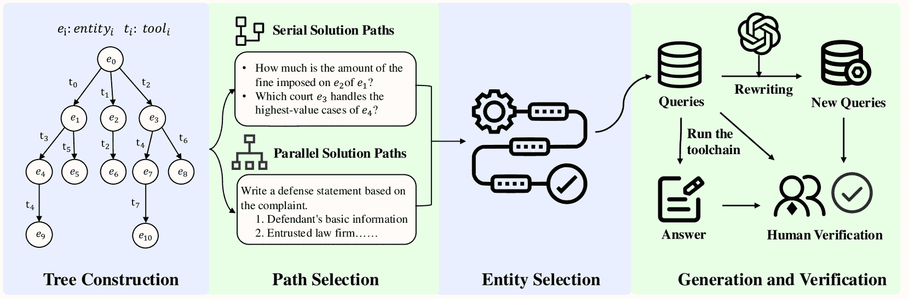

<!--yml

分类：未分类

日期：2025-01-11 11:44:10

-->

# LegalAgentBench：评估法律领域中的LLM代理

> 来源：[https://arxiv.org/html/2412.17259/](https://arxiv.org/html/2412.17259/)

李海涛¹，陈俊杰¹¹¹1¹¹1missing[2]，杨静丽²，艾青耀¹，魏佳²，刘有风²，林凯³

吴月月¹³³3，袁国志⁴，胡怡然⁵，王伍越⁶，刘一群¹，黄敏烈¹

¹计算机科学与技术系，等贡献。本文工作由HT和JJ在知谱AI实习时完成。通讯作者清华大学 ²知谱AI ³上海阿马软企业信用信息服务有限公司 ⁴中南大学 ⁵滑铁卢大学 ⁶圣母大学

liht22@mails.tsinghua.edu.cn

###### 摘要

随着LLM代理的智能性和自主性的不断提高，它们在法律领域中的潜在应用越来越明显。然而，现有的通用领域基准无法完全捕捉到现实世界司法认知和决策中的复杂性和微妙差异。因此，我们提出了LegalAgentBench，这是一个专门设计的综合基准，用于评估中文法律领域中的LLM代理。LegalAgentBench包括来自真实法律场景的17个语料库，并提供37个与外部知识互动的工具。我们设计了一个可扩展的任务构建框架，并精心标注了300个任务。这些任务涵盖了多种类型，包括多跳推理和写作，并且涉及不同的难度级别，能够有效反映现实法律场景的复杂性。此外，除了评估最终成功率，LegalAgentBench还在中间过程引入了关键词分析，以计算进展率，从而实现更精细的评估。我们评估了八个流行的LLM，突出了现有模型和方法的优点、局限性以及潜在改进空间。LegalAgentBench为LLM在法律领域的实际应用设立了新的基准，其代码和数据可在[https://github.com/CSHaitao/LegalAgentBench](https://github.com/CSHaitao/LegalAgentBench)获取。

LegalAgentBench：评估法律领域中的LLM代理

## 1 引言

最近，大型语言模型（LLMs）的进展显著推动了人工智能领域的发展 Achiam et al. ([2023](https://arxiv.org/html/2412.17259v1#bib.bib1)); Bai et al. ([2023](https://arxiv.org/html/2412.17259v1#bib.bib2)); Touvron et al. ([2023](https://arxiv.org/html/2412.17259v1#bib.bib24))。凭借其庞大的神经网络和海量的训练数据集，LLMs在各种自然语言处理任务中取得了显著进展，如文本生成和机器翻译 Li et al. ([2024e](https://arxiv.org/html/2412.17259v1#bib.bib15), [c](https://arxiv.org/html/2412.17259v1#bib.bib13)); Zhao et al. ([2024](https://arxiv.org/html/2412.17259v1#bib.bib33))。与此同时，LLMs的快速发展正在改变传统的法律行业，使法律专业人士能够更高效地处理诸如法律研究、合同起草和案件分析等任务。因此，LLMs正在迅速成为现代法律工作流程中不可或缺的工具 Cui et al. ([2023](https://arxiv.org/html/2412.17259v1#bib.bib5)); Li et al. ([2024d](https://arxiv.org/html/2412.17259v1#bib.bib14)); Guha et al. ([2024](https://arxiv.org/html/2412.17259v1#bib.bib8)); Li et al. ([2023](https://arxiv.org/html/2412.17259v1#bib.bib10))。

尽管LLMs具有巨大的潜力，但它们在处理复杂法律问题时仍面临挑战，因为现实世界中的法律任务通常需要多步骤推理和超出当前能力的专业知识。一个有前景的解决方案是开发LLM-as-Agent系统 Dorri et al. ([2018](https://arxiv.org/html/2412.17259v1#bib.bib6)); Liu et al. ([2023b](https://arxiv.org/html/2412.17259v1#bib.bib18))。这些代理可以通过与外部工具的反复互动，进行逐步推理并获得专业知识。它们令人印象深刻的能力吸引了学术界和工业界的广泛关注 Qin et al. ([2023](https://arxiv.org/html/2412.17259v1#bib.bib20)); Li et al. ([2024a](https://arxiv.org/html/2412.17259v1#bib.bib11))。

尽管LLM代理显示出巨大的潜力，但缺乏标准化的基准来评估它们在法律场景中的表现仍然是一个主要挑战。现有的框架，例如AgentBench Liu等人（[2023b](https://arxiv.org/html/2412.17259v1#bib.bib18)）和ToolBench Qin等人（[2023](https://arxiv.org/html/2412.17259v1#bib.bib20)），在评估LLM代理在通用领域中的表现时是有效的。然而，从这些评估中获得的见解在高度专业化的领域，如法律领域，往往具有有限的相关性 Li等人（[2024d](https://arxiv.org/html/2412.17259v1#bib.bib14)）。此外，现有的法律领域数据集通常侧重于相对基础的任务，如法律案件检索 Li等人（[2024f](https://arxiv.org/html/2412.17259v1#bib.bib16)，[b](https://arxiv.org/html/2412.17259v1#bib.bib12)）或判决预测 Li等人（[2024d](https://arxiv.org/html/2412.17259v1#bib.bib14)）。相比之下，法律实践复杂得多，涉及深入的案件分析、法律推理以及基于大量法律和先例的综合判断。当前的数据集和评估系统未能充分测试这些先进的、多维度的法律能力。

为填补这一空白，我们开发了LegalAgentBench，这是一个全面的基准，旨在评估LLM代理在中国法律领域的能力。基于现实世界的法律需求，它包括17个专业语料库和37个工具，用于与外部知识进行交互。在这一框架内，LLM代理协调并利用这些工具来解决特定的法律任务。

LegalAgentBench在以下三个方面具有突出特点：

+   •

    专注于真实的法律场景：LegalAgentBench是第一个评估LLM代理在法律场景中表现的数据集。它要求LLM展示对法律原则的扎实理解，使其能够恰当地选择和使用工具解决复杂的法律问题。这标志着LLM代理在法律场景中应用的一个重要进步。

+   •

    多样化的任务类型和难度级别：LegalAgentBench采用可扩展的任务构建框架，旨在全面覆盖各种任务类型和难度级别。具体来说，我们基于语料库和工具之间的依赖关系构建了一个规划树，并通过分层抽样和最大覆盖策略选择任务。最终，我们构建了300个独立的任务，包括多跳推理和写作任务，以全面评估LLM的能力。

+   •

    精细化的评估指标：LegalAgentBench引入了通过标注中间步骤来表示的过程率，而不仅仅依赖于最终的成功率作为评估标准，从而实现精细化评估。这种方法为代理的能力提供了更深入的见解，并帮助识别出超越最终结果的改进空间。

我们评估了多种商业和开源LLM代理，识别出它们当前能力中的几个潜在弱点。这些观察结果提供了宝贵的见解，激发了新的想法，并指出了进一步研究和改进的领域。

## 2 相关工作

### 2.1 LLM代理

最近，大型语言模型（LLM）在作为智能代理应用方面取得了显著进展。利用自然语言理解和生成的能力，LLM代理可以通过适当调用外部工具（如计算器、搜索引擎和特定领域的API）来高效解决复杂任务 [Yao等人](https://arxiv.org/html/2412.17259v1#bib.bib30)；Wang等人（[2024](https://arxiv.org/html/2412.17259v1#bib.bib25)，[2023](https://arxiv.org/html/2412.17259v1#bib.bib26)）；Shinn等人（[2024](https://arxiv.org/html/2412.17259v1#bib.bib22)）；Chu等人（[2024](https://arxiv.org/html/2412.17259v1#bib.bib4)）。

面对复杂任务时，LLM代理需要制定适当的计划和策略，以确保高效执行。Chain-of-Thought (CoT) Wei等人（[2022](https://arxiv.org/html/2412.17259v1#bib.bib27)）推理技术是这一领域的开创性方法，通过将复杂的推理任务分解为更小、更易于管理的步骤，增强了代理的推理能力。在此基础上，一系列先进的推理策略应运而生，为任务规划和问题解决提供了新的视角。例如，ReAct [Yao等人](https://arxiv.org/html/2412.17259v1#bib.bib30)将推理和行动解耦，在思考步骤和行动步骤之间交替，从而显著提高了复杂任务的规划效率。

此外，LLM代理的能力通过与外部工具的深度集成进一步增强。像HuggingGPT Shen等人（[2024](https://arxiv.org/html/2412.17259v1#bib.bib21)）的方法便是这一方法的典范，他们将LLM定位为控制器，将复杂任务分解为子任务，调用适当的专门模型，并整合结果以产生最终的响应。LLM+P Liu等人（[2023a](https://arxiv.org/html/2412.17259v1#bib.bib17)）的方法结合了LLM和基于计划领域定义语言（PDDL）的符号规划器，利用LLM将问题表述为PDDL语法，并使用规划求解器生成解决方案。

### 2.2 LLM代理的基准测试

随着LLM代理的快速发展，评估其在复杂任务中的推理和决策能力的需求显著增长。为了系统研究LLM代理，已经开发了许多基准测试，提供了重要的参考资料，支持LLM代理的系统性研究刘等人（[2023b](https://arxiv.org/html/2412.17259v1#bib.bib18)）；庄等人（[2023](https://arxiv.org/html/2412.17259v1#bib.bib34)）；叶等人（[2024](https://arxiv.org/html/2412.17259v1#bib.bib31)）；姚等人（[2024](https://arxiv.org/html/2412.17259v1#bib.bib29)）；黄等人（[2023](https://arxiv.org/html/2412.17259v1#bib.bib9)）；谢等人（[2023](https://arxiv.org/html/2412.17259v1#bib.bib28)）。

AgentBench 刘等人（[2023b](https://arxiv.org/html/2412.17259v1#bib.bib18)）是一个多维基准平台，涵盖了包括操作系统、数据库和知识图谱在内的八个不同环境。它系统地评估了LLM代理在多轮开放式生成设置中的表现。AgentBoard 马等人（[2024](https://arxiv.org/html/2412.17259v1#bib.bib19)）专注于在多轮互动中系统性地评估LLM。它引入了细粒度的进度率度量和多维度分析工具，全面评估LLM在部分可观察环境中的多任务处理能力，为评估互动LLM性能提供了一个科学框架。ToolQA 庄等人（[2023](https://arxiv.org/html/2412.17259v1#bib.bib34)）涵盖了八个领域和13个工具，任务特别设计为需要外部工具和参考资料来解决问题。这避免了仅依赖模型的内部知识，建立了一个新的基准，用于评估LLM的工具使用能力。T-Eval 陈等人（[2024](https://arxiv.org/html/2412.17259v1#bib.bib3)）将LLM的工具利用能力分解为六个维度：规划、推理、检索、理解、指令执行和结果评估。该框架全面衡量了LLM在使用外部工具方面的表现，涵盖了多个层级。

这些基准测试提供了多样化的工具，用于探索LLM代理的能力边界。然而，它们主要集中于在一般领域评估LLM，缺乏针对法律和医学等垂直领域的系统性指导和专门框架。为了解决这一空白，本文引入了一个专门为评估法律领域的LLM代理而设计的数据集，为研究和实践提供了宝贵的见解和支持。

## 3 LegalAgentBench

### 3.1 概述

LegalAgentBench包含三个关键组件：环境、工具和任务。LLM代理依赖这些工具与环境互动并解决特定任务。我们将环境定义为基于文本的语料库，其中观察空间和行动空间均以自然语言表示。具体来说，环境包含17个不同的语料库，其中14个是用于查找的表格数据库，3个是用于检索的文档集合。为了便于与环境的互动，我们提供了37个专用工具，用于执行如文本检索、数据库操作和数学计算等任务。

此外，LegalAgentBench包括300个具有不同难度级别和类型的任务。图[1](https://arxiv.org/html/2412.17259v1#S3.F1 "Figure 1 ‣ 3.1 Overview ‣ 3 LegalAgentBench ‣ LegalAgentBench: Evaluating LLM Agents in Legal Domain")展示了一个任务示例。key_answer表示答案中的关键词，用于评估最终结果的成功率。key_middle指的是解决任务的中间步骤中的关键词，提供更细致的评估。这些关键词来源于成功工具调用返回的观察结果。Path指的是解决任务的正确路径。较长的路径表示任务的难度更高。

在接收到任务后，LLM代理会逐步选择适当的工具并获取相应的反馈。收到反馈后，LLM代理会根据观察更新其内部状态，然后决定下一步行动。代理的行动通常包括选择适当的工具并输入必要的参数，或根据反馈调整查询策略。每个行动都会生成新的观察结果，这一循环会持续进行，直到代理完成任务或达到预定的终止条件。

图1：LegalAgentBench中的一个任务示例（翻译自中文）。

### 3.2 语料库和工具

在LegalAgentBench中，我们开发了17个真实世界的数据集，包括14个用于查找的表格数据库和3个用于检索相关信息的文档库。表[1](https://arxiv.org/html/2412.17259v1#S3.T1 "Table 1 ‣ 3.2 Corpora and Tools ‣ 3 LegalAgentBench ‣ LegalAgentBench: Evaluating LLM Agents in Legal Domain")展示了这些语料库的基本信息和简要概述。更多细节可以在附录[B](https://arxiv.org/html/2412.17259v1#A2 "Appendix B Corpus Details ‣ LegalAgentBench: Evaluating LLM Agents in Legal Domain")中找到。

具体来说，我们收集了公开的真实世界数据，涵盖了法院、律所、上市公司及其相关法律案件的信息。此外，我们还编撰了法律知识、条文和指导性案例，以创建全面且可搜索的语料库。这些语料库来源于真实世界的场景，且随着时间的推移不断演变，从而减少了LLM过拟合的风险。由于法律领域的敏感性，我们在附录[A](https://arxiv.org/html/2412.17259v1#A1 "附录 A 讨论 ‣ LegalAgentBench：评估法律领域的LLM代理")中讨论了许可证和伦理考虑。

| ID | 语料库 | 格式 | 大小 | 简要概述 |
| --- | --- | --- | --- | --- |
| 1 | CompanyInfo | 表格数据库 | 695 | 上市公司基本信息 |
| 2 | CompanyRegister | 表格数据库 | 10,125 | 上市公司注册信息 |
| 3 | SubCompanyInfo | 表格数据库 | 9,433 | 上市公司投资信息 |
| 4 | LegalDoc | 表格数据库 | 24,372 | 涉及上市公司的法律案件 |
| 5 | LegalAbstract | 表格数据库 | 1,200 | 法律案件摘要信息 |
| 6 | CourtInfo | 表格数据库 | 3,413 | 法院基本信息 |
| 7 | CourtCode | 表格数据库 | 3,348 | 法院的级别和行政区划代码 |
| 8 | LawfirmInfo | 表格数据库 | 4,768 | 律所基本信息 |
| 9 | LawfirmLog | 表格数据库 | 101 | 律所服务信息 |
| 10 | AddrInfo | 表格数据库 | 19,533 | 与地址对应的省、市、区信息 |
| 11 | RestrictionCase | 表格数据库 | 46 | 涉及高消费限制的案件 |
| 12 | FinalizedCase | 表格数据库 | 119 | 已经执行完结的案件 |
| 13 | DishonestyCase | 表格数据库 | 13 | 涉及不诚实判决债务人的案件 |
| 14 | AdministrativeCase | 表格数据库 | 443 | 涉及行政处罚的案件 |
| 15 | LegalKonwledge | 检索语料库 | 26,951 | 来自法律书籍的知识 |
| 16 | LegalArticle | 检索语料库 | 55,347 | 立法制定的法律条文 |
| 17 | LegalCases | 检索语料库 | 2,370 | 正式发布的指导性案例 |

表 1：语料库的基本信息。

为了从这些参考语料库中获取信息，我们设计了37个可供LLM代理使用的工具。这些工具主要分为以下几类：

+   •

    文本检索器：这些工具负责从文档库中检索与给定查询相关的内容。我们使用Embedding-3 ¹¹1[https://bigmodel.cn/](https://bigmodel.cn/)作为默认检索器。此外，用户还可以集成更高级的检索模型，以进一步改善查询结果。LegalAgentBench包含三个文本检索器。对于每个检索器，LLM可以使用Number参数指定返回相关文档的数量。

+   •

    数学工具：这些工具执行基本的算术运算，如加法、减法、乘法和除法。此外，它们还可以处理更复杂的任务，如排序数据，以及计算最大值或最小值。LegalAgentBench 中有五个数学工具。

+   •

    数据库工具：这些工具与特定数据库交互，从特定列中提取内容，基于预定义的查询。它们使得 LLM 代理能够访问结构化数据，并根据查询中定义的标准提供量身定制的响应。LegalAgentBench 中有 28 个数据库工具。对于每个数据库工具，LLM 可以使用参数 Column 来控制从相应表格数据库返回的属性。

+   •

    系统工具：当前系统工具仅包括 Finish，它解析执行反馈并返回答案以完成任务。

由于空间限制，每个工具的详细描述，包括它们的输入、输出和使用示例，已在附录 [C](https://arxiv.org/html/2412.17259v1#A3 "附录 C 工具详细信息 ‣ LegalAgentBench：在法律领域评估 LLM 代理人") 中提供。

图 2：LegalAgentBench 中任务构建过程的概览。

### 3.3 任务

#### 3.3.1 任务定义

LegalAgentBench 使用统一框架来标准化所有任务，提供了在法律场景中代理人互动过程的正式定义。在每个时间步 $t$，代理人执行动作 $a_{t}$，接收观察结果 $o_{t}$，并相应地更新其当前状态 $s_{t}$。这一迭代过程持续进行，直到任务成功完成或达到最大迭代限制 $T$。

$s_{t}$ 表示代理人在时间 $t$ 的感知状态，包括获取的上下文信息和环境状态。状态 $s_{t}$ 根据以下公式更新：

|  | $s_{t+1}=u(s_{t},a_{t},o_{t}),$ |  |
| --- | --- | --- |

其中，$u$ 是状态更新函数，负责将代理人的动作和反馈整合成新的感知状态。

$a_{t}$ 表示代理人在状态 $s_{t}$ 下采取的特定行动，包括工具调用或信息生成。动作 $a_{t}$ 由状态 $s_{t}$ 和过去观察的序列决定。

|  | $a_{t}=\pi(s_{t},{o_{1},o_{2},...,o_{t-1}}),$ |  |
| --- | --- | --- |

其中，$\pi$ 是代理人的决策制定策略。

$o_{t}$ 是代理人在调用工具后收到的反馈信息，包括成功结果或错误信息。

|  | $o_{t}=f(a_{t})$ |  |
| --- | --- | --- |

这里，$f$ 是反馈函数。如果 $a_{t}$ 是一个有效的动作，它返回操作的结果；否则，返回错误信息。

#### 3.3.2 任务构建

在任务生成阶段，我们的主要目标是利用语料库和工具构建一个多样化的问题集。核心原则是确保任务涵盖广泛的难度级别和类型，以便进行全面评估。在本节中，我们提出了一种可扩展的任务构建过程，该过程可以扩展以包含新的知识库和工具。整个过程如图 [2](https://arxiv.org/html/2412.17259v1#S3.F2 "图 2 ‣ 3.2 语料库和工具 ‣ 3 LegalAgentBench ‣ LegalAgentBench：评估法律领域的大型语言模型代理")所示。

| 属性 | 1-hop | 2-hop | 3-hop | 4-hop | 5-hop | 写作 | 总计 |
| --- | --- | --- | --- | --- | --- | --- | --- |
| # 任务数量 | 80 | 80 | 60 | 40 | 20 | 20 | 300 |
| --- | --- | --- | --- | --- | --- | --- | --- |
| 每个查询的平均长度 | 88.29 | 87.90 | 99.37 | 118.33 | 110.25 | 1059.95 | 160.65 |
| 每个回答的平均长度 | 74.20 | 40.84 | 45.53 | 63.48 | 86.20 | 678.75 | 99.24 |
| # 每个查询的平均 key_answer 数量 | 1.88 | 1.44 | 1.20 | 1.40 | 2.25 | 10.25 | 2.14 |
| key_answer 的平均长度 | 10.59 | 5.94 | 6.07 | 6.59 | 6.93 | 12.58 | 9.28 |
| # 每个查询的平均 key_middle 数量 | 0.13 | 1.45 | 2.87 | 4.78 | 5.60 | 6.20 | 2.42 |
| key_middle 的平均长度 | 9.20 | 9.72 | 10.95 | 11.35 | 11.25 | 7.21 | 10.24 |

表 2：LegalAgentBench 任务的详细统计。

规划树构建：为了更好地组织和结构化任务，我们首先基于可用工具之间的调用关系构建规划树。树的根节点代表未知实体，通常对应任务的起点。树的每一条分支代表实体可以使用的工具，而子节点包含在调用这些工具后获得的信息。对于每个子节点，后续的工具可以逐步调用，形成更深的分支。在这棵规划树中，每一条路径代表潜在的解决方案路径，而叶节点的信息对应任务的最终需求。

路径选择：我们从规划树中选择不同的路径来构建覆盖各种类型和难度级别的任务。在规划树中，每一条分支的深度代表任务解决方案的复杂性，而所有分支的宽度反映了任务类型的多样性。因此，我们逐层提取解决方案路径，以确保涵盖不同的难度级别。此外，我们最小化不同难度级别任务之间的路径重叠，扩展所有分支的覆盖范围，涵盖更广泛的任务类型。最终，我们开发了从 1-hop 到 5-hop 的串行解决方案路径。

除了顺序使用工具外，我们的解决路径还结合了工具的并行使用。我们以撰写辩护文书的任务作为典型示例。在这个场景中，LLM必须根据模板查询原告、被告及其律师的基本信息，同时检索基础的法律知识和相关条款，以制定对抗诉讼的辩护。在附录[D](https://arxiv.org/html/2412.17259v1#A4 "Appendix D Task Details ‣ LegalAgentBench: Evaluating LLM Agents in Legal Domain")中，我们提供了更清晰的示例以便更好地理解。

实体选择：在确定解决路径后，我们选择实体来构造完整的问题。需要注意的是，并非所有初始实体都能完成预定的解决路径，因为可能会出现工具调用没有返回结果的情况。为了解决这个问题，我们遍历所有可能的实体，并为每个路径选择两个成功执行的实体。

问题重写：在完成上述步骤后，我们获得了适当的实体，并可以自动生成诸如“$entity_{3}$ 是 $entity_{2}$ 的 $entity_{1}$”之类的多跳问题。然而，这种问题不仅偏离了实际使用习惯，而且直接暴露了解决路径给模型。为了更好地贴合实际场景并掩盖解决路径，我们使用GPT-4重写问题，使其更加灵活并符合人类需求。具体的提示可以在附录[D](https://arxiv.org/html/2412.17259v1#A4 "Appendix D Task Details ‣ LegalAgentBench: Evaluating LLM Agents in Legal Domain")中找到。

答案生成：对于每个问题，由于解决路径中使用的实体和工具链是已知的，我们可以通过适当的参数化工具链程序化地从参考语料库中提取答案。这使得即使是复杂的多跳推理任务，也能够自动生成正确的答案。

人工验证：我们手动验证任务中的所有问题、解决路径和答案。这包括修正不兼容的查询和工具，优化偏离日常使用习惯的问题，并处理与专业工具相关的查询。验证过程的详细指南可以在附录[G](https://arxiv.org/html/2412.17259v1#A7 "Appendix G Guidelines for Expert-Annotation ‣ LegalAgentBench: Evaluating LLM Agents in Legal Domain")中找到。

#### 3.3.3 任务评估

鉴于法律领域对准确性的高要求，我们主要通过关键词匹配来评估性能，从而计算成功率。具体而言，我们从工具调用结果中提取关键词，并将其记录为key_answer。代理输出与这些关键词之间的重叠度作为衡量其能力的标准。

然而，仅仅依赖成功率无法捕捉到微妙的差异，因为它无法区分任务完成得差不多和未完成的任务。为了解决这个问题，我们不仅为最终答案提供了关键词，还为中间的解决步骤提供了关键词。通过这些关键词，我们计算了进展率，从而能够在任务完成的不同阶段对代理的表现进行更细致的评估。我们在附录[E](https://arxiv.org/html/2412.17259v1#A5 "附录E 更多实现细节 ‣ LegalAgentBench：评估法律领域的LLM代理")中提供了成功率和进展率的详细计算方法。

#### 3.3.4 任务统计

经过仔细人工验证，LegalAgentBench包含总共300个任务，涵盖6种不同类型。表[2](https://arxiv.org/html/2412.17259v1#S3.T2 "表2 ‣ 3.3.2 任务构建 ‣ 3.3 任务 ‣ 3 LegalAgentBench ‣ LegalAgentBench：评估法律领域的LLM代理")展示了任务的详细统计数据。总体来看，LegalAgentBench在难度和任务类型上有着良好的平衡，使其成为评估法律领域代理能力的有效工具。

## 4 实验

### 4.1 实验设置

| 模型 | 方法 | 1-hop | 2-hop | 3-hop | 4-hop | 5-hop | 写作 | 全部 | 令牌 |
| --- | --- | --- | --- | --- | --- | --- | --- | --- | --- |
| GLM-4 | P-S | 0.7588 | 0.4229 | 0.1806 | 0.3708 | 0.1750 | 0.5778 | 0.4509 | 5,100,468 |
| P-E | 0.7838 | 0.4042 | 0.2056 | 0.3083 | 0.1600 | 0.5469 | 0.4461 | 9,849,924 |
| ReAct | 0.8787 | 0.6771 | 0.4167 | 0.3875 | 0.2433 | 0.5937 | 0.6057 | 11,920,863 |
| GLM-4-Plus | P-S | 0.8519 | 0.4667 | 0.4167 | 0.3583 | 0.1167 | 0.7522 | 0.5406 | 5,657,827 |
| P-E | 0.8419 | 0.5000 | 0.3667 | 0.3458 | 0.1167 | 0.7679 | 0.5363 | 9,422,692 |
| ReAct | 0.9131 | 0.8104 | 0.6417 | 0.6167 | 0.4300 | 0.7659 | 0.7499 | 11,739,861 |
| LLaMa3.1-8B | P-S | 0.3406 | 0.1333 | 0.0333 | 0.0375 | 0.1083 | 0.2382 | 0.1612 | 9,279,701 |
| P-E | 0.3510 | 0.1042 | 0.0250 | 0.0500 | 0.0667 | 0.3484 | 0.1607 | 13,649,741 |
| ReAct | 0.6019 | 0.1542 | 0.0750 | 0.0708 | 0.0600 | 0.0872 | 0.2359 | 50,661,127 |
| Qwen-max | P-S | 0.8469 | 0.4958 | 0.4083 | 0.3792 | 0.2333 | 0.4836 | 0.5381 | 4,800,345 |
| P-E | 0.8594 | 0.5896 | 0.3583 | 0.4083 | 0.3017 | 0.5539 | 0.5695 | 9,884,307 |
| ReAct | 0.9062 | 0.7917 | 0.6333 | 0.5833 | 0.6083 | 0.6662 | 0.7422 | 11,473,873 |
| Claude-sonnet | P-S | 0.8137 | 0.6354 | 0.4833 | 0.3750 | 0.2400 | 0.8395 | 0.6051 | 7,100,962 |
| P-E | 0.8700 | 0.6771 | 0.5333 | 0.4667 | 0.4717 | 0.8610 | 0.6703 | 13,566,119 |
| ReAct | 0.8950 | 0.6979 | 0.4750 | 0.4792 | 0.4567 | 0.6567 | 0.6579 | 32,878,858 |
| GPT-3.5 | P-S | 0.4906 | 0.2396 | 0.0500 | 0.1000 | 0.0667 | 0.0333 | 0.2247 | 5,007,391 |
| P-E | 0.4906 | 0.2062 | 0.0667 | 0.0625 | 0.0500 | 0.0405 | 0.2135 | 9,597,807 |
| ReAct | 0.6421 | 0.2854 | 0.1167 | 0.1000 | 0.1333 | 0.0852 | 0.2986 | 11,357,664 |
| GPT-4o-mini | P-S | 0.7117 | 0.3375 | 0.2750 | 0.2583 | 0.1250 | 0.6314 | 0.4196 | 5,482,556 |
| P-E | 0.7444 | 0.3771 | 0.3250 | 0.2417 | 0.1417 | 0.6681 | 0.4503 | 10,861,492 |
| ReAct | 0.9333 | 0.6500 | 0.4000 | 0.4208 | 0.2583 | 0.6087 | 0.6161 | 13,332,418 |
| GPT-4o | P-S | 0.7856 | 0.4437 | 0.2750 | 0.1875 | 0.2250 | 0.7971 | 0.4760 | 4,153,333 |
| P-E | 0.8106 | 0.3979 | 0.3167 | 0.2167 | 0.2767 | 0.8643 | 0.4906 | 7,261,238 |
| ReAct | 0.9262 | 0.8396 | 0.7500 | 0.6417 | 0.6117 | 0.6541 | 0.7908 | 11,206,957 |

表3：不同基准在LegalAgentBench上的成功率。P-S代表Plan-and-Solve方法，P-E代表Plan-and-Execute方法。最佳结果以粗体显示。

#### 4.1.1 基准

我们在LegalAgentBench上评估了八个著名的LLM：GLM-4 GLM等人（[2024](https://arxiv.org/html/2412.17259v1#bib.bib7)），GLM-4-Plus GLM等人（[2024](https://arxiv.org/html/2412.17259v1#bib.bib7)），LLaMA3.1-8B-instruct Touvron等人（[2023](https://arxiv.org/html/2412.17259v1#bib.bib24)），Qwen-max Bai等人（[2023](https://arxiv.org/html/2412.17259v1#bib.bib2)），Claude-sonnet (claude-3-5-sonnet-20241022)，GPT-3.5 (gpt-3.5-turbo-1106)，GPT-4o-mini (gpt-4o-mini-2024-07-18)，以及GPT-4o (gpt-4o-2024-08-06)。除了LLaMA3.1-8B-Instruct外，其他LLM是通过API调用进行评估的。为了确保结果的可复现性，我们将所有LLM的温度设置为0。

对于每个LLM，我们实现了三种不同的方法。1）Plan-and-Solve 王等人（[2023](https://arxiv.org/html/2412.17259v1#bib.bib26)）：概述一个完整的计划，并逐步执行。2）Plan-and-Execute Topsakal和Akinci（[2023](https://arxiv.org/html/2412.17259v1#bib.bib23)）：制定一个多步骤的计划并顺序完成。完成任务后，LLM可以重新评估计划并做出适当的调整。3）ReAct [Yao等人](https://arxiv.org/html/2412.17259v1#bib.bib30)：通过“思考-行动-观察”过程逐步进行推理，结合推理和工具使用。

在给定任务时，模型首先确定需要哪些工具，然后使用选定的工具逐步解决任务。当LLM输出Finish或达到最大迭代限制$T=10$时，它会总结当前轨迹并提供最终答案。我们为每个过程提供了三个示例，以指导模型使用工具并遵循指定的输出格式。更多实现细节请见附录 [E](https://arxiv.org/html/2412.17259v1#A5 "附录E 更多实现细节 ‣ LegalAgentBench：评估法律领域中的LLM代理")。

#### 4.1.2 指标

我们应用了三个评估指标：成功率、过程率和BERT-Score Zhang等人（[2019](https://arxiv.org/html/2412.17259v1#bib.bib32)）提出的指标，来综合评估性能。具体来说，成功率计算LLM回答中包含的key_answer元素的比例。过程率进一步结合了key_middle，衡量回答中key_middle和key_answer元素的比例。此外，BERTScore用于计算生成答案与参考答案之间的文本相似度，从而评估输出的质量和准确性。除了这些指标，我们还报告了LLM消耗的token数量，作为效率的参考。由于篇幅限制，我们在主要结果中仅报告了成功率。更多结果可在附录[F](https://arxiv.org/html/2412.17259v1#A6 "Appendix F More Evaluation Result ‣ LegalAgentBench: Evaluating LLM Agents in Legal Domain")中找到。

### 4.2 主要结果

在LegalAgentBench上，不同LLM和基准模型的性能比较见表格[3](https://arxiv.org/html/2412.17259v1#S4.T3 "Table 3 ‣ 4.1 Experiment Setup ‣ 4 Experiment ‣ LegalAgentBench: Evaluating LLM Agents in Legal Domain")。更多实验结果可在附录[F](https://arxiv.org/html/2412.17259v1#A6 "Appendix F More Evaluation Result ‣ LegalAgentBench: Evaluating LLM Agents in Legal Domain")中找到。根据实验结果，我们得出以下观察结论。

+   •

    比较不同LLM。在不同LLM的实验中，GPT-3.5和LLaMA3.1-8B表现较差，LegalAgentBench上的成功率低于30%。这可能源于它们在有效使用工具方面的能力有限，限制了它们在复杂法律任务中的问题解决能力。GLM4、GLM4-Plus、Qwen-Max和GPT-4o-mini的token消耗相似。然而，GLM4-Plus和Qwen-Max表现出更优异的性能。Claude-Sonnet也取得了有竞争力的结果，在P-S和P-E方法下都表现最佳。然而，它通常需要比其他LLM更多的token。在ReAct方法下，GPT-4o凭借相对较少的token取得了最佳表现，成功率达到了79.08%。总体来说，LegalAgentBench有效地区分了不同LLM的能力，表现较强的工具使用能力和逻辑推理能力的LLM取得了更优异的表现。

+   •

    比较不同的方法。通过比较不同的方法，我们发现ReAct通常在多跳问题中产生更好的结果。然而，这一优势伴随着更高的token消耗，这表明增加推理时间可能有助于提高性能。此外，我们还发现，当LLM的能力受到限制时，P-E方法并不总是优于P-S。像GLM-4、LLaMa3.1-8B和GPT-3.5这样的LLM表现出相似的趋势。这可能是由于计划更新增加了上下文长度，从而减少了注意力机制的效果。同一个LLM在不同推理方法下的性能差距可达到65%，这强调了有效方法更好地利用了LLM的潜力。此外，在设计有效的推理方法时，平衡模型能力、推理时间和token消耗同样至关重要。

+   •

    比较不同类型的查询。如表[3](https://arxiv.org/html/2412.17259v1#S4.T3 "Table 3 ‣ 4.1 Experiment Setup ‣ 4 Experiment ‣ LegalAgentBench: Evaluating LLM Agents in Legal Domain")所示，对于多跳问题，所有基准方法在跳数增加时都表现出性能下降。在1跳问题上，最佳性能达到了93%的成功率，但在5跳问题上仅为61%。这表明LegalAgentBench中的问题涵盖了广泛的难度水平。在写作任务中，我们观察到ReAct的表现相较于其他方法较差。我们认为这可能是由于逐步更新机制，在发生错误时会反复尝试解决单个步骤。在需要并行处理的写作任务中，这种方法可能会忽视其他潜在路径，从而可能导致其他答案的出现。这也突显了LegalAgentBench中多样化问题类型有效评估了不同方法的潜力。

### 4.3 分析

在本节中，我们分析了LLM代理在LegalAgentBench中面临的独特挑战以及可能的改进方向。

缺乏专业的法律知识。法律领域的术语和概念高度专业化，如果没有足够的法律知识，LLM 可能难以生成准确的推理路径。例如，语言模型经常无法区分立案时间和审判时间，或者无法解读案件编号中不同部分的具体含义，这些都对得出正确答案至关重要。尽管我们提供了法律知识语料库，但实际上，我们发现 LLM 经常未能认识到咨询相关法律知识的必要性。在处理法律问题时，LLM 倾向于依赖现有的模式和语言知识，忽视了法律领域所需的精确性和细节。未来，法律知识应更加系统且深入地融入 LLM 中，以确保在复杂的法律环境下的准确性和可靠性。此外，LLM 还应能够智能识别何时访问外部法律数据库，从而实现更灵活和准确的决策。

对法律条文和案例法的理解不足。一些法律问题的解决依赖于法律条文和案例法，但 LLM 在这方面可能存在显著的局限性。在推理过程中，LLM 常常难以准确解读法律条文的范围和逻辑。即使检索器成功识别相关条文和案例，LLM 仍可能在理解这些参考材料的司法解释和实际应用时遇到困难，特别是在复杂的法律情境下。未来，为了增强 LLM 在法律领域的有效性，必须加强它们深入理解和应用法律条文和案例的能力。

其他错误类型 除了上述挑战，LLM 代理在 LegalAgentBench 上通常会遇到以下错误：1) 参数错误：LLM 代理在调用工具时未能提供正确的参数。 2) 规划错误：LLM 代理因幻觉或知识不足生成不正确的规划路径，或使用不合适的工具。 3) 超出长度限制：编码的交互历史、观察结果和工具使用计划超过了长度限制，导致 LLM 代理无法解决任务。 4) 陷入循环：LLM 代理可能反复尝试解决同一问题，最终达到最大迭代次数限制。总体而言，LegalAgentBench 提供了一个全面且可靠的评估平台，突显了 LLM 代理在解决复杂法律问题时仍有较大改进空间。

## 5 结论

本文介绍了LegalAgentBench，这是一个旨在评估法律领域LLM代理性能的基准测试。为了实现这一目标，我们收集了真实世界的数据，构建了17个数据库和37个工具。此外，我们提出了一个可扩展的任务构建框架，包含六个步骤：规划树创建、路径选择、实体验证、问题重写、答案生成和人工验证。该框架具有高度的通用性，可以扩展以纳入新的知识库和工具，从而支持不同类型和难度等级的任务构建。我们在LegalAgentBench上进行了广泛的实验，深入分析了现有模型和方法的优缺点以及潜在的改进方向。展望未来，我们计划扩展LegalAgentBench，支持更多语言和法律体系，促进全球法律LLM的发展。

## 参考文献

+   Achiam等（2023）Josh Achiam, Steven Adler, Sandhini Agarwal, Lama Ahmad, Ilge Akkaya, Florencia Leoni Aleman, Diogo Almeida, Janko Altenschmidt, Sam Altman, Shyamal Anadkat等人，2023年。Gpt-4技术报告。*arXiv预印本 arXiv:2303.08774*。

+   Bai等（2023）Jinze Bai, Shuai Bai, Yunfei Chu, Zeyu Cui, Kai Dang, Xiaodong Deng, Yang Fan, Wenbin Ge, Yu Han, Fei Huang等人，2023年。Qwen技术报告。*arXiv预印本 arXiv:2309.16609*。

+   Chen等（2024）Zehui Chen, Weihua Du, Wenwei Zhang, Kuikun Liu, Jiangning Liu, Miao Zheng, Jingming Zhuo, Songyang Zhang, Dahua Lin, Kai Chen等人，2024年。T-eval：一步步评估大语言模型工具利用能力。在*第62届计算语言学协会年会论文集（卷1：长篇论文）*中，第9510–9529页。

+   Chu等（2024）Zhumin Chu, Qingyao Ai, Yiteng Tu, Haitao Li, 和Yiqun Liu，2024年。Pre：一个基于同行评审的大语言模型评估器。*arXiv预印本 arXiv:2401.15641*。

+   Cui等（2023）Jiaxi Cui, Zongjian Li, Yang Yan, Bohua Chen, 和Li Yuan，2023年。Chatlaw：集成外部知识库的开源法律大语言模型。*arXiv预印本 arXiv:2306.16092*。

+   Dorri等（2018）Ali Dorri, Salil S Kanhere, 和Raja Jurdak，2018年。多智能体系统：一项综述。*IEEE Access*，6：28573–28593。

+   GLM等（2024）GLM团队，Aohan Zeng, Bin Xu, Bowen Wang, Chenhui Zhang, Da Yin, Dan Zhang, Diego Rojas, Guanyu Feng, Hanlin Zhao等人，2024年。Chatglm：从glm-130b到glm-4全工具的大语言模型家族。*arXiv预印本 arXiv:2406.12793*。

+   Guha等（2024）Neel Guha, Julian Nyarko, Daniel Ho, Christopher Ré, Adam Chilton, Alex Chohlas-Wood, Austin Peters, Brandon Waldon, Daniel Rockmore, Diego Zambrano等人，2024年。Legalbench：一个协作构建的基准测试，用于衡量大语言模型中的法律推理能力。*神经信息处理系统进展*，36。

+   Huang 等人（2023）黄悦、施家文、李源、范晨瑞、吴思源、张琪辉、刘一鑫、周潘、万尧、宫振强、等人。2023。Metatool：大语言模型的基准测试：决定是否使用工具以及使用哪些工具。*arXiv 预印本 arXiv:2310.03128*。

+   Li 等人（2023）李海涛、艾青尧、陈佳、董乾、吴悦悦、刘一群、陈冲、田琪。2023。Sailer：面向结构的法律案件检索预训练语言模型。载于《第46届国际 ACM SIGIR 信息检索研究与发展会议论文集》，页码1035–1044。

+   Li 等人（2024a）李海涛、艾青尧、陈佳、董乾、吴志静、刘一群、陈冲、田琪。2024a。[Blade：通过小型领域特定模型增强黑箱大语言模型](http://arxiv.org/abs/2403.18365)。

+   Li 等人（2024b）李海涛、艾青尧、韩欣妍、陈佳、董乾、刘一群、陈冲、田琪。2024b。Delta：通过结构化单词对齐预训练一个判别性编码器用于法律案件检索。*arXiv 预印本 arXiv:2403.18435*。

+   Li 等人（2024c）李海涛、陈俊杰、艾青尧、朱敏、周宇佳、董乾、刘一群。2024c。Calibraeval：校准预测分布以减轻大语言模型作为法官时的选择偏差。*arXiv 预印本 arXiv:2410.15393*。

+   Li 等人（2024d）李海涛、陈游、艾青尧、吴悦悦、张瑞哲、刘一群。2024d。Lexeval：评估大语言模型的全面中文法律基准。*arXiv 预印本 arXiv:2409.20288*。

+   Li 等人（2024e）李海涛、董乾、陈俊杰、苏慧学、周宇佳、艾青尧、叶子怡、刘一群。2024e。Llms-as-judges：基于大语言模型的评估方法全面调查。*arXiv 预印本 arXiv:2412.05579*。

+   Li 等人（2024f）李海涛、邵云秋、吴悦悦、艾青尧、马怡晓、刘一群。2024f。Lecardv2：大规模中文法律案件检索数据集。载于《第47届国际 ACM SIGIR 信息检索研究与发展会议论文集》，页码2251–2260。

+   Liu 等人（2023a）刘博、姜雨倩、张晓涵、刘强、张诗琪、比斯瓦斯·乔伊迪普、石彼得。2023a。Llm+ p：赋能大语言模型以优化规划能力。*arXiv 预印本 arXiv:2304.11477*。

+   Liu 等人（2023b）刘晓、余浩、张汉辰、许艺凡、雷轩宇、赖汉宇、顾宇、丁杭亮、门凯文、杨科娟、等人。2023b。Agentbench：评估大语言模型作为代理的表现。*arXiv 预印本 arXiv:2308.03688*。

+   Ma 等人（2024）马昌、张俊磊、朱志浩、杨程、杨宇九、金耀辉、兰振中、孔灵鹏、贺俊贤。2024。Agentboard：多轮大语言模型代理的分析评估板。*arXiv 预印本 arXiv:2401.13178*。

+   Qin 等人 (2023) 祁佳、梁世豪、叶宜宁、朱坤伦、闫兰、陆雅溪、林彦凯、宋鑫、唐向如、钱彬等。2023年。《Toolllm: 促使大语言模型掌握16000+个现实世界的API》。*arXiv 预印本 arXiv:2307.16789*。

+   Shen 等人 (2024) 宋凯涛、谭旭、李东生、陆伟明、庄宇廷。2024年。《Hugginggpt: 用 ChatGPT 和 Hugging Face 的伙伴们解决 AI 任务》。*神经信息处理系统进展*，36。

+   Shinn 等人 (2024) Noah Shinn、Federico Cassano、Ashwin Gopinath、Karthik Narasimhan、姚顺宇等。2024年。《Reflexion: 具有语言强化学习的语言代理》。*神经信息处理系统进展*，36。

+   Topsakal 和 Akinci (2023) Oguzhan Topsakal 和 Tahir Cetin Akinci。2023年。《利用 Langchain 创建大语言模型应用：快速开发 LLM 应用的入门》。发表于*国际应用工程与自然科学会议*，第1卷，第1050-1056页。

+   Touvron 等人 (2023) Hugo Touvron、Thibaut Lavril、Gautier Izacard、Xavier Martinet、Marie-Anne Lachaux、Timothée Lacroix、Baptiste Rozière、Naman Goyal、Eric Hambro、Faisal Azhar等。2023年。《Llama: 开放且高效的基础语言模型》。*arXiv 预印本 arXiv:2302.13971*。

+   Wang 等人 (2024) 王雷、马晨、冯雪扬、张泽宇、杨浩、张景森、陈志远、唐家凯、陈旭、林彦凯、赵欣伟、魏哲伟、温吉荣等。2024年。[关于基于大语言模型的自主代理的调查](https://doi.org/10.1007/s11704-024-40231-1)。*计算机科学前沿*，18(6)。

+   Wang 等人 (2023) 王雷、许婉玉、蓝一槐、胡志强、兰云石、李瑞凯、林怡鹏等。2023年。《计划与解决提示：通过大语言模型提升零-shot链式推理》。*arXiv 预印本 arXiv:2305.04091*。

+   Wei 等人 (2022) Jason Wei、Xuezhi Wang、Dale Schuurmans、Maarten Bosma、Fei Xia、Ed Chi、Quoc V Le、Denny Zhou等。2022年。《Chain-of-thought 提示促使大语言模型进行推理》。*神经信息处理系统进展*，35:24824–24837。

+   Xie 等人 (2023) 谷晓辉、董乾、王冰宁、吕飞扬、姚婷、甘维南、吴志静、李向生、李海涛、刘一群、马进等。2023年。[T2ranking: 一项大规模中文段落排序基准](https://doi.org/10.1145/3539618.3591874)。发表于*第46届国际 ACM SIGIR 信息检索研究与发展会议论文集*，SIGIR '23，第2681-2690页，纽约，美国。计算机协会。

+   Yao 等人 (2024) 姚顺宇、余淀、赵杰弗里、Izhak Shafran、Tom Griffiths、曹源、Karthik Narasimhan。2024年。《思维树：与大语言模型共同进行深思熟虑的问题解决》。*神经信息处理系统进展*，36。

+   (30) Shunyu Yao, Jeffrey Zhao, Dian Yu, Nan Du, Izhak Shafran, Karthik R Narasimhan, 和 Yuan Cao. React: 在语言模型中协同推理与行动。在*第十一届国际学习表征会议*。

+   Ye等（2024）Junjie Ye, Guanyu Li, Songyang Gao, Caishuang Huang, Yilong Wu, Sixian Li, Xiaoran Fan, Shihan Dou, Qi Zhang, Tao Gui, 等人. 2024. Tooleyes: 针对大语言模型在现实场景中的工具学习能力进行精细评估。*arXiv预印本 arXiv:2401.00741*。

+   Zhang等（2019）Tianyi Zhang, Varsha Kishore, Felix Wu, Kilian Q Weinberger, 和 Yoav Artzi. 2019. Bertscore: 使用BERT评估文本生成。*arXiv预印本 arXiv:1904.09675*。

+   Zhao等（2024）Wayne Xin Zhao, Kun Zhou, Junyi Li, Tianyi Tang, Xiaolei Wang, Yupeng Hou, Yingqian Min, Beichen Zhang, Junjie Zhang, Zican Dong, Yifan Du, Chen Yang, Yushuo Chen, Zhipeng Chen, Jinhao Jiang, Ruiyang Ren, Yifan Li, Xinyu Tang, Zikang Liu, Peiyu Liu, Jian-Yun Nie, 和 Ji-Rong Wen. 2024. [大语言模型调查](http://arxiv.org/abs/2303.18223)。

+   Zhuang等（2023）Yuchen Zhuang, Yue Yu, Kuan Wang, Haotian Sun, 和 Chao Zhang. 2023. Toolqa: 一个用于LLM问题回答的外部工具数据集。*神经信息处理系统进展*, 36:50117–50143。

## 附录 A 讨论

本节讨论了局限性、潜在影响、许可证以及法律和伦理方面的考虑。

### A.1 局限性

我们在本研究中承认存在若干限制，并计划在未来的工作中加以解决。首先，目前的数据集主要以中文构建，这限制了其在更广泛的多语言环境中的适用性。我们计划在未来的版本中发布支持英语的更新版本。其次，任务设计主要涵盖法定法律体系，其在判例法体系中的表现还需要进一步探索。它可能无法充分涵盖不同国家法律知识和体系的多样性。在未来的工作中，我们将丰富任务类型，扩大范围，并融入更多国家和地区的法律场景，从而增强我们研究的适用性和全面性。

| ID | 语料库 | 关键字 | # 关键字 |
| --- | --- | --- | --- |
| 1 | 公司信息 |

&#124; 公司名称, 公司简称, 英文名称, 相关证券, 公司代码, 原简称, 市场, 行业, 成立日期, 上市日期, 法定代表人, 总经理, 董事会秘书, 邮政编码, 注册地址, 办公地址, 电话号码, 传真, 官方网站, 电子邮件, 纳入指数, 主要业务, 经营范围, 公司简介, 每股面值（人民币）, 首次公开募股（IPO）价格（人民币）, IPO净收益（人民币）, IPO主承销商 &#124;

| 28 |
| --- |
| 2 | 公司注册 |

&#124; 公司名称、注册状态、统一社会信用代码、法定代表人、注册资本、成立日期、公司地址、联系电话、联系邮箱、注册号、组织机构代码、参保人数、主行业类别、次行业类别、第三行业类别、前身名称、公司简介、经营范围 &#124;

| 18 |
| --- |
| 3 | 子公司信息 |

&#124; 相关上市公司全名、与上市公司的关系、上市公司股权比例、上市公司投资金额、公司名称 &#124;

| 5 |
| --- |
| 4 | 法律文书 |

&#124; 相关公司、职务、案件编号、文书类型、原告、被告、原告律所、被告律所、诉讼原因、涉及金额（人民币）、判决结果、日期、案件名称 &#124;

| 13 |
| --- |
| 5 | 法律摘要 |

&#124; 案件名称、案件编号、文本摘要 &#124;

| 3 |
| --- |
| 6 | 法院信息 |

&#124; 法院名称、法院负责人、成立日期、法院地址、法院省份、法院城市、法院县区、法院联系电话、法院官方网站 &#124;

| 9 |
| --- |
| 7 | 法院代码 |

&#124; 法院名称、行政级别、法院级别、法院代码、区域编码、排名 &#124;

| 6 |
| --- |
| 8 | 律所信息 |

&#124; 律所名称、律所唯一代码、律所负责人、律所注册资本、成立日期、律所地址、律所省份、律所城市、律所县区、联系电话、联系邮箱、律所简介、律所登记机关 &#124;

| 13 |
| --- |
| 9 | 律所日志 |

&#124; 律所名称、业务量排名、服务过的上市公司、报告期内有违规行为的上市公司、报告期内被调查的上市公司 &#124;

| 5 |
| --- |
| 10 | 地址信息 |

&#124; 地址、省份、城市、县区 &#124;

| 4 |
| --- |
| 11 | 限制案件 |

&#124; 限制高消费企业名称、案件编号、法定代表人、申请人、涉及金额（人民币）、执行法院、立案日期、限制公告日期 &#124;

| 4 |
| --- |
| 12 | 已结案案件 |

&#124; 已结案公司名称、案件编号、被执行人、涉嫌申请执行人、未履行金额（人民币）、执行目标金额（人民币）、执行法院、立案日期、结案日期 &#124;

| 8 |
| --- |
| 13 | 失信案件 |

&#124; 失信被执行公司名称、案件编号、失信被执行人、涉嫌申请执行人、涉及金额（人民币）、执行法院、立案日期、公告日期 &#124;

| 9 |
| --- |
| 14 | 行政案件 |

&#124; 行政处罚公司名称、案件编号、事实、处罚结果、处罚金额（人民币）、处罚机关、处罚日期 &#124;

| 8 |
| --- |
| 15 | 法律知识 |

&#124; 示例：税法、税收征管法、法律责任（1）如果纳税人未能在规定期限内缴纳税款，或者扣缴义务人… &#124;

| - |
| --- |
| 16 | 法律条款 |

&#124; 示例：中华人民共和国民法典第1082条 在女性怀孕期间、产后一年内或流产后六个月内，男性不得提出离婚申请… &#124;

| - |
| --- |
| 17 | 法律案例 |

&#124; 示例：台湾高雄县法院对民事判决的承认申请：康诉黄案。(1) 基本事实：2004年6月1日，大陆居民康… &#124;

| - |
| --- |

表格4：关于LegalAgentBench语料库的更多详细信息。

### A.2 更广泛的影响

LegalAgentBench旨在推动LLM代理在法律领域的应用，并通过标准化的评估框架帮助法律专业人员更好地理解和评估LLM代理的表现。通过提供可靠的评估方法和构建过程，LegalAgentBench不仅促进了LLM代理在法律任务中的应用，还为其他垂直领域基准的建立提供了宝贵的见解。LLM代理在法律行业的广泛使用可能会影响法律专业人员的工作方式，改变他们使用技术工具的方式，并推动法律教育和实践的调整。我们特别关注LLM代理对法律行业的深远影响，确保它们的应用始终遵循社会正义和法治的原则。为了保证公平和透明，LegalAgentBench的数据集和评估方法将经过严格的伦理审查，并广泛征求利益相关者的意见，以确保其公正性。

值得注意的是，LegalAgentBench并不提倡完全用LLM代理取代法律专业人员，而是通过支持工具来减轻法律人员的负担并提高效率。法律判决的独特性和复杂性需要丰富的专业知识和人类洞察力，这些是LLM代理无法完全替代的。我们的目标是为法律专业人员提供一种标准化的评估工具，帮助他们在实际应用中做出更为明智的决策，了解何时、何地以及如何有效使用LLM代理。然而，LegalAgentBench的评估结果仅应作为参考，因为在现实世界的法律场景中，应用仍然需要进一步深入的评估，以确保决策的合法性和合理性。我们相信，LegalAgentBench将有助于发展一个更加公正和高效的法律系统，并推动AI技术在法律领域的负责任应用。

### A.3 许可

在本节中，我们阐明了LegalAgentBench的版权和许可状态，以确保用户能够以合法合规的方式使用此数据集。

在 LegalAgentBench 中，所有的表格数据库均来源于真实的、公开可获取的资源。我们已获得明确的版权许可，将这些数据库纳入基准测试。此外，检索语料库来自于公开可访问的符合法律和伦理标准的法律材料。这些资源的提供符合开放法律信息的适用规范，确保它们的纳入不会引发任何法律或伦理问题。虽然这些资源的版权仍归各政府机构所有，但它们已经公开发布并授权供公众使用。用户在使用这些数据时，需遵守相关政府机构制定的法律、法规和规定。

整个数据集以 MIT 许可证发布。如果您认为 LegalAgentBench 中包含侵犯您版权作品的内容，请随时联系我们请求删除。

### A.4 法律和伦理考量

LegalAgentBench 的构建和发布遵循严格的法律和伦理标准，以确保其在研究和开发中的负责任使用。LegalAgentBench 中的所有数据都经过了严格的隐私筛查和匿名化处理。任何个人或敏感信息已被删除，以遵守适用的数据保护法律和伦理研究准则，确保数据集的使用不会危及个人隐私或安全。为了防止潜在的伤害，LegalAgentBench 中的数据集经过精心策划和筛选，排除了歧视性、色情、暴力或冒犯性内容。法律专家的伦理审查进一步确保了该基准最小化了与安全、隐私、歧视、监控、欺骗、骚扰、人权、偏见和公平相关的风险。通过考虑这些因素，LegalAgentBench 旨在为推动法律领域人工智能能力提供一个符合法律和伦理规范的基础，同时秉持公平、透明和社会责任的原则。

## 附录 B 语料库详情

表格 [4](https://arxiv.org/html/2412.17259v1#A1.T4 "Table 4 ‣ A.1 Limitation ‣ Appendix A Discussion ‣ LegalAgentBench: Evaluating LLM Agents in Legal Domain") 提供了 LegalAgentBench 中语料库的详细信息，列出了 14 个不同表格数据库的键值及每个表格中的键数，范围从 3 到 28。此差异反映了现实世界应用中场景的多样性。此外，还为三个检索语料库提供了基本示例，以澄清其内容。

## 附录 C 工具详情

表格[5](https://arxiv.org/html/2412.17259v1#A3.T5 "Table 5 ‣ Appendix C Tool Details ‣ LegalAgentBench: Evaluating LLM Agents in Legal Domain")和[6](https://arxiv.org/html/2412.17259v1#A3.T6 "Table 6 ‣ Appendix C Tool Details ‣ LegalAgentBench: Evaluating LLM Agents in Legal Domain")提供了关于LegalAgentBench中包含的工具的详细信息。表格[5](https://arxiv.org/html/2412.17259v1#A3.T5 "Table 5 ‣ Appendix C Tool Details ‣ LegalAgentBench: Evaluating LLM Agents in Legal Domain")概述了每个工具的输入和输出，而表格[6](https://arxiv.org/html/2412.17259v1#A3.T6 "Table 6 ‣ Appendix C Tool Details ‣ LegalAgentBench: Evaluating LLM Agents in Legal Domain")描述了每个工具的基本功能。

对于每个工具，除了基本的输入信息外，我们还提供可选参数以增强使用灵活性。例如，数据库工具包括参数 Columns，用于指定要返回的结构化数据的键。类似地，文本检索器提供了一个 Number 参数，允许用户控制检索的文档数量。为了便于理解，表格[7](https://arxiv.org/html/2412.17259v1#A3.T7 "Table 7 ‣ Appendix C Tool Details ‣ LegalAgentBench: Evaluating LLM Agents in Legal Domain")提供了一个工具调用的具体示例。

| ID | 工具 | 输入 | 返回 |
| --- | --- | --- | --- |
| 1 | get_company_info |

&#124; 公司名称或简称或代码 &#124;

| 公司信息 |
| --- |
| 2 | get_company_register | 公司名称 | CompanyRegister |
| 3 | get_company_register_name | 统一社会信用代码 | 公司名称 |
| 4 | get_sub_company_info | 公司名称 | SubCompanyInfo |
| 5 | get_sub_company_info_list | 公司名称 | List[SubCompanyInfo] |
| 6 | get_legal_document | 案件编号 | LegalDoc |
| 7 | get_legal_abstract | 案件编号 | LegalAbstract |
| 8 | get_legal_document_company_list | 公司名称 | List[LegalDoc] |
| 9 | get_legal_document_lawfirm_list | 律所名称 | List[LegalDoc] |
| 10 | get_court_info | 法院名称 | CourtInfo |
| 11 | get_court_info_list | 省、城市和县 | List[CourtInfo] |
| 12 | get_court_code | 法院名称或代码 | CourtCode |
| 13 | get_lawfirm_info | 律所名称 | LawfirmInfo |
| 14 | get_lawfirm_info_list | 省、城市和县 | List[LawfirmInfo] |
| 15 | get_lawfirm_log | 律所名称 | LawfirmLog |
| 16 | get_address_info | 具体地址 | AddrInfo |
| 17 | get_restriction_case | 案件编号 | RestrictionCase |
| 18 | get_restriction_case_company_list | 公司名称 | List[RestrictionCase] |
| 19 | get_restriction_case_court_list | 法院名称 | List[RestrictionCase] |
| 20 | get_finalized_case | 案件编号 | FinalizedCase |
| 21 | get_finalized_case_company_list | 公司名称 | List[FinalizedCase] |
| 22 | get_finalized_case_court_list | 法院名称 | List[FinalizedCase] |
| 23 | get_dishonesty_case | 案件编号 | DishonestyCase |
| 24 | get_dishonesty_case_company_list | 公司名称 | List[DishonestyCase] |
| 25 | get_dishonesty_case_court_list | 法院名称 | List[DishonestyCase] |
| 26 | get_administrative_case | 案号 | AdministrativeCase |
| 27 | get_administrative_case_company_list | 公司名称 | List[AdministrativeCase] |
| 28 | get_administrative_case_court_list | 法院名称 | List[AdministrativeCase] |
| 29 | legal_knowledge_retriever | 查询文本 | 相关知识 |
| 30 | legal_article_retriever | 查询文本 | 相关条文 |
| 31 | legal_case_retriever | 查询文本 | 相关案件 |
| 32 | get_sum | List[num] | 加法结果 |
| 33 | get_subtraction | 被减数, 减数 | 减法结果 |
| 34 | get_multiplication | List[num] | 乘法结果 |
| 35 | get_division | 被除数, 除数 | 除法结果 |
| 36 | get_rank | List[num] | 排序结果 |
| 37 | finish | - | 最终结果 |

Table 5: 工具的输入和输出。

| ID | 工具 | 描述 |
| --- | --- | --- |
| 1 | get_company_info |

&#124; 基于[公司名称、公司简称或公司代码]查询[公司信息]中的相应上市公司信息。 &#124;

|

| 2 | get_company_register |
| --- | --- |

&#124; 基于[公司名称]查询[公司注册信息]中的相应公司注册信息。 &#124;

|

| 3 | get_company_register_name |
| --- | --- |

&#124; 基于[统一社会信用代码]查询[公司注册信息]中的相应公司名称。 &#124;

|

| 4 | get_sub_company_info |
| --- | --- |

&#124; 基于[公司名称]查询[子公司信息]中的相应母公司及投资信息。 &#124;

|

| 5 | get_sub_company_info_list |
| --- | --- |

&#124; 基于[公司名称]查询[子公司信息]中的所有子公司投资信息。 &#124;

|

| 6 | get_legal_document |
| --- | --- |

&#124; 基于[案号]查询[LegalDoc]中的相应判决文书信息。 &#124;

|

| 7 | get_legal_abstract |
| --- | --- |

&#124; 基于[案号]查询[LegalAbstract]中的案件文本摘要。 &#124;

|

| 8 | get_legal_document_company_list |
| --- | --- |

&#124; 基于[公司名称]查询[LegalDoc]中的相应判决文书信息。 &#124;

|

| 9 | get_legal_document_lawfirm_list |
| --- | --- |

&#124; 基于[律师事务所名称]查询[LegalDoc]中的相应判决文书信息。 &#124;

|

| 10 | get_court_info |
| --- | --- |

&#124; 基于[法院名称]查询[法院信息]中的相关法院信息。 &#124;

|

| 11 | get_court_info_list |
| --- | --- |

&#124; 基于[省份、市、县]查询[法院信息]中的相关法院信息。 &#124;

|

| 12 | get_court_code |
| --- | --- |

&#124; 基于[法院名称或法院代码]查询[法院代码]中的相关法院信息。 &#124;

|

| 13 | get_lawfirm_info |
| --- | --- |

&#124; 基于[律师事务所名称]查询[LawfirmInfo]中的相关律师事务所信息。 &#124;

|

| 14 | get_lawfirm_info_list |
| --- | --- |

&#124; 根据[省, 市, 县]查询[律师事务所信息]中的相关律师事务所信息。 &#124;

|

| 15 | get_lawfirm_log |
| --- | --- |

&#124; 根据[律师事务所名称]查询[律师事务所日志]中的服务记录。 &#124;

|

| 16 | get_address_info |
| --- | --- |

&#124; 根据[具体地址]查询[地址信息]中的省、市、县信息。 &#124;

|

| 17 | get_restriction_case |
| --- | --- |

&#124; 根据[案件编号]查询[限制消费案件]中的相关高消费限制案件信息。 &#124;

|

| 18 | get_restriction_case_company_list |
| --- | --- |

&#124; 根据[公司名称]查询[限制消费案件]中的相关高消费限制案件信息。 &#124;

|

| 19 | get_restriction_case_court_list |
| --- | --- |

&#124; 根据[执行法院名称]查询[限制消费案件]中的相关高消费限制案件信息。 &#124;

|

| 20 | get_finalized_case |
| --- | --- |

&#124; 根据[案件编号]查询[已结案案件]中的相关已结案信息。 &#124;

|

| 21 | get_finalized_case_company_list |
| --- | --- |

&#124; 根据[已结公司名称]查询[已结案件]中的相关已结案信息。 &#124;

|

| 22 | get_finalized_case_court_list |
| --- | --- |

&#124; 根据[执行法院名称]查询[已结案件]中的相关已结案信息。 &#124;

|

| 23 | get_dishonesty_case |
| --- | --- |

&#124; 根据[案件编号]查询[失信案件]中的相关失信执行案件信息。 &#124;

|

| 24 | get_dishonesty_case_company_list |
| --- | --- |

&#124; 根据[公司名称]查询[失信案件]中的相关失信执行案件信息。 &#124;

|

| 25 | get_dishonesty_case_court_list |
| --- | --- |

&#124; 根据[执行法院名称]查询[失信案件]中的相关失信执行案件信息。 &#124;

|

| 26 | get_administrative_case |
| --- | --- |

&#124; 根据[案件编号]查询[行政案件]中的相关行政处罚案件信息。 &#124;

|

| 27 | get_administrative_case_company_list |
| --- | --- |

&#124; 根据[公司名称]查询[行政案件]中的相关行政处罚案件信息。 &#124;

|

| 28 | get_administrative_case_court_list |
| --- | --- |

&#124; 根据[处罚机关]查询[行政案件]中的相关行政处罚案件信息。 &#124;

|

| 29 | legal_knowledge_retriever | 根据[查询文本]检索相关法律知识。 |
| --- | --- | --- |
| 30 | legal_article_retriever | 根据[查询文本]检索相关法律条文。 |
| 31 | legal_case_retriever | 根据[查询文本]检索相关法律案件。 |
| 32 | get_sum | 执行基于[List[num]]的[求和]操作。 |
| 33 | get_subtraction | 执行基于[被减数, 减数]的[减法]操作。 |
| 34 | get_multiplication | 执行基于[List[num]]的[乘法]操作。 |
| 35 | get_division | 执行基于[被除数, 除数]的[除法]操作。 |
| 36 | get_rank | 执行基于[List[num]]的[排序]操作。 |
| 37 | 完成 | 总结现有信息生成答案。 |

表格 6：工具功能描述。

|

&#124; 示例：使用 get_restriction_case_company_list 查询江苏雁宁新材料科技发展有限公司参与的所有案件的金额。&#124;

|

| --- |
| --- |

|

&#124; 调用工具：&#124;

&#124; get_restriction_case_company_list( &#124;

&#124;        identifier="江苏雁宁新材料科技发展有限公司"，&#124;

&#124;        columns=["涉及金额（CNY）"]) &#124;

|

|

&#124; 返回：&#124;

&#124; [{‘涉及金额（CNY）’：686550}, {‘涉及金额（CNY）’：385353}, {‘涉及金额（CNY）’：17875}, {‘涉及金额（CNY）’：2456446}] &#124;

|

表格 7：工具调用的具体示例。返回的列表包含与指定公司相关的四个案件。由于列参数指定了“涉及金额（CNY）”属性，返回的每个字典仅包含“涉及金额（CNY）”键。如果 columns=[]，则会返回相应表格中的所有键。

## 附录 D 任务详情

表格 [8](https://arxiv.org/html/2412.17259v1#A4.T8 "表格 8 ‣ 附录 D 任务详情 ‣ LegalAgentBench: 评估法律领域中的 LLM 代理") 和 [9](https://arxiv.org/html/2412.17259v1#A4.T9 "表格 9 ‣ 附录 D 任务详情 ‣ LegalAgentBench: 评估法律领域中的 LLM 代理") 提供了 LegalAgentBench 中任务的具体示例。表格 [8](https://arxiv.org/html/2412.17259v1#A4.T8 "表格 8 ‣ 附录 D 任务详情 ‣ LegalAgentBench: 评估法律领域中的 LLM 代理") 展示了一个多跳任务，并附有人工提供的解决路径，展示了涉及的推理步骤。表格 [9](https://arxiv.org/html/2412.17259v1#A4.T9 "表格 9 ‣ 附录 D 任务详情 ‣ LegalAgentBench: 评估法律领域中的 LLM 代理") 提供了数据集中写作任务的示例，其中任务不仅需要查询和检索各种信息，还需要处理和整理信息，形成格式化的法律辩护文件。此示例突出了 LLM 代理在应用于法律领域时所面临的挑战，展示了对高级推理、信息综合以及遵循领域特定要求的需求。

| 任务：91320115773957541H 的受限高消费总金额是多少？ |
| --- |

|

&#124; 步骤：&#124;

&#124; 首先，由于提供的统一社会信用代码 "91320115773957541H" 不能直接用于查询受限高消费的总金额，我们使用 get_company_register_name 工具来获取与此代码相关联的公司名称。&#124;

&#124; 动作结果：&#124;

&#124; 查询结果显示公司名称为江苏雁宁新材料科技发展有限公司。&#124;

&#124; 其次，我们使用get_restriction_case_company_list工具根据上一步骤中检索到的公司名称查询所有涉及该公司的限制高消费案件。 &#124;

&#124; 行动结果： &#124;

&#124; 查询返回所有案件涉及的金额如下：[{‘涉及金额（元人民币）’：686550}, {‘涉及金额（元人民币）’：385353}, {‘涉及金额（元人民币）’：17875}, {‘涉及金额（元人民币）’：2456446}]。 &#124;

&#124; 第三步，我们使用get_sum工具计算前一步骤中获得的金额总和。 &#124;

&#124; 行动结果： &#124;

&#124; 计算结果为3546224元人民币。 &#124;

&#124; 最后，我们总结信息并回答原始问题。 &#124;

|

| 答案：91320115773957541H的限制高消费总金额为3546224元人民币。 |
| --- |

表8：多跳任务示例。

|

&#124; 任务：A人已对公司X提起诉讼。投诉的具体内容如下：[投诉内容]。公司X已聘请A律师事务所进行法律代理。作为A律师事务所的负责人，请根据指定的辩护陈述格式撰写回应投诉的辩护陈述：[辩护陈述格式]。 &#124;

|

| --- |
| --- |

|

&#124; 步骤： &#124;

&#124; 首先，我们需要检索公司X的地址、法定代表人、统一社会信用代码和联系电话。 &#124;

&#124; 调用工具：get_company_register &#124;

&#124; 其次，我们需要检索A律师事务所的负责人和联系电话。 &#124;

&#124; 调用工具：get_court_info &#124;

&#124; 第三步，我们需要检索相关的法律知识、法律条文和法律案例。 &#124;

&#124; 调用工具：legal_knowledge_retriever, legal_article_retriever, legal_case_retriever &#124;

&#124; 最后，我们根据指定的辩护陈述格式生成答案。 &#124;

|

|

&#124; 答案： &#124;

&#124; 被告：[公司名称]，[地址]，[法定代表人]，[统一社会信用代码]，[联系电话] &#124;

&#124; 授权诉讼代表：[律师事务所名称]，[律师事务所负责人]，[律师事务所联系电话] &#124;

&#124; 原告：[姓名] &#124;

&#124; [辩护陈述的具体内容] &#124;

|

表9：写作任务示例。

## 附录E 更多实施细节

### E.1 提示

在本节中，我们展示了 LegalAgentBench 中使用的关键提示。更多详细信息可以在我们的代码中找到。表 [10](https://arxiv.org/html/2412.17259v1#A5.T10 "表 10 ‣ E.2 指标 ‣ 附录 E 更多实现细节 ‣ LegalAgentBench：评估法律领域中的 LLM 代理") 展示了任务构建过程中的问题重写提示模板。我们使用 GPT-4 对原始问题进行了重写，并手动审核了重写后的问题以确保准确性。表 [11](https://arxiv.org/html/2412.17259v1#A5.T11 "表 11 ‣ E.2 指标 ‣ 附录 E 更多实现细节 ‣ LegalAgentBench：评估法律领域中的 LLM 代理")、[12](https://arxiv.org/html/2412.17259v1#A5.T12 "表 12 ‣ E.2 指标 ‣ 附录 E 更多实现细节 ‣ LegalAgentBench：评估法律领域中的 LLM 代理") 和 [13](https://arxiv.org/html/2412.17259v1#A5.T13 "表 13 ‣ E.2 指标 ‣ 附录 E 更多实现细节 ‣ LegalAgentBench：评估法律领域中的 LLM 代理") 展示了不同方法中使用的提示。

### E.2 指标

在本节中，我们提供了成功率和进度率计算的详细说明。假设有一个数据集 $\mathcal{D}$，包含 $N$ 个数据点，每个数据点包括一个关键词集合 $\mathcal{K}_{i}$ 和一个模型输出 $\mathcal{O}_{i}$。第 $i$ 个数据点的率 $s_{i}$ 计算如下：

|  | $s_{i}=\frac{&#124;\mathcal{M}_{i}&#124;}{&#124;\mathcal{K}_{i}&#124;}$ |  |
| --- | --- | --- |

其中 $\mathcal{M}_{i}=\{k\in\mathcal{K}_{i}|k~{}\text{出现在}~{}\mathcal{O}_{i}\}$。符号 $|\cdot|$ 表示集合中的元素个数。当关键词集合 $\mathcal{K}_{i}=\text{key\_answer}$ 时，$s_{i}$ 表示成功率。当 $\mathcal{K}_{i}=\text{key\_answer}\cup\text{key\_middle}$ 时，$s_{i}$ 表示进度率。我们报告所有任务的实验结果的平均值。

| 用于问题重写的提示。 |
| --- |

|

&#124; 你是一个高级问题重写员。你的任务是重写给定的问题，使其更贴近现实场景，并听起来更自然。请遵守以下要求： &#124;

&#124; 1\. 保持核心查询：不要改变原始问题的核心内容或重点，确保不会误解用户意图。 &#124;

&#124; 2\. 引入误导性上下文：添加潜在的误导性上下文，以掩盖查询的真实目的。 &#124;

&#124; 3\. 保持逻辑连贯性：重写的问题应与日常使用场景一致，语言流畅且逻辑连贯。 &#124;

&#124; 4\. 与法律需求相关：尽可能确保问题与法律需求保持相关。 &#124;

&#124; 5\. 确保清晰性：保留查询的关键点，确保原始问题和重写问题的答案一致。 &#124;

|

表 10：任务构建过程中的问题重写提示模板。

| 阶段 | 在计划与解决方法中使用的提示。 |
| --- | --- |
| 计划 |

&#124; 解决问答任务。请理解问题，并制定逐步的计划来解决它。&#124;

&#124; 开始时，输出标题“计划：”，并列出步骤。每个步骤应以“步骤 n:”开始，其中n是当前步骤的编号（1, 2, 3，……）。&#124;

&#124; 计划应包括若干个不同的步骤，按顺序完成这些步骤将得到正确的答案。&#124;

&#124; 确保计划足够详细，能够准确完成任务，不跳过任何步骤，也不添加不必要的步骤。&#124;

&#124; 最后一步应始终是：“根据以上步骤，请回答原始问题。”&#124;

&#124; 在计划的最后，加入“计划结束”这一行。&#124;

&#124; 你可以使用以下工具：&#124;

&#124; {tools} &#124;

&#124; 相关数据表及其字段（表中任何出现的字段都可以作为列参数的值）：&#124;

&#124; {table_used_prompt} &#124;

&#124; 注意：你的任务是制定计划并按要求输出。不要执行计划！&#124;

&#124; 以下是一些示例：&#124;

&#124; {examples} &#124;

&#124; （示例结束）&#124;

&#124; 问题：{question} &#124;

|

| 解决 |
| --- |

&#124; 给定一个单步计划，请输出你打算执行的具体操作。操作使用 JSON 格式块来指定，其中包括 action 键（工具名称）和 action_input 键（工具输入）。&#124;

&#124; action 键的有效值包括：“最终答案”或 {tool_names}。&#124;

&#124; 你可以使用以下工具：&#124;

&#124; {tools} &#124;

&#124; 相关数据表及其可用字段（表中的任何字段都可以用作列参数中的值）：&#124;

&#124; {table_used_prompt} &#124;

&#124; 每个“操作”一次只能调用一个工具。如果需要调用多个工具，请将它们分成单独的步骤。&#124;

&#124; “操作”的输出必须严格遵循以下 JSON 格式，并且能够通过 Python 的 json.loads 函数解析：&#124;

&#124; “‘json &#124;

&#124; {{ &#124;

&#124; "action": TOOL_NAME, &#124;

&#124; "action_input": INPUT &#124;

&#124; }} &#124;

&#124; ”’ &#124;

&#124; 以下是一些示例：&#124;

&#124; {examples} &#124;

&#124; （示例结束）&#124;

&#124; 你需要执行的计划：{plan} &#124;

&#124; 你已完成的步骤：{scratchpad} &#124;

&#124; 操作：&#124;

|

表格 11：在计划与解决方法中使用的提示。

| 阶段 | 在计划与执行方法中使用的提示。 |
| --- | --- |
| 重新计划 |

&#124; 解决问答任务。请理解问题，并制定逐步的计划来解决它。&#124;

&#124; 开始时，输出标题“计划：”，并列出步骤。每个步骤应以“步骤 n:”开始，其中n是当前步骤的编号（1, 2, 3，……）。&#124;

&#124; 计划应包含几个不同的步骤，按顺序完成这些步骤将得出正确的答案。&#124;

&#124; 确保计划足够详细，以准确完成任务，不能跳过任何步骤或添加不必要的步骤。&#124;

&#124; 最后一步应始终是：“根据上述步骤，请回答原始问题。”&#124;

&#124; 在计划的最后，包含一行“计划结束。”&#124;

&#124; 你可以使用以下工具：&#124;

&#124; {tools} &#124;

&#124; 相关数据表及其字段（表中的任何字段都可以作为‘columns’参数的值）：&#124;

&#124; {table_used_prompt} &#124;

&#124; 注意：你只负责根据要求创建计划。不要执行该计划！&#124;

&#124; 示例：&#124;

&#124; {examples} &#124;

&#124; (示例结束) &#124;

&#124; 问题：{question} &#124;

&#124; 你的原始计划：{plan} &#124;

&#124; 已完成的步骤：{scratchpad} &#124;

&#124; 请根据情况更新计划。如果需要额外的步骤，请严格按照格式要求列出剩余步骤。保留已经完成的步骤，并且不要重复它们。&#124;

&#124; 每个步骤应以“第n步:”开头，其中n是当前步骤的编号（1, 2, 3，…）。&#124;

&#124; 最后一步应始终是：“根据上述步骤，请回答原始问题。”&#124;

&#124; 在计划的最后，包含一行“计划结束。”&#124;

|

表格12：计划执行方法中使用的提示。

| 在ReAct方法中使用的提示。 |
| --- |

|

&#124; 解答问答任务。该过程涉及“思考”、“行动”和“观察”步骤的交替进行。&#124;

&#124; - “思考”是基于当前情况推理下一步的行动。请注意，你只需要考虑紧接着的下一步。&#124;

&#124; - “Action”指通过一个包含“action”键（工具名称）和“action_input”键（工具输入）的JSON块来指定要使用的工具。&#124;

&#124; - ‘action’键的有效值包括：“Final Answer”或{tool_names}。&#124;

&#124; - 你可以使用以下工具：&#124;

&#124; {tools} &#124;

&#124; - 相关数据表及其可用字段（表中的任何字段都可以作为‘columns’参数的值）包括：&#124;

&#124; {table_used_prompt} &#124;

&#124; - 每个“Action”只能调用一个工具。如果需要调用多个工具，请将它们拆分成独立的步骤。&#124;

&#124; - “Action”的输出严格遵循以下JSON格式，并且能够通过Python的‘json.loads’函数解析：&#124;

&#124; “‘json &#124;

&#124; {{ &#124;

&#124; "action": TOOL_NAME, &#124;

&#124; "action_input": 输入&#124;

&#124; }} &#124;

&#124; ”’ &#124;

&#124; 示例：&#124;

&#124; {examples} &#124;

&#124; (示例结束) &#124;

&#124; 重要事项：&#124;

&#124; - 输出“Action”时，结果必须严格遵循上面指定的 JSON 格式。 &#124;

&#124; - 输出“Thought”时，只考虑立即的下一步，并避免思考多个步骤。 &#124;

&#124; 问题: {question} &#124;

&#124; {scratchpad} &#124;

|

表 13：ReAct 方法中使用的提示。

## 附录 F 更多评估结果

表 [14](https://arxiv.org/html/2412.17259v1#A6.T14 "表 14 ‣ 附录 F 更多评估结果 ‣ LegalAgentBench：评估法律领域中的LLM代理") 和 [15](https://arxiv.org/html/2412.17259v1#A6.T15 "表 15 ‣ 附录 F 更多评估结果 ‣ LegalAgentBench：评估法律领域中的LLM代理") 报告了不同 LLM 和方法在 LegalAgentBench 上的进展率和 BertScore。表 [14](https://arxiv.org/html/2412.17259v1#A6.T14 "表 14 ‣ 附录 F 更多评估结果 ‣ LegalAgentBench：评估法律领域中的LLM代理") 强调了进展率作为一种更细粒度的评估指标。我们观察到，GLM-4-Plus 在所有任务中的进展率都超越了 GPT-4o。这表明，尽管 GLM-4-Plus 在最终结果上可能不如 GPT-4o 表现优异，但在许多任务中它在中间完成度上更高。这为分析模型性能提供了一个更全面、细粒度的视角。在表 [15](https://arxiv.org/html/2412.17259v1#A6.T15 "表 15 ‣ 附录 F 更多评估结果 ‣ LegalAgentBench：评估法律领域中的LLM代理") 中，BERTScore 衡量了模型输出与答案之间的语义相似度。然而，基线之间的差异变小，这使得有效区分不同基线的性能变得具有挑战性。鉴于法律领域的高准确性要求，我们建议使用成功率和进展率来评估模型性能。

| 模型 | 方法 | 1-hop | 2-hop | 3-hop | 4-hop | 5-hop | 写作 | 总计 | 标记数 |
| --- | --- | --- | --- | --- | --- | --- | --- | --- | --- |
| GLM-4 | P-S | 0.7519 | 0.5094 | 0.3502 | 0.3238 | 0.2334 | 0.4989 | 0.4984 | 5,100,468 |
| P-E | 0.7477 | 0.5225 | 0.4140 | 0.3080 | 0.2631 | 0.4801 | 0.5121 | 9,849,924 |
| ReAct | 0.8967 | 0.7092 | 0.5103 | 0.4191 | 0.2820 | 0.5179 | 0.6395 | 11,920,863 |
| GLM-4-Plus | P-S | 0.8231 | 0.6577 | 0.5336 | 0.4791 | 0.3366 | 0.6367 | 0.6304 | 5,657,827 |
| P-E | 0.8673 | 0.6531 | 0.5447 | 0.4762 | 0.3156 | 0.6401 | 0.6416 | 9,422,692 |
| ReAct | 0.9323 | 0.7835 | 0.6233 | 0.5788 | 0.4026 | 0.6273 | 0.7280 | 11,739,861 |
| LLaMa3.1-8B | P-S | 0.3475 | 0.2498 | 0.0999 | 0.0734 | 0.0859 | 0.2631 | 0.2123 | 9,279,701 |
| P-E | 0.3719 | 0.2248 | 0.1247 | 0.0934 | 0.1097 | 0.3334 | 0.2260 | 13,649,741 |
| ReAct | 0.6177 | 0.1573 | 0.0649 | 0.0468 | 0.0581 | 0.1074 | 0.2369 | 50,661,127 |
| Qwen-max | P-S | 0.8485 | 0.6442 | 0.4579 | 0.3994 | 0.2610 | 0.4557 | 0.5907 | 4,800,345 |
| P-E | 0.8979 | 0.7004 | 0.5233 | 0.4141 | 0.2836 | 0.5011 | 0.6384 | 9,884,307 |
| ReAct | 0.9229 | 0.7954 | 0.5832 | 0.5185 | 0.4908 | 0.5659 | 0.7144 | 11,473,873 |
| Claude-sonnet | P-S | 0.8304 | 0.6987 | 0.5975 | 0.4794 | 0.3195 | 0.6575 | 0.6563 | 7,100,962 |
| P-E | 0.8262 | 0.7340 | 0.6458 | 0.5188 | 0.4418 | 0.6776 | 0.6890 | 13,566,119 |
| ReAct | 0.8867 | 0.7356 | 0.4850 | 0.4533 | 0.3379 | 0.5504 | 0.6493 | 32,878,858 |
| GPT-3.5 | P-S | 0.4994 | 0.2856 | 0.1296 | 0.0905 | 0.0412 | 0.0863 | 0.2558 | 5,007,391 |
| P-E | 0.5067 | 0.2731 | 0.1254 | 0.0886 | 0.0496 | 0.0973 | 0.2546 | 9,597,807 |
| ReAct | 0.6344 | 0.3117 | 0.1162 | 0.1018 | 0.1102 | 0.0813 | 0.3019 | 11,357,664 |
| GPT-4o-mini | P-S | 0.7010 | 0.5371 | 0.4269 | 0.3193 | 0.1637 | 0.5224 | 0.5039 | 5,482,556 |
| P-E | 0.7298 | 0.5548 | 0.4525 | 0.3124 | 0.2032 | 0.5547 | 0.5252 | 10,861,492 |
| ReAct | 0.9354 | 0.6746 | 0.4834 | 0.3652 | 0.3714 | 0.5014 | 0.6329 | 13,332,418 |
| GPT-4o | P-S | 0.6773 | 0.6137 | 0.4544 | 0.3813 | 0.2878 | 0.6336 | 0.5474 | 4,153,333 |
| P-E | 0.7669 | 0.6204 | 0.4772 | 0.3955 | 0.2424 | 0.6748 | 0.5793 | 7,261,238 |
| ReAct | 0.9344 | 0.7937 | 0.6397 | 0.4833 | 0.4880 | 0.5123 | 0.7199 | 11,206,957 |

表 14：不同基准在 LegalAgentBench 上的处理速率。P-S 代表计划与解决方法，P-E 代表计划与执行方法。最佳结果以**粗体**突出显示。

| Model | Method | 1-hop | 2-hop | 3-hop | 4-hop | 5-hop | Writing | ALL | Tokens |
| --- | --- | --- | --- | --- | --- | --- | --- | --- | --- |
| GLM-4 | P-S | 0.8511 | 0.7585 | 0.6996 | 0.7289 | 0.7459 | 0.7754 | 0.7678 | 5,100,468 |
| P-E | 0.8392 | 0.7389 | 0.7131 | 0.7288 | 0.7270 | 0.7725 | 0.7606 | 9,849,924 |
| ReAct | 0.9086 | 0.8088 | 0.7913 | 0.7691 | 0.7597 | 0.7705 | 0.8208 | 11,920,863 |
| GLM-4-Plus | P-S | 0.8998 | 0.8036 | 0.7505 | 0.7726 | 0.7805 | 0.7790 | 0.8113 | 5,657,827 |
| P-E | 0.9000 | 0.8168 | 0.7453 | 0.7551 | 0.7530 | 0.7791 | 0.8097 | 9,422,692 |
| ReAct | 0.9284 | 0.8718 | 0.8254 | 0.8267 | 0.8277 | 0.7873 | 0.8630 | 11,739,861 |
| LLaMa3.1-8B | P-S | 0.7427 | 0.6674 | 0.6356 | 0.6241 | 0.6313 | 0.6640 | 0.6727 | 9,279,701 |
| P-E | 0.7278 | 0.6542 | 0.6421 | 0.6327 | 0.6413 | 0.7336 | 0.6730 | 13,649,741 |
| ReAct | 0.8080 | 0.6944 | 0.6583 | 0.6390 | 0.6672 | 0.5931 | 0.7015 | 50,661,127 |
| Qwen-max | P-S | 0.8581 | 0.7518 | 0.7240 | 0.7296 | 0.7338 | 0.7570 | 0.7708 | 4,800,345 |
| P-E | 0.8521 | 0.7664 | 0.7259 | 0.7035 | 0.7300 | 0.7602 | 0.7699 | 9,884,307 |
| ReAct | 0.9033 | 0.8315 | 0.8196 | 0.7676 | 0.7886 | 0.7835 | 0.8337 | 11,473,873 |
| Claude-sonnet | P-S | 0.8566 | 0.7841 | 0.7452 | 0.7246 | 0.7416 | 0.7928 | 0.7855 | 7,100,962 |
| P-E | 0.8538 | 0.7937 | 0.7441 | 0.7314 | 0.7560 | 0.7913 | 0.7888 | 13,566,119 |
| ReAct | 0.8722 | 0.8038 | 0.7770 | 0.7510 | 0.7747 | 0.7679 | 0.8053 | 32,878,858 |
| GPT-3.5 | P-S | 0.8329 | 0.7344 | 0.6961 | 0.6856 | 0.6317 | 0.5332 | 0.7262 | 5,007,391 |
| P-E | 0.8325 | 0.7302 | 0.7008 | 0.6544 | 0.6201 | 0.5412 | 0.7216 | 9,597,807 |
| ReAct | 0.8695 | 0.7618 | 0.7182 | 0.6933 | 0.6459 | 0.5125 | 0.7483 | 11,357,664 |
| GPT-4o-mini | P-S | 0.8945 | 0.7811 | 0.7364 | 0.7498 | 0.7427 | 0.7766 | 0.7954 | 5,482,556 |
| P-E | 0.8958 | 0.7884 | 0.7376 | 0.7493 | 0.7372 | 0.7785 | 0.7976 | 10,861,492 |
| ReAct | 0.9303 | 0.8307 | 0.7917 | 0.7911 | 0.7900 | 0.7679 | 0.8373 | 13,332,418 |
| GPT-4o | P-S | 0.8966 | 0.7874 | 0.7432 | 0.7387 | 0.7450 | 0.7864 | 0.7983 | 4,153,333 |
| P-E | 0.8955 | 0.7822 | 0.7352 | 0.7407 | 0.7489 | 0.7964 | 0.7962 | 7,261,238 |
| ReAct | 0.9154 | 0.8346 | 0.8199 | 0.7848 | 0.8047 | 0.7792 | 0.8409 | 11,206,957 |

表 15：不同基准模型在 LegalAgentBench 上的 BERT-Score。P-S 代表 Plan-and-Solve 方法，P-E 代表 Plan-and-Execute 方法。最佳结果以粗体突出显示。

## 附录 G 专家标注指南

为了确保数据集在构建过程中的质量和可靠性，我们对 LegalAgentBench 进行了人工验证。为了指导验证过程并保持一致性，我们提供了以下标注指南：

答案准确性验证：标注者必须独立调用相关工具生成正确的答案，确保数据集反映准确和可靠的输出。对于不正确的答案，应进行仔细审查和修正，以维护数据集的完整性。此过程涉及与权威来源交叉验证输出，必要时重新运行基于工具的评估，并记录所有调整以确保透明性和可重复性。

查询重写验证：标注者必须确保重写后的查询保持原查询的含义和意图。具体而言，他们必须验证从原查询和重写查询中获得的答案是否一致，从而确保语义等价性和逻辑一致性。此外，任何不符合实际、日常使用的重写查询应进行修改，以确保自然性和可用性。

相关法律条文的验证：某些任务（如写作任务）需要引用法律知识、条文或案例。标注者必须验证所有引用是否准确、最新，并且与当前任务相关。这确保了数据集的法律合理性，并增强了其在实际场景中的适用性。

处理疑问和不确定性：如果标注者在验证过程中遇到疑问或不确定性，他们需要查阅相关分类系统的官方文档、法律文本或术语词汇表。强烈建议与法律专家合作，以解决模糊问题和澄清问题，确保数据集保持准确且不含歧义。

审核与质量控制：建立了一个完善的审核机制，以保持高质量的标注。资深标注员定期进行交叉检查和审核标注，纠正简单错误并优化复杂案例。每个标注都经过多轮人工验证，以确保准确性和一致性。当标注员之间出现分歧时，会进行协作讨论，达成共识，最终决策会被记录下来，以确保透明度。

反馈机制：为了促进持续改进，建立了反馈机制，允许标注员提供关于标注指南的见解和建议。通过这种迭代优化，确保指南始终保持有效、更新，并与数据集不断变化的需求保持一致。

伦理考虑：确保所有标注工作都在诚信和公正的原则下进行，保持高标准的准确性和公平性。采取积极措施避免任何可能影响标注质量或客观性的偏见或利益冲突。

通过遵守这些指南，我们旨在生成一个高质量的数据集，这个数据集不仅准确可靠，而且能够支持法律人工智能应用中的有意义进展。
