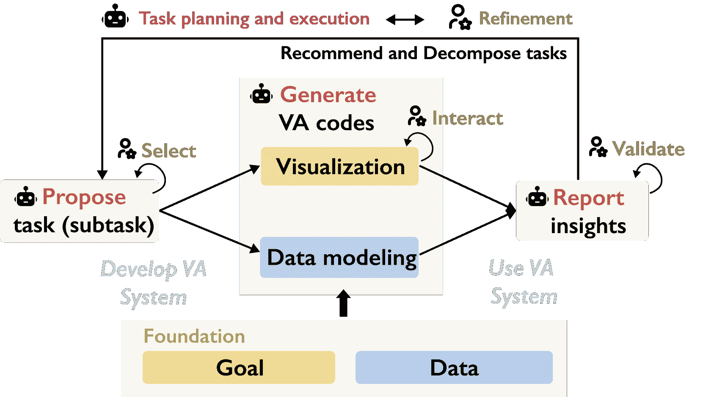
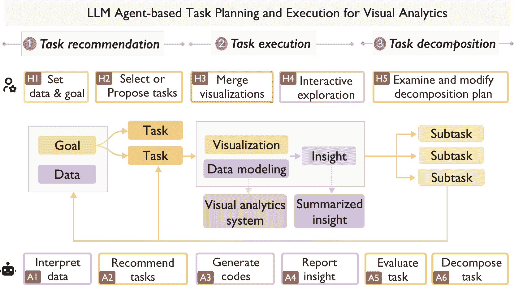
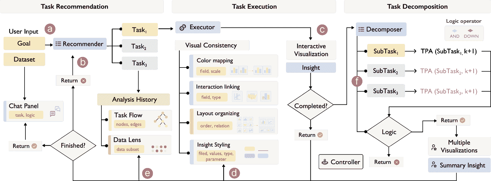
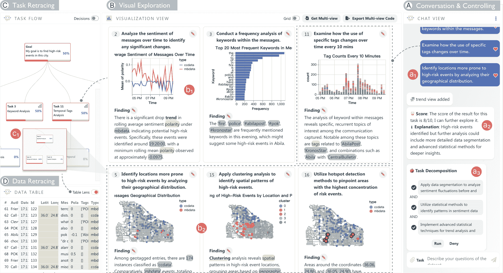
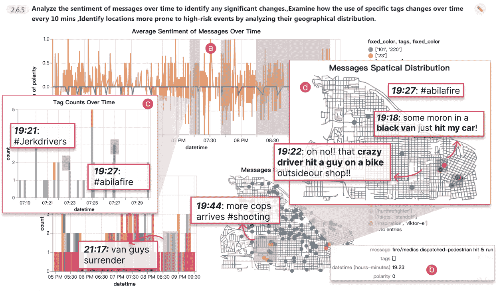
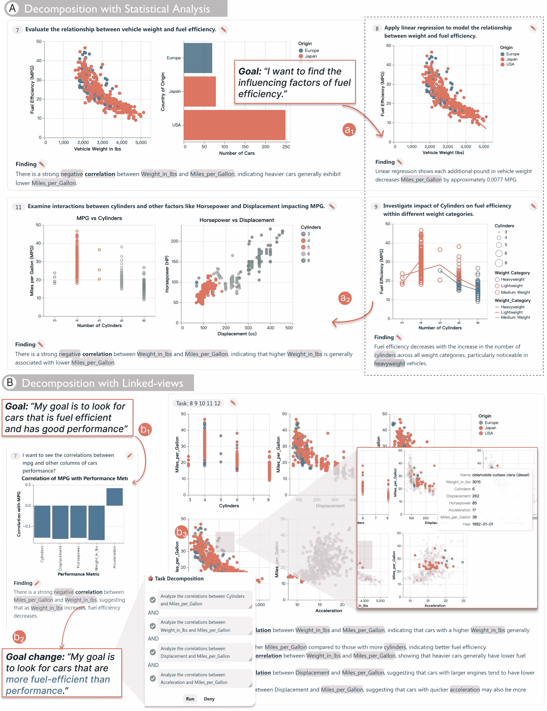
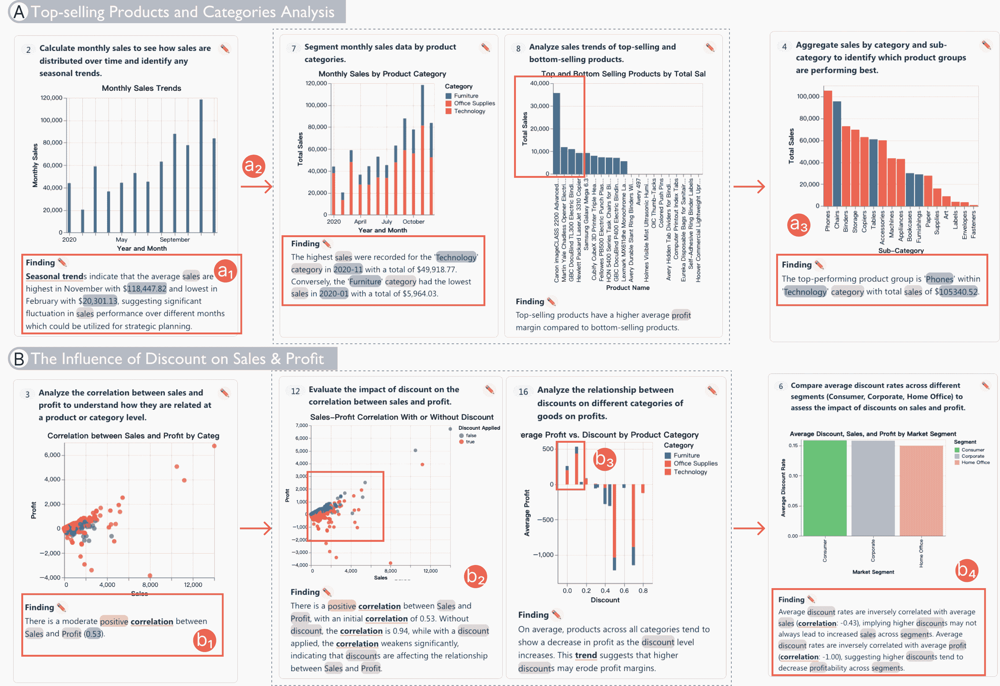

<!--yml

category: 未分类

日期：2025-01-11 11:58:05

-->

# LightVA：基于 LLM 代理的轻量级可视分析与任务规划与执行

> 来源：[https://arxiv.org/html/2411.05651/](https://arxiv.org/html/2411.05651/)

\mdfsetup

skipabove=1em,skipbelow=0em

Yuheng Zhao、Junjie Wang、Linbin Xiang、Xiaowen Zhang、Zifei Guo

Cagatay Turkay、Yu Zhang 和 Siming Chen Yuheng Zhao、Junjie Wang、Linbin Xiang、Xiaowen Zhang、Zifei Guo、Siming Chen 均来自复旦大学数据科学学院。电子邮件：{yuhengzhao, simingchen}@fudan.edu.cn。Siming Chen 为通讯作者。Cagatay Turkay 来自华威大学跨学科方法学中心。电子邮件：Cagatay.Turkay@warwick.ac.uk。Yu Zhang 来自牛津大学计算机科学系。电子邮件：yuzhang94@outlook.com。手稿接收于 2005 年 4 月 19 日，修订于 2015 年 8 月 26 日。

###### 摘要

可视分析（VA）要求分析师根据观察结果反复提出分析任务，并通过创建可视化和互动探索来执行任务，以获取洞察。这一过程需要编程、数据处理和可视化工具的技能，凸显了需要一种更智能、更精简的 VA 方法。近年来，大型语言模型（LLM）被开发为代理，能够处理具有动态规划和工具使用能力的各种任务，从而有潜力提高 VA 的效率和多样性。我们提出了 LightVA，这是一种支持任务分解、数据分析和通过人机协作进行互动探索的轻量级 VA 框架。我们的方法旨在帮助用户将高层次的分析目标逐步转化为低层次的任务，生成可视化并得出洞察。具体而言，我们引入了一种基于 LLM 代理的任务规划与执行策略，采用递归过程，包括规划者、执行者和控制者。规划者负责推荐和分解任务，执行者负责执行任务，包括数据分析、可视化生成和多视图组合，控制者协调规划者与执行者之间的互动。在此框架基础上，我们开发了一个包含混合用户界面的系统，其中包括一个用于监控和管理任务规划过程的任务流图，一个用于交互式数据探索的可视化面板，以及一个用于通过自然语言指令引导模型的聊天视图。我们通过使用场景和专家研究来检验我们方法的有效性。

###### 关键词：

可视分析、任务规划、大型语言模型代理、混合主动交互

## I 引言

可视分析（VA）通过数据挖掘和交互式可视化解读复杂数据集[[1](https://arxiv.org/html/2411.05651v1#bib.bib1), [2](https://arxiv.org/html/2411.05651v1#bib.bib2)]。然而，构建和使用VA系统可能是一个昂贵的过程，涉及几个主要阶段：目标理解、任务分解、数据建模和可视化创建以发现洞察。一个关键挑战是，这个过程是迭代性的，需要根据不断变化的需求进行持续的完善[[3](https://arxiv.org/html/2411.05651v1#bib.bib3)]。不同的任务需要不同的数据分析和可视化方法来形成一个VA系统。在使用该系统时，任务可能会根据获得的洞察而发生变化，这需要不断的迭代，直到达成分析目标[[4](https://arxiv.org/html/2411.05651v1#bib.bib4)]。考虑一个情境，其中目标是从社交媒体数据中识别高风险事件。用户可能首先需要从不同的视角获得概览，比如关键词随时间的分布或风险分析中情感的变化。如果识别出异常值，用户可能需要更多的细节，比如空间分布或实体关系。在这个过程中，任务空间广泛且流动，需要高效的任务规划和方法实施。

最近的研究集中于数据驱动或基于自然语言的视觉数据探索，重点在于自动化可视化生成[[5](https://arxiv.org/html/2411.05651v1#bib.bib5), [6](https://arxiv.org/html/2411.05651v1#bib.bib6)] 或洞察挖掘[[7](https://arxiv.org/html/2411.05651v1#bib.bib7), [8](https://arxiv.org/html/2411.05651v1#bib.bib8)]。大型语言模型（LLMs）展现了在数据分析中的潜力，支持动态任务规划，并在各种场景中降低开发成本。赋能自主规划和执行分析任务的推理能力[[9](https://arxiv.org/html/2411.05651v1#bib.bib9), [10](https://arxiv.org/html/2411.05651v1#bib.bib10), [11](https://arxiv.org/html/2411.05651v1#bib.bib11)]，同时代码生成能力支持高效创建有洞察力的可视化[[12](https://arxiv.org/html/2411.05651v1#bib.bib12), [13](https://arxiv.org/html/2411.05651v1#bib.bib13), [14](https://arxiv.org/html/2411.05651v1#bib.bib14)]。此外，它们广泛的知识库使得LLMs成为多功能工具，能够适应不同的数据分析场景[[15](https://arxiv.org/html/2411.05651v1#bib.bib15), [16](https://arxiv.org/html/2411.05651v1#bib.bib16)]。LEVA[[17](https://arxiv.org/html/2411.05651v1#bib.bib17)] 将LLMs集成到VA系统中，以推荐给定任务的洞察，但仍无法生成适应任务的可视化和数据建模方法。目前缺乏支持任务规划、VA方法实施和人与智能体协作的交互式分析的方法。

本文介绍了 LightVA，一个具有基于代理的任务规划的轻量级 VA 框架。术语“轻量级”指的是该框架侧重于减少开发成本和 VA 系统的使用成本。通过使用 LLM 代理来辅助任务规划和执行过程。该框架基于多层次关系，将高层次目标转化为低层次任务，并通过数据挖掘和交互式可视化来得出洞察。具体而言，该框架采用递归过程，包括规划器、执行器和控制器，动态适应任务复杂性。规划器负责任务分解，执行器处理任务执行，包括可视化生成和数据分析，而控制器则协调执行器和规划器，管理任务是否继续分解。我们开发了一个基于该框架的系统，提供聊天视图以支持用户与代理之间的沟通，任务流视图以可视化管理任务规划过程，和可视化面板以展示单一视图和与任务流连接的多个联动视图。我们的主要贡献如下：

+   •

    我们提出了一个轻量级的 VA 框架，采用基于 LLM 代理的任务规划与执行。该方法通过人类与代理的协作，实现了适应性强且高效的分析，帮助用户进行任务分解、可视化和洞察发现。

+   •

    我们开发了一个体现该框架的系统，支持用户在代理的帮助下分析数据，并通过混合用户界面进行沟通。

+   •

    我们通过使用场景和专家研究展示了该系统的有效性。

## II 相关工作

我们的研究与之前的可视化推荐、任务驱动的数据探索以及 LLM 在数据探索中的应用相关。

### II-A 可视化推荐

可视化创作通常要求用户具备专业的可视化知识和编程能力。例如，像 Tableau 这样的工具支持通过货架配置设计创建可视化和多个链接视图，提供强大的可视化创作功能。然而，尽管 Tableau 在作为创作工具方面表现出色，但它在自动任务分解和 VA 方法实施方面的支持有限，无法进一步辅助分析。关于自动可视化推荐的研究成果已提出 [[18](https://arxiv.org/html/2411.05651v1#bib.bib18), [19](https://arxiv.org/html/2411.05651v1#bib.bib19), [20](https://arxiv.org/html/2411.05651v1#bib.bib20)]。基于规则的方法，如 Voyager [[21](https://arxiv.org/html/2411.05651v1#bib.bib21)] 和 CompassQL [[22](https://arxiv.org/html/2411.05651v1#bib.bib22)]，利用可视化原理构建视觉映射，允许用户选择他们感兴趣的数据属性和视觉编码来创建可视化。对于机器学习方法，Data2Vis [[23](https://arxiv.org/html/2411.05651v1#bib.bib23)] 引入了一种端到端可训练的神经翻译模型，用于从给定数据集自动生成可视化。VizML [[24](https://arxiv.org/html/2411.05651v1#bib.bib24)] 从一对数据-可视化对中学习可视化设计选择。Table2Charts [[25](https://arxiv.org/html/2411.05651v1#bib.bib25)] 通过学习表格与可视化之间的模式推荐可视化。ChartSeer [[26](https://arxiv.org/html/2411.05651v1#bib.bib26)] 采用深度学习基于用户的交互推荐可视化。与直接从数据集学习并生成可视化的端到端深度学习方法不同，基于知识图谱的方法，如 AdaVis [[27](https://arxiv.org/html/2411.05651v1#bib.bib27)]，KG4VIS [[28](https://arxiv.org/html/2411.05651v1#bib.bib28)]，Lodestar [[29](https://arxiv.org/html/2411.05651v1#bib.bib29)]，利用关于数据和关系的结构化信息来推荐可视化。

此外，还有一些研究考虑了多视图生成。Qu和Hullman [[30](https://arxiv.org/html/2411.05651v1#bib.bib30)] 提出了协调原则以保持一致性。Sun等人[[31](https://arxiv.org/html/2411.05651v1#bib.bib31)] 研究了基于数据关系的不同联接技术。Dziban [[32](https://arxiv.org/html/2411.05651v1#bib.bib32)] 是一个使用锚定推荐的可视化API，并扩展了Draco [[33](https://arxiv.org/html/2411.05651v1#bib.bib33)] 来推理多个视图。DMiner [[34](https://arxiv.org/html/2411.05651v1#bib.bib34)] 研究了在线笔记本中单视图和视图间关系的设计规则，以推荐多视图仪表板。MultiVision [[35](https://arxiv.org/html/2411.05651v1#bib.bib35)] 和DashBot [[5](https://arxiv.org/html/2411.05651v1#bib.bib5)] 使用深度学习模型，以端到端的方式推荐给定输入数据集的仪表板。Shi等人[[36](https://arxiv.org/html/2411.05651v1#bib.bib36)] 通过使用基于Transformer的模型预测视觉元素的相似性来优化多视图布局。之前的研究为数据、可视化和多视图之间的原则提供了坚实的研究基础。在此基础上，我们进一步研究了将LLM-agent整合进来，以推荐符合高级目标和不断变化任务的可视化，这些都需要大量的人力投入。

### II-B 任务驱动的可视化数据探索

除了在推荐可视化时考虑数据属性外，一些可视化推荐系统是任务驱动型推荐系统，它们会考虑一个或多个分析任务（例如，相关性分析、趋势分析）。一些学者研究了在笔记本中进行探索性数据分析（EDA）时对分析方法的推荐。EDAssistant [[37](https://arxiv.org/html/2411.05651v1#bib.bib37)] 通过分析大量笔记本集合中API之间的关联来推荐代码。ATENA [[38](https://arxiv.org/html/2411.05651v1#bib.bib38)] 将EDA转化为马尔可夫决策过程（MDP）模型，使用深度强化学习架构有效优化笔记本生成过程。此外，视觉分析将可视化技术融入EDA过程，扩展了任务空间。Casner [[39](https://arxiv.org/html/2411.05651v1#bib.bib39)] 提出了最早的可视化系统之一，该系统根据用户的任务（例如，查找直飞航线或查看航班信息的表格）来推荐图表。Saket等人 [[40](https://arxiv.org/html/2411.05651v1#bib.bib40)] 进行了一项研究，评估了五种经典可视化在十个低级分析任务中的有效性 [[41](https://arxiv.org/html/2411.05651v1#bib.bib41)]，并根据研究结果开发了一个推荐引擎。Gotz和Wen [[42](https://arxiv.org/html/2411.05651v1#bib.bib42)] 提出了一个原型系统，通过观察交互模式（例如，反复更改过滤器或交换属性）来推断分析任务（如比较或趋势分析），并相应地推荐可视化（如小倍数图或折线图）。VizAssist [[43](https://arxiv.org/html/2411.05651v1#bib.bib43)] 使用户能够根据分析任务（例如，相关性分析、比较）来指定他们的数据目标，并将这些任务与现有的感知指南结合，作为输入到遗传算法中推荐可视化。Foresight [[8](https://arxiv.org/html/2411.05651v1#bib.bib8)] 使用分布、异常值和相关性等任务来引导洞察发现和分组推荐。TaskVis [[44](https://arxiv.org/html/2411.05651v1#bib.bib44)] 通过答案集编程在特定任务下推荐可视化。

除了基于单一任务的可视化生成外，Medley [[45](https://arxiv.org/html/2411.05651v1#bib.bib45)] 基于多个分析意图推荐多视图集合，用户可以选择视图和小部件来组合成多种仪表板。然而，分析意图和可视化组合通常是从预设选项中选择的，这限制了探索的灵活性。与此不同，我们研究基于目标和发现的动态任务规划，并利用人机协作。

### II-C 大型语言模型在数据探索中的应用

基于LLM的工具已被提出用于数据探索和可视化任务。在可视化生成和推荐方面，LLM4Vis [[14](https://arxiv.org/html/2411.05651v1#bib.bib14)] 和ChartGPT [[46](https://arxiv.org/html/2411.05651v1#bib.bib46)] 利用LLMs从自然语言指令中选择适当的可视化方案。Li等人[[47](https://arxiv.org/html/2411.05651v1#bib.bib47)]评估了GPT-3.5生成可视化规范的能力，展示了其在传统机器学习方法中的优势。NL2Rigel [[48](https://arxiv.org/html/2411.05651v1#bib.bib48)] 展示了LLM将指令转化为全面数据可视化和表格的能力。对于分析任务的翻译和自动化，Hassan等人[[49](https://arxiv.org/html/2411.05651v1#bib.bib49)]和Data-Copilot[[16](https://arxiv.org/html/2411.05651v1#bib.bib16)]集中于将分析目标和模糊查询转化为可执行的数据分析任务。Ma等人[[50](https://arxiv.org/html/2411.05651v1#bib.bib50)] 和JarviX[[12](https://arxiv.org/html/2411.05651v1#bib.bib12)]介绍了通过识别合适的分析意图并生成洞察来自动化数据探索过程的系统。Text2Analysis [[51](https://arxiv.org/html/2411.05651v1#bib.bib51)] 提供了一个框架，用于对数据分析任务进行分类，建立了一种结构化的方法来应对从基本操作到预测和图表生成等常见的分析挑战。然而，这些研究中的任务通常较为简单且集中，较少探索更复杂任务的分解。

在使用LLM解决需要多步骤推理的复杂任务时，直接使用LLM的性能往往会下降。最近，先前的方法通过输入输出提示、CoT [[52](https://arxiv.org/html/2411.05651v1#bib.bib52)]、ToT [[53](https://arxiv.org/html/2411.05651v1#bib.bib53)] 或GoT [[54](https://arxiv.org/html/2411.05651v1#bib.bib54)]等方式来执行复杂的任务规划和执行。这些方法证明了LLM在任务规划方面表现优异，但需要合适的提示技巧。另一种方式是将LLM集成到接口中，允许通过链式多个提示来应对更广泛的人类任务。Wu等人[[55](https://arxiv.org/html/2411.05651v1#bib.bib55)]介绍了AI模型的链式结构，其中将复杂任务分解为多个步骤。Talk2Data [[56](https://arxiv.org/html/2411.05651v1#bib.bib56)] 提供了一个自然语言接口，使用户能够通过问题分解探索可视化数据。然而，相关的可视化和更高级的数据分析方法仍然有限。为了增强这一能力，我们利用LLM并提出了一种基于代理的自主任务规划策略，用于适应性VA系统的构建和探索。

## III LightVA框架

VA的流程包括两个阶段：开发和分析。因此，在LightVA中，我们旨在减少开发人员和分析师的工作量。在接下来的部分，我们将探讨挑战并提出集成基于LLM的代理到用户工作流中的设计要求。最后，我们介绍基于代理的VA工作流的概念框架。

### III-A 挑战

通过对视觉分析文献的回顾，我们识别并剖析了加重用户工作量的具体挑战：

1.  C1

    适应多样化的分析需求：数据分析师通常面临着在广阔的探索空间中导航的巨大挑战，其中分析过程是动态的和迭代的[[4](https://arxiv.org/html/2411.05651v1#bib.bib4)]。形成假设并通过持续提出新任务和新见解来验证它们是复杂的。他们必须在脑海中理清任务和见解之间的关联，并尝试在接下来的几步中提出任务，直到达成目标。

1.  C2

    开发可视化和数据挖掘工具是耗时的：分析师通常缺乏开发和管理VA系统的能力，这使得他们在选择和应用合适的数据建模和可视化技术时面临挑战[[45](https://arxiv.org/html/2411.05651v1#bib.bib45)]。此外，当任务涉及多个可视化时，这些可视化必须集成到一个链接视图中，以便进行更有效的交互式探索[[57](https://arxiv.org/html/2411.05651v1#bib.bib57)]。然而，这一过程需要对可视化原理和编程技能有深刻的了解，从而导致低效和延误[[58](https://arxiv.org/html/2411.05651v1#bib.bib58)]。

### III-B 设计要求

基于这些挑战，我们已经确定了一组有针对性的设计要求。

1.  R1

    自适应任务规划：任务提议需要根据用户的分析目标和给定的数据集量身定制。这包括深入和广泛的探索，自动化的规划和执行能够减少用户的努力。此外，随着探索结果的出现，新的任务应与先前的探索结果在语境上进行关联，以适应任务之间的切换。（C1）

1.  R2

    灵活的可视化生成：可视化的生成应灵活地处理不同的任务和数据。这包括准确的数据识别、转换和可视化类型的选择，以及根据发现的见解添加高亮，以减轻认知负担。此外，生成的视图应支持交互，使用户能够进行更为沉浸的分析。（C2）

1.  R3

    自动洞察生成：为了减少开发成本，系统应高效地完成给定任务的基于代码的数据分析，提供可视化并提出发现，以促进假设的形成和验证。为了减轻认知负担，洞察的关键部分应在输出结果中以富文本格式突出显示。（C2）

1.  R4

    多视图合成：随着新可视化的添加，旧的可视化可能变得不再相关。为了向用户显示最新结果，可视化面板需要更新。然而，避免丢弃以前的结果至关重要，因为它们可能与新的洞察相关。即使它们不是最新的，用户也应该被允许合并感兴趣的可视化。在合并的视图中，用户可以通过交互将分析集中在更小的范围内，从而减少在大数据集中的认知负担。（C2）

1.  R5

    直观分析过程：任务、可视化、洞察和分析进展之间的关系应以更直观的形式呈现。系统应支持人类与代理之间的交互，帮助用户理解代理的任务规划和执行过程。（C1，C2）

### III-C 概念框架

基于讨论中的挑战和需求，我们提出了LightVA，一个基于代理的轻量级VA框架。“轻量级”指的是在开发VA系统和使用开发出的系统进行分析时对系统的低要求。我们设计该框架，采用递归任务解决过程，其中目标和数据是输入，洞察是输出。中间结果包括任务、子任务、可视化、数据建模 ([图 1](https://arxiv.org/html/2411.05651v1#S3.F1 "在 III-C1 定义基本元素 ‣ III-C 概念框架 ‣ III LightVA 框架 ‣ LightVA：基于LLM代理的轻量级视觉分析和任务规划与执行"))。LLM代理被集成以支持目标理解和任务分解（R1）、数据建模和可视化代码生成（R2，R3），以及生成互动探索的链接视图（R4）。同时，用户可以通过直接操作和自然语言监控过程、引导代理并细化代理输出（R5）。

#### III-C1 定义基本元素

图 1：LightVA概念框架的说明。代理通过任务规划和执行创建VA系统进行分析，而用户使用创建的VA系统并细化代理输出。

根据框架的上述描述，需要定义一些关键的基本元素。

目标和数据：我们将目标定义为对分析高层次目的的总体描述或模糊表述。例如，“分析影响汽车燃油效率的因素”。目标引导分析的焦点，数据提供满足目标的分析证据。

任务：任务是从目标中派生出来的具体方面，使目标可以执行。我们通过四个属性来定义任务：

|  | $task:=\langle type,\leavevmode\nobreak\ data\leavevmode\nobreak\ variables,% \leavevmode\nobreak\ method,\leavevmode\nobreak\ progress\rangle$ |  | (1) |
| --- | --- | --- | --- |

类型表示要执行的分析操作的性质或类别，例如查找极值、离群点、变化点、趋势分析等。数据变量是任务应用的对象。方法定义了任务的解决方式，包括数据建模和可视化方法，解决后的结果即为洞察。如果任务复杂，意味着它涉及多个数据变量并需要使用多种方法解决，那么任务可以分解为子任务。为了描述任务是否完成，我们定义了进度，意味着当其子任务完成时，任务也被视为完成。鉴于任务可能复杂，且范围从低到高的抽象层次不等，我们使用自然语言来描述它们。

洞察：这表示任务旨在达到的预期或目标知识或理解。我们通过四个属性来定义洞察：

|  | $insight:=\langle type,\leavevmode\nobreak\ parameters,\leavevmode\nobreak\ % data\leavevmode\nobreak\ variables,\leavevmode\nobreak\ data\leavevmode% \nobreak\ values\rangle$ |  | (2) |
| --- | --- | --- | --- |

洞察类型可以是通过分析识别出的发现、模式、趋势或异常[[59](https://arxiv.org/html/2411.05651v1#bib.bib59)]。例如，如果任务类型是“比较”，那么洞察类型可以是“差异”[[7](https://arxiv.org/html/2411.05651v1#bib.bib7)]。洞察的具体特征参数，如“趋势”的“增加”或“减少”。洞察的数据变量可以是原始数据列或转换后的变量，而任务的数据变量则是原始数据列。例如，如果任务涉及分析车辆重量和燃油效率（MPG），任务的数据变量将包括“Weight_in_lbs”和“MPG”。如果洞察包括一个衍生指标，如“每磅MPG”，这将被视为特定于洞察的转换变量。数据值指的是数据变量的特定值。例如，最大MPG值为“48”。

可视化：指为任务所需的最佳数据和洞察传达方式的视觉表现。

|  | $visualization:=\langle type,\leavevmode\nobreak\ encoding,\leavevmode\nobreak% \ interaction,\leavevmode\nobreak\ coordination\rangle$ |  | (3) |
| --- | --- | --- | --- |

我们的框架使用Vega-Lite语法[[60](https://arxiv.org/html/2411.05651v1#bib.bib60)]生成可视化，支持上述四个方面。交互类型包括例如过滤、缩放和悬停，这些都受到可视化的支持。协调描述了此可视化如何与其他可视化进行交互或同步，例如使用刷选功能互相过滤。

#### III-C2 框架的工作流程

我们的框架涉及构建一个任务流，表示为一个有向复合图 $G=(V,E)$，其中每个节点 $v\in V$ 表示一个任务，边 $e\in E$ 表示一个任务与另一个任务之间的连接。由于探索过程既涉及启发性思维又涉及深入思考，我们定义了两种任务边：推荐和分解。我们将任务的解决定义为执行。推荐和分解的区别在于，推荐是“目标导向的”，而分解是“任务特定的”。推荐旨在拓宽探索范围，提供启发式建议；分解则旨在确保为解决任务制定详细且逻辑清晰的计划。接下来的部分将介绍人类与代理如何在我们的框架中协作完成分析（[图2](https://arxiv.org/html/2411.05651v1#S3.F2 "在III-C2 框架的工作流程 ‣ III-C 概念框架 ‣ III LightVA框架 ‣ LightVA：基于LLM代理的轻量级可视化分析任务规划与执行")）。

图2：基于LLM代理的任务规划和执行的工作流程，用于可视化分析。用户与AI代理之间的协作可分为三个阶段：任务推荐、任务执行和任务分解。用户提出目标，选择任务，合并可视化并进行交互式探索（H1-H5）。代理解释数据，推荐任务，生成代码，报告见解，评估任务并分解任务（A1-A6）。

阶段1：任务推荐。最初，用户上传数据并输入目标（H1），然后代理解释数据（A1），并将目标转化为具体的、可执行的任务（A2）。用户可以提供反馈，接受或修改推荐的任务，以便与其分析需求对齐（H2）。具体而言，交互过程涉及两个阶段：

+   •

    初始阶段：开始时，代理应首先解释数据，并通过将目标与数据映射来提出使目标可执行的任务。原则是识别数据变量和任务类型。例如，对于“在一个城市中找到高风险事件”的目标，有用的数据变量可能包括时间、空间、文本和情感。代理还需要区分分析的目的，例如，“发现异常值”。因此，数据变量和任务类型的不同组合可以形成目标下的不同任务。

+   •

    历史背景阶段：随着分析在推荐过程中不断积累，代理应考虑先前任务和整体目标，推荐任务。首先，当一个任务完成时，代理评估是否已实现整体目标。如果没有，它应该推荐与目标对齐的新任务。其次，如果之前未探索的任务仍然与目标相关，应该重新评估并再次提出。

阶段2：任务执行。在这个阶段，智能体生成可视化和建模代码（A3），并执行代码报告并总结洞察（A4）。通过多种可视化和建模方法，用户可以选择可视化方式来合并联动视图（H3），并进行交互式探索（H4）。它包括以下两个步骤：

+   •

    可视化和洞察生成：当用户选择一个智能体建议的任务或自行提出任务时，智能体编写代码以完成分析。智能体需要为每个任务选择适当的数据建模和可视化方法，并运行代码完成分析。然后，智能体需要将洞察生成结构化格式。最后，智能体应总结从子任务分解中获得的洞察，提供分析的全面概览。

+   •

    多视图联动：用户可以通过选择多个喜欢的可视化来发起协调，而智能体生成代码。目前，我们不会自动将子任务的可视化合并，因为从主任务分解出的子任务通常共享相同的变量和可视化类型。例如，几个子任务可能使用纬度和经度创建不同空间模式的地图。联动视图通常用于与不同的可视化进行多变量关联分析。因此，允许用户选择自己的可视化可以提供更灵活的分析方式。

阶段3：任务分解。我们根据“按需”策略设计分解。换句话说，优先执行任务，只有在任务未完成时才考虑分解。这种方法旨在确保用户能够在互动环境中快速看到初步结果。在这个阶段，智能体负责评估任务（A5）并提出分解计划（A6），同时用户可以检查并修改智能体输出，从而覆盖智能体的建议（H5）。

+   •

    结果评估：根据初步执行的见解和任务的复杂性，智能体评估是否需要进一步分析。根据任务的定义，智能体应验证数据变量的选择以及数据建模和可视化方法的合理性。评估应进行解释，以便用户理解分解的动机。

+   •

    子任务生成：如果需要分解，智能体应制定一个计划，概述子任务。每个子任务应具有适当的数据变量和方法，解决主要任务的不同方面。这些子任务应有执行顺序，例如并行或顺序执行。

## IV LightVA 系统

在设计要求的指导下，我们提出了基于LLM智能体的任务规划流程和支持互动可视化数据探索的接口。

图 3：基于代理的系统架构。管道从目标和数据开始，采用基于代理的任务规划策略，包括推荐、执行和分解。具体组件和交互标记为（a）-（f），其中（a）是从目标推荐任务的初始阶段，（b）推荐具有历史背景的任务，（c）是执行任务，生成可视化和洞察。之后，进行一系列视觉一致性的优化（d）。历史记录被管理，任务的进度得到及时更新（e）。根据分析结果，代理评估任务是否需要分解（f）。

### IV-A 基于代理的任务规划

基于之前介绍的概念框架，我们提出了一种基于代理的任务规划管道[图 3](https://arxiv.org/html/2411.05651v1#S4.F3 "在 IV LightVA 系统 ‣ LightVA: 轻量级视觉分析与 LLM 基于代理的任务规划与执行")。在这一过程中，我们有三种模块。规划器有两种类型：推荐器和分解器，分别负责任务推荐和分解。执行器负责任务执行，包括可视化生成和数据分析，而控制器是将执行器与规划器连接的递归算法（详见附录中的算法）。在介绍每个阶段的策略时，我们提供了描述输入和输出、LLM 指令以及输出格式的指标的提示模板。提示示例和输出在附录 A 中可用。

#### IV-A1 任务推荐

任务规划从基于给定目标和数据集的推荐方法开始。推荐器的目标是将目标转化为可执行的任务。实施遵循逐步指南，分为两个阶段：初始阶段和历史背景阶段（提示模板[1](https://arxiv.org/html/2411.05651v1#ThmPrompt1 "提示模板 1（任务推荐）。 ‣ IV-A1 任务推荐 ‣ IV-A 基于代理的任务规划 ‣ IV LightVA 系统 ‣ LightVA: 轻量级视觉分析与 LLM 基于代理的任务规划与执行")）。

在初始阶段，输入为目标和数据（[图 3](https://arxiv.org/html/2411.05651v1#S4.F3 "在 IV LightVA 系统 ‣ LightVA：基于 LLM 代理的轻量级可视分析与任务规划与执行")-a），目标是将目标转化为可执行的任务。基于框架（[第三节 C2](https://arxiv.org/html/2411.05651v1#S3.SS3.SSS2 "III-C2 框架工作流程 ‣ III-C 概念框架 ‣ III LightVA 框架 ‣ LightVA：基于 LLM 代理的轻量级可视分析与任务规划与执行")），我们以三条原则来指导模型。首先，识别与目标相关的数据变量。其次，提出多种任务类型，从不同角度细化目标。第三，通过结合这些数据变量和任务类型，起草任务描述。

在历史背景阶段（[图 3](https://arxiv.org/html/2411.05651v1#S4.F3 "在 IV LightVA 系统 ‣ LightVA：基于 LLM 代理的轻量级可视分析与任务规划与执行")-b），生成的任务应分为两种类型：将目标与发现联系起来，提出新任务，以及可能被用户忽视的任务，需要复审。为实现此目标，模型可能需要考虑以下步骤。首先，评估已完成的任务，检查整体目标是否已达成。其次，基于当前背景和先前的任务提出新任务。第三，如果先前未探索的任务仍然相关，提出这些任务。除了指南外，我们还应提供输出示例以指导模型。

###### 提示模板 1（任务推荐）。

———————————————————-初始阶段

输入：{目标、数据}

指令：你需要基于对数据的理解，提出一个简短的计划，以帮助完成目标。请推荐 n 个探索性任务，包括任务描述、类型和数据变量。对于任务类型，你可以考虑趋势、关联、类别、分布等，从不同方面探索目标。对于数据变量，列出原始列名称。

指标：{JSON 格式的示例} 输出：{新任务} —————————————————历史背景

输入：{目标、数据、已探索任务和未探索任务} 指令：如有需要，你需要根据已探索任务的结果为已探索任务补充一些新任务。其次，建议根据已探索任务，重新审视那些适合在此阶段进行分析的未探索任务。指标：{JSON 格式的示例}

输出：{新任务、需要复审的现有任务}

#### IV-A2 任务执行

在用户提出任务并确认后，执行器将通过生成代码来解决任务（[图3](https://arxiv.org/html/2411.05651v1#S4.F3 "在IV LightVA系统中 ‣ LightVA：轻量级可视分析与LLM代理任务规划和执行")-c）。我们采用“按需分解”策略，意味着我们首先执行任务，然后在结果不理想时再进行任务分解。这种方法让用户能够快速获得初步结果，并且提供了更灵活的方式来处理简单和复杂的任务，避免了总是提前分解任务所带来的不必要时间成本。

执行任务时，执行器的输入包括目标、数据和任务描述，输出包括所选任务的可视化和洞察（提示模板 [2](https://arxiv.org/html/2411.05651v1#ThmPrompt2 "提示模板 2（任务执行）。 ‣ IV-A2 任务执行 ‣ IV-A 基于代理的任务规划 ‣ IV LightVA 系统 ‣ LightVA：轻量级可视分析与LLM代理任务规划和执行")）。在第一轮中，生成两个代码片段：一个用于数据分析，另一个用于可视化。在第二轮中，通过数据分析结果生成结构化洞察。

###### 提示模板 2（任务执行）。

—————————————————-代码生成

输入：{任务，数据总结，代码模板}

指令：你需要编写Python代码来分析数据以解决该任务。在完成数据分析后，你应继续使用Altair生成交互式可视化。如果使用了不同的颜色，请添加刷选或点击功能、工具提示和图例。指标：{代码模板}

[⬇](data:text/plain;base64,aW1wb3J0IGFsdGFpciBhcyBhbHQKaW1wb3J0IHBhbmRhcyBhcyBwZApkZWYgcGxvdChkYXRhOiBwZC5EYXRhRnJhbWUpOgogICAgIyBEYXRhIHByZXByb2Nlc3NpbmcKICAgICAgICA8Y29kZXM+CiAgICAjIENoYXJ0IGdlbmVyYXRpb24KICAgIGNoYXJ0ID0gYWx0LkNoYXJ0KCkubWFya19iYXIoKS5lbmNvZGUoKQogICAgcmV0dXJuIGNoYXJ0)1import  altair  as  alt2import  pandas  as  pd3def  plot(data:  pd.DataFrame):4  #  数据预处理5  <codes>6  #  图表生成7  chart  =  alt.Chart().mark_bar().encode()8  return  chart

输出：{洞察，可视化}

————————————-结构化洞察生成

输入：{任务，数据，代码}

指令：运行代码以报告该任务的重要洞察：任务。你应输出洞察，包括文本、洞察类型、参数、数据变量和数据值。{洞察属性的定义。} 指标：{一些JSON格式的示例}

输出：{洞察}

可视化生成：对于每个任务，模型需要实现数据分析和可视化方法，其中一个任务对应一个可视化，当需要进行多变量关联分析时，多个可视化将组合成多个视图，稍后我们将介绍这一点。我们通过 Altair 使用 Vega-Lite [[60](https://arxiv.org/html/2411.05651v1#bib.bib60)] 来生成可视化。Vega-Lite 是一种高阶语法，支持通过低代码方式生成各种可视化类型，其声明式结构使用户能够轻松修改可视化。由于 Altair 仅支持基本的数据转换，我们利用 Python 的灵活库来进行更复杂的分析，例如回归分析和聚类分析。然而，这可能会在分析和可视化代码片段之间引入不一致和错误。为了解决这个问题，我们在提示中提供了代码框架，允许 LLM 填充空缺，以增强一致性并提高输出稳定性。

结构化洞察生成：在生成可视化和建模代码之后，执行者需要执行这些代码，将结果结构化为洞察。由于代理的编码环境¹¹1[https://platform.openai.com/docs/assistants/tools/code-interpreter](https://platform.openai.com/docs/assistants/tools/code-interpreter)，最后访问时间为2024年3月，Code Interpreter 允许助手在沙盒执行环境中编写和运行 Python 代码，但不支持 Altair，因此我们使用本地环境来执行代码中的可视化部分。代理运行数据分析部分，解释结果并推导出洞察。我们根据框架中对洞察的定义提供格式示例，以指导模型输出。这包括洞察描述、洞察类型以及数据变量和数值。这些属性突出了洞察描述中的关键元素，以提高可读性。

关联视图生成：对于多变量关联分析，我们启用生成多个关联视图（[图3](https://arxiv.org/html/2411.05651v1#S4.F3 "In IV LightVA System ‣ LightVA: Lightweight Visual Analytics with LLM Agent-Based Task Planning and Execution")-d）。虽然 LLM 可以在代码中添加交互性并设置基本的颜色和布局，但保持视图之间的视觉一致性，例如避免颜色重复和确保布局整洁，则需要实施额外的约束。

+   •

    交互链接：为了实现图表之间的交互链接，我们指导模型按照若干准则修改和组合图表代码。首先，确保两个图表都包含共同的关键列，并且选择字段的数据格式一致。接下来，定义选择机制。常见的交互方法包括线形图上的时间轴刷选、散点图上的双刷选，以及条形图上的点击交互。然后，变换筛选器应应用于其他图表。

+   •

    布局组织：在生成新的可视化时，我们设置图表为相同大小，并按顺序排列。如果用户选择合并多个视图的图表，我们允许最多选择六个图表，以避免过度的认知负担。LLM 应该输出的布局最多每行三个图表。

+   •

    色彩映射：我们在任务空间中基于 Qu 和 Hullman 的指南 [[30](https://arxiv.org/html/2411.05651v1#bib.bib30)] 构建了一个数据到颜色的映射规则，其中每种颜色对应一个数据维度，且不重用。例如，同一领域应在不同视图中使用相同的定量色彩比例，而不同领域则应使用不重叠的色调或调色板，以避免混淆。

任务进度计算：在分析过程中，每个节点都有一个进度属性，用于量化任务的完成度。当任务执行时，代理评估任务的完成状态。如果任务未完成且需要进一步深入分析，进度设置为 0%；否则，进度设置为 100%。一旦任务被确定为未完成，代理会提出分解方案。如果用户拒绝进一步分解，进度设置为 100%。每个最近执行的任务都表示为叶节点，启动自底向上的进度值刷新，更新树中非叶节点的进度值 ([图 3](https://arxiv.org/html/2411.05651v1#S4.F3 "在 IV LightVA 系统 ‣ LightVA：基于 LLM 代理的轻量级可视分析与任务规划执行")-e)。主任务的进度为两个子任务的平均进度，这些子任务是用户确认的由任务分解或推荐生成的节点。这个分层更新过程准确反映了分析状态，并确保进度值既考虑了代理的评估，也包含了用户输入。

图 4：LightVA 系统包含四个视图。用户可以在 (A) 聊天视图中与 LLM 进行互动并控制规划过程，选择任务或设置分解计划。LLM 生成的可视化和洞察信息会在 (B) 可视化视图中更新。任务流程视图 (C) 展示任务规划结构，并允许用户控制分析过程。当任务完成时，用户可在数据表 (D) 的表格镜头中查看数据探索情况。

#### IV-A3 任务分解

在执行任务时，分解器会评估任务完成的质量，并决定是否需要进一步分解以及如何分解（提示模板 [3](https://arxiv.org/html/2411.05651v1#ThmPrompt3 "提示模板 3（任务分解）。 ‣ IV-A3 任务分解 ‣ IV-A 基于代理的任务规划 ‣ IV LightVA 系统 ‣ LightVA：基于大语言模型的轻量级视觉分析与任务规划与执行")). 为了评估任务是否完成，输入包括任务、代码和洞察，而输出是一个从 0 到 10 的分数及解释。如果需要进一步分解（即分数低于某个阈值，如 8），将提出一个详细的分解计划，并采用适当的逻辑运算符（[图 3](https://arxiv.org/html/2411.05651v1#S4.F3 "在 IV LightVA 系统 ‣ LightVA：基于大语言模型的轻量级视觉分析与任务规划与执行")-f）。相反，如果不需要进一步分解，控制器将调用推荐器来提出新的探索性任务。根据该框架，评估过程可以通过以下准则来指导。第一个是判断初步解决方案是否适当地划分了数据，确保分析覆盖所有相关子集。第二，评估任务是否需要进一步的数据挖掘或可视化方法（例如回归、聚类），以提取更深的洞察。

###### 提示模板 3（任务分解）。

———————————————————–已完成

输入：{任务，代码，洞察}

指令：你需要判断任务是否需要进一步分析。任务的复杂性可以从数据、数据挖掘和可视化方法中考虑。如果任务看起来不完整，则需要进一步分解。请对任务进行 1-10 的评分。例如，如果初步解决方案适当地划分了数据，或任务需要高级统计分析。你应输出评分和解释。指示：{JSON 格式的输出模板}

输出：{分数，解释}

———————————————————–分解

输入：{任务，洞察，分数，解释}

指令：此任务需要进一步分析。根据评分和解释，请生成不超过 n 个子任务，并基于此分别指明它们所使用的方法。执行顺序中有两个运算符 AND 和 DOWN 用于连接任务。指示：{JSON 格式的示例}

输出：{子任务，执行顺序}

如果任务需要分解，将采用深度优先的分解过程。该过程由两个因素指导。一个是预定义的最大分解深度 ($k_{max}$)，管理分解的深度 ($k$)（当 $k<k_{max}$ 时进行分解）。另一个因素是子任务的完整性。在这里，我们定义每个可以分解为子任务的任务，有两种类型的逻辑。

+   •

    AND：子任务是独立的，并与多个代理并行执行。

+   •

    DOWN: 这是一个特定的**AND**案例。子任务是相互依赖的，将由单一代理按顺序执行。

我们通过一个示例来说明分解过程。如果分析车辆重量和燃油效率的任务完成，得分为6/10，代理可能会建议以下分解：T1：将数据分为重量类别（轻型、中型、重型），并分析每个类别中的燃油效率。T2：在每个重量类别内，进行聚类分析，以识别可能进一步解释燃油效率变化的模式或分组。T3：进行多元回归分析，控制发动机尺寸和车辆年龄等额外变量。执行逻辑为（T1 DOWN T2 AND T3）。

根据逻辑，代理会执行每个子任务，并总结子任务的见解，形成对分解任务的整体见解。如果所有子任务都完成或达到了最大步骤，则不需要进一步分解。然后，考虑到目标和分析结果，代理可能建议重新审视先前提出的任务或推荐新的探索任务。

### IV-B LightVA 界面

基于代理的界面包含多个视图，允许用户进行可视化探索，如[图4](https://arxiv.org/html/2411.05651v1#S4.F4 "在 IV-A2 任务执行 ‣ IV-A 基于代理的任务规划 ‣ IV LightVA 系统 ‣ LightVA：基于大语言模型代理的轻量级可视化分析与任务规划执行")所示。为了实现这一点，我们提供了四个视图：聊天视图、可视化视图、任务流程视图、数据视图。交互设计遵循[第III-B节](https://arxiv.org/html/2411.05651v1#S3.SS2 "III-B 设计要求 ‣ III LightVA 框架 ‣ LightVA：基于大语言模型代理的轻量级可视化分析与任务规划执行")中的设计考虑，并提供三种交互模式。

聊天视图：探索从聊天视图开始 ([图 4](https://arxiv.org/html/2411.05651v1#S4.F4 "In IV-A2 Task Execution ‣ IV-A Agent-based Task Planning ‣ IV LightVA System ‣ LightVA: Lightweight Visual Analytics with LLM Agent-Based Task Planning and Execution")A)，这是一个基于LLM的聊天框，便于用户与代理通过自然语言交互进行直接沟通。用户与代理之间的互动可以在委托、引导和讨论三种模式间切换。在此界面中，用户上传数据并输入目标。代理随后会根据其对数据集的理解，并以按钮的形式建议新的任务。用户可以收藏感兴趣的任务，而不感兴趣的任务不会计入探索的进度。用户可以通过点击任务来执行它。此外，用户还可以在聊天框中输入自己的任务。提交任务后，代理会在可视化视图中提供该任务的生成可视化和计算得到的洞察 ([图 4](https://arxiv.org/html/2411.05651v1#S4.F4 "In IV-A2 Task Execution ‣ IV-A Agent-based Task Planning ‣ IV LightVA System ‣ LightVA: Lightweight Visual Analytics with LLM Agent-Based Task Planning and Execution")B)。如果任务需要被分解，则会显示任务分解计划。用户可以通过切换文本按钮来修改任务与执行计划之间的逻辑关系。代理会根据用户的指示分析任务，并返回多个子任务的结果。在探索过程中，用户可以在对话框中提出各种问题，并与LLM讨论，如问题分析方法、对答案的理解以及推荐的解释。

可视化视图：此视图以卡片的形式展示可视化和洞察。每张卡片包含任务序号、任务内容、交互式可视化以及富文本格式的洞察。用户可以修改Vega-Lite JSON代码和洞察文本。为了解决用户的认知负担问题，我们允许用户选择希望查看的可视化卡片，这些选中的卡片会显示在主视图中，而其余的卡片则移至下面的候选集。此外，用户还可以合并选中的卡片，创建一个交互式的链接视图。用户可以修改并导出生成的代码，为需要进一步定制分析的用户提供灵活性。

任务流视图：任务流视图会随着目标和任务的添加而更新，为用户提供任务状态和进度的清晰分析（[图 4](https://arxiv.org/html/2411.05651v1#S4.F4 "在 IV-A2 任务执行 ‣ IV-A 基于代理的任务规划 ‣ IV LightVA 系统 ‣ LightVA：基于 LLM 代理的轻量级可视分析与任务规划和执行")C）。每个节点都是一个矩形框，显示任务 ID、任务类型和进度百分比。当光标悬停在节点上时，会显示原始任务文本。点击节点将更新可视化布局中的可视化视图。将鼠标悬停在边缘上可以查看关联节点之间的数据和任务类型的差异。根据设计考虑，我们允许用户选择未探索的任务进行执行，并将其委派给代理。此外，用户还可以从任务流中移除待处理任务，以减少工作负载。清晰的探索结构可能会激发用户的创意。

数据表视图：除了任务可视化外，我们还提供了数据表视图中的数据透镜可视化（[图 4](https://arxiv.org/html/2411.05651v1#S4.F4 "在 IV-A2 任务执行 ‣ IV-A 基于代理的任务规划 ‣ IV LightVA 系统 ‣ LightVA：基于 LLM 代理的轻量级可视分析与任务规划和执行")D），以引导用户在广阔的探索空间中进行操作。当任务正在完成时，用户可以观察在表格透镜模式下积累的数据使用频率的探索情况。表格单元格的颜色表示每个单元格被探索的相对频率。这种观察可能会激发用户发现感兴趣的区域，从而提出新的问题。

### IV-C 错误处理

我们将错误定义为导致系统崩溃或无响应的问题。由于 LLM 输出本质上的不可预测性，如果输出无法正确解析，就可能发生错误，导致系统崩溃或无响应。为了确保系统正确运行并防止工作流中断，我们实现了错误处理机制。

为了开发有效的错误处理机制，我们进行了一个测试，使用了两个数据集，并通过专家评估了 20 个与代理对立的任务，采用了 GPT-3.5-turbo 和 GPT-4-turbo 两种模型。每个任务都进行了代码生成和洞察注释的测试，使用了两种不同的提示技术，共进行了 160 次初始测试。我们将测试中的错误分为五类：（1）不熟悉的数据集，（2）数据绑定问题，（3）序列化问题，（4）数据转换问题，（5）语法错误。更多关于测试的细节请参见附录 B。为有效应对这些类型的错误，我们在三种方式中实现了特定的错误处理策略：在模型生成之前使用提示技术，在生成后在系统内处理，或委托给用户。

提示技术：（1）少量提示[[61](https://arxiv.org/html/2411.05651v1#bib.bib61)]：我们提供示例来帮助模型更好地理解输出的要求。例如，在进行洞察注释时，示例可以解释模型的洞察组成部分。（2）思维链[[52](https://arxiv.org/html/2411.05651v1#bib.bib52)]：我们通过一步步的指令引导模型进行思维计划，这对于推理过程（如任务执行）非常有帮助。

系统内部处理：（1）自我反思[[62](https://arxiv.org/html/2411.05651v1#bib.bib62)]：我们允许LLMs检查并纠正其行为和输出。例如，模型应该根据错误的观察来调试代码。根据我们的测试结果，自我纠正帮助减少了大约40%的初始识别错误，如语法错误、拼写错误和逻辑不一致。（2）捕捉与反馈：常见的语法错误，如引号和括号匹配问题，可以通过基于规则的解决方案来解决。我们对这些常见错误进行分类，以突出LLM在数据分析过程中的错误步骤，而不仅仅是指出低级错误。

用户端处理：一旦识别出错误，系统会通知用户，用户可以编辑代码。此外，我们会维护分析历史记录，如果当前任务执行过程中发生错误，可以回滚到上一步。用户可以选择新的任务，并将失败的任务从任务流程中移除。

## V 使用场景：事件分析

为了检验我们的框架的有效性，我们展示了使用IEEE VAST Challenge 2021 Mini-Challenge 3 ²²2[https://vast-challenge.github.io/2021/MC3.html](https://vast-challenge.github.io/2021/MC3.html)作为使用场景。该挑战的目标是在2014年1月23日晚上，检测发生在Abila市的事件。提供的数据包括来自呼叫中心的微博记录和紧急调度记录。我们选择这个场景的动机有两个原因。首先，它涵盖了具有代表性的多种数据类型和相应的可视化方式，包括文本、空间和时间数据，这是一个典型的VA场景。其次，VAST挑战提供了地面实况数据，以支持对我们LightVA的客观评估。我们的工作中使用了OpenAI的GPT-4模型。为了更详细地展示这一场景，我们在补充材料中附加了一个视频。

初始化：在开始时，我们在聊天视图中上传一个数据集 `.csv` 文件和一个地图轮廓数据 `.json` 文件。然后，我们输入一个目标：“在这个城市中找到一些高风险事件”。数据集被简要介绍，系统根据我们的目标提出了四个初步的探索任务：情感分析、关键词分析、标签分析和空间分析 ([图4](https://arxiv.org/html/2411.05651v1#S4.F4 "在 IV-A2 任务执行 ‣ IV-A 基于代理的任务规划 ‣ IV LightVA 系统 ‣ LightVA：基于 LLM 代理的轻量级视觉分析与任务规划执行")-a1)。由于这四个任务与我们的目标一致，我们将它们全部标记在进度中。接下来，我们优先探索第一个任务——情感分析。提交后，代理在可视化视图中生成一个时间变化卡片 ([图4](https://arxiv.org/html/2411.05651v1#S4.F4 "在 IV-A2 任务执行 ‣ IV-A 基于代理的任务规划 ‣ IV LightVA 系统 ‣ LightVA：基于 LLM 代理的轻量级视觉分析与任务规划执行")-B)。生成的情感分析洞察表明，微博记录的平均情感值下降，特别是在19:20时，极性达到最低，表明可能发生危险事件 ([图4](https://arxiv.org/html/2411.05651v1#S4.F4 "在 IV-A2 任务执行 ‣ IV-A 基于代理的任务规划 ‣ IV LightVA 系统 ‣ LightVA：基于 LLM 代理的轻量级视觉分析与任务规划执行")-b1)。

图5：事件分析的联动视图。用户选择时间轴、柱状图和地图来生成联动视图。图表可以通过刷选或点击进行相互过滤（a）。每个视图的工具提示（b）中可以找到极性、标签和消息，以支持详细分析。通过交互式探索联动视图（c, d），我们发现了一些危险事件，如“肇事逃逸”、“对峙”、“火灾”。

任务推荐：该代理不仅生成可视化和结果，还会进行评估。对于这项情感分析任务，代理给出了8/10的评分，并解释说生成的结果基本完成了任务，但可以进一步进行统计分析（[图4](https://arxiv.org/html/2411.05651v1#S4.F4 "In IV-A2 Task Execution ‣ IV-A Agent-based Task Planning ‣ IV LightVA System ‣ LightVA: Lightweight Visual Analytics with LLM Agent-Based Task Planning and Execution")-a3）。由于我们倾向于从广泛的概述开始，因此决定不进行分解。因此，代理提醒我们及时回顾之前的收集任务。于是，我们选择了第二个任务（关键词分析），其内容包括生成初步的关键词可视化。生成的结果总结了诸如“fire”、“police”和“POK”等高频词汇。除了代理的发现，点击任务11的堆叠直方图显示了每个词的时间范围。例如，“shooting”发生在19:40到19:50之间，而“abilafire”则从19:00到21:30。初看这些结果似乎表明了高风险事件，如枪击和火灾。代理随后建议进行空间分析。从带有镜头的数据表中，我们可以注意到目前为止并未探索纬度和经度，这表明代理的推荐可以关注数据的覆盖范围（[图4](https://arxiv.org/html/2411.05651v1#S4.F4 "In IV-A2 Task Execution ‣ IV-A Agent-based Task Planning ‣ IV LightVA System ‣ LightVA: Lightweight Visual Analytics with LLM Agent-Based Task Planning and Execution")-D）。执行后，系统生成了带有形状和信息的地图，且任务流程中的分解结构得到更新（[图4](https://arxiv.org/html/2411.05651v1#S4.F4 "In IV-A2 Task Execution ‣ IV-A Agent-based Task Planning ‣ IV LightVA System ‣ LightVA: Lightweight Visual Analytics with LLM Agent-Based Task Planning and Execution")-c1）。我们观察到在两个特定地点的微博数量较为集中，这可能表明这些区域发生了影响公共安全的事件（[图4](https://arxiv.org/html/2411.05651v1#S4.F4 "In IV-A2 Task Execution ‣ IV-A Agent-based Task Planning ‣ IV LightVA System ‣ LightVA: Lightweight Visual Analytics with LLM Agent-Based Task Planning and Execution")-b2）。

任务分解：根据任务评估和初步结果，智能体建议进一步分解为三个子任务：聚类分析、热点检测和预测建模，采用“与”与“下降”逻辑（[图 4](https://arxiv.org/html/2411.05651v1#S4.F4 "在 IV-A2 任务执行 ‣ IV-A 基于智能体的任务规划 ‣ IV LightVA 系统 ‣ LightVA：基于 LLM 智能体的轻量级可视化分析与任务规划和执行")-a3）。为了进行回顾性分析，我们选择了前两个子任务。聚类分析结合位置和情感极性，将地图上的信息分为五类。我们发现地图左右两侧有两个地方具有明显的情感分布。第二个子任务，通过分析信息量，突出了热点区域，直观地标示出消息密集的区域。

联动视图分析：根据智能体的建议，我们可以从多变量到具体细节形成分析逻辑。为了更清晰地找到事件，我们从任务流视图中选择了三个任务。这些任务包括情感演变图、标签演变图和一张地图，形成一个互动的多视图（[图 5](https://arxiv.org/html/2411.05651v1#S5.F5 "在 V 使用场景：事件分析 ‣ LightVA：基于 LLM 智能体的轻量级可视化分析与任务规划和执行")）。通过在折线图上的互动（[图 5](https://arxiv.org/html/2411.05651v1#S5.F5 "在 V 使用场景：事件分析 ‣ LightVA：基于 LLM 智能体的轻量级可视化分析与任务规划和执行")-a），我们观察到直方图和地图，发现大约在19:20发生了“肇事逃逸”事件：“黑色面包车”首先撞上了一辆小车，然后撞上了一名骑自行车的人，激起了大量讨论（[图 5](https://arxiv.org/html/2411.05651v1#S5.F5 "在 V 使用场景：事件分析 ‣ LightVA：基于 LLM 智能体的轻量级可视化分析与任务规划和执行")-b, c）。此外，我们还发现火灾发生在肇事逃逸地点附近。随后，我们发现黑色面包车在19:44时向西行驶，并与警方发生了枪战，标志着讨论强度最高的时期。最后，在21:17，面包车上的人投降。通过观察表格和任务流，我们发现目标的进度达到了100%，数据基本覆盖，“类型”、“纬度”和“经度”被频繁探索。

总结来说，在这个场景中，我们发现了显著的事件，如火灾、肇事逃逸和对峙，而无需手动编码和设计。通过任务规划，我们基于统计分析生成了八个视图，并通过链接视图快速解决目标。与我们提交给VAST挑战赛[[63](https://arxiv.org/html/2411.05651v1#bib.bib63)]的情况相比，当时我们花费了2人、2天、6小时进行数据预处理（包括标注、分类和删除垃圾信息），再加上2人、7天、6小时进行界面构建和分析，总共大约108小时。在LightVA中，我们上传预处理过的数据，进一步的构建和分析大约需要1小时。这代表了效率的提升，约为5倍，因为当前的工作量是108小时中的25小时。此外，值得注意的是，数据处理仍然需要人工参与，尤其是在复杂场景中。一种潜在的解决方案是将代理协助的数据标注和清理集成到LightVA的工作流程中。另外，与手动设计相比，界面可视化和交互可能缺乏精致感和美学吸引力。尽管如此，总体的性价比得到了提升。为了应对这一问题，我们提供了支持导出代码的功能，可以根据需要进一步修改。

## VI专家研究

为了检验LightVA在VA系统构建和任务推荐中的有效性，我们邀请了两位VA专家（分别标记为E1和E2）和一位领域专家（标记为E3）参与了研究。这些专家在数据分析方面有经验，并且熟悉使用VA系统。

参与者背景：E1是一位专注于VA系统开发的VA专家，研究领域包括数字人文学科、基于文本的数据、自动驾驶的道路数据、时空数据集和表格数据。E1经常使用D3.js和Vue.js开发VA系统。E2是一位具有自动驾驶和社交媒体经验的VA专家，并且有商务分析的工作经验。在日常工作中，E2选择使用Tableau等工具进行定量数据分析。数据分析和可视化工具的使用频率大约为每周一次。E3是一位分析快速消费品和供应链数据的领域专家。E3经常使用Excel和Power BI，偶尔使用Python进行深入分析。数据分析和可视化工具的使用频率为每天一次。

程序：本研究包括三个阶段。首先，我们花了15分钟了解专家们在数据分析方面的背景，并通过展示视频演示介绍了我们的工作。接着，在探索阶段，专家们花了大约30分钟使用“边思考边说”方法探索系统[[64](https://arxiv.org/html/2411.05651v1#bib.bib64)]。考虑到E3的日常工作需求，并与其领域专业对接，我们选择了一个与他们日常任务相似的数据集。由于数据保密问题，我们用一个与销售相关的可比数据集替代了原始数据集供E3使用。同时，汽车数据集被指定供E1和E2探索，符合他们各自的专业领域。在系统使用阶段，我们观察并记录了他们与LightVA系统的互动过程。在最后的访谈阶段，我们花了大约30分钟收集专家们对系统使用体验的反馈。

### VI-A 视觉分析专家评估：汽车数据集

在本研究中，我们使用著名的Auto MPG数据集³³3[http://archive.ics.uci.edu/ml/datasets/Auto+MPG](http://archive.ics.uci.edu/ml/datasets/Auto+MPG)对LightVA进行了E1和E2的评估。该数据集包含406条记录和9个属性，包括品牌、型号、性能指标（如马力和气缸数）、以及制造年份和原产地。

图6：使用我们框架的专家研究插图，数据集为汽车数据集。两位VA专家在探索过程中表现出不同的分析偏好。（A）E1专注于VA的创建，逐步分解目标，并使用统计方法完成探索。（B）E2在分析过程中有明确的目标，并通过任务分解不断优化目标，利用联动视图交互找到满意的答案。

在探索过程中，E1 更关注 VA 系统的构建。一开始，E1 设置了分析目标，即识别影响燃油效率的因素。E1 从最初提出的任务中选择一个进行执行。在完成该任务后，智能体提供了详细的分解计划。随后，E1 按照智能体的指导继续选择后续子任务进行进一步分解和深入分析。在生成的可视化图表中（[图 6](https://arxiv.org/html/2411.05651v1#S6.F6 "In VI-A Visual Analytics Expert Evaluation: Cars Dataset ‣ VI Expert Study ‣ LightVA: Lightweight Visual Analytics with LLM Agent-Based Task Planning and Execution")-a1），E1 通过利用散点图上的区域刷选功能，发现了不同来源车辆在各种性能区间内生产数量的分布差异。在通过关联视图的过滤功能（[图 6](https://arxiv.org/html/2411.05651v1#S6.F6 "In VI-A Visual Analytics Expert Evaluation: Cars Dataset ‣ VI Expert Study ‣ LightVA: Lightweight Visual Analytics with LLM Agent-Based Task Planning and Execution")-a2）查看时，E1 还发现了不同气缸数量的汽车在性能上的差异。

另一位专家 E2 表现出对数据分析的专注兴趣，并在整个分析过程中逐步细化了明确的分析目标。最初，E2 的目标是识别在燃油效率和性能方面都表现出色的车辆（[图 6](https://arxiv.org/html/2411.05651v1#S6.F6 "In VI-A Visual Analytics Expert Evaluation: Cars Dataset ‣ VI Expert Study ‣ LightVA: Lightweight Visual Analytics with LLM Agent-Based Task Planning and Execution")-b1）。然而，推荐的见解揭示了燃油效率（以 MPG 衡量）与大多数性能指标之间存在强烈的负相关关系，这表明高燃油效率与卓越性能之间存在权衡。这一见解促使 E2 快速调整分析目标，优先考虑燃油效率，同时确保性能不会显著下降（[图 6](https://arxiv.org/html/2411.05651v1#S6.F6 "In VI-A Visual Analytics Expert Evaluation: Cars Dataset ‣ VI Expert Study ‣ LightVA: Lightweight Visual Analytics with LLM Agent-Based Task Planning and Execution")-b2）。根据任务分解中提出的计划，E2 使用五个图表探索了各个车辆性能指标与燃油效率之间的关系。最后，E2 将这些图表结合，生成了关联视图（[图 6](https://arxiv.org/html/2411.05651v1#S6.F6 "In VI-A Visual Analytics Expert Evaluation: Cars Dataset ‣ VI Expert Study ‣ LightVA: Lightweight Visual Analytics with LLM Agent-Based Task Planning and Execution")-b3）。通过跨视图过滤数据点，E2 找到了几款符合调整后目标的车辆模型。

### VI-B 领域专家评估：销售数据集

为了进一步评估LightVA，我们与领域专家进行了另一项研究。E3对一个大型商店的销售数据集感兴趣，该数据集提供了详细的交易信息⁴⁴4[https://www.kaggle.com/datasets/addhyay/superstore-dataset](https://www.kaggle.com/datasets/addhyay/superstore-dataset)。该数据集包含3,312条记录，涵盖21个字段，例如销售额、折扣、利润和类别。

一开始，E3提到了现实场景中产品销售数据的高时间敏感性。因此，在初始任务中，E3选择探索产品销售量的时间趋势。在由智能体建议的直方图和洞察图（[图 7](https://arxiv.org/html/2411.05651v1#S6.F7 "In VI-C Results and Analysis ‣ VI Expert Study ‣ LightVA: Lightweight Visual Analytics with LLM Agent-Based Task Planning and Execution")-a1）中，E3发现该商品的整体销售量在不同月份之间有显著差异。在接下来的分解计划中，E3对产品进行了分类，以探索不同类别的时间趋势（[图 7](https://arxiv.org/html/2411.05651v1#S6.F7 "In VI-C Results and Analysis ‣ VI Expert Study ‣ LightVA: Lightweight Visual Analytics with LLM Agent-Based Task Planning and Execution")-a2）。结果发现，不同类别的时间趋势大致相似，但“技术类”产品在11月的总销售量最高。此外，按照智能体分解后的另一个任务：“分析畅销产品和滞销产品的销售趋势”，E3注意到，在该领域的场景中，“了解产品的销售情况可以优化库存，避免缺货和库存过剩。”因此，E3选择了一个之前提出但未执行的任务，并由智能体推荐进行复审，即对不同类别和子类别的销售量进行排名（[图 7](https://arxiv.org/html/2411.05651v1#S6.F7 "In VI-C Results and Analysis ‣ VI Expert Study ‣ LightVA: Lightweight Visual Analytics with LLM Agent-Based Task Planning and Execution")-a3）。根据生成的可视化图表，E3发现“技术类”中的“手机”子类别销售表现最佳。

在找到前一个任务的答案后，E3对“分析销售与利润之间的关联”产生了兴趣。在收到具体的散点图（[图 7](https://arxiv.org/html/2411.05651v1#S6.F7 "在 VI-C 结果与分析 ‣ VI 专家研究 ‣ LightVA: 基于 LLM 代理任务规划与执行的轻量级可视化分析")-b1）后，E3发现高销售额并不总是意味着更高的利润。专家推测，这可能是由于折扣的影响，因为销售量高的商品通常有较大的折扣。E3通过与销售和利润的散点图（含折扣与不含折扣的散点图）（[图 7](https://arxiv.org/html/2411.05651v1#S6.F7 "在 VI-C 结果与分析 ‣ VI 专家研究 ‣ LightVA: 基于 LLM 代理任务规划与执行的轻量级可视化分析")-b2）进行互动和分析，确认了这一假设。为了找出产品的最佳折扣率，E3选择分析不同产品类别下折扣与利润之间的关系。根据[图 7](https://arxiv.org/html/2411.05651v1#S6.F7 "在 VI-C 结果与分析 ‣ VI 专家研究 ‣ LightVA: 基于 LLM 代理任务规划与执行的轻量级可视化分析")-b3，产品类别之间的差异较小，所有类别在 10% 的折扣下都达到了最大利润。

### VI-C 结果与分析

本节讨论了专家在系统构建和任务规划中的探索过程及反馈。

探索过程分析：三位专家的探索行为差异显著。VA 专家 E1 创建了最多的可视化图表，其中一半包括交互功能，强调了可视化图表的生成以及联动视图的探索性使用。此外，E1深入进行了任务分解，采用了更为复杂的统计方法，如线性回归和多项式回归。具有深厚数据分析经验的 E2 在探索过程中并未严格遵循代理的建议，而是基于先前任务的结果精炼和改进分析目标与探索方向，提出新问题，并灵活地运用交互式 VA 完成目标。作为领域专家的 E3，了解数据集中某些数据属性的特征，如折扣、销售和利润之间的关系。E3 的分析基于实际场景，必要时选择不同的分析方法，将数据洞察融入实际应用中。这表明我们的系统支持一定的灵活性，能够有效响应用户的个性化需求。

系统建设反馈：E2 和 E3 都表示，通过关联视图进行互动分析有助于更好地理解数据。从 VA 专家的角度来看，E1 评论道：“可以生成基本图表和交互功能，足以解决简单的数据分析问题，但对于更复杂的问题可能需要进行修改。” E2 和 E3 认同该系统能够有效生成洞察，提升分析的准确性。E2 建议，基于用户行为的洞察生成将有助于任务的执行。此外，E3 提到，由于 AI 生成的使用，手动工作量大幅减少，并表示：“以前，使用 PowerBI 需要花费大量时间和操作，但现在只需一句话。”

任务规划反馈：E3 观察到：“提出的任务非常好，表明系统对数据集有一定的理解，所使用的语言也很规范。” E1 认为系统将任务分解的能力是“最有用的部分”，能够提供更深入的分析，揭示数据的某些特征，尤其是对于缺乏领域特定知识的人来说。然而，领域专家 E3 提醒，分解后的任务并不总是可靠，并表示：“任务分解的过程需要进行解释。” 关于任务建议，E1 希望得到更多符合指令、避免过度偏离的建议。相比之下，E3 强调，从不同角度接近目标可以为工作场景中带来有价值的洞察和策略。这些不同的观点突显了规划算法需要适应用户偏好的重要性。

图 7：使用超市销售数据集的领域专家研究示例结果。E3 通过两轮任务分解实现从概览到细节的分析。(A) 找出了用于库存制定的畅销产品和特定类别。(B) 系统有效指出了折扣对销售和利润的影响，促进了假设的生成和验证。

## 第七章 讨论

本节概述了我们工作的局限性，并讨论了从研究中获得的启示及未来方向。

框架的通用性：我们的框架在两个方面具有通用性。首先，我们的概念框架统一了VA系统的开发和使用，基于目标、任务、可视化和洞察之间的联系。其次，与现有的可视化软件相比，例如Tableau（带有AI版本，Ask Data）⁵⁵5[https://help.tableau.com/current/pro/desktop/en-us/ask_data.htm](https://help.tableau.com/current/pro/desktop/en-us/ask_data.htm)，最后访问时间为2024年3月，LightVA提供了几个显著的优势。虽然Tableau支持自然语言接口、任务推荐和单一可视化生成，但它缺乏对任务分解、多视图可视化生成和迭代的人机协作任务完成评估的支持，而这些正是LightVA的重点。

同时，我们的框架也存在一些局限性。首先，框架可能需要更详细的指南，特别是在复杂和特定领域的任务定制、可视化方法和模型选择方面。一个更全面的任务和洞察语法将有助于提高模型输出的评估和优化。这需要广泛的研究和文档工作，对不同任务和领域进行分类，以增强框架的适用性。其次，VA系统开发中的功能需要改进，特别是那些有助于创作和版本迭代的功能。第三，专家研究中参与者数量相对较少，限制了结果的普适性。进行更大规模的众包用户研究将有助于进一步验证自动输出的质量，并调查影响用户感知质量的因素。

LLM在VA任务中的表现：尽管LLM展现了潜力，但LLM的一些局限性仍需要谨慎处理。

+   •

    输出稳定性和准确性：LLMs的输出可能不稳定。在我们的评估过程中，我们遇到过模型未能准确按照指令执行的情况，导致生成的代码解析和执行失败。为了解决这个问题，我们提出了一种错误处理机制。尽管该机制有助于避免系统崩溃的错误，但对于不正确事实的LLM错误仍需检测和修正。未来，我们可以结合LLM的自我反思能力，解决幻觉问题[[65](https://arxiv.org/html/2411.05651v1#bib.bib65)]，并提供错误的洞察，以便用户共同修复这些错误。

+   •

    响应速度：根据我们的测试，GPT-3.5-turbo在完成任务的时间上明显快于GPT-4-turbo。为了提高运行速度，我们采用了多智能体并行计算策略，并对超过某一阈值的时间进行错误处理。未来的方向可以是利用缓存机制，如GPTCache [[66](https://arxiv.org/html/2411.05651v1#bib.bib66)]，探索数据分析场景中的加速策略。

+   •

    问题解决能力：我们的测试结果表明，LLM 在处理复杂任务时可能会遇到困难，例如预测建模。这凸显了需要更广泛地评估模型在各种复杂领域特定问题上的能力，以制定任务规划和执行的指南或评估指标。此外，我们发现，LLM 在处理诸如缺失值等问题时可能会遇到困难，这是由于其对数据的不熟悉。从实施角度来看，我们应该提供额外的材料或工具，并教导代理有效地处理数据[[67](https://arxiv.org/html/2411.05651v1#bib.bib67)]。

+   •

    域知识：在某些场景下，LLM 可能缺乏足够的领域知识。为了克服这一限制，未来的研究可以重点关注将检索增强生成（RAG）和微调技术结合，以便 LLM 解决特定领域任务[[68](https://arxiv.org/html/2411.05651v1#bib.bib68)]。

注入可视化设计知识：设计知识在设计 VA 系统中至关重要。在我们的实现中，我们对颜色、交互和布局进行了约束。这些约束并不全面，我们只将其视为初步的。进一步的研究可以通过提示技术或多模态模型[[69](https://arxiv.org/html/2411.05651v1#bib.bib69)]为 LLM 提供更多设计指导，以感知和评估其有效性。此外，可以集成记忆模块[[70](https://arxiv.org/html/2411.05651v1#bib.bib70)]，使代理不断发展。此外，还可以设计除自然语言外的交互方式，以便用户输入意图，例如草图绘制[[71](https://arxiv.org/html/2411.05651v1#bib.bib71)]或生成小部件[[72](https://arxiv.org/html/2411.05651v1#bib.bib72)]。

自动化与个性化：从用户研究中，我们发现不同背景的用户需求各不相同。有些用户对自己想要的内容非常明确，且需要代理详细地执行命令，而另一些用户则更倾向于让代理以更自动化的方式引导他们。这种用户偏好的差异突出了用户自主性（他们在决策中保持的控制权）与过程自动化之间的平衡。在未来的研究中，我们可以探索不同程度的自主性和自动化如何影响任务表现和用户满意度[[32](https://arxiv.org/html/2411.05651v1#bib.bib32)]。此外，用户在广度和深度方面可能需要不同程度的帮助。我们可以进一步开展定性实验，测试当可视化领域的专家受到代理帮助时，决策路径的差异[[73](https://arxiv.org/html/2411.05651v1#bib.bib73)，[74](https://arxiv.org/html/2411.05651v1#bib.bib74)]，并使用图算法直观地比较这些路径。这可以帮助我们为不同类型的用户构建偏好知识库，使模型能够模拟并适应用户的期望路径，提供更个性化的推荐。

## VIII 结论

在本文中，我们旨在减少进行视觉分析时的复杂性和技术需求。因此，我们介绍了LightVA，一个轻量级的视觉分析框架，支持基于人机协作的任务规划、洞察分析和关联可视化生成。我们的框架利用LLM代理进行任务规划和执行。该框架采用递归方法，代理推荐任务，将复杂任务分解为子任务，并生成可视化和数据建模代码来解决任务。我们开发了一个体现我们提出的框架的系统，支持用户基于与LLM代理的通信分析数据，并使用任务驱动生成的VA系统。一个使用场景和专家研究表明，LightVA不仅减少了所需的人工努力，还提供了利用LLM促进视觉数据探索的新机会。

## 致谢

我们感谢匿名评审者的建设性评论。本研究得到了中国自然科学基金（NSFC No.62472099）的支持。

## 参考文献

+   [1] J. J. Thomas 和 K. A. Cook, *Illuminating the Path: An R&D Agenda for Visual Analytics*.  国家可视化与分析中心, 2005年，第69–104页。

+   [2] D. Keim, G. Andrienko, J.-D. Fekete, C. Görg, J. Kohlhammer, 和 G. Melançon, “视觉分析：定义、过程与挑战,” 收录于 *Information Visualization: Human-Centered Issues and Perspectives*, 2008年，第4950卷，第154–175页。

+   [3] A. Wu, D. Deng, F. Cheng, Y. Wu, S. Liu, 和 H. Qu, “为视觉分析系统辩护：对批评者的回应,” *IEEE Transactions on Visualization and Computer Graphics*, 第29卷，第1期，第1026–1036页，2023年。

+   [4] D. Ceneda, T. Gschwandtner, T. May, S. Miksch, H.-J. Schulz, M. Streit, 和 C. Tominski, “视觉分析中的指导特征,” *IEEE transactions on visualization and computer graphics*, 第23卷，第1期，第111–120页，2016年。

+   [5] D. Deng, A. Wu, H. Qu, 和 Y. Wu, “DashBot: 基于深度强化学习的洞察驱动仪表板生成,” *IEEE Transactions on Visualization and Computer Graphics*, 第29卷，第1期，第690–700页，2023年。

+   [6] B. Yu 和 C. T. Silva, “FlowSense: 数据流系统中视觉数据探索的自然语言接口,” *IEEE Transactions on Visualization and Computer Graphics*, 第26卷，第1期，第1–11页，2019年。

+   [7] Y. Wang, Z. Sun, H. Zhang, W. Cui, K. Xu, X. Ma, 和 D. Zhang, “DataShot: 从表格数据自动生成事实表,” *IEEE Transactions on Visualization and Computer Graphics*, 第26卷，第1期，第895–905页，2020年。

+   [8] C. Demiralp, P. J. Haas, S. Parthasarathy, 和 T. Pedapati, “Foresight: 推荐视觉洞察,” *Proceedings of the VLDB Endowment International Conference on Very Large Data Bases*, 第10卷，第12期，2017年。

+   [9] S. Hao, Y. Gu, H. Ma, J. Hong, Z. Wang, D. Wang, 和 Z. Hu, “使用语言模型进行推理即是使用世界模型进行规划，” 收录于 *《自然语言处理经验方法会议论文集》*，H. Bouamor, J. Pino, 和 K. Bali 编，2023年12月，第8154–8173页。

+   [10] S. Sharan, F. Pittaluga, M. Chandraker *等*， “LLM-Assist：通过基于语言的推理增强闭环规划，” *arXiv预印本 arXiv:2401.00125*，2023年。

+   [11] J. Yang, A. Prabhakar, K. Narasimhan, 和 S. Yao, “InterCode：标准化和基准化交互式编码与执行反馈，” *《神经信息处理系统进展》*，第36卷，第23,826–23,854页，2023年。

+   [12] S.-C. Liu, S. Wang, T. Chang, W. Lin, C.-W. Hsiung, Y.-C. Hsieh, Y.-P. Cheng, S.-H. Luo, 和 J. Zhang, “JarviX：一个用于表格数据分析和优化的LLM无代码平台，” 收录于 *《自然语言处理经验方法会议论文集：行业轨道》*，2023年，第622–630页。

+   [13] V. Dibia, “LIDA：一个使用大型语言模型自动生成语法无关可视化和信息图表的工具，” 收录于 *《第61届计算语言学协会年会论文集（第3卷：系统演示）》*，D. Bollegala, R. Huang, 和 A. Ritter 编，2023年7月，第113–126页。

+   [14] L. Wang, S. Zhang, Y. Wang, E.-P. Lim, 和 Y. Wang, “LLM4Vis：使用ChatGPT进行可解释的可视化推荐，” *arXiv预印本 arXiv:2310.07652*，2023年。

+   [15] R. Mao, G. Chen, X. Zhang, F. Guerin, 和 E. Cambria, “GPTEval：关于ChatGPT和GPT-4评估的综述，” *arXiv预印本 arXiv:2308.12488*，2023年。

+   [16] W. Zhang, Y. Shen, W. Lu, 和 Y. Zhuang, “Data-Copilot：通过自主工作流连接数十亿数据和人类，” *arXiv预印本 arXiv:2306.07209*，2023年。

+   [17] Y. Zhao, Y. Zhang, Y. Zhang, X. Zhao, J. Wang, Z. Shao, C. Turkay, 和 S. Chen, “LEVA：利用大型语言模型增强视觉分析，” *《IEEE可视化与计算机图形学学报》*，第1–17页，2024年。

+   [18] A. Wu, Y. Wang, X. Shu, D. Moritz, W. Cui, H. Zhang, D. Zhang, 和 H. Qu, “AI4VIS：关于数据可视化的人工智能方法综述，” *《IEEE可视化与计算机图形学学报》*，第28卷，第12期，第5049–5070页，2021年。

+   [19] Q. Wang, Z. Chen, Y. Wang, 和 H. Qu, “ML4VIS综述：将机器学习的进展应用于数据可视化，” *《IEEE可视化与计算机图形学学报》*，第28卷，第12期，第5134–5153页，2021年。

+   [20] P. Ren, Y. Wang, 和 F. Zhao, “从叙事角度重新理解数据讲故事工具，” *《视觉智能》*，第1卷，第1期，第11页，2023年。

+   [21] K. Wongsuphasawat, D. Moritz, A. Anand, J. Mackinlay, B. Howe, 和 J. Heer, “Voyager：通过可视化推荐的分面浏览进行探索性分析，” *《IEEE可视化与计算机图形学学报》*，第22卷，第1期，第649–658页，2015年。

+   [22] K. Wongsuphasawat, D. Moritz, A. Anand, J. Mackinlay, B. Howe, 和 J. Heer，"朝着一个通用的可视化推荐查询语言迈进"，载于 *《人类参与数据分析研讨会论文集》*，2016年，第1–6页。

+   [23] V. Dibia 和 Ç. Demiralp，"Data2Vis：使用序列到序列递归神经网络自动生成数据可视化"，*《IEEE 计算机图形与应用》*，第39卷，第5期，第33–46页，2019年。

+   [24] K. Hu, M. A. Bakker, S. Li, T. Kraska, 和 C. Hidalgo，"VizML：一种机器学习方法用于可视化推荐"，载于 *《SIGCHI 计算机系统中的人因会议论文集》*，2019年，第1–12页。

+   [25] M. Zhou, Q. Li, X. He, Y. Li, Y. Liu, W. Ji, S. Han, Y. Chen, D. Jiang, 和 D. Zhang，"Table2Charts：通过学习共享表格表示推荐图表"，载于 *《ACM SIGKDD 知识发现与数据挖掘大会论文集》*，2021年，第2389–2399页。

+   [26] J. Zhao, M. Fan, 和 M. Feng，"ChartSeer：利用机器智能进行交互式引导的探索性视觉分析"，*《IEEE 可视化与计算机图形学期刊》*，第28卷，第3期，第1500–1513页，2020年。

+   [27] S. Zhang, Y. Wang, H. Li, 和 H. Qu，"AdaVis：针对表格数据的自适应和可解释可视化推荐"，*《IEEE 可视化与计算机图形学期刊》*，2023年。

+   [28] H. Li, Y. Wang, S. Zhang, Y. Song, 和 H. Qu，"KG4Vis：基于知识图谱的可视化推荐方法"，*《IEEE 可视化与计算机图形学期刊》*，第28卷，第1期，第195–205页，2021年。

+   [29] D. Raghunandan, Z. Cui, K. Krishnan, S. Tirfe, S. Shi, T. D. Shrestha, L. Battle, 和 N. Elmqvist，"Lodestar：通过数据驱动分析推荐支持独立学习和快速实验"，*arXiv 预印本 arXiv:2204.07876*，2022年。

+   [30] Z. Qu 和 J. Hullman，"保持多视图一致性：可视化创作中的约束、验证与例外"，*《IEEE 可视化与计算机图形学期刊》*，第24卷，第1期，第468–477页，2017年。

+   [31] M. Sun, A. Namburi, D. Koop, J. Zhao, T. Li, 和 H. Chung，"朝着可视化跨视图数据关系的系统化设计考虑迈进"，*《IEEE 可视化与计算机图形学期刊》*，第28卷，第12期，第4741–4756页，2021年。

+   [32] H. Lin, D. Moritz, 和 J. Heer，"Dziban：通过锚定推荐平衡可视化设计中的代理性与自动化"，载于 *《SIGCHI 计算机系统中的人因会议论文集》*，系列 CHI ’20，2020年，第1–12页。

+   [33] D. Moritz, C. Wang, G. L. Nelson, H. Lin, A. M. Smith, B. Howe, 和 J. Heer，"将可视化设计知识形式化为约束：在 Draco 中可操作和可扩展的模型"，*《IEEE 可视化与计算机图形学期刊》*，第25卷，第1期，第438–448页，2018年。

+   [34] Y. Lin, H. Li, A. Wu, Y. Wang, 和 H. Qu, “DMiner: 仪表板设计挖掘与推荐，”*IEEE Transactions on Visualization and Computer Graphics*，页码1–15，2023年。

+   [35] A. Wu, Y. Wang, M. Zhou, X. He, H. Zhang, H. Qu, 和 D. Zhang, “MultiVision：基于深度学习推荐设计分析仪表板，”*IEEE Transactions on Visualization and Computer Graphics*，第28卷，第1期，页码162–172，2021年。

+   [36] D. Shi, W. Cui, D. Huang, H. Zhang, 和 N. Cao, “反向工程信息呈现：从可视化元素布局中恢复层次分组，”*Visual Intelligence*，第1卷，第1期，页码9，2023年。

+   [37] X. Li, Y. Zhang, J. Leung, C. Sun, 和 J. Zhao, “EDAssistant: 支持计算笔记本中探索性数据分析的现场代码搜索与推荐，”*ACM Transactions on Interactive Intelligent Systems*，第13卷，第1期，页码1–27，2023年。

+   [38] O. Bar El, T. Milo, 和 A. Somech, “使用深度强化学习自动生成数据探索会话，”收录于*2020年ACM SIGMOD国际数据管理会议论文集*，2020年，页码1527–1537。

+   [39] S. M. Casner, “面向任务的自动化图形展示设计方法，”*ACM Transactions on Graphics (ToG)*, 第10卷，第2期，页码111–151，1991年。

+   [40] B. Saket, A. Endert, 和 Ç. Demiralp, “基于任务的基本可视化效果，”*IEEE Transactions on Visualization and Computer Graphics*，第25卷，第7期，页码2505–2512，2018年。

+   [41] R. Amar, J. Eagan, 和 J. Stasko, “信息可视化中的低级分析活动组件，”收录于*IEEE信息可视化研讨会论文集*。IEEE，2005年，页码111–117。

+   [42] D. Gotz 和 Z. Wen, “基于行为的可视化推荐，”收录于*第14届国际智能用户界面会议论文集*，系列IUI ’09，2009年，页码315–324。

+   [43] F. Bouali, A. Guettala, 和 G. Venturini, “VizAssist: 一种用于视觉数据挖掘的交互式用户助手，”*The Visual Computer*，第32卷，页码1447–1463，2016年。

+   [44] L. Shen, E. Shen, Z. Tai, Y. Song, 和 J. Wang, “TaskVis: 面向任务的可视化推荐，”收录于*EuroVis*，2021年。

+   [45] A. Pandey, A. Srinivasan, 和 V. Setlur, “Medley: 基于意图的推荐支持仪表板组合，”*IEEE Transactions on Visualization and Computer Graphics*，第29卷，第1期，页码1135–1145，2022年。

+   [46] Y. Tian, W. Cui, D. Deng, X. Yi, Y. Yang, H. Zhang, 和 Y. Wu, “ChartGPT: 利用大型语言模型从抽象自然语言生成图表，”*IEEE Transactions on Visualization and Computer Graphics*，页码1–15，2024年。

+   [47] G. Li, X. Wang, G. Aodeng, S. Zheng, Y. Zhang, C. Ou, S. Wang, 和 C. H. Liu, “使用大型语言模型生成可视化：评估，”*arXiv预印本arXiv:2401.11255*，2024年。

+   [48] Y. Huang, Y. Zhou, R. Chen, C. Pan, X. Shu, D. Weng, 和 Y. Wu, “与自然语言交互的表格合成，” *IEEE可视化与计算机图形学学报*，2023年。

+   [49] M. M. Hassan, A. Knipper, 和 S. K. K. Santu, “ChatGPT作为您的个人数据科学家，” *arXiv预印本 arXiv:2305.13657*，2023年。

+   [50] P. Ma, R. Ding, S. Wang, S. Han, 和 D. Zhang, “InsightPilot演示：一个由LLM赋能的自动数据探索系统，” *arXiv预印本 arXiv:2304.00477*，2023年。

+   [51] X. He, M. Zhou, X. Xu, X. Ma, R. Ding, L. Du, Y. Gao, R. Jia, X. Chen, S. Han *等*，“Text2Analysis：具有高级数据分析和不明确查询的表格问答基准，” *arXiv预印本 arXiv:2312.13671*，2023年。

+   [52] J. Wei, X. Wang, D. Schuurmans, M. Bosma, b. icter, F. Xia, E. Chi, Q. V. Le, 和 D. Zhou, “链式思维提示在大型语言模型中的推理激发，” *神经信息处理系统进展*，第35卷，第24,824-24,837页，2022年。

+   [53] S. Yao, D. Yu, J. Zhao, I. Shafran, T. Griffiths, Y. Cao, 和 K. Narasimhan, “思维树：与大型语言模型的深度问题解决，” *神经信息处理系统进展*，第36卷，第11,809-11,822页，2023年。

+   [54] M. Besta, N. Blach, A. Kubicek, R. Gerstenberger, L. Gianinazzi, J. Gajda, T. Lehmann, M. Podstawski, H. Niewiadomski, P. Nyczyk *等*，“思维图：使用大型语言模型解决复杂问题，” *arXiv预印本 arXiv:2308.09687*，2023年。

+   [55] T. Wu, M. Terry, 和 C. J. Cai, “AI Chains：通过链接大型语言模型提示实现透明且可控的人机交互，” 见 *SIGCHI人机计算系统会议录*，CHI ’22系列，2022年，第1-22页。

+   [56] Y. Guo, D. Shi, M. Guo, Y. Wu, N. Cao, 和 Q. Chen, “Talk2Data：通过问题分解进行探索性可视化分析的自然语言接口，” *ACM互动智能系统学报*，2021年。

+   [57] M. Q. Wang Baldonado, A. Woodruff, 和 A. Kuchinsky, “信息可视化中使用多视图的指南，” 见 *先进视觉接口工作会议录*，AVI ’00系列，2000年，第110-119页。

+   [58] S. Khan, P. H. Nguyen, A. Abdul-Rahman, E. Freeman, C. Turkay, 和 M. Chen, “紧急响应中数据可视化服务的快速开发，” *IEEE服务计算学报*，第15卷，第3期，第1251-1264页，2022年。

+   [59] R. Ding, S. Han, Y. Xu, H. Zhang, 和 D. Zhang, “QuickInsights：从多维数据中快速自动发现洞见，” 见 *国际数据管理会议录*，SIGMOD ’19系列，2019年，第317-332页。

+   [60] A. Satyanarayan, D. Moritz, K. Wongsuphasawat, 和 J. Heer, “Vega-Lite：交互图形的语法，” *IEEE可视化与计算机图形学学报*，第23卷，第1期，第341-350页，2017年1月。

+   [61] T. Brown, B. Mann, N. Ryder, M. Subbiah, J. D. Kaplan, P. Dhariwal, A. Neelakantan, P. Shyam, G. Sastry, A. Askell, S. Agarwal, A. Herbert-Voss, G. Krueger, T. Henighan, R. Child, A. Ramesh, D. Ziegler, J. Wu, C. Winter, C. Hesse, M. Chen, E. Sigler, M. Litwin, S. Gray, B. Chess, J. Clark, C. Berner, S. McCandlish, A. Radford, I. Sutskever, 和 D. Amodei，“语言模型是少样本学习者，”载于 *《神经信息处理系统进展》*，H. Larochelle, M. Ranzato, R. Hadsell, M. Balcan, 和 H. Lin 主编，第33卷，2020年，第1877–1901页。

+   [62] N. Shinn, F. Cassano, A. Gopinath, K. Narasimhan, 和 S. Yao，“Reflexion：带有语言强化学习的语言代理，”载于 *《第37届国际神经信息处理系统会议论文集》*，系列 NIPS ’23，2024年。

+   [63] L. Peng, Y. Zhao, Y. Hou, Q. Wang, S. Shen, X. Lai, J. Gao, J. Dong, Z. Lin, 和 S. Chen，“社交媒体文本和事件的混合式主动可视化探索，”载于 *《IEEE可视化与可视分析会议论文集》*，2021年。

+   [64] M. Van Someren, Y. F. Barnard, 和 J. Sandberg，“思维大声法：建模认知的实用方法，” *伦敦：学术出版社*，第11卷，第6期，1994年。

+   [65] Z. Ji, T. Yu, Y. Xu, N. Lee, E. Ishii, 和 P. Fung，“通过自我反思减少LLM幻觉的探索，”载于 *《计算语言学协会发现：EMNLP 2023》*，2023年，第1827–1843页。

+   [66] F. Bang，“GPTCache：一个开源语义缓存，用于LLM应用程序加速回答和节省成本，”载于 *《第三届自然语言处理开源软件研讨会论文集》*，2023年，第212–218页。

+   [67] Y. Qin, S. Liang, Y. Ye, K. Zhu, L. Yan, Y. Lu, Y. Lin, X. Cong, X. Tang, B. Qian, S. Zhao, R. Tian, R. Xie, J. Zhou, M. Gerstein, D. Li, Z. Liu, 和 M. Sun，“ToolLLM：帮助大型语言模型掌握16000+现实世界API，” *arxiv.2307.16789*，2023年。

+   [68] L. Gao, J. Lu, Z. Shao, Z. Lin, S. Yue, C. Ieong, Y. Sun, R. J. Zauner, Z. Wei, 和 S. Chen，“用于可视化系统的微调大型语言模型：自我调节学习在教育中的研究，” *IEEE可视化与计算机图形学学报*，第1–11页，2024年。

+   [69] X. Zeng, H. Lin, Y. Ye, 和 W. Zeng，“推进多模态大型语言模型在图表问题回答中的应用，结合可视化引用的指令调优，” *IEEE可视化与计算机图形学学报*，第1–11页，2024年。

+   [70] C. Packer, V. Fang, S. G. Patil, K. Lin, S. Wooders, 和 J. E. Gonzalez，“MemGPT：将LLMs作为操作系统的探索，” *arXiv预印本arXiv:2310.08560*，2023年。

+   [71] D. Masson, S. Malacria, G. Casiez, 和 D. Vogel，“DirectGPT：与大型语言模型互动的直接操控接口，”载于 *《2024年CHI计算机系统人因会议论文集》*，系列 CHI ’24，2024年。

+   [72] P. Vaithilingam, E. L. Glassman, J. P. Inala, 和 C. Wang, “DynaVis: 动态合成的用于可视化编辑的 UI 小部件，”载于 *CHI 人机交互系统会议论文集*，系列 CHI ’24, 2024。

+   [73] L. Battle 和 J. Heer, “探索性视觉分析的特征：文献综述及 Tableau 中分析溯源的评估，” *计算机图形学论坛*，第 38 卷，第 3 期，页码 145–159, 2019。

+   [74] Y. Liu, T. Althoff, 和 J. Heer, “探索的路径、遗漏的路径、模糊的路径：端到端数据分析中的决策点与选择性报告，”载于 *SIGCHI 人机交互系统会议论文集*，系列 CHI ’20, 2020，页码 1–14。
