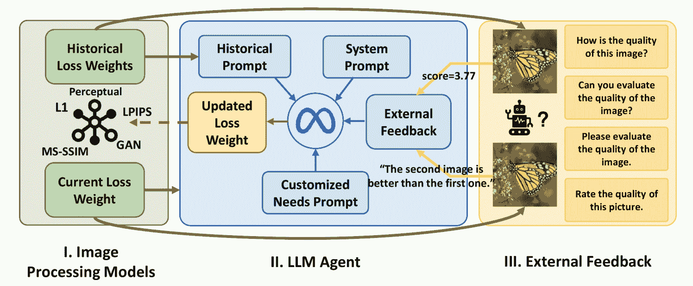
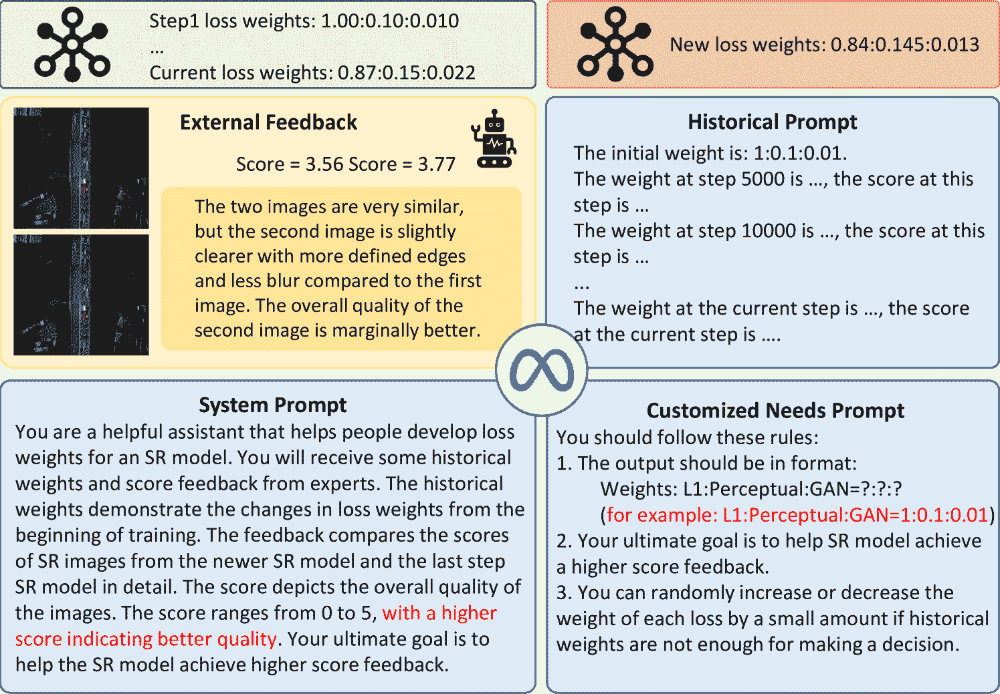
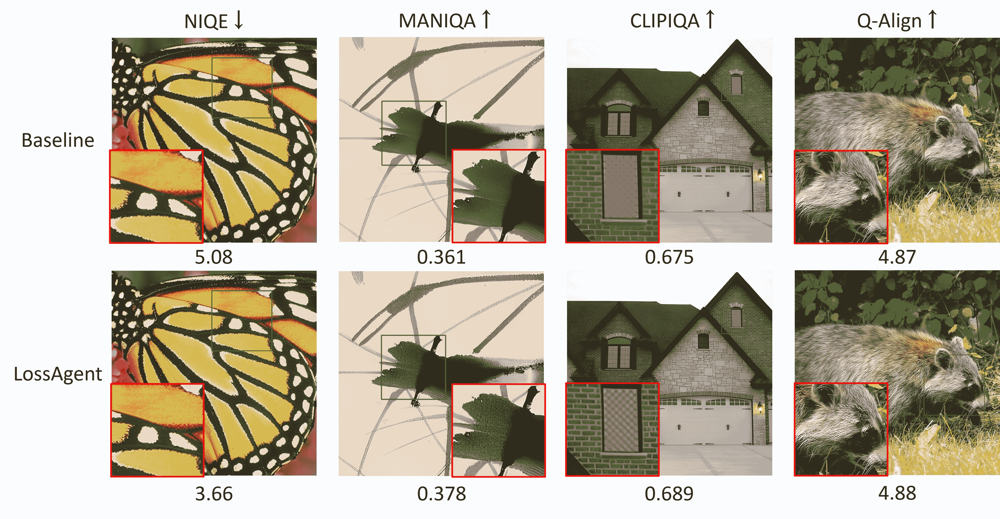
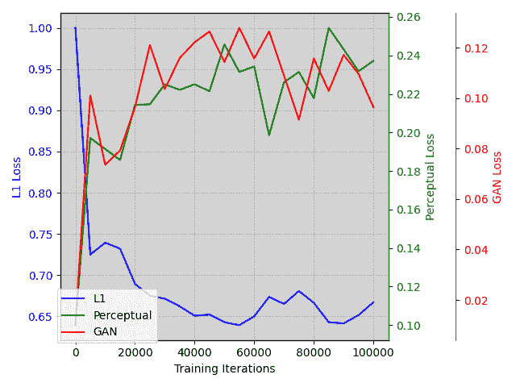
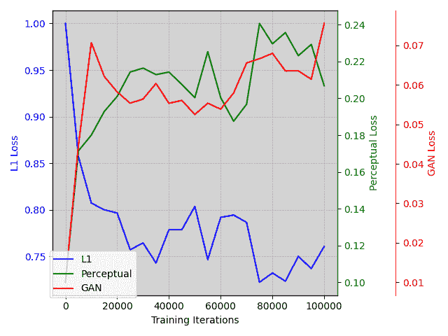
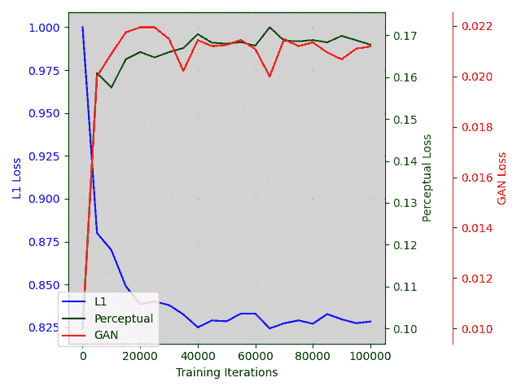
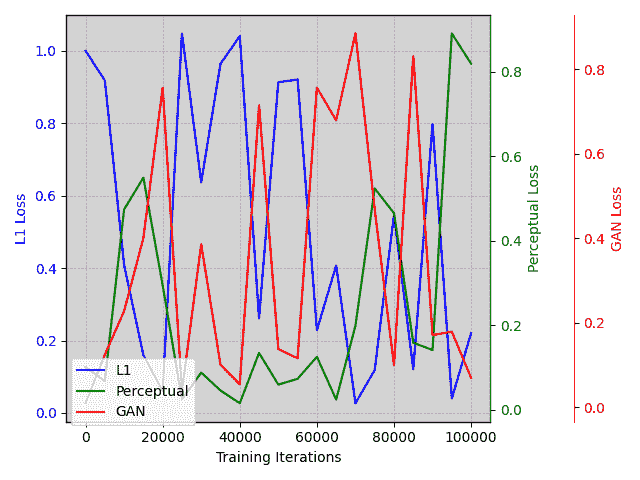
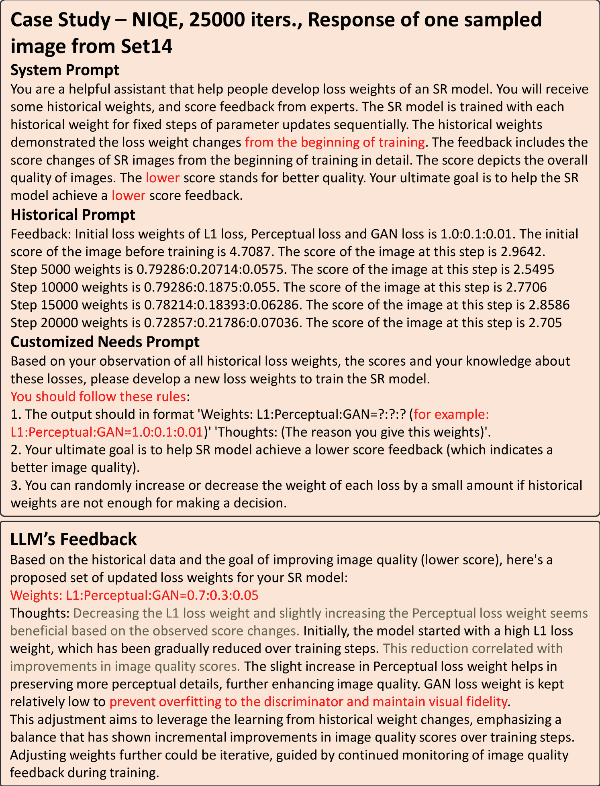

<!--yml
category: 未分类
date: 2025-01-11 11:50:59
-->

# LossAgent: Towards Any Optimization Objectives for Image Processing with LLM Agents

> 来源：[https://arxiv.org/html/2412.04090/](https://arxiv.org/html/2412.04090/)

Bingchen Li  Xin Li²²2Corresponding Author  Yiting Lu  Zhibo Chen
University of Science and Technology of China
{lbc31415926, luyt31415}@mail.ustc.edu.cn, {xin.li, chenzhibo}@ustc.edu.cn

###### Abstract

We present the first loss agent, dubbed LossAgent, for low-level image processing tasks, e.g., image super-resolution and restoration, intending to achieve any customized optimization objectives of low-level image processing in different practical applications. Notably, not all optimization objectives, such as complex hand-crafted perceptual metrics, text description, and intricate human feedback, can be instantiated with existing low-level losses, e.g., MSE loss. which presents a crucial challenge in optimizing image processing networks in an end-to-end manner. To eliminate this, our LossAgent introduces the powerful large language model (LLM) as the loss agent, where the rich textual understanding of prior knowledge empowers the loss agent with the potential to understand complex optimization objectives, trajectory, and state feedback from external environments in the optimization process of the low-level image processing networks. In particular, we establish the loss repository by incorporating existing loss functions that support the end-to-end optimization for low-level image processing. Then, we design the optimization-oriented prompt engineering for the loss agent to actively and intelligently decide the compositional weights for each loss in the repository at each optimization interaction, thereby achieving the required optimization trajectory for any customized optimization objectives. Extensive experiments on three typical low-level image processing tasks and multiple optimization objectives have shown the effectiveness and applicability of our proposed LossAgent. Code and pre-trained models will be available at [https://github.com/lbc12345/LossAgent](https://github.com/lbc12345/LossAgent).

## 1 Introduction

With the revolutionary advancements in deep learning technology, low-level image processing tasks, e.g., image super-resolution and restoration, have garnered increasing interest from researchers. Typically, low-level image processing tasks are optimized with the commonly-used loss function, such as MSE and L1 Losses, in an end-to-end manner, to improve the objective quality [[61](https://arxiv.org/html/2412.04090v1#bib.bib61), [10](https://arxiv.org/html/2412.04090v1#bib.bib10), [23](https://arxiv.org/html/2412.04090v1#bib.bib23), [22](https://arxiv.org/html/2412.04090v1#bib.bib22), [8](https://arxiv.org/html/2412.04090v1#bib.bib8), [54](https://arxiv.org/html/2412.04090v1#bib.bib54)] or perceptual quality [[59](https://arxiv.org/html/2412.04090v1#bib.bib59), [60](https://arxiv.org/html/2412.04090v1#bib.bib60), [6](https://arxiv.org/html/2412.04090v1#bib.bib6), [7](https://arxiv.org/html/2412.04090v1#bib.bib7), [63](https://arxiv.org/html/2412.04090v1#bib.bib63), [50](https://arxiv.org/html/2412.04090v1#bib.bib50)]. However, optimizing models using a single optimization objective falls short of meeting real-world needs. For example, in image super-resolution, we desire the super-resolved images to not only restore the ground truth at the pixel level but also to appear natural without artificial textures or visually distracting artifacts [[14](https://arxiv.org/html/2412.04090v1#bib.bib14)]. To address this, some researchers have introduced the combination of multiple loss functions [[14](https://arxiv.org/html/2412.04090v1#bib.bib14), [49](https://arxiv.org/html/2412.04090v1#bib.bib49), [48](https://arxiv.org/html/2412.04090v1#bib.bib48), [50](https://arxiv.org/html/2412.04090v1#bib.bib50), [63](https://arxiv.org/html/2412.04090v1#bib.bib63)] (e.g., GANs) to train networks, enabling the optimized models to satisfy multiple optimization objectives. Nevertheless, this approach requires the loss functions corresponding to optimization objectives to be differentiable and suitable for training. Consequently, some advanced image quality assessment (IQA) metrics, which align more closely with human visual perception, are not differentiable and thus cannot be directly utilized for end-to-end network optimization.

Recently, large language models (LLMs) such as GPT series [[4](https://arxiv.org/html/2412.04090v1#bib.bib4), [34](https://arxiv.org/html/2412.04090v1#bib.bib34)] and LLaMA series [[30](https://arxiv.org/html/2412.04090v1#bib.bib30), [45](https://arxiv.org/html/2412.04090v1#bib.bib45), [37](https://arxiv.org/html/2412.04090v1#bib.bib37)], have shown promising reasoning and understanding capabilities. This has also catalyzed the trend of utilizing LLMs as intelligent agents [[40](https://arxiv.org/html/2412.04090v1#bib.bib40), [25](https://arxiv.org/html/2412.04090v1#bib.bib25), [11](https://arxiv.org/html/2412.04090v1#bib.bib11), [41](https://arxiv.org/html/2412.04090v1#bib.bib41)], especially in the field of embodied AI [[56](https://arxiv.org/html/2412.04090v1#bib.bib56), [33](https://arxiv.org/html/2412.04090v1#bib.bib33), [39](https://arxiv.org/html/2412.04090v1#bib.bib39), [12](https://arxiv.org/html/2412.04090v1#bib.bib12)]. By providing the agent with the environment information, predefined settings, rules, external feedback, and a set of optional actions, it can leverage its powerful reasoning capabilities to generate outputs that meet customized requirements, such as tool selection [[38](https://arxiv.org/html/2412.04090v1#bib.bib38), [40](https://arxiv.org/html/2412.04090v1#bib.bib40)], action decisions [[58](https://arxiv.org/html/2412.04090v1#bib.bib58)], programming [[43](https://arxiv.org/html/2412.04090v1#bib.bib43), [12](https://arxiv.org/html/2412.04090v1#bib.bib12)], etc.

Figure 1: During the training of image processing models (Part I), the loss agent (Part II) gathers feedback from various optimization objectives (Part III). Combining this feedback with historical information, the LLM leverages its powerful reasoning capabilities to determine the optimal loss weights for the subsequent optimization phase of the image processing models (Part I).

Inspired by this series of works, we propose the first loss agent, dubbed LossAgent, for low-level image processing, enabling any customized optimization objectives of the image processing network for multiple practical applications. To achieve this, we introduce the pre-trained large language model (LLM), i.e., LLaMA-3 [[30](https://arxiv.org/html/2412.04090v1#bib.bib30)] as the loss agent to control the optimization trajectory for different objectives. In the optimization process, an intuitive strategy is to exploit the expected optimization objective as the loss function to guide the optimization of image processing networks. However, not all optimization objectives can assist this, such as the complex hand-crafted optimization objective, textual description, and human feedback, since they cannot be differentiable for end-to-end optimization. To solve the problem, we propose the compositional loss repository, which collects existing popular loss functions supported for low-level image processing, and utilize our proposed LossAgent to adaptively and actively assign the weights for each loss at each iteration period based on external environments to achieve customized optimization trajectory toward required optimization objective. In this process, we carefully design the optimization-oriented prompt engineering, which constructs the prompt templates to guide the LLM to understand the current optimization states, trajectory, and objectives, thereby achieving accurate loss weights planning.

To fully utilize the reasoning capabilities of LLM, the agent receives input of all weights of the model from the beginning of the training phase to the current stage. This enables the LossAgent to smoothly and automatically optimize the image processing model towards predefined optimization objectives through the analysis of historical weights, inference from external feedback, and following customized instructions.

Overall, the LossAgent possesses the following core features:

*   •

    LossAgent is capable of obtaining feedback from non-differentiable optimization objectives and leveraging the model’s powerful reasoning capabilities to convert this feedback into a composition of loss weights for training, thereby enabling the model to be optimized in an end-to-end manner towards any optimization objectives.

*   •

    LossAgent enjoys a high degree of flexibility. Leveraging its powerful reasoning capabilities, the agent can update loss weights fully automatically. Additionally, due to its ability to follow instructions, it can also receive feedbacks from external environments during the training process to pursue customized needs.

*   •

    LossAgent exhibits high scalability. As depicted in Figure [1](https://arxiv.org/html/2412.04090v1#S1.F1 "Figure 1 ‣ 1 Introduction ‣ LossAgent: Towards Any Optimization Objectives for Image Processing with LLM Agents"), our AgentLoss can be extended to various low-level image processing tasks and multiple different optimization objectives, even if they are not differentiable, which has been proven in the experimental parts.

## 2 Related Works

### 2.1 Image Processing

Image processing consists a broad spectrum of tasks, including image restoration [[35](https://arxiv.org/html/2412.04090v1#bib.bib35), [23](https://arxiv.org/html/2412.04090v1#bib.bib23), [10](https://arxiv.org/html/2412.04090v1#bib.bib10)], image enhancement [[59](https://arxiv.org/html/2412.04090v1#bib.bib59), [47](https://arxiv.org/html/2412.04090v1#bib.bib47), [51](https://arxiv.org/html/2412.04090v1#bib.bib51)], and image super-resolution [[60](https://arxiv.org/html/2412.04090v1#bib.bib60), [6](https://arxiv.org/html/2412.04090v1#bib.bib6), [7](https://arxiv.org/html/2412.04090v1#bib.bib7), [50](https://arxiv.org/html/2412.04090v1#bib.bib50), [63](https://arxiv.org/html/2412.04090v1#bib.bib63), [21](https://arxiv.org/html/2412.04090v1#bib.bib21)]. In low-level image processing tasks, pioneering works [[9](https://arxiv.org/html/2412.04090v1#bib.bib9), [24](https://arxiv.org/html/2412.04090v1#bib.bib24), [65](https://arxiv.org/html/2412.04090v1#bib.bib65)] focus primarily on optimizing fidelity-wise metrics such as PSNR and SSIM through L1 or L2 loss functions. However, models optimized by these metrics tend to generate over-smooth results [[14](https://arxiv.org/html/2412.04090v1#bib.bib14)]. To mitigate this problem, works [[14](https://arxiv.org/html/2412.04090v1#bib.bib14), [49](https://arxiv.org/html/2412.04090v1#bib.bib49), [63](https://arxiv.org/html/2412.04090v1#bib.bib63), [50](https://arxiv.org/html/2412.04090v1#bib.bib50), [17](https://arxiv.org/html/2412.04090v1#bib.bib17)] leveraging generative adversarial networks (GANs) to enable the SR network to learn the distribution of real-world high-quality images. By introducing a weighted combination of VGG perceptual loss [[14](https://arxiv.org/html/2412.04090v1#bib.bib14), [42](https://arxiv.org/html/2412.04090v1#bib.bib42)] and GAN loss, GAN-based works [[49](https://arxiv.org/html/2412.04090v1#bib.bib49), [50](https://arxiv.org/html/2412.04090v1#bib.bib50), [63](https://arxiv.org/html/2412.04090v1#bib.bib63)] are well-optimized for human perception objectives. More recently, transformer-based [[23](https://arxiv.org/html/2412.04090v1#bib.bib23), [6](https://arxiv.org/html/2412.04090v1#bib.bib6), [7](https://arxiv.org/html/2412.04090v1#bib.bib7)] and diffusion-based works [[10](https://arxiv.org/html/2412.04090v1#bib.bib10), [54](https://arxiv.org/html/2412.04090v1#bib.bib54), [26](https://arxiv.org/html/2412.04090v1#bib.bib26), [36](https://arxiv.org/html/2412.04090v1#bib.bib36)] further improve the performance on aforementioned optimization objectives.

However, despite the revolution of network structures and loss function designs, optimization trajectories of image processing models have become relatively fixed. While there is a strong demand for advanced image quality assessment (IQA) metrics [[63](https://arxiv.org/html/2412.04090v1#bib.bib63)], many recently developed IQA metrics [[20](https://arxiv.org/html/2412.04090v1#bib.bib20), [52](https://arxiv.org/html/2412.04090v1#bib.bib52), [53](https://arxiv.org/html/2412.04090v1#bib.bib53), [18](https://arxiv.org/html/2412.04090v1#bib.bib18)] cannot be utilized as optimization objectives due to their non-differentiable nature. In this paper, we tackle this challenge by introducing an LLM-based loss agent. This agent is capable of bridging any customized optimization objectives with the combination of loss function weights, allowing for the optimization of image processing models in an end-to-end manner.

### 2.2 LLM Agents

With the development of data science and computing resources, numerous of large language models (LLMs) [[19](https://arxiv.org/html/2412.04090v1#bib.bib19), [45](https://arxiv.org/html/2412.04090v1#bib.bib45), [4](https://arxiv.org/html/2412.04090v1#bib.bib4)] have emerged with remarkable language understanding and reasoning abilities. Despite of the above advantages, LLMs may struggle with tasks in certain specialized domains, leading to inaccurate outputs [[11](https://arxiv.org/html/2412.04090v1#bib.bib11), [31](https://arxiv.org/html/2412.04090v1#bib.bib31)]. Consequently, researchers leverage these powerful LLMs as tools planner [[38](https://arxiv.org/html/2412.04090v1#bib.bib38)] and intelligent agents [[41](https://arxiv.org/html/2412.04090v1#bib.bib41)], adaptively coordinating domain-specific expert models based on external demands. For example, MM-REACT [[58](https://arxiv.org/html/2412.04090v1#bib.bib58)] tackles various multimodal reasoning and action tasks via prompting ChatGPT [[4](https://arxiv.org/html/2412.04090v1#bib.bib4)] to invoke domain experts. ToolFormer [[38](https://arxiv.org/html/2412.04090v1#bib.bib38)] embeds external API tags within text sequences to enhance LLMs’ interaction with external resources. HuggingGPT [[40](https://arxiv.org/html/2412.04090v1#bib.bib40)] effectively harnesses various expert models from HuggingFace while utilizing LLMs as a controller to adeptly address tasks across multiple specialized domains. More recently, with appropriate instruction tuning, researchers have enabled LLMs to adapt to a broader range of tasks, allowing for more specialized task planning [[40](https://arxiv.org/html/2412.04090v1#bib.bib40), [43](https://arxiv.org/html/2412.04090v1#bib.bib43), [12](https://arxiv.org/html/2412.04090v1#bib.bib12)]. Besides, in the field of embodied AI, LLM has been seamlessly integrated with vision experts as an agent [[56](https://arxiv.org/html/2412.04090v1#bib.bib56), [33](https://arxiv.org/html/2412.04090v1#bib.bib33)]. The agent is capable of receiving environmental feedback and generating optimal actions accordingly.

Different from these great efforts, we propose the first LLM-based agent to handle any customized optimization objectives for image processing models, named LossAgent. By leveraging the powerful understanding and reasoning capabilities of LLMs, we transform feedback from external models or metrics into appropriate adjustments of loss weights in image processing models, allowing image processing models to be optimized towards any objectives. We hope that our LossAgent will facilitate the development of image processing to a more open-ended and intelligent society.

Figure 2: The overview of LossAgent. LossAgent bridges image processing models with any optimization objectives through the following workflow: The image processing model will generate images using model weights at the current stage. Subsequently, external expert model will generate score or textual feedback according to the images provided by the image processing model. The LLM-based agent model (e.g., LLaMA3) collects feedback and leverages its powerful reasoning abilities to analyze the relationships between loss weights and optimization objectives, while following our prompt engineering including system prompt, historical prompt, and customized needs prompt. After proper analysis, the agent will generate a new combination of loss weights to further guide the next step in optimizing the image processing model. We provide a detailed case study in Section [8](https://arxiv.org/html/2412.04090v1#S8 "8 Case Study ‣ LossAgent: Towards Any Optimization Objectives for Image Processing with LLM Agents").

## 3 Methods

Notably, there are multiple optimization objectives for image processing tasks such as traditional metrics like MSE loss to advanced IQA metrics that align with human perception. However, not all optimization objectives can be exploited to guide the end-to-end optimization of image processing networks since they are not all differentiable. This raises a significant and interesting question “how to optimize an image processing model when optimization objectives are non-differentiable?” In this paper, we address this question by proposing the first LLM-based loss agent, which transfers feedback from these optimization objectives through a pre-trained LLM into the adjustment of loss weights. This approach enables the image processing model to be optimized in an end-to-end manner. In this section, we first review the optimization objectives for low-level image processing models and then explain three parts of LossAgent illustrated in Figure [1](https://arxiv.org/html/2412.04090v1#S1.F1 "Figure 1 ‣ 1 Introduction ‣ LossAgent: Towards Any Optimization Objectives for Image Processing with LLM Agents") in details.

### 3.1 Optimization Objectives of Image Processing Models

Although the network structures of image processing models have evolved significantly in recent years, the optimization objectives of these models have remained largely unchanged. Taking image super-resolution (ISR) as an example, early works [[24](https://arxiv.org/html/2412.04090v1#bib.bib24), [9](https://arxiv.org/html/2412.04090v1#bib.bib9), [65](https://arxiv.org/html/2412.04090v1#bib.bib65)] pursued higher PSNR values, while some recent works [[63](https://arxiv.org/html/2412.04090v1#bib.bib63), [50](https://arxiv.org/html/2412.04090v1#bib.bib50), [59](https://arxiv.org/html/2412.04090v1#bib.bib59), [54](https://arxiv.org/html/2412.04090v1#bib.bib54), [10](https://arxiv.org/html/2412.04090v1#bib.bib10), [60](https://arxiv.org/html/2412.04090v1#bib.bib60)] have started optimizing networks to better align with human perception considering metrics such as LPIPS [[64](https://arxiv.org/html/2412.04090v1#bib.bib64)] and NIQE [[32](https://arxiv.org/html/2412.04090v1#bib.bib32)]. Despite advances in these ISR models, image quality assessment (IQA) models have concurrently experienced significant developments. An IQA model evaluates the visual quality of images by analyzing their attributes and detecting any distortions or imperfections, making it particularly suitable as an optimization objective for image processing models [[46](https://arxiv.org/html/2412.04090v1#bib.bib46), [57](https://arxiv.org/html/2412.04090v1#bib.bib57)]. However, due to the specific operations in IQA models (e.g., incorporating other models and applying sampling [[52](https://arxiv.org/html/2412.04090v1#bib.bib52), [53](https://arxiv.org/html/2412.04090v1#bib.bib53)]), some advanced IQA metrics are non-differentiable, preventing them from being utilized as the optimization objectives during the training of image processing models. Moreover, when leveraging textual feedback from humans or MLLM-based IQA models such as Co-Instruct [[53](https://arxiv.org/html/2412.04090v1#bib.bib53)] for optimization objectives, the metrics derived from these objectives are inherently non-differentiable.

In this paper, we address the above challenges by introducing an LLM-based agent, termed LossAgent. Instead of directly applying these optimization objectives as loss functions for training image processing models, LossAgent efficiently transfers various forms of feedback from customized optimization objectives into an actionable weighted composition of a set of differentiable loss functions.

### 3.2 Weighted Compositional Loss Repository

To achieve any optimization trajectory in the training stage of image processing models, we establish the compositional loss repository with multiple typical differential loss functions $\{L_{1},L_{2},L_{3},...,L_{M}\}$, such as $L_{1}$, LPIPS, where the dynamically weighted composition of them with coefficients $\{w_{1},w_{2},w_{3},...,w_{M}\}$ is achieved to modulate the optimization direction timely:

|  | $\mathcal{L}=w_{1}L_{1}+w_{2}L_{2}+\dots+w_{M}L_{M}.$ |  | (1) |

Here, $M$ is the total number of loss functions. Based on the above weighted compositional loss repository, we can adjust the optimization direction directly by generating the weighting coefficients through our proposed loss agent. To enable the loss agent to adjust weight composition in time based on feedback from any optimization objective, we divide the training stage of the image processing model into N stages, where the current state of the image processing model and their corresponding compositional loss is as:

|  | $\displaystyle\mathcal{S}$ | $\displaystyle=\{S_{0},S_{1},S_{2},\dots,S_{i},\dots,S_{N}\},$ |  | (2) |
|  | $\displaystyle\mathcal{L}_{i}$ | $\displaystyle=w_{1}^{i}L_{1}+w_{2}^{i}L_{2}+\dots+w_{M}^{i}L_{M},$ |  | (3) |

where $S_{0}$ stands for the initial states of the image processing model and $i$ indicates the $i^{th}$ training stage. The external feedback of the optimization objective will be evaluated by the image processing model at the end of each training stage with a set of randomly selected testing images as:

|  | $\mathcal{I}=\{I_{1},I_{2},\dots,I_{T}\},$ |  | (4) |

where $T$ is the number of images. We have provided the details in the Datasets part of Section [4.1](https://arxiv.org/html/2412.04090v1#S4.SS1 "4.1 Settings ‣ 4 Experiments ‣ LossAgent: Towards Any Optimization Objectives for Image Processing with LLM Agents").

### 3.3 External Feedback from Optimization Objectives

To alleviate the cognitive burden on the loss agent for the image processing task, we introduce the external evaluation expert $\mathcal{O}$ to produce the optimization feedback to the loss agent. Concretely, once we obtained the restored images $\mathcal{I}_{S_{i}}$ at the stage $S_{i}$, we can utilize external evaluation expert $\mathcal{O}$ to evaluate the quality of restored images $\mathcal{I}_{S_{i}}$ as:

|  | $\mathcal{F}=\mathcal{O}\left(\mathcal{I}_{S_{i}}\right),$ |  | (5) |

where $\mathcal{F}$ is the external feedback from optimization objectives, which can be a quality score or textual description. Notably, the external evaluation expert is the tool to represent the optimization objective. For instance, if the optimization objective is to achieve a higher CLIPIQA [[46](https://arxiv.org/html/2412.04090v1#bib.bib46)] score, we select CLIPIQA as the external evaluation expert. Conversely, when the optimization objective is more general (e.g., to achieve higher quality), multiple evaluation experts can be utilized collaboratively to generate feedback. See more details in Section [4.2.2](https://arxiv.org/html/2412.04090v1#S4.SS2.SSS2 "4.2.2 Double Optimization Objectives ‣ 4.2 Evaluation on Optimization Objectives ‣ 4 Experiments ‣ LossAgent: Towards Any Optimization Objectives for Image Processing with LLM Agents").

### 3.4 Loss Agent

It is noteworthy that the original LLM model cannot be directly applied to image processing tasks due to the knowledge discrepancy. To equip the LLM model with the capability to understand the image processing task and adjust the optimization direction of image processing, we exploit prompt engineering to adapt the pre-trained LLM model to our desired loss agent. Concretely, our proposed prompt engineering strategy can be divided into three parts: i) system prompt, ii) historical prompt and iii) customized needs prompt.

After feedback $\mathcal{F}$ is generated from external expert models, the loss agent will collect and utilize this feedback to generate a new set of loss weights. LLM demonstrates exceptional capabilities in following instructions and making decisions [[40](https://arxiv.org/html/2412.04090v1#bib.bib40), [34](https://arxiv.org/html/2412.04090v1#bib.bib34), [45](https://arxiv.org/html/2412.04090v1#bib.bib45)]. Consequently, enabling the loss agent to accomplish our task is feasible by providing accurate and sufficient prompt guidance. Initially, we employ prompt engineering through system prompt approach following previous works [[40](https://arxiv.org/html/2412.04090v1#bib.bib40), [56](https://arxiv.org/html/2412.04090v1#bib.bib56), [33](https://arxiv.org/html/2412.04090v1#bib.bib33), [43](https://arxiv.org/html/2412.04090v1#bib.bib43)] to convey to the loss agent the role it needs to undertake, the inputs it will receive, the required outputs, and the objectives to be achieved. An example of our prompt engineering under the ISR scenario is given in Figure [2](https://arxiv.org/html/2412.04090v1#S2.F2 "Figure 2 ‣ 2.2 LLM Agents ‣ 2 Related Works ‣ LossAgent: Towards Any Optimization Objectives for Image Processing with LLM Agents"). The most important instruction for the agent is the objectives clarification: “Your ultimate goal is to help the SR model achieve higher score feedback.”. This is because LLM may not encompass the knowledge of how these IQA metrics should be evaluated. Therefore, it is crucial to clarify whether lower or higher scores indicate better image quality. Without this context, LLM might intuitively assume that higher scores indicate better quality, resulting in incorrect reasoning.

Subsequently, to mitigate the hallucination phenomenon in LLM and prevent undesirable responses in situations of information scarcity, we gather the optimization trajectory of the loss agent as historical prompt and provide this information as context to the LLM.

Following this, we impose certain rule-based constraints on LLM through customized needs prompt. Furthermore, we incorporate format regularization into these rules to alleviate the challenge of parsing LLM outputs, which we found to be highly effective in standardizing the outputs. It is noteworthy that the design of such customized needs prompt not only provides flexibility for current usage but also accommodates a variety of future needs.

Ultimately, the loss agent consolidates all received information, leveraging its robust understanding and reasoning capabilities to generate a new set of loss weights as:

|  | $\mathcal{L}_{i+1}=w_{1}^{i+1}L_{1}+w_{2}^{i+1}L_{2}+\dots+w_{M}^{i+1}L_{M}$ |  | (6) |

This new combination of loss functions will be employed to optimize the image processing model at stage $i+1$. Based on the system prompt, the historical prompt, and the customized needs prompt, our LossAgent is capable of updating reasonable new loss weights for training image processing model. Please refer to Section [4.3](https://arxiv.org/html/2412.04090v1#S4.SS3 "4.3 Evaluation on Effectiveness of Prompt Design ‣ 4 Experiments ‣ LossAgent: Towards Any Optimization Objectives for Image Processing with LLM Agents") for more details.

## 4 Experiments

Table 1: Quantitative comparisons between LossAgent and other methods on classical image SR. “Pre-trained” denotes we directly validate on the pre-trained model weight. “Baseline” denotes that we train the model with fixed loss weights. As NIQE [[32](https://arxiv.org/html/2412.04090v1#bib.bib32)], MANIQA [[57](https://arxiv.org/html/2412.04090v1#bib.bib57)], CLIPIQA [[46](https://arxiv.org/html/2412.04090v1#bib.bib46)] and Q-Align [[52](https://arxiv.org/html/2412.04090v1#bib.bib52)] are no-reference IQA metrics, we also calculate these metrics for ground-truth (GT) as a reference. $\uparrow/\downarrow$ indicate higher/lower is better. Best results are bolded.

| Metrics | Methods | Datasets | Avg. |
| --- | --- | --- | --- |
| Set5 | Set14 | BSD100 | Urban100 | Manga109 |  |
| --- | --- | --- | --- | --- | --- |
| NIQE$\downarrow$ | Pre-trained | 7.10 | 6.22 | 6.11 | 5.46 | 5.37 | 6.05 |
| Baseline | 5.09 | 4.07 | 3.99 | 4.04 | 3.95 | 4.23 |
| LossAgent | 4.82 | 3.91 | 3.86 | 3.96 | 3.88 | 4.08 |
| GT (Ref.) | 5.15 | 4.86 | 3.19 | 4.02 | 3.53 | 4.15 |
| MANIQA$\uparrow$ | Pre-trained | 0.446 | 0.409 | 0.349 | 0.482 | 0.446 | 0.426 |
| Baseline | 0.458 | 0.406 | 0.354 | 0.494 | 0.416 | 0.425 |
| LossAgent | 0.474 | 0.418 | 0.365 | 0.496 | 0.424 | 0.436 |
| GT (Ref.) | 0.534 | 0.449 | 0.523 | 0.552 | 0.420 | 0.496 |
| CLIPIQA$\uparrow$ | Pre-trained | 0.605 | 0.517 | 0.534 | 0.501 | 0.637 | 0.559 |
| Baseline | 0.765 | 0.694 | 0.649 | 0.624 | 0.710 | 0.688 |
| LossAgent | 0.788 | 0.718 | 0.679 | 0.643 | 0.729 | 0.711 |
| GT (Ref.) | 0.807 | 0.740 | 0.756 | 0.675 | 0.700 | 0.736 |
| Q-Align$\uparrow$ | Pre-trained | 3.03 | 3.29 | 2.98 | 4.38 | 3.65 | 3.47 |
| Baseline | 3.04 | 3.45 | 3.34 | 4.53 | 3.66 | 3.60 |
| LossAgent | 3.07 | 3.48 | 3.41 | 4.53 | 3.65 | 3.63 |
| GT (Ref.) | 3.36 | 3.63 | 4.04 | 4.53 | 3.60 | 3.83 |

### 4.1 Settings

To demonstrate the effectiveness of our LossAgent, we perform the evaluation on three representative low-level image processing tasks: classical image super-resolution, real-world image super-resolution and all-in-one image restoration. We adopt two typical image processing models: SwinIR [[23](https://arxiv.org/html/2412.04090v1#bib.bib23)] for super-resolution tasks and PromptIR [[35](https://arxiv.org/html/2412.04090v1#bib.bib35)] for all-in-one restoration task. To demonstrate the effectiveness of LossAgent towards various optimization objectives, we assess the performance of our method across three testing settings: single optimization objective, double optimization objectives and textual optimization objectives. For all score-based IQA optimization objectives, we adopt their pyiqa python implementation [[5](https://arxiv.org/html/2412.04090v1#bib.bib5)]. We select open-sourced Meta-Llama-3-8B-Instruct^*^**https://huggingface.co/meta-llama/Meta-Llama-3-8B-Instruct as the LLM of our loss agent due to its impressive reasoning capabilities. We provide training details in Section [6](https://arxiv.org/html/2412.04090v1#S6 "6 Training Details ‣ LossAgent: Towards Any Optimization Objectives for Image Processing with LLM Agents").

Table 2: Details of training iterations for each stage, total number of training iterations, and initial weights of loss functions for three image processing models. “CISR”, “RISR”, “AIR” denotes for “Classical Image SR”, “Real-world Image SR”, and “All-in-one IR”, respectively.

 | Task | Iters. per Stage | Total Iters. | Initial Loss Weights |
| --- | --- | --- | --- |
| CISR | 5000 | 100k | $\mathcal{L}=1.0L_{\text{L1}}+0.1L_{\text{perceptual}}+0.01L_{\text{GAN}}$ |
| RISR | 5000 | 200k | $\mathcal{L}=1.0L_{\text{L1}}+0.1L_{\text{perceptual}}+0.01L_{\text{GAN}}$ |
| AIR | 2500 | 100k | $\mathcal{L}=1.0L_{\text{L1}}+0.1L_{\text{perceptual}}+1.0L_{\text{LPIPS}}$ | 

##### Datasets

For image SR tasks, we follow previous works [[23](https://arxiv.org/html/2412.04090v1#bib.bib23), [50](https://arxiv.org/html/2412.04090v1#bib.bib50)] and adopt DF2K [[1](https://arxiv.org/html/2412.04090v1#bib.bib1), [44](https://arxiv.org/html/2412.04090v1#bib.bib44)] as the training dataset. For all-in-one image restoration task, we follow [[16](https://arxiv.org/html/2412.04090v1#bib.bib16), [35](https://arxiv.org/html/2412.04090v1#bib.bib35)] to use a combination of BSD400 [[2](https://arxiv.org/html/2412.04090v1#bib.bib2)], WED [[27](https://arxiv.org/html/2412.04090v1#bib.bib27)], Rain100L [[55](https://arxiv.org/html/2412.04090v1#bib.bib55)] and SOTS [[15](https://arxiv.org/html/2412.04090v1#bib.bib15)] to optimize the model. We utilize five SR benchmarks with ground-truth to evaluate the performance of LossAgent on classical image SR: Set5 [[3](https://arxiv.org/html/2412.04090v1#bib.bib3)], Set14 [[62](https://arxiv.org/html/2412.04090v1#bib.bib62)], BSD100 [[28](https://arxiv.org/html/2412.04090v1#bib.bib28)], Urban100 [[13](https://arxiv.org/html/2412.04090v1#bib.bib13)] and Manga109 [[29](https://arxiv.org/html/2412.04090v1#bib.bib29)]. Two real-world benchmarks without ground-truth are adopted to evaluate real-world image SR: OST300 [[48](https://arxiv.org/html/2412.04090v1#bib.bib48)] and RealSRSet [[63](https://arxiv.org/html/2412.04090v1#bib.bib63)]. We follow PromptIR [[35](https://arxiv.org/html/2412.04090v1#bib.bib35)] to use SOTS(test) [[15](https://arxiv.org/html/2412.04090v1#bib.bib15)], Rain100L(test) [[55](https://arxiv.org/html/2412.04090v1#bib.bib55)] and BSD68 [[28](https://arxiv.org/html/2412.04090v1#bib.bib28)] to evaluate the all-in-one image restoration performance. For testing images $\mathcal{I}$ mentioned in Equation [4](https://arxiv.org/html/2412.04090v1#S3.E4 "Equation 4 ‣ 3.2 Weighted Compositional Loss Repository ‣ 3 Methods ‣ LossAgent: Towards Any Optimization Objectives for Image Processing with LLM Agents"), we randomly sample 10 images from Set14 [[62](https://arxiv.org/html/2412.04090v1#bib.bib62)] for classical image SR; randomly sample 10 images from RealSRSet [[63](https://arxiv.org/html/2412.04090v1#bib.bib63)] for real-world image SR; randomly sample 10 images from evaluation sets of PromptIR for all-in-one IR.

### 4.2 Evaluation on Optimization Objectives

#### 4.2.1 Single Optimization Objective

In this section, we validate the effectiveness of LossAgent towards the single optimization objective. We select four IQA metrics as the optimization objective: NIQE [[32](https://arxiv.org/html/2412.04090v1#bib.bib32)], MANIQA [[57](https://arxiv.org/html/2412.04090v1#bib.bib57)], CLIPIQA [[46](https://arxiv.org/html/2412.04090v1#bib.bib46)] and Q-Align [[52](https://arxiv.org/html/2412.04090v1#bib.bib52)]. For each metric, we start from the pre-trained model weights and initial loss weights listed in Table [2](https://arxiv.org/html/2412.04090v1#S4.T2 "Table 2 ‣ 4.1 Settings ‣ 4 Experiments ‣ LossAgent: Towards Any Optimization Objectives for Image Processing with LLM Agents"), and optimize the image processing model using LossAgent with external feedback from this metric. As demonstrated in Table [1](https://arxiv.org/html/2412.04090v1#S4.T1 "Table 1 ‣ 4 Experiments ‣ LossAgent: Towards Any Optimization Objectives for Image Processing with LLM Agents"), [3](https://arxiv.org/html/2412.04090v1#S4.T3 "Table 3 ‣ 4.2.1 Single Optimization Objective ‣ 4.2 Evaluation on Optimization Objectives ‣ 4 Experiments ‣ LossAgent: Towards Any Optimization Objectives for Image Processing with LLM Agents") and [4](https://arxiv.org/html/2412.04090v1#S4.T4 "Table 4 ‣ 4.2.1 Single Optimization Objective ‣ 4.2 Evaluation on Optimization Objectives ‣ 4 Experiments ‣ LossAgent: Towards Any Optimization Objectives for Image Processing with LLM Agents"), our LossAgent outperforms baseline method (i.e., fixed loss weights) across almost all the benchmarks under all the optimization objectives, which not only reveals the effectiveness of LossAgent but also indicates that our method enjoys plausible generalization abilities across different image processing models. Notably, LossAgent performs well on real-world image SR task, suggesting the efficacy of our proposed method in complex application scenarios. However, in the all-in-one IR task, LossAgent does not perform as robustly as in the other two tasks. We attribute this to the minimal differences between images generated in consecutive stages, which limit the instructional information available to the agent and hinder its ability to perform thorough analysis and inference to adjust loss weights. We provide qualitative comparisons between the baseline method and our LossAgent on real-world image super-resolution task in Figure [3](https://arxiv.org/html/2412.04090v1#S4.F3 "Figure 3 ‣ 4.2.1 Single Optimization Objective ‣ 4.2 Evaluation on Optimization Objectives ‣ 4 Experiments ‣ LossAgent: Towards Any Optimization Objectives for Image Processing with LLM Agents"). As observed, the image processing model restores images that are more aligned with human perception with the help of LossAgent. Specifically, the images in the second row encompass vivid textures, resulting in better quality assessments.

Figure 3: Qualitative comparisons between baseline and LossAgent on real-world image super-resolution across four optimization objectives. Zoom in for better views.

Table 3: Quantitative comparisons between LossAgent and other methods on real-world image SR. Best results are bolded. Notice that, there is no ground-truth for this task.

| Methods | Metrics | Datasets | Avg. | Metrics | Datasets | Avg. |
| --- | --- | --- | --- | --- | --- | --- |
| OST300 | RealSRSet |  |  | OST300 | RealSRSet |  |
| --- | --- | --- | --- | --- | --- | --- |
| Pre-trained | NIQE$\downarrow$ | 6.31 | 7.62 | 6.96 | MANIQA$\uparrow$ | 0.332 | 0.360 | 0.346 |
| Baseline | 3.26 | 5.12 | 4.19 |  | 0.366 | 0.385 | 0.375 |
| LossAgent | 3.05 | 4.43 | 3.74 |  | 0.371 | 0.394 | 0.383 |
| Pre-trained | Q-Align$\uparrow$ | 4.47 | 3.43 | 3.95 | CLIPIQA$\uparrow$ | 0.419 | 0.444 | 0.432 |
| Baseline | 4.55 | 3.81 | 4.18 |  | 0.528 | 0.611 | 0.569 |
| LossAgent | 4.58 | 3.87 | 4.22 |  | 0.571 | 0.649 | 0.610 |

Table 4: Quantitative comparisons between LossAgent and other methods on all-in-one IR. We follow previous settings [[35](https://arxiv.org/html/2412.04090v1#bib.bib35), [16](https://arxiv.org/html/2412.04090v1#bib.bib16)] and evaluate the performance of different methods on five distortions. Best results are bolded.

| Metrics | Methods | Dehaze | Derain | Denoise | Avg. |
| --- | --- | --- | --- | --- | --- |
| SOTS | Rain100L | $\sigma=15$ | $\sigma=25$ | $\sigma=50$ |  |
| --- | --- | --- | --- | --- | --- |
| NIQE$\downarrow$ | Pre-trained | 2.91 | 3.16 | 3.77 | 3.96 | 4.25 | 3.61 |
| Baseline | 2.98 | 3.18 | 3.43 | 3.49 | 3.71 | 3.36 |
| LossAgent | 2.95 | 3.17 | 3.38 | 3.48 | 3.80 | 3.36 |
| GT (Ref.) | 2.94 | 3.17 | 3.13 | 3.13 | 3.13 | 3.10 |
| MANIQA$\uparrow$ | Pre-trained | 0.441 | 0.498 | 0.493 | 0.457 | 0.377 | 0.453 |
| Baseline | 0.447 | 0.503 | 0.482 | 0.450 | 0.381 | 0.453 |
| LossAgent | 0.450 | 0.505 | 0.491 | 0.462 | 0.386 | 0.459 |
| GT (Ref.) | 0.442 | 0.509 | 0.525 | 0.525 | 0.525 | 0.505 |
| CLIPIQA$\uparrow$ | Pre-trained | 0.494 | 0.750 | 0.686 | 0.672 | 0.640 | 0.649 |
| Baseline | 0.534 | 0.769 | 0.795 | 0.785 | 0.725 | 0.722 |
| LossAgent | 0.542 | 0.771 | 0.807 | 0.777 | 0.706 | 0.721 |
| GT (Ref.) | 0.544 | 0.755 | 0.757 | 0.757 | 0.757 | 0.714 |
| Q-Align$\uparrow$ | Pre-trained | 4.02 | 3.92 | 4.09 | 3.96 | 3.61 | 3.92 |
| Baseline | 4.03 | 3.94 | 3.95 | 3.94 | 3.76 | 3.92 |
| LossAgent | 3.99 | 3.95 | 3.97 | 3.96 | 3.82 | 3.94 |
| GT (Ref.) | 3.96 | 4.01 | 4.11 | 4.11 | 4.11 | 4.08 |

#### 4.2.2 Double Optimization Objectives

To fully explore the potential of LossAgent, we conduct an experiment on classical image SR task. In this experiment, we utilize two optimization objectives (i.e., Q-Align [[52](https://arxiv.org/html/2412.04090v1#bib.bib52)] and PSNR) simultaneously to adjust loss weights. As observed from Table [5](https://arxiv.org/html/2412.04090v1#S4.T5 "Table 5 ‣ 4.2.2 Double Optimization Objectives ‣ 4.2 Evaluation on Optimization Objectives ‣ 4 Experiments ‣ LossAgent: Towards Any Optimization Objectives for Image Processing with LLM Agents"), including PSNR as an optimization objective yields PSNR gains across all benchmarks while maintaining comparable Q-Align performance. We attribute this to the powerful reasoning capabilities of LLM. Such results showcase the flexibility of LossAgent towards various optimization objectives.

Table 5: Quantitative comparisons between single and double optimization objectives. For the latter situation, we include both Q-Align score and PSNR value as external feedback for LossAgent.

 | Methods | Datasets | Avg. |
| --- | --- | --- |
| Set5 | Set14 | BSD100 | Urban100 | Manga109 |
| --- | --- | --- | --- | --- |
| Q-Align$\uparrow$ | 3.07/30.62 | 3.48/27.28 | 3.41/26.41 | 4.53/25.96 | 3.65/29.91 | 3.63/28.04 |
| Q-Align$\uparrow$+PSNR$\uparrow$ | 3.12/31.14 | 3.46/27.52 | 3.42/26.62 | 4.53/26.27 | 3.65/30.29 | 3.64/28.37 | 

#### 4.2.3 Textual Optimization Objectives

While score metrics are common in image processing tasks, it is rare for tasks to utilize textual metrics as optimization objectives. Recently, Co-Instruct [[53](https://arxiv.org/html/2412.04090v1#bib.bib53)] employs MLLMs to evaluate image quality and generate corresponding textual descriptions. To explore the flexibility and scalability of LossAgent, we choose Co-Instruct as the optimization objective. Table [6](https://arxiv.org/html/2412.04090v1#S4.T6 "Table 6 ‣ 4.2.3 Textual Optimization Objectives ‣ 4.2 Evaluation on Optimization Objectives ‣ 4 Experiments ‣ LossAgent: Towards Any Optimization Objectives for Image Processing with LLM Agents") shows the results of all-in-one IR task. Notice that, there aren’t any methods available to evaluate a model optimized by textual guidance. Since Co-Instruct and Q-Align utilize similar network structures and training datasets, we find it reasonable to evaluate the performance of the Co-Instruct-optimized model by Q-Align score. As observed, the Co-Instruct-optimized model achieves comparable results with the baseline and Q-Align-optimized model, suggesting that LossAgent successfully transfers the non-differentiable optimization objective into appropriate adjustments of loss weights.

Table 6: Quantitative comparisons between baseline model and Co-Instruct-optimized model. We use Q-Align score to evaluate model performance.

 | Methods | Dehaze | Derain | Denoise | Avg. |
| --- | --- | --- | --- | --- |
| SOTS | Rain100L | $\sigma=15$ | $\sigma=25$ | $\sigma=50$ |
| --- | --- | --- | --- | --- |
| Baseline | 4.03 | 3.94 | 3.95 | 3.94 | 3.76 | 3.92 |
| Q-Align | 3.99 | 3.95 | 3.97 | 3.96 | 3.82 | 3.94 |
| Co-Instruct | 4.05 | 3.95 | 3.95 | 3.94 | 3.82 | 3.94 | 

##### Summary

We have validated the flexibility and scalability of LossAgent in this part through three evaluation settings: single optimization objective, double optimization objectives, and textual optimization objectives. As observed, our LossAgent is efficient towards multiple image processing tasks and various optimization objectives, which also bridges advanced IQA metrics with image processing models. We provide more ablation studies of the loss agent in Section [7](https://arxiv.org/html/2412.04090v1#S7 "7 More Ablation Studies ‣ LossAgent: Towards Any Optimization Objectives for Image Processing with LLM Agents").

### 4.3 Evaluation on Effectiveness of Prompt Design

As described in Section [3.4](https://arxiv.org/html/2412.04090v1#S3.SS4 "3.4 Loss Agent ‣ 3 Methods ‣ LossAgent: Towards Any Optimization Objectives for Image Processing with LLM Agents"), we carefully devise prompts for the LLM to prevent hallucination and generate reasonable loss weights. Our prompt design mainly focuses on three parts: i) System prompt clarifies the roles and goals of LLM. Most importantly, it provides a brief introduction to these IQA metrics about whether lower or higher scores indicate better image quality. ii) Historical prompt accommodates previous optimization trajectories, furnishing rich context for the LLM to infer reasonable loss weights. iii) Customized needs prompt gives rule-based constraints on LLM’s reasoning process. Unless stated otherwise, the experiments in this section are conducted on classical image super-resolution tasks.

##### Effectiveness of System Prompt

In Table [7](https://arxiv.org/html/2412.04090v1#S4.T7 "Table 7 ‣ Effectiveness of System Prompt ‣ 4.3 Evaluation on Effectiveness of Prompt Design ‣ 4 Experiments ‣ LossAgent: Towards Any Optimization Objectives for Image Processing with LLM Agents"), we remove the prompt that describes the relationship between scores and the qualities of images. Take NIQE [[32](https://arxiv.org/html/2412.04090v1#bib.bib32)] as an example, where a lower score indicates a better quality, LossAgent fails to improve the performance of the ISR model on the NIQE metric. We attribute this to the LLM potentially interpreting a higher score as an indicator of better quality. Consequently, our system prompt design helps mitigate hallucination in the decision-making process of LossAgent.

Table 7: Effectiveness of system prompt. “W/o” represents that we remove descriptions about the relationship between scores and the qualities of images from system prompt. “W” represents system prompt with relationship-aware descriptions. Evaluating on NIQE$\downarrow$.

 | System Prompt | Datasets | Avg. |
| --- | --- | --- |
| Set5 | Set14 | BSD100 | Urban100 | Manga109 |
| --- | --- | --- | --- | --- |
| W/o | 5.12 | 4.24 | 4.02 | 4.17 | 4.06 | 4.32 |
| W/ | 4.82 | 3.91 | 3.86 | 3.96 | 3.88 | 4.08 | 

##### Effectiveness of Historical Prompt

Although LLM possesses strong reasoning and decision-making capabilities, it is unable to generate rational loss weights effectively without sufficient context. Therefore, we provide such context by collecting all historical optimization trajectories. As demonstrated in Table [8](https://arxiv.org/html/2412.04090v1#S4.T8 "Table 8 ‣ Effectiveness of Customized Needs Prompt ‣ 4.3 Evaluation on Effectiveness of Prompt Design ‣ 4 Experiments ‣ LossAgent: Towards Any Optimization Objectives for Image Processing with LLM Agents"), providing full historical information through prompt achieves the best performance, while providing only two trajectories (i.e., loss weights and feedback at stage $S_{i}$ and $S_{i-1}$) leading to performance drops.

##### Effectiveness of Customized Needs Prompt

As LLM generates textual outputs, it is necessary to standardize its outputs by rule-based constraints, making the weights identifiable by programs. We empirically find that given an example of the format effectively reduces hallucination in LLM’s outputs. We validate this through the correct rate of output format, as shown in Table [9](https://arxiv.org/html/2412.04090v1#S4.T9 "Table 9 ‣ Effectiveness of Customized Needs Prompt ‣ 4.3 Evaluation on Effectiveness of Prompt Design ‣ 4 Experiments ‣ LossAgent: Towards Any Optimization Objectives for Image Processing with LLM Agents"). Removing this example leads to a significant drop in the successful rate of generating standardized output. In contrast, our LossAgent successfully generates standardized output, with only one failure case out of 800 samples. This demonstrates the effectiveness of our customized needs prompt design.

Table 8: Effectiveness of historical prompt. $S_{i}$ represents the current stage, while $S_{0}$ represents the initial stage. Evaluating on MANIQA$\uparrow$.

 | Trajectories | Datasets | Avg. |
| --- | --- | --- |
| Set5 | Set14 | BSD. | Urban. | Manga. |
| --- | --- | --- | --- | --- |
| $\{S_{i-1},S_{i}\}$ | 0.464 | 0.405 | 0.364 | 0.487 | 0.413 | 0.427 |
| $\{S_{0},\dots,S_{i}\}$ | 0.474 | 0.418 | 0.365 | 0.496 | 0.424 | 0.436 | 

Table 9: Effectiveness of formatting rules. The successful rate is calculated across the entire training.

 | Methods | Successful Rate | Methods | Successful Rate |
| W/o Example | 21.37% (171/800) | LossAgent | 99.87% (799/800) | 

## 5 Conclusion

In this paper, we propose the first loss agent to address any customized optimization objectives for low-level image processing tasks. By introducing powerful LLM as the loss agent, our LossAgent is capable of understanding various optimization objectives, trajectories, and stage feedback from external expert models. To take full advantage of the reasoning abilities of LLM, we carefully design the optimization-oriented prompt engineering for the loss agent by providing detailed instructions along with customized needs prompts. Moreover, we include historical information in our prompt to prevent hallucinations and incorrect reasoning caused by the LLM. Extensive experiments on three representative low-level image processing tasks with various customized optimization objectives have demonstrated the flexibility and scalability of our LossAgent.

## References

*   Agustsson and Timofte [2017] Eirikur Agustsson and Radu Timofte. Ntire 2017 challenge on single image super-resolution: Dataset and study. In *Proceedings of the IEEE conference on computer vision and pattern recognition workshops*, pages 126–135, 2017.
*   Arbelaez et al. [2010] Pablo Arbelaez, Michael Maire, Charless Fowlkes, and Jitendra Malik. Contour detection and hierarchical image segmentation. *IEEE transactions on pattern analysis and machine intelligence*, 33(5):898–916, 2010.
*   Bevilacqua et al. [2012] Marco Bevilacqua, Aline Roumy, Christine Guillemot, and Marie Line Alberi-Morel. Low-complexity single-image super-resolution based on nonnegative neighbor embedding. 2012.
*   Brown et al. [2020] Tom Brown, Benjamin Mann, Nick Ryder, Melanie Subbiah, Jared D Kaplan, Prafulla Dhariwal, Arvind Neelakantan, Pranav Shyam, Girish Sastry, Amanda Askell, et al. Language models are few-shot learners. *Advances in neural information processing systems*, 33:1877–1901, 2020.
*   Chen and Mo [2022] Chaofeng Chen and Jiadi Mo. IQA-PyTorch: Pytorch toolbox for image quality assessment. [Online]. Available: [https://github.com/chaofengc/IQA-PyTorch](https://github.com/chaofengc/IQA-PyTorch), 2022.
*   Chen et al. [2023a] Xiangyu Chen, Xintao Wang, Jiantao Zhou, Yu Qiao, and Chao Dong. Activating more pixels in image super-resolution transformer. In *Proceedings of the IEEE/CVF conference on computer vision and pattern recognition*, pages 22367–22377, 2023a.
*   Chen et al. [2023b] Zheng Chen, Yulun Zhang, Jinjin Gu, Linghe Kong, Xiaokang Yang, and Fisher Yu. Dual aggregation transformer for image super-resolution. In *Proceedings of the IEEE/CVF international conference on computer vision*, pages 12312–12321, 2023b.
*   Conde et al. [2024] Marcos V Conde, Gregor Geigle, and Radu Timofte. High-quality image restoration following human instructions. *arXiv preprint arXiv:2401.16468*, 2024.
*   Dong et al. [2015] Chao Dong, Chen Change Loy, Kaiming He, and Xiaoou Tang. Image super-resolution using deep convolutional networks. *IEEE transactions on pattern analysis and machine intelligence*, 38(2):295–307, 2015.
*   Fei et al. [2023] Ben Fei, Zhaoyang Lyu, Liang Pan, Junzhe Zhang, Weidong Yang, Tianyue Luo, Bo Zhang, and Bo Dai. Generative diffusion prior for unified image restoration and enhancement. In *Proceedings of the IEEE/CVF Conference on Computer Vision and Pattern Recognition*, pages 9935–9946, 2023.
*   Ge et al. [2024] Yingqiang Ge, Wenyue Hua, Kai Mei, Juntao Tan, Shuyuan Xu, Zelong Li, Yongfeng Zhang, et al. Openagi: When llm meets domain experts. *Advances in Neural Information Processing Systems*, 36, 2024.
*   Gupta and Kembhavi [2023] Tanmay Gupta and Aniruddha Kembhavi. Visual programming: Compositional visual reasoning without training. In *Proceedings of the IEEE/CVF Conference on Computer Vision and Pattern Recognition*, pages 14953–14962, 2023.
*   Huang et al. [2015] Jia-Bin Huang, Abhishek Singh, and Narendra Ahuja. Single image super-resolution from transformed self-exemplars. In *Proceedings of the IEEE conference on computer vision and pattern recognition*, pages 5197–5206, 2015.
*   Ledig et al. [2017] Christian Ledig, Lucas Theis, Ferenc Huszár, Jose Caballero, Andrew Cunningham, Alejandro Acosta, Andrew Aitken, Alykhan Tejani, Johannes Totz, Zehan Wang, et al. Photo-realistic single image super-resolution using a generative adversarial network. In *Proceedings of the IEEE conference on computer vision and pattern recognition*, pages 4681–4690, 2017.
*   Li et al. [2018] Boyi Li, Wenqi Ren, Dengpan Fu, Dacheng Tao, Dan Feng, Wenjun Zeng, and Zhangyang Wang. Benchmarking single-image dehazing and beyond. *IEEE Transactions on Image Processing*, 28(1):492–505, 2018.
*   Li et al. [2022] Boyun Li, Xiao Liu, Peng Hu, Zhongqin Wu, Jiancheng Lv, and Xi Peng. All-in-one image restoration for unknown corruption. In *Proceedings of the IEEE/CVF Conference on Computer Vision and Pattern Recognition*, pages 17452–17462, 2022.
*   Li et al. [2024a] Bingchen Li, Xin Li, Hanxin Zhu, Yeying Jin, Ruoyu Feng, Zhizheng Zhang, and Zhibo Chen. Sed: Semantic-aware discriminator for image super-resolution. In *Proceedings of the IEEE/CVF Conference on Computer Vision and Pattern Recognition*, pages 25784–25795, 2024a.
*   Li et al. [2024b] Chunyi Li, Haoning Wu, Zicheng Zhang, Hongkun Hao, Kaiwei Zhang, Lei Bai, Xiaohong Liu, Xiongkuo Min, Weisi Lin, and Guangtao Zhai. Q-refine: A perceptual quality refiner for ai-generated image. *arXiv preprint arXiv:2401.01117*, 2024b.
*   Li et al. [2023a] Junnan Li, Dongxu Li, Silvio Savarese, and Steven Hoi. Blip-2: Bootstrapping language-image pre-training with frozen image encoders and large language models. In *International conference on machine learning*, pages 19730–19742\. PMLR, 2023a.
*   Li et al. [2023b] Xin Li, Yiting Lu, and Zhibo Chen. Freqalign: Excavating perception-oriented transferability for blind image quality assessment from a frequency perspective. *IEEE Transactions on Multimedia*, 2023b.
*   Li et al. [2024c] Xin Li, Bingchen Li, Yeying Jin, Cuiling Lan, Hanxin Zhu, Yulin Ren, and Zhibo Chen. Ucip: A universal framework for compressed image super-resolution using dynamic prompt. *arXiv preprint arXiv:2407.13108*, 2024c.
*   Li et al. [2023c] Yawei Li, Yuchen Fan, Xiaoyu Xiang, Denis Demandolx, Rakesh Ranjan, Radu Timofte, and Luc Van Gool. Efficient and explicit modelling of image hierarchies for image restoration. In *Proceedings of the IEEE/CVF Conference on Computer Vision and Pattern Recognition*, pages 18278–18289, 2023c.
*   Liang et al. [2021] Jingyun Liang, Jiezhang Cao, Guolei Sun, Kai Zhang, Luc Van Gool, and Radu Timofte. Swinir: Image restoration using swin transformer. In *Proceedings of the IEEE/CVF international conference on computer vision*, pages 1833–1844, 2021.
*   Lim et al. [2017] Bee Lim, Sanghyun Son, Heewon Kim, Seungjun Nah, and Kyoung Mu Lee. Enhanced deep residual networks for single image super-resolution. In *Proceedings of the IEEE conference on computer vision and pattern recognition workshops*, pages 136–144, 2017.
*   Lu et al. [2024] Pan Lu, Baolin Peng, Hao Cheng, Michel Galley, Kai-Wei Chang, Ying Nian Wu, Song-Chun Zhu, and Jianfeng Gao. Chameleon: Plug-and-play compositional reasoning with large language models. *Advances in Neural Information Processing Systems*, 36, 2024.
*   Ma et al. [2023] Jiaqi Ma, Tianheng Cheng, Guoli Wang, Qian Zhang, Xinggang Wang, and Lefei Zhang. Prores: Exploring degradation-aware visual prompt for universal image restoration. *arXiv preprint arXiv:2306.13653*, 2023.
*   Ma et al. [2016] Kede Ma, Zhengfang Duanmu, Qingbo Wu, Zhou Wang, Hongwei Yong, Hongliang Li, and Lei Zhang. Waterloo exploration database: New challenges for image quality assessment models. *IEEE Transactions on Image Processing*, 26(2):1004–1016, 2016.
*   Martin et al. [2001] David Martin, Charless Fowlkes, Doron Tal, and Jitendra Malik. A database of human segmented natural images and its application to evaluating segmentation algorithms and measuring ecological statistics. In *Proceedings Eighth IEEE International Conference on Computer Vision. ICCV 2001*, pages 416–423\. IEEE, 2001.
*   Matsui et al. [2017] Yusuke Matsui, Kota Ito, Yuji Aramaki, Azuma Fujimoto, Toru Ogawa, Toshihiko Yamasaki, and Kiyoharu Aizawa. Sketch-based manga retrieval using manga109 dataset. *Multimedia Tools and Applications*, 76(20):21811–21838, 2017.
*   MetaAI [2024] MetaAI. Llama3. [https://llama.meta.com/llama3](https://llama.meta.com/llama3),, 2024.
*   Mialon et al. [2023] Grégoire Mialon, Roberto Dessì, Maria Lomeli, Christoforos Nalmpantis, Ram Pasunuru, Roberta Raileanu, Baptiste Rozière, Timo Schick, Jane Dwivedi-Yu, Asli Celikyilmaz, et al. Augmented language models: a survey. *arXiv preprint arXiv:2302.07842*, 2023.
*   Mittal et al. [2012] Anish Mittal, Rajiv Soundararajan, and Alan C Bovik. Making a “completely blind” image quality analyzer. *IEEE Signal processing letters*, 20(3):209–212, 2012.
*   Mu et al. [2024] Yao Mu, Qinglong Zhang, Mengkang Hu, Wenhai Wang, Mingyu Ding, Jun Jin, Bin Wang, Jifeng Dai, Yu Qiao, and Ping Luo. Embodiedgpt: Vision-language pre-training via embodied chain of thought. *Advances in Neural Information Processing Systems*, 36, 2024.
*   OpenAI [2023] OpenAI. Gpt-4 technical report, 2023.
*   Potlapalli et al. [2023] Vaishnav Potlapalli, Syed Waqas Zamir, Salman Khan, and Fahad Shahbaz Khan. Promptir: Prompting for all-in-one blind image restoration. *arXiv preprint arXiv:2306.13090*, 2023.
*   Ren et al. [2025] Yulin Ren, Xin Li, Bingchen Li, Xingrui Wang, Mengxi Guo, Shijie Zhao, Li Zhang, and Zhibo Chen. Moe-diffir: Task-customized diffusion priors for universal compressed image restoration. In *European Conference on Computer Vision*, pages 116–134\. Springer, 2025.
*   Roziere et al. [2023] Baptiste Roziere, Jonas Gehring, Fabian Gloeckle, Sten Sootla, Itai Gat, Xiaoqing Ellen Tan, Yossi Adi, Jingyu Liu, Tal Remez, Jérémy Rapin, et al. Code llama: Open foundation models for code. *arXiv preprint arXiv:2308.12950*, 2023.
*   Schick et al. [2024] Timo Schick, Jane Dwivedi-Yu, Roberto Dessì, Roberta Raileanu, Maria Lomeli, Eric Hambro, Luke Zettlemoyer, Nicola Cancedda, and Thomas Scialom. Toolformer: Language models can teach themselves to use tools. *Advances in Neural Information Processing Systems*, 36, 2024.
*   Schumann et al. [2024] Raphael Schumann, Wanrong Zhu, Weixi Feng, Tsu-Jui Fu, Stefan Riezler, and William Yang Wang. Velma: Verbalization embodiment of llm agents for vision and language navigation in street view. In *Proceedings of the AAAI Conference on Artificial Intelligence*, pages 18924–18933, 2024.
*   Shen et al. [2024] Yongliang Shen, Kaitao Song, Xu Tan, Dongsheng Li, Weiming Lu, and Yueting Zhuang. Hugginggpt: Solving ai tasks with chatgpt and its friends in hugging face. *Advances in Neural Information Processing Systems*, 36, 2024.
*   Shinn et al. [2024] Noah Shinn, Federico Cassano, Ashwin Gopinath, Karthik Narasimhan, and Shunyu Yao. Reflexion: Language agents with verbal reinforcement learning. *Advances in Neural Information Processing Systems*, 36, 2024.
*   Simonyan and Zisserman [2014] Karen Simonyan and Andrew Zisserman. Very deep convolutional networks for large-scale image recognition. *arXiv preprint arXiv:1409.1556*, 2014.
*   Surís et al. [2023] Dídac Surís, Sachit Menon, and Carl Vondrick. Vipergpt: Visual inference via python execution for reasoning. In *Proceedings of the IEEE/CVF International Conference on Computer Vision*, pages 11888–11898, 2023.
*   Timofte et al. [2017] Radu Timofte, Eirikur Agustsson, Luc Van Gool, Ming-Hsuan Yang, and Lei Zhang. Ntire 2017 challenge on single image super-resolution: Methods and results. In *Proceedings of the IEEE conference on computer vision and pattern recognition workshops*, pages 114–125, 2017.
*   Touvron et al. [2023] Hugo Touvron, Louis Martin, Kevin Stone, Peter Albert, Amjad Almahairi, Yasmine Babaei, Nikolay Bashlykov, Soumya Batra, Prajjwal Bhargava, Shruti Bhosale, et al. Llama 2: Open foundation and fine-tuned chat models. *arXiv preprint arXiv:2307.09288*, 2023.
*   Wang et al. [2023a] Jianyi Wang, Kelvin CK Chan, and Chen Change Loy. Exploring clip for assessing the look and feel of images. In *Proceedings of the AAAI Conference on Artificial Intelligence*, pages 2555–2563, 2023a.
*   Wang et al. [2023b] Tao Wang, Kaihao Zhang, Tianrun Shen, Wenhan Luo, Bjorn Stenger, and Tong Lu. Ultra-high-definition low-light image enhancement: A benchmark and transformer-based method. In *Proceedings of the AAAI Conference on Artificial Intelligence*, pages 2654–2662, 2023b.
*   Wang et al. [2018a] Xintao Wang, Ke Yu, Chao Dong, and Chen Change Loy. Recovering realistic texture in image super-resolution by deep spatial feature transform. In *Proceedings of the IEEE conference on computer vision and pattern recognition*, pages 606–615, 2018a.
*   Wang et al. [2018b] Xintao Wang, Ke Yu, Shixiang Wu, Jinjin Gu, Yihao Liu, Chao Dong, Yu Qiao, and Chen Change Loy. Esrgan: Enhanced super-resolution generative adversarial networks. In *Proceedings of the European conference on computer vision (ECCV) workshops*, pages 0–0, 2018b.
*   Wang et al. [2021] Xintao Wang, Liangbin Xie, Chao Dong, and Ying Shan. Real-esrgan: Training real-world blind super-resolution with pure synthetic data. In *Proceedings of the IEEE/CVF international conference on computer vision*, pages 1905–1914, 2021.
*   Wang et al. [2023c] Xinlong Wang, Wen Wang, Yue Cao, Chunhua Shen, and Tiejun Huang. Images speak in images: A generalist painter for in-context visual learning. In *Proceedings of the IEEE/CVF Conference on Computer Vision and Pattern Recognition*, pages 6830–6839, 2023c.
*   Wu et al. [2023] Haoning Wu, Zicheng Zhang, Weixia Zhang, Chaofeng Chen, Liang Liao, Chunyi Li, Yixuan Gao, Annan Wang, Erli Zhang, Wenxiu Sun, et al. Q-align: Teaching lmms for visual scoring via discrete text-defined levels. *arXiv preprint arXiv:2312.17090*, 2023.
*   Wu et al. [2024] Haoning Wu, Hanwei Zhu, Zicheng Zhang, Erli Zhang, Chaofeng Chen, Liang Liao, Chunyi Li, Annan Wang, Wenxiu Sun, Qiong Yan, Xiaohong Liu, Guangtao Zhai, Shiqi Wang, and Weisi Lin. Towards open-ended visual quality comparison, 2024.
*   Xia et al. [2023] Bin Xia, Yulun Zhang, Shiyin Wang, Yitong Wang, Xinglong Wu, Yapeng Tian, Wenming Yang, and Luc Van Gool. Diffir: Efficient diffusion model for image restoration. In *Proceedings of the IEEE/CVF International Conference on Computer Vision*, pages 13095–13105, 2023.
*   Yang et al. [2020] Fuzhi Yang, Huan Yang, Jianlong Fu, Hongtao Lu, and Baining Guo. Learning texture transformer network for image super-resolution. In *Proceedings of the IEEE/CVF conference on computer vision and pattern recognition*, pages 5791–5800, 2020.
*   Yang et al. [2023a] Jingkang Yang, Yuhao Dong, Shuai Liu, Bo Li, Ziyue Wang, Chencheng Jiang, Haoran Tan, Jiamu Kang, Yuanhan Zhang, Kaiyang Zhou, et al. Octopus: Embodied vision-language programmer from environmental feedback. *arXiv preprint arXiv:2310.08588*, 2023a.
*   Yang et al. [2022] Sidi Yang, Tianhe Wu, Shuwei Shi, Shanshan Lao, Yuan Gong, Mingdeng Cao, Jiahao Wang, and Yujiu Yang. Maniqa: Multi-dimension attention network for no-reference image quality assessment. In *Proceedings of the IEEE/CVF Conference on Computer Vision and Pattern Recognition*, pages 1191–1200, 2022.
*   Yang et al. [2023b] Zhengyuan Yang, Linjie Li, Jianfeng Wang, Kevin Lin, Ehsan Azarnasab, Faisal Ahmed, Zicheng Liu, Ce Liu, Michael Zeng, and Lijuan Wang. Mm-react: Prompting chatgpt for multimodal reasoning and action. *arXiv preprint arXiv:2303.11381*, 2023b.
*   Yu et al. [2024] Fanghua Yu, Jinjin Gu, Zheyuan Li, Jinfan Hu, Xiangtao Kong, Xintao Wang, Jingwen He, Yu Qiao, and Chao Dong. Scaling up to excellence: Practicing model scaling for photo-realistic image restoration in the wild. *arXiv preprint arXiv:2401.13627*, 2024.
*   Yue et al. [2024] Zongsheng Yue, Jianyi Wang, and Chen Change Loy. Resshift: Efficient diffusion model for image super-resolution by residual shifting. *Advances in Neural Information Processing Systems*, 36, 2024.
*   Zamir et al. [2022] Syed Waqas Zamir, Aditya Arora, Salman Khan, Munawar Hayat, Fahad Shahbaz Khan, and Ming-Hsuan Yang. Restormer: Efficient transformer for high-resolution image restoration. In *Proceedings of the IEEE/CVF conference on computer vision and pattern recognition*, pages 5728–5739, 2022.
*   Zeyde et al. [2010] Roman Zeyde, Michael Elad, and Matan Protter. On single image scale-up using sparse-representations. In *International conference on curves and surfaces*, pages 711–730\. Springer, 2010.
*   Zhang et al. [2021] Kai Zhang, Jingyun Liang, Luc Van Gool, and Radu Timofte. Designing a practical degradation model for deep blind image super-resolution. In *Proceedings of the IEEE/CVF International Conference on Computer Vision*, pages 4791–4800, 2021.
*   Zhang et al. [2018a] Richard Zhang, Phillip Isola, Alexei A Efros, Eli Shechtman, and Oliver Wang. The unreasonable effectiveness of deep features as a perceptual metric. In *Proceedings of the IEEE conference on computer vision and pattern recognition*, pages 586–595, 2018a.
*   Zhang et al. [2018b] Yulun Zhang, Yapeng Tian, Yu Kong, Bineng Zhong, and Yun Fu. Residual dense network for image super-resolution. In *Proceedings of the IEEE conference on computer vision and pattern recognition*, pages 2472–2481, 2018b.

\thetitle

Supplementary Material 

## 6 Training Details

As demonstrated in Section [3.2](https://arxiv.org/html/2412.04090v1#S3.SS2 "3.2 Weighted Compositional Loss Repository ‣ 3 Methods ‣ LossAgent: Towards Any Optimization Objectives for Image Processing with LLM Agents"), we divide the entire training process of image processing models into several stages to enable the dynamic adjustment of the loss weights through LossAgent. We list the details of training iterations for each stage, the total number of training iterations, and the initial weights of loss functions in Table [2](https://arxiv.org/html/2412.04090v1#S4.T2 "Table 2 ‣ 4.1 Settings ‣ 4 Experiments ‣ LossAgent: Towards Any Optimization Objectives for Image Processing with LLM Agents"). For two image super-resolution tasks, we utilize the PSNR-oriented pre-trained checkpoints of SwinIR [[23](https://arxiv.org/html/2412.04090v1#bib.bib23)] as initial checkpoints for both tasks, and then apply popular GAN-based training strategies for image SR tasks using our LossAgent. For all-in-one image restoration task, we adopt the pre-trained checkpoint of PromptIR[[35](https://arxiv.org/html/2412.04090v1#bib.bib35)] as the initial checkpoint. However, since GAN-based training is uncommon for this task, we use a combination of L1 loss, perceptual loss, and LPIPS loss as loss functions to evaluate the performance of our LossAgent. The rationale behind utilizing pre-trained checkpoints as initial checkpoints is to mitigate unstable fluctuations in the early stages of training of image processing models. Such fluctuations may otherwise misguide the LossAgent, leading to inaccurate updates of loss weights. It is noteworthy that, to avoid the affection from the learning rate of the optimizer to our experiments, we uniformly set the learning rate to 1e-4 for all three tasks and keep it constant throughout the training process. Following previous implementations, we utilize an Adam optimizer for each task. We use 8 NVIDIA TESLA V100 GPUs for our experiments, with a total batchsize of 32 for image SR tasks and a total batchsize of 16 for all-in-one restoration task.

## 7 More Ablation Studies

In this section, we provide more ablation studies for LossAgent.

### 7.1 Iterations for Each Stage

In this part, we conduct ablation studies about training iterations for each stage. As demonstrated in Table [10](https://arxiv.org/html/2412.04090v1#S7.T10 "Table 10 ‣ 7.1 Iterations for Each Stage ‣ 7 More Ablation Studies ‣ LossAgent: Towards Any Optimization Objectives for Image Processing with LLM Agents"), a moderate choice of 5000 training iterations for each stage achieves the best results. As if iterations are small (i.e., 2500), when reaching the end of training, the list of historical loss weights tends to become very long, thus making it difficult to perform reasoning. As if iterations are large (i.e., 10000), the total update steps tend to be insufficient for a reasonable adjustment of loss weights during training, thereby causing suboptimal results. Therefore, we select the optimal iteration steps for the classical image SR task to be 5000\. We apply the same principle to the other two tasks, as listed in Table [2](https://arxiv.org/html/2412.04090v1#S4.T2 "Table 2 ‣ 4.1 Settings ‣ 4 Experiments ‣ LossAgent: Towards Any Optimization Objectives for Image Processing with LLM Agents").

Table 10: Quantitative comparisons between different iterations for each stage. Results are reported on classical image SR task using Q-Align score.

 | Iters. | Datasets | Avg. |
| --- | --- | --- |
| Set5 | Set14 | BSD100 | Urban100 | Manga109 |
| --- | --- | --- | --- | --- |
| 2500 | 3.06 | 3.47 | 3.36 | 4.52 | 3.65 | 3.61 |
| 5000 | 3.07 | 3.48 | 3.41 | 4.53 | 3.65 | 3.63 |
| 10000 | 3.02 | 3.45 | 3.35 | 4.49 | 3.65 | 3.59 | 

(a) NIQE

(b) MANIQA

(c) CLIPIQA

(d) Q-Align

(e) Random

Figure 4: Illustration of loss weight curves on classical image super-resolution task across four optimization objectives. Zoom in for better view.

### 7.2 Testing Image Set $\mathcal{I}$

As a crucial part of generating feedback from external expert models, the choice of the testing image set $\mathcal{I}$ is important. We observe that using the sampled Set14[[62](https://arxiv.org/html/2412.04090v1#bib.bib62)] as the testing image set achieves a better CLIPIQA score compared to using the sampled DIV2K[[1](https://arxiv.org/html/2412.04090v1#bib.bib1)]. We attribute this phenomenon to the relatively high resolution of the DIV2K images. Since some advanced IQA metrics leverage a pre-trained vision encoder to resize input images, this results in originally similar high-resolution images becoming even harder to distinguish after resizing. Consequently, the IQA model may assign similar or even identical scores to these images, failing to provide useful information to our LossAgent. This can cause the LLM to hallucinate and make unreasonable inferences, leading to incorrect adjustment of loss weights. As a result, we choose Set14 as the testing image set for the classical image SR task. We apply the same principle to the other two tasks.

Table 11: Quantitative comparisons between different iterations for each stage. Results are reported on classical image SR task using Q-Align score. The best results are bolded.

 | Image Set | Datasets | Avg. |
| --- | --- | --- |
| Set5 | Set14 | BSD100 | Urban100 | Manga109 |
| --- | --- | --- | --- | --- |
| Set14 | 0.788 | 0.718 | 0.679 | 0.643 | 0.729 | 0.711 |
| DIV2K | 0.783 | 0.706 | 0.675 | 0.638 | 0.721 | 0.704 | 

### 7.3 The Illustration of Loss Weight Curves

To provide a more intuitive understanding of how LossAgent updates the loss weights, we provide a visualization of the loss weight curves on classical image super-resolution task in Figure [4](https://arxiv.org/html/2412.04090v1#S7.F4 "Figure 4 ‣ 7.1 Iterations for Each Stage ‣ 7 More Ablation Studies ‣ LossAgent: Towards Any Optimization Objectives for Image Processing with LLM Agents").

## 8 Case Study

In this section, we provide a case study on classical image super-resolution in Figure [5](https://arxiv.org/html/2412.04090v1#S8.F5 "Figure 5 ‣ 8 Case Study ‣ LossAgent: Towards Any Optimization Objectives for Image Processing with LLM Agents") to help readers better understand the process of LossAgent. As demonstrated, LossAgent is capable of analyzing the relationships between loss weights and score feedback from historical prompts (we mark such analysis in green). Moreover, LossAgent updates new loss weights considering not only these relationships but also the functionality of each loss function (we mark such thoughts in red). To get the updated loss weights, we use a Python program to parse the pattern “L1:Perceptual:GAN=0.7:0.3:0.05” into the numeric array “[0.7, 0.3, 0.05]”. Therefore, the correctness of this pattern is important. As analyzed in Section[4.3](https://arxiv.org/html/2412.04090v1#S4.SS3 "4.3 Evaluation on Effectiveness of Prompt Design ‣ 4 Experiments ‣ LossAgent: Towards Any Optimization Objectives for Image Processing with LLM Agents"), we use rule-based formatting constraints, which is helpful for the LLaMA3 model.

Figure 5: A case study of LossAgent on classical image super-resolution task at 25000 iterations. The optimization objective is NIQE.