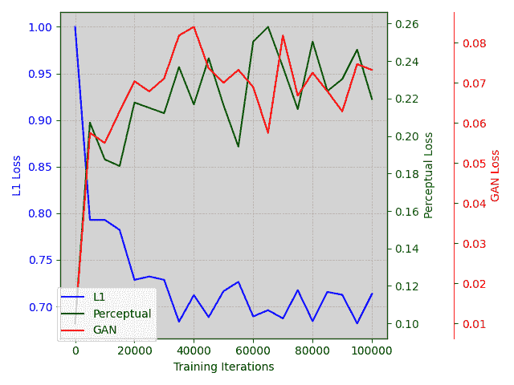

<!--yml

类别：未分类

日期：2025-01-11 11:50:59

-->

# LossAgent：面向图像处理优化目标的LLM代理

> 来源：[https://arxiv.org/html/2412.04090/](https://arxiv.org/html/2412.04090/)

Bingchen Li  Xin Li²²2通讯作者  Yiting Lu  Zhibo Chen

中国科学技术大学

{lbc31415926, luyt31415}@mail.ustc.edu.cn, {xin.li, chenzhibo}@ustc.edu.cn

###### 摘要

我们提出了首个损失代理（LossAgent），用于低级图像处理任务，如图像超分辨率和修复，旨在实现不同实际应用中低级图像处理的任何定制化优化目标。值得注意的是，并非所有优化目标，如复杂的手工设计感知度量、文本描述和复杂的人类反馈，都可以通过现有的低级损失（如均方误差损失）来实现。这给图像处理网络的端到端优化带来了重要挑战。为了解决这个问题，我们的LossAgent引入了强大的大语言模型（LLM）作为损失代理，其中丰富的文本理解先验知识使得损失代理能够理解复杂的优化目标、优化轨迹以及外部环境中的状态反馈。在优化低级图像处理网络的过程中，LossAgent具备理解复杂的优化目标和反馈的潜力。特别地，我们通过结合现有的损失函数来建立损失库，这些损失函数支持低级图像处理的端到端优化。接着，我们设计了面向优化的提示工程，使得损失代理能够在每次优化交互中主动且智能地决定库中每个损失函数的组合权重，从而实现任何定制化优化目标所需的优化轨迹。在三个典型低级图像处理任务和多个优化目标上的大量实验结果表明，我们提出的LossAgent的有效性和适用性。代码和预训练模型将提供在[https://github.com/lbc12345/LossAgent](https://github.com/lbc12345/LossAgent)。

## 1 引言

随着深度学习技术的革命性进展，低级图像处理任务，如图像超分辨率和修复，越来越受到研究人员的关注。通常，低级图像处理任务通过常用的损失函数进行优化，如MSE和L1损失，以端到端的方式提高目标质量[[61](https://arxiv.org/html/2412.04090v1#bib.bib61)、[10](https://arxiv.org/html/2412.04090v1#bib.bib10)、[23](https://arxiv.org/html/2412.04090v1#bib.bib23)、[22](https://arxiv.org/html/2412.04090v1#bib.bib22)、[8](https://arxiv.org/html/2412.04090v1#bib.bib8)、[54](https://arxiv.org/html/2412.04090v1#bib.bib54)]，或感知质量[[59](https://arxiv.org/html/2412.04090v1#bib.bib59)、[60](https://arxiv.org/html/2412.04090v1#bib.bib60)、[6](https://arxiv.org/html/2412.04090v1#bib.bib6)、[7](https://arxiv.org/html/2412.04090v1#bib.bib7)、[63](https://arxiv.org/html/2412.04090v1#bib.bib63)、[50](https://arxiv.org/html/2412.04090v1#bib.bib50)]。然而，使用单一优化目标来优化模型未必能满足现实世界的需求。例如，在图像超分辨率中，我们希望超分辨率图像不仅能够恢复像素级的真实值，还能显得自然，避免出现人工纹理或视觉上分散注意力的伪影[[14](https://arxiv.org/html/2412.04090v1#bib.bib14)]。为了解决这个问题，一些研究人员引入了多个损失函数的组合[[14](https://arxiv.org/html/2412.04090v1#bib.bib14)、[49](https://arxiv.org/html/2412.04090v1#bib.bib49)、[48](https://arxiv.org/html/2412.04090v1#bib.bib48)、[50](https://arxiv.org/html/2412.04090v1#bib.bib50)、[63](https://arxiv.org/html/2412.04090v1#bib.bib63)]（例如，GANs）来训练网络，从而使优化后的模型能够满足多个优化目标。然而，这种方法要求对应优化目标的损失函数是可微分的，并且适用于训练。因此，一些更符合人类视觉感知的高级图像质量评估（IQA）指标是不可微分的，因此无法直接用于端到端的网络优化。

最近，大型语言模型（LLMs），如GPT系列 [[4](https://arxiv.org/html/2412.04090v1#bib.bib4)、[34](https://arxiv.org/html/2412.04090v1#bib.bib34)] 和LLaMA系列 [[30](https://arxiv.org/html/2412.04090v1#bib.bib30)、[45](https://arxiv.org/html/2412.04090v1#bib.bib45)、[37](https://arxiv.org/html/2412.04090v1#bib.bib37)]，已展示出令人期待的推理和理解能力。这也催生了将LLM作为智能体的趋势 [[40](https://arxiv.org/html/2412.04090v1#bib.bib40)、[25](https://arxiv.org/html/2412.04090v1#bib.bib25)、[11](https://arxiv.org/html/2412.04090v1#bib.bib11)、[41](https://arxiv.org/html/2412.04090v1#bib.bib41)]，特别是在具身人工智能领域 [[56](https://arxiv.org/html/2412.04090v1#bib.bib56)、[33](https://arxiv.org/html/2412.04090v1#bib.bib33)、[39](https://arxiv.org/html/2412.04090v1#bib.bib39)、[12](https://arxiv.org/html/2412.04090v1#bib.bib12)]。通过为智能体提供环境信息、预设设置、规则、外部反馈和一组可选操作，它能够利用其强大的推理能力，生成符合定制要求的输出，如工具选择 [[38](https://arxiv.org/html/2412.04090v1#bib.bib38)、[40](https://arxiv.org/html/2412.04090v1#bib.bib40)]、行动决策 [[58](https://arxiv.org/html/2412.04090v1#bib.bib58)]、编程 [[43](https://arxiv.org/html/2412.04090v1#bib.bib43)、[12](https://arxiv.org/html/2412.04090v1#bib.bib12)]等。

图1：在图像处理模型训练过程中（第I部分），损失代理（第II部分）从各种优化目标（第III部分）收集反馈。将这些反馈与历史信息结合后，LLM利用其强大的推理能力来确定图像处理模型后续优化阶段（第I部分）的最优损失权重。

受到这一系列工作的启发，我们提出了第一个损失代理，命名为 LossAgent，用于低级图像处理，使图像处理网络能够针对多种实际应用实现任何定制化的优化目标。为此，我们引入了预训练的大型语言模型（LLM），即 LLaMA-3 [[30](https://arxiv.org/html/2412.04090v1#bib.bib30)]，作为损失代理来控制不同目标的优化轨迹。在优化过程中，一个直观的策略是利用预期的优化目标作为损失函数，指导图像处理网络的优化。然而，并非所有优化目标都能提供帮助，例如复杂的手工编写的优化目标、文本描述和人工反馈，因为它们无法在端到端优化中进行可微分处理。为了解决这个问题，我们提出了组合损失库，收集了现有的支持低级图像处理的流行损失函数，并利用我们提出的 LossAgent 根据外部环境，在每次迭代周期内自适应地和主动地分配每个损失的权重，从而实现朝向所需优化目标的定制化优化轨迹。在这个过程中，我们精心设计了面向优化的提示工程，通过构建提示模板来引导 LLM 理解当前的优化状态、轨迹和目标，从而实现精确的损失权重规划。

为了充分利用 LLM 的推理能力，代理从训练阶段开始便接收模型所有权重的输入，直到当前阶段。这使得 LossAgent 能够通过分析历史权重、推断外部反馈，并遵循定制化的指令，平滑且自动地将图像处理模型优化朝着预定义的优化目标发展。

总体来说，LossAgent 具有以下核心特性：

+   •

    LossAgent 能够从不可微分的优化目标中获取反馈，并利用模型强大的推理能力将这些反馈转换为训练中的损失权重组合，从而使模型能够朝着任何优化目标进行端到端优化。

+   •

    LossAgent 享有高度的灵活性。借助其强大的推理能力，该代理可以完全自动地更新损失权重。此外，由于其能够执行指令，它还可以在训练过程中接收外部环境的反馈，以满足定制化的需求。

+   •

    LossAgent 展示了高扩展性。如图[1](https://arxiv.org/html/2412.04090v1#S1.F1 "Figure 1 ‣ 1 Introduction ‣ LossAgent: Towards Any Optimization Objectives for Image Processing with LLM Agents")所示，我们的 AgentLoss 可以扩展到各种低级图像处理任务和多个不同的优化目标，即使它们不可微分，这一点在实验部分得到了验证。

## 2 相关工作

### 2.1 图像处理

图像处理包括广泛的任务，如图像恢复[[35](https://arxiv.org/html/2412.04090v1#bib.bib35), [23](https://arxiv.org/html/2412.04090v1#bib.bib23), [10](https://arxiv.org/html/2412.04090v1#bib.bib10)]，图像增强[[59](https://arxiv.org/html/2412.04090v1#bib.bib59), [47](https://arxiv.org/html/2412.04090v1#bib.bib47), [51](https://arxiv.org/html/2412.04090v1#bib.bib51)]，以及图像超分辨率[[60](https://arxiv.org/html/2412.04090v1#bib.bib60), [6](https://arxiv.org/html/2412.04090v1#bib.bib6), [7](https://arxiv.org/html/2412.04090v1#bib.bib7), [50](https://arxiv.org/html/2412.04090v1#bib.bib50), [63](https://arxiv.org/html/2412.04090v1#bib.bib63), [21](https://arxiv.org/html/2412.04090v1#bib.bib21)]。在低级图像处理任务中，开创性的研究[[9](https://arxiv.org/html/2412.04090v1#bib.bib9), [24](https://arxiv.org/html/2412.04090v1#bib.bib24), [65](https://arxiv.org/html/2412.04090v1#bib.bib65)]主要集中于通过L1或L2损失函数优化如PSNR和SSIM等保真度度量。然而，经过这些度量优化的模型往往会生成过于平滑的结果[[14](https://arxiv.org/html/2412.04090v1#bib.bib14)]。为了解决这一问题，部分研究[[14](https://arxiv.org/html/2412.04090v1#bib.bib14), [49](https://arxiv.org/html/2412.04090v1#bib.bib49), [63](https://arxiv.org/html/2412.04090v1#bib.bib63), [50](https://arxiv.org/html/2412.04090v1#bib.bib50), [17](https://arxiv.org/html/2412.04090v1#bib.bib17)]利用生成对抗网络（GANs）使超分辨率网络能够学习现实世界高质量图像的分布。通过引入VGG感知损失[[14](https://arxiv.org/html/2412.04090v1#bib.bib14), [42](https://arxiv.org/html/2412.04090v1#bib.bib42)]和GAN损失的加权组合，基于GAN的研究[[49](https://arxiv.org/html/2412.04090v1#bib.bib49), [50](https://arxiv.org/html/2412.04090v1#bib.bib50), [63](https://arxiv.org/html/2412.04090v1#bib.bib63)]在优化人类感知目标方面表现出色。最近，基于变压器的研究[[23](https://arxiv.org/html/2412.04090v1#bib.bib23), [6](https://arxiv.org/html/2412.04090v1#bib.bib6), [7](https://arxiv.org/html/2412.04090v1#bib.bib7)]和基于扩散的研究[[10](https://arxiv.org/html/2412.04090v1#bib.bib10), [54](https://arxiv.org/html/2412.04090v1#bib.bib54), [26](https://arxiv.org/html/2412.04090v1#bib.bib26), [36](https://arxiv.org/html/2412.04090v1#bib.bib36)]进一步提升了上述优化目标的性能。

然而，尽管网络结构和损失函数设计经历了革命性的变化，图像处理模型的优化轨迹已经变得相对固定。尽管对于先进的图像质量评估（IQA）指标有着强烈的需求[[63](https://arxiv.org/html/2412.04090v1#bib.bib63)]，许多最近开发的IQA指标[[20](https://arxiv.org/html/2412.04090v1#bib.bib20), [52](https://arxiv.org/html/2412.04090v1#bib.bib52), [53](https://arxiv.org/html/2412.04090v1#bib.bib53), [18](https://arxiv.org/html/2412.04090v1#bib.bib18)]由于其不可微分的特性，无法作为优化目标。本文通过引入基于LLM的损失代理来解决这一挑战。该代理能够通过损失函数权重的组合，将任何定制的优化目标与图像处理模型的优化结合起来，从而实现端到端的优化。

### 2.2 LLM代理

随着数据科学和计算资源的发展，出现了许多具有显著语言理解和推理能力的大语言模型（LLMs）[[19](https://arxiv.org/html/2412.04090v1#bib.bib19)、[45](https://arxiv.org/html/2412.04090v1#bib.bib45)、[4](https://arxiv.org/html/2412.04090v1#bib.bib4)]。尽管有上述优点，LLMs在某些专业领域的任务上可能会遇到困难，从而导致不准确的输出[[11](https://arxiv.org/html/2412.04090v1#bib.bib11)、[31](https://arxiv.org/html/2412.04090v1#bib.bib31)]。因此，研究人员将这些强大的LLMs作为工具规划者[[38](https://arxiv.org/html/2412.04090v1#bib.bib38)]和智能体[[41](https://arxiv.org/html/2412.04090v1#bib.bib41)]，根据外部需求自适应地协调领域特定的专家模型。例如，MM-REACT[[58](https://arxiv.org/html/2412.04090v1#bib.bib58)]通过提示ChatGPT[[4](https://arxiv.org/html/2412.04090v1#bib.bib4)]来调用领域专家，从而处理各种多模态推理和行动任务。ToolFormer[[38](https://arxiv.org/html/2412.04090v1#bib.bib38)]将外部API标签嵌入文本序列中，增强LLM与外部资源的互动。HuggingGPT[[40](https://arxiv.org/html/2412.04090v1#bib.bib40)]有效地利用HuggingFace的各种专家模型，同时利用LLM作为控制器，巧妙地处理多个专业领域的任务。最近，通过适当的指令调优，研究人员使LLM能够适应更广泛的任务，从而实现更专业的任务规划[[40](https://arxiv.org/html/2412.04090v1#bib.bib40)、[43](https://arxiv.org/html/2412.04090v1#bib.bib43)、[12](https://arxiv.org/html/2412.04090v1#bib.bib12)]。此外，在具象化AI领域，LLM已与视觉专家无缝结合，作为智能体[[56](https://arxiv.org/html/2412.04090v1#bib.bib56)、[33](https://arxiv.org/html/2412.04090v1#bib.bib33)]。该智能体能够接收环境反馈，并相应地生成最佳行动。

与这些伟大的努力不同，我们提出了第一个基于大语言模型（LLM）的智能体，名为LossAgent，用于处理图像处理模型的任何定制化优化目标。通过利用LLM强大的理解和推理能力，我们将来自外部模型或度量标准的反馈转化为图像处理模型中损失权重的适当调整，从而使图像处理模型能够朝着任何目标进行优化。我们希望我们的LossAgent能够促进图像处理领域的发展，推动更加开放和智能的社会。

图 2：LossAgent 的概览。LossAgent 通过以下工作流程将图像处理模型与任何优化目标连接起来：图像处理模型将在当前阶段使用模型权重生成图像。随后，外部专家模型将根据图像处理模型提供的图像生成评分或文本反馈。基于 LLM 的代理模型（例如 LLaMA3）收集反馈，并利用其强大的推理能力分析损失权重与优化目标之间的关系，同时遵循我们的提示工程，包括系统提示、历史提示和定制需求提示。经过适当分析后，代理将生成新的损失权重组合，以进一步引导优化图像处理模型的下一步。我们在第 8 节提供了一个详细的案例研究。

## 3 方法

值得注意的是，图像处理任务有多个优化目标，从传统的度量标准如 MSE 损失，到与人类感知一致的高级 IQA 度量。然而，并非所有的优化目标都可以用于引导图像处理网络的端到端优化，因为并非所有目标都是可微的。这引出了一个重要且有趣的问题：“当优化目标是不可微分时，如何优化图像处理模型？”本文通过提出第一个基于 LLM 的损失代理（LossAgent）来解决这个问题，该代理通过一个预训练的 LLM 将这些优化目标的反馈传递到损失权重的调整中。这种方法使得图像处理模型可以以端到端的方式进行优化。在本节中，我们首先回顾低级图像处理模型的优化目标，然后详细解释图 1 中展示的 LossAgent 的三个部分。

### 3.1 图像处理模型的优化目标

尽管近年来图像处理模型的网络结构已经发生了显著变化，但这些模型的优化目标基本上没有改变。以图像超分辨率（ISR）为例，早期的研究[[24](https://arxiv.org/html/2412.04090v1#bib.bib24)、[9](https://arxiv.org/html/2412.04090v1#bib.bib9)、[65](https://arxiv.org/html/2412.04090v1#bib.bib65)]追求更高的PSNR值，而一些近期的研究[[63](https://arxiv.org/html/2412.04090v1#bib.bib63)、[50](https://arxiv.org/html/2412.04090v1#bib.bib50)、[59](https://arxiv.org/html/2412.04090v1#bib.bib59)、[54](https://arxiv.org/html/2412.04090v1#bib.bib54)、[10](https://arxiv.org/html/2412.04090v1#bib.bib10)、[60](https://arxiv.org/html/2412.04090v1#bib.bib60)]则开始优化网络，以更好地与人类感知对齐，考虑到如LPIPS[[64](https://arxiv.org/html/2412.04090v1#bib.bib64)]和NIQE[[32](https://arxiv.org/html/2412.04090v1#bib.bib32)]等指标。尽管这些ISR模型有所进展，图像质量评估（IQA）模型也经历了显著的发展。IQA模型通过分析图像的属性并检测任何失真或瑕疵来评估图像的视觉质量，因此特别适合作为图像处理模型的优化目标[[46](https://arxiv.org/html/2412.04090v1#bib.bib46)、[57](https://arxiv.org/html/2412.04090v1#bib.bib57)]。然而，由于IQA模型中的特定操作（例如，结合其他模型和应用采样[[52](https://arxiv.org/html/2412.04090v1#bib.bib52)、[53](https://arxiv.org/html/2412.04090v1#bib.bib53)]），一些先进的IQA指标是不可微分的，阻止它们在图像处理模型的训练过程中作为优化目标。此外，当利用来自人类或基于MLLM的IQA模型（如Co-Instruct[[53](https://arxiv.org/html/2412.04090v1#bib.bib53)]）的文本反馈作为优化目标时，这些目标所衍生的指标本质上是不可微分的。

在本文中，我们通过引入一个基于LLM的代理，称为LossAgent，来解决上述挑战。LossAgent并不是直接将这些优化目标作为训练图像处理模型的损失函数，而是高效地将来自定制优化目标的各种反馈转化为一组可微损失函数的可操作加权组合。

### 3.2 加权组合损失库

为了在图像处理模型的训练阶段实现任何优化轨迹，我们建立了包含多个典型差分损失函数$\{L_{1},L_{2},L_{3},...,L_{M}\}$的组合损失库，例如$L_{1}$、LPIPS，其中它们的动态加权组合与系数$\{w_{1},w_{2},w_{3},...,w_{M}\}$结合，以便及时调节优化方向：

|  | $\mathcal{L}=w_{1}L_{1}+w_{2}L_{2}+\dots+w_{M}L_{M}.$ |  | (1) |
| --- | --- | --- | --- |

在这里，$M$ 是损失函数的总数。基于上述加权组合损失库，我们可以通过生成权重系数来直接调整优化方向，权重系数是通过我们提出的损失代理生成的。为了使损失代理能够及时根据任何优化目标的反馈调整权重组合，我们将图像处理模型的训练阶段划分为 N 个阶段，其中图像处理模型的当前状态及其对应的组合损失如下所示：

|  | $\displaystyle\mathcal{S}$ | $\displaystyle=\{S_{0},S_{1},S_{2},\dots,S_{i},\dots,S_{N}\},$ |  | (2) |
| --- | --- | --- | --- | --- |
|  | $\displaystyle\mathcal{L}_{i}$ | $\displaystyle=w_{1}^{i}L_{1}+w_{2}^{i}L_{2}+\dots+w_{M}^{i}L_{M},$ |  | (3) |

其中，$S_{0}$ 代表图像处理模型的初始状态，$i$ 表示第 $i$ 个训练阶段。优化目标的外部反馈将在每个训练阶段结束时由图像处理模型通过一组随机选择的测试图像进行评估，如下所示：

|  | $\mathcal{I}=\{I_{1},I_{2},\dots,I_{T}\},$ |  | (4) |
| --- | --- | --- | --- |

其中，$T$ 是图像的数量。我们在[4.1节](https://arxiv.org/html/2412.04090v1#S4.SS1 "4.1 设置 ‣ 4 实验 ‣ 损失代理：针对图像处理的任何优化目标与大语言模型代理")的 Datasets 部分提供了详细信息。

### 3.3 来自优化目标的外部反馈

为了减轻损失代理在图像处理任务中的认知负担，我们引入了外部评估专家 $\mathcal{O}$ 来为损失代理生成优化反馈。具体来说，一旦我们在阶段 $S_{i}$ 获得了恢复图像 $\mathcal{I}_{S_{i}}$，我们可以利用外部评估专家 $\mathcal{O}$ 来评估恢复图像 $\mathcal{I}_{S_{i}}$ 的质量，如下所示：

|  | $\mathcal{F}=\mathcal{O}\left(\mathcal{I}_{S_{i}}\right),$ |  | (5) |
| --- | --- | --- | --- |

其中，$\mathcal{F}$ 是来自优化目标的外部反馈，可以是质量评分或文本描述。值得注意的是，外部评估专家是用来表示优化目标的工具。例如，如果优化目标是实现更高的 CLIPIQA [[46](https://arxiv.org/html/2412.04090v1#bib.bib46)] 分数，我们会选择 CLIPIQA 作为外部评估专家。相反，当优化目标更为通用（例如，达到更高质量）时，可以协作使用多个评估专家来生成反馈。更多细节请参见[4.2.2节](https://arxiv.org/html/2412.04090v1#S4.SS2.SSS2 "4.2.2 双重优化目标 ‣ 4.2 优化目标评估 ‣ 4 实验 ‣ 损失代理：针对图像处理的任何优化目标与大语言模型代理")。

### 3.4 损失代理

值得注意的是，由于知识差异，原始LLM模型不能直接应用于图像处理任务。为了使LLM模型具备理解图像处理任务的能力并调整图像处理的优化方向，我们利用提示工程将预训练的LLM模型适应为我们所需的损失代理。具体而言，我们提出的提示工程策略可以分为三个部分：i）系统提示，ii）历史提示，iii）定制化需求提示。

在外部专家模型生成反馈$\mathcal{F}$之后，损失代理将收集并利用这些反馈生成一组新的损失权重。LLM在遵循指令和做出决策方面表现出色[[40](https://arxiv.org/html/2412.04090v1#bib.bib40), [34](https://arxiv.org/html/2412.04090v1#bib.bib34), [45](https://arxiv.org/html/2412.04090v1#bib.bib45)]。因此，通过提供准确且充足的提示指导，使损失代理完成我们的任务是可行的。最初，我们通过系统提示方法进行提示工程，沿用先前的研究[[40](https://arxiv.org/html/2412.04090v1#bib.bib40), [56](https://arxiv.org/html/2412.04090v1#bib.bib56), [33](https://arxiv.org/html/2412.04090v1#bib.bib33), [43](https://arxiv.org/html/2412.04090v1#bib.bib43)]，向损失代理传达它需要承担的角色、将要接收的输入、需要输出的结果以及要实现的目标。我们在ISR场景下的提示工程示例如图[2](https://arxiv.org/html/2412.04090v1#S2.F2 "Figure 2 ‣ 2.2 LLM Agents ‣ 2 Related Works ‣ LossAgent: Towards Any Optimization Objectives for Image Processing with LLM Agents")所示。该代理最重要的指令是目标明确：“你最终的目标是帮助SR模型获得更高的评分反馈。”。这是因为LLM可能不包含如何评估这些IQA指标的知识。因此，澄清较低或较高的分数表示更好的图像质量至关重要。如果没有这一上下文，LLM可能会直观地认为更高的分数表示更好的质量，从而导致错误的推理。

随后，为了缓解大语言模型（LLM）中的幻觉现象，并防止在信息稀缺情况下产生不良反应，我们将损失代理的优化轨迹作为历史提示，并将这些信息作为上下文提供给LLM。

接着，我们通过定制化需求提示对LLM施加一些基于规则的约束。此外，我们将格式正则化纳入这些规则，以缓解解析LLM输出时遇到的挑战，我们发现这一方法在标准化输出方面非常有效。值得注意的是，这种定制化需求提示的设计不仅为当前使用提供了灵活性，还能满足未来多样化的需求。

最终，LossAgent 整合所有接收到的信息，利用其强大的理解和推理能力生成一组新的损失权重，公式为：

|  | $\mathcal{L}_{i+1}=w_{1}^{i+1}L_{1}+w_{2}^{i+1}L_{2}+\dots+w_{M}^{i+1}L_{M}$ |  | (6) |
| --- | --- | --- | --- |

这个新的损失函数组合将被用于优化图像处理模型的第 $i+1$ 阶段。基于系统提示、历史提示和定制需求提示，我们的 LossAgent 能够为训练图像处理模型更新合理的新损失权重。更多详细信息请参考第[4.3节](https://arxiv.org/html/2412.04090v1#S4.SS3 "4.3 Evaluation on Effectiveness of Prompt Design ‣ 4 Experiments ‣ LossAgent: Towards Any Optimization Objectives for Image Processing with LLM Agents")。

## 4 实验

表1：LossAgent与其他方法在经典图像超分辨率任务中的定量比较。“预训练”表示我们直接在预训练模型权重上进行验证。“基准”表示我们使用固定损失权重训练模型。由于 NIQE [[32](https://arxiv.org/html/2412.04090v1#bib.bib32)]、MANIQA [[57](https://arxiv.org/html/2412.04090v1#bib.bib57)]、CLIPIQA [[46](https://arxiv.org/html/2412.04090v1#bib.bib46)] 和 Q-Align [[52](https://arxiv.org/html/2412.04090v1#bib.bib52)] 是无参考图像质量评估指标，我们也计算了这些指标在地面真实值（GT）上的结果作为参考。$\uparrow/\downarrow$ 表示值越高/越低越好。最佳结果用粗体标出。

| 指标 | 方法 | 数据集 | 平均值 |
| --- | --- | --- | --- |
| Set5 | Set14 | BSD100 | Urban100 | Manga109 |  |
| --- | --- | --- | --- | --- | --- |
| NIQE$\downarrow$ | 预训练 | 7.10 | 6.22 | 6.11 | 5.46 | 5.37 | 6.05 |
| 基准 | 5.09 | 4.07 | 3.99 | 4.04 | 3.95 | 4.23 |
| LossAgent | 4.82 | 3.91 | 3.86 | 3.96 | 3.88 | 4.08 |
| GT（参考） | 5.15 | 4.86 | 3.19 | 4.02 | 3.53 | 4.15 |
| MANIQA$\uparrow$ | 预训练 | 0.446 | 0.409 | 0.349 | 0.482 | 0.446 | 0.426 |
| 基准 | 0.458 | 0.406 | 0.354 | 0.494 | 0.416 | 0.425 |
| LossAgent | 0.474 | 0.418 | 0.365 | 0.496 | 0.424 | 0.436 |
| GT（参考） | 0.534 | 0.449 | 0.523 | 0.552 | 0.420 | 0.496 |
| CLIPIQA$\uparrow$ | 预训练 | 0.605 | 0.517 | 0.534 | 0.501 | 0.637 | 0.559 |
| 基准 | 0.765 | 0.694 | 0.649 | 0.624 | 0.710 | 0.688 |
| LossAgent | 0.788 | 0.718 | 0.679 | 0.643 | 0.729 | 0.711 |
| GT（参考） | 0.807 | 0.740 | 0.756 | 0.675 | 0.700 | 0.736 |
| Q-Align$\uparrow$ | 预训练 | 3.03 | 3.29 | 2.98 | 4.38 | 3.65 | 3.47 |
| 基准 | 3.04 | 3.45 | 3.34 | 4.53 | 3.66 | 3.60 |
| LossAgent | 3.07 | 3.48 | 3.41 | 4.53 | 3.65 | 3.63 |
| GT（参考） | 3.36 | 3.63 | 4.04 | 4.53 | 3.60 | 3.83 |

### 4.1 设置

为了证明我们的LossAgent的有效性，我们在三项具有代表性的低层次图像处理任务上进行评估：经典图像超分辨率、真实世界图像超分辨率和一体化图像恢复。我们采用了两种典型的图像处理模型：用于超分辨率任务的SwinIR [[23](https://arxiv.org/html/2412.04090v1#bib.bib23)] 和用于一体化恢复任务的PromptIR [[35](https://arxiv.org/html/2412.04090v1#bib.bib35)]。为了展示LossAgent在各种优化目标上的有效性，我们在三种测试设置下评估了我们方法的表现：单一优化目标、双重优化目标和文本优化目标。对于所有基于评分的IQAs优化目标，我们采用其pyiqa的Python实现 [[5](https://arxiv.org/html/2412.04090v1#bib.bib5)]。由于其出色的推理能力，我们选择了开源的Meta-Llama-3-8B-Instruct^*^**https://huggingface.co/meta-llama/Meta-Llama-3-8B-Instruct作为我们损失代理的LLM。我们在第[6](https://arxiv.org/html/2412.04090v1#S6 "6 Training Details ‣ LossAgent: Towards Any Optimization Objectives for Image Processing with LLM Agents")节提供了训练细节。

表 2：每个阶段的训练迭代细节、总训练迭代次数以及三种图像处理模型的初始损失函数权重。 “CISR”、“RISR”和“AIR”分别表示“经典图像超分辨率”、“真实世界图像超分辨率”和“一体化图像恢复”。

| 任务 | 每阶段迭代次数 | 总迭代次数 | 初始损失权重 |
| --- | --- | --- | --- |
| CISR | 5000 | 100k | $\mathcal{L}=1.0L_{\text{L1}}+0.1L_{\text{perceptual}}+0.01L_{\text{GAN}}$ |
| RISR | 5000 | 200k | $\mathcal{L}=1.0L_{\text{L1}}+0.1L_{\text{perceptual}}+0.01L_{\text{GAN}}$ |
| AIR | 2500 | 100k | $\mathcal{L}=1.0L_{\text{L1}}+0.1L_{\text{perceptual}}+1.0L_{\text{LPIPS}}$ |

##### 数据集

对于图像超分辨率（SR）任务，我们参考了之前的工作[[23](https://arxiv.org/html/2412.04090v1#bib.bib23), [50](https://arxiv.org/html/2412.04090v1#bib.bib50)]，并采用DF2K数据集[[1](https://arxiv.org/html/2412.04090v1#bib.bib1), [44](https://arxiv.org/html/2412.04090v1#bib.bib44)]作为训练数据集。对于一体化图像恢复任务，我们遵循[[16](https://arxiv.org/html/2412.04090v1#bib.bib16), [35](https://arxiv.org/html/2412.04090v1#bib.bib35)]的做法，使用BSD400[[2](https://arxiv.org/html/2412.04090v1#bib.bib2)]、WED[[27](https://arxiv.org/html/2412.04090v1#bib.bib27)]、Rain100L[[55](https://arxiv.org/html/2412.04090v1#bib.bib55)]和SOTS[[15](https://arxiv.org/html/2412.04090v1#bib.bib15)]的组合来优化模型。我们利用五个具有地面真实值的SR基准数据集来评估LossAgent在经典图像SR任务上的表现：Set5[[3](https://arxiv.org/html/2412.04090v1#bib.bib3)]、Set14[[62](https://arxiv.org/html/2412.04090v1#bib.bib62)]、BSD100[[28](https://arxiv.org/html/2412.04090v1#bib.bib28)]、Urban100[[13](https://arxiv.org/html/2412.04090v1#bib.bib13)]和Manga109[[29](https://arxiv.org/html/2412.04090v1#bib.bib29)]。为了评估真实世界的图像超分辨率，我们采用了两个没有地面真实值的真实世界基准数据集：OST300[[48](https://arxiv.org/html/2412.04090v1#bib.bib48)]和RealSRSet[[63](https://arxiv.org/html/2412.04090v1#bib.bib63)]。我们遵循PromptIR[[35](https://arxiv.org/html/2412.04090v1#bib.bib35)]的做法，使用SOTS(test)[[15](https://arxiv.org/html/2412.04090v1#bib.bib15)]、Rain100L(test)[[55](https://arxiv.org/html/2412.04090v1#bib.bib55)]和BSD68[[28](https://arxiv.org/html/2412.04090v1#bib.bib28)]来评估一体化图像恢复的表现。对于方程[4](https://arxiv.org/html/2412.04090v1#S3.E4 "Equation 4 ‣ 3.2 Weighted Compositional Loss Repository ‣ 3 Methods ‣ LossAgent: Towards Any Optimization Objectives for Image Processing with LLM Agents")中提到的测试图像$\mathcal{I}$，我们从Set14[[62](https://arxiv.org/html/2412.04090v1#bib.bib62)]中随机抽取10张图像用于经典图像SR；从RealSRSet[[63](https://arxiv.org/html/2412.04090v1#bib.bib63)]中随机抽取10张图像用于真实世界图像SR；从PromptIR的评估集随机抽取10张图像用于一体化图像恢复。

### 4.2 优化目标的评估

#### 4.2.1 单一优化目标

在本节中，我们验证了LossAgent在单一优化目标下的有效性。我们选择了四个图像质量评估（IQA）指标作为优化目标：NIQE [[32](https://arxiv.org/html/2412.04090v1#bib.bib32)]，MANIQA [[57](https://arxiv.org/html/2412.04090v1#bib.bib57)]，CLIPIQA [[46](https://arxiv.org/html/2412.04090v1#bib.bib46)] 和Q-Align [[52](https://arxiv.org/html/2412.04090v1#bib.bib52)]。对于每个指标，我们从预训练模型权重和表[2](https://arxiv.org/html/2412.04090v1#S4.T2 "Table 2 ‣ 4.1 Settings ‣ 4 Experiments ‣ LossAgent: Towards Any Optimization Objectives for Image Processing with LLM Agents")中列出的初始损失权重开始，使用LossAgent并结合该指标的外部反馈优化图像处理模型。如表[1](https://arxiv.org/html/2412.04090v1#S4.T1 "Table 1 ‣ 4 Experiments ‣ LossAgent: Towards Any Optimization Objectives for Image Processing with LLM Agents")、[3](https://arxiv.org/html/2412.04090v1#S4.T3 "Table 3 ‣ 4.2.1 Single Optimization Objective ‣ 4.2 Evaluation on Optimization Objectives ‣ 4 Experiments ‣ LossAgent: Towards Any Optimization Objectives for Image Processing with LLM Agents") 和[4](https://arxiv.org/html/2412.04090v1#S4.T4 "Table 4 ‣ 4.2.1 Single Optimization Objective ‣ 4.2 Evaluation on Optimization Objectives ‣ 4 Experiments ‣ LossAgent: Towards Any Optimization Objectives for Image Processing with LLM Agents")所示，我们的LossAgent在几乎所有的基准测试中都优于基线方法（即固定损失权重），并且在所有优化目标下均表现出色，这不仅揭示了LossAgent的有效性，也表明我们的方法在不同的图像处理模型中具有良好的泛化能力。值得注意的是，LossAgent在实际图像超分辨率任务中的表现良好，表明我们提出的方法在复杂应用场景中的有效性。然而，在一体化的红外（IR）任务中，LossAgent的表现不如其他两项任务稳健。我们将其归因于连续阶段生成的图像之间差异极小，这限制了代理可用的指导信息，并妨碍其进行深入分析和推理以调整损失权重。我们在图[3](https://arxiv.org/html/2412.04090v1#S4.F3 "Figure 3 ‣ 4.2.1 Single Optimization Objective ‣ 4.2 Evaluation on Optimization Objectives ‣ 4 Experiments ‣ LossAgent: Towards Any Optimization Objectives for Image Processing with LLM Agents")中提供了基线方法与我们的LossAgent在实际图像超分辨率任务中的定性比较。如图所示，在LossAgent的帮助下，图像处理模型恢复出更符合人类感知的图像。具体而言，第二排的图像展现了生动的纹理，从而获得了更好的质量评估。

图 3：在四个优化目标下，基线与 LossAgent 在现实世界图像超分辨率上的定性比较。放大以便更好查看。

表 3：在现实世界图像超分辨率上的 LossAgent 与其他方法的定量比较。最佳结果已加粗。请注意，本任务没有地面真值。

| 方法 | 指标 | 数据集 | 平均值 | 指标 | 数据集 | 平均值 |
| --- | --- | --- | --- | --- | --- | --- |
| OST300 | RealSRSet |  |  | OST300 | RealSRSet |  |
| --- | --- | --- | --- | --- | --- | --- |
| 预训练 | NIQE$\downarrow$ | 6.31 | 7.62 | 6.96 | MANIQA$\uparrow$ | 0.332 | 0.360 | 0.346 |
| 基线 | 3.26 | 5.12 | 4.19 |  | 0.366 | 0.385 | 0.375 |
| LossAgent | 3.05 | 4.43 | 3.74 |  | 0.371 | 0.394 | 0.383 |
| 预训练 | Q-Align$\uparrow$ | 4.47 | 3.43 | 3.95 | CLIPIQA$\uparrow$ | 0.419 | 0.444 | 0.432 |
| 基线 | 4.55 | 3.81 | 4.18 |  | 0.528 | 0.611 | 0.569 |
| LossAgent | 4.58 | 3.87 | 4.22 |  | 0.571 | 0.649 | 0.610 |

表 4：在一体化 IR 上，LossAgent 与其他方法的定量比较。我们遵循以前的设置 [[35](https://arxiv.org/html/2412.04090v1#bib.bib35), [16](https://arxiv.org/html/2412.04090v1#bib.bib16)] 并评估不同方法在五种失真上的性能。最佳结果已加粗。

| 指标 | 方法 | 去雾 | 去雨 | 降噪 | 平均值 |
| --- | --- | --- | --- | --- | --- |
| SOTS | Rain100L | $\sigma=15$ | $\sigma=25$ | $\sigma=50$ |  |
| --- | --- | --- | --- | --- | --- |
| NIQE$\downarrow$ | 预训练 | 2.91 | 3.16 | 3.77 | 3.96 | 4.25 | 3.61 |
| 基线 | 2.98 | 3.18 | 3.43 | 3.49 | 3.71 | 3.36 |
| LossAgent | 2.95 | 3.17 | 3.38 | 3.48 | 3.80 | 3.36 |
| GT（参考） | 2.94 | 3.17 | 3.13 | 3.13 | 3.13 | 3.10 |
| MANIQA$\uparrow$ | 预训练 | 0.441 | 0.498 | 0.493 | 0.457 | 0.377 | 0.453 |
| 基线 | 0.447 | 0.503 | 0.482 | 0.450 | 0.381 | 0.453 |
| LossAgent | 0.450 | 0.505 | 0.491 | 0.462 | 0.386 | 0.459 |
| GT（参考） | 0.442 | 0.509 | 0.525 | 0.525 | 0.525 | 0.505 |
| CLIPIQA$\uparrow$ | 预训练 | 0.494 | 0.750 | 0.686 | 0.672 | 0.640 | 0.649 |
| 基线 | 0.534 | 0.769 | 0.795 | 0.785 | 0.725 | 0.722 |
| LossAgent | 0.542 | 0.771 | 0.807 | 0.777 | 0.706 | 0.721 |
| GT（参考） | 0.544 | 0.755 | 0.757 | 0.757 | 0.757 | 0.714 |
| Q-Align$\uparrow$ | 预训练 | 4.02 | 3.92 | 4.09 | 3.96 | 3.61 | 3.92 |
| 基线 | 4.03 | 3.94 | 3.95 | 3.94 | 3.76 | 3.92 |
| LossAgent | 3.99 | 3.95 | 3.97 | 3.96 | 3.82 | 3.94 |
| GT（参考） | 3.96 | 4.01 | 4.11 | 4.11 | 4.11 | 4.08 |

#### 4.2.2 双重优化目标

为了充分探索 LossAgent 的潜力，我们在经典的图像超分辨率任务上进行了实验。在该实验中，我们同时利用两个优化目标（即 Q-Align [[52](https://arxiv.org/html/2412.04090v1#bib.bib52)] 和 PSNR）来调整损失权重。从表格[5](https://arxiv.org/html/2412.04090v1#S4.T5 "Table 5 ‣ 4.2.2 Double Optimization Objectives ‣ 4.2 Evaluation on Optimization Objectives ‣ 4 Experiments ‣ LossAgent: Towards Any Optimization Objectives for Image Processing with LLM Agents")中可以观察到，加入 PSNR 作为优化目标使所有基准测试中的 PSNR 值都有所提升，同时保持了相当的 Q-Align 性能。我们将这一现象归因于 LLM 强大的推理能力。这些结果展示了 LossAgent 在处理不同优化目标时的灵活性。

表格 5：单一优化目标与双重优化目标之间的定量比较。对于后者情况，我们同时包括 Q-Align 分数和 PSNR 值作为 LossAgent 的外部反馈。

| 方法 | 数据集 | 平均 |
| --- | --- | --- |
| Set5 | Set14 | BSD100 | Urban100 | Manga109 |
| --- | --- | --- | --- | --- |
| Q-Align$\uparrow$ | 3.07/30.62 | 3.48/27.28 | 3.41/26.41 | 4.53/25.96 | 3.65/29.91 | 3.63/28.04 |
| Q-Align$\uparrow$+PSNR$\uparrow$ | 3.12/31.14 | 3.46/27.52 | 3.42/26.62 | 4.53/26.27 | 3.65/30.29 | 3.64/28.37 |

#### 4.2.3 文本优化目标

尽管分数指标在图像处理任务中很常见，但利用文本指标作为优化目标的任务却很少。最近，Co-Instruct [[53](https://arxiv.org/html/2412.04090v1#bib.bib53)] 使用 MLLMs 来评估图像质量并生成相应的文本描述。为了探索 LossAgent 的灵活性和可扩展性，我们选择 Co-Instruct 作为优化目标。表格[6](https://arxiv.org/html/2412.04090v1#S4.T6 "Table 6 ‣ 4.2.3 Textual Optimization Objectives ‣ 4.2 Evaluation on Optimization Objectives ‣ 4 Experiments ‣ LossAgent: Towards Any Optimization Objectives for Image Processing with LLM Agents")展示了全能 IR 任务的结果。请注意，目前没有任何方法可以评估由文本指导优化的模型。由于 Co-Instruct 和 Q-Align 使用了类似的网络结构和训练数据集，我们认为通过 Q-Align 分数评估 Co-Instruct 优化后的模型是合理的。观察到 Co-Instruct 优化的模型取得了与基线模型和 Q-Align 优化模型相当的结果，表明 LossAgent 成功地将不可微分的优化目标转化为对损失权重的适当调整。

表格 6：基线模型与 Co-Instruct 优化模型之间的定量比较。我们使用 Q-Align 分数来评估模型性能。

| 方法 | 去雾 | 去雨 | 去噪 | 平均 |
| --- | --- | --- | --- | --- |
| SOTS | Rain100L | $\sigma=15$ | $\sigma=25$ | $\sigma=50$ |
| --- | --- | --- | --- | --- |
| 基线 | 4.03 | 3.94 | 3.95 | 3.94 | 3.76 | 3.92 |
| Q-Align | 3.99 | 3.95 | 3.97 | 3.96 | 3.82 | 3.94 |
| Co-Instruct | 4.05 | 3.95 | 3.95 | 3.94 | 3.82 | 3.94 |

##### 总结

我们通过三种评估设置验证了LossAgent的灵活性和可扩展性：单一优化目标、双重优化目标和文本优化目标。正如所观察到的，LossAgent在多个图像处理任务和不同优化目标上都表现高效，同时也将高级IQA指标与图像处理模型连接起来。我们在第 [7](https://arxiv.org/html/2412.04090v1#S7 "7 More Ablation Studies ‣ LossAgent: Towards Any Optimization Objectives for Image Processing with LLM Agents")节提供了更多关于损失代理的消融研究。

### 4.3 提示设计效果评估

如第 [3.4](https://arxiv.org/html/2412.04090v1#S3.SS4 "3.4 Loss Agent ‣ 3 Methods ‣ LossAgent: Towards Any Optimization Objectives for Image Processing with LLM Agents")节所述，我们精心设计了LLM的提示，以防止幻觉并生成合理的损失权重。我们的提示设计主要集中在三个部分：i) 系统提示阐明了LLM的角色和目标。最重要的是，它简要介绍了这些IQI指标，以及较低或较高的分数是否表示更好的图像质量。ii) 历史提示考虑了之前的优化轨迹，为LLM推断合理的损失权重提供了丰富的上下文。iii) 定制需求提示为LLM的推理过程提供了基于规则的约束。除非另有说明，本节中的实验均在经典的图像超分辨率任务上进行。

##### 系统提示的效果

在表格 [7](https://arxiv.org/html/2412.04090v1#S4.T7 "Table 7 ‣ Effectiveness of System Prompt ‣ 4.3 Evaluation on Effectiveness of Prompt Design ‣ 4 Experiments ‣ LossAgent: Towards Any Optimization Objectives for Image Processing with LLM Agents")中，我们移除了描述分数与图像质量之间关系的提示。例如，NIQE [[32](https://arxiv.org/html/2412.04090v1#bib.bib32)]中，较低的分数表示较好的质量，但LossAgent未能提高ISR模型在NIQE指标上的表现。我们将此归因于LLM可能将较高的分数解释为更好质量的标志。因此，我们的系统提示设计有助于减少LossAgent决策过程中的幻觉问题。

表格 7：系统提示的效果。 "W/o" 表示我们从系统提示中移除了关于分数与图像质量之间关系的描述。 "W" 表示系统提示中包含关系感知的描述。评估指标为NIQE$\downarrow$。

| 系统提示 | 数据集 | 平均值 |
| --- | --- | --- |
| Set5 | Set14 | BSD100 | Urban100 | Manga109 |
| --- | --- | --- | --- | --- |
| W/o | 5.12 | 4.24 | 4.02 | 4.17 | 4.06 | 4.32 |
| 有 | 4.82 | 3.91 | 3.86 | 3.96 | 3.88 | 4.08 |

##### 历史提示的有效性

尽管大语言模型（LLM）具备强大的推理和决策能力，但在没有充分上下文的情况下，它无法有效生成合理的损失权重。因此，我们通过收集所有历史优化轨迹来提供这样的上下文。如表[8](https://arxiv.org/html/2412.04090v1#S4.T8 "Table 8 ‣ Effectiveness of Customized Needs Prompt ‣ 4.3 Evaluation on Effectiveness of Prompt Design ‣ 4 Experiments ‣ LossAgent: Towards Any Optimization Objectives for Image Processing with LLM Agents")所示，通过提示提供完整的历史信息能够达到最佳性能，而仅提供两条轨迹（即损失权重和阶段$S_{i}$及$S_{i-1}$的反馈）会导致性能下降。

##### 定制需求提示的有效性

由于LLM生成的是文本输出，因此需要通过基于规则的约束来规范其输出，使得权重能够被程序识别。我们通过经验发现，给出有效格式的示例能显著减少LLM输出中的幻觉。我们通过输出格式的正确率来验证这一点，如表[9](https://arxiv.org/html/2412.04090v1#S4.T9 "Table 9 ‣ Effectiveness of Customized Needs Prompt ‣ 4.3 Evaluation on Effectiveness of Prompt Design ‣ 4 Experiments ‣ LossAgent: Towards Any Optimization Objectives for Image Processing with LLM Agents")所示。去除该示例会导致生成标准化输出的成功率大幅下降。相反，我们的LossAgent成功地生成了标准化输出，在800个样本中只有一个失败案例。这证明了我们定制需求提示设计的有效性。

表8：历史提示的有效性。$S_{i}$表示当前阶段，而$S_{0}$表示初始阶段。评估指标为MANIQA$\uparrow$。

| 轨迹 | 数据集 | 平均值 |
| --- | --- | --- |
| Set5 | Set14 | BSD. | Urban. | Manga. |
| --- | --- | --- | --- | --- |
| $\{S_{i-1},S_{i}\}$ | 0.464 | 0.405 | 0.364 | 0.487 | 0.413 | 0.427 |
| $\{S_{0},\dots,S_{i}\}$ | 0.474 | 0.418 | 0.365 | 0.496 | 0.424 | 0.436 |

表9：格式化规则的有效性。成功率是基于整个训练计算得出的。

| 方法 | 成功率 | 方法 | 成功率 |
| --- | --- | --- | --- |
| 无示例 | 21.37% (171/800) | LossAgent | 99.87% (799/800) |

## 5 结论

本文提出了首个损失代理，以解决低层图像处理任务中的任何定制优化目标。通过引入强大的LLM作为损失代理，我们的LossAgent能够理解各种优化目标、轨迹以及来自外部专家模型的阶段性反馈。为了充分利用LLM的推理能力，我们精心设计了面向优化的提示工程，为损失代理提供详细的指令和定制需求提示。此外，我们在提示中加入了历史信息，以防止LLM引起的幻觉和不正确推理。通过在三个具有多种定制优化目标的典型低层图像处理任务上进行大量实验，验证了我们LossAgent的灵活性和可扩展性。

## 参考文献

+   Agustsson和Timofte[2017] Eirikur Agustsson 和 Radu Timofte. Ntire 2017单幅图像超分辨率挑战赛：数据集与研究. 载于 *IEEE计算机视觉与模式识别会议工作坊论文集*, 页码126–135, 2017年。

+   Arbelaez等人[2010] Pablo Arbelaez, Michael Maire, Charless Fowlkes, 和 Jitendra Malik. 边缘检测与层次化图像分割. *IEEE模式分析与机器智能学报*, 33(5):898–916, 2010年。

+   Bevilacqua等人[2012] Marco Bevilacqua, Aline Roumy, Christine Guillemot, 和 Marie Line Alberi-Morel. 基于非负邻域嵌入的低复杂度单幅图像超分辨率. 2012年。

+   Brown等人[2020] Tom Brown, Benjamin Mann, Nick Ryder, Melanie Subbiah, Jared D Kaplan, Prafulla Dhariwal, Arvind Neelakantan, Pranav Shyam, Girish Sastry, Amanda Askell等人. 语言模型是少样本学习者. *神经信息处理系统进展*, 33:1877–1901, 2020年。

+   Chen和Mo[2022] Chaofeng Chen 和 Jiadi Mo. IQA-PyTorch：用于图像质量评估的Pytorch工具箱. [在线]. 可用: [https://github.com/chaofengc/IQA-PyTorch](https://github.com/chaofengc/IQA-PyTorch), 2022年。

+   Chen等人[2023a] Xiangyu Chen, Xintao Wang, Jiantao Zhou, Yu Qiao, 和 Chao Dong. 在图像超分辨率变换器中激活更多像素. 载于 *IEEE/CVF计算机视觉与模式识别会议论文集*, 页码22367–22377, 2023a年。

+   Chen等人[2023b] Zheng Chen, Yulun Zhang, Jinjin Gu, Linghe Kong, Xiaokang Yang, 和 Fisher Yu. 用于图像超分辨率的双聚合变换器. 载于 *IEEE/CVF国际计算机视觉会议论文集*, 页码12312–12321, 2023b年。

+   Conde等人[2024] Marcos V Conde, Gregor Geigle, 和 Radu Timofte. 基于人类指令的高质量图像恢复. *arXiv预印本 arXiv:2401.16468*, 2024年。

+   Dong等人[2015] Chao Dong, Chen Change Loy, Kaiming He, 和 Xiaoou Tang. 使用深度卷积网络的图像超分辨率. *IEEE模式分析与机器智能学报*, 38(2):295–307, 2015年。

+   Fei等人[2023] Ben Fei, Zhaoyang Lyu, Liang Pan, Junzhe Zhang, Weidong Yang, Tianyue Luo, Bo Zhang, 和 Bo Dai。统一图像恢复与增强的生成扩散先验。在*IEEE/CVF计算机视觉与模式识别会议论文集*，页码9935–9946，2023年。

+   Ge等人[2024] Yingqiang Ge, Wenyue Hua, Kai Mei, Juntao Tan, Shuyuan Xu, Zelong Li, Yongfeng Zhang 等人。Openagi：当LLM遇到领域专家。*神经信息处理系统进展*，36，2024年。

+   Gupta和Kembhavi[2023] Tanmay Gupta 和 Aniruddha Kembhavi。视觉编程：无需训练的组合视觉推理。在*IEEE/CVF计算机视觉与模式识别会议论文集*，页码14953–14962，2023年。

+   Huang等人[2015] Jia-Bin Huang, Abhishek Singh, 和 Narendra Ahuja。基于变换自例子的单图像超分辨率。在*IEEE计算机视觉与模式识别会议论文集*，页码5197–5206，2015年。

+   Ledig等人[2017] Christian Ledig, Lucas Theis, Ferenc Huszár, Jose Caballero, Andrew Cunningham, Alejandro Acosta, Andrew Aitken, Alykhan Tejani, Johannes Totz, Zehan Wang等人。利用生成对抗网络进行逼真单图像超分辨率。在*IEEE计算机视觉与模式识别会议论文集*，页码4681–4690，2017年。

+   Li等人[2018] Boyi Li, Wenqi Ren, Dengpan Fu, Dacheng Tao, Dan Feng, Wenjun Zeng, 和 Zhangyang Wang。单图像去雾及其相关研究基准。*IEEE图像处理学报*，28(1):492–505，2018年。

+   Li等人[2022] Boyun Li, Xiao Liu, Peng Hu, Zhongqin Wu, Jiancheng Lv, 和 Xi Peng。面向未知损坏的全能图像恢复。在*IEEE/CVF计算机视觉与模式识别会议论文集*，页码17452–17462，2022年。

+   Li等人[2024a] Bingchen Li, Xin Li, Hanxin Zhu, Yeying Jin, Ruoyu Feng, Zhizheng Zhang, 和 Zhibo Chen。Sed：面向语义的图像超分辨率鉴别器。在*IEEE/CVF计算机视觉与模式识别会议论文集*，页码25784–25795，2024a。

+   Li等人[2024b] Chunyi Li, Haoning Wu, Zicheng Zhang, Hongkun Hao, Kaiwei Zhang, Lei Bai, Xiaohong Liu, Xiongkuo Min, Weisi Lin, 和 Guangtao Zhai。Q-refine：一种感知质量优化器，用于AI生成图像。*arXiv预印本 arXiv:2401.01117*，2024b。

+   Li等人[2023a] Junnan Li, Dongxu Li, Silvio Savarese, 和 Steven Hoi。Blip-2：通过冻结图像编码器和大型语言模型进行语言-图像预训练的自举方法。在*国际机器学习会议*，页码19730–19742，PMLR，2023a。

+   Li等人[2023b] Xin Li, Yiting Lu, 和 Zhibo Chen。Freqalign：从频率视角挖掘面向感知的盲图像质量评估的可迁移性。*IEEE多媒体学报*，2023b。

+   Li 等人 [2024c] Xin Li, Bingchen Li, Yeying Jin, Cuiling Lan, Hanxin Zhu, Yulin Ren, 和 Zhibo Chen。Ucip：使用动态提示进行压缩图像超分辨率的通用框架。*arXiv 预印本 arXiv:2407.13108*，2024年。

+   Li 等人 [2023c] Yawei Li, Yuchen Fan, Xiaoyu Xiang, Denis Demandolx, Rakesh Ranjan, Radu Timofte, 和 Luc Van Gool。图像层次结构的高效与显式建模用于图像修复。在*IEEE/CVF 计算机视觉与模式识别大会论文集*，第18278-18289页，2023年。

+   Liang 等人 [2021] Jingyun Liang, Jiezhang Cao, Guolei Sun, Kai Zhang, Luc Van Gool, 和 Radu Timofte。Swinir：使用Swin Transformer的图像修复。在*IEEE/CVF国际计算机视觉会议论文集*，第1833-1844页，2021年。

+   Lim 等人 [2017] Bee Lim, Sanghyun Son, Heewon Kim, Seungjun Nah, 和 Kyoung Mu Lee。用于单图像超分辨率的增强深度残差网络。在*IEEE计算机视觉与模式识别会议论文集*，第136-144页，2017年。

+   Lu 等人 [2024] Pan Lu, Baolin Peng, Hao Cheng, Michel Galley, Kai-Wei Chang, Ying Nian Wu, Song-Chun Zhu, 和 Jianfeng Gao。Chameleon：大语言模型的即插即用组合推理。*神经信息处理系统进展*，第36期，2024年。

+   Ma 等人 [2023] Jiaqi Ma, Tianheng Cheng, Guoli Wang, Qian Zhang, Xinggang Wang, 和 Lefei Zhang。Prores：探索针对通用图像修复的退化感知视觉提示。*arXiv 预印本 arXiv:2306.13653*，2023年。

+   Ma 等人 [2016] Kede Ma, Zhengfang Duanmu, Qingbo Wu, Zhou Wang, Hongwei Yong, Hongliang Li, 和 Lei Zhang。滑铁卢探索数据库：图像质量评估模型的新挑战。*IEEE图像处理学报*，26(2)：1004-1016，2016年。

+   Martin 等人 [2001] David Martin, Charless Fowlkes, Doron Tal, 和 Jitendra Malik。人类分割自然图像数据库及其在评估分割算法和测量生态统计数据中的应用。在*第八届IEEE国际计算机视觉会议（ICCV 2001）*，第416-423页，IEEE，2001年。

+   Matsui 等人 [2017] Yusuke Matsui, Kota Ito, Yuji Aramaki, Azuma Fujimoto, Toru Ogawa, Toshihiko Yamasaki, 和 Kiyoharu Aizawa。基于草图的漫画检索使用Manga109数据集。*多媒体工具与应用*，76(20)：21811-21838，2017年。

+   MetaAI [2024] MetaAI。Llama3。 [https://llama.meta.com/llama3](https://llama.meta.com/llama3)，2024年。

+   Mialon 等人 [2023] Grégoire Mialon, Roberto Dessì, Maria Lomeli, Christoforos Nalmpantis, Ram Pasunuru, Roberta Raileanu, Baptiste Rozière, Timo Schick, Jane Dwivedi-Yu, Asli Celikyilmaz 等人。增强语言模型：一项调查。*arXiv 预印本 arXiv:2302.07842*，2023年。

+   Mittal 等人 [2012] Anish Mittal, Rajiv Soundararajan, 和 Alan C Bovik。制作“完全盲”图像质量分析仪。*IEEE 信号处理快报*，20(3)：209-212，2012年。

+   Mu 等人 [2024] Yao Mu, Qinglong Zhang, Mengkang Hu, Wenhai Wang, Mingyu Ding, Jun Jin, Bin Wang, Jifeng Dai, Yu Qiao 和 Ping Luo. Embodiedgpt: 通过体现式思维链的视觉-语言预训练。*神经信息处理系统进展*，第36卷，2024年。

+   OpenAI [2023] OpenAI. GPT-4 技术报告，2023年。

+   Potlapalli 等人 [2023] Vaishnav Potlapalli, Syed Waqas Zamir, Salman Khan 和 Fahad Shahbaz Khan. Promptir: 一体化盲图像修复的提示方法。*arXiv 预印本 arXiv:2306.13090*，2023年。

+   Ren 等人 [2025] Yulin Ren, Xin Li, Bingchen Li, Xingrui Wang, Mengxi Guo, Shijie Zhao, Li Zhang 和 Zhibo Chen. Moe-diffir: 用于通用压缩图像修复的任务定制扩散先验。在 *欧洲计算机视觉会议*，第116–134页。Springer，2025年。

+   Roziere 等人 [2023] Baptiste Roziere, Jonas Gehring, Fabian Gloeckle, Sten Sootla, Itai Gat, Xiaoqing Ellen Tan, Yossi Adi, Jingyu Liu, Tal Remez, Jérémy Rapin 等人. Code llama: 用于代码的开源基础模型。*arXiv 预印本 arXiv:2308.12950*，2023年。

+   Schick 等人 [2024] Timo Schick, Jane Dwivedi-Yu, Roberto Dessì, Roberta Raileanu, Maria Lomeli, Eric Hambro, Luke Zettlemoyer, Nicola Cancedda 和 Thomas Scialom. Toolformer: 语言模型可以自学使用工具。*神经信息处理系统进展*，第36卷，2024年。

+   Schumann 等人 [2024] Raphael Schumann, Wanrong Zhu, Weixi Feng, Tsu-Jui Fu, Stefan Riezler 和 William Yang Wang. Velma: 视觉和语言导航中的 LLM 代理的语言化体现，基于街景的应用。在 *人工智能领域的 AAAI 大会论文集*，第18924–18933页，2024年。

+   Shen 等人 [2024] Yongliang Shen, Kaitao Song, Xu Tan, Dongsheng Li, Weiming Lu 和 Yueting Zhuang. Hugginggpt: 使用 ChatGPT 和 Hugging Face 中的其他模型解决 AI 任务。*神经信息处理系统进展*，第36卷，2024年。

+   Shinn 等人 [2024] Noah Shinn, Federico Cassano, Ashwin Gopinath, Karthik Narasimhan 和 Shunyu Yao. Reflexion: 具有语言强化学习的语言代理。*神经信息处理系统进展*，第36卷，2024年。

+   Simonyan 和 Zisserman [2014] Karen Simonyan 和 Andrew Zisserman. 大规模图像识别的非常深度卷积网络。*arXiv 预印本 arXiv:1409.1556*，2014年。

+   Surís 等人 [2023] Dídac Surís, Sachit Menon 和 Carl Vondrick. Vipergpt: 通过 Python 执行进行推理的视觉推理。发表于 *IEEE/CVF 国际计算机视觉会议论文集*，第11888–11898页，2023年。

+   Timofte 等人 [2017] Radu Timofte, Eirikur Agustsson, Luc Van Gool, Ming-Hsuan Yang 和 Lei Zhang. Ntire 2017 单幅图像超分辨率挑战：方法与结果。发表于 *IEEE 计算机视觉与模式识别会议论文集*，第114–125页，2017年。

+   Touvron 等人 [2023] Hugo Touvron、Louis Martin、Kevin Stone、Peter Albert、Amjad Almahairi、Yasmine Babaei、Nikolay Bashlykov、Soumya Batra、Prajjwal Bhargava、Shruti Bhosale 等人. Llama 2：开放基础和微调的聊天模型。 *arXiv 预印本 arXiv:2307.09288*，2023。

+   Wang 等人 [2023a] Jianyi Wang、Kelvin CK Chan 和 Chen Change Loy. 探索 clip 用于评估图像的外观与感觉。在 *AAAI 人工智能会议论文集* 中，第 2555–2563 页，2023a。

+   Wang 等人 [2023b] Tao Wang、Kaihao Zhang、Tianrun Shen、Wenhan Luo、Bjorn Stenger 和 Tong Lu. 超高清低光图像增强：一个基准和基于变换器的方法。在 *AAAI 人工智能会议论文集* 中，第 2654–2662 页，2023b。

+   Wang 等人 [2018a] Xintao Wang、Ke Yu、Chao Dong 和 Chen Change Loy. 通过深度空间特征变换恢复图像超分辨率中的真实纹理。在 *IEEE 计算机视觉与模式识别会议论文集* 中，第 606–615 页，2018a。

+   Wang 等人 [2018b] Xintao Wang、Ke Yu、Shixiang Wu、Jinjin Gu、Yihao Liu、Chao Dong、Yu Qiao 和 Chen Change Loy. Esrgan：增强型超分辨率生成对抗网络。在 *欧洲计算机视觉会议（ECCV）研讨会论文集* 中，第 0–0 页，2018b。

+   Wang 等人 [2021] Xintao Wang、Liangbin Xie、Chao Dong 和 Ying Shan. Real-esrgan：使用纯合成数据训练真实世界盲超分辨率。在 *IEEE/CVF 国际计算机视觉会议论文集* 中，第 1905–1914 页，2021。

+   Wang 等人 [2023c] Xinlong Wang、Wen Wang、Yue Cao、Chunhua Shen 和 Tiejun Huang. 图像通过图像表达：一个通用的画家用于上下文视觉学习。在 *IEEE/CVF 计算机视觉与模式识别会议论文集* 中，第 6830–6839 页，2023c。

+   Wu 等人 [2023] Haoning Wu、Zicheng Zhang、Weixia Zhang、Chaofeng Chen、Liang Liao、Chunyi Li、Yixuan Gao、Annan Wang、Erli Zhang、Wenxiu Sun 等人. Q-align：通过离散文本定义级别教授 lmms 用于视觉评分。 *arXiv 预印本 arXiv:2312.17090*，2023。

+   Wu 等人 [2024] Haoning Wu、Hanwei Zhu、Zicheng Zhang、Erli Zhang、Chaofeng Chen、Liang Liao、Chunyi Li、Annan Wang、Wenxiu Sun、Qiong Yan、Xiaohong Liu、Guangtao Zhai、Shiqi Wang 和 Weisi Lin. 面向开放式视觉质量比较，2024。

+   Xia 等人 [2023] Bin Xia、Yulun Zhang、Shiyin Wang、Yitong Wang、Xinglong Wu、Yapeng Tian、Wenming Yang 和 Luc Van Gool. Diffir：用于图像恢复的高效扩散模型。在 *IEEE/CVF 国际计算机视觉会议论文集* 中，第 13095–13105 页，2023。

+   Yang 等人 [2020] Fuzhi Yang、Huan Yang、Jianlong Fu、Hongtao Lu 和 Baining Guo. 学习纹理变换器网络用于图像超分辨率。在 *IEEE/CVF 计算机视觉与模式识别会议论文集* 中，第 5791–5800 页，2020。

+   杨等人 [2023a] 杨景康、董宇豪、刘帅、李博、王子岳、姜晨成、谭浩然、康家木、张元汉、周凯阳等人。Octopus：通过环境反馈进行具身视觉-语言编程。*arXiv预印本 arXiv:2310.08588*，2023a年。

+   杨等人 [2022] 杨斯迪、吴天禾、石树伟、老珊珊、龚远、曹名邓、王家豪、杨玉久。Maniqa：用于无参考图像质量评估的多维注意力网络。见于*IEEE/CVF计算机视觉与模式识别会议论文集*，第1191-1200页，2022年。

+   杨等人 [2023b] 杨正源、李林杰、王建锋、林凯文、艾哈迈德·埃赫森、费萨尔·艾哈迈德、刘子诚、刘策、曾迈克尔、王丽娟。Mm-react：通过提示ChatGPT进行多模态推理和行动。*arXiv预印本 arXiv:2303.11381*，2023b年。

+   于等人 [2024] 于方华、谷金金、李哲源、胡金凡、孔向涛、王鑫涛、何景文、乔宇、董超。追求卓越：在实际环境中实践模型扩展以实现照片级图像恢复。*arXiv预印本 arXiv:2401.13627*，2024年。

+   岳等人 [2024] 岳宗生、王建义、陈长睿。Resshift：通过残差迁移进行高效的图像超分辨率扩散模型。*神经信息处理系统进展*，第36卷，2024年。

+   扎米尔等人 [2022] Syed Waqas Zamir、Aditya Arora、Salman Khan、Munawar Hayat、Fahad Shahbaz Khan、Ming-Hsuan Yang。Restormer：高效变压器用于高分辨率图像恢复。见于*IEEE/CVF计算机视觉与模式识别会议论文集*，第5728-5739页，2022年。

+   泽德等人 [2010] 罗曼·泽德、迈克尔·埃拉德、马坦·普罗特。基于稀疏表示的单图像尺度提升。见于*国际曲线与曲面会议*，第711-730页，Springer，2010年。

+   张等人 [2021] 张凯、梁靖云、卢克·范·古尔、雷杜·提莫夫特。设计用于深度盲图像超分辨率的实用退化模型。见于*IEEE/CVF国际计算机视觉会议论文集*，第4791-4800页，2021年。

+   张等人 [2018a] Richard Zhang、Phillip Isola、Alexei A Efros、Eli Shechtman、Oliver Wang。深度特征作为感知度量的非理性有效性。见于*IEEE计算机视觉与模式识别会议论文集*，第586-595页，2018a年。

+   张等人 [2018b] 张钰伦、田亚鹏、孔宇、钟必能、傅云。残差密集网络用于图像超分辨率。见于*IEEE计算机视觉与模式识别会议论文集*，第2472-2481页，2018b年。

\thetitle

附录材料

## 6 训练细节

如在第[3.2节](https://arxiv.org/html/2412.04090v1#S3.SS2 "3.2 加权组合损失库 ‣ 3 方法 ‣ LossAgent：面向图像处理的任意优化目标与LLM代理")中所示，我们将图像处理模型的整个训练过程划分为几个阶段，以便通过LossAgent动态调整损失权重。我们在表[2](https://arxiv.org/html/2412.04090v1#S4.T2 "表 2 ‣ 4.1 设置 ‣ 4 实验 ‣ LossAgent：面向图像处理的任意优化目标与LLM代理")中列出了每个阶段的训练迭代详情、总训练迭代次数以及损失函数的初始权重。对于两个图像超分辨率任务，我们利用SwinIR的基于PSNR的预训练检查点[[23](https://arxiv.org/html/2412.04090v1#bib.bib23)]作为两个任务的初始检查点，然后应用流行的基于GAN的训练策略来执行图像超分辨率任务，并使用我们的LossAgent。对于一体化图像恢复任务，我们采用PromptIR的预训练检查点[[35](https://arxiv.org/html/2412.04090v1#bib.bib35)]作为初始检查点。然而，由于GAN-based训练在此任务中不常见，我们使用L1损失、感知损失和LPIPS损失的组合作为损失函数来评估我们LossAgent的性能。使用预训练检查点作为初始检查点的基本原理是为了缓解图像处理模型训练初期的不稳定波动。否则，这些波动可能误导LossAgent，导致损失权重的更新不准确。值得注意的是，为了避免优化器的学习率对我们实验的影响，我们将所有三个任务的学习率统一设置为1e-4，并且在整个训练过程中保持恒定。根据之前的实现，我们为每个任务使用Adam优化器。我们的实验使用了8个NVIDIA TESLA V100 GPU，图像超分辨率任务的总batchsize为32，一体化恢复任务的总batchsize为16。

## 7 更多的消融研究

在本节中，我们提供了更多关于LossAgent的消融研究。

### 7.1 每个阶段的迭代次数

在这一部分，我们进行关于每个阶段训练迭代次数的消融研究。如表[10](https://arxiv.org/html/2412.04090v1#S7.T10 "表 10 ‣ 7.1 每个阶段的迭代次数 ‣ 7 更多消融研究 ‣ LossAgent: 通过LLM代理处理图像的任何优化目标")所示，选择每个阶段5000次训练迭代能获得最佳结果。如果迭代次数较少（即2500），当训练结束时，历史损失权重的列表往往会变得非常长，从而使推理变得困难。如果迭代次数过多（即10000），总的更新步数通常不足以合理调整训练过程中的损失权重，导致结果不理想。因此，我们选择将经典图像超分辨率任务的最优迭代次数定为5000。我们将相同的原则应用于其他两个任务，具体内容见表[2](https://arxiv.org/html/2412.04090v1#S4.T2 "表 2 ‣ 4.1 设置 ‣ 4 实验 ‣ LossAgent: 通过LLM代理处理图像的任何优化目标")。

表 10：不同迭代次数在每个阶段的定量比较。结果基于Q-Align得分在经典图像超分辨率任务上的表现。

| 迭代次数 | 数据集 | 平均值 |
| --- | --- | --- |
| Set5 | Set14 | BSD100 | Urban100 | Manga109 |
| --- | --- | --- | --- | --- |
| 2500 | 3.06 | 3.47 | 3.36 | 4.52 | 3.65 | 3.61 |
| 5000 | 3.07 | 3.48 | 3.41 | 4.53 | 3.65 | 3.63 |

| 10000 | 3.02 | 3.45 | 3.35 | 4.49 | 3.65 | 3.59 | 

(a) NIQE

(b) MANIQA

(c) CLIPIQA

(d) Q-Align

(e) 随机

图 4：经典图像超分辨率任务中，不同优化目标下损失权重曲线的示意图。放大查看以获得更好的效果。

### 7.2 测试图像集 $\mathcal{I}$

作为从外部专家模型生成反馈的关键部分，测试图像集$\mathcal{I}$的选择非常重要。我们观察到，使用采样的Set14[[62](https://arxiv.org/html/2412.04090v1#bib.bib62)]作为测试图像集，相较于使用采样的DIV2K[[1](https://arxiv.org/html/2412.04090v1#bib.bib1)]，能获得更好的CLIPIQA得分。我们将这一现象归因于DIV2K图像的相对较高分辨率。由于一些高级IQA指标利用预训练的视觉编码器对输入图像进行缩放，这导致原本相似的高分辨率图像在缩放后变得更加难以区分。因此，IQA模型可能会给这些图像分配相似甚至相同的分数，未能为我们的LossAgent提供有用的信息。这可能导致LLM产生幻觉并做出不合理的推断，从而导致损失权重的错误调整。因此，我们选择Set14作为经典图像超分辨率任务的测试图像集，并将同样的原则应用于其他两个任务。

表11：各阶段不同迭代的定量比较。结果基于经典图像超分辨率任务，使用Q-Align得分报告。最优结果已加粗。

| 图像集 | 数据集 | 平均 |
| --- | --- | --- |
| Set5 | Set14 | BSD100 | Urban100 | Manga109 |
| --- | --- | --- | --- | --- |
| Set14 | 0.788 | 0.718 | 0.679 | 0.643 | 0.729 | 0.711 |
| DIV2K | 0.783 | 0.706 | 0.675 | 0.638 | 0.721 | 0.704 |

### 7.3 损失权重曲线的说明

为了更直观地理解LossAgent如何更新损失权重，我们提供了经典图像超分辨率任务中损失权重曲线的可视化，如图[4](https://arxiv.org/html/2412.04090v1#S7.F4 "Figure 4 ‣ 7.1 Iterations for Each Stage ‣ 7 More Ablation Studies ‣ LossAgent: Towards Any Optimization Objectives for Image Processing with LLM Agents")所示。

## 8 案例研究

在本节中，我们提供了一个关于经典图像超分辨率的案例研究，如图 [5](https://arxiv.org/html/2412.04090v1#S8.F5 "Figure 5 ‣ 8 Case Study ‣ LossAgent: Towards Any Optimization Objectives for Image Processing with LLM Agents") 所示，帮助读者更好地理解 LossAgent 的过程。如图所示，LossAgent 能够分析损失权重与历史提示中的评分反馈之间的关系（我们将此分析用绿色标记）。此外，LossAgent 更新新的损失权重时，不仅考虑这些关系，还考虑每个损失函数的功能（我们将这种思考用红色标记）。为了获得更新后的损失权重，我们使用 Python 程序将模式“L1:Perceptual:GAN=0.7:0.3:0.05”解析为数字数组“[0.7, 0.3, 0.05]”。因此，该模式的正确性非常重要。如在节 [4.3](https://arxiv.org/html/2412.04090v1#S4.SS3 "4.3 Evaluation on Effectiveness of Prompt Design ‣ 4 Experiments ‣ LossAgent: Towards Any Optimization Objectives for Image Processing with LLM Agents") 中分析的那样，我们使用基于规则的格式化约束，这对于 LLaMA3 模型非常有帮助。

图 5：在 25000 次迭代下，LossAgent 在经典图像超分辨率任务上的案例研究。优化目标是 NIQE。
