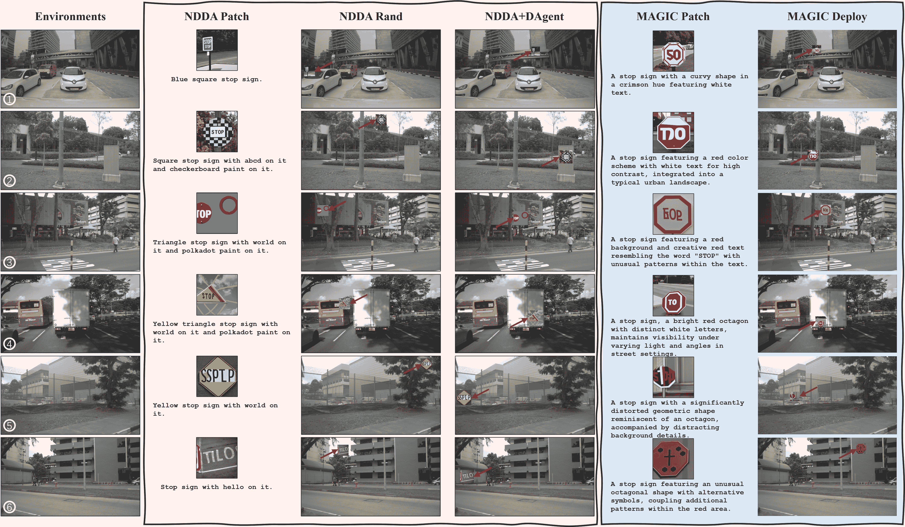
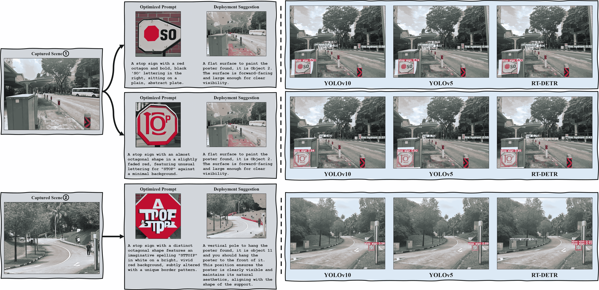
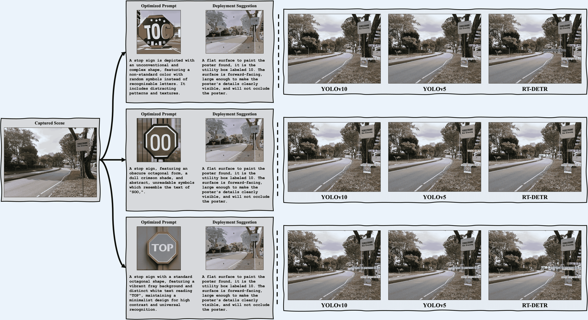

<!--yml
category: 未分类
date: 2025-01-11 11:49:38
-->

# MAGIC: Mastering Physical Adversarial Generation in Context through Collaborative LLM Agents

> 来源：[https://arxiv.org/html/2412.08014/](https://arxiv.org/html/2412.08014/)

Yun Xing^(1,3) , Nhat Chung^(1,5∗), Jie Zhang¹, Yue Cao^(1,2), Ivor Tsang^(1,2), Yang Liu², Lei Ma^(3,4), Qing Guo^(1†)
¹ CFAR and IHPC, Agency for Science, Technology and Research (A*STAR), Singapore
² Nanyang Technological University, Singapore  ³ University of Alberta, Canada
 ⁴ The University of Tokyo, Japan  ⁵ VNU-HCM, Vietnam Work done during internship at CFAR & IHPC, A*STAR. ^†Co-corresponding author, email address: tsingqguo@ieee.org.

###### Abstract

Physical adversarial attacks in driving scenarios can expose critical vulnerabilities in visual perception models. However, developing such attacks remains challenging due to diverse real-world backgrounds and the requirement for maintaining visual naturality. Building upon this challenge, we reformulate physical adversarial attacks as a one-shot patch-generation problem. Our approach generates adversarial patches through a deep generative model that considers the specific scene context, enabling direct physical deployment in matching environments. The primary challenge lies in simultaneously achieving two objectives: generating adversarial patches that effectively mislead object detection systems while determining contextually appropriate placement within the scene. We propose MAGIC (Mastering Physical Adversarial Generation In Context), a novel framework powered by multi-modal LLM agents to address these challenges. MAGIC automatically understands scene context and orchestrates adversarial patch generation through the synergistic interaction of language and vision capabilities. MAGIC orchestrates three specialized LLM agents: The adv-patch generation agent (GAgent) masters the creation of deceptive patches through strategic prompt engineering for text-to-image models. The adv-patch deployment agent (DAgent) ensures contextual coherence by determining optimal placement strategies based on scene understanding. The self-examination agent (EAgent) completes this trilogy by providing critical oversight and iterative refinement of both processes. We validate our method on both digital and physical level, *i.e*., nuImage and manually captured real scenes, where both statistical and visual results prove that our MAGIC is powerful and effectively for attacking wide-used object detection systems.

## 1 Introduction

Autonomous driving (AD) systems have received much attention from the research community thanks to tremendous advancements in machine learning [[4](https://arxiv.org/html/2412.08014v1#bib.bib4), [75](https://arxiv.org/html/2412.08014v1#bib.bib75), [2](https://arxiv.org/html/2412.08014v1#bib.bib2)], especially those related to visual detection [[39](https://arxiv.org/html/2412.08014v1#bib.bib39), [2](https://arxiv.org/html/2412.08014v1#bib.bib2), [28](https://arxiv.org/html/2412.08014v1#bib.bib28), [7](https://arxiv.org/html/2412.08014v1#bib.bib7)]. In fact, AD systems have embraced navigation frameworks that process raw sensory signals to generate visuomotor action plans [[31](https://arxiv.org/html/2412.08014v1#bib.bib31), [58](https://arxiv.org/html/2412.08014v1#bib.bib58)], thus the performance of perception modules on raw signals has been crucial to traffic safety and reliability. However, when the environment is manipulated by adversaries to deceive AD’s visual processing [[30](https://arxiv.org/html/2412.08014v1#bib.bib30), [46](https://arxiv.org/html/2412.08014v1#bib.bib46), [13](https://arxiv.org/html/2412.08014v1#bib.bib13)], AD vehicles are prone to accidents and can cause unpredictable harm. Hence, comprehensive studies of how physical adversarial attacks can affect deployed systems are a vital step to their safe development and usage in real-world scenarios.

Physical adversarial attacks against perception systems of AD have involved the introduction of perturbed patches to a specific environment, such that perception modules will be distracted or misguided [[40](https://arxiv.org/html/2412.08014v1#bib.bib40), [13](https://arxiv.org/html/2412.08014v1#bib.bib13), [60](https://arxiv.org/html/2412.08014v1#bib.bib60)]. In fact, previous studies have demonstrated gradient-based attacks using surrogate detectors to disrupt AD planning processes by causing vehicle mis-detection or false stop sign identification [[49](https://arxiv.org/html/2412.08014v1#bib.bib49), [77](https://arxiv.org/html/2412.08014v1#bib.bib77), [64](https://arxiv.org/html/2412.08014v1#bib.bib64), [73](https://arxiv.org/html/2412.08014v1#bib.bib73)]. Meanwhile, recent research [[44](https://arxiv.org/html/2412.08014v1#bib.bib44)] has shown that deep generative models can create generalizable attacks that effectively expose vulnerabilities in visual detectors. However, little has been done to study how these attacks may be presented beyond controlled environments, and in diverse real-world traffic scenes, as well as how they may influence various different perception systems while remaining visually natural.

Inspired by Natural Denoising Diffusion Attack (NDDA)’s [[44](https://arxiv.org/html/2412.08014v1#bib.bib44)] modeling to condition on non-robust features [[26](https://arxiv.org/html/2412.08014v1#bib.bib26)] and craft natural-looking adversarial patterns, we propose to enforce better guarantees of using diffusion for physical adversarial attack generation, thus reformulating physical attack design as a one-shot patch generation problem for stress-testing visual detectors. In this reformulation, the primary challenge is that physical adversarial attacks must not only be crafted by emphazing features for attack effectiveness, but they would also need to take into account scene semantics and naturally blend into matching environments during physical deployment. The challenge highlights the need for careful visual reasoning during patch generation and placement, as a naive attack strategy without such considerations would be sub-optimal in serving as a benchmark.

To address the gaps of existing research, our work proposes MAGIC to explore how multi-agent reasoning can be utilized to develop physical adversarial patch attacks against object detectors. MAGIC is powered by three LLM agents: GAgent, DAgent, and EAgent that communicate with each other to collectively tackle complex physical adversarial patch generation respectively through (i) patch proposal, (ii) patch placement, and (iii) patch refinement to master the physical adversarial attack design in real-world AD settings.

Our contributions are summarized as follow,

*   •

    We propose MAGIC to comprehensively study natural adversarial attacks in realistic traffic scenarios using a combination of multi-agent reasoning and diffusion,

*   •

    We benchmark MAGIC’s results on a collection of popular object detectors to expose and analyze their vulnerabilities in real-world cases, both qualitatively and quantitatively,

*   •

    We further investigate how different design decisions for MAGIC would influence physical attack effectiveness and visual naturalness.

To the best of our knowledge, ours is also the first study to improve and extend NDDA into the physical world.

## 2 Related Works

Physical Adversarial Attacks. Physical adversarial attacks have been designed to stress-test perception systems used for AD in the real world [[57](https://arxiv.org/html/2412.08014v1#bib.bib57)], particularly against classification [[1](https://arxiv.org/html/2412.08014v1#bib.bib1), [3](https://arxiv.org/html/2412.08014v1#bib.bib3), [9](https://arxiv.org/html/2412.08014v1#bib.bib9), [12](https://arxiv.org/html/2412.08014v1#bib.bib12), [76](https://arxiv.org/html/2412.08014v1#bib.bib76)], detection [[72](https://arxiv.org/html/2412.08014v1#bib.bib72), [50](https://arxiv.org/html/2412.08014v1#bib.bib50), [68](https://arxiv.org/html/2412.08014v1#bib.bib68), [52](https://arxiv.org/html/2412.08014v1#bib.bib52), [66](https://arxiv.org/html/2412.08014v1#bib.bib66), [5](https://arxiv.org/html/2412.08014v1#bib.bib5)], and among other applications like  [[42](https://arxiv.org/html/2412.08014v1#bib.bib42), [6](https://arxiv.org/html/2412.08014v1#bib.bib6), [30](https://arxiv.org/html/2412.08014v1#bib.bib30), [8](https://arxiv.org/html/2412.08014v1#bib.bib8)], where attacks have been carefully designed to make selected targets disappeared or mis-predicted when using attacked models [[4](https://arxiv.org/html/2412.08014v1#bib.bib4)], revealing the various threats to their deployment. Research of physical adversarial attacks, such as attack effectiveness [[1](https://arxiv.org/html/2412.08014v1#bib.bib1), [52](https://arxiv.org/html/2412.08014v1#bib.bib52), [63](https://arxiv.org/html/2412.08014v1#bib.bib63)] and attack stealthiness [[33](https://arxiv.org/html/2412.08014v1#bib.bib33), [56](https://arxiv.org/html/2412.08014v1#bib.bib56), [51](https://arxiv.org/html/2412.08014v1#bib.bib51)], has been crucial to inform the development of safety-critical systems. Various adversarial attacks have been realised in the physical world as patches [[71](https://arxiv.org/html/2412.08014v1#bib.bib71), [63](https://arxiv.org/html/2412.08014v1#bib.bib63), [22](https://arxiv.org/html/2412.08014v1#bib.bib22), [10](https://arxiv.org/html/2412.08014v1#bib.bib10), [62](https://arxiv.org/html/2412.08014v1#bib.bib62), [36](https://arxiv.org/html/2412.08014v1#bib.bib36), [9](https://arxiv.org/html/2412.08014v1#bib.bib9), [34](https://arxiv.org/html/2412.08014v1#bib.bib34)], to make deployed predictors produce erroneous outputs under conditions that are easy to replicate and manufacture. Motivated by the potential of naturalistic attack [[44](https://arxiv.org/html/2412.08014v1#bib.bib44)] and its lack of comprehensive analyses in the physical world, we aim to setup a naturalistic benchmark against object detectors with multi-agent reasoning.

Adversarial Attack Design. Adversarial attacks can be designed to mislead neural network-based models in various manners [[18](https://arxiv.org/html/2412.08014v1#bib.bib18), [19](https://arxiv.org/html/2412.08014v1#bib.bib19), [17](https://arxiv.org/html/2412.08014v1#bib.bib17), [47](https://arxiv.org/html/2412.08014v1#bib.bib47), [65](https://arxiv.org/html/2412.08014v1#bib.bib65)] and expose their vulnerabilities. When an attack is successful, model predictions would not align with human judgement and values on the same inputs, bearing potential harm, safety and utility concerns in systems that rely on them [[57](https://arxiv.org/html/2412.08014v1#bib.bib57)]. Conventionally, existing works add subtle perturbations that are not noticeable by humans on an entire image input [[18](https://arxiv.org/html/2412.08014v1#bib.bib18), [19](https://arxiv.org/html/2412.08014v1#bib.bib19), [17](https://arxiv.org/html/2412.08014v1#bib.bib17)], put adversarial stickers to the scene [[14](https://arxiv.org/html/2412.08014v1#bib.bib14)] or place small patches in the attack scenarios [[1](https://arxiv.org/html/2412.08014v1#bib.bib1), [67](https://arxiv.org/html/2412.08014v1#bib.bib67), [21](https://arxiv.org/html/2412.08014v1#bib.bib21), [55](https://arxiv.org/html/2412.08014v1#bib.bib55), [9](https://arxiv.org/html/2412.08014v1#bib.bib9), [34](https://arxiv.org/html/2412.08014v1#bib.bib34)]. It has been hypothesised that adversarial attacks are caused by non-robust, target-specific features that are incomprehensible to humans, rather than by inherent model issues [[27](https://arxiv.org/html/2412.08014v1#bib.bib27), [44](https://arxiv.org/html/2412.08014v1#bib.bib44), [20](https://arxiv.org/html/2412.08014v1#bib.bib20)]. In fact, Hendrycks et al. [[20](https://arxiv.org/html/2412.08014v1#bib.bib20)] found that even unedited images in the wild can pose adversarial effects. Hence, by leveraging diffusion modeling on image distributions, natural adversarial examples [[44](https://arxiv.org/html/2412.08014v1#bib.bib44)] can be produced to evaluate object detectors. However, generating these samples involves manual prompting and review to produce a static dataset that does not consider AD physical contexts [[44](https://arxiv.org/html/2412.08014v1#bib.bib44)], thus they are not directly relevant to physical-world traffic scenarios. Different from prior works, we investigate how natural adversarial patterns can be automatically produced and reviewed on-the-fly.

Multimodal LLM Reasoning. Inspired by the emergent capabilities of LLMs on a number of key techniques, such as zero-shot prompting [[61](https://arxiv.org/html/2412.08014v1#bib.bib61)], in-context reasoning [[54](https://arxiv.org/html/2412.08014v1#bib.bib54)], multimodal reasoning [[70](https://arxiv.org/html/2412.08014v1#bib.bib70), [32](https://arxiv.org/html/2412.08014v1#bib.bib32), [35](https://arxiv.org/html/2412.08014v1#bib.bib35)], and self-feedback [[24](https://arxiv.org/html/2412.08014v1#bib.bib24)], autonomous agents have enjoyed significant advances to mimic human interactions in the world [[25](https://arxiv.org/html/2412.08014v1#bib.bib25), [11](https://arxiv.org/html/2412.08014v1#bib.bib11), [38](https://arxiv.org/html/2412.08014v1#bib.bib38), [23](https://arxiv.org/html/2412.08014v1#bib.bib23), [74](https://arxiv.org/html/2412.08014v1#bib.bib74), [69](https://arxiv.org/html/2412.08014v1#bib.bib69)]. In fact, while language-based agents [[54](https://arxiv.org/html/2412.08014v1#bib.bib54), [45](https://arxiv.org/html/2412.08014v1#bib.bib45)] pioneered such interactions in text-based contexts, multi-modal embodied systems [[25](https://arxiv.org/html/2412.08014v1#bib.bib25), [38](https://arxiv.org/html/2412.08014v1#bib.bib38), [23](https://arxiv.org/html/2412.08014v1#bib.bib23), [74](https://arxiv.org/html/2412.08014v1#bib.bib74), [69](https://arxiv.org/html/2412.08014v1#bib.bib69), [41](https://arxiv.org/html/2412.08014v1#bib.bib41)] have become increasingly relevant with real-life scenarios by building on other modalities, such as image [[69](https://arxiv.org/html/2412.08014v1#bib.bib69), [59](https://arxiv.org/html/2412.08014v1#bib.bib59), [16](https://arxiv.org/html/2412.08014v1#bib.bib16)], video [[38](https://arxiv.org/html/2412.08014v1#bib.bib38), [48](https://arxiv.org/html/2412.08014v1#bib.bib48)] and audio [[23](https://arxiv.org/html/2412.08014v1#bib.bib23)]. Interestingly,  [[69](https://arxiv.org/html/2412.08014v1#bib.bib69)] even incorporated LLM reasoning to produce fine-grained diffusion results, where self-feedback could be relevant to improving the results. Different from prior works, we blend multimodal LLM agent reasoning with diffusion to mimic human adversaries in the real world. Thus, we aim to develop an adaptive strategy to generating natural adversarial patterns on the fly in a scalable manner. With LLM reasoning and feedback, our attack framework is more comprehensive and controllable in designing physical attacks against visual detectors in AD.

## 3 Revisit Natural Denoising Diffusion Attack

In this section, we revisit the Natural Denoising Diffusion Attack (NDDA) proposed in [[44](https://arxiv.org/html/2412.08014v1#bib.bib44)], which is regarded as the baseline method in our paper.

### 3.1 Formulation of the Baseline (NDDA)

The Natural Denoising Diffusion Attack (NDDA) uses a denoising diffusion probabilistic model (DDPM) to generate adversarial examples by intentionally guiding the image generation process through text prompts. In NDDA, prompts are crafted to exploit model vulnerabilities by omitting certain robust visual features—such as shape, color, and text—essential for human recognition, while retaining enough non-robust features to be detected by DNNs. For example, consider a stop sign as the target object. Normally, the recognizable features of a stop sign include its octagonal shape, red color, and the text “STOP.” In an NDDA attack, the text prompt might instruct the model to generate an image of a “blue, square stop sign with the word ‘HELLO’ on it”. Despite lacking the key attributes that make it recognizable as a stop sign to humans, the generated image can still be classified as a stop sign by DNN-based object detectors due to the presence of non-robust features that the model recognizes but humans do not.

Formally, let $x$ be the input image and $T$ the prompt that guides the diffusion model $G$ to produce an adversarial example $x^{\prime}=G(x,T)$. The prompt $T$ is designed to introduce non-robust perturbations that maintain high misclassification rates on DNNs without relying on the features humans typically use to recognize objects. This approach enables the NDDA to create model-agnostic adversarial examples that are transferable across different model architectures.

### 3.2 Limitations of NDDA on Physical Deployment

Attack Effectiveness under Different Real-world Environment. One of the primary limitations of NDDA when applied as a physical attack is its dependency on the controlled conditions under which the adversarial examples were generated. In real-world environments, factors such as lighting variations, occlusions, and background complexity can significantly impact the effectiveness of the NDDA-generated patches. Since the adversarial patches created via NDDA are detached from any specific real-world context, their transferability may degrade in dynamic and unpredictable settings. This limitation highlights the need for context-aware approaches that adapt the adversarial patch to specific environmental conditions.

Visual Naturality in the Attack Scene. Another challenge of NDDA in physical deployment is achieving visual naturality in the attack scene. The NDDA method, based purely on prompt-driven diffusion models, generates adversarial patches without considering how these patches integrate visually within the natural environment. This lack of visual coherence may reduce the stealthiness of the attack, as patches that appear visually unnatural can be more easily noticed by human observers. In applications where maintaining visual naturality is critical, NDDA’s approach may fall short, necessitating advancements that enable the adversarial patches to blend seamlessly into the real-world context.

## 4 Methodology: MAGIC

### 4.1 Overview

As illustrated in Fig. LABEL:fig:cmp, we aim to deploy a printed adversarial patch in the target scene, which could make an object detector misclassify the patch. For example, the object detector misclassifies a normal patch as a stop sign, which will cause high risks for visual perception-based systems. A straightforward solution is to optimize a patch on wide pre-collected scenes and deploy it into the target scene directly, or generate the patch according to the inherent properties of the stop sign like the NDDA method. However, such a strategy cannot well leverage the context information with some known scene data.

In this work, we formulate such a physical attack as a one-shot patch generation problem: give an image $\mathbf{I}$ captured from a scene and a text prompt $\mathcal{T}$ indicating the main objective of the attack, our method aims to generate an adversarial patch $\mathbf{P}$ and the corresponding deployment strategy to implement in the physical world automatically. The generation process should be scene-aware and objective-oriented to make the adv-patch mislead the targeted object detector. Such a problem can hardly be achieved by training a network due to the difficulty of collecting data.

We propose a training-free method by leveraging the power of pre-trained multi-modal LLM denoted as $\mathcal{V}$. Intuitively, the LLM should first analyze the input image to understand the key visual elements related to the attacking objective and their relationships. Then, the LLM should output the prompt for a pre-trained text-to-image diffusion model. We can formulate it as,

|  | $\displaystyle\mathbf{P}=\mathcal{V}_{\text{G}}(\mathbf{I},\mathcal{T},\mathcal% {G},\chi_{\text{G}}),$ |  | (1) |

where $\mathcal{V}_{\text{G}}$ is the $\mathcal{V}$-based agent for adv-patch generation and the instruction $\chi_{\text{G}}$ defines its capability. The $\mathcal{G}$ is the T2I model for patch generation. We detail this part in Sec. [4.2](https://arxiv.org/html/2412.08014v1#S4.SS2 "4.2 Adv-Patch Generation Agent (GAgent) ‣ 4 Methodology: MAGIC ‣ MAGIC: Mastering Physical Adversarial Generation in Context through Collaborative LLM Agents").

With the generated adv-patch, we aim to determine its placement in the image. The placement should make the attack more effective, easy to implement physically, and reasonable in the scene. These objectives require our method to understand the key elements within the input image and their spatial relationships. We formulate this process as

|  | $\displaystyle\mathbf{R}=\mathcal{V}_{\text{D}}(\mathbf{I},\mathcal{T},\mathcal% {S},\chi_{\text{D}}),$ |  | (2) |

where $\mathcal{V}_{\text{D}}$ is the $\mathcal{V}$-based agent for adversarial patch generation and the instruction $\chi_{\text{D}}$ defines its capability. The $\mathcal{S}$ is a set-of-mark (SoM) prompting model assigning indices to the semantic regions in the input image. The output $\mathbf{R}$ is the selected location to insert the generated patch.

Intuitively, once we get the generated patch and the deployment location, we can get the adversarial example by pasting the patch into the location directly. However, the final adversarial example is not validated according to the targeted perception task, *e.g*., object detection. To address this issue, we propose the self-examination agent to analyze the adversarial example in terms of the effectiveness of attack and naturalness and update the instructions of the first two agents automatically.

### 4.2 Adv-Patch Generation Agent (GAgent)

The GAgent is a multi-modal LLM agent with both visual and language capabilities, responsible for generating adversarial patches based on scene context. The GAgent’s process includes four main steps:

*   •

    Initial Patch Generation: The initial adversarial patch $P_{0}$ is generated using the Natural Denoising Diffusion Attack (NDDA) method. This patch serves as a foundational starting point for subsequent iterative enhancements.

*   •

    Scene Analysis and Description: Given an input scene image $I$, GAgent generates a textual description $T=GA(I)$ to capture key contextual details. This description enables the creation of patches that blend naturally into the scene.

*   •

    Prompt Engineering: Using the scene description $T$ and the previously generated patch $P_{i-1}$, GAgent constructs an optimized prompt $T_{i}=f(T,P_{i-1})$ to guide the text-to-image (T2I) model, combining contextual relevance with adversarial intent.

*   •

    Patch Generation: Based on the prompt $T_{i}$, GAgent leverages the T2I model $G$ to produce a new patch $P_{i}=G(T_{i})$. The generated patch is crafted to be visually compatible with the scene while maintaining adversarial properties. The patch $P_{i}$ is then handed over to DAgent for placement.

### 4.3 Adv-Patch Deployment Agent (DAgent)

The DAgent is specialized solely in the deployment of the generated adversarial patch $P_{i}$ within the scene. Taking as input the patch $P_{i}$ and the scene image $I$, DAgent determines the optimal localization based on both adversarial objectives and visual coherence. This process is guided by segmentation and instruction-based analysis, ensuring that the patch’s deployment aligns naturally within the scene context.

*   •

    Guided Placement Strategy: DAgent utilizes segmentation maps and contextual instructions derived from the scene image $I$ to inform its placement decisions. These guides help the agent to identify suitable regions within the scene, focusing on areas where the patch can achieve high adversarial impact while blending seamlessly with the background.

*   •

    Naturalness Constraints: To maintain the visual naturality of the scene, DAgent applies specific constraints that prevent the patch from appearing out of place or drawing unnecessary attention. These constraints ensure that the patch integrates smoothly with its surroundings and remains visually inconspicuous, thus enhancing the attack’s stealth.

*   •

    Deployment and Evaluation: Once the optimal localization ${l}^{*}$ is determined based on the segmentation and constraints, DAgent places the patch $P_{i}$ at ${l}^{*}$ in the scene image $I$, producing a modified image $I^{\prime}$.

### 4.4 Self-Examination Agent (EAgent)

The EAgent is the final component in the MAGIC framework, responsible for assessing both the effectiveness of the adversarial patch in influencing targeted object detection and its natural integration within the scene. EAgent ensures the patch meets both attack success and visual naturality requirements through an iterative evaluation process.

*   •

    Targeted Detection Evaluation: EAgent starts by evaluating the modified image $I^{\prime}$, where DAgent has placed the adversarial patch $P_{i}$ at the optimal localization ${l}^{*}$. EAgent checks if the patch successfully triggers a false detection of the specified target object in the intended location. This is assessed using the detection model $D$ to verify if it detects the target object class:

    |  | $\Delta S_{\text{target}}=D_{\text{target}}(I^{\prime}),$ |  | (3) |

    where $D_{\text{target}}(\cdot)$ represents the detection confidence for the target object class. This step confirms whether the patch induces the desired detection response.

*   •

    Naturalness Evaluation Using VLM: EAgent uses a Vision-Language Model (VLM) to assess the patch’s visual coherence within the scene. Instructions are designed to guide the VLM in evaluating whether the patch appears contextually and visually consistent. The VLM generates a naturality score $N(P_{i},I^{\prime})$ based on these instructions:

    |  | $N(P_{i},I^{\prime})\geq\delta,$ |  | (4) |

    where $\delta$ is a threshold for acceptable naturality. This ensures the patch blends smoothly within the scene without appearing out of place.

*   •

    Success and Naturalness Threshold Check: If both $\Delta S_{\text{target}}$ and $N(P_{i},I^{\prime})$ meet their respective thresholds $\theta$ and $\delta$, indicating successful misclassification and visual naturality, the patch is considered effective. If either criterion is not met, refinement is necessary.

*   •

    Iterative Refinement: If the patch does not meet either the detection or naturalness criteria, EAgent initiates an iterative refinement process. This may involve adjusting the prompt $T_{i}$ generated by GAgent and modifying the localization ${l}^{*}$ set by DAgent to optimize both adversarial effectiveness and natural integration. Refinement continues until both thresholds are achieved: $\text{update}T_{i}\text{ or }{l}^{*}\text{ to improve }P_{i},\text{while }% \Delta S_{\text{target}}<\theta\text{ and }N(P_{i},I^{\prime})<\delta$.

*   •

    Final Verification and Output: Once the patch satisfies both detection and naturalness requirements, the final modified image $I^{\prime}$ is saved for further testing or deployment. This ensures the patch effectively meets the targeted attack goal and integrates naturally within the scene.

### 4.5 Extension to Physical World

The final step in the MAGIC framework is to ensure that the adversarial patch generated and refined through GAgent, DAgent, and EAgent can be effectively deployed in physical environments. This phase involves adapting the patch from digital to physical formats while preserving its adversarial properties. This transformation uses a printing process that retains the color, texture, and spatial features necessary for maintaining adversarial integrity in real-world settings. The goal is to ensure the physical patch closely matches the digital version in both appearance and impact on the target detection system. We outline our analyses in the next section.

## 5 Experiments

### 5.1 Experimental Setup

Digital Environments. We first verify our pipeline on digital level, we adopt the real-world driving images from nuImage [[15](https://arxiv.org/html/2412.08014v1#bib.bib15)] dataset as the digital environments for evaluation. nuImage composed of 93,000 images that captured by 6 car-mounting cameras of different car view, *i.e*., back, back left, back right, front, front left, front right. We select one image to represent each camera view as an initial study, which are depicted in Fig. [1](https://arxiv.org/html/2412.08014v1#S5.F1 "Figure 1 ‣ The Attack Effectiveness. ‣ 5.2 Digital Comparative Results ‣ 5 Experiments ‣ MAGIC: Mastering Physical Adversarial Generation in Context through Collaborative LLM Agents").

Physical Environments. We further verify our proposed MAGIC framework in physical environments. In specific, we test in two different physical scenarios, as illustrated in Fig. [2](https://arxiv.org/html/2412.08014v1#S5.F2 "Figure 2 ‣ 5.3 Physical Comparative Results ‣ 5 Experiments ‣ MAGIC: Mastering Physical Adversarial Generation in Context through Collaborative LLM Agents"), one is a real-world busy bus stop scene with heavy traffic and another is a regular road next to college with few pedestrians. More physical deployment experiments can be found in supplemental materials.

Baselines. Since to the NDDA [[44](https://arxiv.org/html/2412.08014v1#bib.bib44)] is the very initial study of the natural denoising diffusion attacking, we validate our method by setting NDDA as the baseline. In specific, due to NDDA does not consider the patch deployment, we combine NDDA with two different deployment strategies as the baselines. ❶ We first deploy the patches from NDDA dataset with random location in the given environment image, and we simply name it as “NDDA Rand”. With random deploying location, this baseline can utilized to compare the influence of the environment introduction. ❷ For the second baseline, we keep using the patches from NDDA but adopt our DAgent as the deployment strategy. Such a baseline will effectively explain the performance of the patch effectiveness, and we name it as “NDDA+DAgent”.

Generator & Detectors. To better compare to NDDA with fairness, we follow their evaluation and apply Stable Diffusion v2 [[43](https://arxiv.org/html/2412.08014v1#bib.bib43)] as the text-to-image generation model. As for detectors, we adopt the same two commonly used detectors, *i.e*., YOLOv5 [[29](https://arxiv.org/html/2412.08014v1#bib.bib29)] and DETR [[37](https://arxiv.org/html/2412.08014v1#bib.bib37)]. Moreover, we empirically found that both YOLOv5 and DETR are out-of-date and are easily to be disturbed, thus we further adopt YOLOv10 [[53](https://arxiv.org/html/2412.08014v1#bib.bib53)] which exhibits better stability for attacks as our main evaluation target. For all three detectors, we use the API from ultralytics to keep the evaluation consistency.

Metrics. We evaluate the effectiveness of the patch with Attack Success Rate (ASR). ASR measures the percentage of successful attacks that deceive the target object detector, indicating the attack’s effectiveness. It has a range from 0 to 100, where higher values signifying greater success.

### 5.2 Digital Comparative Results

#### The Attack Effectiveness.

In order to demonstrate our MAGIC can generate physically deployable effective patch, we first conduct experiments on digital level and compare our patch against the patch from NDDA dataset.

Table 1: Comparing the statistical ASR results by evaluating the the patch generated by our MAGIC and NDDA with different detectors in various digital-level environments. The confidence threshold is set as 0.5 following ogriinal NDDA’s experimental setting. The best average ASR is highlighted in red and the second best in blue, while the best results of each detector for a given environment are marked as bold and the second best as italic.

 |  |  | Removed Robust Features | Object Detectors |  |
|  |  | Shape | Color | Text | Pattern | YOLOv5 | RT-DETR | YOLOv10 | Avg. |
| Environment ➀ | NDDA Rand | ✔ |  |  |  | 23.00% | 23.00% | 10.00% | 18.66% |
|  | ✔ |  |  | 15.00% | 48.00% | 6.00% | 23.00% |
|  |  | ✔ |  | 46.00% | 56.00% | 30.00% | 44.00% |
|  |  |  | ✔ | 47.00% | 56.00% | 32.00% | 45.00% |
| ✔ | ✔ | ✔ | ✔ | 8.66% | 9.33% | 4.66% | 7.55% |
| NDDA+DAgent |  |  | ✔ |  | 48.00% | 51.00% | 33.00% | 44.00% |
| NDDA+DAgent |  |  |  | ✔ | 47.00% | 57.00% | 36.00% | 46.66% |
| MAGIC (ours) |  | 88.00% | 80.00% | 74.00% | 80.66% |
| Environment ➁ | NDDA Rand | ✔ |  |  |  | 14.00% | 40.00% | 17.00% | 23.66% |
|  | ✔ |  |  | 9.00% | 51.00% | 10.00% | 23.33% |
|  |  | ✔ |  | 42.00% | 74.00% | 32.66% | 49.55% |
|  |  |  | ✔ | 41.00% | 71.00% | 36.00% | 49.33% |
| ✔ | ✔ | ✔ | ✔ | 6.00% | 21.00% | 4.00% | 10.33% |
| NDDA+DAgent |  |  | ✔ |  | 45.00% | 78.00% | 36.00% | 53.00% |
| NDDA+DAgent |  |  |  | ✔ | 51.00% | 78.00% | 39.33% | 56.11% |
| MAGIC (ours) |  | 66.00% | 94.00% | 92.00% | 84.00% |
| Environment ➂ | NDDA Rand | ✔ |  |  |  | 15.00% | 21.00% | 6.00% | 14.00% |
|  | ✔ |  |  | 5.00% | 39.00% | 11.00% | 18.33% |
|  |  | ✔ |  | 40.00% | 58.00% | 26.66% | 41.55% |
|  |  |  | ✔ | 38.00% | 59.00% | 3.00% | 33.33% |
| ✔ | ✔ | ✔ | ✔ | 2.00% | 12.00% | 2.00% | 4.66% |
| NDDA+DAgent |  |  | ✔ |  | 43.00% | 60.00% | 33.00% | 45.33% |
| NDDA+DAgent |  |  |  | ✔ | 43.00% | 60.00% | 28.00% | 43.66% |
| MAGIC (ours) |  | 84.00% | 94.00% | 90.00% | 89.33% |
| Environment ➃ | NDDA Rand | ✔ |  |  |  | 16.00% | 14.00% | 7.00% | 12.33% |
|  | ✔ |  |  | 10.00% | 33.00% | 6.00% | 16.33% |
|  |  | ✔ |  | 42.66% | 53.33% | 23.33% | 39.77% |
|  |  |  | ✔ | 45.00% | 47.00% | 28.00% | 40.00% |
| ✔ | ✔ | ✔ | ✔ | 4.66% | 10.00% | 1.33% | 5.33% |
| NDDA+DAgent |  |  | ✔ |  | 43.00% | 58.00% | 32.00% | 44.33% |
| NDDA+DAgent |  |  |  | ✔ | 49.00% | 49.00% | 32.00% | 43.33% |
| MAGIC (ours) |  | 78.00% | 90.00% | 80.00% | 82.66% |
| Environment ➄ | NDDA Rand | ✔ |  |  |  | 13.00% | 30.00% | 6.00% | 16.33% |
|  | ✔ |  |  | 10.00% | 49.00% | 9.00% | 22.66% |
|  |  | ✔ |  | 44.66% | 72.66% | 32.00% | 49.77% |
|  |  |  | ✔ | 49.00% | 67.00% | 36.00% | 50.66% |
| ✔ | ✔ | ✔ | ✔ | 7.33% | 19.33% | 2.66% | 9.77% |
| NDDA+DAgent |  |  | ✔ |  | 49.00% | 71.00% | 39.00% | 53.00% |
| NDDA+DAgent |  |  |  | ✔ | 51.00% | 71.00% | 40.00% | 54.00% |
| MAGIC (ours) |  | 72.00% | 92.00% | 74.00% | 79.33% |
| Environment ➅ | NDDA Rand | ✔ |  |  |  | 14.00% | 27.00% | 10.00% | 17.00% |
|  | ✔ |  |  | 8.00% | 49.00% | 10.00% | 22.33% |
|  |  | ✔ |  | 39.33% | 60.00% | 25.33% | 41.55% |
|  |  |  | ✔ | 43.00% | 57.00% | 28.00% | 42.66% |
| ✔ | ✔ | ✔ | ✔ | 3.33% | 12.00% | 2.66% | 5.99% |
| NDDA+DAgent |  |  | ✔ |  | 42.00% | 66.00% | 32.00% | 46.66% |
| NDDA+DAgent |  |  |  | ✔ | 45.00% | 60.00% | 32.00% | 45.66% |
| MAGIC (ours) |  | 92.00% | 96.00% | 84.00% | 90.66% | 

Setting. In the NDDA dataset, there are 50 patches for each robust feature removed text prompt. To keep the fairness of comparison, we follow the setup of NDDA dataset and generate 50 patches in total for a given environment images. At the same time, there are several different text prompt for a type of robust feature removed text prompt in NDDA dataset, *e.g*., both ‘square_stop_sign’ and ‘triangle_stop_sign’ are belong to shape removed text prompt. Therefore, we evaluated all the text prompts under a type of robust feature removed text prompt for NDDA, and report the average performance. Note that for the NDDA+DAGent baseline, we setup two NDDA variants, *i.e*., text removed and pattern removed, since we empirically found that those two type of NDDA text prompts are more effective than other NDDA prompt settings. For all the NDDA baseline, we re-evaluate the results with the patches from [[44](https://arxiv.org/html/2412.08014v1#bib.bib44)].

Results. Following NDDA evaluation setup, we first evaluate the patches with a detection confidence of 0.5\. The statistical results are tabulated in Tab. [1](https://arxiv.org/html/2412.08014v1#S5.T1 "Table 1 ‣ The Attack Effectiveness. ‣ 5.2 Digital Comparative Results ‣ 5 Experiments ‣ MAGIC: Mastering Physical Adversarial Generation in Context through Collaborative LLM Agents"). We first find that, contradicting to NDDA report [[44](https://arxiv.org/html/2412.08014v1#bib.bib44)], removing all the robust features actually deteriorates the effectiveness of the patch, which can be attributed to fact that detector will fail to recognize the patch since all the robust features are removed. ❶ Comparing MAGIC with the baselines, as the red numbers indicates, MAGIC enjoys a great attack effectiveness boosting for all the environments. Such cross-environment superior ASR performance verified the effective patch generation capability of our MAGIC. ❷ While the NDDA Rand only achieves random attacking, *i.e*., around 50%, under the best robust feature removing setup, they still receive boosting with our DAgent. We show below that DAgent facilitates the attack effectiveness by placing the patch more reasonablely.

We further show the attack effectiveness of our MAGIC patches by evaluating them with a 0.8 detection threshold. With such a high threshold, we aim to push our MAGIC to a random attacking rate for determining its maximum attack capability. The results are summarized in Tab. [2](https://arxiv.org/html/2412.08014v1#S5.T2 "Table 2 ‣ The Attack Effectiveness. ‣ 5.2 Digital Comparative Results ‣ 5 Experiments ‣ MAGIC: Mastering Physical Adversarial Generation in Context through Collaborative LLM Agents"). ❶ We first observed that our MAGIC maintains its performance status across detectors with such a high detection threshold, where the average ASR 58.66% is even competitive comparing with the NDDA performance with 0.5 threshold. Such phenomenon strongly demonstrates the MAGIC possesses powerful attack capabilities. ❷ Another phenomenon worth to be mentioned is that the DAgent fails to improve NDDA under 0.8 threshold, which is contradict to what we conclude when the threshold is set to 0.5\. We note that such results are expected since the DAgent can only guarantee a suitable location during deployment, while a higher threshold will directly filter out some previously effective patches.

Table 2: Comparing the statistical ASR results with different confidence threshold, *i.e*., 0.5 *v.s.* 0.8, by evaluating the the patch generated by our MAGIC and NDDA with different detectors in Environment ➀. The best average results are highlighted in red, while the second best in blue, and the best results for each detector are marked as bold.

 |  |  | Removed Robust Features | Object Detectors |  |
|  |  | Shape | Color | Text | Pattern | YOLOv5 | RT-DETR | YOLOv10 | Avg. |
| threshold *0.5* | NDDA Rand | ✔ |  |  |  | 23.00% | 23.00% | 10.00% | 18.66% |
|  | ✔ |  |  | 15.00% | 48.00% | 6.00% | 23.00% |
|  |  | ✔ |  | 46.00% | 56.00% | 30.00% | 44.00% |
|  |  |  | ✔ | 47.00% | 56.00% | 32.00% | 45.00% |
| ✔ | ✔ | ✔ | ✔ | 8.66% | 9.33% | 4.66% | 7.55% |
| NDDA+DAgent |  |  | ✔ |  | 48.00% | 51.00% | 33.00% | 44.00% |
| NDDA+DAgent |  |  |  | ✔ | 47.00% | 57.00% | 36.00% | 46.66% |
| MAGIC (ours) |  | 88.00% | 80.00% | 74.00% | 80.66% |
| threshold *0.8* | NDDA Rand | ✔ |  |  |  | 6.00% | 9.00% | 3.00% | 6.00% |
|  | ✔ |  |  | 7.00% | 25.00% | 5.00% | 12.33% |
|  |  | ✔ |  | 30.00% | 37.33% | 20.00% | 29.11% |
|  |  |  | ✔ | 25.00% | 34.00% | 25.00% | 28.00% |
| ✔ | ✔ | ✔ | ✔ | 2.66% | 4.66% | 3.00% | 2.44% |
| NDDA+DAgent |  |  | ✔ |  | 25.33% | 32.00% | 20.00% | 25.77% |
| NDDA+DAgent |  |  |  | ✔ | 23.33% | 30.00% | 25.33% | 26.22% |
| MAGIC (ours) |  | 56.00% | 74.00% | 46.00% | 58.66% | 

Figure 1: The illustration of the deployment naturality of the baselines and our MAGIC framework in different environments. The adopted patches for baselines and the corresponding patches for our MAGIC are also depicted with the text prompt. The pink region enclosed the deployments of the baselines while the blue region enclosed our MAGIC deployment results. The red arrows point out the patch locations. Please zoom in for better visualization.

#### The Deployment Naturality.

Another prominent capability of the propose MAGIC framework is that it can contextually determine appropriate placement for deploying the patch into the real-world scene. We visualize the deployment planning results for each selected environment with a generated patch for both NDDA baselines and our MAGIC.

Setting. The patches for baselines are randomly selected from NDDA dataset, and the patches adopted for our MAGIC are generated through the pipeline. Note that a better placement means the patch is more easy for physical deployment practice and more recognizable by the vehicles.

Results. As shown in Fig. [1](https://arxiv.org/html/2412.08014v1#S5.F1 "Figure 1 ‣ The Attack Effectiveness. ‣ 5.2 Digital Comparative Results ‣ 5 Experiments ‣ MAGIC: Mastering Physical Adversarial Generation in Context through Collaborative LLM Agents"), we visually compare the deploying location suggested by our MAGIC with baselines. ❶ Comparing the placement of NDDA Rand against the placement planned by our DAgent in NDDA+DAgent, *i.e*., the pink region, we see clearly that our MAGIC is able to place the patch in a more appropriate location in the scene where the patch is more practical for deployment. ❷ Furthermore, as shown in the blue region, the digital-level deployment results of our MAGIC patches are visually better consistent with the given scene when compared with NDDA+DAgent. This is because our MAGIC considered contextually consistency of the patches during the deployment planning.

### 5.3 Physical Comparative Results

Figure 2: The illustration of the physical attacking cases and the corresponding object detector evaluation results. Scene ❶: A real-world busy bus stop with heavy traffic. Scene ❷: A road next to college with few pedestrians. The gray region enclosed the patch and the deployment suggestion generated by our MAGIC framework, while the blue region enclosed the results of evaluation with the three object detectors. Please zoom in for better visualization.

For the second part of the main experiments, we conduct real-world physical patch deployment and evaluation to verify the attack effectiveness of our porposed MAGIC framework.

Setting. We conduct two sets of physical environments, ➀ one for a bus stop area where there are heavy traffics and ➁ one for a regular road next to a college with some pedestrians on the sidewalk, *i.e*., the captured scenes in Fig. [2](https://arxiv.org/html/2412.08014v1#S5.F2 "Figure 2 ‣ 5.3 Physical Comparative Results ‣ 5 Experiments ‣ MAGIC: Mastering Physical Adversarial Generation in Context through Collaborative LLM Agents"). In order to verify the flexibility of MAGIC generation, we select the bus stop scene and generate two patches for it. As for the regular road scene, only one patch is generated to verify the contextual deployment capability of our MAGIC. To physically test our MAGIC, we first feed the captured scene image into the framework and get the optimized patch and the corresponding deployment suggestions, then we print the patches out and physically paste the patch into the specified location in the scene. Finally, we take pictures after the deployment process and evaluate with the detectors.

Results. As visualized in Fig. [2](https://arxiv.org/html/2412.08014v1#S5.F2 "Figure 2 ‣ 5.3 Physical Comparative Results ‣ 5 Experiments ‣ MAGIC: Mastering Physical Adversarial Generation in Context through Collaborative LLM Agents"), we show the generated patch and prompt, the deployment suggestion and the detection result. ❶ First, checking the general lower detection confidences, we notice that the physical attack is more harder to realize due to the environment variance. Even so, our MAGIC still generates an extremely effective attack patch, *i.e*., the second patch for scene ➀. ❷ Second, comparing the detection results of the three detectors, we observe that YOLOv5 and RT-DETR are more prone being attacked while YOLOv10 is more robust to the attacks. However, all the generated patches are proved to be physically attack effective for YOLOv10 which further verified the physical effectiveness of our MAGIC. ❸ Third, by comparing the two scenes’ results, we see that our MAGIC is capable of giving out contextually appropriate patch and location for real-world deployment. In summary, we can conclude from the visualization that our MAGIC is full of power for attacking the object detection system in the real-world scenarios.

Ethical Considerations. Our experiments ensured that attacks were not visible to AD vehicles on public roads. We also discuss the implications of MAGIC in Supplementary.

Table 3: The ablation results of the proposed MAGIC with two different environment image. The best average results are highlighted in red, while the best results for each detector and environment are marked in bold.

 |  |  | Object Detectors |  |
|  | Model | YOLOv5 | RT-DETR | YOLOv10 | Avg. |
| Env. ➀ | GAgent-*naïve* | 4.00% | 6.00% | 0% | 3.33% |
| GAgent-*naïve* *w/* DAgent | 7.00% | 9.00% | 0% | 5.33% |
| GAgent-*naïve* *w/* EAgent-ae | 46.00% | 56.00% | 33.00% | 45.00% |
| MAGIC | 88.00% | 80.00% | 74.00% | 80.66% |
| Env. ➁ | GAgent-*naïve* | 2.00% | 2.00% | 0% | 1.33% |
| GAgent-*naïve* *w/* DAgent | 6.00% | 6.00% | 3.00% | 5.00% |
| GAgent-*naïve* *w/* EAgent-ae | 23.00% | 60.00% | 67.00% | 50.00% |
| MAGIC | 66.00% | 94.00% | 92.00% | 84.00% | 

## 6 Ablation Study

In this section, we ablate the proposed MAGIC framework to verify the contribution of the involves LLM agents.

Setting. ❶ We start from the basic patch generation which is realized with GAgent in our framework, thus we isolate it without either deployment or self-examination. We denote this setup as “GAgent-*naïve*”. ❷ The further functionality that our MAGIC provided is the contextually appropriate placement of the patch, which is controlled by DAgent. Thus, we combine the basic generation function with the patch deployment planning as the second ablation, denoted as “GAgent-*naïve* *w/* DAgent”. ❸ As for the third ablation, we note that the EAgent is responsible for supervising both patch attack effectiveness and deploy integration, so we combine the basic generation function with the patch attack supervision from EAgent which denotes as “GAgent-*naïve* *w/* EAgent-ae”. Finally, we involve the deploy integration of EAgent and get the proposed MAGIC framework.

Results. As the statistics shown in Tab. [3](https://arxiv.org/html/2412.08014v1#S5.T3 "Table 3 ‣ 5.3 Physical Comparative Results ‣ 5 Experiments ‣ MAGIC: Mastering Physical Adversarial Generation in Context through Collaborative LLM Agents"), we see that naive patch generation without any text prompt designing or optimization cannot attack the detectors at all. As a result, it is obvious that the DAgent cannot do any help with the improvement of the attack performance for GAgent, *i.e*., GAgent-*naïve* *w/* DAgent. The good news is that the involvement of attack effectiveness supervision from EAgent greatly boosted the attack effectiveness of the generated patch for all the detectors, and achieves 39.67%, 45.00% attack effectiveness improvements compared to the DAgent baseline. In summary, our MAGIC achieves its best attack performance by mainly benefiting to the supervision of EAgent and also the appropriate deployment of DAgent.

## 7 Conclusion

In this study, we propose the MAGIC framework which reformulate physical adversarial attacks as a one-shot patch generation problem. Our approach generates adversarial patches through a deep generative model that considers the specific scene context, enabling direct physical deployment in matching environments. By conduct experiment on both digital and physical level, we prove that the proposed MAGIC can effectively realize the context-aware patch generation, the real-world deployment and the detection system attack effectiveness. To the best of our knowledge, our work is the very initial study to improve and extend the natural diffusion attack into the physical world. We hope it can inspire more future works on the exploration physical adversarial attack.

## References

*   Brown et al. [2017] Tom B Brown, Dandelion Mané, Aurko Roy, Martín Abadi, and Justin Gilmer. Adversarial patch. In *Proceedings of the Advances in Neural Information Processing Systems Workshop*, 2017.
*   Caesar et al. [2020] Holger Caesar, Varun Bankiti, Alex H. Lang, Sourabh Vora, Venice Erin Liong, Qiang Xu, Anush Krishnan, Yu Pan, Giancarlo Baldan, and Oscar Beijbom. nuscenes: A multimodal dataset for autonomous driving. In *2020 IEEE/CVF Conference on Computer Vision and Pattern Recognition*, 2020.
*   Casper et al. [2022] Stephen Casper, Max Nadeau, Dylan Hadfield-Menell, and Gabriel Kreiman. Robust feature-level adversaries are interpretability tools. *Advances in Neural Information Processing Systems*, 35:33093–33106, 2022.
*   Chen et al. [2024] Li Chen, Penghao Wu, Kashyap Chitta, Bernhard Jaeger, Andreas Geiger, and Hongyang Li. End-to-end autonomous driving: Challenges and frontiers. *IEEE Transactions on Pattern Analysis and Machine Intelligence*, 46(12):10164–10183, 2024.
*   Chen et al. [2018] Shang-Tse Chen, Cory Cornelius, Jason Martin, and Duen Horng Polo Chau. Shapeshifter: Robust physical adversarial attack on faster r-cnn object detector. In *Joint European Conference on Machine Learning and Knowledge Discovery in Databases*, pages 52–68\. Springer, 2018.
*   Cheng et al. [2022] Zhiyuan Cheng, James Liang, Hongjun Choi, Guanhong Tao, Zhiwen Cao, Dongfang Liu, and Xiangyu Zhang. Physical attack on monocular depth estimation with optimal adversarial patches. In *ECCV*, pages 514–532\. Springer, 2022.
*   Deruyttere et al. [2019] Thierry Deruyttere, Simon Vandenhende, Dusan Grujicic, Luc Van Gool, and Marie Francine Moens. Talk2car: Taking control of your self-driving car. In *Proceedings of the 2019 Conference on Empirical Methods in Natural Language Processing and the 9th International Joint Conference on Natural Language Processing (EMNLP-IJCNLP)*, pages 2088–2098, 2019.
*   Ding et al. [2021] Li Ding, Yongwei Wang, Kaiwen Yuan, Minyang Jiang, Ping Wang, Hua Huang, and Z Jane Wang. Towards universal physical attacks on single object tracking. In *Proceedings of the AAAI Conference on Artificial Intelligence*, pages 1236–1245, 2021.
*   Doan et al. [2022] Bao Gia Doan, Minhui Xue, Shiqing Ma, Ehsan Abbasnejad, and Damith C Ranasinghe. Tnt attacks! universal naturalistic adversarial patches against deep neural network systems. *IEEE Transactions on Information Forensics and Security*, 17:3816–3830, 2022.
*   Du et al. [2022] Andrew Du, Bo Chen, Tat-Jun Chin, Yee Wei Law, Michele Sasdelli, Ramesh Rajasegaran, and Dillon Campbell. Physical adversarial attacks on an aerial imagery object detector. In *Proceedings of the IEEE/CVF Winter Conference on Applications of Computer Vision*, pages 1796–1806, 2022.
*   Du et al. [2024] Yilun Du, Shuang Li, Antonio Torralba, Joshua B. Tenenbaum, and Igor Mordatch. Improving factuality and reasoning in language models through multiagent debate. In *Forty-first International Conference on Machine Learning*, 2024.
*   Eykholt et al. [2018a] Kevin Eykholt, Ivan Evtimov, Earlence Fernandes, Bo Li, Amir Rahmati, Chaowei Xiao, Atul Prakash, Tadayoshi Kohno, and Dawn Song. Robust physical-world attacks on deep learning visual classification. In *CVPR*, pages 1625–1634, 2018a.
*   Eykholt et al. [2018b] Kevin Eykholt, Ivan Evtimov, Earlence Fernandes, Bo Li, Amir Rahmati, Chaowei Xiao, Atul Prakash, Tadayoshi Kohno, and Dawn Song. Robust physical-world attacks on deep learning visual classification. In *2018 IEEE Conference on Computer Vision and Pattern Recognition*, pages 1625–1634\. Computer Vision Foundation / IEEE Computer Society, 2018b.
*   Eykholt et al. [2018c] Kevin Eykholt, Ivan Evtimov, Earlence Fernandes, Bo Li, Amir Rahmati, Chaowei Xiao, Atul Prakash, Tadayoshi Kohno, and Dawn Song. Robust physical-world attacks on deep learning visual classification. In *2018 IEEE Conference on Computer Vision and Pattern Recognition*, pages 1625–1634, 2018c.
*   Fong et al. [2021] Whye Kit Fong, Rohit Mohan, Juana Valeria Hurtado, Lubing Zhou, Holger Caesar, Oscar Beijbom, and Abhinav Valada. Panoptic nuscenes: A large-scale benchmark for lidar panoptic segmentation and tracking. *arXiv preprint arXiv:2109.03805*, 2021.
*   Fu et al. [2024] Xingyu Fu, Yushi Hu, Bangzheng Li, Yu Feng, Haoyu Wang, Xudong Lin, Dan Roth, Noah A. Smith, Wei-Chiu Ma, and Ranjay Krishna. BLINK: multimodal large language models can see but not perceive. *CoRR*, abs/2404.12390, 2024.
*   Gao et al. [2024] Sensen Gao, Xiaojun Jia, Xuhong Ren, Ivor W. Tsang, and Qing Guo. Boosting transferability in vision-language attacks via diversification along the intersection region of adversarial trajectory. In *Computer Vision - ECCV 2024*, pages 442–460, 2024.
*   Goodfellow et al. [2015] Ian J. Goodfellow, Jonathon Shlens, and Christian Szegedy. Explaining and harnessing adversarial examples. In *3rd International Conference on Learning Representations*, 2015.
*   Gu et al. [2022] Jindong Gu, Hengshuang Zhao, Volker Tresp, and Philip H. S. Torr. Segpgd: An effective and efficient adversarial attack for evaluating and boosting segmentation robustness. In *Computer Vision - ECCV*, pages 308–325, 2022.
*   Hendrycks et al. [2021] Dan Hendrycks, Kevin Zhao, Steven Basart, Jacob Steinhardt, and Dawn Song. Natural adversarial examples. In *IEEE Conference on Computer Vision and Pattern Recognition*, pages 15262–15271, 2021.
*   Hu et al. [2021] Yu-Chih-Tuan Hu, Jun-Cheng Chen, Bo-Han Kung, Kai-Lung Hua, and Daniel Stanley Tan. Naturalistic physical adversarial patch for object detectors. In *2021 IEEE/CVF International Conference on Computer Vision*, pages 7828–7837, 2021.
*   Huang et al. [2023] Hao Huang, Ziyan Chen, Huanran Chen, Yongtao Wang, and Kevin Zhang. T-sea: Transfer-based self-ensemble attack on object detection. In *CVPR*, 2023.
*   Huang et al. [2024] Rongjie Huang, Mingze Li, Dongchao Yang, Jiatong Shi, Xuankai Chang, Zhenhui Ye, Yuning Wu, Zhiqing Hong, Jiawei Huang, Jinglin Liu, Yi Ren, Yuexian Zou, Zhou Zhao, and Shinji Watanabe. Audiogpt: Understanding and generating speech, music, sound, and talking head. In *Thirty-Eighth AAAI Conference on Artificial Intelligence*, pages 23802–23804, 2024.
*   Huang et al. [2022] Wenlong Huang, Fei Xia, Ted Xiao, Harris Chan, Jacky Liang, Pete Florence, Andy Zeng, Jonathan Tompson, Igor Mordatch, Yevgen Chebotar, Pierre Sermanet, Tomas Jackson, Noah Brown, Linda Luu, Sergey Levine, Karol Hausman, and Brian Ichter. Inner monologue: Embodied reasoning through planning with language models. In *Conference on Robot Learning*, pages 1769–1782, 2022.
*   Ichter et al. [2022] Brian Ichter, Anthony Brohan, Yevgen Chebotar, Chelsea Finn, Karol Hausman, Alexander Herzog, Daniel Ho, Julian Ibarz, Alex Irpan, Eric Jang, Ryan Julian, Dmitry Kalashnikov, Sergey Levine, Yao Lu, Carolina Parada, Kanishka Rao, Pierre Sermanet, Alexander Toshev, Vincent Vanhoucke, Fei Xia, Ted Xiao, Peng Xu, Mengyuan Yan, Noah Brown, Michael Ahn, Omar Cortes, Nicolas Sievers, Clayton Tan, Sichun Xu, Diego Reyes, Jarek Rettinghouse, Jornell Quiambao, Peter Pastor, Linda Luu, Kuang-Huei Lee, Yuheng Kuang, Sally Jesmonth, Nikhil J. Joshi, Kyle Jeffrey, Rosario Jauregui Ruano, Jasmine Hsu, Keerthana Gopalakrishnan, Byron David, Andy Zeng, and Chu yuan Kelly Fu. Do as I can, not as I say: Grounding language in robotic affordances. In *Conference on Robot Learning*, pages 287–318, 2022.
*   Ilyas et al. [2019a] Andrew Ilyas, Shibani Santurkar, Dimitris Tsipras, Logan Engstrom, Brandon Tran, and Aleksander Madry. Adversarial examples are not bugs, they are features. In *Advances in Neural Information Processing Systems 32: Annual Conference on Neural Information Processing Systems*, pages 125–136, 2019a.
*   Ilyas et al. [2019b] Andrew Ilyas, Shibani Santurkar, Dimitris Tsipras, Logan Engstrom, Brandon Tran, and Aleksander Madry. Adversarial examples are not bugs, they are features. In *Advances in Neural Information Processing Systems*, pages 125–136, 2019b.
*   Jia et al. [2023] Xiangli Jia, Ying Tong, Hongming Qiao, Man Li, Jiangang Tong, and Baolin Liang. Fast and accurate object detector for autonomous driving based on improved yolov5. *Scientific Reports*, 13, 2023.
*   Jocher [2020] Glenn Jocher. Ultralytics yolov5, 2020.
*   Kong et al. [2020] Zelun Kong, Junfeng Guo, Ang Li, and Cong Liu. Physgan: Generating physical-world-resilient adversarial examples for autonomous driving. In *CVPR*, pages 14254–14263, 2020.
*   Li et al. [2024] Boyi Li, Yue Wang, Jiageng Mao, Boris Ivanovic, Sushant Veer, Karen Leung, and Marco Pavone. Driving everywhere with large language model policy adaptation. In *IEEE/CVF Conference on Computer Vision and Pattern Recognition*, pages 14948–14957, 2024.
*   Lin et al. [2024] Ji Lin, Hongxu Yin, Wei Ping, Pavlo Molchanov, Mohammad Shoeybi, and Song Han. VILA: on pre-training for visual language models. In *IEEE/CVF Conference on Computer Vision and Pattern Recognition*, 2024.
*   Liu et al. [2019] Aishan Liu, Xianglong Liu, Jiaxin Fan, Yuqing Ma, Anlan Zhang, Huiyuan Xie, and Dacheng Tao. Perceptual-sensitive gan for generating adversarial patches. In *AAAI*, pages 1028–1035, 2019.
*   Liu et al. [2020] Aishan Liu, Jiakai Wang, Xianglong Liu, Bowen Cao, Chongzhi Zhang, and Hang Yu. Bias-based universal adversarial patch attack for automatic check-out. In *ECCV*, pages 395–410\. Springer, 2020.
*   Liu et al. [2023] Haotian Liu, Chunyuan Li, Qingyang Wu, and Yong Jae Lee. Visual instruction tuning. In *Advances in Neural Information Processing Systems*, 2023.
*   Liu et al. [2022] Shunchang Liu, Jiakai Wang, Aishan Liu, Yingwei Li, Yijie Gao, Xianglong Liu, and Dacheng Tao. Harnessing perceptual adversarial patches for crowd counting. In *Proceedings of the 2022 ACM SIGSAC Conference on Computer and Communications Security*, page 2055–2069, 2022.
*   Lv et al. [2023] Wenyu Lv, Shangliang Xu, Yian Zhao, Guanzhong Wang, Jinman Wei, Cheng Cui, Yuning Du, Qingqing Dang, and Yi Liu. Detrs beat yolos on real-time object detection, 2023.
*   Mao et al. [2023a] Jiageng Mao, Yuxi Qian, Hang Zhao, and Yue Wang. Gpt-driver: Learning to drive with GPT. *CoRR*, abs/2310.01415, 2023a.
*   Mao et al. [2023b] Jiageng Mao, Shaoshuai Shi, Xiaogang Wang, and Hongsheng Li. 3d object detection for autonomous driving: A comprehensive survey. *International Journal of Computer Vision*, 131(8):1909–1963, 2023b.
*   Pavlitska et al. [2023] Svetlana Pavlitska, Nico Lambing, and J. Marius Zöllner. Adversarial attacks on traffic sign recognition: A survey. *CoRR*, abs/2307.08278, 2023.
*   Qin et al. [2024] Yiran Qin, Enshen Zhou, Qichang Liu, Zhenfei Yin, Lu Sheng, Ruimao Zhang, Yu Qiao, and Jing Shao. MP5: A multi-modal open-ended embodied system in minecraft via active perception. In *IEEE/CVF Conference on Computer Vision and Pattern Recognition+*, pages 16307–16316, 2024.
*   Ranjan et al. [2019] Anurag Ranjan, Joel Janai, Andreas Geiger, and Michael J Black. Attacking optical flow. In *ICCV*, pages 2404–2413, 2019.
*   Rombach et al. [2022] Robin Rombach, Andreas Blattmann, Dominik Lorenz, Patrick Esser, and Björn Ommer. High-resolution image synthesis with latent diffusion models. In *Proceedings of the IEEE/CVF conference on computer vision and pattern recognition*, pages 10684–10695, 2022.
*   Sato et al. [2024] Takami Sato, Justin Yue, Nanze Chen, Ningfei Wang, and Qi Alfred Chen. Intriguing properties of diffusion models: An empirical study of the natural attack capability in text-to-image generative models. In *IEEE/CVF Conference on Computer Vision and Pattern Recognition (CVPR)*, pages 24635–24644\. IEEE, 2024.
*   Shanahan et al. [2023] Murray Shanahan, Kyle McDonell, and Laria Reynolds. Role play with large language models. *Nature*, 623(7987):493–498, 2023.
*   Sharif and Marijan [2022] Aizaz Sharif and Dusica Marijan. Adversarial deep reinforcement learning for improving the robustness of multi-agent autonomous driving policies. In *29th Asia-Pacific Software Engineering Conference (APSEC)*, pages 61–70\. IEEE, 2022.
*   Shen et al. [2022] Junjie Shen, Ningfei Wang, Ziwen Wan, Yunpeng Luo, Takami Sato, Zhisheng Hu, Xinyang Zhang, Shengjian Guo, Zhenyu Zhong, Kang Li, Ziming Zhao, Chunming Qiao, and Qi Alfred Chen. Sok: On the semantic AI security in autonomous driving. *CoRR*, abs/2203.05314, 2022.
*   Shen et al. [2024] Xiaoqian Shen, Yunyang Xiong, Changsheng Zhao, Lemeng Wu, Jun Chen, Chenchen Zhu, Zechun Liu, Fanyi Xiao, Balakrishnan Varadarajan, Florian Bordes, Zhuang Liu, Hu Xu, Hyunwoo J. Kim, Bilge Soran, Raghuraman Krishnamoorthi, Mohamed Elhoseiny, and Vikas Chandra. Longvu: Spatiotemporal adaptive compression for long video-language understanding. *arXiv:2410.17434*, 2024.
*   Song et al. [2018] Dawn Song, Kevin Eykholt, Ivan Evtimov, Earlence Fernandes, Bo Li, Amir Rahmati, Florian Tramèr, Atul Prakash, and Tadayoshi Kohno. Physical adversarial examples for object detectors. In *12th USENIX Workshop on Offensive Technologies, WOOT*. USENIX Association, 2018.
*   Suryanto et al. [2022] Naufal Suryanto, Yongsu Kim, Hyoeun Kang, Harashta Tatimma Larasati, Youngyeo Yun, Thi-Thu-Huong Le, Hunmin Yang, Se-Yoon Oh, and Howon Kim. Dta: Physical camouflage attacks using differentiable transformation network. In *CVPR*, pages 15305–15314, 2022.
*   Tan et al. [2021] Jia Tan, Nan Ji, Haidong Xie, and Xueshuang Xiang. Legitimate adversarial patches: Evading human eyes and detection models in the physical world. In *ACMMM*, pages 5307–5315, 2021.
*   Thys et al. [2019] Simen Thys, Wiebe Van Ranst, and Toon Goedemé. Fooling automated surveillance cameras: adversarial patches to attack person detection. In *Proceedings of the IEEE/CVF conference on computer vision and pattern recognition workshops*, pages 0–0, 2019.
*   Wang et al. [2024a] Ao Wang, Hui Chen, Lihao Liu, Kai Chen, Zijia Lin, Jungong Han, and Guiguang Ding. Yolov10: Real-time end-to-end object detection. *arXiv preprint arXiv:2405.14458*, 2024a.
*   Wang et al. [2024b] Guanzhi Wang, Yuqi Xie, Yunfan Jiang, Ajay Mandlekar, Chaowei Xiao, Yuke Zhu, Linxi Fan, and Anima Anandkumar. Voyager: An open-ended embodied agent with large language models. *Trans. Mach. Learn. Res.*, 2024b.
*   Wang et al. [2021a] Jiakai Wang, Aishan Liu, Xiao Bai, and Xianglong Liu. Universal adversarial patch attack for automatic checkout using perceptual and attentional bias. *IEEE Transactions on Image Processing*, 31:598–611, 2021a.
*   Wang et al. [2021b] Jiakai Wang, Aishan Liu, Zixin Yin, Shunchang Liu, Shiyu Tang, and Xianglong Liu. Dual attention suppression attack: Generate adversarial camouflage in physical world. In *CVPR*, pages 8565–8574, 2021b.
*   Wang et al. [2023] Ningfei Wang, Yunpeng Luo, Takami Sato, Kaidi Xu, and Qi Alfred Chen. Does physical adversarial example really matter to autonomous driving? towards system-level effect of adversarial object evasion attack. In *IEEE/CVF International Conference on Computer Vision*, pages 4389–4400, 2023.
*   Wang et al. [2024c] Tsun-Hsuan Wang, Alaa Maalouf, Wei Xiao, Yutong Ban, Alexander Amini, Guy Rosman, Sertac Karaman, and Daniela Rus. Drive anywhere: Generalizable end-to-end autonomous driving with multi-modal foundation models. In *IEEE International Conference on Robotics and Automation*, pages 6687–6694, 2024c.
*   Wang et al. [2024d] XuDong Wang, Shaolun Zhang, Shufan Li, Konstantinos Kallidromitis, Kehan Li, Yusuke Kato, Kazuki Kozuka, and Trevor Darrell. Segllm: Multi-round reasoning segmentation. *arXiv:2410.18923*, 2024d.
*   Wei et al. [2024] Hui Wei, Hao Tang, Xuemei Jia, Zhixiang Wang, Hanxun Yu, Zhubo Li, Shin’ichi Satoh, Luc Van Gool, and Zheng Wang. Physical adversarial attack meets computer vision: A decade survey. *IEEE Transactions on Pattern Analysis and Machine Intelligence*, 46(12):9797–9817, 2024.
*   Wei et al. [2022a] Jason Wei, Xuezhi Wang, Dale Schuurmans, Maarten Bosma, Brian Ichter, Fei Xia, Ed H. Chi, Quoc V. Le, and Denny Zhou. Chain-of-thought prompting elicits reasoning in large language models. In *Advances in Neural Information Processing Systems*, 2022a.
*   Wei et al. [2022b] Xingxing Wei, Ying Guo, Jie Yu, and Bo Zhang. Simultaneously optimizing perturbations and positions for black-box adversarial patch attacks. *IEEE Transactions on Pattern Analysis and Machine Intelligence*, 2022b.
*   Wei et al. [2023] Xingxing Wei, Yao Huang, Yitong Sun, and Jie Yu. Unified adversarial patch for visible-infrared cross-modal attacks in the physical world. *IEEE Transactions on Pattern Analysis and Machine Intelligence*, 2023.
*   Wen et al. [2023] Huixiang Wen, Shan Chang, and Luo Zhou. Light projection-based physical-world vanishing attack against car detection. In *IEEE International Conference on Acoustics, Speech and Signal Processing ICASSP*, pages 1–5\. IEEE, 2023.
*   Xing et al. [2024] Yun Xing, Qing Guo, Xiaofeng Cao, Ivor W. Tsang, and Lei Ma. Metarepair: Learning to repair deep neural networks from repairing experiences. In *Proceedings of the 32nd ACM International Conference on Multimedia*, pages 1781–1790, 2024.
*   Xu et al. [2020] Kaidi Xu, Gaoyuan Zhang, Sijia Liu, Quanfu Fan, Mengshu Sun, Hongge Chen, Pin-Yu Chen, Yanzhi Wang, and Xue Lin. Adversarial t-shirt! evading person detectors in a physical world. In *ECCV*, pages 665–681\. Springer, 2020.
*   Xue et al. [2023] Haotian Xue, Alexandre Araujo, Bin Hu, and Yongxin Chen. Diffusion-based adversarial sample generation for improved stealthiness and controllability. In *Advances in Neural Information Processing Systems*, 2023.
*   Yang et al. [2018] Darren Yu Yang, Jay Xiong, Xincheng Li, Xu Yan, John Raiti, Yuntao Wang, HuaQiang Wu, and Zhenyu Zhong. Building towards" invisible cloak": Robust physical adversarial attack on yolo object detector. In *2018 9th IEEE Annual Ubiquitous Computing, Electronics & Mobile Communication Conference (UEMCON)*, pages 368–374\. IEEE, 2018.
*   Yang et al. [2024] Ling Yang, Zhaochen Yu, Chenlin Meng, Minkai Xu, Stefano Ermon, and Bin Cui. Mastering text-to-image diffusion: Recaptioning, planning, and generating with multimodal llms. In *Forty-first International Conference on Machine Learning*, 2024.
*   Zhang et al. [2024] Hao Zhang, Hongyang Li, Feng Li, Tianhe Ren, Xueyan Zou, Shilong Liu, Shijia Huang, Jianfeng Gao, Leizhang, Chunyuan Li, and Jainwei Yang. Llava-grounding: Grounded visual chat with large multimodal models. In *Computer Vision - ECCV*, pages 19–35, 2024.
*   Zhang et al. [2023] Shibo Zhang, Yushi Cheng, Wenjun Zhu, Xiaoyu Ji, and Wenyuan Xu. $\{$CAPatch$\}$: Physical adversarial patch against image captioning systems. In *32nd USENIX Security Symposium (USENIX Security 23)*, pages 679–696, 2023.
*   Zhang et al. [2018] Yang Zhang, Hassan Foroosh, Philip David, and Boqing Gong. Camou: Learning physical vehicle camouflages to adversarially attack detectors in the wild. In *International Conference on Learning Representations*, 2018.
*   Zhang et al. [2019] Yang Zhang, Hassan Foroosh, Philip David, and Boqing Gong. CAMOU: learning physical vehicle camouflages to adversarially attack detectors in the wild. In *7th International Conference on Learning Representations (ICLR)*, 2019.
*   Zhang and Zhang [2024] Zhuosheng Zhang and Aston Zhang. You only look at screens: Multimodal chain-of-action agents. In *Findings of the Association for Computational Linguistics*, pages 3132–3149\. Association for Computational Linguistics, 2024.
*   Zhao et al. [2024] Jingyuan Zhao, Wenyi Zhao, Bo Deng, Zhenghong Wang, Feng Zhang, Wenxiang Zheng, Wanke Cao, Jinrui Nan, Yubo Lian, and Andrew F. Burke. Autonomous driving system: A comprehensive survey. *Expert Syst. Appl.*, 242, 2024.
*   Zhong et al. [2022] Yiqi Zhong, Xianming Liu, Deming Zhai, Junjun Jiang, and Xiangyang Ji. Shadows can be dangerous: Stealthy and effective physical-world adversarial attack by natural phenomenon. In *CVPR*, pages 15345–15354, 2022.
*   Zolfi et al. [2021] Alon Zolfi, Moshe Kravchik, Yuval Elovici, and Asaf Shabtai. The translucent patch: A physical and universal attack on object detectors. In *Proceedings of the IEEE/CVF Conference on Computer Vision and Pattern Recognition (CVPR)*, pages 15232–15241, 2021.

\thetitle

Supplementary Material 

![[Uncaptioned image]](img/9ec1966252ffc70b695fee7f5979adb3.png)

Figure 1: The technical implementation of our MAGIC framework. Note that we use [model] to indicate pre-trained models, and the check mark refers to the decision of whether should output the patch of this round of execution. Please refer to Sec. [4](https://arxiv.org/html/2412.08014v1#S4 "4 Methodology: MAGIC ‣ MAGIC: Mastering Physical Adversarial Generation in Context through Collaborative LLM Agents") for the function and capability of each agent.

## 1 Implementation Details

In this section, we give out the technical details for implementing the proposed MAGIC framework. Specifically, there are three main aspects: ❶ the experimental environment; ❷ the technical pipeline of patch generation, deployment and evaluation; ❸ the LLM instruction template utilized to prompt each agent in the pipeline.

### 1.1 Experimental Environment

We employ ChatGPT (gpt-4o-2024-08-06) as the backend LLM for all the three agents in our design. All the experiments are conducted via a server with AMD EPYC 9554 64-core Processor and an NVIDIA L40 GPU.

### 1.2 Technical Pipeline

As the methodology giving in the main text is a conceptual description of our MAGIC framework, here we show the practical implementation of our proposed framework. As shown in Fig. [1](https://arxiv.org/html/2412.08014v1#S0.F1 "Figure 1 ‣ MAGIC: Mastering Physical Adversarial Generation in Context through Collaborative LLM Agents"), our MAGIC is a iterative process where each step is a round of patch generation, deployment and evaluation procedure. For the function and capability of each agent, please refer to Sec. [4](https://arxiv.org/html/2412.08014v1#S4 "4 Methodology: MAGIC ‣ MAGIC: Mastering Physical Adversarial Generation in Context through Collaborative LLM Agents") for the description.

### 1.3 Collaborative Agents Prompting

For the actual instructions to prompt the GAgent, DAgent and EAgent, we show them in p.[5](https://arxiv.org/html/2412.08014v1#S5a "5 Future Work ‣ MAGIC: Mastering Physical Adversarial Generation in Context through Collaborative LLM Agents"), p.[5](https://arxiv.org/html/2412.08014v1#S5a "5 Future Work ‣ MAGIC: Mastering Physical Adversarial Generation in Context through Collaborative LLM Agents") and p.[5](https://arxiv.org/html/2412.08014v1#S5a "5 Future Work ‣ MAGIC: Mastering Physical Adversarial Generation in Context through Collaborative LLM Agents") respectively. Note that we masked some of the details for confidential reasons, they will be released after the peer review process.

## 2 More Physical Experiments

In this section, we conduct more physical experiments to support the superior performance of our proposed MAGIC framework. As shown in Fig. [2](https://arxiv.org/html/2412.08014v1#S2.F2 "Figure 2 ‣ 2 More Physical Experiments ‣ MAGIC: Mastering Physical Adversarial Generation in Context through Collaborative LLM Agents") and Fig. [3](https://arxiv.org/html/2412.08014v1#S2.F3 "Figure 3 ‣ 2 More Physical Experiments ‣ MAGIC: Mastering Physical Adversarial Generation in Context through Collaborative LLM Agents"), we apply MAGIC to generate and deploy for three more different environments. Following the same strategy, we first test whether MAGIC can consistently generate effective patch for multiple round of execution given an environment. The results is illustrated in Fig. [2](https://arxiv.org/html/2412.08014v1#S2.F2 "Figure 2 ‣ 2 More Physical Experiments ‣ MAGIC: Mastering Physical Adversarial Generation in Context through Collaborative LLM Agents") and we can observe that all three different generated patches are effective to attack the three detectors. For the distinct environment attacking, the physical cases shown in Fig. [3](https://arxiv.org/html/2412.08014v1#S2.F3 "Figure 3 ‣ 2 More Physical Experiments ‣ MAGIC: Mastering Physical Adversarial Generation in Context through Collaborative LLM Agents") further support our conclusion that our MAGIC is full of power for attacking the object detection system in the real-world scenarios.

Figure 2: The illustration of the physical attacking cases and the corresponding object detector evaluation results, where our MAGIC can generate several different effective patches for given specific environment. The gray region enclosed the patch and the deployment suggestion generated by our MAGIC framework, while the blue region enclosed the results of evaluation with the three object detectors. Please zoom in for better visualization.

Figure 3: The illustration of the physical attacking cases and the corresponding object detector evaluation results. Scene ❶: A real-world road with heavy traffics. Scene ❷: A parking area with car in and out. The gray region enclosed the patch and the deployment suggestion generated by our MAGIC framework, while the blue region enclosed the results of evaluation with the three object detectors. Please zoom in for better visualization.

## 3 Limitations

The scope of our work is focused on designing physical adversarial attack in traffic scenarios via LLM agents. ❶ Nevertheless, the current environments primarily serve as proofs of concept under standard conditions, rather than encompassing a broader range of factors such as varying weathers, daylight and nighttime conditions, or noisy camera inputs. ❷ Furthermore, our framework has not yet considered seamless blending between natural adversarial patches and its environment in their digital implementations. We believe that extending this work to include comprehensive analyses of appearance blending using diffusion techniques could significantly enhance its applicability, as well as bringing discussions on the attacks’ broader impacts. In general, our study made the initial step to investigate the natural diffusion generation attack in physical world, but real-world situations are complicated which requires more generalizable attacks.

## 4 Broader Impact

Understanding vulnerabilities in traffic systems can help improve the safety and resilience of autonomous vehicles. In fact, by rigorously testing adversarial robustness across diverse real-world conditions, we can identify potential risks and develop countermeasures to ensure that these systems function well in dynamic environments. Meanwhile, our work also highlights the ethical responsibility associated with adversarial research. Without proper safeguards, such techniques could be misused to exploit critical systems, underscoring the need for responsible disclosure and research collaboration to mitigate risks. As discussed in [[44](https://arxiv.org/html/2412.08014v1#bib.bib44)], mitigation of attacks in this line of work can involve OCR-based detection in the cases of stop signs, or "robustified" training [[26](https://arxiv.org/html/2412.08014v1#bib.bib26)]. However, no generic defense strategies have been reported, so further research efforts for mitigation of the attacks would be much appreciated. Ultimately, our research aims to contribute to the development of secure, trustworthy autonomous driving systems.

## 5 Future Work

Our future work aims to explore larger-scale attacks to evaluate adversarial vulnerabilities across broader traffic systems, including segmentation and depth estimation tasks critical for autonomous navigation. Furthermore, integrating advanced blending techniques, such as diffusion models, could enhance the realism and effectiveness of natural adversarial patches, enabling more comprehensive testing under diverse environmental conditions. Importantly, as also suggested by the lack of investigation for robust defenses, we aim to develop robust defense mechanisms to counter natural diffusion attacks both digitally and physically, would be essential for ensuring safety and resilience in real-world applications.

<svg class="ltx_picture" height="253.29" id="S5a.2.2.p2.pic1" overflow="visible" version="1.1" width="600"><g fill="#000000" stroke="#000000" stroke-width="0.4pt" transform="translate(0,253.29) matrix(1 0 0 -1 0 0)"><g fill-opacity="1.0" transform="matrix(1.0 0.0 0.0 1.0 21.65 235.24)"><foreignobject color="#FFFFFF" height="12.15" overflow="visible" transform="matrix(1 0 0 -1 0 16.6)" width="556.69">Instruction to prompt GAgent</foreignobject></g> <g fill-opacity="1.0" transform="matrix(1.0 0.0 0.0 1.0 21.65 13.78)"><foreignobject color="#000000" height="203.74" overflow="visible" transform="matrix(1 0 0 -1 0 16.6)" width="556.69">• SYSTEM: You are an expert of probing and understanding the robustness of object detection system when it faces with objects that have deceptive appearance. Especially, you are excellent of reasoning and summarizing what kind of visual features are more critical for object detection task so that the detector will be fooled when those features are distorted. • TASK: We focus on the task of attacking an object detector with a visual patch in the real world, where the visual patch is an image generated by a text-to-image model based on a given text prompt and ’in the real world’ means the attack effectiveness is evaluated after deploying the visual patch into a real-world environment. All the steps for generating, deploying and evaluating the visual patch are detailed in the provided PIPELINE. <svg class="ltx_picture" height="43.05" id="S5.I1.i2.p2.pic1" overflow="visible" version="1.1" width="590.59"><g fill="#000000" stroke="#000000" stroke-width="0.4pt" transform="translate(0,43.05) matrix(1 0 0 -1 0 0) translate(295.3,0) translate(0,21.52)"><g clip-path="url(#pgfcp13)"><g fill="#000000" stroke="#000000" transform="matrix(1.0 0.0 0.0 1.0 -295.3 -3.87)"><foreignobject height="43.05" overflow="visible" transform="matrix(1 0 0 -1 0 16.6)" width="590.59">Following the provided PIPELINE, let’s specify a category with name ’xxx’ as an elaborating example. We define an effective visual patch is an image that 1) can successfully attack the object detector by itself only, and 2) can successfully attack the object detector after …</foreignobject></g></g></g></svg> <svg class="ltx_picture" height="43.05" id="S5.I1.i2.p3.pic1" overflow="visible" version="1.1" width="590.59"><g fill="#000000" stroke="#000000" stroke-width="0.4pt" transform="translate(0,43.05) matrix(1 0 0 -1 0 0) translate(295.3,0) translate(0,21.52)"><g clip-path="url(#pgfcp14)"><g fill="#000000" stroke="#000000" transform="matrix(1.0 0.0 0.0 1.0 -295.3 -3.87)"><foreignobject height="43.05" overflow="visible" transform="matrix(1 0 0 -1 0 16.6)" width="590.59">Essentially, the effectiveness of an visual patch derives from its deceptive appearance, and the appearance of the visual patch is solely controlled by the text prompt during the text-to-image generation. Therefore, effective visual patch can be obtained by carefully …</foreignobject></g></g></g></svg> • NOTE: – the response should strictly follow the format provided, maintaining the given format for the result; – ensure to deliver solely the results, without incorporating any additional titles. • PIPELINE:  <pipeline_description> • ROBUST_FEATURE:  <robust_feature_definition> • PATCH_DETECT_RESULT:  # provided during the iterative execution • ENVwPATCH_DETECT_RESULT:  # provided during the iterative execution<svg class="ltx_picture" height="115.18" id="S5a.3.3.p1.pic1" overflow="visible" version="1.1" width="600"><g fill="#000000" stroke="#000000" stroke-width="0.4pt" transform="translate(0,115.18) matrix(1 0 0 -1 0 0)"><g fill-opacity="1.0" transform="matrix(1.0 0.0 0.0 1.0 21.65 98.07)"><foreignobject color="#FFFFFF" height="11.21" overflow="visible" transform="matrix(1 0 0 -1 0 16.6)" width="556.69"><pipeline_description></foreignobject></g> <g fill-opacity="1.0" transform="matrix(1.0 0.0 0.0 1.0 21.65 13.78)"><foreignobject color="#000000" height="66.57" overflow="visible" transform="matrix(1 0 0 -1 0 16.6)" width="556.69">The pipeline consists of three modules: the text-to-image generation module, the visual patch deployment module and the object detection module. For a round of generation, deployment and evaluation, the data and their flow is detailed as follows: (Specify a category, e.g., ’xxx’, before all the following procedures.) <svg class="ltx_picture" height="29.21" id="S5a.3.3.p1.pic1.1.1.1.1.1.1.1.1.1.1.1.1.1.1.1.1.1.p1.pic1" overflow="visible" version="1.1" width="590.59"><g fill="#000000" stroke="#000000" stroke-width="0.4pt" transform="translate(0,29.21) matrix(1 0 0 -1 0 0) translate(295.3,0) translate(0,14.61)"><g clip-path="url(#pgfcp15)"><g fill="#000000" stroke="#000000" transform="matrix(1.0 0.0 0.0 1.0 -295.3 -3.87)"><foreignobject height="29.21" overflow="visible" transform="matrix(1 0 0 -1 0 16.6)" width="590.59">1. the process begins with the input text prompt with category ’xxx’ as the grammatical subject; 2. then the text-to-image generation model converts the input text prompt into a visual patch, where the goal is to create an image that composed of all the objects with features specified by the text prompt;</foreignobject></g></g></g></svg></foreignobject></g></g></svg><svg class="ltx_picture" height="111.03" id="S5a.4.4.p1.pic1" overflow="visible" version="1.1" width="600"><g fill="#000000" stroke="#000000" stroke-width="0.4pt" transform="translate(0,111.03) matrix(1 0 0 -1 0 0)"><g fill-opacity="1.0" transform="matrix(1.0 0.0 0.0 1.0 21.65 93.92)"><foreignobject color="#FFFFFF" height="11.21" overflow="visible" transform="matrix(1 0 0 -1 0 16.6)" width="556.69"><robust_feature_definition></foreignobject></g> <g fill-opacity="1.0" transform="matrix(1.0 0.0 0.0 1.0 21.65 13.78)"><foreignobject color="#000000" height="62.42" overflow="visible" transform="matrix(1 0 0 -1 0 16.6)" width="556.69">In general, the robust features of an object refers to the characteristics or attributes that remain consistent and identifiable across various conditions, environments, and perspectives. They help in accurately identifying and classifying objects despite changes such as lighting, orientation, scale, or noise. Robust features should maintain their distinctiveness and reliability under transformations such as: <svg class="ltx_picture" height="16.6" id="S5a.4.4.p1.pic1.1.1.1.1.1.1.1.1.1.1.1.1.1.1.1.1.1.p1.pic1" overflow="visible" version="1.1" width="590.59"><g fill="#000000" stroke="#000000" stroke-width="0.4pt" transform="translate(0,16.6) matrix(1 0 0 -1 0 0) translate(295.3,0) translate(0,8.3)"><g clip-path="url(#pgfcp16)"><g fill="#000000" stroke="#000000" transform="matrix(1.0 0.0 0.0 1.0 -295.3 -3.87)"><foreignobject height="16.6" overflow="visible" transform="matrix(1 0 0 -1 0 16.6)" width="590.59">1. Translation: The object can be moved or positioned differently in the frame. 2. Rotation: The object can be rotated at various angles.</foreignobject></g></g></g></svg></foreignobject></g></g></svg><svg class="ltx_picture" height="262.82" id="S5a.5.1.p1.pic1" overflow="visible" version="1.1" width="600"><g fill="#000000" stroke="#000000" stroke-width="0.4pt" transform="translate(0,262.82) matrix(1 0 0 -1 0 0)"><g fill-opacity="1.0" transform="matrix(1.0 0.0 0.0 1.0 21.65 244.77)"><foreignobject color="#FFFFFF" height="12.15" overflow="visible" transform="matrix(1 0 0 -1 0 16.6)" width="556.69">Instruction to prompt DAgent</foreignobject></g> <g fill-opacity="1.0" transform="matrix(1.0 0.0 0.0 1.0 21.65 13.78)"><foreignobject color="#000000" height="213.27" overflow="visible" transform="matrix(1 0 0 -1 0 16.6)" width="556.69">• SYSTEM: You are expert of understanding the spatial relation of the objects in a real-world scene. Especially, you are excellent of placing an object into the given scene after perceiving the objects’ layout of the scene. • TASK: We focus on the task of deploying a poster into a real-world scene, where the real-world scene is provided as an image, and ’deploying’ means either hang or paint the poster into the scene. The detail explanation and requirement for all the two type of deploying method are provided in HP_SPEC. <svg class="ltx_picture" height="44.28" id="S5.I4.i2.p2.pic1" overflow="visible" version="1.1" width="590.59"><g fill="#000000" stroke="#000000" stroke-width="0.4pt" transform="translate(0,44.28) matrix(1 0 0 -1 0 0) translate(295.3,0) translate(0,22.14)"><g clip-path="url(#pgfcp17)"><g fill="#000000" stroke="#000000" transform="matrix(1.0 0.0 0.0 1.0 -295.3 -3.87)"><foreignobject height="44.28" overflow="visible" transform="matrix(1 0 0 -1 0 16.6)" width="590.59">The poster is actually generated by a text-to-image model and is expected to be effective for attacking an object detector. The word ’effective’ here means that 1) the object detector recognizes the poster as an instance of category ’xxx’ with high confidence, but 2) human</foreignobject></g></g></g></svg> <svg class="ltx_picture" height="43.05" id="S5.I4.i2.p3.pic1" overflow="visible" version="1.1" width="590.59"><g fill="#000000" stroke="#000000" stroke-width="0.4pt" transform="translate(0,43.05) matrix(1 0 0 -1 0 0) translate(295.3,0) translate(0,21.52)"><g clip-path="url(#pgfcp18)"><g fill="#000000" stroke="#000000" transform="matrix(1.0 0.0 0.0 1.0 -295.3 -3.87)"><foreignobject height="43.05" overflow="visible" transform="matrix(1 0 0 -1 0 16.6)" width="590.59">Your job is to understand the style and content of both poster and scene image, then analyze which deploying method should be adopted, and finally give out the detail deploying setups that is most possible to keep the poster be effective to attack the object detector. The</foreignobject></g></g></g></svg> <svg class="ltx_picture" height="55.72" id="S5.I4.i2.p4.pic1" overflow="visible" version="1.1" width="590.59"><g fill="#000000" stroke="#000000" stroke-width="0.4pt" transform="translate(0,55.72) matrix(1 0 0 -1 0 0) translate(295.3,0) translate(0,27.86)"><g clip-path="url(#pgfcp19)"><g fill="#000000" stroke="#000000" transform="matrix(1.0 0.0 0.0 1.0 -295.3 -3.87)"><foreignobject height="55.72" overflow="visible" transform="matrix(1 0 0 -1 0 16.6)" width="590.59">1) teach yourself of what ’effective’ means for a poster 2) teach yourself to understand the setup and requirement for each type of deploying method based on the provided HP_SPEC – list your understanding for each type of deploying method – if there is any concern about whether the deploying method can keep the poster be effective for attacking, list all of them out 3) given the real-world scene image, give out your deploying suggestions for each type of deploying method</foreignobject></g></g></g></svg> • NOTE: – the response should strictly follow the format provided, maintaining the given format for the result; – ensure to deliver solely the results, without incorporating any additional titles; – maintain the grammatical and semantic correctness for all the natural language description. • HP_SPEC:  <hp_specification> • PSR_EXPLAIN:  <psr_explanation> • PATCH_DETECT_RESULT:  # provided during the iterative execution<svg class="ltx_picture" height="188.67" id="S5a.6.2.p1.pic1" overflow="visible" version="1.1" width="600"><g fill="#000000" stroke="#000000" stroke-width="0.4pt" transform="translate(0,188.67) matrix(1 0 0 -1 0 0)"><g fill-opacity="1.0" transform="matrix(1.0 0.0 0.0 1.0 21.65 171.56)"><foreignobject color="#FFFFFF" height="11.21" overflow="visible" transform="matrix(1 0 0 -1 0 16.6)" width="556.69"><hp_specification></foreignobject></g> <g fill-opacity="1.0" transform="matrix(1.0 0.0 0.0 1.0 21.65 13.78)"><foreignobject color="#000000" height="140.06" overflow="visible" transform="matrix(1 0 0 -1 0 16.6)" width="556.69">To deploy a poster into a real-world scene, there are two method can be adopted: hang, paint. <svg class="ltx_picture" height="122.07" id="S5a.6.2.p1.pic1.1.1.1.1.1.1.1.1.1.1.1.1.1.1.1.1.1.p1.pic1" overflow="visible" version="1.1" width="590.59"><g fill="#000000" stroke="#000000" stroke-width="0.4pt" transform="translate(0,122.07) matrix(1 0 0 -1 0 0) translate(295.3,0) translate(0,61.04)"><g clip-path="url(#pgfcp20)"><g fill="#000000" stroke="#000000" transform="matrix(1.0 0.0 0.0 1.0 -295.3 -3.87)"><foreignobject height="122.07" overflow="visible" transform="matrix(1 0 0 -1 0 16.6)" width="590.59">Hang: the poster can be hanged like a banner either vertically or horizontally, the only requirement is a vertical pole or horizontal beam like object to hang the poster, the following are some detail requirements when hanging a poster: 1) the poster should not be occluded after hanging it into a scene 2) the size of the poster should maintain its natural aesthetics, especially when compare its size with other objects in the scene Paint: the poster can be painted like a graffiti onto a flat surface, such deploying method requires a surface in which there is a flat region for painting the poster, the following are some detail requirements when painting a poster: 1) the flat surface should be recognized by human as a meaning surface 2) the surface you chosen should be oriented towards the viewer, so called forward-facing surface</foreignobject></g></g></g></svg></foreignobject></g></g></svg><svg class="ltx_picture" height="143.78" id="S5a.7.3.p1.pic1" overflow="visible" version="1.1" width="600"><g fill="#000000" stroke="#000000" stroke-width="0.4pt" transform="translate(0,143.78) matrix(1 0 0 -1 0 0)"><g fill-opacity="1.0" transform="matrix(1.0 0.0 0.0 1.0 21.65 126.66)"><foreignobject color="#FFFFFF" height="11.21" overflow="visible" transform="matrix(1 0 0 -1 0 16.6)" width="556.69"><psr_explanation></foreignobject></g> <g fill-opacity="1.0" transform="matrix(1.0 0.0 0.0 1.0 21.65 13.78)"><foreignobject color="#000000" height="95.17" overflow="visible" transform="matrix(1 0 0 -1 0 16.6)" width="556.69">To place an object into a scene both of which are given by images, there are three aspects to consider: position, size and rotation. Here, we detail the explanation and requirement for each aspects as follows: Object Position: <svg class="ltx_picture" height="58.42" id="S5a.7.3.p1.pic1.1.1.1.1.1.1.1.1.1.1.1.1.1.1.1.1.1.p1.pic1" overflow="visible" version="1.1" width="590.59"><g fill="#000000" stroke="#000000" stroke-width="0.4pt" transform="translate(0,58.42) matrix(1 0 0 -1 0 0) translate(295.3,0) translate(0,29.21)"><g clip-path="url(#pgfcp21)"><g fill="#000000" stroke="#000000" transform="matrix(1.0 0.0 0.0 1.0 -295.3 -3.87)"><foreignobject height="58.42" overflow="visible" transform="matrix(1 0 0 -1 0 16.6)" width="590.59">- explanation: the position of an object in the scene refers to the relative location of the object to the objects that already exist in the provided scene, e.g., to the right of the white car, between the bench and road, above the horizontal beam and so on. - requirements • the object should not be occluded in the selected position • the object should looks natural after placing it in the selected position • describe the position with following options:</foreignobject></g></g></g></svg></foreignobject></g></g></svg><svg class="ltx_picture" height="217.1" id="S5a.8.1.p1.pic1" overflow="visible" version="1.1" width="600"><g fill="#000000" stroke="#000000" stroke-width="0.4pt" transform="translate(0,217.1) matrix(1 0 0 -1 0 0)"><g fill-opacity="1.0" transform="matrix(1.0 0.0 0.0 1.0 21.65 199.05)"><foreignobject color="#FFFFFF" height="12.15" overflow="visible" transform="matrix(1 0 0 -1 0 16.6)" width="556.69">Instruction to prompt GAgent</foreignobject></g> <g fill-opacity="1.0" transform="matrix(1.0 0.0 0.0 1.0 21.65 13.78)"><foreignobject color="#000000" height="167.55" overflow="visible" transform="matrix(1 0 0 -1 0 16.6)" width="556.69">• SYSTEM: You are an expert of comprehending the user’s requirements and decomposing them into practical steps for realization. Especially, you are excellent of converting the visual content proposals into practical language description based on user-defined formatting rules. • TASK:I will provide you with a pair of (text prompt, visual patch), where the text prompt describes an object, and the visual patch is an image generated by an text-to-image model based on the text prompt. We focus on the task of updating the text prompt with user-provided visual content suggestions for the patch. Note the updating is required to follow a set of user-defined text prompt updating rules.
The step-by-step procedure is detailed as follows: <svg class="ltx_picture" height="27.95" id="S5.I8.i2.p2.pic1" overflow="visible" version="1.1" width="590.59"><g fill="#000000" stroke="#000000" stroke-width="0.4pt" transform="translate(0,27.95) matrix(1 0 0 -1 0 0) translate(295.3,0) translate(0,13.98)"><g clip-path="url(#pgfcp22)"><g fill="#000000" stroke="#000000" transform="matrix(1.0 0.0 0.0 1.0 -295.3 -3.87)"><foreignobject height="27.95" overflow="visible" transform="matrix(1 0 0 -1 0 16.6)" width="590.59">1) the visual content suggestion is provided in the G&D_ANAL – format all the suggestion into a list 2) tech yourself what is robust feature for an object based on the ROBUST_FEATURE below 3) rank all the suggestions based on their degree of modifying robust feature</foreignobject></g></g></g></svg> • NOTE: – the response should strictly follow the format provided, maintaining the given format for the result; – ensure to deliver solely the results, without incorporating any additional titles; – maintain the grammatical and semantic correctness for all the natural language processing steps; – be creative on choosing the words, phrases or description for the text prompt updating. • PIPELINE:  <pipeline_description> • ROBUST_FEATURE:  <robust_feature_definition> • RULE:  <rule> • G&D_ANAL:  # provided during the iterative execution<svg class="ltx_picture" height="123.35" id="S5a.9.2.p1.pic1" overflow="visible" version="1.1" width="600"><g fill="#000000" stroke="#000000" stroke-width="0.4pt" transform="translate(0,123.35) matrix(1 0 0 -1 0 0)"><g fill-opacity="1.0" transform="matrix(1.0 0.0 0.0 1.0 21.65 107.29)"><foreignobject color="#FFFFFF" height="10.15" overflow="visible" transform="matrix(1 0 0 -1 0 16.6)" width="556.69"><rule></foreignobject></g> <g fill-opacity="1.0" transform="matrix(1.0 0.0 0.0 1.0 21.65 13.78)"><foreignobject color="#000000" height="75.8" overflow="visible" transform="matrix(1 0 0 -1 0 16.6)" width="556.69">Given a text prompt, we define it as a compound sentence consists of four parts which are the grammatical subject, the robust features of the subject, the other features of the subject, and the overall background description. The updating rules for each part are detailed in the follow. <svg class="ltx_picture" height="39.05" id="S5a.9.2.p1.pic1.1.1.1.1.1.1.1.1.1.1.1.1.1.1.1.1.1.p1.pic1" overflow="visible" version="1.1" width="590.59"><g fill="#000000" stroke="#000000" stroke-width="0.4pt" transform="translate(0,39.05) matrix(1 0 0 -1 0 0) translate(295.3,0) translate(0,19.53)"><g clip-path="url(#pgfcp23)"><g fill="#000000" stroke="#000000" transform="matrix(1.0 0.0 0.0 1.0 -295.3 -3.87)"><foreignobject height="39.05" overflow="visible" transform="matrix(1 0 0 -1 0 16.6)" width="590.59">1) the grammatical subject: • the subject should keep the same during updating 2) the robust features of the subject: • the robust features of subject refers to the description of the shape, the color, the pattern and the text for the subject, • each robust feature can be deleted, replaced, or refined, 3) rank all the suggestions based on their degree of modifying robust feature</foreignobject></g></g></g></svg></foreignobject></g></g></svg><svg class="ltx_picture" height="125.02" id="S5a.10.3.p1.pic1" overflow="visible" version="1.1" width="600"><g fill="#000000" stroke="#000000" stroke-width="0.4pt" transform="translate(0,125.02) matrix(1 0 0 -1 0 0)"><g fill-opacity="1.0" transform="matrix(1.0 0.0 0.0 1.0 21.65 107.91)"><foreignobject color="#FFFFFF" height="11.21" overflow="visible" transform="matrix(1 0 0 -1 0 16.6)" width="556.69"><pipeline_description></foreignobject></g> <g fill-opacity="1.0" transform="matrix(1.0 0.0 0.0 1.0 21.65 13.78)"><foreignobject color="#000000" height="76.41" overflow="visible" transform="matrix(1 0 0 -1 0 16.6)" width="556.69">The pipeline consists of three modules: the text-to-image generation module, the visual patch deployment module and the object detection module. For a round of generation, deployment and evaluation, the data and their flow is detailed as follows: (Specify a category, e.g., ’xxx’, before all the following procedures.) <svg class="ltx_picture" height="39.05" id="S5a.10.3.p1.pic1.1.1.1.1.1.1.1.1.1.1.1.1.1.1.1.1.1.p1.pic1" overflow="visible" version="1.1" width="590.59"><g fill="#000000" stroke="#000000" stroke-width="0.4pt" transform="translate(0,39.05) matrix(1 0 0 -1 0 0) translate(295.3,0) translate(0,19.53)"><g clip-path="url(#pgfcp24)"><g fill="#000000" stroke="#000000" transform="matrix(1.0 0.0 0.0 1.0 -295.3 -3.87)"><foreignobject height="39.05" overflow="visible" transform="matrix(1 0 0 -1 0 16.6)" width="590.59">1. the process begins with the input text prompt with category ’xxx’ as the grammatical subject; 2. then the text-to-image generation model converts the input text prompt into a visual patch, where the goal is to create an image that composed of all the objects with features specified by the text prompt; 3. a real-world image which represents the real-world environment is then given;</foreignobject></g></g></g></svg></foreignobject></g></g></svg><svg class="ltx_picture" height="138.86" id="S5a.11.4.p1.pic1" overflow="visible" version="1.1" width="600"><g fill="#000000" stroke="#000000" stroke-width="0.4pt" transform="translate(0,138.86) matrix(1 0 0 -1 0 0)"><g fill-opacity="1.0" transform="matrix(1.0 0.0 0.0 1.0 21.65 121.74)"><foreignobject color="#FFFFFF" height="11.21" overflow="visible" transform="matrix(1 0 0 -1 0 16.6)" width="556.69"><robust_feature_definition></foreignobject></g> <g fill-opacity="1.0" transform="matrix(1.0 0.0 0.0 1.0 21.65 13.78)"><foreignobject color="#000000" height="90.25" overflow="visible" transform="matrix(1 0 0 -1 0 16.6)" width="556.69">In general, the robust features of an object refers to the characteristics or attributes that remain consistent and identifiable across various conditions, environments, and perspectives. They help in accurately identifying and classifying objects despite changes such as lighting, orientation, scale, or noise. Robust features should maintain their distinctiveness and reliability under transformations such as: <svg class="ltx_picture" height="44.43" id="S5a.11.4.p1.pic1.1.1.1.1.1.1.1.1.1.1.1.1.1.1.1.1.1.p1.pic1" overflow="visible" version="1.1" width="590.59"><g fill="#000000" stroke="#000000" stroke-width="0.4pt" transform="translate(0,44.43) matrix(1 0 0 -1 0 0) translate(295.3,0) translate(0,22.22)"><g clip-path="url(#pgfcp25)"><g fill="#000000" stroke="#000000" transform="matrix(1.0 0.0 0.0 1.0 -295.3 -3.87)"><foreignobject height="44.43" overflow="visible" transform="matrix(1 0 0 -1 0 16.6)" width="590.59">1. Translation: The object can be moved or positioned differently in the frame. 2. Rotation: The object can be rotated at various angles. 3. Scale: The object can appear larger or smaller. 4. Illumination: Lighting conditions can change, affecting the object’s appearance. 5. Occlusion: Part of the object might be obstructed or hidden. 6. Noise: Data might be corrupted by external disturbances.</foreignobject></g></g></g></svg></foreignobject></g></g></svg></foreignobject></g></g></svg></foreignobject></g></g></svg></foreignobject></g></g></svg>