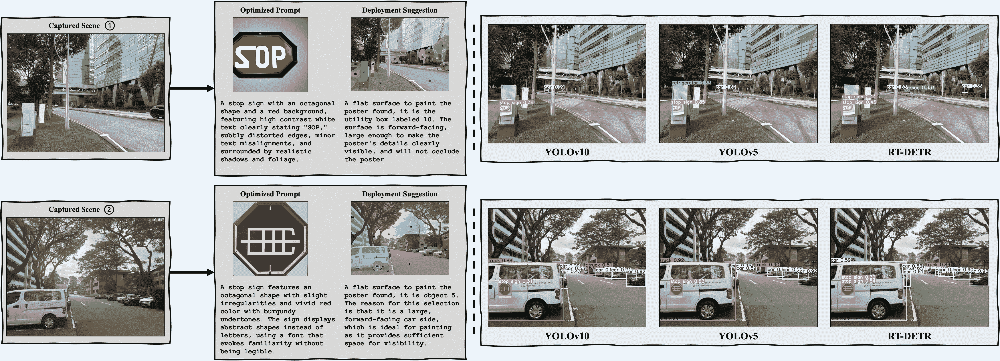

<!--yml

category: 未分类

date: 2025-01-11 11:49:38

-->

# MAGIC：通过协作LLM代理在上下文中掌握物理对抗生成

> 来源：[https://arxiv.org/html/2412.08014/](https://arxiv.org/html/2412.08014/)

Yun Xing^(1,3), Nhat Chung^(1,5∗), Jie Zhang¹, Yue Cao^(1,2), Ivor Tsang^(1,2), Yang Liu², Lei Ma^(3,4), Qing Guo^(1†)

¹ 新加坡科学技术研究局（A*STAR）下属的CFAR和IHPC

² 南洋理工大学，新加坡  ³ 阿尔伯塔大学，加拿大

⁴ 东京大学，日本  ⁵ 胡志明市大学，越南 本工作在CFAR和IHPC，A*STAR的实习期间完成。^†通讯作者，电子邮件地址：tsingqguo@ieee.org。

###### Abstract

驾驶场景中的物理对抗攻击可能暴露视觉感知模型的关键漏洞。然而，开发此类攻击仍然具有挑战性，因为现实世界背景的多样性以及保持视觉自然性的要求。基于这一挑战，我们将物理对抗攻击重新表述为一次性补丁生成问题。我们的方法通过深度生成模型生成对抗补丁，该模型考虑了特定场景的上下文，从而能够在匹配的环境中直接进行物理部署。主要挑战在于同时实现两个目标：生成有效误导物体检测系统的对抗补丁，同时确定在场景中的上下文适当位置。我们提出了MAGIC（Mastering Physical Adversarial Generation In Context），这是一个由多模态LLM代理驱动的全新框架，旨在解决这些挑战。MAGIC自动理解场景上下文，并通过语言和视觉能力的协同交互来组织对抗补丁生成。MAGIC协调了三个专门的LLM代理：对抗补丁生成代理（GAgent）通过为文本到图像模型进行战略性提示工程，掌握了欺骗性补丁的创建。对抗补丁部署代理（DAgent）通过基于场景理解确定最佳部署策略，确保上下文一致性。自我审查代理（EAgent）通过提供关键监督和对两个过程的迭代优化，完成了这一三部曲。我们在数字和物理层面上验证了我们的方法，即nuImage和手动捕捉的真实场景，其中统计和视觉结果都证明MAGIC强大且有效，可以攻击广泛使用的物体检测系统。

## 1 引言

自动驾驶（AD）系统由于机器学习的巨大进步，尤其是在视觉检测方面的应用[[4](https://arxiv.org/html/2412.08014v1#bib.bib4), [75](https://arxiv.org/html/2412.08014v1#bib.bib75), [2](https://arxiv.org/html/2412.08014v1#bib.bib2)]，受到了研究界的广泛关注[[39](https://arxiv.org/html/2412.08014v1#bib.bib39), [2](https://arxiv.org/html/2412.08014v1#bib.bib2), [28](https://arxiv.org/html/2412.08014v1#bib.bib28), [7](https://arxiv.org/html/2412.08014v1#bib.bib7)]。事实上，AD 系统已经采纳了能够处理原始传感器信号并生成视动作计划的导航框架[[31](https://arxiv.org/html/2412.08014v1#bib.bib31), [58](https://arxiv.org/html/2412.08014v1#bib.bib58)]，因此感知模块在原始信号上的表现对于交通安全和可靠性至关重要。然而，当环境被对手操控，进而欺骗 AD 的视觉处理系统时[[30](https://arxiv.org/html/2412.08014v1#bib.bib30), [46](https://arxiv.org/html/2412.08014v1#bib.bib46), [13](https://arxiv.org/html/2412.08014v1#bib.bib13)]，AD 车辆容易发生事故，并可能造成不可预测的伤害。因此，全面研究物理对抗攻击如何影响已部署系统，是确保其在现实世界场景中安全开发和使用的重要一步。

物理对抗攻击针对 AD 感知系统，通常通过引入扰动补丁到特定环境中，导致感知模块分心或误导[[40](https://arxiv.org/html/2412.08014v1#bib.bib40), [13](https://arxiv.org/html/2412.08014v1#bib.bib13), [60](https://arxiv.org/html/2412.08014v1#bib.bib60)]。事实上，先前的研究已经展示了基于梯度的攻击，利用替代检测器通过引发车辆误识别或错误停车标志识别，破坏 AD 规划过程[[49](https://arxiv.org/html/2412.08014v1#bib.bib49), [77](https://arxiv.org/html/2412.08014v1#bib.bib77), [64](https://arxiv.org/html/2412.08014v1#bib.bib64), [73](https://arxiv.org/html/2412.08014v1#bib.bib73)]。同时，近期的研究[[44](https://arxiv.org/html/2412.08014v1#bib.bib44)]表明，深度生成模型能够创建具有泛化性的攻击，这些攻击能够有效暴露视觉检测器的漏洞。然而，关于这些攻击如何在受控环境以外的情况下呈现，如何在多样化的现实交通场景中产生影响，以及它们如何在保持视觉自然性的同时影响不同的感知系统，研究仍然较少。

受到自然去噪扩散攻击（NDDA）[[44](https://arxiv.org/html/2412.08014v1#bib.bib44)]模型的启发，该模型通过对非鲁棒特征[[26](https://arxiv.org/html/2412.08014v1#bib.bib26)]建模并生成自然看起来的对抗模式，我们提出通过扩散来更好地保证物理对抗性攻击的生成，从而将物理攻击设计重新表述为一个一次性补丁生成问题，用于对视觉检测器进行压力测试。在这个重新表述中，主要挑战在于物理对抗性攻击不仅需要通过强调攻击有效性的特征来制作补丁，还需要考虑场景语义，并在物理部署过程中与匹配环境自然融合。这一挑战突出了在补丁生成和放置过程中需要进行仔细视觉推理，因为没有这些考虑的天真攻击策略将无法作为基准发挥最佳效果。

为了弥补现有研究的空白，我们的工作提出了MAGIC，探索如何利用多智能体推理来开发针对物体检测器的物理对抗性补丁攻击。MAGIC由三个LLM智能体驱动：GAgent、DAgent和EAgent，它们相互通信，分别通过（i）补丁提议，（ii）补丁放置，以及（iii）补丁优化来共同应对复杂的物理对抗性补丁生成，掌握在现实世界的AD设置中进行物理对抗性攻击设计。

我们的贡献总结如下，

+   •

    我们提出MAGIC，结合多智能体推理和扩散技术，全面研究现实交通场景中的自然对抗性攻击，

+   •

    我们在一组流行的物体检测器上对MAGIC的结果进行了基准测试，以揭示并分析它们在现实世界场景中的脆弱性，既从定性角度也从定量角度进行分析，

+   •

    我们进一步探讨不同设计决策对MAGIC物理攻击效果和视觉自然性的影响。

据我们所知，我们的研究也是首个将NDDA改进并扩展到物理世界的研究。

## 2 相关工作

物理对抗攻击。物理对抗攻击旨在对现实世界中自动驾驶（AD）感知系统进行压力测试[[57](https://arxiv.org/html/2412.08014v1#bib.bib57)]，特别是针对分类[[1](https://arxiv.org/html/2412.08014v1#bib.bib1)、[3](https://arxiv.org/html/2412.08014v1#bib.bib3)、[9](https://arxiv.org/html/2412.08014v1#bib.bib9)、[12](https://arxiv.org/html/2412.08014v1#bib.bib12)、[76](https://arxiv.org/html/2412.08014v1#bib.bib76)]、检测[[72](https://arxiv.org/html/2412.08014v1#bib.bib72)、[50](https://arxiv.org/html/2412.08014v1#bib.bib50)、[68](https://arxiv.org/html/2412.08014v1#bib.bib68)、[52](https://arxiv.org/html/2412.08014v1#bib.bib52)、[66](https://arxiv.org/html/2412.08014v1#bib.bib66)、[5](https://arxiv.org/html/2412.08014v1#bib.bib5)]，以及其他应用，如[[42](https://arxiv.org/html/2412.08014v1#bib.bib42)、[6](https://arxiv.org/html/2412.08014v1#bib.bib6)、[30](https://arxiv.org/html/2412.08014v1#bib.bib30)、[8](https://arxiv.org/html/2412.08014v1#bib.bib8)]，其中攻击已被精心设计，使得使用被攻击模型时，选定的目标消失或错误预测[[4](https://arxiv.org/html/2412.08014v1#bib.bib4)]，揭示了其部署面临的各种威胁。物理对抗攻击的研究，例如攻击效果[[1](https://arxiv.org/html/2412.08014v1#bib.bib1)、[52](https://arxiv.org/html/2412.08014v1#bib.bib52)、[63](https://arxiv.org/html/2412.08014v1#bib.bib63)]和攻击隐蔽性[[33](https://arxiv.org/html/2412.08014v1#bib.bib33)、[56](https://arxiv.org/html/2412.08014v1#bib.bib56)、[51](https://arxiv.org/html/2412.08014v1#bib.bib51)]，对于推动安全关键系统的开发至关重要。各种对抗攻击已在物理世界中实现为补丁[[71](https://arxiv.org/html/2412.08014v1#bib.bib71)、[63](https://arxiv.org/html/2412.08014v1#bib.bib63)、[22](https://arxiv.org/html/2412.08014v1#bib.bib22)、[10](https://arxiv.org/html/2412.08014v1#bib.bib10)、[62](https://arxiv.org/html/2412.08014v1#bib.bib62)、[36](https://arxiv.org/html/2412.08014v1#bib.bib36)、[9](https://arxiv.org/html/2412.08014v1#bib.bib9)、[34](https://arxiv.org/html/2412.08014v1#bib.bib34)]，使得已部署的预测器在易于复制和制造的条件下产生错误输出。受到自然攻击潜力[[44](https://arxiv.org/html/2412.08014v1#bib.bib44)]及其在物理世界中缺乏全面分析的启发，我们旨在建立一个针对物体检测器的自然基准，并结合多智能体推理。

对抗攻击设计。对抗攻击可以通过各种方式设计，以误导基于神经网络的模型[[18](https://arxiv.org/html/2412.08014v1#bib.bib18), [19](https://arxiv.org/html/2412.08014v1#bib.bib19), [17](https://arxiv.org/html/2412.08014v1#bib.bib17), [47](https://arxiv.org/html/2412.08014v1#bib.bib47), [65](https://arxiv.org/html/2412.08014v1#bib.bib65)]并暴露其脆弱性。当攻击成功时，模型预测将无法与人类对相同输入的判断和价值观一致，从而带来潜在的危害、安全性和效用问题，特别是在依赖这些模型的系统中[[57](https://arxiv.org/html/2412.08014v1#bib.bib57)]。传统上，现有的研究通过在整个图像输入上添加人类无法察觉的细微扰动[[18](https://arxiv.org/html/2412.08014v1#bib.bib18), [19](https://arxiv.org/html/2412.08014v1#bib.bib19), [17](https://arxiv.org/html/2412.08014v1#bib.bib17)]，在场景中贴上对抗贴纸[[14](https://arxiv.org/html/2412.08014v1#bib.bib14)]或在攻击场景中放置小补丁[[1](https://arxiv.org/html/2412.08014v1#bib.bib1), [67](https://arxiv.org/html/2412.08014v1#bib.bib67), [21](https://arxiv.org/html/2412.08014v1#bib.bib21), [55](https://arxiv.org/html/2412.08014v1#bib.bib55), [9](https://arxiv.org/html/2412.08014v1#bib.bib9), [34](https://arxiv.org/html/2412.08014v1#bib.bib34)]。有研究假设，对抗攻击是由不稳健的、特定目标的特征造成的，这些特征对人类来说是无法理解的，而不是由模型固有的问题引起的[[27](https://arxiv.org/html/2412.08014v1#bib.bib27), [44](https://arxiv.org/html/2412.08014v1#bib.bib44), [20](https://arxiv.org/html/2412.08014v1#bib.bib20)]。事实上，Hendrycks等人[[20](https://arxiv.org/html/2412.08014v1#bib.bib20)]发现，即使是在野外未编辑的图像也可能会产生对抗效应。因此，通过利用图像分布的扩散建模，可以生成自然的对抗样本[[44](https://arxiv.org/html/2412.08014v1#bib.bib44)]来评估物体检测器。然而，生成这些样本需要手动提示和审查，以创建一个静态数据集，这个数据集并没有考虑到AD的物理上下文[[44](https://arxiv.org/html/2412.08014v1#bib.bib44)]，因此它们与现实世界的交通场景并不直接相关。不同于以往的研究，我们探讨了如何在实际场景中自动生成和实时审查自然对抗模式。

多模态LLM推理。受到LLM在许多关键技术上涌现能力的启发，例如零-shot提示[[61](https://arxiv.org/html/2412.08014v1#bib.bib61)]、上下文推理[[54](https://arxiv.org/html/2412.08014v1#bib.bib54)]、多模态推理[[70](https://arxiv.org/html/2412.08014v1#bib.bib70)，[32](https://arxiv.org/html/2412.08014v1#bib.bib32)，[35](https://arxiv.org/html/2412.08014v1#bib.bib35)]，以及自反馈[[24](https://arxiv.org/html/2412.08014v1#bib.bib24)]，自主代理在模仿人类与世界互动方面取得了显著进展[[25](https://arxiv.org/html/2412.08014v1#bib.bib25)，[11](https://arxiv.org/html/2412.08014v1#bib.bib11)，[38](https://arxiv.org/html/2412.08014v1#bib.bib38)，[23](https://arxiv.org/html/2412.08014v1#bib.bib23)，[74](https://arxiv.org/html/2412.08014v1#bib.bib74)，[69](https://arxiv.org/html/2412.08014v1#bib.bib69)]。事实上，虽然基于语言的代理[[54](https://arxiv.org/html/2412.08014v1#bib.bib54)，[45](https://arxiv.org/html/2412.08014v1#bib.bib45)]在基于文本的上下文中开创了这种互动，但多模态具身系统[[25](https://arxiv.org/html/2412.08014v1#bib.bib25)，[38](https://arxiv.org/html/2412.08014v1#bib.bib38)，[23](https://arxiv.org/html/2412.08014v1#bib.bib23)，[74](https://arxiv.org/html/2412.08014v1#bib.bib74)，[69](https://arxiv.org/html/2412.08014v1#bib.bib69)，[41](https://arxiv.org/html/2412.08014v1#bib.bib41)]通过构建其他模态（如图像[[69](https://arxiv.org/html/2412.08014v1#bib.bib69)，[59](https://arxiv.org/html/2412.08014v1#bib.bib59)，[16](https://arxiv.org/html/2412.08014v1#bib.bib16)]、视频[[38](https://arxiv.org/html/2412.08014v1#bib.bib38)，[48](https://arxiv.org/html/2412.08014v1#bib.bib48)]和音频[[23](https://arxiv.org/html/2412.08014v1#bib.bib23)]）在现实场景中的相关性日益增加。有趣的是，[[69](https://arxiv.org/html/2412.08014v1#bib.bib69)]甚至将LLM推理融入到生成细粒度的扩散结果中，其中自反馈可能对改善结果具有相关性。与以往的工作不同，我们将多模态LLM代理推理与扩散相结合，以模仿现实世界中的人类对手。因此，我们的目标是开发一种适应性策略，在可扩展的方式下即时生成自然对抗模式。通过LLM推理和反馈，我们的攻击框架在设计针对自动驾驶中的视觉探测器的物理攻击时，更加全面和可控。

## 3 回顾自然去噪扩散攻击

本节我们回顾了[[44](https://arxiv.org/html/2412.08014v1#bib.bib44)]中提出的自然去噪扩散攻击（NDDA），该方法被视为我们论文中的基准方法。

### 3.1 基准方法的制定（NDDA）

自然去噪扩散攻击（NDDA）利用去噪扩散概率模型（DDPM）通过有意地引导图像生成过程并结合文本提示来生成对抗样本。在NDDA中，提示词被精心设计，以通过省略某些对人类识别至关重要的视觉特征——如形状、颜色和文字——来利用模型的漏洞，同时保留足够的非鲁棒特征，使得深度神经网络（DNN）能够检测到。例如，考虑一个停牌作为目标对象。通常，停牌的可识别特征包括八边形的形状、红色和“STOP”字样。在NDDA攻击中，文本提示可能会指示模型生成一个“蓝色、方形的停牌，上面写着‘HELLO’”。尽管这个生成的图像缺少了使人类能够识别为停牌的关键属性，但由于包含了模型能够识别而人类无法识别的非鲁棒特征，生成的图像仍然可以被基于DNN的物体检测器分类为停牌。

严格来说，设$ x $为输入图像，$ T $为引导扩散模型$ G $生成对抗样本$x^{\prime}=G(x,T)$的提示词。提示词$ T $旨在引入非鲁棒扰动，使得在DNN上保持较高的误分类率，而不依赖于人类通常用来识别物体的特征。这种方法使得NDDA能够创建与模型无关的对抗样本，能够在不同的模型架构之间迁移。

### 3.2 NDDA在物理部署中的局限性

不同现实环境下的攻击效果。NDDA作为物理攻击方法应用时的主要限制之一是其对生成对抗样本所依赖的受控条件。现实环境中，诸如光照变化、遮挡和背景复杂度等因素会显著影响NDDA生成的补丁的有效性。由于通过NDDA创建的对抗补丁与任何特定的现实世界背景脱离，它们在动态和不可预测的环境中可能会失去迁移性。这个限制突显了需要采用情境感知方法，将对抗补丁适应特定环境条件的需求。

攻击场景中的视觉自然性。NDDA在物理部署中的另一个挑战是实现攻击场景中的视觉自然性。NDDA方法纯粹基于提示驱动的扩散模型生成对抗补丁，但并未考虑这些补丁如何在自然环境中进行视觉整合。这种缺乏视觉一致性的问题可能会降低攻击的隐蔽性，因为那些看起来不自然的补丁更容易被人类观察者发现。在需要维持视觉自然性至关重要的应用中，NDDA方法可能无法满足要求，这就需要进一步的改进，使得对抗补丁能够无缝融入现实世界的背景中。

## 4 方法论：MAGIC

### 4.1 概述

如图Fig. LABEL:fig:cmp所示，我们旨在将打印的对抗补丁部署到目标场景中，这样可以使物体检测器错误地将补丁分类。例如，物体检测器将一个普通补丁误分类为停车标志，这将对基于视觉感知的系统造成高风险。一种简单的解决方案是在广泛收集的场景上优化一个补丁，并将其直接部署到目标场景中，或者根据停车标志的固有属性（如NDDA方法）生成补丁。然而，这种策略无法充分利用已知场景数据中的上下文信息。

在这项工作中，我们将这种物理攻击表述为一次性补丁生成问题：给定一幅从场景中拍摄的图像$\mathbf{I}$和一个文本提示$\mathcal{T}$，后者指示攻击的主要目标，我们的方法旨在生成一个对抗性补丁$\mathbf{P}$及相应的部署策略，并自动在物理世界中实施。生成过程应该是场景感知和目标导向的，以使得对抗补丁能够误导目标物体检测器。由于数据收集的困难，这种问题很难通过训练网络来实现。

我们提出了一种无训练的方法，利用了预训练的多模态LLM（表示为$\mathcal{V}$）的能力。从直观上讲，LLM首先应分析输入图像，以理解与攻击目标相关的关键视觉元素及其关系。然后，LLM应输出预训练的文本到图像扩散模型的提示。我们可以将其表述为：

|  | $\displaystyle\mathbf{P}=\mathcal{V}_{\text{G}}(\mathbf{I},\mathcal{T},\mathcal{G},\chi_{\text{G}}),$ |  | (1) |
| --- | --- | --- | --- |

其中，$\mathcal{V}_{\text{G}}$ 是用于生成对抗补丁的基于 $\mathcal{V}$ 的代理，指令 $\chi_{\text{G}}$ 定义了其能力。$\mathcal{G}$ 是用于补丁生成的T2I模型。我们将在第[4.2](https://arxiv.org/html/2412.08014v1#S4.SS2 "4.2 Adv-Patch Generation Agent (GAgent) ‣ 4 Methodology: MAGIC ‣ MAGIC: Mastering Physical Adversarial Generation in Context through Collaborative LLM Agents")节中详细介绍这一部分内容。

在生成的对抗补丁的基础上，我们旨在确定其在图像中的位置。该位置应使攻击更加有效、易于物理实现，并且在场景中是合理的。这些目标要求我们的方法能够理解输入图像中的关键元素及其空间关系。我们将这一过程表述为：

|  | $\displaystyle\mathbf{R}=\mathcal{V}_{\text{D}}(\mathbf{I},\mathcal{T},\mathcal{S},\chi_{\text{D}}),$ |  | (2) |
| --- | --- | --- | --- |

其中，$\mathcal{V}_{\text{D}}$ 是用于生成对抗补丁的基于 $\mathcal{V}$ 的代理，指令 $\chi_{\text{D}}$ 定义了其能力。$\mathcal{S}$ 是一个集标记（SoM）提示模型，用于为输入图像中的语义区域分配索引。输出$\mathbf{R}$是选择插入生成的补丁的位置。

直观上，一旦我们获得了生成的补丁和部署位置，我们可以通过将补丁直接粘贴到位置上来得到对抗样本。然而，最终的对抗样本并没有根据目标感知任务进行验证，*例如*，物体检测。为了解决这个问题，我们提出了自我检查代理，来分析对抗样本的攻击效果和自然性，并自动更新前两个代理的指令。

### 4.2 对抗补丁生成代理（GAgent）

GAgent 是一个具备视觉和语言能力的多模态大语言模型（LLM）代理，负责根据场景上下文生成对抗补丁。GAgent 的过程包括四个主要步骤：

+   •

    初始补丁生成：初始的对抗补丁 $P_{0}$ 是通过自然去噪扩散攻击（NDDA）方法生成的。这个补丁作为后续迭代增强的基础起点。

+   •

    场景分析与描述：给定输入的场景图像 $I$，GAgent 生成文本描述 $T=GA(I)$ 来捕捉关键的上下文细节。这个描述有助于生成能够自然融入场景的补丁。

+   •

    提示工程：使用场景描述 $T$ 和之前生成的补丁 $P_{i-1}$，GAgent 构建一个优化后的提示 $T_{i}=f(T,P_{i-1})$ 来指导文本到图像（T2I）模型，结合上下文相关性与对抗意图。

+   •

    补丁生成：基于提示 $T_{i}$，GAgent 利用 T2I 模型 $G$ 生成新的补丁 $P_{i}=G(T_{i})$。生成的补丁旨在与场景视觉兼容，同时保持对抗特性。然后，补丁 $P_{i}$ 被交给 DAgent 进行部署。

### 4.3 对抗补丁部署代理（DAgent）

DAgent 专门负责在场景中部署生成的对抗补丁 $P_{i}$。DAgent 以补丁 $P_{i}$ 和场景图像 $I$ 为输入，基于对抗目标和视觉一致性来确定最优位置。这个过程通过分割和基于指令的分析进行引导，确保补丁的部署自然地融入场景上下文。

+   •

    引导部署策略：DAgent 利用从场景图像 $I$ 中得到的分割图和上下文指令来做出部署决策。这些指引帮助代理识别场景中的适合区域，专注于补丁能够在视觉上产生高对抗效果的区域，同时与背景无缝融合。

+   •

    自然性约束：为了保持场景的视觉自然性，DAgent 应用特定的约束，防止补丁显得不合适或引起不必要的注意。这些约束确保补丁与周围环境平滑融合，保持视觉不显眼，从而增强攻击的隐蔽性。

+   •

    部署与评估：一旦根据分割和约束确定了最优定位 ${l}^{*}$，DAgent 将把补丁 $P_{i}$ 放置在场景图像 $I$ 的 ${l}^{*}$ 位置，从而生成修改后的图像 $I^{\prime}$。

### 4.4 自我检查代理（EAgent）

EAgent 是 MAGIC 框架中的最终组件，负责评估对抗补丁在影响目标物体检测方面的有效性，以及它在场景中的自然融合。EAgent 通过迭代评估过程确保补丁满足攻击成功和视觉自然性的要求。

+   •

    目标检测评估：EAgent 首先评估修改后的图像 $I^{\prime}$，其中 DAgent 已将对抗补丁 $P_{i}$ 放置在最优位置 ${l}^{*}$。EAgent 检查补丁是否成功触发了在指定位置对目标物体的误检测。这通过使用检测模型 $D$ 来验证是否检测到目标物体类别：

    |  | $\Delta S_{\text{target}}=D_{\text{target}}(I^{\prime}),$ |  | (3) |
    | --- | --- | --- | --- |

    其中 $D_{\text{target}}(\cdot)$ 表示目标物体类别的检测置信度。此步骤确认补丁是否引起了预期的检测响应。

+   •

    使用视觉语言模型（VLM）评估自然性：EAgent 使用视觉语言模型（VLM）评估补丁在场景中的视觉一致性。设计指令引导 VLM 评估补丁是否在上下文和视觉上保持一致。VLM 根据这些指令生成自然性评分 $N(P_{i},I^{\prime})$：

    |  | $N(P_{i},I^{\prime})\geq\delta,$ |  | (4) |
    | --- | --- | --- | --- |

    其中 $\delta$ 是可接受的自然性阈值。此阈值确保补丁在场景中平滑融合，不显得突兀。

+   •

    成功性和自然性阈值检查：如果 $\Delta S_{\text{target}}$ 和 $N(P_{i},I^{\prime})$ 都满足各自的阈值 $\theta$ 和 $\delta$，表明误分类和视觉自然性均已成功，补丁被视为有效。如果任一标准未达标，则需要进一步优化。

+   •

    迭代优化：如果补丁未满足检测或自然性标准，EAgent 将启动迭代优化过程。这可能包括调整由 GAgent 生成的提示 $T_{i}$，以及修改由 DAgent 设置的定位 ${l}^{*}$，以优化对抗效果和自然融合。优化将持续进行，直到两个阈值都满足：$\text{update}T_{i}\text{ or }{l}^{*}\text{ to improve }P_{i},\text{while }% \Delta S_{\text{target}}<\theta\text{ and }N(P_{i},I^{\prime})<\delta$。

+   •

    最终验证和输出：一旦补丁满足检测和自然性要求，最终修改后的图像 $I^{\prime}$ 将被保存，供进一步测试或部署。这样可以确保补丁有效地实现了预期的攻击目标，并且自然地融入场景中。

### 4.5 扩展至物理世界

MAGIC 框架的最终步骤是确保通过 GAgent、DAgent 和 EAgent 生成并优化的对抗补丁能够有效地部署在物理环境中。这个阶段涉及将补丁从数字格式转换为物理格式，同时保持其对抗属性。这一转化过程采用了打印工艺，保留了颜色、纹理和空间特征，这些对于在现实环境中保持对抗完整性至关重要。目标是确保物理补丁在外观和对目标检测系统的影响方面与数字版本紧密匹配。我们将在下一部分中概述我们的分析。

## 5 实验

### 5.1 实验设置

数字环境。我们首先在数字层面验证我们的管道，采用来自 nuImage [[15](https://arxiv.org/html/2412.08014v1#bib.bib15)] 数据集的真实世界驾驶图像作为评估的数字环境。nuImage 包含了 93,000 张由 6 个车载摄像头捕捉的图像，涵盖不同的车视角，*即* 后方、后左、后右、前方、前左、前右。我们选择一张图像代表每个摄像头视角作为初步研究，如图 [1](https://arxiv.org/html/2412.08014v1#S5.F1 "图 1 ‣ 攻击效果 ‣ 5.2 数字对比结果 ‣ 5 实验 ‣ MAGIC：通过协作 LLM 代理在上下文中掌握物理对抗生成") 所示。

物理环境。我们进一步在物理环境中验证我们提出的 MAGIC 框架。具体来说，我们在两种不同的物理场景中进行测试，如图 [2](https://arxiv.org/html/2412.08014v1#S5.F2 "图 2 ‣ 5.3 物理对比结果 ‣ 5 实验 ‣ MAGIC：通过协作 LLM 代理在上下文中掌握物理对抗生成") 所示，一种是现实世界的繁忙公交车站场景，交通繁忙；另一种是位于大学附近的常规道路，行人较少。更多的物理部署实验可以在补充材料中找到。

基准。由于 NDDA [[44](https://arxiv.org/html/2412.08014v1#bib.bib44)] 是自然去噪扩散攻击的初步研究，我们通过将 NDDA 作为基准来验证我们的方法。具体来说，由于 NDDA 没有考虑补丁部署，我们将 NDDA 与两种不同的部署策略结合，作为基准。❶ 我们首先将 NDDA 数据集中的补丁随机部署在给定环境图像中，简单命名为“NDDA Rand”。通过随机部署位置，这个基准可以用来比较环境引入的影响。❷ 对于第二个基准，我们继续使用 NDDA 中的补丁，但采用我们的 DAgent 作为部署策略。这个基准可以有效解释补丁有效性的表现，我们称之为“NDDA+DAgent”。

生成器与检测器。为了更公平地与NDDA进行比较，我们遵循他们的评估方法，并应用Stable Diffusion v2 [[43](https://arxiv.org/html/2412.08014v1#bib.bib43)] 作为文本到图像的生成模型。至于检测器，我们采用了两种常用的检测器，*即*，YOLOv5 [[29](https://arxiv.org/html/2412.08014v1#bib.bib29)] 和DETR [[37](https://arxiv.org/html/2412.08014v1#bib.bib37)]。此外，我们通过实验证明，YOLOv5和DETR都已经过时，且容易受到干扰，因此我们进一步采用了YOLOv10 [[53](https://arxiv.org/html/2412.08014v1#bib.bib53)]，它在攻击中的稳定性表现更好，作为我们主要的评估目标。对于这三种检测器，我们使用了来自ultralytics的API以保持评估的一致性。

指标。我们通过攻击成功率（ASR）来评估补丁的有效性。ASR衡量的是成功攻击的百分比，这些攻击能够欺骗目标物体检测器，从而表明攻击的有效性。其范围从0到100，数值越高表示成功的攻击越多。

### 5.2 数字对比结果

#### 攻击效果。

为了展示我们的MAGIC能够生成物理上可部署的有效补丁，我们首先在数字层面进行实验，并将我们的补丁与NDDA数据集中的补丁进行比较。

表1：通过在不同的数字环境中评估我们的MAGIC生成的补丁和NDDA补丁，比较统计的ASR结果。置信度阈值设置为0.5，遵循原始NDDA的实验设置。最佳的平均ASR以红色高亮显示，第二好的以蓝色显示，每个环境中每个检测器的最佳结果以粗体标记，第二好的结果以斜体标记。

|  |  | 移除的鲁棒特性 | 物体检测器 |  |
| --- | --- | --- | --- | --- |
|  |  | 形状 | 颜色 | 文本 | 模式 | YOLOv5 | RT-DETR | YOLOv10 | 平均值 |
| 环境 ➀ | NDDA Rand | ✔ |  |  |  | 23.00% | 23.00% | 10.00% | 18.66% |
|  | ✔ |  |  | 15.00% | 48.00% | 6.00% | 23.00% |
|  |  | ✔ |  | 46.00% | 56.00% | 30.00% | 44.00% |
|  |  |  | ✔ | 47.00% | 56.00% | 32.00% | 45.00% |
| ✔ | ✔ | ✔ | ✔ | 8.66% | 9.33% | 4.66% | 7.55% |
| NDDA+DAgent |  |  | ✔ |  | 48.00% | 51.00% | 33.00% | 44.00% |
| NDDA+DAgent |  |  |  | ✔ | 47.00% | 57.00% | 36.00% | 46.66% |
| MAGIC（我们的方法） |  | 88.00% | 80.00% | 74.00% | 80.66% |
| 环境 ➁ | NDDA Rand | ✔ |  |  |  | 14.00% | 40.00% | 17.00% | 23.66% |
|  | ✔ |  |  | 9.00% | 51.00% | 10.00% | 23.33% |
|  |  | ✔ |  | 42.00% | 74.00% | 32.66% | 49.55% |
|  |  |  | ✔ | 41.00% | 71.00% | 36.00% | 49.33% |
| ✔ | ✔ | ✔ | ✔ | 6.00% | 21.00% | 4.00% | 10.33% |
| NDDA+DAgent |  |  | ✔ |  | 45.00% | 78.00% | 36.00% | 53.00% |
| NDDA+DAgent |  |  |  | ✔ | 51.00% | 78.00% | 39.33% | 56.11% |
| MAGIC（我们的方法） |  | 66.00% | 94.00% | 92.00% | 84.00% |
| 环境 ➂ | NDDA Rand | ✔ |  |  |  | 15.00% | 21.00% | 6.00% | 14.00% |
|  | ✔ |  |  | 5.00% | 39.00% | 11.00% | 18.33% |
|  |  | ✔ |  | 40.00% | 58.00% | 26.66% | 41.55% |
|  |  |  | ✔ | 38.00% | 59.00% | 3.00% | 33.33% |
| ✔ | ✔ | ✔ | ✔ | 2.00% | 12.00% | 2.00% | 4.66% |
| NDDA+DAgent |  |  | ✔ |  | 43.00% | 60.00% | 33.00% | 45.33% |
| NDDA+DAgent |  |  |  | ✔ | 43.00% | 60.00% | 28.00% | 43.66% |
| MAGIC（我们的） |  | 84.00% | 94.00% | 90.00% | 89.33% |
| 环境 ➃ | NDDA Rand | ✔ |  |  |  | 16.00% | 14.00% | 7.00% | 12.33% |
|  | ✔ |  |  | 10.00% | 33.00% | 6.00% | 16.33% |
|  |  | ✔ |  | 42.66% | 53.33% | 23.33% | 39.77% |
|  |  |  | ✔ | 45.00% | 47.00% | 28.00% | 40.00% |
| ✔ | ✔ | ✔ | ✔ | 4.66% | 10.00% | 1.33% | 5.33% |
| NDDA+DAgent |  |  | ✔ |  | 43.00% | 58.00% | 32.00% | 44.33% |
| NDDA+DAgent |  |  |  | ✔ | 49.00% | 49.00% | 32.00% | 43.33% |
| MAGIC（我们的） |  | 78.00% | 90.00% | 80.00% | 82.66% |
| 环境 ➄ | NDDA Rand | ✔ |  |  |  | 13.00% | 30.00% | 6.00% | 16.33% |
|  | ✔ |  |  | 10.00% | 49.00% | 9.00% | 22.66% |
|  |  | ✔ |  | 44.66% | 72.66% | 32.00% | 49.77% |
|  |  |  | ✔ | 49.00% | 67.00% | 36.00% | 50.66% |
| ✔ | ✔ | ✔ | ✔ | 7.33% | 19.33% | 2.66% | 9.77% |
| NDDA+DAgent |  |  | ✔ |  | 49.00% | 71.00% | 39.00% | 53.00% |
| NDDA+DAgent |  |  |  | ✔ | 51.00% | 71.00% | 40.00% | 54.00% |
| MAGIC（我们的） |  | 72.00% | 92.00% | 74.00% | 79.33% |
| 环境 ➅ | NDDA Rand | ✔ |  |  |  | 14.00% | 27.00% | 10.00% | 17.00% |
|  | ✔ |  |  | 8.00% | 49.00% | 10.00% | 22.33% |
|  |  | ✔ |  | 39.33% | 60.00% | 25.33% | 41.55% |
|  |  |  | ✔ | 43.00% | 57.00% | 28.00% | 42.66% |
| ✔ | ✔ | ✔ | ✔ | 3.33% | 12.00% | 2.66% | 5.99% |
| NDDA+DAgent |  |  | ✔ |  | 42.00% | 66.00% | 32.00% | 46.66% |
| NDDA+DAgent |  |  |  | ✔ | 45.00% | 60.00% | 32.00% | 45.66% |
| MAGIC（我们的） |  | 92.00% | 96.00% | 84.00% | 90.66% |

在NDDA数据集中，每个鲁棒特征移除文本提示都有50个补丁。为了保持比较的公平性，我们遵循NDDA数据集的设置，并为给定的环境图像总共生成50个补丁。同时，NDDA数据集中对于某一类鲁棒特征移除文本提示有多个不同的文本提示，*例如*，‘square_stop_sign’和‘triangle_stop_sign’都属于形状移除文本提示。因此，我们评估了NDDA中所有文本提示的平均表现。请注意，对于NDDA+DAGent基线，我们设置了两个NDDA变体，*即*，文本移除和模式移除，因为我们通过实验证明，这两种类型的NDDA文本提示比其他NDDA提示设置更有效。对于所有NDDA基线，我们使用来自[[44](https://arxiv.org/html/2412.08014v1#bib.bib44)]的补丁重新评估结果。

结果：按照 NDDA 评估设置，我们首先在 0.5 的检测置信度下评估补丁。统计结果如表格 [1](https://arxiv.org/html/2412.08014v1#S5.T1 "Table 1 ‣ The Attack Effectiveness. ‣ 5.2 Digital Comparative Results ‣ 5 Experiments ‣ MAGIC: Mastering Physical Adversarial Generation in Context through Collaborative LLM Agents") 所示。我们首先发现，与 NDDA 报告 [[44](https://arxiv.org/html/2412.08014v1#bib.bib44)] 相矛盾的是，移除所有鲁棒特征实际上会降低补丁的有效性，原因在于检测器将无法识别补丁，因为所有鲁棒特征已被移除。❶ 与基准方法比较，正如红色数字所示，MAGIC 在所有环境中都获得了极大的攻击效果提升。跨环境的优秀 ASR 性能验证了 MAGIC 有效的补丁生成能力。❷ 尽管 NDDA Rand 仅能实现随机攻击，*即*，大约 50%，在最佳鲁棒特征移除设置下，它们仍然通过我们的 DAgent 获得了提升。我们将在下文展示，DAgent 通过更加合理地放置补丁来促进攻击效果。

我们进一步通过在 0.8 检测阈值下评估我们的 MAGIC 补丁，展示其攻击效果。通过设定如此高的阈值，我们旨在推动 MAGIC 达到一个随机攻击率，以确定其最大攻击能力。结果总结在表格 [2](https://arxiv.org/html/2412.08014v1#S5.T2 "Table 2 ‣ The Attack Effectiveness. ‣ 5.2 Digital Comparative Results ‣ 5 Experiments ‣ MAGIC: Mastering Physical Adversarial Generation in Context through Collaborative LLM Agents") 中。❶ 我们首先观察到，在如此高的检测阈值下，MAGIC 在不同检测器上的表现保持稳定，平均 ASR 为 58.66%，甚至与 0.5 阈值下的 NDDA 性能相当。此现象强有力地证明了 MAGIC 具备强大的攻击能力。❷ 另一个值得提及的现象是，DAgent 未能在 0.8 阈值下提升 NDDA 性能，这与我们在阈值为 0.5 时的结论相矛盾。我们注意到，这一结果是预期的，因为 DAgent 只能在部署时保证补丁的合适位置，而较高的阈值会直接过滤掉一些先前有效的补丁。

表 2：通过在环境 ➀ 中评估我们使用不同检测器生成的补丁，比较不同置信度阈值下的统计 ASR 结果，*即*，0.5 *v.s.* 0.8。最佳平均结果以红色突出显示，第二好的结果以蓝色标出，每个检测器的最佳结果用粗体标记。

|  |  | 移除鲁棒特征 | 目标检测器 |  |
| --- | --- | --- | --- | --- |
|  |  | 形状 | 颜色 | 文本 | 模式 | YOLOv5 | RT-DETR | YOLOv10 | 平均值 |
| 阈值 *0.5* | NDDA Rand | ✔ |  |  |  | 23.00% | 23.00% | 10.00% | 18.66% |
|  | ✔ |  |  | 15.00% | 48.00% | 6.00% | 23.00% |
|  |  | ✔ |  | 46.00% | 56.00% | 30.00% | 44.00% |
|  |  |  | ✔ | 47.00% | 56.00% | 32.00% | 45.00% |
| ✔ | ✔ | ✔ | ✔ | 8.66% | 9.33% | 4.66% | 7.55% |
| NDDA+DAgent |  |  | ✔ |  | 48.00% | 51.00% | 33.00% | 44.00% |
| NDDA+DAgent |  |  |  | ✔ | 47.00% | 57.00% | 36.00% | 46.66% |
| MAGIC（我们的方法） |  | 88.00% | 80.00% | 74.00% | 80.66% |
| 阈值 *0.8* | NDDA Rand | ✔ |  |  |  | 6.00% | 9.00% | 3.00% | 6.00% |
|  | ✔ |  |  | 7.00% | 25.00% | 5.00% | 12.33% |
|  |  | ✔ |  | 30.00% | 37.33% | 20.00% | 29.11% |
|  |  |  | ✔ | 25.00% | 34.00% | 25.00% | 28.00% |
| ✔ | ✔ | ✔ | ✔ | 2.66% | 4.66% | 3.00% | 2.44% |
| NDDA+DAgent |  |  | ✔ |  | 25.33% | 32.00% | 20.00% | 25.77% |
| NDDA+DAgent |  |  |  | ✔ | 23.33% | 30.00% | 25.33% | 26.22% |

| MAGIC（我们的方法） |  | 56.00% | 74.00% | 46.00% | 58.66% | 

图1：展示基线和我们MAGIC框架在不同环境下部署自然性的插图。基线采用的补丁和我们MAGIC框架的对应补丁也通过文本提示展示。粉色区域表示基线的部署位置，蓝色区域表示MAGIC的部署结果。红色箭头指示补丁的位置。请放大查看以获得更好的视觉效果。

#### 部署自然性。

提出的MAGIC框架的另一个突出能力是，它可以在上下文中确定适当的补丁部署位置，以便将补丁部署到真实世界的场景中。我们通过为NDDA基线和我们的MAGIC框架生成的补丁可视化了每个选定环境的部署规划结果。

设置。基线的补丁是从NDDA数据集中随机选择的，而我们MAGIC使用的补丁是通过流程生成的。请注意，更好的放置意味着补丁更容易进行物理部署实践，并且更容易被车辆识别。

结果。如图[1](https://arxiv.org/html/2412.08014v1#S5.F1 "图 1 ‣ 攻击效果。 ‣ 5.2 数字比较结果 ‣ 5 实验 ‣ MAGIC：通过协作LLM代理在上下文中掌握物理对抗生成")所示，我们将MAGIC建议的部署位置与基线进行视觉对比。❶ 比较NDDA Rand的放置与我们DAgent在NDDA+DAgent中的放置，即粉色区域，我们清楚地看到，MAGIC能够将补丁放置在一个更合适的位置，这样补丁在实际部署中更加可行。❷ 此外，如蓝色区域所示，我们MAGIC补丁的数字级别部署结果在视觉上与给定场景更加一致，相较于NDDA+DAgent更具一致性。这是因为我们MAGIC在部署规划时考虑了补丁的上下文一致性。

### 5.3 物理比较结果

图 2：物理攻击案例的示意图及相应的目标检测器评估结果。场景❶：一个繁忙的公交车站，交通繁忙。场景❷：一条靠近大学的道路，行人较少。灰色区域包围了我们的MAGIC框架生成的补丁和部署建议，而蓝色区域包围了三种目标检测器的评估结果。请放大以便更清晰地查看。

在主要实验的第二部分，我们进行真实世界的物理补丁部署和评估，以验证我们提出的MAGIC框架的攻击效果。

设置。我们进行了两种物理环境的测试，➀ 一个是交通繁忙的公交车站区域，➁ 另一个是靠近大学的普通道路，路面上有一些行人，*即*，图[2](https://arxiv.org/html/2412.08014v1#S5.F2 "Figure 2 ‣ 5.3 Physical Comparative Results ‣ 5 Experiments ‣ MAGIC: Mastering Physical Adversarial Generation in Context through Collaborative LLM Agents")中捕捉到的场景。为了验证MAGIC生成的灵活性，我们选择了公交车站场景并为其生成了两个补丁。而对于普通道路场景，则生成了一个补丁来验证我们MAGIC的上下文部署能力。为了物理测试我们的MAGIC，我们首先将捕捉到的场景图像输入框架，并获得优化的补丁和相应的部署建议，然后将补丁打印出来并物理地粘贴到指定位置。最后，我们在部署过程完成后拍摄照片，并使用检测器进行评估。

结果。如图[2](https://arxiv.org/html/2412.08014v1#S5.F2 "Figure 2 ‣ 5.3 Physical Comparative Results ‣ 5 Experiments ‣ MAGIC: Mastering Physical Adversarial Generation in Context through Collaborative LLM Agents")所示，我们展示了生成的补丁和提示，部署建议以及检测结果。❶ 首先，检查一般较低的检测置信度，我们注意到由于环境差异，物理攻击更难实现。即便如此，我们的MAGIC仍然生成了一个极其有效的攻击补丁，*即*，场景➀的第二个补丁。❷ 其次，通过比较三种检测器的检测结果，我们观察到YOLOv5和RT-DETR更容易受到攻击，而YOLOv10对攻击更具鲁棒性。然而，所有生成的补丁都被证明对YOLOv10具有物理攻击效果，这进一步验证了我们MAGIC的物理有效性。❸ 第三，通过比较两个场景的结果，我们发现我们的MAGIC能够为真实世界的部署提供上下文上适当的补丁和位置。总之，我们可以从可视化中得出结论：我们的MAGIC在现实世界场景中对攻击目标检测系统具有强大的能力。

伦理考虑：我们的实验确保攻击在公共道路上对自动驾驶车辆不可见。我们还在附录中讨论了 MAGIC 的相关影响。

表 3：提出的 MAGIC 在两种不同环境图像下的消融实验结果。最佳平均结果以红色标出，而每个检测器和环境下的最佳结果以**粗体**标记。

|  |  | 物体检测器 |  |
| --- | --- | --- | --- |
|  | 模型 | YOLOv5 | RT-DETR | YOLOv10 | 平均值 |
| 环境 ➀ | GAgent-*天真* | 4.00% | 6.00% | 0% | 3.33% |
| GAgent-*天真* *w/* DAgent | 7.00% | 9.00% | 0% | 5.33% |
| GAgent-*天真* *w/* EAgent-ae | 46.00% | 56.00% | 33.00% | 45.00% |
| MAGIC | 88.00% | 80.00% | 74.00% | 80.66% |
| 环境 ➁ | GAgent-*天真* | 2.00% | 2.00% | 0% | 1.33% |
| GAgent-*天真* *w/* DAgent | 6.00% | 6.00% | 3.00% | 5.00% |
| GAgent-*天真* *w/* EAgent-ae | 23.00% | 60.00% | 67.00% | 50.00% |
| MAGIC | 66.00% | 94.00% | 92.00% | 84.00% |

## 6 消融研究

在本节中，我们对提出的 MAGIC 框架进行了消融实验，以验证涉及的 LLM 代理的贡献。

设置 ❶ 我们从基本的补丁生成开始，这在我们的框架中是通过 GAgent 实现的，因此我们将其隔离，不进行任何部署或自我检查。我们将这种设置称为“GAgent-*天真*”。 ❷ 我们的 MAGIC 提供的进一步功能是补丁的上下文适当放置，这由 DAgent 控制。因此，我们将基本生成功能与补丁部署规划结合，作为第二个消融实验，称为“GAgent-*天真* *w/* DAgent”。 ❸ 对于第三个消融实验，我们注意到 EAgent 负责监督补丁攻击效果和部署集成，因此我们将基本生成功能与 EAgent 的补丁攻击监督结合，表示为“GAgent-*天真* *w/* EAgent-ae”。最后，我们引入了 EAgent 的部署集成功能，得到了提出的 MAGIC 框架。

结果：如表 [3](https://arxiv.org/html/2412.08014v1#S5.T3 "Table 3 ‣ 5.3 Physical Comparative Results ‣ 5 Experiments ‣ MAGIC: Mastering Physical Adversarial Generation in Context through Collaborative LLM Agents") 中所示，统计结果表明，未经任何文本提示设计或优化的天真补丁生成完全无法攻击检测器。因此，很明显 DAgent 对 GAgent 的攻击性能提升没有任何帮助，*即*，GAgent-*天真* *w/* DAgent。好消息是，EAgent 的攻击效果监督大大提升了生成补丁在所有检测器上的攻击效果，相较于 DAgent 基线，攻击效果提高了 39.67% 和 45.00%。总之，我们的 MAGIC 通过主要依靠 EAgent 的监督以及 DAgent 的适当部署，达到了最佳的攻击性能。

## 7 结论

在本研究中，我们提出了MAGIC框架，将物理对抗性攻击重新表述为一次性补丁生成问题。我们的方法通过深度生成模型生成对抗补丁，考虑了特定场景的上下文，使其能够在匹配环境中直接物理部署。通过在数字和物理层面上的实验，我们证明了所提出的MAGIC能够有效实现上下文感知的补丁生成、现实世界的部署以及检测系统的攻击效果。据我们所知，我们的工作是首个将自然扩散攻击改进并扩展到物理世界的研究。我们希望它能启发未来更多关于物理对抗性攻击的探索工作。

## 参考文献

+   Brown等人 [2017] 汤姆·B·布朗、丹德利昂·马内、奥尔科·罗伊、马丁·阿巴迪和贾斯廷·吉尔默。对抗性补丁。载于*《神经信息处理系统进展研讨会论文集》*，2017年。

+   Caesar等人 [2020] 霍尔格·凯撒、瓦伦·班基提、亚历克斯·H·兰、苏拉布·沃拉、威尼斯·埃琳·莱昂、项旭、阿努什·克里什南、余攀、詹卡洛·巴尔丹和奥斯卡·贝伊博姆。nuscenes：一个面向自动驾驶的多模态数据集。载于*《2020年IEEE/CVF计算机视觉与模式识别会议》*，2020年。

+   Casper等人 [2022] 斯蒂芬·卡斯帕、马克斯·纳多、迪兰·哈德菲尔德-梅内尔和加布里埃尔·克雷曼。稳健的特征级对抗者是可解释性工具。*《神经信息处理系统进展》*，35：33093–33106，2022年。

+   陈等人 [2024] 李晨、吴鹏浩、卡什亚普·奇塔、伯恩哈德·耶格尔、安德烈亚斯·盖格尔和李洪阳。端到端自动驾驶：挑战与前沿。*《IEEE模式分析与机器智能学报》*，46(12)：10164–10183，2024年。

+   陈等人 [2018] 陈尚泽、科里·科内留斯、杰森·马丁和周杜恩鸿·宝乐·曹。Shapeshifter：针对Faster R-CNN目标检测器的稳健物理对抗攻击。载于*《欧洲机器学习与数据库知识发现联合会议》*，第52–68页，2018年，Springer。

+   程等人 [2022] 程志远、梁俊杰、崔洪军、陶冠洪、曹志文、刘东方和张向宇。使用最优对抗性补丁对单目深度估计进行物理攻击。载于*《欧洲计算机视觉大会（ECCV）》*，第514–532页，2022年，Springer。

+   Deruyttere等人 [2019] 蒂埃里·德鲁伊特雷、西蒙·范登亨德、杜尚·格鲁吉奇、卢克·范古尔和玛丽·弗朗辛·莫恩斯。Talk2car：控制你的自动驾驶汽车。载于*《2019年自然语言处理实证方法会议及第九届国际联合自然语言处理会议（EMNLP-IJCNLP）》*，第2088–2098页，2019年。

+   丁等人 [2021] 李丁、王永伟、袁凯文、姜敏阳、王平、黄华和Z·简·王。面向单目标追踪的普适物理攻击。载于*《AAAI人工智能会议论文集》*，第1236–1245页，2021年。

+   杜安等人 [2022] 杜宝佳、薛敏辉、马世清、艾山·阿巴斯内贾德和达米特·C·拉纳辛赫。Tnt攻击！针对深度神经网络系统的通用自然对抗性补丁。发表于 *IEEE信息取证与安全学报*，17:3816–3830，2022年。

+   杜等人 [2022] 杜安德鲁、陈博、陈达俊、李怡伟、米凯莱·萨斯代利、拉梅什·拉贾塞加兰和迪伦·坎贝尔。针对空中影像物体检测器的物理对抗性攻击。发表于 *IEEE/CVF冬季计算机视觉应用会议论文集*，第1796-1806页，2022年。

+   杜等人 [2024] 杜一伦、李爽、安东尼奥·托拉尔巴、乔舒亚·B·特南鲍姆和伊戈尔·莫达奇。通过多智能体辩论提高语言模型的事实性和推理能力。发表于 *第41届国际机器学习大会*，2024年。

+   埃克霍尔特等人 [2018a] 凯文·埃克霍尔特、伊万·埃夫季莫夫、厄尔伦斯·费尔南德斯、李波、阿米尔·拉赫马提、肖朝伟、阿图尔·普拉卡什、小野忠义和宋晨。针对深度学习视觉分类的稳健物理世界攻击。发表于 *CVPR*，第1625-1634页，2018a年。

+   埃克霍尔特等人 [2018b] 凯文·埃克霍尔特、伊万·埃夫季莫夫、厄尔伦斯·费尔南德斯、李波、阿米尔·拉赫马提、肖朝伟、阿图尔·普拉卡什、小野忠义和宋晨。针对深度学习视觉分类的稳健物理世界攻击。发表于 *2018年IEEE计算机视觉与模式识别会议*，第1625-1634页。计算机视觉基金会 / IEEE计算机学会，2018b年。

+   埃克霍尔特等人 [2018c] 凯文·埃克霍尔特、伊万·埃夫季莫夫、厄尔伦斯·费尔南德斯、李波、阿米尔·拉赫马提、肖朝伟、阿图尔·普拉卡什、小野忠义和宋晨。针对深度学习视觉分类的稳健物理世界攻击。发表于 *2018年IEEE计算机视觉与模式识别会议*，第1625-1634页，2018c年。

+   方等人 [2021] 方惠基、罗希特·莫汉、胡安娜·瓦莱里亚·乌尔塔多、周鲁兵、霍尔格·凯撒、奥斯卡·贝比博姆和阿比纳夫·瓦拉达。全景nuscenes：一个用于激光雷达全景分割和跟踪的大规模基准。*arXiv预印本arXiv:2109.03805*，2021年。

+   傅等人 [2024] 傅兴宇、胡玉石、李邦正、冯宇、王昊宇、林旭东、丹·罗斯、诺亚·A·史密斯、马伟超和兰贾伊·克里希纳。BLINK：多模态大型语言模型可以“看见”但无法“感知”。*CoRR*，abs/2404.12390，2024年。

+   高等人 [2024] 高森森、贾晓军、任旭宏、艾沃尔·W·曾和郭庆。通过沿对抗性轨迹交集区域的多样化提升视觉-语言攻击的可迁移性。发表于 *计算机视觉 - ECCV 2024*，第442-460页，2024年。

+   古德费洛等人 [2015] 伊恩·J·古德费洛、乔纳森·施伦斯和克里斯蒂安·塞吉迪。解释和利用对抗性示例。发表于 *第三届国际学习表征会议*，2015年。

+   顾等人 [2022] 顾金东、赵恒双、沃尔克·特雷斯普和菲利普·H·S·托尔。SegPGD：一种有效且高效的对抗性攻击方法，用于评估和提升分割鲁棒性。发表于 *计算机视觉 - ECCV*，第308-325页，2022年。

+   Hendrycks等人 [2021] Dan Hendrycks, Kevin Zhao, Steven Basart, Jacob Steinhardt, 和 Dawn Song. 自然对抗样本. 见于 *IEEE计算机视觉与模式识别会议*，第15262–15271页，2021年。

+   Hu等人 [2021] Yu-Chih-Tuan Hu, Jun-Cheng Chen, Bo-Han Kung, Kai-Lung Hua, 和 Daniel Stanley Tan. 自然物理对抗补丁用于目标检测器. 见于 *2021 IEEE/CVF国际计算机视觉会议*，第7828–7837页，2021年。

+   Huang等人 [2023] Hao Huang, Ziyan Chen, Huanran Chen, Yongtao Wang, 和 Kevin Zhang. T-sea: 基于迁移的自我集成攻击用于目标检测. 见于 *CVPR*，2023年。

+   Huang等人 [2024] Rongjie Huang, Mingze Li, Dongchao Yang, Jiatong Shi, Xuankai Chang, Zhenhui Ye, Yuning Wu, Zhiqing Hong, Jiawei Huang, Jinglin Liu, Yi Ren, Yuexian Zou, Zhou Zhao, 和 Shinji Watanabe. Audiogpt: 理解与生成语音、音乐、声音和对话头像. 见于 *第38届AAAI人工智能会议*，第23802–23804页，2024年。

+   Huang等人 [2022] Wenlong Huang, Fei Xia, Ted Xiao, Harris Chan, Jacky Liang, Pete Florence, Andy Zeng, Jonathan Tompson, Igor Mordatch, Yevgen Chebotar, Pierre Sermanet, Tomas Jackson, Noah Brown, Linda Luu, Sergey Levine, Karol Hausman, 和 Brian Ichter. 内心独白: 通过规划与语言模型进行具身推理. 见于 *机器人学习会议*，第1769–1782页，2022年。

+   Ichter等人 [2022] Brian Ichter, Anthony Brohan, Yevgen Chebotar, Chelsea Finn, Karol Hausman, Alexander Herzog, Daniel Ho, Julian Ibarz, Alex Irpan, Eric Jang, Ryan Julian, Dmitry Kalashnikov, Sergey Levine, Yao Lu, Carolina Parada, Kanishka Rao, Pierre Sermanet, Alexander Toshev, Vincent Vanhoucke, Fei Xia, Ted Xiao, Peng Xu, Mengyuan Yan, Noah Brown, Michael Ahn, Omar Cortes, Nicolas Sievers, Clayton Tan, Sichun Xu, Diego Reyes, Jarek Rettinghouse, Jornell Quiambao, Peter Pastor, Linda Luu, Kuang-Huei Lee, Yuheng Kuang, Sally Jesmonth, Nikhil J. Joshi, Kyle Jeffrey, Rosario Jauregui Ruano, Jasmine Hsu, Keerthana Gopalakrishnan, Byron David, Andy Zeng, 和 Chu yuan Kelly Fu. 依我所能，而非我所说: 将语言与机器人能力相结合. 见于 *机器人学习会议*，第287–318页，2022年。

+   Ilyas等人 [2019a] Andrew Ilyas, Shibani Santurkar, Dimitris Tsipras, Logan Engstrom, Brandon Tran, 和 Aleksander Madry. 对抗样本不是漏洞，它们是特性. 见于 *神经信息处理系统进展 32: 神经信息处理系统年度会议*，第125–136页，2019a年。

+   Ilyas等人 [2019b] Andrew Ilyas, Shibani Santurkar, Dimitris Tsipras, Logan Engstrom, Brandon Tran, 和 Aleksander Madry. 对抗样本不是漏洞，它们是特性. 见于 *神经信息处理系统进展*，第125–136页，2019b年。

+   Jia et al. [2023] Xiangli Jia, Ying Tong, Hongming Qiao, Man Li, Jiangang Tong, 和 Baolin Liang. 基于改进的yolov5的自动驾驶快速精准目标检测器。发表于 *Scientific Reports*，第13卷，2023年。

+   Jocher [2020] Glenn Jocher. Ultralytics yolov5，2020年。

+   Kong et al. [2020] Zelun Kong, Junfeng Guo, Ang Li, 和 Cong Liu. Physgan：生成适应物理世界的对抗示例用于自动驾驶。发表于 *CVPR*，第14254–14263页，2020年。

+   Li et al. [2024] Boyi Li, Yue Wang, Jiageng Mao, Boris Ivanovic, Sushant Veer, Karen Leung, 和 Marco Pavone. 通过大语言模型策略适应实现随处驾驶。发表于 *IEEE/CVF计算机视觉与模式识别大会*，第14948–14957页，2024年。

+   Lin et al. [2024] Ji Lin, Hongxu Yin, Wei Ping, Pavlo Molchanov, Mohammad Shoeybi, 和 Song Han. VILA：视觉语言模型的预训练研究。发表于 *IEEE/CVF计算机视觉与模式识别大会*，2024年。

+   Liu et al. [2019] Aishan Liu, Xianglong Liu, Jiaxin Fan, Yuqing Ma, Anlan Zhang, Huiyuan Xie, 和 Dacheng Tao. 感知敏感型gan用于生成对抗贴图。发表于 *AAAI*，第1028–1035页，2019年。

+   Liu et al. [2020] Aishan Liu, Jiakai Wang, Xianglong Liu, Bowen Cao, Chongzhi Zhang, 和 Hang Yu. 基于偏置的通用对抗贴图攻击用于自动结账。发表于 *ECCV*，第395–410页。Springer，2020年。

+   Liu et al. [2023] Haotian Liu, Chunyuan Li, Qingyang Wu, 和 Yong Jae Lee. 视觉指令调优。发表于 *神经信息处理系统进展*，2023年。

+   Liu et al. [2022] Shunchang Liu, Jiakai Wang, Aishan Liu, Yingwei Li, Yijie Gao, Xianglong Liu, 和 Dacheng Tao. 利用感知对抗贴图进行人群计数。发表于 *2022年ACM SIGSAC计算机与通信安全会议论文集*，第2055–2069页，2022年。

+   Lv et al. [2023] Wenyu Lv, Shangliang Xu, Yian Zhao, Guanzhong Wang, Jinman Wei, Cheng Cui, Yuning Du, Qingqing Dang, 和 Yi Liu. Detrs超越yolos在实时目标检测中的表现，2023年。

+   Mao et al. [2023a] Jiageng Mao, Yuxi Qian, Hang Zhao, 和 Yue Wang. Gpt-driver：通过GPT学习驾驶。发表于 *CoRR*，abs/2310.01415，2023a年。

+   Mao et al. [2023b] Jiageng Mao, Shaoshuai Shi, Xiaogang Wang, 和 Hongsheng Li. 自动驾驶的3D目标检测：一项全面调查。发表于 *国际计算机视觉期刊*，第131卷（8期）：1909–1963，2023b年。

+   Pavlitska et al. [2023] Svetlana Pavlitska, Nico Lambing, 和 J. Marius Zöllner. 交通标志识别中的对抗攻击：一项综述。发表于 *CoRR*，abs/2307.08278，2023年。

+   Qin et al. [2024] Yiran Qin, Enshen Zhou, Qichang Liu, Zhenfei Yin, Lu Sheng, Ruimao Zhang, Yu Qiao, 和 Jing Shao. MP5：在Minecraft中通过主动感知实现的多模态开放式具身系统。发表于 *IEEE/CVF计算机视觉与模式识别大会*，第16307–16316页，2024年。

+   Ranjan et al. [2019] Anurag Ranjan, Joel Janai, Andreas Geiger, 和 Michael J Black. 攻击光流。发表于 *ICCV*，第2404–2413页，2019年。

+   Rombach 等人 [2022] 罗宾·朗巴赫、安德烈亚斯·布拉特曼、多米尼克·洛伦茨、帕特里克·埃塞尔和比约恩·奥默。使用潜在扩散模型的高分辨率图像合成。在 *IEEE/CVF计算机视觉与模式识别会议论文集*，第10684–10695页，2022年。

+   Sato 等人 [2024] 佐藤贵美、Justin Yue、陈南泽、王宁飞和陈齐·阿尔弗雷德。扩散模型的有趣特性：文本到图像生成模型中的自然攻击能力的实证研究。在 *IEEE/CVF计算机视觉与模式识别会议（CVPR）*，第24635–24644页。IEEE，2024年。

+   Shanahan 等人 [2023] 穆雷·香农、凯尔·麦克多内尔和拉里亚·雷诺兹。与大型语言模型的角色扮演。*Nature*，623(7987)：493–498，2023年。

+   Sharif 和 Marijan [2022] 艾扎兹·沙里夫和杜西亚·马里扬。通过对抗深度强化学习提高多智能体自动驾驶策略的鲁棒性。在 *第29届亚太软件工程大会（APSEC）*，第61–70页。IEEE，2022年。

+   Shen 等人 [2022] 沈俊杰、王宁飞、万子文、罗云鹏、佐藤贵美、胡志生、张鑫阳、郭胜建、钟振宇、李康、赵子铭、乔春明和陈齐·阿尔弗雷德。Sok: 关于自动驾驶中的语义AI安全性。*CoRR*，abs/2203.05314，2022年。

+   Shen 等人 [2024] 谷小倩、熊云阳、赵长生、吴乐萌、陈俊、朱晨晨、刘泽春、肖凡仪、巴拉克里什南·瓦拉达拉詹、弗洛里安·博尔德、刘壮、徐虎、金贤宇、比尔吉·索兰、拉古拉曼·克里希纳穆尔提、穆罕默德·埃尔霍塞尼和维卡斯·钱德拉。Longvu: 用于长视频语言理解的时空自适应压缩。*arXiv:2410.17434*，2024。

+   Song 等人 [2018] 唐·宋、凯文·艾克霍尔特、伊凡·埃夫季莫夫、厄尔伦斯·费尔南德斯、李波、阿米尔·拉赫马蒂、弗洛里安·特拉梅尔、阿图尔·普拉卡什和小野忠义。物理对抗样本用于物体检测器。在 *第12届USENIX进攻性技术研讨会（WOOT）*。USENIX协会，2018年。

+   Suryanto 等人 [2022] 诺法尔·苏里扬托、金永秀、姜孝恩、哈拉什塔·塔蒂玛·拉拉萨提、尹永业、黎思慧、杨勋敏、吴世允和金浩源。Dta: 使用可微分变换网络的物理伪装攻击。在 *CVPR*，第15305–15314页，2022年。

+   Tan 等人 [2021] 谷佳、纪楠、谢海东和向学双。合法的对抗性补丁：在物理世界中避开人眼和检测模型。在 *ACMMM*，第5307–5315页，2021年。

+   Thys 等人 [2019] 西门·泰斯、维贝·范兰斯特和图恩·戈德梅。欺骗自动监控摄像头：用于攻击人物检测的对抗性补丁。在 *IEEE/CVF计算机视觉与模式识别会议工作坊论文集*，第0–0页，2019年。

+   Wang 等人 [2024a] 王奥、陈慧、刘立豪、陈凯、林子佳、韩俊功和丁贵光。Yolov10：实时端到端物体检测。*arXiv预印本 arXiv:2405.14458*，2024a年。

+   Wang等人[2024b] 王冠志、谢宇琪、蒋云帆、Ajay Mandlekar、肖超伟、朱宇可、范林希、Anima Anandkumar。Voyager：一个开放式的具身智能体，结合大语言模型。*Trans. Mach. Learn. Res.*，2024b。

+   Wang等人[2021a] 王佳凯、刘爱山、白晓和刘向龙。基于感知和注意力偏差的自动结账通用对抗补丁攻击。*IEEE Transactions on Image Processing*，31：598–611，2021a。

+   Wang等人[2021b] 王佳凯、刘爱山、尹子欣、刘顺畅、唐诗雨和刘向龙。双重注意力抑制攻击：在物理世界中生成对抗伪装。在*CVPR*会议上，页面8565–8574，2021b。

+   Wang等人[2023] 王宁飞、罗云鹏、佐藤高美、徐凯迪和陈启。物理对抗样本对自动驾驶真的有影响吗？对抗物体规避攻击的系统级影响探索。在*IEEE/CVF International Conference on Computer Vision*，页面4389–4400，2023。

+   Wang等人[2024c] 王聪轩、Alaa Maalouf、肖伟、班宇彤、Alexander Amini、Guy Rosman、Sertac Karaman和Daniela Rus。Drive anywhere：基于多模态基础模型的可泛化端到端自动驾驶。*IEEE International Conference on Robotics and Automation*，页面6687–6694，2024c。

+   Wang等人[2024d] 王旭东、张绍伦、李书帆、Konstantinos Kallidromitis、李科汉、加藤裕介、小塚和树和Trevor Darrell。Segllm：多轮推理分割。*arXiv:2410.18923*，2024d。

+   Wei等人[2024] 魏辉、唐浩、贾雪梅、王志祥、余汉勋、李祝博、佐藤信一、Luc Van Gool和王正。物理对抗攻击与计算机视觉的结合：十年回顾。*IEEE Transactions on Pattern Analysis and Machine Intelligence*，46(12)：9797–9817，2024。

+   Wei等人[2022a] Jason Wei、王学志、Dale Schuurmans、Maarten Bosma、Brian Ichter、Fei Xia、Ed H. Chi、Quoc V. Le和Denny Zhou。链式思维提示引发大语言模型中的推理。在*Advances in Neural Information Processing Systems*，2022a。

+   Wei等人[2022b] 魏星星、郭颖、俞杰和张博。同步优化扰动和位置用于黑箱对抗补丁攻击。*IEEE Transactions on Pattern Analysis and Machine Intelligence*，2022b。

+   Wei等人[2023] 魏星星、黄瑶、孙艺彤和俞杰。用于物理世界中可见-红外跨模态攻击的统一对抗补丁。*IEEE Transactions on Pattern Analysis and Machine Intelligence*，2023。

+   Wen等人[2023] 温会翔、常珊和周洛。基于光投射的物理世界消失攻击针对汽车检测。*IEEE International Conference on Acoustics, Speech and Signal Processing ICASSP*，页面1–5，IEEE，2023。

+   Xing 等人 [2024] 邢云、郭清、曹晓峰、伊沃·W·曾 和 马磊。Metarepair：从修复经验中学习修复深度神经网络。见于 *第32届ACM国际多媒体会议论文集*，第1781–1790页，2024年。

+   Xu 等人 [2020] 许凯迪、张高原、刘思佳、范全富、孙孟舒、陈洪格、陈品宇、王焰智 和 林学。对抗T恤！在物理世界中避开人类检测器。见于 *ECCV*，第665–681页。施普林格，2020年。

+   Xue 等人 [2023] 许浩天、亚历山大·阿劳霍、胡斌 和 陈永鑫。基于扩散的对抗样本生成，提升隐蔽性和可控性。见于 *神经信息处理系统进展*，2023年。

+   Yang 等人 [2018] 达伦·余·杨、杰·雄、李新成、徐言、约翰·雷蒂、王云涛、吴华强 和 钟振宇。迈向“隐形斗篷”：对YOLO物体检测器的稳健物理对抗攻击。见于 *2018年第九届IEEE年会普及计算、电子与移动通信会议（UEMCON）*，第368–374页。IEEE，2018年。

+   Yang 等人 [2024] 杨凌、余兆辰、孟晨琳、徐敏凯、斯特凡诺·埃尔蒙 和 崔斌。掌握文本到图像的扩散：重描述、规划和生成与多模态大语言模型。见于 *第四十一届国际机器学习会议*，2024年。

+   Zhang 等人 [2024] 张浩、李洪阳、李锋、任天禾、邹雪岩、刘世龙、黄世佳、高建峰、张磊、李春远 和 杨建伟。Llava-grounding：与大规模多模态模型的视觉聊天。见于 *计算机视觉 - ECCV*，第19–35页，2024年。

+   Zhang 等人 [2023] 张世博、程宇时、朱文俊、季晓宇 和 许文源。$\{$CAPatch$\}$：对抗图像标注系统的物理对抗贴片。见于 *第32届USENIX安全研讨会（USENIX Security 23）*，第679–696页，2023年。

+   Zhang 等人 [2018] 杨张、哈桑·福鲁什、菲利普·大卫 和 贡博清。Camou：学习物理车辆伪装以对抗性攻击野外检测器。见于 *国际学习表征会议*，2018年。

+   Zhang 等人 [2019] 杨张、哈桑·福鲁什、菲利普·大卫 和 贡博清。CAMOU：学习物理车辆伪装以对抗性攻击野外检测器。见于 *第七届国际学习表征会议（ICLR）*，2019年。

+   Zhang 和 Zhang [2024] 朱生张 和 阿斯顿张。你只看屏幕：多模态链式行动智能体。见于 *计算语言学协会发现*，第3132–3149页。计算语言学协会，2024年。

+   Zhao 等人 [2024] 赵景源、赵文义、邓波、王正宏、张峰、郑文祥、曹万克、南金睿、连宇博 和 安德鲁·F·伯克。自动驾驶系统：一项全面调查。*专家系统与应用*，242，2024年。

+   Zhong 等人 [2022] Yiqi Zhong, Xianming Liu, Deming Zhai, Junjun Jiang 和 Xiangyang Ji。阴影可能是危险的：自然现象引发的隐蔽且有效的物理世界对抗性攻击。在 *CVPR*，第15345–15354页，2022年。

+   Zolfi 等人 [2021] Alon Zolfi, Moshe Kravchik, Yuval Elovici 和 Asaf Shabtai。透明补丁：对物体检测器的物理和普适性攻击。在 *IEEE/CVF 计算机视觉与模式识别会议 (CVPR) 论文集*，第15232–15241页，2021年。

\thetitle

附加材料

![[未标注的图片]](img/9ec1966252ffc70b695fee7f5979adb3.png)

图 1：我们 MAGIC 框架的技术实现。请注意，我们使用 [model] 来表示预训练模型，勾选标记表示是否应输出这一轮执行的补丁。有关每个代理的功能和能力，请参见第[4](https://arxiv.org/html/2412.08014v1#S4 "4 Methodology: MAGIC ‣ MAGIC: Mastering Physical Adversarial Generation in Context through Collaborative LLM Agents")节中的描述。

## 1 实施细节

在本节中，我们提供了实现所提 MAGIC 框架的技术细节。具体而言，主要包括三个方面：❶ 实验环境；❷ 补丁生成、部署和评估的技术流程；❸ 用于提示流程中每个代理的 LLM 指令模板。

### 1.1 实验环境

我们使用 ChatGPT（gpt-4o-2024-08-06）作为我们设计中所有三个代理的后端 LLM。所有实验都通过搭载 AMD EPYC 9554 64 核处理器和 NVIDIA L40 GPU 的服务器进行。

### 1.2 技术流程

由于正文中给出的 methodology 是我们 MAGIC 框架的概念性描述，本文展示了我们所提框架的实际实现。如图[1](https://arxiv.org/html/2412.08014v1#S0.F1 "Figure 1 ‣ MAGIC: Mastering Physical Adversarial Generation in Context through Collaborative LLM Agents")所示，我们的 MAGIC 是一个迭代过程，每一步是一次补丁生成、部署和评估的过程。关于每个代理的功能和能力，请参见第[4](https://arxiv.org/html/2412.08014v1#S4 "4 Methodology: MAGIC ‣ MAGIC: Mastering Physical Adversarial Generation in Context through Collaborative LLM Agents")节中的描述。

### 1.3 协作代理提示

关于如何提示GAgent、DAgent和EAgent的实际指令，我们分别在第[5](https://arxiv.org/html/2412.08014v1#S5a "5 未来工作 ‣ MAGIC: 通过协作LLM代理掌握物理对抗生成")页、第[5](https://arxiv.org/html/2412.08014v1#S5a "5 未来工作 ‣ MAGIC: 通过协作LLM代理掌握物理对抗生成")页和第[5](https://arxiv.org/html/2412.08014v1#S5a "5 未来工作 ‣ MAGIC: 通过协作LLM代理掌握物理对抗生成")页中进行了展示。请注意，我们出于保密原因屏蔽了一些细节，这些内容将在同行评审过程后发布。

## 2 更多物理实验

在本节中，我们进行更多物理实验，以支持我们提出的MAGIC框架的优越性能。如图[2](https://arxiv.org/html/2412.08014v1#S2.F2 "图2 ‣ 2 更多物理实验 ‣ MAGIC: 通过协作LLM代理掌握物理对抗生成")和图[3](https://arxiv.org/html/2412.08014v1#S2.F3 "图3 ‣ 2 更多物理实验 ‣ MAGIC: 通过协作LLM代理掌握物理对抗生成")所示，我们应用MAGIC生成并部署了三个不同环境下的攻击。按照相同的策略，我们首先测试MAGIC是否能够在给定环境下持续生成有效的补丁进行多轮执行。结果如图[2](https://arxiv.org/html/2412.08014v1#S2.F2 "图2 ‣ 2 更多物理实验 ‣ MAGIC: 通过协作LLM代理掌握物理对抗生成")所示，我们可以观察到生成的三种不同补丁均能有效攻击三种检测器。针对不同环境的攻击，图[3](https://arxiv.org/html/2412.08014v1#S2.F3 "图3 ‣ 2 更多物理实验 ‣ MAGIC: 通过协作LLM代理掌握物理对抗生成")中展示的物理案例进一步支持了我们的结论，即MAGIC在现实场景中对抗目标检测系统的能力极强。

图2：物理攻击案例的示意图及相应的目标检测器评估结果，其中我们的MAGIC框架能够为给定的特定环境生成多个不同的有效补丁。灰色区域包围了补丁和MAGIC框架生成的部署建议，而蓝色区域则包围了三种目标检测器评估的结果。请放大查看以获得更好的可视化效果。

图3：物理攻击案例的插图及相应的物体检测器评估结果。场景❶：一条繁忙的现实道路。场景❷：一个有车进出的停车区。灰色区域包围了我们MAGIC框架生成的补丁及部署建议，而蓝色区域包围了使用三个物体检测器进行评估的结果。请放大以便更好地查看。

## 3 限制

我们的工作重点是通过LLM代理设计交通场景中的物理对抗攻击❶。然而，目前的环境主要作为标准条件下的概念验证，而未涵盖如天气变化、白天与夜间条件或噪声相机输入等更广泛的因素❷。此外，我们的框架尚未考虑自然对抗性补丁与环境在其数字实现中的无缝融合。我们认为，将这项工作扩展到使用扩散技术对外观融合的全面分析，能够显著增强其适用性，同时也能引发关于攻击更广泛影响的讨论。总体而言，我们的研究迈出了探索物理世界中自然扩散生成攻击的初步步伐，但现实世界的情况非常复杂，需要更具普适性的攻击方法。

## 4 更广泛的影响

了解交通系统中的漏洞有助于提高自动驾驶车辆的安全性和韧性。事实上，通过在多种现实世界条件下严格测试对抗性鲁棒性，我们可以识别潜在风险并制定对策，确保这些系统在动态环境中正常运行。同时，我们的工作还强调了与对抗性研究相关的伦理责任。如果没有适当的保护措施，这些技术可能会被滥用，危及关键系统，这突显了负责任的公开和研究合作的重要性，以减轻风险。正如在[[44](https://arxiv.org/html/2412.08014v1#bib.bib44)]中讨论的那样，这类工作的攻击缓解方法可能包括针对停车标志的OCR检测，或是“强固化”训练[[26](https://arxiv.org/html/2412.08014v1#bib.bib26)]。然而，目前尚未报告任何通用的防御策略，因此，进一步的攻击缓解研究将受到高度重视。最终，我们的研究旨在为开发安全、可信赖的自动驾驶系统作出贡献。

## 5 未来工作

我们未来的工作旨在探索更大规模的攻击，以评估广泛交通系统中的对抗性脆弱性，包括对自动驾驶导航至关重要的分割和深度估计任务。此外，集成先进的混合技术，如扩散模型，可能增强自然对抗性补丁的真实性和有效性，从而在多样化环境条件下进行更全面的测试。重要的是，正如缺乏对强大防御的研究所表明的那样，我们的目标是开发强大的防御机制，以应对数字和物理层面的自然扩散攻击，这对于确保现实应用中的安全性和韧性至关重要。

<svg class="ltx_picture" height="253.29" id="S5a.2.2.p2.pic1" overflow="visible" version="1.1" width="600"><g fill="#000000" stroke="#000000" stroke-width="0.4pt" transform="translate(0,253.29) matrix(1 0 0 -1 0 0)"><g fill-opacity="1.0" transform="matrix(1.0 0.0 0.0 1.0 21.65 235.24)"><foreignobject color="#FFFFFF" height="12.15" overflow="visible" transform="matrix(1 0 0 -1 0 16.6)" width="556.69">提示GAgent的指令</foreignobject></g> <g fill-opacity="1.0" transform="matrix(1.0 0.0 0.0 1.0 21.65 13.78)"><foreignobject color="#000000" height="203.74" overflow="visible" transform="matrix(1 0 0 -1 0 16.6)" width="556.69">• 系统：你是探测和理解目标检测系统鲁棒性的专家，尤其是在面对具有欺骗性外观的物体时。特别是，你擅长推理和总结哪些视觉特征对于目标检测任务更为关键，从而使得当这些特征被扭曲时，检测器会受到欺骗。• 任务：我们专注于用视觉补丁在现实世界中攻击目标检测器的任务，其中视觉补丁是通过文本生成图像模型基于给定文本提示生成的图像，‘现实世界’意味着攻击效果是在将视觉补丁部署到现实环境中后进行评估的。生成、部署和评估视觉补丁的所有步骤在提供的PIPELINE中有详细说明。 <svg class="ltx_picture" height="43.05" id="S5.I1.i2.p2.pic1" overflow="visible" version="1.1" width="590.59"><g fill="#000000" stroke="#000000" stroke-width="0.4pt" transform="translate(0,43.05) matrix(1 0 0 -1 0 0) translate(295.3,0) translate(0,21.52)"><g clip-path="url(#pgfcp13)"><g fill="#000000" stroke="#000000" transform="matrix(1.0 0.0 0.0 1.0 -295.3 -3.87)"><foreignobject height="43.05" overflow="visible" transform="matrix(1 0 0 -1 0 16.6)" width="590.59">按照提供的PIPELINE，假设我们指定一个名称为‘xxx’的类别作为详细示例。我们定义一个有效的视觉补丁是一个图像，1）它可以独立成功地攻击目标检测器，且2）在…后，仍然可以成功攻击目标检测器。</foreignobject></g></g></g></svg> <svg class="ltx_picture" height="43.05" id="S5.I1.i2.p3.pic1" overflow="visible" version="1.1" width="590.59"><g fill="#000000" stroke="#000000" stroke-width="0.4pt" transform="translate(0,43.05) matrix(1 0 0 -1 0 0) translate(295.3,0) translate(0,21.52)"><g clip-path="url(#pgfcp14)"><g fill="#000000" stroke="#000000" transform="matrix(1.0 0.0 0.0 1.0 -295.3 -3.87)"><foreignobject height="43.05" overflow="visible" transform="matrix(1 0 0 -1 0 16.6)" width="590.59">从本质上讲，视觉补丁的有效性源于其欺骗性外观，而视觉补丁的外观完全由文本提示在文本生成图像过程中控制。因此，可以通过仔细…来获得有效的视觉补丁。</foreignobject></g></g></g></svg> • 注意： – 响应应严格遵循提供的格式，保持结果的给定格式； – 确保只交付结果，不包含任何额外的标题。• PIPELINE:  <pipeline_description> • ROBUST_FEATURE:  <robust_feature_definition> • PATCH_DETECT_RESULT:  # 提供于迭代执行期间 • ENVwPATCH_DETECT_RESULT:  # 提供于迭代执行期间<svg class="ltx_picture" height="115.18" id="S5a.3.3.p1.pic1" overflow="visible" version="1.1" width="600"><g fill="#000000" stroke="#000000" stroke-width="0.4pt" transform="translate(0,115.18) matrix(1 0 0 -1 0 0)"><g fill-opacity="1.0" transform="matrix(1.0 0.0 0.0 1.0 21.65 98.07)"><foreignobject color="#FFFFFF" height="11.21" overflow="visible" transform="matrix(1 0 0 -1 0 16.6)" width="556.69"><pipeline_description></foreignobject></g> <g fill-opacity="1.0" transform="matrix(1.0 0.0 0.0 1.0 21.65 13.78)"><foreignobject color="#000000" height="66.57" overflow="visible" transform="matrix(1 0 0 -1 0 16.6)" width="556.69">该流程包括三个模块：文本生成图像模块、视觉补丁部署模块和目标检测模块。在一次生成、部署和评估的过程中，数据及其流向如下所示：（在所有以下步骤之前，先指定一个类别，例如‘xxx’。） <svg class="ltx_picture" height="29.21" id="S5a.3.3.p1.pic1.1.1.1.1.1.1.1.1.1.1.1.1.1.1.1.1.1.p1.pic1" overflow="visible" version="1.1" width="590.59"><g fill="#000000" stroke="#000000" stroke-width="0.4pt" transform="translate(0,29.21) matrix(1 0 0 -1 0 0) translate(295.3,0) translate(0,14.61)"><g clip-path="url(#pgfcp15)"><g fill="#000000" stroke="#000000" transform="matrix(1.0 0.0 0.0 1.0 -295.3 -3.87)"><foreignobject height="29.21" overflow="visible" transform="matrix(1 0 0 -1 0 16.6)" width="590.59">1. 该过程开始时输入文本提示，类别为‘xxx’，作为语法主语； 2. 然后，文本生成图像模型将输入的文本提示转换为视觉补丁，其目标是创建一个由文本提示指定的所有物体的特征组成的图像；</foreignobject></g></g></g></svg></foreignobject></g></g></svg><svg class="ltx_picture" height="111.03" id="S5a.4.4.p1.pic1" overflow="visible" version="1.1" width="600"><g fill="#000000" stroke="#000000" stroke-width="0.4pt" transform="translate(0,111.03) matrix(1 0 0 -1 0 0)"><g fill-opacity="1.0" transform="matrix(1.0 0.0 0.0 1.0 21.65 93.92)"><foreignobject color="#FFFFFF" height="11.21" overflow="visible" transform="matrix(1 0 0 -1 0 16.6)" width="556.69"><robust_feature_definition></foreignobject></g> <g fill-opacity="1.0" transform="matrix(1.0 0.0 0.0 1.0 21.65 13.78)"><foreignobject color="#000000" height="62.42" overflow="visible" transform="matrix(1 0 0 -1 0 16.6)" width="556.69">一般来说，物体的鲁棒特征是指那些在不同条件、环境和视角下仍然保持一致和可识别的特征或属性。它们有助于在光照、方向、尺度或噪声等变化下准确识别和分类物体。鲁棒特征应在以下变换下保持其独特性和可靠性，例如： <svg class="ltx_picture" height="16.6" id="S5a.4.4.p1.pic1.1.1.1.1.1.1.1.1.1.1.1.1.1.1.1

以下是详细的逐步过程：<svg class="ltx_picture" height="27.95" id="S5.I8.i2.p2.pic1" overflow="visible" version="1.1" width="590.59"><g fill="#000000" stroke="#000000" stroke-width="0.4pt" transform="translate(0,27.95) matrix(1 0 0 -1 0 0) translate(295.3,0) translate(0,13.98)"><g clip-path="url(#pgfcp22)"><g fill="#000000" stroke="#000000" transform="matrix(1.0 0.0 0.0 1.0 -295.3 -3.87)"><foreignobject height="27.95" overflow="visible" transform="matrix(1 0 0 -1 0 16.6)" width="590.59">1) 在G&D_ANAL格式中提供可视内容建议，并将所有建议整理为列表； 2) 根据下面的ROBUST_FEATURE，自己了解一个对象的强健特征； 3) 根据建议修改强健特征的程度对所有建议进行排序。</foreignobject></g></g></g></svg> • 注意：– 响应应严格按照提供的格式进行，保持结果格式不变； – 确保只交付结果，不包含任何额外标题； – 保持所有自然语言处理步骤的语法和语义正确性； – 在更新文本提示时，要有创意地选择词汇、短语或描述。 • PIPELINE:  <pipeline_description> • ROBUST_FEATURE:  <robust_feature_definition> • RULE:  <rule> • G&D_ANAL:  # 在迭代执行过程中提供<svg class="ltx_picture" height="123.35" id="S5a.9.2.p1.pic1" overflow="visible" version="1.1" width="600"><g fill="#000000" stroke="#000000" stroke-width="0.4pt" transform="translate(0,123.35) matrix(1 0 0 -1 0 0)"><g fill-opacity="1.0" transform="matrix(1.0 0.0 0.0 1.0 21.65 107.29)"><foreignobject color="#FFFFFF" height="10.15" overflow="visible" transform="matrix(1 0 0 -1 0 16.6)" width="556.69"><rule></foreignobject></g> <g fill-opacity="1.0" transform="matrix(1.0 0.0 0.0 1.0 21.65 13.78)"><foreignobject color="#000000" height="75.8" overflow="visible" transform="matrix(1 0 0 -1 0 16.6)" width="556.69">给定一个文本提示，我们将其定义为由四个部分组成的复合句，分别是：语法主语、主语的强健特征、主语的其他特征和整体背景描述。每个部分的更新规则如下所示。 <svg class="ltx_picture" height="39.05" id="S5a.9.2.p1.pic1.1.1.1.1.1.1.1.1.1.1.1.1.1.1.1.1.1.p1.pic1" overflow="visible" version="1.1" width="590.59"><g fill="#000000" stroke="#000000" stroke-width="0.4pt" transform="translate(0,39.05) matrix(1 0 0 -1 0 0) translate(295.3,0) translate(0,19.53)"><g clip-path="url(#pgfcp23)"><g fill="#000000" stroke="#000000" transform="matrix(1.0 0.0 0.0 1.0 -295.3 -3.87)"><foreignobject height="39.05" overflow="visible" transform="matrix(1 0 0 -1 0 16.6)" width="590.59">1) 语法主语：• 在更新过程中，主语应保持不变； 2) 主语的强健特征：• 主语的强健特征是指描述主语的形状、颜色、图案和文字； • 每个强健特征可以被删除、替换或改进； 3) 根据修改强健特征的程度对所有建议进行排序。</foreignobject></g></g></g></svg></foreignobject></g></g></svg><svg class="ltx_picture" height="125.02" id="S5a.10.3.p1.pic1" overflow="visible" version="1.1" width="600"><g fill="#000000" stroke="#000000" stroke-width="0.4pt" transform="translate(0,125.02) matrix(1 0 0 -1 0 0)"><g fill-opacity="1.0" transform="matrix(1.0 0.0 0.0 1.0 21.65 107.91)"><foreignobject color="#FFFFFF" height="11.21" overflow="visible" transform="matrix(1 0 0 -1 0 16.6)" width="556.69"><pipeline_description></foreignobject></g> <g fill-opacity="1.0" transform="matrix(1.0 0.0 0.0 1.0 21.65 13.78)"><foreignobject color="#000000" height="76.41" overflow="visible" transform="matrix(1 0 0 -1 0 16.6)" width="556.69">该管道由三个模块组成：文本到图像生成模块、视觉补丁部署模块和目标检测模块。在一次生成、部署和评估的过程中，数据及其流向详细如下：（在所有后续过程之前指定一个类别，例如“xxx”）。 <svg class="ltx_picture" height="39.05" id="S5a.10.3.p1.pic1.1.1.1.1.1.1.1.1.1.1.1.1.1.1.1.1.1.p1.pic1" overflow="visible" version="1.1" width="590.59"><g fill="#000000" stroke="#000000" stroke-width="0.4pt" transform="translate(0,39.05) matrix(1 0 0 -1 0 0) translate(295.3,0) translate(0,19.53)"><g clip-path="url(#pgfcp24)"><g fill="#000000" stroke="#000000" transform="matrix(1.0 0.0 0.0 1.0 -295.3 -3.87)"><foreignobject height="39.05" overflow="visible" transform="matrix(1 0 0 -1 0 16.6)" width="590.59">1. 过程从输入文本提示开始，其中类别“xxx”作为语法主语； 2. 然后，文本到图像生成模型将输入的文本提示转化为一个视觉补丁，目标是生成一个由所有文本提示中指定的特征的对象组成的图像； 3. 然后给出一个表示真实世界环境的实际图像；</foreignobject></g></g></g></svg></foreignobject></g></g></svg><svg class="ltx_picture" height="138.86" id="S5a.11.4.p1.pic1" overflow="visible" version="1.1" width="600"><g fill="#000000" stroke="#000000" stroke-width="0.4pt" transform="translate(0,138.86) matrix(1 0 0 -1 0 0)"><g fill-opacity="1.0" transform="matrix(1.0 0.0 0.0 1.0 21.65 121.74)"><foreignobject color="#FFFFFF" height="11.21" overflow="visible" transform="matrix(1 0 0 -1 0 16.6)" width="556.69"><robust_feature_definition></foreignobject></g> <g fill-opacity="1.0" transform="matrix(1.0 0.0 0.0 1.0 21.65 13.78)"><foreignobject color="#000000" height="90.25" overflow="visible" transform="matrix(1 0 0 -1 0 16.6)" width="556.69">一般来说，物体的强健特征是指在各种条件、环境和视角下保持一致且可识别的特征或属性。它们帮助在面对诸如光照、方向、尺度或噪声等变化时，准确识别和分类对象。强健特征应在以下变换下保持其独特性和可靠性： <svg class="ltx_picture" height="44.43" id="S5a.11.4.p1.pic1.1.1.1.1.1.1.
