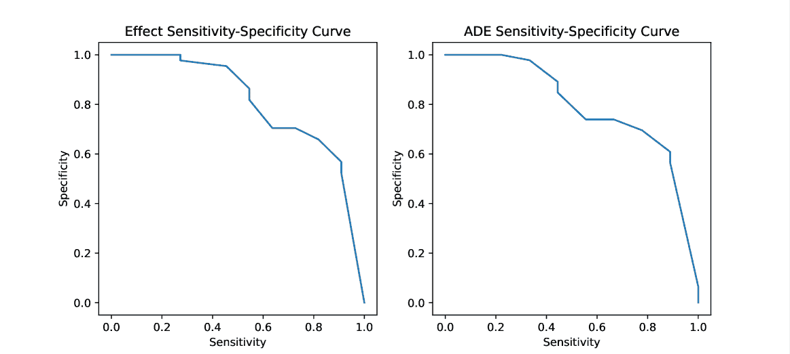

<!--yml

分类：未分类

日期：2025-01-11 12:21:08

-->

# MALADE：基于大语言模型（LLM）驱动的药物警戒系统的代理协同与检索增强生成

> 来源：[https://arxiv.org/html/2408.01869/](https://arxiv.org/html/2408.01869/)

Jihye Choi ¹，Nils Palumbo¹¹脚注标记：1 ¹，Prasad Chalasani²，Matthew M. Engelhard³，

Somesh Jha^(1,2)，Anivarya Kumar³，David Page³

¹威斯康星大学麦迪逊分校，²Langroid，³杜克大学平等贡献，按姓氏字母顺序列出

###### 摘要

在大语言模型（LLMs）时代，鉴于它们出色的文本理解和生成能力，开发基于LLM的可信医疗知识合成、提取和总结的新方法成为前所未有的机会。本文聚焦于药物警戒（PhV）问题，挑战在于从各种文本源（如医学文献、临床记录和药物标签）中识别不良药物事件（ADE）。不幸的是，这项任务受到药物和结果术语差异、ADE描述常常被埋藏在大量叙述性文本中的因素的阻碍。我们提出了MALADE，这是第一个有效的多代理协作系统，利用LLM与检索增强生成技术，从药物标签数据中提取ADE。该技术通过从文本资源中提取相关信息，增强查询到LLM，并指示LLM根据增强的数据编写一致的响应。MALADE是一个通用的LLM独立架构，其独特的能力包括：（1）利用各种外部资源，如医学文献、药物标签和FDA工具（如OpenFDA药物信息API），（2）提取药物-结果关联并以结构化格式呈现及其关联强度，（3）提供已建立关联的解释。通过GPT-4 Turbo或GPT-4o实例化，并利用FDA药物标签数据，MALADE在与OMOP真实数据表的ADE比较中，ROC曲线下的面积为0.90，证明了其有效性。我们的实现利用了[Langroid](https://github.com/langroid/langroid)多代理LLM框架，相关代码可在[https://github.com/jihyechoi77/malade](https://github.com/jihyechoi77/malade)找到。

## 1 引言

图1：我们提出的多代理协同系统MALADE的真实世界演示。处理用户查询“ACE抑制剂是否与血管性水肿相关？”涉及三个代理的任务序列：DrugFinder、DrugAgent、CategoryAgent（每个代理都实例化为GPT-4 Turbo或GPT-4o）。每个代理生成一个响应和理由，并由相应的批评代理进行验证，批评代理的反馈被用来帮助代理修正其响应。

药物警戒（PhV）是识别和预防药物引发的不良事件（ADEs）的科学，这些事件通常发生在药品投放市场后。药物警戒对制药行业和公共卫生都具有巨大的重要性，因为它旨在通过发现新的安全问题并在必要时进行干预来保护患者的福祉。药物警戒中的一个核心问题是ADE提取：给定一个药物类别$C$和一个不良事件$E$，确定$C$与$E$之间是否（以及多强烈）存在关联。这项任务需要分析来自各种来源的大量文本数据，例如患者病历、临床记录、社交媒体、自发报告系统、药品标签、医学文献和临床试验报告。除了这些来源所提供的海量文本外，ADE提取还受到药物和结果名称的变化性，以及ADE描述通常隐藏在大量叙述性文本中的复杂性[[14](https://arxiv.org/html/2408.01869v1#bib.bib14)]。

传统上，已经使用了各种经典的自然语言处理（NLP）和深度学习技术来解决这个问题[[22](https://arxiv.org/html/2408.01869v1#bib.bib22), [21](https://arxiv.org/html/2408.01869v1#bib.bib21), [35](https://arxiv.org/html/2408.01869v1#bib.bib35), [2](https://arxiv.org/html/2408.01869v1#bib.bib2)]。与经典的NLP方法相比，今天最先进的大型语言模型（LLMs）（甚至较弱的开源/本地LLMs[[36](https://arxiv.org/html/2408.01869v1#bib.bib36), [11](https://arxiv.org/html/2408.01869v1#bib.bib11)]）在文本理解和生成能力方面展现了显著的进步，借助这些模型，不仅可以改善现有的ADE提取方法，还可以考虑以前无法使用的数据来源。最近将LLMs应用于ADE提取的尝试仅依赖于现成的ChatGPT[[38](https://arxiv.org/html/2408.01869v1#bib.bib38)]，但其表现有限且提取的推理理由不一致[[32](https://arxiv.org/html/2408.01869v1#bib.bib32)]。这些局限性主要来源于两个因素：（a）准确的ADE提取需要访问特定的数据源，而LLMs在预训练过程中可能并未“见过”这些数据，因此依赖LLM的“内置”知识会导致不准确的结果；（b）LLMs作为概率性下一词预测器，在任务未被仔细拆解为更简单的子任务，或缺乏验证和修正机制的情况下，可能会生成不正确或不可靠的结果。

在本文中，我们介绍了MALADE ¹¹（发音类似于法语单词“malade”，意为“生病的”或“有病的”）（由LLM驱动的多代理用于ADE提取），这是第一个有效的多代理检索增强生成（RAG）系统用于ADE提取。我们的方法利用了两项关键技术，分别解决了上述两项限制：（a）RAG，通过将相关文本数据的部分内容增强输入查询，使LLM具备最新知识，并促使LLM生成与增强信息一致的回答[[15](https://arxiv.org/html/2408.01869v1#bib.bib15)]；（b）多个基于LLM的代理的战略性协调，每个代理负责总体ADE提取任务中的一个相对较小的子任务[[41](https://arxiv.org/html/2408.01869v1#bib.bib41)]。具体来说，我们的系统具有以下子任务的代理（见图[1](https://arxiv.org/html/2408.01869v1#S1.F1 "图1 ‣ 1 引言 ‣ MALADE：基于检索增强生成的LLM驱动代理的协调，用于药物安全性监测")）：（1）从医学数据库（例如MIMIC-IV）中识别每个药物类别的代表性药物，（2）从外部文本知识库（例如FDA药品标签数据库）收集这些药物的副作用信息，最后，（3）编写总结药物类别对不良事件影响的最终答案。每个代理被分配一个特定的子任务，并与其他代理协作完成ADE识别的最终目标。此外，我们通过将每个代理与一个评论代理配对，进一步提高了多代理系统的可靠性，评论代理的角色是验证其对应代理的行为和响应。

本系统虽然在这里专门应用于ADE提取，但展示了如何使用多代理方法生成可信的、基于证据的总结和置信度评分，以应对需要综合多个临床知识和数据源的医学问题。因此，MALADE可以被视为一个案例研究，展示了一种方法，未来可以应用于药物安全性（PhV）中的其他问题，包括药物间相互作用的识别，以及PhV以外的临床问题，例如识别临床记录中记录的某种疾病已知症状。

总结来说，我们的论文做出了以下贡献。

##### 精确评估。

与那些仅生成二元标签以指示某药物类别 $C$ 是否与不良事件 $E$ 相关的简单系统不同，我们的方法生成了不同的得分，包括一个置信度得分，表明大型语言模型（LLM）对其标签分配的信心。这些得分允许对已建立的观察性医学结局合作（OMOP）药物类别相关的不良药物事件（ADEs）真相表进行严格的定量评估[[19](https://arxiv.org/html/2408.01869v1#bib.bib19)]。我们在GPT-4 Turbo上取得了约0.85的ROC曲线下的面积（AUC），在GPT-4o上则为0.90（章节[5](https://arxiv.org/html/2408.01869v1#S5 "5 实验 ‣ MALADE：基于LLM的药物警戒系统的增强生成与检索的协同作用")）。据我们所知，这是基准中最佳的表现，尽管直接比较可能有限²²2因为没有任何原始临床数据分析达到如此高的准确率，后续研究指出大约这个水平是基于任何来源的OMOP任务所能达到的最佳水平。2016年，Gruber等人[[6](https://arxiv.org/html/2408.01869v1#bib.bib6)]认为，OMOP 2010年真相本身可能存在可重复的错误，这可能会限制AUC的上限，而Hauben等人[[7](https://arxiv.org/html/2408.01869v1#bib.bib7)]则更具体地指出，在负标签的药物事件对中，真相中的错误应该估计为17%。不同文献证据的强度可能存在争议，但如果他们的估计是完全正确的，它可能会将AUC的上限限制在0.83。

##### 基于事实生成的响应和论证。

MALADE的设计提供了高风险应用（如ADE识别）所需的关键功能：(1) 一种结构化的药物-结果关联格式，包括指示关联强度和不良事件稀有性的分数；这对于确保提取的关联能够经过稳健的后续处理至关重要。(2) 提取的药物-结果关联的理由，使得人类专家能够理解和验证这些关联。这得益于MALADE架构中的RAG组件，它可以利用各种外部资源，如医学文献、药品标签、FDA工具（例如OpenFDA药物信息API）、以及常见的临床数据源，如OMOP或PCORI，甚至特定的EHR系统（如有提供）。（3）可观察性，即完整的、详细的代理对话和中间步骤日志；这些对于调试和审计系统行为至关重要。请参见图[1](https://arxiv.org/html/2408.01869v1#S1.F1 "Figure 1 ‣ 1 Introduction ‣ MALADE: Orchestration of LLM-powered Agents with Retrieval Augmented Generation for Pharmacovigilance")，了解MALADE的实际应用示例。

##### 在医疗保健背景下，关于机器学习的可推广见解。

我们提出的多代理架构对LLM和数据源是无关的，基于设计原语，旨在作为多LLM代理编排的通用构建模块（见第[3](https://arxiv.org/html/2408.01869v1#S3 "3 Preliminaries on LLM-based Agents ‣ MALADE: Orchestration of LLM-powered Agents with Retrieval Augmented Generation for Pharmacovigilance")节）。因此，尽管MALADE是专门为ADE识别而设计，但我们的设计方法提供了一种可推广的蓝图，用于有效构建面向可信医疗知识合成和总结的多代理系统，具有广泛的医学应用。

## 2 相关工作

高效能的大型语言模型（LLMs）的出现引起了人们在医疗任务中应用这些模型的极大兴趣，包括诊断[[28](https://arxiv.org/html/2408.01869v1#bib.bib28)]、医疗问答[[29](https://arxiv.org/html/2408.01869v1#bib.bib29), [23](https://arxiv.org/html/2408.01869v1#bib.bib23)]，以及医学证据总结[[33](https://arxiv.org/html/2408.01869v1#bib.bib33)]。一个重要的应用领域是药物警戒学，它是识别和预防药品上市后引发的不良药物事件（ADEs）的科学。ADE提取的具体问题，即识别某个特定药物（或类别）是否与某种特定的不良事件相关，是一项具有挑战性的任务，因为药物和结果术语的变化、在大量叙述性文本中存在ADE描述，以及这些文本数据的来源差异，包括患者病历、临床笔记、药品标签、医学文献、临床试验、论坛、社交媒体等。该领域的先前研究，尤其是基于大规模研究计划的工作，如Sentinel[[25](https://arxiv.org/html/2408.01869v1#bib.bib25)]、OMOP[[27](https://arxiv.org/html/2408.01869v1#bib.bib27)]和OHDSI[[31](https://arxiv.org/html/2408.01869v1#bib.bib31)]，集中于从纯观察性数据中开发新的因果发现方法。黄等[[10](https://arxiv.org/html/2408.01869v1#bib.bib10)]研究了使用社交论坛构建ADE预测模型的方法，重点是不同数据处理技术和BERT架构的性能。von Csefalvay[[37](https://arxiv.org/html/2408.01869v1#bib.bib37)]介绍了一种新的大型语言模型DAEDRA，用于从被动药物警戒报告中检测与监管相关的结果。Sorbello等[[30](https://arxiv.org/html/2408.01869v1#bib.bib30)]使用类似GPT的LLMs来提高从电子健康记录中捕捉阿片类药物和不良事件提及的效果。最后，Sun等[[32](https://arxiv.org/html/2408.01869v1#bib.bib32)]研究了ChatGPT在从医学文本来源中提取不良事件的表现。

LLM 在 ADE 提取中的早期应用至少在以下两方面存在局限：（a）它们仅使用裸 LLM（例如 ChatGPT 或其 API），没有访问任何外部 API、工具或知识库[[38](https://arxiv.org/html/2408.01869v1#bib.bib38)]。仅使用 LLM 的“内置”知识（即其在预训练期间接触的文本）进行 ADE 提取，可能不准确且不完整，因为不良事件可能在新的研究或报告中被发现；（b）所有先前的工作仅使用单一的 LLM（即使增加了外部数据/工具），没有其他 LLM 的协作或反馈。由于 LLM 毕竟是基于概率的下一个词预测模型，因此无法保证生成的文本是准确或完整的。在这种情况下，提升 LLM 响应可靠性的唯一方法是依赖复杂的提示技术[[40](https://arxiv.org/html/2408.01869v1#bib.bib40), [45](https://arxiv.org/html/2408.01869v1#bib.bib45)]，或让人类（或 LLM [[18](https://arxiv.org/html/2408.01869v1#bib.bib18)]）参与其中，验证生成的文本并迭代优化提示，直到获得令人满意的响应。

为了应对这些局限，LLM 实践者的工具箱中出现了三种范式。第一个局限通过两种技术得到了应对：检索增强生成（RAG）和工具使用。RAG 通过从外部知识库检索相关信息（基于向量嵌入、关键词或两者的组合进行相似性匹配）来增强输入提示或查询，从而解决了 LLM 知识的局限，并指导 LLM 以与增强数据一致的方式响应原始查询，同时通过引用相关外部数据提供其响应的依据[[15](https://arxiv.org/html/2408.01869v1#bib.bib15)]。因此，RAG 方法不仅缓解了仅依赖 LLM 预训练知识的局限，还提供了证据引用能力，这对于增强 LLM 响应的可信度至关重要，特别是在医疗决策等高风险应用中。这一方法在提升 LLM 在生物医学领域的表现方面展现了前景，尤其是在文献信息检索和临床决策中[[5](https://arxiv.org/html/2408.01869v1#bib.bib5), [12](https://arxiv.org/html/2408.01869v1#bib.bib12), [39](https://arxiv.org/html/2408.01869v1#bib.bib39), [46](https://arxiv.org/html/2408.01869v1#bib.bib46)]。第二种技术是工具使用，涉及指导 LLM 生成结构化文本（通常是 JSON 格式），然后可以被下游代码轻松解析以执行各种操作，包括网页搜索、查询 API 获取信息、查询数据库和进行计算[[26](https://arxiv.org/html/2408.01869v1#bib.bib26), [16](https://arxiv.org/html/2408.01869v1#bib.bib16)]。

多智能体系统的出现解决了使用单一LLM的第二个局限性——这种方法旨在利用多个LLM的集体能力[[43](https://arxiv.org/html/2408.01869v1#bib.bib43), [9](https://arxiv.org/html/2408.01869v1#bib.bib9)]。此类系统引入了LLM驱动的智能体之间的合作学习和反馈机制，模拟人类之间的沟通、咨询和辩论过程，使其能够解决比单一智能体配合RAG更为复杂的任务。例如，在医学推理任务中，多智能体协作可以模拟医院的会诊机制[[34](https://arxiv.org/html/2408.01869v1#bib.bib34)]。我们的研究扩展了这一研究轨迹；据我们所知，我们的系统MALADE是首个有效结合RAG和工具使用的多智能体协调系统，专为药物警戒中的特定任务——即ADE提取——量身定制。在我们的方法中，基于LLM的智能体协作，利用它们的集体专长和最新的医学知识。此方法旨在改善ADE分析，为药物警戒提供更强大、更可靠的系统。

## 3 LLM驱动智能体的初步知识

尽管当今的LLM展现了令人印象深刻的能力，但它们仍然受到技术和实践局限性的制约，如脆弱性、非确定性、有限的上下文窗口、推理成本和延迟[[17](https://arxiv.org/html/2408.01869v1#bib.bib17)]，这意味着不能仅仅给LLM一个高层次的指令并指望它完成复杂任务。因此，为了最好地利用LLM作为复杂应用的组件，有必要将任务分解成更小的子任务，并管理多个LLM会话，每个会话都有自己专门定义的指令、状态和数据源。这自然引出了智能体的概念，智能体是一个由LLM驱动的实体，负责一个明确的小型子任务。在[3.1节](https://arxiv.org/html/2408.01869v1#S3.SS1 "3.1 面向智能体的编程 ‣ 3 LLM驱动智能体的初步知识 ‣ MALADE：药物警戒中的LLM驱动智能体协调与检索增强生成")中，我们介绍了面向智能体编程所需的关键抽象和组件，[3.2节](https://arxiv.org/html/2408.01869v1#S3.SS2 "3.2 多智能体协调 ‣ 3 LLM驱动智能体的初步知识 ‣ MALADE：药物警戒中的LLM驱动智能体协调与检索增强生成")描述了多智能体协调。我们的实现利用了开源的多智能体LLM框架[Langroid](https://github/langroid/langroid)[[3](https://arxiv.org/html/2408.01869v1#bib.bib3)]，该框架支持这些抽象和机制。

### 3.1 面向智能体的编程

##### 智能体，作为一个智能消息转换器。

在设计复杂的LLM驱动系统时，一个自然且方便的抽象概念是“代理”的概念，指的是被指派负责任务某一特定方面的实体。从代码角度来看，代理本质上是一个类，代表一个智能实体，能够响应消息，也就是说，代理就是一个消息转换器。代理通常封装一个（接口到）LLM，并且可能还配备所谓的工具（如下面所述）和外部文档/数据（例如，下面所描述的向量数据库）。就像一组人类团队，代理通过交换消息进行互动，这种互动方式类似于编程语言中的演员框架[[8](https://arxiv.org/html/2408.01869v1#bib.bib8)]。需要一个编排机制来管理代理之间消息的流动，以确保任务进展并最终完成，并处理代理偏离指令的不可避免情况。在本研究中，我们采用了这种多代理编程范式，其中代理是第一公民，作为消息转换器，通过交换消息进行通信。

为了构建有用的LLM应用，我们需要赋予它们触发操作（如API调用、计算、数据库查询等）和访问外部文档的能力。工具和检索增强生成（RAG）提供了这些功能，接下来会介绍。

##### 工具，也称为功能或插件。

LLM本质上是一个文本转换器；也就是说，在响应某些输入文本（称为提示）时，它会生成一个响应。当我们希望生成一个描述、答案或摘要供人类阅读，甚至是给另一个代理提出问题时，自由形式的文本响应是理想的。然而，在某些情况下，我们希望响应能够触发外部操作，例如API调用、代码执行或数据库查询。在这种情况下，我们会指示LLM生成一个结构化输出，通常是JSON格式，包含各种预定义字段，如代码、SQL查询、API调用的参数等。这些结构化响应被称为工具，当LLM生成与特定工具对应的结构化响应时，就称LLM在使用该工具。为了让LLM生成工具响应，需要对工具格式和使用条件进行指示。为了实际使用LLM生成的工具，必须定义一个工具处理方法。当LLM响应中识别到某个工具时，相应的工具处理程序会被触发。有关LLM与数据库交互的描述，请参见附录[A.1](https://arxiv.org/html/2408.01869v1#A1.SS1 "A.1 Tool Use: Example ‣ Appendix A Agent-Oriented Programming ‣ MALADE: Orchestration of LLM-powered Agents with Retrieval Augmented Generation for Pharmacovigilance")。

从将 LLM 视为文本转换器的角度出发，事实证明可以通过不同的函数签名来表达代理、工具和其他相关概念，如附录 [A.3](https://arxiv.org/html/2408.01869v1#A1.SS3 "A.3 From LLM to Agent-Oriented Programming ‣ Appendix A Agent-Oriented Programming ‣ MALADE: Orchestration of LLM-powered Agents with Retrieval Augmented Generation for Pharmacovigilance") 中的表格 [4](https://arxiv.org/html/2408.01869v1#A1.T4 "Table 4 ‣ A.3 From LLM to Agent-Oriented Programming ‣ Appendix A Agent-Oriented Programming ‣ MALADE: Orchestration of LLM-powered Agents with Retrieval Augmented Generation for Pharmacovigilance") 所示。

##### 检索增强生成（RAG）。

单独使用 LLM 存在两个主要限制：（a）响应仅限于其预训练中的知识，因此无法回答特定于私有/企业文档或其训练截止日期之后的最新信息的问题；（b）无法验证生成答案的有效性。RAG 是解决这两个限制的最流行技术，它通过使 LLM 基于特定文档或数据生成响应，并通过展示源引用来验证答案[[15](https://arxiv.org/html/2408.01869v1#bib.bib15)]。RAG 的基本思想如下：当向 LLM-智能体提出查询 $Q$ 时，从文档存储中检索与查询最“相关”的一组 $k$ 个文档（或其部分）$D=\{d_{1},d_{2},\ldots,d_{k}\}$，并将原始查询 $Q$ 与 $D$ 一起扩展为新提示，形式为：“给定以下段落：[$d_{1}$, $d_{2}$, …, $d_{k}$]，仅基于这些段落回答此问题：$Q$，并指明哪些段落支持你的答案”。有关 RAG 的更多细节，请参见附录 [A.2](https://arxiv.org/html/2408.01869v1#A1.SS2 "A.2 Retrieval Augmented Generation ‣ Appendix A Agent-Oriented Programming ‣ MALADE: Orchestration of LLM-powered Agents with Retrieval Augmented Generation for Pharmacovigilance")。

### 3.2 多智能体协调

如上所述，在构建基于 LLM 的多智能体系统时，一个协调机制对于管理智能体之间的信息流、确保任务进展以及处理偏离指令的情况至关重要。在这项工作中，我们利用了一个简单而多功能的协调机制，能够无缝处理用户交互、工具操作和子任务委派。

图 2：当任务 T 有子任务 [T1, T2] 且 T1 有子任务 T3 时，响应方法之间迭代的示例。

如图[2](https://arxiv.org/html/2408.01869v1#S3.F2 "图 2 ‣ 3.2 多代理协同 ‣ 3 基于LLM的代理初步介绍 ‣ MALADE：用于药物监测的LLM驱动代理协同与检索增强生成")所示，协同机制被封装在一个Task类中，该类包装了一个Agent，并且通过调用其`run`方法来启动任务，该方法的类型签名为string $\rightarrow$ string，这与Agent自身本地“响应”方法的类型签名相同（对应于LLM、工具处理程序和人工用户）。Task维护一个“当前待处理消息”（CPM），该消息将由Task的一个“响应者”执行，包括代理自己的响应方法以及子任务的运行方法。`run`方法执行一系列“步骤”，直到达到任务终止条件。在每个步骤中，通过迭代响应者来寻找对CPM的有效响应，并用该响应更新CPM。更多细节请参见附录[A.4](https://arxiv.org/html/2408.01869v1#A1.SS4 "A.4 多代理协同的详细描述 ‣ 附录A 代理导向编程 ‣ MALADE：用于药物监测的LLM驱动代理协同与检索增强生成")。

## 4 MALADE：提议的多代理系统用于ADE提取

本节我们描述了基于RAG的多代理架构MALADE，用于识别药物类别与结果之间的关联。我们首先在第[4.1](https://arxiv.org/html/2408.01869v1#S4.SS1 "4.1 关键子任务的目标 ‣ 4 MALADE：提议的多代理系统用于ADE提取 ‣ MALADE：用于药物监测的LLM驱动代理协同与检索增强生成")节中给出关键子任务目标的高层次概述，并在第[4.2](https://arxiv.org/html/2408.01869v1#S4.SS2 "4.2 代理与评论员的互动 ‣ 4 MALADE：提议的多代理系统用于ADE提取 ‣ MALADE：用于药物监测的LLM驱动代理协同与检索增强生成")节到第[4.5](https://arxiv.org/html/2408.01869v1#S4.SS5 "4.5 步骤3：标注药物类别-结果关联 ‣ 4 MALADE：提议的多代理系统用于ADE提取 ‣ MALADE：用于药物监测的LLM驱动代理协同与检索增强生成")节深入探讨其实现细节。有关整个流程的示意图，请参见图[1](https://arxiv.org/html/2408.01869v1#S1.F1 "图 1 ‣ 1 引言 ‣ MALADE：用于药物监测的LLM驱动代理协同与检索增强生成")。

我们强调，开发一个专门用于不良药物事件（ADE）提取的多代理 RAG 系统是一项非常复杂的任务，需要仔细处理多个问题：（a）FDA标签数据的复杂结构，这对于天真应用的RAG技术来说可能是一个挑战；（b）基于医疗数据库中不同文本描述正确分组处方药物的困难（例如，分配适当的国家药品代码）；（c）大型语言模型（LLM）的脆弱性，如偏离指令、幻觉、以及不准确或错误的回答；（d）无限循环、固定点和死锁，这些问题可能会在代理之间的交互中出现，除非得到精心管理。

### 4.1 关键子任务的目标

我们的最终目标是识别与某一药物类别相关的不良事件的风险。我们开发了我们的系统 MALADE，以能够响应以下形式的问题：

> “药物类别$C$是否增加特定（不良）健康结果$H$的风险，减少它，还是没有明显效果？证据是什么？”例如，$C$可能是“ACE抑制剂”，$H$可能是“血管性水肿”。

给定这种形式的查询，系统执行以下步骤：给定$C$和$H$，

{adjustwidth}

1厘米

1.  第一步：

    通过搜索FDA的国家药品代码（NDC）数据库，找到属于$C$的药物名称的广泛列表。在这些药物中，DrugFinder识别出代表每个类别的药物$D$；在临床数据库（例如MIMIC-IV）中最常见的前$k$个药物名称。

1.  第二步：

    对于类别$C$中的每个代表性药物$D$，DrugAgent生成关于$D$对$H$影响的自由形式（即非结构化）文本摘要。这些摘要通过参考最新的外部药学参考来源（例如FDA药物标签数据库）生成，后者指出潜在的不良结果和风险证据。

1.  第三步：

    CategoryAgent结合第二步中的药物级信息，生成结构化报告；报告包括一个标签（“增加”、“减少”或“无效”之一），指示$C$对$H$风险的潜在影响，一个关于此标签的置信度评分，风险级别的结构化描述，以及证据强度。

我们的系统通过建立$C$内每个药物与$H$之间的关联，提取$C$与$H$之间的关系，而不是直接将$C$与$H$关联。这个构建的动机是，药物标签数据的参考来源（例如我们实现中的FDA药物标签数据库）通常按单独药物而非广泛药物类别来构建；因此需要第一步。需要注意的是，将我们的系统应用于真实患者数据需要一个完整的药物清单，包括品牌名和通用名，这些药物清单可以用于将电子健康记录（EHR）数据中记录的实际处方药物映射到它们对应的类别。

每个DrugFinder、DrugAgent和CategoryAgent都与一个批评者代理配对，后者对主代理的输出提供反馈。主代理随后根据这些反馈重新生成其输出。代理-批评者互动持续进行，直到批评者批准代理的响应为止。这种设计模式显著提高了我们系统的可靠性，进一步的细节请见第[4.2](https://arxiv.org/html/2408.01869v1#S4.SS2 "4.2 代理-批评者互动 ‣ 4 MALADE：用于ADE提取的多代理系统 ‣ MALADE：基于LLM的代理与检索增强生成的药物监测协调")节。

### 4.2 代理-批评者互动

这是支撑我们系统的核心多代理互动模式，类似于强化学习中的演员/批评者方法[[13](https://arxiv.org/html/2408.01869v1#bib.bib13)]。

##### 代理。

在代理-批评者对中，代理是处理外部输入和输出的主要实体。它接收一个特定目标、关于如何完成该目标的指令，以及对工具和资源的访问。在我们的上下文中，目标通常是一种专门化的问答形式；资源可以是数据源，甚至是其他代理或多代理系统，代理可以在回答问题时引用这些资源；工具是需要触发API调用、数据库查询或计算的结构化响应。

代理的主要功能是构建一系列查询，向这些资源提问以实现其目标。代理被指示以半结构化格式编写一个包含其答案、推理步骤和答案的理由（尽可能引用来源）的半结构化消息，并向批评者寻求这些内容的反馈，如下所示。

##### 批评者。

这是另一个代理，与上面描述的代理配对。批评者的角色是验证代理的推理步骤和指令遵从性，并向代理提供反馈，已证明这种反馈可以提高LLM生成的输出质量[[18](https://arxiv.org/html/2408.01869v1#bib.bib18)]。代理根据这些反馈迭代其响应，直到批评者满意，此时代理发出完成信号并输出结果（见图[3](https://arxiv.org/html/2408.01869v1#S4.F3 "图 3 ‣ 批评者。 ‣ 4.2 代理-批评者互动 ‣ 4 MALADE：用于ADE提取的多代理系统 ‣ MALADE：基于LLM的代理与检索增强生成的药物监测协调")）。

尽管代理/评论员模式看起来简单，但这种交互非常强大，能够显著提高任务完成的可靠性。这种协同关系类似于复杂性理论中交互式证明系统中的模式；证明者（即代理）提出一个解决方案，验证者（即评论员）检查该解决方案的有效性。验证者无法单独解决问题，但能够高效地检查证明者的解决方案，这相对容易[[1](https://arxiv.org/html/2408.01869v1#bib.bib1)]。通过这种方式，即使代理的任务很复杂，评论员也能高效地验证解决方案的正确性，从而增强可靠性。

图 3：MALADE 中代理-评论员交互的真实世界演示。给定识别苯二氮䓬类药物与髋部骨折之间关联的问题，我们展示了 CategoryAgent 如何在迭代过程中纠正其答案，直到配对的评论员满意为止。有关两个代理之间的完整提示，请参见附录 [3.3](https://arxiv.org/html/2408.01869v1#A3.SS1.SSS3 "3.3 CategoryAgent 和评论员 ‣ C.1 成功行为 ‣ 附录 C MALADE 的详细行为：成功和失败行为 ‣ MALADE：使用检索增强生成的 LLM 驱动代理的协调")。代理是使用 GPT-4 Turbo 实例化的。

### 4.3 步骤 1：查找代表性药物

我们首先通过查询 FDA 的 NDC 数据库，构建一个合理完整的所有可能属于该类别的药物集合，NDC 数据库包含特定药物的记录，并标注了各种类型的药理学类别信息（包括化学类别、作用机制和已确立的药理学类别）。具体而言，我们提取所有名称或类别与相关搜索词或术语匹配的药物（例如，“抗生素”或 OMOP 考虑的任何子类别，例如红霉素）。由于该列表可能包含一些实际上不属于该类别的药物（例如，搜索“典型抗精神病药”时也会返回非典型抗精神病药），因此我们依赖额外的过滤阶段来构建最终合理准确的药物类别列表。对于此“完整”列表中的每个药物 $D$，我们通过 SQL 查询 MIMIC-IV 处方表来获取其处方率。

请注意，我们选择直接实现上述两个 SQL 查询步骤，而没有使用大型语言模型（LLM）来生成查询。这体现了我们系统中遵循的一个重要设计原则，我们称之为 LLM 最小化原则：对于可以用标准编程范式明确表达的确定性任务，直接处理它们，而不使用 LLM，以增强可靠性并减少令牌和延迟成本。

##### DrugFinder。

现在，我们已经拥有了一份合理完整的候选药物名称列表，并且这些药物属于我们关注的类别，同时也列出了它们的处方率，我们希望识别出属于该类别的三种最常见的处方药物。这个任务复杂在几个方面：同一种药物可能以不同的名称出现在列表中；有些药物对的配方和给药方式可能有所不同，但它们在本质上是相同的，必须判断这些差异是否足够大，足以被视为药理学上不同；并且其中一些药物可能实际上不属于该类别。因此，这个任务需要进行分组操作，类似于从文本描述中识别标准化药物代码的任务，众所周知这是一个具有挑战性的任务[[14](https://arxiv.org/html/2408.01869v1#bib.bib14)]。因此，这个任务很难用确定性的方式明确定义，无法涵盖所有情况（不同于上述数据库任务），因此非常适合使用大语言模型（LLM），特别是像 GPT-4 Turbo 这样已知在大量医学文本（尤其是药物相关文本）上进行了训练的模型。我们将这个任务分配给 DrugFinder，这是一个代理/批评者系统，其中批评者代理通过迭代反馈帮助改进配对代理的输出；特别是，当配对代理错误地将药物分类为药理学上不同的药物时，批评者会纠正它。

### 4.4 步骤 2：识别药物-结果关联

DrugAgent 是一个代理/批评者系统，任务是基于 FDA 药品标签数据库，识别某个给定药物是否对某个给定结果的风险有已知影响，并输出相关信息的总结，包括识别的风险级别和这种影响的证据。该代理无法直接访问 FDA 药品标签数据，但可以通过另一个代理 FDAHandler 获取这些信息。FDAHandler 配备了调用 OpenFDA API 获取药品标签数据的工具，并根据查询返回基于检索信息的答案。通过该 API 接收到的信息会被导入到向量数据库中，因此该代理首先使用工具查询该向量数据库，仅在向量数据库中没有相关信息时，才会使用 OpenFDA API 工具。

### 4.5 步骤 3：标注药物类别-结果关联

为了识别药物类别 $C$ 与不良健康结果 $H$ 之间的关联，我们同时运行一批查询³³3对于包含多个子类别的 OMOP 药物类别，我们会为每个子类别执行完整过程（为每个子类别识别代表性药物），合并分类代理的输出，并将任何子类别的最高风险作为整个类别的风险。查询将被发送到 CategoryAgent，下面将描述该过程。

CategoryAgent 是一个代理/评论系统，执行最终的分类步骤；其目标是生成一个标签，标识某一类药物是否增加或减少某种病症的风险，或没有任何影响。除了标签外，CategoryAgent 还会生成若干额外输出，这些输出都被合并成一个 JSON 结构的字符串，包括：(a) 一个置信度分数，范围在 [0,1] 之间，表示分配的标签的置信度，(c) 证据强度，分为“none”（无）、“weak”（弱）或“strong”（强），以及 (d) 效应频率，分为“none”（无）、“rare”（罕见）或“common”（常见）。从这个意义上说，DrugAgent 的功能类型如下：[string] $\rightarrow$ {‘‘increase’’（增加）,‘‘decrease’’（减少）,‘‘no-effect’’（无效）} $\times$ [0,1] $\times$ {‘‘none’’（无）, ‘‘rare’’（罕见）, ‘‘common’’（常见）}。

e’’,‘‘weak’’,‘‘strong’’} $\times$ {‘‘none’’（无）,‘‘rare’’（罕见）,‘‘common’’（常见）}。CategoryAgent 的结构化输出便于下游后处理，以生成最终评估，无需进一步的 LLM 参与（见第 [5.1](https://arxiv.org/html/2408.01869v1#S5.SS1 "5.1 评估设置 ‣ 5 实验 ‣ MALADE：基于大语言模型的多代理架构在药物警戒中的应用") 节）。

## 5 实验

本文介绍了 MALADE，这是第一个基于大语言模型（LLM）的多代理架构，能够生成与药物类别 $C$ 对不良健康结果 $H$ 风险相关的结构化报告，包括表征和分数，基于 FDA 药物标签数据。我们通过广泛使用的基准 OMOP 评估基准任务 [[19](https://arxiv.org/html/2408.01869v1#bib.bib19)]，以下简称 OMOP ADE 任务（见第 [5.1](https://arxiv.org/html/2408.01869v1#S5.SS1 "5.1 评估设置 ‣ 5 实验 ‣ MALADE：基于大语言模型的多代理架构在药物警戒中的应用") 节），来评估我们的方法，回答以下三个研究问题：

1.  RQ1:

    MALADE 如何有效识别 ADE？（见第 [5.2](https://arxiv.org/html/2408.01869v1#S5.SS2 "5.2 RQ1: MALADE 有效识别 ADE ‣ 5 实验 ‣ MALADE：基于大语言模型的多代理架构在药物警戒中的应用") 节）

1.  RQ2:

    Agent-Critic 互动，作为 MALADE 的核心设计模式，是否有效增强了系统的可靠性？（第[5.3](https://arxiv.org/html/2408.01869v1#S5.SS3 "5.3 RQ2: Agent-Critic interaction enhances reliability ‣ 5 Experiments ‣ MALADE: Orchestration of LLM-powered Agents with Retrieval Augmented Generation for Pharmacovigilance")节）

1.  RQ3：

    MALADE 的解释为系统进一步改进提供了哪些有用的见解？（第[5.4](https://arxiv.org/html/2408.01869v1#S5.SS4 "5.4 RQ3: MALADE provides justifications that are aligned with human expert reasoning, and help understand its failure modes ‣ 5 Experiments ‣ MALADE: Orchestration of LLM-powered Agents with Retrieval Augmented Generation for Pharmacovigilance")节）

### 5.1 评估设置

OMOP ADE 任务的目标是为每一对($C$, $H$)分配三种标签之一（“增加”，“减少”和“无效”），表示$C$是否增加、减少或对$H$的风险没有影响。共有10个药物类别，其中一些由单一药物组成，另外有10个健康结果（完整列表请参见表[6](https://arxiv.org/html/2408.01869v1#A2.T6 "Table 6 ‣ B.2 Probability-based scoring ‣ Appendix B Detailed Descriptions on MALADE Implementation ‣ MALADE: Orchestration of LLM-powered Agents with Retrieval Augmented Generation for Pharmacovigilance")）。值得注意的是，尽管只有三个标签是有效的输出，但并非所有的($C$, $H$)对都被认为足够确定，可以用于评估。OMOP ADE 任务的作者标记了某些对为不确定，对这些不确定的对，我们分配“无效”标签，并附有特殊限制，表示这些对不应用于评估。有关详细信息，请参见附录[B.3](https://arxiv.org/html/2408.01869v1#A2.SS3 "B.3 OMOP ADE task Details ‣ Appendix B Detailed Descriptions on MALADE Implementation ‣ MALADE: Orchestration of LLM-powered Agents with Retrieval Augmented Generation for Pharmacovigilance")。

图 4：OMOP ADE 任务的真实标签（左）与 MALADE 的预测（右）。红色、绿色和白色单元格分别代表“增加”、“减少”和“无效”标签。

##### 指标。

对于定量评估，我们将任务转化为二分类问题，分析重点有两个不同方向：（1）分类效果与无效果，其中标签“增加”和“减少”被视为正类，而“无效果”是负类（即基于效果的分类）；（2）分类ADE与非ADE，其中仅将“增加”视为正类，其他两个标签为负类（即基于ADE的分类）。对于这两种选择，我们报告AUC和F1分数，它们是二分类常用的评估指标[[19](https://arxiv.org/html/2408.01869v1#bib.bib19), [2](https://arxiv.org/html/2408.01869v1#bib.bib2)]。对应于上述两种二分类方法，分别得出“基于效果的AUC, F1”和“基于ADE的AUC, F1”。AUC指标衡量MALADE产生的分数在分类上区分不同类别的能力，而F1分数则评估在分类正负实例时分配标签的准确性。

### 5.2 RQ1：MALADE有效识别ADE

在MALADE的评估中，我们考虑了两种LLM，GPT-4 Turbo和GPT-4o。对于GPT-4o，我们将来自评论者的反馈轮数限制为5轮，之后需要接受。图[4](https://arxiv.org/html/2408.01869v1#S5.F4 "图 4 ‣ 5.1 评估设置 ‣ 5 实验 ‣ MALADE：基于检索增强生成的LLM驱动代理协调用于药物监测")比较了OMOP ADE任务的真实标签与MALADE（使用GPT-4 Turbo）识别的ADE标签。考虑到某些（药物类别，结果）对标签中固有的不确定性[[19](https://arxiv.org/html/2408.01869v1#bib.bib19)]，这些结果表明任务表现强劲。有关GPT-4o的结果，请参见附录[B](https://arxiv.org/html/2408.01869v1#A2 "附录 B MALADE实现的详细描述 ‣ MALADE：基于检索增强生成的LLM驱动代理协调用于药物监测")中的图[10](https://arxiv.org/html/2408.01869v1#A2.F10 "图 10 ‣ B.4 使用GPT-4 Turbo的标签后处理效果 ‣ 附录B MALADE实现的详细描述 ‣ MALADE：基于检索增强生成的LLM驱动代理协调用于药物监测")。我们还在图[5](https://arxiv.org/html/2408.01869v1#S5.F5 "图 5 ‣ 5.2 RQ1：MALADE有效识别ADE ‣ 5 实验 ‣ MALADE：基于检索增强生成的LLM驱动代理协调用于药物监测")中展示了MALADE标签的混淆矩阵。

此外，我们报告了MALADE在AUC和F1指标上的表现（见表[1](https://arxiv.org/html/2408.01869v1#S5.T1 "Table 1 ‣ 5.2 RQ1: MALADE effectively identifies ADEs ‣ 5 Experiments ‣ MALADE: Orchestration of LLM-powered Agents with Retrieval Augmented Generation for Pharmacovigilance")）。回顾一下，CategoryAgent输出一个置信度分数，范围从0到1，用于其预测的标签，即“增加”，“无效”或“减少”。这个分数反映了代理对预测结果准确性的确定性。在表[1](https://arxiv.org/html/2408.01869v1#S5.T1 "Table 1 ‣ 5.2 RQ1: MALADE effectively identifies ADEs ‣ 5 Experiments ‣ MALADE: Orchestration of LLM-powered Agents with Retrieval Augmented Generation for Pharmacovigilance")中的定量评估中，我们将这些三元标签-置信度分数转换为二元分类概率，适用于基于效果或不良药物事件（ADE）分析。将三类标签转换为二元格式需要一个明确的方法，将每个置信度分数与相应二元分类任务的概率值关联起来。

这三个标签表现出自然的进展：“减少”，“无效”和“增加”表示药物类别与感兴趣的不良结果相关联的可能性逐渐上升，意味着ADE分类中正类的概率分数上升。此外，“无效”或“减少”的置信度增加与ADE分数的下降相关，而“增加”标签的置信度增加与ADE分数的上升相关。这些观察指导我们制定了一个直观的转换方法，将标签-置信度分数转换为ADE概率分数；分别取$(1-c_{\text{de}})/3,(2-c_{\text{no}})/3,$和$(2+c_{\text{in}})/3$，其中$c_{\text{de}}$，$c_{\text{no}}$和$c_{\text{in}}$分别是当分配标签为“减少”，“无效”和“增加”时LLM输出的置信度分数。此转换保持了类别的语义顺序，以及每个类别中的置信度值的方向性。举例来说，“减少”或“无效”置信度的增加表明LLM对$C$是否引起$H$的信心减弱。我们类似地推导出效果分数，除了“增加”和“减少”现在是正类；分别取$(1+c_{\text{in/de}})/2$和$(1-c_{\text{no}})/2$。

表 [1](https://arxiv.org/html/2408.01869v1#S5.T1 "表 1 ‣ 5.2 RQ1: MALADE 有效识别 ADE ‣ 5 实验 ‣ MALADE：使用检索增强生成技术的 LLM 驱动代理在药物监测中的协同工作") 中的结果表明，模型输出的置信度得分已经很好地进行了校准。我们观察到，MALADE 在区分 ADE 和非 ADE 以及识别效应的存在/缺失方面都表现良好。我们在附录 [B](https://arxiv.org/html/2408.01869v1#A2 "附录 B MALADE 实施的详细描述 ‣ MALADE：使用检索增强生成技术的 LLM 驱动代理在药物监测中的协同工作") 的图 [11](https://arxiv.org/html/2408.01869v1#A2.F11 "图 11 ‣ B.4 使用 GPT-4 Turbo 的标签后处理效果 ‣ 附录 B MALADE 实施的详细描述 ‣ MALADE：使用检索增强生成技术的 LLM 驱动代理在药物监测中的协同工作") 和图 [12](https://arxiv.org/html/2408.01869v1#A2.F12 "图 12 ‣ B.4 使用 GPT-4 Turbo 的标签后处理效果 ‣ 附录 B MALADE 实施的详细描述 ‣ MALADE：使用检索增强生成技术的 LLM 驱动代理在药物监测中的协同工作") 中包括了 ROC 曲线和敏感度与特异性曲线。我们还进行了额外评分函数的实验，特别是模型对 $C$ 会导致或防止 $H$ 的概率估计；详见附录 [B.1](https://arxiv.org/html/2408.01869v1#A2.SS1.SSS0.Px3 "步骤 3：标注每个药物类别与每个结果之间的关联。 ‣ B.1 提示给每个代理 ‣ 附录 B MALADE 实施的详细描述 ‣ MALADE：使用检索增强生成技术的 LLM 驱动代理在药物监测中的协同工作")。

((a))

((b))

图 5：MALADE 的混淆矩阵。

模型度量 基于效应的 ADE-based GPT-4o AUC（带置信度） 0.883 0.903 GPT-4o F1 分数 0.600 0.560 GPT-4 Turbo AUC（带置信度） 0.831 0.851 GPT-4 Turbo F1 分数 ^†^†脚注标记: 0.609 0.556

表 1：MALADE 的定量评估。 “基于效应的”表示分类出任何 ADE 的存在与否，而 “基于 ADE 的”代表 MALADE 区分具有增加风险的药物与没有效应或减少风险的药物的能力。

⁴⁴脚注：我们观察到，GPT-4 Turbo往往在证据较弱的情况下也会较为自信地赋予“增加”的标签。为了进一步提高分配标签的可靠性，我们增加了一个后处理步骤；将不可靠的预测替换为“无效”。有关标签后处理的详细讨论，请参见附录[B.4](https://arxiv.org/html/2408.01869v1#A2.SS4 "B.4 Effectiveness of Label Postprocessing with GPT-4 Turbo ‣ Appendix B Detailed Descriptions on MALADE Implementation ‣ MALADE: Orchestration of LLM-powered Agents with Retrieval Augmented Generation for Pharmacovigilance")。

### 5.3 RQ2：Agent-Critic交互增强可靠性

Critics RAG 置信度 AUC F1 分数 ADE Effect ADE Effect ✓ ✓ 0.851 0.831 0.556 0.609 $\times$ ✓ 0.825 0.819 0.556 0.609 ✓ $\times$ 0.924 0.929 0.526 0.609 $\times$ $\times$ 0.920 0.926 0.556 0.636

表2：MALADE的消融实验结果。

药物纠正代理 DrugAgent 4.24 % 类别代理 CategoryAgent 44.52 %

表3：Critic纠正的代理响应的百分比。

我们分析MALADE中Agent-Critic模式有效性的主要工具是通过消融实验；特别是，我们评估了MALADE的不同版本，分别有和没有来自DrugAgent和CategoryAgent的Critic组件的反馈，以及有和没有FDAHandler的RAG。结果见表[3](https://arxiv.org/html/2408.01869v1#S5.T3 "Table 3 ‣ 5.3 RQ2: Agent-Critic interaction enhances reliability ‣ 5 Experiments ‣ MALADE: Orchestration of LLM-powered Agents with Retrieval Augmented Generation for Pharmacovigilance")。

我们观察到，无论是否使用RAG，Critic都能提高置信度分数的质量，增加基于ADE和Effect的AUC值。我们还观察到，在没有RAG的情况下，系统表现强劲（此时Critic略微提高了AUC，但F1分数有所下降），这表明GPT-4的内部医学知识通常足以处理OMOP ADE任务。然而，为了确保MALADE是未来药物监测系统的一个现实原型，我们只考虑具有RAG的MALADE实例进行主要分析；没有RAG的LLM系统容易产生幻觉，并且受限于静态信息池，无法访问最新信息。这些系统缺乏生成引用的能力，而引用对于这些系统的信任，特别是在医学领域，是至关重要的。集成RAG使系统能够访问并利用最新的信息（例如，FDA标签数据），确保系统的响应基于当前的可用知识。有关消融结果和讨论的更多细节，请参见附录[D](https://arxiv.org/html/2408.01869v1#A4 "Appendix D Ablations ‣ MALADE: Orchestration of LLM-powered Agents with Retrieval Augmented Generation for Pharmacovigilance")。

我们继续通过分析评论员干预的频率，以纠正代理人回答中的错误，来调查代理人-评论员互动的有效性。我们将评论员进行的修正视为代理人与评论员进行多轮互动的例子。结果显示在表[3](https://arxiv.org/html/2408.01869v1#S5.T3 "Table 3 ‣ 5.3 RQ2: Agent-Critic interaction enhances reliability ‣ 5 Experiments ‣ MALADE: Orchestration of LLM-powered Agents with Retrieval Augmented Generation for Pharmacovigilance")中。

我们发现评论员发现缺陷的频率在不同代理人之间存在显著差异。特别是CategoryAgent经常发生错误，需要评论员的帮助，并通常由于其医学推理中的缺陷而被修正，因此评论员可以直接防止错误的回答。在MALADE的实际运行示例中（图[3](https://arxiv.org/html/2408.01869v1#S4.F3 "Figure 3 ‣ Critic. ‣ 4.2 Agent-Critic Interaction ‣ 4 MALADE: Proposed Multi-Agent System for ADE Extraction ‣ MALADE: Orchestration of LLM-powered Agents with Retrieval Augmented Generation for Pharmacovigilance")），当被问及苯二氮平类药物对髋部骨折的影响时，CategoryAgent首先回答“没有影响”，这被标记为错误，因为苯二氮平类药物的镇静和肌肉松弛作用会增加跌倒的风险，从而导致髋部骨折，并且DrugAgent已经注意到创伤性骨折被列为药物标签中的不良反应。这一反馈被转发给CategoryAgent，并用来修正其回答为“增加”。我们发现DrugAgent通常会提供可靠的回答；然而需要注意的是，它偶尔没有调用评论员，因此代理人未能验证其答案。我们观察到，当FDA药物标签中没有与该病情相关的信息时，代理人会得出不需要验证的结论。

### 5.4 RQ3: MALADE 提供了与人类专家推理一致的理由，并帮助理解其失败模式。

我们从MALADE的完整运行中提取CategoryAgent为OMOP ADE任务提供的理由，供临床医生审查。我们观察到，在大多数情况下，代理人展示了有效的医学推理，特别是$85\%$的理由与临床医生的推理一致。

更重要的是，审视提供的理由有助于我们理解失败的常见模式，并为系统的进一步改进提供指导。例如，CategoryAgent 有时会根据薄弱的证据将“增加”分配给药物类别，过高估计了其强度。它也可能忽视未在药物标签数据中明确提到的风险，特别是当 DrugAgent 未能提供足够的上下文时。此外，CategoryAgent 可能未能识别与某种病症相关的药物标签数据中未明确指定的潜在治疗效果。我们观察到，它未能识别三环类抗抑郁药的抗组胺特性。在一个案例中，针对阿仑膦酸盐引起的胃和十二指肠溃疡的证据导致 CategoryAgent 排除有关食管溃疡的结果。

尽管 MALADE 在一般情况下表现出正确的医学推理，因此在 ADE 识别上取得了强大且可靠的表现，我们强调，理解其失败对于进一步改进至关重要，正如在第 [6](https://arxiv.org/html/2408.01869v1#S6 "6 Discussion ‣ MALADE: Orchestration of LLM-powered Agents with Retrieval Augmented Generation for Pharmacovigilance") 节中所讨论的那样。显示 MALADE 正确和不正确行为的日志摘录见附录 [C](https://arxiv.org/html/2408.01869v1#A3 "Appendix C Detailed behavior of MALADE: Successful and Failed Behavior ‣ MALADE: Orchestration of LLM-powered Agents with Retrieval Augmented Generation for Pharmacovigilance")。关于 DrugFinder 所生成的理由的讨论请参见附录 [B.5](https://arxiv.org/html/2408.01869v1#A2.SS5 "B.5 Discussion of Justifications Produced by DrugFinder ‣ Appendix B Detailed Descriptions on MALADE Implementation ‣ MALADE: Orchestration of LLM-powered Agents with Retrieval Augmented Generation for Pharmacovigilance")。

## 6 讨论

##### 关于协作型 LLM 驱动的代理在医疗健康领域的可推广见解。

我们已经观察到 MALADE 在 ADE 提取方面的强大表现，表明多代理系统在更广泛的药物安全监测（PhV）应用中的潜力。重要的是，指导我们系统设计的原则，包括 1) 代理-批评者互动，2) 将复杂任务分解为子任务，以及 3) LLM 最小化，都是相当普遍的。这些原则超越了药物安全监测，可以应用于临床医学中的许多其他问题，这些问题需要基于多个竞争且可能冲突的知识或数据来源，给出可信的自动化响应。因此，MALADE 不仅可以视为一个用于 ADE 提取的系统，也可以作为开发其他多代理系统的路线图，这些系统能针对此类问题生成准确的、基于证据的回答。

##### 一般原则 1) 代理-批评者互动。

如第[4](https://arxiv.org/html/2408.01869v1#S4 "4 MALADE: 提议的多智能体系统用于ADE提取 ‣ MALADE：利用检索增强生成的LLM驱动智能体编排用于药物警戒")节所讨论的，代理/批评者模式对于我们系统的设计至关重要，是提高基于LLM系统准确性的强大工具。实际上，我们已经观察到多个实例，其中批评者纠正了父代理的初始响应，正如第[4.2](https://arxiv.org/html/2408.01869v1#S4.SS2 "4.2 代理-批评者互动 ‣ 4 MALADE: 提议的多智能体系统用于ADE提取 ‣ MALADE：利用检索增强生成的LLM驱动智能体编排用于药物警戒")节中提到的例子。然而，我们应该注意到，如果配置不当，批评者可能会对系统的性能造成危害，包括效率（由于代理和批评者之间的反复交互会显著增加代币成本和运行时间）和可靠性。由于批评者严格执行提供的指导方针，错误的指导方针会显著影响性能；在某些情况下，过于严格的要求可能导致无限循环，因为代理和批评者会陷入死锁，无法满足彼此的要求。我们在MALADE的早期版本中观察到这种效果；解决无限循环问题需要特定的指令列出可接受的行为。例如，DrugAgent的批评者需要明确告诉它接受药物效应由于缺乏FDA标签信息而不确定的说法；如果没有这个指令，某些药物-结果组合会发生无限循环。

##### 一般原则 2) 复杂任务的分解。

分解原则，类似于通用软件开发中的类似原则，是将Unix哲学应用于多智能体系统。各个智能体应该是最小化的，即它们应该“做一件事并做到最好”。这一分解原则在MALADE的设计中体现得尤为明显（即，DrugFinder、DrugAgent和CategoryAgent负责第[4.3](https://arxiv.org/html/2408.01869v1#S4.SS3 "4.3 第1步：查找代表性药物 ‣ 4 MALADE: 提议的多智能体系统用于ADE提取 ‣ MALADE：利用检索增强生成的LLM驱动智能体编排用于药物警戒")节 - [4.5](https://arxiv.org/html/2408.01869v1#S4.SS5 "4.5 第3步：标注药物类别-结果关联 ‣ 4 MALADE: 提议的多智能体系统用于ADE提取 ‣ MALADE：利用检索增强生成的LLM驱动智能体编排用于药物警戒")节中的每个子任务）。除了促进模块化和可维护性外，分解还促进了可靠性，尤其是当与另一个关键设计原则“仅在必要时使用LLM”结合时。

##### 一般原则 3) 仅在必要时使用LLM。

由于LLM具有惊人的能力，人们可能会倾向于采取“LLM至上”的方式，让LLM负责任务的所有方面。不幸的是，这种做法既昂贵又不可靠，因为使用专有的LLM（例如GPT-4）通过付费API会产生显著的“令牌成本”和“时间成本”（由于API调用的响应延迟）。相反，我们小心地识别了任务中确定性的、定义明确的算法部分，并在标准代码中执行这些部分。我们只在需要语言理解、推理和文本生成的特定任务中依赖LLM驱动的智能体。这个原则指导了MALADE中的关键选择：例如，为了检索某个类别中药物的处方频率，我们没有让LLM生成所需的SQL查询语句来查询MIMIC-IV数据库，而是观察到这些查询只是药物列表的简单函数，并直接用标准代码生成查询。同样的选择也适用于FDA API查询以检索药物标签。

这种“仅在必要时使用LLM”原则也展示了工具使用（也称为函数调用）的关键作用：除了提供LLM执行外部操作和检索外部数据的能力外，它还允许将复杂代码的执行从LLM中卸载，从而显著降低成本并提高可靠性。从这个意义上看，多智能体编排系统可以被视为LLM的控制流。

##### 局限性与未来工作。

MALADE的一个关键局限性是我们完全依赖文本的FDA标签数据。特别是，如果信息没有在标签数据中明确包含，MALADE就无法可靠地识别数据中提到的任何关联强度。正如在第[5.4](https://arxiv.org/html/2408.01869v1#S5.SS4 "5.4 RQ3: MALADE provides justifications that are aligned with human expert reasoning, and help understand its failure modes ‣ 5 Experiments ‣ MALADE: Orchestration of LLM-powered Agents with Retrieval Augmented Generation for Pharmacovigilance")节中讨论的，这导致了几个错误的预测。为了解决这个问题，我们设想从电子健康记录（EHR）数据中提取不良药物事件（ADEs）是未来工作的一个有前景的方向。作为第一步，这将使得可以估算在标签数据中没有进一步细节说明的某些不良事件的稀有性；原则上，具有访问EHR数据的多智能体系统可能能够直接识别ADEs。这将要求大语言模型（LLM）从历史数据中进行因果发现（回答“这类事件是由药物引起的吗？”）。

未来工作的另一个有趣方向是与本地开源LLM进行详细评估，例如LlaMA [[36](https://arxiv.org/html/2408.01869v1#bib.bib36)]、Grok [[42](https://arxiv.org/html/2408.01869v1#bib.bib42)] 和 Mistral [[11](https://arxiv.org/html/2408.01869v1#bib.bib11)]，这些相较于专有的LLM（例如GPT-4、Claude及其变种）背后的付费API，具有隐私性和成本优势。不幸的是，我们与本地LLM的初步实验展示了许多失败模式，原因是偏离了指令和工具使用不当。原则上，通过进一步将任务分解为更简单的子任务，并结合更复杂的多代理验证和纠正机制，这些问题是有可能得到解决的。

除了这些广泛的局限性和未来工作的方向外，仍然有一些具体的改进是可能的。我们的系统在初步步骤中需要一些最小的人类输入，特别是药物类别的名称必须按照FDA数据库预期的格式输入；具体来说，缩写需要展开，复数形式和标点符号需要去除。这个任务很可能适合LLM来处理，它们能够识别缩写，并尝试进行额外的转换以产生更稳健的输出（例如，识别某一药理学类别的所有同义词；每次搜索中识别到的药物的并集将会转发到DrugFinder）。此外，增加结构化输入和输出的使用也是一种潜在的改进；例如，通过使用强制要求包含某些信息的指令，可能会增强DrugAgent的可靠性，诸如信息的可靠性和风险等内容。

## 7 结论

我们考虑从FDA药品标签中提取ADE（不良药物反应）的任务，这是药物监测（PhV）中的一个关键任务，并提出了一个基于MALADE的解决方案，MALADE通过多个具备检索增强生成（RAG）功能的大型语言模型（LLM）驱动的代理之间的协作来实现。我们的系统远远超越了简单的技术，这些技术仅仅生成药物类别与ADE之间是否关联的二元标签：它生成包含标签生成理由的结构化报告，并且提供表示发生概率、置信度、证据强度以及药物类别与ADE之间关联稀有度的评分。这些评分允许对系统性能进行严格的定量评估，并与广泛使用的OMOP ADE标准表进行对比，结果令人印象深刻。我们引入了代理/批评者模式，这是一种强大且通用的设计模式，适用于可靠的多代理系统。我们希望我们的多代理架构和指导原则能够启发未来在药物监测以及更广泛的医学任务中使用多代理方法的工作。

## 参考文献

+   [1] László Babai. 用随机性代替群论. 见《第十七届ACM计算理论年会论文集》，页码421-429，1985年。

+   [2] Samuel Bayer、Cheryl Clark、Oanh Dang、John Aberdeen、Sonja Brajovic、Kimberley Swank、Lynette Hirschman 和 Robert Ball. ADE评估：用于药物标签中的不良事件提取的文本处理系统评估，旨在药物监测。 《药物安全》，44：83–94，2021年。

+   [3] Prasad Chalasani、Nils Palumbo、Mohannad Alhanahnah、Somesh Jha. Langroid：用于LLM应用的多智能体框架。 [https://github.com/langroid/langroid](https://github.com/langroid/langroid)，2023年。

+   [4] Jeff Devlin、Ming-Wei Chang、Kenton Lee 和 Kristina Toutanova. BERT：用于语言理解的深度双向变换器预训练。发表于2019年北美计算语言学协会会议：人类语言技术会议论文集，2019年。

+   [5] Giacomo Frisoni、Miki Mizutani、Gianluca Moro 和 Lorenzo Valgimigli. Bioreader：一种用于生物医学文献的检索增强型文本到文本变换器。发表于2022年自然语言处理经验方法会议论文集，第5770–5793页，2022年。

+   [6] Susan Gruber、Aloka Chakravarty、Susan R Heckbert、Mark Levenson、David Martin、Jennifer C Nelson、Bruce M Psaty、Simone Pinheiro、Christian G Reich、Sengwee Toh 等. 安全监测评估的设计和分析选择需要根据假设的药物-结果关联的具体情况进行调整。 《药物流行病学与药物安全》，25(9)：973–981，2016年。

+   [7] Manfred Hauben、Jeffrey K Aronson 和 Robin E Ferner. 观察医学结果合作伙伴关系(OMOP)所定义的“负控制”标准中药物-事件关联的错误分类证据。《药物安全》，39：421–432，2016年。

+   [8] Carl Hewitt. Actor模型。arXiv:1008.1459 [cs.PL]，2010年8月。arXiv: 1008.1459。

+   [9] 宏思睿、祝名晨、陈Jonathan、郑霞武、程宇恒、王金琳、张策尧、王子力、Steven Ka Shing Yau、林子娟、周立阳、冉晨宇、肖玲峰、吴承琳，Jürgen Schmidhuber. MetaGPT：多智能体协作框架的元编程。发表于2024年第十二届学习表征国际会议。

+   [10] 黄志远、李伟波、李景德. 从社交媒体帖子预测不良药物反应：数据平衡、特征选择和深度学习。《医疗保健》，10(4)，2022年。

+   [11] Albert Q Jiang、Alexandre Sablayrolles、Arthur Mensch、Chris Bamford、Devendra Singh Chaplot、Diego de las Casas、Florian Bressand、Gianna Lengyel、Guillaume Lample、Lucile Saulnier 等. Mistral 7B. arXiv预印本arXiv:2310.06825，2023年。

+   [12] 金乔、Robert Leaman、陆志勇. 检索、总结与验证：ChatGPT如何影响医学文献中的信息检索？《美国肾脏学会杂志》，34(8)：1302–1304，2023年。

+   [13] Vijay Konda 和 John Tsitsiklis. Actor-critic算法。《神经信息处理系统进展》，12，1999年。

+   [14] Huyen Le, Ru Chen, Stephen Harris, Hong Fang, Beverly Lyn-Cook, Huixiao Hong, Weigong Ge, Paul Rogers, Weida Tong, 和 Wen Zou. Rxnorm 用于药品名称标准化：以 FDA 不良事件报告系统中的处方阿片类药物为例. 《生物信息学前沿》, 3, 2024.

+   [15] Patrick Lewis, Ethan Perez, Aleksandra Piktus, Fabio Petroni, Vladimir Karpukhin, Naman Goyal, Heinrich Küttler, Mike Lewis, Wen-tau Yih, Tim Rocktäschel 等人. 用于知识密集型 NLP 任务的检索增强生成. 《神经信息处理系统进展》, 33:9459–9474, 2020.

+   [16] Minghao Li, Yingxiu Zhao, Bowen Yu, Feifan Song, Hangyu Li, Haiyang Yu, Zhoujun Li, Fei Huang, 和 Yongbin Li. API-bank：一个全面的工具增强型 LLM 基准. 在 Houda Bouamor, Juan Pino 和 Kalika Bali 编辑的《2023年自然语言处理经验方法会议论文集》, 第3102–3116页, 新加坡, 2023年12月. 计算语言学会.

+   [17] Percy Liang, Rishi Bommasani, Tony Lee, Dimitris Tsipras, Dilara Soylu, Michihiro Yasunaga, Yian Zhang, Deepak Narayanan, Yuhuai Wu, Ananya Kumar 等人. 语言模型的全面评估. 《机器学习研究杂志》, 2023. 特色认证，专家认证。

+   [18] Aman Madaan, Niket Tandon, Prakhar Gupta, Skyler Hallinan, Luyu Gao, Sarah Wiegreffe, Uri Alon, Nouha Dziri, Shrimai Prabhumoye, Yiming Yang, Shashank Gupta, Bodhisattwa Prasad Majumder, Katherine Hermann, Sean Welleck, Amir Yazdanbakhsh, 和 Peter Clark. 自我精炼：带有自我反馈的迭代精炼. 在 A. Oh, T. Naumann, A. Globerson, K. Saenko, M. Hardt 和 S. Levine 编辑的《神经信息处理系统进展》, 第36卷, 第46534–46594页. Curran Associates, Inc., 2023.

+   [19] David Madigan 和 Patrick Ryan. 从观察数据库中学习：OMOP 和 OHDSI 的经验教训. 2015.

+   [20] Tomas Mikolov, Ilya Sutskever, Kai Chen, Greg S Corrado, 和 Jeff Dean. 单词和短语的分布式表示及其组合性. 《神经信息处理系统进展》, 26, 2013.

+   [21] Justin Mower, Devika Subramanian, 和 Trevor Cohen. 从文献派生的语义预测的分布式表示中学习药物副作用关系的预测模型. 《美国医学信息学协会杂志》, 25(10):1339–1350, 2018.

+   [22] Sriraam Natarajan, Vishal Bangera, Tushar Khot, Jose Picado, Anurag Wazalwar, Vitor Santos Costa, David Page, 和 Michael Caldwell. 马尔可夫逻辑网络在文本中提取不良药物事件的应用. 《知识与信息系统》, 51:435–457, 2017.

+   [23] Harsha Nori, Nicholas King, Scott Mayer McKinney, Dean Carignan, 和 Eric Horvitz. GPT-4 在医学挑战问题上的能力. arXiv 预印本 arXiv:2303.13375, 2023.

+   [24] Jeffrey Pennington, Richard Socher 和 Christopher Manning。Glove：全球词向量表示。2014年自然语言处理经验方法会议（EMNLP）论文集，页面1532–1543，2014年。

+   [25] Richard Platt, Marcus Wilson, K Arnold Chan, Joshua S Benner, Janet Marchibroda 和 Mark McClellan。新的哨兵网络——改善医学产品安全性的证据。新英格兰医学杂志，361(7):645–647，2009年。

+   [26] Jingqing Ruan, YiHong Chen, Bin Zhang, Zhiwei Xu, Tianpeng Bao, Hangyu Mao, Ziyue Li, Xingyu Zeng, Rui Zhao 等。Tptu：基于大语言模型的AI代理的任务规划与工具使用。2023年NeurIPS决策制定基础模型研讨会，2023年。

+   [27] Patrick B Ryan, Martijn J Schuemie, Emily Welebob, Jon Duke, Sarah Valentine 和 Abraham G Hartzema。定义支持药物安全性方法学研究的参考集。药物安全性，36:33–47，2013年。

+   [28] Karan Singhal, Shekoofeh Azizi, Tao Tu, S Sara Mahdavi, Jason Wei, Hyung Won Chung, Nathan Scales, Ajay Tanwani, Heather Cole-Lewis, Stephen Pfohl 等。大语言模型编码临床知识。自然，620(7972):172–180，2023年。

+   [29] Karan Singhal, Tao Tu, Juraj Gottweis, Rory Sayres, Ellery Wulczyn, Le Hou, Kevin Clark, Stephen Pfohl, Heather Cole-Lewis, Darlene Neal 等。利用大语言模型实现专家级医学问答。arXiv预印本arXiv:2305.09617，2023年。

+   [30] Alfred Sorbello, Syed Arefinul Haque, Rashedul Hasan, Richard Jermyn, Ahmad Hussein, Alex Vega, Krzysztof Zembrzuski, Anna Ripple 和 Mitra Ahadpour。人工智能启用的软件原型，用于通过电子健康记录支持阿片类药物药物警戒：开发与可用性研究。JMIR AI，2:e45000，2023年7月。

+   [31] Paul E Stang, Patrick B Ryan, Judith A Racoosin, J Marc Overhage, Abraham G Hartzema, Christian Reich, Emily Welebob, Thomas Scarnecchia 和 Janet Woodcock。推进主动监测科学：观察性医学结果伙伴关系的基本原理和设计。内科学年鉴，153(9):600–606，2010年。

+   [32] Zhaoyue Sun, Gabriele Pergola, Byron Wallace 和 Yulan He。在药物警戒事件提取中利用ChatGPT：一项实证研究。在Yvette Graham 和 Matthew Purver编辑的《欧洲计算语言学协会第18届会议论文集（第2卷：短篇论文）》中，页面344–357，马耳他圣朱利安，2024年3月。计算语言学协会。

+   [33] Liyan Tang, Zhaoyi Sun, Betina Idnay, Jordan G Nestor, Ali Soroush, Pierre A Elias, Ziyang Xu, Ying Ding, Greg Durrett, Justin F Rousseau 等。评估大语言模型在医学证据总结中的表现。npj数字医学，6(1):158，2023年。

+   [34] Xiangru Tang, Anni Zou, Zhuosheng Zhang, Yilun Zhao, Xingyao Zhang, Arman Cohan, 和 Mark Gerstein. Medagents：大型语言模型作为零-shot医学推理的协作伙伴。arXiv 预印本 arXiv:2311.10537, 2023。

+   [35] Mert Tiftikci, Arzucan Özgür, Yongqun He, 和 Junguk Hur. 基于机器学习的药品标签不良反应的识别与基于规则的标准化。BMC 生物信息学, 20:1–9, 2019。

+   [36] Hugo Touvron, Thibaut Lavril, Gautier Izacard, Xavier Martinet, Marie-Anne Lachaux, Timothée Lacroix, Baptiste Rozière, Naman Goyal, Eric Hambro, Faisal Azhar, 等. Llama：开放且高效的基础语言模型。arXiv 预印本 arXiv:2302.13971, 2023。

+   [37] Chris von Csefalvay. Daedra：一种用于预测被动药物监测报告结果的语言模型。arXiv 预印本 arXiv:2402.10951, 2024。

+   [38] H. Wang, Y.J. Ding, 和 Y. Luo. ChatGPT 在药物安全监测中的未来。药物安全, 46:711–713, 2023。

+   [39] Yubo Wang, Xueguang Ma, 和 Wenhu Chen. 通过医学教科书增强黑箱型大型语言模型的临床问答能力。arXiv 预印本 arXiv:2309.02233, 2023。

+   [40] Jason Wei, Xuezhi Wang, Dale Schuurmans, Maarten Bosma, Fei Xia, Ed Chi, Quoc V Le, Denny Zhou, 等. 连锁思维提示促进大型语言模型推理。神经信息处理系统进展, 35:24824–24837, 2022。

+   [41] Qingyun Wu, Gagan Bansal, Jieyu Zhang, Yiran Wu, Shaokun Zhang, Erkang Zhu, Beibin Li, Li Jiang, Xiaoyun Zhang, 和 Chi Wang. Autogen：通过多智能体对话框架使下一代大型语言模型应用成为可能。arXiv 预印本 arXiv:2308.08155, 2023。

+   [42] xAI. grok-1。

+   [43] Zhiheng Xi, Wenxiang Chen, Xin Guo, Wei He, Yiwen Ding, Boyang Hong, Ming Zhang, Junzhe Wang, Senjie Jin, Enyu Zhou, 等. 基于大型语言模型的智能体的崛起与潜力：一项调查。arXiv 预印本 arXiv:2309.07864, 2023。

+   [44] Miao Xiong, Zhiyuan Hu, Xinyang Lu, YIFEI LI, Jie Fu, Junxian He, 和 Bryan Hooi. 大型语言模型能否表达其不确定性？对大型语言模型中信心引发的经验评估。第十二届国际学习表征会议, 2024。

+   [45] Shunyu Yao, Dian Yu, Jeffrey Zhao, Izhak Shafran, Tom Griffiths, Yuan Cao, 和 Karthik Narasimhan. 思维树：利用大型语言模型进行深思熟虑的解决问题。神经信息处理系统进展, 36, 2024。

+   [46] Cyril Zakka, Rohan Shad, Akash Chaurasia, Alex R. Dalal, Jennifer L. Kim, Michael Moor, Robyn Fong, Curran Phillips, Kevin Alexander, Euan Ashley, Jack Boyd, Kathleen Boyd, Karen Hirsch, Curt Langlotz, Rita Lee, Joanna Melia, Joanna Nelson, Karim Sallam, Stacey Tullis, Melissa Ann Vogelsong, John Patrick Cunningham, 和 William Hiesinger. Almanac — 用于临床医学的检索增强语言模型。NEJM AI, 1(2):AIoa2300068, 2024。

## 附加材料

[A](https://arxiv.org/html/2408.01869v1#A1 "附录 A 面向代理的编程 ‣ MALADE: 利用增强生成的检索技术协调基于 LLM 的代理进行药物警戒") 部分深入描述了我们多代理框架的核心原语。 [B](https://arxiv.org/html/2408.01869v1#A2 "附录 B MALADE 实现的详细描述 ‣ MALADE: 利用增强生成的检索技术协调基于 LLM 的代理进行药物警戒") 部分提供了实验细节，包括每个代理的系统提示、我们的 OMOP 评估的详细信息，以及对生成的分数和说明的后处理讨论。在 [C](https://arxiv.org/html/2408.01869v1#A3 "附录 C MALADE 的详细行为：成功和失败的行为 ‣ MALADE: 利用增强生成的检索技术协调基于 LLM 的代理进行药物警戒") 部分，我们分析了 MALADE 的成功和失败实例，展示了选定示例的全面日志。 [D](https://arxiv.org/html/2408.01869v1#A4 "附录 D 消融实验 ‣ MALADE: 利用增强生成的检索技术协调基于 LLM 的代理进行药物警戒") 部分展示了一个消融研究，评估了关键组件对整体系统效果的单独贡献；即，代理-评论者交互所促进的迭代优化，以及通过 RAG 集成外部知识。最后，在 [E](https://arxiv.org/html/2408.01869v1#A5 "附录 E MALADE 输出的方差 ‣ MALADE: 利用增强生成的检索技术协调基于 LLM 的代理进行药物警戒") 部分，我们评估了通过随机采样的 LLM 输出的数值方差对整个 MALADE 系统输出的分数方差的影响。

## 附录 A 面向代理的编程

本节描述了实现像 MALADE 这样的复杂基于 LLM 的应用程序所需的核心抽象。开源的多代理 LLM 框架 [langroid](https://github.com/langroid/langroid) [[3](https://arxiv.org/html/2408.01869v1#bib.bib3)] 优雅、直观且灵活地实现了这些抽象，而 MALADE 就是基于这个库构建的。

### A.1 工具使用：示例

作为一个简单的例子，一个 SQL 查询工具可以通过一个 JSON 结构来指定，包含一个 sql 字段（包含 SQL 查询）和一个 db 字段（包含数据库名称）。LLM 可以通过以下形式的系统提示进行指示：

当用户提出有关员工的问题时，请使用下方架构中描述的SQLTool，该工具的结果将返回给你，你可以利用这些结果来回答用户的问题，或者如果有语法错误，可以修正你的SQL查询。工具处理器将检测LLM响应中的这个特定工具，解析该JSON结构，提取sql和db字段，在指定的数据库上运行查询，并在查询成功执行时返回结果，否则返回错误信息。根据多代理系统的组织方式，查询结果或错误信息可能由同一个代理（即其LLM）处理，代理可能以叙述形式总结结果，或者如果错误信息指示语法错误，则修正查询。

### A.2 检索增强生成

RAG包含两个阶段：（a）摄取阶段，将文档分割成适当大小的块，并将其摄取到适当类型的文档存储中；（b）查询阶段，从文档存储中检索与查询最相关的前$k$个文档块，并提示LLM根据这些块来回答查询（请参见图[6](https://arxiv.org/html/2408.01869v1#A1.F6 "图6 ‣ A.2 检索增强生成 ‣ 附录A 代理导向编程 ‣ MALADE：利用检索增强生成进行药物警戒的LLM驱动代理协调")中的示意描述）。毫不奇怪，RAG系统的性能（即答案的精确度和召回率）在很大程度上依赖于我们如何定义文档块与查询的相关性，以便它们包含足够的信息，使LLM能够生成合理的答案。在本研究中，我们结合了两种标准的相关性概念：（a）词汇相关性，基于查询和文档块之间的词汇重叠（即关键词搜索）；（b）语义相关性，侧重于“意义”的相似性。后者基于这样的直觉：专门训练的嵌入模型可以将文本编码为固定长度的嵌入向量，大致捕捉文本的“意义”，因此，如果两个文本的嵌入向量在由余弦相似度等度量衡量时“接近”，则这两个文本被认为在语义上相似[[20](https://arxiv.org/html/2408.01869v1#bib.bib20), [24](https://arxiv.org/html/2408.01869v1#bib.bib24), [4](https://arxiv.org/html/2408.01869v1#bib.bib4)]。在摄取阶段，每个文档块使用嵌入模型映射到一个嵌入向量，并将该向量与指向块内容的指针作为元数据一起索引到向量数据库中。在查询阶段，使用相同的嵌入模型将查询映射到一个向量，然后从向量数据库中找到该向量的前$k$个最近邻（基于余弦相似度），并检索它们对应的文档块。

图6：一个简单的带有RAG的代理。在摄取阶段，文档被拆分成文档块。在查询阶段，基于词汇相关性和语义相关性，检索与原始查询最相关的top-$k$文档块。现在我们使用增强后的查询来提示LLM，以使其响应与文档相关联。

### A.3 从LLM到面向代理的编程

如果我们将LLM视为一个签名为string $\rightarrow$ string的函数，那么就可以通过派生函数签名来表达代理、工具以及其他构造的概念，如表[4](https://arxiv.org/html/2408.01869v1#A1.T4 "Table 4 ‣ A.3 From LLM to Agent-Oriented Programming ‣ Appendix A Agent-Oriented Programming ‣ MALADE: Orchestration of LLM-powered Agents with Retrieval Augmented Generation for Pharmacovigilance")所示。

| 功能描述 | 功能签名 |
| --- | --- |
| LLM | string  $\rightarrow$ string    string 用于原始查询。 |
| 聊天界面 | [string]  $\times$  string  $\rightarrow$ string    [string] 用于前置消息⁵⁵5请注意，实际上添加了分隔符令牌来区分消息，且消息被标记了元数据，指示发送者等信息.. |
| 代理 | string  $\times$  [string]  $\times$  string  $\rightarrow$ string    string 用于系统提示。 |
| 带工具的代理 | string  $\times$ (string $\rightarrow$ T) $\times$ (T $\rightarrow$ string) $\times$  [string]  $\times$  string  $\rightarrow$ string |
| 类型 T 的解析器 | string $\rightarrow$ T |
| 回调类型 T | T $\rightarrow$ string |
| 带状态类型 S 的通用代理 | S $\times$  string  $\times$ (string $\rightarrow$ T) $\times$ (S $\times$ T $\rightarrow$ S $\times$ string) $\times$  [string]  $\times$  string  $\rightarrow$ S $\times$ string |

表4：从LLM到面向代理的编程。LLM本质上是一个消息转换器。将“工具”（或函数调用）功能添加到LLM需要一个解析器和一个执行任意计算并返回字符串的回调。T的序列化实例对应于语言$L$；因为假设LLM能够生成$L$中的输出，这使得LLM能够表达执行回调的意图，并且回调的实例是任意的。最后，我们通过使代理和回调成为变换器来合并状态，并在最后一行中得出一般形式。

### A.4 多代理协调的详细描述

在构建基于LLM的多代理系统时，协调机制对于管理代理之间的消息流至关重要，能够确保任务进展，并处理指令偏差。在这项工作中，我们利用了[Langroid](https://github.com/langroid/langroid)的简单而多功能的协调机制，该机制无缝地处理：

+   •

    用户交互

+   •

    工具处理

+   •

    子任务委派

记住，我们将代理视为一个消息转换器；它可以使用三个“本地”响应者方法之一来转换传入的消息，这些方法的功能签名都是：string $\rightarrow$ string：

+   •

    llm_response返回LLM对输入消息的响应。每当调用该方法时，代理会更新其对话历史（通常由交替出现的用户和LLM消息组成）。

+   •

    user_response提示用户输入并返回其回应。

+   •

    默认情况下，agent_response仅处理“工具消息”，即包含LLM生成的结构化响应的消息，执行任何请求的操作，并将结果作为字符串返回。agent_response方法除了处理工具消息之外，还可以用于其他用途，例如处理LLM“忘记”使用工具或错误使用工具的情况等等。

为了理解这些响应者方法为何有用，首先考虑一个简单的示例：创建一个与用户的基本聊天循环。通过在user_response和llm_response之间交替使用，可以轻松创建这样的循环。现在假设我们指示代理要么直接回答用户的问题，要么执行网页搜索。此时，llm_response可能会产生一个“工具消息”，例如WebSearchTool，这时我们会通过agent_response方法来处理。这样就需要以稍微不同且更复杂的方式在代理的响应者方法之间进行迭代。从编程的角度来看，将代理类包装到一个独立的类中会更有用，这个类我们称之为Task，它封装了所有的调度逻辑。Task类的使用者可以定义代理、工具以及任何子任务，将代理包装在Task类的任务对象中，然后简单地调用task.run()，让Task类负责调度代理的响应者方法、确定任务完成情况并调用子任务的细节。

Task对象的调度机制如下工作。当从一个代理创建一个任务对象时，会创建一个符合条件的响应者序列，其中包括代理的三个“本地”响应者代理，顺序为：agent_response、llm_response、user_response。该方法的类型签名为string $\rightarrow$ string，就像代理的本地响应者方法一样，这是将任务无缝委派给子任务的关键。可以通过task.add_sub_tasks([t1, t2, ... ])向任务对象添加子任务，其中t1、t2、...是其他Task对象。这样做的结果是，每个子任务的run方法会被追加到父任务对象的合格响应者序列中。

一个任务始终保持一个当前待处理消息（CPM），这是最新的“等待”有效响应的消息。在高级层面，任务的run方法尝试反复寻找CPM的有效响应，直到任务完成。这是通过反复调用step方法来实现的，step方法代表了对话中的一个“回合”。step方法按顺序从符合条件的响应者列表开始逐个尝试，直到找到有效响应，定义为非空或终止消息（即表示任务完成的消息）。特别地，step()算法意味着只有当任务的原生响应者没有有效响应时，任务才会委派给子任务。

有一些简单的规则控制每一步的执行： (a) 一个响应者实体（可以是原生实体或子任务）如果在上一环节中已作出响应，则不能再响应（这防止了响应者“自言自语”），(b) 当响应中包含”DONE”时，任务已准备好退出并返回CPM作为任务结果，(c) 如果负责任务的实体响应为空，则任务被认为已完成并准备退出，(d) 如果某个实体或子任务的响应是包含收件人字段的结构化消息，则指定的收件人任务或实体将在下一步中唯一有资格作出响应。

一旦在某一步找到有效响应，CPM（当前待处理消息）将更新为该响应，下一步将从符合条件的响应者列表开始搜索有效响应。当某个响应表示任务已完成（例如，包含特殊字符串”DONE”）时，运行方法将返回CPM作为任务的结果。这是对任务协调机制的高度简化描述，实际实现更加复杂。

上述简单的设计出乎意料地强大，并且能够支持各种任务结构，包括树形结构和有向无环图（DAG）。作为一个简单的说明性示例，工具处理具有自然的实现方式。LLM（大语言模型）被指示使用某个JSON结构化的消息作为工具，因此llm_response方法可以生成结构化消息。该结构化消息随后由agent_response方法处理，结果消息更新CPM。然后，llm_response方法再次有资格响应，流程继续。

图[2](https://arxiv.org/html/2408.01869v1#S3.F2 "图2 ‣ 3.2 多代理协调 ‣ 3 基于LLM的代理前提 ‣ MALADE：基于检索增强生成的药物监测LLM代理协调机制")展示了任务协调和委派机制的示意图。

## 附录B MALADE实现的详细描述

### B.1 向每个代理的提示

##### STEP1：在每个药物类别下找到代表性药物。

这是给DrugFinder的完整提示：

[⬇](data:text/plain;base64,ICAgIFlvdSBhcmUgYSBoZWxwZnVsIGFzc2lzdGFudCB3aXRoIGdlbmVyYWwgbWVkaWNhbCBhbmQgcGhhcm1hY29sb2dpY2FsIGtub3dsZWRnZS4gIEkgd2lsbCBwcm92aWRlIHlvdSB3aXRoIGEgbGlzdCBvZiBkcnVncywgYW5kIHRoZSByZXN1bHQgb2YgYSBxdWVyeSBvbiBhIG1lZGljYWwgZGF0YWJhc2Ugd2l0aCB0aGVpciB1c2FnZSByYXRlczsgeW91ciBnb2FsIGlzIHRvIGZpbmQgTiByZXByZXNlbnRhdGl2ZSBkcnVncyBpbiBjYXRlZ29yeSBce2NhdFx9IG91dCBvZiB0aGUgcHJvdmlkZWQgZHJ1Z3MuCgogICAgUHJlZmVyIGdlbmVyaWMgbmFtZXMgaWYgcG9zc2libGUsIGFuZCBkbyBub3QgaW5jbHVkZSBib3RoIGEgYnJhbmQgYW5kIGdlbmVyaWMgbmFtZSBmb3IgdGhlIHNhbWUgZHJ1ZyBpbiB5b3VyIGxpc3QuCgogICAgSWYgcG9zc2libGUsIHByZWZlciBkcnVncyB3aXRoIGRpZmZlcmVudCBhY3RpdmUgaW5ncmVkaWVudHMKICAgIChpLmUuIGF2b2lkIGRlcml2YXRpdmVzIG9mIGEgZHJ1ZyBhbHJlYWR5IGluIHRoZSBsaXN0KSwKICAgIGtlZXBpbmcgeW91ciBjaG9pY2VzIHRvIHRoZSBtb3N0IGJhc2ljIHZhcmlhbnQgb2YgYSBnaXZlbiBkcnVnCiAgICBmcm9tIHRoZSBsaXN0ICh1c2UgdGhlIHRvdGFsIHByZXNjcmlwdGlvbiByYXRlIG9mIHZhcmlhbnRzIG9mIHRoZSBzYW1lIGJhc2UgZHJ1ZyB0byBzZWxlY3QgdGhlIHRvcCBkcnVncyk7IGRpc3JlZ2FyZCB0aGlzIGlmIHlvdSBjYW5ub3QgZmluZCBOIHdpdGggdGhpcyByZXN0cmljdGlvbi4gSWYgZmV3ZXIgdGhhbiBOIG1lZXQgdGhlIGNvbmRpdGlvbnMsIHlvdSBtYXkgaW5jbHVkZSBmZXdlciB0aGFuIE4gKGJ1dCBuZXZlciBtb3JlKS4KCiAgICBUaGUgbmFtZXMgb2YgdGhlIHNlbGVjdGVkIHJlcHJlc2VudGF0aXZlcyBtdXN0IEVYQUNUTFkgbWF0Y2ggb25lIG9mIHRoZSBwcm92aWRlZCBkcnVnczsgY2hvb3NlIHRoZSBuYW1lcyBmcm9tIHRoZSBvcmlnaW5hbCBsaXN0LCBub3QgdGhlIGRhdGFiYXNlIHF1ZXJ5LgoKICAgIFlvdSBtdXN0IHByb3ZpZGUgeW91ciBmaW5hbCBhbnN3ZXIgd2l0aCB0aGUgYGZpbmFsX2Fuc3dlcmAgdG9vbC9mdW5jdGlvbjsgbWFrZSBzdXJlIHRvIGNsZWFybHkgc3RhdGUgbXkgcXVlc3Rpb24sIGFzIHdlbGwgYXMgdGhlIHJlYXNvbmluZyB1c2VkIHRvIGRlcml2ZSB0aGUgYW5zd2VyLiBJbmNsdWRlIHRoZSByZXF1aXJlbWVudHMgb24geW91ciBhbnN3ZXIgaW4gdGhlIGBxdWVzdGlvbmAgZmllbGQuCgogICAgT25jZSB0aGUgY3JpdGljIGlzIHNhdGlzZmllZCB3aXRoIHlvdXIgYW5zd2VyLCBzZW5kIG1lIHRoZSBhbnN3ZXIgd2l0aCB0aGUgYHN1Ym1pdF9hbnN3ZXJgIHRvb2wvZnVuY3Rpb24u)你是一个在医学和药理学领域具有广泛知识的有用助手。我将向你提供一份药物清单以及在医学数据库中查询到的药物使用率结果；你的目标是从所提供的药物中找到N个代表性的药物，属于类别\{cat\}。如果可能，优先选择通用名称，并且不要在同一份清单中同时列出一个品牌名和通用名的药物。如果可能，优先选择具有不同活性成分的药物（即避免在清单中列出同一药物的衍生物），并选择给定药物的最基本变体（通过同类药物的总处方率来选择排名靠前的药物）；如果在这个限制条件下无法找到N个药物，可以忽略这个要求。如果满足条件的药物少于N个，你可以选择少于N个药物（但绝不超过N个）。所选择的代表性药物名称必须完全与所提供的药物名称一致；请从原始清单中选择名称，而不是从数据库查询结果中选择。你必须通过`final_answer`工具/功能提供最终答案，并清晰地说明我的问题以及推导答案的理由。一旦评论员对你的回答感到满意，请通过`submit_answer`工具/功能提交答案。

这是评论员代理的完整提示：

[⬇](data:text/plain;base64,ICAgIFlvdSBhcmUgYWxzbyBhbiBleHBlcnQgaW4gbWVkaWNhbCBhbmQgcGhhcm1hY29sb2dpY2FsIHJlYXNvbmluZy4KCiAgICBZb3VyIGdvYWwgaXMgdG8gZW5zdXJlIHRoYXQgdGhlIHNlbGVjdGVkIGRydWdzIGFyZSBkaXN0aW5jdCBtZW1iZXJzIG9mIHRoZSBjYXRlZ29yeSBce2NhdFx9IG9mIGRydWdzLiBZb3Ugd2lsbCBjb25zaWRlciBpbmZvcm1hdGlvbiBwcm92aWRlZCBkaXJlY3RseSB0byB0aGUgdXNlciB0byBiZSByZWxpYWJsZSAoZm9yIGV4YW1wbGUsIHRoaXMgbWlnaHQgaW5jbHVkZSBwcmVzY3JpcHRpb24gcmF0ZXMgYW5kIGEgY29tcGxldGUgbGlzdCBvZiBkcnVncyBpbiBjYXRlZ29yeSBce2NhdFx9KS4gVW5sZXNzIHRoaXMgY29udHJhZGljdHMgeW91ciBwaGFybWFjb2xvZ2ljYWwga25vd2xlZGdlLCB0aGUgdXNlcidzIGNob2ljZXMgb2YgcmVwcmVzZW50YXRpdmVzIGZvciBhIGNhdGVnb3J5IGFyZSBhY2NlcHRhYmxlIHVubGVzcyB0aGUyIGRvIG5vdCByZXByZXNlbnQgdGhlIGJhc2ljIGZvcm0gb2YgYSBnaXZlbiBkcnVnLg==)你也是医学和药理学推理方面的专家。你的目标是确保所选药物是类别\{cat\}中的不同成员。你将认为直接提供给用户的信息是可靠的（例如，这可能包括处方率和类别\{cat\}中的完整药物列表）。除非这与您的药理学知识相矛盾，否则除非它们不能代表某一药物的基本形式，否则用户为类别选择的代表是可以接受的。

##### 第2步：识别每种药物与每个结果之间的相互作用。

以下是药物代理的完整提示。

[⬇](data:text/plain;base64,ICAgIFlvdSB3aWxsIHJlY2VpdmUgcXVlc3Rpb25zIGludm9sdmluZyBtZWRpY2FsIGRhdGEuCiAgICBZb3UgYXJlIGV4cGVyaWVuY2VkIGluIGdlbmVyYWwgbWVkaWNhbCByZWFzb25pbmcsIGJ1dCBtdXN0IGNvbnN1bHQgcmVmZXJlbmNlcyBmb3IgYW55IHNwZWNpZmljIG1lZGljYWwga25vd2xlZGdlIHJlcXVpcmVkIHRvIGFuc3dlciBteSBxdWVzdGlvbnMuCgogICAgWW91IGhhdmUgYWNjZXNzIHRvIGBGREFIYW5kbGVyYCwgd2hvIHdpbGwgYW5zd2VyIHF1ZXN0aW9ucyB5b3UgYXNrIGFib3V0IHNwZWNpZmljIGRydWdzIHVzaW5nIEZEQSBkYXRhLiBZb3UgbXVzdCB1c2UgdGhlIGByZWNpcGllbnRfbWVzc2FnZWAgdG9vbC9mdW5jdGlvbiB0byBhc2sgdGhlc2UgcXVlc3Rpb25zLCBhbmQgdGhlIGBpbnRlbmRlZF9yZWNpcGllbnRgIE1VU1QgYmUgYEZEQUhhbmRsZXIgYW55YD3uCiAgICBFbnN1cmUgdGhhdCB5b3UgYXNrIEZEQUhhbmRsZXIgZm9yIHRoZSBzcGVjaWZpYyBpbmZvcm1hdGlvbiB5b3UgbmVlZC4K

这是给 Critic 代理的完整提示：

[⬇](data:text/plain;base64,ICAgIFlvdSBhcmUgYWxzbyBleHBlcmllbmNlZCBpbiBtZWRpY2FsIHJlYXNvbmluZywgYW5kIGhhdmUgZ2VuZXJhbCBtZWRpY2FsIGtub3dsZWRnZS4gIFVubGVzcyB0aGUgcmVzcG9uc2VzIGFyZSBpbmNvbnNpc3RlbnQgd2l0aCB5b3VyIG1lZGljYWwgKG9yIGNvbW1vbi1zZW5zZSkga25vd2xlZGdlLCAgeW91IGdlbmVyYWxseSB0cnVzdCByZXNwb25zZXMgZnJvbSBGREFIYW5kbGVyLgoKICAgIFRoZSBhbnN3ZXIgc2hvdWxkIGV4cHJlc3MgdGhlIHN0cmVuZ3RoIG9mIGV2aWRlbmNlIGZvciB0aGUgYW5zd2VyIGFuZCB0aGUgbWFnbml0dWRlIG9mIHRoZSBlZmZlY3QuICBJZiB0aGUgdXNlciBzdGF0ZXMgdGhhdCBGREFBZ2VudCBkb2VzIG5vdCBoYXZlIHRoaXMgaW5mb3JtYXRpb24sIHlvdSBzaG91bGQgYWNjZXB0IGl0LgoKICAgIElmIHRoZSBhbnN3ZXIgZ2l2ZW4gY29udGFpbnMge05PX0FOU1dFUn0sIGFjY2VwdCBpdCBhcyBsb25nIGFzIHRoZSBhbnN3ZXIgY2xlYXJseSBleHByZXNzZXMgd2h5IGl0IHdhcyBub3QgcG9zc2libGUgdG8gYW5zd2VyIHRoZSBxdWVzdGlvbi4gSWYgaXQgc3RhdGVzIHRoYXQgdGhpcyBpcyBiZWNhdXNlIEZEQUhhbmRsZXIgcmVzcG9uZGVkIHdpdGgge05PX0FOU1dFUn0sIHlvdSBzaG91bGQgYWNjZXB0IGl0IGFzIHN1ZmZpY2llbnQganVzdGlmaWNhdGlvbi4KICAgIE90aGVyd2lzZSwgYXNrIHRoZSB1c2VyIHRvIGV4cHJlc3Mgd2hldGhlciBGREFIYW5kbGVyIHJlc3BvbmRlZCB3aXRoIHtOT19BTlNXRVJ9LCBhbmQsIGlmIG5vdCwgdG8gc3RhdGUgd2h5IGl0IHdhcyBub3QgcG9zc2libGUgdG8gYW5zd2VyIHRoZSBxdWVzdGlvbi4gSWYgaXQgZG9lcyBzbywgdGhlIGFuc3dlciBpcyBhY2NlcHRhYmxlIGFuZCB0aGUgb3RoZXIgcmVxdWlyZW1lbnRzIG5lZWQgbm90IGJlIGVuZm9yY2VkLg==)你在医学推理方面也很有经验，并且具备一般的医学知识。除非回答与您的医学（或常识）知识不一致，否则您通常信任 FDAHandler 的回答。答案应表达出该回答的证据强度以及效果的大小。如果用户表示 FDAAgent 没有这个信息，您应该接受这一点。如果给出的答案包含 {NO_ANSWER}，只要答案清楚地解释了为何无法回答问题，您应接受该回答。如果它表示这是因为 FDAHandler 的回答是 {NO_ANSWER}，您应接受它作为足够的理由。否则，请询问用户 FDAHandler 是否回应了 {NO_ANSWER}，如果没有，说明为何无法回答问题。如果如此，该答案是可接受的，其他要求无需强制执行。

在这种情况下，Critic 代理类似于一个医学专家；通常，Critic 必须始终表现得像是精通任何由 orchestrator 代理执行的任务；这一点被规定为：“你在医学推理方面也很有经验，并且具备一般的医学知识。除非回答与您的医学（或常识）知识不一致，否则您通常信任 FDAHandler 的回答。”

它被告知要信任代理的回答，因为任何必要的验证应该由这两个代理自行完成；批评应聚焦于 orchestrator 本身。

以下是给 FDAHandler 的完整提示：

[⬇](data:text/plain;base64,ICAgIFlvdSB3aWxsIHRyeSB5b3VyIGJlc3QgdG8gYW5zd2VyIG15IHF1ZXN0aW9ucywgaW4gdGhpcyBvcmRlciBvZiBwcmVmZXJlbmNlOgoKICAgIDEuIEFzayBtZSBmb3Igc29tZSByZWxldmFudCB0ZXh0LCBhbmQgSSB3aWxsIHNlbmQgeW91LgogICAgICAgIFVzZSB0aGUgYHJlbGV2YW50X2V4dHJhY3RzYCB0b29sL2Z1bmN0aW9uLWNhbGwgZm9yIHRoaXMgcHVycG9zZS4KICAgICAgICBPbmNlIHlvdSByZWNlaXZlIHRoZSB0ZXh0LCB5b3UgY2FuIHVzZSBpdCB0byBhbnN3ZXIgbXkgcXVlc3Rpb24uCiAgICAgICAgSWYgdGhlIHF1ZXN0aW9uIGFza3MgZm9yIGluZm9ybWF0aW9uIGFib3V0IGEgc3BlY2lmaWMgZHJ1ZywgbWFrZSBzdXJlIHRvIGJlZ2luIGJ5IGluY2x1ZGluZyB0aGF0ICBkcnVnIGluIHRoZSBgZmlsdGVyX2RydWdzYCBmaWVsZC4gIElmIEkgc2F5IHtOT19BTlNXRVJ9LCBpdCBtZWFucyBJIGZvdW5kIG5vIHJlbGV2YW50IGRvY3MsIGFuZCB5b3UgY2FuIHRyeSB0aGUgbmV4dCBzdGVwLCB1c2luZyBhIHdlYiBzZWFyY2guCiAgICAyLiBJZiB5b3UgYXJlIHN0aWxsIHVuYWJsZSB0byBhbnN3ZXIsIHlvdSBjYW4gdXNlIHRoZSBgcmVsZXZhbnRfc2VhcmNoX2V4dHJhY3RzYCB0b29sL2Z1bmN0aW9uLWNhbGwgdG8gZ2V0IHNvbWUgdGV4dCBmcm9tIGEgd2ViIHNlYXJjaC4gT25jZSB5b3UgcmVjZWl2ZSB0aGUgdGV4dCwgeW91IGNhbiB1c2UgaXQgdG8gYW5zd2VyIG15IHF1ZXN0aW9uLiBJZiB5b3UgbmVlZCB0byBpZGVudGlmeSB0aGUgZHJ1Z3MgaW4gYSBjYXRlZ29yeSwgdXNlIHRoZSBgZHJ1Z19jYXRlZ29yeV9zZWFyY2hgIHRvb2wvZnVuY3Rpb24tY2FsbCBpbnN0ZWFkLgogICAgMy4gSWYgeW91IGFyZSBzdGlsbCB1bmFibGUgdG8gYW5zd2VyLCBhbmQgdXNlZCBgZmlsdGVyX2RydWdzYCBpbiB5b3VyIGluaXRpYWwgYXR0ZW1wdCB3aXRoIGByZWxldmFudF9leHRyYWN0c2AsIHRyeSBhZ2FpbiB3aXRob3V0IGEgZmlsdGVyLgogICAgNC4gSWYgeW91IHN0aWxsIGNhbid0IGFuc3dlciwgc2ltcGx5IHNheSB7RE9ORX0ge05PX0FOU1dFUn0KCiAgICBJZiBnaXZlbiBhIHF1ZXN0aW9uIGFza2luZyBhYm91dCBhIGRydWcgIlggYW5kIFkiLCB0aGlzIGlzIGEKICAgIGNvbWJpbmF0aW9uIGRydWcsIHNvIHlvdXIgaW5pdGlhbCBzZWFyY2hlcyBzaG91bGQgYmUgZm9yICJYIGFuZCBZIiBub3QgIlgiIG9yICJZIi4KCiAgICBJZiBhc2tlZCBhIHF1ZXN0aW9uIGFib3V0IGRydWdzIGluIGJyb2FkIGNhdGVnb3J5LCBtYWtlIHRvIGNvbnNpZGVyIEVWRVJZIGRydWcgaW4gdGhlIGNhdGVnb3J5LCBhbmQgaW4gcGFydGljdWxhciwgaWYgdGhlIHF1ZXN0aW9uIGFza3MgZm9yIHdoaWNoIGRydWdzIGluIHRoZSBjYXRlZ29yeSBzb21ldGhpbmcgaXMgdHJ1ZSwgbWFrZSBjZXJ0YWluIHRoYXQgeW91ciBhbnN3ZXIgc3VjaCBsaXN0cyB0aGUgc3BlY2lmaWMgbGV2ZWwgZGVzdGFibGUsIGFuZCBhcyByZWxpYWJpbGl0aWVzdC4gCiAgICBTT1VSQ0U6IGFzcGlyaW4gbGFiZWwKICAgIEVYVFJBQ1RfU1RBUlRfRU5EOiBBc3BpcmluIGNhbiBjYXVzZSAuLi4gd2l0aCBhbnkgbWVkaWNpbmUuCgogICAgRm9yIHRoZSBFWFRSQUNUX1NUQVJUX0VORCwgT05MWSBzaG93IHVwIHRvIHRoZSBmaXJzdCAzIHdvcmRzIGFuZCBsYXN0IDMgd29yZHMu)

##### STEP3：标注每个药物类别与每个结果之间的关联。

这是给CategoryAgent的完整提示：

[⬇](data:text/plain;base64,ICAgIFlvdSBhcmUgZXhwZXJpZW5jZWQgaW4gZ2VuZXJhbCBtZWRpY2FsIHJlYXNvbmluZyBhbmQgaGF2ZSBnZW5lcmFsIG1lZGljYWwga25vd2xlZGdlLgoKICAgIFlvdSB3aWxsIGJlIHByb3ZpZGVkIGEgbGlzdCBvZiBwYXNzYWdlcyBhbnN3ZXJpbmcsIGZvciBlYWNoIG9mIGEgc2V0IG9mIGRydWdzIFgsIHdoZXRoZXIgZHJ1ZyBYIGluY3JlYXNlcyBvciBkZWNyZWFzZXMgdGhlIHJpc2sgb2Yge2NvbmRpdGlvbn0uIFRoZXkgYWxsIGJlbG9uZyB0byBjYXRlZ29yeSB7Y2F0X25hbWV9LgoKICAgIFlvdSBtdXN0IHByb3ZpZGUgeW91ciBmaW5hbCBhbnN3ZXIgd2l0aCB0aGUgYGZpbmFsX2Fuc3dlcmAgdG9vbC9mdW5jdGlvbjsgIG1ha2Ugc3VyZSB0byBjbGVhcmx5IHN0YXRlIG15IHF1ZXN0aW9uLCB0aGUgcmVhc29uaW5nIHVzZWQgdG8gZGVyaXZlIHRoZSBhbnN3ZXIsCiAgICBpbmNsdWRpbmcgdGhlIGV2aWRlbmNlIGZyb20gdGhlIHBhc3NhZ2VzLCAgYXMgd2VsbCBhcyB5b3VyIGZpbmFsIGFuc3dlciBpbiB0aGUgYGFuc3dlcmAgZmllbGQuCgogICAgT25jZSB0aGUgY3JpdGljIGlzIHNhdGlzZmllZCwgc3VibWl0IHlvdXIgYW5zd2VyIHdpdGggdGhlIGBkYXRlX3JlY29nbml0aW9uYCB0b29sLCAgbWhaaw==)

这是提供给Critic代理的完整提示：

[⬇](data:text/plain;base64,ICAgIFlvdSBhcmUgYWxzbyBleHBlcmllbmNlZCBpbiBtZWRpY2FsIHJlYXNvbmluZywgYW5kIGhhdmUgZ2VuZXJhbCBtZWRpY2FsIGtub3dsZWRnZS4gIFVubGVzcyB0aGUgcmVzcG9uc2VzIGFyZSBpbmNvbnNpc3RlbnQgd2l0aCB5b3VyIG1lZGljYWwgKG9yIGNvbW1vbi1zZW5zZSkga25vd2xlZGdlLCB5b3UgZ2VuZXJhbGx5IHRydXN0IHJlc3BvbnNlcyBmcm9tIEZEQUhhbmRsZXIuICBTaW1pbGFybHksIHlvdSB0cnVzdCB0aGF0IHRoZSB1c2VyJ3Mgc3RhdGVtZW50cyBhYm91dCBwYXNzYWdlcyBhcmUgY29ycmVjdCB3aXRob3V0IHRoZSBuZWVkIHRvIHJldmlldyB0aGVtIGRpcmVjdGx5LgoKICAgIFRoZSBhbnN3ZXIgcHJvdmlkZWQgc2hvdWxkIGluZGljYXRlIGFuIGluY3JlYXNlLCBkZWNyZWFzZSwgb3Igbm8gZWZmZWN0IG9uIHRoZSByaXNrLCBhbmQgbXVzdCBiZSBubyBlZmZlY3QgaWYgbm8gZXZpZGVuY2UgbGlua2luZyB0aGUgZHJ1ZyBjYXRlZ29yeSB0byB0aGUgcmlzayBvZiB0aGUgY29uZGl0aW9uIGV4aXN0cy4KCiAgICBUaGUgYW5zd2VyIHNob3VsZCBiZSBkcmF3biBmcm9tIHRoZSBzcGVjaWZpZWQgcGFzc2FnZXMsIGhlbmNlLCB0aGUgYWJzZW5jZSBvZiBpbmZvcm1hdGlvbiByZWxhdGVkIHRvIGEgY29uZGl0aW9uIGluIHRoZSBGREEgZGF0YSBmb3IgYWxsIGRydWdzIGluIGEgY2F0ZWdvcnkgc2hvdWxkIGJlIGVub3VnaCB0byBjb25jbHVkZSB0aGF0IHRoZXJlIGlzIG5vIGVmZmVjdCBmb3IgdGhhdCBkcnVnLgoKICAgIFRoZSBhbnN3ZXIgc2hvdWxkIGV4cHJlc3MgdGhlIGRlZ3JlZSBvZiBjZXJ0YWludHkgYW5kIHRoZSBtYWduaXR1ZGUgb2YgY2hhbmdlIGluIHJpc2ssIGVuc3VyZSB0aGF0IHRoZSBwcm92aWRlZCBhbnN3ZXIgaXMgY29uc2lzdGVudCB3aXRoIHRoZSBldmlkZW5jZS4=)你也在医学推理方面有经验，并具备一般的医学知识。除非回答与您的医学（或常识）知识不一致，否则您通常会信任来自FDAHandler的回答。同样，您也会信任用户关于段落的陈述是正确的，而无需直接审查它们。提供的答案应该表明风险的增加、减少或无影响，如果没有证据表明药物类别与该病症的风险相关，答案应为“无影响”。答案应从指定的段落中得出，因此，如果FDA数据中所有药物类别的药物都没有与该病症相关的信息，足以得出该药物无影响的结论。答案应表达不确定性的程度和风险变化的幅度，并确保提供的答案与证据一致。

### B.2 基于概率的评分

除了在第[5](https://arxiv.org/html/2408.01869v1#S5 "5 实验 ‣ MALADE：基于LLM的药物监测代理与检索增强生成的协调")节中讨论的基于信心的评分方法外，我们还考虑了基于概率的评分方法。特别是，我们要求模型指定某个事件的概率，具体来说，就是要求模型指定类别$C$中的药物是否会引起或预防$H$。

图7：从事件概率推导ADE分数。x轴表示LLM的输出概率估计，颜色表示相应标签集的映射。

如在第[5](https://arxiv.org/html/2408.01869v1#S5 "5 实验 ‣ MALADE：使用检索增强生成的LLM驱动代理进行药物监测的编排")节中所述，我们必须从输出概率估计中推导出ADE和效应的置信度分数；由于概率已经表示为任何效应的概率，无论是有害还是有益，我们直接使用该概率来计算效应AUC。对于ADE AUC，我们使用图[7](https://arxiv.org/html/2408.01869v1#A2.F7 "图7 ‣ B.2 基于概率的评分 ‣ 附录B MALADE实施的详细描述 ‣ MALADE：使用检索增强生成的LLM驱动代理进行药物监测的编排")中所示的变换。

我们假设，如果LLM指定了一个概率$p$，并且标签不是“减少”，则该概率表示有害效应的概率。因此，当标签为“减少”时，推导出的分数随着概率的增加线性下降；而当标签是其他任何内容时，分数则线性增加。在这一假设下，我们还保持了LLM隐含的在ADE方面的置信度的语义顺序，因此这是一个明确定义的置信度分数。

模型度量 基于效应的 AUC 基于ADE的 AUC  

表5：MALADE的置信度和概率基础评分的比较。“基于效应”捕捉了有害药物事件（ADE）的存在与否的分类，而“基于ADE”表示MALADE区分具有较高风险的药物与那些具有较低风险或没有效应的药物的能力。

基于概率评分的结果如表[5](https://arxiv.org/html/2408.01869v1#A2.T5 "表5 ‣ B.2 基于概率的评分 ‣ 附录B MALADE实施的详细描述 ‣ MALADE：使用检索增强生成的LLM驱动代理进行药物监测的编排")所示，我们观察到概率值的可靠性较低（这并不令人意外，因为FDA标签数据并不总是包含可靠估算所需的信息）。有关概率估算可能不可靠的进一步讨论，请参见附录[D](https://arxiv.org/html/2408.01869v1#A4 "附录D 消融实验 ‣ MALADE：使用检索增强生成的LLM驱动代理进行药物监测的编排")。

| 药物类别 | ACE抑制剂，安佛霉素B，抗生素（红霉素，磺胺类药物，四环素）， |
| --- | --- |
| 抗癫痫药物（卡马西平，苯妥英），苯二氮䓬类药物，β-受体拮抗剂， |
| 双磷酸盐（阿仑膦酸钠），三环类抗抑郁药，典型抗精神病药物，华法林 |
| 结果 | 血管性水肿、再生障碍性贫血、急性肝损伤、出血、髋部骨折、 |
| 住院、心肌梗死、心肌梗死后死亡率、 |
| 肾衰竭、胃肠道溃疡住院 |

表 6：OMOP 药物类别和相关病症。括号中的列表包含考虑的广泛药物类别的子类别。

### B.3 OMOP ADE 任务详细信息

图 8：OMOP 真实数据。

OMOP ADE 任务的真实数据如图[8](https://arxiv.org/html/2408.01869v1#A2.F8 "Figure 8 ‣ B.3 OMOP ADE task Details ‣ Appendix B Detailed Descriptions on MALADE Implementation ‣ MALADE: Orchestration of LLM-powered Agents with Retrieval Augmented Generation for Pharmacovigilance")所示。如第[5.1](https://arxiv.org/html/2408.01869v1#S5.SS1 "5.1 Evaluation Setup ‣ 5 Experiments ‣ MALADE: Orchestration of LLM-powered Agents with Retrieval Augmented Generation for Pharmacovigilance")节所述，虽然 OMOP ADE 任务仅允许三个输出标签来表示药物类别对结果的影响，但某些药物类别和结果对的影响被认为是不确定的（我们将其视为“无效”标签，且不用于评估）。在图[8](https://arxiv.org/html/2408.01869v1#A2.F8 "Figure 8 ‣ B.3 OMOP ADE task Details ‣ Appendix B Detailed Descriptions on MALADE Implementation ‣ MALADE: Orchestration of LLM-powered Agents with Retrieval Augmented Generation for Pharmacovigilance")中，被认为可靠的“无效”单元格显示为蓝色，而不确定的“无效”单元格则为白色。特别地，白色单元格不用于评估（即，AUC 计算、混淆矩阵和 F1 分数）。用于评估的单元格显示为红色、蓝色和绿色。

表[7](https://arxiv.org/html/2408.01869v1#A2.T7 "Table 7 ‣ B.3 OMOP ADE task Details ‣ Appendix B Detailed Descriptions on MALADE Implementation ‣ MALADE: Orchestration of LLM-powered Agents with Retrieval Augmented Generation for Pharmacovigilance")列出了由 GPT-4 Turbo 生成的每个药物类别的代表性药物。

| 药物或药物类别 | 代表性药物 |
| --- | --- |
| ACE 抑制剂 | 利辛普利、卡托普利、恩那普利美克 |
| 两性霉素 B | 安必舒、两性霉素 B、阿贝尔塞特 |
| 红霉素类药物 | 红霉素、红霉素乙酰琥珀酸盐、红霉素 |
| 磺胺类药物 | 硫酸银磺胺嘧啶、百服宁、磺胺嘧啶 |
| 四环素类药物 | 多西环素盐酸盐、替加环素、米诺环素 |
| 卡马西平 | 卡马西平 |
| 苯妥英钠 | 苯妥英钠、苯妥英、延长释苯妥英钠 |
| 苯二氮卓类药物 | 洛拉西泮、地西泮、克洛硝西泮 |
| β-受体阻滞剂 | 美托洛尔酒石酸盐、拉贝洛尔、阿莫洛尔 |
| 阿仑膦酸钠 | 阿仑膦酸钠、阿仑膦酸 |
| 三环类药物 | 多塞平 HCL、去甲替普咪、阿米替林 HCL |
| 典型抗精神病药 | 氯丙嗪、噻噻氯、匹莫齐德 |
| 华法林 | 华法林 |

表 7：为每个OMOP类别（或子类别）选择的药物代表。

### B.4 GPT-4 Turbo的标签后处理有效性

在本小节中，我们展示了[5.1](https://arxiv.org/html/2408.01869v1#S5.SS1 "5.1 评估设置 ‣ 5 实验 ‣ MALADE：结合检索增强生成的LLM驱动代理在药物警戒中的协调")节中标签后处理显著提高了使用GPT-4 Turbo实例化的MALADE在ADE识别中的准确性。

我们采取了额外的后处理步骤，进一步提高分配标签的质量，将不可靠的预测结果替换为“无效”，除非另有说明。具体来说，我们认为LLM报告的证据较弱且效果发生较少的输出为不可靠。此外，我们认为LLM选择的概率值为小的圆整数字（即0.1和0.01）为不可靠，因为这些值通常是在缺乏强有力证据的情况下选择的，类似于人类对圆整数字的偏好。除AUC外，我们应用此后处理步骤，因为不确定性应直接反映在置信度分数中。

我们在没有后处理的情况下获得了基于效果的F1分数为0.5294，经过后处理后为0.6087；在没有后处理的情况下，我们获得了基于ADE的F1分数为0.4828，经过后处理后为0.5556。图[9](https://arxiv.org/html/2408.01869v1#A2.F9 "图 9 ‣ B.4 GPT-4 Turbo的标签后处理有效性 ‣ 附录B MALADE实现的详细描述 ‣ MALADE：结合检索增强生成的LLM驱动代理在药物警戒中的协调")和[9](https://arxiv.org/html/2408.01869v1#A2.F9 "图 9 ‣ B.4 GPT-4 Turbo的标签后处理有效性 ‣ 附录B MALADE实现的详细描述 ‣ MALADE：结合检索增强生成的LLM驱动代理在药物警戒中的协调")分别展示了MALADE在GPT-4 Turbo上没有后处理的混淆矩阵和预测结果（与[5.2](https://arxiv.org/html/2408.01869v1#S5.SS2 "5.2 RQ1: MALADE有效识别ADE ‣ 5 实验 ‣ MALADE：结合检索增强生成的LLM驱动代理在药物警戒中的协调")节中的结果进行对比）。

((a))

((b))

图 9：在没有后处理的情况下，使用GPT-4 Turbo的结果。

图 10：在GPT-4o上运行的MALADE的预测结果。

((a))

((b))

图 11：MALADE在OMOP上的ROC曲线

((a))

((b))

图 12：MALADE 在 OMOP 上的敏感性与特异性曲线

### B.5 DrugFinder 产生的正当性讨论

如同在第[5.4节](https://arxiv.org/html/2408.01869v1#S5.SS4 "5.4 RQ3: MALADE provides justifications that are aligned with human expert reasoning, and help understand its failure modes ‣ 5 Experiments ‣ MALADE: Orchestration of LLM-powered Agents with Retrieval Augmented Generation for Pharmacovigilance")中一样，我们提取了 DrugFinder 在运行 MALADE 时产生的正当性，以供临床医生审查。它推理中最常见的缺陷是，DrugFinder 经常未能识别由单一药物组成的 OMOP 类别；除此之外，代理的正当性通常是正确的，只有一个显著的其他错误发生。

这个错误并不是直接由 DrugFinder 引起的，而是由于我们的 OpenFDA 检索过程未能识别某些常见的典型抗精神病药物。例如，氟苯噻吨在国家药品编码数据库中被标记为一种酚噻嗪类药物，但不是典型的抗精神病药物；因此，需要一个更强大的搜索，考虑子类别，以便对某一类别中的药物进行检索。

## 附录 C MALADE 的详细行为：成功与失败行为

### C.1 成功行为

以 ACE 抑制剂对血管性水肿的影响为例，考虑 MALADE 的一次成功运行。如我们所见，DrugAgent 会从 FDA 标签中检索 ADE 报告，CategoryAgent 会得出它们是增加风险的有力证据。

#### 3.1 DrugAgent 步骤

这一步骤将对每个代表性药物（如 Lisinopril、Captopril 和 Enalapril Maleate）运行三次。我们将展示 Lisinopril 的结果。

对 DrugAgent 的原始问题是：“LISINOPRIL 是否增加或减少血管性水肿的风险？”

由于 DrugAgent 需要来自药物标签的证据来回答问题，因此该代理立即通过工具调用向 FDAHandler 请求，指定其为接收者，如下所示：

FUNC: { "name": "relevant_extracts", "to": "", "arguments": { "query": "LISINOPRIL 是否增加血管性水肿的风险？", "filter_drugs": [ "Lisinopril" ] }}

该代理通过搜索其向量数据库中的相关段落，使用另一个工具调用药物标签信息：

FUNC: { "name": "relevant_extracts", "to": "", "arguments": { "query": "LISINOPRIL 是否增加血管性水肿的风险？", "filter_drugs": [ "Lisinopril" ] }}

检索到大量段落，包括：

LISINOPRIL：警告：警告 一般Lisinopril过敏反应和可能相关的反应：由于血管紧张素转化酶抑制剂可能影响前列腺素和多肽的代谢，包括内源性缓激肽，因此接受ACE抑制剂（包括Lisinopril和氯噻吨片）治疗的患者可能会遭遇各种不良反应，其中一些可能是严重的。头部和颈部血管性水肿：面部、四肢、嘴唇、舌头、喉头和/或喉部的血管性水肿在接受血管紧张素转化酶抑制剂治疗的患者中较为少见，包括Lisinopril。ACE抑制剂在黑人患者中的血管性水肿发生率高于非黑人患者。FDAHandler基于此给出答案，表明已完成：

<DONE>回答：是的，LISINOPRIL（赖诺普利）已被与增加的血管性水肿风险相关联。面部、四肢、嘴唇、舌头、喉头和/或喉部的血管性水肿在接受血管紧张素转化酶抑制剂治疗的患者中较为少见，其中包括LISINOPRIL。此类反应可能在治疗的任何时候发生。血管性水肿在黑人患者中的发生率高于非黑人患者。在极为罕见的情况下，因与喉部水肿或舌头水肿相关的血管性水肿而导致的死亡案例有所报道。有血管性水肿病史的患者，在接受ACE抑制剂治疗时可能面临更高的血管性水肿风险。肠道血管性水肿也已在接受ACE抑制剂治疗的患者中报告，症状包括腹痛，伴或不伴有恶心或呕吐。来源：LISINOPRIL标签摘录_开始_结束：头部和颈部血管性水肿：面部血管性水肿...与喉部水肿或舌部水肿相关联。

药物代理根据结构化形式表达其推理，并将其发送给批评者：

功能：{ "name": "final_answer", "to": "", "arguments": { "question": "LISINOPRIL是否增加或减少血管性水肿的风险？", "steps": [ "我询问了FDAHandler是否LISINOPRIL增加血管性水肿的风险。", "FDAHandler确认LISINOPRIL已被与增加的血管性水肿风险相关联。面部、四肢、嘴唇、舌头、喉头和/或喉部的血管性水肿在接受血管紧张素转化酶抑制剂治疗的患者中较为少见，包括LISINOPRIL。血管性水肿在黑人患者中的发生率高于非黑人患者，且极为罕见的案例已导致死亡。有血管性水肿病史的患者，在接受ACE抑制剂治疗时可能面临更高的血管性水肿风险。肠道血管性水肿在接受ACE抑制剂治疗的患者中也已报告。"], "answer": "LISINOPRIL增加血管性水肿的风险。" }}

这在转发给LLM之前已经处理成自然语言形式。

问题：利辛普利是否增加或减少血管性水肿的风险？ ----- 推理：1. 我询问了FDAHandler，利辛普利是否增加血管性水肿的风险。2. FDAHandler确认利辛普利与血管性水肿的风险增加有关。面部、四肢、嘴唇、舌头、喉头和/或喉部的血管性水肿在使用血管紧张素转化酶抑制剂治疗的患者中较为罕见，且黑患者的发生率高于非黑患者，极少数病例导致死亡。具有与ACE抑制剂治疗无关的血管性水肿病史的患者在接受ACE抑制剂治疗时可能面临更高的血管性水肿风险。肠道血管性水肿也有极少数病例报道。 ----- 最终答案：利辛普利增加血管性水肿的风险。

批评者没有反馈（这表示接受）：

FUNC: { "name": "feedback", "to": "", "arguments": { "critique": "" }}

与推理步骤的结构化描述一样，这将被处理成自然语言：

你的推理是有效的，没有提供反馈。

从这里开始，我们将只展示这些步骤的自然语言形式。然后，代理人输出其对原始问题的回答，并附上FDAHandler的附加上下文。

<DONE>利辛普利（LISINOPRIL）增加了血管性水肿的风险。这一点已由FDAHandler确认，并引用了利辛普利的标签，表明在使用血管紧张素转化酶抑制剂治疗的患者中，面部、四肢、嘴唇、舌头、喉头和/或喉部的血管性水肿较为罕见。与非黑患者相比，黑患者发生血管性水肿的几率更高，在极少数情况下，因喉水肿或舌头水肿导致的血管性水肿发生致命性事件。具有与ACE抑制剂治疗无关的血管性水肿病史的患者在接受ACE抑制剂治疗时可能面临更高的血管性水肿风险。也有极少数病例报道在使用ACE抑制剂治疗的患者中出现肠道血管性水肿。

#### 3.2 类别代理步骤

在查询“血管紧张素转化酶抑制剂类药物是否增加或减少血管性水肿的风险，还是没有明显影响？”的同时，代理人会根据最后一步的输出信息提供每种药物的相关信息，具体如下：

片段：                1. 药物LISINOPRIL：LISINOPRIL增加血管性水肿的风险。这一点已被FDAHandler确认，该机构引用了LISINOPRIL标签，指出在接受血管紧张素转换酶抑制剂（包括LISINOPRIL）治疗的患者中，面部、四肢、嘴唇、舌头、喉头和/或喉部的血管性水肿报告较为罕见。与非黑人患者相比，黑人患者发生血管性水肿的发生率较高，且在极少数情况下，由于与喉部水肿或舌头水肿相关的血管性水肿，曾有致命病例发生。具有与ACE抑制剂治疗无关的血管性水肿历史的患者，在接受ACE抑制剂治疗时可能面临更高的血管性水肿风险。也有报告指出，接受ACE抑制剂治疗的患者中，肠道血管性水肿的发生也非常罕见。2. 药物CAPTOPRIL：CAPTOPRIL增加血管性水肿的风险。大约每千名患者中就有一人报告此类风险，可能涉及身体的多个部位，包括四肢、面部、嘴唇、粘膜、舌头、喉头或喉部。某些病例中发生了致命的气道阻塞，且黑人患者的风险高于非黑人患者。3. 药物ENALAPRIL MALEATE：问题“ENALAPRIL MALEATE是否增加或减少血管性水肿的风险？”的最终答案是ENALAPRIL MALEATE增加血管性水肿的风险。此信息来自FDAHandler的回应，引用了ENALAPRIL MALEATE标签，指出在接受该药物治疗的患者中有报告发生血管性水肿。黑人患者的发生率高于非黑人患者，且与喉头水肿相关的血管性水肿可能是致命的。如果发生血管性水肿，应立即停用ENALAPRIL MALEATE并进行适当的治疗。                ---------                血管紧张素转换酶抑制剂类别的药物是否增加血管性水肿的风险，降低其风险，还是没有明确的效果？

CategoryAgent立即得出结论，ACE抑制剂会增加血管性水肿的风险，并将其推理发送给Critic：

问题：血管紧张素转化酶抑制剂类别的药物是增加血管性水肿的风险、降低其风险，还是没有明显的效果？  

评论者批准：

反馈：提供的推理合理且与医学知识一致。已知血管紧张素转化酶抑制剂会增加血管性水肿的风险。用户正确识别出FDA数据中的所有三段文字都表明使用**赖诺普利**、**卡托普利**和**厄贝沙坦**（均为ACE抑制剂）会增加血管性水肿的风险。得出的结论是，ACE抑制剂类别的药物增加血管性水肿的风险，这一结论得到了提供的证据支持，并符合已建立的医学理解。如果发现用于得出答案的推理有任何缺陷，您必须重新尝试。

并且代理以非常高的置信度输出“增加”：

FUNC: { "name": "category_effect_tool", "to": "", "arguments": { "label": "increase", "confidence": 1, "probability": 0.001, "frequency": "rare", "evidence": "strong", "justification": "来自FDAHandler和药品标签的证据一致报告使用**赖诺普利**、**卡托普利**和**厄贝沙坦**这些ACE抑制剂会增加血管性水肿的风险。血管性水肿的发生率稀少，例如**卡托普利**约为1/1000患者。由于来源的权威性，证据被认为是强大的。" }}

#### 3.3 类别代理和评论者

这里我们呈现了**类别代理**和**评论者**之间的完整交互提示，任务是识别“苯二氮卓类”与“髋部骨折”之间的关联。

第一轮，类别代理的输出：

[⬇](data:text/plain;base64,UXVlc3Rpb246IERvZXMgdGhlIGJlbnpvZGlhemVwaW5lIGNhdGVnb3J5IG9mIGRydWdzIGluY3JlYXNlIHRoZSByaXNrIG9mIGhpcCBmcmFjdHVyZSwgZGVjcmVhc2UgaXQsCm9yIGlzIHRoZXJlIG5vIGNsZWFyIGVmZmVjdD8KLS0tLS0KUmVhc29uaW5nOgoxLiBUaGUgRkRBIGxhYmVsIGZvciBMb3JhemVwYW0gZG9lcyBub3Qgc3BlY2lmeSBpbmZvcm1hdGlvbiByZWdhcmRpbmcgdGhlIHJpc2sgb2YgaGlwIGZyYWN0dXJlLgoyLiBUaGUgRkRBIGxhYmVsIGRhdGEgZm9yIERpYXplcGFtIGRvZXMgbm90IHByb3ZpZGUgaW5mb3JtYXRpb24gb24gdGhlIHJpc2sgb2YgaGlwIGZyYWN0dXJlLgozLiBUaGUgRkRBIGxhYmVsIGZvciBDbG9uYXplcGFtIG1lbnRpb25zICdmcmFjdHVyZSB0cmF1bWF0aWMnIGFzIGFuIGluZnJlcXVlbnQgYWR2ZXJzZSBldmVudCBidXQKZG9lcyBub3QgZXN0YWJsaXNoIGEgY2F1c2FsIHJlbGF0aW9uc2hpcCB3aXRoIGhpcCBmcmFjdHVyZXMgb3IgcHJvdmlkZSBzcGVjaWZpYyBkYXRhIG9uIGhpcCBmcmFjdHVyZSByaXNrLgo0LiBTaW5jZSBub25lIG9mIHRoZSBwcm92aWRlZCBwYXNzYWdlcyBvZmZlciBjb25jbHVzaXZlIGV2aWRlbmNlIHJlZ2FyZGluZyB0aGUgZWZmZWN0IG9mIGJlbnpvZGlhemVwaW5lcwpvbiB0aGUgcmlzayBvZiBoaXAgZnJhY3R1cmUsIHdlIGNhbm5vdCBkZXRlcm1pbmUgaWYgdGhlIGNhdGVnb3J5IGFzIGEgd2hvbGUgaGFzIGEgY2xlYXIgZWZmZWN0Cm9uIGhpcCBmcmFjdHVyZSByaXNrLgotLS0tLQpGaW5hbCBhbnN3ZXI6IFRoZXJlIGlzIG5vIGNsZWFyIGVmZmVjdCBvZiB0aGUgYmVuen9kaWF6ZXBpbmUgY2F0ZWdvcnkgb2YgZHJ1Z3Mgb24gdGhlIHJpc2sgb2YgaGlwIGZyYWN0dXJlCmJhc2VkIG9uIHRoZSBwcm92aWRlZCBwYXNzYWdlcy4=)问题：苯二氮卓类药物是否增加髋部骨折风险、降低其风险，或是否没有明显影响？-----推理过程：1. 洛拉西泮的FDA标签未明确说明有关髋部骨折风险的信息。2. 地西泮的FDA标签未提供有关髋部骨折风险的信息。3. 克隆氮平的FDA标签提到“创伤性骨折”作为一种不常见的不良事件，但未建立与髋部骨折的因果关系，也未提供关于髋部骨折风险的具体数据。4. 由于提供的段落没有提供明确的证据来证明苯二氮卓类药物对髋部骨折风险的影响，因此我们无法确定该类药物作为整体是否对髋部骨折风险有明确的影响。-----最终答案：根据提供的段落，苯二氮卓类药物对髋部骨折风险没有明显影响。

批评者反馈：

[⬇](data:text/plain;base64,VGhlIHJlYXNvbmluZyBwcm92aWRlZCBpcyBmbGF3ZWQuIFdoaWxlIGl0IGlzIGNvcnJlY3QgdGhhdCB0aGUgRkRBIGxhYmVsIGZvciBMb3JhemVwYW0gYW5kIERpYXplcGFtIGRvZXMgbm90IHNwZWNpZnkgaW5mb3JtYXRpb24gcmVnYXJkaW5nIHRoZSByaXNrIG9mIGhpcCBmcmFjdHVyZSwgdGhlIG1lbnRpb24gb2YgJ2ZyYWN0dXJlIHRyYXVtYXRpYycgYXMgYW4gaW5mcmVxdWVudCBhZHZlcnNlIGV2ZW50IGluIHRoZSBDbG9uYXplcGFtIGxhYmVsIHNob3VsZCBub3QgYmUgZGlzbWlzc2VkLiBCZW56b2RpYXplcGluZXMgYXJlIGtub3duIHRvIGNhdXNlIHNlZGF0aW9uIGFuZCBtdXNjbGUgcmVsYXhhdGlvbiwgd2hpY2ggY2FuIGxlYWQgdG8gYW4gaW5jcmVhc2VkIHJpc2sgb2YgZmFsbHMsIGFuZCBjb25zZXF1ZW50bHksIGhpcCBmcmFjdHVyZXMsIGVzcGVjaWFsbHkgaW4gdGhlIGVsZGVybHkuIFRoZSBwcmVzZW5jZSBvZiAnZnJhY3R1cmUgdHJhdW1hdGljJyBhcyBhbiBhZHZlcnNlIGV2ZW50IGluIHRoZSBDbG9uYXplcGFtIGxhYmVsIHN1Z2dlc3RzIHRoYXQgdGhlcmUgbWF5IGJlIGEgbGluayBiZXR3ZWVuIGJlbnpvZGlhemVwaW5lIHVzZSBhbmQgZnJhY3R1cmVzLiBUaGVyZWZvcmUsIHRoZSBjb25jbHVzaW9uIHNob3VsZCByZWZsZWN0IGEgcG90ZW50aWFsIGluY3JlYXNlIGluIHRoZSByaXNrIG9mIGhpcCBmcmFjdHVyZSBhc3NvY2lhdGVkIHdpdGggYmVuem9kaWF6ZXBpbmVzLCBldmVuIGlmIHRoZSBldmlkZW5jZSBpcyBub3QgY29uY2x1c2l2ZSBmb3IgYSBjYXVzYWwgcmVsYXRpb25zaGlwLgoKSWYgYW55IGZsYXdzIGluIHRoZSByZWFzb25pbmcgdXNlZCB0byBwcm9kdWNlIHlvdXIgYW5zd2VyIHdlcmUgaWRlbnRpZmllZCwgeW91IG11c3QgdHJ5IGFnYWluLg==)这个推理是有缺陷的。尽管FDA关于劳拉西泮（Lorazepam）和地西泮（Diazepam）的标签没有明确说明关于髋部骨折风险的信息，但克洛硝西泮（Clonazepam）标签中提到的“创伤性骨折”作为一个不常见的不良事件，不应被忽视。苯二氮䓬类药物已知会引起镇静和肌肉松弛，这可能导致摔倒的风险增加，进而可能引发髋部骨折，特别是在老年人中。克洛硝西泮标签中提到“创伤性骨折”作为不良事件，表明苯二氮䓬类药物的使用与骨折之间可能存在某种联系。因此，结论应该反映出苯二氮䓬类药物可能增加髋部骨折的风险，即便现有证据尚未明确证明两者之间存在因果关系。如果在推理过程中发现任何缺陷，必须重新进行推理。

在第二轮中，CategoryAgent的修正输出：

[⬇](data:text/plain;base64,UXVlc3Rpb246IERvZXMgdGhlIGJlbnpvZGlhemVwaW5lIGNhdGVnb3J5IG9mIGRydWdzIGluY3JlYXNlIHRoZSByaXNrIG9mIGhpcCBmcmFjdHVyZSwgZGVjcmVhc2UgaXQsICBvciBpcyB0aGVyZSBubyBjbGVhciBlZmZlY3Q/Ci0tLS0tClJlYXNvbmluZzoKMS4gVGhlIEZEQSBsYWJlbCBmb3IgTG9yYXplcGFtIGRvZXMgbm90IHNwZWNpZnkgaW5mb3JtYXRpb24gcmVnYXJkaW5nIHRoZSByaXNrIG9mIGhpcCBmcmFjdHVyZS4KMi4gVGhlIEZEQSBsYWJlbCBkYXRhIGZvciBEaWF6ZXBhbSBkb2VzIG5vdCBwcm92aWRlIGluZm9ybWF0aW9uIG9uIHRoZSByaXNrIG9mIGhpcCBmcmFjdHVyZS4KMy4gVGhlIEZEQSBsYWJlbCBmb3IgQ2xvbmF6ZXBhbSBtZW50aW9ucyAnZnJhY3R1cmUgdHJhdW1hdGljJyBhcyBhbiBpbmZyZXF1ZW50IGFkdmVyc2UgZXZlbnQgYnV0CmRvZXMgbm90IGVzdGFibGlzaCBhIGNhdXNhbCByZWxhdGlvbnNoaXAgd2l0aCBoaXAgZnJhY3R1cmVzIG9yIHByb3ZpZGUgc3BlY2lmaWMgZGF0YSBvbiBoaXAgZnJhY3R1cmUgcmlzay4KNC4gQ29uc2lkZXJpbmcgdGhlIHBoYXJtYWNvbG9naWNhbCBlZmZlY3RzIG9mIGJlbnpvZGlhemVwaW5lcywgd2hpY2ggaW5jbHVkZSBzZWRhdGlvbiBhbmQgbXVzY2xlIHJlbGF4YXRpb24sIHRoZXJlIGlzIGEgcGxhdXNpYmxlIG1lY2hhbmlzbSBieSB3aGljaCB0aGVzZSBkcnVncyBjb3VsZCBpbnRyZWFzZSB0aGUgcmlzayBvZiBmYWxscyBhbmQgY29uc2VxdWVudGx5IGhpcCBmcmFjdHVyZXMsIGVzcGVjaWFsbHkgaW4gdGhlIGVsZGVybHkuCjUuIFRoZSBtZW50aW9uIG9mICdmcmFjdHVyZSB0cmF1bWF0aWMnIGFzIGFuIGluZnJlcXVlbnQgYWR2ZXJzZSBldmVudCBpbiB0aGUgQ2xvbmF6ZXBhbSBsYWJlbCwgd2hpbGUgbm90IGNvbmNsdXNpdmUsIHN1Z2dlc3RzIHRoYXQgdGhlcmUgbWF5IGJlIGEgbGluayBiZXR3ZWVuIGJlbnpvZGlhemVwaW5lIHVzZSBhbmQgZnJhY3R1cmVzLgo2LiBHaXZlbiB0aGUgcGxhdXNpYmxlIG1lY2hhbmlzbSBhbmQgdGhlIG1lbnRpb24gb2YgZnJhY3R1cmVzIGFzIGFuIGFkdmVyc2UgZXZlbnQgZm9yIENsb25hemVwYW0sIGl0IGlzIHJlYXNvbmFibGUgdG8gaW5mZXIgdGhhdCBiZW5zb2RpYXplcGluZXMgbWF5IHBvdGVudGlhbGx5IGluY3JlYXNlIHRoZSByaXNrIG9mIGhpcCBmcmFjdHVyZSwgZXZlbiB0aG91Z2ggdGhlIGV2aWRlbmNlIGlzIG5vdCBkZWZpbml0aXZlIGZvciBhIGNhdXNhbCByZWxhdGlvbnNoaXAuCi0tLS0tCkZpbmFsIGFuc3dlcjogVGhlIGJlbnpvZGlhemVwaW5lIGNhdGVnb3J5IG9mIGRydWdzIG1heSBwb3RlbnRpYWxseSBpbmNyZWFzZSB0aGUgcmlzayBvZiBoaXAgZnJhY3R1cmUsIGFsdGhvdWdoIHRoZSBldmlkZW5jZSBpcyBub3QgZGVmaW5pdGl2ZSBmb3IgYSBjYXVzYWwgcmVsYXRpb25zaGlwIGJhc2VkIG9uIHRoZSBwcm92aWRlZCBwYXNzYWdlcy4=)问题：苯二氮卓类药物是否增加髋部骨折的风险，减少风险，还是没有明确的效果？-----推理：1. FDA 关于劳拉西泮的标签没有指定与髋部骨折风险相关的信息。2. FDA 关于地西泮的标签没有提供与髋部骨折风险相关的信息。3. FDA 关于氯硝西泮的标签提到“创伤性骨折”是一个不常见的不良事件，但没有建立与髋部骨折的因果关系，也没有提供关于髋部骨折风险的具体数据。4. 考虑到苯二氮卓类药物的药理效应，包括镇静和肌肉放松，这些药物可能通过增加跌倒风险从而增加髋部骨折的风险，特别是在老年人中。5. 氯硝西泮标签中提到的“创伤性骨折”虽然没有定论，但暗示苯二氮卓类药物使用与骨折之间可能存在联系。6. 鉴于可能的机制以及氯硝西泮标签中提到骨折作为不良事件，合理推测苯二氮卓类药物可能会增加髋部骨折的风险，尽管现有证据尚未确定其因果关系。-----最终答案：苯二氮卓类药物可能会增加髋部骨折的风险，尽管现有证据尚未确定其因果关系。

评论者反馈：

[⬇](data:text/plain;base64,VGhlIHJldmlzZWQgcmVhc29uaW5nIGlzIG1vcmUgYWNjdXJhdGUgaW4gYWNrbm93bGVkZ2luZyB0aGUgcG90ZW50aWFsIHJpc2sgaW5jcmVhc2UgZm9yIGhpcCBmcmFjdHVyZXMgYXNzb2NpYXRlZCB3aXRoIGJlbnpvZGlhemVwaW5lcywgZ2l2ZW4gdGhlIHBoYXJtYWNvbG9naWNhbCBlZmZlY3RzIGFuZCB0aGUgbWVudGlvbiBvZiAnZnJhY3R1cmUgdHJhdW1hdGljJyBhcyBhbiBhZHZlcnNlIGV2ZW50IGZvciBDbG9uYXplcGFtLiBIb3dldmVyLCB0aGUgZmluYWwgYW5zd2VyIHNob3VsZCBzdGlsbCByZWZsZWN0IGEgZGVncmVlIG9mIHVuY2VydGFpbnR5IGR1ZSB0byB0aGUgbGFjayBvZiBjb25jbHVzaXZlIGV2aWRlbmNlLiBJdCB3b3VsZCBiZSBtb3JlIGFwcHJvcHJpYXRlIHRvIHN0YXRlIHRoYXQgdGhlcmUgaXMgYSBwb3RlbnRpYWwgaW5jcmVhc2UgaW4gdGhlIHJpc2sgb2YgaGlwIGZyYWN0dXJlIHdpdGggYmVuem9kaWF6ZXBpbmUgdXNlLCBidXQgdGhlIGV2aWRlbmNlIGlzIG5vdCBzdHJvbmcgZW5vdWdoIHRvIGRlZmluaXRpdmVseSBlc3RhYmxpc2ggYSBjYXVzYWwgcmVsYXRpb25zaGlwLgoKSWYgYW55IGZsYXdzIGluIHRoZSByZWFzb25pbmcgdXNlZCB0byBwcm9kdWNlIHlvdXIgYW5zd2VyIHdlcmUgaWRlbnRpZmllZCwgeW91IG11c3QgdHJ5IGFnYWluLg==)修订后的推理更准确地确认了苯二氮䓬类药物使用与髋部骨折风险增加之间的潜在关联，考虑到其药理效应以及氯氮平作为不良事件所提到的“骨折创伤”。然而，最终的答案仍应反映一定的不确定性，因为缺乏确凿证据。更为恰当的表述是，苯二氮䓬类药物使用可能增加髋部骨折的风险，但现有证据不足以确立因果关系。如果在得出答案的推理中发现任何缺陷，您必须重新尝试。

在第3轮中，CategoryAgent修正后的输出：

[⬇](data:text/plain;base64,UXVlc3Rpb246IERvZXMgdGhlIGJlbnpvZGlhemVwaW5lIGNhdGVnb3J5IG9mIGRydWdzIGluY3JlYXNlIHRoZSByaXNrIG9mIGhpcCBmcmFjdHVyZSwgZGVjcmVhc2UgaXQsCm9yIGlzIHRoZXJlIG5vIGNsZWFyIGVmZmVjdD8KLS0tLS0KUmVhc29uaW5nOgoxLiBUaGUgRkRBIGxhYmVsIGZvciBMb3JhemVwYW0gZG9lcyBub3Qgc3BlY2lmeSBpbmZvcm1hdGlvbiByZWdhcmRpbmcgdGhlIHJpc2sgb2YgaGlwIGZyYWN0dXJlLgoyLiBUaGUgRkRBIGxhYmVsIGRhdGEgZm9yIERpYXplcGFtIGRvZXMgbm90IHByb3ZpZGUgaW5mb3JtYXRpb24gb24gdGhlIHJpc2sgb2YgaGlwIGZyYWN0dXJlLgozLiBUaGUgRkRBIGxhYmVsIGZvciBDbG9uYXplcGFtIG1lbnRpb25zICdmcmFjdHVyZSB0cmF1bWF0aWMnIGFzIGFuIGluZnJlcXVlbnQgYWR2ZXJzZSBldmVudCBidXQgZG9lcyBub3QgZXN0YWJsaXNoIGEgY2F1c2FsIHJlbGF0aW9uc2hpcCB3aXRoIGhpcCBmcmFjdHVyZXMgb3IgcHJvdmlkZSBzcGVjaWZpYyBkYXRhIG9uIGhpcCBmcmFjdHVyZSByaXNrLgo0LiBDb25zaWRlcmluZyB0aGUgcGhhcm1hY29sb2dpY2FsIGVmZmVjdHMgb2YgYmVuen9kaWF6ZXBpbmVzLCB3aGljaCBpbmNsdWRlIHNlZGF0aW9uIGFuZCBtdXNjbGUgcmVsYXhhdGlvbiwgdGhlcmUgaXMgYSBwbGF1c2libGUgbWVjaGFuaXNtIGJ5IHdoaWNoIHRoZXNlIGRydWdzIGNvdWxkIGluY3JlYXNlIHRoZSByYXNrIG9mIGZhbGxzIGFuZCBjb25zZXF1ZW50bHkgaGlwIGZyYWN0dXJlcywgZXNwZWNpYWxseSBpbiB0aGUgZWxkZXJseS4KNS4gVGhlIG1lbnRpb24gb2YgJ2ZyYWN0dXJlIHRyYXVtYXRpYycgYXMgYW4gaW5mcmVxdWVudCBhZHZlcnNlIGV2ZW50IGluIHRoZSBDaGxvbmF6ZXBhbSBsYWJlbCwgd2hpbGUgbm90IGNvbmNsdXNpdmUsIHN1Z2dlc3RzIHRoYXQgdGhlcmUgYmVtZSBhIHNsaW5rIGJldHdlZW4gYmVuen9kaWF6ZXBpbmUgdXNlIHN1ZyBhbmQgZnJhY3R1cmUgcmlzay4KNi4gR2l2ZW4gdGhlIHBsYXVzZWJsZSBtZWNoYW5pc20gYW5kIHRoZSBtZW50aW9uIG9mIGZyYWN0dXJlcyBhcyBhbiBhZHZlcnNlIGV2ZW50IGZvciBDbG9uYXplcGFtLCB3aGlsZSBub3QgY29uY2x1c2l2ZSwgc3VnZ2VzdHMgdGhhdCB0aGVyZSBtYXkgYmUgcG9saXMgYSBsaW5rIGJldHdlZW4gYmVuen9kaWF6ZXBpbmUgdXNlIHNlIGFuZCBmcmFjdHVyZSBpcyBwb3RlbnRpYWxseSBpbiB0aGUgZWxkZXJseS4KNy4gSG93ZXZlciwgZHVlIHRvIHRoZSBsYWNrIG9mIGNvbmNsdXNpdmUgZXZpZGVuY2UsIHRoZSBmaW5hbCBhbnN3ZXIgc2hvdWxkIHJlZmxlY3QgdW5jZXJ0YWludHkgcmVnYXJkaW5nIHRoZSBjYXVzYWwgcmVsYXRpb25zaGlwIGJldHdlZW4gYmVuen9kaWF6ZXBpbmUgdXNlIHNlIGFuZCBoaXAgZnJhY3R1cmUgcmlzay4KLS0tLS0KRmluYWwgYW5zd2VyOiBUaGVyZSBpcyBhIHBvdGVudGlhbCBpbmNyZWFzZWQgaW4gdGhlIHJpc2sgb2YgaGlwIGZyYWN0dXJlIGFzc29jaWF0ZWQgd2l0aCBiZSBub3RpY2UgYmVuen9kaWF6ZXBpbmUgdXNlLCBidXQgdGhlIGV2aWRlbmNlIGlzIG5vdCBzdHJvbmcgZW5vdWdoIHRvIGRlZmluaXRpdmVseSBldmVudCBzYWlkIHJhY2lvc3MgaW4gY2F1c2FsIHJlbGF0aW9uc2hpcCBiYXNlZCBvbiB0aGUgcHJvdmlkZWQgcGFzc2FnZXMu)Question:  Does  the  benzodiazepine  category  of  drugs  increase  the  risk  of  hip  fracture,  decrease  it,or  is  there  no  clear  effect?-----Reasoning:1.  The  FDA  label  for  Lorazepam  does  not  specify  information  regarding  the  risk  of  hip  fracture.2.  The  FDA  label  data  for  Diazepam  does  not  provide  information on  the  risk  of  hip  fracture.3.  The  FDA  label  for  Clonazepam  mentions  ’fracture  traumatic’  as  an  infrequent  adverse  event  but  does  not  establish  a  causal  relationship  with  hip  fractures  or  provide  specific  data  on  hip  fracture  risk.4.  Considering  the  pharmacological  effects  of  benzodiazepines,  which  include  sedation  and  muscle  relaxation,  there  is  a  plausible  mechanism  by  which  these  drugs  could  increase  the  risk  of  falls  and  consequently  hip  fractures,  especially  in  the  elderly.5.  The  mention  of  ’fracture  traumatic’  as  an  infrequent  adverse  event  in  the  Clonazepam  label,  while  not  conclusive,  suggests  that  there  may  be  a  link  between  benzodiazepine  use  and  fractures.6.  Given  the  plausible  mechanism  and  the  mention  of  fractures  as  an  adverse  event  for  Clonazepam,it  is  reasonable  to  infer  that  benzodiazepines  may  potentially  increase  the  risk  of  hip  fracture,  even  though  the  evidence  is  not  definitive  for  a  causal  relationship.7.  However,  due  to  the  lack  of  conclusive  evidence,  the  final  answer  should  reflect  uncertainty  regarding  the  causal  relationship  between  benzodiazepine  use  and  hip  fracture  risk.-----Final  answer:  There  is  a  potential  increase  in  the  risk  of  hip  fracture  associated  with  benzodiazepine  use,  but  the  evidence  is  not  strong  enough  to  definitively  establish  a  causal  relationship  based  on  the  provided  passages.

评论者反馈：

您的推理是合理的，未提供反馈。

CategoryAgent的最终输出：

[⬇](data:text/plain;base64,ImxhYmVsIjogImluY3JlYXNlIiwKImNvbmZpZGVuY2UiOiAwLjYsCiJwcm9iYWJpbGl0eSI6IDAuMSwKImZyZXF1ZW5jeSI6ICJyYXJlIiwKImV2aWRlbmNlIjogIndlYWsiLAoianVzdGlmaWNhdGlvbiI6ICJUaGUgRkRBIGxhYmVsIGZvciBDbG9uYXplcGFtIGxpc3RzICdmcmFjdHVyZSB0cmF1bWF0aWMnIGFzIGFuIGluZnJlcXVlbnQgYWR2ZXJzZSBldmVudCwgc3VnZ2VzdGluZyBhIHBvdGVudGlhbCBsaW5rIGJldHdlZW4gYmVuen9kaWF6ZXBpbmUgdXNlIGFuZCBmcmFjdHVyZXMuCkdpdmVuIHRoZSBwaGFybWFjb2xvZ2ljYWwgZWZmZWN0cyBvZiBiZW56b2RpYXplcGluZXMsIHdoaWNoIGluY2x1ZGUgc2VkYXRpb24gYW5kIG51c2NsZSByZWxheGF0aW9uLCB0aGVyZSBpcyBhIHBsYXVzaWJsZSBtZWNoYW5pc20gYnkgd2hpY2ggdGhlc2UgZHJ1Z3MgY291bGQgaW5jcmVhc2UgdGhlIHJpc2sgb2YgZmFsbHMgYW5kIGNvbnNlcXVlbnRseSBoaXAgZnJhY3R1cmVzLCBlc3BlY2lhbGx5IGluIHRoZSBlbGRlcmx5LiBIb3dldmVyLCB0aGUgZXZpZGVuY2UgaXMgbm90IHN0cm9uZyBlbm91Z2ggdG8gZGVmaW5pdGl2ZWx5IGVzdGFibGlzaCBhIGNhdXNhbCByZWxhdGlvbnNoaXAsIGFuZCB0aGUgRkRBIGxhYmVscyBmb3IgTG9yYXplcGFtIGFuZCBEaWF6ZXBhbSBkbyBub3QgcHJvdmlkZSBzcGVjaWZpYyBpbmZvcm1hdGlvbiByZWdhcmRpbmcgaGlwIGZyYWN0dXJlIHJpc2suIg==)"标签": "增加","信心": 0.6,"概率": 0.1,"频率": "罕见","证据": "弱","理由": "Clonazepam的FDA标签列出了‘创伤性骨折’作为一个不常见的不良事件，暗示了苯二氮平类药物与骨折之间可能存在的联系。鉴于苯二氮平类药物的药理效应，包括镇静和肌肉松弛，有可能这些药物通过增加跌倒的风险而导致髋部骨折，特别是在老年人中。然而，证据不足以确立因果关系，且Lorazepam和Diazepam的FDA标签未提供关于髋部骨折风险的具体信息。"

### C.2 失败的行为

然而，MALADE未能识别阿仑膦酸对胃肠道溃疡住院的影响。特别是，DrugAgent误解了FDA标签中的一项声明，表示临床试验中缺乏证据，并向CategoryAgent转发了一个过于宽泛的声明，表明临床试验未能显示影响的证据；因此，CategoryAgent输出了错误的预测结果“无效应”。

#### 3.1 DrugAgent步骤

该步骤执行了两次，针对代表性药物阿仑膦酸钠和阿仑膦酸（在此情况下应只选择一种药物）。我们将考虑阿仑膦酸的结果。

给DrugAgent的原始问题是：“阿仑膦酸钠是否会增加或减少胃肠道溃疡住院的风险？”

DrugAgent查询FDAHandler：

FUNC: { "name": "recipient_message", "to": "", "arguments": { "intended_recipient": "FDAHandler", "content": "阿仑膦酸钠是否会增加胃肠道溃疡住院的风险？" }}，该查询FDA标签数据库：

FUNC：{ “name”： “relevant_search_extracts”， “to”： “” ， “arguments”： { “query”： “阿仑膦酸钠是否增加胃肠道溃疡住院的风险？”， “drug”： “阿仑膦酸钠” }}，返回FDA标签中的若干段落，其中包括：

阿仑膦酸钠：警告和注意事项：1 上消化道不良反应，BINOSTO与其他口服双膦酸盐一样，可能会引起上消化道黏膜的局部刺激。由于这些可能的刺激作用以及可能加重基础疾病的潜力，给有活动性上消化道问题的患者（如已知巴雷特食管、吞咽困难、其他食管疾病、胃炎、十二指肠炎或溃疡）的BINOSTO时应谨慎。已有报告指出，接受口服双膦酸盐治疗的患者中，出现食管不良反应，如食管炎、食管溃疡和食管糜烂，偶尔伴有出血，极少发生食管狭窄或穿孔。在某些情况下，这些反应可能很严重，需住院治疗。

阿仑膦酸钠：警告和注意事项：市场后报告显示，口服双膦酸盐使用者中，出现胃和十二指肠溃疡，其中一些病情严重并伴有并发症，尽管在对照临床试验中未观察到风险增加。

使用这些信息，FDAHandler回应道：

<DONE>回答：阿仑膦酸钠与其他口服双膦酸盐一样，可能会引起上消化道黏膜的局部刺激。已有报告指出，接受阿仑膦酸钠治疗的患者中，出现食管不良反应，如食管炎、食管溃疡和食管糜烂，偶尔伴有出血，极少发生食管狭窄或穿孔。在某些情况下，这些反应可能很严重，需住院治疗。市场后报告还显示，口服双膦酸盐使用者中，出现胃和十二指肠溃疡，其中一些病情严重并伴有并发症，尽管在对照临床试验中未观察到风险增加。来源：阿仑膦酸钠标签提取开始结束：...食管糜烂，偶尔伴有出血，极少发生... ...口服双膦酸盐使用者中，出现胃和十二指肠溃疡，其中一些病情严重...

DrugAgent现在得出结论，效果不确定，并将其推理发送给Critic。此处出现的错误是：“然而，在对照临床试验中未观察到风险增加”的表述过于宽泛，暗示阿仑膦酸钠未在临床试验中增加所有胃肠道溃疡的风险，而实际上，这只是在胃溃疡和十二指肠溃疡中得到了证实。这将导致CategoryAgent的错误预测。

问题：阿仑膦酸钠是否增加或减少胃肠道溃疡住院的风险？-----推理：1. 我问了FDAHandler是否阿仑膦酸钠增加胃肠道溃疡住院的风险。2. FDAHandler回复说，阿仑膦酸钠可能导致上消化道黏膜的局部刺激，并且已与食管不良反应有关，如食管炎、食管溃疡、糜烂，偶尔伴有出血，且极少会导致食管狭窄或穿孔，在某些情况下需要住院治疗。也有关于口服双膦酸盐使用后出现胃和十二指肠溃疡的市场后报告，其中一些为严重并伴有并发症。然而，在受控临床试验中未观察到增加的风险。-----最终答案：阿仑膦酸钠可能增加胃肠道溃疡住院的风险，因为它与严重的食管不良反应以及市场后报告的胃和十二指肠溃疡相关，这些病例中一些需要住院治疗。然而，需要注意的是，在受控临床试验中未观察到增加的风险，这表明尽管存在潜在风险，但它可能并不常见。由于评论员没有意识到未能正确总结FDAHandler的输出，因此得出结论认为答案是合理的，并且没有返回反馈；DrugAgent 接收到：

你的推理是有效的，没有提供反馈。并且它输出了包含缺陷的答案：

[⬇](data:text/plain;base64,PERPTkU+CkFsZW5kcm9uYXRlIG1heSBpbmNyZWFzZSB0aGUgcmlzayBvZiBnYXN0cm9pbnRlc3RpbmFsIHVsY2VyICBob3NwaXRhbGl6YXRpb24sIGFzIGl0IGhhcyBiZWVuIGFzc29jaWF0ZWQgd2l0aCBzZXZlcmUgZXNvcGhhZ2VhbCBhZHZlcnNlIGV4cGVyaWVuY2VzIGFuZCBwb3N0LW1hcmtldGluZyByZXBvcnRzIG9mIGdhc3RyaWMgYW5kIGR1b2RlbmFsIHVsY2VycyB0aGF0IHJlcXVpcmVkIGhvc3BpdGFsaXphdGlvbiBpbiBzb21lIGNhc2VzLgpIb3dldmVyLCBpdCBpcyBpbXBvcnRhbnQgdG8gbm90ZSB0aGF0IG5vIGluY3JlYXNlZCByaXNrIHdhcyBvYnNlcnZlZCBpbiBjb250cm9sbGVkIGNsaW5pY2FsIHRyaWFscywgaW5kaWNhdGluZyB0aGF0IHdoaWxlIHRoZXJlIGlzIGEgcG90ZW50aWFsIHJpc2ssIGl0IG1heSBub3QgYmUgY29tbW9uLg==)<DONE>阿仑膦酸钠可能增加胃肠道溃疡住院的风险，因为它与严重的食管不良反应以及市场后报告的胃和十二指肠溃疡相关，这些病例中一些需要住院治疗。然而，需要注意的是，在受控临床试验中未观察到增加的风险，这表明尽管存在潜在风险，但它可能并不常见。

#### 3.2 CategoryAgent步骤

提交给CategoryAgent的问题，基于来自DrugAgent的结果如下：

片段：                1. 药物阿仑膦酸钠：阿仑膦酸钠与胃肠不良反应有关，这些反应可能会很严重，甚至导致住院，例如食管溃疡和侵蚀。然而，需要注意的是，尽管在上市后报告中有关于严重的胃和十二指肠溃疡及并发症的病例，但在对照临床试验中未观察到胃肠溃疡住院风险增加。因此，尽管存在潜在风险，但这种关联的可靠性程度尚未完全确定，且由于胃肠溃疡住院的风险似乎较为罕见。2. 药物阿仑膦酸盐：阿仑膦酸盐可能增加胃肠溃疡住院的风险，因为它与严重的食管不良反应以及一些病例中需要住院的胃和十二指肠溃疡的上市后报告有关。然而，需要注意的是，在对照临床试验中未观察到风险增加，表明虽然存在潜在风险，但这可能并不常见。                ---------                阿仑膦酸盐类药物是否增加胃肠溃疡住院的风险，减少风险，还是没有明确的效果？

鉴于药物代理人关于临床试验证据的过于宽泛声明，类别代理人立即得出结论，认为没有明确的效果，并将其推理步骤发送给评论员：

[⬇](data:text/plain;base64,UXVlc3Rpb246IERvZXMgdGhlIGFsZW5kcm9uYXRlIGNhdGVnb3J5IG9mIGRydWdzIGluY3JlYXNlIHRoZSByaXNrIG9mIGdhc3Ryb2ludGVzdGluYWwgdWxjZXIgaG9zcGl0YWxpemF0ZWFzLCBkZWNyZWFzZSBpdCwgb3IgaXMgdGhlcmUgbm8gY2xlYXIgZWZmZWN0PwogICAgLS0tLS0KUmVhc29uaW5nOgoxLiBCb3RoIHBhc3NhZ2VzIG1lbnRpb24gdGhhdCBhbGVuZHJvbmF0ZSBhbmQgYWxlbmRyb25hdGUgc29kaXVtIGhhdmUgYmVlbiBhc3NvY2lhdGVkIHdpdGggZ2FzdHJvaW50ZXN0aW5hbCBhZHZlcnNlIGVmZmVjdHMsICBpbmNsdWRpbmcgc2V2ZXJlIGdhc3RyaWMgYW5kIGR1b2RlbmFsIHVsY2Vycy4KMi4gQm90aCBwYXNzYWdlcyBhbHNvIG5vdGUgdGhhdCB0aGVzZSBhc3NvY2lhdGlvbnMgY29tZSBmcm9tIHBvc3QtbWFya2V0aW5nIHJlcG9ydHMsIHdoaWNoIGFyZSBsZXNzIGNvbnRyb2xsZWQgdGhhbiBjbGluaWNhbCB0cmlhbHMuCjMuIFBhc3NhZ2UgMSBzdGF0ZXMgdGhhdCBubyBpbmNyZWFzZWQgcmlzayBvZiBnYXN0cm9pbnRlc3RpbmFsIHVsY2VyIGhvc3BpdGFsaXphdGlvbiB3YXMgb2JzZXJ2ZWQgaW4gY29udHJvbGxlZCBjbGluaWNhbCB0cmlhbHMgZm9yIGFsZW5kcm9uYXRlIHNvZGl1bS4KNC4gUGFzc2FnZSAyIHNpbWlsYXJseSBub3RlcyB0aGF0IGZvciBhbGVuZHJvbmF0ZSwgbm8gaW5jcmVhc2VkIHJpc2sgd2FzIG9ic2VydmVkIGluIGNvbnRyb2xsZWQgY2xpbmljYWwgdHJpYWxzLgo1LiBCb3RoIHBhc3NhZ2VzIGNvbmNsdWRlIHRoYXQgd2hpbGUgdGhlcmUgaXMgYSBwb3RlbnRpYWwgcmlzaywgdGhlIHJpc2sgb2YgaG9zcGl0YWxpemF0ZWFvbiBkdWUgdG8gZ2FzdHJvaW50ZXN0aW5nIGZvc3RlciBvYnNlcnZlZCBpbiBjb250cm9sbGVkIGNsaW5pY2FsIHRyaWFscy4KNi4gVGhlIGV2aWRlbmNlIHN1Z2dlc3RzIHRoYXQgd2hpbGUgdGhlcmUgYXJlIHJlcG9ydHMgb2Ygc2V2ZXJlIGNhc2VzLCB0aGF0IHRoZSBjb250cm9sbGVkIGNsaW5pY2FsIHRyaWFscyBkaWQgbm90IHNob3cgYW4gaW5jcmVhc2VkIHJpc2ssIGluZGljYXRpbmcgdGhhdCB0aGUgZWZmZWN0IGlzIG5vdCBjb25zaXN0ZW50IG9yIHdlbGwtZXN0YWJsaXNoZWQuCiAgICAgICAgLS0tLS0KRmluYWwgYW5zd2VyOiBUaGVyZSBpcyBubyBjbGVhciBlZmZlY3Qgb2YgdGhlIGFsZW5kcm9uYXRlIGNhdGVnb3J5IG9mIGRydWdzIG9uIHRoZSByaXNrIG9mIGdhc3Ryb2ludGVzdGluYWwgdWxjZXIgaG9zcGl0YWxpemF0ZWFvbi4=)问题：阿仑膦酸类药物是否增加了胃肠道溃疡住院的风险，降低了风险，或者没有明确的效果？-----推理过程：1. 两段文字都提到，阿仑膦酸和阿仑膦酸钠与胃肠道不良反应相关，包括严重的胃和十二指肠溃疡。2. 两段文字也都指出，这些关联来源于上市后的报告，这些报告的控制性较差，不如临床试验。3. 第一段提到，阿仑膦酸钠在控制性临床试验中未观察到胃肠道溃疡住院的风险增加。4. 第二段也提到，对于阿仑膦酸，在控制性临床试验中没有观察到风险增加。5. 两段文字均得出结论，尽管存在潜在风险，但由于胃肠道溃疡导致的住院风险似乎很少，并且可能并不常见。6. 证据表明，尽管有严重病例的报告，但控制性临床试验未显示出增加的风险，这表明这种效果并不一致或并未得到充分证实。-----最终答案：阿仑膦酸类药物对胃肠道溃疡住院的风险没有明确的影响。

并且 Critic 认可：

反馈：所提供的推理与段落中的信息一致。它正确地识别出，尽管有关于胃肠道不良反应的上市后报告，但在控制的临床试验中，未显示阿仑膦酸盐类别药物增加胃肠道溃疡住院的风险。结论是，胃肠道溃疡住院风险没有明确的影响，得到了所提供证据的支持。因此，推理过程中没有缺陷。如果发现推理过程中有任何缺陷，必须重新尝试。

最后，CategoryAgent 输出了错误的最终标签，并且信心度很高：

FUNC: { "name": "category_effect_tool", "to": "", "arguments": { "label": "no-effect", "confidence": 0.8, "probability": 0.05, "frequency": "rare", "evidence": "weak", "justification": "阿仑膦酸盐类别的药物在上市后报告中与胃肠道不良反应相关，但控制的临床试验未显示增加胃肠道溃疡住院的风险。证据表明存在潜在风险，但该风险不一致且未得到充分证实，胃肠道溃疡住院的风险似乎较为罕见，且可能并不常见。" }}

## 附录 D 消融实验

我们的消融研究的目标是考察两个主要元素对我们系统性能的单独影响：{adjustwidth}1cm

1.  （1）

    多个智能体之间的迭代优化过程（即，Agent-Critic 互动）

1.  （2）

    通过 RAG 融合外部知识。

我们没有对多智能体设计进行消融，因为 MALADE 无法自然地表示为一个单一智能体系统；尽管原则上可以将所有智能体及 MALADE 的控制流程表达为一个复杂的单一智能体，但实现这一点并保证可靠性并非易事。

对于（1），我们通过分别开启和关闭 Critics 与 DrugAgent 和 CategoryAgent 配对的方式，评估系统在有无 Critics 参与下的表现。请参阅表格[8](https://arxiv.org/html/2408.01869v1#A4.T8 "表 8 ‣ 附录 D 消融实验 ‣ MALADE：基于检索增强生成的 LLM 驱动智能体的药物警戒编排")中的前两列。由于计算原因，我们没有对 DrugFinder 上的 critic 进行消融。

对于（2），我们将 FDAHandler 替换为一个简单的智能体，该智能体仅基于 LLM 的内部知识回答 DrugAgent 提出的问题，并生成与 FDAHandler.m 相似的输出格式的响应。请参阅表格[8](https://arxiv.org/html/2408.01869v1#A4.T8 "表 8 ‣ 附录 D 消融实验 ‣ MALADE：基于检索增强生成的 LLM 驱动智能体的药物警戒编排")中的第三列，标记为“RAG”。

结果是通过 OMOP ADE 任务评估得到的，使用了 MALADE 的相应修改版本，所有版本均在 GPT-4 Turbo 上运行。为了减轻消融计算的负担，当一个消融系统的配置与 MALADE 完全相同（即，所有代理均启用评论员且启用 RAG）直到流水线的某个给定步骤时，我们保留了 MALADE 原本产生的输出。我们在附录 [E](https://arxiv.org/html/2408.01869v1#A5 "附录 E MALADE 输出的方差 ‣ MALADE：通过检索增强生成的药物安全监测系统") 中解决了由 LLM 随机采样引起的方差效应。我们保持与评估指标和输出标签后处理一致，具体细节见 [5.1](https://arxiv.org/html/2408.01869v1#S5.SS1 "5.1 评估设置 ‣ 5 实验 ‣ MALADE：通过检索增强生成的药物安全监测系统") 节，报告 ADE 和基于效果的 AUC 分数（包括输出的置信度分数和概率）以及 ADE 和基于效果的 F1 分数。

评论员 RAG ADE 基于 AUC 效果基于 AUC F1 分数 药物代理 类别代理 信心 概率 概率（修改后） 信心 概率 概率（修改后） ADE 效果 ✓ ✓ ✓ 0.8514 0.7935 0.8043 0.8306 0.8058 0.8151 0.5556 0.6087 ✓ $\times$ ✓ 0.8647 0.7126 0.7693 0.8512 0.7376 0.7862 0.5714 0.6154 $\times$ ✓ ✓ 0.9034 0.8889 0.9143 0.8864 0.8833 0.9050 0.6316 0.6667 $\times$ $\times$ ✓ 0.8249 0.8865 0.8804 0.8192 0.8812 0.8760 0.5556 0.6087 ✓ ✓ $\times$ 0.9239 0.7609 0.8659 0.9287 0.7955 0.8853 0.5263 0.6087 ✓ $\times$ $\times$ 0.9239 0.7633 0.8599 0.9287 0.7975 0.8802 0.5556 0.6364 $\times$ ✓ $\times$ 0.9203 0.7403 0.8623 0.9256 0.7779 0.8822 0.5263 0.6087 $\times$ $\times$ $\times$ 0.9203 0.7428 0.8563 0.9256 0.7800 0.8771 0.5556 0.6364

表 8：在 MALADE 上的消融结果。

表格 [8](https://arxiv.org/html/2408.01869v1#A4.T8 "Table 8 ‣ Appendix D Ablations ‣ MALADE: Orchestration of LLM-powered Agents with Retrieval Augmented Generation for Pharmacovigilance") 中的结果表明，在使用 RAG 的情况下，最佳结果是在启用 CategoryAgent 的 Critic 且禁用 DrugAgent 的 Critic 时获得的（第 3 行）；这表明来自 CategoryAgent 的 Critic 的反馈对产生最可靠的结果至关重要，但 DrugAgent 的 Critic 可能会降低 MALADE 的性能。尽管在 DrugAgent 上启用 Critic 而不启用 CategoryAgent 的情况下并未证实这一假设（第 2 行），但结果显示置信度和 F1 分数有所改善，但在概率方面的结果明显比完整 MALADE（第 1 行）差。与此相比，移除 DrugAgent 的 Critic 除了概率相关的评估外会使结果变差；因此，很难从这些结果中明确判断 DrugAgent 的 Critic 是有益的还是有害的。然而，在启用 CategoryAgent 的 Critic 且禁用 DrugAgent 的 Critic 时所获得的极为强劲的结果，似乎超过了第二行中观察到的改善，表明 CategoryAgent 的 Critic 确实提高了 MALADE 的整体可靠性。

没有 RAG 的结果表明，在启用 DrugAgent 的 Critic 时，AUC 略有改善；另一方面，CategoryAgent 的 Critic 会降低 F1 分数，并略微降低基于概率的 AUC。

尽管在某些设置下使用基于概率的指标时观察到较强的表现，这些结果表明，未来药物警戒系统中对效应概率的直接估计可能不是可靠的度量标准；要验证这一点，可以对比“Probability”和“Probability (Modified)”两列。 “Probability (Modified)” 列与 “Probability” 列相同，唯一的不同是当标签为 “increase” 时，ADE 基于 AUC 输出概率会增加 1，而当标签为 “increase” 或 “decrease” 时，基于效应的 AUC 输出概率也会增加 1。在 ADE 情况下，这一修改强制分离了由 GPT-4 Turbo 标记为增加风险和无效的样本所得分数；观察到的改善结果表明，GPT-4 的概率估计并不一致：大量被标记为“无效”的单元的概率高于那些 GPT-4 本身识别为增加风险的单元。

## 附录 E MALADE 输出的方差

我们希望评估LLM输出的随机采样对MALADE输出的影响，特别是考虑到LLM生成的数值输出的潜在不可靠性[[44](https://arxiv.org/html/2408.01869v1#bib.bib44)]，我们希望了解MALADE输出的置信度分数的方差。此外，我们还旨在理解MALADE设计的关键组件，即Critic代理和RAG，是否会影响这些数值输出，特别是影响它们的一致性，以及MALADE管道中前两个代理（DrugFinder和DrugAgent）的输出方差是否对这些输出的整体方差有显著贡献。

我们通过从OMOP表中选择三个具有代表性的单元格来继续操作，限定我们只使用用于评估的单元格，并且为了确保每个代表性单元格有明确的真实标签，我们只选择没有子类别的药物类别。每个代表性单元格对应三种真实标签之一（增加风险、降低风险和无效应）。然后，我们对每个单元格使用消融版本的MALADE进行了十次实验（按照附录[D](https://arxiv.org/html/2408.01869v1#A4 "附录D 消融 ‣ MALADE: 基于LLM驱动的代理和增强检索生成在药物安全监测中的编排"中描述的方式构建）；然而，我们只考虑在所有代理（包括DrugFinder）上启用或禁用Critics）。结果如图[13](https://arxiv.org/html/2408.01869v1#A5.F13 "图13 ‣ 附录E MALADE输出的方差 ‣ MALADE: 基于LLM驱动的代理和增强检索生成在药物安全监测中的编排")所示；这些实验是在GPT-4 Turbo上运行的。

图13：MALADE的消融实验中生成的ADE置信度直方图。

我们观察到，在所有情况下，MALADE始终保持各个真实标签的置信度之间的明显区分，唯一的例外是RAG但没有Critics的情况；这个情况是我们唯一观察到有样本标签错误的情况；在这个情况下，方差也显著增加。

图14：MALADE生成的ADE置信度直方图，其中每个初始代理序列的输出在管道中保持固定。

接下来，我们研究DrugFinder和DrugAgent输出的方差如何影响MALADE的整体方差。我们将MALADE输出的方差与保持管道初始步骤不变的情况进行比较；结果表明，保持管道初始步骤不变并不会显著减少方差，而CategoryAgent是MALADE方差的主要来源。然而，值得注意的是，“无效”类别的方差在DrugFinder和DrugAgent输出保持不变时，方差竟然最大。我们观察到，代表性药物的方差影响输出的置信度，尤其是它影响“无效”代表的ADEs的平均置信度。在固定代表的情况下，平均置信度更高（或者等效地，“无效”类别的平均置信度更低），相比之下，在每次试验中重新抽取代表的情况下，置信度较低。

|  | 批评者与RAG | 仅批评者 | 仅RAG |
| --- | --- | --- | --- |
| 仅批评者 | $<$, $p=0.044$ | — | — |
| 仅RAG | $<$, $p=0.098$ | $\neq$, $p=1.000$ | — |
| 既无批评者也无RAG | $<$, $p=0.027$ | $<$, $p=0.224$ | $<$, $p=0.255$ |

表9：MALADE的去除版本中“减少”类别的ADE平均置信度与p值的关系。

|  | 批评者与RAG | 仅批评者 | 仅RAG |
| --- | --- | --- | --- |
| 仅批评者 | $<$, $p=0.022$ | — | — |
| 仅RAG | $>$, $p=0.076$ | $>$, $p=0.017$ | — |
| 既无批评者也无RAG | $<$, $p=0.022$ | $\neq$, $p=1.000$ | $<$, $p=0.017$ |

表10：MALADE的去除版本中“无效”类别的ADE平均置信度与p值的关系。

|  | 批评者与RAG | 仅批评者 | 仅RAG |
| --- | --- | --- | --- |
| 仅批评者 | $<$, $p=0.330$ | — | — |
| 仅RAG | $>$, $p=0.314$ | $>$, $p=0.178$ | — |
| 既无批评者也无RAG | $>$, $p=0.144$ | $>$, $p=0.067$ | $>$, $p=0.278$ |

表11：MALADE的去除版本中“增加”类别的ADE平均置信度与p值的关系。

现在，为了理解这些效应的显著性，我们将对MALADE的每一对去除变体进行配对t检验，针对每个代表。关于“减少”的结果见表[9](https://arxiv.org/html/2408.01869v1#A5.T9 "Table 9 ‣ Appendix E Variance of MALADE’s outputs ‣ MALADE: Orchestration of LLM-powered Agents with Retrieval Augmented Generation for Pharmacovigilance")，关于“无效”的结果见表[10](https://arxiv.org/html/2408.01869v1#A5.T10 "Table 10 ‣ Appendix E Variance of MALADE’s outputs ‣ MALADE: Orchestration of LLM-powered Agents with Retrieval Augmented Generation for Pharmacovigilance")，关于“增加”的结果见表[11](https://arxiv.org/html/2408.01869v1#A5.T11 "Table 11 ‣ Appendix E Variance of MALADE’s outputs ‣ MALADE: Orchestration of LLM-powered Agents with Retrieval Augmented Generation for Pharmacovigilance")。总体而言，我们发现，“减少”代表的ADE置信度最低（即“减少”的置信度最高）出现在既没有Critics也没有RAG的情况下，而“无效”代表的ADE置信度较低（因此“无效”的置信度较高）出现在既没有Critics也没有RAG的情况下，相比之下，使用了Critics和RAG的情况，以及仅使用RAG的情况中，ADE的置信度较高，并且，此外，使用单独的RAG相比于仅使用Critics的情况下，ADE置信度有所增加，所有这些结果的p值都低于0.05。

在p值低于0.1的情况下，我们还发现，关于“减少”的ADE平均置信度，在仅使用RAG的情况下比使用Critics和RAG的情况低，关于ADE的置信度，在仅使用RAG的情况下比使用Critics和RAG的情况高，最后，关于“增加”的ADE置信度，在既没有Critics也没有RAG的情况下比仅使用Critics的情况更高。

请注意，正如图[13](https://arxiv.org/html/2408.01869v1#A5.F13 "Figure 13 ‣ Appendix E Variance of MALADE’s outputs ‣ MALADE: Orchestration of LLM-powered Agents with Retrieval Augmented Generation for Pharmacovigilance")所示，最大绝对置信度变化发生在单独使用RAG和其他所有方法之间，特别是在“无效”代表情况下，尽管观察到的大范围变异导致了显著性降低。

从这些代表样本推测，这些结果表明，MALADE在没有RAG或Critics的情况下，至少与任何其他配置的性能相当（p值$<0.05$），但在有RAG的情况下，Critics能够提高对于没有强效应实例的可靠性，即对于那些地面实况为“无效”的情况，其p值小于0.1。值得注意的是，我们没有明确证据表明在有明确证据的情况下，Critics是必要的，这并不令人惊讶，因为FDA标签可能明确指出，条件$H$是药物类别$C$的潜在ADE，或者药物$C$的适应症为$H$。

如在第[5.3节](https://arxiv.org/html/2408.01869v1#S5.SS3 "5.3 RQ2: Agent-Critic interaction enhances reliability ‣ 5 Experiments ‣ MALADE: Orchestration of LLM-powered Agents with Retrieval Augmented Generation for Pharmacovigilance")中讨论的，我们认为RAG是一个可推广的药物警戒系统的关键组成部分。因此，我们重点关注包含RAG的结果，在这种情况下，这些结果表明MALADE的Critic组件提高了可靠性。
