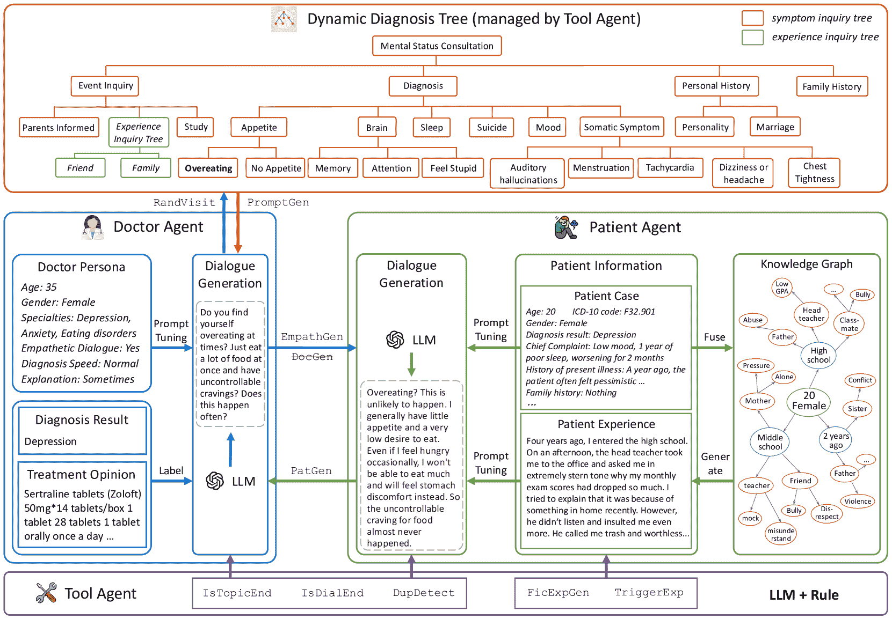

<!--yml

类别：未分类

日期：2025-01-11 12:18:19

-->

# MDD-5k：通过神经符号LLM智能体合成的心理障碍诊断对话数据集

> 来源：[https://arxiv.org/html/2408.12142/](https://arxiv.org/html/2408.12142/)

尹聪驰^(1,2)，李锋¹，张舒¹，王梓珂¹¹¹脚注标记: 1，邵军¹，李皮吉²，

陈建华^(3,4,5,6)²²脚注标记: 2，姜旭^(1,2) 该工作是在实习期间完成的。通讯作者。

###### 摘要

大多数心理障碍的临床诊断主要依赖于精神科医生与患者之间的对话。创建此类诊断对话数据集有望促进人工智能心理健康护理领域的发展。然而，由于严格的隐私和伦理考量，直接收集真实诊断场景中的对话几乎是不可能的。为了解决这个问题，我们通过利用更容易访问的匿名化患者病例来合成诊断对话。具体来说，我们设计了一个神经符号多智能体框架，用于通过大型语言模型合成心理障碍的诊断对话。该框架以患者病例为输入，能够针对一个病例生成多种多样的对话。框架的基本内容是医生智能体与患者智能体之间的互动，并通过动态诊断树在符号控制下生成对话。通过应用该框架，我们开发了最大的中文心理障碍诊断数据集MDD-5k。该数据集基于与上海精神卫生中心合作的1000个真实的匿名化患者病例，包含5000个高质量的长对话，且每个对话均带有诊断结果和治疗意见作为标签。据我们所知，它也是第一个中文心理障碍诊断的标注数据集。人工评估结果表明，所提议的MDD-5k数据集成功模拟了心理障碍的类人诊断过程。

代码与数据集 — [https://github.com/lemonsis/MDD-5k](https://github.com/lemonsis/MDD-5k)。

## 介绍

心理健康问题近年来引起了越来越多的关注。根据世界卫生组织（WHO）的统计数据，2019年全球每八个人中就有一人患有心理障碍，且由于COVID-19疫情的影响，患有焦虑和抑郁障碍的人数显著上升（WHO等人 [2022](https://arxiv.org/html/2408.12142v2#bib.bib21)）。随着大规模语言模型（LLMs）近期的进展（Ouyang等人 [2022](https://arxiv.org/html/2408.12142v2#bib.bib13)），它们展现出类似人类的文本生成能力，许多研究人员开始着手构建面向心理健康护理的对话式AI系统。现有的实现方法可以分为两类，一类是对小型模型（如Llama2-7B (Touvron等人 [2023](https://arxiv.org/html/2408.12142v2#bib.bib16)））进行微调，使用医患对话（EmoLLM [2024](https://arxiv.org/html/2408.12142v2#bib.bib5); Yang等人 [2024b](https://arxiv.org/html/2408.12142v2#bib.bib23); Liu等人 [2023](https://arxiv.org/html/2408.12142v2#bib.bib9)）；另一类是基于提示的医患角色扮演框架（Wang等人 [2024a](https://arxiv.org/html/2408.12142v2#bib.bib19); Zhang等人 [2024](https://arxiv.org/html/2408.12142v2#bib.bib25)），这些框架通常采用最先进的语言模型（如ChatGPT (Ouyang等人 [2022](https://arxiv.org/html/2408.12142v2#bib.bib13)））。无论采用何种方法，领域特定的心理健康数据集都起着基础性和不可或缺的作用。

图1：前述一对一病患案例与对话生成的示意图，以及我们提出的一对多病患案例与对话生成框架。

本文聚焦于心理障碍诊断对话数据集。心理障碍的临床诊断与其他疾病不同，主要依赖于患者的精神状态检查，这通过精神科医生与患者之间的对话来体现，而非生理指标（第一次[2014](https://arxiv.org/html/2408.12142v2#bib.bib6)）。因此，收集心理障碍诊断对话有望促进人工智能心理健康研究中的各种下游任务，如辅助诊断聊天机器人、心理障碍分类等。然而，尽管许多先前的研究（Sun等人[2021](https://arxiv.org/html/2408.12142v2#bib.bib15); Chen等人[2023b](https://arxiv.org/html/2408.12142v2#bib.bib4)）集中于情感支持或心理咨询数据，较少有研究关注心理障碍的诊断对话。这可以归因于两个主要因素。首先，由于隐私和伦理考虑，真实场景中的诊断对话极难获取。其次，从零开始合成诊断对话也具有挑战性。与心理咨询或共情对话不同，诊断遵循标准化流程并需要专业的医学知识。因此，直接使用大型语言模型（LLMs）进行数据合成往往会产生较差的结果（Tu等人[2024](https://arxiv.org/html/2408.12142v2#bib.bib17)）。$\text{D}^{4}$（Yao等人[2022](https://arxiv.org/html/2408.12142v2#bib.bib24)）首次尝试通过雇佣注释员模拟诊断对话。然而，该方法仅涵盖了抑郁症，并完全依赖人工注释。生成的内容也较短，远未接近真实场景中的诊断对话。

我们提出了一个神经符号多智能体框架，该框架以患者案例为输入，合成精神障碍的诊断对话。该框架涉及三种类型的大型语言模型智能体：医生智能体、患者智能体和符号工具智能体，后者负责管理诊断话题的转移。该框架具有两个主要创新：（i）一对多的患者案例到对话生成，最大化珍贵真实患者案例的利用。如图[1](https://arxiv.org/html/2408.12142v2#Sx1.F1 "Figure 1 ‣ Introduction ‣ MDD-5k: A New Diagnostic Conversation Dataset for Mental Disorders Synthesized via Neuro-Symbolic LLM Agents")所示，不同于先前的研究（Zhang et al. [2024](https://arxiv.org/html/2408.12142v2#bib.bib25); Wang et al. [2024a](https://arxiv.org/html/2408.12142v2#bib.bib19)），这些研究通过一个患者案例生成一段对话。我们提出的框架能够用一个单一的患者案例生成多种不同的诊断对话。具体来说，三种方法确保了诊断过程的多样性和正确性。首先，设计了具有不同诊断习惯的医生智能体，并随机选择每次对话中的医生智能体。第二，我们使用带有知识图谱的LLM，根据一个患者案例生成多个虚构的患者经历。这些患者经历作为患者智能体在生成过程中使用的背景信息。由于精神障碍的诊断主要依赖症状而非具体事件，因此整合虚构的患者经历不仅增强了合成对话的多样性，同时保持了诊断过程的准确性。第三，每次对话中的诊断话题顺序是随机确定的。（ii）另一个重要创新是通过动态诊断树在符号控制下生成文本。该树由一个固定的症状询问树和一个动态的经验询问树组成。精神障碍的临床诊断严格遵循ICD-11（Organization et al. [2018](https://arxiv.org/html/2408.12142v2#bib.bib12)）或DSM-5（American Psychiatric Association et al. [2013](https://arxiv.org/html/2408.12142v2#bib.bib1)）中的标准。为了模拟这一过程，我们基于《DSM-5结构化临床访谈》（SCID-5）（First [2014](https://arxiv.org/html/2408.12142v2#bib.bib6)）设计了一个固定的症状询问树，涵盖了所有重要症状询问的诊断话题。经验询问树通过提取患者对过去经历的回答中的可能话题来构建，旨在与患者建立更深层次的互动。

通过应用所提框架，我们发布了最大的中文精神障碍诊断数据集MDD-5k。这也是第一个由专业精神科医生提供诊断结果的标注精神障碍诊断对话数据集。MDD-5k包含5000个高质量的诊断对话，并基于来自上海精神卫生中心的1000个匿名真实患者案例构建，涵盖超过25种不同的疾病。所有患者案例都经过清洗和筛选，符合全球标准，确保了私人信息的完全保护。  

本工作的贡献可以总结为：  

+   •  

    我们专门设计了一个神经符号多智能体框架，用于合成精神障碍的诊断对话，该框架具有可控和多样化的一对多患者案例到对话生成特性。  

+   •  

    据我们所知，我们提出的MDD-5k是最大的、首个标注的中文精神障碍诊断数据集。

+   •  

    综合的人类评估表明，所提出的MDD-5k数据集在专业性、沟通技巧、流畅性、安全性等方面优于多个对比数据集，并且反映了类似人类的诊断过程。  

## 相关工作  

### 精神健康数据集  

针对精神健康的医患对话语料库对于AI心理健康研究至关重要，尤其是在大语言模型时代。我们根据所需的专业知识程度，将当前的精神健康数据集分为三类。情感支持数据集以富有同理心的对话和安慰为特点。ESconv数据集（Liu等人，[2021](https://arxiv.org/html/2408.12142v2#bib.bib10)）包含1300个对话，涵盖10个主题。SoulChatCorpus（Chen等人，[2023b](https://arxiv.org/html/2408.12142v2#bib.bib4)）包含超过200万个由ChatGPT生成的单轮和多轮对话。心理咨询数据集通常比常见的情感支持数据集包含更多的领域知识。情感急救原始数据集（Wang，[2024](https://arxiv.org/html/2408.12142v2#bib.bib18)）是通过爬取心理咨询网站和社区构建的。PsyQA（Sun等人，[2021](https://arxiv.org/html/2408.12142v2#bib.bib15)）是一个由人工标注的单轮中文数据集。SmileChat数据集（Qiu等人，[2024](https://arxiv.org/html/2408.12142v2#bib.bib14)）通过ChatGPT将PsyQA扩展为多轮对话。CPsyCounD（Zhang等人，[2024](https://arxiv.org/html/2408.12142v2#bib.bib25)）包含3134个心理咨询对话，由相同数量的心理咨询报告生成。诊断数据集旨在模拟专业精神科医生的诊断对话。$\text{D}^{4}$（Yao等人，[2022](https://arxiv.org/html/2408.12142v2#bib.bib24)）是一个中文抑郁症诊断数据集，由人工标注者构建，并由精神科医生监督。此外，还有一些医学对话数据集，如MedDialog（He等人，[2020](https://arxiv.org/html/2408.12142v2#bib.bib7)）、MTS-Dialog（Ben Abacha等人，[2023](https://arxiv.org/html/2408.12142v2#bib.bib2)）、ChatDoctor（Li等人，[2023](https://arxiv.org/html/2408.12142v2#bib.bib8)），这些数据集涵盖了更广泛的医学领域。

### 精神障碍对话模拟

我们主要关注无调优提示框架在精神障碍对话模拟中的应用。Chen 等人（[2023a](https://arxiv.org/html/2408.12142v2#bib.bib3)）对利用LLM聊天机器人进行诊断对话的可行性进行了全面分析。Wang 等人（[2024b](https://arxiv.org/html/2408.12142v2#bib.bib20)）提出模拟患者代理，结合认知建模与LLM，并将该患者代理应用于认知行为治疗（CBT）训练。Wang 等人（[2024a](https://arxiv.org/html/2408.12142v2#bib.bib19)）构建了一种规划与角色扮演方法，从临床记录生成对话，并提出了一个合成的患者-医生对话数据集。Zhang 等人（[2024](https://arxiv.org/html/2408.12142v2#bib.bib25)）介绍了Memo2Demo框架，该框架将咨询报告转换为咨询记录，并应用于生成对话。Tu 等人（[2024](https://arxiv.org/html/2408.12142v2#bib.bib17)）设计了AIME框架，该框架利用基于自我游戏的模拟环境和自动反馈生成诊断对话。

## 方法论

精神障碍诊断对话的合成过程如图[2](https://arxiv.org/html/2408.12142v2#Sx3.F2 "图 2 ‣ 虚拟患者体验生成 ‣ 方法论 ‣ MDD-5k：通过神经符号大语言模型（LLM）代理合成的精神障碍诊断对话数据集")所示，该框架基本上涉及医生代理、患者代理和工具代理之间的互动。所有代理均由大型语言模型（LLMs）扮演。由动态诊断树控制的医生代理引导整个对话的诊断话题变化。患者代理根据经过预处理的患者案例和工具代理生成的虚拟患者体验作出回应。工具代理还负责动态诊断树的若干符号操作。

### 患者案例预处理

患者案例的质量对诊断对话的合成至关重要。我们与上海精神卫生中心合作，获得了超过1000例精神障碍患者的真实案例。所有这些患者案例都经过了数据脱敏处理，以防止敏感个人信息泄露。数据脱敏过程遵循以下标准：（i）患者的私人信息（如姓名、出生日期、检查日期等）从患者案例中删除；（ii）患者年龄四舍五入到最接近的十位。例如，一个24岁患者的年龄在预处理的患者案例中为20岁；（iii）所有具体地点都被替换为模糊或虚假的地点。上述预处理步骤严格遵循《中国健康数据安全技术指南》（GB/T 39725-2020）的标准。

在筛选掉重复或不完整的病历后，用于诊断对话模拟和数据集生成的最终版本包含1000个病历，涵盖年龄、性别、诊断及对应的国际疾病分类（ICD-10）（组织[2004](https://arxiv.org/html/2408.12142v2#bib.bib11)）代码、主诉、现病史、重要的既往病史、家族史、个人史、心理检查和治疗。如图[2](https://arxiv.org/html/2408.12142v2#Sx3.F2 "Figure 2 ‣ Fictitious Patient Experience Generation ‣ Methodology ‣ MDD-5k: A New Diagnostic Conversation Dataset for Mental Disorders Synthesized via Neuro-Symbolic LLM Agents")所示，病历以键值对的形式结构化。

### 虚构患者经历生成

我们进行了一对多的病历到对话生成，这意味着一个病历将用于生成多个诊断对话。生成对话多样性的一个关键因素是患者的经历。它具体指的是在本文中直接或间接导致患者心理问题的过去经历。心理障碍的诊断不同于其他疾病，主要依赖于精神科医生与患者之间的对话，而不是生理指标（第一次[2014](https://arxiv.org/html/2408.12142v2#bib.bib6)）。精神科医生根据与患者交流过程中获得的症状提供诊断结果和治疗。因此，如果症状与诊断之间的对应关系能够得到保证，合成诊断对话的正确性和质量将得到保证，并且不受详细患者经历的影响。从这个意义上讲，通过一个病历生成多种患者经历以合成多个诊断对话是可行的。

图2：用于合成心理障碍诊断对话的神经符号多代理LLM框架。

大型语言模型（LLM）用于生成虚构患者经历。为了避免虚构患者经历与真实病历之间的反事实冲突，从一个病历中提取性别、年龄、职业和诊断（Dx）信息，并作为生成患者经历的提示中的患者人格。

|  | $\text{Persona}=\textit{Prompt}(\text{Gender},\text{Age},\text{Work},\text{Dx})$ |  | (1) |
| --- | --- | --- | --- |

在方程式([1](https://arxiv.org/html/2408.12142v2#Sx3.E1 "在虚拟病人经验生成 ‣ 方法论 ‣ MDD-5k: 一种通过神经符号LLM代理合成的精神障碍诊断对话数据集"))中，函数Prompt表示将关键字连接成适当的提示。接下来，我们根据不同患者的年龄和性别构建包含时间、人物和可能引发精神障碍的具体事件的知识图谱。图[2](https://arxiv.org/html/2408.12142v2#Sx3.F2 "图2 ‣ 虚拟病人经验生成 ‣ 方法论 ‣ MDD-5k: 一种通过神经符号LLM代理合成的精神障碍诊断对话数据集")中的示例展示了针对20岁女性的预定义知识图谱。三元组$(\text{Time},\text{People},\text{Event})$从图谱中随机选择，用于虚拟经验的生成。

|  | $\text{FicExp}=\textit{Prompt}(\text{Time},\text{People},\text{Event})$ |  | (2) |
| --- | --- | --- | --- |

最终的病人经验（FicExp）是通过结合患者人物设定，通过LLM生成的。

|  | $\text{FicExp}=\textit{LLM}(\textit{Prompt}(\text{Persona},\text{FicExp}))$ |  | (3) |
| --- | --- | --- | --- |

### 神经符号动态诊断树

为了模拟精神科医生主导整个诊断过程的实际场景对话，我们设计了一个神经符号动态诊断树来实现诊断主题的转移和可控的医生反应生成。该动态诊断树由症状询问树和经验询问树组成。如图[2](https://arxiv.org/html/2408.12142v2#Sx3.F2 "图2 ‣ 虚拟病人经验生成 ‣ 方法论 ‣ MDD-5k: 一种通过神经符号LLM代理合成的精神障碍诊断对话数据集")所示，症状询问树是固定的，依据《DSM-5结构化临床访谈》（SCID-5）（首次[2014](https://arxiv.org/html/2408.12142v2#bib.bib6)）和专业精神科医生的指导构建。它旨在涵盖所有相关症状的询问，以便最终得出患者的诊断。考虑到性别和年龄差异，症状询问树特别为男性和女性、青少年（20岁以下）、成人（30至50岁）以及老年人（60岁以上）设计。图[2](https://arxiv.org/html/2408.12142v2#Sx3.F2 "图2 ‣ 虚拟病人经验生成 ‣ 方法论 ‣ MDD-5k: 一种通过神经符号LLM代理合成的精神障碍诊断对话数据集")中的示例展示了适用于女性青少年的症状询问树。

经验询问树根据患者对先前经历和个人细节的回应动态构建自身。它被称为“动态”的原因在于每个患者提供的背景信息都是独特的。由大型语言模型（LLM）驱动的工具代理负责解析患者的回应并创建相应的话题，这些话题构成了经验询问树的节点。解析过程遵循深度优先的方式。当工具代理判断某个特定话题的讨论不足时，它会继续解析该话题的子话题，直到该话题的讨论被认为完成。然后，它会转到下一个解析的话题。经验询问树的设计旨在与患者建立更深的互动，以促进诊断对话。

神经符号动态诊断树由工具代理管理，并提供用于指导医生代理和患者代理的操作。一些操作由LLM实现，另一些则由规则实现。我们首先定义五种数据类型：Text、LNode、Tree、Graph、Bool。Text 指的是自然语言文本。LNode 代表动态诊断树的叶节点，表示对话中的诊断话题。Tree 指的是具有一组连接节点的层级树结构。尽管 LNode 可以视为一种特殊的 Tree 或 Text，但为了更清晰的表达，我们将其视为一个独立的数据类型。Graph 特指用于生成虚拟患者经历的知识图谱，如前所述。Bool 是一个布尔变量，值为 true 或 false。医生代理的操作包括：

+   •

    RandVisit(*$tr$*: Tree) $\rightarrow$ *$ln$*: LNode。 为了提高合成诊断对话的多样性，我们设计了以下叶节点访问规则：（i）这些叶节点的父节点，表示诊断话题的高层次概念，按预定义顺序访问；（ii）对应父节点下的叶节点，表示低层次的具体诊断话题，随机访问。已访问的叶节点不会再次访问。RandVisit 负责实现上述规则。它以整个动态诊断树 *$tr$* 为输入，并输出一个随机叶节点 *$ln$*。此操作由规则实现。

+   •

    IsTopicEnd(*$ln$*: LNode, *$t$*: Text) $\rightarrow$ *$b$*: Bool。 它以当前的诊断话题 *$ln$* 和围绕该话题的对话历史 *$t$* 为输入，决定是否应该继续或结束围绕该话题的对话。此操作由LLM实现。

+   •

    IsDialEnd(*$tr$*: Tree) $\rightarrow$ *$b$*: Bool。 如果动态诊断树 *$tr$* 的所有叶节点都被访问过，操作将返回 true，表示诊断过程结束。否则，它将返回 false。此操作由规则实现。

+   •

    ParseExp(*$t$*: 文本) $\rightarrow$ *$tr$*: 树。此操作负责构建动态体验查询树。它以包含体验信息的患者回应 *$t$* 为输入，并用一棵根节点为 *$t$*、叶节点为与 *$t$* 相关的可能话题的树替换初始空的体验查询树。输出 *$tr$* 是更新后的动态诊断树。此操作由规则和LLM实现。

+   •

    DupDetect(*$t$*: 文本, *$tr^{(1)}$*: 树) $\rightarrow$ *$tr^{(2)}$*: 树。随着诊断对话的进行，一些预定义的话题可能已经被讨论过。DupDetect 检测对话历史 *$t$* 中的重复话题，并将其从动态诊断树中删除，以防止重复的对话。它以原始树 *$tr^{(1)}$* 为输入，输出编辑后的树 *$tr^{(2)}$*。此操作由规则和LLM实现。

+   •

    EmpathGen(*$ln$*: L节点, *$t^{(1)}$*: 文本) $\rightarrow$ *$t^{(2)}$*: 文本。在精神障碍的诊断对话中，精神科医生的主要目标是从患者那里获取症状。移情对话在这一过程中并非必须。然而，它有时对诊断过程有所帮助，并且已经被一些医生临床上采用。如果精神科医生习惯于在日常会诊中进行移情对话（这一点通过预定义的医生提示来体现，下一小节将对此进行说明），EmpathGen将以当前的诊断话题 *$ln$* 和对话历史 *$t^{(1)}$* 为输入，输出安慰性的回复 *$t^{(3)}$*。此操作由LLM实现。

+   •

    PromptGen(*$ln$*: L节点) $\rightarrow$ *$t$*: 文本。它以动态诊断树的叶节点 *$ln$* 为输入，输出适当的提示 *$t$*，用于指导患者代理围绕话题 *$ln$* 作出回应。此操作由LLM实现。

患者代理的操作包括：

+   •

    TriggerExp(*$t$*: 文本) $\rightarrow$ *$b$*: 布尔值。此操作决定是否触发 FicExpGen 操作，基于医生的问题和对话历史 *$t$*。此操作由规则和LLM实现。

+   •

    FicExpGen(*$g$*: 图谱, *$t^{(1)}$*: 文本) $\rightarrow$ *$t^{(2)}$*: 文本。此操作执行如前一小节所详细描述的虚构患者体验生成。*$g$* 是预定义的知识图谱。*$t^{(1)}$* 是患者案例，*$t^{(2)}$* 是整合了真实患者案例和虚构体验的患者信息。此操作由LLM实现。

这些操作在代理交互中的使用将在下一小节中介绍。

### 与代理的对话合成

诊断对话由医生代理和患者代理通过角色扮演LLMs合成。医生代理在动态诊断树的指导下工作。最初，动态诊断树会检查当前的诊断话题是否应该结束。如果是，医生代理将转向下一个话题并检查未来的话题是否已经在之前的对话中讨论过。如果没有，医生代理将继续围绕当前话题与患者沟通。然后，如果患者谈到个人经验，医生代理将基于患者的反应构建经验查询树。

| 对话类型 | $\text{D}^{4}$ | CPsyCounD | 角色扮演 | MDD-5k^∗ |
| --- | --- | --- | --- | --- |
| 总数量 | 1339 | 3134 | 100 | 5000 |
| --- | --- | --- | --- | --- |
| 分类 | 诊断 | 咨询 | 诊断 | 诊断 |
| 疾病类型 | 抑郁症 | / | / | 超过25岁 |
| 平均轮次 | 21.6 | 8.7 | 12.0 | 26.8 |
| 平均每轮对话字数 | 776 | 622.3 | 1715.0 | 6906.8 |
| 平均每轮医生话语数 | 20.4 | 49.7 | 88.1 | 91.1 |
| 平均每轮患者话语数 | 14.9 | 30.4 | 47.6 | 162.8 |
| 标签 | ✗ | ✗ | / | ✓ |

表1：不同数据集的统计信息。平均每轮对话字数（Avg. words #dial）衡量每个对话的平均中文字符数。平均每轮医生回应字数（Avg. words #doc）和平均每轮患者回应字数（Avg. words #pat）衡量医生和患者每次回应的平均中文字符数。

医生代理通过操作DocGen(*$ln$*: LNode, *$t^{(1)}$*: Text) $\rightarrow$ *$t^{(2)}$*: Text生成回应，该操作以当前诊断话题 *$ln$* 和对话历史 *$t^{(1)}$* 作为输入，并输出回应 *$t^{(2)}$*。为了进一步提高生成对话的多样性，我们为医生代理设计了不同的诊断习惯。诊断习惯包含年龄、性别、专长、同理心对话、诊断速度、解释等，并作为医生代理的个性化提示。图[2](https://arxiv.org/html/2408.12142v2#Sx3.F2 "图2 ‣ 虚构患者经验生成 ‣ 方法论 ‣ MDD-5k：一种通过神经符号LLM代理合成的新的精神疾病诊断对话数据集")中展示了一个示例。具体而言，同理心对话和诊断速度因素对医生回应的影响更大。如果医生代理习惯于进行同理心交流，则之前引入的EmpathGen操作将替代DocGen操作进行生成。如果诊断速度设置为快速，医生代理将加速诊断过程，从而导致对话变得更短。

图3：MDD-5k数据集中的患者信息。

对于患者代理来说，由于医生代理主导诊断过程，患者代理被设计为基于已知知识（包括患者案例和生成的虚构经历）被动地响应医生。操作 PatGen(*$ln$*: LNode, *$t^{(1)}$*: Text, *$t^{(2)}$*: Text) $\rightarrow$ *$t^{(3)}$*: Text 负责生成患者的回应，它以当前的诊断主题 *$ln$*、对话历史 *$t^{(1)}$* 和患者案例信息 *$t^{(2)}$* 为输入，输出适当的回应 *$t^{(3)}$*。如果患者代理在动态诊断树的控制下决定以个人经历进行回应，虚构的患者经历将被融合到患者案例中，作为输入 *$t^{(2)}$*。多智能体框架在心理障碍诊断对话仿真中的整个过程通过附录中的伪代码详细展示。

## 实验设置

### 实现细节

MDD-5k 数据集是通过神经符号多智能体框架生成的，包含1000个真实患者案例。基于1个患者案例，gpt-4o生成了5种不同的虚构患者经历，从而产生了总共5000种经历，对应数据集中的5000个对话。我们还创建了5个具有不同诊断习惯的医生，并且每次生成数据集中的对话时都会随机挑选1名医生。由于患者案例仍在伦理审查中，我们随机选择了20个可用的患者案例，并使用gpt-4o生成了100个对话进行评估。其余4900个对话目前由Qwen2-72B-Instruct（Yang et al. [2024a](https://arxiv.org/html/2408.12142v2#bib.bib22)）在本地部署的NVIDIA A100-80G GPU上生成。

### 比较数据集

由于评估者的母语为中文，为确保人工评估的质量，仅考虑了中文数据集。选择了三个数据集作为比较基准。

+   •

    $\textbf{D}^{4}$ (Yao et al. [2022](https://arxiv.org/html/2408.12142v2#bib.bib24)) 是一个用于抑郁症诊断的中文对话数据集，数据集通过收集专业精神科医生之间的对话来构建。

+   •

    CPsyCounD (Zhang et al. [2024](https://arxiv.org/html/2408.12142v2#bib.bib25)) 是一个合成的咨询数据集，涵盖了九个代表性话题（例如婚姻、教育）和七种经典的心理咨询流派（例如认知行为疗法）。

+   •

    直接角色扮演：为了测试我们设计的多智能体诊断对话仿真框架的有效性，我们直接应用角色扮演LLM（gpt-4o），并使用与MDD-5k相同的患者案例和提示生成100个对话进行评估。

除了$\text{D}^{4}$，我们没有找到其他可用的开源精神障碍诊断数据集，因此选择了咨询数据集CPsyCounD作为基准数据集，它还可以展示心理咨询与诊断对话之间的区别。这些数据集的统计信息见表[1](https://arxiv.org/html/2408.12142v2#Sx3.T1 "Table 1 ‣ Conversation Synthesis with Agents ‣ Methodology ‣ MDD-5k: A New Diagnostic Conversation Dataset for Mental Disorders Synthesized via Neuro-Symbolic LLM Agents")。我们从每个数据集中随机选择了100个样本进行评估。

| 数据集 | 专业性 | 沟通（i） | 沟通（ii） | 流畅性（i） | 流畅性（ii） | 相似度 | 安全性 |
| --- | --- | --- | --- | --- | --- | --- | --- |
| $\text{D}^{4}$ | 6.6 | 7.9 | 7.8 | 8.6 | 8.2 | 7.2 | 0 |
| CPsyCounD | 5.2 | 5.4 | 5.6 | 8.4 | 8.0 | 4.4 | 0 |
| 角色扮演 | 6.8 | 6.6 | 7.2 | 6.9 | 5.5 | 6.4 | 0 |
| MDD-5k | 8.6 | 8.3 | 8.4 | 8.6 | 7.6 | 8.8 | 0 |

表2：不同数据集的人类评估。

### 评估指标

人类评估旨在公平评估不同数据集的质量。具体来说，我们设计了涵盖五个不同视角的七个主要评估指标：专业性、沟通、流畅性、相似度和安全性。专业性衡量精神科医生是否能有效收集所有所需的患者症状以进行诊断。沟通衡量精神科医生的沟通技巧及患者的回应，包括（i）精神科医生是否能主动询问患者以收集关键信息，并与患者建立有效沟通，使患者愿意分享更多与精神疾病相关的信息（如日常生活、过去的经历等）；（ii）患者是否能参与诊断过程并提供相关信息。流畅性包含两个方面的标准：（i）生成的对话在句子和话题流畅性上是否自然；（ii）对话中是否存在重复的内容或话题。相似度衡量生成的对话与真实场景的相似度。评估者根据1到10的评分范围进行评分，得分越高表示表现越好。安全性衡量私人信息的泄露（例如地址）。0表示安全生成，1表示存在隐私泄露。

五位标注员参与了人类评估。其中三位是拥有多年临床经验的专业精神科医生，另外两位标注员则在心理健康数据处理方面有丰富经验。评估以盲测方式进行。

## 结果与评估

### MDD-5k的统计分析

图 [3](https://arxiv.org/html/2408.12142v2#Sx3.F3 "图 3 ‣ 通过神经符号大型语言模型（LLM）代理生成的精神障碍诊断对话数据集 MDD-5k") 展示了 MDD-5k 数据集的详细患者信息。65%的患者为女性，35%的患者为男性。约90%的患者年龄在20至40岁之间。15%的患者报告有精神障碍家族史，14%的患者有相关的身体疾病。患者中患有抑郁症（F32）和焦虑症（F41）的占数据集对话的75%。具体来说，抑郁症患者中51%被诊断为抑郁状态（F32.901），35%被诊断为抑郁发作（F32.900）。47%的焦虑症患者被诊断为焦虑和抑郁状态（F41.200x002），26%被诊断为焦虑状态（F41.101）。我们还展示了其他疾病的详细信息，它们占数据集的11%，详见图 [3](https://arxiv.org/html/2408.12142v2#Sx3.F3 "图 3 ‣ 通过神经符号大型语言模型（LLM）代理生成的精神障碍诊断对话数据集 MDD-5k")（h）。所有疾病编码遵循《中华临床疾病分类与编码（第二版）》标准。如果患者被诊断为多种疾病，这些疾病将分别计数。

MDD-5k 和其他对比数据集的统计细节列于表 [1](https://arxiv.org/html/2408.12142v2#Sx3.T1 "表 1 ‣ 通过神经符号大型语言模型（LLM）代理生成的精神障碍诊断对话数据集 MDD-5k") 中。MDD-5k 数据集包含覆盖超过25种精神健康疾病的诊断对话。数据集包含5000个对话，每个对话的平均字数为6906.8个汉字，几乎是对比数据集的十倍。平均对话轮次为26.8，略长于 $\text{D}^{4}$ 的21.6轮。MDD-5k 还是一个标注数据集，每个对话都有专业精神科医生的诊断结果和治疗意见作为标签，而 $\text{D}^{4}$ 仅包含诊断结果。与不采用多代理框架的直接角色扮演方法相比，生成的医生回复长度大致相同。但 MDD-5k 的对话轮次和患者回复显著更长，突显了我们提出的框架在诊断对话模拟中的有效性。在附录中，我们展示了三个完整的对话样本，包括相应的医生角色、患者案例、虚拟患者经历和动态诊断树。

### 人类评估

人工评估结果见表[2](https://arxiv.org/html/2408.12142v2#Sx4.T2 "Table 2 ‣ Compared Datasets ‣ Experiment Setup ‣ MDD-5k: A New Diagnostic Conversation Dataset for Mental Disorders Synthesized via Neuro-Symbolic LLM Agents")。MDD-5k在六个主要指标上表现优越。专业性和相似度的评估分数显著高于其他数据集，表明我们合成的诊断对话在一定程度上能够反映真实的诊断场景。医生和患者的沟通质量也令人印象深刻。尽管有这些优点，MDD-5k确实包含了一些重复内容，偶尔导致对话流畅性差。$\text{D}^{4}$数据集排名第二，在沟通和流畅性评估中得分相对较高。$\text{D}^{4}$的最大问题是对话过于简短，仅包括症状询问和简短回复。

进行了一项消融研究。与神经符号多智能体框架相比，直接角色扮演方法的表现明显较差，特别是在流畅性和沟通技巧方面。这个发现证实了直接应用大语言模型进行诊断对话生成将导致较差的结果。评估还显示，诊断对话和心理咨询之间存在明显差异。CPsyCounD的评估分数特别低，尤其是在专业性和相似度指标上。心理咨询优先考虑通过不同的治疗方式提供舒适和疗愈，而诊断对话则侧重于获取症状以得出最终诊断结果。

## 结论与未来工作

我们设计了一个神经符号多智能体框架，用于合成精神障碍的诊断对话，并将其应用于构建第一个也是最大的开源中文精神障碍诊断数据集，标签包括诊断结果和治疗意见。该框架具有可控的一对多患者病例到对话生成特性。医生智能体与患者智能体之间的对话由动态诊断树引导。我们还采用了几种技术来提高生成对话的多样性。人工评估表明，所提出的MDD-5k数据集在七个指标上超过了对比数据集的质量。MDD-5k数据集有望为诸如精神障碍分类、精神障碍诊断辅助训练等下游任务做出贡献。

本研究的主要局限性体现在三个方面：（i）合成对话与实际医学诊断之间的差异仍然是一个重大挑战。大型语言模型在解读患者回答时常常面临困难，尤其是当回答涉及多个信息层面时，导致冗余的症状询问。我们正在探索各种提示策略以缓解这一问题。（ii）我们主要设计了针对抑郁症（F32）、焦虑症（F41）、睡眠障碍（F51）、儿童情绪障碍（F98）和未指定情绪障碍（F39）的动态诊断树，这些涵盖了MDD-5k中超过85%的对话。然而，一些心理健康状况（例如强迫症（F42））仍未得到充分解决，导致合成的诊断对话存在次优效果。我们正在努力通过设计更多的诊断树来扩展合成框架，涵盖更广泛的心理障碍。（iii）目前仅提供了MDD-5k数据集的中文版本。我们计划未来将其翻译成英文。

## 伦理声明

患者案例的收集在上海市精神卫生中心进行。所有患者均被告知其信息将被收集并仅用于研究目的。如《患者案例预处理》部分所述，所有数据掩码程序严格遵循中国健康数据安全信息技术指南（GB/T 39725-2020）。目前，患者案例和合成诊断对话数据集MDD-5k正在进行伦理审查。我们计划在伦理审查完成后，仅为研究目的发布MDD-5k数据集。为防止潜在的隐私数据泄露，所有实验均在位于上海市精神卫生中心的服务器上进行。

## 致谢

我们感谢盛大集团提供的GPU资源和可访问的LLM API密钥。陈前沿实验室（AI与心理健康）与上海市精神卫生中心合作，领导着收集心理障碍患者案例的项目。我们还感谢上海市精神卫生中心的精神科医生的支持和讨论。

## 参考文献

+   美国精神病学会等（2013）美国精神病学会，D.; 等。2013. *精神障碍诊断与统计手册：DSM-5*，第5卷。美国精神病学会，华盛顿特区。

+   Ben Abacha 等（2023）Ben Abacha, A.; Yim, W.-w.; Fan, Y.; 和 Lin, T. 2023. 临床记录生成的实证研究——基于医生与患者的互动。载于Vlachos, A.; 和 Augenstein, I.（编），*第17届欧洲计算语言学会章节会议论文集*，2291–2302。克罗地亚杜布罗夫尼克：计算语言学会。

+   Chen et al. (2023a) Chen, S.; Wu, M.; Zhu, K. Q.; Lan, K.; Zhang, Z.; 和 Cui, L. 2023a. 基于LLM的心理医生和患者模拟聊天机器人：应用与评估。*arXiv 预印本 arXiv:2305.13614*.

+   Chen et al. (2023b) Chen, Y.; Xing, X.; Lin, J.; Zheng, H.; Wang, Z.; Liu, Q.; 和 Xu, X. 2023b. SoulChat：通过多轮共情对话微调提高LLM的共情、倾听与安慰能力。在Bouamor, H.; Pino, J.; 和 Bali, K.编辑的，*计算语言学会会议成果：EMNLP 2023*，1170–1183。新加坡：计算语言学协会。

+   EmoLLM (2024) EmoLLM. 2024. EmoLLM.

+   First (2014) First, M. B. 2014. DSM结构化临床访谈（SCID）。*临床心理学百科全书*，1–6.

+   He et al. (2020) He, X.; Chen, S.; Ju, Z.; Dong, X.; Fang, H.; Wang, S.; Yang, Y.; Zeng, J.; Zhang, R.; Zhang, R.; 等人 2020. Meddialog：两个大规模医学对话数据集。*arXiv 预印本 arXiv:2004.03329*.

+   Li et al. (2023) Li, Y.; Li, Z.; Zhang, K.; Dan, R.; Jiang, S.; 和 Zhang, Y. 2023. Chatdoctor：一个针对医学领域知识通过大语言模型Meta-AI（Llama）微调的医学聊天模型。*Cureus*，15(6).

+   Liu et al. (2023) Liu, J. M.; Li, D.; Cao, H.; Ren, T.; Liao, Z.; 和 Wu, J. 2023. Chatcounselor: 一个用于心理健康支持的大型语言模型。*arXiv 预印本 arXiv:2309.15461*.

+   Liu et al. (2021) Liu, S.; Zheng, C.; Demasi, O.; Sabour, S.; Li, Y.; Yu, Z.; Jiang, Y.; 和 Huang, M. 2021. 朝着情感支持对话系统迈进。在Zong, C.; Xia, F.; Li, W.; 和 Navigli, R.编辑的，*计算语言学会第59届年会暨第11届国际自然语言处理联合会议（第1卷：长篇论文）*，3469–3483。在线：计算语言学会。

+   Organization (2004) Organization, W. H. 2004. *国际疾病分类及相关健康问题：字母索引*，第3卷。世界卫生组织。

+   Organization et al. (2018) Organization, W. H.; 等人 2018. ICD-11用于死亡率和发病率统计（2018）。

+   Ouyang et al. (2022) Ouyang, L.; Wu, J.; Jiang, X.; Almeida, D.; Wainwright, C.; Mishkin, P.; Zhang, C.; Agarwal, S.; Slama, K.; Ray, A.; 等人 2022. 训练语言模型通过人类反馈遵循指令。*神经信息处理系统进展*，35: 27730–27744.

+   Qiu et al. (2024) Qiu, H.; He, H.; Zhang, S.; Li, A.; 和 Lan, Z. 2024. SMILE：通过ChatGPT为心理健康支持进行单轮到多轮包容性语言扩展。arXiv:2305.00450.

+   Sun et al. (2021) Sun, H.; Lin, Z.; Zheng, C.; Liu, S.; 和 Huang, M. 2021. PsyQA: 用于生成长篇心理健康支持咨询文本的中文数据集。arXiv:2106.01702.

+   Touvron等人（2023）Touvron, H.; Martin, L.; Stone, K.; Albert, P.; Almahairi, A.; Babaei, Y.; Bashlykov, N.; Batra, S.; Bhargava, P.; Bhosale, S.; 等人。2023. Llama 2：开放的基础模型和微调聊天模型。*arXiv预印本 arXiv:2307.09288*。

+   Tu等人（2024）Tu, T.; Palepu, A.; Schaekermann, M.; Saab, K.; Freyberg, J.; Tanno, R.; Wang, A.; Li, B.; Amin, M.; Tomasev, N.; 等人。2024. 面向对话式诊断AI的研究。*arXiv预印本 arXiv:2401.05654*。

+   Wang（2024）Wang, H. L. 2024. efaqa-corpus-raw。

+   Wang等人（2024a）Wang, J.; Yao, Z.; Yang, Z.; Zhou, H.; Li, R.; Wang, X.; Xu, Y.; 和Yu, H. 2024a. NoteChat：基于临床笔记的合成医患对话数据集。arXiv:2310.15959。

+   Wang等人（2024b）Wang, R.; Milani, S.; Chiu, J. C.; Zhi, J.; Eack, S. M.; Labrum, T.; Murphy, S. M.; Jones, N.; Hardy, K.; Shen, H.; Fang, F.; 和Chen, Z. Z. 2024b. PATIENT-$\Psi$: 使用大语言模型模拟患者，训练心理健康专业人员。arXiv:2405.19660。

+   WHO等人（2022）WHO；等人。2022. 心理健康与COVID-19：大流行对心理健康的早期影响：科学简报，2022年3月2日。技术报告，世界卫生组织。

+   Yang等人（2024a）Yang, A.; Yang, B.; Hui, B.; Zheng, B.; Yu, B.; Zhou, C.; Li, C.; Li, C.; Liu, D.; Huang, F.; Dong, G.; Wei, H.; Lin, H.; Tang, J.; Wang, J.; Yang, J.; Tu, J.; Zhang, J.; Ma, J.; Xu, J.; Zhou, J.; Bai, J.; He, J.; Lin, J.; Dang, K.; Lu, K.; Chen, K.; Yang, K.; Li, M.; Xue, M.; Ni, N.; Zhang, P.; Wang, P.; Peng, R.; Men, R.; Gao, R.; Lin, R.; Wang, S.; Bai, S.; Tan, S.; Zhu, T.; Li, T.; Liu, T.; Ge, W.; Deng, X.; Zhou, X.; Ren, X.; Zhang, X.; Wei, X.; Ren, X.; Fan, Y.; Yao, Y.; Zhang, Y.; Wan, Y.; Chu, Y.; Liu, Y.; Cui, Z.; Zhang, Z.; 和Fan, Z. 2024a. Qwen2技术报告。*arXiv预印本 arXiv:2407.10671*。

+   Yang等人（2024b）Yang, K.; Zhang, T.; Kuang, Z.; Xie, Q.; Huang, J.; 和Ananiadou, S. 2024b. MentaLLaMA：使用大语言模型进行社交媒体上的可解释心理健康分析。在*2024年ACM网页会议论文集*，*WWW ’24*第35卷，4489–4500。ACM。

+   Yao等人（2022）Yao, B.; Shi, C.; Zou, L.; Dai, L.; Wu, M.; Chen, L.; Wang, Z.; 和Yu, K. 2022. D4：用于抑郁症诊断聊天的中文对话数据集。在Goldberg, Y.; Kozareva, Z.; 和Zhang, Y.主编，*2022年自然语言处理实证方法会议论文集*，2438–2459。阿布扎比，阿联酋：计算语言学协会。

+   Zhang等人（2024）Zhang, C.; Li, R.; Tan, M.; Yang, M.; Zhu, J.; Yang, D.; Zhao, J.; Ye, G.; Li, C.; Hu, X.; 等人。2024. CPsyCoun：基于报告的多轮对话重建与评估框架，用于中文心理咨询。*arXiv预印本 arXiv:2405.16433*。

## 附录A 提出的框架伪代码

我们通过伪代码详细解释了诊断对话模拟的多智能体框架。如算法[1](https://arxiv.org/html/2408.12142v2#algorithm1 "附录A 提出的框架伪代码 ‣ MDD-5k：通过神经符号LLM代理合成的心理障碍新诊断对话数据集")所示，医生代理、患者代理和工具代理都使用大型语言模型进行初始化。整个过程由工具代理引导。当诊断对话完成后，患者病例的诊断结果和治疗意见将作为标签附加到对话历史中。

1 初始化：DocAgent、PatAgent、ToolAgent 与 LLM。*ddt*：预定义动态诊断树的树。*exp_kg*：预定义知识图谱的图。*cur_topic*：LNode，初始值为 None。*dial_hist*，*topic_hist*：文本，初始值为空列表。*pat_info*：文本，包含病人案例。*treatment*：文本，包含病人案例中的治疗信息；2 当 **ToolAgent**.*IsDialEnd*(*ddt*) 不成立时执行：3       如果 *cur_topic 是 None*，则：4             *cur_topic* $\leftarrow$ ToolAgent.RandVisit(*ddt*)；5             *doc_resp* $\leftarrow$ DocAgent.DocGen(ToolAgent.PromptGen(*cur_topic*), *dial_hist*)；6             *dial_hist*.append(*doc_resp*)，*topic_hist*.append(*doc_resp*)；7             如果 **ToolAgent**.*TriggerExp*(*dial_hist*) 成立：8                   *pat_info* $\leftarrow$ ToolAgent.FicExpGen(*exp_kg*, *pat_info*)；9                  10             *pat_resp* $\leftarrow$ PatAgent.PatGen(ToolAgent.PromptGen(*cur_topic*), *dial_hist*, *pat_info*)；11             *dial_hist*.append(*pat_resp*)，*topic_hist*.append(*pat_resp*)；12            13       否则：14             如果 **ToolAgent**.*IsTopicEnd*(*cur_topic*, *topic_hist*) 成立：15                   *ddt* $\leftarrow$ ToolAgent.DupDect(*topic_hist*, *ddt*)；16                   *topic_hist* $\leftarrow$ []，*cur_topic* $\leftarrow$ ToolAgent.RandVisit(*ddt*)；17                   如果 *cur_topic = experience_inquiry_tree*，则：18                        *ddt* $\leftarrow$ ToolAgent.ParseExp(*dial_hist*)，*cur_topic* $\leftarrow$ ToolAgent.RandVisit(*ddt*)；19                         *doc_resp* $\leftarrow$ DocAgent.DocGen(ToolAgent.PromptGen(*cur_topic*), *dial_hist*)；20                         *dial_hist*.append(*doc_resp*)，*topic_hist*.append(*doc_resp*)；21                         如果 **ToolAgent**.*TriggerExp*(*dial_hist*) 成立：22                               *pat_info* $\leftarrow$ ToolAgent.FicExpGen(*exp_kg*, *pat_info*)；23                              24                         *pat_resp* $\leftarrow$ PatAgent.PatGen(ToolAgent.PromptGen(*cur_topic*), *dial_hist*, *pat_info*)；25                         *dial_hist*.append(*pat_resp*)，*topic_hist*.append(*pat_resp*)；26                   否则：27                        *doc_resp* $\leftarrow$ DocAgent.DocGen(ToolAgent.PromptGen(*cur_topic*), *dial_hist*)；28                        *dial_hist*.append(*doc_resp*)，*topic_hist*.append(*doc_resp*)；29                         如果 **ToolAgent**.*TriggerExp*(*dial_hist*) 成立：30                               *pat_info* $\leftarrow$ ToolAgent.FicExpGen(*exp_kg*, *pat_info*)；31                              32                        *pat_resp* $\leftarrow$ PatAgent.PatGen(ToolAgent.PromptGen(*cur_topic*), *dial_hist*, *pat_info*)；33                         *dial_hist*.append(*pat_resp*)，*topic_hist*.append(*pat_resp*)；34                  35             否则：36                  *doc_resp* $\leftarrow$ DocAgent.DocGen(ToolAgent.PromptGen(*cur_topic*), *dial_hist*)；37                   *dial_hist*.append(*doc_resp*)，*topic_hist*.append(*doc_resp*)；38                   如果 **ToolAgent**.*TriggerExp*(*dial_hist*) 成立：39                         *pat_info* $\leftarrow$ ToolAgent.FicExpGen(*exp_kg*, *pat_info*)；40                        41                   *pat_resp* $\leftarrow$ PatAgent.PatGen(ToolAgent.PromptGen(*cur_topic*), *dial_hist*, *pat_info*)；42                   *dial_hist*.append(*pat_resp*)，*topic_hist*.append(*pat_resp*)；43            44      45 *dial_hist*.append(*treatment*)；46 返回 *dial_hist*；

算法 1 神经符号多代理框架，用于合成精神障碍的诊断对话

## 附录 B 来自精神科医生的反馈

在人类评估过程中，精神科医生还为我们提供了关于合成诊断对话的反馈。专业精神科医生与作者之间的讨论如下。

+   •

    患者的回应过于“完美且流畅”。在真实的诊断对话中，许多精神障碍患者难以回答精神科医生的问题。对于这个问题，我们不确定从自然语言处理的角度来看，一个完美的患者回答还是一个较差但更接近真实情境的回答，哪种更有益。

+   •

    患有重度抑郁症的患者比例过小。儿童患者的数量也较少。

+   •

    合成对话缺乏陪伴角色（例如父母）的参与，而这种角色在真实情境中非常常见。这实际上启发我们在未来设计一个多方对话系统，用于处理诊断对话模拟。

+   •

    医生代理的回答缺乏对症状的恰当解释。这归因于大型语言模型在心理健康领域知识的不足。未来可以通过检索增强生成（RAG）方法来缓解这一问题。

+   •

    诊断过程缺乏细节。例如，在咨询与睡眠相关的症状时，医生代理仅询问患者是否能在晚上睡得好。应当询问更详细的信息，如失眠的起始时间、频率、加重或缓解等。然而，患者的病例信息非常有限。因此，设计如此详细的问题可能导致大型语言模型给出虚构的回复。

所有的反馈对于该领域未来的工作具有重要意义。
