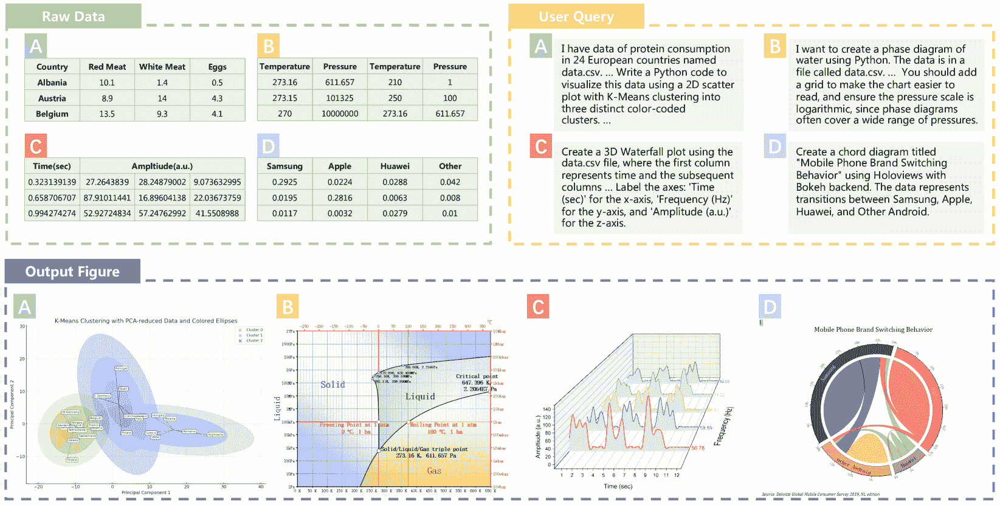
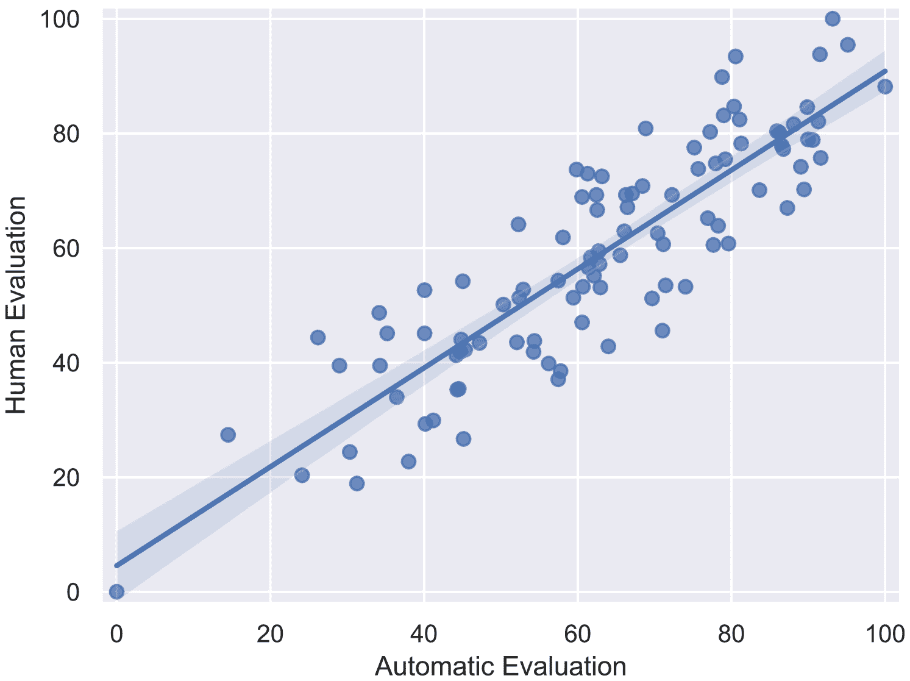
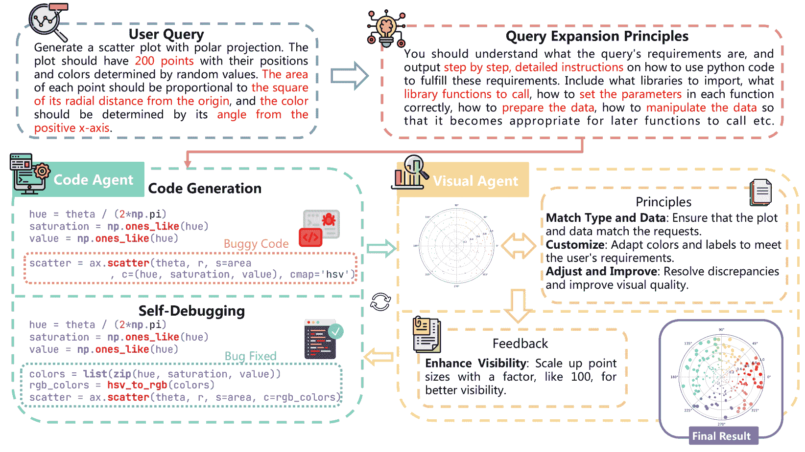
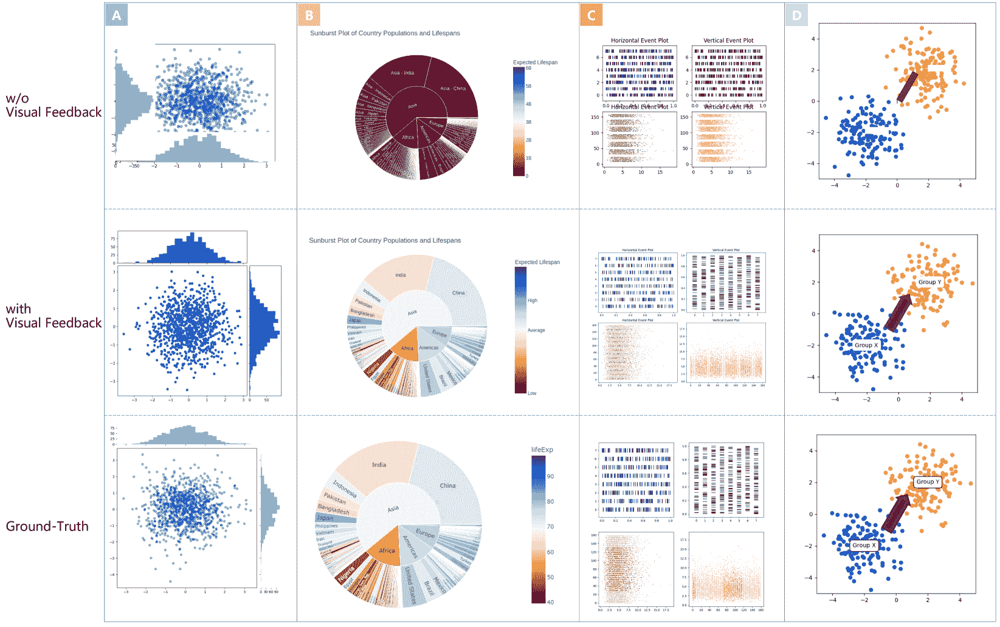
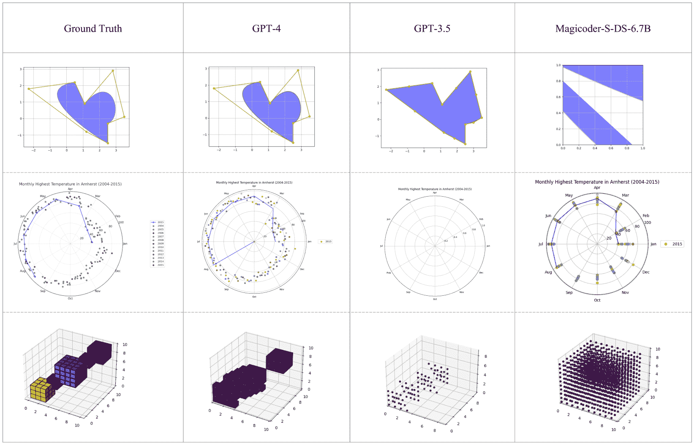

<!--yml

类别：未分类

日期：2025-01-11 12:53:01

-->

# MatPlotAgent：基于LLM的智能科学数据可视化方法与评估

> 来源：[https://arxiv.org/html/2402.11453/](https://arxiv.org/html/2402.11453/)

Zhiyu Yang${}^{*2}$  Zihan Zhou${}^{3}$  Shuo Wang${}^{{\dagger}1}$  Xin Cong${}^{1}$

Xu Han${}^{1}$  Yukun Yan${}^{1}$  Zhenghao Liu${}^{4}$  Zhixing Tan${}^{5}$

Pengyuan Liu${}^{2}$  Dong Yu${}^{2}$  Zhiyuan Liu${}^{1}$  Xiaodong Shi${}^{3}$ Maosong Sun${}^{1}$

${}^{1}$清华大学  ${}^{2}$北京语言大学  ${}^{3}$厦门大学

${}^{4}$东北大学，中国  ${}^{5}$中关村实验室，北京，中国   平等贡献。  对应作者。

###### 摘要

科学数据可视化在研究中起着至关重要的作用，它能够直接展示复杂信息，并帮助研究人员识别隐含的模式。尽管其重要性不言而喻，然而将大语言模型（LLMs）应用于科学数据可视化的研究仍然较为匮乏。在本研究中，我们提出了MatPlotAgent，一个高效的与模型无关的LLM代理框架，旨在自动化科学数据可视化任务。MatPlotAgent结合了代码LLM和多模态LLM的能力，包含三个核心模块：查询理解、代码生成与迭代调试、以及用于错误修正的视觉反馈机制。为了解决该领域缺乏基准测试的问题，我们提出了MatPlotBench，一个包含100个人工验证测试案例的高质量基准。此外，我们还提出了一种评分方法，利用GPT-4V进行自动评估。实验结果表明，MatPlotAgent能够提升各种LLM的表现，包括商业和开源模型。此外，所提的评估方法与人工标注评分之间存在较强的相关性。¹¹1  MatPlotAgent和MatPlotBench将公开发布，地址为[https://github.com/thunlp/MatPlotAgent](https://github.com/thunlp/MatPlotAgent)。

![[未标注图片]](img/8a7bfd784061ab086ea8ad974d9fef94.png)

MatPlotAgent：方法与评估

基于LLM的智能科学数据可视化

Zhiyu Yang${}^{*2}$  Zihan Zhou^†^†感谢：平等贡献.${}^{3}$  Shuo Wang${}^{{\dagger}1}$  Xin Cong${}^{1}$  Xu Han${}^{1}$  Yukun Yan${}^{1}$  Zhenghao Liu${}^{4}$  Zhixing Tan${}^{5}$  Pengyuan Liu${}^{2}$  Dong Yu${}^{2}$  Zhiyuan Liu^†^†感谢：对应作者.${}^{1}$  Xiaodong Shi${}^{3}$  Maosong Sun${}^{1}$  ${}^{1}$清华大学  ${}^{2}$北京语言大学  ${}^{3}$厦门大学  ${}^{4}$东北大学，中国  ${}^{5}$中关村实验室，北京，中国

## 1 引言

一张图片胜过千言万语。数据可视化是科学研究中一个至关重要的过程，有助于更直接地传达复杂信息，并帮助研究人员揭示潜在的模式。当前有许多先进的工具包，如Matplotlib²²2[https://matplotlib.org](https://matplotlib.org)和Origin³³3[https://www.originlab.com](https://www.originlab.com)，它们能够帮助研究人员绘制各种类型的图形，以展示复杂的数据分布。然而，将原始数据转化为信息丰富且易于理解的可视化图形，依然是一个耗时且劳动密集的过程。在大语言模型（LLMs）发明之前（如OpenAI，[2023](https://arxiv.org/html/2402.11453v3#bib.bib20)），利用AI模型自动化这一过程几乎是不可能的。

图1：提出的MatPlotBench中的示例。给定原始数据和用户查询，AI代理预计会根据这些生成图形。由于空间限制，我们只展示了部分原始数据和用户查询。

拥有大规模参数和广泛的训练数据，LLM（大语言模型）在广泛的复杂任务中展示了卓越的能力，包括推理 魏等人（[2022](https://arxiv.org/html/2402.11453v3#bib.bib34)）；小岛等人（[2022a](https://arxiv.org/html/2402.11453v3#bib.bib9)）；姚等人（[2023a](https://arxiv.org/html/2402.11453v3#bib.bib39)），数学 俞等人（[2024](https://arxiv.org/html/2402.11453v3#bib.bib41)）；罗等人（[2023a](https://arxiv.org/html/2402.11453v3#bib.bib17)）；阿泽尔巴耶夫等人（[2024](https://arxiv.org/html/2402.11453v3#bib.bib2)）；邵等人（[2024](https://arxiv.org/html/2402.11453v3#bib.bib31)）和编码 罗济尔等人（[2024](https://arxiv.org/html/2402.11453v3#bib.bib28)）；罗等人（[2023b](https://arxiv.org/html/2402.11453v3#bib.bib18)）；郭等人（[2024](https://arxiv.org/html/2402.11453v3#bib.bib8)）；魏等人（[2023](https://arxiv.org/html/2402.11453v3#bib.bib35)）。这一突破为将LLM作为自主智能体应用于各种实际场景提供了新的机会，如网页浏览 中野等人（[2021](https://arxiv.org/html/2402.11453v3#bib.bib19)）；姚等人（[2022](https://arxiv.org/html/2402.11453v3#bib.bib38)）；秦等人（[2023](https://arxiv.org/html/2402.11453v3#bib.bib24)）；周等人（[2023](https://arxiv.org/html/2402.11453v3#bib.bib42)）；邓等人（[2023](https://arxiv.org/html/2402.11453v3#bib.bib6)）；姚等人（[2023b](https://arxiv.org/html/2402.11453v3#bib.bib40)）；谢等人（[2023](https://arxiv.org/html/2402.11453v3#bib.bib36)），社会模拟 朴等人（[2023](https://arxiv.org/html/2402.11453v3#bib.bib21)）；徐等人（[2023](https://arxiv.org/html/2402.11453v3#bib.bib37)）；陈等人（[2024a](https://arxiv.org/html/2402.11453v3#bib.bib4)）；王等人（[2023](https://arxiv.org/html/2402.11453v3#bib.bib33)），工具利用 秦等人（[2024](https://arxiv.org/html/2402.11453v3#bib.bib25)）；席克等人（[2023](https://arxiv.org/html/2402.11453v3#bib.bib30)）；刘等人（[2024](https://arxiv.org/html/2402.11453v3#bib.bib15)）；李等人（[2023a](https://arxiv.org/html/2402.11453v3#bib.bib13)）；卢等人（[2023](https://arxiv.org/html/2402.11453v3#bib.bib16)）；钱等人（[2023b](https://arxiv.org/html/2402.11453v3#bib.bib23)）；申等人（[2023](https://arxiv.org/html/2402.11453v3#bib.bib32)），以及软件开发 钱等人（[2023a](https://arxiv.org/html/2402.11453v3#bib.bib22)）。使用LLM提升人类在特定领域的生产力如今已成为一个重要的研究重点，且潜力巨大。

基于大语言模型（LLM）的代理的最新进展激发了我们探索LLM在科学数据可视化中的应用，这一领域在现有研究中仍然较为未被开发。一个紧密相关的研究方向是文本到图像生成，Ramesh等人（[2021](https://arxiv.org/html/2402.11453v3#bib.bib26)）；Saharia等人（[2022](https://arxiv.org/html/2402.11453v3#bib.bib29)），在其中，扩散模型Rombach等人（[2022](https://arxiv.org/html/2402.11453v3#bib.bib27)）已显示出在生成各种类型图像方面的巨大潜力。然而，现有的文本到图像生成方法主要集中于艺术表现，可能与科学数据可视化的需求不符，因为在科学数据可视化中，传达信息的清晰性和精确性是最重要的原则。本工作旨在自动生成具有精确信息的图形。

我们提出利用现代代码LLM和多模态LLM开发科学数据可视化代理，显著提升人类效率。由此产生的MatPlotAgent⁴⁴此名称向著名的Matplotlib致敬，由三个模块组成：(1) 查询理解模块，能够彻底理解用户提供的需求；(2) 代码生成模块，具有迭代调试功能，使用代码精确预处理原始数据并生成图形；(3) 可视化反馈模块，具备视觉感知能力，能够在绘制草图中发现错误，并向代码生成模块提供可视反馈，以纠正错误。我们的方法是模型无关的，可以通过任何代码LLM和多模态LLM驱动。通过实验，我们发现MatPlotAgent可以与封闭源LLM（如GPT-4 OpenAI（[2023](https://arxiv.org/html/2402.11453v3#bib.bib20)））以及开源LLM（如Magicoder Wei等人（[2023](https://arxiv.org/html/2402.11453v3#bib.bib35)））一起工作。

自动化科学数据可视化领域的另一个关键挑战是缺乏用于评估的基准。为了解决这一问题，我们引入了一个精心设计的基准，名为MatPlotBench，用于定量评估相关方法。具体而言，MatPlotBench包含100个精心手工制作的测试示例，每个示例包含一个用户查询、相应的输入数据和一个由人工专家验证的真实图形。我们认为，高质量的测试集在推动该领域的进展中起着至关重要的作用。

为了便于自动量化评估，我们还设计了一个基于GPT-4V OpenAI（[2023](https://arxiv.org/html/2402.11453v3#bib.bib20)）的评分机制，该模型是最强大的多模态LLM之一，能够有效理解文本和图形。具体而言，GPT-4V被提示根据真实图形和AI模型生成的图形之间的差异，给出一个0到100之间的评分。此外，我们进行了人工评估，并估算了人工标注分数与自动计算分数之间的相关系数。结果显示自动评分与人工标注分数之间存在强相关性，从而验证了评分机制的可靠性。总的来说，我们的贡献可以总结如下：

+   •

    我们引入了MatPlotBench，以便对为科学数据可视化设计的AI方法进行自动量化评估。通过与人工评估的比较，我们观察到MatPlotBench能够有效捕捉AI方法在这一前沿任务中的表现。

+   •

    我们提出了一个有效且具有良好泛化能力的LLM代理框架——MatPlotAgent，能够基于新提出的视觉反馈机制提高各种LLM的表现。

## 2 任务描述

我们首先介绍了本研究中调查的科学数据可视化任务。给定一个用户查询$\mathbf{x}$（以文本描述）和相应的数据$\mathcal{D}$，AI系统应该输出一个图形$V$，以满足用户的需求：

|  | $V=f(\mathbf{x},\mathcal{D}),$ |  | (1) |
| --- | --- | --- | --- |

其中$f$表示涉及的AI系统，可以是LLM或基于LLM的代理系统。

具体来说，$\mathbf{x}$指定了可视化要求，包括可视化类型、绘制的数据、单个元素或整个图表的结构或空间要求以及美学偏好。$\mathcal{D}$表示数据，是一组数据点$\left\{d_{1},\cdots,d_{n}\right\}$，无论是由用户指定的还是存储在外部数据文件中的。图 [1](https://arxiv.org/html/2402.11453v3#S1.F1 "Figure 1 ‣ 1 Introduction ‣ MatPlotAgent: Method and Evaluation for LLM-Based Agentic Scientific Data Visualization")提供了这个任务的一些示例。

## 3 MatPlotBench

自动评估在人工智能任务中至关重要，因为它使研究人员能够高效地评估各种方法的表现，从而指导该领域的发展。尽管DS-1000基准测试Lai等人（[2023](https://arxiv.org/html/2402.11453v3#bib.bib12)）包含了关于Matplotlib的编码问题，但这些问题的平均解决方案仅为三行，过于简单，无法评估当代人工智能代理在应对实际挑战时的能力。因此，我们提议构建MatPlotBench，采用更接近真实世界场景的复杂数据可视化问题。我们将在第[3.1](https://arxiv.org/html/2402.11453v3#S3.SS1 "3.1 数据收集 ‣ 3 MatPlotBench ‣ MatPlotAgent：基于LLM的代理科学数据可视化方法与评估")节中说明数据收集过程，然后在第[3.2](https://arxiv.org/html/2402.11453v3#S3.SS2 "3.2 自动定量评估 ‣ 3 MatPlotBench ‣ MatPlotAgent：基于LLM的代理科学数据可视化方法与评估")节中解释评分机制。

### 3.1 数据收集

#### 原则

为了提高MatPlotBench的质量，我们遵循以下数据收集原则：（1）涵盖多种类型：包括不仅是最常用的图表类型，还包括一些稀有但有用的图表类型；（2）包含具有代表性的实例：确保测试示例反映科学数据可视化的代表性特征，如不同的数据复杂性；（3）平衡简单与具有挑战性的问题：在基准测试中包括不同难度级别的问题。

#### 选择原始示例

根据上述原则，我们首先从信誉良好的在线科学数据可视化论坛中选择一些原始示例。这些示例从Matplotlib Gallery和OriginLab GraphGallery中精心挑选，涵盖了不同难度级别的多样化和代表性实例。具体来说，我们从Matplotlib Gallery的每个部分中选择1或2个示例，涵盖条形图、折线图、标记、饼图、极坐标图、等高线图、统计图、3D图、文本注释、雷达图、形状、坐标轴、脊线、子图等内容。我们还从OriginLab GraphGallery中寻找更高级的测试示例，重点关注那些在美学上更具吸引力或更复杂的示例，如桑基图、旭日图、径向图、和弦图、流线图等。最后，75个原始示例来自Matplotlib Gallery，另外25个原始示例来自OriginLab GraphGallery。随后，这些示例会经过几次修改，成为MatPlotBench中的最终测试用例。

#### 初步查询生成

基于选定的原始示例，我们使用大型语言模型（LLMs）生成初步查询，随后由人工进行修改。对于Matplotlib图库中的原始示例，我们使用GPT-4将每个原始示例中的代码转换为初步查询。对于OriginLab GraphGallery中的示例，仅有图像，因此我们使用GPT-4V将每张图像转换为初步查询。

#### 数据替换

基于这些初步查询，我们开始对Matplotlib图库中的示例进行数据替换，因为我们观察到GPT-4存在记忆化现象。在这个过程中，我们用新生成的数据点替换原始数据，同时保持图表类型等其他因素不变。对于OriginLab的示例，我们发现数据本身比较复杂，即使是GPT-4也不会在这些示例中表现出记忆化现象。因此，我们仅对Matplotlib示例进行数据替换。

#### 人工修改

完成数据替换过程后，我们邀请人工标注人员来精炼初步查询。这些标注员的任务是纠正错误、消除歧义，并添加任何遗漏的关键信息。每位参与的标注员至少有三年的编码和NLP经验。此外，每个查询都会由两名独立的人工标注员进行修订。

#### 更新真实数据图像

在获取人工标注的查询后，由于Matplotlib示例中的数据已被修改，我们不能直接使用原始示例中的图像作为真实数据。为此，我们手动编写代码绘制Matplotlib示例的真实数据。对于OriginLab的示例，由于数据未经过修改，我们从其网站上提取图像作为真实数据。

#### 人工验证

在获取查询及其相应的真实数据后，我们进行了最终一轮的人工验证。三位NLP研究人员被要求进行这项验证。在这一轮中，重点主要是检查用户查询与真实数据是否对齐。研究人员仔细检查了真实数据图像中的每个元素，并查找其在用户查询中的对应描述。描述不清楚的元素和缺少说明的部分进行了修正。冗余和错误的描述被删除。这个过程产生了100个高质量的（查询、原始数据、真实数据图像）三元组，这些构成了我们的最终基准。

### 3.2 自动定量评估

为了减轻人工评估的负担并扩大我们基准测试在研究中的适用性，我们建议使用最先进的多模态大语言模型GPT-4V对我们提出的基准进行自动评估。我们精心设计了提示词，要求GPT-4V根据相应的真实数据作为参考，给模型生成的可视化结果打分，评分范围为0到100。该提示词如图[6](https://arxiv.org/html/2402.11453v3#A1.F6 "图6 ‣ A.1 评估提示词 ‣ 附录A 详细提示词 ‣ MatPlotAgent：基于LLM的科学数据可视化方法与评估")所示，见附录。

#### 与人工评估的相关性

为了评估GPT-4V作为科学可视化自动评估工具的可靠性，我们计算了自动评分与人工评分之间的相关性。具体而言，我们使用GPT-3.5和GPT-4在MatPlotBench上生成图形，然后对生成的图形进行自动评估和人工评估。对于每个模型，我们从总基准中迭代抽取包含$n$个示例的子集，并计算自动评估和人工评估的平均分数。这个过程重复$k$次，我们得到每种评估类型的$k$个数据点，分别用$\mathcal{A}=\{a_{1},\cdots,a_{k}\}$和$\mathcal{H}=\{h_{1},\cdots,h_{k}\}$表示。$a_{i}$表示第$i$个随机抽取的子集上的平均自动评分，$h_{i}$表示同一子集上的平均人工评分。$n$和$k$分别设置为25和100。

图2：提出的自动评估机制与人工评估之间的相关性。

我们利用scipy提供的统计函数⁵⁵5[https://docs.scipy.org/doc/scipy/reference/stats.html](https://docs.scipy.org/doc/scipy/reference/stats.html)计算皮尔逊相关系数$r$及其对应的$p$值。对于GPT-4，我们得到$r$=0.876，$p$=7.41e-33；而对于GPT-3.5，$r$=0.836，$p$=2.67e-27。图[2](https://arxiv.org/html/2402.11453v3#S3.F2 "图2 ‣ 与人工评估的相关性 ‣ 3.2 自动定量评估 ‣ 3 MatPlotBench ‣ MatPlotAgent：基于LLM的科学数据可视化方法与评估")展示了GPT-4的数据显示点。鉴于$r>0.8$且$p<$0.05，我们得出结论：自动评估分数与人工评估结果之间有很强的相关性。这证明了我们提出的评分机制在评估MatPlotBench上模型生成的图形质量方面的可靠性。

## 4 MatPlotAgent

图3：MatPlotAgent的工作流程：查询扩展模块将用户查询转换为详细的多步骤指令。这些指令随后传递给代码代理，代码代理生成绘图代码。视觉代理根据当前草稿提供有价值的反馈，指导图形的优化。

为了提升LLMs在科学数据可视化方面的能力，我们提出了一个代理框架，模仿人类专家的绘图过程。所提出的MatPlotAgent由三个模块组成，包括查询扩展模块、代码代理和视觉代理。图[3](https://arxiv.org/html/2402.11453v3#S4.F3 "图3 ‣ 4 MatPlotAgent ‣ MatPlotAgent: 方法与评估，基于LLM的代理科学数据可视化")展示了MatPlotAgent的工作流程。

### 4.1 查询扩展

查询扩展模块解释并细化用户查询，将高层次的需求转化为易于大型语言模型（LLM）遵循的一系列明确且详细的指令。该模块也可以视为一个规划模块，在生成图形之前制定一个整体计划。具体而言，该模块基于涉及的代码LLM，提示其提供如何使用代码实现用户指定需求的详细指令，包括需要导入哪些库、调用哪些库函数、如何正确设置每个函数的参数、如何准备数据、如何处理数据等。

### 4.2 代码代理

代码代理是MatPlotAgent的核心组件，负责生成绘制图形的代码。在查询扩展模块提供详细指令后，代码代理首先使用适当的库和函数生成代码。为了提高生成代码的成功率，我们还采用了自我调试机制 Chen等人（[2024b](https://arxiv.org/html/2402.11453v3#bib.bib5)），该机制帮助涉及的代码LLM迭代识别并修复代码中的错误。为了防止无限循环，我们将自我调试的最大迭代次数设置为3。

类似于人类需要根据当前草稿反复优化图形，我们也引入了视觉反馈机制。该机制利用多模态LLMs提供建议，以改善图形并更好地满足用户的查询。这些建议，我们称之为视觉反馈，随后被提供给代码代理，以进一步改进代码。我们在第[5.2节](https://arxiv.org/html/2402.11453v3#S5.SS2 "5.2 主要结果 ‣ 5 实验 ‣ MatPlotAgent: 方法与评估，基于LLM的代理科学数据可视化")的实验表明，MatPlotAgent与几种现代代码LLM兼容，包括一些著名的闭源模型和一些开源模型。

| 模型 | 直接 | 零-shot | MatPlotAgent |
| --- | --- | --- | --- |
| 解码器 | CoT | 使用GPT-4V |
| GPT-4 | 48.86 | 45.42 | $-$3.44 | 61.16 | $+$12.30 |
| GPT-3.5 | 38.03 | 37.14 | $-$0.89 | 47.51 | $+$9.48 |
| Magicoder-S-DS-6.7B 魏等人 ([2023](https://arxiv.org/html/2402.11453v3#bib.bib35)) | 38.49 | 37.95 | $-$0.54 | 51.70 | $+$13.21 |
| Deepseek-coder-6.7B-instruct 郭等人 ([2024](https://arxiv.org/html/2402.11453v3#bib.bib8)) | 31.53 | 29.16 | $-$2.37 | 39.45 | $+$7.92 |
| CodeLlama-34B-Instruct Rozière等人 ([2024](https://arxiv.org/html/2402.11453v3#bib.bib28)) | 16.54 | 12.40 | $-$4.14 | 14.18 | $-$2.36 |
| Deepseek-coder-33B-instruct 郭等人 ([2024](https://arxiv.org/html/2402.11453v3#bib.bib8)) | 30.88 | 36.10 | $+$5.22 | 32.18 | $+$1.30 |
| WizardCoder-Python-33B-V1.1 罗等人 ([2023b](https://arxiv.org/html/2402.11453v3#bib.bib18)) | 36.94 | 35.81 | $-$1.13 | 45.96 | $+$9.02 |

表1：不同大语言模型在MatPlotBench上的表现。对于每个模型，直接解码的改进用红色突出显示，而表现不如直接解码的结果则用蓝色突出显示。

| 模型 | 直接解码 | MatPlotAgent |
| --- | --- | --- |
| Decod. | 使用Gemini Pro Vision |
| GPT-4 | 48.86 |  | 56.73 | $+$7.87 |
| GPT-3.5 | 38.03 |  | 43.48 | $+$5.45 |

表2：使用Gemini Pro Vision作为视觉代理在MatPlotBench上对GPT-4和GPT-3.5的性能。

### 4.3 视觉代理

MatPlotAgent与之前的基于大语言模型（LLM）的编码代理（如Qian等人 ([2023a](https://arxiv.org/html/2402.11453v3#bib.bib22)); Chen等人 ([2024b](https://arxiv.org/html/2402.11453v3#bib.bib5))）的主要区别在于，我们考虑了视觉信号，这在科学数据可视化中非常重要。某些错误或不足可能在代码中难以识别，但在通过“眼睛”观察输出图形时会变得显而易见。视觉代理是MatPlotAgent的“眼睛”，而前述的代码代理则充当MatPlotAgent的“手”。

具体来说，视觉代理由多模态大语言模型（LLMs）提供支持。我们为视觉代理引入了几个指导原则，包括验证图形是否与提供的数据一致，以及增强颜色或标签以提高图形的信息量。基于这些原则、用户查询和当前图形草稿，视觉代理生成一些建议来优化图形。这些建议作为反馈供代码代理优化代码。实验结果在第[5.4节](https://arxiv.org/html/2402.11453v3#S5.SS4 "5.4 Ablation Study ‣ 5 Experiments ‣ MatPlotAgent: Method and Evaluation for LLM-Based Agentic Scientific Data Visualization")中显示，我们的视觉反馈机制可以显著提高绘制图形的质量。

## 5 实验

### 5.1 设置

#### 模型

由于所提出的MatPlotAgent是与模型无关的，我们可以在此框架中使用各种LLM。我们实验中使用的代码LLM包括GPT-4、GPT-3.5、Magicoder-S-DS-6.7B Wei等人（[2023](https://arxiv.org/html/2402.11453v3#bib.bib35)）、Deepseek-coder-6.7B-instruct Guo等人（[2024](https://arxiv.org/html/2402.11453v3#bib.bib8)）、Deepseek-coder-33B-instruct Guo等人（[2024](https://arxiv.org/html/2402.11453v3#bib.bib8)）、WizardCoder-Python-33B-V1.1 Luo等人（[2023b](https://arxiv.org/html/2402.11453v3#bib.bib18)）和CodeLlama-34B-Instruct Rozière等人（[2024](https://arxiv.org/html/2402.11453v3#bib.bib28)）。所有涉及的代码LLM的解码温度设置为0.0。对于GPT-4和GPT-3.5，我们使用OpenAI提供的API⁶⁶6[https://openai.com/product](https://openai.com/product)。对于其他五个开源LLM，我们使用vLLM Kwon等人（[2023](https://arxiv.org/html/2402.11453v3#bib.bib11)）进行模型推理。对于视觉代理，我们使用GPT-4V OpenAI（[2023](https://arxiv.org/html/2402.11453v3#bib.bib20)）和Gemini Pro Vision Google（[2023](https://arxiv.org/html/2402.11453v3#bib.bib7)），这两个是具有代表性的多模态LLM。我们将探索使用开源多模态LLM为视觉代理提供支持的工作留待未来。

#### 评估

我们在MatPlotBench上评估所涉及的方法，使用在第[3.2](https://arxiv.org/html/2402.11453v3#S3.SS2 "3.2 自动定量评估 ‣ 3 MatPlotBench ‣ MatPlotAgent: 基于LLM的代理科学数据可视化方法与评估")节中展示的可靠自动评分机制。对于每个代码LLM，我们从三方面评估其表现：

+   •

    直接解码：给定查询，模型直接生成绘图代码。

+   •

    零-shot思维链Kojima等人（[2022b](https://arxiv.org/html/2402.11453v3#bib.bib10)）：模型通过零-shot思维链机制进行推理。

+   •

    MatPlotAgent：模型配备了所提出的MatPlotAgent框架，驱动查询扩展模块和代码代理，如第[4](https://arxiv.org/html/2402.11453v3#S4 "4 MatPlotAgent ‣ MatPlotAgent: 基于LLM的代理科学数据可视化方法与评估")节所示。

| 模型 | 代码执行结果准确率（%） |
| --- | --- |
| 可视化-困难 | 可视化-简单 | 平均 |
| GPT-4 | 66.7 | 60.8 | 63.8 |
|  + MatPlotAgent | 72.6 | 68.4 | 70.5 |
|      无视觉反馈 | 66.7 | 65.8 | 66.3 |

表3：MatPlotAgent对Qwen-Agent代码解释器基准中可视化子集的影响。

### 5.2 主要结果

表格 [1](https://arxiv.org/html/2402.11453v3#S4.T1 "Table 1 ‣ 4.2 Code Agent ‣ 4 MatPlotAgent ‣ MatPlotAgent: Method and Evaluation for LLM-Based Agentic Scientific Data Visualization")展示了不同方法在科学数据可视化任务上的结果。在直接解码设置下，GPT-4取得了最高分48.86。令人惊讶的是，开源模型Magicoder-S-DS-6.7B Wei et al. ([2023](https://arxiv.org/html/2402.11453v3#bib.bib35))取得了第二高的性能，超越了许多参数规模更大的模型，如WizardCoder-Python-33B-V1.1。

结果还表明，零-shot CoT机制并未有效提升许多近期代码LLM的性能。零-shot CoT仅将Deepseek-coder-33B-instruct Guo et al. ([2024](https://arxiv.org/html/2402.11453v3#bib.bib8))的结果从30.88提升到36.10。然而，对于其他模型，应用零-shot CoT反而导致性能下降。例如，当应用零-shot CoT时，GPT-4的性能降至45.42，低于其直接解码结果48.86。

从表格 [1](https://arxiv.org/html/2402.11453v3#S4.T1 "Table 1 ‣ 4.2 Code Agent ‣ 4 MatPlotAgent ‣ MatPlotAgent: Method and Evaluation for LLM-Based Agentic Scientific Data Visualization")中，我们发现所提议的MatPlotAgent能够提升多个模型的绘图能力。对于GPT-4和GPT-3.5，MatPlotAgent分别带来了12.30和9.48的显著提升。对于其他五个开源LLM，MatPlotAgent提升了四个模型的性能。使用MatPlotAgent时，开源的Magicoder-S-DS-6.7B模型甚至超越了GPT-4的直接解码（51.70对48.86），展示了我们方法的有效性。

为了研究MatPlotAgent在各种多模态LLM中的泛化能力，我们在表格 [2](https://arxiv.org/html/2402.11453v3#S4.T2 "Table 2 ‣ 4.2 Code Agent ‣ 4 MatPlotAgent ‣ MatPlotAgent: Method and Evaluation for LLM-Based Agentic Scientific Data Visualization")中展示了使用Gemini Pro Vision作为视觉代理的结果。我们观察到，相对于直接解码基准，分别有7.87和5.45的显著提升。这一证据进一步证明了我们方法的模型无关特性，利用各种多模态LLM来实现更高的性能。

图4：展示视觉反馈效果的示例。为了研究视觉反馈机制对不同模型的影响，我们展示了两个代表性LLM的输出。案例A、B和C由GPT-4生成。案例D由Magicoder-S-DS-6.7B生成。

### 5.3 Qwen-Agent代码解释器基准测试结果

在表[3](https://arxiv.org/html/2402.11453v3#S5.T3 "Table 3 ‣ Evaluation ‣ 5.1 Setup ‣ 5 Experiments ‣ MatPlotAgent: Method and Evaluation for LLM-Based Agentic Scientific Data Visualization")中，我们详细展示了MatPlotAgent在Qwen-Agent代码解释器基准测试的可视化子集上的表现⁷⁷7[https://github.com/QwenLM/Qwen-Agent/tree/main/benchmark](https://github.com/QwenLM/Qwen-Agent/tree/main/benchmark)，该基准测试最近发布。根据他们的GitHub仓库，GPT-4在Visualization-Hard和Visualization-Easy子集上的得分分别为66.7和60.8。利用MatPlotAgent，我们在这些子集上分别达到了72.62和68.35的更高得分。当禁用可视反馈机制时，MatPlotAgent的得分为66.67和65.82，再次确认了可视反馈的必要性。

### 5.4 消融研究

与之前的基于LLM的编码代理Qian等人（[2023a](https://arxiv.org/html/2402.11453v3#bib.bib22)）；Chen等人（[2024b](https://arxiv.org/html/2402.11453v3#bib.bib5)）相比，本工作的主要贡献在于新提出的可视反馈机制，旨在利用可视信号提升输出图形的质量。为了更深入地理解可视反馈机制的影响，我们在本节中进行了定性和定量分析。

图[4](https://arxiv.org/html/2402.11453v3#S5.F4 "Figure 4 ‣ 5.2 Main Results ‣ 5 Experiments ‣ MatPlotAgent: Method and Evaluation for LLM-Based Agentic Scientific Data Visualization")展示了LLM在有无可视反馈机制下绘制的示例。我们观察到，使用可视反馈后，输出图形的质量明显改善。例如，在C案例中，图中的文本是混乱的，但在可视反馈的帮助下，这个问题得以解决。需要注意的是，视觉代理在生成反馈时并不参考真实图形，而只是检查模型绘制的草图。表[4](https://arxiv.org/html/2402.11453v3#S5.T4 "Table 4 ‣ 5.4 Ablation Study ‣ 5 Experiments ‣ MatPlotAgent: Method and Evaluation for LLM-Based Agentic Scientific Data Visualization")还展示了可视反馈机制的定量结果，表明缺少可视反馈会导致GPT-4和GPT-3.5的表现显著下降。这再次强调了可视信号在科学数据可视化任务中的重要性。

| 模型 | GPT-4 | GPT-3.5 |
| --- | --- | --- |
| 直接解码 | 48.86 | 38.03 |
| MatPlotAgent | 61.16 | 47.51 |
|     无可视反馈 | 53.44 | 41.57 |

表4：可视反馈机制的效果（GPT-4V视觉代理）。

### 5.5 案例研究

图5：不同模型的案例研究。

我们在图 [5](https://arxiv.org/html/2402.11453v3#S5.F5 "Figure 5 ‣ 5.5 Case Study ‣ 5 Experiments ‣ MatPlotAgent: Method and Evaluation for LLM-Based Agentic Scientific Data Visualization")中展示了输出结果。第一个示例相对简单，由GPT-4和MatPlotAgent增强正确绘制。第二个示例较为复杂，尽管GPT-4和Magicoder-S-DS-6.7B能够生成草稿，但两者都忽略了一些元素。第三个示例是最困难的，三个模型都无法生成正确的结果。这些结果表明，提出的MatPlotBench对当前的LLM构成了显著挑战。即使是最先进的LLM——GPT-4，配备了MatPlotAgent，也在某些情况下失败。我们认为，这个基准不仅对于评估AI系统在科学数据可视化中的表现有效，也对于评估诸如编码和视觉感知等一般能力具有参考价值。

## 6 相关工作

#### 代码LLM

自从Codex Chen等人发布以来（[2021](https://arxiv.org/html/2402.11453v3#bib.bib3)），许多闭源和开源的代码LLM已被发布，推动了LLM在编写功能代码方面的能力边界。早期的开源努力包括SantaCoder Allal等人（[2023](https://arxiv.org/html/2402.11453v3#bib.bib1)）和StarCoder Li等人（[2023b](https://arxiv.org/html/2402.11453v3#bib.bib14)）。最近，Code Llama Rozière等人（[2024](https://arxiv.org/html/2402.11453v3#bib.bib28)）系列发布，其中包括不同规模的模型。DeepSeekCoder Guo等人（[2024](https://arxiv.org/html/2402.11453v3#bib.bib8)）是一系列开源代码模型，规模从1.3B到33B不等，因其在通用编码基准上的出色表现而引起了广泛关注。Wei等人（[2023](https://arxiv.org/html/2402.11453v3#bib.bib35)）介绍了一种新颖的数据增强方法，用于自动创建高质量的微调数据。由此产生的Magicoder模型在性能上超越了多种开源代码LLM。

#### LLM代理

最近，提出了多种基于LLM的代理框架，以探索LLMs在现实场景中的潜力 Nakano 等人（[2021](https://arxiv.org/html/2402.11453v3#bib.bib19)）；Yao 等人（[2022](https://arxiv.org/html/2402.11453v3#bib.bib38)）；Qin 等人（[2023](https://arxiv.org/html/2402.11453v3#bib.bib24)）；Zhou 等人（[2023](https://arxiv.org/html/2402.11453v3#bib.bib42)）。OpenAgents Xie 等人（[2023](https://arxiv.org/html/2402.11453v3#bib.bib36)）提出了一个开放平台，通过数据代理、插件代理和网页代理来利用LLM代理处理日常情境。Park 等人（[2023](https://arxiv.org/html/2402.11453v3#bib.bib21)）提出了一种人类行为的互动仿真，其中软件代理通过计算模拟现实的人类行为和互动。Voyager Wang 等人（[2023](https://arxiv.org/html/2402.11453v3#bib.bib33)）介绍了首个基于LLM模型驱动的Minecraft自主代理，旨在持续探索环境、掌握各种技能，并独立发掘新知识，无需任何人类指导。ChatDev Qian 等人（[2023a](https://arxiv.org/html/2402.11453v3#bib.bib22)）提出了一个虚拟的、由聊天驱动的软件开发企业，遵循传统的瀑布式方法。在本研究中，我们探讨了基于LLM的代理在科学数据可视化任务中的能力，这对于当代研究人员来说是一个关键且实际的领域。

## 7 结论

我们提议评估并提升现代大语言模型（LLMs）在科学数据可视化中的能力，这是一项多方面的任务，要求具备编程和视觉技能。我们首先创建了MatPlotBench，这是一个严谨的基准测试，支持自动化的定量评估，并与人类评估高度一致。此外，我们还介绍了MatPlotAgent，这是一个与模型无关的机制，通过视觉反馈来增强LLMs的绘图能力。实验结果表明，MatPlotAgent提高了各种LLMs的性能。

## 8 限制

在本文中，我们介绍了MatPlotBench，这是一个专为科学数据可视化设计的基准测试。然而，科学数据可视化的需求在不同学科之间可能存在显著差异。由于MatPlotBench是为一般科学数据可视化开发的，它可能无法涵盖所有领域特定的要求，从而可能限制其在某些领域的适用性。未来，数据构建和评估方法可以根据需要定制，以适应特定领域。

## 参考文献

+   Allal 等人（2023）Loubna Ben Allal、Raymond Li、Denis Kocetkov、Chenghao Mou、Christopher Akiki、Carlos Munoz Ferrandis、Niklas Muennighoff、Mayank Mishra、Alex Gu、Manan Dey、Logesh Kumar Umapathi、Carolyn Jane Anderson、Yangtian Zi、Joel Lamy Poirier、Hailey Schoelkopf、Sergey Troshin、Dmitry Abulkhanov、Manuel Romero、Michael Lappert、Francesco De Toni、Bernardo García del Río、Qian Liu、Shamik Bose、Urvashi Bhattacharyya、Terry Yue Zhuo、Ian Yu、Paulo Villegas、Marco Zocca、Sourab Mangrulkar、David Lansky、Huu Nguyen、Danish Contractor、Luis Villa、Jia Li、Dzmitry Bahdanau、Yacine Jernite、Sean Hughes、Daniel Fried、Arjun Guha、Harm de Vries 和 Leandro von Werra。2023年。[Santacoder: 不要去追寻星辰！](http://arxiv.org/abs/2301.03988)

+   Azerbayev 等人（2024）Zhangir Azerbayev、Hailey Schoelkopf、Keiran Paster、Marco Dos Santos、Stephen Marcus McAleer、Albert Q. Jiang、Jia Deng、Stella Biderman 和 Sean Welleck。2024年。[Llemma: 一个开源的数学语言模型](https://openreview.net/forum?id=4WnqRR915j)。发表于 *第十二届国际学习表示会议*。

+   Chen 等人（2021）Mark Chen、Jerry Tworek、Heewoo Jun、Qiming Yuan、Henrique Ponde de Oliveira Pinto、Jared Kaplan、Harri Edwards、Yuri Burda、Nicholas Joseph、Greg Brockman、Alex Ray、Raul Puri、Gretchen Krueger、Michael Petrov、Heidy Khlaaf、Girish Sastry、Pamela Mishkin、Brooke Chan、Scott Gray、Nick Ryder、Mikhail Pavlov、Alethea Power、Lukasz Kaiser、Mohammad Bavarian、Clemens Winter、Philippe Tillet、Felipe Petroski Such、Dave Cummings、Matthias Plappert、Fotios Chantzis、Elizabeth Barnes、Ariel Herbert-Voss、William Hebgen Guss、Alex Nichol、Alex Paino、Nikolas Tezak、Jie Tang、Igor Babuschkin、Suchir Balaji、Shantanu Jain、William Saunders、Christopher Hesse、Andrew N. Carr、Jan Leike、Josh Achiam、Vedant Misra、Evan Morikawa、Alec Radford、Matthew Knight、Miles Brundage、Mira Murati、Katie Mayer、Peter Welinder、Bob McGrew、Dario Amodei、Sam McCandlish、Ilya Sutskever 和 Wojciech Zaremba。2021年。[评估在代码上训练的大型语言模型](http://arxiv.org/abs/2107.03374)。

+   Chen 等人（2024a）Weize Chen、Yusheng Su、Jingwei Zuo、Cheng Yang、Chenfei Yuan、Chi-Min Chan、Heyang Yu、Yaxi Lu、Yi-Hsin Hung、Chen Qian、Yujia Qin、Xin Cong、Ruobing Xie、Zhiyuan Liu、Maosong Sun 和 Jie Zhou。2024年a。[Agentverse: 促进多智能体协作并探索涌现行为](https://openreview.net/forum?id=EHg5GDnyq1)。发表于 *第十二届国际学习表示会议*。

+   Chen 等人（2024b）Xinyun Chen、Maxwell Lin、Nathanael Schärli 和 Denny Zhou。2024年b。[教会大型语言模型自我调试](https://openreview.net/forum?id=KuPixIqPiq)。发表于 *第十二届国际学习表示会议*。

+   Deng等（2023）Xiang Deng, Yu Gu, Boyuan Zheng, Shijie Chen, Samuel Stevens, Boshi Wang, Huan Sun, 和Yu Su. 2023. [Mind2web：迈向面向Web的通用智能体](https://openreview.net/forum?id=kiYqbO3wqw)。收录于 *第37届神经信息处理系统大会 数据集与基准轨道*。

+   Google（2023）Gemini团队，Google。2023. [Gemini：一系列高效能的多模态模型](http://arxiv.org/abs/2312.11805)。

+   Guo等（2024）Daya Guo, Qihao Zhu, Dejian Yang, Zhenda Xie, Kai Dong, Wentao Zhang, Guanting Chen, Xiao Bi, Y. Wu, Y. K. Li, Fuli Luo, Yingfei Xiong, 和Wenfeng Liang. 2024. [Deepseek-coder：当大语言模型遇上编程——代码智能的崛起](http://arxiv.org/abs/2401.14196)。

+   Kojima等（2022a）Takeshi Kojima, Shixiang（Shane）Gu, Machel Reid, Yutaka Matsuo, 和Yusuke Iwasawa. 2022a. 大语言模型是零-shot推理者。收录于 *神经信息处理系统进展*，第35卷，第22199–22213页。

+   Kojima等（2022b）Takeshi Kojima, Shixiang（Shane）Gu, Machel Reid, Yutaka Matsuo, 和Yusuke Iwasawa. 2022b. [大语言模型是零-shot推理者](https://proceedings.neurips.cc/paper_files/paper/2022/file/8bb0d291acd4acf06ef112099c16f326-Paper-Conference.pdf)。收录于 *神经信息处理系统进展*。

+   Kwon等（2023）Woosuk Kwon, Zhuohan Li, Siyuan Zhuang, Ying Sheng, Lianmin Zheng, Cody Hao Yu, Joseph E. Gonzalez, Hao Zhang, 和Ion Stoica. 2023. 大语言模型服务的高效内存管理，采用pagedattention技术。收录于 *ACM SIGOPS第29届操作系统原理研讨会论文集*。

+   Lai等（2023）Yuhang Lai, Chengxi Li, Yiming Wang, Tianyi Zhang, Ruiqi Zhong, Luke Zettlemoyer, Wen-Tau Yih, Daniel Fried, Sida Wang, 和Tao Yu. 2023. DS-1000：一个自然且可靠的数据科学代码生成基准。收录于 *第40届国际机器学习大会论文集*。

+   Li等（2023a）Guohao Li, Hasan Abed Al Kader Hammoud, Hani Itani, Dmitrii Khizbullin, 和Bernard Ghanem. 2023a. [CAMEL：用于“大语言模型社会”探索的交流型智能体](https://openreview.net/forum?id=3IyL2XWDkG)。收录于 *第37届神经信息处理系统大会*。

+   李等（2023b）雷蒙德·李、卢布娜·本·阿拉尔、杨天紫、尼克拉斯·穆宁霍夫、丹尼斯·科切特科夫、牟成浩、马克·马罗内、克里斯托弗·阿基基、李佳、珍妮·奇姆、刘乾、叶夫根尼·热尔托诺日基、朱浩天、托马斯·王、奥利维尔·德哈恩、乔尔·拉米-波里耶、若昂·蒙泰罗、尼古拉斯·贡捷、易铭豪、洛格什·库马尔·乌马帕西、朱剑、班·利普金、穆塔沙姆·奥布洛库洛夫、王志若、鲁德拉·穆尔西、杰森·T·斯蒂勒曼、希瓦·桑卡尔普·帕特尔、德米特里·阿布尔哈诺夫、马尔科·佐卡、马南·德伊、张志翰、厄尔瓦希·巴塔查里亚、余文浩、萨莎·卢乔尼、保罗·维尔赫加斯、费多尔·日丹诺夫、托尼·李、纳达夫·提莫尔、詹妮弗·丁、克莱尔·S·施莱辛格、海莉·斯科尔科普夫、简·厄伯特、三道、梅扬·米什拉、亚历克斯·顾、卡罗琳·简·安德森、布伦丹·多兰-加维特、丹尼斯·承包商、希瓦·雷迪、丹尼尔·弗里德、兹米特里·巴赫达瑙、亚辛·热尔尼特、卡洛斯·穆诺兹·费兰迪斯、肖恩·休斯、托马斯·沃尔夫、阿尔君·古哈、利安德罗·冯·维拉和哈姆·德·弗里斯。2023b年。[Starcoder: 愿源代码与你同在！](https://openreview.net/forum?id=KoFOg41haE) *机器学习研究期刊*。可重复性认证。

+   刘等（2024）肖刘、郝宇、张汉臣、许逸凡、雷轩宇、赖汉宇、顾宇、丁航亮、孟凯文、杨克娟、张书丹、邓翔、曾傲涵、杜正晓、张晨辉、沈胜、张天俊、苏宇、孙欢、黄敏磊、董宇晓和唐杰。2024年。[Agentbench: 评估大语言模型作为智能体的能力](https://openreview.net/forum?id=zAdUB0aCTQ)。在*第十二届国际学习表示会议*。

+   陆等（2023）陆磐、彭宝林、程浩、米歇尔·加利、凯-维·张、吴英年、朱松春和高剑锋。2023年。[Chameleon: 大语言模型的即插即用组合推理](https://openreview.net/forum?id=HtqnVSCj3q)。在*第三十七届神经信息处理系统会议*。

+   罗等（2023a）罗海鹏、孙清峰、徐灿、赵普、娄建广、陶崇扬、耿修波、林庆伟、陈世峰和张东梅。2023a年。Wizardmath: 通过强化evol-instruct增强大语言模型的数学推理能力。*arXiv预印本arXiv:2308.09583*。

+   罗等（2023b）罗子扬、徐灿、赵普、孙清峰、耿修波、胡文翔、陶崇扬、马晶、林庆伟和蒋大鑫。2023b年。[Wizardcoder: 通过evol-instruct增强代码的大语言模型](http://arxiv.org/abs/2306.08568)。

+   中野等（2021）中野礼一郎、雅各布·希尔顿、苏奇尔·巴拉吉、杰夫·吴、欧阳龙、克里斯蒂娜·金、克里斯托弗·赫塞、尚塔努·贾因、维内特·科萨拉朱、威廉·桑德斯、姜旭、卡尔·科比、泰娜·埃朗杜、格雷琴·克鲁格、凯文·巴顿、马修·奈特、班杰明·切斯和约翰·舒尔曼。2021年。[Webgpt: 基于浏览器的问答与人工反馈](https://api.semanticscholar.org/CorpusID:245329531)。*ArXiv*，abs/2112.09332。

+   OpenAI（2023）OpenAI。2023年。[Gpt-4技术报告](https://api.semanticscholar.org/CorpusID:257532815)。

+   Park 等人 (2023) Joon Sung Park, Joseph O’Brien, Carrie Jun Cai, Meredith Ringel Morris, Percy Liang, 和 Michael S. Bernstein. 2023. [Generative agents: Interactive simulacra of human behavior](https://doi.org/10.1145/3586183.3606763). 载于 *Proceedings of the 36th Annual ACM Symposium on User Interface Software and Technology*, UIST ’23, 纽约, NY, USA. 计算机协会。

+   Qian 等人 (2023a) Chen Qian, Xin Cong, Wei Liu, Cheng Yang, Weize Chen, Yusheng Su, Yufan Dang, Jiahao Li, Juyuan Xu, Dahai Li, Zhiyuan Liu, 和 Maosong Sun. 2023a. [Communicative agents for software development](http://arxiv.org/abs/2307.07924).

+   Qian 等人 (2023b) Cheng Qian, Chi Han, Yi Fung, Yujia Qin, Zhiyuan Liu, 和 Heng Ji. 2023b. [CREATOR: Tool creation for disentangling abstract and concrete reasoning of large language models](https://doi.org/10.18653/v1/2023.findings-emnlp.462). 载于 *Findings of the Association for Computational Linguistics: EMNLP 2023*, 第6922–6939页, 新加坡. 计算语言学协会。

+   Qin 等人 (2023) Yujia Qin, Zihan Cai, Dian Jin, Lan Yan, Shihao Liang, Kunlun Zhu, Yankai Lin, Xu Han, Ning Ding, Huadong Wang, Ruobing Xie, Fanchao Qi, Zhiyuan Liu, Maosong Sun, 和 Jie Zhou. 2023. [WebCPM: Interactive web search for Chinese long-form question answering](https://doi.org/10.18653/v1/2023.acl-long.499). 载于 *Proceedings of the 61st Annual Meeting of the Association for Computational Linguistics (Volume 1: Long Papers)*, 第8968–8988页, 多伦多, 加拿大. 计算语言学协会。

+   Qin 等人 (2024) Yujia Qin, Shihao Liang, Yining Ye, Kunlun Zhu, Lan Yan, Yaxi Lu, Yankai Lin, Xin Cong, Xiangru Tang, Bill Qian, Sihan Zhao, Lauren Hong, Runchu Tian, Ruobing Xie, Jie Zhou, Mark Gerstein, dahai li, Zhiyuan Liu, 和 Maosong Sun. 2024. [ToolLLM: Facilitating large language models to master 16000+ real-world APIs](https://openreview.net/forum?id=dHng2O0Jjr). 载于 *The Twelfth International Conference on Learning Representations*.

+   Ramesh 等人 (2021) Aditya Ramesh, Mikhail Pavlov, Gabriel Goh, Scott Gray, Chelsea Voss, Alec Radford, Mark Chen, 和 Ilya Sutskever. 2021. [Zero-shot text-to-image generation](http://arxiv.org/abs/2102.12092).

+   Rombach 等人 (2022) Robin Rombach, Andreas Blattmann, Dominik Lorenz, Patrick Esser, 和 Björn Ommer. 2022. [High-resolution image synthesis with latent diffusion models](http://arxiv.org/abs/2112.10752).

+   Rozière 等人 (2024) Baptiste Rozière, Jonas Gehring, Fabian Gloeckle, Sten Sootla, Itai Gat, Xiaoqing Ellen Tan, Yossi Adi, Jingyu Liu, Romain Sauvestre, Tal Remez, Jérémy Rapin, Artyom Kozhevnikov, Ivan Evtimov, Joanna Bitton, Manish Bhatt, Cristian Canton Ferrer, Aaron Grattafiori, Wenhan Xiong, Alexandre Défossez, Jade Copet, Faisal Azhar, Hugo Touvron, Louis Martin, Nicolas Usunier, Thomas Scialom, 和 Gabriel Synnaeve. 2024. [Code llama: Open foundation models for code](http://arxiv.org/abs/2308.12950).

+   Saharia 等人（2022）Chitwan Saharia、William Chan、Saurabh Saxena、Lala Li、Jay Whang、Emily Denton、Seyed Kamyar Seyed Ghasemipour、Burcu Karagol Ayan、S. Sara Mahdavi、Rapha Gontijo Lopes、Tim Salimans、Jonathan Ho、David J Fleet 和 Mohammad Norouzi。2022年。[具有深度语言理解的超现实文本到图像扩散模型](http://arxiv.org/abs/2205.11487)。

+   Schick 等人（2023）Timo Schick、Jane Dwivedi-Yu、Roberto Dessi、Roberta Raileanu、Maria Lomeli、Eric Hambro、Luke Zettlemoyer、Nicola Cancedda 和 Thomas Scialom。2023年。[Toolformer: 语言模型可以自我教授使用工具](https://openreview.net/forum?id=Yacmpz84TH)。在 *第37届神经信息处理系统会议*。

+   Shao 等人（2024）Zhihong Shao、Peiyi Wang、Qihao Zhu、Runxin Xu、Junxiao Song、Mingchuan Zhang、Y. K. Li、Y. Wu 和 Daya Guo。2024年。[Deepseekmath: 推动开放语言模型中的数学推理极限](http://arxiv.org/abs/2402.03300)。

+   Shinn 等人（2023）Noah Shinn、Federico Cassano、Ashwin Gopinath、Karthik R Narasimhan 和 Shunyu Yao。2023年。[Reflexion: 具有语言强化学习的语言代理](https://openreview.net/forum?id=vAElhFcKW6)。在 *第37届神经信息处理系统会议*。

+   Wang 等人（2023）Guanzhi Wang、Yuqi Xie、Yunfan Jiang、Ajay Mandlekar、Chaowei Xiao、Yuke Zhu、Linxi（Jim）Fan 和 Anima Anandkumar。2023年。[Voyager: 一个开放式的具身代理，使用大型语言模型](https://api.semanticscholar.org/CorpusID:258887849)。*ArXiv*，abs/2305.16291。

+   Wei 等人（2022）Jason Wei、Xuezhi Wang、Dale Schuurmans、Maarten Bosma、brian ichter、Fei Xia、Ed Chi、Quoc V Le 和 Denny Zhou。2022年。[思维链提示引发大型语言模型的推理](https://proceedings.neurips.cc/paper_files/paper/2022/file/9d5609613524ecf4f15af0f7b31abca4-Paper-Conference.pdf)。在 *神经信息处理系统进展*，第35卷，第24824–24837页。Curran Associates, Inc.

+   Wei 等人（2023）Yuxiang Wei、Zhe Wang、Jiawei Liu、Yifeng Ding 和 Lingming Zhang。2023年。[Magicoder: 只需源代码](http://arxiv.org/abs/2312.02120)。

+   Xie 等人（2023）Tianbao Xie、Fan Zhou、Zhoujun Cheng、Peng Shi、Luoxuan Weng、Yitao Liu、Toh Jing Hua、Junning Zhao、Qian Liu、Che Liu、Leo Z. Liu、Yiheng Xu、Hongjin Su、Dongchan Shin、Caiming Xiong 和 Tao Yu。2023年。[Openagents: 一个开放的平台用于野外语言代理](http://arxiv.org/abs/2310.10634)。

+   Xu 等人（2023）Yuzhuang Xu、Shuo Wang、Peng Li、Fuwen Luo、Xiaolong Wang、Weidong Liu 和 Yang Liu。2023年。[探索大型语言模型在交流游戏中的应用：狼人游戏的实证研究](http://arxiv.org/abs/2309.04658)。

+   Yao等人（2022年）Shunyu Yao、Howard Chen、John Yang和Karthik Narasimhan。2022年。[WebShop：面向可扩展的真实世界Web交互与基础语言代理](https://proceedings.neurips.cc/paper_files/paper/2022/file/82ad13ec01f9fe44c01cb91814fd7b8c-Paper-Conference.pdf)。发表于*神经信息处理系统进展*，第35卷，第20744-20757页。Curran Associates, Inc.

+   Yao等人（2023a）Shunyu Yao、Dian Yu、Jeffrey Zhao、Izhak Shafran、Thomas L. Griffiths、Yuan Cao和Karthik R Narasimhan。2023a。[思维树：与大型语言模型共同进行深思熟虑的问题解决](https://openreview.net/forum?id=5Xc1ecxO1h)。发表于*第三十七届神经信息处理系统会议*。

+   Yao等人（2023b）Shunyu Yao、Jeffrey Zhao、Dian Yu、Nan Du、Izhak Shafran、Karthik R Narasimhan和Yuan Cao。2023b。[React：在语言模型中协同推理和行动](https://openreview.net/forum?id=WE_vluYUL-X)。发表于*第十一届国际学习表征会议*。

+   Yu等人（2024年）Longhui Yu、Weisen Jiang、Han Shi、Jincheng YU、Zhengying Liu、Yu Zhang、James Kwok、Zhenguo Li、Adrian Weller和Weiyang Liu。2024年。[Metamath：为大型语言模型自助生成数学问题](https://openreview.net/forum?id=N8N0hgNDRt)。发表于*第十二届国际学习表征会议*。

+   Zhou等人（2023年）Shuyan Zhou、Frank F. Xu、Hao Zhu、Xuhui Zhou、Robert Lo、Abishek Sridhar、Xianyi Cheng、Tianyue Ou、Yonatan Bisk、Daniel Fried、Uri Alon和Graham Neubig。2023年。[Webarena：为构建自主代理提供逼真的Web环境](https://openreview.net/forum?id=rmiwIL98uQ)。发表于*第二届开放性学习中代理学习研讨会*。

## 附录A 详细提示

为了更好地理解MatPlotBench和MatPlotAgent，我们列出了自动评估提示和MatPlotAgent中的三个模块，包括查询扩展模块、代码代理和视觉代理。

### A.1 评估提示

自动评估提示主要要求GPT-4V为模型生成的图表提供一个0到100之间的分数，并与真实图表进行对比。

<svg class="ltx_picture" height="390.09" id="A1.F6.pic1" overflow="visible" version="1.1" width="600"><g color="#000000" fill="#000000" stroke="#000000" stroke-width="0.4pt" transform="translate(0,390.09) matrix(1 0 0 -1 0 0)"><g fill-opacity="1.000000" transform="matrix(1.0 0.0 0.0 1.0 21.65 13.78)"><foreignobject height="362.53" overflow="visible" transform="matrix(1 0 0 -1 0 16.6)" width="556.69">You are an excellent judge at evaluating visualization plots between a model-generated plot and the ground truth. You will be giving scores on how well it matches the ground truth plot. The generated plot will be given to you as the first figure. If the first figure is blank, that means the code failed to generate a figure. Another plot will be given to you as the second figure, which is the desired outcome of the user query, meaning it is the ground truth for you to reference. Please compare the two figures head to head and rate them. Suppose the second figure has a score of 100, rate the first figure on a scale from 0 to 100. Scoring should be carried out regarding the plot correctness: Compare closely between the generated plot and the ground truth, the more resemblance the generated plot has compared to the ground truth, the higher the score. The score should be proportionate to the resemblance between the two plots. In some rare occurrences, see if the data points are generated randomly according to the query, if so, the generated plot may not perfectly match the ground truth, but it is correct nonetheless. Only rate the first figure, the second figure is only for reference. If the first figure is blank, that means the code failed to generate a figure. Give a score of 0 on the Plot correctness. After scoring from the above aspect, please give a final score. The final score is preceded by the [FINAL SCORE] token. For example [FINAL SCORE]: 40.</foreignobject></g></g></svg>

图6：GPT-4V的自动评估提示。

### A.2 MatPlotAgent的提示

查询扩展提示主要要求LLMs生成逐步详细的说明，讲解如何使用Python代码来满足用户指定的需求，如图[7](https://arxiv.org/html/2402.11453v3#A1.F7 "图7 ‣ A.2 MatPlotAgent的提示 ‣ 附录A 详细提示 ‣ MatPlotAgent：基于LLM的代理科学数据可视化的方法和评估")所示。

对于代码代理，存在两个提示，一个用于代码生成过程，另一个用于自我调试机制。代码生成提示主要要求大型语言模型（LLMs）根据用户查询生成可执行代码，以绘制并保存输出图形，如图[8](https://arxiv.org/html/2402.11453v3#A1.F8 "Figure 8 ‣ A.2 Prompts for MatPlotAgent ‣ Appendix A Detailed Prompts ‣ MatPlotAgent: Method and Evaluation for LLM-Based Agentic Scientific Data Visualization")所示。自我调试提示主要要求大型语言模型根据 Python 解释器的错误消息修正有问题的代码，如图[9](https://arxiv.org/html/2402.11453v3#A1.F9 "Figure 9 ‣ A.2 Prompts for MatPlotAgent ‣ Appendix A Detailed Prompts ‣ MatPlotAgent: Method and Evaluation for LLM-Based Agentic Scientific Data Visualization")所示。

视觉代理提示主要要求多模态大型语言模型首先理解用户查询并分析草图，然后生成视觉反馈以完善草图，如图[10](https://arxiv.org/html/2402.11453v3#A1.F10 "Figure 10 ‣ A.2 Prompts for MatPlotAgent ‣ Appendix A Detailed Prompts ‣ MatPlotAgent: Method and Evaluation for LLM-Based Agentic Scientific Data Visualization")所示。

<svg class="ltx_picture" height="205.9" id="A1.F7.pic1" overflow="visible" version="1.1" width="600"><g color="#000000" fill="#000000" stroke="#000000" stroke-width="0.4pt" transform="translate(0,205.9) matrix(1 0 0 -1 0 0)"><g fill-opacity="1.000000" transform="matrix(1.0 0.0 0.0 1.0 21.65 13.78)"><foreignobject height="178.34" overflow="visible" transform="matrix(1 0 0 -1 0 16.6)" width="556.69">SYSTEM PROMPT: According to the user query, expand and solidify the query into a step by step detailed instruction (or comment) on how to write python code to fulfill the user query’s requirements. Import the appropriate libraries. Pinpoint the correct library functions to call and set each parameter in every function call accordingly. USER PROMPT: Here is the user query: [User Query]: """ {{query}} """ You should understand what the query’s requirements are, and output step by step, detailed instructions on how to use python code to fulfill these requirements. Include what libraries to import, what library functions to call, how to set the parameters in each function correctly, how to prepare the data, how to manipulate the data so that it becomes appropriate for later functions to call etc,. Make sure the code to be executable and correctly generate the desired output in the user query.</foreignobject></g></g></svg>

图 7：MatPlotAgent 中的查询扩展提示。

<svg class="ltx_picture" height="157.63" id="A1.F8.pic1" overflow="visible" version="1.1" width="600"><g color="#000000" fill="#000000" stroke="#000000" stroke-width="0.4pt" transform="translate(0,157.63) matrix(1 0 0 -1 0 0)"><g fill-opacity="1.000000" transform="matrix(1.0 0.0 0.0 1.0 21.65 13.78)"><foreignobject height="130.07" overflow="visible" transform="matrix(1 0 0 -1 0 16.6)" width="556.69">SYSTEM PROMPT: You are a cutting-edge super capable code generation LLM. You will be given a natural language query, generate a runnable python code to satisfy all the requirements in the query. You can use any python library you want. When you complete a plot, remember to save it to a png file. USER PROMPT: Here is the query: """ {{query}} """ If the query requires data manipulation from a csv file, process the data from the csv file and draw the plot in one piece of code. When you complete a plot, remember to save it to a png file. The file name should be """{{file_name}}""".</foreignobject></g></g></svg>

图 8：MatPlotAgent 中的代码生成提示。

<svg class="ltx_picture" height="73.07" id="A1.F9.pic1" overflow="visible" version="1.1" width="600"><g color="#000000" fill="#000000" stroke="#000000" stroke-width="0.4pt" transform="translate(0,73.07) matrix(1 0 0 -1 0 0)"><g fill-opacity="1.000000" transform="matrix(1.0 0.0 0.0 1.0 21.65 13.78)"><foreignobject height="45.51" overflow="visible" transform="matrix(1 0 0 -1 0 16.6)" width="556.69">USER PROMPT: There are some errors in the code you gave: {{error_message}} please correct the errors. Then give the complete code and don’t omit anything even though you have given it in the above code.</foreignobject></g></g></svg>

图 9：MatPlotAgent 中的自我调试提示。

<svg class="ltx_picture" height="273.86" id="A1.F10.pic1" overflow="visible" version="1.1" width="600"><g color="#000000" fill="#000000" stroke="#000000" stroke-width="0.4pt" transform="translate(0,273.86) matrix(1 0 0 -1 0 0)"><g fill-opacity="1.000000" transform="matrix(1.0 0.0 0.0 1.0 21.65 13.78)"><foreignobject height="246.3" overflow="visible" transform="matrix(1 0 0 -1 0 16.6)" width="556.69">SYSTEM PROMPT: Given a user query and an image of the current plot, please determine whether the plot has faithfully followed the user query. Your task is to provide instruction to make sure the plot has strictly completed the requirements of the query. Please output a detailed step by step instruction on how to use python code to enhance the plot. USER PROMPT: Here is the user query: [Query]: """ {{query}} """ Carefully read and analyze the user query to understand the specific requirements. Check if the plot aligns with the user query in terms of data selection, plot type, and any specific customization. Look at the provided image of the plot. Assess the plot type, the data it represents, labels, titles, colors, and any other visual elements. Compare these elements with the requirements specified in the user query. Note any differences between the user query requirements and the current plot. Based on the identified discrepancies, provide step-by-step instructions on how to modify the Python code to meet the user query requirements. Suggest improvements for better visualization practices, such as clarity, readability, and aesthetics, while ensuring the primary focus is on meeting the user’s specified requirements. Remember to save the plot to a png file. The file name should be """{{file_name}}"""</foreignobject></g></g></svg>

图 10：视觉代理的提示。

## 附录 B 人工评估详情

我们通过社交媒体联系来自各大学计算机科学系的人工标注员。我们为他们提供的报酬稍高于市场普遍水平。所有参与的人工标注员都已被告知，收集的数据将仅用于学术研究目的，且他们的个人信息不会被公开。

### B.1 人工标注员评估指南

图[11](https://arxiv.org/html/2402.11453v3#A2.F11 "Figure 11 ‣ B.1 Evaluation Guide for Human Annotators ‣ Appendix B Human Evaluation Details ‣ MatPlotAgent: Method and Evaluation for LLM-Based Agentic Scientific Data Visualization")为人工标注员在评分模型生成的图形时提供了详细的指导。

<svg class="ltx_picture" height="287.47" id="A2.F11.pic1" overflow="visible" version="1.1" width="600"><g color="#000000" fill="#000000" stroke="#000000" stroke-width="0.4pt" transform="translate(0,287.47) matrix(1 0 0 -1 0 0)"><g fill-opacity="1.000000" transform="matrix(1.0 0.0 0.0 1.0 21.65 13.78)"><foreignobject height="240.46" overflow="visible" transform="matrix(1 0 0 -1 0 16.6)" width="556.69">Plot Correctness (0-100 points) • Exact Match (90-100 points): The generated plot is nearly identical to the ground truth, with only minor, negligible differences. • High Resemblance (70-89 points): The generated plot closely resembles the ground truth with some small but noticeable differences in data representation or styling. • Moderate Resemblance (50-69 points): The generated plot has a moderate level of similarity to the ground truth, but there are several noticeable differences that impact the plot’s accuracy or interpretation. • Low Resemblance (30-49 points): The generated plot shares some similarities with the ground truth but has significant differences that change the overall message or interpretation of the data. • Poor Match (10-29 points): The generated plot has very little in common with the ground truth, with major discrepancies in data representation. • No Resemblance (1-9 points): The generated plot is completely different from the ground truth, with no discernible similarities in data representation. • Failure to Generate (0 points): The first figure is blank, indicating a failure to generate any plot. Special Considerations • In cases where the generated plot includes random data points that are correct in the context of the query, the plot should be evaluated for its correctness based on the query’s intent, not solely on its visual match to the ground truth. [FINAL SCORE]: XX</foreignobject></g></g></svg>

图 11：人工标注员在评分模型生成图形时的评估指南。
