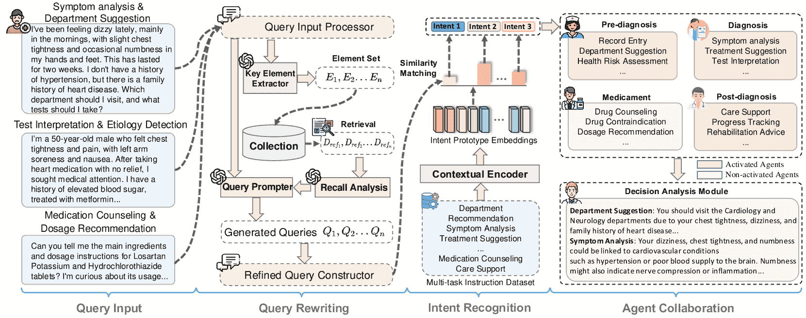
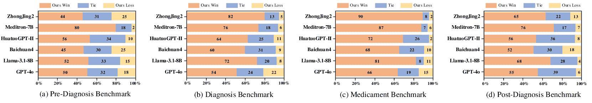
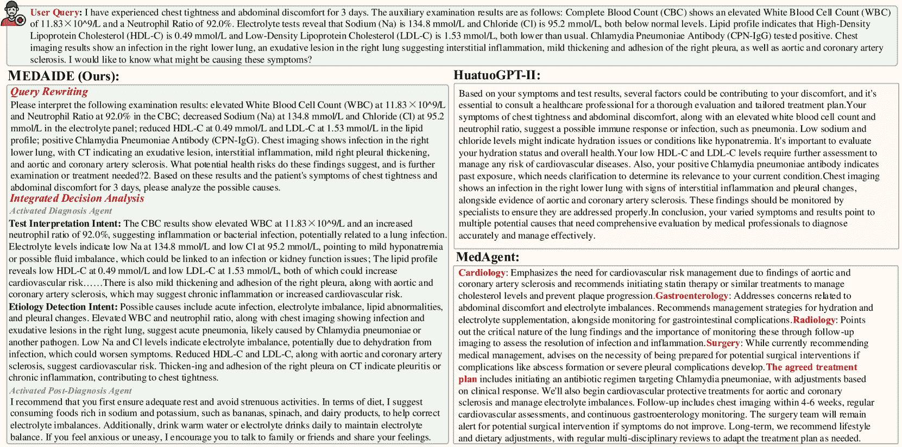
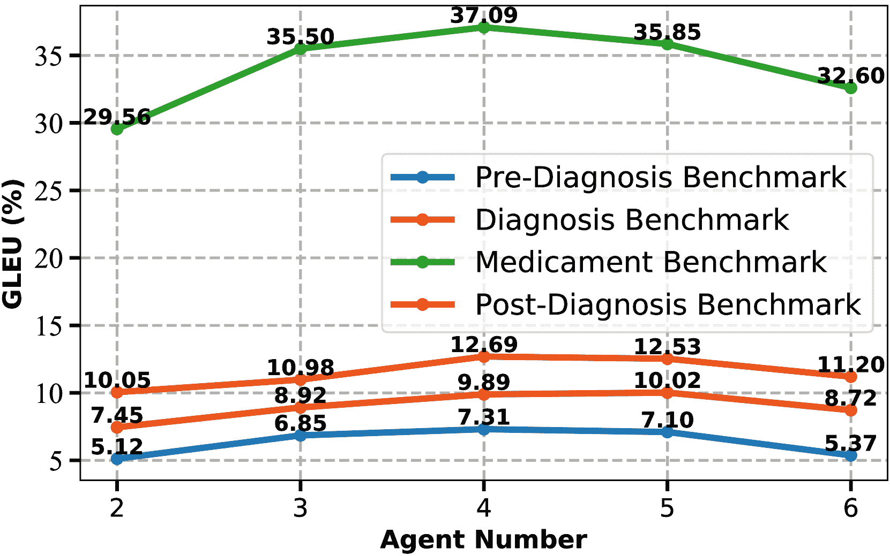
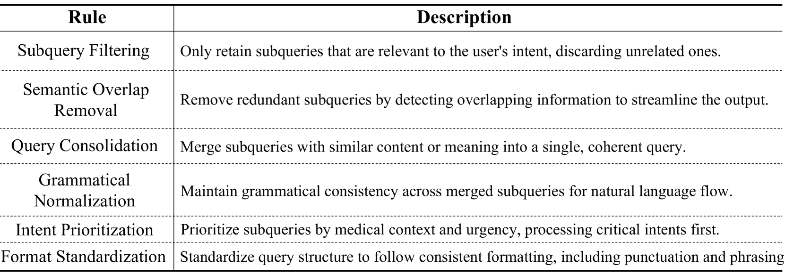
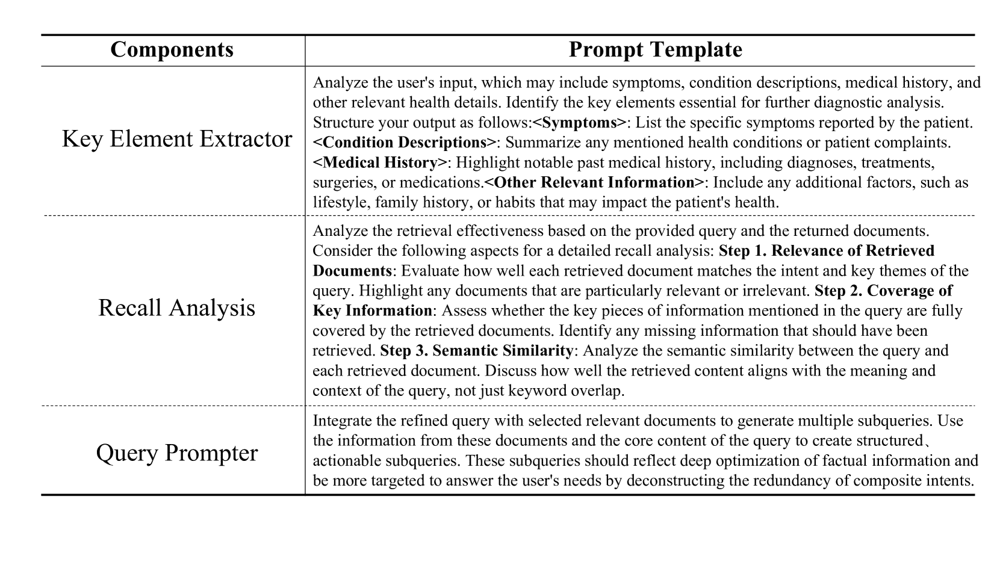
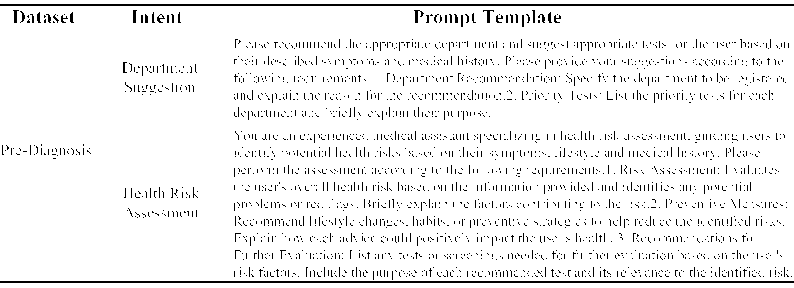
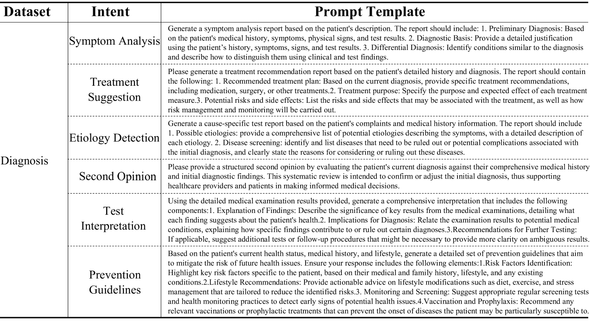
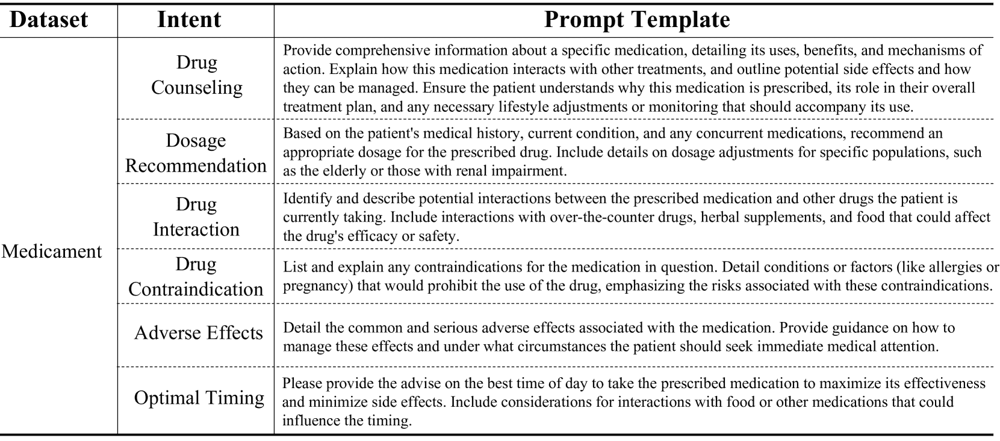
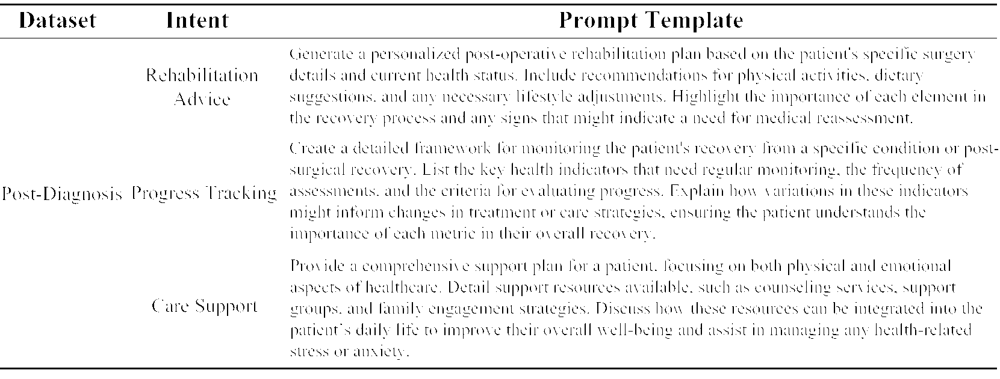

<!--yml
category: 未分类
date: 2025-01-11 12:05:30
-->

# MedAide: Towards an Omni Medical Aide via Specialized LLM-based Multi-Agent Collaboration

> 来源：[https://arxiv.org/html/2410.12532/](https://arxiv.org/html/2410.12532/)

Jinjie Wei^(1,2)²²2Equal contributions. ^§Corresponding authors.   Dingkang Yang^(1,2)²²2Equal contributions. ^§Corresponding authors.⁴⁴footnotemark: 4   Yanshu Li³²²2Equal contributions. ^§Corresponding authors.   Qingyao Xu^(1,2)
Zhaoyu Chen¹   Mingcheng Li^(1,2)   Yue Jiang^(1,2)   Xiaolu Hou^(1,2)   Lihua Zhang^(1,2)⁴⁴footnotemark: 4
¹Academy for Engineering and Technology, Fudan University
²Cognition and Intelligent Technology Laboratory, Fudan University
³Brown University
$\{$dkyang20, lihuazhang$\}$@fudan.edu.cn, jjwei23@m.fudan.edu.cn, yanshu_li1@brown.edu

###### Abstract

Large Language Model (LLM)-driven interactive systems currently show potential promise in healthcare domains. Despite their remarkable capabilities, LLMs typically lack personalized recommendations and diagnosis analysis in sophisticated medical applications, causing hallucinations and performance bottlenecks. To address these challenges, this paper proposes MedAide, an LLM-based omni medical multi-agent collaboration framework for specialized healthcare services. Specifically, MedAide first performs query rewriting through retrieval-augmented generation to accomplish accurate medical intent understanding. Immediately, we devise a contextual encoder to obtain intent prototype embeddings, which are used to recognize fine-grained intents by similarity matching. According to the intent relevance, the activated agents collaborate effectively to provide integrated decision analysis. Extensive experiments are conducted on four medical benchmarks with composite intents. Experimental results from automated metrics and expert doctor evaluations show that MedAide outperforms current LLMs and improves their medical proficiency and strategic reasoning.

MedAide: Towards an Omni Medical Aide via Specialized
LLM-based Multi-Agent Collaboration

Jinjie Wei^(1,2)²²2Equal contributions. ^§Corresponding authors.   Dingkang Yang^(1,2)²²2Equal contributions. ^§Corresponding authors.⁴⁴footnotemark: 4   Yanshu Li³²²2Equal contributions. ^§Corresponding authors.   Qingyao Xu^(1,2) Zhaoyu Chen¹   Mingcheng Li^(1,2)   Yue Jiang^(1,2)   Xiaolu Hou^(1,2)   Lihua Zhang^(1,2)⁴⁴footnotemark: 4 ¹Academy for Engineering and Technology, Fudan University ²Cognition and Intelligent Technology Laboratory, Fudan University ³Brown University $\{$dkyang20, lihuazhang$\}$@fudan.edu.cn, jjwei23@m.fudan.edu.cn, yanshu_li1@brown.edu

## 1 Introduction

Developing the goal-oriented conversation system Lee et al. ([2024](https://arxiv.org/html/2410.12532v2#bib.bib19)); Cheng et al. ([2023](https://arxiv.org/html/2410.12532v2#bib.bib10)) has received increasing attention in recent years. Advanced Large Language Models (LLMs) OpenAI ([2022](https://arxiv.org/html/2410.12532v2#bib.bib24)); Achiam et al. ([2023](https://arxiv.org/html/2410.12532v2#bib.bib3)); OpenAI ([2024](https://arxiv.org/html/2410.12532v2#bib.bib25)) have shown exceptional generalization capabilities in general scenarios for multiple purposes within human-machine interactions, such as negotiation He et al. ([2018](https://arxiv.org/html/2410.12532v2#bib.bib15)) and persuasion Wang et al. ([2019](https://arxiv.org/html/2410.12532v2#bib.bib30)). In this context, LLM-centered interactive medical assistants Bao et al. ([2023](https://arxiv.org/html/2410.12532v2#bib.bib5)); Yang et al. ([2024a](https://arxiv.org/html/2410.12532v2#bib.bib36), [2023b](https://arxiv.org/html/2410.12532v2#bib.bib38)); Shi ([2023](https://arxiv.org/html/2410.12532v2#bib.bib28)); Chen et al. ([2023b](https://arxiv.org/html/2410.12532v2#bib.bib9)) have become research hotspots that promise to improve diagnosis efficiency and promote service automation. Previous attempts infuse LLMs with healthcare-specific knowledge through relevant corpus construction (e.g., knowledge databases Li et al. ([2023b](https://arxiv.org/html/2410.12532v2#bib.bib23))) and multi-stage training procedures (e.g., supervised fine-tuning Xiong et al. ([2023](https://arxiv.org/html/2410.12532v2#bib.bib33))). Although these strategies stimulate the models’ comprehension of medically relevant intents, there are still bottlenecks when faced with real-world applications that require sophisticated reasoning.

Given the mimicking of learned feedback in human behaviors Du et al. ([2023](https://arxiv.org/html/2410.12532v2#bib.bib12)); Park et al. ([2023](https://arxiv.org/html/2410.12532v2#bib.bib26)), automated medical agent construction promises to enhance LLMs’ instruction following and logical profiling capabilities Lee et al. ([2024](https://arxiv.org/html/2410.12532v2#bib.bib19)). The collaboration among multiple agents to handle different patient inquiries and symptomatic caseloads facilitates accurate dialog goal fulfillment while accounting for individual differences Fan et al. ([2024](https://arxiv.org/html/2410.12532v2#bib.bib14)); Li et al. ([2024](https://arxiv.org/html/2410.12532v2#bib.bib21)). Despite significant advancements, current efforts focus primarily on medical education training Wei et al. ([2024](https://arxiv.org/html/2410.12532v2#bib.bib31)) or selective question-answering Tang et al. ([2024](https://arxiv.org/html/2410.12532v2#bib.bib29)), lacking understanding of complicated intents behind user queries and giving hierarchical therapeutic recommendations.

To address these issues, this paper proposes an LLM-based omni medical agent framework for real-world medical applications, called MedAide. The core philosophy of MedAide lies in first complementing and decomposing multi-dimensional medical intents through query rewriting to enhance the model’s dissection of composite medical queries. Then, we introduce a contextual encoder to learn intent prototype embeddings from multifaceted instructions, which is utilized to specify fine-grained target intents via the similarity matching lemma. In this case, different paramedical agents are correspondingly activated to provide personalized determinations with specialized medical expertise. Ultimately, we formulate a decision analysis module with Chain-of-Thought (CoT) properties to summarize the responses of activated agents in a faithful manner to make integrated decisions. The main contributions are summarized as follows:

*   •

    To the best of our knowledge, we are the first to propose the omni multi-agent collaboration framework for real-world scenarios with composite healthcare intents, which shows potential for advancing interactive systems for personalized healthcare.

*   •

    Our MedAide effectively improves the strategic reasoning of LLMs under complicated dialog goals through feedback and collaboration of specialized paramedical agents.

*   •

    Extensive experiments on seven medical benchmarks spanning 17 types of rich intents prove the effectiveness of MedAide. As a plug-and-play framework, MedAide can be readily combined with current LLMs and provides competitive improvements.

## 2 Related Work

### 2.1 LLMs in Healthcare Domains

The Large Language Models (LLMs) exemplified by ChatGPT (OpenAI, [2022](https://arxiv.org/html/2410.12532v2#bib.bib24)) and GPT-4 Achiam et al. ([2023](https://arxiv.org/html/2410.12532v2#bib.bib3)) demonstrate excellent performance in multidisciplinary applications. Although current LLMs Bai ([2023](https://arxiv.org/html/2410.12532v2#bib.bib1)); Yang et al. ([2023a](https://arxiv.org/html/2410.12532v2#bib.bib35)); AI ([2024](https://arxiv.org/html/2410.12532v2#bib.bib4)) with certain medical knowledge benefit from large-scale corpus support, they lack specialized medical proficiency and have significant performance bottlenecks in domain-specific scenarios. Recently, several attempts Chen et al. ([2023b](https://arxiv.org/html/2410.12532v2#bib.bib9), [a](https://arxiv.org/html/2410.12532v2#bib.bib8)); Xu ([2023](https://arxiv.org/html/2410.12532v2#bib.bib34)); Bao et al. ([2023](https://arxiv.org/html/2410.12532v2#bib.bib5)); Yang et al. ([2024a](https://arxiv.org/html/2410.12532v2#bib.bib36)) have begun to build medically customized LLM assistants to fulfill the diagnostic and consultative demands. For instance, HuatuoGPT series Zhang et al. ([2023](https://arxiv.org/html/2410.12532v2#bib.bib39)); Chen et al. ([2023a](https://arxiv.org/html/2410.12532v2#bib.bib8)) have shown promising results in bridging generic-medical knowledge gaps by absorbing real doctor-patient conversations. ZhongJing series Yang et al. ([2023b](https://arxiv.org/html/2410.12532v2#bib.bib38)); Shi ([2023](https://arxiv.org/html/2410.12532v2#bib.bib28)) improve Chinese medical capabilities by introducing expert feedback and multi-round medical instructions. In addition, PediatricsGPT Yang et al. ([2024a](https://arxiv.org/html/2410.12532v2#bib.bib36)) proposes a systematic training framework to construct interactive healthcare systems for pediatric specialists and medical generalists. Unlike previous studies, our framework aims to more fully recognize medical intents and refine the models’ reasoning abilities in complex scenarios through the LLM-based multi-agent collaboration.

### 2.2 LLM-based Multi-agent Collaboration

With the focus of researchers on sophisticated goal-oriented dialog generation Wu et al. ([2023](https://arxiv.org/html/2410.12532v2#bib.bib32)); Fan et al. ([2024](https://arxiv.org/html/2410.12532v2#bib.bib14)); Jiang et al. ([2024](https://arxiv.org/html/2410.12532v2#bib.bib17)), the inherent dilemmas of hallucinatory responses and weak comprehension Chen et al. ([2024](https://arxiv.org/html/2410.12532v2#bib.bib7)); Yang et al. ([2024b](https://arxiv.org/html/2410.12532v2#bib.bib37)) in LLMs have been gradually exposed. In this context, LLM-based automated agents are proposed to provide effective perception and decision-making skilfulness by incorporating external tools and databases Cai et al. ([2023](https://arxiv.org/html/2410.12532v2#bib.bib6)); Li et al. ([2023a](https://arxiv.org/html/2410.12532v2#bib.bib22)). By mimicking human behavioral logic, multiple agents perform feedback and collaboration to enhance diverse intent understanding tasks, including educational training Lee et al. ([2024](https://arxiv.org/html/2410.12532v2#bib.bib19)); Wei et al. ([2024](https://arxiv.org/html/2410.12532v2#bib.bib31)), emotional comfort Cheng et al. ([2023](https://arxiv.org/html/2410.12532v2#bib.bib10)), and workflow integration Hong et al. ([2023](https://arxiv.org/html/2410.12532v2#bib.bib16)). For example, MEDCO Wei et al. ([2024](https://arxiv.org/html/2410.12532v2#bib.bib31)) enables LLMs to simulate patients and doctors to enhance the practice performance of virtual students in interactive environments. MedAgents Tang et al. ([2024](https://arxiv.org/html/2410.12532v2#bib.bib29)) improves the performance of medical assistants in zero-shot settings through the role-playing strategy. In comparison, the proposed MedAide focuses more on mining profound healthcare intents and moving towards robust healthcare practices.

## 3 Methodology

Figure [1](https://arxiv.org/html/2410.12532v2#S3.F1 "Figure 1 ‣ 3 Methodology ‣ MedAide: Towards an Omni Medical Aide via Specialized LLM-based Multi-Agent Collaboration") presents the overall procedure of the proposed MedAide. Here, we detail the systematic workflow procedure, including query rewriting, intent recognition, and agent collaboration.

Figure 1: Illustration of the proposed MedAide framework. MedAide consists of three major phases: (i) query rewriting aims to reformulate medical queries and mine user intents to ensure the system accurately understands the input requirement goals. Among the optimized queries, (ii) intent recognition utilizes a designed contextual encoder to semantically match distinct medical intents to achieve accurate intent recognition. Based on the recognition results, (iii) agent collaboration dynamically activates the corresponding paramedical agents. Then, a decision analysis module incorporates the outputs of multiple agents and generates integrated analysis results.

### 3.1 Query Rewriting

In this phase, we first process the initial query through the query input processor. The processor is based on a set of syntactic regularization algorithms that combine LLMs with a predefined ruleset $R$ (please refer to Appendix [A.1](https://arxiv.org/html/2410.12532v2#A1.SS1 "A.1 Query Normalization and Parsing ‣ Appendix A Implementation Details ‣ MedAide: Towards an Omni Medical Aide via Specialized LLM-based Multi-Agent Collaboration") for details). The core concept is to check, optimize, and normalize user input to $Q_{std}$. Algorithm [1](https://arxiv.org/html/2410.12532v2#alg1 "Algorithm 1 ‣ 3.1 Query Rewriting ‣ 3 Methodology ‣ MedAide: Towards an Omni Medical Aide via Specialized LLM-based Multi-Agent Collaboration") shows the corresponding program. Then, a key element extractor distills critical information from $Q_{std}$, such as symptoms, condition descriptions, and medical histories, to form the element set $E_{i}$. In the Retrieval-Augmented Generation (RAG), we build an indexed database of 1,095 expert-reviewed medical guidelines and retrieve documents related to these elements using a semantic retrieval method  Lewis et al. ([2021](https://arxiv.org/html/2410.12532v2#bib.bib20)), forming the document set $D_{ref}$. After that, the recall analysis module selects the conforming documents by prompting guidance, which is fed into the LLM-based query prompter along with $Q_{std}$. The prompter optimizes the empirical information and efficient decomposition of composite intents. Eventually, we design a refined query constructor to merge and integrate the generated subqueries. It filters and reconstructs multiple subqueries $Q_{gen}$ with a predefined ruleset (please refer to Appendix [A.2](https://arxiv.org/html/2410.12532v2#A1.SS2 "A.2 Refined Query Construction ‣ Appendix A Implementation Details ‣ MedAide: Towards an Omni Medical Aide via Specialized LLM-based Multi-Agent Collaboration") for details) to ensure semantically complete and formally uniform output.

Algorithm 1 LLM-Based Input Standardization

  Input: User query $Q_{input}$, Large Language Model $\mathcal{M}$, Set of rules $\mathcal{R}$  Output: Standardized query $Q_{std}$  Initialize: $Q_{cur}\leftarrow Q_{input}$,$converged\leftarrow\text{False}$  while not $converged$ do     $converged\leftarrow\text{True}$     for each rule $r\in\mathcal{R}$ do        $Q_{new}\leftarrow\mathcal{M}(Q_{cur},r)$        if $Q_{new}\neq Q_{cur}$ then           $Q_{cur}\leftarrow Q_{new}$           $converged\leftarrow\text{False}$        end if     end for  end while  return $Q_{std}\leftarrow Q_{cur}$

### 3.2 Intent Recognition

After the query rewriting, the optimized query $Q_{opt}$ is matched with a set of intent prototype embeddings $E_{i}$ generated by a contextual encoder, which is designed to capture the semantic features of different medical intents. The encoder is constructed on top of BioBERT Lee et al. ([2019](https://arxiv.org/html/2410.12532v2#bib.bib18)) to learn prototype representations by performing fine-grained intent classification. We add a fully connected layer after the embedding layer with output dimensions aligned to the 17 medical intent categories and generate the corresponding probability distributions via a softmax activation function. Specifically, the contextual encoder maps the optimized query together with the intent embeddings into a 768-dimensional embedding space. It computes the cosine similarity $S_{ij}$ between the query and each intent embedding $E_{i}$ with the following formula:

|  | $S_{ij}=\frac{Q_{opt}\cdot E_{i}}{\left\&#124;Q_{opt}\right\&#124;\left\&#124;E_{i}\right\&#124;}.$ |  | (1) |

Subsequently, the probability distribution $\alpha_{ij}$ for each intent after the softmax is expressed as:

|  | $\alpha_{ij}=\frac{\exp(S_{ij})}{\sum_{l=1}^{17}\exp(S_{il})}.$ |  | (2) |

If the probability $\alpha_{ij}$ of an intent $i$ exceeds a predetermined threshold, the intent will be activated, triggering the corresponding agent:

|  | $\text{Activated Intent}_{i}=\left\{\begin{array}[]{ll}1&\text{if }\alpha_{ij}>% \text{Threshold},\\ 0&\text{otherwise}.\end{array}\right.$ |  | (3) |

In this way, our framework can automatically activate the most compliant medical intent based on the optimized query, directing it to the corresponding agent to perform subsequent operations.

### 3.3 Agent Collaboration

The corresponding agents are dynamically activated when the framework recognizes relevant and valid intents. Considering comprehensiveness and diversity, agent collaboration covers systematic healthcare services spanning pre-diagnosis, diagnosis, medicament, and post-diagnosis. Also, an LLM-based decision analysis module is employed for information integration and summarization.

Specifically speaking, the pre-diagnosis agent equips the patient repository, which is a relational database Codd ([1970](https://arxiv.org/html/2410.12532v2#bib.bib11)) for storing historical patient visit records. These records can be utilized for health assessments, identifying potential risks, and recommending appropriate departments to visit.

The diagnosis agent incorporates 506 high-quality cases provided in the medical record database Fan et al. ([2024](https://arxiv.org/html/2410.12532v2#bib.bib14)). We employ a hybrid retrieval scheme Sawarkar et al. ([2024](https://arxiv.org/html/2410.12532v2#bib.bib27)) to obtain demonstrations similar to the patient’s condition, thus providing reliable evidence regarding precise treatment recommendations in symptom analysis and etiological ranking intents. The hybrid retrieval consists of two main components: keyword retrieval and vector retrieval. First, the framework extracts a subset of documents $D_{\text{slice}}$ containing the query keyword from the document collection $D$ by the keyword retrieval of Eq. ([1](https://arxiv.org/html/2410.12532v2#S3.E1 "In 3.2 Intent Recognition ‣ 3 Methodology ‣ MedAide: Towards an Omni Medical Aide via Specialized LLM-based Multi-Agent Collaboration")):

|  | $D_{\text{slice}}=\{d\in D\mid\text{KeywordMatch}(Q,d)=True\}.$ |  | (4) |

Afterward, MedAide calculates the similarity $S(Q,d)$ between the query $Q$ and the document $d$ according to Eq. ([2](https://arxiv.org/html/2410.12532v2#S3.E2 "In 3.2 Intent Recognition ‣ 3 Methodology ‣ MedAide: Towards an Omni Medical Aide via Specialized LLM-based Multi-Agent Collaboration")) by vector retrieval and retains the documents whose similarity is higher than a threshold set $\tau$, forming a subset $D_{\text{match}}$:

|  | $S(Q,d)=\frac{E_{Q}\cdot E_{D}}{\&#124;E_{Q}\&#124;\&#124;E_{D}\&#124;},$ |  | (5) |

|  | $D_{\text{match}}=\{d\in D\mid S(Q,d)>\tau\}.$ |  | (6) |

Subsequently, the keyword matching results in $D_{\text{slice}}$, and the vector retrieval results in $D_{\text{match}}$ are merged to obtain the final set of relevant documents $D_{\text{final}}$. These documents will provide empirical support for diagnostic recommendations:

|  | $D_{\text{final}}=D_{\text{slice}}\cup D_{\text{match}}$ |  | (7) |

In this case, the diagnosis agent further interprets the ancillary examination results to help patients understand their health status. Meanwhile, it provides a second diagnostic opinion to minimize the risk of misdiagnosis.

The medicament agent utilizes 26,684 medication data extracted from the PubMed library Pud ([2024](https://arxiv.org/html/2410.12532v2#bib.bib2)) and provides patients with comprehensive medication counseling through keyword and semantic hybrid retrieval. The holistic counseling includes drug usage, dosage recommendations, potential drug interactions, and contraindications assessments to ensure the safety and efficacy of the medication. In addition, it helps patients understand potential side effects and suggests the best timing for medication administration to optimize treatment outcomes.

The post-diagnosis agent focuses on providing personalized rehabilitation advice and emotional support. It tracks and manages the recovery process by updating the patient repository with patient information.

The Decision Analysis Module (DAM) with the CoT properties combines the output of specific activated agents with the patient’s medical histories to dynamically adjust the treatment protocols and formulate integrated rehabilitation plans. The final answer generated by DAM based on $D_{\text{final}}$, the prompt, and the agent output $A_{i}$ is expressed as follows:

|  | $Answer=\text{DAM}(A_{i},\text{prompt},D_{\text{final}}).$ |  | (8) |

 | Models | BLEU-1 | BLEU-2 | ROUGE-1 | ROUGE-2 | ROUGE-L | GLEU |
| --- | --- | --- | --- | --- | --- | --- |
| ZhongJing2/ + MedAide | 9.06/9.18 | 2.68/2.81 | 17.54/19.83 | 1.70/2.86 | 10.04/11.74 | 3.66/4.19 |
| Meditron-7B/ + MedAide | 3.76/4.94 | 0.91/1.30 | 9.63/10.51 | 0.64/0.68 | 4.52/5.21 | 1.74/2.07 |
| HuatuoGPT-II/ + MedAide | 14.6/15.18 | 5.87/6.63 | 26.81/31.84 | 5.26/9.88 | 13.57/19.04 | 6.43/7.25 |
| Baichuan4/ + MedAide | 12.97/15.95 | 5.39/7.85 | 22.68/33.60 | 4.68/11.69 | 13.33/20.75 | 5.57/7.98 |
| LLama-3.1-8B/ + MedAide | 10.95/15.36 | 2.13/6.78 | 22.47/32.54 | 2.62/9.41 | 11.45/19.29 | 4.37/6.45 |
| GPT-4o/ + MedAide | 15.28/15.93 | 6.33/7.56 | 26.89/30.78 | 5.95/8.65 | 14.15/17.64 | 6.34/7.31 | 

Table 1: Comparison results on the Pre-Diagnosis benchmark.

 | Models | BLEU-1 | BLEU-2 | ROUGE-1 | ROUGE-2 | ROUGE-L | GLEU |
| --- | --- | --- | --- | --- | --- | --- |
| ZhongJing2/ + MedAide | 10.50/11.72 | 4.80/5.58 | 24.08/24.59 | 4.93/4.79 | 12.94/11.96 | 5.85/5.79 |
| Meditron-7B/ + MedAide | 12.01/13.93 | 3.13/6.03 | 19.10/26.53 | 3.60/6.12 | 8.60/11.67 | 3.99/6.48 |
| HuatuoGPT-II/ + MedAide | 22.65/25.26 | 10.21/12.11 | 34.51/40.32 | 8.36/11.73 | 15.77/19.11 | 8.95/10.65 |
| Baichuan4/ + MedAide | 22.58/25.51 | 10.98/13.61 | 36.26/42.77 | 10.30/15.00 | 17.03/22.43 | 9.61/11.95 |
| LLama-3.1-8B/ + MedAide | 16.92/22.75 | 6.56/9.97 | 26.39/38.52 | 4.78/10.41 | 12.79/18.68 | 6.21/8.94 |
| GPT-4o/ + MedAide | 21.67/26.80 | 9.73/14.56 | 32.67/44.11 | 7.95/15.81 | 16.20/23.67 | 8.41/12.69 | 

Table 2: Comparison results on the Diagnosis benchmark.

## 4 Experiments

### 4.1 Datasets and Implementation Details

All experiments are conducted in the zero-shot setting. To reflect the real-world demands for healthcare services, we conduct four different benchmarks across 17 types of medical intents, including Pre-Diagnosis, Diagnosis, Medicament, and Post-Diagnosis benchmarks. Each benchmark contains 500 composite intent instances. Please refer to Figures [7](https://arxiv.org/html/2410.12532v2#A2.F7 "Figure 7 ‣ Appendix B Prompt Templates ‣ MedAide: Towards an Omni Medical Aide via Specialized LLM-based Multi-Agent Collaboration"),  [8](https://arxiv.org/html/2410.12532v2#A2.F8 "Figure 8 ‣ Appendix B Prompt Templates ‣ MedAide: Towards an Omni Medical Aide via Specialized LLM-based Multi-Agent Collaboration"),  [9](https://arxiv.org/html/2410.12532v2#A2.F9 "Figure 9 ‣ Appendix B Prompt Templates ‣ MedAide: Towards an Omni Medical Aide via Specialized LLM-based Multi-Agent Collaboration"), and  [10](https://arxiv.org/html/2410.12532v2#A2.F10 "Figure 10 ‣ Appendix B Prompt Templates ‣ MedAide: Towards an Omni Medical Aide via Specialized LLM-based Multi-Agent Collaboration"). in the Appendix for the specific intent taxonomy. For a comprehensive overview of the prompts used during the query rewriting and agent collaboration phases within MedAide, refer to Appendix  [B](https://arxiv.org/html/2410.12532v2#A2 "Appendix B Prompt Templates ‣ MedAide: Towards an Omni Medical Aide via Specialized LLM-based Multi-Agent Collaboration"). Additionally, to enable fine-grained medical intent recognition, we develop a contextual encoder training dataset consisting of 2,800 training samples, 300 validation samples, and 300 testing samples. Further configuration details can be found in Appendix [A.3](https://arxiv.org/html/2410.12532v2#A1.SS3 "A.3 Training Details of BioBert Encoder ‣ Appendix A Implementation Details ‣ MedAide: Towards an Omni Medical Aide via Specialized LLM-based Multi-Agent Collaboration").

 | Models | BLEU-1 | BLEU-2 | ROUGE-1 | ROUGE-2 | ROUGE-L | GLEU |
| --- | --- | --- | --- | --- | --- | --- |
| ZhongJing2/ + MedAide | 11.83/11.91 | 4.48/4.57 | 21.61/24.23 | 4.65/5.91 | 13.55/14.75 | 5.32/6.38 |
| Meditron-7B/ + MedAide | 5.76/19.43 | 2.04/17.50 | 12.29/34.84 | 2.12/29.43 | 6.31/32.57 | 2.79/24.47 |
| HuatuoGPT-II/ + MedAide | 17.14/37.89 | 9.61/27.47 | 30.72/58.06 | 11.96/33.62 | 19.96/45.39 | 9.57/24.23 |
| Baichuan4/ + MedAide | 14.64/44.63 | 7.12/36.34 | 26.26/62.11 | 8.09/42.56 | 15.47/49.91 | 7.08/35.99 |
| LLama-3.1-8B/ + MedAide | 13.80/23.87 | 5.90/16.75 | 27.28/47.39 | 7.50/26.75 | 16.05/38.30 | 6.37/15.77 |
| GPT-4o/ + MedAide | 16.23/45.13 | 8.16/38.96 | 29.24/65.09 | 9.78/40.53 | 17.53/52.71 | 8.61/37.09 | 

Table 3: Comparison results on the Medicament benchmark.

 | Models | BLEU-1 | BLEU-2 | ROUGE-1 | ROUGE-2 | ROUGE-L | GLEU |
| --- | --- | --- | --- | --- | --- | --- |
| ZhongJing2/ + MedAide | 12.97/19.91 | 4.86/6.86 | 25.31/31.98 | 4.21/4.48 | 12.44/15.00 | 5.63/7.22 |
| Meditron-7B/ + MedAide | 8.72/12.78 | 2.46/3.06 | 18.75/20.21 | 1.77/4.32 | 7.28/8.58 | 3.84/4.40 |
| HuatuoGPT-II/ + MedAide | 21.39/26.10 | 12.24/12.46 | 35.55/42.23 | 11.02/13.62 | 13.62/21.18 | 10.59/10.96 |
| Baichuan4/ + MedAide | 15.89/26.10 | 7.06/13.92 | 27.69/44.55 | 6.92/13.05 | 14.86/21.35 | 6.59/11.61 |
| LLama-3.1-8B/ + MedAide | 21.85/22.95 | 7.42/7.68 | 35.36/39.71 | 5.22/7.97 | 15.02/17.93 | 7.65/8.01 |
| GPT-4o/ + MedAide | 19.27/26.83 | 9.28/11.54 | 30.72/40.83 | 8.64/8.71 | 16.22/18.12 | 8.41/9.89 | 

Table 4: Comparison results on the Post-Diagnosis benchmark.

Figure 2: Response comparisons of MedAide with other baselines via doctor evaluation.

### 4.2 Model Zoo

We compare a series of state-of-the-art (SOTA) models for comprehensive evaluations. Among medical LLMs, ZhongJing2 Shi ([2023](https://arxiv.org/html/2410.12532v2#bib.bib28)) is a traditional Chinese medicine model based on Qwen-1.5-1.8B with complete training procedures. Meditron-7B Chen et al. ([2023b](https://arxiv.org/html/2410.12532v2#bib.bib9)) performs medically relevant continuous pre-training on Llama-2-7B to extend the breadth and depth of the model in medical knowledge. HuatuoGPT-II (13B) Chen et al. ([2023a](https://arxiv.org/html/2410.12532v2#bib.bib8)) employs a one-stage unified approach for domain adaptation to improve medical expertise and model applicability. In general-purpose models, Baichuan4 AI ([2024](https://arxiv.org/html/2410.12532v2#bib.bib4)) optimizes long texts by scaling law and combines reinforcement learning techniques to improve reasoning ability. Llama-3.1-8B Dubey et al. ([2024](https://arxiv.org/html/2410.12532v2#bib.bib13)) relies on the grouped query attention mechanism to enhance the inference efficiency and performs well on multilingual tasks. GPT-4o OpenAI ([2024](https://arxiv.org/html/2410.12532v2#bib.bib25)) shows excellent language comprehension and generation capabilities and excels in handling complex tasks.

### 4.3 Comparision with SOTA Methods

As a plug-and-play framework, we combine MedAide with the baseline models to provide comprehensive evaluations by different metrics, including BLEU-1/2 (%), ROUGE-1/2/L (%), and GLEU (%). Comparison results on the four medical benchmarks are shown below.

Results on Pre-Diagnosis Benchmark. As Table [1](https://arxiv.org/html/2410.12532v2#S3.T1 "Table 1 ‣ 3.3 Agent Collaboration ‣ 3 Methodology ‣ MedAide: Towards an Omni Medical Aide via Specialized LLM-based Multi-Agent Collaboration") shows, our framework consistently improves the performance across metrics for all models. (i) For instance, MedAide-based HuatuoGPT-II and Baichuan4 show significant relative improvements in ROUGE-L scores of 40.3% and 55.6%, respectively, suggesting multidimensional health risk assessments for patient cases. (ii) In addition, MedAide helps general LLama-3.1-8B to enhance the diversity and precision of diagnostic content generation, as reflected in the average 79.15% increase of BLEU-1/2 relative to the vanilla baseline. (iii) Despite the performance constraints of ZhongJing2 and Meditron-7B in tackling complex medical scenarios due to the scaling law, our framework still provides sustained performance gains.

Results on Diagnosis Benchmark. Table [2](https://arxiv.org/html/2410.12532v2#S3.T2 "Table 2 ‣ 3.3 Agent Collaboration ‣ 3 Methodology ‣ MedAide: Towards an Omni Medical Aide via Specialized LLM-based Multi-Agent Collaboration") shows the diagnosis task results containing six composite intent scenarios. (i) Combined with our framework, Meditron-7B and HuatuoGPT-II outperform vanilla baselines in response accuracy and completeness, as evidenced by significant improvements across metrics. These gains show that MedAide assists medical LLMs in giving more comprehensive symptom analyses and treatment suggestions with enhanced hierarchical interpretation capabilities regarding examination results. (ii) Meanwhile, the general models (e.g., LLama-3.1-8B and GPT-4o) equipped with MedAide enhance the specialization and adaptability in healthcare services. (iii) We observe slight performance drops (less than 1%) in ZhongJing-2 on ROUGE-2/L and GLEU. The potential reason is that the model has difficulty in the query rewriting phase to grasp the multifaceted knowledge of the retrieval-augmented generation due to the limited capacity, causing sub-optimal prevention guidelines and second opinions.

 |  | Pre-Diagnosis | Diagnosis | Medicament | Post-Diagnosis |
| Components | ROUGE-L | GLEU | ROUGE-L | GLEU | ROUGE-L | GLEU | ROUGE-L | GLEU |
| Full MedAide | 17.64 | 7.31 | 23.67 | 12.69 | 52.71 | 37.09 | 18.12 | 9.89 |
| w/o Query Rewriting | 16.02 | 6.44 | 18.35 | 10.37 | 32.06 | 32.45 | 16.48 | 8.79 |
| w/ GPT-4o Recognition | 16.58 | 6.73 | 22.98 | 12.34 | 44.72 | 34.10 | 17.56 | 9.02 |
| w/o Decision Analysis | 17.22 | 7.22 | 23.14 | 12.54 | 48.72 | 35.25 | 18.04 | 9.56 | 

Table 5: Ablation study results on four benchmarks.“w/” and “w/o” are short for with and without, respectively.

 | Benchmarks | MedAide | w/o QR | w/ GPT-4 R |
| --- | --- | --- | --- |
| Pre-Diagnosis | 0.76 | 0.62 | 0.47 |
| Diagnosis | 0.83 | 0.61 | 0.49 |
| Medicament | 0.80 | 0.49 | 0.51 |
| Post-Diagnosis | 0.63 | 0.56 | 0.37 |
| Intent Aggregation | 0.86 | 0.60 | 0.60 | 

Table 6: Comparison of F1 scores (%) across five benchmarks. “QR” means the Query Rewriting. “GPT-4o R” means the GPT-4o Recognition.

Results on Medicament Benchmark. Table [3](https://arxiv.org/html/2410.12532v2#S4.T3 "Table 3 ‣ 4.1 Datasets and Implementation Details ‣ 4 Experiments ‣ MedAide: Towards an Omni Medical Aide via Specialized LLM-based Multi-Agent Collaboration") provides the exploration results of different models on composite medication intents. (i) Attributed to the drug knowledge injection and prototype-guided embedding in MedAide, the reliability of medication counseling responses is consistently improved across all baselines. (ii) In this case, Baichuan4 and GPT-4o demonstrate the most significant overall gains. For example, the GLEU scores separately increase 28.91% and 28.48%. This finding indicates that MedAide facilitates LLMs with large-window contexts to comprehend rich drug information and provide specialized dosage recommendations. (iii) In the zero-shot reasoning pattern, Meditron-7B’s ROUGE-1/2/L remarkably enhances from 12.29/2.12/6.31% to 34.84/29.43/32.57%, verifying that our decision-analysis module provides favorable factual evidence in drug contraindication understanding.

Results on Post-Diagnosis Benchmark. (i) In the post-diagnosis applications from Table [4](https://arxiv.org/html/2410.12532v2#S4.T4 "Table 4 ‣ 4.1 Datasets and Implementation Details ‣ 4 Experiments ‣ MedAide: Towards an Omni Medical Aide via Specialized LLM-based Multi-Agent Collaboration"), we observe that most MedAide-based models are superior to vanilla baselines by large margins. (ii) GPT-4o performs even better in generating personalized rehabilitation recommendations, with a relative improvement of 39.23% in the BLEU-1 score, providing hopefully more reliable rehabilitation guidelines for patients. (iii) Meanwhile, Baichuan4 improves on the ROUGE-L metric by 21.35%, revealing the MedAide-based version’s advantages in processing dynamic medical data and producing progress tracking reports.

### 4.4 Expert Doctor Evaluation

Expert evaluations play a key role in the practical applications of medical models. We invite 6 doctors (each paid $300) to select the winners of responses generated by different models before and after the introduction of MedAide by majority voting rule. The response content is holistically evaluated by considering factual accuracy, recommendation practicality, and humanistic care. (i) As shown in Figure [2](https://arxiv.org/html/2410.12532v2#S4.F2 "Figure 2 ‣ 4.1 Datasets and Implementation Details ‣ 4 Experiments ‣ MedAide: Towards an Omni Medical Aide via Specialized LLM-based Multi-Agent Collaboration"), all the MedAide-based models exhibit more win rates in different benchmark tests, indicating the effectiveness and applicability of the proposed framework. (ii) MedAide not only improves the healthcare specialization of medical LLMs with different sizes, but also significantly enhances the coping ability of general-purpose models when dealing with complicated medical tasks.

### 4.5 Ablation Study

We perform systematic ablation studies to explore the effects of different components in Table [5](https://arxiv.org/html/2410.12532v2#S4.T5 "Table 5 ‣ 4.3 Comparision with SOTA Methods ‣ 4 Experiments ‣ MedAide: Towards an Omni Medical Aide via Specialized LLM-based Multi-Agent Collaboration"). GPT-4o is chosen as the baseline to combine MedAide.

Necessity of Query Rewriting. Firstly, we remove the query rewriting procedure to assess its impact on performance. (i) The observed significant declines in all metrics indicate that query rewriting is crucial for ensuring that the input information is accurately interpreted by downstream modules with respect to intents. (ii) Additionally, incorporating factual information as context enhances the model’s ability to accurately comprehend user queries, mitigating hallucinations and reducing the generation of ambiguous interpretations.

Importance of Intent Recognition. We replace the learning-based contextual encoder with the prompt-based GPT-4o to explore the impact of different intent recognition strategies. (i) Despite the improvement over the vanilla baseline, GPT-4o recognition is a sub-optimal solution. We argue that the encoder trained with explicitly supervised information can align more purposefully to actual medical intents, producing more personalized and representative judgments than prompt engineering. (ii) Also, our default strategy has better flexibility and extensibility, which can be dynamically optimized according to specific healthcare scenarios.

Effectiveness of Decision Analysis. Furthermore, we directly assemble the different outputs produced by the activated agents to serve as an alternative candidate. The results from the bottom of Table [5](https://arxiv.org/html/2410.12532v2#S4.T5 "Table 5 ‣ 4.3 Comparision with SOTA Methods ‣ 4 Experiments ‣ MedAide: Towards an Omni Medical Aide via Specialized LLM-based Multi-Agent Collaboration") show consistent performance drops of the model on different medical intent understandings, proving the effectiveness of our method. A plausible explanation is that the decision analysis module not only summarizes the different agent outputs in an organized manner, but also provides comprehensive and accurate conclusions based on medical guidelines and patient histories.

 | Benchmarks | MedAide (Ours) | MedAgent |
| --- | --- | --- |
| Pre-Diagnosis | 15.93/17.64 | 14.33/15.26 |
| Diagnosis | 27.80/23.67 | 25.46/19.54 |
| Medicament | 45.13/52.17 | 28.69/36.07 |
| Post-Diagnosis | 26.83/18.12 | 25.45/16.69 | 

Table 7: Comparison of BLEU-1/ROUGE-L scores (%) between MedAide and MedAgent across benchmarks.

Figure 3: Response visualization analysis on different models for the same user query.

### 4.6 Intent Detection Analysis

To further observe the intent detection performance, Table [6](https://arxiv.org/html/2410.12532v2#S4.T6 "Table 6 ‣ 4.3 Comparision with SOTA Methods ‣ 4 Experiments ‣ MedAide: Towards an Omni Medical Aide via Specialized LLM-based Multi-Agent Collaboration") compares the F1 scores computed between the intents recognized by MedAide and ground truths under different strategies. We randomly sample 100 instances from each benchmark to compose a more challenging Intent Aggregation benchmark. The core observations are as follows. (i) The complete framework achieves the best results, reaching even 86% performance on the Aggregation benchmark, exhibiting omni intent semantic understanding capabilities. (ii) Significant performance deteriorations occur at “w/o QR” and “w/ GPT-4o R”, implying the effectiveness of fine-grained decomposition of medical queries and the development of our tailored intent recognition mechanism.

Figure 4: The effect of different agent numbers on performance across the four medical benchmarks.

### 4.7 Collaboration Framework Comparison

Here, we compare the reproducible multi-agent framework MedAgent Tang et al. ([2024](https://arxiv.org/html/2410.12532v2#bib.bib29)). This medical framework mainly sets up four department-specific experts, including pediatrics, cardiology, pulmonology, and neonatology. Each expert is based on the GPT-4o implementation and works together to collaboratively generate a unified report as the final result. (i) From Table [7](https://arxiv.org/html/2410.12532v2#S4.T7 "Table 7 ‣ 4.5 Ablation Study ‣ 4 Experiments ‣ MedAide: Towards an Omni Medical Aide via Specialized LLM-based Multi-Agent Collaboration"), our framework outperforms MedAgent on all four benchmarks. For instance, in the Medicament benchmark, MedAide beats MedAgent by large margins with absolute gains of 16.44/16.70% on the BLEU-1/ROUGE-L scores. This strength comes from our specialized medication retrieval, which provides a refined context of drug information for the model. (ii) Also, the benefits on Pre-Diagnosis and Post-Diagnosis tasks reflect that the proposed MedAide captures the key characteristics of diagnostic and nursing demands more efficiently.

### 4.8 Response Visualization Analysis

To intuitively compare the response quality of the different models, we show in Figure [3](https://arxiv.org/html/2410.12532v2#S4.F3 "Figure 3 ‣ 4.5 Ablation Study ‣ 4 Experiments ‣ MedAide: Towards an Omni Medical Aide via Specialized LLM-based Multi-Agent Collaboration") the generated results of MedAide and SOTA methods under the same user query. HuatuoGPT-II provides extensive medical knowledge but lacks targeted recommendations. Although the MedAgent framework gives detailed treatment solutions through multidisciplinary perspectives, it falls short of coherent diagnostic reasoning. In contrast, our framework interprets patient outcomes in detail and provides personalized diagnoses and subsequent treatments. MedAide shows favorable usefulness in electrolyte imbalance and cardiovascular risk management.

### 4.9 Effect of Agent Number

Figure [4](https://arxiv.org/html/2410.12532v2#S4.F4 "Figure 4 ‣ 4.6 Intent Detection Analysis ‣ 4 Experiments ‣ MedAide: Towards an Omni Medical Aide via Specialized LLM-based Multi-Agent Collaboration") illustrates the variation trend of model performance when the number of agents in the proposed MedAide changes. When the agent number is increased from 2 to 4, there are progressive improvements in the results on all benchmarks, suggesting that multi-agent collaboration helps to improve the model’s performance in multi-tasking scenarios. Conversely, when the agent number exceeds 4 does not bring significant gains due to introducing too much information redundancy.

## 5 Conclusion and Future Work

This paper introduces MedAide, a multi-agent framework for complex medical scenarios. Leveraging query rewriting, intent recognition, and agent collaboration, MedAide enhances the model’s comprehension of medical intents and demonstrates effectiveness across multiple benchmarks.

Future Work. We plan to incorporate complementary modalities (e.g., medical imaging) in the future to improve the potential of MedAide in multimodal diagnostics and applications.

## Limitations

The MedAide framework, while making significant strides in integrating large-scale medical agents with real clinical environments, has its limitations. Currently, the framework incorporates 26,684 drug samples and 506 genuine clinical case records. Despite this scope, it lacks comprehensive coverage, particularly in research on rare diseases and specialized medications. Furthermore, as the initial versions primarily emphasized linguistic processing, future research aims to extend into multimodal capabilities, particularly the integration of medical imaging data, to enhance the framework’s ability to process visual information in clinical diagnostics. The reliance on OpenAI’s API may pose potential operational challenges, suggesting that future studies should explore using more efficient open-source models as viable alternatives. Despite these limitations, the MedAide framework provides a solid foundation for advancing the integration of artificial intelligence in clinical diagnostics.

## Ethics Consideration

Ethical considerations are paramount in the application of medical agents to real-world clinical settings. We are fully aware of the potential impacts of our research and have taken deliberate actions to address these issues. To enhance transparency, we are committed to publicly making the drug data and medical records used in our study accessible. This will enable other researchers to validate our findings and build upon our work, fostering collaboration and advancement in this field.

We are acutely aware of the necessity for privacy and data protection. All data utilized has undergone thorough de-identification, with all sensitive information removed, and verified by a partnering medical institution. We invite doctors to perform only evaluations of model responses without involving any form of human subject research. All participants are compensated $300 for their work, which strictly adheres to the minimum hourly rate for the region in which the work is performed. For the utilization of healthcare-related data, we strictly follow the license agreements of publicly available databases. For the constructed data, we have undergone an internal ethical review by the ethics review board of our partnering medical institutions and are licensed and approved.

## Acknowledgment

This work is supported in part by the National Key R&D Program of China under Grant 2021ZD0113502, in part by the Shanghai Municipal Science and Technology Major Project under Grant 2021SHZDZX0103, and in part by the Shanghai Municipal Science and Technology Committee of Shanghai Outstanding Academic Leaders Plan (No. 21XD1430300).

## References

*   Bai (2023) 2023. Baichuan. [https://github.com/baichuan-inc/Baichuan-13B](https://github.com/baichuan-inc/Baichuan-13B).
*   Pud (2024) 2024. National library of medicine. [https://pubmed.ncbi.nlm.nih.gov/](https://pubmed.ncbi.nlm.nih.gov/).
*   Achiam et al. (2023) Josh Achiam, Steven Adler, Sandhini Agarwal, Lama Ahmad, Ilge Akkaya, Florencia Leoni Aleman, Diogo Almeida, Janko Altenschmidt, Sam Altman, Shyamal Anadkat, et al. 2023. Gpt-4 technical report. *arXiv preprint arXiv:2303.08774*.
*   AI (2024) Baichuan AI. 2024. Introducing baichuan4. [https://platform.baichuan-ai.com/homePage](https://platform.baichuan-ai.com/homePage).
*   Bao et al. (2023) Zhijie Bao, Wei Chen, Shengze Xiao, Kuang Ren, Jiaao Wu, Cheng Zhong, Jiajie Peng, Xuanjing Huang, and Zhongyu Wei. 2023. Disc-medllm: Bridging general large language models and real-world medical consultation. *arXiv preprint arXiv:2308.14346*.
*   Cai et al. (2023) Tianle Cai, Xuezhi Wang, Tengyu Ma, Xinyun Chen, and Denny Zhou. 2023. Large language models as tool makers. *arXiv preprint arXiv:2305.17126*.
*   Chen et al. (2024) Jiawei Chen, Dingkang Yang, Tong Wu, Yue Jiang, Xiaolu Hou, Mingcheng Li, Shunli Wang, Dongling Xiao, Ke Li, and Lihua Zhang. 2024. Detecting and evaluating medical hallucinations in large vision language models. *arXiv preprint arXiv:2406.10185*.
*   Chen et al. (2023a) Junying Chen, Xidong Wang, Anningzhe Gao, Feng Jiang, Shunian Chen, Hongbo Zhang, Dingjie Song, Wenya Xie, Chuyi Kong, Jianquan Li, Xiang Wan, Haizhou Li, and Benyou Wang. 2023a. [Huatuogpt-ii, one-stage training for medical adaption of llms](https://api.semanticscholar.org/CorpusID:265221365). *ArXiv*, abs/2311.09774.
*   Chen et al. (2023b) Zeming Chen, Alejandro Hernández-Cano, Angelika Romanou, Antoine Bonnet, Kyle Matoba, Francesco Salvi, Matteo Pagliardini, Simin Fan, Andreas Köpf, Amirkeivan Mohtashami, Alexandre Sallinen, Alireza Sakhaeirad, Vinitra Swamy, Igor Krawczuk, Deniz Bayazit, Axel Marmet, Syrielle Montariol, Mary-Anne Hartley, Martin Jaggi, and Antoine Bosselut. 2023b. [Meditron-70b: Scaling medical pretraining for large language models](https://arxiv.org/abs/2311.16079). *Preprint*, arXiv:2311.16079.
*   Cheng et al. (2023) Yi Cheng, Wenge Liu, Jian Wang, Chak Tou Leong, Yi Ouyang, Wenjie Li, Xian Wu, and Yefeng Zheng. 2023. [Cooper: Coordinating specialized agents towards a complex dialogue goal](https://arxiv.org/abs/2312.11792). *Preprint*, arXiv:2312.11792.
*   Codd (1970) Edgar F Codd. 1970. A relational model of data for large shared data banks. *Communications of the ACM*, 13(6):377–387.
*   Du et al. (2023) Yilun Du, Shuang Li, Antonio Torralba, Joshua B Tenenbaum, and Igor Mordatch. 2023. Improving factuality and reasoning in language models through multiagent debate. *arXiv preprint arXiv:2305.14325*.
*   Dubey et al. (2024) Abhimanyu Dubey, Abhinav Jauhri, Abhinav Pandey, Abhishek Kadian, Ahmad Al-Dahle, Aiesha Letman, Akhil Mathur, Alan Schelten, Amy Yang, Angela Fan, et al. 2024. The llama 3 herd of models. *arXiv preprint arXiv:2407.21783*.
*   Fan et al. (2024) Zhihao Fan, Jialong Tang, Wei Chen, Siyuan Wang, Zhongyu Wei, Jun Xi, Fei Huang, and Jingren Zhou. 2024. [Ai hospital: Benchmarking large language models in a multi-agent medical interaction simulator](https://arxiv.org/abs/2402.09742). *Preprint*, arXiv:2402.09742.
*   He et al. (2018) He He, Derek Chen, Anusha Balakrishnan, and Percy Liang. 2018. Decoupling strategy and generation in negotiation dialogues. *arXiv preprint arXiv:1808.09637*.
*   Hong et al. (2023) Sirui Hong, Mingchen Zhuge, Jonathan Chen, Xiawu Zheng, Yuheng Cheng, Jinlin Wang, Ceyao Zhang, Zili Wang, Steven Ka Shing Yau, Zijuan Lin, et al. 2023. Metagpt: Meta programming for a multi-agent collaborative framework. In *The Twelfth International Conference on Learning Representations*.
*   Jiang et al. (2024) Yue Jiang, Jiawei Chen, Dingkang Yang, Mingcheng Li, Shunli Wang, Tong Wu, Ke Li, and Lihua Zhang. 2024. Medthink: Inducing medical large-scale visual language models to hallucinate less by thinking more. *arXiv preprint arXiv:2406.11451*.
*   Lee et al. (2019) Jinhyuk Lee, Wonjin Yoon, Sungdong Kim, Donghyeon Kim, Sunkyu Kim, Chan Ho So, and Jaewoo Kang. 2019. [Biobert: a pre-trained biomedical language representation model for biomedical text mining](https://api.semanticscholar.org/CorpusID:59291975). *Bioinformatics*, 36:1234 – 1240.
*   Lee et al. (2024) Unggi Lee, Sanghyeok Lee, Junbo Koh, Yeil Jeong, Haewon Jung, Gyuri Byun, Yunseo Lee, Jewoong Moon, Jieun Lim, and Hyeoncheol Kim. 2024. Generative agent for teacher training: Designing educational problem-solving simulations with large language model-based agents for pre-service teachers.
*   Lewis et al. (2021) Patrick Lewis, Ethan Perez, Aleksandra Piktus, Fabio Petroni, Vladimir Karpukhin, Naman Goyal, Heinrich Küttler, Mike Lewis, Wen tau Yih, Tim Rocktäschel, Sebastian Riedel, and Douwe Kiela. 2021. [Retrieval-augmented generation for knowledge-intensive nlp tasks](https://arxiv.org/abs/2005.11401). *Preprint*, arXiv:2005.11401.
*   Li et al. (2024) Binxu Li, Tiankai Yan, Yuanting Pan, Zhe Xu, Jie Luo, Ruiyang Ji, Shilong Liu, Haoyu Dong, Zihao Lin, and Yixin Wang. 2024. Mmedagent: Learning to use medical tools with multi-modal agent. *arXiv preprint arXiv:2407.02483*.
*   Li et al. (2023a) Guohao Li, Hasan Hammoud, Hani Itani, Dmitrii Khizbullin, and Bernard Ghanem. 2023a. Camel: Communicative agents for" mind" exploration of large language model society. *Advances in Neural Information Processing Systems*, 36:51991–52008.
*   Li et al. (2023b) Yunxiang Li, Zihan Li, Kai Zhang, Ruilong Dan, Steve Jiang, and You Zhang. 2023b. Chatdoctor: A medical chat model fine-tuned on a large language model meta-ai (llama) using medical domain knowledge. *Cureus*, 15(6).
*   OpenAI (2022) OpenAI. 2022. Introducing chatgpt. [https://openai.com/blog/chatgpt](https://openai.com/blog/chatgpt).
*   OpenAI (2024) OpenAI. 2024. Introducing o1. [https://openai.com/index/introducing-openai-o1-preview/](https://openai.com/index/introducing-openai-o1-preview/).
*   Park et al. (2023) Joon Sung Park, Joseph O’Brien, Carrie Jun Cai, Meredith Ringel Morris, Percy Liang, and Michael S Bernstein. 2023. Generative agents: Interactive simulacra of human behavior. In *Proceedings of the 36th annual acm symposium on user interface software and technology*, pages 1–22.
*   Sawarkar et al. (2024) Kunal Sawarkar, Abhilasha Mangal, and Shivam Raj Solanki. 2024. [Blended rag: Improving rag (retriever-augmented generation) accuracy with semantic search and hybrid query-based retrievers](https://arxiv.org/abs/2404.07220). *Preprint*, arXiv:2404.07220.
*   Shi (2023) Liu Lin Ju Shi. 2023. Cmlm-zhongjing-2-1-8b: A state-of-the-art edge computing language model for traditional chinese medicine. [https://github.com/pariskang/CMLM-ZhongJing](https://github.com/pariskang/CMLM-ZhongJing).
*   Tang et al. (2024) Xiangru Tang, Anni Zou, Zhuosheng Zhang, Ziming Li, Yilun Zhao, Xingyao Zhang, Arman Cohan, and Mark Gerstein. 2024. [Medagents: Large language models as collaborators for zero-shot medical reasoning](https://arxiv.org/abs/2311.10537). *Preprint*, arXiv:2311.10537.
*   Wang et al. (2019) Xuewei Wang, Weiyan Shi, Richard Kim, Yoojung Oh, Sijia Yang, Jingwen Zhang, and Zhou Yu. 2019. Persuasion for good: Towards a personalized persuasive dialogue system for social good. In *Proceedings of the 57th Annual Meeting of the Association for Computational Linguistics*, pages 5635–5649.
*   Wei et al. (2024) Hao Wei, Jianing Qiu, Haibao Yu, and Wu Yuan. 2024. Medco: Medical education copilots based on a multi-agent framework. *arXiv preprint arXiv:2408.12496*.
*   Wu et al. (2023) Qingyun Wu, Gagan Bansal, Jieyu Zhang, Yiran Wu, Shaokun Zhang, Erkang Zhu, Beibin Li, Li Jiang, Xiaoyun Zhang, and Chi Wang. 2023. Autogen: Enabling next-gen llm applications via multi-agent conversation framework. *arXiv preprint arXiv:2308.08155*.
*   Xiong et al. (2023) Honglin Xiong, Sheng Wang, Yitao Zhu, Zihao Zhao, Yuxiao Liu, Linlin Huang, Qian Wang, and Dinggang Shen. 2023. Doctorglm: Fine-tuning your chinese doctor is not a herculean task. *arXiv preprint arXiv:2304.01097*.
*   Xu (2023) Ming Xu. 2023. Medicalgpt: Training medical gpt model. [https://github.com/shibing624/MedicalGPT](https://github.com/shibing624/MedicalGPT).
*   Yang et al. (2023a) Aiyuan Yang, Bin Xiao, Bingning Wang, Borong Zhang, Ce Bian, Chao Yin, Chenxu Lv, Da Pan, Dian Wang, Dong Yan, et al. 2023a. Baichuan 2: Open large-scale language models. *arXiv preprint arXiv:2309.10305*.
*   Yang et al. (2024a) Dingkang Yang, Jinjie Wei, Dongling Xiao, Shunli Wang, Tong Wu, Gang Li, Mingcheng Li, Shuaibing Wang, Jiawei Chen, Yue Jiang, et al. 2024a. Pediatricsgpt: Large language models as chinese medical assistants for pediatric applications. *arXiv preprint arXiv:2405.19266*.
*   Yang et al. (2024b) Dingkang Yang, Dongling Xiao, Jinjie Wei, Mingcheng Li, Zhaoyu Chen, Ke Li, and Lihua Zhang. 2024b. Improving factuality in large language models via decoding-time hallucinatory and truthful comparators. *arXiv preprint arXiv:2408.12325*.
*   Yang et al. (2023b) Songhua Yang, Hanjie Zhao, Senbin Zhu, Guangyu Zhou, Hongfei Xu, Yuxiang Jia, and Hongying Zan. 2023b. [Zhongjing: Enhancing the chinese medical capabilities of large language model through expert feedback and real-world multi-turn dialogue](https://arxiv.org/abs/2308.03549). *Preprint*, arXiv:2308.03549.
*   Zhang et al. (2023) Hongbo Zhang, Junying Chen, Feng Jiang, Fei Yu, Zhihong Chen, Jianquan Li, Guiming Chen, Xiangbo Wu, Zhiyi Zhang, Qingying Xiao, et al. 2023. Huatuogpt, towards taming language model to be a doctor. *arXiv preprint arXiv:2305.15075*.

## Appendix A Implementation Details

### A.1 Query Normalization and Parsing

Algorithm 2 Syntactic Parsing Algorithm

0:  Input query $Q$0:  Parsed syntactic tree $T$  Step 1: Tokenize the query  Let $Q=\{w_{1},w_{2},\dots,w_{n}\}$ be the sequence of words (tokens) in the query.  Step 2: Initialize parsing  Initialize an empty syntactic tree $T=\emptyset$.  Step 3: Apply CFG (Context-Free Grammar)  for each non-terminal symbol $A$ in grammar $G$ do     Find a rule $A\rightarrow\alpha$, where $\alpha$ is a string of terminals or non-terminals.     if $A\rightarrow\alpha$ matches a substring of $Q$ then        Add this production rule to the tree $T$.        Replace the matched string with non-terminal $A$.     end if  end for  Step 4: Recursion  while there are still non-terminals to be parsed do     Repeat step 3 until $T$ covers the entire query $Q$.  end while  Step 5: Output the syntactic tree  return  $T$

Algorithm [2](https://arxiv.org/html/2410.12532v2#alg2 "Algorithm 2 ‣ A.1 Query Normalization and Parsing ‣ Appendix A Implementation Details ‣ MedAide: Towards an Omni Medical Aide via Specialized LLM-based Multi-Agent Collaboration") first disambiguates the input query and divides the query into individual words or tokens. Next, the algorithm initializes an empty syntax tree and matches substrings in the query by Context-Free Grammar (CFG) rules, adding the conforming rules to the syntax tree. The algorithm keeps applying the rules recursively until the syntax tree covers the entire query and finally outputs the complete syntax tree.

### A.2 Refined Query Construction

In the refined query constructor, we implement a set of rules (as shown in Figure [5](https://arxiv.org/html/2410.12532v2#A1.F5 "Figure 5 ‣ A.2 Refined Query Construction ‣ Appendix A Implementation Details ‣ MedAide: Towards an Omni Medical Aide via Specialized LLM-based Multi-Agent Collaboration")) to ensure that the generated subqueries are of high quality both semantically and formally. These rules encompass subquery filtering, semantic overlap removal, query consolidation, grammatical normalization, intent prioritization, and format standardization. Together, these processes streamline the output, optimize the query structure, and prioritize critical medical intents, ensuring the final query is both semantically coherent and structurally consistent.

Figure 5: Illustration of the rule sets.

### A.3 Training Details of BioBert Encoder

For the medical intent classification, we use the BioBERT-based contextual encoder from the HuggingFace library^*^**[https://huggingface.co/dmis-lab/biobert-v1.1](https://huggingface.co/dmis-lab/biobert-v1.1). to map the input sentences to a 768-dimensional embedding space. For each intent classification task, we add a fully connected layer after the embedding layer with an output dimension of 17 and generate probability distributions corresponding to the 17 intents via a softmax activation function. To handle these tasks, we deploy four V100 32GB GPUs to provide sufficient computational resources and graphics memory. The Adam optimizer is used in the training process with an initial learning rate of 2e-5, a batch size of 32, and 5 training rounds, and a learning rate scheduling strategy is applied in the validation set for dynamic adjustment. The loss function is the cross-entropy loss function. We evaluate the model by accuracy, precision, recall, and F1 score to ensure the performance of the model on the validation set.

## Appendix B Prompt Templates

This section provides an overview of the structured prompt templates employed across four distinct agents within our framework. Each prompt is designed to guide the language model in generating contextually relevant and accurate responses tailored to specific medical tasks. These templates are instrumental in ensuring that the interactions between the agents and users are effective and medically informative. Additionally, the prompt templates for the various components of the query rewriting phase are detailed in Figure [6](https://arxiv.org/html/2410.12532v2#A2.F6 "Figure 6 ‣ Appendix B Prompt Templates ‣ MedAide: Towards an Omni Medical Aide via Specialized LLM-based Multi-Agent Collaboration"). The specifics for each agent’s prompt templates are depicted in Figures [7](https://arxiv.org/html/2410.12532v2#A2.F7 "Figure 7 ‣ Appendix B Prompt Templates ‣ MedAide: Towards an Omni Medical Aide via Specialized LLM-based Multi-Agent Collaboration"),  [8](https://arxiv.org/html/2410.12532v2#A2.F8 "Figure 8 ‣ Appendix B Prompt Templates ‣ MedAide: Towards an Omni Medical Aide via Specialized LLM-based Multi-Agent Collaboration"),  [9](https://arxiv.org/html/2410.12532v2#A2.F9 "Figure 9 ‣ Appendix B Prompt Templates ‣ MedAide: Towards an Omni Medical Aide via Specialized LLM-based Multi-Agent Collaboration"), and [10](https://arxiv.org/html/2410.12532v2#A2.F10 "Figure 10 ‣ Appendix B Prompt Templates ‣ MedAide: Towards an Omni Medical Aide via Specialized LLM-based Multi-Agent Collaboration").

Figure 6: Illustration of the prompt template for the query rewriting.

Figure 7: Illustration of the prompt template for the Pre-Diagnosis.

Figure 8: Illustration of the prompt template for the Diagnosis.

Figure 9: Illustration of the prompt template for the Medicament.

Figure 10: Illustration of the prompt template for the Post-Diagnosis.