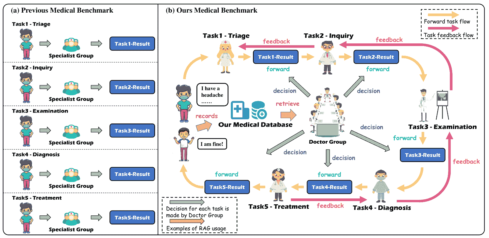
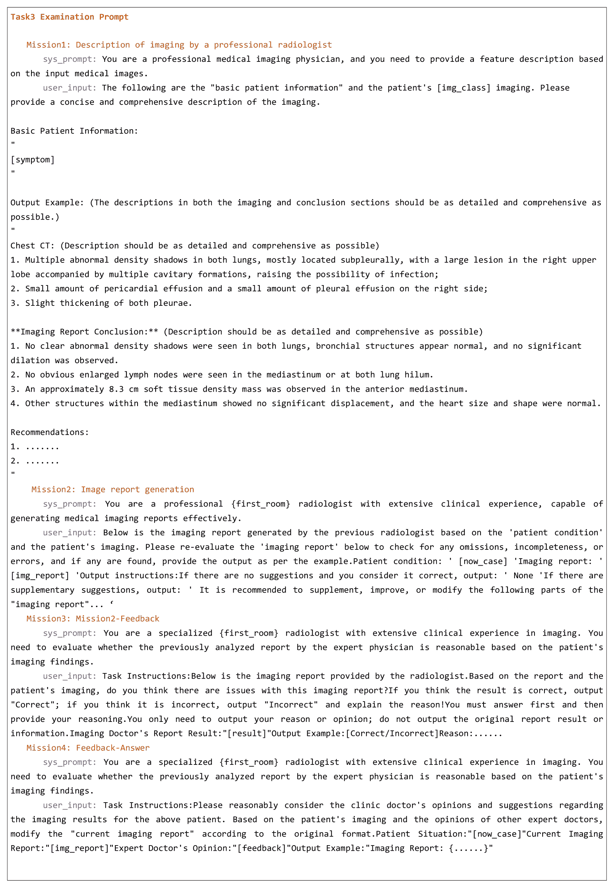

<!--yml
category: 未分类
date: 2025-01-11 11:52:46
-->

# MedChain: Bridging the Gap Between LLM Agents and Clinical Practice through Interactive Sequential Benchmarking

> 来源：[https://arxiv.org/html/2412.01605/](https://arxiv.org/html/2412.01605/)

Jie Liu¹, Wenxuan Wang^(2∗), Zizhan Ma², Guolin Huang³, SU Yihang²,
Kao-Jung Chang^(4,5), Wenting Chen¹, Haoliang Li¹, Linlin Shen³, Michael Lyu²
¹The City University of Hong Kong ²The Chinese University of Hong Kong
³Shenzhen University ⁴National Yang Ming Chiao Tung University
⁵Taipei Veterans General Hospital
Project: [https://github.com/ljwztc/MedChain](https://github.com/ljwztc/MedChain) J. Liu ($\spadesuit$$\clubsuit$$\diamondsuit$), W. Wang ($\heartsuit$$\clubsuit$) make equal contribution. $\spadesuit$: Conceptualization; $\heartsuit$: Implementation; $\clubsuit$: Writing; $\diamondsuit$: Visualization.

###### Abstract

Clinical decision making (CDM) is a complex, dynamic process crucial to healthcare delivery, yet it remains a significant challenge for artificial intelligence systems. While Large Language Model (LLM)-based agents have been tested on general medical knowledge using licensing exams and knowledge question-answering tasks, their performance in the CDM in real-world scenarios is limited due to the lack of comprehensive testing datasets that mirror actual medical practice. To address this gap, we present MedChain, a dataset of 12,163 clinical cases that covers five key stages of clinical workflow. MedChain distinguishes itself from existing benchmarks with three key features of real-world clinical practice: personalization, interactivity, and sequentiality. Further, to tackle real-world CDM challenges, we also propose MedChain-Agent, an AI system that integrates a feedback mechanism and a MCase-RAG module to learn from previous cases and adapt its responses. MedChain-Agent demonstrates remarkable adaptability in gathering information dynamically and handling sequential clinical tasks, significantly outperforming existing approaches. The relevant dataset and code will be released upon acceptance of this paper.

MedChain: Bridging the Gap Between LLM Agents and Clinical Practice through Interactive Sequential Benchmarking

Jie Liu¹^†^†thanks: J. Liu ($\spadesuit$ $\clubsuit$ $\diamondsuit$), W. Wang ($\heartsuit$ $\clubsuit$) make equal contribution. $\spadesuit$: Conceptualization; $\heartsuit$: Implementation; $\clubsuit$: Writing; $\diamondsuit$: Visualization., Wenxuan Wang^(2∗), Zizhan Ma², Guolin Huang³, SU Yihang², Kao-Jung Chang^(4,5), Wenting Chen¹, Haoliang Li¹, Linlin Shen³, Michael Lyu² ¹The City University of Hong Kong ²The Chinese University of Hong Kong ³Shenzhen University ⁴National Yang Ming Chiao Tung University ⁵Taipei Veterans General Hospital Project: [https://github.com/ljwztc/MedChain](https://github.com/ljwztc/MedChain)

## 1 Introduction

At the intersection of artificial intelligence and healthcare lies one of medicine’s most complex challenges: Clinical Decision Making (CDM). In healthcare delivery, CDM demands not only the synthesis of diverse data sources and continuous assessment of evolving clinical scenarios, but also evidence-based judgments for diagnosis and treatment Sutton et al. ([2020](https://arxiv.org/html/2412.01605v1#bib.bib32)). While crucial for optimal patient care, this intricate process imposes significant cognitive demands on healthcare professionals, making it an ideal candidate for AI assistance Sendak et al. ([2020](https://arxiv.org/html/2412.01605v1#bib.bib28)).

Recent advances in Large Language Model (LLM)-based agents OpenAI ([2023](https://arxiv.org/html/2412.01605v1#bib.bib22)); Team et al. ([2023](https://arxiv.org/html/2412.01605v1#bib.bib35)); Gu et al. ([2023](https://arxiv.org/html/2412.01605v1#bib.bib12)); Shinn et al. ([2024](https://arxiv.org/html/2412.01605v1#bib.bib30)); Guan et al. ([2023](https://arxiv.org/html/2412.01605v1#bib.bib13)); [Zhuang et al.](https://arxiv.org/html/2412.01605v1#bib.bib49) have emerged as an effective solution for complex decision-making tasks, from software development Qian et al. ([2024](https://arxiv.org/html/2412.01605v1#bib.bib25)) to office automation Wang et al. ([2024c](https://arxiv.org/html/2412.01605v1#bib.bib41)). In the medical domain, these agents have demonstrated impressive performance on medical licensing exams Singhal et al. ([2023](https://arxiv.org/html/2412.01605v1#bib.bib31)); Pal et al. ([2022](https://arxiv.org/html/2412.01605v1#bib.bib23)) and knowledge-based assessments Gilson et al. ([2023](https://arxiv.org/html/2412.01605v1#bib.bib10)); Eriksen et al. ([2023](https://arxiv.org/html/2412.01605v1#bib.bib7)). While LLMs have consistently scored well above passing thresholds in these assessments Singhal et al. ([2023](https://arxiv.org/html/2412.01605v1#bib.bib31)), it is crucial to recognize that these assessments fall short of capturing the complexity of real-world CDM in three critical aspects.

Firstly, these benchmarks rarely account for patient-specific information such as past medical history and present illness Pal et al. ([2022](https://arxiv.org/html/2412.01605v1#bib.bib23)), which significantly influence clinical decisions in real clinical scenarios. This omission fails to capture the nuanced context that often shapes personalized diagnosis. Secondly, unlike real clinical scenarios where decisions build upon previous steps, existing benchmarks present clinical tasks as independent problems Schmidgall et al. ([2024](https://arxiv.org/html/2412.01605v1#bib.bib27)), missing the critical interdependencies in the diagnostic process. In reality, clinical decision-making is a sequential process where each step is contingent upon the preceding ones, and an error in one stage can profoundly impact subsequent decisions. Thirdly, most benchmarks present all relevant information upfront, providing a static, comprehensive dataset Tu et al. ([2024](https://arxiv.org/html/2412.01605v1#bib.bib37)). However, real clinical workflow demand multiple rounds of dynamic information gathering through ongoing patient interaction.

Figure 1: Demonstration of error propagation of CDM in MedChain. Starting with 2,362 initial cases, the diagram illustrates how diagnostic errors cascade through five clinical stages. Cases with incorrect diagnoses carry forward problematic information to subsequent stages, leading to a cumulative decrease in accuracy. After completing the treatment phase, we assess the correctness of decisions across all phases. Our MedChain-Agent achieves best performance in CDM comparing with other SOTA methods.

MedChain: To address these critical gaps, we introduce MedChain, a novel benchmark designed to evaluate LLM-based agents in real-world clinical scenarios. Specifically, MedChain comprises 12,163 diverse cases spanning 19 medical specialties and 156 sub-categories, including 7,338 medical images with corresponding reports. Each case progresses through five crucial stages: specialty referral, history-taking, examination, diagnosis, and treatment. Unlike existing benchmarks, MedChain uniquely emphasizes three key features. 1) Personalization: Each case incorporates detailed patient-specific information. At first, agents are provided with only the patient’s chief complaint and basic information. 2) Interactivity: Information must be actively gathered through dynamic consultation from patient. 3) Sequentiality: Decisions at each stage influence subsequent steps. Only after agent independently completes all five stages, the overall diagnostic process is evaluated.

MedChain-Agent: Given the novel features and challenges presented by this benchmark, existing agent frameworks struggle to address these issues adequately. To overcome these limitations, we propose MedChain-Agent, a multi-agent collaborative framework that enables LLMs with feedback mechanism and MedCase-RAG to dynamically gather information and handle sequential clinical tasks. Specifically, MedChain-Agent facilitates a synergistic interplay among three specialized agent types: General Agents for task-specific expertise, a Summarizing Agent for insight synthesis, and a Feedback Agent for iterative refinement. This multi-layered, iterative approach ensures decisions are products of thorough analysis and diverse perspectives. Additionally, to address the multifaceted nature of CDM, which demands the integration of evidence-based research, and patient-specific factors, we incorporate a novel MedCase-RAG module into our MedChain-Agent framework. Unlike conventional medical RAG methods, MedCase-RAG dynamically expand its database and employs a structured approach to data representation, mapping each medical case into a 12-dimensional feature vector. This system enables efficient retrieval of relevant cases and helps the model make informed decisions.

Our contributions are summarized as follows:

*   •

    We represent the first effort to propose a CDM benchmark, MedChain, providing a holistic assessment of diagnostic capabilities of LLLM-based agents, closely reflecting real-world patient care.

*   •

    We propose a multi-agent framework based on the characteristics of CDM. This system enables efficient retrieval of relevant cases and helps the model make informed decisions.

*   •

    Through extensive experiments, we demonstrate the effectiveness of MedChain and the MedChain-Agent framework in improving clinical decision-making accuracy and reliability.

Table 1: Comparison of Benchmarks for LLM-based Agent. The MedChaincomposed of 12, 163 case with five sequential stages of the clinical workflow. It provide interaction environment for LLM-based agent evaluation.

| Benchmark | #Num | Modality | Personal Information | Sequential Evaluation | Interaction |
| MedQA [2018](https://arxiv.org/html/2412.01605v1#bib.bib48) | 1,273 | Text | ✓ | ✗ | ✗ |
| PubMedQA [2019](https://arxiv.org/html/2412.01605v1#bib.bib16) | 500 | Text | ✗ | ✗ | ✗ |
| MedMCQA [2022](https://arxiv.org/html/2412.01605v1#bib.bib23) | 193,155 | Text | ✓ | ✗ | ✗ |
| MMedBench [2024](https://arxiv.org/html/2412.01605v1#bib.bib26) | 53,566 | Text | ✗ | ✗ | ✗ |
| MedBench [2024b](https://arxiv.org/html/2412.01605v1#bib.bib21) | 300,901 | Text | ✓ | ✗ | ✗ |
| Asclepius [2024b](https://arxiv.org/html/2412.01605v1#bib.bib39) | 3,232 | Text, Imaging | ✗ | ✗ | ✗ |
| GMAI-MMBench [2024b](https://arxiv.org/html/2412.01605v1#bib.bib4) | 26,000 | Text, Imaging | ✗ | ✗ | ✗ |
| MedChain | 12,163 | Text, Imaging | ✓ | ✓ | ✓ |

## 2 Related Works

### 2.1 Evaluation of LLM in Medcine

Benchmarking plays a vital role as a key performance indicator, directing model improvements, pinpointing weaknesses, and shaping the course of model evolution. The evaluation of LLMs in medicine has primarily focused on testing general medical knowledge through structured assessments. Leading benchmarks such as MultiMedQA Singhal et al. ([2023](https://arxiv.org/html/2412.01605v1#bib.bib31)) integrate various medical QA datasets (e.g., MedQA Jin et al. ([2021](https://arxiv.org/html/2412.01605v1#bib.bib15)), MedMCQA Pal et al. ([2022](https://arxiv.org/html/2412.01605v1#bib.bib23))), emphasizing performance on medical licensing examination materials. Other benchmarks like PubMedQA Jin et al. ([2019](https://arxiv.org/html/2412.01605v1#bib.bib16)) focus on research-oriented queries, while several Chinese medical benchmarks Wang et al. ([2023](https://arxiv.org/html/2412.01605v1#bib.bib40)); Cai et al. ([2024](https://arxiv.org/html/2412.01605v1#bib.bib2)) evaluate models through multiple-choice questions from medical licensing exams.

While these benchmarks effectively assess general medical knowledge, they fail to capture three critical aspects of real-world clinical decision-making (see [Table 1](https://arxiv.org/html/2412.01605v1#S1.T1 "Table 1 ‣ 1 Introduction ‣ MedChain: Bridging the Gap Between LLM Agents and Clinical Practice through Interactive Sequential Benchmarking")), i.e., personalization in patient care, the interactive nature of clinical consultations, and the sequential dependency of medical decisions, where each step builds upon previous findings.

### 2.2 LLM-based Agent in Medicine

LLM-based agents have demonstrated significant potential across various medical applications, encompassing tasks such as medical examination questions, clinical diagnoses, and treatment plans. Recent research has explored different approaches: Agent Hospital Li et al. ([2024](https://arxiv.org/html/2412.01605v1#bib.bib19)) provides medical scenario simulation, while several frameworks Yue et al. ([2024](https://arxiv.org/html/2412.01605v1#bib.bib45)); Tang et al. ([2024](https://arxiv.org/html/2412.01605v1#bib.bib33)); Kim et al. ([2024b](https://arxiv.org/html/2412.01605v1#bib.bib18)) focus on specific medical stages with multi-agent architectures. Some works target specialized aspects, such as CoD Chen et al. ([2024a](https://arxiv.org/html/2412.01605v1#bib.bib3)) for interpretable diagnostics and Ehragent Shi et al. ([2024](https://arxiv.org/html/2412.01605v1#bib.bib29)) for electronic health records (EHRs) analysis. Others, like Almanac Copilot Zakka et al. ([2024](https://arxiv.org/html/2412.01605v1#bib.bib46)), assist clinicians with EMR-specific tasks. AI Hospital Fan et al. ([2024](https://arxiv.org/html/2412.01605v1#bib.bib8)) explores interactive clinical scenarios, but it falls short in handling multi-modal medical imaging and lacks a comprehensive benchmark for evaluating multi-agent performance. To enhance these agents’ capabilities, researchers have integrated Retrieval-Augmented Generation (RAG), as demonstrated by MIRAGE Xiong et al. ([2024](https://arxiv.org/html/2412.01605v1#bib.bib44))’s search-enhanced framework and Medical Graph RAG Wu et al. ([2024](https://arxiv.org/html/2412.01605v1#bib.bib42))’s knowledge-based approach.

However, current approaches face two major limitations. First, existing frameworks focus on isolated medical tasks rather than providing seamless integration across different clinical stages, making them insufficient for complex scenarios requiring effective inter-stage communication Gronauer and Diepold ([2022](https://arxiv.org/html/2412.01605v1#bib.bib11)). Second, current medical RAG systems’ reliance on chunk-based indexing leads to context inconsistency and computational inefficiencies Huang and Huang ([2024](https://arxiv.org/html/2412.01605v1#bib.bib14)); Gao et al. ([2024](https://arxiv.org/html/2412.01605v1#bib.bib9)), highlighting the need for more sophisticated approaches to medical knowledge integration.

## 3 MedChain Benchmark

Overview. We introduce MedChain, a comprehensive clinical decision-making benchmark designed to simulate real-world scenarios. Built upon 12,163 Electronic Health Records (EHRs) spanning 19 medical specialties and 156 sub-categories, including 7,338 medical images with reports, MedChain uniquely emphasizes three key characteristics:

*   •

    Personalization: Each case includes detailed patient profiles that influence decision-making

*   •

    Sequentiality: Cases involve multiple interconnected decision-making stages

*   •

    Interactivity: Information must be actively gathered through dynamic consultation

Figure 2: MedChain Pipeline. The MedChain is composed of a sequential medical process, including specialty referral, history-taking , examination, diagnosis, and treatment.

### 3.1 Data Collection

Data Source and Processing. Our dataset is sourced from the Chinese medical website “iiYi” ¹¹1https://www.iiyi.com, which provides over 20,000 validated clinical cases spanning 28 disease categories. These cases are verified by professional doctors and have undergone de-identification to ensure patient privacy. We obtained formal permission from the website administrators to use the data for scientific research purposes. Each case typically contains the patient’s chief complaint, medical history, examination results, treatment process, and other relevant information, which insure the personalization of MedChain. Following the government standards ²²2National Standards for Medical Items and Medical Subject Headings ³³3https://www.ncbi.nlm.nih.gov/mesh/1000048, we extracted and organized key information including patient basics, chief complaints, specialty referrals, examinations, imaging reports, diagnoses, and treatments. Cases with incomplete information were removed, resulting in 12,163 high-quality cases.

Quality Control. To ensure the highest standards of data integrity and clinical relevance in our benchmark, we implemented a rigorous quality control process involving a panel of five senior physicians, each with over 10 years of clinical experience. Our evaluation process examined a random sample of 6,000 cases (49.3% of the dataset). Each case was assessed on multiple dimensions including disease prevalence, clinical relevance, accuracy of patient history, appropriateness of diagnostic procedures, correctness of diagnosis, and suitability of treatment recommendations. We employed a standardized scoring system to quantify case quality across these dimensions and calculated inter-rater reliability using Cohen’s kappa coefficient. The quality assessment yielded impressive results, with an overall quality rate of 94.7% of evaluated cases meeting or exceeding our stringent quality thresholds. Dimension-specific quality rates ranged from 92.9% to 97.2%, demonstrating consistently high standards across all evaluation criteria. Our inter-rater reliability analysis produced a Cohen’s kappa coefficient of 0.82, indicating strong agreement among our expert reviewers. Cases that did not meet the thresholds (5.3%) underwent revision or were excluded from the final dataset to maintain benchmark integrity.

### 3.2 Clinical Workflow Simulation

Sequential Stages. MedChain simulates the complete clinical workflow, comprising five sequential tasks, each representing a different stage of the clinical decision-making process, as shown in [Figure 2](https://arxiv.org/html/2412.01605v1#S3.F2 "Figure 2 ‣ 3 MedChain Benchmark ‣ MedChain: Bridging the Gap Between LLM Agents and Clinical Practice through Interactive Sequential Benchmarking"). The results from each stage serve as inputs for the subsequent stage, creating a dependency where later decisions are influenced by the quality of earlier ones. This design guarantees the sequentiality of MedChain, mimicking the interconnected nature of real-world clinical decision-making processes. The pipeline consists of: 1) Specialty Referral: Assessment of case urgency and appropriate department selection; 2) History-taking: Dynamic information gathering through doctor-patient dialogue; 3) Examination: Medical image analysis and report generation; 4) Diagnosis: Comprehensive diagnosis based on accumulated information; 5) Treatment: Treatment plan formulation considering patient-specific factors.

The constrcution pipeline of MedChain  is sketched out here. The details of benchmark can be refer to [Appendix A](https://arxiv.org/html/2412.01605v1#A1 "Appendix A Benchmark Construction ‣ MedChain: Bridging the Gap Between LLM Agents and Clinical Practice through Interactive Sequential Benchmarking"). We demonstrate several examples in Appendix [Figure 4](https://arxiv.org/html/2412.01605v1#A1.F4 "Figure 4 ‣ A.1 Dataset Standardization ‣ Appendix A Benchmark Construction ‣ MedChain: Bridging the Gap Between LLM Agents and Clinical Practice through Interactive Sequential Benchmarking").

Figure 3: MedChain-Agent framework. Depicts a cyclical feedback medical multi-task system, where decisions are supported by retrieving similar past cases from a medical database.

### 3.3 Interaction Environment

To simulate the doctor-patient consultation process in real medical scenarios, we have developed an interactive environment where the LLM-based agent under evaluation must actively gather information through dynamic interactions. We employ a local large language model, i.e., gemma2 (9b) Team et al. ([2024](https://arxiv.org/html/2412.01605v1#bib.bib36)), to serve as the patient agent. This patient agent is initialized with pre-defined case information but is unaware of the actual diagnosis, allowing it to provide symptom information and respond to inquiries in a manner that closely mimics real patient experiences. This setup ensures the interactivity for the MedChain benchmark, enabling it to evaluate the LLM’s ability to conduct effective medical consultations, ask pertinent questions, and gather crucial information for accurate diagnosis and treatment planning. The inspiration for this patient agent setup comes from standardized patients in medical education and clinical practice. Standardized patients are trained individuals who simulate real patients, allowing healthcare professionals to practice their clinical and communication skills in a controlled environment without the risks associated with real-patient interactions Barrows ([1993](https://arxiv.org/html/2412.01605v1#bib.bib1)).

### 3.4 Benchmark Evaluation

Given the complexity of medical decision-making, a simple binary evaluation of correct or incorrect is inadequate. To quantify the quality of CDM results, we’ve developed an evaluation system for each stage. The standard answer for each stage comprises multiple key points. The evaluated agent’s score increases with the number of standard points addressed, while irrelevant content leads to score reduction. To implement this approach, we employ the Intersection over Union (IoU) metric. For instance, in the treatment stage, the agent’s score improves as it proposes more reasonable treatment measures.

## 4 MedChain-Agent Framework

### 4.1 Multi-agent System with Feedback

The MedChain-Agent framework introduces a novel multi-agent system designed to simulate the complex, interconnected nature of medical decision-making processes. This system leverages the collective intelligence of multiple specialized agents, each contributing unique expertise to the overall decision-making process.

#### 4.1.1 Agent Role

Our framework incorporates three distinct agent types, each fulfilling crucial roles in the medical decision-making pipeline:

General Agents: These specialized agents are recruited based on the specific requirements of each task. For instance, in Task 1 Specialty Referral, General Agents possess comprehensive knowledge of medical specialties and triage protocols, enabling them to effectively assess and route patients to appropriate departments. These agents engage in group discussions, simulating the collaborative nature of medical consultations.

Summarizing Agent: In each stage of the process, a summarizing agent consolidates the discussions and analyses of the general agents. This agent synthesizes the collective expertise into a coherent summary and delivers the final decision for each task, mimicking the role of a senior physician or department head within a medical context.

Feedback Agent: The feedback agent plays a crucial role in maintaining the quality and accuracy of decisions throughout the process. This agent evaluates the output of each task, providing constructive feedback and suggesting iterative improvements when necessary. By doing so, it creates a dynamic, self-correcting system that continually refines its decision-making capabilities.

#### 4.1.2 Decision Making

With three types of agents, MedChain-Agent conducts a sophisticated decision-making process that mirrors real-world medical practice. General agents analyze patient information and engage in collaborative discussions, sharing assessments and recommendations. The summarizing agent then consolidates these insights, weighing different perspectives to formulate a preliminary decision. The feedback agent reviews this decision, evaluating its appropriateness and implications for subsequent tasks. If issues are identified, the feedback agent provides critiques and suggestions, initiating an iterative refinement process. General agents reconsider their assessments based on this feedback, while the summarizing agent refines the decision. This cycle continues until consensus is reached or a predefined number of iterations is completed, at which point the final decision is issued.

Table 2: Evaluation of various LLM-based agent in MedChain. The best performance for each task is highlighted in bold.

 | Framework | Methods | Specialty Referral | History-taking | Examination | Diagnosis | Treatment | Average |
| Level 1 | Level 2 |
| Single-agent | GPT-4o-mini [2023](https://arxiv.org/html/2412.01605v1#bib.bib22) | 0.5449 | 0.2871 | 0.3399 | 0.5112 | 0.4406 | 0.3930 | 0.4195 |
| Claude-3.5-sonnet [2023](https://arxiv.org/html/2412.01605v1#bib.bib35) | 0.5681 | 0.3050 | 0.3562 | 0.5018 | 0.4599 | 0.4053 | 0.4327 |
| LLaVA [2024a](https://arxiv.org/html/2412.01605v1#bib.bib20) | 0.3240 | 0.0730 | 0.3182 | 0.5165 | 0.4024 | 0.1060 | 0.2901 |
| Qwen2 [2024a](https://arxiv.org/html/2412.01605v1#bib.bib38) | 0.4975 | 0.2215 | 0.4226 | 0.4829 | 0.4818 | 0.2193 | 0.3876 |
|  | InternVL2 [2024a](https://arxiv.org/html/2412.01605v1#bib.bib38) | 0.4811 | 0.1935 | 0.4645 | 0.4490 | 0.4738 | 0.2903 | 0.3920 |
| Multi-agent | MedAgent [2023](https://arxiv.org/html/2412.01605v1#bib.bib34) | 0.3830 | 0.2039 | 0.4454 | 0.4456 | 0.4266 | 0.3673 | 0.3786 |
| MDAgent [2024a](https://arxiv.org/html/2412.01605v1#bib.bib17) | 0.2398 | 0.1343 | 0.4240 | 0.4983 | 0.4289 | 0.3620 | 0.3479 |
| MedChain-Agent | 0.5873 | 0.3505 | 0.5836 | 0.6566 | 0.5218 | 0.4613 | 0.5269 | 

### 4.2 MedCase-RAG

To enhance the decision-making capabilities of our multi-agent framework, we introduce MedCase-RAG, a novel Retrieval-Augmented Generation technique tailored for medical contexts.

Unlike conventional medical RAG methods that rely on unstructured medical QA databases, MedCase-RAG employs a structured approach to data representation. We map each medical case into a 12-dimensional feature vector, encompassing crucial attributes such as Age, Sex, Patient Description, Symptom Description, Patient History, and Patient Image. This structured representation allows for more comprehensive and standardized case encoding, facilitating more accurate and nuanced retrieval. Within this feature set, we identify "Symptom Description" as the most representative feature of a patient’s condition. This feature undergoes quantification through a Text Embedding model, serving as the primary key for dense retrieval tasks. Moreover, MedCase-RAG incorporates a dynamic database expansion mechanism to continually enrich its knowledge base. As patients complete their medical processes and recover, their case information is reintroduced into the database as pseudo-data. This approach allows the system to learn from new cases and adapt to evolving medical knowledge and practices.

When a new patient case is presented, MedCaseRAG performs a similarity search within the relevant medical department, using cosine similarity to identify the top three most similar cases, offering a more comprehensive basis for decision-making, allowing agents to consider various aspects and potential outcomes.

## 5 Experiments

### 5.1 Experimental Setup

We split the dataset into training, validation, and testing sets with a ratio of 7:1:2\. For frameworks incorporating RAG techniques, both training and validation sets are used to construct the case retrieval database. Our study evaluates both single-agent and multi-agent systems. For single agents, we test two closed-source models (gpt-4o-mini OpenAI ([2023](https://arxiv.org/html/2412.01605v1#bib.bib22)), and claude-3.5-sonnet Team et al. ([2023](https://arxiv.org/html/2412.01605v1#bib.bib35))) and three open-source models (InternVL2-8b Chen et al. ([2023](https://arxiv.org/html/2412.01605v1#bib.bib5)), llava-llama-3-8b-v1_1 Liu et al. ([2024a](https://arxiv.org/html/2412.01605v1#bib.bib20)), and Qwen2-7B-Instruct Wang et al. ([2024a](https://arxiv.org/html/2412.01605v1#bib.bib38))), with model weights obtained from official Hugging Face repositories. In the multi-agent evaluation, we compare MedChain-Agent against MedAgent Tang et al. ([2023](https://arxiv.org/html/2412.01605v1#bib.bib34)) and MDAgent Kim et al. ([2024a](https://arxiv.org/html/2412.01605v1#bib.bib17)). All multi-agent framework are based on InternVL2-8b Chen et al. ([2023](https://arxiv.org/html/2412.01605v1#bib.bib5)). The deployment was conducted using the LMDeploy framework Contributors ([2023](https://arxiv.org/html/2412.01605v1#bib.bib6)). All tests executed on NVIDIA A100 GPUs featuring 80GB of memory. To enhance output stability and reliability across all experiments, we consistently set the temperature parameter to 0.

Table 3: Ablation Study for Key Components for MedChain-Agent. This table presents the performance impact of sequentially removing the Feedback mechanism and MedCase-RAG from the full MedChain-Agent framework.

 | Feedback | MedCase-RAG | Specialty referral | History-taking | Examination | Diagnosis | Treatment | Average |
| Level 1 | Level 2 |
|  |  | 0.5523 | 0.2228 | 0.3285 | 0.6369 | 0.4982 | 0.3915 | 0.4384 |
| ✓ |  | 0.5739 | 0.2906 | 0.4222 | 0.6377 | 0.5086 | 0.4209 | 0.4757 |
|  | ✓ | 0.5928 | 0.3353 | 0.5801 | 0.6488 | 0.5035 | 0.4568 | 0.5195 |
| ✓ | ✓ | 0.5873 | 0.3505 | 0.5836 | 0.6566 | 0.5218 | 0.4613 | 0.5269 | 

### 5.2 Evaluation Metrics

To assess model performance, we employ diverse metrics tailored to each task. Accuracy is used for tasks with a single correct answer, such as Specialty Referral (Level 1). For tasks involving multiple key points, including Specialty Referral (Level 2), History-taking, and Treatment, we apply Intersection over Union (IoU) to capture the overlap between predicted and ground truth sets. Specifically for the Examination task, we utilize DocLens Xie et al. ([2024](https://arxiv.org/html/2412.01605v1#bib.bib43)) to evaluate the quality of image interpretation reports.

### 5.3 Experiment Result and Analysis

The results of our evaluation in the MedChain  are presented in [Table 2](https://arxiv.org/html/2412.01605v1#S4.T2 "Table 2 ‣ 4.1.2 Decision Making ‣ 4.1 Multi-agent System with Feedback ‣ 4 MedChain-Agent Framework ‣ MedChain: Bridging the Gap Between LLM Agents and Clinical Practice through Interactive Sequential Benchmarking"). Our analysis yields three significant insights:

(1) Sequential decision-making tasks continue to pose significant challenges, even for advanced models. For instance, within the single-agent frameworks, GPT-4o-mini and InternVL2 achieve average scores of 0.4442 and 0.3920, respectively. These results indicate that despite their sophistication, these models struggle to maintain consistent performance across the sequential stages of clinical decision-making, highlighting the inherent difficulty of these tasks.

(2) Multi-agent frameworks based on InternVL2, such as MedAgent and MDAgent, exhibit inferior performance compared to their single-agent counterparts. This degradation suggests that traditional multi-agent approaches may exacerbate error propagation in sequential decision-making processes, leading to reduced overall performance. In contrast, our proposed MedChain-Agent significantly outperforms these multi-agent methods, achieving an average score of 0.5269\. This improvement demonstrates that MedChain-Agent effectively mitigates error propagation, enhancing decision quality and reliability in clinical settings.

(3) The integration of the MedChain-Agent framework with open-source LLMs demonstrates significant superiority over proprietary models like GPT-4o-mini. The substantial performance gain observed with MedChain-Agent (average score of 0.5269) implies that our framework can leverage the strengths of open-source LLMs to achieve superior outcomes. This suggests that open-source models, when enhanced with our framework, are not only competitive but can also excel in handling intricate medical decision-making tasks.

### 5.4 Ablation Study

Table 4: The ablation study for three key characteristics in MedChain. This table presents the impact of personalization, interactivity, and sequentiality on Diagnosis and Treatment tasks. The arrows $\uparrow\downarrow$ next to settings indicate expected performance change direction. The arrows next to results show actual changes (highlighted in gray when matching expectations).

 | Setting | Model | Diagnosis | Treatment |
| Full | MedAgent | 0.4266 | 0.3673 |
| MDAgent | 0.4289 | 0.3620 |
| gpt-4o-mini | 0.4406 | 0.3930 |
| InternVL2 | 0.4759 | 0.4472 |
| w/o Person. $\downarrow$ | MedAgent | 0.3274 $\downarrow$ | 0.3754 $\uparrow$ |
| MDAgent | 0.3283$\downarrow$ | 0.3161 $\downarrow$ |
| gpt-4o-mini | 0.4272$\downarrow$ | 0.3406$\downarrow$ |
| InternVL2 | 0.3966$\downarrow$ | 0.2527$\downarrow$ |
| w/o Seq. $\uparrow$ | MedAgent | 0.4839 $\uparrow$ | 0.4456$\uparrow$ |
| MDAgent | 0.4199 $\downarrow$ | 0.4418$\uparrow$ |
| gpt-4o-mini | 0.5096$\uparrow$ | 0.4423 $\uparrow$ |
| InternVL2 | 0.4768 $\uparrow$ | 0.2903$\downarrow$ |
| w/o Inter. $\uparrow$ | MedAgent | 0.3315 $\downarrow$ | 0.4109 $\uparrow$ |
| MDAgent | 0.4295 $\uparrow$ | 0.3627 $\uparrow$ |
| gpt-4o-mini | 0.4988$\uparrow$ | 0.4003 $\uparrow$ |
| InternVL2 | 0.4861$\uparrow$ | 0.3173 $\downarrow$ | 

Three key characteristics for MedChain: To validate the effectiveness of personalization, interactivity, and sequentiality within our benchmark, we conduct ablation study as in [Table 4](https://arxiv.org/html/2412.01605v1#S5.T4 "Table 4 ‣ 5.4 Ablation Study ‣ 5 Experiments ‣ MedChain: Bridging the Gap Between LLM Agents and Clinical Practice through Interactive Sequential Benchmarking"). We systematically remove each characteristic and observe its impact on model performance across Diagnosis and Treatment tasks. 1) Removing patient-specific information (w/o Person.) consistently degrades performance across all models in diagnosis tasks (with drops ranging from 3.0% to 13.4%). This demonstrates that personalized information is crucial for accurate clinical decision-making. 2) Interestingly, when removing the sequential dependency between stages (w/o Seq.), most models show improved performance. This improvement actually validates the effectiveness of sequentiality in our benchmark, as it indicates that sequential decision-making poses greater challenges that better reflect real-world clinical scenarios. 3) Similarly, the improved performance observed after removing interactive information gathering (w/o Inter.) confirms the effectiveness of interactivity in our benchmark design. These results collectively suggest that while both sequentiality and interactivity make the benchmark more challenging, they are essential components that better simulate the complexity of real-world clinical decision-making processes.

Key components for MedChain-Agent: To assess the impact of individual components in our framework, we conducted ablation experiments, with results shown in [Table 3](https://arxiv.org/html/2412.01605v1#S5.T3 "Table 3 ‣ 5.1 Experimental Setup ‣ 5 Experiments ‣ MedChain: Bridging the Gap Between LLM Agents and Clinical Practice through Interactive Sequential Benchmarking"). These findings highlight the crucial roles of both the Feedback mechanism and the MedCase-RAG module in enhancing overall performance. Each component independently contributes to significant improvements across various metrics. Notably, the MedCase-RAG module alone boosts Specialty Referral (Level 1) to 0.5928 and yields substantial gains in History-taking and Examination. When combined, Feedback and MedCase-RAG demonstrate a synergistic effect, achieving an impressive average score of 0.5269\. This underscores the complementary nature of these components in optimizing our framework’s capabilities.

## 6 Conclusion

In this paper, we introduced MedChain, a novel benchmark for evaluating large language models in clinical decision-making, and MedChain-Agent, an innovative multi-agent framework designed to address the complexities of real-world medical scenarios. Our work bridges a critical gap between current AI capabilities and the nuanced realities of clinical practice by incorporating personalization, sequentiality, and interactivity into the evaluation process. MedChain-Agent’s sophisticated multi-agent system, enhanced by a feedback mechanism and the MedCase-RAG module, demonstrates unprecedented performance in sequential clinical decision-making tasks, even outperforming proprietary models when combined with open-source LLMs. By providing a more realistic and challenging evaluation framework, this research sets a new standard for evaluating and developing medical AI systems, paving the way for its responsible integration into clinical practice.

## Acknowledgement

We are particularly indebted to the administrators of the iiyi website for their generosity in allowing us to utilize their data for our research purposes. We would like to acknowledge the assistance provided by Claude-3.5 in proofreading our manuscript for grammatical accuracy and in facilitating the creation of LaTeX tables.

## Limitations

This paper has two primary limitations that offer avenues for future research:

*   •

    Data Source Diversity: The MedChain benchmark is constructed from 12,163 electronic health records obtained from the Chinese medical website “iiYi." Although this dataset is extensive and covers 19 medical specialties and 156 sub-categories, it is derived from a single source. In our future work, we will incorporate additional data sources from different regions or healthcare systems to further enrich the dataset, providing a broader spectrum of clinical scenarios and enhancing the generalizability of the benchmark.

*   •

    Patient Interaction Simulation: In our interactive environment, the patient responses during the history-taking stage are generated by the Gemma 2 language model. While this approach ensures consistency and control in evaluating the LLM-based agent, the real patient interactions can be more varied and complex. Future work could explore more advanced patient simulators or incorporate real dialogue data to capture a wider range of communication styles and behaviors.

## References

*   Barrows (1993) Howard S. Barrows. 1993. [An overview of the uses of standardized patients for teaching and evaluating clinical skills. aamc](https://api.semanticscholar.org/CorpusID:8488714). *Academic Medicine*, 68:443–51.
*   Cai et al. (2024) Yan Cai, Linlin Wang, Ye Wang, Gerard de Melo, Ya Zhang, Yanfeng Wang, and Liang He. 2024. Medbench: A large-scale chinese benchmark for evaluating medical large language models. In *Proceedings of the AAAI Conference on Artificial Intelligence*, volume 38, pages 17709–17717.
*   Chen et al. (2024a) Junying Chen, Chi Gui, Anningzhe Gao, Ke Ji, Xidong Wang, Xiang Wan, and Benyou Wang. 2024a. Cod, towards an interpretable medical agent using chain of diagnosis. *arXiv preprint arXiv:2407.13301*.
*   Chen et al. (2024b) Pengcheng Chen, Jin Ye, Guoan Wang, Yanjun Li, Zhongying Deng, Wei Li, Tianbin Li, Haodong Duan, Ziyan Huang, Yanzhou Su, et al. 2024b. Gmai-mmbench: A comprehensive multimodal evaluation benchmark towards general medical ai. *arXiv preprint arXiv:2408.03361*.
*   Chen et al. (2023) Zhe Chen, Jiannan Wu, Wenhai Wang, Weijie Su, Guo Chen, Sen Xing, Muyan Zhong, Qinglong Zhang, Xizhou Zhu, Lewei Lu, Bin Li, Ping Luo, Tong Lu, Yu Qiao, and Jifeng Dai. 2023. Internvl: Scaling up vision foundation models and aligning for generic visual-linguistic tasks. *arXiv preprint arXiv:2312.14238*.
*   Contributors (2023) LMDeploy Contributors. 2023. Lmdeploy: A toolkit for compressing, deploying, and serving llm. [https://github.com/InternLM/lmdeploy](https://github.com/InternLM/lmdeploy).
*   Eriksen et al. (2023) Alexander V Eriksen, Sören Möller, and Jesper Ryg. 2023. Use of gpt-4 to diagnose complex clinical cases.
*   Fan et al. (2024) Zhihao Fan, Jialong Tang, Wei Chen, Siyuan Wang, Zhongyu Wei, Jun Xi, Fei Huang, and Jingren Zhou. 2024. Ai hospital: Interactive evaluation and collaboration of llms as intern doctors for clinical diagnosis. *arXiv preprint arXiv:2402.09742*.
*   Gao et al. (2024) Yunfan Gao, Yun Xiong, Xinyu Gao, Kangxiang Jia, Jinliu Pan, Yuxi Bi, Yi Dai, Jiawei Sun, Meng Wang, and Haofen Wang. 2024. [Retrieval-augmented generation for large language models: A survey](https://arxiv.org/abs/2312.10997). *Preprint*, arXiv:2312.10997.
*   Gilson et al. (2023) Aidan Gilson, Conrad W Safranek, Thomas Huang, Vimig Socrates, Ling Chi, Richard Andrew Taylor, David Chartash, et al. 2023. How does chatgpt perform on the united states medical licensing examination (usmle)? the implications of large language models for medical education and knowledge assessment. *JMIR medical education*, 9(1):e45312.
*   Gronauer and Diepold (2022) Sven Gronauer and Klaus Diepold. 2022. [Multi-agent deep reinforcement learning: a survey](https://doi.org/10.1007/s10462-021-09996-w). *Artificial Intelligence Review*, page 895–943.
*   Gu et al. (2023) Yu Gu, Xiang Deng, and Yu Su. 2023. Don’t generate, discriminate: A proposal for grounding language models to real-world environments. In *ACL*.
*   Guan et al. (2023) Lin Guan, Karthik Valmeekam, Sarath Sreedharan, and Subbarao Kambhampati. 2023. Leveraging pre-trained large language models to construct and utilize world models for model-based task planning. *Advances in Neural Information Processing Systems*, 36:79081–79094.
*   Huang and Huang (2024) Yizheng Huang and Jimmy Huang. 2024. [A survey on retrieval-augmented text generation for large language models](https://arxiv.org/abs/2404.10981). *Preprint*, arXiv:2404.10981.
*   Jin et al. (2021) Di Jin, Eileen Pan, Nassim Oufattole, Wei-Hung Weng, Hanyi Fang, and Peter Szolovits. 2021. What disease does this patient have? a large-scale open domain question answering dataset from medical exams. *Applied Sciences*, 11(14):6421.
*   Jin et al. (2019) Qiao Jin, Bhuwan Dhingra, Zhengping Liu, William W Cohen, and Xinghua Lu. 2019. Pubmedqa: A dataset for biomedical research question answering. *arXiv preprint arXiv:1909.06146*.
*   Kim et al. (2024a) Yubin Kim, Chanwoo Park, Hyewon Jeong, Yik Siu Chan, Xuhai Xu, Daniel McDuff, Cynthia Breazeal, and Hae Won Park. 2024a. Adaptive collaboration strategy for llms in medical decision making. *arXiv preprint arXiv:2404.15155*.
*   Kim et al. (2024b) Yubin Kim, Chanwoo Park, Hyewon Jeong, Yik Siu Chan, Xuhai Xu, Daniel McDuff, Hyeonhoon Lee, Marzyeh Ghassemi, Cynthia Breazeal, and Hae Won Park. 2024b. [Mdagents: An adaptive collaboration of llms for medical decision-making](https://arxiv.org/abs/2404.15155). *Preprint*, arXiv:2404.15155.
*   Li et al. (2024) Junkai Li, Siyu Wang, Meng Zhang, Weitao Li, Yunghwei Lai, Xinhui Kang, Weizhi Ma, and Yang Liu. 2024. [Agent hospital: A simulacrum of hospital with evolvable medical agents](https://arxiv.org/abs/2405.02957). *Preprint*, arXiv:2405.02957.
*   Liu et al. (2024a) Haotian Liu, Chunyuan Li, Qingyang Wu, and Yong Jae Lee. 2024a. Visual instruction tuning. *Advances in neural information processing systems*, 36.
*   Liu et al. (2024b) Mianxin Liu, Jinru Ding, Jie Xu, Weiguo Hu, Xiaoyang Li, Lifeng Zhu, Zhian Bai, Xiaoming Shi, Benyou Wang, Haitao Song, et al. 2024b. Medbench: A comprehensive, standardized, and reliable benchmarking system for evaluating chinese medical large language models. *arXiv preprint arXiv:2407.10990*.
*   OpenAI (2023) OpenAI. 2023. Gpt-4v(ision) system card. Technical report, OpenAI.
*   Pal et al. (2022) Ankit Pal, Logesh Kumar Umapathi, and Malaikannan Sankarasubbu. 2022. Medmcqa: A large-scale multi-subject multi-choice dataset for medical domain question answering. In *Conference on health, inference, and learning*, pages 248–260\. PMLR.
*   Papineni et al. (2002) Kishore Papineni, Salim Roukos, Todd Ward, and Wei-Jing Zhu. 2002. Bleu: a method for automatic evaluation of machine translation. In *Proceedings of the 40th annual meeting of the Association for Computational Linguistics*, pages 311–318.
*   Qian et al. (2024) Chen Qian, Wei Liu, Hongzhang Liu, Nuo Chen, Yufan Dang, Jiahao Li, Cheng Yang, Weize Chen, Yusheng Su, Xin Cong, et al. 2024. Chatdev: Communicative agents for software development. In *Proceedings of the 62nd Annual Meeting of the Association for Computational Linguistics (Volume 1: Long Papers)*, pages 15174–15186.
*   Qiu et al. (2024) Pengcheng Qiu, Chaoyi Wu, Xiaoman Zhang, Weixiong Lin, Haicheng Wang, Ya Zhang, Yanfeng Wang, and Weidi Xie. 2024. Towards building multilingual language model for medicine. *Nature Communications*, 15(1):8384.
*   Schmidgall et al. (2024) Samuel Schmidgall, Rojin Ziaei, Carl Harris, Eduardo Reis, Jeffrey Jopling, and Michael Moor. 2024. Agentclinic: a multimodal agent benchmark to evaluate ai in simulated clinical environments. *arXiv preprint arXiv:2405.07960*.
*   Sendak et al. (2020) Mark Sendak, Madeleine Clare Elish, Michael Gao, Joseph Futoma, William Ratliff, Marshall Nichols, Armando Bedoya, Suresh Balu, and Cara O’Brien. 2020. " the human body is a black box" supporting clinical decision-making with deep learning. In *Proceedings of the 2020 conference on fairness, accountability, and transparency*, pages 99–109.
*   Shi et al. (2024) Wenqi Shi, Ran Xu, Yuchen Zhuang, Yue Yu, Jieyu Zhang, Hang Wu, Yuanda Zhu, Joyce Ho, Carl Yang, and May D Wang. 2024. Ehragent: Code empowers large language models for complex tabular reasoning on electronic health records. *arXiv preprint arXiv:2401.07128*.
*   Shinn et al. (2024) Noah Shinn, Federico Cassano, Ashwin Gopinath, Karthik Narasimhan, and Shunyu Yao. 2024. Reflexion: Language agents with verbal reinforcement learning. *Advances in Neural Information Processing Systems*, 36.
*   Singhal et al. (2023) Karan Singhal, Shekoofeh Azizi, Tao Tu, S Sara Mahdavi, Jason Wei, Hyung Won Chung, Nathan Scales, Ajay Tanwani, Heather Cole-Lewis, Stephen Pfohl, et al. 2023. Large language models encode clinical knowledge. *Nature*, 620(7972):172–180.
*   Sutton et al. (2020) Reed T Sutton, David Pincock, Daniel C Baumgart, Daniel C Sadowski, Richard N Fedorak, and Karen I Kroeker. 2020. An overview of clinical decision support systems: benefits, risks, and strategies for success. *NPJ digital medicine*, 3(1):17.
*   Tang et al. (2024) Xiangru Tang, Anni Zou, Zhuosheng Zhang, Ziming Li, Yilun Zhao, Xingyao Zhang, Arman Cohan, and Mark Gerstein. 2024. [Medagents: Large language models as collaborators for zero-shot medical reasoning](https://arxiv.org/abs/2311.10537). *Preprint*, arXiv:2311.10537.
*   Tang et al. (2023) Xiangru Tang, Anni Zou, Zhuosheng Zhang, Yilun Zhao, Xingyao Zhang, Arman Cohan, and Mark Gerstein. 2023. Medagents: Large language models as collaborators for zero-shot medical reasoning. *arXiv preprint arXiv:2311.10537*.
*   Team et al. (2023) Gemini Team, Rohan Anil, Sebastian Borgeaud, Yonghui Wu, Jean-Baptiste Alayrac, Jiahui Yu, Radu Soricut, Johan Schalkwyk, Andrew M Dai, Anja Hauth, et al. 2023. Gemini: a family of highly capable multimodal models. *arXiv preprint arXiv:2312.11805*.
*   Team et al. (2024) Gemma Team, Morgane Riviere, Shreya Pathak, Pier Giuseppe Sessa, Cassidy Hardin, Surya Bhupatiraju, Léonard Hussenot, Thomas Mesnard, Bobak Shahriari, Alexandre Ramé, et al. 2024. Gemma 2: Improving open language models at a practical size. *arXiv preprint arXiv:2408.00118*.
*   Tu et al. (2024) Tao Tu, Shekoofeh Azizi, Danny Driess, Mike Schaekermann, Mohamed Amin, Pi-Chuan Chang, Andrew Carroll, Charles Lau, Ryutaro Tanno, Ira Ktena, et al. 2024. Towards generalist biomedical ai. *NEJM AI*, 1(3):AIoa2300138.
*   Wang et al. (2024a) Peng Wang, Shuai Bai, Sinan Tan, Shijie Wang, Zhihao Fan, Jinze Bai, Keqin Chen, Xuejing Liu, Jialin Wang, Wenbin Ge, et al. 2024a. Qwen2-vl: Enhancing vision-language model’s perception of the world at any resolution. *arXiv preprint arXiv:2409.12191*.
*   Wang et al. (2024b) Wenxuan Wang, Yihang Su, Jingyuan Huan, Jie Liu, Wenting Chen, Yudi Zhang, Cheng-Yi Li, Kao-Jung Chang, Xiaohan Xin, Linlin Shen, et al. 2024b. Asclepius: A spectrum evaluation benchmark for medical multi-modal large language models. *arXiv preprint arXiv:2402.11217*.
*   Wang et al. (2023) Xidong Wang, Guiming Hardy Chen, Dingjie Song, Zhiyi Zhang, Zhihong Chen, Qingying Xiao, Feng Jiang, Jianquan Li, Xiang Wan, Benyou Wang, et al. 2023. Cmb: A comprehensive medical benchmark in chinese. *arXiv preprint arXiv:2308.08833*.
*   Wang et al. (2024c) Zilong Wang, Yuedong Cui, Li Zhong, Zimin Zhang, Da Yin, Bill Yuchen Lin, and Jingbo Shang. 2024c. Officebench: Benchmarking language agents across multiple applications for office automation. *arXiv preprint arXiv:2407.19056*.
*   Wu et al. (2024) Junde Wu, Jiayuan Zhu, and Yunli Qi. 2024. [Medical graph rag: Towards safe medical large language model via graph retrieval-augmented generation](https://arxiv.org/abs/2408.04187). *Preprint*, arXiv:2408.04187.
*   Xie et al. (2024) Yiqing Xie, Sheng Zhang, Hao Cheng, Pengfei Liu, Zelalem Gero, Cliff Wong, Tristan Naumann, Hoifung Poon, and Carolyn Rose. 2024. Doclens: Multi-aspect fine-grained medical text evaluation. In *Proceedings of the 62nd Annual Meeting of the Association for Computational Linguistics (Volume 1: Long Papers)*, pages 649–679.
*   Xiong et al. (2024) Guangzhi Xiong, Qiao Jin, Zhiyong Lu, and Aidong Zhang. 2024. [Benchmarking retrieval-augmented generation for medicine](https://arxiv.org/abs/2402.13178). *Preprint*, arXiv:2402.13178.
*   Yue et al. (2024) Ling Yue, Sixue Xing, Jintai Chen, and Tianfan Fu. 2024. [Clinicalagent: Clinical trial multi-agent system with large language model-based reasoning](https://arxiv.org/abs/2404.14777). *Preprint*, arXiv:2404.14777.
*   Zakka et al. (2024) Cyril Zakka, Joseph Cho, Gracia Fahed, Rohan Shad, Michael Moor, Robyn Fong, Dhamanpreet Kaur, Vishnu Ravi, Oliver Aalami, Roxana Daneshjou, et al. 2024. Almanac copilot: Towards autonomous electronic health record navigation. *arXiv preprint arXiv:2405.07896*.
*   Zhang et al. (2019) Tianyi Zhang, Varsha Kishore, Felix Wu, Kilian Q Weinberger, and Yoav Artzi. 2019. Bertscore: Evaluating text generation with bert. *arXiv preprint arXiv:1904.09675*.
*   Zhang et al. (2018) Xiao Zhang, Ji Wu, Zhiyang He, Xien Liu, and Ying Su. 2018. Medical exam question answering with large-scale reading comprehension. In *Proceedings of the AAAI conference on artificial intelligence*, volume 32.
*   (49) Yuchen Zhuang, Xiang Chen, Tong Yu, Saayan Mitra, Victor Bursztyn, Ryan A Rossi, Somdeb Sarkhel, and Chao Zhang. Toolchain*: Efficient action space navigation in large language models with a* search. In *The Twelfth International Conference on Learning Representations*.

Appendix for MedChain

Abstract.

[Appendix A](https://arxiv.org/html/2412.01605v1#A1 "Appendix A Benchmark Construction ‣ MedChain: Bridging the Gap Between LLM Agents and Clinical Practice through Interactive Sequential Benchmarking") describes the process of standardizing and organizing the dataset for the MedChainbenchmark.

[Appendix B](https://arxiv.org/html/2412.01605v1#A2 "Appendix B MedChain-Agent ‣ MedChain: Bridging the Gap Between LLM Agents and Clinical Practice through Interactive Sequential Benchmarking") provides a detailed explanation of the MedChain-Agent framework, including its implementation, feedback mechanism, and the novel Retrieval-Augmented Generation (RAG) approach used to enhance decision-making.

[Appendix C](https://arxiv.org/html/2412.01605v1#A3 "Appendix C Supplementary for Experiment ‣ MedChain: Bridging the Gap Between LLM Agents and Clinical Practice through Interactive Sequential Benchmarking") lists the additional details for experiment.

## Appendix A Benchmark Construction

### A.1 Dataset Standardization

We employed a combination of large language models and human verification to label data across different tasks. Our methodology involves task-specific prompt construction and output matching to ensure data quality and diversity while maintaining alignment with real clinical case scenarios.

To ensure consistency and comparability across the benchmark, we standardized the classification of examination items into two main categories: Physical Examinations and Auxiliary Examinations. Physical Examinations include evaluations of various body systems and general health indicators, while Auxiliary Examinations encompass different imaging techniques and laboratory tests. We utilized GPT-4o to extract and classify examination items from each case, followed by manual verification to ensure accuracy. For medical imaging, we classified images into seven types, and manual review ensured the correctness of the classifications. Additionally, treatment items were extracted and categorized from each case. This standardization process ensures that the dataset is consistent, facilitating accurate and comparable evaluations of LLM performance. [Figure 5](https://arxiv.org/html/2412.01605v1#A1.F5 "Figure 5 ‣ A.1 Dataset Standardization ‣ Appendix A Benchmark Construction ‣ MedChain: Bridging the Gap Between LLM Agents and Clinical Practice through Interactive Sequential Benchmarking") shows the statistics of different departments and [Figure 4](https://arxiv.org/html/2412.01605v1#A1.F4 "Figure 4 ‣ A.1 Dataset Standardization ‣ Appendix A Benchmark Construction ‣ MedChain: Bridging the Gap Between LLM Agents and Clinical Practice through Interactive Sequential Benchmarking") demonstrate a case after standardization.

Figure 4: Case presentation "77_Ovarian Carcinoid with Mature Cystic Teratoma: A Case Report."

Figure 5: Multi-departmental Distribution

### A.2 Tasks Details

This section provides a comprehensive description of the five specific tasks that make up the MedChainbenchmark. Each subsection elaborates on a particular task, detailing its input, output, and evaluation methods. [Figure 6](https://arxiv.org/html/2412.01605v1#A1.F6 "Figure 6 ‣ A.2.5 Task 5: Treatment ‣ A.2 Tasks Details ‣ Appendix A Benchmark Construction ‣ MedChain: Bridging the Gap Between LLM Agents and Clinical Practice through Interactive Sequential Benchmarking") visualizes the differences between MedChainand other methods.

#### A.2.1 Task 1: Specialty referral

The specialty referral task evaluates the LLM’s ability to assess the urgency of a patient’s condition and determine the appropriate department based on the patient’s chief complaint. The input consists of the patient’s chief complaint, and the output space includes 19 first-level departments and 156 second-level departments. The LLM must first assign the patient to one of the 19 first-level departments, then to one or more of the 156 second-level departments based on the primary symptoms. Evaluation metrics include accuracy for first-level department assignment and Intersection over Union (IoU) for second-level department assignment. IoU is used for second-level departments to account for the possibility of multiple correct assignments and to reflect partial correctness, which can occur in complex cases. This metric better captures the nuanced nature of departmental referrals in clinical practice.

#### A.2.2 Task 2: History-taking

The history-taking task is designed to simulate doctor-patient communication, where the goal is to obtain relevant information and infer necessary examination items. We employ a multi-agent system to evaluate this process:

*   •

    Doctor Agent: The LLM being evaluated plays this role, asking questions and suggesting examinations based on the patient’s responses.

*   •

    Patient Agent: A local large model (such as Google’s gemma2/9b) simulates the patient, responding based on pre-defined case information. This includes the patient’s chief complaint, medical history, and examination results.

*   •

    Extraction Agent: This agent extracts examination items that the Doctor Agent inquires about or suggests from the dialogue between the Doctor and Patient Agents. These extracted items form the output for comparison with the ground truth examination set.

The evaluation metric is the IoU between the examination items extracted by the Extraction Agent (based on the Doctor Agent’s inquiries and suggestions) and the ground truth set. This multi-agent design simulates a realistic clinical history-taking process, allowing the LLM to demonstrate its ability to ask relevant follow-up questions, interpret patient responses, and determine appropriate examinations. The use of a local large model as the Patient Agent ensures consistency in evaluations and improves the reproducibility of the benchmark.

#### A.2.3 Task 3: Examination

The examination task assesses the LLM’s ability to analyze medical images and generate corresponding image reports. The input consists of the medical images from each case, and the output is a free-text image report. This task tests the LLM’s capability to interpret visual medical data and articulate findings in a clear, professional manner. Given the complexity of medical reports, conventional NLP metrics such as BLEU Papineni et al. ([2002](https://arxiv.org/html/2412.01605v1#bib.bib24)) and BERTScore Zhang et al. ([2019](https://arxiv.org/html/2412.01605v1#bib.bib47)) are inadequate for evaluating this task, as they do not capture whether the generated report aligns with the ground truth in terms of medical claims. Instead, we adopt the Claim Recall metric proposed in DocLens Xie et al. ([2024](https://arxiv.org/html/2412.01605v1#bib.bib43)) to evaluate the completeness of the generated report. First, GPT-4o-mini is used to extract a list of claims from the original ground truth report. Then, GPT-4o-mini assesses whether the generated report entails these reference claims, and the recall score measures the proportion of claims that are correctly reflected in the generated report. The prompts used for this evaluation can be found in [Figure 7](https://arxiv.org/html/2412.01605v1#A1.F7 "Figure 7 ‣ A.2.5 Task 5: Treatment ‣ A.2 Tasks Details ‣ Appendix A Benchmark Construction ‣ MedChain: Bridging the Gap Between LLM Agents and Clinical Practice through Interactive Sequential Benchmarking").

#### A.2.4 Task 4: Diagnosis

The diagnosis task evaluates the LLM’s ability to identify the patient’s illness based on the provided symptoms and examination results. The input includes the patient’s chief complaint, medical history, examination results, and the department visited. The output is a diagnosis in free-text format. We use a five-level grading system to evaluate the accuracy of the diagnosis, ranging from completely inaccurate to completely accurate. This graded system allows for a more nuanced evaluation of the LLM’s diagnostic capabilities, as diagnoses can be partially correct or expressed in different ways. The system accounts for the complex nature of medical diagnoses, where multiple factors may contribute to the patient’s condition. The five-level grading system is listed as following:

1.  1.

    Completely inaccurate (diagnosis completely inconsistent with the actual diagnosis)

2.  2.

    Mostly inaccurate (most of the diagnosis inconsistent with the actual diagnosis)

3.  3.

    Partially accurate (part of the diagnosis consistent with the actual diagnosis, but overall large discrepancy)

4.  4.

    Mostly accurate (most of the diagnosis consistent with the actual diagnosis)

5.  5.

    Completely accurate (diagnosis fully consistent with the actual diagnosis)

#### A.2.5 Task 5: Treatment

The treatment task involves formulating a treatment plan based on the patient’s diagnosis and examination results. The input includes the patient’s chief complaint, medical history, examination results, and diagnosis. The output is a set of proposed treatment items. The evaluation metric is the IoU between the proposed treatments and the ground truth treatment set. Since multiple treatment options may be appropriate, IoU allows for partial credit when the LLM suggests a subset of the recommended treatments or proposes additional reasonable treatments that are not part of the ground truth. This task tests the LLM’s ability to synthesize the gathered information and apply medical knowledge to develop an appropriate treatment plan, considering factors such as drug interactions, treatment protocols, and patient-specific considerations.

Figure 6: Comparison between our benchmark method and previous benchmarks. In Figure (a), the benchmark methods used in previous work are shown, which are based on specific domain problems and cannot achieve a complete end-to-end medical task workflow. In Figure (b), our proposed benchmark is presented, where we effectively accomplish the full workflow of medical tasks through our proposed MCase-RAG method and the ACFM mechanism.

Figure 7: The prompt for Extract Reference Claim and Entailment Evaluation.

### A.3 Examination Items

Physical Examination: General examination (including height, weight, temperature, blood pressure, pulse, etc.), head, eyes, ears, nose and throat examination, neck examination (including thyroid, cervical lymph nodes), chest examination (including lungs, heart), abdominal examination, spine and limb examination, skin examination, neurological examination, urogenital system examination.

Auxiliary Examinations: X-ray, MRI, CT, ultrasound, nuclear medicine imaging, blood tests, urine tests, stool tests, endoscopy, pathological examination.

### A.4 Treatment Items

Surgery, interventional therapy, medication, chemotherapy, antibiotic therapy, radiation therapy, physical therapy, immunotherapy, psychological therapy, traditional Chinese medicine, gene therapy.

Figure 8: The specific agent design for each task in our MedChain-Agent and the ACFM of the entire process are presented.

## Appendix B MedChain-Agent

### B.1 Implementation Details

The overall process and output flow of our framework are illustrated in [Figure 8](https://arxiv.org/html/2412.01605v1#A1.F8 "Figure 8 ‣ A.4 Treatment Items ‣ Appendix A Benchmark Construction ‣ MedChain: Bridging the Gap Between LLM Agents and Clinical Practice through Interactive Sequential Benchmarking"). The patient first describes their condition, after which Task 1 performs specialty referral, assigning the patient to the appropriate primary and secondary departments. Once Task 1 is completed, the doctor group consists of specialists from the corresponding primary department, enabling better analytical decision-making. Task 2 involves these specialists prescribing suitable medical examinations based on the patient’s current situation. Task 3 focuses on analyzing the patient’s imaging data to generate a detailed and comprehensive imaging report. Task 4 consists of the specialists conducting a comprehensive analysis based on the results from Task 2 and the imaging report from Task 3 to provide an initial diagnosis for the patient. Finally, Task 5 involves the specialists formulating an appropriate treatment plan based on all the previous tasks’ results and analyses.

Additionally, in the aforementioned description, the decision-making and analytical processes for all tasks are conducted through discussions within the Doctor Group. Specifically, three specialists from the same department first engage in discussions and analysis, after which they summarize their findings and results to the final medical generalist (primary care physician) for the final decision. At each step, relevant similar cases are retrieved from our medical database to assist in decision-making. For Task 1, we will divide the tasks of identifying primary and secondary departments into two subtasks based on the Chain of Thought (CoT) approach: first identifying the primary department, followed by identifying the secondary department. Similarly, for Task 2, we first prescribe specific tests before additional examinations, optimizing the decision-making process.

Once the patient completes the entire medical process, a comprehensive treatment follow-up record will be compiled, including treatment outcomes and reports from each stage, along with the patient’s information. This data will then be reintroduced into our medical database. Since these data have not been fully validated (we do not know how reasonable the decisions made for the current cases are), we will treat this data as pseudo-data based on the principles of semi-supervised learning and assign it a lower priority. This means that we will first retrieve data from completely validated sources, and if retrieval fails or data is insufficient, we will resort to retrieving from the pseudo-data.

### B.2 Feedback Mechanism Details

To date, no work has proposed a multi-agent framework for simulating the entire medical process. Although existing frameworks demonstrate efficiency in specific medical tasks, their performance is suboptimal when linking various medical stages together. In sequential task scenarios, simply concatenating individual tasks is not feasible. Therefore, our full-process task can be regarded as a multi-sequence task, which necessitates a deeper exploration of the issue of error propagation. When a problem arises in the first task, subsequent tasks will analyze and make decisions based on erroneous results, potentially leading to severe impacts on the entire process.

To address this issue, we have introduced a feedback mechanism within the full-process framework, tightly connecting the current task with all subsequent tasks (as shown in Figure 6). After the current task is completed, the output results are evaluated by the physicians of the subsequent tasks (Feedback Judgement Group). Only when the results are confirmed to be accurate will the process advance to the next task; if issues are identified, the reasons for the errors and improvement suggestions will be output and fed back to the current task for re-discussion and decision-making. This process will continue iteratively until consensus is reached on the results or the maximum number of discussion rounds is achieved.

By implementing a feedback mechanism between each task, we can effectively manage the propagation of errors while significantly enhancing collaboration and communication among agent groups. This mechanism encourages agents to share information in real-time, improving mutual understanding and allowing for rapid strategic adjustments when issues are identified, thereby enhancing the overall flexibility and adaptability of the system. Each agent can better respond to changes in a dynamic environment, facilitating more efficient medical services. This feedback-driven collaborative model lays the foundation for the efficient operation of multi-agent systems, aiding in the provision of precise and reliable medical decision support in complex clinical environments.

### B.3 RAG Details

We performed data restructuring on the original dataset, where each case is mapped into a 12-dimensional feature vector using attributes like Age, Sex, Patient Description, Symptom Description, Patient History, and Patient Image. Among these, "Symptom Description" is identified as the most representative feature of the current patient and is processed through a Text Embedding model for quantification, which is stored in the database for subsequent dense retrieval tasks.

Previous Medical-RAG methods relied on medical question-answering (QA) databases and predominantly used chunked indexing for retrieval. Our approach differs in several ways (as shown in Figure 5). Firstly, the content of our foundational medical database is distinct; while most methods have built their databases using medical QA data, ours utilizes a tree structure. We initially categorize patient information according to primary medical departments (in the experimental section, we categorized into 19 primary departments) and then extract and map patient information into a two-dimensional feature representation, as illustrated in Figure 4\. This storage design allows for better retention of the patient’s crucial clinical information to assist in decision-making. Secondly, our retrieval method also diverges from theirs. In our retrieval process, we simulate the everyday practice of physicians. When faced with challenging cases that require decision-making, doctors often refer to past cases as references to enhance current decisions and judgments. We treat these two-dimensional features as the minimal unit of a case, using “Symptom description” as the basis for retrieval. When a new patient arrives, we extract and refine their “Symptom description” feature (approximately 70 characters). We employ direct quantitative matching without tokenizing this feature, using a Text Embedding model for quantification. The resulting feature vector is then compared to each case in our database corresponding to the relevant department through cosine similarity calculations, selecting the top three cases with the highest symptom similarity as the current retrieval results. These results, combined with the current case features, are forwarded to subsequent agents for comprehensive decision-making and judgment, enhancing the agents’ output. Since our retrieval method does not utilize document chunking but rather employs direct matching, it retains more matching information, leading to improved matching accuracy.

### B.4 Task Prompts

[Figure 9](https://arxiv.org/html/2412.01605v1#A2.F9 "Figure 9 ‣ B.4 Task Prompts ‣ Appendix B MedChain-Agent ‣ MedChain: Bridging the Gap Between LLM Agents and Clinical Practice through Interactive Sequential Benchmarking") $\sim$ \autopagereffig:prompt_task45 showcase prompts for each task and stage within our MedChain-Agent framework.

Figure 9: The prompt for Task 1 in the MedChain-Agent .

Figure 10: The prompt for Task 2 in the MedChain-Agent .

Figure 11: The prompt for Task 3 in the MedChain-Agent .

Figure 12: The prompt for Task 4 and Task5 in the MedChain-Agent .

## Appendix C Supplementary for Experiment

Tasks 1 and 2 are subdivided based on the Chain of Thought (CoT) reasoning approach for decision-making. Consequently, Task 1 is split into "specialty referral (Level 1)" and "specialty referral (Level 2)" to evaluate performance at both primary and secondary department levels. Task 2 is divided into "Physical" and "Ancillary," representing performance in physical examinations and ancillary tests. or both ablation and comparative experiments, we split our dataset into training and test sets in a 7:3 ratio. We extracted 12-dimensional features from each training set case and stored them in our Medical Dataset for subsequent retrieval tasks.