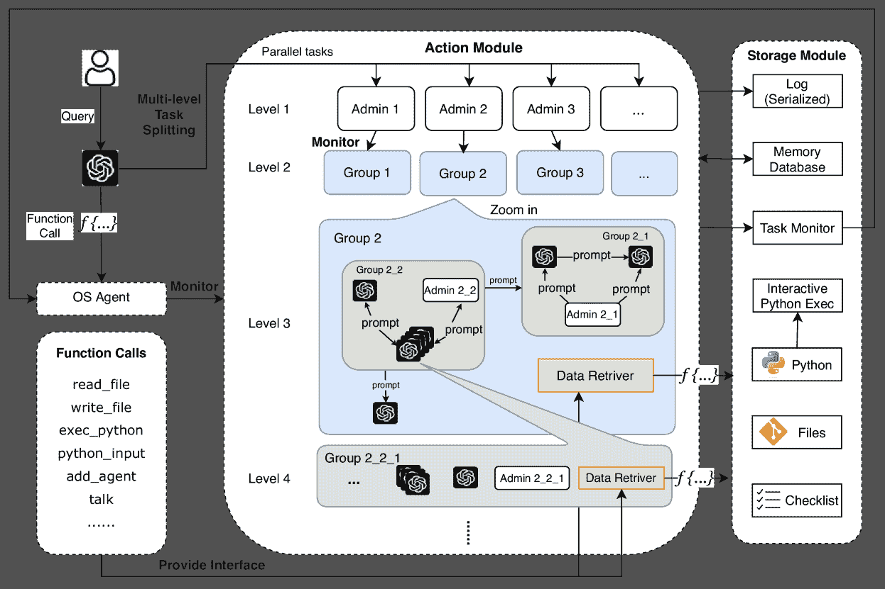

<!--yml

类别：未分类

日期：2025-01-11 12:18:35

-->

# MegaAgent：大规模LLM代理系统中自主合作的实用框架

> 来源：[https://arxiv.org/html/2408.09955/](https://arxiv.org/html/2408.09955/)

Qian Wang\equalcontrib¹, Tianyu Wang\equalcontrib², Qinbin Li³, Jingsheng Liang⁴, Bingsheng He¹

###### 摘要

随着大语言模型（LLMs）的出现，基于LLM的多代理系统（LLM-MA系统）被提出用来解决实际任务。然而，这些代理大多遵循预定义的标准操作程序（SOP），在整个交互过程中保持不变，缺乏自主性和可扩展性。此外，当前的解决方案往往忽视了有效代理合作的必要性。为了应对上述局限性，我们提出了MegaAgent，这是一种为大规模LLM代理系统设计的自主合作实用框架。MegaAgent利用代理的自主性，根据任务需求动态生成代理，具备自动分配任务、系统化规划与监控代理活动、以及管理并发操作等特点。此外，MegaAgent采用分层结构，并使用系统级并行性来提高性能和促进通信。我们通过围棋游戏开发展示了MegaAgent的有效性，结果表明其优于流行的LLM-MA系统；同时，通过国家政策模拟展示了其高自主性，并能够在确保代理之间有效合作的前提下迅速扩展至590个代理。我们的结果表明，MegaAgent是首个没有预定义SOP、高效且具有可扩展性的自主大规模LLM-MA系统，为该领域的进一步研究铺平了道路。我们的代码可以在[https://anonymous.4open.science/r/MegaAgent-81F3](https://anonymous.4open.science/r/MegaAgent-81F3)找到。

## 引言

鉴于LLM的出色规划和认知能力（Touvron等人 [2023](https://arxiv.org/html/2408.09955v2#bib.bib25)；Zhu等人 [2023](https://arxiv.org/html/2408.09955v2#bib.bib34)），研究人员对LLM-MA系统的兴趣日益增加（Wu等人 [2023](https://arxiv.org/html/2408.09955v2#bib.bib28)；Chen等人 [2023b](https://arxiv.org/html/2408.09955v2#bib.bib6)；Hong等人 [2023](https://arxiv.org/html/2408.09955v2#bib.bib11)），因为它们能够处理复杂任务。例如，MetaGPT提出了一个元编程框架，有效模拟软件开发过程（Hong等人 [2023](https://arxiv.org/html/2408.09955v2#bib.bib11)）。此外，最近的研究利用LLM的认知能力模拟更复杂的场景，这被称为世界模拟（Guo等人 [2024](https://arxiv.org/html/2408.09955v2#bib.bib9)）。例如，Simulacra（Park等人 [2023](https://arxiv.org/html/2408.09955v2#bib.bib21)）模拟了25个LLM驱动的代理在一个小镇中的社会行为，其中每个代理都能规划和安排日常生活中的事务。

然而，现实世界的模拟需要远远超过25个大语言模型（LLM）代理。例如，S3利用LLM增强的代理模拟社交网络中的26,058个用户，从而能够分析性别歧视问题的观点（Gao et al. [2023](https://arxiv.org/html/2408.09955v2#bib.bib7)）。此外，某些复杂的世界模拟场景，如政策制定（Tesfatsion [2023](https://arxiv.org/html/2408.09955v2#bib.bib24)）、战争模拟（Hua et al. [2023](https://arxiv.org/html/2408.09955v2#bib.bib12)）以及外星文明模拟（Jin et al. [2024](https://arxiv.org/html/2408.09955v2#bib.bib14)），只能通过大量LLM代理来实现真实的模拟。随着对大规模LLM-MA系统依赖的不断增长，迫切需要可扩展的自主框架，以应对大规模代理互动的需求。

然而，目前大多数LLM-MA框架主要强调AI方面，而忽略了支持LLM代理之间大规模合作所需的重要基础设施。这种疏忽导致了三个显著的限制。首先，它们没有考虑到大规模代理的管理（Hong et al. [2023](https://arxiv.org/html/2408.09955v2#bib.bib11); Chen et al. [2023b](https://arxiv.org/html/2408.09955v2#bib.bib6)）。其次，这些系统表现出有限的合作能力，从而阻碍了它们在解决多学科复杂任务中的有效性和适用性（Chan et al. [2024](https://arxiv.org/html/2408.09955v2#bib.bib3); Chen et al. [2023b](https://arxiv.org/html/2408.09955v2#bib.bib6); Wu et al. [2023](https://arxiv.org/html/2408.09955v2#bib.bib28); Pan et al. [2024](https://arxiv.org/html/2408.09955v2#bib.bib20)）。第三，它们依赖预定义的标准操作程序（SOPs）和提示来指导代理如何应对特定情况或输入（Hong et al. [2023](https://arxiv.org/html/2408.09955v2#bib.bib11)）。这种方法不仅扼杀了创造力，而且在为数百甚至数千个代理制定SOP时变得不切实际。

解决上述限制提出了两个关键挑战。首先，在大规模并行化的情况下，组织代理之间以及与外部服务（如代码和文本文件）的通信变得越来越复杂，尤其是在不同代理参与不同沟通轮次时（Zhang et al. [2024a](https://arxiv.org/html/2408.09955v2#bib.bib32)）。其次，目前现有的代理具有不足的自主能力。在大规模应用时，手工制作预定义的SOP变得不切实际，LLM代理输出的固有不稳定性（Lu et al. [2023](https://arxiv.org/html/2408.09955v2#bib.bib18)）需要在保持灵活性和创造力的同时，对每个代理的行为保持一定程度的控制。因此，确保足够的代理自主性对于处理更大规模的问题至关重要。

为了克服这些限制，我们提出了 MegaAgent，这是一个旨在管理大规模 LLM-MA 系统并促进有效、自治代理通信的实用框架。我们预期 MegaAgent 将作为未来大规模 LLM-MA 系统的基础设施，有效地充当 LLM-MA 的操作系统（OS）。MegaAgent 的核心思想是将大型任务拆分为多个层级的子任务，每个子任务由一个代理组完成。通信可以在代理组内部进行，也可以在代理组之间进行。MegaAgent 的概览见图 [1](https://arxiv.org/html/2408.09955v2#Sx1.F1 "Figure 1 ‣ Introduction ‣ MegaAgent: A Practical Framework for Autonomous Cooperation in Large-Scale LLM Agent Systems")。

为了解决第一个挑战，我们引入了一个层次机制：一个主代理接收提示，将任务拆分为子任务，并将每个子任务分配给相应的子任务管理员。管理员代理随后生成一个代理组来完成任务。如果一个代理无法单独完成任务，它可以在下一级生成另一个代理组。每个代理组并行运行，以确保高效性。

为了解决第二个挑战，我们实现了三种机制：首先，使用操作系统代理来监控代理组的输出，确保它们以正确的格式进行对话；其次，每个组中的管理员代理监控组内个别代理的状态；第三，每个代理都维护一个检查清单，以追踪其执行的操作。MegaAgent 的工作流程如下：首先，它接受用户的自然语言提示；然后，它将任务拆分为多个子任务，每个子任务由一个代理组完成，并由管理员代理进行监控。同时，操作系统代理监控每个代理组的进度。这些代理组通过数据检索器与外部服务进行交互，检索数据库、代码文件和每个代理的检查清单。



图 1：MegaAgent 首先接受提示，它会自动将其拆分成多个任务，分配给多个代理组。操作系统（OS）代理监控代理组的进度，同时，操作模块通过数据检索器与存储模块进行交互。

我们接着进行了两项实验，展示了 MegaAgent 的有效性和自治性。第一项实验是在与 AI 对手进行的五子棋游戏中，突出展示了 MegaAgent 在所有先前基准模型中的自治性和效率的优越性，MegaAgent 是唯一一个在 800 秒内完成任务的模型。第二项实验是一次行业范围的国家政策模拟，展示了 MegaAgent 在大规模自治性和可扩展性方面的能力，成功地生成并协调了约 590 个代理，在 3000 秒内产生了预期的政策。与此形成鲜明对比的是，基准模型只能协调不到 10 个代理，且无法产生预期的政策。最后，我们提供了从这些实验中获得的见解，并讨论了如何管理 LLM-MA 系统扩展到更大规模的未来研究方向。

总结来说，我们的贡献如下：

+   •

    我们提出了 MegaAgent，这是一个专为大规模 LLM-MA 系统中的自主合作设计的实用框架，能够实现 LLM 代理之间的动态任务分配和并行通信。

+   •

    我们通过在五子棋游戏开发和国家政策模拟中的实验验证了 MegaAgent 的有效性，展示了其自治性和可扩展性。

+   •

    我们提供了关于扩展 LLM-MA 系统的挑战和未来研究方向的见解。

本文的其余部分安排如下：第二部分回顾了 LLM-MA 系统的相关工作；第三部分提供了 MegaAgent 框架的详细信息；第四部分展示了两项实验，证明了 MegaAgent 的实用性；第五部分讨论了 LLM-MA 系统的未来研究方向，第六部分则总结了本文内容。

## 相关工作

本节中，我们回顾了 LLM-MA 系统及其内部代理之间的合作。由于篇幅限制，我们仅在此包含最相关的工作，更多相关工作内容见附录。

### LLM-MA 系统

随着强大LLM的出现（Achiam等人，[2023](https://arxiv.org/html/2408.09955v2#bib.bib1)；Team等人，[2023](https://arxiv.org/html/2408.09955v2#bib.bib23)），最近关于基于LLM的多代理系统的研究探讨了多个代理如何通过合作完成任务，利用角色（Chen等人，[2024](https://arxiv.org/html/2408.09955v2#bib.bib4)；Chan等人，[2024](https://arxiv.org/html/2408.09955v2#bib.bib3)）、规划（Chen等人，[2023a](https://arxiv.org/html/2408.09955v2#bib.bib5)；Zhang等人，[2024b](https://arxiv.org/html/2408.09955v2#bib.bib33)；Yuan等人，[2023](https://arxiv.org/html/2408.09955v2#bib.bib30)）和记忆（Zhang等人，[2023](https://arxiv.org/html/2408.09955v2#bib.bib31)；Hatalis等人，[2023](https://arxiv.org/html/2408.09955v2#bib.bib10)）等元素。与依赖单一基于LLM的代理的系统不同，多代理系统在处理具有挑战性的任务时表现出更大的优势。最近的工作，如MetaGPT（Hong等人，[2023](https://arxiv.org/html/2408.09955v2#bib.bib11)）、AutoGen（Wu等人，[2023](https://arxiv.org/html/2408.09955v2#bib.bib28)）和AgentVerse（Chen等人，[2023b](https://arxiv.org/html/2408.09955v2#bib.bib6)），设计了多个具体角色以完成任务。

然而，大多数流行的LLM-MA系统严重依赖于手工设计的提示和专家设计。例如，MetaGPT（Hong等人，[2023](https://arxiv.org/html/2408.09955v2#bib.bib11)）要求用户预先设计角色，如产品经理和软件工程师。另一个限制是这些系统使用顺序管道，而没有考虑代理的并行执行（Li等人，[2023](https://arxiv.org/html/2408.09955v2#bib.bib15)）。虽然AgentScope（Pan等人，[2024](https://arxiv.org/html/2408.09955v2#bib.bib20)）考虑了这一点，但其实现仍然遵循不同交互轮次中的固定轨迹，禁止更换沟通伙伴，从而限制了随着代理数量增加而提高性能的可能性。

相比之下，在现实世界中，当许多软件开发人员被雇佣时，他们可能会首先同时处理不同的文件，然后在遇到困难时集中精力解决某一特定文件的问题，通过合作激发创造性想法以克服挑战。此外，现有的LLM-MA系统受限于其小规模，尚未在涉及复杂合作的大规模场景中应用。我们在表[1](https://arxiv.org/html/2408.09955v2#Sx2.T1 "Table 1 ‣ LLM-MA Systems ‣ Related Work ‣ MegaAgent: A Practical Framework for Autonomous Cooperation in Large-Scale LLM Agent Systems")中对当前流行的LLM-MA系统与MegaAgent进行了比较。从表中可以看出，MegaAgent因其高自主性、多文件支持、并行性和可扩展性而脱颖而出。

| 模型 | 无预定义SOP | 多文件支持 | 并行性 | 可扩展性 |
| --- | --- | --- | --- | --- |
| AutoGen (Wu et al. [2023](https://arxiv.org/html/2408.09955v2#bib.bib28)) | ✗ | ✗ | ✗ | ✗ |
| MetaGPT (Hong et al. [2023](https://arxiv.org/html/2408.09955v2#bib.bib11)) | ✗ | ✓ | ✗ | ✗ |
| CAMEL (Li et al. [2023](https://arxiv.org/html/2408.09955v2#bib.bib15)) | ✗ | ✗ | ✗ | ✗ |
| AgentVerse (Chen et al. [2023b](https://arxiv.org/html/2408.09955v2#bib.bib6)) | ✓ | ✗ | ✗ | ✗ |
| MegaAgent | ✓ | ✓ | ✓ | ✓ |

表1：与MegaAgent的流行LLM-MA系统比较

### 基于LLM的代理之间的协作

基于LLM的代理之间的协调是支持LLM-MA系统的关键基础设施（Guo et al. [2024](https://arxiv.org/html/2408.09955v2#bib.bib9)）。协调的主要模式有三种：合作、辩论和竞争。MegaAgent侧重于合作模式，旨在使代理共同朝着共享目标努力。在合作模式中，有三种主要结构：分层、去中心化和集中式。分层通信是按照层次结构组织的，每一层的代理具有不同的角色，每一层与相邻的层进行交互（Liu et al. [2023b](https://arxiv.org/html/2408.09955v2#bib.bib17)）。去中心化通信基于代理之间的对等关系进行操作。集中式通信涉及一个中央代理或一组中央代理协调系统的通信，其他代理主要与中央代理连接。如MetaGPT（Hong et al. [2023](https://arxiv.org/html/2408.09955v2#bib.bib11)）中提出的共享消息池，维护一个共享消息池，代理发布并订阅相关消息，从而提高通信效率。

## MegaAgent框架

### 概述

如图[1](https://arxiv.org/html/2408.09955v2#Sx1.F1 "图1 ‣ 介绍 ‣ MegaAgent：一个面向大规模LLM代理系统自治协作的实用框架")所示，MegaAgent由五个关键组件组成：（1）多层次任务拆分，接收提示并将任务拆分为多个代理组完成；（2）行动模块，由多个代理组组成，每个代理组负责完成一个特定的子任务；（3）存储模块，由数据库、文件和检查表组成；（4）监控机制，包括操作系统代理、管理员代理以及每个代理的检查表，用于监控代理的操作；（5）通信机制，包括代理之间以及代理与外部服务之间的通信。接下来，我们将详细讨论每个组件。

### 多层次任务拆分

为了解决大规模LLM-MA系统中预定义SOP（标准操作程序）不可行的问题，我们创新性地将老板代理分配给任务拆分。为了确保每个子任务的正确完成，我们创新性地为每个小组指定一个管理员代理来监督小组的进展。老板代理将大任务分配给多个管理员代理，每个管理员负责一个子任务。每个管理员都有一个代表其角色的名称，格式如下示例：

<employee name=”MinisterHealth”>你是 MinisterHealth，卫生部的卫生政策部长。你的工作是根据……（此处省略）制定一份全面的健康政策文件（’policy_health.txt’）。你将与……合作。</employee>

管理员代理可以独立工作，也可以招募其他代理组成小组。被招募的代理可以进一步将子任务拆分为更小的任务，担任管理员代理的角色，招募更多代理，并形成新的下属小组。当代理判断任务需要进一步细分但无法独立完成时，它们会创建一个新层级并生成更多代理来解决这一需求。此过程是迭代进行的，通过函数调用实现。我们选择了分层设计，因为它可以有效地在不同层级分配和管理任务，确保随着 MegaAgent 的发展，它能够处理日益复杂的任务而不至于让一个中心代理过载。这种多层次的任务拆分使得 MegaAgent 既实用又具自主性，特别是在处理需要大量 LLM 代理的复杂任务时。

### 动作模块

为执行一个子任务，每个代理小组管理员将任务拆分成更小的组件，并生成若干代理来完成这些任务。每个代理然后根据其分配的任务创建检查清单。在整个任务完成过程中，代理们在小组内沟通与协调，更新并完成各自的检查清单，直到老板代理标记任务为“完成”。与此同时，操作系统代理确保输入和输出格式正确，并序列化个别代理的 API 消息调用。这使得多个代理能够在同一任务上协作而不妥协数据一致性，提升了开发效率。

为支持这一过程，我们引入了一个数据检索器作为动作模块与存储模块之间的接口。数据检索器管理函数调用——包括文件读取和写入、检查清单以及 Python 执行——并将它们转发给存储模块。可用的函数调用列表在开始时提供给数据检索器代理。然后，数据检索器根据代理的具体需求，确定需要生成和执行哪些函数调用，从而确保系统能够自动运行。该过程如图 [1](https://arxiv.org/html/2408.09955v2#Sx1.F1 "Figure 1 ‣ Introduction ‣ MegaAgent: A Practical Framework for Autonomous Cooperation in Large-Scale LLM Agent Systems")所示。

在之前建立的过程中，动作模块通过允许每个代理小组同时独立地操作来确保可扩展性。这种并行执行能力相比于其他基线（如 MetaGPT (Hong 等人 [2023](https://arxiv.org/html/2408.09955v2#bib.bib11)) 使用的线性操作机制，大大缩短了整体任务完成时间。

### 存储模块

为了促进 LLM 代理与外部文件之间的数据通信，我们引入了存储模块。该存储模块包括代理执行日志、内存数据库、任务监控器、Python 代码和交互式 Python 执行支持、文件以及每个代理的检查清单。

我们引入了 Git 来支持存储模块中的文件管理。由于每个代理在读取文件后需要相当的时间来编辑该文件，期间文件可能会发生变化，因此需要一个机制来保持数据一致性。当代理读取文件时，它还会检索该文件的 Git 提交哈希值。在写入时，代理必须向文件代理提供该哈希值，文件代理会将更改提交到上一个提交，合并到最新的 HEAD，并在必要时请求代理解决合并冲突。所有的 Git 操作都通过全局互斥锁进行序列化。

内存数据库用于长期记忆总结，因为 LLMs 会忘记之前的对话。每轮输出会通过语言模型编码成嵌入向量，并存储在向量数据库中，以便代理可以通过余弦相似度度量来提取最相似的消息到其记忆中。因此，代理会提取检查清单和之前的总结，以动态跟踪并更新每一步的进展。

任务监控器的设计目的是验证输出文件是否存在，并将其内容报告给监督代理，如有必要，还可以将返工任务分配给下属代理。此外，当没有活动任务时，任务监控器会提示 OS 代理审查所有生成的文件，并决定下一步措施，或者在合适的情况下终止该过程。任务监控器充当着保护机制，确保任务逐步且一致地推进。

### 监控机制

为了确保有效的监控并最小化在大规模 LLM-MA 系统中幻觉传播，我们引入了 OS 代理来监督每个代理组的输出格式，并验证输出是否符合预期标准。如果不符合，错误信息将被添加到该代理的记忆中，OS 系统会尝试重新生成。此外，每个代理维护着一个更新的检查清单，用以跟踪其操作，并确保这些操作与预期一致。一旦代理组内的工作完成，管理员代理会审查每个代理的检查清单和结果，以确认工作是否完全完成。如果结果与预期不符，OS 代理会返回一条错误信息，解释不一致之处，并提示代理重试。然而，每个代理每轮最多允许重试的次数是有限的，这个超参数我们设定为三十次。

### 通信机制

为了确保有效的沟通，代理被组织为不同的层级。它们只能与直接上级、直接下属或同一小组内的成员进行沟通。文件操作和代码执行也被视为沟通。它们的沟通格式在指令段落中进行了说明，详细内容见我们的源代码。此方式使得代理能够通过函数调用以指定格式同时发送不同的消息。完整的沟通模式见附录。这里我们展示一个示例：

<talk_goal=“Carol”> Carol，请在开发完 Gobang 游戏的 AI 后提供 ‘ai.py’。</talk>

<talk_goal=“David”> David，请在开发完 Gobang 游戏的游戏逻辑后提供 ‘game_logic.py’。</talk>

操作系统代理随后将这些消息传递给指定的代理，这些代理并行响应，以确保有效性和可扩展性。

## 实验

在本节中，我们旨在通过回答以下两个研究问题来评估 MegaAgent 的能力：

RQ1：MegaAgent 能否在没有预定义的标准操作程序（SOP）的情况下完成需要大量协作的任务？其他基准表现如何？

RQ2：MegaAgent 是否可以应用于更复杂的任务，需要显著更多的代理，并展示其可扩展性？其他基准表现如何？

### 带 AI 对手的 Gobang 游戏

Gobang 是一种战略棋盘游戏，由两名参与者轮流在棋盘上放置黑白棋子。目标是率先将五个连续的棋子水平、垂直或对角线排列¹¹1https://en.wikipedia.org/wiki/Gomoku。我们进行此实验以评估 MegaAgent 在没有预定义 SOP 的情况下完成该游戏开发时的合作性、自治性和并行性。

#### 实验设置

我们使用 GPT-4o API ²²2https://openai.com/index/hello-gpt-4o/ 进行本实验，将“temperature”参数设置为 $0$ 以确保更确定性的响应（Achiam 等 [2023](https://arxiv.org/html/2408.09955v2#bib.bib1)）。一开始，我们提供了元提示：

你是 Bob，一个软件开发俱乐部的领导者。你俱乐部当前的目标是开发一个带有 AI 的 Gobang 游戏，并可以通过运行 ‘main.py’ 来执行。

为了进行比较分析，我们使用 AutoGen、MetaGPT、CAMEL 和 AgentVerse 执行相同的任务。我们手动将它们的底层大型语言模型适配为 GPT-4o 或 GPT-4 ³³3https://platform.openai.com/docs/models/gpt-4-turbo-and-gpt-4，当 GPT-4o 与它们的代码设置不兼容时。每个模型的 API 成本细节可以在附录中找到。

为了确保实验的公平性，我们使用完全相同的提示语：为所有基准开发一个带有 AI 的 Gobang 游戏，并遵循每个基准论文中指定的指南来确定合适的测试方法。由于篇幅限制，关于这些基准的完整实验设置位于附录中。

#### 评估指标

为了评估生成的五子棋游戏，我们建立了以下评估标准：（1）无错误执行，评估程序是否能够无错误运行；（2）用户走棋功能，评估用户是否能正常走棋；（3）AI走棋功能，衡量AI是否能够正常走棋；（4）正确的游戏终止，确保当五颗连续的棋子出现时，游戏能够正确结束。

#### 实验结果

| 模型 | 完成的指标 | 代理数量 | 时间 |
| --- | --- | --- | --- |
| AutoGen (Wu et al. [2023](https://arxiv.org/html/2408.09955v2#bib.bib28)) | (1) (2) | 2 | 120s |
| MetaGPT (Hong et al. [2023](https://arxiv.org/html/2408.09955v2#bib.bib11)) | (1) (2) | 6 | 480s |
| CAMEL (Li et al. [2023](https://arxiv.org/html/2408.09955v2#bib.bib15)) | 程序不可执行 | 2 | 1830s |
| AgentVerse (Chen et al. [2023b](https://arxiv.org/html/2408.09955v2#bib.bib6)) | 不完整程序 | 4 | 1980s* |
| MegaAgent | (1) (2) (3) (4) | 7 | 800s |

*我们允许AgentVerse运行了10轮，但在1980秒后它仍然无法完成程序。

表2：五子棋实验结果

为了提供一个全面的比较，表[2](https://arxiv.org/html/2408.09955v2#Sx4.T2 "Table 2 ‣ Experiment Results ‣ Gobang Game with AI Opponent ‣ Experiments ‣ MegaAgent: A Practical Framework for Autonomous Cooperation in Large-Scale LLM Agent Systems")展示了各种最新模型在大规模LLM多代理中的表现。我们将分别分析它们，如下所示：

AutoGen：AutoGen使用两个代理生成一个没有漏洞的极小极大AI，该AI需要无限的时间进行思考，并且永远不会产生一个可行的动作。在另一次尝试中，AutoGen生成了一个程序，经过约两分钟后以# To be continued.. 结束，并在尝试执行时卡住。失败的可能原因是其SOP过于简单，且没有包含足够的代理之间的沟通（例如代码审查）。

MetaGPT：所有尝试都未能生成AI的有效动作，即使生成了六个代理。主要错误如下：

+   •

    代码无法执行，并抛出错误。可能的原因是MetaGPT没有外部工具来执行和调试生成的代码。

+   •

    生成的程序不是一个五子棋游戏（例如，改为井字棋游戏）。失败的可能原因是其SOP过于简单，且代理之间的沟通要求不足。

+   •

    AI陷入了无限循环。可能的原因是MetaGPT没有外部工具来执行和调试生成的代码，且当前的ChatGPT API无法独立开发无错误的AlphaBeta算法。


图2：CAMEL未能生成规划阶段所需的文件。

CAMEL: 我们发现 CAMEL 只能使用两个代理生成代码段。例如，如图 [2](https://arxiv.org/html/2408.09955v2#Sx4.F2 "图 2 ‣ 实验结果 ‣ 与 AI 对手的五子棋游戏 ‣ 实验 ‣ MegaAgent：一个用于大规模 LLM 代理系统中自主合作的实用框架") 所示，CAMEL 忘记编写 ui.py，而该文件应该包含在 game.py 中。造成这种情况的可能原因是其规划和上下文能力较弱。

AgentVerse: AgentVerse 生成了四个代理来完成这个任务。然而，我们发现，在第一次和第二次试验中，代理在所有十轮中都拒绝了结果；而在第三次试验中，尽管代理接受了结果，但代码仍然包含许多占位符，无法执行。一个不完整的代码块可能如下所示：

```
class AI:
    def heuristic(self):
        # It should consider Gobang patterns
        # like open threes, closed fours.
        pass

```

AgentVerse 可能失败的原因是，其规划阶段的框架过于严格，而当前的 LLM 无法满足这一要求。

MegaAgent: MegaAgent 系统自主设计了一个集成七个代理的标准操作程序（SOP），从而成功地执行指定任务。它自主开发了一个功能性的五子棋游戏，并与一个简单的 AI 接口对接，能够：

1.  i.

    允许玩家输入行和列的选择以执行棋步。

1.  ii.

    使 AI 能够在棋盘上响应并执行其棋步。

1.  iii.

    重复此交互，直到玩家将五个连续棋子对齐。

这些功能满足我们需求中的 (1) 至 (4) 条件。与上述 LLM-MA 系统相比，MegaAgent 能够自行生成一个完全可操作的游戏，这是一个前所未有的成就，后者的结果要么是未完成的占位符，要么没有包含 AI。

最终，MegaAgent 成功生成了一个可运行的五子棋游戏，并搭载了一个简单的 AI，其界面如图 [5](https://arxiv.org/html/2408.09955v2#A1.F5 "图 5 ‣ 结果 ‣ 五子棋游戏实验设置与结果 ‣ 附录 A 附录 ‣ MegaAgent：一个用于大规模 LLM 代理系统中自主合作的实用框架") 所示。此实验的完整日志和程序可以在我们的源代码中找到。


图 3: MegaAgent 五子棋演示界面

#### 消融研究

为了验证 MegaAgent 中并行设计的有效性，我们通过在没有每个代理组并行机制的情况下运行 MegaAgent 进行消融研究，并在表 [3](https://arxiv.org/html/2408.09955v2#Sx4.T3 "表 3 ‣ 消融研究 ‣ 与 AI 对手的五子棋游戏 ‣ 实验 ‣ MegaAgent：一个用于大规模 LLM 代理系统中自主合作的实用框架") 中展示了结果。

| 机制 | 完成的指标 | 代理数量 | 时间 |
| --- | --- | --- | --- |
| 无并行 | (1) (2) (3) (4) | 7 | 4505秒 |
| 有并行 | (1) (2) (3) (4) | 7 | 800秒 |

表 3: 五子棋消融研究结果

当MegaAgent在没有并行执行的情况下运行时，使用7个代理完成任务需要4505秒。相比之下，启用并行执行后，相同任务仅需800秒即可完成。两种配置都成功达成了所有指定的指标，但时间的大幅缩短突显了并行设计的高效性。

### 行业别国家政策模拟

我们提出了一个更具挑战性的实验：制定行业特定的国家政策，这需要大量代理执行涉及教育、健康和金融等复杂领域的各种任务。该实验可以评估MegaAgent的自主性、可扩展性和合作能力。

#### 实验设置

由于预算限制，我们在MegaAgent的此实验中使用了GPT-4o-mini API⁴⁴4https://openai.com/index/gpt-4o-mini-advancing-cost-efficient-intelligence/。为了进行对比分析，我们使用了AutoGen、MetaGPT、CAMEL和AgentVerse来执行相同的任务。API费用的详细信息见附录。我们手动将它们的底层大语言模型适配为GPT-4o，或者在GPT-4o与其代码设置不兼容时，改用GPT-4。我们为这些框架输入的提示如下：

你是NationLeader，一国的领导者。你希望为你的前沿国家在`policy_department.txt`中制定最佳的详细政策。你正在招聘部长并分配工作给他们。对于每位可能的部长，请写下一个提示…… 

由于篇幅限制，完整的提示信息见附录。

#### 实验结果

我们在表格[4](https://arxiv.org/html/2408.09955v2#Sx4.T4 "表格4 ‣ 实验结果 ‣ 行业别国家政策模拟 ‣ 实验 ‣ MegaAgent：大规模LLM代理系统中的自主合作实用框架")中展示了结果。

| 模型 | 输出 | 代理数量 | 时间 |
| --- | --- | --- | --- |
| AutoGen（Wu等人，[2023](https://arxiv.org/html/2408.09955v2#bib.bib28)） | 提纲 | 1 | 40秒 |
| MetaGPT（Hong等人，[2023](https://arxiv.org/html/2408.09955v2#bib.bib11)） | Python程序 | 6 | 580秒 |
| CAMEL（Li等人，[2023](https://arxiv.org/html/2408.09955v2#bib.bib15)） | 计划 | 2 | 1380秒 |
| AgentVerse（Chen等人，[2023b](https://arxiv.org/html/2408.09955v2#bib.bib6)） | 无 | 4 | 510秒 |
| MegaAgent | 完整的政策 | 590 | 2991秒 |

表格4：行业别国家政策模拟结果。结果为单次测试，可能会有所变化，因为大语言模型的输出不稳定。

AutoGen：它仅生成每个方面的提纲，并且在单次输出中没有进行修改。此实验大约需要40秒，并且只使用了一个代理。

MetaGPT：它需要580秒和七个代理来生成一个Python程序，但这并非我们所需的结果。

CAMEL：此试验需要1380秒，并且仅使用了两个代理。它花费了大量时间来提供计划、整体策略、实施方法和潜在风险，这并不是我们所期望的结果。

AgentVerse：在510秒后，AgentVerse在所有十轮中始终拒绝该解决方案，且无法为四个智能体提供可行的政策。

MegaAgent：MegaAgent通过老板智能体成功招募了九个部长级智能体，每个智能体负责不同的领域，如健康（“MinisterHealth”）。每个部长智能体同时工作，草拟政策，并招募数十个下属市民测试者进行模拟并提供反馈。一个实验涉及约590个智能体，形成一个三级层级结构，如图[4](https://arxiv.org/html/2408.09955v2#Sx4.F4 "图4 ‣ 实验结果 ‣ 按行业划分的国家政策仿真 ‣ 实验 ‣ MegaAgent：一个用于大规模LLM智能体系统中自主协作的实用框架")所示。MegaAgent在2991秒内完成了该实验，即使有590个智能体，仍展示了其高效性和可扩展性。


图4：政策制定实验生成的层级示例

最后，MegaAgent呈现了一个全面的政策，涵盖了模拟国家的所有十七个部委，包含详细的指令和修订内容，如下所示：\dirtree.1 /project. .2 policy_health.txt. .3 feedback_health.txt. .2 policy_education.txt. .3 feedback_education.txt. .2 ….

完整版本见附录。MegaAgent的自主性和可扩展性通过其能够让智能体在多个回合中跨目标通信，并根据需要招募新智能体的能力得到了验证。

#### 消融研究

为了验证MegaAgent中并行设计的有效性，我们还通过运行不使用并行机制的仿真进行消融研究，结果见表[5](https://arxiv.org/html/2408.09955v2#Sx4.T5 "表5 ‣ 消融研究 ‣ 按行业划分的国家政策仿真 ‣ 实验 ‣ MegaAgent：一个用于大规模LLM智能体系统中自主协作的实用框架")。

| 机制 | 输出 | 智能体数量 | 时间 |
| --- | --- | --- | --- |
| 不使用并行机制 | 不完整策略 | >100 | >14400秒 |
| 使用并行机制 | 完整策略 | 590 | 2991秒 |

*我们在没有并行机制的情况下终止了执行

在14400秒后。

表5：按行业划分的国家政策仿真消融研究结果

在14400秒后，未采用并行设计的MegaAgent仍未完成策略生成。它已生成超过100个智能体，并且第一层级的管理智能体仍在招募其他智能体并草拟计划。我们发现，在单线程环境下，管理智能体招募的下属较少，且产生的策略较为简单，测试也最少。这是因为它们必须串行执行多个函数调用，以招募多个智能体来完成完整的测试程序，而当前的LLM在这方面的处理能力较弱。

此外，这一观察结果突显了当前LLM的一个关键局限性：它们在处理复杂的序列化任务时效率低下。非并行化的MegaAgent表现出，使用并行化不仅有利，而且对于基于LLM的系统管理复杂任务（如全面的政策生成与评估）至关重要。

### 可扩展性分析

在MegaAgent中，对于$n$个代理，每层之间的通信成本为$O(\log n)$，因为它们可以并行运行，且每个代理组仅与相邻的层进行交互，如图[4](https://arxiv.org/html/2408.09955v2#Sx4.F4 "Figure 4 ‣ Experiment Results ‣ Industry-Wise Nation Policy Simulation ‣ Experiments ‣ MegaAgent: A Practical Framework for Autonomous Cooperation in Large-Scale LLM Agent Systems")所示。相比之下，现有框架的运行时间呈线性增长$O(n)$，因为它们是串行运行的，随着LLM代理数量的增加，这种方式变得不切实际。上述理论分析通过行业范围的国家政策模拟结果得到了验证，MegaAgent仅用2991秒就完成了590个代理的协作，而表现最好的CAMEL仅用1380秒就完成了2个代理的规划。因此，MegaAgent是一个适用于大规模LLM-MA系统中自治合作的实用框架，能够有效应对随着LLM代理数量增加而带来的扩展问题。

## 研究方向

减少幻觉。在我们的实验中偶尔观察到一些幻觉现象，例如输出格式未能满足指定要求。为了解决这个问题，MegaAgent为每个代理维护了一个更新的检查表，用于监控其行为并确保遵循格式规范。然而，这个检查表也是由LLM生成的，因此可能会出现错误。近期的研究建议在生成LLM输出之前（Peng et al. [2023](https://arxiv.org/html/2408.09955v2#bib.bib22)）、过程中（Cao et al. [2023](https://arxiv.org/html/2408.09955v2#bib.bib2)）或之后（Gao et al. [2022](https://arxiv.org/html/2408.09955v2#bib.bib8)）利用外部专家知识库来引导LLM的输出，这可能是一个潜在的方向。

集成不同的LLM。在我们的实验中，我们观察到GPT-4的API成本相当高。考虑到许多比GPT-4便宜的LLM在不同领域有特长，利用不同的LLM为整个LLM-MA系统中的特定角色提供服务，可能是提高效率同时降低成本的有效方式（Touvron et al. [2023](https://arxiv.org/html/2408.09955v2#bib.bib25); Jiang et al. [2024](https://arxiv.org/html/2408.09955v2#bib.bib13); Yang et al. [2024](https://arxiv.org/html/2408.09955v2#bib.bib29)）。此外，寻找有效的数据共享方法以促进这些LLM之间的合作是一个有价值的研究方向（Wu and Fard [2024](https://arxiv.org/html/2408.09955v2#bib.bib27)）。

提高效率。在 MegaAgent 中，主要瓶颈是规划时间和 LLM 代理之间的通信，特别是在将代码转换为提示、管理检查清单、维护框架和调试方面。随着通信轮次和代理数量的增加，这一问题会加剧，导致在整个过程中输入和输出令牌的大量增加（Wang 等人 [2024](https://arxiv.org/html/2408.09955v2#bib.bib26)）。先前的研究建议使用摘要压缩和语义压缩来浓缩早期轮次的长时间对话（Liu 等人 [2023a](https://arxiv.org/html/2408.09955v2#bib.bib16)）。在 MegaAgent 中，我们对代理之间的先前对话进行总结，并将其存储在外部向量数据库中，以便高效检索。未来的工作可能进一步提高通信效率。

## 结论

我们介绍了 MegaAgent，这是一个专为大规模 LLM-MA 系统中自主合作设计的实用框架。通过围棋游戏开发实验，我们展示了 MegaAgent 在自主性和合作方面优于基线模型。此外，我们还进行了国家政策模拟，突显了 MegaAgent 的可扩展性。凭借其层次化和自适应的设计，MegaAgent 有潜力成为未来 LLM-MA 系统的基础操作系统。此外，我们还从 MegaAgent 实验中识别出关键的研究方向，为未来的研究提供了指导。我们鼓励研究社区专注于增强 LLM 代理的有效合作，以满足大规模 LLM-MA 系统日益增长的需求。

## 参考文献

+   Achiam 等人 (2023) Achiam, J.; Adler, S.; Agarwal, S.; Ahmad, L.; Akkaya, I.; Aleman, F. L.; Almeida, D.; Altenschmidt, J.; Altman, S.; Anadkat, S.; 等人. 2023. GPT-4 技术报告. *arXiv 预印本 arXiv:2303.08774*。

+   Cao 等人 (2023) Cao, H.; An, Z.; Feng, J.; Xu, K.; Chen, L.; 和 Zhao, D. 2023. 更接近全面答案：使用大型语言模型的受限多阶段问题分解. *arXiv 预印本 arXiv:2311.07491*。

+   Chan 等人 (2024) Chan, X.; Wang, X.; Yu, D.; Mi, H.; 和 Yu, D. 2024. 扩展合成数据创建与 1,000,000,000 个虚拟角色. *arXiv 预印本 arXiv:2406.20094*。

+   Chen 等人 (2024) Chen, J.; Wang, X.; Xu, R.; Yuan, S.; Zhang, Y.; Shi, W.; Xie, J.; Li, S.; Yang, R.; Zhu, T.; 等人. 2024. 从虚拟角色到个性化：关于角色扮演语言代理的调查. *arXiv 预印本 arXiv:2404.18231*。

+   Chen 等人 (2023a) Chen, J.; Yuan, S.; Ye, R.; Majumder, B. P.; 和 Richardson, K. 2023a. 言行一致：评估 LLM 代理在拍卖场景中的战略规划与执行. *arXiv 预印本 arXiv:2310.05746*。

+   Chen 等（2023b）Chen, W.; Su, Y.; Zuo, J.; Yang, C.; Yuan, C.; Qian, C.; Chan, C.-M.; Qin, Y.; Lu, Y.; Xie, R.; 等。2023b. Agentverse：促进多代理协作并探索代理中的突现行为。 *arXiv 预印本 arXiv:2308.10848*。

+   Gao 等（2023）Gao, C.; Lan, X.; Lu, Z.; Mao, J.; Piao, J.; Wang, H.; Jin, D.; 和 Li, Y. 2023. S3：具有大型语言模型驱动代理的社交网络仿真系统。 *arXiv 预印本 arXiv:2307.14984*。

+   Gao 等（2022）Gao, L.; Dai, Z.; Pasupat, P.; Chen, A.; Chaganty, A. T.; Fan, Y.; Zhao, V. Y.; Lao, N.; Lee, H.; Juan, D.-C.; 等。2022. Rarr：使用语言模型研究和修订语言模型的表述。 *arXiv 预印本 arXiv:2210.08726*。

+   Guo 等（2024）Guo, T.; Chen, X.; Wang, Y.; Chang, R.; Pei, S.; Chawla, N. V.; Wiest, O.; 和 Zhang, X. 2024. 基于大型语言模型的多代理：进展与挑战综述。 *arXiv 预印本 arXiv:2402.01680*。

+   Hatalis 等（2023）Hatalis, K.; Christou, D.; Myers, J.; Jones, S.; Lambert, K.; Amos-Binks, A.; Dannenhauer, Z.; 和 Dannenhauer, D. 2023. 记忆至关重要：改进大型语言模型代理的长期记忆需求。在 *AAAI 研讨会系列会议录*，第 2 卷，277–280 页。

+   Hong 等（2023）Hong, S.; Zheng, X.; Chen, J.; Cheng, Y.; Wang, J.; Zhang, C.; Wang, Z.; Yau, S. K. S.; Lin, Z.; Zhou, L.; 等。2023. Metagpt：多代理协作框架的元编程。 *arXiv 预印本 arXiv:2308.00352*。

+   Hua 等（2023）Hua, W.; Fan, L.; Li, L.; Mei, K.; Ji, J.; Ge, Y.; Hemphill, L.; 和 Zhang, Y. 2023. 战争与和平（waragent）：基于大型语言模型的世界大战多代理模拟。 *arXiv 预印本 arXiv:2311.17227*。

+   Jiang 等（2024）Jiang, A. Q.; Sablayrolles, A.; Roux, A.; Mensch, A.; Savary, B.; Bamford, C.; Chaplot, D. S.; Casas, D. d. l.; Hanna, E. B.; Bressand, F.; 等。2024. Mixtral of experts。 *arXiv 预印本 arXiv:2401.04088*。

+   Jin 等（2024）Jin, M.; Wang, B.; Xue, Z.; Zhu, S.; Hua, W.; Tang, H.; Mei, K.; Du, M.; 和 Zhang, Y. 2024. 如果大型语言模型有不同的世界观：基于大型语言模型的代理模拟外星文明。 *arXiv 预印本 arXiv:2402.13184*。

+   Li 等（2023）Li, G.; Hammoud, H.; Itani, H.; Khizbullin, D.; 和 Ghanem, B. 2023. Camel：用于探索大型语言模型社会“思想”的沟通代理。 *神经信息处理系统进展*，36：51991–52008。

+   Liu 等（2023a）Liu, J.; Li, L.; Xiang, T.; Wang, B.; 和 Qian, Y. 2023a. Tcra-llm：用于推理成本降低的令牌压缩检索增强大型语言模型。 *arXiv 预印本 arXiv:2310.15556*。

+   Liu 等（2023b）Liu, Z.; Zhang, Y.; Li, P.; Liu, Y.; 和 Yang, D. 2023b. 动态 LLM-代理网络：一个带有代理团队优化的大型语言模型代理协作框架。 *arXiv 预印本 arXiv:2310.02170*。

+   Lu 等（2023）Lu, Q.; Qiu, B.; Ding, L.; Xie, L.; 和 Tao, D. 2023. 错误分析提示使大语言模型实现类人翻译评估：以 ChatGPT 为案例的研究。

+   Mei 等（2024）Mei, K.; Li, Z.; Xu, S.; Ye, R.; Ge, Y.; 和 Zhang, Y. 2024. 大语言模型代理操作系统。 *arXiv 预印本 arXiv:2403.16971*。

+   Pan 等（2024）Pan, X.; Gao, D.; Xie, Y.; Wei, Z.; Li, Y.; Ding, B.; Wen, J.-R.; 和 Zhou, J. 2024. 在 AgentScope 中进行超大规模多代理仿真。 *arXiv 预印本 arXiv:2407.17789*。

+   Park 等（2023）Park, J. S.; O’Brien, J.; Cai, C. J.; Morris, M. R.; Liang, P.; 和 Bernstein, M. S. 2023. 生成代理：人类行为的互动模拟。发表于 *第36届ACM用户界面软件与技术年会论文集*，1-22。

+   Peng 等（2023）Peng, B.; Galley, M.; He, P.; Cheng, H.; Xie, Y.; Hu, Y.; Huang, Q.; Liden, L.; Yu, Z.; Chen, W.; 等人. 2023. 检查你的事实并重试：通过外部知识和自动反馈提升大语言模型性能。 *arXiv 预印本 arXiv:2302.12813*。

+   Team 等（2023）Team, G.; Anil, R.; Borgeaud, S.; Wu, Y.; Alayrac, J.-B.; Yu, J.; Soricut, R.; Schalkwyk, J.; Dai, A. M.; Hauth, A.; 等人. 2023. Gemini：一系列高能力的多模态模型。 *arXiv 预印本 arXiv:2312.11805*。

+   Tesfatsion（2023）Tesfatsion, L. 2023. 基于代理的计算经济学：概述及简史。 *人工智能、学习与经济学金融中的计算*，41-58。

+   Touvron 等（2023）Touvron, H.; Lavril, T.; Izacard, G.; Martinet, X.; Lachaux, M.-A.; Lacroix, T.; Rozière, B.; Goyal, N.; Hambro, E.; Azhar, F.; 等人. 2023. Llama：开放高效的基础语言模型。 *arXiv 预印本 arXiv:2302.13971*。

+   Wang 等（2024）Wang, J.; Jain, S.; Zhang, D.; Ray, B.; Kumar, V.; 和 Athiwaratkun, B. 2024. 在令牌经济中的推理：预算意识下的大语言模型推理策略评估。 *arXiv 预印本 arXiv:2406.06461*。

+   Wu 和 Fard（2024）Wu, J. J.; 和 Fard, F. H. 2024. 基准测试大语言模型和大语言模型代理的代码生成沟通能力。 *arXiv 预印本 arXiv:2406.00215*。

+   Wu 等（2023）Wu, Q.; Bansal, G.; Zhang, J.; Wu, Y.; Zhang, S.; Zhu, E.; Li, B.; Jiang, L.; Zhang, X.; 和 Wang, C. 2023. Autogen：通过多代理对话框架实现下一代大语言模型应用。 *arXiv 预印本 arXiv:2308.08155*。

+   Yang 等（2024）Yang, A.; Yang, B.; Hui, B.; Zheng, B.; Yu, B.; Zhou, C.; Li, C.; Li, C.; Liu, D.; Huang, F.; 等人. 2024. Qwen2 技术报告。 *arXiv 预印本 arXiv:2407.10671*。

+   Yuan 等（2023）Yuan, S.; Chen, J.; Fu, Z.; Ge, X.; Shah, S.; Jankowski, C. R.; Xiao, Y.; 和 Yang, D. 2023. 从大语言模型中提取脚本知识以进行约束语言规划。 *arXiv 预印本 arXiv:2305.05252*。

+   Zhang 等（2023）Zhang, K.; Zhao, F.; Kang, Y.; 和 Liu, X. 2023. 结合短期和长期记忆的内存增强大语言模型个性化。 *arXiv 预印本 arXiv:2309.11696*。

+   Zhang等人（2024a）Zhang, Y.; Yang, S.; Bai, C.; Wu, F.; Li, X.; Li, X.; 和 Wang, Z. 2024a. 面向高效LLM基础的体现式多智能体协作。*arXiv预印本 arXiv:2405.14314*。

+   Zhang等人（2024b）Zhang, Y.; Yuan, S.; Hu, C.; Richardson, K.; Xiao, Y.; 和 Chen, J. 2024b. Timearena: 在时间感知模拟中塑造高效的多任务语言智能体。*arXiv预印本 arXiv:2402.05733*。

+   Zhu等人（2023）Zhu, D.; Chen, J.; Shen, X.; Li, X.; 和 Elhoseiny, M. 2023. Minigpt-4: 利用先进的大型语言模型增强视觉语言理解。*arXiv预印本 arXiv:2304.10592*。

## 附录A 附录

### 实验环境

所有实验均在NVIDIA A100-80G Tensor Core GPU上进行，并使用ChatGPT-4o和ChatGPT-4o mini的Tier 5 API进行操作⁵⁵5[链接](https://platform.openai.com/docs/guides/rate-limits/usage-tiers?context=tier-five)。

### 补充相关工作

#### 基于LLM的智能体管理

基于LLM的智能体管理研究仍较为有限。流行的基于LLM的多智能体系统，如MetaGPT（Hong等人[2023](https://arxiv.org/html/2408.09955v2#bib.bib11)）、AgentVerse（Chen等人[2023b](https://arxiv.org/html/2408.09955v2#bib.bib6)）和AutoGen（Wu等人[2023](https://arxiv.org/html/2408.09955v2#bib.bib28)），通常将任务划分为较小的子任务，并分配多个智能体来完成。然而，它们的规划方法是顺序的，缺乏战略性管理。相比之下，AIOS（Mei等人[2024](https://arxiv.org/html/2408.09955v2#bib.bib19)）引入了一种LLM智能体操作系统，提供模块隔离并整合了LLM和操作系统功能。它采用了多种管理器，包括智能体调度器、上下文管理器、内存管理器、存储管理器、工具管理器和访问管理器，以有效管理众多智能体。然而，AIOS是通过手动组织不同的应用程序，如数学问题求解智能体和旅行规划智能体，而不是在同一应用程序内的多个智能体。这种方法代表了一种不同类型的SOP，且不适用于大规模的LLM-MA系统，因为当规模达到数千甚至数百万时，人工编写每个智能体的每个SOP和提示是不可行的。

### 五子棋游戏实验设置与结果

#### 设置

我们使用ChatGPT-4o API进行本次实验。‘temperature’参数设置为0。

#### 成本

总成本为6.9美元。

#### 结果

首先，Boss智能体接收到以下初始手写元提示：

[⬇](data:text/plain;base64,WW91IGFyZSBCb2IsIHRoZSBsZWFkZXIgb2YgYSBzb2Z0d2FyZSBkZXZlbG9wbWVudCBjbHViLiBZb3VyIGNsdWIncyBjdXJyZW50IGdvYWwgaXMgdG8gZGV2ZWxvcCBhIEdvYmFuZyBnYW1lIHdpdGggYSB2ZXJ5IHN0cm9uZyBBSSwgbm8gZnJvbnRlbmQsIGFuZCBjYW4gYmUgZXhlY3V0ZWQgYnkgcnVubmluZyAnbWFpbi5weScuIFlvdSBhcmUgbm93IHJlY3J1aXRpbmcgZW1wbG95ZWVzIGFuZCBhc3NpZ25pbmcgd29yayB0byB0aGVtLiBGb3IgZWFjaCBlbXBsb3llZShpbmNsdWRpbmcgeW91cnNlbGYpLCBwbGVhc2Ugd3JpdGUgYSBwcm9tcHQuIFBsZWFzZSBzcGVjaWZ5IGhpcyBuYW1lKG9uZSB3b3JkLCBubyBwcmVmaXgpLCBoaXMgam9iLCB3aGF0IGtpbmRzIG9mIHdvcmsgaGUgbmVlZHMgdG8gZG8uIFlvdU0gQ1NUIGNsYXJpZnkgYWxsIGhpcyBwb3NzaWJsZSBjb2xsYWJvcmF0b3JzJyBuYW1lcyBhbmQgdGhlaXIgam9icyBpbiB0aGUgcHJvbXB0LiBUaGUgZm9ybWF0IHNob3VsZCBiZSBsaWtlIChUaGUgZXhhbXBsZSBpcyBmb3IgQWxpY2UgaW4gYW5vdGhlciBub3ZlbCB3cml0aW5nIHByb2plY3QpOgoKPGVtcGxveWVlIG5hbWU9IkFsaWNlIj4KWW91IGFyZSBBbGljZSwgYSBub3ZlbGlzdC4gWW91ciBqb2IgaXMgdG8gd3JpdGUgYSBzaW5nbGUgY2hhcHRlciBvZiBhIG5vdmVsIHdpdGggMTAwMCB3b3JkcyBhY2NvcmRpbmcgdG8gdGhlIG91dGxpbmUgKG91dGxpbmUudHh0KSBmcm9tIENhcm9sLCB0aGUgYXJjaGl0ZWN0IGRlc2lnbmVyLCBhbmQgcGFzcyBpdCB0byBEYXZpZCAoY2hhcHRlcl94LnR4dCksIHRoZSBlZGl0b3IuIFBsZWFzZSBvbmx5IGZvbGxvdyB0aGlzIHJvdXRpbmUuIFlvdXIgY29sbGFyYm9yYXRvcnMgaW5jbHVkZSBCb2IodGhlIEJvc3MpLCBDYXJvbCh0aGUgYXJjaGl0ZWN0IGRlc2lnbmVyKSBhbmQgRGF2aWQodGhlIGVkaXRvcikuCjwvZW1wbG95ZWU+CgpQbGVhc2Ugbm90ZSB0aGF0IGV2ZXJ5IGVtcGxveWVlIGlzIGxhenksIGFuZCB3aWxsIG5vdCBjYXJlIGFueXRoaW5nIG5vdCBtZW50aW9uZWQgYnkgeW91ciBwcm9tcHQuIFRvIGVuc3VyZSB0aGUgY29tcGxldGlvbiBvZiB5b3VyIHByb2plY3QsIHRoZSB3b3JrIG9mIGVhY2ggZW1wbG95ZWUgc2hvdWxkIGJlICoqbm9uLWRpdmlzYWJsZSoqLCBkZXRhaWxlZCBpbiBzcGVjaWZpYyBhY3Rpb24obGlrZSB3aGF0IGZpbGUgdG8gd3JpdGUuIE9ubHkgdHh0IGFuZCBweXRob24gZmlsZXMgYXJlIHN1cHBvcnRlZCkgYW5kIGxpbWl0ZWQgdG8gYSBzaW1wbGUgYW5kIHNwZWNpZmljIGluc3RydWN0aW9uLiBBbGwgdGhlIGVtcGxveWVlcyAoaW5jbHVkaW5nIHlvdXJzZWxmKSBzaG91bGQgY292ZXIgdGhlIHdob2xlIFNPUCAoZm9yIGV4YW1wbGUsIGZpcnN0IGRlY2lkaW5nIGFsbCB0aGUgZmVhdHVyZXMgdG8gZGV2ZWxvcCBpcyByZWNvbW1lbmRlZCkuIFNwZWVkIHVwIHRoZSBwcm9jZXNzIGJ5IGFkZGluZyBtb3JlIGVtcGxveWVlcyB0byBkaXZpZGUgdGhlIHdvcmsuCgpBZnRlciB0aGUgZGVzaWduYXRpb24gcHJvY2VzcywgcGxlYXNlIHNwZWNpZnkgYW4gZW1wbG95ZWUncyBuYW1lIHRvIGluaXRpYXRlIHRoZSB3aG9sZSBwcm9qZWN0LCBpbiB0aGUgZm9ybWF0IDxiZWdpbm5lcj5OYW1lPC9iZWdpbm5lcj4u)1You  are  Bob,  the  leader  of  a  software  development  club.  Your  club’s  current  goal  is  to  develop  a  Gobang  game  with  a  very  strong  AI,  no  frontend,  and  can  be  executed  by  running  ’main.py’.  You  are  now  recruiting  employees  and  assigning  work  to  them.  For  each  employee(including  yourself),  please  write  a  prompt.  Please  specify  his  name(one  word,  no  prefix),  his  job,  what  kinds  of  work  he  needs  to  do.  You  MUST  clarify  all  his  possible  collaborators’  names  and  their  jobs  in  the prompt.  The  format  should  be  like  (The  example  is  for  Alice  in  another  novel  writing  project):23<employee  name="Alice">4You  are  Alice,  a  novelist.  Your  job  is  to  write  a  single  chapter  of  a  novel  with  1000  words  according  to  the  outline  (outline.txt)  from Carol,  the  architect  designer,  and  pass  it  to  David  (chapter_x.txt),  the  editor.  Please  only  follow  this  routine.  Your  collarborators  include  Bob(the  Boss),  Carol(the  architect  designer)  and  David(the  editor).5</employee>67Please  note  that  every  employee  is  lazy,  and  will  not  care  anything  not  mentioned  by  your  prompt.  To  ensure  the  completion  of  your  project,  the  work  of  each  employee  should  be  **non-divisable**,  detailed  in  specific  action(like  what  file  to  write.  Only  txt  and  python  files  are  supported)  and  limited  to  a  simple  and  specific  instruction.  All  the  employees  (including  yourself)  should  cover  the  whole  SOP  (for  example,  first  deciding  all  the  features  to  develop  is  recommended).  Speed  up  the  process  by  adding  more  employees  to  divide  the  work.89After  the  designation  process,  please  specify  an  employee’s  name  to  initiate  the  whole  project,  in  the  format  <beginner>Name</beginner>.

在一次试验中，模型生成了以下回应：

[⬇](data:text/plain;base64,PGVtcGxveWVlIG5hbWU9IkJvYiI+CllvdSBhcmUgQm9iLCB0aGUgbGVhZGVyIG9mIHRoZSBzb2Z0d2FyZSBkZXZlbG9wbWVudCBjbHViLiBZb3VyIGpvYiBpcyB0byBkZWNpZGUgYWxsIHRoZSBmZWF0dXJlcyB0byBkZXZlbG9wIGZvciB0aGUgR29iYW5nIGdhbWUgYW5kIHdyaXRlIHRoZW0gZG93biBpbiBhIGZpbGUgbmFtZWQgJ2ZlYXR1cmVzLnR4dCcuIFlvdXIgY29sbGFib3JhdG9ycyBpbmNsdWRlIEFsaWNlICh0aGUgZ2FtZSBkZXNpZ25lciksIENhcm9sICh0aGUgQUkgZGV2ZWxvcGVyKSwgRGF2aWQgKHRoZSBnYW1lIGxvZ2ljIGRldmVsb3BlciksIGFuZCBFdmUgKHRoZSBpbnRlZ3JhdG9yKS4KPC9lbXBsb3llZT4KCjxlbXBsb3llZSBuYW1lPSJBbGljZSI+CllvdSBhcmUgQWxpY2UsIGEgZ2FtZSBkZXNpZ25lci4gWW91ciBqb2IgaXMgdG8gZGVzaWduIHRoZSBnYW1lIHJ1bGVzIGFuZCB1c2VyIGludGVyYWN0aW9ucyBiYXNlZCBvbiB0aGUgZmVhdHVyZXMgbGlzdGVkIGluICdmZWF0dXJlcy50eHQnIGZyb20gQm9iLCBhbmQgd3JpdGUgdGhlbSBkb3duIGluIGEgZmlsZSBuYW1lZCAnZ2FtZV9kZXNpZ24udHh0Jy4gWW91ciBjb2xsYWJvcmF0b3JzIGluY2x1ZGUgQm9iICh0aGUgbGVhZGVyKSwgQ2Fyb2wgKHRoZSBBSSBkZXZlbG9wZXIpLCBEYXZpZCAodGhlIGdhbWUgbG9naWMgZGV2ZWxvcGVyKSwgYW5kIEV2ZSAodGhlIGludGVncmF0b3IpLgo8L2VtcGxveWVlPgoKPGVtcGxveWVlIG5hbWU9IkNhcm9sIj4KWW91IGFyZSBDYXJvbCwgYW4gQUkgZGV2ZWxvcGVyLiBZb3VyIGpvYiBpcyB0byBkZXZlbG9wIHRoZSBJQSBmb3IgdGhlIFRvYmFuZyBnYW1lIGJhc2VkIG9uIHRoZSBnYW1lIGRlc2lnbiBpbiAnZ2FtZV9kZXNpZ24udHh0JyBmcm9tIEFsaWNlLCBhbmQgd3JpdGUgdGhlIEFJIGNvZGUgaW4gYSBmaWxlIG5hbWVkICdhaS5weScuIFlvdXIgY29sbGFib3JhdG9ycyBpbmNsdWRlIEJvYiAodGhlIGxlYWRlciksIEFsaWNlICh0aGUgZ2FtZSBkZXNpZ25lciksIERhdmlkICh0aGUgZ2FtZSBsb2dpYyBkZXZlbG9wZXIpLCBhbmQgRXZlICh0aGUgaW50ZWdyYXRvcikuCjwvZW1wbG95ZWU+Cgo8ZW1wbG95ZWUgbmFtZT0iRGF2aWQiPgpZb3UgYXJlIERhdmlkLCBhIGdhbWUgbG9naWMgZGV2ZWxvcGVyLiBZb3VyIGpvYiBpcyB0byBkZXZlbG9wIHRoZSBnYW1lIGxvZ2ljIGZvciB0aGUgR29iYW5nIGdhbWUgYmFzZWQgb24gdGhlIGdhbWUgZGVzaWduIGluICdnYW1lX2Rlc2lnbi50eHQnIGZyb20gQWxpY2UsIGFuZCB3cml0ZSB0aGUgZ2FtZSBsb2dpYyBjb2RlIGluIGEgZmlsZSBuYW1lZCAnZ2FtZV9sb2dpYy5weScuIFlvdXIgY29sbGFib3JhdG9ycyBpbmNsdWRlIEJvYiAodGhlIGxlYWRlciksIEFsaWNlICh0aGUgZ2FtZSBkZXNpZ25lciksIENhcm9sICh0aGUgQUkgZGV2ZWxvcGVyKSwgYW5kIEV2ZSAodGhlIGludGVncmF0b3IpLgo8L2VtcGxveWVlPgoKPGVtcGxveWVlIG5hbWU9IkV2ZSI+CllvdSBhcmUgRXZlLCBhbiBpbnRlZ3JhdG9yLiBZb3VyIGpvYiBpcyB0byBpbnRlZ3JhdGUgdGhlIEFJIGNvZGUgZnJvbSAnYWkucHknIGJ5IENhcm9sIGFuZCB0aGUgZ2FtZSBsb2dpYyBjb2RlIGZyb20gJ2dhbWVfbG9naWMucHknIGJ5IERhdmlkLCBhbmQgd3JpdGUgdGhlIGludGVncmF0aW9uIGNvZGUgaW4gYSBmaWxlIG5hbWVkICdtYWluLnB5JyB0byBlbnN1cmUgdGhlIEdvYmFuZyBnYW1lIGNhbiBiZSBleGVjdXRlZCBieSBydW5uaW5nICdtYWluLnB5Jy4gWW91ciBjb2xsYWJvcmF0b3JzIGluY2x1ZGUgQm9iICh0aGUgbGVhZGVyKSwgQWxpY2UgKHRoZSBnYW1lIGRlc2lnbmVyKSwgQ2Fyb2wgKHRoZSBBSSBkZXZlbG9wZXIpLCBhbmQgRGF2aWQgKHRoZSBnYW1lIGxvZ2ljIGRldmVsb3BlcikuCjwvZW1wbG95ZWU+Cgo8YmVnaW5uZXI+Qm9iPC9iZWdpbm5lcj4K

然后，我们的程序利用这些初始提示作为系统消息来创建代理，并附加一个手写的提示：

[⬇](data:text/plain;base64,WW91ciBjbHViJ3MgY3VycmVudCBnb2FsIGlzIHRvIGRldmVsb3AgYSBHb2JhbmcgZ2FtZSB3aXRoIGEgdmVyeSBzdHJvbmcgQUksIG5vIGZyb250ZW5kLCBhbmQgY2FuIGJ5IGV4ZWN1dGVkIGJ5IHJ1bm5pbmcgJ21haW4ucHknLiBUaGUgcHJvaj...  

初始提示和附加提示是唯一由手写的提示，展示了我们框架的自主性。

然后，初学者 Bob 将首先被激活。其他代理在收到消息后将被激活。激活后，每个代理将更新自己的 TODO 列表，利用函数调用来完成任务，或与其他代理进行交谈，直到清空 TODO 列表并将任务标记为“完成”。如果一个代理想与其他代理交谈，交谈内容将同时添加到相应的代理，并且它们将并行调用。

我们为代理提供以下函数调用：

[⬇](data:text/plain;base64,ewogICAgICAgICJuYW1lIjogImV4ZWNfcHl0aG9uX2ZpbGUiLAogICAgICAgICJkZXNjcmlwdGlvbiI6ICJFeGVjdXRlIGEgUHl0aG9uIGZpbGUgYW5kIGdldCB0aGUgcmVzdWx0LiBDYW5ub3QgZGV0ZWN0IGJ1Z3MuIEJlIHN1cmUgdG8gcmVnaWV3IHRoZSBjb2RlIGZpcnN0LiBJZiB0aGUgcHJvZ3JhbSByZXF1aXJlcyB1c2VyIGlucHV0LCBwbGVhc2UgdXNlIHRoaXMgZnVuY3Rpb24gZmlyc3QsIGFuZCB0aGVuIHVzZSBpbnB1dCcgZnVuY3Rpb24gdG8gcGFzcyB5b3VyIGlucHV0LiIsCiAgICAgICAgInBhcmFtZXRlcnMiOiB7CiAgICAgICAgICAgICJ0eXBlIjogIm9iamVjdCIsCiAgICAgICAgICAgICJwcm9wZXJ0aWVzIjogewogICAgICAgICAgICAgICAiZmlsZW5hbWUiOiB7CiAgICAgICAgICAgICAgICAgICAgInR5cGUiOiAic3RyaW5nIiwKICAgICAgICAgICAgICAgICAgICAiZGVzY3JpcHRpb24iOiAiVGhlIGZpbGVuYW1lIG9mIHRoZSBQeXRob25mIGZpbGUgdG8gYmUgZXhlY3V0ZWQuIgogICAgICAgICAgICAgIH0KICAgICAgICAgICAgfQogICAgfQp9LAp7CiAgICAgICAgIm5hbWUiOiAiaW5wdXQiLAogICAgICAgICJkZXNjcmlwdGlvbiI6ICJJbnB1dCBhIHN0cmluZyB0byB0aGUgcnVubmluZyBQeXRob24gY29kZS4gT25seSBhdmFpbGFibGUgYWZ0ZXIgZXhlY19weXRob25fZmlsZSBpcyBjYWxsZWQuIiwKICAgICAgICAicGFyYW1ldGVycyI6IHsKICAgICAgICAgICAgInR5cGUiOiAib2JqZWN0IiwKICAgICAgICAgICAgInByb3BlcnRpZXMiOiB7CiAgICAgICAgICAgICAgICAibmFtZSI6IHsKICAgICAgICAgICAgICAgICAgICJ0eXBlIjogInN0cmluZyIsCiAgICAgICAgICAgICAgICAgICAgImRlc2NyaXB0aW9uIjogIlRoZSBuYW1lIG9mIHRoZSBhZ2VudCB0byBiZSBhZGRlZC4gRG8gbm90IHVzZSBzcGFjZS4gVG8gZW5zdXJlIHRoZSB1bmlxdWVuZXNzIG9mIHRoZSBuYW1lLCB0aGUgcmVhbCBuYW1lIHdpbGwgd2lsbCBiZSByZXR1cm5lZCBsYXRlci4gUGxlYXNlIHVzZSBuYW1lcyBsaWtlIEVjb1Rlc3RlciN4IikKICAgICAgICAgICAgIH0sCiAgICAgICAgICAgICJkZXNjcmlwdGlvbiI6IHsKICAgICAgICAgICAgICAgICJ0eXBlIjogInN0cmluZyIsCiAgICAgICAgICAgICAgICAiZGVzY3JpcHRpb24iOiAiVGhlIGRlY2FsbGFyYXBodGljc3wgaWYgbnVtZXIgaW5wdXQgbGlrZSBpcyBsaWxlLW5pYWwgZHVlI3llZGg"""

通信内容和函数调用结果直接添加到相应代理的内存中。每次函数调用都根据其描述来实现，并可以在我们的源代码中找到。在本次实验中，为了提高效率，我们禁用了add_agent函数。

每个代理的内存是通过一个色度向量数据库实现的 ⁶⁶6https://www.trychroma.com/。每次内存检索时，它返回上一个消息的最相关消息，以及六条最新的消息（在本实验中）。

在我们的实验中，该框架成功地在第一次尝试中生成了一个可运行的五子棋游戏，并带有初级AI，其界面如图[5](https://arxiv.org/html/2408.09955v2#A1.F5 "Figure 5 ‣ Results ‣ Gobang Game Experiment Setup and Result ‣ Appendix A Appendix ‣ MegaAgent: A Practical Framework for Autonomous Cooperation in Large-Scale LLM Agent Systems")所示。此次尝试耗时800秒，花费$6.9。此次尝试的完整日志和程序可以在我们的GitHub仓库中找到。由于LLM的输出不稳定，这可能会有所不同。


图5：由MegaAgent生成的五子棋演示界面

### 人工编写的五子棋游戏操作规范

这是五子棋游戏的人工编写操作规范，旨在与MegaAgent生成的操作规范进行性能比较。

[⬇](data:text/plain;base64,PGVtcGxveWVlIG5hbWU9IkJvYiI+CllvdSBhcmUgQm9iLCB0aGUgYm9zcyBvZiB0aGUgc29mdHdhcmUgZGV2ZWxvcG1lbnQgdGVhbS4gWW91IGFyZSByZXNwb25zaWJsZSBmb3IgbW9uaXRvcmluZyB0aGUgcHJvZ3Jlc3Mgb2YgdGhlIHByb2plY3QuIFlvdSBtdXN0IGVuc3VyZSB0aGF0IHRoZSBwcm9qZWN0IGNhbiBiZSBleGVjdXRlZCBieSBydW5uaW5nIHRoZSBtYWluLnB5IGZpbGUgaW4gdGhlIGVuZC4gWW91ciB0ZWFtIG1lbWJlcnMgYXJlIEFsYW4ocmVzcG9uc2libGUgZm9yIHRoZSBnYW1lIGxvZ2ljIGRlc2lnbiksIEFsaWNlKHJlc3BvbnNpYmxlIGZvciBib2FyZC5weSksIENoYXJsaWUocmVzcG9uc2libGUgZm9yIG1haW4ucHkpLCBEYXZpZChyZXNwb25zaWJsZSBmb3IgYWkucHkpLCBhbmQgRW1pbHkocmVzcG9uc2libGUgZm9yIHRlc3RpbmcpCjwvZW1wbG95ZWU+Cgo8ZW1wbG95ZWUgbmFtZT0iQWxhbiI+CllvdSBhcmUgQWxhbiwgYW4gYXJjaGl0ZWN0IGRlc2lnbmVyLiBZb3VyIGpvYiBpcyB0byBkZXNpZ24gdGhlIGdhbWUgbG9naWMgb2YgdGhlIEdvYmFuZyBnYW1lLCBhbmQgcG9zc2libGUgaW1wbGVtZW50YXRpb24gb2YgQUkuIFlvdSBuZWVkIHRvIHdyaXRlIHRoZSBnYW1lIGxvZ2ljIGluIGRlc2lnbi50eHQgYW5kIHBhc3MgZXQgdG8geW91ciB0ZWFtYXRlcy4gWW91ciBjb2xsYWJvcmF0b3JzIGluY2x1ZGUgQm9iKHRoZSBib3NzKSwgQWxhbm0ocmVzcG9uc2libGUgZm9yIHRoZSBnYW1lIGxvZ2ljIGRlc2lnbikuCjwvZW1wbG95ZWU+Cgo8ZW1wbG95ZWUgbmFtZT0iQWxpY2UiPgpZb3UgYXJlIEFsaWNlLCBhIHNvZnR3YXJlIGRldmVsb3Blci4gWW91ciBqb2IgaXMgdG8gaW1wbGVtZW50IHRoZSBib2FyZC5weSBmaWxlIGFjY29yZGluZyB0byB0aGUgZGVzaWduIGZyb20gQWxhbiBpbiBkZXNpZ24udHh0LiBZb3VyIGNvbGxhYm9yYXRvcnMgaW5jbHVkZSBib2IodGhlIEJvc3MpLCBBbGFuKHJlc3BvbnNpYmxlIGZvciB0aGUgZ2FtZSBsb2dpYyBkZXNpZ24pLCBBbGljZShyZXNwb25zaWJsZSBmb3IgdGhlIGdyYW1lIGxvZ2ljIGRlc2lnbikgYW5kIERTaWQocmVzcG9uc2libGUgZm9yIHRlc3RpbmcpLgo8L2VtcGxveWVlPgoKCjxlbXBsb3llZSBuYW1lPSJDaGFybGllZSI+CllvdSBhcmUgQ2hhcmxpZSwgYSBzb2Z0d2FyZSBkZXZlbG9wZXIuIFlvdXIgam9iIGlzIHRvIGltcGxlbWVudCB0aGUgbWFpbi5weSBmaWxlIGFjY29yZGluZyB0byB0aGUgZGVzaWduIGZyb20gQWxhbiBpbiBkZXNpZ24udHh0LiBFbnN1cmUgaXQgY2FuIGNvb3BlcmF0ZSB3aXRoIGJvYXJkLnB5KGJ5IEFsaWNlKSBhbmQgYWkucHkoYnkgRGF2aWQpLiBZb3UgY2FuIGFsc28gd3JpdGUgdGhlIHRlc3QucHkgZmlsZSBmb3IgdGVzdGluZy4gWW91ciBjb2xsYWJvcmF0b3JzIGluY2x1ZGUgQm9iKHRoZSBib3NzKSwgQWxhbm0ocmVzcG9uc2libGUgZm9yIHRoZSBnYW1lIGxvZ2ljIGRlc2lnbiksIEFsaWNlKHJlc3BvbnNpYmxlIGZvciB0aGUgZ2FtZSBsb2dpYyBkZXNpZ24pLCBEYXZpZChyZXNwb25zaWJsZSBmb3IgdGVzdGluZyk4PC9lbXBsb3llZT4KCjxlbXBsb3llZSBuYW1lPSJEYXZpZCI+CllvdSBhcmUgRGF2aWQsIGEgc29mdHdhcmUgZGV2ZWxvcGVyLiBZb3VyIGpvYiBpcyB0byBpbXBsZW1lbnQgdGhlIGFuaWUgYS5weSBmaWxlLCBqdXN0IG1ha2luZyByYW5kb20gb3Zlcy4gVHJ5IHRvIG1ha2UgdGhlIEFJIGFzIHNpbXBsZSBhbmQgcXVpY2tseSBhcyBwb3NzaWJsZS4gWW91ciBjb2xsYWJvcmF0b3JzIGluY2x1ZGUgQm9iKHRoZSBib3NzKSwgQWxhbm0ocmVzcG9uc2libGUgZm9yIHRoZSBnYW1lIGxvZ2ljIGRlc2lnbiksIEFsaWNlKHJlc3BvbnNpYmxlIGZvciB0aGUgZ2FtZSBsb2dpYyBkZXNpZ24pLCBDaGFybGllKHJlc3BvbnNpYmxlIGZvciBtYWluLnB5KSwgYW5kIERhdmlkKHJlc3BvbnNpYmxlIGZvciBhaS5weSkuCjwvbGVtcGxveWVlPgoKCjxlbXBsb3llZSBuYW1lPSJFbWlseSI+CllvdSBhcmUgRW1pbHksIGEgdGVzdGVyLiBZb3VyIGpvYiBpcyB0byB0ZXN0IHRoZSBjb3JyZWN0bmVzcyBhbmQgZWZmaWNpZW5jeSBvZiB0aGUgR29iYW5nIGdhbWUuIFlvdSBuZWVkIHRvIHdyaXRlIHRoZSB0ZXN0LnB5IGZpbGUgZm9yIHRlc3RpbmcuIFlvdSBuZWVkIHRvIGVuc3VyZSB0aGF0IHRoZSBnYW1lIGNhbiBiZSBleGVjdXRlZCBjb3JyZWN0bHkgYnkgcnVubmluZyB0aGUgbWFpbi5weSBmaWxlLiBZb3UgbmVlZCB0byB0ZXN0IHRocm91Z2hseSB1bnRpbCB0aGUgZ2FtZSBlbmRzLiBZb3VyIGNvbGxhYm9yYXRvcnMgaW5jbHVkZSBib2IodGhlIEJvc3MpLCBBbGFuKHJlc3BvbnNpYmxlIGZvciB0aGUgZ2FtZSBsb

### 五子棋游戏实验与其他 LLM-MA 系统的对比

我们对截至2024年7月的最新 LLM-MA 系统进行相同的五子棋游戏任务实验。

#### AutoGen 设置与结果

我们基于其多代理编程演示测试了 AutoGen v1.0.16。我们只填写了 API 密钥并将提示更改为：开发一个带有 AI 的五子棋游戏，其他设置保持不变。我们不允许在运行时进行人工输入。

如图[6](https://arxiv.org/html/2408.09955v2#A1.F6 "Figure 6 ‣ AutoGen Setup and Result ‣ Comparison of Gobang Game Experiment with other LLM-MA Systems ‣ Appendix A Appendix ‣ MegaAgent: A Practical Framework for Autonomous Cooperation in Large-Scale LLM Agent Systems")和图[7](https://arxiv.org/html/2408.09955v2#A1.F7 "Figure 7 ‣ AutoGen Setup and Result ‣ Comparison of Gobang Game Experiment with other LLM-MA Systems ‣ Appendix A Appendix ‣ MegaAgent: A Practical Framework for Autonomous Cooperation in Large-Scale LLM Agent Systems")所示，结果表明 AutoGen 在大约两分钟后生成以 # To be continued.. 结尾的程序，并在尝试执行时卡住。它失败的可能原因是其标准操作程序（SOP）过于简单，且未包含足够的代理之间的沟通（如代码审查）。

我们尝试了三次，结果都以类似的方式结束。在另一试验中，如图[8](https://arxiv.org/html/2408.09955v2#A1.F8 "Figure 8 ‣ AutoGen Setup and Result ‣ Comparison of Gobang Game Experiment with other LLM-MA Systems ‣ Appendix A Appendix ‣ MegaAgent: A Practical Framework for Autonomous Cooperation in Large-Scale LLM Agent Systems")和图[9](https://arxiv.org/html/2408.09955v2#A1.F9 "Figure 9 ‣ AutoGen Setup and Result ‣ Comparison of Gobang Game Experiment with other LLM-MA Systems ‣ Appendix A Appendix ‣ MegaAgent: A Practical Framework for Autonomous Cooperation in Large-Scale LLM Agent Systems")所示，AutoGen 成功生成了一个带有迷你-最大算法的 AI，但没有剪枝。由于五子棋的状态空间非常大，这在有限时间内无法执行。我们尝试了另一个提示：开发一个没有前端的五子棋游戏，具有非常强的 AI，并且可以通过运行`main.py`执行，结果类似。

当程序卡住时，AutoGen 已经花费了 $0.1 和 120 秒。由于 AutoGen 无法完成此任务，因此我们无法计算整体成本。


图 6：AutoGen 生成的代码


图 7：AutoGen 执行结果


图 8：AutoGen 在另一次试验中生成的代码


图 9：AutoGen 在另一次试验中的执行结果。AI 将持续思考几乎无限的时间。

#### MetaGPT 设置与结果

我们通过输入提示词测试MetaGPT v0.8.1：开发一个带有AI的五子棋游戏。我们填写API密钥，其他设置保持不变。它产生了类似图[10](https://arxiv.org/html/2408.09955v2#A1.F10 "图10 ‣ MetaGPT设置与结果 ‣ 五子棋实验与其他LLM-MA系统的比较 ‣ 附录A 附录 ‣ MegaAgent：大规模LLM代理系统中自主协作的实用框架")的结果，执行时间大约为八分钟。我们尝试了三次，发现没有一次能够生成AI的走法。主要错误如下：

+   •

    代码无法执行，并抛出错误。可能的原因是MetaGPT没有外部工具来执行和调试生成的代码。

+   •

    生成的程序不是五子棋游戏（例如，生成了井字游戏）。失败的可能原因是它的标准操作程序（SOP）过于简单，代理之间的通信需求不足。

+   •

    AI陷入了无限循环。可能的原因是MetaGPT没有外部工具来执行和调试生成的代码，而且当前的ChatGPT API本身无法独立开发无错误的AlphaBeta算法。


图10：MetaGPT生成的代码执行结果

#### CAMEL设置与结果

我们在Colab中使用CAMEL v0.1.6.0的Jupyter Notebook演示。我们填写API密钥，将任务提示更改为：开发一个带有AI的五子棋游戏，其他设置保持不变。我们尝试了三次。结果发现CAMEL只能生成代码片段。例如，在一次试验中，如图[11](https://arxiv.org/html/2408.09955v2#A1.F11 "图11 ‣ CAMEL设置与结果 ‣ 五子棋实验与其他LLM-MA系统的比较 ‣ 附录A 附录 ‣ MegaAgent：大规模LLM代理系统中自主协作的实用框架")所示，CAMEL忘记写ui.py，而它应该包含在game.py中。可能的原因是它的规划和上下文能力较弱。一次试验的总成本为$0.76。


图11：CAMEL输出的一个示例。在本次试验中，它忘记写ui.py。

#### AgentVerse设置与结果

我们基于AgentVerse v0.1.8.1在其任务解决/计算器场景中进行测试。我们填写API密钥，将max_turn参数从3改为10，以允许更多的回合以获得更好的结果，并将任务描述修改为：使用Python3开发一个五子棋游戏与AI对战。我们保持其他设置不变并尝试了三次。我们发现，在第一次和第二次试验中，代理在所有十轮中都拒绝了结果，如图[12](https://arxiv.org/html/2408.09955v2#A1.F12 "Figure 12 ‣ AgentVerse Setup and Result ‣ Comparison of Gobang Game Experiment with other LLM-MA Systems ‣ Appendix A Appendix ‣ MegaAgent: A Practical Framework for Autonomous Cooperation in Large-Scale LLM Agent Systems")所示；至于第三次试验，尽管代理接受了结果，但如图[13](https://arxiv.org/html/2408.09955v2#A1.F13 "Figure 13 ‣ AgentVerse Setup and Result ‣ Comparison of Gobang Game Experiment with other LLM-MA Systems ‣ Appendix A Appendix ‣ MegaAgent: A Practical Framework for Autonomous Cooperation in Large-Scale LLM Agent Systems")所示的代码仍然包含许多占位符，且无法执行。鉴于十轮远远超出了默认设置，我们得出结论，即使有额外的回合和机会，AgentVerse也不太可能成功完成五子棋任务。一次试验的费用约为$8.07，耗时1980秒。


图12：经过十轮后，AgentVerse的一个被拒绝的尝试。


图13：AgentVerse的一个接受的尝试。代码仍然包含许多占位符，且无法执行。

总结来说，我们的MegaAgent框架可能是第一个也是唯一一个能够成功解决五子棋任务的LLM-MA系统。

### 行业政策模拟设置与结果

#### 设置

我们为本次实验使用ChatGPT-4o mini API。‘temperature’参数设置为默认值。每个代理的记忆返回最相关的消息，以及本次实验中的十条最新消息。在本次实验中，为了提高效率，我们禁用了exec_python_file功能，即使启用该功能，它也不会被使用。

#### 成本

本次实验的总费用为$3.3。

#### 结果

Boss代理接收到以下初始手写的元提示：

[⬇](data:text/plain;base64,WW91IGFyZSBOYXRpb25MZWFkZXIsIHRoZSBsZWFkZXIgb2YgYSBwaW9uZWVyaW5nIG5hdGlvbi4gWW91IHdhbnQgdG8gZGV2ZWxvcCB0aGUgYmVzdCBkZXRhaWxlZCBwb2xpY3kgZm9yIHlvdXIgY3V0dGluZy1lZGdlIGNvdW50cnkgaW4gJ3BvbGljeV97ZGVwYXJ0bWVudH0udHh0Jy4gWW91IGFyZSBub3cgcmVjcnVpdGluZyBtaW5pc3RlcnMgYW5kIGFzc2lnbmluZyB3b3JrIHRvIHRoZW0uIEZvciBlYWNoIHBvc3NpYmxlIG1pbmlzdGVyLCBwbGVhc2Ugd3JpdGUgYSBwcm9tcHQuIFBsZWFzZSBzcGVjaWZ5IGhpcyBuYW1lKG5vIHNwYWNlKSwgaGlzIGpvYiwgd2hhdCBraW5kcyBvZiB3b3JrIGhlIG5lZWRzIHRvIGRvLiBOb3RlIHRoYXQgZWFjaCBvZiB0aGVtIGNhbiByZWNydWl0IHN1Ym9yZGluZXRzIGFuZCBkbyB0ZXN0cyBvbiB0aGVsLiBZZW91IE1VU1QgY2xhcmlmeSBhbGwgaGlzIHBvc3NpYmxlIGNvbGxhYm9yYXRvcnMnIG5hbWVzIGFuZCB0aGVpciBqb2JzIGluIHRoZSBwcm9tcHQuIFRoZSBmb3JtYXQgc2hvdWxkIGJlIGxpa2UgKFRoZSBleGFtcGxlIGlzIGZvciBBbGljZSBpbiBhbm90aGVyIG5vdmVsIHdyaXRpbmcgcHJvamVjdCk6Cgo8ZW1wbG95ZWUgbmFtZT0iTWluaXN0ZXJOYW1lIj4KWW91IGFyZSBNaW5pc3Rlck5hbWUsIHRoZSB7am9iX3RpdGxlfSBvZiB7c3BlY2lmaWNfZGVwYXJ0bWVudH0uIFlvdXIgam9iIGlzIHRvIGRldmVsb3AgYSBjb21wcmVoZW5zaXZlIHBvbGljeSBkb2N1bWVudCAoJ3tmaWxlX25hbWV9LnR4dCcpIGFjY29yZGluZyB0byB0aGUgZ3VpZGVsaW5lcyBwcm92aWRlZCBpbiAncG9saWN5X3tkZXBhcnRtZW50fS50eHQnLiBZb3UgY2FuIHJlY3J1aXQgbG90cyBvZiBjaXRpemVucyBmb3IgdGVzdGluZ3MuIEVuc3VyZSBhZGhlcmVuY2UgdG8gdGhlIHNwZWNpZmllZCByb3V0aW5lIG9ubHkuIFlvdXIgY29sbGFib3JhdG9ycyBpbmNsdWRlIHtsaXN0X29mX2NvbGxhYm9yYXRvcnN9Lgo8L2VtcGxveWVlPgoKQWxzbywgd3JpdGUgYSBwcm9tcHQgZm9yIE5hdGlvbkxlYWRlciAoeW91cnNlbGYpLiBQbGVhc2Ugbm90ZSB0aGF0IGV2ZXJ5IG1pbmlzdGVyIGlzIGxhenksIGFuZCB3aWxsIG5vdCBjYXJlIGFueXRoaW5nIG5vdCBtZW50aW9uZWQgYnkgeW91ciBwcm9tcHQuIFRvIGVuc3VyZSB0aGUgY29tcGxldGlvbiBvZiB5b3VyIHByb2plY3QsIHRoZSB3b3JrIG9mIGVhY2ggbWluaXN0ZXIgc2hvdWxkIGJlIG5vbi1kaXZpc2FibGUocGxlYXNlIGNvdmVyIEFMTCB0aGUgbWluaXN0cmllcyBjb25jZXJuaW5nIEFMTCB0aGUgYXNwZWN0cyBvZiB0aGUgY291bnRyeSksIGRldGFpbGVkIGluIHNwZWNpZmljIGFjdGlvbihsaWtlIHdoYXQgZmlsZSB0byB3cml0ZS4gT25seSB0eHQgZmlsZXMgYXJlIHN1cHBvcnRlZCkgYW5kIGxpbWl0ZWQgdG8gYSBzaW1wbGUgYW5kIHNwZWNpZmljIGluc3RydWN0aW9uLiBBbGwgdGhlIG1pbmlzdGVyIChpbmNsdWRpbmcgeW91cnNlbGYpIHNob3VsZCBjb3ZlciB0aGUgd2hvbGUgU09QIHRvIGRldmVsb3AgYSBwb2xpY3kuIFRoZXkgc2hvdWxkIHNpbXVsdGFuZW91c2x5IGNyZWF0ZSB0aGUgY2l0aXplbnMgYW5kIHRlc3Qgb24gdGhlbS4gU3BlZWQgdXAgdGhlIHByb2Nlc3MgYnkgYWRkaW5nIG1vcmUgbWluaXN0ZXJzIHRvIGRpdmlkZSB0aGUgd29yay4K)1You  are  NationLeader,  the  leader  of  a  pioneering  nation.  You  want  to  develop  the  best  detailed  policy  for  your  cutting-edge  country  in  ’policy_{department}.txt’.  You  are  now  recruiting  ministers  and  assigning  work  to  them.  For  each  possible  minister,  please  write  a  prompt.  Please  specify  his  name(no  space),  his  job,  what  kinds  of  work  he  needs  to  do.  Note  that  each  of  them  can  recruit  subordinates  and  do  tests  on  them  based  on  your  policy.  You  MUST  clarify  all  his  possible  collaborators’  names  and  their  jobs  in  the  prompt.  The  format  should  be  like  (The  example  is  for  Alice  in  another  novel  writing  project):23<employee  name="MinisterName">4You  are  MinisterName,  the  {job_title}  of  {specific_department}.  Your  job  is  to  develop  a  comprehensive  policy  document  (’{file_name}.txt’)  according  to  the  guidelines  provided  in  ’policy_{department}.txt’.  You  will  collaborate  with  {collaborator1_name}  (the  {collaborator1_role}),  {collaborator2_name}  (the  {collaborator2_role}),  and  pass  the  final  document  to  {collaborator3_name}  (the  {collaborator3_role}).  You  can  recruit  lots  of  citizens  for  testings.  Ensure  adherence  to  the  specified  routine  only.  Your  collaborators  include  {list_of_collaborators}.5</employee>67Also,  write  a  prompt  for  NationLeader  (yourself).  Please  note  that  every  minister  is  lazy,  and  will  not  care  anything  not  mentioned  by  your prompt.  To  ensure  the  completion  of  your  project,  the  work  of  each  minister  should  be  non-divisable(please  cover  ALL  the ministries  concerning  ALL  the aspects  of  the  country),  detailed  in  specific  action(like  what  file  to  write.  Only  txt  files  are  supported)  and  limited

在一次试验中，模型生成了以下回复：

[⬇](data:text/plain;base64,YGBgeG1sCjxlbXBsb3llZSBuYW1lPSJNaW5pc3RlckVkdWNhdGlvbiI+CllvdSBhcmUgTWluaXN0ZXJFZHVjYXRpb24sIHRoZSBNaW5pc3RlciBvZiBFZHVjYXRpb24uIFlvdXIgam9iIGlzIHRvIGRldmVsb3AgYSBjb21wcmVoZW5zaXZlIHBvbGljeSBkb2N1bWVudCAoJ3BvbGljeV9lZHVjYXRpb24udHh0JykgYWNjb3JkaW5nIHRvIHRoZSBndWlkZWxpbmVzIHByb3ZpZGVkIGluICdwb2xpY3lfZWR1Y2F0aW9uLnR4dCcuIFlvdSB3aWxsIGNvbGxhYm9yYXRlIHdpdGggTWluaXN0ZXJUcmFpbmluZyAodGhlIE1pbmlzdGVyIG9mIFdvcmtmb3JjZSBEZXZlbG9wbWVudCksIE1pbmlzdGVySGVhbHRoICh0aGUgTWluaXN0ZXIgb2YgSGVhbHRoKSwgYW5kIHBhc3MgdGhlIGZpbmFsIGRvY3VtZW50IHRvIE1pbmlzdGVyRmluYW5jZSAodGhlIE1pbmlzdGVyIG9mIEZpbmFuY2UpLiBZb3UgY2FuIHJlY3J1aXQgbG90cyBvZiBjaXRpemVucyBmb3IgdGVzdGluZyBlZHVjYXRpb25hbCBwcm9ncmFtcy4gRW5zdXJlIGFkaGVyZW5jZSB0byB0aGUgc3BlY2lmaWVkIHJvdXRpbmUgb25seS4gWW91ciBjb2xsYWJvcmF0b3JzIGluY2x1ZGUgTWluaXN0ZXJUcmFpbmluZywgTWluaXN0ZXJIZWFsdGgsIGFuZCBNaW5pc3RlckZpbmFuY2UuCjwvZW1wbG95ZWU+Cgo8ZW1wbG95ZWUgbmFtZT0iTWluaXN0ZXJIZWFsdGgiPgpZb3UgYXJlIE1pbmlzdGVySGVhbHRoLCB0aGUgTWluaXN0ZXIgb2YgSGVhbHRoLiBZb3VyIGpvYiBpcyB0byBkZXZlbG9wIGEgY29tcHJlaGVuc2l2ZSBwb2xpY3kgZG9jdW1lbnQgKCdwb2xpY3lfaGVhbHRoLnR4dCcpIGFjY29yZGluZyB0byB0aGUgZ3VpZGVsaW5lcyBwcm92aWRlZCBpbiAncG9saWN5X2hlYWx0aC50eHQnLiBZb3Ugd2lsbCBjb2xsYWJvcmF0ZSB3aXRoIE1pbmlzdGVyRWR1Y2F0aW9uICh0aGUgTWluaXN0ZXIgb2YgRWR1Y2F0aW9uKSwgTWluaXN0ZXJGaW5hbmNlICh0aGUgTWluaXN0ZXIgb2YgRmluYW5jZSksIGFuZCBwYXNzIHRoZSBmaW5hbCBkb2N1bWVudCB0byBNaW5pc3RlckluZnJhc3RydWN0dXJlICh0aGUgTWluaXN0ZXIgb2YgSW5mcmFzdHJ1Y3R1cmUpLiBZb3UgY2FuIHJlY3J1aXQgbG90cyBvZiBjaXRpemVucyBmb3IgdGVzdGluZyBoZWFsdGggaW5pdGlhdGl2ZXMuIEVuc3VyZSBhZGhlcmVuY2UgdG8gdGhlIHNwZWNpZmllZCByb3V0aW5lIG9ubHkuIFlvdXIgY29sbGFib3JhdG9ycyBpbmNsdWRlIE1pbmlzdGVyRWR1Y2F0aW9uLCBNaW5pc3RlckZpbmFuY2UsIGFuZCBNaW5pc3RlckluZnJhc3RydWN0dXJlLgo8L2VtcGxveWVlPgoKPGVtcGxveWVlIG5hbWU9Ik1pbmlzdGVyRmluYW5jZSI+CllvdSBhcmUgTWluaXN0ZXJGaW5hbmNlLCB0aGUgTWluaXN0ZXIgb2YgRmluYW5jZS4gWW91ciBqb2IgaXMgdG8gZGV2ZWxvcCBhIGNvbXByZWhlbnNpdmUgcG9saWN5IGRvY3VtZW50ICgncG9saWN5X2ZpbmFuY2UudHh0JykgYWNjb3JkaW5nIHRvIHRoZSBndWlkZWxpbmVzIHByb3ZpZGVkIGluICdwb2xpY3lfZmluYW5jZS50eHQnLiBZb3Ugd2lsbCBjb2xsYWJvcmF0ZSB3aXRoIE1pbmlzdGVySGVhbHRoICh0aGUgTWluaXN0ZXIgb2YgSGVhbHRoKSwgTWluaXN0ZXJFZHVjYXRpb24gKHRoZSBNaW5pc3RlciBvZiBFZHVjYXRpb24pLCBhbmQgcGFzcyB0aGUgZmluYWwgZG9jdW1lbnQgdG8gTWluaXN0ZXJFY29ub215ICh0aGUgTWluaXN0ZXIgb2YgRWNvbm9teSkuIFlvdSBjYW4gcmVjcnVpdCBsb3RzIG9mIGNpdGl6ZW5zIGZvciB0ZXN0aW5nIGZpbmFuY2lhbCBsaXRlcmFjeSBwcm9ncmFtcy4gRW5zdXJlIGFkaGVyZW5jZSB0byB0aGUgc3BlY2lmaWVkIHJvdXRpbmUgb25seS4gWW91ciBjb2xsYWJvcmF0b3JzIGluY2x1ZGUgTWluaXN0ZXJIZWFsdGgsIE1pbmlzdGVyRWR1Y2F0aW9uLCBhbmQgTWluaXN0ZXJFY29ub215Lgo8L2VtcGxveWVlPgoKPGVtcGxveWVlIG5hbWU9Ik1pbmlzdGVyVGVjbm9sb2d5Ij4KWW91IGFyZSBNaW5pc3RlclRlY2hub2xvZ3ksIHRoZSBNaW5pc3RlciBvZiBUZWNobm9sb2d5LiBZb3VyIGpvYiBpcyB0byBkZXZlbG9wIGEgY29tcHJlaGVuc2l2ZSBwb2xpY3kgZG9jdW1lbnQgKCdwb2xpY3lfdGVjaG5vbG9neS50eHQnKSBhY2NvcmRpbmcgdG8gdGhlIGd1aWRlbGluZXMgcHJvdmlkZWQgaW4gJ3BvbGljeV90ZWNobm9sb2d5LnR4dCcuIFlvdSB3aWxsIGNvbGxhYm9yYXRlIHdpdGggTWluaXN0ZXJJbm5vdmF0aW9uICh0aGUgTWluaXN0ZXIgb2YgVGVjdG5vbG9neSksIE1pbmlzdGVySW5mcmFzdHJ1Y3R1cmUgKHRoZSBNaW5pc3RlciBvZiBJbmZyYXN0cnVjdHVyZSksIGFuZCBwYXNzIHRoZSBmaW5hbCBkb2N1bWVudCB

每个代理都配有额外的手写提示：

[⬇](data:text/plain;base64,WW91ciBuYXRpb24ncyBjdXJyZW50IGdvYWwgaXMgdG8gZGV2ZWxvcCB0aGUgYmVzdCBkZXRhaWxlZCBwb2xpY3kgZm9yIHlvdXIgY3V0dGluZy1lZGdlIGNvdW50cnkgaW4gJ3BvbGljeV97ZGVwYXJ0bWVudH0udHh0Jy4gVGhlIHBvbGljeSBzaG91bGQgYmUgZGV2aWRlZCBpbnRvIHNtYWxsZXIgcGFydHMuIEFmdGVyIHRoZSBwb2xpY3kgaXMgZHJhZnRlZCwgaWYgeW91IGFyZSBhIG1pbmlzdGVyLCB5b3UgbWF5IHJlY3J1aXQsIGFuZCB0ZXN0IG9uIG5vIG1vcmUgdGhhbiA1IGNpdGl6ZW5zKGJ5IHRhbGtpbmcgdG8gdGhlbSksIHJldmlzaW5nIHRoZXNlIGZpbGVzIGFjY29yZGluZyB0byBjaXRpemVucycgZmVlZGJhY2tzLiBQbGVhc2UgZm9jdXMgb24gdGhlIGNvbXBsZXRpb24gYW5kIHF1YWxpdHkgb2YgdGhlIHBvbGljeSwgZGV0YWlsZWQgaW4gc3BlY2lmaWMgbGF3cyBhbmQgYWN0aW9ucy4KCllvdSBNVVNUIHVzZSBvbmx5IGZ1bmN0aW9uIGNhbGxzIHRvIHdvcmsgYW5kIGNvbW11bmljYXRlIHdpdGggb3RoZXIgYWdlbnRzLiBEbyBub3Qgb3V0cHV0IGRpcmVjdGx5ISBGb3IgYW1lbmRtZW50cyB0byB0aGUgcG9saWN5LCBwbGVhc2UgdGFsayB0byB0aGUgY29ycmVzcG9uZGluZyBtaW5pc3RlciwgaW5zdGVhZCBvZiB0aGUgdGVzdGVyLgoKTGVhdmUgYSByZW1hcmthYmxlIFRPRE8gd2hlcmV2ZXIgdGhlcmUgaXMgYW4gdW5maW5pc2hlZCB0YXNrLiBQbGVhc2Uga2VlcCB1cGRhdGluZyB5b3VyIFRPRE8gbGlzdCh0b2RvX3lvdXJuYW1lLnR4dCkgdW50aWwgZXZlcnl0aGluZyBpcyBkb25lLiBJbiB0aGF0IGNhc2UsIHlvdSBzaG91bGQgY2xlYXIgeW91ciBUT0RPIGxpc3QgdHh0IGZpbGUod3JpdGUgbm90aGluZyBpbnRvIGl0KSBhbmQgb3V0cHV0ICJURVJNSU5BVEUiIHRvIGVuZCB0aGUgeW91ciBwYXJ0Lgo=)1您国家的当前目标是为您的尖端国家制定最佳的详细政策，文件名为'policy_{department}.txt'。政策应被拆分成更小的部分。在政策草拟完成后，如果您是部长，您可以招募并测试不超过5名市民（通过与他们交谈），根据市民的反馈修改这些文件。请重点关注政策的完成度和质量，具体体现在法律和行动上。23您必须仅通过函数调用来工作并与其他代理沟通。不要直接输出！对于政策的修订，请与相应的部长交谈，而不是测试者。45在任何未完成的任务中留下注明TODO。请继续更新您的TODO清单(todo_yourname.txt)，直到一切完成。完成后，您应该清空您的TODO清单文本文件（不写入任何内容），并输出“TERMINATE”以结束您的部分。

之后，国家领导人自发地与各部长代理进行对话。每个部长随后利用add_agent函数调用草拟他们的政策，并创建市民代理来测试和完善这些政策。市民测试者在彼此之间讨论反馈，也与上级沟通提供反馈。此外，部长们还进行讨论，以增强各部门之间的合作。

文件系统管理着每个代理的待办事项清单，记录市民的反馈，并保持每个部门最新的政策版本。

例如，一个市民测试者的待办事项列表可能如下所示：

[⬇](data:text/plain;base64,LSBTcGVjaWZ5IHRoZSBmcmVxdWVuY3kgYW5kIHNjb3BlIG9mIGhlYWx0aCBpbXBhY3QgYXNzZXNzbWVudHMuCi0gSW5jbHVkZSBzcGVjaWZpYyB0YXJnZXRzIGFuZCB0aW1lbGluZXMgZm9yIGFpciBxdWFsaXR5IHN0YW5kYXJkcy4KLSBBZGQgbWV0cmljcyBmb3Igc3VjY2VzcyBpbiBhY3RpdmUgdHJhbnNwb3J0YXRpb24gcHJvbW90aW9uLgotIEluY2x1ZGUgaW5jZW50aXZlcyBmb3IgYnVzaW5lc3NlcyB0byBzdXBwb3J0IGFjdGl2ZSB0cmFuc3BvcnRhdGlvbi4KLSBPdXRsaW5lIHNwZWNpZmljIHNhZmV0eSBtZWFzdXJlcyBmb3IgdHJhbnNwb3J0YXRpb24gc2FmZXR5LgotIEluY2x1ZGUgYSBwbGFuIGZvciByZWd1bGFyIHNhZmV0eSBhdWRpdHMgb2YgcHVibGljIHRyYW5zcG9ydGF0aW9uIHN5c3RlbXMuCi0gTWVudGlvbiBhY2Nlc3NpYmlsaXR5IGNvbnNpZGVyYXRpb25zIGluIHVyYmFuIHNwYWNlIGRlc2lnbi4KLSBJbmNsdWRlIHBhcnRuZXJzaGlwcyB3aXRoIGxvY2FsIGhlYWx0aCBvcmdhbml6YXRpb25zIGZvciBtZW50YWwgaGVhbHRoIGluaXRpYXRpYXVlcy4KLSBFbXBoYXNpemUgY29tbXVuaXQgaW4gdGhlIHBsYW5uaW5nIHByb2Nlc3Mu)1-  指定健康影响评估的频率和范围。2-  包括空气质量标准的具体目标和时间表。3-  添加衡量积极交通推广成功的指标。4-  包括为支持积极交通的企业提供激励措施。5-  列出交通安全的具体措施。6-  包括定期对公共交通系统进行安全审计的计划。7-  提及城市空间设计中的可达性考虑。8-  包括与本地卫生组织的合作，以推动心理健康倡议。9-  强调社区在规划过程中的参与。

在健康测试者的讨论之后，关于教育政策的反馈可能如下所示：

[⬇](data:text/plain;base64,IyBGZWVkYmFjayBvbiBJbmZyYXN0cnVjdHVyZSBQb2xpY3kgRHJhZnQKCiMjIEdlbmVyYWwgT2JzZXJ2YXRpb25zCi0gVGhlIHBvbGljeSBwcm92aWRlcyBhIGNvbXByZWhlbnNpdmUgZnJhbWV3b3JrIGZvciBpbmZyYXN0cnVjdHVyZSBkZXZlbG9wbWVudCwgd2l0aCBhIHN0cm9uZyBlbXBoYXNpcyBvbiBoZWFsdGgsIHRlY2hub2xvZ3ksIGFuZCBlbnZpcm9ubWVudGFsIHN1c3RhaW5hYmlsaXR5LgoKIyMgSGVhbHRoIEluZnJhc3RydWN0dXJlCiMjIyBBY2Nlc3NpYmlsaXR5Ci0gVGhlIGZvY3VzIG9uIGltcHJvdmluZyBhY2Nlc3MgdG8gaGVhbHRoY2FyZSBmYWNpbGl0aWVzIHRocm91Z2ggcHVibGljIHRyYW5zcG9ydCBhbmQgYWN0aXZlIHRyYW5zcG9ydGF0aW9uIGlzIGNvbW1lbmRhYmxlLiBIb3dldmVyLCBpdCB3b3VsZCBiZSBiZW5lZmljaWFsIHRvIGluY2x1ZGUgc3BlY2lmaWMgbWV0cmljcyBvciB0YXJnZXRzIGZvciBhY2Nlc3NpYmlsaXR5IGltcHJvdmVtZW50cy4KCiMjIyBIZWFsdGggSW1wYWN0IEFzc2Vzc21lbnRzCi0gVGhlIGluY2x1c2lvbiBvZiBoZWFsdGggaW1wYWN0IGFzc2Vzc21lbnRzIGlzIGNydWNpYWwuIEl0IGlzIHJlY29tbWVuZGVkIHRvIHNwZWNpZnkgdGhlIHR5cGVzIG9mIGhlYWx0aCBvdXRjb21lcyB0aGF0IHdpbGwgYmUgbWVhc3VyZWQgYW5kIGhvdyB0aGVzZSBhc3Nlc3NtZW50cyB3aWxsIGluZmx1ZW5jZSBwcm9qZWN0IHBsYW5uaW5nIGFuZCBkZXNpZ24uCi0gQ29uc2lkZXIgZXN0YWJsaXNoaW5nIGEgdGltZWxpbmUgZm9yIGNvbmR1Y3RpbmcgdGhlc2UgYXNzZXNzbWVudHMgdG8gZW5zdXJlIHRoZXkgYXJlIGludGVncmF0ZWQgaW50byB0aGUgcHJvamVjdCBsaWZlY3ljbGUuCgojIyMgU3Rha2Vob2xkZXIgRW5nYWdlbWVudAotIEVuZ2FnaW5nIGhlYWx0aCBwcm9mZXNzaW9uYWxzIGFuZCBjb21tdW5pdHkgbWVtYmVycyBpcyBlc3NlbnRpYWwuIEl0IG1heSBiZSB1c2VmdWwgdG8gb3V0bGluZSBzcGVjaWZpYyBtZXRob2RzIGZvciB0aGlzIGVuZ2FnZW1lbnQsIHN1Y2ggYXMgc3VydmV5cywgcHVibGljIGZvcnVtcywgb3IgZm9jdXMgZ3JvdXBzLgoKIyMgVGVjaG5vbG9neSBJbnRlZ3JhdGlvbgotIFRoZSBpbnRlZ3JhdGlvbiBvZiB0ZWNobm9sb2d5IGluIGluZnJhc3RydWN0dXJlIHByb2plY3RzIGlzIHdlbGwtdWRkcmVzcy4gSG93ZXZlciwgaXQgd291bGQgYmUgaGVsZWQgdG8gaW5jbHVkZSBleGFtcGxlcyBvZiBpbm5vdmF0aXZlIHRlY2hub2xvZ2llcyB0aGF0IGNvdWxkIGJlIHV0aWxpemVkIHRvIGVuaGFuY2UgaGVhbHRoIG91dGNvbWVzLgoKIyMgRW52aXJvbm1lbnRhbCBDb25zaWRlcmF0aW9ucwotIFRoZSBldmVudHJvbm1lbnRhbCBzZWN0aW9uIGlzIHJvYnVzdCwgYnV0IGl0IHNob3VsZCBleHBsaWNpdGx5IGNvbm5lY3QgaG93IHN1c3RhaW5hYmxlIHByYWN0aWNlcyBjYW4gcG9zaXRpdmVseSBpbXBhY3QgcHVibGljIGhlYWx0aCwgc3VjaCBhcyByZWR1Y2luZyBwb2xsdXRpb24gYW5kIHByb21vdGluZyBoZWFsdGhpZXIgbGl2aW5nIGVudmlyb25tZW50cy4KCiMjIENvbmNsdXNpb24KLSBPdmVyYWxsLCB0aGUgcG9saWN5IGlzIHdlbGwtc3RydWN0dXJlZCBhbmQgYWxpZ25zIHdpdGggbmF0aW9uYWwgZ29hbHMuIEZ1cnRoZXIgZGV0YWlsaW5nIGluIHNwZWNpZmljIGFyZWFzLCBwYXJ0aWN1bGFybHkgYXJvdW5kIGhlYWx0aCBtZXRyaWNzIGFuZCBzdGFrZWhvbGRlciBlbmdhZ2VtZW50LCB3aWxsIGVuaGFuY2UgaXRzIGVmZmVjdGl2ZW5lc3MuCgojIyBSZWNvbW1lbmRhdGlvbnMKMS4gSW5jbHVkZSBzcGVjaWZpYyBtZXRyaWNzIGZvciBhY2Nlc3NpYmlsaXR5IGltcHJvdmVtZW50cyBpbiBoZWFsdGhjYXJlLgoyLiBTcGVjaWZ5IGhlYWx0aCBvdXRjb21lcyB0byBiZSBtZWFzdXJlZCBpbiBoZWFsdGggaW1wYWN0IGFzc2Vzc21lbnRzLgozLiBPdXRsaW5lIG1ldGhvZHMgZm9yIHN0YWtlaG9sZGVyIGVuZ2FnZW1lbnQgaW4gaGVhbHRoIGFzc2Vzc21lbnRzLgo0.IFI.

最终版的健康政策可能会呈现如下：

[⬇](data:text/plain;base64,IyBIZWFsdGgtUmVsYXRlZCBBc3BlY3RzIG9mIFVyYmFuIERldmVsb3BtZW50IFBvbGljeQoKIyMgMS4gSGVhbHRoIEltcGFjdCBBc3Nlc3NtZW50cwotIENvbmR1Y3QgaGVhbHRoIGltcGFjdCBhc3Nlc3NtZW50cyBmb3IgYWxsIHVyYmFuIGRldmVsb3BtZW50IHByb2plY3RzIGV4Y2VlZGluZyBhIHNwZWNpZmllZCBidWRnZXQgdGhyZXNob2xkICh0byBiZSBkZWZpbmVkKS4KLSBBc3Nlc3NtZW50cyBzaG91bGQgYmUgc3VjaCBhY29uZHVjdGVkIGF0IHRoZSBwbGFubmluZyBzdGFnZSBhbmQgaW5jbHVkZSBldmFsdWF0aW9ucyBvZiBwb3RlbnRpYWwgaGVhbHRoIHJpc2tzIGFuZCBiZW5lZml0cy4KLSBGcmVxdWVuY3kgb2YgYXNzZXNzbWVudHMgdG8gYmUgcGVyZm9ybWVkIGF0IHByb2plY3Qgc2l6ZSBhbmQgc2NbYXMgdGhlIHBlcmNlbnRhZ2Ugb2YgcHVibGljIHNwYWNlcyBtZWV0aW5nIGFjY2VzcywgZXhwZSBwZWF0cmljb1

其他九个政策具有相似格式，可以在 GitHub 仓库中找到。

在本次实验中，590个代理组成了一个三级层次结构，实际上可以进一步扩展，而人类输入仅为元提示。这展示了我们 MegaAgent 框架的可扩展性和自主性。

本次实验中的一次试验成本约为 $3.3 和 2991 秒。

### 与其他 LLM-MA 系统的政策模拟实验比较

#### AutoGen 设置与结果

类似于五子棋游戏的设置，我们将提示修改为：为一个前沿国家制定最佳详细政策，该政策与 MegaAgent 的政策相同，唯一不同的是代理招募部分。它只输出每个行业的概要，不提供政策细节，如下所示：

[⬇](data:text/plain;base64,RXhjZWxsZW50LCBsZXQncyBzdGFydCB3aXRoIGRldmVsb3BpbmcgdGhlIHBvbGljeSB0aGVuLgoKKipUaXRsZTogTmF0aW9uYWwgUG9saWN5IGZvciBBcnRpZmljaWFsIGludGVsbGlnZW5jZSBhbmQgRGlnaXRhbCBUZWNobm9sb2dpZXMqKgoKKioxLiBQcmVhbWJsZToqKgoKVGhlIG5hdGlvbmFsIHBvbGljeSBmb3IgQXJ0aWZpY2lhbCBJbnRlbGxpZ2VuY2UgKEFJKSBhbmQgRGlnaXRhbCBUZWNobm9sb2dpZXMgaXMgYSBzdHJhdGVnaWMgZGlyZWN0aXZlIGFpbWVkIGF0IHBvc2l0aW9uaW5nIG91ciBjb3VudHJ5IGFzIGEgd29ybGQgbGVhZGVyIGluIHRoZSBkZXZlbG9wbWVudCwgYWRvcHRpb24sIGFuZCByZWd1bGF0aW9uIG9mIEFJIGFuZCBkaWdpdGFsIHRlY2hub2xvZ2llcy4gVGhyb3VnaCB0aGlzIGVuZGVhdm9yLCB3ZSBhcmUgY29tbWl0dGVkIHRvIGZvc3RlcmluZyBhIGRpZ2l0YWwgZWNvc3lzdGVtIHRoYXQgZW5hYmxlcyBpbm5vdmF0aW9uIHdoaWxlIHByb21vdGluZyB0aGUgZXRoaWNhbCB1c2Ugb2YgdGVjaG5vbG9neSBhbmQgc2FmZWd1YXJkaW5nIHB1YmxpYyBpbnRlcmVzdC4KCioqMi4gT2JqZWN0aXZlczoqKgoKVGhlIHByaW1hcnkgb2JqZWN0aXZlIG9mIHRoaXMgcG9saWN5IGlzIHRvIGFkdmFuY2Ugb3VyIG5hdGlvbmFsIGNhcGFjaXR5IGluIEFJIGFuZCBkaWdpdGFsIHRlY2hub2xvZ2llcy4gVGhpcyBpbmNsdWRlczoKaSkgU3RyZW5ndGhlbmluZyBlZHVjYXRpb24gYW5kIHJlc2VhcmNoIGluIEFJIGFuZGl0ZWQgZmlsZHMuCmlpaSkgRW5jb3VyYWRpbmcgaW5ub3ZhdGlvbiBhbmQgZW5nYWdpbmdlIGluIElubm92YXRpdmUgYW5kIHByb21vdGluZyBzdXBlcmlvciBmb3IgaW5ub3ZhdGlvbiBhbmQgcGVyZm9ybWluZyB0ZWNobm9sb2d5LgppdiMgZW5zdXJpbmcgZGF0YSBwcm90ZWN0aW9uIGFuZCBwcml2YWN5LgppdikgRm9ydGlmeWluZyBvdXIgY3liZXJzZWN1cml0eSBtZWFzdXJlcy4KdikgVXBob2xkaW5nIGV0aGljYWwgc3RhbmRhcmRzIGluIHRlY2hub2xvZ2ljYWwgYWR2YW5jZW1lbnRzLgp2aSkgSW50ZWdyYXRpbmcgQUkgaW4gcHVibGljIHNlY3RvciBzZXJ2aWNlcyBmb3IgZWZmaWNpZW5jeSBhbmQgZWZmZWN0aXZlbmVzcy4KdmlpKSBBY3RpdmVseSBzZWVraW5nIGFuZCBwcm9tb3RpbmcgSW50ZXJuYXRpb25hbCBjb2xsYWJvcmF0aW9ucyBhbmQgcGFydG5lcnNoaXBzLgoKKiozLiBTdHJhdGVnaWVzIGFuZCBBY3Rpb25zOioqCgozLjEgRWR1Y2F0aW9uIGFuZCBSZXNlYXJjaDoKRXN0YWJsaXNoIGNlbnRlcnMgb2YgZXhjZWxsZW5jZSBpbiBBSSBhbmQgZGlnaXRhbCB0ZWNobm9sb2dpZXMgaW4gZWR1Y2F0aW9uYWwgaW5zdGl0dXRpb25zLiBFbmNvdXJhZ2UgYW5kIGZ1bmQgcmVzZWFyY2ggaW4gQUksIE1hY2hpbmUgTGVhcm5pbmcsIGFuZCBvdGhlciBlbWVyZ2luZyB0ZWNobm9sb2dpZXMuCgozLjIgSW5mcmFzdHJ1Y3R1cmUgRGV2ZWxvcG1lbnQ6ClN1cHBvcnQgaW5mcmFzdHJ1Y3R1cmUgcmVxdWlyZWQgZm9yIGRpZ2l0YWwgdGVjaG5vbG9naWVzIGluY2x1ZGluZyBoaWdoLXNwZWVkIGludGVybmV0IGFjY2VzcywgY2xvdWQgcGxhdGZvcm1zLCBhbmQgYWR2YW5jZWQgY29tcHV0aW5nIHJlc291cmNlcy4KCjMuMyBJbm5vdmF0aW9uIGFuZCBFbnRyZXByZW5ldXJzaGlwOgpJbnN0aXR1dGUgYSBzdXBwb3J0aXZlIHJlZ3VsYXRvcnkgZW52aXJvbm1lbnQgZm9yIHRlY2hub2xvZ3kgc3RhcnQtdXBzIGFuZHByb3ZpZGUgc2VlZSBmdW5kaW5nLgKCjMuNCBEYXRhIFByb3RlY3Rpb246CkVuZm9yY2Ugc3RyaW5nZW50IGRhdGEgcHJvdGVjdGlvbiByZWd1bGF0aW9ucyB0byBwcmV2ZW50IHVuYXV0aG9yaXplZCBkYXRhIGFjY2VzcyBhbmQgdXNhZ2UuIENyZWF0ZSBhd2FyZW5lc3Mgb24gZGF0YSBwcml2YWN5IGFtb25nIGNpdGl6ZW5zIGFuZCBlbmZvcmNlIHBlbmFsdGlsZXMgZm9yIGJyZWFjaGVzLg==)

本次试验耗时40秒，花费$0.1。失败可能是因为AutoGen结构过于简单，无法处理包含多个文件的复杂输出。

#### MetaGPT 设置与结果

类似于围棋游戏的设置，我们将提示修改为：为一个前沿国家制定最佳详细政策。在580秒后，MegaGPT只输出了一个政策管理系统的python代码。下面展示的是‘main.py’。

[⬇](data:text/plain;base64,IyMgbWFpbi5weQpmcm9tIGZsYXNrIGltcG9ydCBGbGFzaywgcmVxdWVzdCwganNvbmlmeSwgc2VuZF9maWxlCmZyb20gcG9saWN5X2ZyYW1ld29yayBpbXBvcnQgUG9saWN5RnJhbWV3b3JrCmZyb20gZGF0YV9hbmFseXNpcyBpbXBvcnQgRGF0YUFuYWx5c2lzCmZyb20gdmlzdWFsaXphdGlvbiBpbXBvcnQgVmlzdWFsaXphdGlvbgppbXBvcnQgbG9nZ2luZwppbXBvcnQgaW8KCmFwcCA9IEZsYXNrKF9fbmFtZV9fKQoKIyBJbml0aWFsaXplIHRoZSBjb3JlIGNsYXNzZXMKcG9saWN5X2ZyYW1ld29yayA9IFBvbGljeUZyYW1ld29yaygpCmRhdGFfYW5hbHlzaXMgPSBEYXRhQW5hbHlzaXMoKQp2aXN1YWxpemF0aW9uID0gVmlzdWFsaXphdGlvbigpCgpAYXBwLnJvdXRlKCcvYWRkX3BvbGljeScsIG1ldGhvZHM9WydQT1NUJ10pCmRlZiBhZGRfcG9saWN5KCk6CiAgICAiIiIKICAgIEVuZHBvaW50IHRvIGFkZCBhIG5ldyBwb2xpY3kuCiAgICAiIiIKICAgIHBvbGljeV9kYXRhID0gcmVxdWVzdC5qc29uCiAgICByZXN1bHQgPSBwb2xpY3lfZnJhbWV3b3JrLmFkZF9wb2xpY3kocG9saWN5X2RhdGEpCiAgICBpZiByZXN1bHQ6CiAgICAgICAgcmV0dXJuIGpzb25pZnkoeyJtZXNzYWdlIjogIlBvbGljeSBhZGRlZCBzdWNjZXNzZnVsbHkifSksIDIwMAogICAgZWxzZToKICAgICAgICByZXR1cm4ganNvbmlmeSh7ImVycm9yIjogIkZhaWxlZCB0byBhZGQgcG9saWN5In0pLCA0MDAKCkBhcHAucm91dGUoJy91cGRhdGVfcG9saWN5Lzxwb2xpY3lfaWQ+JywgbWV0aG9kcz1bJ1BVTCddKQpkZWYgdXBkYXRlX3BvbGljeShwb2xpY3lfaWQpOgogICAgIiIiCiAgICBFbmRwb2ludCB0byB1cGRhdGUgYW4gZXhpc3RpbmcgcG9saWN5LgogICAgIiIiCiAgICB1cGRhdGVzID0gcmVxdWVzdC5qc29uCiAgICByZXN1bHQgPSBwb2xpY3lfZnJhbWV3b3JrLnVwZGF0ZV9wb2xpY3kocG9saWN5X2lkLCB1cGRhdGVzKQogICAgaWYgcmVzdWx0OgogICAgICAgIHJldHVybiBqc29uaWZ5KHsibWVzc2FnZSI6ICJQb2xpY3kgdXBkYXRlZCBzdWNjZXNzZnVsbHkifSksIDIwMAogICAgZWxzZToKICAgICAgICByZXR1cm4ganNvbmlmeSh7ImVycm9yIjogIkZhaWxlZCB0byB1cGRhdGUgcG9saWN5In0pLCA0MDAKCkBhcHAucm91dGUoJy9kZWxldGVfcG9saWN5Lzxwb2xpY3lfaWQ+JywgbWV0aG9kcz1bJ0RFTEVURSddKQpkZWYgZGVsZXRlX3BvbGljeShwb2xpY3lfaWQpOgogICAgIiIiCiAgICBFbmRwb2ludCB0byBkZWxldGUgYW4gZXhpc3RpbmcgcG9saWN5LgogICAgIiIiCiAgICByZXN1bHQgPSBwb2xpY3lfZnJhbWV3b3JrLmRlbGV0ZV9wb2xpY3kocG9saWN5X2lkKQogICAgaWYgcmVzdWx0OgogICAgICAgIHJldHVybiBqc29uaWZ5KHsibWVzc2FnZSI6ICJQb2xpY3kgZGVsZXRlZCBzdWNjZXNzZnVsbHkifSksIDIwMAogICAgZWxzZToKICAgICAgICByZXR1cm4ganNvbmlmeSh7ImVycm9yIjogIkZhaWxlZCB0byBkZWxldGUgcG9saWN5In0pLCA0MDAKCkBhcHAucm91dGUoJy9nZXRfcG9saWNpZXMnLCBtZXRob2RzPVsnR0VUJ10pCmRlZiBnZXRfcG9saWNpZXMoKToKICAgICIiIgogICAgRW5kcG9pbnQgdG8gZ2V0IGFsbCBwb2xpY2llcy4KICAgICIiIgogICAgcG9saWNpZXMgPSBwb2xpY3lfZnJhbWV3b3JrLmdldF9wb2xpY2llcygpCiAgICByZXR1cm4ganNvbmlmeShwb2xpY3klLCBhdT0yMDAKQGFwcC5yb3V0ZSgnL2FuYWx5emVfcG9saWN5X2RhdGEnLCBtZXRob2RzPVsnUE9TVCddKQpkZWYgYW5hbHl6ZV9wb2xpY3lfZGF0YSgpOgogICAgIiIiCiAgICBFbmRwb2ludCB0byBhbmFseXplIHBvbGljeSBkYXRhLgogICAgIiIiCiAgICBkYXRhID0gcmVxdWVzdC5qc29uLmdldCgnZGF0YScsIFtdKQogICAgYW5hbHlzaXNfcmVzdWx0cyA9IGRhdGFfYW5hbHlzaXMuYW5hbHl6ZV9kYXRhKGRhdGEpCiAgICBpZiBhbmFseXNpc19yZXN1bHRzOgogICAgICAgIHJldHVybiBqc29uaWZ5KHsiYW5hbHlzaXNfcmVzdWx0cyI6IGFuYWx5c2lzX3Jlc3VsdHN9KSwgMjAwCiAgICBlbHNlOgogICAgICAgIHJldHVybiBqc29uaW5ndzggg

失败的原因在于它遵循了一个代码生成的标准操作程序（SOP），无法应对编写代码以外的工作。

此次试验的费用为$0.90。

#### CAMEL 设置与结果

类似于五子棋游戏的设置，我们将提示改为：为一个尖端国家制定最佳详细政策。在1380秒后，CAMEL生成了大量的实施计划，而不是政策本身。例如：

[⬇](data:text/plain;base64,U29sdXRpb246CgpUbyBlbnN1cmUgdGhlIGVmZmVjdGl2ZW5lc3Mgb2YgdGhlIGRpZ2l0YWwgZ292ZXJuYW5jZSBwb2xpY3ksIGEgcm9idXN0IG1vbml0b3JpbmcgYW5kIGV2YWx1YXRpb24gKE0mRSkgZnJhbWV3b3JrIGlzIGVzc2VudGlhbC4gVGhpcyBmcmFtZXdvcmsgd2lsbCBoZWxwIGFzc2VzcyB0aGUgaW1wbGVtZW50YXRpb24gcHJvZ3Jlc3MsIG1lYXN1cmUgb3V0Y29tZXMsIGFuZCBpZGVudGlmeSBhcmVhcyBmb3IgaW1wcm92ZW1lbnQuIEJlbG93IGlzIGEgcHJvcG9zZWQgTSZFIGZyYW1ld29yayB0aGF0IG91dGxpbmVzIGtleSBjb21wb25lbnRzLCBpbmRpY2F0b3JzLCBkYXRhIGNvbGxlY3Rpb24gbWV0aG9rcywgYW5kIHJlc3BvbnNpYmxlIHBhcnRpZXMuCgotLS0KCioqTW9uaXRvcmluZyBhbmQgRXZhbHVhdGlvbiBGcmFtZXdvcmsgZm9yIERpZ2l0YWwgR292ZXJuYW5jZSBQb2xpY3kqKgoKKioxLiBPYmplY3RpdmVzIG9mIHRoZSBNJkUgRnJhbWV3b3JrKioKLSBBc3Nlc3MgdGhlIGltcGxlbWVudGF0aW9uIHByb2dyZXNzIG9mIHRoZSBkaWdpdGFsIGdvdmVybmFuY2UgcG9saWN5LgotIE1lYXN1cmUgdGhlIGltcGFjdCBvZiB2YXJpb3VzIGluaXRpYXRpdmVzIG9uIGNpdGl6ZW4gZW5nYWdlbWVudCwgcHJpdmFjeSwgYW5kIGFjY2VzcyB0byBkaWdpdGFsIHJlc291cmNlcy4KLSBJZGVudGlmeSBzdHJlbmd0aHMgYW5kIHdlYWtuZXNzZXMgaW4gdGhlIHBvbGljeSBpbXBsZW1lbnRhdGlvbiBmb3IgY29udGludW91cyBpbXByb3ZlbWVudC4KCi0tLQoKKioyLiBLZXkgQ29tcG9uZW50cyBvZiB0aGUgRnJhbWV3b3JrKioKCioqQS4gSW5kaWNhdG9ycyoqCi0gKipEYXRhIFByb3RlY3Rpb24gRnJhbWV3b3JrKio6CiAgLSBOdW1iZXIgb2YgZGF0YSBicmVhY2hlcyByZXBvcnRlZCBhbm51YWxseS4KICAtIFBlcmNlbnRhZ2Ugb2YgY2l0aXplbnMgYXdhcmUgb2YgdGhlaXIgZGF0YSBwcml2YWN5IHJpZ2h0cy4KCi0gKipBbGdvcml0aG0gVHJhbnNwYXJlbmN5IEd1aWRlbGluZXMqKjoKICAtIE51bWJlciBvZiBhbGdvcml0aG1zIGRvY3VtZW50ZWQgYW5kIG1hZGUgdHJhbnNwYXJlbnQuCiAgLSBQZXJjZW50YWdlIG9mIHN0YWtlaG9sZGVycyByZXBvcnRpbmcgdW5kZXJzdGFuZGluZyBvZiBhbGdvcml0aG1pYyBkZWNpc2lvbnMuCgotICoqRWNvLUZyaWVuZGx5IFRlY2ggSW5pdGlhdGl2ZXMqKjoKICAtIFJlZHVjdGlvbiBpbiBlbmVyZ3kgY29uc3VtcHRpb24gaW4gZ292ZXJubWVudCBkYXRhIGNlbnRlcnMuCiAgLSBOdW1iZXIgb2YgZWNvLWZyaWVuZGx5IHRlY2ggcHJvamVjdHMgZnVuZGVkIGFuZCBpbXBsZW1lbnRlZC4KCi0gKipFcXVpdGFibGUgQWNjZXNzIHRvIERpZ2l0YWwgUmVzb3VyY2VzKjo6CiAgLSBQZXJjZW50YWdlIG9mIHVuZGVyc2VydmVkIGNvbW11bml0aWVzIHdpdGggaW50ZXJuZXQgYWNjZXNzLgogIC0gTnVtYmVyIG9mIGxvdy1jb3N0IGRldmljZXMgZGlzdHJpYnV0ZWQgdG8gbG93LWluY29tZSBmYW1pbGllcy4KCi0gKkipQ29tbXVuaXR5IFNjaGVkdWxlKio6IE9yZ2FuaXplIGZvY3VzIGdyb3VwcyB3aXRoIGRpdmVyc2UgY29tbXVuaXR5IG1lbWJlcnMgdG8gZGlzY3VzcyBzcGVjaWZpYyBhc3BlY3RzIG9mIHRoZSBwb2xpY3kgYW5kIGdhdGhlciBpbi1kZXB0aCBmZWVkYmFjay4KLSAtIFN1c3RhaW5hYmlsaXR5IE5ld3MxKjY6IEhvbGQgaW50ZXJ2aWV3cyB3aXRoIHN0YWtlc2hvZWxkZXJzLCBhbmQgdGVjaCBleHBlcnB0cywgZG9jdXQgdGhlIG1vZGlmaWVkYWN0aXZlIGFzcGVjdHMgYWxsIGluZHVzdHJpZXMgdGVjaG5pcXVlcy4K-

失败的可能原因是其标准操作程序（SOP）过于简单，且代理“AI用户”不断提出无关的问题。

一次试验的成本大约为$0.68。

#### AgentVerse 设置与结果

类似于五子棋游戏的设置，我们将场景更改为任务解决/头脑风暴，并将提示更改为：为一个前沿国家制定最佳详细政策。经过510秒，AgentVerse在所有十轮中始终拒绝解决方案，并且无法提供可行的政策，四个代理均无法完成，如图 [14](https://arxiv.org/html/2408.09955v2#A1.F14 "图 14 ‣ AgentVerse 设置与结果 ‣ 与其他LLM-MA系统的政策模拟实验比较 ‣ 附录 A 附录 ‣ MegaAgent: 大规模LLM代理系统中自主合作的实用框架") 所示。


图 14：AgentVerse 政策模拟的结果。它在所有十轮中都拒绝了解决方案。

其可能的失败原因是，它无法以有组织的方式起草如此复杂的政策，并且始终对其表现感到不满意。

一次试验的成本大约为$2.05。

## 附录B 可重复性检查清单

本文

+   •

    包括介绍的AI方法的概念大纲和/或伪代码描述 是

+   •

    清晰地区分了意见、假设和推测与客观事实和结果的陈述 是

+   •

    为读者提供了明确标注的教学参考资料，以帮助不太熟悉的读者获得复制本文所需的背景知识 是

+   •

    本文是否做出理论贡献？ 否

    +   –

        如果是，请完成以下列表。

    +   –

        所有假设和限制都已明确和正式地陈述。（是/部分/否）

    +   –

        所有新颖的主张都已正式表述（例如，以定理陈述的形式）。 （是/部分/否）

    +   –

        所有新颖的主张都有证明。（是/部分/否）

    +   –

        对复杂和/或新颖结果给出了证明草图或直觉解释。（是/部分/否）

    +   –

        使用的理论工具给出了适当的引用。（是/部分/否）

    +   –

        所有理论性主张都通过实证研究得到了验证。（是/部分/否/不适用）

    +   –

        所有用于排除或反驳主张的实验代码均已包含。（是/否/不适用）

+   •

    本文是否依赖于一个或多个数据集？ 否

    +   –

        如果是，请完成以下列表。

    +   –

        给出了进行选定数据集实验的动机。（是/部分/否/不适用）

    +   –

        本文中引入的所有新颖数据集都包含在数据附录中。（是/部分/否/不适用）

    +   –

        本文中引入的所有新颖数据集将在论文发表后公开，且许可证允许免费用于研究目的。（是/部分/否/不适用）

    +   –

        所有来自现有文献的数据集（可能包括作者自己先前发布的工作）都附有适当的引用。（是/否/不适用）

    +   –

        所有来自现有文献的数据集（可能包括作者自己先前发布的工作）都是公开可用的。（是/部分/否/不适用）

    +   –

        所有非公开的数据集都需要详细描述，并解释为什么公开的替代方案在科学上无法令人满意。（yes/partial/no/NA）

+   •

    本文是否包含计算实验？YES

    +   –

        如果是，请完成下面的列表。

    +   –

        任何预处理数据所需的代码都包括在附录中。YES

    +   –

        进行和分析实验所需的所有源代码都包含在附录中。YES

    +   –

        进行和分析实验所需的所有源代码将在论文发表时公开，并附带允许自由用于研究目的的许可证。YES

    +   –

        所有实现新方法的源代码都有注释，详细说明实现过程，并引用每一步的论文来源。YES

    +   –

        如果一个算法依赖于随机性，则设置种子的方法需要描述得足够详细，以便能够复制结果。NA。由于LLM固有的随机性。

    +   –

        本文指定了用于运行实验的计算基础设施（硬件和软件），包括GPU/CPU型号；内存量；操作系统；相关软件库和框架的名称和版本。YES

    +   –

        本文正式描述了所使用的评估指标，并解释了选择这些指标的动机。YES

    +   –

        本文说明了用于计算每个报告结果的算法运行次数。YES

    +   –

        实验分析超出了对单维度性能总结（例如，平均值；中位数），包括了变异度、置信度或其他分布信息的度量。YES

    +   –

        性能的任何改进或下降的显著性都通过适当的统计检验（例如，Wilcoxon符号秩检验）来判断。NA

    +   –

        本文列出了在论文实验中每个模型/算法使用的所有最终（超）参数。YES

    +   –

        本文说明了在论文开发过程中每个（超）参数尝试的数量和范围，以及用于选择最终参数设置的标准。YES
