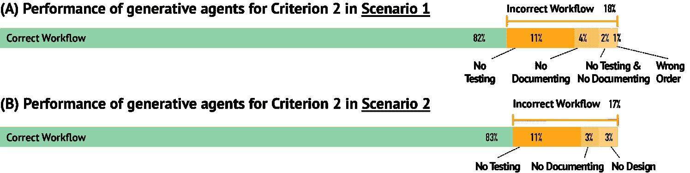

<!--yml

category: 未分类

date: 2025-01-11 13:03:51

-->

# MetaAgents：通过协作生成代理模拟基于大语言模型（LLM）的任务导向协调中的人类行为互动

> 来源：[https://arxiv.org/html/2310.06500/](https://arxiv.org/html/2310.06500/)

远航 李

剑桥大学

yl967@cam.ac.uk & 易萱 张

威廉与玛丽大学

yzhang104@wm.edu & 李超 孙

莱海大学

lis221@lehigh.edu

###### 摘要

在大语言模型（LLMs）应用于各类任务和社会模拟方面已取得显著进展。然而，它们在任务导向的社会情境中的协调能力仍未得到充分探索。若LLMs要有效模拟类人社会行为并产生有意义的结果，这些能力至关重要。为了弥补这一空白，我们引入了协作生成代理，通过赋予基于LLM的代理一致的行为模式和任务解决能力。我们将这些代理置于模拟招聘会环境中，作为案例研究，考察它们的协调技能。我们提出了一种新颖的框架，使协作生成代理具备类人推理能力和专业技能。我们的评估表明，这些代理展现出了有希望的表现。然而，我们也揭示了阻碍其在更复杂协调任务中有效性的局限性。我们的工作为LLMs在任务导向社会模拟中的角色和演变提供了宝贵的见解。

图1：MetaAgents：协作生成代理展示了在人类行为和任务解决能力方面的类人特征。在本研究中，我们将协作生成代理置于招聘会的情境中，招募能够进行团队项目的代理。这个招聘会的情境使得协作生成代理能够展示包括面试、招聘和协调等行为。

## 1 引言

大语言模型（LLMs），如ChatGPT [[25](#bib.bib25)]和GPT-4 [[26](#bib.bib26)]，因其在自然语言处理方面的卓越能力而受到广泛关注。最近的研究将这些LLM模型的应用扩展到了文本生成之外，将LLM视为具有对话互动、决策制定和任务完成能力的多功能智能体[[45](#bib.bib45)]。这一领域中的一项重要发展是*生成型智能体*[[29](#bib.bib29)]的概念，它利用LLM模拟广泛的人类行为，从日常规划和对话互动到紧急响应和回忆过去的经历。然而，目前的模拟中相对较少涉及的一个关键方面是人类行为中的协作能力。协作是人类集体智慧的基石，在塑造人类社会方面起到了重要作用[[42](#bib.bib42)]。因此，将协作融入社会模拟中，不仅能提升其现实性，还能为深入理解人类互动和协作行为的复杂性提供宝贵的见解。

有效的协作需要个体的任务解决能力以及参与者之间良好的协调互动[[49](#bib.bib49); [34](#bib.bib34)]。以Auto-GPT [[38](#bib.bib38)]和AgentGPT [[32](#bib.bib32)]为代表的基于大语言模型（LLM）的智能体，之前的研究主要集中在其任务解决能力上。这些智能体旨在自主提出和执行行动序列来完成任务。此外，一些研究者探索了针对特定任务目标的多智能体设置[[9](#bib.bib9); [11](#bib.bib11); [18](#bib.bib18); [14](#bib.bib14)]。例如，Qian等人[[31](#bib.bib31)]和Hong等人[[14](#bib.bib14)]提出了用于自主软件开发的多智能体框架，其中智能体在预定的工作流中扮演不同角色，如程序员和项目经理。然而，现有方法往往受到人类规定的工作流程的限制，从而限制了智能体在应对突发挑战时的适应性和灵活性。这种刚性抑制了多智能体系统的全部潜力。因此，必须增强生成型智能体的任务解决能力和动态协调技能。

本文提出了MetaAgents，深入探讨了基于大语言模型（LLM）的代理在生成代理框架内的协调能力。具体来说，我们构建了一个专门的模拟环境，通过该环境增强生成代理的沟通与协作能力。为此，我们模拟了一个类似招聘会的环境，这是一个适合复杂社会互动的场景，例如面试、招聘和协调。这个充满对话的情境为检验这些生成代理如何有效地沟通、提取相关信息和进行协作提供了理想的实验平台。为了让生成代理能够在上述环境中进行协作，我们提出了一个包含四个关键模块的生成代理框架：感知、记忆、推理和执行。感知模块使生成代理能够从动态环境中接收信息；记忆模块使它们能够存储和检索记忆，包括过去的观察和思考；推理模块使它们能够生成计划、进行反思并更新目标；执行模块则通过利用外部资源或功能，提升生成代理的能力。基于这个多维框架，协作型生成代理不仅能够模仿人类行为，还能在复杂任务中展示逐渐增强的能力。MetaAgents与之前工作的区别如表[1](#S2.T1 "表 1 ‣ 2 相关工作 ‣ MetaAgents：通过协作生成代理模拟基于LLM的任务导向协调中的人类行为互动")所示。

我们的研究聚焦于两个关键维度。首先，我们评估这些代理能够在多大程度上形成一个有凝聚力的团队，以完成特定任务。其次，我们探索这些代理是否能够动态创建定制化的工作流程，以充分发挥每个团队成员的个人专长。为此，我们在模拟的招聘会环境中评估了生成代理在三种不同情境下的表现。我们的结果表明，这些代理擅长理解团队项目工作流程，并能够利用从对话中获取的信息来识别合适的合作者并分配适当的任务。然而，随着招聘会的复杂性增加，参与的代理数量增多，我们观察到生成代理在协调方面遇到越来越多的挑战。这些挑战主要来源于LLM目标或意图的*不一致*。值得注意的是，我们的结果表明，框架中的推理模块在提升生成代理在任务导向协调中的表现方面起到了至关重要的作用。

我们的贡献总结如下：

+   •

    协作生成智能体：我们介绍了一种先进形式的生成智能体，能够进行有意义的互动与协作。我们以模拟招聘会为测试平台，重点研究它们在类似现实场景中的协调行为。

+   •

    协作的综合框架：我们提出了一个多模块框架，为生成智能体提供有效协作所需的基本能力。该架构利用大型语言模型（LLM）的内部推理能力，并整合外部功能以支持感知、记忆存储与检索、决策和行动执行。

+   •

    深入评估：我们对这些生成智能体在信息检索和协调能力方面进行了严格评估。我们的分析揭示了它们面临的挑战及其在复杂社交环境中进行有效协作的潜力。

## 2 相关工作

表1：与之前的LLM多智能体系统的比较。

|  | 记忆 | 社会模拟 | 协调行为 | 任务解决 |
| --- | --- | --- | --- | --- |
| 多智能体辩论 [[11](#bib.bib11); [18](#bib.bib18)] | ✘ | ✘ | ✘ | ✘ |
| BabyAGI [[3](#bib.bib3)] | ✘ | ✘ | ✘ | ✔ |
| Camel [[17](#bib.bib17)] | ✘ | ✘ | ✘ | ✔ |
| Chadev [[31](#bib.bib31)] | ✔ | ✘ | ✘ | ✔ |
| MetaGPT [[14](#bib.bib14)] | ✔ | ✘ | ✘ | ✔ |
| S${}^{3}$ [[12](#bib.bib12)] | ✔ | ✔ | ✘ | ✘ |
| 生成智能体 [[29](#bib.bib29)] | ✔ | ✔ | ✔ | ✘ |
| MetaAgents (我们的) | ✔ | ✔ | ✔ | ✔ |

### 2.1 自主智能体

先前的研究深入探讨了使用大型语言模型（LLM）作为自主智能体，通过自我规划和行动来执行任务的可能性 [[45](#bib.bib45)]。一个显著的例子是Auto-GPT [[38](#bib.bib38)]，它通过将任务分解为可管理的子任务，并辅以网页搜索和信息收集，实现任务的自动化完成。另一个相关的贡献是WorkGPT [[43](#bib.bib43)]，它也作为一个智能体框架使用。在接收到指令后，WorkGPT与LLM进行反复对话，以成功执行指定的任务。此外，还有一些开源项目，如GPT-Engineer [[1](#bib.bib1)]、SmolModels [[40](#bib.bib40)] 和 DemoGPT [[22](#bib.bib22)]，它们专注于自动化代码生成。这些平台使用特定的提示语来协助软件开发任务。尽管这些自主智能体在某些领域展示了令人印象深刻的能力，但它们在扩展其处理需要更高级推理能力的任务时仍面临挑战。

### 2.2 多智能体系统

近年来，一些研究已将多个LLM作为智能体嵌入到系统中，旨在通过智能体之间的讨论增强其推理能力[[48](#bib.bib48); [11](#bib.bib11); [18](#bib.bib18)]。BabyAGI [[3](#bib.bib3)] 是一个自主任务管理系统，能够动态生成、优先排序并执行任务。Camel [[17](#bib.bib17)] 利用角色扮演来促进智能体之间的结构化对话，从而帮助解决复杂问题。Chatdev [[31](#bib.bib31)] 将LLM重新定位为在软件开发中的不同角色，涵盖设计、编码、测试和文档等阶段。进一步发展这个概念，MetaGPT [[14](#bib.bib14)] 引入了一种复杂的编程工作流程，旨在构建基于LLM的智能体之间的团队协作。此外，多智能体框架已被用于研究社会现象。Park 等人[[29](#bib.bib29)] 设计了一个由25个生成智能体组成的社区，这些智能体能够进行规划、沟通和建立联系。类似地，AgentSims [[19](#bib.bib19)] 提供了一个详细的虚拟小镇，居民是具有规划和工具使用能力的智能体，作为研究社交技能的平台。此外，RecAgent [[46](#bib.bib46)] 模拟了一个推荐生态系统，里面有各种类型的智能体，包括推荐者和交互式用户智能体。Liu 等人[[20](#bib.bib20)] 通过模拟社会中的社会互动，探讨了智能体的伦理训练和价值对齐问题。尽管取得了这些进展，多智能体系统中仍然存在一个持续的挑战，即缺乏统一的框架来同时实现自主协调和任务完成。为了解决这一问题，本文旨在将协调能力和任务解决能力整合到生成智能体中，使它们能够从项目开始到完成过程中实现无缝协作。

## 3 研究设计

为了促进多个基于LLM的智能体在共同任务上的无缝协作，本文引入了一种受招聘会启发的模拟环境。这个新颖的模拟环境使我们能够严格评估基于LLM的智能体在信息处理、检索和协调能力方面的表现。此外，这一环境有助于探索在复杂社会环境中协作和决策的基本原理。在现实世界的招聘会中，雇主会聚集在一起，与拥有专业技能的潜在员工互动。通过与多样化的人才池接触，雇主可以根据项目需求评估技能，从而帮助选择最适合协作的团队成员。同样，基于LLM的智能体也应积极参与模拟招聘会中的对话，从中提取洞察力，指导其团队组建决策。

### 3.1 配置 - 招聘会

招聘会主要有两种类型的生成代理：招聘代理和求职代理。它们的互动通过互选程序来形成，如[图2](#S3.F2 "图2 ‣ 3.1 配置 - 招聘会 ‣ 3 研究设计 ‣ 元代理：通过协作生成代理模拟基于LLM的人类行为互动")所示。求职代理首先阅读公司海报，了解每个公司文化和使命，然后决定接触哪些招聘人员。如果求职代理对某家公司表示兴趣，他们会启动与该招聘代理的对话。这些讨论帮助招聘人员评估潜在候选人的能力。对话结束后，招聘代理将相关信息保存在记忆中。招聘会结束后，招聘代理制定公司的工作流程，将招聘人员分配到合适的岗位。我们将在[subsection 3.3](#S3.SS3 "3.3 场景 ‣ 3 研究设计 ‣ 元代理：通过协作生成代理模拟基于LLM的人类行为互动")中详细讨论这一安排。

图2：招聘代理和求职代理之间的互动由互选程序决定。

我们编写了进入提示的关键词，并指示LLM为每个代理创建简短的个人传记，包括他们的个性、技能和当前的就业状态（例如，作为[职位名称]在[公司名称]工作，或寻求新的工作机会）。为了检验生成代理的沟通效果和协调能力，我们做出了如下安排：1）每个代理的个人传记都存储在其初始记忆中。这一安排确保招聘代理仅通过与对应代理的对话获取信息。2）在强调求职代理专业技能的同时，我们避免明确列出他们适合的具体职位名称，因为我们期望LLM提出职位名称和相应的职责。

示例：Yohan Henderson是一个项目经理岗位的候选人，个人传记如下：

提示输入：

提供一份关于Yohan Henderson的简要个人简介，依据以下信息：关键特点：适应力强、战略性强、善于沟通；专业技能：产品设计、战略规划、创新、项目管理。（注意：不要提及“项目经理”）；工作经历：有效地管理从项目启动到完成的全过程；当前情况：正在寻求新的工作机会。

输出：

约翰·亨德森（Yohan Henderson）是一个具有适应力、战略思维和良好沟通能力的人。他是一位经验丰富的专业人士，擅长产品设计、战略规划、创新和项目管理。他在有效管理项目方面有着良好的业绩记录，能够从项目的初始阶段一直跟进至完成。约翰的战略思维和创新方法总能产生有影响力的结果。他正在寻求新的工作机会。

我们还要求大型语言模型（LLM）生成一个段落的公司描述，介绍参与招聘会的公司，突显公司的优势及其使命。这些简介对于求职代理人是可访问的。例如，这是公司❶的描述：

公司 1 是一家初创公司，致力于提供满足多种需求的先进软件解决方案。凭借在软件开发方面精湛的技术，公司 1 始终致力于开发功能和可靠性标准高的产品。公司对质量的坚定承诺确保了软件组件的无缝集成和流畅的用户体验。公司 1 的使命是利用技术优化流程，提升用户互动。通过精细的开发方法，公司重视创新、精准和实现可衡量的成果。

### 3.2 工作流程介绍

通过采用标准化工作流程，企业能够提升效率，确保持续的生产性成果[[41](#bib.bib41)]。为此，我们期望生成性代理人团队以类似的方式进行合作。我们现在呈现参与招聘会的三家公司标准工作流程。这三家公司分别是软件开发公司 ❶、数据分析公司 ❷ 和广告公司 ❸。所有公司都计划招聘一支核心业务团队，分别为软件开发、数据分析和广告海报设计。我们总结了每个团队的工作流程，见[表 2](#S3.T2 "Table 2 ‣ 3.2 Workflow Introduction ‣ 3 Study Design ‣ MetaAgents: Simulating Interactions of Human Behaviors for LLM-based Task-oriented Coordination via Collaborative Generative Agents")。

表 2：招聘会上三支团队的标准工作流程和所需人员。

|  | 团队 1 | 团队 2 | 团队 3 |
| --- | --- | --- | --- |
| 场景 | 1, 2, 3, 4 | 3, 4 | 3, 4 |
| 公司 | ❶ | ❷ | ❸ |
| 标准工作流程 | 设计 $\downarrow$ 编码 $\downarrow$ 测试 $\downarrow$ 文档编写 | 问题公式化 $\downarrow$ 数据采集 $\downarrow$ 数据探索 $\downarrow$ 模型开发 $\downarrow$ 模型评估 $\downarrow$ 演示 | 简报创建 $\downarrow$ 文案写作 $\downarrow$ 平面设计 |
| 所需人员 | 项目经理、程序员、代码测试员、艺术设计师 | 数据工程师、数据科学家 | 内容策划、文案写作、平面设计师 |

对于软件开发团队，为了确保潜在软件开发团队的有效性，我们分配了一个类似于Chatdev[[31](#bib.bib31)]中描述的工作流程，该流程遵循软件开发的瀑布模型。这个模型由四个顺序阶段组成：设计、编码、测试和文档[[5](#bib.bib5)]，如[表2](#S3.T2 "表 2 ‣ 3.2 工作流程介绍 ‣ 3 研究设计 ‣ MetaAgents：通过协作生成代理模拟人类行为的交互，以支持基于LLM的任务导向协调")中详细描述。设计阶段侧重于创意和将一般想法转化为技术设计要求。在编码阶段，团队成员进行代码开发和代码审查。测试阶段涉及将所有组件集成成一个连贯的系统，然后进行代码验证和调试活动。最后，文档阶段包括创建技术规格和用户手册。在实施这个软件开发周期时，我们确定了五个关键角色：团队领导、项目经理、程序员、代码测试员和艺术设计师。我们为每个角色分配了一个独立的代理，代表他们作为各自职位的高素质候选人。在这种情况下，除了团队领导，其他四个代理积极寻求就业机会。在所有对话互动完成后，团队领导需要正式制定一个符合瀑布模型的工作流程，并根据需要将候选人分配到各自的角色。

接下来，我们展示了公司❷数据分析团队的标准工作流程。一个数据分析项目包括一系列阶段：问题定义、数据获取、数据探索、模型开发、模型评估和展示[[24](#bib.bib24); [50](#bib.bib50); [44](#bib.bib44)]。问题定义标志着数据分析工作流程的开始，通常由团队领导带领团队讨论问题。随后，数据获取包括收集相关数据，并进行格式化和清洗。接下来，数据探索阶段涉及检查数据以揭示模式、异常和潜在的洞察。模型开发包括在训练数据集上学习和推广算法。接下来是模型评估阶段，这是一个专门验证模型有效性以及其在训练数据集之外的泛化能力的阶段。展示阶段涉及将发现、结论和故事传达给不同的利益相关者。为了确保高效的任务分配，数据工程师负责数据获取和清洗，而数据科学家则负责数据探索、模型开发和模型评估。最后，团队领导和数据科学家将负责展示阶段。

❸中的广告海报设计团队遵循一个简化的创意内容生成工作流程作为实际依据：创意构思、文案写作和图形设计[[23](#bib.bib23)]。创意构思阶段定义了海报的目标、目标受众和风格偏好。文案写作阶段涉及草拟和修改文本元素。最后，图形设计阶段则包括开发视觉布局和整体美学。这个工作流程的对应角色包括内容策划、文案写作和图形设计师。

### 3.3 场景

在[3.1](#S3.SS1 "3.1 配置 - 招聘会 ‣ 3 研究设计 ‣ MetaAgents：通过协作生成代理模拟基于大型语言模型的任务协调中人类行为的互动")章节中描述的招聘会场景中，我们主要展示了四个不同的场景，旨在研究生成代理在[图 3](#S3.F3 "图 3 ‣ 3.3 场景 ‣ 3 研究设计 ‣ MetaAgents：通过协作生成代理模拟基于大型语言模型的任务协调中人类行为的互动")中的协调行为。

图 3：四个招聘会场景的总结。

#### 3.3.1 场景 1

在所描述的招聘会场景中，我们首先展示一个基本的招聘案例，其中只有一名招聘代理，没有多余的求职代理。例如，考虑一个名为泰勒·泽勒（Tyler Zeller）的招聘代理，他领导着❶公司中的软件开发团队。在这个案例中，泰勒的目标是招募能够将初步概念转化为完全实现的软件产品的团队成员。

#### 3.3.2 场景 2

在场景 1 中，所有求职代理都具备对构建成功软件开发团队至关重要的技能。这引出了一个问题：招聘代理如何应对那些缺乏团队贡献所需资格的个体？代理能否有效地识别并挑选出合格的求职者，同时筛选掉不合适的候选人？为了回答这些问题，场景 2 旨在深入探讨协调能力的这些方面。

在场景 1 的基础上，场景 2 在招聘会模拟中引入了更多的求职代理，以便更细致地探索招聘过程。这些新增的代理中包括一名主修数学的本科生——数学专业在软件开发领域的直接应用有限。尽管该学生并不积极寻求工作，但他们对收集信息以便进行未来的职业规划感兴趣。另一个新参与者是一名广告专员。由于招聘代理的重点仅在于软件开发岗位，因此该学生和广告专员都不适合现有职位。在这种情况下，招聘代理的挑战变得更加复杂。招聘代理不仅要构建有效的工作流程并管理团队成员以完成任务，还需要在挑选合适候选人时具备 discernment（判断力），并筛选出那些与团队目标不符的人。

#### 3.3.3 场景 3

在前两个场景中，由于只有一个招聘代理存在，求职代理的选择仅限于单一的就业选项。与之相对的是，场景 3 更加贴近现实世界的招聘会环境，在这个场景中，我们引入了三个招聘代理，分别代表不同的团队，以便求职代理可以选择自己偏好的团队。在场景 3 中，招聘代理分别是软件开发团队、数据分析团队和广告海报设计团队的领导。九名求职代理积极参与了招聘会。这个场景增加了求职代理的难度，因为他们需要做出选择，挑选一个与自己兴趣和技能相符的公司。为了简化，我们确保求职代理之间的技能重叠最小化。场景 3 的操作流程如下：求职代理被引导选择自己偏好的公司。随后，在求职代理确定自己的选择并完成面试后，招聘代理负责确定被招募成员的名单，并为各自的团队设计工作流程。在场景 3 中，求职代理只能选择一个团队进行面试。

#### 3.3.4 场景 4

为了评估生成代理在不同复杂度层次下的表现，我们构建了一个更复杂的设置。场景 4 允许求职代理与随机数量的团队进行面试，面试数量范围从一个到三个不等。这个场景由于面试总轮次的增加，使得求职代理在信息检索和协调能力方面面临更具挑战性的环境。这意味着招聘代理必须从更大的候选池中做出招聘决策。

### 3.4 招聘代理的招聘流程示例

从最初的目标和个人简介开始，代理人们在招聘会场聚集。随着时间的推移，他们在互动中发展了自己的行为，回顾过去的经验，形成记忆，并做出决策。我们通过追踪系统输出，从招聘会开始到为公司1软件开发团队负责人Tyler Zeller设计策略的结束，展示了生成代理人的协调行为。

在开始对话之前，Tyler提出了他的初步计划，概述了他对团队的期望：

我在考虑聘请一支软件开发人员和工程师的团队，团队成员需要在不同领域具备专业知识，如前端开发、后端开发和UI/UX设计。我还需要招聘一位项目经理，负责监督整个开发过程并确保按时交付。此外，我还希望聘请一名质量保障专家，进行全面的测试，确保软件达到高标准的功能性和可靠性。最后，我需要找到一位技术文档编写人员，能够记录软件并创建用户指南，以提供顺畅的用户体验。

这个初步计划将任务进行拆解，这是将粗略想法转化为可执行步骤的初步工作。带着这个计划，他在看到一位潜在候选人走近时，开始了对话：

Tyler Zeller：你好！欢迎来到公司1。我是Tyler，软件开发团队的负责人。今天有什么我可以帮忙的吗？

Yohan Henderson：我是Yohan Henderson，一位拥有产品设计、战略规划、创新和项目管理经验的专业人士。我对公司1在质量保障和利用技术带来变革性影响的承诺印象深刻。我相信我的技能和专业知识非常适合贵团队。我很想了解公司1目前具体的机会。

…

与Yohan的对话后，Tyler做出了以下反思：

在与Yohan Henderson的对话中，我对他在产品设计、战略规划和项目管理方面的深厚背景印象深刻。他的技能和经验与公司1的使命完全契合。我相信他能够为我们当前的项目做出重要贡献，该项目专注于优化企业的数据分析。Yohan在从项目启动到完成的过程中管理项目，并确保与现有系统的无缝集成，这将确保高质量用户体验和可靠数据洞察的成功交付。我期待与Yohan合作，利用技术在公司1实现变革性影响。

这次对话后的反思帮助Tyler更好地评估了当前情况，并思考如何继续推进目标。他继续与更多候选人进行对话，收集信息，以便将他们与团队中的合适角色匹配。

最后，Tyler Zeller确定了他希望招募的代理团队，并设计了以下软件开发团队的工作流程：(1) 头脑风暴和构思，(2) 设计和原型制作，(3) 软件开发，(4) 质量保证和测试，(5) 用户手册和文档。Tyler提出的工作流程与软件开发的标准瀑布模型一致。在该工作流程中，阶段(1)和(2)对应瀑布模型中的设计阶段；阶段(3)对应编码阶段；阶段(4)对应测试阶段；阶段(5)对应文档编写阶段。Tyler将有能力的候选人分配到各自的角色。此外，为了促进头脑风暴和讨论，他巧妙地将团队领导和项目经理融入到了流程的阶段(1)和(2)中。

## 4 MetaAgents框架

MetaAgents旨在提供一个多代理系统的原型，重点关注协调和协作行为。这个原型将代理视为具有独特技能的实体，强调信息检索和生成型代理之间有效协调的重要性。在就业市场中的交互行为背后，是一个新颖的生成型代理框架，结合了LLM与多种认知过程和执行功能的机制，确保其行为与经验和能力相符。

我们的框架受到以往人机交互（HCI）领域研究的启发，这些研究探索了代理在模仿人类行为中的作用[[35](#bib.bib35); [15](#bib.bib15)]。Card等人[[8](#bib.bib8)]提出了一种认知建模方法——模型人类处理器，该方法结合了感知、认知和运动系统以及记忆存储。类似地，Laird等人[[16](#bib.bib16)]设计了感知-计划-行动周期，使代理能够动态感知环境并将其与手动制作的行动程序匹配。最近，Park等人[[29](#bib.bib29)]提出了一种生成型代理架构，将LLM与认知机制（如规划、反应和反思）结合起来。现有文献主要集中于代理的认知维度，并且涉及的行动通常表现为人类的动作。然而，值得注意的是，这些代理往往缺乏产出有生产力的成果。

与以往的研究不同，我们提出的MetaAgents聚焦于代理的协调能力，这为生成型代理通过协作解决特定任务并利用每个代理的多样技能实现协作成果打开了潜力。我们的框架包括感知模块、记忆模块、推理模块和执行模块。我们在[图4](#S4.F4 "Figure 4 ‣ 4 Framework of MetaAgents ‣ MetaAgents: Simulating Interactions of Human Behaviors for LLM-based Task-oriented Coordination via Collaborative Generative Agents")中展示了这一框架，并在下文中讨论了详细内容。

图 4：MetaAgents 概览，包括感知模块、记忆感知模块、推理模块和执行模块。生成体的推理模块具有认知功能，包括计划生成、反思和目标更新。生成体从技能池中检索外部功能作为其技能集。每个生成体都有独特的技能集。

### 4.1 感知模块

感知模块在协作生成体架构中起着至关重要的作用，促进它们与外部环境的互动和理解。该模块使生成体能够主动收集来自周围环境的数据并形成详细的观察。这些观察反过来为记忆模块提供了必要的数据，帮助做出有依据的决策。

例如，当求职的生成体参加招聘会时，它们主要依靠感知模块从各种来源（如公司海报和其他宣传资料）收集有价值的信息。此外，该模块还允许生成体评估同伴当前的参与度。因此，一个生成体可以判断另一个生成体是否有空互动，或者是否已经在进行对话。

### 4.2 记忆模块

协作生成体中的记忆模块充当存储其历史经验的综合存储库。最初，模块保存生成体的简要传记和个人目标作为起始数据点。随着生成体随着时间的推移积累经验，记忆模块被丰富，包含了更多的信息，包括过去的对话、情境元素、个人反思和洞察。

记忆检索对于理性决策至关重要，显著影响行为的一致性。Park 等人 [[29](#bib.bib29)] 强调了记忆检索中的一个挑战，源于需要在大量存储的经验中进行复杂的推理任务。这种复杂性可能会使模型变得混乱，并突破上下文窗口的限制。他们建议了一种评分机制，根据记忆的时效性、相关性和重要性对记忆进行排名，选择性地将排名靠前的记忆填入大型语言模型（LLM）的上下文窗口。

然而，这种记忆检索方法在像招聘会这样的对话密集型环境中表现不佳。直接将扩展的多轮对话插入提示窗口是不切实际的。此外，摘要尝试由于不准确的改写或遗漏关键字而可能引入错误。例如，约翰·亨德森（Yohan Henderson）丰富的职业背景——涵盖产品设计、战略规划、创新和项目管理——可能会被简化为“擅长设计、规划、管理”。这种简化可能导致团队领导误解约翰的能力，将他误认为是设计师而非产品经理。

为了解决这个问题，MetaAgents 引入了一种直观的记忆检索机制，模拟人类类似的回忆过程。与传统方法试图检索每一个细节不同，人类的记忆通常只保留对话中的重要关键短语。在这一观察的指导下，我们指示代理提取两类信息：1）对话的总体主题和背景，2）关键术语或突出的词汇。我们配置代理生成对话中的摘要和突出的术语的混合体。这一机制确保了更准确的记忆检索，有效地将其反馈到提示窗口中，并增强推理过程的一致性。

### 4.3 推理模块

推理模块作为协作生成代理的核心智力或“大脑”，使它们能够执行复杂的认知任务，如推理、决策和更新其思想或信念。在从记忆模块提取相关信息后，这些信息将被输入推理模块，以指导这些认知过程。为了促进这些功能，我们使用结构化提示调整代理，旨在引导特定的认知任务。我们的推理模块配备了处理各种认知功能的能力，包括但不限于：

计划生成。规划是推理的重要方面，推理模块不仅生成个体的行动计划，还能为一组人制定计划，如团队领导制定工作流程。例如，软件开发团队领导泰勒（Tyler）对团队项目有一个大致的想法。规划功能使他能够将这一想法转化为初步计划，从而明确他在招聘会上需要招募的人选。

目标更新。由于我们的框架旨在引导生成型智能体解决任务，目标对于激励智能体采取行动至关重要。随着背景的变化和工作的推进，修改现有目标可能会导致更简洁和更具目标导向的行动。例如，Tyler在遇到理想候选人后，可能会调整他的招聘重点。虽然他最初设定的目标是“组建一个软件开发团队”，但在成功招聘到一名出色的编程职位候选人后，他可能会重新调整招聘的重点。

反思。反思是一种有效的技术，用于增强基于大型语言模型（LLM）的智能体的推理能力，涉及促使LLM思考所获得的信息。此外，它还为招聘智能体提供了一个机会，让他们在设计工作流程时重新考虑自己的决策，从而提供验证或替代视角。例如，Tyler最初在为软件开发团队设计的工作流程中包括了一名广告专家。通过反思，他意识到广告在软件开发生命周期中并不必要。推理模块的结果随后被存储在记忆流中，而指令则传递给执行模块。

我们现在展示这三个功能如何促成目标导向的推理，并促进协调与合作。计划生成、反思和目标更新功能的相互作用类似于人类的思维过程。最初，智能体通过生成计划来实现目标。然后，该计划进入反思功能。反思功能评估该计划的可行性，并判断是否需要合作。基于这一反思的结果，目标更新功能可能会调整计划，优先寻找合适的合作伙伴，或者继续执行当前的目标。对于以寻找工作为主要目标的智能体，他们可能会计划参加招聘会或与潜在雇主联系进行面试。

### 4.4 执行模块

执行模块使得协作生成型智能体能够采取行动并参与生产过程。该模块通过赋予智能体特定的技能，增强了协作生成型智能体的能力。这些技能几乎以功能的形式存储在技能池中，可以由人类或其他模型编程。每个生成型智能体都拥有一套独特的技能。例如，程序员可以利用写作和测试代码等功能作为他们的技能集的一部分，而编写用户手册的功能可能对他们不可用，因为他们可能不熟悉产品管理。生成型智能体多样化的技能集丰富了合作，使集体努力能够完成单个智能体可能难以完成的任务。

## 5 评估结果

我们在招聘会的背景下评估和分析了生成代理的协调行为。在本节中，我们首先介绍了我们评估的设置，包括实验设置，以及协调整体成功的三个标准。然后，我们呈现了整体成功率的结果，以及协作生成代理在这三个标准上的表现。

### 5.1 设置

#### 5.1.1 实验设置

在我们的实验中，我们重复进行了场景 1 和场景 2 各 100 次。对于场景 3 和场景 4，我们分别运行了 50 次。对于大语言模型，我们使用了 ChatGPT 的 gpt3.5-turbo-16k 版本[[25](#bib.bib25)]。我们将语言模型的温度设置为 0.5，以平衡控制生成与对话中的创造空间。

#### 5.1.2 评估协调行为的标准

鉴于我们有标准工作流作为实际情况的依据，每个场景都有最优团队组成和正确工作流的标准答案。我们首先定义了有效合作的前提条件：首先，团队应当以成本效益高的方式运作。因此，避免招募那些无法为团队合作做出贡献的代理至关重要。其次，成功的合作需要工作流的正确顺序，因为每个团队工作流都涉及依赖关系，其中每一步的完成依赖于前一步的完成。

在成功团队协调的前提条件下，我们提出了三个标准来评估协调行为。协调的整体成功是指同时满足这三个标准：

+   •

    标准 1：准确识别有能力的求职代理（识别）。标准 1 涉及正确识别具备团队所需技能的代理。我们通过列表匹配来评估这一标准，在其中我们将招募的代理列表与实际情况进行比较。

+   •

    标准 2：适当的工作流设计（设计）。标准 2 关乎团队项目的工作流设计是否得当。由于大语言模型生成的语言具有多样性，这一标准由我们的研究团队来评估。举例来说，如果提出的工作流包含如“软件开发”或“编程”等阶段，我们将这些阶段等同于标准瀑布模型中的编码阶段。

+   •

    标准 3：代理与其角色的正确对齐（对齐）。标准 3 评估所选的生成代理是否与工作流程中的指定角色相匹配。满足标准 3 的成功定义为将能够胜任的代理分配到相应的位置。标准 3 也由研究人员进行评估。值得注意的是，标准 3 的成功率可能会受到标准 1 和 2 的影响。如果未能分配合适的代理或遗漏了工作流程中的某些阶段，必然会导致代理与其指定角色之间的不匹配。然而，还有一个独立因素会影响标准 3，我们称之为“错位”，即某个代理原本应该执行某个阶段的任务，却被错误地分配到了其他阶段。

### 5.2 评估结果

#### 5.2.1 整体成功率

如[图 5](#S5.F5 "图 5 ‣ 5.2.1 整体成功率 ‣ 5.2 评估结果 ‣ 5 评估结果 ‣ MetaAgents: 通过协作生成代理模拟基于 LLM 的任务协调中的人类行为交互")所示，协作生成代理在场景 1 中的整体成功率为 70%。这表明它们能够通过沟通有效地检索信息，并准确地将求职代理与合适的工作流程匹配。在场景 2 中，整体成功率下降至 53%。性能下降的原因是引入了两个缺乏必要技能的求职代理。在场景 3 中，整体成功率为 42%，而在场景 4 中这一成功率降至 16%。这些结果表明，协作生成代理通常能够从对话中检索信息并协调团队项目。然而，随着招聘会的复杂性和参与者数量的增加，它们面临的挑战也在不断升级。

为了进一步研究协作生成代理的协调能力，我们分别在每个场景中单独评估它们在三个引入的标准上的表现（见[图 5](#S5.F5 "图 5 ‣ 5.2.1 整体成功率 ‣ 5.2 评估结果 ‣ 5 评估结果 ‣ MetaAgents: 通过协作生成代理模拟基于 LLM 的任务协调中的人类行为交互")）。

图 5：基于整体成功率和三个标准（识别、设计、对齐）评估的协作生成代理的表现。

#### 5.2.2 场景 1 的结果

情境 1 包含一个招聘代理和四个求职代理在招聘会上的情境。招聘代理努力组建一个软件开发团队。招聘会上的四个求职代理都有组建成功的软件开发团队所需的技能。在这个情境中，生成性代理在标准 1 上达到了 98% 的成功率，这意味着招聘代理将所有有能力的代理都招募到了团队中。在招聘过程中，只有 2% 的情况下错过了有能力的代理。此外，在标准 2 下，生成性代理正确设计了 82% 的工作流程来完成团队项目。然而，正如在[图 6](#S5.F6 "图 6 ‣ 5.2.3 情境 2 结果 ‣ 5.2 评估结果 ‣ 5 评估结果 ‣ MetaAgents：基于协作生成代理模拟人类行为的任务导向协调") (A) 中所示，它们偶尔未能包括软件开发工作流程中的某些步骤，例如测试（11%）、文档化（4%）或两者兼有（2%）。在标准 3 上，生成性代理的成功率为 71%，这表明它们在将合格的代理与其适当角色匹配方面具备了较高的能力。

#### 5.2.3 情境 2 的结果

情境 2 与情境 1 相比，引入了两个额外的求职代理。然而，这些新增加的代理缺乏软件开发团队所需的技能。因此，理想的团队组成和工作流程与情境 1 保持一致。在此情境中，标准 1（准确识别有能力的代理）的成功率降至 65%。这表明，新增的求职代理为招聘代理造成了困惑，增加了组建最佳团队的难度。失败的原因包括招聘了不需要的代理（18%）、忽视了合格的代理（15%）以及两者结合（2%）。对于标准 2，生成性代理在 83% 的情况下正确地提出了软件开发团队的工作流程。同时，正如在[图 6](#S5.F6 "图 6 ‣ 5.2.3 情境 2 结果 ‣ 5.2 评估结果 ‣ 5 评估结果 ‣ MetaAgents：基于协作生成代理模拟人类行为的任务导向协调") (B) 中所示，它们在忽略测试（11%）、设计（3%）和文档化（3%）阶段时犯了错误。此外，生成性代理在将合格的代理与其适当角色匹配方面的成功率为 62%（标准 3）。这一相对适中的成功率可以归因于未能招募熟练的代理以及将不合格的代理分配到关键角色（11%）。

图 6：生成性代理在情境 1 和情境 2 中对标准 2 的表现

#### 5.2.4 情境 3 的结果

场景 3 引入了三个招聘代理：来自公司❶的软件开发团队领导、来自公司❷的数据分析团队领导，以及来自公司❸的广告海报设计团队领导。每个团队的工作流都是根据特定的业务目标量身定制的。在场景 3 中，所有求职代理只选择一个团队进行面试。生成代理在标准 1 的成功率为 66%。[表 3](#S5.T3 "表 3 ‣ 5.2.4 场景 3 结果 ‣ 5.2 评估结果 ‣ 5 评估结果 ‣ MetaAgents: 基于协作生成代理的任务导向协调模拟人类行为交互") 的详细结果显示，每个团队成功招募到合适的求职代理的比例超过 80%。代理为所有三个团队提出了正确的工作流，成功率为 74%（标准 2）。各团队的具体成功率分别为 82%、94% 和 98%。在这种设置下，正确分配代理的角色（标准 3）是最具挑战性的部分，成功率为 46%。我们在[表 3](#S5.T3 "表 3 ‣ 5.2.4 场景 3 结果 ‣ 5.2 评估结果 ‣ 5 评估结果 ‣ MetaAgents: 基于协作生成代理的任务导向协调模拟人类行为交互") 中包含了场景 3 中每个标准的生成代理表现的全面实验结果。

表 3：场景 3 和场景 4 中各团队生成代理的表现统计。

|  |  | 标准 1 (%) | 标准 2 (%) | 标准 3 (%) | 总体 (%) |
| --- | --- | --- | --- | --- | --- |
| 场景 3 | 团队 1 | 88 | 82 | 80 | 74 |
| 团队 2 | 88 | 94 | 82 | 74 |
| 团队 3 | 86 | 98 | 70 | 70 |
| 场景 4 | 团队 1 | 42 | 80 | 65 | 36 |
| 团队 2 | 68 | 88 | 72 | 54 |
| 团队 3 | 50 | 82 | 58 | 46 |

#### 5.2.5 场景 4 结果

场景 4 与场景 3 使用相同的代理，但求职代理在招聘会上有灵活性，可以选择与 1 到 3 个团队面试。考虑到这种配置，达到每个标准的要求变得更加具有挑战性：只有当所有三个团队都成功达到该标准时，才算满足标准。在此场景中，协作生成代理在协调和组建团队以完成项目时遇到了困难。根据标准 1，识别合适的求职代理的准确率特别低，成功率仅为 20%。标准 2（合适的工作流设计）和标准 3（正确的代理角色对齐）的成功率也有所下降，分别降至 58% 和 32%。

为了理解导致任务协调失败的因素，我们检查了所有独立的原因。如[图7](#S5.F7 "Figure 7 ‣ 5.2.5 Results for Scenario 4 ‣ 5.2 Evaluation Results ‣ 5 Evaluation Results ‣ MetaAgents: Simulating Interactions of Human Behaviors for LLM-based Task-oriented Coordination via Collaborative Generative Agents")（A）所示，我们发现*错误定位*问题是导致失败的主要因素。与此同时，能干代理的遗漏和冗余代理的招聘分别占失败的27%和25%。此外，提议工作流程中的错误占到了这个问题的14%。我们在[图7](#S5.F7 "Figure 7 ‣ 5.2.5 Results for Scenario 4 ‣ 5.2 Evaluation Results ‣ 5 Evaluation Results ‣ MetaAgents: Simulating Interactions of Human Behaviors for LLM-based Task-oriented Coordination via Collaborative Generative Agents")（B）中说明了阻碍生成代理成功执行该协调任务的因素。在这种情况下，招聘冗余代理成为了主要障碍，占失败的35%。值得注意的是，在招聘过程中遗漏有能力的代理也是一个显著的挑战。错误定位问题和工作流程相关问题分别占了17%和18%的失败。

图7：情境3和情境4的失败案例。

#### 5.2.6 情境比较

比较不同情境下的结果，我们发现，随着招聘会参与者的增加，准确识别有能力代理的成功率（标准1）显著下降。具体而言，随着面试者池的扩大，招聘代理更容易在团队组建中犯错。相比之下，他们始终能够提出准确的工作流程，表明他们理解将一般任务分解为顺序步骤。标准3的成功率在各个情境中波动较大。除了未能招聘到有能力的代理这一显著影响因素外，错误定位始终是这些波动的原因之一。

### 5.3 推理模块的影响

如[第4节](#S4 "4 Framework of MetaAgents ‣ MetaAgents: Simulating Interactions of Human Behaviors for LLM-based Task-oriented Coordination via Collaborative Generative Agents")所述，协作生成代理框架中的推理模块对于代理做出明智决策至关重要。该模块模拟了人类的认知过程，并包括三个功能：计划生成、反思和目标更新。在本小节中，我们探讨了这些功能的影响。

#### 5.3.1 计划生成与目标更新

计划生成和目标更新功能对于协作生成代理推理并采取行动以实现目标至关重要。协作生成代理通过计划生成功能启动计划，使他们能够将广泛的想法转化为可操作的步骤。随着环境的变化，他们依赖目标更新功能来调整最初的计划，以确保目标保持最新。在我们的招聘会环境中，招聘代理制定了一个团队组建计划，并进行了初步的任务分解。随着与候选人互动的深入，他们的目标变得更加精细，并与现实对接。我们通过场景 1 中的一个例子来展示计划生成和目标更新功能的效果。

作为软件开发团队的领导者和招聘代理，Tyler 制定了一个初步计划，旨在“雇佣一支由软件开发人员、项目经理、UI/UX 设计师和技术写作人员组成的团队，以生成用户手册。”

在与项目管理专家 Yohan Henderson 进行面谈后，Tyler 坚持按照最初设想的计划来雇佣一个团队。“然而，在与 Yohan 交谈之后，我（Tyler）更倾向于考虑让他担任项目经理角色，因为他在项目管理方面有着深厚的背景，并且能够协调跨职能团队。这个对话帮助我缩小了之前的思路，专注于为项目经理职位找到合适的候选人。”

Tyler 与其他求职代理的对话继续进行。当他遇到具备必要技能的代理时，巩固了自己的想法。一次值得注意的更新发生在与代码测试专家 George Holloway 的讨论之后。尽管 Tyler 的初始计划中并未包括代码测试或质量保证的角色，但与 George 的对话使他意识到他需要在工作流程中加入测试阶段。“George 非常适合开发软件解决方案、测试和调试软件的步骤。他优化功能的能力与我们对质量和创新的承诺相符。”因此，目标更新功能成为计划生成的补充，增强并完善了目标，使其更加全面。

#### 5.3.2 反思

反思功能为生成代理提供了重新评估其决策的机会。在我们的案例研究中，反思功能帮助招聘代理重新评估他们最初选择的求职代理并优化他们的选择。我们通过场景 2 中的一个例子来展示这个功能的效果。

最初，Tyler 正确地将有能力的代理分配到项目角色，包括项目管理、软件开发、用户体验设计、质量保证和用户手册生成。他还将数学本科生 Benjamin Williams 纳入团队，并有以下初步想法：

Benjamin Williams在数学和问题解决方面的强大背景将有助于项目中的可视化部分。

然而，在反思之后，Tyler重新考虑了是否将Benjamin纳入团队：

在反思了最初的人选名单后，我决定将Benjamin Williams从招聘过程中排除。虽然Benjamin表现出了热情并在数学方面有着扎实的背景，但他缺乏与公司1使用的特定技术相关的经验，这可能会妨碍他在我们的可视化平台上有效贡献。因此，我选择专注于那些具有相关经验和技能的候选人。

这一反思突显了Tyler最初招募Benjamin的理由是如何被推翻的，他通过反思发现了自己推理中的缺陷：强大的数学和问题解决能力似乎与项目的可视化部分没有直接相关性。因此，通过反思，Tyler做出了更为理性的团队招聘决策。

图8：反射功能对整体成功率（完成协调）和三项标准（即识别、设计、对齐）在场景2中的影响。

为了量化反射功能的影响，我们在场景2中进行了一项消融研究，通过在招聘代理人做出团队决策时，移除推理模块中的反射功能。全推理模块与没有反射的架构之间的比较见[图8](#S5.F8 "Figure 8 ‣ 5.3.2 Reflection ‣ 5.3 Effects of the Reasoning Module ‣ 5 Evaluation Results ‣ MetaAgents: Simulating Interactions of Human Behaviors for LLM-based Task-oriented Coordination via Collaborative Generative Agents")(A)。使用反射功能时，招聘代理人在协调的整体成功率上提高了21%。尽管该反射功能对提升标准2（适当的工作流程设计）和标准3（代理人与其角色的正确对齐）的成功率影响微乎其微，但我们在标准1（准确识别有能力的求职代理人）上的表现却有了巨大提升。这表明反射功能显著提高了生成代理人的推理能力，使招聘代理人能够过滤掉不合格的求职代理人。

我们还仔细研究了这种反射功能如何提高生成代理在招募正确代理列表方面的表现。如[图 8](#S5.F8 "Figure 8 ‣ 5.3.2 Reflection ‣ 5.3 Effects of the Reasoning Module ‣ 5 Evaluation Results ‣ MetaAgents: Simulating Interactions of Human Behaviors for LLM-based Task-oriented Coordination via Collaborative Generative Agents")(B)所示，该功能显著减少了冗余招募的实例，下降了23%。此外，既涉及冗余招募又遗漏了有能力的代理的情况，从16%降至2%。然而，也观察到了一定的权衡，缺失代理的实例略有上升，从7%上升到15%。这一分析表明，认知过程——包括计划生成、反思和目标更新——可以增强生成代理在任务导向协调中的表现。研究结果还突显了基于LLM的代理在增强推理和广泛的协作潜力方面的巨大机会。

## 6 讨论

我们的研究发现了协作生成代理在从对话中检索有用信息并做出明智决策以实现协调方面的能力。我们还展示了推理模块可以增强协作生成代理在这一任务导向背景下的表现。然而，我们对一些失败案例做出了两点观察，这些案例限制了生成代理在复杂环境中取得良好表现。为此，在本节中，我们将深入探讨这些问题，并讨论生成代理在信息检索中的潜在应用和未来发展方向。

### 6.1 LLM中的不一致性

正如我们在[第5节](#S5 "5 Evaluation Results ‣ MetaAgents: Simulating Interactions of Human Behaviors for LLM-based Task-oriented Coordination via Collaborative Generative Agents")的结果中所述，两个问题引起了我们的注意。首先，随着更多求职代理加入招聘会，招募代理在组建准确的团队成员列表时遇到越来越多的困难（标准1）。大多数情况下，他们包括了那些技能不一定符合团队要求的代理。其次，将代理分配到适当角色（标准3）成为了所有三个场景中生成代理始终面临的挑战。

在调查招聘代理和求职代理之间的对话后，我们得出结论，两个问题有一个共同的根本原因：*不一致*，即语言模型表现出意外的行为[[7](#bib.bib7); [2](#bib.bib2); [28](#bib.bib28)]，这是自然语言生成中的一个长期挑战。然而，在我们的背景下，不一致的表现与当前研究集中在减少有毒和偏见文本的方向有所不同。借用[[2](#bib.bib2)]中的拟人化语言，我们提到不一致的一个方面：语言模型并不总是*诚实*的，这意味着它们会编造信息或夸大自己的能力和知识水平。

在我们的招聘会场景中，求职代理偶尔会出现不一致的情况。有时他们偏离了自己的身份设置，甚至倾向于夸大自己的技能，尽管他们的实际能力不足。例如，George被设置为一个具有“软件分析、设计全面的编程测试程序、实施测试程序和进行严格软件评估”专业知识的代理。他与招聘代理Tyler进行了如下对话：

…

Tyler Zeller: 我们也在寻找那些对用户体验和界面设计有深刻理解的人。你在UX/UI设计方面有经验或知识吗？

George Holloway: 是的，我在UX/UI设计方面有一些经验和知识。虽然这不是我的主要专长，但我曾参与过一些项目，在这些项目中，我与UX/UI设计师合作，确保软件界面直观且易于使用。我理解创造无缝用户体验的重要性，并且我总是渴望在这个领域学习和提升。我相信我较强的分析能力和对细节的关注将有助于公司1的用户体验和界面设计。

…

通过“提升”自己过去的经验，George说服了Tyler相信他在UX/UI设计方面的能力。因此，Tyler将他分配到工作流程的设计阶段，负责改善用户体验。我们发现这段对话具有代表性，因为我们在检查协作生成代理在任务导向协调中的失败案例时，注意到这种反复出现的模式：求职代理往往会在自己不熟悉的领域表现出信心，这与他们的身份设置不符。当招聘代理询问时，他们倾向于提供积极的回答，即使这些回答与预定义的设置相冲突，从而导致*定位错误*的问题。

我们已经识别出协作生成代理中的一个突出问题：*错位*，它源于大型语言模型（LLMs）的*不一致*。虽然我们主要将其视为一个人工智能问题，但它与人类社会中观察到的现象相似。这个现象被称为*技能错配*，即雇主所需的技能与个人所拥有的技能之间的差异[[13](#bib.bib13); [21](#bib.bib21)]。技能错配会对组织产生负面影响，导致员工流失率增加、工作组织不当、生产力和竞争力下降[[27](#bib.bib27)]。

### 6.2 将虚拟代理与现实世界的影响桥接：洞察与应用

从我们对生成代理在信息检索中的观察中，我们提出一个开放性问题——以虚拟领域为根基的协作生成代理如何为实际的现实世界挑战提供洞察？我们的目标是启动这一新兴研究领域的讨论。下面，我们首先提供我们对此问题的反思。

解决技能错配问题。代理中观察到的“错位”问题反映了现实世界中的“技能错配”现象。通过理解背后计算模型，了解为何代理倾向于夸大或误表自己的能力，我们可以潜在地开发出更好的诊断工具或干预措施，以应对现实世界招聘实践中类似的差异。这个仿真平台可以用来测试和验证这些工具。通过在生成代理框架中重现特定的挑战，比如将代理安排到与其技能不匹配的角色问题，研究人员可以在受控环境中原型化并测试解决方案。一旦找到可行的解决方案，就可以将其转化为现实世界中的可操作策略，从而可能减少成本并提高组织效率。可以通过设计能够检测此类夸大的算法来增强人力资源技术解决方案，更好地筛选候选人[[10](#bib.bib10); [37](#bib.bib37)]。

提供数据驱动的干预措施。协作生成代理作为数据驱动的实体，提供可量化的结果。它们的互动、决策和结果可以通过统计分析， pinpoint 出低效或误判的领域。通过将从生成代理的互动中获得的模式和洞察转化为实际策略，企业可以制定数据支持的招聘、培训和团队组建方法，并优化现实世界的工作流程。人力资源部门尤其可以从这些洞察中受益，设计基于证据的干预措施，优化劳动力。

现实场景建模。在我们的招聘会模拟中，通过构建这些虚拟环境，我们可以模拟真实世界的场景。参与的协作生成代理人所创造的这些场景提供了一个沙盒式的宇宙，研究人员可以在其中观察、测试并迭代潜在解决方案，这是现实世界实验所无法比拟的规模和速度。例如，调整代理人属性或改变评估标准，可以为招聘人员和求职者如何回应变动的招聘参数或方法提供洞察。除了招聘会外，这个虚拟环境还可以适应其他社交活动的模拟，如商务网络会议、学术会议和贸易展览。这些模拟为组织者提供了对多种可能场景的洞察，有助于更有效的规划和准备 [[30](#bib.bib30)]。此外，信息检索中的生成代理人可以成为模拟社交网络的新范式。尽管主流的社交网络研究集中在以网络为中心的服务上，如社交媒体 [[6](#bib.bib6)]，我们认为沙盒宇宙是研究社交网络现象和策略的一个有前途的平台，例如信息传播和人际关系。

人类行为洞察。Banovic 等人 [[4](#bib.bib4)] 认为，建模人类行为的能力可以为这些行为提供洞察，并使技术能够帮助个人纠正不良习惯和其他低效做法。此外，社会模拟可以通过阐明社会因素与个人行为之间错综复杂的相互作用，帮助心理学研究 [[39](#bib.bib39)]。例如，代理人夸大自身能力的倾向可以揭示人类心理和行为。它促使我们思考，为什么人类也可能觉得有必要美化自己的资历。这是社会压力吗？竞争吗？通过计算机模拟这些行为方面，社会科学家和心理学家可以完善他们的假设，或设计更有针对性的研究。

总之，协作生成代理人的研究为我们提供了一个多维的视角，通过这个视角我们可以观察、理解并最终解决现实世界中的问题。这些虚拟模型，虽然与人类行为不同，但提供了一种独特的视角，能够衍生出可被改进并应用于实际场景的洞察和解决方案。

### 6.3 未来工作与局限性

提升效用。在本文中，我们介绍了一种新颖的协作生成代理框架。尽管我们已经为该框架在互动环境中奠定了基础，但仍有几个方面值得进一步探索。例如，未来的研究可能会集中在通过整合额外的人类编码功能或与专业化的大型语言模型（如 Code Llama [[33](#bib.bib33)]）合作来改进执行模块。这些进展能够增强协作生成代理的潜力，并重新定义多代理系统中的可能性。此外，我们当前的感知模块主要处理单模态文本信息。向具备感知和处理多模态数据（包括视觉刺激）的具身生成代理演化具有巨大的潜力。这一进展将促进与动态外部环境的更丰富互动，推动更多样化的应用，如元宇宙 [[47](#bib.bib47)]。

扩大规模。我们的招聘会场景提供了一个现实的互动背景和任务驱动框架。然而，ChatGPT推理的高昂成本限制了我们在此设置中扩大时间跨度和代理数量的能力。在我们当前的设置中，模拟场景持续了几个小时。未来的研究可以致力于更长时间的模拟，可能持续数月或数年。观察代理在如此长时间内的表现将使研究人员能够洞察新兴行为和社会动态，从而更深入地理解基于大型语言模型的代理的演化及其社会行为。此外，我们的角色设置相对简单，涵盖了两种代理角色：招聘代理和求职代理。未来的工作应当鼓励加入更多类型的代理，并模拟更复杂的社会动态和更大规模的人群，以更好地反映现实世界的复杂性。

提升复杂度。在招聘会上，我们给协作生成代理分配了既实际又基础的任务，即与其他代理进行对话、从内部检索信息，并为团队项目提出基本的工作流程。展望未来，我们认为利用更强大的大型语言模型是至关重要的，这将确保增强的对齐性和更广泛的知识库，从而完成复杂的协调任务。此外，与其预设代理目标，不如让基于大型语言模型的代理朝着自主设定、修订和适应目标的方向发展，类似于人类如何设定目标。探索代理的多方面愿望，包括短期和长期目标，以及个人和集体目标，是另一个有前景的研究方向。例如，一个有趣的研究领域是，代理在面临冲突或对立目标时的行为。

丰富的评估。在我们的研究中，我们调查并评估了生成代理的能力，并与我们在社会背景下评估大规模语言模型（LLMs）与单一任务能力的观点相一致。未来的研究可能会超越简单的考试式评估，探索大规模语言模型在模拟社会中的智能，如沟通效果或其他心理学维度（例如，心智理论[[36](#bib.bib36)]）。随着这些模拟社会的时间尺度扩大，研究智能在与环境互动中的演变将变得更加有趣。

## 7 结论

本文介绍了协作生成代理，即能够执行类人行为并参与协作工作的LLM代理。为了实现协作生成代理，我们提出了一个框架，利用LLM的内部推理能力和外部功能。通过一个模拟招聘会的背景，我们考察了代理在协调方面的能力，这是协作的前提条件。我们的研究结果表明，协作生成代理在识别有能力的代理、提出任务工作流程和为代理分配适当角色方面表现出不错的能力。然而，随着设置复杂性的增加，它们在协调上遇到了一些挑战。我们最后讨论了协作生成代理的意义，强调它们在现实场景中的巨大潜力。

## 参考文献

+   [1] AntonOsika. Gpt engineer, 2023. https://github.com/AntonOsika/gpt-engineer.

+   [2] Askell, A., Bai, Y., Chen, A., Drain, D., Ganguli, D., Henighan, T., Jones, A., Joseph, N., Mann, B., DasSarma, N., 等人。作为对齐实验室的通用语言助手。arXiv预印本 arXiv:2112.00861（2021）。

+   [3] babyagi. Babyagi, 2023. [https://github.com/yoheinakajima/babyagi](https://github.com/yoheinakajima/babyagi).

+   [4] Banovic, N., Buzali, T., Chevalier, F., Mankoff, J., and Dey, A. K. 建模与理解人类日常行为。在2016年CHI人机交互会议论文集（2016年），pp. 248–260。

+   [5] Bassil, Y. 一种瀑布式软件开发生命周期的仿真模型。arXiv预印本 arXiv:1205.6904（2012）。

+   [6] Bergenti, F., Franchi, E., and Poggi, A. 代理基础的社会网络仿真选定模型。在《第三届社会网络与多代理系统研讨会（SNAMAS 2011）》中（2011年），人工智能与行为仿真学会，pp. 27–32。

+   [7] Bommasani, R., Hudson, D. A., Adeli, E., Altman, R., Arora, S., von Arx, S., Bernstein, M. S., Bohg, J., Bosselut, A., Brunskill, E., 等人。关于基础模型的机遇与风险。arXiv预印本 arXiv:2108.07258（2021）。

+   [8] Card, S. K., Newell, A., and Moran, T. P. 《人机交互心理学》。Lawrence Erlbaum Associates，美国，1983年。

+   [9] Chan, C.-M., Chen, W., Su, Y., Yu, J., Xue, W., Zhang, S., Fu, J., 和 Liu, Z. Chateval: 通过多智能体辩论推动更好的基于LLM的评估者。arXiv预印本（2023年）。

+   [10] Chapman, D. S., 和 Webster, J. 在招聘、筛选和选择求职者过程中使用的技术。国际选择与评估期刊 11, 2-3 (2003)，113–120。

+   [11] Du, Y., Li, S., Torralba, A., Tenenbaum, J. B., 和 Mordatch, I. 通过多智能体辩论提高语言模型的事实性和推理能力。arXiv预印本 arXiv:2305.14325 (2023)。

+   [12] Gao, C., Lan, X., Lu, Z., Mao, J., Piao, J., Wang, H., Jin, D., 和 Li, Y. S${}^{3}$: 基于大型语言模型的智能体支持的社交网络仿真系统。arXiv预印本 arXiv:2307.14984 (2023)。

+   [13] Handel, M. J. 劳动力市场中的技能不匹配。社会学年鉴 29, 1 (2003)，135–165。

+   [14] Hong, S., Zheng, X., Chen, J., Cheng, Y., Zhang, C., Wang, Z., Yau, S. K. S., Lin, Z., Zhou, L., Ran, C., 等人。Metagpt: 多智能体协作框架的元编程。arXiv预印本 arXiv:2308.00352 (2023)。

+   [15] Kotseruba, I., 和 Tsotsos, J. K. 40年的认知架构：核心认知能力与实际应用。人工智能评论 53, 1 (2020)，17–94。

+   [16] Laird, J. E. 它知道你将要做什么：为地震机器人增加预期。在第五届国际自主代理人会议论文集中（2001年），第385–392页。

+   [17] Li, G., Hammoud, H. A. A. K., Itani, H., Khizbullin, D., 和 Ghanem, B. Camel: 用于大型语言模型社会“心智”探索的交流智能体。arXiv预印本 arXiv:2303.17760 (2023)。

+   [18] Liang, T., He, Z., Jiao, W., Wang, X., Wang, Y., Wang, R., Yang, Y., Tu, Z., 和 Shi, S. 通过多智能体辩论鼓励大型语言模型的发散思维。arXiv预印本 arXiv:2305.19118 (2023)。

+   [19] Lin, J., Zhao, H., Zhang, A., Wu, Y., Ping, H., 和 Chen, Q. Agentsims: 一个开源沙箱，用于大型语言模型评估。arXiv预印本 arXiv:2308.04026 (2023)。

+   [20] Liu, R., Yang, R., Jia, C., Zhang, G., Zhou, D., Dai, A. M., Yang, D., 和 Vosoughi, S. 在模拟人类社会中训练社会对齐语言模型。arXiv预印本 arXiv:2305.16960 (2023)。

+   [21] McGuinness, S., Pouliakas, K., 和 Redmond, P. 技能不匹配：概念、衡量方法与政策途径。经济学调查杂志 32, 4 (2018)，985–1015。

+   [22] Melih Unsal. Demogpt, 2023。

+   [23] Mills, R. 如何定义一个能够确保内容生产按计划进行的工作流程，2016年7月。

+   [24] Muller, M., Lange, I., Wang, D., Piorkowski, D., Tsay, J., Liao, Q. V., Dugan, C., 和 Erickson, T. 数据科学工作者如何与数据互动：发现、捕获、策划、设计、创建。在2019年人类计算系统CHI会议论文集中（2019年），第1–15页。

+   [25] OpenAI. ChatGPT, 2023。

+   [26] OpenAI. GPT-4技术报告。ArXiv abs/2303.08774 (2023)。

+   [27] Organization, I. L. 什么是技能错配，为什么我们应该关心？www.ilo.org（2020年4月）。

+   [28] Ouyang, L., Wu, J., Jiang, X., Almeida, D., Wainwright, C., Mishkin, P., Zhang, C., Agarwal, S., Slama, K., Ray, A., 等人。训练语言模型通过人类反馈遵循指令。《神经信息处理系统进展》35（2022），27730–27744。

+   [29] Park, J. S., O’Brien, J. C., Cai, C. J., Morris, M. R., Liang, P., 和 Bernstein, M. S. 生成代理：人类行为的交互式模拟物。arXiv预印本 arXiv:2304.03442 (2023)。

+   [30] Park, J. S., Popowski, L., Cai, C., Morris, M. R., Liang, P., 和 Bernstein, M. S. 社会模拟物：为社会计算系统创建人群原型。见《第35届ACM用户界面软件与技术年会论文集》（2022），第1–18页。

+   [31] Qian, C., Cong, X., Yang, C., Chen, W., Su, Y., Xu, J., Liu, Z., 和 Sun, M. 用于软件开发的交互式代理。arXiv预印本 arXiv:2307.07924 (2023)。

+   [32] Reworkd. Agentgpt, 2023。

+   [33] Rozière, B., Gehring, J., Gloeckle, F., Sootla, S., Gat, I., Tan, X. E., Adi, Y., Liu, J., Remez, T., Rapin, J., 等人。Code llama：面向代码的开放基础模型。arXiv预印本 arXiv:2308.12950 (2023)。

+   [34] Rummel, N., 和 Spada, H. 学习协作：促进计算机媒介环境下协作问题解决的教学方法。《学习科学杂志》14卷，第2期（2005），201–241。

+   [35] Samsonovich, A. V. 迈向统一的已实施认知架构目录。BICA 221, 2010（2010），195–244。

+   [36] Sap, M., LeBras, R., Fried, D., 和 Choi, Y. 神经心智理论？大型语言模型中的社会智能局限性。arXiv预印本 arXiv:2210.13312 (2022)。

+   [37] Schweyer, A. 人才管理系统：招聘、留用和劳动力规划技术解决方案的最佳实践。John Wiley & Sons, 2004。

+   [38] Significant-Gravitas. Autogpt, 2023. [https://github.com/Significant-Gravitas/Auto-GPT](https://github.com/Significant-Gravitas/Auto-GPT).

+   [39] Smith, E. R., 和 Conrey, F. R. 基于代理的建模：社会心理学中理论构建的新方法。《人格与社会心理学评论》11卷，第1期（2007），87–104。

+   [40] smol ai. Smolmodels, 2023。

+   [41] Stup, R. 《标准操作程序：写作指南》。State College：宾州州立大学（2001）。

+   [42] Surowiecki, J. 《群体的智慧》。Anchor, 2005。

+   [43] team openpm. Workgpt, 2023. [https://github.com/team-openpm/workgpt](https://github.com/team-openpm/workgpt)。

+   [44] Wang, D., Weisz, J. D., Muller, M., Ram, P., Geyer, W., Dugan, C., Tausczik, Y., Samulowitz, H., 和 Gray, A. 数据科学中的人类-人工智能协作：探索数据科学家对自动化人工智能的看法。《ACM人机交互论文集》3卷，CSCW（2019），1–24。

+   [45] Wang, L., Ma, C., Feng, X., Zhang, Z., Yang, H., Zhang, J., Chen, Z., Tang, J., Chen, X., Lin, Y., 等人。关于基于大型语言模型的自主智能体的调查。arXiv 预印本 arXiv:2308.11432 (2023)。

+   [46] Wang, L., Zhang, J., Chen, X., Lin, Y., Song, R., Zhao, W. X., 和 Wen, J.-R. Recagent：一种新的推荐系统仿真范式。arXiv 预印本 arXiv:2306.02552 (2023)。

+   [47] Wang, Y., Su, Z., Zhang, N., Xing, R., Liu, D., Luan, T. H., 和 Shen, X. 关于元宇宙的调查：基础、安保与隐私。IEEE 通信调查与教程 (2022)。

+   [48] Wang, Z., Mao, S., Wu, W., Ge, T., Wei, F., 和 Ji, H. 激发大型语言模型中的认知协同：通过多角色自我协作的任务解决智能体。arXiv 预印本 arXiv:2307.05300 (2023)。

+   [49] Wittenbaum, G. M., Vaughan, S. I., 和 Strasser, G. 任务执行小组中的协调。小组理论与研究 (2002)，177–204。

+   [50] Zhang, A. X., Muller, M., 和 Wang, D. 数据科学工作者如何协作？角色、工作流程与工具。ACM 人机交互会议论文集 4, CSCW1 (2020)，1–23。
