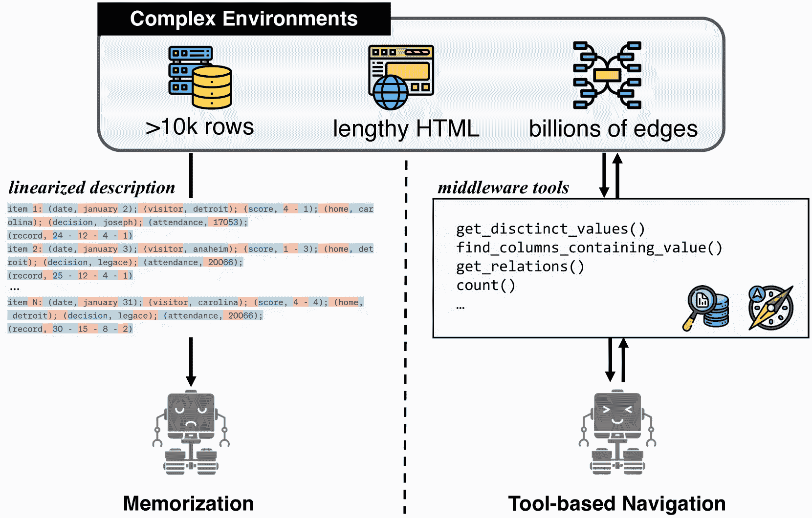
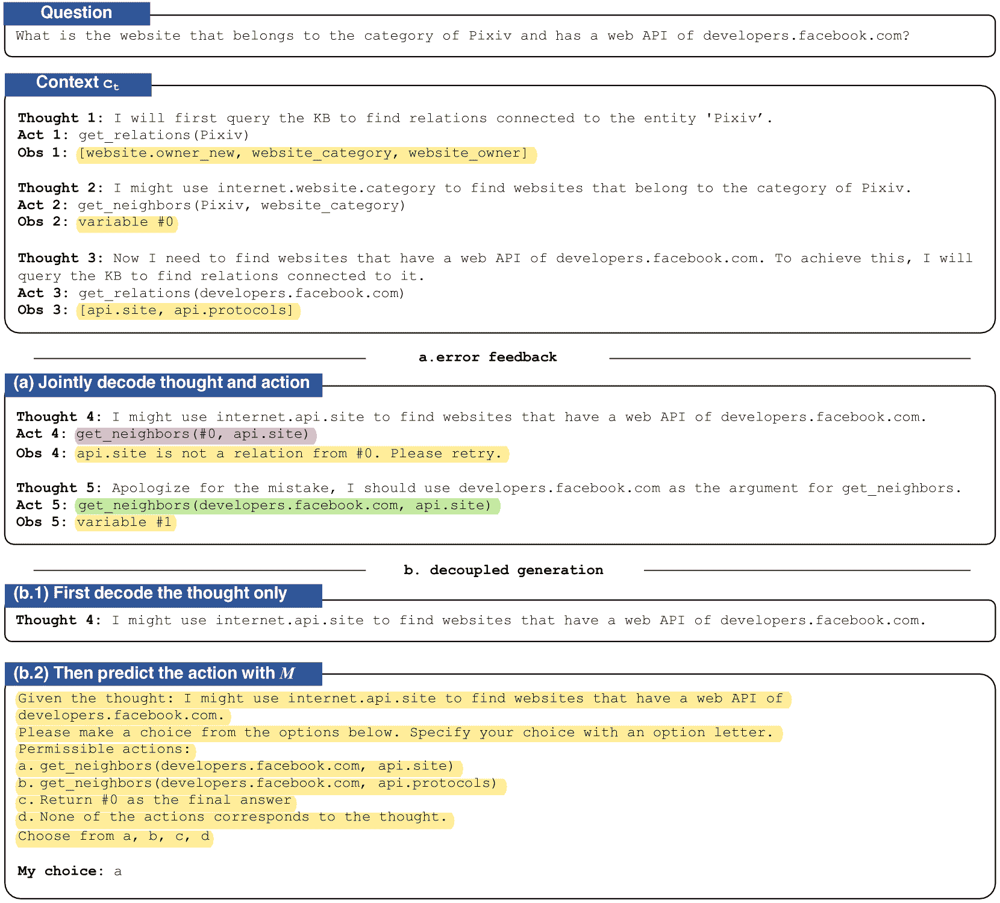
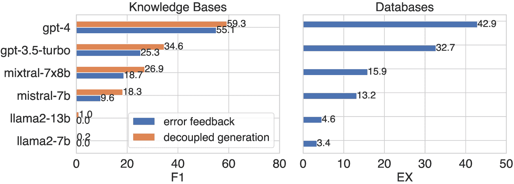
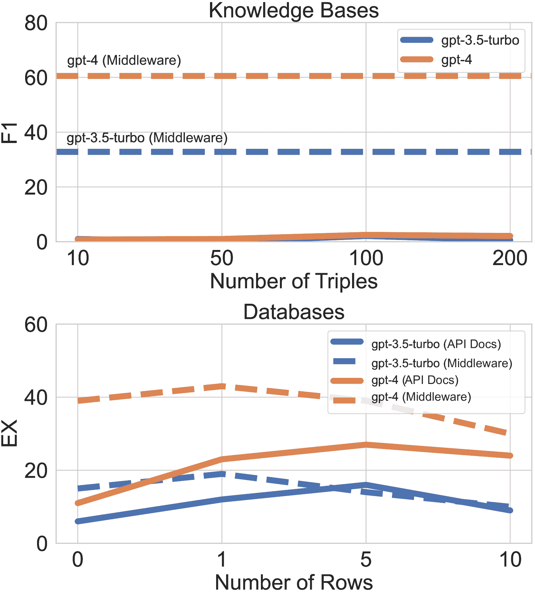
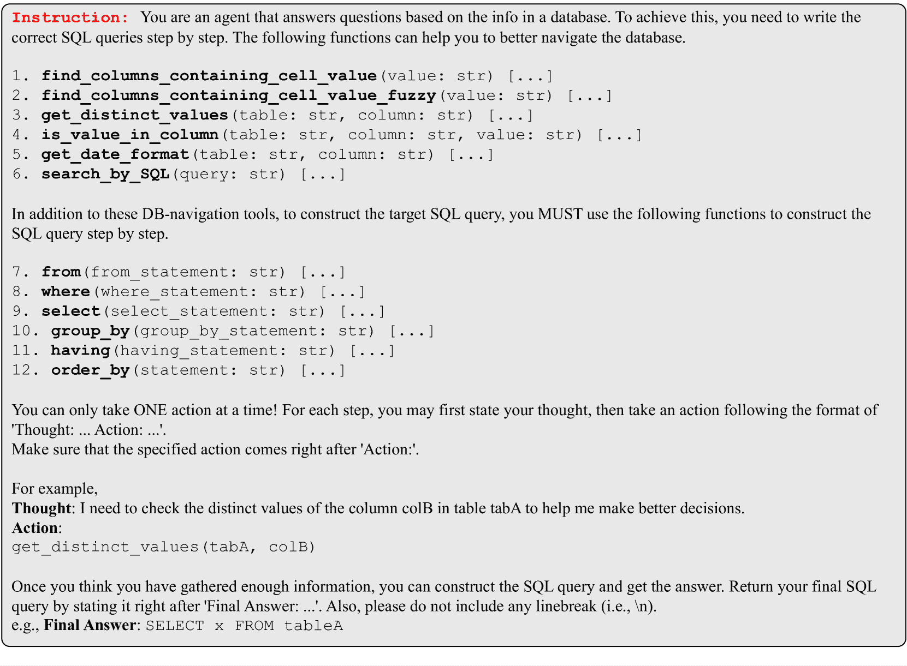
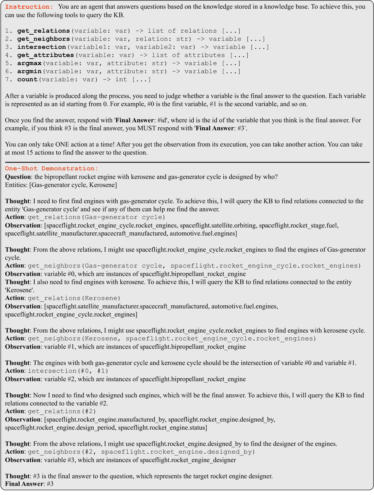
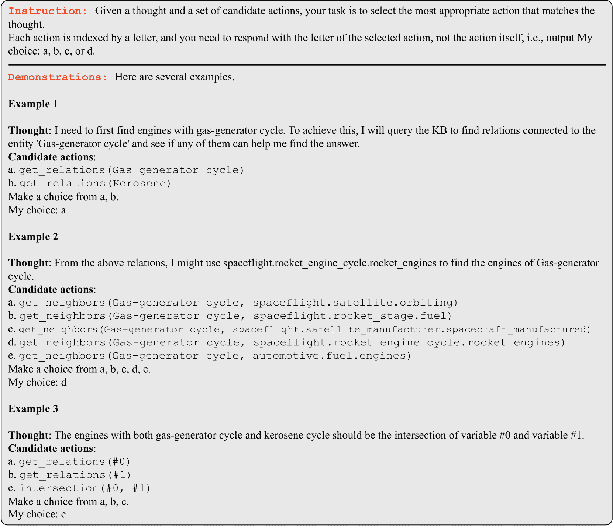
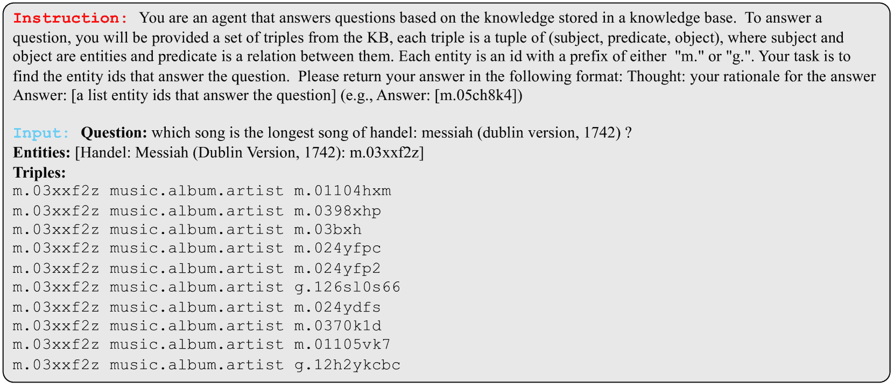

<!--yml
category: 未分类
date: 2025-01-11 12:50:53
-->

# Middleware for LLMs: Tools Are Instrumental for Language Agents in Complex Environments

> 来源：[https://arxiv.org/html/2402.14672/](https://arxiv.org/html/2402.14672/)

Yu Gu¹, Yiheng Shu¹, Hao Yu², Xiao Liu², Yuxiao Dong², Jie Tang²,
Jayanth Srinivasa³, Hugo Latapie³, Yu Su¹
¹The Ohio State University  ²Tsinghua University  ³Cisco Research
{gu.826, su.809}@osu.edu

###### Abstract

The applications of large language models (LLMs) have expanded well beyond the confines of text processing, signaling a new era where LLMs are envisioned as generalist agents capable of operating within complex environments. These environments are often highly expansive, making it impossible for the LLM to process them within its short-term memory. Motivated by recent research on extending the capabilities of LLMs with tools, we seek to investigate the intriguing potential of tools to augment LLMs in handling such complexity by introducing a novel class of tools, termed middleware, to aid in the proactive exploration within these massive environments. Such specialized tools can serve as a middleware layer shielding the LLM from environmental complexity. In two representative complex environments—knowledge bases (KBs) and databases—we demonstrate the significant potential of augmenting language agents with tools in complex environments. Notably, equipped with the middleware, GPT-4 achieves 2.8$\times$ the performance of the best baseline in tasks requiring access to database content and 2.2$\times$ in KB tasks. Our findings illuminate the path for advancing language agents in real-world applications. ¹¹1GitHub repo: [OSU_NLP/Middleware](https://github.com/OSU-NLP-Group/Middleware)
      Hugging Face dataset: [KBQA-Agent](https://huggingface.co/datasets/osunlp/KBQA-Agent)

## 1 Introduction

Large language models (LLMs) have demonstrated a human-like mastery over text OpenAI ([2023a](https://arxiv.org/html/2402.14672v2#bib.bib26), [b](https://arxiv.org/html/2402.14672v2#bib.bib27)); Touvron et al. ([2023](https://arxiv.org/html/2402.14672v2#bib.bib41)); Jiang et al. ([2024](https://arxiv.org/html/2402.14672v2#bib.bib17)). However, the true ambition of AI extends well beyond the realm of text. The goal is to ultimately empower LLMs to act as generalist language agents that can aid humans across the multitude of complex real-world tasks Yao et al. ([2022](https://arxiv.org/html/2402.14672v2#bib.bib44)); Schick et al. ([2023](https://arxiv.org/html/2402.14672v2#bib.bib33)); Liu et al. ([2023](https://arxiv.org/html/2402.14672v2#bib.bib22)), which often involve handling complex environments, be it browsing complex webpages Deng et al. ([2023](https://arxiv.org/html/2402.14672v2#bib.bib6)), managing vast databases with millions of entries Li et al. ([2023a](https://arxiv.org/html/2402.14672v2#bib.bib19)), or querying huge KBs Gu et al. ([2023](https://arxiv.org/html/2402.14672v2#bib.bib9)).

Figure 1: (left) When an LLM engages with a complex environment, it can develop an understanding by fitting the environment’s description (i.e., linearized tokens) into its short-term memory (i.e., the LLM’s input window). However, this method encounters drastic scalability issues as the complexity of the environment grows. (right) Another option is to furnish the LLM with a set of tools that assist it in actively engaging with the environment and acquiring the necessary information.

For LLMs to effectively serve as agents that ground human instructions accurately within the environment, they must develop a robust understanding of the environment. The most direct method to achieve it is to linearize the environment into a sequence of tokens that fit into the LLM’s short-term memory (i.e., its input window) and have the LLM process the environment based on the linearized description Tai et al. ([2023](https://arxiv.org/html/2402.14672v2#bib.bib39)); Shridhar et al. ([2021](https://arxiv.org/html/2402.14672v2#bib.bib34)); Liu et al. ([2023](https://arxiv.org/html/2402.14672v2#bib.bib22)). However, such a method faces steep challenges in scaling to more complex environments. Also, discrete token descriptions may not reflect the most natural perception of the environment. Recent work has explored using tools to extend the boundary of the LLM’s capacity Li et al. ([2023b](https://arxiv.org/html/2402.14672v2#bib.bib20)); Qin et al. ([2023b](https://arxiv.org/html/2402.14672v2#bib.bib30)); Schick et al. ([2023](https://arxiv.org/html/2402.14672v2#bib.bib33)). The core idea is that LLMs can actively decide a proper tool to use, using language as a powerful vehicle of thought Su ([2023](https://arxiv.org/html/2402.14672v2#bib.bib36)). Intuitively, we can also equip the LLM with tools that enable navigating complex environments, so that the LLM can proactively invoke different tools to explore the environment, thus circumventing limitations posed by its short-term memory (Figure [1](https://arxiv.org/html/2402.14672v2#S1.F1 "Figure 1 ‣ 1 Introduction ‣ Middleware for LLMs: Tools Are Instrumental for Language Agents in Complex Environments")). However, this promising paradigm has been thus far underexplored. In this paper, we aim to delve into this paradigm and answer an intriguing question: How effectively can LLMs handle complex environments with the aid of tools?

Answering this question requires equipping the LLM with a suite of tools designed to meet a wide range of needs within the target environment. In this paper, we carefully develop such tailored tools for two exemplar complex environments, i.e., databases and knowledge bases (KBs). Unlike readily available Web APIs Qin et al. ([2023b](https://arxiv.org/html/2402.14672v2#bib.bib30)) used in prior research, our tools have to be manually invented from scratch. In crafting these tools, we capitalize on the intuition of human information-gathering behaviors—such as performing keyword searches to identify a relevant database column or investigating the connections of a KB entity—to fulfill complex tasks in these environments (Section [3.1](https://arxiv.org/html/2402.14672v2#S3.SS1 "3.1 Tools for Complex Environments ‣ 3 Middleware for LLMs ‣ Middleware for LLMs: Tools Are Instrumental for Language Agents in Complex Environments")). Ideally, these tools are designed to function as a middleware layer between the LLM and the environment, shielding the LLM from environmental complexity. With these specialized tools, we propose two novel schemes to enable the LLM to more accurately orchestrate its internal reasoning and tool usage: error feedback and decoupled generation (Section [3.2](https://arxiv.org/html/2402.14672v2#S3.SS2 "3.2 Reasoning with Tools ‣ 3 Middleware for LLMs ‣ Middleware for LLMs: Tools Are Instrumental for Language Agents in Complex Environments")). The combination of the crafted tools and the tool-use schemes allows the LLM to actively explore the environment and ground human instructions into accurate actions.

We evaluate different LLMs on benchmarks featuring complex tasks over the target environments, including a newly curated benchmark for the KB. The results are revealing: LLMs equipped with customized tools demonstrate a significant enhancement in their ability to engage with complex environments, markedly surpassing the prior art. In particular, despite its simplicity, such a middleware layer allows GPT-4 OpenAI ([2023a](https://arxiv.org/html/2402.14672v2#bib.bib26)) to achieve 2.8$\times$ the performance (i.e., $38.3$% vs. $13.8$%) of the best baseline in tasks requiring access to database content and 2.2$\times$ (i.e., $59.3$% vs. $27.1$%) in KB tasks. Our findings underscore the integral role of tool augmentation in enabling LLMs to handle complex environments.

Our main contributions are as follows: a) We develop a new framework with customized tools for two complex environments, to investigate the role of tools in handling complex environments with LLMs; b) We evaluate six different LLMs on our carefully chosen benchmarks for a comprehensive analysis; c) Our analysis highlights a critical takeaway: augmenting LLMs with tools is crucial for successfully tackling complex environments, opening new possibilities to progress LLMs as generalist language agents for practical applications.

## 2 Related Work

*   Interface Complex Environments with LLMs.

    Existing methods that feed the environment directly into the LLM for grounding Chandu et al. ([2021](https://arxiv.org/html/2402.14672v2#bib.bib4)) would fail in complex environments due to scalability issues. Specifically, these methods process the environment by linearizing it into discrete tokens Hwang et al. ([2019](https://arxiv.org/html/2402.14672v2#bib.bib15)); Shridhar et al. ([2021](https://arxiv.org/html/2402.14672v2#bib.bib34)); Yu et al. ([2023](https://arxiv.org/html/2402.14672v2#bib.bib46)); Liu et al. ([2023](https://arxiv.org/html/2402.14672v2#bib.bib22)); Tai et al. ([2023](https://arxiv.org/html/2402.14672v2#bib.bib39)); Song et al. ([2023](https://arxiv.org/html/2402.14672v2#bib.bib35)). However, linearizing expansive environments like databases with millions of entries Li et al. ([2023a](https://arxiv.org/html/2402.14672v2#bib.bib19)) or lengthy webpage HTML code Deng et al. ([2023](https://arxiv.org/html/2402.14672v2#bib.bib6)) can often exceed an LLM’s input length constraints. Alternative studies bypass the LLM’s direct interaction with complex environments by generating ungrounded draft plans for post-processing grounding Li et al. ([2023c](https://arxiv.org/html/2402.14672v2#bib.bib21)); Nie et al. ([2023](https://arxiv.org/html/2402.14672v2#bib.bib25)) or by using the LLM to assess grounded plans created via predefined rules Gu et al. ([2023](https://arxiv.org/html/2402.14672v2#bib.bib9)). Such strategies do not fully utilize the LLMs’ innate reasoning potential in actively navigating complex environments. In this paper, we explore a new paradigm where we can bypass these issues by equipping LLMs with a suite of comprehensive tools to actively gather necessary information about the environment upon demand, leveraging the LLMs’ inherent reasoning capabilities.

*   Tool Learning.

    Tools are essential for enhancing the capabilities of LLMs Schick et al. ([2023](https://arxiv.org/html/2402.14672v2#bib.bib33)); Qin et al. ([2023a](https://arxiv.org/html/2402.14672v2#bib.bib29)); Mialon et al. ([2023](https://arxiv.org/html/2402.14672v2#bib.bib24)); Hao et al. ([2023](https://arxiv.org/html/2402.14672v2#bib.bib14)). Existing research, such as ToolLLM Qin et al. ([2023b](https://arxiv.org/html/2402.14672v2#bib.bib30)) and API-Bank Li et al. ([2023b](https://arxiv.org/html/2402.14672v2#bib.bib20)), focuses on open-domain applications with a wide array of readily available RESTful APIs. In contrast, this paper specifically aims to study the potential of tools in augmenting LLMs to effectively execute tasks within complex environments, where we carefully craft the specialized tools for different environments by ourselves. In addition, research focusing on RESTful APIs typically displays shallow reasoning, while practical tasks within a complex environment typically entail a long sequence of actions (e.g., querying a KB or browsing a webpage). To enable tool use in more intricate settings within a more specific complex environment, StructGPT Jiang et al. ([2023b](https://arxiv.org/html/2402.14672v2#bib.bib18)) employs a predefined sequence of tool invocations; Chameleon Lu et al. ([2023](https://arxiv.org/html/2402.14672v2#bib.bib23)) functions in an open-loop setting where the LLM directly produces a sequence for tool usage before any execution occurs. Both of them fail to seamlessly integrate the reasoning capacity of the LLM with the use of tools. In this paper, we propose two novel schemes—error feedback and decoupled generation to more seamlessly and accurately orchestrate the LLM’s internal reasoning and tool usage.

## 3 Middleware for LLMs

We equip LLMs with a suite of tools specifically tailored to support an extensive variety of operations and cater to the diverse needs within a complex environment $\mathcal{E}$. We call these tools middleware, as they can serve as a feature-rich middle layer between the LLM and $\mathcal{E}$, abstracting the LLM from having to directly interact with all of its intricacies (Section [3.1](https://arxiv.org/html/2402.14672v2#S3.SS1 "3.1 Tools for Complex Environments ‣ 3 Middleware for LLMs ‣ Middleware for LLMs: Tools Are Instrumental for Language Agents in Complex Environments")). Furthermore, to fully unleash the inherent reasoning capabilities of LLMs in invoking proper tools, we propose two novel schemes to enhance tool use accuracy: error feedback, which provides concrete tool use error information and expects the LLM to correct the error autonomously, and decoupled generation, where the LLM’s reasoning steps and tool use are separated for better controllability (Section [3.2](https://arxiv.org/html/2402.14672v2#S3.SS2 "3.2 Reasoning with Tools ‣ 3 Middleware for LLMs ‣ Middleware for LLMs: Tools Are Instrumental for Language Agents in Complex Environments")). This unified framework allows us to reliably investigate the potential of LLMs in handling complex environments with the aid of tools.

Figure 2: The LLM is equipped with an array of tools to facilitate its engagement with complex environments (e.g., a KB here). (a) The LLM may produce invalid actions (marked in pink). This can be mitigated by prompting it with an error message that encourages a reattempt (corrected action marked in green). (b) Alternatively, we can have the LLM first generate a thought, then predict an action based on it in a separate context (marked in blue), and finally insert the action back to the original context. Text marked in yellow are input from the environment.

### 3.1 Tools for Complex Environments

To evaluate the potential of LLMs in handling complex environments when equipped with tools, we need to first carefully craft the necessary tools for the environments. These tools should meet two essential criteria: 1) They should offer comprehensiveness, encompassing a broad spectrum of operations and needs. Broad coverage of tools is crucial for maximizing the potential of LLMs in planning. 2) The tools should prioritize ease of use, enabling the LLM to invoke them mostly with straightforward slot filling, thus shielding the LLM from the implementation details of the tools.

*   Databases

    In production scenarios, databases typically feature dozens of tables, with each table containing thousands of rows or more. A key task in such environments is performing data analysis through SQL queries. To bridge the gap between natural language instructions and SQL, LLMs are employed to automate the generation of SQL queries (i.e., text-to-SQL parsing Yu et al. ([2018](https://arxiv.org/html/2402.14672v2#bib.bib47)); Li et al. ([2023a](https://arxiv.org/html/2402.14672v2#bib.bib19))). To support the LLM in crafting complex SQL queries, we introduce a set of specialized tools designed for interaction with intricate databases. These tools are divided into two main categories: navigational and functional. Navigational tools help the LLM to explore the environment (e.g., get_distinct_values() and find_columns_containing_value()), while functional tools help check each SQL clause composed by the LLM. For example, where() verifies the legality of the WHERE clause and determines if the specified conditions can match any entries in the database. In total, we craft $12$ tools for databases (Appendix [A.1](https://arxiv.org/html/2402.14672v2#A1.SS1 "A.1 Databases ‣ Appendix A Detailed Tool Definitions ‣ Middleware for LLMs: Tools Are Instrumental for Language Agents in Complex Environments")). The development of these tools is grounded in our domain expertise in SQL and databases.

*   KBs

    Modern KBs, such as Freebase Bollacker et al. ([2008](https://arxiv.org/html/2402.14672v2#bib.bib2)), are vast repositories storing billions of facts as triples $\langle h,r,t\rangle$. These KBs cover a wide array of domains and support complex information-seeking tasks, including answering questions that require multi-hop reasoning. To support the LLM in engaging the extremely massive KB environments, we also devise a toolset tailored for KBs. Similarly, tools for KBs also include navigational tools and functional tools. The navigational tools facilitate efficient exploration of the KB by the LLM (e.g., get_relations() and get_attributes()), while the functional tools support the LLM in executing precise operations, such as counting and intersecting two sets (e.g., intersection() and count()). Both are critical for completing complex reasoning tasks on KB. A key concept in tools for KBs is a variable, representing a set of entities and typically generated as an intermediate result through the execution of functions like get_neighbors() or intersection(). The use of variables facilitates multi-hop reasoning across KBs, as it enables the natural linkage of a sequence of tool executions. In total, we implement $7$ tools for KBs (Appendix [A.2](https://arxiv.org/html/2402.14672v2#A1.SS2 "A.2 Knowledge Bases ‣ Appendix A Detailed Tool Definitions ‣ Middleware for LLMs: Tools Are Instrumental for Language Agents in Complex Environments")). Our design of KB tools tightly adheres to the common needs in knowledge base question answering (KBQA) Gu et al. ([2021](https://arxiv.org/html/2402.14672v2#bib.bib10)); Cao et al. ([2022](https://arxiv.org/html/2402.14672v2#bib.bib3)).

### 3.2 Reasoning with Tools

We first choose ReAct Yao et al. ([2022](https://arxiv.org/html/2402.14672v2#bib.bib44)) to serve as the backbone of our reasoning framework, in which the LLM can proactively decide which tool to use based on its own chain-of-thought Wei et al. ([2022](https://arxiv.org/html/2402.14672v2#bib.bib43)). Based on this backbone, we propose two novel schemes to improve the accuracy of tool use, which is critical for complex tasks where successful tool use necessitates careful tool selection and precise argument assignment. Unlike existing methods relying on human-defined workflows that follow fixed-order tool usage Jiang et al. ([2023b](https://arxiv.org/html/2402.14672v2#bib.bib18)), our framework allows the LLM autonomy in proactively determining tool selection using CoT.

Formally, at each step $t$, the LLM makes predictions following a policy that maps a current context to an output: $\pi:c_{t}\rightarrow\hat{a}_{t}$, where

|  | $\displaystyle c_{t}$ | $\displaystyle=(\hat{a}_{1},o_{1}\cdots,\hat{a}_{t-1},o_{t-1})$ |  |
|  | $\displaystyle\hat{a}_{t}$ | $\displaystyle=r_{t}\oplus a_{t}$ |  |

$\hat{a}_{t}$ is the concatenation of a rationale $r_{t}$ (i.e., a thought in CoT) and a concrete tool use $a_{t}$ (e.g., in Figure [2](https://arxiv.org/html/2402.14672v2#S3.F2 "Figure 2 ‣ 3 Middleware for LLMs ‣ Middleware for LLMs: Tools Are Instrumental for Language Agents in Complex Environments"), $\hat{a}_{1}$ is the concatenation of Thought 1 and Act 1), while $o_{t}$ is an observation from the environment (i.e., the execution result of $a_{t}$). In ReAct, the LLM jointly decodes $\hat{a}_{t}$ based on $c_{t}$ for each step. However, originally designed for simpler tools like the Wikipedia Search API, the naive ReAct framework is more susceptible to producing an invalid $a_{t}$ that is unfaithful to $r_{t}$ when applied to more nuanced tool usage. We propose two simple strategies to remedy this issue. The first strategy is to simply amplify ReAct by providing detailed error feedback in case of incorrect tool usage by the LLM, followed by a prompt to retry based on these messages (see Figure [2](https://arxiv.org/html/2402.14672v2#S3.F2 "Figure 2 ‣ 3 Middleware for LLMs ‣ Middleware for LLMs: Tools Are Instrumental for Language Agents in Complex Environments")(a)).²²2For databases, we directly use the error message from sqlite3\. For KBs, we manually define several simple templates for error feedback along with each tool. This relies on the LLM’s capacity for self-correction through feedback Gou et al. ([2023](https://arxiv.org/html/2402.14672v2#bib.bib8)); Chen et al. ([2023](https://arxiv.org/html/2402.14672v2#bib.bib5)), which may not always be reliable when the underpinning LLM is weak, potentially leading to the repetition of the same mistakes Guan et al. ([2023](https://arxiv.org/html/2402.14672v2#bib.bib13)). Additionally, we present decoupled generation, where the LLM’s policy $\pi$ is split into two sequential phases (i.e., $\pi\propto\pi_{1}\circ\pi_{2}$), allowing for more nuanced control of its actions. Initially, the LLM only decodes a thought $r_{t}$ following $\pi_{1}(r_{t}|c_{t})$. Subsequently, the LLM predicts an action $a_{t}$ in a separate context, incorporating both the thought $r_{t}$ and a set of simple rules $\mathcal{M}$ that determines permissible actions of this step. This is further guided by $\pi_{2}$, formulated as $a_{t}\sim\pi_{2}(a_{t}|r_{t},\mathcal{M})$. $\mathcal{M}$ encapsulates the governing rules of the environment (e.g., the relation argument for get_neighbors() must be derived from the output of get_relations(), which is applied to the specified entity argument in prior steps), infusing prior knowledge into the LLM’s decision-making process (see Figure [2](https://arxiv.org/html/2402.14672v2#S3.F2 "Figure 2 ‣ 3 Middleware for LLMs ‣ Middleware for LLMs: Tools Are Instrumental for Language Agents in Complex Environments")(b)). The concrete prompts used by us are shown in Appendix [C](https://arxiv.org/html/2402.14672v2#A3 "Appendix C Prompts ‣ Middleware for LLMs: Tools Are Instrumental for Language Agents in Complex Environments").

 | Model | Req. Cont. (N) | Req. Cont. (Y) | Overall |
|  | EX | VA | EX | VA | EX | VA |
| w/ Oracle Knowledge |
| API Docs Prompt Rajkumar et al. ([2022](https://arxiv.org/html/2402.14672v2#bib.bib31)) |  |  |  |  |  |  |
|               w/ GPT-3.5-turbo | $38.1$ | $78.4$ | $32.1$ | $74.6$ | $36.1$ | $77.2$ |
|               w/ GPT-4 | $49.5$ | $95.5$ | $41.7$ | $89.9$ | $46.9$ | $93.7$ |
| w/o Oracle Knowledge |
| API Docs Prompt Rajkumar et al. ([2022](https://arxiv.org/html/2402.14672v2#bib.bib31)) |  |  |  |  |  |  |
|               w/ GPT-3.5-turbo^† | $30.9$ | $82.9$ | $10.9$ | $80.0$ | $24.4$ | $82.0$ |
|               w/ GPT-4 | $38.2$ | $91.6$ | $13.8$ | $93.1$ | $30.4$ | $92.1$ |
| StructGPT Jiang et al. ([2023b](https://arxiv.org/html/2402.14672v2#bib.bib18)) |  |  |  |  |  |  |
|               w/ GPT-3.5-turbo | $36.2$ | $86.5$ | $8.7$ | $80.8$ | $27.3$ | $84.7$ |
|               w/ GPT-4 | $40.7$ | $93.4$ | $13.5$ | $91.1$ | $31.8$ | $92.6$ |
| Middleware (error feedback) |  |  |  |  |  |  |
|               w/ GPT-3.5-turbo | $38.8$ | $95.7$ | $19.8$ | $94.7$ | $32.7$ | $95.4$ |
|               w/ GPT-4 | $45.1$ | $98.8$ | $38.3$ | $97.2$ | $42.9$ | $98.3$ | 

Table 1: Results on Bird’s dev set. Performance of all baselines is obtained under a zero-shot setting. ${\dagger}$ denotes the best method w/o oracle knowledge on Bird’s official leaderboard. The predictions with API Docs Prompt are directly supplied by the authors of Bird.

 | Model | Counting | Superlative | None | Overall |
| --- | --- | --- | --- | --- |
|  | F1 | VA | F1 | VA | F1 | VA | F1 | VA |
| Pangu^♢ Gu et al. ([2023](https://arxiv.org/html/2402.14672v2#bib.bib9)) |  |  |  |  |  |  |  |  |
|               w/ GPT-3.5-turbo | $10.1$ | $100.0$ | $9.0$ | $100.0$ | $23.4$ | $100.0$ | $18.1$ | $100.0$ |
|               w/ GPT-4 | $12.3$ | $100.0$ | $14.2$ | $100.0$ | $35.6$ | $100.0$ | $27.1$ | $100.0$ |
| KB-Binder Li et al. ([2023c](https://arxiv.org/html/2402.14672v2#bib.bib21)) |  |  |  |  |  |  |  |  |
|               w/ GPT-3.5-turbo (20-shot) | $0.0$ | $33.7$ | $0.2$ | $19.4$ | $6.7$ | $37.0$ | $4.2$ | $32.8$ |
|               w/ GPT-4 (20-shot) | $7.9$ | $48.3$ | $0.4$ | $28.2$ | $6.0$ | $45.8$ | $5.2$ | $42.6$ |
| StructGPT Jiang et al. ([2023b](https://arxiv.org/html/2402.14672v2#bib.bib18)) |  |  |  |  |  |  |  |  |
|               w/ GPT-3.5-turbo | $4.5$ | $50.6$ | $3.9$ | $51.5$ | $11.4$ | $57.1$ | $8.6$ | $54.8$ |
|               w/ GPT-4 | $2.2$ | $37.1$ | $3.9$ | $30.1$ | $11.7$ | $26.3$ | $8.4$ | $29.0$ |
| Middleware (error feedback) |  |  |  |  |  |  |  |  |
|               w/ GPT-3.5-turbo | $33.7$ | $70.7$ | $22.0$ | $64.1$ | $23.9$ | $56.8$ | $25.3$ | $60.8$ |
|               w/ GPT-4 | $70.7$ | $96.6$ | $39.9$ | $74.5$ | $55.8$ | $74.0$ | $55.1$ | $78.0$ |
| Middleware (decoupled generation) |  |  |  |  |  |  |  |  |
|               w/ GPT-3.5-turbo | $48.9$ | $97.7$ | $29.5$ | $88.0$ | $32.1$ | $77.3$ | $34.3$ | $83.0$ |
|               w/ GPT-4 | $74.1$ | $98.9$ | $42.6$ | $85.1$ | $61.0$ | $83.6$ | $59.3$ | $85.8$ | 

Table 2: Results on KBQA-Agent. All models are provided with one-shot demonstration except for KB-Binder, where we provide 20-shot demonstrations for optimal performance. $\diamondsuit$ indicates our reimplementation of Pangu, as the original code lacks support for chat models. We assume perfect entity linking for all methods.

## 4 Benchmarks

The predominant tasks for databases and KBs are text-to-SQL parsing and KBQA. However, popular benchmarks for them may fall short for evaluating language agents out-of-box. Specifically, the majority of questions in popular KBQA datasets like WebQSP Berant et al. ([2013](https://arxiv.org/html/2402.14672v2#bib.bib1)); Yih et al. ([2016](https://arxiv.org/html/2402.14672v2#bib.bib45)) are one-hop or two-hop questions, for which we can effectively handle with existing semantic parsing methods Gu et al. ([2022](https://arxiv.org/html/2402.14672v2#bib.bib11)). Additionally, the databases featured in Spider Yu et al. ([2018](https://arxiv.org/html/2402.14672v2#bib.bib47)) and WikiSQL Zhong et al. ([2017](https://arxiv.org/html/2402.14672v2#bib.bib50)) have limited complexity in terms of both schema design and the number of rows in the tables. This over-simplification enables the direct feeding of the database schema to the LLM, achieving strong performance without the need to access the actual content of the database Rajkumar et al. ([2022](https://arxiv.org/html/2402.14672v2#bib.bib31)). Therefore, we need different benchmarks with complex environments and instructions that better mirror the real-world situations language agents must handle (see statistics of our benchmarks in Appendix [B](https://arxiv.org/html/2402.14672v2#A2 "Appendix B Benchmark Statistics ‣ Middleware for LLMs: Tools Are Instrumental for Language Agents in Complex Environments")).

*   Databases

    For databases, we leverage Bird Li et al. ([2023a](https://arxiv.org/html/2402.14672v2#bib.bib19)), which is a recent dataset notable for its complexity, featuring intricate instructions over highly complex databases. There are originally two different settings in Bird: with and without oracle knowledge, where the oracle knowledge supplies specific information about the target database needed to fulfill each task. For instance, “Exclusively virtual refers to Virtual = ‘F”’. With such oracle knowledge, the complexity of the environments is substantially mitigated; it offers a shortcut for the task and eliminates the necessity for deep engagement with the database. This cheating setting is also unrealistic for practical applications. As a result, we stick to the setting without oracle knowledge. For each of the $1534$ questions in Bird’s dev set, we manually label whether accessing the database content is necessary to compile the SQL queries, noting that access is unnecessary if all mentioned values in a question exactly match database cells. This facilitates decomposing the language agent’s performance based on questions that require deeper database engagement ($496$ questions) versus not ($1038$ questions) and enables fine-grained insights into the LLM’s performance. In addition to execution accuracy (EX) used in Bird, which determines if the execution results of the predicted SQL match those of the ground truth SQL, we also evaluate whether the predicted SQL is a valid SQL query (VA).

*   KBs

    We curate KBQA-Agent, a new test set sourcing from existing KBQA datasets that contain complex questions. In particular, we selected $500$ diverse questions that involve at least three relations, or two relations coupled with an aggregation function (i.e., Counting or Superlative). For each question, we annotate it with a ground truth sequence of actions based on the toolset defined by us.³³3We leverage the gold S-expressions provided by Gu and Su ([2022](https://arxiv.org/html/2402.14672v2#bib.bib12)). Specifically, KBQA-Agent comprises questions from three KBQA datasets on Freebase: GrailQA Gu et al. ([2021](https://arxiv.org/html/2402.14672v2#bib.bib10)), ComplexWebQ Talmor and Berant ([2018](https://arxiv.org/html/2402.14672v2#bib.bib40)), and GraphQ Su et al. ([2016](https://arxiv.org/html/2402.14672v2#bib.bib37)), ensuring a wide range of question types and sources. KBQA-Agent is designed to be more representative of challenging, real-world scenarios compared to existing benchmarks (Appendix [B](https://arxiv.org/html/2402.14672v2#A2 "Appendix B Benchmark Statistics ‣ Middleware for LLMs: Tools Are Instrumental for Language Agents in Complex Environments")). It offers an ideal testbed for evaluating language agents in interacting with massive KBs. We assess this through two metrics: F1 of answer entities and Validity (VA), a binary metric evaluating the LLM’s ability to find an answer, whether correct or not.

Figure 3: The open-source LLMs still largely lag behind GPT-3.5-turbo and GPT-4 in both environments.

## 5 Experiments

### 5.1 Setup

*   Implementation

    To concretely instantiate our tools for the two environments, we employ standard query interfaces for databases and KBs, specifically SQLite for databases and Virtuoso for KBs. We then prompt the LLM with the tool descriptions together with the input task instructions (Appendix [C](https://arxiv.org/html/2402.14672v2#A3 "Appendix C Prompts ‣ Middleware for LLMs: Tools Are Instrumental for Language Agents in Complex Environments")). Each environment exhibits its own unique characteristics and challenges. In KBQA, the arguments for each function are either a variable or an item from the KB schema (i.e., a relation or an attribute). In contrast, in text-to-SQL parsing, the arguments can be more varied, ranging from a part of a SQL query to a complete query. This makes listing potential actions, as needed in decoupled generation, much more complex for text-to-SQL parsing. Therefore, we implement error feedback solely for text-to-SQL parsing.

    For the underlying LLMs, we primarily compare Middleware with baseline methods using two of the most advanced LLMs—GPT-3.5-turbo-0613 OpenAI ([2023b](https://arxiv.org/html/2402.14672v2#bib.bib27)) and GPT-4-0613 OpenAI ([2023a](https://arxiv.org/html/2402.14672v2#bib.bib26))—since our goal is investigating the full potential of tool-enhanced LLMs operating within complex environments. In addition, we also explore four open-source LLMs to more comprehensively evaluate our framework: Llama2-7B-Chat, Llama2-13B-Chat Touvron et al. ([2023](https://arxiv.org/html/2402.14672v2#bib.bib41)), Mistral-7B-Instruct-v0.2 Jiang et al. ([2023a](https://arxiv.org/html/2402.14672v2#bib.bib16)), and Mixtral 8$\times$7B-Instruct-v0.1 Jiang et al. ([2024](https://arxiv.org/html/2402.14672v2#bib.bib17)).

Figure 4: The customized tools can serve as effective middleware between the LLM and the environment.

*   Baselines

    To fully understand the potential of tool augmentation for assisting LLMs in handling complex environments, we compare Middleware against an array of strong baselines. For text-to-SQL parsing, LLMs demonstrate a strong ability to compose SQL queries when properly prompted with the database schema (i.e., API docs prompting Rajkumar et al. ([2022](https://arxiv.org/html/2402.14672v2#bib.bib31))). This also represents the current state-of-the-art prompting-based method when oracle knowledge is not available on Bird’s leaderboard. In adddition, we also compare with more baselines on Bird’s leaderboard that originally did not submit their results using no oracle knowledge (See Appendix [D.1](https://arxiv.org/html/2402.14672v2#A4.SS1 "D.1 Comparing with DIN-SQL and DAIL-SQL ‣ Appendix D Additional Results ‣ Middleware for LLMs: Tools Are Instrumental for Language Agents in Complex Environments")). For all methods on text-to-SQL parsing, we adopt the zero-shot setting. Unlike text-to-SQL parsing, directly prompting LLMs does not generate reasonable outputs for KBQA due to the massive size of the KB schema. Instead, existing KBQA methods based on LLMs typically follow two paradigms: either first generating an ungrounded program and then grounding the program to the KB schema afterwards Li et al. ([2023c](https://arxiv.org/html/2402.14672v2#bib.bib21)); Nie et al. ([2023](https://arxiv.org/html/2402.14672v2#bib.bib25)), or gradually constructing a complex program and grounding it step by step Gu et al. ([2023](https://arxiv.org/html/2402.14672v2#bib.bib9)). We compare Middleware with the most representative work from each paradigm, namely KB-Binder Li et al. ([2023c](https://arxiv.org/html/2402.14672v2#bib.bib21)) and Pangu Gu et al. ([2023](https://arxiv.org/html/2402.14672v2#bib.bib9)). We also include StructGPT as an additional baseline for tool use. For all KBQA methods except KB-Binder, we provide a one-shot demo to obtain more meaningful results.

### 5.2 Main Results

As shown in Tables [1](https://arxiv.org/html/2402.14672v2#S3.T1 "Table 1 ‣ 3.2 Reasoning with Tools ‣ 3 Middleware for LLMs ‣ Middleware for LLMs: Tools Are Instrumental for Language Agents in Complex Environments") and [2](https://arxiv.org/html/2402.14672v2#S3.T2 "Table 2 ‣ 3.2 Reasoning with Tools ‣ 3 Middleware for LLMs ‣ Middleware for LLMs: Tools Are Instrumental for Language Agents in Complex Environments"), equipping LLMs with customized tools leads to significant improvement over previous standards, almost doubling or tripling the performance under multiple metrics. Specifically, API docs prompting can only feed the schema information to the LLM due to the vast amount of database content. As a result, it fails catastrophically on examples that require database content to compose the SQL query. In contrast, Middleware equips the agent with tools to actively navigate the database to collect relevant information for composing a SQL query. As a result, Middleware significantly closes the gap between performance on questions requiring database content and questions not requiring it when using GPT-4 (i.e., $45.1$% vs. $38.3$%). Additionally, we notice that Middleware minimizes the gap between with and without oracle knowledge from $15.5$% to $4.0$% using GPT-4 and $11.7$% to $3.3$% using GPT-3.5-turbo. Finally, StructGPT demonstrates a similar trend to API docs prompting because its tools do not provide any information about the database content. For KBQA, Middleware demonstrates uniformly superior performance across different question types and significantly outperforms Pangu with both GPT-3.5-turbo and GPT-4. In particular, when equipped with GPT-4, Middleware + decoupled generation outperforms Pangu by $32.2$% in F1. As for the other two baselines, KB-Binder and StructGPT, both fail miserably on our challenging setting. On the one hand, KB-Binder only retrieves relations within two hops from the entities for grounding. However, most questions in KBQA-Agent involve more than two relations. As a result, many of its drafted programs are unable to ground, which explains its low VA. On the other hand, StructGPT is heavily limited by its constrained toolset and cannot handle complex questions in KBQA-Agent. Therefore, StructGPT frequently refuses to provide an answer (as revealed by its low VA) due to insufficient information. The strong performance of Middleware underscores that tools are instrumental for language agents in complex environments.

Due to the space limit, we provide additional results in Appendix [D](https://arxiv.org/html/2402.14672v2#A4 "Appendix D Additional Results ‣ Middleware for LLMs: Tools Are Instrumental for Language Agents in Complex Environments").

### 5.3 Experiments with Open-Source LLMs

To gain a more thorough insight, we also include experiments with four open-source LLMs ( Figure [3](https://arxiv.org/html/2402.14672v2#S4.F3 "Figure 3 ‣ 4 Benchmarks ‣ Middleware for LLMs: Tools Are Instrumental for Language Agents in Complex Environments")). Our findings indicate that Llama2 models generally underperform compared to other LLMs, aligning with trends observed in other LLM leaderboards, such as Chatbot Arena Zheng et al. ([2023](https://arxiv.org/html/2402.14672v2#bib.bib49)). Specifically, we find Llama2 models struggle with even generating grammatical tool use following our instruction. On the other hand, Mistral and Mixtral demonstrate much better performance than Llama2. In particular, Mixtral represents an advanced mixture-of-experts model that has demonstrated superior performance and even surpasses GPT-3.5-turbo on Chatbot Arena Zheng et al. ([2023](https://arxiv.org/html/2402.14672v2#bib.bib49)). However, different from answering open-ended questions, properly engaging with the complex environment demands the language agent to produce more precise actions that strictly conform to the task specification. There is still a gap between Mixtral and GPT-3.5-turbo in terms of predicting valid actions over complex environments. Compared to GPT-3.5-turbo, Mixtral tends to output invalid actions more frequently. This also explains why decoupled generation, where the output space is strictly constrained to a list of valid actions, helps weaker models more. With Middleware + decoupled generation, using Mistral can almost match the best baseline performance with GPT-3.5-turbo, and using Mixtral can even match the best baseline with GPT-4. While stronger models like GPT-4 can effectively recover the mistake via error feedback, weaker models tend to benefit more from decoupled generation.

### 5.4 Tools as A Middleware Layer

To deepen our understanding of the integral roles of tools in aiding LLMs in accessing complex environments (i.e., KB triples and database rows in our setup), we conduct further analysis by comparing Middleware with prompting baselines with different amounts of data items directly sampled from the environment (Figure [4](https://arxiv.org/html/2402.14672v2#S5.F4 "Figure 4 ‣ 5.1 Setup ‣ 5 Experiments ‣ Middleware for LLMs: Tools Are Instrumental for Language Agents in Complex Environments")). For the KB, we sample $10$, $50$, $100$, and $200$ triples from Freebase based on the three-hop neighborhood of each entity in a question. These triples are the top-ranked ones using a sentence-BERT retriever Reimers and Gurevych ([2019](https://arxiv.org/html/2402.14672v2#bib.bib32)) based on their similarity with the input question. We prompt the LLM directly with these sampled triples and request it to generate an answer to the given question. Given the extensive size of Freebase, accurately representing the environment with a mere subset of samples proves to be exceedingly difficult. Consequently, both GPT-3.5 Turbo and GPT-4 consistently yield an F1 score close to $0$. For the database, we similarly augment API docs prompting with $1$, $5$, and $10$ sampled rows for each table and evaluate on $100$ random questions from Bird that require accessing database content. Additionally, we also augment Middleware with the same sampled rows in the database setting. We observe that including more database rows initially boosts baseline performance but eventually decreases it. With Middleware, prompting the LLM with sampled rows yields minimal gain, and the standard setting without sampled rows already significantly outperforms all baselines. These results further confirm that the LLM, when augmented with tools, can effectively engage with complex environments, flexibly gathering the necessary information on demand and bypassing the limitations on the amount of data it can handle (e.g., around $200$ triples or $10$ rows per table).

## 6 Conclusion

A pioneering vision is for language agents to assist humans in tackling intricate real-world tasks. This paper demonstrates that with meticulously-crafted tools acting as middleware between LLMs and complex environments, LLMs can substantially exceed current solutions. Our results spotlight these specialized tools’ indispensable role in unlocking the potential of LLMs within complex real-world tasks previously posing immense challenges.

## Limitations

In this paper, we aim to address the compelling question we posed: how effectively can LLMs handle complex environments with the aid of tools? We investigate this through evaluations in two exemplary environments: KBs and databases. While we achieve notable results in these environments, it is important to acknowledge that implementing customized tools for KBs and databases presents fewer challenges compared to environments without a straightforward query interface, such as a webpage or a physical environment. In future work, we plan to extend Middleware across a broader range of environments, aiming to fully realize the potential of language agents in complex environments through the integration of customized middleware tools.

Furthermore, the tools developed in this study are soley grounded in our experience. Despite this, our results already demonstrate the significant potential of augmenting LLMs with customized tools in complex environments, aligning with the primary objective of this paper. Nonetheless, to enhance performance further, adopting a more principled strategy for tool design is essential. Additionally, investigating autonomous tool-making methods Wang et al. ([2024](https://arxiv.org/html/2402.14672v2#bib.bib42)) in complex environments presents a promising direction for future research.

## References

*   Berant et al. (2013) Jonathan Berant, Andrew Chou, Roy Frostig, and Percy Liang. 2013. [Semantic parsing on Freebase from question-answer pairs](https://aclanthology.org/D13-1160). In *Proceedings of the 2013 Conference on Empirical Methods in Natural Language Processing*, pages 1533–1544, Seattle, Washington, USA. Association for Computational Linguistics.
*   Bollacker et al. (2008) Kurt D. Bollacker, Colin Evans, Praveen K. Paritosh, Tim Sturge, and Jamie Taylor. 2008. [Freebase: a collaboratively created graph database for structuring human knowledge](https://doi.org/10.1145/1376616.1376746). In *Proceedings of the ACM SIGMOD International Conference on Management of Data, SIGMOD 2008, Vancouver, BC, Canada, June 10-12, 2008*, pages 1247–1250\. ACM.
*   Cao et al. (2022) Shulin Cao, Jiaxin Shi, Liangming Pan, Lunyiu Nie, Yutong Xiang, Lei Hou, Juanzi Li, Bin He, and Hanwang Zhang. 2022. [KQA Pro: A dataset with explicit compositional programs for complex question answering over knowledge base](https://doi.org/10.18653/v1/2022.acl-long.422). In *Proceedings of the 60th Annual Meeting of the Association for Computational Linguistics (Volume 1: Long Papers), ACL 2022, Dublin, Ireland, May 22-27, 2022*, pages 6101–6119\. Association for Computational Linguistics.
*   Chandu et al. (2021) Khyathi Raghavi Chandu, Yonatan Bisk, and Alan W. Black. 2021. [Grounding ’grounding’ in NLP](https://doi.org/10.18653/V1/2021.FINDINGS-ACL.375). In *Findings of the Association for Computational Linguistics: ACL/IJCNLP 2021, Online Event, August 1-6, 2021*, volume ACL/IJCNLP 2021 of *Findings of ACL*, pages 4283–4305\. Association for Computational Linguistics.
*   Chen et al. (2023) Xinyun Chen, Maxwell Lin, Nathanael Schärli, and Denny Zhou. 2023. [Teaching large language models to self-debug](https://doi.org/10.48550/ARXIV.2304.05128). *CoRR*, abs/2304.05128.
*   Deng et al. (2023) Xiang Deng, Yu Gu, Boyuan Zheng, Shijie Chen, Samuel Stevens, Boshi Wang, Huan Sun, and Yu Su. 2023. [Mind2web: Towards a generalist agent for the web](https://doi.org/10.48550/ARXIV.2306.06070). *CoRR*, abs/2306.06070.
*   Gao et al. (2024) Dawei Gao, Haibin Wang, Yaliang Li, Xiuyu Sun, Yichen Qian, Bolin Ding, and Jingren Zhou. 2024. [Text-to-sql empowered by large language models: A benchmark evaluation](https://www.vldb.org/pvldb/vol17/p1132-gao.pdf). *Proc. VLDB Endow.*, 17(5):1132–1145.
*   Gou et al. (2023) Zhibin Gou, Zhihong Shao, Yeyun Gong, Yelong Shen, Yujiu Yang, Nan Duan, and Weizhu Chen. 2023. [CRITIC: large language models can self-correct with tool-interactive critiquing](https://doi.org/10.48550/ARXIV.2305.11738). *CoRR*, abs/2305.11738.
*   Gu et al. (2023) Yu Gu, Xiang Deng, and Yu Su. 2023. [Don’t generate, discriminate: A proposal for grounding language models to real-world environments](https://doi.org/10.18653/v1/2023.acl-long.270). In *Proceedings of the 61st Annual Meeting of the Association for Computational Linguistics (Volume 1: Long Papers), ACL 2023, Toronto, Canada, July 9-14, 2023*, pages 4928–4949\. Association for Computational Linguistics.
*   Gu et al. (2021) Yu Gu, Sue Kase, Michelle Vanni, Brian M. Sadler, Percy Liang, Xifeng Yan, and Yu Su. 2021. [Beyond I.I.D.: three levels of generalization for question answering on knowledge bases](https://doi.org/10.1145/3442381.3449992). In *WWW ’21: The Web Conference 2021, Virtual Event / Ljubljana, Slovenia, April 19-23, 2021*, pages 3477–3488\. ACM / IW3C2.
*   Gu et al. (2022) Yu Gu, Vardaan Pahuja, Gong Cheng, and Yu Su. 2022. [Knowledge base question answering: A semantic parsing perspective](https://doi.org/10.48550/arXiv.2209.04994). In *4th Conference on Automated Knowledge Base Construction*.
*   Gu and Su (2022) Yu Gu and Yu Su. 2022. [ArcaneQA: Dynamic program induction and contextualized encoding for knowledge base question answering](https://aclanthology.org/2022.coling-1.148). In *Proceedings of the 29th International Conference on Computational Linguistics*, pages 1718–1731, Gyeongju, Republic of Korea. International Committee on Computational Linguistics.
*   Guan et al. (2023) Lin Guan, Karthik Valmeekam, Sarath Sreedharan, and Subbarao Kambhampati. 2023. [Leveraging pre-trained large language models to construct and utilize world models for model-based task planning](https://doi.org/10.48550/ARXIV.2305.14909). *CoRR*, abs/2305.14909.
*   Hao et al. (2023) Shibo Hao, Tianyang Liu, Zhen Wang, and Zhiting Hu. 2023. [Toolkengpt: Augmenting frozen language models with massive tools via tool embeddings](https://doi.org/10.48550/arXiv.2305.11554). *CoRR*, abs/2305.11554.
*   Hwang et al. (2019) Wonseok Hwang, Jinyeung Yim, Seunghyun Park, and Minjoon Seo. 2019. [A comprehensive exploration on wikisql with table-aware word contextualization](http://arxiv.org/abs/1902.01069). *CoRR*, abs/1902.01069.
*   Jiang et al. (2023a) Albert Q. Jiang, Alexandre Sablayrolles, Arthur Mensch, Chris Bamford, Devendra Singh Chaplot, Diego de Las Casas, Florian Bressand, Gianna Lengyel, Guillaume Lample, Lucile Saulnier, Lélio Renard Lavaud, Marie-Anne Lachaux, Pierre Stock, Teven Le Scao, Thibaut Lavril, Thomas Wang, Timothée Lacroix, and William El Sayed. 2023a. [Mistral 7b](https://doi.org/10.48550/ARXIV.2310.06825). *CoRR*, abs/2310.06825.
*   Jiang et al. (2024) Albert Q. Jiang, Alexandre Sablayrolles, Antoine Roux, Arthur Mensch, Blanche Savary, Chris Bamford, Devendra Singh Chaplot, Diego de Las Casas, Emma Bou Hanna, Florian Bressand, Gianna Lengyel, Guillaume Bour, Guillaume Lample, L’elio Renard Lavaud, Lucile Saulnier, Marie-Anne Lachaux, Pierre Stock, Sandeep Subramanian, Sophia Yang, Szymon Antoniak, Teven Le Scao, Théophile Gervet, Thibaut Lavril, Thomas Wang, Timothée Lacroix, and William El Sayed. 2024. [Mixtral of experts](http://arxiv.org/abs/2401.04088). *CoRR*.
*   Jiang et al. (2023b) Jinhao Jiang, Kun Zhou, Zican Dong, Keming Ye, Wayne Xin Zhao, and Ji-Rong Wen. 2023b. [StructGPT: A general framework for large language model to reason over structured data](https://doi.org/10.48550/arXiv.2305.09645). *CoRR*, abs/2305.09645.
*   Li et al. (2023a) Jinyang Li, Binyuan Hui, Ge Qu, Binhua Li, Jiaxi Yang, Bowen Li, Bailin Wang, Bowen Qin, Rongyu Cao, Ruiying Geng, Nan Huo, Xuanhe Zhou, Chenhao Ma, Guoliang Li, Kevin Chen-Chuan Chang, Fei Huang, Reynold Cheng, and Yongbin Li. 2023a. [Can LLM already serve as A database interface? A big bench for large-scale database grounded text-to-sqls](https://doi.org/10.48550/ARXIV.2305.03111). *CoRR*, abs/2305.03111.
*   Li et al. (2023b) Minghao Li, Feifan Song, Bowen Yu, Haiyang Yu, Zhoujun Li, Fei Huang, and Yongbin Li. 2023b. [API-Bank: A benchmark for tool-augmented llms](https://doi.org/10.48550/arXiv.2304.08244). *CoRR*, abs/2304.08244.
*   Li et al. (2023c) Tianle Li, Xueguang Ma, Alex Zhuang, Yu Gu, Yu Su, and Wenhu Chen. 2023c. [Few-shot in-context learning on knowledge base question answering](https://api.semanticscholar.org/CorpusID:258461017). In *Annual Meeting of the Association for Computational Linguistics*.
*   Liu et al. (2023) Xiao Liu, Hao Yu, Hanchen Zhang, Yifan Xu, Xuanyu Lei, Hanyu Lai, Yu Gu, Hangliang Ding, Kaiwen Men, Kejuan Yang, Shudan Zhang, Xiang Deng, Aohan Zeng, Zhengxiao Du, Chenhui Zhang, Sheng Shen, Tianjun Zhang, Yu Su, Huan Sun, Minlie Huang, Yuxiao Dong, and Jie Tang. 2023. [AgentBench: Evaluating llms as agents](https://doi.org/10.48550/arXiv.2308.03688). *CoRR*, abs/2308.03688.
*   Lu et al. (2023) Pan Lu, Baolin Peng, Hao Cheng, Michel Galley, Kai-Wei Chang, Ying Nian Wu, Song-Chun Zhu, and Jianfeng Gao. 2023. [Chameleon: Plug-and-play compositional reasoning with large language models](https://doi.org/10.48550/ARXIV.2304.09842). *CoRR*, abs/2304.09842.
*   Mialon et al. (2023) Grégoire Mialon, Roberto Dessì, Maria Lomeli, Christoforos Nalmpantis, Ramakanth Pasunuru, Roberta Raileanu, Baptiste Rozière, Timo Schick, Jane Dwivedi-Yu, Asli Celikyilmaz, Edouard Grave, Yann LeCun, and Thomas Scialom. 2023. [Augmented language models: a survey](https://doi.org/10.48550/ARXIV.2302.07842). *CoRR*, abs/2302.07842.
*   Nie et al. (2023) Zhijie Nie, Richong Zhang, Zhongyuan Wang, and Xudong Liu. 2023. [Code-style in-context learning for knowledge-based question answering](https://doi.org/10.48550/ARXIV.2309.04695). *CoRR*, abs/2309.04695.
*   OpenAI (2023a) OpenAI. 2023a. [GPT-4 technical report](https://doi.org/10.48550/arXiv.2303.08774). *CoRR*, abs/2303.08774.
*   OpenAI (2023b) OpenAI. 2023b. Models - OpenAI API. [https://platform.openai.com/docs/models/gpt-3-5](https://platform.openai.com/docs/models/gpt-3-5).
*   Pourreza and Rafiei (2023) Mohammadreza Pourreza and Davood Rafiei. 2023. [DIN-SQL: decomposed in-context learning of text-to-sql with self-correction](http://papers.nips.cc/paper_files/paper/2023/hash/72223cc66f63ca1aa59edaec1b3670e6-Abstract-Conference.html). In *Advances in Neural Information Processing Systems 36: Annual Conference on Neural Information Processing Systems 2023, NeurIPS 2023, New Orleans, LA, USA, December 10 - 16, 2023*.
*   Qin et al. (2023a) Yujia Qin, Shengding Hu, Yankai Lin, Weize Chen, Ning Ding, Ganqu Cui, Zheni Zeng, Yufei Huang, Chaojun Xiao, Chi Han, Yi Ren Fung, Yusheng Su, Huadong Wang, Cheng Qian, Runchu Tian, Kunlun Zhu, Shihao Liang, Xingyu Shen, Bokai Xu, Zhen Zhang, Yining Ye, Bowen Li, Ziwei Tang, Jing Yi, Yuzhang Zhu, Zhenning Dai, Lan Yan, Xin Cong, Yaxi Lu, Weilin Zhao, Yuxiang Huang, Junxi Yan, Xu Han, Xian Sun, Dahai Li, Jason Phang, Cheng Yang, Tongshuang Wu, Heng Ji, Zhiyuan Liu, and Maosong Sun. 2023a. [Tool learning with foundation models](https://doi.org/10.48550/arXiv.2304.08354). *CoRR*, abs/2304.08354.
*   Qin et al. (2023b) Yujia Qin, Shihao Liang, Yining Ye, Kunlun Zhu, Lan Yan, Yaxi Lu, Yankai Lin, Xin Cong, Xiangru Tang, Bill Qian, Sihan Zhao, Runchu Tian, Ruobing Xie, Jie Zhou, Mark Gerstein, Dahai Li, Zhiyuan Liu, and Maosong Sun. 2023b. [ToolLLM: Facilitating large language models to master 16000+ real-world apis](https://doi.org/10.48550/ARXIV.2307.16789). *CoRR*, abs/2307.16789.
*   Rajkumar et al. (2022) Nitarshan Rajkumar, Raymond Li, and Dzmitry Bahdanau. 2022. [Evaluating the text-to-sql capabilities of large language models](https://doi.org/10.48550/ARXIV.2204.00498). *CoRR*, abs/2204.00498.
*   Reimers and Gurevych (2019) Nils Reimers and Iryna Gurevych. 2019. [Sentence-BERT: Sentence embeddings using Siamese BERT-networks](https://doi.org/10.18653/v1/D19-1410). In *Proceedings of the 2019 Conference on Empirical Methods in Natural Language Processing and the 9th International Joint Conference on Natural Language Processing (EMNLP-IJCNLP)*, pages 3982–3992, Hong Kong, China. Association for Computational Linguistics.
*   Schick et al. (2023) Timo Schick, Jane Dwivedi-Yu, Roberto Dessì, Roberta Raileanu, Maria Lomeli, Luke Zettlemoyer, Nicola Cancedda, and Thomas Scialom. 2023. [Toolformer: Language models can teach themselves to use tools](https://doi.org/10.48550/arXiv.2302.04761). *CoRR*, abs/2302.04761.
*   Shridhar et al. (2021) Mohit Shridhar, Xingdi Yuan, Marc-Alexandre Côté, Yonatan Bisk, Adam Trischler, and Matthew J. Hausknecht. 2021. [Alfworld: Aligning text and embodied environments for interactive learning](https://openreview.net/forum?id=0IOX0YcCdTn). In *9th International Conference on Learning Representations, ICLR 2021, Virtual Event, Austria, May 3-7, 2021*. OpenReview.net.
*   Song et al. (2023) Chan Hee Song, Jiaman Wu, Clayton Washington, Brian M. Sadler, Wei-Lun Chao, and Yu Su. 2023. LLM-Planner: Few-shot grounded planning for embodied agents with large language models. In *Proceedings of the IEEE/CVF International Conference on Computer Vision (ICCV)*.
*   Su (2023) Yu Su. 2023. [Language agents: a critical evolutionary step of artificial intelligence](https://yusu.substack.com/p/language-agents). *yusu.substack.com*.
*   Su et al. (2016) Yu Su, Huan Sun, Brian M. Sadler, Mudhakar Srivatsa, Izzeddin Gur, Zenghui Yan, and Xifeng Yan. 2016. [On generating characteristic-rich question sets for QA evaluation](https://doi.org/10.18653/V1/D16-1054). In *Proceedings of the 2016 Conference on Empirical Methods in Natural Language Processing, EMNLP 2016, Austin, Texas, USA, November 1-4, 2016*, pages 562–572\. The Association for Computational Linguistics.
*   Sun et al. (2023) Shuo Sun, Yuchen Zhang, Jiahuan Yan, Yuze Gao, Donovan Ong, Bin Chen, and Jian Su. 2023. [Battle of the large language models: Dolly vs LLaMA vs vicuna vs guanaco vs bard vs ChatGPT - a text-to-SQL parsing comparison](https://doi.org/10.18653/v1/2023.findings-emnlp.750). In *Findings of the Association for Computational Linguistics: EMNLP 2023*, pages 11225–11238, Singapore. Association for Computational Linguistics.
*   Tai et al. (2023) Chang-Yu Tai, Ziru Chen, Tianshu Zhang, Xiang Deng, and Huan Sun. 2023. [Exploring chain of thought style prompting for text-to-sql](https://aclanthology.org/2023.emnlp-main.327). In *Proceedings of the 2023 Conference on Empirical Methods in Natural Language Processing, EMNLP 2023, Singapore, December 6-10, 2023*, pages 5376–5393\. Association for Computational Linguistics.
*   Talmor and Berant (2018) Alon Talmor and Jonathan Berant. 2018. [The web as a knowledge-base for answering complex questions](https://doi.org/10.18653/V1/N18-1059). In *Proceedings of the 2018 Conference of the North American Chapter of the Association for Computational Linguistics: Human Language Technologies, NAACL-HLT 2018, New Orleans, Louisiana, USA, June 1-6, 2018, Volume 1 (Long Papers)*, pages 641–651\. Association for Computational Linguistics.
*   Touvron et al. (2023) Hugo Touvron, Louis Martin, Kevin Stone, Peter Albert, Amjad Almahairi, Yasmine Babaei, Nikolay Bashlykov, Soumya Batra, Prajjwal Bhargava, Shruti Bhosale, Dan Bikel, Lukas Blecher, Cristian Canton-Ferrer, Moya Chen, Guillem Cucurull, David Esiobu, Jude Fernandes, Jeremy Fu, Wenyin Fu, Brian Fuller, Cynthia Gao, Vedanuj Goswami, Naman Goyal, Anthony Hartshorn, Saghar Hosseini, Rui Hou, Hakan Inan, Marcin Kardas, Viktor Kerkez, Madian Khabsa, Isabel Kloumann, Artem Korenev, Punit Singh Koura, Marie-Anne Lachaux, Thibaut Lavril, Jenya Lee, Diana Liskovich, Yinghai Lu, Yuning Mao, Xavier Martinet, Todor Mihaylov, Pushkar Mishra, Igor Molybog, Yixin Nie, Andrew Poulton, Jeremy Reizenstein, Rashi Rungta, Kalyan Saladi, Alan Schelten, Ruan Silva, Eric Michael Smith, Ranjan Subramanian, Xiaoqing Ellen Tan, Binh Tang, Ross Taylor, Adina Williams, Jian Xiang Kuan, Puxin Xu, Zheng Yan, Iliyan Zarov, Yuchen Zhang, Angela Fan, Melanie Kambadur, Sharan Narang, Aurélien Rodriguez, Robert Stojnic, Sergey Edunov, and Thomas Scialom. 2023. [Llama 2: Open foundation and fine-tuned chat models](https://doi.org/10.48550/arXiv.2307.09288). *CoRR*, abs/2307.09288.
*   Wang et al. (2024) Zhiruo Wang, Daniel Fried, and Graham Neubig. 2024. [Trove: Inducing verifiable and efficient toolboxes for solving programmatic tasks](https://doi.org/10.48550/ARXIV.2401.12869). *CoRR*, abs/2401.12869.
*   Wei et al. (2022) Jason Wei, Xuezhi Wang, Dale Schuurmans, Maarten Bosma, Brian Ichter, Fei Xia, Ed H. Chi, Quoc V. Le, and Denny Zhou. 2022. [Chain-of-thought prompting elicits reasoning in large language models](http://papers.nips.cc/paper_files/paper/2022/hash/9d5609613524ecf4f15af0f7b31abca4-Abstract-Conference.html). In *NeurIPS*.
*   Yao et al. (2022) Shunyu Yao, Jeffrey Zhao, Dian Yu, Nan Du, Izhak Shafran, Karthik Narasimhan, and Yuan Cao. 2022. [ReAct: Synergizing reasoning and acting in language models](https://doi.org/10.48550/arXiv.2210.03629). *CoRR*, abs/2210.03629.
*   Yih et al. (2016) Wen-tau Yih, Matthew Richardson, Chris Meek, Ming-Wei Chang, and Jina Suh. 2016. [The value of semantic parse labeling for knowledge base question answering](https://doi.org/10.18653/v1/P16-2033). In *Proceedings of the 54th Annual Meeting of the Association for Computational Linguistics (Volume 2: Short Papers)*, pages 201–206, Berlin, Germany. Association for Computational Linguistics.
*   Yu et al. (2023) Donghan Yu, Sheng Zhang, Patrick Ng, Henghui Zhu, Alexander Hanbo Li, Jun Wang, Yiqun Hu, William Yang Wang, Zhiguo Wang, and Bing Xiang. 2023. [DecAF: Joint decoding of answers and logical forms for question answering over knowledge bases](https://openreview.net/pdf?id=XHc5zRPxqV9). In *The Eleventh International Conference on Learning Representations, ICLR 2023, Kigali, Rwanda, May 1-5, 2023*. OpenReview.net.
*   Yu et al. (2018) Tao Yu, Rui Zhang, Kai Yang, Michihiro Yasunaga, Dongxu Wang, Zifan Li, James Ma, Irene Li, Qingning Yao, Shanelle Roman, Zilin Zhang, and Dragomir R. Radev. 2018. [Spider: A large-scale human-labeled dataset for complex and cross-domain semantic parsing and text-to-sql task](https://doi.org/10.18653/v1/d18-1425). In *Proceedings of the 2018 Conference on Empirical Methods in Natural Language Processing, Brussels, Belgium, October 31 - November 4, 2018*, pages 3911–3921\. Association for Computational Linguistics.
*   Zhang et al. (2018) Yuyu Zhang, Hanjun Dai, Zornitsa Kozareva, Alexander J. Smola, and Le Song. 2018. [Variational reasoning for question answering with knowledge graph](https://doi.org/10.1609/AAAI.V32I1.12057). In *Proceedings of the Thirty-Second AAAI Conference on Artificial Intelligence, (AAAI-18), the 30th innovative Applications of Artificial Intelligence (IAAI-18), and the 8th AAAI Symposium on Educational Advances in Artificial Intelligence (EAAI-18), New Orleans, Louisiana, USA, February 2-7, 2018*, pages 6069–6076\. AAAI Press.
*   Zheng et al. (2023) Lianmin Zheng, Wei-Lin Chiang, Ying Sheng, Siyuan Zhuang, Zhanghao Wu, Yonghao Zhuang, Zi Lin, Zhuohan Li, Dacheng Li, Eric. P Xing, Hao Zhang, Joseph E. Gonzalez, and Ion Stoica. 2023. [Judging LLM-as-a-judge with MT-Bench and Chatbot Arena](http://arxiv.org/abs/2306.05685).
*   Zhong et al. (2017) Victor Zhong, Caiming Xiong, and Richard Socher. 2017. [Seq2SQL: Generating structured queries from natural language using reinforcement learning](http://arxiv.org/abs/1709.00103). *CoRR*, abs/1709.00103.

## Appendices

In this supplementary material, we provide further details as follows:

*   •

    [Appendix A](https://arxiv.org/html/2402.14672v2#A1 "Appendix A Detailed Tool Definitions ‣ Middleware for LLMs: Tools Are Instrumental for Language Agents in Complex Environments"): Detailed Tool Definitions

*   •

    [Appendix B](https://arxiv.org/html/2402.14672v2#A2 "Appendix B Benchmark Statistics ‣ Middleware for LLMs: Tools Are Instrumental for Language Agents in Complex Environments"): Benchmark Statistics

*   •

    [Appendix C](https://arxiv.org/html/2402.14672v2#A3 "Appendix C Prompts ‣ Middleware for LLMs: Tools Are Instrumental for Language Agents in Complex Environments"): Prompts

*   •

    [Appendix D](https://arxiv.org/html/2402.14672v2#A4 "Appendix D Additional Results ‣ Middleware for LLMs: Tools Are Instrumental for Language Agents in Complex Environments"): Additional Results

## Appendix A Detailed Tool Definitions

In this section, we detail the descriptions of our customized tools for both environments. Specifically, we implement $12$ different tools for databases and $7$ different tools for KBs. The tool selection is carefully made based on our domain knowledge of these environments. Note that, for databases, we direct prompt the LLM with the DB schema information in API docs format Rajkumar et al. ([2022](https://arxiv.org/html/2402.14672v2#bib.bib31)), as a result, our tools focus on helping the LLM better engage with the database content.

### A.1 Databases

Navigational tools for databases:

<svg class="ltx_picture" height="103.89" id="A1.SS1.p2.pic1" overflow="visible" version="1.1" width="600"><g fill="#000000" stroke="#000000" stroke-width="0.4pt" transform="translate(0,103.89) matrix(1 0 0 -1 0 0)"><g transform="matrix(1.0 0.0 0.0 1.0 7.87 77.06)"><g class="ltx_nestedsvg" fill="#000000" stroke="#000000" stroke-width="0.4pt" transform="matrix(1 0 0 1 0 0)"><g fill-opacity="1.0" transform="matrix(1.0 0.0 0.0 1.0 13.39 9.96)"><foreignobject color="#000000" height="13.84" overflow="visible" transform="matrix(1 0 0 -1 0 16.6)" width="239.92">find_columns_containing_value(value)</foreignobject></g></g></g> <g fill-opacity="1.0" transform="matrix(1.0 0.0 0.0 1.0 8.67 8.67)"><foreignobject color="#000000" height="63.65" overflow="visible" transform="matrix(1 0 0 -1 0 16.6)" width="582.65">This function can help to find columns that contain the given cell value, which can help you make better decisions in decoding the right column to use. Note that, the value here means cell value in the rows of the column, not the column name. Prerequisite: n/a</foreignobject></g></g></svg><svg class="ltx_picture" height="120.49" id="A1.SS1.p3.pic1" overflow="visible" version="1.1" width="600"><g fill="#000000" stroke="#000000" stroke-width="0.4pt" transform="translate(0,120.49) matrix(1 0 0 -1 0 0)"><g transform="matrix(1.0 0.0 0.0 1.0 7.87 93.66)"><g class="ltx_nestedsvg" fill="#000000" stroke="#000000" stroke-width="0.4pt" transform="matrix(1 0 0 1 0 0)"><g fill-opacity="1.0" transform="matrix(1.0 0.0 0.0 1.0 13.39 9.96)"><foreignobject color="#000000" height="13.84" overflow="visible" transform="matrix(1 0 0 -1 0 16.6)" width="281.81">find_columns_containing_value_fuzzy(value)</foreignobject></g></g></g> <g fill-opacity="1.0" transform="matrix(1.0 0.0 0.0 1.0 8.67 8.67)"><foreignobject color="#000000" height="80.25" overflow="visible" transform="matrix(1 0 0 -1 0 16.6)" width="582.65">Sometimes find_columns_containing_cell_value may not find a column with the exact matched cell value. This function can help to find columns that potentially contain the target cell value with fuzzy matching. Note that, the value here means cell value in the rows of the column, not the column name. Prerequisite: n/a</foreignobject></g></g></svg><svg class="ltx_picture" height="87.28" id="A1.SS1.p4.pic1" overflow="visible" version="1.1" width="600"><g fill="#000000" stroke="#000000" stroke-width="0.4pt" transform="translate(0,87.28) matrix(1 0 0 -1 0 0)"><g transform="matrix(1.0 0.0 0.0 1.0 7.87 60.45)"><g class="ltx_nestedsvg" fill="#000000" stroke="#000000" stroke-width="0.4pt" transform="matrix(1 0 0 1 0 0)"><g fill-opacity="1.0" transform="matrix(1.0 0.0 0.0 1.0 13.39 9.96)"><foreignobject color="#000000" height="13.84" overflow="visible" transform="matrix(1 0 0 -1 0 16.6)" width="215.01">get_distinct_values(table, column)</foreignobject></g></g></g> <g fill-opacity="1.0" transform="matrix(1.0 0.0 0.0 1.0 8.67 8.67)"><foreignobject color="#000000" height="47.05" overflow="visible" transform="matrix(1 0 0 -1 0 16.6)" width="582.65">Returns the distinct values in the given column. This may mainly help you make better decisions in decoding the right value to use. Prerequisite: n/a</foreignobject></g></g></svg><svg class="ltx_picture" height="87.28" id="A1.SS1.p5.pic1" overflow="visible" version="1.1" width="600"><g fill="#000000" stroke="#000000" stroke-width="0.4pt" transform="translate(0,87.28) matrix(1 0 0 -1 0 0)"><g transform="matrix(1.0 0.0 0.0 1.0 7.87 60.45)"><g class="ltx_nestedsvg" fill="#000000" stroke="#000000" stroke-width="0.4pt" transform="matrix(1 0 0 1 0 0)"><g fill-opacity="1.0" transform="matrix(1.0 0.0 0.0 1.0 13.39 9.96)"><foreignobject color="#000000" height="13.84" overflow="visible" transform="matrix(1 0 0 -1 0 16.6)" width="260.29">is_value_in_column(table, column, value)</foreignobject></g></g></g> <g fill-opacity="1.0" transform="matrix(1.0 0.0 0.0 1.0 8.67 8.67)"><foreignobject color="#000000" height="47.05" overflow="visible" transform="matrix(1 0 0 -1 0 16.6)" width="582.65">Returns whether the given value is in the given column. You can use this function to better detect the right column to use. Prerequisite: n/a</foreignobject></g></g></svg><svg class="ltx_picture" height="87.28" id="A1.SS1.p6.pic1" overflow="visible" version="1.1" width="600"><g fill="#000000" stroke="#000000" stroke-width="0.4pt" transform="translate(0,87.28) matrix(1 0 0 -1 0 0)"><g transform="matrix(1.0 0.0 0.0 1.0 7.87 60.45)"><g class="ltx_nestedsvg" fill="#000000" stroke="#000000" stroke-width="0.4pt" transform="matrix(1 0 0 1 0 0)"><g fill-opacity="1.0" transform="matrix(1.0 0.0 0.0 1.0 13.39 9.96)"><foreignobject color="#000000" height="13.84" overflow="visible" transform="matrix(1 0 0 -1 0 16.6)" width="198.75">get_date_format(table, column)</foreignobject></g></g></g> <g fill-opacity="1.0" transform="matrix(1.0 0.0 0.0 1.0 8.67 8.67)"><foreignobject color="#000000" height="47.05" overflow="visible" transform="matrix(1 0 0 -1 0 16.6)" width="582.65">Returns an example item of the given Date column. This may help you to better understand the date format in the column. Prerequisite: n/a</foreignobject></g></g></svg><svg class="ltx_picture" height="70.68" id="A1.SS1.p7.pic1" overflow="visible" version="1.1" width="600"><g fill="#000000" stroke="#000000" stroke-width="0.4pt" transform="translate(0,70.68) matrix(1 0 0 -1 0 0)"><g transform="matrix(1.0 0.0 0.0 1.0 7.87 43.85)"><g class="ltx_nestedsvg" fill="#000000" stroke="#000000" stroke-width="0.4pt" transform="matrix(1 0 0 1 0 0)"><g fill-opacity="1.0" transform="matrix(1.0 0.0 0.0 1.0 13.39 9.96)"><foreignobject color="#000000" height="13.84" overflow="visible" transform="matrix(1 0 0 -1 0 16.6)" width="144.87">search_by_SQL(query)</foreignobject></g></g></g> <g fill-opacity="1.0" transform="matrix(1.0 0.0 0.0 1.0 8.67 8.67)"><foreignobject color="#000000" height="30.44" overflow="visible" transform="matrix(1 0 0 -1 0 16.6)" width="582.65">Executing a SQL query to search the table. Prerequisite: n/a</foreignobject></g></g></svg>

Functional tools for databases:

<svg class="ltx_picture" height="87.28" id="A1.SS1.p9.pic1" overflow="visible" version="1.1" width="600"><g fill="#000000" stroke="#000000" stroke-width="0.4pt" transform="translate(0,87.28) matrix(1 0 0 -1 0 0)"><g transform="matrix(1.0 0.0 0.0 1.0 7.87 60.45)"><g class="ltx_nestedsvg" fill="#000000" stroke="#000000" stroke-width="0.4pt" transform="matrix(1 0 0 1 0 0)"><g fill-opacity="1.0" transform="matrix(1.0 0.0 0.0 1.0 13.39 9.96)"><foreignobject color="#000000" height="13.84" overflow="visible" transform="matrix(1 0 0 -1 0 16.6)" width="137.37">from(from_statement)</foreignobject></g></g></g> <g fill-opacity="1.0" transform="matrix(1.0 0.0 0.0 1.0 8.67 8.67)"><foreignobject color="#000000" height="47.05" overflow="visible" transform="matrix(1 0 0 -1 0 16.6)" width="582.65">This function specifies the FROM clause, e.g., from("FROM table1") or from("FROM table1 JOIN table2 ON table1.id = table2.id") Prerequisite: n/a</foreignobject></g></g></svg><svg class="ltx_picture" height="69.14" id="A1.SS1.p10.pic1" overflow="visible" version="1.1" width="600"><g fill="#000000" stroke="#000000" stroke-width="0.4pt" transform="translate(0,69.14) matrix(1 0 0 -1 0 0)"><g transform="matrix(1.0 0.0 0.0 1.0 7.87 42.31)"><g class="ltx_nestedsvg" fill="#000000" stroke="#000000" stroke-width="0.4pt" transform="matrix(1 0 0 1 0 0)"><g fill-opacity="1.0" transform="matrix(1.0 0.0 0.0 1.0 13.39 9.96)"><foreignobject color="#000000" height="13.84" overflow="visible" transform="matrix(1 0 0 -1 0 16.6)" width="151.98">where(where_statement)</foreignobject></g></g></g> <g fill-opacity="1.0" transform="matrix(1.0 0.0 0.0 1.0 8.67 8.67)"><foreignobject color="#000000" height="28.9" overflow="visible" transform="matrix(1 0 0 -1 0 16.6)" width="582.65">This function specifies the WHERE clause, e.g., where("WHERE table1.id = 1"). Prerequisite: from</foreignobject></g></g></svg><svg class="ltx_picture" height="69.14" id="A1.SS1.p11.pic1" overflow="visible" version="1.1" width="600"><g fill="#000000" stroke="#000000" stroke-width="0.4pt" transform="translate(0,69.14) matrix(1 0 0 -1 0 0)"><g transform="matrix(1.0 0.0 0.0 1.0 7.87 42.31)"><g class="ltx_nestedsvg" fill="#000000" stroke="#000000" stroke-width="0.4pt" transform="matrix(1 0 0 1 0 0)"><g fill-opacity="1.0" transform="matrix(1.0 0.0 0.0 1.0 13.39 9.96)"><foreignobject color="#000000" height="13.84" overflow="visible" transform="matrix(1 0 0 -1 0 16.6)" width="147.44">select(select_statement)</foreignobject></g></g></g> <g fill-opacity="1.0" transform="matrix(1.0 0.0 0.0 1.0 8.67 8.67)"><foreignobject color="#000000" height="28.9" overflow="visible" transform="matrix(1 0 0 -1 0 16.6)" width="582.65">This function specifies the SELECT clause, e.g., select("SELECT table1.id"). Prerequisite: from, where</foreignobject></g></g></svg><svg class="ltx_picture" height="69.14" id="A1.SS1.p12.pic1" overflow="visible" version="1.1" width="600"><g fill="#000000" stroke="#000000" stroke-width="0.4pt" transform="translate(0,69.14) matrix(1 0 0 -1 0 0)"><g transform="matrix(1.0 0.0 0.0 1.0 7.87 42.31)"><g class="ltx_nestedsvg" fill="#000000" stroke="#000000" stroke-width="0.4pt" transform="matrix(1 0 0 1 0 0)"><g fill-opacity="1.0" transform="matrix(1.0 0.0 0.0 1.0 13.39 9.96)"><foreignobject color="#000000" height="13.84" overflow="visible" transform="matrix(1 0 0 -1 0 16.6)" width="200.79">group_by(group_by_statement)</foreignobject></g></g></g> <g fill-opacity="1.0" transform="matrix(1.0 0.0 0.0 1.0 8.67 8.67)"><foreignobject color="#000000" height="28.9" overflow="visible" transform="matrix(1 0 0 -1 0 16.6)" width="582.65">This function specifies the GROUP BY clause, e.g., group_by("GROUP BY table1.id"). Prerequisite: from, where, select</foreignobject></g></g></svg><svg class="ltx_picture" height="69.3" id="A1.SS1.p13.pic1" overflow="visible" version="1.1" width="600"><g fill="#000000" stroke="#000000" stroke-width="0.4pt" transform="translate(0,69.3) matrix(1 0 0 -1 0 0)"><g transform="matrix(1.0 0.0 0.0 1.0 7.87 42.47)"><g class="ltx_nestedsvg" fill="#000000" stroke="#000000" stroke-width="0.4pt" transform="matrix(1 0 0 1 0 0)"><g fill-opacity="1.0" transform="matrix(1.0 0.0 0.0 1.0 13.39 9.96)"><foreignobject color="#000000" height="13.84" overflow="visible" transform="matrix(1 0 0 -1 0 16.6)" width="161.51">having(having_statement)</foreignobject></g></g></g> <g fill-opacity="1.0" transform="matrix(1.0 0.0 0.0 1.0 8.67 8.67)"><foreignobject color="#000000" height="29.06" overflow="visible" transform="matrix(1 0 0 -1 0 16.6)" width="582.65">This function specifies the HAVING clause, e.g., having("HAVING table1.id = 1"). Prerequisite: from, where, select, group_by</foreignobject></g></g></svg><svg class="ltx_picture" height="85.75" id="A1.SS1.p14.pic1" overflow="visible" version="1.1" width="600"><g fill="#000000" stroke="#000000" stroke-width="0.4pt" transform="translate(0,85.75) matrix(1 0 0 -1 0 0)"><g transform="matrix(1.0 0.0 0.0 1.0 7.87 58.92)"><g class="ltx_nestedsvg" fill="#000000" stroke="#000000" stroke-width="0.4pt" transform="matrix(1 0 0 1 0 0)"><g fill-opacity="1.0" transform="matrix(1.0 0.0 0.0 1.0 13.39 9.96)"><foreignobject color="#000000" height="13.84" overflow="visible" transform="matrix(1 0 0 -1 0 16.6)" width="194.72">order_by(order_by_statement)</foreignobject></g></g></g> <g fill-opacity="1.0" transform="matrix(1.0 0.0 0.0 1.0 8.67 8.67)"><foreignobject color="#000000" height="45.51" overflow="visible" transform="matrix(1 0 0 -1 0 16.6)" width="582.65">This function specifies an additional constraint like ordering. For example, order_by("ORDER BY table1.id DESC LIMIT 3"). Prerequisite: from, where, select</foreignobject></g></g></svg>

### A.2 Knowledge Bases

Navigational tools for KBs:

<svg class="ltx_picture" height="170.31" id="A1.SS2.p2.pic1" overflow="visible" version="1.1" width="600"><g fill="#000000" stroke="#000000" stroke-width="0.4pt" transform="translate(0,170.31) matrix(1 0 0 -1 0 0)"><g transform="matrix(1.0 0.0 0.0 1.0 7.87 143.48)"><g class="ltx_nestedsvg" fill="#000000" stroke="#000000" stroke-width="0.4pt" transform="matrix(1 0 0 1 0 0)"><g fill-opacity="1.0" transform="matrix(1.0 0.0 0.0 1.0 13.39 9.96)"><foreignobject color="#000000" height="13.84" overflow="visible" transform="matrix(1 0 0 -1 0 16.6)" width="253.64">get_relations(variable) -> list of relations</foreignobject></g></g></g> <g fill-opacity="1.0" transform="matrix(1.0 0.0 0.0 1.0 8.67 8.67)"><foreignobject color="#000000" height="130.07" overflow="visible" transform="matrix(1 0 0 -1 0 16.6)" width="582.65">A variable can be either an entity or a set of entities (i.e., the result of a previous query). This function helps to navigate all relations in the KB connected to the variable, so you can decide which relation is the most useful to find the answer to the question. A simple use case can be ‘get_relations(Barack Obama)’, which finds all relations/edges starting from the entity Barack Obama. The argument of get_relations should always be an entity or a variable (e.g., #0) and not anything else. Prerequisite: n/a</foreignobject></g></g></svg><svg class="ltx_picture" height="135.71" id="A1.SS2.p3.pic1" overflow="visible" version="1.1" width="600"><g fill="#000000" stroke="#000000" stroke-width="0.4pt" transform="translate(0,135.71) matrix(1 0 0 -1 0 0)"><g transform="matrix(1.0 0.0 0.0 1.0 7.87 108.88)"><g class="ltx_nestedsvg" fill="#000000" stroke="#000000" stroke-width="0.4pt" transform="matrix(1 0 0 1 0 0)"><g fill-opacity="1.0" transform="matrix(1.0 0.0 0.0 1.0 13.39 9.96)"><foreignobject color="#000000" height="13.84" overflow="visible" transform="matrix(1 0 0 -1 0 16.6)" width="190.84">get_neighbors(v, r) -> variable</foreignobject></g></g></g> <g fill-opacity="1.0" transform="matrix(1.0 0.0 0.0 1.0 8.67 8.67)"><foreignobject color="#000000" height="95.48" overflow="visible" transform="matrix(1 0 0 -1 0 16.6)" width="582.65">Given a variable, this function returns all entities connected to the variable via the given relation. Note that, get_neighbors() can only be used after get_relations() is used to find a set of viable relations. A simple use case can be ‘get_neighbors(Barack Obama, people.person.profession)’, which returns the profession of Obama in Freebase. Prerequisite: get_relations</foreignobject></g></g></svg><svg class="ltx_picture" height="85.9" id="A1.SS2.p4.pic1" overflow="visible" version="1.1" width="600"><g fill="#000000" stroke="#000000" stroke-width="0.4pt" transform="translate(0,85.9) matrix(1 0 0 -1 0 0)"><g transform="matrix(1.0 0.0 0.0 1.0 7.87 59.07)"><g class="ltx_nestedsvg" fill="#000000" stroke="#000000" stroke-width="0.4pt" transform="matrix(1 0 0 1 0 0)"><g fill-opacity="1.0" transform="matrix(1.0 0.0 0.0 1.0 13.39 9.96)"><foreignobject color="#000000" height="13.84" overflow="visible" transform="matrix(1 0 0 -1 0 16.6)" width="229">get_attributes(v) -> list of attributes</foreignobject></g></g></g> <g fill-opacity="1.0" transform="matrix(1.0 0.0 0.0 1.0 8.67 8.67)"><foreignobject color="#000000" height="45.66" overflow="visible" transform="matrix(1 0 0 -1 0 16.6)" width="582.65">This function helps to find all numerical attributes of the variable. Please only use it if the question seeks for a superlative accumulation (i.e., argmax or argmin). Prerequisite: get_neighbors</foreignobject></g></g></svg>

Functional tools for KBs:

<svg class="ltx_picture" height="119.11" id="A1.SS2.p6.pic1" overflow="visible" version="1.1" width="600"><g fill="#000000" stroke="#000000" stroke-width="0.4pt" transform="translate(0,119.11) matrix(1 0 0 -1 0 0)"><g transform="matrix(1.0 0.0 0.0 1.0 7.87 92.28)"><g class="ltx_nestedsvg" fill="#000000" stroke="#000000" stroke-width="0.4pt" transform="matrix(1 0 0 1 0 0)"><g fill-opacity="1.0" transform="matrix(1.0 0.0 0.0 1.0 13.39 9.96)"><foreignobject color="#000000" height="13.84" overflow="visible" transform="matrix(1 0 0 -1 0 16.6)" width="150.36">argmax(v, a) -> variable</foreignobject></g></g></g> <g fill-opacity="1.0" transform="matrix(1.0 0.0 0.0 1.0 8.67 8.67)"><foreignobject color="#000000" height="78.87" overflow="visible" transform="matrix(1 0 0 -1 0 16.6)" width="582.65">Given a variable, this function returns the entity with the maximum value of the given attribute. It can only be used after get_attributes() is used to find a set of viable attributes. A simple use case can be ‘argmax(variable, age)’, which returns the oldest entity belonging to the variable. Prerequisite: get_attributes</foreignobject></g></g></svg><svg class="ltx_picture" height="119.11" id="A1.SS2.p7.pic1" overflow="visible" version="1.1" width="600"><g fill="#000000" stroke="#000000" stroke-width="0.4pt" transform="translate(0,119.11) matrix(1 0 0 -1 0 0)"><g transform="matrix(1.0 0.0 0.0 1.0 7.87 92.28)"><g class="ltx_nestedsvg" fill="#000000" stroke="#000000" stroke-width="0.4pt" transform="matrix(1 0 0 1 0 0)"><g fill-opacity="1.0" transform="matrix(1.0 0.0 0.0 1.0 13.39 9.96)"><foreignobject color="#000000" height="13.84" overflow="visible" transform="matrix(1 0 0 -1 0 16.6)" width="147.67">argmin(v, a) -> variable</foreignobject></g></g></g> <g fill-opacity="1.0" transform="matrix(1.0 0.0 0.0 1.0 8.67 8.67)"><foreignobject color="#000000" height="78.87" overflow="visible" transform="matrix(1 0 0 -1 0 16.6)" width="582.65">Given a variable, this function returns the entity with the minimum value of the given attribute. It can only be used after get_attributes() is used to find a set of viable attributes. A simple use case can be ‘argmin(variable, age)’, which returns the youngest entity belonging to the variable. Prerequisite: get_attributes</foreignobject></g></g></svg><svg class="ltx_picture" height="85.9" id="A1.SS2.p8.pic1" overflow="visible" version="1.1" width="600"><g fill="#000000" stroke="#000000" stroke-width="0.4pt" transform="translate(0,85.9) matrix(1 0 0 -1 0 0)"><g transform="matrix(1.0 0.0 0.0 1.0 7.87 59.07)"><g class="ltx_nestedsvg" fill="#000000" stroke="#000000" stroke-width="0.4pt" transform="matrix(1 0 0 1 0 0)"><g fill-opacity="1.0" transform="matrix(1.0 0.0 0.0 1.0 13.39 9.96)"><foreignobject color="#000000" height="13.84" overflow="visible" transform="matrix(1 0 0 -1 0 16.6)" width="189.64">intersection(v1, v2) -> variable</foreignobject></g></g></g> <g fill-opacity="1.0" transform="matrix(1.0 0.0 0.0 1.0 8.67 8.67)"><foreignobject color="#000000" height="45.66" overflow="visible" transform="matrix(1 0 0 -1 0 16.6)" width="582.65">Given two variables, this function returns the intersection of the two variables. The two variables must be of the same type. Prerequisite: get_neighbors</foreignobject></g></g></svg><svg class="ltx_picture" height="69.3" id="A1.SS2.p9.pic1" overflow="visible" version="1.1" width="600"><g fill="#000000" stroke="#000000" stroke-width="0.4pt" transform="translate(0,69.3) matrix(1 0 0 -1 0 0)"><g transform="matrix(1.0 0.0 0.0 1.0 7.87 42.47)"><g class="ltx_nestedsvg" fill="#000000" stroke="#000000" stroke-width="0.4pt" transform="matrix(1 0 0 1 0 0)"><g fill-opacity="1.0" transform="matrix(1.0 0.0 0.0 1.0 13.39 9.96)"><foreignobject color="#000000" height="13.84" overflow="visible" transform="matrix(1 0 0 -1 0 16.6)" width="92.63">count(v) -> int</foreignobject></g></g></g> <g fill-opacity="1.0" transform="matrix(1.0 0.0 0.0 1.0 8.67 8.67)"><foreignobject color="#000000" height="29.06" overflow="visible" transform="matrix(1 0 0 -1 0 16.6)" width="582.65">Given a variable, this function returns the number of entities belonging to the variable. Prerequisite: get_neighbors</foreignobject></g></g></svg>

## Appendix B Benchmark Statistics

 | Dataset | # Table/DB | # Row/DB | % Require Cont. |
| --- | --- | --- | --- |
| WikiSQL Zhong et al. ([2017](https://arxiv.org/html/2402.14672v2#bib.bib50)) | $1$ | $17$ | $0.0$ |
| Spider Yu et al. ([2018](https://arxiv.org/html/2402.14672v2#bib.bib47)) | $5.1$ | $2$K | $0.0$ |
| Bird Li et al. ([2023a](https://arxiv.org/html/2402.14672v2#bib.bib19)) | $7.3$ | $549$K | $32.3$ | 

(a) Databases

 | Dataset | # Relations/KB | # Triples/KB | # Hops | % Have Aggr. |
| --- | --- | --- | --- | --- |
| MetaQA Zhang et al. ([2018](https://arxiv.org/html/2402.14672v2#bib.bib48)) | $9$ | $135$K | $2.1$ | $0.0$ |
| WebQSP Yih et al. ([2016](https://arxiv.org/html/2402.14672v2#bib.bib45)) | $19$K | $3$B | $1.5$ | $4.9$ |
| GrailQA Gu et al. ([2021](https://arxiv.org/html/2402.14672v2#bib.bib10)) | $19$K | $3$B | $1.4$ | $18.5$ |
| KBQA-Agent (Ours) | $19$K | $3$B | $2.9$ | $38.4$ | 

(b) Knowledge Bases

Table B.1: Our curated benchmarks more accurately mirror real-world complexity, offering a more effective assessment of language agents. Aggr. denotes aggregation functions.

In Table [B.1](https://arxiv.org/html/2402.14672v2#A2.T1 "Table B.1 ‣ Appendix B Benchmark Statistics ‣ Middleware for LLMs: Tools Are Instrumental for Language Agents in Complex Environments"), we present the statistics of Bird and KBQA-Agent, which we have chosen for our evaluation. Relative to established benchmarks in text-to-SQL parsing and KBQA, Bird and KBQA-Agent exhibit significantly greater complexity, making them more suitable for assessing the capabilities of language agents.

## Appendix C Prompts

Figure C.1: Instructions for using database tools. Descriptions of tools are omitted.

Instructions and demonstrations for using database tools are shown in Figure [C.1](https://arxiv.org/html/2402.14672v2#A3.F1 "Figure C.1 ‣ Appendix C Prompts ‣ Middleware for LLMs: Tools Are Instrumental for Language Agents in Complex Environments"). Note that, we also include the schema information of the database in API Docs in our prompt, which is not shown here. This design choice has been a common practice for text-to-SQL parsing with LLMs Tai et al. ([2023](https://arxiv.org/html/2402.14672v2#bib.bib39)); Sun et al. ([2023](https://arxiv.org/html/2402.14672v2#bib.bib38)). Instructions and demonstrations for using KB tools are shown in Figure [C.2](https://arxiv.org/html/2402.14672v2#A3.F2 "Figure C.2 ‣ Appendix C Prompts ‣ Middleware for LLMs: Tools Are Instrumental for Language Agents in Complex Environments"). The instruction and demonstration for candidate selection in decoupled generation for KB is shown in Figure [C.3](https://arxiv.org/html/2402.14672v2#A3.F3 "Figure C.3 ‣ Appendix C Prompts ‣ Middleware for LLMs: Tools Are Instrumental for Language Agents in Complex Environments"). Additionally, we also show an example of input we use for our KB experiments in Section [5.4](https://arxiv.org/html/2402.14672v2#S5.SS4 "5.4 Tools as A Middleware Layer ‣ 5 Experiments ‣ Middleware for LLMs: Tools Are Instrumental for Language Agents in Complex Environments"). For the input used for databases in Section [5.4](https://arxiv.org/html/2402.14672v2#S5.SS4 "5.4 Tools as A Middleware Layer ‣ 5 Experiments ‣ Middleware for LLMs: Tools Are Instrumental for Language Agents in Complex Environments"), we strictly follow the standard way of prompting with API docs plus exemplar rows Li et al. ([2023a](https://arxiv.org/html/2402.14672v2#bib.bib19)); Rajkumar et al. ([2022](https://arxiv.org/html/2402.14672v2#bib.bib31)).

Figure C.2: Instructions and a one-shot demonstration for using KB tools. Descriptions of tools are omitted.

Figure C.3: Prompt for candidate action selection in decoupled generation for KB.

Figure C.4: Input for question “which song is the longest song of handel: messiah (dublin version, 1742)?" with $10$ triples sampled from the KB, which is used in Section [5.4](https://arxiv.org/html/2402.14672v2#S5.SS4 "5.4 Tools as A Middleware Layer ‣ 5 Experiments ‣ Middleware for LLMs: Tools Are Instrumental for Language Agents in Complex Environments").

## Appendix D Additional Results

 |  | Avg Input Tokens | Avg Time (s) | Avg Rounds | Perceivable Rows | EX (100 questions) |
| --- | --- | --- | --- | --- | --- |
| Middleware (error feedback) | $14\,257.2$ | $15.5$ | $7.1$ | $\infty$ | $39.0$ |
| API Docs Prompt | $1296.8$ | $2.5$ | $1.0$ | $0$ | $12.0$ |
| API Docs Prompt (10 rows) | $4635.5$ | $2.9$ | $1.0$ | $10$ | $22.0$ |
| API Docs Prompt (20 rows) | $8459.4$ | $2.9$ | $1.0$ | $20$ | $9.0$ | 

(a) Table 1

 |  | Avg Input Tokens | Avg Time (s) | Avg Rounds | Perceivable Triples | F1 |
| --- | --- | --- | --- | --- | --- |
| Middleware (error feedback) | $25\,140.7$ | $22.1$ | $9.8$ | $\infty$ | $55.1$ |
| Middleware (decoupled generation) | $23\,331.8$ | $20.9$ | $9.3$ | $\infty$ | $59.3$ |
| Pangu-Chat | $4675.7$ | $67.3$ | $4.5$ | $\infty$ | $27.1$ |
| Direct Prompt (200 triples) | $7654.5$ | $3.1$ | $1.0$ | $200$ | $0.8$ | 

(b) Table 2

Table D.2: The average running time and input tokens for different methods. Note that, no existing research addresses the challenge of handling extensive DB content, limiting existing methods to perceiving only a small number of rows. This is a critical gap in the literature that we aim to fill.

 | Setting | gpt-3.5-turbo-0613 | gpt-4-0613 |
| --- | --- | --- |
| w/ all | $14.0$ | $38.0$ |
| w/o find_columns_containing_value | $14.0$ | $38.0$ |
| w/o find_columns_containing_value_fuzzy | $12.0$ | $34.0$ |
| w/o get_distinct_values | $10.0$ | $32.0$ |
| w/o is_value_in_column | $14.0$ | $36.0$ |
| w/o all four | $8.0$ | $22.0$ | 

Table D.3: Ablation study on different tools used in our DB tasks.

### D.1 Comparing with DIN-SQL and DAIL-SQL

In addition to API Docs Prompt, we also compare with two strong baselines with their source code available: DIN-SQL Pourreza and Rafiei ([2023](https://arxiv.org/html/2402.14672v2#bib.bib28)) and DAIL-SQL Gao et al. ([2024](https://arxiv.org/html/2402.14672v2#bib.bib7)) from Bird’s leaderboard. Note that in their original submission, they only evaluated under the oracle knowledge setting. To ensure a fair comparison with Middleware under the same without oracle knowledge setting, we adapted their source code to evaluate without oracle knowledge with minimal changes. Specifically, some modules in their pipeline design require several in-context demonstrations, which we also preserved. Consequently, we use 6-shot for DIN-SQL and 7-shot for DAIL-SQL, following their original codebase. In particular, we randomly sample $100$ questions from Bird’s dev set and evaluate them on these questions. The results is presented in Table [D.4](https://arxiv.org/html/2402.14672v2#A4.T4 "Table D.4 ‣ D.3 Ablation for Tools ‣ Appendix D Additional Results ‣ Middleware for LLMs: Tools Are Instrumental for Language Agents in Complex Environments").

### D.2 Efficiency Analysis

We further look into the efficiency (e.g., avg. tokens and avg. running time) of different methods to gain a deeper understanding. For DBs, we compare Middleware with the most straightforward single-round baseline API Docs Prompt. For KBs, we compare Middleware with Pangu, as all other baselines significantly underperform. The concrete results are presented in Table [D.2](https://arxiv.org/html/2402.14672v2#A4.T2 "Table D.2 ‣ Appendix D Additional Results ‣ Middleware for LLMs: Tools Are Instrumental for Language Agents in Complex Environments").

### D.3 Ablation for Tools

For KBQA, an ablation experiment for tools would be trivial as each tool deterministically contributes to the final KB queries. For example, removing get_relations or get_neighbors would yield 0% performance on all questions, while removing count would result in 0% performance on counting questions. As a result, we only do the ablation experiment for text-to-SQL parsing. Specifically, we first identify the top-4 commonly used tools based on GPT-4’s predictions: find_columns_containing_value, find_columns_containing_value_fuzzy, get_distinct_values, and is_value_in_column. On 50 out of the previous 100 questions (due to the budget concern), we show the results in Table [D.3](https://arxiv.org/html/2402.14672v2#A4.T3 "Table D.3 ‣ Appendix D Additional Results ‣ Middleware for LLMs: Tools Are Instrumental for Language Agents in Complex Environments"). An intriguing observation is the robustness exhibited when removing only one tool, owing to the redundancy built into our tool designs. Nevertheless, when all four tools were removed, the performance experienced a substantial decline.

 |  | gpt-3.5-turbo-0613 | gpt-4-0613 |
| --- | --- | --- |
| Middleware (0-shot) | $16.0$ | $39.0$ |
| API Doc Prompt (0-shot) | $6.0$ | $12.0$ |
| DIN-SQL (6-shot) | - | $22.0$ |
| DAIL-SQL (7-shot) | $8.0$ | $11.0$ | 

Table D.4: Results of more baselines on Bird w/o oracle knowledge.