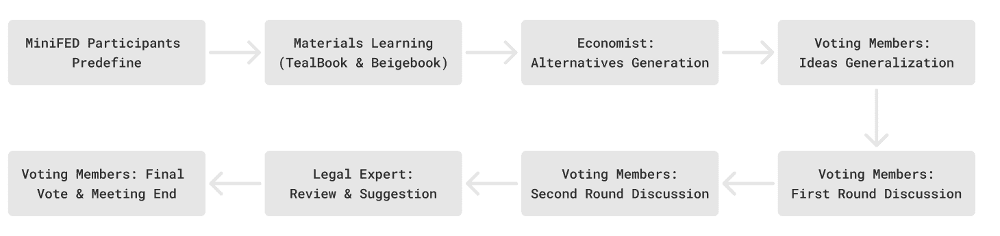
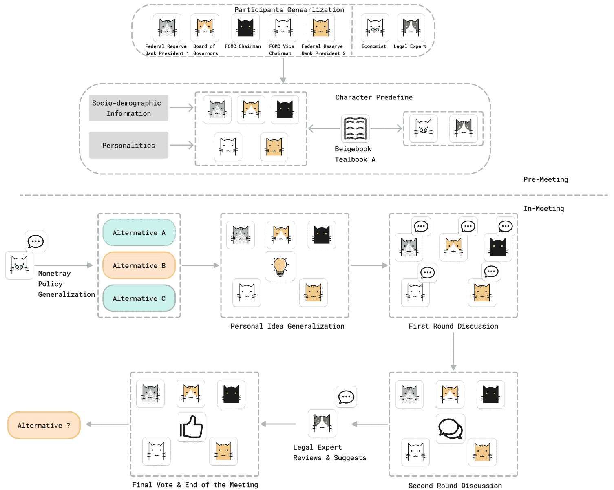

<!--yml

类别：未分类

日期: 2025-01-11 12:02:43

-->

# MiniFed：基于LLM的代理工作流集成用于模拟FOMC会议

> 来源：[https://arxiv.org/html/2410.18012/](https://arxiv.org/html/2410.18012/)

Sungil Seok^($1$), Shuide Wen^($1$), Qiyuan Yang^($2$), Juan Feng^($3*$), Wenming Yang^($1*$) ^($1$) 清华大学深圳国际研究生院，中国深圳 ^($2$) SKEMA商学院，中国南京审计大学 ^($3$) 清华大学经济与管理学院，中国深圳 shi-cy22@mails.tsinghua.edu.cn, yangqiyuan@stu.nau.edu.cn,

{wenshuide, yang.wenming}@sz.tsinghua.edu.cn, fengjuan@sem.tsinghua.edu.cn

###### 摘要

美国的联邦基金利率在国内和国际金融市场中发挥着重要作用。然而，现有研究主要集中在联邦基金利率调整的影响，而非决策过程本身。最近，基于大型语言模型（LLMs）的进展为重建联邦公开市场委员会（FOMC）会议提供了可能的方法，这些会议负责设定联邦基金利率。本文提出了一个五阶段的FOMC会议模拟框架——MiniFed，利用LLM代理模拟现实世界中的FOMC成员，并优化FOMC结构。该框架有效地复兴了FOMC会议过程，并促进了联邦基金利率的预测。实验结果表明，我们提出的MiniFed框架在联邦基金利率预测中实现了高准确度，并且在行为上与代理人现实世界的对等者保持一致。鉴于目前很少有研究关注使用LLM代理模拟大规模现实世界会议，我们的工作可作为未来发展的基准。

###### 关键词：

大型语言模型、多代理系统、现实世界模拟

## I 引言

尽管美元的份额在2021年略有下降，但美元依然稳居外汇储备（FXR）中最为重要的货币，巩固了其在全球金融中的核心地位[[1](https://arxiv.org/html/2410.18012v2#bib.bib1)]。这种显著地位引发了对美国利率调整的高度关注。尽管已有大量研究探讨了这些调整对外国经济[[2](https://arxiv.org/html/2410.18012v2#bib.bib2)]、国际资本流动[[3](https://arxiv.org/html/2410.18012v2#bib.bib3)]、股市[[4](https://arxiv.org/html/2410.18012v2#bib.bib4)]，甚至加密货币市场[[5](https://arxiv.org/html/2410.18012v2#bib.bib5)]的影响，但关于美国货币政策制定过程的研究却相对较少。

政策制定过程的复杂性在该领域研究稀缺中起到了重要作用。**联邦公开市场委员会（FOMC）**负责设定联邦基金利率，这直接影响美国的利率。虽然FOMC会披露所有相关资料以及会议后五年内确定目标利率区间的完整讨论过程，但有效且准确地重建整个过程仍然是一个重大挑战。

然而，AI技术的突破，尤其是在生成模型领域，使得应对这一挑战变得可行。生成模型，特别是像ChatGPT¹¹1https://openai.com/index/chatgpt/这样的**大型语言模型（LLMs）**，已被证明在作为代理人生成现实的人类行为模拟方面异常有效。这些模型在特定的代理架构下，能够根据变化的经验和环境动态调整[[6](https://arxiv.org/html/2410.18012v2#bib.bib6)]。越来越多的研究探索了基于LLM的多代理系统在现实场景中的应用潜力，包括模拟美国最高法院[[7](https://arxiv.org/html/2410.18012v2#bib.bib7)]、课堂环境[[8](https://arxiv.org/html/2410.18012v2#bib.bib8)]、日常生活[[6](https://arxiv.org/html/2410.18012v2#bib.bib6)]以及市场研究参与者角色扮演[[9](https://arxiv.org/html/2410.18012v2#bib.bib9)]。这些广泛的研究强调了基于LLM的多代理系统的能力，并促使我们开发并利用自己的架构，准确重建美国利率调整的决策过程。

在本文中，我们介绍了MiniFed，这是我们创新设计的基于LLM的多代理系统，结合了新开发的ChatGPT-4o迷你模型与我们定制的FOMC模拟架构。该系统旨在准确复制自2018年以来的每一次FOMC会议。实验结果表明，我们的架构在预测准确性、对齐性以及内容理解和生成方面都表现优异。

本文的结构如下：我们将首先回顾相关工作，然后详细介绍我们的MiniFed架构、实验设置、实验结果以及进一步的反思和讨论。

总结来说，本文做出了以下贡献：

+   •

    我们通过建模FOMC会议参与者的社会人口学和个性特征，重新构建了这些参与者，并使其与现实世界中的对应人物相符，从而展示了我们的代理人预定义方法的准确性。

+   •

    我们提出了五阶段MiniFed架构，该架构捕捉了FOMC会议中最重要的方面，有效地促进了参与者之间的沟通，并引导了最终的货币政策制定。

+   •

    鉴于此前很少有研究集中在重建大规模现实世界的会议上，我们的研究可以作为后续研究的基准。

图 1：MiniFed 管道

## II 相关工作

在本节中，我们回顾了关于 FOMC 材料的反映与应用、可信的代理人行为替代模型，以及基于大语言模型（LLM）的多智能体框架在现实应用中的研究。我们展示了当前的 LLM 模型能够模拟复杂的互动人类行为，例如在 FOMC 会议中观察到的行为。

### II-A FOMC 相关研究

联邦公开市场委员会（FOMC）在制定美国货币政策、促进经济稳定与增长方面发挥着至关重要的作用。其主要职能包括设定利率、开展公开市场操作以调节货币供应，并评估经济状况以实现控制通货膨胀和最大化就业等目标。其重要性在于它能够通过明智的政策决策影响国内外金融市场，影响借贷成本，并推动经济朝着可持续增长的方向发展。

FOMC 在其会议过程中传播了一系列全面的材料，包括会议记录（会议过程的详细记录）、《Tealbook》（经济分析及政策选择的描述）、议程（每次会议将讨论的主题列表）、会议纪要（讨论问题的摘要）以及《Beige Book》（按地区提供的当前经济状况信息）。尽管 FOMC 提供的材料详细且全面，关于 FOMC 的研究仍处于初步阶段。

现有文献主要集中在 FOMC 货币政策公告对全球资产价格的影响[[10](https://arxiv.org/html/2410.18012v2#bib.bib10)]和美国金融市场反应的实证分析[[11](https://arxiv.org/html/2410.18012v2#bib.bib11)][[12](https://arxiv.org/html/2410.18012v2#bib.bib12)]。此外，一些研究者认为，在 FOMC 发布货币政策公告之前，知情的交易者能够有效地进行交易。因此，研究 FOMC 目标利率发布前的金融市场动荡也被认为是有价值的[[13](https://arxiv.org/html/2410.18012v2#bib.bib13)][[14](https://arxiv.org/html/2410.18012v2#bib.bib14)]。

最近，随着深度学习技术的不断发展，许多研究者开始尝试利用深度学习增强的方法分析FOMC发布的文件中的上下文情感。Tsang等人[[15](https://arxiv.org/html/2410.18012v2#bib.bib15)]开发了一种基于自注意力机制的深度学习模型，用于衡量每次FOMC会议中成员之间的分歧，利用1976年到2017年的FOMC投票异议记录和会议记录。此外，随着大语言模型（LLMs）微调方法的日益普及，Gössi等人[[16](https://arxiv.org/html/2410.18012v2#bib.bib16)]微调了预训练的FinBERT模型，用于分析FOMC会议纪要材料中的情感。然而，基于深度学习的FOMC材料研究总体仍处于起步阶段。

### II-B 基于大语言模型的多智能体框架

随着人工智能领域的快速扩展，研究人员正在探索多智能体系统，其中多个AI实体合作以实现共同目标，并应对复杂的现实世界挑战[[17](https://arxiv.org/html/2410.18012v2#bib.bib17)][[18](https://arxiv.org/html/2410.18012v2#bib.bib18)]。一个显著的例子是CAMEL[[19](https://arxiv.org/html/2410.18012v2#bib.bib19)]，它引入了一种交互式多智能体框架，旨在减少对人类用户输入提示的需求，并提供一种可扩展的方法来检视多智能体系统的合作行为和能力。

该领域的另一个有趣方向是利用大语言模型（LLM）智能体来模拟现实世界的场景。LLM，特别是GPT-4[[20](https://arxiv.org/html/2410.18012v2#bib.bib20)]，在各种具有挑战性的任务中表现出近似人类水平的能力，包括数学[[21](https://arxiv.org/html/2410.18012v2#bib.bib21)]、编程[[22](https://arxiv.org/html/2410.18012v2#bib.bib22)]、视觉[[23](https://arxiv.org/html/2410.18012v2#bib.bib23)]、医学[[24](https://arxiv.org/html/2410.18012v2#bib.bib24)]、法律[[25](https://arxiv.org/html/2410.18012v2#bib.bib25)]、心理学[[26](https://arxiv.org/html/2410.18012v2#bib.bib26)]等。因此，开发方法使LLM能够在模拟环境中像人类一样行为，并观察它们的互动与表现，成为一个引人注目的研究方向。

一项重要的研究涉及通过利用生成智能体和一种新颖的智能体架构[[6](https://arxiv.org/html/2410.18012v2#bib.bib6)]来模拟人类社区生活，并在游戏环境中监控互动、行为和对话。此外，其他研究则集中在通过部署LLM智能体来模拟各种现实世界场景，例如学校环境[[8](https://arxiv.org/html/2410.18012v2#bib.bib8)]和旅行轨迹[[27](https://arxiv.org/html/2410.18012v2#bib.bib27)]。

具体来说，在特定情境下模拟人类角色非常重要，因为它提供了一种新的方法来观察那些在现实世界中难以研究的详细决策和思维过程。这些研究通常需要更多的专业信息来定义或预训练代理，使其能够在特定情况下更准确地模拟真实角色。一个这样的工作是《盲目判断》[[7](https://arxiv.org/html/2410.18012v2#bib.bib7)]，它使用基于LLM的代理来模拟罗伯茨四庭法庭的法官角色。这些代理使用真实信息进行预训练，并负责对实际案件进行投票。然而，由于三年前LLM的能力有限，结果并不像当前的研究那样令人满意。另一个重要的工作是让LLM代理参与市场研究[[9](https://arxiv.org/html/2410.18012v2#bib.bib9)]并观察他们的推理过程。实验结果显示，LLM代理参与者和人类参与者之间存在相似性，表明LLM代理有可能代替人类进行市场调查。

其他研究主要集中在设计LLM代理框架，包括开发用于实际应用的框架[[18](https://arxiv.org/html/2410.18012v2#bib.bib18)]以及LLM代理框架的优化[[28](https://arxiv.org/html/2410.18012v2#bib.bib28)]。我们将在即将开展的研究中借鉴这些研究的见解。

## III MiniFed：一种基于多LLM代理的FOMC会议模拟方法

在本节中，我们介绍了MiniFed，这是一种基于代理工作流的框架，用于模拟FOMC会议。MiniFed包括基于代理的真实世界角色模拟以及我们提出的架构设计。我们将展示我们代理协作框架的有效性和优越性。

### III-A 基于代理的真实世界角色模拟

根据美联储网站提供的会议记录，每次FOMC会议大约包括100名参与者。这些参与者包括FOMC成员及其替代成员、美联储银行行长、秘书和总法律顾问、经济学家、联邦储备委员会成员以及其他相关人员。

然而，只有有限数量的FOMC会议成员参与联邦基金利率的讨论和投票过程。之前的研究[[28](https://arxiv.org/html/2410.18012v2#bib.bib28)]也表明，代理团队的规模与最终准确性之间没有线性关系，这意味着增加团队规模可能实际上会降低整体效能。此外，重现原始会议场景（涉及数小时的讨论）目前使用大型语言模型（LLMs）是不可行的。为了有效捕捉FOMC会议的特征并获取尽可能多的有用信息，我们从会议参与者中选出了七个最重要且具代表性的角色：FOMC的主席和副主席、一位地区联邦储备银行行长、一位联邦储备委员会成员、一位经济学家和一位法律专家。

由于我们已经选出了将参与MiniFed会议的代表性成员，准确归属他们的个人特征并确保代理的行为与现实世界中的对应人物相符，是影响我们实验结果的关键因素。之前的研究主要集中在社会人口统计[[29](https://arxiv.org/html/2410.18012v2#bib.bib29)]和个性[[30](https://arxiv.org/html/2410.18012v2#bib.bib30)][[31](https://arxiv.org/html/2410.18012v2#bib.bib31)][[32](https://arxiv.org/html/2410.18012v2#bib.bib32)]方法上，以增强LLM代理模仿真实人类的能力。此外，Ji等人[[29](https://arxiv.org/html/2410.18012v2#bib.bib29)]证明了仅通过简单的提示和适当的社会人口统计设置，就可以重建LLM代理的个性。因此，我们遵循他们的方法，基于准确的信息重建我们代理的社会人口统计档案和个性。

更具体地说，我们在会议开始前手动为每个代理分配社会人口统计和个性信息。社会人口统计信息包括姓名、性别、过去的工作和教育经历，这些信息可以直接从公开的在线来源获取。相比之下，个性信息相对抽象且难以获取。为了解决这个问题，我们利用大型语言模型（LLMs）的能力，根据他们过去的演讲和公开信息（如之前FOMC会议的记录）生成个性、立场和态度。我们将使用这些预定义的代理开始我们的实验。

### III-B MiniFed：迈向简单但高效的会议模拟

现实世界中的会议往往冗长和啰嗦，使得听众难以保持兴趣。原始的FOMC会议记录包括FOMC成员所说的每一句话，甚至涵盖了闲聊和笑话。此外，每次FOMC会议都经过精心策划和组织，具有清晰的结构，按照FOMC网站上的议程处理大约十个议题。仅仅用基本的提示启动会议可能会导致重复和无意义的对话与结果。我们已经仔细评估了LLM代理的能力[[33](https://arxiv.org/html/2410.18012v2#bib.bib33)][[34](https://arxiv.org/html/2410.18012v2#bib.bib34)][[35](https://arxiv.org/html/2410.18012v2#bib.bib35)]，并确定根据目前LLM的能力，重建一个涉及多个议题的完整的多小时会议是具有挑战性的。因此，为了最佳利用FOMC会议的核心特点和LLM代理的能力，我们设计了MiniFed会议框架，该框架包括五个阶段。这个框架涵盖了原始FOMC会议的所有重要组成部分，同时减少了整体对话量。

MiniFed会议框架概述如下：

1.  1.

    货币政策提案概括。根据FOMC网站上披露的每次FOMC会议记录，目标联邦基金利率是从联邦储备银行的经济学家提供的三个备选方案中选择的，而不是由FOMC成员直接讨论。为了模拟这一过程，我们创建了一个经济学家代理，该代理通过贝奇书（Beige Book）进行预训练，贝奇书是每次FOMC会议之前可以公开访问的网站资源，此外还有TealBook A，这是联邦储备银行经济学家提供的包含更全面和详细经济数据与分析的内部资源。我们故意排除了TealBook B，其中包括实际的货币政策备选方案，以防止经济学家代理提前获取答案。在每次MiniFed会议之前，经济学家代理负责生成三种货币政策备选方案，以便在会议中进行讨论和投票。

1.  2.

    个人想法概括。在这个过程中，我们MiniFed会议中的每位有权对最终货币政策进行投票的参与者代理，需阅读贝奇书和TealBook A。基于他们预定义的社会人口背景和个性特征，他们将生成有关目标联邦基金利率的个人思考和想法。这些想法将保持机密，不会与其他代理共享。

1.  3.

    第一轮讨论：观点展示。一旦每个代理人彻底研究了提供的材料，并根据他们各自的信息和当前经济状况形成了对目标联邦基金利率的个人看法，他们将被邀请展示自己的观点，并解释其立场背后的理由。展示顺序是随机的，允许所有参与者听到彼此的展示，而不进行进一步的评论或讨论。

1.  4.

    第二轮讨论：辩论与反思。在每个代理人第一轮展示了他们的货币政策观点之后，他们进入第二轮讨论，辩论并反思自己和他人的观点。每个代理人都要听取其他代理人的展示，并在发表后续言论前，考虑所有他们听到的信息。每个代理人有三次发言机会，共进行十五轮发言。讨论中的发言顺序是随机确定的。

1.  5.

    法律建议和最终投票。在对经济学家代理人提出的三种货币政策备选方案进行投票之前，法律专家从法律角度对每个备选方案进行简明评审，包括监管和合规考虑。在法律专家评估完所有三个备选方案后，所有参与者代理人（不包括法律专家和经济学家）将被要求投票选择他们首选的货币政策。

图2：MiniFed会议框架

## IV 实验

### IV-A 数据集

我们从联邦储备系统官方网页上的开放访问数据库中获得了所有必要的数据，以便预定义我们的代理人²²2https://www.federalreserve.gov/monetarypolicy/fomc_historical.htm。尽管联邦储备系统已披露了1936年至2018年所有FOMC会议相关材料，并涵盖了2018年之前的五年，但我们的研究专注于2018年这一年。我们主要利用《米色书》和《茶色书A》来预训练并预定义参与我们MiniFed会议的代理人，并通过参考上一节中描述的议程和会议记录材料来组织会议框架。

### IV-B 实验设置

我们为2018年组织了八次会议，并使其与真实世界的对应体对齐。为了减少当前大语言模型（LLMs）[[7](https://arxiv.org/html/2410.18012v2#bib.bib7)]的局限性所引起的幻觉，我们在每次会议开始之前初始化了每个代理。每个实验持续了大约45分钟，涵盖了所有程序，包括代理生成、预定义配置以及我们的五阶段MiniFed会议框架。8个实验的累计成本大约为10亿个token，由ChatGPT的GPT-4o迷你模型提供支持。所有实验都在我们独立开发的平台上进行，该平台直接与ChatGPT的API接口，以利用基础LLM并构建MiniFed框架。

### IV-C 评估指标

尽管许多先前的研究已经利用基于LLM的多代理框架模拟现实世界场景[[6](https://arxiv.org/html/2410.18012v2#bib.bib6)][[7](https://arxiv.org/html/2410.18012v2#bib.bib7)][[8](https://arxiv.org/html/2410.18012v2#bib.bib8)]，但专注于会议或集会模拟的研究仍处于初步阶段。此外，每次会议涉及大量自然语言，这使得直接应用数值指标来评估我们模拟会议的质量变得具有挑战性。为了解决这个问题，我们从对齐性和准确性两个角度评估我们模拟的MiniFed会议，以评估我们MiniFed框架的效能和质量。

1.  1.

    对齐性：我们将每个代理的投票结果与其真实世界对应体的投票结果进行比较，以评估我们的预定义社会人口和个性化配置文件所装备的虚拟代理是否与其真实世界等效体的投票方向一致。具体来说，当前的联邦基金利率通常有三种可能的方向：提高基金利率、维持当前基金利率或降低基金利率。如果一个代理的投票与其真实世界对应体的投票方向一致，我们将其投票归类为“对齐”；否则，视为“未对齐”。我们计算每个代理的对齐率（AR），其中更高的AR表示我们框架的表现更好。AR的公式定义如下：

    |  | $\textit{AR}_{t}=\frac{1}{n}\sum_{i=1}^{n}Alig_{i,t}$ |  |
    | --- | --- | --- |

    其中$i$表示会议实例，$t$表示代理编号，$Alig_{i}$等于1如果代理$t$的投票结果与其真实世界对应体一致，否则为0。

1.  2.

    准确性：由于我们的MiniFed框架可以用于预测潜在的联邦基金利率，我们检查真实FOMC会议调整后的基金利率与我们MiniFed会议中的基金利率之间的差距。真实结果与虚拟结果之间的差异为改进我们框架提供了指导。我们通过均方误差（MSE）来衡量每个代理的指标，公式表示如下：

    |  | $\textit{MSE}=\frac{1}{n}\sum_{i=1}^{n}\left(R_{\text{real},i}-R_{\text{% simulated},i}\right)^{2}$ |  |
    | --- | --- | --- |

    其中，$R_{real}$ 和 $R_{simulated}$ 分别表示由实际FOMC会议和我们的MiniFed框架决定的联邦基金利率。这里，$i$表示会议实例。

### IV-D 主要结果

我们在下表中展示了实验结果。表1展示了每个代理的对齐率。需要注意的是，在2018年，J. Yellen仅在1月担任FOMC主席，之后由Powell接任。因此，她在这一年只参与了一次投票。

表I：代理对齐分析

| 代理 | 对齐率 |
| --- | --- |
| J. Yellen | 0 |
| J. Powell | 85.7% |
| W. Dudley | 87.5% |
| L. Brainard | 50% |
| R. Bostic | 37.5% |
| L. Mester | 75% |

表4提供了八个实验的详细概述，包括每个代理在第一轮讨论中对当前货币政策的初步立场、第二轮讨论后的最终投票，以及其真实世界对手的实际投票决策。符号$\uparrow$和$\rightarrow$分别表示支持“提高联邦基金利率”和“维持当前联邦基金利率”的备选方案。

表II：会议结果分析

| 日期 | MiniFed基金利率 | FOMC基金利率 | 差距 |
| --- | --- | --- | --- |
| 2018年1月 | 1.25% $\rightarrow$ 1.5% | 1.25% $\rightarrow$ 1.25% | 0.25% |
| 2018年3月 | 1.25% $\rightarrow$ 1.5% | 1.25% $\rightarrow$ 1.5% | 0 |
| 2018年5月 | 1.5% $\rightarrow$ 1.5% | 1.5% $\rightarrow$ 1.5% | 0 |
| 2018年6月 | 1.5% $\rightarrow$ 1.75% | 1.5% $\rightarrow$ 1.75% | 0 |
| 2018年7月 | 1.75% $\rightarrow$ 1.75% | 1.75% $\rightarrow$ 1.75% | 0 |
| 2018年9月 | 1.75% $\rightarrow$ 1.75% | 1.75% $\rightarrow$ 2.0% | -0.25% |
| 2018年11月 | 2.0% $\rightarrow$ 2.0% | 2.0% $\rightarrow$ 2.0% | 0 |
| 2018年12月 | 2.0% $\rightarrow$ 2.25% | 2.0% $\rightarrow$ 2.25% | 0 |

表III：货币政策比较

| 日期 | 美联储基金利率 | MiniFed经济学家备选方案 | FOMC备选方案 |
| --- | --- | --- | --- |
| 2018年1月 | 1.25% | A: 1.5% $\uparrow$ | A: 1.25% $\rightarrow$ |
| B: 1.25% $\rightarrow$ | B: 1.25% $\rightarrow$ |
| C: 1.0% $\downarrow$ | C: 1.5% $\uparrow$ |
| 2018年3月 | 1.25% | A: 1.5% $\uparrow$ | A: 1.25% $\rightarrow$ |
| B: 1.25% $\rightarrow$ | B: 1.5% $\uparrow$ |
| C: 1.0% $\downarrow$ | C: 1.5% $\uparrow$ |
| 2018年5月 | 1.5% | A: 1.75% $\uparrow$ | A: 1.5% $\rightarrow$ |
| B: 1.5% $\rightarrow$ | B: 1.5% $\rightarrow$ |
| C: 1.25% $\downarrow$ | C: 1.75% $\uparrow$ |
| 2018年6月 | 1.5% | A: 1.75% $\uparrow$ | A: 1.5% $\rightarrow$ |
| B: 1.5% $\rightarrow$ | B: 1.75% $\uparrow$ |
| C: 1.25% $\downarrow$ | C: 1.75% $\uparrow$ |
| 2018年7月 | 1.75% | A: 2.0% $\uparrow$ | A: 1.75% $\rightarrow$ |
| B: 1.5% $\downarrow$ | B: 1.75% $\rightarrow$ |
| C: 1.75% $\rightarrow$ | C: 2.0% $\uparrow$ |
| 2018年9月 | 1.75% | A: 2.0% $\uparrow$ | A: 1.75% $\rightarrow$ |
| B: 1.75% $\rightarrow$ | B: 2.0% $\uparrow$ |
| C: 1.5% $\downarrow$ | C: 2.0% $\uparrow$ |
| 2018年11月 | 2.0% | A: 2.25% $\uparrow$ | A: 2.0% $\rightarrow$ |
| B: 2.0% $\rightarrow$ | B: 2.0% $\rightarrow$ |
| C: 1.75% $\downarrow$ | C: 2.25% $\uparrow$ |
| 2018年12月 | 2.0% | A: 2.25% $\uparrow$ | A: 2.0% $\rightarrow$ |
| B: 2.0% $\rightarrow$ | B: 2.25% $\uparrow$ |
| C: 1.75% $\downarrow$ | C: 2.25% $\uparrow$ |

表2展示了来自实际FOMC会议的联邦基金利率决策与我们MiniFed框架在八个实验中生成的决策之间的差距。我们使用如“1.5% $\rightarrow$ 1.5%”的注释来表示投票结果是“维持联邦基金利率在1.5%”，并对其他行动应用类似的注释。

表 IV: 实验总结

| 日期 | 参与者 | 初始想法 | 最终想法 | 实际想法 |
| --- | --- | --- | --- | --- |
| 2018年1月 | J. Yellen | $\uparrow$ | $\rightarrow$ | $\rightarrow$ |
| W. Dudley | $\uparrow$ | $\rightarrow$ | $\rightarrow$ |
| L. Brainard | $\uparrow$ | $\uparrow$ | $\rightarrow$ |
| R. Bostic | $\rightarrow$ | $\uparrow$ | $\rightarrow$ |
| L. Mester | $\uparrow$ | $\uparrow$ | $\rightarrow$ |
| 2018年3月 | J. Powell | $\uparrow$ | $\uparrow$ | $\uparrow$ |
| W. Dudley | $\uparrow$ | $\uparrow$ | $\uparrow$ |
| L. Brainard | $\uparrow$ | $\rightarrow$ | $\uparrow$ |
| R. Bostic | $\uparrow$ | $\rightarrow$ | $\uparrow$ |
| L. Mester | $\uparrow$ | $\uparrow$ | $\uparrow$ |
| 2018年5月 | J. Powell | $\rightarrow$ | $\rightarrow$ | $\rightarrow$ |
| W. Dudley | $\rightarrow$ | $\rightarrow$ | $\rightarrow$ |
| L. Brainard | $\rightarrow$ | $\rightarrow$ | $\rightarrow$ |
| R. Bostic | $\rightarrow$ | $\uparrow$ | $\rightarrow$ |
| L. Mester | $\rightarrow$ | $\rightarrow$ | $\rightarrow$ |
| 2018年6月 | J. Powell | $\uparrow$ | $\uparrow$ | $\uparrow$ |
| W. Dudley | $\uparrow$ | $\uparrow$ | $\uparrow$ |
| L. Brainard | $\uparrow$ | $\uparrow$ | $\uparrow$ |
| R. Bostic | $\uparrow$ | $\uparrow$ | $\uparrow$ |
| L. Mester | $\uparrow$ | $\uparrow$ | $\uparrow$ |
| 2018年7月 | J. Powell | $\uparrow$ | $\rightarrow$ | $\rightarrow$ |
| W. Dudley | $\uparrow$ | $\rightarrow$ | $\rightarrow$ |
| L. Brainard | $\uparrow$ | $\uparrow$ | $\rightarrow$ |
| R. Bostic | $\uparrow$ | $\uparrow$ | $\rightarrow$ |
| L. Mester | $\uparrow$ | $\rightarrow$ | $\rightarrow$ |
| 2018年9月 | J. Powell | $\uparrow$ | $\rightarrow$ | $\uparrow$ |
| W. Dudley | $\uparrow$ | $\uparrow$ | $\uparrow$ |
| L. Brainard | $\uparrow$ | $\rightarrow$ | $\uparrow$ |
| R. Bostic | $\uparrow$ | $\rightarrow$ | $\uparrow$ |
| L. Mester | $\uparrow$ | $\uparrow$ | $\uparrow$ |
| 2018年11月 | J. Powell | $\uparrow$ | $\rightarrow$ | $\rightarrow$ |
| W. Dudley | $\rightarrow$ | $\rightarrow$ | $\rightarrow$ |
| L. Brainard | $\uparrow$ | $\rightarrow$ | $\rightarrow$ |
| R. Bostic | $\uparrow$ | $\rightarrow$ | $\rightarrow$ |
| L. Mester | $\uparrow$ | $\rightarrow$ | $\rightarrow$ |
| 2018年12月 | J. Powell | $\uparrow$ | $\uparrow$ | $\uparrow$ |
| W. Dudley | $\uparrow$ | $\rightarrow$ | $\uparrow$ |
| L. Brainard | $\uparrow$ | $\uparrow$ | $\uparrow$ |
| R. Bostic | $\uparrow$ | $\uparrow$ | $\uparrow$ |
| L. Mester | $\uparrow$ | $\rightarrow$ | $\uparrow$ |

表3展示了我们MiniFed经济学家代理生成的所有备选方案与联邦储备经济学家提供的真实货币政策备选方案的比较。符号“A: 2.25% $\uparrow$”表示“备选方案A：将联邦基金利率提高到2.25%”。需要注意的是，现实中的联邦基金利率备选方案通常包括目标范围；然而，在我们的实验中，我们只考虑了下限。此外，联邦储备经济学家通常会提出两种不同的备选方案来调整联邦基金利率，尽管它们的范围相同，但调整的速度和方法不同，如表3所示。

对齐度。我们比较了每个代理的对齐率（AR），如表1所示。AR范围从37.5%到87.5%，不包括只投过一次票的J. Yellen。我们观察到，代理的AR没有特定的分布模式。然而，处于较高职位（FOMC主席和副主席）的代理通常表现出比他们的实际对等者更高的AR。

准确性。我们报告了通过我们的MiniFed框架生成的联邦基金利率预测与实际结果的准确性。如表2所示，六次会议的结果与实际结果完全一致。联邦基金利率的最大差异限制在大约0.25%以内，最终的均方误差（MSE）为0.0156%。此外，我们的框架在联邦基金利率预测方面与实际结果的对齐率为75%。

## V 讨论

在本节中，我们将讨论在我们的实验和相关研究中出现的几个重要问题和潜在风险，以及我们为解决这些问题所设计的方法。

### V-A LLM代理的幻觉与识别

在每次会议开始之前，我们会为我们的代理提供材料，通常包括大量的文本数据，如经济状况的描述，以及非文本数据，如图表、表格和经济模型。理解大规模的多模态数据并将其存储在有限的记忆中，对当前的大型语言模型（LLM）来说是一个巨大挑战。这可能会导致每个代理出现幻觉问题，正如[[6](https://arxiv.org/html/2410.18012v2#bib.bib6)]和[[7](https://arxiv.org/html/2410.18012v2#bib.bib7)]中所提到的。为了评估代理是否真正理解并记住他们所学的内容——包括文本和非文本数据——我们使用以下提示来检验他们的理解能力：

提示：根据你对提供材料的理解，{随机选择的联邦储备区}当前的经济状况如何？

然后，我们将代理生成的答案与原始材料中的相应内容进行比较。如果出现幻觉问题，我们会让代理重新审查材料并重新考虑他们的答案，直到他们能够生成正确的回应。

### V-B 会议程序的替代方法

正如我们之前提到的，FOMC会议通常是复杂且漫长的，这使得当前的LLM代理很难有效地模拟这些会议。一个例子是投票程序。在真实的FOMC会议中，参与者通常会进行数小时的讨论和辩论，并以一致的决策结束，导致所有参与者投票支持同一货币政策选项，如表4所示。然而，使用当前LLM的能力来复制这个过程是困难的。因此，我们通过允许每个代理选择他们认为最合适的三种选项之一来简化了投票程序。

### V-C 局限性

尽管我们旨在以最高的现实感重建原始FOMC会议场景，但仍然存在一些难以克服的障碍。尽管我们已经尽力控制其发生，如A小节所述，但在我们的实验过程中，幻觉问题仍然随机出现。此外，平衡准确性和代理数量也是一大挑战，因为增加参与会议的代理数量可能会导致更高的内存成本和整体性能下降。因此，我们做出了限制会议参与者数量为七的权宜之计。此外，使用OpenAI的API成本较高——我们的实验总费用达数百美元——因此我们尽力在保持最佳性能的同时控制实验的时长。我们将在未来的研究中解决这些问题。为了便于使用，我们已经用中文进行了实验，与演示一致，并手动翻译了本文中的提示等内容。我们相信，LLM的卓越语言能力确保了语言不会成为任何问题。

## VI 结论

在本文中，我们介绍了MiniFed，这是一种新颖的多LLM代理会议框架，旨在模拟2018年举行的八次FOMC会议。我们首先从社会人口和角色视角定义了代理的特征，接着实现了我们提出的五阶段MiniFed会议框架。实验结果展示了我们框架的有效性和准确性，超越了随机猜测生成的结果。这项工作为使用LLM代理工作流程模拟大规模现实世界会议建立了一个基准，结果可应用于预测和重构任务。未来的工作可能会集中在解决我们实验中发现的若干挑战，并开发更具现实感的会议场景，而不限制参与者的数量。

## 参考文献

+   [1] S. Arslanalp, B. Eichengreen, 和 C. Simpson-Bell，“美元主导地位的悄然侵蚀与非传统储备货币的崛起，” *国际经济学杂志*，第138卷，第103656页，2022年。

+   [2] M. Iacoviello 和 G. Navarro，“美国加息的国际影响，” *国际货币与金融学杂志*，第95卷，第232–250页，2019年。

+   [3] F. E. Warnock 和 V. C. Warnock，“国际资本流动与美国利率，” *国际货币与金融学杂志*，第28卷，第6期，第903–919页，2009年。

+   [4] W. Huang, A. V. Mollick, 和 K. H. Nguyen，“美国股市与实际利率的作用，” *经济与金融季刊评论*，第59卷，第231–242页，2016年。

+   [5] S. Karau，“货币政策与比特币，” *国际货币与金融学杂志*，第137卷，第102880页，2023年。

+   [6] J. S. Park, J. O’Brien, C. J. Cai, M. R. Morris, P. Liang, 和 M. S. Bernstein，“生成代理：人类行为的交互式模拟，” 载于 *第36届ACM年度用户界面软件与技术研讨会论文集*，2023年，第1–22页。

+   [7] S. Hamilton，“盲目判断：基于代理的最高法院建模与GPT，” *arXiv 预印本 arXiv:2301.05327*，2023年。

+   [8] Z. Zhang, D. Zhang-Li, J. Yu, L. Gong, J. Zhou, Z. Liu, L. Hou, 和 J. Li，“利用LLM驱动的代理模拟课堂教育，” *arXiv 预印本 arXiv:2406.19226*，2024年。

+   [9] P. Li, N. Castelo, Z. Katona, 和 M. Sarvary，“前沿：确定大语言模型在自动化感知分析中的有效性，” *营销科学*，第43卷，第2期，第254–266页，2024年。

+   [10] J. Hausman 和 J. Wongswan，“全球资产价格与FOMC公告，” *国际货币与金融学杂志*，第30卷，第3期，第547–571页，2011年。

+   [11] A. Cieslak, A. Morse, 和 A. Vissing-Jorgensen，“FOMC周期中的股票回报，” *金融学杂志*，第74卷，第5期，第2201–2248页，2019年。

+   [12] C. Rosa，“FOMC会议纪要对金融市场的影响，” *经济政策评论*，第19卷，第2期，2013年。

+   [13] B. Du, S. Fung, 和 R. Loveland，“期权市场的信息作用：来自FOMC公告的证据，” *银行与金融学杂志*，第92卷，第237–256页，2018年。

+   [14] D. O. Lucca 和 E. Moench，“FOMC公告前的市场波动，” *金融学杂志*，第70卷，第1期，第329–371页，2015年。

+   [15] K. P. Tsang 和 Z. Yang，“同意不同意：衡量FOMC会议中的隐藏异议，” *arXiv 预印本 arXiv:2308.10131*，2023年。

+   [16] S. Gössi, Z. Chen, W. Kim, B. Bermeitinger, 和 S. Handschuh，“Finbert-fomc：通过情感聚焦方法微调的Finbert模型，用于增强FOMC会议纪要的情感分析，” 载于 *第四届ACM国际金融人工智能会议论文集*，2023年，第357–364页。

+   [17] D. Dohan, W. Xu, A. Lewkowycz, J. Austin, D. Bieber, R. G. Lopes, Y. Wu, H. Michalewski, R. A. Saurous, J. Sohl-Dickstein *等*，“语言模型级联，” *arXiv 预印本 arXiv:2207.10342*，2022年。

+   [18] Y. Talebirad 和 A. Nadiri，“多代理协作：利用智能LLM代理的力量”，*arXiv 预印本 arXiv:2306.03314*，2023年。

+   [19] G. Li, H. Hammoud, H. Itani, D. Khizbullin, 和 B. Ghanem，“Camel：用于探索大型语言模型社会的‘心智’沟通代理”，*神经信息处理系统进展*，第36卷，第51,991–52,008页，2023年。

+   [20] S. Bubeck, V. Chandrasekaran, R. Eldan, J. Gehrke, E. Horvitz, E. Kamar, P. Lee, Y. T. Lee, Y. Li, S. Lundberg *等*，“人工通用智能的火花：GPT-4的早期实验”，*arXiv 预印本 arXiv:2303.12712*，2023年。

+   [21] R. Zhang, D. Jiang, Y. Zhang, H. Lin, Z. Guo, P. Qiu, A. Zhou, P. Lu, K.-W. Chang, P. Gao *等*，“Mathverse：你的多模态LLM能真正理解视觉数学问题中的图表吗？”*arXiv 预印本 arXiv:2403.14624*，2024年。

+   [22] D. Nam, A. Macvean, V. Hellendoorn, B. Vasilescu, 和 B. Myers，“使用大型语言模型（LLM）帮助理解代码”，载于 *IEEE/ACM 第46届国际软件工程会议论文集*，2024年，第1–13页。

+   [23] W. Wang, Z. Chen, X. Chen, J. Wu, X. Zhu, G. Zeng, P. Luo, T. Lu, J. Zhou, Y. Qiao *等*，“Visionllm：大型语言模型也是一个面向视觉任务的开放式解码器”，*神经信息处理系统进展*，第36卷，2024年。

+   [24] A. J. Thirunavukarasu, D. S. J. Ting, K. Elangovan, L. Gutierrez, T. F. Tan, 和 D. S. W. Ting，“大型语言模型在医学中的应用”，*自然医学*，第29卷，第8期，第1930–1940页，2023年。

+   [25] J. Cui, Z. Li, Y. Yan, B. Chen, 和 L. Yuan，“Chatlaw：集成外部知识库的开源法律大型语言模型”，*arXiv 预印本 arXiv:2306.16092*，2023年。

+   [26] Q. Yang, Z. Wang, H. Chen, S. Wang, Y. Pu, X. Gao, W. Huang, S. Song, 和 G. Huang，“LLM代理与心理学：一种基于游戏化评估的研究”，*arXiv 预印本 arXiv:2402.12326*，2024年。

+   [27] X. Li, F. Huang, J. Lv, Z. Xiao, G. Li, 和 Y. Yue，“更真实：使用LLM代理和个人资料生成旅行日记”，*arXiv 预印本 arXiv:2407.18932*，2024年。

+   [28] Z. Liu, Y. Zhang, P. Li, Y. Liu, 和 D. Yang，“动态LLM-代理网络：一种具有代理团队优化的LLM-代理协作框架”，*arXiv 预印本 arXiv:2310.02170*，2023年。

+   [29] Y. Ji, Z. Tang, 和 M. Kejriwal，“个性足够了吗？使用ChatGPT从简单描述中重构代理的潜在个性”，*arXiv 预印本 arXiv:2406.12216*，2024年。

+   [30] G. V. Aher, R. I. Arriaga, 和 A. T. Kalai，“使用大型语言模型模拟多个人类并复制人类受试者研究”，载于 *国际机器学习会议*。PMLR，2023年，第337–371页。

+   [31] G. Kovač, M. Sawayama, R. Portelas, C. Colas, P. F. Dominey, 和 P.-Y. Oudeyer，“大型语言模型作为文化视角的叠加”，*arXiv 预印本 arXiv:2307.07870*，2023年。

+   [32] T. Hu 和 N. Collier, “量化 LLM 模拟中的人物效应，” *arXiv 预印本 arXiv:2402.10811*，2024年。

+   [33] O. Sainz, J. A. Campos, I. García-Ferrero, J. Etxaniz, O. L. de Lacalle, 和 E. Agirre, “NLP 评估问题：关于需要衡量 LLM 数据污染在每个基准中的影响，” *arXiv 预印本 arXiv:2310.18018*，2023年。

+   [34] M. Sclar, Y. Choi, Y. Tsvetkov, 和 A. Suhr, “量化语言模型对提示设计中虚假特征的敏感性，或者：我如何开始担心提示格式化的问题，” *arXiv 预印本 arXiv:2310.11324*，2023年。

+   [35] M. Loya, D. A. Sinha, 和 R. Futrell, “探索 LLM 决策能力的敏感性：来自提示变化和超参数的洞察，” *arXiv 预印本 arXiv:2312.17476*，2023年。

### - 选定的提示

表 V: 提示表

| 功能 | 提示 |
| --- | --- |
| 角色定义 | 你将扮演联邦储备委员会主席杰罗姆·H·鲍威尔的角色，参加2018年5月的FOMC会议。在随后的对话中，你将忠实地以此角色作出回应。立场：专注于维持整体经济稳定，特别是在通货膨胀和就业之间取得平衡。支持通过逐步加息的方式引导经济稳步前进，避免经济过热或过度紧缩。 |
| 社会人口信息输入 | 性别：男性。教育背景：普林斯顿大学政治学学士；乔治城大学法学博士。过去的职务：曾为两党政策中心的访问学者；凯雷集团合伙人；慈善和教育机构董事会成员；财政部助理部长和副部长。 |
| 人格输入 | 人格：谦逊包容的领导风格；重视倾听不同观点，致力于在委员会内建立共识。观点：维持利率不变。 |
| 材料学习 | 以下是《米色书》的内容；请仔细阅读并理解。完成阅读和理解后，请回复“已完成”。 |
| 货币政策备选方案生成 | 目前联邦基金利率为1.50%，2018年5月的FOMC会议正在召开。作为联邦储备委员会的经济学家，你已深入研究了《绿色书》A部分和《米色书》的内容。基于这些材料，请生成三种不同的利率调整方案（加息、降息或维持当前利率），并为每个方案提供详细的经济理由。 |
| 个人观点泛化 | 请坚持你在联邦储备委员会的角色，根据你对当前会议材料、具体经济数据和信息的理解，生成你自己观点的真实理由（加息、降息或维持不变）。 |
| 第一轮讨论 | 请保持你角色的真实性，并在2018年5月的FOMC会议上开始你的第一次发言，基于具体的数据和信息阐述你的观点（加息、降息或保持利率不变）。 |
| 第二轮讨论 | 现在我们进入自由讨论环节。参与者可以参考经济学家提出的三种利率调整方案进行深入讨论。请保持你角色的真实性，结合具体的经济数据、会议资料以及之前成员发言的内容，做出独立判断并阐明理由。请特别注意会议时间设定为2018年5月，因此请确保你的回答基于2018年5月的数据。你不必保持之前的观点，而是选择此时最合适的方案。 |
| 法律专家评审 | 作为法律专家，你需要提供法律和监管方面的见解，以帮助评估这些提案的法律合规性及其潜在的监管影响。请结合你的专业知识和会议资料，表达你的观点并对委员会成员之前的提案进行评论。 |
| 最终投票 | 现在我们进入投票阶段。我们将根据每个人的投票来决定最终方案。你只能选择一个选项（加息、降息或保持利率不变），此阶段无需解释你的理由。请根据之前的讨论做出选择。 |

### -B 消融研究

#### -B1 检查大型语言模型是否已在会议资料上进行过训练

我们已采用GPT-4o mini模型作为我们代理的基础模型。作为OpenAI发布的最新大型语言模型（LLM），我们怀疑GPT-4o mini可能已在2018年会议资料上进行过训练，特别是其中包含的转录记录，这些记录包含了每位FOMC会议参与者的投票结果。这可能导致代理的投票结果出现不准确的情况。为了验证模型在我们的实验开始之前是否已在会议资料上进行过训练，我们随机选择了来自《褐皮书》的信息，该书包含了各个地区的经济状况报告，并且在每次FOMC会议之前，公开在线访问。然后，我们使用以下提示语对模型的记忆进行测试，以确保实验开始前模型没有提前接触这些资料：

提示：2018年8月和9月，克利夫兰地区的汽车经销商是如何描述汽车市场需求及其背后原因的？该提示包含了《褐皮书》中的关于克利夫兰汽车零售市场的详细信息。我们随后将这些信息与GPT-4o迷你模型生成的回答进行了比较，发现GPT-4o正确回答了问题，特别是关于消费者对SUV需求的部分。尽管这并不能最终证明GPT已经训练过与此次会议相关的所有数据，但我们进行了以下实验，尝试清除GPT关于此次会议的信息。

#### -B2 用简单提示清除GPT的记忆

鉴于我们怀疑GPT可以访问之前实验中使用的会议材料，我们采用了以下提示来使GPT忘记它之前学到的信息：

忘记任何关于2018年9月美联储FOMC会议的先前知识或信息。从此刻起，你对该会议的任何相关信息、过程或结果一无所知。根据我们之前的实验，我们使用以下提示测试了GPT对克利夫兰地区汽车市场的知识：

克利夫兰地区的汽车经销商是如何描述2018年8月和9月期间汽车市场需求及其背后原因的？在这个实例中，GPT生成了一些回应；然而，大部分信息与《褐皮书》中的相应内容相矛盾。为了确保代理人的回应保持自主性，在每次实验开始之前，我们使用提示清除了所有代理人关于FOMC会议的记忆。
